①

USENIX

THE ADVANCED COMPUTING SYSTEMS ASSOCIATION

# HyCache: Hybrid Caching for Accelerating DNN Input Preprocessing Pipelines

Keshav Vinayak Jha, Independent Researcher; Shweta Pandey, Indian Institute of Science; Murali Annavaram, University of Southern California; Arkaprava Basu, Indian Institute of Science

https://www.usenix.org/conference/atc25/presentation/jha

# This paper is included in the Proceedings of the 2025 USENIX Annual Technical Conference.

July 7–9, 2025 • Boston, MA, USA ISBN 978-1-939133-48-9

Open access to the Proceedings of the 2025 USENIX Annual Technical Conference is sponsored by

P-Lr.h £Es/sL.

auuuJl9 PgleU

King Abdullah University of

Science and Technology

# HyCache: Hybrid Caching for Accelerating DNN Input Preprocessing Pipelines

Keshav Vinayak Jha ∗ keshavvinayakjha@gmail.com Independent Researcher Bengaluru, India

Shweta Pandey   
shwetapandey@iisc.ac.in   
Indian Institute of Science   
Bengaluru, India

Murali Annavaram annavara@usc.edu University of Southern California Los Angeles, CA, USA

Arkaprava Basu   
arkapravab@iisc.ac.in   
Indian Institute of Science   
Bengaluru, India

## Abstract

End-to-end deep neural networks’ (DNNs) training performance depends not only on the time spent in training the model weights but also on the time spent in loading and preprocessing the training data. Recent advances in GPU hardware have made training substantially faster. As a result, the bottleneck has shifted to the CPU-based input pipeline. This pipeline must fetch and transform each sample through multiple stages before it can be consumed by the GPU.

Prior works accelerate preprocessing by caching intermediate results across epochs, but suffer from several key limitations: 1 They cache either in memory or in storage, but are unable to leverage both together. 2 They can cache the output of a stage only if it can entirely fit in the cache, which is a severe limitation for larger datasets. 3 They can cache the output of only one of the stages which could be suboptimal.

We thus introduce Hybrid Cache (HyCache), a runtime that enables the caching of subsets of preprocessed data from multiple intermediate steps on both memory and storage. Hy-Cache possesses the ability to partially cache the outputs of a stage across both memory and storage. HyCache deploys integer linear programming (ILP) to automatically determine the best caching strategies across the memory and the storage by finding an optimal trade-off between recomputation and caching. Importantly, it does so without any manual intervention. HyCache outperforms state-of-the-art prior approaches, delivering a raw pipeline throughput improvement ranging in speedups from 1.11× to 10.1× over a variety of pipelines.

## 1 Introduction

Deep Neural Networks (DNNs) have emerged as a transformative force in the field of machine learning, revolutionising how we process, understand, and make decisions from complex data. Their importance lies in their ability to learn intricate patterns, hierarchies, and representations automatically from data. Their success has driven advances across diverse domains such as computer vision [17, 25, 41, 48], natural language processing [15, 49], healthcare [3], and autonomous systems [22].

DNN training typically proceeds over multiple epochs, each representing a complete pass over the training dataset. To achieve high accuracy and generalisation, the model often requires multiple such passes over large-scale, high-quality datasets [11, 50]. However, these raw datasets—e.g., JPEG images or text files—are not directly consumable by the model and must first be transformed into structured tensors.

The input preprocessing pipeline handles the transformation of the raw dataset into structured tensors, which are finally consumed by the training pipeline. The pipeline performs a series of operations, such as image decoding, colour-space conversion, normalisation, data-type casting, and random augmentations, to prepare data batches for the accelerator [36]. These steps are essential for maintaining model accuracy and training stability. Their exact composition varies by model and task. As training progresses through epochs, each sample repeatedly passes through this pipeline, making it a critical component of end-to-end training performance. Generally, input preprocessing is managed by the CPU while the GPU performs training.

Today, accelerators like GPUs have dramatically improved the throughput of model training [40]. Meanwhile, dataset sizes continue to grow exponentially [20]. This places a significant pressure on the CPU-based preprocessing pipeline. Consequently, preprocessing is now often the critical path, stalling training and wasting valuable GPU cycles [23, 33].

Studies show that preprocessing delays can dominate training time: up to 65% of epoch time can be spent in the preprocessing pipeline [33]. Google reported that 62% of training pipelines stall for at least 1 ms per epoch due to input pipeline delays, and 16% stall for more than 100 ms [26] per epoch. At any given time, up to 10% of jobs wait on preprocessing and end-to-end training can spend as much as 65% of epoch time on data preprocessing alone [33].

Alleviating input preprocessing pipeline bottlenecks: A widely used strategy to mitigate preprocessing pipeline stalls is to cache the output of expensive preprocessing stages so that they can be reused across epochs. Existing frameworks like tf.data [34] offer built-in support for in-memory and on-disk caching. However, these mechanisms rely on users to manually specify which pipeline stages to cache.

Recent systems have proposed automated and profile-guided caching strategies [14,20,26,30]. These systems address a key limitation of OS-level caches—such as LRU—which perform poorly under the random access patterns caused by input shuffling across epochs [33]. Instead, they use offline profiling to identify preprocessing steps that are both compute-intensive and have a small data size footprint, making them ideal candidates for caching. For example, PRESTO [20] and Cachew [14] selectively cache such steps to reduce preprocessing latency.

However, these techniques face an important tradeoff: intermediate outputs, such as decoded RGB images, can be significantly larger than the raw dataset. As a result, even if a step is computationally expensive, caching its output may be infeasible due to memory or storage budget. Thus, any effective caching strategy must balance the cost of recomputation against the space required to store intermediate results.

Limitations of prior caching approaches: While prior works demonstrate the value of caching in DNN input pipelines, they remain limited in flexibility and adaptability. Most existing techniques suffer from four key shortcomings:

1 They adopt an all-or-nothing approach—a pipeline stage is cached only if its entire output fits within the available memory or storage. If not, caching is disabled entirely, even though partial caching could still reduce recomputation costs. 2 They treat memory and storage as disjoint caching tiers, using either memory or storage for caching but never coordinating the two. This separation prevents optimal combined use of system resources.

3 If both memory and storage are used for caching, prior work restricts caching to the same pipeline step in both memory and storage. This limits the flexibility to exploit the differing performance characteristics of each tier.

4 These works lack any mechanism to estimate or reserve working memory, which is needed for tasks like batching, data queuing, or threading. As a result, they risk overcommitting memory when allocating space for the cache, potentially causing stalls or out-of-memory errors.

These design simplifications ease implementation, but they miss significant opportunities for improving cache efficiency, particularly in modern training environments that provide sufficient DRAM and storage bandwidth.

Hybrid Caching (HyCache): We propose HyCache, which is designed to overcome the limitations of existing caching approaches by enabling partial, exclusive and coordinated caching across both memory and storage. It enables:

1 HyCache supports partial caching of intermediate outputs. Rather than requiring an entire stage’s output to fit in memory or storage, it allows arbitrary subsets of tensors to be cached. This enables reuse even under tight resource budgets.

2 HyCache ensures exclusive caching across memory and storage. The intermediate outputs cached in both do not overlap. This avoids duplication, maximises overall capacity utilisation, and simplifies cache management.

3 HyCache uses a coordinated caching policy to decide not only which tensors to cache, but also from which pipeline step and whether in memory or storage. It may place outputs of different preprocessing steps in memory and storage depending on their compute intensity and size.

4 HyCache automatically estimates the working memory requirements of the input pipeline—accounting for batching, threading, and buffer management—and only allocates the remaining DRAM for caching. This prevents out-of-memory errors without burdening the user to tune cache sizes manually.

To realise its hybrid caching strategy, HyCache first profiles the input preprocessing pipeline to estimate the compute cost saved by caching in memory or storage and the output size of each step. It then formulates an integer linear program (ILP) to determine the optimal caching plan under given memory and storage budgets. The ILP balances the cost of recomputation against the latency and footprint of storing intermediate outputs, selecting both which steps to cache and where to cache them. The selected tensors are then placed into memory or storage according to this plan.

At runtime, HyCache supports seamless ingestion of intermediate tensors regardless of their origin—some may be fetched from DRAM, others from SSD, and the rest recomputed as needed. It guarantees correctness and ordering across these mixed sources, enabling fine-grained reuse without interrupting pipeline execution.

To avoid memory overcommitment, HyCache estimates the working memory required for pipeline operation—accounting for batching, threading, and buffer usage—and reserves only the remaining memory for caching. This prevents OOM errors and eliminates the need for manual tuning. Finally, HyCache exposes a simple, user-facing API that abstracts the cache management logic, enabling drop-in integration into existing training pipelines.

Summary: HyCache 1 Enables partial and coordinated caching across memory and storage, allowing different stages to be cached in different tiers. 2 Uses profiling and ILP to select what to cache and where, optimising for latency and resource constraints. 3 Supports ingestion of mixed cached and uncached tensors while preserving pipeline correctness. 4 Automatically adjusts cache sizes based on working memory needs and exposes simple APIs for easy integration.

## 2 Background

The input preprocessing pipeline can be characterised as a three-stage extract, transform, load (ETL) process. It applies transformations to the input data, such as permuting and filtering data to extract a subset of the relevant features and create input tensors to be used for training. Since the input data is usually stored on a CPU-attached storage device, the transformation operations are performed on the CPU. Depending on the type of transformation, they may require significant computation. It may also generate outputs that exceed the input size. Finally, the third stage loads the data onto the GPU for training. Models are iteratively trained for several epochs for accuracy. Due to the large size of the dataset generated from transformations, it is not possible to keep all processed data in GPU memory for training. Thus, the preprocessing is repeated to generate tensors for each epoch.

The input pipeline is typically decoupled from the training on the GPU. Ideally, the input pipeline should continuously feed data to the GPU. Decoupling works effectively when the GPU computation time per batch equals or exceeds the latency to ETL the input data batch. With the GPU computational throughput increasing over time, the training time has decreased, making input pipelines a potential bottleneck. Prior works [26, 33] have shown that DNN training is now often I/O bound, bottlenecked by fetching the data from storage, or CPU-bound, bottlenecked by computation on the data items.

To provide further insights into the ETL process, consider the raw input for an image classification model. The raw input might be a protocol buffer containing a JPEG-encoded image, and the input pipeline must convert the raw input into a dense three-dimensional array of floating-point values corresponding to the RGB values of each pixel. During this process, the input pipeline needs to extract and decode the JPEG, then apply extra transformations like affine transformations and changes in colour space to augment the training data. Some of the input transformations lead to a significant increase in data size that exceeds available space even in large server-class CPU configurations. Further, given the slow access time to the storage devices, it is not always beneficial to cache the transformed tensors; recomputing them may be faster than accessing the cached tensors.

Preprocessing steps can be classified into two: 1 Offline (deterministic) steps: always produce the same output for a given input, like JPEG decode, fixed resize, channel-wise normalisation. These steps can be computed once and cached across epochs. 2 Online (stochastic) steps: which introduces randomness in each epoch, like random crops/flips, colour jitter. Hence, caching them either wastes space or defeats their randomness. We focus on caching offline steps, where outputs are repeatable and caching is feasible.

## 3 Opportunities for improving caching

In this section, we quantify the performance headroom for DNN input preprocessing pipelines and identify key opportunities for a partial, exclusive and coordinated caching strategy across memory and storage.

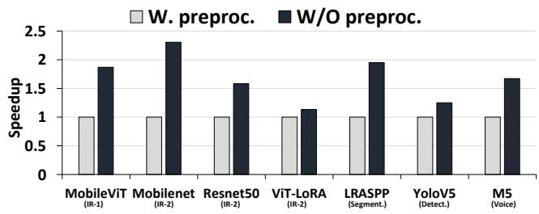  
Figure 1: Headroom analysis for preprocessing pipelines.

## 3.1 Measuring headroom for improvement

We quantify the performance headroom available in end-toend DNN training pipelines by eliminating preprocessing stalls. To do so, we measure two latencies: the baseline latency where input is fetched and preprocessed on demand before training, and the ideal latency with no preprocessing stalls.

To emulate the no-stall ideal scenario, we preload ∼16K fully preprocessed tensors into CPU DRAM and measure the training time over these in-memory batches. This setup effectively removes all preprocessing stalls. 1 We then compare this against the baseline latency, where raw data is fetched and preprocessed for every batch. The difference between the two latencies quantifies the upper bound on speedup achievable by eliminating preprocessing stalls.

Figure 1 shows this headroom across various models (see Table 3 for model-pipeline details). Each model has two bars: one for the default case with preprocessing (W. preproc.’) and one for the no-stall case (W/O preproc.’). The ratio between them reflects the speedup from removing preprocessing delays, ranging from 1.13× to 2.3× depending on the model.

## 3.2 Analyzing key limitations of prior works

All-or-nothing caching: Frameworks like TensorFlow offer APIs (e.g., tf.data.Dataset.cache) to cache the output of a specific pipeline step—provided the entire output fits in memory or storage. Users must manually select which step to cache, balancing the cost of recomputation against retrieval. Recent systems automate this decision by profiling the pipeline to identify a single “optimal” step for caching [14, 20].

While simple, this approach is sub-optimal. Many preprocessing steps, such as JPEG decoding, significantly inflate data volume [33], making their outputs too large to fully cache in. These steps are thus excluded from caching, even when partially caching their outputs could improve performance. An ideal caching framework should support partial caching—storing only a subset of intermediate tensors.

Caching either in memory or storage: Prior works focus on caching either in memory [26, 33] or in storage [20], but do not coordinate both. This separation can lead to inefficiencies.

For example, data cached in storage may still be fetched into DRAM via the OS page cache, duplicating cached content across both. To fully utilise system resources, caching decisions should be coordinated across memory and storage, with exclusive contents in each.

Difference in memory and storage latency: Memory and storage differ significantly in both latency and capacity. A preprocessing step that is expensive to recompute may benefit from being cached in memory but not in storage, where access latency could outweigh recomputation. Prior works cache the same pipeline step in both tiers, ignoring the difference in latencies of memory and storage. A better approach would select different steps for memory and storage based on a comparison of recompute and access costs.

Variable working memory requirements: Different pipelines demand different amounts of working memory for batching, buffer management, and parallel fetching. In our study across six pipelines, we observed working memory usage ranging from 16–77 GB. This requirement also varies with dataset characteristics and the number of fetcher processes. Manually estimating this budget is error-prone; overprovisioning leads to poor cache utilisation, while underprovisioning risks out-of-memory failures. However, prior works require users to manually specify cache size, without accounting for dynamic working memory needs, limiting usability in real-world deployments.

Summary. An ideal caching framework should address these limitations by: 1 Supporting partial caching of intermediate outputs instead of requiring all-or-nothing decisions; 2 Coordinating memory and storage while avoiding redundant copies; 3 Allowing different preprocessing steps to be cached in memory and storage based on latency–cost trade-offs; 4 Automatically sizing the cache after reserving sufficient working memory for pipeline execution.

## 3.3 Quantifying opportunities for better caching strategies

We evaluated three different caching schemes on two representative DNN training pipelines (voice recognition and object detection) to quantify the potential benefits of a coordinated memory and storage caching strategy. We used the C2 configuration as described in Table 5. The first strategy allows partial caching of the output of a pipeline step only in memory (‘part. mem.’ in short). The optimal step to cache for a given available memory capacity is decided by an ILP solver (detailed Section 5), which considers the fraction of the output of the steps that can be cached in the available memory.

The second strategy additionally caches data in storage (here, SSD), denoted by ‘part. mem + excl. storage’ in short. This policy ensures that the contents of the cache in memory and SSD are exclusive. However, the output of the same intermediate step is cached partly in memory until the available memory is fully utilised. The remaining tensors are cached in storage until storage capacity is exhausted. The remaining tensors are recomputed.

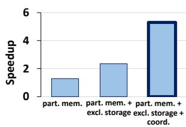

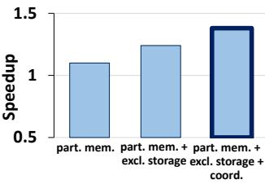  
(a) Voice recognition pipeline  
(b) Object detection pipeline  
Figure 2: Speedup of voice recognition and object detection pipeline across different caching policies (speedup is relative to the baseline).

Finally, the third configuration improves it further by allowing the caching of outputs of different steps in memory and storage (part. mem. + excl. storage + coord.). This coordinated strategy uses an ILP and access latency profiling to decide which step to cache in memory and storage.

Figure 2 shows the performances of these different caching policies for two representative DNN input pipelines: voice recognition and object detection. The performance of the caching policies is measured as the speedup over in-memory caching that disallows partial caching, as in prior work. We observe that enabling partial caching in memory improves performance by 28% and 10% for the voice and detection pipelines, respectively. Allowing partial caching cumulatively across memory and storage, such that cache contents in memory and storage are mutually exclusive, improves performance further to 2.35× and 24%. Finally, allowing different steps to be cached in memory and storage improves performance by 5.3× and 38%. These experiments suggest that a caching strategy that allows partial caching of multiple steps across memory and storage can significantly improve the performance of the input preprocessing pipelines.

## 3.4 Caching vs. re-computing trade-offs

The next question is which pipeline steps to cache in memory and which to cache in storage. The decision depends on three factors: 1 the available capacity in each tier, 2 the latency of fetching data from that tier, and 3 how that latency compares with the cost of recomputation. To evaluate this trade-off, we run an empirical experiment on a small subset of the dataset.

We define two metrics : $C _ { M _ { i } }$ and $C _ { D _ { i } }$ , shown in equation 1.

$$
C _ { M _ { i } } = t _ { M _ { r a w } } - t _ { M _ { i } } , \quad C _ { D _ { i } } = t _ { D _ { r a w } } - t _ { D _ { i } }\tag{1}
$$

$t _ { M _ { r a w } }$ and $t _ { D _ { r a w } }$ are the times (in ms) to fetch and preprocess the raw tensor from the memory and storage, respectively. 2 Similarly, $t _ { M _ { i } }$ and $t _ { D _ { i } }$ are the times (in ms) to fetch and preprocess the tensor cached after step ?? in memory and storage. Hence, $C _ { M _ { i } }$ and $C _ { D _ { i } }$ are the times saved by employing a caching strategy in memory and storage, respectively.

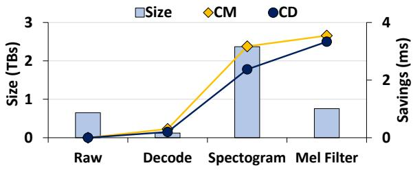  
(a) Voice pipeline

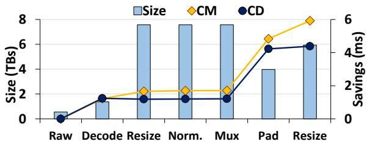  
(b) Detection pipeline  
Figure 3: Savings and Storage vs Pipeline steps. The left y-axis shows the intermediate tensor sizes. The right y-axis is the unit savings(ms) per tensor in memory $( C _ { M _ { i } } )$ ) or storage $( C _ { D _ { i } } )$ .

Figure 3 shows the trends of $C _ { M i }$ and $C _ { D i }$ metrics across the preprocessing steps of voice recognition and object detection pipelines (subgraphs). Here, we report the measurement for a single tensor without loss of generality. The x-axis lists the preprocessing steps of these pipelines. The height of each bar captures the tensor output size of the given step (lower is better, primary y-axis). The two lines represent the (cumulative) latency savings per tensor in ms (secondary y-axis) from caching in memory and storage.

Note $C _ { M _ { i } }$ is generally higher than $C _ { D _ { i } }$ . As expected, the time savings from caching in memory are higher than caching in storage. The step with the lowest memory or storage footprint, i.e., the height of the bars, can potentially be cached well within a limited budget. However, one should also ensure that caching maximises the time saved on recomputation, i.e., where the saving curve for $C _ { M _ { i } }$ (or $C _ { D _ { i } } )$ rises steeply. For example, in detection shown in Figure 3(b), ‘Pad’ generates smaller tensors than ‘Mux’, yet its compute time is higher. Caching Pad, therefore, needs less capacity but yields substantial time savings. For the voice pipeline shown in Figure 3(a), ‘Spectrogram’ gives the largest time savings but also the largest tensors. ‘Mel Filter’ offers nearly the same savings while requiring far less space, making it a better candidate. Here, the most beneficial step to cache depends on the interaction of multiple factors, including available cache size, time to fetch data from the cache, and computation time.

3.5 Offline and online preprocessing steps
<table><tr><td rowspan=1 colspan=1>Pipelines</td><td rowspan=1 colspan=1>Online time $\overline { { \mathbf { \Omega } ^ { \mathbf { \alpha } } \mathbf { \Omega } ^ { \mathbf { \alpha } } } }$ </td><td rowspan=1 colspan=1>#online steps</td></tr><tr><td rowspan=1 colspan=1>Recognition on ImageNet</td><td rowspan=1 colspan=1>7%</td><td rowspan=1 colspan=1>1</td></tr><tr><td rowspan=1 colspan=1>CubePP</td><td rowspan=1 colspan=1>18%</td><td rowspan=1 colspan=1>1</td></tr><tr><td rowspan=1 colspan=1>Voice recognition, objectdetection, image recogni-tion and segmentation</td><td rowspan=1 colspan=1>0%</td><td rowspan=1 colspan=1>None</td></tr></table>

Table 1: Time spent on online steps across different preprocessing pipelines.

Thus far, we have discussed the steps to cache and how to cache them. An important note is that we cache only offline steps. Offline steps are deterministic and idempotent, so their outputs can be cached without altering training. Online steps add stochastic augmentations; caching them would eliminate this randomness and harm augmentation quality. As shown in Table 1, among the six pipelines we study, only image recognition on ImageNet [13] and CubePP [12] contain a single online step, and even then offline steps still account for 82% to 100% of the total preprocessing time.

<table><tr><td rowspan=1 colspan=1>Step</td><td rowspan=1 colspan=1>Action</td><td rowspan=1 colspan=1>Type</td><td rowspan=1 colspan=1>% time</td></tr><tr><td rowspan=1 colspan=1>Raw</td><td rowspan=1 colspan=1>Read JPEG</td><td rowspan=1 colspan=1>Offline</td><td rowspan=1 colspan=1>48%</td></tr><tr><td rowspan=1 colspan=1>Decode</td><td rowspan=1 colspan=1>JPEG to RGB tensor</td><td rowspan=1 colspan=1>Offline</td><td rowspan=1 colspan=1>9%</td></tr><tr><td rowspan=1 colspan=1>Resize</td><td rowspan=1 colspan=1>Scale to 224×224</td><td rowspan=1 colspan=1>Offline</td><td rowspan=1 colspan=1>26%</td></tr><tr><td rowspan=1 colspan=1>Normalise</td><td rowspan=1 colspan=1>Convert,channel normalise</td><td rowspan=1 colspan=1>Offline</td><td rowspan=1 colspan=1>10%</td></tr><tr><td rowspan=1 colspan=1>Flip</td><td rowspan=1 colspan=1>Random horizontal flip</td><td rowspan=1 colspan=1>Online</td><td rowspan=1 colspan=1>7%</td></tr></table>

Table 2: Preprocessing steps of image recognition pipeline.

Breakdown of image recognition pipeline: The pipeline comprises four offline steps—raw read, decode, resize, and normalise—and one online step, flip. The offline steps consume 93% of preprocessing time, making them ideal caching targets. The lone online step is left uncached to preserve randomness. As offline steps dominate the runtime, an effective caching policy can concentrate solely on them. This approach preserves data-augmentation randomness—and thus training quality—while still delivering near-maximal caching benefit.

## 4 HyCache: Key Ideas and Design Principles

Guided by the limitations outlined in Section 3.2, HyCache is designed to accelerate the input preprocessing pipeline by maximising memory and storage utilisation while minimising user effort. The design has following four key contributions:

1. Partial caching of intermediate outputs: HyCache supports partial caching, allowing any fraction of a pipeline stage’s outputs to be cached in memory or storage. This relaxes the all-or-nothing constraint of prior systems and enables effective reuse even under limited capacity. Multiple stages can also be partially cached depending on resource availability.

2. Exclusive caching across memory and storage: To avoid duplication, HyCache guarantees that the memory and storage caches contain mutually exclusive data. Each cached tensor is placed in exactly one tier, ensuring efficient and non-redundant use of available hardware.

3. Coordinated tier-aware caching decisions: HyCache uses a profile-guided ILP formulation to determine which steps are best cached in memory versus storage, based on recomputation cost, output size, and access latency. Different steps can be cached in each tier, and the system automatically constructs an optimized pipeline that ingests tensors from memory, storage, or raw data as needed.

4. Automatic estimation of working memory: HyCache analyzes the runtime memory demands of preprocessing—such as batching, buffering, and fetcher overhead—and reserves only the remaining capacity for caching. This eliminates the need for manual tuning while ensuring stability and high resource utilisation. To create an automated framework HyCache does:

1 Cost-Benefit profiling: Each step in the input pipeline is profiled with just a few sample batches to evaluate the relative merits of caching its tensors in memory and storage.

2 Identifying the optimal steps to cache: The framework then identifies the optimal step for caching, guided by the memory and storage budgets and the computed cost-benefit ratios using an ILP solver. This approach allows HyCache to scale across different hardware configurations.

3 Optimised pipeline generation: HyCache finally generates an optimised pipeline that is capable of sourcing tensors from various levels of the input pipeline, utilising both memory and storage resources efficiently.

4 Working memory size estimation: It calculates the amount of working memory required for executing preprocessing tasks and reserves the rest for caching tensors.

## 5 Design and Implementation of HyCache

In this section, we describe the implementation details of HyCache. The input to HyCache consists of: 1 a user-defined preprocessing pipeline, 2 the raw dataset of ?? training samples, 3 a memory budget ??, and 4 a storage budget ??. Users may also annotate specific steps in the pipeline as "online-only," indicating they should not be cached.

Given these inputs, HyCache produces an optimised pipeline that fetches data from memory, storage, or raw input depending on availability. It also configures and populates memory and storage caches. Figure 4 provides an overview of the components involved, which we describe below.

Annotator and Step Filter: The first step in HyCache is identifying which pipeline stages are worth considering for caching. HyCache analyses the preprocessing pipeline to determine the input/output dimensions of each step. When a sequence of consecutive steps— $- \mathrm { e . g . } , S _ { k } , S _ { k + 1 } , S _ { k + 2 } .$ —produces intermediate tensors of identical size, only the final step $( S _ { k + 2 } )$

is considered for caching. The rationale is that since intermediate outputs do not change in size across these steps, caching earlier steps would offer no additional space-related tradeoffs.

To implement this logic, HyCache executes each step in isolation over a sample training batch and records the size of the output tensor. It then identifies sequences of steps with identical output sizes, retaining only the last step of each sequence. These are annotated as filter\_steps, and they comprise the set of steps to be evaluated for caching. In Figure 4, these steps are highlighted in orange (e.g., filtered\_ $s \mathrm { t e p s } = S _ { 2 } , S _ { 3 } , S _ { 5 } )$ For example, if $S _ { 1 }$ and $S _ { 2 }$ produce outputs of the same size, only $S _ { 2 }$ is retained for evaluation.

Profiler The profiler evaluates the cost–benefit tradeoff of caching each filter\_step in memory or storage. For each step $S _ { i }$ ∈ filtered\_steps,the profiler computes the expected benefit of caching its output in memory $( C _ { M _ { i } } )$ or storage $( C _ { D _ { i } } )$ , as defined in Equation 1. It also records the average output tensor size $S z _ { i }$ . While output sizes are typically deterministic, some steps may depend on input characteristics, so $S z _ { i }$ is averaged over samples.

Profiling is conducted during the first epoch and proceeds until 1% of the dataset is processed. This threshold has been shown to provide a representative view of the overall dataset [26]. Since profiling spans multiple batches, HyCache averages the measurements to account for batch-to-batch variability. This process incurs minimal overhead (Section 7.5). Tuning number of fetchers Pipeline throughput improves with additional fetchers, but at the cost of higher memory usage. Each fetcher is a separate process responsible for loading and preprocessing data, and increasing the number of fetchers reduces latency but consumes more working memory, thereby reducing the cacheable memory capacity.

To strike the right balance, HyCache performs a binary search over the number of fetchers during the profiling phase. It measures the throughput of preprocessed batch creation for each configuration. The search upper bound is the number of available CPU cores, and the search converges at the point where adding fetchers no longer improves throughput. It identifies the optimal number of fetchers $F _ { i }$ for the pipeline, ensuring efficient data ingestion without overcommitting memory.

ILP solver: At the core of HyCache is an ILP solver, which identifies the optimal steps for caching in the memory and storage based on the profiling. The solver uses the cost savings, $C _ { M i }$ and $C _ { D i } .$ , and the tensor sizes after each filter\_step $( S z _ { i } )$ .The goal is to identify the optimal caching steps in memory $( S _ { o p t M } )$ and storage $( S _ { o p t D } )$ , as well as the number of tensors to cache for these steps $( N _ { o p t M }$ and $N _ { o p t D } )$ .

The optimal caching policy is formulated using Equations 2 to $5 . \ S _ { o p t M } , S _ { o p t D }$ is the solution that maximizes the sum in Equation 5, using the constraints in Equations 2 through 4.

$$
\sum N _ { M _ { i } } S z _ { i } \leq M , \quad \sum N _ { D _ { i } } S z _ { i } \leq D\tag{2}
$$

$$
N _ { o p t M } = \sum N _ { M _ { i } } , \quad N _ { o p t D } = \sum N _ { D _ { i } }\tag{3}
$$

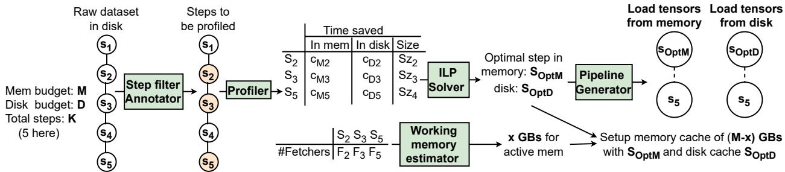  
Figure 4: Overview of HyCache.

$$
N _ { o p t M } + N _ { o p t D } \leq N\tag{4}
$$

$$
m a x i m i z e \sum N _ { M _ { i } } C _ { M _ { i } } + \sum N _ { D _ { i } } C _ { D _ { i } }\tag{5}
$$

Equation 2 ensures that the cumulative size of tensors at any step remains within the memory and storage budget. Equation 3 defines $N _ { o p t M }$ and $N _ { o p t D }$ , as mentioned previously. Equation 4 constrains the total number of tensors cached jointly in the memory and storage, never to exceed the number of elements in the dataset. It also allows for partial caching in both storage and memory, as the number of total tensors cached may be less than or equal to the total elements (N).

Jointly optimising the cache stores of the memory and storage allows convergence into a solution that accounts for the access latency of SSD while deciding what to cache in memory, i.e., a global maxima solution, as opposed to locally maximising the utility of the memory cache in isolation.

HyCache uses a coordinated caching policy across memory and storage that ensures the exclusivity of tensors stored in each store. The memory and storage caches are created sequentially, keeping track of cached data items such that tensors cached in memory and storage do not overlap. Equation 4 ensures that, collectively, the memory and storage caches encompass a part of or the entire dataset (i.e, all elements ??). The ILP solver finally returns the optimal step(s) for storage $( S _ { o p t D } )$ and the number of tensors to be cached $( N _ { o p t D } )$ . Recall from Section 3.4 that $C _ { M _ { i } }$ and $C _ { D _ { i } }$ represent the recomputation latency saved by caching a tensor in memory and storage, respectively. Note that $C _ { M _ { i } }$ and $C _ { D _ { i } }$ are measured in the profiling phase. The equation 5 finds the values of $N _ { M _ { i } }$ and $N _ { D _ { i } }$ that maximizes the saving of recomputation cost.

Figure 4 pictorially depicts the working of key components of HyCache, including the ILP solver. The solver is also capable of identifying and recommending multiple optimal steps for storage caching, along with the number of tensors to cache from each. This capability is helpful when the cache size (e.g., storage cache) is big enough to accommodate outputs of more than one intermediate step.

Working memory size estimation: The size of the working memory directly influences the amount of memory available for caching (Section 3.2). Manually calculating the memory available for caching introduces complexity and is prone to mistakes. If the working memory size is underestimated, then it can lead to an out-of-memory error during preprocessing.

Its overestimation leads to memory under-utilisation since the cache size could be set to a lower number than necessary. Hy-Cache alleviates this requirement by dynamically determining the required working memory for a given pipeline, hardware configuration, and dataset, using Equation 6.

$$
\begin{array} { r } { { w o r k i n g \_ m e m } = ( m a x ( S z _ { i } ) \times b s \times p r e f e t c h \_ d e p t h ) } \\ { + ( m e m \_ p e r \_ f e t c h e r \times m a x ( F _ { i } ) ) + m e t a d a t a } \end{array}\tag{6}
$$

The equation incorporates the following: First, it considers the maximum size of intermediate tensors (??????), batch size (bs), and prefetch\_depth. The prefetch\_depth factor is for the number of fully preprocessed batches that can be kept in memory waiting to be transferred to the GPU for training. It is set to two by default. Typically, a batch is processed by parallel threads. Second, the memory requirement of a fetcher is multiplied by the maximum of $F _ { i }$ to ensure sufficient working memory for any possible number of fetchers. Finally, some space is also reserved for Python’s metadata, e.g., a list of all files, which is easily determined empirically.

Pipeline creation and cache population: HyCache automatically creates multiple pipelines to ingest data samples at different stages of preprocessing in the pipeline as chosen by the ILP solver. Specifically, HyCache generates one pipeline for each different stage of preprocessing whose output the ILP solver decides to cache. For example, in Figure 4, HyCache creates two pipelines – one ingesting tensors from $S _ { o p t M }$ and another from $S _ { o p t D }$ . Further, since HyCache allows the partial output of different stages of pipelines, it is also possible that the output of none of the steps is fully cached in either of the cache stores. In such cases, HyCache employs an additional pipeline to process the raw data samples.

Allowing data to be ingested from different steps and sources (e.g., memory, SSD) requires modification to a regular pipeline. HyCache annotates the preprocessing pipeline code to automatically insert conditional execution by using if then else conditions. For instance, if the output from the last step of a series of steps is fully cached, there is no need to execute all the intermediate steps in the series. In addition, HyCache can conditionally preprocess until a step for fetching partially preprocessed tensors from a cached source.

HyCache populates the memory and storage caches with tensors from the output of pipeline stages, $S _ { o p t M }$ and $S _ { o p t D }$ as chosen by the ILP solver, and populates the caches during the execution of the first epoch (epoch 0). HyCache maintains directories that map each sample to the location where it is cached, which is just the filename for a raw sample. HyCache also sets the number of fetchers for different pipelines. For example, it sets the number of fetchers for $S _ { o p t D }$ as determined by the profiler to fetch data from the storage.

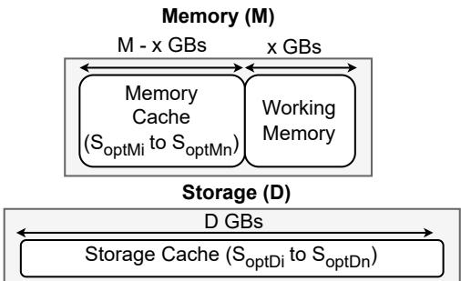  
Figure 5: Overview of data placement in memory and storage.

The profiler may choose to cache outputs of multiple steps in memory and/or storage if the available capacity permits. Thus, $S _ { o p t M }$ and $S _ { o p t D }$ can be a set of steps rather than a single step.HyCache creates a coordinated cache fetch and preprocessing pipelines for each of the steps in $S _ { o p t M }$ and $S _ { o p t D }$ HyCache coordinates multiple pipelines to continuously supply a stream of batches from both cached and recomputed preprocessing steps automatically. While HyCache creates multiple internal pipelines, it presents a single pipeline iterator to the user. This abstraction ensures that users can seamlessly harness HyCache without code modifications.

Figure 5 shows the final allocation of both memory and storage resources by HyCache. The total memory budget ?? is split into two parts: ?? GB for working memory and ?? − ?? GB for the in-memory cache, which is populated with the optimal in-memory steps $S _ { \mathrm { O p t } M _ { i } }$ through $S _ { \mathrm { O p t } M _ { n } }$ . Simultaneously, the storage cache is populated with the optimal on-storage steps $S _ { \mathrm { O p t } D _ { i } }$ through $S _ { \mathrm { { O p t } } D _ { n } }$

Training: With HyCache, the training remains unaffected. HyCache’s improvements are solely limited to the input preprocessing pipeline. The data is immediately ready for training on any computational device after batch generation by the pipeline. HyCache further extends support for multi-GPU environments, where the CPU manages the input pipeline while facilitating concurrent training across several GPUs.

## 6 Ease of deploying HyCache

```python
from hcLib import BasePipeline , HyCache 1
class ImageRecognition ( BasePipeline ): 2
def defineGraph ( self ): 3
4
# Define the preprocessing steps here 5
6
# Include other arguments here too. 7
HyCachePipeline = HyCache( ImageRecognition , M =100 ,8
```

D =500 , dataset\_path ="/path/to/dataset") 9   
iterator = HyCachePipeline .build () 10   
# Initialize your model 11   
model = models . resnet50 () . cuda () 12   
for batch in iterator : 13   
train\_model ( model , batch ) 14   
Listing 1: Using hcLib library for an input pipeline.

In this section, we show how a user can leverage HyCache. Its key functionalities are encapsulated in a library that we name hcLib. A key benefit of using HyCache is that it needs minimal changes to a regular model training process. Listing 1 shows how a user can interface with our library. The user needs to first import BasePipeline as usual and then HyCache classes from the library hcLib (line 1). BasePipeline is a wrapper class over nvidia.dali.Pipeline object that internally enables profiling and other required changes to support our programming paradigm.

The user-defined preprocessing class must inherit this class instead of the original nvidia.dali.Pipeline (lines 2-6). Then, to finally enable pipeline optimisations and get the iterator, the user has to initialise an object of HyCache with the Pipeline class (lines 8-9). This object initialisation requires arguments such as the total memory budget (note, not the cache size), storage budget, batch size, dataset path, or list of dataset files, etc. Other important arguments include storage\_cloc, which is the location of the storage cache, world\_size, which should be used in case of distributed training, and cache\_steps, which is an integer to indicate consideration for caching only up to a given step. If this argument is not provided, it is assumed that all the steps are offline and can be considered for caching. It is also important to note that the allowed budgets for memory and SSD are never exceeded. However, the value provided by the user cannot be smaller than the expected active memory size. Also, the user should expect an out-of-memory error if the memory budget exceeds the available free memory in the system.

To get the iterator for continually yielding batches, the user has to call the build() method on the returned object (line 10). Next, as in a regular training script, the user initialises their training model (line 12). We show an example of creating a resnet50 model, with GPU training enabled using the .cuda() method. There is no constraint on using the GPU for training. Any other accelerator, even the CPU, can be used. However, the user needs to consider the memory bloat of the model in case the CPU is used. Finally, the user can use regular loop-yielding style calls to the iterator to get batches and do further training on the model (lines 13-14).

## 7 Evaluation

We present the performance evaluation of HyCache on a single server setup. We empirically assess the efficiency of Hycache’s caching policies against prior works and the baseline. We then quantify improvements in end-to-end training jobs.

## 7.1 Methodology

<table><tr><td rowspan=1 colspan=1>Pipeline</td><td rowspan=1 colspan=1>Dataset</td><td rowspan=1 colspan=1>Model</td></tr><tr><td rowspan=1 colspan=1>ImageRecognition-1 (IR-1) [47]</td><td rowspan=1 colspan=1>OpenImagesV5(561GB)[24,29]</td><td rowspan=1 colspan=1>MobileViT-BS16[32]</td></tr><tr><td rowspan=1 colspan=1>ImageRecognition-2 (IR-2) [13]</td><td rowspan=1 colspan=1>Imagenet-22K*(650GB)[19]</td><td rowspan=1 colspan=1>MobileNetV3-BS16[18]ResNet50-BS16[17]ViT-LoRA-BS3584[52]</td></tr><tr><td rowspan=1 colspan=1>CubePP[20]</td><td rowspan=1 colspan=1>CubePP-JPG*(550GB)[12]</td><td rowspan=1 colspan=1>1</td></tr><tr><td rowspan=1 colspan=1>Segmentation [44]</td><td rowspan=1 colspan=1>Imagenet-22K*(650GB)[19]</td><td rowspan=1 colspan=1>LRASPP-BS16[18,37]</td></tr><tr><td rowspan=1 colspan=1>Object  Detec-tion [45]</td><td rowspan=1 colspan=1>OpenImagesV5(561GB）[24,29]</td><td rowspan=1 colspan=1>YoloV5-BS16 [39,42]</td></tr><tr><td rowspan=1 colspan=1>Voice Recogni-tion[20,46]</td><td rowspan=1 colspan=1>FMA*(650GB) [5]</td><td rowspan=1 colspan=1>M5-BS12[10]</td></tr></table>

Table 3: Pipeline characteristics and configurations. ‘\*’ indicates the dataset was reduced or augmented.

Workloads: Our evaluation spans six distinct preprocessing pipelines, listed in Table 3, covering a range of ML tasks including object detection, image recognition, voice recognition, and segmentation. Each pipeline is paired with a dataset and a downstream DNN model used for training.

Note that multiple models may share the same preprocessing pipeline and dataset. For example, MobileNet, ResNet50, and ViT-LoRA all use the same ImageNet-22K dataset and pipeline. However, the degree of preprocessing bottleneck experienced by each model can differ significantly depending on its architectural complexity and computational intensity.

All DNN models are sourced from the TorchVision library [1, 31] or implemented using torch.nn [35]. Table 3 also includes the batch sizes used in both end-to-end training and preprocessing-only evaluations. These batch sizes represent the largest configurations that could fit on a single GPU under data-parallel training.

Datasets marked with ‘\*’ have been reduced or augmented to fit within our 2 TB storage limit (see Table 4), ensuring sufficient space for storage-based caching.

Since our primary goal is to accelerate the input preprocessing pipeline, we focus first on how HyCache improves preprocessing throughput, independent of the model’s training speed. Later in this section, we evaluate the end-to-end impact of HyCache on overall training time, including both preprocessing and model execution.

Experimental setup: Our evaluation platform is listed in Table 4. We show the performance of HyCache on various configurations, listed in Table 5, derived from this base platform. We design these configurations based on the available VM setups on Google Cloud Platform [9]. For example, for an A100 GPU with 40 GBs of memory, 85 GBs of CPU memory, and 12 vCPUs on the CPU are available for a single VM instance, and this ratio is consistent across their A100 offerings. We mention the evaluation configuration used for each experiment explicitly and mention any changes in the evaluation setup in their respective subsection. By default, for all experiments, we use the configuration C2 unless otherwise mentioned. Note that each vCPU is mapped to a separate physical core. In short, we do not oversubscribe the cores.

<table><tr><td rowspan=1 colspan=1>CPU</td><td rowspan=1 colspan=1>AMDEPYC731316-Core @ 64×3GHz</td></tr><tr><td rowspan=1 colspan=1>DRAM</td><td rowspan=1 colspan=1>512GB DDR4</td></tr><tr><td rowspan=1 colspan=1>SSD</td><td rowspan=1 colspan=1>2TB Samsung 980 PRO</td></tr><tr><td rowspan=1 colspan=1>Software</td><td rowspan=1 colspan=1>Python-3.10,Nvidia DALI v2.1</td></tr></table>

Table 4: Configuration of the evaluation platform.

<table><tr><td rowspan=1 colspan=1>Config</td><td rowspan=1 colspan=1>vCPUs</td><td rowspan=1 colspan=1>Memory</td><td rowspan=1 colspan=1>SSD Size</td></tr><tr><td rowspan=1 colspan=1>C1</td><td rowspan=1 colspan=1>12</td><td rowspan=1 colspan=1>85GB</td><td rowspan=1 colspan=1>250GB</td></tr><tr><td rowspan=1 colspan=1>C2</td><td rowspan=1 colspan=1>24</td><td rowspan=1 colspan=1>170GB</td><td rowspan=1 colspan=1>500GB</td></tr><tr><td rowspan=1 colspan=1>C3</td><td rowspan=1 colspan=1>24</td><td rowspan=1 colspan=1>170GB</td><td rowspan=1 colspan=1>1000GB</td></tr><tr><td rowspan=1 colspan=1>C4</td><td rowspan=1 colspan=1>48</td><td rowspan=1 colspan=1>340GB</td><td rowspan=1 colspan=1>500GB</td></tr><tr><td rowspan=1 colspan=1>C5</td><td rowspan=1 colspan=1>48</td><td rowspan=1 colspan=1>340GB</td><td rowspan=1 colspan=1>1000GB</td></tr></table>

Table 5: Configurations used for evaluation

Training environment and parameters: We implement HyCache atop Nvidia DALI [7]. We use Python 3.10 and DALI-v2.1.0 to create this library. Although we use PyTorch for model training, the hcLib library is agnostic to the model framework used. For end-to-end training, we use Pytorch’s distributed data-parallel training [38] to allow training on multiple GPUs. For all experiments, the number of threads processing a batch is set to the number of cores available (e.g., 12 for 12 cores/vCPUs). The number of fetchers for HyCache is set to the ideal number of fetchers determined by its profiler. Related works do not have the ability to choose the number of fetchers automatically. Thus, while evaluating them, we set the number of fetchers to the number of available CPU cores. Comparison with other caching policies: We measure our performance against two works that also optimise the input pipeline, MinIO [33] and PRESTO [20]. MinIO caches random data items as they are fetched from storage to populate the memory cache. Once the cache capacity is reached, MinIO does not evict any items in the cache. Instead, the requests to other data items fetch them directly from the storage. PRESTO decides the ideal step to cache in the storage, based on profiling. We also implemented PRESTO in DALI [7] to compare with our solution, where we choose the best step to cache that can completely fit in the given storage budget. If PRESTO does not have a step that can fit in the storage, it uses the raw dataset.

## 7.2 Performance of input pipelines

Figure 6 shows the normalised performance of HyCache and its competitors across various input pipelines. Since we focus on improving input processing pipelines while leaving the training unchanged, we isolate the performance of the pipelines by measuring the number of samples preprocessed by each pipeline under various platforms, MinIO, PRESTO, and HyCache. The heights of each bar are normalised over the number of samples processed under the traditional OS page cache (higher is better). MinIO speeds up pipelines by up to 12% (average, 7%) 3 PRESTO significantly speeds up the voice pipeline as it could fit the output of the optimal intermediate step in its storage cache, but not for other pipelines.

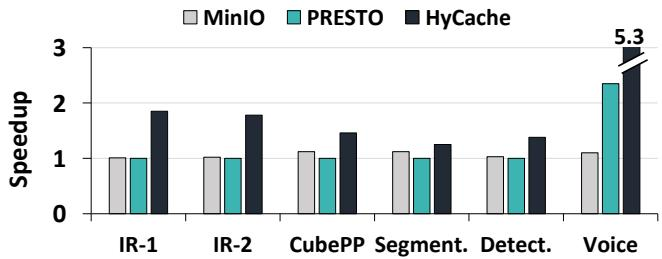  
Figure 6: Performance of different caching policies.

<table><tr><td rowspan=1 colspan=1>Pipeline</td><td rowspan=1 colspan=1>MinIO</td><td rowspan=1 colspan=1>PRESTO</td><td rowspan=1 colspan=1>HyCache</td></tr><tr><td rowspan=1 colspan=1>IR-1</td><td rowspan=6 colspan=1>FixedPagecacheMemory+Raw</td><td rowspan=5 colspan=1> OS ManagedMemory+Raw</td><td rowspan=1 colspan=1>5M+3D+Raw</td></tr><tr><td rowspan=1 colspan=1>IR-2</td><td rowspan=1 colspan=1>2M+2D + Raw</td></tr><tr><td rowspan=1 colspan=1>CubePP-JPG</td><td rowspan=1 colspan=1>2M+3M+2D+Raw</td></tr><tr><td rowspan=1 colspan=1>Segmentation</td><td rowspan=1 colspan=1>3M+3D+Raw</td></tr><tr><td rowspan=1 colspan=1>Detection</td><td rowspan=1 colspan=1>6M+5D+Raw</td></tr><tr><td rowspan=1 colspan=1>Voice</td><td rowspan=1 colspan=1>OS ManagedMemory+Step 1D</td><td rowspan=1 colspan=1>3M +1D + 3D</td></tr></table>

Table 6: Strategies used for evaluation in section-7.1

We observe a speedup in the range of 1.11×-5.3× over MinIO, and 1.24×-2.26× over PRESTO. The improvements were the largest for the voice pipeline – through the coordinated caching in memory and storage, HyCache was able to save more than 80% of the compute time. The image processing pipelines (IR-1 and IR-2) save 58% and 42% of recomputing time and speed up by 1.84× and 1.74×, respectively, over MinIO. PRESTO can significantly outperform MinIO only for the voice pipeline through caching in storage.

Table 6 summarises the caching strategies employed by various platforms. MinIO does not cache the outputs of intermediate preprocessing steps. Instead, it focuses on caching raw datasets via the OS’s page cache, optimising I/O for unprocessed samples. PRESTO supports caching intermediate outputs in storage, enabling the reuse of either raw or preprocessed samples by loading them into the OS page cache. In contrast, HyCache offers significantly more flexible and fine-grained caching capabilities. It can cache the outputs of any intermediate step or the raw dataset itself. Moreover, HyCache supports caching different preprocessing stages in memory and storage independently. It can even cache outputs from multiple distinct steps within the same tier—either memory or storage—depending on available resources and recomputation tradeoffs.

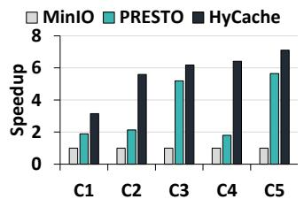  
(a) Voice Pipeline

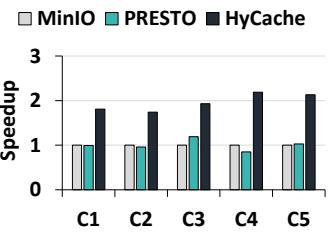  
(b) IR-2 pipeline  
Figure 7: Performance across different hardware configs.

In Table 6, nM’ denotes that the output of the $n ^ { \mathrm { t h } }$ intermediate step is cached in memory, while kD’ indicates that the $k ^ { \mathrm { t h } }$ step’s output is cached in storage. Entries marked ‘Raw’ means raw dataset is cached directly in memory or storage.

This table highlights HyCache’s versatility in leveraging both memory and storage to reduce preprocessing costs. For instance, in the voice pipeline, HyCache caches the output of the 3rd step in both memory and storage, and also caches the 1st step’s output in storage. This coordinated strategy improves resource utilisation and minimises recomputation.

In summary, HyCache enables adaptable, multi-tier caching policies that exploit the full capacity of available memory and storage to accelerate input pipelines.

## 7.3 Performance scaling and Adaptability

A key advantage of HyCache is its ability to automatically configure cache sizes and determine the number of fetcher threads, in contrast to prior approaches that require manual tuning. In this section, we empirically demonstrate HyCache’s adaptability to varying hardware configurations.

We evaluate the performance of HyCache against PRESTO and MinIO across five different system setups, listed in Table 5. Figures 7(a) and 7(b) show the normalized throughput of the three platforms for two representative pipelines: Voice and Image Recognition-2 (IR-2). On the x-axis, we vary the hardware configurations, while the y-axis reports throughput normalized to MinIO (higher is better).

Across all configurations, HyCache consistently outperforms both baselines. For the voice pipeline, HyCache achieves 3.14× to 7.10× speedup over MinIO and 1.2× to 3.5× over PRESTO. For the IR-2 pipeline, it provides 1.73× to 2.13× improvement over MinIO and 1.61× to 2.57× over PRESTO.

Further analysis reveals that for the voice pipeline, both PRESTO and HyCache choose to cache the output of the same step (step 3). However, HyCache outperforms PRESTO due to its coordinated use of memory and storage, which PRESTO lacks. In configurations like C4, HyCache’s support for partial caching gives it a significant edge, allowing it to utilize constrained resources more effectively.

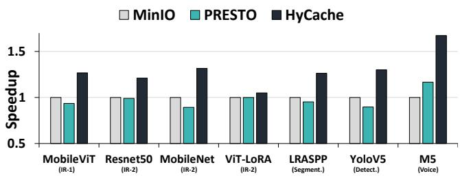  
Figure 8: Improvement in end-to-end training throughput.

We observe similar trends in the IR-2 pipeline. In some configurations, HyCache gains from its partial caching strategy, while in others, its ability to split caching across memory and storage proves more beneficial.

## 7.4 End to End Training

Thus far, we have focused on evaluating preprocessing pipelines in isolation. In this section, we quantify the impact of HyCache on full end-to-end training jobs, including model training on the GPU. The models and corresponding batch sizes used in these experiments are listed in Table 3.

Figure 8 presents the normalized end-to-end training performance for each model. Unlike prior graphs, which were pipeline-centric, this figure reports model-specific speedups. As shown in Table 3, multiple models may share the same preprocessing pipeline—e.g., MobileNet and ResNet both use the IR-2 pipeline for image recognition. To clarify this, we annotate the associated pipeline below each model name on the x-axis.

This experiment uses configuration C4 from Table 4. We observe that HyCache delivers speedups ranging from 1.05× to 1.67× over MinIO, and from 1.05× to 1.47× over PRESTO. These gains depend on both the preprocessing bottleneck and the GPU training load of the model.

For instance, ViT-LoRA—based on the vit\_base\_patch16\_224 architecture is the most computeheavy model in our evaluation, and achieves a more modest 1.05× speedup.

Because DNN models are computationally intensive, improvements in the input pipeline only impact a portion of the total training time. Nonetheless, HyCache achieves up to 1.67× end-to-end speedup without any GPU-level training optimisations. Notably, we do not apply techniques such as mixed-precision training (e.g., Apex [6]), which could further shift the performance bottleneck toward input preprocessing, potentially increasing the benefits of HyCache.

<table><tr><td rowspan=1 colspan=1>Pipeline</td><td rowspan=1 colspan=1>Profile(s)</td><td rowspan=1 colspan=1>Epoch(s)</td><td rowspan=1 colspan=1>Overhead %</td><td rowspan=1 colspan=1>Batchsize</td></tr><tr><td rowspan=1 colspan=1>IR-1</td><td rowspan=1 colspan=1>427</td><td rowspan=1 colspan=1>7016</td><td rowspan=1 colspan=1>6.1</td><td rowspan=1 colspan=1>48MB</td></tr><tr><td rowspan=1 colspan=1>IR-2</td><td rowspan=1 colspan=1>273</td><td rowspan=1 colspan=1>2093</td><td rowspan=1 colspan=1>13.0</td><td rowspan=1 colspan=1>135MB</td></tr><tr><td rowspan=1 colspan=1>CubePP-JPG</td><td rowspan=1 colspan=1>496</td><td rowspan=1 colspan=1>2794</td><td rowspan=1 colspan=1>17.8</td><td rowspan=1 colspan=1>152MB</td></tr><tr><td rowspan=1 colspan=1>Segmentation</td><td rowspan=1 colspan=1>648</td><td rowspan=1 colspan=1>3567</td><td rowspan=1 colspan=1>18.2</td><td rowspan=1 colspan=1>192MB</td></tr><tr><td rowspan=1 colspan=1>Detection</td><td rowspan=1 colspan=1>700</td><td rowspan=1 colspan=1>10075</td><td rowspan=1 colspan=1>6.9</td><td rowspan=1 colspan=1>64MB</td></tr><tr><td rowspan=1 colspan=1>Voice</td><td rowspan=1 colspan=1>204</td><td rowspan=1 colspan=1>8150</td><td rowspan=1 colspan=1>2.5</td><td rowspan=1 colspan=1>43MB</td></tr></table>

Table 7: Profiling overhead as a percentage of a vanilla epoch.

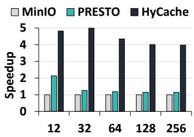  
(a) Voice Pipeline

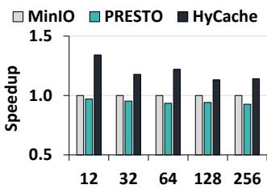  
(b) Detection pipeline  
Figure 9: Performance of pipelines across different batch sizes.

## 7.5 Profiling Overhead

HyCache profiles 1% dataset to find out the output size of each of the intermediate steps of a pipeline. It also profiles the runtimes of each step of a pipeline. The ILP solver uses these for choosing a caching strategy. We report the profiling overheads in Table 7. We report the time needed for profiling in seconds, the time needed to preprocess samples for an epoch. We report the batch size in MB. The profiling overhead ranges from 2.5% to 18.2% of the preprocessing time of one epoch (i.e, one pass over the dataset). The profiling is done only during the first epoch, while a typical training job runs for hundreds of epochs. Thus, it adds little overhead to the overall preprocessing pipeline. Note that the profiling overheads vary across pipelines based on the number of steps in the pipeline. The higher the number of steps, the larger the profiling overheads. Further, a larger batch size (bytes) increases overheads as larger amounts of raw data must be accessed during profiling.

## 7.6 Sensitivity to Varying Batch Sizes

The batch size used for model training is a hyperparameter. This section highlights that our framework is able to adapt to varying batch sizes and offers consistently high performance across different sizes compared to prior work. Figure 9 shows the normalised performance of the two representative pipelines under varying batch sizes for the three frameworks. As before, the throughputs are normalised to those under MinIO. We notice that across batch sizes, HyCache outperforms other platforms. This shows that HyCache is able to adapt well to different batch sizes. We also notice that increasing batch size often reduces the speedups for HyCache. Larger batch sizes necessitate larger working memory for computation and, thus, smaller memory caches. This, in turn, limits HyCache’s ability to leverage caches for limiting recomputation.

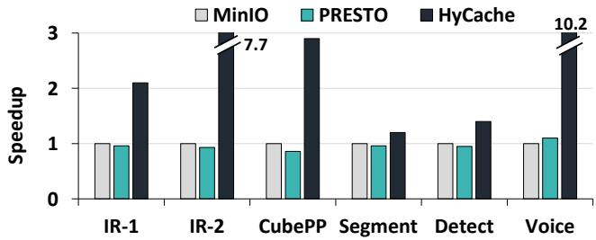

Figure 10: Throughput with remotely connected storage.  
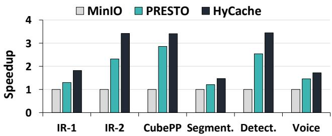  
Figure 11: Pipeline throughputs for small datasets

## 7.7 Implications of Remote Storage

Finally, we evaluate the implications of keeping the raw dataset in a remote NFS file server [2] This emulates the scenario where the dataset is remotely located in a cloud storage. Fetching raw data from a remote server introduces network latency and potential bandwidth constraints into the data ingestion process, making it worthwhile to evaluate it separately.

For this experiment, we use configuration C4 from Table 5. Figure 10 shows the performance of PRESTO and HyCache relative to MinIO. We observe a speedup in the approximate range of 1.11× - 10.1× over MinIO, and 1.19× - 9.28× over PRESTO. The IR-2 and voice pipeline witness substantial speedups with HyCache over the other two because they have a solution that completely fits in the available storage and memory budget. In contrast, the other two suffer a significant drop in performance since they have to rely on the NFS throughput. The maximum available throughput on this device is 64.8 MiB/s, which we tested using the fio [4] utility. In summary, HyCache is able to perform well across a wide variety of settings and configurations – a treatment to HyCache’s ability to automatically adapt to varying deployment scenarios.

## 7.8 Analyzing PRESTO’s usefulness

One would notice that PRESTO [20] is generally ineffective in speeding up preprocessing pipelines, except for the voice pipeline. The efficacy of PRESTO is limited by its inability to partially cache the output of an intermediate step and its inability to harness both memory and storage for coordinated caching, unlike HyCache. We found that PRESTO is useful only when used with small datasets such that the output of all or most of the intermediate steps could fit well in its cache budget. The original paper used datasets as small as 250MBs, up to 146GBs. However, small datasets are contrary to current trends of using ever larger dataset sizes. In our evaluation, we use datasets that exceed at least 550GBs.

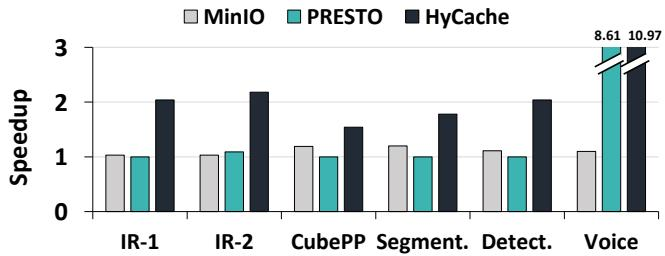  
Figure 12: Pipeline throughput for C5 configuration.

To demonstrate PRESTO’s efficacy for smaller datasets, we limited the preprocessing pipelines to use only 100 GB of the dataset but allocated 1650GB storage cache. Figure 11 shows the performance of different pipelines under MinIO, PRESTO, and HyCache, normalised to MinIO. For smaller datasets, PRESTO provides a more significant speedup of 1.21×-2.86× over MinIO. HyCache performs 1.3× better on average over PRESTO in this setting as well, demonstrating its adaptability to varying system configurations.

Finally, while Figure 6 reported performance under configuration C2, we further evaluate the effectiveness of different caching mechanisms under configuration C5, which features a larger SSD, as shown in Figure 12.

Despite the increased storage capacity, a 1000 GB SSD was still insufficient to fully cache intermediate outputs for four of the six pipelines. Among the successful cases, the Voice pipeline achieved the optimal caching configuration and delivered a speedup of 8.61×, while the IR-2 pipeline showed a modest improvement of 1.09×.

In summary, PRESTO provides performance gains only in limited scenarios, typically when the pipeline fits entirely within the storage budget. In contrast, HyCache continues to improve performance even under tighter resource constraints due to its support for partial and coordinated caching.

## 7.9 HyCache in distributed environment

In this subsection, we will discuss how HyCache can be extended in a distributed environment. The current implementation of HyCache uses a single node to demonstrate its key ideas. However, its design can seamlessly operate in distributed environments where data is partitioned across multiple machines. In homogeneous clusters—where hardware configurations are identical and data is evenly distributed—the profiler and ILP solver can be run once, and the resulting cache plan applied uniformly across all nodes. In contrast, heterogeneous clusters with varying hardware or skewed data distributions can run HyCache independently on each machine, allowing each node to tailor its caching strategy to local workload and resource characteristics. Since the profiler relies only on the underlying hardware and the pipeline, HyCache in a distributed setting does not require any coordination across nodes and can seamlessly generate distributed plans.

## 8 Related Works

Distributed training: FastFlow [43] automatically offloads input pipeline preprocessing to remote CPUs, aided by lightweight profiling. Meta [51] discusses preprocessing bottlenecks causing stalls in their Deep Learning Recommendation Models(DLRMs). Cachew [14] is a fully managed service for ML data processing that dynamically scales distributed resources to avoid stalls in training jobs. Cachew’s autocaching policy fails when materialized tensors are too large to fit in memory or disk. Nectar [16] focuses on automating the management of data and computation across their cluster of many-node servers. Our work is orthogonal to Nectar and our caching strategies can be used as a basis for cache creation. Quiver [28] boosts DNN training efficiency with transparent data reuse, flexible cache hits, and job-aware allocation. The distributed cache that is shared across multiple users and training jobs can use our caching policy coupled with their hash-based addressing to boost training performance.

Random Augmentations: Several recent works have explored techniques for optimizing DNN training pipelines through caching randomly augmented datasets, i.e., cache creation, coupled with cache management or replacement. Data Echoing [8] t reuses intermediate outputs from earlier pipeline stages to reclaim idle accelerator capacity for faster training when reading data over a network. Data subsampling [27] utilizes subsampled versions of training data for augmentation, reducing computation and memory requirements while maintaining performance. Revamper [30] reuses partially augmented samples within specific stages of the pipeline to speed up training. While these works focus on speeding up random augmentation, we focus on offline/deterministic preprocessing steps that has reuse. Caching random steps can affect training accuracy and convergence. However, HyCache does not modify the output of a pipeline and has no impact on accuracy. Caching Policies and single node training: MinIO [33] reduces the amount of disk I/O (fetch stalls) in single-server training. While saving disk I/O can be useful, our analysis shows that saving computation by using cached tensors proves to be more advantageous than caching raw data in memory. Cachew [14] also considers caching intermediate step on the memory or optionally to the disk, an all-or-nothing policy that may fail. Plumber [26] uses tf.data.Dataset.cache to greedily cache a pre-processed Dataset into memory or storage. Greedily choosing a step to fully fit against HyCache partial caching does not perform well, as shown in Figure 2. Accelerator-assisted preprocessing: DALI allows offloading pre-processing to the GPU. However, it may cause interference with the training or inference task itself [33], and limit available GPU memory for training itself. Similarly, SMOL [21] also presents a system that offloads preprocessing to an accelerator, by pipelining preprocessing of image-based data and model training on the GPU while controlling accuracy convergence.

## 9 Conclusion

We present HyCache, a novel hybrid caching mechanism designed to accelerate DNN training pipelines. It leverages both memory and storage for caching, orchestrating the usage of these resources automatically, showing a significantly reduced data preprocessing time, thereby addressing the bottleneck in DNN training input pipelines. HyCache can achieve substantial performance improvements, with gains ranging from 1.11× to 5.3× over traditional preprocessing pipelines.

## Acknowledgments

This material is based upon work supported by NSF award number 2224319, the REAL@USC-Meta center, a VMware gift, the Rukmini Gopalakrishnachar Visiting Faculty Chair at IISc, and an AMD research grant. This work is also partially supported by a Google PhD Fellowship awarded to Shweta Pandey. The views, opinions, and/or findings expressed are those of the author(s) and should not be interpreted as representing the official views or policies of the U.S. Government.

## References

[1] Torchvision models. https://pytorch.org/vision/ stable/models.html, 2023.

[2] Service - nfs. https://ubuntu.com/server/docs/ service-nfs, 2024. Accessed: 2024-02-05.

[3] Bharath Ramsundar Volodymyr Kuleshov Mark DePristo Katherine Chou Claire Cui Greg S. Corrado Sebastian Thrun Jeff Dean Andre Esteva, Alexandre Robicquet. A guide to deep learning in healthcare. Nature Medicine, 25(1):24–29, 2019.

[4] Jens Axboe. Flexible I/O Tester, 2022.

[5] Kirell Benzi, Michaël Defferrard, Pierre Vandergheynst, and Xavier Bresson. FMA: A dataset for music analysis. CoRR, abs/1612.01840, 2016.

[6] NVIDIA Developer Blog. Nvidia apex: Tools for easy mixed-precision training in pytorch. https://developer.nvidia.com/blog/ apex-pytorch-easy-mixed-precision-training/, 2018.

[7] NVIDIA Developer Blog. Fast ai data preprocessing with nvidia dali. https://devblogs.nvidia.com/ fast-ai-data-preprocessing-with-nvidia-dali/, 2019.

[8] Dami Choi, Alexandre Passos, Christopher J. Shallue, and George E. Dahl. Faster neural network training with data echoing. CoRR, abs/1907.05550, 2019.

[9] Google Cloud. Google cloud gpus documentation. https://cloud.google.com/compute/docs/ gpus#a100-gpus, 2024.

[10] Wei Dai, Chia Dai, Shuhui Qu, Juncheng Li, and Samarjit Das. Very deep convolutional neural networks for raw waveforms. In 2017 IEEE International Conference on Acoustics, Speech and Signal Processing (ICASSP), page 421–425. IEEE Press, 2017.

[11] Junhua Ding, XinChuan Li, and Venkat N. Gudivada. Augmentation and evaluation of training data for deep learning. In 2017 IEEE International Conference on Big Data (Big Data), pages 2603–2611, 2017.

[12] Egor Ershov, Alexey Savchik, Illya Semenkov, Nikola Banić, Alexander Belokopytov, Daria Senshina, Karlo Koščević, Marko Subašić, and Sven Lončarić. The cube++ illumination estimation dataset. IEEE Access, 8:227511–227527, 2020.

[13] Hugging Face. Transforms factory in pytorch image models. https://github.com/huggingface/ pytorch-image-models/blob/main/timm/data/ transforms\_factory.py, 2019.

[14] Dan Graur, Damien Aymon, Dan Kluser, Tanguy Albrici, Chandramohan A. Thekkath, and Ana Klimovic. Cachew: Machine learning input data processing as a service. In 2022 USENIX Annual Technical Conference (USENIX ATC 22), pages 689–706, Carlsbad, CA, July 2022. USENIX Association.

[15] Alex Graves, Abdel-rahman Mohamed, and Geoffrey E. Hinton. Speech recognition with deep recurrent neural networks. CoRR, abs/1303.5778, 2013.

[16] Pradeep Kumar Gunda, Lenin Ravindranath, Chandu Thekkath, Yuan Yu, and Li Zhuang. Nectar: Automatic management of data and computation in data centers. Technical Report MSR-TR-2010-55, May 2010.

[17] Kaiming He, Xiangyu Zhang, Shaoqing Ren, and Jian Sun. Deep residual learning for image recognition. CoRR, abs/1512.03385, 2015.

[18] Andrew Howard, Mark Sandler, Grace Chu, Liang-Chieh Chen, Bo Chen, Mingxing Tan, Weijun Wang, Yukun Zhu, Ruoming Pang, Vijay Vasudevan, Quoc V. Le, and Hartwig Adam. Searching for mobilenetv3, 2019.

[19] ImageNet. Imagenet-22k dataset. http://www. image-net.org/releases, 2020.

[20] Alexander Isenko, Ruben Mayer, Jeffrey Jedele, and Hans-Arno Jacobsen. Where is my training bottleneck? hidden trade-offs in deep learning preprocessing pipelines. In Proceedings of the 2022 International Conference on Management of Data, SIGMOD ’22, page 1825–1839, New York, NY, USA, 2022. Association for Computing Machinery.

[21] Daniel Kang, Ankit Mathur, Teja Veeramacheneni, Peter Bailis, and Matei Zaharia. Jointly optimizing preprocessing and inference for dnn-based visual analytics. Proc. VLDB Endow., 14(2):87–100, oct 2020.

[22] Inhan Kim, Joonyeong Lee, and Daijin Kim. Learning mixture of domain-specific experts via disentangled factors for autonomous driving. Proceedings of the AAAI Conference on Artificial Intelligence, 36(1):1148– 1156, Jun. 2022.

[23] Ana Klimovic. Rethinking data storage and preprocessing for ml. https://www.sigarch.org/ rethinking-data-storage-and-preprocessing/, 2021.

[24] Ivan Krasin, Tom Duerig, Neil Alldrin, Vittorio Ferrari, Sami Abu-El-Haija, Alina Kuznetsova, Hassan Rom, Jasper Uijlings, Stefan Popov, Shahab Kamali, Matteo Malloci, Jordi Pont-Tuset, Andreas Veit, Serge Belongie, Victor Gomes, Abhinav Gupta, Chen Sun, Gal Chechik, David Cai, Zheyun Feng, Dhyanesh Narayanan, and Kevin Murphy. Openimages: A public dataset for large-scale multi-label and multiclass image classification. Dataset available from https://storage.googleapis.com/openimages/web/index.html, 2017.

[25] Alex Krizhevsky, Ilya Sutskever, and Geoffrey E Hinton. Imagenet classification with deep convolutional neural networks. In F. Pereira, C.J. Burges, L. Bottou, and K.Q. Weinberger, editors, Advances in Neural Information Processing Systems, volume 25. Curran Associates, Inc., 2012.

[26] Michael Kuchnik, Ana Klimovic, Jiri Simsa, Virginia Smith, and George Amvrosiadis. Plumber: Diagnosing

and removing performance bottlenecks in machine learning data pipelines. In D. Marculescu, Y. Chi, and C. Wu, editors, Proceedings of Machine Learning and Systems, volume 4, pages 33–51, 2022.

[27] Michael Kuchnik and Virginia Smith. Efficient augmentation via data subsampling. CoRR, abs/1810.05222, 2018.

[28] Abhishek Vijaya Kumar and Muthian Sivathanu. Quiver: An informed storage cache for deep learning. In 18th USENIX Conference on File and Storage Technologies (FAST 20), pages 283–296, Santa Clara, CA, February 2020. USENIX Association.

[29] Alina Kuznetsova, Hassan Rom, Neil Alldrin, Jasper Uijlings, Ivan Krasin, Jordi Pont-Tuset, Shahab Kamali, Stefan Popov, Matteo Malloci, Alexander Kolesnikov, Tom Duerig, and Vittorio Ferrari. The open images dataset v4: Unified image classification, object detection, and visual relationship detection at scale. International Journal of Computer Vision, 128(7):1956–1981, March 2020.

[30] Gyewon Lee, Irene Lee, Hyeonmin Ha, Kyunggeun Lee, Hwarim Hyun, Ahnjae Shin, and Byung-Gon Chun. Refurbish your training data: Reusing partially augmented samples for faster deep neural network training. In 2021 USENIX Annual Technical Conference (USENIX ATC 21), pages 537–550. USENIX Association, July 2021.

[31] TorchVision maintainers and contributors. TorchVision: PyTorch’s Computer Vision library. https://github. com/pytorch/vision, November 2016.

[32] Sachin Mehta and Mohammad Rastegari. Mobilevit: Light-weight, general-purpose, and mobile-friendly vision transformer. In The Tenth International Conference on Learning Representations, ICLR 2022, Virtual Event, April 25-29, 2022. OpenReview.net, 2022.

[33] Jayashree Mohan, Amar Phanishayee, Ashish Raniwala, and Vijay Chidambaram. Analyzing and mitigating data stalls in dnn training. Proc. VLDB Endow., 14(5):771–784, jan 2021.

[34] Derek G. Murray, Jiří Šimša, Ana Klimovic, and Ihor Indyk. tf.data: a machine learning data processing framework. Proc. VLDB Endow., 14(12):2945–2958, jul 2021.

[35] Adam Paszke, Sam Gross, Francisco Massa, Adam Lerer, James Bradbury, Gregory Chanan, Trevor Killeen, Zeming Lin, Natalia Gimelshein, Luca Antiga, Alban Desmaison, Andreas Kopf, Edward Yang, Zachary DeVito, Martin Raison, Alykhan Tejani, Sasank Chilamkurthy, Benoit Steiner, Lu Fang, Junjie Bai, and Soumith Chintala. PyTorch: An Imperative Style, High-Performance

Deep Learning Library. In H. Wallach, H. Larochelle, A. Beygelzimer, F. d’Alché Buc, E. Fox, and R. Garnett, editors, Advances in Neural Information Processing Systems 32, pages 8024–8035. Curran Associates, Inc., 2019.

[36] Luis Perez and Jason Wang. The effectiveness of data augmentation in image classification using deep learning. CoRR, abs/1712.04621, 2017.

[37] PyTorch. Lraspp model - torchvision. https:// pytorch.org/vision/main/models/lraspp.html, 2022.

[38] PyTorch. Distributed data parallel training tutorial. https://pytorch.org/tutorials/intermediate/ ddp\_tutorial.html, 2024. Accessed: 2024-02-06.

[39] Joseph Redmon, Santosh Kumar Divvala, Ross B. Girshick, and Ali Farhadi. You only look once: Unified, real-time object detection. In 2016 IEEE Conference on Computer Vision and Pattern Recognition, CVPR 2016, Las Vegas, NV, USA, June 27-30, 2016, pages 779–788. IEEE Computer Society, 2016.

[40] Cristina Silvano, Daniele Ielmini, Fabrizio Ferrandi, Leandro Fiorin, Serena Curzel, Luca Benini, Francesco Conti, Angelo Garofalo, Cristian Zambelli, Enrico Calore, Sebastiano Fabio Schifano, Maurizio Palesi, Giuseppe Ascia, Davide Patti, Stefania Perri, Nicola Petra, Davide De Caro, Luciano Lavagno, Teodoro Urso, Valeria Cardellini, Gian Carlo Cardarilli, and Robert Birke. A survey on deep learning hardware accelerators for heterogeneous HPC platforms. CoRR, abs/2306.15552, 2023.

[41] Karen Simonyan and Andrew Zisserman. Very deep convolutional networks for large-scale image recognition. In Yoshua Bengio and Yann LeCun, editors, 3rd International Conference on Learning Representations, ICLR 2015, San Diego, CA, USA, May 7-9, 2015, Conference Track Proceedings, 2015.

[42] Ultralytics. Yolov5: A highly performant object detection framework. https://github.com/ultralytics/yolov5, 2020.

[43] Taegeon Um, Byungsoo Oh, Byeongchan Seo, Minhyeok Kweun, Goeun Kim, and Woo-Yeon Lee. Fastflow: Accelerating deep learning model training with smart offloading of input data pipeline. Proc. VLDB Endow., 16(5):1086–1099, jan 2023.

[44] Kaggle user: ligtfeather. Semantic segmentation is easy with pytorch. https: //www.kaggle.com/code/ligtfeather/ semantic-segmentation-is-easy-with-pytorch/ notebook, 2021.

[45] Kaggle user: outwrest. Yolov5 roi batch dali preprocessing pipeline. https: //www.kaggle.com/code/outwrest/ yolov5-roi-batch-dali-preprocessing-pipeline/ notebook, 2022.

[46] Kaggle user: thailssonclementino. Mel spectrograms with nvidia’s data loading. https: //www.kaggle.com/code/thailssonclementino/ melspectrograms-with-nvidia-s-data-loading, 2020.

[47] Kaggle user: umongsain. Vision transformer from scratch in pytorch. https: //www.kaggle.com/code/umongsain/ vision-transformer-from-scratch-pytorch, 2022.

[48] Subhashini Venugopalan, Marcus Rohrbach, Jeffrey Donahue,Raymond Mooney,Trevor Darrell,and Kate Saenko. Sequence to sequence - video to text. In Proceedings of the IEEE International Conference on Computer Vision (ICCV), December 2015.

[49] Yonghui Wu, Mike Schuster, Zhifeng Chen, Quoc V. Le, Mohammad Norouzi, Wolfgang Macherey, Maxim Krikun, Yuan Cao, Qin Gao, Klaus Macherey, Jeff Klingner, Apurva Shah, Melvin Johnson, Xiaobing Liu, Lukasz Kaiser, Stephan Gouws, Yoshikiyo Kato, Taku Kudo, Hideto Kazawa, Keith Stevens, George Kurian, Nishant Patil, Wei Wang, Cliff Young, Jason Smith, Jason Riesa, Alex Rudnick, Oriol Vinyals, Greg Corrado, Macduff Hughes, and Jeffrey Dean. Google’s neural machine translation system: Bridging the gap between human and machine translation. CoRR, abs/1609.08144, 2016.

[50] Yi Xu, Qi Qian, Hao Li, and Rong Jin. Why does multiepoch training help? CoRR, abs/2105.06015, 2021.

[51] Mark Zhao, Niket Agarwal, Aarti Basant, Buğra Gedik, Satadru Pan, Mustafa Ozdal, Rakesh Komuravelli, Jerry Pan, Tianshu Bao, Haowei Lu, Sundaram Narayanan, Jack Langman, Kevin Wilfong, Harsha Rastogi, Carole-Jean Wu, Christos Kozyrakis, and Parik Pol. Understanding data storage and ingestion for large-scale deep recommendation model training: Industrial product. In Proceedings of the 49th Annual International Symposium on Computer Architecture, ISCA ’22, page 1042–1057, New York, NY, USA, 2022. Association for Computing Machinery.

[52] Yitao Zhu, Zhenrong Shen, Zihao Zhao, Sheng Wang, Xin Wang, Xiangyu Zhao, Dinggang Shen, and Qian Wang. Melo: Low-rank adaptation is better than fine-tuning for medical image diagnosis. CoRR, abs/2311.08236, 2023.