①

USENIX

THE ADVANCED COMPUTING SYSTEMS ASSOCIATION

# Para-ksm: Parallelized Memory Deduplication with Data Streaming Accelerator

Houxiang Ji, University of Illinois Urbana-Champaign; Minho Kim and Seonmu Oh, Daegu Gyeongbuk Institute of Science and Technology; Daehoon Kim, Yonsei University; Nam Sung Kim, University of Illinois Urbana-Champaign https://www.usenix.org/conference/atc25/presentation/ji

# This paper is included in the Proceedings of the 2025 USENIX Annual Technical Conference.

July 7–9, 2025 • Boston, MA, USA ISBN 978-1-939133-48-9

Open access to the Proceedings of the 2025 USENIX Annual Technical Conference is sponsored by

P=-r.h mFe"

auuuJl9 P9leU

King Abdullah University of

Science and Technology

# Para-ksm: Parallelized Memory Deduplication with Data Streaming Accelerator

Houxiang Jiψ Minho Kim‡ Seonmu Oh‡ Daehoon Kim∗ Nam Sung Kimψ

ψUniversity of Illinois Urbana-Champaign

‡Daegu Gyeongbuk Institute of Science and Technology

∗Yonsei University

## Abstract

To tame the rapidly rising cost of memory in servers, hyperscalers have begun deploying memory deduplication features, such as Kernel Same-page Merging (ksm), for some of their services. Nonetheless, ksm incurs a datacenter tax significant enough to notably degrade performance of co-running applications, which hinders its wider and more aggressive deployment. Meanwhile, the server-class CPU has started to integrate various on-chip accelerators to effectively reduce datacenter taxes. One of such accelerators is Data Streaming Accelerator (DSA), which can offload the two most taxing functions of ksm, page comparison and checksum computation, from CPU. In this work, we demonstrate that ksm offloading these two functions to DSA (DSA-ksm) can reduce the performance degradation of co-running applications caused by ksm from 1.6–5.8× to 1.0–1.6×. However, we uncover that DSA-ksm, which naïvely replaces CPU-based functions with their DSA-based counterparts, yields significantly lower rates of memory deduplication than ksm due to the long latency of offloading these functions through on-chip PCIe. To address this shortcoming, we redesign ksm to exploit DSA’s batching capability (Para-ksm). It facilitates a given function to operate on multiple pages per offload, rather than a single page as ksm does, thereby amortizing the long offloading latency. Compared to ksm, Para-ksm increases the amount of memory deduplication per CPU cycle used for ksm by 31–50% while decreasing the performance degradation to 1.3–2.7×.

## 1 Introduction

Memory technology scaling has stagnated, while the memory manufacturing cost has steadily increased, leading to a rise in the cost per bit [28]. At the same time, hyperscale applications demand increasingly larger memory capacities. These make memory account for 30–50% of the total hardware cost of a server [18, 38]. Meanwhile, virtualization techniques, such as Virtual Machines (VMs) and containers, are widely employed by hyperscalers to provide performance scalability and isolation for serving hyperscale applications. However, they often inefficiently use the given memory capacity, as they duplicate code and data across VMs and containers. Past work shows that redundant or duplicated memory pages consume 11%– 86% of memory capacity, depending on the applications and operating systems [2, 21].

OS memory deduplication features, such as Kernel Samepage Merging (ksm), have been shown to effectively utilize memory capacity by significantly reducing duplicated memory pages [20, 31]. For example, Meta employs ksm to reduce memory pressure caused by running many Instagram worker processes on each server with limited memory capacity [35]. Nonetheless, recent work has reported that ksm not only imposes a high datacenter tax (e.g., consuming 14–65% of total CPU cycles in our evaluation), but also pollutes the cache hierarchy, both of which are significant enough to degrade the performance of co-running applications [14]. Especially, page comparison (memcmp) and checksum computation (xxhash) in ksm are the two most taxing functions, collectively accounting for 38% of the CPU cycles consumed by ksm according to our analysis (§3).

To effectively reduce rising datacenter taxes, the latest server-class CPU has started integrating various on-chip accelerators capable of offloading common functions in the low levels of the datacenter software stack from CPU cores. For example, four on-chip accelerators have been integrated into the Intel Xeon Scalable Processor since its 4th generation. Compared to comparable off-chip accelerators, such as SmartNIC (SNIC) connected to CPU via off-chip PCIe [9, 19, 23–25], these on-chip accelerators offer several advantages, including reduced offloading latency, streamlined memory management, improved virtualization support, owing to their tight integration with CPU through on-chip PCIe and other supporting subsystems [40]. One of such on-chip accelerators is Data Streaming Accelerator (DSA), integrated to offload data movement and transformation functions, including memory copy, memory comparison, and checksum computation.

In this work, we not only explore the unique capabilities of DSA for ksm but also redesign ksm to efficiently offload memcmp and xxhash from CPU, significantly reducing the datacenter tax and performance degradation of co-running applications. We make the following specific contributions. Contribution-1: Identifying opportunities in offloading ksm to DSA (§3–4). First, we demonstrate that offloading memcmp and xxhash to DSA, with a specific operating mode, can reduce the CPU cycle consumption for these functions by 6.6× and 6.0×, respectively, while obviating cache pollution. Although CPU may use non-temporal load instructions such as MOVNTDQA to prevent these functions from polluting the cache hierarchy, we show that they incur even more CPU cycle consumption than temporal load instructions. Second, we present DSA-ksm, which directly replaces CPU-based memcmp and xxhash with their DSA-based counterparts in ksm, reducing the performance degradation of co-running applications incurred by ksm from 1.6–5.8× to 1.0–1.6×. Nonetheless, we also uncover that these DSA-based functions take nearly 3× longer to return their results than their CPU-based counterparts although they yield CPU to other application processes during that time. Such long offloading latency makes DSA-ksm offer notably lower rates of memory deduplication than ksm. Lastly, we identify that leveraging the DSA’s batching capability, which allows memcmp and xxhash to operate on multiple pages per offload, can significantly amortize the offloading latency (e.g., by 81–83% with a batching size of 8), but it requires a significant redesign of ksm.

Contribution-2: Redesigning ksm to efficiently exploit the DSA’s batching capability (§5). ksm scans pages to find those that can be merged while maintaining two Red-Black (RB) trees: stable and unstable trees, which store pointers to merged and previously scanned pages, respectively. It first picks a candidate page and compares it with pages in these trees (named tree pages) using memcmp. Then, based on the result of comparing the candidate and current tree pages, it determines the next tree page to compare with the candidate page and whether to compute the checksum of the candidate page using xxhash. That is, ksm is inherently a serial algorithm, and, consequently, DSA-ksm cannot exploit the DSA’s batching capability, which requires selecting multiple tree pages to compare with the candidate page or multiple candidate pages to compare with a tree page. To tackle the shortcoming of DSA-ksm, we propose Para-ksm, a significant redesign of ksm that allows memcmp and xxhash to operate on multiple pages in parallel (or offload these functions to DSA for multiple pages in a batch). Specifically, we explore two algorithms: Para-ksmC, which compares multiple candidate pages with a single tree page, and Para-ksmT, which speculatively compares a single candidate page with multiple tree pages concurrently. However, we focus on Para-ksmC in this work, as we find that Para-ksmT significantly wastes DSA resources due to its speculative nature. Para-ksmC increases the amount of memory deduplication per CPU cycle used for ksm by 31–50% while decreasing the performance degradation of co-running applications incurred by ksm from 1.6–5.8× to 1.3–2.7×.

## 2 Background

## 2.1 Memory Deduplication

Memory deduplication has been developed to consolidate duplicate pages in memory, thereby improving memory utilization of a given memory capacity. One widely adopted implementation of memory deduplication is Kernel Same-page Merging (ksm), a feature integrated into Linux since kernel version 2.6. ksm is a Content-Based Page Sharing (CBPS) approach that scans the anonymous memory regions of processes to identify pages with the same contents, merges them, and subsequently reclaims the freed space.

The ksm daemon, ksmd, operates on the memory regions specified by the madvise system call and is controlled through parameters exposed in sysfs under sys/kernel/mm/ksm, such as pages\_to\_scan, sleep\_millisecs, and max\_page\_sharing [37]. The key data structures of ksm are two Red-Black (RB) trees: stable tree and unstable tree. The stable tree stores pointers to all merged pages. If a process modifies a merged page, the Copy-on-Write (CoW) mechanism creates a copy of the page. In contrast, the unstable tree keeps pointers to scanned pages that have not yet been merged. Henceforth, we refer to the pages pointed to by the stable and unstable trees as stable tree pages and unstable tree pages, respectively. Both trees sort and organize the tree pages based on their contents, using the page content as the index to insert and look up a given page.

Figure 1 illustrates a single ksm scan over an advised memory region. During the scan, ksmd sequentially selects each candidate page and searches for a matching page in the stable tree. If a match is found, the candidate page is merged into the stable tree, and its memory region is freed. If no match is found in the stable tree, ksmd computes a checksum of the candidate page’s content and compares it with the checksum from the previous scan. A mismatch between these two checksums indicates that the page has been modified between two scans, prompting ksmd to proceed to the next candidate page. If the checksums match, ksmd searches for a matching page in the unstable tree. If a match is found, the candidate page is inserted into the stable tree, the matched page is removed from the unstable tree to free the associated memory region, and the attribute of the candidate page is changed to read-only with CoW protection. If no match is found, the candidate page is inserted into unstable tree for future scans.

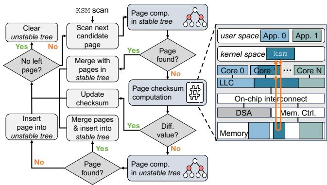  
Figure 1: ksm scan process (left) and page checksum computation running on CPU (right).

## 2.2 Data Streaming Accelerator

Hardware architecture. Figure 2 overviews the architecture of DSA. A CPU core interacts with DSA by directly submitting work descriptors to 1 memory-mapped registers of DSA, referred to as portals. A work descriptor encapsulates the key information required to set up the offloading operation, such as the operation type, one or more source memory region addresses, and the completion record address. The operational unit of DSA is 2 Group, comprising Work Queues (WQs) and Processing Engines (PEs). The number of WQs and PEs within a group is flexibly configurable by a user through the software interface of DSA. 3 The Group arbiter dispatches the descriptors at the heads of WQs to available PEs, considering the relative priority of WQs set for QoS control. Upon receiving a work descriptor, 4 a PE reads and operates on one or more source memory regions specified in the work descriptor through the cache-coherent on-chip interconnect, and updates the destination memory region if necessary and the completion record in host memory. The virtual address is used to access host memory, assisted by 5 the on-device Address Translation Cache (ATC). ATC handles the address translations, sends requests to the IOMMU on the CPU, and handles page faults in coordination with the OS. This new feature allows both CPU and DSA to access shared memory regions in the virtual address space without memory pinning.

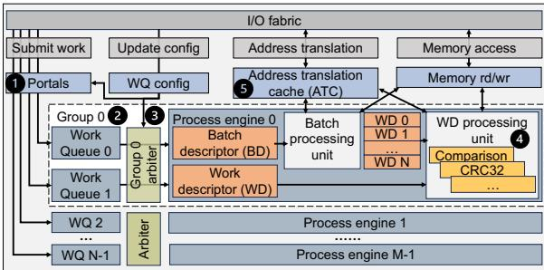  
Figure 2: Architecture overview of DSA.

Software stack. The Intel Data Accelerator Driver (IDXD) is a kernel-mode driver responsible for initializing and managing DSA [10]. It provides two interfaces: a character device (cdev) interface for data-plane operations and a sysfs interface for control-plane configuration. In user space, applications can use the libaccel-config library to configure DSA and submit work descriptors to portals, exposed as cdev through mmap. However, there is no dedicated library existing for kernel-space DSA configuration and usage.

## 3 Opportunity in Offloading ksm to DSA

Prior work has reported that ksm incurs significant CPU cycle consumption when invoked [4, 14], disrupting the execution of co-running applications. In this section, we first break down the CPU cycles consumed by ksm to identify its CPUintensive functions. Second, we demonstrate the potential of offloading these CPU-intensive functions to DSA.

## 3.1 CPU-intensive Functions of ksm

To show the considerable CPU cycle consumption by ksm, we pick a period that ksm co-runs with Redis on a CPU core. When ksm is invoked, we measure not only the overall CPU utilization but also the CPU utilization contributed by ksm and Redis separately. Figure 3 (left) shows that ksm increases CPU utilization by 14–65%, which is significant enough to degrade Redis performance when co-running.

Delving into the CPU utilization by ksm, we analyze the breakdown of CPU cycles by each function of ksm. Figure 3 (right) shows that memcmp and xxhash—which compares two pages and computes a 32-bit checksum value of a page— consume 21% and 17% of CPU cycles, respectively. These two functions perform simple operations compared to other functions of ksm. However, as they operate on thousands of pages per invocation, they collectively account for 38% of the CPU cycles consumed by ksm. Moreover, to operate on these pages, memcmp and xxhash need to bring them into the cache hierarchy, which incurs cache pollution [14, 15]. Although non-temporal or cache-bypassing load instructions, such as MOVNTDQA, can be used to implement these two functions, they are known to give lower bandwidth and higher latency than temporal load instructions, proportionally consuming more CPU cycles. In contrast, DSA can perform these two functions while consuming far fewer CPU cycles than CPU without causing cache pollution.

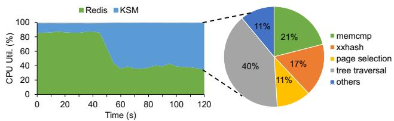  
Figure 3: A snapshot of CPU utilization in a system where CPU-ksm co-runs with Redis under the YCSB-d workload and a detailed breakdown of CPU cycles consumed by ksm’s functions.

```c
u32 dsa_xxhash(src, PAGE_SIZE, 0){
struct dsa_hw_desc desc = { };
struct dsa_completion_record comp;
// Descriptor preparation
desc.opcode = DSA_OPCODE_CRCGEN;
desc.src_addr = src;
desc.xfer_size = PAGE_SIZE;
comp.status = 0;
desc.completion_addr = (uintptr_t)&comp;
desc.flags = IDXD_OP_FLAG_RCR|IDXD_OP_FLAG_CRAV;
// Descriptor submission
enqcmd(wq_portal, &desc);
// Descriptor completion check
wait_for_interrupt(&comp.done);
wake_up(ksm);
return comp.result
1
```  
Figure 4: Pseudo-code of DSA-based xxhash using asynchronous mode.

## 3.2 Comparison between CPU and DSA: CPU Cycle Consumption

Among many DSA native operations, we can use ‘Comparison’ and ‘CRC Generation’ to implement memcmp and xxhash, respectively. Figure 4 depicts the pseudo-code of DSA-based xxhash. 1 A CPU core first prepares a 64B work descriptor specifying (1) ‘CRC Generation’ as the operation to perform, (2) the address of a source page for checksum computation, (3) 4KB as the transfer size, (4) the address to write the checksum value as the completion record, and other fields. 2 Then the CPU core submits the work descriptor to DSA by executing a single instruction, ENQCMD. When DSA receives the work descriptor, its processing engine directly operates on the source page without transferring the page into the cache hierarchy. After completing the checksum computation, it writes the checksum value to the completion record address. DSA supports two operating modes: synchronous and asynchronous modes. In synchronous mode, after submitting a work descriptor to DSA, the process continuously polls the completion record address until it receives the value returned by DSA. 3 In asynchronous mode, however, the process yields the CPU core to another process instead of polling, and it resumes execution upon receiving an interrupt, i.e., a notification of work completion, from DSA.

Figure 5 compares the CPU cycle consumption by DSAbased memcmp and xxhash in kernel space with that of CPUbased counterparts. ‘CPU-t’ and ‘CPU-nt’ denote CPU-based memcmp and xxhash implemented using temporal and nontemporal load instructions, respectively. To avoid cache invalidation overhead from non-temporal loads, the associated pages are placed at random memory addresses and are not present in the CPU cache hierarchy. ‘DSA-s’ and ‘DSA-a’ represent DSA-based memcmp and xxhash implemented using synchronous and asynchronous modes, respectively. Our findings from Figure 5 are as follows. First, DSA-a-based memcmp and xxhash consume 6.6× and 6.0× fewer CPU cycles than their CPU-t-based counterparts, respectively, as they consume CPU cycles only for preparing and submitting a work descriptor and retrieving the completion record. Second, CPU-nt does not cause cache pollution as DSA, but it consumes 1.1–3.2× more CPU cycles than CPU-t. We use MOVNTDQA as CPU-nt in kernel space, which requires full FPU state, thereby increasing CPU cycle consumption compared to CPU-t. Lastly, DSA-s-based memcmp and xxhash consume CPU cycles comparable to their CPU-t-based counterparts, respectively. Since they do not reduce a meaningful amount of CPU cycle consumption compared to their CPU-t-based counterparts, we use DSA-a-based memcmp and xxhash to implement DSA-based ksm in this work.

## 4 DSA-ksm: CPU-DSA Cooperative ksm

We have demonstrated that memcmp and xxhash consume a significant number of CPU cycles when ksm is invoked, and that they can be offloaded to DSA to considerably reduce the CPU cycle consumption compared to those executed by CPU. Since DSA-based memcmp and xxhash decrease the consumption of CPU cycles without incurring cache pollution compared to their CPU-based counterparts, they can significantly reduce the performance degradation of co-running applications (§6). In this section, we present CPU-DSA cooperative ksm (DSA-ksm), where DSA performs memcmp and xxhash (collectively referred to as data-plane functions hereafter) while CPU executes the remaining control-plane functions (e.g., a function selecting the next candidate page to scan) to minimize the performance degradation of applications corunning with ksm. This work differs from prior approaches that offload these data-plane functions to off-chip PCIe accelerators [7, 14], because it not only exploits innovations in the on-chip PCIe accelerator ecosystem [40] but also advances the ksm algorithm to fully capitalize on the capability of DSA. Workflow. We first implement DSA-based memcmp and xxhash using the APIs provided by the IDXD driver (§2.2) and then build a kernel-space library integrating these functions, enabling them to be invoked directly from ksm running in the kernel space. In contrast to prior work [7, 14], DSA-ksm leverages DSA’s virtual memory support, eliminating the need for memory pinning and virtual-to-physical address translation, thereby simplifying kernel integration and reducing overhead.

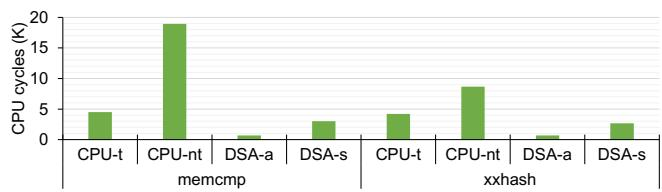  
Figure 5: CPU cycle consumption of CPU and DSA-based memcmp and xxhash.

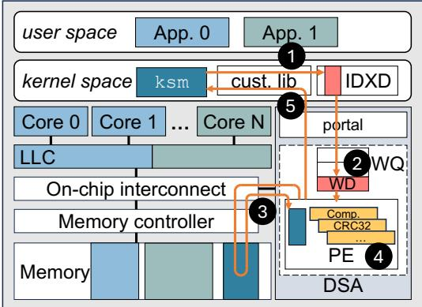  
Figure 6: DSA-ksm workflow.

Figure 6 depicts the workflow of DSA-ksm. To execute either memcmp or xxhash, 1 DSA-ksm invokes the corresponding function from the library, first preparing a work descriptor that includes the virtual addresses of memory pages to operate on. 2 Subsequently, it submits the work descriptor to a work queue (WQ) through a DSA portal. After the successful submission, the process sleeps to yield the CPU core to another process (e.g., a co-running application) until it receives an interrupt from DSA. Receiving the work descriptor from the WQ, a processing engine (PE) 3 reads the page(s) specified in the work descriptor from host memory into its internal buffer and 4 conducts the operation specified in the work descriptor. As soon as DSA completes the operation on the entire page(s), 5 it writes the completion record comprising the result to the corresponding address and sends an interrupt, which wakes up the process. Then, resuming the execution, the function reads the completion record and returns the result to DSA-ksm. To minimize the performance cost of handling interrupts, we choose to sleep for a fixed amount of time, wake up, and poll the completion record, observing that the completion latency exhibits little variance.

Alleviation of long offloading latency. Although DSA-based memcmp and xxhash considerably decrease the consumption of CPU cycles without incurring cache pollution compared to their CPU-based counterparts, we find that using DSA decreases the memory deduplication rate. Figure 7 shows that when the batch size is 1 (submitting one work descriptor per offload), DSA-based memcmp and xxhash present 2.6× and 2.7× longer latency than CPU-based counterparts, respectively. The increased latency is attributed to the time taken to submit a work descriptor and receive the notification of completion, denoted by ‘submission’ and ‘waiting’, respectively. While the waiting latency includes the execution time of a given function in DSA, both submission and waiting latencies for offloading a function operating on a 4KB page are dominated by the communication time between the CPU core and DSA over on-chip PCIe [11]. Compared to SNIC-based offloading over off-chip PCIe [14] , DSA still achieves lower latency (e.g., 6µs versus 17µs for xxhash), as off-chip PCIe incurs longer round-trip latency [40] and additional RDMA stack overhead.

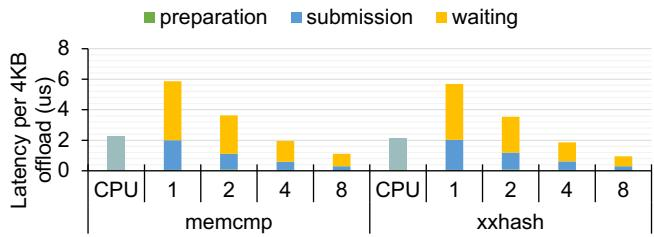  
Figure 7: Latency of memcmp and xxhash running on CPU and DSA with varying batching size.

To reduce the latency, instead of submitting a work descriptor one at a time, we can submit a batch descriptor (BD) to DSA [17], which specifies the starting address of an array of work descriptors and the number of work descriptors in the array. The memory regions that these work descriptors specify for DSA to operate on do not need to be contiguous. The batch descriptor is submitted to a WQ through a portal in the same way as a work descriptor. However, receiving the batch descriptor, a batch processing unit fetches all the work descriptors in the array in a single PCIe transaction, forwards them to the processing unit for execution, and writes the completion records of the work descriptors in another PCIe transaction.

Figure 7 demonstrates that larger batch sizes decrease the average processing latency per work descriptor. For instance, a batch size of 8 offers 81% and 83% lower latency than the batch size of 1 for memcmp and xxhash, respectively. This notable latency reduction is primarily attributed to the reduced cost of (1) communication between CPU and DSA for submitting work descriptors and receiving completion records over PCIe, and (2) context switching between the ksm process and the application process. Note that the PCIe communication latency is dominated by other overheads rather than data transfer time when the data-transfer size is small [17]. To benefit from DSA’s batching capability, ksm should be able to select multiple tree pages to compare with the candidate page or multiple candidate pages to compare with a tree page. However, it is not designed to do so as it is a serial algorithm.

## 5 Para-ksm

DSA batch processing effectively amortizes the long latency of offloading functions from CPU (§4), increasing the rate of memory deduplication. However, the vanilla ksm implementation inherently lacks parallelism to leverage DSA batch processing. To address this shortcoming, we propose Para-ksm, a parallelized ksm optimized for efficient batch processing. Para-ksm significantly accelerates the deduplication process by batching data-plane functions associated with candidate page and further exploring batching strategies for tree page.

## 5.1 Sequential Processing in ksm

memcmp and xxhash are used to identify matching pages during the searches in stable and unstable trees, and to verify whether page contents have been modified between scans. We identify two Bottlenecks that impede the parallel processing of these data-plane functions: (B1) single candidate page selection and (B2) ordered comparisons in tree search, which stem from the properties of the trees employed by ksm.

Single candidate page selection. As illustrated in Figure 1, ksm selects one candidate page at a time from the advised memory region. It then searches for the matching page by sequentially comparing candidate page with tree pages and computes a checksum of its content if necessary. This design naturally leads to the sequential execution of data-plane functions, significantly limiting parallelism. The root cause lies in the rebalancing process of the RB trees used in ksm. An RB tree, as a type of self-balancing binary search tree (BST), maintains balance by performing recoloring and/or rotations after each node insertion or deletion, keeping a longest-toshortest path ratio of at most two. This rebalancing ensures efficient search operations in the RB tree with a time complexity of O(log N), where N is the number of nodes in the tree. However, rebalancing prevents batch processing of candidate pages because inserting even one candidate page can modify the tree structure, invalidating comparisons already performed for other candidate pages in the same batch.

Ordered comparisons in tree search. ksm manages the memory pages using two RB trees, unstable tree and stable tree, which store pointers to pages and organize them in a lexicographical order based on page contents. This ordering enables efficient binary searches within the trees to find matching pages by avoiding unnecessary comparisons. However, since each comparison determines the next search direction, comparisons along the search path must be performed sequentially. For example, DSA-ksm typically needs to submit four separate WDs sequentially to complete a search in a four-level RB tree, as the selection of the tree page in each WD depends on the previous comparison result returned by DSA. As shown in Figure 7, this sequential approach can result in higher latency per function than CPU-based counterparts, compromising the memory-saving performance of DSA-ksm.

## 5.2 Para-ksmC: Candidate Page Batching

To eliminate B1, Para-ksm enhances vanilla ksm by incorporating candidate page batching and redesigning tree search and insertion (Para-ksmC). Para-ksmC selects N consecutive candidate pages from the advised memory region, groups them into a single batch, and conducts data-plane functions over the batch in a parallelized manner. These parallelized memory comparisons and checksum computations are offloaded to DSA using batch descriptors to exploit DSA’s batch processing capabilities. As the batch processing of xxhash functions on candidate pages is straightforward, this section focuses on how Para-ksmC supports and leverages batch processing of memcmp functions in the renovated search and insertion design. In particular, we use unstable tree search and insertion as an example in this section, since the operations in the stable tree are structurally identical.

## 5.2.1 Search in Para-ksmC

Para-ksmC selects 256 consecutive memory pages to build a candidate page batch based on a thorough parameter search (§6.5). Since candidate pages are pre-allocated before ksm execution and their volume is typically sufficient, Para-ksmC does not wait to accumulate a full batch of 256 candidate pages. If fewer pages remain during a ksm scan pass, Para-ksmC immediately offloads all remaining pages to the DSA, avoiding unnecessary delays. Before starting the tree search, Para-ksmC creates a search\_result for each candidate page in the batch, which encapsulates the addresses of candidate page as well as the addresses of its predecessor and successor in the tree. The predecessor and successor of a candidate page are defined as follows:

$$
p r e d e c e s s o r ( x , S ) = \operatorname* { m a x } \{ s \in S \mid s < x \}
$$

$$
s u c c e s s o r ( x , S ) = \operatorname* { m i n } \{ s \in S \mid s > x \}\tag{1}
$$

(2)

, where S is the set of compared tree pages.

The addresses of predecessor and successor are initialized as NULL in search\_result. Para-ksmC leverages a key Property of RB trees: (P1) rebalancing does not alter the predecessor or successor of a candidate page. Based on P1, Para-ksmC uses search\_result to track the addresses of predecessor and successor, as each candidate page is always inserted as a child of either its predecessor or successor. This approach eliminates repeated searches for a proper insertion spot after tree rebalancing caused by other candidate pages from the batch. Further details on the usage of search\_result are provided in Section 5.2.2.

Figure 8 illustrates how Para-ksmC performs tree search in a three-level tree as an example. For simplicity, numerical values in nodes represent page contents, and the arrows indicate search paths for candidate pages, with each path highlighted in the same color as the corresponding candidate page. The search starts at the root node. Para-ksmC prepares a list of WDs, each containing the address of a candidate page and the address of a tree page pointed to by the root node. A BD is then created to point to the WD list and submitted to DSA for batch processing of memcmp functions. Based on the comparison results returned from DSA, the WDs are updated with the addresses of the next selected tree pages for further comparisons with candidate pages. The search for each candidate page terminates when a matching page is found or when a leaf node is reached. During the search, predecessor and successor addresses in the search\_result are dynamically updated based on comparison outcomes. If the encountered tree page is smaller than the candidate page, predecessor address is updated to the address of the tree page; if larger, successor address is updated. If the tree page and candidate page are the same, both successor and predecessor addresses are set to the address of this matching tree page. While Para-ksmC offloads memcmp operations to DSA efficiently in a batching manner, it preserves the original comparison paths of CPU-ksm to maintain correctness, without altering the tree traversal logic.

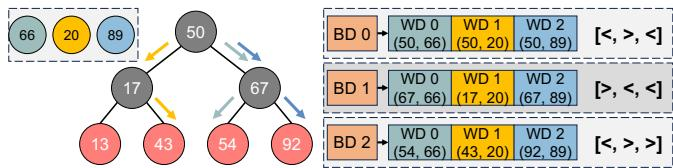  
Figure 8: Search in Para-ksmC.

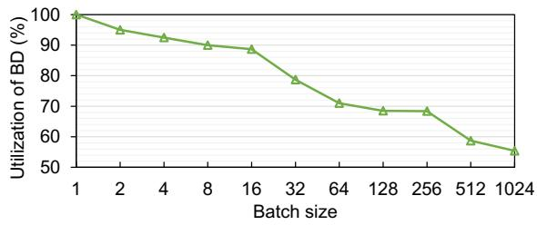  
Figure 9: Utilization of BD in Para-ksmC with varying candidate page batch sizes.

Unlike CPU-ksm, which interleaves page comparison and tree insertion for each page, Para-ksmC decouples the two stages by first conducting comparisons and then inserting pages in the batch, achieving similar per-page comparison and insertion times as CPU-ksm. To enable this, Para-ksmC processes all candidate pages in the batch simultaneously by deferring tree operations, such as insertion or deletion, until searches for all candidate pages in the batch are complete. This approach removes the dependency on sequential candidate page selection, preventing tree rebalancing from interfering with the search paths of other candidate pages within the batch. However, this design introduces a potential issue dubbed comparison skewness. More specifically, during the search, the number of comparisons required for different candidate pages within the same batch can vary notably, leading to underutilization of BD and diminishing the benefits of batch processing. For example, in a batch of three candidate pages, one candidate page may find its matching page after five comparisons, while the other two require ten. As a result, Para-ksmC submits ten BDs to complete the comparisons for the entire batch, even though only two WDs remain in the WD list after the fifth BD. We examined the BD utilization on memcmp functions across various batch sizes, where utilization is defined as the ratio of the number of WDs in the list to the preset candidate page batch size. Figure 9 presents the utilization of BD when Para-ksmC co-runs with Graph500 (§6). The utilization remains above 90% when batch sizes are below 16. However, as the batch size increases, utilization drops sharply, falling below 60% at the batch size of 512. This underutilization of BD indicates an increasing skewness in larger batches, reducing the benefits of batch processing on DSA and highlighting the need for a careful batch size selection to maximize the effectiveness of Para-ksmC.

## 5.2.2 Insertion in Para-ksmC

After completing the search for all candidate pages in the batch, Para-ksmC proceeds to insert them into the unstable tree. Para-ksmC tracks the predecessor and successor of each candidate page in the search\_result (§5.2.1) and uses a hash table to group search\_results based on the hash value of the predecessor address as shown in Figure 10. We leverage another property of RB trees: (P2) two candidate pages either share the same pair of (predecessor, successor) or have distinct non-overlapping pairs. By P2, we know that the search\_results in the same group share the same successor. After adding all search\_results into the hash table, Para-ksmC traverses the hash table to insert candidate pages as outlined in algorithm 1.

If a group in the hash table contains only one search\_result, the candidate page is inserted as either the left child of successor or the right child of predecessor, using the addresses recorded in search\_result. Since groups have disjoint (predecessor, successor) pairs, inserting a candidate page in one group does not affect insertions in other groups. For groups with multiple search\_results, Para-ksmC sorts them in descending order based on the content of candidate pages pointed to by each search\_result, using the CPUbased memcmp function. If the same pages are found in the group, they are merged and inserted into stable tree directly, and their corresponding search\_results are removed. The successor address in each remaining search\_result is then updated to the candidate page address in the preceding search\_result in the sorted group. This intra-group sorting and successor update ensure that search\_result records the correct predecessor and successor, remaining unaffected by any rebalancing triggered by earlier insertions. Figure 10 (lower) illustrates a step-by-step example of candidate page insertion into unstable tree in Para-ksmC. After each candidate page insertion, the unstable tree rebalances through recoloring (e.g., 1 to 2 ) and/or rotation (e.g., 4 to 5 ). Nonetheless, with our careful design, Para-ksmC can always identify the correct insertion point for each candidate page regardless of how the tree structure is changed.

```prolog
Algorithm 1: unstable tree insertion in Para-ksmC.
1 for group ∈ hash_table do
2 if len(group) > 1 then
3 compare_and_reorder(group)
4 update_succ(group)
5 for search_result ∈ group do
6 cand_page = search_result[0]
7 (pred, succ) = search_result[1]
8 if pred.right == NIL then
9 pred.right = cand_page
10 else
11 succ.left = cand_page
12 Rebalance the tree.
```

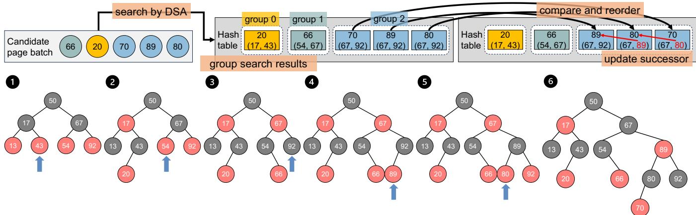  
Figure 10: Insertion in Para-ksmC. Blue arrows point to the insertion locations in unstable tree.

## 5.3 Para-ksmT: Tree Page Batching

To mitigate B2, Para-ksm introduces speculative page comparison for batched tree pages (Para-ksmT). Instead of waiting for each comparison result to select the next tree page to be compared with candidate page, Para-ksmT speculatively compares the candidate page with tree pages across the next M levels and offloads all comparisons in a single BD as shown in Figure 11. Specifically, Para-ksmT performs an M-level inorder traversal starting from a specified node to aggregate tree pages. 1 The inorder traversal ensures that tree pages are visited in ascending order based on their contents, and their addresses are stored sequentially in a tree\_page\_array. Para-ksmT creates a WD list, where each WD includes the candidate page address and a tree page address from tree\_page\_array in sequential order. 2 A BD pointing to the WD list is then created and submitted to DSA to execute memcmp functions in one offload. Upon completion, 3 the comparison results are retrieved from the completion record and stored in the cmp\_result\_array in the same order as the WDs in the WD list. Since cmp\_result\_array preserves the same order as tree\_page\_array, predecessor (successor) is easily located in tree\_page\_array by the index of the last negative (first positive) result in the cmp\_result\_array. If predecessor (successor) is not found, Para-ksmT checks the left (right) child of the smallest (largest) tree page and inserts candidate page if a spot is available. If both exist, Para-ksmT checks the right child of predecessor and/or the left child of successor and inserts candidate page if the child is absent. If no spots are available for insertion, Para-ksmT continues the search on the subtrees until reaching the leaf nodes. Figure 11 (right) illustrates an example search and insertion in Para-ksmT. With M set to three, Para-ksmT speculatively compares the candidate page with seven tree pages in the next three levels in parallel and offloads seven page comparisons in a single BD to DSA. In contrast, DSA-ksm requires three sequential page comparisons and submits three separate WDs to DSA.

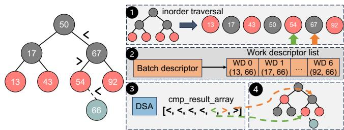  
Figure 11: Search and insertion in vanilla ksm (left) and Para-ksmT (right). Green and orange arrows point to the predecessor and successor, respectively.

While Para-ksmT leverages batch processing, its memory deduplication rate remained limited. Our evaluation indicates that Para-ksmT achieves 9.2% of CPU-ksm ’s deduplication rate, slightly higher than DSA-ksm. This underwhelming performance is caused by the overhead of unnecessary comparisons introduced by speculative page comparisons, resulting in a significant waste of DSA computation resources. After traversing M levels, Para-ksmT offloads 2M − 1 page comparisons to DSA while DSA-ksm only offloads M page comparisons. That is, only M out of 2M − 1 comparisons contribute to identifying duplicate pages. In addition to extra computation in DSA, speculative traversal also incurs extra data movement. Our evaluation shows that when M = 6, this results in an extra 2% of system DRAM bandwidth consumption. Moreover, Para-ksmT lacks support for batch processing of xxhash functions, further restricting its effectiveness compared to Para-ksmC. We consider Para-ksmT a complementary optimization to Para-ksmC, potentially beneficial in environments with abundant computational resources to handle offloaded functions. However, due to the limited availability of DSA devices in our setup, the following sections focus on evaluating Para-ksmC.

Table 1: Hardware and software configurations.
<table><tr><td>Hardware</td><td>Description</td></tr><tr><td>CPU</td><td>Intel@ Xeon 8460Y+ CPUs @2.0 GHz,40 cores and2.625MBLLC percore,Hyper-Threading disabled</td></tr><tr><td>Memory</td><td>8-Ch.w/8 32GBDDR5-4800 DRAM modules</td></tr><tr><td>DSA</td><td>One group with one 64-entry WQand four PEs</td></tr><tr><td>SmartNIC</td><td>NVIDIABF-3[26],PCIe5.0,DDR5-5200</td></tr><tr><td>Software</td><td>Description</td></tr><tr><td>OS (kernel)</td><td>Ubuntu 18.04.6 LTS (Linux kernel 6.2.15)</td></tr><tr><td>ksm</td><td>sleep_between_scan=20ms,free_mem_thres=80 pages_to_scan=[64,2048] #adjusted by ksmtuned</td></tr><tr><td>Para-ksmC</td><td>cand_page_batch_size= 256</td></tr><tr><td>Virtual machine</td><td>Hypervisor:QEMU-KVMv2.11.1 Ubuntu Cloud 22.04,1 Virtual Core,6GB memory</td></tr></table>

## 6 Evaluation

## 6.1 Evaluation Setup

System Setup. Table 1 summarizes the hardware and software configurations used in our experiments. CPU core frequency is locked at 2.0 GHz, and hyper-threading (HT) is disabled to ensure consistent performance measurements across runs. The on-chip DSA is configured with one group consisting of a 64-entry WQ and four processing engines. Candidate page batch size in Para-ksmC is set to 256 based on the evaluation in Section 6.5. We reproduce STYX [14] on NVIDIA BF-3 [26] for a comparison with Para-ksmC.

Workloads. We evaluate three representative workloads: Liblinear [6], Graph500 [36], and Redis [30] with Yahoo! Cloud Serving Benchmark (YCSB) [5]. Liblinear is a widely used library for large-scale linear regression, processing datasets with millions of instances and features. We run the Support Vector Regression (SVR) from Liblinear on the SUSY dataset [39]. Graph500 is a high-performance computing benchmark designed to stress memory subsystems with its graph generation and traversal. We use Graph500 to generate a graph of scale 23 and edge factor of 16, and run breadth-first search (BFS) on it. Redis is a high-performance, in-memory Key-Value Store (KVS) database widely adopted in realworld applications requiring low-latency data access. YCSB is a benchmarking framework to evaluate the performance of KVS databases, providing four workloads: (a) update heavy (50% read and 50% update), (b) read heavy (95% read and 5% update), (c) read only (100% read) and (d) read latest (95% read and 5% insert), with a uniform distribution for key values.

Methodology. We launch 40 VMs, each assigned one virtual core (vCPU) and 6 GB RAM, pinned to a dedicated physical core. For Liblinear and Graph500, each VM runs the workload independently. For Redis, we organize the 40 VMs into 10 groups, each comprising 3 VMs as Redis clients and 1 VM as the Redis server to handle the requests. Given the memory-intensive nature of Redis client operations, we employed Intel’s Cache Allocation Technology (CAT) [12] to partition the LLC. Specifically, one cache way is reserved for each Redis server, while the remaining cache ways are shared among the clients to minimize interference between client and server processes. We configure the vanilla ksm running on CPU (CPU-ksm) and Para-ksmC to achieve comparable memory savings and provide a fair evaluation of their impact on the co-running workloads.

## 6.2 Application Performance

We adopt execution time as the performance metric for Liblinear and Graph500, and 99th-percentile (p99) latency for Redis, as user-serving datacenter applications like Redis must meet strict tail latency requirements [22, 27]. Figure 12 shows the performance degradation of Liblinear, Graph500, and Redis on systems that deploy CPU-ksm, DSA-ksm, STYX, and Para-ksmC, normalized to a system without running ksm (no-ksm). Performance degradation refers to the increase in execution time for Liblinear and Graph500, or the increase in p99 latency for Redis, compared to no-ksm.

On average (geometric mean), CPU-ksm incurs 3.3× performance degradation over no-ksm. YCSB workloads on Redis experience higher degradation, with an average of 3.7×, while Liblinear and Graph500 have an average of 2.1× execution time increase, as the tail latency is more sensitive to the CPU contention caused by the intensive data-plane functions running on the CPU. In contrast, DSA-ksm, STYX and Para-ksmC incur 1.3×, 1.4× and 2.1× performance degradation compared to no-ksm, respectively. That is, DSA-ksm, STYX and Para-ksmC reduce the performance degradation by 2.5×, 2.4× and 1.6× compared to CPU-ksm. Both DSA-ksm and Para-ksmC alleviate CPU contention by offloading dataplane functions (i.e., memcmp and xxhash) to DSA, freeing CPU cycles for co-running applications and reducing the cache pollution as shown in Section 6.3. Para-ksmC exhibits higher performance degradation than DSA-ksm because it retains intra-group page comparisons on the CPU and incurs additional overhead (e.g., successor update) during search and insertion (§5.2).

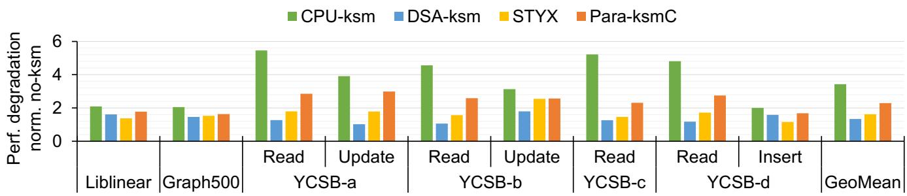  
Figure 12: Workload performance degradation under CPU-ksm, DSA-ksm, STYX and Para-ksmC, normalized to no-ksm.

## 6.3 Impact on CPU Resource

To disclose how DSA-ksm and Para-ksmC mitigate the impact of CPU-ksm on the co-running applications, we investigate their CPU cycle consumption and LLC miss rates of server CPU in the system.

## 6.3.1 CPU Cycle Consumption

Both DSA-ksm and Para-ksmC conserve the server CPU cycles by offloading the CPU-intensive data-plane functions to DSA. We identify the intervals during which ksm and application co-run on a server CPU core and measure the server CPU cycles consumed by ksm within these intervals. The total CPU cycles consumed by ksm are summed and divided by the total server CPU cycles during co-running periods to calculate the average CPU utilization. The reported values for YCSB workload are geometric averages across four YCSB workloads.

Table 2 shows that CPU-ksm consumes significant CPU cycles when it co-runs with applications, with an average CPU utilization of 48%, consistent with our observations in Section 3.1. On average, DSA-ksm and Para-ksmC reduce the CPU utilization of ksm by 85% and 36%, respectively, compared to CPU-ksm. STYX achieves a comparable level of CPU cycle reduction as DSA-ksm, as both approaches succeed in offloading the memcmp and xxhash from host CPU. The saved CPU cycles can be used for applications, reducing the performance degradation caused by the deduplication feature. Para-ksmC consumes more CPU cycles than DSA-ksm because it does not offload intra-group memcmp to DSA and performs extra operations (e.g., hashing on search\_results and successor update) to ensure correct insertion in trees. Despite the higher CPU cycle consumption than DSA-ksm,

Table 2: CPU utilization of CPU-ksm, DSA-ksm, STYX and Para-ksmC when they co-run with different workloads.
<table><tr><td></td><td>Liblinear</td><td>Graph500</td><td>YCSB</td><td>GeoMean</td></tr><tr><td>CPU-ksm</td><td>44.5%</td><td>39.2%</td><td>51.7%</td><td>48.2%</td></tr><tr><td>DSA-ksm</td><td>5.8%</td><td>5.2%</td><td>8.5%</td><td>7.3%</td></tr><tr><td>STYX</td><td>5.4%</td><td>5.7%</td><td>5.4%</td><td>5.5%</td></tr><tr><td>Para-ksmC</td><td>37.6%</td><td>29.8%</td><td>29.8%</td><td>31.0%</td></tr></table>

Para-ksmC delivers more effective and efficient memory deduplication, as demonstrated in Section 6.4.

## 6.3.2 LLC Miss Rate

By offloading data-plane functions, DSA-ksm and Para-ksmC not only conserve CPU cycles but also alleviate cache pollution. We evaluate the cache pollution by measuring the LLC miss rates of the server CPU every second while running CPU-ksm, DSA-ksm, STYX, and Para-ksmC.

Table 3 reports the average LLC miss rates across workloads. CPU-ksm leads to 7%–114% higher LLC miss rate than no-ksm as ksm brings cold pages into CPU caches for comparison or checksum calculation when invoked. Liblinear and Graph500 exhibit smaller LLC miss rate increases as they are more memory-intensive than Redis. DSA-ksm and Para-ksmC reduce the LLC miss rate by 28% and 18% on average compared to CPU-ksm. The reduction is achieved because DSA reads data directly from host memory to its processing engines, bypassing the CPU cache hierarchy when executing the offloaded functions ( 3 in Figure 6). However, cache pollution is not fully eliminated in DSA-ksm and Para-ksmC, as only the two dominant data-plane functions, memcmp and xxhash, are offloaded, while control-plane functions remain on the CPU.

## 6.4 Deduplication Performance

After evaluating the impact on application performance and CPU resources, we focus on the deduplication performance of the memory deduplication feature in this section. Specifically, we examine the deduplication effectiveness and efficiency of

Table 3: LLC miss rate of systems (no-ksm, CPU-ksm, DSA-ksm, STYX and Para-ksmC).
<table><tr><td></td><td>Liblinear</td><td>Graph500</td><td>YCSB</td><td>GeoMean</td></tr><tr><td>no-ksm</td><td>52.5%</td><td>8.9%</td><td>20.7%</td><td>21.3%</td></tr><tr><td>CPU-ksm</td><td>56.4%</td><td>11.9%</td><td>42.5%</td><td>30.5%</td></tr><tr><td>DSA-ksm</td><td>52.2%</td><td>9.0%</td><td>22.9%</td><td>22.1%</td></tr><tr><td>STYX</td><td>53.5%</td><td>9.5%</td><td>21.7%</td><td>21.9%</td></tr><tr><td>Para-ksmC</td><td>52.7%</td><td>10.4%</td><td>28.4%</td><td>25.0%</td></tr></table>

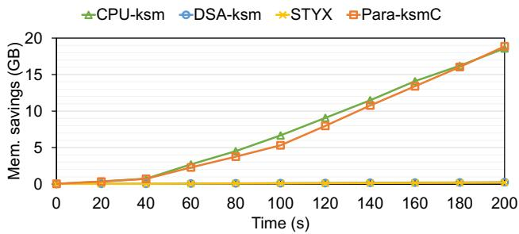  
Figure 13: Memory saving under CPU-ksm, DSA-ksm, STYX and Para-ksmC when Liblinear runs.

CPU-ksm, DSA-ksm, and Para-ksmC.

## 6.4.1 Deduplication Effectiveness

Deduplication effectiveness is measured as memory saving achieved at a given time while the deduplication feature coruns with workloads. Although metrics like the number of scanned or saved pages can reflect the deduplication progress, memory savings offers a more direct and comprehensive measure of deduplication effectiveness, as it captures both the amount and usefulness of eliminated duplicate pages. We pick a 200-second window during which the deduplication feature runs alongside the workload and measure the memory savings every 20 seconds.

Figure 13 shows the memory saving over the selected period using Liblinear as a representative workload, reflecting similar trends observed across other workloads. DSA-ksm achieves only 12% of CPU-ksm’s memory saving after the first 20 seconds, with the gap widening over time. The deduplication effectiveness of DSA-ksm is hindered by the long execution time of DSA-based memcmp and xxhash functions (Figure 7), resulting from the communication overhead between CPU core and DSA. STYX exhibits slightly lower deduplication effectiveness than DSA-ksm in the same window, due to even longer offloading latency that further delays memory savings. Although both DSA-ksm and STYX eventually converge toward the memory savings of CPU-ksm, their shortterm effectiveness is constrained by offloading inefficiencies. The limited deduplication effectiveness of DSA-ksm highlights the necessity of exploiting the batching capability of DSA to amortize the offloading overhead.

Para-ksmC achieves memory savings comparable to CPU-ksm by redesigning ksm and leveraging the batching capability of DSA. During the period, Para-ksmC delivers 20% less memory savings than CPU-ksm after the first 100 seconds and eventually narrows the gap to under 1% by the end. The significant improvement in deduplication effectiveness of Para-ksmC over DSA-ksm stems from the redesign of vanilla ksm that enables memcmp and xxhash to operate on multiple pages in parallel. This software enhancement allows functions to be offloaded to DSA in a batch, substantially reducing offloading overhead and consequently boosting deduplication effectiveness.

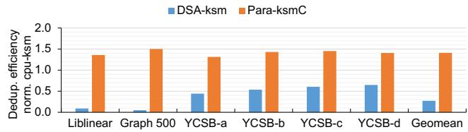  
Figure 14: Deduplication efficiency of DSA-ksm and Para-ksmC normalized to CPU-ksm across workloads.

## 6.4.2 Deduplication Efficiency

Deduplication efficiency is defined as the memory savings per 1K CPU cycles consumed by the deduplication features (i.e., CPU-ksm, DSA-ksm, and Para-ksmC). This metric offers a more comprehensive evaluation by accounting for both CPU cycle consumption and memory savings, reflecting how efficiently deduplication features utilize CPU cycles. Similar to Section 6.4.1, we select a 200-second window during which the deduplication features and user applications run concurrently. The deduplication efficiency is calculated by dividing the total memory savings by the CPU cycles consumed by the deduplication features during this period.

Figure 14 presents the deduplication efficiency of DSA-ksm and Para-ksmC normalized to CPU-ksm across workloads. DSA-ksm achieves only 5%–65% deduplication efficiency compared to CPU-ksm. This reduced efficiency is primarily because DSA-ksm offloads each function individually in DSA asynchronous mode. Excessive context switching and CPU-DSA communication overhead overwhelm the CPU cycle savings from function offloading, leading to lower overall efficiency. In contrast, Para-ksmC achieves 1.3×–1.5× higher deduplication efficiency than CPU-ksm. Its superior efficiency over DSA-ksm is attributed to the batch processing on DSA, which consolidates multiple functions into a single BD instead of processing individual WDs. Batch processing amortizes the submission overhead across multiple functions, reduces the frequency of context switches, and minimizes the software overhead for checking completion records. Although Para-ksmC introduces additional operations to vanilla ksm, the benefits of batch processing outweigh these overheads, yielding significantly higher efficiency.

## 6.5 Impact of Batch Size

In this section, we investigate how the deduplication performance of Para-ksmC changes under different batch size configurations. We measure the memory saving every 20 seconds and CPU cycles consumed by Para-ksmC over a 160-second period during which Para-ksmC co-runs with Graph500.

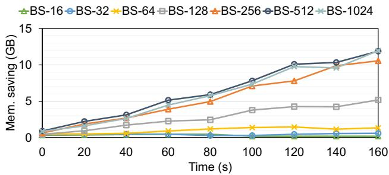  
Figure 15: Memory saving achieved by Para-ksmC under varying batch sizes (BS) while co-running with Graph500.

Figure 15 shows memory saving achieved by Para-ksmC with batch size ranging from 16 to 1024, where 1024 is the maximum batch size supported by DSA. As the batch size doubles from 16 to 256, Para-ksmC achieves 3.0×, 2.2×, 3.9× and 2.1× increases in memory savings over the preceding batch size. However, beyond the batch size of 256, the improvements plateau, with only 1.1× and 1.0× higher memory savings as the batch size doubles from 256 to 512 and 512 to 1024, respectively. Two factors drive this plateau. First, DSA ’s limited function processing capability becomes a bottleneck for larger batches, increasing the latency of DSAbased functions and degrading deduplication performance. Second, the comparison skewness issue, as shown in Figure 9, exacerbates the underutilization of BD at large batch sizes, reducing the overall efficiency of batch processing. We also calculate the deduplication efficiency of Para-ksmC across various batch sizes normalized to the efficiency achieved at a batch size of 16, as shown in Figure 16. The deduplication efficiency rises steadily up to 2.2× at a batch size of 256, then slightly declines at larger batch sizes. This decline results from DSA’s processing limitations and the effects of comparison skewness, as discussed above.

## 7 Related Work

Memory deduplication. Memory deduplication has proven to be an efficient technique for reducing server memory requirements, particularly in virtualization environments [7, 8,

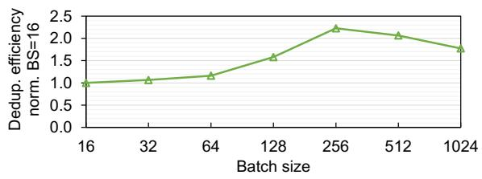  
Figure 16: Deduplication efficiency of Para-ksmC across different batch sizes, normalized to the efficiency at the batch size of 16, while co-running with Graph500.

29,31,32]. Numerous software and hardware techniques have been proposed to enhance the performance and scalability of ksm, the widely used memory deduplication mechanism.

On the software side, UPM [29] enhances ksm by using user-provided hints to identify memory regions likely to contain duplicates, thereby improving accuracy and reducing overhead. XLH [21] extends the memory deduplication process by introducing cross-layer I/O-based hints, enabling earlier identification and exploitation of page-sharing opportunities. CMD [4] classifies pages into different groups and performs comparisons only between pages within the same group, thereby minimizing futile comparisons. However, these software techniques still rely on the CPU for data-plane functions, and thus cannot eliminate CPU overhead. Para-ksm enhances ksm by introducing greater parallelism, offering an orthogonal approach that can be combined with the aforementioned software techniques.

On the hardware side, PageForge [34], a pioneering design, integrates a dedicated hardware component into the memory controller to execute memcmp and leverages the Error Correcting Code (ECC) engine to perform xxhash functions. Although PageForge reduces CPU overhead, it requires complex and challenging modifications to memory controller hardware that are infeasible without vendor support. In contrast, Para-ksm can operate seamlessly on processors with on-chip DSA accelerators without any hardware modification.

Kernel function offloading. Kernel function offloading has been popular for its success in alleviating CPU workload by shifting intensive OS functions and stacks to specialized hardware accelerators, such as GPUs, FPGAs, SmartNICs (SNICs), and dedicated processors. PCIe-based FPGAs and SNICs stand out as promising candidates for offloading due to their flexible programmability. LineFS [16] offloads distributed system functions, while FlexTOE [33] offloads the TCP stack to SNICs. Pigasus [41] employs FPGA-based SNICs to accelerate the intrusion detection and prevention systems (IDS/IPS), two demanding stateful network functions. Performance-related kernel functions are offloaded to FPGAs in a prior work [1] and hXDP [3] offloads Linux’s eXpress Data Path programs written in eBPF to FPGAs.

Specific to memory deduplication, Catalyst [7] employs GPUs to accelerate computationally intensive functions from ksm, while STYX [14] harnesses the capabilities of RDMAcapable SNICs to mitigate the overhead of ksm. However, as a non-coherent off-chip device accessed over PCIe, STYX introduces longer offloading latency, requires memory pinning,address translation, and involves substantial kernel modifications (∼1300 LoC). In contrast, Para-ksm utilizes a coherent on-chip DSA, achieving lower offloading latency without the need for memory pinning, and integrates more easily into the OS (∼300 LoC). Compared to another recent work [13], which only offloads memcmp to DSA and uses the CPU to filter comparisons to offset offloading latency, Para-ksm achieves lower CPU utilization by offloading both memcmp and xxhash, and improves deduplication throughput by redesigning ksm and leveraging the batching capability of DSA. Recent work [15] on CXL Type-2 devices demonstrates efficient kernel function offloading with reduced communication overhead enabled by the cache-coherent CXL interconnect. However, the current implementation of genuine CXL Type-2 devices relies on a resource-constrained FPGA for computation, which is less capable than DSA and requires extra programming effort. Furthermore, Para-ksm’s software enhancements to ksm are adaptable to existing hardware acceleration techniques for memory deduplication, offering the potential for higher throughput and improved efficiency.

## 8 Conclusion

In this paper, we first identified the CPU-intensive functions, memcmp and xxhash, in the memory deduplication feature, ksm, and demonstrated the potential of offloading them to the on-chip accelerator DSA to reduce CPU cycle consumption. Second, we proposed DSA-ksm, which directly replaces CPUbased memcmp and xxhash with DSA-based counterparts in ksm. While DSA-ksm significantly reduced the performance degradation on the co-running applications incurred by ksm, it offered notably lower rates of memory deduplication than ksm due to long offloading latency. We found that DSA’s batching capability can effectively amortize this latency by enabling memcmp and xxhash to operate on multiple pages per offload. Based on this observation, we lastly proposed Para-ksm, which redesigns ksm to replace its sequential processing of memcmp and xxhash on a single page with parallel processing on multiple pages, enabling the Para-ksm to fully leverage DSA’s batching capability. We showed that Para-ksm increased the amount of memory deduplication per CPU cycle by 31-50% compared to ksm while decreasing the performance degradation of co-running applications incurred by ksm from 1.6–5.8× to 1.3–2.7×.

## References

[1] Pabudi T Abeyrathne, S Devapriya Dewasurendra, and Dhammika Elkaduwa. Offloading specific performancerelated kernel functions into an fpga. In Proceedings of the 2021 IEEE 30th International Symposium on Industrial Electronics (ISIE’21), 2021.

[2] Sean Barker, Timothy Wood, Prashant Shenoy, and Ramesh Sitaraman. An empirical study of memory sharing in virtual machines. In Proceedings of the 2012 USENIX Annual Technical Conference (ATC’12), 2012.

[3] Marco Spaziani Brunella, Giacomo Belocchi, Marco Bonola, Salvatore Pontarelli, Giuseppe Siracusano, Giuseppe Bianchi, Aniello Cammarano, Alessandro

Palumbo, Luca Petrucci, and Roberto Bifulco. hxdp: Efficient software packet processing on fpga nics. In Proceedigs of the 14th USENIX Symposium on Operating Systems Design and Implementation (NSDI’20), 2020.

[4] Licheng Chen, Zhipeng Wei, Zehan Cui, Mingyu Chen, Haiyang Pan, and Yungang Bao. Cmd: classification-based memory deduplication through page access characteristics. In Proceedings of the 10th ACM SIGPLAN/SIGOPS International Conference on Virtual Execution Environments (VEE’14), 2014.

[5] Brian F Cooper, Adam Silberstein, Erwin Tam, Raghu Ramakrishnan, and Russell Sears. Benchmarking cloud serving systems with ycsb. In Proceedings of the 1st ACM Symposium on Cloud Computing (SoCC’10), 2010.

[6] Rong-En Fan, Kai-Wei Chang, Cho-Jui Hsieh, Xiang-Rui Wang, and Chih-Jen Lin. Liblinear: A library for large linear classification. Journal of machine Learning research, 2008.

[7] Anshuj Garg, Debadatta Mishra, and Purushottam Kulkarni. Catalyst: Gpu-assisted rapid memory deduplication in virtualization environments. In Proceedings of the 13th ACM SIGPLAN/SIGOPS International Conference on Virtual Execution Environments (VEE’17), 2017.

[8] Yunfei Gu, Yihui Lu, Chentao Wu, Jie Li, and Minyi Guo. Cksm: An efficient memory deduplication method for container-based cloud computing systems. In Proceedings of the 2024 IEEE International Parallel and Distributed Processing Symposium (IPDPS’24), 2024.

[9] Intel. Intel® FPGA SmartNIC N6000-PL Platform. https://www.intel.com/content/www/us/en/ products/details/fpga/platforms/smartnic/ n6000-pl-platform.html, accessed in 2024.

[10] Intel Corporation. Intel Data Accelerator Driver. https: //github.com/intel/idxd, accessed in 2024.

[11] Intel Corporation. Intel Data Streaming Accelerator. https://www.intel.com/content/www/ us/en/products/docs/accelerator-engines/ data-streaming-accelerator.html, accessed in 2024.

[12] Intel Corporation. Introduction to Cache Allocation Technology in the Intel® Xeon® Processor E5 v4 Family. https://www.intel.com/content/ www/us/en/developer/articles/technical/ introduction-to-cache-allocation-technology. html, accessed in 2024.

[13] Houxiang Ji, Minho Kim, Seonmu Oh, Daehoon Kim, and Nam Sung Kim. Cooperative memory deduplication with intel data streaming accelerator. IEEE Computer Architecture Letters, 2025.

[14] Houxiang Ji, Mark Mansi, Yan Sun, Yifan Yuan, Jinghan Huang, Reese Kuper, Michael M. Swift, and Nam Sung Kim. STYX: Exploiting SmartNIC capability to reduce datacenter memory tax. In Proceedings of the 2023 USENIX Annual Technical Conference (ATC’23), 2023.

[15] Houxiang Ji, Srikar Vanavasam, Yang Zhou, Qirong Xia, Jinghan Huang, Yifan Yuan, Ren Wang, Pekon Gupta, Bhushan Chitlur, Ipoom Jeong, and Nam Sung Kim. Demystifying a cxl type-2 device: A heterogeneous cooperative computing perspective. In Proceedings of the 2024 57th IEEE/ACM International Symposium on Microarchitecture (MICRO’24), 2024.

[16] Jongyul Kim, Insu Jang, Waleed Reda, Jaeseong Im, Marco Canini, Dejan Kostic, Youngjin Kwon, Simon ´ Peter, and Emmett Witchel. Linefs: Efficient smartnic offload of a distributed file system with pipeline parallelism. In Proceedings of the ACM SIGOPS 28th Symposium on Operating Systems Principles (SOSP’21), 2021.

[17] Reese Kuper, Ipoom Jeong, Yifan Yuan, Ren Wang, Narayan Ranganathan, Nikhil Rao, Jiayu Hu, Sanjay Kumar, Philip Lantz, and Nam Sung Kim. A quantitative analysis and guidelines of data streaming accelerator in modern intel xeon scalable processors. In Proceedings of the 29th ACM International Conference on Architectural Support for Programming Languages and Operating Systems (ASPLOS’24), 2024.

[18] Taehyung Lee, Sumit Kumar Monga, Changwoo Min, and Young Ik Eom. Memtis: Efficient memory tiering with dynamic page classification and page size determination. In Proceedings of the 29th Symposium on Operating Systems Principles (SOSP’23), 2023.

[19] Mellanox Technologies. Mellanox Innova-2 Flex Open Programmable SmartNIC. https://network.nvidia. com/files/doc-2020/pb-innova-2-flex.pdf, accessed in 2024.

[20] Konrad Miller, Fabian Franz, Thorsten Groeninger, Marc Rittinghaus, Marius Hillenbrand, and Frank Bellosa. Ksm++: Using i/o-based hints to make memory-deduplication scanners more efficient. In Proceedings of the ASPLOS Workshop on Runtime Environments, Systems, Layering and Virtualized Environments (RESoLVE’12), 2012.

[21] Konrad Miller, Fabian Franz, Marc Rittinghaus, Marius Hillenbrand, and Frank Bellosa. XLH: More effective memory deduplication scanners through cross-layer hints. In Proceedings of the 2013 USENIX Annual Technical Conference (ATC’13), 2013.

[22] Rajesh Nishtala, Hans Fugal, Steven Grimm, Marc Kwiatkowski, Herman Lee, Harry C. Li, Ryan McElroy, Mike Paleczny, Daniel Peek, Paul Saab, David Stafford, Tony Tung, and Venkateshwaran Venkataramani. Scaling memcache at facebook. In Proceedigs of the 10th USENIX Symposium on Networked Systems Design and Implementation (NSDI’13), 2013.

[23] NVIDIA. ConnectX NICs. https://www.nvidia. com/en-us/networking/ethernet-adapters/, accessed in 2024.

[24] NVIDIA. NVIDIA BlueField-3 Networking Platform. https://resources.nvidia.com/ en-us-accelerated-networking-resource-library/ datasheet-nvidia-bluefield, accessed in 2024.

[25] NVIDIA. NVIDIA Ethernet SuperNICs. https://www.nvidia.com/en-us/networking/ products/ethernet/supernic/, accessed in 2024.

[26] NVIDIA Corporation. NVIDIA BlueField-3 DPU. https://www.nvidia.com/content/dam/ en-zz/Solutions/Data-Center/documents/ datasheet-nvidia-bluefield-3-dpu.pdf, accessed in 2023.

[27] Amy Ousterhout, Joshua Fried, Jonathan Behrens, Adam Belay, and Hari Balakrishnan. Shenango: Achieving high cpu efficiency for latency-sensitive datacenter workloads. In Proceedigs of the 16th USENIX Symposium on Networked Systems Design and Implementation (NSDI’19), 2019.

[28] Patel, Dylan and Xie, Myron and Chu, Wega. Going Vertical: Gate All Around, 3D DRAM, 3D NAND – Kokusai Electric IPO. https://semianalysis.com/2023/ 10/15/going-vertical-gate-all-around-3d/, accessed in 2024.

[29] Wei Qiu, Marcin Copik, Yun Wang, Alexandru Calotoiu, and Torsten Hoefler. User-guided page merging for memory deduplication in serverless systems. In Proceedings of the 2023 IEEE International Conference on Big Data (BigData’23), 2023.

[30] Redis Labs. Redis: The Real-Time Data Platform. https://redis.io, accessed in 2024.

[31] Divyanshu Saxena, Tao Ji, Arjun Singhvi, Junaid Khalid, and Aditya Akella. Memory deduplication for serverless computing with medes. In Proceedings of

the 17th European Conference on Computer Systems (Eurosys’22), 2022.

[32] Prateek Sharma and Purushottam Kulkarni. Singleton: system-wide page deduplication in virtual environments. In Proceedings of the 21st international symposium on High-Performance Parallel and Distributed Computing (HPDC’12), 2012.

[33] Rajath Shashidhara, Tim Stamler, Antoine Kaufmann, and Simon Peter. {FlexTOE}: Flexible {TCP} offload with {Fine-Grained} parallelism. In Proceedings of the 19th USENIX Symposium on Networked Systems Design and Implementation (NSDI’22), 2022.

[34] Dimitrios Skarlatos, Nam Sung Kim, and Josep Torrellas. Pageforge: a near-memory content-aware page-merging architecture. In Proceedings of the 50th Annual IEEE/ACM International Symposium on Microarchitecture (MICRO’17), 2017.

[35] Stefan Roesch. Kernel Samepage Merging (KSM) Usage at Meta and future Improvements. https://lpc.events/event/17/contributions/ 1625/attachments/1320/2649/KSM.pdf, accessed in 2024.

[36] Toyotaro Suzumura, Koji Ueno, Hitoshi Sato, Katsuki Fujisawa, and Satoshi Matsuoka. Performance characteristics of graph500 on large-scale distributed environment. In Proceedings of the 2011 IEEE International Symposium on Workload Characterization (IISWC’11), 2011.

[37] The Kernel Development Community. Kernel Samepage Merging. https://docs.kernel.org/ admin-guide/mm/ksm.html, accessed in 2024.

[38] Johannes Weiner, Niket Agarwal, Dan Schatzberg, Leon Yang, Hao Wang, Blaise Sanouillet, Bikash Sharma, Tejun Heo, Mayank Jain, Chunqiang Tang, and Dimitrios Skarlatos. Tmo: Transparent memory offloading in datacenters. In Proceedings of the 27th ACM International Conference on Architectural Support for Programming Languages and Operating Systems (ASPLOS’22), 2022.

[39] Daniel Whiteson. SUSY. UCI Machine Learning Repository, accessed in 2024. DOI: https://doi.org/10.24432/C54606.

[40] Yifan Yuan, Ren Wang, Narayan Ranganathan, Nikhil Rao, Sanjay Kumar, Philip Lantz, Vivekananthan Sanjeepan, Jorge Cabrera, Atul Kwatra, Rajesh Sankaran, Ipoom Jeong, and Nam Sung Kim. Intel accelerators ecosystem: An soc-oriented perspective: Industry product. In Proceedings of the 2024 ACM/IEEE

51st Annual International Symposium on Computer Architecture (ISCA’24), 2024.

[41] Zhipeng Zhao, Hugo Sadok, Nirav Atre, James C Hoe, Vyas Sekar, and Justine Sherry. Achieving 100gbps intrusion prevention on a single server. In Proceedings of the 14th USENIX Symposium on Operating Systems Design and Implementation (OSDI’20), 2020.

## A Artifact Appendix

## Abstract

This artifact provides instructions for reproducing the key experimental results reported in the paper. Specifically, it covers two key sets of experiments: (1) application performance degradation on systems running CPU-ksm, DSA-ksm, and Para-ksmC, normalized to a system without ksm (no-ksm) (Figure 12); and (2) memory deduplication performance, including both deduplication effectiveness (Figure 13) and deduplication efficiency (Figure 14).

## Scope

The artifact enables validation of two main claims: (i) offloading data-plane functions of ksm to DSA (DSA-ksm and Para-ksm) significantly reduces performance degradation of co-running applications; and (ii) after an elaborated redesign of ksm, Para-ksm leverages DSA’s batching capability by processing multiple pages per offload, effectively amortizing offload latency. Compared to vanilla ksm, Para-ksm achieves comparable memory deduplication effectiveness while significantly improving deduplication efficiency.

## Contents

The artifact includes: (i) a README.md file containing instructions for building and installing the kernel with Para-ksm support, and for running the experiments using provided scripts; (ii) the linux-paraksm directory containing the Linux kernel source code modified with the Para-ksm implementation; and (iii) the scripts directory containing scripts to reproduce experimental results and generate the corresponding figures.

## Hosting

The artifact is hosted on GitHub at https://github. com/ece-fast-lab/ATC-2025-Paraksm.git, on the main branch. Users can obtain the artifact by cloning the repository and checking out the latest commit (98716ac) to reproduce the results.

## Requirements

The experiments require a server with 4th-generation (or newer) Intel Xeon Scalable Processor equipped with DSA accelerator. The Para-ksm implementation is based on Linux kernel version 6.2.15 and has been tested on Ubuntu 18.04.6 LTS. QEMU-KVM version 2.11.1 is used for virtual machine management, with guest VMs running Ubuntu Cloud 22.04.

## A.1 Installation

Clone the artifact repository as follows:

\$ git clone https :// github . com /ece - fast - lab /ATC   
-2025 - Paraksm . git

The Linux kernel source code with Para-ksm implementation can be found in linux-paraksm directory. Follow the instructions in README.md to build and install the kernel. A system reboot is required to use the compiled kernel.

## A.2 Experiment workflow

After installing the kernel, experiments can be executed as follows:

```shell
$ cd / scripts / fig12 -14/
2 $ bash run . sh
```

The run.sh script executes all benchmarks by default; specific experiments can be selected by commenting or uncommenting lines within the script. All generated results will be automatically saved. The figures (Figure 12, 13 and 14) can be plotted and saved as PNG files by running plot.sh in the /scripts/fig12-14/ directory. Additional details are provided in the README.md file in the root directory.