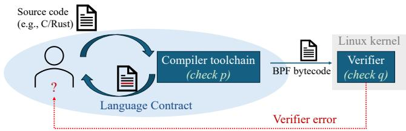
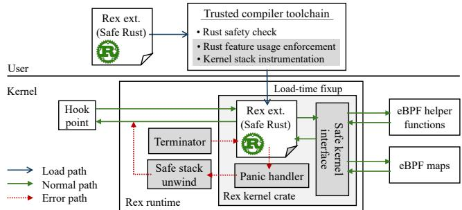
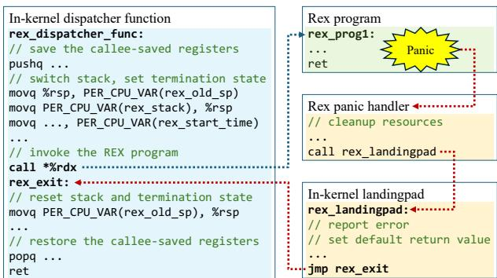
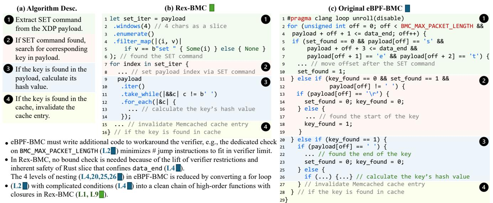
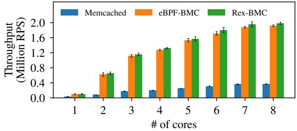
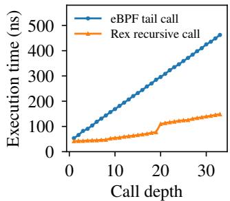
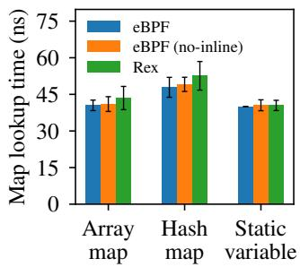

①

USENIX

THE ADVANCED COMPUTING SYSTEMS ASSOCIATION

# Rex: Closing the language-verifier gap with safe and usable kernel extensions

Jinghao Jia and Ruowen Qin, University of Illinois Urbana-Champaign; Milo Craun   
and Egor Lukiyanov, Virginia Tech; Ayush Bansal and Minh Phan, University of Illinois Urbana-Champaign; Michael V. Le, Hubertus Franke, and Hani Jamjoom, IBM; Tianyin Xu, University of Illinois Urbana-Champaign; Dan Williams, Virginia Tech

https://www.usenix.org/conference/atc25/presentation/jia

# This paper is included in the Proceedings of the 2025 USENIX Annual Technical Conference.

July 7–9, 2025 • Boston, MA, USA ISBN 978-1-939133-48-9

Open access to the Proceedings of the 2025 USENIX Annual Technical Conference is sponsored by

P=-r.h mEe-s

auuJl9 PgleU

King Abdullah University of

Science and Technology

# Rex: Closing the language-verifier gap with safe and usable kernel extensions

Jinghao Jia∗, Ruowen Qin∗, Milo Craun†, Egor Lukiyanov†, Ayush Bansal∗, Minh Phan∗ Michael V. Le‡, Hubertus Franke‡, Hani Jamjoom‡, Tianyin Xu∗, Dan Williams†

∗University of Illinois Urbana-Champaign †Virginia Tech ‡IBM T.J. Watson Research Center

## Abstract

Safe kernel extensions have gained significant traction, evolving from simple packet filters to large, complex programs that customize storage, networking, and scheduling. Existing kernel extension mechanisms like eBPF rely on in-kernel verifiers to ensure safety of kernel extensions by static verification using symbolic execution. We identify significant usability issues—safe extensions being rejected by the verifier—due to the language-verifier gap, a mismatch between developers’ expectation of program safety provided by a contract with the programming language, and the verifier’s expectation.

We present Rex, a new kernel extension framework that closes the language-verifier gap and improves the usability of kernel extensions in terms of programming experience and maintainability. Rex builds upon language-based safety to provide safety properties desired by kernel extensions, along with a lightweight extralingual runtime for properties that are unsuitable for static analysis, including safe exception handling, stack safety, and termination. With Rex, kernel extensions are written in safe Rust and interact with the kernel via a safe interface provided by Rex’s kernel crate. No separate static verification is needed. Rex addresses usability issues of eBPF kernel extensions without compromising performance.

## 1 Introduction

Kernel extensibility is an essential capability of modern Operating Systems (OSes). Kernel extensions allow users with diverse needs to customize the OS without adding complexity to core kernel code or introducing disruptive kernel reboots.

In Linux, kernel extensibility has traditionally taken the form of loadable kernel modules. However, kernel modules are inherently unsafe—simple programming errors can crash the kernel. Despite the support of safe languages like Rust [23], there is no systematic support to ensure the safety of kernel modules—unsafe Rust code is allowed in kernel modules wherein checks to prevent errors are non-existent. Moreover, the vast, arbitrary interface exposed to kernel modules creates significant challenges in providing a safe Rust kernel abstraction to enforce safe Rust code [48, 76].

Recently, eBPF extensions have gained significant traction and become the de facto kernel extensions [5, 10]. Core to eBPF’s value proposition is a promise of safety of kernel extensions, enforced by the in-kernel verifier. The verifier statically analyzes extension programs in eBPF bytecode, compiled from high-level languages (C and Rust). It performs symbolic execution against every possible code path in the bytecode to check safety properties (e.g., memory safety, type safety, termination, etc). The kernel rejects any extension the verifier fails to verify. Today, eBPF extensions have evolved far beyond simple packet filters (its original use cases [75,77]) and are increasingly being used to construct large, complex programs that customize storage [40, 55, 102, 106], networking [107, 108], CPU scheduling [11, 60, 87], etc.

However, we observe that eBPF’s static verifier introduces significant usability issues, making eBPF extensions hard to develop and maintain, especially for large, complex programs. For example, the eBPF verifier often incorrectly rejects safe extension code due to fundamental limitations of static verification and defects in the verifier implementation. When such false rejections happen, developers have no choice but to refactor or rewrite extension programs in ways that “please” the verifier. Such efforts range from breaking an extension program into multiple small ones, nudging compilers to generate verifier-friendly code, tweaking code to assist verification, etc (see §3). Some of the efforts also involve reinventing wheels and hacking eBPF bytecode, which creates significant cognitive overheads and makes maintenance difficult.

We argue that these usability issues are rooted in the gap between the programming language and the eBPF verifier, which we term the language-verifier gap. When writing eBPF programs, developers interact with the high-level language and naturally obey a language contract to align with the safety requirements of the language. The compiler also adheres to the language contract. Unfortunately, the verifier is not part of the language contract and has different expectations. As a result, verifier rejections may be surprising; the feedback (verifier log) is at the bytecode level and is hard to map to source code. As a result, developing eBPF extensions requires not only a deep knowledge of the high-level language and safety properties of kernel extensions but also a deep understanding of implementation details and quirks of the verifier.

Unfortunately, recent efforts to improve the eBPF verifier (e.g., via testing and verification [35, 97]) cannot fundamentally close the language-verifier gap because (1) they do not address scalability issues of symbolic execution, so extension programs have to ill-fit the verifier’s internal limits, and (2) it is unlikely that the language compiler (e.g., LLVM) and the eBPF verifier are always in synchronization, given their independent developments. Recent efforts to improve extension expressiveness via techniques like software fault isolation (e.g., KFlex [52]) largely inherit the eBPF verifier and, therefore, do not address the language-verifier gap.

We present Rex, a new kernel extension framework that closes the language-verifier gap and effectively improves the usability of kernel extensions, in terms of programming experience and maintainability. Rex builds up safety guarantees for kernel extensions based on safe language features. With Rex, safety properties are checked by the language compiler within the language contract. Rex drops the need for an extra verification layer and closes the language-verifier gap. We choose Rust as the safe language, as it is already supported by Linux [23] and offers desired language-based safety for practical systems programming [33, 36, 76, 82].

Rex kernel extensions are strictly written in safe Rust with selected features (unsafe Rust code is forbidden in Rex extensions). Rex transforms the promises of Rust into safety guarantees for extension programs with the following endeavors. First, to enable Rex extensions to be written entirely in safe Rust in the context of kernel extension, Rex develops a kernel crate and offers a safe kernel interface that wraps the existing eBPF kernel interface (eBPF helper functions and data types) with safe Rust wrappers and bindings. The kernel crate enforces memory safety, extends type safety, and ensures safe interactions with the kernel. Rex further enforces only safe Rust features through its compiler toolchains.

Moreover, Rex employs a lightweight extralingual runtime for safety properties that are hard to guarantee by static analysis. Specifically, Rex supports safe stack unwinding and resource cleanup upon Rust panics at runtime. Rex also checks kernel stack usage and uses watchdog timers to ensure termination with a safe mechanism. The Rex runtime is engineered with minimal overhead to achieve high performance.

We evaluate Rex on both its usability and performance. We show that by closing the language-verifier gap and offering Rust’s rich built-in functionality, Rex effectively rules out the usability issues in eBPF. We further evaluate the usability by implementing the BPF Memcached Cache (BMC) [55] (a complex, performance-critical program written in eBPF) using Rex and show that Rex leads to cleaner, simpler extension code. We also conduct extensive macro and micro benchmarks. Rex extensions deliver the same level of performance as eBPF extensions—the enhanced usability does not come with a performance penalty.

Limitations. Rex’s design comes with tradeoffs. To close the language-verifier gap and improve usability, Rex requires kernel extensions to be written in Rust, though its design principles apply to other safe languages. Rex brings the Rust toolchain into the Trusted Computing Base (TCB) and adds additional runtime complexity. Note that Rex extensions and eBPF extensions can co-exist—Rex and eBPF represent different tradeoffs. Rex targets large, complex kernel extensions for which usability and maintainability are critical, while small, simple extensions (e.g., packet filters) can still be written in eBPF, as their small amount of code and simple logic makes them less susceptible to the language-verifier gap.

Contributions. We make the following main contributions:

• A discussion of the language-verifier gap and its impact on the usability and maintainability of safe kernel extensions;

• Design and implementation of the Rex kernel extension framework, which closes the language-verifier gap by realizing safe kernel extensions upon language-based safety, together with efficient runtime techniques;

• The Rex project is at https://github.com/rex-rs.

## 2 Safety of Kernel Extensions

Safety is critical to OS kernel extensions—extension code runs directly in kernel space, and bugs can directly crash a running kernel. The eBPF verifier checks safety properties of extension programs in bytecode before loading them into the kernel to prevent programming errors such as illegal memory access. The verifier also checks the extension’s interactions with the kernel via a bounded interface, defined by eBPF helper functions, to prevent resource leaks and deadlocks. We summarize the safety properties targeted by eBPF as follows:

• Memory safety. Kernel extensions can only access preallocated memory via explicit context arguments or kernel interface (helper functions), preventing NULL pointer dereferencing and corruption of kernel data structures. The eBPF verifier tracks the category of each value in the program to prevent dereference of invalid pointers (e.g., an arbitrary scalar value) as well as the size of the pointed memory to avoid out-of-bounds accesses.

• Type safety. When accessing data in memory, kernel extensions must use the correct types of data, avoiding misinterpretation of the data and memory corruption. The eBPF verifier checks the offset and size of memory accesses and ensures that they always match the underlying object.

• Resource safety. When acquiring kernel resources (e.g., locks, memory objects, etc.) through helper functions, kernel extensions must eventually invoke the appropriate interface to release the resources, preventing memory leaks or deadlocks that can crash or hang the kernel. In eBPF, the release of resources is checked by the verifier on all code paths. Since doing so is not enough to prevent deadlocks due to the possibility of circular wait, eBPF additionally restricts extensions to only hold one lock at a time.

• Runtime safety. Kernel extensions must terminate, with no infinite loops that can hang the kernel indefinitely. The verifier checks presence of backedges in the program and sets a verification complexity limit on the number of bytecode instructions [92] it would explore to ensure termination.

  
Figure 1: The language-verifier gap

• Stack safety. Kernel extensions must not overflow the limited and fixed-size kernel stack, avoiding kernel crashes or kernel memory corruptions. The verifier tracks stack usage of the program across function calls and rejects programs that use excessive amount of stack.

The eBPF verifier is complemented by the eBPF helper functions acting as the kernel interface, which allows interactions between the extension and the kernel. The helper function interface only contains around 200 routines, which is much more restrictive than that of the loadable kernel modules. The interface is designed to be high-level: helper functions are typically self-contained and encapsulate many low-level kernel operations, which in most cases eliminates the need of a protocol between extensions and the kernel. The simple and high-level nature of the interface makes it easy to reason about its safety—the eBPF verifier only needs to check value categories of the arguments passed for most helper functions. Helper functions are also the only means for extensions to acquire kernel resources. The interface defines both the acquisition and release routines for each resource, with the verifier ensuring the release routine is called before program exits.

Note that the above notion of safety in eBPF focuses on preventing programming errors that may crash or hang the kernel. Despite the discussions on whether security is a reasonable target [65, 73], in practice, eBPF and other extension frameworks (e.g., KFlex [52]) no longer pursue unprivileged use cases due to their inherent limitations (see detailed discussion in §4) [47, 53, 58]. Our work follows this safety model.

## 3 The Language-Verifier Gap

A fundamental problem of eBPF’s safety verification mechanism is the language-verifier gap (illustrated in Figure 1). Developers mainly implement and maintain eBPF extensions in high-level languages (e.g., C and Rust) and compile them to eBPF bytecode; they agree to a contract with the high-level language (code has property p), which is enforced by the compiler. When a program fails to compile, developers receive feedback about how they violate the language contract. However, in eBPF, the compiled extension code will be further checked by the verifier. If correctly compiling code fails to pass the verifier (e.g., the code lacks property q, which is not part of the contract), it is difficult for developers to understand why the extension program fails despite obeying the contract.

Table 1: Patterns of common verifier workarounds
<table><tr><td>Category</td><td>Count</td></tr><tr><td>Refactoring extension programs into small ones</td><td>27</td></tr><tr><td>Hinting LLVM to generate verifier-friendly code</td><td>22</td></tr><tr><td>Changing code to assist verification</td><td>15</td></tr><tr><td>Dealing with verifier bugs</td><td>9</td></tr><tr><td>Reinventing the wheels</td><td>1</td></tr></table>

The language-verifier gap is further exacerbated when the verifier incorrectly rejects safe extension programs due to (1) scalability limitations of the symbolic execution used by the verifier, (2) conflicting analyses between the compiler and the verifier, and (3) the verifier’s implementation defects. Today, the language-verifier gap forces developers to understand the verifier’s internal implementation and its limitations and defects, and to revise extension code in ways that can pass the verifier at the bytecode level. Many such revisions are workarounds solely to please the verifier. Fundamentally, the language-verifier gap breaks the language abstractions and artificially forces extension programs in a high-level language to tightly couple with the low-level verifier implementation.

## 3.1 Verifier Workarounds

To understand the impact of the language-verifier gap, we analyzed commits related to revising eBPF programs to resolve verifier issues in popular eBPF projects, including Cilium [6], Aya [3], and Katran [16]. The commits were collected by searching through the commit logs of each project using keywords and manually inspected. In total, we collected 72 commits related to verifier issues. We also included two issues raised by BMC [55] and Electrode [107] in the discussion.

In all 72 commits, we confirmed that the original eBPF programs were safe but were rejected by the verifier due to defective or overly conservative safety checks. When the verifier rejects a safe program, the developer must find a workaround. Table 1 summarizes the workaround patterns.

Refactoring extension programs into small ones. The most common pattern (27 out of 72) is refactoring a large eBPF program, which the verifier rejects due to exceeding the verifier’s internal limits into smaller ones. Since symbolic execution is hard to scale, the eBPF verifier imposes a series of limits on the complexity of extension programs (e.g., the number of bytecode instructions and branches [92]) to ensure verification completes at load time. The eBPF extension will be rejected if it exceeds any of these limits. Such rejections have no implication on the safety of the extension; rather, they are artifacts of scalability limitations of static verification.

We observe two standard practices of refactoring eBPF programs to work around verifier limits: (1) splitting eBPF (a) Verifier log showing an invalid memory access, which is hard to diagnose and does not directly map to the source code in C

return (void \*)(unsigned long)ctx ->data;   
2 ; LLVM generates a 32 -bit load on ctx ->data   
2: (61) r9 = \*( u32 \*) (r7 +76)   
LLVM generates a 32 -bit assignment , prompting   
5 ; the verifier to discard the pointer value type   
6 3: ( bc ) w6 = w9   
8 ; now verifier treats it as an untrusted scalar   
9 7: r2 = \*(u8 \*) (r6 +22)   
10 Error: R6 invalid mem access ’inv’

```c
static __always_inline void *
2 ctx_data (const struct __sk_buff * ctx ) {
3 void * ptr ;
4 /* prevent LLVM from generating 32 -bit move */
5 asm volatile (
6 "%0 = *( u32 *) (%1 + %2)"
7 "=r"( ptr )
8 : "r" ( ctx ) ,
9 "i"(offsetof(struct __sk_buff , data ))
10 ) ;
11 return ptr ;
12 }
```

(b) Inline assembly code created to work around the verification failure by preventing the compiler optimization

Figure 2: An example of the language-verifier gap from Cilium [41], where a safe eBPF extension is incorrectly rejected by the verifier (2a) and developers had to work around the problem by creating inline assembly code (2b).

programs into smaller ones and (2) rewriting eBPF programs with reduced complexity the verifier can handle.

We use BMC [55] as an example to explain these practices. BMC uses eBPF to implement in-kernel caches to accelerate Memcached. Conceptually, only two extension programs are needed (at ingress and egress, respectively). However, to satisfy the verifier limit, BMC developers had to split BMC code into seven eBPF programs connected via tail calls.1 Such splitting creates an unnecessary burden on the implementation and maintenance of BMC; it also creates performance issues when states need to pass across tail calls (using maps).

Despite the smaller size of each program after splitting, BMC programs that iterate over the packet payload in a loop cannot easily pass the verifier. While the programs correctly check for the bounds of the payload, the programs result in an excessive number of jump instructions and exceed the verifier’s complexity limit. As a workaround, developers must bind the size of the data BMC can handle further to pass the verifier. §7.1 revisits this example in more depth.

Hinting LLVM to generate verifier-friendly code Another common pattern is to change source code in ways that nudge the compiler (LLVM) to generate verifier-friendly bytecode. In several cases, LLVM generates eBPF bytecode that fails the verifier due to complex, often undocumented expectations of the verifier. Figure 2a shows a case from Cilium [41] that accesses a pointer field (ctx->data) in a socket buffer, defined as a 32-bit integer in the kernel uapi interface. LLVM generates a 32-bit load on data and assigns its value to another 32-bit register. While data is defined as 32-bit, under the hood it represents a pointer to the start of the packet payload. The 32-bit assignment made the verifier interpret the pointer as a scalar and incorrectly reject the program when it tries to access memory through the scalar. As a workaround, developers encapsulated access to data in inline assembly (Figure 2b) to prevent LLVM from generating 32-bit move as an optimization (LLVM does not optimize inlined assembly). The verifier then treats the register as a pointer rather than a scalar.

In another case [38], developers were forced to use volatile when loading from a 32-bit integer pointer and only using its upper 16 bits. Without volatile, LLVM optimized the code to only load the upper 16 bits from the pointer, which the verifier perceives as a size mismatch violation.

In fact, many eBPF programs today can only pass the verifier if compiled with -O2 optimization—the verifier has a hardwired view of eBPF extension bytecode, which the compiler cannot generate with other levels, including -O0.

Changing code to assist verification. In this pattern, developers had to assist the verifier manually. A common pattern is refactoring the code into new functions when the verifier loses track of values in eBPF programs. It is often unclear what code needs to be refactored to pass the verifier, which significantly burdens developers. In a case from Cilium [86], developers had to refactor a network policy check into a separate function to change the program control flow that caused verifier to lose track of certain values in the program. We discuss examples of this category in more details in §A.

Dealing with verifier bugs. The language-verifier gap is further exacerbated by verifier bugs [35, 63, 72, 85], as developers need to acquire knowledge of the verifier’s expectations and deficiencies. Moreover, different kernel versions can have different verifier bugs. Dealing with verifier bugs and maintaining compatibility across kernel versions is non-trivial. In a Cilium case [57], the verifier rejected a correct program with valid access to the context pointer due to the verifier’s incorrect handling of constant pointer offsets. The verifier bug was known, but the fix was not present in all kernel versions. Cilium developers had to tweak their program to avoid the bug-triggering, yet correct, context pointer access so the code could verify on all kernel versions.

Reinventing the wheels. Developers may need to reimplement existing functions to pass the verifier. In Aya, the default definition of the memset and memcpy intrinsics provided by the language toolchain failed to pass the verifier [50]. Aya eventually implemented its own version for both intrinsics, using a simple loop to iterate over the data to avoid ever tripping the verifier. This case reflects a key challenge of using eBPF for large, complex extension programs, as developers may need to re-implement many standard, nontrivial library functions.

## 3.2 Implications

Our analysis shows that the language-verifier gap causes severe usability issues in developing and maintaining eBPF kernel extensions. eBPF developers have to implement arcane fixes and change their mental model to meet the verifier’s constraints. If an eBPF extension fails to verify, the verifier log rarely pinpoints the root causes and cannot help trace back to the source code. Since it is hard to require compilers like LLVM to follow the eBPF verifier’s implementations, we expect the language-verifier gap will continue to exist, especially for large, complex extension programs.

## 4 Key Idea and Safety Model

The key idea of Rex is to realize safe kernel extensions without a separate layer of static verification. Our insight is that the desired safety properties of kernel extensions can be built on the foundation of language-based properties of a safe programming language like Rust, together with extralingual runtime checks. In this way, the in-kernel verifier can be dropped, and the language-verifier gap can be closed. Rex extensions are strictly written in a safe subset of Rust. We choose Rust as the safe language for kernel extensions (instead of other languages like Modula-3 [34] and Sing# [54]) because Rust is already supported by Linux [45] and offers desired language features for practical kernel code [36,71,82]. Rex enforces the same set of safety properties eBPF enforces (§2). Hence, Rex extensions fundamentally differ from unsafe kernel modules.

Safety Model. Rex follows eBPF’s non-adversarial safety model—the safety properties focus on preventing programming errors from crashing/hanging the kernel instead of malicious attacks. Like eBPF, Rex extensions are installed from a trusted context with root privileges on the system. Rex extensions can only be written in safe Rust with selected features and language-based safety is enforced by a trusted Rust compiler (§5.1). Unlike Rust kernel modules that can use unsafe Rust, the language-based safety of Rex extensions is strictly enforced. Other safety properties that are not covered by language-based safety (e.g., termination) are checked and enforced by the lightweight Rex runtime.

While historically eBPF supported unprivileged mode [47] and there are research efforts in supporting unprivileged use cases for kernel extensions [64, 65, 73], in practice, eBPF and other frameworks (e.g., KFlex [52]) no longer pursue it [53, 58]. The reasons come from inherent limitations of securing eBPF or kernel extensions in general.

First, it is hard for the eBPF verifier to prevent transient execution attacks like Spectre attacks completely, without major performance and compatibility overheads (see [53]). Specifically, new Spectre variants are being discovered; though many of them are bugs in hardware, they cannot be easily detected and fixed by static analysis [68]. Sandboxing techinques cannot completely prevent Spectre attacks either, e.g., SafeBPF [73] only prevents memory vulnerabilities, while

  
Figure 3: Overview of the Rex kernel extension framework. The gray boxes are Rex components.

BeeBox [65] only focuses on two Spectre variants and requires manual instrumentation of helper functions. For these reasons, the Linux kernel and major distributions also have moved away from unprivileged eBPF [25, 58, 80].

Second, eBPF chose not to be a sandbox environment (like WebAssembly or JavaScript) that does not know what code will be run [53]. Instead, the development of eBPF assumes that “the intent of a BPF program is known [53].”

Lastly, the constantly reported verifier vulnerabilities [63, 88, 91] indicate that a bug-free verifier is hard in practice.

Trusted Computing Base (TCB). With Rex’s safety model, the TCB consists of the Rust toolchain, the Rex kernel crate, and the Rex runtime. Rex has to trust the Rust toolchain for its correctness to deliver language-based safety. We believe the need to trust the Rust toolchain is acceptable and does not come with high risks with our safety model. Recent work on safe OS kernels [36, 76, 82] makes the same decision to establish language-based safety by trusting the Rust toolchains. The active effort on extensive fuzzing and formal verification of the Rust compiler [12,24,66,67,69,70] may further reduce the risk. Certainly, we acknowledge that the existing Rust compiler, such as rustc [30], is larger than the eBPF verifier.

## 5 Rex Design

The key challenge of the Rex design is to provide safety guarantees of kernel extensions (listed in §2) on top of Rust’s safe language features (adopting a safe language alone is insufficient, as in Rust kernel modules).

Figure 3 gives an overview of the Rex framework. To realize language-based safety, Rex enforces kernel extensions to be strictly written in safe Rust with selected features. The Rex compiler toolchain rejects any Rex program that uses unsafe language features. Although this safe subset of Rust already provides inherent language-based safety within Rex extensions, eliminating undefined behaviors, safety of extensions is only achieved with the presence of safe kernel interactions provided by the Rex kernel crate. The kernel crate is trusted and bridges Rex extensions with unsafe kernel code. Rex builds on top of the eBPF helper function interface to provide a safe kernel interface for Rex extensions to interact with the kernel using safe Rust wrappers and bindings. The safe interface encapsulates the interaction across the foreign function interface in the kernel crate. We reuse the eBPF helper interface, because it is designed for kernel extensions with a clearly defined programming contract and separates extensions from the kernel’s internal housekeeping (e.g., RCU [32]).

Rex employs a lightweight extralingual in-kernel runtime that checks safety properties that are hard for static analysis. The runtime enforces program termination, kernel stack safety, and safe handling of runtime exceptions (e.g., Rust panics).

Although Rex reuses the existing hook points of eBPF, it assumes no nesting of extension programs, where another program executes on top of an existing program (e.g., by kprobing a helper function). This simplifies the reasoning of shared states and data races. At the same time, we note that uncontrolled program nesting is also unsafe in existing eBPF.

## 5.1 Safe Rust in Rex

Rex only allows language features that are safe in the context of kernel extensions. First, Rex excludes any unsafe Rust code as it misses important safety checks from the Rust compiler and can violate various safety properties (§2). Second, Rex forbids Rust features that interfere with Rust’s automatic management of object lifetimes, which include core::mem::{forget,ManuallyDrop} and the forget intrinsic. These features are considered safe in Rust but violate resource safety of kernel extensions by facilitating resource leakage. Third, language features that cannot be supported in the kernel extension context are excluded by Rex. This group contains the std [26] crate and dynamic allocation support (not available in no\_std build [20]), the floating point and SIMD support (generally cannot be used in kernel space), and the abort intrinsic (triggers an invalid instruction). Note that dynamic allocation may be supported by hooking the alloc [1] crate to the kernel allocator. We plan to explore the use of dynamic allocation in extensions in future works (§8).

To enforce the restrictions, Rex configures the Rust compiler and linter to reject the use of prohibited features. Specifically, we set compiler flags [17] to forbid unsafe code and unstable Rust features, which include SIMD and intrinsics. For individual langauge items such as core::mem::forget, we configure the Rust linter [7] to detect and deny their usage. We further remove floating point support by setting the target features [8] in Rex compilation. The std library and dynamic allocation are already unavailable in no\_std environment used by Rex and therefore warrant no further enforcement.

## 5.2 Memory safety

Rex enforces that extensions access kernel memory safely. There are two common memory access patterns, depending on the ownership of the memory region: (1) memory owned by the extension (e.g., a stack buffer) is sent to the kernel through helper functions, and (2) memory owned by the kernel (e.g., a kernel struct) is accessed by the extension.

Memory owned by extensions. A Rex extension can allocate memory on the stack and send it to the kernel (e.g., asking the kernel to fill a stack buffer with data) via existing eBPF helper functions. Rex ensures no unsafe memory access and thus prevents stack buffer overflow and kernel crash (e.g., corruption of the return address on the stack).

Unlike eBPF, which checks a memory region with its size on every invocation of a helper function, in Rex, the strict type system of Rust already prevents unsafe access. Rex leverages the generic programming feature of Rust [13] to ensure that the size sent through the helper function interface is always valid. For helper functions that take in pointer and size as inputs, the Rex kernel crate creates an adaptor interface that parametrizes the pointer type as a generic type parameter. The interface queries the size of the generic type from the compiler and invokes the kernel interface with this size as an argument. Since Rust uses monomorphization [18], the concrete type and its size are resolved at compile time, adding no runtime overhead. In this way, the size is guaranteed to match the type statically and the kernel will never make an out-of-bound access. This works for both scalar types and array types. We use Rust’s const generics to allow a constant to be used as a generic parameter [13] to encode array lengths.

Memory owned by the kernel. The kernel can provide extensions with a pointer to kernel memory (e.g., map value pointers and packet pointers). The extension must not have out-of-bound memory accesses. In eBPF, the verifier checks uses of kernel pointers with a static size, e.g. map value pointers (maps store the size of values); for pointers without a static size, like packet data pointers, the verifier requires extensions to explicitly check memory boundaries.

In Rex, pointers with static sizes are handled through the Rust type system. The kernel map interface of Rex encodes the key and value types through generics and returns such pointers to extension programs as safe Rust references. To manage pointers referring to dynamically sized memory regions, the Rex kernel crate abstracts such pointers into a Rust slice with dynamic size. Rust slices provide runtime bounds checks (§5.5), which allow the checking to happen without explicit handling by the extension.

Rust slices are in principle similar to dynptr in eBPF [96], but provide more flexibility. eBPF dynptrs are pointers to dynamically sized data regions with metadata (size, type, etc); however, access to the dynptr’s referred memory must be of a static size. Rust slices allow dynamically sized access to the underlying memory, benefiting from its runtime bounds checks. Moreover, the bpf\_dynptr\_{read,write} helpers do not implement a zero-copy interface like that available in Rust slices. While bpf\_dynptr\_{data,slice} helpers allow extensions to obtain data slices without copying, they again require explicit checks of the bound of the slice. As a tradeoff, eBPF dynptrs avoid runtime overheads of dynamic bounds checks, which we find negligible in our evaluation (§7.2).

## 5.3 Extended type safety

Rex extends Rust’s type safety to allow extension programs to safely convert a byte stream into typed data. This pattern is notably found in networking use cases, where extensions need to extract the protocol header from a byte buffer in the packet as a struct. Safety of such transformations is beyond Rust’s native type safety because they inevitably involve unsafe type casting. eBPF allows pointer casting; the verifier ensures: (1) the program does not make a pointer from a scalar value, and (2) the new type fits the memory boundary.

Rex also enforces the above two properties so that the reinterpreting cast (dubbed “transmute” in Rust) is safe. Rex extends Rust’s type safety to cover such casts. To satisfy (1), Rex ensures the target Rust type of casting does not contain raw pointers or safe references in any transitively reachable fields. Rex introduces a Rust auto trait [2], rex::NoRef. The Rust compiler automatically implements an auto trait on a type unless the type is explicitly opted out via a negative implementation [19] or the type contains a field on whose type the trait is not implemented. We negatively implement rex::NoRef on the raw pointer and safe reference types of Rust, which ensures any type transitively containing a pointer or a reference will not have an implementation of the trait generated by the Rust compiler. Note that polymorphic types without statically known fields are not a problem because they take the form of trait objects [31] in Rust and can only exist behind pointers that already do not have an implementation of rex::NoRef. By requiring the target type of casting to implement rex::NoRef via trait bounds [4], (1) is effectively satisfied. To satisfy (2), Rex performs explicit bound checking in the transmute interface to ensure the target type always fits.

## 5.4 Safe resource management

Rex extensions are ensured to acquire and release resources properly to avoid leaks of kernel resources (e.g., refcounts and spinlocks). Different from eBPF where the verifier checks all possible code paths to ensure the release of acquired resources, Rex uses Rust’s Resource-Acquisition-Is-Initialization (RAII) pattern [21]—for every kernel resource a Rex extension may acquire, the Rex kernel crate defines an RAII wrapper type that ties the resource to the lifetime of the wrapper object.

For example, when the program obtains a spinlock from the kernel, the Rex kernel crate constructs and returns a lock guard. The lock guard implements the RAII semantics through the Drop trait [9] in Rust, which defines the operation to perform when the object is destroyed. In the case of the lock guard, its drop handler releases the lock. Rex uses compiler-inserted drop calls at the end of object lifetime during normal execution, and implements its own resource cleanup mechanism (§5.5) for exception handling. The use of RAII automatically manages kernel resources to ensure safe acquisition and release. Extension programs do not need to explicitly release the lock or drop the lock guard.

## 5.5 Safe exception handling

While certain Rust safety properties are enforced statically by the compiler, the others are checked at runtime and their violations trigger exceptions (i.e., Rust panics). To handle exceptions in userspace, Rust uses the Itanium exception handling ABI [14] to unwind the stack. A Rust panic transfers the control flow to the stack unwinding library (e.g., llvm-libunwind), which backtracks the call stack and executes cleanup code and catch clauses for each call frame. Unfortunately, this ABI is unsuitable for kernel extensions:

• Unlike in userspace where failures during stack unwinding crash the program,2 stack unwinding in kernel extensions cannot fail—kernel extensions must not crash the kernel and must not leak kernel resources.

• Unwinding generally executes destructors for all existing objects on the stack, but executing untrusted, user-defined destructors (via the Drop trait [9] in Rust) is unsafe.

Rex implements its own exception handling framework with two main components: (1) graceful exit upon exceptions, which resets the context, and (2) resource cleanup to ensure release of kernel resources (e.g., reference counts and locks). Graceful exit. Rust invokes the panic handler upon a panic, which diverges the control flow from normal execution path. To gracefully exit the program upon a panic, the control flow must be redirected back to the normal execution path and with the correct context (e.g., stack pointer). To ensure such a graceful exit, Rex implements a small runtime (Figure 4), which consists of a program dispatcher and a landingpad in the kernel, as well as a panic handler in the Rex kernel crate. The dispatcher takes the duty of executing the extension program (like the eBPF dispatcher). It saves the stack pointer of the current context into per-CPU memory, switches to a dedicated program stack (§5.6), sets the termination state (§5.7), and then calls into the program. If the program exits normally, it returns to the dispatcher, which switches the stack back and clears the termination state. Under exceptional cases where a Rust panic is triggered, the panic handler releases kernel resources currently allocated by the extension, and transfer control to the in-kernel landingpad to print debug information to the kernel ring buffer and return a default error code to the kernel. Then, the landingpad redirects control flow to a predefined label in the middle of the dispatcher, where it restores the old value of the stack pointer from the per-CPU storage. This effectively unwinds the stack and resets the context as if the extension returned successfully.

Resource cleanup. Correct handling of Rust panics requires cleaning up resources acquired by the extension. However, static approaches that rely on the verifier to pre-compute resources to be released during verification (e.g., object table in [52]) do not apply to Rex due to the language-verifier gap.

  
Figure 4: Exception handling control flow in Rex

Our insight is that extensions can only obtain resources by explicitly invoking helper functions. So, Rex records the allocated kernel resources during execution in a per-CPU buffer, which is in principle like the global heap registry in [82]. Upon a panic, the panic handler takes the responsibility to correctly release kernel resources, which involves traversing the buffer and dropping recorded resources.

We implement the cleanup code as part of the panic handler in the Rex kernel crate, as it is responsible for coordinating helper function calls that obtain kernel resources. Implementing the cleanup mechanism in the kernel crate ensures safety: as the code is called upon panic, it must not trigger deadlocks or yet another Rust panic to fail panic handling. To this end, we avoid using functions that may panic as much as possible and explicitly ensure the panic conditions cannot be met in case their usage is inevitable. This careful design of the Rex kernel crate frees the cleanup code and drop handlers of locks and panic-triggering code. Kernel functions invoked by such code may still hold locks internally, but they are self-contained and do not propagate to Rex (deadlocks in kernel functions is out of the scope of Rex). Rex does not execute user-supplied drop handlers upon panic, as they are not guaranteed to be safe (i.e., free of a nested panic) under panic handling context.

Rex implements a crash-stop failure model—a panicked extension is removed from the kernel. Any used maps and other Rex extensions sharing the maps will also be removed recursively. This prevents extensions sharing the maps from running in a potentially inconsistent state—exception handling in Rex already ensures the kernel is left in a good state.

## 5.6 Kernel stack safety

Kernel extensions should never overflow the kernel stack. Unlike userspace stacks which grow on demand with a large maximum size, the stack in kernel space has a fixed size (4 pages on x86-64). The eBPF verifier checks stack safety by calculating stack size via symbolic execution. However, it is reported that stack safety is broken in eBPF due to the difficulties of statically analyzing indirect tail calls [91] and uncontrolled program nestings [43].

Our insight is that stack safety can be enforced at compile time to avoid runtime overhead if the extension program has no indirect or recursive calls, as the stack usage can be statically computed. Otherwise, it is easy to check stack safety at runtime. Rex, therefore, takes a hybrid approach and selects between static and dynamic checks based on the situation.

Static check. The static check is done by a Rex-specific compiler pass (§6). If the extension has no indirect or recursive calls, its total stack usage can be calculated by traversing its global static callgraph and sum up the size of each call frame. We turn on fat LTO and use a single Rust codegen unit [8] for Rex programs to ensure the compiler always has a global view across all translation units.

Runtime check. For extensions with indirect or recursive calls, it is hard to calculate the stack usage from the callgraph due to the presence of unknown edges (indirect calls) and cycles (recursive calls). Under these cases, Rex performs runtime checks. The Rex compiler pass first ensures each function in the program takes less than one page (4K) of stack. This is more relaxed than the frame size warning threshold (2K) in Linux and ensures enough stack to handle Rust panics. Before each function call in the extension, the compiler inserts a call to the rex\_check\_stack function from the kernel crate to check the current stack usage: if the stack usage exceeds the threshold, it will trigger a Rust panic and terminate the program safely (§5.5).

To manage stack usage of Rex extensions effectively, Rex implements a dedicated kernel stack for each extension. The dedicated stacks are allocated per-CPU and virtually mapped at kernel boot time with a size of eight pages. Before executing a Rex extension, the dispatcher (Figure 4) saves the stack pointer of the current context, and then sets the stack and the frame pointer (already saved with other callee-saved registers) to the top of the dedicated stack. When the extension exits, the original stack and frame pointers are restored.

Rex sets the stack usage threshold to be four pages for extension code; it reserves the next four pages with following considerations: (1) helper functions are not visible at compile time but they also account for stack usage during execution; we use four pages as the de facto stack size used by the kernel itself, and (2) since stack usage of each function is limited to one page of stack, in the worse case, the remaining stack space is at least three pages when rex\_check\_stack triggers a Rust panic. Since the panic handler is implemented in the kernel crate and does not change with programs, this worse-case guarantee empirically leaves enough space for panic handling and stack unwinding. Rex’s dynamic approach achieves stronger stack safety than that of eBPF.

## 5.7 Termination

Termination is an important property of kernel extensions. In eBPF, an extension with a back edge or exceeds the instruction limit will be rejected, regardless whether it eventually terminates. Since it is challenging to statically reason about termination of an arbitrary program, the eBPF termination semantic creates many false positives and greatly contributes to the language-verifier gap. KFlex [52] lifts the back edge restriction by inserting cancellation points in eBPF bytecode on all back edges during verification, which triggers termination at runtime. However, back edge analysis is non-trivial outside eBPF bytecode and is unreliable for general Rust programs.

Instead of following eBPF’s termination semantic that contributes to the language-verifier gap, Rex employs a termination semantic based on extension execution time. Rex implements termination support in its runtime, which interrupts and terminates extensions that run for too long. Rex limits the run time of extensions by leveraging kernel timers as watchdogs. Rex builds the runtime on the high resolution timer (hrtimer) subsystem in Linux [56]. Since hrtimer callbacks execute in hardware timer interrupts, they are capable of interrupting the contexts in which most extensions execute (soft interrupts and task context [42]). Since hardware timer interrupts are periodically raised by the processor, regardless whether an hrtimer is present, executing timer callbacks in this existing hardware timer interrupt adds no extra interrupt or context switch, keeping the watchdog overhead minimal.

Rex sets one timer for each CPU to avoid inter-core communication, in contrast to using a single, global timer to handle programs from all CPUs. Each timer only needs to monitor extensions running on the core. Rex arms the timers at kernel boot time, which are triggered periodically with a constant timeout, and re-armed each time after firing.3

Rex implements its watchdog logic in the timer handlers. When a timer fires, its handler suspends any soft interrupt or task context, and saves its registers. The handler then checks the current CPU on whether the termination timeout of the Rex extension in the stopped context has been reached. This is done by comparing the extension start time (stored as a per-CPU state as shown in Figure 4) with the current time. If the extension exceeds the threshold, the timer handler overwrites the saved instruction pointer register to the panic handler (§5.5). After returning from the timer interrupt, the extension executes its panic handler, which cleans up kernel resources and gracefully exits. Rex sets both the timer period and runtime threshold to the default RCU CPU stall timeout (Rex extensions run in RCU locks as they use eBPF hook points).

Rex defers termination when the extension is running kernel helper functions to avoid disrupting the kernel’s internal resource bookkeeping; it also does not terminate an extension if it is in the panic handler. Rex uses a per-CPU tristate flag to track the state of an extension: (1) executing extension code, (2) executing kernel helpers or panic handlers, and (3) termination requested. A helper call changes the state from 1 to 2. When executing the timer handler, if the flag is at state 2, the termination handler modifies it to state 3 without changing the instruction pointer. When a helper returns, if the flag is at state 3, the panic handler is called to gracefully exit.

A corner case of this design is deadlock. Since spinlock acquisition in Rex is implemented by a kernel helper function, a deadlocked program will never return from the helper, and therefore will never be terminated properly. Rex follows eBPF’s solution toward deadlocks, where a program can only take one lock at a time. This is achieved by using a per-CPU variable to track whether the program currently holds a lock— a program trying to acquire a second lock will trigger a Rust panic. We note that if the ability of holding multiple locks at the same time is desired, the kernel spinlock logic can be modified to check the termination state of Rex programs during spinning and terminate a deadlocked program accordingly.

Limitation. Rex uses hard interrupts, and thus cannot interrupt extensions that are already executing in hard or nonmaskable interrupts [42] (e.g., hardware perf-event programs). Such extensions are not targeted by Rex, as they are supposed to be small, simple, and less likely to encounter the languageverifier gap. Note that Rex extensions and eBPF extensions are not mutually exclusive and can co-exist.

Moreover, the termination of a timed-out Rex extension may be delayed if the extension is already interrupted by another event when the timer triggers (the extension registers will not be available to the timer handler). Rex needs to wait for a triggering of the timer that directly interrupts the extension. However, to date, we have never encountered such delayed termination in our experiments (§7).

## 6 Implementation

We implement Rex on Linux v6.11. Rex currently supports five eBPF program types (tracepoint, kprobe, perf-event, XDP, and TC) and shares their in-kernel hookpoints. Rex only includes helpers for kernel interactions. Helpers introduced due to contraints posed by the eBPF verifier (e.g., bpf\_loop, bpf\_strtol, and bpf\_strncmp) are entirely excluded by Rex. Kernel crate. The Rex kernel crate is implemented in 3.5K lines of Rust code, among which 360 lines are unsafe Rust code. The kernel crate contains the following components:

• Helper function interface in Rex is implemented on top of eBPF helpers, with wrapping code that allows Rex extensions to invoke helpers with safe Rust types.

• Kernel data-type bindings are generated for the extension to access kernel data types defined in C. Rex uses rustbindgen [22] to automatically generate kernel bindings and integrates it into the build process of extensions. Rex programs need to be rebuilt for each kernel they target to account for ABI differences in kernel data types.

• Program context in Rex is wrapped in a Rust struct, which marks the context as private and implements getter methods for its public fields.

Kernel support. Rex implements the extension load code and the runtime in the kernel in 2.2K lines of C code on vanilla Linux. To load an extension, the kernel parses the ELF executable of the extension and locates all the LOAD segments in the executable. It then allocates new pages and maps the LOAD segments into the kernel address space based on the size and permissions of the segments. The load function is responsible for fixups on the program code to resolve referenced kernel helpers and eBPF maps. The Rex runtime in the kernel consists of the stack unwinding mechanisms (§5.5), support for dedicated kernel stack (§5.6) and termination (§5.7).

  
Figure 5: Cache invalidation implementation of Rex-BMC and eBPF-BMC; Rex leads to cleaner, simpler code.

Compiler support. Rex implements a compiler pass for Rexspecific compile-time instrumentations on the stack (§5.6). We take advantage of Rust’s use of LLVM [29] as its default code generation backend and implement the pass in LLVM. A Rex-specific compiler switch is also added to the Rust compiler frontend (rustc [30]) to gate the Rex compiler pass.

## 7 Evaluation

We evaluate Rex in terms of its usability and performance (with both macro and micro benchmarking).

## 7.1 Usability

Measuring usability is challenging. We evaluate Rex in two ways: (1) heuristic evaluation on whether it saves workarounds to the language-verifier gap, and (2) our dogfooding experience of using Rex to implement a large, complex extension (BMC [55]). Overall, we find that Rex enables developers to write simpler and cleaner code.

Eliminating workarounds. Because Rex introduces no language-verifier gap, none of the workarounds in §3 is needed in writing Rex extensions.

• Rex extensions have no limit on program size and complexity. There is no need to artificially refactor extension programs into smaller or simpler ones (§3.1).

• There is no need to artificially make Rex extensions verifierfriendly (§3.1). In fact, by decoupling static analysis from the kernel, Rex can enable new analysis (e.g., by allowing compilers to optimize for extra analysis/verification [99]).

• For the same reason, developers no longer need to tweak code to assist verification (§3.1).

• Developers no longer need to manage different verifier bugs across kernel versions (§3.1). The Rust compiler can have bugs and break safety guarantees, but it is arguably easier to upgrade than the kernel for fixes.

• Rex enables developers to use rich builtin intrinsics defined by the Rex toolchain without reinventing wheels (§3.1).

Case study: Rex-BMC We rewrite BMC [55] as a Rex kernel extension (Rex-BMC), which was originally written in eBPF extensions (eBPF-BMC). Rex-BMC is not a line-byline translation of eBPF-BMC, because Rex provides a more friendly programming experience (e.g., no need to split programs due to the verifier limit; see §3.1). Rex-BMC covers all safety aspects discussed in §5. The extension accesses packet payloads as Rust slices that provide memory safety (§5.2) and safe exception handling (§5.5), leverages extended type safety (§5.3) from Rex to reinterpret payload bytes into Memcached headers, and uses spinlocks that are safely managed via RAII (§5.4). Kernel stack checks (§5.6) and termination support (§5.7) are also covered by Rex-BMC as they are not bound to specific program implementations. Rex-BMC does not contain indirect calls, and thus does not invoke runtime stack checks. Additionally, Rex-BMC uses four helper functions from the Rex kernel crate to perform map accesses and packet manipulations. In this section, we discuss Rex-BMC from the usability perspective and measure its performance in §7.2.

Our experience shows that Rex enables cleaner and simpler extension code, compared to eBPF. Essentially, Rex enables us to focus on key program logic without the overhead of passing the verifier. For example, we no longer need to divide code into in parts, add auxiliary code to help the verifier, dealing with tail calls and state transfer, etc. In addition, we can directly use Rust’s builtin language features and libraries (e.g., iterators and closures). As one metric, Rex-BMC is written in 326 lines of Rust code. In comparison, eBPF-BMC is written in 513 lines of C code (splitting into seven programs).

Figure 5 compares the code snippets of eBPF-BMC and Rex-BMC that implement cache invalidation, respectively, as a qualitative example. The checks in eBPF-BMC code, required by the eBPF verifier, including these for offset and data\_end limits, are now being enforced via the inherent language features of Rust, such as slices with bound checks in Rex (L2 and L10). The check on BMC\_MAX\_PACKET\_LENGTH, which serves as a constraint to minimize the number of jump instructions to circumvent the eBPF verifier, is no longer needed. Other checks for identified SET commands and loops states can be implemented with built-in functions and closures in an easy and clean way (L4–L6 and L11).

Moreover, with the elimination of program size and complexity limits in Rex-BMC, developers no longer have to save the computation state in a map across tail calls, which leads to a clearer and more efficient implementation.

Note that the usability benefit does not come from the expressiveness difference between Rust and C, but from closing the language-verifier gap via Rex. Evidently, the cleaner code of Rex-BMC would fail the verifier if it were to be compiled into eBPF (e.g., via Aya [3]): the compiler is unable to generate verifier-friendly code for convenient language features such as slices, and the verifier complexity limits will always be an issue. Rex allows us to fully leverage Rust’s expressiveness without being constrained by verification issues.

## 7.2 Macro benchmark

Rex’s usability benefits do not come with a performance cost. We show that Rex extensions deliver comparable performance as eBPF extensions. Rex-BMC achieves a throughput of 1.98M requests per second (RPS) on 8 cores, which is slightly higher than eBPF-BMC (1.92M).

Our setup consists of a server machine and a client machine. The server machine runs the Rex custom kernel based on Linux v6.11.0 on an AMD EPYC 7551P 32-Core processor with 112 GB memory without SMT and Turbo. The client machine runs a vanilla v6.11.0 Linux kernel on an AMD Ryzen 9 9950X processor with 96 GB memory. Both machines are equipped with Mellanox ConnectX-3 Pro 40GbE NICs and are connected back-to-back using a single port.

We evaluate the throughput of (1) Memcached which binds multiple UDP sockets to the same port [55], (2) Memcached with eBPF-BMC, and (3) Memcached with Rex-BMC. For each setup, we vary the number of CPU cores for Memcached server and NIC IRQs and pin one Memcached thread onto each available core. We use the same workloads as in

  
Figure 6: Throughput of Memcached, with eBPF-BMC, and with Rex-BMC under different number of cores.

BMC [55], albeit with a smaller number of Memcached keys.

Figure 6 shows the throughput of the three setups under different numbers of CPU cores. Memcached processes all requests in userspace with the overhead of the kernel network stack, achieving only 37K RPS on a single core and 365K RPS on 8 cores. Both eBPF-BMC and Rex-BMC achieve a much higher throughput as they process a large fraction of requests at NIC driver level without going through the kernel network stack. With 8 cores, eBPF-BMC and Rex-BMC achieve a throughput of 1.92M and 1.98M, and a performance benefit of 5.26x and 5.43x, respectively. The slight performance improvement over eBPF is attributable to the elimination of overheads of tail calls and associated state-passing via maps, along with optimizations in the rustc frontend and x86 backend, despite the overhead of additional runtime checks.

## 7.3 Micro benchmark

Several of Rex’s design decisions could introduce overheads, despite being invisible in the Rex-BMC evaluation. We use specially designed microbenchmarks to stress our design and measure overheads. We show that overheads exist in some pessimistic cases, but have negligible impact in real-world scenarios. All experiments are performed on the same server machine in the Rex-BMC experiments (§7.2).

Setup and teardown. Entering and exiting a Rex program requires Rex-specific operations (Figure 4). Rex’s use of a dedicated stack requires saving the stack pointer and setting the new stack and frame pointer to the dedicated stack (and restoring to the saved values after the extension exits). Rex also needs to set up the per-CPU state used by its termination mechanism (§5.7). In total, these operations add eight instructions on the execution path in Rex. To measure the overhead, we implement an empty extension program in both eBPF and Rex and record their execution time (including the program dispatcher). As shown in Table 2, the measured execution time of the empty Rex and eBPF programs only differ in around a nanosecond on average.

Exception handling Rex’s safe cleanup for exception handling requires recording allocated resource at runtime (§5.5), which, compared to eBPF, adds overhead. We measure the overhead using a program that acquires and then immediately releases an eBPF spinlock. Since the acquired spinlock needs to be released upon Rust panics, Rex’s cleanup mechanism records it in its per-CPU buffer. Additionally, Rex sets up a per-CPU state flag to indicate execution of a helper function (§5.7). The program is implemented in both eBPF and Rex and the time used to acquire and release the spinlocks are measured. Table 2 shows that the runtime difference between eBPF and Rex is roughly 50 nanoseconds. We argue that such runtime difference is negligible in real world use cases, as exemplified by Rex-BMC (§7.2) that uses fine-grained locking (one spinlock per map entry).

Table 2: Time to execute an empty extension program and to acquire and release a spinlock in eBPF and Rex (nanosecond)
<table><tr><td></td><td>ExtensionEmpty prog runtimeSpinlock runtime</td><td></td></tr><tr><td>eBPF</td><td> $4 2 . 1 \pm 4 . 1 \mathrm { n s }$ </td><td> $1 3 0 . 4 \pm 2 0 . 3 ~ \mathrm { n s }$ </td></tr><tr><td>Rex</td><td> $4 2 . 6 \pm 5 . 8 ~ \mathrm { n s }$ </td><td> $1 8 3 . 1 \pm 2 7 . 5 \mathrm { n s }$ </td></tr></table>

  
Figure 7: eBPF tail call and Rex recursive call time

  
Figure 8: Map lookup time under various setups

Stack check. Stack checks are added before function calls in Rex extensions that contain indirect or recursive calls (§5.6). We implement recursive extension programs in both eBPF and Rex to measure the overhead. The recursive function calls itself for a controlled number of times. In Rex, we pass the call depth as the argument to the recursive function; since eBPF does not support recursive functions, we use eBPF tail calls to implement the logic—since it is inconvenient to pass arguments to tail-called programs (§3.1), we use a static variable to set the call depth. Figure 7 plots execution time of the recursive programs with call depths from 1 to 33 (eBPF cannot do more than 33 tail calls). Rex is roughly 3x faster than eBPF. The overhead of eBPF is due to its runtime check on tail-call count limit and accessing the static variable, which is a map in eBPF (not a register as in Rex’s normal calls).

Map access Map access in Rex is expected to have more overhead than in eBPF. First, Rex implements wrapping code to enforce safety of helper function calls (§6). Moreover, the eBPF JIT compiler inlines the helper function for map lookup at load time as a performance optimization; however, inlining is not available in Rex (no JIT in Rex). We measure map lookup time of Rex, compared with eBPF, with and without inlining, including array maps, hash maps, and static variables. In eBPF, static variables are converted into maps; we use a static Rust atomic variable in Rex, as the counterpart of a static variable map in eBPF. Figure 8 shows the lookup time of different maps in eBPF and Rex, respectively. We find that inlining map lookups in eBPF are ∼0.5ns faster on array maps and ∼1.2ns faster on hash maps. An additional slowdown of 2ns–4ns is present in Rex over non-inlined eBPF, due to the wrapping code. Static variables in eBPF are always accessed via direct load without invoking a helper. Hence, their access latency is almost the same to accessing Rust atomic variables.

## 8 Discussion

Verification without language-verifier gaps. Rex currently uses language features of Rust to ensure safety of kernel extensions. This approach defers the checking of some safety properties to the runtime (e.g., termination, integer errors). It may be possible to minimize the amount of runtime errors by incorporating Rust-based verification techniques, e.g., ensuring freedom of panics [15, 24, 69, 70, 105]. Certainly, push-button verification techniques that use symbolic execution such as PanicCheck [105] are likely to re-introduce the language-verifier gap. We suspect that using verification techinques that combine proofs and programming [27, 28, 69, 70], such as Verus for Rust may allow Rex to reduce runtime errors without the language-verifier gap.

Dynamic memory allocation. eBPF has recently supported dynamic allocation [51] that allows extension programs to request memory from the kernel using allocation kfuncs [46]. Rex currently does not support dynamic memory allocation. We plan to integrate memory allocation [1] of Rust with the eBPF all-context allocator [44], granting Rex dynamic allocation. Dynamic allocation enhances programmability of extension programs and opens up more advanced use cases [52]. It also makes more components of the Rust standard library available, notably the collection and smart pointer types with automatic memory management.

Kernel crate maintenance. The Rex kernel crate inevitably needs to use unsafe Rust, as it directly interacts with kernel functions and variables defined in C. As a principle, unsafe Rust code must not be used for escaping safety checks but only when it is the last resort (mostly for foreign function interface, FFI). This keeps the scope of unsafe Rust at its minimum— the Rex kernel crate only leverages unsafe Rust necessary for FFI interaction and contributes to about 10% (360 lines) of kernel crate code. We explicitly check and ensure the preconditions of unsafe code blocks (e.g., argument requirements of eBPF helper functions) for the soundness of the Rex crate. As unsafe code is isolated from extension programs and managed at a central location by trusted maintainers, we are not particularly concerned about its maintainability.

## 9 Related Work

Aya-rs [3] provides an infrastructure that allows developers to write eBPF programs in Rust and compile to eBPF bytecode.

Aya is fundamentally different from Rex in that it does not rely on the Rust language for safety properties, but relies on the inkernel eBPF verifier. Programming in Aya ignores the safety aspect of Rust and only treats it as a frontend language for eBPF—unsafe code blocks that directly use raw pointers are common. Differently, in Rex, one can safely use the high-level language features of Rust exposed by Rex. These features are important to write more intuitive, cleaner, and more optimized code for large, complex kernel extensions.

Improving eBPF. eBPF has evolved from simple use cases like packet filtering [75, 77] into a general-purpose kernel extension language and programming framework that enables many innovative projects [11, 40, 55, 59, 60, 79, 87, 90, 106– 108]. Recent work is making active progress to improve the correctness and security of the eBPF infrastructure, including fuzzing and bug finding [61,78,94,95], formal verification [84, 85, 98, 100], sandboxing [65, 72, 73], and integrating with hardware protection mechanisms [74, 104]. eBPF’s design, which relies on an in-kernel static verifier for extension safety, inevitably creates the language-verifier gap (§3). In contrast, Rex provides an alternative to develop and maintain large, complex kernel extensions directly with high-level language safety, avoiding the language-verifier gap.

Other frameworks. The idea of building safe OS extensibility using safe languages was proposed by SPIN [34] and revisited by Singularity [62], Tock [71], and a few recent discussions [39, 63, 76]. However, adopting them in practice is challenging as they are based on clean-slate OS designs. Rex develops a practical kernel extension framework for Linux, taking the opportunity of recent support of Rust as a safe language for OS code. It addresses the key challenges of enforcing safe code only, interfacing with unsafe C code, and providing safety guarantees beyond language-based safety.

Prior works such as VINO [89] explore extension safety through Software Fault Isolation (SFI) with unsafe languages. SFI is in principle implemented as runtime checks, which not only causes programming errors to be completely uncaught before deployment but also leads to non-trivial overhead. While recent works [81,103] have demonstrated low-overhead SFI techniques, we note that Rex represents a different design tradeoff and complements SFI. By leveraging language-based safety, Rex pushes a good set of safety checks into compile time, allowing programming errors to be detected before execution. It strikes a balance between static checks and runtime protection to close the language-verifier gap.

Similar to SFI, hardware-based isolation mechanisms such as Intel MPK [49] offer alternative paths toward extension safety [74, 104]. However, such mechanisms alone usually do not satisfy all the safety requirements of kernel extensions, e.g., Intel MPK does not handle safety of kernel interactions as it cannot ensure a lock acquired will be properly released.

KFlex [52] is a recent kernel extension framework built on top of eBPF. KFlex aims to improve the flexibility of eBPF to let developers express diverse functionality in extensions. It employs an efficient runtime by co-designing it with the existing eBPF verifier: (1) its SFI elides checks already done by the verifier for efficiency, and (2) its termination mechanism uses the verifier to statically compute the kernel resources acquired by the extension. Rex made the same design choice as KFlex to use a lightweight runtime for safety properties that are hard to check statically. Unlike KFlex, which is codesigned with the eBPF verifier, Rex eliminates the verifier to close the language-verifier gap.

BCF [93] is a recent proposal to enhance eBPF’s in-kernel verification with help from user space, asking for proof when the verifier fails to reason about certain program properties. The idea echoes proof-carrying code [83] which asks a program to attach a formal proof that its code obeys the safety policy. BCF leverages the eBPF verifier’s range analysis and symbolic execution for proof generation but still requires developers to specify safety conditions to aid the generation. Its uses of the verifier still lead to the language-verifier gap.

Rust for OS kernels. Rust has been embraced by modern OSes [23,101] as practical language which leads to safer code. Recent work shows the promises to build new OS kernels using Rust [36, 39, 71, 82]. We claim no novelty of using Rust as a language. In fact, a safe language alone does not lead to system safety, as exemplified by Rust kernel modules [48]. Rex shows an example of how to build upon language-based safety to enable and enforce safe kernel extension programs.

## 10 Conclusion

We build Rex, a new kernel extension framework that closes the language-verifier gap. We believe that closing the gap is essential to the programming experience and maintainability of kernel extensions, especially those that embody large, complex programs for advanced features. Rex provides a solution that allows kernel extensions to be developed and maintained in a high-level language, while providing desired safety guarantees as in existing frameworks like eBPF.

## Acknowledgement

We appreciate the help from our shepherd Diyu Zhou, as well as the anonymous reviewers, on improving this paper. We thank Zhenyu Huang, Manvik Nanda, Quan Hao Ng, Raj Sahu, Wentao Zhang, and Md Sayeedul Islam for their participation in the project. We also thank Jiyuan Zhang, Di Jin, Hao Lin, James Bottomley, and Darko Marinov for their feedback and discussion. We used Rex to develop Machine Problems (MPs) for CS 423 (Operating System Design) at the University of Illinois Urbana-Champaign in Fall 2022, 2023, and 2024. We thank students in CS 423 for being the beta users of Rex, which provides valuable feedback for us to improve the usability of Rex. This work was funded in part by NSF CNS-1956007, NSF CNS-2236966, and an IBM-Illinois Discovery Accelerator Institute (IIDAI) grant.

## References

[1] alloc - Rust. https://doc.rust-lang.org/alloc/index. html.

[2] auto\_traits. https://doc.rust-lang.org/beta/ unstable-book/language-features/auto-traits. html.

[3] Aya-rs. https://aya-rs.dev/.

[4] Bounds - Rust By Example. https://doc.rust-lang. org/rust-by-example/generics/bounds.html.

[5] BPF and XDP Reference Guide. https://docs.cilium. io/en/latest/bpf/index.html.

[6] Cilium - Cloud Native, eBPF-based Networking, Observability, and Security. https://cilium.io/.

[7] Clippy Lints. https://rust-lang.github.io/rustclippy/master/index.html.

[8] Codegen Options - The rustc book. https://doc.rustlang.org/rustc/codegen-options/index.html.

[9] Drop in core::ops - Rust. https://doc.rust-lang.org/ core/ops/trait.Drop.html.

[10] eBPF implementation that runs on top of Windows. https: //github.com/microsoft/ebpf-for-windows.

[11] Extensible Scheduler Class. https://docs.kernel.org/ next/scheduler/sched-ext.html.

[12] Fuzzing. https://rustc-dev-guide.rust-lang.org/ fuzzing.html.

[13] Generic parameters. https://doc.rust-lang.org/ reference/items/generics.html.

[14] Itanium C++ ABI: Exception Handling (\$Revision: 1.22 \$). http://itanium-cxx-abi.github.io/cxx-abi/ abi-eh.html.

[15] Kani Rust Verifier. https://github.com/modelchecking/kani.

[16] Katran - A high performance layer 4 load balancer. https: //github.com/facebookincubator/katran.

[17] Lints - The rustc book. https://doc.rust-lang.org/ rustc/lints/index.html.

[18] Monomorphization. https://rustc-dev-guide.rustlang.org/backend/monomorph.html.

[19] negative\_impls. https://doc.rust-lang.org/beta/ unstable-book/language-features/negativeimpls.html.

[20] no\_std - The Embedded Rust Book. https://docs.rustembedded.org/book/intro/no-std.html.

[21] RAII - Rust By Example. https://doc.rust-lang.org/ rust-by-example/scope/raii.html.

[22] rust-bindgen. https://github.com/rust-lang/rustbindgen.

[23] Rust for Linux. https://rust-for-linux.com/.

[24] Rust Verification Tools. https://project-oak.github. io/rust-verification-tools/.

[25] Security Hardening: Use of eBPF by unprivileged users has been disabled by default. https://www.suse.com/ support/kb/doc/?id=000020545.

[26] std - Rust. https://doc.rust-lang.org/std/index. html.

[27] The Coq Proof Assistant. https://coq.inria.fr/.

[28] The Dafny Programming and Verification Language. https: //dafny.org/.

[29] The LLVM Compiler Infrastructure. https://llvm.org/.

[30] The rustc book. https://doc.rust-lang.org/stable/ rustc/.

[31] Trait objects. https://doc.rust-lang.org/reference/ types/trait-object.html.

[32] What is RCU? – “Read, Copy, Update”. https://docs. kernel.org/RCU/whatisRCU.html.

[33] BALASUBRAMANIAN, A., BARANOWSKI, M. S., BURTSEV, A., PANDA, A., RAKAMARIC´ , Z., AND RYZHYK, L. System Programming in Rust: Beyond Safety. In Proceedings of the 16th ACM Workshop on Hot Topics in Operating Systems (HotOS’17) (May 2017).

[34] BERSHAD, B. N., SAVAGE, S., PARDYAK, P., SIRER, E. G., FIUCZYNSKI, M. E., BECKER, D., CHAMBERS, C., AND EGGERS, S. Extensibility, Safety and Performance in the SPIN Operating System. In Proceedings of the 15th ACM Symposium on Operating Systems Principles (SOSP’95) (Dec. 1995).

[35] BHAT, S., AND SHACHAM, H. Formal Verification of the Linux Kernel eBPF Verifier Range Analysis. https://sanjit-bhat.github.io/assets/pdf/ebpfverifier-range-analysis22.pdf. (May 2022).

[36] BOOS, K., LIYANAGE, N., IJAZ, R., AND ZHONG, L. Theseus: an Experiment in Operating System Structure and State Management. In Proceedings of the 14th USENIX Symposium on Operating Systems Design and Implementation (OSDI’20) (Nov. 2020).

[37] BORKMANN, D. bpf: Fix verifier issue in fib\_redirect. https://github.com/cilium/cilium/commit/ efb5d6509fea263bd6d36998f8e524d9942b8a79. (Mar. 2023).

[38] BORKMANN, D. bpf: fix verifier’s ctx port access in post bind hooks. https://github.com/cilium/cilium/ commit/394e72478a8d120dab0bff2c41db77695877ce57. (Mar. 2023).

[39] BURTSEV, A., NARAYANAN, V., HUANG, Y., HUANG, K., TAN, G., AND JAEGER, T. Evolving Operating System Kernels Towards Secure Kernel-Driver Interfaces. In Proceedings of the 19th ACM Workshop on Hot Topics in Operating Systems (HotOS’23) (June 2023).

[40] CAO, X., PATEL, S., LIM, S. Y., HAN, X., AND PASQUIER, T. FetchBPF: Customizable Prefetching Policies in Linux with eBPF. In Proceedings of the 2024 USENIX Annual Technical Conference (USENIX ATC’24) (July 2024).

[41] CHAIGNON, P. bpf: Avoid 32bit assignment of packet pointer. https://github.com/cilium/cilium/commit/ 847014aa62f94e5a53178670cad1eacea455b227. (May 2023).

[42] CHAIKEN, A. IRQs: the Hard, the Soft, the Threaded and the Preemptible. In Embedded Linux Conference Europe (ELCE’16). https://events.static.linuxfound.org/ sites/events/files/slides/Chaiken\_ELCE2016.pdf. (Oct. 2016).

[43] CHINTAMANENI, S., SOMARAJU, S. R., AND WILLIAMS, D. Unsafe kernel extension composition via BPF program nesting. In Proceedings of the 2nd ACM SIGCOMM 2024 Workshop on eBPF and Kernel Extensions (eBPF’24) (Aug. 2024).

[44] CORBET, J. A BPF-specific memory allocator. https:// lwn.net/Articles/899274/. (June 2022).

[45] CORBET, J. A first look at Rust in the 6.1 kernel. https: //lwn.net/Articles/910762/. (Oct. 2022).

[46] CORBET, J. Calling kernel functions from BPF. https: //lwn.net/Articles/856005/. (May 2021).

[47] CORBET, J. Reconsidering unprivileged BPF. https://lwn. net/Articles/796328/. (Aug. 2019).

[48] CORBET, J. Rust-for-Linux developer Wedson Almeida Filho drops out. https://lwn.net/Articles/987635/. (Aug. 2024).

[49] CORBET, J. Memory protection keys. https://lwn.net/ Articles/643797/, May 2015.

[50] DUBERSTEIN, T. bpf: Remove builtin global functions. https://github.com/aya-rs/aya/pull/698. (July 2023).

[51] DWIVEDI, K. K. bpf: Introduce bpf\_obj\_new. https://git.kernel.org/pub/scm/linux/ kernel/git/stable/linux.git/commit/?id= 958cf2e273f0929c66169e0788031310e8118722. (Nov. 2022).

[52] DWIVEDI, K. K., IYER, R., AND KASHYAP, S. Fast, Flexible, and Practical Kernel Extensions. In Proceedings of the 30th ACM Symposium on Operating Systems Principles (SOSP’24) (Nov. 2024).

[53] EDGE, J. BPF and security. https://lwn.net/Articles/ 946389/. (Oct. 2023).

[54] FAHNDRICH, M., AIKEN, M., HAWBLITZEL, C., HODSON, O., HUNT, G., LARUS, J., AND LEVI, S. Language Support for Fast and Reliable Message-based Communication in Singularity OS. In Proceedings of the 1st ACM SIGOPS/EuroSys European Conference on Computer Systems (EuroSys’06) (Apr. 2006).

[55] GHIGOFF, Y., SOPENA, J., LAZRI, K., BLIN, A., AND MULLER, G. BMC: Accelerating Memcached using Safe Inkernel Caching and Pre-stack Processing. In Proceedings of the 18th USENIX Symposium on Networked Systems Design and Implementation (NSDI’21) (Apr. 2021).

[56] GLEIXNER, T., AND MOLNAR, I. hrtimers - subsystem for high-resolution kernel timers. https://docs.kernel.org/ timers/hrtimers.html.

[57] GRAF, T. bpf: Workaround for verifier bug in proxy hairpin code. https://github.com/cilium/cilium/commit/ e38a92115620125b19c8761f35f6709e71c34511. (May 2019).

[58] GUPTA, P. bpf: Disallow unprivileged bpf by default. https://git.kernel.org/pub/scm/linux/ kernel/git/stable/linux.git/commit/?id= 8a03e56b253e9691c90bc52ca199323d71b96204. (Oct. 2021).

[59] HØILAND-JØRGENSEN, T., BROUER, J. D., BORKMANN, D., FASTABEND, J., HERBERT, T., AHERN, D., AND MILLER, D. The eXpress data path: fast programmable packet processing in the operating system kernel. In Proceedings of the 14th International Conference on Emerging Networking EXperiments and Technologies (CoNEXT’18) (Dec. 2018).

[60] HUMPHRIES, J. T., NATU, N., CHAUGULE, A., WEISSE, O., RHODEN, B., DON, J., RIZZO, L., ROMBAKH, O., TURNER, P., AND KOZYRAKIS, C. ghOSt: Fast & Flexible User-Space Delegation of Linux Scheduling. In Proceedings of the 28th ACM Symposium on Operating Systems Principles (SOSP’21) (Oct. 2021).

[61] HUNG, H.-W., AND AMIRI SANI, A. BRF: Fuzzing the eBPF Runtime. In Proceedings of the 2024 ACM International Conference on the Foundations of Software Engineering (FSE’24) (July 2024).

[62] HUNT, G., LARUS, J., ABADI, M., AIKEN, M., BARHAM, P., FAHNDRICH, M., HAWBLITZEL, C., HODSON, O., LEVI, S., MURPHY, N., STEENSGAARD, B., TARDITI, D., WOBBER, T., AND ZILL, B. An Overview of the Singularity Project. Tech. Rep. MSR-TR-2005-135, Microsoft Research. (Oct. 2005).

[63] JIA, J., SAHU, R., OSWALD, A., WILLIAMS, D., LE, M. V., AND XU, T. Kernel extension verification is untenable. In Proceedings of the 19th ACM Workshop on Hot Topics in Operating Systems (HotOS’23) (June 2023).

[64] JIA, J., ZHU, Y., WILLIAMS, D., ARCANGELI, A., CANELLA, C., FRANKE, H., FELDMAN-FITZTHUM, T., SKARLATOS, D., GRUSS, D., AND XU, T. Programmable System Call Security with eBPF. arXiv:2302.10366 (Feb. 2023).

[65] JIN, D., GAIDIS, A. J., AND KEMERLIS, V. P. BeeBox: Hardening BPF against Transient Execution Attacks. In Proceedings of the 33rd USENIX Security Symposium (USENIX Security’24) (Aug. 2024).

[66] JUNG, R., DANG, H.-H., KANG, J., AND DREYER, D. Stacked borrows: an aliasing model for Rust. In Proceedings of the 47th ACM SIGPLAN Symposium on Principles of Programming Languages (POPL’20) (Jan. 2020).

[67] JUNG, R., JOURDAN, J.-H., KREBBERS, R., AND DREYER, D. RustBelt: securing the foundations of the Rust programming language. In Proceedings of the 45th ACM SIG-PLAN Symposium on Principles of Programming Languages (POPL’18) (Jan. 2018).

[68] KIM, T. H., RUDO, D., ZHAO, K., ZHAO, Z. N., AND SKAR-LATOS, D. Perspective: A Principled Framework for Pliable

and Secure Speculation in Operating Systems. In Proceedings of the ACM/IEEE 51st Annual International Symposium on Computer Architecture (ISCA’24) (June 2024).

[69] LATTUADA, A., HANCE, T., BOSAMIYA, J., BRUN, M., CHO, C., LEBLANC, H., SRINIVASAN, P., ACHERMANN, R., CHAJED, T., HAWBLITZEL, C., HOWELL, J., LORCH, J. R., PADON, O., AND PARNO, B. Verus: A Practical Foundation for Systems Verification. In Proceedings of the 30th ACM Symposium on Operating Systems Principles (SOSP’24) (Sept. 2024).

[70] LATTUADA, A., HANCE, T., CHO, C., BRUN, M., SUBAS-INGHE, I., ZHOU, Y., HOWELL, J., PARNO, B., AND HAW-BLITZEL, C. Verus: Verifying Rust Programs using Linear Ghost Types. In Proceedings of the 2023 ACM SIGPLAN International Conference on Object-Oriented Programming, Systems, Languages, and Applications (OOPSLA’23) (Apr. 2023).

[71] LEVY, A., CAMPBELL, B., GHENA, B., GIFFIN, D. B., PAN-NUTO, P., DUTTA, P., AND LEVIS, P. Multiprogramming a 64kB Computer Safely and Efficiently. In Proceedings of the 26th ACM Symposium on Operating Systems Principles (SOSP’17) (Oct. 2017).

[72] LIM, S. Y., HAN, X., AND PASQUIER, T. Unleashing Unprivileged eBPF Potential with Dynamic Sandboxing. In Proceedings of the 1st ACM SIGCOMM 2023 Workshop on eBPF and Kernel Extensions (eBPF’23) (Sept. 2023).

[73] LIM, S. Y., PRASAD, T., HAN, X., AND PASQUIER, T. SafeBPF: Hardware-assisted Defense-in-depth for eBPF Kernel Extensions. arXiv:2409.07508 (Sept. 2024).

[74] LU, H., WANG, S., WU, Y., HE, W., AND ZHANG, F. MOAT: Towards Safe BPF Kernel Extension. In Proceedings of the 33rd USENIX Security Symposium (USENIX Security’24) (Aug. 2024).

[75] MCCANNE, S., AND JACOBSON, V. The BSD Packet Filter: A New Architecture for User-level Packet Capture. In Proceedings of the 1993 Winter USENIX Conference (Jan. 1993).

[76] MILLER, S., ZHANG, K., ZHUO, D., XU, S., KRISHNA-MURTHY, A., AND ANDERSON, T. Practical Safe Linux Kernel Extensibility. In Proceedings of the 17th ACM Workshop on Hot Topics in Operating Systems (HotOS’21) (May 2021).

[77] MOGUL, J. C., RASHID, R. F., AND ACCETT, M. J. The Packet Filter: An Efficient Mechanism for User-level Network Code. In Proceedings of the 11th ACM Symposium on Operating Systems Principles (SOSP’87) (Nov. 1987).

[78] MOHAMED, M. H. N., WANG, X., AND RAVINDRAN, B. Understanding the Security of Linux eBPF Subsystem. In Proceedings of the 14th ACM SIGOPS Asia-Pacific Workshop on Systems (APSys’23) (Aug. 2023).

[79] MORES, K., PSOMADAKIS, S., AND GOUMAS, G. eBPFmm: Userspace-guided memory management in Linux with eBPF. arXiv:2409.11220 (Sept. 2024).

[80] MURRAY, A. Unprivileged eBPF disabled by default for Ubuntu 20.04 LTS, 18.04 LTS, 16.04 ESM.

https://discourse.ubuntu.com/t/unprivilegedebpf-disabled-by-default-for-ubuntu-20-04-lts-18-04-lts-16-04-esm/27047. (Mar. 2022).

[81] NARAYAN, S., GARFINKEL, T., JOHNSON, E., YEDIDIA, Z., WANG, Y., BROWN, A., VAHLDIEK-OBERWAGNER, A., LEMAY, M., HUANG, W., WANG, X., SUN, M., TULLSEN, D., AND STEFAN, D. Segue & ColorGuard: Optimizing SFI Performance and Scalability on Modern Architectures. In Proceedings of the 30th ACM International Conference on Architectural Support for Programming Languages and Operating Systems (ASPLOS’25) (Mar. 2025).

[82] NARAYANAN, V., HUANG, T., DETWEILER, D., APPEL, D., LI, Z., ZELLWEGER, G., AND BURTSEV, A. RedLeaf: Isolation and Communication in a Safe Operating System. In Proceedings of the 14th USENIX Symposium on Operating Systems Design and Implementation (OSDI’20) (Nov. 2020).

[83] NECULA, G. C., AND LEE, P. Safe Kernel Extensions Without Run-Time Checking. In Proceedings of the 2nd USENIX Symposium on Operating Systems Design and Implementation (OSDI’96) (Oct. 1996).

[84] NELSON, L., GEFFEN, J. V., TORLAK, E., AND WANG, X. Specification and verification in the field: Applying formal methods to BPF just-in-time compilers in the Linux kernel. In Proceedings of the 14th USENIX Symposium on Operating Systems Design and Implementation (OSDI’20) (Nov. 2020).

[85] NELSON, L., WANG, X., AND TORLAK, E. A proof-carrying approach to building correct and flexible BPF verifiers. In Linux Plumbers Conference (Sept. 2021).

[86] RAJAHALME, J. datapath: Use inline function to keep policy and l4policy checks separate. https://github.com/cilium/cilium/commit/ 142c0f7128c7fac22eb18b2c21a56433f19a5ef8. (Apr. 2023).

[87] RHODEN, B. eBPF Kernel Scheduling with Ghost. In Linux Plumbers Conference (LPC’22). https://lpc.events/ event/16/contributions/1365/. (Sept. 2022).

[88] SAHU, R., AND WILLIAMS, D. When BPF programs need to die: exploring the design space for early BPF termination. In Linux Plumbers Conference (LPC’23). https://lpc. events/event/17/contributions/1610/. (Nov. 2023).

[89] SELTZER, M. I., ENDO, Y., SMALL, C., AND SMITH, K. A. Dealing With Disaster: Surviving Misbehaved Kernel Extensions. In Proceedings of the 2nd USENIX Symposium on Operating Systems Design and Implementation (OSDI’96) (Oct. 1996).

[90] SKARLATOS, D., AND ZHAO, K. Towards Programmable Memory Management with eBPF. In Linux Plumbers Conference (LPC’24). https://lpc.events/event/18/ contributions/1932/. (Sept. 2024).

[91] SOMARAJU, S. R., CHINTAMANENI, S., AND WILLIAMS, D. Overflowing the kernel stack with BPF. In Linux Plumbers Conference (LPC’23). https://lpc.events/event/17/ contributions/1595/. (Nov. 2023).

[92] STAROVOITOV, A. bpf: verifier (add docs). https://git.kernel.org/pub/scm/linux/

kernel/git/stable/linux.git/commit/?id= 51580e798cb61b0fc63fa3aa6c5c975375aa0550. (Sept. 2014).

[93] SUN, H., AND SU, Z. Lazy Abstraction Refinement with Proof. In Linux Plumbers Conference (LPC’24). https: //lpc.events/event/18/contributions/1939/. (Sept. 2024).

[94] SUN, H., AND SU, Z. Validating the eBPF Verifier via State Embedding. In Proceedings of the 18th USENIX Symposium on Operating Systems Design and Implementation (OSDI’24) (July 2024).

[95] SUN, H., XU, Y., LIU, J., SHEN, Y., GUAN, N., AND JIANG, Y. Finding Correctness Bugs in eBPF Verifier with Structured and Sanitized Program. In Proceedings of the 19th ACM European Conference on Computer Systems (EuroSys’24) (Apr. 2024).

[96] VERNET, D. More flexible memory access for BPF programs. https://lwn.net/Articles/910873/. (Oct. 2022).

[97] VISHWANATHAN, H., SHACHNAI, M., CHAIGNON, P., NA-GARAKATTE, S., AND NARAYANA, S. Agni: Fast Formal Verification of the Verifier’s Range Analysis. In Linux Plumbers Conference (LPC’24). https://lpc.events/event/18/ contributions/1937/. (Sept. 2024).

[98] VISHWANATHAN, H., SHACHNAI, M., NARAYANA, S., AND NAGARAKATTE, S. Verifying the Verifier: eBPF Range Analysis Verification. In Proceedings of the 35th International Conference on Computer Aided Verification (CAV’23) (July 2023).

[99] WAGNER, J., KUZNETSOV, V., AND CANDEA, G. OVERIFY: Optimizing Programs for Fast Verification. In Proceedings of the 14th USENIX Workshop on Hot Topics in Operating Systems (HotOS’13) (May 2013).

[100] WANG, X., LAZAR, D., ZELDOVICH, N., CHLIPALA, A., AND TATLOCK., Z. Jitk: A Trustworthy In-Kernel Interpreter Infrastructure. In Proceedings of the 11th USENIX Symposium on Operating Systems Design and Implementation (OSDI’14) (Oct. 2014).

[101] WESTON, D. The journey towards default security. In BlueHat IL 2023. https://www.youtube.com/watch?v= 8T6ClX-y2AE. (Mar. 2023).

[102] YANG, Z., LU, Y., LIAO, X., CHEN, Y., LI, J., HE, S., AND SHU, J. λ-IO: A Unified IO Stack for Computational Storage. In Proceedings of the 21st USENIX Conference on File and Storage Technologies (FAST’23) (Feb. 2023).

[103] YEDIDIA, Z. Lightweight Fault Isolation: Practical, Efficient, and Secure Software Sandboxing. In Proceedings of the 29th ACM International Conference on Architectural Support for Programming Languages and Operating Systems (ASPLOS’24) (Apr. 2024).

[104] ZHANG, P., WU, C., MENG, X., ZHANG, Y., PENG, M., ZHANG, S., HU, B., XIE, M., LAI, Y., KANG, Y., AND WANG, Z. HIVE: A Hardware-assisted Isolated Execution Environment for eBPF on AArch64. In Proceedings of the 33rd USENIX Security Symposium (USENIX Security’24) (Aug. 2024).

[105] ZHANG, Y., LI, P., DING, Y., WANG, L., MENG, N., AND WILLIAMS, D. Broadly Enabling KLEE to Effortlessly Find Unrecoverable Errors. In Proceedings of the 46th IEEE/ACM International Conference on Software Engineering: Software Engineering in Practice (ICSE-SEIP’24) (Apr. 2024).

[106] ZHONG, Y., LI, H., WU, Y. J., ZARKADAS, I., TAO, J., MESTERHAZY, E., MAKRIS, M., YANG, J., TAI, A., STUTSMAN, R., AND CIDON, A. XRP: In-Kernel Storage Functions with eBPF. In Proceedings of the 16th USENIX Symposium on Operating Systems Design and Implementation (OSDI’22) (July 2022).

[107] ZHOU, Y., WANG, Z., DHARANIPRAGADA, S., AND YU, M. Electrode: Accelerating Distributed Protocols with eBPF. In Proceedings of the 20th USENIX Symposium on Networked Systems Design and Implementation (NSDI’23) (Apr. 2023).

[108] ZHOU, Y., XIANG, X., KILEY, M., DHARANIPRAGADA, S., AND YU, M. DINT: Fast In-Kernel Distributed Transactions with eBPF. In Proceedings of the 21st USENIX Symposium on Networked Systems Design and Implementation (NSDI’24) (Apr. 2024).

## A Appendix

We discuss more details of the example mentioned in §3.1 where developers have to change their code to assist the eBPF verifier. Figure 9a shows a code example from Cilium [86], which originally used a goto statement to combine the code path of policy and l4policy to avoid duplicated code. However, the combined code, which assigns l4policy to policy, later causes the verifier to incorrectly believe that policy, which is a pointer variable, is instead a scalar and reject the program. As a workaround, developers had to refactor the policy check code into an inlined function to separate the code path to pass the verifier.

Developers also have to teach the verifier by providing additional information. Figure 9b shows an example in Cilium [37] where the verifier lost track of nh\_params.nh\_family, a 32-bit scalar value on the stack, and mistakenly treated it as a spilled 64-bit pointer, leading to an invalid size error on the load. As a workaround, developers passed fib\_params->l.family directly instead of going through nh\_params.nh\_family to let the verifier know the scalar value.

```c
if (likely( l4policy && ! l4policy -> wildcard_dport )) {
2 * match_type = POLICY_MATCH_L4_ONLY ;
3 policy = l4policy;
4 goto policy_check_entry ;
5 + return _account_and_check (ctx , l4policy , ...);
6 }
7
8 if (likely( policy && ! policy -> wildcard_protocol )) {
9 * match_type = POLICY_MATCH_L3_PROTO ;
10 goto policy_check_entry ;
11 + return __account_and_check (ctx , policy , ...);
12 }
```

(a) The assignment of policy to l4policy (L3) and the goto (L4) causes the verifier to misinterpret the policy pointer as a scalar, requiring the policy check logic to be refactored into its own function.

```c
# ifndef ENABLE_SKIP_FIB
2
3 if (likely( ret == BPF_FIB_LKUP_RET_NO_NEIGH )) {
4 nh_params . nh_family = fib_params ->l. family ;
5
6 else {
7 return DROP_NO_FIB ;
8 } . . .
9 skip_oif :
10 #else
11 * oif = DIRECT_ROUTING_DEV_IFINDEX ;
12 nh_params.nh_family = fib_params ->l.family;
13 # endif /* ENABLE_SKIP_FIB *
14
15 dmac = nh_params.nh_family == AF_INET ? ...;
16 + dmac = fib_params ->l.family == AF_INET ? ...;
```  
(b) The verifier mistakenly treats the 32-bit on-stack scalar nh\_params.nh\_family as a pointer. Developers are forced to refactor the code and avoid its use (L12 and L15).

Figure 9: Examples that developers had to work around the language-verifier gap by refactoring already safe extensions