①

USENIX

THE ADVANCED COMPUTING SYSTEMS ASSOCIATION

# PPipe: Efficient Video Analytics Serving on Heterogeneous GPU Clusters via Pool-Based Pipeline Parallelism

Z. Jonny Kong, Qiang Xu, and Y. Charlie Hu, Purdue University https://www.usenix.org/conference/atc25/presentation/kong

# This paper is included in the Proceedings of the 2025 USENIX Annual Technical Conference.

July 7–9, 2025 • Boston, MA, USA ISBN 978-1-939133-48-9

Open access to the Proceedings of the 2025 USENIX Annual Technical Conference is sponsored by

P=-r.h mEe-s

auuJl9 PgleU

King Abdullah University of

Science and Technology

# PPipe: Efficient Video Analytics Serving on Heterogeneous GPU Clusters via Pool-Based Pipeline Parallelism

Z. Jonny Kong∗ Purdue University

Qiang Xu∗ Purdue University

Y. Charlie Hu Purdue University

## Abstract

With the rapid innovation of GPUs, heterogeneous GPU clusters in both public clouds and on-premise data centers have become increasingly commonplace. In this paper, we demonstrate how pipeline parallelism, a technique wellstudied for throughput-oriented deep learning model training, can be used effectively for serving latency-bound model inference, e.g., in video analytics systems, on heterogeneous GPU clusters. Our work exploits the synergy between diversity in model layers and diversity in GPU architectures, which results in comparable inference latency for many layers when running on low-class and high-class GPUs. We explore how such overlooked capability of low-class GPUs can be exploited using pipeline parallelism and present a novel inference serving system, PPipe, that employs pool-based pipeline parallelism via an MILP-based control plane and a data plane that performs resource reservation-based adaptive batching. Evaluation results on diverse workloads (18 CNN models) show that PPipe achieves 41.1%–65.5% higher utilization of low-class GPUs while maintaining high utilization of high-class GPUs, leading to 32.2%–75.1% higher serving throughput compared to various baselines.

## 1 Introduction

While applications based on large language models (LLMs) have witnessed remarkable advancements in recent years, video analytics systems [1–4], which leverage extensive networks of cameras deployed in major cities across the U.S. and around the world [3–5], remain heavily reliant on traditional machine learning models such as convolutional neural networks (CNNs). These systems play a critical role in enabling a wide range of applications, including real-time surveillance for security purposes, efficient transportation management through traffic monitoring, enhanced public safety via crowd analysis, and improvements in healthcare through patient monitoring. The global video analytics market is estimated to grow

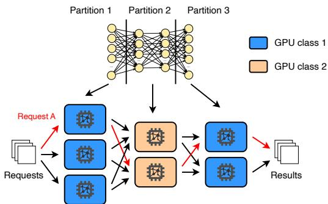

Figure 1: Pool-based pipeline parallelism on a heterogeneous GPU cluster with model partitioning. Each request (e.g., request A) is processed by all partitions sequentially, and may be processed by any of the GPU servers allocated to each partition (GPU pool).

from \$3.2 billion in 2023 to \$19.1 billion by 2030, at a CAGR of 29.2% [17].

In video analytics systems, streams of video frames from cameras deployed at different locations of interest are uploaded to the cloud servers that perform analytics, i.e., deep neural network (DNN) model inference. Serving such inference requests is challenging for two primary reasons. First, video analytics inference requests often have stringent service level objectives (SLOs), e.g., 200 ms [26, 65]. Second, inference requests from real-world applications can be bursty [11, 34, 47, 62]. Meeting the latency SLO for all inference requests requires provisioning hardware resources for the peak load, which can be costly as the hardware resource becomes under-utilized during off-peak periods.

As with model training, model inference relies on the use of accelerators such as GPUs. With rapid innovation of GPUs [40], newer generations of GPUs are introduced to the market in short release cycles. Yet, their high cost and limited supply have dis-incentivized cloud vendors and private organizations from retiring older generations of GPUs. As a result, these organizations are increasingly operating highly heterogeneous GPU clusters [54].

This paper studies how to serve popular DNN models, i.e., with high volumes of requests [8], on heterogeneous GPU clusters. Being able to do so not only allows utilizing lowclass computing resources that are otherwise unusable [43] in clusters dedicated to model serving, e.g., in edge clouds or private clouds running AI-based apps [7, 18], but also, as we will show in this paper, can significantly enhance the serving throughput of high-class GPUs.

In particular, we explore the under appreciated benefits of pipeline parallelism among lower-class and higher-class GPUs in online model serving. While the benefits of pipeline parallelism have been well studied for throughput-oriented model training [14, 29, 32, 43, 56], its potential for model serving under latency (SLO)-constrained settings on heterogeneous GPU clusters has been largely unexploited. Intuitively, the benefits of partitioning a model and pipelining the partitioned inference among mixed high-class and low-class GPUs appear limited. For example, if the high-class GPU is 10× faster (i.e., lower latency) than the low-class GPU for a given model, then simply running 1/10 of the model layers on the low-class GPU already leads to 1.9× longer total latency.

We instead make a key observation about the performance characteristics of DNN model inference on heterogeneous GPUs: the two forms of diversity in model inference on a heterogeneous GPU cluster — diversity in model layers and in GPU types — can interact with each other synergistically. First, a DNN model typically has many layers with diverse operations and tensor dimensions, leading to varying GPU utilization on a given GPU. Second, more importantly, for the same DNN model, the relative per-layer inference latency on different classes of GPUs can vary significantly across the model layers. This observation suggests that partitioning the DNN model in a GPU-aware manner and executing each partition on the GPU type that runs most effectively can improve the effectiveness of all GPU types and hence the inference throughput of the whole cluster. Effectively, lower-class GPUs offload part of the model inference from higher-class GPUs with minimum elongation of the end-to-end inference latency.

While this observation provides guidelines on efficient pipeline parallelism on heterogeneous GPU servers, partitioning a model and running the partitions along a chain of GPUs, as done in pipeline parallel DNN training [25, 39], is too stringent and leads to suboptimal partitions: all partition stages must have matching latencies to avoid pipeline stalls, which restricts the flexibility of model partitioning and leaves less opportunity for low-class GPUs to run layers they are efficient at.

To this end, we present PPipe, a model serving system that harnesses mixed GPU types in heterogeneous GPU clusters to maximize serving throughput. PPipe is built on three key ideas. First, to improve scheduling flexibility, it employs pool-based pipeline parallelism where each model partition is associated with a pool of GPU servers, and each request can be processed by any GPU in each partition pool along the pipeline, as shown in Figure 1. Such pooled pipeline parallelism allows different partitions to have different numbers of

GPU servers, varying inference latencies, and run with different batch sizes, as long as the inference throughput provided by each pool of GPU servers matches with each other.

Second, to realize the scheduling flexibility exposed by pool-based pipelined model inference, PPipe generates the optimal configuration of pool-based pipelined model inference, e.g., one that maximizes the model serving throughput of a given cluster while meeting inference SLOs, using Mixed Integer Linear Programming (MILP), which takes as input the per-layer inference latency on all candidate GPUs and under all candidate batch sizes from offline profiling.

Such an MILP-based optimal solution, however, effectively assumes ideal request arrivals, i.e., synchronous arrival of batches in locksteps at all GPUs of the first partition pool, and flow down the pipeline partitions in sync. In practice, the inference requests arrive asynchronously and can be bursty [11, 34, 47, 62], which creates transient high load that overwhelms the throughput prescribed in the MILP solution, introducing several sources of extra delay not accounted for in the MILP solution and leading to SLO violations.

To bridge the gap between the MILP solution and runtime dynamics due to asynchronous and bursty request arrivals, PPipe treats the MILP-based formulation as the control plane which prescribes optimal DNN model partition and GPU allocation, and employs a novel data plane that performs resource reservation-based adaptive batching to address the unique challenges in batching pooled-based pipelines: deciding for each batch which pooled pipeline, which path within the pipeline, and the batch size. Our scheduler overcomes the above challenges by (1) maintaining (current and future) availability of resources (GPUs and network bandwidth) in the pooled pipelines; and (2) probing them to find the maximal batch of requests that can meet the SLOs of each request when the batch reaches the end of the pipeline path.

We evaluate PPipe using production workloads on top of 100-GPU large-scale simulations and 16-GPU testbeds on Google Cloud consisting of a variety of high- and low-class GPUs such as NVIDIA V100, L4, T4, and P4. Evaluation across 18 CNN models shows that PPipe achieves 44.1%– 65.5% higher utilization of low-class GPUs while maintaining high utilization of high-class GPUs compared to various baselines, leading to 32.2%–75.1% higher serving capacity, while successfully processing 99% of the requests without dropping or SLO violations.

In summary, we make the following contributions:

• The first exploration of pipeline-parallel model serving on heterogeneous GPU clusters under latency (SLO)- constrained settings.

• The complete design of PPipe, which employs three design ideas to maximize inference throughput of heterogeneous GPU clusters: pool-based pipeline parallelism, an MILP-based control plane that prescribes optimal poolbased pipeline plans, and a data plane that performs resource reservation-based adaptive batching to handle runtime dynamics due to asynchronous and bursty request arrivals.

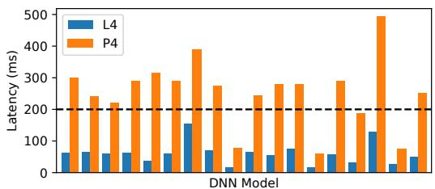  
Figure 2: Inference latency of 18 popular DNN models (Table 2) under batch size 4 on different GPU classes.

• Extensive evaluation of PPipe showing PPipe outperforms baseline designs by 32.2%–75.1% in inference throughput and 41.1%–65.5% higher low-class GPU utilization.

The source code of PPipe is available at https:// github.com/JonnyKong/PPipe.

## 2 Motivation and Key Idea

We motivate how low-class GPUs can be effectively used to augment high-class GPUs in a heterogeneous cluster in model serving by exploiting pipeline parallelism.

Low-class GPUs fail to meet the inference latency SLO. On a highly heterogeneous GPU cluster, the inference time on old or low-class GPUs is usually several times longer than that on newer or high-class GPUs. For the 18 DNN models we use for evaluation (§7.1), the inference time (on the highly optimized TensorRT [10] inference framework) on the lowclass NVIDIA P4 is 3.0x–7.9x longer than that on the highclass NVIDIA L4, as shown in Figure 2. Even if a model runs on the low-class GPU without violating latency SLO, it can barely perform batched inference, which could significantly improve GPU utilization and throughput [6,12,47]. As shown in Figure 2, only 22% of the DNN models can run on the lowclass GPU (NVIDIA P4) at batch size 4 without exceeding 200 ms, a latency SLO target commonly used among video analytics pipelines [26, 65].

Key insight: Diversity in per-layer inference delay across GPUs. Given the high latency of low-class GPUs, the benefit of partitioning and running a model across low- and highclass GPUs, if done in a GPU-oblivious manner, will be limited. For example, if the high-class GPU is 10× faster (i.e., lower latency) than the low-class GPU for a given model, then simply running 1/10 of the model layers on the low-class GPU already leads to 1.9× longer total latency. Our key observation is that there exist two forms of diversity in model inference on a heterogeneous GPU cluster: diversity in model layers and in GPU types, and they can interact with each other synergistically.

In particular, for many popular CNN backbone architectures, e.g., EfficientNet [49] and ResNet [23], later layers have more channels compared to earlier layers, but with lower feature dimensions. Such architectural differences among layers within a DNN model can lead to different computational properties on GPU accelerators. To gain insight into this, we measure the latency ratio, i.e., the ratio of the inference latency of the same layer on different GPU types for all the layers within a DNN model. Figure 3 shows that for EfficientNet-B8 on NVIDIA P4 over L4 and P4 over V100, respectively, with a moving window of 128 layers. The inference latency ratio on P4 over L4 is about 1.7 for early layers, indicating these layers have closer inference latencies on both P4 and L4. On the other hand, later layers have much higher latency ratios, and those layers will suffer significant slowdown running on P4 over L4. If we were to partition the DNN model and run it on P4 and L4, we should place earlier layers on P4 and later layers on L4, which provides higher chances to keep the inference time below the latency SLO and enables batching opportunities. All 18 DNN models we studied (Table 2) exhibit varying latency ratios across layers and we omit the rest due to page limit.

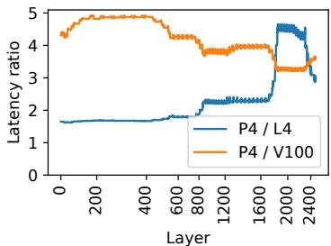  
Figure 3: The ratio of inference latency on NVIDIA P4 over L4 and P4 over V100 across EfficientNet-B8 [49] layers.

Interestingly, the latency ratios between P4 and V100 show completely different trends on EfficientNet, where earlier layers exhibit much higher latency ratios than later layers. In this case, one would run on P4 later layers instead. Such differences in the trends of latency ratios happen due to GPU design tradeoffs, architectural improvements, and their interaction with DNN layers of different characteristics. For example, GPUs with more SMs or higher ops:bytes ratio provide more benefits for layers of larger size or higher arithmetic intensity [19].

Such varying trends in per-layer latency ratios on different GPUs suggest that partitioning a DNN model in a GPU-aware manner is critical in exploiting pipeline parallelism so that high-class and low-class GPUs can work on model layers that they are optimized for, which improves their efficiency and hence the inference throughput of the whole cluster.

Key idea: pool-based pipeline parallelism. To apply model partitioning to exploit the diversity of per-layer inference ratio on different GPUs, a simple approach is partitioning a model and pipelining the inference of partitions along a chain of GPUs similarly as in pipeline parallelism in DNN training [25, 39], and feature maps generated by one GPU are transferred to the next downstream GPU. Such single-chain inference pipelines have the advantage of simple scheduling and coordination, but also come with two major drawbacks:

(1) To avoid pipeline stalls, all partitions need to have similar inference latencies. However, such a partitioning strategy is too stringent and will lead to suboptimal partitions, e.g., leaving layers with high latency ratios (on high/low-class GPUs) to run on the low-class GPU or having a large feature map at the partition point. (2) Many GPUs cannot take advantage of heterogeneous inference when the cluster contains more GPUs of one class than the other.

To provide more scheduling flexibility, we instead associate each partition with a pool of GPU servers of the same type, and each request can be processed by any GPU allocated to the first partition, and then continue the inference on any GPU in the second partition, and so on, as shown in Figure 1. This approach mitigates the drawbacks of single-chain pipelines: different partitions can have different numbers of GPU servers (e.g., $N _ { 1 }$ servers in pool 1, N2 servers in pool 2), have different inference latencies (e.g., t1 and t2 for the 2 pools), or even run with different batch sizes (e.g., b1 and b2 for the 2 pools), as long as the inference throughput provided by each pool of GPU servers matches well with each other (e.g., $N _ { 1 } * b _ { 1 } / t _ { 1 } =$ $N _ { 2 } * b _ { 2 } / t _ { 2 } )$ , and the total latency is below the latency SLO. In an optimal partitioning, multiple such pooled pipelines may be employed at the same time, employing different ways of partitioning the DNN model running on different GPU pools.

## 3 Prelude to PPipe: Basic MILP Formulation

To exploit pool-based pipelined inference, one needs to figure out the optimal way to partition a DNN model, the placement of the DNN partitions onto GPU servers, and the batch size for the GPUs in each partition. It is relatively straightforward to formulate an MILP problem to figure out the optimal solution. We briefly describe the MILP formulation below and present the full mathematical formulation in Appendix §A.1.

Inputs. The MILP formulation takes as input the GPU count of each GPU type, the interconnect bandwidth of the target cluster, and the inference latency SLO. To decide the optimal model partitions, it also requires the intermediate feature map sizes and the inference latencies of individual layers within a DNN model under different batch sizes and on different GPU models, which can be obtained from the profiling output of TensorRT [10].

Encoding model partition and placement. Suppose the GPU cluster consists of 2 GPU types and we restrict a DNN model to be divided into at most 3 partitions. The placement of DNN model partitions falls into one of 14 potential pooled pipelines: if partitioned into 2 partitions, each partition can run on a pool of either GPU types (4 pipeline options); if partitioned into 3, each of the 3 partitions again has the choice to run on a pool of either GPU types (8 pipelines); the DNN model can also directly run on a pool of either GPU type without partitioning (2 pipelines). As discussed in §2, the optimal solution may contain multiple pooled pipelines.

For each partition within a pooled pipeline, we need to decide on the exact partition points, i.e., the first and last layers. To this end, we construct a set of binary decision variables for each partition indicating whether each layer is the first or last layer of a partition. Apart from that, we also create decision variables to represent the batch size and the number of GPUs used by each partition.

Constraints. The total latency of each pooled pipeline, including the inference latency of each partition and the feature map transfer latency between partitions (both can be derived from the batch size), should be below the latency SLO; the total GPU count used by all partitions pertaining to a specific GPU type should not exceed the GPU count for that GPU type. Finally, the inference throughput of a pooled pipeline is bottlenecked by the partition of lowest throughput, where each partition’s throughput can be calculated based on its batch size, inference latency, and the number of GPUs allocated to the partition. We observe that CNN models commonly used in video analytics pipelines are typically not memoryconstrained on datacenter GPUs; hence, the MILP formulation does not account for GPU memory.

Objective. By default, we try to maximize the total inference throughput of the GPU cluster, which is the sum of the throughputs of all pooled pipelines employed by the MILP solution. The MILP formulation can also be configured for other objectives like minimum server cost [24] or provisioned power [28]. In the presence of multiple DNN models, given the ratio between the DNNs’ workloads, the MILP formulation computes the normalized throughput for each DNN (throughput divided by the DNN’s workload percentage), and maximizes the lowest normalized throughput among the DNNs.

Outputs. The solver of the MILP formulation outputs the pooled pipelines employed by the optimal plan, i.e., those being allocated at least 1 GPU. For each pipeline, the solver outputs the DNN model partition points, the batch size used by the GPUs in each partition, and the number of GPUs allocated to each partition.

In essence, MILP holistically determines an optimal set of pooled pipelines by selecting the model partition points for each pipeline, along with the GPU type, count, and batch size for each partition in each pipeline, all of which affect the overall throughput of the GPU cluster.

## 4 Challenges in Developing a Working System

While the MILP formulation above provides the optimal plan in theory, turning it into a working DNN serving system faces several practical challenges, as discussed below.

C1: Extensive search space of the MILP formulation. The MILP formulation needs to decide the first and last layers of a DNN partition, whose complexity depends on the number of layers in a DNN model. For the set of representative models in our evaluation (§7.1), the average layer count is 613.2. The partition points need to be searched for all partitions across all pipelines, making the search space combinatorial. The search space is further inflated by additional dimensions including inference batch size and GPU count used by each partition. With such a vast search space, it takes more than 7 hours (running the Gurobi [21] solver on a Google Cloud n1-standard-64 instance) to obtain the optimal solution for 80 layers, making it impractical to adapt to changing workload, e.g., diurnal load [28].

C2: Asynchronous and bursty request arrival. In essence, the MILP formulation outputs a solution that assumes ideal inference request arrival. Suppose a pipeline solution consists of two partitions with 40 ms inference latency each, and the inference throughput is 1000 requests per second. The MILP solution effectively assumes that 40 requests arrive at the same time every 40 ms, which are simultaneously processed by all GPUs allocated to the first partition, and then forwarded to the second partition, and so on.

In reality, in an online inference system, inference requests arrive asynchronously and in a bursty manner, which can disrupt the MILP solution with two forms of extra delays: (1) Early arriving requests have to wait for later requests to form a batch to be dispatched to a GPU in the first partition, incurring initial batching delay (D1); (2) The staggered batchedfl inference initiated on the GPUs in the first partition will cascade through the remaining partitions in the pipeline. In such staggered pipelined inference, it is possible when a GPU in partition i finishes inference on a batch, all of the GPUs in partition i + 1 are still busy running other batches, causing inter-partition queuing delay (D2). Such queuing delay is further complicated when partitions use different batch sizes, requiring the split and merge of batches which creates complex dependencies between the GPUs of different partitions.

To incorporate the above extra delays at runtime, we could add a predefined margin to the latency SLO as input to the MILP formulation [44, 47] which will output adjusted (still fixed) batch sizes. But simply adding a static margin cannot handle bursty request arrival, which can still result in either too many or too few transient requests compared to the statically adjusted target batch size. Such dynamic conditions require dynamically adjusting the batch sizes.

C3: Network contention. We observe that heterogeneous clusters such as Google Cloud Platform (GCP) and Amazon Web Services (AWS) come with high-bandwidth networks that theoretically can finish the transfer of a feature map with a small percentage of the total inference latency. For example, GCP’s P4 instances have a bandwidth of 32 Gbps, which can theoretically transfer feature maps of CenterNet (with batch size 1) which range from 3 MB to 50 MB in 0.8–13.2 ms. However, it is common for multiple GPUs to collocate on the same server, sharing the server’s network bandwidth. This can lead to network contention between GPUs (D3) that disrupts pipeline schedules and causes SLO violations. The contention becomes more severe when we divide each GPU into multiple virtual GPUs (§5.3), which increases the number of “GPUs” on the same server that likely transfer feature maps at the same time. Note that this issue cannot be addressed by conservatively allocating each virtual GPU an equal share of the available bandwidth, as it results in low bandwidth for all virtual GPUs, significantly limiting the benefit of pipeline parallelism.

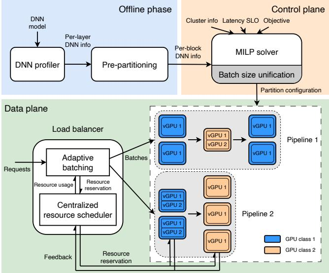  
Figure 4: PPipe architecture.

## 5 PPipe Design

As discussed above, designing a practical pool-based pipeline parallel inference serving system faces a key challenge: the MILP formulation does not capture or handle runtime dyfinamics due to asynchronous and bursty request arrival or delayed feature map transfer from network contention. We fitackle these challenges by splitting PPipe, our pool-based pipeline parallel inference serving system for heterogeneous GPU clusters, into a control plane and a data plane. First, PPipe treats the MILP-based formulation as the control plane that prescribes optimal DNN model partitions and GPU allocation for each pooled pipeline. Second, to handle delays caused by asynchronous and bursty request arrivals (D1 & D2) and network contention (D3), PPipe employs a novel data plane that performs resource reservation-based adaptive batching to ensure the request batches injected into the pooled pipeline meet their latency SLOs.

## 5.1 Architecture Overview

Figure 4 shows the architecture of PPipe, which consists of an offline phase, a control plane, and a data plane.

Offline phase. In the offline phase, the DNN model profiler profiles a model’s per-layer inference latency on different GPU types. To reduce the search space of the MILP solver (C1), we design a pre-partitioning method that groups the layers of each DNN model into blocks which are fed into the MILP solver (§5.2). With this method, the MILP solver only needs to find partition points among a few blocks instead of hundreds of layers, significantly reducing the search space. We profile each model and each block independently, and each block is profiled on every GPU type and batch size. The profiling is fast, requiring only a few hours to cover all 18 DNN models. Since the addition of models happens infrequently, and each model will be served over a long time, the one-time offline profiling cost is amortized and manageable. When solving MILP, the latency of each partition is computed as the sum of the latencies of its constituent blocks.

Control plane. The control plane, which runs the MILP solver, takes as input the profiling information of DNN blocks and the inference latency SLO for each DNN, the cluster information (GPU count for each GPU model), along with high-level objective, e.g., maximum throughput, and outputs the partitioning of each DNN model and allocation of GPU resources across partitions in each pooled pipeline (detailed in §3). We observe that the synchronization among partitions (C2) could be much simpler if partitions within the same pooled pipeline all use the same batch size. As such, we enhance the MILP formulation with batch size unification.

The MILP solver runs periodically, triggered dynamically in response to workload changes, such as shifts in the load ratio when serving multiple DNNs, which typically occur once every one or a few hours [28, 68]. Note that the MILP solver runs on the CPU, and is asynchronous to the inferences running on the GPUs. Migrating to a new MILP plan involves reassigning GPUs to different partitions or pooled pipelines, and having the data plane dispatch the requests according to the updated plan. To minimize migration latency, each GPU asynchronously preloads the new model weights into memory ahead of the switch, without interrupting the ongoing inference of the existing model; this is feasible because GPU memory is generally not a bottleneck for vision models. Once all GPUs complete loading, PPipe pauses ingesting new requests to perform a pipeline flush, which takes about 1x the SLO of the currently serving DNNs (in the order of 100s of milliseconds). After the flush, all GPU switch to the new weights simultaneously and the data plane resumes request dispatching. In essence, each migration incurs a downtime of several hundred milliseconds, which is negligible compared to the interval between migrations.

Data plane. The data plane groups inference requests into batches and executes them through the pools of GPUs in each of the pipelines prescribed by MILP. To address the extra delays D1–D3, we design a novel adaptive batching scheme that selects the pooled pipeline to execute the next batch, one GPU from each pool to run the corresponding model partition (the pipeline path), and the actual batch size that meets the request SLOs.

## 5.2 DNN Pre-Partitioning

As discussed in C1, the sheer number of layers within a DNN model results in a huge search space for the MILP formulation and prevents the solver from finding good plans in a reasonable amount of time. To this end, we devised a simple DNN pre-partitioning approach that groups the layers in a DNN model into a few (N) blocks of approximately equal runtime on a selected GPU type; empirical results show that the choice of GPU type has minimal impact on the partitioning. Specifically, we start from the first layer and sequentially group consecutively layers together until their combined runtime is as close as possible to 1/N of the runtime of the entire DNN; this process is repeated until we reach the last layer. After grouping layers into blocks, we profile the blocks on different GPU types and with different batch sizes, as needed by the MILP solver. It takes only less than 10 minutes to profile a single DNN model, as each block can be profiled independently; when solving MILP, we obtain the latency of each partition by adding up the latencies of the blocks in it.

With pre-partitioning, the MILP solver only needs to find partition points among the N blocks (we tried N = 5 to N = 20 and found N = 10 provides a good balance between plan optimality and MILP running time), instead of 613.2 layers on average across the set of models (§7). As a result, the MILP runtime is significantly reduced to 3.5 seconds on average over different DNN model and GPU cluster setups.

## 5.3 Batch Size Unification

We tackle the key challenge of the data plane — bridging the gap between MILP solution and runtime dynamics (C2 and C3) — in two steps. In the first step, we simplify the challenges faced by data plane scheduling with batch size unification.

As discussed in C2, mismatch of batch sizes between partitions within a pooled pipeline requires batches to be merged and split which complicates scheduling of batched inference across partitions. Things can be substantially simplified if all partitions within the same pooled pipeline use the same batch size. However, as the GPUs have different computational capacities, in the plans generated by the MILP planner, high-class GPUs tend to use larger batch sizes compared to low-class GPUs to improve GPU utilization and inference throughput. Naively forcing all partitions within the same pooled pipeline to use a uniform batch size can lead to underutilization of high-class GPUs and degrade overall system performance.

Instead of forcing all partitions of a pooled pipeline to use the same batch size, we vary the GPU size to equalize the batches per GPU. Specifically, we incorporate virtual GPUs into the MILP formulation, so that the MILP solver can take into account the throughput and inference latency differences between batches on different partitions and make holistic decisions in choosing a unified batch size. To this end, instead of feeding a GPU as a whole to MILP, we feed four possible virtual GPU types: 1/1, 1/2, 1/3 and 1/4 of a physical GPU (this is achieved with Multi-Process Service (MPS) [38] during runtime). The use of virtual GPUs only mildly expands the search space of the MILP solver as there are only 4 virtual GPU types. Further, we profile the per-block inference latencies under not only different batch sizes and GPU types, but also different virtual GPU types.\* Finally, we add additional constraints to the MILP formulation requiring all partitions within the same pooled pipeline to use the same batch size. The mathematical representation of the enhanced MILP formulation is provided in Appendix §A.2.

## 5.4 Resource Reservation-Based Adaptive Batching

With batch size unification, PPipe stills needs to perform adaptive batching at runtime, i.e., dynamically forming and scheduling batches, in serving asynchronous and bursty inference requests.

Compared to pipelined inference over a single chain of GPUs, dynamic batching in pool-based pipelines faces unique new challenges. In a chain of GPUs, the scheduler just needs to find the largest batch size that satisfy the end-to-end SLO. In a cluster of pooled pipelines (output by the MILP solution), the batching scheduler has to make three decisions for each batch: which pooled pipeline, which path within the pipeline, and the batch size. The decisions are further complicated by: (1) the optimal batch size depends on which pipeline the batch is sent to; (2) the optimal pipeline path in turn depends on the batch size and resource availability in the pooled pipeline.

Resource reservation-based adaptive batching. Our resourcereservation-based adaptive batching scheduler overcomes the above challenges by (1) maintaining (current and future) availability of resources (GPUs and network) in the pooled pipelines; and (2) probing them to find the maximal batch of requests that can meet the SLOs of each request when the batch reaches the end of the pipeline path.

The scheduler works in two steps, both using a stateless probing procedure probe(). The procedure takes a specific pooled pipeline and a hypothetical batch size as input, and outputs the pipeline path that minimizes the end-to-end (E2E) inference time under current resource availability, with an example shown in Figure 5a. The E2E inference time includes the per-stage inference time, network transfer time, and the waiting time for required resources (GPU and NIC) along the pipeline path. The detailed algorithm of probe() is explained later.

In Step 1, we identify the pooled pipeline i that can complete a batched inference at the pipeline’s unified batch size bsi (as determined by the MILP solution) with the shortest waiting time under the current resource availability. This is achieved by invoking probe() for each pooled pipeline with its corresponding unified batch size, and selecting the pipeline that has the lowest waiting time, where the waiting time is computed as the sum of delays waiting for each required resource along the pipeline path. Using waiting time as the metric effectively balances the load between the pipelines because it is a good indication of the load of the pipeline, i.e., the lower the waiting time, the lower the load on the pipeline.

The E2E inference time of sending a batch of size bsi down the selected pipeline i in Step 1, however, may not meet the SLO (as the batch size bsi generated by MILP assumed synchronized request arrival). In Step 2, using the chosen pooled-pipeline i, we search for the actual largest batch size that can meet the SLOs and the corresponding pipeline path. Specifically, we iteratively invoke probe() with progressively smaller batch sizes, starting from $b s _ { i }$ (the batch size from the MILP solution), until the completion time of the pipeline path returned by probe() falls within the deadline of the first (oldest) pending request. Finally, one of three actions is taken depending on the chosen batch size and the number of pending requests: (1) If the deadline cannot be met even with batch size 1, the oldest request will be dropped and the adaptive batching process starts over from choosing a pooled pipeline (Step 1); (2) if the number of pending requests is smaller than the chosen batch size, the batching engine waits for more requests (till the last moment when the requests in queue can still be processed without SLO violation); (3) otherwise, the resources of the selected pipeline path returned by probe() are reserved (by calling reserve()), i.e., their availability are updated as shown in Figure 5b, and the requests at the head of queue are grouped into a batch of the chosen batch size and dispatched to the selected pipeline path according to the resource reservation. Since the batch size is based upon the actual remaining time of the requests in the queue, the extra delay D1 (initial batching delay) is taken into account, and the requests in the batch are guaranteed to meet their SLOs.

The pseudocode for our adaptive batching algorithm is provided in Appendix §A.3.

The probing procedure. Since adaptive batching works at the batch level, the probing procedure needs to be fast to keep up with the request arrival rate. To this end, we implement probe() based on a greedy algorithm. In a nutshell, probe() works by sequentially selecting one GPU from each GPU pool along the pooled pipeline. For each GPU pool, it goes through all GPUs allocated to the pool and selects the GPU that minimize the completion time for that partition stage. During this process, probe() determines which resources—GPUs, uplink bandwidth, and downlink bandwidth—need to be reserved for specific future time intervals. Note that since feature map transfer require simultaneous availability of network resources on both the sending and receiving sides, probe() ensures the allocation of network resources that satisfy both the uplink of the preceding GPU and the downlink of the current GPU.

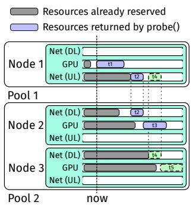  
(a) probe() takes as input a candidate pooled pipeline and batch size, and outputs the optimal pipeline path and the intervals of resources to be used (in blue).

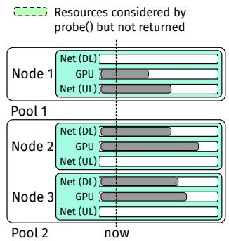  
(b) reserve() marks the resource intervals as reserved until the end of the intervals returned by probe().  
Figure 5: The resource reservation mechanism on an example pooled pipeline comprising two partitions, with 1 and 2 GPUs, respectively.

We illustrate the workflow of probe() with an example in Figure 5a. Consider a pooled pipeline consisting of two pools, containing one and two GPUs respectively. For simplicity, we assume each GPU resides on a separate node, although in practice, multiple GPUs may reside on the same node and share the same network resources. In the first pool, probe() selects node 1 as it is the only option, which requires reserving its GPU for time duration t1. In the second pool, probe() needs to decide between nodes 2 and 3. Selecting node 2 requires the simultaneous reservation (as shown by the vertical dotted line) of node 1’s uplink and node 2’s downlink network during t2, as well as node 2’s GPU during t3, after which the request completes; alternatively, selecting node 3 results in a completion time by the end of t5. Since node 2 results in an earlier completion time than node 3, probe() selects node 2. In the end, it returns the selected pipeline path with associated resource allocated: node 1’s GPU during t1, node 1’s uplink and node 2’s downlink network during t2, and node 2’s GPU during t3.

Since probe() is based on real-time resource availability, it directly takes into account extra delays D2 (inter-partition queuing delay) and prevents D3 (network contention delay). Furthermore, probe() runs in real time, and scales linearly with the number of virtual GPUs allocated to the pooled pipeline. The pseudocode for probe() and reserve() are provided in Appendix §A.3.

Feedback correction. The scheduler maintains resource reservation tables that keep track of when each resource will be used. However, this scheduler’s view of resource usage might deviate from reality due to variations in inference time and network bandwidth. To this end, we let all nodes report back to the scheduler when the reserved resources were actually used immediately after every resource usage. The scheduler updates the resource usage table accordingly. The feedback correction mechanism ensures that the scheduler’s view of resource usage is synchronized with reality at all times.

Extra SLO margin in the control plane. While our resource reservation-based adaptive batching algorithm ensures requests meet their SLOs, we notice that the resulting batch size may be much smaller than that in the MILP output due to extra delays D1–D3, causing large deviations from the MILP plan. To bridge the gap between control plane planning and data plane execution, we deduct an empirically determined margin from the SLO when running the control plane MILP solver, so that the adaptive scheduler picks the same batch sizes as in the MILP output most of the time.

Dispatching Complexity. In the worst case, dispatching a batch requires a number of probe() function calls equal to the product of the number of pipelines in the cluster and the number of candidate batch sizes. Each probe() function call has a time complexity linear to the number of GPUs within the corresponding pipeline. Consequently, the adaptive batching algorithm incurs low runtime overhead, as we will demonstrate in §7.2.

## 6 Implementation

Offline phase and control plane. We implement the offline phase and control plane in Python in 2.7 kLOC. We use Gurobi [21] as the MILP solver. We work with DNN models in their ONNX format and TensorRT format interchangeably, since the ONNX format provides flexibility, while the TensorRT format provides high inference performance.

Data plane. We implement both a discrete-event simulator for modeling large-scale GPU clusters and a prototype implementation for PPipe’s data plane, in about 9.0 kLOC. The simulator is written in Java and maintains a global event queue sorted by timestamp, executing events in chronological order. Supported event types include request arrivals, batch dispatches, per-partition executions, and feature map transfers, etc. At each simulation step, the simulator dequeues the next event, invokes the corresponding event handler, which updates the system states and may produce additional events to be added to the event queue (e.g., a request arrival event adds the request to the waiting queue and triggers a scheduler event).

The prototype implementation is written in a combination of Julia and C++, using TCP for control message exchanges and NVIDIA NCCL for transferring feature maps between nodes. To minimize the feature map transfer latency, we quantize float32 feature maps to float16 (only at partition boundaries), effectively reducing the transfer size by half. We find such quantization has negligible impact on task accuracy. The accuracy dropped by 0.00%, 0.01%, and 0.01% for object recognition, object detection, and instance segmentation tasks, respectively.

Table 1: Heterogeneous Cluster (HC) setups.
<table><tr><td>Setup</td><td>GPUs</td><td>Setup</td><td>Instances</td><td>GPUs</td><td>BW (Gbps)</td></tr><tr><td>HC1-L</td><td>25×L4, 75× P4</td><td>HC1-S</td><td>4× g2-standard-16, 2× n1-highcpu-16</td><td>4×L4, 12× P4</td><td>50</td></tr><tr><td>HC2-L</td><td>25×L4, 75× T4</td><td>HC2-S</td><td>1× g2-standard-48, 6× n1-highcpu-32</td><td>4× L4, 12× T4</td><td>32</td></tr><tr><td>HC3-L</td><td>25×V100, 75×P4</td><td>HC3-S</td><td>2× n1-highcpu-16, 12× n1-highcpu-16</td><td>4×V100, 12× P4</td><td>50</td></tr><tr><td>HC4-L</td><td>25×V100, 75× T4</td><td>HC4-S</td><td>1× n1-standard-64, 6× n1-highcpu-32</td><td>4×V100, 12× T4</td><td>32</td></tr></table>

Table 2: DNN models used in the evaluation.
<table><tr><td>Recognition</td><td>Detection</td><td>Segmentation</td><td>Others</td></tr><tr><td>ConvNext [35] EfficientNet [49]</td><td>ATSS [64] CenterNet [15] FSAF [69]</td><td>APCNet [22] DNL-Net [57] EncNet [61]</td><td>Color-v2 [63]</td></tr></table>

## 7 Evaluation

In this section, we evaluate PPipe’s serving performance under a variety of DNN models from different tasks, considering various combinations of low-class and high-class GPUs. We show that PPipe can serve 32.2%–75.1% more requests compared to various baselines while meeting 99% SLO attainment, on the discrete-event simulator with 100 GPUs. Additionally, on 16-GPU clusters deployed on Google Cloud, PPipe achieves 16.7%–52.8% higher serving throughput. We also conduct sensitivity analysis to show the impact of GPU composition and SLO on PPipe’s performance.

## 7.1 Methodology

Cluster configuration. We consider 4 heterogeneous cluster setups, labelled as HC1−HC4 in Table 1. Each setup consists of a large (L) 100-GPU variant used for the discrete-event simulator, and a small (S) 16-GPU variant deployed on Google Cloud. Note that a Google Cloud VM instance can host multiple GPUs, resulting in each HC having a varying number of VMs while maintaining a consistent number of GPUs. Accounting for the scarcity of high-class GPUs [54], our default configuration includes 25 high- and 75 low-class GPUs for each HC’s large variant, and 4 and 12 for the small variant. We further evaluate PPipe’s performance under different ratios of high- and low-class GPUs in §7.6. Note that for GPUequipped VMs, Google Cloud provisions network bandwidth based on the number and type of its GPUs, leading to different interconnect bandwidths across HCs. Furthermore, the effective bandwidth for both large and small clusters is only 1/5 the claimed values in Table 1 to accommodate the observed 5× network tail latency on Google Cloud.

Workloads. Following prior works [34, 62], we use Microsoft’s Azure Function (MAF) traces from 2019 [46] and 2021 [66], which were originally derived from Azure serverless function invocations, as representative inference serving workloads. When serving multiple DNNs in parallel (§7.2), functions are assigned to DNNs in a round-robin manner to determine the workload ratio among DNNs. The MAF 2019 trace only includes per-minute aggregated request counts for each serverless function, and thus we issue requests using Poisson arrival at the given target load. Conversely, the MAF 2021 trace includes per-request arrival timestamps, and thus we upscale the trace to the target load and issue requests accordingly. The Poisson-emulated 2019 trace is less bursty than the 2021 trace, and thus we refer to the two traces as “Poisson” and “Bursty”, respectively.

DNN models. We select 18 popular DNN models from public DNN registries such as TorchVision [51], OpenMMLab [41], and OpenVINO model zoo [42]. The selected DNNs serve a variety of popular computer vision tasks, as shown in Table 2. Metrics. We employ two key metrics to evaluate the inference serving capability. First, SLO attainment represents the percentage of requests that are successfully processed without being dropped or violating the SLO, under a specific offered load. Second, we measure the maximum load that the system can handle at 99% SLO attainment.

Baselines. The large amount of recent works on model serving on heterogeneous clusters do not incorporate pipeline parallelism, and thus we abstract them into a state-of-the-art baseline, denoted as NP below. We also compare PPipe with the only prior work that exploits pipeline parallelism across heterogeneous GPUs, DART [55], which uses a single-chainbased pipeline of GPUs. To isolate the benefit of pool-based pipeline parallelism, we enhance all baselines to use PPipe’s data plane, i.e., the resource reservation-based adaptive batching (§5.4) in presenting the overall results (§7.2 & §7.3). We then evaluate the benefit of PPipe’s second novel design, resource-reservation-based adaptive batching, in §7.4.

• No-Partitioning (NP). NP executes the entire DNN on either high-class or low-class GPUs without partitioning. This way of serving DNNs on a heterogeneous cluster is representative of various prior works [11,24,27,28,30,31,45,60]. In particular, the allocation is done by solving PPipe’s MILP formulation without model partitioning. When integrated with PPipe’s reservation-based adaptive batching, NP effectively dispatches the largest possible batch to the next available GPU while meeting the SLO for each request in that batch.

• DART-r. DART [55] is an inference framework that partitions a DNN onto heterogeneous CPU and GPU cores. However, vanilla DART constructs a pipeline by chaining all available GPUs, each serving one model partition. This restricts its use to small clusters, as long pipelines incur significant overhead due to frequent feature map transfers. To address this limitation, we introduce DART-r, a modified version that replicates DART configurations for pairs of lowand high-class GPUs (more efficient than longer pipelines from fewer feature map transfers). If one GPU class has more GPUs than the other, the leftover GPUs are allocated to individually run entire DNNs without partitioning.

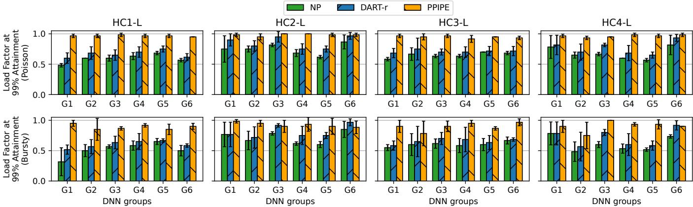  
Figure 6: Maximum load factor of each framework under 99% SLO attainment on 100-GPU clusters, under “Poisson” and “Bursty” workloads.

Setup. Following prior work [34], for each DNN, we set the default SLO to be 5× its inference latency on the fastest GPU (NVIDIA L4) at batch size 1, resulting in SLOs ranging from 23.4 ms to 165.6 ms. This reflects the assumption that end users can tolerate higher latency for more complex models but are indifferent to the underlying GPU used. We further evaluate PPipe under other SLOs in §7.6, ranging from 2× to 10×. As mentioned in §5.4, to bridge the gap between control plane planning and data plane execution caused by the extra delays, a 40% margin is deducted from DART-r and PPipe’s MILP formulation, and in NP in picking the maximum batch sizes that satisfy the SLOs. When comparing PPipe with the baselines, we use load factor 1.0 to denote the throughput in the output of PPipe’s MILP. We generate requests using “Poisson” and “Bursty” traces respectively, with an average request rate (λ) ranging from 0.05 to 1.0 times the load factor, at an interval of 0.05. For each λ, the experiment lasts 30 seconds.

## 7.2 End-to-end Results

Overall results. In this section, we evaluate PPipe’s capability of serving DNNs over 100-GPU clusters (HC1-L to HC4-L) on the discrete-event simulator. We randomly divide the 18 DNNs into 6 groups of 3 DNNs each (G1–G6), and serve DNNs within each group in parallel. During runtime, we record the maximum load ratio that each DNN can achieve under 99% attainment.

Figure 6 shows under cluster configurations HC1-L to HC4- L, the maximum load factor achieved under 99% SLO attainment, averaged over the DNNs in each group. First, we find that PPipe consistently outperforms NP. PPipe achieves on average 48.0% higher load factors than NP on the “Poisson” trace (64.9%, 34.8%, 46.7%, and 45.5% higher for HC1-L to HC4-L, respectively), and 75.1% on the “Bursty” trace (161.6%, 34.1%, 50.4%, and 54.1% higher), showing the advantage of PPipe’s pipeline parallel inference scheme. Second, compared to DART-r, PPipe achieves 32.2% higher load factors on the “Poisson” trace (47.2%, 17.3%, 34.8%, and 29.3% higher on HC1-L to HC4-L, respectively), and 35.8% on the “Bursty” trace (50.4%, 18.1%, 40.2%, and 34.5% higher), showing the advantage of PPipe’s pool-based pipelined inference over DART-r’s chain-based pipelined inference. Finally, while all frameworks suffer reduced load factors under the “Bursty” trace (61.1%, 69.4%, and 90.3% for NP, DART-r, and PPipe respectively), compared to “Poisson” (66.8%, 74.9%, and 96.5%), the improvement of PPipe over the two baselines remain high, showing PPipe’s robustness to varying request arrival patterns.

Figure 8 shows each framework’s temporal utilization of high- and low-class GPUs. For brevity, we only show the utilization on the “Poisson” trace. While all frameworks achieve high utilization of high-class GPUs, NP and DART-r show zero or low utilization of low-class GPUs. On average, NP, DART-r and PPipe achieve low-class GPU utilizations of 8.1%, 29.5%, and 73.6% respectively. NP’s low utilization is caused by the inference time of whole DNNs on low-class GPUs often higher than the SLO, prohibiting low-class GPUs from being used. While DART-r employs DNN partitioning, it chains only one low-end GPU with each high-end GPU, resulting in under-utilization of excess low-end GPUs when their number exceeds that of high-end GPUs.

SLO attainment under varying load factors. Figure 7 shows the SLO attainment under varying load factors. For brevity, we show only the SLO attainment for DNN group G1, which includes EfficientNet-B8, EncNet, and RtmDet, and only under the “Poisson” trace. The attainment is averaged over the 3 DNNs, e.g., on HC1-L at load factor 1.0, PPipe achieve SLO attainments of 99.3%, 97.6%, and 98.4% on the 3 DNNs respectively, resulting in an averaged attainment of 98.4%, which is shown in the figure at load factor of 1.0.

We observe that PPipe outperforms both NP and DART-r, achieving the highest SLO attainment under the same load factors. Consequently, it achieves a higher load factor while ensuring 99% SLO attainment (Figure 6). For example, on HC1-L, PPipe achieves 99% SLO attainment under load factors up to 0.95, meaning it can handle at least 95% of the load calculated by the MILP solver. In contrast, NP and DART-r’s

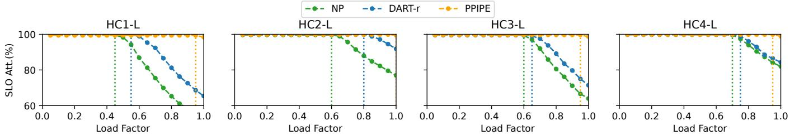  
Figure 7: SLO attainment of DNN group G1 under the “Poisson” trace with varying load factors, averaged over the 3 DNNs in the group. The vertical dotted line denotes the load factor at which each system reaches 99% SLO attainment.

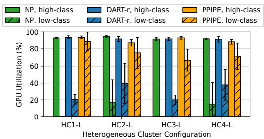  
Figure 8: GPU temporal utilization under 99% SLO attainment, averaged over DNNs for each cluster configuration.

SLO attainment dips below 99% as the load factor exceeds 0.45 and 0.55, respectively. This is due to the fact that a load factor of 1.0 represents the serving capacity of PPipe, which is higher than the capacity of NP or DART-r, leading to the dropping of requests beyond their respective serving capacities. Note that although PPipe achieves higher load factors than the baselines, it may not reach the full load factor of 1.0, as seen with HC1-L, HC3-L, and HC4-L. This is due to unpredictable request arrival patterns (e.g., Poisson), which cannot be fully accounted for by the MILP solver, as discussed in §4.

MILP runtime. PPipe’s MILP solver takes 3.5 seconds on average, showing the effectiveness of PPipe’s pre-partitioning (§5.2) in reducing the MILP complexity. This latency is negligible compared to the intervals between re-running the MILP — triggered by fluctuations in incoming load which occur relatively infrequently, e.g., once every hour [28, 68].

Adaptive batching overhead. PPipe’s resource-reservationbased adaptive batching mechanism is lightweight: on a 100- GPU cluster, dispatching a batch requires an average of only 3.58 probe() calls, incurring a total overhead of less than 9 microseconds. This overhead is negligible compared to the batch execution latency, even under bursty request patterns.

## 7.3 Testbed Results

We verify PPipe’s DNN serving capability on real-world 16- GPU heterogeneous cluster testbeds (HC1-S to HC4-S) deployed on Google Cloud. Due to the testbed’s smaller GPU counts, instead of serving DNNs in groups of three as in §7.2, we serve one DNN at a time with Poisson-arrival requests. Figure 9 shows the maximum load factor under 99% SLO attainment averaged over the 18 DNNs.

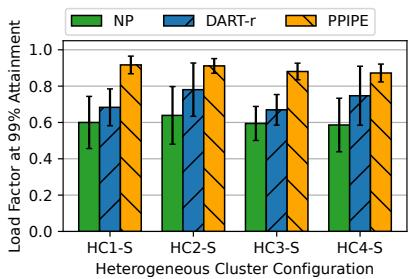

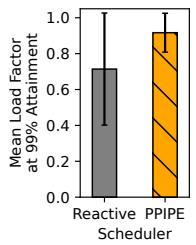  
Figure 9: Maximum load factor each cluster configuration can achieve under 99% SLO attainment on the testbed, averaged over the DNNs.  
Figure 10: SLO attainment with the reactive scheduler and PPipe’s data plane scheduler.

First, we observe that PPipe consistently outperforms NP, achieving 42.6%–52.8% higher load factors at 99% SLO attainment across the cluster configurations. This validates the advantage of PPipe’s model-parallelism inference in a realworld setting. Secondly, compared to DART-r, PPipe achieves 16.7%–34.1% higher load factors, which shows the advantage of PPipe’s pool-based pipelined inference. In summary, PPipe’s significant performance gains over NP and DARTr, previously demonstrated in the discrete-event simulator, remain consistent when deployed on a real-world testbed.

## 7.4 Ablation Study: Benefit of Resource Reservation

As discussed in §5.4, PPipe’s resource reservation-based data plane dynamically schedules requests onto GPUs to overcome the delays caused by bursty request arrival and network contention. To demonstrate its effectiveness, we compare it to a reactive, distributed adaptive batching scheduler. The reactive scheduler performs adaptive batching independently for each GPU pool in a pooled pipeline. For each pool, it selects the largest possible batch size that meets the pool’s SLO (as determined by the MILP solver). A similar idea was used in previous model-granularity pipeline scheduling in [47].

Figure 10 shows the maximum load factor achieved by the two data plane designs under 99% SLO attainment on HC2-L, averaged over the DNNs, under the “Poisson” arrival. PPipe achieves an average load factor of 0.92, while reactive only achieves 0.71. The primary factor contributing to this performance degradation is that the reactive, distributed scheduler lacks resource usage tracking which leads to batches being scheduled onto servers with saturated network links, causing bloated transfer delays. For example, for EfficientNet-B8, where PPipe achieves 99% SLO attainment at 1.0 load factor, the reactive scheduler only manages a 0.35 load factor. With 10 Gbps effective bandwidth, feature map transfer between the first and second partition should take 5.1 ms, but the reactive scheduler leads to transfer times of 18.9 ms on average and 35.7 ms at the 99% percentile, resulting in excessive request drops at the second partition in order for the remaining requests to meet their SLOs.

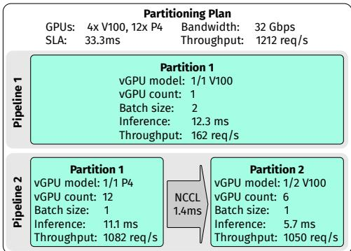  
Figure 11: Partitioning plan for the FCN model on HC3-S.

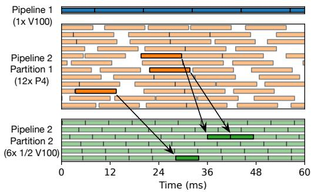  
Figure 12: An example timeline serving the FCN model on HC3. Each row represents a vGPU, and each box corresponds to a batched inference. The highlighted pairs of boxes denote the same batches across the partitions within a pooled pipeline.

## 7.5 Microscopic Analysis

In this section, we provide a microscopic analysis of PPipe, using the FCN model served on the HC3-S cluster testbed on Google Cloud as an example, where PPipe achieves a load factor of 0.95 under 99% SLO attainment.

Plan structure. Figure 11 shows the partitioning plan generated by PPipe’s MILP solver for cluster HC3-S, which consists of 4× V100 and 12× P4 GPUs. The inference latency of the FCN model on the fastest GPU (NVIDIA L4) is 6.66 ms, establishing an SLO of 33.3 ms under an SLO scale of 5. The resulting plan comprises two pipelines, one with a single partition and the other with two partitions.

The first pipeline consists of a single V100 GPU, performing inference with a batch size of 2, where each batched inference takes 12.3 ms. The theoretical throughput of this pipeline is $( 2 \times 1 / 0 . 0 1 2 3 ) = 1 6 2$ requests per second. The second pipeline consists of two partitions, with 12 P4 and 3 V100 GPUs respectively, with 1.4 ms of feature map transfer time in between. Employing batch size unification (§5.3), both partitions perform batch size 1 inference. To achieve such a unified batch size, PPipe divides the three V100s in the second partition into six virtual GPUs using NVIDIA MPS. Furthermore, we observe that the two partitions yield similar throughputs of 1082 and 1050 requests per second respectively, resulting in a total throughput of 1050 (the minimum of the two). This shows PPipe’s ability to balance resource allocation between partitions to achieve matched throughput. Runtime behavior. Figure 12 shows an example timeline of the DNN inference on each virtual GPU. We observe that PPipe performs inference back-to-back in pipeline 1, as well as pipeline 2 partition 2, fully using their GPUs. Note that pipeline 2 partition 1 experiences underutilization, due to the fact that it was provisioned with slightly higher serving throughput than partition 2 (Figure 11). Furthermore, the figure showcases that PPipe’s pool-based pipeline allows a batch to be processed by any GPU within each partition, allowing different partitions to use different numbers of GPUs to accommodate different per-partition inference latencies.

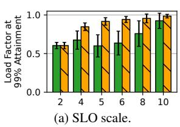

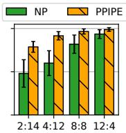  
(b) GPU ratio.  
(c) MILP margin.  
Figure 13: Sensitivity of PPipe to various factors. Results are averaged over 18 DNNs on HC1-S.

## 7.6 Sensitivity Analysis

In this section, we study PPipe’s sensitivity to various factors, on the cluster HC1-S testbed deployed on Google Cloud.

Varying SLO scales. Our main evaluation, which follows AlpaServe [34], uses 5x the inference latency as the SLO and shows significant performance improvement. We further evaluate PPipe considering various SLO scales ranging from 2x to 10x, as shown in Figure 13a. Although 2x and 10x SLOs are less used in practice, we include them to illustrate and validate PPipe’s expected behavior relative to the baselines. With an SLO scale of 2, PPipe shows no improvement over NP, as such stringent SLOs render the utilization of low-class GPUs impractical for either NP or PPipe. Consequently, PPipe resorts to running entire DNNs on high-class GPUs, essentially falling back to NP. Conversely, as the SLO scale increases to 10, PPipe’s improvement over NP becomes marginal, due to the fact that more DNNs can now meet the SLO running entirely on low-class GPUs, and hence the low-class GPUs can be utilized in NP, thereby narrowing the gap between NP and PPipe.

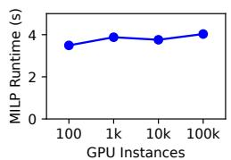  
(a) Varying GPU instances.

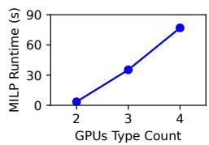  
(b) Varying GPU types.  
Figure 14: Scalability of PPipe’s MILP-based control plane.

Varying GPU ratios. In Figure 13b, we evaluate PPipe under varying ratios of high-class (NVIDIA L4) to low-class (NVIDIA P4) GPUs, which shows that PPipe attains more improvements over NP on clusters with fewer high-class GPUs. For instance, with a high-low ratio of 2:14, PPipe achieves a 64.03% higher load factor; as the percentage of high-class GPUs increases, PPipe’s improvement diminishes, reaching 5.64% at a high-low ratio of 12:4.

Varying SLO margin size. As discussed in §7.1, a 40% margin was subtracted from the SLO in the MILP formulation of both PPipe and NP. The impact of the margin size is two-fold — a larger margin size reduces the ideal-case serving capacity (i.e., what load factor 1.0 signifies), but increases the load factor achievable under 99% SLO attainment in practice. Figure 13c shows that under varying margin sizes, PPipe’s load factor increases with larger margin sizes, but plateaus as the margin size increases beyond 40%. Furthermore, PPipe achieves the highest gain of 52.8% over NP under the margin size of 40%, but also maintains a relatively high improvement over NP at 20% and 60% margin sizes, of 24.9% and 16.4% respectively. Varying GPU types and counts. We analyze how the runtime of PPipe’s MILP-based control plane scales with the number of GPU instances and types in a cluster. First, we scale up the HC1-L cluster (Table 1) from 100 to 100k GPUs. Figure 14a shows that the MILP runtime remains nearly constant. This is because adding more GPU instances does not introduce additional MILP variables, and the problem’s complexity stays unchanged. Second, as the GPU types increase to 3 and 4, Figure 14b shows the MILP runtime increases to 35.3 and 77.0 seconds, indicating the number of GPU types has a higher impact on MILP runtime. However, the increased runtime remains insignificant compared to the interval between MILP re-executions, which occurs on an hourly scale [28, 68].

## 8 Related Work

Pipelined partitioned DNN serving. Several works on DNN serving exploit pipeline parallelism for different scenarios and objectives. AlpaServe [34] improves serving throughput by employing pipeline parallelism to facilitate multiplexing of GPUs across multiple DNNs, but it does not take advantage of heterogeneous GPUs. Another line of works specialize in serving RNN or transformer-based models [16, 58] in a pipelined fashion. These works do not consider heterogeneous GPU clusters either. Finally, DART [55] partitions DNNs onto a chain of CPUs and GPUs. However, it does not scale to large GPU clusters, as it will generate as many partitions as the number of GPUs in the cluster, resulting in frequent transfer of feature maps which is costly.

Whole DNN serving on heterogeneous clusters. Such works typically focus on serving multiple DNNs concurrently, and study the placement of whole DNNs on servers with the goal of either minimizing the cost of cloud VMs [30, 45, 60], or maximizing the throughput of on-premise clusters [28, 31]. Furthermore, several works study serving video analytics applications that utilize multiple DNNs forming a Directed Acyclic Graph (DAG) [11, 24, 27]. None of above works exploits the diversity across the layers within a DNN.

Whole DNN serving, homogeneous clusters. Several works focus on model serving on homogeneous clusters [12, 20, 34, 47, 62]. However, these works lack resource allocation mechanisms that leverage DNN partitioning or GPU heterogeneity. Model parallel DNN training. Various works exploit tensor or pipeline parallelism (or both) in model training [14, 25, 29, 32, 39, 43, 52, 56, 67]. Compared to inference, training has a different set of scenarios and requirements, e.g., no need to meet SLOs or tackle non-deterministic request arrivals.

## 9 Conclusion

In this paper, we presented PPipe, a system for making effective use of mixed GPUs on heterogeneous clusters in serving video analytics applications. The key innovation of PPipe is three-fold: pool-based pipelined model inference, an MILPbased control plane that prescribes optimal pipeline plans, and a data plane that performs resource reservation-based adaptive batching to handle runtime dynamics due to asynchronous and bursty request arrivals. Evaluation results on production workloads show that PPipe achieves 32.2%–75.1% higher serving throughput compared to various baselines. In future work, we will explore extending PPipe to support transformerbased models, for instance, by partitioning them across highand low-class GPUs. This would improve the utilization of low-class GPUs and enhance the overall serving throughput, while still meeting SLO requirements.

## Acknowledgments

We thank the anonymous reviewers and our shepherd Purushottam (Puru) Kulkarni for their helpful comments. This work is supported in part by NSF grants 2112778, 2211459, and 2415216.

## References

[1] The most surveilled cities in the world. https://www.usnews.com/news/cities/articles/ 2020-08-14/the-top-10-most-surveilledcities-in-the-world, Last accessed, April 1, 2024.

[2] This is the most heavily surveilled city in the US: 50 CCTV cameras per 1,000 citizens. https://cybernews.com/editorial/this-isthe-most-heavily-surveilled-city-in-theus-50-cctv-cameras-per-1000-citizens/, Last accessed, April 1, 2024.

[3] One Legacy of Tiananmen: China’s 100 Million Surveillance Cameras. https://www.wsj.com/articles/BL-CJB-22562, Last accessed, December 1, 2021.

[4] One Surveillance Camera for Every 11 People in Britain, Says CCTV Survey. https: //www.telegraph.co.uk/technology/10172298/ One-surveillance-camera-for-every-11- people-in-Britain-says-CCTV-survey.html, Last accessed, December 1, 2024.

[5] A World With a Billion Cameras Watching You Is Just Around the Corner. https://www.wsj.com/ articles/a-billion-surveillance-camerasforecast-to-be-watching-within-two-years-11575565402, Last accessed, December 6, 2019.

[6] Ahsan Ali, Riccardo Pinciroli, Feng Yan, and Evgenia Smirni. Batch: Machine learning inference serving on serverless platforms with adaptive batching. In SC20: International Conference for High Performance Computing, Networking, Storage and Analysis, pages 1–15, 2020.

[7] Azure Private Multi-access Edge Compute (MEC), 2023. https://azure.microsoft.com/en-us/solutions/ private-multi-access-edge-compute-mec.

[8] Azure Cognitive Service for Vision. https: //azure.microsoft.com/en-us/products/ cognitive-services/vision-services/.

[9] Yue Cao, Jiarui Xu, Stephen Lin, Fangyun Wei, and Han Hu. Gcnet: Non-local networks meet squeezeexcitation networks and beyond. In Proceedings of the IEEE/CVF International Conference on Computer Vision Workshops, pages 0–0, 2019.

[10] Nvidia Corporation. NVIDIA TensorRT, 2017. https: //developer.nvidia.com/tensorrt.

[11] Daniel Crankshaw, Gur-Eyal Sela, Xiangxi Mo, Corey Zumar, Ion Stoica, Joseph Gonzalez, and Alexey Tumanov. Inferline: Latency-aware provisioning and scaling for prediction serving pipelines. In Proceedings of

the 11th ACM Symposium on Cloud Computing, SoCC ’20, page 477–491, New York, NY, USA, 2020. Association for Computing Machinery.

[12] Daniel Crankshaw, Xin Wang, Guilio Zhou, Michael J. Franklin, Joseph E. Gonzalez, and Ion Stoica. Clipper: A Low-Latency online prediction serving system. In 14th USENIX Symposium on Networked Systems Design and Implementation (NSDI 17), pages 613–627, Boston, MA, March 2017. USENIX Association.

[13] Xiaohan Ding, Xiangyu Zhang, Ningning Ma, Jungong Han, Guiguang Ding, and Jian Sun. Repvgg: Making vgg-style convnets great again. In Proceedings of the IEEE/CVF Conference on Computer Vision and Pattern Recognition, pages 13733–13742, 2021.

[14] Yifan Ding, Nicholas Botzer, and Tim Weninger. Hetseq: Distributed gpu training on heterogeneous infrastructure. Proceedings of the AAAI Conference on Artificial Intelligence, 35(17):15432–15438, May 2021.

[15] Kaiwen Duan, Song Bai, Lingxi Xie, Honggang Qi, Qingming Huang, and Qi Tian. Centernet: Keypoint triplets for object detection. In Proceedings of the IEEE/CVF International Conference on Computer Vision, pages 6569–6578, 2019.

[16] Jiarui Fang, Yang Yu, Chengduo Zhao, and Jie Zhou. Turbotransformers: an efficient gpu serving system for transformer models. In Proceedings of the 26th ACM SIGPLAN Symposium on Principles and Practice of Parallel Programming, pages 389–402, 2021.

[17] Inc Global Industry Analysts. Intelligent video analytics - global strategic business report, October 2024.

[18] Google Distributed Cloud Edge, 2023. https: //cloud.google.com/distributed-cloud/edge/ latest/docs/gpu.

[19] GPU Performance Background User’s Guide, 2023. https://docs.nvidia.com/deeplearning/ performance/dl-performance-gpu-background/ index.html.

[20] Arpan Gujarati, Reza Karimi, Safya Alzayat, Wei Hao, Antoine Kaufmann, Ymir Vigfusson, and Jonathan Mace. Serving {DNNs} like clockwork: Performance predictability from the bottom up. In 14th USENIX Symposium on Operating Systems Design and Implementation (OSDI 20), pages 443–462, 2020.

[21] Gurobi Optimization, LLC. Gurobi Optimizer, 2008. https://www.gurobi.com/solutions/gurobioptimizer/.

[22] Junjun He, Zhongying Deng, Lei Zhou, Yali Wang, and Yu Qiao. Adaptive pyramid context network for semantic segmentation. In Proceedings of the IEEE/CVF Conference on Computer Vision and Pattern Recognition, pages 7519–7528, 2019.

[23] Kaiming He, Xiangyu Zhang, Shaoqing Ren, and Jian Sun. Deep residual learning for image recognition. In Proceedings of the IEEE Conference on Computer Vision and Pattern Recognition (CVPR), June 2016.

[24] Yitao Hu, Rajrup Ghosh, and Ramesh Govindan. Scrooge: A cost-effective deep learning inference system. In Proceedings of the ACM Symposium on Cloud Computing, SoCC ’21, page 624–638, New York, NY, USA, 2021. Association for Computing Machinery.

[25] Yanping Huang, Youlong Cheng, Ankur Bapna, Orhan Firat, Dehao Chen, Mia Chen, HyoukJoong Lee, Jiquan Ngiam, Quoc V Le, Yonghui Wu, et al. Gpipe: Efficient training of giant neural networks using pipeline parallelism. In Advances in Neural Information Processing Systems, volume 32, 2019.

[26] Junchen Jiang, Ganesh Ananthanarayanan, Peter Bodik, Siddhartha Sen, and Ion Stoica. Chameleon: scalable adaptation of video analytics. In Proceedings of the 2018 Conference of the ACM Special Interest Group on Data Communication, pages 253–266, 2018.

[27] Ram Srivatsa Kannan, Lavanya Subramanian, Ashwin Raju, Jeongseob Ahn, Jason Mars, and Lingjia Tang. Grandslam: Guaranteeing slas for jobs in microservices execution frameworks. In Proceedings of the Fourteenth EuroSys Conference 2019, pages 1–16, 2019.

[28] Liu Ke, Udit Gupta, Mark Hempstead, Carole-Jean Wu, Hsien-Hsin S. Lee, and Xuan Zhang. Hercules: Heterogeneity-aware inference serving for at-scale personalized recommendation. In 2022 IEEE International Symposium on High-Performance Computer Architecture (HPCA), pages 141–154, 2022.

[29] Jin Kyu Kim, Qirong Ho, Seunghak Lee, Xun Zheng, Wei Dai, Garth A Gibson, and Eric P Xing. Strads: A distributed framework for scheduled model parallel machine learning. In Proceedings of the Eleventh European Conference on Computer Systems, pages 1–16, 2016.

[30] Baolin Li, Rohan Basu Roy, Tirthak Patel, Vijay Gadepally, Karen Gettings, and Devesh Tiwari. Ribbon: Costeffective and qos-aware deep learning model inference using a diverse pool of cloud computing instances. In Proceedings of the International Conference for High Performance Computing, Networking, Storage and Analysis, SC ’21, New York, NY, USA, 2021. Association for Computing Machinery.

[31] Baolin Li, Siddharth Samsi, Vijay Gadepally, and Devesh Tiwari. Kairos: Building cost-efficient machine learning inference systems with heterogeneous cloud resources. In Proceedings of the 32nd International Symposium on High-Performance Parallel and Distributed Computing, pages 3–16, 2023.

[32] Dacheng Li, Hongyi Wang, Eric Xing, and Hao Zhang. Amp: Automatically finding model parallel strategies with heterogeneity awareness. In S. Koyejo, S. Mohamed, A. Agarwal, D. Belgrave, K. Cho, and A. Oh, editors, Advances in Neural Information Processing Systems, volume 35, pages 6630–6639. Curran Associates, Inc., 2022.

[33] Xiang Li, Wenhai Wang, Lijun Wu, Shuo Chen, Xiaolin Hu, Jun Li, Jinhui Tang, and Jian Yang. Generalized focal loss: Learning qualified and distributed bounding boxes for dense object detection. Advances in Neural Information Processing Systems, 33:21002–21012, 2020.

[34] Zhuohan Li, Lianmin Zheng, Yinmin Zhong, Vincent Liu, Ying Sheng, Xin Jin, Yanping Huang, Zhifeng Chen, Hao Zhang, Joseph E. Gonzalez, and Ion Stoica. AlpaServe: Statistical multiplexing with model parallelism for deep learning serving. In 17th USENIX Symposium on Operating Systems Design and Implementation (OSDI 23), pages 663–679, Boston, MA, July 2023. USENIX Association.

[35] Zhuang Liu, Hanzi Mao, Chao-Yuan Wu, Christoph Feichtenhofer, Trevor Darrell, and Saining Xie. A convnet for the 2020s. In Proceedings of the IEEE/CVF Conference on Computer Vision and Pattern Recognition, pages 11976–11986, 2022.

[36] Jonathan Long, Evan Shelhamer, and Trevor Darrell. Fully convolutional networks for semantic segmentation. In Proceedings of the IEEE Conference on Computer Vision and Pattern Recognition, pages 3431–3440, 2015.

[37] Chengqi Lyu, Wenwei Zhang, Haian Huang, Yue Zhou, Yudong Wang, Yanyi Liu, Shilong Zhang, and Kai Chen. Rtmdet: An empirical study of designing real-time object detectors. arXiv preprint arXiv:2212.07784, 2022.

[38] Multi-Process Service, 2023. https:// docs.nvidia.com/deploy/mps/index.html.

[39] Deepak Narayanan, Aaron Harlap, Amar Phanishayee, Vivek Seshadri, Nikhil R Devanur, Gregory R Ganger, Phillip B Gibbons, and Matei Zaharia. Pipedream: Generalized pipeline parallelism for dnn training. In Proceedings of the 27th ACM Symposium on Operating Systems Principles, pages 1–15, 2019.

[40] NVIDIA Hopper Architecture, 2023. https: //www.nvidia.com/en-us/data-center/ technologies/hopper-architecture/.

[41] OpenMMLab Open Platform. https: //platform.openmmlab.com/home/.

[42] OpenVINO Model Zoo. https://docs.openvino.ai/ 2023.2/model\_zoo.html.

[43] Jay H Park, Gyeongchan Yun, M Yi Chang, Nguyen T Nguyen, Seungmin Lee, Jaesik Choi, Sam H Noh, and Young-ri Choi. Hetpipe: Enabling large dnn training on (whimpy) heterogeneous gpu clusters through integration of pipelined model parallelism and data parallelism. In 2020 USENIX Annual Technical Conference (USENIX ATC 20), pages 307–321, 2020.

[44] Heyang Qin, Syed Zawad, Yanqi Zhou, Lei Yang, Dongfang Zhao, and Feng Yan. Swift machine learning model serving scheduling: A region based reinforcement learning approach. In Proceedings of the International Conference for High Performance Computing, Networking, Storage and Analysis, SC ’19, New York, NY, USA, 2019. Association for Computing Machinery.

[45] Francisco Romero, Qian Li, Neeraja J. Yadwadkar, and Christos Kozyrakis. INFaaS: Automated model-less inference serving. In 2021 USENIX Annual Technical Conference (USENIX ATC 21), pages 397–411. USENIX Association, July 2021.

[46] Mohammad Shahrad, Rodrigo Fonseca, Inigo Goiri, Gohar Chaudhry, Paul Batum, Jason Cooke, Eduardo Laureano, Colby Tresness, Mark Russinovich, and Ricardo Bianchini. Serverless in the wild: Characterizing and optimizing the serverless workload at a large cloud provider. In 2020 USENIX Annual Technical Conference (USENIX ATC 20), pages 205–218, 2020.

[47] Haichen Shen, Lequn Chen, Yuchen Jin, Liangyu Zhao, Bingyu Kong, Matthai Philipose, Arvind Krishnamurthy, and Ravi Sundaram. Nexus: A gpu cluster engine for accelerating dnn-based video analysis. In Proceedings of the 27th ACM Symposium on Operating Systems Principles, SOSP ’19, page 322–337, New York, NY, USA, 2019. Association for Computing Machinery.

[48] Christian Szegedy, Wei Liu, Yangqing Jia, Pierre Sermanet, Scott Reed, Dragomir Anguelov, Dumitru Erhan, Vincent Vanhoucke, and Andrew Rabinovich. Going deeper with convolutions. In Proceedings of the IEEE Conference on Computer Vision and Pattern Recognition, pages 1–9, 2015.

[49] Mingxing Tan and Quoc Le. EfficientNet: Rethinking model scaling for convolutional neural networks. In

Kamalika Chaudhuri and Ruslan Salakhutdinov, editors, Proceedings of the 36th International Conference on Machine Learning, volume 97 of Proceedings of Machine Learning Research, pages 6105–6114. PMLR, 09–15 Jun 2019.

[50] Mingxing Tan, Ruoming Pang, and Quoc V Le. Efficientdet: Scalable and efficient object detection. In Proceedings of the IEEE/CVF Conference on Computer Vision and Pattern Recognition, pages 10781–10790, 2020.

[51] Torchvision Models and Pretrained Weights. https: //pytorch.org/vision/stable/models.html.

[52] Taegeon Um, Byungsoo Oh, Minyoung Kang, Woo-Yeon Lee, Goeun Kim, Dongseob Kim, Youngtaek Kim, Mohd Muzzammil, and Myeongjae Jeon. Metis: Fast automatic distributed training on heterogeneous gpus. In 2024 USENIX Annual Technical Conference (USENIX ATC 24), pages 563–578, 2024.

[53] Xiaolong Wang, Ross Girshick, Abhinav Gupta, and Kaiming He. Non-local neural networks. In Proceedings of the IEEE Conference on Computer Vision and Pattern Recognition, pages 7794–7803, 2018.

[54] Qizhen Weng, Wencong Xiao, Yinghao Yu, Wei Wang, Cheng Wang, Jian He, Yong Li, Liping Zhang, Wei Lin, and Yu Ding. {MLaaS} in the wild: Workload analysis and scheduling in {Large-Scale} heterogeneous {GPU} clusters. In 19th USENIX Symposium on Networked Systems Design and Implementation (NSDI 22), pages 945–960, 2022.

[55] Yecheng Xiang and Hyoseung Kim. Pipelined dataparallel cpu/gpu scheduling for multi-dnn real-time inference. In 2019 IEEE Real-Time Systems Symposium (RTSS), pages 392–405. IEEE, 2019.

[56] Xiaodong Yi, Shiwei Zhang, Ziyue Luo, Guoping Long, Lansong Diao, Chuan Wu, Zhen Zheng, Jun Yang, and Wei Lin. Optimizing distributed training deployment in heterogeneous gpu clusters. In Proceedings of the 16th International Conference on Emerging Networking EXperiments and Technologies, CoNEXT ’20, page 93–107, New York, NY, USA, 2020. Association for Computing Machinery.

[57] Minghao Yin, Zhuliang Yao, Yue Cao, Xiu Li, Zheng Zhang, Stephen Lin, and Han Hu. Disentangled nonlocal neural networks. In Computer Vision–ECCV 2020: 16th European Conference, Glasgow, UK, August 23–28, 2020, Proceedings, Part XV 16, pages 191–207. Springer, 2020.

[58] Gyeong-In Yu, Joo Seong Jeong, Geon-Woo Kim, Soojeong Kim, and Byung-Gon Chun. Orca: A distributed serving system for {Transformer-Based} generative models. In 16th USENIX Symposium on Operating Systems Design and Implementation (OSDI 22), pages 521–538, 2022.

[59] Sergey Zagoruyko and Nikos Komodakis. Wide residual networks. arXiv preprint arXiv:1605.07146, 2016.

[60] Chengliang Zhang, Minchen Yu, Wei Wang, and Feng Yan. MArk: Exploiting cloud services for Cost-Effective, SLO-Aware machine learning inference serving. In 2019 USENIX Annual Technical Conference (USENIX ATC 19), pages 1049–1062, Renton, WA, July 2019. USENIX Association.

[61] Hang Zhang, Kristin Dana, Jianping Shi, Zhongyue Zhang, Xiaogang Wang, Ambrish Tyagi, and Amit Agrawal. Context encoding for semantic segmentation. In Proceedings of the IEEE Conference on Computer Vision and Pattern Recognition, pages 7151–7160, 2018.

[62] Hong Zhang, Yupeng Tang, Anurag Khandelwal, and Ion Stoica. SHEPHERD: Serving DNNs in the wild. In 20th USENIX Symposium on Networked Systems Design and Implementation (NSDI 23), pages 787–808, Boston, MA, April 2023. USENIX Association.

[63] Richard Zhang, Phillip Isola, and Alexei A Efros. Colorful image colorization. In Computer Vision–ECCV 2016: 14th European Conference, Amsterdam, The Netherlands, October 11-14, 2016, Proceedings, Part III 14, pages 649–666. Springer, 2016.

[64] Shifeng Zhang, Cheng Chi, Yongqiang Yao, Zhen Lei, and Stan Z Li. Bridging the gap between anchor-based and anchor-free detection via adaptive training sample selection. In Proceedings of the IEEE/CVF Conference on Computer Vision and Pattern Recognition, pages 9759–9768, 2020.

[65] Wuyang Zhang, Zhezhi He, Luyang Liu, Zhenhua Jia, Yunxin Liu, Marco Gruteser, Dipankar Raychaudhuri, and Yanyong Zhang. Elf: accelerate high-resolution mobile deep vision with content-aware parallel offloading. In Proceedings of the 27th Annual International Conference on Mobile Computing and Networking, pages 201–214, 2021.

[66] Yanqi Zhang, Íñigo Goiri, Gohar Irfan Chaudhry, Rodrigo Fonseca, Sameh Elnikety, Christina Delimitrou, and Ricardo Bianchini. Faster and cheaper serverless computing on harvested resources. In Proceedings of the ACM SIGOPS 28th Symposium on Operating Systems Principles, pages 724–739, 2021.

[67] Lianmin Zheng, Zhuohan Li, Hao Zhang, Yonghao Zhuang, Zhifeng Chen, Yanping Huang, Yida Wang, Yuanzhong Xu, Danyang Zhuo, Eric P Xing, et al. Alpa: Automating inter-and {Intra-Operator} parallelism for distributed deep learning. In 16th USENIX Symposium on Operating Systems Design and Implementation (OSDI 22), pages 559–578, 2022.

[68] Yinmin Zhong, Shengyu Liu, Junda Chen, Jianbo Hu, Yibo Zhu, Xuanzhe Liu, Xin Jin, and Hao Zhang. {DistServe}: Disaggregating prefill and decoding for goodput-optimized large language model serving. In 18th USENIX Symposium on Operating Systems Design and Implementation (OSDI 24), pages 193–210, 2024.

[69] Chenchen Zhu, Yihui He, and Marios Savvides. Feature selective anchor-free module for single-shot object detection. In Proceedings of the IEEE/CVF Conference on Computer Vision and Pattern Recognition, pages 840– 849, 2019.

## Appendix

## A.1 Mathematical Representation of Basic MILP Formulation

As shown in Table 3, the MILP formulation takes as input the cluster configuration, the latency SLO, and profiling information of the target DNN model. For the convenience of formulating mathematical constraints, the raw inputs are further processed and transformed into different representations. Table 4 lists both output decision variables and intermediate decision variables that will only be used inside the MILP formulation. The MILP solution outputs the partition points for each pipeline, as well as the batch size and number of GPUs used by each partition. The MILP formulation maximizes the total inference throughput across all pipelines in the cluster:

$$
\begin{array} { r l } { \mathrm { m a x i m i z e } } & { { } \sum _ { l } x _ { l } } \end{array}\tag{1}
$$

The optimization is under the constraint that inference latency of each pipeline does not exceed the latency SLO, and the total number of GPUs allocated across partitions does not exceed the cluster configuration. The constraints are formally formulated below.

Table 3: Inputs to the MILP formulation (top) and values derived from inputs (bottom).
<table><tr><td>Input</td><td>Description</td></tr><tr><td> $N _ { k }$   $T$ </td><td>GPU count of GPU class k</td></tr><tr><td> $L _ { k b i }$ </td><td>The latency SLO The inference latency of layer i under batch size b on</td></tr><tr><td> $S _ { i }$ </td><td>GPU class k The output feature map size of layer i under batch size 1</td></tr><tr><td> $D _ { l }$   $G _ { k }$ </td><td>Number of partitions in pipeline l Alist of tuples (l,d) indicating GPU class k is used for</td></tr><tr><td> $M$ </td><td>partition d of pipeline l Number of layers in the DNN model</td></tr><tr><td> $C _ { l d b i j }$ </td><td>The inference latency of DNN partition consisting of</td></tr><tr><td></td><td>layers ito j(exclusive) with batch size b on GPUclass associated with (l,d)</td></tr><tr><td> $X _ { l d b i j }$ </td><td>The inference throughput of DNN partition consisting of layers i to j(exclusive) with batch size b on a single GPUassociated with  $( l , d )$ </td></tr><tr><td> $Y _ { b j }$ </td><td>The transfer latency of the feature map of layer j-1 with batch size b</td></tr></table>

Table 4: Output (top) and intermediate (bottom) decision variables in the MILP formulation.
<table><tr><td>Variable</td><td>Description</td></tr><tr><td> $p _ { l d b i j } \in \{ 0 , 1 \}$ </td><td>Whether partition d in pipeline l spans from layer ito j(exclusive) and runs at batch size b</td></tr><tr><td> $g _ { l d b i j } \in \mathbb { N }$ </td><td>Number of GPUs used by partition d in pipeline l</td></tr><tr><td> $t _ { l d } \in \mathbb { R } _ { \geq 0 }$   $x _ { l d } \in \mathbb { R } _ { \geq 0 }$ </td><td>Inference latency of partition d in pipeline l Inference throughput of partition d in pipeline l</td></tr><tr><td> $n _ { l d } \in \mathbb { R } _ { \geq 0 }$ </td><td>Transfer latency between partition d and parti-</td></tr><tr><td> $x _ { l } \in \mathbb { R } _ { \geq 0 }$ </td><td>tion d+1in pipeline l Inference throughput of pipeline l</td></tr></table>

$$
\begin{array} { r } { \sum _ { b i j } p _ { l d b i j } = 1 } \end{array}
$$

$$
\forall l , d
$$

$$
p _ { l d b i j } = 0\tag{2}
$$

$$
\forall l , d , b , i \geq j\tag{3}
$$

$$
\begin{array} { r l } { \sum _ { b i } p _ { l d b i j } = 1  \sum _ { b ^ { \prime } j ^ { \prime } } p _ { l d ^ { \prime } b ^ { \prime } i ^ { \prime } j ^ { \prime } } = 1 } & { { } \forall l , d ^ { \prime } = d + 1 , i ^ { \prime } = j } \end{array}
$$

$$
\Sigma _ { b j } p _ { l d b i j } = 1\tag{4}
$$

$$
\forall l , d = 0 , i = 0\tag{5}
$$

$$
\begin{array} { r } { \sum _ { b i } p _ { l d b i j } = 1 } \end{array}
$$

$$
\forall l , d = D _ { l } - 1 , j = M\tag{6}
$$

$$
p _ { l d b i j } = 0  g _ { l d b i j } = 0
$$

$$
\forall l , d , b , i , j
$$

$$
p _ { l d b i j } = 1  g _ { l d b i j } \geq 1\tag{7}
$$

$$
\forall l , d , b , i , j
$$

$$
\begin{array} { r } { \sum _ { b i j , ( l , d ) \in G _ { k } } g _ { l d b i j } \le N _ { k } } \end{array}
$$

$$
\forall k\tag{8}
$$

$$
\begin{array} { r } { t _ { l d } = \sum _ { b i j } C _ { l d b i j } \cdot p _ { l d b i j } \quad \forall l , d } \end{array}\tag{9}
$$

(10)

$$
\begin{array} { r } { x _ { l d } = \sum _ { b i j } X _ { l d b i j } \cdot g _ { l d b i j } \quad \forall l , d } \end{array}\tag{11}
$$

$$
\begin{array} { r } { n _ { l d } = \sum _ { b i j } Y _ { b j } \cdot p _ { l d b i j } \qquad \forall l , d } \end{array}
$$

$$
\begin{array} { r } { \sum _ { d } t _ { l d } + \sum _ { d } n _ { l d } \le T } \end{array}
$$

$$
\forall l\tag{12}
$$

$$
x _ { l } = \operatorname* { m i n } _ { d } x _ { l d }
$$

$$
\forall l\tag{13}
$$

(14)

Equations (2)–(6) ensure DNN partitions are well formed, $i . e .$ , partitions cannot be empty, the last and first layers in adjacent partitions must also be adjacent, and the first partition within a pipeline must start with the first layer, while the opposite applies to the last partition. Equation (9) represents the constraint on the total GPU count. Equations (10)–(12) calculates for each partition the inference latency, inference throughput, and transfer latency, respectively. Finally, Equation (13) enforces the latency SLO constraint.

The formulation can be easily scaled to the case of multiple DNN models, where each DNN model has its own set of decision variables and constraints, with the additional constraint that the total number of GPUs allocated to all DNN models does not exceed the cluster configuration.

## A.2 Mathematical Representation of MILP Formulation with Batch Size Unification

Table 5: Inputs to the MILP formulation (with batch size unification) (top) and values derived from inputs (bottom).
<table><tr><td>Input</td><td>Description</td></tr><tr><td> $N _ { k }$   $T$ </td><td>GPU count of GPU class k The latency SLO</td></tr><tr><td> $L _ { k \nu b i }$ </td><td>The inference latency of block iunder batch size b on</td></tr><tr><td> $S _ { i }$ </td><td>virtual GPUof size1/v and GPUclass k The output feature map size of block i under batch size 1</td></tr><tr><td> $D _ { l }$   $G _ { k }$ </td><td>Number of blocks in pipeline l A list of tuples  $( l , d )$  indicating GPU class k is used for partition d of pipeline l</td></tr><tr><td> $M$   $C _ { l d \nu b i j }$ </td><td>Number of layers in the DNN model The inference latency of DNN partition consisting of blocks i to j(exclusive) with batch size b on  $1 / \nu$  virtual</td></tr><tr><td> $X _ { l d \nu b i j }$ </td><td>GPUof GPUclass associated with  $( l , d )$  The inference throughput of DNN partition consisting of blocks i to j (exclusive) with batch size b on  $1 / \nu$  virtual GPUof GPUclassassociated with  $( l , d )$ </td></tr><tr><td> $Y _ { b j }$ </td><td>The transfer latency of the feature map of block  $j - 1$  withbatch size b</td></tr></table>

Table 6: Output (top) and intermediate (bottom) decision variables in the MILP formulation with batch size unification.
<table><tr><td>Variable</td><td>Description</td></tr><tr><td> $p _ { l d \nu b i j } \in \{ 0 , 1 \}$ </td><td>Whether partition d in pipeline l spans from block ito j (exclusive) and runs at batch size b</td></tr><tr><td> $g _ { l d \nu b i j } \in \mathbb { N }$ </td><td>on  $1 / \nu$  virtual GPU Number of virtual GPUs used by partition d in pipeline l</td></tr><tr><td> $t _ { l d } \in \mathbb { R } \geq 0$ </td><td>Inference latency of partition d in pipeline l</td></tr><tr><td> $x _ { l d } \in \mathbb { R } _ { \geq 0 }$ </td><td>Inference throughput of partition d in pipeline l</td></tr><tr><td> $n _ { l d } \in \mathbb { R } _ { \geq 0 }$ </td><td>Transfer latency between partition d and par- tition  $d + 1$  in pipeline l</td></tr><tr><td> $x _ { l } \in \mathbb { R } _ { \geq 0 }$ </td><td>Inference throughput of pipeline l</td></tr></table>

The inputs and decision variables to the MILP formulation with batch size unification (Table 5 and Table 6) are similar to that of the basic MILP formulation (§A.1), with the exception that both the model profiling inputs and decision variables now include an additional dimension representing virtual GPUs, and that the profiling inputs are for blocks instead of layers, and the same applies to the last two dimensions of the output decision variables. The MILP formulation optimizes for the same throughput objective:

$$
\begin{array} { r l } { \mathrm { m a x i m i z e } } & { { } \sum _ { l } x _ { l } } \end{array}\tag{15}
$$

The optimization is under a similar set of constraints as shown below.

$$
\begin{array} { r } { \sum _ { \nu b i j } p _ { l d \nu b i j } = 1 } \end{array}
$$

$$
{ { p } _ { l d \nu } } _ { b i j } = 0
$$

$$
\forall l , d\tag{16}
$$

$$
\forall l , d , \nu , b , i \geq j\tag{17}
$$

$$
\begin{array} { r } { \sum _ { \nu i } p _ { l d \nu b i j } = 1  \sum _ { \nu ^ { \prime } j ^ { \prime } } p _ { l d ^ { \prime } \nu ^ { \prime } b i ^ { \prime } j ^ { \prime } } = 1 } \end{array}
$$

$$
\forall l , b , d ^ { \prime } = d + 1 , i ^ { \prime } = j
$$

$$
\begin{array} { r } { \sum _ { \nu b j } p _ { l d \nu b i j } = 1 } \end{array}\tag{18}
$$

$$
\forall l , d = 0 , i = 0\tag{19}
$$

$$
\begin{array} { r } { \sum _ { \nu b i } p _ { l d \nu b i j } = 1 } \end{array}
$$

$$
\forall l , d = D _ { l } - 1 , j = M
$$

$$
p _ { l d \nu b i j } = 0 \to g _ { l d \nu b i j } = 0\tag{20}
$$

$$
\forall l , d , \nu , b , i , j\tag{21}
$$

$$
p _ { l d \nu b i j } = 1  g _ { l d \nu b i j } \geq 1
$$

$$
\forall l , d , \nu , b , i , j\tag{22}
$$

$$
\textstyle \sum _ { \nu b i j , ( l , d ) \in G _ { k } } g _ { l d \nu b i j } / \nu \leq N _ { k }
$$

$$
\forall k\tag{23}
$$

$$
\begin{array} { r } { t _ { l d } = \sum _ { \nu b i j } C _ { l d \nu b i j } \cdot p _ { l d \nu b i j } } \end{array}
$$

$$
\forall l , d\tag{24}
$$

$$
\begin{array} { r } { x _ { l d } = \sum _ { \nu b i j } X _ { l d \nu b i j } \cdot g _ { l d \nu b i j } } \end{array}
$$

$$
\forall l , d
$$

$$
\begin{array} { r } { n _ { l d } = \sum _ { \nu b i j } Y _ { b j } \cdot p _ { l d \nu b i j } } \end{array}\tag{25}
$$

$$
\begin{array} { r } { \sum _ { d } t _ { l d } + \sum _ { d } n _ { l d } \le T } \end{array}
$$

$$
\forall l , d\tag{26}
$$

$$
x _ { l } = \operatorname* { m i n } _ { d } x _ { l d }
$$

$$
\forall l
$$

$$
\forall l\tag{27}
$$

(28)

The major differences lie in Equations (18) and (23). In Equations (18), the dimension b is not summed over, which enforces that the same batch size used by the first partition will also need to be used by the next partition. In Equations (23), the decision variable g represents the count of virtual GPUs, thus, dividing it by v gives us the number of physical GPUs that the partition uses (note that v is not a decision variable and such divisions are allowed in MILP).

## A.3 The Resource Reservation-Based Adaptive Batching Algorithm

Algorithm 1 shows the pseudocode for the resource reservation-based adaptive batching algorithm, which was explained in §5.4. To recap, the algorithm first identifies a pooled pipeline that can complete a batched inference at the pipeline’s unified batch size bsi with the shortest waiting time (lines 4–8). It then searches for the largest batch size that can satisfy the SLO (lines 9–14).

The two supporting functions used by §5.4, probe() and reserve(), is shown in Algorithm 2. The helper function earliestSlot(res, t, l) returns the earliest time (no earlier than t) when a list of resources res are free for duration l. First, since feature map transfer requires the network resources on both sending and receiving sides to be available at the same time, we use earliestSlot(res, t, l) to find the earlist available transfer slot that works for both the last GPU’s uplink and current GPU’s downlink (lines 12–14). After reserving the two links for feature map transfer, we update current time t and then find and reserve the earliest available inference time slot for the current GPU (lines 15–16).

Algorithm 1: Resource reservation-based adaptive   
batching.   
1 Inputs: q (pending requests sorted by arrival);   
2 pooled\_pipelines (pooled pipelines in the cluster);   
3 while true do   
// choose the pooled pipeline   
4 p∗ = nil, t∗ = ∞;   
5 for p in pooled\_pipelines do   
6 r = probe(p, p.bs);   
7 if waitTime(r) < t∗ then   
8 t∗ = waitTime(r), p∗ = p;   
// choose the pipeline path and batch size   
9 bs∗ = nil, path∗ = nil, resv∗ = nil;   
10 for bs = p∗.bs down to 0 do   
11 path, resv = probe(p∗, bs);   
12 if finishTime(resv) ≤ q[0].deadline then   
13 bs∗ = bs, path∗ = path, resv∗ = resv;   
14 break;   
// perform request drop, wait, or dispatch   
15 if bs == 0 then   
16 drop q[0];   
17 else if q.length < bs then   
18 wait for more requests till requests in q are about to   
miss deadline;   
19 else   
20 reserve(r);   
21 dispatch first bs requests in q according to r;

Algorithm 2: Resource reservation functions.   
1 function probe(pooled\_pipeline, bs)   
2 Inputs: The assumed selected pooled pipeline and the   
batch size;   
3 Outputs: The optimal pipeline path and the resources   
that need to be reserved;   
4 tg = now(), path = [], resv = [];   
5 for partition in pooled\_pipeline do   
6 ln = calcNetLat(partition, bs);   
7 li = calcInferenceLat(partition, bs);   
8 t ∗ = ∞, r∗ = [];   
9 for gpu in partition do   
10 t = tg, r = [];   
// est. time to transfer feature map   
11 if not first partition then   
12 u = lastGpu.netUL, d = gpu.netDL;   
13 t = earliestSlot([u, d], t, ln);   
14 r += [{u, t, ln}, {d, t, ln}], t += ln;   
// est. time to finish inference   
15 t = earliestSlot([gpu], t, li);   
16 r += [{gpu, t, li}], t += li;   
17 if t < t∗ then   
18 t∗ = t, r∗ = r, gpu∗ = gpu;   
19 tg = t∗, lastGpu = gpu∗;   
20 path += gpu∗, resv += r∗;   
21 return (path, resv); // resource usage   
22 function reserve(resv)   
23 for {res, start, dur} in resv do   
24 markReserved(res, start, dur);