①

USENIX

THE ADVANCED COMPUTING SYSTEMS ASSOCIATION

# The Koala Benchmarks for the Shell: Characterization and Implications

Evangelos Lamprou and Ethan Williams, Brown University; Georgios Kaoukis, National Technical University of Athens; Zhuoxuan Zhang, Brown University; Michael Greenberg, Stevens Institute of Technology; Konstantinos Kallas, University of California, Los Angeles; Lukas Lazarek and Nikos Vasilakis, Brown University

https://www.usenix.org/conference/atc25/presentation/lamprou

# This paper is included in the Proceedings of the 2025 USENIX Annual Technical Conference.

July 7–9, 2025 • Boston, MA, USA ISBN 978-1-939133-48-9

Open access to the Proceedings of the 2025 USENIX Annual Technical Conference is sponsored by

P--r.h £Es/sL.

auuJl9 PgleU

King Abdullah University of

Science and Technology

# The Koala Benchmarks for the Shell: Characterization and Implications https://kben.sh

Evangelos Lamprou Brown University

Zhuoxuan Zhang Brown University

Ethan Williams Brown University

Michael Greenberg Stevens Institute of Technology

Georgios Kaoukis National Technical University of Athens

Lukas Lazarek Brown University

Konstantinos Kallas University of California, Los Angeles

## Abstract

KOALA is a benchmark suite aimed at performance-oriented research targeting the Unix and Linux shell. It combines a systematic collection of diverse shell programs collected from tasks found out in the wild, various real inputs to these programs facilitating small and large deployments, extensive analysis and characterization aiding their understanding, and additional infrastructure and tooling aimed at usability and reproducibility in systems research. The KOALA benchmarks perform a variety of common shell tasks; they combine all major language features of the POSIX shell; they use a variety of POSIX, GNU Coreutils, and third-party components; and they operate on inputs of varying size and composition— available on both permanent archival storage and scalable cloud storage. Applying KOALA to four systems aimed at accelerating shell programs offers a broader perspective on their trade-offs, generalizes their key results, and contributes to a better understanding of these systems.

## 1 Introduction

Shell programming is as prevalent as ever. It consistently ranks among the top ten programming languages, with a recent popularity increase that dwarfs those of established languages such as C and Python [32]. These trends are mirrored by recent academic activity on the shell aimed at accelerating shell programs through parallelization [50, 72, 85], distribution [66, 75], and other forms of scale-out [34, 52, 54, 74].

Unfortunately, research on the shell is often held back by the absence of an established benchmark suite—a systematic collection of representative, diverse, and well-studied programs released as a reusable artifact. Consider the difficulties that the Shark authors faced in evaluating the performance benefits of its program transformations [14]:

To our knowledge, there does not exist a set of shell language benchmarks. We present preliminary results on a handful of microbenchmarks that we wrote ourselves.

Nikos Vasilakis Brown University

The absence of such a suite decelerates research on the shell, as authors waste time searching for new benchmarks. It also eschews core scientific principles, such as replicability and reproducibility, and hinders fair comparison, as different systems are compared against different baselines. It creates additional and unnecessary work, as it forces researchers to hand-roll their own benchmarks. Finally, it limits the impact of otherwise sound and widely applicable techniques, due to the lack of supporting evidence.

The KOALA benchmarks: This paper presents KOALA, a benchmark suite aimed at performance-oriented research targeting the Unix and Linux shell. KOALA combines a collection of diverse, real-world, POSIX shell programs; realistic inputs of varying size; extensive analysis and characterization of these benchmarks; and additional infrastructure for packaging, automation, and reporting aimed at reusability and reproducibility. Its goal is to enable and support research on shell-script performance optimization, as well as broader systems research within the context of the shell—e.g., CI/CD, analytics, automation, etc. (see §2–3).

The KOALA benchmarks are sourced from multiple time periods and perform a wide variety of tasks typically found in the shell—including log analysis, data processing, system administration, bioinformatics, software building, and continuous integration and deployment. They combine all major language features of the POSIX shell; use a variety of POSIX, GNU Coreutils, and third-party commands; and operate on inputs of varying size and composition—available via both permanent archival storage and scalable cloud storage for rapid access. Additional automation aims at setting up KOALA across a variety of environments, confirming input and output correctness, and reporting on several execution characteristics. This additional automation is structured to maximize usability, configurability, replicability, and reproducibility.

Extensive analysis of the KOALA suite reveals that it covers the full range of features of the POSIX shell; represents these features in proportions that align with real-world shell scripts; captures a wide range of script sizes, complexities, and styles— reflecting the shell’s diverse use cases; and exhibits a variety of runtime characteristics—from compute- to memory- to I/O-intensive and short-lived to long-running computations. Contributions: In summary, this paper contributes:

• A collection of benchmark programs: A systematic and diverse collection of real-world programs representative of tasks commonly found in the context of the shell and combining a variety of computational domains, language features, and shell components.

• Permanent and scalable storage of varying inputs: A set of real-world inputs stressing these benchmarks as well as smaller inputs aimed at immediate results, both stored on highly available and scalable cloud storage backed up by permanently available archival storage.

• Tooling and automation for reuse: Additional infrastructure offering tooling, automation, and configurability for executing these benchmarks on a variety of environments, confirming input and output correctness, and reporting on their observed characteristics.

• Characterization and implications: Extensive analysis and characterization of these benchmark programs and their inputs over several dimensions, and application of the entire suite on four prior optimization systems and tools targeting the shell.

Availability: The full set of benchmarks, their inputs, and infrastructure for automation, containerization, and reporting are all available as an MIT-licensed open-source repository.

https://kben.sh

## 2 Example & Motivation

KOALA targets the systematic evaluation of shell-related systems and tools—for example: Shark [14], a system for accelerating shell script execution using syntactic transformations; GNU parallel [59], a command-line utility for parallelizing shell pipelines; hS [52], a system speculatively re-ordering the execution of shell programs; and PASH [50], a just-in-time shell-script parallelization system.

Available options and the pains of characterization: The authors of these systems currently have a limited set of options for characterizing their performance benefits.

Microbenchmarks—small, isolated code fragments—are necessary for zooming into key trade-offs, stressing particular behaviors, and highlighting system limits—and are often handwritten to meet these goals [14, 48, 50, 75, 85]. Such synthetic workloads differ significantly from ones seen in practice. Microbenchmarks don’t admit generalizable conclusions or holistic evaluations of complex systems.

Standards tests [33, 78] offer a thorough evaluation of shell behavior—e.g., that pipelines take precedence over redirections in their constituent commands. The POSIX test suite is one example [78]. They focus on behavioral equivalence against a specification, not judging the performance of real workloads. Lacking the size and features of workloads seen in practice, they offer little insight into how optimization systems affect real programs.

Open-source code repositories are ripe targets for longitudinal studies—e.g., understanding a community’s use of certain shell features [22, 71]. Leaving scraping and parsing challenges aside, these programs typically lack inputs, setup scripts, explicit dependency declaration, and portable constructs—often consisting of noisy, low-quality, or even incomplete programs. Ad hoc collections are also not well understood by the community or the authors themselves, who risk accidentally skewing results due to these challenges.

User or developer study corpora are primarily focused on understanding developer patterns [21, 69]. Due to time constraints and the need to control for confounding factors, user study corpora broadly optimize for program characteristics that do not necessarily support generalization to the diversity of size, shape, and complexity of real-world programs.

Requirements and goals: The aforementioned options available to the authors of systems such as Shark, parallel, hS, and PASH are ill-suited for performance characterization.

For a set of benchmarks to support research on the shell and related systems, it needs to meet the following criteria: (1) real-world programs performing real computations on real inputs; (2) diversity in workloads, domains, shell features, and commands used; (3) automated setup, analysis, validation, and reporting; (4) community-wide understanding through extensive analysis and characterization; (5) permanent and scalable availability, allowing anyone to download and use them. KOALA meets all of these criteria.

Using KOALA: The authors of these systems enjoy a variety of options for downloading and setting up KOALA:

```shell
curl -s up.kben.sh | sh &&
./koala/main.sh --min --bare
```

This option sets up platform-specific dependencies, then downloads or generates a minimal set of inputs (§3). It then executes the full suite using its default parameters, such as the default shell interpreter—except for (1) --min, which uses minimal inputs (just enough to exercise the entire suite, all output validators, and its reporting infrastructure), and (2) --bare, which executes in the current environment instead of a Docker container launched afresh for the execution of each benchmark. KOALA then confirms output correctness, guarding against failures and cross-run interference, and generates a report of the entire execution. On a fresh AWS environment, on a t3.large instance, such a minimal bare-metal setup, execution, and reporting completes in about 20 minutes.

Omitting the --bare launches KOALA in a Docker container, avoiding cross-run contamination and permanent effects on the host environment beyond result creation (e.g., dependency installation), and executes KOALA on full-sized inputs, revealing how a system under evaluation is affected by realistic workloads. KOALA aggregates the results over multiple runs (five by default), increasing statistical confidence, and reports the results of the execution. Using the default parameters in the same AWS environment and full inputs bumps execution to about 24 hours.

An example benchmark: To understand how Shark, parallel, hS, and PASH would benefit from KOALA, consider zooming into a single benchmark. Fig. 1 provides a real-world program (simplified for this discussion) iterating over start and end years to compute maximum, minimum, and average temperatures from a large dataset (c.f., Tab. 1). The body of the loop consists of one pipeline per metric, each using cat to read the input data and grep to filter out sentinel values, then applying operation-specific computations. The parallel and Shark authors would need to apply manual rewrites for their systems; the rest of the authors could point KOALA\_SHELL to their system (§4). They would then execute this benchmark on small (but, contrary to min, real) inputs:

## ./main.sh --small weather

Each of these systems accelerates weather differently. Shark eliminates cats at the start of the pipelines by moving inputs to cut, and executes the three pipelines in parallel. GNU parallel can be applied to both the outer loop and the three pipelines; the user would need to choose which parts of the script to parallelize. hS runs commands speculatively, unrolling loop iterations to execute in parallel. And PASH parallelizes each pipeline stage. The four systems exploit different opportunities, optimizing different shell constructs and leaving different parts of each script unchanged.

On commodity infrastructure (§7), speedups average 2.3× for Shark, 2.7× for parallel, 1.64× for hS, and 1.08× for PASH. Most importantly, in contrast to similar numbers potentially collected over microbenchmarks, the composition and complexity of these benchmarks demonstrate the anticipated benefits—as well as potential limitations—of these systems in real-world settings.

## 3 KOALA Design Overview

Tab. 1 summarizes KOALA’s full set of benchmarks and their characteristics. KOALA offers 126 programs, analogous to but diverse from the earlier weather example (§2), grouped into sets that share features, sources, or inputs. This section focuses on the first three sets of columns: Identification characteristics (Col. 1) list each benchmark set’s name and (a subset of) the programs it contains; Descriptions (Cols. 2–4) summarize application domains (D), the number of programs in the set (#.sh), and the total lines of code (LoC); and Inputs (Col. 5) summarize the size of each input. Later sections discuss other characteristics.

```shell
#!/bin/bash
d="./data/temperatures";
for y in $(seq $start $end); do
cat $d/$y | cut -c 89-92 | grep -v 999 |
sort -rn | head -n1 > max.$y
cat $d/$y | cut -c 89-92 | grep -v 999 |
sort -n | head -n1 > min.$y
cat $d/$y | cut -c 89-92 | grep -v 999 |
awk "{t += \$1; i++} END {print t/i}" > avg.$y
```

Fig. 1: Temperature analytics script. The script calculates temperature max, min, and avg across input files.

Inputs: Before discussing specific programs and inputs, it is worth outlining the general structure of inputs, its goals, and the infrastructure deployed to ensure scalable and permanent storage. These are guided by the experience of several users [9, 29, 72, 85] over multiple years.

KOALA comes with three input sizes for each of its benchmarks. Full inputs (--full) are either the original inputs programs were designed to operate on (e.g., weather, covid) or, for older programs, realistic large-scale inputs on which these programs would operate today (e.g., oneliners, unixfun). Small inputs (--small) are subsets of the full inputs useful for smaller-scale characterizations. They range between 0.1–30% of the original input (with some exceptions, noted below) and are carefully truncated to still be meaningful and semantically valid—for example, genomics pipelines still operate on valid genome sequences seen in practice, rather than arbitrary strings terminated at arbitrary points. Minimal inputs (--min) are synthetic data created to quickly confirm correct setup and facilitate further automated configuration. These inputs aim at near-immediate results and, depending on the characteristics of the system and environment, are either downloaded or generated. Downloading, detailed below, fetches inputs from cloud servers when high-bandwidth connectivity is available; generation operates repeatedly on benchmark-specific seeds, useful for environments with limited connectivity.

To meet key performance and availability requirements, inputs are hosted on infrastructure that combines two replication tiers—in addition to their source, e.g., NOAA [2] or Wikipedia dumps [87]. The primary tier operates as KOALA’s default configuration and stores all inputs on a replicated storage cluster managed by Brown University. The cluster is connected via 1Gb/s switched Ethernet network with access to Internet1 and Internet2 via Brown’s fiber-optic backbone, aimed at high (but not permanent) availability—ensuring that inputs are available for concurrent users of the KOALA benchmarks. Additionally, infrastructure managed by Stevens Institute of Technology and UCLA hosts replicas of all inputs to offer additional availability.

The secondary tier ensures permanently available archival storage. Inputs (and the programs using them) are made available on Zenodo servers, split appropriately to comply with

Tab. 1: KOALA benchmark summary. The table summarizes all benchmarks in the KOALA suite. Col. 1: Identification characteristics, listing each benchmark set’s name and (a subset of) the programs it contains. Cols. 2–4: Descriptions, summarizing application domains (D), the number of programs in the set (#.sh), and the total lines of code (LoC). Col. 5: Inputs, summarizing the size each benchmark’s inputs. Cols. 6–7: Static features, summarizing syntactic characteristics—i.e., the number of shell constructs (#Cons) and the number of distinct commands (#Cmd). Cols. 8–11: Dynamic features, summarizing the execution characteristics—i.e., time spent on shell evaluation (tS), time spent on commands (tC), memory consumption (Mem), and total input-output (I/O). Cols. 12–13: System, summarizing the number of system calls (#SC) and open file descriptors (#FD). Col. 14: Source, containing a reference to the source of the benchmark.
<table><tr><td rowspan="2">Benchmark/Script</td><td colspan="3">Surface</td><td colspan="2">Inputs</td><td colspan="3">Syntax</td><td colspan="3">Dynamic</td><td colspan="2">System</td><td rowspan="2"></td><td rowspan="2">Source</td></tr><tr><td>D</td><td>#.sh</td><td>LoC</td><td>Small</td><td></td><td>Full #Cons #Cmd</td><td></td><td>ts</td><td>tc</td><td>Mem</td><td>1/0</td><td>#SC #FD</td><td></td></tr><tr><td>analytics nginx.sh</td><td>SA/DA</td><td>4</td><td>53 19</td><td>1.94GB</td><td>78.9GB</td><td>10 10</td><td>21 13</td><td>10ms ~0</td><td>84s</td><td>334MB 1s10.3MB</td><td>323.0GB117.3m 1.79GB</td><td></td><td></td><td></td><td>84 [6,66,74]</td></tr><tr><td>： bio data.sh</td><td>DA/B</td><td>4</td><td>823 226</td><td>24.3GB</td><td>114GB</td><td>17 13</td><td>66 44</td><td>51s 46s</td><td>6720s 3521s</td><td>25.1GB 25.1GB</td><td>352GB 287GB</td><td></td><td>35.3m</td><td>79</td><td>）[17,38,41]</td></tr><tr><td>： ci-cd ：</td><td>CI/BS</td><td>21 2592</td><td></td><td></td><td>N/A</td><td>20</td><td>134</td><td>30ms</td><td>128s</td><td>461MB</td><td>2.35GB</td><td></td><td>3.5m 885</td><td></td><td>[18,64]</td></tr><tr><td>covid 1.sh</td><td>DA/DE</td><td>5</td><td>53</td><td>3.34GB</td><td>5.08GB</td><td>5</td><td>6</td><td>~0</td><td></td><td>67s 1011MB</td><td>80.6GB</td><td>14.3m</td><td></td><td>150 [81]</td><td></td></tr><tr><td>：</td><td></td><td></td><td>9</td><td></td><td></td><td>5</td><td>6</td><td>~0</td><td>12s</td><td>13.2MB</td><td>17.5GB</td><td></td><td></td><td></td><td></td></tr><tr><td>file-mod encrypt.sh</td><td>AN/MI</td><td>5</td><td>41</td><td>4.35GB</td><td>39.2GB</td><td>11</td><td>10</td><td>99ms</td><td>235s</td><td>164MB</td><td>13.9GB</td><td></td><td>1.5m</td><td>61</td><td>[66,71,74]</td></tr><tr><td>img-conv.sh</td><td></td><td></td><td>11 11</td><td></td><td></td><td>10 11</td><td>6 6</td><td>~ 99ms</td><td>170s</td><td>2s 2.82MB 145MB</td><td>5.10GB 3.83GB</td><td></td><td></td><td></td><td></td></tr><tr><td>： inference</td><td>ML/DA</td><td></td><td></td><td></td><td></td><td></td><td></td><td></td><td></td><td></td><td></td><td></td><td></td><td></td><td></td></tr><tr><td>：</td><td></td><td>3</td><td>61</td><td>3.85GB</td><td>11.7GB</td><td>15</td><td>27</td><td>40ms</td><td>1586s</td><td>7.16GB</td><td>83.7GB</td><td>37.9m</td><td></td><td>81</td><td>[27,43]</td></tr><tr><td>ml nlp</td><td>ML/DA</td><td>1</td><td>47</td><td>4.71GB</td><td>15.0GB</td><td>7</td><td>1</td><td>~0</td><td>1156s</td><td>7.87GB</td><td>41.6GB</td><td>14.9m</td><td></td><td>10</td><td>[63]</td></tr><tr><td>bigrams.sh</td><td>TP/ML</td><td>23</td><td>303 19</td><td></td><td>3k bks 115.9k bks</td><td>10 10</td><td>19</td><td>15s 16 710ms</td><td>851s</td><td>9.62MB 50s7.93MB</td><td>272GB 22.5GB</td><td>178.6m</td><td></td><td>526</td><td>[45]</td></tr><tr><td>：</td><td></td><td></td><td></td><td></td><td></td><td></td><td></td><td></td><td></td><td></td><td></td><td></td><td></td><td></td><td></td></tr><tr><td>oneliners spell.sh</td><td>AN/TP</td><td>13</td><td>119</td><td>202MB</td><td>13.5GB</td><td>10</td><td>24</td><td>60ms</td><td></td><td></td><td>14s199MB3.77GB</td><td></td><td>4.5m 288</td><td></td><td></td></tr><tr><td>top-n.sh</td><td></td><td></td><td>11</td><td></td><td></td><td>6</td><td>7</td><td>~0</td><td></td><td>1s 8.38MB</td><td>523MB</td><td></td><td></td><td></td><td>[12]</td></tr><tr><td>uniq-ips.sh</td><td></td><td></td><td>2 2</td><td></td><td></td><td>5 4</td><td>6</td><td>~0</td><td>960ms 60ms</td><td>8.25MB 8.15MB</td><td>408MB 54.2MB</td><td></td><td></td><td></td><td>[13]</td></tr><tr><td>：</td><td></td><td></td><td></td><td></td><td></td><td></td><td>3</td><td></td><td>~0</td><td></td><td></td><td></td><td></td><td></td><td>[55] [67,76]</td></tr><tr><td>pkg</td><td>CI/AN</td><td>2</td><td></td><td></td><td>43 110 pkgs2.0k pkgs</td><td>16</td><td>22</td><td></td><td>5s</td><td>201s 572MB</td><td>15.3GB</td><td></td><td>35.2m 132</td><td></td><td>[10,86]</td></tr><tr><td>pacaur.sh proginf.sh</td><td></td><td></td><td>29</td><td></td><td></td><td>14</td><td>19</td><td>5s</td><td></td><td>81s 490MB</td><td>14.6GB</td><td></td><td></td><td></td><td></td></tr><tr><td>repl</td><td>SA/MI</td><td></td><td>14</td><td></td><td></td><td>11</td><td>6</td><td>10ms</td><td>120s</td><td>572MB</td><td>709MB</td><td></td><td></td><td></td><td></td></tr><tr><td>：</td><td></td><td>3</td><td>586</td><td></td><td>N/A</td><td>20</td><td>55</td><td>~0</td><td></td><td>24s 197MB</td><td>1.21GB</td><td></td><td>5.6m</td><td>79</td><td>[39,66]</td></tr><tr><td>unixfun</td><td>MI/TP</td><td>36</td><td>70</td><td>599MB</td><td>59.1GB</td><td>4</td><td>12</td><td></td><td>~</td><td></td><td>5s 9.80MB 5.71GB</td><td></td><td>944.0k 733</td><td></td><td>[62]</td></tr><tr><td>1.sh 2.sh</td><td></td><td></td><td>2</td><td></td><td></td><td>3</td><td>2</td><td></td><td>~0 50ms</td><td>680KB</td><td>108MB</td><td></td><td></td><td></td><td></td></tr><tr><td>：</td><td></td><td></td><td>2</td><td></td><td></td><td>3</td><td>3</td><td></td><td>~0 260ms</td><td>7.51MB</td><td>209MB</td><td></td><td></td><td></td><td></td></tr><tr><td>weather ：</td><td>DA/DE</td><td>2</td><td>74</td><td>893MB</td><td>146GB</td><td>11</td><td></td><td>20 260ms</td><td></td><td>958s 94.2MB</td><td></td><td>39.1GB</td><td>56.7m</td><td>50</td><td>[80]</td></tr><tr><td>web-search ：</td><td>MI/TP</td><td>4</td><td>34</td><td>833MB</td><td>8.61GB</td><td>14</td><td>30</td><td></td><td>11s</td><td></td><td>1343s1.32GB 17.1GB 112.6m</td><td></td><td></td><td>174</td><td>[16]</td></table>

Zenodo’s 50GB limit. While it does not offer the same bandwidth as the primary tier, it forms a transition path if input reconstruction becomes necessary—in the unlikely case that all university replicas become permanently unavailable.

Computational domains: KOALA draws from several domains, representing a broad range of computations— including both classic workloads typical of shell programs and modern workloads found pervasively today.

Data analytics programs (DA, 11 programs across three sets) extract, transform, and summarize quantitative datasets such as temperature records, public transit data, and genomic information. System administration programs (SA, seven programs across two sets) include typical system setup and maintenance tasks or system log manipulation. Continuous integration and deployment workflows (CI, 23 programs across two sets) include standalone shell programs or ones that automate software builds, program analysis, and software testing. Machine-learning programs (ML, 27 programs across three sets) include scripts either implementing learning tasks or gluing together third-party components in modeling pipelines. One-off automation scripts (AN, 18 programs across two sets) automate various operations such as file encryption, media conversion and one-off tasks such as spell-checking and content filtering. Other miscellaneous benchmarks (MI, 40 programs across two sets) consist of scripts that do not belong to any particular domain and perform a variety of tasks such as arbitrary text transformations, and web crawling.

Across and orthogonal to these domains, KOALA combines several diverse styles of computations and tasks (after the slash in column D). For example, two data-extraction sets (DE) summarize information from large data sources; four text-processing sets (TP) manipulate text in multi-stage transformation pipelines; and three automation sets (AN) revolve around sequencing and managing task execution.

Benchmark programs: KOALA consists of fourteen sets of programs, presented in alphabetical order.

The analytics set contains four programs that analyze log files to extract key events [66, 74]. Operations include filtering and summarization. They operate on 78.9GB of lineoriented logs—including TCP traffic, Nginx access logs, and ZMap scan data—all collected from real network traces, as well as logs from a ray-tracing system [23, 26, 70, 82]. The small inputs (1.94GB) include truncated versions of the same log and packet-capture files.

The bio set consists of four programs for processing genomic and transcriptomic data. One performs population genomics analysis [17, 41], and the other three implement key stages of the TERA-Seq platform [38] for processing and aligning RNA sequences. Inputs include a BAM genome sequencing file [79] and auxiliary data such as gene annotations, totaling 114GB. The scripts exhibit fan-out/fan-in structures, offer opportunities for code de-duplication, implement workqueue-like parallelism, and operate on large files. The small inputs (24.3GB) omit much of the optional auxiliary data.

The ci-cd set contains 21 build-related programs, including scripts for building eight applications—such as Lua, Memcached, Redis, and SQLite [18]—as well as the makeself utility, which creates self-extracting archives [64]. These programs are typically used in continuous integration and deployment pipelines and feature multiple dependencies, but typically have small—if any—data inputs, thus using identical full and small inputs. The makeself script executes the program’s test suite and requires no inputs.

The covid set contains five programs that calculate statistics about the public transit activity of a large city during the COVID-19 pandemic [81]. These programs come in two versions, amenable to different optimization strategies: a version that uses typical Unix staples such as cut , sort , and unix ; and one written as a monolithic awk program. They operate on 5.08GB of CSV data about transit vehicle activity, and the small inputs cover a 3.34GB subset.

The file-mod set consists of five programs that automate file-level transformations, including compression, encryption, and format conversion. Two of the programs operate on 34.7GB of packet capture files collected from publicly available datasets [58], compressing and encrypting them using openssl [71]. The other three perform media format conversions [66, 74], reading from and writing to the filesystem in tight loops that process hundreds of image and audio files (4.4GB). The small version of the benchmark uses a reduced dataset with 4.35GB total of text and media files.

The inference set contains three programs that perform inference tasks on media files using large foundational models [31, 46, 90]. These include image captioning [43], music playlist generation via embedding interpolation [27], and sequential segmentation and classification of hieroglyphic images using SAM [46] and a custom classifier. These benchmarks process 9.3GB of image and audio data. The deeplearning models use total 2.4GB in size. The benchmarks perform model serving using external run-times [4, 61] interfacing with them via custom wrappers [73]. The small version operates on a subset (3.85GB) of the original images and music using the same back-end models.

The ml set consist of a typical of machine-learning workload comprising multiple stages written using the Scikit-Learn library [63]. It is a decomposition of a monolithic Python program into a series of scripts operating on 15GB of inputs and performing distinct steps for data ingestion, learning, inference, classification, and evaluation. The small version of this benchmark uses a subset of the same input (4.71GB).

The nlp set contains 23 scripts implementing natural language processing techniques, drawn from “Unix for Poets” NLP tutorial [45]. Most scripts consist of 1–2 lines, and can be combined in sequential operation. The input dataset contains over 115,000 ASCII books from Project Gutenberg [57], and and 3,000 books (1.42GB) for the small inputs.

The oneliners set contains 11 shell pipelines drawn from various sources across the academic and popular literature [6, 12, 13, 45, 55, 67, 76]. Some of these programs are classics in the Unix literature [12, 13, 67] and highlight the Unix philosophy, embodied by the shell; others are more recent [6, 55, 76], applying the same principles to modern workloads. They make extensive and, at times, complex use of streaming constructs, applying maps, filters, reductions, stream duplication, and window operators. Their inputs are shared between script subsets and combine books from Project Gutenberg, commands available in PATH, and packages from the apt repositories (13.5GB full, 202MB small).

The pkg set consists of two programs: one automates the installation of packages from the Arch User Repository (AUR) [1], and the other applies a static analysis tool to extract permissions from the node package manager (npm) repository [3, 86]. Its input consists of two lists—195 AUR package names and 1,768 npm package names. The benchmark downloads, builds, and installs the AUR packages in a loop, and analyzes the npm packages to infer their permissions. The small version of this benchmark includes the first 10 and 100 packages from each list.

The repl set contains two standalone programs. The first performs auditing for security vulnerabilities and misconfigurations. The second replays a development workflow on a large Git repository. Both scripts include non-trivial filesystem access patterns, with the second being metadata heavy. Neither script requires external input at runtime (N/A in Tab. 1).

The unixfun set contains 36 programs solving the Bell Labs 50-year Unix anniversary challenge [62]. They mimic classic Unix text-processing computations, often short ones that eliminate the vast majority of the input using a head or tail . They operate on inflated inputs (59.1GB) created by duplicating the original inputs (599MB), while maintaining the expected structure.

The weather set consists of two program phases calculating statistics on historical temperature data from a Hadoop book [80], with the second one performing some additional analysis and recreating Edward Tuft’s famous weather diagram [24]. Some of these phases correspond to MapReduce and Spark computations exemplifying large-scale data processing—not part of KOALA, but useful for comparisons of shell-acceleration systems targeting similar or comparable scalability goals. These phases operate on large inputs (146GB) collected from NOAA [2] spanning multiple years. The small version of these inputs corresponds to a subset of temperatures from the year 2015 (893MB).

The web-search set contains several programs from a course on distributed systems, implementing web crawl, index, and query. It is implemented as a POSIX-shell streaming program, using complex streaming operators—including duplication, shifting, windows, and dataflow cycles. The input dataset consists of a Wikipedia snapshot (8.61GB), or a subset for the small version (833MB).

Principal component analysis: Before diving into various static and dynamic characteristics of the KOALA suite, it is worth getting a sense of its high-level diversity characteristics.

Fig. 2 shows this diversity using Principal Component Analysis (PCA) [5] on two distinct representations of each benchmark detailed below. PCA maps high-dimensional data to a lower-dimensional space that preserves structural differences for easier comparison and visualization. It computes weights for each of the n original dimensions to create k (where k < n) new and uncorrelated composite dimensions that are each linear combinations of the original ones.

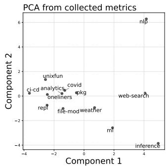

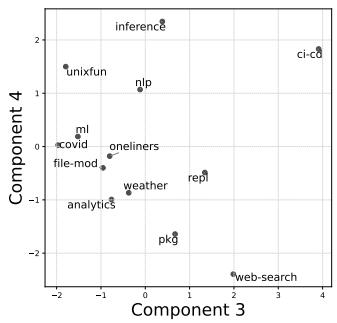

PCA from language model embeddings  
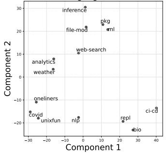

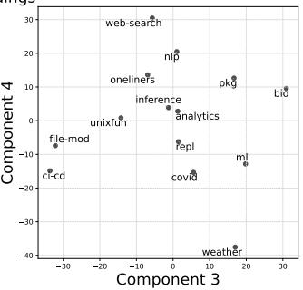  
Fig. 2: Principal component analysis results. Top: PCA plot resulting from the static and dynamic analysis of each benchmark. Bottom: PCA plot resulting from embedding calculation of KOALA source code using a pre-trained model [60].

The top row of Fig. 2 visualizes benchmarks projected on this reduced space based on their static and dynamic characteristics (§5–6). The spread of the benchmarks across the principle components suggests that the suite covers a broad and non-overlapping range of syntactic and behavioral profiles. The bottom row of Fig. 2 visualizes each benchmark on the space based on dense vector representations that capture highlevel program structure and logic. These embeddings, generated using OpenAI’s text-embedding-3-large model [60], capture information targeting diversity at the semantic and syntactic level [7, 83]. Well-distributed across the projected space, the results also suggest substantial diversity in both syntax and semantics.

## 4 Infrastructure and Configuration

Each KOALA benchmark set adheres to a specification that defines installation dependencies, input configuration, benchmark execution, and validation of the final results. This specification, shown in Fig. 3, includes five infrastructure scripts: (1) install.sh sets up dependencies required by the benchmark; (2) fetch.sh downloads (or generates, §3) and, if necessary, pre-processes inputs, accepting an argument that specifies their size; (3) execute.sh executes benchmark programs, collecting basic information such as execution time and resources; and (4) validate.sh confirms the correctness of the benchmark’s output by hashing the output of each script and comparing it to a known-good hash. Finally, (5) clean.sh removes inputs, outputs, and temporary files created during the benchmark’s execution. These scripts avoid redundant work—e.g., dependency installation or input generation are skipped if possible, except if forced (-f).

sample-benchmark   
scripts # Benchmark scripts   
a.sh   
b.sh   
...sh   
install.sh # Dependency installation   
fetch.sh # Input data download/preparation   
execute.sh # Script execution   
validate.sh # Hash generation & verification   
clean.sh # Input and output file cleanup  
Fig. 3: Benchmark structure. Each benchmark includes five support scripts (e.g., install, clean) and a scripts/ directory containing the source code of each benchmark. A top-level main driver executes all support scripts for one or all benchmarks.

KOALA also includes a top-level driver (main.sh) that executes the five scripts in sequence for any benchmark. The driver checks several configuration parameters, accepted as flags or environment variables, which it then passes to the rest of the scripts. For example, a KOALA\_SHELL parameter configures the shell interpreter executing the suite—e.g., bash, zsh, or a path to an executable, and defaulting to sh.

KOALA’s structure aims to facilitate quick collection of preliminary results, not exhaustive coverage of all possible needs. To accommodate a wide range of systems, it is kept minimal—inviting users to modify it to fit their needs.

Containerization: KOALA provides optional infrastructure for running benchmarks in an isolated environment. It includes a Dockerfile that builds a Debian-based container, installs essential dependencies such as git and sudo, and fetches the suite. A volume is shared with the host system, simplifying access to inputs and outputs.

It also provides support for dynamically generating container images tailored to each benchmark. These images are self-contained and ephemeral: their Dockerfile contains a CMD command executing all infrastructure scripts via main.sh.

To avoid problems with permission changes or system-wide modifications, KOALA does not require elevated privileges (except for fetch.sh which installs software dependencies) and avoids privileged commands such as sudo and setuid.

Integration effort: The effort required to add a new benchmark to KOALA depends on its complexity, input size, and correctness constraints. It typically involves five steps: (1) identifying and encoding dependencies in install.sh; (2) preparing input datasets in multiple sizes—full, small, and min—via fetch.sh; (3) including scripts for automated execution in execute.sh; (4) defining output validation logic in validate.sh; and (5) specifying cleanup steps in clean.sh.

Integrating the current set of benchmarks ranged between 10–80 person-hours per benchmark (Tab. on the right). Small and self-contained benchmarks such as oneliners, unixfun, and nlp each took about 10–12 hours; more complex or data-heavy benchmarks such as file-mod, bio, and ci-cd, and took about 60–80 hours due to their size, dependencies, and nuanced output correctness. Most of our time constructing this release of KOALA was spent in building new logic and adapting datasets, with a significant

<table><tr><td>Benchmark</td><td>~T(h)</td></tr><tr><td>analytics</td><td>40</td></tr><tr><td>bio</td><td>60</td></tr><tr><td>ci-cd</td><td>75</td></tr><tr><td>covid</td><td>65</td></tr><tr><td>file-mod</td><td>60</td></tr><tr><td>ml</td><td>30</td></tr><tr><td>inference</td><td>35</td></tr><tr><td>nlp</td><td>10</td></tr><tr><td>oneliners</td><td>10</td></tr><tr><td>pkg</td><td>30</td></tr><tr><td>repl</td><td>25</td></tr><tr><td>unixfun</td><td>10</td></tr><tr><td>weather</td><td>30</td></tr><tr><td>web-search</td><td>40</td></tr><tr><td>Total</td><td>520</td></tr></table>

portion devoted to testing and confirming correctness under various environments and configurations.

## 5 Syntactic Characterization and Analysis

Contrary to single-language environments, the shell often combines components in multiple languages. KOALA thus distinguishes between the characteristics of (and resources spent on, see §6) the shell portion of each benchmark, versus those of components called into by the shell and which often implement the core of a computation (Tab. 1, cols. 6–7).

Methodology: We use libdash [53] to parse and analyze both portions using SMOOSH’s abstract syntax definition for the POSIX shell [33]: for the shell portion, we count the total occurrences of every AST node; for the command portion, we analyze only AST nodes counting commands, built-ins, and functions—yielding conservative results that exclude dynamic constructs (e.g., \$CMD arg ) but avoid conflating static structure with repeated runtime executions.

Language features: Fig. 4 summarizes the occurrences of each construct across KOALA. Each cell shows the number of times a syntactic construct (vertical axis) occurs in a benchmark (horizontal axis). AST nodes that overlap with more specific nodes or that do not correspond to linguistic features (e.g., escaped characters) are excluded. Overall, KOALA employs all the syntactic constructs of the POSIX shell, in varied combinations that reflect its various styles of computation.

KOALA covers several key shell characteristics worth mentioning. Most sets employ pipelines, shell constructs of the form a | b that pass the output of one command ( a ) as input to the next ( b ). Pipelines are an important shell feature, optimized by several data-parallel systems. Two sets use operators & and wait for explicit parallelism—a feature relevant to performance-oriented shell systems. Two sets use sub-shells, e.g., (echo hi) , and several sets use control constructs such as loops and conditionals. Several sets use function definitions, and nearly all use variables, assignments, and stream or file redirections; other kinds of redirections occur less frequently. Many sets use command substitution, e.g., echo hi \$(whoami) .

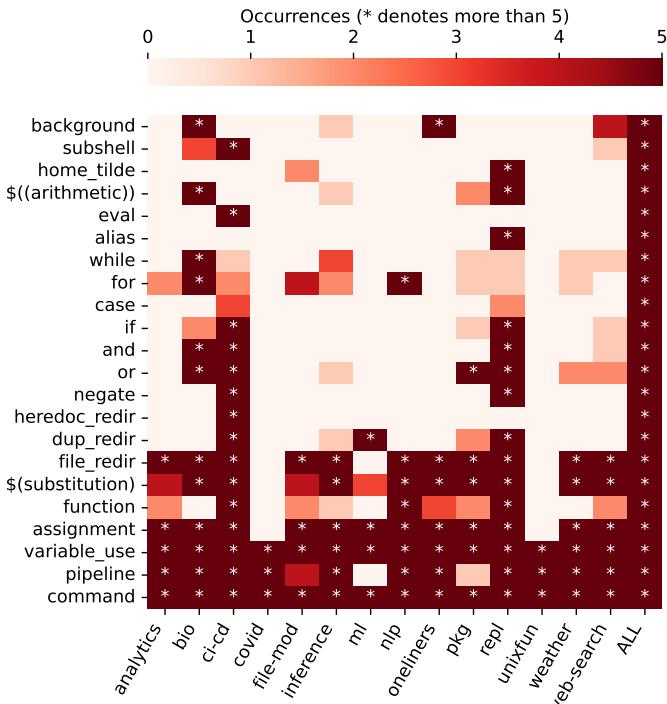  
Fig. 4: Syntactic characteristics. Cells show the frequency of the syntactic construct (y-axis) in a benchmark (x-axis), up to five occurrences to maintain clarity of absences (zero counts). Stars denote more than five occurrences.

Fig. 4 also highlights a key KOALA characteristic: no two benchmarks exhibit the same distribution of syntactic constructs. KOALA represents well the shell’s most interesting features—e.g., external command invocations, pipelines, the background operator, subshells, expansion, and redirection. In combination, these features are essential in making the shell the uniquely powerful and complex platform that it is. Different styles of scripts employ these features in different combinations and proportions—and KOALA aims to capture this variation. The proportion of these features align with shell usage studies [22], indicating that the distribution of KOALA’s shell features corresponds to current trends and is representative of the programs found in the real world.

Component features: Fig. 5 shows the frequency of all KOALA commands occurring at least 30 times, excluding benchmark-specific functions and binaries. KOALA contains many of the most common commands found in the wild: echo tops the list with 441 occurrences; cat , grep , sort , and tr count about half of that; other commands exhibit lower frequencies. These results broadly match results from studies of commands in the wild [22], except for pathmanipulation commands as most KOALA paths are static.

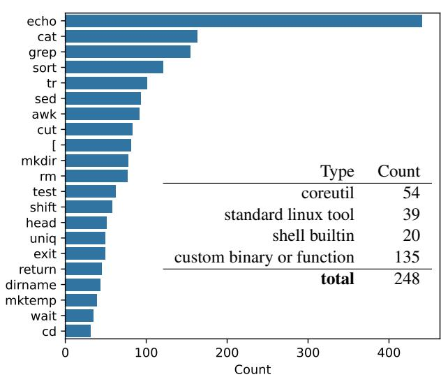  
Fig. 5: Command occurrences. The chart shows the frequency of all KOALA commands occurring at least 30 times. The table categorizes the unique commands counted across the entire suite.

The table also groups KOALA’s distinct commands into four classes. Most common are GNU Coreutils (e.g., echo and cat ), shell built-ins (e.g., cd and return ), and standard linux tools (e.g., grep , sed , and awk ). While the first three classes make up KOALA’s vast majority of commands, in terms of frequency, custom binaries and functions account for 134 commands, or 54% of the unique command set.

## 6 Dynamic Characterization and Analysis

Beyond its syntactic diversity, KOALA also exhibits diverse dynamic characteristics. Exploring this diversity involves executing benchmarks to extract dynamic features such as CPU time, memory consumption, IO characteristics, and interaction with the broader environment (Tab. 1’s cols. 8–13).

Methodology: To extract these features, we collect several metrics while executing benchmarks on a machine with 32GB RAM, an 8-core 3.80GHz Ryzen 7 9700X CPU utilizing hyper-threading, and a 1TB NVMe SSD. The shell interpreter is set as bash --posix. We measure CPU time and IO by probing /proc/<pid>/{stat,io} after the target process exits; and wall-clock time and memory use by calling Python’s time.perf\_counter and psutil at 0.01-second intervals. We aggregate results by set by summing timing and IO statistics for each program in that set. We take the maximum highwater-mark memory usage to compute a single set of results per benchmark.

Overview: Fig. 6 presents results both overall and with respect to input sizes. The plots form two coarse groups (xaxis is benchmarks, always): (1) the top two plots (left and right) show total execution time—left is the ratio of CPU time to wall-clock time, right is the total IO per second of wallclock; (2) the next six plots (rows 2, 3, 4), show CPU time, high-water-mark memory, and IO—left is absolute, right is per input byte.

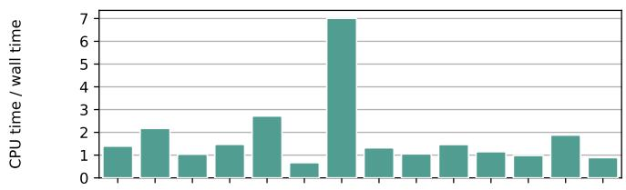

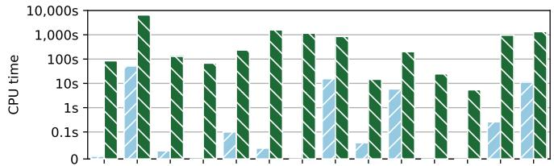

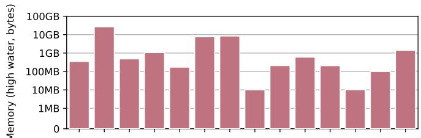

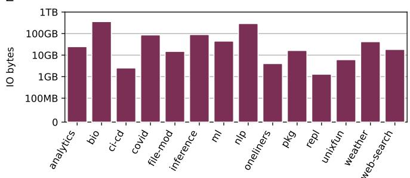

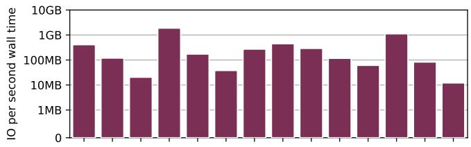

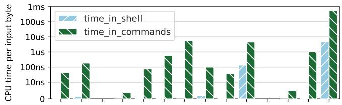

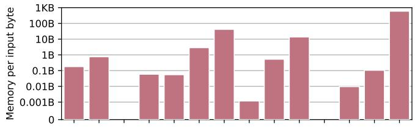

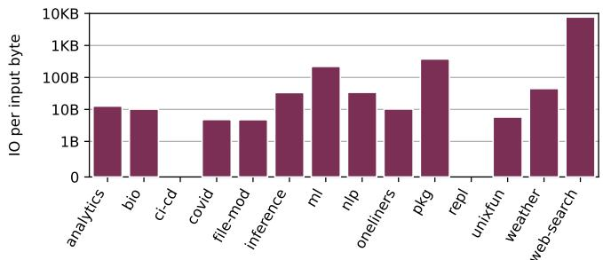  
Fig. 6: Dynamic characteristics. The top two plots contextualize the rest: (left) ratio of CPU time to wall-clock time; (right) ratio of IO time to wall-clock time. The bottom three plots (rows 2, 3, 4) show CPU time, Memory, and IO: (left) absolute; (right) normalized over benchmark input. All y-axes except top left are symmetric log scale: values between 0 and the first tick are linearly scaled, and the next are logarithmic.

Absolute characteristics: As these characteristics vary by orders of magnitude, these plots use a symmetric log scale: values between zero and the first tick are linearly scaled, while the rest are logarithmic. The CPU-time plot (Fig. 6, row 2, left) shows that the benchmark runtime varies from seconds (e.g., unixfun) to hours (e.g., bio). CPU time is split between time spent in the shell versus commands: here, too, KOALA demonstrates significant diversity—ranging from a mix of shell execution and commands (e.g., nlp) to commanddominated workloads (e.g., bio and inference).

Similarly, the memory plot (Fig. 6, row 3, left) shows the diversity of memory-intensiveness, varying between 668KB (e.g., unixfun) and around 10GB (e.g., bio, inference, and ml). Likewise, the IO plot (row 4, left) shows that KOALA exhibits varying degrees of IO-heaviness, ranging from just 75.9MB of IO (e.g., ci-cd) to 336GB (e.g., bio).

Tab. 1’s last few rows (pg. 4) offer additional context: CPU time, memory consumption, and IO range respectively between 2.1–6544.8s (shown separately for the shell and commands, average: 934.1s), 6.1MB–25.1GB (average: 3.14GB), and 85.7MB–336GB (average: 66.6GB).

Normalized characteristics: Normalized plots (rows 2–4, right) offer a sense of these characteristics normalized by each benchmark’s input size, important due to their correlation with input size, which varies widely (0–146GB). This normalization is noticeable with bio and covid: these benchmarks have substantial absolute CPU times (on left), but their normalized CPU times (on right) are moderate—reflecting the fact that they are long-running mainly due to the volume of data they process, not the intensity of their computations. On the other hand, pkg is computationally intense, despite its middling absolute execution time. These characteristics do not apply to benchmarks with no inputs (e.g., ci-cd and repl), which have no bars in the normalized plots.

Overall, across the three dimensions (CPU, row 2; memory, row 3; and IO, row 4), KOALA enjoys significant diversity— multiple metrics vary by several orders of magnitude.

## 7 Applying KOALA to Optimization Systems

This section summarizes the process and results of applying four optimization systems (§2) on the KOALA benchmarks: Shark [14], GNU parallel [59], hS [52], and PASH [85] achieve performance gains on different subsets of KOALA.

Hardware & software setup: All experiments in this section were executed on an AWS c6i.4xlarge instance with 32GB of RAM and a 16-core 3.5 GHz CPU running Ubuntu 24.04.1 and bash v5.2.21 with -posix enabled.

Adoption effort: The four systems require different effort to use KOALA (see Appendix II), depending on their needs (e.g., automation, inputs), characteristics, and goals (§2). GNU parallel required modifying benchmarks to export parallelizable pipelines and for -loops as functions passed to parallel. Shark required similar transformations guided by its optimizations. PASH and hS, both operating as drop-in shell replacements, could simply set KOALA\_SHELL.

## 7.1 Shark

To understand whether KOALA aids the characterization of Shark [14], we manually apply its transformations as described in the Shark paper across several KOALA programs.

Methodology: The Shark paper [14] describes several potential syntactic transformations, which we apply manually across all KOALA benchmarks. We then execute the original and optimized versions to characterize the performance of the modified benchmarks.

Results: Shark achieves significant performance gains across KOALA, ranging between 1.01–13.43×, depending on benchmark characteristics. Benchmarks that involve trivially parallelizable loop iterations see major speedups—e.g., Shark improves the nlp and weather benchmarks by 6.46× and 13.43×, respectively. Scripts with sequential operations, such as those found in ci-cd, exhibit less pronounced improvements—at times only marginal gains of 1.16×.

Shark accelerates most benchmarks, though benchmarks with highly interdependent operations that already use pipelines see more limited gains. For example, covid, oneliners, bio, and unixfun offer less opportunities for Shark-style optimizations, which result in speedups between 1.01–1.06×. The web-index benchmark sees the least improvement (1.01×) as it already runs the three n-gram calculations in parallel, making Shark obsolete. Shark’s optimizations centered around command invocation, do not result in significant performance benefits, speeding up scripts where only such optimization opportunities were present (e.g., websearch) by 1.01× on average. In contrast, optimizations that eliminate temporary files used for intermediate storage can offer more substantial speedups, but they also introduce significant complexity, as pipes require more careful coordination between producers and consumers.

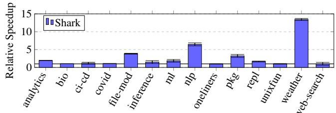

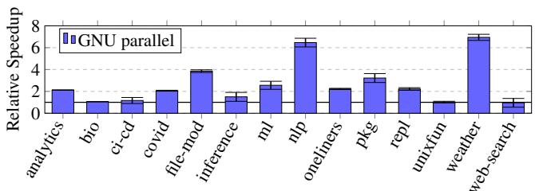

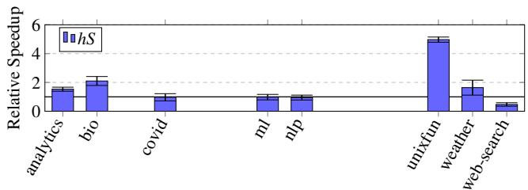

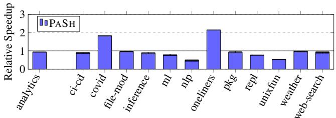  
Fig. 7: Shark, GNU parallel, hS, and PASH speedups. Relative average speedup on the KOALA benchmarks. Baseline is the original runtime in a single-threaded bash shell with the --posix flag enabled.

Takeaway: KOALA confirms that Shark’s optimizations are effective in scripts that involve operations on multiple inputs and independent commands, and less effective for I/Oheavy scripts or scripts that are not easily parallelizable. Its parallelization and pipeline optimizations offer significant speedups, up to 13.43×.

## 7.2 GNU parallel

To understand whether KOALA aids the characterization of GNU parallel [59], we apply it on several KOALA programs focusing on natural candidates for such parallel execution.

Methodology: We first identify parallelizable regions within each KOALA program and rewrite them to invoke parallel. We aimed for a reasonable use of parallel, modifying only parallelizable pipelines that each take under an hour to identify and rewrite—typically ones with (1) independently processed input files, and (2) efficient segment-based processing that requires minimal or no synchronization and aggregation. The latter often takes advantage of GNU parallel’s --pipe to parallelize input stream processing.

Results: GNU parallel achieves substantial speedups in benchmarks that involve I/O-bound operations or are trivially parallelizable. For instance, file-mod involves converting multiple media files concurrently, resulting in GNU parallel speeding it up by 3.84× and fully utilizing all available CPU cores. Similarly, nlp processes multiple data files independently, resulting in a speedup of 6.46×. GNU parallel speedups are less pronounced for scripts that do not have these features, such as those in ci-cd and repl that result in 1.16× and 0.95× respectively. These additionally either already use parallelism internally in their command invocations, compiling multiple files or include commands that do not benefit from parallel’s parallelization model, such as git or find.

A few cases do not yield speedup. For example, the unixfun benchmark involves pipeline stages dependent on the output of previous stages, limiting parallel’s approach: the interdependent nature of these stages prevented GNU parallel from fully exploiting parallelism, resulting an average speedup of 1.02×.

Takeaway: KOALA confirms that GNU parallel can accelerate I/O-bound tasks and loops with no interdependencies— e.g., file-mod—achieving average speedups of 2.6×. Limited acceleration comes from scripts with sequential operations or ones that require sophisticated splitting and aggregation (e.g., unixfun and web-search).

## 7.3 hS

To assess whether KOALA aids the characterization of hS [52], we apply it on KOALA focusing on programs likely to benefit from out-of-order execution.

Methodology: As hS is currently under development, we use an early-stage hS prototype shared by its authors, configured via the KOALA\_SHELL variable.

Not all benchmarks are executable by the current version of hS. For the following benchmark sets, hS succeeded on only a subset of the scripts: analytics, bio, ml, nlp, unixfun, weather, and web-search. The following benchmark sets as a whole either fail or produce incorrect results with hS, and are thus omitted entirely: ci-cd, file-mod, llm, nlp, oneliners, pkg, and repl. In addition, hS was unable to run the ray-tracing script in analytics.

Results: hS achieves significant speedups on scripts that include syntactic regions that have no dependencies between them. Speedups range between 1.5–4.97×, with analytics and unixfun at the two ends of this range. Other benchmarks resulting in significant speedups include weather and bio.

Scripts that involve dependencies between stages do not benefit from hS. Such slowdowns range from 0.97× in covid to 0.47× in websearch, averaging 0.72× across all benchmarks. They can be attributed to constant costs stemming from hS’s speculative execution, related to the environment isolation and tracing, which allows hS to roll back effects in cases of misprediction.

Takeaway: KOALA reveals that hS can provide benefits that are significant, especially when computations feature independent stages. Typical computations, however, offer a mix of out-of-order optimization opportunities, at times masked by overheads in the hS prototype.

## 7.4 PaSh

We apply PASH on KOALA to understand whether it can characterize PASH’s ability to accelerate shell programs.

Methodology: We use the latest version of PASH (commit 0d0a563) and set KOALA\_SHELL to ./pa.sh --width 4 , i.e., configuring the parallelization degree to 4×. We do not replace script fragments via alias and function constructs that can be annotated with additional parallelizability information; this would allow PASH to extract additional speedup but result in significantly more work. PASH fails when executing the bio benchmark.

Results: PASH’s command-aware parallelization strategy achieves significant speedups in scripts with multi-stage pipelines or for -loops with no data dependencies across iterations. For example, it achieves speedups of 2.14× and 1.82× on oneliners and covid respectively.

Naturally, benchmarks or benchmark fragments for which PASH had no annotations, and thus does not parallelize, see no speedups—e.g., pkg, bio, and file-mod. Additionally, PASH does not speed up scripts that include no syntactic constructs it can parallelize—e.g., repl and ci-cd benchmarks, which do not include pipelines or parallelizable for - loops.

Takeaway: KOALA reveals that PASH can deliver substantial speedups for scripts that fall within its parallelization domain. However, its effectiveness depends on the availability of command annotations and the amenability of programs to the constructs PASH can operate on.

## 8 Related Work

Benchmark suites: Progress in research depends on applesto-apples comparisons—and in computer science, that often means open and reusable benchmark suites. Widely cited benchmark suites in memory-managed environments [15], database transactions [65], parallel processing [19], other areas [20, 36, 42] offer a good examples of their widespread applicability and use. Similar to these suites, KOALA comes with additional support and is expected to release improvements every few years; different from them, it targets performanceoriented systems for the shell—an area that has not yet enjoyed the existence of a systematic benchmark suite.

The DaCapo [15] and Gabriel [28] benchmarks offer particularly good parallels, as they focus on programming environments that did not have a benchmark suite before their release—like these benchmarks, KOALA fills a gap.

Shell studies and datasets: Recent studies collect shell scripts or fragments of scripts—typically in Bash—to analyze their source, understand their properties, and extract key insights. Examples of such studies include the use of Bash in the wild [22], the characteristics of build scripts in Linux distributions [40], and the use of aliases and shell customization in the wild [71], cybersecurity training [84], and interactive coding [89]. These studies do not aim at (creating collections for) evaluating performance optimizations. In contrast, KOALA aims at help characterizing systems and tools that optimize shell programs. KOALA offers curated end-to-end programs with known inputs, dependencies, and behaviors that stress both the shell and the underlying commands.

Shell test and correctness suites: A few test suites focus on evaluating the correctness of shell implementations and their conformance to certain standards. The POSIX test suite [78] is a key resource for validating compliance of a shell implementation with the POSIX standard. The Smoosh test suite [33] refines and complements the POSIX test suite. The Modernish shell library/polyfill has a sophisticated diagnostic routine that amounts to shell tests [56]. There are also a variety of testing frameworks designed for automated testing in and of shell scripts [11, 44, 49, 77]. All of these suites focus on testing functionality rather than characterizing performance, and are thus distinct from and complementary to KOALA.

Shell microbenchmarks: Several benchmark suites target the evaluation of specific shell-language constructs via microbenchmarks. ShellBench [48] provides a collection of small scripts (ranging from 8–95 lines of code) designed to stress individual shell features—e.g., variable substitution, expansion, and subshell creation. Similarly, zsh-bench [68], the Oils benchmarks [8], and UnixBench [47] focus on isolated performance characteristics—e.g., interactive shell behavior or command invocation times. In contrast, KOALA offers larger, more diverse, whole-program benchmarks (95 programs, 17–2428 lines each) that perform end-to-end computations, operate over large datasets, and involve substantial work outside the shell interpreter itself.

Performance properties and characterization: Prior research on benchmark sets often discusses language-specific properties about the programs involved—for example, the impact of garbage collection [15,28,51] or the structural features in object-oriented benchmark suites [15, 37, 51]. While important in other domains, these characteristics have no direct equivalent in shell programs; KOALA instead focuses on the shell as glue, carefully distinguishing between the time spent in the shell interpreter and in third-party commands.

Earlier work also studies the behavior of programs in simulation or on hardware [25, 30, 35]. KOALA’s characterization focuses on properties that are independent of any particular hardware or operating system implementation. KOALA will make it easy to use shell programs as workloads in the evaluation of general-purpose computational substrates.

Evaluations of shell programs: A variety of systems from several different authors attempt to operate on, optimize, or accelerate shell programs—e.g., achieving elision [14], parallelization [85], fusion [9], synthesis [72], distribution [66], mobile [88], serverless [54], and syscall refinement [29]. These further demonstrate the acute need for a standardized, usable, and replicable benchmark suite for the shell.

## 9 Discussion and Conclusion

Benchmark programs are crucial for evaluating ideas, comparing and contrasting approaches, and fueling academic and industrial research. They are especially needed in systems research, where many of the key theses revolve around performance-related arguments and their quantitative evaluation. This need is particularly acute in the context of the shell, where no benchmark suite currently exists.

KOALA is a benchmark suite aimed at the characterization of performance-oriented shell research. It combines a systematic collection of diverse shell programs collected from tasks found in the wild, various real inputs to these programs facilitating small and large deployments, extensive analysis and characterization aiding their understanding, and additional infrastructure and tooling aimed at usability and reproducibility in systems research. Static and dynamic characterization confirms that the KOALA programs perform a variety of tasks commonly performed in the shell; combine all major language features of the POSIX shell; use a variety of POSIX, GNU Coreutils, and third-party components; and operate on inputs of varying size and composition.

## Acknowledgements

We thank the anonymous ATC’25 reviewers for their feedback; our shepherd, Maria Carpen-Amarie, for her guidance; the ATC’25 Artifact Evaluation reviewers for their time; and the Brown CS2952R (F’24) participants for their input on several iterations of this paper. This material is based upon research supported by NSF awards CNS-2247687 and CNS-2312346; DARPA contract no. HR001124C0486; a Fall’24

Amazon Research Award; a seed grant from Brown University’s Data Science Institute; and a BrownCS Faculty Innovation Award.

## References

[1] Arch User Repository (AUR). https://aur.archlinux.org. Accessed: 2025-01-13.

[2] National Oceanic and Atmospheric Administration (NOAA). https: //www.noaa.gov. Accessed: 2025-01-13.

[3] npm.js. https://www.npmjs.com. Accessed: 2025-01-13.

[4] Ollama: Run large language models locally. https://ollama.com, 2023. Accessed: 2025-06-02.

[5] Abdi, Hervé and Williams, Lynne J. Principal component analysis. Wiley interdisciplinary reviews: computational statistics, 2(4):433–459, 2010.

[6] Adam Drake. Command-line Tools Can Be 235x Faster Than Your Hadoop Cluster. https://adamdrake.com/ command-line-tools-can-be-235x-faster-than-your-hadoophtml, 2014. Accessed: 2025-06-01.

[7] Alina Petukhova and João P. Matos-Carvalho and Nuno Fachada. Text clustering with large language model embeddings. International Journal of Cognitive Computing in Engineering, 6:100–108, 2025.

[8] Andy Chu and Contributors. Oils Benchmarks. https://github. com/oils-for-unix/oils/tree/master/benchmarks, 2021. Accessed: 2025-04-28.

[9] Anna Herlihy and Periklis Chrysogelos and Anastasia Ailamaki. Boosting Efficiency of External Pipelines by Blurring Application Boundaries. In 12th Conference on Innovative Data Systems Research, CIDR 2022, Chaminade, CA, USA, January 9-12, 2022. www.cidrdb.org, 2022.

[10] Armando Cerna. Pacaur building script. https://github.com/ armandocerna/dotfiles/blob/master/scripts/pacaur.sh. Accessed: 2025-01-13.

[11] Bats-Core Project. Bats-Core - Bash Automated Testing System. https://bats-core.readthedocs.io/en/stable. Accessed: 2025-01-01.

[12] Bentley, Jon. Programming pearls: a spelling checker. CACM, 28(5):456–462, May 1985.

[13] Bentley, Jon and Knuth, Don and McIlroy, Doug. Programming pearls: a literate program. CACM, 29(6):471–483, June 1986.

[14] Berger, Emery D. Optimizing Shell Scripting Languages. 2003.

[15] Blackburn, Stephen M. and Garner, Robin and Hoffmann, Chris and Khang, Asjad M. and McKinley, Kathryn S. and Bentzur, Rotem and Diwan , Amer and Feinberg, Daniel and Frampton, Daniel and Guyer, Samuel Z. and Hirzel, Martin and Hosking, Antony and Jump, Maria and Lee, Han and Moss, J. Eliot B. and Phansalkar, Aashish and Stefanovic, Darko and VanDrunen, Thomas and von Dincklage, Daniel ´ and Wiedermann, Ben. The DaCapo benchmarks: java benchmarking development and analysis. In Proceedings of the 21st Annual ACM SIGPLAN Conference on Object-Oriented Programming Systems, Languages, and Applications, OOPSLA ’06, page 169–190, New York, NY, USA, 2006. Association for Computing Machinery.

[16] Brown University Department of Computer Science. CSCI 1380: Distributed Computer Systems. https://cs.brown.edu/courses/ csci1380, 2025. Accessed: 2025-06-04.

[17] Cappellini, Enrico and Welker, Frido and Pandolfi, et al. Early Pleistocene enamel proteome from Dmanisi resolves Stephanorhinus phylogeny. Nature, 574(7776):103–107, Oct 2019.

[18] Charlie Curtsinger and Daniel W. Barowy. Riker: Always-Correct and Fast Incremental Builds from Simple Specifications. In 2022 USENIX Annual Technical Conference (USENIX ATC 22), pages 885– 898, Carlsbad, CA, July 2022. USENIX Association.

[19] Christian Bienia and Sanjeev Kumar and Jaswinder Pal Singh and Kai Li. The PARSEC Benchmark Suite: Characterization and Architectural Implications. In Proceedings of the 17th International Conference on Parallel Architectures and Compilation Techniques (PACT ’08), pages 72–81, New York, NY, USA, 2008. Association for Computing Machinery.

[20] Cohen, Gregory and Afshar, Saeed and Tapson, Jonathan and van Schaik, André. EMNIST: Extending MNIST to handwritten letters. In 2017 International Joint Conference on Neural Networks (IJCNN), pages 2921–2926, 2017.

[21] Cora Coleman and William G. Griswold and Nick Mitchell. Do Cloud Developers Prefer CLIs or Web Consoles? CLIs Mostly, Though It Varies by Task. 2022.

[22] Dong, Yiwen and Li, Zheyang and Tian, Yongqiang and Sun, Chengnian and Godfrey, Michael W. and Nagappan, Meiyappan. Bash in the Wild: Language Usage, Code Smells, and Bugs . 32(1):1–22.

[23] Durumeric, Zakir and Wustrow, Eric and Halderman, J. Alex. ZMap: fast internet-wide scanning and its security applications. In Proceedings of the 22nd USENIX Conference on Security, SEC’13, page 605–620, USA, 2013. USENIX Association.

[24] Edward Tufte. New York City Weather Chart. https://www. edwardtufte.com/notebook/new-york-city-weather-chart, 2004. Accessed: 2025-06-02.

[25] Eeckhout, Lieven and Georges, Andy and De Bosschere, Koen. How java programs interact with virtual machines at the microarchitectural level. SIGPLAN Not., 38(11):169–186, October 2003.

[26] Elias Dabbas. Web Server Access Logs. https://www.kaggle.com/ datasets/eliasdabbas/web-server-access-logs, 2020. Accessed June 3, 2025.

[27] Evangelos Lamprou. Foundation Models and Unix. Paged Out!, (6):9, March 2025.

[28] Gabriel, Richard P. Performance and Evaluation of LISP Systems. The MIT Press, 08 1985.

[29] Gaidis, Alexander J. and Atlidakis, Vaggelis and Kemerlis, Vasileios P. SysXCHG: Refining Privilege with Adaptive System Call Filters. In Proceedings of the 2023 ACM SIGSAC Conference on Computer and Communications Security, CCS ’23, page 1964–1978, New York, NY, USA, 2023. Association for Computing Machinery.

[30] Gan, Yu and Zhang, Yanqi and Cheng, Dailun and Shetty, Ankitha and Rathi, Priyal and Katarki, Nayan and Bruno, Ariana and Hu, Justin and Ritchken, Brian and Jackson, Brendon and Hu, Kelvin and Pancholi, Meghna and He, Yuan and Clancy, Brett and Colen, Chris and Wen, Fukang and Leung, Catherine and Wang, Siyuan and Zaruvinsky, Leon and Espinosa, Mateo and Lin, Rick and Liu, Zhongling and Padilla, Jake and Delimitrou, Christina. An Open-Source Benchmark Suite for Microservices and Their Hardware-Software Implications for Cloud & Edge Systems. In Proceedings of the Twenty-Fourth International Conference on Architectural Support for Programming Languages and Operating Systems, ASPLOS ’19, page 3–18, New York, NY, USA, 2019. Association for Computing Machinery.

[31] Gemma Team. Gemma 3 Technical Report. 2025.

[32] Github Inc. The top programming languages. https://octoverse. github.com/2022/top-programming-languages, 2022.

[33] Greenberg, Michael and Blatt, Austin J. Executable formal semantics for the POSIX shell. Proc. ACM Program. Lang., 4(POPL), December 2019.

[34] Greenberg, Michael and Kallas, Konstantinos and Vasilakis, Nikos. The Future of the Shell: Unix and Beyond. In Proceedings of the Workshop on Hot Topics in Operating Systems, HotOS ’21, pages 240–241, New York, NY, USA, 2021. Association for Computing Machinery.

[35] Hauswirth, Matthias and Diwan, Amer and Sweeney, Peter F. and Mozer, Michael C. Automating vertical profiling. In Proceedings of the 20th Annual ACM SIGPLAN Conference on Object-Oriented Programming, Systems, Languages, and Applications, OOPSLA ’05, page 281–296, New York, NY, USA, 2005. Association for Computing Machinery.

[36] Hazimeh, Ahmad and Herrera, Adrian and Payer, Mathias. Magma: A Ground-Truth Fuzzing Benchmark. Proc. ACM Meas. Anal. Comput. Syst., 4(3), November 2020.

[37] Hölzle, Urs and Ungar, David. Do Object-Oriented Languages Need Special Hardware Support? In Proceedings of the 9th European Conference on Object-Oriented Programming, ECOOP ’95, page 283–302, Berlin, Heidelberg, 1995. Springer-Verlag.

[38] Ibrahim, Fadhl and Oppelt, Julian and Maragkakis, Manolis and Mourelatos, Zissimos. TERA-Seq: true end-to-end sequencing of native RNA molecules for transcriptome characterization. Nucleic Acids Research, 49(20):e115, 2021.

[39] Israel, Abebe. VPS Audit. https://vpsaudit.vernu.dev. Accessed: 2025-01-13.

[40] Jeannerod, Nicolas and Régis-Gianas, Yann and Treinen, Ralf. Having Fun With 31.521 Shell Scripts. April 2017.

[41] Jon Puritz. Bio594: Using genomic techniques to examine the evolution of populations. https://git.io/JY6J7, 2019.

[42] Just, René and Jalali, Darioush and Ernst, Michael D. Defects4J: a database of existing faults to enable controlled testing studies for Java programs. In Proceedings of the 2014 International Symposium on Software Testing and Analysis, ISSTA 2014, page 437–440, New York, NY, USA, 2014. Association for Computing Machinery.

[43] Justine Tunney. Bash One-Liners for LLMs. https://justine.lol/ oneliners, 2023. Accessed: 2025-06-01.

[44] Kate Ward. shUnit2 - xUnit unit testing framework for Bourne based shell scripts. https://github.com/kward/shunit2. Accessed: 2025-01-01.

[45] Kenneth Ward Church. Unix for Poets, 1994.

[46] Kirillov, Alexander and Mintun, Eric and Ravi, Nikhila and Mao, Hanzi and Rolland, Chloe and Gustafson, Laura and Xiao, Tete and Whitehead, Spencer and Berg, Alexander C. and Lo, Wan-Yen and Dollár, Piotr and Girshick, Ross. Segment Anything. In 2023 IEEE/CVF International Conference on Computer Vision (ICCV), pages 3992–4003, 2023.

[47] Kirk D. Lucas and Contributors. UnixBench: The BYTE UNIX Benchmark Suite. https://github.com/kdlucas/byte-unixbench, 2012. Accessed: 2025-04-28.

[48] Koichi Nakashima. ShellBench: A POSIX Shell Benchmark Suite. https://github.com/shellspec/shellbench, 2021. Accessed: 2025-04-28.

[49] Koichi Nakashima and contributors. ShellSpec - A Full-featured BDD Framework for Shell Scripts. https://shellspec.info. Accessed: 2025-01-01.

[50] Konstantinos Kallas and Tammam Mustafa and Jan Bielak and Dimitris Karnikis and Thurston H.Y. Dang and Michael Greenberg and Nikos Vasilakis. Practically Correct, Just-in-Time Shell Script Parallelization. In 16th USENIX Symposium on Operating Systems Design and Implementation (OSDI 22), pages 769–785, Carlsbad, CA, July 2022. USENIX Association.

[51] Lengauer, Philipp and Bitto, Verena and Mössenböck, Hanspeter and Weninger, Markus. A Comprehensive Java Benchmark Study on Memory and Garbage Collection Behavior of DaCapo, DaCapo Scala, and SPECjvm2008. In Proceedings of the 8th ACM/SPEC on International Conference on Performance Engineering, ICPE ’17, page 3–14, New York, NY, USA, 2017. Association for Computing Machinery.

[52] Liargkovas, Georgios and Kallas, Konstantinos and Greenberg, Michael and Vasilakis, Nikos. Executing Shell Scripts in the Wrong Order, Correctly. In Proceedings of the 19th Workshop on Hot Topics in Operating Systems, HOTOS ’23, page 103–109, New York, NY, USA, 2023. Association for Computing Machinery.

[53] libdash developers. libdash. "https://github.com/binpash/ libdash/tree/master".

[54] Mahéo, Aurèle and Sutra, Pierre and Tarrant, Tristan. The serverless shell. In Proceedings of the 22nd International Middleware Conference: Industrial Track, Middleware ’21, page 9–15, New York, NY, USA, 2021. Association for Computing Machinery.

[55] Marek Majkowski. When Bloom filters don’t bloom. https: //blog.cloudflare.com/when-bloom-filters-dont-bloom, March 2 2020. Accessed: 2025-01-13.

[56] Martijn Dekker. Modernish. https://github.com/modernish/ modernish, 2016. Accessed: 2025-06-02.

[57] Michael S. Hart and Project Gutenberg. Project Gutenberg. https: //www.gutenberg.org, 1971.

[58] Netresec. Publicly available PCAP files. https://www.netresec. com/?page=PcapFiles, 2025. Accessed: 2025-06-02.

[59] Ole Tange. GNU Parallel - The Command-Line Power Tool. ;login: The USENIX Magazine, 36(1):42–47, Feb 2011.

[60] OpenAI. OpenAI API: Embeddings Guide, 2024. Accessed: 2025-06- 02.

[61] Paszke, Adam and Gross, Sam and Massa, Francisco and Lerer, Adam and Bradbury, James and Chanan, Gregory and Killeen, Trevor and Lin, Zeming and Gimelshein, Natalia and Antiga, Luca and Desmaison, Alban and Köpf, Andreas and Yang, Edward and DeVito, Zach and Raison, Martin and Tejani, Alykhan and Chilamkurthy, Sasank and Steiner, Benoit and Fang, Lu and Bai, Junjie and Chintala, Soumith. PyTorch: an imperative style, high-performance deep learning library. Curran Associates Inc., Red Hook, NY, USA, 2019.

[62] Pawan Bhandari. Solutions to unixgame.io. https://git.io/Jf2dn, 2020. Accessed: 2020-04-14.

[63] Pedregosa, Fabian and Varoquaux, Gaël and Gramfort, Alexandre and Michel, Vincent and Thirion, Bertrand and Grisel, Olivier and Blondel, Mathieu and Prettenhofer, Peter and Weiss, Ron and Dubourg, Vincent and Vanderplas, Jake and Passos, Alexandre and Cournapeau, David and Brucher, Matthieu and Perrot, Matthieu and Duchesnay, Édouard. Scikit-learn: Machine Learning in Python. J. Mach. Learn. Res., 12(null):2825–2830, November 2011.

[64] Peter, Stéphane. makeself - Make self-extractable archives on Unix. https://makeself.io. Accessed: 2025-01-13.

[65] Poess, Meikel and Floyd, Chris. New TPC benchmarks for decision support and web commerce. SIGMOD Rec., 29(4):64–71, December 2000.

[66] Raghavan, Deepti and Fouladi, Sadjad and Levis, Philip and Zaharia, Matei. POSH: a data-aware shell. In Proceedings of the 2020 USENIX Conference on Usenix Annual Technical Conference, USENIX ATC’20, USA, 2020. USENIX Association.

[67] Ritchie, Dennis M. and Thompson, Ken. The UNIX time-sharing system. CACM, 17(7):365–375, July 1974.

[68] Roman Perepelitsa and Contributors. zsh-bench: Benchmark for Interactive Zsh. https://github.com/romkatv/zsh-bench, 2021. Accessed: 2025-04-28.

[69] S. Greenberg and I.H. Witten. Directing the User Interface: How People Use Command-Based Computer Systems. IFAC Proceedings Volumes, 21(5):349–355, 1988. 3rd IFAC Conference on Analysis, Design and Evaluation of Man-Machine Systems 1988, Oulu, Finland, 14-16 June 1988.

[70] Sadjad Fouladi and Francisco Romero and Dan Iter and Qian Li and Shuvo Chatterjee and Christos Kozyrakis and Matei Zaharia and Keith Winstein. From Laptop to Lambda: Outsourcing Everyday Jobs to Thousands of Transient Functional Containers. In 2019 USENIX Annual Technical Conference (USENIX ATC 19), pages 475–488, Renton, WA, July 2019. USENIX Association.

[71] Schröder, Michael and Cito, Jürgen. An empirical investigation of command-line customization. Empirical Software Engineering, 27(2):30, 2021.

[72] Shen, Jiasi and Rinard, Martin and Vasilakis, Nikos. Automatic Synthesis of Parallel Unix Commands and Pipelines with KumQuat. In Proceedings of the 27th ACM SIGPLAN Symposium on Principles and Practice of Parallel Programming, PPoPP ’22, pages 431–432, New York, NY, USA, 2022. Association for Computing Machinery.

[73] Simon Willison. LLM: A CLI tool and Python library for interacting with Large Language Models. https://llm.datasette.io. Accessed: 2025-06-02.

[74] Spinellis, Diomidis and Fragkoulis, Marios. Extending Unix Pipelines to DAGs. IEEE Transactions on Computers, 66(9):1547–1561, 2017.

[75] Tammam Mustafa and Konstantinos Kallas and Pratyush Das and Nikos Vasilakis. DiSh: Dynamic Shell-Script Distribution. In 20th USENIX Symposium on Networked Systems Design and Implementation (NSDI 23), pages 341–356, Boston, MA, April 2023. USENIX Association.

[76] Taylor, Dave and Perry, Brandon. Wicked Cool Shell Scripts: 101 Scripts for Linux, OS X, and UNIX Systems. No Starch Press, 2016.

[77] The Open Group. The Test Environment Toolkit. https://tetworks. opengroup.org. Accessed: 2025-01-01.

[78] The Open Group. VSCPCTS 2016 Test Suite. https://www. opengroup.org/testing/testsuites/vscpcts2016.htm. Accessed: 2025-01-01.

[79] The SAM/BAM Format Specification Working Group. Sequence Alignment/Map Format Specification. https://samtools.github.io/ hts-specs/SAMv1.pdf, November. Version 1.6, last modified on 6 Nov 2024. Accessed: 2025-01-13.

[80] Tom White. Hadoop: The Definitive Guide. O’Reilly Media, Inc, 2009.

[81] Tsaliki, Eleftheria and Spinellis, Diomedes. The Real Numbers for Athens Buses, 2020.

[82] U.S. Securities and Exchange Commission. EDGAR Log File Data Sets. https://www.sec.gov/data-research/ sec-markets-data/edgar-log-file-data-sets, 2024. Accessed June 3, 2025.

[83] Utpala, Saiteja and Gu, Alex and Chen, Pin-Yu. Language Agnostic Code Embeddings. In Duh, Kevin and Gomez, Helena and Bethard, Steven, editor, Proceedings of the 2024 Conference of the North American Chapter of the Association for Computational Linguistics: Human Language Technologies (Volume 1: Long Papers), pages 678–691, Mexico City, Mexico, June 2024. Association for Computational Linguistics.

[84] Valdemar Švábenský and Jan Vykopal and Pavel Seda and Pavel Celeda. ˇ Dataset of shell commands used by participants of hands-on cybersecurity training. Data in Brief, 38:107398, 2021.

[85] Vasilakis, Nikos and Kallas, Konstantinos and Mamouras, Konstantinos and Benetopoulos, Achilles and Cvetkovic, Lazar. PaSh: light-touch´ data-parallel shell processing. In Proceedings of the Sixteenth European Conference on Computer Systems, EuroSys ’21, page 49–66, New York, NY, USA, 2021. Association for Computing Machinery.

[86] Vasilakis, Nikos and Staicu, Cristian-Alexandru and Ntousakis, Grigoris and Kallas, Konstantinos and Karel, Ben and DeHon, André and Pradel, Michael. Preventing Dynamic Library Compromise on node via RWX-Based Privilege Reduction. In ACM Conference on Computer and Communications Security (CCS), pages 1821–1838, 2021.

[87] Wikipedia contributors. Wikipedia: Database Download. https://en. wikipedia.org/wiki/Wikipedia:Database\_download. Accessed: 2025-01-13.

[88] Winstein, Keith and Balakrishnan, Hari. Mosh: an interactive remote shell for mobile clients. In Proceedings of the 2012 USENIX Conference on Annual Technical Conference, USENIX ATC’12, page 15, USA, 2012. USENIX Association.

[89] Yang, John and Prabhakar, Akshara and Narasimhan, Karthik and Yao, Shunyu. InterCode: standardizing and benchmarking interactive coding with execution feedback. In Proceedings of the 37th International Conference on Neural Information Processing Systems, NIPS ’23, Red Hook, NY, USA, 2023. Curran Associates Inc.

[90] Zhao, Tianqi and Kong, Ming and Liang, Tian and Zhu, Qiang and Kuang, Kun and Wu, Fei. CLAP: Contrastive Language-Audio Pretraining Model for Multi-modal Sentiment Analysis. In Proceedings of the 2023 ACM International Conference on Multimedia Retrieval, ICMR ’23, page 622–626, New York, NY, USA, 2023. Association for Computing Machinery.

For the latest source code, software dependencies, and multi-tiered input data for the KOALA benchmark suite, please refer to the project’s online repository.

## Appendix I Benchmark dependencies

The dependencies of each KOALA benchmark can be found in the project’s repository. In general, KOALA benchmarks depend on three elements: (1) the source code of each benchmark; (2) input datasets for each benchmark (e.g., Wikipedia mirror for web-search); (3) additional third-party components (e.g., Arch Linux packages for pkg). The infrastructure offers highly available replicas of all three elements—including over 600 Debian packages, 50 PyPI packages, 110 AUR packages, 1964 npm packages, and their transitive dependencies totalling more than 400 GB of data—to achieve permanent availability and aid reproducibility. This replication is achieved at two levels, namely (1) across all three universities involved in this research, each featuring additional replication and fault-tolerance support, and (2) scalable cloud storage further backed up by permanently-available archival storage on Zenodo.

## Appendix II Adoption effort

Evaluating systems with KOALA requires varying levels of effort depending on their design goals, degree of automation, and artifact maturity. For the Shark and parallel systems, this involved manual changes to the benchmark scripts. For Shark, modifications typically included identifying parallelizable regions in loops and applying background execution with & and wait, along with the removal of unnecessary cat commands and the use of tee to preserve I/O semantics (e.g., in bio, analytics, and file-mod). In some benchmarks, such as ci-cd, repl, and unixfun, changes spanned tens of lines due to multiple independent compilation or execution steps. For parallel, adaptations involved wrapping loops or commands using the parallel utility. This process required changes in the order of 1-3 LoC in benchmarks with stateless pipelines or simple loops (e.g., pkg and nlp), but was more intrusive in cases like covid, analytics, and repl, where it required identifying parallelizable regions, exporting computations as shell functions, and occasionally introducing temporary files to manage intermediate data. These modifications reflect the intended use and capabilities of each system rather than any requirement imposed by KOALA, are documented in the public repositories kbensh/koala-shark and kbensh/koala-parallel. In contrast, both hS and PASH were applied without any manual changes to the benchmarks.

## Appendix III Artifact

The structure of this section mirrors the artifact evaluation process. All information can be found in the frozen atc25-ae branch of KOALA’s GitHub repository.

• Artifact available: All links pointing to the benchmark source code and accompanying data hosted on two-tiered storage.

• Artifact functional: Usage documentation for the KOALA harness and how to exercise individual benchmarks.

• Results reproducible: Instructions for reproducing static (§5), dynamic (§6) and diversity (fig. 2) characterization results for all benchmarks.

Scope: The available artifact is a set of benchmark programs, all their inputs, the infrastructure for running them, and tooling for their static and dynamic characterization. Specifically, it includes:

• A diverse collection of real-world shell scripts spanning multiple domains and tasks.

• A scalable and durable infrastructure for managing benchmark inputs at different sizes.

• Reusable infrastructure including automation scripts for dependency setup, execution, validation, and correctness checking.

• A suite of static and dynamic analysis tools to characterize the benchmarks.

This artifact can be used by systems researchers and performance engineers to evaluate prototype systems and conduct reproducible experiments over a common shell benchmark suite.

Contents: The artifact includes:

• Benchmark programs: 126 scripts grouped in 14 sets.

• Input datasets: Three input sizes (min, small, and full), hosted on both archival and scalable storage.

• Execution infrastructure: Scripts to automatically download inputs, set up containers, install dependencies, and run benchmarks.

• Analysis infrastructure: Scripts for static/dynamic characterization, correctness validation, and principalcomponent analysis.

• Documentation: A top-level README and benchmarkspecific subdirectories, describing each benchmark’s purpose, usage, and input/output structure.

Hosting: The artifact is hosted at:

• GitHub: kbensh/koala Branch: main (latest version), atc25-ae (frozen for artifact evaluation)

• Permanent archival storage (Zenodo).

• Scalable, fast-access storage.

See Appendix I in the README for the full table of input links, or visit kben.sh/data for an up-to-date index of all inputs and benchmark dependencies across all storage tiers.

Installation: KOALA is available via several means, including:

• Git: git clone git@github.com:kbensh/koala.git

• Docker: docker pull ghcr.io/kbensh/koala

• Shell: curl -s up.kben.sh | sh

Installation instructions can also found at the top-level README.