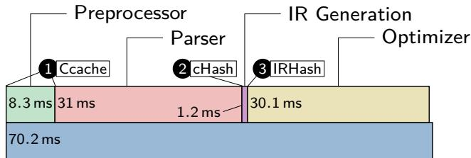
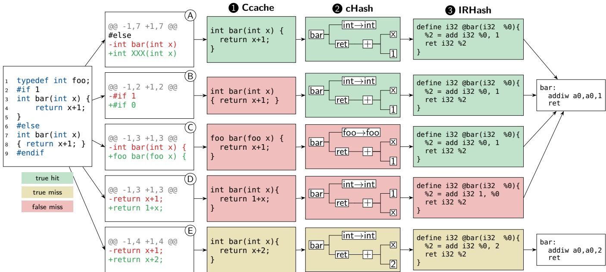

①

USENIX

THE ADVANCED COMPUTING SYSTEMS ASSOCIATION

# IRHash: Efficient Multi-Language Compiler Caching by IR-Level Hashing

Tobias Landsberg and Johannes Grunenberg, Leibniz Universität Hannover; Christian Dietrich, Technische Universität Braunschweig; Daniel Lohmann, Leibniz Universität Hannover

https://www.usenix.org/conference/atc25/presentation/landsberg

# This paper is included in the Proceedings of the 2025 USENIX Annual Technical Conference.

July 7–9, 2025 • Boston, MA, USA ISBN 978-1-939133-48-9

Open access to the Proceedings of the 2025 USENIX Annual Technical Conference is sponsored by

P-Lr.h £Es/sL.

auuuJl9 PgleU

King Abdullah University of

Science and Technology

# IRHash: Efficient Multi-Language Compiler Caching by IR-Level Hashing

Tobias Landsberg Leibniz Universität Hannover

Christian Dietrich Technische Universität Braunschweig

Johannes Grunenberg Leibniz Universität Hannover

Daniel Lohmann Leibniz Universität Hannover

## Abstract

Compilation caches (CCs) save time, energy, and money by avoiding redundant compilations. They are provided by means of compiler wrappers (Ccache, sccache, cHash) or native build system features (Bazel, Buck2). Conceptually, a CC pays off if the achieved savings by cache hits outweigh the extra costs for cache lookups. Thus, most techniques try to detect a cache hit early in the compilation process by hashing the (preprocessed/tokenized) source code, but hashing the AST has also been suggested to achieve even higher end-to-end savings, as the increased accuracy outweighs the additional parsing costs. Technically, all these CCs are currently limited to C or C-style languages.

In this paper we take the conceptual question of the “right” lookup level for compiler caches one step further onto the IR level. We provide IRHash, an IR-level CC for LLVM that not only offers higher accuracy than the previous works but can also support all languages with an LLVM backend.

We evaluate IRHash against Ccache and cHash based on the development history of 16 open-source projects written in C, C++, Fortran, and Haskell. With an average build time reduction of 19% across all C projects, IRHash provides better end-to-end savings than Ccache (10%) and cHash (16%), while additionally supporting more languages.

## 1 Introduction

Software development involves the frequent (re-)compilation of translation units (TUs) throughout the development cycle, consuming a considerable amount of time and energy (for both the developer and the machine).

To reduce these costs, content-based compilation caches (CCs), such as Ccache [1] or sccache [2], aim to reuse build artifacts from previous builds. Both tools calculate a hash fingerprint of the TU (source file and included headers) and query their object-file cache. While effective, the resulting hash is sensitive to any source-code change, even superficial changes (i.e., formatting, coding style, comments) in any of the involved files result in a cache miss and the reinvocation of the compiler, even though the resulting object file would not be different. For higher accuracy, Ccache offers an option to calculate the hash after the C preprocessor has run, which normalizes the TU regarding some changes (on token level, e.g., white space formatting or commenting), but many superficial changes still lead to a cache miss, resulting in costly compiler invocations.

  
Figure 1: Build-time breakdown for a clean build of OpenSSL, which takes about 187 s and invokes the compiler 2 406 times. A single compiler invocation takes 70.2 ms on average, mainly comprising the duration for preprocessor, parser, IR generation, and optimizer. The markers show when different caching methods would detect redundant recompilations and stop the compiler invocation.

cHash [3] aims to overcome this issue by further normalization of the TU by calculating the hash after parsing, that is, on the level of the abstract syntax tree (AST), where syntactically irrelevant changes are eradicated, and changes in unreferenced AST nodes can simply be ignored (e.g., an unreferenced type declaration). Due to its improved detection accuracy, cHash outperforms Ccache in most cases [3], even though the CC decision overhead is much higher: Fig. 1 shows this for OpenSSL, for which AST generation takes about four times longer than preprocessing. Apparently, further normalization to increase detection accuracy pays off.

## About This Paper

In this paper we propose to go even further and solve the CCproblem on the level of the intermediate representation (IR). Modern compilers, such as GCC or LLVM, generate a registerlevel IR from the AST to decouple language- and targetspecific code generation and optimizations. As we can see in Fig. 1, this step takes only negligible extra time after AST generation (at least for OpenSSL). On the other hand, it might provide significant benefits: Besides providing higher accuracy (more superficial changes are eradicated), the IR is also relatively simple and language-agnostic: An IR-level CC approach thereby provides generalizability over all programming languages supported by the compiler suite. This is in stark contrast to the existing approaches, which are either bound to the C preprocessor (Ccache and sccache) or even the concrete AST-node types emitted by the compiler frontend (cHash). In particular, we claim the following contributions:

• We identify the IR-level as the most suitable level for CC with respect to effectiveness (end-to-end savings), generalizability (across languages), and maintainability (implementation effort).

• We propose IRHash, an IR-level compilation cache for LLVM IR and demonstrate its applicability for four frontend languages (C, C++, Fortran, Haskell).

• We demonstrate its accuracy and end-to-end savings in comparison to Ccache and cHash on the development history of 16 open-source projects. With an average build time reduction of 19% across all C projects, IRHash provides better end-to-end savings than Ccache (10%) and cHash (16%), while additionally supporting more languages.

The remainder of the paper is structured as follows: Sec. 2 describes the problem and limitations of existing caching mechanisms. Sec. 3 outlines the design and implementation of our IR-based caching approach. Sec. 4 evaluates its performance and versatility. Sec. 5 discusses the implications of our findings and potential improvements. Sec. 6 reviews related work, and Sec. 7 concludes this paper.

## 2 Problem Description

Source-code changes, whether during interactive development or condensed in a patch, are usually local and affect only a small portion of the program. Therefore, it is close at hand to recompile only the changed parts of the program while retrieving the rest from a compilation cache (CC) populated by previous compiler invocations. We define the build-artifact reuse (BAR) problem as the task of avoiding or speeding up unnecessary compilation steps by querying a CC.

However, in most programming languages, local changes can have a non-lexical, non-local impact on the compilation result. For example, changes to a C struct, which is declared in a header file, influence the resulting binary at every usage site. Also, if the BAR is too costly it can outweigh the savings of avoiding compilation steps.

Timestamp-based BAR, as introduced by make [4], addresses the problem at the TU level: For each TU, the file system timestamp of all compiler inputs is compared to the timestamp of the last compilation result. If all inputs are older than the last output, the compiler invocation is skipped and the last output is reused. This BAR method induces very low overheads, is entirely language agnostic, and has a high saving potential. However, it comes with two important downsides: (1) it is very sensitive to changes, especially with dense inputdependency graphs, and (2) it is a local strategy that is not able to reuse results across repositories or machines.

Content-based BAR [1]–[3], [5]–[7] addresses both shortcomings by calculating a fingerprint hash of the program that changes whenever the result would change. By keeping and querying a fingerprint–build-artifact CC we can skip compilation (steps).

For example, the Ccache [1] tool hashes either the original (direct mode) or the preprocessed source code (preprocessor mode). These modes differ in their accuracy and their saving potential: While the direct mode can skip the entire compiler invocation (70 ms for OpenSSL, see Fig. 1), it is sensitive to all textual changes. On the other hand, the preprocessed mode can ignore changes in inactive CPP blocks but requires executing the preprocessor, which takes 8.3 ms. More generally, the relative end-to-end saving of a BAR methods is:

$$
\frac { T _ { \mathsf { s a v e d } } } { T _ { \mathsf { t o t a l } } } = \frac { P _ { \mathsf { o p t } } \cdot P _ { \mathsf { a c c } } \cdot T _ { \mathsf { r e m } } - T _ { \mathsf { o v e r } } } { T _ { \mathsf { b e f o r e } } + T _ { \mathsf { r e m } } }\tag{1}
$$

The BAR method will run after $T _ { \mathsf { b e f o r e } }$ in the compilation process, and it will always introduce an overhead of $T _ { \mathsf { o v e r } }$ . If it can reuse a previous build artifact, it can skip the remaining $T _ { \mathsf { r e m } }$ of the compilation, thereby saving time. However, it can only do so: (a) if the build artifact was produced before, which we introduce by $P _ { \mathsf { o p t } }$ , the probability that an optimal BAR1 strategy with perfect accuracy would show, and (b) if the changed fingerprint does actually indicate a changed compilation result, for which we use the accuracy probability $P _ { \mathsf { a c c } }$ Please note, that $P _ { \mathsf { o p t } }$ depends on the project, the encountered change, the usage scenario, and the CC configuration (cache size). Only $P _ { \mathsf { a c c } }$ is specific to the used BAR method.

A relevant question is, at which point in the compilation process should a BAR method run to maximize the end-toend saving? For example, cHash [3] occupies another spot in this trade-off space: By hashing at the AST level, cHash can ignore changes to type declarations (e.g., in a header file) if that type was not referenced. However, for OpenSSL, its average $T _ { \mathsf { r e m } }$ is only 31.3 ms per TU, while Ccache’s $T _ { \mathsf { r e m } }$ is at 62 ms per TU (89 %).

As the compiler progresses, $T _ { \mathsf { r e m } }$ naturally decreases; however, as we get closer to the final binary, we expect $P _ { \mathsf { a c c } }$ to improve accordingly. Therefore, $T _ { \mathsf { o v e r } }$ , which scales with the amount of data and the complexity of the hash procedure, is quite important.

  
Figure 2: Examples for capabilities and limitations of BAR methods when confronted with different source-code changes

Directly tied to the hash-procedure complexity, and also deciding on its widespread adoption, is the language dependence of a BAR method. For example, Ccache’s direct mode only has to hash a byte array, while cHash requires a hash rule for every language-specific AST-node type. This might also be why cHash has not gained widespread adoption and still only supports the C language.

## 3 IRHash: An IR-Based Compilation Cache

With IRHash, we solve the BAR problem at a different step of the compilation process, right after the IR generation. In the following, we will highlight the conceptual benefits, illustrate situations where IRHash can outperform the other BAR techniques, and touch on the implementation of our prototypical LLVM plugin.

## 3.1 Conceptual Benefits

Using a hash of a program’s IR as a fingerprint to predict changed compilations comes with four key benefits:

Negligible smaller $T _ { \mathsf { r e m } }$ than cHash. Preprocessing and parsing take a considerable share of the compilation process, as we can see in Fig. 1. In comparison, as done by a single tree traversal, generating the IR from the AST is quite fast, reducing $T _ { \mathsf { r e m } }$ only slightly. For example, for OpenSSL, $T _ { \mathsf { r e m } }$ is at 30.1 ms for the IR level and 31.3 ms for the AST-level. We will discuss this in more detail in Sec. 4.3.

Higher $P _ { \mathsf { a c c } }$ At the IR level, many language constructs that are only syntactic sugar (C: typedef) or act as type-level safeguards (C++: explicit) are removed by IR code generation. The IR generation can also perform some ad-hoc optimizations (e.g., constant folding). Therefore, IR-level should have a higher $P _ { \mathsf { a c c } }$ than AST-level hashing, which already outperforms source-level hashing. We will quantify this higher $P _ { \mathsf { a c c } }$ in Sec. 4.2.

Low $T _ { \mathsf { o v e r } }$ overhead The data structures that store the IR are designed for frequent traversal to speed up the optimization steps. Also, they are conceptually simpler as they are a sequential program (list of lists) for a virtual machine compared to the AST, which captures the syntactic structure of the program recursively (as a tree). Unlike source-level hashing, which has to hash all (preprocessed) compiler inputs, IR-level hashing can also be faster as only the relevant parts of the input are hashed. In Sec. 4.3, we will demonstrate that IR-level hashing actually has a lower $T _ { \mathsf { o v e r } }$

Simple and widely-applicable implementation Due to the conceptual simplicity of the IR, which is comprised of only a few instruction types, IR-level hashing is simpler to implement than AST-level hashing. Since the IR is a languageindependent abstraction that connects language front-ends, optimization steps, and machine-specific back-ends, IR-level hashing is directly usable for different programming languages. We will argue for IRHash’s simplicity in Sec. 3.3 and justify our applicability claim with four programming languages and 16 open-source projects (see Tab. 2).

Given these arguments, we believe that IR hashing is conceptually the most suitable point in time to perform BAR.

<table><tr><td>C++ Classes</td><td>Source Lines</td></tr><tr><td>llvm::Module</td><td>27</td></tr><tr><td>llvm::Function</td><td>25 1</td></tr><tr><td>llvm: :BasicBlock</td><td>1 4 1</td></tr><tr><td>llvm::Instruction llvm::Constant --</td><td>71</td></tr><tr><td>llvm::GlobalVariable</td><td>93 1</td></tr><tr><td>llvm: :Type</td><td>24 1</td></tr><tr><td></td><td>109</td></tr><tr><td>Caching Logic Total</td><td>208 561</td></tr></table>

Table 1: Implementation effort for IR-level hashing

## 3.2 Reasons for Better Accuracy

To give a better understanding of $P _ { \mathsf { a c c } }$ , we will exemplify the capabilities and limitations of the different BAR methods with the five source-code changes A - E in Fig. 2. We assume that the original code on the left was already compiled and inserted into the CC and we compile for RISC-V, as RISC-V allows us to show a limitation of CCs. Please note, that $P _ { \mathsf { a c c } }$ is $\bigl ( 1 - \frac { \# \mathrm { f a l s e } \ : \mathrm { m i s s } } { \# \mathrm { r u n s } } \bigr )$

A is a change to the dead preprocessor block (line 6-9). If used in preprocess mode, Ccache can ignore the change and correctly have a cache hit, reusing the previous result. Naturally, all the following steps also have a cache hit.

B toggles the #if and selects the previously dead block. Since the bar() function is formatted differently, Ccache will falsely have a cache miss and continue compilation. As such syntactic differences are not visible in the AST, cHash has a cache hit.

C replaces the int type with the equivalent foo type alias. While C typedefs are mere syntactic sugar, they are still visible in the AST, provoking a false cache miss with cHash. Due to type-alias erasure during IR generation, IRHash correctly has a cache hit.

D swaps the terms of the sum. This change persists until the IR level, provoking a cache miss for IRHash. However, this is a false miss, as the RISC-V backend uses the addwith-immediate instruction and swaps the operands to the original order.

E is an actual semantic change that results in a different binary output, requiring the full compilation process.

The different BAR methods remain, to a differing degree, stable hashes in the presence of irrelevant changes.

## 3.3 Implementation

Our IRHash prototype comes as an LLVM plugin that introduces a new IR-level compiler pass that has access to

LLVM’s internal data structures. Thus, IRHash can be loaded into all LLVM-based compilers and our IRHash pass can be scheduled at any point of the compilation process. For BAR, IRHash should run directly after the IR generation to maximize $T _ { \mathsf { r e m } }$ . Conceptually, the plugin consists of two parts: IR hashing and CC logic.

IR Hashing LLVM IR captures the program semantic as a set of per-function control-flow graphs with basic blocks as nodes. The IR code generation already flattens all languagelevel logic constructs (methods, lambdas, co-routines,. . . ) into LLVM functions. Therefore, IR is stored as a shallow hierarchy of nested C++ objects (see Tab. 1): A TU is a list of functions and global variables. A function is a list of basic blocks, which themselves are lists of instructions. Each instruction has an opcode and multiple operands. As LLVM IR is always in SSA format [8], operands are either a literal constant or (the result) of another instruction. Global variables, functions, instructions, and constants have types, which only describe the data layout.

In Tab. 1 we see that it only takes a few hundred source lines to implement the necessary hash operators: For the TU hash, we include the hash of global variables and functions. The global-variable hash includes name, type, initializer, and attributes. For functions we hash the name, the prototype, attributes, and the hash of basic blocks and subsequently instructions. Besides opcode and operands, the instruction hash also includes certain attributes that influence the binary (e.g., allocation alignments, atomicity). With inline assembler we hash the string representation, and complex types are hashed recursively down to their scalar components.

We deliberately chose not to hash a serialized version of the IR (in textual or LLVM bitcode form), as this has two significant drawbacks: (1) We would lose the fine-grained control over the data included in the hash. For example, IRHash by default does not include debug information in the hash, which means purely syntactical changes do not trigger a rebuild. However, in scenarios where up-to-date debug information is required, this could be adjusted easily.

(2) IR serialization takes a considerable amount of time and is not necessary for many compiler runs. Nevertheless, if LLVM serializes the IR anyway, for example, for ThinLTO [9], an IR hash could be calculated using that.

Caching Logic With the IR hash at hand, the IRHash pass performs the CC lookup: Like Ccache, IRHash stores build artifacts (i.e., object files) in a cache directory with the file name matching the hash. On a hit, the cached build artifact is hard linked to the target location and the compilation is terminated. Also, the timestamp of the object file is updated to allow timestamp-based BAR methods to avoid downstream operations (like linking). On a cache miss, the compilation continues, and the resulting object file is put into the cache.

IRHash is implemented with a total 561 lines of C++ code, while cHash requires 1200 source lines for the hash operator alone [3]. Please note that IRHash supports multiple frontend languages, while cHash only supports C. As Ccache is a production-ready CC with a multitude of features, its 19 000 source-code lines are not comparable. However, IRHash can be combined with Ccache (see Sec. 4.5) or could act as a fingerprinting module.

## 4 Evaluation

In the evaluation we demonstrate that IRHash works correctly and efficiently across languages on the development history of 16 open-source projects written in C, C++, Fortran, and Haskell. We also show that the IR level is best suited to solve the BAR problem by comparing IRHash with tools working at the source code and AST levels. For this purpose, we chose Ccache for the source-code level due to its popularity and cHash for the AST level, as it is the only tool known which works at this level. We determine the parameters of Equation 1 for these CCs and projects and conclude with a real-world end-to-end-performance benchmark.

## 4.1 Test Cases

For our evaluation we selected the open-source projects listed in Tab. 2. This selection spans a wide range of project sizes, from smaller codebases, like ShellCheck (16 kLOC) and LA-PACK (779 kLOC) to larger ones, such as PostgreSQL (1 019 kLOC) and Linux (26 256 kLOC). These projects also represent diverse domains, including interpreters (Bash, CPython, Lua), database systems (PostgreSQL, SQLite), cryptography libraries (Mbed TLS, OpenSSL), static analysis tools (Clazy, GammaRay, ShellCheck), frameworks and toolkits (Asio, SDL), a mathematical library (LAPACK), a lightweight C library (musl), an x86 emulator (Bochs), and the Linux operating system kernel. For comparison with the textual and AST level, our evaluation focuses on C but to demonstrate applicability to other languages, some of these projects are written in C++ (Bochs, Asio, Clazy, GammaRay), Fortran (LAPACK) and Haskell (ShellCheck).

For our experiments we examined the development history of the projects up to the described version as a source of realworld changes required for incremental builds. The number of commits considered was limited to the 100 most recent ones. Together with the selection of projects, this should result in a diverse and representative set of changes. Commits failing to build in the baseline (without any caches) were filtered out. All measurements were performed on a system with an Intel® Core™ i7-12700 processor with Turbo Boost disabled for reproducibility and 32 GB of memory. The size of the CCs was not limited. All projects were tested using their default configurations, except for replacing the compiler with Clang and enabling the tested CCs. For SQLite we disabled amalgamation2, a process in which all source code is concatenated into a single file. Amalgamation is mainly done for deployment and optimization purposes and is not intended for development. Asio as a header library is not compilable itself, which is why we have compiled the example code, the default target of the project. For LAPACK, written in Fortran, we compiled using Flang, LLVM’s Fortran frontend [10]. ShellCheck, a project written in Haskell, was compiled using the LLVM backend of GHC 9.12.1 [11]. Due to an incompatibility with newer GHC versions of the earlier commits in its history, ShellCheck has only 59 successfully building (and therefore analyzed) commits. In contrast, there are usually no failing (clean) builds for the other projects and at most six for GammaRay. All in all, based on this diverse selection of projects and commits, we are confident that our results are representative of a wide range of software projects.

Table 2: Overview of Evaluated Projects
<table><tr><td>Project</td><td>Language</td><td>Version</td><td>LOC</td></tr><tr><td>Linux [12]</td><td>C</td><td>6.11</td><td>26 255 658</td></tr><tr><td>OpenSSL[13]</td><td>C</td><td>3.4.0</td><td>621158</td></tr><tr><td>SQLite [14]</td><td>C</td><td>3.47.0</td><td>297234</td></tr><tr><td>Lua [15]</td><td>C</td><td>5.4.7</td><td>21879</td></tr><tr><td>PostgreSQL [16]</td><td>C</td><td>17.0</td><td>1018 762</td></tr><tr><td>CPython [17]</td><td>C</td><td>3.13.0</td><td>672 595</td></tr><tr><td>Bash [18]</td><td>C</td><td>5.2</td><td>130 759</td></tr><tr><td>Mbed TLS [19]</td><td>C</td><td>3.6.2</td><td>166 172</td></tr><tr><td>SDL [20]</td><td>C</td><td>2.30.8</td><td>351683</td></tr><tr><td>musl [21]</td><td>C</td><td>1.2.5</td><td>95 034</td></tr><tr><td>Bochs [22]</td><td>C++</td><td>2.8</td><td>289 270</td></tr><tr><td>Asio [23]</td><td>C++</td><td>1.32.0</td><td>182108</td></tr><tr><td>Clazy [24]</td><td>C++</td><td>1.12</td><td>25 035</td></tr><tr><td>GammaRay [25]</td><td>C++</td><td>3.1.0</td><td>101 798</td></tr><tr><td>LAPACK [26]</td><td>Fortran</td><td>3.12.0</td><td>779 202</td></tr><tr><td>ShellCheck [27]</td><td>Haskell</td><td>0.10.0</td><td>15 672</td></tr></table>

## 4.2 Validation $( P _ { \tt o p t } , P _ { \tt a c c } )$

First, we validated the implementation of IRHash by performing clean builds for 100 commits each across 16 projects. We compared the predictions of Ccache, cHash, and IRHash against object file hashes and measure the compilation time with caching disabled to determine the overhead. In total, 1 289 086 translation units were compiled.

Most importantly, IRHash, like the other tools, did not cause any false hits, which means that whenever an object file changed, the IRHash was also different. The property of correctness is mandatory for a CC. If developers cannot be sure that their changes have been compiled, i.e., a CC leads to incorrect results, it is practically useless. Consequently, Ccache and cHash also offer this property. Full completeness, i.e., no false misses $( P _ { \mathsf { a c c } } = 1 )$ , on the other hand, is desirable but not claimed by any approach. As Tab. 3 shows, the accuracy $P _ { \mathsf { a c c } }$ varies; the reasons are discussed in Fig. 2.

Table 3: The average accuracy $( P _ { \mathsf { a c c } } )$ and $P _ { \mathsf { o p t } }$ per commit for the evaluated projects, commits, and CCs. Values not available due to lack of language support by a CC are marked with “-”.
<table><tr><td colspan="4"></td></tr><tr><td>Project</td><td> $P _ { \mathsf { o p t } }$  (%)</td><td>Ccache</td><td> $P _ { \mathsf { a c c } } \left( \% \right)$  cHash</td><td>IRHash</td></tr><tr><td>Linux</td><td>99.91</td><td>97.89</td><td>98.14</td><td>99.99</td></tr><tr><td>OpenSSL</td><td>99.96</td><td>97.63</td><td>99.01</td><td>100.00</td></tr><tr><td> SQLite</td><td>98.86</td><td>93.66</td><td>99.01</td><td>99.82</td></tr><tr><td>Lua</td><td>97.23</td><td>85.26</td><td>97.03</td><td>99.21</td></tr><tr><td>PostgreSQL</td><td>99.88</td><td>97.99</td><td>100.00</td><td>100.00</td></tr><tr><td>CPython</td><td>98.97</td><td>98.74</td><td>99.48</td><td>99.78</td></tr><tr><td>Bash</td><td>97.09</td><td>93.23</td><td>99.58</td><td>99.97</td></tr><tr><td>Mbed TLS</td><td>99.37</td><td>93.62</td><td>99.76</td><td>99.97</td></tr><tr><td>SDL</td><td>99.31</td><td>95.78</td><td>99.94</td><td>99.93</td></tr><tr><td>musl</td><td>98.98</td><td>99.35</td><td>99.91</td><td>100.00</td></tr><tr><td>Average (C)</td><td>98.96</td><td>95.32</td><td>99.19</td><td>99.87</td></tr><tr><td>Bochs</td><td>98.95</td><td>97.29</td><td></td><td>98.81</td></tr><tr><td>Asio</td><td>96.08</td><td>59.92</td><td></td><td>96.72</td></tr><tr><td>Clazy</td><td>99.41</td><td>95.83</td><td>=</td><td>99.93</td></tr><tr><td>GammaRay</td><td>99.55</td><td>99.74</td><td></td><td>99.99</td></tr><tr><td>Average (C++)</td><td>98.50</td><td>88.20</td><td></td><td>98.86</td></tr><tr><td>LAPACK</td><td>99.80</td><td></td><td>=</td><td>99.99</td></tr><tr><td>ShellCheck</td><td>75.26</td><td></td><td></td><td>100.00</td></tr></table>

The results show that IRHash is generally one to two orders of magnitude more accurate than Ccache, cHash is in between but closer to IRHash. For example, for Mbed TLS with Ccache, 6.38% redundant builds are performed, with cHash 0.24%, and with IRHash only 0.03%. It is noticeable that both Lua and Asio have a high rate of false misses. In the case of Lua this is due to the fact that it was refactored frequently, sometimes in such a way that the code was only the same after optimization. Asio as a header library often introduces functions that are not used, a weakness of Ccache. Also, in the commit range we examined, implicit constructs were made explicit, and std::move() was inserted in places where the optimizer already had done so, leading to false misses for IRHash. The fact that many of the false misses are caused by semantic changes, which are only eliminated by optimizations, underlines the high suitability of the IR level for the accuracy of caching.

Another interesting observation is that cHash is more accurate for SDL than IRHash. This is due to an optimization of cHash: Unlike IRHash, cHash does not hash the types of structs themselves but their use only, i.e., the offset of the accesses and the size (for sizeof()). If a new field is added at the end of a struct that is not used and the size of the struct is not used or changed in a TU, the hash does not change either. In the future this optimization could be implemented in IRHash as well.

In contrast to the other CCs, IRHash also supports languages apart from C/C++. The last two experiments confirm that IRHash works for other compilers with an LLVM backend (Fortran and Haskell). With a $P _ { \mathsf { a c c } }$ of 99.99% and 100.00%, it performs equally as well as for C/C++.

Note that $P _ { \mathsf { o p t } }$ for ShellCheck (75.26%) is remarkably low. There are two reasons for this. Firstly, ShellCheck has relatively few translation units (27), thus modifying only a few files is already a significant share. Secondly, the compiler does not always work fully deterministically for each TU. The main problem is that internal identifiers are made globally unique (across all TUs). This process is nondeterministic. In addition, the identifiers are enumerated, which can lead to changes in one TU changing identifiers in another. This is further exacerbated in incremental builds where the number of TUs to be compiled varies. The GHC maintainers confirmed this behavior as a known bug and are, at the time of writing, working on a fix. [28]–[31]

All in all, the results demonstrate that the IRHash approach works correctly, effectively, and significantly more accurately than Ccache, especially for C++ projects. Compared to cHash, the difference in accuracy is less pronounced. This is primarily due to two factors: (1) changes in the AST frequently result in changes to the IR, and (2) the evaluated changes, derived from the projects’ development history, often genuinely alter behavior. Nonetheless, the experiment confirms the expectation of IR Hashing providing a higher $P _ { \mathsf { a c c } }$

## 4.3 Performance Characteristics $( T _ { \tt o v e r } , T _ { \tt r e m } )$

We performed clean builds with deactivated caching for the same commits as before to quantify each CC’s overhead. Similarly, 1 289 086 translation units were compiled. The resulting $T _ { \mathsf { o v e r } }$ and $T _ { \mathsf { r e m } }$ are summarized in Tab. 4.

The measurements show that Ccache’s overhead is consistently the highest, with an average of 548.8 ms per commit for Linux, followed by cHash (236.1 ms) and IRHash (2.0 ms). The results for Linux highlight the limitations of Ccache. It invokes the preprocessor during cache misses, which in Linux entails resolving a multitude of complex and deeply nested macros. By contrast, cHash benefits from the fact that the macros are already resolved and a lot of code discarded. In the code generation phase, further complexity is resolved, enabling IRHash to process the IR code much faster. This pattern is observed consistently across all tested projects, though the specific performance characteristics vary.

However, it is noticeable that the absolute overhead of IRHash for the C++ projects Asio (14.5 ms) and Clazy (26.1 ms) is higher compared to C projects of their size, e.g., SDL (1.1 ms). This difference stems from the extensive code generated due to the use of templates. For instance,

Table 4: The average overhead $( T _ { \circ \mathsf { v e r } } )$ and time remaining after hash calculation $( T _ { \mathsf { r e m } } )$ per TU for the evaluated projects, commits, and CCs. Values not available due to lack of language support by a CC are marked with $^ { 6 6 } - ^ { 5 9 }$
<table><tr><td></td><td colspan="3"> $T _ { \mathsf { o v e r } }$ </td><td colspan="3"> $T _ { \mathsf { o v e r } }$ </td><td colspan="3"> $\frac { T _ { \mathsf { r e m } } } { T _ { \mathsf { t o t a l } } }$ </td></tr><tr><td>Project</td><td>Ccache</td><td>cHash</td><td>IRHash</td><td>Ccache</td><td> $T _ { \tt t o t a l }$  cHash</td><td>IRHash</td><td>Ccache</td><td>cHash</td><td>IRHash</td></tr><tr><td>Linux</td><td>548.8ms</td><td>236.1 ms</td><td>2.0ms</td><td>34.8%</td><td>14.7%</td><td>0.1%</td><td>65.2%</td><td>1.4%</td><td>15.3%</td></tr><tr><td>OpenSSL</td><td>97.7 ms</td><td>8.7ms</td><td>0.7ms</td><td>38.0%</td><td>3.7%</td><td>0.3%</td><td>61.8%</td><td>36.1%</td><td>38.9%</td></tr><tr><td> SQLite</td><td>59.2 ms</td><td>4.4 ms</td><td>1.5 ms</td><td>17.0%</td><td>1.4%</td><td>0.5%</td><td>82.9%</td><td>76.5%</td><td>76.4%</td></tr><tr><td>Lua</td><td>52.0ms</td><td>3.8 ms</td><td>1.2 ms</td><td>18.7%</td><td>1.5%</td><td>0.5%</td><td>81.2%</td><td>77.6%</td><td>76.7%</td></tr><tr><td>PostgreSQL</td><td>113.5 ms</td><td>9.1 ms</td><td>1.4 ms</td><td>29.2%</td><td>2.5%</td><td>0.4%</td><td>70.7%</td><td>51.9%</td><td>53.3%</td></tr><tr><td>CPython</td><td>151.1 ms</td><td>22.3 ms</td><td>3.3 ms</td><td>19.7%</td><td>3.0%</td><td>0.4%</td><td>80.2%</td><td>62.1%</td><td>63.2%</td></tr><tr><td>Bash</td><td>121.7 ms</td><td>3.8 ms</td><td>1.1 ms</td><td>28.8%</td><td>1.3%</td><td>0.4%</td><td>71.1%</td><td>62.0%</td><td>62.0%</td></tr><tr><td>Mbed TLS</td><td>63.4 ms</td><td>4.8 ms</td><td>0.9 ms</td><td>29.4%</td><td>2.6%</td><td>0.5%</td><td>70.4%</td><td>61.8%</td><td>62.9%</td></tr><tr><td>SDL</td><td>158.4 ms</td><td>36.8 ms</td><td>1.1 ms</td><td>31.9%</td><td>7.8%</td><td>0.2%</td><td>68.0%</td><td>31.9%</td><td>39.1%</td></tr><tr><td>musl</td><td>33.9 ms</td><td>0.9 ms</td><td>0.1 ms</td><td>52.9%</td><td>2.9%</td><td>0.4%</td><td>46.2%</td><td>50.2%</td><td>51.1%</td></tr><tr><td>Average (C)</td><td></td><td></td><td></td><td>30.0%</td><td>4.1%</td><td>0.4%</td><td>69.8%</td><td>51.1%</td><td>53.9%</td></tr><tr><td>Bochs</td><td>86.0ms</td><td></td><td>1.7 ms</td><td>17.3%</td><td>=</td><td>0.4%</td><td>82.6%</td><td></td><td>55.5%</td></tr><tr><td>Asio</td><td>447.5 ms</td><td></td><td>14.5 ms</td><td>6.9%</td><td></td><td>0.2%</td><td>93.1%</td><td></td><td>30.7%</td></tr><tr><td>Clazy</td><td>510.0ms</td><td></td><td>26.1ms</td><td>5.3%</td><td></td><td>0.7%</td><td>94.7%</td><td></td><td>53.5%</td></tr><tr><td>GammaRay</td><td>272.5 ms</td><td></td><td>2.4 ms</td><td>11.4%</td><td></td><td>0.1%</td><td>88.6%</td><td></td><td>12.1%</td></tr><tr><td>Average (C++)</td><td></td><td></td><td></td><td>10.2%</td><td></td><td>0.3%</td><td>89.7%</td><td>1</td><td>37.9%</td></tr><tr><td>LAPACK</td><td></td><td></td><td>0.5ms</td><td>-</td><td></td><td>0.2%</td><td>1</td><td></td><td>41.7%</td></tr><tr><td>ShellCheck</td><td></td><td></td><td>60.7 ms</td><td></td><td></td><td>1.5%</td><td></td><td></td><td>85.5%</td></tr></table>

Asio (182 kLOC) generates 387 MiB of IR code, while SDL (352 kLOC) generates only 28 MiB. As this greatly increases the total compiler runtime, it is not reflected in the relative overhead, both for Ccache and for IRHash. Instead, it mainly affects the compiler frontend, which has to expand the templates. The overhead for Asio is 6.9% and 0.2% respectively, for Clazy 5.3% and 0.7% respectively, and for SDL 31.9% and 0.2% respectively. ShellCheck is special in that Haskell’s GHC generates textual LLVM IR and then calls LLVM’s opt to optimize the generated IR. With 439 MiB even more code is generated than with Asio, which explains the high overhead. In addition, IRHash only runs as part of opt, which leads to a $T _ { \tt t o t a l }$ that consists mainly of optimizations, since the compiler frontend has been executed already and the lowering happens in a later step. This leads to a comparatively high relative overhead and the fact that only the optimization phase (not the lowering) can be cached.

Regarding the saving potential $T _ { \mathrm { r e m } } ,$ Ccache performs best because it starts the hash calculation the earliest. Interestingly, IRHash often completes hash computation earlier than cHash despite the latter starting earlier (as soon as the AST is generated). For example, for OpenSSL $T _ { \mathsf { r e m } }$ is 61.8% when using Ccache, for cHash it is 36.1%, and for IRHash 38.9%. This behavior is due to an implementation detail in modern compilers, particularly Clang: To reduce memory usage, the compilation process handles each top-level declaration independently and sequentially. As a result, the code generation phase for the first declaration begins even before the AST for subsequent declarations is generated. Consequently, cHash starts exactly as much earlier as the code generation phase for the last toplevel declaration takes and IRHash often compensates for this by completing the hash computation more quickly. Again, ShellCheck is special: Because its $T _ { \tt t o t a l }$ consists only of opt, the hashing pass runs directly at the beginning, leading to a high $T _ { \mathsf { r e m } }$

Overall, IRHash offers a trade-off: the hash is calculated later than when using Ccache but is significantly more accurate. Compared to cHash it is equally fast but more precise and not limited to C. The low overhead of the hash calculation also shows that our implementation is sufficiently fast, although there is still plenty of room for improvement. These results are a strong indicator for IR being better suited to solve the BAR compared to the AST.

## 4.4 End-to-End Performance $( T _ { \tt t o t a l } , T _ { \tt s a v e d } )$

The end-to-end performance benchmark is intended to reflect the use case of a typical developer who frequently changes and builds the project. To simulate this scenario, we incrementally built 100 (+1 initial) commits from the development history of each of the evaluated projects. Non-building commits, along with their subsequent commits used for a new clean build, were excluded from the evaluation. Tab. 5 presents the average performance improvements per commit for Ccache, cHash, and IRHash, compared to builds without any CC.

Table 5: The optimization level, number of successfully building commits (in baseline) together with the average build time $( T _ { \tt t o t a l } )$ and relative end-to-end savings per commit for the evaluated projects, commits, and CCs. The fastest cache for each project is highlighted in green. If a combination of caches is faster than this cache for a project, it is highlighted in gray. Values not available due to lack of language support by a CC are marked with “-”.
<table><tr><td></td><td></td><td></td><td></td><td colspan="7"> $\frac { - T _ { \mathsf { s a v e d } } } { T _ { \mathsf { t o t a l } } }$ </td></tr><tr><td>Project</td><td>Opt</td><td>Commits</td><td> $T _ { \tt t o t a l }$ </td><td>Ccache</td><td>cHash</td><td>IRHash</td><td></td><td>Ccache+cHash</td><td></td><td>Ccache+IRHash</td></tr><tr><td>Linux</td><td>02</td><td>100</td><td>25.1 s</td><td>0.1%</td><td></td><td></td><td>-3.1%</td><td></td><td>3.2%</td><td>-3.4%</td></tr><tr><td>OpenSSL</td><td>02</td><td>100</td><td>5.7 s</td><td>-16.9%</td><td></td><td>3.0% -9.5%</td><td>-20.8%</td><td></td><td>-18.8%</td><td>-20.2%</td></tr><tr><td>SQLite</td><td>02</td><td>98</td><td>42.9 s</td><td>-4.8%</td><td></td><td>-3.8%</td><td>-4.4%</td><td></td><td>-4.3%</td><td>-4.7%</td></tr><tr><td>Lua</td><td>02</td><td>100</td><td>1.0s</td><td>-44.9%</td><td></td><td>-49.6%</td><td>-52.8%</td><td></td><td>-52.4%</td><td>-56.1%</td></tr><tr><td>PostgreSQL</td><td>02</td><td>100</td><td>1.8s</td><td>-7.9%</td><td></td><td>-11.5%</td><td>-11.9%</td><td></td><td>-8.4%</td><td>-9.3%</td></tr><tr><td>CPython</td><td>03</td><td>100</td><td>2.3s</td><td>-14.9%</td><td></td><td>-19.1%</td><td>-22.0%</td><td></td><td>-16.9%</td><td>-20.2%</td></tr><tr><td>Bash</td><td>02</td><td>89</td><td>1.4s</td><td>-12.7%</td><td></td><td>-29.5%</td><td>-26.4%</td><td></td><td>-18.8%</td><td>-20.8%</td></tr><tr><td> Mbed TLS</td><td>02</td><td>98</td><td>1.1 s</td><td>-2.1%</td><td></td><td>-25.2%</td><td>-23.3%</td><td></td><td>-22.9%</td><td>-21.8%</td></tr><tr><td>SDL</td><td>03</td><td>88</td><td>2.3s</td><td></td><td>14.3%</td><td>-7.5%</td><td>-20.3%</td><td></td><td>10.6%</td><td>-2.1%</td></tr><tr><td>musl</td><td>02</td><td>100</td><td>1.2 s</td><td></td><td>-6.8%</td><td>-4.6%</td><td>-5.3%</td><td></td><td>-7.1%</td><td>-7.7%</td></tr><tr><td>Average (C)</td><td></td><td></td><td></td><td></td><td>-9.6%</td><td>-15.7%</td><td>-19.0%</td><td></td><td>-13.6%</td><td>-16.6%</td></tr><tr><td>Bochs</td><td>03</td><td>98</td><td>1.9 s</td><td></td><td>3.6%</td><td></td><td>-12.6%</td><td></td><td></td><td>-8.0%</td></tr><tr><td>Asio</td><td>03</td><td>96</td><td>41.0s</td><td>-6.8%</td><td></td><td></td><td>-28.5%</td><td></td><td></td><td>-29.5%</td></tr><tr><td>Clazy</td><td>03</td><td>95</td><td>7.1s</td><td></td><td>-0.6%</td><td></td><td>-25.9%</td><td></td><td></td><td>-26.5%</td></tr><tr><td>GammaRay</td><td>03</td><td>94</td><td>5.8s</td><td>-20.2%</td><td></td><td></td><td>-10.6%</td><td></td><td></td><td>-26.4%</td></tr><tr><td>Average (C++)</td><td></td><td></td><td></td><td></td><td>-6.0%</td><td></td><td>-19.4%</td><td></td><td></td><td>-22.6%</td></tr><tr><td></td><td></td><td></td><td></td><td></td><td></td><td></td><td></td><td></td><td></td><td></td></tr><tr><td>LAPACK ShellCheck</td><td>02 02</td><td>100 58</td><td>1.7 s 142.7 s</td><td></td><td>1</td><td></td><td>-12.4% 一 0.8%</td><td></td><td></td><td>1</td></tr></table>

Across all 16 projects, regardless of optimization level, project size, or programming language, the results show that, with few exceptions, IRHash consistently achieves the fastest build times. In four of these exceptions, the fastest CC is only marginally faster. For SQLite and musl, Ccache, with improvements of 4.8% and 6.8%, is slightly faster than IRHash (4.4% and 5.3%). For Bash and Mbed TLS, cHash marginally outperforms IRHash (29.5% vs. 26.4% and 25.2% vs. 23.3%). In one other case, GammaRay, Ccache can utilize its higher $T _ { \mathsf { r e m } }$ and offer more pronounced improvements (20.2% vs. 10.6%).

ShellCheck with a 0.8% slowdown is the only project where IRHash cannot improve the average build time. As mentioned in Sec. 4.2, GHC is not fully deterministic, which is amplified in incremental builds. This leads to frequent changes and cache misses. In addition, GHC uses fingerprints for the recompilation decision [29], which further increases the probability that a compiler call will actually result in a changed object file. Although IRHash still works absolutely correctly, it does not make sense to use it under these circumstances. Due to very few cache hits, the savings cannot outweigh the overhead.

In the end, it always depends on the time behavior of the cache and whether it is accurate enough for a specific change. If a change can be cached by a technique with higher $T _ { \mathrm { r e m } } ,$ this will always be the fastest option. However, our evaluation has shown that, for a wide range of software projects and changes, caching at the IR level is the better choice. From these three CCs, IRHash provides competitive results most consistently.

## 4.5 Combining Approaches $( T _ { \tt t o t a l } , T _ { \tt s a v e d } )$

Since a low $T _ { \mathsf { r e m } }$ is a weakness of IRHash, combining it with Ccache by using both Ccache’s compiler wrapper and the IRHash compiler plugin at the same time might lead to even better results. Therefore, Tab. 5 also presents the average performance improvements per commit for the combinations of Ccache with IRHash and, for comparison, Ccache with cHash. We did not measure the combination cHash+IRHash, as IRHash is superior to cHash both in terms of $P _ { \mathsf { a c c } }$ and $T _ { \mathrm { r e m } }$ The following applies to the combined cache: A miss in the first cache (Ccache) results in a query for the second cache (cHash or IRHash), which means that the data is stored in both caches. If there is a cache hit in the first cache, the second cache is not queried.

The results show that whenever IRHash was faster than cHash, the combination with Ccache is also faster. Interestingly, this also applies to Bash, where cHash is faster.

In six out of 16 cases, Ccache+IRHash’s improvements are the best compared to all other CCs and combinations thereof. In five of these cases (Linux, Lua, musl, Asio, Clazy) the improvement is small, for example, 3.4% over 3.1% with IRHash alone for Linux.

An interesting case is GammaRay, as Ccache alone speeds up the build by 20.2% and IRHash only speeds up the process by 10.6%, but together these tools achieve a speedup of 26.4%. While the speedup is more pronounced, this behavior is fundamentally no different to the other cases in which the combination is faster than the individual caches. However, when combining caches, only the speed can increase, not the hit rate. This is because a cache hit with Ccache means that after preprocessing the compiler input has not changed. Consequently, a deterministic compiler must always produce the same AST and IR code so that a hit in Ccache must also always mean a hit for cHash and IRHash. The advantage must therefore be that in cases where Ccache has a hit, calculating the more precise hash of cHash or IRHash is skipped. In cases where Ccache has a miss, the other methods may still save time due to their higher accuracy.

In cases where Ccache+IRHash delivers the best improvement, IRHash alone is often already highly effective and, therefore, a safe bet to use. Depending on the project and the change patterns $( P _ { \mathsf { o p t } } )$ , it may make sense to use Ccache additionally.

## 4.6 Result Summary

At this point we want to conclude that IR-level hashing is (a) effective (end-to-end savings), (b) generalizable across languages, and (c) easy to implement and maintain.

IRHash outperforms Ccache and cHash or comes close for most projects (see Tab. 5). The reason for this is its higher $P _ { \mathsf { a c c } }$ (see Tab. 3). While it has a comparable $T _ { \mathsf { r e m } }$ than cHash, its $T _ { \mathsf { o v e r } }$ is significantly lower, allowing it to outperform Ccache (see Tab. 4).

Our evaluation with 16 open-source projects across four programming languages demonstrates its easy and broad applicability. As we argued in Sec. 3.3, IR-level hashing is also easier to implement, for example, in the case of IRHash with a few hundred lines of code.

All in all, we think that IR-level hashing should become a standard extension to modern compiler frameworks.

## 5 Discussion

We have now described IRHash, our CC operating at the IR level, and have demonstrated the advantages over approaches operating at the source code and AST levels. In this chapter, we will discuss potential threats to the validity of our results, the generalizability of our approach, and open aspects in more detail.

## 5.1 Threats to Validity

To help ensure the internal validity of our study, we evaluated IRHash using the development histories of 16 open-source projects. The projects were chosen from different application domains: interpreters, database systems, cryptography libraries, static analysis tools, frameworks and toolkits, a mathematical library, a lightweight C library, an x86 emulator, and an operating system kernel. They are implemented in C, C++, Fortran, and Haskell.

Due to the significant differences between them, a large coverage of language constructs is given. In addition, IRHash operates on IR, which is intentionally kept simple, thereby considerably improving coverage further. In combination with the number of 1289086 compiled TUs, a diverse set of IR constructs was generated. IRHash has not missed a single change as verified against the most exact metric of binary equivalence.

To ensure external validity, we used the same variety of projects for the performance measurements. The experiments consistently yielded strong results, with IRHash not only being more precise than Ccache and cHash but also more effective in reducing compilation time. Moreover, due to the significant differences between C/C++, Fortran, and Haskell, we successfully demonstrated that the approach is language independent.

Overall, we are confident that our results are both correct and transferable to other projects and languages.

## 5.2 Open Questions

While we evaluated IRHash thoroughly, there are still possibilities for further research.

Source-code changes have different extents and impacts (reflected in different $P _ { \mathsf { o p t } }$ values). For interactive development, developers will benefit even more from IRHash’s faster turnaround times, as usually only a few lines are changed before recompilation. Commits or patches naturally require more recompilation effort (medium $P _ { \mathsf { o p t } }$ values) and induce their costs, most importantly, on continuous-integration servers [32]. While we expect even lower $P _ { \mathsf { o p t } }$ values between software versions, IRHash could help to reuse results between the different variants of statically-configured software product lines [33]. For our evaluation we deliberately chose to test IRHash with commits from existing Git histories. These changes have a medium scope and give us realistic change sets developed by independent third-party developers.

Multiple IR levels are gaining importance in current compiler design. For example, Rust’s rustc compiler uses three IR levels (High-, Medium-IR, and LLVM-IR) to perform incremental lowering. With MLIR [34], LLVM now also provides a general means to express different IR levels. However, with multiple IR levels, the gap between AST generation and LLVM-IR hashing increases, reducing $T _ { \mathsf { r e m } }$ . Therefore, the question arises at which IR level should results be cached. We consider this a topic for further research.

More fine-grained caching We also considered whether more fine-grained caching (i.e., function level) could lead to even better results. While IRHash currently fingerprints and caches the entire TUs, it can also provide per-function hashes. However, per-function caching is challenging, as interprocedural optimizations, which LLVM’s fix-point optimizer schedules early, cause information to flow between functions. For example, if the compiler inlines function A into function B, a change to A will also change the binary form of B. Without fine-grained tracking of such dependencies, perfunction caching, as already proposed by Sathyanathan et al. [35], risks incorrect compilation results. Such tracking, however, requires substantial compiler modifications, that are not necessary for IRHash, which is less intrusive and easier to validate.

IR normalization Another interesting direction to explore could be to combine IR normalization3with IRHash. By normalizing the IR (e.g., topological sorting of basic blocks) before hashing, even more non-semantic changes could be equalized, potentially leading to a higher $P _ { \mathsf { a c c } } .$ We refrained from enabling normalization as (1) bugs in the IR normalization would result in caching incorrect results, (2) normalization itself induces considerable overhead $( T _ { \mathsf { o v e r } } ) .$ , and (3) our observed $P _ { \mathsf { a c c } }$ was already quite high (see Tab. 3).

## 6 Related Work

Reducing the end-to-end costs of software recompilation by incremental builds is a decades-old mission that was even once considered a motivating factor towards modularization [36]. Yet the question which modules actually need to be recompiled based on a change in some other module remains an ongoing challenge: C and its descendants delegate modularization to an idiomatic usage of the preprocessor as well as the file system and the task of incremental builds to a languageagnostic build system (e.g., make [4]). Hence, changes are only detected and handled on the granularity of whole files, leading to many redundant recompilations. This has been identified as particularly problematic for so-called “God” header files, which trigger many other modules to be (redundantly) recompiled in case of a change [37], [38].

CCs, such as Ccache [1] and sccache [2] mitigate such recompilation costs by stepping in as a proxy compiler that detects a redundant build early in the compilation process. FASTBuild [39] goes one step further and incorporates a CC directly into the build system. All of these systems work on (preprocessed) C/C++ source-code level and can skip redundant builds only for irrelevant lexical changes. For languages with true module support (i.e., modules as first-class syntactic entities), several solutions have been proposed to prevent redundant builds at higher accuracy [40]–[42] by tracking the actual symbol-level interactions between exporting and importing modules. cHash [3] achieves this for C by shifting the detection onto the AST level. With IRHash, symbollevel dependencies are basically dealt with automatically in a language-independent way, as all symbol-level interactions have already been resolved on the IR level.

Parallelizing the compilation process is another common approach to reduce end-to-end build times. Systems like distcc [43], Icecream [44], CloudBuild [7], Bazel [5], and Buck2 [6] distribute compilation tasks over the local network or cloud. While parallelization reduces waiting times, it does not reduce the overall workload and energy costs. Therefore, all of these systems also provide means to integrate hashbased CCs, usually with the option to share the cache across branches, projects, and developers. It would be relatively easy to integrate IRHash into these settings if the respective compiler uses an IR.

For such larger continuous integration (CI) settings, ASTbased (i.e., symbol-level) redundancy detection has also been suggested as a means to reduce the post-compilation overhead by preventing redundant regression testing [45]. Here, IRHash might further increase the accuracy and language support.

## 7 Conclusion

Compilation caches (CCs) reduce the costs of incremental software builds by interrupting redundant compilations early in the process in favor of a cached result from a previous build. Where exactly in the multi-stage process of modern compilers such caches should be implemented is a trade-off between effectiveness (end-to-end savings), generalizability (across languages), and maintainability (implementation effort).

In this paper, we have conceptually and experimentally analyzed (with 16 open-source projects in four different languages) that implementing a CC on the level of the intermediate representation (IR) is beneficial for all three properties in comparison to the previous approaches, which work either on source-code level (Ccache) or AST level (cHash).

IRHash, our implementation of IR-level caching for LLVM, provides, with 19% end-to-end savings, not only better effectiveness than Ccache (10%) and cHash (16%) across the analyzed C projects but also generalizability over other languages supported by LLVM (we have shown this for C++, Fortran, and Haskell) out of the box. Due to the structural simplicity of the IR language, the implementation of caching at this level can, furthermore, be kept simple and maintainable. In the case of IRHash, we needed less than 600 lines of code for the complete LLVM plugin. Overall, our results show that

the IR level is the most beneficial level for implementing a CC.

Please refer to the published artifacts to verify and replicate the experiments [46]. The IRHash source code is also available on GitHub [47].

## Acknowledgments

We would like to thank our reviewers and our shepherd Eric Eide for their constructive feedback. This work has been supported by the Deutsche Forschungsgemeinschaft (DFG, German Research Foundation) – 236869097.

## References

[1] J. Rosdahl. “Ccache — Compiler cache.” (2010), [Online]. Available: https://ccache.dev.

[2] Mozilla. “sccache - Shared Compilation Cache.” (2016), [Online]. Available: https : / / github . com / mozilla/sccache.

[3] C. Dietrich, V. Rothberg, L. Füracker, A. Ziegler, and D. Lohmann, “cHash: Detection of Redundant Compilations via AST Hashing,” in Proceedings of the 2017 USENIX Annual Technical Conference (USENIX ’17), (Santa Clara, CA, USA), Santa Clara, CA, USA: USENIX Association, Jul. 2017, ISBN: 9781931971386. [Online]. Available: https://www. usenix . org / conference / atc17 / technical - sessions / presentation/dietrich.

[4] S. I. Feldman, “Make — a program for maintaining computer programs,” Software: Practice and experience, vol. 9, no. 4, pp. 255–265, 1979.

[5] Google. “Bazel.” (2015), [Online]. Available: https: //bazel.build.

[6] Meta. “Buck2 build system website.” (2023), [Online]. Available: https://buck2.build.

[7] H. Esfahani, J. Fietz, Q. Ke, et al., “Cloudbuild: Microsoft’s distributed and caching build service,” in Proceedings of the 38th International Conference on Software Engineering Companion (ICSE), 2016, ISBN: 978-1-4503-4205-6. DOI: 10.1145/2889160.2889222.

[8] R. Cytron, J. Ferrante, B. K. Rosen, M. N. Wegman, and F. K. Zadeck, “Efficiently computing static single assignment form and the control dependence graph,” ACM Transactions on Programming Languages and Systems (TOPLAS), vol. 13, no. 4, pp. 451–490, Oct. 1991. DOI: 10.1145/115372.115320.

[9] T. Johnson, M. Amini, and X. David Li, “ThinLTO: Scalable and incremental LTO,” in 2017 IEEE/ACM International Symposium on Code Generation and Optimization (CGO), 2017, pp. 111–121. DOI: 10.1109/ CGO.2017.7863733.

[10] The Flang Team. “Welcome to Flang’s documentation – The Flang Compiler.” (2025), [Online]. Available: https://flang.llvm.org.

[11] B. Gamari. “The Glasgow Haskell Compiler.” (2024), [Online]. Available: https://www.haskell.org/ghc/.

[12] Linux Kernel Organization, Inc. “The Linux Kernel Archives.” (2025), [Online]. Available: https://kernel. org.

[13] OpenSSL. “OpenSSL.” (2024), [Online]. Available: https://www.openssl.org.

[14] SQLite. “SQLite Home Page.” (2024), [Online]. Available: https://www.sqlite.org.

[15] Lua. “The Programming Language Lua.” (2024), [Online]. Available: https://www.lua.org.

[16] The PostgreSQL Global Development Group. “PostgreSQL: The world’s most advanced open source database.” (2025), [Online]. Available: https://www. postgresql.org.

[17] Python Software Foundation. “The Python programming language.” (2025), [Online]. Available: https : //github.com/python/cpython.

[18] Free Software Foundation, Inc. “GNU Bash.” (2020), [Online]. Available: https://www.gnu.org/software/ bash/.

[19] Linaro Limited. “Mbed TLS.” (2024), [Online]. Available: https://www.trustedfirmware.org/projects/mbedtls/.

[20] SDL Community. “Simple DirectMedia Layer.” (2025), [Online]. Available: https://www.libsdl.org.

[21] musl libc. “musl libc.” (2024), [Online]. Available: https://musl.libc.org.

[22] The Bochs Project. “bochs: The Open Source IA-32 Emulation Project.” (2024), [Online]. Available: https: //bochs.sourceforge.io.

[23] C. M. Kohlhoff. “Asio C++ Library.” (2024), [Online]. Available: https://think-async.com/Asio/.

[24] S. Martins. “Clazy.” (2025), [Online]. Available: https: //invent.kde.org/sdk/clazy.

[25] KDAB Group. “GammaRay™.” (2024), [Online]. Available: https : / / www . kdab . com / development - resources/qt-tools/gammaray/.

[26] LAPACK team. “LAPACK — Linear Algebra PACKage.” (2024), [Online]. Available: https://netlib.org/ lapack/.

[27] V. Holen. “ShellCheck – shell script analysis tool.” (2024), [Online]. Available: https://www.shellcheck. net.

[28] B. Gamari. “deterministic builds.” (2019), [Online]. Available: https://gitlab.haskell.org/ghc/ghc/-/wikis/ deterministic-builds.

[29] GuillaumeGen. “recompilation avoidance.” (2010), [Online]. Available: https : / / gitlab. haskell . org / ghc / ghc/ - /wikis / commentary / compiler / recompilation - avoidance.

[30] B. Gamari. “Object code produced by GHC is nondeterministic.” (2016), [Online]. Available: https : / / gitlab.haskell.org/ghc/ghc/-/issues/12935.

[31] R. Mesquita. “determinism: Deterministic object code with -fllvm.” (2024), [Online]. Available: https://gitlab. haskell.org/ghc/ghc/-/issues/25274.

[32] M. Shahin, M. Ali Babar, and L. Zhu, “Continuous Integration, Delivery and Deployment: A Systematic Review on Approaches, Tools, Challenges and Practices,” IEEE Access, vol. 5, pp. 3909–3943, 2017, ISSN: 2169- 3536. DOI: 10.1109/ACCESS.2017.2685629. [Online]. Available: http://ieeexplore.ieee.org/document/ 7884954/.

[33] M. Azanza, L. Montalvillo, and O. Díaz, “20 years of industrial experience at SPLC: a systematic mapping study,” in Proceedings of the 25th ACM International Systems and Software Product Line Conference, 2021, pp. 172–183.

[34] C. Lattner, M. Amini, U. Bondhugula, et al., “MLIR: Scaling compiler infrastructure for domain specific computation,” in 2021 IEEE/ACM International Symposium on Code Generation and Optimization (CGO), IEEE, 2021, pp. 2–14.

[35] P. W. Sathyanathan, W. He, and T. H. Tzen, “Incremental whole program optimization and compilation,” in 2017 IEEE/ACM International Symposium on Code Generation and Optimization (CGO), 2017, pp. 221– 232. DOI: 10.1109/CGO.2017.7863742.

[36] D. L. Parnas, “On the criteria to be used in decomposing systems into modules,” Communications of the ACM, vol. 15, no. 12, pp. 1053–1058, Dec. 1972, ISSN: 0001-0782. DOI: 10.1145/361598.361623.

[37] Y. Yu, H. Dayani-Fard, and J. Mylopoulos, “Removing false code dependencies to speedup software build processes,” in Proceedings of the 2003 Conference of the Centre for Advanced Studies on Collaborative Research, ser. CASCON ’03, Toronto, Ontario, Canada: IBM Press, 2003, 343–352.

[38] Y. Wang, W. Chang, T. Deng, Y. Zou, and B. Xie, “Decomposing God Header File via Multi-View Graph Clustering,” in 2024 IEEE International Conference on Software Maintenance and Evolution (ICSME), 2024, pp. 112–124. DOI: 10.1109/ICSME58944.2024.00021.

[39] F. Fulin. “FASTBuild - High-Performance Build System.” (2012), [Online]. Available: https://fastbuild.org.

[40] W. F. Tichy, “Smart recompilation,” ACM Trans. Program. Lang. Syst., vol. 8, no. 3, 273–291, Jun. 1986, ISSN: 0164-0925. DOI: 10.1145/5956.5959.

[41] R. W. Schwanke and G. E. Kaiser, “Smarter recompilation,” ACM Trans. Program. Lang. Syst., vol. 10, no. 4, 627–632, Oct. 1988, ISSN: 0164-0925. DOI: 10.1145/ 48022.214505.

[42] Z. Shao and A. W. Appel, “Smartest recompilation,” in Proceedings of the 20th ACM SIGPLAN-SIGACT Symposium on Principles of Programming Languages, ser. POPL ’93, Charleston, South Carolina, USA: Association for Computing Machinery, 1993, 439–450, ISBN: 0897915607. DOI: 10.1145/158511.158702.

[43] M. Pool. “distcc: a fast, free distributed C/C++ compiler.” (2002), [Online]. Available: https://www.distcc. org.

[44] SUSE. “icecream - Distributed compiler with a central scheduler to share build load.” (2003), [Online]. Available: https://github.com/icecc/icecream.

[45] T. Landsberg, C. Dietrich, and D. Lohmann, “TAST-ING: Reuse Test-case Execution by Global AST Hashing,” in Proceedings of the 17th International Conference on Software Technologies - ICSOFT, INSTICC, Lisbon, Portugal: SciTePress, Jul. 2022, pp. 33–45, ISBN: 978-989-758-588-3. DOI: 10.5220/ 0011139200003266.

[46] T. Landsberg, J. Grunenberg, C. Dietrich, and D. Lohmann, IRHash: Efficient Multi-Language Compiler Caching by IR-Level Hashing - Artifacts, version v1.0.1, May 2025. DOI: 10 . 5281 / zenodo . 15367568. [Online]. Available: https : / / doi . org / 10 . 5281/zenodo.15367568.

[47] T. Landsberg, J. Grunenberg, C. Dietrich, and D. Lohmann, IRHash: Efficient Multi-Language Compiler Caching by IR-Level Hashing - Source Code, May 2025. [Online]. Available: https://github.com/luhsra/ IRHash.

## A Artifact Appendix

## Abstract

IRHash is a multi-language compilation cache that operates at the IR level. The artifact contains all the source code for IRHash as well as its evaluation and the scripts to reproduce the results of the paper. This comprises all measured values in the paper, including validation and performance measurement. For this purpose, 100 commits are built for each of the 16 projects, both incrementally and as clean builds. This process runs fully automatically. As the procedure can take a very long time (over a week), there are also instructions to reduce the extent of the experiments. To ensure reproducibility, there are also OCI images provided that can be easily executed.

## Scope

The artifact is intended to reproduce all findings of the paper by automatically executing the complete evaluation. Specifically, it concerns the results in Fig. 1, Tab. 3, Tab. 4, and Tab. 5, thereby validating the implementation of IRHash, analyzing its performance characteristics compared to Ccache and cHash, and executing the end-to-end-performance benchmark.

## Contents

The artifact includes instructions, the source code for IRHash, its evaluation and scripts to reproduce the results of the paper. OCI container images are also included so that the experiments can be executed directly. Alternatively, Dockerfiles are provided to build the images.

## Hosting

The artifact together with detailed instructions is available under the DOI 10.5281/zenodo.15367568 on Zenodo.

## Requirements

Only the ability to run OCI image container is necessary, e.g., Podman or Docker, since all steps run in containers for reproducibility.

## A.1 Installation

There is no installation required. A detailed guide on how to obtain and run the containers can be found together with the artifact.