①

USENIX

THE ADVANCED COMPUTING SYSTEMS ASSOCIATION

# Katz: Efficient Workflow Serving for Diffusion Models with Many Adapters

Suyi Li, Lingyun Yang, Xiaoxiao Jiang, Hanfeng Lu, and Dakai An, Hong Kong   
University of Science and Technology; Zhipeng Di, Weiyi Lu, Jiawei Chen, Kan Liu,   
Yinghao Yu, Tao Lan, Guodong Yang, Lin Qu, and Liping Zhang, Alibaba Group; Wei Wang, Hong Kong University of Science and Technology https://www.usenix.org/conference/atc25/presentation/li-suyi-katz

# This paper is included in the Proceedings of the 2025 USENIX Annual Technical Conference.

July 7–9, 2025 • Boston, MA, USA ISBN 978-1-939133-48-9

Open access to the Proceedings of the 2025 USENIX Annual Technical Conference is sponsored by

P=-r.h mEe-s

auuuJl9 PgleU

King Abdullah University of

Science and Technology

# KATZ: Efficient Workflow Serving for Diffusion Models with Many Adapters

Suyi Li†∗, Lingyun Yang†∗, Xiaoxiao Jiang†, Hanfeng Lu†, Dakai An†, Zhipeng Di, Weiyi Lu, Jiawei Chen, Kan Liu, Yinghao Yu, Tao Lan, Guodong Yang, Lin Qu, Liping Zhang, Wei Wang† †Hong Kong University of Science and Technology Alibaba Group {slida, lyangbk, weiwa}@cse.ust.hk

## Abstract

Text-to-image (T2I) generation using diffusion models has become a blockbuster service in today’s AI cloud. A production T2I service typically involves a serving workflow where a base diffusion model is augmented with many ControlNet and LoRA adapters to control the details of output images, such as shapes, outlines, poses, and styles. In this paper, we present KATZ, a system that efficiently serves a T2I workflow with many adapters. KATZ differentiates compute-heavy Control-Nets from compute-light LoRAs, where the former introduces significant computational overheads while the latter is bottlenecked by loading. KATZ proposes to take ControlNet off the critical path with a ControlNet-as-a-Service design, in which ControlNets are decoupled from the base model and deployed as a separate, independently scalable service on dedicated GPUs, thus enabling ControlNet caching, parallelization, and sharing. To hide the high LoRA loading overhead, KATZ employs bounded asynchronous loading that overlaps LoRA loading with initial base model execution by a maximum of K steps, while maintaining the same image quality. KATZ further accelerates base model execution across multiple GPUs with latent parallelism. Collectively, these designs enable KATZ to outperform the state-of-the-art T2I serving systems, achieving up to 7.8× latency reduction and 1.7× throughput improvement in serving SDXL models on H800 GPUs, without compromising image quality.

## 1 Introduction

Text-to-image (T2I) generation using diffusion models is a transformative AI technology that enables the creation of high-quality, contextually accurate images from textual descriptions. This technology has gained immense popularity, with a plethora of commercial T2I services available in the cloud, such as DALL·E [9], Midjourney [5], and Firefly [11].

A production T2I service is typically deployed as a workflow consisting of multiple components. At its core is a base stable diffusion model [19, 32, 39]. This model is trained to produce a coherent image through a reverse diffusion process [40]: it starts with an image composed of random noises and progressively denoises this random input in iterations, until the output image aligns with the provided text description. A base diffusion model is often augmented with various adapters to better control the details of the output images, such as shapes, outlines, poses, and styles. Fig. 1 illustrates the effects of using ControlNet [69] and LoRA (Low-Rank Adaptation [28]), the two most popular adapters used in production. ControlNet allows users to input a reference image to guide the spatial composition of the generated image; LoRA produces an image with customized stylistic effects. In our production platform, over 98% of requests demand at least one ControlNet, and over 95% utilize at least one LoRA (§3).

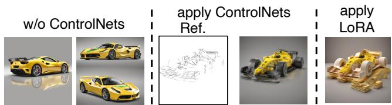  
Figure 1: Effects of ControlNet and LoRA in image generation with SDXL under the same prompt: racing game car, yellow Ferrari. Left: without ControlNet, the generated images can have different compositions. Center: ControlNet uses a reference image to control the composition. Right: using LoRA to generate image in a papercut style.

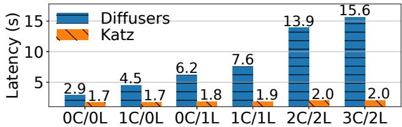  
Figure 2: ControlNets and LoRAs introduce additional latency overhead. In each workflow, a base SDXL [39] model is augmented with m ControlNets and n LoRAs (mC/nL), served by DIFFUSERS [50] and KATZ on H800 GPUs.

However, the use of adapters poses new performance challenges. To illustrate this problem, we configure a T2I workflow where a base SDXL model [39] is augmented with a varying number of ControlNets and LoRAs. We depict in Fig. 2 the serving latency of these workflows (blue bar). Compared with serving the base model alone (zero ControlNet and

LoRA, or 0C/0L), serving it together with many adapters results in significant delay, which is increasing as more adapters are in use. This delay comes from two sources. First, as the desired ControlNets and LoRAs vary across requests, they must be fetched from storage and loaded into GPU memory, introducing non-trivial loading overhead. In our platform, on average each request undergoes loading one ControlNet and one LoRA, which accounts for 37% of the end-to-end serving latency (§3). Given the large population and sizes of these adapters, pre-caching all of them in GPU memory is infeasible: our production trace reports nearly 150 distinct ControlNets (∼3 GiB each) and 14,500 LoRAs (hundreds of MiB each) requested by users for the SDXL model [39]. Second, ControlNet serving is compute-intensive: on an H800 GPU, adding one ControlNet to the serving workflow extends the generation latency by 1.6 seconds, which is 1.6× longer than serving the base SDXL model alone (Fig. 2). As more ControlNets are utilized, their computational overhead accumulates, leading to a significant latency increase (Fig. 2).

Despite these challenges, efficiently serving a T2I workflow with many adapters has been largely unexplored; prior works [12, 30, 50, 56] primarily focus on improving the serving latency and image quality of a single diffusion model. In this paper, we propose KATZ1, a system that efficiently serves a T2I workflow where a base diffusion model is augmented with many ControlNets and LoRAs, a typical setting in production deployment. Driven by a characterization study in a production platform (§3), KATZ employs three key designs to optimize the per-request serving latency [9, 12].

ControlNet-as-a-Service. Efficient ControlNet serving requires addressing the GPU loading and computational overhead. Our characterization study reveals that ControlNets exhibit the skewed popularity; that is, a small number of ControlNets (9–11%) are invoked frequently by a large number of user requests (95–98%). Caching these popular Control-Nets in GPU memory largely eliminates the loading overhead, with only modest memory footprint. To accelerate computation, KATZ concurrently executes ControlNet(s) with the base model on multiple GPUs, achieving close-to-ideal speedup compared to the current sequential execution scheme [50].

KATZ proposes ControlNet-as-a-Service to enable ControlNet caching and parallelization. It decouples ControlNets from the base model and deploys them as a separate, independently scalable service on dedicated GPUs. It only caches a small number of top popular ControlNets in GPU memory, eliminating the loading overhead by a large degree. To request certain ControlNets, users simply invoke this service, which executes the requested ControlNets in parallel with the base model. This design additionally enables ControlNet sharing, where a single ControlNet can be multiplexed by multiple base models.

Bounded asynchronous LoRA loading. Unlike Control-Net, LoRA is compute-light and LoRA loading is the main performance bottleneck. Given their large populations, LoRA adapters are usually maintained in storage (local disk or remote memory) and must be brought into GPU memory ondemand. Caching top popular LoRAs offers limited benefits as LoRA popularity exhibits a heavy-tailed distribution (§3.2).

To address this challenge, we analyze the T2I generation process and find that LoRA computations take effect largely in the later stages of the denoising process (§6). Based on this observation, we propose to hide the LoRA loading overhead through bounded asynchronous loading (BAL). That is, while the requested LoRAs are being loaded into GPUs, KATZ simultaneously executes the base model to early start the image generation process by up to K steps, after which the LoRA adapters must be patched to the base model to continue the remaining generation steps. By tuning the asynchronous bound K, KATZ effectively overlaps LoRA loading with base model execution, while achieving the same image quality as synchronous loading (§9.2).

Latent parallelism for CFG computation. KATZ also exploits parallelization opportunities to accelerate base model execution. As mentioned earlier, T2I generation is essentially a denoising process, where the diffusion model progressively refines a latent tensor through multiple steps [19, 32, 39]. Each step performs classifier-free guidance (CFG) [27], where the input latent tensor is duplicated and the two replicas are respectively denoised, one guided by the text prompt (conditioned denoising) and the other unguided (unconditioned denoising); the two denoised latent tensors are then aggregated by computing a weighted sum. As conditioned and unconditioned denoising have no dependency, KATZ parallelizes them on two GPUs. This technique, which we call latent parallelism, is also applied to accelerate CFG computation in ControlNet serving. Latent parallelism, together with kernel-level optimizations, collectively accelerate base model execution by 1.8× (§9.5).

We have implemented KATZ on top of HuggingFace Diffusers [50] and evaluated its performance using text prompts from PartiPrompts [64]. Our evaluation encompasses SDXL [39], a popular UNet-based diffusion model [42] in production [12,46], and two diffusion transformer (DiT) models [19, 32, 38]. Evaluation results demonstrate that KATZ outperforms the state-of-the-art T2I serving systems, including Diffusers, Nirvana [12], and DistriFusion [30], reducing the average serving latency by up to 7.8× and improving the throughput by up to 1.7× (§9.2). To comprehensively assess the quality of the generated images, we engaged 75 human users and confirmed that KATZ produces images of the same quality as Diffusers [50], a lossless baseline. Our contributions are summarized as follows:

• We present the first characterization study in a production T2I platform and identify new challenges of serving base diffusion models with ControlNet and LoRA adapters.

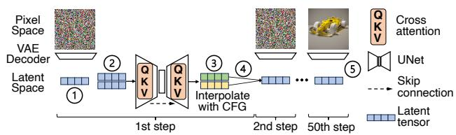  
Figure 3: Image generation using a stable diffusion model. Time and token embeddings are ignored for simplicity.

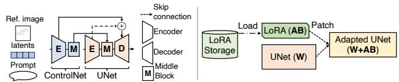  
Figure 4: Serving a diffusion model with ControlNet (Left) and LoRA (Right).

• We propose a holistic approach with three key designs to systematically optimize the T2I serving workflow, including ControlNet-as-a-Service, bounded asynchronous LoRA loading, and latent parallelism for CFG computation.

• We develop KATZ, an optimized serving system for T2I applications that achieves significant speedup without compromising image quality (Fig. 15).

KATZ and the production trace have been open-sourced at https://github.com/modelscope/Katz.

## 2 Background

In this section, we give a primer to diffusion-based T2I generation and the use of two popular adapters, ControlNet and LoRA, for enhanced generation control.

Diffusion model. A typical stable diffusion model [15, 39, 41] consists of three main components: a text encoder [40], a convolutional UNet model [42], and a decoder-only variational autoencoder (VAE). The model generates images through an iterative denoising process illustrated in Fig. 3. Given a text prompt, the text encoder encodes the prompt into token embeddings. The image generation process then begins by initializing a latent tensor filled with random noise ( 1 ), which is progressively refined by the UNet over multiple denoising steps guided by the token embeddings. To steer the image generation towards the desired outcome, the UNet employs classifier-free guidance [27] (CFG). Specifically, at each denoising step, the UNet duplicates the latent tensor into two replicas ( 2 ); one replica is denoised conditionally, taking into account the token embeddings, whilst the other is denoised unconditionally. Intuitively, the unconditioned latent representation captures the general image distribution, whereas the conditioned representation incorporates specific context given by the text prompt ( 3 ). The two latent tensors are then combined by computing a weighted sum, yielding an interpolated latent representation for further refinement in the next step ( 4 ). Upon completion of the denoising process, the final interpolated latent tensor is sent to the VAE decoder to render the output image ( 5 ).

ControlNet. Users often find it challenging to control the details of output images because text prompts alone are insufficient to precisely specify complex layouts, compositions, and shapes. ControlNet addresses this issue by augmenting a base diffusion model with additional input conditions, such as edge maps and depth maps, which specify the desired spatial composition of the generated images. As illustrated in Fig. 1-Center, ControlNet enables users to provide a reference edge map, allowing the base model to generate a Ferrari that adheres to the specified spatial composition.

Fig. 4-Left illustrates a simplified workflow of applying a ControlNet in the image generation process. ControlNet has a similar architecture to the UNet encoder blocks and middle block, with additional zero convolution operators [69]. It is applied to each encoder level of the UNet backbone. In each denoising step (Fig. 3), ControlNet takes as input the text prompt, the encoded reference image, and the latent tensor. The outputs, which contain the processed features of the reference image, are then incorporated into the skip-connections and middle block of the UNet backbone, guiding the image generation process to conform to the reference image. In practice, users can apply multiple ControlNets to a single base model, in which the outputs of these ControlNets are simply summed up and applied to the corresponding backbone UNet blocks [69].

Low-Rank Adaptation (LoRA) is another popular adapter that allows for generating images in a customized style (Fig. 1- Right). LoRA is a parameter-efficient approach to adapting the base model for domain-specific tasks [28]. Specifically, given a pre-trained base model with weight matrix W ∈ $\breve { \mathbb { R } } ^ { H _ { 1 } \times H _ { 2 } }$ , LoRA introduces two low-rank matrices $\mathbf { A } \in \mathbf { R } ^ { H _ { 1 } \times r }$ and $\mathbf { B } \in \mathbf { R } ^ { r \times H _ { 2 } }$ , where $r \ll \operatorname* { m i n } \{ H _ { 1 } , H _ { 2 } \}$ is the LoRA rank. One can simply patch the LoRA weights to the base matrix, i.e., W′ = W+AB, and use the adapted diffusion model W′ to generate stylized output with the desired visual characteristics, as illustrated in Fig. 4-Right.

Other adapters. Our work primarily focuses on Control-Net [69] and LoRA [28], the two most popular adapters in production environments (§3). Meanwhile, there are many emerging adapters [29, 52, 62, 68, 70] introduced by the research community to enhance image generation. These adapters can be broadly categorized into two classes. The first comprises adapters that operate in tandem with the base model during inference, akin to ControlNet. Examples include IP-Adapter [62] and BrushNet [29]. The second class consists of adapters that augment the base model by incorporating parameter-efficient patches, similar to LoRA [28], including Fooocus Inpaint [68] and IC-Light [70]. Because of the similarity, the techniques developed for expedited ControlNet and

<table><tr><td>Adapters</td><td>Number</td><td>Service A</td><td>Service B</td></tr><tr><td rowspan="5">ControlNet</td><td>0</td><td>0</td><td>1.9%</td></tr><tr><td>1</td><td>30.5%</td><td>25.1%</td></tr><tr><td>2</td><td>69.5%</td><td>69.9%</td></tr><tr><td>3</td><td>0</td><td>3.1%</td></tr><tr><td>0</td><td>0.2%</td><td>7.2%</td></tr><tr><td rowspan="2">LoRA</td><td>1</td><td>8.8%</td><td>73.6%</td></tr><tr><td>2</td><td>91%</td><td>19.2%</td></tr></table>

Table 1: The distribution of the number of ControlNets and LoRAs used by each request in two production services.

LoRA serving can be easily extended to the two classes of emerging adapters, which we discuss in §10.

Limitations of current T2I serving systems. Diffusionbased T2I workflow serving should provide low latency to allow real-time user interaction to better support multi-round prompt editing and image fine-tuning [9, 12]. DIFFUSERS is the state-of-the-art system that supports T2I serving workflow with ControlNets and LoRAs [50]. It generates images of original quality but incurs significant latency overhead, especially as more adapters are being used (Fig. 2). Recently proposed T2I serving systems, such as NIRVANA [12] and DISTRIFUSION [30], focus solely on optimizing base diffusion model inference. NIRVANA [12] proposes to skip the first κ denoising steps by using a pre-cached image generated from a similar prompt to replace the randomly initialized noise latent (Fig. 3). DISTRIFUSION [30] uses multiple GPUs to a diffusion model to accelerate image generation. It splits the latent ( 2 in Fig. 3) into small patches and parallelizes the computation on multiple GPUs, outperforming tensor parallelism [44] with improved communication efficiency [30]. We will show in §9 that these systems, though efficient in base model inference, fall short in workflow serving with many adapters, resulting in extended latency and quality loss.

## 3 Characterization Study

In this section, we present a characterization study on a 20-day workload trace collected in May and June 2024 on a production platform2. The trace contains more than 500k inference requests to two core T2I services for online retailing applications. Our characterization not only reflects the deployment scenarios of diffusion models in production, but also reveals the inefficiency of current T2I serving systems.

## 3.1 ControlNet Characterization

Prevalence. Table 1 shows the distribution of the number of ControlNets utilized by each request in two services. ControlNet is used by almost all requests for image generation control; approximately 70% of these requests utilize two or more ControlNets simultaneously.

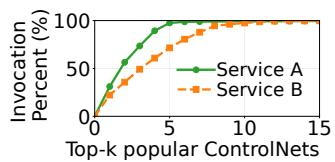

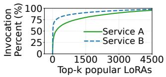  
Figure 5: Left: ControlNet has a small population and exhibits a skewed popularity; the long tail of the graph is truncated for a better presentation. Right: LoRA has a large quantity and exhibits a long-tailed distribution in popularity.

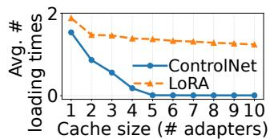

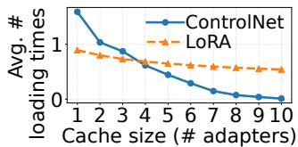  
Figure 6: Configuring a larger LRU cache effectively eliminates the adapter loading overhead for ControlNets, but not for LoRAs. Left: Service A; Right: Service B.

Skewed popularity. Compared to a large quantity of requests, only 141 ControlNets are used in two services, where Service A offers 47 distinct ControlNets and Service B provides 94. These ControlNets exhibit a severe skewness in access frequency. As shown in Fig. 5-Left, the top-5 most popular ControlNets (11% in population) account for 98% of total invocations in Service A. When it comes to Service B, the top-8 most popular ControlNets (9% in population) contribute to 95% of total invocations.

The need for ControlNet caching. ControlNets are large in size (3 GiB each) and usually maintained in remote storage, introducing significant loading overhead. Given that Control-Nets have a limited quantity and skewed popularity, caching a small number of top popular ControlNets in GPU memory effectively eliminates the loading overhead for most requests. To illustrate this, we configure an LRU cache of varying size for ControlNet caching. We replay the trace and measure the average number of times that the desired ControlNets are not resident on GPU and must be fetched from storage (i.e., cache miss) when serving two consecutive requests that desire different ControlNets. As illustrated in Fig. 6 (blue curves), caching only a handful of top popular ControlNets is sufficient to eliminate the loading overhead for both services (top-5 for Service A and top-8 for Service B). Similar results are observed if we replace the LRU cached with an LFU (Least Frequently Used) cache.

Computational overhead. ControlNet is compute-heavy as it shares a similar architecture to the UNet encoder and middle block (§2). As illustrated in Fig. 2 (blue bars), augmenting the base diffusion model with one ControlNet increases the serving latency by 1.6× (up from 2.9 seconds to 4.5 seconds). As more ControlNets are utilized, their computational overhead accumulates because current T2I serving systems [50] sequentially compute the outputs of the requested ControlNets before executing the base model at each denoising step.

## 3.2 LoRA Characterization

Prevalence. Similar to ControlNet, the majority of T2I requests utilize one or two LoRAs to stylize the generated image, as summarized in Table 1. Specifically, over 90% of requests in Service A desire two LoRAs, while nearly 93% of requests in Service B demand at least one LoRA.

Long-tailed popularity distribution. Compared to Control-Nets, LoRAs have a significantly larger population but smaller sizes. Our trace reports 6,980 distinct LoRAs for Service A and 7,463 LoRAs for Service B. Each LoRA is a few hundreds of MiB. Unlike ControlNets, the popularity of LoRAs follows a long-tailed distribution; that is, a significant portion of LoRA invocations are contributed by a large number of less popular adapters, as illustrated in Fig. 5-Right. In Service A, 6,968 LoRAs (99.8% of the total 6,980) each account for less than 1% of invocations. Similarly, in Service B, 7,449 LoRAs (99.8% of the total 7,463) each contribute to less than 1% of invocations.

Ineffective LoRA caching. Given the long-tailed popularity distribution of LoRAs, caching the top popular LoRA adapters offers limited benefits. To demonstrate this, we configure an LRU cache of varying sizes for LoRA caching. We replay the trace and measure the average number of times that the desired LoRAs are not available on GPU and must be brought from storage (i.e., cache miss) when serving two consecutive requests that demand different LoRAs. As illustrated in Fig. 6 (orange curves), configuring a larger LRU cache only slightly reduces the loading overhead caused by cache misses. We also measure the cache misses with an LFU cache and observe similar results. For Service B with a cache size of 10, LRU and LFU achieve comparable average loading times due to cache misses, at 0.54 and 0.57, respectively. Intuitively, LFU favors LoRAs with high long-term popularity and LRU prioritizes LoRAs with high short-term popularity. However, due to the dynamic nature of LoRA invocation patterns and their long-tailed distribution, predicting invocation traffic remain challenging, making approaches fall short.

As another evidence, Fig. 7 depicts a scatter plot illustrating the number of requests served on each node in the trace and the number of unique LoRAs utilized by those requests on that node. We observe the linear correlation between the two numbers, invalidating the benefits of LoRA caching. Our production system hence chooses not to cache LoRAs but loads them from storage in an on-demand fashion.

LoRA loading and patching overhead. Compared to ControlNets, LoRAs are compute-light and LoRA serving is bottlenecked by the loading and patching overhead (Fig. 4-Right). Our measurements show that fetching two LoRAs (total size of approximately 800 MiB) from a remote distributed cache takes more than one second, delaying the base model serving by 34% (up from 2.9 seconds to 3.9 seconds). In addition, simply patching LoRA weights to the base model, as implemented in existing systems [37, 50], incurs high overhead, which we elaborate in §6.

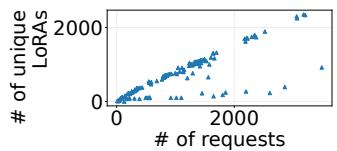

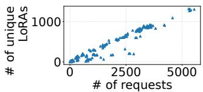  
Figure 7: Scatter plots illustrating the number of requests received on each worker node (X-axis) against the number of unique LoRAs required by those requests (Y-axis). Left: Service A; Right: Service B.

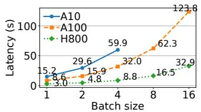

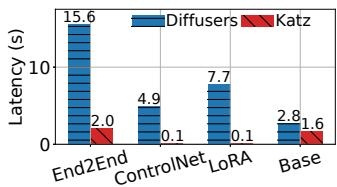  
Figure 8: Left: Ineffective Batching for SDXL inference. Right: End-to-end latency and component breakdowns for a 3C/2L request, using Diffusers [50] and KATZ on H800.

## 3.3 Characterizing Base Model Serving

Currently, UNet-based diffusion models, such as SDXL [39], are predominately deployed to handle the majority of requests in production platforms. These models are supported by a plethora of well-trained ControlNets [69] and LoRAs [28]. In the meantime, there is an emerging trend of deploying transformer-based diffusion models (DiT) [19, 32], but the development of corresponding adapters remains lagging behind at the moment. In this paper, we primarily focus on UNetbased models; our observations and optimization designs also apply to the transformer backbone.

Ineffectiveness of batching. Diffusion model serving is computationally intensive, as evidenced by our experiments with varying batch sizes for a standard SDXL model [39] on NVIDIA A10, A100, and H800 GPUs (Fig. 8-Left). Across all three GPUs, doubling the batch size results in an approximately 2× in serving latency, indicating minimal benefits from batching. In fact, generating a single image already saturates the computational resources of a high-end GPU. According to [30], the computational cost of generating a 1024×1024 image with SDXL requires 676T FLOPS, where the token length involved in SDXL’s transformer computations can reach up to 4096, resulting in a high computational load. Consequently, production T2I services typically configure a constant batch size of 1 to minimize serving latency. That being said, we expect more performance gains from batching when using more powerful GPUs.

<table><tr><td rowspan=1 colspan=1>Notation</td><td rowspan=1 colspan=1>Description</td></tr><tr><td rowspan=1 colspan=1>S</td><td rowspan=1 colspan=1>Number of denoising steps</td></tr><tr><td rowspan=1 colspan=1>M</td><td rowspan=1 colspan=1>Number of ControlNets used</td></tr><tr><td rowspan=1 colspan=1> $N$ </td><td rowspan=1 colspan=1>NumberofLoRAsused</td></tr><tr><td rowspan=1 colspan=1> $T _ { \mathrm { C } _ { i } } ^ { \mathrm { L o a d } } , T _ { \mathrm { C } _ { i } } ^ { \mathrm { C o m p } }$ </td><td rowspan=1 colspan=1>Time to load and compute ControlNet Ci</td></tr><tr><td rowspan=1 colspan=1> $T _ { \mathrm { L } _ { j } } ^ { \mathrm { L o a d } } , T _ { \mathrm { L } _ { j } } ^ { \mathrm { P a t c h } }$ </td><td rowspan=1 colspan=1>Time to load and patch LoRA Lj</td></tr><tr><td rowspan=1 colspan=1> $\overline { { T _ { \mathrm { E n c } } ^ { \mathrm { C o m p } } } }$ </td><td rowspan=1 colspan=1>Time to compute the text encoder inference</td></tr><tr><td rowspan=1 colspan=1> $T _ { \mathrm { V A E } } ^ { \mathrm { C o m p } }$ </td><td rowspan=1 colspan=1>Time to compute the VAE decoder inference</td></tr><tr><td rowspan=1 colspan=1> $\overline { { T _ { \mathrm { B } } ^ { \mathrm { C o m p } } } }$ </td><td rowspan=1 colspan=1>Time to compute the base model inference</td></tr><tr><td rowspan=1 colspan=1> $\overline { { T _ { \mathrm { B ^ { * } } } ^ { \mathrm { C o m p } } } }$ </td><td rowspan=1 colspan=1>Optimized base model inference time</td></tr></table>

Table 2: Notations used to model T2I inference latency.

Dominated CFG computation. To understand the computation of the base diffusion model, we break down its execution and find that over 90% of the inference time is spent on CFG computation (§2). Current CFG implementation employs latent batching. That is, at each denoising step, the latent tensor is duplicated and the two replicas are fed into the base model to perform conditional and unconditional denoising in one batch on a GPU. However, as the two denoising operations are compute-heavy, batch-executing them yields minimal benefits. In fact, latent batching results in up to 1.7× slowdown in base model serving compared to our optimized design (§9.5).

## 3.4 Latency Overhead of Current Systems

To sum up, current T2I systems serve the base model and the associated adapters in a sequential execution pipeline. Specifically, assume a request utilizing m ControlNets and n LoRAs. Upon request arrival, the system loads all the desired Control-Nets and LoRAs into GPU memory, followed by patching the n LoRAs to the base model. The system then encodes the text prompt and proceeds to the denoising process in S steps. At each step, it sequentially executes the m ControlNets and the LoRA-patched base model to generate a latent representation. The final latent representation is then sent to the VAE decoder to generate the output image. The end-to-end workflow serving latency is given by Eq. (1), where the notations are defined in Table 2:

$$
T = \underbrace { \sum _ { i = 1 } ^ { M } T _ { \mathrm { { C } } _ { i } } ^ { \mathrm { { L o a d } } } + \sum _ { j = 1 } ^ { N } ( T _ { { \mathrm { L } } _ { j } } ^ { \mathrm { { L o a d } } } + T _ { \mathrm { { L } } _ { j } } ^ { \mathrm { { E a t c h } } } ) } _ { \mathrm { { i i m e ~ t o ~ l o a d ~ n d ~ p a t c h ~ a d a p t e r s } } } + \underbrace { T _ { \mathrm { { E n c } } } ^ { \mathrm { { C o m p } } } + ( \sum _ { i = 1 } ^ { M } T _ { \mathrm { { C } } _ { i } } ^ { \mathrm { { C o m p } } } + T _ { \mathrm { { B } } } ^ { \mathrm { { C o m p } } } ) \times S + T _ { \mathrm { { V A E } } } ^ { \mathrm { { C o m p } } } } _ { \mathrm { { c o m p u t a t i o n ~ t i m e ~ f o r ~ m u l t i - s t e p ~ i m a g e ~ g e n e r a t i o n } } } .\tag{1}
$$

Our characterization identifies efficiency issues concerning ControlNet loading $( \Sigma _ { i = 1 } ^ { M } T _ { \mathrm { C } _ { i } } ^ { \mathrm { L o a d } } )$ , sequential ControlNet execution $( \Sigma _ { i = 1 } ^ { M } T _ { \mathrm { C } _ { i } } ^ { \mathrm { C o m p } } )$ , slow LoRA loading $( \Sigma _ { j = 1 } ^ { N } T _ { \mathrm { L } _ { j } } ^ { \mathrm { L } \circ \mathrm { a d } } )$ and patching $( \Sigma _ { j = 1 } ^ { N } T _ { \mathrm { L } _ { j } } ^ { \mathtt { P a t c h } } )$ , and inefficient latent batching in base model execution $( T _ { \mathrm { B } } ^ { \mathrm { C o m p } } )$ , collectively accounting for up to 99% of end-to-end serving latency (Fig. 8-Right).

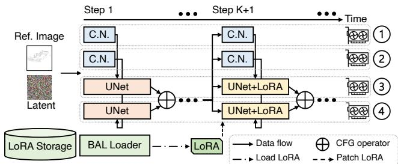  
Figure 9: KATZ utilizes 4 GPUs to serve a base model with 1C/1L, two for the base and two for the ControlNet (C.N.).

## 4 Design Overview

To address the efficiency issues identified in §3, we propose KATZ, a system that efficiently serves a T2I workflow with many adapters. KATZ employs three key designs. First, to reduce the overhead of ControlNet loading and computation, KATZ introduces ControlNet-as-a-Service, enabling ControlNet caching and parallelization in a unified design (§5). Second, to mitigate LoRA loading and patching overheads, KATZ overlaps LoRA fetching with base model execution for a bounded steps (bounded asynchronous LoRA loading or BAL), and uses an efficient method to quickly patch LoRA adapters (§6). Third, KATZ accelerates CFG computation by concurrently executing conditional and unconditional denoising operations on two GPUs, a technique called latent parallelism, together with kernel-level optimizations (§7). Fig. 9 illustrates an example of serving a base diffusion model with one ControlNet and one LoRA (1C/1L). Latent parallelism is applied to accelerate both the base model and the ControlNet, each using two GPUs; LoRA is asynchronously loaded, in parallel with initial base model execution for up to K steps before patching to hide the loading overhead.

In practice, the loading and computational overhead associated with ControlNets and LoRAs are virtually eliminated in KATZ (Fig. 8-Right), reducing the end-to-end workflow serving latency from Eq. (1) to

$$
T = T _ { \mathrm { E n c } } ^ { \mathrm { C o m p } } + T _ { \mathrm { B ^ { * } } } ^ { \mathrm { C o m p } } \times S + T _ { \mathrm { V A E } } ^ { \mathrm { C o m p } } .\tag{2}
$$

Collectively, our designs achieve up to 7.8× reduction in latency (Fig. 8-Right) and 1.7× throughput improvement, without compromising image quality (more in §9.2).

While we present KATZ primarily based on diffusion models with the UNet backbone, our designs also apply to the recently proposed diffusion transformers (DiTs) [19, 32, 38].

## 5 ControlNet-as-a-Service

For ControlNet serving, the main overhead comes from adapter loading and computation, which is tightly coupled with base model execution: as more ControlNets are utilized, their overheads accumulate (§3.1). We address this problem with a principled ControlNet-as-a-Service approach.

ControlNet-as-a-Service. Unlike existing systems, KATZ decouples ControlNet execution from the base diffusion model and deploys ControlNets as a separate, independently scaled service on dedicated GPUs. This design provides three benefits. First, by deploying ControlNets as an independent service, multiple ControlNets can execute in parallel with the base model on multiple GPUs and synchronize only at the end of each denoising step (details to come), effectively hiding their computational overhead. Second, the service can easily track the popularity of each ControlNet and cache a small number of top popular ones in GPU memory, which is sufficient to eliminate the loading overhead given their skewed popularity as identified in §3.1. Third, the separated ControlNet service can be shared among many T2I workflows in a multi-tenant system, enabling a single ControlNet to be multiplexed by many base models and scaled out according to the request load.

ControlNet parallelization. Without changing the data flow between ControlNets and the base model, KATZ partitions the entire compute graph of image generation into a serial part and a parallel part. For the UNet-based SDXL model [39], the serial part consists of the one-time computation of the text encoder, one-time computation of the VAE decoder, and UNet decoder computations of denoising steps (§2). The parallel part consists of the computations of UNet’s encoder and ControlNet(s) at each denoising step (Fig. 4-Left). KATZ distributes the computation of the parallel part across multiple GPUs. As illustrated in Fig. 9, it deploys the base UNet model on one set of GPUs and each ControlNet on a different set, operated as a separate service. At each denoising step, the UNet encoder and ControlNet(s) initiate computation concurrently. Upon completion of the UNet middle block inference, the UNet decoder synchronously awaits the outputs from Control-Net(s) before its computation, thereby preserving the original data dependencies (Fig. 4-Left). The ControlNet(s) then becomes idle for next invocation.

Performance analysis and optimization. To achieve maximum speedup for parallel computing, it is important to (1) balance the load of concurrent computing tasks and (2) minimize their communications to reduce the synchronization overhead. The first requirement is naturally met in ControlNet parallelization: given that ControlNet shares the same model architecture as the UNet’s encoder block and middle block, with the only difference being the additional zero convolution operators [69], their computation load is well balanced, leading to almost the same execution time when running on homogeneous GPUs. Regarding the second requirement, we measure a medium to low data transfer between the base model and the associated ControlNet, e.g., only 108 MiB for SDXL. With high-speed interconnect, such as NVLink [7] and InfiniBand [6], the communication overhead is negligible (e.g., less than 1 ms for SDXL over NVLink). In this scenario, ControlNet parallelization achieves 1.42× speedup over NVLink and 1.34× speedup over InfiniBand 400 Gbps link, either on A100 or H800 GPUs, closely matching the ideal speedup of 1.45× given by Gustafson’s law [24].

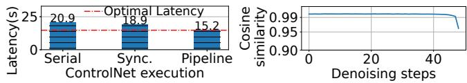  
Figure 10: Left: Image generation latency using various ControlNet execution schemes on AWS g5.2xlarge instances with 10 Gbps network bandwidth (Serial: no parallelization; Sync: synchronous ControlNet parallelization; Pipeline: pipelined asynchronous parallelization). Right: Average cosine similarities of ControlNet outputs between two adjacent steps, which are calculated across the channel dimension.

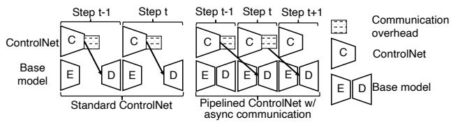  
Figure 11: An illustration of ControlNet parallelization (Left) and its asynchronous pipeline implementation over slow links (Right). The middle blocks are omitted for simplicity.

However, when high-speed GPU interconnections are unavailable, communication may become a bottleneck (Fig. 10- Left). In this scenario, we propose pipelined asynchronous parallelization to hide the communication overhead. Our key observation is that the output tensor generated by a Control-Net in two adjacent denoising steps are nearly identical, with cosine similarity over 0.99 almost all the time, as illustrated in Fig. 10-Right. Based on this observation, we can relax the synchronization requirement between the base model and ControlNets to establish an asynchronous pipeline, while still achieving the same image quality. That is, at each denoising step t, the base model performs computation based on the stale ControlNet output generated at step t − 1, which have already been transferred to the base model’s GPU during the previous step. Fig. 11 illustrates ControlNet parallelization and its asynchronous pipeline implementation over slow links, where the latter achieves close-to-ideal speedup in our experiments (Fig. 10-Left). We will show in §9.3 that slightly relaxing the synchronization requirement for ControlNet parallelization leads to no quality loss.

Applicability to DiT. ControlNet parallelization is a generic technique that also applies to the emerging DiT-based models, such as SD3 [19] and Hunyuan-DiT [32]. This is because ControlNets for the DiT backbone share the same model architecture as the base model and their data dependencies are analogous to that of their UNet counterparts. One can hence expect the same efficacy for DiT-based models (§9.7).

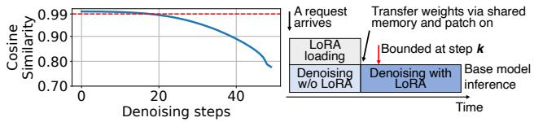  
Figure 12: Left: Cosine similarities between the latents generated with LoRA and those without LoRA at each denoising step. Right: Bounded asynchronous LoRA loading.

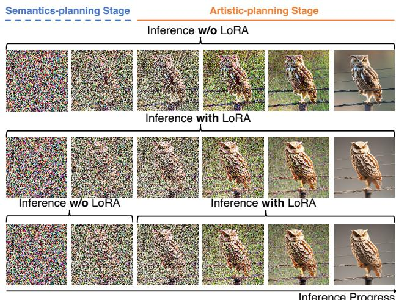  
Figure 13: Images generated every 10 steps from the first step using a papercut LoRA [48]. Prompt: an owl standing on a wire. Top: Inference w/o LoRA. Middle: Inference w/ LoRA. Bottom: Inference w/o LoRA during semanticsplanning stage and w/ LoRA during artistic-planning stage.

## 6 Efficient LoRA Serving

Motivation. As discussed in §3.2, LoRAs are stored in an external storage (e.g., local disk or remote cache). To apply a LoRA for stylizing the image generation, the system first fetches the adapter from storage and loads it into host memory. After that, it patches the adapter to the base diffusion model by merging its weights with the parameters of the base model. Both LoRA loading and patching incur significant overhead, which accumulates as more LoRAs are utilized (Fig. 2). We address these two problems in this section.

Bounded asynchronous LoRA loading (BAL). We analyze image generation with LoRA and observe a general trend: the effect of LoRA computation is initially imperceptible but, after certain steps, becomes increasingly significant. We empirically validate this by executing the image generation process twice, with and without LoRA. We calculate the cosine similarity between the output tensors generated with and without LoRA at each denoising step and depict the result in Fig. 12- Left. The cosine similarity consistently exceeds 0.99 in initial steps, indicating that LoRA exerts minimal effects during this stage. However, after a certain step (20 steps in this case), the similarity starts to plunge, a turning point at which LoRA effects kick in and become increasingly significant moving forward. Fig. 13 further visualizes the denoising process of image generation with and without LoRA. The initial denoising steps constitute a semantics-planning stage [12, 34, 45, 72], wherein the model determines the image composition and layout, generating visual semantics aligned with the text conditions [12, 72]. LoRA computation is less relevant and can be safely excluded during this stage (Fig. 13-Bottom). The remaining generation steps constitute an artistic-planning stage with image details gradually emerging, e.g., color, texture, and artistic style [12, 72]. LoRA plays a crucial role in this stage and must be included (Fig. 13-Bottom).

Driven by this observation, KATZ proposes overlapping LoRA loading with base model execution in the initial semantics-planning stage, as shown in Figures 12-Right and 13-Bottom. When a request arrives, KATZ asynchronously loads the requested LoRA(s). In the meantime, it early-starts the base diffusion model inference to perform image generation without LoRA. To ensure no quality loss, KATZ imposes an asynchrony bound K for overlapping LoRA loading with base model inference: in the worst case, if the requested Lo-RAs have not been loaded at the (K + 1)th denoising step, the base model waits until the loading completes. The loaded LoRAs are then patched to the base model to continue the remaining generation steps.

Determining the asynchrony bound. Ideally, we should choose a large asynchrony bound K to maximally overlap LoRA loading with base model inference, subject to no quality loss. KATZ employs a profiling method to optimally determine the asynchrony bound K. Given a base model and a LoRA, KATZ offline calculates the cosine similarity between the latent tensors generated with and without LoRA at each denoising step, akin to those in Fig. 12-Left. It then sets K to the step at which the similarity starts to drop below a predefined threshold, e.g., 0.99. In our evaluation, we profile and set K = 10. Our experiment on A100 and H800 GPUs shows that LoRA loading completes mostly before the predefined step K, effectively hiding the adapter loading overhead (c.f. 0C/0L and 0C/1L in Fig. 2).

Efficient LoRA patching. Existing systems [50] use the PEFT [37] framework to merge LoRA weights with base model parameters. For a layer in the base stable diffusion model that will be patched with LoRA, PEFT creates a new LoRA layer to replace the original layer in the base model. The newly created LoRA layer augments the corresponding base model layer by incorporating LoRA weights and configurations. However, this create-and-replace operation incurs high overhead, taking 2 seconds for a LoRA of 341 MiB and occupying additional GPU memory. Although maintaining a separate copy of LoRA weights in the new augmented layer facilitates convenient LoRA training and efficiently patching off LoRA weights after image generation, we find it unnecessary. As a serving system, KATZ does not require the capability to support LoRA training. Besides, our characterization study reveals that the time interval between two consecutive requests is long enough (over 1 second) to patch off LoRAs. Therefore, KATZ chooses to merge LoRA weights with base model parameters in place. This design eliminates the latency overhead caused by the create-and-replace operation and saves GPU memory without storing separate LoRA weights.

Applicability to DiT. Our design for efficient LoRA loading and patching is agnostic to the architecture of the base model, and can hence be applied directly to accelerate image generation in DiTs [19, 32].

## 7 Optimized Base Model Execution

With the overhead of adapters effectively addressed in §5 and §6, we now turn to accelerating base model inference, the last bottleneck in image generation. Given that diffusion model serving is computationally intensive that saturates a high-end GPU even with a small batch size of 1 (§3.3), we explore parallelization opportunities to accelerate CFG computation on multiple GPUs. We also incorporate kernel-level optimizations tailored for diffusion model computation and its interaction with adapters to further enhance performance.

Latent parallelism for diffusion model. As explained in §2, diffusion model uses the CFG technique to better align image generation with textual descriptions at each denoising step, where an input latent tensor is duplicated and undergoes two denoising operations, one conditioned on the texts and the other unconditionally. The two latents are then combined by computing a weighted sum, yielding an interpolated latent as the output. As conditioned and unconditioned denoising have no dependency, they can be performed in parallel on two GPUs, which we call latent parallelism. As illustrated in Fig. 9, KATZ maintains two instances of the base diffusion model on two homogeneous GPUs. At each denoising step, KATZ duplicates the input latent tensor ( 2 in Fig. 3) and feeds the two replicas into the two base model instances to perform conditioned and unconditioned denoising in parallel. As the two computations have balanced load, they complete at the same time, and their outputs are then interpolated as a weighted sum through a synchronous communication.

The simple yet effective latent parallelism strategy can accelerate the base diffusion model inference of a request by 1.4–1.9×, depending on the GPU capability and model size. The performance gains are more pronounced with larger base models and lower-end GPUs (details in §9.5). Latent parallelism incurs little overhead because 1) computations on different GPUs are uniform and finish at almost the same time, and 2) the communication overhead is minimal, mainly comprising the transfer of a small latent (< 1 MiB). However, the speedup achieved by latent parallelism may come at the expense of per-GPU throughput when the denoising computation of a single latent does not saturate a GPU. Latent parallelism also applies to the emerging DiT models as they employ the same CFG technique in image generation.

Compatibility with adapter optimizations. Latent parallelism can be naturally applied to accelerate CFG computation in ControlNet serving, as ControlNets are architecturally similar to the base model (§5). Fig. 9 illustrates an example where KATZ utilizes 4 GPUs to serve a base diffusion model and one ControlNet, both with latent parallelism. Meanwhile, the base model also utilizes BAL to overlap LoRA loading with base model computation at each denoising step.

Kernel-level optimizations. KATZ includes several kernellevel optimizations to further enhance performance, including a customized CUDA Graph [21] implementation and specialized CUDA kernels tailored to diffusion models. CUDA Graph is particularly suitable for T2I inference, as it uses a constant batch size of 1 (§3.3). Given the nearly homogeneous requested image resolutions in our production platform, we only need to maintain a small number of CUDA Graphs resident in GPU memory. Furthermore, we adapt the original CUDA graph to accommodate ControlNet parallelization. Specifically, we tailor the base model and segment it as distinct CUDA Graphs according to its data dependencies with ControlNets. Beyond existing optimized attention kernels [1], KATZ provides kernel optimizations specific to UNet-based diffusion models, including an optimized GEGLU activation operator by fusing GELU and matrix multiplication operations, and a fused operator that combines GroupNorm and SiLU operators to mask the latter’s overhead.

## 8 Implementation

We have implemented KATZ on top of Diffusers [50], a PyTorch-based diffusion model inference framework that integrates state-of-the-art model optimization techniques. KATZ is written in 5.5k lines of Python and 2.4k lines of C++/CUDA code, where ControlNet-as-a-Service, BAL, and latent parallelism are implemented in Python, whilst customized CUDA operators are written in C++/CUDA. KATZ performs LoRA loading in separate processes and utilizes shared memory to transfer LoRA weights from the loading processes to the base model serving process for efficient (parallel) data transfer.

## 9 Evaluation

We evaluate KATZ’s performance in terms of serving latency and image quality. Evaluation highlights include:

• KATZ achieves efficient serving performance without degrading image quality, accelerating T2I generation by up to 7.8× compared with state-of-the-art baselines (§9.2).

• KATZ’s ControlNet-as-a-Service design decouples Control-Nets from the critical path of a T2I workflow, achieving a close-to-ideal speedup (§9.3).

• KATZ effectively eliminates the LoRA loading and patching overheads, leading to consistent serving latency that matches LoRA-free execution (§9.4).

• With latent parallelism and kernel optimizations, KATZ achieves 1.7× speedup in base model inference (§9.5).

• KATZ increases the per GPU-minute throughput by up to 1.7× (§9.6) and generalizes to DiT-based models (§9.7).

## 9.1 Experimental Setup

Model and serving configurations. Unless otherwise specified, we use SDXL [39] as the base diffusion model. SDXL and its variants are widely deployed in production systems [12], including ours, and have comprehensive support for adapters. We use the default settings to generate images, where the number of denoising steps is set to 50 and the image resolution is 1024 × 1024. The ControlNets [3] and Lo-RAs [47–49] used are provided by HuggingFace. By default, we run experiments on NVIDIA H800 GPUs and configure synchronous ControlNet parallelization for KATZ (§5).

Baselines. We consider the following three baselines:

• DIFFUSERS is a standard baseline for T2I workflow serving with support of ControlNets and LoRAs [50].

• NIRVANA [12] is a strong baseline that skips the first κ denoising steps by using a pre-cached image given by a similar prompt. We use two configurations, κ = 10 (NIRVANA-10) and more aggressively κ = 20 (NIRVANA-20).

• DISTRIFUSION [30] is a strong baseline that utilizes multiple GPUs to accelerate base diffusion model inference. We extend it to support ControlNets on multiple GPUs. For a fair comparison, we configure DISTRIFUSION to use no fewer GPUs than KATZ.

Serving metrics. Our evaluation mainly concerns two metrics, serving latency and image quality. For serving latency, we measure the end-to-end latency of generating an image based on a given text prompt. For image quality, we use the following quantitative metrics, which are considered essential and widely used in measuring image quality [12,39,64,71,73].

• CLIP [25, 40] score evaluates the alignment between generated images and their corresponding text prompts. A higher CLIP score indicates better alignment (↑).

• Fréchet Inception Distance (FID) score [26] calculates the difference between two image sets, which correlates with human visual quality perception [12]. A low FID score means that two image sets are similar (↓).

• Structural Similarity Index Measure (SSIM) score [55] measures the similarity between two images, with a focus on the structural information in images. A higher SSIM score suggests a greater similarity between the images (↑).

Like [12, 39], we conducted a user study with 75 participants to evaluate the image quality based on their visual perception.

Workloads. KATZ is designed to reduce the serving latency of text-to-image requests associated with many adapters. To evaluate this, we measure per-request serving latency across different adapter configurations on provisioned instances, eliminating the impact of request queuing and model scaling due to load spikes. We configure the batch size to 1 due to the limited batching effect (§3.3). The requests use text prompts in Google’s PartiPrompts (P2) [64], a popular benchmark for image generation tasks [36, 39, 64]. P2 provides a rich set of prompts, including simple and complex prompts across various categories (e.g., Animals, Scenes, and World Knowledge) and challenging aspects (e.g., Detail, Style, and Imagination). We serve each request with several adapters, following our production trace (Table 1).

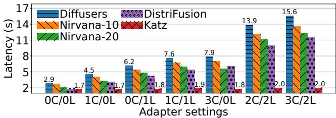  
Figure 14: End-to-end serving latency with m ControlNets and n LoRAs (mC/nL). GPU allocation for DISTRIFUSION and KATZ is as follows: 0C/0L and 0C/1L configurations use two GPUs, 1C/0L and 1C/1L use four GPUs, and 3C/0L and 3C/2L use eight GPUs. For the 2C/2L configuration, KATZ uses six GPUs, while DISTRIFUSION requires eight GPUs. All other baselines use a single GPU across all configurations.

## 9.2 End-to-End Performance

Serving latency. We vary the number of adapters in a workflow and compare the average serving latency of KATZ and each baseline in Fig. 14. KATZ outperforms existing systems in all settings, achieving up to 7.8× speedup over DIFFUSERS and 5.7× speedup over DISTRIFUSION, the strongest baseline. Compared to the four baselines, KATZ exhibits a largely stable latency as more adapters are utilized in a workflow, the result of its design that decouples adapters from the critical path. In the absence of adapters (0C/0L), KATZ’s latent parallelism and kernel optimizations (§7) accelerate base model inference by 1.7× and 1.3× compared to DIFFUSERS and the aggressive NIRVANA-20, respectively. Note that KATZ even outperforms DISTRIFUSION, a system that also parallelizes diffusion model inference on multiple GPUs, by 1.1× thanks to the kernel optimizations. We further compare DISTRIFU-SION’s parallelism with KATZ’s ControlNet parallelism with the same number of GPUs in the settings of 1C/0L and 3C/0L. KATZ outperforms as the ControlNet parallelism design is based on the computation and communication characteristics of ControlNets while DISTRIFUSION is adapter agnostic.

Image quality. We compare the quality of images generated by KATZ and each baseline. Since our ControlNets-as-a-

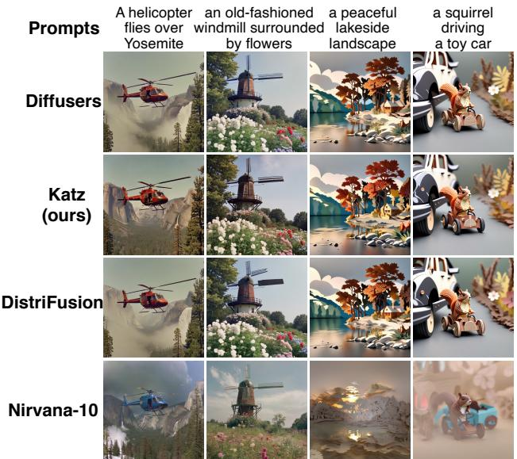  
Figure 15: Examples of images generated by each baseline.

Service design with synchronous parallelism makes no modification to image generation, we focus on evaluating the LoRA effects. Two settings are considered: the first uses a single LoRA to generate images in a papercut style [48], while the second employs two LoRAs to generate images in a combination of William Eggleston photography style and filmic style [47, 49]. We use the prompts in P2 [64] that emphasize vivid details in images.

1) Quantitative evaluation. Table 3 shows the CLIP, FID, and SSIM scores achieved by each baseline. CLIP scores measure the alignment between generated images and their corresponding prompts [8]. The results indicate that DISTRI-FUSION and KATZ exhibit good performance in terms of alignment, rivaling DIFFUSERS’s standard lossless workflow.

FID and SSIM scores focus on comparing the generated images with the standard images (“ground truth”). Therefore, we use the images generated by DIFFUSERS as the ground truth, as it represents the original T2I serving workflow. We include the NOLORA baseline for reference, which utilizes no LoRA in image generation. In Table 3, DISTRIFUSION and KATZ achieve comparable performance and outperform others, indicating that they generate images highly similar to those generated by DIFFUSERS. NIRVANA-10 and NIRVANA-20 fall short because they generate an image based on the contents of a cached image, which is selected only based on the prompt similarity. Even with the same prompt, the visual contents in cached images can be drastically different (see Fig. 1- Left) and may not align with the style of LoRAs. Fig. 15 presents real examples generated by each baseline, where images generated by DIFFUSERS, KATZ, and DISTRIFUSION are almost visually indistinguishable, whereas NIRVANA-10 fails to match the quality of DIFFUSERS.

2) Qualitative evaluation. We conducted a user study involving 75 participants to compare the quality of images generated based on human visual perception. The participants are mainly university students. We consider DIFFUSERS, NIRVANA-10, and KATZ in this part since quantitative evaluation shows image quality of NIRVANA-20 is not nearly as good as that of other baselines and DISTRIFUSION can match the quality of DIFFUSERS. Inspired by Chatbot Arena [74], we constructed an online arena that randomly presents a pair of two images to users, offering four options: both images are acceptable, neither is acceptable, image 1 is acceptable, or image 2 is acceptable. Participants made their selections based on both the degree of image alignment with the prompt and their subjective aesthetic preferences. We collected over 1.2k data points. The findings indicate that KATZ is capable of producing images of the same quality as DIFFUSERS, both with 70% acceptance rate. In contrast, NIRVANA-10’s acceptance rate is below 50% due to its skipped denoising steps and not considering the impact of adapters during its prompt match process.

<table><tr><td>LoRA Setting</td><td>System</td><td>CLIP(↑)</td><td>FID(↓)</td><td>SSIM (↑)</td></tr><tr><td rowspan="6">One LoRA: Papercut [48]</td><td>DIFFUSERS</td><td>34.1</td><td>=</td><td>=</td></tr><tr><td>NoLoRA</td><td>32.9</td><td>11.4</td><td>0.63</td></tr><tr><td>NIRVANA-10</td><td>33.5</td><td>9.5</td><td>0.45</td></tr><tr><td>NIRVANA-20</td><td>33.7</td><td>10.9</td><td>0.44</td></tr><tr><td>DISTRIFUSION</td><td>34.0</td><td>1.7</td><td>0.86</td></tr><tr><td>KATZ (ours)</td><td>34.1</td><td>2.1</td><td>0.83</td></tr><tr><td rowspan="6">Two LoRAs: Filmic [47] + Photography [49]</td><td>DIFFUSERS</td><td>34.2</td><td>-</td><td>■</td></tr><tr><td>NoLoRA</td><td>31.3</td><td>13.4</td><td>0.67</td></tr><tr><td>NIRVANA-10</td><td>33.3</td><td>9.0</td><td>0.51</td></tr><tr><td>NIRVANA-20</td><td>32.8</td><td>9.4</td><td>0.47</td></tr><tr><td>DISTRIFUSION</td><td>34.1</td><td>2.9</td><td>0.86</td></tr><tr><td>KATZ (ours)</td><td>34.1</td><td>3.1</td><td>0.82</td></tr></table>

Table 3: Quantitative evaluation on image quality.

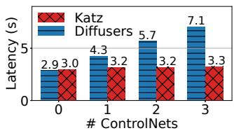

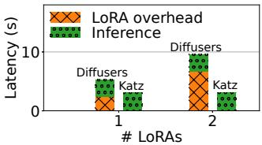  
Figure 16: Left: Microbenchmark on ControlNets. Right: Microbenchmark on LoRAs.

## 9.3 ControlNet-as-a-Service

We next evaluate the performance of KATZ’s ControlNets-asa-service design, with all other optimizations disabled. We compare KATZ with DIFFUSERS, as NIRVANA and DISTRI-FUSION lack specialized designs for ControlNets. Fig. 16- Left illustrates the serving latency achieved by DIFFUSERS and KATZ, where KATZ achieves up to 2.2× speedup by distributing ControlNets computation across multiple GPUs. Note that in this case, KATZ employs synchronous ControlNet parallelization, generating identical images as DIFFUSERS.

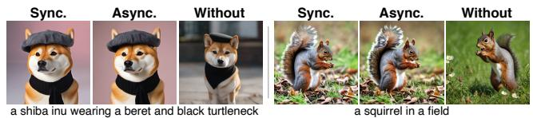  
Figure 17: Sample images generated using sync. and async. ControlNet scheme, along with images without ControlNets.

To further analyze KATZ’s speedup, we apply Gustafson’s law [24], which quantifies the theoretical speedup in execution time for a task that benefits from parallel computing. Let N denote the number of processors, and let s and p represent the time fractions spent executing the serial and parallel parts of the program $( s + p = 1 )$ . The theoretical speedup S from parallel computing is $S = s + p N$ [24]. In the context of T2I generation with ControlNets, the serial parts comprise the computation of decoder blocks in UNet, while the parallel parts include the computation of UNet’s encoder blocks together with middle block and ControlNets (§5). When using three ControlNets, the serial parts account for $s = 0 . 5 5$ and the parallel parts take $p = 0 . 4 5$ , leading to a theoretical speedup of 2.35×. KATZ achieves 2.2× speedup and is near optimal.

Pipelined asynchronous parallelization. We next evaluate the performance of pipelined asynchronous ControlNet parallelization in the absence of high-speed GPU interconnect. We deploy the base model and one ControlNet on two AWS g5.2xlarge instances, each with one A10G GPU and a 10 Gbps network [2]. Fig. 10-Left illustrates the serving latency, where the asynchronous scheme achieves close-to-ideal performance by pipelining communication and computation, outperforming the synchronous scheme by 1.25×. Besides, images generated by the two schemes are visually indistinguishable regarding composition and quality (see Fig. 17). The synchronous and asynchronous scheme achieve CLIP scores of 33.5 and 33.7, respectively. Compared to the sync scheme, the async has an FID of 2.7 and an SSIM of 0.77.

## 9.4 Optimizations for LoRA Serving

We now evaluate KATZ’s design for efficient LoRA serving, excluding other optimizations. We only include DIFFUSERS because other baselines have no specialized design for LoRAs. As described in §6, DIFFUSERS requires two steps to patch on a LoRA: loading the adapter from storage and then merging its weights to the base model via a create-and-replace operation [37]. This approach is inefficient. As shown in Fig. 16-Right, with a single LoRA (341 MiB), it increases the latency by 80%; with two LoRAs, one 341 MiB and the other 456 MiB, it results in 2.1× slowdown. KATZ addresses this performance issue with BAL and efficient LoRA patching (§6), collectively reducing the LoRA loading and patching overhead to 230 ms, negligible in practice.

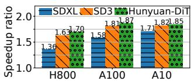

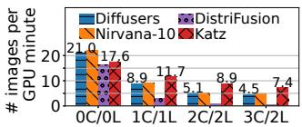  
Figure 18: Left: Speedup ratio of latent parallelism on different GPU types and base models. Right: Serving throughput with m ControlNets and n LoRAs (mC/nL).

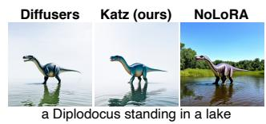

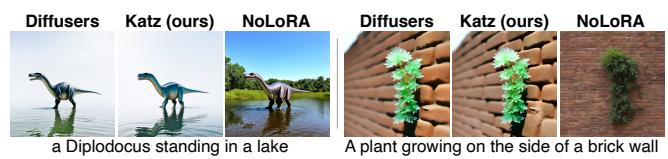  
Figure 19: Sample images generated by SD3 (left) and Hunyuan-DiT (right) using LoRAs [4, 10].

## 9.5 Optimizations for Base Model Inference

We also evaluate the proposed optimizations for accelerating base diffusion model inference without adapters. Fig. 18-Left compares KATZ with DIFFUSERS and shows the speedup ratios achieved by latent parallelism on different GPUs, excluding kernel-level optimizations. The gains of latent parallelism are more pronounced on less capable GPUs, achieving speedup ratios of 1.36×, 1.58×, and 1.71× on H800, A100, and A10 GPU, respectively. Although the design of latent parallelism results in imperfect scaling—achieving less than a 2× speedup with 2× GPUs—when combined with other optimizations, KATZ can deliver up to a 1.7× throughput improvement for LoRA-dependent requests (Fig. 18-Right). On the basis of latent parallelism, enabling kernel-level optimizations (§7) additionally yields 1.24× speedup. Collectively, these two optimizations enable KATZ to outperform all baselines regarding base model inference (0C/0L in Fig. 14).

## 9.6 Serving Throughput

KATZ is primarily designed to minimize serving latency, but it also achieves superior serving throughput for workflows with many adapters. Fig. 18-Right illustrates the request serving throughput of each baseline, measured as the number of images generated per minute of GPU time. When the workflow involves many adapters, KATZ achieves higher throughput (up to 1.7×) compared to other baselines, benefiting from its efficient design of LoRA loading and patching (§6). However, when there is no adapter (0C/0L), KATZ and DISTRIFUSION fall short in throughput as parallelizing base model inference on two GPUs does not saturate their compute capabilities; NIRVANA-20 sometimes achieves good throughput due to its aggressive design, albeit at the cost of image quality loss.

## 9.7 Generalization to DiT-based Models

KATZ’s three designs naturally extend to the DiT backbone, which we evaluate with SD3 [19] and Hunyuan-DiT [32]. First, ControlNet-as-a-Service leads to close-to-ideal speedup. Compared to DIFFUSERS, KATZ achieves speedup ratios of 1.23× and 1.46× for SD3 and Hunyuan-DiT, each with one ControlNet, closely matching the theoretical upper bounds of 1.27× and 1.50× given by the Gustafson’s law [24]. Second, BAL effectively overlaps adapter loading with base DiT inference, eliminating the LoRA overhead. User study confirms that images generated by KATZ and DIFFUSERS are visually indistinguishable regarding quality with sample images presented in Fig. 19. Finally, latent parallelism accelerates CFG computation of DiTs, as shown in Fig. 18-Left, achieving even more significant speedup than that of SDXL (UNet).

## 10 Discussion and Related Works

Generalization to other adapters. As discussed in §2, KATZ can support adapters beyond ControlNet and LoRA. For adapters [29, 62] that share architectural similarities with the base diffusion model, ControlNet-as-a-Service (§5) decouples them from the base and deploys them on dedicated GPUs, enabling caching, parallelization, and sharing. For adapters [68, 70] that incorporate parameter-efficient patches, BAL (§6) can effectively mitigate the overhead associated with model loading and patching. Latent parallelism (§7) applies to the base diffusion model and is adapter-agnostic.

T2I diffusion model inference. In §2, we have presented existing serving systems for T2I workloads [12, 30, 50]. Besides, several works expedite image generation by reducing redundant computations in the denoising process [35, 36, 57]. Yet, these works only optimize the base model inference and overlook the significant latency overhead introduced by adapters. Our work is the first to analyze this problem and addresses the system inefficiencies caused by the use of adapters in T2I serving. It is hence orthogonal to the existing optimization solutions for base diffusion models.

Serving systems with adapters. In the domain of LLMs, pioneering research [16, 31, 43, 58] has designed efficient systems to serve base LLMs with adapters. Despite their effectiveness, these LLM-focused systems are inadequate for diffusion models due to their fundamental differences. First, these systems focus solely on LoRAs, without considering ControlNets which are specialized for diffusion models (§3.1). Second, the LoRAs associated with diffusion models are significantly larger in size and quantity than those for LLMs [16], necessitating external LoRA storage and incurring orders of magnitude higher loading overhead (§3.2). Third, these systems emphasize multiplexing a single base LLM to serve multiple LoRAs simultaneously. Yet, batching yields minimal benefits in diffusion model inference (§3.3). Consequently, their optimizations become ineffective in our scenario.

Other model serving systems. Existing research on model serving systems focuses on optimizing latency [17, 53], throughput [14, 61], performance predictability [22, 67], and resources efficiency [23, 51, 60, 65]. These studies apply to various workloads, including graph neural networks [54] and large language models [13, 18, 53, 63]. KATZ is orthogonal to the aforementioned efforts, as T2I models have drastically different computation intensity and workflow.

In the context of online model serving, there exists a series of works to address various challenges such as model placement [33, 67], request scheduling [22, 67], and dynamic scaling [20,59,66], which are designed to manage load spikes in model serving systems. While KATZ focuses on per-request latency optimization, these scheduling and scaling approaches are complementary to KATZ and can be seamlessly integrated to effectively handle diverse request arrival patterns.

## 11 Conclusion

We presented KATZ, the first system that efficiently serves a T2I workflow with many adapters, such as ControlNets and LoRAs. KATZ introduces three novel designs: (1) ControlNetas-a-Service that deploys ControlNets as a separate service on dedicated GPUs to enable caching, parallelization, and sharing, (2) bounded asynchronous LoRA loading and efficient patching, and (3) latent parallelism that accelerates CFG computation on multiple GPUs. Collectively, these designs decouple adapters from the critical path of a T2I workflow, while accelerating base model inference. Compared to existing systems, KATZ achieves up to 7.8× speedup and 1.7× improvement in throughput, while maintaining image quality.

## Acknowledgment

We thank our shepherd Yungang Bao and the anonymous reviewers for their valuable comments that help improve the quality of this work. We also thank colleagues from Alibaba Huiwa AI Team for their assistance. This work was supported in part by the Alibaba Innovative Research (AIR) Grant, RGC CRF Grant (Ref. #C6015-23G), RGC GRF Grants (Ref. #16217124 and #16210822), and NSFC/RGC CRS Grants (Ref. #CRS\_PolyU501/23 and #CRS\_HKUST601/24).

## References

[1] Accelerate inference of text-to-image diffusion models. https://huggingface.co/docs/diffusers/en/tutorials/ fast\_diffusion, 2025.

[2] Amazon EC2 G5 Instances. https://aws.amazon.com/ ec2/instance-types/g5/, 2025.

[3] HuggingFace Diffusers SDXL ControlNets. https: //huggingface.co/diffusers/controlnet-depth-sdxl-1.0, 2025.

[4] HunyuanDiT LoRA. https://huggingface.co/ Tencent-Hunyuan/HYDiT-LoRA, 2025.

[5] Midjourney AI. https://www.midjourney.com/explore, 2025.

[6] NVIDIA InfiniBand Switch Systems User Manual. https://docs.nvidia.com/networking/display/ qm97x0pub/interfaces, 2025.

[7] NVIDIA NVLink: High-speed GPU interconnect. https://www.nvidia.com/en-us/design-visualization/ nvlink-bridges/, 2025.

[8] OpenAI CLIP. https://huggingface.co/openai/ clip-vit-base-patch16, 2025.

[9] OpenAI DALL·E 2. https://openai.com/index/dall-e-2/, 2025.

[10] SD3 DreamBooth LoRA. https://huggingface.co/ BeQuiet94/trained-sd3-lora, 2025.

[11] Adobe. Create with Adobe Firefly generative AI. https: //www.adobe.com/products/firefly.html, 2025.

[12] Shubham Agarwal, Subrata Mitra, Sarthak Chakraborty, Srikrishna Karanam, Koyel Mukherjee, and Shiv Kumar Saini. Approximate caching for efficiently serving textto-image diffusion models. In Proc. USENIX NSDI, 2024.

[13] Amey Agrawal, Nitin Kedia, Ashish Panwar, Jayashree Mohan, Nipun Kwatra, Bhargav Gulavani, Alexey Tumanov, and Ramachandran Ramjee. Taming throughputlatency tradeoff in LLM inference with Sarathi-Serve. In Proc. USENIX OSDI, 2024.

[14] Sohaib Ahmad, Hui Guan, Brian D. Friedman, Thomas Williams, Ramesh K. Sitaraman, and Thomas Woo. Proteus: A high-throughput inference-serving system with accuracy scaling. In Proc. ACM ASPLOS, 2024.

[15] Fengxiang Bie, Yibo Yang, Zhongzhu Zhou, Adam Ghanem, Minjia Zhang, Zhewei Yao, Xiaoxia Wu, Connor Holmes, Pareesa Golnari, David A. Clifton, Yuxiong He, Dacheng Tao, and Shuaiwen Leon Song. RenAIssance: A survey into AI text-to-image generation in the era of large model. IEEE Trans. Pattern Anal. Mach. Intell., 2024.

[16] Lequn Chen, Zihao Ye, Yongji Wu, Danyang Zhuo, Luis Ceze, and Arvind Krishnamurthy. Punica: Multi-tenant LoRA serving. In Proc. MLSys, 2024.

[17] Daniel Crankshaw, Xin Wang, Guilio Zhou, Michael J. Franklin, Joseph E. Gonzalez, and Ion Stoica. Clipper: A low-latency online prediction serving system. In Proc. USENIX NSDI, 2017.

[18] Jiangfei Duan, Runyu Lu, Haojie Duanmu, Xiuhong Li, Xingcheng Zhang, Dahua Lin, Ion Stoica, and Hao Zhang. MuxServe: Flexible spatial-temporal multiplexing for multiple LLM serving. In Proc. ICML, 2024.

[19] Patrick Esser, Sumith Kulal, Andreas Blattmann, et al. Scaling rectified flow transformers for high-resolution image synthesis. In Proc. ICML, 2024.

[20] Yao Fu, Leyang Xue, Yeqi Huang, Andrei-Octavian Brabete, Dmitrii Ustiugov, Yuvraj Patel, and Luo Mai. ServerlessLLM: Low-Latency serverless inference for large language models. In Proc. OSDI, 2024.

[21] Alan Gray. Getting Started with CUDA Graphs. https: //developer.nvidia.com/blog/cuda-graphs/, 2019.

[22] Arpan Gujarati, Reza Karimi, Safya Alzayat, Wei Hao, Antoine Kaufmann, Ymir Vigfusson, and Jonathan Mace. Serving DNNs like Clockwork: Performance predictability from the bottom up. In Proc. USENIX OSDI, 2020.

[23] Jashwant Raj Gunasekaran, Cyan Subhra Mishra, Prashanth Thinakaran, Bikash Sharma, Mahmut Taylan Kandemir, and Chita R. Das. Cocktail: A multidimensional optimization for model serving in cloud. In Proc. USENIX NSDI, 2022.

[24] John L. Gustafson. Reevaluating Amdahl’s law. Commun. ACM, 1988.

[25] Jack Hessel, Ari Holtzman, Maxwell Forbes, Ronan Le Bras, and Yejin Choi. CLIPScore: A referencefree evaluation metric for image captioning. In Marie-Francine Moens, Xuanjing Huang, Lucia Specia, and Scott Wen-tau Yih, editors, Proc. EMNLP, 2021.

[26] Martin Heusel, Hubert Ramsauer, Thomas Unterthiner, Bernhard Nessler, and Sepp Hochreiter. GANs trained by a two time-scale update rule converge to a local Nash equilibrium. In Proc. NIPS, 2017.

[27] Jonathan Ho and Tim Salimans. Classifier-free diffusion guidance. In Proc. NeurIPS 2021 Workshop on Deep Generative Models and Downstream Applications, 2021.

[28] Edward J Hu, yelong shen, Phillip Wallis, Zeyuan Allen-Zhu, Yuanzhi Li, Shean Wang, Lu Wang, and Weizhu Chen. LoRA: Low-rank adaptation of large language models. In Proc. ICLR, 2022.

[29] Xuan Ju, Xian Liu, Xintao Wang, Yuxuan Bian, Ying Shan, and Qiang Xu. BrushNet: A plug-and-play image inpainting model with decomposed dual-branch diffusion. In Proc. ECCV, 2024.

[30] Muyang Li, Tianle Cai, Jiaxin Cao, Qinsheng Zhang, Han Cai, Junjie Bai, Yangqing Jia, Ming-Yu Liu, Kai Li, and Song Han. DistriFusion: Distributed parallel inference for high-resolution diffusion models. In Proc. IEEE/CVF CVPR, 2024.

[31] Suyi Li, Hanfeng Lu, Tianyuan Wu, Minchen Yu, Qizhen Weng, Xusheng Chen, Yizhou Shan, Binhang Yuan, and Wei Wang. Toppings: CPU-assisted, rankaware adapter serving for LLM inference. In Proc. USENIX ATC, 2025.

[32] Zhimin Li, Jianwei Zhang, Qin Lin, et al. Hunyuan-DiT: A powerful multi-resolution diffusion transformer with fine-grained chinese understanding. arXiv preprint arXiv:2405.08748, 2024.

[33] Zhuohan Li, Lianmin Zheng, Yinmin Zhong, Vincent Liu, Ying Sheng, Xin Jin, Yanping Huang, Zhifeng Chen, Hao Zhang, Joseph E. Gonzalez, and Ion Stoica. AlpaServe: Statistical multiplexing with model parallelism for deep learning serving. In Proc. OSDI, 2023.

[34] Haozhe Liu, Wentian Zhang, Jinheng Xie, Francesco Faccio, Mengmeng Xu, Tao Xiang, Mike Zheng Shou, Juan-Manuel Perez-Rua, and Jürgen Schmidhuber. Faster diffusion via temporal attention decomposition. arXiv preprint arXiv:2404.02747, 2024.

[35] Xinyin Ma, Gongfan Fang, Michael Bi Mi, and Xinchao Wang. Learning-to-cache: Accelerating diffusion transformer via layer caching. In Proc. NeurIPS, 2024.

[36] Xinyin Ma, Gongfan Fang, and Xinchao Wang. Deep-Cache: Accelerating diffusion models for free. In Proc. IEEE/CVF CVPR, 2024.

[37] Sourab Mangrulkar, Sylvain Gugger, Lysandre Debut, Younes Belkada, Sayak Paul, and Benjamin Bossan. PEFT: State-of-the-art parameter-efficient fine-tuning methods. https://github.com/huggingface/peft, 2022.

[38] William Peebles and Saining Xie. Scalable diffusion models with transformers. In Proc. IEEE/CVF ICCV, 2023.

[39] Dustin Podell, Zion English, Kyle Lacey, Andreas Blattmann, Tim Dockhorn, Jonas Müller, Joe Penna, and Robin Rombach. SDXL: Improving latent diffusion models for high-resolution image synthesis. In Proc. ICLR, 2024.

[40] Alec Radford, Jong Wook Kim, Chris Hallacy, Aditya Ramesh, Gabriel Goh, Sandhini Agarwal, Girish Sastry, Amanda Askell, Pamela Mishkin, Jack Clark, Gretchen Krueger, and Ilya Sutskever. Learning transferable visual models from natural language supervision. In Proc. ICML, 2021.

[41] Robin Rombach, Andreas Blattmann, Dominik Lorenz, Patrick Esser, and Björn Ommer. High-resolution image synthesis with latent diffusion models. In Proc. IEEE/CVF CVPR, 2022.

[42] Olaf Ronneberger, Philipp Fischer, and Thomas Brox. U-Net: Convolutional networks for biomedical image segmentation. In Proc. MICCAI, 2015.

[43] Ying Sheng, Shiyi Cao, Dacheng Li, Coleman Hooper, Nicholas Lee, Shuo Yang, Christopher Chou, Banghua Zhu, Lianmin Zheng, Kurt Keutzer, Joseph E. Gonzalez, and Ion Stoica. S-LoRA: Serving thousands of concurrent LoRA adapters. In Proc. MLSys, 2023.

[44] Mohammad Shoeybi, Mostofa Patwary, Raul Puri, Patrick LeGresley, Jared Casper, and Bryan Catanzaro. Megatron-LM: Training multi-billion parameter language models using model parallelism. arXiv preprint arXiv:1909.08053, 2019.

[45] Chenyang Si, Ziqi Huang, Yuming Jiang, and Ziwei Liu. FreeU: Free lunch in diffusion U-Net. In Proc. IEEE/CVF CVPR, 2024.

[46] Kolors Team. Kolors: Effective training of diffusion model for photorealistic text-to-image synthesis. https://github.com/Kwai-Kolors/Kolors/commits/ master/imgs/Kolors\_paper.pdf, 2024.

[47] TheLastBen. Filmic Style, SDXL LoRA. https:// huggingface.co/TheLastBen/Filmic, 2025.

[48] TheLastBen. Papercut Style, SDXL LoRA. https:// huggingface.co/TheLastBen/Papercut\_SDXL, 2025.

[49] TheLastBen. William Eggleston Photography Style, SDXL LoRA. https://huggingface.co/TheLastBen/ William\_Eggleston\_Style\_SDXL, 2025.

[50] Patrick von Platen, Suraj Patil, Anton Lozhkov, Pedro Cuenca, Nathan Lambert, Kashif Rasul, Mishig Davaadorj, Dhruv Nair, Sayak Paul, William Berman, Yiyi Xu, Steven Liu, and Thomas Wolf. Diffusers: State-of-the-art diffusion models. https://github.com/ huggingface/diffusers, 2022.

[51] Luping Wang, Lingyun Yang, Yinghao Yu, Wei Wang, Bo Li, Xianchao Sun, Jian He, and Liping Zhang. Morphling: Fast, near-optimal auto-configuration for cloudnative model serving. In Proc. ACM SoCC, 2021.

[52] Qixun Wang, Xu Bai, Haofan Wang, Zekui Qin, Anthony Chen, Huaxia Li, Xu Tang, and Yao Hu. InstantID: Zeroshot identity-preserving generation in seconds. arXiv preprint arXiv:2401.07519, 2024.

[53] Yiding Wang, Kai Chen, Haisheng Tan, and Kun Guo. Tabi: An efficient multi-level inference system for large language models. In Proc. ACM EuroSys, 2023.

[54] Yuke Wang, Boyuan Feng, Zheng Wang, Tong Geng, Kevin Barker, Ang Li, and Yufei Ding. MGG: Accelerating graph neural networks with fine-grained intra-kernel communication-computation pipelining on multi-GPU platforms. In Proc. USENIX OSDI, 2023.

[55] Zhou Wang, Alan C Bovik, Hamid R Sheikh, and Eero P Simoncelli. Image quality assessment: From error visibility to structural similarity. IEEE Trans. Image Process., 2004.

[56] Zijie J. Wang, Evan Montoya, David Munechika, Haoyang Yang, Benjamin Hoover, and Duen Horng Chau. DiffusionDB: A large-scale prompt gallery dataset for text-to-image generative models. In Proc. ACL, 2023.

[57] Felix Wimbauer, Bichen Wu, Edgar Schoenfeld, Xiaoliang Dai, Ji Hou, Zijian He, Artsiom Sanakoyeu, Peizhao Zhang, Sam Tsai, Jonas Kohler, et al. Cache me if you can: Accelerating diffusion models through block caching. In Proc. IEEE/CVF CVPR, 2024.

[58] Bingyang Wu, Ruidong Zhu, Zili Zhang, Peng Sun, Xuanzhe Liu, and Xin Jin. dLoRA: Dynamically orchestrating requests and adapters for LoRA LLM serving. In Proc. USENIX OSDI, 2024.

[59] Hao Wu, Yue Yu, Junxiao Deng, Shadi Ibrahim, Song Wu, Hao Fan, Ziyue Cheng, and Hai Jin. StreamBox: A lightweight GPU SandBox for serverless inference workflow. In Proc. ATC, 2024.

[60] Lingyun Yang, Yongchen Wang, Yinghao Yu, Qizhen Weng, Jianbo Dong, Kan Liu, Chi Zhang, Yanyi Zi, Hao Li, Zechao Zhang, Nan Wang, Yu Dong, Menglei Zheng, Lanlan Xi, Xiaowei Lu, Liang Ye, Guodong Yang, Binzhang Fu, Tao Lan, Liping Zhang, Lin Qu, and Wei Wang. GPU-disaggregated serving for deep learning recommendation models at scale. In Proc. USENIX NSDI, 2025.

[61] Yanan Yang, Laiping Zhao, Yiming Li, Huanyu Zhang, Jie Li, Mingyang Zhao, Xingzhen Chen, and Keqiu Li. INFless: A native serverless system for low-latency, high-throughput inference. In Proc. ACM ASPLOS, 2022.

[62] Hu Ye, Jun Zhang, Sibo Liu, Xiao Han, and Wei Yang. IP-Adapter: Text compatible image prompt adapter for text-to-image diffusion models. arXiv preprint arXiv:2308.06721, 2023.

[63] Gyeong-In Yu, Joo Seong Jeong, Geon-Woo Kim, Soojeong Kim, and Byung-Gon Chun. Orca: A distributed serving system for transformer-based generative models. In Proc. USENIX OSDI, 2022.

[64] Jiahui Yu, Yuanzhong Xu, Jing Yu Koh, et al. Scaling autoregressive models for content-rich text-to-image generation. Transactions on Machine Learning Research, 2022.

[65] Chengliang Zhang, Minchen Yu, Wei Wang, and Feng Yan. MArk: Exploiting cloud services for cost-effective, SLO-aware machine learning inference serving. In Proc. USENIX ATC, 2019.

[66] Dingyan Zhang, Haotian Wang, Yang Liu, Xingda Wei, Yizhou Shan, Rong Chen, and Haibo Chen. Fast and live model auto scaling without caching. In Proc. OSDI, 2025.

[67] Hong Zhang, Yupeng Tang, Anurag Khandelwal, and Ion Stoica. Shepherd: Serving DNNs in the wild. In Proc. USENIX NSDI, 2023.

[68] Lvmin Zhang. Fooocus. https://github.com/lllyasviel/ Fooocus, 2025.

[69] Lvmin Zhang, Anyi Rao, and Maneesh Agrawala. Adding conditional control to text-to-image diffusion models. In Proc. IEEE/CVF ICCV, 2023.

[70] Lvmin Zhang, Anyi Rao, and Maneesh Agrawala. IC-Light. https://github.com/lllyasviel/IC-Light, 2025.

[71] Richard Zhang, Phillip Isola, Alexei A Efros, Eli Shechtman, and Oliver Wang. The unreasonable effectiveness of deep features as a perceptual metric. In Proc. IEEE/CVF CVPR, 2018.

[72] Yuxin Zhang, Weiming Dong, Fan Tang, et al. Prospect: Prompt spectrum for attribute-aware personalization of diffusion models. ACM Trans. Graph., 2023.

[73] Haozhe Zhao, Xiaojian Ma, Liang Chen, Shuzheng Si, Rujie Wu, Kaikai An, Peiyu Yu, Minjia Zhang, Qing Li, and Baobao Chang. UltraEdit: Instruction-based fine-grained image editing at scale. In Proc. NeurIPS Datasets and Benchmarks Track, 2024.

[74] Lianmin Zheng, Wei-Lin Chiang, Ying Sheng, et al. Judging LLM-as-a-judge with MT-Bench and Chatbot Arena. In Proc. NeurIPS Datasets and Benchmarks Track, 2023.