①

USENIX

THE ADVANCED COMPUTING SYSTEMS ASSOCIATION

# Toppings: CPU-Assisted, Rank-Aware Adapter Serving for LLM Inference

Suyi Li, Hanfeng Lu, and Tianyuan Wu, Hong Kong University of Science and Technology; Minchen Yu, The Chinese University of Hong Kong, Shenzhen; Qizhen Weng, TeleAI, China Telecom; Xusheng Chen and Yizhou Shan, Huawei Cloud; Binhang Yuan and Wei Wang, Hong Kong University of Science and Technology https://www.usenix.org/conference/atc25/presentation/li-suyi-toppings

# This paper is included in the Proceedings of the 2025 USENIX Annual Technical Conference.

July 7–9, 2025 • Boston, MA, USA ISBN 978-1-939133-48-9

Open access to the Proceedings of the 2025 USENIX Annual Technical Conference is sponsored by

P=-r.h mEe-s

auuJl9 PgleU

King Abdullah University of

Science and Technology

# TOPPINGS: CPU-Assisted, Rank-Aware Adapter Serving for LLM Inference

Suyi Li†∗, Hanfeng Lu†∗, Tianyuan Wu†, Minchen Yu‡, Qizhen Weng⋄, Xusheng Chen,

†HKUST ‡CUHK-Shenzhen ⋄TeleAI, China Telecom Huawei Cloud

## Abstract

Low-Rank Adaptation (LoRA) is a popular approach that adapts a base large language model (LLM) to domain-specific tasks by adding lightweight trainable adapters. In this paper, we present TOPPINGS, a system that efficiently serves many LoRA adapters derived from a common base LLM. TOP-PINGS pins the base model on GPUs and dynamically loads the requested LoRA adapters from host memory as new requests arrive. In view of the high GPU loading overhead, which not only delays the time-to-first-token of the newly arrived request but also interrupts the ongoing decoding of all inflight queries when continuous batching is in use, TOP-PINGS proposes a CPU-assisted LoRA serving approach. It simultaneously uses CPUs to compute the lightweight adaption for prefilling as the requested LoRA adapter is being loaded onto GPUs; it then switches to the GPUs after loading completes to resume the remaining computation. TOPPINGS develops a highly optimized synchronization mechanism and pipeline loading scheme to efficiently coordinate LoRA computation on the CPUs and GPUs. TOPPINGS further designs a rank-aware scheduling algorithm that optimally schedules heterogeneous LoRA requests to maximize the SLO attainment. Compared with the state-of-the-art LoRA serving systems, TOPPINGS improves the average request serving latency by up to 1.7× and achieves an SLO attainment of up to 99%.

## 1 Introduction

Large language models (LLMs) are making significant strides in generative AI [50, 60]. Deploying LLMs for domainspecific tasks requires specialization [3, 4, 12, 33, 34], which involves adapting a pre-trained base model to different downstream tasks. Low-Rank Adaptation [7, 12, 22] (LoRA) has emerged as a popular parameter-efficient fine-tuning (PEFT) approach. It preserves the base model’s parameters and adds small trainable rank decomposition matrices to each Transformer layer, allowing the creation of numerous lightweight

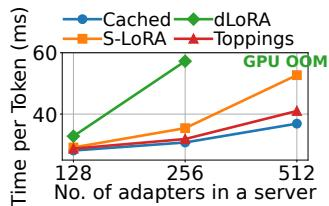

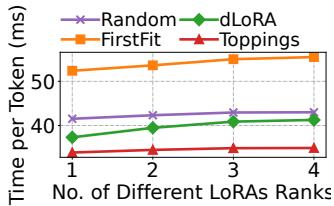  
Figure 1: Time per token (TPT) performance on Llama2- 7B. CACHED: the ideal case. Left: server node performance of existing works. Right: cluster-wide performance under different scheduling methods.

LoRA adapters from a single base model. As LoRA gains popularity, efficiently serving them with LLMs in a multi-tenant cloud becomes critically important [6, 34, 42, 46, 54].

Typical LoRA serving systems maintain thousands of LoRA adapters on inference servers, offering APIs for end users to access specialized LLM inference [6, 35, 42, 46, 54]. Critical to the serving efficiency is multiplexing a single base LLM to facilitate multi-tenant LoRA serving [6, 42], where an inference server can serve requests to different LoRAs in a batch using one LLM. Within a server, the base LLM runs on GPUs and a stock of LoRAs reside in host memory. The server node takes two steps to serve new requests, adhering to the continuous batching paradigm [24, 26, 31, 56]. First, it interrupts the inference of running batch, loads demanded LoRA adapters onto GPUs, and executes the prefill computation for the new requests. Second, it includes the new requests into the running batch and executes the decoding computation for the entire batch. At the cluster scale, a scheduler receives users’ requests and routes them across server nodes to maximize throughput [6] or ensure load balancing [54].

Despite the capability of batch serving and request orchestration, existing systems overlook two fundamental challenges in large-scale multi-tenant LoRA adapter serving [6, 42, 54].

First, on-demand loading LoRA adapters onto GPUs for new requests introduces high latency overheads. Specifically, when the desired LoRAs for new requests are not present on GPU, they must be fetched from host memory before prefill can commence, which can take tens of milliseconds depending on the adapter size and PCIe bandwidth [15]. Consequently, this delays not only the time-to-first-token of the arriving request, but also the ongoing decoding of all inflight requests. Notably, LoRA loading is more than one-off overhead. As new requests keep arriving, the decoding of inflight requests frequently interrupts, cumulatively delaying token generations by 49% on average in our experiments (§2.3).

Second, in multi-tenant LoRA serving, users often request heterogeneous LoRA adapters with varying LoRA ranks [7, 12, 42]. Though heterogeneous adapters can be batched together to multiplex one base LLM using specialized CUDA kernels [6, 42], disregarding the heterogeneity and batching LoRAs blindly can increase the batch decoding latency by up to 1.5×. This increase is due to the high GPU memory I/O overheads introduced by large-rank LoRAs, which also impact the low-rank LoRAs computation in the same batch [6, 42]. Therefore, at the cluster level, the system should judiciously schedule requests of heterogeneous Lo-RAs to ensure that the heterogeneity does not compromise SLOs in latency. This necessitates the scheduler to accurately model the inference latency for a given batch of heterogeneous adapters, which is challenging due to the combinatorial complexity of batching heterogeneous adapters.

We introduce TOPPINGS\*, a new multi-tenant LoRA serving system to address these challenges. Compared to previous practices in LoRA serving, TOPPINGS improves efficiency and scalability of multi-tenant LoRA serving: it effectively scales to serve more LoRAs within a server and accommodate higher heterogeneity in a cluster (Fig. 1). TOPPINGS achieves this with two novel designs, which we elaborate as follows:

CPU-assisted LoRA serving. Similar to the existing LLMmultiplexing solutions [6, 42], TOPPINGS maintains the base LLM on GPUs and all adapters in host memory. When a new request arrives, TOPPINGS dynamically loads the desired adapter onto the GPU with a loading pipeline (§4.1). Meanwhile, it concurrently utilizes CPUs to compute the LoRA adaption to early-start the prefill computation. As a PEFT approach, LoRA computation is lightweight, with computational load in the order of 1 GFLOPs, making it feasible to run on CPUs. Once adapter loading completes, TOPPINGS switches to the GPU to handle adaption and the remaining prefill computation, if not finished. It then proceeds to decoding, together with other inflight requests that were previously interrupted by the new arrival under continuous batching [24, 26, 31, 56].

Nevertheless, implementing CPU-assisted LoRA serving poses several challenges. LLMs are constructed using the Transformer architecture, which consists of multiple attention layers [52]. During inference, the computed output of the base LLM needs to be synchronized with that of the LoRA models at each layer. Since these computations are split between the CPU and GPU, efficient layer-wise synchronization between the two processors is crucial to performance. Also, the frequent triggering of LoRA computations (e.g., 32 times per prefill in Llama2-7B [50]) leads to high invocation overheads, such as inter-process communication (IPC) and data transfer, increasing inference latency by 79.4% in our experiment. Moreover, CPUs’ constrained parallel processing capabilities may create a new bottleneck when computing adaption for long prompts, especially in comparison to GPUs.

We address these challenges with a series of optimization designs. To efficiently coordinate on-GPU LLM computation and on-CPU LoRA computation, TOPPINGS develops a specialized CUDA operator that optimally overlaps the two computations by means of asynchronous memory copy and signaling. It also uses shared memory for fast data exchange between the base LLM process and multiple CPU LoRA processes without data copying and (de)serialization, reducing the LoRA invocation overhead to less than 1 ms. Furthermore, TOPPINGS designs a profiling-guided parallelization scheme to scale out LoRA computations across multiple CPUs, so as to eliminate the potential bottleneck. Together, TOPPINGS accelerates the request serving by 1.7× on average (§7.2).

Rank-aware request scheduling. We observe significant performance variations in decoding when batching different sets of heterogeneous LoRA adapters (§2.3). This highlights the need for intelligent request scheduling that takes into account the rank heterogeneity and its impact on decoding. To this end, we construct a performance model based on kernel profiling and characterization [6, 42]. This model can accurately predict the decoding latency for a given batch of heterogeneous adapters, despite the combinatorial complexity of batching heterogeneous adapters. With the performance model, we design a rank-aware scheduler to enhance clusterwide serving performance and meet latency SLOs. Specifically, when a new request arrives, the scheduler examines all inference servers that possess the desired LoRA adapters and evaluates a cost score for each server using the performance model. This score measures the additional latency cost and SLO violation risk on the current ongoing requests if the new request were to be served on that server. The scheduler then routes the request to the server with the minimum cost score.

We have implemented TOPPINGS based on LightLLM [31] and evaluated its performance using Llama2-7B/70B [50] with requests generated from real-world and synthetic traces [40, 61]. Evaluation results show that TOPPINGS outperforms S-LoRA [42] and dLoRA [54], the state-of-the-art solutions, improving the average serving latency of inference requests by up to 1.7×. Even compared to the ideal, yet nonimplementable baseline that caches all adapters on GPUs (no loading), TOPPINGS incurs only 7% overhead. We further tested TOPPINGS with long prompts of 2k to 30k tokens and observed consistent advantages. Additionally, we evaluated the rank-aware scheduling algorithm through testbed experiments and large-scale simulations. Compared to the popular scheduling policies used in existing systems [6, 54], TOP-

PINGS reduces the average time per token by up to 57% and achieves an SLO attainment of 99%.

## 2 Background and Motivation

In this section, we give a primer to LLM inference and lowrank adaptation (LoRA). We also discuss the key challenges that arise when serving LoRA models in a multi-tenant cloud.

## 2.1 LLM Inference

Generative LLM inference. LLM inference is a process that involves generating a sequence of output tokens in response to an input prompt. This process consists of two phases: prefill and decoding. During the prefill phase, the LLM processes the prompt to generate the first response token and the key-value cache (KV cache) for each token; the decoding phase then uses the previous KV cache to generate new tokens iteratively and appends the KV cache accordingly. The decoding phase continues until a specified condition is met, such as emitting an end-of-sequence (<eos>) token.

LLM adaption. Parameter-efficient adaptation of LLMs enhances their performance for domain-specific tasks [33,34,46]. One popular approach is Low-Rank Adaptation or LoRA [22], which introduces an adapter to modify the intermediate LLM inference results while keeping the original LLM parameters unchanged. Specifically, given a pre-trained LLM weight matrix $\mathbf { W } \in \mathbb { R } ^ { H _ { 1 } \times \mathbf { \bar { H } } _ { 2 } }$ , an adapter consists of two low-rank matrices $\mathbf { A } \in \mathbb { R } ^ { H _ { 1 } \times r }$ and $\mathbf { B } \in \bar { \mathbb { R } ^ { r \times H _ { 2 } } }$ , where r is the LoRA rank. LoRA adapts this weight matrix to $\mathbf { W } ^ { \prime } = \mathbf { W } + \mathbf { A B }$ . Let y be the original output of this layer given by y = xW. With LoRA adaption, the updated computation becomes

$$
\mathbf { y } ^ { \prime } = \mathbf { x } \mathbf { W } + \mathbf { x } \mathbf { A } \mathbf { B } = \mathbf { x } \mathbf { W } ^ { \prime } .\tag{1}
$$

The LoRA adapter is highly efficient in terms of parameter space because the rank $r \times ( H _ { 1 } + H _ { 2 } ) \ll H _ { 1 } \times H _ { 2 }$ . Therefore, LoRA adaption is widely applied in the attention modules of transformer-based LLMs [22, 42]. When deploying LoRAadapted models for inference, the computation load required by the LoRA adapter (xAB) is orders of magnitude smaller than that of the original weights xW in terms of floating-point operations, if we compute these two parts separately [6].

## 2.2 Multi-Tenant LoRA Serving

The need of LLM-multiplexing. A naive way to serve a LoRA adapter [22] is to merge its weights into the weights of the base LLM. However, this approach does not scale to multi-tenant LoRA serving: because one base model can only merge with one adapter at a time, serving n different LoRAs requires duplicating n copies of the base LLM, wasting GPU memory and missing opportunities for batch inference [26].

<table><tr><td rowspan="2">R1</td><td>an</td><td></td><td>apple</td><td></td><td>&lt;EOS&gt;</td><td></td></tr><tr><td></td><td>Load&amp;Pre</td><td>He</td><td></td><td>is</td><td>a</td></tr><tr><td>R2 R3</td><td></td><td></td><td></td><td>Load&amp;Pre</td><td>How</td><td>are</td></tr><tr><td>GPU</td><td>Dec 1</td><td>Load&amp;Pre2</td><td>Dec 1,2</td><td>Load&amp;Pre3</td><td></td><td></td></tr><tr><td></td><td></td><td>R2 arrival InterruptsR1</td><td></td><td>R3arrival InterruptsR1&amp;R2</td><td>Dec1,2,</td><td>Dec2, Time 7</td></tr></table>

Figure 2: Continuous batching in which the decoding phase (Dec) is preempted to perform prompt processing upon a request arrival, which involves loading the requested LoRA adapter (Load) and prefilling (Pre).

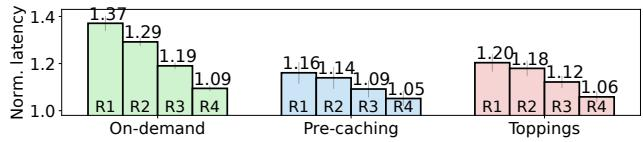  
Figure 3: The normalized serving latency of first four identical LoRA requests (rank=128, 128 input tokens, 32 output tokens) with inter-arrival of 200ms under different approaches.

In practice, many LoRA adapters are developed based on common LLM series (e.g., Llama2 [50]), and multiple LoRA adapters originating from the same LLM can multiplex that LLM for GPU-efficient inference. This can be achieved by computing LoRA adaption xAB on the fly and adding this result back to the intermediate results xW before subsequent computations. As the computation of xAB is lightweight, multiple LoRA computations can be batched during inference.

Continuous batching. Existing LLM serving systems employ the continuous batching strategy optimized for LLM’s iterative auto-regressive generation process [1, 24, 26, 31, 56]. Continuous batching operates at the iteration level, where completed requests are immediately removed from the running batch after each iteration and new requests can join the running batch in just one iteration, without waiting for the entire batch inference to complete. Continuous batching significantly improves the token generation throughput while minimizing the request queuing delays. Fig. 2 illustrates this batching process used in existing systems [24, 26, 31], where the decoding and prefill phases interleave as new requests arrive. Upon a request’s arrival, the decoding phase (Dec) is preempted by prompt processing, which involves loading the requested LoRA adapter (Load) and prefilling (Pre). During this period, all the inflight requests are suspended, resulting in a decoding interruption. Once prompt processing completes, the new request joins the running batch, and the system combines them together to continue the decoding process.

Underutilized CPUs. LLM inference highly demands GPUs while CPUs are often underutilized. Recent LLM cluster analysis reveals that the median GPU utilization is 99%, whereas the CPU utilization is less than 10% for 75% nodes [23].

## 2.3 Challenges

However, simply enabling LLM-multiplexing and continuous batching is insufficient to achieve optimal performance for multi-tenant LoRA serving, as it imposes two challenges.

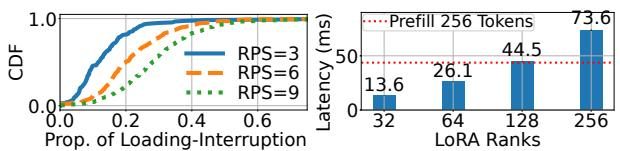  
Figure 4: Left: The proportion of decoding-interruption overhead during the entire token generation of each request. Right: The latency of loading a single adapter of different ranks. The adapter applies to the projection matrices of a Llama2-7B. Prefilling 256/1k tokens takes 44ms/90ms, respectively, longer than 90%/99% of prompts in the real-world dataset [61].

C1: High cumulative decoding-interruption overhead. To save GPU memory, existing systems only cache the base LLM on GPU while keeping all its LoRA adapters in host memory [6, 42]. When a new request arrives, the corresponding adapter is loaded from the host to the GPU, initiating an adapter loading that must complete before the prefill phase can begin (Fig. 2). This results in a severe cold-start problem, where adapter loading can take between a few to tens of milliseconds depending on the adapter size\* (Fig. 4-Right). Cold-start delays the time-to-first-token of the prefill request and becomes even more detrimental under continuous batching, where the arrival of a new request interrupts the ongoing decoding of all inflight queries (e.g., R3’s arrival interrupts R1 and R2 in Fig. 2). Consequently, the cold-start latency adds to the decoding-interruption overhead, delaying all inflight requests. To illustrate this problem, we set up a simple experiment where five identical LoRA requests sequentially arrive, with the i-th arrival interrupting the decoding of the ongoing i − 1 requests. Fig. 3 illustrates the output generation latency of the first four requests normalized by that of the last one with different serving approaches. Compared to pre-caching all adapters on GPU, the cold-start introduced by on-demand loading cumulatively extends the decoding interruption: earlier requests observe longer latency as they are delayed by more cold starts of late arrivals.

In a scenario where new requests keep arriving, the decoding of inflight requests is frequently interrupted, resulting in a significant cumulative delay in token generation. We empirically validate this by multiplexing a Llama2-7B model with 512 LoRA adapters (rank=64). These adapters have skewed popularity (Fig. 12-Left) following the Microsoft Azure Function (MAF) trace [40]. We configured Poisson request arrivals with various aggregate loads. Fig. 4-Left shows the proportion distribution of the cumulative decoding-interruption overhead, which, on average, accounts for 13%, 22%, and 29% of the entire request serving time when the aggregate load is 3, 6, and 9 requests per second (RPS), respectively. The median number of interruptions per request is 4 when RPS=3 and increases to 10 and 25 as the RPS increases to 6 and 9, respectively.

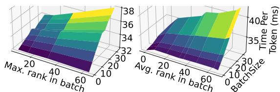  
Figure 5: The decoding latency variation of batching heterogeneous LoRA adapters. Left: BGMV. Right: MBGMV.

To avoid adapter loading, a simple approach is to pre-cache all LoRA models in GPU. However, this approach is expensive: a single rank-64 adapter that adapts attention projection weights $\mathbf { W } _ { Q } , \mathbf { W } _ { K } , \mathbf { W } _ { V }$ of the Llama2-7B demands approximately 100 MiB, equivalent to the size of a KV cache of 200 tokens. Pre-caching all adapters will swallow up GPU memory, degrade system throughput significantly [26], and cause GPU out of memory (OOM) errors (§7.2). A recent production trace [27] reveals that LoRA invocations follow a long-tailed distribution. Achieving a 50% hit rate requires caching over 200 LoRAs, which consumes more than 20 GiB of GPU memory for Llama2-7B. This is not well justified as most GPU memory should be reserved for KV-cache to maximize throughput [26].

C2: Cluster-level request scheduling for heterogeneous LoRA serving. In multi-tenant LoRA serving, users often request to use heterogeneous LoRA adapters with varying ranks [7, 42, 51, 55]. These heterogeneous adapters can be batched together to multiplex one base LLM using specialized kernels, such as the Batched Gather Matrix-Vector Multiplication (BGMV) kernel in Punica [6] or the Multi-size Batched Gather Matrix-Vector Multiplication (MBGMV) kernel in S-LoRA [42]. Rank heterogeneity in a batch of adapters directly affects their serving performance. Specifically, when batching a set of heterogeneous LoRA adapters, BGMV pads adapters of smaller ranks to the highest rank to perform batch operations, while MBGMV does not use padding [42]. As a result, BGMV’s performance is determined by the maximum rank in the batch, whereas MBGMV’s performance depends on the average rank. We measure the decoding latency of batch serving heterogeneous LoRAs using these two kernels with various batch configurations, and depict the results in Fig. 5. We observe significant performance variations when batching different sets of heterogeneous adapters. With the same batch size, rank heterogeneity can increase batch decoding latency by 28%. This highlights the need for intelligent request scheduling that considers the impacts of rank heterogeneity on performance to satisfy SLO.

To illustrate this point, we refer to a toy example shown in Fig. 6, where Instance 1 handles 24 requests with LoRA rank=32, and Instance 2 runs 16 requests with rank=64. Using Punica’s BGMV kernel, the decoding latencies are 34.8 ms and 35.8 ms for Instances 1 and 2, respectively. With S-LoRA’s MBGMV, the latencies are 35.3 ms and 35.9 ms for Instances 1 and 2, respectively. Assume a decoding latency SLO of 36ms, and we need to determine the optimal schedule for a new request with rank=64. With the BGMV kernel, assigning the request to Instance 2 would meet the SLO, while sending it to Instance 1 would increase the maximum rank of the batched requests to 64, resulting in an SLO violation due to the processing of 25 higher-rank requests on Instance 1. However, with MBGMV, where latency is proportional to average LoRA ranks, scheduling the request to Instance 1 preserves the SLO, while routing it to Instance 2 leads to a violation.

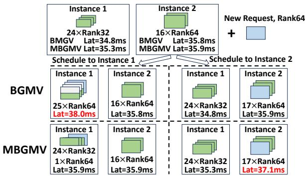  
Figure 6: An toy example illustrating performance variations when scheduling a single request. With a decoding latency SLO of 36 ms, the new request should be routed to Instance 2 with BGMV, while Instance 1 with MBGMV.

<table><tr><td rowspan=1 colspan=1>System</td><td rowspan=1 colspan=1>Cumulativeloading overhead</td><td rowspan=1 colspan=1>(un)mergingoverhead</td><td rowspan=1 colspan=1>Multi-LoRAcomputation</td><td rowspan=1 colspan=1>Cluster-widescheduling</td></tr><tr><td rowspan=1 colspan=1>Punica[6]</td><td rowspan=1 colspan=1>High</td><td rowspan=1 colspan=1>Zero</td><td rowspan=1 colspan=1>Fast</td><td rowspan=1 colspan=1>Rank-agnostic</td></tr><tr><td rowspan=1 colspan=1>S-LoRA [42]</td><td rowspan=1 colspan=1>High</td><td rowspan=1 colspan=1>Zero</td><td rowspan=1 colspan=1>Fast</td><td rowspan=1 colspan=1>Rank-agnostic</td></tr><tr><td rowspan=1 colspan=1>dLoRA [54]</td><td rowspan=1 colspan=1>Zero</td><td rowspan=1 colspan=1>High</td><td rowspan=1 colspan=1>Slow</td><td rowspan=1 colspan=1>Rank-agnostic</td></tr><tr><td rowspan=1 colspan=1>TOPPINGS</td><td rowspan=1 colspan=1>Low</td><td rowspan=1 colspan=1>Zero</td><td rowspan=1 colspan=1>Fast</td><td rowspan=1 colspan=1>Rank-aware</td></tr></table>

Table 1: Comparison of existing systems on server efficiency (LoRA loading, merging, computing) and cluster scheduling.

However, modeling serving latency based on the rank heterogeneity is challenging due to the combinatorial complexity. With a common maximum serving batch size B = 64 and a small number of N = 5 different LoRA types, there are a total of $\textstyle \sum _ { b = 1 } ^ { B } { \binom { N + b - 1 } { b } } \approx 1 . 1 \times 1 0 ^ { 7 }$ different rank combinations.

## 2.4 Concurrent Work and Their Inefficiency

Model serving system design primarily aims optimizing serving efficiency within a server and request scheduling across a cluster [20,54,59]. In Table 1, we compare concurrent adapter serving systems [6, 42, 54] in terms of adapter loading and computing within a server, and scheduling at the cluster scale.

Adapter loading. By default, both Punica [6] and S-LoRA [42] load adapters on demand, leading to high cumulative decoding-interruption overhead (C1), which we elaborate in evaluation (§7). Though S-LoRA suggests using predictive prefetching, it does not provide details, and frequent mispredictions are expected given the bursty inference request workloads [54,59]. dLoRA [54] pre-caches all LoRA adapters into GPUs. Though pre-caching avoids loading overhead, it fall shorts in serving a large number of adapters, causing GPU OOM or degraded performance in our evaluation (§7.2).

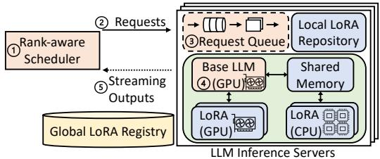  
Figure 7: An architecture overview of TOPPINGS.

Multi-LoRA computation. Critical to the inference efficiency is LLM-multiplexing. Notably, Punica [6], S-LoRA [42], and TOPPINGS adopt efficient GPU kernels for the on-the-fly LoRA computation (§2.2). dLoRA [54] proposes a dynamic batching approach, which dynamically merges adapters with the base model to serve requests of the same adapter in a batch and unmerges adapters to serve requests of different adapters. However, deciding when to merge and unmerge adapters during inference introduces additional overhead [54] and results in slow computation, as evident in §7.2.

Scheduling. Despite the impact of heterogeneous LoRA adapters on request scheduling, the cluster scheduling policy in concurrent systems [6, 42, 54] are rank-agnostic, resulting in significant delays that violate SLOs (§7.4).

## 3 TOPPINGS Overview

In this section, we provide a high-level overview of TOP-PINGS, a LoRA serving system that efficiently tackles the two challenges mentioned earlier. Within a server, TOPPINGS uses a CPU-assisted approach to hide the long cold-start latency. It uses CPUs to simultaneously execute the requested LoRA adapter while loading it onto the GPU, effectively overlapping the adapter loading with the prefill computation (§4) to mitigate the cumulative decoding-interruption overhead. At the cluster scale, TOPPINGS optimizes the scheduling of requests to heterogeneous LoRA adapters using a rank-aware scheduling algorithm, significantly enhancing cluster performance and SLO compliance (§5). Fig. 7 illustrates the system architecture, which consists of a cluster of LLM inference servers, a scheduler, and a global LoRA registry.

LLM inference server. Each LLM inference server maintains a long-running service of the base LLM on the GPU. It also stores a set of heterogeneous LoRA adapters in an in-memory local LoRA repository. During inference, the server coordinates LoRA computations on the CPU and GPU. Specifically, it adapts the BGMV kernel from [6] to perform LoRA computation efficiently on the GPU. For CPU-based LoRA execution, it utilizes four techniques to enhance its efficiency: 1) pipelined adapter loading, 2) asynchronous invocation, 3) shared memory data transfer, and 4) profiling-guided parallelization, which we elaborate in §4.

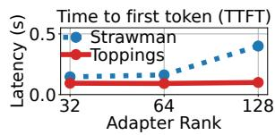

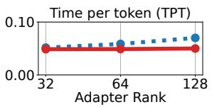  
Figure 8: Performance of Llama2-7B on A100. The strawman solution increases TTFT by up to 4× and TPT by up to 1.4×.

Rank-aware scheduler. The scheduler receives requests and routes them to the appropriate servers to meet SLOs. To make informed scheduling decisions, it uses a performance model to predict the latency cost by considering the rank heterogeneity of the serving batch, which we explain in §5.

Global LoRA registry. It stores the metadata of all adapters, such as the LoRA ranks, the path to their weights file, etc.

Workflow. As illustrated in Fig. 7, new requests arrive at the scheduler ( 1 ), which uses the rank-aware scheduling algorithm described in §5 to route them to appropriate inference servers ( 2 ). Following the continuous batching strategy [56], the LLM inference server fetches requests from the request queue ( 3 ) and provides generative inference services using the corresponding LoRA adapters ( 4 ). New tokens generated by the LLM are then streamed back to the users ( 5 ).

## 4 CPU-Assisted LoRA Serving

In this section, we present TOPPINGS’s design of CPUassisted LoRA serving to address the high cumulative decoding-interruption overhead (§2.3). We start with a strawman solution. Then, we proceed to describe LoRA computation on GPU and CPU and discuss the challenges of efficiently combining the two executions to reduce the decodinginterruption overhead (§4.1). We then present optimization techniques that address these challenges (§4.2).

Strawman Solution. To reduce the cumulative decodinginterruption overhead, a strawman solution is to overlap adapter loading with ongoing decoding. That is, when a new request arrives, the system asynchronously loads its adapter onto the GPU without interrupting the ongoing decoding of inflight requests. When the adapter is fully loaded, the system then switches to the prefilling computation of the new request. Though the strawman solution can avoid decoding interruptions, it makes new requests suffer from longer loading overhead and degrades serving performance (Fig. 8), especially the time-to-first-token (TTFT), which is the time required to generate the first output token and is critical to user experience [11]. The strawman solution motivates TOPPINGS to early-start the prefill with LoRA computation on the CPU.

## 4.1 LoRA Computation on GPU and CPU

A parameter-efficient adapter, LoRA requires lightweight computation (§2.1) and can run on either GPU or CPU.

GPU LoRA. As the base LLM is “pinned” on GPU, running LoRA adapters on the same device saves the communication overhead and is usually more efficient than running them on CPU. To maximize the token throughput, LoRA computations (i.e., xAB in Eq. (1)) are batched in each attention layer during base LLM inference. This can be achieved with a specialized CUDA operator [6, 42]. In TOPPINGS, we adapt the Batched Gather Matrix-Vector Multiplication (BGMV) operator [6], which parallelizes the LoRA weight gathering and computation for efficient execution. The LoRA output is then added to the base output in the self-attention computation, following in Eq. (1). For an efficient implementation, we incorporate the operators of GPU LoRA computation into the base LLM inference process, as shown in Fig. 9.

CPU LoRA. LoRA computation, which is highly lightweight at approximately 1 GFLOPs (§2.1), can also be executed using CPUs. However, computing LoRA on CPUs requires layer-wise synchronization with the base LLM inference running on the GPU. Specifically, at each attention layer, the base inference process transfers the input tensor x in Eq. (1) from the GPU device memory to the host memory (Fig. 9). The CPU LoRA process then performs computation and transfers the result xAB back to the GPU device. Meanwhile, the base inference process proceeds to compute xW, which is finally adapted with the received LoRA output following Eq. (1). Though CPU LoRA requires synchronization, it can start immediately as the LoRA weights are already in memory. We hence utilize it to mitigate cold start and the cumulative decoding-interruption overhead in GPU LoRA.

CPU-assisted LoRA serving with pipeline loading. When a new request arrives and the corresponding adapter is not available on the GPU, the server fetches it from host memory and, in the meantime, early-starts its prefill computation using the CPU LoRA instead of waiting for the adapter loading to complete. As an adapter has a layered structure as the base LLM, we design a pipeline loading scheme to overlap communication and computation [5]. Given an adapter with N layers, we divide it into M layer groups. TOPPINGS uses the CPU to compute the first layer group, while in the meantime loading the second layer group onto the GPU. TOPPINGS carefully determines the group size to ensure that CPU computation and GPU loading of one layer group complete at around the same time by profiling the latency of CPU LoRA computation, adapter loading and GPU LoRA computation. Starting from the second group, the GPU pipeline is established, allowing TOPPINGS to parallelize GPU computation of the m-th group and GPU loading of the (m + 1)-th group, where m = 2, 3, . . . , M − 1. In case of latency variations in LoRA loading and LoRA computation, Toppings can dynamically decide where to execute LoRA computation during inference. If the weight of the LoRA model layer has been loaded, Toppings executes the LoRA computation on the GPU; otherwise, it executes it on the CPU. Pipeline loading is particularly effective when serving large adapters (e.g., rank > 64), reducing the prefill latency by up to 15% compared with no pipelining $( M = 1 )$ , as shown in §7.3.

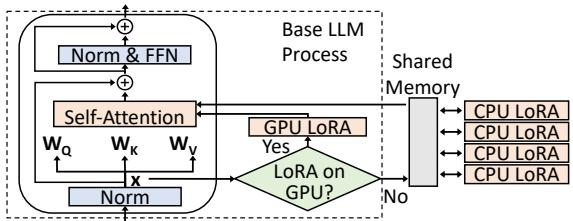

Figure 9: Illustration of coordinated LoRA computation on GPU and CPU per transformer block’s attention layer.  
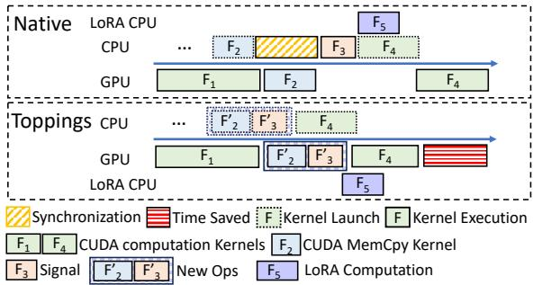  
Figure 10: Execution timeline of Native LoRA Invocation using default CUDA synchronize primitives and LoRA Invocation with TOPPINGS’s operator in base LLM process.

Fig. 9 shows the orchestrated CPU and GPU LoRA computations, where CPU LoRAs run as isolated, concurrent processes for resource/failure isolation and better performance.

Challenges. Hosting LoRA computation in isolated CPU processes poses three challenges to system implementation. First, running LoRA in CPU processes requires layer-wise synchronization between the GPU-based LLM inference to ensure data validity. Second, frequent triggering of LoRA computation in each attention layer leads to high invocation overhead, such as inter-process data transfer. Third, using CPU to compute adaptation can be slow given its limited parallelization capability, especially when the prompt is long.

## 4.2 Efficient GPU-CPU LoRA Coordination

In this subsection, we tackle the system challenges mentioned earlier with three optimization techniques.

Sync-free CPU LoRA invocation. Most LLM serving systems achieve low latency through asynchronous GPU computation in PyTorch-like frameworks [26, 31, 42, 50]. By default, GPU operations (e.g., CUDA kernels) are executed asynchronously. They are first launched on CPU and enqueued to the GPU device queue, but not necessarily executed until later. For example, in Fig. 10, CUDA kernel $F _ { 2 }$ is first launched on CPU, and then executed on GPU asynchronously. The order in which the kernels are added to the stream dictates their execution order. Hence, adapter serving requires careful coordination between base LLM inference running on GPU and LoRA invocation running on CPU to ensure correctness and good performance.

In native PyTorch, having the base LLM process invoke CPU LoRA requires explicit synchronization, which blocks subsequent kernels from launching. To illustrate this problem, we refer to Fig. 10-Top, which depicts the native PyTorch invocation timeline from the base LLM process’s perspective. The CUDA kernel $F _ { 1 }$ computes the input matrix x. Meanwhile, the base LLM process launches $F _ { 2 }$ on CPU, a CUDA MemCpy kernel to transfer the input matrix x to the host memory for CPU LoRA’s access. After $F _ { 1 }$ execution completes on GPU, the GPU executes the enqueued $F _ { 2 }$ kernel. Once the data transfer completes, the base process uses a signaling operator $F _ { 3 }$ to notify CPU LoRA processes to compute $\mathbf { x A B } ( F _ { 5 } )$ . It then launches the next CUDA kernel $F _ { 4 }$ . This implementation requires explicit synchronization (shown as a yellow block with slashes) to ensure that the memory copy $( F _ { 2 } )$ completes before the signaling $( F _ { 3 } )$ . However, the synchronization blocks the subsequent $F _ { 4 }$ from launching, resulting in significant inference delay and GPU underutilization.

To address this issue, we introduce a customized operator that eliminates explicit synchronization by fusing an asynchronous MemCpy kernel with a CUDA signaling kernel. The CUDA signaling kernel writes a semaphore variable in host shared memory\* to achieve signaling. As shown in Fig. 10- Bottom, instead of relying on synchronization, we fuse $F _ { 2 }$ and $F _ { 3 }$ into an asynchronous CUDA kernel $[ F _ { 2 } ^ { \prime } , F _ { 3 } ^ { \prime } ]$ , where $F _ { 2 } ^ { \prime }$ performs asynchronous MemCpy and $F _ { 3 } ^ { \prime }$ asynchronously signals the intended CPU LoRA processes through changing the semaphore in the shared memory. As a result, the fused kernel $[ F _ { 2 } ^ { \prime } , F _ { 3 } ^ { \prime } ]$ can be added to the GPU device queue without waiting for the completion of $F _ { 1 }$ . Note that data validity and consistency is preserved in this case because CUDA device queue follows a sequential, strict first-in-first-out execution ordering. The semaphore variables employed will synchronize and ensure the correctness of memory read and write operations. Since the new operator requires no explicit synchronization, subsequent base model kernels, such as $F _ { 4 } .$ can launch without being blocked, eliminating unnecessary synchronization overhead. In §7.3, we show that our kernel can reduce the prefill latency by 15% compared to implementation with explicit synchronization. The design of the sync-free operation is not limited to LoRA computation and can be adapted to other workloads if necessary.

Shared memory data transfer. Transferring data and signals between the base LLM process and the isolated CPU LoRA processes requires inter-process communication (IPC). This is a one-to-N communication involving one base LLM inference process and multiple CPU LoRA processes. (We explain why multiple CPU LoRA processes later.) We create shared memory blocks in the host memory, i.e, DRAM, for fast inter-process signaling and data transfer, eliminating the need for data copying and (de)serialization (Fig. 9). The CPU processes periodically poll from the semaphore in the shared memory. Once it changes, LoRA processes start reading the input matrix x from the shared memory and perform the computation xAB. They then write xAB back to the shared memory and notify the LLM inference process to incorporate the adaptation results (Eq. 1). Micro-benchmark evaluations (§7.3) demonstrate that the use of shared memory reduces data transfer overhead to less than 1 ms (Fig. 12- Right), substantially outperforming the message passing IPC employed by existing LLM frameworks [31].

Profiling-guided LoRA parallelization. Given that the CPU has lower computing power and limited parallelization capability compared to the GPU, performing LoRA adaptation using a single CPU is not scalable. Therefore, we propose a profiling-guided parallelization scheme to accelerate LoRA adaptation using multiple CPU cores. As discussed in $\ S 2 . 1$ the adaptation computation is $\mathbf { x A B } ,$ where $\mathbf { x } \in \mathbb { R } ^ { B \times L \times H }$ is the input matrix for B requests with L tokens, totaling $B \times L$ tokens. We first profile the performance achieved by a single core under varying workloads (Fig. 17-Left) and set the maximum number of tokens for a single CPU core to handle for computation. For example, if one core can handle c tokens, we allocate $\lceil \frac { L } { c } \rceil$ cores for computing the adaptation results of each request with weight matrix W. Each core is dedicated to an isolated CPU process to avoid interference. Specifically, the CPU process reads a slice of x from the shared memory region, performs the computation, writes the results back to the shared memory, and notifies the base LLM process accordingly. Compared to PyTorch’s native multithreading module [14], this approach achieves 1.4× speedup when using 16 CPUs for the same workload (Fig. 17-Right).

Putting it altogether, our design, as demonstrated in §7.2, can accelerate the request serving by 1.7× on average.

## 5 Rank-Aware Scheduling

In a multi-tenant LoRA serving system, user requests can trigger the use of heterogeneous LoRA adapters with varying ranks. As discussed in §2.3, the rank heterogeneity directly affects the performance of multi-tenant LoRA serving systems. Therefore, the scheduling strategy for handling these requests is crucial for enhancing system efficiency (C2): a sub-optimal strategy can drive the adapter heterogeneity in a server to a non-ideal setting that slows down token generation for both new and ongoing requests. An effective scheduler needs to be aware of the heterogeneity-performance model to make rank-aware request scheduling decisions and meet SLOs.

Performance modeling. TOPPINGS employs performance models to guide the scheduler in making informed decisions, ensuring that SLOs are met by mapping LoRA rank heterogeneity to serving performance. However, performance modeling is challenging (C2). Under continuous batching, when new requests are routed to a server, the server’s running batch size increases, and the batch’s rank heterogeneity changes as well, making the number of possible LoRA rank combinations in a batch grow exponentially.

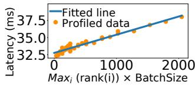

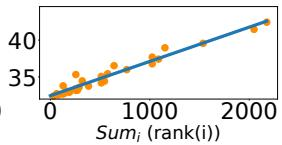  
Figure 11: Performance models for BGMV (Left) and MBGMV (Right) kernels. Both linear regression models achieve a high coefficient of determination $( R ^ { 2 } )$ of 0.96.

To address the challenge, TOPPINGS builds performance models based on the characterizations of the LoRA computation kernels, e.g., BGMV and MBGMV. We profile the kernels using Nvidia Nsight Compute [13] and observe that their performance is bounded by the GPU memory bandwidth, which is dominated by transferring adapter weights into L2 cache. Based on the insights, we develop generic performance models to predict the latency of a prefill or decoding iteration for a specific batch of heterogeneous adapters. These models are created through lightweight serving performance profiling, involving varying batch sizes and heterogeneous adapters on a specific GPU. We present the performance models tailored for both BGMV [6] and MBGMV [42]. For the padding-based BGMV kernel, where lower-ranked LoRAs require padding to match the highest rank, we observe that the serving performance of decoding latency is almost linear to the product of batch size and the maximum rank encountered in the batch (see Fig.11- Left). On the other hand, MBGMV [42] modifies the BGMV kernel to eliminate padding, improving performance with highly heterogeneous LoRA ranks but introducing additional performance overhead for computing homogeneous ranks. Through profiling, we find that under MBGMV, the serving performance scales linearly with the sum of LoRA ranks in a batch of heterogeneous adapters (Fig. 11-Right). Denoting the adapter rank of request i as rank(i), we present performance models for these two kernels on a batch of requests S as two linear functions with parameters α and $\beta ,$ inspired by [29]:

$$
\begin{array} { r } { \begin{array} { r l } { \mathrm { P E R F } _ { \mathtt { B G M V } } ( S ) } & { = \alpha _ { B } \cdot | S | \cdot \ M \alpha \mathrm { x } _ { i \in S } r a n k ( i ) + \beta _ { B } } \\ { \mathrm { P E R F } _ { \mathtt { M B G M V } } ( S ) } & { = \alpha _ { M } \cdot S \ w _ { i \in S } r a n k ( i ) + \beta _ { M } } \end{array} } \end{array}\tag{2}
$$

As shown in Fig. 11, our linear performance models accurately fit the profiled data. Both models achieve a high coefficient of determination $( R ^ { 2 } )$ of 0.96, suggesting the models can predict performance almost perfectly: $R ^ { 2 } { = } 1$ indicates a perfect fit.

The parameters α and $\beta$ are specific to the hardware and LLM models. When the model or hardware changes, reprofiling is required to adjust these parameters. To construct the performance models in Fig. 11, we collect the data by profiling the serving of 7,618 requests with batch sizes of 4, 8, 16, and 32, and LoRA ranks of 8, 16, 32, and 64, which can complete in minutes. Besides, the model inference incurs a negligible overhead in the order of 0.001ms.

Scheduling requests across inference servers. Using the established performance models, we develop a rank-aware scheduling algorithm (Algo. 1) for heterogeneous LoRA requests. Upon receiving a new request, the scheduler gathers information about ongoing requests from all available LLM inference servers. The scheduler identifies potential candidate servers by matching the base LLM, adapter, and GPU memory availability. If multiple candidates are found, the scheduler calculates a total cost score for each candidate server based on the performance model. This cost score measures the impact of the new requests on the performance of the server’s ongoing requests. If serving the new request would cause a violation of the SLO, the cost score is assigned a large penalty. The scheduler then selects the server with the minimum cost score to handle the new request.

Algorithm 1: Rank-aware Scheduling Policy   
Input: Performance models for Prefill and Decoding: PrePer f (·),   
DecPer f (·); average response length: avg\_resp\_len;   
1 while True do   
2 Request i arrives;   
3 candidates ← available LLM inference servers   
4 for instance in candidates do   
5 running\_batch, queue = instance.GetStats()   
6 cost = CalcCost(i, running\_batch, queue)   
7 requests = len(running\_batch) + len(queue)   
8 instance.total\_cost = cost \* requests   
9 best = min(candidates, key=lambda x: x.total\_cost)   
10 best.serve(i)   
11 Function CalcCost(req, running\_batch, queue):   
12 exists = running\_batch + queue   
13 # calculate additional prefilling time   
14 ∆pre f ill = PrePer f (queue + req) - PrePer f (queue)   
15 # calculate additional decoding time   
16 ∆decode = DecPer f (exists + req) - DecPer f (exists)   
17 cost\_score = (∆pre f ill / avg\_resp\_len) + ∆decode   
18 if DecPer f (exists + req) > SLO then   
19 penalty\_score = float(’inf’)   
20 cost\_score += penalty\_score   
21 return cost\_score

## 6 Implementation

LLM inference server. We implemented TOPPINGS’s LLM Inference Server on top of LightLLM [31], an LLM serving framework based on PyTorch [37] and Triton [48]. We extended its Llama2 inference module to incorporate our LoRA adapters. This allows for easy integration with different LLMs and other popular LLM inference frameworks such as vLLM [26]. We implemented GPU LoRA adapters by adapting the BGMV kernels [6]. Regarding CPU LoRA, we implemented the custom CUDA kernel (§4.2) as a PyTorch Extension using PyBind11. Each CPU LoRA adapter runs as an isolated process, binding to one CPU core using the numactl command. To enable efficient batch inference, we utilize the request queue in LightLLM, which facilitates the continuous batching mechanism [26, 56].

We employ tensor parallel techniques [45] to support base LLMs that require multiple GPU devices. Tensor parallelism involves partitioning a weight matrix into multiple chunks, and each GPU device holds only one chunk to perform a portion of the computation in parallel [28]. To enable tensor parallelism for LoRA computation, TOPPINGS partitions the LoRA adapter weights (B in Eq.1) using the same strategy as that of the base LLMs. It performs the computation and incorporates the adaptation results into the inference intermediates in place, causing no extra communication overhead.

Scheduler & global LoRA registry. We implemented the scheduler with Algo. 1 using Python Flask. For the global LoRA registry, we utilized SQLite.

## 7 Evaluation

We evaluate TOPPINGS regarding the efficiency of an LLM inference server (§4) and the scheduler performance across multiple servers (§5). Our evaluation highlights include:

• TOPPINGS achieves efficient multi-tenant LoRA serving on Llama2-7B/70B, outperforming state-of-the-art baselines, e.g., S-LoRA [42] and dLoRA [54] (§7.2).

• TOPPINGS’s optimizations in CPU LoRA execution are effectively illustrated by various micro-benchmarks (§7.3).

• TOPPINGS’s scheduler achieves high SLO attainment and improves the performance as a cloud service (§7.4).

## 7.1 Experimental Setup

Model and server configs. We adopt Llama2 [50] with 7B and 70B parameters where LoRA adapters are applied to WQ, WK, and WV in LLM’s attention layers following the standard settings\* [12, 22, 42]. We serve Llama2-7B with a single NVIDIA A100 GPU and Llama2-70B with four A100 GPUs using tensor parallelism, following [6, 32, 54].

Metrics. We use following metrics, which are considered essential in user-facing LLM serving [1, 11, 38, 42].

• Time-to-first-token (TTFT) measures how quickly users start getting the model’s output after entering their prompts. It reflects the time required to process the prompt and then generate the first output token. Low waiting times for a response are essential in real-time interactions.

• Time-per-token (TPT) measures the time on average to generate an output token for each user. This metric corresponds with the perceived "speed" of the model. We calculate TPT by accounting for all tokens, including those from both the prefill and decoding phases.

• E2E Latency measures the end-to-end time it takes for the model to generate the full response for a request.

Baselines. We consider the following baselines.

• CACHED represents an ideal but impractical method where all required LoRA adapters are pre-cached in unlimited GPU memory. It has no adapter loading overhead, thus achieving performance upper bound.

• S-LORA [42] represents a state-of-the-art multi-tenant LoRA serving framework, which is also built on top of LightLLM [31]. It loads LoRA adapters on demand and uses an adapted CUDA kernel for GPU LoRA computation.

• dLORA [54] is another LoRA serving system based on vLLM [26]. It pre-caches all LoRA adapters into GPU memory and dynamically merges/unmerges LoRAs with the base model during inference. It uses PyTorch’s general matrix multiply (GEMM) kernel for LoRA computation.

Note that CACHED and TOPPINGS are built on top of LightLLM [31], the same as S-LORA [42]. We equip CACHED and TOPPINGS with the BGMV kernel [6] to perform GPU LoRA computation for a fair comparison. S-LORA and dLORA use their own kernels.

Workloads. We use both scaled production and synthetic workloads in our evaluation.

• Scaled production workload. We use the MAF trace [40] to generate a scaled production workload, which is widely used to emulate model serving workloads [30, 54, 59]. The trace contains invocation traffic of different functions, and we regard each function as one adapter. We randomly group adapters. Each inference server hosts a group of adapters and receives the aggregated request traffic from all the adapters it hosts. Within a group, adapters have varying probabilities of being invoked shown in Fig. 12-Left, proportional to their invocation frequency in the original trace.

• Synthetic workload. The aggregate request traffic to an LLM server follows Poisson processes with varying intensities, widely used in approximating simulated invocations [6,59]. Similar to [6,42], each request targets a distinct adapter and hence undergoes the adapter loading phase. Following [42], we place 200 adapters in an inference server.

Datasets. We refer two datasets to set each request’s prompt and output length. The first is LMSYS-CHAT-1M [61], which contains input and output texts of one million real-world conversations. The second is QMSum [46, 62], which has prompts with lengths ranging from 2k to 30k tokens. QMSum comprises transcripts from real-world meetings, focusing on query-based summarization with long detailed answer [62].

## 7.2 LLM Inference Server Performance

In this section, we evaluate the performance of a single LLM inference server, which is subject to adapter loading and computing. For a fair comparison, we employ homogeneous LoRA ranks in this section, eliminating the potential performance differences that result from the way different LoRA computation kernels handle heterogeneous ranks [6, 42].

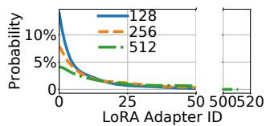

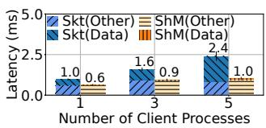  
Figure 12: Left: LoRA invocation probability. X-axis: adapter ID sorted by invocation probability. Right: CPU LoRA computation time. Each process receives data of 16 tokens. Skt: Domain socket for inter-process communication (IPC). ShM: Shared memory for IPC. Data: Time for transfering data to other process via IPC. Other: Time for all other operations.

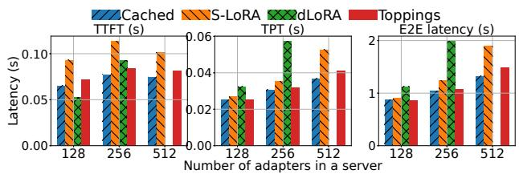  
Figure 13: Performance with varying number of adapters under the scaled MAF workloads. dLORA causes GPU OOM when there are 512 adapters in the server.

Scaled production workloads. We first evaluate TOPPINGS on the scaled production workload. Fig. 12-Left illustrates the skewed distribution of adapter popularity. We evaluate each baseline with an increasing number of LoRAs served in an inference server. With more LoRA adapters, the server will receive higher request loads, and each new request is more likely to invoke a new LoRA adapter that needs to be loaded onto GPU on demand (Fig. 12-Left). Therefore, a larger number of LoRAs manifests higher cumulative loading overhead. The average aggregate RPS for 128/256/512 adapters is 1.5/3.6/7.7, scaled from the original trace. We set the LoRA rank = 64 in this setting.

We measure serving performance using the metrics defined in §7.1. See Fig. 13. When 128 LoRA adapters are in a server, the impact of cumulative adapter loading overhead is negligible because the request traffic is low, and most new requests do not require adapter loading. Compared to CACHED, S-LORA increases TTFT by 43%, TPT by 7%, and E2E latency by 5% on average, mainly due to the one-off adapter loading overhead introduced by new requests. dLORA achieves better TTFT as it pre-caches all LoRA adapters into GPU and dynamically merges LoRAs with the base LLM to accelerate prefill computation [54]. However, its frequent LoRA (un)merging operations impact the decoding, increasing the TPT by 29% and E2E latency by 29% compared to CACHED. TOPPINGS outperforms by only increasing TTFT by 9%.

However, as the number of LoRA adapters increases to 512, adapter loading incurs prohibitively high cumulative overhead, which can hinder S-LORA from scaling to efficiently serve a large number of adapters. Compared to the CACHED, S-LORA increases TPT by 43%, and E2E latency by 43% on average. Nevertheless, TOPPINGS can rival CACHED, accelerating S-LORA by 1.25×, 1.29×, 1.28× in terms of TTFT, TPT and E2E latency, respectively.

<table><tr><td>Setup Model Size Datasets No. of LoRAsRank RPS</td><td></td><td></td><td></td><td></td></tr><tr><td>S1</td><td>7B</td><td>LMSYS</td><td>200</td><td>32</td><td>9</td></tr><tr><td>S2</td><td>7B</td><td>LMSYS</td><td>200</td><td>64</td><td>6</td></tr><tr><td>S3</td><td>7B</td><td>LMSYS</td><td>200</td><td>64</td><td>9</td></tr><tr><td>S4</td><td>7B</td><td>QMSum</td><td>50</td><td>256</td><td>3</td></tr><tr><td>S5</td><td>70B</td><td>LMSYS</td><td>200</td><td>32</td><td>3</td></tr><tr><td>S6</td><td>70B</td><td>LMSYS</td><td>200</td><td>64</td><td>3</td></tr></table>

Table 2: Evaluation setups with the synthetic workload.

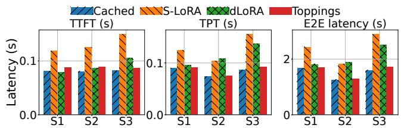  
Figure 14: Serving performance. Setup: S1, S2, S3 in Tab. 2.

dLORA falls short in serving numerous LoRA adapters in a server. When 256 adapters are in a server, dLORA incurs significant computation overhead, increasing TPT/E2E latency by 86%/90%, due to its LoRA computation operator. Worse, deploying 512 adapters in a server can cause GPU OOM and the server cannot spin up (Fig. 13).

Synthetic workloads. We evaluate each baseline with various setups using the synthetic workloads, as shown in Tab. 2.

1) Setup S1, S2, and S3. We explore different LoRA ranks and request traffic in these three settings. As discussed in §2.3, two factors affect TOPPINGS’s advantages (§2). The first is LoRA rank, which determines the size of a LoRA adapter: smaller rank leads to shorter loading latency. The second is the workload traffic, which determines the frequency of adapter loading (decoding interruption).

As shown in Fig. 14, TOPPINGS achieves the most performance advantage in S3, which has the largest LoRA rank and highest RPS. TOPPINGS rivals the performance of CACHED by introducing tolerable overheads, slightly increasing the TTFT by 6%, TPT by 6%, and the E2E latency by 7%. Compared to the CACHED baseline, S-LORA introduces high overhead due to the cumulative loading interruption, increasing TTFT by 82%, TPT by 80%, and E2E latency by 81% on average. dLORA incurs no adapter loading overhead as it preloads all adapters but falls short in calculating LoRA adaption (Eq. 1), degrading the computation performance. Besides, dLORA decides online whether to merge/unmerge the LoRA adapters with the base model to provide service [54], further increasing prefill latency when RPS is high. Compared to the CACHED baseline, dLORA increases TTFT by 29%, TPT by 58%, and E2E latency by 57% on average. We further evaluate TOPPINGS’s performance under conditions of reduced CPU availability, where each CPU LoRA computes 4× more tokens. Despite the constrained CPU resources, TOPPINGS maintains consistent performance advantages over the baseline systems thanks to the pipeline loading design (§4.1). Compared to the CACHED baseline, TOPPINGS increases the TTFT by 17%, TPT by 11%, and E2E latency by 10%. The pipelined loading design allows TOPPINGS to promptly switch to GPU for LoRA computation, effectively mitigating the impact of reduced CPU availability.

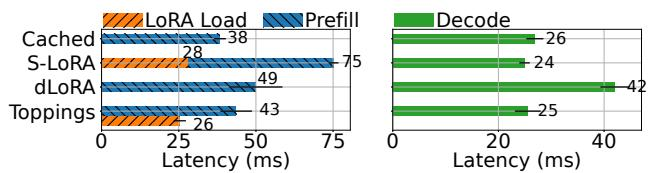  
Figure 15: Prefill and decoding latency at LLM server.

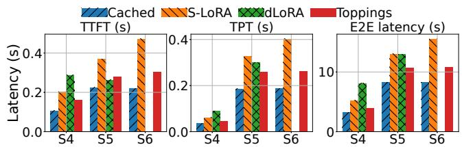  
Figure 16: Serving performance. Setup: S4, S5, S6 in Tab. 2. dLORA causes GPU OOM in S6.

S1 and S2 represents less challenging settings, with smaller LoRA ranks or lower request traffic. As shown in Fig. 14, S-LORA/dLORA incurs smaller overhead than that in S3 while TOPPINGS rival the performance of CACHED.

Fig. 15 explains TOPPINGS’s advantage from the LLM inference server’s side. The latencies of decoding iterations achieved by CACHED, S-LORA, and TOPPINGS are similar, while S-LORA have a long prefill iteration due to the adapter loading overhead. TOPPINGS leverages the CPU-assisted design (§4) to avoid the loading overhead. dLORA incurs no loading overhead as it pre-cache all adapters but slows down LoRA computing, leading to the long decoding latency.

Resource Utilization. Throughout the request serving in S3, the average GPU utilization of S-LORA/dLORA/TOPPINGS is 46%/81%/56%. dLORA’s GPU utilization is much higher due to its LoRA (un)merging overhead and computation whereas S-LORA and TOPPINGS use high-performance kernels adapted from BGMV [6]. The average CPU utilization of S-LORA/dLORA/TOPPINGS is 4%/4%/46%, respectively, with each request consuming an average of 27ms for CPUassisted LoRA computation. TOPPINGS exploits the underutilized CPUs [23] to accelerate adapter serving, which is overlooked by S-LORA and dLORA.

2) Setup S4. We stress test each baseline using the long prompts from the QMSum dataset [46, 62] that have lengths ranging from 2k to 30k tokens. We adopt Lloco’s workflow [46] that serves these prompts with LoRA adapters. Given a lengthy prompt, Lloco first processes the prompt into token embeddings using the AutoCompressor [8, 46]. Subsequently, Lloco sends a request with the embeddings to query the LLM and a designated LoRA adapter. As larger ranks contribute to higher response quality for long prompts [7], we use adapters with rank = 256. As shown in Fig. 16, TOP-PINGS maintains superior with minimal overhead compared to CACHED. dLORA’s slow LoRA computation is more salient with the long prompts in this setting.

3) Setup S5,S6. In these two settings, we evaluate each baseline with Llama2-70B using tensor parallelism [32]. We re-implement S-LORA by adapting CACHED since existing works [6, 42] have not released code in multi-GPU settings. We also emulate dLORA by importing its LoRA computation into CACHED to avoid the performance differences resulted from different backends (vLLM [26] v.s. lightLLM [31]), which are evident in the multi-GPU settings [10, 49, 64]. See Fig. 16. In S5, S-LORA/dLORA/TOPPINGS increases TTFT by 65%/18%/24%, TPT by 65%/59%/30%, and E2E latency by 61%/61%/33%. compared to CACHED. In S6, dLORA fails due to GPU OOM and TOPPINGS achieves consistent benefits, accelerating TTFT by 1.6×, TPT by 1.5×, and E2E latency by 1.4×, compared to S-LORA.

## 7.3 Microbenchmark Evaluations

We further evaluate the effectiveness of the CPU LoRA optimizations (§4) at the microbenchmark level.

Pipelined adapter loading. Pipelined adapter loading allows TOPPINGS to promptly prefill prompts on GPU instead of waiting for the adapter to be fully loaded (§4.1). To show its effectiveness, we measure the prefill performance w/ and w/o pipelined adapter loading, where the pipelined adapter loading accelerates the prefill computation by 1.2× and 1.1× when using adapter with rank=128 and rank=64.

Sync-free CPU LoRA invocation. To analyze the performance of our optimized CPU LoRA invocation kernel (§4.2), we compare the prefill latency using PyTorch’s native implementation and our optimized kernels. While prefilling 64 tokens, TOPPINGS’s kernel gains a 10% speedup, reducing the latency from 67ms to 61ms. While prefilling 256 tokens, TOPPINGS’s kernel gains a 15% speedup, reducing the latency from 145ms to 126ms.

Shared memory data transfer. We compare the latency of computing CPU LoRA with different IPC methods: shared memory and UNIX domain socket. We measure the time it takes to perform LoRA computation and the data round trip cost. Fig. 12-Right shows that as the number of receiver processes increases, the domain socket approach suffers from linear time increase in data transmission, whereas the shared memory approach obtains near-constant performance.

Multi-CPU computation. We first profile the LoRA computation performance in a prefill phase with a single CPU. We profile it with different workloads (number of tokens to process). We run the profiling on a Llama2-7B model with a A100 card using Intel Platinum 8369B CPU. As shown in

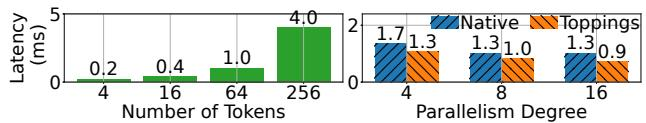  
Figure 17: Left: CPU computation time of xAB in the prefill phase. Right: CPU computation for 256 tokens with different parallelism. Native: PyTorch native multi-threading [14].

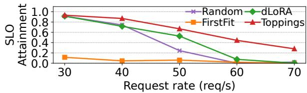  
Figure 18: Scheduler performance under varying RPS.

Fig. 17-Left, the CPU has limited parallelism and does not scale to fit high workloads. We observe similar results using AMD EPYC 7R32 CPU. Fig. 17-Right illustrates the performance of prefilling a prompt of 256 tokens with TOPPINGS’s multi-CPU design (§4.2) or the native multi-core utilization of PyTorch multi-threading module [14]. TOPPINGS’s design achieves up to 1.4× speedup.

## 7.4 Cluster Scale Performance

Following [59], we run cluster scale experiments in two settings: an 8-instance real-world testbed and a large-scale simulation. We use four different LoRA ranks in this section.

Baselines. Upon the arrival of new requests, we consider the following scheduling baselines for comparison:

• dLORA [54] enables reactive request migration to balance the workloads among servers.

• FIRSTFIT scheduler picks a server following the first-fit bin-packing strategy, which is also adopted by Punica [6].

• RANDOM scheduler randomly picks an inference server.

Performance model. The performance model can predict performance almost perfectly with a high $R ^ { 2 }$ of 0.96 (§5). Besides, the model takes 0.005ms for one inference.

Testbed evaluation. We set up a cluster testbed consisting of 8 Llama2-7B models to evaluate each scheduler under varying Poisson request traffic. TOPPINGS’s LLM inference server is used as the LoRA serving backend. The SLO is set regarding TPT, as it reflects the perceived "speed" of the inference service. The SLO is set to be 1.5× higher than that achieved by LLM inference without LoRA. See Fig. 18. TOPPINGS’s rankaware scheduler outperforms other baselines by achieving the highest SLO attainment across all settings. When the request rate is low (RPS=30), the RANDOM and dLORA perform well as they tend to scatter the requests across servers, mitigating the impacts of rank heterogeneity. In contrast, the FIRSTFIT degrades as it tends to consolidate requests to heterogeneous LoRAs on a few servers, exacerbating rank heterogeneity. As the request rate increases, the performance of rank-agnostic schedulers, e.g., dLORA, plummets, while TOPPINGS maintains consistent advantages, improving SLO attainment by 21% and 26% when the RPS is 40 and 50, respectively.

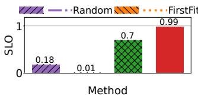

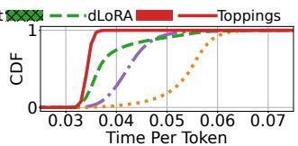  
Figure 19: Scheduler performance across 60 instances.

Large-scale simulation. To ensure the fidelity of the simulator, we reuse the code from the LightLLM [31] and maintain the same serving logic. We obtain the prefill and decoding latency for the simulator by extensive profiling. We include all 40,000 functions from the MAF trace [40], with an aggregated RPS≈340, and use 60 server instances. The SLO is set regarding TPT, which is 1.5× higher than that of LLM inference without LoRA. Fig. 19 compares the SLO attainment of each scheduler and the CDF of requests’ TPT. TOPPINGS’s rank-aware scheduler achieves the highest SLO attainment and speeds up the average TPT by 22/23/57% compared to dLORA/RANDOM/FIRSTFIT. We see similar results in the simulation if replacing the BGMV in TOPPINGS with MBGMV.

## 8 Related Work and Discussion

LLM inference. Optimizing LLM inference is the target of recent studies [2,16–19,21,25,30,38,47,57]. Orca [56] proposed iteration-level continuous batching to improve the throughput of LLM serving. Further, vLLM [26] addressed the issue of the GPU memory fragmentation resulting from LLM’s KV Cache, improving serving throughput by high GPU efficiency. Sarathi-Serve executes chunked-prefills, which combines prefill and decoding computation to maximize serving throughput [1]. DeepSpeed-Ulysses enables efficient LLM training and inference for long prompts using sequence parallelism [25]. FlexGen [44] supported LLMs with limited GPU memory, maximizing serving throughput by efficiently processing tensors. TOPPINGS is compatible with these optimizations, has already supported continuous batching and optimized GPU memory management mechanism [31].

Multi-tenant LoRA serving. In addition to the works discussed in §2.4, PetS [63] proposed a unified framework for serving various adapters in discriminative language models. However, it lacks iterative decoding and is orthogonal to TOP-PINGS. Recent works [43] have also explored the fairness issues in multi-tenant LLM serving, where some users may receive more resources than others. The primary goal of TOP-PINGS’s rank-aware scheduling algorithm is to address performance variations caused by heterogeneous LoRA ranks, while not explicitly tackling fairness concerns. A straightforward approach to ensuring fairness is to limit the number of requests a user can make within a specified time frame, a strategy also adopted by OpenAI [36]. It is worth noting that fairness in LLM serving is not a challenge unique to LoRA serving. For instance, the Virtual Token Counter (VTC) scheduling algorithm [43] guarantees fairness not only for general LLM serving but also for adapter-based serving. Importantly, TOP-PINGS does not introduce additional unfairness to the system and is fully compatible with fairness strategies like VTC.

Multi-model inference serving. A series of systems optimize multi-model inference serving, including Clipper [9], MArk [58], Nexus [41], INFaaS [39], Clockwork [20], Shepherd [59], and AlpaServe [28]. They optimize batching, caching, and model placement of serving multiple models. However, they do not specially support generative LLMs and heterogeneous LoRA adapters, leading to optimization gaps.

Discussion. TOPPINGS’s design is versatile, supporting various LLM series and not restricted to a specific framework, as most LLMs share a backbone of Transformer blocks and utilize the attention mechanism [52]. The CPU-assisted design is compatible with existing GPU servers, which are typically equipped with abundant CPUs but have low CPU utilization [23, 53]. For example, the AWS g5.48xlarge instance has 192 vCPU cores. Besides a recent analysis of production traces from GPU clusters reveals significant underutilization of CPU resources [23]. This observation suggests that spare CPU cycles are readily available to support a CPU-assisted design without impacting overall cluster performance. For fault tolerance, our current implementation isolates CPU processes, with each bound to a specific CPU. Additionally, running redundant CPU processes enhances fault tolerance.

## 9 Conclusion

This paper presents TOPPINGS, an efficient multi-tenant LoRA serving system. In a nutshell, TOPPINGS multiplexes base model to serve many LoRA adapters in a batch, coordinates LoRA computation on CPU and GPU to avoid cold-start, and employs a rank-aware scheduler to meet SLOs. Compared to existing systems, TOPPINGS significantly improves serving efficiency by reducing the request serving latency by up to 47% and achieves an SLO attainment of 99%.

## Acknowledgement

We thank our shepherd, Liting Hu, and the anonymous reviewers for their valuable feedbacks that help improve the quality of this work. We also thank Xiaozhe Yao for his feedback and assistance in the early stage of this work. This work was supported in part by Huawei Cloud Research Grant, RGC CRF Grant (Ref. #C6015-23G), RGC GRF Grants (Ref. #16210822 and #16217124), and NSFC/RGC Collaborative Research Scheme (Ref. #CRS\_HKUST601/24 and #CRS\_PolyU501/23).

## References

[1] Amey Agrawal, Nitin Kedia, Ashish Panwar, Jayashree Mohan, Nipun Kwatra, Bhargav Gulavani, Alexey Tumanov, and Ramachandran Ramjee. Taming Throughput-Latency tradeoff in LLM inference with Sarathi-Serve. In 18th USENIX Symposium on Operating Systems Design and Implementation (OSDI 24), 2024.

[2] Reza Yazdani Aminabadi, Samyam Rajbhandari, Ammar Ahmad Awan, Cheng Li, Du Li, Elton Zheng, Olatunji Ruwase, Shaden Smith, Minjia Zhang, Jeff Rasley, and Yuxiong He. Deepspeed-inference: Enabling efficient inference of transformer models at unprecedented scale. In SC22: International Conference for High Performance Computing, Networking, Storage and Analysis, 2022.

[3] AnyScale. Announcing anyscale private endpoints and anyscale endpoints fine-tuning. https://bit.ly/40eobib, 2024.

[4] Microsoft Azure. Customize a model with azure openai service. https://bit.ly/3WbehwU, 2024.

[5] Zhihao Bai, Zhen Zhang, Yibo Zhu, and Xin Jin. PipeSwitch: Fast pipelined context switching for deep learning applications. In 14th USENIX Symposium on Operating Systems Design and Implementation (OSDI 20), 2020.

[6] Lequn Chen, Zihao Ye, Yongji Wu, Danyang Zhuo, Luis Ceze, and Arvind Krishnamurthy. Punica: Multi-tenant lora serving. In Proceedings of Machine Learning and Systems 2024 (MLSys 2024), 2024.

[7] Yukang Chen, Shengju Qian, Haotian Tang, Xin Lai, Zhijian Liu, Song Han, and Jiaya Jia. LongLoRA: Efficient fine-tuning of long-context large language models. In The Twelfth International Conference on Learning Representations, 2024.

[8] Alexis Chevalier, Alexander Wettig, Anirudh Ajith, and Danqi Chen. Adapting language models to compress contexts. In The 2023 Conference on Empirical Methods in Natural Language Processing (EMNLP 23), 2023.

[9] Daniel Crankshaw, Xin Wang, Guilio Zhou, Michael J Franklin, Joseph E Gonzalez, and Ion Stoica. Clipper: A {Low-Latency} online prediction serving system. In 14th USENIX Symposium on Networked Systems Design and Implementation (NSDI 17), pages 613–627, 2017.

[10] Cydia2018. Performance comparison between lightllm and vllm. https://github.com/ModelTC/lightllm/issues/ 116.

[11] Databricks. Llm inference performance engineering: Best practices. https://www.databricks.com/blog/ llm-inference-performance-engineering-best-practices, 2023.

[12] Tim Dettmers, Artidoro Pagnoni, Ari Holtzman, and Luke Zettlemoyer. Qlora: Efficient finetuning of quantized llms. In Advances in Neural Information Processing Systems (NeurIPS 23), 2023.

[13] Nvidia Developer. Nvidia nsight compute. https: //developer.nvidia.com/nsight-compute, 2024.

[14] PyTorch Docs. Cpu threading and torchscript inference. https://pytorch.org/docs/stable/notes/cpu\_ threading\_torchscript\_inference.html, 2023.

[15] Jianbo Dong, Zheng Cao, Tao Zhang, Jianxi Ye, Shaochuang Wang, Fei Feng, Li Zhao, Xiaoyong Liu, Liuyihan Song, Liwei Peng, Yiqun Guo, Xiaowei Jiang, Lingbo Tang, Yin Du, Yingya Zhang, Pan Pan, and Yuan Xie. Eflops: Algorithm and system co-design for a high performance distributed training platform. In 2020 IEEE International Symposium on High Performance Computer Architecture (HPCA), 2020.

[16] Jiangfei Duan, Runyu Lu, Haojie Duanmu, Xiuhong Li, Xingcheng Zhang, Dahua Lin, Ion Stoica, and Hao Zhang. Muxserve: Flexible spatial-temporal multiplexing for multiple llm serving. In ICML, 2024.

[17] Yao Fu, Leyang Xue, Yeqi Huang, Andrei-Octavian Brabete, Dmitrii Ustiugov, Yuvraj Patel, and Luo Mai. Serverlessllm: Locality-enhanced serverless inference for large language models. In 18th USENIX Symposium on Operating Systems Design and Implementation (OSDI 24), 2024.

[18] Yichao Fu, Siqi Zhu, Runlong Su, Aurick Qiao, Ion Stoica, and Hao Zhang. Efficient LLM scheduling by learning to rank. In The Thirty-eighth Annual Conference on Neural Information Processing Systems, 2024.

[19] Waris Gill, Mohamed Elidrisi, Pallavi Kalapatapu, Ammar Ahmed, Ali Anwar, and Muhammad Ali Gulzar. Meancache: User-centric semantic cache for large language model based web services. In 2025 IEEE International Parallel and Distributed Processing Symposium (IPDPS 25), 2025.

[20] Arpan Gujarati, Reza Karimi, Safya Alzayat, Wei Hao, Antoine Kaufmann, Ymir Vigfusson, and Jonathan Mace. Serving DNNs like clockwork: Performance predictability from the bottom up. In 14th USENIX Symposium on Operating Systems Design and Implementation (OSDI 20), 2020.

[21] Cunchen Hu, Heyang Huang, Liangliang Xu, Xusheng Chen, Jiang Xu, Shuang Chen, Hao Feng, Chenxi Wang, Sa Wang, Yungang Bao, et al. Inference without interference: Disaggregate llm inference for mixed downstream workloads. arXiv preprint arXiv:2401.11181, 2024.

[22] Edward J Hu, Yelong Shen, Phillip Wallis, Zeyuan Allen-Zhu, Yuanzhi Li, Shean Wang, Lu Wang, and Weizhu Chen. LoRA: Low-rank adaptation of large language models. In International Conference on Learning Representations (ICLR 22), 2022.

[23] Qinghao Hu, Zhisheng Ye, Zerui Wang, Guoteng Wang, Meng Zhang, Qiaoling Chen, Peng Sun, Dahua Lin, Xiaolin Wang, Yingwei Luo, Yonggang Wen, and Tianwei Zhang. Characterization of large language model development in the datacenter. In 21st USENIX Symposium on Networked Systems Design and Implementation (NSDI 24), 2024.

[24] Huggingface. Text generation inference. https://github. com/huggingface/text-generation-inference.

[25] Sam Ade Jacobs, Masahiro Tanaka, Chengming Zhang, Minjia Zhang, Reza Yazdani Aminadabi, Shuaiwen Leon Song, Samyam Rajbhandari, and Yuxiong He. System optimizations for enabling training of extreme long sequence transformer models. In Proceedings of the 43rd ACM Symposium on Principles of Distributed Computing, PODC ’24, 2024.

[26] Woosuk Kwon, Zhuohan Li, Siyuan Zhuang, Ying Sheng, Lianmin Zheng, Cody Hao Yu, Joseph E. Gonzalez, Hao Zhang, and Ion Stoica. Efficient memory management for large language model serving with pagedattention. In Proceedings of the ACM SIGOPS 29th Symposium on Operating Systems Principles (SOSP 23), 2023.

[27] Suyi Li, Lingyun Yang, Xiaoxiao Jiang, Hanfeng Lu, Zhipeng Di, Weiyi Lu, Jiawei Chen, Kan Liu, Yinghao Yu, Tao Lan, Guodong Yang, Lin Qu, Liping Zhang, and Wei Wang. Katz: Efficient workflow serving for diffusion models with many adapters. In Proc. USENIX ATC, 2025.

[28] Zhuohan Li, Lianmin Zheng, Yinmin Zhong, Vincent Liu, Ying Sheng, Xin Jin, Yanping Huang, Zhifeng Chen, Hao Zhang, Joseph E. Gonzalez, and Ion Stoica. AlpaServe: Statistical multiplexing with model parallelism for deep learning serving. In 17th USENIX Symposium on Operating Systems Design and Implementation (OSDI 23), 2023.

[29] Ashraf Mahgoub, Edgardo Barsallo Yi, Karthick Shankar, Sameh Elnikety, Somali Chaterji, and Saurabh Bagchi. ORION and the three rights: Sizing, bundling,

and prewarming for serverless DAGs. In 16th USENIX Symposium on Operating Systems Design and Implementation (OSDI 22), 2022.

[30] Xupeng Miao, Chunan Shi, Jiangfei Duan, Xiaoli Xi, Dahua Lin, Bin Cui, and Zhihao Jia. Spotserve: Serving generative large language models on preemptible instances. In Proceedings of the 29th ACM International Conference on Architectural Support for Programming Languages and Operating Systems (ASPLOS 24), 2024.

[31] ModelTC. Light llm. https://github.com/ModelTC/ lightllm.

[32] Deepak Narayanan, Mohammad Shoeybi, Jared Casper, Patrick LeGresley, Mostofa Patwary, Vijay Korthikanti, Dmitri Vainbrand, Prethvi Kashinkunti, Julie Bernauer, Bryan Catanzaro, Amar Phanishayee, and Matei Zaharia. Efficient large-scale language model training on gpu clusters using megatron-lm. In Proceedings of the International Conference for High Performance Computing, Networking, Storage and Analysis, SC ’21, 2021.

[33] OpenAI. Custom instructions for chatgpt. https://openai. com/blog/custom-instructions-for-chatgpt, 2023.

[34] OpenAI. Gpt-3.5 turbo fine-tuning and api updates. https://bit.ly/4j9QVS2, 2023.

[35] OpenAI. Openai documentation: Fine-tuning. https: //platform.openai.com/docs/guides/fine-tuning, 2024.

[36] OpenAI. What are the best practices for managing my rate limits in the api? http://bit.ly/43Fk7e1, 2025.

[37] Adam Paszke, Sam Gross, Francisco Massa, Adam Lerer, James Bradbury, Gregory Chanan, Trevor Killeen, Zeming Lin, Natalia Gimelshein, Luca Antiga, Alban Desmaison, Andreas Köpf, Edward Yang, Zach DeVito, Martin Raison, Alykhan Tejani, Sasank Chilamkurthy, Benoit Steiner, Lu Fang, Junjie Bai, and Soumith Chintala. Pytorch: an imperative style, high-performance deep learning library. In Proceedings of the 33rd International Conference on Neural Information Processing Systems (NeurIPS 19), 2019.

[38] Pratyush Patel, Esha Choukse, Chaojie Zhang, Aashaka Shah, Inigo Goiri, Saeed Maleki, and Ricardo Bianchini. Splitwise: Efficient Generative LLM Inference Using Phase Splitting . In 2024 ACM/IEEE 51st Annual International Symposium on Computer Architecture (ISCA 24), 2024.

[39] Francisco Romero, Qian Li, Neeraja J. Yadwadkar, and Christos Kozyrakis. INFaaS: Automated model-less inference serving. In 2021 USENIX Annual Technical Conference (USENIX ATC 21), 2021.

[40] Mohammad Shahrad, Rodrigo Fonseca, Inigo Goiri, Gohar Chaudhry, Paul Batum, Jason Cooke, Eduardo Laureano, Colby Tresness, Mark Russinovich, and Ricardo Bianchini. Serverless in the wild: Characterizing and optimizing the serverless workload at a large cloud provider. In 2020 USENIX Annual Technical Conference (USENIX ATC 20), 2020.

[41] Haichen Shen, Lequn Chen, Yuchen Jin, Liangyu Zhao, Bingyu Kong, Matthai Philipose, Arvind Krishnamurthy, and Ravi Sundaram. Nexus: A gpu cluster engine for accelerating dnn-based video analysis. In Proceedings of the 27th ACM Symposium on Operating Systems Principles, pages 322–337, 2019.

[42] Ying Sheng, Shiyi Cao, Dacheng Li, Coleman Hooper, Nicholas Lee, Shuo Yang, Christopher Chou, Banghua Zhu, Lianmin Zheng, Kurt Keutzer, Joseph E. Gonzalez, and Ion Stoica. S-LoRA: Serving thousands of concurrent lora adapters. In Proceedings of Machine Learning and Systems 2024 (MLSys 2024), 2024.

[43] Ying Sheng, Shiyi Cao, Dacheng Li, Banghua Zhu, Zhuohan Li, Danyang Zhuo, Joseph E. Gonzalez, and Ion Stoica. Fairness in serving large language models. In Proc. OSDI, 2024.

[44] Ying Sheng, Lianmin Zheng, Binhang Yuan, Zhuohan Li, Max Ryabinin, Beidi Chen, Percy Liang, Christopher Ré, Ion Stoica, and Ce Zhang. Flexgen: High-throughput generative inference of large language models with a single gpu. In International Conference on Machine Learning (ICML 23), 2023.

[45] Mohammad Shoeybi, Mostofa Patwary, Raul Puri, Patrick LeGresley, Jared Casper, and Bryan Catanzaro. Megatron-lm: Training multi-billion parameter language models using model parallelism, 2020.

[46] Sijun Tan, Xiuyu Li, Shishir G Patil, Ziyang Wu, Tianjun Zhang, Kurt Keutzer, Joseph E. Gonzalez, and Raluca Ada Popa. LLoCO: Learning long contexts offline. In Proceedings of the 2024 Conference on Empirical Methods in Natural Language Processing, 2024.

[47] Yifan Tan, Cheng Tan, Zeyu Mi, and Haibo Chen. Pipellm: Fast and confidential large language model services with speculative pipelined encryption. arXiv preprint arXiv:2411.03357, 2024.

[48] Philippe Tillet, Hsiang-Tsung Kung, and David Cox. Triton: an intermediate language and compiler for tiled neural network computations. In Proceedings of the 3rd ACM SIGPLAN International Workshop on Machine Learning and Programming Languages, 2019.

[49] tonylin52. lightllm vs vllm. https://github.com/ ModelTC/lightllm/issues/79.

[50] Hugo Touvron, Louis Martin, Kevin Stone, Peter Albert, Amjad Almahairi, Yasmine Babaei, Nikolay Bashlykov, Soumya Batra, Prajjwal Bhargava, Shruti Bhosale, et al. Llama 2: Open foundation and fine-tuned chat models, 2023.

[51] Undi95. Undi95/llama2-13b-no-robots-alpaca-lora. https://huggingface.co/Undi95/Llama2-13B-no\_ robots-alpaca-lora, 2024.

[52] Ashish Vaswani, Noam Shazeer, Niki Parmar, Jakob Uszkoreit, Llion Jones, Aidan N. Gomez, Łukasz Kaiser, and Illia Polosukhin. Attention is all you need. In Proceedings of the 31st International Conference on Neural Information Processing Systems (NeurIPS 17), 2017.

[53] Qizhen Weng, Wencong Xiao, Yinghao Yu, Wei Wang, Cheng Wang, Jian He, Yong Li, Liping Zhang, Wei Lin, and Yu Ding. MLaaS in the wild: Workload analysis and scheduling in Large-Scale heterogeneous GPU clusters. In 19th USENIX Symposium on Networked Systems Design and Implementation (NSDI 22), 2022.

[54] Bingyang Wu, Ruidong Zhu, Zili Zhang, Peng Sun, Xuanzhe Liu, and Xin Jin. dLoRA: Dynamically orchestrating requests and adapters for LoRA LLM serving. In 18th USENIX Symposium on Operating Systems Design and Implementation (OSDI 24), 2024.

[55] YeungNLP. Yeungnlp/longqlora-llama2-7b-8k-lora. https://huggingface.co/YeungNLP/ LongQLoRA-Llama2-7b-8k-lora, 2024.

[56] Gyeong-In Yu, Joo Seong Jeong, Geon-Woo Kim, Soojeong Kim, and Byung-Gon Chun. Orca: A distributed serving system for Transformer-Based generative models. In 16th USENIX Symposium on Operating Systems Design and Implementation (OSDI 22), 2022.

[57] Zhongkai Yu, Shengwen Liang, Tianyun Ma, Yunke Cai, Ziyuan Nan, Di Huang, Xinkai Song, Yifan Hao, Jie Zhang, Tian Zhi, Yongwei Zhao, Zidong Du, Xing Hu, Qi Guo, and Tianshi Chen. Cambricon-llm: A chipletbased hybrid architecture for on-device inference of 70b llm. In 2024 57th IEEE/ACM International Symposium on Microarchitecture (MICRO), 2024.

[58] Chengliang Zhang, Minchen Yu, Wei Wang, and Feng Yan. {MArk}: Exploiting cloud services for {Cost-Effective},{SLO-Aware} machine learning inference serving. In 2019 USENIX Annual Technical Conference (USENIX ATC 19), pages 1049–1062, 2019.

[59] Hong Zhang, Yupeng Tang, Anurag Khandelwal, and Ion Stoica. SHEPHERD: Serving DNNs in the wild. In 20th USENIX Symposium on Networked Systems Design and Implementation (NSDI 23), 2023.

[60] Susan Zhang, Stephen Roller, Naman Goyal, Mikel Artetxe, Moya Chen, Shuohui Chen, Christopher Dewan, Mona Diab, Xian Li, Xi Victoria Lin, et al. Opt: Open pre-trained transformer language models. arXiv preprint arXiv:2205.01068, 2022.

[61] Lianmin Zheng, Wei-Lin Chiang, Ying Sheng, Tianle Li, Siyuan Zhuang, Zhanghao Wu, Yonghao Zhuang, Zhuohan Li, Zi Lin, Eric Xing, Joseph E. Gonzalez, Ion Stoica, and Hao Zhang. LMSYS-chat-1m: A large-scale real-world LLM conversation dataset. In The Twelfth International Conference on Learning Representations (ICLR 24), 2024.

[62] Ming Zhong, Da Yin, Tao Yu, Ahmad Zaidi, Mutethia Mutuma, Rahul Jha, Ahmed Hassan Awadallah, Asli Celikyilmaz, Yang Liu, Xipeng Qiu, and Dragomir Radev. QMSum: A New Benchmark for Query-based Multidomain Meeting Summarization. In North American Association for Computational Linguistics (NAACL 21), 2021.

[63] Zhe Zhou, Xuechao Wei, Jiejing Zhang, and Guangyu Sun. PetS: A unified framework for Parameter-Efficient transformers serving. In 2022 USENIX Annual Technical Conference (USENIX ATC 22), 2022.

[64] zzb610. Comparison between pageattention and tokenattention. https://github.com/ModelTC/lightllm/issues/ 379.