①

USENIX

THE ADVANCED COMPUTING SYSTEMS ASSOCIATION

# PMR: Fast Application Response via Parallel Memory Reclaim on Mobile Devices

Wentong Li, MoE Engineering Research Center of Software/Hardware Co-Design   
Technology and Application, East China Normal University, Shanghai, China; and   
School of Computer Science and Technology, East China Normal University; Li-Pin   
Chang, National Yang Ming Chiao Tung University, Taiwan; Yu Mao, City University of Hong Kong, Hong Kong; and MBZUAI, Abu Dhabi; Liang Shi, MoE Engineering   
Research Center of Software/Hardware Co-Design Technology and Application, East China Normal University, Shanghai, China; and School of Computer Science and Technology, East China Normal University https://www.usenix.org/conference/atc25/presentation/li-wentong

This paper is included in the Proceedings of the 2025 USENIX Annual Technical Conference.

July 7–9, 2025 • Boston, MA, USA ISBN 978-1-939133-48-9

Open access to the Proceedings of the 2025 USENIX Annual Technical Conference is sponsored by

P=-r.h mEesL

auuuJl9 PgleU

King Abdullah University of

Science and Technology

# PMR: Fast Application Response via Parallel Memory Reclaim on Mobile Devices ∗

Wentong Li1,2, Li-Pin Chang3, Yu Mao 4,5, Liang Shi1,2†

1MoE Engineering Research Center of Software/Hardware Co-Design Technology and Application,

East China Normal University, Shanghai, China

2School of Computer Science and Technology, East China Normal University

3National Yang Ming Chiao Tung University, Taiwan

4City University of Hong Kong, Hong Kong, 5MBZUAI, Abu Dhabi

## Abstract

Mobile applications exhibit increasingly high memory demands, making efficient memory management critical for enabling fast and responsive user experiences. However, our analysis of Android systems reveals inefficiencies in the current kernel-level memory reclaim design, which struggles to meet the performance demands of modern apps and fails to exploit upgraded storage devices. To address this challenge, we propose PMR, a parallel memory reclaim scheme. PMR introduces two key techniques: proactive page shrinking (PPS) and storage-friendly page writeback (SPW). PPS enhances the memory reclaim process by decoupling the timeconsuming steps of page shrinking and page writeback for parallel execution, while SPW optimizes write I/O operations through batched unmapping of victim pages for bulk, efficient writeback. Experimental results on real-world mobile devices demonstrate that PMR can improve application response times by up to 43.6% compared to the original Android memory reclaim approach.

## 1 Introduction

The memory requirements of mobile applications are growing significantly, imposing high pressure on modern mobile devices [19, 28, 34]. Many applications now require gigabytes of memory, including popular social networking apps, video streaming apps, and web browsers. By contrast, the physical memory capacity of mobile devices has seen only modest increases, with flagship models such as the latest iPhone 16 series offering just 8 GB of DRAM [15], and the upcoming Samsung Galaxy S25 Ultra series equipped with 16 GB [16]. Running just a few such apps can quickly create significant memory pressure on mobile devices. If this pressure is not properly managed, the applications may experience slowdowns, restarts, or crashes, severely affecting the user experience [10, 20, 32].

To effectively alleviate memory pressure, Android-based mobile systems employ various memory reclaim mechanisms, the most notable being kernel-level memory reclaim (including memory swapping and direct reclaim) and user-space Low Memory Killer Daemon (LMKD) [13]. Specifically, first, when the amount of free memory falls below a pre-defined low watermark, the kernel wakes up a memory swapping thread (i.e., kswapd) for asynchronous memory reclaim in background [12]. Second, if kswapd fails to provide sufficient free memory for incoming requests, the kernel performs a direct reclaim for synchronous, blocking memory reclaim until the pending memory requests are satisfied [35]. Finally, if neither of these can recover the system from critically low memory, the system resorts to an LMKD process to release memory through selective process killing. However, once an app process is killed, the next time when the app is relaunched, users may notice a long restart latency and loss of all user context [25, 34]. In summary, LMKD termination can quickly relieve memory pressure but has serious side effects. In contrast, kernel-level memory reclaim is transparent to users and more cost-effective for mobile systems that emphasize interactive experience [19, 28, 34].

While LMKD should be avoided whenever possible, applying kernel-level memory reclaim in current systems is challenging. Our experiment reveals that current kernel-level memory reclaim is surprisingly sluggish in practice, failing to keep up with the growing memory demands of applications and being unable to fully utilize advanced mobile device hardware. Specifically, we observe that dozens of LMKD events can occur within just a few minutes (see Figure 2), suggesting the heavy reliance of current systems on frequent LMKD to alleviate memory pressure. As mentioned earlier, one of the primary reasons for this aggressive killing is the inefficiency of kernel-level memory reclaim. Also, while application memory footprints can easily reach several gigabytes, the memory reclaim throughput remains unexpectedly low, less than 150 MB/s at most (see Figure 3). The consistent upgrades for mobile devices have failed to reverse this trend, further confirming the existence of bottlenecks in kernel-level memory reclaim.

To this end, we are motivated to conduct in-depth analysis to illustrate the reason for the inefficient kernel-level memory reclaim. Experiments show that the current reclaim scheme is limited by the rigid reclaim path, and therefore cannot exert the performance of evolving storage devices. Specifically, the memory reclaim procedure follows a sequential execution flow in which two key steps slow down the overall process: (1) Page Shrinking, which extracts victim pages from the kernel page list for subsequent reclamation, and (2) Page Writeback, which checks whether the victim page is reclaimable and then writes them back to the flash-based storage device. Intuitively, the selection of the victim page should be very fast, and the bottleneck of memory reclaim is more on the I/O operation of page writeback. However, the time breakdowns of memory reclaim suggest that page shrinking and page writeback account for 55% and 45% of the total reclaim latency, respectively. Each round of memory reclaim spends more than one-half of the time waiting for the result of the page shrinking. The current page shrinking step uses multiple conditions to classify reclaimable pages, leading to pessimistic victim selection and repeated iterations to meet memory requirements. For page writeback, the unmapping operations are slow and create fragmented pages, limiting the use of the high write throughput of modern flash-based storage devices. This design can neither meet the demand for fast memory reclaim nor maximize the performance of storage devices.

Motivated by these observations, we propose PMR, a parallel memory reclaim method for fast application response on mobile devices. The core idea of our method is to redesign the kernel’s existing memory reclaim path to improve page reclaim efficiency. Specifically, we decouple selected key steps in the reclaim process and parallelize them, thereby accelerating memory reclaim. PMR consists of two parts: proactive page shrinking (PPS) and storage-friendly page writeback (SPW). PPS enables asynchronous execution of page shrinking, preparing an adequate amount of victim pages ahead of memory reclaim bursts. SPW performs unified page unmap on an application-by-application basis and batches I/O operations to exploit the internal parallelism of flash storage devices. Our evaluation results show that PMR prevents LMKD from terminating processes and guarantees quick response time for the running applications compared with the original kernel.

The major contributions of this paper are as follows.

• We firstly benchmark the memory reclaim on mobile devices and reveal the sluggish kernel-level memory reclaim. And then we identify the root cause: (1) sequential execution of page shrinking and page writeback introduces unnecessary delays; (2) page shrinking does not prepare sufficient victim pages, incurring frequent memory reclaim calls; (3) the page unmap mechanism generates fragmented page write I/Os, which under-utilizes the internal parallelism of flash storage.

• We introduce PMR to enhance the original memory reclaim process, involving proactive page shrinking and storage-friendly page writeback. The former decouples page shrinking and page writeback, and the latter performs storage-friendly I/Os to accelerate page writeback.

• We deploy PMR on real mobile devices. The experimental results show that when enabled PMR, the application response time is reduced by 43.6% compared to the original system memory reclaim approach.

## 2 Background and Motivation

## 2.1 Memory Reclaim on Mobile Device

Linux-based Android mobile devices have three memory reclaim schemes to manage memory pressure: memory swapping, direct reclaim and LMKD. First, when the system detects that the free memory watermark is lower than a predefined threshold (watermarklow), memory swapping is triggered to perform asynchronous memory reclaim with a kernel thread kswapd. Second, if the free memory level is still critically low, direct reclaim is activated to perform synchronous memory reclaim. Third, if the kernel-level memory reclaim (memory swapping and direct reclaim) fail to relieve the memory pressure, Android provides LMKD to release memory by killing processes selectively.

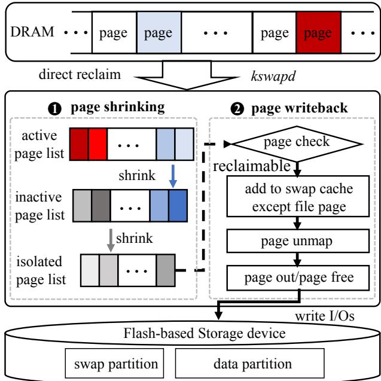  
Figure 1: Traditional kernel-level memory reclaim path on mobile device

Although LMKD effectively alleviates memory pressure, killing processes cause loss of the application context and long restart of applications. By contrast, kernel-level memory swapping and direct reclaim are preferred [29, 31, 34]. Recently, mobile device manufacturers, such as Samsung [43], Huawei [21], have included flash-based memory swapping for memory expansion [1,21,43,54]. Figure 1 shows that both memory swapping and direct reclaim follow the two steps for page reclaim: (1) Page Shrinking and (2) Page Writeback.

Page Shrinking. The kernel organizes memory pages into four LRU page lists per memory zone for each NUMA node: inactive anonymous page list, active anonymous page list, inactive file page list, and active file page list. When memory reclaim is triggered, the kernel demotes infrequently used pages from the active page list to the inactive page list, as well as takes out infrequently used pages from the inactive page list for page writeback. Whenever memory reclaim occurs, the kernel calculates the scan ratio for each page list. The nr array logs the scanned page count for each page list. Specifically, the kernel executes page shrinking in two steps: First, memory swapping or direct reclaim determines the total number of pages to be reclaimed (nr\_to\_reclaim) and the number of pages to be scanned for each round nr\_to\_scan. Second, the kernel scans all four LRU lists for nr\_to\_scan pages. The scan continues until the array nr is empty or the reclaimed pages (nr\_reclaimed) reach the reclaim target. The victim pages found during the scan are added to the temporary page\_list to be written back later.

Page Writeback. Once the pages are collected, the kernel performs page-by-page writeback, involving the following steps: First, the kernel performs a page check to confirm whether it can enter the subsequent reclaim process, including page references, page locks, etc. Second, when the page passes the check, the anonymous page is added to the swap cache and allocated a page table entry of swap space. Third, the system performs page unmap and page out for both anonymous and dirty file pages. Specifically, page unmap sets the page table entry mapping the anonymous page to the previously allocated swap type table entry or clears the process page table entry mapping the file page. Page out calls page->mapping->a\_ops->writepage in the page descriptor to write back the page asynchronously. Finally, the page reclaim is complete, and the memory space occupied by the page is free.

## 2.2 Preliminary Study of Memory Reclaim

To understand the performance characteristics of the memory reclaim process, we performed extensive experiments on multiple mobile devices equipped with different sizes of memory and storage, including Google Pixel 5, Redmi Note 11 and Google Pixel 6 pro, as shown in Table 1. The experiments involve popular applications to reflect realistic user scenarios. Detailed experimental settings can be found in Section

5. We enabled flash-based swapping with a 2 GB swap partition on all these mobile devices. Our evaluation consists of two parts: First, we measure the frequency of the LMKD process and its impact on application response time. The time refers to the system’s duration on transitioning from one application running in the foreground to another, showing the need for efficient memory reclaim. Second, we demonstrate the limitations of the current memory reclaim performance by showing that it fails to keep pace with the growth of app memory footprints.

Table 1: Mobile Devices Under Evaluation.
<table><tr><td rowspan=1 colspan=1>Model</td><td rowspan=1 colspan=1>GooglePixel 5</td><td rowspan=1 colspan=1>RedmiNote 11</td><td rowspan=1 colspan=1>GooglePixel 6 pro</td></tr><tr><td rowspan=1 colspan=1>CPU</td><td rowspan=1 colspan=1>QualcommSnapdragon 765G</td><td rowspan=1 colspan=1>MediaTekDimensity 810</td><td rowspan=1 colspan=1>Google Tensor</td></tr><tr><td rowspan=1 colspan=1>Memory</td><td rowspan=1 colspan=1>8GB</td><td rowspan=1 colspan=1>6GB</td><td rowspan=1 colspan=1>12 GB</td></tr><tr><td rowspan=1 colspan=1>Storage</td><td rowspan=1 colspan=1>128 GB/UFS 2.1</td><td rowspan=1 colspan=1>128 GB/UFS 2.2</td><td rowspan=1 colspan=1>256 GB/UFS 3.1</td></tr><tr><td rowspan=1 colspan=1>System</td><td rowspan=1 colspan=1>Android 13(Kernel 5.10)</td><td rowspan=1 colspan=1>Android 13(Kernel 5.10)</td><td rowspan=1 colspan=1>Android 13(Kernel 5.10)</td></tr><tr><td rowspan=1 colspan=1>Announced</td><td rowspan=1 colspan=1>2020,September</td><td rowspan=1 colspan=1>2022,January</td><td rowspan=1 colspan=1>2021,October</td></tr></table>

## 2.2.1 Frequent, Expensive Process Killing

To quantify the execution behaviors of LMKD, we composed a workload that switches back and forth among 36 applications with various app-use durations and employed the logcat command [11] to collect LMKD killing events. To avoid bias, we present the average of ten rounds of application response time.

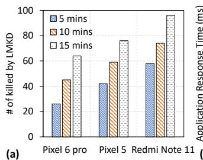

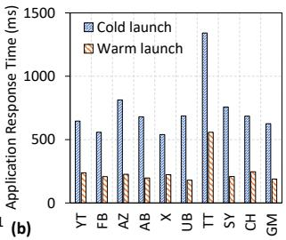  
Figure 2: Frequent occurrences of LMKD have a large negative impact on application responsiveness. (a) Many processes are killed among different mobile devices; (b) Applications suffer from long restart latency when the processes are killed on Pixel 6 pro. (YT: YouTube, FB: Facebook, AZ: Amazon, AB: Angry Birds, X: Twitter, UB: Uber, TT: TikTok, SY: Spotify, CH: Chrome, GM: Gmap.)

As shown in Figure 2(a), even though the newest Pixel 6 pro has 12 GB of DRAM, it still experienced 26 process killings after five minutes of workload replay, with more processes being killed by LMKD as the workload ran longer. By contrast, because Pixel 5 and Redmi Note 11 feature small amounts of DRAM, they experienced more LMKD killings under the same workload. Here, switching to an application killed by

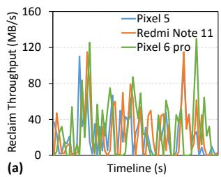

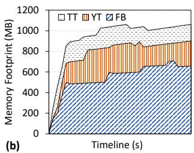  
Figure 3: Low memory reclaim throughput accompanying growing memory requirements of applications. (a) Memory reclaim throughput barely improves on fast storage; (b) Extremely high memory demands of applications.

LMKD requires a restart (cold launch). Figure 2(b) shows that the application response time is 3.1 times longer on average than the latency of the warm start of the application, that is, switching to a live cached application. The frequent LMKD killing events degrade application responsiveness and severely impact user experience. Considering the triggering conditions of LMKD mentioned above, frequent LMKD comes from the ineffective kernel-level memory reclaim that fails to alleviate memory pressure in time.

## 2.2.2 Sluggish Memory Reclaim

To confirm that kernel-level memory reclaim does not match app memory demands, we measured kernel reclaim throughput and app runtime memory footprint. Once the system performs memory reclaim, the kernel writes dirty file pages and anonymous pages back to the storage device. Considering that other processes in the system will also perform write operations for file pages during the memory reclaim, we employ the write throughput of the swap partition as a reliable indicator of the memory reclaim throughput, And there is indeed a high percentage of reclaimed anonymous pages that need to be written back to the swap partition [50].

Figure 3 shows our two findings. First, as shown in Figure 3 (a), memory reclaim throughput fluctuates below 80 MB/s most of the time, and interestingly, reclaim performance remains consistently low across different generations of mobile devices. Specifically, while Pixel 6 pro features faster flash storage than Pixel 5 (UFS 3.1 versus UFS 2.1), the average reclaim throughput of Pixel 6 pro is only 10% higher than that of Pixel 5. On the other hand, Figure 3(b) shows that the memory footprint size of three popular applications expands quickly during the initial startup phase, reaching between 400 MB and 1 GB. It is evident that the memory reclaim process falls far behind the application memory demands.

In summary, while app memory footprint is increasingly high, the hardware advance does not benefit the efficiency of kernel memory reclaim. This inefficiency results in frequent LMKD killings, which has a negative impact on the user experience. These findings direct our further investigation toward analyzing the memory reclaim procedure.

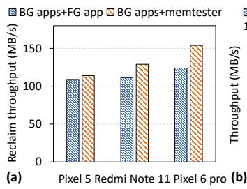

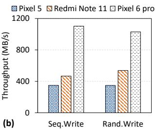  
Figure 4: (a) I/O performance w/ or w/o I/O conflict. (b) Random and sequential write throughput with 4 KB I/Os.

## 3 Performance Bottleneck Analysis

As mentioned in Section 2.1, the kernel-level memory reclaim involves scanning kernel pages and accessing the flash storage. Based on these two key steps, we examine the root causes of memory reclaim stalls.

## 3.1 I/O Utilization

Intuitively, the stagnant memory reclaim may be first attributed to poor I/O performance, which includes two aspects: I/O conflicts and the storage device itself. According to previous studies, the write I/Os of memory reclaim may conflict with the read I/Os of other processes, and I/O conflicts are considered to be an important factor affecting application performance [18, 30, 39]. However, the storage bandwidth determines the upper limit of the memory reclaim.

## 3.1.1 Low Impact of I/O Conflicts

To quantify the impact of I/O conflicts on memory reclaim, we conducted two workload scenarios: (1) Saturating memory pressure by running multiple background applications and provoking memory reclaim by switching applications to foreground (BG-apps+FG-app); (2) Running background applications and use the memtester command [48] to allocate memory and provoke memory reclaim (BG-apps+memtester). BG-apps+FG-app represents a scenario in which memory reclaim suffers from intensive I/O conflicts because switching applications to the foreground involves reads from the storage. In contrast, memory reclaim requires writing pages to the flash storage. BG-apps+memtester represents another scenario in which memory reclaim is almost free from I/O conflicts because memtester requests for memory without generating additional read I/O operations.

Figure 4 (a) shows the peak memory reclaim throughput under both workloads on different mobile devices. Taking Pixel 6 pro as an example, the peak reclaim throughput with memtester (light conflict) is only 8.3% higher than the throughput with switching applications to the foreground (severe conflicts), and similar results are displayed by Pixel 5 and Redmi Note 11. In other words, I/O conflicts have a low impact on memory reclaim throughput. This is because reads are much faster than writes in flash storage, and under I/O conflicts, they only lightly affect the latency of swap writes [47].

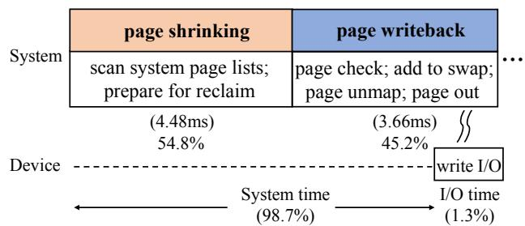  
Figure 5: Average time breakdown of memory reclaim path.

## 3.1.2 Excessive Storage Bandwidth

Storage bandwidth is also a critical factor for overall I/O performance. We measure the write throughput of flash storage using the fio tool [2], with the results shown in Figure 4(b). The internal 128 GB UFS 2.1 flash storage in the lowest profile Pixel 5 achieves a random write throughput of 378 MB/s, three times higher than the memory reclaim throughput reported in the previous section. By contrast, the high-profile Pixel 6 pro with UFS 3.1 flash storage demonstrates an even greater capability, achieving throughput at around 1000 MB/s for random and sequential writes. In other words, the memory reclaim process significantly under-utilizes the storage bandwidth, suggesting the inefficiency lies within the system software rather than the hardware.

## 3.2 Sub-optimal Memory Reclaim Path

To identify bottlenecks in the memory reclaim path, we dissect the time overhead by measuring the delay of each major step using the kernel command ktime [3].

## 3.2.1 Sequential Execution of Key Steps

Figure 5 shows a breakdown of the total memory reclaim latency, contributed by page shrinking and page writeback: First, for each round of memory reclaim, the page shrinking step spends 4.48 ms on average, which accounts for 54.8% of the total memory reclaim time. The page writeback step contributed to the rest 45.2%, using 3.66 ms on average. Interestingly, although the page shrinking step does not involve any I/Os, it uses more than one-half of the total latency just to prepare victim pages for reclamation. Second, each round of page reclaim goes through a serial flow of page shrinking and page writeback, i.e., page writeback must wait until victims have been prepared by page shrinking. In other words, this sequential execution flow significantly limits the potential benefits of enhanced flash storage performance in improving memory reclaim efficiency.

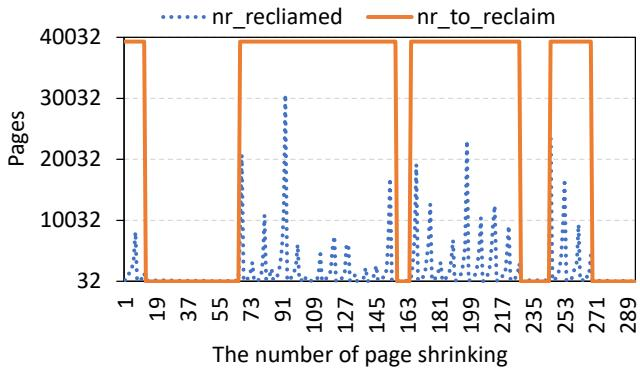  
Figure 6: nr\_to\_reclaim vs nr\_reclaimed when system performs memory reclaim.

## 3.2.2 Inefficient Page Shrinking

As mentioned earlier, the kernel-level memory reclaim consists of memory swapping and direct reclaim. For memory swapping, the expected number of pages reclaimed in each round of invocation is the maximum of SWAP\_CLUSTER\_MAX and watermark\_high (whose default value is 39340 pages, approximately 154 MB). For direct reclaim, this value is SWAP\_CLUSTER\_MAX, 32 pages by default.

Figure 6 illustrates the expected number of pages to be reclaimed (nr\_to\_reclaim) versus the actual number of pages reclaimed (nr\_reclaimed) during runtime. When memory swapping executes, although it is expected to reclaim 39,340 pages, the actual number it reclaims is far fewer than the expected value. This is because, during memory reclaim, the page shrinking step examines nr\_to\_reclaim LRU pages in the kernel page lists, but only a small portion of these pages can be reclaimed. Specifically, pages that have been recently referenced or are locked for page writeback cannot be reclaimed. Additionally, page shrinking terminates early if it experiences highly unbalanced scanning between anonymous pages and file pages [14]. As a result, page shrinking is repeatedly invoked to gather sufficient reclaimed pages, making the entire procedure inefficient.

## 3.2.3 Internally Blocked Page Writeback

Page writeback is responsible for performing the actual page reclaim based on the page type, including page checking, unmapping victim pages, and writing the pages to storage, etc. Intuitively, I/Os for page writing may be the performance bottleneck, but our analysis reveals a different result.

Figure 7 shows a breakdown of the page writeback step into unmapping pages and writing pages (page out). Unexpectedly, the time overhead of page unmap is relatively high and extremely unstable. This is because to unmap a page, page table entries of all processes that share the page must be modified through a reverse mapping mechanism, and this procedure is prone to interruption, so its completion time is extremely unstable [34]. Moreover, not only unmapping but also writing of pages is performed page by page. Writing flash at the page granularity is inefficient and slows down the whole writeback step.

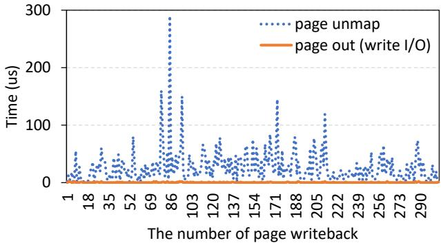  
Figure 7: Time breakdown of page writeback (the time of page out is not zero but fluctuates under a few microseconds).

In summary, sluggish memory reclaim is mainly due to the sub-optimal memory reclaim path, including three aspects: (1) page writeback waits on the results of page shrinking, introducing unnecessary delays; (2) page shrinking suffers from inefficient reclaim and repeated invocation; (3) page unmap latency is highly unstable and produces small writes that cannot unleash the potential of flash storage.

## 4 PMR Design

## 4.1 Overview

The basic idea is of PMR to parallelize key steps of memory reclaim to fulfill application memory demand and thus improve application response. Intuitively, there are two typical ways to perform parallel memory reclaim. First, the kernel can create multiple memory reclaim threads, e.g., Mutiplekswapd [36] wakes up multiple kswapd threads to perform memory swapping to relieve memory pressure. Second, it is possible to exploit the performance advantage of flash storage through bulk I/Os. For example, SEAL [29] performs memory swapping in units of applications, rather than page by page. However, for the former, multi-threaded memory reclaim is prone to conflict with each other and burden the CPU because they occur simultaneously. For the latter, simply increasing the I/O size still does not resolve the suboptimal execution flow of memory reclaim. Unlike previous work, PMR parallelizes key steps in the memory reclaim path based on observations in Section 3.2.

To realize the basic idea, PMR consists of two components: proactive page shrinking (PPS) and storage-friendly page writeback (SPW). Figure 8 shows an overview of PMR. PPS decouples page shrinking and page writeback to prepare sufficient victim pages in advance, and it includes a kernel thread kshrinkd and a victim page list to perform page shrinking independently. Specifically, its operation involves three steps:

(❶) Based on pre-defined conditions, kshrinkd is activated. (❷) An independent page shrinking procedure moves pages from the system page LRU lists to the victim page list. (❸) The new victim page list is carefully maintained to ensure sufficient pages are provided for page writeback.

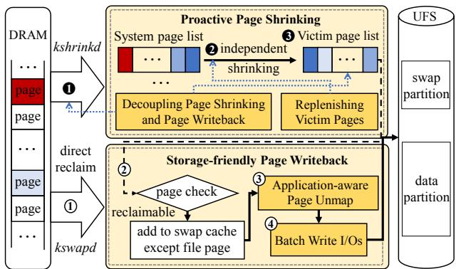  
Figure 8: Overview of PMR.

SPW performs application-aware page unmap, and batches write I/Os for efficient page writeback. It redesigns the page unmap process to align with storage-friendly I/O sizes, enabling bulk writes that exploit the internal parallelism of flash storage. Specifically, it works in four steps: (①) When the system runs low on memory, kswapd or direct reclaim is triggered for memory reclaim. (②) Unlike the existing design, page writeback is triggered immediately since kshrinkd may already have prepared sufficient pages in the victim list. (③) Reclaimable pages undergo application-aware page unmap. (④) A batch of unmapping pages are written to flash storage through efficient bulk I/Os.

There are two key challenges in the implementation of PPS and SPW. First, kshrinkd is supposed to prepare sufficient victim pages, subject to the timing of the shrinkage and the granularity of each. The shrinking must be carefully timed to avoid conflicts between page shrinking and other processes accessing pages. The shrinking granularity should meet the need to reclaim memories without creating waste. And the victim page list needs careful maintenance to control overhead. Second, the batch size of the application-aware page unmap must be carefully controlled. The batch size should be sufficiently large to ensure efficient write I/Os, yet not so large as to introduce unnecessary delays in page writeback. The following sections detail the design of PPS and SPW.

## 4.2 Proactive Page Shrinking

To produce an adequate supply of victim pages for page writeback at a low cost, PPS decouples page shrinking and page writeback and carefully determines the timing and granularity of page shrinking.

## 4.2.1 Decoupling Page Shrinking and Page Writeback

Existing kernel-level memory reclaim follows the sequential flow of page shrinking first and then page writeback. When the system suffers memory pressure, page shrinking first isolates victim pages to the temporary page\_list, and page writeback performs subsequent page reclaim.

Two challenges arise regarding the decoupling of page shrinking and page writeback. First, current page shrinking and page writeback are operated by the same thread. Concurrent execution of the two steps is required to achieve the decoupling. Second, the existing page shrinking design uses function isolate\_lru\_pages to temporarily remove eligible pages from the system LRU page lists for subsequent page writeback. With decoupled page shrinking and page writeback, access to the eligible pages between page shrinking and page writeback requires coordination. To address these two challenges, firstly, page shrinking is offloaded to a new kernel thread kshrinkd, and page writeback is left to memory swapping and direct reclaim. Secondly, the temporary page\_list isolated by page shrinking have been redesigned as a new victim page list to coordinate the page production and consumption between kshrinkd and page writeback.

Independent kshrinkd Thread. kshrinkd is designed to perform page shrinking independently and prepare sufficient victim pages in advance. We standardize kshrinkd runtime rules to achieve this goal. First, the triggering of kshrinkd, no longer depends on memory pressure, but on whether enough victim pages are prepared. When the system faces memory pressure, kernel-level memory reclaim directly accesses the pages produced by kshrinkd to perform page writeback. Second, unlike existing page shrinking, which may terminate early without producing the expected number of victim pages, such as when nr\_anon or nr\_file are zero, our enhanced kshrinkd uses a continuous scanning loop to ensure the target is reached. Finally, to minimize changes to the kernel, kshrinkd inherits the page shrinking algorithm from the existing memory reclaim, e.g., calculating the number of pages that need to be scanned for each LRU page list.

Victim Page List Maintenance. When page shrinking and page writeback can be done in parallel with the help of kshrinkd, we need to consider how to preserve the victim pages that were produced by kshrinkd. The traditional LRU isolation mechanism is limited by factors such as lock contention, and the number of pages that can be isolated each time is limited. Based on this, we maintain a new victim page list and filter eligible pages from the system LRU list by kshrinkd, including those pages that are not locked and not frequently referenced. Specifically, we use a reserved bit in the page table entry to record these pages as isolated pages (PG\_ISOLATED). And kshrinkd will move these pages from the system LRU list to the victim page list. Also, to avoid access conflict to the victim page list, lightweight spinlocks are used to ensure normal page accesses for kshrinkd and page writeback. In this way, we can reserve sufficient pages in the victim page list to perform efficient page isolation services for subsequent page writeback.

Algorithm 1: Always Ready Page Shrinking   
Input: nr\_victim\_page: the actual number of pages in the victim   
page list (The initial value is 0);   
nr\_ideal\_victim\_page: the ideal number of pages in the victim page   
list (The initial value is δ);   
shrink\_size: the number of page shrinking each time ;   
if System Start then   
while nr\_victim\_page < nr\_ideal\_victim\_page do   
kshrinkd starts;   
shrink\_size = nr\_ideal\_victim\_page ;   
kshrinkd sleep;   
Once page writeback is required, provide victim pages;   
if Memory Swapping or Direct Reclaim Start then   
while nr\_victim\_page < nr\_ideal\_victim\_page do   
kshrinkd starts;   
shrink\_size = nr\_to\_reclaim ;

## 4.2.2 Replenishing Victim Pages

The decoupling of page shrinking and page writeback introduces the challenge of ensuring that kshrinkd maintains an adequate supply of victim pages for page writeback. To address this challenge, a new control loop is introduced, as detailed in Algorithm 1, which describes our always-ready page shrinking procedure. At system startup, kshrinkd is activated, and it continues the collection process until nr\_ideal\_victim\_page pages have been inserted into the victim page list. Once this target is met, kshrinkd transitions to a sleep state. On memory reclaim requests, the victim pages from the new page list are isolated for page writeback, while in the meantime, the page shrinking procedure is reactivated to replenish victim pages. This ensures a consistent supply of victim pages for writeback, maintaining system efficiency and readiness. Further details are discussed below.

Page Shrinking Watermark. To ensure sufficient victim pages, we set a page shrinking watermark. The parameter nr\_ideal\_victim\_page (i.e., δ in Algorithm 1) specifies the target number of victim pages that should be maintained in the new victim page list. To prevent delays in page writeback due to insufficient victim pages, nr\_ideal\_victim\_page must be large enough, and its value should be carefully determined through an analysis of application responsiveness. Our sensitivity study in Section 5.5 recommends an empirical setting of 462 MB, ensuring a sufficient supply of victim pages for efficient memory reclaim.

Timely Page Shrinking. The efficiency of our page shrinking design depends on both the timing of kshrinkd activation and the batch size of page shrinking. Unlike the on-demand approach of existing memory reclaims designs, which is triggered by low watermarks or allocation rates, our design activates page shrinking ahead of memory bursts. At system startup, kshrinkd collects victim pages until nr\_victim\_page reaches nr\_ideal\_victim\_page, then enters a sleep state. Later, when system memory reclaim is invoked, even if the victim page list is not yet empty, kshrinkd is reactivated for parallel execution. In this case, the shrinking batch size is set to nr\_to\_reclaim, one third of nr\_ideal\_victim\_page, and iterations continue until nr\_ideal\_victim\_page victim pages have been prepared in the list.

In the design of PPS, the system needs to maintain a victim page list as a communication bridge between page shrinkage and page writeback. To circumvent page thrashing (between the system LRU list and the victim page list), a novel page type, the isolated page, is introduced as the victim page selection criterion for page shrinking. This inevitably raises concerns about the performance overhead of maintaining these pages. However, PPS merely screens isolated pages in advance, which can enhance the efficiency of page isolation operations. Furthermore, the parameter nr\_ideal\_victim\_page determines whether the system can provide sufficient victim pages for writeback. The default setting of 462 MB is equivalent to three times the fixed number of pages for each memory swapping. Although different applications appear to require different amounts of memory to be reclaimed, it is challenging to set different default settings according to the types of applications. The current fixed default values are derived from sensitivity experiments and are committed to ensuring the performance of most applications. A more detailed maintenance design of the victim page list will be the focus of future work.

page check  page locked + interruptible overhead
<table><tr><td rowspan=1 colspan=1>-------</td><td rowspan=1 colspan=1></td><td rowspan=1 colspan=1>U</td><td rowspan=1 colspan=1>W</td><td rowspan=1 colspan=1></td><td rowspan=1 colspan=1></td><td rowspan=1 colspan=1>U2W2</td><td rowspan=1 colspan=1></td><td rowspan=1 colspan=1>U3</td><td rowspan=1 colspan=1>W3</td></tr></table>

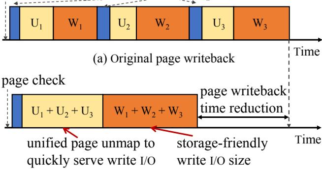  
(b) Storage-friendly page writeback  
Figure 9: Page writeback scenarios with and without storagefriendly page writeback. Ui is the ith page unmap, and Wi is the corresponding write I/O. SPW expedites paged writeback by exploiting the parallelism of flash storage devices.

## 4.3 Storage-friendly Page Writeback

A victim page must first be unmapped before being written back to the flash storage. Even though our page shrinking design collects batches of victim pages (i.e., nr\_to\_reclaim), with the existing page writeback procedure, pages are written back to flash storage in a page-by-page manner (4 KB each). In addition, as previously detailed in Section 3.2.3, the page unmap process suffers from highly unpredictable delays, affecting page writeback efficiency. To address these performance issues, SPW introduces application-aware page unmap followed by batched page-out (page writeback).

Figure 9 compares the original page writeback process and our SPW design. Unlike the original approach, SPW separately clusters page unmap operations and page write actions. The clustered page unmap, called an application-aware unmap, mitigates the cost of locking, avoids interference from other contending processes, and accumulates multiple pages for storage-friendly write I/Os. Subsequently, pages can be written back through bulk write I/Os, which better exploits the internal parallelism of flash storage.

## 4.3.1 Application-aware Page Unmap

There have been prior methods for resizing unmap job sizes to avoid interference from other processes and kernel activities [34]. In contrast, SPW takes a different approach by introducing an application-aware page unmap to enable storagefriendly write I/O operations. The core idea is to organize pages based on their associated processes and determine the unmap job size according to the performance characteristics of the underlying flash storage. Specifically, the applicationaware unmap design must carefully handle interrupts to avoid long tail latency and exploit the performance gains of bulk write I/Os on flash storage, effectively balancing throughput and latency.

To minimize interference from other processes and kernel activities and improve the unmapping efficiency, SPW exploits the big-LITTLE processor architecture commonly found in modern mobile devices [46]. Specifically, in addition to increasing the job size for page unmap, SPW assigns a high priority to the page unmap thread and affiliates the thread with a big core, ensuring that the thread is not preempted during execution. With the privileged execution of the application-aware unmap procedure secured, the next focus is on determining the optimal job size for the unmap procedure based on the performance efficiency of flash storage.

## 4.3.2 Batch Write I/Os

Application-aware page unmap removes the obstacle for implementing bulk write I/Os, which can improve the efficiency of memory reclaim by utilizing the parallelism of storage devices. Next, we analyze the characteristics of flash-based storage devices to find the most cost-effective I/O size.

As shown in Figure 10, write throughput improves with larger I/O sizes, though the improvement is non-linear. The marginal gain saturates when I/Os are large enough to fully utilize parallelism, but increasing the I/O size further introduces high latency. On the Google Pixel 6 pro, a 10 MB I/O size achieves 1261 MB/s, effectively balancing throughput and latency. Interestingly, cumulative write throughput does not benefit from additional threads due to lock contention. Based on these insights, our design collects unmapped pages from the new victim page list and composes them into bulk write I/Os based on the device-specific size. To address potential performance challenges with larger unmap sizes, a sensitivity analysis of this parameter will be presented in Section 5.5, to ensure an efficient balance between unmap and writeback performance.

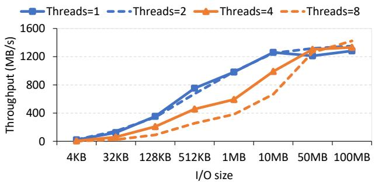  
Figure 10: The throughput for random writes varies with the sequential block size and the number of threads in flash memory on Google Pixel 6 pro.

While the existing kernel handles pages individually, our SPW technique batches page unmapping and submits groups of pages to the block layer in bursts. As SPW simply increases the granularity of page unmapping, it inherits the page check and lock mechanisms from the existing kernel with minimal modifications. Our SPW is also orthogonal to the I/O plugging [24] mechanism, which operates at the block layer and is opaque to the page reclaiming process. By contrast, our SPW prepares batched I/O at the system software layer, allows more precise timing control, accelerating I/O submission and reducing merge latency.

## 4.4 Implementation and Discussions

Implementation Detail. Our implementation of PMR follows the principle of a minimally invasive approach, reusing existing kernel functions whenever possible. This section focuses on PMR’s implementation aspects.

To implement kshrinkd for page shrinking, the kshrinkd\_init function is executed as part of the kernel initialization process within start\_kernel. Within kshrinkd\_init, kthread\_run is invoked to create a kshrinkd thread for each memory node, similar to kswapd. The page shrinking mechanism previously managed by kswapd is transferred to kshrinkd, with its activation now depending on the insufficiency of pages in the new victim page list, rather than the original kswapd activation conditions. Additionally, a new page list type, LRU\_VICTIM, is introduced as an intermediary between page shrinking and page writeback. The kshrinkd thread scans the original LRU page lists and moves eligible victim pages to the new list, enabling page writeback to swap out these pages efficiently. To further optimize performance, the page unmap mechanism performs batch page writes based on the device-optimal I/O size. Using the /proc interface, our implementation allows for dynamic adjustment of the unmap unit size (mem\_unmap\_unit) on-the-fly.

Orthogonality. To keep our design simple and focused, several default memory reclaim settings are retained in this paper. First, although studies have shown that LRU-based page replacement strategies may not be optimal [32,34,51], our implementation inherits the default LRU-based victim page selection strategy. This decision is based on the fact that PMR is compatible with any page selection strategy and achieves performance improvements regardless of the strategy used. Second, as previous studies have extensively explored optimizing the trigger conditions for memory reclaim [19, 27, 30, 58], we choose not to modify them. Instead, PMR focuses on accelerating the execution of memory reclaim and serves as a complementary approach to these efforts. Finally, despite research on optimizing memory reclaim by adjusting its size [32, 50], we do not modify the original kernel setting, as PMR operates with its own job size for page shrinking and page writeback. Future Use Cases of PMR. The deployment of large language models (LLMs) [6, 37, 55] on mobile devices imposes significant memory pressure on mobile systems, leading to severe performance degradation for such memory-demanding applications. On the other hand, the performance of mobile storage devices based on NAND flash has seen significant improvements, with the latest UFS 4.0 delivering a 1.8 times higher I/O bandwidth compared with UFS 3.1 [4, 8, 38, 45]. With such a high flash storage bandwidth, there is great potential to reshape the memory reclaim process.

## 5 Evaluation

## 5.1 Experiment Setup

Evaluation Platforms and Workloads. We adopt different real mobile devices as our experiment platform, as mentioned in Table 1, and flash-based memory swapping is enabled for memory swapping on these mobile devices, and the swap partition is set to 2 GB.

Experiments are conducted by following the three steps: (1) We installed the pre-selected 36 applications (10 switching applications and 26 background running applications) on the device to begin each experiment. (2) We used adb [9] command to collect evaluation results while performing automated tests with UI Automator [53] that emulates UI touches of users. adb is a versatile command-line toolkit, and we can use the command "adb shell starts the app’s package name (PKN)" to start apps and record the launch latency. UI Automator is adopted to generate pseudo-random streams of user events, such as clicks, touches, or gestures, as well as a number of system-level events. The app’s PKN and the total number of user events we want to generate are provided to run this tool. Specifically, we use UI Automator to run background applications and adopt adb to switch the selected ten applications and record the launch latency as response time. We performed the same automated tests in ten rounds and calculated the average to avoid basis. The order of application switching is changed randomly in each round.

Table 2: Applications and automated user interaction.
<table><tr><td rowspan=1 colspan=1>Category</td><td rowspan=1 colspan=1>Foreground Applications</td><td rowspan=1 colspan=1>Auto user inputs</td></tr><tr><td rowspan=1 colspan=1>Browser</td><td rowspan=1 colspan=1>Chrome</td><td rowspan=1 colspan=1>Browse/Read posts</td></tr><tr><td rowspan=1 colspan=1>Social Network</td><td rowspan=1 colspan=1>Facebook,Twitter</td><td rowspan=1 colspan=1>Browse/Read posts</td></tr><tr><td rowspan=1 colspan=1>Multimedia</td><td rowspan=1 colspan=1>YouTube,Tiktok</td><td rowspan=1 colspan=1>Watch videos</td></tr><tr><td rowspan=1 colspan=1>Business Utility</td><td rowspan=1 colspan=1>Amazon,Gmap,Uber,Spotify</td><td rowspan=1 colspan=1>Browse and searchListen music</td></tr><tr><td rowspan=1 colspan=1>Game</td><td rowspan=1 colspan=1>Angry Birds</td><td rowspan=1 colspan=1>Play a stage</td></tr></table>

∗Background applications: Browser (Firefox, Opera), Social Network (WhatsApp, Instagram, Skype, WeChat, LinkedIn), Multimedia (Spotify, MXPlayer, Netflix, Capcut), Online shopping (Taobao, eBay, AliPay, BOA, Paypal), Business Utility (Booking, Gmail, New York Times, BBC News, OfficeMobile, GoogleDrive), and Game (Hill Climb Racing, Boom Beach, ClashRoyale, Call of Duty).

Evaluated Schemes. Five schemes are implemented and measured to show the effectiveness of PMR. 1) Original Memory Reclaim (OriginalMR) represents the baseline of evaluation, which is inherited from native Linux. Inefficient memory reclaim results in memory pressure and cannot be relieved in time, causing processes to be killed frequently. 2) Acclaim [32] represents the state-of-the-art work that is closest to this study, which relocates free pages from background applications for foreground applications and adjusts the size of kswapd according to the predicted allocation workloads. 3) Fleet [19] represents the latest memory reclaim optimization idea on mobile devices, which proposes a foreground-aware GC-swap to combine Android Runtime (ART) GC and kernelbased memory swapping. 4) PMR represents our proposed framework, which combines PPS and SPW.

## 5.2 Application Response Evaluation

To understand the benefit of PMR on application performance, application response time is evaluated among existing memory reclaim schemes. Application switching may expose memory reclaim when the system is under memory pressure. Different memory reclaim schemes can lead to different application response times due to performance differences. It is a critical performance metric for smartphone users.

Figure 11 shows the application response time of the evaluated schemes. First, OriginalMR suffers the worst response time, several times higher than other schemes. This is because when the system is under memory pressure, original memory reclaim fails to relieve memory pressure in time, and the system tends to kill the application. In this case, the application response time is equivalent to a cold launch. Second, Acclaim and Fleet reduce the response time by an average of 32.4%, 35.7% compared to OriginalMR, respectively. This is because Acclaim reduces direct reclaim and page fault by a foreground-aware page eviction and a dynamical size of the kswapd. Fleet designs kernel-based memory swapping and ART GC together to avoid mutual interference between different levels of the system memory reclaim.

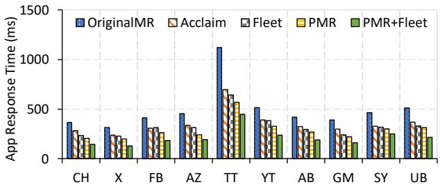  
Figure 11: Application response time among different memory reclaim schemes on Google Pixel 6 pro.

Unlike previous works, PMR achieves fast memory reclaim to boost application response by proactive page shrinking and storage device-friendly write I/O. The application response time decreases significantly compared with OriginalMR, with the decreases reaching 43.6%. Also, PMR also has significant performance improvements over Acclaim and Fleet. More importantly, thanks to PMR’s focus on improving the common memory reclaim path, it is perfectly complementary to both Acclaim and Fleet. For example, when PMR and Fleet are used together, application response time is reduced by 67.4% compared to OriginalMR and improved by 38.9% compared to Fleet alone. This is because Fleet effectively improves the accuracy of memory reclaim and avoids invalid memory reclaim, while PMR can speed up memory reclaim.

## 5.3 Memory Reclaim Evaluation

To further understand the performance improvement brought by PMR to application responsiveness, we separately evaluated the memory reclaim throughput and other performance indicators of the system during the following experiments, including the number of LMKD, direct reclaim, and page faults. On the one hand, memory reclaim throughput can intuitively see the benefits of memory reclaim in ensuring system memory availability. On the other hand, the number of LMKD indicates the efficiency with which the system memory pressure is alleviated. In contrast, direct reclaim and page fault indicate the impact of memory reclaim on the application [32]. Note that in this subsection, since Acclaim also focuses on kernel-level memory reclaim optimization, we choose it as the state-of-the-art work for comparison, rather than Fleet, which focuses on the joint design of ART GC and memory swapping.

## 5.3.1 Memory Reclaim Throughput

Figure 12 shows the memory reclaim throughput under different mechanisms. First, the memory reclaim throughput of OriginalMR and Acclaim shows the same trend. That is, it changes in a very low range. The reason why OriginalMR suffers this performance loss has been revealed previously. Acclaim is committed to reducing the number of direct reclaim and page faults and does not optimize the memory reclaim path, so it also fails to improve memory reclaim throughput. Secondly, compared with previous work, PMR benefits from a parallelized memory reclaim path, which not only avoids passive waiting for page writeback, but also accelerates the traditional page writeback. The results show that the peak memory reclaim throughput of PMR is increased by 82.8% and 75.5% respectively compared with OriginalMR and Acclaim. The huge improvement in memory reclaim throughput shows that PMR can perform memory reclaim at a faster speed, which explains the performance improvement of PMR in terms of application response time. Also, since Fleet focuses more on the accuracy of memory reclaim and does not essentially affect the reclaim throughput, it was not chosen as the comparison object in the following experiments.

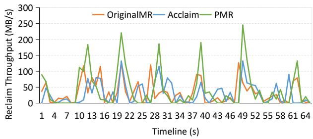  
Figure 12: Memory reclaim throughput among different schemes.

## 5.3.2 Reduction of LMKD/Direct Reclaim/Page Fault

LMKD can cause applications to suffer long restart delays. Direct reclaim, which is a synchronous memory reclaim, has a direct impact on application allocation page requests. Page faults can cause long page reads. To understand the improvement of application response due to PMR, we further analyze the above three performance indicators.

Figure 13 shows the number of LMKD, direct reclaim and page fault under different memory reclaim schemes. First, OriginalMR suffers the most from LMKD, direct reclaim, and page faults. Acclaim benefits from foreground-aware memory reclaim, which can effectively reduce the number of direct reclaim and page faults. However, it essentially does not effectively alleviate memory pressure, and LMKD still occurs frequently. Secondly, unlike Acclaim, PMR can effectively alleviate memory pressure with the help of fast memory reclaim and avoid the frequent occurrence of LMK. Compared with OriginalMR and Acclaim, PMR reduces LMKD by 82% and 54% respectively. Moreover, when memory swapping can effectively alleviate memory pressure, direct reclaim will naturally decrease, PMR reduces it by 45% compared to Acclaim. Since PMR does not change the victim selection page, the page fault rate remains the same as OriginalMR.

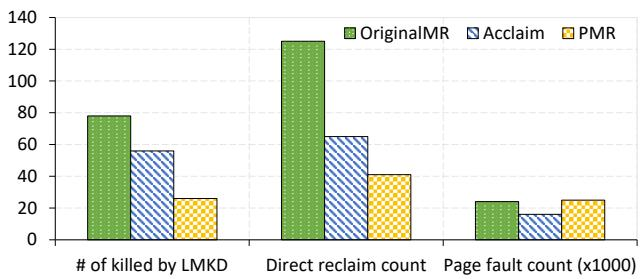  
Figure 13: The number of killed applications, direct reclaim and page fault among different schemes.

## 5.4 Storage Utilization Evaluation

In this subsection, we calculate the memory reclaim throughput on different mobile devices under the same application running condition to demonstrate the efficiency of PMR by taking advantage of evolving storage devices to improve the efficiency of memory reclaim. Specifically, Pixel 5 and Pixel 6 pro were selected as experimental platforms, with the former equipped with a 128 GB UFS 2.1 storage device and the latter equipped with a 256 GB UFS 3.1 storage device. Similar to the previous experiment, 26 applications were running in the background, and six applications were switched back and forth in the foreground, including YouTube, Facebook, Twitter, TikTok, Gmap and Camera. We collect the memory reclaim throughput during the switching of these six applications.

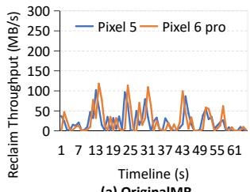

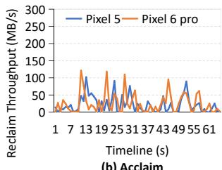

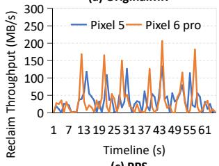

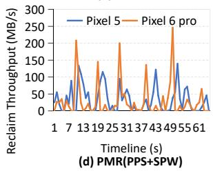  
Figure 14: Memory reclaim throughput for different schemes under different mobile devices.

Figure 14 shows the memory reclaim throughput of different memory reclaim mechanisms on different mobile devices. First, OriginalMR and Acclaim pay little attention to the performance improvements of storage devices. This is because Acclaim only focuses on optimizing the victim page selection scheme and dynamically adjusting the size of kswapd to reduce direct reclaim and page faults, lacking any design for storage devices. Secondly, compared with the previous mechanisms, the newly proposed PPS significantly improves the memory reclaim throughput, especially the performance of storage devices. For example, for Pixel 6 pro, the maximum throughput of PPS reaches 205 MB/s, which is an 45% increase compared to Pixel 5. Finally, the integration of PPS and SPW can not only provide sufficient victim pages for page writeback in advance, but also enable storage-friendly page writeback to maximize the storage device’s performance. The results show that the average throughput on the Pixel 6 pro is 65% of that on the Pixel 5.

## 5.5 Sensitivity Study

To further understand PMR, several sensitive studies are performed, including the ideal number of pages in the victim page list (nr\_ideal\_victim\_page: δ) and the size of the applicationaware page unmap.

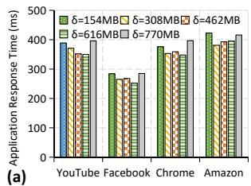

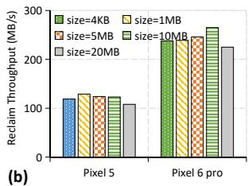  
Figure 15: (a) Application responsiveness by varying δ (the ideal number of pages in the victim page list); (b) Memory reclaim throughput by varying the size of the applicationaware page unmap.

The ideal pages in the victim page list: δ aims to control the capacity of the victim page list, which directly affects the performance of memory reclaim. Figure 15 (a) shows the effect of changing δ from 154 MB (equivalent to nr\_to\_reclaim) to 770 MB on the application response time. First, as δ increases, the application response time decreases and then increases again. δ is not as large as it should be. This is because a larger δ means that more pages are placed in the victim page list, and pages may face repeated transfers between the victim page list and the system LRU page list, which increases page access overhead. Second, the change in δ has a limited impact on the application’s responsiveness because the victim page list is inherited from the system LRU page list, which does not introduce new data structures or memory overhead.

The size of the application-aware page unmap: The size of the application-aware page unmap affects both the performance of the unmap and the efficiency of write I/O. Figure 15 (b) shows the effect of different sizes of the application-aware page unmap on the memory reclaim throughput. First, the optimal value for this size varies from one mobile device to another, for example, the Pixel 5 is 1 MB while the Pixel 6 pro is 10 MB, depending on the underlying storage device.

## 5.6 Overhead Analysis

In this section, we evaluate PMR’s overheads: (1) the performance overhead of PPS and SPW in the current design and (2) the flash write overhead induced by proactive disk writeback. Performance Overhead. The performance overhead of PMR is broken down into three parts. First, PPS enables an independent kshrinkd thread to be responsible for page reduction. However, because shrink can only inherit some of the functions of the original kswapd, while the kshrinkd brings CPU overhead, the CPU overhead of kswapd will also be reduced. Second, PPS maintains a separate victim page list. Although these pages come from the system’s original inactive page list, they will not cause new memory overhead. Also, to maintain a sufficient number of victim pages, some additional lock protection needs to be added, which also brings CPU overhead concerns. Finally, SPW adjusts the priority of application-aware page unmap to avoid interference by processes, which may also bring potential performance overhead. As shown in Table 3, PPS increases CPU overhead by 2.0% compared to OriginalMR, while PMR increases by 5.3%.

Table 3: Performance overhead.
<table><tr><td rowspan=2 colspan=1></td><td rowspan=1 colspan=3>CPU Overhead</td></tr><tr><td rowspan=1 colspan=1>kswapd</td><td rowspan=1 colspan=1>kshrinkd</td><td rowspan=1 colspan=1>Total</td></tr><tr><td rowspan=1 colspan=1>OriginalMR</td><td rowspan=1 colspan=1>24.31</td><td rowspan=1 colspan=1>0</td><td rowspan=1 colspan=1>24.31</td></tr><tr><td rowspan=1 colspan=1>PPS</td><td rowspan=1 colspan=1>13.94</td><td rowspan=1 colspan=1>10.97</td><td rowspan=1 colspan=1>24.91</td></tr><tr><td rowspan=1 colspan=1>PMR (PPS+SPW)</td><td rowspan=1 colspan=1>14.51</td><td rowspan=1 colspan=1>11.1</td><td rowspan=1 colspan=1>25.61</td></tr></table>

Flash Write Overhead. PMR is more effective in evicting pages, which allows it to reduce application kills. This results in more aggressive flash writes. To evaluate the possibility that excessive flash writes may wear out the flash device, we ran the system with and without PMR for half an hour and collected the write volumes. The experimental results show that PMR increases flash writes by 12.1% compared to OriginMR. In fact, as the storage capacity of mobile devices increases, the lifespan anxiety of storage devices has been greatly alleviated. The impact of PMR on flash device lifespan is negligible and worthwhile compared to the benefits.

## 6 Related Work

Memory Reclaim Optimization. Many previous works enhance the memory reclaim schemes [7, 20, 41, 44, 49, 52]. First, Fastswap [7] and Hermit [41] optimize how and where page reclaim is executed (e.g., offloading to a dedicated CPU or spawning threads), while our work improves what is executed, i.e., we redesign the reclaim path itself to make it inherently more efficient. This deeper improvement makes existing mechanisms like Fastswap and Hermit more effective. With our faster page reclaim, Fastswap no longer needs a dedicated CPU, and Hermit requires fewer threads for the same performance. Second, recent studies [27, 58] perform ahead-of-swap to optimize memory swapping. For example, SmartSwap [58] predicts the appropriate swap time based on the design model, and Marin [17] swaps out objects in advance by analyzing the objects working set. Unlike them, PMR does not modify the timing of memory reclaim, but only prepares the victim pages in advance.

Also, another method is to update the LRU-based victim page selection criteria [32, 34, 56] Since PMR is dedicated to accelerating the common memory reclaim path, it is compatible with any effective victim page selection algorithm. Multiplekswapd [36] enables multiple memory reclaim threads to perform proactive memory reclaim. However, blindly using multiple threads will induce mutual interference and will not achieve the expected reclaim effect, especially on mobile devices with limited resources. In contrast, PMR can achieve the purpose of parallel reclaim by enabling an additional page-shrinking thread. Finally, researchers also focus on coordination between ART garbage collection and kernellevel page swapping [19, 27] to boost memory reclaim performance. Unlike these studies, our work targets system-level kernel reclaim logic directly. Combining our kernel-level improvements with Fleet [19] yields even more significant gains, highlighting their orthogonality and the broader applicability of our solution.

Storage-friendly I/O Management. Although the performance of flash storage devices is improving rapidly, current system software is still deficient in leveraging the performance of storage devices. Many researches have been devoted to the design of storage-friendly I/O management [5, 23, 30, 34, 40, 42, 57]. Paralfetch [42] performed a prescheduling of launch-related disk read requests for fast I/O reads, and overlaps app execution with disk prefetching for hiding disk access time from the app execution. Its basic idea is close to our work, PMR also pre-schedules page shrinking and page writeback in advance and achieves fast page writeback. SWAM [34] dynamically modifies the size of page unmap to avoid interference with high-priority operations for fast swap-out. Differently, PMR performs bulk page unmap to server storage-friendly page out, which organizes pages by application and determines the size of the unmap based on the performance characteristics of the storage device.

Application Response Optimization. There are a number of strategies to optimize application responsiveness on mobile device [18, 22, 26, 28, 33, 39, 46]. ASAP [46] performed prepaging by combining application switch footprint estimators and minimizing resource waste for CPU cycles and disk bandwidth during an application switch for fast application switch on mobile devices. Fasttrack [18] proposed a foreground appaware I/O management scheme to accelerate foreground I/O requests by preempting background I/O requests in the entire I/O stacks, including the storage device, and preventing foreground app’s data from being flushed from the page cache. CacheSifter [33] classified cache files into three categories online and greatly reduced the number of writebacks on Flash by dropping cache files that most likely will not be reused to boost application performance. Unlike them, PMR performs parallel memory reclaim path to boost application response.

## 7 Conclusion

In this paper, we propose PMR, a parallel memory reclaim scheme for fast application response on mobile devices. The basic idea of PMR is to parallelize the memory reclaim path to leverage ever-evolving storage devices and enhance memory reclaim. Specifically, PMR firstly decouples page shrinking and page writeback and prepares sufficient victim pages in advance to quickly serve subsequent page writeback. And then, PMR performs application-aware page unmap and page out in batches to achieve a storage-friendly page writeback. Experimental results demonstrate that PMR effectively improves memory reclaim throughput and boost application response.

## References

[1] Oppo introduces new memory expansion technology for its reno5 series, a94 and a74 series smartphones, 2021. https://www.oppo.com/sg/newsroom/press/opp o-introduces-new-memory-expansion-technolo gy/.

[2] fio - flexible i/o tester rev. 3.36, 2025. https://fio. readthedocs.io/en/latest/fio\_doc.html.

[3] ktime accessors, 2025. https://docs.kernel.org/ core-api/timekeeping.html.

[4] Universal flash storage (ufs), 2025. https://en.wik ipedia.org/wiki/Universal\_Flash\_Storage.

[5] Mohammadamin Ajdari, Pouria Peykani Sani, Amirhossein Moradi, Masoud Khanalizadeh Imani, Amir Hossein Bazkhanei, and Hossein Asadi. Re-architecting i/o caches for emerging fast storage devices. In International Conference on Architectural Support for Programming Languages and Operating Systems (ASPLOS’23), pages 542–555, 2023.

[6] Keivan Alizadeh, Iman Mirzadeh, Dmitry Belenko, Karen Khatamifard, Minsik Cho, Carlo C Del Mundo, Mohammad Rastegari, and Mehrdad Farajtabar. Llm in a flash: Efficient large language model inference with limited memory. arXiv preprint arXiv:2312.11514, 2023.

[7] Emmanuel Amaro, Christopher Branner-Augmon, Zhihong Luo, Amy Ousterhout, Marcos K Aguilera, Aurojit Panda, Sylvia Ratnasamy, and Scott Shenker. Can far memory improve job throughput? In Proceedings of the Fifteenth European Conference on Computer Systems (EuroSys’20), pages 1–16, 2020.

[8] Muhammad Arbaz. Ufs 4.0 vs ufs 3.1 vs ufs 3.0 | speed comparison, 2023. https://www.thephonetalks.co m/ufs-4-0-vs-ufs-3-1-vs-ufs-3-0compariso n/.

[9] Android Developers. Android debug bridge(adb), 2025. https://developer.android.com/studio/comma nd-line/adb.

[10] Android Developers. Keeping your app responsive, 2025. https://developer.android.com/trai ning/articles/perf-anr.

[11] Android Developers. Logcat command-line tool, 2025. https://developer.android.com/tools/logcat.

[12] Android Developers. Low memory management, 2025. https://developer.android.com/topic/perfor mance/memory-management.

[13] Android Developers Docs. Low memory killer daemon, 2025. https://source.android.com/docs/core/p erf/lmkd.

[14] Linux Foundation. Vmscan, 2025. https://github.c om/torvalds/linux/blob/master/mm/vmscan.c.

[15] GSMArena. Apple iphone 16 pro max, 2025. https: //www.gsmarena.com/apple\_iphone\_16\_pro\_max -13123.php.

[16] GSMArena. Samsung galaxy s25 ultra, 2025. https: //www.gsmarena.com/samsung\_galaxy\_s25\_ultra -13322.php.

[17] Weichao Guo, Kang Chen, Huan Feng, Yongwei Wu, Rui Zhang, and Weimin Zheng. mars: Mobile application relaunching speed-up through flash-aware page swapping. IEEE Transactions on Computers (TC), pages 916–128, 2015.

[18] Sangwook Shane Hahn, Sungjin Lee, Inhyuk Yee, Donguk Ryu, and Jihong Kim. FastTrack: Foreground App-Aware I/O management for improving user experience of android smartphones. In USENIX Annual Technical Conference (ATC’18), pages 15–28, 2018.

[19] Jiacheng Huang, Yunmo Zhang, Junqiao Qiu, Yu Liang, Rachata Ausavarungnirun, Qingan Li, and Chun Jason Xue. More apps, faster hot-launch on mobile devices via fore/background-aware gc-swap co-design. In Proceedings of the 29th ACM International Conference on

Architectural Support for Programming Languages and Operating Systems (ASPLOS’24), page 654–670, 2024.

[20] Jian Huang, Moinuddin K. Qureshi, and Karsten Schwan. An evolutionary study of linux memory management for fun and profit. In USENIX Annual Technical Conference (ATC’16), page 465–478, 2016.

[21] Huawei. Huawei’s memory expansion technology: 8gb ram works as 10gb and 12gb ram as 14gb: Huawei community, 2020. https://consumer.huawei.com/ ae-en/community/details/NEWS-Huawei-s-Memo ry-Expansion-Technology-8GB-RAM-works-as-1 0GB-and-12GB-RAM-as-14GB/topicId\_121496/.

[22] Daeho Jeong, Youngjae Lee, and Jin-Soo Kim. Boosting Quasi-Asynchronous I/O for better responsiveness in mobile devices. In USENIX Conference on File and Storage Technologies (FAST’15), pages 191–202, 2015.

[23] Yongsoo Joo, Junhee Ryu, Sangsoo Park, and Kang G. Shin. FAST: Quick application launch on Solid-State drives. In USENIX Conference on File and Storage Technologies (FAST’11), pages 101–114, 2011.

[24] Linux Kernel. void blk\_start\_plug(struct blk\_plug \*plug), 2025. https://docs.kernel.org/core -api/kernel-api.html.

[25] Sang-Hoon Kim, Jinkyu Jeong, and Jin-Soo Kim. Application-aware swapping for mobile systems. ACM Transactions on Embedded Computing Systems (TECS), 16(5s):1–19, 2017.

[26] Sangwook Kim, Hwanju Kim, Joonwon Lee, and Jinkyu Jeong. Enlightening the I/O path: A holistic approach for application performance. In USENIX Conference on File and Storage Technologies (FAST’17), pages 345– 358, 2017.

[27] Niel Lebeck, Arvind Krishnamurthy, Henry M. Levy, and Irene Zhang. End the senseless killing: Improving memory management for mobile operating systems. In USENIX Annual Technical Conference (ATC’20), pages 873–887, 2020.

[28] Changlong Li, Yu Liang, Rachata Ausavarungnirun, Zongwei Zhu, Liang Shi, and Chuan Jason Xue. Ice: Collaborating memory and process management for user experience on resource-limited mobile devices. In Proceedings of the Eighteenth European Conference on Computer Systems (EuroSys’23), pages 79–93, 2023.

[29] Changlong Li, Liang Shi, Yu Liang, and Chun Jason Xue. Seal: User experience-aware two-level swap for mobile devices. Transactions on Computer-Aided Design of Integrated Circuits and Systems (TCAD), 39(11):4102– 4114, 2020.

[30] Wentong Li, Liang Shi, Hang Li, Changlong Li, and Edwin Hsing-Mean Sha. Iosr: Improving i/o efficiency for memory swapping on mobile devices via scheduling and reshaping. ACM Transactions on Embedded Computing Systems (TECS), 22(5s):1–23, 2023.

[31] Wentong Li, Dingcui Yu, Yunpeng Song, Longfei Luo, and Liang Shi. Elasticzram: Revisiting zram for swapping on mobile devices. In Proceedings of the 61st ACM/IEEE Design Automation Conference (DAC’24), pages 1–6, 2024.

[32] Yu Liang, Jinheng Li, Rachata Ausavarungnirun, Riwei Pan, Liang Shi, Tei-Wei Kuo, and Chun Jason Xue. Acclaim: Adaptive memory reclaim to improve user experience in android systems. In USENIX Annual Technical Conference (ATC’20), pages 897–910, 2020.

[33] Yu Liang, Riwei Pan, Tianyu Ren, Yufei Cui, Rachata Ausavarungnirun, Xianzhang Chen, Changlong Li, Tei-Wei Kuo, and Chun Jason Xue. {CacheSifter}: Sifting cache files for boosted mobile performance and lifetime. In USENIX Conference on File and Storage Technologies (FAST’22), pages 445–459, 2022.

[34] Geunsik Lim, Donghyun Kang, Myungjoo Ham, and Young Ik Eom. Swam: Revisiting swap and oomk for improving application responsiveness on mobile devices. In Proceedings of the 29th Annual International Conference on Mobile Computing and Networking (Mobi-Com’23), pages 1–15, 2023.

[35] linuxfan says Reinstate Monica. What is memory reclaim in linux, 2025. https://stackoverflow.com/ questions/42358745/what-is-memory-reclaimin-linux.

[36] Buddy Lumpkin. mm: Support multiple kswapd threads per node, 2018. https://lore.kernel.org/lkml/2 0180417090335.GZ17484@dhcp22.suse.cz/t/.

[37] Yu Mao, Weilan Wang, Hongchao Du, Nan Guan, and Chun Jason Xue. On the compressibility of quantized large language models. arXiv preprint arXiv:2403.01384, 2024.

[38] Ivan Mehta. How the ufs 4.0 storage standard will improve your phone’s performance, 2022. https://th enextweb.com/news/ufs-4-0-samsung-phone-st roage-analysis.

[39] David T. Nguyen, Gang Zhou, Guoliang Xing, Xin Qi, Zijiang Hao, Ge Peng, and Qing Yang. Reducing smartphone application delay through read/write isolation. In Proceedings of the 13th Annual International Conference on Mobile Systems, Applications, and Services (MobiSys’15), pages 287–300, 2015.

[40] Anastasios Papagiannis, Giorgos Xanthakis, Giorgos Saloustros, Manolis Marazakis, and Angelos Bilas. Optimizing memory-mapped {I/O} for fast storage devices. In USENIX Annual Technical Conference (ATC’20), pages 813–827, 2020.

[41] Yifan Qiao, Chenxi Wang, Zhenyuan Ruan, Adam Belay, Qingda Lu, Yiying Zhang, Miryung Kim, and Guoqing Harry Xu. Hermit: Low-Latency, High-Throughput, and transparent remote memory via Feedback-Directed asynchrony. In USENIX Symposium on Networked Systems Design and Implementation (NSDI 23), pages 181–198, 2023.

[42] Junhee Ryu, Dongeun Lee, Kang G Shin, and Kyungtae Kang. Fast application launch on personal {Computing/Communication} devices. In USENIX Conference on File and Storage Technologies (FAST’23), pages 425–440, 2023.

[43] SamMobile. Ram plus: Samsung’s extra ram feature is arriving on more phones, both mid-range and flagship, 2025. https://www.sammobile.com/news/samsung -galaxy-a52s-5g-virtual-plus-feature/.

[44] Kunal Sareen, Stephen M. Blackburn, Sara S. Hamouda, and Lokesh Gidra. Memory management on mobile devices. In Proceedings of the 2024 ACM SIG-PLAN International Symposium on Memory Management (ISMM’24), page 15–29, 2024.

[45] Arjun Sha. What is ufs 4.0 storage and how fast is it compared to ufs 3.1?, 2022. https://beebom.com/w hat-is-ufs-4-0/.

[46] Sam Son, Seung Yul Lee, Yunho Jin, Jonghyun Bae, Jinkyu Jeong, Tae Jun Ham, Jae W. Lee, and Hongil Yoon. ASAP: fast mobile application switch via adaptive prepaging. In USENIX Annual Technical Conference (ATC’21), pages 365–380, 2021.

[47] Gokul Soundararajan, Vijayan Prabhakaran, Mahesh Balakrishnan, and Ted Wobber. Extending ssd lifetimes with disk-based write caches. In USENIX Conference on File and Storage Technologies (FAST’10), pages 101– 114, 2010.

[48] Pyropus technology. Memory tester tool memtester, 2017. https://pyropus.ca/software/memteste r/.

[49] Chenxi Wang, Yifan Qiao, Haoran Ma, Shi Liu, Wenguang Chen, Ravi Netravali, Miryung Kim, and Guoqing Harry Xu. Canvas: Isolated and adaptive swapping for Multi-Applications on remote memory. In USENIX Symposium on Networked Systems Design and Implementation (NSDI’23), pages 161–179, 2023.

[50] Yong-Xuan Wang, Chung-Hsuan Tsai, and Li-Pin Chang. Killing processes or killing flash? escaping from the dilemma using lightweight, compression-aware swap for mobile devices. ACM Transactions on Embedded Computing Systems (TECS), 20(5s):1–24, 2021.

[51] Zhuohao Wang, Lei Liu, and Limin Xiao. iswap: A new memory page swap mechanism for reducing ineffective i/o operations in cloud environments. ACM Transactions on Architecture and Code Optimization (TACO), 21(3):1–24, 2023.

[52] Johannes Weiner, Niket Agarwal, Dan Schatzberg, Leon Yang, Hao Wang, Blaise Sanouillet, Bikash Sharma, Tejun Heo, Mayank Jain, Chunqiang Tang, et al. Tmo: Transparent memory offloading in datacenters. In Proceedings of the 27th ACM International Conference on Architectural Support for Programming Languages and Operating Systems (ASPLOS’22), pages 609–621, 2022.

[53] Xiaocong. uiautomator, 2025. https://github.com /xiaocong/uiautomator.

[54] Xiaomi. All Xiaomi that will have the RAM expansion function, 2021. https://www.xiaomist.com/2021/ 07/these-are-all-xiaomi-that-can-already.h tml.

[55] Wangsong Yin, Mengwei Xu, Yuanchun Li, and Xuanzhe Liu. Llm as a system service on mobile devices. arXiv preprint arXiv:2403.11805, 2024.

[56] Yu Zhao. Multigenerational lru framework, 2022. http s://lwn.net/Articles/880393/.

[57] Kan Zhong, Wenlin Cui, Xin Chen, Qiao Li, Zhe Yang, Youyou Lu, Xiaodan Yan, Siwei Luo, Qizhao Yuan, and Keji Huang. Revisiting swapping in user-space with lightweight threading. IEEE Transactions on Computer-Aided Design of Integrated Circuits and Systems(TCAD), 42(11):4205–4218, 2023.

[58] Xiao Zhu, Duo Liu, Kan Zhong, Jinting Ren, and Tao Li. Smartswap: High-performance and user experience friendly swapping in mobile systems. In Proceedings of the 54th Annual Design Automation Conference (DAC’17), pages 1–6, 2017.