①

USENIX

THE ADVANCED COMPUTING SYSTEMS ASSOCIATION

# Accelerating Distributed Graph Learning by Using Collaborative In-Network Multicast and Aggregation

Zhaoyi Li, Central South University and Nanyang Technological University;   
Jiawei Huang, Yijun Li, and Jingling Liu, Central South University; Junxue Zhang, Hong Kong University of Science and Technology; Hui Li, Xiaojun Zhu,   
Shengwen Zhou, Jing Shao, Xiaojuan Lu, Qichen Su, and Jianxin Wang, Central South University; Chee Wei Tan, Nanyang Technological University; Yong Cui,   
Tsinghua University; Kai Chen, Hong Kong University of Science and Technology https://www.usenix.org/conference/atc25/presentation/li-zhaoyi

# This paper is included in the Proceedings of the 2025 USENIX Annual Technical Conference.

July 7–9, 2025 • Boston, MA, USA ISBN 978-1-939133-48-9

Open access to the Proceedings of the 2025 USENIX Annual Technical Conference is sponsored by

P=-r.h mEesL

auuuJl9 PgleU

Science and Technology

# Accelerating Distributed Graph Learning by Using Collaborative In-Network Multicast and Aggregation

Zhaoyi Li1,3, Jiawei Huang1, Yijun Li1, Jingling Liu1, Junxue Zhang2, Hui Li1 Xiaojun Zhu1, Shengwen Zhou1, Jing Shao1, Xiaojuan Lu1, Qichen Su1 Jianxin Wang1, Chee Wei Tan3, Yong Cui4, Kai Chen2

1Central South University, 2Hong Kong University of Science and Technology 3Nanyang Technological University, 4Tsinghua University

## Abstract

Distributed GNN training systems typically partition large graphs into multiple subgraphs and train them across multiple workers to eliminate single-GPU memory limitations. However, the graph propagation in each iteration involves numerous one-to-many multicast and many-to-one aggregation operations across workers, resulting in massive redundant traffic and severe bandwidth bottlenecks. Offloading multicast and aggregation operations into programmable switches has the potential to reduce the traffic volume significantly. Unfortunately, the complex dependencies among graph data and the limited switch-aggregator resources lead to performance degradation. The graph-agnostic sending order results in excessive traffic in multicast operations, leading to a severe backlog. Additionally, a small number of vertices may consume the major part of aggregator resources, while most traffic misses the opportunity for in-network aggregation.

To tackle these challenges, we propose SwitchGNN, which accelerates graph learning through coordinated in-network multicast and aggregation. First, to alleviate the link underutilization and queue backlog, we design a graph-aware multicast reordering algorithm, which prioritizes the upload of multicast vertices with the higher number of neighbors to reduce the communication time. Second, to prevent aggregator overflow, SwitchGNN employs a multi-level graph partitioning mechanism that further partitions boundary vertices into independent blocks to perform in-network aggregation in batches while ensuring the correctness of the graph propagation. We implement SwitchGNN using P4 programmable switch and DPDK host stack. The experimental results of the real testbed and NS3 simulations show that SwitchGNN effectively reduces the communication overhead and speeds up the training time by up to 74%.

## 1 Introduction

In recent years, Graph Neural Networks (GNNs) are widely applied to graph-related downstream tasks such as recommendation systems [1], drug discovery [2], public health surveillance [3, 4], and knowledge graphs [5] due to their ability to capture structured information from graph-based data. However, real-world graph data is becoming increasingly large. For instance, ByteDance observes over 2 billion vertices and 2 trillion edges with 100TB of graph data in production [6]. Training such massive graphs on a single worker or a single GPU is challenging because of memory limitations. To address this problem, a series of distributed GNN training frameworks [7–9] is proposed to partition the large graph into multiple subgraphs for parallel training on multiple GPUs.

Unfortunately, distributed GNN training generates massive communication traffic during the iterative graph propagation phase, which can account for up to 80% of the epoch time [10, 11] and become a training bottleneck. Specifically, the feature of each vertex is multicast to its remote neighbors located on different workers. Meanwhile, the worker receives features of the vertex’s remote neighbors in a manyto-one fashion, aggregates them, and applies neural-network operations to compute the new vertex embeddings. Several solutions [6, 12–14] use sampling methods to reduce traffic volume. However, the absence of global graph information leads to low model quality. Existing full-graph training solutions alleviate communication overhead through efficient pipeline scheduling [15] or optimized graph partitioning algorithms [8]. However, these approaches rely on host-based multicast and aggregation, which still generate significant oneto-many redundant traffic and cause substantial many-to-one bandwidth bottlenecks, resulting in long epoch time.

With the emergence of programmable switches, a potential optimization for GNN training is to offload multicast and aggregation operations into the switches, thereby eliminating one-to-many and many-to-one bottlenecks, respectively. Specifically, each vertex is sent only once from the worker to the switch, and the switch then multicasts the vertex to the aggregators corresponding to its neighbors. Each aggregator, upon receiving all the required features, sends the aggregated result to the corresponding vertex. As a result, for each vertex, the worker receives only one single aggregated feature from its neighbors. In the ideal case, in-network multicast and aggregation can significantly reduce the communication volume from $O ( E M ^ { 2 } )$ to $O ( E M )$ , where E and M represent the number of boundary vertices and workers, respectively.

Existing in-network multicast and aggregation techniques are typically used in distributed DNN training [16–18] and word count [19], where the data is independent and can be multicast and aggregated in any order. However, graph-agnostic in-network multicast and aggregation are far from the ideal case. First, it is challenging to synchronize the multicast of these dependent vertices. Any straggling machine will cause aggregators to wait for long time until all necessary data arrives for aggregation. Second, the number of vertices with dependency is significantly large, creating an enormous demand for switch aggregator resources. For instance, the Reddit dataset with 32 workers needs approximately 500MB-sized aggregators for aggregation, while programmable switches typically have only around 10-100MB of memory [20, 21]. As a result, when a small portion of the graph data occupies all the switch’s aggregator resources during multicast, the majority of the data must still be aggregated at the host, leading to substantial traffic.

To tackle these issues, we propose SwitchGNN, which leverages graph-aware in-network multicast and aggregation to reduce network traffic during graph propagation. First, to minimize communication time, we employ a graph-aware multicast reordering algorithm to determine the sending order of multicast vertices at the host. Vertices with a larger number of neighbors are prioritized for sending, ensuring a more efficient forwarding pipeline. Moreover, SwitchGNN addresses the limited aggregator resources by breaking a part of dependencies and partitioning boundary vertices from a large connected graph into multiple independent blocks. SwitchGNN aggregates vertices of each block in batches to ensure that switch-aggregator constraints are met.

In summary, the contributions of the paper are as follows:

• We identify that the one-to-many and many-to-one traffic generated during graph propagation in full-graph training is the key performance bottleneck. We reveal that though in-network multicast and aggregation techniques can eliminate this bottleneck, the complex dependencies between graph vertices still degrade performance.

• We propose SwitchGNN, a graph-aware in-network multicast and aggregation solution for GNN training. First, we introduce a graph-aware multicast reordering algorithm to reorder the sending sequence of multicast vertices, minimizing communication time. Then, it uses a multi-level graph partitioning algorithm to break the dependency within large connected boundary vertices and perform batch aggregation, preventing aggregator overflow and reducing traffic volume.

• We implement SwitchGNN using P4-programmable switches and DPDK-based host protocol stacks. Experimental results of testbed and NS3 simulations show that compared to the state-of-the-art GNN systems, we reduce epoch time by up to 74% without losing accuracy.

## 2 Background and Motivation

## 2.1 Distributed GNN

Graph Neural Networks are special neural networks designed to learn from graph-structured data. For example, Graph Convolutional Networks (GCNs) [22] extend convolution operations to graph domains. In each GCN layer, an aggregation operation (e.g., sum, mean, or max) collects features from each vertex’s neighbors, followed by a neural network transformation that generates a new embedding for the vertex. This process is known as graph propagation. After multiple layers of graph propagation, the resulting embeddings, which encode structural information, are used for downstream tasks such as node classification and link prediction. Formally, a graph is defined as $G = \left( V , E , F \right)$ , where V , E, and F represent the set of vertices, the set of edges, and the feature associated with each vertex, respectively. The graph propagation can be expressed as follows:

$$
a _ { \nu } ^ { ( k ) } = \mathrm { A G G R E G A T E } ^ { ( k ) } \left( \left\{ x _ { u } ^ { ( k - 1 ) } \ : | \ : u \in N ( \nu ) \right\} \right) ,\tag{1}
$$

$$
\boldsymbol { x } _ { \nu } ^ { ( k ) } = \mathrm { U P D A T E } ^ { ( k ) } \left( \boldsymbol { a } _ { \nu } ^ { ( k ) } , \boldsymbol { x } _ { \nu } ^ { ( k - 1 ) } \right) ,\tag{2}
$$

where $N ( \nu )$ denotes neighbor vertices of vertex $\nu , x _ { u } ^ { ( k ) }$ is the feature vector of vertex u at the k-th layer, AGGREGATE(k) is a function that aggregates features from neighbors of vertex v to produce the aggregated result $a _ { \nu } ^ { ( k ) }$ , and $\mathrm { U P D A T E } ^ { ( k ) }$ computes the new feature vector for vertex v.

GNN training can be categorized into two approaches: mini-batch and full-graph training. Mini-batch training (e.g., DGL [7] and PyG [12]) samples a subset of vertices and their neighbors in each iteration, addressing the GPU memory limitation issue. However, this approach lacks global graph information, leading to unstable convergence and low accuracy. Therefore, we focus on full-graph training, which leverages the entire graph’s features for training, achieving higher convergence accuracy [15].

In distributed GNN training, large graphs are partitioned into multiple subgraphs and distributed across different workers for parallel training. During each iteration’s graph propagation phase, when a vertex’s neighbors are located on remote workers, the features are transmitted over the network, resulting in significant communication overhead. Existing frameworks commonly employ the graph partitioning algorithm such as METIS [23] to balance the number of vertices in each subgraph while minimizing the number of edges across subgraphs. This algorithm balances computational load across workers and reduces inter-worker communication volume.

## 2.2 All-to-all Communication

In distributed full-graph training, each epoch involves all-toall communication between vertices and their remote neighbors. This can be viewed from two perspectives: sending and receiving. From the sending perspective, for the vertex v with $d _ { \nu }$ neighbors, the host-based multicast must copy its data $d _ { \nu }$ times and send it to $d _ { \nu }$ remote neighbors, causing large redundant traffic. From the receiving perspective, $d _ { \nu }$ features from $d _ { \nu }$ remote neighbors are pulled for host-based aggregation, leading to many-to-one bandwidth contention. The more remote neighbors the vertices have, the greater the all-to-all traffic and communication overhead.

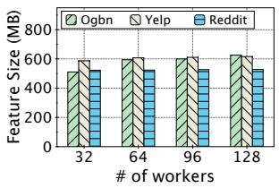  
(a) Feature Size

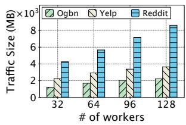  
(b) Traffic Size  
Figure 1: Feature size and traffic size of different datasets.

We next analyze the boundary vertex size and traffic volume in realistic datasets. We use METIS [23] to partition the graph across varying numbers of workers. Three different datasets Ogbn-products [24], Reddit [25], and Yelp [26] are partitioned. Figure 1 shows that, while the boundary vertex size remains relatively stable as the number of workers increases, the traffic volume grows significantly. This is because, although the number of vertices per worker decreases, the average number of neighbors per vertex increases. Since the Reddit graph is denser than the others, it has more average neighbor partitions, resulting in the highest traffic volume. Specifically, in Reddit with 128 partitions, the traffic volume is 16 times the boundary size, meaning that, on average, the worker generates 1-to-16 copies of each vertex when sending and causes 16-to-1 bandwidth contention when receiving. Thus, host-based multicast and aggregation will induce significant one-to-many redundant traffic and many-to-one bandwidth contention.

## 2.3 Promise of In-network Multicast and $\mathbf { A } \mathbf { g } \mathbf { - }$ gregation

## 2.3.1 Strength and limitation of programmable switch

Programmable switches, such as Intel Tofino, offer flexible packet processing capabilities, allowing users to define custom packet-handling logic. These switches utilize memory (stateless metadata and stateful registers) to store packet states and perform basic calculations. Many existing works leverage programmable switches to improve transmission performance. For instance, flexible in-network multicast mechanisms [27–29] enable stateless or hybrid multicast by parsing routing information carried in packet headers. In-network aggregation protocols [16–19, 30] offload key-value aggregation functions to switches to accelerate distributed machine learning and typical MapReduce jobs. Specifically, the switch memory is organized as an array of aggregators. The values with the same key from different workers are stored and aggregated in the aggregator with the same index. Once aggregation is complete, the results are sent back to the host via packets, and the aggregators are reallocated for other keys. These approaches significantly reduce traffic volume and network latency by using the programmability of switches. This provides an opportunity to leverage in-network multicast and aggregation to accelerate distributed GNN training.

However, programmable switches still face several limitations. Limited memory resources $( \mathrm { e . g . }$ , 10MB to 100MB [20,21]) restrict the switch’s ability to buffer and process largescale traffic. The limited number of pipeline stages constrains the deployment of complex dependency logic. A packet can only access a stateful register once during a single pipeline pass. These constraints introduce challenges for offloading more advanced network functions to the switch.

## 2.3.2 Strawman solution

Indeed, offloading the multicast and aggregation operations into the switch for sending and receiving data can significantly reduce traffic volume. Specifically, each vertex’s feature only needs to be sent once to the switch. The switch then multicasts this feature to the corresponding workers. For any vertex, all its neighbor features are aggregated on the switch, mitigating the many-to-one bottleneck. Assuming the graph is partitioned across M workers, with each worker having $E$ boundary vertices on average, in the extreme case where boundary vertices are fully connected, the host-based multicast and aggregation will generate $2 E M ^ { 2 }$ traffic, with $E M ^ { 2 }$ for sending and $E M ^ { 2 }$ for receiving. However, the in-network multicast and aggregation will only generate 2EM traffic, EM for sending, and EM for receiving, thus reducing the traffic volume to $\overset { \mathrm { ~ \tiny ~ 1 ~ } } { M }$ of the former one.

Thus, we design a strawman solution that leverages innetwork multicast and aggregation to accelerate GNN training. First, each worker sends the features of boundary vertices to the switch using a best-effort approach. On the switch, each feature is copied $d _ { \nu }$ times into $d _ { \nu }$ aggregators corresponding to its $d _ { \nu }$ neighbors. For each aggregator, the received features are accumulated and then dropped until it receives all required features from the neighbors of the destination vertex. Once the aggregation is complete, the result is forwarded to the corresponding worker, and the aggregator is released for reuse by other vertices. If no aggregators are available when new data arrives at the switch, the current feature will be directly sent to the worker for aggregation.

## 2.4 Problem Insight

The strawman solution appears the significant potential to reduce traffic volume. However, directly applying in-network multicast and aggregation introduces two key problems: (1) The graph-agnostic multicast order results in link underutilization and severe queue backlog. (2) The huge and interdependent vertex features are difficult to fit into the limited aggregators, leading to aggregator overflow and nullifying the traffic reduction.

## 2.4.1 Experimental observations

We conduct the NS3 simulations to reveal the problem of the strawman solution. We set up a star topology with 128 workers connected to one switch, and each link has 100Gbps bandwidth. We partition the Ogbn-product, Yelp, and Reddit datasets across 128 workers using the METIS [23] algorithm.

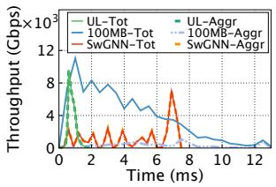  
(a) Throughput

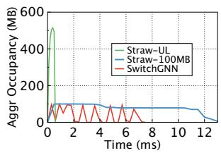  
(b) Aggregator Occupancy

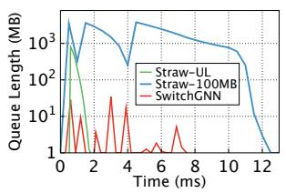  
(c) Queue Length

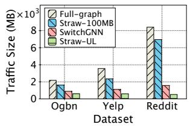  
(d) Traffic Size  
Figure 2: The performance of strawman solution.

We evaluate the performance of the strawman solution with 100MB switch memory (aggregators) and with unlimited switch memory, respectively. We measure the real-time aggregation throughput, aggregator occupancy, and queue length under the Reddit dataset with 128 workers. To clearly observe the buffer requirements, we set the buffer size to 10GB to avoid the drastic performance fluctuations caused by packet loss and timeout retransmissions. As shown in Figure 2(a), although the total throughput under the 100MB constraint (100MB-Tot) is very high, the aggregation throughput (100MB-Aggr) is significantly lower than that of Straw-UL (UL-Aggr). During this process, as shown in Figure 2(b), the

100MB aggregator has been nearly fully occupied. Moreover, we observe that both the 100MB and unlimited cases experience significant queue backlog, as shown in Figure 2(c).

We further measure the traffic volume under the full-graph and strawman solutions. As shown in Figure 2(d), under the 100MB (Straw-100MB) aggregator constraint, the generated traffic volume of strawman is only slightly lower than that of the full-graph approach, but significantly higher than the unlimited case (Straw-UL). Specifically, for the Reddit dataset, the traffic volume in the Straw-UL is reduced by 94% and 92% compared to the full-graph and Straw-100MB, respectively.

## 2.4.2 Deep dive

Next, we dive into the causes of performance degradation in the strawman multicast and aggregation approach. Existing innetwork multicast and aggregation techniques are commonly used to accelerate distributed machine learning jobs where data is independent. However, in GNNs, graph data dependencies are complex. The graph-structure-agnostic manner of the strawman solution leads to inefficient forwarding pipeline and severe aggregator overflow.

The graph-agnostic multicast order results in an inefficient forwarding pipeline. During the aggregation process, switch aggregators must wait for data from all participating vertices. Meanwhile, if a vertex completes multiple aggregations after being multicast to aggregators, multiple aggregation results are generated and sent to the workers. The strawman solution multicasts vertices to aggregators in random order. Due to the complex dependencies in graph data, some vertices are uploaded without timely completion of aggregation, leading to link under-utilization. Conversely, other vertices quickly complete a large number of aggregations after being uploaded, causing high queuing delays.

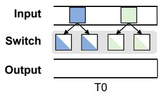

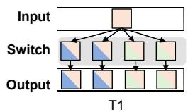  
Figure 3: Graph-structure agnostic sending order leads to link under-utilization and queue backlog.

Figure 3 illustrates the link under-utilization and queue backlog due to graph-agnostic multicast order. At time T0, two vertices with a degree of 2 arrive to the switch and multicast to two aggregators, each waiting for aggregation to complete. During this time, the output throughput remains at 0. At time T1, although only one vertex is uploaded, it completes the aggregation for 4 aggregators simultaneously, however, causing a queue buildup at the output port. For instance, as shown in Figure 2(a) and Figure 2(c), under both Straw-UL and Straw-100MB, the queue backlog is severe. Specifically, from time 0ms to 1ms, the queue length rapidly increases from 0MB to 1000MB.

The huge and interdependent vertex features lead to aggregator overflow. A vertex’s multicast on the switch consumes a number of aggregators equal to the number of its neighbors. However, the vertex required for these neighbors’ aggregation also depends on their own neighbors. Due to the large number of dependent vertices (i.e., large connected subgraphs), multicasting these dependent vertices consumes far more aggregator resources than the programmable switch can support. As a result, a massive traffic is sent directly to the workers due to aggregator collisions, missing the in-network aggregation opportunities.

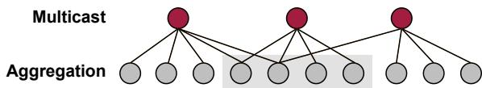  
Figure 4: The memory demand of the large number of dependent vertices exceeds the switch memory size.

For example, as shown in Figure 4, when three dependent red vertices are simultaneously multicast at the switch, 10 aggregators are required, but the switch can only provide 4 aggregators, leaving the remaining 6 features unable to use in-network aggregation. The experimental results in Figure 2(b) show that when aggregator resources are unlimited, the aggregation resource usage is approximately 500MB. Therefore, under the 100MB resource constraint, severe aggregator overflow occurs. With a 100MB aggregator limit, the aggregation throughput is significantly reduced to only about 10% of the total throughput.

## 2.5 Summary

In distributed full-graph training, the graph propagation with host-based multicast and aggregation causes large redundant traffic and severe bandwidth contention, respectively. Using in-network multicast and aggregation can significantly reduce traffic volume, but the strawman solution suffers from queue backlog and aggregator overflow due to complex vertex dependencies. Therefore, we need to carefully design a collaborative in-network multicast and aggregation based on graph-structured data to fully leverage the potential of in-network multicast and aggregation.

## 3 SwitchGNN Design

## 3.1 Architecture and Workflow

We propose a solution to accelerate full-graph training using programmable switches. This solution performs collaborative in-network multicast and aggregation during graph propagation, thereby reducing network traffic volume.

Figure 5 shows SwitchGNN’s architecture. We assume that the full graph has already been partitioned into multiple workers. First, the host reschedules the sending order of vertices to optimize the forwarding pipeline, alleviating the link underutilization and queue backlog. Second, to prevent aggregator overflow, we employ a multi-level graph partitioning mechanism to break the dependencies among boundary vertices. Moreover, we still transmit the traffic from cut edges to guarantee the correct graph propagation. The workers follow the predefined sending order to minimize communication time, while the switch stores the connectivity information between vertices for in-network multicast and aggregation. Third, we design the reliability and congestion control mechanisms to guarantee the correct aggregation and avoid network congestion in all-to-all transmission. Finally, the switch receives the feature of each vertex and multicast it to the aggregators corresponding to its neighbors. The aggregators aggregate the features from multiple workers and the aggregation results are sent back to the corresponding workers.

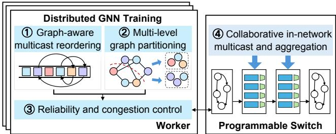  
Figure 5: SwitchGNN’s architecture.

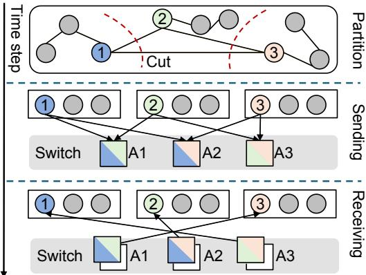  
Figure 6: SwitchGNN’s workflow.

We use an example to illustrate SwitchGNN workflow. As shown in Figure 6, we assume that vertices 1, 2, and 3 are interdependent and partitioned into three different workers. During the graph propagation, they need to exchange features over the network. In the feature sending step, vertices 1, 2, and 3 send their features to the switch, which multicasts them to the corresponding aggregators A{1,2}, A{1,3}, and A{2,3}, where aggregators A1, A2, and A3 correspond to destination vertices 3, 2, and 1, respectively. Once the aggregators have received all the required neighbor features for each destination vertex, vertices 1, 2, and 3 receive the aggregated results from aggregators A3, A2, and A1. As a result, each of the three vertices sends only one feature and receives one aggregated feature. When all vertices have completed their transmissions, the communication for the current GNN layer is finished.

## 3.2 Graph-Aware Multicast Reordering

We reorder the multicast sequences of vertices according to the graph structure to minimize the communication time.

## 3.2.1 Problem statement

Given a graph $G ( V , E )$ comprising n vertices, e edges, along with a designated vertex sequence $S = ( \nu _ { 1 } , \nu _ { 2 } , . . . , \nu _ { n } )$ to be sent to a switch, assume that $A _ { t }$ denotes the set of vertices that arrive to the switch at time t. At most k packets can enter the switch and k packets leave the switch in each time slot. When $t \leq n / k$ , the switch receives $\nu _ { ( t - 1 ) k + 1 }$ to $\nu _ { t k } ;$ otherwise, it receives $\nu _ { ( t - 1 ) k + 1 }$ to $\nu _ { n }$ . Therefore, we have

$$
A _ { t } = \left\{ \begin{array} { l l } { \bigcup _ { i = ( t - 1 ) k + 1 } ^ { t k } \{ \nu _ { i } \} , \quad t \leq n / k , } \\ { \bigcup _ { i = ( t - 1 ) k + 1 } ^ { n } \{ \nu _ { i } \} , \quad t > n / k . } \end{array} \right.\tag{3}
$$

We define $g _ { t } \big ( \nu _ { i } \big )$ as the number of aggregation results completed when vertex $\nu _ { i }$ arrives at switch at time t. Let $f ( t )$ denote the number of aggregators that complete the aggregation at time $t ,$ with the resulting packets queued at the switch. Then we have

$$
f ( t ) = \sum _ { \nu _ { i } \in A _ { t } } g _ { t } ( \nu _ { i } ) .\tag{4}
$$

Let $Q ( t )$ represent the number of packets waiting for transmission after time t, and assume $Q ( 0 ) = 0$ . Then we have

$$
Q ( t ) = m a x \{ f ( t ) + Q ( t - 1 ) - k , 0 \} .\tag{5}
$$

The job completion time z is given by

$$
z = \lceil \frac { n } { k } \rceil + \lceil \frac { Q ( \lceil \frac { n } { k } \rceil ) } { k } \rceil ,\tag{6}
$$

where $\lceil \frac { n } { k } \rceil$ ⌉represents the time required for all vertices to arrive at the switch, and $\lceil \frac { Q ( \lceil \frac { n } { k } \rceil ) } { k } \rceil$ represents the time required to drain the remaining queued packets at the switch after the last vertex has arrived. The objective is to find an optimal vertex sequence S to minimize z.

## 3.2.2 Lightweight solution

Considering the high complexity and substantial time cost in deriving the optimal solution, we propose a heuristic algorithm that maintains a manageable level of complexity for graph-aware multicast reordering.

First, we aim to minimize the aggregation time for features to avoid a large number of features waiting for aggregation at the switch, which leads to link under-utilization. When the vertices multicast into the aggregators, completing these aggregations quickly requires that other vertices destined for the same aggregators are also multicast immediately. These vertices are connected through a common one-hop neighbor, which links them together in the aggregation process. Thus, we use a priority-based breadth-first search (BFS) scheduling approach. Starting from a randomly selected vertex, its neighboring vertices are added to the sending queue, ensuring that closely related vertices are transmitted in close time. This reduces the waiting time of aggregators.

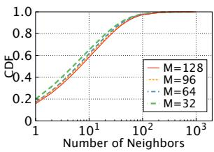  
(a) Ogbn-products

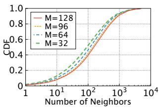  
(b) Reddit  
Figure 7: The CDF of neighbor counts.

Second, to alleviate the queue backlog, we introduce priority scheduling based on vertex degree. We observe that vertex degrees are skewed. For example, Figure 7 shows the cumulative distribution function (CDF) of neighbor counts. In the Reddit dataset, with 32 workers, 20% of vertices account for 80% of the total neighbors. If high-degree vertices are sent later, there is a higher probability of triggering a large number of aggregations at once, leading to traffic bursts. However, by sending higher-degree vertices earlier, as smaller-degree vertices are uploaded, aggregations are completed gently, enabling a more efficient forwarding pipeline and reducing the queue backlog. Thus, we enhance the BFS approach by assigning priority based on vertex degree, where higher-degree vertices are transmitted earlier in the sequence.

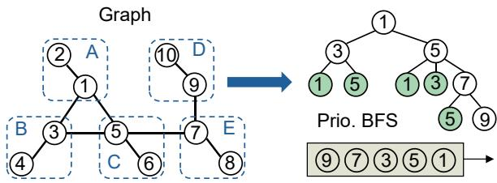  
Figure 8: Priority-based BFS.

As illustrated in Figure 8, the vertex sequence is generated according to our priority-based BFS. We randomly select vertex 1 from the graph to enqueue. Vertex 1 is then dequeued, and its neighbor vertices 3 and 5 are enqueued. Since vertex 5 has more neighbors than vertex 3, vertex 5 will be dequeued first. Then, vertex $5 \mathrm { { s } }$ neighbor, vertex 7, is enqueued. As vertex 3 and vertex 7 have the same number of neighbors, the earlier enqueued vertex 3 will be dequeued before vertex 7. Vertex 9, with only one neighbor, will be dequeued last. Note that we track each enqueued vertex to ensure that each vertex is enqueued only once. The final vertex sequence is the order in which the vertices are dequeued. In non-in-network aggregation methods, high-degree vertices will generate more redundant traffic. However, in SwitchGNN, high-degree vertices uploaded to the switch do not immediately generate multicast traffic. Instead, they first occupy the aggregator’s memory and trigger data transmission to the worker only after other required neighboring vertices arrive and complete aggregation. This multicast reordering strategy optimizes pipeline efficiency, mitigates queue backlog.

Next, to demonstrate the effectiveness of the graph-aware multicast reordering mechanism, we quantitatively analyze two typical graph structures of star graph (non-uniform) and ring graph (uniform), and discuss the performance difference between the priority-based BFS strategy (PB) and the random ordering (RO). In the star topology, consider the undirected graph $G _ { 1 } ( V , E )$ , where vertex set is $V = \{ \nu _ { 1 } , \nu _ { 2 } , . . . , \nu _ { n } \}$ , and edge set is $E = \left\{ { \big ( } \nu _ { 1 } , \nu _ { 2 } { \big ) } , { \big ( } \nu _ { 1 } , \nu _ { 3 } { \big ) } , . . . , { \big ( } \nu _ { 1 } , \nu _ { n } { \big ) } \right\}$ }. The degree of the central vertex is $d ( \nu _ { 1 } ) = n - 1 $ , while all other vertices have degree 1, i.e., $d ( \nu _ { 2 } ) = \cdot \cdot \cdot = d ( \nu _ { n } ) = 1$ .. PB selects the vertex $\nu _ { 1 }$ as the root of BFS, resulting in a traversal sequence $\left\{ \nu _ { 1 } , \nu _ { 2 } , . . . \nu _ { n } \right\}$ . According to the derivation in 3.2.1, we assume that $k = 1$ , and the total execution time of PB is n. RO randomly selects vertices, and the total execution time of RO depends on the position of vertex $\nu _ { 1 }$ . The optimal case of RO is that $\nu _ { 1 }$ is selected first, and the total execution time is $n .$ In the worst case, the last choice is $\nu _ { 1 }$ , and the total execution time is $2 n - 1 ;$ The average execution time is $\frac { 3 n - 1 } { 2 }$ .

In the ring topology, we construct an undirected graph $G _ { 2 } ( V , E )$ , where vertices is $V = \{ \nu _ { 1 } , \nu _ { 2 } , . . . , \nu _ { n } \}$ , and edge set is $E = \left\{ { \left( \nu _ { 1 } , \nu _ { 2 } \right) } , { \left( \nu _ { 2 } , \nu _ { 3 } \right) } , . . . , { \left( \nu _ { n - 1 } , \nu _ { n } \right) } , { \left( \nu _ { n } , \nu _ { 1 } \right) } \right\}$ . All vertices have a degree of 2. When $n = 3 .$ , both strategies take the same execution time. When $n \geq 4 .$ , the total execution time under PB is $n + 2$ , the best execution time under RO is $n + 1$ , and the worst execution time under RO is $n + 2$

The degree distribution characteristics of graph structures impact the performance of heuristic ordering strategies. SwitchGNN outperforms random ordering in graphs with non-uniform degree distributions, while both strategies show similar performance in graphs with uniform degree. Thus, SwitchGNN achieves greater benefits in skewed graphs, which is common in real-world scenarios [31].

## 3.3 Multi-level Graph Partitioning

The required number of aggregators is directly related to the maximum number of dependent vertices. Here, we analyze the size of related boundary vertices across different datasets.

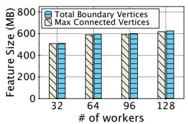

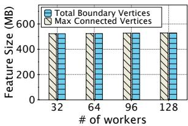  
(a) Ogbn-products  
(b) Reddit  
Figure 9: The total boundary and max. connected feature size.

Figure 9 shows the total boundary and maximum connected vertices size under different datasets. The results show that nearly 99% of boundary vertices exhibit dependency relationships, thus the aggregator demand far exceeds the switch’s memory capacity. To address this issue, in addition to partition the full graph across multiple workers, we further partition the connected boundary vertices into multiple blocks by cutting edges, thereby breaking their dependencies. These blocks are then transmitted one by one. The next block is processed only after the transmission of the previous one is complete. By ensuring that the number of vertices in each block does not exceed the available aggregator resources, we eliminate aggregator overflow. However, breaking the dependencies changes the original graph structure, leading to incorrect graph propagation and low model quality.

To maintain correct aggregation, data exchange is still required between cut edges. Thus, SwitchGNN groups the cut edges into a new block, and the partitioning continues until all blocks are small enough to fit within the aggregator limits. To fully utilize aggregator resources while minimizing the extra traffic caused by cut edges, we use the METIS algorithm for boundary vertices partitioning.

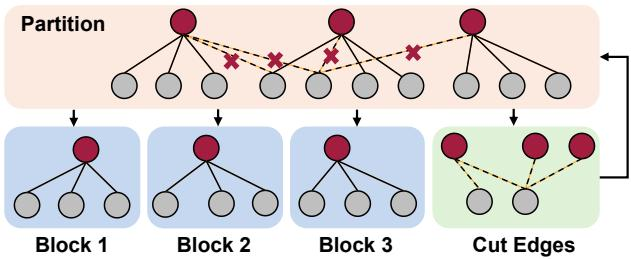  
Figure 10: Multi-level graph partitioning.

Figure 10 shows an example of multi-level graph partitioning. We assume that a connected subgraph with 13 boundary vertices is to be multicast and aggregated on a switch with a limit of 4 aggregators. First, through graph partitioning, 4 edges are cut, resulting in 3 blocks, each with a size of 4 vertices. The subgraph formed by the cut edges has a size of $^ { 5 , }$ so it will continue to undergo the next level of partitioning until all blocks are smaller than 4. Then, by batch-processing the multicast and aggregation of vertices within each block, SwitchGNN completely avoids aggregator overflow. The time complexity of METIS is $O ( | E | + | V | )$ , while the multicast reordering method has a time complexity of $O ( | E | + | V | l o g | V | )$ where |E| and |V | denote the number of edges and vertices, respectively. For large graphs, Par-METIS method can be used to partition the graph in parallel. After multi-level partitioning is completed, vertices within each partitioned block can also be reordered in parallel, significantly reducing pre-processing time. Besides, SwitchGNN is still compatible with any advanced graph partitioning techniques to improve performance.

In the pre-processing phase, Graph-Aware Multicast Reordering and Multi-level Graph Partitioning mechanisms determine the multicast order and blocks of vertices, and this information is distributed to the corresponding hosts. Each host only needs to send its local vertices to the switch according to the predefined block\_id and vertex order. Note that, each host must wait until the current block’s transmission is completed before sending the next block. Once a host receives all the aggregation results in the current block, it sends the current block\_id and its host\_id to the switch. The switch keeps track of the current block\_id and the number of hosts that have completed transmission for that block. When all hosts have completed the transmission of vertices for the current block, the switch multicasts the current block\_id to all workers. Upon receiving the block completion signal from the switch, the workers send the vertices of next block.

## 3.4 Reliability and Congestion Control

In-network multicast and aggregation break the traditional end-to-end connections, where a single packet at the switch is replicated into multiple packets, and multiple packets are aggregated back into one packet by the switch. Therefore, we need to redesign the reliability guarantee and congestion control mechanisms to ensure correct and efficient transmission.

For reliability guarantee, when a vertex is sent, SwitchGNN maintains two bitmaps for each vertex to track the status of its neighbors at the host. One bitmap records the acknowledgment status of the sent vertex features, while the other tracks the reception status of each vertex’s neighbor features. Upon receiving the aggregation result, the corresponding reception bitmap is set to all ones, and the worker multicasts ACKs to the vertex’s neighbors. When the sending bitmap becomes all ones, it indicates that the vertex’s transmission has successfully completed. When receiving a data packet of a vertex, the worker first determines whether the packet is a complete aggregation result from the switch. If a non-aggregated feature is received, the non-aggregated feature is cached in the worker. When other boundary vertices in the worker also need to participate in aggregation with this non-aggregated feature, they can share it from the local cache instead of fetching it again from remote workers, thereby reducing network traffic. Additionally, SwitchGNN employs a timeout mechanism to handle packet loss caused by network congestion. When a worker exceeds the timeout threshold without receiving features from the current block, it pulls the required features of the unaggregated vertices from other workers. Once the pulled packets arrive at the switch, the corresponding aggregators are released. The features pulled from the worker are marked as "bypass", meaning they no longer participate in switch-based aggregation but are directly forwarded to the host for aggregation.

For congestion control, SwitchGNN continuously sends vertices according to the scheduling order and adjusts the sending rate according to the Explicit Congestion Notification (ECN) marking, similar to DCQCN [32]. Upon receiving an ECN marking, the sending rate is halved. If the network is not congested, the sending rate increases additively.

## 4 Implementation

We implement SwitchGNN using Data Plane Development Kit (DPDK) protocol stack and P4-Programmable switch.

Host. On the host side, SwitchGNN is used as a plugin integrated with the DGL framework. We modify the communication context of DGL by using SwitchGNN with DPDK host stack. In the DPDK, we use rte\_pktmbu f \_mtod\_o f f set to add SwitchGNN’s header fields after the IP header, which includes 32bit Src\_id, 32bit Dst\_id, 16bit Block\_id, 16bit Count, 1bit Is\_ACK, 1bit Is\_Fetch, 1bit ECN, and 1bit Resend fields. The Src\_id and Dst\_id fields carry the IDs of source vertex and destination vertex, respectively. The Block\_id field is used to notice the transmission batch, ensuring that the same block’s features participate in in-network aggregation in the same batch. The Count field carries the number of boundary neighbors for the current vertices. The Is\_ACK and Is\_Fetch fields are used to identify the type of packet, indicating whether it is an acknowledgment or a fetch request, respectively. The ECN field is marked when the switch queue length exceeds a certain threshold, while the Resend field is set to 1 for retransmitted packets.

Switch. On the switch, we store the mapping relationship between each vertex ID and its corresponding aggregator indexes in the table. When a packet arrives, it can directly query the table using the source vertex ID to determine which aggregators should be aggregated at. In SwitchGNN, each aggregator is allocated 128 bytes for aggregation. The aggregator format is similar to ATP [16]. The difference is that instead of using a bitmap to track which vertices have been added in the aggregator, we determine aggregation completion according to the aggregation count. To avoid errors from duplicate accumulation due to retransmitted packets, we mark these packets with a Resend flag. When such a packet reaches the switch, it releases the corresponding aggregator and is directly forwarded to the designated worker for aggregation.

To multicast the packet into multiple aggregators, the same register needs to be accessed multiple times. However, Tofino switch allows a packet to access a register only once per pipeline pass. Therefore, after accumulating the payload into the first aggregator, we loop the packet back to the ingress pipeline for subsequent aggregator operations until all multicast aggregators are accessed.

Moreover, SwitchGNN adopts in-network aggregation only for traffic that crosses hosts or racks, while GPUs within the same host use NVLink or PCIe for communication. When workers are distributed across multiple switches, multi-level aggregation is required. SwitchGNN uses a mechanism similar to existing in-network aggregation solutions [16, 18]. SwitchGNN needs to extend packet headers and aggregator fields to record the level of each switch. For example, in a twolevel aggregation with three switches, two level-1 switches perform partial aggregation for directly connected workers, and their partial aggregation results are then forwarded to a level-2 switch for final aggregation.

## 5 Testbed Evaluation

## 5.1 Setup

Topology. We evaluate SwitchGNN using a star topology, which contains one switch and eight GPU servers. All servers connect to the switch via 100Gbps links. The switch is an Intel Wedge 100BF-32X programmable switch with 10MB memory. Each server has an RTX3090 GPU with CUDA 11.2, Ubuntu 20.04, 100GbE Mellanox CX5 NIC, 20 CPU cores and 64GB memory. We deploy one worker per server.

Datasets and models. We use three popular graph datasets in our evaluation, including Ogbn-products [24], Yelp [26], and Reddit [25]. The graph details are shown in Table 1. In addition, we train a 4-layer GCN with 128 hidden units and set the initial learning rate to 0.01 on the above datasets.

Table 1: Datasets Details.
<table><tr><td>Dataset</td><td>Vertices</td><td>Edges</td><td>Feature</td><td>Classes</td></tr><tr><td>Ogbn-products</td><td>2.4M</td><td>62M</td><td>100</td><td>47</td></tr><tr><td>Yelp</td><td>0.72M</td><td>7M</td><td>300</td><td>100</td></tr><tr><td>Reddit</td><td>0.23M</td><td>114M</td><td>602</td><td>41</td></tr></table>

Baselines. We compare SwitchGNN with state-of-the-art full-graph GNN training systems, such as BNS-GCN [8] and G3 [15]. BNS-GCN reduces communication overhead during graph propagation by sampling neighbors with a sampling rate p. To ensure full-graph training, we set p in BNS-GCN to 1. For BNS-GCN and SwitchGNN, we use METIS for the graph partitioning. G3 uses locality-aware iterative partition [15] to balance the communication load among workers. For a fair comparison, we implement the transport protocols of all baselines using DPDK. The transport protocols of BNS-GCN and G3 are implemented according to DCQCN.

Metrics. We adopt three evaluation metrics, including training throughput, real-time loss and GPU utilization in our experiments. The training throughput is the number of processed vertices per second of all workers. Real-time loss is the curve of training loss changing with time. We select one of the workers to observe the real-time GPU utilization.

## 5.2 Training Throughput

We evaluate the training throughput (measured in 104 vertices per second) of SwitchGNN under varying numbers of workers (e.g., 5∼8) with 4 GNN layers, and under different numbers of GNN layers using 8 workers, respectively. We compare SwitchGNN with baselines such as BNS-GCN and G3.

As shown in Figure 11 and 12, BNS-GCN achieves the lowest training throughput since it suffers from severe oneto-many and many-to-one bottlenecks. G3 outperforms BNS-GCN by balancing traffic volume among workers, avoiding the straggler problem caused by skewed traffic. However, G3 does not reduce the overall traffic volume, as there are still many redundant packets and significant many-to-one bandwidth contention in the network. SwitchGNN achieves the highest training throughput across all three datasets under different numbers of workers and GNN layers. This is because SwitchGNN eliminates the one-to-many and many-to-one bottlenecks by leveraging collaborative in-network multicast and aggregation, effectively reducing traffic volume. Moreover, as the number of workers increases, the benefits of SwitchGNN grow since the proportion of communication time relative to computation time increases. Specifically, SwitchGNN improves training throughput by up to 54% and 24% compared to BNS-GCN and G3, respectively.

## 5.3 Real-time Loss

Next, we compare SwitchGNN with baselines in performance of time-to-accuracy. All training systems are trained in an 8-worker cluster using three datasets: Ogbn-products, Reddit and Yelp. We record the real-time loss during the training.

As shown in Figure 13, SwitchGNN achieves the fastest convergence across different datasets, without any loss in accuracy compared to BNS-GCN and G3. This is because, although SwitchGNN partitions boundary vertices into multiple blocks for in-network aggregation using a multi-level graph partitioning algorithm, it still transmits features associated with cut-edges, ensuring the correctness of graph propagation. The performance improvement of SwitchGNN is more significant on the denser datasets such as Yelp and Reddit than on the relatively sparse Ogbn-products dataset, as dense graphs generate more redundant traffic and experience more severe many-to-one bandwidth contention under BNS-GCN and G3.

## 5.4 GPU Utilization

We evaluate the GPU utilization of one randomly selected worker from an 8-worker cluster. We use the Ogbn-products, Yelp and Reddit datasets to train the GCN model under SwitchGNN and our baselines. We show the GPU utilization over 10 seconds. Figure 14 shows the GPU utilization of SwitchGNN compared with full-graph training systems. We observe that SwitchGNN utilizes more GPU resources than BNS-GCN and G3. The reason is that SwitchGNN directly reduces the traffic volume, reducing the communication time and contributing to higher GPU utilization.

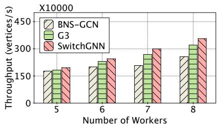  
(a) Ogbn-products

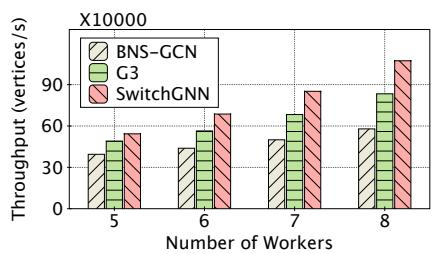  
(b) Yelp

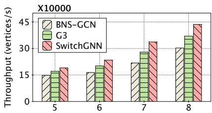  
(c) Reddit

Figure 11: Training throughput under varying number of workers.  
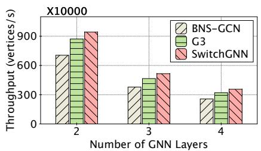  
(a) Ogbn-products

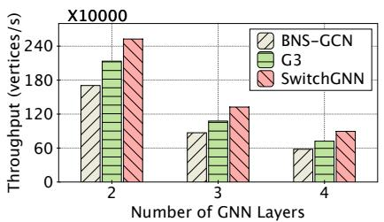  
(b) Yelp

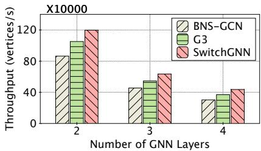  
(c) Reddit

Figure 12: Training throughput under varying number of GNN layers.  
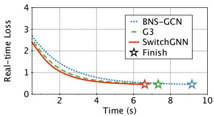  
(a) Ogbn-products

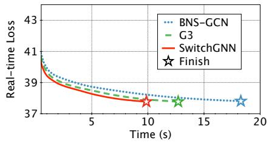  
(b) Yelp

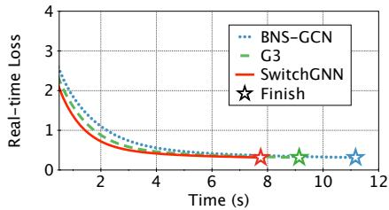  
(c) Reddit

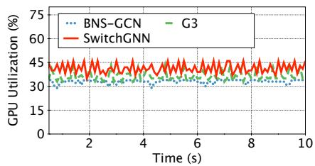  
(a) Ogbn-products

Figure 13: Time to accuracy.  
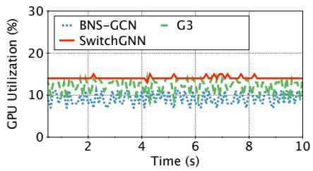  
(b) Yelp

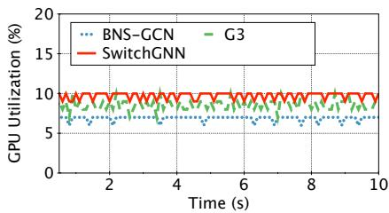  
(c) Reddit  
Figure 14: Real-time GPU utilization.

## 6 Simulation Evaluation

We conduct NS3 simulations to evaluate the performance of SwitchGNN in the large-scale scenarios. We use the star topology with 128 hosts and each host connects to the switch with 100Gbps bandwidth link and $2 \mu \mathrm { s }$ propagation delay. Based on the configuration of mainstream ASIC switches, the total aggregator size is set from 10MB to 100MB [20, 21]. By default, the switch memory size is 100MB. We compare the performance of BNS-GCN, G3, strawman solution (Straw), and SwtichGNN. We use three realistic graph workloads, including Ogbn-products, Yelp and Reddit. When scaling up the number of workers to 128, the dataset is re-divided into 128 partitions. The evaluation metrics include epoch time, traffic volume, queue length, and aggregation throughput. The epoch time consists of the communication time for a 4-layer GCN propagation in NS3 network combined with the average computation time per epoch during training in the testbed. Traffic volume refers to the data generated by one layer of GCN propagation.

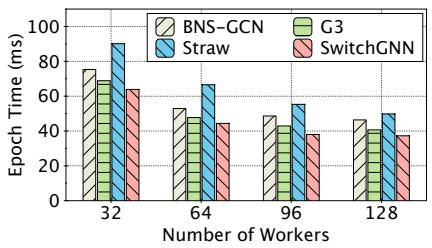  
(a) Ogbn-products

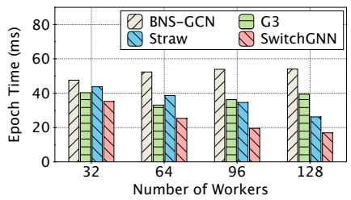  
(b) Yelp

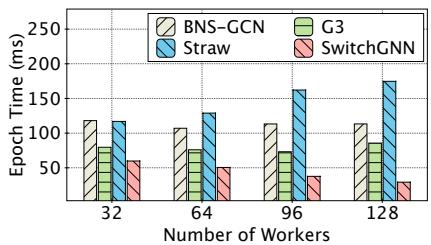  
(c) Reddit

Figure 15: Epoch time under the varying number of workers with star topology.  
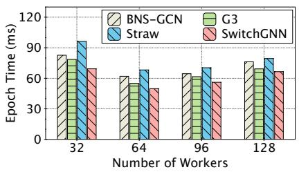  
(a) Ogbn-products

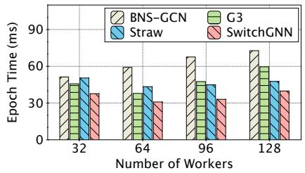  
(b) Yelp

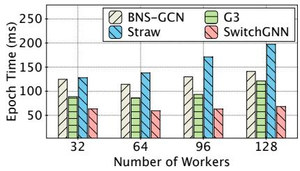  
(c) Reddit  
Figure 16: Epoch time under the varying number of workers with leaf-spine topology.

## 6.1 Basic Performance

First, we evaluate the basic performance of SwitchGNN using the same experimental setup as in the motivation section. As shown in Figure 2(d), across all three datasets, SwitchGNN significantly reduces traffic volume compared to the strawman approach. This reduction is achieved through multilevel graph partitioning, which effectively prevents aggregator overflow and thus substantially reduces traffic volume. However, to maintain correct aggregation after graph partitioning, SwitchGNN introduces some additional traffic, making its traffic size slightly larger than the UL case. Figures 2(a) and 2(b) demonstrate that SwitchGNN utilizes aggregator resources without overflow, maintaining high aggregation throughput. Moreover, due to the priority-based BFS algorithm that reorders the multicast sequence, SwitchGNN achieves a more efficient pipeline and avoids queue backlog, as illustrated in Figure 2(c).

Note that, under SwitchGNN, the synchronization process of each block between hosts and switches can be affected by straggling workers. As shown in Figures 2(a) and 2(b), the observed fluctuations in throughput and aggregator occupancy are caused by per-block synchronization. However, since SwitchGNN significantly reduces traffic volume, it still achieves low communication time.

## 6.2 Performance under Different Conditions

Then, we measure the epoch time of BNS-GCN, G3, Strawman solution, and SwitchGNN under varying numbers of workers and different workloads. As shown in Figure 15, across all three datasets, the epoch time of BNS-GCN, G3, and the strawman solution increases rapidly as the number of workers grows. This is because more workers result in each vertex needing to be replicated to more neighbors, introducing the one-to-many and many-to-one bottlenecks. Although G3 balances the communication load across workers, it does not reduce the overall traffic volume, still leading to high epoch time. In contrast, SwitchGNN leverages in-network multicast and aggregation to reduce traffic volume, effectively eliminating the one-to-many and many-to-one bottlenecks, and preventing significant traffic increases as the number of workers grows. Specifically, under Reddit dataset, SwitchGNN reduces epoch time by up to 74%, 65%, and 83% compared to BNS-GCN, G3, and strawman solution, respectively.

Besides, we conduct the experiments on an 8×8 leaf-spine topology in a typical datacenter, consisting of 8 leaf switches and 8 spine switches. Each leaf switch connects to 16 hosts, resulting in a total of 128 hosts. Each leaf switch connects the same number of workers, with at most one worker per host. For SwitchGNN, the in-network multicast and aggregation operations are deployed on the leaf switches. As a result, the traffic undergoes up to two levels of aggregation. The experimental results are shown in Figure 16. As the number of workers increases, cross-rack communication traffic also grows. Once cross-rack communication becomes the primary bottleneck, the epoch time increases rapidly. SwitchGNN reduces traffic in each rack through hierarchical aggregation, achieving the lowest epoch time.

## 6.3 Effectiveness of GAMR

Moreover, we evaluate the effectiveness of the graph-aware multicast reordering (GAMR). We measure the maximum queue length and throughput for Ogbn-products and Reddit datasets under varying switch memory from 10MB to 100MB. We set the switch buffer size to a very large value to observe the buffer requirements of different methods.

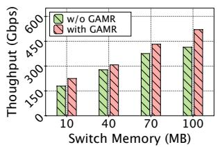  
(a) Aggr. throughput under Ogbn

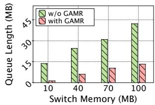  
(b) Queue length under Ogbn

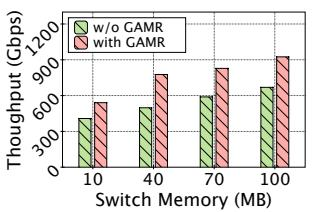  
(c) Aggr. throughput under Reddit

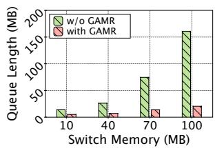  
(d) Queue length under Reddit  
Figure 17: Performance under different workloads.

As shown in Figure 17, the results show that the performance of SwitchGNN with GAMR is significantly better than that without GAMR. GAMR enhances the pipeline efficiency for each block, improving the overall aggregation throughput. Moreover, as the switch memory increases, the maximum queue length under SwitchGNN without GAMR grows rapidly. This is because larger switch memory can hold more features waiting for aggregation, and the graphagnostic sending order may cause a small number of packets to trigger larger aggregation results, leading to a huge traffic volume and severe queue backlog in a short time. Without GAMR, SwitchGNN experiences more severe queue backlog and throughput loss under the denser Reddit graph than that under Ogbn-products. This is because each vertex in Reddit has a higher degree, resulting in longer wait time for neighbors to arrive at the switch. By prioritizing high-degree boundary vertices for transmission, GAMR improves the throughput and alleviates the queue backlog.

## 6.4 Traffic Size under Varying Switch Memory

In this section, we evaluate the traffic size under different switch memory with 64 and 128 workers, respectively. As shown in Figure 18, the benefits of SwitchGNN become more significant as the number of workers increases. This is because a higher number of workers results in more copies of features being generated; SwitchGNN eliminates this redundant traffic through in-network multicast and aggregation. Moreover, Figure 18(f) shows that with only 10 MB memory, the traffic reduction is limited to 23%, whereas with 100 MB memory, the traffic size is reduced by 81%. This is because, under the smaller aggregator size, the graph is divided into more partitions during the multi-level partitioning process, thereby increasing traffic due to cut edges.

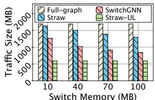

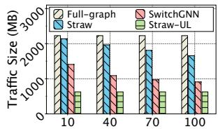  
Switch Memory (MB)

(a) Ogbn-products under 64 workers (b) Ogbn-products under 128 workers  
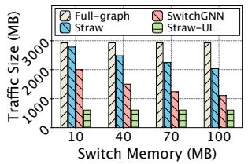  
(c) Yelp under 64 workers

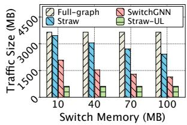  
(d) Yelp under 128 workers

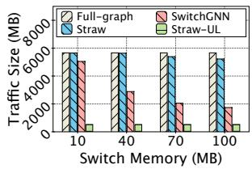  
(e) Reddit under 64 workers

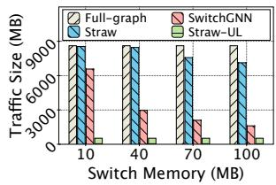  
(f) Reddit under 128 workers  
Figure 18: Traffic volume under varying switch memory.

As shown in Figures 18(b), 18(d) and 18(f), the dense graph (Reddit) generates more redundant traffic compared to the sparse graphs (Ogbn-products and Yelp). Thus, with larger memory size (100 MB), SwitchGNN delivers greater improvements for dense graphs. However, under limited memory (10MB), it is hard to partition dense graphs to eliminate intervertex dependencies, resulting in more cut edges. SwitchGNN shows better improvement for sparse graphs under limited memory.

## 6.5 Effectiveness of Congestion Control

Additionally, we validate the effectiveness of SwitchGNN’s congestion control. We inject the background traffic under varying loads across 64 and 128 workers and observe the epoch time under the Reddit dataset with and without congestion control (CC). The background flows are randomly generated across all workers. The flow size follows the realistic datacenter workload of Hadoop and their arrival rate follows the Poisson distribution.

As shown in Figure 19, as the background traffic load increases, the SwitchGNN without CC suffers from significant performance degradation, whereas the SwitchGNN with CC can maintain a short epoch time.

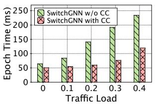  
(a) 64 workers

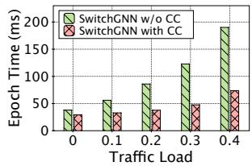  
(b) 128 workers  
Figure 19: Epoch time under varying traffic load.

## 7 Related Work

Mini-batch GNN training. DGL [7] distills several generalized sparse tensors from the GNNs’ computation for massive parallelization. AGL [33] adopts a message transform method and is implemented on MapReduce [34] to support mini-batch GNN training. BGL [6] co-designs the caching policy and sampling order, reducing the communication overhead in feature retrieving. PaGraph [35] utilizes spare GPU memory as a cache for storing hot data to reduce the communication between CPU and GPU. GNNLab [36] proposes a pre-sampling cache policy for efficient storage and robust performance. P3 [37] combines model and data parallelism to reduce the communication overhead. However, the above approaches with mini-batch training mechanisms still face challenges such as sampling variance, neighbor explosion, and significant sampling overhead.

Full-graph GNN training. Full-graph training methods can overcome the above problems of mini-batch training methods. However, these methods suffer from large communication overhead. In recent years, numerous works have been proposed to reduce the communication overhead. Neugraph [38] combines dataflow-based deep learning frameworks to accelerate graph training through parallel computation. ROC [39] designs an online-learning-based graph partition algorithm to achieve a balanced workload and employs dynamic programming to optimize memory management. DGCL [40] proposes a shortest path spanning tree algorithm to schedule traffic, fully utilizing NVLink, PCIe, and other link bandwidths while balancing workloads and avoiding contention. BNS-GCN [8] randomly chooses the neighbors of boundary vertices to decrease the communication overhead. PipeGCN [41] achieves an efficient pipeline to overlap communication and computation while employing a smoothing algorithm to reduce errors incurred by stale features. Sancus [11] reduces communication overhead by adaptively caching historical embeddings. G3 [15] further balances the communication load among multiple workers while introducing finer-grained pipelining through partitioned vertices into smaller bins. This approach overlaps the communication and computation time. To address the high CPU-GPU communication overhead caused by duplicated traffic fetching during large-scale graph training, HongTu [9] employs a deduplication communication framework, which transfers the redundant CPU-GPU traffic on high-bandwidth inter-GPU links, accelerating the training.

Unfortunately, existing solutions still face the challenge of massive traffic volume. Our design introduces in-network multicast and aggregation for GNN training, significantly reducing traffic without sacrificing training accuracy.

In-network aggregation. DAIET [42] is the first INA algorithm and aggregates gradients at the switch to reduce network traffic. Sharp [43] and Sharpv2 [44] reduce the traffic by aggregating it in an aggregation tree deployed within the switches. However, Sharp does not consider the packet loss, which makes it unsuitable for lossy networks. SwitchML [17] proposes a packet loss recovery mechanism to aggregate gradients while providing a static and fair aggregator allocation mechanism. PANAMA [30] supports floating-point value for INA by using FPGA. Nevertheless, the static resource allocation of SwitchML and PANAMA leads to aggregator underutilization. ATP [16] addresses this problem with dynamic hash allocation. To further improve aggregation efficiency, A2TP [18] decouples the control of link bandwidth and inswitch aggregators, and independently allocates the resources according to the job and network status.

However, none of the existing INA solutions are designed for GNN. SwitchGNN coordinates in-network multicast and aggregation according to the graph-structure relationships, achieving more efficient transmission.

## 8 Conclusion

In this paper, we propose an in-network accelerated framework SwitchGNN for distributed GNN training. SwitchGNN coordinates the in-network multicast and aggregation to reduce the traffic volume. First, to minimize the communication time and alleviate queue backlog, SwitchGNN uses graphaware multicast reordering to schedule the multicast sequence, achieving an efficient pipeline. Then, SwitchGNN employs the multi-level partitioning method to avoid aggregator overflow. The experiment results show that SwitchGNN reduces the epoch time by up to 74% compared to the state-of-the-art full-graph training systems.

## Acknowledgments

We thank our shepherd Rajan M. A. and the anonymous reviewers for their helpful comments. This work was supported by the National Natural Science Foundation of China (U24A20245, 62132022, 62402407, 62132009, 62302524), the Science and Technology Innovation Program of Hunan Province (2024RC1005, 2024JJ6531), the Singapore Ministry of Education Tier 2 AcRF (MOE-T2EP20224-0009), and the China Scholarship Council Scholarship.

## References

[1] Rex Ying, Ruining He, Kaifeng Chen, Pong Eksombatchai, William L Hamilton, and Jure Leskovec. Graph convolutional neural networks for web-scale recommender systems. In Proc. ACM SIGKDD, pages 974– 983, 2018.

[2] Shuangli Li, Jingbo Zhou, Tong Xu, Liang Huang, Fan Wang, Haoyi Xiong, Weili Huang, Dejing Dou, and Hui Xiong. Structure-aware interactive graph neural networks for the prediction of protein-ligand binding affinity. In Proc. ACM SIGKDD, pages 975–985, 2021.

[3] Ching Nam Hang, Pei-Duo Yu, Siya Chen, Chee Wei Tan, and Guanrong Chen. Mega: machine learningenhanced graph analytics for infodemic risk management. IEEE Journal of Biomedical and Health Informatics, 27(12):6100–6111, 2023.

[4] Chee Wei Tan, Pei-Duo Yu, Siya Chen, and H Vincent Poor. Deeptrace: Learning to optimize contact tracing in epidemic networks with graph neural networks. IEEE Transactions on Signal and Information Processing over Networks, 11:97–113, 2025.

[5] Takuo Hamaguchi, Hidekazu Oiwa, Masashi Shimbo, and Yuji Matsumoto. Knowledge transfer for out-ofknowledge-base entities: a graph neural network approach. In Proc. IJCAI, pages 1802–1808, 2017.

[6] Tianfeng Liu, Yangrui Chen, Dan Li, Chuan Wu, Yibo Zhu, Jun He, Yanghua Peng, Hongzheng Chen, Hongzhi Chen, and Chuanxiong Guo. Bgl:gpu-efficient GNN training by optimizing graph data i/o and preprocessing. In Proc. USENIX NSDI, pages 103–118, 2023.

[7] Minjie Wang, Lingfan Yu, Da Zheng, Quan Gan, Gai Yu, Zihao Ye, Mufei Li, Jinjing Zhou, Qi Huang, Chao Ma, Ziyue Huang, Qipeng Guo, Hao Zhang, Haibin Lin, Junbo Zhao, Jinyang Li, Alexander Smola, and Zheng Zhang. Deep graph library: Towards efficient and scalable deep learning on graphs. In Proc. ICLR, 2019.

[8] Cheng Wan, Youjie Li, Ang Li, Nam Sung Kim, and Yingyan Lin. Bns-gcn: Efficient full-graph training of graph convolutional networks with partition-parallelism and random boundary node sampling. In Proc. MLsys, volume 4, pages 673–693, 2022.

[9] Qiange Wang, Yao Chen, Weng-Fai Wong, and Bingsheng He. Hongtu: Scalable full-graph GNN training on multiple gpus. In Proc. ACM SIGMOD, pages 1–27, 2023.

[10] Zhe Zhang, Ziyue Luo, and Chuan Wu. Two-level graph caching for expediting distributed GNN training. In Proc. IEEE INFOCOM, pages 1–10. IEEE, 2023.

[11] Jingshu Peng, Zhao Chen, Yingxia Shao, Yanyan Shen, Lei Chen, and Jiannong Cao. Sancus: staleness-aware communication-avoiding full-graph decentralized training in large-scale graph neural networks. In Proc. VLDB, pages 1937–1950. VLDB Endowment, 2022.

[12] Matthias Fey and Jan Eric Lenssen. Fast graph representation learning with pytorch geometric. arXiv preprint arXiv:1903.02428, 2019.

[13] Swapnil Gandhi and Anand Padmanabha Iyer. P3: Distributed deep graph learning at scale. In Proc. USENIX OSID, pages 551–568, 2021.

[14] Tim Kaler, Nickolas Stathas, Anne Ouyang, Alexandros-Stavros Iliopoulos, Tao Schardl, Charles E Leiserson, and Jie Chen. Accelerating training and inference of graph neural networks with fast sampling and pipelining. In Proc. MLSys, pages 172–189, 2022.

[15] Xinchen Wan, Kaiqiang Xu, Xudong Liao, Yilun Jin, Kai Chen, and Xin Jin. Scalable and efficient full-graph GNN training for large graphs. In Proc. ACM SIGMOD, pages 1–23, 2023.

[16] ChonLam Lao, Yanfang Le, Kshiteej Mahajan, Yixi Chen, Wenfei Wu, Aditya Akella, and Michael Swift. Atp: In-network aggregation for multi-tenant learning. In Proc. USENIX NSDI, pages 741–761, 2021.

[17] Amedeo Sapio, Marco Canini, Chen-Yu Ho, Jacob Nelson, Panos Kalnis, Changhoon Kim, Arvind Krishnamurthy, Masoud Moshref, Dan Ports, and Peter Richtárik. Scaling distributed machine learning with in-network aggregation. In Proc. USENIX NSDI, pages 785–808, 2021.

[18] Zhaoyi Li, Jiawei Huang, Yijun Li, Aikun Xu, Shengwen Zhou, Jingling Liu, and Jianxin Wang. A2tp: Aggregator-aware in-network aggregation for multitenant learning. In Proc. ACM Eurosys, pages 639–653, 2023.

[19] Yongchao He, Wenfei Wu, Yanfang Le, Ming Liu, and ChonLam Lao. A generic service to provide in-network aggregation for key-value streams. In Proc. ACM ASP-LOS, pages 33–47, 2023.

[20] Rui Miao, Hongyi Zeng, Changhoon Kim, Jeongkeun Lee, and Minlan Yu. Silkroad: Making stateful layer-4 load balancing fast and cheap using switching ASICs. In Proc. ACM SIGCOMM, pages 15–28, 2017.

[21] Mariano Scazzariello, Tommaso Caiazzi, Hamid Ghasemirahni, Tom Barbette, Dejan Kostic, and Marco´ Chiesa. A high-speed stateful packet processing approach for tbps programmable switches. In Proc. USENIX NSDI, pages 1237–1255, 2023.

[22] Thomas N Kipf and Max Welling. Semi-supervised classification with graph convolutional networks. In Proc. ICLR, 2017.

[23] George Karypis and Vipin Kumar. A fast and high quality multilevel scheme for partitioning irregular graphs. SIAM Journal on scientific Computing, 20(1):359–392, 1998.

[24] Weihua Hu, Matthias Fey, Marinka Zitnik, Yuxiao Dong, Hongyu Ren, Bowen Liu, Michele Catasta, and Jure Leskovec. Open graph benchmark: Datasets for machine learning on graphs. In Proc. NIPS, pages 22118–22133, 2020.

[25] Will Hamilton, Zhitao Ying, and Jure Leskovec. Inductive representation learning on large graphs. In Proc. NIPS, volume 30, 2017.

[26] Hanqing Zeng, Hongkuan Zhou, Ajitesh Srivastava, Rajgopal Kannan, and Viktor Prasanna. Graphsaint: Graph sampling based inductive learning method. arXiv preprint arXiv:1907.04931, 2019.

[27] Khaled Diab and Mohamed Hefeeda. Yeti: Stateless and generalized multicast forwarding. In Proc. USENIX NSDI, pages 1093–1114, 2022.

[28] Khaled Diab, Parham Yassini, and Mohamed Hefeeda. Orca: Server-assisted multicast for datacenter networks. In Proc. USENIX NSDI, pages 1075–1091, 2022.

[29] Muhammad Shahbaz, Lalith Suresh, Jennifer Rexford, Nick Feamster, Ori Rottenstreich, and Mukesh Hira. Elmo: Source routed multicast for public clouds. In Proc. ACM SIGCOMM, pages 458–471, 2019.

[30] Nadeen Gebara, Manya Ghobadi, and Paolo Costa. Innetwork aggregation for shared machine learning clusters. In Proc. MLSys, pages 829–844, 2021.

[31] Rong Chen, Jiaxin Shi, Yanzhe Chen, Binyu Zang, Haibing Guan, and Haibo Chen. Powerlyra: Differentiated graph computation and partitioning on skewed graphs. ACM Transactions on Parallel Computing, 5(3):1–39, 2019.

[32] Yibo Zhu, Haggai Eran, Daniel Firestone, Chuanxiong Guo, Marina Lipshteyn, Yehonatan Liron, Jitendra Padhye, Shachar Raindel, Mohamad Haj Yahia, and Ming Zhang. Congestion control for large-scale rdma deployments. In Proc. ACM SIGCOMM, pages 523–536, 2015.

[33] Dalong Zhang, Xin Huang, Ziqi Liu, Jun Zhou, Zhiyang Hu, Xianzheng Song, Zhibang Ge, Lin Wang, Zhiqiang Zhang, and Yuan Qi. Agl: A scalable system for industrial-purpose graph machine learning. VLDB Endow., 13(12), 2020.

[34] Jeffrey Dean and Sanjay Ghemawat. Mapreduce: simplified data processing on large clusters. Communications of the ACM, 51(1):107–113, 2008.

[35] Zhiqi Lin, Cheng Li, Youshan Miao, Yunxin Liu, and Yinlong Xu. Pagraph: Scaling GNN training on large graphs via computation-aware caching. In Proc. ACM SOCC, pages 401–415, 2020.

[36] Jianbang Yang, Dahai Tang, Xiaoniu Song, Lei Wang, Qiang Yin, Rong Chen, Wenyuan Yu, and Jingren Zhou. Gnnlab: a factored system for sample-based GNN training over gpus. In Proc. ACM Eurosys, pages 417–434, 2022.

[37] Swapnil Gandhi and Anand Padmanabha Iyer. P3: Distributed deep graph learning at scale. In Proc. USENIX OSDI, pages 551–568, 2021.

[38] Lingxiao Ma, Zhi Yang, Youshan Miao, Jilong Xue, Ming Wu, Lidong Zhou, and Yafei Dai. Neugraph: Parallel deep neural network computation on large graphs. In Proc. USENIX ATC, pages 443–458, 2019.

[39] Zhihao Jia, Sina Lin, Mingyu Gao, Matei Zaharia, and Alex Aiken. Improving the accuracy, scalability, and performance of graph neural networks with roc. In Proc. MLSys, pages 187–198, 2020.

[40] Zhenkun Cai, Xiao Yan, Yidi Wu, Kaihao Ma, James Cheng, and Fan Yu. Dgcl: An efficient communication library for distributed GNN training. In Proc. ACM Eurosys, pages 130–144, 2021.

[41] Cheng Wan, Youjie Li, Cameron R Wolfe, Anastasios Kyrillidis, Nam Sung Kim, and Yingyan Lin. Pipegcn: Efficient full-graph training of graph convolutional networks with pipelined feature communication. arXiv preprint arXiv:2203.10428, 2022.

[42] Amedeo Sapio, Ibrahim Abdelaziz, Abdulla Aldilaijan, Marco Canini, and Panos Kalnis. In-network computation is a dumb idea whose time has come. In Proc. ACM HotNets, pages 150–156, 2017.

[43] Richard L Graham, Devendar Bureddy, Pak Lui, Hal Rosenstock, Gilad Shainer, Gil Bloch, Dror Goldenerg, Mike Dubman, Sasha Kotchubievsky, Vladimir Koushnir, et al. Scalable hierarchical aggregation protocol (sharp): A hardware architecture for efficient data reduction. In Proc. IEEE COMHPC, pages 1–10. IEEE, 2016.

[44] Richard L Graham, Lion Levi, Devendar Burredy, Gil Bloch, Gilad Shainer, David Cho, George Elias, Daniel Klein, Joshua Ladd, Ophir Maor, et al. Scalable hierarchical aggregation and reduction protocol (sharp) tm streaming-aggregation hardware design and evaluation. In Proc. HiPC, pages 41–59. Springer, 2020.