①

USENIX

THE ADVANCED COMPUTING SYSTEMS ASSOCIATION

# Towards Optimal Rack-scale μs-level CPU Scheduling through In-Network Workload Shaping

Xudong Liao, Hong Kong University of Science and Technology; Han Tian, University   
of Science and Technology of China; Xinchen Wan, Hong Kong University of Science   
and Technology; Chaoliang Zeng, BitIntelligence; Hao Wang, Hong Kong University   
of Science and Technology; Junxue Zhang, University of Science and Technology of China; Mengyu Ma, Inspur; Guyue (Grace) Liu, Peking University; Kai Chen, Hong Kong University of Science and Technology https://www.usenix.org/conference/atc25/presentation/liao

# This paper is included in the Proceedings of the 2025 USENIX Annual Technical Conference.

July 7–9, 2025 • Boston, MA, USA

ISBN 978-1-939133-48-9

Open access to the Proceedings of the 2025 USENIX Annual Technical Conference is sponsored by

P-Lr.h £Es/sL.

auuuJl9 PgleU

King Abdullah University of

Science and Technology

# Towards Optimal Rack-scale µs-level CPU Scheduling through In-Network Workload Shaping

Xudong Liao1 Han Tian2 Xinchen Wan1 Chaoliang Zeng3 Hao Wang1 Junxue Zhang2 Mengyu Ma4 Guyue Liu5 Kai Chen1

1iSING Lab, Hong Kong University of Science and Technology

2University of Science and Technology of China 3BitIntelligence 4Inspur 5Peking University

## Abstract

Rack-scale CPU scheduling has emerged as a promising direction to accommodate the increasing demands for microsecondlevel services. However, prior work suffers from both inaccurate load balancing in the network and complex yet sub-optimal scheduling within each server due primarily to its application-agnosticism. This paper presents Pallas, an application-aware rack-scale CPU scheduling solution for microsecond-level services with near-optimal performance. At the heart of Pallas is an in-network workload shaping to partition the workload into different shards, each of them preserving high homogeneity regarding the CPU demands. With the shaped workloads, Pallas then performs simple yet nearoptimal inter-server load balancing and intra-server scheduling. We have fully implemented Pallas and our extensive experiments across various synthetic workloads and real-world applications demonstrate that Pallas significantly outperforms the state-of-the-art solution RackSched by delivering stably low tail latency and high throughput, reducing tail latency by 8.5× at medium load and as much as two orders of magnitude at high load, while gracefully handling long-term workload shifts and short-term transient bursts.

## 1 Introduction

Modern datacenters have deployed many user-facing applications for online services, such as key-value stores [9, 12, 13], interactive data analytics [55], search ranking & sorting [16], and function-as-a-service [19]. These services typically have strict service level objectives (SLOs) that require the applications to provide high throughput with low tail latency in the range of tens to hundreds of microseconds [15, 25]. To serve the increasing application demands, rack-scale CPU scheduling [53, 56, 85] have been proposed to scale beyond a single server to multiple servers within a rack. For example, as shown in Figure 1a, previous solution RackSched [85] leverages a programmable switch to perform inter-server load balancing and utilizes existing dataplane operating system, Shinjuku [45], for intra-server scheduling.

While RackSched enables cross-server scheduling, we find that it fails to provide consistently low tail latency for diverse workloads due to two key reasons. First, its Join-the-Shortest-Queue (JSQ) based inter-server load balancing method operates in an application-agnostic manner. Without the knowledge of the load each request generates at each server, it may cause load imbalance between servers. Second, this application-agnostic method also leads to assigning each server a mix of long and short requests, leaving the challenging Head-of-line (HoL) blocking problem to each intra-server scheduler. Unfortunately, our experiment in §2 shows that existing intra-server scheduling algorithms cannot provide near-optimal or even satisfactory low tail latency over heterogeneous workloads, resulting in ∼50× slowdown compared to the ideal.

This paper asks: Can we design a rack-scale scheduler for microsecond-level services that can deliver consistently low tail latency and high throughput over diverse workloads? To answer this question, we present Pallas, a novel approach for rack-scale CPU scheduling with near-optimal low tail latency and high throughput.

To design Pallas, we make an important observation: while it is challenging for each server to schedule mixed workloads, it is easier to schedule a homogeneous workload with nearoptimal tail latency. Based on this observation, we propose to resolve both load imbalancing and HoL problem at network level through workload shaping. Our key idea is to proactively transform mixed workloads into groups of uniform ones, reducing the workload variance for servers. Then each server only needs to handle a shaped and uniform workload, which can be easily processed by simple scheduling algorithms to achieve optimal tail latency. Realizing this idea requires accurately estimating server load generated by each request and network devices capable of categorizing requests based on the estimation. Prior works have shown that existing data center application characteristics [29] and programmable switches [8] can achieve both requirements (§3). For instance, the service types can be inferred from the packet headers in key-value stores [9, 12] or in-memory databases [69, 75], and the CPU demands can be monitored and correlated with the

service types.

We fully explore workload shaping, aided by the above techniques, to design Pallas (Figure 1b), which decomposes the rack-scale scheduling into three levels : i) workload-level shaping runs at the ToR switch and partitions the entire workloads into different serving groups according to the estimated request CPU execution duration, with the goal to preserve group-level workload homogeneity; ii) group-level scheduling that also runs at the ToR switch and dispatches requests between servers within a group, ensuring equal load distribution among servers; and iii) server-level scheduling that runs at each server and steers uniform requests to CPU workers using the simple yet effective centralized First Come First Serve (cFCFS) policy. These three scheduling levels work in concert for Pallas to achieve the near-optimal tail latency (explained in §3).

Specifically, to translate the above 3-level architecture into a practical end-to-end system, Pallas addresses the following three challenges raised by real application characteristics and existing programmable switches:

• Generating an effective scheduling policy that balances performance and server utilization (§4.3): The scheduling policy, which decides how to divide workloads into groups, significantly impacts the ultimate performance. The key challenge lies in balancing workload homogeneity with server utilization: more groups might improve tail latency but lower server utilization, while fewer groups could optimize resource usage but potentially compromise tail latency. We address this challenge by designing a performanceoriented methodology to generate policy candidates with a tailored clustering algorithm and obtain the best performant workload shaping policy via micro-benchmarks.

• Handling workload change gracefully via request bouncing (§4.4): As the workload shifts over time, a static scheduling policy may become suboptimal. Simply replacing the policy is not sufficient and may result in temporal performance degradation during the transition. To provide consistently low tail latency, we dynamically adapt scheduling policies to runtime workloads and propose a request bouncing mechanism to resolve the temporal HoL blocking during the policy transition by prioritizing the precedence of short requests over long requests.

• Mitigating transient workload burst via request cloning (§4.5): To mitigate temporal server overload caused by bursty traffic, which happens in workload due to inherent variances, and avoid performance degradation, we propose a novel burst-aware request cloning which masks the tail latency inflation by cloning the overloaded requests to the under-utilized servers. Compared to the idea of traditional cycle stealing often used to mitigate intra-server burst [29], our approach offers a no-regret control and ensures the burst handling does not result in worse tail latency.

We have implemented the fully functional Pallas (§5) with commodity programmable switch, and evaluate it extensively using a combination of synthetic workloads and real applications. Our results demonstrate that Pallas significantly outperforms RackSched [85] in terms of stably lower tail latency and higher throughput across various workloads (§6). For instance, compared to RackSched, Pallas reduces the tail latency by 8.5× and 5.5× in synthetic bimodal workload and real workload application RocksDB [13] at medium load, respectively. Besides, Pallas achieves 2.3× higher throughput than RackSched in the trimodal workload for the same tail latency objective, and reduces the tail latency by two orders of magnitude at high load in RocksDB. In addition, we show that Pallas can gracefully adapt to workload shifts and efficiently handle microsecond-level workload bursts. Our experiments further show that Pallas can preserve the performance superiority over other related solutions [56, 76, 82] (§6.5).

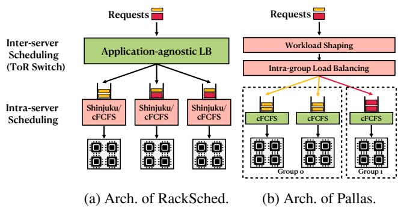  
Figure 1: Rack-scale scheduling architectures: RackSched vs Pallas.

Similar to existing literature [53, 56, 76, 82, 85], Pallas focuses on stateless or replicated stateful services, including microservices, stream processing and replicated caches and storage. Supporting stateful services is beyond the scope of this paper. Besides, Pallas expects that the workloads’ CPU demands can be statistically estimated based on historical data (see more details at §7).

Comparison with prior work. Compared to the DARC algorithm in Perséphone [29], which focus on intra-server isolation through CPU core partitioning, Pallas operates at rack scale, leveraging programmable switches to partition heterogeneous workloads before they reach servers. This architecture enables simplified and near-optimal scheduling both across and within servers. To the best of our knowledge, Pallas is the first to introduce application-aware workload shaping directly within the network switch, which differs from RackSched’s application-agnostic load balancing, proactively preventing server-side HoL blocking rather than merely reacting to it after the damage is done. Moreover, while Pallas adopts request cloning to handle short-term workload bursts—a technique used by NetClone [53]—Pallas performs this selectively, within already-shaped workload groups, avoiding the excessive overhead of general-purpose cloning.

We open-source Pallas at https://github.com/HKUST -SING/pallas.

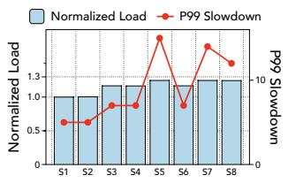  
(a) Inter-server load imbalance.

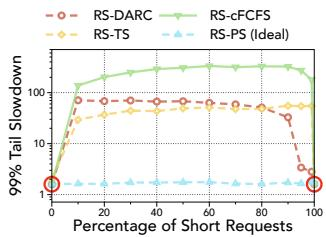  
(b) Intra-server HoL blocking.

Figure 2: Existing rack-scale scheduler is inefficient.

## 2 Rack-scale Scheduling and Status Quo

Serving µs-level services at the rack scale requires the scheduler to provide both low-tail latency to serve requests and high throughput to utilize hundreds to thousands of cores in the rack. Recent work RackSched [85] is the representative rack-scale µs-level scheduler. As shown in Figure 1a, RackSched employs a two-level scheduling hierarchy: an inter-server scheduler in the top-of-rack (ToR) switch and an intra-server scheduler within each server. The inter-server scheduler tracks real-time server loads and selects a server for each request based on its current load. Then the intra-server scheduler assigns the request to its workers, leveraging an existing intra-server scheduling mechanism like Shinjuku [45] for high-dispersion workloads and centralized First-Come-First-Serve (cFCFS) for low-dispersion workloads.

Despite being promising, we have identified two main issues with RackSched that result in long tail latency: load imbalance between servers and head-of-line blocking at each server.

Load imbalance between servers. RackSched employs a Join-the-Shortest-Queue (JSQ)-based load balancing algorithm, directing requests to servers based solely on their queue lengths by having servers relay their load information to the inter-server scheduler. This application-agnostic method, lacking insight into the specific load each request imposes on servers, can inadvertently cause load imbalances between servers. This is particularly evident when different types of requests demand varying server resources. For instance, in Figure 1a, the first two servers have the same queue lengths. However, they manifest distinct loads due to the variability in the execution times of their respective requests.

Besides, it faces challenges in accurately capturing µs-level load dynamics. The inherent delay, approximately one RTT (around 10µs), required to obtain queue length data means that by the time the scheduler is updated, the server’s actual load might have shifted. This results in the inter-server scheduler operating on potentially outdated and inaccurate load information. To understand this problem experimentally, we run RackSched to schedule requests among eight servers1 and report their normalized perceived load and 99% tail slowdown in Figure 2a. We report the slowdown instead of latency as it better reflects the impact of long requests on shorter ones. The observation is that the load imbalance between servers can lead to a significant discrepancy in tail slowdown (∼3×).

Head-of-line blocking at each server. Given its applicationagnostic load balancing strategy, the RachSched inter-server scheduler may distribute both long and short request types to each server. As a result, each server needs to address the challenges of head-of-line blocking, ensuring short requests are not blocked by longer ones. Unfortunately, even advanced intra-server schedulers [29, 45, 72] struggle to consistently offer near-optimal tail latency across diverse workloads.

To demonstrate this issue, we evaluated RackSched’s performance using a Bimodal workload (short=1µs,long=100µs) with varying short-to-long request ratios. We integrated RackSched with four representative intra-sever scheduling solutions: i) Centralized first-come-first-serve (cFCFS) from ZygOS [72] and Shenango [68] which serves requests based on their arriving order; ii) Time Sharing (TS) from Shinjuku [45] which uses preemption to prioritize short requests 2; iii) DARC from Perséphone [29] which reserves dedicated cores for short requests; and iv) Processor Sharing (PS) which is an ideal yet impractical one for comparison. We simulate it with 0.1µs preemption slice without any overhead. The simulation is based on ten servers, each equipped with twelve cores. All schemes are executed under a 95% load to highlight the performance discrepancy distinctly3.

Figure 2b presents the results, with RS-X denoting RackSched combined with intra-server scheduling algorithm X. We find that all practical algorithms (cFCFS, TS, DARC) exhibit a notable performance gap compared to the ideal yet impractical algorithm RS-PS when the workload has a mix of short and long requests. This disparity becomes especially evident when the proportion of short requests ranges between 10% and 90%. By analyzing these solutions, we can see that cFCFS fails to address the HoL problem due to its inherent scheduling approach, processing earlier arriving long requests ahead of shorter ones. Despite TS and DARC using preemption or core reservation to mitigate the HoL problem, they also cannot fundamentally resolve it in practice and result in long tail latency.

To summarize, current rack-scale scheduling employs application-agnostic load balancing between servers, assigning a mix of short and long requests to each server. This approach essentially leaves the challenging HoL blocking problem to each intra-server scheduler, which unfortunately cannot be optimally resolved by any of the existing solutions.

## 3 Key Idea: In-Network Workload Shaping

Despite it is hard to optimally schedule mixed workloads within each server, we observed that it is easy to schedule homogeneous workloads. As shown in Figure 2b, when the proportion of short requests is 0% (purely long) or 100% (purely short), the three scheduling solutions—RS-cFCFS (theoretically optimal in these cases), RS-DARC, and RS-TS—achieve tail latencies comparable to the ideal RS-PS.

This observation led us to a novel approach: in-network workload shaping. By transforming mixed workloads into groups of homogeneous workloads at the network level, we can address the scheduling complexity within the network rather than leaving it to each server. This allows each server only needs to handle one type of request, either short or long, making it easy to achieve optimal performance.

There are two opportunities that support realizing the innetwork shaping approach. i) As underscored by [29], cloud applications have the capability to transparently display request types within message headers. For example, Memcached [9] exposes request types at packet headers; Redis [12] specifies commands with a serialization protocol; Remote Procedure Calls (RPCs) with protobuf [2] can define message types. Notably, requests sharing the same type frequently demonstrate analogous processing behaviors and hence similar execution durations. Based on this observation, we can monitor the execution patterns of each type of request, enabling estimations of request execution durations based on these information. ii) Commodity datacenters are equipped with programmable switches, which provide programmable dataplane that can be leveraged to perform the workload estimation by extracting information from packet headers and hence implement advanced scheduling algorithms based on the estimated workload.

Our high-level architecture is shown Figure 1b. The programmable Top-of-Rack (ToR) switch stands central to this design, proactively partitioning mixed workloads into groups of uniform workloads based on their estimated running time. Each designated subset of servers then focuses on a specific workload group, with an intra-group load balancer ensuring even load distribution between servers. Then at each server, the intra-server scheduler handles requests using the simple and optimal cFCFS algorithm.

This architecture can effectively address the two limitations of existing rack-scale scheduling approaches to achieve nearoptimal performance. i) Accurate load balancing: Within a given group, the actual load is proportional to the cumulative request numbers, enabling a more precise load balancing between servers. ii) Eliminating HoL blocking: After workload shaping, each server only needs to handle a specific type of request. This significantly eliminates HoL blocking problem for most servers. Only a few servers need to handle it when the workload cannot be entirely partitioned. By mitigating the HoL blocking, a simple cFCFS intra-server scheduler can be used to achieve optimal tail latencies.

Why this is theoretically near optimal. The CPU scheduling problem can be formalized as the classical M/G/K queuing problem [52]. While it can be theoretically resolved by JSQ/cFCFS and JSQ/PS for inter-server and intra-server scheduling, respectively, our findings in §2 have revealed that these approaches are impractical or inefficient for µs-level latency. Fortunately, M/G/K can be decomposed into multiple M/D/K’ subproblems, each exhibiting deterministic workload. Wierman et al. [80] shows that FCFS is tail-optimal for deterministically light-tailed workload within each server, while round-robin is near-optimal for balancing the load between servers within each M/D/K’ model. This convinces us that a near-optimal framework can be achieved through in-network workload shaping, which distributes homogeneous and deterministic workload for each server.

## 4 Pallas Design

In this section, we first discuss the design challenges of Pallas, then overview its workflow, and finally describe its design details for addressing these challenges.

## 4.1 Design Challenges

Realizing the idea of in-network workload shaping into a practical system presents three outstanding technical challenges:

• How to generate an effective workload shaping policy? Creating an effective scheduling policy requires i) accurately estimating the workload, ii) partitioning the mixed workload into groups based on estimated server loads, and iii) mapping these groups to available servers. The key challenge lies in balancing workload homogeneity with server utilization: more groups might improve tail latency but lower server utilization, while fewer groups could optimize resource usage but potentially compromise tail latency.

• How to gracefully handle long-term workload changes? A scheduling policy may become suboptimal as the workload distribution shifts over time. Simply replacing the scheduling policy to accommodate workload dynamics is not sufficient and may result in temporal tail latency degradation. For instance, new scheduling policy that transitions servers from groups serving long requests to the groups for short requests may incur HoL blocking.

• How to efficiently handle short-term transient bursts? Pallas encounters limitations in capturing microsecondlevel dynamics due to the coarse-grained control granularity of long-term workload changes handling, especially in the face of transient partial workload surges due to its inherent variances. As a result, it is imperative for Pallas to incorporate a mechanism to mitigate the impact of these transient spikes.

## 4.2 Overview

Figure 3 shows the high-level workflow of Pallas. Pallas runs the inter-server scheduler as the ToR switch and the intraserver scheduler at each server. Central to the key workload shaper, Pallas composes two other components: intra-group load balancer and intra-server scheduler. Each component implements a portion of the scheduling policy, which is initially generated offline (§4.3).

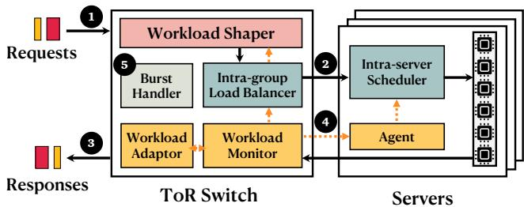

Figure 3: Pallas overview.
<table><tr><td colspan="2">Request Type</td><td>Time(us)</td></tr><tr><td rowspan="2">RocksDB</td><td>GET(10)</td><td>12</td></tr><tr><td>SCAN(5000)</td><td>650</td></tr><tr><td rowspan="6">TPC-C</td><td>Payment</td><td>5</td></tr><tr><td>OrderStatus</td><td>6</td></tr><tr><td>NewOrder</td><td>16</td></tr><tr><td>Delivery</td><td>62</td></tr><tr><td>StockLevel</td><td></td></tr><tr><td></td><td>74</td></tr></table>

Table 1: Workload examples of RocksDB and TPC-C with request types and corresponding execution times. GET(10) and SCAN(5000) denote retrievals of 10 values and scanning 5000 keys-value pairs, respectively.

Workload Shaper. The workload shaper proactively transforms mixed workloads into groups of homogeneous workloads at the ToR switch based on the request types shown in the packets (step 1 ). This stems from the observation that the same type of requests have similar execution times on servers. For example, Table 1 shows the execution times of RocksDB and TPC-C workloads we profiled (details in §6.1), which are also used in [29, 45]. Clearly, the GET(10) and SCAN(5000) requests of RocksDB can be explicitly clustered into two groups. On the other hand, TPC-C necessitates a more nuanced grouping approach (e.g., NewOrder could be its own group or merged with Payment and OrderStatus requests).

Based on the well-shaped workloads, Pallas is able to perform simple yet near-optimal intra-group load balancing and intra-server scheduling according to the initially generated policies.

• Intra-group load balancer. After determining the group for each workload request, the load balancer is responsible for distributing the requests to servers within the group. To minimize the impact of load imbalance between servers, it leverages the weighted-round-robin (WRR) algorithm to distribute request to each server based on their provisioned computation capacity for the group (step 2 ). WRR optimally weighted-balances the perceived number of requests for servers within a group, aligning with their provisioned computation capacity. We note that it is less practical for the intra-group load balancer to directly determine the CPU core for each request. The reason stems from the challenge of accurately tracking the states of hundreds to thousands of CPU cores within a rack at microsecond-scale [53, 85]. The core state requires one RTT to update in the ToR switch, which may introduce stale information and lead to inefficient scheduling decisions.

<table><tr><td rowspan=1 colspan=1>ETH</td><td rowspan=1 colspan=1>IP</td><td rowspan=1 colspan=1>UDP</td><td rowspan=1 colspan=1>Type</td><td rowspan=1 colspan=1>Flag</td><td rowspan=1 colspan=1>Index</td><td rowspan=1 colspan=1>Time</td><td rowspan=1 colspan=1>Payload</td></tr></table>

Figure 4: Packet format of Pallas.

• Intra-server scheduler. After group-level load balancing, servers dispatch the well-shaped, load-balanced request streams to different CPU cores with optimal scheduling policy. Specifically, they use the simple and optimal cFCFS algorithm to serve the uniform workload. If the workload cannot be fully partitioned, a few servers that are allocated to handle multiple groups use the DARC algorithm [29]. Note that the workload monitoring and estimation in the Pallas framework are conducted at ToR switch. Therefore, the server employing the DARC algorithm is exempted from redundant workload estimations.

Workload monitoring and change adaptation. To facilitate workload estimation, Pallas server embeds the actual execution duration of each request in the header of its corresponding response packet. The workload monitor extracts this information and updates the dataplane record registers when processing the response packets (step 3 ). The control plane of the switch executes a workload adaptor to periodically read information from workload monitor, craft the appropriate scheduling policies (step 4 ), and provision resources if it deduces significant long-term workload shifts (§4.4). When Pallas detects a bursty arrival of requests, the dataplane burst handler implements a no-regret burst reaction mechanism (step 5 ) to mitigate the burst on time (§4.5).

Packet format. Figure 4 depicts the packet header format of Pallas’s request and response. It consists of four major fields: 8-bit Type, 8-bit Flag, 32-bit Index and 32-bit Time, which are used for request grouping in workload shaping, request cloning in burst handling (§4.5), redundant replies filtering, and actual execution time of request recording in workload monitoring, respectively. Note that currently Pallas assumes each request is contained in one packet. Supporting requests with multiple packets is not the primary objective of this paper. However, this can be realized by incorporating RackSched’s request affinity mechanism [85] into Pallas, which is feasible given Pallas’s low hardware footprint as shown in §5.

## 4.3 Scheduling Policy Generation

In this subsection, we first describe how Pallas generates workload shaping policy, which is the core of Pallas to shape uniform workload, and then elaborate how Pallas leverages it to provision resources and formalize the scheduling policies.

Balancing homogeneity and server utilization. Pallas should derive an effective request group mapping policy that preserves high group-level workload homogeneity with high system utilization. Drawing from the TPC-C workloads example4 (Table 1), we observe that request types such as Payment, OrderStatus, and NewOrder exhibit comparable CPU demands. If one were to prioritize sheer request homogeneity, these types should be allocated to disjoint serving groups. However, such a configuration fragments system resources and may inadvertently result in more system idling, inducing system inefficiencies. Conversely, incorporating these request types within a single serving group could compromise group-level homogeneity, which may potentially result in a discernible performance deviation from the optimal. In summary, more groups improve homogeneity (potentially lowering latency) but risk lower utilization; fewer groups improve utilization but risk HoL blocking. Therefore, how to find a group mapping policy that achieves high intra-group homogeneity with high system efficiency remains a problem.

Since it is intractable to find the optimal policy analytically, we resort to a performance-oriented greedy mechanism to derive a solution inspired by [30]. This mechanism encompasses two primary stages: i) generation of group mapping and ii) selection of candidates. We describe each stage below by visualizing policy generation with TPC-C workload in Figure 5.

Group mapping candidates generation (step a ). We employ a clustering algorithm to generate several group mapping candidates. With the monitored workload information, the algorithm derives group mapping policies by aggregating similar request types considering both the monitored CPU demands and their proportions across all requests with customized k-means algorithm.

Optimal candidate selection (step b ). Upon obtaining all candidates from the preceding procedures, we aim to identify a policy that optimizes tail latency without compromising system utilization. To this end, we employ a performanceoriented strategy to obtain the most appropriate group mapping policy, with the focus on an empirical metric, i.e., 99th percentile latency, that matches our performance objective. Specifically, we compare the group mapping policies through offline simulations and evaluate their 99th percentile latencies. Consequently, the policy with the best objective value is selected (e.g., Final Mapping Table in Figure 5). We summarize these two steps in Algorithm 1 in Appendix §A.

Resource provisioning (step c ). Upon determining the definitive request grouping policy, we compute the cumulative CPU demands for each group and allocate the requisite CPU resources to each serving group according to the reported computing capacity of each server (e.g., server indices in Intra-group LB Policy Table). We denote r as a class of requests with the same type, e.g., GET, $E _ { r }$ as the average execution time of r, φr as the ratio of r among all requests, $\mathcal { D } _ { r }$ and $\mathcal { D } _ { g }$ as the CPU demand of r and serving group g, respectively. We compute the CPU demand of each serving group and allocate resources as follows:

$$
\begin{array} { l } { \displaystyle \mathcal { D } _ { r } = \frac { E _ { r } \times \Phi _ { r } } { \sum _ { i } E _ { i } \times \Phi _ { i } } } \\ { \displaystyle \mathcal { D } _ { g } = \sum _ { r \in g } \mathcal { D } _ { r } } \end{array}\tag{1}
$$

$$
\mathcal { R } _ { g } = \frac { \mathcal { D } _ { g } } { \sum _ { g \in G } \mathcal { D } _ { g } } \times \mathcal { R } _ { t o t a l } ,
$$

where G indicates total serving groups, $\mathcal { R } _ { g }$ denotes the CPU resources allocated to serving group $^ { g , }$ and $\mathcal { R } _ { t o t a l }$ represents the total CPU resources provisioned to the application. It is noteworthy that Pallas allocates resources at fine-grained corelevel. Hence, certain groups might be allocated with fractional server numbers, for instance, 12 cores in 1.2 servers for group 0 in the example. In such scenarios, a few servers will cater to multiple groups. To temper the scheduling intricacies throughout the system, our resource provisioning strategy guarantees that only a small number of servers serve multiple groups via gathering them to the same servers as much as possible.

Scheduling policy generation (step c and d ). Upon finalizing the request grouping policy and resource allocation for each serving group, Pallas configures the policies in switch and each server, thereby establishing the system’s request scheduling policy. When serving groups occupy multiple servers, the workload monitor formulates an intra-group load balancing policy and updates the load balancing table with weight values which correlate to the provisioned cores for each server within that group (e.g., Round-Robin Weights in Intra-group LB Policy Table). Concurrently, Pallas sends the intra-server scheduling policies (e.g., Intra-server Sched. Policy Table) to the agents located on each server. These transmitted policies encapsulate the scheduling algorithms and the relevant per-serving group CPU cores reservations, if any, especially in scenarios where a server accommodates multiple serving groups. In this way, the intra-server scheduler is able to conduct scheduling following the relayed scheduling policy from the agent.

Workload variance handling. We note that Pallas is resilient to the execution time dispersion as found in real workloads via the use of Exponential Weighted Moving Average (EWMA) for tracking execution times. EWMA inherently tolerates dispersion by capturing the central tendency, providing a stable average for grouping decisions even with variance in individual requests. As long as the EWMA-derived average execution times between different types of requests are sufficiently distinguishable, Pallas can effectively separate them into appropriate groups. Furthermore, the policy generation process itself evaluates grouping candidates based on overall empirical performance evaluated by simulation. This process selects groupings that perform well despite the expected level of intra-group variance inherent in the EWMA-based assignment.

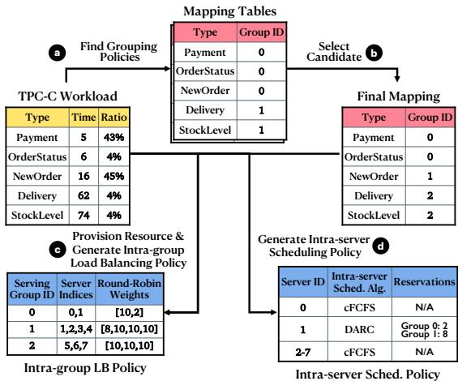  
Figure 5: Example of generating a scheduling policy for the TPC-C workload across eight servers, each equipped with 10 cores.

## 4.4 Long-term Workload Change Adaptation

As workloads may vary over time, Pallas is tailored to accommodate workload changes and recalibrate its generated scheduling policies dynamically. It monitors real-time workload metrics in the switch control plane by accessing the state registers within the switch dataplane.

Workload change detection. Leveraging the detailed perrequest metrics, i.e., average request execution time and total number of requests within a monitor interval, Pallas workload adaptor periodically assesses the new aggregated demand of each serving group in comparison to its allocated CPU resources. In particular, it examines the discrepancy between the allocated CPU resources and the real-time demand as inferred from the latest monitored workload data for each serving group, with the resource allocation methodology in §4.3. It then computes the cumulative demand discrepancy across all serving groups as the resource provision process in §4.3. If this discrepancy exceeds a predetermined threshold δ, Pallas activates a workload change reaction mechanism. Currently, the workload adaptor works at a 10ms granularity to capture relatively long-term workload changes. In our evaluation, we set δ to 10 and study its sensitivity in the Appendix §D.3.

Workload change reaction. In response to the detected workload changes, Pallas adapts its scheduling policies swiftly. Specifically, Pallas re-invokes the workload estimation methods outlined in §4.3 to formulate new policies for both interserver and intra-server scheduling. Subsequent to this, the related tables within the switch dataplane are updated. It is worthy to highlight that, in order to temper potential disruptions during the policy reconfiguration phase which makes the system unstable and hence hurts the tail latency, Pallas adopts an incremental update approach. This includes caching the previously enforced scheduling policies in workload monitor and determines their deviation from the newly devised policies. Pallas then selectively updates only those segments of the policy tables that should be changed, thereby curtailing the reconfiguration duration. Additionally, Pallas restricts the number of servers impacted by the reconfiguration, via preserving the established roles of servers in relation to their serving groups and making adjustments only when necessary.

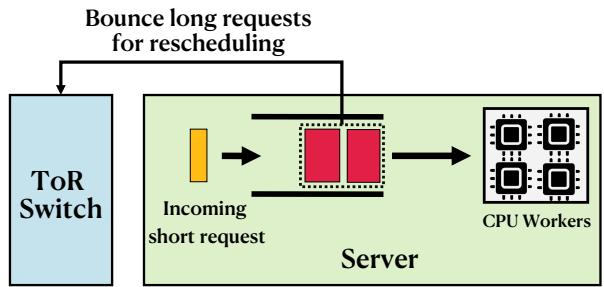  
Figure 6: Pallas request bouncing.

Request bouncing. Pallas aims to eliminate HoL blocking through in-network workload shaping. To accommodate workload dynamics, Pallas periodically revises its scheduling polices. This periodic adjustment leads to the reallocation of end-host servers across various serving groups. Consequently, during such reconfiguration phases, short requests within Pallas might experience temporary HoL blocking. This scenario arises especially when new servers, which previously catered to long requests, are allocated to serve short requests. As such, the HoL dilemma can resurface during switch reconfiguration phases. To address this, we introduce a novel request bouncing mechanism, ensuring Pallas navigates reconfiguration phases seamlessly. When a Pallas server receives new scheduling decisions, such as serving groups from long requests to short requests, we prioritize the processing of incoming short requests, thereby proactively emptying existing queues of long requests that might induce HoL blocking. To achieve this, the Pallas server compares its current serving groups against newly arriving ones. As shown in Figure 6, if the new request should take precedence by exhibiting relatively shorter CPU demands, Pallas purges the current queue, bouncing the requests back to the switch for re-scheduling. This approach stems from the rationale that the network transmission time introduces less slowdown penalty on long requests, especially when compared with the performance degradation by HoL blocking that would impose on shorter requests.

## 4.5 Short-term Transient Burst Handling

Although workload estimation captures long-term workload shifts, it faces challenges in handling sub-millisecond-level transient surges [60], as it might make the system temporarily overloaded and hence hurt tail latency. To remedy this, we introduce a mechanism that detects bursts and an innovative burst reaction method that mitigates such transient fluctuations. We note that Pallas specifically tailors this mechanism to manage bursts associated with particular request types or serving groups, attributing to their inherent variances5.

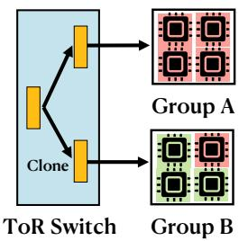  
(a) Successful cloning.

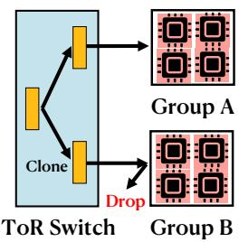  
(b) Failed cloning.  
Figure 7: Pallas request cloning. The yellow box represents the request of group A. The red core and green core represent the busy CPU and idle CPU, respectively.

Burst detection. Formally, we define a burst inspired by the Heavy Change Detection mechanisms [74, 81]. Consider a fixed time interval τ, we denote the number of requests for group g received by the switch during the one time interval τt to be $\mathbb { C } _ { g , t }$ . Pallas stipulates that a burst occurs when the real-time observed $\mathbb { C } _ { g , t }$ exceeds a threshold $\mathbb { C } _ { t h r e s } .$ . Once a burst is detected, Pallas enters the reaction mode to react to the burst. The burst detection threshold $\mathbb { C } _ { t h r e s }$ represents the upper limit of requests from group g that can be processed by the entire allocated computational resources without inducing queuing. Let N denote the number of group g’s requests a single core can process within the τ duration. The threshold $\mathbb { C } _ { t h r e s }$ can be formulated as $\textstyle \sum _ { i \in { \mathcal { R } } g } N _ { i }$ . The value of $N _ { i }$ can either be determined through offline profiling or dynamically estimated by the agent resided within each server. To achieve prompt burst detection, we set the time interval τ at 20µs.

Why not server-level cycle stealing? While cycle stealing [37] proves effective for handling burst within an individual server in Perséphone [29], resulting from its ability to determine that the stolen cores are idle, this effectiveness diminishes at the rack-scale. The challenge emerges from the difficulties of accurately determining a server’s idle state at scale for microservices [53]. In this case, the request that is redirected to other group servers via cycle stealing may even deliver worse tail latency when the destination server is busy. Consequently, we aim at a no-regret burst reaction mechanism. It should ensure that the ultimate performance never deteriorates compared to scenarios without any burst reaction, a guarantee that cycle stealing cannot provide.

Burst reaction. Upon detecting a burst at the serving group level in terms of request rates, Pallas employs a best-effort request cloning technique to handle transient spikes. Pallas assumes that a burst typically does not occur across the entire workload. Thus, when a specific serving group grapples with a burst, other groups temporarily experience underutilization. As a result, Pallas strategically clones [53] the incoming requests to idle groups for burst handling. The total cloning number hinges on the burst’s intensity. Specifically, once Pallas enters the clone mode, it clones requests from the overloaded group to the underutilized ones, determining the total number of requests to be cloned as $\mathbb { C } _ { c l o n e } = \mathbb { C } _ { g , t } - \mathbb { C } _ { t h r e s } .$ When a request is selected for cloning, Pallas clones it and then dispatches the original request to its serving group and the cloned request to the group which exhibits the lowest degree of burst (Figure 7a). The req.flag.clone of the original request and the cloned one are set to 1 and 2, respectively. To avoid the potential HoL blocking caused by cloning long requests to short request groups, the server receiving the cloned request (req.flag.clone = 2) will directly drop it if it has no idle CPU cores (Figure 7b). To avoid redundant processing of multiple responses for the cloned requests, Pallas’s switch dataplane filters out the slower responses with the globally unique request ID (req.index). Besides, experiments in §6.4.2 show that Pallas’s cloning does not sacrifice sustainable throughput, as it only handles the bursty portion of requests. The overall request scheduling procedures are summarized in Algorithm 2 in Appendix §B for reference.

## 5 Implementation

We have implemented a fully functional Pallas prototype, including the inter-server scheduler in programmable switch, intra-server schedulers and paired agents in each server and request clients. 1) The inter-server scheduler within switch dataplane is written in P4 [18] and compiled to switch ASIC with P4 Studio [4]. Pallas uses 2.8% SRAM and 10.4% Stateful ALUs of Tofino ASIC resources. Pallas dataplane composes 763 lines of P4 code. The control plane was implemented with 1067 lines of python code, which uses the switch SDK to read aggregated statistics from data plane registers and update the policy tables if required. More details of dataplane implementation are presented in the Appendix §C. 2) The server is built atop Perséphone [29]. We have extended Perséphone to support the packet header and functionality of Pallas for measuring request actual execution time, and encode this time into Pallas responses for workload estimation. Besides, we have implemented the agent to relay intra-server scheduling policies, and request bouncing mechanism to protect system performance during switch reconfiguration of policy tables. 3) The client is open-loop, implemented in C, and utilizes DPDK for high-speed user-space networking. It can generate Pallas requests at high rate and measure the throughput and latency for each request accurately.

## 6 Evaluation

We evaluate Pallas to answer the following key questions:

• How does Pallas compare against state-of-the-art systems in static workloads? We show that Pallas achieves near-optimal tail latency in statically synthetic workloads (§6.2.1) and real-workload applications (§6.2.2), which significantly outperforms RackSched. For example, Pallas reduces the tail latency by 8.5× and 5.5× compared to RackSched in the Bimodal distribution and RocksDB experiments at medium load, respectively. Specifically, Pallas reduces the tail latency by two orders of magnitude compared to RackSched in the Port RocksDB experiment at high load. We also show that Pallas delivers low tail latency under light-tailed workloads (Appendix §D.1) and outperforms other solutions (§6.5), including R2P2 [56], Draconis [76] and Horus [82].

<table><tr><td rowspan="2"></td><td colspan="10">SyntheticWorkloads</td><td colspan="4">Real World Applications</td></tr><tr><td colspan="3">Bimodal</td><td colspan="3">Trimodal</td><td colspan="4">TPC-C</td><td colspan="3">RocksDB</td></tr><tr><td></td><td>Normal</td><td></td><td>Port</td><td></td><td></td><td></td><td></td><td></td><td></td><td></td><td>Normal</td><td></td><td>Port</td><td></td></tr><tr><td>Type</td><td>S</td><td>L</td><td>S</td><td>L</td><td>S M</td><td>L</td><td>P</td><td>Os</td><td>NO</td><td>D</td><td>SL</td><td>GET SCAN</td><td>GET</td><td>SCAN</td></tr><tr><td>Time (us)</td><td>10</td><td>100</td><td>10</td><td>100 5</td><td>50</td><td>500</td><td>5</td><td>6 4%</td><td>16</td><td>62 74</td><td>12</td><td>650</td><td>12</td><td>650</td></tr><tr><td>Ratio</td><td>90%</td><td>10%</td><td>50%</td><td>50% 33.3%</td><td>33.3%</td><td>33.3%</td><td>43%</td><td></td><td>45% 4%</td><td>4%</td><td>90%</td><td>10%</td><td>50%</td><td>50%</td></tr></table>

Table 2: Workloads with dispersion. In Bimodal and Trimodal workloads, S, M, L represent short, medium, and long request, respectively. In TPC-C workload, P, OS, NO, D, and SL represent Payment, OrderStatus, NewOrder, Delivery, and StockLevel, respectively.

• How does Pallas respond to workload changes? We demonstrate that Pallas can agilely respond to workload changes and gracefully handle system reconfiguration (§6.3), maintaining the stable tail latency in both synthetic and real-world workloads.

• How effective is Pallas in terms of its components and scalability? First, we show that workload shaping significantly helps load balancing and intra-server scheduling (§6.4.1). Besides, we demonstrate that our request bouncing (§6.4.2) and burst handling mechanisms (§6.4.3) can both effectively mitigate the performance degradation under workload dynamics. We also show that Pallas can almost scale out linearly with more servers without compromising performance in Appendix §D.2.

## 6.1 Experimental Setup

Testbed. The experiments are performed on a testbed of ten machines connected by a Intel Tofino switch. Each machine is equipped with two 12-core CPU (Intel Xeon(R) CPU E5-2630 v2, 2.60GHz), 64GB memory, and one NVIDIA ConnectX-4 100G NIC. Each machine runs Ubuntu 18.04 with Linux kernel 5.4.100. We use eight machines as servers to process requests and two machines as clients to generate requests, which is the similar setting in RackSched. Both clients and servers runs DPDK 22.11.1 [5] for high-performance packet processing. All servers use 10 worker threads running on dedicated CPU cores. To improve system stability and reduce jitter, we disable TurboBoost, C-states, and CPU frequency scaling as recommended by [29, 68].

System compared. We compare the performance of Pallas against RackSched [85]. We note that RackSched leverages

Shinjuku [45] as the default intra-server scheduler. However, as Shinjuku only supports Intel NICs [45, 63, 85], we replace it with Perséphone (DARC) within RackSched’s framework for intra-server scheduling, since our motivation experiment (Figure 2b) has shown that DARC delivers comparable performance compared to TS (Shinjuku) for mixed workloads. We have extended Perséphone to support RackSched packet header and encode queue length in its response for JSQ-based load balancing. For ease of reference in the subsequent experiments, we name the system as RS-DARC or simply RS.

Workloads. We use a combination of synthetic and real world application workloads to evaluate Pallas, following the similar settings in recent works [29, 45, 72, 85]. By default, both request and response contain one packet. In the context of synthetic workloads, servers conduct the fake work by spinning the CPU for the specified number of cycles. For the real world application workloads, we harness RocksDB [13], an in-memory key-value store, as the experimental platform. We summarize the workloads in Table 2. Notably, we profile TPC-C [11] transactions with silo [75], an in-memory database, and evaluate it as a synthetic workload to showcase how Pallas performs on the n-modal workload. Additionally, we craft dynamic workloads characterized by fluctuating request distributions. This setting aims to elucidate Pallas’s adaptive capacities and response mechanisms when confronted with variations in workload patterns. Note that Pallas targets stateless or replicated stateful services. The profiled TPC-C transactions are used primarily as a source of realistic, multi-modal execution times for synthetic load generation to test shaping effectiveness. In addition, the evaluation on RocksDB uses an in-memory setup with read-only GET/SCAN requests.

Evaluated metrics. We adjust the request rates (request per second (rps)) from the clients to modulate the system load, and report the 99% tail latency, measured in microseconds, corresponding to each specific rps adjustment.

## 6.2 Static Workloads

## 6.2.1 Synthetic Workloads

Figure 8 compares Pallas to RS-DARC for three service time distributions. Note that the y-axis is log-scaled for good visibility. Overall Pallas achieves significantly better tail latency than RS-DARC. For example, as shown in Figure 8a, the tail latency of RS-DARC starts to increase when system load is above 1.5Mrps, and its tail latency reaches 1112µs when the load reaches 1.8Mrps, which is 5.2× higher than Pallas (211µs) at the same load. In contrast, Pallas maintains a stably low tail latency (∼200µs) before the load reaches 2.15Mrps. In specific, Pallas reduces the latency by 16× when the system load is 1.9Mrps. For the 250µs tail latency objective, Pallas achieves 1.5× higher throughput. The reason of Pallas’s significant performance improvement is twofold. First, by employing the workload shaping, Pallas adeptly steers short and long requests to different subsets of servers for intra-group scheduling. Therefore, under this workload configuration, seven servers exclusively process a singular type of requests (either short or long), where the simple yet efficient cFCFS scheduler is utilized to achieve optimal tail latency. This entirely addresses the HoL blocking problem. Only one residual server works in the hybrid mode, accommodating both short and long requests. Second, the approach to load balancing also undergoes refinement through workload shaping. In Pallas, intra-group scheduling only requires a weighted balancing of request numbers among servers. This mechanism demonstrates better load balancing than the queuelength based solution adopted in RackSched.

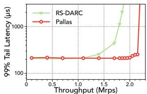  
(a) Normal Bimodal

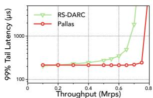  
(b) Port Bimodal

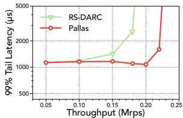  
(c) Trimodal

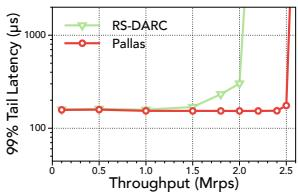  
(d) TPC-C  
Figure 8: Experimental results for synthetic workloads.

Figure 8b depicts the results for a more challenging Port Bimodal workloads, which represents the workloads characterized by an even split between short and long requests. We find that Pallas maintains a consistently low tail latency until the system reaches its saturation point. In specific, Pallas reduces the tail latency by 8.5× compared to RS-DARC at a load of 0.7Mrps. For the 300µs tail latency objective, Pallas achieves 1.4× higher throughput. Figure 8c illustrates the performance of Pallas under a trimodal workload. The results show that Pallas delivers 2.0× higher throughput than RS-DARC when targeting a tail latency objective of 1200µs. Furthermore, at a system load of 0.18Mrps, Pallas manages to reduce the tail latency by a factor of 2.3× compared to RS-DARC.

Finally, we evaluate Pallas with the profiled TPC-C workload. In this context, the best performant grouping policy is: the Payment and OrderStatus transactions are cohesive in one group, the Delivery and StockLevel transactions form another group, and the NewOrder transaction represents solely the third group. The results are shown in Figure 8d. Notably, when targeting a tail latency objective of 200µs, Pallas delivers as much as 2.5Mrps high throughput, which is 1.7× superior to that of RS-DARC.

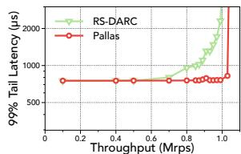  
(a) Normal RocksDB (low)

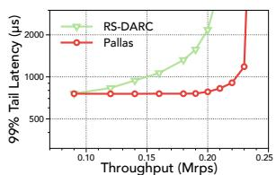

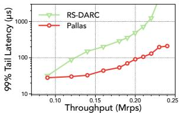  
(b) Port RocksDB (high)

(c) GET Latency (high)  
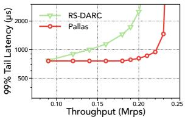  
(d) SCAN Latency (high)  
Figure 9: Experimental results for RocksDB.

## 6.2.2 Real Application: RocksDB

In this section, we showcase the performance gain of Pallas when applied to real-world applications RocksDB [13]. Adopting the configuration presented in [45, 85], we configure the database to operate on an in-memory file (/tmpfs/) for processing database transactions. Our evaluation incorporates two distinct request types: the GET request, which retrieves 10 key-value pairs with a median service time of 12µs, and the SCAN request, designed to scan 5000 key-value pairs with a median service time of 650µs. Figure 9a shows the performance under a workload mix of 90% GET and 10% SCAN requests. We observe that Pallas adeptly handles system loads up to 1Mrps without increasing tail latency.

Figure 9b presents the performance results for RocksDB workloads with an equal mix (50-50) of GET and SCAN requests. We find that Pallas maintains stable tail latency until the system load reaches 0.21Mrps, achieving a 5.5× latency reduction when compared to RS-DARC. Notably, Pallas achieves as much as two orders of magnitude lower latency at the 0.22Mrps and 0.23Mrps load. For a more granular analysis, we break down the results of GET and SCAN requests under the port RocksDB workload, respectively, as depicted in Figure 9c and Figure 9d. Owing to the applicationagnostic nature of inter-server scheduling in RS-DARC, each server continues to handle heterogeneous workloads. This necessitates the reservation of at least one CPU core for short requests exclusively, resulting in an over-provisioning of GET requests and an under-provisioning of SCAN requests. This imbalance results in a rapid surge in the tail latency of SCAN requests under RS-DARC as the system load escalates. In contrast, Pallas optimizes resource provisioning for each request type at rack-scale, yielding a far more efficient and effective allocation. Consequently, Pallas significantly curtails the tail latency of SCAN requests compared to RS-DARC, and yet without compromising the tail latency performance of GET requests.

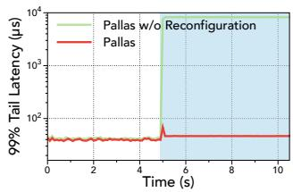  
(a) Short requests

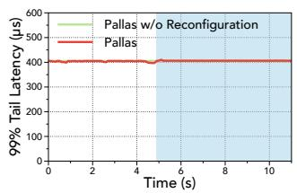  
(b) Long requests

Figure 10: Results on the changing synthetic workload.  
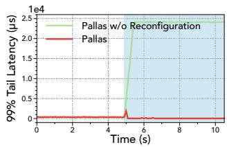  
(a) GET requests

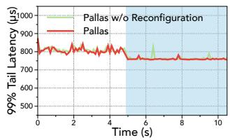  
(b) SCAN requests  
Figure 11: Results on the changing RocksDB workload.

## 6.3 Dynamic Workloads

Synthetic workloads. We initiate by dispatching requests that follow the Port Bimodal (50%-10µs, 50%-100µs) distribution to the system, subsequently transitioning the workload distribution to Normal Bimodal (90%-10µs, 10%-100µs). Throughout this experiment, we maintain the system load at approximately 80%. The results are shown in Figure 10, where the shaded region signifies the period of new workload. The performances of long requests under these two schemes remain relatively stable due to their decreasing resource demands (Figure 10b). For short requests, we observe that Pallas without policies reconfiguration cannot adapt to workload shifts and hence results in explicit tail latency inflation (Figure 10a). On the other hand, during this transition phase, the Pallas workload estimator discerns the workload pattern and promptly updates both the inter-server scheduling policies and intra-server scheduling policies. Further, as the workload changes, the proportion of short requests surges. Consequently, there is a noticeable spike in the 99% tail latency for Pallas’s short requests, which is attributed to system reconfiguration and transient overloads. Nevertheless, the temporal overload can be mitigated by the burst handling mechanism, which takes effect before the control plane detects the workload change by cloning increasing short requests to the group for long requests to reduce its latency. Besides, our dedicated request bouncing strategy reconciles this latency elevation. These two mechanisms work in concert to ensure that Pallas accommodates the changing workload gracefully.

RocksDB. We adopt a similar setting to assess Pallas’s performance on dynamic RocksDB workloads. The request distribution transitions from Port RocksDB (50% GET, 50% SCAN) to Normal RocksDB (90% GET, 10% SCAN). The results are depicted in Figure 11. We observe that Pallas swiftly adapts to the workload changes, ensuring consistent tail latency. Its counterpart of Pallas without workload adaptation delivers a significant worse performance, as current scheduling policies are largely inefficient for GET requests. During the workload transition phase, there is also a slight surge. However, the tail latency inflation is effectively bounded by the mechanisms of burst handling and request bouncing.

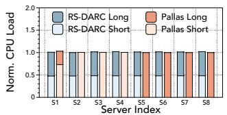  
(a) Per-server load (low)

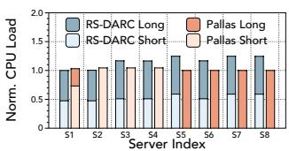  
(b) Per-server load (high)

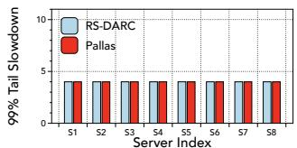  
(c) Per-server Slowdown (low)

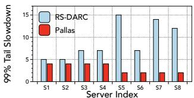  
(d) Per-server Slowdown (high)  
Figure 12: Comparison of per-server perceived load and performance between Pallas and RS-DARC.

## 6.4 Pallas Deep Dive

## 6.4.1 Effectiveness of Workload Shaper

To delve deeper into why Pallas significantly outperforms RackSched in terms of tail latency, we analyze the perceived request load and resultant performance slowdown for each server during the experiments under Normal Bimodal workload in §6.2.1. This analysis is conducted at two distinct system loads: 0.05Mrps (referred to as ’low’) and 1.8Mrps (referred to as ’high’).

In the low load scenario (first column), it is evident from Figure 12a that both RackSched and Pallas manage to achieve commendable inter-server load balancing. Consequently, their overall slowdowns are comparable, as seen in Figure 12c. However, when we examine RS-DARC at high load, a clear disparity in server load balance emerges. As Figure 12b shows, servers S1 and S2 in RS-DARC handle noticeably fewer requests than their counterparts, while S5 is scheduled to handle more requests. This imbalance is attributed to the applicationagnostic nature and outdated load information used by the JSQ-based load balancer in RackSched, resulting in the divergent slowdown performance. Additionally, each server in RackSched continues to process a mixture of short and long requests, necessitating the use of complex algorithm (DARC) for ongoing workload monitoring and core allocation adjustments for different type of requests. This dynamic adjustment, however, still culminates in suboptimal performance. In contrast, Pallas showcases impressive load balance across servers, even at high load, as the results shown in Figure 12b. This balance is achieved through in-network workload shaping and nearly optimal intra-group scheduling. Consequently, servers S2-S8 in Pallas exclusively handle a single request type, allowing them to employ cFCFS to optimize tail latency and slowdown. For instance, when examining server S5, we find that Pallas reduces the slowdown by 7× compared to RS-DARC, as highlighted in Figure 12d.

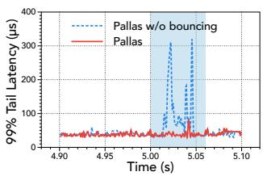  
(a) Request bouncing

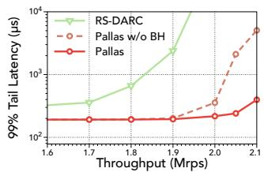  
(b) Burst handling  
Figure 13: Effectiveness of Pallas’s components.

## 6.4.2 Request Bouncing

We offer a granular breakdown of the experiments under dynamic Bimodal workloads in §6.3, with results presented in Figure 13a. We observe that the bouncing policy adeptly facilitates Pallas’s management of workload shifts, particularly in curtailing the tail latency of short requests. For instance, the fluctuations of tail latency for short requests in Pallas are effectively tempered in comparison to the system without bouncing mechanism.

## 6.4.3 Burst Reaction

To showcase the efficacy of Pallas’s burst handling mechanism, we evaluate it under a challenging bursty workload comprised of 90% short requests of 10µs and 10% long requests of 90µs. The arrival pattern for short requests adheres to the bursty gamma distribution with a standard deviation of 5, whereas the long requests conform to a standard Poisson arrival pattern. In this scenario, both short and long requests are allocated to two distinct serving groups, with each group being provisioned with 4 servers, offering 40 cores cumulatively. After profiling the maximum throughput under this configuration, we configure the burst detection threshold $C _ { t h r e s h }$ as 42 for the group of short requests. The tail latency under varying system loads is illustrated in Figure 13b. Our results reveal that both Pallas and its variant, i.e., with the Burst Handling (BH) disabled, significantly outperform RS-DARC in terms of reduced latency. Furthermore, Pallas reduces the tail latency by an average factor of 6.1× compared to its variant when the load surpasses 1.9Mrps. This is because Pallas clones the bursty short requests to the group for long ones, which effectively masks the latency inflation and hence mitigates the performance degradation of short requests.

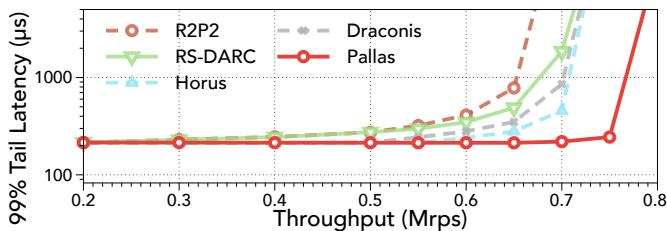  
Figure 14: Comparison with other solutions.

## 6.5 Comparison with Other Solutions

Several other solutions aim to improve rack-scale scheduling by leveraging in-network support. R2P2 [56] introduces a join-bounded-shortest-queue (JBSQ) policy for dynamically distributing requests across servers. Horus [82] enhances scheduling accuracy by proactively monitoring server states and loads via network switches. Draconis [76] is the latest proposal for optimizing latency for µs-level services, which implements centralized first-come-first-served (cFCFS) scheduling directly within the switches. Figure 14 compares Pallas with them under a port bimodal workload. We find that Pallas achieves superior performance, delivering lower tail latency and greater sustainable throughput. The reason is that they distribute mixed workloads to each server, where HoL blocking may still occur. However, Pallas eliminates it through its efficient in-network workload shaping and thus delivers the near-optimal performance.

## 7 Discussion

Target workloads and applications. Pallas can support CPU-intensive stateless or replicated stateful services, which is consistent with recent proposals [53, 56, 76, 82, 85]. Example applications comprise in-memory databases, replicated caches and storages, function-as-a-service and replicated inference services for machine learning. Pallas currently does not support stateful services, as it is less likely to replicate them within a rack and scheduling may not be required. Pallas may be extended to support stateful applications by implementing a sticky policy, similar to [56], which distributes stateful operations to determined master nodes to maintain consistency.

Workload practicality. Pallas assumes that the workloads can expose statistical characteristic in terms of the CPU demands, which is practical in many workloads [11, 14, 22]. This characteristic helps Pallas to generate effective workload shaping policies. As a result, Pallas’s performance gain may diminish if the workloads are highly dynamic and unpredictable. We acknowledge that it is Pallas’s limitation to rely on the correlation between request types and execution time, which is a simplified assumption. For more complex workloads whose request execution time cannot be related to their types alone, such as Lucene [1], we environ Pallas with a more intelligent workload monitoring mechanism, e.g., using a machine learning model, to estimate the request execution time based on the necessary information at packet headers

exposed by the programmers.

Scaling to multiple racks. Currently, Pallas is designed within a single rack, as a modern rack can already provide hundreds of cores and is expected to pack thousands of cores [3, 7], which is sufficient for many services [85]. We further note that in-network workload shaping of Pallas can naturally be extended to multiple racks or even the entire datacenter in a hierarchical manner, e.g., leveraging both core switches and ToR switches. Realizing this requires efficient collaboration between core switches and ToR switches to enforce a holistic workload shaping policy across racks. Meanwhile, managing heterogeneous servers across racks and handling more frequent workload changes and spikes may also present challenges. We leave it as future work.

Optimization of intra-server scheduling. By design, the majority of servers in Pallas are expected to employ the simple and efficient cFCFS scheduling algorithm. A natural enhancement would be to transition this scheduling algorithm to hardware [6, 10, 63], which promises to curtail scheduling overheads substantially and improve intra-server scalability.

Resource multiplexing and placement constraints. In the context of CPU scheduling, Pallas’s workload shaping strategy may not be efficient regarding the resource multiplexing of other resources, e.g., memory and disks. Extending Pallas to schedule microsecond-level services with multi-resource multiplexing is an interesting future direction. Moreover, Pallas’s workload shaping strategy essentially implies the placement constraints of requests. Therefore, system operators and designers may utilize the outcome of Pallas’s workload shaping to guide specific optimizations for different types of requests [58, 79].

Deployment considerations. Pallas is incrementally deployable. Its major components are implemented in the programmable switch, without requiring complex modifications to end hosts, and may even simplify server-side designs. Pallas uses reserved UDP ports to trigger its logic, allowing it to co-exist with other applications. Practical deployment of Pallas requires access to programmable switches with sufficient dataplane and control plane resources. As shown in the implementation (§5), Pallas consumes modest hardware resources, suggesting the feasibility on modern switch hardware. Integrating Pallas into production environments may also require coordination with existing dataplane programs [33] and control plane infrastructure, particularly to support multiple concurrent applications. We leave it as future work.

## 8 Related work

Rack-scale scheduling for µs-level services. There exist some solutions to optimize the tail latency for rack-scale µslevel services [53, 56, 76, 82, 85]. However, all of them may still suffer from the load imbalance and the HoL blocking under workloads with highly diverse execution times. Pallas optimizes the tail latency through an entirely different way: instead of scheduling requests, Pallas poses the concepts of workload shaping and schedules the workload to each server, which significantly reduces the complexities of both load balancing and intra-server scheduling and improves the scheduling quality. NetClone [53] employs general request cloning as a primary mechanism for tail latency optimization. Pallas utilizes cloning differently and more strategically: as a conditional mechanism (§4.5) integrated within its shaping framework, and triggered only for detected bursts within specific and pre-shaped workload groups. This makes Pallas’s cloning a precise tool to maintain stability for already optimized workloads and maintains resource efficiency.

Intra-server optimizations. Several intra-server designs have been proposed to reduce latency and improve throughput by introducing optimized network stacks [5, 24, 42, 49, 67], designing dataplane operating systems [17, 23, 29, 31, 32, 39, 41, 45, 46, 50, 62, 66, 71, 72, 84] and performing hardwarebased optimizations [38, 40, 51, 63, 78]. For example, Persé- phone [29] focus on mitigating HoL blocking within a single server by isolating requests with different execution times to separate CPU cores. These optimizations are orthogonal to Pallas and can be integrated in it to further reduce latency and improve throughput.

Job scheduling. There is a long line of research on the job scheduling at cluster-level [26, 27, 28, 34, 35, 36, 47, 70, 77]. These systems target second-level jobs and therefore allow for complex scheduling algorithms to achieve good performance. However, Pallas is designed for microsecond-level services which requires the scheduler to make simple and effective scheduling decisions at line speed.

Programmable networks. Programmable switches enable the network to perform more complex operations to improve datacenter applications [43, 44, 54, 57, 59, 61, 64, 73, 83]. To the best of our knowledge, Pallas is the first to design application-aware in-network scheduling for microsecondlevel services with significant performance improvements.

## 9 Conclusion

This paper presented Pallas, a new solution to schedule µslevel services at rack-scale. Pallas leverages the core idea of workload shaping by proactively transforming mixed workloads into uniform ones within the network and performs simple yet near-optimal inter-server load balancing and intraserver CPU scheduling. Our evaluation demonstrates that Pallas significantly outperforms the state-of-the-art solution in terms of both throughput and tail latency.

## Acknowledgments

We thank our shepherd Gyuyeong Kim and anonymous ATC reviewers for their constructive feedback. This work is supported in part by Hong Kong RGC TRS T41-603/20R, GRF 16213621, ITC ACCESS, NSFC 62402407, National Natural Science Fund for the Excellent Young Scientists Fund Program (Overseas). Kai Chen is the corresponding author.

## References

[1] Apache lucene. https://lucene.apache.org/co re/2\_9\_4/queryparsersyntax.html.

[2] Google. protocol buffers - google’s data interchange format. https://github.com/protocolbuffers/pro tobuf.

[3] Hp the machine. https://www.hpl.hp.com/resea rch/systems-research/themachine/.

[4] Intel barefoot p4 studio. https://www.intel.com/ content/www/us/en/products/details/network -io/intelligent-fabric-processors/p4-studi o.html.

[5] Intel data plane development kit (dpdk). https://ww w.dpdk.org/.

[6] Intel ethernet flow director. https://www.intel. com/content/dam/www/public/us/en/documents /white-papers/intel-ethernet-flow-director. pdf.

[7] Intel rack scale design. https://www.intel.com/ content/www/us/en/architecture-and-technol ogy/rack-scale-design-overview.html.

[8] Intel tofino series. https://www.intel.com/cont ent/www/us/en/products/details/network-io/ intelligent-fabric-processors/tofino.html.

[9] Memcached key-value store. https://memcached. org/.

[10] Nvidia bluefield data processing units. https://www.nvidia.com/en-us/networking /products/data-processing-unit/.

[11] On-line transaction processing benchmark. https: //www.tpc.org/tpcc/.

[12] Redis: In-memory data store. https://redis.io/.

[13] Rocksdb. https://rocksdb.org/.

[14] Berk Atikoglu, Yuehai Xu, Eitan Frachtenberg, Song Jiang, and Mike Paleczny. Workload analysis of a largescale key-value store. In Proceedings of the 12th ACM SIGMETRICS/PERFORMANCE joint international conference on Measurement and Modeling of Computer Systems, pages 53–64, 2012.

[15] Luiz Barroso, Mike Marty, David Patterson, and Parthasarathy Ranganathan. Attack of the killer microseconds. Commun. ACM, 60(4):48–54, mar 2017.

[16] Luiz André Barroso, Jeffrey Dean, and Urs Holzle. Web search for a planet: The google cluster architecture. IEEE micro, 23(2):22–28, 2003.

[17] Adam Belay, George Prekas, Ana Klimovic, Samuel Grossman, Christos Kozyrakis, and Edouard Bugnion. IX: A protected dataplane operating system for high throughput and low latency. In 11th USENIX Symposium on Operating Systems Design and Implementation (OSDI 14), pages 49–65, Broomfield, CO, October 2014. USENIX Association.

[18] Pat Bosshart, Dan Daly, Glen Gibb, Martin Izzard, Nick McKeown, Jennifer Rexford, Cole Schlesinger, Dan Talayco, Amin Vahdat, George Varghese, et al. P4: Programming protocol-independent packet processors. ACM SIGCOMM Computer Communication Review, 44(3):87–95, 2014.

[19] Sol Boucher, Anuj Kalia, David G Andersen, and Michael Kaminsky. Putting the "micro" back in microservice. In 2018 USENIX Annual Technical Conference (USENIX ATC 18), pages 645–650, 2018.

[20] Inho Cho, Ahmed Saeed, Joshua Fried, Seo Jin Park, Mohammad Alizadeh, and Adam Belay. Overload control for {µs-scale}{RPCs} with breakwater. In 14th USENIX Symposium on Operating Systems Design and Implementation (OSDI 20), pages 299–314, 2020.

[21] Inho Cho, Ahmed Saeed, Seo Jin Park, Mohammad Alizadeh, and Adam Belay. Protego: Overload control for applications with unpredictable lock contention. In 20th USENIX Symposium on Networked Systems Design and Implementation (NSDI 23), pages 725–738, Boston, MA, April 2023. USENIX Association.

[22] Brian F Cooper, Adam Silberstein, Erwin Tam, Raghu Ramakrishnan, and Russell Sears. Benchmarking cloud serving systems with ycsb. In Proceedings of the 1st ACM symposium on Cloud computing, pages 143–154, 2010.

[23] Alexandros Daglis, Mark Sutherland, and Babak Falsafi. Rpcvalet: Ni-driven tail-aware balancing of µs-scale rpcs. In Proceedings of the Twenty-Fourth International Conference on Architectural Support for Programming Languages and Operating Systems, pages 35–48, 2019.

[24] Michael Dalton, David Schultz, Jacob Adriaens, Ahsan Arefin, Anshuman Gupta, Brian Fahs, Dima Rubinstein, Enrique Cauich Zermeno, Erik Rubow, James Alexander Docauer, et al. Andromeda: Performance, isolation, and velocity at scale in cloud network virtualization. In 15th USENIX symposium on networked systems design and implementation (NSDI 18), pages 373–387, 2018.

[25] Jeffrey Dean and Luiz André Barroso. The tail at scale. Commun. ACM, 56(2):74–80, feb 2013.

[26] Pamela Delgado, Diego Didona, Florin Dinu, and Willy Zwaenepoel. Job-aware scheduling in eagle: Divide and stick to your probes. In Proceedings of the Seventh ACM Symposium on Cloud Computing, pages 497–509, 2016.

[27] Pamela Delgado, Diego Didona, Florin Dinu, and Willy Zwaenepoel. Kairos: Preemptive data center scheduling without runtime estimates. In Proceedings of the ACM Symposium on Cloud Computing, pages 135–148, 2018.

[28] Pamela Delgado, Florin Dinu, Anne-Marie Kermarrec, and Willy Zwaenepoel. Hawk: Hybrid datacenter scheduling. In 2015 USENIX Annual Technical Conference (USENIX ATC 15), pages 499–510, 2015.

[29] Henri Maxime Demoulin, Joshua Fried, Isaac Pedisich, Marios Kogias, Boon Thau Loo, Linh Thi Xuan Phan, and Irene Zhang. When idling is ideal: Optimizing tail-latency for heavy-tailed datacenter workloads with perséphone. In Proceedings of the ACM SIGOPS 28th Symposium on Operating Systems Principles, SOSP ’21, page 621–637, New York, NY, USA, 2021. Association for Computing Machinery.

[30] Mo Dong, Qingxi Li, Doron Zarchy, P Brighten Godfrey, and Michael Schapira. {PCC}: Re-architecting congestion control for consistent high performance. In 12th USENIX Symposium on Networked Systems Design and Implementation (NSDI 15), pages 395–408, 2015.

[31] Dawson R Engler, M Frans Kaashoek, and James O’Toole Jr. Exokernel: An operating system architecture for application-level resource management. ACM SIGOPS Operating Systems Review, 29(5):251–266, 1995.

[32] Joshua Fried, Zhenyuan Ruan, Amy Ousterhout, and Adam Belay. Caladan: Mitigating interference at microsecond timescales. In 14th USENIX Symposium on Operating Systems Design and Implementation (OSDI 20), pages 281–297, 2020.

[33] Jiaqi Gao, Jiamin Cao, Yifan Li, Mengqi Liu, Ming Tang, Dennis Cai, and Ennan Zhai. Sirius: Composing network function chains into P4-Capable edge gateways. In 21st USENIX Symposium on Networked Systems Design and Implementation (NSDI 24), pages 477–490, Santa Clara, CA, April 2024. USENIX Association.

[34] Ali Ghodsi, Matei Zaharia, Benjamin Hindman, Andy Konwinski, Scott Shenker, and Ion Stoica. Dominant resource fairness: Fair allocation of multiple resource types. In 8th USENIX symposium on networked systems design and implementation (NSDI 11), 2011.

[35] Ionel Gog, Malte Schwarzkopf, Adam Gleave, Robert NM Watson, and Steven Hand. Firmament:

Fast, centralized cluster scheduling at scale. In 12th USENIX Symposium on Operating Systems Design and Implementation (OSDI 16), pages 99–115, 2016.

[36] Robert Grandl, Mosharaf Chowdhury, Aditya Akella, and Ganesh Ananthanarayanan. Altruistic scheduling in {Multi-Resource} clusters. In 12th USENIX symposium on operating systems design and implementation (OSDI 16), pages 65–80, 2016.

[37] Mor Harchol-Balter, Cuihong Li, Takayuki Osogami, Alan Scheller-Wolf, and Mark S Squillante. Cycle stealing under immediate dispatch task assignment. In Proceedings of the fifteenth annual ACM symposium on Parallel algorithms and architectures, pages 274–285, 2003.

[38] Jack Tigar Humphries, Kostis Kaffes, David Mazières, and Christos Kozyrakis. Mind the gap: A case for informed request scheduling at the nic. In Proceedings of the 18th ACM Workshop on Hot Topics in Networks, pages 60–68, 2019.

[39] Jack Tigar Humphries, Neel Natu, Ashwin Chaugule, Ofir Weisse, Barret Rhoden, Josh Don, Luigi Rizzo, Oleg Rombakh, Paul Turner, and Christos Kozyrakis. ghost: Fast & flexible user-space delegation of linux scheduling. In Proceedings of the ACM SIGOPS 28th Symposium on Operating Systems Principles, pages 588–604, 2021.

[40] Stephen Ibanez, Alex Mallery, Serhat Arslan, Theo Jepsen, Muhammad Shahbaz, Changhoon Kim, and Nick McKeown. The nanopu: A nanosecond network stack for datacenters. In 15th {USENIX} Symposium on Operating Systems Design and Implementation ({OSDI} 21), pages 239–256, 2021.

[41] Rishabh Iyer, Musa Unal, Marios Kogias, and George Candea. Achieving microsecond-scale tail latency efficiently with approximate optimal scheduling. In Proceedings of the 29th Symposium on Operating Systems Principles, SOSP ’23, New York, NY, USA, 2023. Association for Computing Machinery.

[42] Eun Young Jeong, Shinae Woo, Muhammad Jamshed, Haewon Jeong, Sunghwan Ihm, Dongsu Han, and KyoungSoo Park. mtcp: A highly scalable user-level tcp stack for multicore systems. In Proceedings of the 11th USENIX Conference on Networked Systems Design and Implementation, NSDI’14, page 489–502, USA, 2014. USENIX Association.

[43] Xin Jin, Xiaozhou Li, Haoyu Zhang, Nate Foster, Jeongkeun Lee, Robert Soulé, Changhoon Kim, and Ion Stoica. {NetChain}:{Scale-Free}{Sub-RTT} coordination. In 15th USENIX Symposium on Networked

Systems Design and Implementation (NSDI 18), pages 35–49, 2018.

[44] Xin Jin, Xiaozhou Li, Haoyu Zhang, Robert Soulé, Jeongkeun Lee, Nate Foster, Changhoon Kim, and Ion Stoica. Netcache: Balancing key-value stores with fast in-network caching. In Proceedings of the 26th Symposium on Operating Systems Principles, pages 121–136, 2017.

[45] Kostis Kaffes, Timothy Chong, Jack Tigar Humphries, Adam Belay, David Mazières, and Christos Kozyrakis. Shinjuku: Preemptive scheduling for µsecond-scale tail latency. In 16th USENIX Symposium on Networked Systems Design and Implementation (NSDI 19), pages 345–360, Boston, MA, February 2019. USENIX Association.

[46] Kostis Kaffes, Jack Tigar Humphries, David Mazières, and Christos Kozyrakis. Syrup: User-defined scheduling across the stack. In Proceedings of the ACM SIGOPS 28th Symposium on Operating Systems Principles, pages 605–620, 2021.

[47] Kostis Kaffes, Neeraja J Yadwadkar, and Christos Kozyrakis. Centralized core-granular scheduling for serverless functions. In Proceedings of the ACM symposium on cloud computing, pages 158–164, 2019.

[48] Vasiliki Kalavri, John Liagouris, Moritz Hoffmann, Desislava Dimitrova, Matthew Forshaw, and Timothy Roscoe. Three steps is all you need: fast, accurate, automatic scaling decisions for distributed streaming dataflows. In 13th USENIX Symposium on Operating Systems Design and Implementation (OSDI 18), pages 783–798, 2018.

[49] Anuj Kalia, Michael Kaminsky, and David Andersen. Datacenter {RPCs} can be general and fast. In 16th USENIX Symposium on Networked Systems Design and Implementation (NSDI 19), pages 1–16, 2019.

[50] Rishi Kapoor, George Porter, Malveeka Tewari, Geoffrey M Voelker, and Amin Vahdat. Chronos: Predictable low latency for data center applications. In Proceedings of the Third ACM Symposium on Cloud Computing, pages 1–14, 2012.

[51] Antoine Kaufmann, SImon Peter, Naveen Kr Sharma, Thomas Anderson, and Arvind Krishnamurthy. High performance packet processing with flexnic. In Proceedings of the Twenty-First International Conference on Architectural Support for Programming Languages and Operating Systems, pages 67–81, 2016.

[52] David G Kendall. Stochastic processes occurring in the theory of queues and their analysis by the method of the

imbedded markov chain. The Annals of Mathematical Statistics, pages 338–354, 1953.

[53] Gyuyeong Kim. Netclone: Fast, scalable, and dynamic request cloning for microsecond-scale rpcs. In Proceedings of the ACM SIGCOMM 2023 Conference, pages 195–207. Association for Computing Machinery, 2023.

[54] Gyuyeong Kim. Pushing the limits of In-Network caching for Key-Value stores. In 22nd USENIX Symposium on Networked Systems Design and Implementation (NSDI 25), pages 1155–1168, Philadelphia, PA, April 2025. USENIX Association.

[55] Ana Klimovic, Yawen Wang, Patrick Stuedi, Animesh Trivedi, Jonas Pfefferle, and Christos Kozyrakis. Pocket: Elastic ephemeral storage for serverless analytics. In 13th USENIX Symposium on Operating Systems Design and Implementation (OSDI 18), pages 427–444, 2018.

[56] Marios Kogias, George Prekas, Adrien Ghosn, Jonas Fietz, and Edouard Bugnion. {R2P2}: Making {RPCs} first-class datacenter citizens. In 2019 USENIX Annual Technical Conference (USENIX ATC 19), pages 863– 880, 2019.

[57] ChonLam Lao, Yanfang Le, Kshiteej Mahajan, Yixi Chen, Wenfei Wu, Aditya Akella, and Michael Swift. {ATP}: In-network aggregation for multi-tenant learning. In 18th USENIX Symposium on Networked Systems Design and Implementation (NSDI 21), pages 741–761, 2021.

[58] Bojie Li, Zhenyuan Ruan, Wencong Xiao, Yuanwei Lu, Yongqiang Xiong, Andrew Putnam, Enhong Chen, and Lintao Zhang. Kv-direct: High-performance in-memory key-value store with programmable nic. In Proceedings of the 26th Symposium on Operating Systems Principles, pages 137–152, 2017.

[59] Jialin Li, Ellis Michael, and Dan RK Ports. Eris: Coordination-free consistent transactions using innetwork concurrency control. In Proceedings of the 26th Symposium on Operating Systems Principles, pages 104–120, 2017.

[60] Jialin Li, Naveen Kr Sharma, Dan RK Ports, and Steven D Gribble. Tales of the tail: Hardware, os, and application-level sources of tail latency. In Proceedings of the ACM Symposium on Cloud Computing, pages 1–14, 2014.

[61] Xiaozhou Li, Raghav Sethi, Michael Kaminsky, David G Andersen, and Michael J Freedman. Be fast, cheap and in control with {SwitchKV}. In 13th USENIX Symposium on Networked Systems Design and Implementation (NSDI 16), pages 31–44, 2016.

[62] Yueying Li, Nikita Lazarev, David Koufaty, Tenny Yin, Andy Anderson, Zhiru Zhang, G Edward Suh, Kostis Kaffes, and Christina Delimitrou. Libpreemptible: Enabling fast, adaptive, and hardware-assisted user-space scheduling. In 2024 IEEE International Symposium on High-Performance Computer Architecture (HPCA), pages 922–936. IEEE, 2024.

[63] Jiaxin Lin, Adney Cardoza, Tarannum Khan, Yeonju Ro, Brent E Stephens, Hassan Wassel, and Aditya Akella. {RingLeader}: Efficiently offloading {Intra-Server} orchestration to {NICs}. In 20th USENIX Symposium on Networked Systems Design and Implementation (NSDI 23), pages 1293–1308, 2023.

[64] Zaoxing Liu, Zhihao Bai, Zhenming Liu, Xiaozhou Li, Changhoon Kim, Vladimir Braverman, Xin Jin, and Ion Stoica. {DistCache}: Provable load balancing for {Large-Scale} storage systems with distributed caching. In 17th USENIX Conference on File and Storage Technologies (FAST 19), pages 143–157, 2019.

[65] Tania Lorido-Botran, Jose Miguel-Alonso, and Jose A Lozano. A review of auto-scaling techniques for elastic applications in cloud environments. Journal of grid computing, 12:559–592, 2014.

[66] Zhihong Luo, Sam Son, Dev Bali, Emmanuel Amaro, Amy Ousterhout, Sylvia Ratnasamy, and Scott Shenker. Efficient microsecond-scale blind scheduling with tiny quanta. In Proceedings of the 29th ACM International Conference on Architectural Support for Programming Languages and Operating Systems, Volume 2, ASPLOS ’24, New York, NY, USA, 2024. Association for Computing Machinery.

[67] Ilias Marinos, Robert NM Watson, and Mark Handley. Network stack specialization for performance. ACM SIGCOMM Computer Communication Review, 44(4):175–186, 2014.

[68] Amy Ousterhout, Joshua Fried, Jonathan Behrens, Adam Belay, and Hari Balakrishnan. Shenango: Achieving high CPU efficiency for latency-sensitive datacenter workloads. In 16th USENIX Symposium on Networked Systems Design and Implementation (NSDI 19), pages 361–378, Boston, MA, February 2019. USENIX Association.

[69] John Ousterhout, Arjun Gopalan, Ashish Gupta, Ankita Kejriwal, Collin Lee, Behnam Montazeri, Diego Ongaro, Seo Jin Park, Henry Qin, Mendel Rosenblum, Stephen Rumble, Ryan Stutsman, and Stephen Yang. The ramcloud storage system. ACM Trans. Comput. Syst., 33(3), aug 2015.

[70] Yanghua Peng, Yixin Bao, Yangrui Chen, Chuan Wu, and Chuanxiong Guo. Optimus: an efficient dynamic resource scheduler for deep learning clusters. In Proceedings of the Thirteenth EuroSys Conference, pages 1–14, 2018.

[71] Simon Peter, Jialin Li, Irene Zhang, Dan RK Ports, Doug Woos, Arvind Krishnamurthy, Thomas Anderson, and Timothy Roscoe. Arrakis: The operating system is the control plane. ACM Transactions on Computer Systems (TOCS), 33(4):1–30, 2015.

[72] George Prekas, Marios Kogias, and Edouard Bugnion. Zygos: Achieving low tail latency for microsecond-scale networked tasks. In Proceedings of the 26th Symposium on Operating Systems Principles, SOSP ’17, page 325–341, New York, NY, USA, 2017. Association for Computing Machinery.

[73] Amedeo Sapio, Marco Canini, Chen-Yu Ho, Jacob Nelson, Panos Kalnis, Changhoon Kim, Arvind Krishnamurthy, Masoud Moshref, Dan Ports, and Peter Richtarik. Scaling distributed machine learning with In-Network aggregation. In 18th USENIX Symposium on Networked Systems Design and Implementation (NSDI 21), pages 785–808. USENIX Association, April 2021.

[74] Robert Schweller, Ashish Gupta, Elliot Parsons, and Yan Chen. Reversible sketches for efficient and accurate change detection over network data streams. In Proceedings of the 4th ACM SIGCOMM conference on Internet measurement, pages 207–212, 2004.

[75] Stephen Tu, Wenting Zheng, Eddie Kohler, Barbara Liskov, and Samuel Madden. Speedy transactions in multicore in-memory databases. In Proceedings of the Twenty-Fourth ACM Symposium on Operating Systems Principles, pages 18–32, 2013.

[76] Sreeharsha Udayashankar, Ashraf Abdel-Hadi, Ali Mashtizadeh, and Samer Al-Kiswany. Draconis: Network-accelerated scheduling for microsecond-scale workloads. In Proceedings of the Nineteenth European Conference on Computer Systems, EuroSys ’24, page 333–348, New York, NY, USA, 2024. Association for Computing Machinery.

[77] Abhishek Verma, Luis Pedrosa, Madhukar Korupolu, David Oppenheimer, Eric Tune, and John Wilkes. Largescale cluster management at google with borg. In Proceedings of the tenth european conference on computer systems, pages 1–17, 2015.

[78] Zilong Wang, Layong Luo, Qingsong Ning, Chaoliang Zeng, Wenxue Li, Xinchen Wan, Peng Xie, Tao Feng, Ke Cheng, Xiongfei Geng, et al. {SRNIC}: A scalable architecture for {RDMA}{NICs}. In 20th USENIX

Symposium on Networked Systems Design and Implementation (NSDI 23), pages 1–14, 2023.

[79] Xingda Wei, Rongxin Cheng, Yuhan Yang, Rong Chen, and Haibo Chen. Characterizing off-path SmartNIC for accelerating distributed systems. In 17th USENIX Symposium on Operating Systems Design and Implementation (OSDI 23), pages 987–1004, Boston, MA, July 2023. USENIX Association.

[80] Adam Wierman and Bert Zwart. Is tail-optimal scheduling possible? Operations research, 60(5):1249–1257, 2012.

[81] Tong Yang, Jie Jiang, Peng Liu, Qun Huang, Junzhi Gong, Yang Zhou, Rui Miao, Xiaoming Li, and Steve Uhlig. Elastic sketch: Adaptive and fast network-wide measurements. In Proceedings of the 2018 Conference of the ACM Special Interest Group on Data Communication, pages 561–575, 2018.

[82] Parham Yassini, Khaled Diab, Saeed Mahloujifar, and Mohamed Hefeeda. Horus: Granular In-Network task scheduler for cloud datacenters. In 21st USENIX Symposium on Networked Systems Design and Implementation (NSDI 24), pages 1–22, Santa Clara, CA, April 2024. USENIX Association.

[83] Zhuolong Yu, Yiwen Zhang, Vladimir Braverman, Mosharaf Chowdhury, and Xin Jin. Netlock: Fast, centralized lock management using programmable switches. In Proceedings of the Annual conference of the ACM Special Interest Group on Data Communication on the applications, technologies, architectures, and protocols for computer communication, pages 126–138, 2020.

[84] Irene Zhang, Amanda Raybuck, Pratyush Patel, Kirk Olynyk, Jacob Nelson, Omar S Navarro Leija, Ashlie Martinez, Jing Liu, Anna Kornfeld Simpson, Sujay Jayakar, et al. The demikernel datapath os architecture for microsecond-scale datacenter systems. In Proceedings of the ACM SIGOPS 28th Symposium on Operating Systems Principles, pages 195–211, 2021.

[85] Hang Zhu, Kostis Kaffes, Zixu Chen, Zhenming Liu, Christos Kozyrakis, Ion Stoica, and Xin Jin. RackSched: A Microsecond-Scale scheduler for Rack-Scale computers. In 14th USENIX Symposium on Operating Systems Design and Implementation (OSDI 20), pages 1225– 1240. USENIX Association, November 2020.

Algorithm 1: GenerateMapping(requests)   
1 latencies ← empty list   
2 mappings ← empty list   
/\* Find most possible mappings based on   
total request types. \*/   
3 for k ← 1 to type(requests) do   
4 model ← KMeans(k)   
5 mappings[k] = model.fit(requests)   
/\* Obtain the optimal mapping via   
micro-benchmarking. \*/   
6 for mapping in mappings do   
7 latency ← micro-benchmark(mapping)   
8 latencies.append(latency)   
9 opt\_mapping ← argminm∈mappings{latencies}   
10 return opt\_mapping

## Appendix

## A Algorithm of Workload Mapping Generation

We summarize the algorithm for generating Pallas workload shaping policy in Algorithm 1. It consists of two stages. First, Pallas generates several group mapping candidates with a tailored k-means algorithm (Lines 3-5). Then, Pallas determines the best performant mapping policy through offline simulations (Lines 6-8).

## B Overall Request Scheduling

We summarize the scheduling workflow in Algorithm 2. Initially, Pallas identifies the serving group corresponding to each request (Line 4), and ascertains whether the group has encountered a burst (Line 5). Upon detecting a burst, Pallas clones the request and recalibrate it with a proper serving group ID (Lines 6-12). Pallas then sends the request to a server within the determined serving group, ensuring load balancing (Line 13). Once the server receives the request, it leverages its intra-server scheduling algorithm to allocate the request to a CPU core (Lines 16-20). In the concluding step, the server generates a response and sends it back to the client.

## C Switch Dataplane Implementation

Weighted round-robin. Pallas employs a weighted roundrobin (WRR) algorithm for the intra-group scheduling. In this approach, Pallas assigns a unique counter for each group to determine the destination servers for incoming requests. This counter is incremented sequentially with each request and is programmed to reset to zero upon reaching the aggregate limit, defined by the WRR parameters of the group. The request finds its destination by aligning the counter’s current value with the predetermined weight range of servers. The counter is implemented with the register in P4, and updated with the ALU operation.

Algorithm 2: Pallas Request Scheduling   
1 Event: On request arrival at switch:   
2 Init the metadata (meta) for each request   
3 if req.flag.clone = 0 then   
4 meta.group ← GroupMapping(req.type)   
5 burst ← BurstDetection(meta.group)   
6 if burst = True then   
7 Event: On burst detected:   
8 cloned\_req, cloned\_meta ←   
CloneRequests(req, meta)   
9 req.flag.clone ← 1   
10 cloned\_req.flag.clone ← 2   
/\* Assign group for the cloned   
request \*/   
11 cloned\_meta.group ← FindCloneGroup(req)   
12 resubmit(cloned\_req, cloned\_meta)   
13 server ← WeightedRoundRobin(meta.group)   
14 send(req, server)   
15 Event: On request arrival at server:   
16 if server.policy = cFCFS then   
17 FCFSSchedule(req)   
18 else   
19 cores ← core\_reservation(req)   
20 DARCSchedule(req, cores)   
21 send\_response(req)

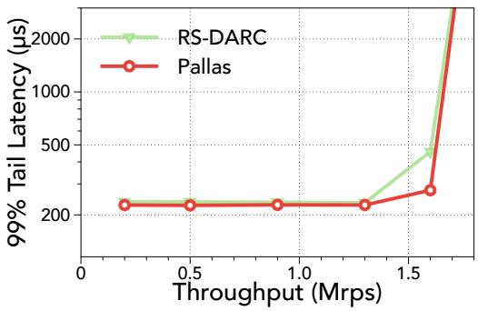  
Figure 15: Exponential

Workload recording. Pallas records the workload information of each type of request with two registers in P4. The first register is tasked with recording the cumulative count of monitored requests, while the second is dedicated to computing the Exponentially Weighted Moving Average (EWMA) of the execution times of these requests. The EWMA factor is set to 0.125 in our current prototype, which helps compute the division by bit-shifting operations in P4. The register responsible for counting request numbers is programmed to reset periodically by the regular workload monitoring schedule.

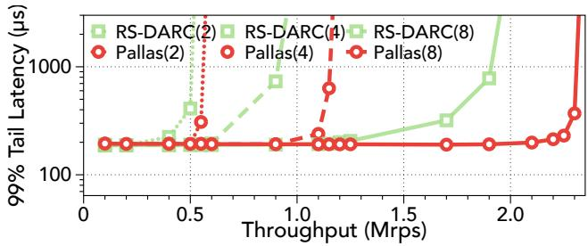  
Figure 16: Scalability results of Pallas.

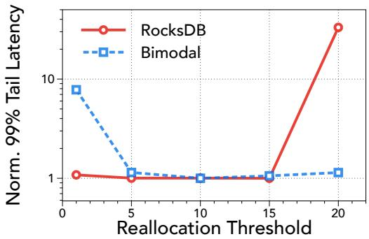  
Figure 17: Sensitivity analysis of the reallocation threshold δ.

## D Supplementary Experiments

## D.1 Performance under Light-tailed Workload

Figure 15 compares Pallas and RackSched under a light-tailed exponential workload with an average request execution time of 25µs. As suggested in RackSched paper, its intra-server scheduler is configured to use cFCFS. We find that RackSched exhibits very close performance to Pallas. This is attributed to the uniformity of request execution times characteristic of the exponential workload. Consequently, both JSQ and Pallas’s intra-group load balancer can effectively distribute the load across servers, in which the optimal intra-server cFCFS scheduling is utilized.

## D.2 Scalability

We show the scalability of Pallas with two, four and eight servers. We use the Bimodal workload comprised of 90% short requests of 10µs and 10% long requests of 90µs. Figure 16 shows the results of 99% tail latency. We observe that the sustainable throughput of Pallas almost scales linearly with the number of servers, exhibiting much better scalability than RS-DARC. This is because RackSched’s applicationagnostic inter-server load balancing incurs more variability when facing high request rates and hence results in load imbalance and degrades tail latency. The linear scalability of Pallas can attribute to the near-optimal load balancing and intra-server scheduling with in-network workload shaping, demonstrating that Pallas is able to scale out with more servers without compromising performance.

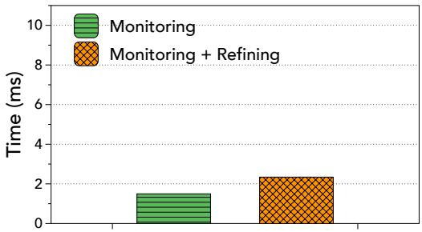  
Figure 18: Monitoring overhead of Pallas.

## D.3 Parameter Sensitivity

Sensitivity to realloaction threshold. We vary the reallocation threshold δ from 1 to 20 and investigate the performance of Pallas with different thresholds. We use both the synthetic workload in Figure 10 and real application RocksDB in Figure 11 to evaluate the sensitivity of Pallas to the reallocation threshold. Figure 17 shows the overall normalized 99% tail latency.

From our observations, Pallas exhibits relative insensitivity to the reallocation threshold within the range of 5-15. This can be attributed to the fact that this threshold range effectively captures workload fluctuations while simultaneously ensuring system stability by avoiding excessive resource reallocations and switch reconfigurations. Specifically, in the context of the synthetically changing bimodal workload, a threshold set at 1 renders the system over-responsive to minor workload variations, thereby substantially impairing system performance. On the other hand, in the scenario of the varying RocksDB workload, a threshold of 20 makes the system oblivious to workload shifts, consequently deteriorating the tail latency.

## D.4 Monitoring Overhead

We evaluate the overhead introduced by workload monitoring in Pallas’s switch control plane. Figure 18 reports the execution time of two key control plane operations: periodic register reading (workload monitoring only) and infrequent register updates (monitoring together with refining) upon workload shift. Results show that both operations is lightweight relative to the 10 ms monitoring interval, confirming the practicality of our design. We also note that the 10 ms interval targets long-term workload changes and represents a configurable trade-off. If needed, Pallas can scale to support more workload groups by operating at longer monitoring intervals.

## D.5 Impact of Workload Monitoring

We further examine the impact of workload monitoring under static workloads. Specifically, we evaluate three static workloads at their respective maximum sustainable request rates in Pallas. As shown in Figure 19, enabling monitoring has no observable effect on system performance, since policy updates are not triggered when no workload shift is detected. This confirms that the monitoring logic is lightweight and

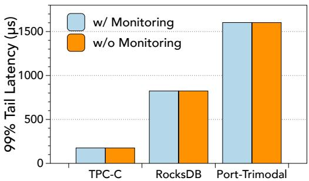  
Figure 19: Impact of workload monitoring under static workloads.

non-intrusive.