①

USENIX

THE ADVANCED COMPUTING SYSTEMS ASSOCIATION

# SpaceExit: Enabling Efficient Adaptive Computing in Space with Early Exits

Jiacheng Liu, Shanghai Jiao Tong University and The Chinese University of Hong Kong; Xiaozhi Zhu, Tongqiao Xu, Xiaofeng Hou, and Chao Li, Shanghai Jiao Tong University https://www.usenix.org/conference/atc25/presentation/liu-jiacheng

# This paper is included in the Proceedings of the 2025 USENIX Annual Technical Conference.

July 7–9, 2025 • Boston, MA, USA ISBN 978-1-939133-48-9

Open access to the Proceedings of the 2025 USENIX Annual Technical Conference is sponsored by

P--r.h £Es/sL.

auuuJl9 PgleU

King Abdullah University of

Science and Technology

# SpaceExit: Enabling Efficient Adaptive Computing in Space with Early Exits

Jiacheng Liu1,2∗, Xiaozhi Zhu1∗, Tongqiao Xu1, Xiaofeng Hou1†, Chao Li1†

1Shanghai Jiao Tong University

2The Chinese University of Hong Kong

## Abstract

Advances in satellite technology and reduced launch costs have led to a proliferation of Earth observation (EO) satellites in low-Earth orbit (LEO). These satellites generate massive high-resolution imagery, creating a significant downlink bottleneck due to limited satellite-to-ground communication bandwidth. While orbit edge computing (OEC) can reduce data volume, existing static approaches fail to adapt to the varying complexity of satellite imagery, resulting in limited system performance and inefficient resource utilization.

We therefore propose SpaceExit, an integrated system for efficient adaptive computing on satellites. SpaceExit introduces three key components: (1) a geospatial-contextual adaptive detector that leverages both visual semantics and geospatial context to adjust processing complexity for each image, (2) a complexity-driven adaptive task scheduler that partitions images into tiles and allocates inference tasks across onboard devices based on content complexity and device capabilities, and (3) a satellite resource adaptive controller that ensures safe and efficient execution under changing conditions. Evaluations of diverse satellite settings and hardware platforms demonstrate that SpaceExit increases the performance by 5.2%-37.6% compared with the SoTA design.

## 1 Introduction

Recent advances in satellite technology and reduced launch costs have led to a significant increase in Earth observation (EO) satellites in low-Earth orbit (LEO) [37]. These advanced satellites, equipped with high-resolution cameras, can generate terabytes of imagery data per day, providing valuable insights for applications such as precision agriculture [4, 29], disaster response [33,35], and environmental monitoring [28]. However, this massive data generation creates unprecedented challenges for satellite-based computing systems that differ fundamentally from terrestrial computing environments in three critical aspects.

First, satellite computing occurs in an extremely constrained and hostile environment. Satellites face severe thermal variations (e.g., -22°C to +77°C [34]) as they move between sunlight and Earth’s shadow during their orbital periods. Such extreme conditions can significantly impact onboard chips and other equipment. As a result, effective satellite computing requires careful thermal management strategies that extend beyond conventional resource optimization. For instance, existing analysis of operational LEO satellites shows that thermal constraints alone can reduce computation performance by up to 10% [39].

Second, satellite resources exhibit unique dynamic characteristics tied to orbital mechanics. As micro-datacenters in space, satellites face network and power constraints that differ fundamentally from terrestrial systems. Satellite-to-ground communication bandwidth varies dramatically (e.g., from 0 to 220 Mbps) based on orbital position and ground station visibility [1]. Similarly, available power fluctuates with solar panel orientation and eclipse periods. Traditional "bent pipe" approaches that simply downlink raw imagery become impractical under these constraints [10].

Third, satellite observation tasks present distinct workload patterns that challenge conventional computing paradigms. Continuous Earth monitoring generates spatially and temporally correlated image sequences with varying complexity from simple ocean scenes to intricate urban landscapes [37]. These images often contain redundant information across overlapping observation swaths, yet may also capture rapidly evolving phenomena requiring immediate analysis.

While recent orbital edge computing (OEC) approaches [37] attempt to address these by performing onboard analysis, existing solutions rely largely on static processing pipelines that fail to adapt to the dynamic nature of both satellite operations and EO data [9–11]. They typically attempt to reduce computational overhead by selectively discarding imagery or employing varying models for different scenes [9, 10]. Despite these methods leveraging prior knowledge about images to implement differentiated processing, they ultimately rely on static models. This inherent rigidity presents significant limitations in EO contexts, where scene complexity, illumination conditions, and orbital parameters undergo constant flux. Moreover, these systems cannot adaptively respond to runtime variations in both computational resources (like chips) and environmental factors which is a critical requirement for resource-constrained satellite platforms. As illustrated in Figure 1, an adaptive processing pipeline that adaptively modulates computational intensity based on real-time scene complexity and resource can achieve superior efficiency by enabling early termination for simpler inputs while maintaining high-fidelity processing for challenging scenarios.

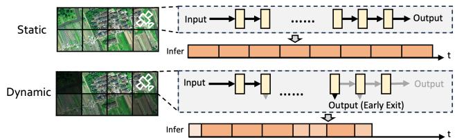  
Figure 1: Comparison between the existing static OEC method and the proposed adaptive OEC method (SpaceExit). Unlike static approaches that process all imagery indiscriminately, SpaceExit adapts its processing to image complexity, performing early exiting for simple images and full processing for complex ones.

We therefore propose SpaceExit, an integrated system that addresses all three satellite-specific characteristics through algorithm-system co-design. Unlike previous methods that merely simulate adaptive behavior through predefined rules, SpaceExit continuously adjusts its processing based on current input and system conditions, offering a truly flexible and efficient solution to the growing demands of EO missions.

At its core, SpaceExit features a geospatial-contextual adaptive detector that serves as the foundation for adaptive computation. This module incorporates a multi-scale feature extraction pipeline with an innovative exiting mechanism, adaptively adjusting processing complexity for each image region based on visual semantics and geospatial context. The system’s architecture enables efficient handling of both finegrained details and large-scale patterns while allowing early termination for easily recognizable images. To enhance adaptability, a geospatial context component integrates auxiliary information such as geographical location, time of day, and historical data to guide exit decisions and optimize resource allocation. For example, it can prioritize more complex processing in urban areas while enabling quicker exits in openwater regions, thus optimizing resource allocation based on contextual information.

Complementing this adaptive processing capability, Space-Exit features a complexity-driven adaptive task scheduler designed to optimize onboard computing resource utilization, which is crucial for long-term stable execution of in-orbit computing tasks [39]. It employs an adaptive tiling strategy, partitioning input images into regions of varying sizes based on their estimated complexity. Then it implements an adaptive allocation scheme that distributes these tiles across available onboard devices, considering factors such as tile complexity, device capabilities, and current workload. Additionally, to ensure robust operation in the challenging space environment, SpaceExit incorporates a satellite resource adaptive controller. This component continuously monitors system parameters including computing load, bandwidth utilization, temperature, and energy consumption. It adaptively adjusts scheduling and exiting strategies to maintain safe operating conditions while maximizing processing throughput.

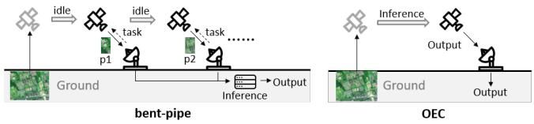  
Figure 2: Comparison of classic bent-pipe with OEC.

Our comprehensive experiments simulate various scenarios and hardware configurations with real-world datasets. The results demonstrate that SpaceExit consistently outperforms existing static detection pipelines, increasing the performance by 24.3% on average compared with the SoTA design.

The contributions of this work are multifaceted. To the best of our knowledge, SpaceExit represents the first integrated system for adaptive onboard earth observation that is optimized across both algorithm and system levels for satellite deployment. The novel geospatial-contextual adaptive detector pushes the boundaries of efficient inference in resourceconstrained environments. The complexity-driven adaptive task scheduler offers a new paradigm for managing heterogeneous computing resources in space, while the satellite resource adaptive controller ensures reliable operation under the unique constraints of orbital platforms.

## 2 Background and Challenges

## 2.1 Static OEC Systems

To address the limitations of classic "bent-pipe" approaches, OEC is proposed to process data onboard satellites before transmission (Figure 2). Existing OEC systems mainly rely on static methods for data processing. TargetFuse [40] deploys a DNN model serving as a counter, while Kodan [9] provides several context-based models to yield higher accuracy in different scenes. These static approaches also adopt selective discarding techniques or data deduplication, achieving significant data reduction. However, these methods struggle to adapt to the diverse and dynamic nature of Earth observation data, often leading to suboptimal results when confronted with unexpected or complex scenes.

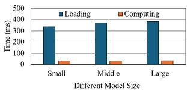  
(a) Model loading overhead of different models.

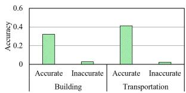  
(b) Inaccurate priors significantly impact performance.  
Figure 3: Limitation of static methods.

A major limitation of multi-model systems for satellitebased image processing is the substantial overhead associated with model loading and storage. Satellites have limited onboard storage capacity, constraining the number and complexity of models that can be deployed [3]. Our analysis, as shown in Figure 3a, reveals that the time spent loading different object detection models is often much longer than their computation time. This overhead significantly impacts system efficiency and responsiveness. Furthermore, the typical approach of applying simple models first and escalating to more complex ones if necessary can result in significant delays and computational waste. If a simple model proves inadequate for a given scene, the resources expended on its application and the time spent loading subsequent models are essentially lost. These limitations force a trade-off between model diversity and processing capability, highlighting the need for a more efficient and adaptive onboard processing approach.

Another critical drawback of static methods is their reliance on prior knowledge, which may be inaccurate or unavailable in the dynamic domain of Earth observation [7]. Pre-defined rules for scene classification or object detection may fail when confronted with unexpected phenomena or rapidly changing environments. Our analysis, illustrated in Figure 3b, demonstrates this vulnerability. We trained two models specifically designed for Building and Transportation detection. When the prior knowledge aligns with the input data, these models achieve high performance. However, when confronted with unexpected scenes or objects, their performance drops significantly. This inflexibility leads to suboptimal resource utilization across heterogeneous scenes, as the system cannot adaptively adjust its processing strategy based on the current input and operational context.

## 2.2 Challenges of Adaptive OEC

While implementing a truly adaptive method for Earth observation processing holds great potential, implementing such a system presents several significant challenges:

Challenge-1: Adapting multi-scale information and geospatial context for object detection in OEC. Dynamic object detectors have shown great promise in non-satellite scenarios, where they can adjust computation based on the complexity of the input data. However, applying these methods to satellite imagery introduces additional challenges. Satellite imagery requires the processing of multi-scale image information and incorporation of geospatial context, which is not typically considered in traditional methods. Furthermore, the constraints of the satellite environment, such as limited computational resources and the need for real-time processing, make dynamic methods in satellites more energy-sensitive compared to ground-based systems. Developing an adaptive approach that can adjust computation cost without sacrificing accuracy while leveraging both visual and geospatial information is a complex task requiring careful algorithm design.

Challenge-2: Scheduling dynamic task across heterogeneous onboard devices. Unlike static methods where processing requirements can be predicted in advance, adaptive approaches must continuously adjust resource allocation based on current input and system state. This is particularly challenging in the satellite environment where multiple heterogeneous computing devices with varying capabilities are often deployed. Designing a scheduling algorithm that can efficiently distribute workload across these devices while adapting to dynamic processing requirements is non-trivial.

Challenge-3: Runtime resource management under varying onboard constraints. The ever-changing space environment and varying mission requirements pose unique difficulties in runtime management. Satellites face severe constraints such as bandwidth, power, and thermal budget, which fluctuate based on orbital position and mission phase. Additionally, onboard resources like power and memory are limited and must be carefully managed. Prior work [39] has shown that these constraints can significantly impact the stablitity and performance of onboard processing systems. Ensuring safe and efficient execution under these dynamic conditions requires careful design of the resource management system.

## 3 SpaceExit System Design

The SpaceExit system architecture is designed to address the key challenges of onboard object detection on satellites holistically. As shown in Figure 4, SpaceExit takes the highresolution satellite images as input and processes them with an efficient adaptive object detector on heterogeneous onboard computing devices.

Specifically, SpaceExit contains three main modules that synergistically optimize the detection pipeline across various dimensions of algorithm-system co-design:

• Geospatial-Contextual Adaptive Detector (GCAD, Section 3.1): This module forms the core of SpaceExit’s adaptive processing capability to address Challenge-1. It employs a multi-scale feature backbone with a novel exiting mechanism that leverages both visual semantics and geospatial context. The GCAD can adaptively adjust the processing complexity for each tile, allowing for efficient early exits on simpler areas while dedicating more resources to complex regions. This approach enables SpaceExit to balance detection accuracy and computational efficiency across diverse satellite imagery.

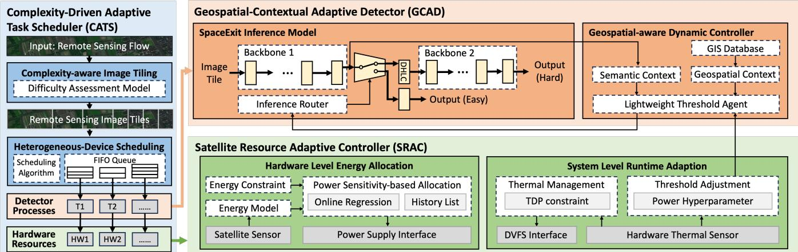  
Figure 4: Overview of the SpaceExit.

• Complexity-Driven Adaptive Task Scheduler (CATS, Section 3.2): The CATS optimizes the utilization of onboard computing resources across multiple devices to address Challenge-2. It implements a complexity-aware scheduling algorithm that partitions input images into tiles based on their estimated complexity. These tiles are then allocated across available onboard devices, considering factors such as tile complexity, device capabilities, and current workload. This adaptive approach ensures efficient load balancing and maximizes overall system throughput.

• Satellite Resource Adaptive Controller (SRAC, Section 3.3): The SRAC is responsible for maintaining safe and efficient system operation under the dynamic constraints of the space environment to address Challenge-3. It continuously monitors system parameters including computing load, temperature, and energy consumption. Based on these inputs, the SRAC adaptively adjusts system configurations and exiting strategies to optimize resource utilization while ensuring the system operates within safe limits.

These three modules work together to enable SpaceExit’s efficient and adaptive approach to onboard object detection. The GCAD provides content-aware processing, the CATS ensures optimal resource utilization across devices, and the SRAC maintains system stability and efficiency in changing environmental conditions.

## 3.1 Geospatial-Contextual Adaptive Detector

The GCAD forms the core of SpaceExit’s adaptive processing capability, addressing the challenge of efficiently processing satellite imagery with varying complexity. It consists of two key components: a multi-exit network architecture and a geospatial-aware threshold adjustment mechanism.

## 3.1.1 Multi-exit network architecture

GCAD employs a multi-scale feature backbone with multiple exit points, allowing for adaptive adjustment of processing complexity based on image content. This backbone is designed to capture features at various scales, which is essential for detecting both large-scale structures and small details in satellite images. Specifically, a L layer feature extraction process can be defined as,

$$
f _ { \mathbf { x } } ^ { L } = \mathcal { F } _ { L } ( \cdots \mathcal { F } _ { 2 } ( \mathcal { F } _ { 1 } ( \mathbf { x } ) ) ) ,\tag{1}
$$

where x is the input image and $\mathcal { F } _ { i }$ represents the feature extractor at the i-th scale. Each $\mathcal { F } _ { i }$ is designed to extract features at a scale lower than $\mathcal { F } _ { i + 1 }$ and higher than $\mathcal { F } _ { i - 1 }$ , allowing for a comprehensive multi-scale representation of the image. The overall detector design builds upon the concept of progressive feature refinement [23], it consists of multiple connected networks: a primary feature extractor and multiple enhancement networks. The primary extractor processes the input image to generate an initial set of multi-scale features, while the enhancement network further refines these features to capture more complex patterns and relationships.

To implement adaptive computing for different images, the central question is how to estimate the uncertainty score of the model’s prediction on different images. Existing methods may use confidence-based estimation to measure uncertainty. However, the neural network is known to be over-confident [2]. Thus, we introduce an additional router that takes multiple features as input and outputs the estimated uncertainty of the model’s prediction on this image. Simialr to the squeezeand-excitation (SE) module [20], we first pool the multi-scale features F independently and concatenate them all as,

$$
{ \widetilde { F } } = \| _ { i = 1 } ^ { L } { \mathcal { P } } ( f ^ { i } ) ,\tag{2}
$$

where $\mathcal { P }$ denotes global average pooling, ∥ denotes channelwise concatenation, and $f ^ { i }$ represents the features from the i-th scale of the feature. This operation compresses the multiscale features into a compact representation ${ \widetilde F } ,$ , which is then used by the router to make its decision. Specifically, the uncertainty score can be calculated as,

$$
\boldsymbol { u } = \sigma ( W _ { 2 } ( \delta ( W _ { 1 } \widetilde { F } + b _ { 1 } ) ) + b _ { 2 } ) ,\tag{3}
$$

where δ, σ denote the ReLU and Sigmoid activation functions respectively, and $W _ { 1 } , W _ { 2 } , b _ { 1 } , b _ { 2 }$ are learnable parameters.

After each processing stage, the router will be activated to judge whether the model should processed to the next block or go to the head to get the prediction and exit. Specifically, for images deemed "easy" (i.e., those with an uncertainty score below a certain threshold), the system proceeds directly to the detection head. Conversely, for "hard" images, the system activates the enhancement networks for more sophisticated processing until it gets enough certainty score or reaches the end of the detector.

This adaptive routing allows GCAD to allocate computational resources efficiently, dedicating more processing power to complex images while quickly handling simpler ones. Such an approach is particularly valuable in satellite imaging applications, where images can vary greatly in complexity and where processing resources may be limited.

Training a adaptive detector like GCAD presents unique challenges. We employ an adaptive offset-based training method [25] to balance the performance of the different processing paths. This method introduces adaptive offsets to the loss function, encouraging the network to utilize both the simple and complex processing paths effectively.

## 3.1.2 Geospatial-aware adaptive inference

With the multi-scale features and early exit branches, the next question is how to adaptively decide which scale to extract and use for each image tile. Considering both the semantic and geospatial context in satellite computing is essential. However, interweaving complex multi-exit network training with geographic information and resource margin will greatly increase the difficulty and cost of model training. To this end, we propose a two-stage approach, which introduces a lightweight auxiliary model based on the adaptive model to fuse geospatial information.

Firstly, we adjust the trained adaptive neural network based on the difficulty score which is irrelevant to the geospatial information. This ensures that we can use vast amounts of satellite images without geospatial information to train our model. Specifically, consider a validation set $S _ { \nu a l }$ , the threshold can be estimated as,

$$
{ \tau } _ { \nu a l } = \mathcal { P } ( S _ { \nu a l } , k ) ,\tag{4}
$$

where $\mathcal { P } ( \cdot , k )$ means the k-th quantile of $S _ { \nu a l }$

Then, we utilize a small dataset with geospatial information to train a lightweight agent to adaptively adjust the threshold. Specifically, the agent takes two inputs: (1) The semantic features r from each exit scale, which encodes the semantic information. (2) The geospatial embedding g, which encodes the geographic context like terrain type, land cover, POI density, etc. The geospatial priors are pre-computed offline and stored in a GIS database. At runtime, they are efficiently queried based on the region coordinates and resolutions. The priors are used as soft guidance and can be overridden by the visual patterns if there is a discrepancy. This adaptive fusion of visual and geospatial information improves the detection accuracy and efficiency.

Based on the above strategy, SpaceExit can adaptively select the most appropriate scale and exit point for each image tile, optimizing both accuracy and computational efficiency. By integrating geospatial information and image features, SpaceExit ensures that the inference process is not only context-aware but also adaptive to varying operational conditions. This results in improved performance in terms of both speed and accuracy, making SpaceExit highly suitable for real-time on-board satellite image analysis.

## 3.2 Complexity-Driven Adaptive Scheduler

CATS optimizes the utilization of onboard computing resources across multiple devices. It implements a complexityaware scheduling algorithm that partitions input images into tiles based on their estimated complexity and allocates them across available onboard devices.

## 3.2.1 Complexity-aware image titling

CATS first uses a difficulty assessment model that estimates the processing complexity dt of each image. This model can leverage simple heuristics (e.g., color variation) or train a simple low-complexity model.

Based on the difficulty assessment, CATS employs an adaptive tiling strategy to partition input images. This approach is motivated by the observation that satellite images often contain regions of varying complexity, and uniform tiling can lead to inefficient resource utilization.

Assume there are N onboard devices, where each device i has a processing rate vi (in pixels/s) and memory capacity $m _ { i }$ . Given a raw input image I with dimensions $W \times H$ , CATS partitions it into a grid of $N _ { r }$ tiles $\left\{ \boldsymbol { r } _ { 1 } , \ldots , \boldsymbol { r } _ { N _ { r } } \right\}$ , where each tile has dimensions $w _ { i } \times h _ { i }$

The tile size is chosen to satisfy two key constraints:

1. Memory constraint: wh $< \mathrm { m i n } _ { i } m _ { i }$ , ensuring that a tile can fully fit into any device’s memory.

2. Accuracy-complexity balance: The tile size should be large enough to guarantee fast processing, but small enough to capture meaningful context for object detection [40].

The actual tiling process is adaptive, with tile sizes varying based on the difficulty scores. More complex regions (higher $d _ { t } )$ are divided into smaller tiles for more focused processing, while simpler regions use larger tiles to reduce overhead:

$$
w _ { t } = h _ { t } = \frac { w _ { b a s e } } { \sqrt { d _ { t } } } ,\tag{5}
$$

where $w _ { b a s e }$ is a base tile width chosen to satisfy the above constraints.

## 3.2.2 Heterogeneous-Device Scheduling

The core of CATS is its multi-device scheduling algorithm, which allocates tiles to available onboard devices. This allocation considers three primary factors as: tile complexity (from the difficulty assessment), device capabilities (processing rate, memory capacity) and Current device workload.

CATS maintains a FIFO queue $Q _ { i }$ for each device i to manage pending image tiles. The scheduling process for each tile r involves assigning it to a device queue:

$$
\begin{array} { r } { Q _ { \sigma ( i ) } = Q _ { \sigma ( i ) } \cup \{ r \} , } \end{array}\tag{6}
$$

where the device selection function $\sigma ( i )$ is defined as:

$$
\mathfrak { O } ( i ) = \arg \operatorname* { m i n } _ { j } \left\{ \frac { n _ { j } } { \nu _ { j } } \bigg | j \in [ 1 , N ] , | Q _ { j } | < K _ { j } \right\} .\tag{7}
$$

Here, $n _ { j }$ is the current unprocessed workload on device $j ,$ $\nu _ { j }$ is its processing rate, and $K _ { j }$ is the maximum queue size for device $j .$ This policy aims to equalize processing time across devices while avoiding queue overflow.

Unlike static task where workload depends solely on the number of tasks, our system must account for both quantity and complexity. Thus, we modify the workload measure $n _ { j }$ to incorporate the difficulty scores:

$$
n _ { j } = \sum _ { r \in \mathcal { Q } _ { j } } d _ { r } \cdot \vert r \vert ,\tag{8}
$$

where $| r |$ is the size of tile r in pixels.

CATS updates these workload counters $n _ { j }$ adaptively as new tiles are enqueued or processed tiles are dequeued. This process repeats for each raw image until all tiles are distributed, providing global load balancing across the heterogeneous onboard devices.

Furthermore, CATS implements a priority system within each device queue. Each tile r is assigned a priority score based on its deadline urgency and complexity:

$$
s ( \boldsymbol { r } ) = \boldsymbol { \eta } \cdot \frac { 1 } { d ( \boldsymbol { r } ) - t } + \boldsymbol { \lambda } \cdot d \boldsymbol { r } ,\tag{9}
$$

where $d ( r )$ is the tile’s deadline, t is the current time, $d _ { r }$ is the tile’s difficulty score, and $\eta , \lambda$ are weighting factors that can be tuned based on mission requirements. This dual consideration of deadline urgency and processing complexity addresses the unique requirements of OEC tasks. The urgency factor ensures time-critical observations aren’t missed, which is essential for applications like disaster monitoring. The complexity factor ensures that challenging tasks start processing earlier, reducing the risk of missing deadlines.

Tiles are processed in descending order of these scores: $r ^ { * } = \arg \operatorname* { m a x } _ { r } s ( r )$ . After each tile is processed, CATS updates the resource usage and checks if it exceeds the current budget allocated by the SRAC module. If ${ \bf { S O } } ,$ it pauses scheduling until more resources become available in the next cycle.

This sophisticated, multi-factor scheduling approach ensures efficient utilization of limited onboard resources, adapting to both the varying complexity of input data and the heterogeneous capabilities of onboard devices.

## 3.3 Satellite Resource Adaptive Controller

The SRAC module is responsible for maintaining safe and efficient system operation under the dynamic constraints of the space environment. It continuously monitors system parameters including computing load, temperature, and energy consumption, and adaptively adjusts system configurations to optimize resource utilization while ensuring the system operates within safe limits.

## 3.3.1 Energy Allocation

A primary function of SRAC is the adaptive allocation of energy resources among onboard computing devices. This is particularly challenging in the satellite environment due to the highly variable nature of solar power availability and the critical importance of maintaining overall system stability.

Let I(t) denote the total available power at time t, which varies based on factors such as solar panel orientation, eclipse periods, and battery state of charge. SRAC must allocate this power among N heterogeneous computing devices. Let $P _ { i } ( t )$ denote the power budget for device i at time t. The allocation must satisfy:

$$
\sum _ { i = 1 } ^ { N } P _ { i } ( t ) \leq I ( t ) .\tag{10}
$$

SRAC employs an adaptive allocation policy $\pi : I ( t ) \to$ $\{ P _ { i } ( t ) \} _ { i = 1 } ^ { N }$ designed to maximize overall system throughput. This policy operates in two stages:

1. Reserve a base power $P _ { b a s e }$ for critical satellite systems (e.g., attitude control, communication).

2. Allocate remaining power $I ( t ) - P _ { b a s e }$ among computing devices based on their performance sensitivity to power.

Formally, the allocation for each device is computed as:

$$
P _ { i } ( t ) = P _ { b a s e , i } + ( I ( t ) - P _ { b a s e } ) \cdot \frac { \partial X _ { i } / \partial P _ { i } } { \sum _ { j = 1 } ^ { N } \partial X _ { j } / \partial P _ { j } } ,\tag{11}
$$

where $X _ { i }$ is the measured throughput of device i, and $\partial X _ { i } / \partial P _ { i }$ represents its performance sensitivity to power. This approach allocates more power to devices that can translate it into higher throughput gains.

The performance-power relationship $\partial X _ { i } / \partial P _ { i }$ is learned and continuously updated during system operation using online regression techniques. This allows the system to adapt to changes in device characteristics over time, which is crucial for long-duration space missions.

SRAC updates this allocation whenever there is a significant change in available power $( \Delta I > I _ { t h } )$ or periodically (e.g., every $T _ { u p d a t e }$ seconds) to account for gradual changes in system state.

## 3.3.2 DVFS and Threshold Adjustment

Given the power budget $P _ { i } ( t )$ for each device, SRAC employs fine-grained control to optimize performance within these constraints. This is achieved through a combination of Dynamic Voltage and Frequency Scaling (DVFS) and adaptive adjustment of processing thresholds.

Specifically, SRAC adjusts frequencies $f _ { j }$ based on measured utilization $u _ { j } \colon$

$$
f _ { j } = f _ { m i n } + \left( f _ { m a x } - f _ { m i n } \right) \cdot \frac { u _ { j } - u _ { m i n } } { u _ { m a x } - u _ { m i n } } ,\tag{12}
$$

subject to the Thermal Design Power (TDP) constraint [13]:

$$
\sum _ { j } A _ { j } C _ { j } V _ { j } ^ { 2 } f _ { j } \leq P _ { i } ,\tag{13}
$$

where $A _ { j }$ is the switching activity level, $C _ { j }$ is the capacitance of the circuit, and $V _ { j }$ is the voltage of core j. This approach allows higher frequencies (and thus higher performance) when utilization is high, while saving power during periods of low utilization.

Thermal management is a critical aspect of SRAC. It continuously monitors chip temperatures $T _ { i }$ and proactively adjusts power states when temperatures approach the limit $T _ { m a x }$ SRAC employs a learned thermal-power model:

$$
T _ { i } ( t + 1 ) - T _ { i } ( t ) = \alpha [ P _ { i } ( t ) - \beta ( T _ { i } ( t ) ^ { 4 } - T _ { a m b } ^ { 4 } ) ] ,\tag{14}
$$

where α and $\beta$ are thermal parameters and $T _ { a m b }$ is the ambient temperature. Using this model, SRAC estimates the power adjustment $\Delta P$ needed to maintain safe temperatures:

$$
\Delta P = \frac { 1 } { \alpha } [ T _ { m a x } - T _ { i } ( t ) ] - [ P _ { i } ( t ) - \beta ( T _ { i } ^ { 4 } ( t ) - T _ { a m b } ^ { 4 } ) ] .\tag{15}
$$

This allows for smooth throttling of DVFS settings to maintain safe operation without abrupt shutdowns.

Finally, SRAC adaptively adjusts the processing thresholds used in the GCAD module based on current resource availability. The exit threshold τ in GCAD is modulated as:

$$
\tau = \tau _ { b a s e } \cdot \frac { \gamma P _ { c u r r e n t } } { P _ { n o m i n a l } } ,\tag{16}
$$

where $P _ { c u r r e n t }$ is the current power availability, $P _ { n o m i n a l }$ is the nominal power level and $\gamma$ is the hyperparameter modeling the influence of threshold in power usage. This allows the system to become more conservative (exiting earlier) when resources are constrained, and more thorough when resources are plentiful.

## 3.3.3 Bandwidth Allocation

SRAC implements a priority-based bandwidth allocation strategy to maximize the value of limited satellite-to-ground communication opportunities. The allocation strategy operates on two timescales: inter-pass accumulation and intra-pass transmission. During inter-pass accumulation, SRAC accumulates data between ground station passes into priority queues. The intra-pass transmission phase occurs during a ground station pass, where SRAC allocates bandwidth based on the priority.

SRAC maintains three priority queues: $Q _ { 1 }$ for onboard calculation results (highest priority), $Q _ { 2 }$ for routine telemetry and housekeeping data (second highest priority), and $Q _ { 3 }$ for uncertainty-scored image data. This ordering ensures that critical operational data and high-value scientific results are always transmitted before any additional image data.

During a ground station pass, SRAC follows a strict priority-based transmission protocol. The system first transmits all data from $Q _ { 1 }$ , ensuring that all onboard calculation results are downlinked. Once $Q _ { 1 }$ is empty, it moves on to $Q _ { 2 }$ , transmitting all routine telemetry and housekeeping data. Only after both $Q _ { 1 }$ and $Q _ { 2 }$ 2 are fully transmitted does the system begin to downlink data from $Q _ { 3 }$ , which contains the uncertainty-scored image data.

This priority-based allocation strategy ensures that Space-Exit always transmits critical operational data and high-value scientific results first. By using a simple, deterministic protocol for the highest-priority queues and a lightweight heuristic for managing lower-priority data, SRAC achieves robust and efficient bandwidth utilization while keeping computational overhead low.

## 4 Experimental Setup

## 4.1 Computational Hardware

We design and implement a heterogeneous computing testbed that faithfully emulates the resource-constrained environment of 3U CubeSat onboard computers. Our experimental platform incorporates two primary computing units that represent typical space-grade hardware configurations, carefully selected to balance performance and power constraints.

Firstly, we employ the NVIDIA Jetson Nano, which is equipped with a Quad-core ARM Cortex-A57 MPCore processor clocked at 1.43 GHz, paired with a 128-core Maxwell GPU that delivers 472 GFLOPS of compute performance. The system is supported by 4 GB of LPDDR4x memory, offering 25.6 GB/s bandwidth. Operating in a 10W TDP configuration, the Jetson Nano supports both FP16 and FP32 precision computations, making it suitable for efficient neural network inference within a compact 70 mm × 45 mm form factor [27]. Additionally, we utilize the NVIDIA Jetson Xavier NX, which offers higher performance in a similar size to the Jetson Nano. It features a 6-core NVIDIA Carmel ARMv8.2 64-bit CPU, a 384-core Volta GPU with 48 Tensor Cores, and 8 GB of LPDDR4x memory with 59.7 GB/s bandwidth. It delivers up to 21 TOPS of AI performance and supports TDP configurations of 10W, 15W and 20W, making it ideal for demanding AI applications in space-constrained environments.

To emulate a 3U CubeSat onboard computer with heterogeneous payloads, we setup an NVIDIA Jetson Nano with a 10W power mode connected to NVIDIA Jetson Xavier NX with 20W power mode. This configuration provides substantial AI computing power within the 4kg mass and 30W power budgets of a typical 3U bus [11], making it faithfully model the real onboard setup.

## 4.2 Satellite dataset

Following previous research [40], we evaluate SpaceExit using the DOTA (Dataset of Object deTection in Aerial images) dataset [38], a comprehensive satellite imagery dataset designed specifically for object detection tasks. The dataset contains 403k annotated instances across 15 object categories, including various vehicles, ships and infrastructures, with objects captured at arbitrary orientations to reflect real-world conditions. We preprocess to resemble the conditions encountered in EO applications closely.

## 4.3 SpaceExit Implementation

In SpaceExit, the adaptive router takes the terrain-type embedding (one-hot vector) and four visual embeddings as input. The selected scale then passes through a feature fusion module to combine the coarse semantics and fine details. The terrain type is predicted by a pre-trained MobileNet classifier fine-tuned on the DOTA images with ground-truth land cover labels. We use 2 categories: land and ocean, which are visually distinctive. This router requires only about 130KB of memory (approximately 2.4% of the full model’s memory footprint), which is negligible.

We construct our geospatial embeddings by concatenating terrain type, land cover, and pre-processed POI data. Each geospatial embedding requires at most 32B of storage, resulting in a total database size under 100MB to cover the entire Earth. For single-orbit operations, this requirement decreases significantly to less than 100 KB. Given the inherent spatial locality of satellite imagery, our system retrieves 50 geospatial embeddings simultaneously. This efficient batching strategy means database access is required only once per minute, rendering the access time negligible in our overall processing pipeline. As for the complexity estimation model, we experimented with both a simple two-layer CNN and a color variation-based method. While both performed well, the latter proved significantly more efficient, leading us to adopt it as our default model.

The model is trained end-to-end with Adam optimizer at 1e-4 learning rate for 100 epochs. We use 0.1 weight decay and a cosine learning rate schedule with 5 epochs of warmup. The input size is 2048×2048 pixels, randomly cropped from the full images. The batch size is 8 per GPU (32 total) with synchronized BN. For augmentation, we apply HSV jittering, flipping, translation, and multi-scale training.

## 4.4 Baselines

We evaluate SpaceExit against four satellite image processing systems that represent the state-of-the-art system in OEC:

• BentPipe [11] implements the traditional ground-centric approach, where satellites downlink raw imagery to ground stations for processing. This system maximizes processing capability but is severely limited by communication bandwidth constraints.

• SpaceOnly [11] performs all object detection computations onboard using deployed neural networks, transmitting only the detection results to ground stations. While this minimizes bandwidth usage, it faces significant onboard computational resource constraints.

• Kodan [9] leverages specialized machine learning models selected based on prior knowledge about observation targets. This approach improves efficiency through targeted processing but is heavily dependent on the accuracy of prior information.

• TargetFuse [40] employs a combination of adaptive tiling, object clustering, and bandwidth-aware transmission scheduling to minimize detection errors under resource constraints. This hybrid approach balances onboard processing with efficient data transmission.

These baselines, ranging from fully ground-based to completely onboard processing, provide comprehensive reference points for evaluating SpaceExit ’s performance.

## 4.5 Metrics

For detection performance, we adopt the standard MS COCO evaluation protocol, reporting mean Average Precision (mAP) at different Intersections over Union (IoU) thresholds. Specifically, we report the standard MS COCO metrics [24], including AP@IoU=0.5 and AP@IoU=0.5:0.95 for each category.

For efficiency, we measure the end-to-end processing time and total charge on the satellite system. This includes the time taken for taking photos, inference, and the communication of information from the satellite to the ground station. We use the total amount of information transmitted from the satellite to the ground station as the benchmark for evaluating the system’s processing speed.

To evaluate the overall performance of our system, we use goodput which combines both accuracy and throughput. The goodput of a system is defined as the correct information produced per unit time. Goodput takes into account not only the amount of data processed but also the quality and relevance of the processed data, ensuring that our system meets the stringent requirements of satellite-based Earth observation.

## 5 Results Analysis

## 5.1 SpaceExit Consistently Outperforms SoTA OEC Systems

To compare the overall performance of SpaceExit with the existing systems, we systematically evaluated the system using three distinct hardware configurations: HW Set-1 (heterogeneous deployment with Jetson Xavier NX and Jetson Nano), HW Set-2 (homogeneous deployment with two Jetson Nanos), and HW Set-3 (high-performance setup with two Xavier NXs). Each configuration was tested under three network bandwidth conditions: 100Mbps, 50Mbps, and 10Mbps, providing insights into system behavior under varying resource constraints.

The results in Figure 5 reveal that SpaceExit consistently outperforms baseline approaches across all scenarios, with performance improvements varying based on hardware capabilities and network conditions. In the heterogeneous setup (HW Set-1), SpaceExit achieves remarkable improvements of 27.1%, 29.5%, and 29.4% for 100Mbps, 50Mbps, and 10Mbps bandwidths respectively. This demonstrates the system’s ability to effectively leverage diverse computational resources. The performance gains are more modest in HW Set-2, ranging from 5.2% to 8.4%, indicating that computational constraints become a limiting factor when using lower-powered devices. However, HW Set-3 showcases SpaceExit’s full potential, with substantial improvements of 36.9-37.6%, highlighting the system’s capability to efficiently utilize powerful computation resources.

The impact of network bandwidth on system performance presents interesting insights, particularly when examining BentPipe’s behavior. Under high bandwidth conditions (100Mbps), BentPipe maintains competitive performance relative to other baselines, though still significantly below SpaceExit. However, its performance deteriorates dramatically under constrained bandwidth (10Mbps), achieving only approximately 5% normalized goodput. This stark contrast underscores the importance of bandwidth-aware design in distributed inference systems. SpaceExit, in contrast, maintains robust performance across all bandwidth conditions, demonstrating its resilience to network constraints.

Among the baseline approaches, Kodan emerges as the strongest competitor, particularly in computationally constrained scenarios like HW Set-2, where its lightweight detectors provide a strategic advantage. TargetFuse and SpaceOnly exhibit similar performance trajectories but consistently underperform compared to SpaceExit. The performance gap between SpaceExit and these baselines becomes particularly pronounced in scenarios with powerful hardware and adequate bandwidth, suggesting effective resource utilization by our proposed system.

To further analyze these methods, we measure the throughput as shown in Figure 6. Here, the Kodan outperforms other systems in most cases with the help of specialized light detectors. However, this may result in a significant performance drop when the prior knowledge is not accurate (the goodput of Kodan is lower as shown in Figure 5). What’s more, as the computational capabilities of the devices increase, Kodan’s advantage in throughput gradually diminishes. When using higher-performance hardware, specifically in the most powerful HW Set-3, Kodan is eventually surpassed by SpaceExit.

These results collectively demonstrate SpaceExit’s superior performance across diverse deployment scenarios. The system’s ability to maintain significant improvements under various hardware configurations and network conditions validates its design principles and resource management strategies.

## 5.2 GCAD Enables Adaptive Computing

We evaluate the effectiveness of GCAD’s adaptive processing capability by comparing its performance to that of static detectors on the DOTA test set. Our implementation is based on the YOLOv7 framework, where the static detector is configured with a fixed computational load of 3.4 GFLOPS, while GCAD adapts its computational load between 2.0 and 3.5 GFLOPS, depending on the complexity of the input image.

Figure 7 illustrates an example of how GCAD adapts its processing strategy based on image complexity. In Figure 7(a), we show a relatively simple scene containing wellseparated ships on a uniform water background. For such images, GCAD successfully achieves early exit after the first backbone, maintaining detection accuracy while reducing computational cost by approximately 40%. In contrast, Figure 7(b) presents a complex urban scene with densely packed buildings and various objects at multiple scales. Here, GCAD correctly identifies the need for full processing through both backbones to maintain detection accuracy. This adaptive behavior demonstrates GCAD’s ability to intelligently allocate computational resources based on scene complexity.

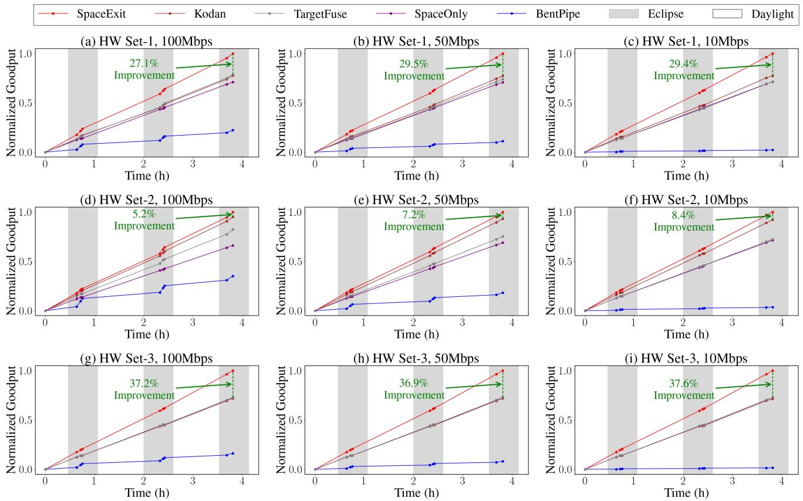  
Figure 5: Performance comparison of SpaceExit against baselines across varied hardware configurations and network bandwidths.

The quantitative results in Table 1 validate that our adaptive approach maintains or improves detection accuracy while reducing the average computational cost. The adaptive detector achieves an overall mAP@0.5 of 0.64 and mAP@0.5:0.95 of 0.404, outperforming the static detector’s scores of 0.635 and 0.394, respectively. Performance improvements are particularly notable for challenging object categories - for instance, Bridge detection improves from 0.159 to 0.192 AP@0.5:0.95, and Road Aircraft (RA) detection shows a significant gain from 0.595 to 0.607 AP@0.5.

The class-wise analysis reveals that GCAD maintains robust performance across object categories with varying complexity. For simpler objects like planes and ships, which often appear against uniform backgrounds, the adaptive detector achieves comparable accuracy to the static detector while frequently enabling early exits. For complex categories like small vehicles (SV) and Harbor, where more detailed analysis is often necessary, GCAD appropriately opts for full processing to maintain accuracy. This balanced approach demonstrates that our adaptive detection strategy successfully adapts to both image-level and category-level complexity variations.

To further illustrate the performance of our adaptive model, we present a comparison between the static and adaptive models in terms of mean mAP across all categories, as well as mAP for selected object categories. Additionally, we show how the mAP of the adaptive model varies with computational load (measured in GFLOPS). Figure 8 illustrates the comparative performance of adaptive and static models. The plot depicts the mean mAP for adaptive models across all categories, as well as the mAP for specific categories such as Harbor, Large Vehicle (LV), and Roundabout (RA). The static models’ mAP values are indicated by the triangular markers. This visualization underscores the adaptive model’s ability to maintain high accuracy while adapting computational load based on image complexity.

## 5.3 CATS Improves Detection Throughput

To evaluate the effectiveness of CATS in improving system throughput, we conduct experiments comparing system performance with and without our adaptive task scheduler. We test it with HW Set-1 under varying communication bandwidths to assess scheduler performance across diverse operational scenarios.

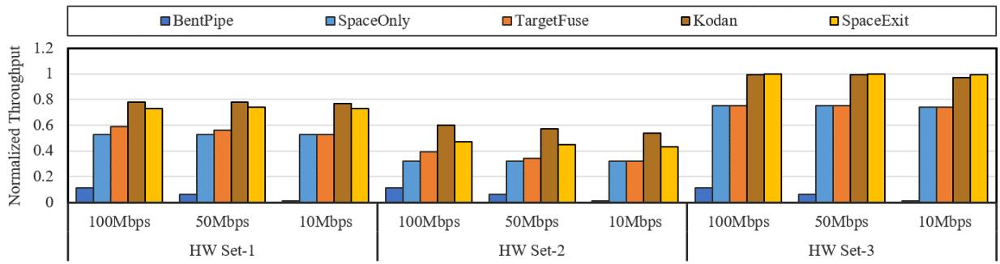  
Figure 6: Normalized transmitted tile numbers of existing systems.

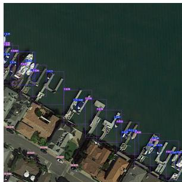  
(a) Simple image that only requires partial execution.

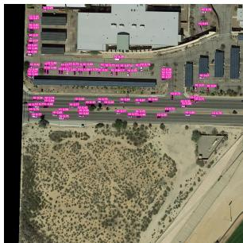  
(b) Complex image that requires full execution.  
Figure 7: Examples of images used to illustrate the effectiveness of the GCAD’s early exit decision.

Figure 9 demonstrates that CATS significantly improves system throughput across all configurations. At 100 Mbps bandwidth, CATS achieves 11% improvement in throughput compared to the baseline without scheduling. This improvement is attributed to CATS’s ability to effectively distribute workloads based on device capabilities and current utilization levels. The performance gain is particularly pronounced in the heterogeneous configuration, where intelligent task allocation can better leverage the complementary capabilities of different devices.

Figure 11 shows the estimated processing time for each device to complete all queued tasks at 100 Mbps bandwidth. With CATS, the processing time is balanced across devices, whereas without scheduling, the more powerful device finishes quickly, leaving the less powerful device with a backlog. From the data in the figure, the estimated processing time without scheduling is approximately five times higher than with scheduling. This imbalance highlights the inefficiency of not using CATS, as it leads to underutilization of the more capable device and overloading of the less capable one. Additionally, the figure shows a sharp decline in processing time at certain points, which corresponds to the moments when the satellite begins communication with the ground station. These moments act as deadlines for task processing, preventing storage from being overwhelmed by pending tasks.

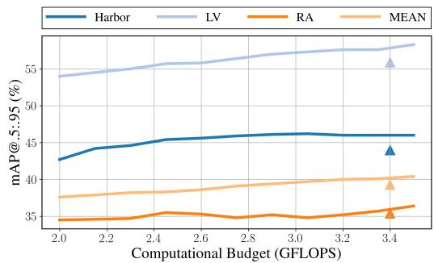  
Figure 8: Comparison between GCAD (lines) and static detectors (triangles) on the DOTA test set across different computational budgets.

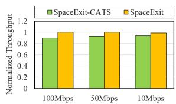

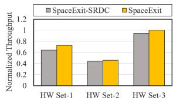  
Figure 9: CATS improves the Figure 10: SRAC improves processing throughput. the processing throughput.

These results demonstrate that CATS successfully addresses the challenge of efficient resource utilization in heterogeneous satellite computing environments. The scheduler’s ability to maintain high throughput while reducing waiting times is particularly valuable for time-sensitive Earth observation applications, where processing delays can significantly impact the utility of collected data. The consistent performance improvements across different hardware configurations and bandwidth conditions underscore the robustness of our scheduling approach.

Table 1: Comparison of static method and GCAD.
<table><tr><td>Class</td><td colspan="2">Static mAP@.5 mAP@.5:.95</td></tr><tr><td>Plane Ship</td><td>0.911</td><td>mAP@.5 mAP@.5:95</td></tr><tr><td rowspan="7">ST BD TC</td><td>0.643</td><td>0.918 0.666</td></tr><tr><td>0.866 0.577</td><td>0.872 0.598</td></tr><tr><td>0.732 0.427</td><td>0.764 0.464</td></tr><tr><td>0.721 0.395</td><td>0.723 0.405</td></tr><tr><td>0.937 0.831</td><td>0.932 0.833</td></tr><tr><td>0.661 0.480</td><td>0.608 0.434</td></tr><tr><td>0.468 0.266</td><td>0.470 0.253</td></tr><tr><td rowspan="5">Harbor Bridge LV SV HC RA MEAN</td><td>0.815 0.440</td><td>0.836 0.460</td></tr><tr><td>0.399 0.159</td><td>0.430 0.192</td></tr><tr><td>0.800 0.559</td><td>0.814 0.583</td></tr><tr><td>0.582 0.288</td><td>0.594 0.297</td></tr><tr><td>0.423 0.188</td><td>0.355 0.186</td></tr><tr><td rowspan="4">SBF SP</td><td>0.595 0.354</td><td>0.607 0.364</td></tr><tr><td>0.564 0.399</td><td>0.551 0.397</td></tr><tr><td>0.688 0.289</td><td></td></tr><tr><td>0.635 0.394</td><td>0.693 0.312 0.64 0.404</td></tr></table>

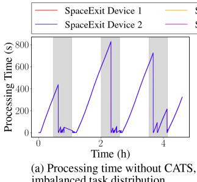

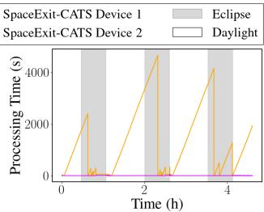  
(b) Processing time with CATS, balanced task distribution.  
Figure 11: CATS reduces the expected processing time.

## 5.4 SRAC Guarantees Safe Execution In Space

We evaluate SRAC’s effectiveness in maintaining safe and efficient system operation across different hardware configurations under realistic space constraints. Using a bandwidth of 100 Mbps, we tested HW Set-1, HW Set-2 and HW Set-3. Our experiments demonstrate SRAC’s ability to balance processing throughput with thermal and power constraints.

Figure 10 illustrates the normalized throughput across different hardware configurations, comparing performance with and without SRAC. With SRAC enabled, the system achieves consistently higher throughput while operating within safe thermal limits. This improvement stems from SRAC’s ability to adaptively adjust workload distribution based on real-time temperature and power measurements.

The thermal management capabilities of SRAC are clearly demonstrated in Figure 12. With SRAC enabled (Figure 12 (a)), device temperatures are maintained below the critical threshold of 80°C through proactive DVFS adjustments. The temperature profile shows stable thermal management with minimal fluctuations, maintaining a consistent range within

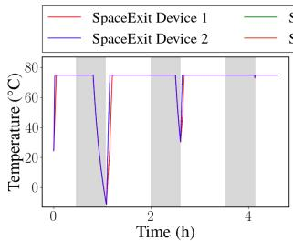  
(a) Temperature of computing devices with SRAC.

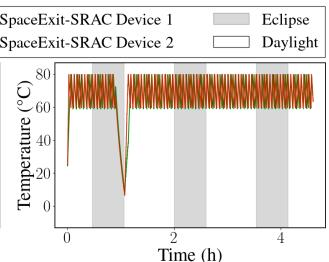  
(b) Temperature of computing devices without SRAC.  
Figure 12: Temperature profiles of computing devices with and without SRAC.

70-80°C during normal operation. In contrast, systems without SRAC (Figure 12 (b)) frequently experience temperature spikes above 80°C, triggering emergency thermal throttling that significantly impacts performance.

These results highlight the crucial role of SRAC in satellite operations, where thermal management directly impacts system reliability and longevity. The system’s ability to proactively adjust processing loads and power states ensures consistent performance without compromising hardware safety, making it well-suited for the challenging thermal environment of space operations.

## 6 Related Work

## 6.1 Orbitital Edge Computing

Orbital Edge Computing (OEC) has emerged as a promising approach to address the growing challenges of Earth observation data processing and transmission [9, 11, 37, 39]. The foundational concept and architecture of OEC were introduced by Denby and Lucia, who demonstrated that processing remote sensing images onboard satellites can significantly alleviate the communication bottleneck between space and ground segments [11]. Subsequent research has expanded the scope of OEC, with numerous systems built to process Earth observation tasks [8, 9, 40]. For instance, Kodan maximizes the utility of saturated satellite downlinks while mitigating the computational bottleneck [9], while EagleEye proposes a mixed-resolution, leader-follower constellation design [8]. Recent proposals have even discussed the possibility of building microdatacenters with 4KW power in space [5], further expanding the potential capabilities of OEC.

While these OEC approaches have made significant progress in enabling onboard data processing and reducing transmission volumes, they generally rely on fixed processing pipelines or pre-defined decision criteria. This limits their adaptability to the diverse and dynamic EO tasks.

## 6.2 Resource Management in Satellite Systems

Resource management in satellite systems, particularly in OEC contexts, faces fundamental challenges in balancing limited bandwidth, computation, and energy resources [7, 12]. Research has explored various approaches to optimize computation offloading and resource allocation, including deep reinforcement learning and game theory [14,41]. Energy management remains critical for solar-powered satellite operations [42], with optimization frameworks employing techniques like mixed-integer programming to balance latency, energy consumption, and computational throughput [6].

Despite these advancements, current resource management strategies for satellite systems often lack close integration with the specific requirements of dynamic onboard image processing and object detection tasks.

## 6.3 Dynamic Neural Network Inference

Dynamic neural network inference has emerged as a promising approach to balance accuracy and efficiency in various applications [15, 18, 30, 31]. Early exit networks, which dynamically terminate inference at earlier layers, represent a significant advancement in this field [22]. Several methods have been proposed in this direction, including BranchyNet [32], SkipNet [36], MSDNet [21], LoRAExit [26] and MMexit [17]. These approaches typically add early exit points to neural networks, enabling dynamic inference times for classification tasks and reducing average computation time for easily classifiable inputs. Few works have extended dynamic inference to object detection. For instance, DynamicDet employs an adaptive router to analyze multi-scale information and automatically determine the inference route [25]. The computational efficiency of these methods has led to their adoption in resource-constrained environments [16, 19].

Despite these advancements, current dynamic inference methods primarily target classification tasks and generalpurpose computing environments. They have yet to fully address the unique challenges posed by object detection in satellite imagery or the specific constraints of orbital edge computing systems.

## 7 Conclusion

In this paper, we presented SpaceExit, an integrated system that enables efficient adaptive Earth observation on satellites. By leveraging a novel multi-scale feature backbone with adaptive exiting, a unified adaptive scheduling framework, and a runtime resource management module, SpaceExit addresses the unique challenges of orbital edge computing. Our comprehensive evaluations across diverse satellite settings and hardware platforms demonstrate that SpaceExit significantly outperforms existing methods. By enabling adaptive, efficient onboard processing, SpaceExit paves the way for a new generation of autonomous and capable Earth observation satellites. It demonstrates the potential to maximize the value of limited downlink bandwidth, opening new possibilities for space-based data analytics and real-time global monitoring.

## Acknowledgment

We sincerely thank all the anonymous reviewers and our shepherd Divya Mahajan for their valuable comments and feedback. This work is supported by the National Natural Science Foundation of China (No. U23A6007), and also supported in part by the SJTU-SAST Joint Research Grant (USCAST2022- 16). Corresponding authors are Xiaofeng Hou and Chao Li.

## References

[1] Starlink specifications - starlink. [Online; accessed 2025-01-13].

[2] Moloud Abdar, Farhad Pourpanah, Sadiq Hussain, Dana Rezazadegan, Li Liu, Mohammad Ghavamzadeh, Paul Fieguth, Xiaochun Cao, Abbas Khosravi, U Rajendra Acharya, et al. A review of uncertainty quantification in deep learning: Techniques, applications and challenges. Information fusion, 76:243–297, 2021.

[3] David J Barnhart, Tanya Vladimirova, and Martin N Sweeting. Very-small-satellite design for distributed space missions. Journal of Spacecraft and Rockets, 44(6):1294–1306, 2007.

[4] Elinor Benami, Zhenong Jin, Michael R Carter, Aniruddha Ghosh, Robert J Hijmans, Andrew Hobbs, Benson Kenduiywo, and David B Lobell. Uniting remote sensing, crop modelling and economics for agricultural risk management. Nature Reviews Earth & Environment, 2(2):140–159, 2021.

[5] Nathaniel Bleier, Muhammad Husnain Mubarik, Gary R Swenson, and Rakesh Kumar. Space microdatacenters. 2023 56th IEEE/ACM International Symposium on Microarchitecture (MICRO), pages 900–915, 2023.

[6] Marco Centenaro, Cristina E Costa, Fabrizio Granelli, Claudio Sacchi, and Lorenzo Vangelista. A survey on technologies, standards and open challenges in satellite iot. IEEE Communications Surveys & Tutorials, 23(3):1693–1720, 2021.

[7] Qian Chen, Zheng Guo, Weixiao Meng, Shuai Han, Cheng Li, and Tony QS Quek. A survey on resource management in joint communication and computingembedded sagin. IEEE Communications Surveys & Tutorials, 2024.

[8] Zhuo Cheng, Bradley Denby, Kyle McCleary, and Brandon Lucia. Eagleeye: Nanosatellite constellation design for high-coverage, high-resolution sensing. In International Conference on Architectural Support for Programming Languages and Operating Systems, 2024.

[9] Bradley Denby, Krishna Chintalapudi, Ranveer Chandra, Brandon Lucia, and Shadi Abdollahian Noghabi. Kodan: Addressing the computational bottleneck in space. Proceedings of the 28th ACM International Conference on Architectural Support for Programming Languages and Operating Systems, Volume 3, 2023.

[10] Bradley Denby and Brandon Lucia. Orbital edge computing: Machine inference in space. IEEE Computer Architecture Letters, 18(1):59–62, 2019.

[11] Bradley Denby and Brandon Lucia. Orbital edge computing: Nanosatellite constellations as a new class of computer system. In Proceedings of the Twenty-Fifth International Conference on Architectural Support for Programming Languages and Operating Systems, pages 939–954, 2020.

[12] Changfeng Ding, Jun-Bo Wang, Ming Cheng, Min Lin, and Julian Cheng. Dynamic transmission and computation resource optimization for dense leo satellite assisted mobile-edge computing. IEEE Transactions on Communications, 71(5):3087–3102, 2023.

[13] Stijn Eyerman and Lieven Eeckhout. Fine-grained dvfs using on-chip regulators. ACM Transactions on Architecture and Code Optimization (TACO), 8(1):1–24, 2011.

[14] Shu Fu, Jie Gao, and Lian Zhao. Integrated resource management for terrestrial-satellite systems. IEEE Transactions on Vehicular Technology, 69(3):3256– 3266, 2020.

[15] Yizeng Han, Gao Huang, Shiji Song, Le Yang, Honghui Wang, and Yulin Wang. Dynamic neural networks: A survey. IEEE Transactions on Pattern Analysis and Machine Intelligence, 44(11):7436–7456, 2021.

[16] Xiaofeng Hou, Jiacheng Liu, Xuehan Tang, Chao Li, Jia Chen, Luhong Liang, Kwang-Ting Cheng, and Minyi Guo. Architecting efficient multi-modal aiot systems. In Proceedings of the 50th Annual International Symposium on Computer Architecture, ISCA ’23, New York, NY, USA, 2023. Association for Computing Machinery.

[17] Xiaofeng Hou, Jiacheng Liu, Xuehan Tang, Chao Li, Kwang-Ting Cheng, Li Li, and Minyi Guo. Mmexit: Enabling fast and efficient multi-modal dnn inference with adaptive network exits. In European Conference on Parallel Processing, pages 426–440. Springer, 2023.

[18] Xiaofeng Hou, Peng Tang, Chao Li, Jiacheng Liu, Cheng Xu, Kwang-Ting Cheng, and Minyi Guo. Smg: A system-level modality gating facility for fast and energyefficient multimodal computing. In 2023 IEEE Real-Time Systems Symposium (RTSS), pages 291–303. IEEE, 2023.

[19] Xiaofeng Hou, Cheng Xu, Chao Li, Jiacheng Liu, Xuehan Tang, Kwang-Ting Cheng, and Minyi Guo. Improving efficiency in multi-modal autonomous embedded systems through adaptive gating. IEEE Transactions on Computers, 2024.

[20] Jie Hu, Li Shen, and Gang Sun. Squeeze-and-excitation networks. In Proceedings of the IEEE conference on computer vision and pattern recognition, pages 7132– 7141, 2018.

[21] Gao Huang, Danlu Chen, Tianhong Li, Felix Wu, Laurens Van Der Maaten, and Kilian Q Weinberger. Multiscale dense networks for resource efficient image classification. arXiv preprint arXiv:1703.09844, 2017.

[22] Stefanos Laskaridis, Alexandros Kouris, and Nicholas D Lane. Adaptive inference through early-exit networks: Design, challenges and directions. In Proceedings of the 5th International Workshop on Embedded and Mobile Deep Learning, pages 1–6, 2021.

[23] Tingting Liang, Xiaojie Chu, Yudong Liu, Yongtao Wang, Zhi Tang, Wei Chu, Jingdong Chen, and Haibin Ling. Cbnet: A composite backbone network architecture for object detection. IEEE Transactions on Image Processing, 31:6893–6906, 2022.

[24] Tsung-Yi Lin, Michael Maire, Serge Belongie, James Hays, Pietro Perona, Deva Ramanan, Piotr Dollár, and C Lawrence Zitnick. Microsoft coco: Common objects in context. In Computer Vision–ECCV 2014: 13th European Conference, Zurich, Switzerland, September 6-12, 2014, Proceedings, Part V 13, pages 740–755. Springer, 2014.

[25] Zhi-Hao Lin, Yongtao Wang, Jinhe Zhang, and Xiaojie Chu. Dynamicdet: A unified dynamic architecture for object detection. 2023 IEEE/CVF Conference on Computer Vision and Pattern Recognition (CVPR), pages 6282–6291, 2023.

[26] Jiacheng Liu, Peng Tang, Xiaofeng Hou, Chao Li, and Pheng-Ann Heng. Loraexit: Empowering dynamic modulation of llms in resource-limited settings using lowrank adapters. In Findings of the Association for Computational Linguistics: EMNLP 2024, pages 9211–9225, 2024.

[27] Martina Lofqvist and José Cano. Accelerating deep learning applications in space. arXiv preprint arXiv:2007.11089, 2020.

[28] Lori A Magruder, Sinead L Farrell, Amy Neuenschwander, Laura Duncanson, Beata Csatho, Sahra Kacimi, and Helen A Fricker. Monitoring earth’s climate variables with satellite laser altimetry. Nature Reviews Earth & Environment, 5(2):120–136, 2024.

[29] Deepak Murugan, Akanksha Garg, and Dharmendra Singh. Development of an adaptive approach for precision agriculture monitoring with drone and satellite data. IEEE Journal of Selected Topics in Applied Earth Observations and Remote Sensing, 10(12):5322–5328, 2017.

[30] Yifei Pu, Chi Wang, Xiaofeng Hou, Cheng Xu, Jiacheng Liu, Jing Wang, Minyi Guo, and Chao Li. M2sn: Adaptive and dynamic multi-modal shortcut network architecture for latency-aware applications. In 2024 IEEE International Conference on Multimedia and Expo (ICME), pages 1–6. IEEE, 2024.

[31] Yifei Pu, Xinfeng Xia, Xiaofeng Hou, Chi Wang, Cheng Xu, Jiacheng Liu, Jing Wang, Minyi Guo, Jingling Yuan, and Chao Li. Mmbypass: Towards efficient multi-modal ai computing with adaptive bypass network. Journal of Parallel and Distributed Computing, 201:105078, 2025.

[32] Surat Teerapittayanon, Bradley McDanel, and Hsiang-Tsung Kung. Branchynet: Fast inference via early exiting from deep neural networks. In 2016 23rd international conference on pattern recognition (ICPR), pages 2464–2469. IEEE, 2016.

[33] Beth Tellman, Jonathan A Sullivan, Catherine Kuhn, Albert J Kettner, Colin S Doyle, G Robert Brakenridge, Tyler A Erickson, and Daniel A Slayback. Satellite imaging reveals increased proportion of population exposed to floods. Nature, 596(7870):80–86, 2021.

[34] Casper Versteeg and David L Cotten. Preliminary thermal analysis of small satellites. Small Satellite Research Laboratory, The University of Georgia, Athens, Georgia, 30602, 2018.

[35] Stefan Voigt, Fabio Giulio-Tonolo, Josh Lyons, Jan Kucera, Brenda Jones, Tobias Schneiderhan, Gabriel ˇ Platzeck, Kazuya Kaku, Manzul Kumar Hazarika, Lorant Czaran, et al. Global trends in satellite-based emergency mapping. Science, 353(6296):247–252, 2016.

[36] Xin Wang, Fisher Yu, Zi-Yi Dou, Trevor Darrell, and Joseph E Gonzalez. Skipnet: Learning dynamic routing in convolutional networks. In Proceedings of the European conference on computer vision (ECCV), pages 409–424, 2018.

[37] Changhao Wu, Yuanchun Li, Mengwei Xu, Chongbin Guo, Zengshan Yin, Weiwei Gao, and Chuanxiu Chi. A comprehensive survey on orbital edge computing: Systems, applications, and algorithms. arXiv preprint arXiv:2306.00275, 2023.

[38] Gui-Song Xia, Xiang Bai, Jian Ding, Zhen Zhu, Serge Belongie, Jiebo Luo, Mihai Datcu, Marcello Pelillo, and Liangpei Zhang. Dota: A large-scale dataset for object detection in aerial images. In Proceedings of the IEEE Conference on Computer Vision and Pattern Recognition, pages 3974–3983, 2018.

[39] Ruolin Xing, Mengwei Xu, Ao Zhou, Qing Li, Yiran Zhang, Feng Qian, and Shangguang Wang. Deciphering the enigma of satellite computing with cots devices: Measurement and analysis. Mobicom, 2024.

[40] Qiyang Zhang, Xin Yuan, Ruolin Xing, Yiran Zhang, Zimu Zheng, Xiao Ma, Mengwei Xu, Schahram Dustdar, and Shangguang Wang. Resource-efficient in-orbit detection of earth objects. Infocom, 2024.

[41] Yuru Zhang, Chen Chen, Lei Liu, Dapeng Lan, Hongbo Jiang, and Shaohua Wan. Aerial edge computing on orbit: A task offloading and allocation scheme. IEEE Transactions on Network Science and Engineering, 10(1):275–285, 2022.

[42] Dakai Zhu, Rami Melhem, and Daniel Mossé. The effects of energy management on reliability in real-time embedded systems. In IEEE/ACM International Conference on Computer Aided Design, 2004. ICCAD-2004., pages 35–40. IEEE, 2004.

## A Artifact Appendix

## Abstract

This artifact provides the computational environment, codebase, datasets, and detailed instructions necessary to reproduce the key experimental results presented in the paper.

## Scope

This artifact allows readers to validate the following core claims and results from the paper:

• Simulation Results: The performance metrics (goodput, processing time, temperature impact) of CATS and SRAC schedulers are presented in Figures 5, 11, 12. The data underlying the scheduler behavior visualizations in Figures 6, 9, 10.

• Static and Dynamic Object Detection Accuracy: The static and dynamic object detection accuracy results (mAP) are reported in Table 1 using YOLO and multiexit detector implementations.

• Accuracy-Computation Trade-off Analysis: The accuracy-computation trade-off curve for the dynamic detector presented in Figure 8.

– Links to download required external datasets (DOTA, pre-generated simulator data).

– Pre-trained model weights for YOLO and multiexit detectors.

– Pre-aggregated results file for Figure 8.

## Hosting

The artifact is hosted on GitHub: https://github.com/ zhuxz0299/ATC-artifact-submission. Datasets are available via Google Drive links in the README.

## Requirements

We developed and tested the artifact with the following specifications:

• Software Dependencies: Docker, Python 3.8+, CUDAcapable GPU drivers

• Hardware Requirements: NVIDIA GPU with CUDA support (tested on RTX 4090), Multi-core CPU (tested on Intel Xeon Platinum 8336C @ 2.30GHz)

• Operating System: Linux distribution (tested on Ubuntu 20.04)

## Contents

This artifact contains the following elements:

## • Environment Configuration:

– The env.yml file provides Conda environment specifications for dependency management.

– Docker setup instructions are included for GPUaccelerated experiments.

## • Code & Scripts:

– Simulation Framework: The simulator/ directory contains the complete implementation of CATS and SRAC scheduling algorithms, execution scripts, and Python visualization scripts for generating experimental figures.

– Image Complexity Analysis: The image\_tiling/ directory provides the computational framework for calculating the image complexity metric.

– Geospatial-Contextual Adaptive Detector: The gcad/ directory implements the GCAD with subfolders for YOLO static experiments, multi-exit dynamic detector, and geospatial threshold tuning.

## • Dataset & Resources:

## A.1 Installation

## Python Environment (Conda)

1. Create Conda environment: conda env create -f env.yml

2. Activate environment: conda activate <env\_name>

## Docker Environment (GPU required)

1. Pull base image:

docker pull nvcr.io/nvidia/pytorch:21.08-py3

## 2. Create and run container:

docker run --gpus all -it -v ./gcad:/GCAD \ --shm-size=64g --name atc\_artifact \ nvcr.io/nvidia/pytorch:21.08-py3

## 3. Install dependencies inside container:

apt update && apt install -y zip libgl1-mesa-glx pip install seaborn thop