①

USENIX

THE ADVANCED COMPUTING SYSTEMS ASSOCIATION

# Fast Distributed Transactions for RDMA-based Disaggregated Memory

Haodi Lu, Haikun Liu, Yujian Zhang, Zhuohui Duan, Xiaofei Liao, Hai Jin, and Yu Zhang, Huazhong University of Science and Technology https://www.usenix.org/conference/atc25/presentation/lu

# This paper is included in the Proceedings of the 2025 USENIX Annual Technical Conference.

July 7–9, 2025 • Boston, MA, USA ISBN 978-1-939133-48-9

Open access to the Proceedings of the 2025 USENIX Annual Technical Conference is sponsored by

P--r.h £Es/sL.

auuuJl9 PgleU

King Abdullah University of

Science and Technology

# Fast Distributed Transactions for RDMA-based Disaggregated Memory

Haodi Lu, Haikun Liu∗, Yujian Zhang, Zhuohui Duan, Xiaofei Liao, Hai Jin, Yu Zhang National Engineering Research Center for Big Data Technology and System, Service Computing Technology and System Lab/Cluster and Grid Computing Lab, School of Computer Science and Technology, Huazhong University of Science and Technology, China Email: {haodilu, hkliu, yj8023xx, zhduan, xfliao, hjin, zhyu}@hust.edu.cn

## Abstract

Memory disaggregation has emerged as a promising datacenter architecture since it improves memory utilization and scalability. However, it is usually costly to process distributed transactions in disaggregated memory systems due to relatively high latency of remote memory accesses. In this paper, we present HDTX, a high-performance distributed transaction system for RDMA-based disaggregated memory. We advocate three novel designs. First, we propose a fast commit protocol (FCP) to minimize network round trips by coalescing different phases of distributed transaction processing. Second, we propose an RDMA-enabled offloading mechanism to reduce data transfers across computing and memory nodes by carefully orchestrating different RDMA primitives. Third, we propose decentralized priority-based locking to schedule mission-critical transactions, and thus further reduce the latency of distributed transactions. Experimental results show that HDTX reduces the latency of distributed transactions by up to 88.3% and 72.1%, and improves the throughput by up to 2.08× and 84.7%, compared with RDMA-based distributed transaction systems–FaRM and FORD, respectively.

## 1 Introduction

Resource disaggregation has emerged as one fundamental shift that we organize and manage different types of resources (e.g. CPU, memory) in datacenters. It has attracted extensive interests in both academia [42, 53, 54] and industry [9, 17] in recent years. Under resource disaggregation, monolithic servers are disaggregated into dedicated computing and memory nodes which are typically connected by high-speed networks such as Remote Direct Memory Access (RDMA) or Compute Express Link (CXL). The computing nodes run programs using a small local DRAM buffer backed with a large remote memory pool, while the memory nodes are usually equipped with very limited computing units for memory allocations and network initialization/connectivity. By pooling and sharing different resources, this resource disaggregation architecture substantially improves resource utilization, and facilitates resource scaling and failure isolation.

When correlated objects are concurrently accessed in the disaggregated memory (DM) pool, the computing nodes have to exploit distributed transactions (dtxns) to guarantee data integrity and consistency. However, most previous RDMAbased dtxn systems [28, 48] are designed for conventional monolithic servers in which computing and memory resources are tightly coupled. They are not applicable to DM systems because memory nodes usually have very limited computing resource to process costly operations during dtxn processing, such as buffer polling [12], locking [48], and data copying [28]. Recently, the state-of-the-art FORD [53] has been proposed particularly for processing dtxns in DM systems. However, it still incurs relatively high latency and high network bandwidth consumption. Moreover, dtxn processing systems should offer low latency for mission-critical applications. This low-latency requirement further increases the difficulty of deploying dtxn processing systems in the DM architecture due to the following challenges.

C.1: multiple network round trips (RTT) caused by multi-phase dtxn processing. Traditional dtxn systems usually exploit optimistic concurrency control (OCC) [46] to achieve lock-free dtxn processing on read-only data, and adopt the primary-backup replication (PBR) mechanism [28, 48] to guarantee high availability. Thus, existing dtxn systems [12, 49] generally process a single dtxn in five phases. Specifically, coordinators execute the dtxn in the Execution phase, serialize the dtxn in the Locking and Validation phases, and finally commit the dtxn in the Commit Backup and Commit Primary phases. Each phase usually incurs an RTT. FORD [53] has optimized the dtxn protocol particularly for DM systems, but still requires four phases to process a dtxn. These multiple phases often cause high latency of dtxn processing.

C.2: inefficient data synchronization in dtxn commit phases. Most previous dtxn processing systems require two phases to commit backups and primaries sequentially [12,

49]. To reduce the latency, previous proposals [29] [34] rely on CPUs of memory nodes to synchronize the latest data within backups and primaries locally. However, these schemes are not applicable to DM systems since memory nodes do not have sufficient CPU resource to perform the costly data synchronization. Thus, they have to send the log and the latest data from computing nodes to all memory nodes in two rounds of data transfers. This causes substantial pressure on the RDMA bandwidth when the network load is high.

C.3: limited CPU resource in DM nodes for scheduling mission-critical dtxns. For mission-critical dtxns, their execution priority usually should be enhanced to guarantee low latency. Conventional dtxn systems [11, 35] exploit prioritybased locking [22] to schedule different dtxns globally using CPUs on storage nodes. However, they cannot be directly adopted in DM systems because memory nodes usually do not have sufficient CPU resource for lock management and dtxn scheduling. Thus, it is challenging to schedule dtxns globally by DM nodes.

In this paper, we present HDTX, a high-performance distributed transaction system for the RDMA-based DM architecture. Through an in-depth analysis of the characteristics of dtxns and one-sided RDMA primitives, we propose three novel designs to address the above three challenges, respectively. Specifically, we make the following contributions.

For C.1, we propose a fast commit protocol (FCP) to minimize network round trips by coalescing the Validation and Commit phases of dtxns. To commit a dtxn earlier while still guaranteeing data consistency, FCP adopts the redo log and a visibility control technique [29,34,53] to coalesce three phases: Validation, Commit Backup, and Commit Primary. At first, FCP replaces Commit Backup and Commit Primary phases with one Commit phase and one asynchronous Release phase. Moreover, since there is no data dependency between the Validation phase and the Commit phase, FCP also coalesces these two phases to further reduce network round trips. Thus, the computing node only requires one round trip to commit a dtxn after the Execution and Locking phases.

For C.2, we propose RDMA-enabled data synchronization offloading to reduce RDMA bandwidth consumption. In the Release phase of our fast commit protocol, the computing node should write the latest data to the datastore, update the version of data, and release the lock on memory nodes. Since the redo log containing the latest data has been stored in memory nodes during the Commit phase, HDTX can offload these operations (i.e., data synchronization) to RDMA network interface controller (RNIC) via a series of RDMA Write and RDMA Atomic primitives. By orchestrating these primitives with special RDMA Wait and RDMA Enable primitives, the RNICs of memory nodes can perform the Release phase autonomously. In this way, HDTX can avoid additional transfers of the latest data across computing and memory nodes, mitigating the bandwidth contention of RDMA networks.

For C.3, we propose decentralized priority-based locking to reduce the latency of mission-critical applications. During the Locking phase, each computing node exploits the RDMA Fetch-and-Add (FAA) primitive to request write locks for a read-write set. For mission-critical dtxns, the computing node can set a high priority to the lock request so that it has more opportunities to acquire the required locks. In a global view, our decentralized priority-based locking mechanism can schedule latency-sensitive dtxns without involving memory nodes’ CPUs.

We implement HDTX [23] and evaluate it with several benchmarks that simulate real-world workloads1. Compared with two typical RDMA-enabled dtxn systems–FaRM [12] and FORD [53], experimental results show that HDTX reduces the latency of dtxns by up to 88.3% and 72.1%, reduces the 99th percentile latency by up to 82.7% and 60.9%, and improves the dtxn throughput by up to 2.08× and 84.7% on average, respectively.

## 2 Background

## 2.1 High-Performance RDMA

RDMA networks are widely deployed in high-performance computing (HPC) environments and data centers because they offer high-throughput and low-latency remote memory accesses via bypassing traditional I/O stacks. Applications can leverage one-sided RDMA operations, such as Read/Write primitives, to directly access remote memory, without the involvement of remote CPUs. Also, applications can use twosided RDMA operations, such as Send/Recv primitives, to communicate with remote CPUs for more complex operations. There are also a number of RDMA Atomic primitives, such as RDMA Compare-and-Swap (CAS) and RDMA FAA. The former can atomically modify 8-byte data under specific conditions, and the latter can atomically add 8-byte data to a specific value. To perform RDMA operations, an application must first construct a completion queue (CQ) and a queue pair (QP) which comprises a send queue and a receive queue. It then appends RDMA operations to the QP and notifies the RNIC for execution. Once the RDMA operation completes, the RNIC generates an acknowledgment message in the CQ to inform the application.

Besides data transmission, the RDMA driver also supports ordering control via RDMA Fence flags or RDMA Wait primitives, which can maintain the operation order within a send queue and across different QPs, respectively. Specifically, an RDMA operation with an RDMA Fence flag is halted on the sender’s RNIC till all previous operations within the same send queue are completed. In contrast, the RDMA Wait can block its subsequent RDMA operations till a specific RDMA operation is completed. The RDMA Enable primitive allows the RNIC to fetch the metadata of pending RDMA operations in the same work queue, and enables them to be executable. Thus, RDMA Wait and RDMA Enable can be orchestrated to perform a set of pending RDMA operations autonomously in an event-driven manner [31, 38].

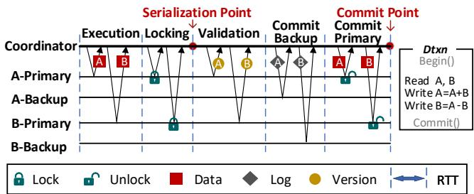  
Figure 1: Dtxn processing based on OCC and PBR. Each data (A and B) has two replicas on memory nodes.

## 2.2 RDMA-based Distributed Transactions

Distributed transactions are commonly used to ensure data consistency when multiple objects are accessed concurrently. There are two kinds of concurrency control mechanisms for dtxn systems: pessimistic and optimistic. The former locks all objects involved in a transaction to guarantee data consistency in high-contention scenarios, while the latter only locks the write set of a transaction to improve the parallelism of dtxn processing in low-contention scenarios.

Most RDMA-based dtxn systems [13, 28, 48] exploit both OCC and PBR to achieve high performance and high availability, respectively. Figure 1 illustrates a typical dtxn protocol. Upon receiving a dtxn request, the coordinator (i.e., the computing node) fetches the read set from multiple memory nodes and executes the transaction locally. After the Execution phase, the coordinator tries to commit the dtxn through four phases. If the read-write data are locked successfully in the Locking phase, and the coordinator verifies that the read set has not been modified by other dtxns before the Validation phase, it writes the dtxn output to logs on all backups for failure recovery. Once the coordinator receives all acknowledgments (ACKs), it updates and unlocks the data on primary nodes, and finally commits the dtxn. If the validation or any write operation fails, the coordinator should unlock the write set and abort the dtxn. Overall, five RTTs are required to commit a single dtxn in five phases.

## 3 Motivation

For most online services, dtxn processing systems should offer both high throughput and low latency. However, existing RDMA-based dtxns do not work efficiently in DM systems. By carefully analyzing existing dtxn protocols and ordering constraints of batched RDMA primitives, we find that there are several opportunities for optimizing dtxns in DM systems.

Table 1: Work request operation ordering
<table><tr><td rowspan=1 colspan=1>Second OperationFirst Operation</td><td rowspan=1 colspan=1>Send</td><td rowspan=1 colspan=1>Write</td><td rowspan=1 colspan=1>Read</td><td rowspan=1 colspan=1>Atomic(FAA/CAS)</td></tr><tr><td rowspan=1 colspan=1>Send</td><td rowspan=1 colspan=1>#</td><td rowspan=1 colspan=1>#</td><td rowspan=1 colspan=1>#</td><td rowspan=1 colspan=1>#</td></tr><tr><td rowspan=1 colspan=1>Write</td><td rowspan=1 colspan=1>#</td><td rowspan=1 colspan=1>#</td><td rowspan=1 colspan=1>#</td><td rowspan=1 colspan=1>#</td></tr><tr><td rowspan=1 colspan=1>Read</td><td rowspan=1 colspan=1>F</td><td rowspan=1 colspan=1>F</td><td rowspan=1 colspan=1>#</td><td rowspan=1 colspan=1>F</td></tr><tr><td rowspan=1 colspan=1>Atomic (FAA/CAS)</td><td rowspan=1 colspan=1>F</td><td rowspan=1 colspan=1>F</td><td rowspan=1 colspan=1>#</td><td rowspan=1 colspan=1>F</td></tr></table>

\*F: Order is maintained only if the second operation has set a Fence flag. \*#: Order is always maintained.

Constraints of RDMA operation ordering. One-sided RDMA supports remote memory accesses without involving remote CPUs. It is applicable to DM systems but poses a number of constraints on dtxn processing. Two RDMA primitives that are batched and delivered from the same send queue should obey multiple operation ordering rules outlined in the InfiniBand Trade Association (IBTA) Specification [15,43], as shown in Table 1. Specifically, if the first RDMA operation is an RDMA Send/Write and the second RDMA operation can be any type, these two primitives are executed sequentially and thus can be completed within a single RTT. If the first operation is an RDMA Read/FAA/CAS and the second operation is not an RDMA Read, the sender’s RNIC may execute the second operation earlier, causing unpredictable issues. Thus, an RDMA Fence flag should be attached to the second RDMA operation to guarantee the ordering but incurs additional network latency. Since RDMA operations for data synchronization among replicas should be ordered to guarantee data consistency, the dtxn processing protocol should be carefully designed to fully exploit different RDMA primitives.

Opportunities for reducing network round trips. Since typical dtxn systems require five RTTs to commit a transaction, as shown in Figure 1, previous studies [48, 53] have proposed several RDMA-based optimizations. The coordinator can combine the Execution and Locking phases, or the Locking and Validation phases to reduce network round trips. In addition, the coordinator can also update both primary and backup replicas in a single RTT, at the risk of suffering lower recovery performance upon failures. Despite these optimizations, previous proposals still require three or more RTTs to commit a dtxn. Fortunately, we find that it is possible to further reduce network round trips by carefully orchestrating the logging mechanism and the primary/backup Commit phases. By decoupling the data synchronization operation from the primary/backup Commit phases, we have an opportunity to coalesce the Validation and Commit phases, allowing a dtxn to be committed within two RTTs (Section 4.2).

Opportunities for RDMA-enabled data synchronization offloading. Most dtxn systems adopt undo or redo logs to guarantee data consistency in case of failures. In traditional dtxn systems [28,48], data nodes rely on their CPUs to update the data using redo logs, or to generate undo logs using the original data. However, these logging mechanisms are not applicable to DM systems due to lack of CPU resource on

DM nodes. The state-of-the-art dtxn system–FORD [53] uses undo logs for the DM, but its coordinator has to send the log and the latest data to all primaries/backups in two phases of dtxns. Since the coordinator should read the original data from memory nodes and then write it to the undo log, FORD incurs additional network bandwidth consumption due to logging. Although the multi-version concurrency control (MVCC) [37, 44] mechanism can avoid the additional data transfer incurred by logging, it requires more computing resource for garbage collection in memory nodes. By revisiting redo logs and RDMA Wait/Enable primitives, we find that it is possible to save the RDMA bandwidth by replacing remote memory copying with local memory copying. Since the redo log has been sent to memory nodes, we exploit an RDMA Wait and an RDMA Write to update the data by copying the redo log locally, avoiding remote memory copying and unnecessary RDMA bandwidth consumption (Section 4.3).

Opportunities for scheduling mission-critical dtxns. Most dtxn systems face a risk of high tail latency due to lock contention and deadlocks. Specifically, some RDMAbased dtxn systems typically acquire locks via RDMA CAS primitives with blind retries [12, 53], leading to unpredictable performance and starvation issues. Some proposals [36, 51] schedule tasks in a first-in-first-out manner, and thus also fail to accelerate mission-critical dtxns. Priority-based locking can mitigate these problems by scheduling latency-sensitive dtxns. However, existing priority-based locking mechanisms are inapplicable to the DM architecture because of limited computing resource on memory nodes. Fortunately, since the RDMA FAA primitive can perform a read-modify-write operation in a single RTT, it offers an opportunity to design a decentralized locking mechanism for flexible dtxn scheduling. By carefully designing the data structure of priority-based locks and the lock acquisition mechanism, mission-critical dtxns are given a high priority to acquire locks, and thus reduce lock contention with other dtxns. (Section 4.4).

## 4 Design of HDTX

## 4.1 Overview

Figure 2 shows the overview of HDTX. The coordinators in the computing pool are responsible for receiving and processing transactions requested by clients. The memory pool stores application data in hash tables. The coordinators (i.e., computing nodes) directly access the remote memory nodes through RDMA networks.

At first, HDTX initializes the datastore and establishes network connections with one CPU thread in the memory pool (①). Meanwhile, the computing pool caches the metadata and the configuration of the datastore for remote data accesses. After HDTX is initialized, coordinators in the computing pool are ready to serve clients’ requests (②). Specifically, the coordinator initiates a transaction with Tx\_begin(). Then, it uses the Tx\_execution() to fetch and lock the latest data from the memory pool with priority-based locking (Section 4.4), and executes the transaction locally (③). We note that the coordinator can perform the Tx\_execution() multiple times to fetch and lock data that is newly-added to the read-write set during the dtxn execution. Once the execution is completed, the coordinator exploits our fast commit protocol (Section 4.2) to commit the transaction using Tx\_commit(), and returns the transaction output to the client (④).

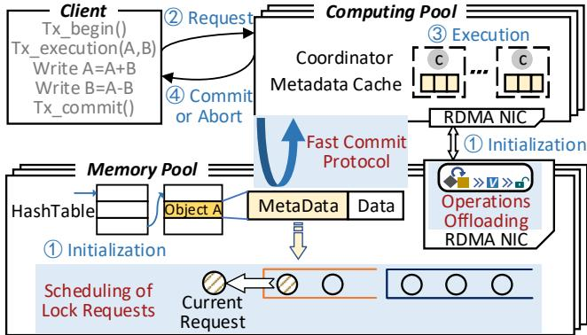  
Figure 2: The system overview of HDTX

## 4.2 Fast Commit Protocol

In this section, we elaborate two key designs that enable fast dtxn commits while still guaranteeing data consistency.

## 4.2.1 Combining Backup and Primary Commit Phases

When the computing node commits a transaction and responds to the client, the latest data should be persisted in all memory nodes to guarantee consistency. As shown in Figure 1, traditional transaction systems require two RTTs to write the log and data sequentially to backups and primaries, respectively. This ensures fast failure recovery but incurs high latency. In traditional monolithic servers, a straightforward approach for fast dtxn commits can be achieved by combining Backup Commit and Primary Commit phases within a single RTT. Specifically, the coordinator writes logs to all primaries/backups, and then makes the write set invisible by setting the visibility bit as “0”. This visibility control [29, 34, 53] can guarantee data consistency during the combined Commit phase. Once receiving ACKs from all primaries/backups, the coordinator can commit the dtxn, and then asynchronously executes a Release phase, which is responsible for updating the data and its version, making the write set visible, and releasing locks.

Unfortunately, the above approach incurs additional RTTs when applying to an RDMA-enabled DM architecture due to the ordering rules of RDMA primitives. In the following, we discuss how the primary/backup Commit and Release phases should be implemented in the DM architecture when using undo and redo logs, respectively.

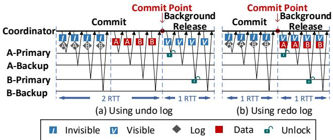  
Figure 3: Commit a dtxn using (a) undo log and (b) redo log after the Validation phase

(a) Using undo log. The undo log contains the old version of the data and its metadata, and thus the computing node can in-place write the latest data to all memory nodes before committing the dtxn. As illustrated in Figure 3(a), after sending the undo log, the coordinator marks the locked data as invisible via RDMA Atomic, and then in-place updates the data via RDMA Write to commit the transaction. These two steps should be performed sequentially. Otherwise, other transactions may read the data being updated, causing inconsistent data accesses. However, according to the ordering rules, the coordinator must add RDMA Fence flag to the RDMA Write to maintain the order. This operation brings an additional RTT to the Commit phase. Even though the undo log can be propagated to all primaries/backups during the Validation phase, at least two RTTs are required to synchronize the latest data among all memory nodes. Thus, dtxn systems using undo logs are unable to achieve fast commits in DM systems.

(b) Using redo log: The redo log contains the transaction output (i.e. the latest data) and its metadata. Thus, the computing node can commit the transaction after writing the redo log to all primaries/backups, and then asynchronously updates the data using the redo log. Unlike undo logs, the order of propagating the latest data with redo logs and the visibility control do not affect the read consistency during the Commit phase. Thus, the coordinator can simply write the redo log to all primaries/backups via the RDMA Write, and then marks the locked data as invisible via the RDMA Atomic, as illustrated in Figure 3(b). The locked data can be in-place updated asynchronously in the Release phase, which is not on the critical path of dtxns. Since the order of batched RDMA Write and RDMA Atomic in the Commit phase is always maintained, as shown in Table 1, they can be performed sequentially in only one RTT. Thus, we adopt the redo log and the visibility control mechanism to minimize network round trips during the Commit phase.

## 4.2.2 Combining Validation and Commit Phases

The Validation phase checks whether the read-only set is updated by other dtxns during the Execution and Locking phases. The Commit phase propagates redo logs of the write set to all primaries/backups. Since there is no data dependency between the Validation phase and the Commit phase, HDTX combines these two phases to further reduce network round trips. In this way, HDTX can shorten the lock duration and enable fast dtxn commits. However, when there are high readwrite conflicts, HDTX may rollback the Commit phase due to unsuccessful Validation. Fortunately, since redo logs can be discarded or overwritten directly, the rollback of the Commit phase incurs rather low performance overhead. Thus, this design can significantly accelerate dtxn processing particularly for workloads with low read-write contention.

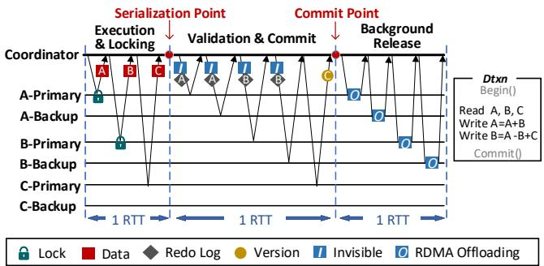  
Figure 4: The workflow of dtxn processing in HDTX

## 4.2.3 Dtxn Workflow in HDTX

The Execution and Locking phases can be also combined to reduce network round trips [7,53]. Putting these optimizations together, Figure 4 illustrates how HDTX processes a dtxn using our fast commit protocol in DM systems. It mainly includes the following three phases but can commit a dtxn within only two RTTs.

(1) Execution & Locking phase. The coordinator issues batched RDMA FAA(Atomic) and RDMA Read primitives to lock and fetch the read-write set from primaries in one RTT. Since the order of these two primitives is always maintained according to the operation ordering rules, the coordinator can obtain the write lock and the latest data within one network round trip.

(2) Validation & Commit phase. The coordinator issues an RDMA Read to fetch the visibility bit and the version number of read-only data for validation. Meanwhile, it issues batched RDMA Write and RDMA Read to persistently write the redo log to all replicas, and uses RDMA FAA(Atomic) to atomically mark the locked data as invisible. Once the coordinator receives acknowledgments from all replicas and verifies that there is no conflict, it can commit the dtxn. We note that the visibility control can provide a consistent view among replicas when in-place updating the write set. Therefore, other coordinators only need to check the data version and visibility bits rather than the write locks, enabling concurrent accesses to read-only data. If the coordinator detects a missing acknowledgment or a failure before the commit point, it rolls back the dtxn. In this case, it should notify all replicas to reset visibility bits and release write locks.

Table 2: A summary of different dtxn systems
<table><tr><td rowspan=1 colspan=1>Dtxn Systems</td><td rowspan=1 colspan=1>Phases of dtxn protocol</td><td rowspan=1 colspan=1>#RTTs to commit</td></tr><tr><td rowspan=1 colspan=1>FaRM[12,39]</td><td rowspan=1 colspan=1>Execution+Locking+Validation+Commit Backup+Commit Primary</td><td rowspan=1 colspan=1>5 RTTs</td></tr><tr><td rowspan=1 colspan=1>FaSST[28]</td><td rowspan=1 colspan=1>Execution&amp;Locking+Validation+Log+Commit Backup+ Commit Primary</td><td rowspan=1 colspan=1>5 RTTs</td></tr><tr><td rowspan=1 colspan=1>DrTM+H [48]</td><td rowspan=1 colspan=1>Execution+Locking&amp;Validation+Commit Backup+Commit Primary</td><td rowspan=1 colspan=1>4 RTTs</td></tr><tr><td rowspan=1 colspan=1>FORD [53]</td><td rowspan=1 colspan=1>Execution&amp;Locking(UndoLog)+Vali-dation+Commit+Background Release</td><td rowspan=1 colspan=1>3 RTTs</td></tr><tr><td rowspan=1 colspan=1>HDTX</td><td rowspan=1 colspan=1>Execution&amp;Locking+Validation&amp;Co-mmit (RedoLog)+Background Release</td><td rowspan=1 colspan=1>2 RTTs</td></tr></table>

(3) Release phase. The coordinator should update the locked data, increase the version number, make the locked data visible, and release the write lock. The coordinator issues an RDMA Send primitive to asynchronously conduct all these operations via RDMA-enabled offloading, as described in Section 4.3. If a failure occurs in this phase, the coordinator handles the failure according to the status of the uncompleted dtxn (Section 4.5).

We summarize previous dtxn protocols in Table 2. FaRM [12,13] and FaSST [28] both require 5 RTTs to process a dtxn. DrTM+H [48] combines the Locking and Validation phases, and thus processes a dtxn with 4 RTTs. FORD combines the Execution and Locking phases, and performs its Release phase in the background, and thus can commit a dtxn in 3 RTTs. Our HDTX only requires two phases to commit a dtxn, and then performs the Background Release phase asynchronously.

When the validation fails due to read-write conflicts, all dtxn systems abort the current dtxn. In this case, both HDTX and other systems must release all acquired locks via RDMA operations. Since both HDTX and FORD send logs to memory nodes before the Validation phase, they both waste RDMA bandwidth for the log transmission upon a dtxn abort. Thus, the performance overhead of the rollback in HDTX is comparable to that of FORD.

## 4.3 RDMA-enabled Release Phase Offloading

We next consider how to efficiently execute the Release phase of dtxns on DM nodes. As discussed in Section 3, it is costly to send the latest data and the log in two rounds of data transfers in DM systems. We observe that the in-place updating of the write set can be efficiently achieved by RNICs on memory nodes, because it only involves data movement within each memory node when using redo logs. Thus, we leverage RDMA Wait and RDMA Enable primitives to sequentially offload all operations in the Release phase to RNICs of memory nodes.

Figure 5 illustrates how the memory node’s RNIC can “copy” the redo log to update the data locally via RDMAenabled operation offloading. When HDTX is initialized, two work queues are created particularly for RDMA offloading in the memory nodes’ RNIC. Specifically, work queue 1 is paired with a work queue in the computing node to receive RDMA offloading messages. The memory node sequentially issues three RDMA primitives, i.e., RDMA Wait, RDMA Enable, and RDMA Write to work queue 2. At this time, the source and destination addresses of the RDMA Write are set as NULL in its metadata. Besides the addresses, the metadata of RDMA primitives also contains the type of RDMA operation, access permissions, the data size, and so on. These items can be used by the RNIC on the memory node to perform RDMA Write operations. Then, the memory node issues an RDMA Recv to work queue 1. The destination address of the RDMA Recv is the memory region that stores the metadata of the RDMA Write. Since the RDMA Wait in work queue 2 is configured to wait for the work completion event of the first position in work queue 1, the RNIC should monitor the completion event of RDMA Recv, and then continue the pending RDMA primitives blocked by the RDMA Wait.

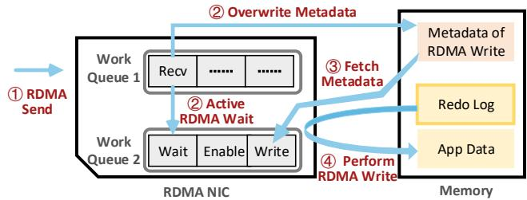  
Figure 5: Offloading the data copying operation to the memory node’s RNIC via RDMA Wait/Enable primitives

When the redo log in the memory node should be copied to update the application data locally, the computing node sends the source and destination addresses of the data copying operation to the memory node via an RDMA Send (⃝1 ), which consumes the RDMA Recv in work queue 1 and overwrites the metadata of the RDMA Write with the content of the RDMA Send. Meanwhile, the RNIC generates a work completion event of work queue 1, which activates the pending RDMA Wait in work queue 2 (⃝2 ). Then, the RNIC continues to process the other two pending RDMA primitives in work queue 2. Since the RDMA Write is accompanied by an RDMA Enable, the RNIC fetches the metadata of the RDMA Write from the memory node, enabling it to be executable (⃝3 ). Finally, the memory node’s RNIC performs the RDMA Write (⃝4 ) to copy data from the redo log to the application’s data area, without the intervention of the memory node’s CPUs.

To offload all operations in the Release phase to the RNIC, the memory node has to issue two RDMA Writes and one RDMA FAA to its RNIC and blocks them via RDMA Wait/Enable primitives during the initialization of HDTX. Figure 6 shows all operations in the Release phase executed by RNICs on memory nodes. After responding the dtxn output to clients, the coordinator issues an RDMA Send to activate all blocked RDMA operations for each memory node. Then, the memory nodes’ RNICs overwrite the metadata of blocked RDMA operations according to the content of the RDMA Send, including the address of redo logs, the addresses of the data and its metadata, and the data size. At this time, memory nodes’ RNICs are aware of the source and destination addresses of the pending data copying operation, and perform the first blocked RDMA Write to update the data with redo logs. Similarly, HDTX leverages the second blocked RDMA Write to offload the version updating. The blocked RDMA FAA primitive is used to modify visibility bits for all primaries/backups, and to release locks for all primaries. Since the RDMA-enabled offloading in the Release phase would consume a set of RDMA primitives in the two work queues, HDTX supplements these RDMA primitives in batches for upcoming dtxns using a background thread. In this way, all operations in the Release phase can be offloaded to the RNIC, without any intervention of the memory node’s CPUs.

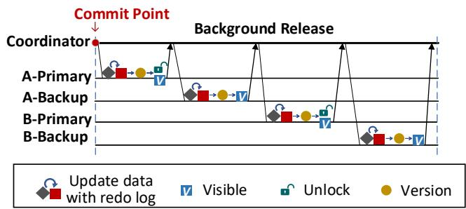  
Figure 6: Operations executed by RNICs in the Release phase

## 4.4 Decentralized Priority Locking

Most dtxn processing systems are concerned with the latency of individual transactions. To meet users’ requirements, HDTX leverages decentralized priority-based locking to support flexible dtxn scheduling, i.e., assigning a high priority to dtxns that are mission-critical or are about to violate their latency requirements soon.

## 4.4.1 Lock Presentation

To manage and schedule lock requests for dtxns, we construct two queues assigned different priorities for each lock in memory nodes. Specifically, we queue requests with the same priority in a first-in-first-out (FIFO) manner using Lamport’s Bakery algorithm [32], and rely on coordinators to determine the order of requests in different queues.

The Lamport’s Bakery algorithm is applicable to the lock management in a DM architecture since it allows computing nodes to collect the status of locks on memory nodes, without involving memory nodes’ CPUs. When a computing node requests a lock, it receives an incremental token from the memory node. The memory node records the number of lock requests and the token of the current computing node that holds the lock. If the token received by the computing node matches the token recorded by the memory node, the computing node acquires the lock. Based on this algorithm, we manage lock requests using two FIFO queues, i.e., a normal queue and a prioritized queue, to achieve more flexible dtxn scheduling. The former and latter queues are assigned with a low priority and a high priority, respectively.

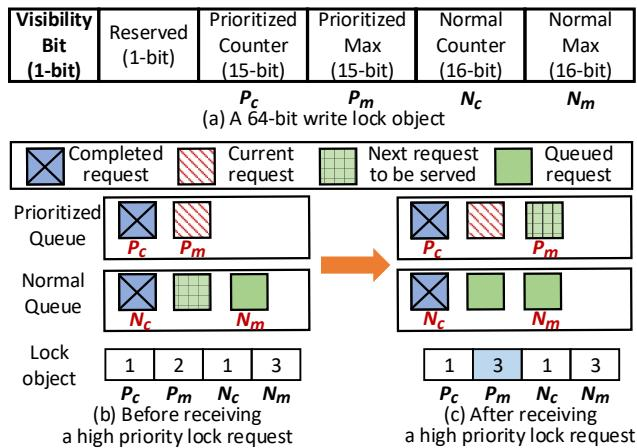  
Figure 7: The write lock representation and an illustration of the decentralized priority-based locking

Figure 7(a) shows the 64-bit representation of a prioritybased lock object. For each lock, we construct a normal queue using a pair of $< N _ { c } , \ N _ { m } >$ , which denotes the token of the current dtxn holding the lock and the number of dtxns requesting the lock, respectively. We also use a pair of $< P _ { c }$ c, $P _ { m } >$ to construct the prioritized queue, which works similarly to the normal queue. Once the current lock is released, the pending requests in the prioritized queue can acquire the lock ahead of requests in the normal queue. If a dtxn fails to acquire a lock for several times, it would retry with a high-priority lock request so that the priority of dtxns can be dynamically adjusted to mitigate the risk of latency requirement violations.

Figure 7(b) and (c) illustrate how the status of the lock object and two queues change when a high-priority lock request is received. As shown in Figure 7(b), there are two lock requests in the prioritized queue $\left( P _ { m } = 2 \right)$ . The first request in the prioritized queue is completed $\scriptstyle ( P _ { c } = 1 )$ , while the second request has acquired the lock. In the normal queue, there are three lock requests $( N _ { m } { = } 3 )$ , and the first request is completed (Nc=1). If the current request completes, the second request in the normal queue can acquire the lock. When a new lock request with a high priority arrives, as shown in Figure 7(c), the number of requests in the prioritized queue increases from two to three $\left( P _ { m } { = } 3 \right)$ . According to our priority-based locking algorithm, if the current request completes, the third request in the prioritized queue instead of the second request in the normal queue can acquire the lock. In this way, our priority-based locking mechanism can reduce the latency of mission-critical dtxns by assigning them a high priority.

## 4.4.2 Handling Priority-based Locking

HDTX leverages RDMA FAA primitives for locking operations, including lock acquisition and release. The RDMA CAS primitive is also used for special cases, such as handling lock overflows and deadlocks. Upon receiving a dtxn request, the coordinator performs the Execution & Locking phase to fetch and lock the read-write set. The coordinator determines whether it acquires the lock by comparing the returned token with the current value of the lock object. Once the coordinator acquires all locks required by the dtxn, it begins the next phase to validate the version and commit the dtxn. In the Release phase, the coordinator releases write locks via the RDMA FAA. We elaborate these locking operations in the following.

Table 3: Key notations and procedures used in HDTX
<table><tr><td rowspan=1 colspan=1>Function</td><td rowspan=1 colspan=1>Description</td></tr><tr><td rowspan=1 colspan=1>L(segment)</td><td rowspan=1 colspan=1>returns the value of segment in the 64-bit lock objectL.The segment is one ofPc,Pm,Nc,and $N _ { m } .$ </td></tr><tr><td rowspan=1 colspan=1>READ(lock)</td><td rowspan=1 colspan=1>fetches the value of the lock via an RDMA Read.</td></tr><tr><td rowspan=1 colspan=1>FAA(lock, segment,value)</td><td rowspan=1 colspan=1>atomically adds value to a segment of lock via anRDMA FAA and receives the original value of lock.</td></tr><tr><td rowspan=1 colspan=1>CAS(lock, value)</td><td rowspan=1 colspan=1>compares and swaps the value of lock if it equals tothe given value via an RDMA CAS,and receives theoriginal value of lock.</td></tr><tr><td rowspan=1 colspan=1>CheckOverflow(L)</td><td rowspan=1 colspan=1>checks whether there is an overflow or an error on thelock L, i.e. $L ( P _ { m } )$ &gt;maximum or $L ( N _ { m } )$ &gt;maximum,and returns True if an overflow occurs.</td></tr></table>

Algorithm 1: Normal Lock Acquisition   
input :the requested lock object   
output :Success or Failure   
1 $L _ { o l d } = \mathrm { F A R } ( l o c k , N _ { m } , I )$ ;   
2 $L = L _ { o l d } ;$   
3 do   
4 if CheckOverflow(L) = True then   
5 Repeat CAS(lock, $L _ { o l d } )$ till it succeeds or the lock   
resets;   
6 return Failure;   
7 end   
8 if $L ( P _ { c } ) = L ( P _ { m } ) A N D L ( N _ { c } ) = L _ { o l d } ( N _ { m } )$ then return   
Success;   
9 L = READ(lock);   
10 Sleep $\left( L _ { o l d } ( N _ { m } ) - L ( N _ { c } ) + L ( P _ { m } ) - L ( P _ { c } ) \right) \mu \mathrm { s } ;$   
11 while true;

Lock Acquisition: Algorithm 1 and Algorithm 2 show pseudocodes for lock acquisitions in HDTX. All notations and procedures used in these algorithms are listed in Table 3. For (a) normal requests, as shown in Algorithm 1, the coordinator adds “1” to $N _ { m }$ and obtains its token from the returned value via RDMA FAA. Then, it polls the lock till there are no pending requests in these two queues (lines 3-11 in Algorithm 1). To mitigate the overhead of busy polling, the coordinator waits an interval that is proportional to the number of pending high-priority requests $( L ( P _ { m } ) - L ( P _ { c } ) )$ ) and the preceding normal requests $( L _ { o l d } ( N _ { m } ) - L ( N _ { c } ) )$ before attempting to fetch the lock value again (line 10 in Algorithm 1). For (b) high-priority requests, as shown in Algorithm 2, the coordinator adds $" 1 "$ to $P _ { m }$ and receives the current lock value. According to the number of pending requests, there are three scenarios. (b.1) If both normal and prioritized queues are empty, the coordinator acquires the lock directly (lines 6-7). (b.2) If there are only pending requests in the normal queue, implying that a normal request already acquires the lock, the coordinator waits for the lock till the current request is completed (lines 8-12). (b.3) Otherwise, if there are pending requests in the prioritized queue, the coordinator waits for their completions (lines 14-20).

Algorithm 2: High-Priority Lock Acquisition   
input :the requested lock object   
output :Success or Failure   
1 $L _ { o l d } = \mathrm { F A R } ( l o c k , P _ { m } , I ) ;$   
2 if CheckOverflow(Lold) = True then   
3 Repeat CAS(lock, $L _ { o l d } )$ till it succeeds or the lock resets;   
4 return Failure;   
5 end   
6 if $\cdot { \cal L } _ { o l d } ( P _ { c } ) = { \cal L } _ { o l d } ( P _ { m } )$ then   
7 if ${ \mathrm { \prime } } _ { L o l d } ( N _ { c } ) = L _ { o l d } ( N _ { m } )$ then return Success;   
8 do   
9 L = READ(lock);   
10 CheckOverflow(L);// lines 2-5   
11 i $\mathsf { f } L ( N _ { c } ) = L _ { o l d } ( N _ { c } ) + 1$ then return Success;   
12 while true;   
13 else   
14 do   
15 L = READ(lock);   
16 CheckOverflow(L); // lines 2-5   
17 if $L ( P _ { c } ) = L _ { o l d } ( P _ { m } )$ then return Success;   
18 Sleep $\begin{array} { r } { \textrm { ( } L _ { o l d } ( P _ { m } ) \cdot L ( P _ { c } ) \textrm { ) } \mu \mathrm { s ; } } \end{array}$   
19 while true;   
20 end

Lock Release: After a transaction is committed or aborted, the coordinator asynchronously releases the write lock. This is achieved by adding “1” to $N _ { c }$ or $P _ { c }$ via the RDMA FAA. Subsequently, other coordinators waiting for the lock can acquire it according to our lock acquisition algorithm.

Handling Lock Overflows: HDTX stores the 1-bit visibility flag and the 63-bit write lock in an 8-byte value, allowing atomic modifications via RDMA Atomic primitives. To detect overflows, the highest bit of each segment is reserved as a canary value [45,51]. Therefore, the maximum of the segment representing the normal queue is 32768. For the prioritized queue, its maximum value is 16384 because the highest bit of the lock is reserved as the visibility bit. When any coordinator finds that its received token is larger than the maximum, it withdraws its request via the RDMA CAS (lines 4-7 in Algorithm 1 and lines 2-5 in Algorithm 2). If the current coordinator holding the lock detects an overflow, it releases the lock by resetting all segments to $\ " 0 \ "$ via RDMA CAS. Then, the lock overflow is resolved and queued coordinators can retry their lock requests.

## 4.5 Handling Deadlocks and Failures

HDTX assumes a non-Byzantine failure model in which servers may fail-stop but never exhibit arbitrary faulty behaviors. Like previous systems [25, 47, 51], HDTX extends the lease mechanism [21] to handle various failures. In detail, coordinators calculate an elapsed time locally to monitor the lease expiration for each lock. The coordinator resets the elapsed time to zero once it acquires the lock, or detects an update on $N _ { c }$ or $P _ { c }$ or the visibility bit. The coordinator holding locks can process the dtxn only if all leases are not expired. The coordinator waiting for locks assumes that a failure occurs if the elapsed time of any lock exceeds a threshold. The failure detection relies on an assumption that clocks advance at nearly the same speeds [19, 51]. Fortunately, commercial networks [33] with a clock drift of ±0.5 ns per microsecond is sufficient for our mechanism.

Deadlocks. In HDTX, deadlocks only occur during the Execution & Locking phase. The coordinator assumes a deadlock if the data is readable (i.e., the visibility bit is “1”) and the elapsed time is twice greater than the lease expiration time. Similar to DSLR [51], any coordinator detecting a deadlock atomically hands over the lock to its successor via an RDMA CAS. Subsequently, it releases all acquired locks and reapplies for high-priority or normal locks later according to the client’s latency requirement. Also, the queued requests can retry to acquire the lock. Based on our experimental results, we set the lease expiration time to 1 millisecond by default.

Failures of Computing Nodes. To facilitate failure recovery of computing nodes, the coordinator records the metadata of all objects accessed by a dtxn in the redo log. If a computing node fails (1) during the Execution & Locking phase: other coordinators assume a deadlock and atomically hand over the lock. Thus, dtxns executed on the failed coordinator can be safely aborted, and then clients can issue dtxn requests to other coordinators. If a computing node fails (2) after the Execution & Locking phase: other coordinators assume a failure of a computing node when the locked data is invisible and the elapsed time is twice greater than the lease expiration time. According to the redo log, another computing node is assigned to check the status of uncompleted dtxns and take over the failed node. (2.1) If any object involved in the dtxn is updated or the client has been acknowledged that the dtxn is committed, the newly-assigned computing node continues the Release phase. (2.2) Otherwise, it is safe to abort the dtxn directly. In all cases, when the newly-assigned computing node begins to recover dtxns, the lock lease of coordinators that are suspected to be failed is certain to expire, preventing the suspected coordinator from updating the data.

Failures of Memory Nodes. When any coordinator identifies a failure of a memory node, a computing node is assigned to replicate the replica from other memory nodes. (1) If a memory node fails before the Release phase, coordinators can simply terminate their dtxns and release their locks. (2)

If a memory node fails during the Release phase, coordinators can commit dtxns normally regardless of the failed node, and notify the newly-assigned computing node to recover the replica with the latest version.

Failures of Networks. Network failures result in network partitions, where HDTX allows only the primary partition [6, 20] to serve client requests for strong consistency. When the network connectivity restores, coordinators holding locks yet outside the primary partition cannot continue their dtxns due to the expired lease, thereby guaranteeing data consistency.

## 4.6 Datastore Implementation

During the cluster initialization, HDTX allocates multiple memory regions on the DM pool to facilitate RDMA operations. Memory nodes use hash tables to store key-value objects in these memory regions. Each hash table entry includes metadata and data of an object. The metadata contains the write lock, the version number, the key, the object size, and the offset in the remote memory region, etc. In HDTX, we set the maximum object size to 1 KB since it satisfies most OLTP workloads. For variable-sized objects, HDTX stores their data and metadata in different areas and accesses the data using pointers. However, a coordinator can still fetch the data and its metadata in a single round trip by issuing two batched RDMA Read primitives.

To access an object, the coordinator calculates the address of the hash bucket according to the key and retrieves all entries to locate the object. It then caches the metadata locally, allowing subsequent read requests to directly fetch the object. The coordinator can cache the metadata without a capacity limitation since a GB-scale cache is commonly deployed on computing nodes [41,53]. Thus, most dtxns can fetch and lock the write set within one RTT if there is no lock contention.

## 4.7 Discussions

Correctness and Serializability. Similar to traditional dtxn systems using OCC, HDTX locks the read-write set and validates the read-only set to guarantee data consistency. Specifically, the locking mechanism avoids conflicted accesses to the read-write set, while the validation phase can guarantee that the read-only set has not been updated by other dtxns at the serialization point. Unlike existing dtxn systems, HDTX combines Validation and Commit phases. The coordinator validates the version of the read-only set and transfers the redo logs without modifying the application data. Therefore, a validation failure requires HDTX to roll back the dtxn by releasing the locks and marking data visible. This avoids data inconsistency because the data is unreadable upon validation failures. Since HDTX only commits the dtxn when the version validation and the redo log propagation are completed, the combination of these two phases does not compromise the correctness and serializability of dtxns.

Optimization for Write-Only Dtxns. In HDTX, coordinators acquire locks and read data to perform the transaction logic in the Execution&Locking phase. For normal readmodify-write dtxns, coordinators must (1) read data from memory nodes and generate redo logs during the Execution&Locking phase, and (2) then send redo log to memory nodes to commit dtxns during the Validation&Commit phase. Thus, it requires two phases to commit a read-modify-write dtxn. In contrast, for write-only dtxns, coordinators can directly generate and send redo logs to memory nodes, and meanwhile try to lock the write-set in the first RTT. This process is similar to a write operation in a KV store system. If locks are acquired successfully, the coordinator can commit the dtxn, and then update the data and release the locks asynchronously. In this case, it is possible to commit a write-only dtxn in a single RTT.

Consistency of Reading Lock Objects. HDTX can guarantee data consistency when reading a lock object with an RDMA Read primitive. According to Intel’s Programming Manual [1], Intel processors can guarantee that the memory operation of reading or writing 8 bytes will always be carried out atomically. The RDMA Read operation also relies on CPU’s integrated memory controller to access main memory [26, 50]. Thus, like previous work [19, 51], we use the RDMA Read to read a lock object atomically.

## 5 Evaluation

## 5.1 Experimental Setup

Testbed. We conduct our experiments in an RDMA-capable cluster with 5 servers. All servers are equipped with 128 GB DRAM, 1 TB Intel Optane DCPMM, two-socket Intel Xeon Gold 6230 processors with 20 cores running at 2.10 GHz, and a Mellanox ConnectX-3 40/56 GbE network interface controller. To set up the DM system, we use two servers as memory nodes for 2-way replication, and each node is restricted to use only one CPU core for cluster initialization. All memory nodes use Intel Optane DCPMMs in the App Direct Mode to achieve fast durability for the datastore. If not specified otherwise, one server is used as the computing node in which multiple threads are initialized to execute dtxns in parallel. Each computing node communicates with the memory nodes via the RDMA Reliable Connection (RC) mode. When the redo logs are written to the disaggregated persistent memory, we exploit the one-sided RDMA Flush [14, 16] (i.e., RDMA read-after-write mechanism) to guarantee the durability of dtxns. Specifically, we use an RDMA Write to transfer the log, and an RDMA Read to read the last byte of the log for validation. Since the batched RDMA Write and RDMA Read primitives are strictly ordered, as shown in Table 1, the RDMA read-after-write mechanism can guarantee remote data persistence within one RTT.

Benchmarks. We use three typical OLTP workloads, TPC-

C [5], SmallBank [3], and TATP [4], as macro-benchmarks to evaluate the performance of different dtxn systems. 1) TPC-C simulates a complex ordering system. It consists of 9 tables, with the maximum object size of 672 bytes. There are 92% read-write transactions in this benchmark. We generate 20 warehouses by default. 2) SmallBank simulates a banking application. It contains 2 tables, and all objects are 16 bytes. There are about 85% read-write transactions in this workload. 3) TATP is a telecom application. It contains 4 tables, and the maximum object size is 48 bytes. About 80% of its transactions are read-only. Besides the macro-benchmarks, we also develop micro-benchmarks [23] to evaluate the effectiveness of our three individual techniques. In these micro-benchmarks, the hash tables in the memory nodes store one million keyvalue pairs, where the key size is 8 bytes and the default value size is 40 bytes.

Methodology. In all dtxn systems, the coordinator retries transactions in case of failures and deadlocks [49, 51], and reports a transaction abort to the client only when the transaction becomes time-out ultimately. We set the default timeout as 1 millisecond to guarantee a low transaction abort rate, with a low performance degradation. We measure the throughput by counting the number of committed transactions per second, and measure the latency by recording the interval between two committed transactions. All experimental results are the average of three trials.

Comparisons. We compare HDTX with two OCCbased RDMA-enabled dtxn systems– FORD [53] [18] and FaRM [39] [12]. The state-of-the-art FORD is designed particularly for DM systems, while Microsoft’s FaRM is an inmemory distributed computing platform that uses RDMAbased RPCs to process dtxns using memory nodes’ CPUs. To evaluate FaRM in a DM environment, we adopt a derivation of FaRM in which the coordinators use one-sided RDMA primitives to access remote data [18]. This DM-compatible FaRM directly accesses data in the persistent memory pool instead of using a circular buffer to receive RDMA messages, and thus saves memory space and avoids the cost of data copying. Thus, we compare HDTX with the DM-compatible FaRM rather than the original FaRM.

For a fair comparison, all systems adopt optimizations in FORD, including coroutines [28], outstanding requests, and doorbell batching [27]. Coroutines are lightweight, user-space functions that manage their own execution flow cooperatively and switch contexts without kernel involvement. We use multiple coroutines in a single thread as coordinators to fully utilize CPU resources when waiting for RDMA ACKs.

## 5.2 Macro-benchmarks

We use 16 threads, with each thread launching 7 worker coroutines as coordinators. This setup enables all dtxn systems to achieve near-optimal performance using a single computing node. Figure 8 shows the end-to-end performance of each dtxn system using three OLTP workloads. Compared with FORD and FaRM, HDTX significantly reduces the average latency of TPC-C by 72.1% and 88.3%, improves its throughput by 84.7% and 2.08×, and reduces its 99th percentile latency by 60.9% and 82.7%, respectively. For SmallBank, HDTX also improves the throughput, and reduces the average latency and the tail latency significantly. For TATP, HDTX and FORD show comparable performance because most dtxns in TATP are read-only and they allow all backup memory nodes to serve read requests for high throughput, while coordinators in FaRM can only read data from primary memory nodes.

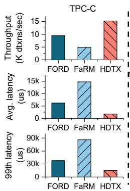

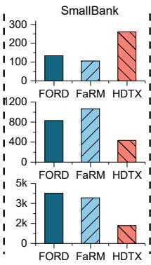

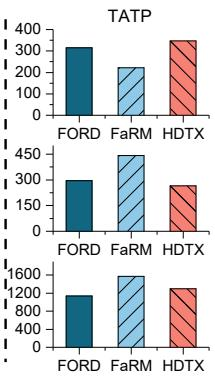  
Figure 8: The end-to-end performance of different workloads

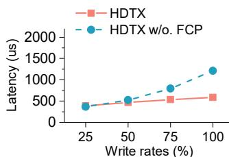  
( a ) U n i f o r m a c c e s s

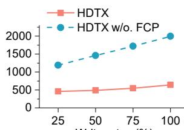  
( b ) S k e w e d a c c e s s  
Figure 9: The effectiveness of fast commit protocol (FCP)

FORD outperforms FaRM because it exploits the visibility control technique to accelerate the Commit phase, and thus reduces network round trips of dtxns. HDTX can further reduce the latency by combining more dtxn processing phases in the proposed fast commit protocol, and can also significantly reduce the latency by scheduling dtxns according to their latency requirements. Thus, HDTX is particularly efficient for dtxns with high read-write conflicts and write-write lock contention, such as TPC-C and SmallBank.

## 5.3 Micro-benchmarks

In this section, we evaluate the effectiveness and efficiency of the proposed three techniques in HDTX individually.

Fast Commit Protocol (FCP). First, we demonstrate the benefit of FCP using uniform and skewed [8] access distributions. Figure 9 shows the average latency of HDTX with/without FCP at different write rates. We initiate 64 coordinators to serve client requests, with each coordinator accessing two objects per dtxn. HDTX w/o. FCP shows a significant growth of latency when the write rate increases. Particularly, HDTX can reduce the average latency of dtxns by up to 67.7% compared with HDTX w/o. FCP for the skewed access distribution. Although FCP may incur the rollback of the commit phase due to read-write conflicts, FCP still demonstrates its effectiveness for the scenario using skewed access distributions under heavy read-write conflicts, as shown in Figure 9(b). This implies that the benefit of FCP is much higher than the overhead of the rollback. Overall, HDTX exploits the fast commit protocol to minimize the network rounds trips and reduce the average lock duration, and thus can significantly improve the performance of write-intensive workloads.

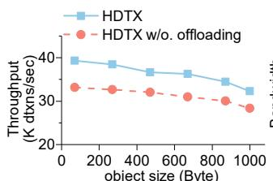  
( a ) T h r o u g h p u t o f d t x n s

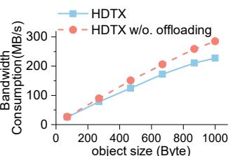  
( b ) B a n d w i d t h c o n s u m p t i o n o f d t x n s

Figure 10: The effectiveness of release phase offloading  
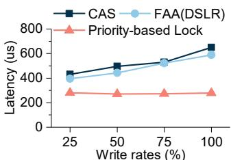

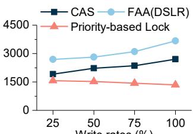  
( a ) A v e r a g e l a t e n c y o f d t x n s  
( b ) T a i l l a t e n c y o f d t x n s  
Figure 11: The effectiveness of priority-based locking

RDMA-enabled Release Phase Offloading. Second, to demonstrate the impact of the Release phase offloading on RDMA bandwidth consumption, we evaluate this design under high network load by running a background RDMA communication task. Figure 10 shows the throughput and RDMA bandwidth consumption of dtxns when the object size increases from 64 bytes to 1 KB. Each coordinator accesses four objects in a dtxn. Without enabling the offloading mechanism, the coordinator has to send the latest data from coordinators to memory nodes to update the write set during the Release phase. Compared with HDTX w/o. offloading, HDTX reduces the RDMA bandwidth consumption by up to 19.1%, and improves the throughput by up to 18.5%. Although Wait/Enable primitives may slow down the RNIC pipeline, the net benefit of the RDMA offloading is still considerable because our design can avoid an extra data transfer by offloading the data synchronization operations to memory nodes’ RNICs.

Priority-Based Locking for Mission-Critical Dtxns. Third, we demonstrate the effectiveness of the priority-based locking mechanism. We compare it with the RDMA CAS-based locking mechanism adopted by FORD [53] and DrTMR [7], and the RDMA FAA-based locking mechanism proposed in DSLR [51]. We randomly select 20% of requests as userspecified mission-critical dtxns with a high priority, and evaluate the average and tail latency of these dtxns under different write rates with a skewed access distribution. As shown in Figure 11, HDTX using priority-based locking reduces the average latency of mission-critical dtxns by 57.1% and 52.8%, and reduces the tail latency by 50.2% and 63.3% compared with RDMA CAS-based and RDMA FAA-based mechanisms, respectively. For the tail latency, the RDMA CAS-based mechanism outperforms the RDMA FAA-based mechanism because it aborts and retries dtxns immediately once the coordinator fails to acquire all write locks, while the RDMA FAA-based mechanism must wait for a given lease time. Most importantly, these two mechanisms can not schedule user-specified dtxns. In contrast, our priority-based locking mechanism can significantly reduce the latency of read-write dtxns by assigning a high priority, and thus is particularly effective for scheduling mission-critical dtxns.

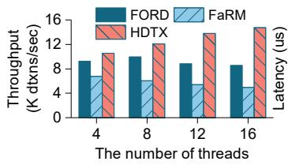

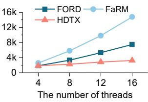  
Figure 12: The throughput and the average latency of TPC-C vary with the number of threads

## 5.4 Sensitivity Studies

The Number of Threads. Figure 12 shows the throughput and average latency of TPC-C in different dtxn systems when the number of threads in the computing node increases from 4 to 16. Each thread initializes 7 worker coroutines as coordinators. HDTX shows a significant growth of throughput and a slight growth of latency. In contrast, the latency of FaRM increases significantly since FaRM commits a dtxn with five RTTs in a DM architecture. FORD outperforms FaRM because it optimizes the dtxn commits by exploiting the visibility control and undo logs to synchronize the latest data. However, FORD still requires three RTTs to commit a transaction. Since a longer lock duration would increase the potential of lock conflicts, FORD suffers from throughput degradation when the number of threads exceeds 8. When 16 threads are used, HDTX significantly improves the throughput by 72.7% and 1.98×, and reduces the latency by 56.7% and 78.1%, respectively, compared with FORD and FaRM. This implies that HDTX has much better performance scalability when more coordinators are used.

The Scale of Computing Nodes. Figure 13 shows the throughput and average latency of TPC-C, SmallBank, and

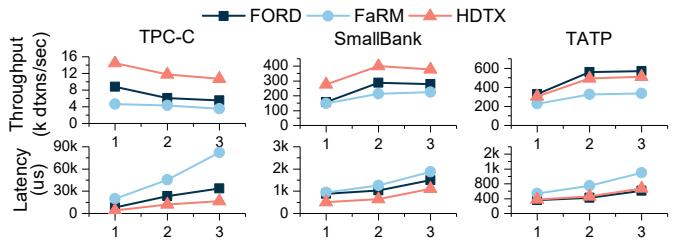  
T h e n u m b e r o f c o m p u t i n g n o d e s  
( E a c h n o d e i n i t i l i z e s 1 4 0 c o n c u r r e n t c o o r d i n a t o r s )

Figure 13: The throughput and the average latency of different applications vary with the number of computing nodes  
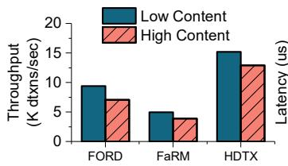

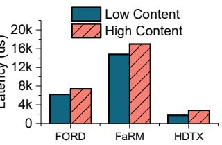  
Figure 14: The throughput and average latency in lowcontention and high-contention scenarios

TATP in different dtxn systems when the number of computing nodes increases. Each computing node initializes 20 threads with 7 worker coroutines per thread. Thus, the three computing nodes can initialize at most 420 concurrent coordinators. Since TPC-C has more read-write conflicts than SmallBank and TATP, the throughput of TPC-C decreases in all dtxn systems when the number of concurrent coordinators is larger than 140 (one computing node). Specifically, when we use 3 computing nodes to initialize a total of 420 concurrent coordinators for TPC-C, HDTX significantly improves the throughput by 81.8% and 2.06×, and reduces the latency by 64.1% and 79.9%, compared with FORD and FaRM, respectively. In this scenario, the high read-write contention causes more validation failures, and thus both FORD and HDTX consume more RDMA bandwidth to write logs. Specifically, FORD writes the undo log before the Validation phase, while HDTX writes the redo log during the Validation phase. However, since HDTX enables fast transaction commits with fewer execution phases, HDTX shows much higher performance than FORD. Since SmallBank and TATP have fewer read-write conflicts, all dtxn systems can improve the throughput by using more concurrent coordinators, but HDTX offers lower latency than FORD and FaRM. Overall, HDTX shows much better scalability than FORD and FaRM for large-scale concurrent dtxns.

Data Contention. Figure 14 shows the throughput and average latency of TPC-C under low and high contention of data accesses. We can reduce the number of warehouses to increase data contention. In the high-contention scenario, dtxns are more likely to access the same object, resulting in frequent lock contentions and validation failures. However, even when the number of warehouses decreases from 20 to 8, we find that the failure rate of the Validation phase in HDTX only increases from 8.1% to 9.8%. Compared with FORD and FaRM, HDTX reduces the average latency of dtxns by 61.8% and 83.4%, and improves dtxn throughput by 83.2% and 2.3×, respectively, under the high-contention scenario. Since TPC-C has 92% read-write transactions with the maximum object size of 672 bytes, HDTX is particularly effective for handling this application with high contention because our priority-based locking mechanism can significantly reduce lock conflicts between dtxns. Moreover, HDTX can reduce the RDMA bandwidth consumption for large objects by offloading the data synchronization and accelerate the dtxn processing significantly using the fast commit protocol. Thus, HDTX can still achieve high-performance dtxn processing even in high-contention scenarios.

## 6 Related Work

RDMA-based Distributed Transaction Systems. A number of studies have exploited fast RDMA networks to improve the performance of distributed transactions. Microsoft’s FaRM [39] [12] exploits OCC and PBR protocols to support RDMA-based dtxn processing. FaSST [28] adopts RDMAbased RPCs to process complicated messages with remote CPUs, and thus decreases the number of RTTs for dtxn processing. DrTM+H [48] proposes a hybrid approach that exploits one-sided or two-sided RDMA primitives to perform different phases of a transaction. Zeus [30] exploits an ownership protocol to transform dtxns into local ones, and thus can accelerate workloads with high data locality. DINT [55] exploits eBPF technologies to transparently offload some operations of dtxns to the kernel space, without kernel modifications. It eliminates the performance overhead of network stacks while guaranteeing security. However, since these systems are designed for traditional monolithic servers equipped with both computing and memory resources, they cannot be applied to DM systems directly. Xenic [40] offloads some functions of the dtxn protocol to SmartNICs to reduce PCIe operations. FORD [53] exploits one-sided RDMA to achieve fast dtxn processing for DM systems, and guarantees remote persistence with low network overhead. Motor [52] proposes contiguous version tuples to construct a multi-versioning datastore in a DM environment. It eliminates the logging overhead while allowing coordinators to concurrently read data during modification. Inspired by these studies, HDTX further optimizes the performance of dtxn for one-sided RDMA-based DM systems via three novel designs, including the fast commit protocol, RDMA-enabled offloading, and decentralized priority-based locking. By carefully orchestrating these techniques, HDTX can minimize the RTTs for dtxn processing, significantly improve the throughput, and reduce the latency of dtxns.

Management of Distributed Locks. Lock management is a fundamental technique for preventing race conditions and ensuring data consistency in distributed systems. In traditional distributed locking schemes [2, 22, 24], data nodes’ CPUs act as a central point to enable flexible scheduling of shared object accesses. To alleviate the CPU load in data nodes, some studies [28, 53] exploit one-sided RDMA CAS primitives to request locks in a blind-retry manner. To avoid the starvation problem caused by RDMA CAS, a decentralized mutex lock mechanism [10] is proposed to schedule lock requests in a FIFO manner. N-CoSED [36] uses two 32-bit segments of a 64-bit lock object to support shared and exclusive access modes. However, they require additional communications between coordinators to propagate the ownership of the lock along the FIFO queue. DSLR [51] exploits the Lamport’s Bakery algorithm to avoid write starvation and to eliminate communication among coordinators, and thus improves the performance of dtxns. We go further to challenge an intuitive understanding that decentralized locks are hard to support priority-based scheduling, and propose decentralized prioritybased locking to schedule transactions at each computing node. In this way, HDTX can significantly reduce the latency of mission-critical transactions in DM systems.

## 7 Conclusion

Distributed transactions usually are processed inefficiently in disaggregated memory systems due to high latency of remote memory accesses. This paper presents HDTX, a highperformance dtxn system that delivers fast dtxn services and supports flexible dtxn scheduling in the DM architecture. We first conduct an in-depth analysis of the characteristics of dtxns and one-sided RDMA primitives. Based on our analysis, we propose a fast commit protocol to commit dtxns within minimum network round trips and significantly reduce the latency of dtxns. We further propose an RDMA-enabled offloading mechanism to reduce data transfers across computing and memory nodes by carefully orchestrating different RDMA primitives. In addition, we propose a decentralized prioritybased locking mechanism to schedule mission-critical dtxns, thereby significantly reducing the tail latency of dtxns. Experimental results demonstrate that HDTX provides higher throughput and lower latency than state-of-the-art RDMAbased dtxn systems, such as FaRM and FORD.

## Acknowledgments

We appreciate our shepherd Roberto Palmieri and anonymous reviewers’ constructive comments for improving the quality of this paper. This work is supported jointly by the National Key Research and Development Program of China under grant 2022YFB4500303, National Natural Science Foundation of China (NSFC) under grants 62332011, 62302178, NSFC-RGC under grant 62461160333, and Natural Science Foundation of Hubei Province under grant 2021CFA037.

## References

[1] Intel 64 and IA-32 Architectures Software Developer Manuals. https://www.intel.com/content/ www/us/en/developer/articles/technical/ intel-sdm.html, 2025.

[2] Amanda Baran, Jacob Nelson-Slivon, Lewis Tseng, and Roberto Palmieri. Alock: Asymmetric lock primitive for RDMA systems. In Proceedings of the 36th ACM Symposium on Parallelism in Algorithms and Architectures (SPAA’24), pages 15–26, 2024.

[3] SmallBank Benchmark. https://hstore.cs.brown. edu/documentation/deployment/benchmarks/ smallbank/, 2025.

[4] Telecom Application Transaction Processing Benchmark. https://tatpbenchmark.sourceforge. net/, 2025.

[5] TPC-C Benchmark. https://www.tpc.org/tpcc/, 2025.

[6] Eric A. Brewer. Pushing the CAP: strategies for consistency and availability. Computer, 45(2):23–29, 2012.

[7] Yanzhe Chen, Xingda Wei, Jiaxin Shi, Rong Chen, and Haibo Chen. Fast and general distributed transactions using RDMA and HTM. In Proceedings of the Eleventh European Conference on Computer Systems (EuroSys’16), pages 26:1–26:17, 2016.

[8] Brian F. Cooper, Adam Silberstein, Erwin Tam, Raghu Ramakrishnan, and Russell Sears. Benchmarking cloud serving systems with YCSB. In Proceedings of the 1st ACM Symposium on Cloud Computing (SoCC’10), pages 143–154, 2010.

[9] Introducing Intel Rack Scale Design. https://www.intel.com/content/dam/www/ public/us/en/documents/white-papers/ rack-scale-design-architecture-white-paper. pdf, 2018.

[10] Ananth Devulapalli and Pete Wyckoff. Distributed Queue-Based Locking Using Advanced Network Features. In Proceedings of the 34th International Conference on Parallel Processing (ICPP’05), pages 408–415, 2005.

[11] Bailu Ding, Lucja Kot, and Johannes Gehrke. Improving optimistic concurrency control through transaction batching and operation reordering. Proc. VLDB Endow., 12(2):169–182, 2018.

[12] Aleksandar Dragojevi, Dushyanth Narayanan, Miguel Castro, and Orion Hodson. FaRM: Fast Remote Memory. In Proceedings of the 11th USENIX Symposium on Networked Systems Design and Implementation (NSDI’14), pages 401–414, 2014.

[13] Aleksandar Dragojevic, Dushyanth Narayanan, Ed- ´ mund B. Nightingale, Matthew Renzelmann, Alex Shamis, Anirudh Badam, and Miguel Castro. No Compromises: Distributed Transactions with Consistency, Availability, and Performance. In Proceedings of the 25th Symposium on Operating Systems Principles (SOSP’15), pages 54–70, 2015.

[14] Zhuohui Duan, Haodi Lu, Haikun Liu, Xiaofei Liao, Hai Jin, Yu Zhang, and Song Wu. Hardware-supported remote persistence for distributed persistent memory. In Proceedings of the 2021 International Conference for High Performance Computing, Networking, Storage, and Analysis (SC’21), pages 91:1–91:14, 2021.

[15] Idan Burstein. RDMA Memory Placement Extensions for PMEM. https://www.flashmemorysummit. com/English/Collaterals/Proceedings/2018/ 20180808\_PMEM-202-1\_Burstein.pdf, 2018.

[16] RDMA Extensions for Remote Persistent Memory Access. https://openfabrics.org/ images/eventpresos/2016presentations/ 215RDMAforRemPerMem.pdf, 2016.

[17] PolarDB for Xscale. https://www.alibabacloud. com/en/product/polardb-for-xscale?\_p\_ lc=1&spm=a3c0i.7911826.2564562790.3. 1ce82129Zefh2t#J\_7387178670, 2024.

[18] FORD. https://github.com/minghust/ford, 2022.

[19] Jian Gao, Youyou Lu, Minhui Xie, Qing Wang, and Jiwu Shu. Citron: Distributed range lock management with one-sided RDMA. In Proceedings of the 21st USENIX Conference on File and Storage Technologies (FAST’23), pages 297–314, 2023.

[20] Seth Gilbert and Nancy A. Lynch. Brewer’s conjecture and the feasibility of consistent, available, partitiontolerant web services. SIGACT News, 33(2):51–59, 2002.

[21] Cary G. Gray and David R. Cheriton. Leases: An Efficient Fault-Tolerant Mechanism for Distributed File Cache Consistency. In Proceedings of the Twelfth ACM Symposium on Operating System Principles (SOSP’89), pages 202–210, 1989.

[22] Andrew B. Hastings. Distributed Lock Management in a Transaction Processing Environment. In Proceedings of the Ninth Symposium on Reliable Distributed Systems (SRDS’90), pages 22–31, 1990.

[23] HDTX. https://github.com/CGCL-codes/HDTX, 2025.

[24] Jiamin Huang, Barzan Mozafari, Grant Schoenebeck, and Thomas F. Wenisch. A Top-Down Approach to Achieving Performance Predictability in Database Systems. In Proceedings of the 2017 ACM International Conference on Management of Data (SIGMOD’17), pages 745–758, 2017.

[25] Patrick Hunt, Mahadev Konar, Flavio Paiva Junqueira, and Benjamin Reed. ZooKeeper: Wait-free Coordination for Internet-scale Systems. In Proceedings of the 2010 USENIX Annual Technical Conference (USENIX ATC’10), 2010.

[26] What is Persistent Memory Over Fabric? https://www.intel.cn/ content/www/cn/zh/developer/videos/ what-is-persistent-memory-over-fabric.html, 2025.

[27] Anuj Kalia, Michael Kaminsky, and David G. Andersen. Design Guidelines for High Performance RDMA Systems. In Proceedings of the 2016 USENIX Annual Technical Conference (USENIX ATC’16), pages 437– 450, 2016.

[28] Anuj Kalia, Michael Kaminsky, and David G. Andersen. FaSST: Fast, Scalable and Simple Distributed Transactions with Two-Sided (RDMA) Datagram RPCs. In Proceedings of the 13th USENIX Symposium on Networked Systems Design and Implementation (OSDI’16), pages 185–201, 2016.

[29] Antonios Katsarakis, Vasilis Gavrielatos, M. R. Siavash Katebzadeh, Arpit Joshi, Aleksandar Dragojevic, Boris Grot, and Vijay Nagarajan. Hermes: A Fast, Fault-Tolerant and Linearizable Replication Protocol. In Proceedings of the 2020 International Conference on Architectural Support for Programming Languages and Operating Systems (ASPLOS’20), pages 201–217, 2020.

[30] Antonios Katsarakis, Yijun Ma, Zhaowei Tan, Andrew Bainbridge, Matthew Balkwill, Aleksandar Dragojevic, Boris Grot, Bozidar Radunovic, and Yongguang Zhang. Zeus: locality-aware distributed transactions. In Proceedings of the Sixteenth European Conference on Computer Systems (EuroSys’21), pages 145–161, 2021.

[31] Daehyeok Kim, Amirsaman Memaripour, Anirudh Badam, Yibo Zhu, Hongqiang Harry Liu, Jitu Padhye,

Shachar Raindel, Steven Swanson, Vyas Sekar, and Srinivasan Seshan. Hyperloop: Group-based NICoffloading to Accelerate Replicated Transactions in Multi-tenant Storage Systems. In Proceedings of the 2018 Conference of the ACM Special Interest Group on Data Communication (SIGCOMM’18), pages 297–312, 2018.

[32] Leslie Lamport. A New Solution of Dijkstra’s Concurrent Programming Problem. Communications of the ACM, 17(8):453–455, 1974.

[33] Yuliang Li, Gautam Kumar, Hema Hariharan, Hassan M. G. Wassel, Peter Hochschild, Dave Platt, Simon L. Sabato, Minlan Yu, Nandita Dukkipati, Prashant Chandra, and Amin Vahdat. Sundial: Fault-tolerant clock synchronization for datacenters. In Proceedings of the 14th USENIX Symposium on Operating Systems Design and Implementation (OSDI’20), pages 1171–1186, 2020.

[34] Haodi Lu, Haikun Liu, Chencheng Ye, Xiaofei Liao, Fubing Mao, Yu Zhang, and Hai Jin. Software-Defined, Fast and Strongly-Consistent Data Replication for RDMA-Based PM Datastores. In Proceedings of the IEEE International Parallel and Distributed Processing Symposium (IPDPS’23), pages 90–101, 2023.

[35] David T. McWherter, Bianca Schroeder, Anastassia Ailamaki, and Mor Harchol-Balter. Priority Mechanisms for OLTP and Transactional Web Applications. In Proceedings of the 20th International Conference on Data Engineering (ICDE’04), pages 535–546, 2004.

[36] Sundeep Narravula, A. Marnidala, Abhinav Vishnu, Karthikeyan Vaidyanathan, and Dhabaleswar K. Panda. High Performance Distributed Lock Management Services using Network-based Remote Atomic Operations. In Proceedings of the Seventh IEEE International Symposium on Cluster Computing and the Grid (CC-Grid’07), pages 583–590, 2007.

[37] Thomas Neumann, Tobias Mühlbauer, Kemper, and Alfons. Fast serializable multi-version concurrency control for main-memory database systems. In Proceedings of the 2015 ACM International Conference on Management of Data (SIGMOD’15), page 677–689, 2015.

[38] Waleed Reda, Marco Canini, Dejan Kostic, and Simon Peter. RDMA is Turing complete, we just did not know it yet! In Proceedings of 19th USENIX Symposium on Networked Systems Design and Implementation (NSDI’22), pages 71–85, 2022.

[39] FaRM-Microsoft Research. https://www.microsoft. com/en-us/research/project/farm/, 2025.

[40] Henry N. Schuh, Weihao Liang, Ming Liu, Jacob Nelson, and Arvind Krishnamurthy. Xenic: SmartNIC-Accelerated Distributed Transactions. In Proceedings of the 28th Symposium on Operating Systems Principles (SOSP’21), pages 740–755, 2021.

[41] Yizhou Shan, Yutong Huang, Yilun Chen, and Yiying Zhang. LegoOS: A Disseminated, Distributed OS for Hardware Resource Disaggregation. In Proceedings of the 13th USENIX Symposium on Operating Systems Design and Implementation (OSDI’18), pages 69–87, 2018.

[42] Junyi Shu, Ruidong Zhu, Yun Ma, Gang Huang, Hong Mei, Xuanzhe Liu, and Xin Jin. Disaggregated RAID Storage in Modern Datacenters. In Proceedings of the 28th ACM International Conference on Architectural Support for Programming Languages and Operating Systems (ASPLOS’23), pages 147–163, 2023.

[43] InfiniBand Architecture Specification. https://www. infinibandta.org/ibta-specification/, 2024.

[44] Shin-Yeh Tsai, Yizhou Shan, and Yiying Zhang. Disaggregating Persistent Memory and Controlling Them Remotely: An Exploration of Passive Disaggregated Key-Value Stores. In Proceedings of the 2020 USENIX Annual Technical Conference (USENIX ATC’20), pages 33–48, 2020.

[45] Cheng Wang, Jianyu Jiang, Xusheng Chen, Ning Yi, and Heming Cui. APUS: fast and scalable paxos on RDMA. In Proceedings of the 2017 Symposium on Cloud Computing (SoCC’17), pages 94–107, 2017.

[46] Tianzheng Wang and Hideaki Kimura. Mostlyoptimistic concurrency control for highly contended dynamic workloads on a thousand cores. Proc. VLDB Endow., 10(2):49–60, 2016.

[47] Yandong Wang, Xiaoqiao Meng, Li Zhang, and Jian Tan. C-hint: An Effective and Reliable Cache Management for RDMA-accelerated Key-value Stores. In Proceedings of the ACM Symposium on Cloud Computing (SoCC’14), pages 1–13, 2014.

[48] Xingda Wei, Zhiyuan Dong, Rong Chen, and Haibo Chen. Deconstructing RDMA-enabled Distributed Transactions: Hybrid is Better! In Proceedings of the 13th USENIX Symposium on Operating Systems Design and Implementation (OSDI’18), pages 233–251, 2018.

[49] Xingda Wei, Jiaxin Shi, Yanzhe Chen, Rong Chen, and Haibo Chen. Fast in-memory transaction processing using RDMA and HTM. In Proceedings of the 25th Symposium on Operating Systems Principles (SOSP’15), pages 87–104, 2015.

[50] Xingda Wei, Xiating Xie, Rong Chen, Haibo Chen, and Binyu Zang. Characterizing and optimizing remote persistent memory with RDMA and NVM. In Proceedings of the 2021 USENIX Annual Technical Conference (USENIX ATC’21), pages 523–536, 2021.

[51] Dong Young Yoon, Mosharaf Chowdhury, and Barzan Mozafari. Distributed Lock Management with RDMA: Decentralization without Starvation. In Proceedings of the 2018 International Conference on Management of Data (SIGMOD’18), pages 1571–1586, 2018.

[52] Ming Zhang, Yu Hua, and Zhijun Yang. Motor: Enabling multi-versioning for distributed transactions on disaggregated memory. In Proceedings of the 18th USENIX Symposium on Operating Systems Design and Implementation (OSDI’24), pages 801–819, 2024.

[53] Ming Zhang, Yu Hua, Pengfei Zuo, and Lurong Liu. FORD: Fast One-sided RDMA-based Distributed Transactions for Disaggregated Persistent Memory. In Proceedings of the 20th USENIX Conference on File and Storage Technologies (FAST’22), pages 51–68, 2022.

[54] Mingxing Zhang, Teng Ma, Jinqi Hua, Zheng Liu, Kang Chen, Ning Ding, Fan Du, Jinlei Jiang, Tao Ma, and Yongwei Wu. Partial Failure Resilient Memory Management System for (CXL-based) Distributed Shared Memory. In Proceedings of the 29th Symposium on Operating Systems Principles (SOSP’23), pages 658–674, 2023.

[55] Yang Zhou, Xingyu Xiang, Matthew Kiley, Sowmya Dharanipragada, and Minlan Yu. DINT: fast in-kernel distributed transactions with ebpf. In Proceedings of the 21st USENIX Symposium on Networked Systems Design and Implementation (NSDI’24), pages 401–417, 2024.