①

USENIX

THE ADVANCED COMPUTING SYSTEMS ASSOCIATION

# MemoryTrap: Booby Trapping Memory to Counter Memory Disclosure Attacks with Hardware Support

Chenke Luo, Wuhan University and Tulane University; Jiang Ming, Tulane University; Dongpeng Xu, University of New Hampshire; Guojun Peng and Jianming Fu, Wuhan University

https://www.usenix.org/conference/atc25/presentation/luo

# This paper is included in the Proceedings of the 2025 USENIX Annual Technical Conference.

July 7–9, 2025 • Boston, MA, USA ISBN 978-1-939133-48-9

Open access to the Proceedings of the 2025 USENIX Annual Technical Conference is sponsored by

P=-r.h mEesL

auuuJl9 PgleU

King Abdullah University of

Science and Technology

# MemoryTrap: Booby Trapping Memory to Counter Memory Disclosure Attacks with Hardware Support

Chenke Luo1,2, Jiang Ming2, Dongpeng Xu3, Guojun Peng1, Jianming Fu1

1Key Laboratory of Aerospace Information Security and Trusted Computing, Ministry of Education,

School of Cyber Science and Engineering, Wuhan University

2Tulane University

3University of New Hampshire

## Abstract

Code-reuse attacks harvest reusable code gadgets from the vulnerable program’s executable memory, posing a severe threat to the widely deployed executable-space protection. With the advent of address space layout randomization, a more complicated tactic of code-reuse attacks, known as justin-time return-oriented programming (JIT-ROP), has emerged. JIT-ROP relies on repeated memory disclosure to search for available code gadgets in real-time. In response, a series of techniques have surfaced to impede memory disclosure or to prevent disclosed code from subsequently being executed. The most representative countermeasures involve enforcing a stricter memory permission policy, such as execute-only memory or destructive code reads. However, existing methods are either vulnerable to emerging code inference attacks or disallow a mixture of code and data, which is a fundamental property of the von Neumann architecture.

In this paper, we present MemoryTrap, a hardware-assisted technique to counter direct memory disclosure attacks while simultaneously allowing the mixture of code and data. MemoryTrap sprinkles unreadable “booby traps” in the program at compile time. Once JIT-ROP attackers land in a booby trap area during memory disclosure at runtime, MemoryTrap can immediately detect and stop the ongoing attack. We take advantage of a hardware feature from Intel, Memory Protection Keys, to offer an efficient memory permission control mechanism for booby traps. MemoryTrap supports the security hardening of applications, shared libraries, and dynamically generated JIT code. Our security evaluation demonstrates that MemoryTrap can reliably thwart the threat of disclosing executable memory in real JIT-ROP attacks and synthetic code inference attacks. Performance experiments with both microbenchmarks and macrobenchmarks show that MemoryTrap only introduces negligible runtime overhead.

## 1 Introduction

System programs are often developed using memory-unsafe languages (e.g., C/C++), making them prone to memory corruption vulnerabilities. The cyber arms race on this topic has transformed into an intensive tug-of-war [1–4]. The widely deployed Data Execution Prevention in modern OSs has pushed cybercriminals to reuse the existing code snippets from the vulnerable program to craft attacks. Adversaries gather the code snippets, called “gadgets,” by searching through the disassembled binary code [5]. With these gadgets, attackers carefully chain them together to construct malicious payloads, subsequently hijacking the normal control flow to these gadgets to complete the attack.

A precise implementation of Control-Flow Integrity (CFI) [6–17] offers significant potential for protecting applications against ROP attacks by effectively preventing control-flow hijacking. However, prior research has demonstrated that CFI implementations can still be bypassed under certain conditions [18–27], and may introduce performance overhead [28]. Therefore, from a defense-in-depth perspective [29], it is imperative for critical systems to incorporate a combination of security measures to effectively mitigate potential threats. Address space layout randomization (ASLR) [30–42] is one of the typical representatives of defense-in-depth. ASLR frustrates the construction of gadgets by shuffling the code layout in memory. However, code randomization has suffered from memory disclosure, which makes the randomized code layout visible to attackers [43]. JIT-ROP (just-in-time return-oriented programming) [44] attackers repeatedly abuse memory disclosure to harvest code gadgets on the fly, based on the leakage of code pointers residing on code pages. Recent ASLR measurement [45] demonstrates that even the expensive re-randomization still leaves a time window for JIT-ROP attackers. The premise of JIT-ROP is memory disclosure—attackers have to first traverse sufficient executable memory pages to collect necessary gadgets. Therefore, the key to JIT-ROP defense is to impede disclosing memory pages or to prevent disclosed code from subsequently being executed. To achieve this goal, many security solutions enforce a stricter memory permission policy.

Execute-only memory (XoM) [46–49] emerges as a representative defense against memory disclosure. XoM disallows the reading of executable memory, and thus attackers lose the ability to disclose the code layout after randomization. XoM methods typically require the strict separation of code and data, so that the unreadable permission can be safely enforced only on code areas. Unfortunately, the mixture of code and data is not rare in practice. For example, libraries frequently contain hand-written assembly routines that incorporate data within their executable code segments [50–52], and JavaScript JIT engines can generate native code containing both code and data in the same memory pages. Later on, a new class of memory permission enforcement policies, called destructive code reads [53–56], are proposed to prevent the execution of disclosed code. They allow memory pages to be disclosed but forbid the disclosed code to be executed subsequently. In particular, as soon as the code read occurs, the disclosed code is garbled to avoid being executed. At the same time, legitimate read operations for data embedded in the code still operate correctly. However, the emerging code inference attacks [57] can penetrate the defense of destructive code reads. They enable the reuse of gadgets that have not been previously read, highlighting the need for further research in restricting adversaries’ ability to leverage memory disclosure.

In this paper, we continue the line of research on enforcing memory permission from the perspective of cyber deception [58–60]. The building blocks of our new defense are booby traps, which are variable-size code snippets but do not have the read permission. They stand aside from the program’s normal execution paths and can only be triggered by JIT-ROP attackers. Our research has led us to the critical observation that, with the deployment of code randomization, JIT-ROP attackers only have a small time window (e.g., a few seconds [45]) to complete the search of the whole gadget chain. By inserting booby traps where these attackers anticipate a gadget, we can effectively detect a JIT-ROP attack when it traverses the code page. In addition to stopping the ongoing attack, we also save the context information for further forensic investigation. Unlike previous XoM methods, we do not revoke the readable permission on code pages except for booby traps, and thus legitimate read operations to code pages are completely unaffected. Compared with destructive code reads, our approach is naturally resistant to various code inference attacks caused by code cloning or implicit reads.

One of our design goals is to efficiently manage the unreadable permission at a fine-grained control of booby traps rather than memory pages. To this end, we capitalize on a hardware feature provided by Intel, Memory Protection Keys (MPK) [61, 62], to manage read requests to different areas (i.e., the original code vs. booby traps) at the kernel level. Our solution is more efficient than using the hardware virtualization support (e.g., via Intel Extended Page Tables). In addition, our study also answers another important question: how to insert booby traps cost-effectively so that attackers can trigger them with a high likelihood? We offer a practical insertion strategy at compile time to strike a delicate balance between security and performance penalty.

We develop our proposed solution, called MemoryTrap, to offer a comprehensive security hardening for applications, shared libraries, and JIT compiled code. With MemoryTrap, we aim to address the limitations of existing methods and keep our systems safe from JIT-ROP attacks. We first perform an empirical study to measure the effectiveness of MemoryTrap using the real-world exploits that leverage memory disclosure vulnerabilities. We count the distribution of booby traps between gadget intervals to show that attackers are bound to trigger booby traps under different code page traversal strategies. Then, we use code cloning via JIT compilation as an example to present MemoryTrap’s defensive ability against the more sophisticated code inference attacks. At last, we conduct a set of performance experiments with both microbenchmarks and macrobenchmarks, including SPEC CPU 2017 [63], three web servers, four database software, and a custom Chromium browser running Kraken JavaScript Benchmark [64]. In contrast to prevailing XoM methods, MemoryTrap only incurs a marginal runtime overhead, averaging from 0.74% to 1.85%.

In a nutshell, we make the following key contributions:

• We present a new cyber deception idea, MemoryTrap, to detect memory disclosure attempts and eventually prevent JIT-ROP attacks. MemoryTrap tolerates legitimate data reads in executable memory while seamlessly defending against powerful code inference attacks.

• We take advantage of Intel’s MPK feature to develop an efficient, fine-grained memory permission control mechanism. Our work advances the proper use of hardware features in systems security.

• We offer a versatile implementation of MemoryTrap to secure regular ELF programs, shared libraries, and JIT-compiled code. Our extensive evaluation shows that MemoryTrap has the potential to tip the balance of the memory war toward the side of defenders.

Open Source We have released MemoryTrap’s source code and evaluation data sets to facilitate reproduction, replication, and reuse, as all found at Zenodo.

## 2 Background, Related Work, and Motivation

We first provide the background about JIT-ROP attacks. Then, we summarize the existing countermeasures against memory disclosure. Their limitations motivate our research. At last, we introduce the underlying hardware feature we leveraged.

## 2.1 Just-In-Time ROP

With the development of fine-grained randomization [30, 31, 36, 39, 42], traditional code-reuse attacks [65] have upgraded to JIT-ROP to generate the ROP payload at runtime. As shown in Figure 1, a typical JIT-ROP attack involves two stages: 1) adversaries first leverage a memory disclosure vulnerability to recursively scan code pages for usable gadgets collection ( 1 in Figure 1); 2) after that, they chain the collected gadgets to build the payload and then trigger a memory corruption error (e.g., buffer overflow, use after free, or double free) to hijack the control flow ( 2 in Figure 1). In the first stage, attackers can harvest code pointers in a direct way or an indirect way to find executable memory pages. In a direct disclosure, attackers are able to directly read code pointers from code pages. These pointers are typically embedded in instructions such as direct jumps/calls. In an indirect way, code pointers are read from data pages such as stack and heap. This type of pointer is usually the function pointer passed as a parameter of another function or the return address in the stack. The key to the success of a JIT-ROP attack is disclosing enough code pages to find usable gadgets. Programs vulnerable to JIT-ROP attacks primarily fall into two categories. The first category includes server-side applications, which allow multiple user interactions(e.g., web servers and database systems). The second category encompasses client-side applications, which execute user-provided scripts (e.g., Matlab and JavaScript engines).

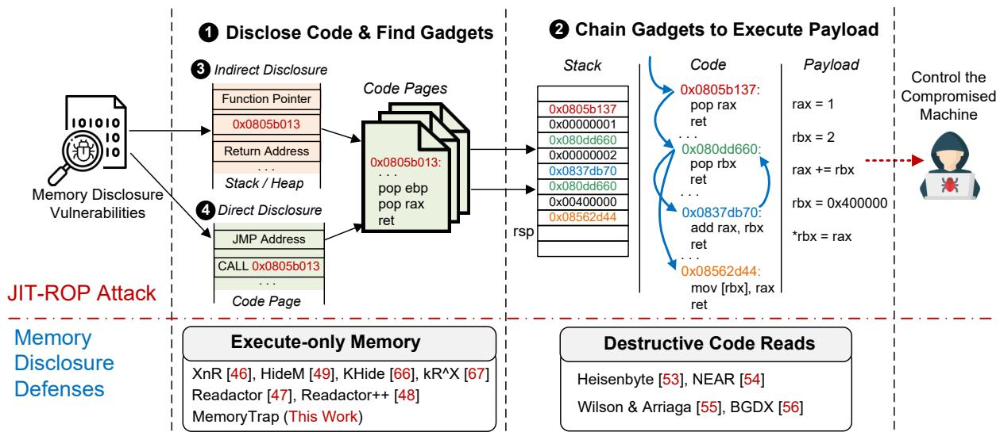  
Figure 1: Two stages of a typical JIT-ROP attack workflow and countermeasures on enforcing memory permission.

## 2.2 Stricter Memory Permission Policies

A set of memory disclosure defense methods have surfaced to combat JIT-ROP attacks. Next, we focus on two types of papers that enforce stricter memory permission policies, because they are the works most germane to our research.

Execute-only Memory The first type of preventative measures focuses on hindering the first stage of a JIT-ROP attack ( 1 in Figure 1). They try to disable the read permission of code pages to enforce execute-only memory (XoM). XnR [46] is the first one to achieve the XoM idea via software emulation, without leveraging hardware features. XnR configures the PTE\_PRESENT bit in PTE (Page Table Entry) of code pages as the “not\_present” state, and thus all read operations will be caught by XnR’s page fault handler. Then, XnR detects memory disclosure attempts by checking whether a read request is pointing to a code page. However, due to the large overhead caused by XnR’s design, it makes a trade-off to tolerate the co-existence of several code pages with the state of present. As a result, XnR will miss read operations to these co-existence code pages, leaving memory disclosure opportunities for attackers. Readactor [47] and its follow-up work [48] address the security and performance issues of XnR by utilizing the hardware-assisted virtualization via Intel Extended Page Tables [61]. They remove the read permission of all code pages when mapping the virtual machine physical address to the host physical address. HideM [49] implements the XoM idea by desynchronizing ITLB (Instruction Translation Lookaside Table) and DTLB (Data Translation Lookaside Table), so that the same virtual address of code and data is mapped to different physical addresses. In this way, HideM separates data from code pages by redirecting the read operations targeting code pages to the separated data page. KHide [66] uses Hardware Assisted Paging to enforce XoM on kernel, and kRˆX [67] implements kernel level XoM by using the Intel Memory Protection Extensions.

Mixture of Code and Data A common assumption of the aforementioned XoM methods is the strict separation of code and data. Such a prerequisite leads to false alarms in practice— XoM will treat legal data-in-code reads as memory disclosure attacks. Although modern GCC and LLVM favor separating code and data, non-code bytes, such as jump table data and static read-only data, often appear in code sections [50]. Pang et al.’s recent study on mainstream binary disassembly tools [52] also confirms that the mixture of code and data is not rare in programs. For example, the authors find 295 hard-coded bytes from the code pages of three test cases and 21,586 jump tables embedded in the code pages of 57 programs. Another example is that handwritten assembly code in libraries often embeds data in code sections [51]. For example, OpenSSL, BoringSSL, and FFmpeg use handwritten assembly to accelerate their calculation, and VirtualBox uses handwritten assembly for dynamic function loading and its virtual extensible firmware interface. In addition, if a binary dynamically links a library that mixes code and data, the code section of this binary will also contain embedded data. At the same time, XoM conflicts with some security mechanisms. For example, KCFI [8] embedded some function signatures in the code section, and requires read access to the code pages to verify indirect function calls. As acknowledge by the author, KCFI cannot work with execute-only memory.

Destructive Code Reads The second type of memory permission policy, called destructive code reads (DCR) [53–56], reacts against the second stage of a JIT-ROP attack ( 2 in Figure 1). They allow memory disclosure but prevent executing the previously disclosed code by destroying the disclosed code right after it is read. Heisenbyte [53] is the first approach implementing the idea of DCR. It marks each executable memory page as execute-only and maintains a duplicate copy for each execute-only page. When a read operation occurs in the execute-only page, Heisenbyte overwrites the read data with random bytes and returns the corresponding data values from the duplicate page. In this way, legitimate read operations for data-in-code work properly, but attackers cannot run the disclosed executable memory. NEAR [54] and Wilson & Arriaga’s work [55] share a similar idea with Heisenbyte. However, the illusion of protection provided by DCR was soon shattered by the emergence of code inference attacks (a.k.a. ZombieGadgets) [57], in which attackers manage to reuse code gadgets that have not been previously read, rendering DCR’s protection ineffective. We provide more details about code inference attacks in Appendix F. BGDX [56] applies a hybrid approach combining DCR and XoM at the byte-granular level and claims to effectively prevent code inference attacks. However, BGDX requires a strict distinction between code and data, and incorrect classification can lead to program crashes. Consequently, BGDX compromises a key advantage of DCR, which is the elimination of the need to differentiate code from data, resulting in reduced compatibility.

CHERI [68] also implements a byte-granularity memory permission control mechanism. However, CHERI requires hardware redesign, including a redesign of the instruction set architecture (ISA), the introduction of multiple new instructions, and the addition of several new registers. CHERI increases the pointer size to 128 bits, resulting in greater cache pressure. Moreover, it demands the integration of a new coprocessor into the Memory Management Unit (MMU) to support its newly introduced fine-grained memory permissions. Additionally, to support the redesigned hardware, CHERI necessitates a CHERI-aware build toolchain and operating system. In contrast, MemoryTrap leverages the existing hardware mechanism, MPK, to achieve fine-grained memory permission control, requiring only minimal modifications to the OS kernel and compiler, thus providing effective security protection with much lower deployment complexity.

Indirect Memory Disclosure Readactor [47] indicates that in some scenarios, attackers can harvest functions pointers stored in data pages (e.g., the stack and heap) and use the whole functions as gadgets to achieve JIT-ROP attacks. This type of attack is called the indirect disclosure attack ( 3 in Figure 1). Readactor and Readactor++ [48] have provided a viable countermeasure against indirect JIT-ROP by redirecting code pointers to an XoM area to prevent function pointer disclosure. However, Readactor and Readactor++, together with other XoM methods, have common limitations to prevent direct JIT-ROP ( 4 in Figure 1). Therefore, our work is dedicated to direct JIT-ROP defense by offering a new fine-grained memory permission policy.

## 2.3 Memory Protection Keys

To enforce non-readable permission for our inserted booby traps, we take advantage of Memory Protection Keys (MPK), a hardware feature to support stricter permission control on code pages, without requiring modification of page tables [61, 62]. MPK utilizes a protection key rights register (PKRU) to maintain the access rights of individual keys associated with specific pages, and it supports three different page permissions: read & write, read-only, and no access. Note that the execution permission is still controlled by the traditional permission management mechanism. We can leverage the MPK mechanism to configure a memory page’s permission as execute-only by disabling the page’s read and write permissions. MPK achieves superior performance because processes only need to execute a non-privileged instruction (WRPKRU) to update PKRU, which takes less than 20 cycles and requires no TLB flush and context switching [69]. MPK keys are thread-localized, which means each thread has its own 16 MPK keys. This could lead to inconsistency of MPK keys between different threads within the same process. We use the inter-thread key synchronization primitive provided by libmpk [62] to keep the execute-only MPK key synchronized between different threads in the same process.

MPK Applications in Security Most of the current security approaches rely on MPK for sensitive data isolation [70–74]. For example, ERIM [70] and Hodor [71], take advantage of MPK for efficient intra-process isolation, allowing only trusted code to access sensitive data areas. Jin et al. [73] applies MPK to cryptographic functions to protect sensitive key-related data. IskiOS [74] also uses MPK to revoke the read permission of kernel’s code pages. Instead of using MPK as isolation mechanism or simply revoking read permission, we offer efficient fine-grained memory permission policy controlling memory blocks within page.

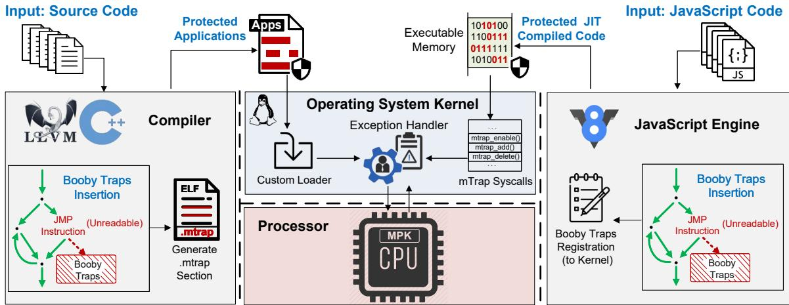  
Figure 2: Overview of MemoryTrap.

## 3 Overview of MemoryTrap

Threat Model Throughout this paper, we assume the attackers possess powerful arbitrary read and write capabilities to the vulnerable program’s memory. We do not impose any restrictions on embedding data in code areas. All the aforementioned methods, except for DCR, require that there is no embedded data within the code areas. We assume the target system is equipped with the following protections:

• W⊕X: Memory pages cannot be both executable and writable at the same time. This is the basic assumption of ROP defenses. Otherwise, attackers can directly execute the injected shellcode without performing ROP.

• Randomization: all static code from programs and libraries are randomized via load time fine-grained randomization.

These two protections are also held by related works on memory permission enforcement, such as Heisenbyte [53], Readactor [47], NEAR [54], and HideM [49].

Memory View of Booby Traps MemoryTrap aims to impede the first stage of a JIT-ROP attack ( 1 in Figure 1). Different from the existing XoM and DCR, our memory permission policy only works on booby traps, which are unreadable, variablesize code snippets that we inserted into the protected program. Figure 3 shows the memory view before/after MemoryTrap’s protection. Our insertion strategy ensures that JIT-ROP attackers will inevitably land in a booby trap area when searching for gadgets, while the program’s normal execution will never reach any single booby trap. When a read operation to a booby trap happens, MemoryTrap’s protection will be triggered instantly to respond to the attack: it terminates the compromised process to prevent further memory disclosure and saves the context information for the future investigation.

Architecture The target programs of memory disclosure attacks cover applications (e.g., web servers and databases), shared libraries (e.g., C standard library) [5], and dynamically generated code by a JIT engine like V8 [75, 76]. Therefore, we develop MemoryTrap to support the security hardening of all three types of programs. Figure 2 shows MemoryTrap’s architecture that bridges all layers of the software stack. At the user lever, we modify LLVM and TurboFan (V8’s JIT compiler) to place booby traps at strategic trigger points. After that, we pass booby traps information (e.g., their numbers and the scope of each booby trap) to kernel components, either via a dedicated ELF section (“.mtrap”) for applications or via our customized “mTrap” syscalls for shared libraries and JIT compiled code. At the kernel level, MemoryTrap’s custom loader loads the hardened applications into memory. With booby traps information, MemoryTrap’s exception handler interacts with the low-level MPK mechanism to manage the unreadable permission at the level of booby traps, and it is also responsible for the memory disclosure attack response.

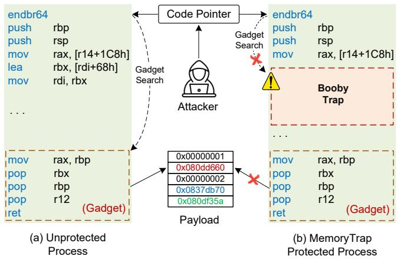  
Figure 3: Memory view before/after booby trap insertion.

The primary characteristic of JIT-ROP attacks is that the attacker must search through a large amount of program code within a limited timeframe to gather sufficient gadgets. The key insight behind MemoryTrap is to strategically place booby traps along the path attackers follow when attempting to disclose code. To achieve optimal protection, these booby traps must be distributed throughout memory at an appropriate density. A density that is too high would negatively impact performance, whereas a density that is too low would compromise security guarantees. In the following sections, we describe our approach for establishing insertion strategies that ensure booby traps are effectively distributed across memory at a suitable density.

MemoryTrap’s Advantages As a new technique to achieve fine-grained memory permission management, MemoryTrap avoids the limitations of existing XoM and DCR methodologies and amplifies their benefits. Unlike the previous XoM methods [46–49], MemoryTrap allows the mixed use of code and data, and thus legitimate read to code pages works as expected. Compared to DCR [53–56], MemoryTrap can naturally withstand code inference attacks. As booby traps are weaved into the program, a code inference attempt via either code cloning or implicit reads cannot get rid of booby traps in any way. MemoryTrap leverages the new hardware feature MPK, which offers an efficient option to enforce finegrained memory permission policies. The previous works either use software emulation that reveals high runtime overhead [46, 49], or they rely on the hardware virtualization support via Intel Extended Page Tables (EPT) [47, 48, 53], which is still more costly than MPK [69].

## 4 Application Protection

In this section, we follow the workflow of hardening an application to present MemoryTrap’s details.

## 4.1 Insert Booby Traps into Execution Paths

We insert booby traps in the protected program at compiletime via a LLVM pass. We randomly generate a variable-size code snippet as a booby trap, which consists of 5 to 30 NOP instructions. We adopt variable sizes to further disrupt the code layout, making it more difficult to detect the positions of booby traps. We hide the booby traps from the protected program’s normal execution paths by inserting a JMP instruction in front of inserted code snippets. When the execution encounters a booby trap, it will skip the inserted code snippets and follow the normal execution path. Please note that we set the whole booby trap, including the prefixed JMP instruction, as unreadable. This design enables booby traps to be seamlessly integrated into legitimate code execution paths, making them difficult to detect or circumvent. Because these traps are inherently embedded within valid execution flows, attackers cannot easily bypass them by simply tracking the program’s control flow. Moreover, the opacity of inserted JMP instructions prevents attackers from identifying trap locations through pattern recognition or signature-based detection methods.

Table 1: The distance distribution of every two adjacent booby traps in the hardened applications’ binary code.
<table><tr><td></td><td>0~100B</td><td>100B~1KB</td><td>1~2KB</td><td>2~4KB</td><td>&gt;4KB</td></tr><tr><td>Nginx</td><td>0%</td><td>73.2%</td><td>16.5%</td><td>10.3%</td><td>0%</td></tr><tr><td>Apache</td><td>27.5%</td><td>65.3%</td><td>3.6%</td><td>3.6%</td><td>0%</td></tr><tr><td>Lighttpd</td><td>16.0%</td><td>73.7%</td><td>4.7%</td><td>5.6%</td><td>0%</td></tr><tr><td>MySQL</td><td>30.6%</td><td>57.2%</td><td>6.5%</td><td>5.7%</td><td>0%</td></tr><tr><td>MongoDB</td><td>25.5%</td><td>62.3%</td><td>6.4%</td><td>5.8%</td><td>0%</td></tr><tr><td>Redis</td><td>26.1%</td><td>65.9%</td><td>4.1%</td><td>3.9%</td><td>0%</td></tr><tr><td>SQLite</td><td>20.9%</td><td>55.2%</td><td>7.1%</td><td>16.8%</td><td>0%</td></tr><tr><td>SPEC 2017</td><td>47.4%</td><td>44.6%</td><td>3.9%</td><td>4.1%</td><td>0%</td></tr><tr><td>Average</td><td>24.3%</td><td>62.2%</td><td>6.6%</td><td>6.9%</td><td>0%</td></tr></table>

## 4.2 Insertion Strategy of Booby Traps

We aim to sprinkle booby traps cost-effectively in execution paths to capture memory disclosure attempts.

JIT-ROP’s Gadget Search Unlike offline ROP gadget search [77,78], JIT-ROP requires “unfettered access to a large number of the code pages” [44]. JIT-ROP attacks [44, 45] first identify code pointers from data pages (e.g., the stack) and then use these pointers as starting points to locate code gadgets. To avoid disruptions caused by linear searches potentially accessing unmapped memory regions, JIT-ROP incrementally discloses and disassembles code to track control flow. When cross-page code pointers (e.g., long jumps and long calls) are encountered, JIT-ROP employs breadth-first or depth-first traversal strategies to explore memory pages, as shwon in Figure 4. According to the gadget search strategies of JIT-ROP, attackers use 4KB (one memory page’s size) as the search granularity to avoid accessing unmapped pages. As a result, if we ensure that the distance between every two adjacent booby traps is small enough (e.g., less than 4KB), JIT-ROP attackers will trigger them with a high probability before they complete the search of all required gadgets. At the same time, attackers often use a combination of pop and ret instructions as gadgets to pass values from the stack into general-purpose registers [65], and such combinations tend to appear at the end of a function.

Insertion Strategy Therefore, our booby trap insertion strategy contains two rules:

1. we insert at least one booby trap in each function.

2. for the function whose size is larger than 4KB, we insert an additional booby trap for every 4KB code.

When adhering to these two rules, the insertion positions of booby traps are randomized. This approach prevents attackers from predicting the locations of booby traps based on fixed positions. Considering the aforementioned factors, our insertion strategy is effective in preventing disclosing sufficient code. We count the distances between every two adjacent booby traps after we apply MemoryTrap to real-world applications and SPEC CPU 2017. As shown in Table 1, the distances between every two adjacent booby traps are all within 4KB. Additionally, the percentage of distances within 1KB is 86.5% on average, representing a high distribution density. We conducted an additional experiment to explore the impact of booby traps distribution on security and overhead. It was found that if a booby trap is inserted every 2KB, the average overhead increases by 1.3% for SPEC CPU 2017 benchmarks. On the other hand, if a booby trap is inserted every 8KB, the average overhead decreases by 0.7%, but it leaves a larger memory disclosure window for attackers.

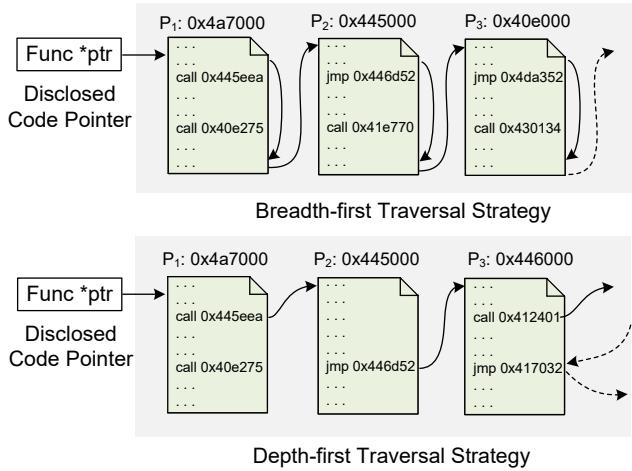  
Figure 4: Code page traversal strategies.

## 4.3 New ELF File Format

The compiler also needs to pass the number and scope of booby traps to MemoryTrap’s kernel components. This requires us to utilize the reserved field and optional section of the ELF file format to embed such metadata in binaries. We illustrate the new ELF file format with a figure provided in Appendix H.

First, we define a reserved byte in the ELF header as the specific flag byte, called MTRAP\_ENABLE, to indicate whether this program is protected by MemoryTrap. This byte is the first byte in the EI\_PAD array, which is a field of e\_ident in the ELF header. By reading this byte, our custom loader can decide whether to enable MemoryTrap protection for this process. Then, we embed the number of booby traps and the start and end addresses for each booby trap into an optional section, called “.mtrap. ” The beginning of the .mtrap section records the number of booby traps, followed by a booby trap list—each list item stores each booby trap’s start and end addresses. We modify LLVM’s backend to write booby trap information to the dedicated “.mtrap” section and then set the MTRAP\_ENABLE flag to 1.

Please note that the new ELF format is backward compatible with non-customized loaders because they will ignore the MTRAP\_ENABLE flag and the .mtrap section. The unmodified kernel can still run the MemoryTrap protected binary files properly as normal programs.

## 4.4 MemoryTrap’s Kernel Components

Our kernel components consist of a custom loader, an exception handler, and mTrap syscalls. We also modify the kernel structures to support MemoryTrap. In this subsection, we introduce the first two components and leave mTrap syscalls in §5, because mTrap syscalls are specifically designed to support shared libraries and JIT compiled code. Our kernel modifications consist of only 312 lines of code, making our approach lightweight and minimally invasive to the kernel.

Custom Loader We customize the binary file loader in the kernel to load the applications protected by MemoryTrap and initialize related structures in the kernel.1 The custom loader first checks the MTRAP\_ENABLE flag in the ELF header to determine whether MemoryTrap’s protection is enabled. If so, it will load the booby trap list stored in the .mtrap section. Otherwise, the standard binary file loading process will take over. After loading the booby trap list, the custom loader starts to map the code segment into memory. When mapping the code segment, the custom loader allocates an executeonly PKey, which is a part of the MPK mechanism to set the permission for a group of pages, to enforce the access permission as execute-only. Please note that this PKey is allocated during the loading process, thereby ensuring its availability. Consequently, the way the program utilizes PKeys at runtime does not influence the implementation of MemoryTrap. In this way, our exception handler component can capture every read operation to code pages, and then it further determines whether a memory disclosure attempt or a legitimate code read is occurring.

Exception Handler We implement an exception handler based on the original page fault handler for the MPK mechanism to prevent memory disclosure attacks. Since we have removed the read permission of all code pages via the MPK mechanism, any read request to a code page will trigger a page fault and be caught in our exception handler. Then, the exception handler checks whether the target address is located in the areas of booby traps. If so, we can promptly determine that the running program is under a memory disclosure attack, and thus we terminate the compromised process and save the context information for further forensics investigation. Note that legitimate read operations for data embedded in the code do not trigger MemoryTrap’s attack response. Instead, we take the following actions to handle such data-in-code cases: 1) we restore the read privilege of the target page to allow the page to be readable temporarily; 2) we set the single-step trap flag to only execute the read instruction and stop at the next instruction; 3) after the completion of the legal read operation, we revoke the read permission of the code page and subsequently clear the single-step trap flag to enable the program to resume its normal execution. Please note that MemoryTrap only affects the permissions of code pages and primarily introduces overhead during code page reads, without impacting data pages. As a result, MemoryTrap does not affect the performance of copy-on-write (CoW) operations because CoW typically occurs on data pages.

## 4.5 Booby Traps Layout Randomization

MemoryTrap is compatible with load time fine-grained randomization methods to shuffle booby traps’ location. We have adapted MemoryTrap to a representative tool, CCR [79]. CCR randomizes the code layout at the granularity of basic blocks by patching the binary code. When CCR randomizes the code layout, the locations of booby traps must be updated synchronously. The randomization process of CCR contains two phases: information collection at compile-time and binary rewriting. In the first phase, we modify CCR to insert booby traps first and then collect pointer and code layout information. In the second phase, we modify CCR’s binary rewriter to update the addresses of booby traps when CCR randomizes the code layout. When shuffling a booby trap basic block, CCR will also update the metadata stored in the “.mtrap” section using the new shuffled addresses.

## 5 Shared Library & JIT Compiled Code

In this section, we discuss the security hardening of shared libraries and JIT compiled code. They exhibit some different challenges from the above application protection.

mTrap Syscalls The first challenge is that both the loader of shared libraries and the JIT engines are user-level programs, but the operations of booby traps, such as enabling Memory-Trap’s protection and adding new booby traps, all happen in the kernel only. Therefore, they have to rely on specialized system calls to interact with the kernel and perform the booby trap operations. To this end, we have implemented three new system calls: mtrap\_enable, mtrap\_add, and mtrap\_delete. The mtrap\_enable enables MemoryTrap’s protection explicitly, and the mtrap\_add and mtrap\_delete are used to add and delete booby traps, respectively.

Shared Library Protection For shared libraries, their booby trap insertion strategy and the new ELF file format are the same as our application protection. The major difference is that applications are loaded by the custom loader in the kernel, while shared libraries are loaded by the GNU C Library loader, a user-level program. We modify the GNU C Library in several ways to achieve our goal. 1) When loading a hardened shared library, the loader enables MemoryTrap’s protection by invoking the syscall mtrap\_enable. 2) Next, the loader maps the code segments as execute-only memory and fixes the addresses of booby traps due to the relocation of shared libraries. 3) At last, it loads the booby trap list from the “.mtrap” section and registers the booby trap list to kernel by invoking mtrap\_add. After these steps, MemoryTrap’s exception handler will promptly start to monitor memory disclosure attacks.

JIT Compiled Code Protection MemoryTrap’s JIT version is built on top of V8’s JIT compiler, TurboFan. As shown in Figure 2, we modify the JIT engine to compile JavaScript into the executable code with booby traps inserted. In particular, TurboFan first runs the graph creation and optimization passes to generate IR from source code, and then it compiles IR to the platform-specific machine code. We insert booby traps at the IR level using the same insertion strategy discussed at §4.2. After compilation, the modified TurboFan enforces the execute-only permission on the generated JIT code via MPK. Then, it registers embedded booby traps to the kernel by invoking mTrap syscalls so that the exception handler can start to monitor memory disclosure.

Furthermore, we also adjust our memory permission management accordingly to support some aggressive optimizations of JIT compilers. For example, to save memory, JIT compilers may write the new JIT code to the existing JIT code pages, while the read and write permissions on these pages have been removed to facilitate the booby trap checking. In this case, the modified TurboFan will temporarily recover read and write permissions on these code pages to allow the JIT code update. After that, it will disable read and write permissions for the updated JIT code pages again and invoke the mtrap\_add syscall to register new booby traps. If TurboFan plans to abandon a generated JIT code snippet, it will also invoke the mtrap\_delete syscall to unregister all of the booby traps in the abandoned JIT code.

## 6 Security Evaluation

We implement MemoryTrap on Linux kernel 5.10.11, LLVM 13.0.1, V8 9.7, and GNU C Library 2.31. The testbed is a server machine with Intel i9-13900KF 24 cores CPU and 64GB RAM. We evaluate how well MemoryTrap can defend against memory disclosure attacks under three different scenarios: 1) JIT-ROP attacks on applications; 2) JIT-ROP attacks on JIT compiled code; 3) code inference attacks [57].

## 6.1 Detect Memory Disclosure on Applications

We use a Nginx arbitrary memory disclosure vulnerability (CVE-2013-2028) [80] to demonstrate MemoryTrap’s effectiveness. This is a fairly powerful stack overflow vulnerability that allows an adversary to perform arbitrary memory read. We compile the vulnerable version of Nginx with Memory-Trap protection enabled and run it as a web server. Then, we leverage the JIT-ROP attack framework, jitrop-native [81], to trigger the vulnerability and dynamically search for gadgets.

We collect all gadgets in the exploit of CVE-2013-2028 and measure how gadgets and booby traps distribute in memory. The gadget chain of this exploit consists of seven gadgets to implement two functions: storing a value in memory and dereferencing a pointer. As shown in Figure 5, our insertion strategy ensures that booby traps spread over the interval of every two adjacent gadgets. The number of booby traps between two adjacent gadgets ranges from 47 to 279.

```asm
1. 0x0804b884: pop esi; pop ebp; ret;
. 192 Booby Traps
2. 0x0805ddbb: push ecx; ret;
. 162 Booby Traps
3. 0x0806e948: add ecx, [esi]; ret;
103 Booby Traps
4. 0x0807b586: mov [ecx], eax; mov [ecx+4], edx; mov eax, 0; ret;
... 47 Booby Traps
5. 0x08080a57: pop ecx; add al, 0x89; ret;
. 279 Booby Traps
6. 0x0809a65b: pop eax; add al, 0x89; ret;
. 50 Booby Traps
7. 0x0809ef79: push eax; add al, 0x83; ret;
```  
Figure 5: Gadgets and booby traps distribution for the CVE-2013-2028 exploit. Each line of assembly code is a gadget, stating with its address. We show the number of booby traps distributed between two adjacent gadgets.

Next, we exhibit the attackers’ ability to find potential gadgets under MemoryTrap’s protection. We are interested in measuring under different code page traversal strategies, how much code can be disclosed, and how many usable gadgets can be found before triggering the first booby trap.

Starting Point & Traversal Strategy The recent work [45] demonstrates that the starting point of code traversal in a page does not affect the disclosure result, because the authors experimentally confirm that choosing any single random code pointer allows attackers to identify all instructions and code pointers in that code page. Besides, selecting which page to start gadget search is not important as well, because code pages are all very well connected [45]. Therefore, we start code disclosure from 100 random positions in every code page. Another factor we must consider is code page traversal strategy, which can affect the disclosure result [44]. We utilize Ahmed et al.’s traversal strategies [45], including depth-first and breadth-first traversal, to find all required gadgets.

The code segment size of compiled Nginx is 815.8KB, which equals 203.9 memory pages. Thus we start code page traversal using two different strategies from a total of 20, 390 different positions; once any booby trap is triggered, we record how much code and how many usable gadgets are disclosed. Table 2 shows the results of our code page traversal attempts. When using the breadth-first policy, an average of 657 bytes of code can be disclosed before triggering booby traps, and an average of 299 bytes of code when using the depth-first search. Among all of our code page traversal attempts (40, 780 in total), only 25 attempts using the breadthfirst strategy and 14 attempts using the depth-first strategy can find at most one gadget. The rest of code page traversals are all trapped in booby traps before finding any usable gadget.

More Exploits We conduct a gadget distance statistical analysis on a set of real-world JIT-ROP exploits, which we collect from Metasploit [82] and Exploit-DB [83]. We use the same code traversal strategies to measure how many bytes can be disclosed under the protection of MemoryTrap, and the results are consistent with the previous findings. The disclosed code size ranges from 499∼687 bytes with breadth-first strategy, and 273∼340 bytes with depth-first strategy. As a contrast, the minimum distance from the first gadget to the last gadget is 94.0KB, indicating that the disclosed code is far from enough to find all gadgets. Similarly, only a few code traversal attempts get a chance to find at most one gadget. We provide the detailed results in Appendix E.

Table 2: Attackers’ ability to find potential gadgets when MemoryTrap is enabled. The vulnerable program is Nginx.
<table><tr><td>Code Page Traversal Strategy</td><td>Average Bytes Disclosed</td><td># of Attempts to Find One Gadget</td></tr><tr><td>Breadth-first</td><td>657</td><td>25</td></tr><tr><td>Depth-first</td><td>299</td><td>14</td></tr></table>

## 6.2 MemoryTrap-Aware Disclosure Strategies

If attackers become aware that MemoryTrap has been deployed, they may adopt more sophisticated code disclosure strategies to bypass the inserted booby traps. For instance, attackers might abandon continuous code disclosure and instead attempt to read M bytes of code at intervals of N bytes, or initiate disclosure from leaked code pointers located in the stack or heap. Therefore, we conducted additional MemoryTrapaware experiments using the same binary described in §6.1 to evaluate attackers’ capability to disclose code using these advanced strategies. Specifically, we attempted to read 50- byte code at intervals of 200 bytes, 300 bytes, and 500 bytes. Under the breadth-first search approach, the average amounts of disclosed code were 636 bytes, 649 bytes, and 678 bytes, respectively. Under the depth-first search approach, the corresponding averages were 319 bytes, 290 bytes, and 300 bytes. We also collected code pointers and initiated code disclosure directly from these pointers. Using this approach, breadth-first and depth-first searches triggered booby traps after disclosing an average of 672 bytes and 451 bytes, respectively. All the results presented above are consistent with those shown in Table 2, indicating that under the protection of MemoryTrap, the choice of code disclosure strategy does not significantly affect the probability of triggering a booby trap. In fact, because booby traps are opaque to attackers, the probability that any given disclosure strategy triggers a booby trap follows a hypergeometric distribution.

## 6.3 Retrofitting XoM for JIT Compiled Code

In this experiment, we evaluate MemoryTrap’s protection on JIT compiled code by exploiting a recent vulnerability in V8 JIT engine, CVE-2020-16040 [84]. We modify the vulnerable version of V8 and compile it with the latest version of

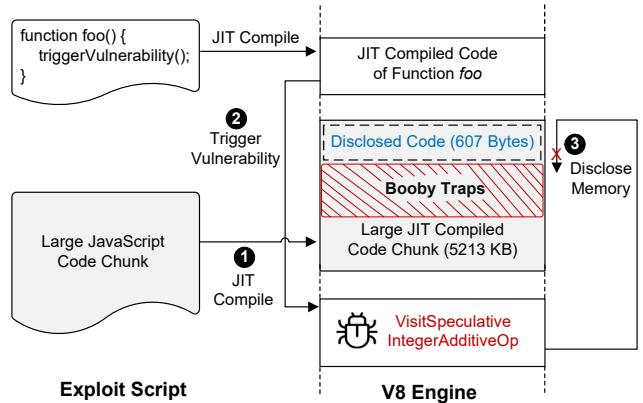  
Figure 6: Using exploit of CVE-2020-16040 to disclose memory of JIT compiled code protected by MemoryTrap.

Chromium browser [85] to get a custom Chromium browser. This custom browser can trigger CVE-2020-16040 and generate MemoryTrap-protected JIT code. After that, we use the exploit of CVE-2020-16040 to trigger this vulnerability and start to disclose the generated JIT code.

CVE-2020-16040 is an integer overflow vulnerability caused by missing parameter type checking during the JIT optimization phase, resulting in arbitrary memory read and write. Figure 6 shows how we use the exploit to disclose the code of JIT compiled JavaScript functions. We first write a JavaScript function and a large JavaScript code chunk and trigger the JIT compile mechanism of V8 ( 1 in Figure 6) to get a JIT compiled code chunk with the size of 5,213 KB. The modified JIT engine inserted a total of 7, 025 booby traps into this large JIT compiled code chunk. When compiling the foo function, the foo function can trigger the vulnerability in “VisitSpeculativeIntegerAdditiveOp” function ( 2 in Figure 6), which is a function of V8 engine used to optimize JIT compiled code. This vulnerability gives us the arbitrary read capability, so we try to disclose the code in the large JIT compiled code chunk. We use the breadth-first strategy to disclose code pages of JIT compiled code, because in Table 2 we found that the breadth-first strategy can disclose more code. When disclosing the JIT compiled code, the exploit triggers booby traps in a very short time. The exploit script only discloses 607 bytes of code before falling into booby traps. Such 607 bytes is the distance from the beginning of the large JIT compiled code chunk to the beginning of the first booby trap, as shown in 3 of Figure 6

To determine the amount of JIT compiled code that must be disclosed to find the whole gadget chain, we search for the necessary gadgets in the absence of MemoryTrap’s protection. The findings indicate that a staggering 2, 739 KB of code must be disclosed to successfully identify the entire chain of gadgets, rendering the previously estimated 607 bytes woefully insufficient for this task.

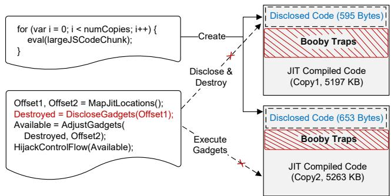  
Figure 7: JavaScript JIT cloning attack maintains two copies, but our booby traps spread over in each copy.

## 6.4 Countering Code Inference Attacks

The first three types of code inference attacks described in [57] operate by maintaining multiple copies of code and inferring the contents of one copy through the disclosure of another. To evaluate the effectiveness of MemoryTrap against these three types of code inference attacks, we use the JIT-compiled code cloning attack as a representative example. We follow the detailed description in Snow et al.’s paper [57] to reproduce the JavaScript JIT compiled code cloning attack. We maintain two copies of a large JIT-compiled code chunk, each over 5MB in size, using the same JavaScript source code as in §6.3. The JIT engine compiles the first copy of code in 5,197KB, and it compiles the second copy of code in 5,263KB, with 7,025 booby traps inserted in each of them. Each copy has a different size due to the variable-size booby traps inserted. We also use the breadth-first code page traversal strategy to disclose these code chunks. Figure 7 illustrates how Memory-Trap stops this type of attack. No matter how many code copies the adversary maintains, our booby traps spread over each code copy. Similar to the evaluation result shown in Figure 6, our code page traversal attempt can only disclose a very small piece of code: 595 bytes in the first copy and 653 bytes in the second copy, before the code read operations were caught in a booby trap. Such little disclosed code is not enough to construct a malicious payload.

The last type of code inference attacks reveals certain portions of code in order to infer the content of related code and thereby evade detection or destruction. MemoryTrap inherently defends against this type of attack by distributing a large number of traps throughout the code, which significantly alters the original code layout. This approach invalidates the attacker’s prior knowledge about the code structure, making it difficult to infer the actual content of the code.

## 7 Performance Evaluation

We tested standard benchmarks and a set of real-world applications to measure the slowdowns caused by MemoryTrap. We run microbenchmarks on the modified kernel to evaluate the overhead caused by kernel modification. We use macrobenchmarks to evaluate the overhead of MemoryTrap on CPU-intensive programs. For real-world applications, we use mainstream web servers (Nginx-1.20.1, Apache-2.4.49, and Lighttpd-1.4.59), four popular databases (MySQL-8.0.26, MongoDB-4.2.17, Redis-6.2.5, and SQLite-3.36.0), and a custom V8 engine. Please note that in subsequent experiments, we run the standard version of benchmark or application on the standard kernel and the MemoryTrap protected version on the custom kernel. For the shared libraries that the realworld applications depend on (e.g., PCRE and zlib for Nginx and APR for Apache), we use their MemoryTrap protected version for the performance evaluation.

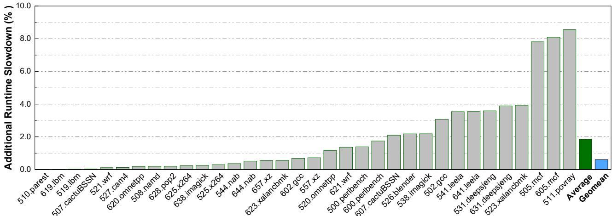  
Figure 8: Additional runtime slowdown (%) of MemoryTrap on SPEC CPU 2017 (ref workload).

## 7.1 Microbenchmarks

MemoryTrap modifies the Linux kernel’s binary loader, page fault handler, and process context structure. To evaluate the impact of these modifications on kernel operations, we run lmbench [86] on both the standard Linux kernel and our modified version, and compare the operation latencies of the standard kernel and the modified kernel.

Table 3 displays the running time of kernel operations related to process creation and page fault handling. The Fork Proc and Exec Proc are process creation operations that use fork and exec. These operations resulted in an overhead of 0.88% and 0.58%, respectively, due to the additional steps required for loading XoM metadata. Page Fault shows the overhead related to page fault handling, with a 0.52% overhead. Prot Fault denotes the overhead related to protection fault handling. MemoryTrap needs to scrutinize whether the protection fault is enabled, causing a 0.83% overhead.

In order to store MemoryTrap’s metadata, such as MPK’s PKey and executable data list, we included additional data members in the process context structure. However, this modification may result in overhead during context switches in the kernel. To evaluate the impact of our modification, we conducted experiments measuring the context switching time for two kernel versions, and results are presented in Table 4. The upper half of the first row displays the number of processes involved in the context switches, while the lower half shows the memory usage of each process. For instance, “2p/16k” represents a context switch between two processes, each utilizing 16 KB of memory. All entries exhibit overhead values distributed around zero, suggesting that MemoryTrap exerts an insignificant impact on the performance of kernel context switches. For additional lmbench results with limited correlation to MemoryTrap, please refer to Appendix C.

Table 3: Time for kernel operations related to process creation and page fault handling (in µs). Smaller is better. In the first row are the names of benchmarks in lmbench.
<table><tr><td>Kernel</td><td>Fork Proc</td><td>Exec Proc</td><td>Page Fault</td><td>Prot Fault</td></tr><tr><td>Standard</td><td>113</td><td>347</td><td>0.776</td><td>0.481</td></tr><tr><td>MemoryTrap</td><td>114</td><td>349</td><td>0.780</td><td>0.485</td></tr><tr><td>Overhead</td><td>0.88%</td><td>0.58%</td><td>0.52%</td><td>0.83%</td></tr></table>

## 7.2 Macrobenchmarks

SPEC CPU2017 is the latest generation of SPEC CPU benchmark with larger and more complex workloads than SPEC 2006. In the performance evaluation of macrobenchmarks, we compile the standard version of SPEC 2017 and the Memory-Trap protected version of SPEC 2017, and run them with the ref workload on our test machine. We take the running time of standard versions as the baseline to measure the overhead incurred by MemoryTrap’s protection. We removed the pure Fortran benchmarks from our experiment, because LLVM’s Fortran frontend is still under testing and not ready for developers to use [87].

Figure 8 shows the overhead of MemoryTrap protection for each benchmark in SPEC CPU 2017. The green and blue bars on the rightmost side show the average and the geometric mean value of overhead, respectively. From Figure 8, we can see that seven overhead values are very close to zero, and the peak value (8.5%) happens in povray. Upon further investigation, povray has a lot of dispatch loop structures that call numerous small handler functions. According to our booby trap insertion strategy, all of these handler functions are inserted with one booby trap. Povray spends most of its running time on executing handler functions, so the accumulated overhead is relatively high. 505.mcf and 605.mcf are both derived from MCF, a program used for single-depot vehicle scheduling in public mass transportation. Similar to povray, MCF spends most of its running time on iteratively executing three utility functions (getArcPosition, arc\_compare, and spec\_qsort), causing a relatively high overhead. Nonetheless, the average overhead of tested SPEC benchmarks is 1.85%, and the geometric mean is 0.60%, indicating a limited performance impact on CPU-intensive programs.

Table 4: Context switch time (in µs). Smaller is better.
<table><tr><td rowspan="2">Kernel</td><td>2p</td><td>2p</td><td>2p</td><td>8p</td><td>8p</td><td>16p</td><td>16P</td></tr><tr><td>0K</td><td>16K</td><td>64K</td><td>16K</td><td>64K</td><td>16K</td><td>64K</td></tr><tr><td>Standard</td><td>2.09</td><td>2.10</td><td>2.61</td><td>2.43</td><td>2.59</td><td>2.64</td><td>2.83</td></tr><tr><td>MemoryTrap</td><td>2.13</td><td>2.15</td><td>2.48</td><td>2.49</td><td>2.62</td><td>2.66</td><td>2.79</td></tr><tr><td>Overhead</td><td>1.91%</td><td>2.38%</td><td>-4.24%</td><td>2.47%</td><td>1.16%</td><td>0.76%</td><td>-1.43%</td></tr></table>

Real-World Applications In addition to SPEC CPU 2017, we also evaluated the performance of MemoryTrap using web servers, databases, and a JIT engine. For web servers, we tested Nginx, Apache, and Lighttpd. The maximum overhead observed for web servers is only 2.11%, with an average overhead of 0.74%; most overhead values are very close to zero. Regarding databases, we evaluated MySQL, MongoDB, Redis, and SQLite, and the average overhead incurred by these databases is merely 1.30%. Then we use Kraken Benchmark [64] to measure the overhead incurred by MemoryTrap, and the average overhead is only 1.54%. Due to the page limit, we put detailed performance results in Appendix B. We have also conducted experiments to evaluate MemoryTrap’s disk and memory overhead. Please refer to Appendix G for details.

Worst-Case Benchmark We employ a worst-case benchmark that cyclically reads the code area for 10, 000, 000 times to trigger extensive embedded data accesses, causing the program to spend most of its execution time performing embedded data reads. This benchmark allows us to evaluate the performance of MemoryTrap under worst-case conditions. We compare the time required to complete this benchmark with and without the deployment of MemoryTrap. With Memory-Trap, the benchmark takes 3.23X longer to complete than without it, which means that MemoryTrap incurs a 3.23 times slowdown in this worst-case benchmark. However, the overall system performance is not significantly impacted by this seemingly unacceptable overhead. This is attributed to the fact that legitimate data-in-code reads are interspersed with numerous other instructions. A more in-depth analysis of this performance impact will be presented in §7.3.

## 7.3 Overhead Cause Analysis

There are two sources of performance overhead for Memory-Trap: the data-in-code read legitimacy check and the jump instructions introduced by booby traps. Next, we break down each component of MemoryTrap to provide insights into the causes of MemoryTrap’s overhead.

As discussed in §7.1, the data-in-code read legitimacy check incurs a 3.23 times performance overhead. However, MemoryTrap causes only a 1.85% overhead on SPEC CPU 2017 and a 0.74% overhead on web servers, which is negligible compared to the read legitimacy check. Our further investigation reveals that this is because legitimate data-in-code reads are interspersed among numerous other instructions. We introduce the term “Read Intensity” here, defined by Equation 1, to assess the density of data-in-code read operations among all instructions.

$$
R e a d I n t e n s i t y = \frac { \# o f L e g i t i m a t e R e a d s } { \# o f E x e c u t e d I n s t r u c t i o n s }\tag{1}
$$

We have gathered data on legitimate data reads and the total number of executed instructions for SPEC CPU 2017, web servers, and databases used in our evaluation. Additionally, we gathered the same information for OpenSSL, which contains significantly more data-in-code reads than other programs due to the handwritten implementation of cryptographic algorithms. The results show that the Read Intensities are $7 . 0 \mathrm { E } ^ { - 1 1 }$ for SPEC CPU 2017, 1 $. 6 4 \mathrm { E } ^ { - 1 0 }$ for web servers, and $4 . 8 0 \mathrm { E } ^ { - 1 2 }$ for databases. Even for OpenSSL, it only has a Read Intensity of $1 . 4 0 \mathrm { E } ^ { - 7 }$ , which implies that one data-in-code read is performed for every million instructions executed. The average Read Intensity across all programs is $3 . 5 1 \mathrm { E } ^ { - 8 }$ , signifying that, on average, one data-in-code read is performed after executing ten million instructions. This illustrates that while data-in-code reads are not rare in practice, their frequency is extremely low, which significantly mitigates the impact of the legitimacy check overhead. We conducted another experiment to evaluate the overhead caused by the read legitimacy check. We ran each benchmark without booby trap insertion and found that the read legitimacy check only causes a 0.45% runtime slowdown on average. This indicates that most of MemoryTrap’s overhead is caused by the jump instructions introduced by booby trap insertion.

## 7.4 Performance Comparison

We compare the performance of MemoryTrap with representative approaches shown in Figure 1, including XnR [46], Readactor [47], HideM [49], and Heisenbyte [53]. However, we encountered a major challenge that none of the papers listed in Figure 1 have made their tools publicly available, with the exception of MemoryTrap. In light of this, we compared their SPEC CPU 2006 performance data reported in their papers with ours. Figure 9 shows the performance comparison result. XnR is the first XoM approach; it implements

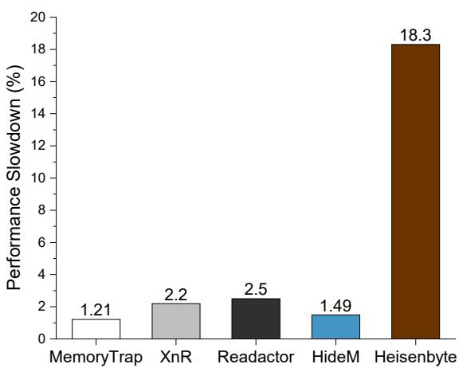  
Figure 9: Performance comparison with XnR [46], Readactor [47], HideM [49], and Heisenbyte [53].

XoM through software emulation, incurring 2.2% performance overhead. Readactor uses Intel’s virtualization technique to enforce the execute-only permission, exhibiting 2.2% overhead. HideM utilities the split-TLB to achieve XoM protection, which causes 1.4% overhead. Heisenbyte tries to tolerate legitimate data-in-code reads, but it reveals significantly higher overhead (18.3%) than other approaches due to its code destruction and read request redirection operations. In contrast, MemoryTrap exhibits the lowest overhead (1.21%) among all prototypes in Figure 9.

## 7.5 Compatibility with Embedded Data Reads

Among real-world programs we tested, OpenSSL exhibited the highest frequency of embedded data reads. Therefore, we use OpenSSL to demonstrate the compatibility of MemoryTrapwith embedded data reads. We compiled a MemoryTrap-protected version of OpenSSL and executed it using the openssl speed command [88], which is the official benchmarking tool used to measure the performance of cryptographic algorithms in OpenSSL. The compiled OpenSSL binary contains a total of 827,604 bytes of embedded data, distributed across 1, 063 embedded data blocks. During the execution of the openssl speed command, a total of 656, 509, 327 embedded data read operations occurred, and the read intensity is 1.40E−7. All embedded data read operations were executed successfully, and all benchmark tests completed normally. This result demonstrates that Memory-Trap has excellent compatibility with embedded data reads. Notably, although OpenSSL contains a considerable amount of embedded data, the average size of each embedded data block is only 779 bytes. This implies that even if an attacker successfully locates an embedded data block, they can only access, on average, 779 bytes of embedded data. Such a limited amount of embedded data is insufficient to be successfully leveraged by a JIT-ROP attacker.

## 8 Discussion and Conclusion

Potential Security Problem of WRPKRU In the MPK mechanism, the WRPKRU instruction can write the value in EAX to PKRU to change the permission of page groups. Skilled attackers may try to bypass MemoryTrap’s protection by granting read permissions to all page groups using the WRPKRU instruction. However, when executing the WRP-KRU instruction, the value of ECX and EDX must be 0. Otherwise, a general-protection exception (#GP) will occur. If attackers change the page permission via WRPKRU, at least four gadgets are needed: 1) write EAX, 2) write ECX, 3) write EDX, and 4) execute WRPKRU. Fortunately, as we demonstrated in §6, with MemoryTrap deployed, at most one gadget can be disclosed before triggering MemoryTrap’s protection. DoS Risk In our current response to a detected memory disclosure attempt, MemoryTrap will terminate the vulnerable process immediately. While this measure can thwart attackers from gaining control of the system, it also poses a potential risk of Denial of Service (DoS). An alternative strategy is to combine MemoryTrap with re-randomization. Instead of terminating the compromised process, we activate a new randomization process to the code layout. This method can prevent the use of collected gadgets and simultaneously avoid the risk of DoS. However, the cost of doing so is the large overhead that comes with the re-randomization process itself. Multi-Platform Support Currently, MemoryTrap is implemented based on Intel’s MPK mechanism. MPK is supported on mainstream Intel and AMD desktop and server CPUs but is unavailable on other platforms. Nevertheless, other platforms provide similar mechanisms that can be used to implement MemoryTrap. For instance, ARM provides AP/XN [89], RISC-V offers PMP [90], and PowerPC includes Protection Keys [91]. These mechanisms can serve as alternatives to implement MemoryTrap. We discuss details in Appendix D. Conclusion This paper introduces MemoryTrap, a hardwareassisted technique to counter memory disclosure attacks. MemoryTrap inserts unreadable, variable-size code snippets (booby traps) at strategic points to block unauthorized code page reads, utilizing Intel’s MPK for efficient, fine-grained memory permission control. Our experiments demonstrate that MemoryTrap reveals a strong resistance to various memory disclosure attempts and negligible runtime overhead.

## Acknowledgment

We thank our shepherd, Dr. Pierre Olivier, and all anonymous reviewers for their valuable comments to improve this paper. This work is supported by the National Nature Science Foundation of China under Grant No. 62272351, 61972297, and 62172308. Jiang Ming is supported by NSF grants 2312185 & 2417055, Google Research Scholar Award, and Tulane COR Fellowships. Dongpeng Xu is supported by NSF grants 2211905 and 2022279.

## References

[1] László Szekeres, Mathias Payer, Tao Wei, and Dawn Song. SoK: Eternal War in Memory. In Proceedings of the 34th IEEE Symposium on Security and Privacy (S&P’13), 2013.

[2] Volodymyr Kuznetzov, László Szekeres, Mathias Payer, George Candea, R Sekar, and Dawn Song. Code-Pointer Integrity. In Proceedings of the 11th USENIX Symposium on Operating Systems Design and Implementation (OSDI’14), 2014.

[3] Christian DeLozier, Kavya Lakshminarayanan, Gilles Pokam, and Joseph Devietti. Hurdle: Securing Jump Instructions Against Code Reuse Attacks. In Proceedings of the 25th International Conference on Architectural Support for Programming Languages and Operating Systems (ASPLOS’20), 2020.

[4] Haotian Zhang, Mengfei Ren, Yu Lei, and Jiang Ming. One Size Does Not Fit All: Security Hardening of MIPS Embedded Systems via Static Binary Debloating for Shared Libraries. In Proceedings of the 27th International Conference on Architectural Support for Programming Languages and Operating Systems (AS-PLOS’22), 2022.

[5] Hovav Shacham. The Geometry of Innocent Flesh on the Bone: Return-into-libc without Function Calls (on the x86). In Proceedings of the 14th ACM Conference on Computer and Communications Security (CCS’07), 2007.

[6] Martín Abadi, Mihai Budiu, Ulfar Erlingsson, and Jay Ligatti. A theory of secure control flow. In International Conference on Formal Engineering Methods, pages 111–124. Springer, 2005.

[7] Martín Abadi, Mihai Budiu, Ulfar Erlingsson, and Jay Ligatti. Control-flow integrity principles, implementations, and applications. ACM Transactions on Information and System Security (TISSEC), 13(1):1–40, 2009.

[8] Jonathan Corbet. A new LLVM CFI implementation. https://lwn.net/Articles/898040/, June 17, 2022.

[9] Yueqiang Cheng, Zongwei Zhou, Yu Miao, Xuhua Ding, and Robert H Deng. ROPecker: A Generic and Practical Approach for Defending against ROP Attack. In Proceedings of the 21st Annual Network and Distributed System Security Symposium (NDSS’14), 2014.

[10] Ali Jose Mashtizadeh, Andrea Bittau, Dan Boneh, and David Mazières. CCFI: Cryptographically Enforced

Control Flow Integrity. In Proceedings of the 22nd ACM SIGSAC Conference on Computer and Communications Security (CCS ’15), pages 941–951, 2015.

[11] Ivan Fratric. Ropguard: Runtime prevention of return- ´ oriented programming attacks. Technical report, 2012.

[12] Vasilis Pappas, Michalis Polychronakis, and Angelos D Keromytis. Transparent rop exploit mitigation using indirect branch tracing. In Proceedings of the 22nd USENIX Security Symposium (USENIX Security ’13), pages 447–462, 2013.

[13] Chao Zhang, Tao Wei, Zhaofeng Chen, Lei Duan, Laszlo Szekeres, Stephen McCamant, Dawn Song, and Wei Zou. Practical control flow integrity and randomization for binary executables. In Proceedings of the 2013 IEEE Symposium on Security and Privacy (S&P ’13), pages 559–573. IEEE, 2013.

[14] Mingwei Zhang and R Sekar. Control flow integrity for cots binaries. In Proceedings of the 22nd USENIX Security Symposium (USENIX Security ’13), pages 337– 352, 2013.

[15] Nathan Burow, Scott A Carr, Joseph Nash, Per Larsen, Michael Franz, Stefan Brunthaler, and Mathias Payer. Control-Flow integrity: Precision, security, and performance. ACM Computing Surveys (CSUR), 50(1):1–33, 2017.

[16] Intel. Control Flow Enforcement Technology (CET). https://www.intel.com/content/ dam/develop/external/us/en/documents/ catc17-introduction-intel-cet-844137.pdf, [online].

[17] Qualcomm Technologies. Pointer Authentication on ARMv8.3. https://www.qualcomm.com/content/ dam/qcomm-martech/dm-assets/documents/ pointer-auth-v7.pdf, [online].

[18] Jianhao Xu, Luca Di Bartolomeo, Flavio Toffalini, Bing Mao, and Mathias Payer. WarpAttack: Bypassing CFI through Compiler-Introduced Double-Fetches. In Proceedings of the 2023 IEEE Symposium on Security and Privacy (S&P ’23), pages 1271–1288, 2023.

[19] Felix Schuster, Thomas Tendyck, Christopher Liebchen, Lucas Davi, Ahmad-Reza Sadeghi, and Thorsten Holz. Counterfeit Object-Oriented Programming: On the Difficulty of Preventing Code Reuse Attacks in C++ Applications. In Proceedings of the 2015 IEEE Symposium on Security and Privacy (S&P ’15), pages 745–762. IEEE, 2015.

[20] Nicholas Carlini, Antonio Barresi, Mathias Payer, David Wagner, and Thomas R Gross. Control-Flow Bending: On the Effectiveness of Control-Flow Integrity. In Proceedings of the 24th USENIX Security Symposium (USENIX Security ’15), pages 161–176, 2015.

[21] Nicholas Carlini and David Wagner. Rop is still dangerous: Breaking modern defenses. In 23rd USENIX Security Symposium (USENIX Security ’14), pages 385– 399, 2014.

[22] Lucas Davi, Ahmad-Reza Sadeghi, Daniel Lehmann, and Fabian Monrose. Stitching the gadgets: On the ineffectiveness of coarse-grained control-flow integrity protection. In Proceedings of the 23rd USENIX Security Symposium (USENIX Security ’14), pages 401– 416, 2014.

[23] Enes Göktas, Elias Athanasopoulos, Herbert Bos, and Georgios Portokalidis. Out of control: Overcoming control-flow integrity. In Proceedings of the 2014 IEEE Symposium on Security and Privacy (S&P ’14), pages 575–589. IEEE, 2014.

[24] Enes Gökta¸s, Elias Athanasopoulos, Michalis Polychronakis, Herbert Bos, and Georgios Portokalidis. Size does matter: Why using gadget-chain length to prevent code-reuse attacks is hard. In Proceedings of the 23rd USENIX Security Symposium (USENIX Security ’14), pages 417–432, 2014.

[25] Felix Schuster, Thomas Tendyck, Jannik Pewny, Andreas Maaß, Martin Steegmanns, Moritz Contag, and Thorsten Holz. Evaluating the effectiveness of current anti-rop defenses. In International Workshop on Recent Advances in Intrusion Detection, pages 88–108. Springer, 2014.

[26] Matteo Malvica. Bypassing Intel CET with Counterfeit Objects. https://www.offsec.com/offsec/ bypassing-intel-cet-with-counterfeit-objects/, [online].

[27] Marcoramilli. From ROP to LOP Bypassing Control FLow Enforcement. https://shorturl.at/jDJM1, [online].

[28] Sabine Houy and Alexandre Bartel. Lessons Learned and Challenges of Deploying Control Flow Integrity in Complex Software: The Case of OpenJDK’s Java Virtual Machine. In Proceedings of the 2024 IEEE Secure Development Conference (SecDev ’24), 2024.

[29] Arif Ali Mughal. The Art of Cybersecurity: Defense in Depth Strategy for Robust Protection. International Journal of Intelligent Automation and Computing, 1(1):1–20, 2018.

[30] Michael Backes and Stefan Nürnberger. Oxymoron: Making Fine-Grained Memory Randomization Practical by Allowing Code Sharing. In Proceedings of the 23rd USENIX Conference on Security Symposium (USENIX Security’14), 2014.

[31] Lucas Davi, Christopher Liebchen, Ahmad-Reza Sadeghi, Kevin Z Snow, and Fabian Monrose. Isomeron: Code Randomization Resilient to (Just-In-Time) Return-Oriented Programming. In Proceedings of the 22nd Annual Network and Distributed System Security Symposium (NDSS’15), 2015.

[32] PaX Team. Address Space Layout Randomization (ASLR). https://pax.grsecurity.net/docs/ aslr.txt, 2003.

[33] Sandeep Bhatkar, Daniel C DuVarney, and Ron Sekar. Address Obfuscation: An Efficient Approach to Combat a Broad Range of Memory Error Exploits. In Proceedings of the 12th Conference on USENIX Security Symposium (USENIX Security’03), 2003.

[34] Sandeep Bhatkar, Daniel C DuVarney, and R Sekar. Efficient Techniques for Comprehensive Protection from Memory Error Exploits. In Proceedings of the 14th Conference on USENIX Security Symposium (USENIX Security’05), 2005.

[35] Kjell Braden, Lucas Davi, Christopher Liebchen, Ahmad-Reza Sadeghi, Stephen Crane, Michael Franz, and Per Larsen. Leakage-Resilient Layout Randomization for Mobile Devices. In Proceedings of the 23rd Annual Network and Distributed System Security Symposium (NDSS’16), 2016.

[36] Cristiano Giuffrida, Anton Kuijsten, and Andrew S Tanenbaum. Enhanced Operating System Security Through Efficient and Fine-grained Address Space Randomization. In Proceedings of the 21st Conference on USENIX Security Symposium (USENIX Security’12), 2012.

[37] Jason Hiser, Anh Nguyen-Tuong, Michele Co, Matthew Hall, and Jack W Davidson. ILR: Where’d My Gadgets Go? In Proceedings of the 33rd IEEE Symposium on Security and Privacy (S&P’12), 2012.

[38] Andrei Homescu, Steven Neisius, Per Larsen, Stefan Brunthaler, and Michael Franz. Profile-guided Automated Software Diversity. In Proceedings of the 2013 IEEE/ACM International Symposium on Code Generation and Optimization (CGO’13), 2013.

[39] Chongkyung Kil, Jinsuk Jun, Christopher Bookholt, Jun Xu, and Peng Ning. Address Space Layout Permutation (ASLP): Towards Fine-Grained Randomization

of Commodity Software. In Proceedings of the 22nd Annual Computer Security Applications Conference (ACSAC’06), 2006.

[40] Vasilis Pappas, Michalis Polychronakis, and Angelos D Keromytis. Smashing the Gadgets: Hindering Return-Oriented Programming Using In-place Code Randomization. In Proceedings of the 33rd IEEE Symposium on Security and Privacy (S&P’12), 2012.

[41] Richard Wartell, Vishwath Mohan, Kevin W Hamlen, and Zhiqiang Lin. Binary Stirring: Self-randomizing Instruction Addresses of Legacy x86 Binary Code. In Proceedings of the 19th ACM Conference on Computer and Communications Security (CCS’12), 2012.

[42] David Williams-King, Graham Gobieski, Kent Williams-King, James P Blake, Xinhao Yuan, Patrick Colp, Michelle Zheng, Vasileios P Kemerlis, Junfeng Yang, and William Aiello. Shuffler: Fast and Deployable Continuous Code Re-Randomization. In Proceedings of the 12th USENIX Symposium on Operating Systems Design and Implementation (OSDI’16), 2016.

[43] Raoul Strackx, Yves Younan, Pieter Philippaerts, Frank Piessens, Sven Lachmund, and Thomas Walter. Breaking the Memory Secrecy Assumption. In Proceedings of the 2nd European Workshop on Systems Security (EUROSEC’09), 2009.

[44] Kevin Z Snow, Fabian Monrose, Lucas Davi, Alexandra Dmitrienko, Christopher Liebchen, and Ahmad-Reza Sadeghi. Just-In-Time Code Reuse: On the Effectiveness of Fine-Grained Address Space Layout Randomization. In Proceedings of the 34th IEEE Symposium on Security and Privacy (S&P’13), 2013.

[45] Salman Ahmed, Ya Xiao, Kevin Z Snow, Gang Tan, Fabian Monrose, and Danfeng Yao. Methodologies for Quantifying (Re-)randomization Security and Timing under JIT-ROP. In Proceedings of the 27th ACM Conference on Computer and Communications Security (CCS’20), 2020.

[46] Michael Backes, Thorsten Holz, Benjamin Kollenda, Philipp Koppe, Stefan Nürnberger, and Jannik Pewny. You Can Run but You Can’t Read: Preventing Disclosure Exploits in Executable Code. In Proceedings of the 21st ACM Conference on Computer and Communications Security (CCS’14), 2014.

[47] Stephen Crane, Christopher Liebchen, Andrei Homescu, Lucas Davi, Per Larsen, Ahmad-Reza Sadeghi, Stefan Brunthaler, and Michael Franz. Readactor: Practical Code Randomization Resilient to Memory Disclosure. In Proceedings of the 36th IEEE Symposium on

Security and Privacy (S&P’15), pages 763–780. IEEE, 2015.

[48] Stephen J Crane, Stijn Volckaert, Felix Schuster, Christopher Liebchen, Per Larsen, Lucas Davi, Ahmad-Reza Sadeghi, Thorsten Holz, Bjorn De Sutter, and Michael Franz. It’s a TRaP: Table Randomization and Protection against Function-Reuse Attacks. In Proceedings of the 22nd ACM Conference on Computer and Communications Security (CCS’15), 2015.

[49] Jason Gionta, William Enck, and Peng Ning. HideM: Protecting the Contents of Userspace Memory in the Face of Disclosure Vulnerabilities. In Proceedings of the 5th ACM Conference on Data and Application Security and Privacy (CODASPY’15), 2015.

[50] Xiaozhu Meng and Barton P. Miller. Binary Code is Not Easy. In Proceedings of the 25th International Symposium on Software Testing and Analysis (ISSTA’16), 2016.

[51] Manuel Rigger, Stefan Marr, Stephen Kell, David Leopoldseder, and Hanspeter Mössenböck. An Analysis of x86-64 Inline Assembly in C Programs. In Proceedings of the 14th ACM SIGPLAN/SIGOPS International Conference on Virtual Execution Environments (VEE ’18), 2018.

[52] Chengbin Pang and Ruotong Yu and Yaohui Chen and Eric Koskinen and Georgios Portokalidis and Bing Mao and Jun Xu. SoK: All You Ever Wanted to Know About x86/x64 Binary Disassembly But Were Afraid to Ask. In Proceedings of the 42nd IEEE Symposium on Security and Privacy (S&P’21), 2021.

[53] Adrian Tang, Simha Sethumadhavan, and Salvatore Stolfo. Heisenbyte: Thwarting Memory Disclosure Attacks using Destructive Code Reads. In Proceedings of the 22nd ACM Conference on Computer and Communications Security (CCS’15), 2015.

[54] Jan Werner, George Baltas, Rob Dallara, Nathan Otterness, Kevin Z Snow, Fabian Monrose, and Michalis Polychronakis. No-Execute-After-Read: Preventing Code Disclosure in Commodity Software. In Proceedings of the 11th ACM on Asia Conference on Computer and Communications Security (ASIACCS’16), 2016.

[55] Chris Wilson and Lita Arriaga. Secure Commodity Software by Enforcing Memory Permission Policies. https://www.academia.edu/download/ 50294358/Transparent\_Enforcement\_for\_ Software\_Memory\_Security.pdf, [online].

[56] Jannik Pewny, Philipp Koppe, Lucas Davi, and Thorsten Holz. Breaking and Fixing Destructive

Code Read Defenses. In Proceedings of the 33rd Annual Computer Security Applications Conference (ACSAC’17), 2017.

[57] Kevin Z Snow, Roman Rogowski, Jan Werner, Hyungjoon Koo, Fabian Monrose, and Michalis Polychronakis. Return to the Zombie Gadgets: Undermining Destructive Code Reads via Code Inference Attacks. In Proceedings of the 37th IEEE Symposium on Security and Privacy (S&P’16), 2016.

[58] Stephen Crane, Per Larsen, Stefan Brunthaler, and Michael Franz. Booby Trapping Software. In Proceedings of the 2013 New Security Paradigms Workshop (NSPW’13), 2013.

[59] Mohammed H. Almeshekah and Eugene H. Spafford. Cyber Security Deception, pages 23–50. Springer International Publishing, Cham, 2016.

[60] Xiao Han, Nizar Kheir, and Davide Balzarotti. Deception Techniques in Computer Security: A Research Perspective. ACM Computing Surveys, 51(4), July 2018.

[61] Intel. Intel® 64 and IA-32 Architectures Software Developer’s Manual. http://tiny.cc/7vdhuz, [online].

[62] Soyeon Park, Sangho Lee, Wen Xu, Hyungon Moon, and Taesoo Kim. libmpk: Software Abstraction for Intel Memory Protection Keys (Intel MPK). In Proceedings of the 2019 USENIX Annual Technical Conference (USENIX ATC’19), 2019.

[63] Standard Performance Evaluation Corporation. SPEC CPU® 2017. https://www.spec.org/cpu2017/, 2021.

[64] Mozilla. Kraken JavaScript Benchmark. https://mozilla.github.io/krakenbenchmark. mozilla.org/index.html, [online].

[65] Ryan Roemer, Erik Buchanan, Hovav Shacham, and Stefan Savage. Return-Oriented Programming: Systems, Languages, and Applications. ACM Transactions on Information and System Security, 15(1), March 2012.

[66] Jason Gionta, William Enck, and Per Larsen. Preventing Kernel Code-Reuse Attacks Through Disclosure Resistant Code Diversification. In Proceedings of 2016 IEEE Conference on Communications and Network Security (CNS’16), 2016.

[67] Marios Pomonis, Theofilos Petsios, Angelos D Keromytis, Michalis Polychronakis, and Vasileios P Kemerlis. kRˆX: Comprehensive Kernel Protection Against Just-In-Time Code Reuse. In Proceedings of

the Twelfth European Conference on Computer Systems (EuroSys’17), 2017.

[68] Robert N.M. Watson, Jonathan Woodruff, Peter G. Neumann, Simon W. Moore, Jonathan Anderson, David Chisnall, Nirav Dave, Brooks Davis, Khilan Gudka, Ben Laurie, Steven J. Murdoch, Robert Norton, Michael Roe, Stacey Son, and Munraj Vadera. CHERI: A Hybrid Capability-System Architecture for Scalable Software Compartmentalization. In Proceedings of the 36th IEEE Symposium on Security and Privacy (S&P’15), 2015.

[69] Zhe Wang, Chenggang Wu, Mengyao Xie, Yinqian Zhang, Kangjie Lu, Xiaofeng Zhang, Yuanming Lai, Yan Kang, and Min Yang. SEIMI: Efficient and Secure SMAP-Enabled Intra-process Memory Isolation. In Proceedings of the 41st IEEE Symposium on Security and Privacy (S&P’20), 2020.

[70] Anjo Vahldiek-Oberwagner, Eslam Elnikety, Nuno O. Duarte, Michael Sammler, Peter Druschel, and Deepak Garg. ERIM: Secure, Efficient In-process Isolation with Protection Keys (MPK). In Proceedings of the 28th Conference on USENIX Security Symposium (USENIX Security’19), 2019.

[71] Mohammad Hedayati, Spyridoula Gravani, Ethan Johnson, John Criswell, Michael L Scott, Kai Shen, and Mike Marty. Hodor: Intra-Process Isolation for High-Throughput Data Plane Libraries. In Proceedings of the 2019 USENIX Annual Technical Conference (USENIX ATC’19), 2019.

[72] Nathan Burow, Xinping Zhang, and Mathias Payer. SoK: Shining Light on Shadow Stacks. In Proceedings of the 40th IEEE Symposium on Security and Privacy (S&P’19), 2019.

[73] Xuancheng Jin, Xuangan Xiao, Songlin Jia, Wang Gao, Hang Zhang, Dawu Gu, Siqi Ma, Zhiyun Qian, and Juanru Li. Annotating, Tracking, and Protecting Cryptographic Secrets with CryptoMPK. In Proceedings of the 43rd IEEE Symposium on Security and Privacy (S&P’22), 2022.

[74] Spyridoula Gravani, Mohammad Hedayati, John Criswell, and Michael L Scott. Fast Intra-kernel Isolation and Security with IskiOS. In Proceedings of the 24th International Symposium on Research in Attacks, Intrusions and Defenses (RAID’21), 2021.

[75] Michalis Athanasakis, Elias Athanasopoulos, Michalis Polychronakis, Georgios Portokalidis, and Sotiris Ioannidis. The Devil is in the Constants: Bypassing Defenses in Browser JIT Engines. In Proceedings of the 22nd Annual Network and Distributed System Security Symposium (NDSS’15), 2015.

[76] Chengyu Song, Chao Zhang, Tielei Wang, Wenke Lee, and David Melski. Exploiting and Protecting Dynamic Code Generation. In Proceedings of the 22nd Annual Network and Distributed System Security Symposium (NDSS’15), 2015.

[77] Edward J Schwartz, Thanassis Avgerinos, and David Brumley. Q: Exploit hardening made easy. In Proceedings of the 20th USENIX Conference on Security Symposium (USENIX Security’11), 2011.

[78] Andrei Homescu, Michael Stewart, Per Larsen, Stefan Brunthaler, and Michael Franz. Microgadgets: Size Does Matter in Turing-Complete Return-Oriented Programming. In Proceedings of the 6th USENIX Workshop on Offensive Technologies (WOOT ’12), 2012.

[79] Hyungjoon Koo, Yaohui Chen, Long Lu, Vasileios P Kemerlis, and Michalis Polychronakis. Compiler-Assisted Code Randomization. In Proceedings of the 39th IEEE Symposium on Security and Privacy (S&P’18), 2018.

[80] The MITRE Corporation. CVE-2013-2028 Detail. https://www.cve.org/CVERecord?id= CVE-2013-2028, [online].

[81] Salman Ahmed. JITROP-Native. https://github. com/salmanyam/jitrop-native, [online].

[82] Rapid 7. Metasploit. https://www.metasploit. com/, [online].

[83] Offensive Security. Exploit Databse. https://www. exploit-db.com/, [online].

[84] The MITRE Corporation. CVE-2020-16040 Detail. https://www.cve.org/CVERecord?id= CVE-2020-16040, [online].

[85] Google. The Chromium Projects. https://www. chromium.org/, [online].

[86] Larry McVoy. lmbench. http://lmbench. sourceforge.net/run\_lmbench.html, [online].

[87] LLVM. Welcome to Flang’s documentation. https: //flang.llvm.org/docs/, [online].

[88] OpenSSL Project. Openssl-speed. https:// docs.openssl.org/3.3/man1/openssl-speed/, [online].

[89] Arm Limited. Access Permissions. https: //developer.arm.com/documentation/ ddi0406/b/System-Level-Architecture/ Protected-Memory-System-Architecture--PMSA-/ Memory-access-control/Access-permissions? lang=en, [online].

[90] Freedom Metal. Physical Memory Protection. https://sifive.github.io/ freedom-metal-docs/devguide/pmps.html, [online].

[91] Michael Larabel. PowerPC Memory Protection Keys In For Linux 4.16, Power Has Meltdown Mitigation In 4.15. https://www.phoronix.com/news/ PowerPC-Mem-Protection-Keys, [online].

[92] The Apache Software Foundation. Apache HTTP server benchmarking tool. https://httpd.apache. org/docs/2.4/programs/ab.html, [online].

[93] Oracle. MySQL Benchmark Tool. https: //dev.mysql.com/downloads/benchmarks.html, [online].

[94] MongoDB. Performance Tools for Mongodb. https: //github.com/mongodb/mongo-perf, [online].

[95] Redis Ltd. How fast is Redis? https://redis.io/ topics/benchmarks, [online].

[96] Wikipedia. A\* Search Algorithm. https://en. wikipedia.org/wiki/A\*\_search\_algorithm, [online].

[97] corbanbrook. DSP.js. https://github.com/ corbanbrook/dsp.js/, [online].

[98] Jacob Seidelin. Pixastic Library. http://www. pixastic.com/, [online].

[99] Mozilla. Sheriffing/TBPL. https://wiki.mozilla. org/Sheriffing/TBPL, [online].

[100] Stanford Security Lab. Stanford Javascript Crypto Library (SJCL). https://wiki.mozilla.org/ Sheriffing/TBPL, [online].

[101] Donghyun Kwon, Jangseop Shin, Giyeol Kim, Byoungyoung Lee, Yeongpil Cho, and Yunheung Paek. uXOM: Efficient eXecute-Only Memory on ARM Cortex-M. In Proceedings of the 28th Conference on USENIX Security Symposium (USENIX Security’19), 2019.

[102] Zhuojia Shen, Komail Dharsee, and John Criswell. Fast Execute-Only Memory for Embedded Systems. In Proceedings of the 2020 IEEE Secure Development (SecDev’20), 2020.

[103] Yaohui Chen, Dongli Zhang, Ruowen Wang, Rui Qiao, Ahmed M Azab, Long Lu, Hayawardh Vijayakumar, and Wenbo Shen. NORAX: Enabling Execute-Only Memory for COTS Binaries on AArch64. In Proceedings of the 38th IEEE Symposium on Security and Privacy (S&P’17), 2017.

## Appendix

## A Kernel Structure Modifications to Support MemoryTrap

Figure A1 is the structures we defined in Linux kernel used to store the basic information about MemoryTrap. Some fields in kernel correspond to the fields in the newly defined ELF format, and some fields are used to store the run-time information for MemoryTrap protection. The mtrap structure stores the start and end virtual address of a booby trap in memory. The mtrap\_info\_t structure stores the basic information of a process protected by MemoryTrap: the enable flag, the trap flag, the PKey assigned to enforce execute-only memory, the number of booby traps, and the booby trap list. The mtrap\_info\_t structure is stored in the task\_struct structure to save the MemoryTrap information in current process context. Figure A2 is the task\_struct structure. We add a mtrap\_info\_t member at the end of the randomized struct fields, so the mtrap\_info\_t is compatible with the randomization protection.

```rust
5 t y p e d e f s t r u c t m t r a p {
u i n t 6 4 _ t S t a r t ; / / S t a r t a d d r e s s o f b o o b y t r a p
u i n t 6 4 _ t End ; / / End a d d r e s s o f booby t r a p
} MTrap ;
s t r u c t m t r a p _ i n f o _ t {
i n t e n a b l e d ; / / MemoryTrap e n a b l e f l a g
i n t t r a p _ a l l o w e d ; ； / / Read o p e r a t i o n l e g a l i t y f l a g
i n t pkey ; / / PKey ( i n MPK mechanism ) o f code p a g e s
10 s i z e _ t mtrap_num ; / / Number o f boo by t r a p s
s t r u c t m t r a p * m t r a p _ l i s t ; / / Booby t r a p l i s t
} ;
```  
Figure A1: The MemoryTrap structures in Linux Kernel.

s t r u c t t a s k \_ s t r u c t   
v o l a t i l e l o n g s t a t e   
v o i d \* s t a c k ;   
r e f c o u n t \_ t u s a g e ;   
u n s i g n e d i n t f l a g s ;   
u n s i g n e d i n t p t r a c e ;   
s t r u c t m t r a p \_ i n f o \_ t mtrap\_info ;   
} ;  
Figure A2: The task\_struct structure in Linux Kernel.

## B Performance on Real-World Applications

## B.1 Web Servers

We compile and run the standard and protected web server versions, respectively. We use the ApacheBench [92] to simulate 500 clients to send HTTP requests 100,000 times asynchronously, and we record their running time to complete these 100, 000 requests. To demonstrate the performance impact of MemoryTrap when requesting different page sizes, we tested five different page sizes: 50KB, 100KB, 200KB, 500KB, and 1MB. Table A1 shows the overhead of Memory-Trap protection on each web server.

Table A1: Overhead of MemoryTrap protected web servers using ApacheBench. The first row presents the request page size, and the data show the overhead for each size.
<table><tr><td>Web Server</td><td>50KB</td><td>100KB</td><td>200KB</td><td>500KB</td><td>1024KB</td><td>Avg.</td></tr><tr><td>Nginx</td><td>0.13%</td><td>0.54%</td><td>0.16%</td><td>1.01%</td><td>1.71%</td><td>0.71%</td></tr><tr><td>Apache</td><td>1.80%</td><td>0.05%</td><td>0.72%</td><td>0.23%</td><td>0.09%</td><td>0.58%</td></tr><tr><td>Lighttpd</td><td>2.11%</td><td>0.06%</td><td>1.14%</td><td>1.21%</td><td>0.16%</td><td>0.94%</td></tr><tr><td>Average</td><td>1.35%</td><td>0.22%</td><td>0.67%</td><td>0.82%</td><td>0.65%</td><td>0.74%</td></tr></table>

As shown in Table A1, the maximum overhead value is only 2.11%, and the average overhead is 0.74%, and most overhead values are very close to zero. This indicates that the performance impact of MemoryTrap protection on I/O bound web servers is negligible.

Table A2: Performance evaluation result for databases. For each database, the first row is the insertion performance, and the second row is the selection performance. The second column shows the results of the original (unprotected) versions, and the third column shows the results of MemoryTrapprotected version. The unit for the result of MongoDB is second, while the unit of other results is request times per second.
<table><tr><td>Database</td><td>Original</td><td>MemoryTrap</td><td>Overhead</td></tr><tr><td rowspan="2">MySQL</td><td>2008.13/s</td><td>1969.70/s</td><td>1.95%</td></tr><tr><td>20053.05/s</td><td>19412.63/s</td><td>3.30%</td></tr><tr><td rowspan="2">MongoDB</td><td>11913.92/s</td><td>11905.58/s</td><td>0.07%</td></tr><tr><td>14379.11/s</td><td>14370.48/s</td><td>0.06%</td></tr><tr><td rowspan="2">Redis</td><td>136138.42/s</td><td>134777.04/s</td><td>1.01%</td></tr><tr><td>137691.20/s</td><td>137484.66/s</td><td>0.15%</td></tr><tr><td rowspan="2"> SQLite</td><td>655.14/s</td><td>650.75/s</td><td>0.67%</td></tr><tr><td>85971.78/s</td><td>83298.06/s</td><td>3.21%</td></tr></table>

## B.2 Databases & JIT Engine

Databases Performance Results Unlike ApacheBench, there is no such unified performance benchmark for databases. We have to run each database with a customized testing suite.

1. MySQL: We use MySQL’s official benchmark sysbench [93] to evaluate the insertion and query overhead. We configure sysbench with the complex workload to perform insertion and selection for 100, 000 rows.

2. MongoDB: We use the official performance benchmark of MongoDB, mongo-perf [94], to evaluate the impact of MemoryTrap on MongoDB. We execute the simple insert and simple query workload and record how long the workloads can be completed to evaluate the insertion and selection overhead.

Table A3: Result of Kraken benchmark. “SJCL” is short for Stanford Javascript Crypto Library.
<table><tr><td></td><td>A*</td><td>Audio</td><td>Imaging</td><td>JSON</td><td>SJCL</td></tr><tr><td>Original</td><td>149.7ms</td><td>285.0ms</td><td>360.3ms</td><td>145.0ms</td><td>508.9ms</td></tr><tr><td>MemoryTrap</td><td>151.6ms</td><td>290.7ms</td><td>365.1ms</td><td>146.1ms</td><td>520.8ms</td></tr><tr><td>Overhead</td><td>1.27%</td><td>2.00%</td><td>1.33%</td><td>0.76%</td><td>2.34%</td></tr></table>

3. Redis: For Redis, we also use the official benchmark, redis-benchmark [95], to measure the overhead. We execute the SET and GET operation 100,000 times and record how many requests can be processed per second.

4. SQLite: Since there is no official benchmark for SQLite, we design a custom benchmark for SQLite to simulate other database benchmarks’ workloads. We insert 100, 000 rows of random data and select the inserted data by their primary key. We record the execution time and calculate how many requests that SQLite can process per second.

Table A2 shows the results of database evaluation. For each database, the first row shows the insertion performance, and the second row shows the selection performance. The last column shows the overhead incurred by MemoryTrap. As shown in Table A2, most of the databases have a very low overhead when enabling MemoryTrap’s protection, and the average overhead is only 1.30%. This shows that MemoryTrap has a negligible overhead on protecting databases.

JIT Engine Performance Result We compile the custom V8 engine together with the latest Chromium to get a browser that can generate MemoryTrap protected JIT compiled code and run Kraken Benchmark. The benchmarks in the first row of Table A3 are: 1) A\* search algorithm [96]; 2) audio processing using Corban Brook’s DSP.js library [97]; 3) image filtering routines [98]; 4) JSON parsing [99]; 5) Stanford Javascript Crypto Library (SJCL) [100]. Table A3 shows the overhead of JIT engine protection using Kraken Benchmark. In all cases, the small overhead caused by MemoryTrap ranges from 0.76% to 2.34%, and the average overhead is only 1.54%.

Table A4: Time for process-related kernel operations in µs. Smaller is better.
<table><tr><td>Kernel</td><td>Null Call</td><td>Null I/0</td><td>Stat</td><td>Open Close</td><td>Select TCP</td><td>Signal Install</td><td>Signal Handle</td><td>sh Proc</td></tr><tr><td>Standard</td><td>0.09</td><td>0.14</td><td>0.46</td><td>1.11</td><td>1.60</td><td>0.14</td><td>1.03</td><td>760</td></tr><tr><td>MemoryTrap</td><td>0.09</td><td>0.14</td><td>0.47</td><td>1.13</td><td>1.60</td><td>0.14</td><td>1.02</td><td>764</td></tr><tr><td>Overhead</td><td>0.00%</td><td>0.00%</td><td>2.17%</td><td>1.80%</td><td>0.00%</td><td>0.00%</td><td>-0.98%</td><td>0.53%</td></tr></table>

## C Other Microbenchmark Results

Table A4, Table A5, and Table A6 show the lmbench results for MemoryTrap low-correlation kernel operations.

Table A5: Local communication latencies in µs. Smaller is better.
<table><tr><td>Kernel</td><td>Pipe</td><td>AF UNIX</td><td>UDP</td><td>TCP</td><td>TCP Conn</td></tr><tr><td>Standard</td><td>5.08</td><td>4.93</td><td>8.09</td><td>9.68</td><td>11.08</td></tr><tr><td>MemoryTrap</td><td>5.12</td><td>4.97</td><td>8.12</td><td>9.57</td><td>10.93</td></tr><tr><td>Overhead</td><td>0.79%</td><td>0.81%</td><td>0.37%</td><td>-1.15%</td><td>-1.37%</td></tr></table>

Table A6: File & system latencies in µs. Smaller is better.
<table><tr><td rowspan="2">Kernel</td><td colspan="2">OK File</td><td colspan="2">10K File</td><td rowspan="2">Mmap Latency</td><td rowspan="2">100fd Select</td></tr><tr><td>Create</td><td>Delete</td><td>Create</td><td>Delete</td></tr><tr><td>Standard</td><td>7.15</td><td>3.85</td><td>12.9</td><td>6.07</td><td>52.2K</td><td>0.78</td></tr><tr><td>MemoryTrap</td><td>7.18</td><td>3.90</td><td>12.5</td><td>6.11</td><td>52.6K</td><td>0.78</td></tr><tr><td>Overhead</td><td>0.42%</td><td>1.30%</td><td>-3.20%</td><td>0.66%</td><td>0.77%</td><td>0.00%</td></tr></table>

## D Applicability to Other Platforms

Windows Platform Support The user-space components of MemoryTrap are OS-independent. However, the Windows kernel currently does not yet provide APIs to support the MPK mechanism. To transplant MemoryTrap to Windows platforms, we can resort to the mature Intel hardware virtualization mechanism EPT instead of MPK to remove the read permission of code pages. Then, we reimplement the exception handler in hypervisor to react to memory disclosure attempts.

Transplant MemoryTrap to ARM A series of papers have transplanted the idea of execute-only memory to various ARM platforms using different hardware features [101–103]. The diversity of ARM specifications offers multiple alternatives to implement MemoryTrap on ARM. All we need to do is to reimplement the fine-grained memory permission control with different hardware features. For example, we can use the unprivileged memory instructions and Memory Protection Unit hardware feature to implement MemoryTrap on Cortex-M [101]. On ARMv7-M and ARMv8-M, we can leverage the hardware-supported debugging facilities [102] to implement MemoryTrap. On AArch64, we can combine the Unprivileged Execute Never bit, Privileged Execute-Never bit, and two Access Permission bits [103], to implement MemoryTrap. Even without any hardware support, we can still implement the software-emulation version of MemoryTrap. For example, we can use the most significant bit to mark booby traps as non-readable memory. Then, we check if the targets of read instructions land in booby trap areas via instrumentation [35].

Table A7: The gadget distance distribution of real-world exploits. The data from Column 2 ∼ Column 6 indicate the count of two adjacent gadgets’ distances within that range. “Avg.” and “Max.” represent “Average Distance” and “Max Distance ” of two adjacent gadgets. “Fir.-Las.” represents the distance between the First gadget and the Last gadget.
<table><tr><td></td><td>&lt;1KB</td><td>1~2KB</td><td>2~4KB</td><td>4~8KB</td><td>&gt;8KB</td><td>Avg. (KB)</td><td>Max.(KB)</td><td>Fir.-Las. (KB)</td></tr><tr><td>CVE-2013-2028</td><td>0</td><td>0</td><td>0</td><td>1</td><td>3</td><td>123.7</td><td>193.8</td><td>494.7</td></tr><tr><td>CVE-2014-2624</td><td>0</td><td>0</td><td>0</td><td>0</td><td>4</td><td>69.8</td><td>210.9</td><td>279.2</td></tr><tr><td>CVE-2014-8322</td><td>0</td><td>1</td><td>0</td><td>0</td><td>2</td><td>31.3</td><td>73.3</td><td>94.0</td></tr><tr><td>CVE-2014-4880</td><td>0</td><td>0</td><td>0</td><td>0</td><td>3</td><td>1494.1</td><td>2851.8</td><td>4482.2</td></tr><tr><td>CVE-2016-2384</td><td>0</td><td>0</td><td>0</td><td>0</td><td>5</td><td>322.4</td><td>673.3</td><td>1611.9</td></tr><tr><td>CVE-2017-6553</td><td>0</td><td>1</td><td>0</td><td>2</td><td>1</td><td>135.0</td><td>525.7</td><td>539.8</td></tr><tr><td>CVE-2017-1000112</td><td>1</td><td>0</td><td>0</td><td>2</td><td>8</td><td>356.1</td><td>2937.4</td><td>3916.8</td></tr><tr><td>CVE-2017-5815</td><td>1</td><td>0</td><td>0</td><td>0</td><td>15</td><td>441.2</td><td>2304.8</td><td>7060.0</td></tr><tr><td>CVE-2017-11176</td><td>2</td><td>1</td><td>1</td><td>1</td><td>13</td><td>1183.2</td><td>16127.8</td><td>21297.3</td></tr><tr><td>EDB-ID-45288</td><td>0</td><td>0</td><td>0</td><td>0</td><td>7</td><td>83.5</td><td>234.0</td><td>668.4</td></tr><tr><td>EDB-ID-44331</td><td>0</td><td>0</td><td>1</td><td>0</td><td>6</td><td>115.1</td><td>458.8</td><td>920.7</td></tr><tr><td>EDB-ID-47482</td><td>2</td><td>4</td><td>2</td><td>4</td><td>8</td><td>11.9</td><td>96.4</td><td>249.2</td></tr><tr><td>EDB-ID-46808</td><td>0</td><td>0</td><td>0</td><td>0</td><td>5</td><td>2291.0</td><td>8523.9</td><td>13745.9</td></tr><tr><td>EDB-ID-47122</td><td>0</td><td>0</td><td>0</td><td>0</td><td>8</td><td>272.3</td><td>1177.5</td><td>2450.5</td></tr><tr><td>CVE-2020-12352</td><td>0</td><td>0</td><td>0</td><td>0</td><td>5</td><td>1133.7</td><td>4767.0</td><td>5668.6</td></tr><tr><td>CVE-2021-22555</td><td>1</td><td>0</td><td>0</td><td>0</td><td>10</td><td>650.6</td><td>2105.1</td><td>7157.0</td></tr><tr><td>Total</td><td>7</td><td>7</td><td>4</td><td>10</td><td>103</td><td>N/A</td><td>N/A</td><td>N/A</td></tr></table>

The software-emulation approach is agnostic to the underlying ARM architecture but at the cost of poor performance.

Table A8: Code page traversal results for other vulnerable programs with MemoryTrap enabled. “# of AFOG” is short for “Number of Attempts to Find One Gadget.”
<table><tr><td rowspan="2">CVE Number</td><td colspan="2">Average Bytes Disclosed</td><td colspan="2"># of AFOG</td></tr><tr><td>Breadth-first</td><td>Depth-first</td><td>Breadth-frst</td><td>Depth-first</td></tr><tr><td>CVE-2014-8322</td><td>687</td><td>340</td><td>26</td><td>9</td></tr><tr><td>CVE-2014-1303</td><td>670</td><td>273</td><td>29</td><td>15</td></tr><tr><td>EDB-ID-45288</td><td>536</td><td>311</td><td>20</td><td>10</td></tr><tr><td>EDB-ID-44331</td><td>501</td><td>289</td><td>19</td><td>13</td></tr><tr><td>EDB-ID-47482</td><td>499</td><td>322</td><td>23</td><td>15</td></tr><tr><td>Average</td><td>579</td><td>307</td><td>23</td><td>12</td></tr></table>

## E Statistical Analysis of Real-world Exploits

We collect publicly available real-world exploits that can reproduce JIT-ROP attacks from Metasploit [82] and Exploit-DB [83]. For every two adjacent gadgets, we count the number of distances within different ranges, from less than 1KB, 1KB∼2KB, 2KB∼4KB, 4KB∼8KB, and greater than 8KB. Table A7 shows the gadget distance distribution data for these exploits. For the exploits without CVE number, we show their Exploit-DB ID (EDB-ID) instead. In Table A7, there are 131 different distance types between two neighboring gadgets, but only 18 of them are less than one memory page’s size (i.e., 4KB), accounting for 13.7% of the total. This means that the probability of having two available gadgets in one memory page is less than 13.7%. In Table A7, the average gadget number for an exploit is 8.2, and thus the probability that all gadgets are located in one memory page is at most 0.1378.2 ≈ 0.000000083%, an almost negligible number. In all gadget chains we collected, the minimum distance from the first gadget to the last gadget is 94.0KB, which means the attackers have to disclose at least 94.0KB of code to build the whole payload.

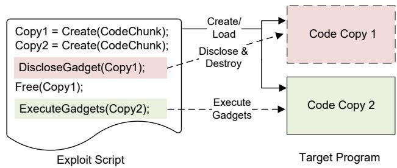  
Figure A3: An example of code inference attacks. Code copy 1 is only used for code disclosure, while code copy 2 is only used for gadgets execution.

For the exploits we collected from public databases and the vulnerable programs that can also be protected by Memory-Trap, we use the strategies in §6.1 to measure code page traversal results as well. Table A8 reveals a similar pattern to that of CVE-2013-2028: MemoryTrap leaves adversaries with little wiggle room to harvest all of the required gadgets, and only a few attempts get a chance to find at most one gadget. The data in Table 2 and Table A8 demonstrate that our booby trap insertion strategy is effective in preventing JIT-ROP gadget search.

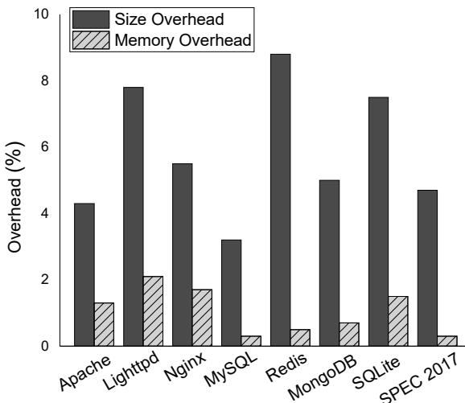  
Figure A4: Disk size and memory overhead of MemoryTrap.

## F Code Inference Attacks

Snow et al. [57] proposed four types of code inference attacks, rendering DCR ineffective. The core principle of code inference attacks is to disclose a segment of code without executing it directly. Instead, another piece of code that is strongly related to the disclosed code will be executed, such as an exact copy of the disclosed code residing in a different memory region, or relevant code that can be inferred based on the disclosed segment. The core idea of code inference attacks is to disclose a piece of code but not to execute it. Instead, another piece of code that is strongly related to it will be executed, such as an exact same copy of the disclosed code in a different memory area, or the relevant code that can be predicted based on the disclosed ones. As shown in Figure A3, adversaries maintain two copies of the same code, and they only disclose one copy to collect gadgets and execute the other copy. The four code inference attacks are as follow:

T1. JavaScript JIT Cloning: Load two copies of the same JIT code to disclose one copy and use the other.

T2. Shared Library Reloading: Disclose a library’s code and let it be destructed, and then reload it to use the previously disclosed code.

T3. Process Reloading: Disclose the code of an active process and then reload it to use the refreshed code.

T4. Implicit Reads: Disclose some code to infer the content of another code copy to avoid being destroyed.

## G Other Overhead

Since we insert booby traps into the program and attach the “.mtrap” section into the ELF file, the binary size will increase naturally. When executing the protected binary, the size of these contents are fixed after being loaded, and does not change during program execution. We measure the disk size and memory overhead for real-world applications and SPEC CPU 2017 benchmarks that are protected by Memory-Trap. Figure A4 shows the disk size and memory overhead. The disk size overhead rages from 3.2% to 8.8%, and the average disk size overhead is only 5.85%. Memory overhead is smaller than disk size overhead due to the allocation of stack and heap during the program execution. The memory overhead varies between 0.3% and 2.1%, with an average memory overhead that remains negligible at just 1.05%.

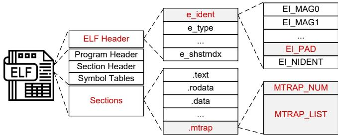  
Figure A5: New ELF format to record booby traps metadata.

When employing MemoryTrap with code randomization, in addition to code pointers, all booby trap pointers also need to be fixed to their shuffled positions, allowing the kernel to recognize the relocated booby trap positions. This introduces overhead during binary loading. To measure this overhead, we collect the booby trap count during compilation with our toolchain and determine the number of pointers requiring fixups using CCR’s toolchain [79]. The overhead is calculated by dividing the number of booby traps by the total number of pointers needing fixups. The average overhead for web servers, databases, and SPEC 2017 benchmarks is 5.67%, 2.78%, and 4.01%, respectively, demonstrating a minimal fixup burden. It is noteworthy that this overhead is a one-time cost and does not impact runtime performance.

## H New ELF Format

Figure A5 illustrates the new ELF file format we defined.