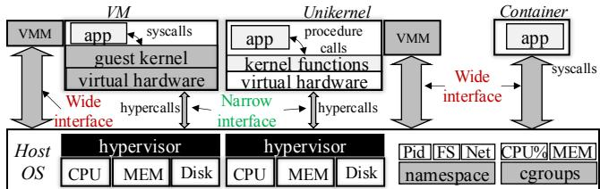
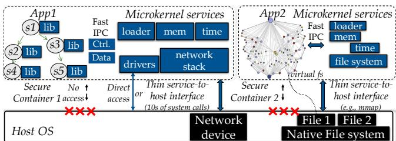
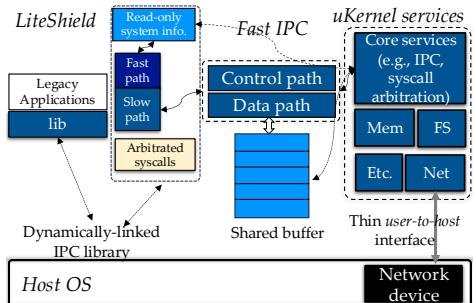
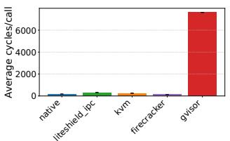
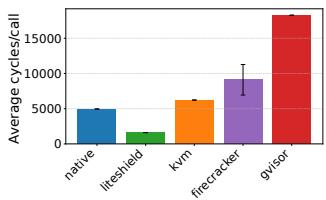
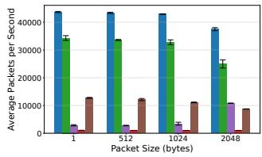
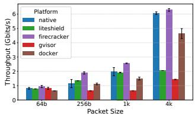
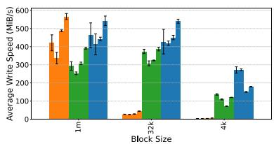
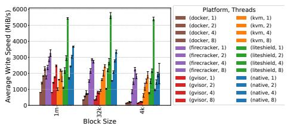
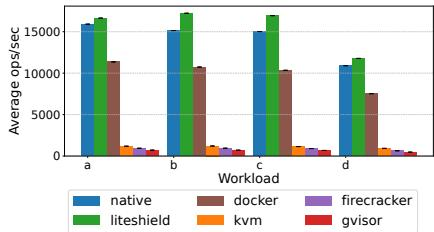

①

USENIX

THE ADVANCED COMPUTING SYSTEMS ASSOCIATION

# LITESHIELD: Secure Containers via Lightweight, Composable Userspace μKernel Services

Kaesi Manakkal, The University of Texas at Arlington; Nathan Daughety and Marcus Pendleton, Air Force Research Laboratory (AFRL); Hui Lu, The University of Texas at Arlington

https://www.usenix.org/conference/atc25/presentation/manakkal

# This paper is included in the Proceedings of the 2025 USENIX Annual Technical Conference.

July 7–9, 2025 • Boston, MA, USA ISBN 978-1-939133-48-9

Open access to the Proceedings of the 2025 USENIX Annual Technical Conference is sponsored by

P-Lr.h Es/"s

auuuJl9 Pgleu

King Abdullah University of

Science and Technology

# LITESHIELD: Secure Containers via Lightweight, Composable Userspace µKernel Services

Kaesi Manakkal, Nathan Daughety†, Marcus Pendleton†, Hui Lu The University of Texas at Arlington, †Air Force Research Laboratory (AFRL)

## Abstract

This paper introduces LITESHIELD, a new userspace isolation architecture for secure containers that reexamines the boundary between user applications and system services. LITESHIELD decouples traditional guest kernel functionality into modular userspace microkernel (µkernel) services that interact with guest applications via low-latency, sharedmemory-based inter-process communication (IPC). By serving most Linux syscalls in userspace, LITESHIELD enforces a significantly reduced user-to-host interface, with just 22 syscalls, achieving strong isolation comparable to virtual machines (VMs) while avoiding the complexity of hypervisors and hardware virtualization. LITESHIELD further provides a POSIX-compatible runtime with fine-grained syscall interception to support legacy applications and enables composable µkernel services that can integrate specialized userspace components (e.g., networking and filesystems). Our implementation demonstrates that LITESHIELD delivers strong isolation with performance comparable to traditional containers.

## 1 Introduction

Due to high portability, high density, and low operational cost, containers have been widely used for packaging, isolating, and multiplexing cloud applications. In contrast to virtual machines (VMs) (i.e., hypervisor-based virtualization), containers execute applications directly on the native host OS [8, 53, 61] and leverage kernel-level features, such as namespaces [23], cgroups [16], and seccomp [20], to enforce isolation between containerized applications. While the lack of guest OSes and virtual hardware abstraction makes containers lightweight, they cannot be directly adopted as the isolation mechanism in multi-tenancy clouds due to weak isolation – sharing the same host results in a large attack surface, e.g., 300+ system calls, or syscalls, in Linux. That is precisely why, in today’s production systems, containers are deployed within VMs for strong isolation [13, 37].

To address the tension between isolation and performance, recent efforts [28, 56, 62] adopt the technique of minimization, including tailoring a VM’s kernel with minimal components [28], linking a hosted application into a tiny unikernel image under a single address space [56], and attaching a userspace guest kernel (with a substantial portion of the Linux surface) to a container for VM-like isolation [62]. While these efforts have blurred the isolation boundaries of VMs and containers, they share some common limitations. First, maintaining a full guest kernel, even a minimized one, for each hosted entity remains inefficient. Second, different applications require access to specific functionalities of the guest kernel, rendering a “one-size-fits-all” guest kernel impractical, if not impossible. Third, since some guest kernels have been minimized or even degraded to provide system functions at the same level as userspace applications [56], these approaches rely solely on hypervisors for isolation. However, hypervisors have their share of vulnerabilities [27].

In this paper, we reexamine the isolation boundaries between user/kernel space for applications and kernel/system services and explore a new isolation architecture for secure containers, called LITESHIELD, to achieve lightweight yet strong isolation. Inspired by the microservices architecture, LITESHIELD decouples the closely-coupled guest kernel and its hosted applications, or guest applications, as looselycoupled entities. Such decoupling allows the guest kernel to operate as a collection of userspace microkernel (µkernel) services, each running as regular userspace processes. Communication between µkernel services and guest applications is facilitated through efficient userspace inter-process communication (IPC), eliminating costly syscalls.

The isolation architecture in LITESHIELD achieves strong isolation with minimal overhead. First, LITESHIELD achieves strong isolation by blocking direct host kernel access for guest applications. Instead, they are served by userspace µkernel services: By serving system services (e.g., networking and filesystems) in the userspace, the user-to-kernel interface – i.e., between µkernel services and the host – is significantly reduced (e.g., from 300+ syscalls to 20+) and comparable to VMs (e.g., 20+ hypercalls and 60+ VMExits). Even if a malicious guest application exploits a µkernel service (via userspace IPC), its access is limited to a restricted userspace process (i.e., defense in depth like VMs). As communication between guest applications and µkernel services is facilitated through userspace IPC, LITESHIELD removes the hypervisor and further reduces the attack surface. Further, by hosting system services in userspace, LITESHIELD replaces expensive cross-boundary invocation overheads (e.g., syscalls or VMExits/VMEntries) with fast (cache-to-cache) IPC. Last, LITESHIELD supports composable µkernel services, enabling seamless integration of specialized userspace approaches [41,44,47,48] to deliver highly efficient userspace system services, instead of relying solely on general-purpose, monolithic, and hard-to-optimize in-kernel services.

  
Figure 1: Comparisons of three representative isolation architectures: VMs, unikernels, and containers.

To ensure compatibility with existing commodity kernels (e.g., Linux) and legacy applications, LITESHIELD addresses several challenges: First, the Linux kernel’s implementation restricts certain syscalls (e.g., process and memory management) from being executed in a separate process, complicating the operation of µkernel services as independent userspace processes. To address this, LITESHIELD categorizes syscalls into delegable syscalls, which are redirected to LITESHIELD’s µkernel services for processing, and non-delegable syscalls, which are trapped, monitored, and validated before being executed within the same process via an arbitration mechanism. To further support legacy applications, LITESHIELD provides a POSIX-compatible library that supports runtime injection and fine-grained syscall interception, enabling seamless redirection of delegable syscalls from legacy applications to userspace µkernel services, without any binary modifications. Last, to achieve high performance, LITESHIELD employs a userspace IPC mechanism with a shared memory region and polling-based threads to facilitate low-latency communication between guest applications and µkernel services.

Our current implementation of LITESHIELD supports most of the Linux kernel syscalls in userspace required by regular guest applications (i.e., those not running with root privileges) and achieves a thin user-to-host interface with only 22 syscalls that need the support of the host kernel (compared to 20+ hypercalls and 64 VMExits for KVM-based VMs), while significantly reducing both the software codebase (eliminating the need for a hypervisor and QEMU-based emulator) and hardware complexity (requiring no hardware virtualization). We have ported an existing userspace network stack, f-stack [9], and implemented an ext2-like userspace filesystem as userspace networking and filesystem µkernel services. Porting f-stack to LITESHIELD only required 400+ lines of code. By leveraging lightweight userspace µkernel services and fast shared memory-based IPC between guest applications and µkernel services, LITESHIELD delivers performance comparable to traditional containers.

## 2 Motivation

## 2.1 Cloud Native and Isolation

IT companies are under constant pressure to simplify their product development with shortened production cycles to adapt to changing markets and diverse demands. Cloud-native technologies are poised to tackle this pressing challenge. First, developers decompose a traditional monolithic application into graphs of single-purpose, loosely-coupled microservices. As each microservice focuses on a small subset of the monolithic application’s functionality, this microservices-based architecture reduces development complexity and increases code velocity [1, 3, 4, 6, 12]. Further, cloud-native platforms deploy, manage, and scale microservices completely for cloud tenants, further liberating them from the management of virtual servers (i.e., serverless for tenants). The use of cloudnative technologies is becoming pervasive: Companies like Amazon, Netflix, Twitter, Uber, and eBay have adopted the microservices architecture [5, 7, 10, 17, 26]. In addition, a proliferation of serverless platforms enables a simple way, i.e., via Function-as-a-Service (FaaS), to build and execute cloud-native applications [2, 24, 25, 35, 36].

Isolation ensures safe resource sharing by preventing cloud tenants from accessing each other’s shared resources. Without enforcing isolation, a malicious user could steal sensitive information from victims [54, 60, 63, 64], or an aggressive user might degrade the performance of others [49].

State-of-the-art virtualization techniques provide isolation via full-blown VMs [14, 58], micro-VMs [28, 62], containers [8, 53, 61], microkernels [30, 43, 52], and unikernels [31,40,42,57]. As illustrated in Figure 1, VM-based virtualization achieves isolation through a virtual hardware interface, allowing each VM to operate with a fully functional guest operating system (OS). Since the virtual hardware interface differs from real hardware, it is further supervised by another software layer, the hypervisor. The virtualization architecture provides a strong security boundary between sandboxed applications in VMs due to: 1) a minimal attack surface between VMs and the native host (e.g., tens of hypercalls or VMExits); and 2) defense-in-depth, where both the guest OS and hypervisor contribute to security. However, this defense-in-depth approach introduces non-trivial performance overhead by layering guest kernels and hypervisors, resulting in costly inter-

DISTRIBUTION STATEMENT A. Approved for public release: Distribution unlimited. Case Number AFRL-2025-0650. Dated 06 Feb 2025.

actions across multiple layers of the virtualization stack for CPU, memory, and I/O virtualization. Microkernels improve isolation by minimizing kernel functionality and shifting OS services, such as file systems and drivers, to userspace, reducing the attack surface and improving fault isolation. Notably, seL4 [43] offers formal verification guarantees, while systems like Barrelfish [30] and Arrakis [52] extend this model to multicore and I/O-optimized architectures. Though well-suited for specialized, high-assurance systems, microkernels often face challenges with performance due to IPC overhead and supporting legacy applications. These factors limit usability in general-purpose cloud-native environments.

In contrast, containers execute applications directly on the native host OS [8, 53, 61]. Kernel-level features, e.g., namespaces [23], cgroups [16], and seccomp [20], enforce isolation between containerized applications. While the lack of virtual hardware abstraction makes containers lightweight, they cannot be directly adopted as the isolation mechanism in multi-tenant clouds due to weak isolation – i.e., sharing the same host results in a large attack surface (e.g., 400+ system calls, or syscalls, in Linux). While modern OSes have a “whitelisting” mechanism (e.g., seccomp) allowing containers to transition into a restricted mode with a narrowed syscall interface, the common problem is that it is difficult to determine what syscalls an application may use. Default whitelisting policies still tend to be large, e.g., 250+ syscalls [21].

Recent efforts [28, 50, 62] aim to balance isolation and performance through minimization. For example, AWS’s Firecracker [28] optimizes a VM’s kernel by including only essential components and adopting a simplified I/O model. NEC’s LightVM [50] integrates a hosted application into a minimal unikernel image within a single address space for greater efficiency. Google’s gVisor [62] employs a userspace guest kernel, incorporating a significant portion of the Linux interface, to provide VM-like isolation for containers.

## 2.2 Limitations

Unfortunately, cloud native presents new and pressing challenges to existing virtualization techniques. 1) High performance overhead: Unlike monolithic applications, a cloudnative application consists of numerous distributed microservices, each requiring sandboxing, which significantly amplifies the performance overhead and memory footprint. Moreover, virtualization overhead becomes more pronounced compared to monolithic applications, as each hosted microservice is typically smaller and more ephemeral (e.g., high startup overhead). 2) Generality vs. specialization: The increasing diversity of microservices necessitates specialized system services, such as customized network stacks [51] or specialized file systems [47]. However, existing virtualization techniques for isolation continue to rely on general-purpose, one-sizefits-all guest kernels. While these kernels are often highly optimized [28], they struggle to meet the varied and specific requirements of diverse microservices. Furthermore, despite recent advancements in high-performance networking and file systems [41, 47, 51], there is no practical way to seamlessly integrate these technologies with general applications or microservices. 3) Large attack surface. Although the userto-host interface for VM-based virtualization is thin, the code responsible for virtualization and isolation remains large. This includes both the hypervisor, which resides in the host kernel (i.e., type-2 hypervisor) and interacts with hardware mainly for CPU and memory management, and the QEMU-based Virtual Machine Monitor (VMM), which operates in userspace primarily for device emulation. According to the Common Vulnerabilities and Exposures (CVE) database, 184 vulnerabilities have been reported in major hypervisors (e.g., Xen, KVM, Hyper-V) since 2007, with 33% of these occurring in the past 1.5 years. Additionally, the VMM is huge (e.g., QEMU-based VMM has more than 1.4 million lines of code) and can access the host via the whole syscall interface.

## 2.3 Threat Model and Assumptions

In this paper, we focus on security vulnerabilities and isolation mechanisms in general-purpose monolithic kernels (e.g., Linux). We share the common isolation assumptions as VMs/unikernels [56, 62]: We trust fundamental hardwarebased protections – such as page tables and CPU execution modes – that ensure strong isolation between different processes and between user and kernel execution within the same process. We focus on software deficiencies in host kernels, guest kernels, and hypervisors that can be exploited through their exposed user-to-host interfaces, namely, system calls and hypercalls, which constitute the main attack surface. Therefore, our threat model is that one malicious user could break out of the isolation by compromising the user-to-host interface. Two metrics are used to evaluate the attack surface: 1) the size of the user-to-host interface and 2) the amount of code accessible through the interface. Other attacks, such as covert channels and side channels, pose security risks by enabling unauthorized communication and information leakage through unconventional pathways. Existing software-based isolation approaches, including VMs, microVMs, unikernels, and others, are susceptible to these attacks. Although eliminating all side and covert channels is challenging due to the complexity of hardware and software interactions, existing measures, such as secure hardware designs, strict resource isolation, and the introduction of system randomness, can be orthogonally applied to software-based isolation approaches.

## 3 Design of LITESHIELD

We present LITESHIELD, a novel sandboxing architecture providing strong yet lightweight isolation for secure containers. Drawing inspiration from the microservice architecture, LITESHIELD offers on-demand, composable guest kernel/system services to cloud-native applications, functioning

DISTRIBUTION STATEMENT A. Approved for public release: Distribution unlimited. Case Number AFRL-2025-0650. Dated 06 Feb 2025.

  
Figure 2: Architecture of LITESHIELD.

as userspace microkernel (µkernel) services. (Figure 2).

LITESHIELD’s core innovation lies in decoupling guest applications from their hosting guest kernels, running them as separate userspace entities. Each application process acts as a client, while all required µkernel services are combined to provide system services. Clients interact with userspace µkernel services through fast inter-process communication (IPC) channels (§3.2). System calls made by a guest application are intercepted and redirected to the appropriate userspace µkernel service, which handles the request mostly within the userspace while only contacting the host kernel for (a limited number of) privileged operations, resulting in a thin user-to-host interface (comparable to VMs). To prevent malicious applications from bypassing the interception library and making direct system calls to the host kernel, LITESHIELD employs seccomp [20], effectively blocking unauthorized “direct” syscalls.

LITESHIELD inherits advantages from the microservices architecture, such as modular development, flexible deployment, and rapid iteration. Userspace µkernel services can be gradually and individually developed, extended, replaced, customized, and integrated with other existing/ongoing userspace systems [41, 47, 51]. In addition, while hardware specialization is accelerating in cloud [18], LITESHIELD can quickly support specialized hardware (e.g., GPU, smart NICs, and persistent memory) with userspace support, making new, advanced hardware accessible by specific cloud-native applications (e.g., machine learning tasks).

## 3.1 Strong Isolation via Thin Interface

As shown in Figure 2, LITESHIELD achieves a level of isolation comparable to VMs and unikernels, maintaining a similarly thin user-to-host interface (i.e., requiring tens of syscalls to the host, compared to 300+ for containers).

First, guest applications have no direct access to the host kernel. LITESHIELD enforces this restriction by using seccomp to block all direct syscalls from guest applications, i.e., by applying a seccomp profile that denies all syscalls by default. Second, userspace µkernel services are permitted to access the host kernel when necessary. To ensure that the user-to-host interface remains thin, seccomp is also applied to these services, allowing only a minimal set of explicitly defined syscalls through a restrictive profile. The rationale is simple: “the more done in userspace, the less needed in the kernel”. For example, the unikernel approach [56] reduces syscall or hypercall usage to fewer than ten by shifting most system functions into userspace. Similarly, LITESHIELD performs most guest kernel functions, such as file and filesystem management, networking, and IPC, entirely within userspace, thereby minimizing interactions with the host kernel and achieving a thin user-to-host interface.

  
Figure 3: Fast userspace inter-process communication (IPC).

Unlike the unikernel approach, which embeds guest kernel functions in the same address space as guest applications, LITESHIELD executes these functions within more flexible and independent µkernel services. However, certain syscalls, namely non-delegable ones, must be executed within the context of the same process, such as process management (e.g., fork, clone, wait, and exit) and memory management (e.g., mmap, munmap, mprotect, msync, and madvise). A straightforward solution would make the kernel LITESHIELD-aware by introducing kernel support to convert non-delegable syscalls to delegable ones, allowing them to execute in the context of another process. LITESHIELD, instead, focuses on compatibility with the unmodified Linux kernel and realizes an arbitration mechanism to handle the execution of the non-delegable syscalls. Specifically, LITESHIELD permits guest applications to execute non-delegable syscalls by explicitly allowing them in the seccomp profile. However, it leverages Linux’s ptrace mechanism to trap and monitor these syscalls through LITESHIELD’s core µkernel service (§3.3). When a guest application is launched, it is registered as a tracee of the core µkernel service before execution begins. Thus, any subsequent invocation of a non-delegable syscall is intercepted by the core service, allowing LITESHIELD to perform sanity checks or other forms of inspection [34, 38] before permitting the syscall to proceed. This mechanism enables fine-grained monitoring of non-delegable syscalls while maintaining compatibility with the existing Linux kernel.

Since guest applications can only access the host kernel via LITESHIELD, even if a malicious guest application exploits a bug in a µkernel service of LITESHIELD (e.g., through IPC channels), it can only gain access to a restricted userspace process (i.e., defense in depth). As the communication between guest applications and µkernel services is through userspace IPCs or arbitrated syscalls, LITESHIELD eliminates the hypervisor, further minimizing the attack surface for isolation.

DISTRIBUTION STATEMENT A. Approved for public release: Distribution unlimited. Case Number AFRL-2025-0650. Dated 06 Feb 2025.

## 3.2 Lightweight Isolation via Fast IPCs

One key goal of LITESHIELD is to provide strong isolation with much less overhead than VM/unikernel-based isolation to legacy applications, better, with performance comparable to that of “lightweight” containers.

Containerized applications request system services via syscalls from the kernel space. This mechanism is actually costly, as it involves same-core user/kernel mode transitions, cache pollution, and data movement across the kernel/user space, consuming microseconds [55]. In addition, the “onesize-fits-all” monolithic kernel services could be suboptimal for many new application scenarios [45, 46]. The generality of monolithic kernels makes optimization difficult, and vertical integration efforts are often broken by upstream changes [51]. On the other hand, recent userspace and hybrid approaches [32, 39, 41, 44, 47, 48, 59] have been proposed to mitigate such overhead by redistributing functions between user and kernel space, demonstrating superior performance compared to in-kernel services. Following this direction, LITESHIELD runs most kernel services in userspace, achieving a thin user-to-host interface (and strong isolation) while also enabling the potential for high performance through various specialized userspace approaches.

Guest applications request system services from userspace µkernel services through IPC channels, instead of syscalls. As shown in Figure 3, LITESHIELD develops a high-performance shared-memory-based IPC mechanism for fast system service delivery. First, each application is assigned a shared memory buffer. When an application makes a request, it places the syscall number and arguments in the shared buffer and toggles a flag to let the µkernel services know that a request has been made. Once the request has been completed, the µkernel service puts the response in this buffer and toggles the flag to let the guest application know it is done. This approach draws inspiration from existing userspace communication techniques, e.g., RDMA, and incorporates a polling-based mechanism to reduce communication latency: A core µkernel service for IPCs employs a dedicated polling thread to continuously monitor for incoming IPC requests from guest application processes. Upon detection of a request, this thread promptly handles it – by forwarding it to one of the composable userspace µkernel services (e.g., networking or file systems). Similarly, application processes use another polling thread to actively wait for and immediately process responses from the IPC µkernel service. Second, LITESHIELD leverages a multi-core system (common today) to place application processes and userspace µkernel services on separate cores – i.e., avoiding same-core context switches. This separation precludes context switching on the same core and further minimizes communication latency between guest applications and µkernel services. Since the context switch overhead for userspace processes is typically lower than that of virtual CPUs, LITESHIELD’s userspace solution is expected to outperform VMs even with core multiplexing. Finally, the communication latency under the proposed shared-memory-based IPC mechanism mainly hinges on the memory access latency. If the cores for the application and the userspace µkernel services are situated on the same CPU, this configuration can capitalize on the last-level cache (LLC) to expedite IPC (i.e., cache-to-cache transfers that typically require only tens of CPU cycles [55]).

Moreover, LITESHIELD provides a POSIX-compatible library that combines LD\_PRELOAD and the binary translation capabilities of the libsyscall\_intercept library [15]. The LD\_PRELOAD mechanism allows the library to be injected into the address space of legacy applications at runtime, enabling it to override standard library functions (i.e., glibc) and intercept system calls. Meanwhile, libsyscall\_intercept provides fine-grained control over syscall interception by hooking directly into the syscall execution path using inline hooking and binary rewriting techniques. This combined approach enables LITESHIELD to dynamically link the library to legacy applications – without any modifications to the binaries – and intercept delegable syscalls. The intercepted syscalls are redirected to the IPC shared buffer, where LITESHIELD facilitates communication with its µkernel services.

Like FlexSC [55], LITESHIELD aims to improve syscall performance by rethinking the traditional syscall interface. However, they take different architectural approaches. FlexSC introduces exception-less system calls that batch syscall execution and decouple it from the application thread, reducing kernel traps and improving throughput on multicore systems. In contrast, LITESHIELD decomposes traditional kernel functionality into userspace µkernel services and uses fast userspace IPC and selective syscall trapping (via ptrace) to intercept and redirect syscalls, maintaining compatibility with unmodified Linux and legacy applications.

## 3.3 Userspace µKernel Services

As illustrated in Figure 3, LITESHIELD’s µkernel services are divided into two categories: core services and composable services. Core services, such as IPC, syscall arbitration, time management, and memory management, provide essential µkernel functionality required by every guest application. In contrast, composable services, including file, device, and networking management, are provided on demand. Integrating existing and new userspace approaches into LITESHIELD as composable µkernel services is straightforward.

We have integrated the DPDK-based userspace network stack, f-stack [9], into LITESHIELD. First, we extended LITESHIELD to fetch syscall requests from the IPC shared buffer and enqueue them in a separate operation queue for f-stack to process. Further modifications were made to f-stack’s main network processing loop to monitor the operation queue and handle any received network requests. Once processed, the results are placed back into the IPC shared buffer, where the guest application can retrieve them.

DISTRIBUTION STATEMENT A. Approved for public release: Distribution unlimited. Case Number AFRL-2025-0650. Dated 06 Feb 2025.

  
(a) getpid.

  
(b) read.

Figure 4: Syscall latency comparisons.  
  
(a) UDP.

  
(b) TCP.  
Figure 5: Network performance comparisons, on UDP and TCP protocols, with different packet sizes.

f-stack primarily processes packets in userspace, interacting with the underlying network device only when necessary (e.g., for sending packets) through a limited syscall interface (e.g., read and write). Each instance of f-stack is bound to a software tap device, enabling the sharing of a physical network card across multiple containers. Last, f-stack supports direct use of a physical NIC for scenarios requiring dedicated access. We have also implemented and integrated a userspace filesystem, compatible with ext2 [22], into LITESHIELD.

Table 1: Ptrace overhead for non-delegable syscalls.
<table><tr><td>Syscall</td><td>Syscall lat (us)</td><td>Ptrace lat (us)</td><td>Ptrace overhead</td></tr><tr><td>mmap</td><td>0.220</td><td>25.485</td><td>99.1%</td></tr><tr><td>fork</td><td>40.553</td><td>35.656</td><td>46.8%</td></tr><tr><td>clock_nanosleep</td><td>56.896</td><td>23.256</td><td>29.0%</td></tr><tr><td>futex</td><td>0.254</td><td>15.476</td><td>98.4%</td></tr></table>

## 4 Evaluation

We have implemented LITESHIELD in approximately 7,000 lines of C/C++ code 1. Currently, LITESHIELD supports the redirection or arbitration of around 170 Linux kernel syscalls, including 142 delegable and 28 non-delegable ones. Most of the remaining unsupported syscalls (approximately 132) require root privileges from guest applications. LITESHIELD’s modular design allows for the incremental addition of support for these syscalls. The user-to-host interface in LITESHIELD is thin, requiring only 22 syscalls – compared to 60+ VMExits for KVM-based VMs and 250+ syscalls in the default seccomp whitelist for containers. Please refer to Appendix A for a more detailed breakdown. We have evaluated the effectiveness of LITESHIELD by comparing it with state-ofthe-art isolation mechanisms, including Docker containers [8], KVM-based VMs [14], Firecracker [28], and gVisor [62]. Testbed. We conducted our experiments on a platform with an Intel Xeon Gold 6430 CPU, 96GB DDR5 RAM, and a Micron 7450 NVMe SSD (ext4), running Ubuntu 22.04 with Linux kernel 5.15. Hyperthreading was disabled, and resources were configured to avoid bottlenecks. KVM tests used 16 vCPUs, 32GB RAM, and a virtio disk in direct sync cache mode with the same OS as the host. gVisor [62] (v1.10.1) was tested in systrap mode with Docker support, while Firecracker [28] (v1.10.1) was tested with an Ubuntu 24.04 root filesystem on Linux kernel 5.10, configured with 16 vCPUs and 32GB RAM. Docker containers and LITESHIELD were constrained to 16 cores and 32GB RAM using cgroup [16].

Syscall latency. We evaluated syscall performance using two representative syscalls: a simple syscall, getpid, and a complex syscall, read. Figure 4a shows the average latency of invoking getpid one million times – LITESHIELD achieves significantly lower latency than the user-level isolation mechanism gVisor due to its fast IPC mechanism, while maintaining comparable latency to other VM-based approaches for this simple syscall. Figure 4b illustrates the average time to read 1 byte from each block of a 4GB file. For this complex syscall, LITESHIELD outperforms VM-based approaches, as read triggers VMExits in VMs, incurring high context-switch overhead. Further, LITESHIELD surpasses native performance due to its specialized, lightweight userspace filesystem.

Ptrace overhead. We evaluated the performance impact of LITESHIELD’s ptrace-based arbitration mechanism for nondelegable syscalls. As shown in Table ??, we selected one representative syscall from each of the four main classes of non-delegable syscalls: process management, memory management, timing, and locking. On average, ptrace introduces 15–35µs of overhead, with the effect being more pronounced for lightweight syscalls (e.g., mmap and futex) and less significant for heavier ones (e.g., fork and clock). We note that these syscalls are generally invoked infrequently. In future work (§5), we plan to convert these non-delegable syscalls into delegable ones to eliminate this overhead.

Userspace networking. We evaluated the performance of LITESHIELD’s userspace network stack, ported from f-stack. Figure 5a illustrates UDP network performance (packets/second) with a client sending UDP packets of various sizes to a server hosted under different isolation approaches. We used a pair of connected virtual interfaces (i.e., veth) to connect the virtual NICs of the client and server. LITESHIELD outperforms all other isolation mechanisms, with performance slightly below native, due to the highly optimized userspace network stack provided by f-stack. Figure 5b shows TCP performance using iperf [11], with one instance as the client and another as the server hosted under those same isolation

DISTRIBUTION STATEMENT A. Approved for public release: Distribution unlimited. Case Number AFRL-2025-0650. Dated 06 Feb 2025.

  
(a) Direct IO.

  
(b) Cached IO.

  
Figure 7: YCSB [33] performance on Redis [19] with different workloads.  
Figure 6: Performance for writing a 4GB file with various threads and block sizes.

approaches. While LITESHIELD delivers comparable performance for small packets, it falls behind the microVM approach (e.g., Firecracker) for larger packets because f-stack lacks the GRO feature. GRO reduces packet processing overhead for large packets by merging multiple small packets before processing, but it may introduce latency for small packets, highlighting the lack of a “one-size-fits-all” solution. With LITESHIELD, however, guest applications can select µkernel services tailored to their specific requirements.

Userspace filesystem. We evaluated the performance of LITESHIELD ’s userspace filesystem, developed from scratch to emulate the functionality of an in-kernel ext2 filesystem. Using fio [29] (version 3.28), we conducted two types of write I/O tests: 1) cached I/O, where data is written to the page cache and asynchronously flushed to disk, and 2) direct I/O (with O\_DIRECT), which bypasses the page cache and reaches the disk directly. The fio benchmarks were run with multiple threads accessing a single 4GB file using various block sizes.

For VM-based approaches (e.g., gVisor and Firecracker), direct I/O (O\_DIRECT) bypasses the VM’s page cache but can still be buffered by the host’s page cache, causing double caching and hindering direct persistence to disk. In contrast, with userspace isolation, LITESHIELD completely eliminates double caching. As shown in Figure 6a, LITESHIELD achieves higher write performance than KVM (we explicitly configured QEMU to enforce direct writes for its disk) and native setups for smaller block sizes, with slightly lower performance for very large block sizes (e.g., 1MB). For cached I/O, Figure 6b shows that LITESHIELD demonstrates better scalability than other approaches as the thread number increases. This is because LITESHIELD’s userspace filesystem has a greatly simplified and efficient page cache mechanism. Real-world applications. We evaluated the performance of a real-world application, Redis [19] v6.0.16, on LITESHIELD (with both networking and filesystem µkernel services) using YCSB v0.18.0 [33] by executing four distinct workloads: Workloads A (50% reads, 50% updates), B (95% reads, 5% updates), C (95% reads, 5% inserts), and D (50% reads, 50% read-modify-write). Figure 7 shows that LITESHIELD achieves higher performance compared to native execution. This improvement is primarily due to the reduced overhead of IPC versus traditional syscalls, particularly for complex operations. In contrast, this overhead in alternative isolation solutions, such as Firecracker and gVisor, is more pronounced, resulting in inferior performance.

## 5 Conclusions and Future Work

We present LITESHIELD, an effort to explore to what extent guest applications can be isolated in userspace without requiring kernel or application modifications. LITESHIELD achieves this by decoupling guest applications from their guest kernels and offering guest kernel services as a collection of userspace µkernel services. It ensures strong isolation through a thin user-to-host interface and delivers high performance with specialized userspace µkernel services.

Despite its effectiveness, LITESHIELD has several limitations that suggest directions for future work. First, the ptracebased arbitration mechanism introduces overhead for nondelegable system calls. While we consider this a reasonable trade-off to achieve performance, compatibility, and isolation, future kernel support could eliminate this overhead by converting non-delegable syscalls into delegable ones. Rather than modifying the host kernel to introduce new contextaware variants of these syscalls, we are exploring a more transparent solution: leveraging a kernel module to detect whether non-delegable syscalls originate from LITESHIELD’s µkernel services. When such calls are identified, they could be dynamically converted into context-aware syscalls. Furthermore, statically linked applications, including those with custom libc implementations or inline assembly system call instructions, may bypass LITESHIELD’s interception library, resulting in failures due to seccomp blocking. To address this issue, we are exploring a “hotpatching” technique that disassembles system call instructions in statically linked processes and replaces them with hooks that redirect the calls to LITESHIELD’s IPC mechanisms.

## 6 Acknowledgments

We thank our shepherd, Kevin Pedretti, and the anonymous reviewers for their valuable feedback. We also thank Fotis Antonatos for his early contributions to this project. This work was supported by the Air Force Research Laboratory (AFRL) under Awards FA8750-24-2-0001 and FA8750-25-C-B038, and by the National Science Foundation (NSF) under Awards CCF-2415473 and CNS-2415774.

DISTRIBUTION STATEMENT A. Approved for public release: Distribution unlimited. Case Number AFRL-2025-0650. Dated 06 Feb 2025.

## References

[1] 5 principles for cloud-native architecture—what it is and how to master it. https://cloud.google.com/blo g/products/application-development/5-princ iples-for-cloud-native-architecture-what-i t-is-and-how-to-master-it.

[2] AWS Lambda:Run code without thinking about servers. Pay only for the compute time you consume. https: //aws.amazon.com/lambda/.

[3] Cloud native applications: Ship faster, reduce risk, and grow your business. https://tanzu.vmware.com/c loud-native.

[4] Cncf cloud native definition v1.0. https://github.c om/cncf/toc/blob/main/DEFINITION.md.

[5] Decomposing twitter: Adventures in service-oriented architecture. https://www.infoq.com/presentati ons/twitter-soa/.

[6] Defining cloud native. https://docs.microsoft.c om/en-us/dotnet/architecture/cloud-native/ definition.

[7] A design analysis of cloud-based microservices architecture at netflix. https://medium.com/swlh/a-des ign-analysis-of-cloud-based-microservices -architecture-at-netflix-98836b2da45f.

[8] The docker container. https://www.docker.com/.

[9] f-stack. https://www.f-stack.org/.

[10] Introducing domain-oriented microservice architecture. https://eng.uber.com/microservice-archite cture/.

[11] iperf - the ultimate speed test tool for tcp, udp and sctp. https://iperf.fr/.

[12] Journey to being cloud-native – how and where should you start? https://aws.amazon.com/blogs/apn/j ourney-to-being-cloud-native-how-and-where -should-you-start/.

[13] Kata containers. https://github.com/kata-conta iners.

[14] Kernel based virtual machine. http://www.linux-k vm.org/.

[15] libsyscall\_intercept. https://github.com/pmem/sy scall\_intercept.

[16] Linux control groups. https://www.kernel.org/d oc/Documentation/cgroup-v1/cgroups.txt.

[17] Microservices at ebay-what it looks like today. https: //www.sayonetech.com/blog/microservices-eba y/.

[18] A new golden age for computer architecture. https: //cacm.acm.org/magazines/2019/2/234352-a-n ew-golden-age-for-computer-architecture/fu lltext.

[19] Redis. https://redis.io/.

[20] Seccomp bpf (secure computing with filters). https: //www.kernel.org/doc/html/v5.1/userspace-a pi/seccomp\_filter.html.

[21] Seccomp security profiles for docker. https://docs .docker.com/engine/security/seccomp/.

[22] The second extended filesystem. https://docs.ker nel.org/filesystems/ext2.html.

[23] Separation Anxiety: A Tutorial for Isolating Your System with Linux Namespaces. https://www.toptal.c om/linux/separation-anxiety-isolating-you r-system-with-linux-namespaces.

[24] Serverless. https://cloud.google.com/serverles s/.

[25] Serverless computing. https://azure.microsoft. com/en-us/overview/serverless-computing/.

[26] What led amazon to its own microservices architecture. https://thenewstack.io/led-amazon-microse rvices-architecture/.

[27] Common Vulnerabilities and Exposures: Hypervisors. http://cve.mitre.org/cgi-bin/cvekey.cgi?ke yword=hypervisor.

[28] AGACHE, A., BROOKER, M., IORDACHE, A., LIGUORI, A., NEUGEBAUER, R., PIWONKA, P., AND POPA, D.-M. Firecracker: Lightweight virtualization for serverless applications. In 17th USENIX Symposium on Networked Systems Design and Implementation (NSDI 20) (Santa Clara, CA, Feb. 2020), USENIX Association, pp. 419–434.

[29] AXBOE, J. Flexible i/o tester. https://github.com /axboe/fio.

[30] BAUMANN, A., BARHAM, P., DAGAND, P.-E., HAR-RIS, T., ISAACS, R., PETER, S., ROSCOE, T., SCHÜP-BACH, A., AND SINGHANIA, A. The multikernel: a new os architecture for scalable multicore systems. In Proceedings of the ACM SIGOPS 22nd Symposium on Operating Systems Principles (New York, NY, USA, 2009), SOSP ’09, Association for Computing Machinery, p. 29–44.

DISTRIBUTION STATEMENT A. Approved for public release: Distribution unlimited. Case Number AFRL-2025-0650. Dated 06 Feb 2025.

[31] BRATTERUD, A., WALLA, A.-A., HAUGERUD, H., EN-GELSTAD, P. E., AND BEGNUM, K. Includeos: A minimal, resource efficient unikernel for cloud services. CLOUDCOM ’15, IEEE Computer Society, p. 250–257.

[32] CHEN, Y., SHU, J., OU, J., AND LU, Y. Hinfs: A persistent memory file system with both buffering and directaccess. ACM Trans. Storage 14, 1 (apr 2018).

[33] COOPER, B. Yahoo! cloud serving benchmark. https: //github.com/brianfrankcooper/YCSB.

[34] DEMARINIS, N., WILLIAMS-KING, K., JIN, D., FON-SECA, R., AND KEMERLIS, V. P. sysfilter: Automated system call filtering for commodity software. In 23rd International Symposium on Research in Attacks, Intrusions and Defenses (RAID 2020) (San Sebastian, Oct. 2020), USENIX Association, pp. 459–474.

[35] ELLIS, A. Introducing Functions as a Service (Open-FaaS). https://blog.alexellis.io/introducin g-functions-as-a-service/.

[36] HENDRICKSON, S., STURDEVANT, S., HARTER, T., VENKATARAMANI, V., ARPACI-DUSSEAU, A. C., AND ARPACI-DUSSEAU, R. H. Serverless computation with openlambda. Elastic 60, 80.

[37] HUANG, H., LAI, J., RAO, J., LU, H., HOU, W., SU, H., XU, Q., ZHONG, J., ZENG, J., WANG, X., HE, Z., HAN, W., LIU, J., MA, T., AND WU, S. Pvm: Efficient shadow paging for deploying secure containers in cloud-native environment. In Proceedings of the 29th Symposium on Operating Systems Principles (New York, NY, USA, 2023), SOSP ’23, Association for Computing Machinery, p. 515–530.

[38] JACOBS, A., GÜLMEZ, M., ANDRIES, A., VOLCK-AERT, S., AND VOULIMENEAS, A. System call interposition without compromise. In 2024 54th Annual IEEE/IFIP International Conference on Dependable Systems and Networks (DSN) (2024), pp. 183–194.

[39] KADEKODI, R., LEE, S. K., KASHYAP, S., KIM, T., KOLLI, A., AND CHIDAMBARAM, V. Splitfs: Reducing software overhead in file systems for persistent memory. In Proceedings of the 27th ACM Symposium on Operating Systems Principles (New York, NY, USA, 2019), SOSP ’19, Association for Computing Machinery, p. 494–508.

[40] KANTEE, A. The Design and Implementation of the Anykernel and Rump Kernels, 2nd Edition. http://bo ok.rumpkernel.org.

[41] KAUFMANN, A., STAMLER, T., PETER, S., SHARMA, N. K., KRISHNAMURTHY, A., AND ANDERSON, T. Tas: Tcp acceleration as an os service. In Proceedings of the Fourteenth EuroSys Conference 2019 (New York, NY, USA, 2019), EuroSys ’19, Association for Computing Machinery.

[42] KIVITY, A., LAOR, D., COSTA, G., ENBERG, P., HAR’EL, N., MARTI, D., AND ZOLOTAROV, V. Osv—optimizing the operating system for virtual machines. In 2014 USENIX Annual Technical Conference (USENIX ATC 14) (Philadelphia, PA, June 2014), USENIX Association, pp. 61–72.

[43] KLEIN, G., ELPHINSTONE, K., HEISER, G., ANDRON-ICK, J., COCK, D., DERRIN, P., ELKADUWE, D., EN-GELHARDT, K., HUUCK, R., MURRAY, T. C., SEWELL, T., TUCH, H., AND WINWOOD, S. seL4: Formal verification of an OS kernel. In Proceedings of the ACM SIGOPS 22nd Symposium on Operating Systems Principles (SOSP) (Big Sky, Montana, USA, 2009), ACM, pp. 207–220.

[44] KWON, Y., FINGLER, H., HUNT, T., PETER, S., WITCHEL, E., AND ANDERSON, T. Strata: A cross media file system. In Proceedings of the 26th Symposium on Operating Systems Principles (New York, NY, USA, 2017), SOSP ’17, Association for Computing Machinery, p. 460–477.

[45] LEI, J., MUNIKAR, M., SUO, K., LU, H., AND RAO, J. Parallelizing packet processing in container overlay networks. In Proceedings of the Sixteenth European Conference on Computer Systems (New York, NY, USA, 2021), EuroSys ’21, Association for Computing Machinery, p. 261–276.

[46] LEI, J., SUO, K., LU, H., AND RAO, J. Tackling parallelization challenges of kernel network stack for container overlay networks. In 11th USENIX Workshop on Hot Topics in Cloud Computing (HotCloud 19) (Renton, WA, July 2019), USENIX Association.

[47] LIU, J., REBELLO, A., DAI, Y., YE, C., KANNAN, S., ARPACI-DUSSEAU, A. C., AND ARPACI-DUSSEAU, R. H. Scale and performance in a filesystem semimicrokernel. In Proceedings of the ACM SIGOPS 28th Symposium on Operating Systems Principles (New York, NY, USA, 2021), SOSP ’21, Association for Computing Machinery, p. 819–835.

[48] LIU, J., REBELLO, A., DAI, Y., YE, C., KANNAN, S., ARPACI-DUSSEAU, A. C., AND ARPACI-DUSSEAU, R. H. Scale and performance in a filesystem semimicrokernel. SOSP ’21, Association for Computing Machinery, p. 819–835.

DISTRIBUTION STATEMENT A. Approved for public release: Distribution unlimited. Case Number AFRL-2025-0650. Dated 06 Feb 2025.

[49] LU, H., SALTAFORMAGGIO, B., KOMPELLA, R., AND XU, D. vFair: Latency-aware fair storage scheduling via per-io cost-based differentiation. In Proceedings of the 6th ACM Symposium on Cloud Computing (2015).

[50] MANCO, F., LUPU, C., SCHMIDT, F., MENDES, J., KUENZER, S., SATI, S., YASUKATA, K., RAICIU, C., AND HUICI, F. My vm is lighter (and safer) than your container. In Proceedings of the 26th Symposium on Operating Systems Principles (2017), pp. 218–233.

[51] MARTY, M., DE KRUIJF, M., ADRIAENS, J., ALFELD, C., BAUER, S., CONTAVALLI, C., DALTON, M., DUKKIPATI, N., EVANS, W. C., GRIBBLE, S., KIDD, N., KONONOV, R., KUMAR, G., MAUER, C., MUSICK, E., OLSON, L., RUBOW, E., RYAN, M., SPRINGBORN, K., TURNER, P., VALANCIUS, V., WANG, X., AND VAHDAT, A. Snap: a microkernel approach to host networking. In Proceedings of the 27th ACM Symposium on Operating Systems Principles (New York, NY, USA, 2019), SOSP ’19, Association for Computing Machinery, p. 399–413.

[52] PETER, S., LI, J., ZHANG, I., PORTS, D. R. K., WOOS, D., KRISHNAMURTHY, A., ANDERSON, T., AND ROSCOE, T. Arrakis: The operating system is the control plane. In 11th USENIX Symposium on Operating Systems Design and Implementation (OSDI 14) (Broomfield, CO, 2014), USENIX Association, pp. 1– 16.

[53] RAHO, M., SPYRIDAKIS, A., PAOLINO, M., AND RAHO, D. Kvm, xen and docker: A performance analysis for arm based nfv and cloud computing. In Information, Electronic and Electrical Engineering (AIEEE), 2015 IEEE 3rd Workshop on Advances in (2015), IEEE, pp. 1–8.

[54] RISTENPART, T., TROMER, E., SHACHAM, H., AND SAVAGE, S. Hey, you, get off of my cloud: exploring information leakage in third-party compute clouds. In Proceedings of the 16th ACM conference on Computer and communications security (2009), pp. 199–212.

[55] SOARES, L., AND STUMM, M. FlexSC: Flexible system call scheduling with Exception-Less system calls. In 9th USENIX Symposium on Operating Systems Design and Implementation (OSDI 10) (Vancouver, BC, Oct. 2010), USENIX Association.

[56] WILLIAMS, D., KOLLER, R., LUCINA, M., AND PRAKASH, N. Unikernels as processes. In Proceedings of the ACM Symposium on Cloud Computing (New York, NY, USA, 2018), SoCC ’18, Association for Computing Machinery, p. 199–211.

[57] WILLIAMS, D., KOLLER, R., LUCINA, M., AND PRAKASH, N. Unikernels as processes. In Proceedings of the ACM Symposium on Cloud Computing (New York, NY, USA, 2018), SoCC ’18, Association for Computing Machinery, p. 199–211.

[58] XEN. http://www.xen.org/.

[59] YANG, J., KIM, J., HOSEINZADEH, M., IZRAELEVITZ, J., AND SWANSON, S. An empirical guide to the behavior and use of scalable persistent memory. In 18th USENIX Conference on File and Storage Technologies (FAST 20) (Santa Clara, CA, Feb. 2020), USENIX Association, pp. 169–182.

[60] YAROM, Y., AND FALKNER, K. Flush+ reload: a high resolution, low noise, l3 cache side-channel attack. In 23rd {USENIX} Security Symposium ({USENIX} Security 14) (2014), pp. 719–732.

[61] YOUNG, E. G., ZHU, P., CARAZA-HARTER, T., ARPACI-DUSSEAU, A. C., AND ARPACI-DUSSEAU, R. H. The true cost of containing: A gvisor case study. In 11th USENIX Workshop on Hot Topics in Cloud Computing (HotCloud 19) (Renton, WA, July 2019), USENIX Association.

[62] YOUNG, E. G., ZHU, P., CARAZA-HARTER, T., ARPACI-DUSSEAU, A. C., AND ARPACI-DUSSEAU, R. H. The true cost of containing: A gvisor case study. In 11th {USENIX} Workshop on Hot Topics in Cloud Computing (HotCloud 19) (2019).

[63] ZHANG, Y., JUELS, A., REITER, M. K., AND RISTEN-PART, T. Cross-vm side channels and their use to extract private keys. In Proceedings of the 2012 ACM conference on Computer and communications security (2012), pp. 305–316.

[64] ZHANG, Y., JUELS, A., REITER, M. K., AND RISTEN-PART, T. Cross-tenant side-channel attacks in paas clouds. In Proceedings of the 2014 ACM SIGSAC Conference on Computer and Communications Security (2014), pp. 990–1003.

DISTRIBUTION STATEMENT A. Approved for public release: Distribution unlimited. Case Number AFRL-2025-0650. Dated 06 Feb 2025.

Table 2: System call classification.
<table><tr><td>User-host interface (supported)</td><td>Delegable (supported)</td><td>Non-delegable (supported)</td><td>Blocked (not supported)</td><td>Blocked (root privilege) (not supported)</td></tr><tr><td>timerfd_create</td><td>read</td><td>mmap</td><td>msgget</td><td>sched_getaffinity</td></tr><tr><td>timerfd_settime</td><td>write</td><td> munmap</td><td>msgsnd</td><td>mincore</td></tr><tr><td>dup</td><td>open</td><td>mremap</td><td>msgrcv</td><td>pause</td></tr><tr><td>poll</td><td>close</td><td>brk</td><td>msgctl</td><td>vfork</td></tr><tr><td>ioctl</td><td>stat</td><td>mprotect</td><td> gettimeofday</td><td>times</td></tr><tr><td>read</td><td>fstat</td><td>madvise</td><td>setsid</td><td>rt_sigpending</td></tr><tr><td>write</td><td>lstat</td><td>rt_sigprocmask</td><td>getsid</td><td>rt_sigtimedwait</td></tr><tr><td>pread64</td><td>poll</td><td>rt_sigsuspend</td><td>capget</td><td>rt_sigqueueinfo</td></tr><tr><td>msync</td><td>lseek</td><td>rt_sigreturn</td><td>capset</td><td>sigaltstack</td></tr><tr><td>brk</td><td>ioctl</td><td>rt_sigaction</td><td>acct</td><td>utime</td></tr><tr><td>futex</td><td>pread64</td><td>prlimit64</td><td>setdomainname</td><td>uselib</td></tr><tr><td>clock_nanosleep</td><td>pwrite64</td><td>prctl</td><td>iopl</td><td>personality</td></tr><tr><td>tgkill</td><td>writev</td><td>clock_nanosleep</td><td>ioperm</td><td>sysfs</td></tr><tr><td>epoll_create</td><td>pipe</td><td>set_robust_list</td><td>io_setup</td><td>getpriority</td></tr><tr><td>epoll_ctl</td><td>dup</td><td>rseq</td><td>io_destroy</td><td>setpriority</td></tr><tr><td>epoll_wait</td><td>dup2</td><td>fork</td><td>io_getevents</td><td>sched_setparam</td></tr><tr><td>readv</td><td>getpid</td><td>clone3</td><td>io_submit</td><td>sched_getparam</td></tr><tr><td>writev</td><td>sendfile</td><td>execve</td><td>io_cancel</td><td>sched_setscheduler</td></tr><tr><td>wait4</td><td>socket</td><td>exit_group</td><td> get_thread_area</td><td>sched_getscheduler</td></tr><tr><td>listen</td><td>connect</td><td>wait4</td><td>lookup_dcookie</td><td>sched_get_priority_max</td></tr><tr><td>fcntl rt_sigreturn</td><td>accept</td><td>futex</td><td>remap_file_pages</td><td>sched_get_priority_min</td></tr><tr><td></td><td>sendto recvfrom</td><td>tgkill</td><td> semtimedop</td><td>sched_rr_get_interval</td></tr><tr><td rowspan="20"></td><td></td><td>msync</td><td> settimeofday</td><td>mlock</td></tr><tr><td> sendmsg</td><td>arch_prctl</td><td>fanotify_init</td><td>munlock</td></tr><tr><td>recvmsg</td><td>alarm</td><td>fanotify_mark</td><td>mlockall</td></tr><tr><td>shutdown</td><td>exit</td><td> shmget</td><td>munlockall</td></tr><tr><td>bind</td><td>setitimer</td><td>shmat</td><td> vhangup</td></tr><tr><td>listen</td><td> getitimer</td><td>shmctl</td><td>modify_ldt</td></tr><tr><td> getsockname</td><td></td><td>getrandom</td><td>pivot_root</td></tr><tr><td> getpeername</td><td></td><td>semget</td><td>sysctl</td></tr><tr><td>socketpair</td><td></td><td> semop</td><td>adjtimex</td></tr><tr><td>setsockopt</td><td></td><td>semctl</td><td> setrlimit</td></tr><tr><td>getsockopt</td><td></td><td>shmdt</td><td>chroot</td></tr><tr><td>uname</td><td></td><td>getrlimit</td><td>mount</td></tr><tr><td>fcntl</td><td></td><td>getrusage</td><td>umount2</td></tr><tr><td>flock</td><td></td><td></td><td>swapon</td></tr><tr><td>fsync</td><td></td><td></td><td>swapoff</td></tr><tr><td>fdatasync</td><td></td><td></td><td>reboot</td></tr><tr><td>ftruncate</td><td></td><td></td><td>create_module</td></tr><tr><td> getcwd</td><td></td><td></td><td>init_module</td></tr><tr><td>chdir</td><td></td><td></td><td>delete_module</td></tr><tr><td>rename</td><td></td><td></td><td>get_kernel_syms</td></tr><tr><td>mkdir</td><td></td><td></td><td>query_module</td></tr><tr><td></td><td></td><td></td><td></td></tr><tr><td>rmdir</td><td></td><td></td><td>quotactl</td></tr></table>

DISTRIBUTION STATEMENT A. Approved for public release: Distribution unlimited. Case Number AFRL-2025-0650. Dated 06 Feb 2025.  
Continued on next page...

<table><tr><td>User-host interface</td><td>Delegable unlink getppid epoll_create getdents64 fadvise64 epoll_wait epoll_ctl openat newfstatat unlinkat pselect6 sync_file_range timerfd_create fallocate timerfd_settime timerfd_gettime accept4 eventfd2 epoll_create1 pipe2 statx access gettid getdents fchdir creat link symlink readlink chmod fchmod chown fchown lchown umask getuid getgid setuid setgid geteuid getegid setpgid getpgrp truncate setreuid setregid getgroups setgroups</td><td>Non-delegable Implementable</td><td>Blocked nfsservctl getpmsg putpmsg afs_syscall tuxcall security readahead time sched_setaffinity epoll_ctl_old epoll_wait_old restart_syscall clock_getres utimes vserver mbind set_mempolicy get_mempolicy mq_open mq_unlink mq_timedsend mq_timedreceive mq_notify mq_getsetattr kexec_load waitid add_key request_key keyctl ioprio_set ioprio_get inotify_init inotify_add_watch inotify_rm_watch migrate_pages unshare get_robust_list splice tee sync_file_range vmsplice move_pages utimensat inotify_init1 rt_tgsigqueueinfo perf_event_open name_to_handle_at open_by_handle_at</td></tr></table>

DISTRIBUTION STATEMENT A. Approved for public release: Distribution unlimited. Case Number AFRL-2025-0650. Dated 06 Feb 2025.  
Continued on next page...

<table><tr><td>User-host interface</td><td>Delegable getresuid</td><td>Non-delegable</td><td>Implementable</td><td>Blocked</td></tr><tr><td></td><td>setresgid getresgid getpgid setfsuid setfsgid ustat statfs fstatfs sync sethostname mkdirat mknodat fchownat futimesat renameat linkat symlinkat readlinkat fchmodat faccessat ppoll epoll_pwait dup3 preadv pwritev recvmmsg sendmmsg renameat2 copy_file_range preadv2 pwritev2 sysinfo select mknod readv setxattr lsetxattr fsetxattr getxattr lgetxattr fgetxattr</td><td></td><td></td><td>syncfs setns getcpu process_vm_readv process_vm_writev kcmp finit_module sched_setattr sched_getattr memfd_create kexec_file_load bpf userfaultfd membarrier mlock2 pkey_mprotect pkey_alloc pkey_free io_pgetevents seccomp</td></tr></table>

DISTRIBUTION STATEMENT A. Approved for public release: Distribution unlimited. Case Number AFRL-2025-0650. Dated 06 Feb 2025.