①

USENIX

THE ADVANCED COMPUTING SYSTEMS ASSOCIATION

# AnchorNet: Bridging Live and Collaborative Streaming with a Unified Architecture

Tong Meng, Wei Zhang, Dong Chen, Zhen Wang, Quanqing Li, Changqing Yan, Wei Yang, Chao Yuan, Le Zhang, Jianxin Kuang, and Jianlin Xu, ByteDance https://www.usenix.org/conference/atc25/presentation/meng

# This paper is included in the Proceedings of the 2025 USENIX Annual Technical Conference.

July 7–9, 2025 • Boston, MA, USA ISBN 978-1-939133-48-9

Open access to the Proceedings of the 2025 USENIX Annual Technical Conference is sponsored by

P-Lr.h £Es/sL.

auuuJl9 PgleU

King Abdullah University of

Science and Technology

# AnchorNet: Bridging Live and Collaborative Streaming with a Unified Architecture

Deployed Systems Track

Tong Meng Wei Zhang∗ Dong Chen Zhen Wang Quanqing Li Changqing Yan Wei Yang Chao Yuan Le Zhang Jianxin Kuang Jianlin Xu ByteDance

## Abstract

Collaborative streaming has emerged as a popular mode in modern live streaming applications. In the meanwhile of improving interactivity between broadcasters and viewers, it requires the live streaming architecture to smoothly switch between two streaming modes (e.g., traditional live streaming with a single broadcaster and collaborative streaming with at least two collaborative broadcasters). In this paper, we present AnchorNet, the new live streaming architecture for one of the most popular streaming applications. The core of AnchorNet is a unified stream path from the broadcaster to the viewer, enabling the host broadcaster of a live channel to switch between streaming modes within a continuous application session. It also proposes audio stream splicing techniques to further minimize unpleasant audio glitches during streaming mode switching. Practical deployment shows that AnchorNet can significantly reduce rebuffering during mode switching by over 60%, and increase user engagement by up to 3.83%.

## 1 Introduction

Thanks to advanced social media platforms (e.g., Instagram, TikTok, Twitch, etc.), live streaming is no longer exclusive to large events and professional media production, and has become easily accessible to individual broadcasters with their own camera and microphone feeds [1]. Furthermore, driven by user needs for enhanced interactivity and engagement, collaborative streaming has been an integrated feature on many platforms (e.g., [2–4]). A viewer has the opportunity to share personal stories with other audience when invited by host of a live channel as a collaborative broadcaster (cobroadcaster). Multiple hosts can audio/video chat with each other (e.g., online karaoke) while streaming together to their perspective channels.

Compared with traditional single-broadcaster live streaming1, collaborative streaming presents media contents from multiple co-broadcasters, and induces several new challenges to the live streaming architecture.

• It introduces the task of stream mixing. The live streaming architecture needs to determine where to mix media streams of co-broadcasters before they are rendered at viewers. There is no optimal choice among the three options: on broadcaster side, on server side, or on viewer side. Each of them faces tradeoffs between user experience and cost.

• It requires the WebRTC stack to fulfill more stringent latency requirements between co-broadcasters. Considering that many major applications still heavily rely on RTMP and HTTP-based ingest and distribution for the basic live streaming mode [5–7], a possibly additional protocol stack increases the implementation complexity.

• A live channel should be able to smoothly switch between the two streaming modes. As the host broadcaster interacts with different viewers and friends, viewers should perceive as little choppy audio or frozen video as possible.

As one of the primary social media platforms, TikTok adopts server-side stream mixing to serve over 1 billion users. Such a design choice aims to avoid setting barriers on user device performance, and to mitigate server-side burdens from serving massive stream subscriptions.

Our first-generation live streaming architecture, DualNet, as its name suggests, is based on decoupled implementations for live and collaborative streaming. Of the two modes, we first launched live streaming. Therein, a broadcaster directly publishes an RTMP stream to CDN for cost-effective distribution to viewers. Like many live streaming platforms [8, 9], AAC audio codec [10] is used end-to-end. Then, when extending to collaborative streaming several years later, we leveraged RTC media servers to exchange RTP streams between co-broadcasters. Similar to many RTC applications [11–14], co-broadcasters change to Opus audio codec [15], because it has superior encoding latency, compression ratio, and error resilience. Meanwhile, to be compatible with the original live streaming mode, RTP streams from a live channel are mixed and transcoded to an AAC-encoded RTMP stream on the server side as the ingest to CDN for distribution.

DualNet resulted from our engineering decision not to alter basic live streaming implementation while additively rolling out collaborative streaming. However, it makes switching between the two streaming modes quite complicated. Due to its decoupled form, viewers effectively subscribe to two different streams when a channel switches between live and collaborative streaming, which follow different publishing and ingest paths to CDN. The two modes also require different transport protocols and audio codecs to be used by broadcasters. Consequently, audio and video rebuffering tends to occur during mode switching. What is worse, optimizations atop such a decoupled architecture usually involve complicated coordination between multiple components, each corresponding to a separate internal code repository. That adds to both development and maintenance overheads.

Therefore, as our user traffic continues to expand, we seek to evolve TikTok’s live streaming architecture, and build AnchorNet in order to toggle the streaming mode more smoothly. While doing so, we retain the design choice of server-side stream mixing in collaborative streaming. Lessons learned from DualNet further yield three objectives.

• We prefer to preserve an identical publishing path to CDN in both streaming modes. Each live channel only ingests to a single CDN node, eliminating origin re-addressing during a host broadcaster session. That facilitates in-order delivery of packets belonging to different modes.

• The broadcaster may maintain the same application session throughout the streaming process. Otherwise, upon entering a new streaming mode, the switchover delay from ramping up a separate congestion controller increases the risk of rebuffering. That requires the broadcaster to rely on the same set of application and transport protocols.

• No valid audio signal is lost, and audio glitch is minimized even if host broadcaster of a channel changes audio codec along with streaming mode. That is not possible with the broadcaster simply switching the codec, because of encoder delay [16] inherent to most audio encoding algorithms.

AnchorNet unifies the architecture for basic live streaming and collaborative streaming, and meets all the above objectives. We do not claim it to be the optimal solution in all cases. Yet it provides insights on the feasibility of large-scale collaborative streaming deployment based on server-side stream mixing. To the best of our knowledge, we are the first to share practical experiences on extending live streaming architecture to support collaborative streaming. Our main contributions are highlighted as follows.

• The AnchorNet architecture uses RTC servers as the bridge between broadcasters and CDN, so that the channel host publishes to the same CDN node in an uninterrupted session when the streaming mode switches repeatedly.

• We propose audio sample-level operation techniques to resolve inherent issues of audio codecs such as encoder delay. Through coordination between broadcaster and RTC server, the host broadcaster’s audio samples in different streaming modes can be seamlessly spliced, e.g., no silence is inserted and no valid audio signal is discarded.

• We evaluate the performance of AnchorNet in large-scale practical deployment. Compared with DualNet, it significantly improves the smoothness of user experience, e.g., the rebuffering time during streaming mode switching is reduced by over 60% and up to 78.9%. That also contributes to a 2.15% and 3.44% increase in per co-broadcaster and per viewer engagement, respectively.

This work does not raise any ethical issues.

## 2 Design Choice on Where to Mix Stream

In fact, we have implemented all three options on stream mixing aimed at various application scenarios. For example, co-broadcasters fetch and render each other’s streams independently, effectively leveraging viewer-side stream mixing. We start with a comprehensive analysis of the rationale behind the foremost design choice in both generations of our live streaming architecture: server-side stream mixing before delivering to viewers in collaborative streaming.

## 2.1 Server Side vs. Broadcaster Side

With broadcaster-side stream mixing, the host broadcaster of a live channel uploads at least two streams in collaborative streaming: one personal stream fed to the other cobroadcasters, the other mixed stream for viewers. It offers several advantages over server-side stream mixing.

• The server side only has two roles: 1) RTC SFU (Selective Forwarding Unit) that forwards streams between cobroadcasters, and 2) CDN for distribution to viewers. No stream mixing is needed, saving cost on server machines.

• The host broadcaster controls timing and smoothness of switching between streaming modes at the source. The above two server-side roles remain largely independent. So does the development of live and collaborative streaming. However, we assess that its issues outweigh the advantage.

• Broadcaster-side stream mixing increases computation overhead and battery power consumption on user device. The maximum number of co-broadcasters may thus be limited by the performance of user device. We do not want to discourage potential users, e.g., those with relatively moderate smartphones. Nor do we like such a barrier when we extend to more complex streaming scenes in the future.

• The broadcaster will have to maintain two uplink connections in collaborative streaming. In case of restrictive firstmile bandwidth, the bitrate received by viewers will approximately be halved compared to that in live streaming mode. Besides, the congestion controllers of the two connections compete with each other, impacting stability of both.

• Compared with the server-side option, the stream mixing task is delayed by an one-way latency at the access link, while waiting for the host broadcaster to gather the streams of other co-broadcasters from the connected SFU. The tail latency over 100 milliseconds on the rapidly fluctuating access link [17, 18] makes viewer experience more fragile.

To show its overhead more intuitively, we evaluate a broadcaster-side stream mixing prototype. When we increase the number of co-broadcasters from 2 to 9, the trends of CPU and memory usage on the host and the first guest cobroadcaster are shown in Figure 1. Taking the difference of their CPU usage at the start of the trial, the stream mixing task needs about 15% CPU time at the host broadcaster. Having 7 more co-broadcasters consumes 15% CPU time on the host’s device, and less than 5% on the guest co-broadcaster. In the end of the trial, the host broadcaster consumes an additional 25% CPU time on average compared with the guest co-broadcaster, and the temporary CPU usage even reaches 90%. Meanwhile, the host needs more than 250 MB memory in extra. All co-broadcasters (including the host) use Xiaomi 14 smartphones in our test. The 25% CPU time fully occupies 2 out of the 8 CPU cores. That would exceed the capacity of some low-price smartphones released several years ago.

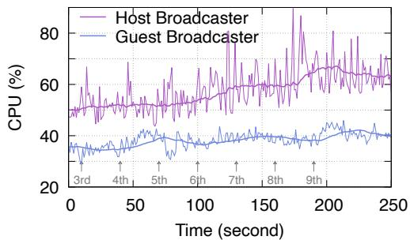  
(a) CPU usage

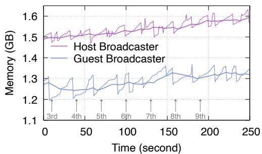  
(b) Memory usage  
Figure 1: Overhead of broadcaster-side stream mixing: measurements start with a host broadcaster and a 2nd cobroadcaster, with the join time of subsequent co-broadcasters explicitly marked (30-second average CPU/memory usage shown in thicker lines)

In addition, there can easily be at least an order of magnitude more viewers than co-broadcasters per channel. Therefore, server-side cost of stream mixing may be amortized by serving a large number of viewers, generating positive ROI (Return on Investment) given our user population.

## 2.2 Server Side vs. Viewer Side

The so-called viewer-side stream mixing actually does not involve the task of mixing and transcoding co-broadcasters’ streams. Instead, each viewer directly renders multiple streams after decoding them. Thus, its most important advantages are shorter end-to-end delay and reduced serverside computation. By fetching independent co-broadcasters’ streams to viewers, it also has the benefit of a customizable user interface. Its issues are listed below.

• The media streams of co-broadcasters can be distributed to viewers via SFU or CDN. An SFU-based realization effectively implements a live channel as a multi-party conference room [19, 20]. It requires us to deploy dramatically more RTC servers to accommodate all the viewers, and signal the connection and disconnection of each co-broadcaster to orders of magnitude more users. So it is not as viable as CDN-based distribution, where we can leverage plenty of 3rd-party CDN providers to lower our expenses.

• In collaborative streaming, a viewer needs to subscribe to the same number of streams as co-broadcasters. Even if we ignore the complexity of signaling those streams to all the viewers, multiple per-co-broadcaster streams tend to lower compression efficiency [21] and consume more bandwidth than a mixed stream. That pulls up bandwidth cost on both server side and viewer side.

We do not list the issue of requirements on viewer device performance. Because unlike the broadcaster and server-side options, viewer does not need to re-encode and forward the received streams. As demonstrated by CPU and memory consumption of the guest co-broadcaster in Figure 1, receiving, decoding and rendering streams of several co-broadcasters only mildly raises the pressure on device performance.

Again, there is usually a disparity in the order of magnitude between the number of viewers and co-broadcasters. It is not uncommon for a live channel to have thousands of concurrent viewers. At that scale, the increased bandwidth cost by viewerside stream mixing may outweigh its savings of computation overhead compared with server-side stream mixing.

We should note that our considerations on where to mix streams represent one perspective among many. We notice some platforms make the same choice of server-side stream mixing (e.g., Tecent TRTC [22], Alibaba ApsaraVideo RTC [23]), but developers may find client-side options more suitable provided different deployment focus.

## 3 Background

## 3.1 Decoupled DualNet Architecture

Our first-generation live streaming architecture is depicted in Figure 2. We strengthen several key points here.

RTC server roles. A proportion of server instances are used as RTC servers. They may be assigned two roles, including SFU and MCU (Multipoint Control Unit) media servers. Similar to a typical multi-party conferencing setup, cascaded SFUs forward RTP streams between co-broadcasters without decoding them [20]. Each live channel further selects an MCU to gather co-broadcasters’ RTP streams from SFUs, where compute-intensive tasks such as steam mixing are accomplished. The MCU server also ingests the mixed stream to CDN in collaborative streaming.

Broadcaster codecs. In our DualNet implementation, the audio codec used by broadcasters is statically determined by the streaming mode, i.e., AAC in live streaming and Opus in collaborative streaming. The video codec should otherwise adapt to capabilities on various devices. As exemplified in Figure 2, the host broadcaster of a channel may negotiate a different video codec with invited co-broadcasters (H264) from the one already used by ongoing live streaming (H265). Consistent codecs to viewers. From the perspective of CDN, the output audio and video codecs of a channel remain unchanged throughout each broadcast. If a host broadcaster changes codecs upon entering collaborative streaming, the RTC MCU media server should conduct transcoding while mixing streams (H264/Opus to H265/AAC in Figure 2) and ensure codec consistency. Then, when the channel returns to live streaming mode, its host broadcaster may also switch back to original codecs. Without changing codecs, broadcasters can always adapt some detailed configurations, e.g., they can use larger GOP (Group of Pictures) and enable B-frames in reaction to decreased access bandwidth.

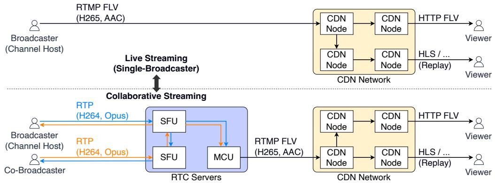  
Figure 2: DualNet live streaming architecture

Distribution Protocols. Technically, any protocol supported by CDN can be used for distribution to viewers, e.g., RTP if leveraging recent CDN feature of low-latency streaming [24]. We use HTTP FLV to ensure backward compatibility, because it has served our live streaming viewers for years at the time we rolled out collaborative streaming. In the meanwhile, CDN may record and store the live streams in other formats (e.g., HLS). The host broadcaster of a channel can make some history live clips available for on-demand replay afterwards.

## 3.2 Issues of DualNet

To motivate architecture redesign, we elaborate on critical issues of DualNet during streaming mode switching.

CDN ingestion node change. In live streaming mode, the broadcaster queries an edge CDN node through DNS. When it comes to collaborative streaming, our logically centralized scheduling backend allocates an ingestion node in CDN based on proximity of the MCU server. Although the allocation refers to the edge node assigned in live streaming, it may still have to select a different node. Below are two example scenarios where that happens.

• There are CDN PoPs (Points of Presence) but no RTC servers in the country of the broadcaster. Detouring to the same CDN ingestion node as in live streaming mode induces additional transport delay.

• The MCU server and the original edge CDN node belong to two poorly peered ISPs, and the path between them suffers from high packet loss or fluctuating RTT.

Thus, CDN may have to splice two RTMP streams ingested from different locations into a single stream for distribution. That increases engineering workloads and risk of rebuffering.

Different publishing paths. Even if a channel always ingests to the same CDN node, the two streaming modes still have separate publishing paths from the broadcaster to the ingestion node. In particular, the publishing path in collaborative streaming involves multiple transport connections, running over two transport protocols. There is not necessarily a straightforward way to coordinate and migrate states between several independent congestion controllers, not to mention the delay from establishing a new connection at least during the first streaming mode switching. In the worst case, both the RTP streams from co-broadcasters and the mixed stream by MCU have to go through slow start upon entering collaborative streaming, leading to degraded bitrate and even rebuffering. Additionally, inconsistent delay on the two publishing paths is likely to cause out-of-order arrival of media frames, e.g., the first collaborative streaming frame may arrive at the ingestion node earlier than the last live streaming frame. That adds to the complexity of session switchover.

Implementation ossification. Ironically, DualNet’s decoupled implementations for the two streaming modes leave us with multiple tightly coupled components, complicating optimization of user experience during streaming mode switching. For instance, to adapt to updated interfaces of a 3rd-party CDN provider, both our broadcaster-side and RTC server SDKs must be modified. Moreover, the application logic at the broadcaster calls separate SDKs for live streaming and collaborative streaming. In large-scale systems, that often results in ossification. For more efficient iteration of new features and optimizations, we are devoted to reduce inter-component coupling by a unified live streaming architecture.

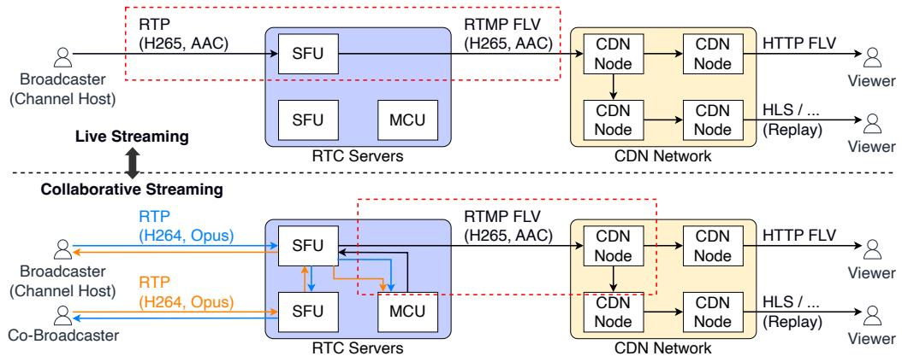  
Figure 3: AnchorNet live streaming architecture (Key differences from DualNet marked in red dashed boxes)

## 4 AnchorNet Architecture

We name the new live streaming architecture AnchorNet (Figure 3). Drawing lessons learned from the first-generation architecture, it follows one most important principle, i.e., to unify the publishing path from the broadcaster to CDN. For that purpose, RTC SFU is introduced into the publishing path as the “anchor” in both streaming modes. That not only alleviates the challenges of aligning two streams from separate paths, but also helps mitigate coupling between components.

In this section, we walk through key details of AnchorNet, focusing on our underlying considerations.

## 4.1 Same Publisher to CDN

A unified publishing path should have the same publisher to CDN in both streaming modes. Provided server-side stream mixing in collaborative streaming, if the channel host is the publisher, the mixed stream will have to be forwarded back to the broadcaster before being published to CDN. That shares many drawbacks of broadcaster-side stream mixing (§2.1). Thus, the RTC server should act as the publisher to CDN.

Then, among the two roles of RTC server, MCU is not involved in live streaming mode. According to our current traffic data, live streaming still accounts for a much higher volume than collaborative streaming. Therefore, we assign the CDN publisher role to SFU media server. As shown in Figure 3, an MCU server paired with a channel feeds the transcoded mixed stream back to the SFU serving the host broadcaster, instead of directly ingesting to CDN as in DualNet. However, the round trip between SFU and MCU induces additional delay to collaborative streaming, especially considering that MCU servers are mostly centrally deployed now. We anticipate that the additional delay may decrease with increasing deployment of edge computing servers [25–28]. Yet at the moment, we rely on the jitter buffers within CDN and at the viewer to prevent such a round trip from inducing rebuffering when switching from live to collaborative streaming.

We also note that when switching between streaming modes, SFU should guarantee that the ingestion node in CDN sees consecutive sequence numbers.

## 4.2 Protocols for CDN Ingest

With an RTC SFU media server sitting between the broadcaster and CDN on the publishing path, there are two scenarios where a protocol needs to be selected: 1) the protocol used by the broadcaster to publish to SFU, and 2) that used by the SFU to ingest to CDN.

First, given that co-broadcasters exchange streams using RTP, we escalate RTP to be the unified uplink protocol for broadcasters across the two streaming modes. By doing so, a channel host can broadcast a continuous RTP stream in the same session while switching between modes, without the need to establish another transport connection. A side benefit is that the live streaming mode can leverage self-developed and optimized congestion control algorithms in user-space, instead of limited to those less frequently updated algorithms supported by kernel on user devices.

As for the ingest protocol from SFU to CDN, an important objective is to ensure compatibility with most CDN providers. Considering that RTMP-based ingest has been supported by almost all CDN providers [29–32] for years and Internet paths between RTC and CDN servers tend to be more stable than first/last-mile access links, SFU continues to use RTMP to push media streams to CDN. A benefit of using RTMP as the ingest protocol is that it requires minimal modification to our previous implementation on CDN and viewer side.

## 4.3 Selection of Audio Codecs

The principal differences between AnchorNet and DualNet are explained above in §4.1&4.2. On that basis, we stick with the selection of audio codecs in DualNet. On the broadcaster side, Opus is used for collaborative streaming, and AAC is used for live streaming. On the server side, AAC is used for CDN ingest. Correspondingly, MCU needs to transcode and mix Opus audio streams of all co-broadcasters of a channel into an AAC stream in collaborative streaming.

We do not adopt an all-Opus scheme, mainly because the AAC codec is still much more widely compatible with RTMP, albeit some explorations into extending RTMP to support contemporary codecs including Opus [33]. Considering that, we did not unify the host-side audio codec to Opus, either. That would extend the expense of MCU transcoding from collaborative streaming mode only to both streaming modes. It could lead to a significant server-side cost increment, because the duration of live streaming is generally longer than collaborative streaming in our production environment. In the long term, we would certainly like to have a single audio codec in most cases, regardless of the streaming mode.

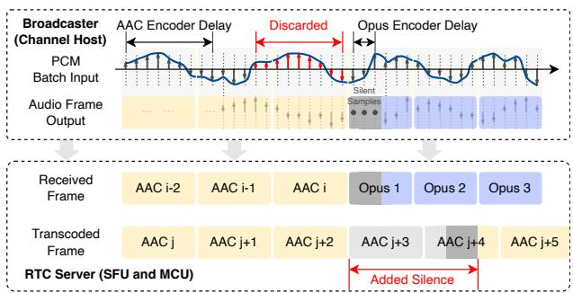  
(a) Live streaming to collaborative streaming

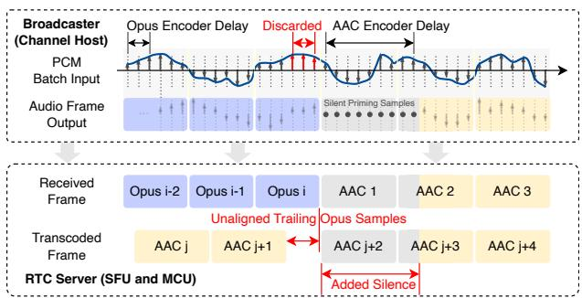  
(b) Collaborative streaming to live streaming  
Figure 4: Problems of switching streaming mode without coordination (Other guest co-broadcasters’ streams are omitted from received and transcoded frames. Also, low-level details such as overlapped MDCT transform window are not shown.)

## 4.4 Mitigated Ossification

AnchorNet does not eliminate coupling components totally. As will be explained in §5, the broadcaster and the RTC servers still need to coordinate in audio stream splicing. However, it mitigates implementation ossification, indeed. The broadcaster logic always runs on RTC SDK now, and does not need to maintain two sets of transport protocols and congestion control algorithms depending on the streaming mode. More importantly, with RTC SFU as the only CDN publisher, the broadcaster does not directly interact with CDN any more. That simplifies many tasks such as scheduling among multiple CDNs and debugging between server-side and broadcasterside issues. To be specific, we contract with different 3rd-party CDN providers for enhanced fault tolerance. When a CDN cluster of a provider encounters connection issues in the ingest direction, both fault localization and temporary blacklist update happen on server side in AnchorNet. No patches to user-facing modules are needed as with DualNet.

## 5 Audio Stream Splicing

In AnchorNet, the RTC SFU needs to splice the audio/video stream from the host broadcaster (live streaming) and the mixed stream from the MCU server (collaborative streaming) when the streaming mode is toggled. For convenience, we refer to the streaming mode before and after a mode change as the egress and ingress streaming mode, respectively. The codec used by the host broadcaster is called accordingly as the egress and ingress codec, as well.

For video streams, the host broadcaster always switches the streaming mode at the frame boundary. It suffices to comply with two packet forwarding paths (i.e., with and without MCU) depending on the streaming mode. The last frame of the egress streaming mode can directly be followed by the first frame of the ingress streaming mode. In comparison, as illustrated in Figure 4, smooth audio stream splicing is by no means as straightforward as that, owing to challenges inherent to the audio encoding algorithms.

## 5.1 Challenges from Audio Codec

## 5.1.1 Encoder Delay

At a high level, each fixed-duration input batch of PCM (pulsecode modulation) samples generates an audio frame that lasts for the same duration. However, if we look at the serialized output sample sequence by the decoder, it generally starts with several silent samples, leading to an encoder delay between the input and output indices of the same raw sample. One of the most important reasons for such an encoder delay is the overlapped window while conducting MDCT (modified discrete cosine transform) [15, 16, 34], which is adopted universally by many encoding algorithms. Briefly, when transforming time-domain samples represented by an audio frame to frequency domain, the transform window is overlapped with the subsequent frame to avoid audio artifacts at window boundaries. To properly output an audio frame for the first input batch (e.g., with insufficient samples on its own to fill an entire transform window), an encoder conducts priming [34], by inserting silent samples before the first raw input sample.

If the host broadcaster were to rigidly switch between AAC and Opus and the MCU server did not process the received PCM samples any further before transcoding, the encoder delay would cause two issues in Figure 4. First, the host broadcaster starts every ingress streaming mode with a leading silence, resulting in perceivable audio glitch. The silent samples are introduced:

1. by ingress codec on host broadcaster’s user device, and

2. by MCU at the start of transcoding upon entering collaborative streaming.

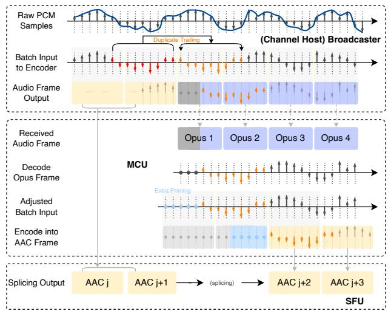  
(a) Live streaming to Collaborative streaming

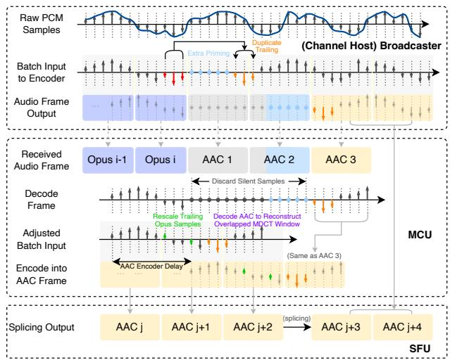  
(b) Collaborative streaming to Live streaming

Figure 5: Audio stream splicing when switching between the two streaming modes (In collaborative streaming, stream mixing happens in the step marked Encode into AAC Frame. The streams of other guest co-broadcasters, as well as other details such as overlapped MDCT window and the SFU between host broadcaster and MCU, are not shown for brevity.)
<table><tr><td rowspan=1 colspan=1>Codec (Profile)</td><td rowspan=1 colspan=1>Frame Size</td><td rowspan=1 colspan=1>Priming Samples</td></tr><tr><td rowspan=1 colspan=1>AAC (HE-AAC v1 [35])</td><td rowspan=1 colspan=1>2048</td><td rowspan=1 colspan=1>5058</td></tr><tr><td rowspan=1 colspan=1>Opus (48 kHz[36])</td><td rowspan=1 colspan=1>960</td><td rowspan=1 colspan=1>325</td></tr></table>

Table 1: A Typical Codec Configuration in TikTok

Moreover, as exemplified in Table 1, the number of priming samples may not be an integer multiple of audio frame size. Simply dropping audio frames containing such samples is very likely to lose valid audio signals.

Second, tail samples of the egress codec, which are still un-encoded in the encoding buffer when the host broadcaster triggers a streaming mode switch, will be discarded. The number of discarded samples equals the number of inserted leading silent samples, and may not be divisible by the frame size. So even if most codec libraries support flushing remaining tail samples, that induces padded silence in the last frame and is not an ideal solution, either.

## 5.1.2 Inconsistent Frame Sizes

Another challenge in stream splicing is the inconsistent frame sizes between AAC and Opus (e.g., 2048 vs. 960 as in Table 1). When exiting collaborative streaming, the trailing samples decoded from Opus frames may not fill an entire AAC frame (Figure 4b). Without any optimization, the MCU server either discards or flushes those samples, with both choices generating similar glitches in the host broadcaster’s audio due to encoder delay (§5.1.1).

## 5.2 Splicing Techniques

Broadcaster-server coordination is necessary to mitigate potential audio glitches due to encoder delay and inconsistent frame sizes. Four PCM sample-level optimization techniques are proposed here. They operate on the audio stream of the host broadcaster, before it is mixed with other co-broadcasters’ audio streams. Figure 5 shows when and where they take effect in the whole stream splicing process.

## 5.2.1 Extra Priming to Avoid Partial Silent Frames

If the encoder delay is a multiple of frame size, the priming samples will be encoded into different frames from the raw input samples. Then, the server side can safely skip leading silent frames in the ingress streaming mode without losing valid audio signals. We thus supplement $N _ { e x t r a }$ extra priming samples to the transcoding or ingress codec, aiming at:

$$
( N _ { p r i m i n g } + N _ { e x t r a } ) \mod f r a m e \_ s i z e = 0 .
$$

Take the setup in Table 1 as an example. When entering collaborative streaming, MCU precedes the decoded Opus samples with an additional 761 silent samples, forming an extra priming of 1086 samples (including 325 Opus priming samples already inserted by host broadcaster). Similarly, when switching back to live streaming, the host broadcaster adds the same extra priming of 1086 samples to its AAC codec. In both cases, there will be 3 leading silent AAC frames, enabling smooth stream splicing starting from the 4th AAC frame.

Extra priming, as well as the other techniques, require the knowledge on encoder delay and frame size. We obtain and store their value during codec initialization.

## 5.2.2 Duplicate Trailing Samples at Host Broadcaster

To avoid tail samples of the egress codec from being discarded, the host broadcaster duplicates those samples into the ingress codec. That is achieved by maintaining the most recent audio samples fed to the currently used codec in a trailing sample ring buffer. The buffer is bound to the codec, and its size equals the codec’s encoder delay (e.g., length of 325 samples for Opus if following the setup in Table 1). When the streaming mode changes, the ring buffer of the egress codec will be freed once sample duplication is complete.

Importantly, MCU does not need to be aware of trailing sample duplication. It simply treats the duplicated samples as raw audio samples.

## 5.2.3 Rescale Trailing Opus Samples at MCU

Algorithm 1: Transcoding and Sample Rescaling   
1 $N = 0$ ;   
2 Initialize buffer Q with $N _ { e x t r a } ^ { A A C }$ extra priming samples ;   
3 while streaming mode is collaborative do   
4 spcm = Decode(next Opus frame) ;   
5 remove\_priming(spcm) ; // 1st frame only   
6 $Q . \mathsf { p u s h } ( s _ { p c m } )$   
7 $N = N + \mathrm { \bar { | } } s _ { p c m } |$   
8 while $N > 1 . 5 \cdot l _ { \mathrm { A A C } }$ do $\big / / \big . \big \perp _ { \bar { A } \bar { A } \bar { C } } \colon$ frame size   
9 Q.pop $( l _ { A A C } )$ ; // batch input to codec   
10 $N = N - l _ { A A C } ;$   
11 Rescale remaining raw samples to $l _ { A A C }$ samples ;   
12 Q.pop(lAAC) ; // $N _ { e x t r a } ^ { A A C }$ samples remains in Q

Extra priming guarantees that the first raw audio sample in collaborative streaming is the first frame in a transcoded frame. On that basis, as long as the number of raw samples (excluding extra priming) fed for transcoding is a multiple of AAC frame size, there will be no unaligned trailing samples decoded from Opus frames. Since the raw Opus samples are not controlled by the MCU, it needs to rescale the trailing samples to enforce the condition. Algorithm 1 outlines its behaviors in collaborative streaming mode.

Upon entering collaborative streaming, the MCU server initializes a pre-encode buffer with $N _ { e x t r a } ^ { A A C }$ extra priming samples required by its AAC codec. It stores raw samples decoded from Opus frames (excluding priming samples in the first frame) in the buffer. Whenever there are more than 1.5 times the frame size $( l _ { A A C } )$ of raw samples in the buffer, it pops a batch as the input to AAC codec. Hence, in the end of collaborative streaming, the number of raw Opus samples in the buffer lies between $0 . 5 \cdot l _ { A A C }$ and $1 . 5 \cdot l _ { A A C }$ . The MCU up-samples or down-samples them to exactly $l _ { A A C }$ samples, and feed one last input batch to AAC codec. Such rescaling inevitably deviates from the original timescale of input samples. Algorithm 1 keeps the extent of deviation below half an AAC frame (e.g., around 20 ms under frame size of 2048 and 48 kHz sampling rate), and induces only minimal negative influence on the output audio effect.

## 5.2.4 Reconstructing Overlapped MDCT Window

The pre-encode buffer is initialized with extra priming samples, but trailing sample rescaling only aligns raw samples to an integer multiple of frame size. Therefore, after the last batch of input to AAC codec in Algorithm 1 (line 12), there will be $N _ { e x t r a } ^ { A A C }$ samples left in the buffer, equal to extra priming inserted in the beginning of collaborative streaming (line 2). At the same time, there are un-encoded samples by the codec due to encoder delay. To finish encoding all decoded Opus samples, a simple method is to directly feed the remaining rescaled samples to the encoder and flush the codec. Silent samples will be padded automatically, and rescaling ensures that the last rescaled sample is the last sample represented by the final transcoded AAC frame. However, such a frame will not be encoded based on an MDCT window overlapped with the first non-priming live streaming frame, which should be the next frame after stream splicing.

To avoid audio artifacts therein, we pad raw audio samples from the first non-priming live streaming frame to the pre-encode buffer before feeding remaining samples to AAC codec. That reconstructs overlapped window for the final transcoded AAC frame, so that it will splice into the live streaming stream more smoothly. For that purpose, MCU should receive and decode the first several live streaming frames from SFU (Figure 5b).

We note that the MCU does not need to reconstruct MDCT window when switching from live to collaborative streaming. With duplicate trailing samples (§5.2.2), the last live streaming AAC frame is guaranteed to have a transform window overlapped with the first collaborative streaming frame.

## 5.3 Scope of Application

Discussion in this section so far is based on selection of audio codecs as explained in §4.3. In fact, the above challenges and optimization techniques are universally applicable to broadcaster-side and server-side stream mixing, regardless of the audio codecs used by the broadcaster and MCU.

Specifically, both broadcaster-side and server-side stream mixing require decoding co-broadcasters’ audio streams to mix their PCM samples. The re-encoding process following that is subject to influence of encoder delay and overlapped MDCT window. For instance, leading silence is always generated upon entering collaborative streaming. Thus, even in the extreme case where the same audio codec and codec profile are used in both streaming modes, extra priming and reconstructed MDCT window are still indispensable for seamless audio stream splicing. Trailing sample duplication and rescaling would also be necessary if different profiles of the same codec are used for live and collaborative streaming.

## 6 Micro-Benchmark

Before practical deployment, we verify the effectiveness of AnchorNet in optimizing user experience during streaming mode switching with small-scale experiments. We compare it with DualNet, as well as two other popular live streaming applications. The two competitors represent two design choices on streaming architecture. According to packet dump analysis, Competitor-1 adopts viewer-side stream mixing, and implements both live and collaborative streaming with a unified RTC stack. Competitor-2 is based on server-side stream mixing, and similar to DualNet, requires the host broadcaster to establish separate connections for the two streaming modes.

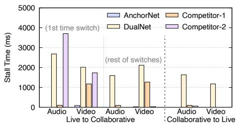  
Figure 6: Stall per streaming mode switch

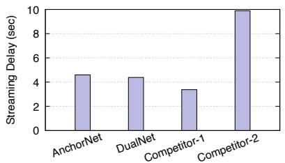  
Figure 7: Live streaming E2E delay

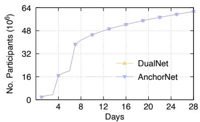  
Figure 8: Num. of users in A/B test

Because the maximum number of co-broadcasters allowed varies across different applications, we test the most basic scene with only two co-broadcasters (i.e., host plus an invited guest). We use three Xiaomi 14 smartphones as channel host, guest co-broadcaster, and viewer, respectively. In each trial, the host starts in live streaming and triggers mode switching 6 times by repeatedly inviting and hanging up on the guest cobroadcaster, while the viewer stays in the channel. We place the three devices at the same location and connect them to the same dedicated office WiFi, so that the evaluation reflects native performance of the architecture (e.g., without influence of weak access network, overlay path computation policy, and bitrate adaptation strategy, etc.).

Rebuffering. As an indicator of rebuffering time per streaming mode switch, we measure the overall duration of audio and video stalls at the viewer in a 10-second period before and after each switch.2 We report average results across multiple trials in Figure 6. Obviously, upgrading to AnchorNet brings superior mode switching experience. Thanks to the optimized audio splicing techniques, it encounters no audio rebuffering in all cases. AnchorNet also outperforms the other tested schemes regarding video rebuffering. In comparison, DualNet always suffers from second-level stalls for both audio and video. Competitor-1, although based on viewer-side stream mixing, consistently experiences a short audio pause of around 100 ms in every switch. Notably, Competitor-2 induces a long stall when the channel switches to collaborative streaming for the first time, but performs comparable to AnchorNet in subsequent streaming mode switching. Correspondingly, we notice that Competitor-2 starts each live streaming viewer session in media audio mode, and changes to call mode [37] when the channel first switches to collaborative streaming. It stays in call audio mode afterwards. We infer that some implementation-specific module restart is triggered in that process, causing the long rebuffering.

Streaming Delay. Then, we compare the broadcaster-toviewer streaming delay of the tested schemes. For convenience of calculation, we put a timer in the camera of the host broadcaster, and record the difference between the displayed time at the host and the viewer multiple times during each trial. As shown in Figure 7, the streaming delay of Competitor-2 more than doubles that of AnchorNet, possibly due to a much larger jitter buffer within the network. That may contribute to Competitor-2’s rebuffering performance during streaming mode switching, which is quite close to AnchorNet other than the long stall in the first switch to collaborative streaming. Competitor-1, leveraging a unified RTC stack, achieves the shortest delay under 4 seconds. AnchorNet and DualNet are not far behind, with AnchorNet being slightly higher due to the round trip between the RTC SFU and MCU. Such a streaming delay, together with the least perceivable glitches during streaming mode switching, delivers satisfying ROI for a commercially large-scale deployed system like TikTok.

## 7 Evaluation

## 7.1 User Experience Gains

Currently, we are in the process of deploying AnchorNet. To compare it with DualNet, we present QoS and QoE results from one of our large-scale A/B tests in production environment. The test was conducted in 2024Q4 and lasted for 4 weeks. It involved almost the same number of users served by AnchorNet and DualNet, respectively (Figure 8). Table 2 summarizes the performance of AnchorNet relative to DualNet. All listed metrics are statistically significant under a confidence level of at least 95%. More detailed analysis and results are presented as follows, with the data normalized against the maximum value from respective metric.

Rebuffering during mode switching. Similar to §6, we first look at rebuffering during streaming mode switching, which is the most important category of metrics AnchorNet aims to optimize. Unsurprisingly, AnchorNet significantly reduces both the duration and count of video/audio rebuffering. Figure 9 showcases the trend of video rebuffering throughout the 4-week period. In the case of switching from live streaming to collaborative streaming, each viewer session encounters 60.3% shorter stall duration and 60.1% less stall count on average under AnchorNet. When switching back to live streaming, AnchorNet’s gains on the same two metrics reach 78.9% and 78.5%. It is normal that the gains from practical A/B test are not as extreme as achieved in our benchmarking test in §6. That is mainly because users’ access links are much more complicated than our ideal setup. Audio rebuffering also follows a similar trend, so we omit due to limited space.

<table><tr><td rowspan=3 colspan=1>Rebuffering during mode switching(per viewer session)</td><td rowspan=1 colspan=2>Live to collaborative streaming</td><td rowspan=1 colspan=2>Collaborative to live streaming</td></tr><tr><td rowspan=1 colspan=1>Rebuffering Count</td><td rowspan=1 colspan=1>Rebuffering Duration</td><td rowspan=1 colspan=1>Rebuffering Count</td><td rowspan=1 colspan=1>Rebuffering Duration</td></tr><tr><td rowspan=1 colspan=1> $\mathrm { V i d e o : } \_ { - 6 0 . 1 \% }$  $\mathrm { A u d i o } \colon \underline { { - 6 4 . 5 \% } }$ </td><td rowspan=1 colspan=1> $\mathrm { V i d e o } ; \underline { { - 6 0 . 3 \% } }$  $\mathrm { A u d i o } \colon \underline { { - 6 7 . 4 \% } }$ </td><td rowspan=1 colspan=1> $\mathrm { V i d e o } ; \underline { { - 7 8 . 5 \% } }$  $\mathrm { A u d i o } \colon \underline { { - 7 6 . 3 \% } }$ </td><td rowspan=1 colspan=1> $\mathrm { V i d e o : } \_ { - 7 8 . 9 \% }$  $\mathrm { A u d i o : } \underline { { - 7 7 . 1 \% } }$ </td></tr><tr><td rowspan=2 colspan=1>User engagement(daily active time)</td><td rowspan=1 colspan=1>Host streaming</td><td rowspan=1 colspan=1> Co-broadcaster streaming</td><td rowspan=1 colspan=1>Viewer watching</td><td rowspan=2 colspan=1></td></tr><tr><td rowspan=1 colspan=1> $\pm 0 . 5 3 \%$ </td><td rowspan=1 colspan=1>+2.15%</td><td rowspan=1 colspan=1> $\pm 3 . 8 3 \%$ </td></tr><tr><td rowspan=2 colspan=1> Live streamingmode only</td><td rowspan=1 colspan=1>Rebuffering</td><td rowspan=1 colspan=1>Host-side push FPS</td><td rowspan=1 colspan=1>Host device pressure</td><td rowspan=2 colspan=1></td></tr><tr><td rowspan=1 colspan=1> $\mathrm { V i d e o : } \pm 1 3 . 4 7 \%$  $\mathrm { A u d i o } \colon \pm 1 1 . 0 2 \%$ </td><td rowspan=1 colspan=1> $\pm 3 . 1 1 \%$ </td><td rowspan=1 colspan=1> $\mathrm { C P U } \mathrm { : } \ \underline { { - 1 . 3 3 \% } }$  $\mathrm { G P U } \mathrm { : } + 0 . 8 0 \%$  $\mathbf { M E M } \colon + 0 . 3 1 \%$ </td></tr></table>

Table 2: A/B Test Results (Metrics on which AnchorNet outperforms DualNet are marked by underlined numbers)

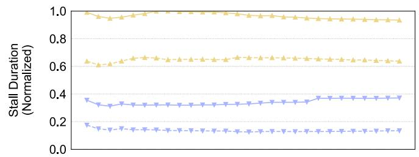

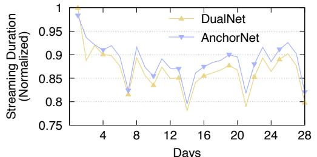

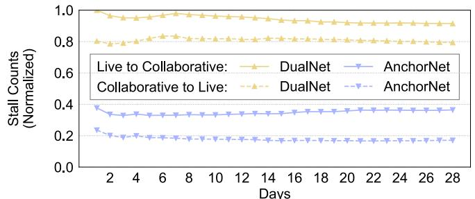  
Figure 10: Daily active time per co-broadcaster

Figure 9: Duration and count of video rebuffering per viewer session  
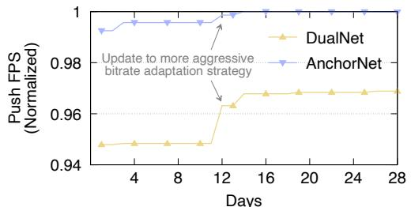  
Figure 11: Push FPS in live streaming mode

User engagement. Frequent rebuffering during streaming mode switching may cause some impatient users to quit, leading to impaired user retention and stickiness and even commercial loss. We expect a smoother switching experience, while making our users more satisfied, can ultimately improve user engagement. Fortunately, that is validated by the A/B test. AnchorNet increases the daily active time for all user roles, i.e., 0.53% for channel host, 2.15% for guest co-broadcaster, and 3.83% for viewers. More intuitively, as illustrated in Figure 10, AnchorNet outperforms DualNet in terms of daily duration each co-broadcaster stays in collaborative streaming throughout the A/B test. We note that the active time of each viewer session encompasses every streaming mode switching of the watched channel. The reduction of viewer-side rebuffering during streaming mode switching cannot directly contribute to increment in viewer watching duration. Thus, the longer active time as in Table 2 reflects true user engagement growth.

Live streaming mode improvements. As explained in §4.2, viewer’s experience in the live streaming mode may benefit from leveraging optimized user-space congestion control algorithms. Indeed, thanks to better resistance against uplink fluctuations (e.g., random packet losses), AnchorNet lowers video and audio rebuffering in live streaming mode by as high as 13.47% and 11.02%, respectively (Table 2). The average frame rate pushed by channel hosts is increased by 3.11%, as well. It is worth nothing that we rolled out a more aggressive broadcaster-side bitrate adaptation strategy on the 12th day of the A/B test. AnchorNet maintains its advantage in push FPS (video frames per second ingested by the host in live streaming mode) after that (Figure 11). Meanwhile, since congestion and flow control are moved from kernel to user-space, AnchorNet puts slightly higher pressure on the host device, e.g., it consumes 0.31% more memory in live streaming. The reduction of CPU consumption by 1.33% in Table 2 is because we prioritize hardware codec acceleration in our AnchorNet implementation, which leads to a 0.8% increment in GPU usage. We regard those slight increments as acceptable compared to gains in rebuffering and frame rate.

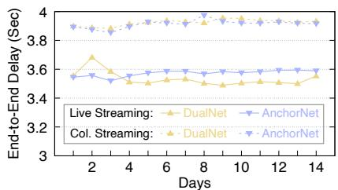  
(a) Global

Figure 12: End-to-end streaming delay  
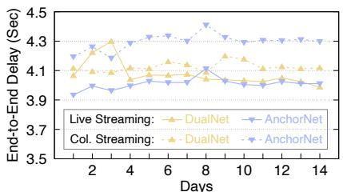  
(b) A selected country

## 7.2 Server-Side Stream Mixing Feasibility

To provide exhaustive practical insights, we also demonstrate the performance and overhead of server-side stream mixing, which is common in both AnchorNet and DualNet.

End-to-end delay. As explained in §4.1, a concern in Anchor-Net is the additional delay due to the round-trip between SFU and MCU in collaborative streaming. We track the end-to-end streaming delay in a two-week period in December 2024 in Figure 12. It turns out that on a global scale, AnchorNet has an average streaming delay comparable to DualNet (Figure 12a). This is because DualNet conservatively reserves a large jitter buffer at CDN upon entering collaborative streaming in reaction to the rebuffering during streaming mode switching. In many cases, that happens to counteract or even surpass the increased delay due to the SFU-MCU round trip in AnchorNet. Nevertheless, in those areas far from the nearest MCU cluster, AnchorNet may experience a longer collaborative streaming delay than DualNet due to the additional round trip. For example, Figure 12b shows the streaming delay in such a selected country. In collaborative streaming, AnchorNet raises the endto-end delay by 170 ms on average compared with DualNet. We plan to further optimize on that front with wider edge MCU deployment in the future.

Stream mixing delay. Another observation from Figure 12 is that collaborative streaming has an end-to-end delay hundreds of milliseconds longer than live streaming mode. Besides the transport delay on the SFU-MCU round trip, such a delay gap also includes the time consumed by stream mixing and transcoding at MCU. Figure 13 presents the average per-frame delay in collaborative streaming between SFU and MCU. In AnchorNet, that delay is concealed by CDN and viewer-side jitter buffers. As explained in §8, we also adjust the playback speed at the viewer when switching between streaming modes to further avoid rebuffering.

Stream mixing overhead. At last, to quantify stream mixing overhead, we record average CPU and memory usage for each stream mixing task. Such a task is initiated when a live channel enters collaborative streaming, and terminated when the channel exits collaborative streaming. The whole streaming session of a host broadcaster may start multiple stream mixing tasks. Figure 14 shows the two metrics at different percentiles over one week in December 2024. In the median case, each task costs less than 0.4 logical CPU core and 220 MB memory. For a server instance with 128 threads (64 physical CPU cores) and above 500 GB memory, 100 such MCUs may accommodate up to 15 ∼ 30K concurrent collaborative streaming channels. According to our own assessment, we consider such server machine costs as affordable.

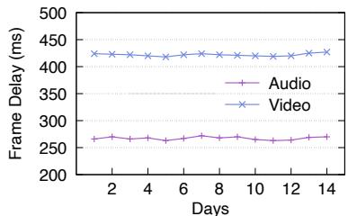  
Figure 13: SFU-MCU round trip (including MCU processing time)

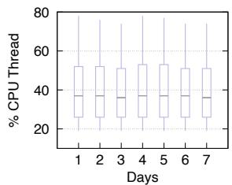  
(a) CPU Overhead

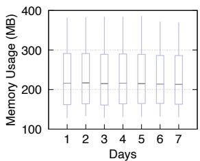  
(b) Memory Overhead  
Figure 14: Overhead per stream mixing task (Results at 10th, 25th, 50th, 75th, 90th percentile at dipicted)

## 8 Deployment Experiences

## 8.1 User Experience Optimization

AV synchronization. The switching of streaming mode comes with a change in user interface layout, e.g., between a full screen view of the host broadcaster and a grid gallery of all co-broadcasters. In our internal subjective tests, we find that it is hard to notice momentary video stalls during such a layout change. Therefore, we can inject artificial video rebuffering (i.e., by re-encoding or replaying several previous video frames) when switching the streaming mode for the purpose of AV (audio-to-video) synchronization. While doing so, we still try to deliver seamless audio, and manage to “conceal” video rebuffering during UI transitions.

Adaptive playback speed. Adaptive playback speed control [38, 39] has been a common technique in live streaming to resist rebuffering. In AnchorNet, it is also used to handle the gap of end-to-end streaming delay between the two streaming modes. When switching to collaborative streaming, the viewer-side player may slow down the live streaming playback, if the remaining buffered frames has the risk of being exhausted before arrival of the first collaborative streaming frame. When switching to live streaming, the player may otherwise speed up the playback to lower the end-to-end delay. Adaptive video bitrate. On the publishing path to CDN, the (co-)broadcaster adjusts the video resolution and bitrate according to not only available uplink bandwidth, but also real-time device performance. Just like insufficient bandwidth, conditions such as low battery power and overheating also cause bitrate degradation. Simulcast [20] is another option for adaptive bitrate between co-broadcasters. We do not activate simulcast in AnchorNet to save bandwidth consumption on broadcaster side. On the distribution path to viewer, we rely on CDN to transcode the mixed stream into lower-bitrate versions, to accommodate viewers with a weak access network.

## 8.2 Tradeoff between Experience and Cost

After fulfilling the dominant majority of users, we tend to prioritize cost control over the pursuit of extreme QoE.

RTC server distribution. When analyzing issues of our first-generation architecture in §3.2, we exemplify a scenario where there are only CDN PoPs but no RTC servers in a country. That is a common result of lowering server-side cost. For CDN distribution, we can consume standard service from 3rd-party providers in addition to constructing our own clusters. Yet for RTC servers, we need to purchase server instances to deploy our server-side SDK. The latter is often more expensive. Furthermore, we do not need RTC servers to be distributed as widely as CDN PoPs, because non-RTC services (e.g., on-demand short video streaming) currently account for a significantly higher traffic volume at TikTok. At this stage, we geographically plan RTC clusters so that endto-end latency of our RTC services satisfy industry norms.

Streaming protocol selection. Aimed at sub-second level end-to-end delay, some pioneering CDN and cloud providers have supported end-to-end WebRTC-based live streaming [30, 40–42]. However, that is not yet universally supported, e.g., it is listed as a beta feature at some providers [43]. Therefore, WebRTC-based streaming service is usually more expensive than more mature RTMP ingest and HTTP distribution [44]. As of now, some CDN providers double their charges for WebRTC-based distribution over traditional distribution [45, 46]. Although end-to-end WebRTC can further reduce the streaming delay, that only brings marginal benefits considering that AnchorNet already satisfies most of our viewers’ latency requirements. Therefore, we stick to the choices of RTMP ingest and HTTP distribution for now.

## 8.3 Future Direction: Enhanced Flexibility

AnchorNet adopts a fixed publishing path (e.g., SFU as CDN publisher, stream mixing on server side) and static streaming protocols (e.g., RTMP ingest, HTTP distribution), to lower implementation complexity and balance server-side cost. As AnchorNet approaches full deployment, we plan to introduce more flexibility to our streaming architecture.

Flexible stream mixing spot. AnchorNet effectively implements viewer-side stream mixing between co-broadcasters. Each co-broadcaster receives other co-broadcasters’ streams from the connected SFU, and renders them altogether. To balance server-side cost and user experience more flexibly,

AnchorNet can be combined with the other two stream mixing choices accordingly. For example, for a host broadcaster using a recently released high-performance smartphone, we can offload stream mixing to the broadcaster side when the number of co-broadcasters is below a small threshold. In certain use cases urging tight end-to-end latency (e.g., e-commerce), a proportion of high-value customers may utilize viewer-side stream mixing, by pulling (co-)broadcasters’ streams from SFU using RTP instead of HTTP FLV.

There are also many other open research problems not listed here that are orthogonal to streaming architecture design. For example, the subjective QoE study based on a unified system like AnchorNet will need to synthesize different user roles with possibly heterogeneous requirements (e.g., cobroadcasters as RTC users, and viewers as non-RTC streaming consumers).

## 9 Related Works

Stream splicing. One of the early discussions on the stream splicing problem dealt with the switching between television programs. Some works [47, 48] proposed to splice the video streams of two programs at the boundary of two video frames. Since audio signals before and after program switching come from different sources, a short gap is acceptable. In the context of VoIP, [49–52] worked on switching audio codec amid an ongoing session, e.g., selecting the optimal codec based on network conditions. They focused more on the audio fidelity (e.g., MOS, Mean Opinion Score) achieved by different codecs, and did not eliminate the audio frame-level glitches as we do in §5. Similar codec switching was also studied in video streaming [53–55]. Different from the audio case, seamless video can be ensured as long as the codec switching does not break the completeness of individual video frames. CDN streaming architecture. CDN-based content distribution has been extensively studied aimed at both on-demand web contents (e.g., DASH video [56]) [57–60] and live streaming [61–63]. Recently, the surge of real-time communication poses the requirement for low-latency delivery. To fulfill more stringent end-to-end latency, LiveNet [24] presented a flat CDN architecture with dynamically optimized per-live stream overlay distribution paths. In addition, some evolved CDN architectures were explored. PCDN [64] enabled end users to download from multiple more affordable edge nodes in parallel for better server-side cost-effectiveness. Tian et al. proposed to offload user traffic to cheaper alternative edge nodes (e.g., user-leased set-top boxes) [65]. Those works are complementary to AnchorNet, but they mostly focused on the live streaming mode only, e.g., each viewer subscribes to a live stream with a single broadcaster.

RTC conferencing architecture. A typical scenario of interactive real-time communication is multi-party conferencing. On that front, some early-stage WebRTC implementations adopted a P2P approach [66,67], letting end users directly connect to each other without intermediate server participation.

While scaling to larger conferences, most service providers deploy the MCU or SFU architecture using media servers. From the perspective of where to mix streams, MCU belongs to server-side stream mixing, and SFU enforces viewer-side stream mixing. SFU can be utilized by simulcast [19, 20, 68] to adapt to heterogeneous access links at different participants, i.e., each publisher uploads the same stream in different bitrates, and SFU determines which to forward. With lower server-side computation overhead, SFU has been the dominating architecture in modern multi-party video conferencing [20, 69, 70]. In AnchorNet, co-broadcasters effectively form a multi-party conference room connected via SFUs, and an MCU is leveraged towards the viewers of a channel. As explained in §2.2, the latter choice is mainly owing to the fact that the number of viewers per live channel may be dramatically larger than that of participants per conference room.

First/Last-mile transport optimization. Another research direction that are orthogonal to AnchorNet is the optimization of transport protocols and congestion control algorithms targeted at fluctuating first/last-mile access links. Multipath transport protocols attract widespread attention due to its ability to combine bandwidth of different links and avoid temporary latency inflation on a specific link [71–74]. Congestion control algorithms are specifically designed to satisfy low latency requirements of live media contents [75–77]. A big category of works adopt learning approaches to adapt to complicated network characteristics. For example, Antelope [78] trained a machine learning model to dynamically select the congestion control algorithm best suited for given network conditions. SLVS [79] tuned the bitrate for live streaming by learning from various network features. AutoRec [80] took advantage of the on-off pattern in the transmission of live streams in an online learning-based loss recovery policy.

## 10 Conclusion

In this paper, we share the design and deployment of Anchor-Net, TikTok’s new live streaming architecture. Built on basis of our first-generation architecture, DualNet, we set smooth switching between live and collaborative streaming as the top objective of AnchorNet. For that purpose, it unifies the publishing path from the broadcaster to CDN by placing RTC servers between them, and leverages various splicing techniques to avoid audio glitches induced due to inherent codec issues such as encoder delay. AnchorNet significantly outperforms DualNet in our large-scale A/B test. More importantly, AnchorNet, representing our own design perspectives, provides practical insights on operating a live streaming service on a global scale.

## References

[1] A beginner’s guide on how to stream Just Chatting on Twitch. https://resources.overlays.uno/post/

how-to-stream-just-chatting-on-twitch. Accessed: 2025.1.

[2] Invite guests to join your live broadcast on Instagram. https://help.instagram.com/126662934757177. Accessed: 2025.1.

[3] TikTok LIVE multi-guest. https://support. tiktok.com/en/live-gifts-wallet/tiktoklive/tiktok-live-multi-guest. Accessed: 2025.1.

[4] Invite a guest to your live stream with YouTube Go Live Together. https://support.google.com/youtube/ answer/12112663. Accessed: 2025.1.

[5] Twitch State of Engineering 2023. https: //blog.twitch.tv/en/2023/09/28/twitchstate-of-engineering-2023/. Accessed: 2025.1.

[6] YouTube Live Streaming Ingestion Protocol Comparison. https://developers.google.com/ youtube/v3/live/guides/ingestion-protocolcomparison. Accessed: 2025.1.

[7] Instagram Live Producer. https://about.instagram. com/blog/tips-and-tricks/instagram-liveproducer. Accessed: 2025.1.

[8] Twitch Broadcasting Guidelines. https: //help.twitch.tv/s/article/broadcastingguidelines. Accessed: 2025.1.

[9] YouTube Live Encoder Settings, Bitrates, and Resolutions. https://support.google.com/youtube/ answer/2853702. Accessed: 2025.1.

[10] Karlheinz Brandenburg. Mp3 and aac explained. In Audio Engineering Society Conference: 17th International Conference: High-Quality Audio Coding, 1999.

[11] Jean-Marc Valin and Cary Bran. WebRTC Audio Codec and Processing Requirements. RFC 7874, May 2016.

[12] WebRTC Opus Codec. https://webrtc. googlesource.com/src/+/refs/heads/main/ modules/audio\_coding/codecs/opus/. Accessed: 2025.1.

[13] Discord Voice Connections. https://discord.com/ developers/docs/topics/voice-connections. Accessed: 2025.1.

[14] MLow: Meta’s low bitrate audio codec. https://engineering.fb.com/2024/06/13/ web/mlow-metas-low-bitrate-audio-codec/. Accessed: 2025.1.

[15] Jean-Marc Valin, Koen Vos, and Timothy B. Terriberry. Definition of the Opus Audio Codec. RFC 6716, September 2012.

[16] Marc Gayer, Manfred Lutzky, Gerald Schuller, Ulrich Krämer, and Stefan Wabnik. A guideline to audio codec delay. In Audio Engineering Society Convention 116. Audio Engineering Society, 2004.

[17] Arvind Narayanan, Eman Ramadan, Jason Carpenter, Qingxu Liu, Yu Liu, Feng Qian, and Zhi-Li Zhang. A first look at commercial 5g performance on smartphones. In WWW, pages 894–905, 2020.

[18] Zili Meng, Yaning Guo, Chen Sun, Bo Wang, Justine Sherry, Hongqiang Harry Liu, and Mingwei Xu. Achieving consistent low latency for wireless real-time communications with the shortest control loop. In ACM SIGCOMM, pages 193–206, 2022.

[19] Tong Meng, Wenfeng Li, Chao Yuan, Changqing Yan, and Le Zhang. AsTree: An Audio Subscription Architecture Enabling Massive-Scale Multi-Party Conferencing. In USENIX NSDI, pages 653–666, 2025.

[20] Xianshang Lin, Yunfei Ma, Junshao Zhang, Yao Cui, Jing Li, Shi Bai, Ziyue Zhang, Dennis Cai, Hongqiang Harry Liu, and Ming Zhang. GSO-simulcast: global stream orchestration in simulcast video conferencing systems. In ACM SIGCOMM, pages 826–839, 2022.

[21] Yihua Cheng, Ziyi Zhang, Hanchen Li, Anton Arapin, Yue Zhang, Qizheng Zhang, Yuhan Liu, Kuntai Du, Xu Zhang, Francis Y Yan, et al. GRACE: Loss-Resilient Real-Time Video through Neural Codecs. In USENIX NSDI, pages 509–531, 2024.

[22] Tencent TRTC: Mic Connect. https://www. tencentcloud.com/document/product/1071/ 42210. Accessed: 2025.1.

[23] Alibaba ARTC: Cloud-based stream mixing and relay. https://www.alibabacloud.com/help/en/live/ user-guide/cloud-mixing-and-retweeting. Accessed: 2025.1.

[24] Jinyang Li, Zhenyu Li, Ri Lu, Kai Xiao, Songlin Li, Jufeng Chen, Jingyu Yang, Chunli Zong, Aiyun Chen, Qinghua Wu, et al. Livenet: a low-latency video transport network for large-scale live streaming. In ACM SIGCOMM, pages 812–825, 2022.

[25] Arthi Padmanabhan, Neil Agarwal, Anand Iyer, Ganesh Ananthanarayanan, Yuanchao Shu, Nikolaos Karianakis, Guoqing Harry Xu, and Ravi Netravali. Gemel: Model Merging for Memory-Efficient,Real-Time Video Analytics at the Edge. In USENIX NSDI, pages 973–994, 2023.

[26] Shadi A Noghabi, Landon Cox, Sharad Agarwal, and Ganesh Ananthanarayanan. The emerging landscape of edge computing. GetMobile: Mobile Computing and Communications, 23(4):11–20, 2020.

[27] AWS Outposts. https://aws.amazon.com/ outposts/. Accessed: 2025.1.

[28] Azure Stack Edge. https://azure.microsoft.com/ en-us/products/azure-stack/edge/. Accessed: 2025.1.

[29] Overview of the Live Stream API (Google Cloud). https://cloud.google.com/livestream/docs/ overview. Accessed: 2025.1.

[30] Alibaba Cloud Real Time Streaming. https: //www.alibabacloud.com/en/product/ apsaravideo-for-live/rts. Accessed: 2025.1.

[31] Amazon IVS Real-Time Streaming now supports RTMP ingest. https://aws.amazon.com/aboutaws/whats-new/2024/09/amazon-ivs-real-timestreaming-rtmp-ingest. Accessed: 2025.1.

[32] Live streaming with Azure Media Services v3. https://learn.microsoft.com/en-us/ azure/media-services/latest/stream-livestreaming-concept. Accessed: 2025.1.

[33] Slavik Lozben. Enhanced RTMP (V2). https:// veovera.org/docs/enhanced/enhanced-rtmp-v2. Accessed: 2025.1.

[34] AAC encoding background. https://developer. apple.com/documentation/quicktime-fileformat/background\_aac\_encoding. Accessed: 2025.1.

[35] Jürgen Herre and Martin Dietz. Mpeg-4 high-efficiency aac coding [standards in a nutshell]. IEEE Signal Processing Magazine, 25(3):137–142, 2008.

[36] Opus reference implementation API. https: //chromium.googlesource.com/chromium/deps/ opus/+/refs/heads/main/include/opus.h. Accessed: 2025.1.

[37] What is the difference between in-call volume and media volume? https://docs.byteplus.com/en/docs/ byteplus-rtc/docs-651068. Accessed: 2025.1.

[38] Mark Kalman, Eckehard Steinbach, and Bernd Girod. Adaptive media playout for low-delay video streaming over error-prone channels. IEEE Transactions on Circuits and Systems for Video Technology, 14(6):841–851, 2004.

[39] Liyang Sun, Tongyu Zong, Siquan Wang, Yong Liu, and Yao Wang. Tightrope walking in low-latency live streaming: Optimal joint adaptation of video rate and playback speed. In ACM MMSys, pages 200–213, 2021.

[40] Tencent Live Event Broadcasting (LEB). https://www.tencentcloud.com/document/ product/267/42141. Accessed: 2025.1.

[41] Wowza: Real-Time Streaming at Scale. https://www. wowza.com/video/real-time-video-streaming. Accessed: 2025.1.

[42] Dolby.io Real Time Streaming. https://dolby. io/solutions/real-time-streaming/. Accessed: 2025.1.

[43] Cloudflare Stream: WebRTC. https://developers. cloudflare.com/stream/webrtc-beta/. Accessed: 2025.1.

[44] David Zhao Russ d’Sa, Neil Dwyer. A tale of two protocols: comparing WebRTC against HLS for live streaming. https://blog.livekit.io/webrtc-vshls-livestreaming/. Accessed: 2025.1.

[45] Alibaba ApsaraVideo Live Pricing. https: //www.alibabacloud.com/en/product/ apsaravideo-for-live/pricing. Accessed: 2025.1.

[46] Billing of Tencent Live Event Broadcasting (LEB). https://www.tencentcloud.com/document/ product/267/39969. Accessed: 2025.1.

[47] SMPTE STANDARD. Splice points for mpeg-2 transport streams. 2001.

[48] Seyfullah Halit Oguz and Sorin Faibish. Seamless audio splicing for iso/iec 13818 transport streams. In 142nd Technical Conference and Exhibition, pages 1– 16. SMPTE, 2000.

[49] Ismet Aktas, Florian Schmidt, Elias Weingärtner, Cai-Julian Schnelke, and Klaus Wehrle. An adaptive codec switching scheme for sip-based voip. In Internet of Things, Smart Spaces, and Next Generation Networking: 12th International Conference, NEW2AN 2012, and 5th Conference, ruSMART 2012, St. Petersburg, Russia, August 27-29, 2012. Proceedings, pages 347–358. Springer, 2012.

[50] Maja Sulovic, Darijo Raca, Mesud Hadzialic, and Nasuf Hadziahmetovic. Dynamic codec selection algorithm for voip. In Proc. 6th International Conference on Digital Telecommunications (ICDT 2011), pages 74–79, 2011.

[51] Haytham Assem, Mohamed Adel, Brendan Jennings, David Malone, Jonathan Dunne, and Pat O’Sullivan. A generic algorithm for mid-call audio codec switching. In 2013 IFIP/IEEE International Symposium on Integrated Network Management (IM 2013), pages 1276– 1281. IEEE, 2013.

[52] MARCEL Waltermann, Blazej Lewcio, Pablo Vidales, and Sebastian Moller. A technique for seamless voipcodec switching in next generation networks. In IEEE ICC, pages 1772–1776. IEEE, 2008.

[53] Daniele Lorenzi, Farzad Tashtarian, Hermann Hellwagner, and Christian Timmerer. Medusa: A dynamic codec switching approach in http adaptive streaming. ACM Transactions on Multimedia Computing, Communications and Applications, 2024.

[54] Babak Taraghi, Hadi Amirpour, and Christian Timmerer. Multi-codec ultra high definition 8k mpeg-dash dataset. In ACM MMSys, pages 216–220, 2022.

[55] Daniele Lorenzi, Farzad Tashtarian, Hadi Amirpour, Christian Timmerer, and Hermann Hellwagner. Mcomlive: A multi-codec optimization model at the edge for live streaming. In International Conference on Multimedia Modeling, pages 252–264. Springer, 2023.

[56] ISO Standard. Dynamic adaptive streaming over http (dash)-part 1: Media presentation description and segment formats. ISO/IEC, pages 23009–1, 2014.

[57] Stefan Saroiu, Krishna P Gummadi, Richard J Dunn, Steven D Gribble, and Henry M Levy. An analysis of internet content delivery systems. ACM SIGOPS Operating Systems Review, 36(SI):315–327, 2002.

[58] Al-Mukaddim Khan Pathan, Rajkumar Buyya, et al. A taxonomy and survey of content delivery networks. Grid computing and distributed systems laboratory, University of Melbourne, Technical Report, 4(2007):70, 2007.

[59] Athena Vakali and George Pallis. Content delivery networks: Status and trends. IEEE Internet Computing, 7(6):68–74, 2003.

[60] Volker Stocker, Georgios Smaragdakis, William Lehr, and Steven Bauer. The growing complexity of content delivery networks: Challenges and implications for the internet ecosystem. Telecommunications Policy, 41(10):1003–1016, 2017.

[61] Ramesh K Sitaraman, Mangesh Kasbekar, Woody Lichtenstein, and Manish Jain. Overlay networks: An akamai perspective. Advanced Content Delivery, Streaming, and Cloud Services, pages 305–328, 2014.

[62] Leonidas Kontothanassis, Ramesh Sitaraman, Joel Wein, Duke Hong, Robert Kleinberg, Brian Mancuso, David Shaw, and Daniel Stodolsky. A transport layer for live streaming in a content delivery network. Proceedings of the IEEE, 92(9):1408–1419, 2004.

[63] Konstantin Andreev, Bruce M Maggs, Adam Meyerson, and Ramesh K Sitaraman. Designing overlay multicast networks for streaming. In ACM SPAA, pages 149–158, 2003.

[64] Rui-Xiao Zhang, Haiping Wang, Shu Shi, Xiaofei Pang, Yajie Peng, Zhichen Xue, and Jiangchuan Liu. Enhancing Resource Management of the World’s Largest PCDN System for On-Demand Video Streaming. In USENIX ATC, pages 951–965, 2024.

[65] Yu Tian, Zhenyu Li, Matthew Yang Liu, Jian Mao, Gareth Tyson, and Gaogang Xie. Cost-saving streaming: Unlocking the potential of alternative edge node resources. In ACM IMC, pages 580–587, 2024.

[66] Khalid Ibn Zinnah Apu, Nafiz Mahmud, Firoz Hasan, and Sabbir Hossain Sagar. P2p video conferencing system based on webrtc. In 2017 International Conference on Electrical, Computer and Communication Engineering (ECCE), pages 557–561. IEEE, 2017.

[67] Yang Xu, Chenguang Yu, Jingjiang Li, and Yong Liu. Video telephony for end-consumers: Measurement study of google+, ichat, and skype. In ACM IMC, pages 371– 384, 2012.

[68] David Zhao. An introduction to WebRTC Simulcast. https://blog.livekit.io/an-introduction-towebrtc-simulcast-6c5f1f6402eb/. Accessed: 2025.1.

[69] Amazon Chime Video Simulcast. https: //aws.github.io/amazon-chime-sdk-js/ modules/simulcast.html. Accessed: 2025.1.

[70] Jitsi Videobridge SFU. https://github.com/jitsi/ jitsi-videobridge. Accessed: 2025.1.

[71] Zhilong Zheng, Yunfei Ma, Yanmei Liu, Furong Yang, Zhenyu Li, Yuanbo Zhang, Jiuhai Zhang, Wei Shi, Wentao Chen, Ding Li, et al. Xlink: Qoe-driven multi-path quic transport in large-scale video services. In ACM SIGCOMM, pages 418–432, 2021.

[72] Yunzhe Ni, Zhilong Zheng, Xianshang Lin, Fengyu Gao, Xuan Zeng, Yirui Liu, Tao Xu, Hua Wang, Zhidong Zhang, Senlang Du, et al. Cellfusion: Multipath vehicleto-cloud video streaming with network coding in the wild. In ACM SIGCOMM, pages 668–683, 2023.

[73] Sandesh Dhawaskar Sathyanarayana, Kyunghan Lee, Dirk Grunwald, and Sangtae Ha. Converge: Qoe-driven multipath video conferencing over webrtc. In ACM SIGCOMM, pages 637–653, 2023.

[74] Yuhan Zhou, Tingfeng Wang, Liying Wang, Nian Wen, Rui Han, Jing Wang, Chenglei Wu, Jiafeng Chen, Longwei Jiang, Shibo Wang, et al. AUGUR: Practical Mobile Multipath Transport Service for Low Tail Latency in Real-Time Streaming. In USENIX NSDI, pages 1901– 1916, 2024.

[75] Gaetano Carlucci, Luca De Cicco, Stefan Holmer, and Saverio Mascolo. Analysis and design of the google congestion control for web real-time communication (webrtc). In ACM MMSys, pages 1–12, 2016.

[76] Shibo Wang, Shusen Yang, Xiao Kong, Chenglei Wu, Longwei Jiang, Chenren Xu, Cong Zhao, Xuesong Yang, Jianjun Xiao, Xin Liu, et al. Pudica: Toward Near-Zero Queuing Delay in Congestion Control for Cloud Gaming. In USENIX NSDI, pages 113–129, 2024.

[77] Wei Zhang, Xuefeng Tao, and Jianan Wang. Naorl: Network feature aware offline reinforcement learning for real time bandwidth estimation. In ACM MMSys, pages 326–331, 2024.

[78] Jianer Zhou, Xinyi Qiu, Zhenyu Li, Gareth Tyson, Qing Li, Jingpu Duan, and Yi Wang. Antelope: A framework for dynamic selection of congestion control algorithms. In IEEE ICNP, pages 1–11. IEEE, 2021.

[79] Guanghui Zhang, Ke Liu, Mengbai Xiao, Bingshu Wang, and Vaneet Aggarwal. An intelligent learning approach to achieve near-second low-latency live video streaming under highly fluctuating networks. In ACM MM, pages 8067–8075, 2023.

[80] Bo Wu, Tong Li, Cheng Luo, Xu Yan, Fuyu Wang, Xinle Du, and Ke Xu. Toward timeliness-enhanced loss recovery for large-scale live streaming. In ACM MM, pages 7891–7899, 2024.