①

USENIX

THE ADVANCED COMPUTING SYSTEMS ASSOCIATION

# SolFS: An Operation-Log Versioning File System for Hash-free Efficient Mobile Cloud Backup

Riwei Pan, Department of Computer Science, City University of Hong Kong; Yu Liang, ETH Zurich; Lei Li and Hongchao Du, Department of Computer Science, City University of Hong Kong; Tei-Wei Kuo, Delta Electronics and National Taiwan University; Chun Jason Xue, Mohamed bin Zayed University of Artificial Intelligence

https://www.usenix.org/conference/atc25/presentation/pan

# This paper is included in the Proceedings of the 2025 USENIX Annual Technical Conference.

July 7–9, 2025 • Boston, MA, USA ISBN 978-1-939133-48-9

Open access to the Proceedings of the 2025 USENIX Annual Technical Conference is sponsored by

P-Lr.h £Es/sL.

auuuJl9 PgleU

King Abdullah University of

Science and Technology

# SolFS: An Operation-Log Versioning File System for Hash-free Efficient Mobile Cloud Backup

Riwei Pan† Yu Liang∗§ Lei Li† Hongchao Du† Tei-Wei Kuo¶ Chun Jason Xue‡ †Department of Computer Science, City University of Hong Kong §ETH Zürich

¶Delta Electronics and National Taiwan University

‡Mohamed bin Zayed University of Artificial Intelligence

## Abstract

Mobile cloud backup applications are widely used to safeguard user data. This paper found that current cloud backup is inefficient on resource-limited mobile devices because it consumes excessive CPU resources for delta synchronization that requires intensive hash computation to identify the modified ranges of file data. To address this issue, this paper presents SolFS, an operation log versioning file system to optimize mobile cloud backup efficiency. The core idea is that if the cloud backup application knows the modified offset and length of each write since the last backup, it will be able to identify the new modified data and upload them only, avoiding data hashing throughout the entire file. SolFS proposes a series of designs to achieve this design goal. First, SolFS introduces per-file mergeable operation logging that allows each file to manage its write operation logs (i.e., offset and length) in an extent tree and merge operation logs with contiguous or overlapping modified ranges of file data. Then, SolFS proposes the operation log persistence and versioning mechanism that allows different cloud backup applications to manage their own file versions without interfering with each other. In addition, SolFS incorporates techniques such as compact log and dynamic granularity, to optimize the memory and storage overhead to the system. Finally, SolFS achieves hash-free file difference identification with minimum additional overhead and extends the ability of cloud backup applications. The experimental results show that SolFS can significantly reduce the computational overhead of both APP-side or server-side by over 90% on average and the total cloud synchronization time by over 88.8% when files are updated.

## 1 Introduction

Mobile devices have become an essential part of our daily lives, with around 1.34 billion smartphones sold in 2023 [32]. These devices are now an important venue for personal data storage, making data loss a serious concern. To mitigate this risk, mobile cloud backup applications (APPs) are widely adopted to protect user data, such as Dropbox, OneDrive, and smartphone vendors’ built-in cloud backup APPs. These mobile APPs usually choose to upload the entire file data, but this approach could result in high network traffic and low backup efficiency, especially when uploading files with minor data changes. Therefore, some APPs adopt delta synchronization to speed up the cloud synchronization time by leveraging hashing to identify and upload modified file data only [3,9,10,23,34]. However, the intensive hash computation caused by delta synchronization increases CPU utilization, resulting in excessive power consumption. In addition, it also leads to conflicting demands of limited mobile CPU resources between cloud backup APPs and other user applications. On the resource-limited mobile devices, the high cost could directly affect the user experience in daily usage, such as shortening the mobile device’s battery life [9, 16]. Hence, these cloud backup APPs face a dilemma between cloud backup efficiency and user experience. This paper aims to improve cloud backup efficiency on mobile devices, with a particular focus on overcoming the dilemma between high network traffic and intensive CPU resource consumption.

There are many previous works to improve the efficiency of delta synchronization [5, 6, 10, 11, 24, 34, 36, 38]. A typical design is to divide a file into multiple chunks and then calculate their checksum (i.e., strong hash algorithms like MD5 and SHA256). By comparing the local file’s checksum list with that from the cloud server, this approach can identify the modified chunks and upload them only to the cloud server to reduce network traffic, but the minimum network traffic transmitted is limited by the chunk size. The rsync [34] algorithm further improves this issue, which employs rolling checksum to identify byte-level modified data before performing chunklevel hashing. One issue of rsync is the high cost at the client side, because rolling checksum requires byte-by-byte comparison. WebR2sync+ [38] optimizes the client-side overhead of rsync by moving the heavy byte-by-byte comparison to the server side and then the client only needs to perform chunklevel weak hashing and strong hashing. QuickSync [9] adopts the Content-defined Chunking (CDC) to detect redundant bytes and NetSync [36] reduces the computation cost of the chunk matching process with a fast CDC-based weak hashing. In addition, some researchers introduce lightweight hash algorithms to improve their computational cost [22, 37, 44]. However, on resource-limited mobile devices, these works still impose a high computational cost on identifying old and new modified data.

To address this issue in delta synchronization, we present SolFS, a lightweight operation log versioning file system built with existing mobile file systems. The key idea behind SolFS is to identify old data and new modified data through write operation logs (i.e., each write’s offset and length) rather than hashing, thus significantly mitigating the computational cost. However, incorporating this idea into the file system introduces many challenges, including extra access overhead, more resource usage, and file version management across different cloud synchronization and cloud backup applications. SolFS presents a series of designs to overcome these challenges.

First, to reduce the memory and storage usage for operation logs, SolFS proposes per-file mergeable operation logging (or MLogging). MLogging allows each file to manage its own write operation logs in an extent tree that merges operation logs with contiguous or overlapping modification ranges. In addition, MLogging introduces the mlog cache design to improve the logging cost in sequential write operations and the on-demand loading design to minimize the memory usage. SolFS needs to persist operation logs to the disk after file data writebacks for subsequent modification range tracking. To minimize the storage cost, SolFS further introduces dynamic log granularity and compact operation logs. Unlike traditional versioning techniques, SolFS performs versioning for operation logs rather than file data, thus avoiding the issues of file fragmentation and double storage usage. A file’s different versions of operation logs are stored and managed in a versioned inode chain, which enables cloud backup APPs to accurately track their individual cumulative modifications based on version number without interfering with each other. Therefore, cloud backup APPs are able to identify old data and new modified data without hashing the entire file to improve the efficiency of delta synchronization.

We evaluate SolFS’s performance on a commercial smartphone and compare it with existing delta synchronization solutions. The experimental results show that SolFS can significantly reduce the computational overhead of both APPside or server-side by over 90% on average and the total cloud synchronization time by over 88% when files are updated.

## 2 Background and Motivation

## 2.1 Cloud Backup on Mobile Devices

Mobile cloud backup APPs are commonly utilized to ensure user data security and save storage space by backing up various types of files, such as executable files, database files, and text documents. These APPs can be divided into third-party APPs and built-in APPs. Third-party APPs, such as Dropbox, aim to back up users’ personal files and allow users to access their files elsewhere. Built-in APPs are provided by smartphone vendors and can further back up applications’ internal files. This enables users to restore their mobile devices to a specific state if their devices are reset or lost.

Cloud backup APPs typically follow a design [11] with two major steps: reading file data and uploading file data to the cloud. For the second step, some APPs adopt delta synchronization to save the network bandwidth and to speed up the upload process [3, 9, 10, 23, 34], while other APPs choose to upload entire file data to avoid intensive hash computation and excessive power consumption caused by delta synchronization. We present and categorize common cloud backup APPs in Table 1 based on our observations.

Table 1: Delta synchronization support in seven common cloud backup APPs.
<table><tr><td rowspan=1 colspan=2>MobileAPP</td><td rowspan=1 colspan=1>Type</td><td rowspan=1 colspan=1>Delta Synchronization</td></tr><tr><td rowspan=1 colspan=2>Dropbox</td><td rowspan=1 colspan=1>Third-party</td><td rowspan=1 colspan=1>Not support</td></tr><tr><td rowspan=1 colspan=2>OneDrive</td><td rowspan=1 colspan=1>Third-party</td><td rowspan=1 colspan=1>Not Support</td></tr><tr><td rowspan=2 colspan=2>GoogleDriveSeafile</td><td rowspan=1 colspan=1>Third-party</td><td rowspan=1 colspan=1>Not Support</td></tr><tr><td rowspan=1 colspan=1>Seafile</td><td rowspan=1 colspan=1>Third-party</td><td rowspan=1 colspan=1>Supported</td></tr><tr><td rowspan=1 colspan=2>Huawei</td><td rowspan=1 colspan=1>Built-in</td><td rowspan=1 colspan=1>Supported</td></tr><tr><td rowspan=2 colspan=2>SamsungOppo</td><td rowspan=1 colspan=1>Built-in</td><td rowspan=1 colspan=1>Supported</td></tr><tr><td rowspan=1 colspan=1>Built-in</td><td rowspan=1 colspan=1>Supported</td></tr></table>

Importance of Frequent Cloud Backup. A fast, timely, and low-overhead file data cloud synchronization scheme has significant practical importance. Delta synchronization is very useful to reduce network traffic and improve upload efficiency in unstable mobile networks [36]. However, it relies on computationally intensive hash calculations and comparisons to identify file differences [3, 9, 10, 23, 34]. Such a high cost drives smartphone vendors and users to restrict their cloud backup frequency (e.g., once a week) to minimize the impact on user experience. However, the most recent user data, such as newly edited documents, is typically more valuable and should be backed up instantly, as cloud backup applications (e.g., Dropbox) do on desktops/servers [9, 24]. APP-specific data in health-care-related or business-related applications, could be important for users to have up-to-date backups because of important body status data and high-value business documents. In addition, as the volume of user data continues to grow, the limited storage space on a single device could become insufficient to store all user data, further making cloud data synchronization an increasingly frequent operation. These scenarios suggest that there is a dire need for mobile users to frequently conduct mobile cloud backups. Mobile users need a low-computation-cost cloud backup mechanism that allows them to avoid compromising between performance and data security.

## 2.2 Expensive File Hashing

The current delta synchronization efficiency is not satisfactory on mobile devices, as it needs to perform hashing throughout the entire file to locate the modified ranges of data. Specifically, a typical design of delta synchronization involves: 1) the server divides a file into multiple chunks and computes each chunk’s checksum based on hashing (e.g., SHA256 and MD5); 2) the file’s checksum list is sent to the APP and the APP also performs chunking and hashing for the file to identify and upload the chunks with different checksum [3]. Despite how much file data is modified, this approach requires the hash calculation and comparison processing of all file data to identify data differences, leading to a long identification time and high CPU usage [31, 38]. It is expensive for resource-limited mobile devices because the excessive use of CPU resources not only degrades the user experience (competing with other applications for CPU resources), but also shortens the battery life of the mobile device in daily usage [9, 16]. To quantitatively evaluate this impact on a recent mobile device (Google Pixel 8), we develop an APP following this typical delta synchronization design.

This APP backs up 15GB of data in total1 and the backup procedure includes reading the files, dividing them into chunks, and leveraging the built-in SHA256 algorithm for hashing, similar to the content hash used by the desktop version of Dropbox [12]. As depicted in Figure 1, Hashing introduces an additional 170% execution latency and 224% CPU energy consumption on average due to the intensive computation, compared to reading files only (Baseline). In addition, we also notice that the read operation contributes around 30.8% of total cost during hashing. To achieve better performance, the APP can perform parallel hashing for multiple files rather than single-threaded hashing, such as 2-File Hashing and 4-File Hashing. The parallel hashing could achieve a lower execution time compared with the single-threaded reading (4-File Hashing v.s. Baseline), but consumes more CPU resources at the same time, increasing the competition of CPU resources with other applications. Furthermore, its energy consumption with four threads (i.e., 47333 mWs) is still more than twice that of the baseline (i.e., 20604 mWs).

There are previous works available on the desktop/server platform to improve the upload efficiency of delta synchronization. Rsync [34] is proposed to employ a weak hash algorithm called rolling checksum, which uses a sliding window and performs byte-by-byte comparison to obtain bytelevel file differences instead of that of chunk-level. This algorithm is easily prone to hash collisions and thus rsync has to use strong hashing for all unmodified data chunks to ensure that these data chunks are truly not modified. Hence, rsync still consumes many CPU resources on the APP side. WebR2sync+ [38] improves this issue by moving the heavy byte-by-byte comparison to the cloud server side, but the weak and strong hashing are still required on the APP side. QuickSync [9] adopts the Content-defined Chunking (CDC) to detect redundant bytes during network transmission and NetSync [36] employs the CDC technique to further avoid the computation cost of overlapping chunks. These previous efforts have focused on reducing the computation cost during delta synchronization; however, all these approaches still require hashing the entire file data to identify data differences, making intensive computation unavoidable, increasing CPU loads and energy consumption on mobile devices.

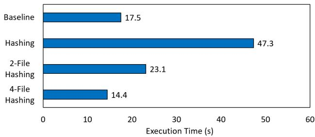  
(a)

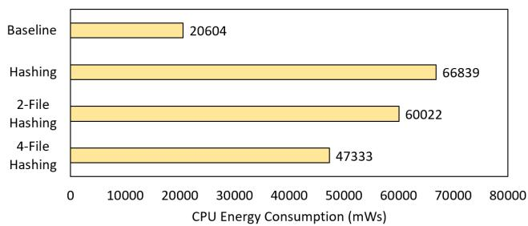  
(b)  
Figure 1: (a) execution time in seconds; (b) CPU energy consumption (mWs). The energy data is collected by the On Device Power Rails Monitor [2]. For reference, the device energy consumption from top to bottom is 37520, 120136, 86911, 65222 mWs, respectively.

Reducing computation is challenging. We rethink the nature of delta synchronization—uploading only modified file data. In other words, reading and hashing entire file data may be unnecessary if we have a proper system mechanism to identify the range of file changes. Then, we could either directly upload the modified range of data, or perform hashing on this selected range to further reduce network traffic, because sometimes the data after modification is the same as before modification. As small writes dominate [8, 19] on mobile devices, it is expected that this hash-free identification approach could reduce the computation cost on mobile devices by avoiding hashing the entire file data. Therefore, file system is a very suitable scenario to implement this idea, because it can instantly record file changes without incurring a high overhead. For example, the file snapshotting and versioning techniques in file system design [20, 28–30], such as the reflink feature of XFS and BtrFS, have the potential ability to achieve this goal. The copy-on-write (CoW) approach adopted in these works allows cloud backup APPs to identify old data and new modified file data without hashing.

As shown in Figure 2(a), the CoW approach always allocates new blocks for new modified data (e.g., PBA 201 and 202), while old blocks (PBA 100-102) serve as old data, allowing the file system to classify them. However, this design will introduce file fragmentation issues after multiple file updates [15, 18, 39]. For example, the file view in Figure 2(a) includes PBA 201, 101, 202, becoming non-consecutive after updating data in a CoW manner. Figure 2(b) presents the impact of file fragmentation that could remarkably degrade the sequential read performance. BetrFS [42] tries to mitigate this drawback based on a copy-on-abundant-write design and WaybackFS [7] avoids file fragmentation by replacing old data with an undo log. However, supporting these features on F2FS [21], the most widely used file system on mobile devices, is complex and often requires changes to the disk layout [43]. In addition, all these solutions, whether based on CoW or undo logs, have to continuously allocate additional memory and storage space to manage multiple versions of file data, which is still expensive for resource-limited mobile devices.

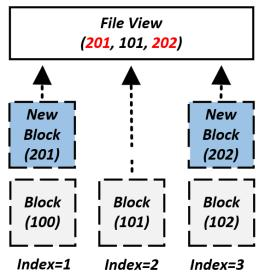  
(a)

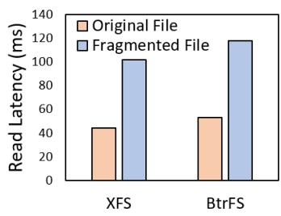  
(b)  
Figure 2: (a) CoW-based hash-free solution, where the number in each block presents a physical block address (PBA); (b) sequential read latency in a 10MB file. The fragmented file is created based on the reflink feature and we randomly update 1MB data on it.

## 3 SolFS Design

In this section, we introduce SolFS to cope with the mentioned challenges. SolFS2 is a lightweight operation log versioning file system to mitigate hash computation during delta synchronization while overcoming the limitations of snapshotting and versioning file systems. The main design goals of SolFS involve:

• Hash-free Identification: SolFS is designed to identify modified ranges of file data without hashing by the collaboration with file system.

• Overhead Minimization: SolFS minimizes the I/O, memory and storage overhead discussed in Section 2.2.

• Generality: SolFS supports multiple backup APPs (e.g., built-in and third-party) on the same device to manage their respective file differences without interfering with each other.

• Backward Compatibility: There are over 6.5 billion of mobile devices in the world [13] and we expect that all existing mobile devices could benefit from SolFS.

## 3.1 Architecture Overview

To achieve these design goals, SolFS introduces several effective designs to existing mobile file systems, as shown in Figure 3. Our designs are based on the observation that if the cloud backup APP knows the modified offset and length of each write since the last backup, it can accurately identify newly modified data. This allows cloud backup APPs to selectively upload the modified data directly, or apply hashing (e.g., chunk-level hashing and rolling hashing) to only the modified data range and then upload it without requiring hashing throughout the entire file.

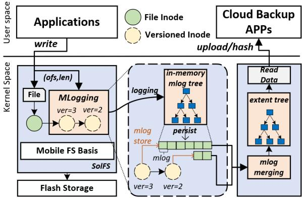  
Figure 3: SolFS architecture (shown in blue).

Therefore, SolFS first introduces per-file mergeable operation logging (or MLogging, see Section 3.2), which keeps track of each write’s offset and length by recording them as operation logs in a new auxiliary inode. This design avoids the file fragmentation issue when the file is continuously updated and minimizes the storage cost of operation logs by not storing actual file data. Specifically, MLogging enables mergeable operation logs (mlogs for short) by managing operation logs in an in-memory mlog tree, which is based on a modified extent tree design. The mlog tree will merge contiguous or overlapping operation logs if possible and minimize its additional overhead on write operations. To control uploaded data in different cloud backups, SolFS proposes the mlog versioning mechanism to manage different versions of mlogs. This technique leverages extended file attributes [26] to integrate the inode versioning functionality for mlogs while ensuring backward compatibility. Additionally, SolFS persists different versions of mlogs to different versioned inodes, supporting multiple cloud backup APPs to accurately manage their own mlogs for unuploaded file data. During delta synchronization, a cloud backup APP can traverse the file’s versioned inodes to merge mlogs into an extent tree that indicates the modified data ranges (see Section 3.3). Based on these ranges, the APP can either directly upload the modified data or apply hashing (e.g., rolling checksum) to further reduce network traffic.

## 3.2 Per-file Mergeable Operation Logging

MLogging identifies old and new modified file data by logging each write’s offset and length (i.e, mlog). The different write’s mlogs can be merged and the offset and length of each mlog can be aligned to two different granularities: bytealigned and page-aligned. This design enables SolFS to balance memory/storage costs with the identification granularity of modified data. In addition, because MLogging writes new data to the original file inode and stores mlogs in additional inodes, no file fragmentation is introduced, ensuring good sequential read performance.

## 3.2.1 Mergeable Operation Log Tree.

To prevent the rapid growth in memory and storage usage for mlogs, MLogging introduces an in-memory mlog tree to manage mlogs of the head versioned inode (see Section 3.2.2). Based on the the extent tree design, the mlog tree can merge mlogs with contiguous or overlapping modification ranges. Specifically, a new mlog is inserted into the tree using its offset as the key. During insertion of a new mlog, MLogging traverses the mlog tree to identify the contiguous or overlapping mlogs. If found, they are merged, and memory/storage space is released; otherwise, the new mlog is inserted into the tree.

Figure 4 demonstrates this mechanism. For example, request 3 (25,10) overlaps with an existing mlog (20,7) so that MLogging only updates the existing mlog to (20,15). In this way, MLogging reduces the high storage overhead of storing new operation logs. For sequential writes or appends, they only update the last-accessed mlog so that the direct mlog tree insertion is not optimal (i.e., O(logN) operations). Therefore, SolFS introduces an mlog pointer cache at the root of the mlog tree, which records the last-accessed mlog. This design reduces mlog updates for sequential writes and appends to O(1) operations, further improving additional cost on write operations. For instance, in Figure 4, request 1 and 2 are two subsequent write requests. Request 1 does not hit the mlog cache, requiring a traversal of the mlog tree, while request 2 hits the cache, allowing direct updates to the target mlog.

Persistence with Compact Mlogs. In the MLogging design, an in-memory mlog tree is allocated to track file differences when a file is opened and is persisted to the disk when the modified file data is written back. As shown in Figure 4, the on-disk layout of the mlog tree is an array of mlogs, where each mlog entry stores two integers—offset and length—both are aligned to a specific granularity (e.g., byte-level). Given the prevalence of small files and small writes (e.g., < 1MB) on mobile devices [8, 17, 19], the offset and length integers are designed to take 4 bytes each. In order to minimize the storage cost, MLogging persists the length first, followed by the offset, leveraging the highest bit of the length to support compact mlog design. As illustrated in Figure 5, a compact mlog is a compact form of an mlog entry, which embeds the offset into the unused bits of the length (i.e., storing both offset and length in four bytes). Specifically, the 0\~15 bits are used to store the inline offset and the 16\~30 bits are used to store the length. The highest bit of the length serves as an indicator of compact mlogs, because it is not used in the normal form of mlog entry (the maximum write buffer length is 2GB, requiring only 19 bits [27]). SolFS will reconstruct the mlog tree by scanning the on-disk mlog array, where the scanning process will dynamically skip to the next mlog based on the compact mlog indicator.

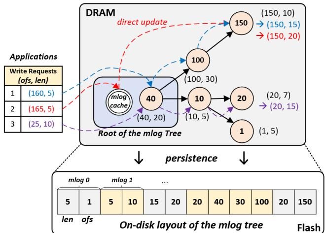  
Figure 4: MLogging mechanism.

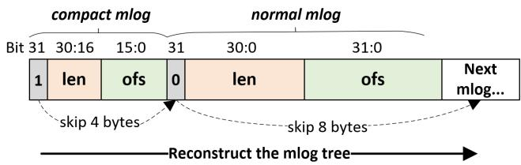  
Figure 5: On-disk structure of normal and compact mlog.

Minimizing Memory Usage. A file may accumulate numerous mlogs after continuous random updates, and loading all of them into the in-memory mlog tree can significantly increase memory usage. To mitigate this issue, SolFS employs an on-demand loading design. During the open process, SolFS allocates an empty mlog tree rather than loading all mlogs from disk. All new mlogs generated during file updates are inserted into this tree. When persisting the mlog tree, SolFS reads the existing mlogs from disk, merges them with the new mlogs in the in-memory mlog tree, and persists the updated mlog tree to disk. To minimize the additional cost on the I/O critical path of applications, SolFS uses a dedicated worker thread to handle this process asynchronously. When the file data is written back, the inode with a dirty mlog tree is sent to the worker thread, ensuring minimal impact on application performance.

Dynamic Granularity Alignment. SolFS allows the offset and length stored in mlogs to be dynamically aligned to different granularities. The main purpose of this design is to reduce the total number of mlogs by increasing the granularity from the byte-level to page-level, thereby lowering the memory and storage usage. In addition, this design helps SolFS avoid the integer overflow issue of the offset when updating very large files. Specifically, SolFS limits the number of inmemory mlogs per file (i.e., 5000 in SolFS). When more than this threshold, SolFS increases the granularity of the mlog tree. A new mlog tree is created and set to a higher granularity. Then, SolFS traverses mlogs in the low-granularity mlog tree, converts their offsets and lengths to the larger granularity and finally inserts them into the new mlog tree. While a larger granularity reduces memory and storage usage, it also decreases the resolution of file changes and increases network traffic during delta synchronization.

## 3.2.2 Mlog Versioning

Cloud backup APPs will continuously upload files to protect user data and thus a file may be uploaded multiple times. This necessitates SolFS to manage and classify file differences between any two cloud backups, and to support multiple cloud backup APPs on the same device. Inspired by classic versioning techniques, SolFS proposes the mlog versioning design to achieve this goal.

Versioned Inodes for Mlogs: Similar to prior works [7, 28, 29], this design introduces additional versioned inodes to the original file inode. However, unlike previous approaches, the versioned inodes store mlogs instead of file data, and the inode version is driven by each backup rather than write operations. Each versioned inode maintains its own set of mlogs, enabling SolFS to identify file modifications between any two versions by merging mlogs across different versioned inodes. The versioned inode includes four additional attributes: ino\_ver, ver\_link, ino\_flag and next\_ino. The ino\_ver attribute represents the backup-driven inode version, while the ver\_link attribute indicates the number of cloud backup APPs referencing this inode version. The ino\_flag attribute tracks the state of this versioned inode, including its dirty state and the granularity of its persisted mlogs. The next\_ino attribute is utilized to establish a connection between two inodes of consecutive versions, forming a chain of versioned inodes. To reach the design goal of backward compatibility, these four additional attributes are stored in the extended file attributes [26] of the inode, which ensures compatibility with the on-disk structures of the existing mobile file system. The versioned inodes shown in Figure 3 present the relationship between the original file inode and versioned inodes. The file inode and two versioned inodes (ver=3 and ver=2) are connected and indexed based on each inode’s next\_ino.

Backup-driven Versioning: Since a mobile device may install multiple cloud backup APPs (e.g., built-in and thirdparty), each with its individual backup times and progress, SolFS introduces backup-driven versioning to manage file versions across different backups and across different APPs. Specifically, when an APP backs up the latest data of a file, a new versioned inode (with a higher version number) is inserted at the head of the file’s versioned inode chain by updating next\_ino. A new mlog tree is also created to accommodate incoming mlogs since this backup, as shown in Figure 6. During the insertion of new versioned inode, the old mlog tree is persisted to the old head versioned inode and then releases its memory. In cases where the head versioned inode does not contain any mlogs, such as no modifications since the last backup, SolFS avoids inserting a new versioned inode to maintain a compact and concise versioned inode chain to reduce storage usage, such as the second backup in Figure 6. With backup-driven versioning, all file modified locations are recorded in a versioned inode chain. Given a start version and a target version, SolFS can traverse the corresponding versioned inodes in the chain to retrieve mlogs, which are used to calculate the final modified range of that file since the start version. In this way, SolFS ensures that each cloud backup APP can track its own file differences between any two backups without interference from other apps.

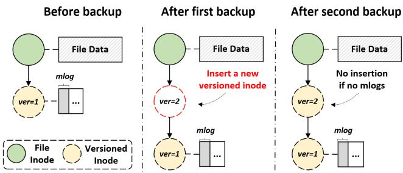  
Figure 6: Backup-driven versioning.

## 3.3 Hash-free Delta Synchronization

In this section, we will introduce how SolFS achieves delta synchronization by enabling hash-free file difference identification through the collaborative version management and the extent tree that stores cumulative file modifications, as shown in Figure 7.

Collaborative Version Management: As discussed in Section 3.2.2, each backup is assigned a specific version number, which allows the cloud backup APP to manage file versions between the local and the cloud server. For example, after backing up a file, the APP will obtain a version number from SolFS and synchronize this version number to the cloud server. The cloud server will maintain this version number for each file, and the version number is also stored in the extended file attributes. For the next backup, the APP receives the version number from the cloud server and tracks new file modifications from this version to the latest version. Cloud backup APPs can start their backup in any version of a file, but in the first backup, they will upload the entire file data.

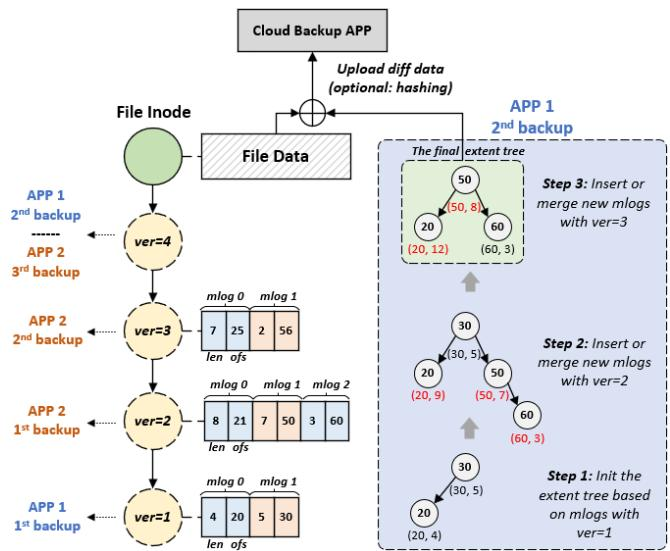  
Figure 7: Delta Synchronization with Hash-free File Difference Identification.

We illustrate this collaborative version management in Figure 7. There are two APPs (APP 1 and APP 2) backing up the same file. Before any backups, the version of the original file data is zero (ver=0). After APP 1 performs the first backup, the first versioned inode (ver=1) is inserted and APP 1 obtains this inode’s version number, indicating that the next backup of APP 1 starts from ver=1. Following this, APP 2 performs three consecutive backups, each with new modified data, thus increasing the inode version from ver=1 to ver=4. Note that the first backup of APP 2 will upload the entire file data as APP 2 does not maintain the version of this file before. Then, APP 1 performs its second backup based on its own version (ver=1), in which it traverses mlogs stored in the versioned inodes from ver=1 to ver=4 to identify cumulative file modifications to facilitate delta synchronization. Finally, both APP 1 and APP 2 will reach the versioned inode with ver=4, as the latest versioned inode (ver=4) does not contain mlogs. This collaborative version management also reduces the hash computation overhead on the cloud server, as it eliminates the need to generate and send a checksum list to APPs for hash comparison. By exchanging version information instead of checksum lists, network traffic is further minimized, particularly for large files where checksum lists can be substantial.

Upload with the Extent Tree: Given an original version,

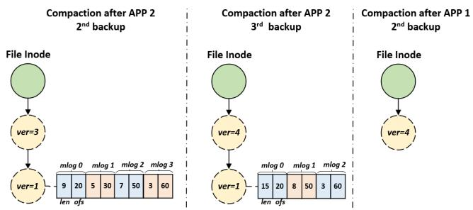  
Figure 8: Versioned Inode Compaction.

SolFS enables the APP to track mlogs from that version to the latest version. SolFS employs an extent tree to merge mlogs stored across different versioned inodes to calculate the cumulative file modified range of the data. Based on this range, the APP can directly upload the corresponding file data to achieve hash-free delta synchronization. Optionally, the APP could choose to perform hashing on the specified data range to mitigate hash overhead of identifying file differences and further reduce network traffic. Note that this approach also avoids the overhead of reading the entire file data.

We demonstrate this design in the second backup of APP 1 in Figure 7. SolFS first initializes the extent tree based on mlogs from the version held by APP1 (ver=1). It then scans the versioned inode chain from ver=1 to ver=4, merging their mlogs to produce a final extent tree representing the cumulative modified range. If the mlog granularity is byte-level/pagelevel, the modified range includes bytes/pages 20–31, 50–57, and 60–62. APP 1 could use this location information to upload the corresponding file data to the cloud. The mlogs stored in different versioned inodes may have varying granularities, but during merging, all mlogs are converted into byte-level granularity for consistency.

Versioned Inode Compaction: Multiple backups can lead to redundant versioned inodes in the chain, as they may no longer be indexed or used by cloud backup apps, wasting storage space. To address this issue, SolFS employs a reference counter (i.e., ver\_link) for each versioned inode to track the number of cloud backup APPs referencing it. Based on the example shown in Figure 7, after APP 2 performs three backups and before the second backup of APP 1, the reference counts for the four versioned inodes are one (ver=1), zero (ver=2), zero (ver=3) and one (ver=4). The versioned inodes with ver=2 and ver=3 are redundant as no APPs use them, allowing SolFS to compact them to save storage space. Specifically, SolFS compacts redundant versioned inodes by merging their mlogs into the adjacent versioned inode with a lower version number and positive reference counter, and then deletes redundant versioned inodes. After the second backup of APP 1, the reference count of versioned inode with ver=4 increases to two since both APP 1 and APP 2 point to it. At this moment, SolFS cannot find an adjacent versioned inode for compaction as the reference count of ver=1 inode becomes zero, which indicates versioned inodes lower than the latest version are useless for subsequent backups.

We illustrate the proposed compaction process in Figure 8. After the second backup of APP 2, all mlogs stored in ver=2 inode are merged with mlogs stored the ver=1 inode, because the ver=2 inode is no longer used. After the second backup of APP 1, versioned inodes except for the head versioned inode are useless so that SolFS removes them to release resources. Finally, when all APPs reach the latest version, all versioned inodes with zero link are deleted. SolFS collects the reference count of each versioned inode during the delta synchronization process and compacts them by an asynchronous worker thread mentioned in Minimizing Memory Usage in Section 3.2.1.

## 4 Implementation Discussion

In this section, we will introduce the implementation details of the SolFS prototype on F2FS [21], which is the most popular file system on mobile devices. In addition, how to ensure version consistency and how to create an optimized cloud backup APP based on SolFS are also discussed in the following subsections.

## 4.1 File System Implementation

When opening a file in SolFS, an empty in-memory mlog tree is created using kmem\_cache\_alloc to reduce allocation cost and it is stored in the F2FS’s inode info. During page writebacks, the inode with a dirty mlog tree is passed to a worker thread for asynchronous persistence via a shared list. As a result, SolFS only introduces minimal overhead to file opening and closing. SolFS does not change the original read and write processes of the existing mobile file system, but instead intercepts file operations that modify file data, such as write operations. Additionally, SolFS also supports fallocate, truncate and mmap with PROT\_WRITE by inserting a new mlog for the data range specified by these functions’ parameters. For rename, SolFS marks the newly renamed file as entirely changed. The asynchronous worker thread is primarily responsible for persisting mlog trees. Specifically, it wakes up periodically to process dirty mlog trees from inodes. The dirty mlog tree is converted into an mlog array as discussed in Section 3.2.1. SolFS then copies this mlog array to the pages of the corresponding head versioned inode, and marks all pages as dirty for asynchronous writebacks to complete the persistence process.

## 4.2 Version Consistency

When the system crash occurs, the consistency of file data is protected by the existing mobile file system. However, SolFS has to ensure version consistency in case of identifying inconsistent modified data during delta synchronization. This is critical because the persistence of newly modified file data and its corresponding mlogs is not atomic. An unexpected crash could disrupt their consistency, resulting in mismatches between local and cloud file data. To address this issue, SolFS introduces an all-or-nothing mechanism that leverages F2FS’s write-ordering guarantees to maintain version consistency between the version number (i.e., ino\_ver) and file data. For inode chain operations, the F2FS checkpointing is employed to ensure data consistency.

All or Nothing. Since system crashes are rare events and abandoning previous version controls does not affect the consistency of the file data itself, SolFS introduces an all-ornothing mechanism to ensure version consistency, as shown in Figure 9. Specifically, SolFS employs a special dirty flag (i.e., ino\_flag) in the file inode to indicate whether the mlog tree has been modified. When dirty data pages of the file inode are written back to the disk, SolFS marks the ino\_flag as dirty (=1) and sends the corresponding inode to the worker thread. This flag is clear after successfully persisting the mlog tree. The write order of F2FS ensures that data writebacks occur before metadata (e.g., inode) writebacks and the ino\_flag is written back to the disk along with the inode. If data pages are written back successfully but the system crashes before the file inode is persisted, the written blocks are released, and the inode reverts to its pre-write state. If the crash occurs after metadata writeback but before mlog writeback, the ino\_flag remains dirty, allowing SolFS to detect inconsistencies between file data and mlogs. In this scenario, SolFS removes the versioned inode chain and reinitializes the file version starting from the version higher than the one at the time of the crashing. If the APP provides a stale version of the old versioned inode chain, SolFS cannot locate this version in the new versioned inode chain, as it is lower than the new version. Consequently, the APP is required to upload the entire file data and maintain a new version.

Checkpointing Inode Chain Operations. SolFS leverages F2FS’s checkpointing mechanism to ensure the consistency of inode chain operations. Specifically, SolFS temporarily disables checkpointing while updating next\_ino during inode chain operations and re-enables it once the operations are complete. This prevents inconsistent inode connections in the event of a system crash. If a crash occurs, SolFS relies on F2FS’s roll-back/roll-forward recovery process to restore the file system to the last checkpointed state.

## 4.3 Cloud Backup APP Optimization

SolFS introduces three new ioctl interfaces for cloud backup APPs: delta\_open, delta\_close and delta\_getdiff. Given a file to be backed up, the cloud backup APP first opens the file to obtain its file descriptor (FD), and retrieves the file’s version number from the cloud server. With this FD, the APP can invoke delta\_open to find the corresponding file inode and register a context to get the file difference. This function is also used to block write operations and flush all dirty pages and mlogs of the file. Then, the APP leverages the file descriptor and the version number as input for delta\_getdiff. As the number of returned modified ranges (mlog) is not certain, the APP can call delta\_getdiff multiple times to recursively obtain all mlogs. To support recursive access, the context created by delta\_open will record the progress of getting the file difference. This interface returns the cumulative file modified range and the latest version number, while also inserting a new versioned inode into the chain. The APP uses the cumulative modified range to access the corresponding file data. After identifying all modified ranges, the APP can invoke delta\_close to release the resources of the context and unblock write operations.

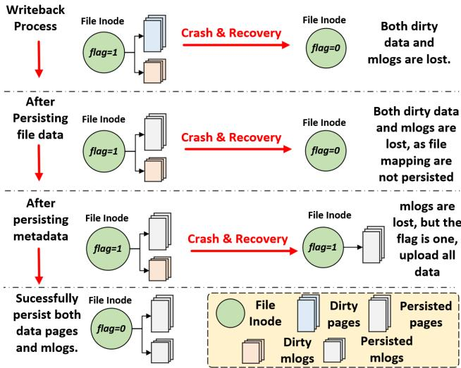  
Figure 9: Version Consistency.

To further reduce network traffic, we experimentally introduce a simple selective hashing approach for the modified range of data. Specifically, the cloud backup APP prioritizes the computational cost on mobile devices so that it chooses to directly upload modified file data, except for mlogs encompassing the entire file data. For this type of mlog, the entire file data is conducted with a rolling checksum, similar to WebR2sync+. In the scenario where the version inputted by the APP does not match any version of versioned inodes (i.e., version inconsistency), delta\_getdiff will return a special modified range that covers the entire file data. SolFS is similar to existing file systems and does not include optimizations for file metadata backup. The backup APP can use the common fstat()/getxattr() interfaces to retrieve available metadata information and synchronize it to the cloud server.

## 5 Evaluation

In this section, we present a comprehensive evaluation of the proposed SolFS in comparison to the state-of-the-art delta synchronization designs, including HashSync, Rsync and WebR2sync+. HashSync refers to the typical design of delta synchronization [11] that separates a file into multiple chunks and uses MD5 as the hashing algorithm to identify modified data chunks. Rsync and WebR2sync+ employ rolling checksum in the APP side and server side, respectively, allowing them to detect byte-level data differences. We do not compare with NetSync because it is not open-sourced. The existing solutions do not support the Android system and thus we implement and cross-compile them to the mobile platform based on C++ and NDK [14]. The server side is implemented based on cpp-httplib [41] which receives requests from APPs and supports different cloud synchronization based on the parameters of HTTP POST requests.

Our evaluations are conducted on a Pixel 8 device based on Android 14 with Linux kernel version 5.15, and the cloud server is running on an Ubuntu 20.04 platform with a 24-core Intel i9 14900k and 32GB of memory. We assume that users upload files using only one cloud backup APP, as this is the most widely used scenario. In the following subsections, we will first introduce some micro-benchmarks to illustrate how SolFS achieves better performance. Then, the performance and overhead of SolFS on real applications will be discussed. Lastly, we also conduct some experiments to discuss the overhead of inode chain operations.

## 5.1 Cloud Synchronization Efficiency

In this section, we quantitatively measure the cloud synchronization efficiency of SolFS with a series of microbenchmarks, including cloud sync time, network traffic and latency breakdown. The network bandwidth is set to \~100 Mbps, the chunk size is set to 2048 bytes and the granularity of mlog is byte-level. We use 10MB files and up to 1KB I/O size, considering small files and I/Os on mobile devices. For these experiments, we first create a 10MB file and upload it to the server. Then, we modify this file in different ways: random update, sequential update and insertion, where insertion means moving back all the file data behind the insertion location by re-writing the whole file. In our experiments, we insert data into the position of 5MB of the file. In addition, we further evaluate the effect of modification sizes. The modification size indicates the total modified bytes to that file and when the update/insertion size is larger than 1KB, this modification will be separated into multiple sub-modifications (each with 1KB). Finally, this file is uploaded again to the server and we record the relevant experimental results.

## 5.1.1 Cloud Sync Time and Network Traffic

We present the total sync time and network traffic of SolFS and existing solutions in Figure 10 and Figure 11. SolFS significantly outperforms hash-based solutions in both random and sequential updates. Specifically, SolFS reduces the sync time by 88.8% on average in random updates, since it identifies modified data based on offsets and lengths, mitigating the overhead of hash computation and data reading. In addition, SolFS generates significantly less network traffic, averaging only 12.3% of the traffic when updating 1MB of data.

This efficiency stems from two key factors. First, the three hash-based approaches require transmitting a checksum list, whose size grows with the file size (e.g., 120KB for a 10MB file). Second, since random updates are not aligned with the chunk size, these updates often affect neighboring chunks, resulting in more modified data (e.g., over 2MB of data is modified when randomly updating 1MB of data). SolFS avoids these issues by precisely uploading only the modified data at the byte level. The performance of a sequential update also has the similar observation to that of random updates due to the same benefits of SolFS. For data insertion, both Rsync and WebR2sync+ support rolling checksum, enabling them to upload only the inserted data (around 1MB when inserting 1MB data). HashSync cannot identify the inserted data and has to upload all data following the insertion point, resulting in approximately 5x more network traffic (i.e., 5MB) and longer sync times compared to the other three approaches. As discussed in Section 4.3, SolFS can collaborate with the rolling checksum approach, achieving performance comparable to WebR2sync+.

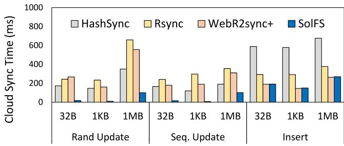  
Figure 10: Cloud sync time on different types of file modifications.

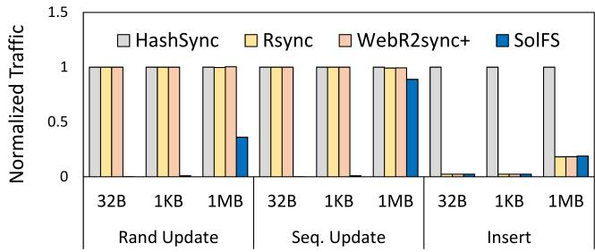  
Figure 11: Normalized network traffic on different types of file modifications. HashSync serves as the baseline.

## 5.1.2 Sync Time Breakdown

To analyze the contribution of each part to sync time, we illustrate the sync time breakdown for a 1MB random update in Figure 12. SolFS outperforms other approaches by significantly reducing hash computation overhead on both the client and server sides (92% on average). For instance, Rsync exhibits lower server-side latency, while WebR2sync+ achieves lower client-side latency due to their differing design goals. SolFS, however, achieves lower latencies on both sides. Due to its low software overhead, network bandwidth becomes the primary factor limiting SolFS’s performance. On a 50Mbps network, the client and server sides contribute approximately 21.8% (HashSync), 49.3% (Rsync), 42.2% (WebR2sync+), and 10.8% (SolFS) of the total sync time. On a 200Mbps network, these contributions increase to 52.7% (HashSync), 79.5% (Rsync), 74.5% (WebR2sync+), and 32.7% (SolFS). As network bandwidth grows, computation on both the client and server sides leads to significant software overhead. SolFS mitigates this issue by minimizing hash computation.

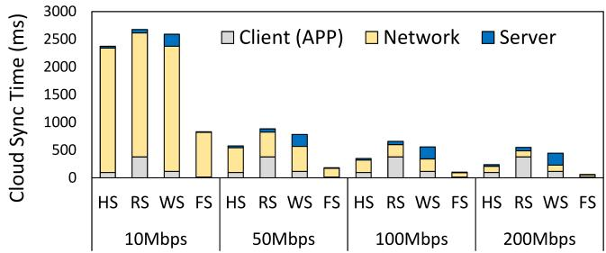  
Figure 12: The sync time breakdown over different network bandwidths. HS, RS, WS, FS indicate HashSync, Rsync, WebR2sync+, SolFS, respectively.

## 5.2 Real Mobile Application Workloads.

## 5.2.1 Cloud Backup Performance on Real Workloads.

To evaluate the overall cloud backup performance, we dump file data from four popular applications, including Facebook with 220MB data, Twitter with 112MB data, Capcut with 220MB data and Dropbox with 843MB data. After a period of time (i.e., 20 minutes), we dump their file data again and store them in the server side. In this period, we play each application for 5 minutes: for Facebook and Twitter, we browse and pull new content; for Capcut we edit existing videos by adding effects, filters and text; for Dropbox, we edit a Word documents by adding new text, a PPT slide by adding a new page with image and text, and write several numbers to an Excel file. During playing applications, we collect file update traces from these four applications, including file names, file sizes, file update offsets and lengths. Then, we can compare SolFS with existing solutions based on the consistent file data and trace. We perform file synchronization using SolFS and other solutions and record their sync time.

The experimental results are shown in Figure 13. SolFS significantly outperforms existing solutions on mobile application workloads, by improving 71% of sync time on average. For example, SolFS reduces the HashSync’s average sync time over these four APPs from 89s to 29s. The main reason is that random writes dominate the mobile platform, such as many SQLite database updates on Facebook and Twitter. We observe that data insertions are rare on mobile workloads and applications usually operate on binary data so that the performance of HashSync is better than Rsync and WebR2sync+ on mobile workloads. By avoiding hashing, SolFS has a greater performance than HashSync. In addition, the SolFS design helps reduces by around 70% of CPU usage on average of the four APPs during delta synchronization.

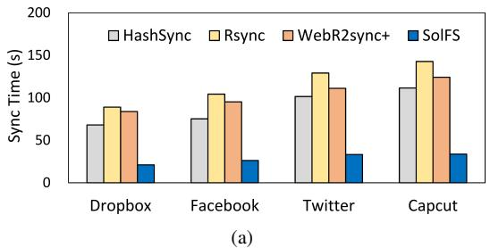

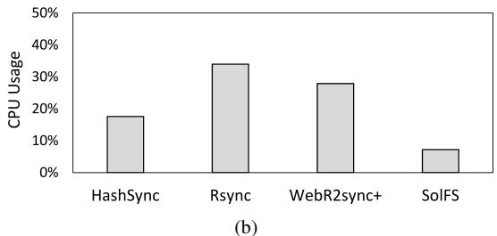  
Figure 13: (a) cloud sync time over different applications; (b) CPU usage on average of the four commonly-used APPs.

## 5.2.2 Overhead Analysis on Real Workloads

In this section, we focus on the potential overhead of SolFS, including the I/O performance, and additional memory and storage usage compared with the original mobile file system (i.e., F2FS). To comprehensively evaluate the performance of SolFS on different file operations, we choose to replay long-duration file operations traces collected in real mobile devices. Hence, nine open sourced file operation traces [25] are used in our evaluation, where each trace represents a specific application running for two hours. The traces include nine applications, including Candycrush (CC), Chrome (CH), Earth (EA), Facebook (FB), Map (MA), TikTok (TT), Twitter (TW), Youtube (YT) and Zombie (ZB).

Read and Write Overhead. We evaluate the read and write performance based on the trace replay time. Before running each trace, we clear the page and inode caches, and record the running time of each trace. As shown in Figure 14(a), SolFS shows a comparable I/O performance (difference < 1.5%) with the original F2FS. On average, the I/O performance of SolFS is around 99.2%. During trace replay, the average CPU usage of F2FS and SolFS is 8.3% and 8.5%, respectively, representing the overhead when MLogging is disabled or enabled during normal operations. The slight increase in SolFS’s CPU usage occurs because SolFS inserts a small mlog entry (4 or 8 bytes) into the mlog tree during write operations. For write operations that hit the mlog cache (e.g., sequential writes and appends), SolFS uses a fast path to update the mlog at O(1) cost; for cache misses, SolFS needs to traverse the in-memory mlog tree. As SolFS does not load mlogs from the existing versioned inode to the mlog tree , the number of a file’s mlogs is relatively small, which reduces the searching cost. SolFS does not change the read process of the F2FS so that the read performance is the same. The additional overhead of file open is also low, because the on-demand mlog loading design avoids reading mlogs from disk synchronously in the open operation.

Memory and Storage Overhead. SolFS consumes additional memory and storage space to maintain the mlog tree and mlogs while a file is open. First, we measure the additional memory usage by running traces from different APPs. To evaluate the worst-case scenario, we use a byte-level mlog tree and retain mlogs even after the file is closed. As shown in Figure 14(b), the additional memory usage after running nine traces (simulating 18 hours of app runtime) is 470KB. This is because many operations, such as sequential writes, appends, or updates to the same location, only require fewer mlogs. Additionally, the on-demand loading design reduces memory usage, as SolFS does not load all mlogs from disk into memory and only maintains an in-memory mlog tree for new mlogs. For storage overhead, SolFS further reduces memory usage through its compact mlog design. Given the prevalence of small writes on mobile devices, mlogs are frequently compacted, reducing storage space by 33% compared to memory usage. Note that increasing the granularity of mlogs can further decrease memory usage. Memory allocated for the mlog tree and mlogs are released once the file is closed, further minimizing SolFS’s memory footprint. In summary, the memory and storage overhead of SolFS are acceptable for mobile devices.

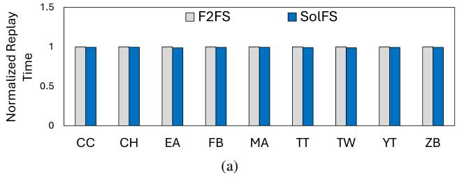

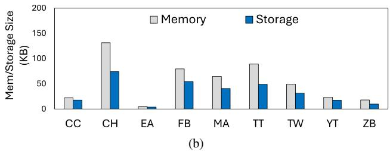  
Figure 14: (a) normalized I/O performance; (b) additional memory and storage overhead.

## 5.3 Discussion about Inode Chain Operations

Depth of Version Inode Chain. As SolFS supports multiple cloud backup APPs based on a versioned inode chain, the running time of searching file differences could be affected by the depth of the versioned inode chain. To evaluate the effect of the depth, we create a 10MB file and randomly update total 2MB of data. Given a depth of X, each level of versioned inode will be updated by 2MB/X of data. After clearing page cache and inode cache, we use the delta\_getdiff interface to search for file differences and record the searching time. As presented in Figure 15(a), with the growth of the versioned inode chain, the search time increases from 1.67ms to 7.6ms due to the additional I/O overhead. Even with the depth = 10, this cost is still significantly lower than hashing. In addition, users generally do not use many cloud backup APPs at the same time, and thus the depth of the versioned inode chain can be kept small.

Impact of Mlog Quantity. In SolFS, the number of mlogs in an mlog tree primarily affects the overhead of two operations: 1) converting the mlog tree from small granularity (byte-level) to large granularity (page-level), and 2) merging the in-memory mlog tree with the on-disk mlog tree. First, for mlog tree conversion, Figure 15(b) shows that the conversion time increases with the number of mlogs, ranging from 0.95ms for 1K mlogs to 10ms for 10K mlogs. Second, when persisting an in-memory mlog tree, SolFS loads and merges on-disk mlogs into the in-memory mlog tree before writing it back. This overhead also scales with the number of mlogs. In our evaluation, loading and merging a large mlog tree (10K mlogs) introduces around 30ms of latency, including read I/O and in-memory merging time. Since scenarios with intensive random updates to the same file are relatively rare, the number of mlogs typically remains small (e.g., < 100). Therefore, both mlog tree conversion and merging operations introduce minimal overhead on applications.

Granularity and Memory Overhead. To evaluate the impact of different mlog granularities, we conduct sequential and random write experiments by writing 2MB of data to a 10MB file using a 1KB buffer size. Initially, with byte-level granularity, SolFS consumes 0.133KB and 102.6KB of additional memory for sequential and random writes, respectively. When increasing the granularity to page-level, memory usage for random writes decreases by approximately 80%, to 20.35KB. The larger granularity enhances opportunities for mlog merging, but as expense of more network traffic during delta synchronization.

Inode Chain Compaction Overhead. The overhead of inode chain compaction includes two parts: mlog merging and inode re-connection. The first part depends on the number of mlogs, which is discussed in Granularity Conversion. Inserting 1K mlogs takes around 0.95ms, which is relatively low-cost. For the second part, the inode re-connection is similar to the rename operation, i.e., updating two inodes’ metadata, which consumes around 2 ms. Inode chain compaction as a periodic asynchronous task, its overhead is acceptable for mobile devices.

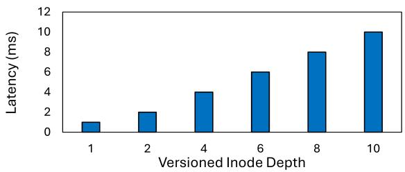  
(a)

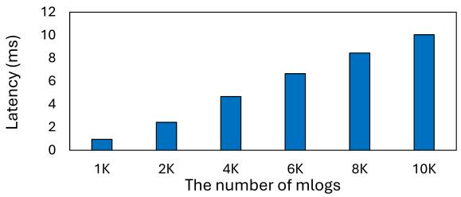  
(b)  
Figure 15: (a) searching time over versioned inode depths and (b) conversion time over the different numbers of mlogs.

## 6 Related Works

Delta Synchronization in Cloud Backup. Many previous works discuss how to use delta synchronization to improve the cloud backup efficiency [5, 6, 10, 11, 24, 34, 36, 38]. Drago [10, 11] introduced five critical capabilities of cloud backup: chunking, bundling, deduplication, delta-encoding, and compression. Tridgell [34] introduces rsync algorithm that uses rolling checksum to identify modified data. Cui [9] considered the backup efficiency of mobile cloud backup applications and proposed QuickSync to reduce unnecessary sync traffic. Xiao [38] moves the heavy hash computation and comparison from the client side to the server side. Xia [36] introduces content-defined chunking to improve the hash comparison during delta synchronization. Wu [35] designs a faster delta synchronization mechanism in encrypted cloud storage. In addition to the protocol improvement of delta synchronization, some researchers propose lightweight algorithms to improve their computational efficiency [22, 37, 44] However, these efforts still require intensive computation on hash calculation and comparison, significantly increasing the CPU usage and power consumption on resource-limited mobile devices. SolFS mitigates hash computation in delta synchronization based on the collaborative design between cloud backup APPs and file system.

File Snapshotting and Versioning. Many file systems implement file snapshotting or versioning mechanisms. Most of file systems support snapshotting or versioning based on a copy-on-write manner [1, 4, 28–30, 33], in which newly modified data is written to a new block while the old data is kept accessible to the snapshot file. file fragmentation because file data is scattered in multiple inodes, which reduces the sequential read performance. BetrFS [42] mitigates the fragmentation issue in snapshot file systems by caching random writes. In addition to copy-on-write, data logging is another common approach for snapshotting or versioning mechanisms. NOVA-Fortis [40] implements snapshotting by inserting private data logs into each inode. WaybackFS [7] implements versioning by storing old modified data as undo logs in an auxiliary inode. However, these efforts require additional storage space to store modified data because they need to keep track of the file data for a specific snapshot/version of the file. Therefore, SolFS does not adopt these designs to identify old and new modified data. It stores operation logs only rather than file data, and thus significantly reduces the storage usage.

## 7 Conclusions

Cloud backup is high-cost on mobile devices. SolFS aims to improve its computation overhead of delta synchronization on mobile devices. It introduces MLogging, which allows each file to manage its write operation logs (i.e., offset and length) in an extent tree, and the operation log persistence and versioning mechanism. Combining these techniques together, SolFS achieves hash-free difference identification while minimizing the additional cost to the original system. We evaluated SolFS on commercial smartphones and the results show that it can significantly reduce the computational overhead of both APPside or server-side by over 90% on average and the total cloud synchronization time by over 88% when files are updated.

## References

[1] OpenZFS on Linux. https://zfsonlinux.org/, 2019. [Online; accessed 13-September-2022].

[2] Android. Power Profiler. https://developer. android.com/studio/profile/power-profiler, 2024. [Online; accessed 13-May-2024].

[3] Enrico Bocchi, Idilio Drago, and Marco Mellia. Personal cloud storage: Usage, performance and impact of terminals. In 2015 IEEE 4th International Conference on Cloud Networking (CloudNet), pages 106–111. IEEE, 2015.

[4] Bolosky, William J and Corbin, Scott and Goebel, David and Douceur, John R. Single instance storage in Windows 2000. In Proceedings of the 4th USENIX Windows Systems Symposium, pages 13–24. Seattle, WA, 2000.

[5] Fei Chen, Zhipeng Li, Changkun Jiang, Tao Xiang, and Yuanyuan Yang. Cloud object storage synchronization:

Design, analysis, and implementation. IEEE Transactions on Parallel and Distributed Systems, 33(12):4295– 4310, 2022.

[6] Cheng-Kang Chu, Wen-Tao Zhu, Jin Han, Joseph K Liu, Jia Xu, and Jianying Zhou. Security concerns in popular cloud storage services. IEEE Pervasive Computing, 12(4):50–57, 2013.

[7] Brian Cornell, Peter A Dinda, and Fabián E Bustamante. Wayback: A user-level versioning file system for linux. In Proceedings of Usenix Annual Technical Conference, FREENIX Track, pages 19–28, 2004.

[8] Jace Courville and Feng Chen. Understanding storage i/o behaviors of mobile applications. In 2016 32nd Symposium on Mass Storage Systems and Technologies (MSST), pages 1–11. IEEE, 2016.

[9] Cui, Yong and Lai, Zeqi and Wang, Xin and Dai, Ningwei. Quicksync: Improving synchronization efficiency for mobile cloud storage services. IEEE Transactions on Mobile Computing, 16(12):3513–3526, 2017.

[10] Idilio Drago, Enrico Bocchi, Marco Mellia, Herman Slatman, and Aiko Pras. Benchmarking personal cloud storage. In Proceedings of the 2013 Conference on Internet Measurement Conference, pages 205–212, 2013.

[11] Idilio Drago, Marco Mellia, Maurizio M. Munafo, Anna Sperotto, Ramin Sadre, and Aiko Pras. Inside dropbox: understanding personal cloud storage services. In Proceedings of the 2012 internet measurement conference, pages 481–494, 2012.

[12] Dropbox. Content Hash. https://www.dropbox.com/ developers/reference/content-hash, 2023. [Online; accessed 4-April-2023].

[13] Exploding Topics. How Many People Own Smartphones? https://explodingtopics.com/blog/ smartphone-stats, 2023. [Online; accessed 13-May-2024].

[14] Google LLC. Android NDK. https://developer. android.com/ndk, 2024. [Online; accessed 13-Jun-2024].

[15] Sangwook Shane Hahn, Sungjin Lee, Cheng Ji, Li-Pin Chang, Inhyuk Yee, Liang Shi, Chun Jason Xue, and Jihong Kim. Improving file system performance of mobile storage systems using a decoupled defragmenter. In 2017 USENIX Annual Technical Conference (USENIX ATC 17), pages 759–771, 2017.

[16] Matthew Halpern, Yuhao Zhu, and Vijay Janapa Reddi. Mobile cpu’s rise to power: Quantifying the impact of generational mobile cpu design trends on performance,

energy, and user satisfaction. In 2016 IEEE International Symposium on High Performance Computer Architecture (HPCA), pages 64–76. IEEE, 2016.

[17] Sooman Jeong, Kisung Lee, Seongjin Lee, Seoungbum Son, and Youjip Won. I/O stack optimization for smartphones. In 2013 USENIX Annual Technical Conference (USENIX ATC 13), pages 309–320, San Jose, CA, June 2013. USENIX Association.

[18] Cheng Ji, Li-Pin Chang, Sangwook Shane Hahn, Sungjin Lee, Riwei Pan, Liang Shi, Jihong Kim, and Chun Jason Xue. File fragmentation in mobile devices: Measurement, evaluation, and treatment. IEEE Transactions on Mobile Computing, 18(9):2062–2076, 2018.

[19] Cheng Ji, Riwei Pan, Li-Pin Chang, Liang Shi, Zongwei Zhu, Yu Liang, Tei-Wei Kuo, and Chun Jason Xue. Inspection and characterization of app file usage in mobile devices. ACM Transactions on Storage (TOS), 16(4):1– 25, 2020.

[20] Dohyun Kim, Kwangwon Min, Joontaek Oh, and Youjip Won. ScaleXFS: Getting scalability of XFS back on the ring. In 20th USENIX Conference on File and Storage Technologies (FAST 22), pages 329–344, Santa Clara, CA, February 2022. USENIX Association.

[21] Changman Lee, Dongho Sim, Jooyoung Hwang, and Sangyeun Cho. {F2FS}: A new file system for flash storage. In 13th USENIX Conference on File and Storage Technologies (FAST 15), pages 273–286, 2015.

[22] Giwon Lee, Haneul Ko, and Sangheon Pack. An efficient delta synchronization algorithm for mobile cloud storage applications. IEEE Transactions on Services Computing, 10(3):341–351, 2015.

[23] Zhenhua Li, Cheng Jin, Tianyin Xu, Christo Wilson, Yao Liu, Linsong Cheng, Yunhao Liu, Yafei Dai, and Zhi-Li Zhang. Towards network-level efficiency for cloud storage services. In Proceedings of the 2014 Conference on Internet Measurement Conference, pages 115–128, 2014.

[24] Zhenhua Li, Christo Wilson, Zhefu Jiang, Yao Liu, Ben Y Zhao, Cheng Jin, Zhi-Li Zhang, and Yafei Dai. Efficient batched synchronization in dropbox-like cloud storage services. In ACM/IFIP/USENIX International Conference on Distributed Systems Platforms and Open Distributed Processing, pages 307–327. Springer, 2013.

[25] Yu Liang, Riwei Pan, Tianyu Ren, Yufei Cui, Rachata Ausavarungnirun, Xianzhang Chen, Changlong Li, Tei-Wei Kuo, and Chun Jason Xue. CacheSifter: Sifting cache files for boosted mobile performance and lifetime.

In 20th USENIX Conference on File and Storage Technologies (FAST 22), pages 445–459, Santa Clara, CA, February 2022. USENIX Association.

[26] Linux Manual Page. Xattr - Extended attributes. https://man7.org/linux/man-pages/man7/ xattr.7.html, 2023. [Online; accessed 13-September-2023].

[27] Linux Manual Page. Write(2). https://man7.org/ linux/man-pages/man2/write.2.html, 2024. [Online; accessed 13-May-2024].

[28] Kiran-Kumar Muniswamy-Reddy, Charles P Wright, Andrew Himmer, and Erez Zadok. A versatile and useroriented versioning file system. In FAST, volume 4, pages 115–128, 2004.

[29] Zachary Peterson and Randal Burns. Ext3cow: A timeshifting file system for regulatory compliance. ACM Transactions on Storage (TOS), 1(2):190–212, 2005.

[30] Ohad Rodeh, Josef Bacik, and Chris Mason. Btrfs: The linux b-tree filesystem. ACM Transactions on Storage (TOS), 9(3):1–32, 2013.

[31] Nikolai Samteladze and Ken Christensen. Delta: Delta encoding for less traffic for apps. In 37th Annual IEEE Conference on Local Computer Networks, pages 212– 215. IEEE, 2012.

[32] Statista. Number of smartphones sold to end users worldwide from 2007 to 2023. https://www.statista.com/statistics/263437/ global-smartphone-sales-to-end-users-\ since-2007/, 2023. [Online; accessed 13-December-2024].

[33] Adam Sweeney, Doug Doucette, Wei Hu, Curtis Anderson, Mike Nishimoto, and Geoff Peck. Scalability in the xfs file system. In USENIX Annual Technical Conference, volume 15, 1996.

[34] Tridgell, Andrew and Mackerras, Paul and others. The rsync algorithm. Joint Computer Science Technical Report Series, The Australian National University, TR-CS-96-05, 1996.

[35] Suzhen Wu, Zhanhong Tu, Yuxuan Zhou, Zuocheng Wang, Zhirong Shen, Wei Chen, Wei Wang, Weichun Wang, and Bo Mao. Fastsync: a fast delta sync scheme for encrypted cloud storage in high-bandwidth network environments. ACM Transactions on Storage, 19(4):1– 22, 2023.

[36] Wen Xia, Can Wei, Zhenhua Li, Xuan Wang, and Xiangyu Zou. Netsync: A network adaptive and deduplication-inspired delta synchronization approach

for cloud storage services. IEEE Transactions on Parallel and Distributed Systems, 33(10):2554–2570, 2022.

[37] Wen Xia, Yukun Zhou, Hong Jiang, Dan Feng, Yu Hua, Yuchong Hu, Qing Liu, and Yucheng Zhang. {FastCDC}: A fast and efficient {Content-Defined} chunking approach for data deduplication. In 2016 USENIX Annual Technical Conference (USENIX ATC 16), pages 101–114, 2016.

[38] He Xiao, Zhenhua Li, Ennan Zhai, Tianyin Xu, Yang Li, Yunhao Liu, Quanlu Zhang, and Yao Liu. Towards web-based delta synchronization for cloud storage services. In 16th USENIX Conference on File and Storage Technologies (FAST 18), pages 155–168, 2018.

[39] Weijun Xiao, Yinan Liu, Qing Yang, Jin Ren, and Changsheng Xie. Implementation and performance evaluation of two snapshot methods on iscsi target storages. In Proc. of NASA/IEEE Conference on Mass Storage Systems and Technologies. Citeseer, 2006.

[40] Jian Xu, Lu Zhang, Amirsaman Memaripour, Akshatha Gangadharaiah, Amit Borase, Tamires Brito Da Silva, Steven Swanson, and Andy Rudoff. Nova-fortis: A faulttolerant non-volatile main memory file system. In Proceedings of the 26th Symposium on Operating Systems Principles, pages 478–496, 2017.

[41] Yhirose. cpp-httplib. https://github.com/ yhirose/cpp-httplib, 2024. [Online; accessed 13- Jun-2024].

[42] Yang Zhan, Alexander Conway, Yizheng Jiao, Nirjhar Mukherjee, Ian Groombridge, Michael A Bender, Martin Farach-Colton, William Jannen, Rob Johnson, Donald E Porter, et al. How to copy files. In 18th USENIX Conference on File and Storage Technologies (FAST 20), pages 75–89, 2020.

[43] Tiangmeng Zhang, Renhui Chen, Zijing Li, Congming Gao, Chengke Wang, and Jiwu Shu. Design and implementation of deduplication on f2fs. ACM Transactions on Storage, 2024.

[44] Yucheng Zhang, Hong Jiang, Dan Feng, Wen Xia, Min Fu, Fangting Huang, and Yukun Zhou. Ae: An asymmetric extremum content defined chunking algorithm for fast and bandwidth-efficient data deduplication. In 2015 IEEE Conference on Computer Communications (INFOCOM), pages 1337–1345. IEEE, 2015.