①

USENIX

THE ADVANCED COMPUTING SYSTEMS ASSOCIATION

# XRT: An Accelerator-Aware Runtime for Accelerated Chip Multiprocessors

Neel Patel and Mohammad Alian, Cornell University https://www.usenix.org/conference/atc25/presentation/patel

# This paper is included in the Proceedings of the 2025 USENIX Annual Technical Conference.

July 7–9, 2025 • Boston, MA, USA ISBN 978-1-939133-48-9

Open access to the Proceedings of the 2025 USENIX Annual Technical Conference is sponsored by

P--r.h £Es/sL.

auuJl9 PgleU

King Abdullah University of

Science and Technology

# XRT: An Accelerator-Aware Runtime for Accelerated Chip Multiprocessors

Neel Patel

Cornell University

Ithaca, NY, USA

Mohammad Alian

Cornell University

Ithaca, NY, USA

## Abstract

Datacenter applications spend a considerable portion of compute resources executing common functions. This has led to the deployment of accelerators capable of executing these functions with higher performance and energy efficiency. At the same time, datacenter applications require microsecondscale response times and low tail latency. To meet these strict requirements, recent Chip Multi-Processors (CMPs) incorporate several on-chip accelerators. This enables fast communication between the general-purpose cores, direct accelerator access to the on-chip memory subsystem, and scalable sharing of accelerator resources across applications running on many general-purpose cores. Despite hardware support for on-chip accelerators, a lack of support at the runtime level prevents their efficient use at scale.

Our key insight in this work is that current runtimes are unsuitable for applications that make heavy use of on-chip accelerators, yielding suboptimal throughput–sometimes even worse than a system without accelerators. To address this problem, we develop XRT, a runtime for accelerated CMPs designed to scale to many-core, many-accelerator CPUs. Across a set of representative services, XRT achieves up to 3.2× higher throughput-under-SLO compared to an unoptimized runtime and never experiences slowdowns compared to a system that executes all request processing on general-purpose cores.

## 1 Introduction

The integration of accelerators onto server processors, positioned near general-purpose cores, represents a significant advancement in datacenter computing [20, 34, 39, 40, 48]. We refer to these server processors as Accelerated Chip Multi-Processors (XMPs). The accelerators on XMPs are designed to efficiently execute fixed-function kernels, offering the potential for substantial performance improvements and energy savings. As XMPs enter the datacenter [6, 8], it becomes increasingly important to increase accelerator utilization so their performance efficiency and application-level throughput benefits can be realized at scale.

State-of-the-art runtimes can meet the strict tail-latency Service-Level Objectives (SLOs) expected of datacenter applications [25, 29, 30, 36, 41], but they do not consider accelerators. These runtimes instead assume the entire end-to-end execution of a request takes place on a general-purpose core. With the current runtimes, there is no guarantee that application throughput increases when requests offload to accelerators. Our results show that, without a specialized runtime for XMPs, offloading to an accelerator can result in worse performance than performing all processing on the cores.

To enumerate the challenges with adapting existing CMP runtimes for XMPs, we perform a design space exploration of prevailing CMP runtime architectures which yields three insights. First, we find that a centralized scheduler–similar to the one used in state-of-the-art runtimes like Concord [29]– quickly becomes the bottleneck on an XMP–as it is tasked with both managing accelerator notifications and load balancing requests to the worker cores. Second, we observe that even a runtime like Tiny Quanta [36]–which implements a scalable two-level scheduling policy–incurs unnecessary context switches as the scheduler resumes threads that are still waiting on an offload to complete. Last, we find that, on an XMP, both cores and accelerators can become the system bottleneck. Since an accelerator must be invoked by a core, a contended accelerator can stall a core when offloading a function, reducing system throughput.

To address these challenges, we develop a scalable system architecture that divides the work of managing accelerator notifications across the many cores in the system. XRT mitigates stalls in request processing when accelerators are contended through the use of an efficient software fallback mechanism. XRT also implements an accelerator-aware request scheduler, which eliminates unnecessary context switches by only resuming threads whose offloads are guaranteed to be complete. Across a set of representative services, our design achieves up to 3.2× higher throughput under SLO than state-of-the-art CMP runtimes, up to 32× higher throughput than an unaccelerated system, and never experiences slowdowns compared to a system without accelerators.

## 2 Background

The State of On-Chip Acceleration on Server CMPs. Today’s commodity server processors integrate a multitude of accelerators for datacenter taxes and key functions like (de)compression, de/encryption, database queries, data movement, and AI workloads [20, 22, 23, 39, 40]. Large-scale fleet studies show these taxes consume a measurable share of CPU cycles, energy, and infrastructure spending, making it lucrative to move them from the cores to the more efficient accelerators [31, 32, 49]. Software support for accelerators comes in the form of vendor-provided libraries that expose APIs for programmers to invoke an accelerator’s functionality. In many cases, these libraries implement the same APIs as the functions that run on the general-purpose core, enabling applications to integrate accelerators without any changes to the source code [5, 16, 44, 53]. Intel Xeon 4th and 5th generation XMPs offer SKUs with four different accelerators–the Data Streaming Accelerator (DSA), the In-Memory Analytics Accelerator (IAA), QuickAssist Technology (QAT), and the Dynamic Load Balancer (DLB) [54]. IAA targets analytics primitives, compression, and checksum operations, while DSA targets data movement and transformation. QAT also provides compression support as well as cryptography capabilities. DLB accelerates communication between cores using hardware-managed queues.

Hardware support has been introduced into Intel XMPs to reduce communication and data movement overheads between the cores and accelerators. To reduce memory access overheads, XMPs implement shared virtual memory (SVM) and device-side translation lookaside buffers, enabling accelerators to efficiently access a process’s address space using the same virtual addresses as the core. To enable efficient sharing of accelerators between multiple cores, accelerators implement shared work queues, which are device-side hardware queues that contain in-flight offloads submitted from multiple processes. Shared work queues are useful in multitenant settings since they enable cores to enqueue offload descriptors (that include operations such as memcpy, decompress, etc.) to an accelerator using specialized instructions that return a “success” or “retry” status. A “retry” lets the core know that its submission failed due to insufficient work queue capacity or other errors [7].

A low overhead interface minimizes the offload tax, which is an overhead paid by the core when it submits an offload to an accelerator and when it checks for a notification that the offload has been completed. This enables even microsecondscale requests to benefit from the increased performance efficiency provided by accelerators [54]. On an XMP, the end-toend execution of a request can look like any of the three modes of execution shown in Figure 1: NoAcceleration, Block&Wait, and Yield. NoAcceleration does not utilize the available accelerators on the XMP, executing all functions on the core. As explained previously, on state-of-the-art XMPs, it is possible to run some functions on one of the available accelerators. We use the term Accelerable function to refer to any function which can be run on either an accelerator or a core. Block&Wait seeks to improve on the NoAcceleration mode by offloading an Accelerable Function to a specialized accelerator, however it leaves the core underutilized. Yield makes use of the wasted core cycles left behind by Block&Wait, using them to execute a Filler function, which can be a function from another request (Pre- or Post-Processing Function in Figure 1) or an entirely different application.

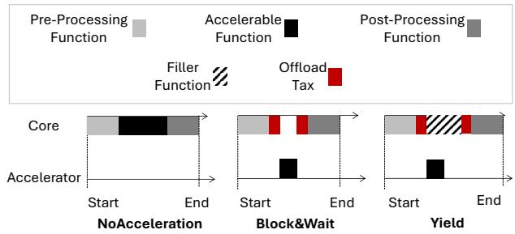  
Figure 1: XMPs enable offloading Accelerable Functions to specialized accelerators. A Yielding mode of execution can make use of Blocking stalls when the core would otherwise be waiting for offload completion.

Current CMP Runtimes. State-of-the-art runtimes consider homogeneous CMPs, composed entirely of cores, and develop load balancing and scheduling policies to meet the SLOs of production workloads [25, 29, 30, 36]. These runtime systems use a dedicated thread, called the dispatcher, that runs on a single core and polls the NIC for incoming requests and enqueues them to a set of worker threads running on other cores. The workers are responsible for executing the requests [29, 30, 36].

A runtime system has two roles: (1) load balancing requests across the processing elements in the system and (2) scheduling the requests–choosing the request that executes next. State-of-the-art CMP runtimes fall into two categories: (1) Dispatcher-Centric where the dispatcher performs both load-balancing and request scheduling [29] and (2) Worker-Centric, which uses a two-level scheduling policy in which the dispatcher only distributes requests while each worker’s local scheduler determines the execution order of its own requests [36]. Recent work has identified that more complex scheduling policies, like processor sharing [33], require a worker-centric, two-level scheduling policy–where the tasks of load-balancing and scheduling requests are divided between the dispatcher and workers–if they are to remain scalable to many-core systems [36]. In the era of XMPs, where even more intricate scheduling policies are needed to schedule functions on both cores and accelerators, this division of responsibilities becomes critical. A required feature of twolevel scheduling policies is a userspace thread abstraction to enable worker cores to quickly context switch between different requests.

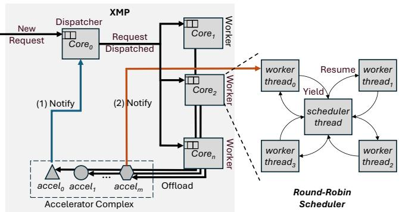  
Figure 2: Integration of accelerators into existing CMP runtimes. In a Dispatcher-Centric system (Path 1), accelerator notifications are handled by the centralized dispatcher thread. In a Worker-Centric system (Path 2), notifications are handled by the core’s local worker threads.

TinyQuanta [36]–which is the state-of-the-art Worker-Centric runtime–implements a shallow local queue per worker core that contains four outstanding requests, each represented by a userspace thread implemented using Boost coroutines [4]. TinyQuanta also maintains a fifth userspace thread context per worker core that implements the scheduling functionality of the runtime. The per-worker-core scheduler thread approximates processor sharing by cycling through its local queue in round-robin order, scheduling a thread that has either cooperatively yielded or is waiting to be scheduled for the first time.

## 3 A Runtime for XMPs

In this section, we search the space of CMP runtimes for a scalable system architecture suitable for XMPs. We start by integrating accelerator support into the two prevailing system architectures explained in Section 2, Worker-Centric and Dispatcher-Centric. Dispatcher-Centric can be advantageous since it has global visibility when making scheduling decisions, but complex scheduling algorithms, such as processor sharing, and notification signals from many accelerators can make the dispatcher a bottleneck. Worker-Centric removes the burden of scheduling from the dispatcher, but can only schedule a subset of the requests–those it has been given by the dispatcher. It is not abundantly clear which design better fits XMPs. To evaluate the tradeoffs of both designs, we develop runtimes that follow both approaches, adding support to enable applications to offload Accelerable Functions to accelerators.

We extend the centralized dispatcher in the baseline

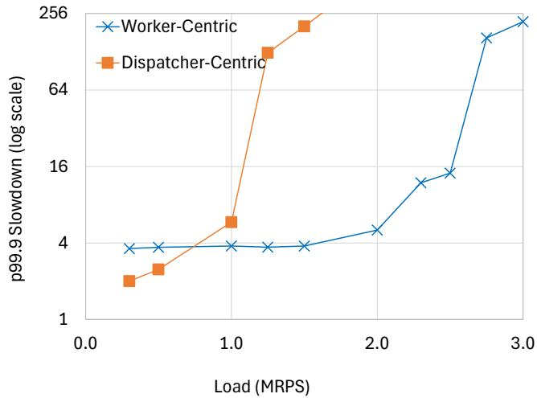  
Figure 3: Comparison between Worker-Centric and Dispatcher-Centric runtime executing DDH workload on an XMP.

Dispatcher-Centric runtime to collect accelerator notifications (Path 1 in Figure 2). To enable a Worker-Centric runtime with accelerator support (Path 2 in Figure 2), we extend TinyQuanta [36]. This baseline Worker-Centric XMP runtime implements the Yield mode of execution by switching the worker core’s context to the scheduler thread every time a thread yields. A thread yields after an offload, request completion, or failed polling of the accelerator. In this implementation, the thread context that performs an offload is responsible for polling the accelerator for completion. The polling is transparent to the scheduler thread, and the scheduler thread does not know whether a worker thread is going to begin executing a Pre-Processing or Post-Processing Function, or is polling for the completion of an Accelerable Function.

We compare the performance of the two runtime systems processing requests for an in-memory data stream processing workload (DDH in Table 1). Specifically, we evaluate the 99.9th percentile slowdown in request processing at different load levels. Slowdown at a given load is defined as the request processing latency normalized to the execution time in the Block&Wait mode. See Section 6 for more details on our methodology. Figure 3 shows that a Worker-Centric system avoids violating a 50× 99.9th percentile request slowdown SLO for this service up to approximately 2.5 MRPS, whereas the Dispatcher-Centric system only reaches around 1.0 MRPS. Our results indicate that the added burden of handling accelerator notifications at the dispatcher imposes a significant system throughput overhead. This highlights a fundamental limitation of Dispatcher-Centric in supporting XMPs, and thus we implement XRT as a Worker-Centric runtime.

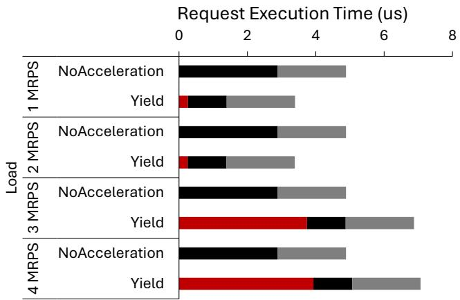  
Stalled Accelerable Function Post-Processing Function

Figure 4: End-to-end breakdown of request execution time for a workload executing a memcpy Accelerable Function followed by a Post-Processing Function using the NoAcceleration and Yield modes of execution. “Stalled” is the time that a core waits for a full accelerator to become available.

## 4 Motivation

Despite demonstrating the potential of using Worker-Centric principles to develop a scalable runtime for XMPs, we identify two limitations in this baseline Worker-Centric runtimes:

Unnecessary Resumption Overhead. We find that a naive scheduler–unaware of requests’ in-flight offloads–is unable to efficiently resume requests once their respective offloads are complete. Under the Yield mode of execution, worker threads relinquish the core to the scheduler after offloading. To complete request processing, the scheduler must later resume the offloading thread. The Worker-Centric runtime handles this by iterating through each busy worker thread in a round-robin manner, giving each thread a chance to complete any remaining Post-Processing Function after its offload has finished on an accelerator. However, this approach provides no guarantee that a worker thread’s offload is complete when the scheduler resumes it. This leads to unnecessary resumptions, where the thread is woken up only to find that the offload is still in progress, causing it to yield the core back to the scheduler. In the experiment presented in Figure 3, each request experiences, on average, 21 unnecessary resumptions–indicating a substantial context-switching overhead. While the overhead of a single context switch is only ∼30 cycles, these wasted cycles accumulate. For the DDH workload, which has an unloaded per request latency of approximately 4µs with the Block&Wait mode of execution, unnecessary resumptions account for 13% of each request’s end-to-end execution time. Stalls on Contended Accelerators. Under the Yield mode of execution, an accelerator can become highly utilized as worker threads submit offloads and yield the core. This allows a single worker core to maintain multiple offloads in flight simultaneously. In contrast, under the Block&Wait mode of execution–where control is not yielded to the scheduler after offloading–the number of concurrent offloads is limited by the number of cores in the system (26 on our testbed system; see Section 6). Depending on the workload and request arrival rate, the accelerator’s queue can become full as hundreds of worker threads issue concurrent offload requests. This results in threads stalling at offload time, as the accelerator is unable to accept additional requests.

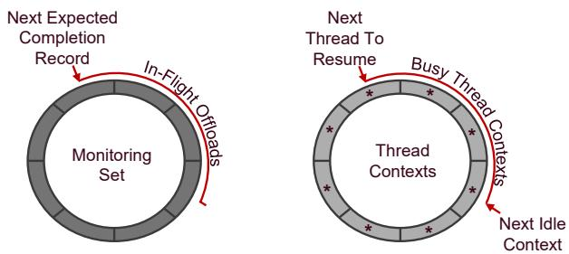  
Figure 5: Ring buffers maintained by a worker core’s scheduler thread. The scheduler periodically polls the Next 0% Expected Completion Record to check for completion of an accelerator-offloaded function. If the completion record is Load (MRPS) set by the accelerator, the Next Thread To Resume is ready to run on the core.

To quantify the execution time spent stalling during an offload to a saturated accelerator, we run a synthetic workload that executes a memcpy function (i.e., Accelerable Function) followed by a Post-Processing Function that spins for 2µs. Figure 4 shows the breakdown of end-to-end request execution time as the server load increases under both Yield and NoAcceleration modes. As load increases toward the system’s maximum sustainable throughput, request execution time in the Yield mode grows, eventually surpassing that of the NoAcceleration mode after reaching 3 MRPS. At high loads–where accelerator contention causes cores to spend a majority of their time stalled on a full accelerator–it becomes preferable to execute the Accelerable Function directly on the core rather than offloading it to the accelerator.

## 5 XRT: An Optimized Runtime for XMPs

We develop XMP RunTime (XRT) to address the limitations of the naive Worker-Centric runtime discussed in Section 3. Similar to TinyQuanta [36], XRT’s two-level scheduling policy designates a single dispatcher core as the request load balancer and delegates request scheduling to the worker cores. At the dispatcher, XRT employs Join-the-Shortest-Queue (JSQ) load balancing, which has been shown to achieve near-optimal load distribution [45]. XRT maintains a shallow queue at each worker, eliminating the overhead incurred when worker cores poll an empty queue [29].

XRT mitigates unnecessary resumption overhead and reduces stalled core cycles on contended accelerators through a notification-aware scheduler and a software fallback mechanism.

## 5.1 Notification-Aware Scheduler

To avoid unnecessary request resumptions and the associated context-switching overhead, we design the worker’s scheduler around the accelerator notification mechanism. The scheduler thread uses two ring buffers, shown in Figure 5, to track the state of pending offloads and manage the contexts of busy and idle userspace work threads.

The Monitoring Set ring buffer is an array of cachelinesized completion records–simple data structures used by accelerators to notify the worker core when an offload is complete. Intel’s accelerator interface implementation [52] includes a field in the offload descriptor specifying the address where the completion record should be written by the accelerator upon offload completion. XRT leverages this capability to populate the Monitoring Set ring buffer.

The Thread Contexts ring buffer is an array of pointers to worker thread contexts. The scheduler maintains a logical mapping between completion records and thread contexts, allowing it to promptly wake the correct idle thread once its offload completes.

By exploiting the fact that accelerators process offloads in a first-come, first-served order, the scheduler only needs to poll the completion record corresponding to the next expected offload completion.

XRT’s notification-aware scheduler addresses unnecessary resumption overhead by allowing the scheduler to directly check the status of the next expected completion record in the L1 cache–within 2–3 cycles–compared to the baseline, where the scheduler context-switches to the worker thread and incurs approximately 30 cycles before determining that the offload has not yet completed.

## 5.2 Software Fallback

We leverage instruction set extensions on Intel XMPs [28] to implement a simple offload decision-making procedure. When attempting to offload an Accelerable Function, the worker core uses the ENQCMD instruction [7] to write an offload request descriptor to a memory-mapped register on the accelerator. In addition to performing a write-combined, uncacheable store operation, ENQCMD also returns a status indicating whether the offload was accepted by the accelerator. Rather than stalling on a full accelerator, XRT falls back to a core-executed software implementation of the Accelerable Function. This avoids wasting core cycles on repeated offload attempts.

## 5.3 Putting It All Together

Figure 6 shows the design of XRT. To illustrate its operation, we walk through the lifetime of a single request executed using XRT. For simplicity, we consider a three-phase application with a single Accelerable Function, similar to those shown in Figure 1.

A request is first received and parsed by the Dispatcher. The Dispatcher identifies the worker with the shortest queue of pending requests using a priority-queue-based implementation of the JSQ algorithm, which uses counters to track the number of enqueued requests at each worker. The request is then enqueued to the core of the worker with the fewest pending requests.

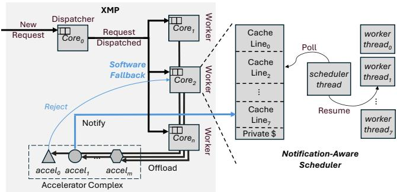  
Figure 6: XRT uses a scalable two-level scheduling policy that features a notification-aware scheduler and a software fallback mechanism.

When the request reaches the head of the worker’s queue, the scheduler thread assigns it to an idle thread and performs a context switch into that thread. The Pre-Processing Function then begins execution on the worker core. After the Pre-Processing Function completes, the worker attempts to offload the Accelerable Function to an accelerator. As described in Section 5.2, the worker makes a single offload attempt and falls back to a software implementation if the offload is unsuccessful.

If the offload is successful, the thread yields the core, allowing the worker to process other requests. Between request executions, the worker periodically polls the monitoring set for notifications from the accelerator. Upon receiving a notification, the worker resumes the corresponding ready-to-run thread, which is now guaranteed to have completed its offload. The thread then executes its Post-Processing Function, completing the request.

## 6 Methodology

Runtime Configurations. We compare the following runtime configurations: one that makes no use of accelerators (NoAcceleration); traditional block and wait runtime (Block&Wait); the naive XMP runtime presented in Section 3, which employs a round-robin scheduling policy to cyclically context-switch between threads that have yielded the core after offloading (RR-Worker); and XRT, which incorporates the optimizations described in Section 5.

Workloads. We develop the five representative workloads presented in Table 1. We select the combination of workloads to capture different computational intensities, access patterns, and use cases for the DSA and IAA accelerators on 4th and 5th generation Intel Xeon CPUs. Except for DC and MC, each workload follows the three-phase execution model illustrated in Figure 1. A request executes three functions: a Pre-Processing Function, an Accelerable Function, and a Post-Processing Function. The Pre-Processing Function and

Post-Processing Function always execute on a core, while the Accelerable Function can either run on a core or be offloaded to an accelerator. DC and MC do not have a Pre-Processing Function, modeling workloads where the request performs no core preprocessing and executes the Accelerable Function immediately. A request’s response time is dependent on the input data size. Similar to prior work, we use an exponential service time distribution to represent µs-scale workloads with a light tail [29, 30, 36, 43] and choose the average input data size to match the respective workload [15, 27, 49–51].

Testbed. We run experiments on a 5th generation Intel Xeon 8571N CPU with four IAA and four DSA accelerators. We enable process address space identifiers (PASID), SVM, and configure accelerators with shared work queues using the accel-config library [17]. By configuring the accelerators with shared work queues, multiple cores can simultaneously submit offloads to the same accelerator, and receive notification of a failed offload attempt using the ENQCMD instruction [52], as explained in Section 5.2. Our testbed’s CPU has two NUMA nodes. One NUMA node is configured to be the load generator, and the other is the server node. We have the load generator send requests according to a Poisson process to emulate bursty production traffic [29, 43].

In all experiments, all 26 cores are utilized–one for the dispatcher and the remaining as workers. Depending on the workload, worker threads offload to the two DSA or two IAA accelerators on the server node. Each accelerator is configured with a single shared work queue.

Metrics. The workloads under evaluation have very different latencies, so we report a single metric: 99.9th percentile slowdown, similar to prior work [29]. To calculate the slowdown of a request, the end-to-end request latency, including system overheads such as request dequeue and enqueue operations, is divided by the execution time of an uninterrupted, accelerated request running using the Block&Wait mode of execution.

## 7 Evaluation

In this section, we seek to evaluate XRT’s performance on the workloads presented in Table 1. We compare against runtimes that have not been specialized for on-chip accelerators to show how XRT’s optimizations improve performance.

For both workloads that use decompression (DDH and DC), NoAcceleration is outperformed by all other systems. The compute-intensive decompression function running on a core causes slowdowns even at low load levels. Despite most of the performance improvement coming from offloading decompression to the accelerator, XRT still outperforms RR-Worker on DDH and DC. Both XRT and RR-Worker outperform Block&Wait since they yield the core after submitting an offload to an accelerator, enabling higher core utilization.

Both workloads that perform memory copies only benefit from offloading when executing under the XRT runtime. Block&Wait cannot outperform NoAcceleration on DMD or MC because using an accelerator to perform memcpy of data held in a worker core’s private caches actually takes longer than executing the memcpy on the core. RR-Worker succumbs to the throughput overheads that come with blocking on an accelerator, mentioned in Section 4. Since DMD and MC are accelerator-bound workloads, the accelerator becomes the bottleneck. We observe that, at high load, requests executing under the RR-Worker scheduler are slowed by 14% on MC and 188% on DMD, due to blocking on a full accelerator. Without a software-fallback mechanism, like the one implemented by XRT, both Block&Wait and RR-Worker suffer from the throughput overheads associated with blocking on an accelerator. RR-Worker outperforms Block&Wait due to the higher core utilization enabled by the Yield mode of execution, but it still suffers from overheads from unnecessary resumptions.

The only workloads in which XRT’s tail latency improvements are negligible are MMP and UFH. This is because MMP is dominated by a lengthy Pre-Processing Function, which consumes 99.6% of the end-to-end execution time. Any overheads in the scheduler and offload mechanism are dwarfed by the long-running matrix-multiply which executes on the core, causing all systems to get similar performance. UFH also shows the same performance across the board since its Pre-Processing Function and Post-Processing Function make up the bulk of the execution time.

<table><tr><td rowspan=1 colspan=4>Workload</td><td rowspan=2 colspan=1>Description</td></tr><tr><td rowspan=1 colspan=1>D</td><td rowspan=1 colspan=1>Pre-Processing</td><td rowspan=1 colspan=1>Accelerable</td><td rowspan=1 colspan=1>Post-Processing</td></tr><tr><td rowspan=1 colspan=1>DDH</td><td rowspan=1 colspan=1>Deserialize</td><td rowspan=1 colspan=1>Decompress</td><td rowspan=1 colspan=1>Hash</td><td rowspan=1 colspan=1>Representative of message processing in distributed streaming platforms [1,2]. (De)serializesdata structures [1O],(de)compresses [42] to save network bandwidth,and applies a hashingalgorithm [19,37] to route between servers.</td></tr><tr><td rowspan=1 colspan=1>DC</td><td rowspan=1 colspan=1>一</td><td rowspan=1 colspan=1>Decompress</td><td rowspan=1 colspan=1>Chase</td><td rowspan=1 colspan=1>Representative of data-intensive workloads like databases [26], key-value stores [27],and graphprocessing applications [47] which perform pointer chasing.</td></tr><tr><td rowspan=1 colspan=1>MC</td><td rowspan=1 colspan=1>丨</td><td rowspan=1 colspan=1>Memcpy</td><td rowspan=1 colspan=1>Chase</td><td rowspan=1 colspan=1>Similar to DC but operates on uncompressed data.</td></tr><tr><td rowspan=1 colspan=1>MMP</td><td rowspan=1 colspan=1>MatMul</td><td rowspan=1 colspan=1>Memfill</td><td rowspan=1 colspan=1>PCA</td><td rowspan=1 colspan=1>Performs Principal Component Analysis (PCA) [51] after matrix multiplication and zeroing outhalf of the matrix. Representative of data analysis and preprocessng applications [46].</td></tr><tr><td rowspan=1 colspan=1>UFH</td><td rowspan=1 colspan=1>Update</td><td rowspan=1 colspan=1>Filter</td><td rowspan=1 colspan=1>Histogram</td><td rowspan=1 colspan=1>Updates a table, extracts a subset of its entries, and constructs a histogram. Representative ofdataanalyticsworkloads.</td></tr><tr><td rowspan=1 colspan=1>DMD</td><td rowspan=1 colspan=1>Decrypt</td><td rowspan=1 colspan=1>Memcpy</td><td rowspan=1 colspan=1>DotProduct</td><td rowspan=1 colspan=1>Representative of similarity scoring services used for content recommendation [49,50].</td></tr></table>

Table 1: List of workloads.

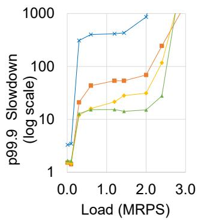  
(a) DDH

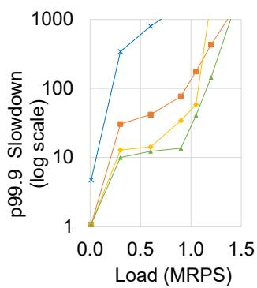

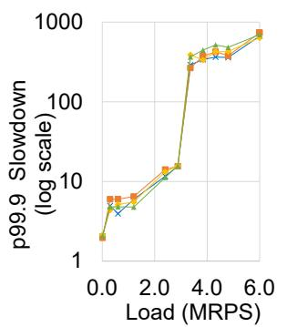

(b) DC  
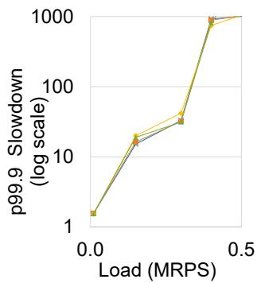  
(c) UFH

(d) MMP  
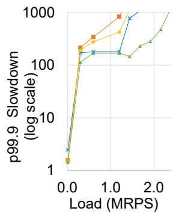  
(e) MC

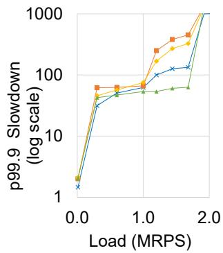  
(f) DMD  
Figure 7: Performance comparison of workloads executing with different runtime configurations.

## 8 Discussion

Hardware Support for XRT. XRT relies on SVM to implement its notification-aware scheduler. Intel, AMD, and ARM already support SVM [12,14,52] and, given the support from vendors and industry standards [9, 13, 24, 38], future XMPs will likely support SVM. XRT also relies on instruction set extensions to implement software fallback. In our implementation, the ENQCMD [7] instruction from Intel’s accelerator interface implementation [52] is used, but similar primitives, like RISC-V’s Atomic IO Enqueue [11] and ARM’s ST64BV [3], have been integrated on other architectures. These instructions would serve as drop-in replacements for ENQCMD when deploying XRT on other architectures.

Programming and Deployment XRT improves programmer productivity by enabling programmers to focus on application development rather than accelerator management and scheduling. Programmers write sequential programs using synchronous APIs [21], while XRT transparently handles scheduling decisions and accelerator management. XRT can be readily implemented in private clouds where the service provider has control over the entire hardware and software stack. Public cloud deployment is challenged by the fact that XRT is a single address space, userspace runtime, making it unsuitable to run mutually untrusted applications from multiple tenants. This could be addressed using userspace process abstractions which enforce isolation [35].

## 9 Conclusion

In this work, we demonstrated that existing runtime systems–originally designed for CMPs–are suboptimal for XMPs. We introduced XRT, a runtime system that efficiently integrates on-chip accelerators to support accelerable datacenter applications. XRT employs a scalable twolevel scheduling policy to prevent the dispatcher thread from becoming a bottleneck. Additionally, it incorporates two key mechanisms–a notification-aware scheduler and a software fallback mechanism–to mitigate unnecessary resumption overhead and stalls on contended accelerators when worker threads offload parts of request processing to on-chip accelerators. We evaluated XRT using six representative accelerable workloads that utilize four distinct functions offered by accelerators on an Intel $5 ^ { \mathrm { t h } }$ Generation Xeon CPU. Across all workloads, XRT matches or outperforms an unaccelerated system and achieves up to 3.2× higher throughput compared to a runtime system without accelerator-specific optimizations. XRT represents an early but significant step toward enabling microsecond-scale accelerator offloads in future highly heterogeneous systems at scale.

## Acknowledgments

This work was supported in part by NSF award 2239020 and by ACE one of the seven centers in JUMP 2.0, a Semiconductor Research Corporation (SRC) program sponsored by DARPA. Any opinions, findings, conclusions, and recommendations expressed in this material are those of the authors and do not necessarily reflect those of the sponsors. We thank Dr. Ren Wang from Intel Labs for her valuable insights and guidance on this topic.

## A Artifact Appendix Abstract

This appendix describes the hardware and software needed to build and run XRT.

## Hosting

XRT is hosted on GitHub.

## Requirements

Tested on Intel Xeon 8571N CPU with two IAA and two DSA accelerators on Ubuntu 24.04. Our implementation of XRT uses the idxd-config [17] library version 4.1.6 to map IAA/DSA work queues into userspace. For enc/decryption, we use the ipp-crypto library version 2021.6 [18] for enc/decryption. For (de)serialization, we use protobuf version 28 [10]. The Principal Component Analysis, Matrix Multiply, and histogram kernels were taken from the pheonix benchmark suite [51]. All of these dependencies are built automatically using the convenience build script in the repository.

## References

[1] Apache Flink® — Stateful Computations over Data Streams. Available at https://flink.apache.org/.

[2] Apache Pulsar | Apache Pulsar. Available at https: //pulsar.apache.org/.

[3] Arm A64 Instruction Set Architecture. Available at https://developer.arm.com/documentation/ ddi0596/2020-12/Base-Instructions/ST64BV-- Single-copy-Atomic-64-byte-Store-with-Return-.

[4] Boost Coroutine. Available at https://www.boost. org/doc/libs/1\_85\_0/libs/coroutine/doc/ html/coroutine/coroutine/asymmetric.html.

[5] Build Clickhouse with DEFLATE\_qpl | ClickHouse Docs. Available at https://clickhouse.com/docs/ en/development/building\_and\_benchmarking\_ deflate\_qpl.

[6] C3 machine series on Intel Sapphire Rapids now GA. Available at https://cloud.google.com/ blog/products/compute/c3-machine-series-onintel-sapphire-rapids-now-ga.

[7] ENQCMD — Enqueue Command. Available at https: //www.felixcloutier.com/x86/enqcmd.

[8] Introducing Amazon EC2 R7iz instances. Available at https://aws.amazon.com/about-aws/whatsnew/2022/11/introducing-amazon-ec2-r7izinstances/.

[9] The OpenCL™ Specification. Available at https: //registry.khronos.org/OpenCL/specs/3.0- unified/html/OpenCL\_API.html#\_shared\_ virtual\_memory.

[10] Protocol Buffers. Available at https://protobuf. dev/.

[11] RISC-V Summit Europe 2025 - Presentations. Available at https://riscv-europe.org/summit/2025/ presentations.

[12] Shared Virtual Memory. Arm Immortalis and Mali GPU OpenCL Developer Guide. Available at https: //developer.arm.com/documentation/101574/ 0600/OpenCL-2-0/Shared-virtual-memory.

[13] Standards – Heterogeneous System Architecture Foundation. Available at https://hsafoundation.com/ standards/.

[14] Unified memory HIP 6.2.41133 Documentation. Available at https://rocm.docs. amd.com/projects/HIP/en/docs-6.2.0/howto/unified\_memory.html.

[15] Introducing mcrouter: A memcached protocol router for scaling memcached deployments, September 2014. Available at https://engineering.fb.com/2014/ 09/15/web/introducing-mcrouter-a-memcachedprotocol-router-for-scaling-memcacheddeployments/.

[16] intel/DTO, May 2024, original-date: 2023-06- 30T02:00:49Z. Available at https://github.com/ intel/DTO.

[17] intel/idxd-config, March 2024, original-date: 2019-11- 16T00:14:21Z. Available at https://github.com/ intel/idxd-config.

[18] intel/ipp-crypto, September 2024, original-date: 2018- 07-06T22:16:28Z. Available at https://github.com/ intel/ipp-crypto.

[19] AAPPLEBY, smhasher/src/MurmurHash3.cpp. Available at https://github.com/aappleby/smhasher/ blob/master/src/MurmurHash3.cpp.

[20] B. ABALI, B. BLANER, J. REILLY, M. KLEIN, A. MISHRA, C. B. AGRICOLA, B. SENDIR, A. BUYUK-TOSUNOGLU, C. JACOBI, W. J. STARKE, H. MY-NENI, and C. WANG, Data compression accelerator on IBM POWER9 and z15 processors : Industrial product, in 2020 ACM/IEEE 47th annual international symposium on computer architecture (ISCA), 2020, pp. 1–14. https://doi.org/10.1109/ISCA45697. 2020.00012.

[21] L. BARROSO, M. MARTY, D. PATTERSON, and P. RAN-GANATHAN, Attack of the killer microseconds, Communications of the ACM 60 no. 4 (2017), 48–54 (en). https://doi.org/10.1145/3015146.

[22] R. BHARGAVA and K. TROESTER, AMD nextgeneration “zen 4” core and 4th gen AMD EPYC

server cpus, IEEE Micro 44 no. 3 (2024), 8–17. https: //doi.org/10.1109/MM.2024.3375070.

[23] B. BLANER, B. ABALI, B. M. BASS, S. CHARI, R. KALLA, S. KUNKEL, K. LAURICELLA, R. LEAV-ENS, J. J. REILLY, and P. A. SANDON, IBM POWER7+ processor on-chip accelerators for cryptography and active memory expansion, IBM Journal of Research and Development 57 no. 6 (2013), 3:1–3:16. https: //doi.org/10.1147/JRD.2013.2280090.

[24] C. E. L. CONSORTIUM, Compute express link CXL 3.0 specification, 2024. Available at https://computeexpresslink.org/wp-content/ uploads/2024/01/CXL\_3.0-Specification-Release\_FINAL-1.pdf.

[25] H. M. DEMOULIN, J. FRIED, I. PEDISICH, M. KOGIAS, B. T. LOO, L. T. X. PHAN, and I. ZHANG, When Idling is Ideal: Optimizing Tail-Latency for Heavy-Tailed Datacenter Workloads with Perséphone, in Proceedings of the ACM SIGOPS 28th Symposium on Operating Systems Principles, SOSP ’21, Association for Computing Machinery, New York, NY, USA, October 2021, pp. 621–637. https://doi.org/10.1145/3477132. 3483571.

[26] R. ELMASRI, S. B. NAVATHE, R. ELMASRI, and S. NA-VATHE, Fundamentals of database systems, in Advances in databases and information systems, 139, Springer, 2015.

[27] B. FITZPATRICK, Distributed caching with memcached, Linux journal 2004 no. 124 (2004), 5, Publisher: Belltown Media Houston, TX. Available at https://www. linuxjournal.com/article/7451.

[28] INTEL, Intel® Architecture Instruction Set Extensions and Future Features, 319433-044 ed., 2021. Available at https://www.intel.com/content/dam/develop/ external/us/en/documents/architectureinstruction-set-extensions-programmingreference.pdf.

[29] IYER, RISHABH, UNAL, MUSA, KOGIAS, MARIOS, and CANDEA, GEORGE, Achieving Microsecond-Scale Tail Latency Efficiently with Approximate Optimal Scheduling | Proceedings of the 29th Symposium on Operating Systems Principles, Association for Computing Machinery, Koblenz, Germany. Available at https: //dslab.epfl.ch/pubs/concord.pdf.

[30] K. KAFFES, T. CHONG, J. T. HUMPHRIES, A. BELAY, D. MAZIÈRES, and C. KOZYRAKIS, Shinjuku: preemptive scheduling for µsecond-scale tail latency, in Proceedings of the 16th USENIX Conference on Networked Systems Design and Implementation, NSDI’19, USENIX Association, USA, February 2019, pp. 345–359.

[31] S. KANEV, J. DARAGO, K. HAZELWOOD, P. RAN-GANATHAN, T. MOSELEY, G.-Y. WEI, and D. BROOKS, Profiling a warehouse-scale computer, in ISCA ’15 Proceedings of the 42nd Annual International Symposium on Computer Architecture, 2014, pp. 158–169.

[32] S. KARANDIKAR, A. UDIPI, J. CHOI, J. WHANGBO, J. ZHAO, S. KANEV, E. LIM, J. A. ALAKUIJALA, V. MADDURI, Y. S. SHAO, B. NIKOLIC, K. ASANOVIC, and P. RANGANATHAN, CDPU: Co-designing Compression and Decompression Processing Units for Hyperscale Systems, in Proceedings of the 50th Annual International Symposium on Computer Architecture, New York, NY, USA, 2023. Available at https://dl.acm. org/doi/abs/10.1145/3579371.3589074.

[33] L. KLEINROCK and R. R. MUNTZ, Processor sharing queueing models of mixed scheduling disciplines for time shared system, Journal of The Acm 19 no. 3 (1972), 464–482, Number of pages: 19 Place: New York, NY, USA Publisher: Association for Computing Machinery tex.issue\_date: July 1972. https://doi.org/10. 1145/321707.321717.

[34] C. LICHTENAU, A. BUYUKTOSUNOGLU, R. BERTRAN, P. FIGULI, C. JACOBI, N. PA-PANDREOU, H. POZIDIS, A. SAPORITO, A. SICA, and E. TZORTZATOS, AI accelerator on IBM Telum processor: industrial product, in Proceedings of the 49th annual international symposium on computer architecture, Isca ’22, Association for Computing Machinery, New York, NY, USA, 2022, Number of pages: 17 Place: New York, New York, pp. 1012–1028. https://doi.org/10.1145/3470496.3533042.

[35] J. LIN, Y. CHEN, S. GAO, and Y. LU, Fast core scheduling with userspace process abstraction, in Proceedings of the ACM SIGOPS 30th symposium on operating systems principles, 2024, pp. 280–295.

[36] Z. LUO, S. SON, D. BALI, E. AMARO, A. OUSTER-HOUT, S. RATNASAMY, and S. SHENKER, Efficient Microsecond-scale Blind Scheduling with Tiny Quanta, in Proceedings of the 29th ACM International Conference on Architectural Support for Programming Languages and Operating Systems, Volume 2, ASPLOS ’24 2, Association for Computing Machinery, New York, NY, USA, April 2024, pp. 305–319. https://doi. org/10.1145/3620665.3640381.

[37] MARK RABKIN, AUSTIN APPLEBY, FurcHash. Available at https://github.com/facebook/mcrouter/ blob/main/mcrouter/lib/fbi/hash.c#L151.

[38] MILLIND MITTAL, CCIX: Interconnect for Seamless Acceleration. Available at https:

//www.amd.com/content/dam/xilinx/imgs/ developer-forum/2018-silicon-valley/CCIX-Interconnect-for-Seamless-Acceleration.pdf.

[39] A. O. MUNCH, N. NASSIF, C. L. MOLNAR, J. CROP, R. GAMMACK, C. P. JOSHI, G. ZELIC, K. MUN-SHI, M. HUANG, C. R. MORGANTI, S. KANDULA, and A. BISWAS, 2.3 emerald rapids: 5th-generation intel® xeon® scalable processors, in 2024 IEEE international solid-state circuits conference (ISSCC), 67, 2024, pp. 40–42. https://doi.org/10.1109/ISSCC49657. 2024.10454434.

[40] N. NASSIF, A. O. MUNCH, C. L. MOLNAR, G. PASDAST, S. V. LYER, Z. YANG, O. MENDOZA, M. HUDDART, S. VENKATARAMAN, S. KANDULA, R. MAROM, A. M. KERN, B. BOWHILL, D. R. MUL-VIHILL, S. NIMMAGADDA, V. KALIDINDI, J. KRAUSE, M. M. HAQ, R. SHARMA, and K. DUDA, Sapphire rapids: The next-generation intel xeon scalable processor, in 2022 IEEE international solid-state circuits conference (ISSCC), 65, 2022, pp. 44–46. https://doi. org/10.1109/ISSCC42614.2022.9731107.

[41] A. OUSTERHOUT, J. FRIED, J. BEHRENS, A. BE-LAY, and H. BALAKRISHNAN, Shenango: Achieving High {CPU} Efficiency for Latency-sensitive Datacenter Workloads, 2019, pp. 361–378 (en). Available at https://www.usenix.org/conference/nsdi19/ presentation/ousterhout.

[42] P. DEUTSCH, DEFLATE Compressed Data Format Specification version 1.3, May 1996. Available at https://www.ietf.org/rfc/rfc1951.txt.

[43] G. PREKAS, M. KOGIAS, and E. BUGNION, ZygOS: Achieving Low Tail Latency for Microsecond-scale Networked Tasks, in Proceedings of the 26th Symposium on Operating Systems Principles, SOSP ’17, Association for Computing Machinery, New York, NY, USA, October 2017, pp. 325–341. https://doi.org/10.1145/ 3132747.3132780.

[44] RAVINDRAN, BINURAJ AND GIACCHINO, LUCA AND JEE, KALYAN AND BABU, NANDITA NAREN-DRA, Intel® In-Memory Analytics Accelerator Plugin for RocksDB Storage Engine (Intel® IAA Plugin for RocksDB Storage Engine). Available at https://cdrdv2-public.intel.com/788783/ 357191EN-Intel-IAA-Plugin-RocksDB.pdf.

[45] H. SEYEDROUDBARI, S. VANAVASAM, and A. DAGLIS, Turbo: Smartnic-enabled dynamic load balancing of s-scale rpcs, in 2023 IEEE international symposium on high-performance computer architecture (HPCA), IEEE, 2023, pp. 1045–1058.

[46] J. SHLENS, A tutorial on principal component analysis, (2005). Available at https://www.cs.cmu.edu/ \~elaw/papers/pca.pdf.

[47] J. SHUN and G. E. BLELLOCH, Ligra: a lightweight graph processing framework for shared memory, in Proceedings of the 18th ACM SIGPLAN symposium on Principles and practice of parallel programming, 2013, pp. 135–146.

[48] A. SMITH, E. CHAPMAN, C. PATEL, R. SWAMI-NATHAN, J. WUU, T. HUANG, W. JUNG, A. KAGANOV, H. MCINTYRE, and R. MANGASER, 11.1 AMD InstinctTM MI300 series modular chiplet package – HPC and AI accelerator for exa-class systems, in 2024 IEEE international solid-state circuits conference (ISSCC), 67, 2024, pp. 490–492. https://doi.org/10.1109/ ISSCC49657.2024.10454441.

[49] A. SRIRAMAN and A. DHANOTIA, Accelerometer: Understanding acceleration opportunities for data center overheads at hyperscale, in Proceedings of the Twenty-Fifth International Conference on Architectural Support for Programming Languages and Operating Systems, 2020, pp. 733–750.

[50] A. SRIRAMAN and T. F. WENISCH, Suite: A Benchmark Suite for Microservices, 2018 IEEE International Symposium on Workload Characterization (IISWC) (2018), 1–12, Conference Name: 2018 IEEE International Symposium on Workload Characterization (IISWC) ISBN: 9781538667804 Place: Raleigh, NC Publisher: IEEE. https://doi.org/10.1109/IISWC. 2018.8573515.

[51] J. TALBOT, R. M. YOO, and C. KOZYRAKIS, Phoenix++ modular mapreduce for shared-memory systems, in Proceedings of the second international workshop on MapReduce and its applications, 2011, pp. 9– 16.

[52] UTKARSH Y KAKAIYA, SANJAY KUMAR, RA-JESH MADUKKARUMUKUMANA SANKARAN, PRASHANT SETHI, Scalable I/O Between Accelerators and Host Processors. Available at https://www.intel.com/content/www/us/en/ developer/articles/technical/scalable-iobetween-accelerators-host-processors.html.

[53] WILL, BRIAN AND SHEMER, KAREN, Intel® QuickAssist Technology (Intel® QAT) - NGINX\* Performance, (2023). Available at https://cdrdv2-public.intel.com/767645/ Intel\_QuickAssist\_Technology\_NGINX% 20Performance\_Whitepaper\_767645v1.pdf.

[54] Y. YUAN, R. WANG, N. RANGANATHAN, N. RAO, S. KUMAR, P. LANTZ, V. SANJEEPAN, J. CABRERA, A. KWATRA, R. SANKARAN, I. JEONG, and N. S. KIM, Intel accelerators ecosystem: An SoC-oriented perspective : Industry product, in 2024 ACM/IEEE 51st annual international symposium on computer architecture (ISCA), 2024, pp. 848–862. https://doi.org/ 10.1109/ISCA59077.2024.00066.