①

USENIX

THE ADVANCED COMPUTING SYSTEMS ASSOCIATION

# Barre: Empowering Simplified and Versatile Programmable Congestion Control in High-Speed AI Clusters

Yajuan Peng, Shanghai Key Laboratory for Intelligence Information Processing, Fudan University, China; Haoran Wei, Xiaolong Zhong, Junkai Huang, Haohan Xu, Zicheng Wang, Yang Bai, Zhuo Jiang, and Jianxi Ye, ByteDance; Xiaoliang Wang; Xiaoming Fu, Shanghai Key Laboratory for Intelligence Information Processing, Fudan University, China; Huichen Dai, ByteDance

This paper is included in the Proceedings of the 2025 USENIX Annual Technical Conference.

July 7–9, 2025 • Boston, MA, USA ISBN 978-1-939133-48-9

Open access to the Proceedings of the 2025 USENIX Annual Technical Conference is sponsored by

P=-r.h mFe"

auuuJl9 P9leU

King Abdullah University of

Science and Technology

# Barre: Empowering Simplified and Versatile Programmable Congestion Control in High-Speed AI Clusters

Yajuan Peng \*1, Haoran Wei \*∗2, Xiaolong Zhong2, Junkai Huang2, Haohan Xu2, Zicheng Wang2, Yang Bai2, Zhuo Jiang2, Jianxi Ye2, Xiaoliang Wang , Xiaoming Fu †1, and Huichen Dai † †2

1Shanghai Key Laboratory for Intelligence Information Processing, Fudan University, China 2ByteDance

## Abstract

Network interface cards (NICs) and switches have entered the 400 Gbps era. RoCEv2 networks face significant challenges in congestion management, particularly under high-throughput workloads. While advanced congestion control algorithms have been proposed, their deployment in large-scale data centers remains hindered by complex parameter tuning and dependency on sophisticated hardware features. In this paper, we present Barre, a simple yet highly effective congestion control scheme designed for modern AI/HPC clusters operating at 400 Gbps. By leveraging commodity hardware and standard network functionalities, Barre achieves near-optimal performance in fairness, congestion responsiveness, and scalability with minimal overhead. Deployed in our 400 Gbps RoCE cluster for over a year and supporting up to 10,000 GPUs, Barre improves AI training task throughput by an average of 9.6%. Furthermore, we demonstrate that Barre’s core principles can be seamlessly applied to enhance DCQCN, a widely deployed congestion control algorithm, underscoring its practicality and versatility.

## 1 Introduction

The leading tech companies are building new data centers to support current and next-generation high-performance computing and AI models. The networks in these data centers play a crucial role in interconnecting thousands of GPUs, providing the infrastructure to train large models with hundreds of billions of parameters, e.g. LLAMA 3.1 405B. These cutting-edge large-scale network infrastructures have utilized high-performance switches with 51.2 Tbps of throughput capacity and network interface cards (NICs) with 400Gbps interconnect capabilities [14, 27, 44].

Despite the widespread adoption of high-bandwidth networking infrastructure, the Machine FLOP Utilization (MFU)

in large-scale LLM training remains suboptimal. This limitation arises primarily due to network congestion during the transmission of vast amounts of data across multiple compute nodes, which causes long delays for the parameter updates and gradient exchanges required in the training process. In current AI clusters, RoCEv2 (RDMA over Converged Ethernet v2) is widely applied for inter-node communication transport. Data Center Quantized Congestion Notification (DCQCN) [60] is the de facto congestion control algorithm for RDMA NICs. However, DCQCN faces significant challenges in achieving low-latency performance under dynamic traffic patterns due to its intricate parameter tuning requirements [6, 35, 51]. A key limitation of DCQCN is its sluggish congestion response, stemming from prolonged control loops, which perpetuates dependence on Priority Flow Control (PFC) for backpressure mitigation. In high-bandwidth networks, relaxed DCQCN configurations exacerbate congestion, increasing PFC pauses by 2–3 times while aggressive tuning yields marginal improvements in flow completion time (FCT) at the cost of degraded throughput under collective communication patterns [14].

Although many advanced congestion control (CC) algorithms have been proposed, their adoption in production AI clusters remains limited across industry deployments [10]. For the hardware dependency, HPCC [31] mandates In-band Network Telemetry (INT) support in NICs and switches, creating deployment barriers in heterogeneous environments. Swift [28] requires computationally intensive operations (e.g., square root calculations) for congestion signal processing, introducing non-trivial overhead. Poseidon [52] also identified the performance issues when deploying these algorithms. For example, HPCC may still react to congestion at any hop with high inflight bytes, even if the flow itself is not a major contributor to the congestion. For Swift, the estimation of end-to-end latency is easily affected by link length. Notably, though numerous CC algorithms have been proposed [1, 2, 4, 13, 16, 23, 34, 48, 57], these algorithms need more effort to enhance the compatibility with commercial off-the-shelf hardware environments of 400Gbps and beyond.

In this paper, we investigate the new performance requirements and challenges for congestion control introduced by emerging AI clusters. Then we characterize the support for customized CC algorithms provided by the state-of-the-art AI network infrastructures, along with their inherent limitations. Instead of introducing a new congestion control algorithm, we aim to propose a new framework called Barre, which guides the design of congestion control that is simple and flexible to support the continuous rapid growth of network capacity (400Gbps and 800 Gbps) and the fast-evolving traffic patterns in new models. Barre fully leverages the capabilities provided by modern NICs, addressing the challenges posed by their limitations to achieve effective integration of hardware, software, and algorithms.

To meet the demand for designing customized protocols in cloud operators, a new trend has emerged that introduces programmability into the hardware. The emergence of programmable smartNICs has enabled new paradigms in congestion control for AI-optimized networks. NICs offer Programmable Congestion Control (PCC) capabilities [45], providing hardware-accelerated event APIs that enable customized congestion management solutions for mission-critical AI workloads. Building on these advancements, Barre implements a rate-based congestion control that adheres to the AIMD principles, utilizes the NIC’s hardwareaccelerated 1μs CNP feedback and dynamically adjust its rate update with built-in RTT probing: (1) Fast Increase ensures optimal bandwidth utilization while sustaining low queue length of switches both in mice flows and elephant flows; (2) Dual-lock addresses the issue of delayed congestion signal feedback in congested scenarios, ensuring timely congestion responses; (3) Inflight Monitor serves as a defensive mechanism against extreme congestion, preemptively reducing the sending rate based on inflight byte control, akin to windowbased control. Additionally, we propose RTT-based enhancement to the implementation, which obtained lower latency and improvement of average throughput in end-to-end testing. This tight hardware-software co-design enables precise congestion response while maintaining network stability.

We evaluate Barre on a 256-GPU cluster equipped with 400 Gbps Bluefield-3 SuperNICs. Experimental results show that under NCCL AlltoAll test, Barre reduces the queue length in switches by 16.45% on average (up to 21.79%), and improves the overall throughput of AI training task at an average of 9.6%. Under large-scale test, compared to DCQCN, Barre reduced latency by an average of 55.89%, and improved bandwidth utilization by 15%. Compared to InfiniBand (IB), Barre is able to achieve almost the same latency and throughput. Additionally, we apply insights from Barre to optimize DC-QCN, resulting in an enhanced variant that achieves faster convergence while improving fairness and stability under Incast traffic scenarios. Barre has been deployed in our production environment for over 10K GPUs equipped with 400G BlueFiled-3 SuperNICs, with communication across four levels of switches (S3). Over one year of monitoring, Barre achieves maximal throughput with no PFC triggered, and achieves comparable performance with IB for training tasks. In summary, we make the following contributions:

• We re-examine the performance requirements and challenges that emerging workloads and AI network infrastructures pose for CC algorithms, characterize the merits and limitations of various CC design choices within the context of current NICs and switches, and provide design guidance to realize precise congestion control and fully leverage hardware capacity in modern high-speed AI clusters.

• By leveraging the programmable congestion control capabilities and CC event interfaces provided by BlueField-3 SuperNIC, we propose a CC scheme named Barre. Bare is an event-based algorithm that primarily relies on TX Event, CNP events, and RTT events of the NIC, rather than using ACK events and Timer events. This approach results in low overhead and is more suitable for software and hardware processing in high-speed AI clusters.

• We evaluated Barre on a 256-GPU 400 Gbps cluster with NCCL AlltoAll test, and demonstrated that Barre achieves performance comparable to InfiniBand while utilizing commercially available RoCE NICs (RNICs). Its innovative technique improves flexibility, compatibility, and performance. Inspired by the idea we can guide and enhance the performance of existing congestion controls, e.g. DCQCN, with low deployment complexity.

## 2 Background

## 2.1 Dilemma of Advanced CC Algorithms

Congestion control (CC) is one of the most critical techniques for network performance and fair bandwidth allocations. In our investigation, we have observed that despite the proliferation of advanced congestion control algorithms, HPC and AI data centers continue to predominantly employ DC-QCN [15, 61], a protocol introduced over a decade ago. The design of DCQCN is grounded in the hardware capabilities and network characteristics prevalent around 2015, rendering it particularly challenging and inefficient to fine-tune for today’s high-speed AI training clusters [15, 59]. This leads to the question, why advanced CC algorithms are not widely adopted in modern data centers?

Current state-of-the-art CC algorithms generally achieve near-maximal throughput on bottleneck links during congestion [28,31,33,52]. These algorithms employ different congestion signals and leverage diverse process mechanisms, which results in a great disparity in the cost of algorithm implementation (§7). Nonetheless, the majority of CC algorithms require functionalities that are either incompatible with commercial hardware or impose a high computational complexity that exceeds the capability of commercial NICs. This mismatch brings significant challenges for practical deployment and scalability of these advanced CC mechanisms in industrial network environments. Taking HPCC [31] as an example, its deployment necessitates support for In-band Network Telemetry (INT) across all NICs and switches, a capability that remains generally unmet by most commercial NICs and switches. Furthermore, the computationally intensive operations, including square root calculations and complex multiplicative/division operations [28], can significantly prolong congestion signal processing latency and consequently reduce the maximum number of concurrent flows supportable by the congestion control mechanism under fixed hardware constraints.

Table 1: Collective Communication in Parallel Modes
<table><tr><td>Collectives</td><td>Parallel Patterns</td><td>Traffic pattern</td><td>Network congestion</td><td>Incast Scale</td><td>Key Requirement</td></tr><tr><td>AllReduce AllGather</td><td>Data Parallel</td><td>Tree or Ring</td><td>1 to 1, or many to 1 1 to1</td><td>&lt;20</td><td>Full bisection bandwidth</td></tr><tr><td>AlltoAll</td><td>Expert Parallel</td><td>Ring Fullmesh</td><td>N to N, N is very large</td><td>=1 &gt;500</td><td>Bandwidth</td></tr><tr><td>SendRecv</td><td>Pipeline Parallel</td><td>Point to Point</td><td>1 to 1,or many to 1</td><td>&lt;20</td><td>Strict latency</td></tr></table>

## 2.2 Demand for Effective Congestion Control in Modern HPC/AI Clusters

Large-scale distributed training such as generative AI jobs introduces multi-dimension and stringent performance requirements to network infrastructure that are different from general cloud computing [43]. Table 1 illustrates the communication patterns associated with various parallelization methods in LLM training. The parameter configurations for flows to achieve fast convergence differ significantly across different collectives in practice. For example, mice flows such as AllReduce involve small-scale incast, which demand a more aggressive increase in per-flow rate to reach full bandwidth with minimal convergence time. In contrast, elephant flows such as AlltoAll generate high-concurrency, uniformly distributed traffic, require more conservative rate adaptation to prevent network oscillations and transient congestion caused by synchronized rate increases across multiple flows. Diverse traffic patterns and performance requirements pose challenges to the design of CC algorithms with comprehensive coverage. Current approaches struggle to establish universally optimal parameter settings, and transitions between traffic patterns frequently trigger severe congestion events due to suboptimal adaptation dynamics.

In large-scale HPC/AI network, e.g. Meta’s statistical analysis of collective communication data from approximately 30K training tasks, AlltoAll communication has dominated total collectives, comprising approximately 60% of total collective traffic volume [14]. Its full-mesh traffic mode can cause ephemeral buffer buildup and severe congestion even with fine-grained flow management. The growing adoption of Mixture-of-Experts (MoE) architectures in large language model development has brought renewed attention to the network congestion challenges posed by AlltoAll collective operations [32]. These communication patterns create intense all-to-all traffic that stresses modern data center networks. In contrast, optimized AllReduce implementations employing multi-rail topologies and Ring algorithms can mitigate the risk of congestion [27], highlighting the importance of communication pattern-aware network optimization.

Consequently, an effective congestion control design must fully leverage the capabilities of modern commodity NICs and switches while satisfying stringent performance requirements in high-speed networks. The architecture should emphasize three key principles: (1) algorithmic simplicity to ensure high performance, (2) deployment flexibility for seamless integration, and (3) implementation practicality to maintain compatibility with existing hardware infrastructure. This balanced approach enables optimal performance without requiring costly hardware upgrades or complex configuration.

## 3 Motivation

## 3.1 Design Rationale of Congestion Control in High-speed HPC/AI Cluster

The design of algorithms must be compatible with available hardware, necessitating careful consideration of the costs and efficiency associated with exploring various combinations of hardware, software, and algorithmic approaches.

– Sara Hooker in the hardware lottery [21]

Modern HPC/AI data centers employ cutting-edge network infrastructures featuring 400 Gbps NIC ports and approach to emerging 800 Gbps transmission rate. In large-scale LLM training clusters, the network infrastructure alone constitutes over 20% of total hardware costs (excluding NVSwitch) [7]. On the other hand, the rapid evolution of LLM training has posed significant challenges for the deployment of AI infrastructure, particularly in scaling to clusters comprising tens of thousands of GPUs. With both high-speed network infrastructure and large-scale inter-connection GPUs, the configuration of parameters for CC algorithms has become increasingly challenging. Relaxed thresholds are more prone to trigger Priority-based Flow Control (PFC), whereas more aggressive thresholds can substantially reduce overall throughput, leading to performance degradation [14].

In summary, there is a need for practical CC algorithms designed for advanced high-speed AI cluster networks, that not only fulfill emerging performance requirements but also align with and leverage the capabilities of the hardware infrastructure. We observe that the new CC algorithms must satisfy the following fundamental requirements:

• Broad Applicability. CC algorithms should be able to adapt rapidly to traffic bursts while keeping both high bandwidth utilization and low switch buffer occupancy across varying traffic patterns.

• Simplified Logic. The algorithm should feature a minimal set of parameters and straightforward threshold selection, avoiding difficult trade-off decisions between strict congestion control and high resource utilization.

• Implementation Practicality. The components of the algorithm, e.g. congestion signal, should be widely supported by commercial hardware to avoid customized modifications to NICs and switches. The algorithm should also impose low computational and storage demands for maintaining intermediate congestion handling contexts to achieve fast response.

## 3.2 Re-examine the CC Design

The evolution of CC algorithms has yielded diverse design paradigms. Nevertheless, our studies have identified incompatibilities between certain approaches and the operational demands of high-speed RoCE networks, presenting significant deployment obstacles. With contemporary NICs delivering 400Gbps inter-GPU server connectivity, CC algorithm design must holistically incorporate both specialized hardware attributes and associated cost constraints. Therefore, this section presents a comprehensive analysis of AI-optimized network hardware characteristics. We re-examine: (1) hardwareinformed congestion signal selection criteria, (2) rate adaptation mechanisms optimized for high-bandwidth environments, and (3) co-design methodologies that exploit hardware capabilities while mitigating intrinsic limitations.

Congestion Signals. CC algorithms are based on different congestion signals to detect and feedback congestion information in the network. The widely used signals involves:

· ECN (Explicit Congestion Notification) [3] is embedded in the IP header of packets widely supported by unmodified switches to inform endpoints about congestion without dropping packets [3, 16, 60]. ECN provides early feedback by monitoring buffer levels or queue length without awaiting packet loss. However, in the case of multiple queues, a single bit ECN signal may not be sufficient to accurately convey the congestion level or effectively express the status of multiple priority queues. In practice, ECN is coupled with CNP (Congestion Notification Packet). CNP, associated with RoCE connections, offers per-connection congestion notifications with fine-grained information [36]. The combination introduces a simple and efficient congestion notification mechanism that has been extensively adopted in modern data center networks.

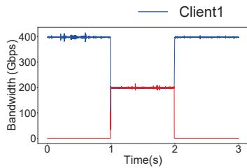  
(a) Short path (Hop=1)

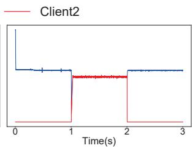  
(b) Long path (Hop=5)  
Figure 1: Improper RTT baseline setting causes inefficient utilization

· INT (In-band Network Telemetry) provides near real-time information about the network status, including latency, queue length and packet loss of each hop, which helps CC algorithms to respond correctly to congestion throughout the paths [31, 52]. However, INT is heavily dependent on specialized switch hardware support, and the parsing of INT metadata is computationally demanding, making it difficult to deploy in existing network infrastructure [56]. Further more, the INT header is not yet able to be combined with RoCEv2 packets, and requires the sender to send probe packets with the same five-tuple as the QP traffic through middleware, which increases the end-side latency and CPU overhead. Nonetheless, when congestion arises at a hop that lacks support of INT, particularly in cases of congestion on the reverse path or across multiple hops, the system may fail to accurately identify and react to congestion. As a result, congested flows might persist in transmitting packets at elevated rates, thereby causing more severe congestion or unfair bandwidth allocation [47, 52].

· RTT (Round-Trip Time) provides a direct measure of endto-end delay and an indication of overall network congestion. Modern NICs are capable of measuring RTT within a few microsecond [5, 9, 28], which causes RTT-based algorithms extremely sensitive to slight variation. However, RTT-based measurements exhibit significant dependency on path stability, where dynamic routing changes, fluctuating network device loads, and variable link quality can all introduce substantial measurement jitter. This instability frequently leads to erroneous congestion state estimation and subsequent misapplication of congestion control strategies. The temporal fluctuations in RTT measurements would be disproportionately amplified, triggering excessive rate reductions that significantly degrade overall network utilization. Specifically in multi-tier leaf-spine topologies, conventional congestion control algorithms cannot effectively distinguish between latency variations caused by variation of path length or network congestion. To clearly demonstrate this phenomenon, we implemented a basic RTT-based congestion control algorithm in a testbed comprising three 400Gbps NICs configured with two client nodes and one server node.

Figure 1 presents comparative throughput measurements for two NICs of the server with different network topologies: (a) short distance communication in a single switch (Hop = 1, baseline RTT of 5μs); (b) an extended path traversing five switches in CLOS topology (Hop=5, measured RTT of 15μs). If the algorithm’s baseline RTT is set inappropriately to 10μs for the long-distance communication, compared to short path (Figure 1 a), long path (Figure 1 b) transmission experienced inadequate bandwidth utilization even with no congestion. This experimental result demonstrates the practical challenge of defining a single RTT baseline suitable for all possible network paths and operating conditions in production deployments. While existing solutions attempt to address this through auxiliary mechanisms - such as queue delay extraction for INT header updates [52] or TTL-based hop count estimation [28] - these approaches incur non-trivial computational overhead that may offset their benefits in high-speed networks.

Rate Adjustment. Different types of rate adjustment mechanisms are employed in CC algorithms, such as window-based, rate-based, and credit-based approaches, each of which has raised several challenges in large-scale deployments.

· Credit-based control regulates the transmission rate by exchanging credits between the sender and the receiver. By detecting congestion in advance and estimating the link resources available to each node, it allows data transmission to be guaranteed with bounded delay and fast convergence. InfiniBand (IB) leverages the credit mechanism to ensure reliable data transmission at the hardware level and provides exceptionally low end-to-end latency [49]. However, deploying a private network with IB necessitates specialized NICs and switches, which typically incur hardware costs that are 5 to 10 times higher than those of conventional network equipment [8]. Moreover, IB faces scalability limitations due to its port count constraints and fabric complexity, making largescale deployments challenging [12]. Due to its high performance, IB remains the gold-standard baseline in comparative evaluations. The primary design goal of our CC scheme is to achieve comparable performance of IB while overcoming its scalability barriers.

· Window-based control is a conventional technique extensively employed in traditional congestion control mechanisms (e.g. TCP). The transmission rate is regulated through the maintenance of congestion windows at both the sender and receiver, and the window size is adjusted based on the number of ACK packets returned by the receiver, ensuring a fine-grained response to congestion management. Window-based control depends on high-frequency ACK response (e.g. per-packet ACKs [28, 31]) and sequence headers that convey packet lengths to achieve precise control and accurate inflight byte statistics. Inflight byte control helps to monitor the amount of unacknowledged data and prevent sender from injecting excess packets to avoid network overload or receiver buffer overflow. Implementing this mechanism requires complex logic to maintain window sizes and acknowledgment information [53], along with supplementary algorithm to achieve accurate control in extremely congestion (e.g. window<1) under high-speed network. RDMA leverages ACK coalescing and Packet Sequence Number (PSN) [24,26], which precludes the direct implementation of a byte-oriented window. RNICs support only per-flow control, lacking the per-packet granularity necessary for precise window-based CC. Moreover, windowbased congestion control mechanisms inherently depend on transport-layer state information to ensure reliable data delivery. This architectural design creates tight coupling between the congestion control implementation and the underlying transport protocol stack. Consequently, any algorithmic modification or enhancement necessitates corresponding hardware updates to the NIC’s transport offload engines, significantly constraining the flexibility and evolvability of congestion control schemes in production environments [46].

· Rate-based control calculates the transmission rate directly based on network conditions and implements through a rate limiter or pacing module. The sender autonomously sends packets based on CC algorithm, and avoids complex calculation of ACK association, which leads to cumulative ACK in implementation [24, 26]. On the other hand, rate-based control decouples CC and reliable delivery, and makes the implementation of the transport layer less complicated. Therefore current RNICs predominantly support congestion control only at a rate-based per-flow granularity [18, 55]. Rate-based congestion control exhibits inherent limitations compared with window-based approaches, e.g. its inability to explicitly bound the amount of inflight bytes. When congestion occurs, before receiving congestion signals, the transmitter continues injecting packets at pre-determined rates. In addition, ratebased control typically adopts the Additive Increase Multiplicative Decrease (AIMD) algorithm (such as DCQCN). The coexistence of dynamically changed traffic patterns and ultrahigh-bandwidth NICs introduces fundamental challenges in parameter optimization. For instance, in the high-speed network of 400Gbps bandwidth, CC algorithms should adopt a large rate increase step to ensure rapid convergence. But if large-scale burst congestion occurs, an aggressive aggregate increment can lead to severe network oscillation and instantaneous congestion. These intrinsic limitations demand new congestion control designs.

## 3.3 Customized CC Design over RNICs

The rise of proprietary LLMs has driven demand for customizable networking, prompting NIC vendors to expose programmable interfaces that enable tailored solutions in data centers. Programmable NICs allow users to define customized congestion control algorithms to address variable network conditions and application demands.

Now SmartNICs have been widely deployed in current data centers (e.g. Nvidia ConnectX-6 DX [38] and BlueField-3 DPU [40]). These equipment provides programmable congestion control (PCC) platforms [37] and support multiple RoCE CC algorithms compatible with existing network protocol stacks. PCC provides hardware-based proactive network probes that are independent with transport layer [50], and automatically generates CC events when sending data or receiving ACK/ NACK/ CNP/ RTT packets. The embedded event APIs streamline the design of CC algorithms and reduce implementation overhead. For instance, PCC leverages dedicated RTT probe packet instead of add additional header to the data packets, mitigating the processing overhead associated with frequent RTT measurements. Upon sending a fixed amount of packets within a session, a TX event is generated which facilitates the measurement of accumulated sending byte within the current RTT and leverages the carried timestamp for timer functionality.

The design of CC algorithms leveraging the PCC capabilities provided by SmartNICs represents a cost-effective and efficient approach. This method ensures compatibility with mainstream commercial switches and NICs, thereby facilitating easier deployment in various network environments. With the iterative enhancement of NIC capabilities, e.g. the BlueField-3 SuperNIC now achieving CNP packets responses within 1 μs interval, CC algorithms can implement fine-grained rate control. Furthermore, implementing congestion control algorithms on RISC-V-based NIC architectures significantly reduces development cycles compared to conventional approaches, enabling tighter co-evolution with rapidly advancing hardware capabilities and application requirements.

Nevertheless, PCC has certain limitations that require compensation through CC algorithms. For instance, PCC supports only a per-flow granularity for rate adjustment, meaning that PCC-based CC algorithm also face the challenges of the poor responsiveness during severe congestion and the lack of inflight byte control. Specifically, the CC controller’s trigger interval exhibits higher latency compared to FPGAbased SmartNICs, which achieve per-packet processing at granularity of several hundred nanoseconds, potentially resulting in delayed congestion responses and subsequent overtransmission. Additionally, PCC implementations typically operate on resource-constrained embedded CPUs, necessitating low-complexity CC algorithms to maintain both rapid response times and support for large quantities of queue pairs.

## 4 Barre Design

Based on the analysis of the characteristics and inherent limitations of RNICs, we propose Barre, a practical and scalable CC solution tailored for high-speed AI cluster networks. Barre ingeniously leverages the PCC capabilities and flexible event interfaces provided by RNICs to address the challenges and ensure compatibility with existing network infrastructure. Owing to its simple design, this solution can be easily deployed and utilized in any AI/HPC data center equipped with modern commercial RNICs.

## 4.1 Adaptive Adjustment Interval

Barre implements a rate-based congestion control architecture grounded in the widely-adopted AIMD framework. To address the issue of late responses introduced by timer-triggered rate adjustments under dynamically varying loads, Barre implements adaptive rate adjustment intervals based on CNP and RTT signals. We adopt CNP rather than RTT as the congestion signal because selecting an appropriate RTT baseline is challenging in large-scale deployments, which can lead to inadequate bandwidth utilization and unfair network allocation (as shown in Figure 1).

Delay-based increase: if the sender does not receive any CNP packets within a real-time RTT, the transmission rate (R) is updated with an additive increase according to the formula R = R + α (α refers to increment step). As RTT provides a straightforward indication of end-to-end latency across the network link, our approach employs real-time RTT monitoring to dynamically adapt the rate increase interval, enabling microsecond-scale adjustments that precisely track network conditions. When the link is idle, the frequency of rate increases is determined by the RTT baseline. During congestion, the frequency drops off as the end-to-end delay increases.

Per-CNP-based decrease: whenever the sender receives a CNP signal, the transmission rate is reduced according to the formula R = R × β immediately (0.95<β<0.99). The congestion indication in the IP header of CNP is widely employed by congestion control of RoCEv2 [39], where switches and routers will embed an indication for congestion once congestion is detected. Upon congestion detection, a CNP Packet is generated and routed back to the source, triggering precise rate limitation for the specified Queue Pair (QP). This closedloop control mechanism enables microsecond-scale reaction to network congestion events. By monitoring switch buffer levels, ECN and CNP provide early congestion awareness. With modern NICs capable of generating CNP packets at the time granularity of 1 μs, Barre combines high-frequency rate reductions triggered per CNP with smaller reduction magnitudes. By adopting a slight but high frequency adjustment approach, the system can respond more precisely to congestion signals, while maintaining smooth network performance and avoiding significant fluctuations in transmission rates.

Dynamic self-constraint fairness: we find that DCQCN struggles with ensuring fairness between flows and adaptively allocating bandwidth in high-speed networks (as shown in Figure 12 a). In Barre design, per-CNP-based rate decrease automatically achieves dynamic fairness between high-speed and low-speed flows within the same link. As link bandwidth approaches its bottleneck, high-speed flows, due to transmitting more data packets, receive a proportionally higher number of CNPs, thereby triggering a rate decrease more frequently. Consequently, this mechanism enables high-speed and lowspeed flows to rapidly converge toward fair bandwidth allocation. Figure 2 illustrates the fairness achieved by Barre among four flows. The results indicate equitable allocation of bandwidth, maintaining full utilization without significant network oscillation or underutilization. Furthermore, we utilize a fluid model to analyze the theoretical stable point and stability of Barre. The analytical conclusions are verified by simulation experiments (refer to Appendix B).

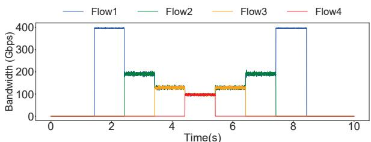  
Figure 2: Throughput of 4 flows shows Barre fairness

## 4.2 Barre Functional Components

To address the limitations of RNIC and rate-based control, we propose three functional components: Fast Increase, Dual-lock and Inflight Monitor. These components are designed to be lightweight and decoupled from one another, enabling seamless integration into existing rate-based algorithms. The design philosophy underlying these features reflects the essence implied by the name "Barre", as a portable handle to make the trunk easier to use.

## 4.2.1 Fast Increase

The traditional AIMD algorithm applies fixed increase parameter α, which faces the dilemma between inadequate bandwidth utilization and burst transient congestion. When there is ample bandwidth available and the number of flows is relatively small (e.g. SendRecv collective), the rate increase should be more aggressive to improve network utilization. On the contrary, when the number of flows is very large (e.g. AlltoAll collective) or congestion has already occurred, rate increases must be more conservative to prevent excessive queue buildup and buffer overflow at switches. While dynamic increasing factors have been widely adopted as a solution, we attempt to explore a simple and easily implemented approach.

We propose Fast Increase as a solution to address this issue. To distinguish between aggressive and conservative rate increases, we use experienced rate increases over multiple RTTs as an accurate indicator of inadequate link bandwidth. When a flow experiences K times consecutive rate increases without receiving any CNP messages, it indicates substantial available bandwidth on the link. In this scenario, the increasing factor is set to a significantly large value, denoted as A, (e.g. 1/1000 of the bandwidth of NIC port), allowing for fast convergence. During the Fast Increase phase, if the sender receives a CNP signal, the increasing factor resets to its initial value α, and a rate decrease is triggered to mitigate potential congestion.

Integrating with Barre’s technique of using real-time RTT for dynamic rate increase intervals, Fast Increase can achieve rapid algorithmic convergence within a very short period by large value A for mice flows, while keeping stability by small value α for elephant flows.

## 4.2.2 Dual-lock

Barre detects link congestion status via CNP signals received at the sender. Under severe congestion scenarios where BDP is less than MTU, the transmission rate becomes very low, requiring multiple RTTs to send a single data packet. Consequently, it also takes multiple RTTs to generate a CNP packet. This delay can result in several rounds of rate increase operation before the CNP reaches the sender, leading to an influx of additional packets into an already congested path. Currently, there are no effective solutions to address this issue. So we introduce a Dual-lock mechanism.

In QCN and DCQCN, the reaction points use both "Byte-Counter" and "Timer" to control rate increase. For example, if the ByteCounter of an RP (reaction point, sender NIC) shows that the RP has transmitted 150 KB data or the Timer has passed 15 ms, RP will increase the sending rate. Generally, the RPs with larger sending rates will increase their rates more quickly, which are defined as the QCN unfariness. To solve this problem, the ByteCounter employed in QCN is modified to an adaptive ByteCounter [20]. DCQCN employs the relationship of ByteCounter "or" Timer as the condition of rate increase, which will cause high-speed flows (i.e. flow rate > 1.45 Gbps in DCQCN) to increase more frequently than low-speed flow (i.e. flow rate < 1.45 Gbps), leading to unfair bandwidth allocation.

Dual-lock optimizes rate increase conditions under severe congestion by modifying the relationship between the Byte-Counter and Timer from "OR" to "AND", i.e. both conditions must be satisfied simultaneously to trigger a rate increase. As a result, the rate increase condition of high-speed flow is determined by Timer instead of Bytecounter, mitigating the unfairness issue. In practice, the Timer is generally set to one RTT. Therefore, for high-speed flows, the frequency of rate increase remains controlled by RTT, ensuring dynamic response to network conditions. Meanwhile, for low-speed flows, the rate increase is decided by the ByteCounter, preventing aggressive rate increases that could lead to congestion. This dual-lock approach effectively mitigates rapid rate increases during congestion while addressing fairness issues between high-speed and low-speed flows.

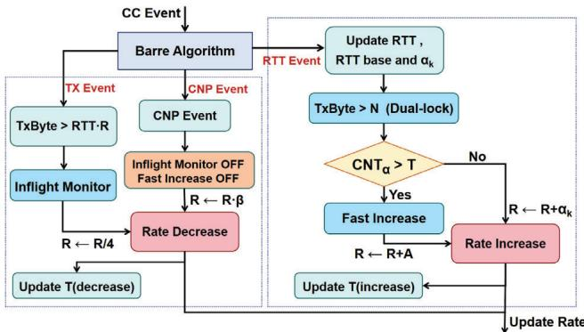  
Figure 3: Process of CC module

## 4.2.3 Inflight Monitor

Due to the lack of fine-grained ACK responses and Seq packet headers that carry payload sizes, RNICs cannot effectively track and limit the amount of inflight bytes that have been sent but not yet acknowledged. During severe congestion, delayed CNP feedback can prevent the CC algorithm from fast respond, causing the sender to continue injecting packets and exacerbating congestion.

PCC periodically generates TX events that include information on the volume of data transmitted each time. Based on this new functionality, we propose an Inflight Monitor mechanism as a safeguard to manage in-flight data during congestion. Inflight Monitor tracks the accumulated sending bytes within the current RTT, denoted as $S _ { n o w } .$ . Based on the current transmission rate R and the real-time RTT value, we can estimate the maximum allowable data volume for the current RTT, denoted as $\gamma = R \times R T T$ . If $S _ { n o w }$ exceeds the estimated threshold $\gamma ,$ it indicates potential network congestion, even though no CNP signal or RTT probe packet is returned to the sender. Then inflight byte control is triggered, and the current transmission rate is immediately reduced to one-quarter of its original value. The rate remains at this reduced level until a CNP signal is received, at which point the transmission rate is restored to its initial value.

## 4.3 Effect Improvement of Barre System

The control flow in Barre, as illustrated in Figure 3, is driven by TX/RTT/CNP event provided by PCC. These events trigger corresponding actions such as rate increase, rate decrease, or optimized features operations, ensuring efficient and adaptive management of network traffic under varying conditions. The main function of Barre and the conditions for the functional component are presented in Algorithm 1.

The three components of Barre can be utilized independently, while the coupling yields significantly enhanced performance benefits. To evaluate the effectiveness, we start from Fast Increase and enable them one by one gradually, and compare with the default set as basic Barre algorithm.

Algorithm 1: Barre Main Function   
function OnTransmitPacket(Tx\_Pkt):   
$R _ { p r e \nu }  R _ { c u r } ~ / /$ update sending rate   
Update T xBytes;   
if $T x B y t e s _ { i n c r e } > N$ and Timer > RTT then   
// Exceed Dual-lock threshold, rate increase   
if $C N P _ { R E C V } = 0$ then   
if $C N T _ { \alpha } > T$ then   
$R _ { c u r } \gets R _ { p r e \nu } + A \mathrm { ~ / ~ } /$ Fast increase   
else   
L $R _ { c u r } \gets R _ { p r e \nu } + \mathbf { \alpha }$   
$C N T _ { \alpha } + + \mathrm { ~ / ~ }$ Counter of Fast increase   
$C N P _ { R E C V }  0 , T x B y t e s  0$   
if $T x B y t e s _ { I n f l i g h t } > R _ { c u r } \times R T T$ and $F N _ { I n f l i g h t } = = 0$   
then   
$F N _ { I n f l i g h t }  1 ; R _ { c u r }  R _ { p r e \nu } \times \frac { 1 } { 4 }$   
// Enable Inflight Monitor   
function OnRecvRTTResponse(RT T \_Pkt):   
Update RTT   
if $R T T < R T T _ { b a s e }$ then   
$R T T _ { b a s e }  \overrightarrow { R T T }$   
// Update RTT base for each flow   
function OnRecvCNP(CNP\_Pkt):   
$R _ { c u r } \gets R _ { p r e \nu } \times \beta / / \beta ;$ ratio   
$C N P _ { R E C V }  1 , C N T _ { \propto }  0$   
$T x B y t e s _ { i n f l i g h t } = 0$   
$T x B y t e s _ { i n c r e } = 0$   
if $F N _ { I n f l i g h t } = I$ then   
$R _ { c u r } ^ { ' * * }  R _ { p r e \nu } \times 4 , F N _ { I n f l i g h t }  0$   
// Disable Inflight Monitor, recover original rate

First, we evaluate Fast Increase with experiments of two distinct scenarios: mice flow (less connections as QP=4) and elephant flow (large-scale incast as QP=1000). Compared with fixed rate increase magnitude as α=10 or α=400, we employ both the base increase factor (α=10) and the aggressive increase factor (A=400 MB) in Fast Increase. The results are illustrated in Figure 4.

Communication of mice flow (QP=4) has almost no congestion, resulting in negligible differences in switch queue lengths among the three methods, as indicated by the yellow line in Figure 4 (a). Fast Increase achieves higher throughput than the set of small α=10 (an increase of 8.5%) for mice flow in QP=4, and keeps lower queue lengths compared with the aggressive α=400 (an improvement of 48%) for elephant flow in QP=1000. The experimental results demonstrate that Fast Increase effectively balances rapid convergence and low latency. It adapts dynamically to varying traffic conditions, ensuring optimal bandwidth utilization without compromising stability.

Then we enable Dual-lock function and evaluate the average queue occupancy at the switch under varying levels of congestion. In this experiment, four clients are connected to a single server through a ToR switch, and we continuously increase the number of flows involved in the traffic to simulate an Incast scenario. The ByteCounter threshold for Dual-lock is set to 8KB. As illustrated in Figure 5, across five experimental setups, enabling Dual-lock consistently reduces the average switch queue length while maintaining the same throughput, achieving an overall reduction of 79.9% (with a maximum reduction of 90.25% when QP=4000). This significant decrease in queue length indicates a substantial alleviation of congestion. Moreover, Fast Increase maintains a relatively small increment factor α during congestion, which can lead to high switch buffer occupancy. The combination with Dual-lock achieves higher throughput while keeping low buffer occupying.

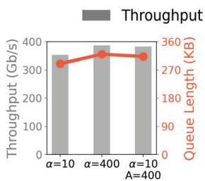  
(a) QP=4

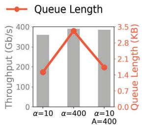  
(b) QP=1000

Figure 4: Performance comparison of different increasing factors in mice flow and elephant flow. Fast Increase achieves optimal bandwidth utilization while keeping low queue length in different traffic patterns.  
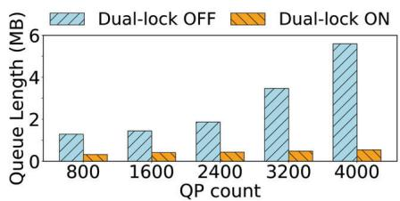  
Figure 5: Dual-lock maintains extremely low switch queue length in large-scale Incast.

We enable the Inflight Monitor function in the last step. Figure 6 illustrates the performance improvements achieved by coupling of the three components. To emulate real training workloads, we conducted NCCL AlltoAll test on a cluster composed of 256 Nvidia BlueField-3 400 Gbps NICs, recording the total bus bandwidth for varying message sizes. The results indicate that when Inflight Monitor is enabled, the throughput is improved on average by 16.45%, with a maximum increase of 21.79%. These findings demonstrate that Inflight Monitor can significantly enhance network performance of large-scale incast congestion scenarios.

Barre is an event-driven algorithm that leverages TX Event, CNP event and RTT event provided by the PCC functionality for its design. These events incur lower overhead compared to ACK events and Timer events, making them more suitable for efficient processing by both software and hardware. TX Event, serving as the most critical event for Barre, offers accumulated sending byte and timestamp information. Coupled with the application of Barre’s three components, this significantly reduces the number of events processed by CC algorithm.

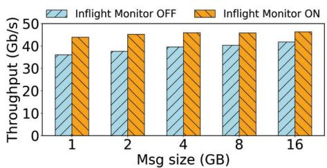

Figure 6: Average throughput in NCCL AlltoAll test. The inflight Monitor function significantly improves the throughput in large-scale congestion.  
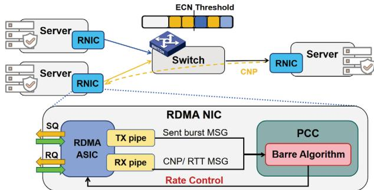  
Figure 7: System architecture

## 5 Implementation

Barre is implemented on BlueField-3 SuperNICs, and is designed to leverage the maximal potential of the event interface provided by PCC, achieving integration of software, hardware and algorithm. As illustrated in Figure 7, PCC-based softwareprogrammable CC operates directly on the network layer of a dedicated RISC processor embedded within the NIC. This setup facilitates the utilization of transmission (TX) event and reception (RX) events for synchronizing communication operations between applications and the NIC, ensuring reliable and efficient data transmission and reception.

## 5.1 RTT-based Enhancement

Barre dynamically adjusts rate increase interval based on real-time RTT to adaptively respond to network state. We find several challenges to leveraging RTT as an indicator in deployment and propose two mechanisms to address the problems.

RTT Probe Modification. Barre dynamically adjusts rate increase interval based on real-time RTT to adaptively respond to the network state. PCC provides a dedicated RTT probe packet, while SP (Sender NIC) generates an RTT\_Req packet at the beginning of an RTT, and RP (Receiver NIC) generates an RTT\_Rsp packet. Thus Barre executes a rate increase at the time RP receives RTT\_Rsp packet. However, due to limitations of hardware NIC (e.g. packet loss or delay), RTT probe packets may be lost, leading to missed rate increases for Barre. In a test using NCCL AlltoAll across a three-layer Clos network cluster of 128 GPUs, we find that the loss rate of RTT probe packets can achieve as high as 8.9%.

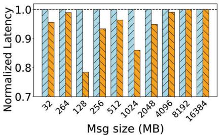  
(a) Normalized Latency

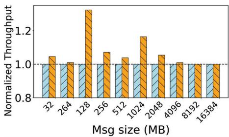  
(b) Normalized Throughput  
Figure 8: The normalized latency and throughput of RTTbased enhancement in 128-GPU NCCL AlltoAll test.

To address this issue, we implement an RTT probe modification by leveraging the head carried in RTT probe packets. We add a sequence header into the RTT probe packet to avoid mismatching. As an RTT packet involves timestamp information, we make each RTT\_Rsp packet carry both the sending time of RTT\_Req and the receiving time of RTT\_Rsp. Thus the sender could accurately calculate the real-time RTT by simply computing the difference between the timestamps. This method prevents mismatching of RTT probe packets from different batches, thereby avoiding errors in the calculation of real-time RTT. Thus, we modify Barre’s rate increase logic to update the last real timeRT T whenever an RTT probe packet returns. A rate increase is triggered if no CNP signal is received by RP within a period equivalent to the real timeRT T .

RTT-based per-flow Increase Factor. Additionally, we find that RTT-based rate increases may lead to unfairness among flows with different path lengths, causing lower frequency of rate increases for longer-distance transmissions. Therefore, we adjust the rate increase magnitude for different flows, correlating the value of the increase factor α with the baseline RTT of each flow, as $\alpha _ { k } = R T T _ { k } \cdot \alpha / C$ . While C denotes a constant set to 1us or 2us depending on the network infrastructure. For flow k, Barre continuously measures and updates the minimum real-time RTT value observed during actual communication, and denoted as $R T T _ { k }$ . Therefore, the increasing factor $\alpha _ { k }$ of long-distance transmission is larger due to longer RTT, which makes up for the unfairness leveraged by a lower increase frequency.

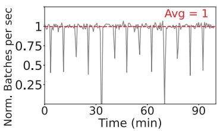  
(a) Default set

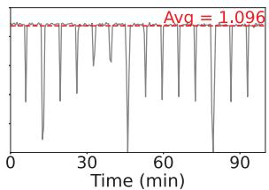  
(b) RTT-based enhancement  
Figure 9: The throughput log from real training tasks (normalized to average throughput of default set). The red dashed line represents the average throughput under the default settings.

We evaluated RTT-based enhancement on a 128-GPU cluster, contrasting it with the default set with an increase factor uniformly applied to all flows and without RTT probe timestamp. The latency and bandwidth of the NCCL AlltoAll test were recorded for various message sizes, with performance normalized to the uniform increase factor, as illustrated in Figure 8. Utilizing the RTT-based enhancement resulted in an average reduction of 5.71% in latency and a corresponding increase of 7.13% in throughput.

As AlltoAll messages in AI training workloads typically do not exceed 1GB, actual tasks are more sensitive to loss of rate increase operation and RTT probe packets compared to NCCL tests. As shown in Figure 9, in end-to-end testing, we observed that employing RTT-based enhancement effectively reduced the latency of AlltoAll communication by up to 50%, and improved the overall throughput of AI training task at an average of 9.6%.

## 5.2 In-production Deployment

Barre can be fully deployed on hardware NIC, maintaining complete transparency to the application layer without modifications to RoCEv2 protocol. For instance, with Nvidia BlueField-3 SuperNIC, CC algorithm can be compiled into a binary file, flashed onto the NIC firmware, and executed on the RISC-V cores embedded within the NIC. This design allows the entire CC process to bypass the PCIe channel, eliminating the need for host CPU involvement, which significantly improves network efficiency and congestion response speed. Three functional components of Barre address the limitations proposed by RNIC and rate-based control and achieve the fundamental requirements as discussed in Section 3.2. Practical tests have demonstrated that Barre can leverage the four RISC-V cores on the NIC to manage congestion events at a rate of 10 million events per second, showcasing excellent responsiveness to network congestion.

Our production cluster workloads consist of two types: LLM training and inference. In LLM training tasks spanning thousands of GPUs, collective communications consist of ReduceScatter, AllGather, AlltoAll, and SendRecv operations. In most scenarios, AllGather and ReduceScatter operations dominate, accounting for over 50% of the total communication volume, with message sizes typically at the gigabyte level. MoE models exhibit particularly heavy AlltoAll traffic, where message sizes can expand to $1 \dot { 0 } ^ { 8 }$ bytes with increasing batch sizes. For inference tasks operating at smaller scales, typically hundreds of GPUs, AlltoAll communications account for more than 50% of traffic with generally smaller messages (<1 GB). AllReduce operations form the second most significant portion of communications. Notably, execution alternates between AlltoAll full-mesh traffic and ReduceScatter ring-based traffic, causing the network to frequently switch between large-scale incast and uncongested states. This variation requires the CC algorithm rapidly adapting to dynamic traffic pattern, while mitigating congestion caused by elephant flows and also ensuring fast convergence of mice flows.

## 6 Evaluation

In this section, we evaluate the effectiveness of Barre on largescale NCCL AlltoAll test (Section 6.2) in comparison with InfiniBand and DCQCN. In addition, we modify a few parameter settings of DCQCN based on the idea of adaptive adjustment interval achieved in Barre (Section 6.3) to demonstrate flexibility and versatility of Barre.

## 6.1 Network Topology

Barre has been deployed in a AI production cluster for nearly one year. The network architecture employs a three-layer switch topology similar to CLOS to interconnect over 10K GPUs, each equipped with a BlueField-3 SuperNIC supporting 400Gbps port bandwidth. For switches at each layer, the bandwidth ratio between downlink and uplink is 1:1. For the ToR switches, a specific Active Optical Cable (AOC) is used to split an 800 Gbps downlink port into two 400 Gbps downlink ports. Each server involves eight 400 Gbps NICs, and is connected to eight different ToR switches with multirail topology. A total of 64 GPU servers are interconnected through this set of ToR switches.

## 6.2 Large-scale Collective Communication

We conducted the congestion control test on a 256-GPU cluster to test Barre’s performance. The experimental setting is the same as that in section 6.1. Each GPU was equipped with an Nvidia BlueField-3 400Gbps NIC. As discussed in Section 2.2, the distributed parallel approach for LLM training involves a significant amount of collective communication traffic. Among 3D parallelisms, AlltoAll dominates and is more likely to cause high ephemeral congestion due to its full-mesh communication mode.

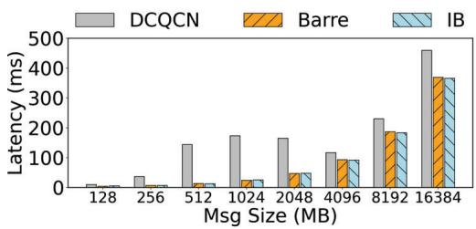  
(a) Latency

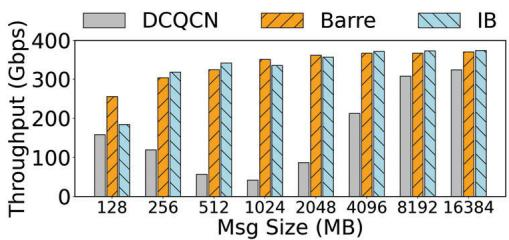  
(b) Bus Bandwidth  
Figure 10: NCCL AlltoAll test in 256-GPU cluster

To validate the superior performance of Barre, we conducted comparative experiments using DCQCN [60] and InfiniBand (IB), two commonly employed CC mechanisms in AI networks. In NCCL AlltoAll test, the overall communication volume (message size) was incrementally expanded from 128 MB to 16 GB $( 2 ^ { 1 4 }$ MB), with corresponding network latency and average bandwidth (message size divided by flow completion time) recorded. The experimental results are illustrated in Figure 10. Observations indicate that Barre achieves superior latency and throughput comparable to IB while significantly outperforming DCQCN. Compared to IB, Barre exhibits substantially lower hardware deployment costs and implementation complexity, along with enhanced scalability in large-scale clusters. Therefore Barre offers a simple, high-performance, and cost-effective CC solution.

In contrast, DCQCN displayed a pattern where latency initially increased and then decreased as message sizes grew. The complexity of DCQCN’s parameter takes a long time to complete multiple iterations, which leads to a fluctuation of latency and throughput during smaller message sizes (128 MB to 1024 MB). As message sizes further increase, DC-QCN gradually converges and improves bandwidth utilization. Throughout the experiment, both Barre and IB demonstrated excellent convergence properties, maintaining high throughput and low latency even under full mesh traffic conditions in large-scale environments.

Figure 11 illustrates switch traffic logs collected over a period from the production environment. Barre has enhanced communication across a four-layer switch architecture (S3). It achieves near-optimal utilization without triggering PFC event. Moreover, Barre exhibits robust convergence and fairness under varying traffic loads. Its capability ensures that the network remains stable and efficient, effectively supporting the demanding requirements of large-scale AI workloads.

Table 2: DCQCN Parameter Tuning Settings
<table><tr><td>Parameter</td><td>Default Value</td><td>Tuned Value</td><td>Explanation</td></tr><tr><td>min_time_between_cnps</td><td>4</td><td>0~2</td><td>Interval for Receiver Responding with CNP (us)</td></tr><tr><td>rpg_min_dec_fac</td><td>50</td><td>80~98</td><td>The minimum reduction at each rate decrease</td></tr><tr><td>rate_reduce_monitor_period</td><td>4</td><td>1~4</td><td>Minimum deceleration interval (us)</td></tr><tr><td>rpg_alpha_rate</td><td>5</td><td>8~20</td><td>Rate increase magnitude</td></tr><tr><td>rpg_time_reset</td><td>300</td><td>20~100</td><td>Rate increase interval (us)</td></tr></table>

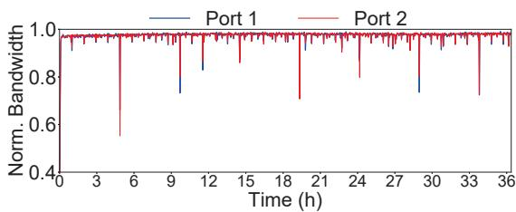  
Figure 11: Switch traffic in production

Given that most CC algorithm are not well-aligned with the characteristics of current mainstream hardware, implementing them in AI/HPC clusters poses significant challenges. We provide a qualitative analysis to compare against other CC protocols (e.g. Swift [28], PowerTCP [1] and HPCC [31]) in Appendix A.1.

Since ring-based collective communications (e.g. AllReduce, AllGather, and ReduceScatter) rarely cause congestion compared to AlltoAll, we present Barre’s performance of these operations in Appendix A.2 (Figure 14). Experimental results show that Barre achieves near-full bandwidth for both ReduceScatter and AllGather communications with NVLink disabled to enforce RDMA routing. We also conduct experiments on extreme incast scenarios in Appendix A.3 (with results shown in Figure 15).

## 6.3 Barre-inspired Optimization on DCQCN

To demonstrate the flexibility and versatility of Barre, we apply its design ideas to optimize DCQCN by adjusting certain parameters. DCQCN, originally developed in 2014, was tailored to leverage the hardware characteristics of Mellanox NICs. Given the technological limitations a decade ago, NIC capabilities were relatively constrained, leading to the implementation of a CNP response interval set at 55 us. The algorithm adjusts the transmission rate based on the number of consecutive CNPs received by the sender over fixed intervals, i.e. as the count of CNPs increased across multiple periods, parameter α would increase while parameter β would decrease accordingly.

As modern NIC technology has significantly advanced, currently the BF-3 SuperNIC is capable of responding with CNP messages for every 0 to 2 us. We applied the principles of Barre to optimize the DCQCN parameter. The modified parameter settings are shown in Table 2. The CNP packet generation interval is set a smaller value to fit modern NICs, and each CNP will trigger a rate decrease operation with a small decrease step. We recommend setting the increase interval to a range of 20\~100 ms, depending on the maximum number of incast flows and the base RTT in the network. A larger number of concurrent incast flows necessitates a longer interval to avoid congestion. For α, we suggest a higher value between 8 and 20 in 400G networks to enable faster rate increases and convergence.

We selected four nodes as clients (Client 1 to Client 4), and the other one as the server, all connected to a single ToR switch. During the experiment, each client established connections with the server according to a predefined schedule, and then gradually terminated the connection one by one.

Figures 12(a) and (b) illustrate bandwidth utilization of the four clients and the server under unmodified DCQCN parameter (Default value in Table 2). As clients progressively joined the network and established connections, the link bandwidth was dynamically reallocated, leading to oscillations in network bandwidth, and low utilization (e.g. 197.7 Gbps at 6s). Despite gradual convergence towards a more balanced bandwidth distribution, the allocations remained unfair throughout the experiment.

Figures 12(c) and (d) present the results following parameter modification to DCQCN based on Barre (Tuned value in Table 2). The observation indicates that the system rapidly becomes stable and achieves fair bandwidth sharing across different flows. Moreover, as connections are progressively terminated, the network quickly converges to a stable bandwidth allocation condition. Specifically, Figure 12(d) shows that during the experimenting period, the server NIC bandwidth remains close to full utilization and exhibits stability. The frequency and magnitude of network oscillations are significantly reduced compared to Figure 12(b). These results demonstrate the effectiveness of the Barre-inspired parameter adjustments in enhancing the responsiveness and fairness of DCQCN, thereby ensuring efficient and stable network operation for dynamically changed traffic loads.

Additionally, we conducted NCCL AllReduce test on a 1024-GPU cluster to evaluate the effect of Barre’s inspired optimization. Employing multi-rail optimized network topology with a ring algorithm significantly mitigates ECMP hashing conflicts, which could prevent most congestion during AllReduce communication [27]. However, we notice that numerous data centers have not upgraded to multi-rail topologies, which means AllReduce remains a performance problem. Figure 13 illustrates the normalized bus bandwidth across various message sizes of both default and tuned parameters of DCQCN. Following optimization with Barre, an average improvement of 19.54% of throughput was achieved. In addition, the resource allocation among different flows has become fairer. As AlltoAll and AllReduce communication account for the dominant proportion in large-scale AI training tasks, Barre-inspired optimization on DCQCN could achieve significant end-to-end revenue, with only a few modifications of parameter.

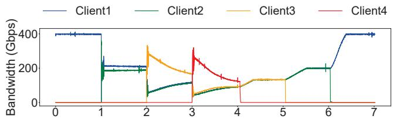  
(a) Client Bandwidth (Default Parameter)

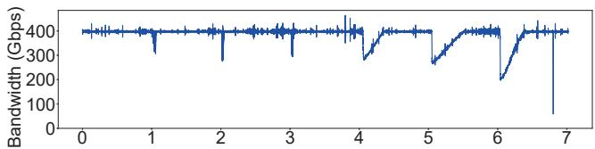  
(b) Server Bandwidth (Default Parameter)

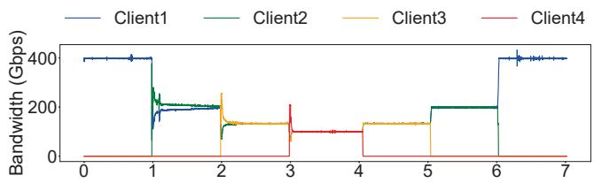  
(c) Client Bandwidth (Tuned Parameter)

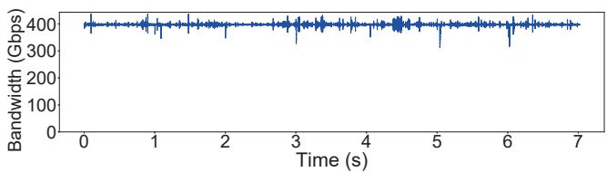  
(d) Sever Bandwidth (Tuned Parameter)  
Figure 12: Barre-inspired optimization on DCQCN

## 7 Related Work

Congestion control is critical for optimizing network performance and ensuring reliable communication.

Host-driven Congestion Control: Host-driven CC can be further divided into sender-driven CC and receiver-driven CC. Currently, sender-driven CC is widely deployed in data center networks. DCQCN [60] uses ECN as the congestion signal [3, 41]. Another widely used congestion control signal is Delay or RTT [5,9,28–30,33]. TIMELY [33] and Swift [28] utilize RTT and RTT gradient to ensure network transmission efficiency without the involvement of switches [61]. INT signal has been proposed to provide more detailed congestion information [1, 31]. PowerTCP [1] calculates the congestion status based on the bandwidth-window product. Receiver-driven CC aims at maintaining near-zero queues in switches [11, 19, 22, 23, 25, 34, 42]. ExpressPass [54] uses credits to probe bandwidth, and the receiver regulates the transmission rate based on the credit loss rate. HOMA [34] prioritizes small flows to ensure low latency for short messages.

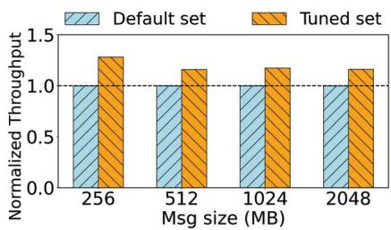  
Figure 13: NCCL AllReduce test

Switch-driven Congestion Control: The switches make appropriate rate adjustment decisions instead of announcing congestion status. RoCC [48] utilizes queue length as a congestion signal and follows the Proportional Integral Control method to compute the fair rate. It relies on the switches to generate CNPs containing the fair rate to directly control the rate decrease of the senders. HierCC [58] employs virtual queue length as a congestion signal and divides congestion into two types: the congestion between ToR and NICs, and the congestion between ToR. It implements direct rate allocation to adjust sending rates and limit queue lengths. AC-Curate [17] makes use of Flow Rate Packets (FRPs) injected by the senders as congestion information. When the switch detects an FRP, it allocates the minimum flow rate based on the number of flows on the egress port.

## 8 Conclusion

Barre exploits recent trends including programmable congestion control and proposes a decoupled design of congestion control atop the transport layer stack. By careful design to efficiently use the advanced features of TX event based bytecounter and timestamp, Barre introduces an adaptive rate decrease per CNP and dynamic rate increase based on RTT probing, which meets the demand for fast response to traffic variance and low software and hardware overhead. Barre has been implemented in 400Gbps Bluefield-3 NICs as part of our production data center. Barre exhibits not only superior performance in terms of fairness and congestion response but is able to enhance DCQCN, which converges faster and maintains better fairness and stability.

## References

[1] Vamsi Addanki, Oliver Michel, and Stefan Schmid. PowerTCP: Pushing the performance limits of datacenter networks. In 19th USENIX Symposium on Networked Systems Design and Implementation (NSDI 22), pages 51–70, Renton, WA, 2022. USENIX Association.

[2] Saksham Agarwal, Arvind Krishnamurthy, and Rachit Agarwal. Host congestion control. In Proceedings of the ACM SIGCOMM 2023 Conference, ACM SIGCOMM ’23, pages 275–287, New York, NY, USA, 2023. Association for Computing Machinery.

[3] Mohammad Alizadeh, Albert Greenberg, David A Maltz, Jitendra Padhye, Parveen Patel, Balaji Prabhakar, Sudipta Sengupta, and Murari Sridharan. Data center tcp (dctcp). In Proceedings of the ACM SIGCOMM 2010 Conference, SIGCOMM ’10, pages 63–74, New York, NY, USA, 2010. Association for Computing Machinery.

[4] Serhat Arslan, Yuliang Li, Gautam Kumar, and Nandita Dukkipati. Bolt: Sub-RTT congestion control for Ultra-Low latency. In 20th USENIX Symposium on Networked Systems Design and Implementation (NSDI 23), pages 219–236, Boston, MA, 2023. USENIX Association.

[5] Venkat Arun and Hari Balakrishnan. Copa: Practical Delay-Based congestion control for the internet. In 15th USENIX Symposium on Networked Systems Design and Implementation (NSDI 18), pages 329–342, Renton, WA, 2018. USENIX Association.

[6] InfiniBand Trade Association et al. Supplement to infiniband architecture specification. Release, 1(2):1, 2010.

[7] Pytorch To Atoms. Meta’s 24k h100 cluster capex/tco and bom analysis. https: //open.substack.com/pub/pytorchtoatoms/ p/metas-24k-h100-cluster-capextco-and?utm\_ campaign=post&utm\_medium=web.

[8] Candy798. A comparative analysis of infiniband and roce for ai data centers. https://medium.com/@lixian\_58397/ a-comparative-analysis-of-infiniband-and\ -roce-for-ai-data-centers-78a99c39881c.

[9] Neal Cardwell, Yuchung Cheng, C Stephen Gunn, Soheil Hassas Yeganeh, and Van Jacobson. Bbr: congestion-based congestion control. Commun. ACM, 60(2):58–66, 2017.

[10] Biyao Che, Yuxiang Wang, Zirui Wan, Ying Chen, Zixiao Wang, Yuan Tian, Jizhuang Zhao, Shuo Wang, and Jiao Zhang. Fcc: A fast-converging low-latency congestion control algorithm for datacenter rdma network. In

Proceedings of the 8th Asia-Pacific Workshop on Networking, APNet ’24, pages 200–201, New York, NY, USA, 2024. Association for Computing Machinery.

[11] Inho Cho, Keon Jang, and Dongsu Han. Creditscheduled delay-bounded congestion control for datacenters. In Proceedings of the Conference of the ACM Special Interest Group on Data Communication, SIG-COMM ’17, pages 239–252, New York, NY, USA, 2017. Association for Computing Machinery.

[12] Massed Compute. Scalability limitations of nvidia’s infiniband solutions compared to ethernet. https://massedcompute.com/ faq-answers/?question=What%20are%20the% 20scalability%20limitations%20of%20NVIDIA% 27s%20InfiniBand%20solutions%20compared% 20to%20Ethernet?

[13] Mo Dong, Tong Meng, Doron Zarchy, Engin Arslan, Yossi Gilad, Brighten Godfrey, and Michael Schapira. PCC vivace: Online-Learning congestion control. In 15th USENIX Symposium on Networked Systems Design and Implementation (NSDI 18), pages 343–356, Renton, WA, 2018. USENIX Association.

[14] Adithya Gangidi, Rui Miao, Shengbao Zheng, Sai Jayesh Bondu, and Goes. Rdma over ethernet for distributed training at meta scale. In Proceedings of the ACM SIGCOMM 2024 Conference, ACM SIGCOMM ’24, page 57–70, New York, NY, USA, 2024. Association for Computing Machinery.

[15] Adithya Gangidi, Rui Miao, Shengbao Zheng, Sai Jayesh Bondu, Guilherme Goes, Hany Morsy, Rohit Puri, Mohammad Riftadi, Ashmitha Jeevaraj Shetty, Jingyi Yang, Shuqiang Zhang, Mikel Jimenez Fernandez, Shashidhar Gandham, and Hongyi Zeng. Rdma over ethernet for distributed training at meta scale. In Proceedings of the ACM SIGCOMM Conference, 2024.

[16] Yixiao Gao, Yuchen Yang, Tian Chen, Jiaqi Zheng, Bing Mao, and Guihai Chen. Dcqcn+: Taming large-scale incast congestion in rdma over ethernet networks. In 2018 IEEE 26th International Conference on Network Protocols (ICNP), pages 110–120. IEEE, 2018.

[17] Dimitris Giannopoulos, Nikos Chrysos, Evangelos Mageiropoulos, Giannis Vardas, Leandros Tzanakis, and Manolis Katevenis. Accurate congestion control for rdma transfers. In 2018 Twelfth IEEE/ACM International Symposium on Networks-on-Chip (NOCS), pages 1–8. IEEE, 2018.

[18] Ernst Gunnar Gran, Magne Eimot, Sven-Arne Reinemo, Tor Skeie, Olav Lysne, Lars Paul Huse, and Gilad

Shainer. First experiences with congestion control in infiniband hardware. In 2010 IEEE International Symposium on Parallel & Distributed Processing (IPDPS), pages 1–12. IEEE, 2010.

[19] Mark Handley, Costin Raiciu, Alexandru Agache, Andrei Voinescu, Andrew W Moore, Gianni Antichi, and Marcin Wójcik. Re-architecting datacenter networks and stacks for low latency and high performance. In Proceedings of the Conference of the ACM Special Interest Group on Data Communication, pages 29–42, New York, NY, USA, 2017. Association for Computing Machinery.

[20] Yuki Hayashi, Hayato Itsumi, and Miki Yamamoto. Improving fairness of quantized congestion notification for data center ethernet networks. In International Conference on Distributed Computing Systems Workshops, 2011.

[21] Sara Hooker. The hardware lottery. Communications of the ACM, 64(12):58–65, 2021.

[22] Jinbin Hu, Jiawei Huang, Zhaoyi Li, Yijun Li, Wenchao Jiang, Kai Chen, Jianxin Wang, and Tian He. Rpo: Receiver-driven transport protocol using opportunistic transmission in data center. In 2021 IEEE 29th International Conference on Network Protocols (ICNP), pages 1–11. IEEE, 2021.

[23] Shuihai Hu, Wei Bai, Gaoxiong Zeng, Zilong Wang, Baochen Qiao, Kai Chen, Kun Tan, and Yi Wang. Aeolus: A building block for proactive transport in datacenters. In Proceedings of the Annual conference of the ACM Special Interest Group on Data Communication on the applications, technologies, architectures, and protocols for computer communication, SIGCOMM ’20, pages 422–434, New York, NY, USA, 2020. Association for Computing Machinery.

[24] Chengyuan Huang, Yixiao Gao, Wei Chen, Duoxing Li, Yibo Xiao, Ruyi Zhang, Chen Tian, Xiaoliang Wang, Wanchun Dou, Guihai Chen, et al. Mc-rdma: Improving replication performance of rdma-based distributed systems with reliable multicast support. In 2023 IEEE 31st International Conference on Network Protocols (ICNP), pages 1–11. IEEE, 2023.

[25] Jiawei Huang, Shuping Li, Rui Han, and Jianxin Wang. Receiver-driven fair congestion control for tcp outcast in data center networks. Journal of Network and Computer Applications, 131(C):75–88, 2019.

[26] InfiniBand. Infiniband architecture specification volume 1, 2021.

[27] Ziheng Jiang, Haibin Lin, Yinmin Zhong, Qi Huang, Yangrui Chen, Zhi Zhang, Yanghua Peng, Xiang Li, Cong Xie, Shibiao Nong, Yulu Jia, Sun He, Hongmin Chen, Zhihao Bai, Qi Hou, Shipeng Yan, Ding Zhou, Yiyao Sheng, Zhuo Jiang, Haohan Xu, Haoran Wei, Zhang Zhang, Pengfei Nie, Leqi Zou, Sida Zhao, Liang Xiang, Zherui Liu, Zhe Li, Xiaoying Jia, Jianxi Ye, Xin Jin, and Xin Liu. MegaScale: Scaling large language model training to more than 10,000 GPUs. In 21st USENIX Symposium on Networked Systems Design and Implementation (NSDI 24), pages 745–760, Santa Clara, CA, 2024. USENIX Association.

[28] Gautam Kumar, Nandita Dukkipati, Keon Jang, Hassan MG Wassel, Xian Wu, Behnam Montazeri, Yaogong Wang, Kevin Springborn, Christopher Alfeld, Michael Ryan, et al. Swift: Delay is simple and effective for congestion control in the datacenter. In Proceedings of the Annual conference of the ACM Special Interest Group on Data Communication on the applications, technologies, architectures, and protocols for computer communication, SIGCOMM ’20, pages 514–528, New York, NY, USA, 2020. Association for Computing Machinery.

[29] Changhyun Lee, Chunjong Park, Keon Jang, Sue Moon, and Dongsu Han. Accurate latency-based congestion feedback for datacenters. In 2015 USENIX Annual Technical Conference (USENIX ATC 15), USENIX ATC ’15, pages 403–415, Santa Clara, CA, 2015. USENIX Association.

[30] Changhyun Lee, Chunjong Park, Keon Jang, Sue Moon, and Dongsu Han. Dx: Latency-based congestion control for datacenters. IEEE/ACM Transactions on Networking, 25(1):335–348, 2017.

[31] Yuliang Li, Rui Miao, Hongqiang Harry Liu, Yan Zhuang, Fei Feng, Lingbo Tang, Zheng Cao, Ming Zhang, Frank Kelly, Mohammad Alizadeh, et al. Hpcc: High precision congestion control. In Proceedings of the ACM special interest group on data communication, SIGCOMM ’19, pages 44–58. Association for Computing Machinery, New York, NY, USA, 2019.

[32] Aixin Liu, Bei Feng, Bing Xue, Bingxuan Wang, Bochao Wu, Chengda Lu, Chenggang Zhao, Chengqi Deng, Chenyu Zhang, Chong Ruan, et al. Deepseek-v3 technical report. arXiv preprint arXiv:2412.19437, 2024.

[33] Radhika Mittal, Vinh The Lam, Nandita Dukkipati, Emily Blem, Hassan Wassel, Monia Ghobadi, Amin Vahdat, Yaogong Wang, David Wetherall, and David Zats. Timely: Rtt-based congestion control for the datacenter. In Proceedings of the 2015 ACM Conference on Special Interest Group on Data Communication, SIG-COMM ’15, pages 537–550, New York, NY, USA, 2015. Association for Computing Machinery.

[34] Behnam Montazeri, Yilong Li, Mohammad Alizadeh, and John Ousterhout. Homa: A receiver-driven lowlatency transport protocol using network priorities. In Proceedings of the 2018 Conference of the ACM Special Interest Group on Data Communication, SIGCOMM ’18, pages 221–235, New York, NY, USA, 2018. Association for Computing Machinery.

[35] Broadcom Inc Moshe Voloshin, System Architect. Introduction to congestion control for roce. Broadcom NCC-WP103, 2023.

[36] Broadcom Inc. Moshe Voloshin, System Architect. Introduction to congestion control for roce, 2023.

[37] NVIDIA. Doca pcc. https://docs.nvidia.com/ doca/sdk/doca+pcc/index.html.

[38] NVIDIA. Nvidia connectx-6 dx cisco ethernet smartnic, 2021.

[39] Nvidia. Understanding rocev2 congestion management, 2022.

[40] NVIDIA. Nvidia bluefield-3 networking platform, 2023.

[41] Rong Pan, Balaji Prabhakar, and Ashvin Laxmikantha. Qcn: Quantized congestion notification. IEEE802, 1:52– 83, 2007.

[42] Jonathan Perry, Amy Ousterhout, Hari Balakrishnan, Devavrat Shah, and Hans Fugal. Fastpass: A centralized" zero-queue" datacenter network. SIGCOMM Comput. Commun. Rev., 44(4):307–318, 2014.

[43] Kun Qian, Yongqing Xi, Jiamin Cao, Jiaqi Gao, Yichi Xu, Yu Guan, Binzhang Fu, Xuemei Shi, Fangbo Zhu, Rui Miao, et al. Alibaba hpn: A data center network for large language model training. In Proceedings of the ACM SIGCOMM 2024 Conference, pages 691–706, 2024.

[44] Kun Qian, Yongqing Xi, Jiamin Cao, Jiaqi Gao, Yichi Xu, Yu Guan, Binzhang Fu, Xuemei Shi, Fangbo Zhu, Rui Miao, Chao Wang, Peng Wang, Pengcheng Zhang, Xianlong Zeng, Eddie Ruan, Zhiping Yao, Ennan Zhai, and Dennis Cai. Alibaba hpn: A data center network for large language model training. In Proceedings of the ACM SIGCOMM Conference, 2024.

[45] Yuval Shpigelman, Idan Burstein, Noam Bloch, Reut Zuck, and Roee Moyal. Programmable congestion control communication scheme, April 5 2022. US Patent 11,296,988.

[46] Athinagoras Skiadopoulos, Zhiqiang Xie, Mark Zhao, Qizhe Cai, Saksham Agarwal, Jacob Adelmann, David

Ahern, Carlo Contavalli, Michael Goldflam, Vitaly Mayatskikh, et al. High-throughput and flexible host networking for accelerated computing. In 18th USENIX Symposium on Operating Systems Design and Implementation (OSDI 24), pages 405–423, 2024.

[47] John Snyder and Alvin R Lebeck. Fast convergence to fairness for reduced long flow tail latency in datacenter networks. In 2022 IEEE International Parallel and Distributed Processing Symposium (IPDPS), pages 1007–1017. IEEE, 2022.

[48] Parvin Taheri, Danushka Menikkumbura, Erico Vanini, Sonia Fahmy, Patrick Eugster, and Tom Edsall. Rocc: robust congestion control for rdma. In Proceedings of the 16th International conference on emerging networking experiments and technologies, CoNEXT ’20, pages 17–30, New York, NY, USA, 2020. Association for Computing Machinery.

[49] FS.com UK. Fs hpc data centrenetwork solution: Infiniband vs. roce solution. https://www.linkedin.com/pulse/ h100-ai-data-centre-network-selection-\ guide-infiniband-vs-roce-5yjnc.

[50] Zirui Wan, Jiao Zhang, Haoran Wei, Zhuo Jiang, Xiaolong Zhong, Wenfei Wu, Huaping Zhou, Tian Pan, and Tao Huang. Recc: Joint congestion control based on rtt and ecn for high-speed rdma networks. Proceedings of the ACM on Networking, 2(CoNEXT4):1–18, 2024.

[51] Zirui Wan, Jiao Zhang, Mingxuan Yu, Junwei Liu, Jun Yao, Xinghua Zhao, and Tao Huang. Bicc: Bilateral congestion control in cross-datacenter rdma networks. In IEEE INFOCOM 2024-IEEE Conference on Computer Communications, pages 1381–1390. IEEE, 2024.

[52] Weitao Wang, Masoud Moshref, Yuliang Li, Gautam Kumar, TS Eugene Ng, Neal Cardwell, and Nandita Dukkipati. Poseidon: Efficient, robust, and practical datacenter CC via deployable INT. In 20th USENIX Symposium on Networked Systems Design and Implementation (NSDI 23), pages 255–274, Boston, MA, 2023. USENIX Association.

[53] Zilong Wang, Layong Luo, Qingsong Ning, Chaoliang Zeng, Wenxue Li, Xinchen Wan, Peng Xie, Tao Feng, Ke Cheng, Xiongfei Geng, et al. Srnic: A scalable architecture for rdma nics. In 20th USENIX Symposium on Networked Systems Design and Implementation (NSDI 23), pages 1–14, 2023.

[54] Zihao Wei, Dezun Dong, Shan Huang, and Liquan Xiao. Expresspass+: Ecn-friendly credit reservation congestion control for datacenters. In Proceedings of the ACM

SIGCOMM 2019 Conference Posters and Demos, SIG-COMM Posters and Demos ’19, page 169–171, New York, NY, USA, 2019. Association for Computing Machinery.

[55] Jaichen Xue, Muhammad Usama Chaudhry, Balajee Vamanan, TN Vijaykumar, and Mithuna Thottethodi. Fast congestion control in rdma-based datacenter networks. In Proceedings of the ACM SIGCOMM 2018 Conference on Posters and Demos, pages 24–26, 2018.

[56] Dingyu Yan, Yaping Liu, Shuo Zhang, Binxing Fang, Feng Zhao, and Zhikai Yang. Pcnp: A rocev2 congestion control using precise cnp. Computer Networks, 247:110453, 2024.

[57] Siyu Yan, Xiaoliang Wang, Xiaolong Zheng, Yinben Xia, Derui Liu, and Weishan Deng. Acc: Automatic ecn tuning for high-speed datacenter networks. In Proceedings of the 2021 ACM SIGCOMM 2021 Conference, SIGCOMM ’21, pages 384–397, New York, NY, USA, 2021. Association for Computing Machinery.

[58] Jiao Zhang, Yali Zhang, Zixuan Guan, Zirui Wan, Yinben Xia, Tian Pan, Tao Huang, Dezhi Tang, and Yun Lin. Hiercc: Hierarchical rdma congestion control. In Proceedings of the 5th Asia-Pacific Workshop on Networking, APNet ’21, pages 29–36, New York, NY, USA, 2022. Association for Computing Machinery.

[59] Yiran Zhang, Qingkai Meng, Chaolei Hu, and Fengyuan Ren. Revisiting congestion control for lossless ethernet. In 21st USENIX Symposium on Networked Systems Design and Implementation (NSDI 24), pages 131–148, 2024.

[60] Yibo Zhu, Haggai Eran, Daniel Firestone, Chuanxiong Guo, Marina Lipshteyn, Yehonatan Liron, Jitendra Padhye, Shachar Raindel, Mohamad Haj Yahia, and Ming Zhang. Congestion control for large-scale rdma deployments. In Proceedings of the 2015 ACM Conference on Special Interest Group on Data Communication, SIG-COMM ’15, pages 523–536, New York, NY, USA, 2015. Association for Computing Machinery.

[61] Yibo Zhu, Monia Ghobadi, Vishal Misra, and Jitendra Padhye. Ecn or delay: Lessons learnt from analysis of dcqcn and timely. In Proceedings of the 12th International on Conference on emerging Networking EXperiments and Technologies, CoNEXT ’16, pages 313–327, New York, NY, USA, 2016. Association for Computing Machinery.

## Appendix

## A Extended Evaluation

## A.1 Qualitative Comparison Against other CC Protocols

We provide a qualitative analysis to compare against other CC protocols. Swift [28] relies on per-packet RTT measurements for congestion control. However, standard RDMApacket does not carry RTT information, necessitating individual RTT probe packets. In high-speed AI networks, this requirement can result in significant overhead, with probe packet rates reaching up to 12.5 MPPS. Additionally, because AI training networks adopt a multi-tier ToR network topology, it becomes challenging to establish an appropriate RTT baseline for flows with different path lengths, which can lead to inefficient network utilization (as shown in Figure 1). Protocols like PowerTCP [1] and HPCC [31] rely on INT-metadata carried in per-packet ACKs, which are incompatible with the current ROCEv2 UDP packet format. Moreover, RNICs do not support per-packet ACKs and lack the capacity to handle the enormous volume of ACK packets and INT-metadata.

Therefore, we compare with the most widely used DC-QCN and IB protocols. It is notable that our experiments are conducted on the real-world system, as simulation results lack practical significance due to their omission of hardware capabilities.

## A.2 The Performance of Other Collectives

In practice, ring-based collective communications, e.g. AllReduce, AllGather, and ReduceScatter, rarely cause congestion compared to AlltoAll operations. We evaluated ReduceScatter and AllGather operations in a 64-GPU, 400 Gbps CLOS cluster with NVLink disabled to enforce RDMA routing, the results are shown in Figure 14. The x-axis indicates the message size of the tensor involved in the collective communication. The blue bar represents the total communication delay, and the orange line represents the average NIC throughput. By testing tensor sizes from 256 MB to 16,384 MB, we observed that the average bandwidth rapidly increased to 390.35 Gb/s, achieving near-full bandwidth utilization. Although congestion hardly triggers in these collectives, it can occur during traffic transitions, such as switching from AllReduce to AlltoAll, where Barre demonstrates good performance.

## A.3 The Performance of Extreme Incast Scenarios

We evaluated Barre’s performance under extreme incast scenarios, with the results presented in Figure 15. We gradually increase the number of incast flows from 16 to 4096, and record throughput of each flows. The x-axis denotes the number of flows participating in the incast. The orange line represents the total network throughput, the blue bars indicate the average throughput per flow, and the black error bars depict the difference in throughput across each flows. The results demonstrate that as the number of incast flows grows, the total throughput remains consistently within the range of 390–400 Gbps. Furthermore, the stdev of the average throughput across all flows rapidly decreases from 0.35 to 0.002. The results indicate that even under large-scale extreme incast, Barre is capable of maintaining relative fairness and stability while achieving high throughput.

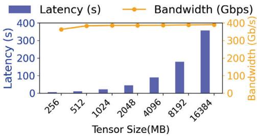

(a) ReduceScatter  
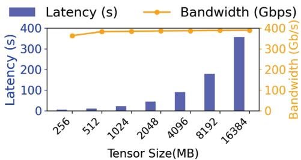  
(b) AllGather

Figure 14: Performance of NCCL ReduceScatter and All-Gather in 64-GPU cluster  
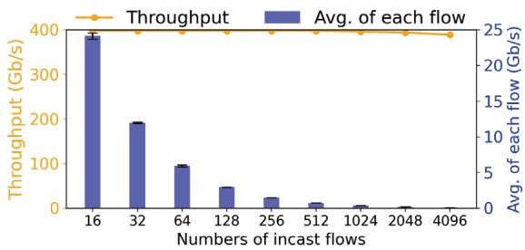  
Figure 15: Performance of extreme incast scenarios

## B Model Analysis and Derivation

We utilize the classical fluid model to analyze the stability and steady state of Barre. The parameters and variables used in the fluid model are detailed in Table 3. In this model, for every D(t)R increases by α such that $R = R + \alpha .$ . Conversely, for every Congestion Notification Packet (CNP) event, the sending rate R is adjusted by a multiplicative factor β, resulting in $R = R \cdot \beta$ . The fluid model is represented by Equations (1)-(5).

Table 3: Symbols in Barre fluid model
<table><tr><td></td><td>Symbol Explanation</td></tr><tr><td>α</td><td>Increase parameter</td></tr><tr><td>β</td><td>Decrease parameter</td></tr><tr><td> $C$ </td><td>Link capacity</td></tr><tr><td> $U$ </td><td>Maximum Transmission Unit (MTU)</td></tr><tr><td> $d$ </td><td>Baremetal round-trip delay</td></tr><tr><td> $K _ { m i n } , K _ { m a x }$ </td><td>ECN parameter</td></tr><tr><td> $P _ { m a x }$ </td><td>ECN parameter</td></tr><tr><td> $D ( t )$ </td><td>Real-time Round Trip Delay</td></tr><tr><td> $R ( t )$ </td><td>Sending Rate of current CC session (per-QP, per-DestIP)</td></tr><tr><td> $N$ </td><td>Number of flows over the bottleneck link</td></tr><tr><td>n</td><td>Number of CNPs in one RTT</td></tr><tr><td> $q ( t )$ </td><td>Real-time queue size</td></tr><tr><td>p(t)</td><td>ECN marking probability</td></tr></table>

$$
{ \frac { \mathrm { d } R } { \mathrm { d } t } } = { \frac { \alpha } { D ( t ) } } - { \frac { \left( 1 - \beta ^ { p ( t ) R ( t ) D ( t ) / U } \right) R ( t ) } { D ( t ) } }\tag{1}
$$

$$
n ( t ) = p ( t ) \frac { C D ( t ) } { U } )\tag{2}
$$

$$
p ( t ) = \frac { q ( t ) - K _ { \operatorname* { m i n } } } { K _ { \operatorname* { m a x } } - K _ { \operatorname* { m i n } } } P _ { \operatorname* { m a x } }\tag{3}
$$

$$
\frac { \mathrm { d } q } { \mathrm { d } t } = N R ( t ) - C\tag{4}
$$

$$
D ( t ) = d + \frac { q ( t ) } { C }\tag{5}
$$

## B.1 Stable Point Analyses

The stable point of the system is defined as the solution of the equations $\begin{array} { r } { \frac { \mathrm { d } R } { \mathrm { d } t } = 0 } \end{array}$ and $\textstyle { \dot { \frac { \mathrm { d } q } { \mathrm { d } t } } } = 0$ , denoted by $( R ^ { * } , q ^ { * } , p ^ { * } , n ^ { * } )$ From this condition, we can get:

$$
n ^ { * } = P ^ { * } \frac { C D ^ { * } } { U }
$$

$$
R ^ { * } = \frac { C } { N }
$$

Combined with Equation (2) (3) and $( 5 ) , n ^ { * }$ could be translated in to Equation (6):

$$
\begin{array} { c } { n ^ { * } = \displaystyle \frac { N \ln \left( 1 - \frac { \alpha N } { C } \right) } { \ln \beta } } \\ { = ( q - K _ { \operatorname* { m i n } } ) \left( q + C d \right) \displaystyle \frac { P _ { \operatorname* { m a x } } } { \left( K _ { \operatorname* { m a x } } - K _ { \operatorname* { m i n } } \right) U } } \end{array}\tag{6}
$$

Thus, we obtain a quadratic equation in terms of $q \mathrm { : }$

$$
q ^ { 2 } + \left( C d - K _ { \operatorname* { m i n } } \right) q - K _ { \operatorname* { m i n } } C d - \frac { N \ln \left( 1 - \frac { \alpha N } { C } \right) \left( K _ { \operatorname* { m a x } } - K _ { \operatorname* { m i n } } \right) U } { P _ { \operatorname* { m a x } } \ln \beta } = 0
$$

And the discriminant of this equation in terms of $q$ is:

$$
\Delta = \left( C d - K _ { \operatorname* { m i n } } \right) ^ { 2 } + 4 \left( K _ { \operatorname* { m i n } } C d + \frac { N \ln \left( 1 - \frac { \alpha N } { C } \right) \left( K _ { \operatorname* { m a x } } - K _ { \operatorname* { m i n } } \right) U } { P _ { \operatorname* { m a x } } \ln \beta } \right)
$$

Since the rate increment of all flows within one RTT will definitely be less than C, ln $\left( 1 - { \frac { 0 . N } { C } } \right) < 0$ . Because of $_ { 0 < \beta < 1 }$ ， we can get $\delta \mathrm { > } 0$ and $\sqrt { \Delta } > C d - K _ { \operatorname* { m i n } } .$ , so the solution $q _ { 1 } { > } 0$ as shown in Equation (7).

$$
q _ { 1 } = \frac { - ( C d - K _ { \mathrm { m i n } } ) + \sqrt { \Delta } } { 2 }\tag{7}
$$

Therefore, the stable point for the queue length $q ^ { * } = q ,$ and the stable point $p ^ { * }$ for the ECN marking probability is:

$$
p ^ { * } = \frac { q ^ { * } - K _ { \operatorname* { m i n } } } { K _ { \operatorname* { m a x } } - K _ { \operatorname* { m i n } } }
$$

In conclusion, we can derive that a stable point must exist, and it is given by $( R ^ { * } , q ^ { * } , p ^ { * } , n ^ { * } )$ .

## B.2 Stability Analyses

Near the stable point, the feedback delay of the control system is assumed to be constant $D ^ { * }$ . The right halves of Equations (1) and (4) are represented by functions $f ( )$ and $g ( \ u )$ respectively as follows:

$$
f ( R , p , q ) = \frac { \alpha } { D ( t ) } - \frac { \left( 1 - \beta ^ { p ( t ) R ( t ) D ( t ) / U } \right) R ( t ) } { D ( t ) }\tag{8}
$$

$$
g ( R ) = N R ( t ) - C\tag{9}
$$

The partial derivatives near the equilibrium point $( R ^ { * } , q ^ { * } , p ^ { * } )$ are:

$$
\begin{array} { c } { { \displaystyle \frac { \partial f } { \partial R } \bigg \vert _ { \displaystyle q = q ^ { * } } = - \frac { 1 - \beta ^ { p ( t ) R ( t ) D ( t ) / U } \left( \frac { p ( t ) R ( t ) D ( t ) } { U } \ln \beta + 1 \right) } { D ( t ) } \bigg \vert _ { \displaystyle q = q ^ { * } \atop p = p ^ { * } } _ { \displaystyle p = p ^ { * } } _ { \displaystyle ( n ^ { * } \mathrm { l n f } / N + 1 ) } } } \\ { { = - \frac { 1 - \beta ^ { n ^ { * } / N } ( n ^ { * } \ln \beta / N + 1 ) } { D ^ { * } } } } \end{array}
$$

$$
\begin{array} { c } { { \displaystyle  \frac { \partial f } { \partial p } | _ { q = { q ^ { * } } } =  \frac { R ( t ) } { D ( t ) } \beta ^ { p ( t ) R ( t ) D ( t ) / U } \ln \beta \cdot  \frac { R ( t ) D ( t ) } { U } | _ { q = { q ^ { * } } } } } \\ { { \displaystyle = \frac { ( R ^ { * } ) ^ { 2 } \ln \beta } { U } \beta ^ { n ^ { * } / N } } } \end{array}
$$

$$
\begin{array} { l } { \displaystyle \frac { \partial f } { \partial q } \bigg \vert _ { t = \pm ^ { * } } = - \frac { \mathbb { G } } { C D ( t ) ^ { 2 } } + \frac { R ( t ) } { C D ( t ) ^ { 2 } } \left( 1 - \mathbb { \beta } ^ { p ( t ) R ( t ) D ( t ) / U } \left( 1 - \frac { p ( t ) R ( t ) D ( t ) } { U } \ln \mathbb { \beta } \right) \right) } \\ { \displaystyle \qquad = - \frac { \mathbb { G } } { C D ^ { * 2 } } + \frac { R ^ { * } } { C D ^ { * 2 } } \left( 1 - \mathbb { \beta } ^ { n ^ { * } / N } \left( 1 - \frac { n ^ { * } } { N } \ln \mathbb { \beta } \right) \right) } \\ { \displaystyle \qquad = - \frac { \mathbb { G } } { C D ^ { * 2 } } + \frac { R ^ { * } } { C D ^ { * 2 } } \left( 1 - \mathbb { \beta } ^ { n ^ { * } / N } \left( 1 - \ln \left( 1 - \frac { \mathbb { G } } { R ^ { * } } \right) \right) \right) } \\ { \displaystyle \qquad \quad \qquad \frac { \partial g } { \partial R } \bigg \vert _ { R = R ^ { * } } = N } \end{array}
$$

According to the analysis at the stable point, it can be known that $\begin{array} { r } { - \frac { \alpha } { C D ^ { * 2 } } + \frac { R ^ { * ^ { * } } } { C D ^ { * 2 } } ( 1 - \beta ^ { n ^ { * } / N } ) = 0 } \end{array}$ . Therefore, the partial derivative of f with respect to q can be expressed as

$\begin{array} { r l } & { \frac { \partial f } { \partial q } \Big | _ { \underset { p = p ^ { * } } { R = R ^ { * } } } = \frac { R ^ { * } } { C D ^ { * 2 } } \beta ^ { n ^ { * } / N } \ln \left( 1 - \frac { \alpha } { R ^ { * } } \right) } \end{array}$ . So, the condition for the

partial derivative of f with respect to q to be zero is restricted by whether ln $\left( 1 - \frac { \alpha } { R ^ { * } } \right)$ is 0. Only when $R ^ { * } > > { \alpha } ,$ can $\frac { \partial f } { \partial q }$ be approximated as zero.

Condition $\begin{array} { r } { \mathbf { 1 } \colon \left. \frac { \partial f } { \partial q } \right| _ { q = q ^ { * } } \neq 0 . } \\ { \mathbf { \sigma } _ { p = p ^ { * } } } \end{array}$ At the equilibrium point $( R ^ { * } , q ^ { * }$

$p ^ { * } )$ , find the partial derivatives of $f ( )$ with respect to r, p, q. Then apply the Taylor series expansion near the equilibrium point to obtain:

$$
\begin{array} { l } { { \displaystyle { \frac { \mathrm { d } \delta R } { \mathrm { d } t } \approx - \frac { 1 - \mathrm { B } ^ { n ^ { * } / N } \left( \frac { n ^ { * } \mathrm { l n B } } { N } + 1 \right) } { D ^ { * } } \delta R ( t ) } } } \\ { { + \frac { \left( R ^ { * } \right) ^ { 2 } \mathrm { l n B } } { U } \mathrm { \beta } ^ { n ^ { * } / N } \delta p ( t - D ^ { * } ) } } \\ { { + \left( \frac { R ^ { * } } { C D ^ { * 2 } } \mathrm { \beta } ^ { n ^ { * } / N } \mathrm { l n } \left( 1 - \frac { \mathrm { d } } { R ^ { * } } \right) \right) \delta q ( t ) } } \\ { { \frac { \mathrm { d } \delta q } { \mathrm { d } t } \approx N \delta R ( t ) } } \end{array}\tag{10}
$$

(11)

In equations (10) and (11), $\delta R ( t ) = R ( t ) - R ^ { * }$ , and $\delta p ( t ) =$ $\boldsymbol { p } ( t ) - \boldsymbol { p } ^ { * }$ . Applying the Laplace transform to both sides of the equation, we could get:

$$
\begin{array} { r l } & { \displaystyle \quad s \tilde { R } ( s ) - \ 8 R ( 0 ) = - \frac { 1 - \beta ^ { n ^ { * } / N } \left( \frac { n ^ { * } \ln { \beta } } { N } + 1 \right) } { D ^ { * } } \tilde { R } ( s ) } \\ & { \quad \quad \quad \quad + \frac { ( R ^ { * } ) ^ { 2 } \ln { \beta } } { U } \beta ^ { n ^ { * } / N } \tilde { p } ( s ) e ^ { - s D ^ { * } } } \\ & { \quad \quad \quad \quad + \left( \frac { R ^ { * } } { C D ^ { * 2 } } \beta ^ { n ^ { * } / N } \ln \left( 1 - \frac { \alpha } { R ^ { * } } \right) \right) \tilde { q } ( s ) } \end{array}
$$

$$
s \tilde { q } ( s ) - \delta q ( 0 ) = N \tilde { R } ( s )
$$

Here, $\tilde { R } ( s )$ and $\tilde { q } ( s )$ represent the Laplace transforms of $\ S R ( t )$ and $\delta \boldsymbol { q } ( t )$ , respectively. The transfer function from $\tilde { p } ( s )$ to $\tilde { R } ( s )$ is:

$$
G _ { p  R } ( s ) = \frac { { \displaystyle { \frac { ( R ^ { * } ) ^ { 2 } \ln \beta } { U } } } { \displaystyle { \beta ^ { n ^ { * } / N } } } } { s + { \displaystyle { \frac { 1 - { \beta ^ { n ^ { * } / N } } ( { \frac { n ^ { * } \ln \beta } { N } } + 1 ) } { D ^ { * } } } - { \displaystyle { \frac { N } { s } } } ( { \frac { R ^ { * } } { { \cal C D } ^ { * 2 } } } { \displaystyle { \beta ^ { n ^ { * } / N } } ( 1 - { \frac { \alpha } { R ^ { * } } } ) } ) } } e ^ { - s D ^ { * } } 
$$

The transforms of $\tilde { R } ( s )$ to $\tilde { q } ( s )$ is $\begin{array} { r } { G _ { R \to q } ( s ) = \frac { N } { s } } \end{array}$ . Similarly, we define $\delta \boldsymbol { p } ( t ) = \boldsymbol { p } ( t ) - \boldsymbol { p } ^ { * }$ . Based on Equation $( 4 ) , \delta p ( t )$ could be translated into:

$$
\delta p ( t ) = p ( t ) - p ^ { * } = \frac { \delta q ( t ) } { K _ { \operatorname* { m a x } } - K _ { \operatorname* { m i n } } } P _ { \operatorname* { m a x } }
$$

The transforms of $\tilde { q } ( s )$ to $\tilde { p } ( s )$ is :

$$
G _ { q \to p } ( s ) = \frac { \tilde { p } ( s ) } { \tilde { q } ( s ) } = \frac { P _ { \mathrm { m a x } } } { K _ { \mathrm { m a x } } - K _ { \mathrm { m i n } } }
$$

$$
\xrightarrow { \mathrm { p ( s ) } } \left[ \underbrace { \mathcal { C } _ { i = 1 } \mathcal { Q } } _ { \begin{array} { c } { { \mathrm { ( 7 ) } } } \end{array} } \right] ^ { \mathrm { R ( s ) } } \xrightarrow { \mathrm { R ( } s \mathrm { ) } } \left[ \underbrace { \mathcal { C } _ { i = 1 } \mathcal { Q } } _ { \begin{array} { c } { { \mathrm { ( 7 ) } } } \end{array} } \right] ^ { \mathrm { q ( s ) } } \xrightarrow { \mathrm { q ( } s \mathrm { ) } } \left[ \underbrace { \mathcal { C } _ { i = 1 } \mathcal { Q } } _ { \begin{array} { c } { { \mathrm { ( 7 ) } } } \end{array} } \right] ^ { \mathrm { p ( s ) } } ,
$$

Figure 16: The equivalent open-loop system

Thus, the transfer function for the closed-loop system is:

$$
G ( s ) = G _ { p  R } ( s ) G _ { R {  } q } ( s ) G _ { q {  } p } ( s ) = \frac a { s ( s + b + \frac c s ) } e ^ { - s D ^ { \ast } }\tag{12}
$$

In Equation (12), a, b and c can be expressed as:

$$
a = \frac { ( R ^ { * } ) ^ { 2 } \ln \beta } { U } \beta ^ { n ^ { * } / N } N \frac { P _ { m a x } } { K _ { m a x } - K _ { m i n } }
$$

$$
b = \frac { 1 - \beta ^ { n ^ { * } / N } ( n ^ { * } \ln \beta / N + 1 ) } { D ^ { * } }
$$

$$
c = - N ( \frac { R ^ { * } } { C D ^ { * 2 } } \beta ^ { n ^ { * } / N } \ln { ( 1 - \frac { \alpha } { R ^ { * } } ) } )
$$

The equivalent open-loop system to the closed-loop system is shown in Figure 16. The frequency response of the system is denoted by $G ( j { \infty } )$ , with the magnitude and phase angle denoted by $r ( \mathbf { \omega } ) = | G ( j \mathbf { \omega } ) \rrangle$ | and $\boldsymbol { \Theta } ( \mathfrak { c } ) = \angle G ( j \boldsymbol { \omega } )$ , respectively. Thus, we have:

$$
r ( \mathfrak { w } ) = \frac { a } { \sqrt { b ^ { 2 } \mathfrak { w } ^ { 2 } + ( c - w ^ { 2 } ) ^ { 2 } } }
$$

$$
\Theta ( \mathfrak { w } ) = - \mathfrak { w } D ^ { * } - \arctan \frac { b \mathfrak { w } } { c - w ^ { 2 } }
$$

Let ${ \mathfrak { O } } _ { g }$ denote the 0-dB crossover frequency on the Bode plot, where $r ( \omega _ { g } ) = 1$ . In accordance with the Bode stability criterion to find the stability conditions, if within the frequency range $( 0 , \omega _ { g } )$ , the phase angle $\theta ( \omega )$ is greater than −π, then the phase margin is greater than 0, ensuring the system is stable. Since $\theta ( \omega )$ is monotonically decreasing and given that $\begin{array} { r } { \Theta ( 0 ) = - \frac { \pi } { 2 } } \end{array}$ , the stability condition is $\begin{array} { r } { \Theta ( \mathfrak { c } \mathfrak { o } _ { g } ) > - \pi . } \end{array}$ , as $- \omega _ { g } D ^ { * }$ arctan $\frac { b \mathfrak { o } _ { g } } { c - w _ { g } ^ { 2 } } > - \pi$ . The stability condition is:

$$
- \omega _ { g } D ^ { * } - \arctan \frac { b \omega _ { g } } { c - w _ { g } ^ { 2 } } > - \pi\tag{13}
$$

Condition 2: $\begin{array} { r } { \frac { \partial f } { \partial q } \Big | _ { \underset { q = q ^ { * } } { R = R ^ { * } } } = 0 . } \\ { p = p ^ { * } } \end{array}$ . Given that parameter $\beta$ is set

close to 1 in the Barre algorithm, ln $\beta$ can be approximated as 0, thus $\begin{array} { c } { { \left. { \frac { \partial f } { \partial q } } \right| _ { \begin{array} { c } { { R = R ^ { * } } } \approx 0 } \\ { { q = q ^ { * } } } \\ { { p = p ^ { * } } } \end{array} } } \end{array}$ . Performing a Taylor series expansion around the equilibrium point vields the following:

around the equilibrium point yields the following:

$$
\frac { \mathrm { d } \delta R } { \mathrm { d } t } \approx - \frac { 1 - \beta ^ { n ^ { * } / N } \left( \frac { n ^ { * } \ln \beta } { N } + 1 \right) } { D ^ { * } } \delta R ( t ) + \frac { ( R ^ { * } ) ^ { 2 } \ln \beta } { U } \beta ^ { n ^ { * } / N } \delta p ( t ) ,\tag{14}
$$

$$
\frac { \mathrm { d } \delta \boldsymbol { q } } { \mathrm { d } t } \approx N \delta R ( t )\tag{15}
$$

In Equation (14) and (15), $\delta R ( t ) = R ( t ) - R ^ { * }$ , and $\delta p ( t ) =$ $\boldsymbol { p } ( t ) - \boldsymbol { p } ^ { * }$ . Applying the Laplace transform to both sides of the equation, we could get:

$$
s \tilde { R } ( s ) - 8 R ( 0 ) = - \frac { 1 - \beta ^ { n ^ { * } / N } \left( \frac { n ^ { * } \ln \beta } { N } + 1 \right) } { D ^ { * } } \tilde { R } ( s ) + \frac { ( R ^ { * } ) ^ { 2 } \ln \beta } { U } \beta ^ { n ^ { * } / N } \tilde { p } ( s )
$$

$$
s \tilde { q } ( s ) - \delta q ( 0 ) = N \tilde { R } ( s )
$$

Here, $\tilde { R } ( s )$ and $\tilde { q } ( s )$ represent the Laplace transforms of $\ S R ( t )$ and $\delta q ( t )$ , respectively. The transfer function from $\tilde { p } ( s )$ to $\tilde { R } ( s )$ is:

$$
G _ { p  R } ( s ) = \frac { \frac { ( R ^ { * } ) ^ { 2 } \ln \beta } { U } \beta ^ { n ^ { * } / N } } { s + \frac { 1 - \beta ^ { n ^ { * } / N } ( \frac { n ^ { * } \ln \beta } { N } + 1 ) } { D ^ { * } } }
$$

The transforms of $\tilde { R } ( s )$ to $\tilde { q } ( s )$ is $\begin{array} { r } { G _ { R \to q } ( s ) = \frac { N } { s } } \end{array}$ . Similarly, we define $\delta \boldsymbol { p } ( t ) = \boldsymbol { p } ( t ) - \boldsymbol { p } ^ { * }$ . Based on Equation (4), $\delta p ( t )$ could be translated into:

$$
\delta p ( t ) = p ( t ) - p ^ { * } = \frac { \delta q ( t ) } { K _ { \operatorname* { m a x } } - K _ { \operatorname* { m i n } } } P _ { \operatorname* { m a x } }
$$

The transforms of ˜q(s) to $\tilde { p } ( s )$ is :

$$
G _ { q \to p } ( s ) = \frac { \tilde { p } ( s ) } { \tilde { q } ( s ) } = \frac { P _ { \mathrm { m a x } } } { K _ { \mathrm { m a x } } - K _ { \mathrm { m i n } } }
$$

Thus, the transfer function for the closed-loop system is:

$$
G ( s ) = G _ { p \to R } ( s ) G _ { R \to q } ( s ) G _ { q \to p } ( s ) = \frac { a } { s ( s + b ) }\tag{16}
$$

In Equation (16), a and b can be expressed as:

$$
a = \frac { ( R ^ { * } ) ^ { 2 } \ln \beta } { U } \beta ^ { n ^ { * } / N } N \frac { P _ { m a x } } { K _ { m a x } - K _ { m i n } }
$$

$$
b = \frac { 1 - \beta ^ { n ^ { * } / N } ( n ^ { * } \ln \beta / N + 1 ) } { D ^ { * } }
$$

The equivalent open-loop system to the closed-loop system is the same as in Figure 16. The frequency response of the system is denoted by $G ( j { \infty } )$ , with the magnitude and phase angle denoted by $r ( \mathbf { \omega } ) = \left| G ( j \mathbf { \omega } ) \right|$ and $\boldsymbol { \Theta } ( \mathfrak { c } ) = \angle G ( j \boldsymbol { \omega } )$ , respectively. Thus, we have:

$$
r ( \mathfrak { w } ) = \frac { a } { \sqrt { \mathfrak { w } ^ { 2 } + b ^ { 2 } } } \ , \ \Theta ( \mathfrak { w } ) = - \frac { \pi } { 2 } - \arctan \frac { \mathfrak { w } } { b }
$$

Let ${ \mathfrak { O } } _ { g }$ denote the 0-dB crossover frequency on the Bode plot, where $r ( \omega _ { g } ) = 1$ . In accordance with the Bode stability criterion to find the stability conditions, if within the frequency range $( 0 , \omega _ { g } )$ , the phase angle θ(ω) is greater than π, then the phase margin is greater than 0, ensuring the system is stable. Since $\theta ( \omega )$ is monotonically decreasing and given that $\begin{array} { r } { \Theta ( 0 ) = - \frac { \pi } { 2 } } \end{array}$ , the stability condition is $\theta ( \mathfrak { w } _ { g } ) > - \pi$ as − π2 arctan $\frac { \mathfrak { o } _ { g } } { b } > - \pi .$ . The stability condition is:

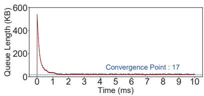  
(a) 20:1 Incast

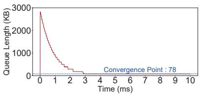  
(b) 100:1 Incast  
Figure 17: Convergence of Barre’s fluid model

$$
\arctan \frac { \mathfrak { o } _ { g } } { b } < \frac { \pi } { 2 }\tag{17}
$$

## B.3 Simulation Verification

We utilize NS3 simulations to evaluate the convergence of Barre. The network topology consists of 10 servers connected to a single ToR switch, with each server equipped with a 100Gbps NIC linked to the switch. The baseline RTT is set to 2us. The increase factor and decrease factor for CC algorithm are configured at 10Mbps and 0.99, respectively. For ECN threshold, we configure $K _ { m i n } { = } 1 0 \mathrm { K B } , K _ { m a x } { = } 2 0 0 \mathrm { K B }$ , and $P _ { m a x } { = } 1$ KB. We test different scale of AlltoAll traffic for 20:1 Incast (Figure 17 (a)) and 100:1 Incast (Figure 17 (b)).

In Figure 17 (a), 20 flows start at the same time, and keep going until each flow finished sending 100MB message. The simulation result shows that, the switch queue length of the congestion point is bounded by 17 KB when the flows are converged at approximately 1.5 ms. We use can get theoretical steady state q given by Equation (7) in fluid model analysis is 9.6 KB. Similarly, Figure 17 (b) shows the simulation result of 100 Incast flows, as each flow sends 10 MB message. The switch queue length converged to 79 KB at about 3ms. And the computational steady point is 78.27KB.

The simulation results and theoretical analysis demonstrate a consistent convergence point, validating the accuracy of Barre’s convergence analysis. More importantly, Barre exhibits robust convergence properties even with large-scale incast traffic. This consistency underscores the reliability of Barre’s design principles and its effectiveness in maintaining stable performance under dynamic traffic conditions.