①

USENIX

THE ADVANCED COMPUTING SYSTEMS ASSOCIATION

# Asterinas: A Linux ABI-Compatible, Rust-Based Framekernel OS with a Small and Sound TCB

Yuke Peng, SUSTech; Hongliang Tian, Ant Group; Junyang Zhang and Ruihan Li, Peking University and Zhongguancun Laboratory; Chengjun Chen and Jianfeng Jiang, Ant Group; Jinyi Xian, SUSTech; Xiaolin Wang, Chenren Xu,   
Diyu Zhou, and Yingwei Luo, Peking University and Zhongguancun Laboratory; Shoumeng Yan, Ant Group; Yinqian Zhang, SUSTech https://www.usenix.org/conference/atc25/presentation/peng-yuke

# This paper is included in the Proceedings of the 2025 USENIX Annual Technical Conference.

July 7–9, 2025 • Boston, MA, USA ISBN 978-1-939133-48-9

Open access to the Proceedings of the 2025 USENIX Annual Technical Conference is sponsored by

P=-r.h mEe-s

auuJl9 PgleU

King Abdullah University of

Science and Technology

# ASTERINAS: A Linux ABI-Compatible, Rust-Based Framekernel OS with a Small and Sound TCB

Yuke Peng1,∗, Hongliang Tian2,∗, Junyang Zhang3,4, Ruihan Li3,4, Chengjun Chen2, Jianfeng Jiang2, Jinyi Xian1, Xiaolin Wang3,4, Chenren Xu3,4, Diyu Zhou3,4, Yingwei Luo3,4,†, Shoumeng Yan2,†, Yinqian Zhang1,†

1SUSTech 2Ant Group 3Peking University 4Zhongguancun Laboratory

## Abstract

How can one build a feature-rich, general-purpose, Rustbased operating system (OS) with a minimal and sound Trusted Computing Base (TCB) for memory safety? Existing Rust-based OSes fall short due to their improper use of unsafe Rust in kernel development. To address this challenge, we propose a novel OS architecture called framekernel that realizes Rust’s full potential to achieve intra-kernel privilege separation, ensuring TCB minimality and soundness. We present OSTD, a streamlined framework for safe Rust OS development, and ASTERINAS, a Linux ABI-compatible framekernel OS implemented entirely in safe Rust using OSTD. Supporting over 210 Linux system calls, ASTERINAS delivers performance on par with Linux, while maintaining a minimized, memory-safety TCB of only about 14.0% of the codebase. These results underscore the practicality and benefits of the framekernel architecture in building safe and efficient OSes.

## 1 Introduction

Despite three decades of research into defending against memory safety bugs in operating systems (OSes) written in C, achieving true memory safety remains elusive. This was starkly demonstrated by the recent CrowdStrike outage [11], where millions of Windows PCs crashed due to an out-ofbounds memory access in a faulty driver. It is estimated that 60-70% of security vulnerabilities in system software written in C stem from memory safety issues [30].

In recent years, as the Rust programming language matures and becomes popular, the development of Rust-based, memory-safe OSes has gained momentum. Rust offers memory safety guarantees through innovative language features such as ownership, borrowing, and lifetimes, enabling safe memory management without relying on garbage collection. Many now see Rust as a potential successor to C and C++ as the dominant systems programming language. With the endorsement of Linus Torvalds, the Linux kernel has officially adopted Rust as its second programming language [18] and integrated the Rust for Linux [41] (RFL) project to facilitate writing "leaf" kernel modules in Rust. Additionally, new OS kernels like Tock [38], RedLeaf [49], and Theseus [16] are built from the ground up using Rust, further demonstrating Rust’s potential in this domain.

Table 1: The unsafe keyword is widely utilized in the crates (or kernel modules) of existing Rust-based OSes. The statistics were derived from an analysis of the latest source code of these OSes at the time of writing.
<table><tr><td>Rust-based OSes</td><td>Linux</td><td>Tock</td><td>RedLeaf</td><td>Theseus</td></tr><tr><td>Unsafe-utilizing crates</td><td>6/111 (55%)</td><td>91/98 (93%)</td><td>36/58 (62%)</td><td>54/171 (32%)</td></tr></table>

1 This includes the RFL crate and 10 notable Rust-written kernel modules [3].

While adopting Rust is a significant step toward achieving kernel memory safety, this is insufficient on its own since Rust-based OSes must include unsafe Rust code. The safety of the kinds of low-level controls required by kernel programming cannot be statically verified by the Rust compiler and thus is only allowed by Rust within special code blocks marked by the unsafe keyword. Despite the Rust language team dedicating an entire book [25] to the “dark arts of unsafe Rust”, developers are still prone to misusing it, and the RustSec Advisory Database has recorded hundreds of bugs stemming from unsafe misuse [60].

To mitigate the risks associated with unsafe in Rust, two widely accepted best practices have emerged [12]: (1) use unsafe sparingly and (2) encapsulate unsafe code within safe abstractions. However, we have found that existing Rustbased OS kernels often fall short of these standards. Unsafe Rust code permeates a significant portion of a Rust-based OS. We observe that unsafe-utilizing crates make up 55%, 93%, 62%, and 32% of all crates in Linux, Tock, RedLeaf, and Theseus, respectively (as shown in Table 1). Although kernel developers generally view unsafe as a “necessary evil”, we question whether such widespread use of unsafe is truly necessary. In particular, we challenge the necessity of unsafe in device drivers (as seen in all existing Rust-based OSes), which account for the majority of the codebase of a mature OS (70% in Linux [17]). Details about the pitfalls of unsafe handling in existing Rust OSes will be present in §2.

Given the limitations of prior work, we pose the question: is it possible to build a feature-rich, general-purpose, Rustbased OS kernel almost entirely in safe Rust? We introduce framekernel (§3), a novel OS architecture designed to achieve a minimal and sound TCB for a Rust-based OS. In the framekernel architecture, the entire OS resides in a single address space (as in a monolithic kernel) and is implemented in Rust. The kernel is logically divided into two parts: the privileged OS framework (akin to a microkernel) and the de-privileged OS services. Only the privileged framework is allowed to use unsafe, while the de-privileged services must be written in safe Rust completely. As the TCB, the privileged framework encapsulates all low-level, hardware-oriented unsafe operations behind safe APIs. Using these safe APIs, the deprivileged OS services can implement all kinds of OS functionalities, including device drivers. A framekernel minimizes the TCB size without incurring extra overheads due to hardware isolation. Thus, we claim that a framekernel combines the benefits of both a monolithic kernel and a microkernel (see Figure 1).

We enforce this language-based, intra-kernel privilege separation by systematically identifying sensitive OS resources, namely those that can be mis-programmed or misused to compromise memory safety – even with safe Rust. Thus, the design principle of a framekernel is to keep sensitive OS resources within the privileged framework for soundness, while delegating insensitive OS resources to the de-privileged OS services for minimality.

To realize the vision of framekernels, we develop OSTD (§4), the privileged OS framework required by a framekernel. OSTD provides a small yet expressive set of safe OS development abstractions, covering safe user-kernel interactions, safe kernel logic, and safe kernel-peripheral interactions. Of particular note is the untyped memory abstraction, which addresses the challenge of safely handling externallymodifiable memory (e.g., MMIO or DMA-capable memory) – a longstanding obstacle in safe driver development. In addition, we introduce safe policy injection, a technique that separates potentially complex "policy" components (e.g., task schedulers, page allocators, and slab allocators) from the core "mechanisms" of OSTD, thus containing the growth of OSTD’s complexity over time. Furthermore, we define a set of key safety invariants that collectively ensure the soundness of OSTD’s privilege separation.

To demonstrate the practicality and benefits of framekernels, we develop ASTERINAS (§5), a Linux ABI–compatible framekernel built on OSTD. ASTERINAS implements a rich subset of Linux functionality: it supports over 210 Linux system calls, multiple file systems and socket types, and a variety of peripherals (e.g., disks and NICs). All these features are written in safe Rust, leveraging OSTD’s APIs. ASTERINAS has been under development for three years. The repository of ASTERINAS and OSTD is open source [1, 2], containing over 100K lines of Rust code contributed by more than 50 individuals.

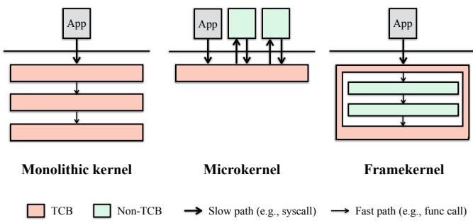  
Figure 1: A framekernel combines the speed of a monolithic kernel and the security of a microkernel. The memory-safety TCB of a framekernel is reduced to the privileged OS framework (akin to a microkernel) without any communication overheads due to extra hardware-based isolation (similar to a monolithic kernel). We depict the TCB portion of a framekernel as a “frame” to highlight the fact all low-level interactions of non-TCB with the hardware (beneath the “frame”) and the user space (above the “frame”) is mediated by the TCB.

We conduct a thorough evaluation (§6) of ASTERINAS and OSTD across three dimensions: performance, TCB size, and soundness. ASTERINAS delivers performance on par with Linux: on LMbench, a syscall-intensive microbenchmark, ASTERINAS achieves a mean normalized performance score of 1.08 (relative to Linux, higher is better); for three I/Ointensive applications, Nginx, Redis, and SQLite, it delivers a normalized performance of 1.17, 1.31, and 0.85, respectively. The framekernel design also yields a lean TCB: ASTERINAS’s TCB accounts for just 14.0% of its codebase, versus 43.8% in Tock, 62.4% in Theseus, and 66.1% in RedLeaf. Finally, to strengthen our confidence in OSTD’s soundness, we develop KERNMIRI, a retrofitted version of Miri [48] for Rust OSes, which is used to detect potential safety issues in OSTD systematically.

Contributions. In summary, this paper makes the following contributions:

• We propose framekernel, a novel OS architecture that combines the benefits of both monolithic and microkernels by enforcing Rust-based intra-kernel privilege separation.

• We develop OSTD, a small and sound OS framework to facilitate OS development in safe Rust.

• We develop ASTERINAS, a highly-optimized, Linux ABIcompatible OS based on OSTD.

• We conduct extensive evaluations to show the performance, TCB size, and safety of both ASTERINAS and OSTD.

## 2 Background and Motivation

## 2.1 The Rusty Way to Safety

Rust is an efficient system programming language that offers strong guarantees for memory, type, and thread safety without compromising runtime performance, thanks to its strong type system and unique ownership model.

Ownership, borrowing, and lifetime. In Rust’s ownership model, each value has a single owning variable, and the value’s lifetime is tied to the owner’s scope [10]. When the owner goes out of scope, the value is dropped. Ownership can be borrowed through references, subject to lifetime constraints enforced by the compile-time borrow checker.

Type system. The Rust compiler implements a tailored type system coupled with comprehensive compile-time checks [7, 9]. Utilizing type information, the compiler ensures that all accesses occur within valid lifetimes, generates correct memory offsets, and performs bounds checking, thereby guaranteeing both temporal and spatial memory safety.

Unsafe Rust. To offer additional expressive power, Rust provides the unsafe keyword, enabling programmers to bypass compile-time checks and thus shifting the responsibility for ensuring safety to those using unsafe code blocks [8].

Undefined behaviors. Undefined behaviors (UBs) in Rust refers to operations that compromise the language’s correctness and safety guarantees, including memory safety, thread safety, and type safety. The Rust Reference book enumerates common UBs [6], e.g., data races, memory access based on dangling or misaligned pointers, out-of-bound memory access, breaking the pointer aliasing rules, and mutating immutable bytes. However, this list is neither comprehensive nor precise due to Rust’s lack of a formalized specification. The Rust language team maintains an official UB detection tool called Miri [48], which, as part of the Rust toolchain, serves as a de-facto executable standard for UBs. Although Miri can effectively detect UBs in standard Rust applications, Miri is not applicable to Rust-based OSes as its design does not take into account the needs of low-level system programming, particularly in areas of memory management and hardware interaction. This work aims at systematic identification and prevention of UBs in the context of Rust OSes.

## 2.2 Rustification of Mainstream OSes

The efficiency and safety of Rust make it an attractive choice for developing OSes, leading to several mainstream OSes [29, 41, 54] integrating Rust into their codebases. The Rust for Linux (RFL) project [41] stands out as a prominent example.

RFL aims at establishing Rust as the second official language of the Linux kernel, allowing developers to write “leaf” kernel modules in safe Rust. Officially merged into Linux in 2022, RFL has laid the groundwork for Rust integration by 2024 [40]. Notably, three Rust-written device drivers, albeit basic, have already been added to the kernel tree [39].

Despite this progress, the unsafe nature of Linux remains. By design, RFL has to offer safe Rust abstractions over Linux’s extensive legacy C APIs, resulting in substantial use of unsafe Rust. A recent study [39] notes that RFL already has 19K lines of Rust code upstream, with an additional 112K lines staged for upstream inclusion. A great portion of RFL is devoted to unsafe Rust code that interacts with the legacy C APIs. As RFL expands to cover more subsystems and their C APIs, we expect its codebase to grow to hundreds of thousands of lines. Therefore, the TCB size of RFL is substantial, even not considering Linux’s huge C core and the countless C kernel modules around it.

Lesson Learned: Constructing safe Rust abstractions on a legacy monolithic kernel inevitably requires a substantial use of unsafe Rust.

In addition to the inflated TCB size, the burden of a huge legacy codebase - its status quo and established philosophy - constrains the effectiveness of Rust and the soundness of RFL. This constraint leaves known soundness vulnerabilities unresolved in RFL. For example, Rust explicitly excludes memory leaks from its memory safety guarantees, permitting objects to be forgotten. However, it was discovered that forgetting RFL’s mutex guards can trigger use-after-free vulnerabilities [55]. This vulnerability arises from conflicting API contracts between C and Rust regarding mutex unlocking obligations, so neither side is willing or capable to fix it. Another example of a soundness issue stems from Linux’s (and by extension RFL’s) tolerance for sleeping in atomic contexts such as spinlock or RCU-lock held regions. Sleep-in-atomic-context bugs may cause data races in RCU-protected memory accesses, undermining Rust API safety guarantees [31]. These unresolved soundness issues reflect the Linux community’s traditional value of "pragmatism over safety" [31], creating fundamental tensions with Rust’s security-first paradigm.

Lesson Learned: Achieving sound memory safety requires a clean-slate OS that prioritizes safety above all else.

## 2.3 Clean-Slate Rust OSes

Clean-slate Rust OSes like Tock [38], RedLeaf [49], and Theseus [16] strive to fully leverage Rust’s features to improve OS safety and reliability. However, they face a notable limitation: inadequate support for safe driver development. As shown in Table 2, device drivers in these systems frequently rely on unsafe code to manage low-level resources, such as raw data buffers, MMIO, I/O ports, and DMA regions. Given that drivers typically constitute the largest portion of an OS codebase, extensive use of unsafe code significantly heightens the risk of memory safety vulnerabilities.

Table 2: Representative unsafe Rust code pattern in drivers
<table><tr><td></td><td>Resource access within unsafe blocks</td><td>Resource acquisition within unsafe blocks</td></tr><tr><td rowspan="2">Tock</td><td>// chips/nrf52:</td><td>// chips/nrf52:</td></tr><tr><td>buf[idx]= *byte_ptr</td><td>StaticRef::new(ptr)</td></tr><tr><td rowspan="2">RedLeaf</td><td>// lib/devices/ixgbe:</td><td>// lib/devices/tpm:</td></tr><tr><td>ptr::read_volatile(addr)</td><td>MmioAddr::new (base,len)</td></tr><tr><td rowspan="2">Theseus</td><td>// kernel/pci:</td><td>// kernel/ixgbe:</td></tr><tr><td>pci_port.write(val)</td><td>Box::from_raw (ptr)</td></tr></table>

Lesson Learned: Safe driver development requires safe abstractions for acquiring and accessing low-level system resources.

Among the three Rust OSes, Theseus minimizes unsafe code through its MappedPages abstraction, which represents the exclusive ownership of a virtually-contiguous memory region backed by some exclusively-owned physical frames. This exclusiveness alone (seemingly) preserves the safety of Rust references (e.g., &T) borrowed from that range. However, this design overlooks sensitive or externally-modifiable memory. For example, using MappedPages to modify the sensitive memory of Local APIC may cause unpredictable CPU behavior (e.g., sending an IPI that resets a CPU). Similarly, Theseus drivers create Rust references (&T) to MMIO device memory, an unsound practice since such references assume no external modifications, which hardware may violate.

Lesson Learned: Rust OSes must develop safe abstractions for memory that is subject to external modifications, such as hardware, user programs, or DMA.

Finally, while language-level UBs are effectively addressed by Rust’s safety guarantees, UBs stemming from execution environments or CPU architectures remain unresolved in existing Rust-based OSes. For example, a malicious device could corrupt kernel memory via DMA [44] or spoof interrupts to manipulate CPU trap handlers [63]. Similarly, a stack overflow could compromise the execution environment—an issue beyond the detection capabilities of safe Rust.

Lesson Learned: Rust OSes should safeguard against UBs not only at the language level but also at the architectural and environmental levels.

## 3 Framekernel Architecture

We introduce framekernel, a novel OS architecture that combines the benefits of both monolithic kernels and microkernels by fully leveraging the modern safe system language of Rust. In a framekernel OS, the entire OS kernel resides within a single address space, akin to a monolithic kernel, and is implemented in Rust. The kernel is logically divided into two parts:

the privileged OS framework (similar to a microkernel) and the de-privileged OS services. Only the privileged framework may use Rust’s unsafe features, while the de-privileged services are built entirely in safe Rust. The privileged framework encapsulates low-level, hardware-oriented unsafe operations into safe APIs, using which the de-privileged services implement most OS functionalities, including drivers, in safe Rust. Like a monolithic kernel, all components within a framekernel communicate efficiently (e.g., via function calls or shared memory). By restricting the privileged framework to a minimal set of functionalities, framekernels, like microkernels, reduce the size of the TCB, thereby enhancing safety, security, and reliability.

Design philosophy. At the heart of the framekernel architecture is intra-kernel privilege separation: although OS services operate in privileged CPU mode, their behaviors are constrained by safe Rust and the privileged framework, maintaining their de-privileged status. Only flaws within the privileged framework can jeopardize the kernel’s memory safety. This intra-kernel privilege separation must uphold two key properties: soundness and minimality.

Soundness: The OS framework guarantees the absence of UBs under all circumstances, irrespective of interactions with OS services, user code, or peripheral devices.

This property aims to prevent all forms of UBs, which may originate at three levels (from high to low). First, languagelevel UBs in Rust are described in §2.1. Second, environmentlevel UBs arise when the code, stack, or heap is corrupted. Programming languages have implicit assumptions about their execution environments; UB occurs if those assumptions are compromised. Third, architecture-level UBs stem from incorrect use of CPU or hardware devices, such as improperly saving/restoring CPU registers, misconfiguring page tables, or allowing peripheral DMA to corrupt memory.

Minimality: A component is tolerated inside the OS framework only if moving it outside would prevent the implementation of OS services’ required functionality or compromise soundness of the framework.

This property focuses on minimizing the principal component of the runtime TCB responsible for kernel memory safety. Naturally, the whole TCB extends beyond the OS framework itself, also including the Rust toolchain, the Rust core libraries, bootloader, and firmware involved in loading a framekernel, as well as the CPU plus some core devices (e.g., interrupt controller and IOMMU). The software and hardware outside the TCB, including the safe OS services, user-space programs, and peripheral devices (e.g., disks, NICs, and GPUs), are not trusted.

Towards effective privilege separation. Realizing intrakernel privilege separation prompts a key question: What must stay inside the framework (for soundness), and what can be moved outside (for minimality)?

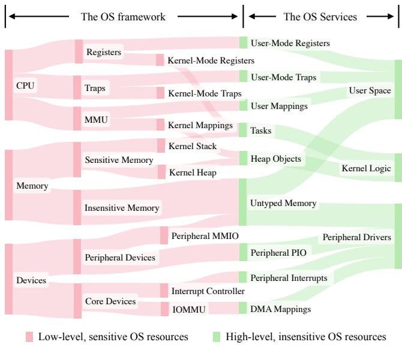  
Figure 2: A blueprint for framekernel construction in a resource-centric view. The nodes represent OS resources, while the edges depict classification and encapsulation. The concept of untyped memory will be introduced in §4.2.

To answer this, we view framekernel construction from a resource-centric perspective, as shown in Figure 2. Fundamentally, an OS manages three classes of resources: CPU, memory, and devices. At first glance, these resources are all sensitive because the kernel code could misuse them (even in safe Rust) and break memory safety. However, deeper inspection shows that some subsets of these resources are actually insensitive. Thus, we must keep sensitive resources inside the framework (for soundness) and should move insensitive ones outside (for minimality).

All three classes of fundamental resources can be split into sensitive and insensitive subsets. CPU resources involve kernel-mode and user-mode control; the former is considered sensitive, while the latter (e.g., user-mode registers, user-mode traps) is insensitive because it cannot directly undermine kernel state. Furthermore, the user virtual address space is insensitive as manipulating the user virtual memory does not affect kernel memory safety. Memory resources include sensitive memory used for the kernel’s code, stack, heap, and page tables, whereas memory dedicated to untrusted user processes or devices is insensitive because kernel safety does not depend on its integrity. Devices present a similar division, as core devices (e.g., APIC, IOMMU) are sensitive due to their machine-wide control, but peripheral devices (e.g., NICs, GPUs) are generally insensitive; a misconfigured core device can compromise the entire kernel, but failures in a peripheral device are typically confined to that device itself.

These observations inform a blueprint for framekernel construction (Figure 2). The blueprint classifies OS resources into sensitive and insensitive ones at a fine granularity, with lowlevel, sensitive ones hidden inside the privileged OS framework or encapsulated into high-level, insensitive ones. The net result is that the privileged OS framework only exposes to the de-privileged OS services a small set of insensitive resources that is sufficient to support the three primary needs of safe OS development: (1) safe user-kernel interactions, (2) safe kernel logic, and (3) safe kernel-peripheral interactions. This blueprint guides the design of OSTD.

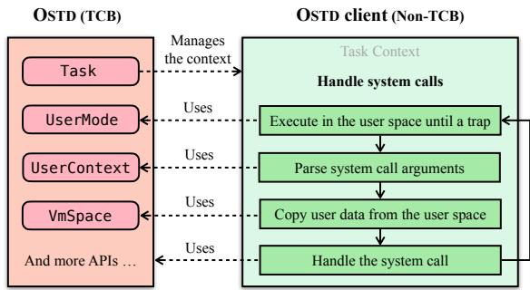  
Figure 3: An example of OSTD APIs: system call handling

## 4 OSTD

In this section, we present OSTD, which is our implementation of the framework required by a framekernel. First, we provide an overview of OSTD’s APIs. Then, we describe how OSTD manages physical memory pages (frames), a key foundation of OSTD’s soundness. Next, we define the key safety invariants for OSTD to achieve the language-based, intra-kernel privilege separation. Lastly, we introduce the technique of safe policy injection, which confines the complexity growth of OSTD as it evolves.

## 4.1 Expressive APIs

OSTD provides a small set of expressive abstractions to meet the needs of safe OS development. These abstractions are implemented as OSTD APIs, which are utilized by OSTD clients – safe kernel code that interacts with the OSTD. For safe userkernel interactions, it allows an OSTD client to jump into the user space and execute until a trap occurs (UserMode), manipulate user-mode CPU registers (UserContext), and manage user address spaces (VmSpace). For safe kernel logic, it includes synchronization primitives (e.g., SpinLock, Rcu, Mutex, WaitQueue, and CpuLocal) and efficient data collection types (e.g., LinkedList and RbTree). For safe kernelperipheral interactions, it offers mechanisms to register interrupt handlers (IrqLine), perform MMIO and PIO (IoMem and IoPort), and create coherent or streaming DMA mappings (DmaCoherent and DmaStream). All three of these OS development aspects may allocate and access physical pages, referred to as frames, via Frame (one frame) or Segment (multiple contiguous frames).

We illustrate a simplified workflow of how system calls may be handled safely with OSTD in Figure 3. Another example on how device data is requested with OSTD is shown in Figure 10 in Appendix A. For a more concrete example, see our sample project “Write a Hello World OS Kernel in ∼100 Lines of Safe Rust with OSTD” [23].

## 4.2 Frame Management

OSTD employs a frame metadata system to track the state of each page frame, including a reference count and a customizable metadata field. All per-frame metadata are stored in a large static array, which is allocated and initialized in an early bootstrap phase. The reference count equals the total number of Frame and Segment instances that refer to that frame, enabling OSTD to manage frame lifetimes correctly.

Inv. 1: Any newly-allocated Frame or Segment originates from currently unused memory.

OSTD further supports custom per-frame metadata by taking a type parameter M in Frame<M> (or Segment<M>). The client can attach a metadata object of M to a Frame<M> object, enabling features like a page cache to efficiently maintain some extra per-frame states (e.g., the status of data synchronization between memory and disk). This mechanism is also used in page allocators and slab allocators (see §4.4).

Both Frame and Segment can represent either sensitive or insensitive memory. Internally, OSTD uses them to allocate sensitive memory for kernel resources such as page tables, stacks, or slabs. Externally, an OSTD client can request a special form of insensitive memory called untyped memory with UFrame<M> = Frame<M: AnyUFrameMeta> or USegment<M> = Segment<M: AnyUFrameMeta>, where the trait AnyUFrameMeta marks metadata types suitable for untyped memory usage.

Untyped memory deals with the fact that externally modifiable memory (e.g., user-mapped or DMA-capable memory) cannot uphold the strong guarantees of Rust references or the type safety of arbitrary Rust types. As such, we design UFrame (or USegment) to have a read-write style interface [24] that only permits copying plain old data (POD) [4] from or into it. A POD type (e.g., u32) can hold a value of any bit pattern, without invalidating any Rust invariants.

## 4.3 Privilege Separation

Intra-kernel privilege separation requires preventing all sensitive resources from being tampered with by non-TCB entities, including safe clients, user programs, and peripheral devices. OSTD achieves this by enforcing the following key invariants.

Inv. 2: Kernel-mode CPU states cannot be tampered with by OSTD clients.

To expose only user-mode CPU operations to clients, OSTD provides UserMode, UserContext, and VmSpace. The first two handle traps and registers at user privilege level, while the third manages user-mode virtual memory. Kernel-mode registers are hidden, and only safe portion of user-mode CPU registers are accessible. For instance, on x86, UserContext exposes only the non-sensitive subset of RFLAGS, excluding bits like IF or IOPL that control interrupts or I/O privilege.

Inv. 3: Kernel-mode CPU states cannot be tampered with by peripheral devices.

On x86 hardware, devices can spoof exceptions, traps, or inter-processor interrupts [63]. To protect against such attacks, OSTD configures the IOMMU to enable interrupt remapping, preventing rogue devices from influencing kernel control flow.

Inv. 4: Sensitive memory cannot be tampered with by OSTD clients.

All Frames or Segments allocated by OSTD clients originate from insensitive physical memory. Sensitive pages, such as those used for kernel code, stacks, or page tables, remain fully within OSTD’s control.

Each Task’s stack includes a guard page to detect stack overflows. If the stack pointer touches the guard page, a page fault is triggered, preventing further execution and thwarting potential malicious behavior. Additionally, the OSTD-based OS enforces a compile-time stack usage analysis, ensuring each function’s stack frame remains smaller than the guard page. This prevents malicious attempts to bypass the guard page and exploit stack overflows.

Inv. 5: Sensitive memory cannot be tampered with by user programs.

User-mode mappings are created through VmSpace, which can only take UFrame or USegment as inputs. This design rules out exposing sensitive memory to user space because untyped memory are, by definition, insensitive.

Inv. 6: Sensitive memory (including I/O memory) cannot be tampered with by peripheral devices.

OSTD leverages IOMMU to prevent peripheral devices from writing to unauthorized physical regions. Initially, no part of physical memory is DMA-accessible. Drivers can create DMA mappings (DmaStream or DmaCoherent) only over untyped memory (UFrame or USegment), so sensitive regions stay protected.

Inv. 7: Sensitive I/O memory or ports cannot be tampered with by OSTD clients.

Clients interact with MMIO and PIO through IoMem and IoPort. OSTD uses information from the architecture, firmware (e.g., ACPI tables on x86), and core device drivers to label ranges of I/O memory and ports as either sensitive or insensitive. IoMem and IoPort can only be instantiated for insensitive regions, preventing accidental or malicious misuse of sensitive I/O registers.

Table 3: Increased complexities in some Linux components
<table><tr><td>Linux Components</td><td>Early Version (2.1.23,1997)</td><td>Latest Version (6.12.0,2024)</td><td></td></tr><tr><td>Task scheduler</td><td>1.6 KLoC</td><td>27.2 KLoC</td><td>17×</td></tr><tr><td>Slab allocator</td><td>1.6 KLoC</td><td>8.7 KLoC</td><td>6×</td></tr><tr><td>Frame allocator</td><td>1.2 KLoC</td><td>7.1 KLoC</td><td>6×</td></tr></table>

## 4.4 Safe Policy Injection

One’s confidence in the correctness of any safe abstraction ultimately hinges on the size and complexity of its TCB. In this section, we explain how to contain OSTD—even if its implementation adopts increasingly sophisticated strategies and policies over time.

Specifically, OSTD consists of the following components, each of which makes decisions based on particular strategies or policies: (1) Task scheduler determines which task to run next, (2) Frame allocator decides how to allocate large chunks of memory, and (3) Slab allocator decides how to allocate smaller chunks of memory. These components can grow significantly when equipped with advanced features. For instance, their counterparts in Linux have grown in size and sophistication over the years, as summarized in Table 3.

Intuitively, a TCB should contain only mechanisms rather than policies for minimality. We therefore propose safe policy injection, a technique that removes complex policies from a Rust TCB without compromising functionality, efficiency, or soundness. To apply the technique, a developer identifies components inside the TCB that might use complex strategies or policies, then determines whether a complete policy implementation can be written in safe Rust. If it can, the developer designs abstractions for acceptable policies plus APIs to register those policies, a process we refer to as “injection”.

Although the idea of safe policy injection appears simple, ensuring soundness can be challenging because these policies affect the behaviors of TCB code. For example, a safe-butbuggy scheduler could inadvertently schedule the same task on two CPUs at once – a catastrophic mistake for memory safety. Similarly, the choice of which memory page or slot to allocate next directly affects memory safety. All mainstream OSes include frame and slab allocators within their TCBs for precisely these reasons. The rest of this subsection describes how we overcome such challenges.

## 4.4.1 Task Scheduler

Our goal is to support advanced schedulers, such as Linux’s Completely Fair Scheduler (CFS) [5], atop OSTD. We introduce to OSTD two new traits: Scheduler and RunQueue. Their APIs are summarized in Table 4. A type implementing Scheduler should be registered once at an early stage of kernel initialization (when no tasks exist). Whenever a task becomes runnable (e.g., is spawned or woken), OSTD hands it over to the scheduler via the enqueue method.

Table 4: Select APIs for task scheduler injection. Scheduler represents a task scheduler, and each CPU’s local run queue is represented by RunQueue.
<table><tr><td>APIs</td><td>Descriptions</td></tr><tr><td>Scheduler::enqueue(&amp;self,task)</td><td>Enqueue a task</td></tr><tr><td>Scheduler::local_rq_with(&amp;self,</td><td>Access to the local run</td></tr><tr><td>closure)</td><td>queue with a closure</td></tr><tr><td>RunQueue::update_curr(&amp;mut self)</td><td>Update current task</td></tr><tr><td>RunQueue::pick_next(&amp;mut self)</td><td>Pick the next task</td></tr><tr><td>RunQueue::dequeue_curr(&amp;mut self)</td><td>Remove the current task</td></tr></table>

Table 5: Select APIs for frame allocator injection. The FrameAlloc trait abstracts any injectable frame allocator.
<table><tr><td>APIs</td><td>Descriptions</td></tr><tr><td>FrameAlloc::alloc(&amp;self,layout)</td><td>Allocate frames</td></tr><tr><td>FrameAlloc::dealloc(&amp;self,addr，size)</td><td>Deallocate frames</td></tr><tr><td>FrameAlloc::add_free_memory(&amp;self,</td><td>Add a range of</td></tr><tr><td>addr，size)</td><td>usable frames</td></tr></table>

We require schedulers to be SMP-friendly by keeping per-CPU run queues, accessible through local\_rq\_with. To replace the current task, OSTD calls pick\_next, and if the current task becomes unrunnable (e.g., it sleeps), dequeue\_curr removes it from the queue. At each scheduling event (e.g., sleep, yield, or timer tick), OSTD invokes update\_curr to notify the scheduler, which can then update the scheduling information about the current task.

For efficiency, the scheduler API takes ownership of runnable tasks (Arc<Task>). Because the task objects are clonable, they can be stored in advanced data structures (e.g., red-black trees) or moved between CPU queues for load balancing. Each task may also carry custom data (Box<dyn Any>) for storing scheduling attributes, making these attributes cheaply accessible.

The client-provided pick\_next method could return an invalid task. In particular, returning a task that is already running on another CPU may lead to severe consequences, as running one task on two CPUs corrupts its stack. We must thus preserve this key invariant:

## Inv. 8: A Task runs on at most one CPU at any given time.

To enforce this, OSTD gives each Task a private flag, is\_running, which is checked and set prior to a context switch. After switching, the previous task will have its flag cleared.

## 4.4.2 Frame Allocator

An injectable frame allocator is abstracted by the FrameAlloc trait, whose APIs are shown in Table 5. During the initialization phase, OSTD passes the information of all usable physical memory to the injected frame allocator (FrameAlloc::add\_free\_memory). Subsequently, whenever an OSTD client requests a new Frame (or Segment), OSTD redirects the request to the injected allocator (FrameAlloc::alloc), which returns the address of the allocated memory. Conversely, when a Frame (or Segment) is dropped and its reference count is reduced to zero, the underlying frames will be returned to the injected allocator (FrameAlloc::dealloc).

Table 6: Select APIs for slab allocator injection. A Slab represents one or more memory pages arranged into fixed-size slots, with free slots represented by HeapSlot.
<table><tr><td>APIs</td><td>Descriptions</td></tr><tr><td>Slab::new()</td><td>Create a new slab</td></tr><tr><td>Slab::alloc(&amp;self)</td><td>Allocate a new HeapSlot</td></tr><tr><td>Slab::dealloc(&amp;self,slot)</td><td>Recycle a HeapSlot</td></tr><tr><td>HeapSlot::into_box(self,val)</td><td>Convert into a heap object</td></tr></table>

A Frame (or Segment) must be created out of a valid and unused range of physical memory. But this safety precondition may be violated by an injected frame allocator due to potential logical bugs. To guard against such bugs, OSTD only turns memory ranges obtained from the injected allocator into Frames through a safe constructor method, Frame::from\_unused(addr, size), which enforces Inv. 1 by leveraging the frame metadata system (§4.2).

## 4.4.3 Slab Allocator

We now describe how OSTD supports a custom slab allocator [14, 15] and its injection as the heap allocator. A slab is one or more contiguous pages partitioned into an array of fixed-size slots [14]. Each slot can hold a single object of a particular type or size. A slab cache pools these slots for rapid allocation and release. Typically, a per-CPU free list tracks empty slots, refilled from a global pool of slabs when needed. If all slabs are full, new slabs are allocated from free pages. Conversely, the allocator can free unused slabs to reclaim memory. An OS typically manages multiple slab caches for different slot sizes, all governed by a slab allocator.

We introduce two new abstractions in OSTD: Slab and HeapSlot, whose APIs are summarized in Table 6. These APIs perform type conversions critical to memory safety: from an unused memory page to a slab (Slab::new), then to a free slot (Slab::alloc), and ultimately to a heap object (HeapSlot::into\_box). With these abstractions, developers can implement slab caches and the slab allocator in ASTERI-NAS using only safe Rust.

These abstractions maintain some key invariants. For example, a Slab owns its underlying pages, so dropping the Slab should free those pages – unless some slots are still occupied by active objects. To avoid use-after-free, each Slab tracks the number of active HeapSlots it spawned. A panic is triggered if a Slab is dropped while any slot remains active:

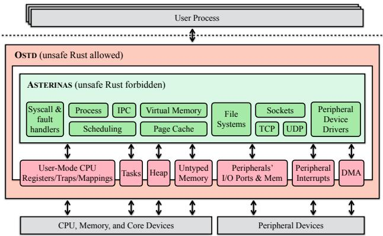  
Figure 4: An overview of Asterinas.

Inv. 9: A HeapSlot or any object derived from it must not outlive its parent Slab.

Additionally, when HeapSlot::into\_box is called, the method checks cheaply whether the slot’s address and size can fit a requested object of type T:

Inv. 10: An object is created from a HeapSlot only if the slot meets the object’s size and alignment requirements.

In practice, many kernel components rely on a global heap rather than creating their own slab caches. OSTD allows injecting a slab-based, global heap allocator, which can dispatch each heap allocation to the appropriate slab cache.

Overall, the safe policy injection technique allows OSTD to enjoy the performance advantage of advanced implementations without bloating its TCB size.

## 5 ASTERINAS

We develop ASTERINAS (see Figure 4), a framekernel-based OS built on top of OSTD. ASTERINAS implements a substantial subset of Linux features, including virtual memory, user processes, preemptive scheduling, IPC, a page cache, a virtual file system, and sockets, providing over 210 system calls. It supports various file systems (e.g., Ext2, exFAT32, OverlayFS, RamFS, ProcFS, and SysFS), socket types (e.g., TCP, UDP, Unix, and Netlink), and devices (e.g., Virtio Block, Virtio Network, Virtio Vsock, USB controller, and USB HID). Two CPU architectures are supported: x86-64 (tier-1) and RISC-V (tier-2). All the functionality is written in safe Rust by leveraging OSTD’s APIs. ASTERINAS has been under development for three years (see Figure 7). The repository of ASTERINAS and OSTD is open-sourced [1, 2], contains over 100K lines of Rust contributed by over 50 individuals.

Towards smaller TCB. In pursuit of a smaller TCB, ASTER-INAS (rather than OSTD) implements much of the OS infrastructure that Linux considers part of its core. For instance, ASTERINAS manages all interrupt bottom halves, such as softirq, tasklets, and work queues, by using an interrupt handling hook provided by OSTD. OSTD enforces “atomic mode” to prevent client-provided callbacks from sleeping in interrupt context. ASTERINAS also maintains system time, monotonic time, and wall clocks by registering timer interrupts and reading the timestamp counter (TSC) through OSTD.

ASTERINAS takes advantage of OSTD’s safe policy injection feature. It incorporates a Linux-style task scheduler with multiple scheduling classes—including a real-time scheduler and a rudimentary CFS [5]. ASTERINAS provides an efficient and scalable buddy system frame allocator, with per-CPU caching. ASTERINAS also features a slab allocator following the original design [14]. Our primary focus has been establishing the injection mechanism rather than extensively refining each scheduling or allocation policy; we plan to continue improving these components for greater maturity.

Performance optimization. Many performance bottlenecks in ASTERINAS and OSTD have been identified and addressed. Due to space constraints, we cannot cover every optimization in detail. In many instances, we have adapted strategies from Linux’s optimized C implementations to align with the framekernel philosophy and the constraints of safe Rust.

One optimization in ASTERINAS is a pooling mechanism for DMA-able memory regions (akin to persistent mapping [61]), which may be requested frequently by device drivers. This approach minimizes the need for DMA mapping setup, requiring it only during initialization, thereby preserving IOTLB entries and enhancing the hit rates for IOMMU. In contrast, a dynamic mechanism would necessitate frequent unmaps, leading to IOTLB invalidation and a subsequent performance decline.

Thus far, our optimization efforts have been concentrated on single-core systems. Ongoing work is focused on improving SMP scalability through the use of SMP-friendly locks (e.g., RCU [45], MCS locks [35]) and the application of more fine-grained locking mechanisms. In this paper, our evaluation compares ASTERINAS directly with Linux in a single-core environment, with a comprehensive multi-core analysis planned for future work.

## 6 Evaluation

## 6.1 Performance Evaluation

We evaluate the performance of ASTERINAS. The experiments are performed on a machine with an Intel i7-10700 processor, 32GB of memory, and an Intel SSDPEKNW512GB solid state drive. The system software on the machine includes Ubuntu 22.04 (Linux version 6.8.0) and QEMU 9.1.0.

For comparison with ASTERINAS, we use Linux kernel version 5.15 as the baseline. Some Linux features that are missing in ASTERINAS, including CPU mitigations (mitigations=off) and huge pages (hugepages=0), are disabled to ensure fairness. Without disabling CPU mitigations, Linux’s performance would be affected considerably.

Both the Linux and ASTERINAS kernels are tested within QEMU virtual machines (VMs) configured as follows: SMP set to 1, machine type set to q35 with the kernel IRQ chip in split mode, CPU specified as Icelake-Server, PCID disabled, and x2APIC and KVM enabled. Each VM is attached with a virtio-blk device (having a single queue with a length of 64) and a virtio-net device (a tap device with vhost support enabled), which will be used for block and network I/O benchmarks, respectively.

## 6.1.1 Micro-benchmarks

We run LMbench [46], a series of system call-intensive microbenchmarks. Specifically, the benchmarks are classified into five categories: process-related (Proc), memoryrelated (Mem), Inter-process communication-related (IPC), filesystem-related (FS), and network-related benchmarks (Net). The last column (Norm) of Table 7 shows the normalized performance—for throughput it shows results of Asterinas/Linux; for latency it shows results of Linux/Asterinas— and hence higher results suggest better performance of AS-TERINAS. ASTERINAS is evaluated with IOMMU enabled and all reported results are averaged over ten runs of the benchmarks.

As shown in Table 7, the geometric mean of the normalized performance is 1.08, which means ASTERINAS slightly outperforms Linux in more benchmarks. This result suggests that ASTERINAS is comparable to Linux in performance, but does not necessarily mean ASTERINAS is better optimized. As a newly developed Rust kernel, ASTERINAS misses some of the advanced features and configurations in Linux. For example, in the network TCP tests, ASTERINAS uses the smoltcp [22] library, which lacks congestion control, enabling TCP to operate at full speed and resulting in faster performance compared to Linux. In the FS-related open and stat tests, Linux employs RCU-walk to achieve faster filename lookup, an optimization not implemented in ASTERINAS.

## 6.1.2 Macro-benchmarks

We evaluate ASTERINAS’s performance with popular I/Ointensive applications, including Nginx (1.26.2), Redis (7.0.15), and SQLite (3.46.1). The results in Figure 5 report ASTERINAS’s performance with IOMMU enabled (default) and disabled (for comparison).

• Nginx. We evaluate the throughput of Nginx using ApacheBench [26] with a concurrency level of 32 and a total of 200,000 requests. The results shown in Figure 5(a) indicate that the throughput of Nginx is higher on ASTERINAS (22,912 rps) than Linux (19,227 rps) when the requested file size is 4096 bytes (19% higher). When the file size is 64 KiB, ASTERINAS’s throughput drops to 9,234 RPS, which is close to Linux’s result. This drop may happen because AS-TERINAS ’s sendfile implementation is less optimized—it requires an extra copy to an intermediate buffer. For small files (4 KiB), ASTERINAS performs better than Linux because it lacks congestion control (using the smoltcp crate). However, as the file size increases, the overhead of redundant copying outweighs this advantage, causing ASTERINAS ’s performance to fall behind Linux. The geometric mean of all the normalized performances (ASTERINAS/ Linux) is 1.17.

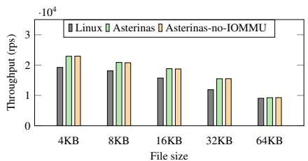  
(a) Nginx

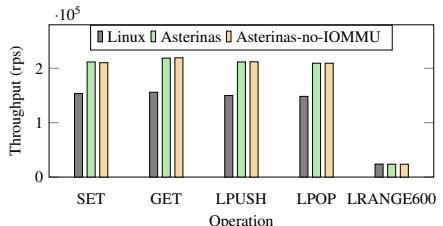  
(b) Redis

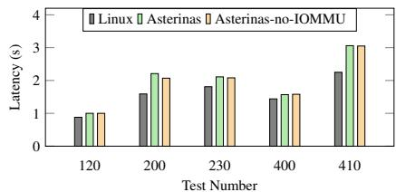  
(c) SQLite  
Figure 5: I/O-intensive application benchmarks with Ngnix, Redis, and SQLite.

Table 7: System call-intensive LMbench microbenchmarks.
<table><tr><td></td><td>Command</td><td>Unit</td><td>Linux</td><td>Asterinas</td><td>Norm.1</td></tr><tr><td rowspan="5">Proc</td><td colspan="2">lat_syscall null</td><td>μs</td><td>0.050</td><td>0.066±0.001</td><td>0.76</td></tr><tr><td colspan="2">lat_ctx 18</td><td>μs</td><td>0.826</td><td>0.829 ± 0.019</td><td>1.00</td></tr><tr><td colspan="2">lat_proc fork</td><td>μs</td><td>59.20</td><td>57.46± 0.721</td><td>1.03</td></tr><tr><td colspan="2">lat_proc exec</td><td>μs</td><td>204.8</td><td>174.4 ± 2.156</td><td>1.17</td></tr><tr><td colspan="2">lat_proc shell</td><td>μs</td><td>319.3</td><td>294.3 ± 1.915</td><td>1.08</td></tr><tr><td rowspan="3">Mem</td><td>lat_pagefault</td><td>us</td><td>0.109</td><td>0.100±0.002</td><td></td><td>1.09</td></tr><tr><td>lat_mmap 4m</td><td>μs</td><td></td><td>19.4</td><td>16.80 ± 0.422</td><td>1.15</td></tr><tr><td>bw_mmap²256m</td><td>MB/s</td><td>15405</td><td>13197 ± 186.7</td><td></td><td>0.86</td></tr><tr><td rowspan="5">IPC</td><td>lat_pipe</td><td></td><td>μs</td><td>1.826</td><td>1.881 ± 0.009</td><td>0.97</td></tr><tr><td>bw_pipe</td><td></td><td>MB/s</td><td>11133</td><td>14664 ± 1073</td><td>1.32</td></tr><tr><td>lat_fifo</td><td></td><td>μs</td><td>1.825</td><td>1.938 ± 0.008</td><td>0.94</td></tr><tr><td>lat_unix</td><td>μs</td><td></td><td>2.677</td><td>2.493 ± 0.023</td><td>1.07</td></tr><tr><td>bw_unix</td><td>MB/s</td><td>7875</td><td></td><td>14183 ± 598.2</td><td>1.80</td></tr><tr><td rowspan="11">FS</td><td>lat_syscall</td><td>open</td><td>μs</td><td>0.611</td><td>0.740±0.020</td><td>0.83</td></tr><tr><td>lat_syscall</td><td>read</td><td>μs</td><td>0.081</td><td>0.088 ±0.002</td><td>0.92</td></tr><tr><td>lat_syscall</td><td>write</td><td>μs</td><td>0.065</td><td>0.080±0.003</td><td>0.81</td></tr><tr><td>lat_syscall stat</td><td>μs</td><td>0.299</td><td></td><td>0.400 ± 0.009</td><td>0.75</td></tr><tr><td>lat_syscall fstat</td><td>μs</td><td></td><td>0.263</td><td>0.231 ± 0.004</td><td>1.14</td></tr><tr><td>bw_file_rd³512m</td><td>MB/s</td><td>10238</td><td></td><td>9198 ± 44.25</td><td>0.90</td></tr><tr><td>lmdd(Ramfs-&gt;Ramfs)</td><td></td><td>MB/s</td><td>3219</td><td>2973 ±18.60</td><td>0.92</td></tr><tr><td>lmdd(Ramfs-&gt;Ext2)</td><td></td><td>MB/s</td><td>2490</td><td>2612 ± 57.08</td><td>1.05</td></tr><tr><td>lmdd(Ext2-&gt;Ramfs)</td><td></td><td>MB/s</td><td>3453</td><td>2962 ± 30.77</td><td>0.86</td></tr><tr><td>lmdd(Ext2-&gt;Ext2)</td><td>MB/s</td><td></td><td>2017</td><td>2626 ± 68.94</td><td>1.30</td></tr><tr><td>lat_udp</td><td>μs</td><td></td><td>3.801</td><td>2.427 ± 0.009</td><td>1.57</td></tr><tr><td rowspan="3">Net: Loop- back</td><td>lat_tcp</td><td>μs</td><td>5.326</td><td>2.725 ± 0.016</td><td></td><td>1.95</td></tr><tr><td>bw_tcp 128</td><td>MB/s</td><td>280.0</td><td></td><td>356.5 ± 78.94</td><td>1.27</td></tr><tr><td>bw_tcp 64k</td><td>MB/s</td><td>6216</td><td>7647 ± 321.5</td><td></td><td>1.23</td></tr><tr><td rowspan="4">Net: VirtIO</td><td>lat_udp</td><td>us</td><td></td><td>15.03</td><td>11.49± 0.139</td><td>1.31</td></tr><tr><td>lat_tcp</td><td>μs</td><td></td><td>16.75</td><td>12.94 ± 0.135</td><td>1.29</td></tr><tr><td>bw_tcp 128</td><td>MB/s</td><td>328.7</td><td></td><td></td><td>1.01</td></tr><tr><td>bw_tcp 64k</td><td>MB/s</td><td>1151</td><td></td><td>333.2 ± 5.141 1116 ± 15.05</td><td>0.97</td></tr><tr><td>Mean</td><td></td><td></td><td></td><td></td><td></td><td>1.08</td></tr></table>

1 Normalized performance. For throughput, use Asterinas/Linux; for latency, use Linux/ Asterinas. The higher the better.  
2 With mmap\_only.  
3 With io\_only.

• Redis. We use the official Redis benchmark tool [53], which measures performance by executing a series of Redis commands and recording the throughput. Figure 5(b) shows a subset of representative commands, and the complete results can be found in Appendix B. The results indicate that ASTERINAS outperforms Linux. For instance, the throughput for GET operation on ASTERINAS is 218,670 rps, 40.2% higher compared to 155,994 rps on Linux. This result aligns with our LMbench findings, where ASTERINAS outperforms Linux for smaller packet sizes, as the Redis benchmark involves small message sizes in its operations. The geometric mean of all the normalized performance results is 1.31.

Table 8: Overhead due to OSTD’s safety mechanism.
<table><tr><td rowspan="2">Operations</td><td rowspan="2">Sources of Safety Overheads</td><td>CPU Cycles</td></tr><tr><td>Overhead /Total</td></tr><tr><td>Segment::read_bytes (4KB)</td><td>Boundary check</td><td>3/125(2.4%)</td></tr><tr><td>Segment:write_bytes (4KB)</td><td>Boundary check</td><td>2/239(0.8%)</td></tr><tr><td>IoMem:read_once (4 bytes)</td><td>Boundary check</td><td>170/10988(1.5%)</td></tr><tr><td>IoMem::write_once (4 bytes)</td><td>Boundary check</td><td>166/10666(1.6%)</td></tr><tr><td>KernelStack:new</td><td>Guard page creation</td><td>25/2950(0.8%)</td></tr><tr><td>Task::yield_now</td><td>Running flag check</td><td>1/167(0.6%)</td></tr><tr><td>FrameAlloc::alloc (1 frame)</td><td>Ownership check</td><td>12/180(6.7%)</td></tr><tr><td>Box:new (48 bytes)</td><td>Ownership check</td><td>1/148(0.7%)</td></tr></table>

• SQLite. We utilize SQLite’s speedtest1 [51] as the benchmarking tool. In the test, we set the base size to 1000 to ensure data is written to the device (default is 100) and run the tests on an Ext2 mount over a virtio-blk device. Due to space limits, we only show representative results in Figure 5(c), whose test numbers are 120 (500000 unordered IN-SERTS with one index/PK), 200 (VACUUM), 230 (100000 UPDATES, numeric BETWEEN, indexed), 400 (700000 RE-PLACE ops on an IPK), and 410 (700000 SELECTS on an IPK). The complete results are shown in Appendix C. The geometric mean of all the normalized performances (Linux / ASTERINAS) is 0.85.

In all these tests, ASTERINAS performs worse than Linux. The Vacuum test (200) shows the worst case, reaching only 72% of Linux’s performance with IOMMU enabled. Once the IOMMU is disabled, the ratio will become 77%. To understand the root causes of Vacuum test, we used Strace [58] for performance diagnosis. The analysis revealed that Vacuum frequently makes pwrite64 calls for writing 4-byte data. When disabling the SQLite journal, pwrite64 with small data writes disappears, and ASTERINAS’ performance increases to 80% and 83% of Linux’s performance with IOMMU enabled and disabled, respectively. This analysis shows that ASTERINAS could benefit from optimization for both pwrite64 operations with small data writes and IOMMU.

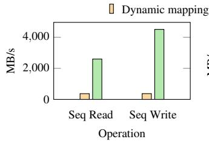  
(a) Block device bandwidth

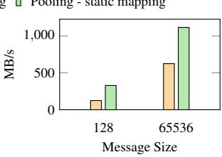  
(b) Network device bandwidth  
Figure 6: IOMMU overhead with different mechanism

## 6.1.3 Overhead due to Safety Checks

The overhead introduced by the OSTD’s safety mechanisms does not prevent ASTERINAS’s performance from being comparable to a monolithic kernel. ASTERINAS has integrated several safety mechanisms into its OSTD to ensure system safety. To evaluate the cost of safety mechanisms, we directly invoke the interfaces corresponding to these safety mechanisms at the API level, measuring the CPU cycles required with and without the safety checks. The results are presented in Table 8. The "Allocate frame" test, which is related to the Frame allocator injection, exhibits the highest overhead at 6.7%, while the overhead of all other tests remains below 3%.

## 6.1.4 IOMMU Optimization

One optimization of IOMMU using the pooling mechanism leads to a significant performance gain. As shown in Figure 5, the results indicate that ASTERINAS does not introduce significant overhead for Nginx, Redis, and SQLite (in most cases). Both Nginx and Redis show almost no overhead, with the largest overhead observed in the SPOP test of Redis at 2.3%.

However, SQLite exhibits higher overhead in some cases (8.3%), primarily due to the incomplete pooling mechanism in the block device driver compared to the network device driver. Figure 6 further highlights the significance of pooling. We evaluate the bandwidth of block devices using FIO [13] and network devices using bw\_tcp. Upon switching from polling to a dynamic mechanism, both network and block devices experienced considerable performance degradation.

## 6.2 TCB Evaluation

In this section, we evaluate the current TCB size of ASTERI-NAS and estimate its growth as the codebase evolves.

## 6.2.1 TCB Comparison

To assess the efficacy of ASTERINAS’s implementation of the minimality principle, we compare the TCB size of ASTERI-NAS with RedLeaf [49], Theseus [16], and Tock [38].

Methodology. We employ a crate-level classification approach to evaluate the run-time TCBs of Rust-based OSes. In

Rust, crates serve as the primary units for organizing and distributing code, with no additional isolation mechanisms within a crate. Consequently, a crate’s interface naturally forms a trust boundary. So we consider a crate either belongs to the TCB, implying it must be trusted for security, or is excluded from the TCB, indicating it is secured by the Rust compiler. We adhere to the following rules to determine whether a crate is within the run-time TCB or not:

• Rule 1: The Rust toolchain is trusted. Consequently, crates provided by the Rust toolchain itself, like alloc and core, are not considered part of the run-time TCB.

• Rule 2: Crates containing unsafe code may potentially introduce soundness bugs, and as a result, they are considered part of the TCB.

• Rule 3: Crates that are dependencies of TCB crates should also be part of the TCB. This is because even if a crate doesn’t use unsafe at all and thus doesn’t introduce soundness issues on its own, the correctness of its APIs can still impact the soundness of the TCB crate that relies on it.

Since crates vary in size, evaluating the TCB size by counting the number of crates would be too simplistic and inaccurate. Therefore, a more refined metric is needed. However, directly comparing lines of code across crates is not ideal, as not all code within a crate is necessarily utilized during runtime. This is especially true for third-party dependencies, where often only a small fraction of the code is actually used at runtime.

To address this, we introduce a metric called Linked Code Size (LCS), which measures the number of lines of code that are ultimately compiled and linked during the OS build.

We leverage the LLVM toolchain [42] to estimate the LCS for each OS. Specifically, we measure the number of source code lines that have corresponding statements in the generated LLVM IRs after link-time optimization. The content of the LLVM IR is closer to that of a binary file, primarily retaining the IR corresponding to executable statements within functions. It does not trace back to statements used for imports or struct definitions, which are not directly executable during runtime. This focus on executable IR provides a more accurate measure of the code that is relevant to the TCB during runtime operations.

Results. As illustrated in Table 9, the relative TCB size of ASTERINAS is a mere 14.0%, which is notably lower than that of other Rust-based OSes. While some OSes, such as RedLeaf, enforce restrictions that permit only safe Rust in specific crates, they still depend on numerous self-maintained crates that utilize unsafe, leading to a substantial portion of their code being part of the TCB (i.e., 66.1%).

Tock OS, being an embedded OS, is relatively lightweight, and thus its TCB size is slightly better than the other two. However, its TCB size (i.e., 43.8%) is still more than double of ASTERINAS. These results clearly underscore the effectiveness of the minimality principle that we adhere to.

Table 9: Comparison of TCB size
<table><tr><td></td><td>RedLeaf</td><td>Theseus</td><td>Tock1</td><td>Asterinas</td></tr><tr><td>Total (LoC)</td><td>25992</td><td>70468</td><td>6628</td><td>75285</td></tr><tr><td>TCB (LoC)</td><td>17182</td><td>43978</td><td>2903</td><td>10571</td></tr><tr><td>Relative TCB</td><td>66.1%</td><td>62.4%</td><td>43.8%</td><td>14.0%</td></tr></table>

1 Tock implementation of board nrf52840dk.

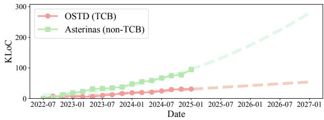  
Figure 7: The codebase of ASTERINAS (non-TCB) has grown faster than OSTD (TCB) and is expected to remain so.

## 6.2.2 TCB Evolution

ASTERINAS has been under development for three years. We analyze and visualize the growth of its codebase (in KLoC). As shown in Figure 7, ASTERINAS (non-TCB) has experienced significant growth, while OSTD (TCB) has maintained a slower, steadier expansion. Curve fitting indicates that the TCB portion of the kernel will continue to grow in a controlled manner. This aligns with prior research on Linux codebase development [27, 57], which suggests that while overall codebases grow super-linearly with increasing complexity, core kernel functionality—excluding drivers—grows sub-linearly [34].

## 6.3 Safety Evaluation

To evaluate the soundness of OSTD, we develop a testing tool named KERNMIRI. This tool extends the official Rust UB detection tool, Miri [48], to support core OS concepts such as physical memory, page tables, etc. The overall architecture of KERNMIRI is depicted in Figure 8. It retains Miri’s original UB detection logic (represented by grey boxes and lines) while introducing an additional 1,200 LoC to implement new components (indicated by green boxes and lines).

As illustrated in Figure 8, KERNMIRI enhances Miri by simulating physical memory and implementing a basic paging system. These improvements enable KERNMIRI to accurately interpret OS operations that demand fine-grained memory management. Moreover, KERNMIRI introduces additional shims to synchronize the OS state, which can be leveraged to direct KERNMIRI to activate a page table at a specific address or to inform KERNMIRI of changes in the state of a physical page, such as transitions between typed and untyped states.

KERNMIRI interprets the execution of OSTD and all its test cases. Following the workflow of OSTD’s unit testing, KERNMIRI first interprets the initialization phase of OSTD to synchronize the system’s initial memory state, and then executes each unit test of OSTD via interpretation. As such, the coverage of KERNMIRI depends on the unit test cases that have been developed for OSTD.

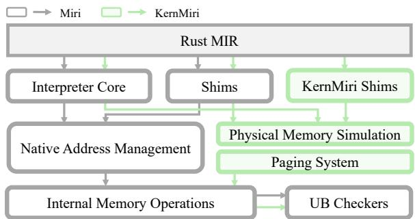  
Figure 8: KERNMIRI, a UB detection tool for Rust OSes

Table 10: Coverage and efficiency of KERNMIRI on OSTD.
<table><tr><td rowspan="2">Modules</td><td rowspan="2"># Tests</td><td colspan="2">Lines</td><td colspan="2">Unsafe</td><td colspan="2">Execution</td></tr><tr><td>Covered /Total</td><td></td><td>Covered /Total</td><td>Native</td><td></td><td>KernMiri</td></tr><tr><td>dma</td><td>12</td><td>385/443</td><td>(87%)</td><td>8/8 (100%)</td><td>0.25s</td><td></td><td>1.22s</td></tr><tr><td>frame</td><td>28</td><td>634/649</td><td>(98%)</td><td>41/41 (100%)</td><td></td><td>0.21s</td><td>3.14s</td></tr><tr><td>heap</td><td>6</td><td>278/319</td><td>(87%)</td><td>6/6 (100%)</td><td></td><td>0.01s</td><td>0.31s</td></tr><tr><td>kspace</td><td>8</td><td>287/323</td><td>(89%)</td><td>9/9 (100%)</td><td></td><td>0.04s</td><td>0.93s</td></tr><tr><td>page_table</td><td>34</td><td>931/1032</td><td>(90%)</td><td>46/46 (100%)</td><td></td><td>1.23s</td><td>34.83s</td></tr><tr><td>io</td><td>29</td><td>358/371</td><td>(97%)</td><td>23/23 (100%)</td><td></td><td>0.16s</td><td>3.12s</td></tr><tr><td>vm_space</td><td>17</td><td>662/672</td><td>(99%)</td><td>10/10 (100%)</td><td></td><td>0.28s</td><td>6.95s</td></tr><tr><td>All</td><td>134</td><td>3535/3809</td><td>(93%)</td><td>145/145(100%)</td><td></td><td>2.18s</td><td>50.50s</td></tr></table>

## 6.3.1 Coverage of KERNMIRI

We primarily use KERNMIRI to test and validate the mm module of OSTD, which is closely related to memory safety. This module also contains the majority of unsafe code in OSTD. Table 10 summarizes the measured metrics for each submodule of mm module separately, including the coverage of lines of code (Column Line), coverage of unsafe blocks (Column Unsafe) and interpreted execution time compared to native execution (Column Execution).

The results suggest that, with in total 134 unit tests, KERN-MIRI covers all instances of unsafe code and over 90% on average of lines in all submodules. This confirms that the majority of the OSTD’s memory operations is free of UBs. Furthermore, the few detected instances of UB have been addressed, with a detailed discussion provided in Section 6.3.2.

In addition, as shown in the last column of Table 10, KERN-MIRI’s interpreted execution takes approximately 25 times longer than normal execution. While significantly higher, this overhead is reasonable as a one-time cost for soundness evaluation. Thus, we conclude that KERNMIRI is a practical and effective tool for validating the soundness of Rust-based operating systems.

## 6.3.2 Case Studies

KERNMIRI has helped us detect several UBs that we would not be able to catch using other methods, significantly improves the soundness of our implementation of OSTD. We outline two representative UB cases in OSTD detected by KERNMIRI, as illustrated in Figure 9.

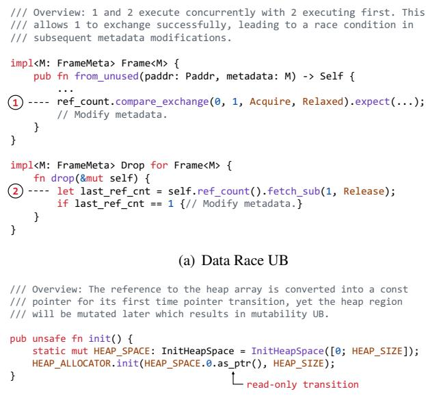  
(b) Mutability UB  
Figure 9: UB cases detected by KERNMIRI.

The first case involves a data race UB (Figure 9(a)). When creating a Frame using from\_unused (see 4.4.2), if the ref\_count corresponding to the physical address has just been decremented by a drop operation that has not yet completed, these two operations may concurrently modify the metadata, leading to data race UB.

The second case pertains to mutability UB (Figure 9(b)), where the code overlooks Rust’s rules regarding the conversion of references to pointers. Specifically, when a reference is first converted into a pointer, the type of pointer determines the mutability constraints of the memory region. In this case a reference to the HEAP\_SPACE is incorrectly converted into an immutable pointer during initialization. This conversion conflicts with subsequent mutable operations, resulting in UB.

## 7 Related Work

Safe language-based OSes. The development of operating systems using safe programming languages has been steadily increasing. Examples include Biscuit [19], implemented in Go; JX [28], developed in Java; MirageOS [43], built with OCaml; Verve [62], written in C#; and Singularity [33], which utilizes Sing# (an extension of C#). Rust has also become a popular choice for system development, as seen in projects like Theseus [16], Tock [38], RustyHermit [37], Redox [21], and rCore [52]. ASTERINAS is also implemented in Rust but goes further by leveraging Rust’s type and memory safety features to achieve a minimal and sound TCB.

Intra-kernel privileged separation. Various mechanisms have been proposed to achieve privilege separation within the kernel. PerspicuOS [20] enforces separation using page table write protection and static analysis. RustyHermit-MPK [59], CubicleOS [56], and KDPM [36] employ Intel MPK for isolation. Lightweight Virtualized Domains [50] achieve separation through EPT and VMFUNC. RedLeaf [49], Tock [38], and Theseus [16] utilize Rust’s safety features to create a new privilege level within the kernel. ASTERINAS achieves both soundness and minimality of intra-kernel privilege separation through a redefinition of the essential TCB functions.

Scheduler Injection. ghOSt [32] modifies Linux to delegate scheduling to userspace, incurring non-trivial overhead, while Enoki [47] adapts ghOSt’s architecture but moves scheduler back to the kernel. In contrast, ASTERINAS offers (i) a smaller TCB—ghOSt relies on C-based run-queues, and Enoki can’t catch all semantic bugs—and (ii) more flexible APIs, as Enoki schedulers must coordinate with Linux to avoid inconsistencies when managing run-queues, limiting independence.

## 8 Conclusions

This paper presents ASTERINAS, a Linux ABI-compatible OS kernel based on our novel framekernel architecture. By harnessing Rust’s ownership and type-safety guarantees, a framekernel enforces intra-kernel privilege separation to achieve a small TCB in terms of memory safety. Using the APIs of OSTD (TCB), ASTERINAS (non-TCB) is implemented entirely in safe Rust, supporting over 210 Linux system calls. Our comprehensive evaluation shows that AS-TERINAS delivers performance on par with Linux, demonstrating that a fully-featured, general-purpose OS can be both memory-safe and highly efficient.

## 9 Acknowledgments

The SUSTech authors are affiliated with the Research Institute of Trustworthy Autonomous Systems and in part supported by National Key R&D Program of China (No. 2023YFB4503902), CCF-AFSG RF20220012 and CCF-AFSG RF20230211. The Peking University authors are in part supported by National Science Foundation of China (No. 62032001). Asterinas has benefited from the collective expertise and support of numerous colleagues including Tao Xie, Bo An, Lingxin Kong, Yao Guo, Leye Wang, Huashan Yu, Jie Zhang, Wenfei Wu, Hui Xu, Zhaozhong Ni, Wei Zhang, Zhengyu He, Tao Wei, Lin Huang, Chuan Song, Yu Chen, Weijie Liu, Zhi Li, and many more. Special recognition is due to our open source contributors - Qing Li, Fabing Li, Shaowei Song, Qingsong Chen, Siyuan Hui, Zejun Zhao, Qihang Xu, Anmin Liu, Wang Siyuan, Wenqian Yan, Zhenchen Wang, Yingdi Shan, Hu Kang, Zhe Tang, Ruize Tang, and many more - whose technical dedication and collaborative spirit transformed this ambitious vision into a reality.

## References

[1] The Asterinas Github repository. https://github. com/asterinas/asterinas.

[2] The ATC’25 artifact evaluation repository. https://github.com/asterinas/ atc25-artifact-evaluation/.

[3] Rust for linux on wikipedia. https://en.wikipedia. org/wiki/Rust\_for\_Linux, 2024.

[4] cppreference . C++ named requirements: POD-Type (deprecated in C++20) - cppreference.com. https://en.cppreference.com/w/cpp/named\_ req/PODType.

[5] Linux . CFS Scheduler — The Linux Kernel documentation. https://www.kernel.org/doc/html/latest/ scheduler/sched-design-CFS.html.

[6] The Rust Project Developers Behavior considered undefined - The Rust Reference. https: //doc.rust-lang.org/nightly/reference/ behavior-considered-undefined.html.

[7] The Rust Project Developers The borrow checker - Rust Compiler Development Guide. https://rustc-dev-guide.rust-lang.org/ borrow\_check.html.

[8] The Rust Project Developers . How Safe and Unsafe Interact - The Rustonomicon. https://doc.rust-lang. org/nomicon/safe-unsafe-meaning.html.

[9] The Rust Project Developers Type checking - Rust Compiler Development Guide. https://rustc-dev-guide.rust-lang.org/ type-checking.html.

[10] The Rust Project Developers What is Ownership? - The Rust Programming Language. https://doc.rust-lang.org/book/ ch04-01-what-is-ownership.html.

[11] America’s Cyber Defense Agency. Widespread IT Outage Due to CrowdStrike Update. https:// www.cisa.gov/news-events/alerts/2024/07/19/ widespread-it-outage-due-crowdstrike-update, 2024.

[12] Vytautas Astrauskas, Christoph Matheja, Federico Poli, Peter Müller, and Alexander J. Summers. How do programmers use unsafe rust? Proc. ACM Program. Lang., 4(OOPSLA):136:1–136:27, 2020.

[13] Jens Axboe. Flexible I/O Tester. https://github. com/axboe/fio, 2022.

[14] Jeff Bonwick. The Slab Allocator: An Object-Caching Kernel Memory Allocator. In USENIX Summer.

[15] Jeff Bonwick and Jonathan Adams. Magazines and Vmem: Extending the Slab Allocator to Many CPUs and Arbitrary Resources. In USENIX ATC, General Track.

[16] Kevin Boos, Namitha Liyanage, Ramla Ijaz, and Lin Zhong. Theseus: an experiment in operating system structure and state management. In 14th USENIX Symposium on Operating Systems Design and Implementation (OSDI 20), pages 1–19. USENIX Association, November 2020.

[17] Andy Chou, Junfeng Yang, Benjamin Chelf, Seth Hallem, and Dawson Engler. An empirical study of operating systems errors. SIGOPS Oper. Syst. Rev., 35(5):73–88, October 2001.

[18] Jonathan Corbet. A first look at Rust in the 6.1 kernel. https://lwn.net/Articles/910762/, 2022.

[19] Cody Cutler, M. Frans Kaashoek, and Robert T. Morris. The benefits and costs of writing a POSIX kernel in a high-level language. In 13th USENIX Symposium on Operating Systems Design and Implementation (OSDI 18), pages 89–105, Carlsbad, CA, October 2018. USENIX Association.

[20] Nathan Dautenhahn, Theodoros Kasampalis, Will Dietz, John Criswell, and Vikram Adve. Nested kernel: An operating system architecture for intra-kernel privilege separation. In Proceedings of the Twentieth International Conference on Architectural Support for Programming Languages and Operating Systems, ASPLOS ’15, page 191–206, New York, NY, USA, 2015. Association for Computing Machinery.

[21] Redox Developers. Redox - your next(gen) os. https: //www.redox-os.org/, 2024.

[22] Smoltcp Developers. Smoltcp: TCP/IP Stack for Embedded Rust. https://github.com/smoltcp-rs, 2025.

[23] The Asterinas developers. Example: Writing a Kernel in 100 Lines of Safe Rust - The Asterinas Book. https: //github.com/asterinas/asterinas/blob/ dec7ac1346649a0ef1a1256da258cd2f9f11ac4b/ docs/src/ostd/a-100-line-kernel.md.

[24] The Asterinas developers. The readerwriter interface of untyped memory. https: //github.com/asterinas/asterinas/blob/ main/ostd/src/mm/frame/untyped.rs#L73.

[25] The Rust Project Developers. The Rustonomicon. https://github.com/rust-lang/nomicon, 2024.

[26] The Apache Software Foundation. ab - apache http server benchmarking tool. https://httpd.apache. org/docs/2.4/programs/ab.html, 2024.

[27] Michael Godfrey and Qiang Tu. Growth, evolution, and structural change in open source software. In Proceedings of the 4th International Workshop on Principles of Software Evolution, IWPSE ’01, page 103–106, New York, NY, USA, 2001. Association for Computing Machinery.

[28] Michael Golm, Meik Felser, Christian Wawersich, and Jürgen Kleinoeder. The JX operating system. In 2002 USENIX Annual Technical Conference (USENIX ATC 02), Monterey, CA, June 2002. USENIX Association.

[29] Google. Android rust introduction. https: //source.android.com/docs/setup/build/ rust/building-rust-modules/overview.

[30] Internet Security Research Group. What is memory safety and why does it matter? https://www. memorysafety.org/docs/memory-safety/, 2025.

[31] Gary Guo. Klint: Compile-time detection of atomic context violations for kernel rust code. https://www.memorysafety.org/blog/ gary-guo-klint-rust-tools/, 2023.

[32] Jack Tigar Humphries, Neel Natu, Ashwin Chaugule, Ofir Weisse, Barret Rhoden, Josh Don, Luigi Rizzo, Oleg Rombakh, Paul Turner, and Christos Kozyrakis. ghost: Fast & flexible user-space delegation of linux scheduling. In Proceedings of the ACM SIGOPS 28th Symposium on Operating Systems Principles, SOSP ’21, page 588–604, New York, NY, USA, 2021. Association for Computing Machinery.

[33] Galen Hunt and Jim Larus. Singularity: Rethinking the software stack. ACM SIGOPS Operating Systems Review, 41(2):37–49, April 2007.

[34] Clemente Izurieta and James Bieman. The evolution of freebsd and linux. In Proceedings of the 2006 ACM/IEEE International Symposium on Empirical Software Engineering, ISESE ’06, page 204–211, New York, NY, USA, 2006. Association for Computing Machinery.

[35] Theodore Johnson and Krishna Harathi. A simple correctness proof of the MCS contention-free lock. Information Processing Letters, 48(5):215–220.

[36] Hiroki Kuzuno and Toshihiro Yamauchi. Kdpm: Kernel data protection mechanism using a memory protection key. In Advances in Information and Computer Security: 17th International Workshop on Security, IWSEC 2022, Tokyo, Japan, August 31 – September 2, 2022, Proceedings, page 66–84, Berlin, Heidelberg, 2022. Springer-Verlag.

[37] Stefan Lankes, Jens Breitbart, and Simon Pickartz. Exploring rust for unikernel development. In Proceedings of the 10th Workshop on Programming Languages and Operating Systems, PLOS ’19, page 8–15, New York, NY, USA, 2019. Association for Computing Machinery.

[38] Amit Levy, Bradford Campbell, Branden Ghena, Daniel B. Giffin, Pat Pannuto, Prabal Dutta, and Philip Levis. Multiprogramming a 64kb computer safely and efficiently. In Proceedings of the 26th Symposium on Operating Systems Principles, SOSP ’17, page 234–251, New York, NY, USA, 2017. Association for Computing Machinery.

[39] Hongyu Li, Liwei Guo, Yexuan Yang, Shangguang Wang, and Mengwei Xu. An Empirical Study of {Rustfor-Linux}: The Success, Dissatisfaction, and Compromise. pages 425–443.

[40] Hongyu Li, Liwei Guo, Yexuan Yang, Shangguang Wang, and Mengwei Xu. An empirical study of rustfor-linux: The success, dissatisfaction, and compromise. In Saurabh Bagchi and Yiying Zhang, editors, Proceedings of the 2024 USENIX Annual Technical Conference, USENIX ATC 2024, Santa Clara, CA, USA, July 10-12, 2024, pages 425–443. USENIX Association, 2024.

[41] Linux. Rust — The Linux Kernel documentation. https://docs.kernel.org/rust/index. html, 2024.

[42] LLVM Project. Llvm tools. https://llvm.org/ docs/CommandGuide/, 2025. Accessed: 2025-01-14.

[43] Anil Madhavapeddy and David J. Scott. Unikernels: Rise of the virtual library operating system: What if all the software layers in a virtual appliance were compiled within the same safe, high-level language framework? Queue, 11(11):30–44, December 2013.

[44] A. Theodore Markettos, Colin Rothwell, Brett F. Gutstein, Allison Pearce, Peter G. Neumann, Simon W. Moore, and Robert N. M. Watson. Thunderclap: Exploring Vulnerabilities in Operating System IOMMU Protection via DMA from Untrustworthy Peripherals. In Proceedings 2019 Network and Distributed System Security Symposium, NDSS ’19. Internet Society.

[45] Paul E. McKenney, Joel Fernandes, Silas Boyd-Wickizer, and Jonathan Walpole. RCU usage in the Linux kernel: Eighteen years later. SIGOPS Oper. Syst. Rev., 54(1):47–63, August 2020.

[46] Larry W McVoy, Carl Staelin, et al. Lmbench: Portable tools for performance analysis. In USENIX annual technical conference, pages 279–294. San Diego, CA, USA, 1996.

[47] Samantha Miller, Anirudh Kumar, Tanay Vakharia, Ang Chen, Danyang Zhuo, and Thomas Anderson. Enoki: High velocity linux kernel scheduler development. In Proceedings of the Nineteenth European Conference on Computer Systems, EuroSys ’24, page 962–980, New York, NY, USA, 2024. Association for Computing Machinery.

[48] Miri. Miri - an interpreter for rust’s mid-level intermediate representation. https://github.com/ rust-lang/miri, 2024.

[49] Vikram Narayanan, Tianjiao Huang, David Detweiler, Dan Appel, Zhaofeng Li, Gerd Zellweger, and Anton Burtsev. RedLeaf: Isolation and communication in a safe operating system. In 14th USENIX Symposium on Operating Systems Design and Implementation (OSDI 20), pages 21–39. USENIX Association, November 2020.

[50] Vikram Narayanan, Yongzhe Huang, Gang Tan, Trent Jaeger, and Anton Burtsev. Lightweight kernel isolation with virtualization and vm functions. In Proceedings of the 16th ACM SIGPLAN/SIGOPS International Conference on Virtual Execution Environments, VEE ’20, page 157–171, New York, NY, USA, 2020. Association for Computing Machinery.

[51] SQLite organization. Measuring and reducing cpu usage in sqlite. https://sqlite.org/cpu.html, 2024.

[52] rcore os. rcore. https://github.com/rcore-os/ rCore, 2023.

[53] Redis. Redis benchmark. https://redis.io/docs/ latest/operate/oss\_and\_stack/management/ optimization/benchmarks/, 2024.

[54] The Register. Microsoft is busy rewriting core windows code in memory-safe rust. https://www.theregister.com/2023/04/27/ microsoft\_windows\_rust/.

[55] Rust for Linux. Mutex::lock\_noguard() may be unsafe · Issue #862 · Rust-for-Linux/linux. https://github. com/Rust-for-Linux/linux/issues/862.

[56] Vasily A. Sartakov, Lluís Vilanova, and Peter Pietzuch. Cubicleos: a library os with software componentisation for practical isolation. In Proceedings of the 26th ACM International Conference on Architectural Support for Programming Languages and Operating Systems, AS-PLOS ’21, page 546–558, New York, NY, USA, 2021. Association for Computing Machinery.

[57] Walt Scacchi. Understanding open source software evolution. Software Evolution and Feedback: Theory and Practice, 9:181–205, 2006.

[58] Strace. Strace linux syscall tracer. https://strace. io/, 2024.

[59] Mincheol Sung, Pierre Olivier, Stefan Lankes, and Binoy Ravindran. Intra-unikernel isolation with intel memory protection keys. In Proceedings of the 16th ACM SIGPLAN/SIGOPS International Conference on Virtual Execution Environments, VEE ’20, page 143–156, New York, NY, USA, 2020. Association for Computing Machinery.

[60] Rust Secure Code WG. RustSec Advisory Database. https://github.com/RustSec/advisory-db, 2024.

[61] Paul Willmann, Scott Rixner, and Alan L. Cox. Protection strategies for direct access to virtualized I/O devices. In 2008 USENIX Annual Technical Conference (USENIX ATC 08), Boston, MA, June 2008. USENIX Association.

[62] Jean Yang and Chris Hawblitzel. Safe to the last instruction: Automated verification of a type-safe operating system. In PLDI. Association for Computing Machinery, Inc., June 2010.

[63] Zongwei Zhou, Virgil D. Gligor, James Newsome, and Jonathan M. McCune. Building verifiable trusted path on commodity x86 computers. In 2012 IEEE Symposium on Security and Privacy, pages 616–630, 2012.

## A Another Example for OSTD APIs

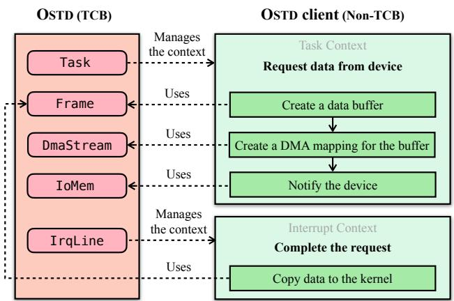

Figure 10: An example of OSTD API usage: request data from a device.

## B Complete results for Redis benchmark

Table 11 displays the complete results from testing Redis using the redis-benchmark. The left column lists all the operations conducted in the benchmark, while the three columns on the right present performance metrics for Linux, ASTER-INAS, and ASTERINAS without IOMMU, respectively. The performance metrics are measured in requests per second (rps).

<table><tr><td>Operation</td><td>Linux(rps)</td><td>Asterinas(rps)</td><td>Asterinas no IOMMU(rps)</td></tr><tr><td>PING_INLINE</td><td>151022.44</td><td>213341.84</td><td>211694.22</td></tr><tr><td>PING_MBULK</td><td>157978.9</td><td>220975.64</td><td>218040.66</td></tr><tr><td>SET</td><td>153390.59</td><td>211647.77</td><td>210302.41</td></tr><tr><td>GET</td><td>155994.34</td><td>218670.04</td><td>219300.26</td></tr><tr><td>INCR</td><td>152132.93</td><td>219217.17</td><td>219302.27</td></tr><tr><td>LPUSH</td><td>149886.75</td><td>211691.68</td><td>211960.12</td></tr><tr><td>RPUSH</td><td>150504.81</td><td>214605.21</td><td>214053.79</td></tr><tr><td>LPOP</td><td>148347.63</td><td>209365.11</td><td>209308.7</td></tr><tr><td>RPOP</td><td>150713.57</td><td>210426.48</td><td>210138.93</td></tr><tr><td>SADD</td><td>156514.14</td><td>217682.08</td><td>217877.7</td></tr><tr><td>HSET</td><td>152276.36</td><td>209336.32</td><td>211663.65</td></tr><tr><td>SPOP</td><td>157350.85</td><td>217016.38</td><td>221988.13</td></tr><tr><td>ZADD</td><td>149385.73</td><td>206069.24</td><td>207479.97</td></tr><tr><td>ZPOPMIN</td><td>158360.84</td><td>219783.59</td><td>221895.17</td></tr><tr><td>LRANGE_100</td><td>92696.06</td><td>114471.67</td><td>113062.24</td></tr><tr><td>LRANGE_300</td><td>39268.41</td><td>39732.19</td><td>39629.18</td></tr><tr><td>LRANGE_500</td><td>27429.67</td><td>27843.41</td><td>27338.37</td></tr><tr><td>LRANGE_600</td><td>23876.49</td><td>23649.05</td><td>23674.88</td></tr><tr><td>MSET (10 keys)</td><td>125746.68</td><td>160040.56</td><td>157920.17</td></tr></table>

Table 11: Complete results of redis-benchmark.

<table><tr><td rowspan="2">Num.</td><td rowspan="2">Test Name</td><td>Linux</td><td>Aster.</td><td>Aster. no</td></tr><tr><td>(s)</td><td>(s)</td><td>IOMMU(s)</td></tr><tr><td>100</td><td>500000 INSERTs into tablewith no index</td><td>0.27</td><td>0.33</td><td>0.32</td></tr><tr><td>110</td><td>500000 ordered INSERTS with one index/PK</td><td>0.43</td><td>0.49</td><td>0.49</td></tr><tr><td>120</td><td>500000 unordered INSERTS with one index/PK</td><td>0.88</td><td>1.00</td><td>1.00</td></tr><tr><td>130</td><td>25SELECTS，numeric BE- TWEEN,unindexed</td><td>0.40</td><td>0.45</td><td>0.44</td></tr><tr><td>140 142</td><td>10 SELECTS,LIKE,unindexed</td><td>0.61</td><td>0.71</td><td>0.73</td></tr><tr><td></td><td>10 SELECTS w/ORDER BY,unin- dexed</td><td>1.17</td><td>1.35</td><td>1.34</td></tr><tr><td>145</td><td>10 SELECTS w/ORDERBY and LIMIT,unindexed</td><td>0.49</td><td>0.57</td><td>0.56</td></tr><tr><td>150</td><td>CREATE INDEX five times</td><td>0.95</td><td>1.16</td><td>1.13</td></tr><tr><td>160</td><td>100000 SELECTS,numeric BE- TWEEN,indexed</td><td>1.74</td><td>2.02</td><td>2.03</td></tr><tr><td>161</td><td>100000 SELECTS,numeric BE- TWEEN,PK</td><td>1.75</td><td>2.02</td><td>2.02</td></tr><tr><td>170</td><td>100000SELECTS，textBE- TWEEN,indexed</td><td>1.72</td><td>2.06</td><td>2.03</td></tr><tr><td>180</td><td>500000 INSERTS with three in- dexes</td><td>2.14</td><td>2.41</td><td>2.42</td></tr><tr><td>190</td><td>DELETE and REFILL one table</td><td>2.09</td><td>2.38</td><td>2.38</td></tr><tr><td>200</td><td>VACUUM</td><td>1.59</td><td>2.21</td><td>2.07</td></tr><tr><td>210</td><td>ALTER TABLE ADD COLUMN, and query</td><td>0.04</td><td>0.04</td><td>0.04</td></tr><tr><td>230</td><td>100000 UPDATES,numeric BE- TWEEN, indexed</td><td>1.81</td><td>2.11</td><td>2.08</td></tr><tr><td>240</td><td>500000 UPDATES of individual rows</td><td>1.34</td><td>1.58</td><td>1.55</td></tr><tr><td>250</td><td>One big UPDATE of the whole 500000-row table</td><td>0.21</td><td>0.26</td><td>0.24</td></tr><tr><td>260</td><td>Query added column after filling</td><td>0.02</td><td>0.02</td><td>0.02</td></tr><tr><td>270</td><td>100000 DELETEs,numeric BE- TWEEN, indexed</td><td>2.26</td><td>2.63</td><td>2.58</td></tr><tr><td>280</td><td>500000 DELETEs of individual</td><td>2.19</td><td>2.6</td><td>2.58</td></tr><tr><td>290</td><td>rows Refill two 500000-row tables using REPLACE</td><td>3.85</td><td>4.31</td><td>4.22</td></tr><tr><td>300</td><td>Refill a 500000-row table using</td><td>2.20</td><td>2.51</td><td>2.48</td></tr><tr><td>310</td><td>(b&amp;1)==(a&amp;1) 100000 four-ways joins</td><td>3.60</td><td>4.27</td><td>4.25</td></tr><tr><td>320</td><td>subquery in result set</td><td>7.14</td><td>8.3</td><td>8.35</td></tr><tr><td>400</td><td>700000 REPLACE ops on an IPK</td><td>1.44</td><td>1.57</td><td>1.58</td></tr><tr><td>410</td><td>700000 SELECTS on an IPK</td><td>2.25</td><td>3.06</td><td>3.05</td></tr><tr><td>500</td><td>700000 REPLACE on TEXTPK</td><td>1.66</td><td>1.82</td><td>1.85</td></tr><tr><td>510</td><td>700000 SELECTS on a TEXT PK</td><td>2.56</td><td>3.4</td><td>3.41</td></tr><tr><td>520</td><td>700000 SELECTDISTINCT</td><td>0.57</td><td>0.62</td><td>0.64</td></tr><tr><td>980</td><td>PRAGMA integrity_check</td><td>3.33</td><td>3.95</td><td>3.97</td></tr><tr><td>990</td><td>ANALYZE</td><td>0.20</td><td>0.22</td><td>0.22</td></tr><tr><td></td><td>TOTAL</td><td>52.88</td><td>62.44</td><td>62.07</td></tr></table>

Table 12: Complete results of SQLite.

## C Complete results for SQLite benchmark

Table 12 displays the complete results from testing SQLite with speedtest1. The first two columns indicate the test numbers along with their corresponding test names. The last three columns show the performance metrics for Linux, ASTERI-NAS, and ASTERINAS without IOMMU, measured in seconds.