①

USENIX

THE ADVANCED COMPUTING SYSTEMS ASSOCIATION

# HotRAP: Hot Record Retention and Promotion for LSM-trees with Tiered Storage

Jiansheng Qiu, Fangzhou Yuan, Tsinghua University; Mingyu Gao, and Huanchen Zhang, Tsinghua University and Shanghai Qi Zhi Institute https://www.usenix.org/conference/atc25/presentation/qiu

# This paper is included in the Proceedings of the 2025 USENIX Annual Technical Conference.

July 7–9, 2025 • Boston, MA, USA ISBN 978-1-939133-48-9

Open access to the Proceedings of the 2025 USENIX Annual Technical Conference is sponsored by

P--r.h £Es/sL.

auuJl9 PgleU

King Abdullah University of

Science and Technology

# HotRAP: Hot Record Retention and Promotion for LSM-trees with Tiered Storage

Jiansheng Qiu † qjc21@mails.tsinghua.edu.cn

Mingyu Gao † ‡ gaomy@tsinghua.edu.cn

Huanchen Zhang † ‡ ∗ huanchen@tsinghua.edu.cn

† Institute for Interdisciplinary Information Sciences, Tsinghua University ‡ Shanghai Qi Zhi Institute

## Abstract

Tiered storage architectures are promising to improve cost efficiency by combining small and fast storage with slower but cheaper mediums. However, existing designs of Log-Structured Merge-trees (LSM-trees) on tiered storage cannot simultaneously support efficient read and write accesses. Keeping the upper and lower LSM-tree levels in the fast and slow storage respectively (i.e., tiering) allows efficient writes to the fast disks, but read-hot data may be stuck in the slow disks. Putting all the levels in the slow storage and using the fast disks as a cache (i.e., caching) can handle frequently read data efficiently, but LSM-tree compactions now need to happen in the slow disks.

We present HotRAP, a key-value store based on RocksDB that follows the tiering approach above, but enhances it to timely promote hot records individually from slow to fast storage and keep them in fast storage while they are hot. HotRAP uses an on-disk data structure (a specially-made LSM-tree) to track the hotness of keys in a fine-grained manner, and leverages two pathways to ensure that hot records reach fast storage with short delays. Our experiments show that HotRAP outperforms state-of-the-art LSM-trees on tiered storage by up to 1.6× compared to the second best under read-write-balanced YCSB workloads with common access skew patterns, and up to 1.5× under Twitter production workloads.

## 1 Introduction

Log-Structured Merge-trees (LSM-trees) [20, 30] are widely adopted to build key-value stores [6, 12, 16, 19, 27, 36] and database storage engines [1, 2, 18, 22, 24] because of their superior write performance on traditional storage mediums. When the underlying storage architecture evolves, the design of LSM-trees also needs to adapt to new hardware characteristics. Specifically, with the recent trend of tiered storage, a small fast tier, e.g., local solid-state drives (SSDs), is combined with a slower but cheaper tier, e.g., hard disk drives (HDDs) or cloud storage, to achieve better cost efficiency. Optimizing LSM-trees for tiered storage thus becomes a practical and important topic to explore.

Table 1: Trade-offs on read and write performance among different LSM-tree designs on tiered storage.
<table><tr><td></td><td>Tiering</td><td>Caching</td><td>HotRAP</td></tr><tr><td>Write-heavy</td><td>√</td><td>x√</td><td>/&gt;</td></tr><tr><td>Read-heavy</td><td>×</td><td></td><td></td></tr></table>

Intuitively, there are two basic approaches to porting LSMtrees to tiered storage. Since LSM-trees naturally organize into multiple levels, the tiering design1 locates their upper levels in the fast tier while storing the lower levels with the majority of the records in the slow tier [17, 26, 31, 33, 39, 43]. Alternatively, the caching design directly uses the fast tier as a cache of the slow tier, with the entire LSM-tree located in the latter [8, 9, 21, 28, 35]. However, neither approach is ideal, as summarized in Table 1. The tiering design is inherently efficient for write operations (i.e., inserts, updates) because the append-only nature of the LSM-tree keeps the most recent writes automatically in the fast tier. However, read-hot records have few ways to be promoted to the upper levels, and are left in the slow tier with high access latency, thus compromising the read performance. The caching design, in contrast, can effectively migrate frequently read records to the fast tier cache. However, compactions in the caching design all happen in the slow tier, which constrains system performance under write-heavy workloads. Moreover, writes to these records would need to be performed twice in both tiers to keep data consistency, leading to extra time and energy overheads.

While slow tier compactions and duplicated writes in the caching design seem fundamental and difficult to avoid, we believe it is possible to introduce additional promotion mechanisms in the tiering design to improve its read performance. Several prior solutions such as LogStore [26] and MirrorKV [33] adjust the placement of blocks/SSTables across storage tiers periodically based on access frequencies. Nevertheless, these approaches still exhibit several key limitations. First, they cannot efficiently utilize the precious fast tier capacity because they move data at a coarse granularity, where many cold records in the identified hot blocks/SSTables are altogether piggybacked to the fast tier (limitation 1). Second, even if we directly reduce the granularity to record-level, the huge number of individual records would require excessive metadata information for hotness tracking, easily exceeding the limited memory capacity [40,41] and requiring efficient instorage structures (limitation 2). Third, the above solutions can only promote hot data to the fast tier through LSM-tree compactions. To deal with read-heavy workloads where compactions happen infrequently, several systems [26, 31] allow triggering compactions proactively, but they must wait for the hot records to accumulate in the slow tier before promoting them. Such a delay harms read performance because it could overstep the time window when a record is hot (limitation 3).

In this paper, we present HotRAP (Hot record Retention And Promotion), an LSM-tree design specifically optimized for tiered storage. HotRAP can accurately identify hot records in the LSM-tree, promote them timely from the slow disk (abbr. as SD hereafter) to the fast disk (abbr. as FD hereafter) at a fine granularity, and retain them in FD as long as they stay hot. We design HotRAP based on RocksDB [14]. Figure shows its big picture.

HotRAP addresses the aforementioned three limitations in the following ways. First, HotRAP supports hotness tracking and data promotion/retention at the record level rather than at the block/SSTable level, thus preventing cold records from being piggybacked to FD (addressing limitation 1). It logs each record access in a specifically designed structure, called RALT (Recent Access Lookup Table). RALT is essentially a small LSM-tree, located in FD instead of the memory (addressing limitation 2). We choose LSM-tree to implement RALT in order to benefit from its low write latency on disks because inserting access records into it is on the critical path. RALT tracks the access history for each logged key and maintains a hotness score for the key. RALT then evicts low-score keys periodically from itself to stay under a size limit that can be automatically tuned according to the workload.

Also, besides waiting for LSM-tree compactions to retain/promote hot records, HotRAP introduces a small inmemory promotion buffer to buffer records read from SD and timely promotes the hot ones (via checking RALT) by flushing them to the top of the data LSM-tree (addressing limitation 3). More specifically, HotRAP provides the following two pathways for hot records to reside in FD: hotnessaware compaction, and promotion by flush. First, during compactions from FD to SD, HotRAP extracts records within the compaction range from the mutable promotion buffer and adds them to the input of the compaction. Then HotRAP checks the hotness of each record in the compaction output by sequentially scanning the corresponding key range in RALT. Hot records are written to FD instead of down to SD. Consequently, hot records in FD are retained in FD, and hot records in SD are promoted to FD. We call this path hotness-aware compaction. Second, when the mutable promotion buffer grows too big due to insufficient compactions, we turn it into an immutable promotion buffer and trigger promotion by flush to bulk-insert the hot records in the immutable promotion buffer (also identified via consulting RALT) to L0 of the LSM-tree. Thus we effectively restrict the size of the promotion buffer. To prevent promotion by flush from overwriting records with a newer version (i.e., promoting a stale record to $L _ { 0 }$ that has a higher level than the newly updated version), we perform extra checks and carry out a concurrency control mechanism to guarantee correctness.

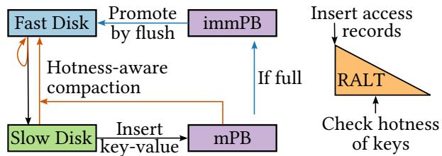  
Figure 1: The high-level picture of HotRAP. RALT is a small LSM-tree in FD that tracks the hotness of keys. mPB and immPB stand for the mutable and immutable promotion buffers. Hot records are retained in FD during compactions. Records accessed in SD are inserted into the promotion buffer and then promoted by compaction or flush if they are hot.

We evaluate HotRAP using YCSB workloads and Twitter production traces [37] on AWS instances with fast local NVMe SSDs and slower cloud storage. We compare against the state-of-the-art LSM-trees on tiered storage, e.g., RocksDB using tiering/caching design, SAS-Cache [9] (caching design, based on RocksDB with secondary block cache [28]), and PrismDB [31] (tiering design, proactively triggering compactions). HotRAP achieves 5.2× speedup over the second best baseline with the tiering design for readonly YCSB workloads, 2.1× speedup with the caching design for write-heavy YCSB workloads, and 1.6× speedup over both designs for read-write-balanced YCSB workloads. HotRAP also achieves 1.5× speedup for Twitter production workloads. These results match the insights in Table 1. Our experiments also show that HotRAP adds < 4% overhead to the plain RocksDB under uniform workloads and is robust against hotspot shifts, where RALT quickly evicts stale access records and adds keys in the new hotspot into the hot set.

We make three primary contributions in this paper. First, we propose an on-disk data structure (i.e., RALT, a speciallymade LSM-tree) for tracking the hotness of key-value records. It operates at the record level so that the system can efficiently utilize the limited space of FD. Second, we design two pathways in a tiered LSM-tree for timely promoting/retaining hot records to/in FD. Finally, we implement HotRAP, a key-value store based on RocksDB that outperforms state-of-the-art LSM-trees on tiered storage because of its efficient hot record tracking and movement features. The code is available at https://github.com/hotrap/HotRAP.

## 2 Background & Related Work

## 2.1 Log-Structured Merge-tree (LSM-tree)

A Log-Structured Merge-tree (LSM-tree) consists of inmemory buffers (i.e., MemTables) and multiple levels $L _ { 0 } , \ldots , L _ { n }$ on disk. The capacity of level $L _ { i }$ is made T times larger than $L _ { i - 1 }$ , where $T$ is the size ratio of the LSM-tree. Records are first inserted into the mutable MemTable. When it is full, it becomes immutable and then flushed to $L _ { 0 }$ as an SSTable (i.e., a file format called Sorted String Table) in the background. When level $L _ { i - 1 }$ reaches its capacity, it will trigger the compaction process to merge its content into the next level $L _ { i }$ . There are typically two kinds of compaction policies: leveling and tiering. The leveling policy only allows one sorted run per level while the tiering policy allows multiple. This paper focuses on the leveling policy because it is RocksDB’s default choice [27]. RocksDB also adopts partial compaction: each compaction picks an SSTables from $L _ { i - 1 }$ whose key range overlaps with a minimal number of SSTables in $L _ { i }$ to merge to the next level. Such a compaction strategy leads to a write amplification of ≈ $\textstyle { \frac { n T } { 2 } }$ [11].

A lookup first checks the MemTable and then searches the levels from top to bottom until a matching key is found. A block index in memory is used to determine which SSTable data block to search for a particular key in a sorted run. Per-SSTable Bloom filters are used to reduce the number of candidate SSTables to further save I/Os. RocksDB provides snapshot isolation via multi-version concurrency control (MVCC) to prevent compactions from blocking normal read operations. A snapshot in RocksDB, called a superversion, is created after a flush or compaction completes. An old snapshot is garbage collected when no active queries refer to it.

Although many LSM-trees such as RocksDB are initially designed for local SSDs, the multi-level nature of LSM-trees is a good fit for the tiering design. The upper levels contain the recently inserted and updated records and are therefore kept in the fast storage such as local SSDs because they are more likely to be accessed in the near future. To improve the system’s cost efficiency, the majority of records in the lower levels are placed in HDDs [13, 14] or low-tier cloud storage based on HDDs [15]. HDDs exhibit higher latency than SSDs, but they are much cheaper. For example, the unit price for a 20TB Seagate Enterprise HDD Exos X20 today is 6.75× cheaper than a 7.68TB SAMSUNG Enterprise SSD PM9A3 [4, 5]. That means a tiered storage with a size ratio of 1:10 based on these hardware can reduce the storage cost by 77% compared to pure SSDs of the same capacity.

## 2.2 LSM-trees with the tiering design

LogStore [26] maintains histograms in memory to track the hotness of SSTables and retains/promotes hot SSTables in/to the faster storage. However, the granularity of SSTables is too coarse because there can be considerable cold data in the same SSTable that is considered hot.

MirrorKV [33] splits the LSM-tree into the key and value LSM-tree and caches the hottest key SSTables in the faster storage. Additionally, MirrorKV retains the hottest blocks (e.g., 10%) during compactions from L1 to L2. However, the granularity of blocks is still too coarse because small objects are prevalent in large-scale systems [25], and there can be many cold tiny records in a hot data block.

SA-LSM [43] accurately predicts cold data with survival analysis and demotes cold records from the faster storage to the slower storage. However, SA-LSM does not support promoting hot records back to the faster storage, and the training cost of the survival model is heavy.

PrismDB [31] estimates key popularity with the clock algorithm, and the clock bits are indexed with a hash table. Hot records are retained/promoted in/to the fast disk during compactions. However, the hash table can consume considerable memory. Also, the promotion speed of PrismDB is slow because it only promotes during compactions.

Although not an LSM-tree, 2-Tree [44] also uses tiered storage by maintaining two B-trees: one in memory for hot records and one on disk for cold records. However, it does not support tiered disk storage and the in-memory B-tree consumes huge memory.

## 2.3 LSM-trees with the caching design

Numerous prior studies aim to improve the performance of LSM-trees with in-memory caches [32, 34, 38, 42, 45]. However, the size of hot records can be far larger than the memory capacity. RocksDB, therefore, introduces the secondary cache on fast SSDs for data blocks not hot enough for the in-memory block cache [28]. SAS-Cache [9] further proposes several optimizations on the block cache, such as actively removing the cached blocks invalidated by compactions. However, the granularity of blocks is too coarse.

It is also a common practice to employ a separate key-value cache such as CacheLib [8] on top of the LSM-tree. However, the cache incurs extra disk I/O when updating, because it needs to update the key in both the cache and the LSM-tree. It is also challenging to ensure consistency between the cache and the LSM-tree. As a common problem of the caching design, write performance suffers because all compactions happen in the slow storage.

## 2.4 Memory footprint of hotness tracking

As discussed above, the granularity of SSTable/block is too coarse for retention and promotion. However, tracking the access history of (potentially) hot records in memory can incur a large footprint. According to the Twitter trace [37], for example, 50% of the workloads have a value size smaller than 5× the key size. We take the AWS EC2 i4i.2xlarge instance for example, which is equipped with 64GB memory and an 1875GB local AWS Nitro SSD [3]. The configuration reflects the typical memory-disk ratio in the industry. If 1TB of its local SSD is used to store hot records, we need at least $1 \mathrm { T B } / ( 1 + 5 ) = 1 6 6 . 7 \mathrm { G B }$ memory to track those hot keys, which exceeds the physical memory of the instance.

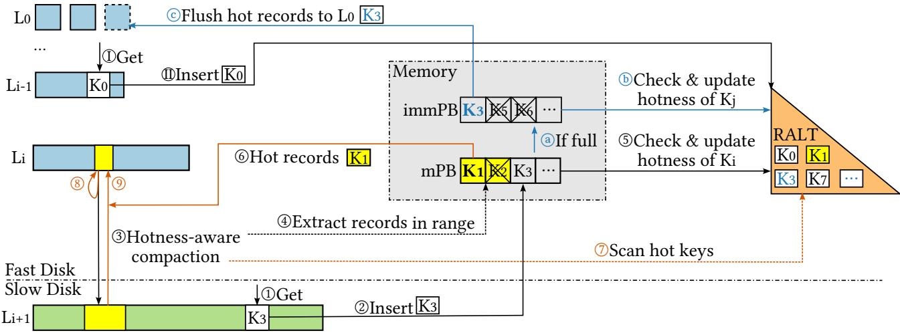  
Figure 2: Overview of HotRAP. mPB and immPB stand for the mutable and immutable promotion buffers. Solid arrows are data flow. Dashed arrows are control flow. The accessed keys in SD are firstly inserted into the mutable promotion buffer (⃝1 to ⃝2 ). A compaction can piggyback hot records in its range to FD (⃝3 to ⃝6 ). Hot records are retained in FD during compactions (⃝7 to ⃝8 ). If the mutable promotion buffer becomes full, hot records in it will be flushed to Level 0 (⃝a to ⃝c ).

## 3 Design & Implementation

## 3.1 Overview

The overview of HotRAP is shown in Figure 2. There are two components to facilitate retention and promotion: Recent Access Lookup Table (RALT) and the promotion buffer. RALT is responsible for tracking the hotness of records. It maintains a set of hot keys (without values) worth promoting and retaining. The promotion buffer consists of a mutable promotion buffer and a list of immutable promotion buffers. Records read from SD are inserted into the mutable promotion buffer. The mutable promotion buffer is turned into immutable when full. Immutable promotion buffers are flushed to disk in the background. The promotion buffers reside between the last level of FD and the first level of SD. To read a key, HotRAP first searches in MemTables and levels in FD, then in the mutable promotion buffer, and finally in levels in SD.

When a record in FD is accessed (⃝I ), its key will be inserted into RALT to record the access (⃝II ). When a record in SD is accessed (⃝1 ), HotRAP first inserts the key into the mutable promotion buffer (⃝2 ), and the key’s hotness information

in RALT is updated later.

Hotness-aware compaction. During compactions from FD to SD (⃝3 ), HotRAP extracts records within the compaction range from the mutable promotion buffer (⃝4 ). For the example in Figure $2 , K _ { 1 }$ and $K _ { 2 }$ are extracted. HotRAP consults RALT about whether each key is hot, and updates the hotness score in RALT accordingly (⃝5 ). Hot records $( K _ { 1 } )$ are added to the input of the compaction (⃝6 ). Cold records $( K _ { 2 } )$ are dropped and future lookups to them would go to SD. Then HotRAP checks the hotness of each record in the compaction output, and writes hot ones to FD. It does so by constructing a RALT iterator in the compaction range. This iterator produces the hot records identified by RALT in the order of keys. Therefore, we can advance the compaction iterator and the RALT iterator in a sort-merge manner (⃝7 ), to decide the records to be written into new SSTables in FD instead of SD. Consequently, hot records in FD are retained in FD (⃝8 ), and hot records in SD are promoted to FD (⃝9 ). The I/O incurred by the RALT iterator is small because RALT does not store values of HotRAP records. Compactions within SD are also hotness-aware: hot records are retained/promoted in/to the higher level in SD. Unlike the compactions from FD to SD, no records are extracted from the mutable promotion buffer.

Promotion by flush. For read-heavy workloads, there may not be enough compactions, and hotness-aware compaction alone may not effectively limit the size of the mutable promotion buffer. Therefore, when the size of the mutable promotion buffer grows to the target size of SSTables (64MiB by default), HotRAP converts it to an immutable promotion buffer, and a new mutable promotion buffer will be created (⃝a ). For the example in Figure 2, $K _ { 1 }$ and $K _ { 2 }$ have been handled by hotnessaware compaction. Therefore, only $K _ { 3 } , K _ { 5 } , \ldots$ . are packed into an immutable promotion buffer. The immutable promotion buffer consults RALT whether the records are hot (⃝b ). Hot records $( K _ { 3 } )$ will be flushed to $L _ { 0 }$ in FD (⃝c ), while cold records $( K _ { 5 } , K _ { 6 } )$ are dropped. To avoid creating tiny SSTables in $L _ { 0 }$ which will trigger compactions from $L _ { 0 }$ to $L _ { 1 }$ prematurely, if the total size of hot records is less than half of the target SSTable size, we insert them back into the mutable promotion buffer instead of flushing to $L _ { 0 }$ . The original records promoted by flush will remain in SD. Hotness-aware compaction can promote these duplicates to FD and merge them with previously promoted records, thus reducing disk usage.

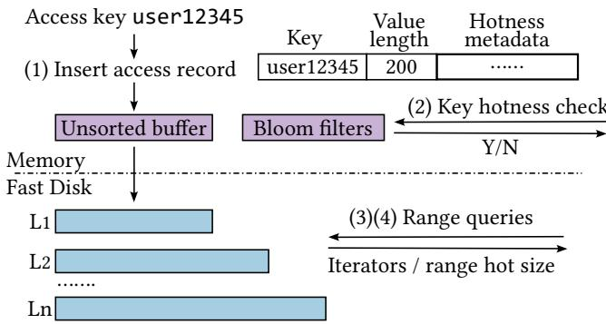  
Figure 3: RALT structure. Suppose key user12345, whose value length is 200B, is accessed in HotRAP and an access record is inserted to RALT. The figure shows the RALT access record format, as well as the four supported operations (1) to (4). The HotRAP size is len(user12345) + 200 = 209 bytes. The physical size is $( 9 + 4 ) + 4 + 8 = 2 5$ bytes, where we use 4 bytes each for the length of the key and value, and 8 bytes for the hotness metadata used by our eviction policy.

This section is organized as follows. We first introduce RALT (§3.2, §3.3) and analyze its cost (§3.4). Then we detail the implementation of promotion by flush and its correctness (§3.5, §3.6). Next, we examine the influence of hotness-aware compaction on the benefit-cost scores (§3.7) and write amplification (§3.8). Finally, we analyze the relationship between the promotion buffer and the block cache (§3.9).

## 3.2 Recent Access Lookup Table (RALT)

RALT is a lightweight LSM-tree on FD, logging the accesses to records in HotRAP. Its structure is shown in Figure 3. Each access record in RALT consists of the key, the length of the value (instead of the value itself), and the scoring metadata tick and score. Keys are considered hot if their scores are greater than a threshold. We distinguish the size of the original key-value record in HotRAP (called the HotRAP size) and the size of the RALT access record itself (called the physical size). The total HotRAP size of hot records is called the hot set size. RALT has two parameters: the hot set size limit and the physical size limit, which constrain the total size of hot records and the disk usage of RALT itself, respectively. We set their values based on workload characteristics in §3.3.

RALT supports four operations, as shown in Figure 3: (1) Inserting access records. When HotRAP inserts an access record into RALT, it first goes into an in-memory unsorted buffer. We use an unsorted buffer to improve performance because a sorted memory table does not benefit much: if a key is accessed again while its last access record is still in the buffer, it should be super hot and promoted very fast. When the unsorted buffer becomes full, it is sorted and flushed to FD. There are several levels on FD, following the leveling compaction policy. To avoid blocking reads, RALT maintains multiple versions of the LSM-tree structure.

(2) Checking the hotness of a key. Reading keys from SSTables is expensive. So for each SSTable, RALT stores bloom filters in memory that contain hot keys (keys with scores higher than the threshold). When checking whether a key is hot, RALT checks the bloom filters at each level and returns true if any bloom filter gives a positive result. We use 14- bit bloom filters to achieve a low overall false positive rate (≪ 1%). The small number of false positives does not affect performance. Thus we do not perform a second verification. (3) Scanning hot keys in a range. During hotness-aware compactions, HotRAP scans hot keys within the compaction range. To achieve this, RALT builds iterators for each level, similar to other LSM-trees. These iterators, which produce hot keys for their respective levels, are then merged into a single iterator that is returned to HotRAP.

(4) Calculating the hot set size in a range. RALT needs to calculate the hot set size in a given range, for HotRAP to select which SSTable to compact (details in §3.7). Similar to a normal LSM-tree, we have data blocks and index blocks for SSTables. For each data block, its first key and the sum of the HotRAP size of hot keys in all previous data blocks are added to the index block. For a range query, at each level, we read the two edge index blocks and calculate the difference of their stored sums, to obtain the total HotRAP size of hot keys in the range. The results of all levels are summed up and returned, as an estimation of the hot set size in the range.

The above result is slightly overestimated because of two error sources. First, the total HotRAP size of hot keys in the one or two edge data blocks is small, so we choose to tolerate the error and not read them. Second, there may be duplicate keys in different levels. If the number of levels is small and the size ratio between levels is large, we can expect the overestimation rate to be small. For example, if the size ratio is 10, the result in the second largest level may be about 1/10 of the result in the largest level on average. So the overestimation is only about 10%. §3.7 discusses how we handle such overestimation in HotRAP.

## 3.3 Auto-tuning RALT size limits

In §3.2, RALT takes two parameters: the hot set size limit and the physical size limit, to constrain the total size of hot records and the space of RALT itself, respectively. However, the hot set size is determined by the distribution of the workload, which is usually unknown to the user and may further dynamically vary over time. Therefore, an automatic tuning approach for these size limits is necessary.

Algorithm 1 Algorithm for auto-tuning size limits   
1: Let the set of tracked keys $T \gets \emptyset$   
2: for each access $k _ { i }$ do   
3: $c _ { k _ { i } } \gets c _ { \operatorname* { m a x } }$   
4: i $\mathbf { f } k _ { i } \notin T$ then   
5: $T \gets T \cup \{ k _ { i } \}$   
6: $t _ { k _ { i } } \gets 0$   
7: else   
8: $t _ { k _ { i } } \gets 1$   
9: end if   
10: if accessed data amount reaches R then   
11: forall $k _ { i } \in T$ do $c _ { k _ { i } } \gets \operatorname* { m a x } ( c _ { k _ { i } } - 1 , 0 )$   
12: end if   
13: if hot set size limit or physical size limit is exceeded then   
14: Evict unstable keys with low scores   
15: If not enough, evict stable keys with low scores   
16: % Update size limits.   
17: t ← HotRAP size of stable records   
18: p ← Physical size of stable records   
19: r ← Average ratio between physical and HotRAP size   
20: Hot set size limit ← min(t + $D _ { h s } , R _ { h s } )$   
21: Physical size limit $ p + r D _ { h s }$   
22: end if   
23: end for

We define a key as hot if the expected amount of data accessed (in terms of HotRAP size) between two accesses to the key is below a threshold R. We aim to automatically adjust the hot set size limit and the physical size limit so that hot keys are identified as hot with a high probability. Our algorithm is outlined in Algorithm 1.

We maintain a counter c and a tag t in each RALT access record. Records are deemed stable if $c > 0$ and $t = 1$ , and unstable otherwise. Accessing a key sets $c = c _ { \operatorname* { m a x } }$ (Line 3). The first access sets t = 0 (Line 5 to 6). A hit on an existing key sets $t = 1$ , making the key stable (Line 8). We lazily update counters and tags during compactions. Every time the amount of data accessed (in terms of HotRAP size) reaches R, we decrease all counters by 1, eventually making cold records no longer stable (Line 11). The maximum counter value $c _ { \mathrm { m a x } }$ ensures that keys not reaccessed can be evicted after accessing at most $c _ { \operatorname* { m a x } } \cdot R$ data.

When the hot set size or physical size exceeds the limit, RALT evicts 10% of access records, and all access records are merged into a single sorted run. 10% is a good trade-off between the I/O cost and the stability of HotRAP’s hit rate. We maintain a score for each access record with exponential smoothing [23]. During evictions, we first evict unstable records with low scores (Line 14). If the size is still too large, stable records with low scores will also be evicted (Line 15).

After each eviction, we update the two limits (Lines 17 to

21). $R _ { h s }$ is the upper bound of the hot set size to cap the write amplification of retention. We set $R _ { h s } = 0 . 8 5 \times$ last level size in FD, allowing a maximum additional SD write amplification of about 3.3 as analyzed in §3.8. $D _ { h s }$ is the maximum HotRAP size of unstable records. Essentially, we set the new size limit (HotRAP size at Line 20, or physical size at Line 21) to be the size of stable records plus the maximum size of unstable records, subject to constraints of $R _ { h s }$

Analysis. Our algorithm ensures that if we set $D _ { h s }$ and $c _ { m a x }$ properly and accesses are identically distributed and independent, then almost all hot keys will become stable, while the size of stable cold keys is bounded. We have formally proved these properties, but we omit the proof due to the space limit. Intuitively, because of the tag t, we need to access an originally untracked key at least two times with less than $D _ { h s }$ other data accessed in between, to make it stable. Suppose each key k has an access probability of $p _ { k } .$ . While the difference between $\textstyle \sum _ { k { \mathrm { i s } } \mathrm { h o t } } p _ { k }$ and $\sum _ { k } { \mathrm { i s } } \operatorname { c o l d } P k$ may not be large enough due to the very large number of cold keys, the difference between $\textstyle \sum _ { k { \mathrm { i s } } \mathrm { h o t } } p _ { k } ^ { 2 }$ and $\sum _ { k \mathrm { i s } }$ cold $p _ { k } ^ { 2 }$ is typically large enough to separate them apart.

We set R = FD size, $D _ { h s } = 0 . 0 5 \times R , c _ { m a x } = 5 .$ . With these parameters, the probability that keys with access probability $> \frac { 1 } { 0 . 5 { \times } \mathrm { F D } \mathrm { s i z e } }$ become stable is $\approx 9 9 . 8 \%$ . The HotRAP size of cold keys with access probability $< \frac { 1 } { 6 { \times } \mathrm { F D } \mathrm { s i z e } }$ is smaller than $0 . 1 \times \mathrm { F D }$ size. Therefore, these parameters should work well under most workloads. The experiments are shown in $\ S 4 . 6 .$

## 3.4 Cost analysis of RALT

Disk and memory usage. Suppose the HotRAP record size is 200B, and the key length is 24B with 5% hot keys. The disk usage of RALT is about $5 \% \times ( 2 4 + 1 6 ) / 2 0 0 = 1 \%$ of the data size. Bloom filters and index blocks are cached in memory so that checking key hotness and calculating range hot size do not incur random disk I/O. The memory usage of the bloom filters in RALT is $5 \% \times 1 4 / 8 / 2 0 0 = 0 . 0 4 3 8 \%$ of the data size. An index block record is less than 40B, and a data block in RALT is 16KiB. Therefore, the memory usage of the index blocks is $5 \% \times 4 0 / 1 6 / 1 0 2 4 = 0 . 0 1 2 2 \%$ of the data size. In total, the memory usage is only 0.056% of the data size. By storing RALT on disk instead of in memory, we can save $1 - 0 . 0 5 6 \% / 1 \% \approx 9 5 \%$ of memory.

I/O cost. Suppose RALT has $N _ { L }$ levels, and the size ratio is T . Since we evict 10% of data each time, the total write amplification is $\frac { T } { 2 } N _ { L } + \frac { 1 } { 1 0 \% }$ . The total read amplification is $\frac { T } { 2 } N _ { L } + \frac { 2 } { 1 0 \% }$ because we need two full scans to calculate the score threshold. In our experiments in §4.4, $T = 1 0 , N _ { L } \approx 2$ the read amplification is about 30 and the write amplification is about 20. The experiment results show that RALT only accounts for 5.2%–9.7% of the total I/O, because a RALT record does not contain the value in a HotRAP record, therefore the total I/O of RALT is small compared to HotRAP.

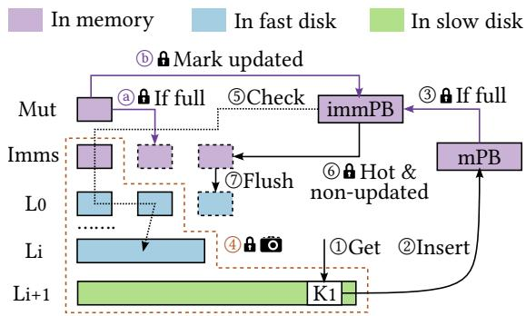  
Figure 4: Concurrency control of promotion by flush. Processes with lock icons are protected by the DB mutex lock. ⃝5 ensures that no newer versions exist in the snapshot of the LSM-tree. ⃝a and ⃝b mark all updated keys in immutable promotion buffers. Records with updated keys are excluded in ⃝6 . The snapshot is taken (⃝4 ) after the creation of the immutable promotion buffer (⃝3 ), therefore, a key updated before ⃝6 is either found out by ⃝5 or by ⃝a and ⃝b .

## 3.5 Checks before promotion buffer insertion

The promotion buffer resides between FD and SD. Therefore, before promoting a record into the promotion buffer, it is crucial to verify the absence of a newer version of this record in SD, which would otherwise be shielded by the inserted older record in the promotion buffer. For a point read that wants to insert the latest version just retrieved from SD into the promotion buffer, it is known that no newer version exists in the same superversion (i.e., the LSM-tree’s snapshot). However, it is still possible that a newer version of the record is compacted into SD before the previous record has finished being inserted into the promotion buffer.

To address this issue, HotRAP marks SSTables as being or having been compacted when setting up compaction jobs. When searching for the value of a key in SD levels, SD SSTables whose range contains the key are recorded. Before inserting the key-value pair into the promotion buffer, HotRAP checks if any of the recorded SSTables is being or has been compacted. If there is, HotRAP aborts the insertion. The abort rate is low because of the small number of compaction jobs. Our experiments show that this check only aborts less than 1% of insertions into the promotion buffer.

## 3.6 Concurrency control of promotion by flush

Now we discuss the details of promotion by flush in Figure 4. As mentioned before, a read to SD record (⃝1 ) inserts it to the mutable promotion buffer (⃝2 ), which may be later made immutable when full (⃝3 ). At this point, a snapshot is taken by incrementing the reference count of the caller’s superversion (⃝4 ). We pass the immutable promotion buffer’s reference and the superversion’s reference to a background thread called Checker, which handles the rest part. This minimizes the impact on foreground reads. Checker then picks out hot records in the immutable promotion buffer by consulting RALT. These hot records are candidates to be flushed to $L _ { 0 }$

Proper concurrency control is needed to avoid the issue that flushing a hot record to $L _ { 0 }$ may shield a newer version of this key in the FD levels. Checker looks for newer versions of the hot records in the snapshot’s immutable MemTables and the levels in FD (⃝5 ). Checker only checks bloom filters for levels in FD for speed. The key is marked updated2 if any filter returns a positive result. Hot records without possible newer versions are packed into a new immutable MemTable (⃝6 )3. Those records will eventually be flushed into $L _ { 0 }$ (⃝7 ).

However, there is still a corner case: newer versions can be flushed into $L _ { 0 }$ in the normal access path when HotRAP is looking for newer versions during step ⃝5 . To address this issue, when a mutable MemTable becomes immutable during normal accesses (⃝a ), for every record in it, HotRAP checks whether the same key exists in immutable promotion buffers. If ${ \bf { S O } } ,$ HotRAP marks the key as updated2 (⃝b ), and the record will not be packed into the immutable MemTable at step ⃝6 .

We create immutable promotion buffers with the DB mutex (the only major lock in RocksDB) held at step ⃝3 . Since flushes are protected by the DB mutex, there are only two possible cases and both are correct: (1) An immutable MemTable is created before an immutable promotion buffer is created. The newer versions of records in the immutable MemTable will be detected by the check of ⃝5 . (2) An immutable promotion buffer is created before an immutable MemTable is created. The newer versions of records in the immutable MemTable will be marked updated by ⃝a and ⃝b .

## 3.7 Cost-benefit analysis of compaction

RocksDB calculates a score for each SSTable and picks the one with the highest score to compact into the next level. By default, the score is defined as FileSize/OverlappingBytes, where OverlappingBytes represents the total size of the target level’s SSTables whose key ranges overlap with the picked SSTable. This is essentially a cost-benefit trade-off score: FileSize is the benefit, and (FileSize + OverlappingBytes) is the cost, in which FileSize is optimized out.

However, the cost-benefit score needs some adjustment to better support HotRAP. During a cross-tier compaction from FD to SD in HotRAP, hot records in the chosen SSTable will be retained in the source level. Therefore, the benefit becomes (FileSize - HotSize), and the cost is still (FileSize + OverlappingBytes). Their ratio is the new cost-benefit score.

HotRAP estimates the HotSize of an SSTable by querying RALT about the hot set size in the corresponding range (§3.2). Recall that the obtained HotSize is an overestimation.

Therefore, it is possible, although very unlikely, that all benefit values are zero. In such cases, HotRAP falls back to choosing the oldest SSTable for compaction.

## 3.8 Write amplification of retention

Suppose the fraction of cold data in the last level of FD is $p .$ Since each compaction from FD to SD only compacts p of the selected data to SD and writes the remaining $( 1 - p )$ of data back to FD, $\textstyle { \frac { 1 } { p } } \times$ more compactions are needed to compact the same amount of data. Therefore, suppose the size ratio of the LSM-tree is T , FD and SD respectively have nFD and nSD levels, the write amplification in FD is $\bar { \frac { T } { 2 } } n _ { F D } + \bar { \frac { 1 - p } { p } }$ and the write amplification in SD is $\begin{array} { r } { \frac { T } { 2 p } + \frac { T } { 2 } ( n _ { S D } - 1 ) } \end{array}$ , which are $\frac { 1 - p } { p }$ and $\begin{array} { r } { \frac { T } { 2 p } - \frac { T } { 2 } } \end{array}$ larger than a normal LSM-tree, respectively.

Write amplification can be lowered by tuning the level size ratios. Specifically, we can shrink the first level of SD to make the size ratio between the last level of FD and the first level of SD be $p T$ . To keep the size of the LSM-tree in SD unchanged, we can add an extra level after the last level with a size ratio of $\frac { 1 } { p }$ . The size ratio between other levels in SD remains T . In this way, the write amplification in SD is $\textstyle { \frac { T } { 2 } } n _ { S D } + { \frac { 1 } { 2 p } }$ , which is only $\frac { 1 } { 2 p }$ larger than a normal LSM-tree.

## 3.9 The promotion buffer and block cache

The promotion buffer and the block cache complement each other. When a record is in the promotion buffer, its readers are served by the promotion buffer. After being flushed into FD, its readers are served by the block cache. Therefore, the promotion buffer serves reads to SD, while the block cache mainly serves reads to FD. Our design is orthogonal to Leaper [38] and Range Cache [32], i.e., their optimization techniques can also be applied to HotRAP, and by promoting hot records to FD with our techniques, records evicted from their cache will be read from FD instead of SD.

The main function of the promotion buffer is to batch records from SD before flushing them to L0, to avoid many tiny SSTables in L0. Serving readers is only the secondary function of the promotion buffer to avoid accessing SD when the record is already in the promotion buffer but must wait for more records to be batch-flushed into FD. Therefore, we fix its size to the target size of SSTables (64MiB by default). As a result, the promotion buffer contributes less to the hit rate when the hotspot is larger. However, we do not need to increase the promotion buffer size for a larger hotspot (either due to higher hotspot percentage or larger dataset), because the record’s readers will be served by the larger block cache after it is flushed to FD.

Table 2: Disk performance on our EC2 instances.
<table><tr><td rowspan=1 colspan=1></td><td rowspan=1 colspan=1>Fast Disk</td><td rowspan=1 colspan=1>Slow Disk</td></tr><tr><td rowspan=1 colspan=1>Type</td><td rowspan=1 colspan=1>AWSNitro SSD</td><td rowspan=1 colspan=1>gp3</td></tr><tr><td rowspan=1 colspan=1>16 threads rand16K read IOPS</td><td rowspan=1 colspan=1>~83000</td><td rowspan=1 colspan=1> $\overline { { 1 0 0 0 0 ^ { 4 } } }$ </td></tr><tr><td rowspan=1 colspan=1>Sequential read bandwidth</td><td rowspan=1 colspan=1>~1.4GiB/s</td><td rowspan=1 colspan=1> $\overline { { 3 0 0 \mathrm { M i B } / \mathrm { s } ^ { 4 } } }$ </td></tr><tr><td rowspan=1 colspan=1>Sequential write bandwidth</td><td rowspan=1 colspan=1>~1.1GiB/s</td><td rowspan=1 colspan=1>300MiB/s4</td></tr></table>

Table 3: Read-write ratios of YCSB workloads in our tests.
<table><tr><td rowspan=1 colspan=1>Notation</td><td rowspan=1 colspan=1>Meaning</td><td rowspan=1 colspan=1>Read-write ratio</td></tr><tr><td rowspan=1 colspan=1>RO</td><td rowspan=1 colspan=1>read-only</td><td rowspan=1 colspan=1>100% read</td></tr><tr><td rowspan=1 colspan=1>RW</td><td rowspan=1 colspan=1>read-write</td><td rowspan=1 colspan=1>75% read,25% insert</td></tr><tr><td rowspan=1 colspan=1>WH</td><td rowspan=1 colspan=1>write-heavy</td><td rowspan=1 colspan=1>50% read,50% insert</td></tr><tr><td rowspan=1 colspan=1>UH</td><td rowspan=1 colspan=1>update-heavy</td><td rowspan=1 colspan=1>50% read, 50% update</td></tr></table>

## 4 Evaluation

## 4.1 Experimental setup

Testbed. We evaluate HotRAP on AWS EC2 i4i.2xlarge instances running Debian 12. Each instance has 8 vCPU cores, 64GiB memory, and a 1875GB local AWS Nitro SSD. We use local SSDs as FD and gp3 as SD. Their performance characteristics are shown in Table 2.

Sizes of tiers. We set the space ratio between tiers to 10: the initial expected used size of SD and FD is set to 100GB and 10GB respectively, and the memory budget is 1GB. HotRAP is also evaluated with a larger dataset in §4.7.

Compared systems. We compare HotRAP with PrismDB [31], SAS-Cache [9], and the following three variants of RocksDB: RocksDB-FD, RocksDB-tiering, and RocksDB-CL. RocksDB-FD stores all data in FD, which is used to indicate the upper-bound performance that HotRAP can achieve. RocksDB-tiering tunes its size ratios between levels so that the total size of FD levels becomes 10GB, which is the same as HotRAP. PrismDB is also tuned to use about 10GB of FD expectedly. RocksDB-CL caches records on FD using Cache-LiB [8], while SAS-Cache caches blocks on FD. Among the baseline systems, RocksDB-tiering and PrismDB use the tiering design like HotRAP, while RocksDB-CL and SAS-Cache use the caching design.

Configurations. All experiments run with 16 threads. To minimize the impact of the file system cache, direct I/O is used in all systems. We set the initial hot set size limit and RALT physical size limit to 50% and 15% of the FD size respectively. HotRAP is configured with a 256MiB block cache, while other systems are configured with 64MiB more block cache to compensate for the memory usage of RALT. The 256+64=320MiB block cache uses about 1/3 of our 1GB memory budget, which is recommended by the RocksDB tuning guide [29]. Other configurations are set following the RocksDB tuning guide [29], e.g., 16KiB block size, 10-bit bloom filters, and 6 maximum number of background jobs.

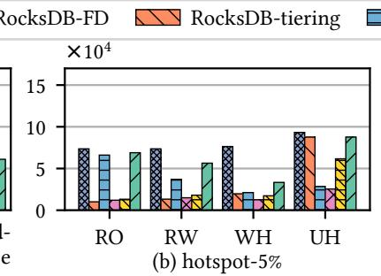

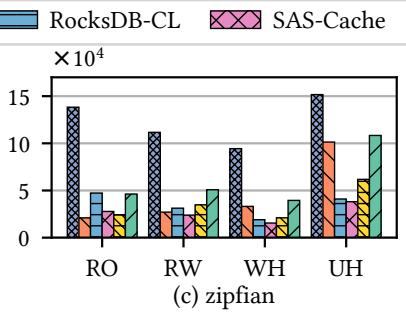

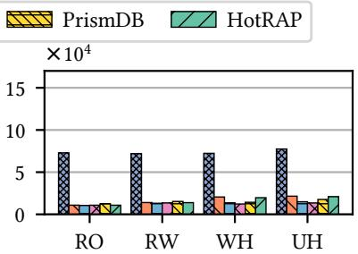  
(d) uniform

Figure 5: Throughput comparison with 1KiB record size.  
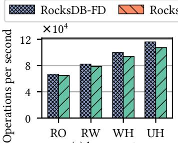  
(a) hotspot-5%

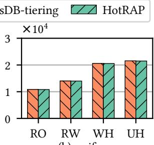  
(b) uniform  
Figure 6: Throughput comparison with 200B record size.

## 4.2 Performance on YCSB workloads

To assess the performance of HotRAP under various key distributions and read-write ratios, we evaluate HotRAP with the YCSB workloads [10] shown in Table 3. RO (read-only) tests the effectiveness of promotion by flush. RW (read-write) and WH (write-heavy) test the effectiveness of hot-awareness compaction. UH (update-heavy) is the worst case for HotRAP. With UH, the key distributions of reads and updates are the same. Therefore, newer versions of read-intensive records are frequently inserted into the database and flushed into FD, making the proactive promotion of HotRAP barely needed.

We test three skewness types: hotspot-5%, Zipfian, and uniform. In the hotspot-5% distribution, 5% of records are accessed by 95% operations uniformly. The other 5% operations uniformly access the other 95% of records. In the Zipfian distribution, the access probability of the k-th hottest record is proportional to 1/ks [7]. In our experiments, s = 0.99. In the uniform distribution, the access probability of all records is the same. We evaluate two record sizes, 1KiB (≈24B key and 1000B value) and 200B (≈24B key and 176B value).

All workloads have a load phase and a run phase. The load phase loads 110GB of records into the LSM-tree. The run phase executes read/write operations. For workloads with 1KiB records, the run phase executes $2 . 2 \times 1 0 ^ { 8 }$ operations. For 200B records, the run phase executes $1 . 1 \times 1 0 ^ { 9 }$ operations.

Figures 5 and 6 compare the average throughput (over the final 10% for the run phase) of evaluated systems under different read-write ratios and skewness types, with 1KiB and 200B records, respectively. Since the trends are similar, we only show a representative subset in Figure 6 to save space: hotspot-5% to show near-optimal efficiency compared to RocksDB-FD, uniform to show low overhead compared to RocksDB-tiering.

During the load phase, HotRAP’s behavior is the same as RocksDB-tiering; thus, their performance is the same. We next focus on the run phase. The performance of HotRAP when running non-write-heavy hotspot-5% workloads is close to that of the ideal RocksDB-FD, because HotRAP promotes almost all hot data into FD and achieves about 95% hit rate. Compared to other systems, HotRAP achieves 5.2× speedup over the second best baseline with the tiering design under read-only (RO) workloads, 2.1× speedup over the caching design under write-heavy (WH) workloads, and 1.6× speedup over both designs for read-write-balanced (RW) workloads. Additionally, HotRAP matches the performance of RocksDB-CL for read-only (RO) workloads, and RocksDB-tiering for update-heavy (UH) workloads. On the other hand, HotRAP is only 4.0% slower than RocksDB-tiering under uniform workloads, showing the overhead of HotRAP is low when promotion has no benefits. For the Zipfian distribution, there is a noticeable gap in Figure 5 between HotRAP and the upperbound RocksDB-FD, because the hit rate is lower (79%) compared to hotspot-5%. There is also a gap between HotRAP and RocksDB-FD under write-heavy (WH) workloads, because compactions saturate $\mathrm { S D } ^ { 5 }$ . But HotRAP still outperforms other designs in these scenarios.

For the baseline designs, SAS-Cache shows negligible improvements over RocksDB-tiering, as its block-level caching is too coarse. PrismDB also only has small improvements over RocksDB-tiering due to its inefficient promotion mechanism. While RocksDB-CL performs comparably to HotRAP under read-only (RO) workloads, its performance degrades under other workloads (RW, WH, UH) due to SD being overwhelmed by compactions.

Among different read-write ratios, we notice that systems using the tiering design exhibit significantly higher throughput under update-heavy (UH) workloads. This is because the updated data have a skewed distribution, and thus update operations can be considered as promotions to FD. However, PrismDB performs relatively poorly in this case, because it suffers from lock contention and inefficient random writes to FD. RocksDB-CL and SAS-Cache barely benefit from the update-heavy workloads because they use the caching design and all levels are stored in SD.

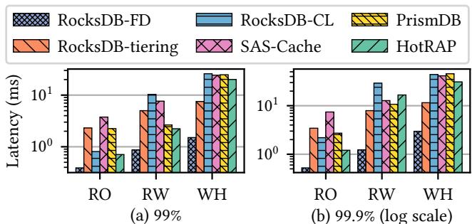  
Figure 7: Get tail latency comparison under hotspot-5% workloads with 1KiB record size.

Figure 7 shows the tail latencies (again over the final 10% of the run phase) under hotspot-5% workloads with 1KiB record size. For read-only (RO) workloads, HotRAP achieves lower tail latency than other systems except RocksDB-FD. It is because HotRAP has a higher FD hit rate and thus reduces accesses to SD, so there are proportionally fewer long-latency accesses affected by the SD tail latency among all FD and SD accesses. In contrast, under write-heavy workloads (WH), HotRAP has a higher tail latency than RocksDB-tiering. We believe this is because the throughput of HotRAP is higher than RocksDB-tiering, therefore compactions in HotRAP are more frequent, which deteriorates the tail latency.

## 4.3 Performance on real-world Twitter traces

To show the performance of HotRAP under real-world workloads, we evaluate HotRAP with the Twitter production traces [37]. We pre-process every trace into two phases: the load phase and the run phase. In the load phase, we ignore reads and keep inserting about 110GB of data. In the run phase, we execute $5 \times 1 0 ^ { 8 }$ operations. We augment small traces by repeating operations until reaching 110GB of data. For example, if a trace has 40GB of data, we repeat each operation 3 times, e.g., an operation “INSERT user1” becomes “INSERT 0user1, INSERT 1user1, INSERT 2user1”.

Traces are categorized based on their read proportions: readheavy has >75% reads; read-write has >50% and ≤75% reads; write-heavy has ≤50% reads. In some traces, it is common for a frequently read key to be also frequently updated. Proactively promoting this key has little benefit because its newer version will be automatically inserted into FD. We define that a read is performed on a sunk record if the data amount written since the last update of its key exceeds 5% of the DB size, so that the latest version is now likely sunk to SD when being read. For example, suppose we first update keys A,C, D, B, then we read key A. If the total size of records C, D, B surpasses 5% of the DB size, then we say A is sunk when being read. Similarly, we define that a read is performed on a hot record if the data amount read since the last read of this record is less than 5% of the DB size, so that the record is likely to be identified as hot. If there are many reads on such sunk and hot records, then promoting them to FD is necessary.

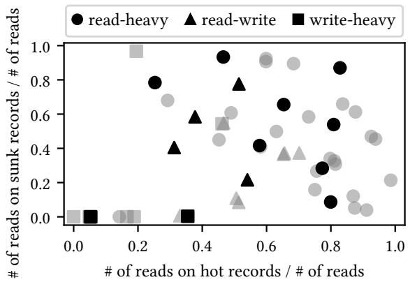  
Figure 8: Characteristics of Twitter production traces. Each point stands for a cluster’s trace. Dark black points are our selected traces for evaluation in Figure 9.

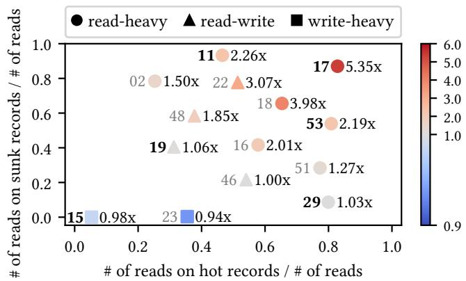  
Figure 9: Speedup of HotRAP over RocksDB-tiering on Twitter production traces. Numbers on the two sides of a point are the cluster ID and the speedup. Traces with bold cluster IDs are selected for further analysis in Figure 10.

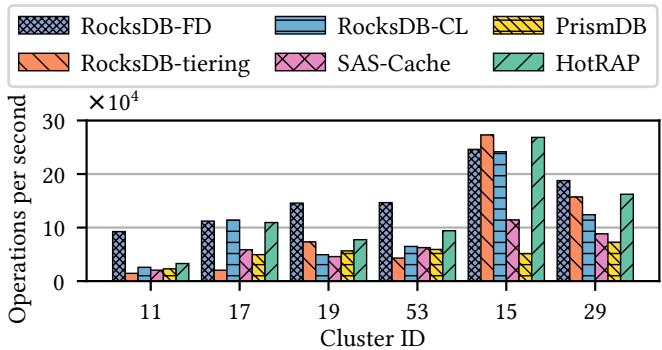  
Figure 10: Throughput comparison under several Twitter production traces.

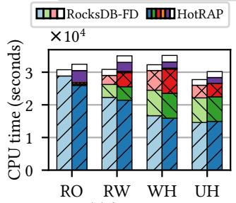

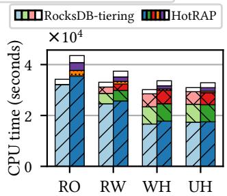  
(b) uniform  
Figure 11: CPU time breakdown with 200B record size.

Figure 8 shows the categories and proportion of reads on sunk/hot records in the Twitter traces. We select some representative traces to evaluate the speedup of HotRAP over RocksDB-tiering in Figure 9. HotRAP performs better when the proportions of reads on sunk and hot records are higher, e.g., achieving up to 5.35× speedup under the trace of cluster 17. On the other hand, HotRAP is not significantly slower than RocksDB-tiering under traces with low proportions of reads on sunk and hot records, showing its low overhead.

We further analyze several traces with high (11, 17), medium (19, 53), and low (15, 29) proportions of sunk record reads, and present their throughput in Figure 10. HotRAP is almost always the best among compared systems, achieving up to 1.5× speedup over the second best. As the proportion of sunk record reads decreases, almost all systems perform better, but HotRAP’s relative speedup diminishes. At medium and high sunk record read proportions, if we increase the amount of hot record reads, HotRAP throughput would significantly increase, while PrismDB and SAS-Cache perform moderately better, and RocksDB-tiering does not benefit from it at all. Although RocksDB-CL performs well under workloads with few writes like cluster 17, it underperforms under other workloads.

## 4.4 Cost breakdown

Figures 11 and 12 show CPU time and I/O breakdowns for the run phase of YCSB workloads with 200B record size. The size of RALT here exceeds our 1GB memory budget, and thus needs to be stored in FD instead of memory. The results show that RALT accounts for only 3.7%–11.2% of total CPU time and 5.2%–9.7% of total I/O. The I/O cost of RALT6 is background FD I/O. Since the throughput of FD is abundant, the I/O cost of RALT barely affects the overall system performance.

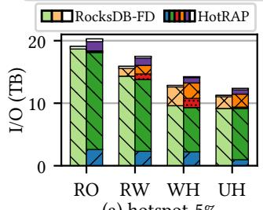

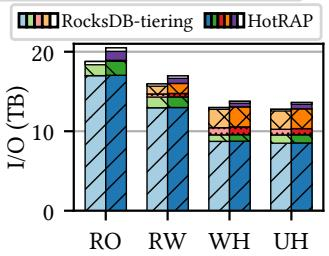

Figure 12: I/O breakdown with 200B record size.  
Table 4: Costs with/without hotness-aware compaction under the RW hotspot-5% workload with 1KiB record size.
<table><tr><td rowspan=1 colspan=1>Version</td><td rowspan=1 colspan=1>Promoted</td><td rowspan=1 colspan=1>Compaction</td><td rowspan=1 colspan=1>Hit rate</td><td rowspan=1 colspan=1>Disk usage</td></tr><tr><td rowspan=1 colspan=1>HotRAP</td><td rowspan=1 colspan=1>5.5GB</td><td rowspan=1 colspan=1>2092.5GB</td><td rowspan=1 colspan=1>94.8%</td><td rowspan=1 colspan=1>170.0GB</td></tr><tr><td rowspan=1 colspan=1>no-hot-aware</td><td rowspan=1 colspan=1>35.8GB</td><td rowspan=1 colspan=1>2841.8GB</td><td rowspan=1 colspan=1>72.0%</td><td rowspan=1 colspan=1>178.6GB</td></tr></table>

In hotspot-5% workloads, HotRAP incurs more CPU time and I/O on compactions than RocksDB-FD, because retention increases write amplification. Interestingly, HotRAP uses less CPU time and I/O on reads than RocksDB-FD. We believe it is because hot records are promoted to higher levels, so there are fewer levels to probe to read those records. In uniform workloads, HotRAP consumes more CPU time than RocksDB-tiering because most accesses are in SD and thus the records are inserted into the promotion buffer. However, few records are promoted into FD due to the hotness checking (⃝5 & ⃝b in Figure 2), therefore they have similar compaction I/O.

## 4.5 Effectiveness of individual techniques

Hotness-aware compaction. We disable the hotness-aware compaction mechanism in HotRAP and call the design nohot-aware. Table 4 shows that no-hot-aware incurs higher promotion costs and achieves a lower final hit rate compared to HotRAP. The reason is that although no-hot-aware still promotes records into FD by flush, the promoted records are compacted into SD again during subsequent compactions. Consequently, hot records have to be promoted repeatedly, with much more promotion traffic. Additionally, HotRAP incurs less disk usage than no-hot-aware. It is because hotnessaware compaction gradually promotes duplicate data (left in SD by promotion by flush) into FD and merges them with previously promoted records.

Promotion by flush. We disable the promotion by flush mechanism and call the design no-flush. Figure 13 shows that the hit rate increases very slowly without promotion by flush, especially for read-heavy workloads. In contrast, the hit rate of

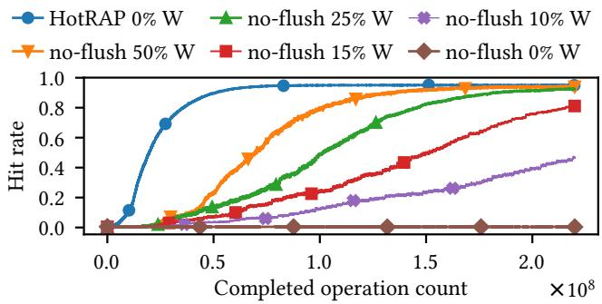  
Figure 13: Effectiveness of promotion by flush. x% W means x% of operations are writes and (1 − x)% are reads.

Table 5: Promotion costs with/without hotness checking under the RO uniform workload with 1KiB record size.
<table><tr><td rowspan=1 colspan=1>Version</td><td rowspan=1 colspan=1>Promoted</td><td rowspan=1 colspan=1>Retained</td><td rowspan=1 colspan=1>Compaction</td></tr><tr><td rowspan=1 colspan=1>HotRAP</td><td rowspan=1 colspan=1>1.0GB</td><td rowspan=1 colspan=1>15.7MB</td><td rowspan=1 colspan=1>34.8GB</td></tr><tr><td rowspan=1 colspan=1>no-hotness-check</td><td rowspan=1 colspan=1>200.6GB</td><td rowspan=1 colspan=1>4.3GB</td><td rowspan=1 colspan=1>5870.3GB</td></tr></table>

HotRAP increases rapidly even under the read-only workload. Hotness checking before promotion. HotRAP promotes only hot records to reduce the overhead introduced by promotion. To show its effectiveness, we remove the hotness checking and promote all accessed records, and call the design no-hotness-check. Table 5 shows that under uniform workloads, no-hotness-check promotes 204.1× more records and thus incurs 167.7× more compaction I/O than HotRAP.

## 4.6 Performance on dynamic workload

To show that HotRAP can adapt to changes in the access pattern, we evaluate it under a dynamic workload. The details of the dynamic workload and the results are shown in Figure 14.

The first stage has a uniform distribution, so there are few stable records, and the hot set size stays low. At the second stage, the key distribution becomes hotspot-2%. With the autotuning method, HotRAP gradually increases the hot set size limit until all hotspot keys are added to the hot set. Eventually, the hot set size stabilizes around the hotspot size. After the hotspot expands from 2% to 4% and from 4% to 6%, the FD hit rate temporarily drops because new hot keys are not yet promoted. Then HotRAP gradually increases the hot set size limit until all new hot keys are added to the hot set, thus recovering the hit rate. After the hotspot expands from 6% to 8%, the hotspot size exceeds the max hot set size (≈ 7GB). Therefore, the performance of HotRAP is relatively low. When the hotspot shifts, HotRAP reacts adaptively by evicting old hot keys after they become unstable, and gradually adding new hot keys to the hot set. Both the throughput and the hit rate recover eventually. After the hotspot shrinks from 5% to 3% and from 3% to 1%, the throughput and the hit rate do not drop because new hot keys are already considered hot and have already been promoted. Nevertheless, HotRAP in this case could decrease the hot set size limit after old access records become unstable.

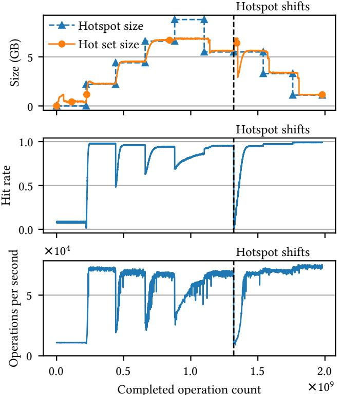  
Figure 14: HotRAP under dynamic workload. The run phase consists of nine stages, whose data distributions are first uniform, then hotspot-2% → 4% → 6% → 8% → 5% → 5% → $3 \%  1 \%$ . Each stage executes $2 . 2 \times 1 0 ^ { 8 }$ read operations. The two 5% hotspots in the 6th and 7th stages are non-overlapping. When the hotspots increase from 2% to 8%, the new hotspot completely contains the old hotspot. When they decrease, the new one is completely contained by the old one.

In summary, the results show that the auto-tuning mechanism enables HotRAP to find the most suitable hot set size limit under a dynamic workload with hotspot expanding, shrinking, and shifting.

## 4.7 Large dataset

Figure 15 compares the average throughput (over the final 10% of the run phase) of RocksDB-FD, RocksDB-tiering, and HotRAP under different read-write ratios and skewness types, with 1.1TB datasets and 1KiB record size. HotRAP is configured with a 2GiB block cache while other systems are configured with 1GiB more block cache to compensate for the memory usage of RALT. The run phase of HotRAP executes $2 . 2 \times \mathrm { { i 0 } ^ { 9 } }$ operations. The run phase of RocksDB-FD and RocksDB-tiering executes $1 . 1 \times 1 0 ^ { 9 }$ operations to save test time since their performance barely changes during the run phase. The results are similar to Figure 5, showing the

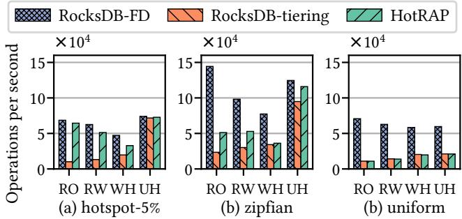  
Figure 15: Throughput comparison with 1KiB record size and 1.1TB datasets (1TB in SD and 100GB in FD).

Table 6: Comparison with Range Cache under the read-only Zipfian YCSB workload with 1KiB record size. OPS means Operations Per Second.
<table><tr><td rowspan=1 colspan=1>System</td><td rowspan=1 colspan=1>OPS</td><td rowspan=1 colspan=1>FD IOPS</td><td rowspan=1 colspan=1>SD IOPS</td></tr><tr><td rowspan=1 colspan=1>RocksDB-tiered</td><td rowspan=1 colspan=1>20927</td><td rowspan=1 colspan=1>1311</td><td rowspan=1 colspan=1>9998</td></tr><tr><td rowspan=1 colspan=1>Range Cache</td><td rowspan=1 colspan=1>29217</td><td rowspan=1 colspan=1>1019</td><td rowspan=1 colspan=1>9995</td></tr><tr><td rowspan=1 colspan=1>HotRAP</td><td rowspan=1 colspan=1>46156</td><td rowspan=1 colspan=1>14632</td><td rowspan=1 colspan=1>9998</td></tr><tr><td rowspan=1 colspan=1>HotRAP + Range Cache</td><td rowspan=1 colspan=1>46180</td><td rowspan=1 colspan=1>8443</td><td rowspan=1 colspan=1>9986</td></tr></table>

scalability of HotRAP.

## 4.8 Comparison with Range Cache

Range Cache [32] addresses the block-cache invalidation problem by introducing a separate in-memory key-value cache on top of the LSM-tree. Since Range Cache is not opensource and this paper focuses on point query performance, we simulate Range Cache by enabling the row cache in RocksDB. Table 6 shows the experimental results collected during the final 10% of the run phase. Range Cache improves throughput compared to RocksDB-tiered by finer-grained caching. However, the in-memory cache is insufficient to hold all hot records due to the limited memory capacity; therefore, many accesses to SD still occur. HotRAP outperforms Range Cache by promoting all hot records to FD, which is possible due to the large capacity of FD. Combining Range Cache with HotRAP further alleviates the load of FD by caching some hot records in memory. The throughput is not improved because the performance remains bottlenecked by SD.

## 5 Discussion

Scan workloads. HotRAP behaves the same as RocksDBtiering under scan workloads: scanned records are not inserted into RALT or the promotion buffer, and there is no metadata lookup for RALT during scans. It is our future work to speed up range scans by maintaining the set of promoted ranges so that a range scan does not need to read SD if it is in a promoted range. Details will be revealed in our future paper.

Limitation of the auto-tuning algorithm. The algorithm keeps unstable records of HotRAP size $D _ { h s }$ to detect hot records. It assumes that hot records are accessed randomly, so every hot record has a probability > 0 of being detected. However, if a hot record is accessed only once every $> D _ { h s }$ accesses, it will not be captured. In extreme cases such as “sequential flooding”, the algorithm cannot work unless $D _ { h s }$ is increased. But this is uncommon in real-world datasets (e.g., the Twitter traces in §4.3).

Portability. The key HotRAP techniques (RALT and promotion by flush) can be easily applied to other modern LSM-tree implementations. (1) RALT is implemented as a standalone library with a minimum interface (insert, key hotness check, iterate, and range hot size) to ensure cross-system portability. (2) Promotion by flush leverages the multi-version concurrency control (MVCC) of the LSM-tree structure to minimize the impact on foreground tasks. The MVCC capability should be available in modern LSM-tree implementations.

## 6 Conclusion

We introduced HotRAP, an LSM-tree-based key-value store on tiered storage. Unlike previous solutions, HotRAP adopts an efficient on-disk hotness tracker, along with a fine-grained record-level retention and promotion mechanism that offers two pathways for hot records to be stored in the fast tier. These techniques allow HotRAP to efficiently manage data across tiers to fully utilize the fast tier under various workloads.

## Acknowledgments

We thank our shepherd, Suzhen Wu, and the anonymous reviewers for their constructive comments. This work was partially supported by the Shanghai Qi Zhi Institute Innovation Program (SQZ202406 & SQZ202314).

## References

[1] Apache cassandra, 2009. https://cassandra. apache.org.

[2] Scylladb, 2015. https://github.com/scylladb/ scylladb.

[3] Amazon ec2 instance types, 2024. https://aws. amazon.com/ec2/instance-types/.

[4] Samsung pm9a3 2.5" u.2 7.68tb pcie 4.0 x4 nvme 1.4 v-nand tlc enterprise solid state drive, 2024. https://www.newegg.com/p/N82E16820147858? Item=9SIA12KJA14195.

[5] Seagate exos x20 st20000nm007d 20tb 7200 rpm 256mb cache 3.5" internal hard

drive, 2024. https://www.newegg.com/ seagate-exos-x20-st20000nm007d-20tb/p/ N82E16822185011?Item=N82E16822185011.

[6] Tikv is a highly scalable, low latency, and easy to use key-value database, 2024. https://tikv.org/.

[7] Zipf’s law, 2024. https://en.wikipedia.org/ wiki/Zipf%27s\_law.

[8] Benjamin Berg, Daniel S Berger, Sara McAllister, Isaac Grosof, Sathya Gunasekar, Jimmy Lu, Michael Uhlar, Jim Carrig, Nathan Beckmann, Mor Harchol-Balter, et al. The cachelib caching engine: Design and experiences at scale. In 14th USENIX Symposium on Operating Systems Design and Implementation (OSDI 20), pages 753–768, 2020.

[9] Zhang Cao, Chang Guo, Ziyuan Lv, Anand Ananthabhotla, and Zhichao Cao. Sas-cache: A semantic-aware secondary cache for lsm-based key-value stores. In The 38th International Conference on Massive Storage Systems and Technology (MSST 2024), 2024.

[10] Brian F Cooper, Adam Silberstein, Erwin Tam, Raghu Ramakrishnan, and Russell Sears. Benchmarking cloud serving systems with ycsb. In Proceedings of the 1st ACM symposium on Cloud computing, pages 143–154, 2010.

[11] Niv Dayan, Tamar Weiss, Shmuel Dashevsky, Michael Pan, Edward Bortnikov, and Moshe Twitto. Spooky: granulating lsm-tree compactions correctly. Proceedings of the VLDB Endowment, 15(11):3071–3084, 2022.

[12] Siying Dong, Mark Callaghan, Leonidas Galanis, Dhruba Borthakur, Tony Savor, and Michael Strum. Optimizing space amplification in rocksdb. In CIDR, volume 3, page 3, 2017.

[13] Siying Dong, Andrew Kryczka, Yanqin Jin, and Michael Stumm. Evolution of development priorities in keyvalue stores serving large-scale applications: The {rocksdb} experience. In 19th USENIX Conference on File and Storage Technologies (FAST 21), pages 33–49, 2021.

[14] Siying Dong, Andrew Kryczka, Yanqin Jin, and Michael Stumm. Rocksdb: Evolution of development priorities in a key-value store serving large-scale applications. ACM Transactions on Storage (TOS), 17(4):1–32, 2021.

[15] Siying Dong, Shiva Shankar P, Satadru Pan, Anand Ananthabhotla, Dhanabal Ekambaram, Abhinav Sharma, Shobhit Dayal, Nishant Vinaybhai Parikh, Yanqin Jin, Albert Kim, et al. Disaggregating rocksdb: A production experience. Proceedings of the ACM on Management of Data, 1(2):1–24, 2023.

[16] Google. Leveldb, 2011. https://github.com/ google/leveldb.

[17] Jorge Guerra, Himabindu Pucha, Joseph Glider, Wendy Belluomini, and Raju Rangaswami. Cost effective storage using extent based dynamic tiering. In 9th USENIX Conference on File and Storage Technologies (FAST 11), 2011.

[18] Dongxu Huang, Qi Liu, Qiu Cui, Zhuhe Fang, Xiaoyu Ma, Fei Xu, Li Shen, Liu Tang, Yuxing Zhou, Menglong Huang, et al. Tidb: a raft-based htap database. Proceedings of the VLDB Endowment, 13(12):3072–3084, 2020.

[19] Junsu Im, Jinwook Bae, Chanwoo Chung, Sungjin Lee, et al. Pink: High-speed in-storage key-value store with bounded tails. In 2020 USENIX Annual Technical Conference (USENIX ATC 20), pages 173–187, 2020.

[20] HV Jagadish, PPS Narayan, Sridhar Seshadri, S Sudarshan, and Rama Kanneganti. Incremental organization for data recording and warehousing. In VLDB, pages 16–25, 1997.

[21] Hiwot Tadese Kassa, Jason Akers, Mrinmoy Ghosh, Zhichao Cao, Vaibhav Gogte, and Ronald Dreslinski. Improving performance of flash based key-value stores using storage class memory as a volatile memory extension. In 2021 USENIX Annual Technical Conference (USENIX ATC 21), pages 821–837, 2021.

[22] Cockroach Labs. Cockroachdb, 2015. https:// github.com/cockroachdb/cockroach.

[23] Justin J Levandoski, Per-Åke Larson, and Radu Stoica. Identifying hot and cold data in main-memory databases. In 2013 IEEE 29th International Conference on Data Engineering (ICDE), pages 26–37. IEEE, 2013.

[24] Yoshinori Matsunobu, Siying Dong, and Herman Lee. Myrocks: Lsm-tree database storage engine serving facebook’s social graph. Proceedings of the VLDB Endowment, 13(12):3217–3230, 2020.

[25] Sara McAllister, Benjamin Berg, Julian Tutuncu-Macias, Juncheng Yang, Sathya Gunasekar, Jimmy Lu, Daniel S Berger, Nathan Beckmann, and Gregory R Ganger. Kangaroo: Caching billions of tiny objects on flash. In Proceedings of the ACM SIGOPS 28th Symposium on Operating Systems Principles, pages 243–262, 2021.

[26] Prashanth Menon, Thamir M Qadah, Tilmann Rabl, Mohammad Sadoghi, and Hans-Arno Jacobsen. Logstore: A workload-aware, adaptable key-value store on hybrid storage systems. IEEE Transactions on Knowledge and Data Engineering, 34(8):3867–3882, 2020.

[27] Meta. Rocksdb: A persistent key-value store for flash and ram storage, 2012. https://github.com/ facebook/rocksdb/.

[28] Meta. Secondarycache (experimental), 2022. https://github.com/facebook/rocksdb/wiki/ SecondaryCache-(Experimental).

[29] Meta. Setup options and basic tuning, 2022. https://github.com/facebook/rocksdb/wiki/ Setup-Options-and-Basic-Tuning.

[30] Patrick O’Neil, Edward Cheng, Dieter Gawlick, and Elizabeth O’Neil. The log-structured merge-tree (lsm-tree). Acta Informatica, 33:351–385, 1996.

[31] Ashwini Raina, Jianan Lu, Asaf Cidon, and Michael J Freedman. Efficient compactions between storage tiers with prismdb. In Proceedings of the 28th ACM International Conference on Architectural Support for Programming Languages and Operating Systems, Volume 3, pages 179–193, 2023.

[32] Xiaoliang Wang, Peiquan Jin, Yongping Luo, and Zhaole Chu. Range cache: An efficient cache component for accelerating range queries on lsm-based key-value stores. In 2024 IEEE 40th International Conference on Data Engineering (ICDE), pages 488–500. IEEE, 2024.

[33] Zhiqi Wang and Zili Shao. Mirrorkv: An efficient keyvalue store on hybrid cloud storage with balanced performance of compaction and querying. Proceedings of the ACM on Management of Data, 1(4):1–27, 2023.

[34] Fenggang Wu, Ming-Hong Yang, Baoquan Zhang, and David HC Du. Ac-key: Adaptive caching for lsm-based key-value stores. In 2020 USENIX Annual Technical Conference (USENIX ATC 20), pages 603–615, 2020.

[35] Kan Wu, Zhihan Guo, Guanzhou Hu, Kaiwei Tu, Ramnatthan Alagappan, Rathijit Sen, Kwanghyun Park, Andrea C Arpaci-Dusseau, and Remzi H Arpaci-Dusseau. The storage hierarchy is not a hierarchy: Optimizing caching on modern storage devices with orthus. In 19th USENIX Conference on File and Storage Technologies (FAST 21), pages 307–323, 2021.

[36] Xingbo Wu, Yuehai Xu, Zili Shao, and Song Jiang. Lsmtrie: An lsm-tree-based ultra-large key-value store for small data items. In 2015 USENIX Annual Technical Conference (USENIX ATC 15), pages 71–82, 2015.

[37] Juncheng Yang, Yao Yue, and K. V. Rashmi. A large scale analysis of hundreds of in-memory cache clusters at twitter. In 14th USENIX Symposium on Operating Systems Design and Implementation (OSDI 20), pages 191–208. USENIX Association, November 2020.

[38] Lei Yang, Hong Wu, Tieying Zhang, Xuntao Cheng, Feifei Li, Lei Zou, Yujie Wang, Rongyao Chen, Jianying Wang, and Gui Huang. Leaper: A learned prefetcher for cache invalidation in lsm-tree based storage engines. Proceedings of the VLDB Endowment, 13(12):1976– 1989, 2020.

[39] Ting Yao, Yiwen Zhang, Jiguang Wan, Qiu Cui, Liu Tang, Hong Jiang, Changsheng Xie, and Xubin He. Matrixkv: Reducing write stalls and write amplification in lsm-tree based kv stores with matrix container in nvm. In 2020 USENIX Annual Technical Conference (USENIX ATC 20), pages 17–31, 2020.

[40] Huanchen Zhang, David G Andersen, Andrew Pavlo, Michael Kaminsky, Lin Ma, and Rui Shen. Reducing the storage overhead of main-memory oltp databases with hybrid indexes. In Proceedings of the 2016 International Conference on Management of Data, pages 1567–1581, 2016.

[41] Huanchen Zhang, Hyeontaek Lim, Viktor Leis, David G Andersen, Michael Kaminsky, Kimberly Keeton, and Andrew Pavlo. Surf: Practical range query filtering with fast succinct tries. In Proceedings of the 2018 International Conference on Management of Data, pages 323–336, 2018.

[42] Jianshun Zhang, Fang Wang, and Chao Dong. Halsm: A hotspot-aware lsm-tree based key-value storage engine. In 2022 IEEE 40th International Conference on Computer Design (ICCD), pages 179–186. IEEE, 2022.

[43] Teng Zhang, Jian Tan, Xin Cai, Jianying Wang, Feifei Li, and Jianling Sun. Sa-lsm: optimize data layout for lsmtree based storage using survival analysis. Proceedings of the VLDB Endowment, 15(10):2161–2174, 2022.

[44] Xinjing Zhou, Xiangyao Yu, Goetz Graefe, and Michael Stonebraker. Two is better than one: The case for 2-tree for skewed data sets. memory, 11:13, 2023.

[45] Yuanhui Zhou, Jian Zhou, Shuning Chen, Peng Xu, Peng Wu, Yanguang Wang, Xian Liu, Ling Zhan, and Jiguang Wan. Calcspar: A contract-aware lsm store for cloud storage with low latency spikes. In 2023 USENIX Annual Technical Conference (USENIX ATC 23), pages 451–465, 2023.