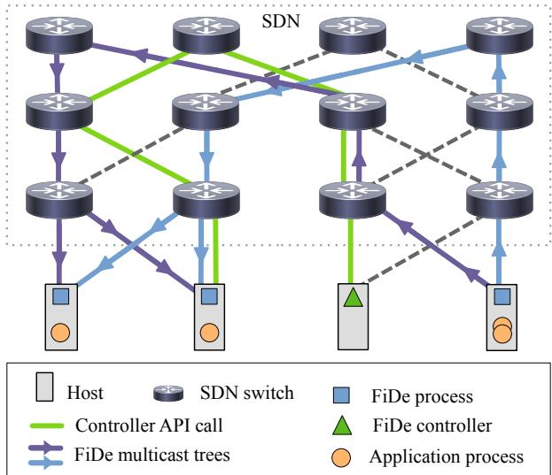
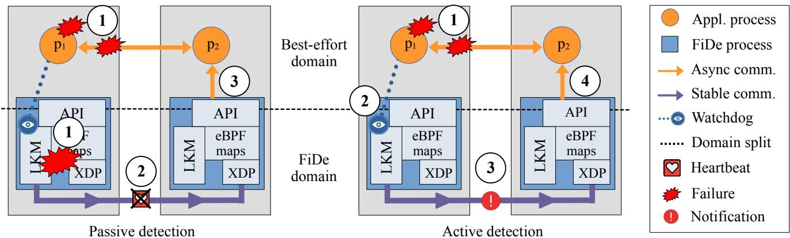
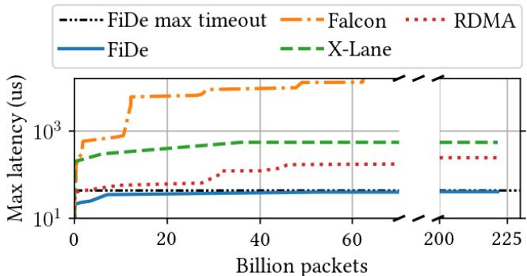
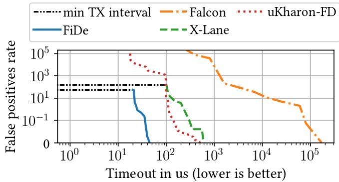
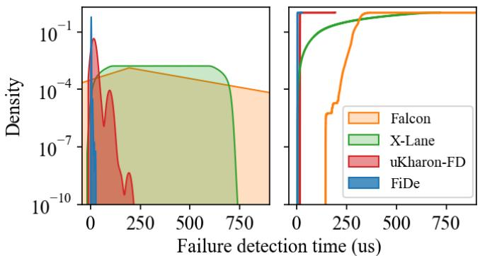
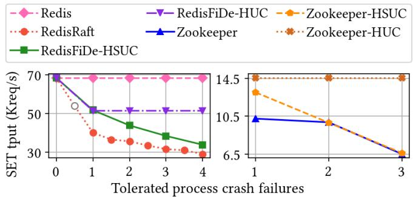
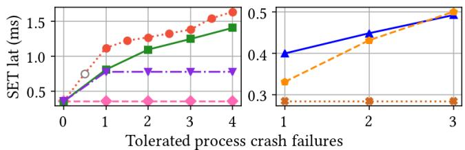
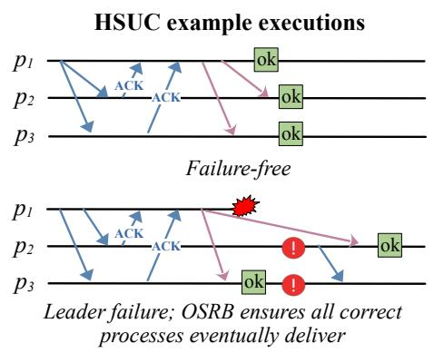
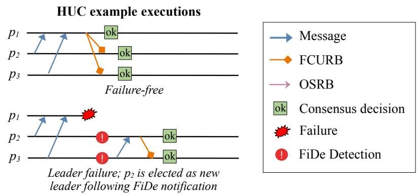
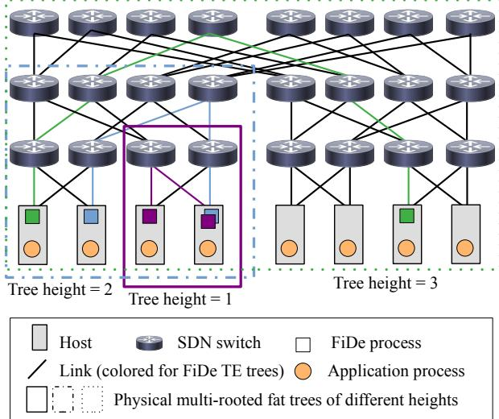

①

USENIX

THE ADVANCED COMPUTING SYSTEMS ASSOCIATION

# FiDe: Reliable and Fast Crash Failure Detection to Boost Datacenter Coordination

Davide Rovelli, Università della Svizzera Italiana and SAP SE; Pavel Chuprikov, Télécom Paris and Institut Polytechnique de Paris; Philipp Berdesinski, turba; Ali Pahlevan, SAP SE; Patrick Jahnke, turba; Patrick Eugster, Università della Svizzera Italiana https://www.usenix.org/conference/atc25/presentation/rovelli

# This paper is included in the Proceedings of the 2025 USENIX Annual Technical Conference.

July 7–9, 2025 • Boston, MA, USA ISBN 978-1-939133-48-9

Open access to the Proceedings of the 2025 USENIX Annual Technical Conference is sponsored by

P-Lr.h £Es/sL.

auuuJl9 PgleU

King Abdullah University of

Science and Technology

# FiDe: Reliable and Fast Crash Failure Detection to Boost Datacenter Coordination

Davide Rovelli Università della Svizzera Italiana & SAP SE

Philipp Berdesinski turba

Ali Pahlevan SAP SE

Patrick Jahnke turba

Pavel Chuprikov

Télécom Paris & Institut Polytechnique de Paris

Patrick Eugster Università della Svizzera Italiana

## Abstract

Failure detection is one of the most fundamental primitives on which distributed fault tolerant services and applications rely to achieve liveness. Typical crash failure detectors resort to using timeouts that have to take into account the unpredictability in interaction times among remote processes, caused by resource contention in the network and in endhost processors. While modern (gray) failure detectors have improved in detecting a wide range of failures, the problem of prohibitively large and unreliable timeouts for crash failures still persists, hampering performance of both the failure detector themselves and modern µs-scale services sitting on top.

We propose a novel fully reliable failure-detector (FiDe) that can report the crash of a remote process in a datacenter within less than 30 µs (7.2× faster than the current state of the art) with extremely high reliability, thanks to a ground-up design which provides stable end-to-end process interactions. By reliably lowering worst-case crash detection time, FiDe enables a class of algorithms that can be used to boost coordination services even in the absence of failures. We devise two novel, FiDe-based, highly efficient consensus protocols and integrate them into a key-value store and a synchronization service, improving throughput by up to 2.23× and reducing latency down to 0.46×.

## 1 Introduction

An increasing number of user-facing services are being developed as distributed applications, many running 24/7 in cloud datacenters leveraging cheap hardware parallelism.

Failure detection in datacenters. Alas failures are a common issue in all distributed systems, especially in cloud datacenters. Chiefly, processes can fail due to a variety of reasons, including hardware faults. Process failure detectors (FDs) are thus a common building block in fault-tolerant distributed systems, which include highly available core services underlying user-facing applications. FDs allow the cross-cutting concern of detecting and notifying process failures to be factored out into one module, encapsulating timeouts and more, used by various components and systems. Timeouts are at the center of the prominent heartbeat crash FD design which has distributed processes periodically send “I am alive” messages to each other, interpreting the absence thereof beyond a certain time limit as indication of failure.

Limits of current timeout-based detectors. FDs are fundamentally limited by the systems they are built on. Distributed systems, including datacenters, are commonly viewed as being completely asynchronous, which makes it in theory impossible to achieve reliable failure detection, i.e., failure detection without any false suspicions. In practice, any FD must eventually make some synchrony assumptions and resort to heartbeats/timeouts to detect the unresponsiveness of monitored processes. Timeouts can be easily set too short, leading to premature false suspicion of processes. Inversely, setting timeouts too large can hamper system performance by delaying reactions to actual failures which is unaffordable for the growing µs-scale application market [2, 46]. With several processes failing in short time without their timely removal or replacement, common systems relying on majority quorum voting can block as the number of correct processes drops below the necessary quorum size. Tradeoffs between safety and liveness can not be navigated reliably by applications using an FD built on top of standard communication and OS abstractions. A common mitigation strategy is to resort to error-prone manual deployment and resource reservation [35, 38, 83].

Multi-level and gray failure detection. Previous fast, reliable FDs described in literature [7,24,44] build on the concept, spearheaded by Falcon [45], of closely monitoring multiple layers of a system (e.g., application process, OS, VM) through a network of probes. Increasingly popular gray failure detectors [27, 49, 58] use similar techniques to very effectively detect subtle failures (e.g. deadlocks) which harm availability without processes crashing. While these approaches excel at addressing a large variety of failure scenarios, they increase software and system complexity. In the context of crash failures this leads to additional observation overhead, a conundrum of having to “monitor the monitor”, besides requiring the programmer to implement failure detection logic. These design side-effects can decrease reliability by increasing performance non-determinism in applications, often compensated for by actively killing monitored application/host to back up a false failure suspicion [20, 45].

FiDe. This paper proposes a different novel approach specialized for crash failure detection, based on the observation that existing crash FDs are limited by being realized as modules, not as components, and do not fully exploit precision and programmability of modern OSes and networking hardware. More precisely, our approach is system-driven: leveraging custom lean system support from the ground-up, our approach, dubbed FiDe1, achieves ultra-low and ultra-stable latency process interactions (communication and reaction) in a subset of the system custom built for failure detection enabling reliable heartbeats, as opposed to prior approaches which are at best adapted to a given system (system-tailored). In short, this is achieved by a combination of techniques including highly stable OS-supported send/receive pipelines and traffic engineering (TE) to reserve communication resources on switches via a centralized controller upon pre-registration by applications. FiDe also caters for network failures, making the probability of a false positive (i.e., a late or missed heartbeat with no process crash) to be once in years of uptime. To be clear, the correctness and efficiency of FiDe/FiDe-based protocols depend on assuming synchrony. While all-encompassing synchrony is unfeasible, the probability of synchrony violations in FiDe’s controlled environment is negligible for practical purposes thanks to its reliable system substrate enforcing the assumption. Moreover, our approach is externally observed: application processes are monitored by dedicated, uninterrupted FD processes which leverage insights already provided by the OS as opposed to burdening programmers to modify applications to make them internally observed and in the process making them perform non-deterministically.

The extremely high reliability and promptness of FiDe serve two main purposes: (1) provide a foundation for developing novel, more efficient and simpler distributed coordination primitives and (2) improve crash detection accuracy and performance of core services with high availability requirements as standalone or combined with a more comprehensive (e.g. gray) failure detector. In summary, this paper presents:

• the design of FiDe which is system-driven and externally observed, allowing it to be very reliable and timely, while remaining non-invasive.

• FiDe’s implementation using a high-performance system substrate based on custom process and network isolation, traffic engineering, and network processing pipelines.

• the design and implementation of novel FiDe-based broadcast and consensus primitives for simple fast replication.

• the empirical evaluation of our prototype in a production datacenter of SAP. FiDe consistently detects failure within less than 30µs outperforming the fastest state of the art crash failure detector by 7.2×.

• the integration of FiDe-based algorithms into the Redis key-value store [62] and Zookeeper synchronization service [29] to increase throughput by 1.7× and 2.23× and reduce latency down to 0.46× and 0.57× respectively, in failure-free execution.

The paper is structured as follows. § 2 presents model and assumptions, and §3 FiDe’s design. §4 outlines FiDe-based algorithms. § 5 presents implementation details. § 6 evaluates FiDe by comparison to prior art. § 7 contrasts FiDe with related work. §8 concludes with final remarks. App. A details FiDe-based algorithms, and App. B the TE algorithm. in detail. App. C provides details on network failure probability.

## 2 Model and Scope

## 2.1 System and failure model

FiDe is designed primarily to detect crash-stop process failures in networked distributed systems, and for use in applications dealing with such failures. When not specified further, a “failure” refers to when a process drops from the process table of the underlying OS.

Gray failures [49], fail-slow [52], and partial software/process failures [50] are not directly targeted by FiDe. However, one of FiDe’s intended use-cases is to be used in combination with more comprehensive failure detectors aiming to improve their remote failure detection.

Due to the need for communication in failure detection, and the possibility of communication failures being falsely interpreted as process failures, FiDe has to cater for network failures, manifesting by packet drops (i.e. generalization of switch and link faults). We address this by exploiting 2-fold physical redundancy in the network configuration and introducing a network failure recovery mechanism (see § 3.3). FiDe tolerates multiple network failures unless they occur in very quick succession within the recovery time (we denote such set of failures as critical compound failure). We do not consider Byzantine failures but design FiDe to serve as a high-performance component of FDs providing broader coverage, i.e., gray/Byzantine failure detectors. We assume that software bugs, which are omitted even by several works on Byzantine fault tolerance (BFT) as corresponding bugs would be triggered across replicas, are handled by formally verifying FiDe-based algorithms (cf. [12]).

## 2.2 Properties

We revisited the FD primitive and designed FiDe from the ground up aiming for three salient properties:

Reliability: FiDe’s primary goal is to approximate (in practice) the strong completeness and strong accuracy properties of Chandra&Toueg’s failure detector classification [14]. In short, if a process fails all interested correct processes are notified (completeness), and only then (accuracy).

Timeliness: FiDe explicitly aims for µs range failure detection, going beyond simple “eventual” notification of actual failures to correct processes.

Non-intrusiveness: Unlike existing failure detectors [2, 24, 45,76] that require application-specific code injection even for crash failures to guarantee prompt detection, FiDe embraces the separation of concerns principle. Applications should be able use it immediately out-of-the-box through a lean API.

FiDe ensures reliability and timeliness by establishing stable, end-to-end timely interaction among its processes. The key to achieving this is minimizing interference at both process and network level: FiDe reduces maximum jitter to a point where it becomes consistently so small relative to the latency, that, in practice, it can be assumed to be bounded. We acknowledge that, in general, all-encompassing synchrony is unfeasible and that there is a probability that a series of failures (i.e. critical compound failure) and delays could break FiDe’s model assumptions and reliability property. FiDe is explicitly designed and system-driven to make such probability negligible for a “slice” of the datacenter (FiDe domain). We show an estimate of this probability to be once in years of uptime, orders of magnitude less likely than failures in commonly-believed reliable services such as TCP.

## 2.3 Targeted services

We target core services with high availability requirements, like replicated storage or databases and increasingly relevant µs-scale services [2,10,24,38]. FiDe’s primary goal is to boost common fault-tolerant coordination protocols, e.g., consensus, underlying such services, through reliable and fast crash failure detection (§4). While we could use the reliable system substrate provided by our design to support more complex services, we choose to specifically support only failure detection in order to preserve modularity, allowing FiDe to be tailored to custom coordination protocols and failover mechanisms. Our solution requires a minimal setup time, which is negligible compared to its uptime, and acceptable for such services. We assume that a number of resources can be dedicated to FiDe, which is the case for modern over-provisioned datacenters and is commonly enforced manually in current practice when deploying critical services [19, 83]. Our primarily targeted services are in practice limited in scale, with replication clusters typically around 3 to 5 nodes (e.g. Zookeeper advises 5 nodes for exceptional maintenance [83]), almost never above 9 as shown in previous work [2, 6, 24, 34, 39]. While FiDe’s design does not prevent it from larger scale deployment as in blockchains, this paper does not explore that angle.

  
Figure 1: Simplified datacenter fat-tree topology showing FiDe’s architecture and process interactions.

## 3 System Design

## 3.1 Architecture

Components. Fig. 1 illustrates the architecture of a typical FiDe deployment. It consists of a set of client processes (simply called FiDe processes), deployed alongside a distributed application, and a FiDe controller which dynamically configures the switches of a software-defined network (SDN) using our custom traffic engineering (TE) techniques (§3.3). FiDe processes are at most one per host, where they monitor one or more local application processes (§3.4). At the same time, each FiDe process can monitor and/or be monitored by other FiDe processes. Monitoring in a FiDe cluster need not be symmetrical, allowing for more flexibility and efficiency, covering application use cases where not all hosts play the same role (e.g. clients monitoring servers but not vice-versa).

Communication. FiDe processes communicate via a set of redundant directed multicast trees (cf. blue and purple lines in Fig. 1). The FiDe controller adjusts trees dynamically with cluster join request by allocating resources to each FiDe process according to the network topology, capacity, and number of monitoring processes (cf. § 3.3). The controller provisions and monitors such resources with TE techniques that cap jitter introduced by concurrent traffic. We use standard Ethernet links while prioritizing FiDe traffic and exploiting a custom TE-driven periodic IP-level multicast protocol, thus enabling reliable communication (see §3.3).

struct resources {   
int pbsize ; // max piggyback size   
int timeout ; // min wrt request   
}   
// Downcalls from app to FiDe   
↓ resources monitor (int appid , resources r );   
↓ void unmonitor (int appid );   
↓ bool join ( appid );   
↓ void quit ();   
↓ bool piggyback (char[] message );   
// Upcalls from FiDe to monitoring apps   
↑ void on\_failure (int appid );   
↑ void on\_piggyback\_recv (char[] message );   
↑ void on\_timeout\_changed (int timeout );   
// Upcalls from FiDe to monitored apps   
↑ void on\_monitor\_req (int appid , int pbsize );   
↑ void on\_pbsize\_changed (int pbsize );  
Listing 1: Summary of FiDe’s C API exposed to applications.

Monitoring, allocation and piggybacking. Applications interact with FiDe through the API shown in List. 1. At a high level, applications can join, quit and monitor another application supplying a desired timeout value and a minimum piggyback message size. The FiDe controller the proceeds with the TE-driven allocation (§ 3.3), possibly relinquishing resources for processes already in the cluster (through callbacks on\_timeout\_changed and on\_pbsize\_changed) in case the current network capacity is not sufficient. After registration, a FiDe process uses the on\_failure upcall to notify of a failure, which might be followed by a re-allocation find a more optimal resource assignment for remaining applications. Monitored applications can piggyback a limited amount of messages on FiDe’s monitoring payload. The size of the piggyback payload (pbsize) is determined by the TE-driven allocation process to a maximum of 1418B. FiDe declines piggyback calls that try to exceed pbsize as it would break the guarantees provided by TE. Piggybacking enables seamless integration with gray/multi-level failure detectors, improving the propagation time of custom failures as we exemplify later. When applications and FiDe processes use distinct network paths, it could occur that the communication between applications is interrupted while respective FiDe processes monitoring such applications can still communicate, hence resulting in a “false negative”. Piggybacking can prevent such scenarios since it ensures that the traffic of both application and FiDe processes goes through the same network path. Moreover, piggybacking exposes FiDe’s reliability property to the monitored processes, bridging the gap between modularity (i.e., using FiDe as a general-purpose reliable crash FD module) and protocol-specific optimizations. We exploit piggybacking to define an efficient consensus primitive in §4.

## 3.2 Reactive, uninterrupted processing

Task preemption is managed by the OS kernel scheduler which, generally, distributes running processes in a fair manner across all CPU cores. This is detrimental for time-sensitive tasks, in which preemption overhead is often the predominant cause of high processing tail-latency, as shown in previous work [21, 37, 53]. FiDe minimizes jitter through selective isolation and custom reactive network processing pipelines. We pin a FiDe process to a dedicated CPU core, set it to the highest active power state and isolate it from OS interrupts to provide uninterrupted execution. FiDe’s Linux kernel module (LKM) exploits kernel space privileges to provide prompt monitoring of application processes (§ 3.4). It also uses an uninterrupted dedicated loop for ultra-stable periodic sending of heartbeat packets, bypassing the jitter-prone network stack. On the receiving side, we optimize packet delivery latency by reserving one specific queue in the network interface controller (NIC) to FiDe’s traffic and throwing an interrupt request (IRQ) to FiDe’s core at packet reception. This allows the separation of FiDe traffic and regular traffic both for reception and processing, allowing to maintain timeliness and low jitter even under heavy load. Finally, FiDe uses eXpress Data Path (XDP) [78] to intercept its packets as early as possible in the network stack and quickly deliver them, reducing network stack overhead on the receiving side as well. We experimentally found that using XDP and core isolation techniques account for the great majority (> 90%) of the jitter reduction, while other techniques are used to mitigate low, sporadic latency spikes. We fine tune low-jitter processing optimizations based on existing interaction latency breakdown studies [51, 82] and leave in-depth analysis contributions of each optimization for future work.

## 3.3 Fast-track, redundant networking

Fast-track multicast trees. FiDe minimizes network interference by establishing “fast-track” communication between FiDe processes, using TE techniques to manage and assign resources of links and switches within the limits of availability in order to avoid congestion upfront. This is made possible through an software-defined network (SDN)-assisted periodic multicast protocol. The FiDe controller enables the use of the protocol without making any explicit bandwidth reservations in the network, relying instead on reserving highest-priority queues and rate limiting at endhosts. The latter is a part of a contract between a sending FiDe process $p _ { i } ^ { * }$ , a set of receiving FiDe processes $\{ p _ { j } ^ { * } \} _ { j \in J }$ , and the network, where we use $p _ { i } ^ { * }$ instead of $p _ { i }$ to denote that $p _ { i } ^ { * }$ is a FiDe process and not an application process. Concretely, if $p _ { i } ^ { * }$ sends multicast messages of maximum size $\sigma _ { \mathrm { m a x } } ( i , J )$ to the receiving processes with the minimum period $\pi _ { \operatorname* { m i n } } ( i , J )$ , then for every $j \in J$ the messages experience minimum latency $\lambda _ { \operatorname* { m i n } } ( i , j )$ with maximum jitter $\delta _ { \mathrm { m a x } } ( i , j )$ when delivered to $p _ { j } ^ { * }$ . The prioritization ensures that the guarantees hold under arbitrarily heavy network load. TE techniques (see App. B) are used to compute and assign such parameters to a set of directed (single-source) multicast trees, each tree representing one-tomany network connections from a single sending process to a set of receiving processes. The trees in the set are vertexdisjoint (in internal nodes) providing redundancy. The TE algorithm takes as input $i , J , \sigma _ { \mathrm { m a x } } ( i , J )$ , and the lower bound on $\pi _ { \operatorname* { m i n } } ( i , J )$ , and then constructs the new multicast tree set in such a way as to minimize the sum of maximum latencies among all trees, taking into account and possibly changing protocol parameters of already existing trees. The algorithm makes a crucial use of regularity of datacenter networks in tackling the challenge of vertex-disjoint tree set construction. We use the periodic multicast properties given by TE to determine the timeouts. FiDe exploits this within a simple heartbeat mechanism, where the heartbeat interval $H B _ { i }$ of every monitored FiDe process $p _ { i } ^ { * }$ is larger than or equal to the period $\pi _ { \operatorname* { m i n } } ( i , J )$ assigned by TE to the corresponding set of multicast trees. Given a monitored application process $p _ { i } .$ , an application process $p _ { j }$ monitoring $p _ { i }$ can set a timeout $T O ( i , j )$ to $T O ( i , j ) = H \bar { B } _ { i ^ { \prime } } + \lambda _ { \operatorname* { m i n } } ( i ^ { \prime } , j ^ { \prime } ) + 2 \cdot \delta _ { \operatorname* { m a x } } ( i ^ { \prime } , j ^ { \prime } )$ where $p _ { i ^ { \prime } } ^ { * }$ is a FiDe process at $p _ { i } { ' } \mathrm { s }$ host, and $\boldsymbol { p } _ { j ^ { \prime } } ^ { * }$ is a FiDe process at $\boldsymbol { p } \boldsymbol { _ j } \mathbf { \dot { s } }$ host. Note, this ensures that all heartbeats sent by $p _ { i }$ are delivered to $p _ { j }$ before $\boldsymbol { p } _ { j } { } ^ { \prime } { \bf s }$ timeout expires. Our TE can be configured to use at most a given fraction of network bandwidth and queue capacity, or to restrict FiDe interaction to a desired subset of network links.

Redundancy and tree recovery. Network failures may cause a monitoring process to miss a heartbeat message, leading to a false positive. FiDe uses twofold physical redundancy with a tree recovery mechanism to increase robustness to such failures. First, the FiDe controller builds a pair of redundant trees for every cluster. A monitoring process detects a network failure (including slowdowns or suboptimal trees) when it receives a single heartbeat. It then informs the FiDe controller which computes an alternative tree to substitute the faulty one, contacts relevant switches to reserve priority queues and change routing tables. FiDe can be configured for the case when no alternative tree is available. One option is to simply notify the application and carry on, which might lead to compromising FiDe’s properties (cf. § 2.2) upon (additional) network failures. FiDe can be configured to also terminate gracefully without compromising reliability guarantees, by discontuing operation, which can for instance further involve the option of terminating protocols relying on FiDe before FiDe processes. This mechanism prevents any number of network failures from affecting reliability unless two or more affect both trees within the recovery time, i.e., in case of a critical compound failure. We give an estimated probability bound on such event occurring in §6.5.

Deployment notes. The simplest and most efficient deployment option is having all FiDe processes as close as possible while still maintaining redundancy (e.g. nodes linked to 2 ToR switches via redundant multicast trees of depth 1). This allows for minimal latency, network utilization/reservation as well as maximal network fault tolerance since the number of links and devices that can fail is minimal. FiDe can however be deployed over a larger topology if desirable, e.g., to follow application constraints, differentiate power supply or resources. In such deployments, FiDe continues to rely on the tree recovery mechanism to mitigate the probability of additional network failures. We evaluate the impact of deployments over larger networks in §6.5. Moreover, since the number of priority queues at the switches is limited, it can be desirable to share them with other services. FiDe TE can also account for these services and adjust periodic multicast properties accordingly, making use of the fact that high-priority queues often correspond to near real-time or control traffic, both of which are likely rate-limited already.

## 3.4 Failure detection

Domains. Distributed applications relying on a failure detector (e.g., replicated key-value stores or relational databases) are typically deployed as ordinary processes and therefore use system resources in the usual best-effort manner. We make no changes to this behavior and only focus on shielding FiDe from jitter sources. The resulting system, illustrated in Fig. 2, is split into two domains. We call “best-effort domain” the application environment where network and endhost resources are shared with other processes and “FiDe domain” FiDe’s privileged system substrate. This system-driven design allows FiDe to achieve unprecedented timing consistency and differentiates it from previous performance-enhancing approaches (e.g. systems based on data plane development kit (DPDK), remote direct memory access (RDMA) and kernelbypass [2, 17, 24, 80]).

Workflow. Fig. 2 shows the flow of events following different types of failures in our model. In passive failure detection (used to detect all failures that render the system unusable), a host fails causing both the FiDe process and the application process $p _ { 1 }$ to fail as well ⃝1 . The periodic sending of heartbeat messages containing monotonically increasing values is therefore interrupted ⃝2 . Remote FiDe processes poll an extended Berkeley packet filter (eBPF) map containing the heartbeat value of each monitored process at every timeout interval and triggers a failure notification upcall $\textcircled{3}$ when they read the same value twice. Note that the scenario, where a FiDe process fails but its monitored application process does not, is prevented by the fact that FiDe runs in the kernel and is designed to not be subject to partial OS failures. In active failure detection (right scenario), an application process p1 fails ⃝1 and becomes unresponsive to other applications. FiDe’s LKM detects this promptly ⃝2 using a watchdog and immediately sends a failure notification ⃝3 to all monitoring FiDe processes. Remote XDP hooks trigger the failure notification upcall ⃝4 to the application.

  
Figure 2: Failure detection flow in different scenarios. FiDe uses passive detection (left) when a FiDe process (i.e. the whole host) fails and active detection (right) when only an application process fails.

Prompt detection with OS watchdog. FiDe uses an OS watchdog to monitor applications. The watchdog is implemented inside the LKM and uses a kprobe [47] registered on Linux’s do\_exit function. Every time the process id of the failed (i.e. exiting) process matches one of the application process ids monitored by FiDe, the OS watchdog logic in the kprobe pre-handler is executed just before the process actually fails. This design grants accurate detection, as the OS watchdog only reports a failure when it is officially “registered” by the system, prompt detection (technically negative latency) and solely relies on a single external observer.

External vs internal observation. Reliability and timeliness of a failure detector are often associated with its fine granularity: monitoring of as many as possible system components at multiple levels, from network nodes to application threads. This has been a common design principle in several systems [4, 50, 55], among which we find Falcon [45] of particular relevance, as it constitutes the base of several other systems [24,27,43,44,58,76]. Such multi-level, systemtailored failure detectors are implemented by placing several probes (also called hooks or spies) in the software stack, a technique that we refer to as internal observation. This approach provides higher specificity: programmers can tailor detection probes to detect custom failures - including gray and partial failures - inside the application. However, this comes at the cost of increased complexity and intrusiveness for crash failures. system-tailored FDs have to take into account the failure of the probes themselves through a network of probesmonitoring-probes, introducing observation overhead which is often compensated for by selective killing and/or unreliable timeouts. Additionally, internal observation requires hundreds of lines of application-specific code for every monitoring probe [27,43,45,49]. Thanks to its external observation approach which uses a single, external, timely observer (§3.4) on top of stable interactions, FiDe instead achieves reliable and non-intrusive detection of crash failures, trading off coverage for improved performance in order to boost services running on top (including gray FDs).

## 4 FiDe-based Novel Fast Services

## 4.1 Boosting consensus

A core contribution of this work is exploiting the extremely high reliability and speed of FiDe to improve the efficiency and simplicity of distributed services in failure-free executions. We use FiDe as a practical approximation of Chandra and Toueg’s perfect failure detector P [14] to devise three novel algorithms: one reliable broadcast and two uniform consensus primitives which achieve consistent replication more efficiently than classical, quorum-based alternatives (Tab. 1). We give a concise overview of the algorithms below, please refer to App. A for in-depth specification and description. The algorithms were specified with TLA+ [74] and their correctness verified with TLC [79]. Algorithm TLA specifications and Redis implementation will be submitted to artifact evaluation can be found at: https://github.com/swystems/fide-fd.

Optimistic stabilizing reliable broadcast (OSRB). We start by introducing OSRB: a novel broadcast primitive which we later use in HSUC. OSRB optimistically implements BROADCAST using a multi-send, DELIVERs and buffers received messages, which it may need to retransmit later upon detecting a process failure. Classical lazy reliable broadcast primitives require messages to be buffered infinitely because they might need to be re-transmitted eventually [13]. Since buffering in long-running applications can result in a prohibitively large memory footprint and possibly buffer overflow, OSRB introduces a novel performance improvement via an additional downcall called STABILIZE, which takes a message id as an argument. STABILIZE gives the possibility to apply a stabilization criterion to limit the messages buffered for lazy message relay upon failure. Ensuring that the stabilization criterion is satisfied is responsibility of a OSRB user, i.e., the protocol/application using OSRB must call STA-BILIZE only when every correct process has RECEIVEd a message (cf. App. A); otherwise, the agreement property of RB can be violated.

Hierarchical stabilizing uniform consensus. The first algorithm, hierarchical stabilizing uniform consensus (HSUC), solves uniform consensus (see [13] for specification) using a hierarchy among the processes and FiDe as a reliable failure detector. Processes that participate in consensus (e.g., keyvalue store replicas) are given an id to establish a hierarchy, in which the process with the highest ID corresponds to the first leader. During normal execution, a client sends a write request to the leader which starts the consensus instance, adopts the request as its proposal and multi-sends it to all other processes. Processes which receive the proposal from the leader adopt it as theirs and send an acknowledgment (ACK) to the leader. Once the leader collects ACKs from all processes, it disseminates its decision using OSRB and DELIVERs itself. Replicas also DELIVER once they receive the leader’s decision. OSRB guarantees Termination, i.e., that the decision is delivered by all processes. Upon leader failure, FiDe notifies every process so that the next leader in the hierarchy can proceed with the algorithm. FiDe’s accuracy enables an important algorithmic optimization: unlike quorum-based asynchronous algorithms which tolerate only a minority of crash process failures, HSUC can tolerate N-1 failures with same message complexity (cf. Tab. 1). The reception of the next round’s decision defines the stabilization criterion of OSRB. Once this phase of the algorithm is reached, HSUC can safely call STABILIZE so that the message from the previous consensus will not be retransmitted by OSRB upon future failure detections, limiting the number of messages to be relayed to 2.

Fail-consistent uniform reliable broadcast We abstract FiDe’s piggyback feature, i.e., the mechanism that allows applications to add a message into FiDe’s heartbeats, into a primitive called fail-consistent uniform reliable broadcast (FCURB). FiDe’s heartbeats have two important properties. First, every correct process either receives a heartbeat from a given process or no process does since multicast, redundancy and tree recovery guarantee uniformity (unless an extremely rare critical compound failure occurs, cf. §3.3, §6.5). Second, for any two FiDe processes $p _ { i } , p _ { j }$ in a cluster, all heartbeats sent by $p _ { i }$ are delivered to $p _ { j }$ before $p _ { j }$ detects the failure of $p _ { i }$ . This is due to FiDe’s upper-bounded interaction latency and the choice of large-enough timeouts (see TO(i, j) in §3.3). Note that this order applies for both (1) passive failure detection since a crashed FiDe process is unable to send further heartbeats and (2) active failure detection since a FiDe process stops sending heartbeats after detecting a failed application (note that messages are not piggybacked into active notifications). Hence, applications using FCURB are guaranteed that all processes deliver a message before failure notifications. We call this property fail-consistency (refer to App. A for a formal specification).

Table 1: Complexity of FiDe-based algorithms in comparison with Raft and Zab in the failure-free (best) case. Note that Raft and Zab also tolerate process slowdowns.
<table><tr><td></td><td>Message delays</td><td>Message complexity</td><td>Tolerated process failures</td></tr><tr><td>Raft</td><td>2</td><td>O(N)</td><td> $\lfloor { \frac { N - 1 } { \gamma } } \rfloor$  (crash/slow)</td></tr><tr><td>Zab</td><td>3</td><td>O(N)</td><td> $\displaystyle { \dot { [ } } { \frac { N ^ { \underline { { \angle } } } - 1 } { 2 } } { \dot { ] } }$  (crash/slow)</td></tr><tr><td>HSUC</td><td>3</td><td>O(N)</td><td> $N - 1$  (crash only)</td></tr><tr><td>HUC</td><td>2</td><td>O(N)</td><td>N-1 (crash only)</td></tr></table>

Heartbeat uniform consensus. The second algorithm, heartbeat uniform consensus (HUC), is shown in Alg. 1. Here, all processes send proposal to a designated leader (line 5-7). The leader waits to collect proposals from all correct processes, i.e., all processes which are not signaled by FiDe, DETerministically chooses one of the proposals (line 12) and then broadcasts the decision using FCURB (line 11). Failures are detected by FiDe (line 15) causing HUC to update the correct set (line 16) and possibly triggering a new leader election in case the failed process is a leader (lines 18-21). FiDe’s accuracy (cf. § 2.2) guarantees that all processes consistently detect the failure of a leader, i.e., no two processes can have different leaders at one time. Unlike HSUC, HUC does not need an explicit ACK-ing round before calling DECIDE as the moment a proposal is sent to a new leader (line 21 or 7) it is already known that no decision from an earlier leader will ever be delivered. This is due to FCURB. To send a proposal to a newly elected leader, a process must first receive crash notifications from all previous leaders without receiving any decisions. Hence due to uniformity (all processes receive a message or no process does) and fail-consistency (messages are delivered before failure notifications) of FCURB, no other process will ever receive a decision from a previous leader. The lack of the ACK-ing round gives HUC an advantage over HSUC, Raft and other asynchronous consensus algorithms, as we will discuss shortly. Note that the throughput is limited by FiDe’s periodic multicast protocol and the limit in message size imposed by the piggyback buffer, but as we show shortly, these limits are ample in practice.

Algorithm 1: Heartbeat uniform consensus (HUC).   
Uses fail-consistent uniform reliable broadcast   
(FCURB). Executed by every process pi   
1 correct ← {1, 2...N}   
2 leader ← MIN(correct)   
3 proposals ← [⊥]N   
4 acks ← 0/   
5 to PROPOSE(val)   
6 proposals[i] ← val   
7 SEND(val) to pleader   
8 upon RECEIVE(val) from pj   
9 proposals[ j] ← val   
10 acks ← acks ∪ { j}   
11 upon acks ⊇ correct   
12 val ←DET(proposals)   
13 acks ← 0/   
14 BROADCAST(val)   
15 upon CRASH(j) from FiDe   
16 correct ← correct \ { j}   
17 proposals[ j] ← ⊥   
18 if j = leader then   
19 leader ←MIN(correct)   
20 if proposals[i] ̸= ⊥ then   
21 SEND(proposals[i]) to pleader   
22 upon DELIVER(val)   
23 DECIDE(val)

## 4.2 Advantages over traditional approaches

Simple and efficient crash-tolerant services. The advantages of using FiDe as a building block for fault-tolerant services are both improved performance and improved simplicity, a byproduct of FiDe’s reliability and timeliness (§ 2.2). Tab. 1 compares complexity of the FiDe-based algorithms with Raft in the failure free case. Our algorithms can tolerate more crash failures with less resources and have same or comparable performance to Raft and Zab (Zookeeper Atomic Broadcast) [36], as we showcase in the evaluation shortly (§ 6). Traditional consensus algorithms are often so complex that they are hard to implement and verify (e.g. Raft was conceived as a simpler version of Paxos [41]). Such complexity often comes at the cost of safety which can be harmed by incorrect implementations and optimizations. FiDe provides a way of building and reasoning about simpler algorithms without compromising safety and performance.

Consensus and slow processes. By default, asynchronous consensus algorithms like Raft and Zab treat process slowdowns and crashes interchangeably. For instance, followers might time out on a leader process whether it is crashed or is simply delayed in computation, elect a new one, and carry on with the consensus execution given a majority of active processes. In comparison, HSUC and HUC do not cater for slowdowns and require participation of every non-crashed process, meaning that consensus execution will stall until a process recovers or crashes (and is detected by FiDe). The integration of FiDe with gray failure detectors (cf. § 6.6) is an effective strategy to improve HSUC and HUC reactiveness to slow processes in such scenarios, while maintaining their performance and simplicity improvements. It is important to note that, while Raft and Zab-like algorithms tolerate slowdowns, they do not actively evict or replace faulty processes (whether slow or crashed) since they assume that process interactions can be arbitrarily delayed. This can degrade performance as the number of undetected faulty processes increases, resulting in a stall when a majority fails. Therefore, employing a gray failure detector is essential for improving the availability of both traditional and FiDe-based consensus algorithms. In addition, the use of formal verification is a good practice to effectively prevent software bugs such as deadlocks when developing critical consensus-based services.

## 5 Implementation Details

FiDe was implemented in 4032 lines of C code, split into LKM, XDP (eBPF) hooks and userspace API. We use the libbpf library (v0.5.0) and Linux kernel eBPF support as of v5.9.8 for XDP (Mellanox NIC mlx4 driver). HSUC and HUC are implemented as Redis modules using the API version 1 in 910 and 810 lines of code respectively. Zookeeper variants were tested modifying configuration parameters according to the algorithmic complexity, without requiring internal modification. Both algorithms use a batch optimization to send multiple messages for a single consensus instance.

Fine-tuning is crucial to ensure stable communication; below we list some of the most relevant measures and settings. We isolate FiDe’s core by assigning it to isolcpus kernel boot parameter and shielding the core from standard IRQ by setting their smp\_affinity on other cores only, and from interprocessor interrupt IRQs by using local\_irq\_save() [51]. We maximize the power state of FiDe cores to avoid costly sleeping periods by setting them to the maximum C-state (C0). During testing, we found paging to be another source of jitter, which we addressed by using hugepages for our buffers. We also disable detrimental read-copy-update (RCU) stall detector warnings from kernel boot options to prevent the OS from interfering with the FiDe core which loop with interrupts disabled [51]. FiDe uses custom network processing pipelines to accelerate and stabilize packet transmission and delivery. The LKM manages its own socket kernel buffers (SKBs) [68] and uses an active pacemaker loop bound to FiDe’s uninterrupted core to send heartbeat messages (and active notifications) at as precise time as possible. On the receiving side,

FiDe uses XDP hooks to bypass the network stack. These use eBPF maps of type BPF\_MAP\_TYPE\_ARRAY for device mmaping, allowing for efficient communication between kernel and user space. XDP was chosen over other kernel bypass methods for its superior stability in tests. We measure time using POSIX’s clock\_gettime(), with CLOCK\_MONOTONIC parameter.

## 6 Evaluation

We evaluate FiDe by comparison with state-of-the-art services and applications, addressing four research questions:

RQ1: How stable is FiDe’s underlying remote process interaction (cf. Reliability)?

RQ2: How quickly can FiDe detect failures (cf. Timeliness)?

RQ3: How well does FiDe scale in a real-world application (cf. Reliability, Timeliness)?

RQ4: By how much can FiDe accelerate replication (cf. Timeliness)?

RQ5: How do network faults and deployment impact FiDe (cf. Reliability, Timeliness)?

Finally, we discuss the impact of FiDe on the underlying system in terms of integration cost (cf. Non-intrusiveness), and overheads of processing and network.

## 6.1 Benchmark setup

Datacenter. We ran all our evaluation on 6 servers of a production datacenter of SAP hosting Arista 7280CR-48 [8] switches and servers with Intel Xeon E5-2680 v4 at 2.40GHz (28 cores, 56 threads), 1 TB RAM, Mellanox ConnectX-4 4x10 GbE [54] and Intel XL710 4x10 GbE [32] as commodity NIC, Ethernet interconnects. All the servers are connected via two redundant physical paths organized in a mini fat-tree topology. Every node runs our own customized version of Ubuntu 20.04 [75]. Our tests compare against a service/application that uses RDMA due to the relevance of the technology in modern systems and literature. For such applications we use RDMA over converged Ethernet (RoCE) [65]. While RDMA performs better on Infiniband networks we compare against RoCE as the majority of existing datacenters still relies on Ethernet. For multi-switch evaluation we use an additional cluster of 2 Cloudlab’s [18] xl170 server, connecting its ConnectX-5 NICs to a number of Dell-s4048 type switches.

Comparison. We compare against three services chosen for their relevance in research and practice, and diversity:

Falcon [45], the seminal multi-level reliable FD (cf. § 3.4);

  
Figure 3: Maximum peer-to-peer latency evolution of the compared approached over 2.3 trillion packets

X-Lane [35], a state-of-the-art system designed to achieve ultra-latency and ultra-low relative jitter in datacenter interaction, used to build a passive FD;

uKharon [24], a state-of-the-art group membership protocol using RDMA and a Falcon-like multi-level FD. We compare against its FD only, referred to as uKharon-FD.

uKharon-FD can be seen as a re-implementation of Falcon on RDMA; to our knowledge, it reports the fastest failure detection in literature, as “within few tens of microseconds” [24] (without exact quantification). We compare FiDe primarily against uKharon-FD and X-Lane for performance, and use a re-implemented version of Falcon on commodity hardware as baseline. Note that, since Falcon can be customized to detect more complex types of (gray) failures whose detection is inherently slower, we compare only against Falcon’s crash detection mechanism. We compare integrations of FiDe into Redis and Zookeeper against the originals. For Redis, we also compare against RedisRaft [64], an official module developed by RedisLabs using Raft for state machine replication (SMR).

## 6.2 Interaction stability (RQ1)

Our first experiments evaluate the possibility of achieving stable, bounded interaction latency (§3.2) in practice.

Methodology. We test FiDe’s heartbeat mechanism by running a simple ping-pong protocol over several weeks with concurrent real-life traffic and logging the peer-to-peer latency for every packet. The dataset size amounts to 2.3 trillion consecutive packets which is 10× the amount used in previous work evaluating stable interactions [35] and over 1000× the amount used in works focusing on performance (vs. stability), e.g. [30, 60]. We found 20µs to be the lowest possible interval that provides stability with maximal throughput. All other works were tested with > 100µs sending interval, favoring them over FiDe in terms of expected jitter. We use stress-ng [70] and iPerf [33] to generate periodic spikes of maximum CPU and network utilization. Priority queues are reserved for FiDe. In this benchmark, we tested Falcon’s communication between its client library and the spies in isolation (i.e., without failure detection logic). The same was done for uKharon-FD, that we refer to as “RDMA” since we consider only the communication and the packet processing layer.

  
Figure 4: Failure detection accuracy for application crashes: false positives per minute (lower is better) at increasing timeout values. Timeout is meant as maximum time to wait before declaring a remote process unresponsive: a suitable value should yield no false positives (i.e., strong accuracy)

Results. Fig. 3 shows that FiDe achieves upper-bounded interaction latency at < 45µs (black dotted line), outperforming other approaches by over 5.4×. RDMA’s latency is the closest to FiDe in terms of magnitude quickly reaching ≈ 50µs but peaking at 243µs after 70 billion packets. Regular “jumps” in latency including this last one suggest that despite having excellent average performance, RDMA by itself is not sufficient for stable interactions. We attribute the cause of this instability to network and process interference which FiDe actively aims to minimize. X-Lane shows better stability with latency ranging from 100µs to 550µs which is above the values reported [35], most likely because it was tested at much higher throughputs. Lastly, Falcon shows the most unstable latency, showcasing the importance of reactive processing (§ 3.2) which Falcon does not optimize. In fact, jumps in latency often correspond to an increase in the CPU load of the involved nodes. The graph line was cropped for readability.

## 6.3 Application failure detection (RQ2)

We define failure detection latency as the time between (1) an application process crash and (2) a failure notification delivery on a remote monitoring node. As (1) are (2) occur on different nodes, we divide latency into segments which are relative to each node to account for clock mismatch.

Methodology. We use optimal sending intervals and same settings as § 6.2. Since multi-level FDs such as Falcon and uKharon-FD have different detection “modes”, we compare against the fastest of each.

  
Figure 5: Failure detection empirical density distributions. The left plot shows the PDF (thinner is better) while the right plot shows the CDF. Each approach uses 107 datapoints taken from the respective empirical distributions.

Failure detection timeouts. Fig. 4 shows the failure detection accuracy in terms of number of false positives per minute. Every FD monitors an application and is set to send regular heartbeats at the smallest interval possible. False positives are obtained by counting how many times a local FD instance incorrectly signals a remote application process failure (i.e., no heartbeat) at a given timeout which is strictly larger than the heartbeat interval. Results show that FiDe can use timeouts larger than 48µs which is ca. 16× faster than uKharon-FD and X-Lane which reach perfect accuracy only at around 800µs.

Average and maximum failure detection times. The second requirement set for our design is low failure detection time (§ 2.2) which is required for fast process recovery in critical scenarios in production systems. Since we do not have access to a global clock in our system, we measure crash failure detection time based on the empirical joint distribution of the latency of the 3 steps involved in a successful failure notification delivery: (1) time from the manually injected crash to when it is picked up by the local FD instance; (2) communication latency from the local FD instance to the remote node; (3) latency for “delivery” from message reception at the remote FD instance to the remote monitoring application. We measure the inspector-enforcer crash detection latency for Falcon which consists in the time between the detection of an application crash and its communication to the local monitoring process trough inter-process communication (IPC).

Fig. 5 shows the empirical density distributions. The CDF in the right plot shows two almost vertical lines which flatten at the very top for FiDe and uKharon-FD, indicating that the vast majority of failures will be detected close to the average latency, with increases only around the 99.999th percentile. The PDF plot on the left of the figure provides a smoothed view of the same data which further highlights the differences between the two approaches. FiDe’s failure detection is more deterministic and reliable, showing a low number of modest outliers contained in the narrow base of the curve. Tab. 2 summarizes average and maximum failure detection latencies of the compared approaches. FiDe achieves µs-range average failure detection outperforming the state-of-the-art uKharon-FD by 3.8× on average and by 7.2× at maximum (worstcase) latency, and X-Lane by 77× and 27× respectively. The table reports timeouts used to detect OS and catastrophic failures which uKharon-FD and Falcon address using specific probes. FiDe can use a general, worst-case timeout as low as 45µs, orders of magnitude below other approaches apart from uKharon-FD’s OS timeout, reported as 30µs [24]. We believe that a much higher timeout would be needed in our (non-Infiniband) setup as suggested by previous measurements. Tab. 2 includes statistics from Panorama [27], a state-of-theart gray failure detector, and Zookeeper’s FD for reference.

Table 2: Summary of evaluated + state-of-the-art failure detectors, considering crash failures of A = application, $o s =$ operating system, C = catastrophic (worst-case timeout). All values are in µs. Slanted numbers are taken from respective publications and blank values were not addressed.
<table><tr><td>Approach</td><td> $A _ { a \nu g }$ </td><td> $A _ { m a x }$ </td><td>OS</td><td> $C _ { t i m e o u t }$ </td></tr><tr><td>FiDe</td><td>4.58</td><td>26.54</td><td>45.00</td><td>45.00</td></tr><tr><td>uKharon</td><td>17.39</td><td>193.56</td><td>30.00</td><td>1000.00</td></tr><tr><td>X-Lane</td><td>354.75</td><td>718.54</td><td>600.00</td><td>600.00</td></tr><tr><td>Falcon</td><td>496.29</td><td>169000.00</td><td>204000.00</td><td> $3 . 0 0 \times 1 0 ^ { 8 }$ </td></tr><tr><td>Zookeeper</td><td>3000.00</td><td>12000.00</td><td></td><td></td></tr><tr><td>Panorama</td><td>2000.00</td><td>8000.00</td><td></td><td></td></tr></table>

## 6.4 FiDe for key-value stores and distributed synchronization (RQ3, RQ4)

FiDe’s main goal is to be used as a reliable building block for efficient and simpler coordination protocols. To showcase the benefit of using FiDe beyond failure detection, we evaluate our novel algorithms proposed in § 4 integrated into Redis and Zookeeper. We refer to our variants as Redis-FiDe (RedisFiDe)-HSUC/HUC and Zookeeper-HSUC/HUC respectively. We evaluate the SET request latency and throughput performance to address RQ3 and RQ4. We do not evaluate GET requests since all approaches would simply return the requested value, adding no overhead to native performance.

Methodology. We use the official redis-benchmark [63] utility for Redis and custom Zookeeper native client [83] with the following settings: 50 concurrent clients, for a total of 1 million SET requests. For every approach, all requests are sent to the leader which is the only possible option for both RedisFiDe and RedisRaft. The latter uses batch optimization. In Zookeeper, we use Oracle quorum setting [83] and configure the ensemble to reproduce the complexity of our algorithms substituting Zab’s atomic broadcast with consensus instances ordered by the leader. In HUC’s implementations, the leader orders and batches concurrent requests which fit in the piggyback payload in a given FiDe heartbeat interval (at least multicast period and in the benchmarks $H B _ { i } = 1 0 0 \mu \mathrm { s }$ for every pi). We scale up to five and three tolerated failures, respectively 9 Redis instances and 7 Zookeeper instances, large sizes for a replication cluster (§ 2.3). Note that no method benefits from traffic prioritization: HUC-based services immediately return after piggybacking the decision message, hence only exploiting FiDe’s accuracy and not latency enhancements. We evaluate HSUC-based services without traffic prioritization.

  
(a) Throughput

  
(b) Latency  
Figure 6: SET request performance of Redis and Zookeeper with different replication algorithms for given numbers of tolerated process failures (except for “Redis” reported as baseline). The values in between points on the x axis for RedisRaft are due to its use of a larger number of processes for tolerating the same number of failures cf. Tab. 1.

Results. Fig. 6a and Fig. 6b show throughput and latency of the compared approaches respectively. The metrics are plotted against the number of tolerated process failures corresponding to Tab. 1. The number of points equals to the number of processes. Since RedisRaft requires at least 3 processes to run, we put a “null” point as a placeholder for two processes (empty circle). All FiDe implementations almost always outperform the native performance, except for Redis which does not provide consistency guarantees. HUC has the highest throughput, 1.22× on average and 1.7× at maximum better than RedisRaft, and 1.71× on average and 2.23× at maximum for Zookeeper. It also has the lowest latency, respectively, reduced by 0.79× on average, 0.46× at maximum against RedisRaft, and 0.64× on average, and maximum 0.57× against Zookeeper. This is expected: the leader in HUC uses only one heartbeat multicast to piggyback its decision directly, making FiDe’s heartbeat interval $( H B _ { i } )$ and piggyback size limit (σ) the major factors affecting throughput. Considering $H B _ { i } = 1 0 0 \mu \mathrm { s }$ for all $p _ { i }$ and σ ≈ 400B, we can estimate the max throughput to be around 32 Mbit/s, largely sufficient for this benchmark. HSUC implementations show typical downtrend in both latency and throughput when the number of involved processes increases.

## 6.5 Network faults and deployment (RQ5)

We evaluate the network fault tolerance mechanism by estimating the probability of a critical compound failure, i.e., both redundant multicast trees failing withing a short time (cf. § 3.3), at different scales.

Methodology. We assume the widely-deployed multirooted fat tree topology [48] as defined by Al-Fares et al. [5], which uses multiple rooted trees to approximate a classical fat-tree (e.g., see Fig. 8 in App. C). We consider trees with height = 1,2,3 which we define as half the diameter of the tree. Note that multi-rooted fat trees always have an even number of nodes. We deploy FiDe in the multi-switch Cloudlab setup to analyze the effect of increased latency on previously measured application and OS failure detection time as well as RedisFiDe SET request latency. We apply the network and CPU load of §6.2. We estimate the probability of critical compound failure by taking empirical failure probabilities from a popular study [22]; see App. C for a detailed breakdown.

Results. As expected (see Tab. 3), we observe an increase on the average application failure $( A _ { a \nu g } )$ and OS failure (OS) detection times due to the added network distance, with latency overheads roughly equivalent to the additional switch forwarding latency of 5-10µs for larger fat trees. The impact on RedisFiDe HSUC and HSUC variations is instead minimal, due to the latency being dominated by Redis’ request processing. Note that results for 1 switch vary compared to previous tests due to the different hardware setup (cf. Fig. 6b). The expected frequency of 1 critical compound failure every 22.7 years in the ideal deployment shows that FiDe is extremely likely to guarantee reliability for any realistic uptime. A back-of-the-envelope estimation of the probability of packet corruption in Ethernet + TCP (cf. App. C and [69]), widely regarded as reliable and used as such [29], shows that we could observe one packet corruption every 2.3 days at best, making FiDe more than 3 orders of magnitude more reliable.

## 6.6 FiDe in the bigger picture

Implementation costs. FiDe meets Non-intrusiveness: no application-specific failure detection code is required for the implementation of RedisFiDe modules apart from the necessary API calls, which amount to 6 lines of code including the imports. FDs using internal observation (§3.4) can have a much larger impact in similar contexts: applications based on Pidgeon [43] require 68 and 414 integration lines of code, while Falcon requires up to 159 for replication protocols [45].

Table 3: Consequences of deployment at larger scale. f reqCCF is the expected frequency of a critical compound failure, $A _ { a \nu g }$ and OS respectively denote average application and operating system failures, RF= average latency of RedisFiDe deployed on 2 processes (1 tolerated process failure).
<table><tr><td>Tree height</td><td> $A _ { a \nu g }$  (us)</td><td>OS (us)</td><td>RFHSUC (us)</td><td>RFHUC (us)</td><td>freqccF</td></tr><tr><td>1 (ideal)</td><td>6.34</td><td>45</td><td>531</td><td>518</td><td>1/ 22.7 years</td></tr><tr><td>2</td><td>13.62</td><td>65</td><td>580</td><td>530</td><td>1/ 11.3 years</td></tr><tr><td>3</td><td>20.89</td><td>80</td><td>621</td><td>541</td><td>1/6years</td></tr></table>

Combination with other FDs. FiDe can be combined out-of-the-box with other, more comprehensive (i.e. multilevel/gray) FDs through its API (§ 3.1). This would allow for performance gains and wider coverage, e.g., terminating processes that are out of control such as through deadlocks, getting the best of both worlds. For example, integrating FiDe into Panorama would improve Panorama’s average crash failure detection by ca. 400×. Moreover, piggybacking probes’ observations on FiDe’s fast communication substrate could be exploited to accelerate remote detection of other types of failures, e.g., by more than 2 orders of magnitude for Panorama’s reported propagation delay of 776.3µs [27] and more than 3 orders of magnitude for Falcon.

Overhead. FiDe’s impact on the system consists in process and network resources reserved to enable reliable interactions (§ 5). We reserve one CPU core fully utilized during peak performance. This might impact performance differently depending on the processor’s core count; in our case, it constitutes only 1/56 (1.79%) of overall server processing power. The overhead introduced by the kernel watchdog, specifically kprobes, is in the order of ns thus negligible. In the network, we reserve highest priority queues (where needed) and consume bandwidth proportional to the periodic multicast protocol parameters (§3.3). In our setup, bandwidth consumption amounts to ≈50 Mbit/s for links adjacent to endhosts, and at most k×50 Mbit/s inside the network, for k FiDe processes.

Mitigation and future work. Highly available core services targeted by FiDe are usually placed in a way to guarantee performance in practice, avoiding co-locating too many other compute intensive processes, achieving the effects of FiDe resource reservation by deployment [19, 83]. Furthermore, both processing and networking costs are mitigated by the efficiency of FiDe-based services, namely the smaller number of nodes to tolerate same amount of failures as traditional quorum-based fault-tolerant services. We propose the following methods to mitigate energy consumption. Increasing FiDe’s heartbeat interval, e.g. to hundreds of µs, would greatly reduce core utilization and only compromise failure detection time for passive failure detection. While we did not test kernel/system upgrades, FiDe simply treats them as failures and requires no particular upgrade strategy. We assume such updates are infrequent and also always provide a degree of backward compatibility. Combining FiDe with one of the state-of-the-art interference-aware CPU schedulers [21, 57], could provide stable processing without reserving a full core. Priority queues can be shared with other applications, as long as the resources needed are accounted by FiDe controller.

## 7 Related Work

FDs. Being able to detect failures promptly and reliably can tremendously improve distributed systems performance [4]. One of the most prominent works is Falcon [45], which aims to implement a reliable FD using system-tailored design with a web of layer-specific probes (spies). Falcon allows programmers to define failures but pays with intrusiveness, complexity, and observation overhead. Several FDs use a system-tailored design [7, 24, 43, 44], including gray/partial failure detectors [27, 49, 50, 52, 58] which enhance system availability by detecting subtle failures. FiDe uses a ground-up system-driven approach focusing on crash-stop process failures, gaining in reliability, usability, and detection timeliness.

Accelerating µs services. Many real-world distributed applications require operations at the µs scale [9, 10, 67], for which they rely on fast fault-tolerant distributed services built on top of FDs. State-of-the-art works here include Mu [2], Hovercraft [39], and DARE [60] for SMR, and uKharon [24] for group membership. Mu and DARE employ heartbeatbased FDs and assume stable interaction but fail to guarantee reliability respectively by not considering jitter sources. uKharon puts a stronger focus on reliability and implements a multi-level FD, achieving the fastest performance to our knowledge with a 50 µs full membership change. However, it fails to tackle the unpredictability of the network and optimizes heavily for RDMA on Infiniband, strongly limiting deployment. FiDe proposes a different approach with strong focus on reliability and timeliness, improving over uKharon by 7.2× on worst-case failure detection, on generic Ethernet.

Stable communication in datacenters. An ever-growing number of systems optimizes tail-latency for datacenter remote procedure calls through specialized networking stacks in hardware/software co-design [30, 71] and software only [11, 16, 21, 37, 38, 46, 57, 59, 61, 81]. These works achieve ns [30] and µs tail-latency through optimal endhost packet processing but do not consider sources of jitter in the network, hampering stability at the tail end. QJump [23] leads the way to achieve minimal, stable tail-latency in networks but does not consider jitter at the endhost, leading to the same issue. To our knowledge, the only comprehensive approach for end-toend stable latency is given by X-Lane [35]. FiDe leverages network and process execution à-la X-Lane, but introduces more efficient and reproducible packet processing, critical novel design features including TE tailored for redundancy, reliability towards network failures and a ground-up, robust design tailored to failure detection (non-intrusive, prompt monitoring, active detection) offering dramatic improvements in throughput (50× from the values reported [35]) and reliability. Seminal work on deterministic distributed processes was introduced by DDOS [28]. However DDOS has significant overhead in remote process interaction, which FiDe’s communication substrate could significantly reduce. Several prior works simply take stable interactions as given for, e.g., optimal weaker FDs [3], coordination primitives like leader election [66], or even synchronous BFT and blockchain protocols [1, 26] on top of a commodity software stack, without any concrete implementations to enforce such assumptions.

Clock synchronization protocols such as PTP [31] and TrueTime in Google Spanner [15] provide a very accurate global clock to support synchronous systems. Since gains in clock drift accuracy (ns-scale) are so small compared to interaction/communication latency (µs-scale), FiDe focuses on the latter leaving possible integration with accurate clock synchronization mechanisms for future work.

## 8 Conclusions

An increasing number of highly available, distributed applications are being deployed in datacenters. A key challenge in building such applications is detecting failures quickly and reliably, to ensure liveness and safety. Yet, existing failure detectors (FDs) fail to provide reliability at the µs scale, leading to inefficient, quorum-based coordination services built on top. Such FDs and are also often intrusive, making it hard for programmers to use them. FiDe fills this gap by providing reliable failure detection accelerated with respect to the state of the art by up to 7.2×, and 3.8× on average. To this end FiDe introduces a novel split system design, built ground-up, for timely interactions (communication and processing). Beyond failure detection, FiDe can be used as building block for simpler, faster algorithms. We propose 3 novel coordination primitives, accelerating replication in Redis and Zookeeper.

## Acknowledgments

This work was supported by Swiss National Science Foundation (grants #192121, #197353), SAP, and Hasler Foundation. We thank our shepherd Atul Adya for his valuable feedback.

## References

[1] Ittai Abraham, Kartik Nayak, and Nibesh Shrestha. Optimal good-case latency for rotating leader synchronous bft. In 25th International Conference on Principles of Distributed Systems (OPODIS 2021), 09 2021.

[2] Marcos K. Aguilera, Naama Ben-David, Rachid Guerraoui, Virendra J. Marathe, Athanasios Xygkis, and Igor Zablotchi. Microsecond consensus for microsecond applications, November 2020.

[3] Marcos K. Aguilera, Carole Delporte-Gallet, Hugues Fauconnier, and Sam Toueg. On implementing omega in systems with weak reliability and synchrony assumptions. Distributed Computing, 21(4):285–314, 2008.

[4] Marcos Kawazoe Aguilera, Gérard Le Lann, and Sam Toueg. On the impact of fast failure detectors on realtime fault-tolerant systems. In Proceedings of the 16th International Conference on Distributed Computing, DISC ’02, page 354–370, 2002.

[5] Mohammad Al-Fares, Alexander Loukissas, and Amin Vahdat. A scalable, commodity data center network architecture. In Proceedings of the ACM SIGCOMM 2008 Conference on Data Communication, SIGCOMM ’08, page 63–74, New York, NY, USA, 2008. Association for Computing Machinery.

[6] Mohammadreza Alimadadi, Hieu Mai, Shenghsun Cho, Michael Ferdman, Peter Milder, and Shuai Mu. Waverunner: An elegant approach to hardware acceleration of state machine replication. In 20th USENIX Symposium on Networked Systems Design and Implementation (NSDI 23), pages 357–374, Boston, MA, April 2023. USENIX Association.

[7] Sebastian Angel, Mihir Nanavati, and Siddhartha Sen. Disaggregation and the application. In 12th USENIX Workshop on Hot Topics in Cloud Computing (HotCloud 20). USENIX Association, July 2020.

[8] Arista 7280R Series. https://www.arista.com/ assets/data/pdf/Datasheets/7280R-DataSheet. pdf. Online; accessed 20-May-2025.

[9] Berk Atikoglu, Yuehai Xu, Eitan Frachtenberg, Song Jiang, and Mike Paleczny. Workload analysis of a large-scale key-value store. In Proceedings of the 12th ACM SIGMETRICS/PERFORMANCE Joint International Conference on Measurement and Modeling of Computer Systems, SIGMETRICS ’12, page 53–64, New York, NY, USA, 2012. Association for Computing Machinery.

[10] Luiz Barroso, Mike Marty, David Patterson, and Parthasarathy Ranganathan. Attack of the killer microseconds. Commun. ACM, 60(4):48–54, mar 2017.

[11] Adam Belay, George Prekas, Mia Primorac, Ana Klimovic, Samuel Grossman, Christos Kozyrakis, and Edouard Bugnion. The ix operating system: Combining low latency, high throughput, and efficiency in a protected dataplane. ACM Trans. Comput. Syst., 34(4), dec 2016.

[12] James Bornholt, Rajeev Joshi, Vytautas Astrauskas, Brendan Cully, Bernhard Kragl, Seth Markle, Kyle Sauri, Drew Schleit, Grant Slatton, Serdar Tasiran, Jacob Van Geffen, and Andrew Warfield. Using lightweight formal methods to validate a key-value storage node in amazon s3. In Proceedings of the ACM SIGOPS 28th Symposium on Operating Systems Principles, SOSP ’21, page 836–850, New York, NY, USA, 2021. Association for Computing Machinery.

[13] Christian Cachin, Rachid Guerraoui, and Lus Rodrigues. Introduction to Reliable and Secure Distributed Programming. Springer Publishing Company, Incorporated, Heidelberg, Germany, 2nd edition, 2011.

[14] Tushar Deepak Chandra and Sam Toueg. Unreliable failure detectors for reliable distributed systems. J. ACM, 43(2):225–267, mar 1996.

[15] James C. Corbett, Jeffrey Dean, Michael Epstein, Andrew Fikes, Christopher Frost, J. J. Furman, Sanjay Ghemawat, Andrey Gubarev, Christopher Heiser, Peter Hochschild, Wilson Hsieh, Sebastian Kanthak, Eugene Kogan, Hy Kuang, Richard Lagar-Cavilla, Richard Lloyd, Scott Melnik, David Mwaura, David Nagle, Sean Quinlan, Rajesh Rao, Lindsay Rolig, Yasushi Saito, Michal Szymaniak, Christopher Taylor, Ruth Wang, and Dale Woodford. Spanner: Google’s Globally Distributed Database. In Proceedings of the 10th USENIX Symposium on Operating Systems Design and Implementation (OSDI ’12), pages 251–264, 2012.

[16] Alexandros Daglis, Mark Sutherland, and Babak Falsafi. Rpcvalet: Ni-driven tail-aware balancing of µs-scale rpcs. In Proceedings of the Twenty-Fourth International Conference on Architectural Support for Programming Languages and Operating Systems, ASPLOS ’19, page 35–48, New York, NY, USA, 2019. Association for Computing Machinery.

[17] DPDK, Data Plane Processing Kit. https://www. dpdk.org/, 2023. Online; accessed 20-May-2025.

[18] Dmitry Duplyakin, Robert Ricci, Aleksander Maricq, Gary Wong, Jonathon Duerig, Eric Eide, Leigh Stoller, Mike Hibler, David Johnson, Kirk Webb, Aditya

Akella, Kuangching Wang, Glenn Ricart, Larry Landweber, Chip Elliott, Michael Zink, Emmanuel Cecchet, Snigdhaswin Kar, and Prabodh Mishra. The design and operation of CloudLab. In Proceedings of the USENIX Annual Technical Conference (ATC), pages 1–14, July 2019.

[19] Etcd hardware reccomendations. https://etcd.io/ docs/v3.5/op-guide/hardware/#network. Online; accessed 20-May-2025.

[20] C. Fetzer. Perfect failure detection in timed asynchronous systems. IEEE Transactions on Computers, 52(2):99–112, 2003.

[21] Joshua Fried, Zhenyuan Ruan, Amy Ousterhout, and Adam Belay. Caladan: Mitigating interference at microsecond timescales. In 14th USENIX Symposium on Operating Systems Design and Implementation (OSDI 20), pages 281–297. USENIX Association, November 2020.

[22] Phillipa Gill, Navendu Jain, and Nachiappan Nagappan. Understanding network failures in data centers: measurement, analysis, and implications. SIGCOMM Comput. Commun. Rev., 41(4):350–361, August 2011.

[23] Matthew P. Grosvenor, Malte Schwarzkopf, Ionel Gog, Robert N. M. Watson, Andrew W. Moore, Steven Hand, and Jon Crowcroft. Queues Don’t matter when you can JUMP them! In 12th USENIX Symposium on Networked Systems Design and Implementation (NSDI 15), pages 1–14, Oakland, CA, May 2015. USENIX Association.

[24] Rachid Guerraoui, Antoine Murat, Javier Picorel, Athanasios Xygkis, Huabing Yan, and Pengfei Zuo. uKharon: A membership service for microsecond applications. In 2022 USENIX Annual Technical Conference (USENIX ATC 22), pages 101–120, July 2022.

[25] Keqiang He, Junaid Khalid, Sourav Das, Aaron Gember-Jacobson, Chaithan Prakash, Aditya Akella, Li Erran Li, and Marina Thottan. Latency in software defined networks: Measurements and mitigation techniques. In Proceedings of the 2015 ACM SIGMETRICS International Conference on Measurement and Modeling of Computer Systems, pages 435–436, 2015.

[26] Kaiwen Huang, Ronghui Hou, and Yingming Zeng. Lwsbft: Leaderless weakly synchronous BFT protocol. Computer Networks, 219:109419, 2022.

[27] Peng Huang, Chuanxiong Guo, Jacob R. Lorch, Lidong Zhou, and Yingnong Dang. Capturing and enhancing in situ system observability for failure detection. In 13th USENIX Symposium on Operating Systems Design and Implementation (OSDI 18), pages 1–16, Carlsbad, CA, October 2018. USENIX Association.

[28] Nicholas Hunt, Tom Bergan, Luis Ceze, and Steven D. Gribble. Ddos: taming nondeterminism in distributed systems. SIGARCH Comput. Archit. News, 41(1):499–508, mar 2013.

[29] Patrick Hunt, Mahadev Konar, Flavio P. Junqueira, and Benjamin Reed. ZooKeeper: Wait-free coordination for internet-scale systems. In 2010 USENIX Annual Technical Conference (USENIX ATC 10). USENIX Association, June 2010.

[30] Stephen Ibanez, Alex Mallery, Serhat Arslan, Theo Jepsen, Muhammad Shahbaz, Changhoon Kim, and Nick McKeown. The nanopu: A nanosecond network stack for datacenters. In 15th USENIX Symposium on Operating Systems Design and Implementation (OSDI 21), pages 239–256. USENIX Association, July 2021.

[31] IEEE Instrumentation and Measurement Society. IEEE Standard for a Precision Clock Synchronization Protocol for Networked Measurement and Control Systems (IEEE Std 1588-2008), 2008.

[32] Intel XL710. https://www.intel.com/content/ dam/www/public/us/en/documents/datasheets/ xl710-10-40-controller-datasheet.pdf. Online; accessed 20-May-2025.

[33] iPerf tool. https://iperf.fr/. Online; accessed 20- May-2025.

[34] Zsolt István, David Sidler, Gustavo Alonso, and Marko Vukolic. Consensus in a box: Inexpensive coordination in hardware. In 13th USENIX Symposium on Networked Systems Design and Implementation (NSDI 16), pages 425–438, Santa Clara, CA, March 2016. USENIX Association.

[35] Patrick Jahnke, Vincent Riesop, Pierre-Louis Roman, Pavel Chuprikov, and Patrick Eugster. Live in the express lane. In 2021 USENIX Annual Technical Conference (USENIX ATC 21), pages 581–597, July 2021.

[36] Flavio P. Junqueira, Benjamin C. Reed, and Marco Serafini. Zab: High-performance broadcast for primarybackup systems. In 2011 IEEE/IFIP 41st International Conference on Dependable Systems & Networks (DSN), pages 245–256, 2011.

[37] Kostis Kaffes, Timothy Chong, Jack Tigar Humphries, Adam Belay, David Mazières, and Christos Kozyrakis. Shinjuku: Preemptive scheduling for µsecond-scale tail latency. In Proceedings of the 16th USENIX Conference on Networked Systems Design and Implementation, NSDI’19, page 345–359, USA, 2019. USENIX Association.

[38] Anuj Kalia, Michael Kaminsky, and David Andersen. Datacenter RPCs can be general and fast. In 16th USENIX Symposium on Networked Systems Design and Implementation (NSDI 19), pages 1–16, Boston, MA, February 2019. USENIX Association.

[39] Marios Kogias and Edouard Bugnion. Hovercraft: Achieving scalability and fault-tolerance for microsecond-scale datacenter services. In Proceedings of the Fifteenth European Conference on Computer Systems, EuroSys ’20, New York, NY, USA, 2020. Association for Computing Machinery.

[40] Maciej Ku´zniar, Peter Perešíni, Dejan Kostic, and Marco ´ Canini. Methodology, measurement and analysis of flow table update characteristics in hardware openflow switches. Computer Networks, 136:22–36, 2018.

[41] Leslie Lamport. The part-time parliament. ACM Trans. Comput. Syst., 16(2):133–169, may 1998.

[42] Leslie Lamport, Robert E. Shostak, and Marshall C. Pease. The byzantine generals problem. ACM Trans. Program. Lang. Syst., 4:382–401, 1982.

[43] Joshua B. Leners, Trinabh Gupta, Marcos K. Aguilera, and Michael Walfish. Improving availability in distributed systems with failure informers. In Proceedings of the 10th USENIX Conference on Networked Systems Design and Implementation, NSDI’13, page 427–442, USA, 2013. USENIX Association.

[44] Joshua B. Leners, Trinabh Gupta, Marcos K. Aguilera, and Michael Walfish. Taming uncertainty in distributed systems with help from the network. In Proceedings of the Tenth European Conference on Computer Systems, EuroSys ’15, 2015.

[45] Joshua B. Leners, Hao Wu, Wei-Lun Hung, Marcos K. Aguilera, and Michael Walfish. Detecting failures in distributed systems with the falcon spy network. In Proceedings of the Twenty-Third ACM Symposium on Operating Systems Principles, SOSP ’11, page 279–294, 2011.

[46] Jialin Li, Naveen Kr. Sharma, Dan R. K. Ports, and Steven D. Gribble. Tales of the tail: Hardware, os, and application-level sources of tail latency. In Proceedings of the ACM Symposium on Cloud Computing, SOCC ’14, page 1–14, New York, NY, USA, 2014. Association for Computing Machinery.

[47] Linux Kernel Documentation - Kprobes overhead. https://docs.kernel.org/trace/kprobes.html# probe-overhead. Online; accessed 20-May-2025.

[48] Vincent Liu, Daniel Halperin, Arvind Krishnamurthy, and Thomas Anderson. F10: A Fault-Tolerant engineered network. In 10th USENIX Symposium on Networked Systems Design and Implementation (NSDI 13), pages 399–412, Lombard, IL, April 2013. USENIX Association.

[49] Chang Lou, Peng Huang, and Scott Smith. Understanding, detecting and localizing partial failures in large system software. In 17th USENIX Symposium on Networked Systems Design and Implementation (NSDI 20), pages 559–574, Santa Clara, CA, February 2020. USENIX Association.

[50] Chang Lou, Peng Huang, and Scott Smith. Understanding, detecting and localizing partial failures in large system software. In NSDI, volume 20, pages 559–574, 2020.

[51] Erik Rigtorp’s low latency tuning guide. https: //rigtorp.se/low-latency-guide/. Online; accessed 20-May-2025.

[52] Ruiming Lu, Erci Xu, Yiming Zhang, Fengyi Zhu, Zhaosheng Zhu, Mengtian Wang, Zongpeng Zhu, Guangtao Xue, Jiwu Shu, Minglu Li, and Jiesheng Wu. Perseus: A Fail-Slow detection framework for cloud storage systems. In 21st USENIX Conference on File and Storage Technologies (FAST 23), pages 49–64, Santa Clara, CA, February 2023. USENIX Association.

[53] Sarah McClure, Amy Ousterhout, Scott Shenker, and Sylvia Ratnasamy. Efficient scheduling policies for Microsecond-Scale tasks. In 19th USENIX Symposium on Networked Systems Design and Implementation (NSDI 22), pages 1–18, Renton, WA, April 2022. USENIX Association.

[54] Mellanox Connectx-4. https:// network.nvidia.com/files/doc-2020/ pb-connectx-4-lx-en-card.pdf. Online; accessed 20-May-2025.

[55] V Muthumanikandan, C Valliyammai, and B Swarna Deepa. Switch failure detection in software-defined networks. In Advances in Big Data and Cloud Computing: Proceedings of ICBDCC18, pages 155–162. Springer, 2019.

[56] Diego Ongaro and John Ousterhout. In Search of an Understandable Consensus Algorithm. In 2014 USENIX Annual Technical Conference, USENIX ATC ’14, pages 305–319, 2014.

[57] Amy Ousterhout, Joshua Fried, Jonathan Behrens, Adam Belay, and Hari Balakrishnan. Shenango: Achieving high CPU efficiency for latency-sensitive datacenter

workloads. In 16th USENIX Symposium on Networked Systems Design and Implementation (NSDI 19), pages 361–378, Boston, MA, February 2019. USENIX Association.

[58] Biswaranjan Panda, Deepthi Srinivasan, Huan Ke, Karan Gupta, Vinayak Khot, and Haryadi S. Gunawi. IASO: A Fail-Slow detection and mitigation framework for distributed storage services. In 2019 USENIX Annual Technical Conference (USENIX ATC 19), pages 47–62, Renton, WA, July 2019. USENIX Association.

[59] Simon Peter, Jialin Li, Irene Zhang, Dan R. K. Ports, Doug Woos, Arvind Krishnamurthy, Thomas Anderson, and Timothy Roscoe. Arrakis: The operating system is the control plane. ACM Trans. Comput. Syst., 33(4), nov 2015.

[60] Marius Poke and Torsten Hoefler. Dare: Highperformance state machine replication on rdma networks. In Proceedings of the 24th International Symposium on High-Performance Parallel and Distributed Computing, HPDC ’15, page 107–118, New York, NY, USA, 2015. Association for Computing Machinery.

[61] George Prekas, Marios Kogias, and Edouard Bugnion. Zygos: Achieving low tail latency for microsecond-scale networked tasks. In Proceedings of the 26th Symposium on Operating Systems Principles, SOSP ’17, page 325–341, New York, NY, USA, 2017. Association for Computing Machinery.

[62] Redis. https://redis.io. Online; accessed 20-May-2025.

[63] Redis-benchmark. https://redis.io/docs/ management/optimization/benchmarks/. Online; accessed 20-May-2025.

[64] RedisRaft, consistent key-value store. https:// github.com/RedisLabs/redisraft. Online; accessed 20-May-2025.

[65] RoCEv2. InfiniBand Trade Association, Supplement to InfiniBand Architecture Specification Volume 1, Release 1.2.1, September 2014.

[66] Nicolas Schiper and Sam Toueg. A robust and lightweight stable leader election service for dynamic systems. In 2008 IEEE International Conference on Dependable Systems and Networks With FTCS and DCC (DSN), pages 207–216, 2008.

[67] David Schneider. The microsecond market. IEEE Spectrum, 49(6):66–81, 2012.

[68] SKB - The Linux Kernel documentation. https:// docs.kernel.org/networking/skbuff.html. Online; accessed 20-May-2025.

[69] Jonathan Stone and Craig Partridge. When the crc and tcp checksum disagree. SIGCOMM Comput. Commun. Rev., 30(4):309–319, aug 2000.

[70] Stress-ng tool. http://colinianking.github.io/ stress-ng/. Online; accessed 20-May-2025.

[71] Mark Sutherland, Siddharth Gupta, Babak Falsafi, Virendra Marathe, Dionisios Pnevmatikatos, and Alexandres Daglis. The nebula rpc-optimized architecture. In Proceedings of the ACM/IEEE 47th Annual International Symposium on Computer Architecture, ISCA ’20, page 199–212. IEEE Press, 2020.

[72] Catching Corrupted OSPF Packets! - Blog. https://routingfreak.wordpress.com/2011/ 03/01/catching-corrupted-ospf-packets/. Online; accessed 20-May-2025.

[73] How both TCP and Ethernet checksums fail - Blog. https://www.evanjones.ca/ tcp-and-ethernet-checksums-fail.html. Online; accessed 20-May-2025.

[74] The TLA+ home page. https://lamport. azurewebsites.net/tla/tla.html. Online; accessed 20-May-2025.

[75] Ubuntu 20.04. https://releases.ubuntu.com/20. 04/. Online; accessed 20-May-2025.

[76] Fengwei Wang, Hai Jin, Deqing Zou, and Weizhong Qiang. Fdkeeper: A quick and open failure detector for cloud computing system. In Proceedings of the 2014 International C\* Conference on Computer Science & Software Engineering, C3S2E ’14, 2014.

[77] Xitao Wen, Bo Yang, Yan Chen, Li Erran Li, Kai Bu, Peng Zheng, Yang Yang, and Chengchen Hu. Ruletris: Minimizing rule update latency for tcam-based sdn switches. In 2016 IEEE 36th International Conference on Distributed Computing Systems (ICDCS), pages 179– 188, 2016.

[78] Cilium ebpf and xdp reference. https://docs. cilium.io/en/latest/bpf/. Online; accessed 20- May-2025.

[79] Yuan Yu, Panagiotis Manolios, and Leslie Lamport. Model checking tla+ specifications. In Proceedings of the 10th IFIP WG 10.5 Advanced Research Working Conference on Correct Hardware Design and Verification Methods, CHARME ’99, page 54–66, Berlin, Heidelberg, 1999. Springer-Verlag.

[80] Irene Zhang, Jing Liu, Amanda Austin, Michael Lowell Roberts, and Anirudh Badam. I’m not dead yet! the role of the operating system in a kernel-bypass era. In

Proceedings of the Workshop on Hot Topics in Operating Systems, HotOS ’19, page 73–80, New York, NY, USA, 2019. Association for Computing Machinery.

[81] Irene Zhang, Amanda Raybuck, Pratyush Patel, Kirk Olynyk, Jacob Nelson, Omar S. Navarro Leija, Ashlie Martinez, Jing Liu, Anna Kornfeld Simpson, Sujay Jayakar, Pedro Henrique Penna, Max Demoulin, Piali Choudhury, and Anirudh Badam. The demikernel datapath os architecture for microsecond-scale datacenter systems. In Proceedings of the ACM SIGOPS 28th Symposium on Operating Systems Principles, SOSP ’21, page 195–211, New York, NY, USA, 2021. Association for Computing Machinery.

[82] Noa Zilberman, Matthew Grosvenor, Diana Andreea Popescu, Neelakandan Manihatty-Bojan, Gianni Antichi, Marcin Wójcik, and Andrew W Moore. Where has my time gone? In Passive and Active Measurement: 18th International Conference, PAM 2017, Sydney, NSW, Australia, March 30-31, 2017, Proceedings 18, pages 201–214. Springer, 2017.

[83] Zookeeper administrator’s guide. https://zookeeper. apache.org/doc/r3.1.2/zookeeperAdmin.html. Online; accessed 20-May-2025.

## A FiDe-based Algorithms

The reliability of FiDe allows for the implementation of a particular set of distributed algorithms based on a reliable FD primitive, referred to as perfect FD (P ) in the widely know Chandra&Toueg classification [14]. While P is provably impossible to implement, we find the probabilities of FiDe to break its strong completeness and strong accuracy properties to be negligible, hence our motivation for the adoption of P for our novel algorithm.

Such algorithms are simple and, most importantly, reliable as they can tolerate a larger number of failures (N − 1) compared to their pure asynchronous counterparts. In traditional timeout-based FDs, those gains may come at the of cost performance degradation due to the time spent waiting for failure notifications. Instead, the µs-scale detection times provided by FiDe enables the adoption of P -based algorithms in practice, which in many cases can improve the system performance considerably even in failure-free runs.

## A.1 Primitives overview

In this work, we propose one reliable broadcast primitive, OSRB (§A.2), and two FiDe-based novel algorithms to solve the uniform consensus problem. The first algorithm, HSUC (§ A.3), relies directly on P and the OSRB primitive. The second algorithm, HUC (§ A.4), exploits the piggyback feature of FiDe to implement a heartbeat broadcast primitive which is optimal in message complexity for consensus. All algorithms assume an asynchronous system with a reliable FD primitive in the crash-stop process model. We present the uniform consensus specification taken from [13] below.

Termination: Every correct process eventually DECIDEs some value.

Validity: If a process DECIDEs v, then v was PROPOSEd by some process.

Integrity: No process DECIDEs twice.

Uniform agreement: No two processes DECIDE differently.

All the handlers are assumed to execute atomically, and, if multiple handlers are enabled at the same time, they are triggered in a fair manner.

## A.2 Optimistic Stabilizing Reliable Broadcast

We start by presenting specification of a reliable broadcast primitive and our implementation of that primitive, dubbed OSRB, which we later use in our consensus algorithm.

Properties. The reliable broadcast has BROADCAST downcall and DELIVER upcall that must satisfy the following.

Validity: If a correct process p BROADCASTs a message m, then p eventually DELIVERs m.

No duplication: No message is DELIVEREd more than once.

No creation: If a process DELIVERs a message m from p, then m was previously BROADCAST by process p.

Agreement: If a message m is DELIVERed by some correct process, then m is eventually DELIVERed by every correct process.

Algorithm. Like other lazy reliable broadcast primitives [13], OSRB optimistically implements BROADCAST using a multi-send and buffering received messages, which it may need to retransmit later upon detecting a process failure via P . The reception of a message for the first time triggers the DELIVER. As a novel performance improvement, OSRB introduces an additional downcall called STABILIZE, which takes a message id as an argument. STABILIZE gives the possibility to apply a stabilization criterion to limit the messages buffered in retransmit and therefore lazy message relay upon failure.

Stabilility: If any process STABILIZEs id, then every correct process has RECEIVEd msg s.t. id = ID(msg).

Note, it is the responsibility of a user of OSRB to ensure that the stabilization criterion is satisfied as otherwise, the agreement property can be violated.

Algorithm 2: Optimistic stabilizing reliable broadcast   
(OSRB). Executed by every process pi   
1 correct ← {1,2,...,N}/\* set of process ids \*/   
2 retransmit ← {}/\* set of messages \*/   
3 delivered ← {}/\* set of message ids \*/   
4 to BROADCAST(msg)   
5 for p j ∈ correct do   
6 SEND(msg) to $p _ { j }$   
7 upon RECEIVE(msg)   
8 if ID(msg) ∈/ delivered then   
9 retransmit ← retransmit ∪ {msg}   
10 DELIVER(msg)   
11 delivered ← delivered ∪ {ID(msg)}   
12 upon CRASH( j) from P   
13 correct ← correct \ { j}   
14 for k ∈ correct do   
15 for msg ∈ retransmit do   
16 SEND(msg) to $p _ { k }$   
17 to STABILIZE(id)   
18 if ∃ msg ∈ retransmit | id = ID(msg) then   
19 retransmit ← retransmit \ {msg}

Correctness OSRB keeps track of the delivered messages in the delivered variable to guarantee No duplication since a process can receive messages it has already seen upon failure detection. The Validity and No creation properties are guaranteed by the reliable links abstraction and the fact that we send to all correct processes. The Uniform agreement property is derived from Validity, P ’s accuracy, and the message retransmission upon failure detection when STABILIZE has not been called for that message’s id. If STABILIZE has been called, then it is the stabilization criterion that ensures validity. We demonstrate a concrete example of the use of stabilization in the HSUC Alg. 3.

## A.3 Hierarchical Stabilizing Uniform Consensus

Alg. 3 called hierarchical stabilizing uniform consensus (HSUC) solves uniform consensus using a hierarchy among the processes, a reliable FD detector and the previously defined OSRB primitive.

Algorithm. The algorithm is re-adapted from the hierarchical uniform consensus algorithm in [13], originally taken from [42]. It assumes asynchronous communication, reliable links, unique message ids and sequential execution of consensus instances. The latter means that at any given process, between any two PROPOSE invocations, there is exactly one DECIDE event. We also assume two kinds of implicit behaviors for all handlers in HSUC. First, a process buffers messages corresponding to future consensus instances until the process has made a decision for all the previous instances. Second, it ignores messages from all the consensus instances for which it has already decided. The consensus instance can be identified by attaching and propagating a consensus instance number inside every message. HSUC can tolerate up to $f = N - 1$ failures where N is the number of total processes in the system.

Algorithm 3: Hierarchical stabilizing uniform consen  
sus (HSUC). Uses OSRB. Executed by every process   
pi   
1 correct ← {1,2,...,N}/\* set of process ids \*/   
2 leader ←MIN(correct)   
3 proposal ← ⊥   
4 proposer ← ⊥   
5 acks ← 0/   
6 lastid ← ⊥   
7 to PROPOSE(v)   
8 if proposal = ⊥ then   
9 proposal ← v   
10 if i = leader then   
11 for j ∈ correct do   
12 SEND(v) to $p _ { j }$   
13 upon RECEIVE(v) from $p _ { j }$   
14 if proposer = ⊥ or j ≥ proposer then   
15 proposal ← v   
16 proposer ← j   
17 SEND(ACK) to $p _ { j }$   
18 upon RECEIVE(ACK) from $p _ { j }$   
19 acks ← acks ∪ { j}   
20 upon acks ⊇ correct   
21 BROADCAST(proposal)   
22 acks ← 0/   
23 upon CRASH( j) from P   
24 correct ← correct \ { j}   
25 if j = leader then   
26 leader ← MIN(correct)   
27 if i = leader and proposal ̸= ⊥ then   
28 for k ∈ correct do   
29 SEND(proposal) to $p _ { k }$   
upon DELIVER(v)   
30 STABILIZE(lastid)   
31 lastid ← ID(v)   
32 DECIDE(v)   
33 proposal ← ⊥

  
Figure 7: HSUC and HUC execution diagrams. Black lines represent timelines for each process increasing from left to right. HUC enforces message-then-failure ordering through FCURB (bottom right diagram) while HSUC allows the safe delivery of a decision message through OSRB even after a failure detection event (bottom left diagram).

The algorithm is round-based, with every round lasting until at least one failure is detected. The leader of every round is deterministically chosen to be the correct process with the lowest id.

In failure-free runs, the algorithm requires only one round and uses three communication messages: ⃝1 the leader multi-SENDs its proposal to all correct processes, which then $\textcircled{2}$ adopt the proposal as their own and SEND an ACK to the leader upon reception. ⃝3 Once the leader has collected ACKs from all alive processes, it reliably disseminates the decision using the OSRB primitive. The algorithm goes through these same three phases if up to $f = N - 1$ non-leader processes fail.

If the leader of a round fails, all correct processes detect it and proceed to a new round in which a new deterministically elected leader starts multi-sending the proposal message (line 11 and line 28). Note that even if the leader fails after sending its decision, all the alive processes have their proposal set to the leader’s so any future leader would broadcast the same proposal as the failed leader. If the leader decides on v and then crashes before its decision can reach any other process, any of the following leaders will propose v as it was adopted as own proposal.

The reception of the next round’s decision defines the stabilization criterion of OSRB. Once this phase of the algorithm is reached, STABILIZE(lastid) [Alg. 3, line 30] can be safely called so that the message from the previous consensus will not be retransimitted by OSRB upon future failure detections [Alg. 2, line 15].

Process diagrams in Fig. 7 depict example executions of HSUC. Upon failure of the leader, the OSRB primitive ensures that the decision message is eventually delivered. The delivery can occur even after another process detects a failure and proceeds with the leader election. HSUC ensures that correct processes which receive a decision message $( p _ { 3 }$ in the bottom-left diagram) will not ACK future proposal by another leader preventing mismatched decisions.

Correctness. The validity property follows trivially from the algorithm and from the no-creation properties of communication abstractions. The integrity follows from our assumption that all the messages from earlier consensus instances are ignored once the decision is made. For Termination, it is sufficient to show that at least some correct process DELIVERs, for OSRB’s agreement ensures that then every correct process DELIVERs and, hence, decides. Assume no correct process DELIVERs, consider then correct process $p _ { i ^ { * } }$ with the lowest process id $i ^ { * }$ . Eventually, due accuracy and completeness of P , $p _ { i ^ { * } }$ will become and always remain a leader. Right at that point (on line 11 or line 28), $p _ { i ^ { * } }$ will multisend its proposal. Note that due to accuracy of $\mathcal { P } _ { : }$ , no process $p _ { j }$ with j > i∗ will become a leader, and, hence, will multisend its proposal or set its proposer variable to j. Hence, no proposer variable will ever get set to $j > i ^ { * }$ , implying that eventually all the correct processes will respond to $p _ { i ^ { * } } { \mathbf { \dot { s } } }$ proposal triggering $p _ { i ^ { * } }$ to BROADCAST, and hence, DELIVER, contradicting our assumption. The fact that processes ignore messages from older instances does not hinder termination as advancing to the next instance is only possible after DELIVER, hence all correct processes continue to participate under our assumption that no correct process DELIVERs. To show Uniform Agreement we argue that all the BROADCASTs necessarily carry the same value. This is guaranteed by phase ⃝1 and $\textcircled{2}$ of the algorithm that ensure that every process will propose hence decide on the same value even if a leader fails before delivering a decision. Specifically, the moment process pi receives all the ACKnowledgements all the alive processes must have their proposal equal to that of $p _ { i } .$ . First of all, no proposal has been sent by $p _ { j } , j > i$ as no such $p _ { j }$ could have become a leader for i is still alive. Hence, all the processes that have received pi’s proposal have ACKnowledged it and could not yet have changed their proposal value. We also need to show the Stability criterion of OSRB since it could be violated by an unsafe call to STABILIZE and violation of the agreement. Stability of lastid is guaranteed as if a process receives a decision, then a leader must have collected all the ACKs for the current consensus instance, meaning that all the correct processes have responded with those ACKs and they have decided in the previous instance on some proposal v with ID(v) = lastid as otherwise ACK requests would be buffered instead.

Complexity. In the failure-free cases, HSUC uses 3 message delays and exchanges O(N) messages. Each failure of a leader adds 2 additional delays and O(N) messages for consensus and $O ( N ^ { 2 } )$ for the OSRB retransmission upon failures [Alg. 2, line 15]. If we used a lazy RB instead of OSRB , e.g. "Lazy Reliable broadcast" in [13], the added complexity overhead of the RB would be ${ \cal O } ( M \times N ^ { 2 } )$ where M is the number of messages sent in all previous instances of consensus. This performance improvement is achieved through message stabilization logic.

## A.4 Heartbeat Uniform Consensus

The second implementation of uniform consensus that we propose is called heartbeat uniform consensus (HUC) and is shown in Alg. 4.

Overview. Once again we assume asynchronous communication and reliable links. HUC uses a leader-driven decision logic with a new leader elected deterministically by selecting the process with the smallest ID upon failure of its predecessor. Here FiDe is used both as P and as the means to piggyback decision messages. As for HSUC, we assume that messages pertaining to old consensus instances are ignored and future ones are buffered. This simple algorithm is meant to showcase the reduced logical and message complexity that can be achieved in failure-free executions when using FiDe as backbone of distributed systems. Enabling such reductions is arguably the most relevant contribution of this work.

Fail-consistent uniform reliable broadcast. We abstract FiDe’s piggyback feature into a primitive called failconsistent uniform reliable broadcast (FCURB). Since there is a limit on the message size for the piggyback method, we assume small message sizes. A practical implementation of this assumption is to reliably disseminate the messages in advance, using FiDe piggyback for message ids only. The properties of fail-consistent uniform reliable broadcast are:

Validity: If a correct process p BROADCASTs a message m, then p eventually DELIVERs m.

Algorithm 4: Heartbeat uniform consensus (HUC).   
Uses FCURB. Executed by every process pi   
1 correct ← {1, 2...N}   
2 leader ← MIN(correct)   
3 proposals ← [⊥]N   
4 acks ← 0/   
5 to PROPOSE(val)   
6 proposals[i] ← val   
7 SEND(val) to pleader   
8 upon RECEIVE(val) from pj   
9 proposals[ j] ← val   
10 acks ← acks ∪ { j}   
11 upon acks ⊇ correct   
12 val ←DET(proposals)   
13 acks ← 0/   
14 BROADCAST(val)   
15 upon CRASH(j) from FiDe   
16 correct ← correct \ { j}   
17 proposals[ j] ← ⊥   
18 if j = leader then   
19 leader ←MIN(correct)   
20 if proposals[i] ̸= ⊥ then   
21 SEND(proposals[i]) to pleader   
22 upon DELIVER(val)   
23 DECIDE(val)

No duplication: No message is DELIVERed more than once.

No creation: If a process DELIVERs a message m from p, then m was previously BROADCAST by process p.

Uniform agreement: If a message m is DELIVERed by some process, then m is eventually DELIVERed by every correct process.

Fail-consistency: If process p DELIVERs a message from process q, then p has not yet received CRASH notification for q.

Validity, uniform agreement, and fail-consistency are guaranteed by FiDe’s reliability: a heartbeat message m BROAD-CAST by p is guaranteed to be either (i) DELIVERed by all correct processes and confirming that p is still alive, hence fail-consistency; or (ii) being lost for all processes as a result of p failing before actually sending out m. No creation and no duplication are guaranteed by underlying guarantees of the links and the fact that no re-transmission are needed. We use FCURB to implement Alg. 4, heartbeat uniform consensus.

Algorithm. HUC uses two communication steps in failurefree executions: ⃝1 every process sends its proposal to the leader, $\textcircled{2}$ once the leader has collected a proposal from every correct process it deterministically decides using the DET function (Alg. 4, line 12) and then disseminates the decision by using FCURB. If the leader fails, every alive process correctly detects and proceeds with the next leader (line 19). Note that the delivery of a decision can never follow a failure detection event thanks to fail-consistency properties of our FCURB i.e., FiDe piggybacking mechanism. A leader can fail and not broadcast a decision message (scenario depicted in Fig. 7) or broadcast and immediately fail, in which case the decision is reliably delivered to all processes by FCURB..

Correctness. Validity follows from the validity of underlying communication abstractions, and integrity follows trivially from the assumption of ignoring old consensus messages after the decision is taken. Termination for $\mathrm { A l g } .$ . 4 is guaranteed once any process DELIVERs due to FCURB’s uniform agreement. Assume, similar to HSUC that never happens, and consider again the correct process $p _ { i ^ { * } }$ with the lowest $i ^ { * }$ Eventually every process would recognize $p _ { i ^ { * } }$ as a leader (due to $\mathcal { P } \mathrm { { s } }$ completeness and accuracy) and, hence, will eventually send their proposals to $p _ { i ^ { * } }$ either on line 21 or on line $^ { 7 , }$ which would be collected by $p _ { i ^ { * } }$ and, hence BROADCAST, and hence DELIVERed. Uniform agreement follows easily once we show that only one successful BROADCAST every happens. To see that, assume that process $p _ { i }$ and $p _ { j } , j > i$ both successfully broadcast, for that to happen, $p _ { j }$ should have received a proposal from some correct process $p _ { k }$ . That implies that $p _ { k }$ thought $p _ { j }$ was the leader and, hence, must have received a failure notification from $p _ { i }$ , but due to fail-consistency $p _ { i }$ must have DELIVERed $p _ { i } { ' } \mathrm { s }$ decision first, and, hence, should have advanced to the next instance, a contradiction.

Complexity. In the failure-free cases, HUC uses 2 message delays and exchanges $O ( N )$ messages. Each failure of a leader adds 1 additional delays and $O ( N )$ messages for consensus. HUC has better performance than HSUC (Alg. 3) and other asynchronous with $\mathcal { P }$ algorithms in literature [13]. It also has equivalent or better performance than widely known partially synchronous consensus algorithms (e.g. Paxos [41], Raft [56]), but higher fault tolerance: Typical quorum-based algorithm can tolerate $f = N / 2 - 1$ failures compared to $f = N - 1$ of the algorithms proposed in this section. The downside is that the throughput and message size are limited FiDe’s periodic multicast protocol which may be a bottleneck in very large systems. To overcome limited message size, clients might need to broadcast messages to replicas in advance.

## B FiDe Traffic Engineering Algorithm

The key responsibility of FiDe traffic engineering is to construct the multicast trees and derive the parameters of the periodic multicast protocol, while incorporating global view on the behavior of network nodes provided made available by SDN, namely bandwidth, latency and jitter of network devices. Latency and jitter parameters of the network subsystem at endhosts are estimated empirically using a purpose-built tool. Crucially for FiDe’s reliability, there must be K multicast trees for the same sender/receivers pair and those tree must be vertex-disjoint in their internal nodes (leaves are always the same) providing necessary redundancy in case of link or switch failures; henceforth we use vertex-disjoint to mean “vertex-disjoint in internal nodes”.

To decouple optimization process from ensuring latency guarantees, we employ a similar high-level approach as in [35], namely, first, we find the most promising set of multicast trees, and only then we compute the protocol parameters. For the latter, we take the adjustment phase from [35] and extend it to account for redundant trees: given a set of vertex-disjoint trees $\mathcal { T }$ for sender $p _ { i } ^ { * }$ and receivers $\{ p _ { j } ^ { * } \} _ { j \in J } .$ the parameters for $\mathcal { T }$ are derived from tree parameters as:

$$
\begin{array} { r l } & { \sigma _ { \operatorname* { m a x } } ( i , J ) = \operatorname* { m i n } ( \sigma _ { \operatorname* { m a x } } ( T ) : T \in \mathcal { T } ) } \\ & { \pi _ { \operatorname* { m i n } } ( i , J ) = \operatorname* { m a x } ( \pi _ { \operatorname* { m i n } } ( T ) : T \in \mathcal { T } ) } \\ & { \lambda _ { \operatorname* { m i n } } ( i , j ) = \operatorname* { m i n } ( \lambda _ { \operatorname* { m i n } } ^ { T } ( i , j ) : T \in \mathcal { T } ) } \\ & { \delta _ { \operatorname* { m a x } } ( i , j ) = \operatorname* { m a x } ( \lambda _ { \operatorname* { m i n } } ^ { T } ( i , j ) + \delta _ { \operatorname* { m a x } } ^ { T } ( i , j ) : T \in \mathcal { T } ) - \lambda _ { \operatorname* { m i n } } ( i , j ) } \end{array}
$$

The tree-finding task is more challenging as we need to ensure vertex-disjointness. The main building block is finding the set of trees for a single request, represented by a FiDe sender process $p _ { i } ^ { * }$ , receiving processes $\{ p _ { j } ^ { * } \} _ { j \in J } ,$ requested packet size ${ \sigma } _ { \operatorname* { m a x } } ( i , J )$ , and desired sending period $\pi _ { \operatorname* { m i n } } ( i , J )$ The key observation that we make to enable practical algorithm for finding a set of vertex-disjoint paths is that datacenter networks have regular structure. Let us denote the network graph as $G = \left( V , E \right)$ , the distance between $u , \nu \in V$ as $\scriptstyle d ( u , \nu )$ ， the set of endhosts as $H \subseteq V$ , for a FiDe process $p _ { k } ^ { * }$ we let $h _ { k }$ denote the endhost where $p _ { k } ^ { * }$ is running and let $H _ { J } = \{ h _ { j } \} _ { j \in J }$ We also define the set of all nodes at distance exactly r from v as $N ^ { r } ( \nu ) = \{ u \in V : d ( \nu , u ) = r \}$ , and the set of all endhosts $h ^ { \prime }$ such that there exists a shortest path from $h \in H$ to h′ through v as $N _ { H } ( h  \nu ) = \{ h ^ { \prime } \in H : d ( h , h ^ { \prime } ) = d ( h , \nu ) + d ( \nu , h ^ { \prime } ) \}$ Now, the regularity of the network topology is expressed by the assumption that for any endhost $h \in H$ , and any two nodes $\nu , \nu ^ { \prime } \in G ^ { r } ( h )$ , either $N _ { H } ( h \sim \nu ) = N _ { H } ( h \sim \nu ^ { \prime } )$ or $N _ { H } ( h \sim \nu ) \cap N _ { H } ( h \sim \nu ^ { \prime } ) = \emptyset ;$ moreover for any $h ^ { \prime } \in H$ $h ^ { \prime } \neq H$ we have $N _ { H } ( h  h ^ { \prime } ) = \{ h ^ { \prime } \}$

The core idea of the algorithm is to produce a set of multicast trees $\mathcal { T }$ bottom-up, each step being identified by $r \in \{ 0 , \ldots , r ^ { * } \}$ , where $r ^ { * }$ is the largest satisfying $N ^ { r ^ { * } } ( h _ { i } ) \neq \dot { \emptyset }$ At layer r, we consider $G ^ { r } ( h _ { i } ) = V _ { 1 } ^ { r } \cup \ldots \cup V _ { l _ { r } } ^ { r } \cup V ^ { r } .$ , each $V _ { k } ^ { r }$ representing an equivalence class w.r.t. $N _ { H } ( h  - )$ , so $\ddot { N _ { H } } ( h  V _ { k } ^ { r } )$ is well-defined, and $N _ { H } ( h \sim V _ { k } ^ { r } ) \cap H _ { J } \neq \emptyset$ . We call V rk leaf if $V _ { k } ^ { r } = \{ h _ { j } \}$ for some $h _ { j } \in H _ { J }$ . For each $V _ { k } ^ { r } ;$ , for each $X \subseteq V _ { k } ^ { r } , \mathrm { s . t . } , X = V _ { k } ^ { r }$ for leaf ${ \dot { V } } _ { k } ^ { r } ~ { \mathrm { o r } } ~ | X | = K$ for nonleaf $V _ { k } ^ { r }$ the algorithm constructs set $\mathcal { T } _ { k } ^ { r } ( X )$ of $| X |$ rooted

vertex-disjoint trees, s.t. (1) the set of roots must be exactly X ;   
(2) each tree must have exactly $N _ { H } ( h  V _ { k } ^ { r } ) \cap H _ { J }$ as leaves;   
and (3) all paths from the root must be shortest in G.

The base case corresponds to $V _ { k } ^ { r }$ being leaf, where ${ \mathcal { T } } _ { k } ^ { r } ( X )$ has a single trivial tree. For the inductive case, we want to build ${ \mathcal { T } } _ { k } ^ { r } ( X )$ for non-leaf $V _ { k } ^ { r }$ . To that end, we consider all $V _ { k ^ { \prime } } ^ { r + 1 }$ such that $N _ { H } \big ( h _ { i }  V _ { k ^ { \prime } } ^ { r + 1 } \big ) \subseteq N _ { H } \big ( h _ { i }  V _ { k } ^ { r } \big )$ . Each such $V _ { k ^ { \prime } } ^ { r + 1 }$ would give a separate child to each of the K trees in ${ \mathcal { T } } _ { k } ^ { r } ( X )$ as due to our assumption of $N _ { H } ( h _ { i }  V _ { k ^ { \prime } } ^ { r + 1 } )$ being disjoint and the constraint on all the paths being the shortest makes the branching necessary at this point. Concretely, to build ${ \mathcal { T } } _ { k } ^ { r } ( X )$ , the algorithm loops over each $V _ { k ^ { \prime } } ^ { r + 1 }$ , at each iteration trying all possible $Y \subseteq V _ { k ^ { \prime } } ^ { r + 1 }$ and trying all possible ways of attaching each tree from $\mathcal { T } _ { k ^ { \prime } } ^ { r + 1 } ( Y )$ as a child of some $\nu \in X$ , finding one that minimizes the cost, to be defined shortly, of the resulting tree. Note, since the overall cost of a tree is monotone with respect to each child, the choices for each $\mathcal { T } _ { k ^ { \prime } } ^ { r + 1 } ( Y )$ are independent. The overall complexity is $O ( | V | ^ { 2 K } \cdot \ddot { K } ! \cdot d )$ , where d is the G’s diameter.

The cost of a set of trees is computed as the sum of two components, one measuring the maximum latency of the current set of trees, the other being an upper bound on the maximum latency increase of existing trees. The former is defined simply as $\lambda _ { \operatorname* { m i n } } ( r , j ) + \delta _ { \operatorname* { m a x } } ( r , j )$ , where $j \in J$ and r is the root of the tree, while the latter is defined as a sum of queuing delays ${ \sigma } _ { \mathrm { m a x } } ( i , J ) / \beta ( u , \nu )$ introduced by the new tree at each of the links for each of the other trees using the same link, where $\beta ( u , \nu )$ is the bandwidth of the (u, v) link.

## C Critical Compound Failure Probability Estimation

This section details the procedure used to estimate the probability of a critical compound failure, i.e., a combination of network failures not tolerated by FiDe. This type of failure is outside the scope of FiDe’s model, hence monitoring processes can possibly misinterpret it as a remote process failure (false suspicion). Recall that the two-fold redundancy and the tree recovery mechanism are robust towards a single network failure, since processes can rely on the other (healthy) tree, and also tolerates multiple failures in the redundant trees given they allow FiDe TE to recover. We will shortly see how the recovery time is in fact not influential for critical compound failures. Moreover, we assume that FiDe terminates gracefully, when one of the two trees is still alive and there are no more healthy links available for tree recovery.

In what follows, we consider all events with respect to a given operational year. We define two auxiliary events:

$f ^ { l } { : }$ link l fails at least once;

$f ^ { l , l ^ { \prime } }$ : links l and $l ^ { \prime } , l \neq l ^ { \prime }$ , fail at least once within the tree recovery time.

Now we can define a critical compound failure event:

$f _ { \mathrm { C C F } } ^ { \mathcal { T } } \mathrm { : }$ at least two distinct network failures occur within the tree recovery time interval affecting all multicast trees in multicast tree set $\mathcal { T }$ (in FiDe, we have $| \mathcal { T } | = 2 )$ ).

Formally, for redundancy level two $f _ { \mathrm { C C F } } ^ { \{ T _ { 1 } , T _ { 2 } \} } = \{ \exists l _ { 1 } \in$ $T _ { 1 } , l _ { 2 } \in T _ { 2 } : f ^ { l _ { 1 } , l _ { 2 } } \}$

We use switch and link failure statistics from a seminal large scale analysis of datacenter network failures from Gill et al. [22]. Note that, while FiDe’s failure model defines a network failure as a more generic packet drop, we restrict the scope to switch and link failures only because packet drops caused by congestion are prevented by FiDe’s TE-driven periodic multicast protocol. We report probability estimates relevant to our topology from [22] below (marked with ′).

• If l is a “trunk” link, then $p ( f ^ { l } ) \leq p _ { t r } ^ { \prime } = 0 . 0 5 4$ (probability of a “trunk” link failure) [22, Fig. 5].

• If l is a “core” link, then $p ( f ^ { l } ) \leq p _ { c r } ^ { \prime } = 0 . 0 9 5$ (probability of a “core” link failure) [22, Fig. 5].

• If $p ( \exists l ^ { \prime } \neq l : f ^ { l , l ^ { \prime } } | f ^ { l } ) \leq p _ { g } ^ { \prime } = 0 . 4 1$ (probability of a given failure affecting a group of links) [22, Fig. 10].

Gill et al. [22] report that (a) switch failures do not show correlation and that (b) link failures are either “simultaneous” (without giving an exact quantification) or the time between them is too large to indicate a meaningful correlation. Finding (a) suggests that FiDe is very likely to always tolerate switch failures since the trees in $\mathcal { T }$ are disjoint on inner nodes. For finding (b), consider that FiDe adopts a conservative tree recovery time of several seconds (our measurements indicate a recovery time ms-range similar to several studies [25, 40, 77]), which, for the purposes of this evaluation, we can confidently assume to be much smaller than the “large grouping thresholds” evaluated in the empirical study. We therefore consider only simultaneous link failures as potential causes of a critical compound failure and do not delve into a detailed quantification of the tree recovery time.

We compute an upper bound on $p ( f _ { \mathrm { C C F } } ^ { \mathcal { T } } )$ for multi-rooted fat trees of different height, which we define as half the diameter of a fat tree. Fig. 8 provides a visual example of a multi-rooted fat tree, showing how deployment of FiDe processes can create “sub-trees” withing a broader topology. The formulas below are used to derive the upper bound on the probability of critical compound failure.

  
Figure 8: Widely-adopted multi-rooted fat tree topology with three different FiDe deployments (color-coded) showcasing different tree heights.

$$
p ( f _ { \mathrm { C C F } } ^ { \{ T _ { 1 } , T _ { 2 } \} } ) \le \sum _ { l _ { 1 } \in T _ { 1 } } p ( \exists l _ { 2 } \in T _ { 2 } : f ^ { l _ { 1 } , l _ { 2 } } )\tag{1}
$$

$$
= \sum _ { l _ { 1 } \in T _ { 1 } } p ( \exists l _ { 2 } \in T _ { 2 } : f ^ { l _ { 1 } , l _ { 2 } } | f ^ { l _ { 1 } } ) \cdot p ( f ^ { l _ { 1 } } )\tag{2}
$$

$$
\leq \sum _ { l _ { 1 } \in T _ { 1 } } p ( \exists l ^ { \prime } \neq l _ { 1 } : f ^ { l _ { 1 } , l ^ { \prime } } | f ^ { l _ { 1 } } ) \cdot p ( f ^ { l _ { 1 } } )\tag{3}
$$

$$
\begin{array} { r l } & { \leq p _ { g } ^ { \prime } \cdot ( p _ { t r } ^ { \prime } \cdot n _ { t r } ( T _ { 1 } ) + p _ { c r } ^ { \prime } \cdot n _ { c r } ( T _ { 1 } ) ) } \\ & { = p _ { \mathrm { C C F } } ^ { \prime } ( \{ T _ { 1 } , T _ { 2 } \} ) } \end{array}\tag{4}
$$

where $n _ { t r } ( T )$ and $n _ { c r } ( T )$ denote the number of “trunk” and “core” links, respectively. In (1) we use a union bound over links in $T _ { 1 }$ , in (2) we use the fact that $f ^ { l _ { 1 } , l ^ { \prime } } \subseteq f ^ { l }$ and we can use the definition of conditional probability, in (3) we use the fact that any link $T _ { 2 }$ contains only a subset of links different from $l _ { 1 }$ , and, finally, in (4) we apply the bounds.

For a practical example, consider the topology with height $H = 1$ from Fig. 8, which has only two trunk links in each tree, i.e. $n _ { t r } ( T _ { 1 } ) = 2$ and $n _ { c r } ( T _ { 1 } ) = 0$ . We obtain the upper bound on the failure probability $p _ { \mathrm { C C F } } ^ { \prime } ( \{ T _ { 1 } , T _ { 2 } \} ) = p _ { g } ^ { \prime } \cdot p _ { t r } ^ { \prime } \cdot 2$ ≈ 0.044. In general, for a set of multicast trees T connecting n FiDe processes and having height $H \in \{ 1 , 2 , 3 \}$ we have $p _ { \mathrm { C C F } } ^ { \prime } ( \mathcal T ) = p _ { g } ^ { \prime } \cdot n \cdot ( \operatorname* { m a x } ( H - 2 , 0 ) \cdot p _ { c r } ^ { \prime } + \operatorname* { m a x } ( H - 1 , 0 ) \cdot p _ { t r } ^ { \prime } )$ Concretely, if ${ \dot { n } } = 2 .$ , then for H = 2 we get $p _ { \mathrm { C C F } } ^ { \prime } ( \mathcal { T } ) \approx 0 . 0 8 9$ and for $H = 3$ we get $p _ { \mathrm { C C F } } ^ { \prime } ( \mathcal { T } ) \approx 0 . 1 7$

Critical compound failure probability in perspective. The expected frequency of a critical compound failure $( f r e q _ { \mathrm { C C F } } )$ based in the smallest (ideal) topology is 1 every 22.73 years, hence extremely likely to outlive any realistic service uptime. To put this number in perspective, we compare it against the probability of packet corruption in TCP, widely regarded and used as reliable communication layer by coordination services such as Zookeeper [29]. A popular study [69] reports that “the Ethernet CRC + TCP checksum will fail to detect errors for roughly 1 in 16 million to 10 billion packets”, with recent real-world cases being reported $[ 7 2 , 7 3 ]$ . If we assume equivalent TCP traffic as FiDe’s throughput when set with the lowest possible sending period of $T = 2 0 \mu \mathrm { s }$ (500Mbps) used in our evaluation, the reported error rate would translate to one packet corruption every 320 seconds to 2.3 days, making it several orders of magnitude more reliable. Considering that error reports [22, 69] are from decades ago, we expect both probabilities to be significantly smaller in modern networks, challenging the common misconception that any network is unreliable.