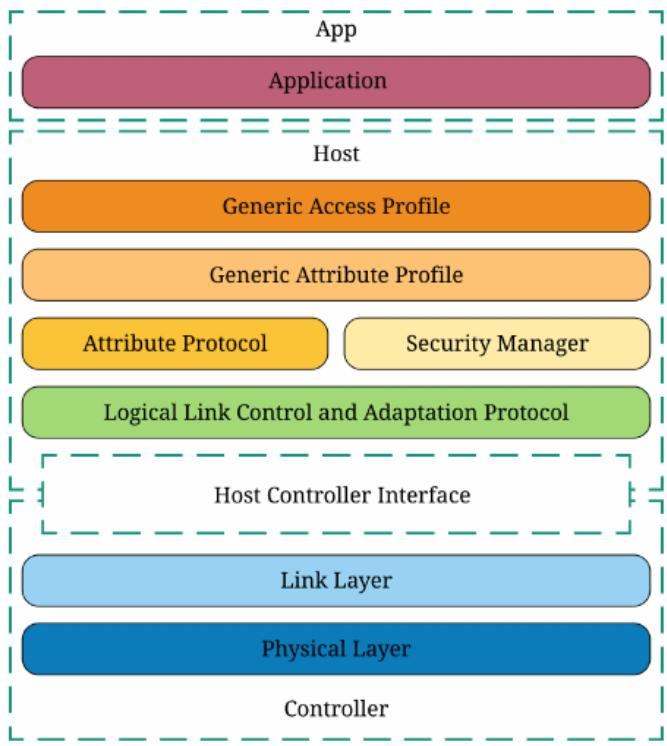
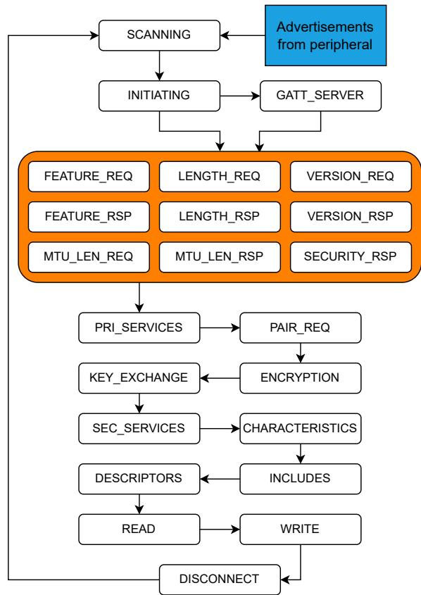
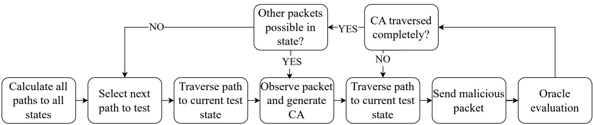
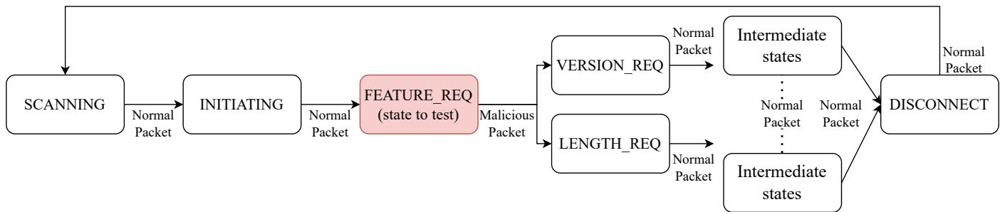
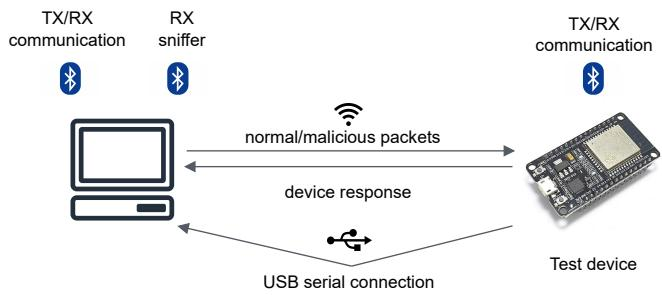

①

USENIX

THE ADVANCED COMPUTING SYSTEMS ASSOCIATION

# Bluetooth Low Energy Security Testing with Combinatorial Methods

Dominik-Philip Schreiber, Manuel Leithner, and Jovan Zivanovic, SBA Research; Dimitris E. Simos, SBA Research, Salzburg University of Applied Sciences, and Paris Lodron University of Salzburg

https://www.usenix.org/conference/atc25/presentation/schreiber

# This paper is included in the Proceedings of the 2025 USENIX Annual Technical Conference.

July 7–9, 2025 • Boston, MA, USA ISBN 978-1-939133-48-9

Open access to the Proceedings of the 2025 USENIX Annual Technical Conference is sponsored by

P-Lr.h £Es/sL.

auuuJl9 PgleU

King Abdullah University of

Science and Technology

# Bluetooth Low Energy Security Testing with Combinatorial Methods

Dominik-Philip Schreiber SBA Research

Manuel Leithner

SBA Research

Jovan Zivanovic SBA Research

Dimitris E. Simos SBA Research Salzburg University of Applied Sciences Paris Lodron University of Salzburg

## Abstract

Wireless protocols such as Bluetooth Low Energy (BLE) play a vital role in ubiquitous computing and Internet of Things (IoT) devices. Numerous vulnerabilities in a variety of devices and components of the BLE stack have been uncovered in recent years, potentially affecting millions of customers. Being notoriously difficult to test due to the level of abstraction commonly enforced by the Host Controller Interface (HCI), a recent work successfully implements a fuzzing framework utilizing a custom firmware for a BLE device. However, fuzzing is inherently probabilistic, which may lead to faults remaining undiscovered. In this work, we enhance the aforementioned method with a Combinatorial Security Testing (CST) approach that provides a guaranteed degree of input space coverage. Through an evaluation targeting 10 BLE devices and a variety of firmware versions, we identify a total of 19 distinct issues, replicating findings of the previous work and uncovering additional faults. We additionally provide a performance overview of our tool and the original fuzzer, comparing their execution time and fault detection capabilities.

## 1 Introduction

BLE [1] is a wireless transmission technology that was first introduced in Bluetooth core specification 4.0 in 2010 as a means of enabling resource constrained entities such as IoT and health care devices to communicate. Despite the similarity in name, it is a separate protocol from Bluetooth classic. According to Berua et al. [4], BLE is the most widely used protocol for IoT devices with 14.2 billion linked IoT devices in 2019. According to forecasts, by 2027, 7.6 billion Bluetooth enabled devices will be shipped annually (most of them supporting BLE and Bluetooth classic).

Because BLE targets battery powered devices with limited computational capabilities and low memory resources, the complexity of the protocol is reduced compared to classic Bluetooth. At the same time, this modification requires adaptations to implement reliable encryption and privacy measures.

Due to the widespread adoption of Bluetooth and the fact that it is used in private homes and industrial applications alike, it is important to test applications and protocol implementations in depth.

A variety of approaches have been developed to test different properties of BLE protocol implementations. One aspect of BLE that is often found to be vulnerable is the pairing procedure, especially the "just works" pairing method, which is in general vulnerable to a Man in the Middle (MITM) attack, but was also found to suffer from more severe issues [4, 33].

Other methods focusing on the underlying link layer of Bluetooth protocols have been successful in showing that the firmware controlling Bluetooth chips may harbor vulnerabilities and must be tested extensively [12, 14]. However, these methods are based on fuzzing, which is inherently probabilistic and does not offer guarantees regarding the coverage of the input space. This may lead to bugs remaining uncovered or testing processes incurring infeasibly high execution times. In order to remediate these flaws, we turn to Combinatorial Testing (CT), a black-box testing method based on a model of the input space of a system that features a guaranteed degree of coverage. We adapt the framework used in SweynTooth [14] to execute a combinatorial test set while incorporating feedback from the target BLE device to guide the selection of test cases and evaluate their success in causing unexpected behavior. Our approach features an individual input parameter model per BLE protocol layer. Test sets based on these models are subsequently combined with a granularity as chosen by the practitioner before being submitted to the System under Test (SUT), which is monitored by two separate oracles aiming to identify abnormal operating conditions.

Our primary contribution is a CT approach for security testing of BLE devices that offers a guaranteed degree of input space coverage as well as an implementation based on the GreyHound fuzzer. We further provide an experimental evaluation that confirms that the increased coverage permits testers to identify more flaws in total while pointing towards potential avenues for improvement, particularly in terms of execution time and sequence modifications. Our analysis of detected issues points towards multiple denial of service vulnerabilities as well as further faults that may ultimately lead to memory corruption and potential arbitrary code execution.

The remainder of this work is structured as follows. Section 2 provides relevant background information on BLE, combinatorial security testing, and the GreyHound fuzzer. Subsequently, Section 3 outlines the most important pieces of related work, both in the areas of BLE security testing and combinatorial testing. In Section 4, we provide a detailed description of our methodology, including the overall testing strategy, input modeling considerations, and oracles. Section 5 describes the testing setup, target devices and their firmware versions as well as practical challenges encountered throughout our experiments, followed by a discussion of evaluation results, identified faults, and the differences between the results of GreyHound and our approach in Section 6. We describe the process and results of our responsible disclosure efforts in Section 7. In Section 8, we summarize our work before moving on to a brief outline of potential avenues for future work in Section 9.

## 2 Preliminaries

This section provides background information on three particular areas that form the focus of our work: Combinatorial Security Testing, the BLE protocol stack, and the GreyHound fuzzer.

## 2.1 Combinatorial Security Testing

CT is an established black-box testing method that derives tests based on a model of the input parameters of a system under test (SUT). While the underlying concept was explored by Burr and Young in 1998 [8], it received renewed attention after a large-scale empirical study conducted by the National Institute for Standards and Technology (NIST) indicated that all analyzed software faults were triggered by a combination of up to six parameters [22]. This means that exhaustive testing of all combinations of permissible values for each input parameter is often not required to detect faults.

CT utilizes an Input Parameter Model (IPM) containing all externally supplied parameters of a SUT and a list of their possible values. It may further be enhanced with constraints that restrict which combinations of parameter values are allowed to be contained in a single test case (for example, in a test case that encodes the age and age group of a person, a possible constraint could require that if the age group is set to "child", the age must not be greater than 17). A test case assigns one of the permissible values to each of the input parameters. The coverage guarantees of CT stem from its underlying discrete mathematical structure, a Covering Array (CA). A CA is a N × k array with each of the N rows representing one test case and each of the k columns referring to a parameter. The defining property of a CA is based on an additional value t, which must be between 2 and k (the latter being equivalent to exhaustive testing) and is often referred to as the strength in the literature. For every selection of t distinct parameters (columns), a CA is guaranteed to contain every possible parameter-value combination at least once.

Compared to exhaustive testing, the main advantage of CT is a drastic reduction of test set size and thus execution time. Consider, for example, a SUT that accepts 16 binary input parameters. Exhaustively testing this system would require 216 test cases. In contrast to this, a CA with strength t = 6 requires merely 179 test cases, a reduction of around 99.997%.

In practice, applying CT usually entails the following steps:

1. Creating an IPM from a description of the SUT, source code or other type of analysis. In this work, IPMs are constructed based on the BLE specification.

2. Generating one or more CAs from the model according to a selected strength. Increasing the strength leads to a larger subset of the input space being explored while also requiring additional test cases.

3. Translating resulting CAs to concrete test sets, as some values may be encoded symbolically and must be transformed to discrete data types.

4. Executing the test cases and gathering the response of the SUT. This may simply be the output of the SUT or more complex behavioral information such as execution traces.

5. Evaluating the SUT’s behavior using an oracle to identify whether any faults occurred.

While traditional CT is a type of conformance testing, i.e. seeks to establish whether the SUT processes a wide range of inputs correctly, combinatorial security testing (CST) aims to identify vulnerabilities. This primarily influences the first and last step listed above: In conformance testing, the IPM captures valid values, while in CST, a mixture of valid values and crafted values meant to trigger vulnerabilities (commonly based on expert knowledge on the particular type of attack) is employed. For example, the latter category might encompass overly long sequences, empty values, or particular strings with a special meaning in languages such as SQL (in the context of SQL injections), shell scripts (for command injections) or JavaScript (in the context of XSS). CST additionally utilizes different types of oracles from traditional CT. While a classic CT oracle would seek to identify whether the SUT’s output is equivalent to some expected value, CST oracles aim to identify whether a vulnerability has been triggered. Although the findings of the aforementioned NIST fault analysis studies do not directly apply to CST, previous work discussed in Section 3 indicates that the coverage afforded by combinatorial test sets also leads to efficient and effective test sets for the identification of vulnerabilities.

## 2.2 Bluetooth Low Energy

Bluetooth Low Energy [1] is one of the most widely used communication protocols for IoT devices [4]. It is managed by the Bluetooth Special Interest Group (SIG), consisting of more than 20,000 members, in version 5.6. It operates in the license free 2.4GHz industrial, scientific and medical (ISM) band and is a nearly completely separate protocol from Bluetooth basic rate (BR) and enhanced data rate (EDR). To avoid congestion and collisions, BLE uses Adaptive Frequency Hopping (AFH) to hop between 40 channels (3 advertisement channels, 37 data channels). A BLE network consists of one central device providing a clock and frequency hopping pattern and one or more peripheral devices.

  
Figure 1: Bluetooth Low Energy stack layers [4]

The BLE stack consists of several protocol layers that interact with each other, each responsible for a different set of functionalities, depicted in Figure 1.

The Host Controller Interface (HCI) represents an isolation layer between lower-layer protocols (Baseband, LMP) and higher-layer protocols (L2CAP, ATT, GATT, GAP, etc.). Higher-layer protocols run on the host operating system, while lower-layer protocols run on a separate hardware called controller, which receives HCI packets from the host that are transformed into appropriate Baseband or LMP packets. The controller also handles timing requirements and checksum calculations. This isolation between components and the inability to access all aspects of the protocol is one of the reasons why the Bluetooth protocol stack is difficult to test.

## 2.3 GreyHound Fuzzer

Originally, the GreyHound fuzzer framework was developed for testing WiFi protocol implementations [13]. Later, the authors added models for BLE [14] and Bluetooth classic [12], to extend the compatibility of their fuzzer. As our testing approach is built on the GreyHound fuzzer framework, especially its BLE communication functionality, we provide a brief introduction of the hardware and software aspects of this tool in the following paragraphs.

The goal of the GreyHound developers was to find vulnerabilities in BLE protocol implementations [1] and to manipulate and test all their layers. Standards compliant firmware implementations for certified Bluetooth adapters provide only limited access to the inner protocol layers, since they are only accessible through the HCI. The GreyHound fuzzer framework thus utilizes a NRF52840 dongle1 running a custom firmware implemented in C++ and communicates with it using a USB serial connection. This allows for the use of Python in conjunction with an extension of the scapy [27] framework to craft and dissect arbitrary BLE packets, which are then sent to the dongle. The custom firmware takes care of timing constraints and the CRC calculation and sends the final packet over the air. Contrary to standard HCI implementations, the custom firmware on the dongle provides an unconstrained interface to send raw BLE packets.

The software part of the framework running on the host was implemented using Python 2.7. The framework also includes a state machine, which can initiate the sending of packets and responds according to responses received from BLE peripheral devices. A simplified version of the BLE state machine can be seen in Figure 2. To be compatible with different BLE implementations, the state machine allows for multiple possible paths, since the BLE specification leaves the exact sequence of some interactions open to developers. Because of this, the states depicted in the orange box in Figure 2 can vary in order, depending on the implementation and functionality of the peripheral device.

The state machine starts in the scanning state and waits for advertisements from the peripheral. When receiving an advertisement, the central proceeds to the initiating state, wherein a connection request is sent to initiate a connection to the peripheral. Now the peripheral can either request GATT services from the central with the central continuing to the gatt\_server state, or the central and peripheral exchange information about supported features and properties, traversing the states in the orange box in arbitrary order. Subsequently, the central continues on the path after the orange box, negotiating pairing method, exchanging security parameters and keys and finally reading and writing to the GATT services of the peripheral. Finally, if no issues occurred, the central arrives in the disconnect state, where it sends a disconnect message to the peripheral and returns to the initial scanning state, waiting for advertisements from the peripheral.

  
Figure 2: Simplified overview of the BLE state machine [14]. Loops and restrictions regarding state order are omitted.

Additionally, the GreyHound framework features a fuzzing component that uses the particle swarm optimization (PSO) algorithm of the pyGMO [19] library to guide the probability optimization. The fuzzer module contains two different models, one for WIFI and one for BLE. For every state, the models define what layers a received packet is allowed to contain, which layers of a packet should be fuzzed, what kind of field value mutator should be used for the individual layers and the probability of the individual fields being fuzzed. Initially, all fields and all layers are equally likely to be fuzzed, as long as they are contained in the list of fuzzable layers for that state.

If a field of a layer is selected to be fuzzed, one of the specified mutators is chosen by probability and applied to the field value. The mutator can be either:

• Random byte: The field value is replaced by a randomly generated value.

• Zero filling: The field value is replaced with zeros.

• Bit setting: The most significant bit of every byte is set to zero.

After each iteration through the state machine, the PSO algorithm adjusts the probabilities of the fuzzing model depending on a cost function and which parameters have been fuzzed before. The GreyHound authors wanted to optimize the number of unique anomalies found in a session, which is also chosen as the cost function. For more details of the BLE protocol and its inner workings, we refer the interested reader to the original work [14].

## 3 Related Work

Due to its popularity, threats to the security and privacy of classic Bluetooth and Bluetooth Low Energy have been studied extensively [4, 9]. Over the years, a variety of vulnerabilities have been discovered [2, 3, 5, 6, 32], often affecting millions of devices. Their impact ranges from simple denial of service attacks to remote code execution or authentication bypasses. Most commonly, finding such vulnerabilities requires significant manual effort such as reverse engineering, code inspection or modification of the source code.

The most closely related work is a more automated BLE fuzz testing approach [14] mentioned in the previous Section, which allows the testing of all layers of the protocol down to the link layer. In addition to custom firmware for the NRF52840 dongle, they constructed a state machine for BLE to utilize as part of a fuzzer guided through probability optimization. This allows for automated testing of peripheral devices with either closed source firmware or BLE development boards, which can be programmed with example applications provided by the vendor of the peripheral chip or other custom implementations. Using this approach, the authors identified 17 previously unknown security vulnerabilities (summarily dubbed SweynTooth by the researchers) in the firmware of various BLE controllers. The number of discovered flaws demonstrates the effectiveness of this method, which is further strengthened by the fact that the tool does not need to have access to the source code of the peripheral to test. At the same time, the probabilistic nature of fuzzing may lead to vulnerabilities remaining undiscovered despite extensive testing. This work aims to overcome this restriction through the use of CST methods.

A later work by the same group targets classic Bluetooth devices [12]. This approach is capable of inferring the state machine during execution and features a fuzzer and testing framework similar to their prior work. Instead of using the NRF528400 dongle, which only supports BLE, this research utilizes a ESP322 controller.

The use of combinatorial testing in the context of security testing is not new [29]. CST has been successfully used to evaluate web applications with the goal of identifying XSS vulnerabilities [7,23,28] and SQL injections [16,31]. In terms of protocols, prior research attention seems to be focused primarily on TLS. Existing approaches target both X.509 certificate parsers [21, 24] and the flow of protocol messages as well as their contents [15, 30]. While there exist works that aim to identify flaws in IoT devices using CST methods [16, 17], they tend to take a more high-level approach than our contribution, targeting e.g. HTTP REST services instead of lower level protocols.

  
Figure 3: Overview of combinatorial testing strategy.

## 4 Methodology

This section presents the methodology of our work, including the overall testing strategy, input modeling aspects, CA generation processes and oracles.

Taking into account the considerable success achieved by the authors of the GreyHound fuzzer framework while considering the fundamental drawbacks arising from fuzzing’s probabilistic nature, we set out to explore the feasibility of applying CST to generate test cases for BLE implementations. CST has previously been used to perform security testing of TLS implementations [30], but the added complexity of BLE and its interconnected layers requires a more intricate approach. Our work builds upon the aforementioned fuzzing framework, but completely replaces the guided fuzzing component with combinatorial test generation. While this step necessitates the creation of additional models and oracles, our work aims to evaluate whether the guaranteed degree of input space coverage provided by CT leads to the discovery of additional vulnerabilities or bugs.

## 4.1 Testing Strategy

The original GreyHound fuzzing component traverses the state machine visualized in Figure 2 in an unordered way, guided by probability. In a CST setting, we want to traverse the state machine in a more structured way to ensure that all valid paths (see below) are covered. A simplified overview of our testing strategy is provided in Figure 3, the details of which are discussed in the following paragraphs.

We start by generating a set of all possible paths to every state from the state machine. Subsequently, one path from the set is selected (the exact order is not relevant to our approach, although paths to states closer to the initial state are processed first in our implementation) and we mark all transitions in this path as permissible to traverse by the GreyHound framework. In addition, all transitions that lead to retransmissions and those triggered by timeouts are marked as permitted. The final state of the chosen path is the current state to test. Additionally, we mark all transitions that originate from the current state to test as permitted.

If the current state to test is reachable via this path (which may not always be permitted by the specific SUT), the current path is marked as valid. Invalid paths are currently not tested in our approach, as they are unreachable.

If the path is valid, the next BLE packet that is about to be sent (indicated by the GreyHound framework) is analysed to determine which layers the packet consists of. This packet is the current packet to test. The CST component of our implementation then generates one CA for each of the layers of the current packet to test as well as a meta CA combining these layers, which is used for further testing. Each row in the nested CA represents a test case and contains values for the individual fields of the current packet to test. Details of the CA generation method are given in Section 4.3.

Whenever we reach the current state to test after this point, we select a previously unused row in the CA and change the values of the current packet layers according to the values in the row of the CA in order to create a modified packet which is then transmitted to the SUT. We then continue to send unmodified packets again until an error occurs or we reach the initial state (the scanning state) again, which marks the end of the test. Figure 4 shows an example where the FEATURE\_REQ state is selected as the current state to test. Unmodified packets (denoted as Normal Packet) are transmitted to traverse between all states except for the transition from the state to test to the next state. To traverse further from the state to test, a modified packet is sent, which contains invalid values and is denoted as Malicious Packet.

When we reach the end of the CA, we check if there are further outgoing transitions from the current state to itself (i.e. loops). If yes, we generate a new CA for the corresponding packet and proceed as before. Otherwise we continue with another path until all paths to all valid states have been tested.

  
Figure 4: Example testing flow.

## 4.2 Input Modeling

To generate CAs for testing, we first need to create a model of the input space. This tends to be one of the more challenging tasks in the context of CT, as it commonly requires manual effort to identify all parameters and suitable values.

In this work, we view a BLE packet as a composite system of these layers, with each layer being a component. We utilize the model of layers and their respective fields (which represent our parameters) encoded in the BLE scapy extension contained in the GreyHound framework implementation [14]. For each such field/parameter, we require a set of possible values. To this end, we analyze the source code of the GreyHound framework as well as the BLE specification [1] while considering boundary values [26] of different value ranges. Additionally, we add the symbolic values "LARGER", "SMALLER" or "UNCHANGED" to the parameter values. When applying rows containing these values to a packet, we increment, decrement, or leave unmodified the current value of a field in the original packet. A further symbolic value "RECALCULATE" is added to length parameters and leads to the length value being recalculated based on the current content of the packet.

One individual IPM is constructed for each layer of the BLE protocol. CAs tend to rapidly grow in size when the number of permitted values for a paramater becomes too large. By utilizing multiple smaller models, this effect can be limited, although this slightly reduces overall combinatorial coverage. An example of an IPM for a BLE data layer is shown in Listing 1.

Listing 1: Example of an IPM for a BLE data layer.

BTLE\_DATA\_IPM = {   
’LLID’: ["\~0", "\~1", "\~2", "\~3", "UNCHANGED"],   
’SN’: ["\~0", "\~1", "UNCHANGED"],   
’NESN’: ["\~0", "\~1", "UNCHANGED"],   
’MD’: ["\~0", "\~1", "UNCHANGED"],   
’RFU’: ["\~0", "\~1", "UNCHANGED"],   
’len’: ["\~0x00", "RECALCULATE", "\~LARGER", "\~SMALLER",   
"\~0xff"]   
}

Care must be taken when encoding invalid values for a particular parameter, i.e., values that are not generally permitted to be used for a field. In a process called negative value testing by the authors of PICT [11], it is favorable that only a maximum of one such value be present in a row in the CA. The reasoning behind this choice is that faults or other effects triggered by the presence of an invalid value may mask the effects of additional invalid values. In PICT, it is possible to encode such values by prefixing them with the "∼" symbol.

## 4.3 Covering Array Generation

The CA generation occurs dynamically during the execution of our CST method. As mentioned in the previous section, we view BLE packets as composite systems, with the layers modeled as subcomponents. To this end, we turn towards a method developed by Kampel et al. [20] that targets composed software systems. Subcomponents are modeled separately, as we have done for the individual packet layers as described in Section 4.2. Using these layer IPMs, so-called seed arrays are constructed (in this work, we selected strength t = 2 for all such CAs), the rows of which are subsequently combined based on a meta CA to obtain a resulting combined CA.

To illustrate this approach, we provide an excerpt of three layer IPMs in Listing 2 and the first rows of the resulting seed CAs in comma-separated values (CSV) format in Listing 3. The following paragraphs provide further details on the subsequent steps.

Listing 2: Excerpts of three IPMs used to generate seed CAs

BTLE\_IPM = {   
’access\_addr’: ["UNCHANGED", "\~0x8e89bed6", "\~0xffffffff",   
"\~0x00000000"],   
’crc’: ["UNCHANGED"]   
}   
BTLE\_DATA\_IPM = {   
’LLID’: ["\~0", "\~1", "\~2", "\~3", "UNCHANGED"],   
’SN’: ["\~0", "\~1", "UNCHANGED"],   
’NESN’: ["\~0", "\~1", "UNCHANGED"]   
}   
BTLE\_EMPTY\_PDU\_IPM = {   
’LLID’: ["UNCHANGED", "\~0", "\~1", "\~2", "\~3"],   
’Length’: ["\~0x00", "RECALCULATE", "\~LARGER",   
"\~SMALLER", "\~0xff"]   
}

Listing 3: Excerpts of three seed CAs  
```csv
access_addr,crc
UNCHANGED,UNCHANGED
~0x8e89bed6,UNCHANGED
~0xffffffff,UNCHANGED
LLID,SN,NESN
~0,UNCHANGED,UNCHANGED
UNCHANGED,~0,UNCHANGED
UNCHANGED,UNCHANGED,UNCHANGED
LLID,Length
UNCHANGED,~0x00
UNCHANGED,RECALCULATE
UNCHANGED,~LARGER
~0,RECALCULATE
~2,RECALCULATE
```

At this point, we have obtained an assembly of layer/seed CAs, which provide t = 2 coverage for the subcomponents of the composite system. Those seed arrays now have to be combined into a single array. To this end, we first determine the number of rows in each of the seed CAs (in the example above, the first two array excerpts have three rows, while the final array has five rows). Using this information, a meta IPM is constructed wherein each parameter represents a layer CA and takes values between 1 and the number of rows. Indices that refer to rows in the layer CA containing negative values are additionally prefixed with the "∼" symbol in order to prevent masking effects across layers. Listing 4 shows the meta IPM resulting from the sample seed arrays in Listing 3.

Listing 4: Example meta IPM  
```awk
META_IPM = {
’BTLE_ROWS’: ["0", "~1", "~2"],
’BTLE_DATA_ROWS’: ["~0", "~1", "2"],
’BTLE_EMPTY_PDU_ROWS’: ["~0", "1", "~2", "~3", "~4"]
}
```

This meta IPM is subsequently used to generate a meta CA at strength t = 2, each row of which references a single row in each of the layer CAs. The meta CA then covers all t = 2 combinations of rows from the seed CAs that represent the layers of the current packet. Listing 5 shows an excerpt of a meta CA for our running example.

Listing 5: Excerpt of example meta CA  
```csv
BTLE_ROWS,BTLE_DATA_ROWS,BTLE_EMPTY_PDU_ROWS
0,~1,1
~1,2,1
0,2,~2
0,2,~3
0,2,~4
```

By combining the contents of these referenced rows, we obtain a single combined CA that is suitable to be used in our testing flow as described above. Listing 6 shows the first three rows resulting from combining the seed CAs according to the meta CA given in Listing 5. The resulting CA offers not only guaranteed input space coverage within each layer, but also across layers, to a degree that can be adjusted by increasing the strength (at the cost of larger test sets and thus additional execution time).

Listing 6: Excerpt of resulting combined CA  
```csv
BTLE_access_addr,BTLE_crc,BTLE_DATA_LLID,BTLE_DATA_SN,
,→ BTLE_DATA_NESN,BTLE_EMPTY_PDU_LLID,
,→ BTLE_EMPTY_PDU_Length
UNCHANGED,UNCHANGED,UNCHANGED,~0,UNCHANGED,
UNCHANGED,RECALCULATE
~0x8e89bed6,UNCHANGED,UNCHANGED,UNCHANGED,
,→ UNCHANGED,UNCHANGED,RECALCULATE
UNCHANGED,UNCHANGED,UNCHANGED,UNCHANGED,
,→ UNCHANGED,UNCHANGED,~LARGER
```

## 4.4 Oracles

In order to determine whether the crafted inputs submitted by our approach crashed the SUT, we implement two oracles. The first uses a secondary NRF52840 dongle with the custom GreyHound firmware to receive packets sent by the peripheral device SUT. If no packets are detected for over a second, the oracle marks the test as failed; if the initial state is reached without such a timeout, the test is deemed a success. This oracle aims to detect situations in which the peripheral device becomes unreachable for a longer period than usual. In this case, the peripheral might reboot itself, becoming responsive again after a few seconds, but could also end up in a state in which it requires a manual reboot by cycling the power provided via USB (see Section 5).

Since most development boards we tested have a serial port available, we decided to use it for an additional oracle. If the device under test has a serial port, we connect to it and listen for output from the peripheral device. The received serial output is checked for specific keywords such as "trace", "crash" and "dump". If one of those words is detected, the oracle marks the test as failed.

The first oracle is generally usable for every BLE device. However, the generality of the approach is also a potential problem, since it can lead to false positives if the device merely requires more time than usual to enable advertisements again after a disconnect event.

The second oracle is less general, requiring the device under test to have a serial port and additionally assumes that there is debug output containing specific keywords. Most toolchains of the devices we tested provide settings to enable debug output, which lead to the devices giving more detailed information over the serial connection. During our experiments, we only encountered one device that did not produce serial output.

The oracles we developed are capable of identifying crashes that either lead to a recognizable crash dump being transmitted via a serial port or to prolonged inactivity of BLE transmissions of the SUT. False negatives may occur if the SUT exhibits incorrect behaviour due to received packets but does not become unresponsive and does not output a crash dump (or outputs it in a manner that is recognized by our oracle). Examples of such cases could be that the peripheral accepts an encryption key that is set to only zeros, which would compromise the privacy of the data exchange, or scenarios in which the peripheral accepts invalid authentication parameters, giving an attacker access to its services.

<table><tr><td>SoC Vendor</td><td>SoC Model</td><td>SDK Versions</td><td> Sample App</td></tr><tr><td>Texas Instruments</td><td>CC2640R2</td><td>3.30.00.20, 5.30.00.03</td><td> project zero</td></tr><tr><td>Espressif Systems</td><td>ESP32</td><td>4.1, 5.0</td><td>nimble/bleprphrl</td></tr><tr><td>Nordic Semiconductors</td><td>nRF52</td><td>15.3.0, 17.0.1</td><td>ble_app_gatts_c</td></tr><tr><td>Bouffalolab</td><td>bl602</td><td>AI-Thinker WB2 beta v1.1.8</td><td>ble_slave</td></tr><tr><td>WCH</td><td>CH582M</td><td>MounRiver Studio community v1.50</td><td>Peripheral</td></tr><tr><td>Hi-Link</td><td>W801</td><td>a93b517</td><td>wm_ble_client_api_multi_conn_demo</td></tr><tr><td>Realtek</td><td>RTL8720DN</td><td>Realtek Ameba Boards 3.1.6</td><td>BLEBatteryService</td></tr><tr><td>Silicon Labs</td><td>BG22</td><td> simplicity studio SV5.7.1.1</td><td>bluetooth_controlling_led_from_smartphone</td></tr><tr><td>Ambiq</td><td>Apollo3</td><td>sparkfun apollo3 boards v2.2.1</td><td>LED_Button</td></tr><tr><td>MacroGiga Electronics</td><td>MG126</td><td> seeed SAMD boards 1.8.4</td><td>analog_output</td></tr></table>

Table 1: Tested devices and software versions.

False positives of our first oracle that listens for transmitted packets of the peripheral could occur if the oracle dongle itself crashes, which is trivial to detect, or the SUT takes significantly longer than expected to transmit packets, which is arguably a denial-of-service condition by itself. False positives of the second oracle, which monitors the SUT’s serial output, could occur if the SUT’s output contains certain keywords indicating a crash dump without actually having crashed.

To exclude these cases, we constructed automated reproducer scripts for all identified issues, removing cases that did not reliably lead to an unreachable SUT and thus eliminating false positives before reporting them to affected vendors.

## 5 Setup

Our test setup consists of two NRF52840 dongles running the custom firmware of the GreyHound framework and a laptop running Ubuntu 22.0.4 as the host. The dongles are connected to the host via USB, with one being used for sending and receiving BLE packets from the peripheral device under test, while the other passively listens for packets transmitted by the peripheral device, thus acting as one of the test oracles. Figure 5 depicts a simplified version of our setup.

Submitted test cases and their results are stored in a MongoDB instance. A database entry consists of the CA row used for the test, the packet history recorded during the test, the first received response after the test, the results of both oracles, as well as the current state and path to test. Additionally, we store messages received via the serial port of the BLE peripheral device for post-analysis.

  
Figure 5: Overview of the test setup.

During testing, we encountered issues with hardware reliability. Some of the evaluated BLE peripheral devices as well as the NRF52840 dongle used for BLE communication crashed or became unresponsive at times, possibly due to race conditions, since we could not reliably reproduce them. We thus implement an automated way of resetting the power to the devices based on relays that interrupt the USB power supply for a few seconds. These relays are controlled via an ESP32 micro-controller that can be communicated with using a REST API. By power cycling the USB devices in this manner, we can reliably reset them to a working and responsive state and repeat the test. Because of the sending dongle occasionally becoming unresponsive, we used a separate receiving dongle as oracle to prevent false positive results in these cases. A test is only logged if a malicious packet was actually sent. Otherwise, the USB devices are reset and the test is repeated.

As the evaluated devices exhibit wide variations in their performance, commonly requiring more than a day to execute a full test set, we parallelize our setup by replicating it four times in total (i.e. using four host computers, each hosting a SUT device and two NRF52840 dongles).

## 5.1 Target Devices

As we wanted to test the BLE stack implementation of different BLE chips, we needed to source a variety of BLE chips, preferably integrated in development boards. Development boards typically provide easy access to the input and output pins of the chip and ship in a plug-and-play package, integrating the necessary circuitry around the chip such as power supply and serial connections. We further included chips that had previously been tested using the GreyHound fuzzer in order to make a performance comparison. For these devices, we additionally evaluated firmware versions that were newer than those analyzed in the earlier work in order to identify whether the issues that were published as part of the Sweyn-Tooth set of vulnerabilities had been successfully remediated. Table 1 shows details of the SDKs and sample applications of the chips we tested.

## 5.2 Challenges

In addition to the previously mentioned issue of SUTs and dongles becoming unresponsive or crashing, we encountered specific challenges when testing certain devices.

Most notably, the Arduino SDKs of the Apollo3 and MG126 chips were still under development at the time of writing, with their BLE implementations remaining incomplete. This resulted in some unexpected behaviour during testing; devices did not traverse the complete state machine when they reached a state that requires functionality that was not yet implemented, leading to the low number of executed tests shown in Table 2.

For some devices (i.e. ch582m and w801), the onboard USB connectivity was only suitable for flashing new firmware, while capturing the serial output required an additional adapter. In these cases, we utilized an FT232RL USB to serial adapter to enable the use of our second oracle.

In other cases, the testing process was extremely slow due to some states not being reliably reachable via certain paths. This occurred while testing the MG126, CC2640R2 and ESP32 chips. Throughout our experiments, we implemented a routine that identified when paths did not reach the state to test for the last 400 seconds and excluded them from our results, instead proceeding with the next available path.

## 6 Evaluation

Due to the instability of some of the tested devices, we validated test cases that were marked as failed by either of our oracles using a simple reproducer script that replays the same inputs and records the results. Only those test cases that were deemed reproducible (and therefore not false positives) were selected for further analysis. The following sections present the analyzed results and compare them to those of the previous work based on fuzzing [14].

## 6.1 Results

While executing the tests, we witnessed crashes and availability issues in most of the devices we tested. Table 2 shows a summary of the reproducible unique faults we encountered in the individual chips and their respective SDK versions. We consider a fault to be unique if the fields/parameters that trigger it have not been identified as part of the trigger of another fault or if the values of overlapping fields/parameters are considered to be semantically different according to the BLE specification or an expert security analyst’s opinion (e.g. if a length field’s value changes from 1317 to 1318, it would commonly not be considered to be semantically different, while a difference in the packet’s TYPE code would indicate a separate fault). The column TO (short for timeout) lists the number of test cases that led to the SUT becoming unresponsive for at least four seconds, but returning to normal operation after at most two minutes without requiring further intervention. The column URWF (Unavailable but Recoverable With Code Fix) details the number of cases where a SUT became unresponsive and required a restart when using the unmodified example code. In these cases, the BLE stack was still properly responding to GAP (General Access Profile) and HCI (Host Controller Interface) commands from the application and despite advertisements not being re-enabled automatically, it was possible to modify the application code to reactivate them. The column URN (Unavailable Reset Needed) shows the number of cases in which the SUT became unavailable after receiving a malicious packet and required a reset to function again. When trying to modify the example code to reactivate advertisements in these cases, the BLE functions returned error codes or behaved unexpectedly. Finally, the column Dump shows how often a core dump was sent from the SUT to the host PC via serial connection, followed by a restart of the SUT.

Most timeouts and unavailability issues occurred in the initiating state, after a connection request with invalid parameters (i.e. a malicious packet) was sent to the peripheral device. An example of such a packet is given in Listing 7, with the invalid value being 0x00000000 for the access address (AA) field, a parameter used for handling collisions between peers sharing the same physical radio channel. When sending such a packet to an ESP32 flashed with the bleprphrl example application in SDK version 5.0, the BLE stack of the ES32 logs a connection event despite the central not being connected. Because the slave is in a state that indicates that a valid connection has been established, advertisements are not enabled again, which renders the device unusable until the device is reset. Additionally, when trying to re-enable advertisements manually, the following error is logged: "error enabling advertisement; rc=6 (BLE\_ERR\_PINKEY\_MISSING=)". However, a missing PIN error is not consistent with this state in the BLE protocol and can not occur at this point under normal circumstances. This behavior suggests that the BLE stack is in unknown state and currently malfunctioning. When sending the same packet to an ESP32 flashed with the same application in version 4.1, trying to manually re-enable advertisements leads to HCI desync errors and eventually a core dump with controller restart, which indicates an issue with memory management.

<table><tr><td>Model</td><td>Version</td><td>TO</td><td>URWF</td><td>URN</td><td>Dump</td><td>Total</td></tr><tr><td rowspan="2">CC2640R2</td><td>3.30.00.20</td><td>1</td><td>4</td><td>0</td><td>0</td><td>1,309</td></tr><tr><td>5.30.00.03</td><td>0</td><td>3</td><td>0</td><td>0</td><td>1,188</td></tr><tr><td rowspan="2">ESP32</td><td>4.1</td><td>0</td><td>0</td><td>1</td><td>1</td><td>2,115</td></tr><tr><td>5.0</td><td>0</td><td>0</td><td>2</td><td>0</td><td>1,910</td></tr><tr><td rowspan="2">nRF52</td><td>15.3.0</td><td>0</td><td>0</td><td>0</td><td>0</td><td>1,309</td></tr><tr><td>17.0.1</td><td>0</td><td>0</td><td>0</td><td>0</td><td>1,309</td></tr><tr><td>bl602</td><td>AI-Thinker WB2 beta v1.1.8</td><td>0</td><td>0</td><td>1</td><td>1</td><td>2,985</td></tr><tr><td>CH582M</td><td>MounRiver Studio community v1.50</td><td>0</td><td>0</td><td>0</td><td>0</td><td>1,184</td></tr><tr><td>W801</td><td>a93b517</td><td>0</td><td>0</td><td>1</td><td>0</td><td>1,132</td></tr><tr><td>RTL8720DN</td><td>Realtek Ameba Boards 3.1.6</td><td>4</td><td>0</td><td>1</td><td>0</td><td>2.664</td></tr><tr><td>BG22</td><td>simplicity studio v5.7.1.1</td><td>0</td><td>0</td><td>0</td><td>0</td><td>1,282</td></tr><tr><td>Apollo3</td><td>sparkfun apollo3 boards v2.2.1</td><td>0</td><td>0</td><td>1</td><td>0</td><td>594</td></tr><tr><td>MG126</td><td>seeed SAMD boards 1.8.4</td><td>2</td><td>0</td><td>0</td><td>0</td><td>373</td></tr></table>

Table 2: Identified unique faults per device and software version. The column TO refers to the number of Timeouts, URWF to Unavailable but Recoverable With Code Fix, URN means Unavailable Reset Needed, and Dump indicates a crash dump output by the SUT. The Total column lists the number of executed test cases. Three issues identified in the old version of the CC2640R2 were still present in the later version. For ESP32, one issue was fixed in version 5.0, but a new URN was introduced. In total, 19 unique faults were identified.

Listing 7: Example of a malicious packet  
```ini
###[ BT4LE ]###
access_addr= 0x8e89bed6
crc = None
###[ BTLE advertising header ]###
RxAdd = public
TxAdd = public
RFU = 0
PDU_type = CONNECT_REQ
unused = 0
Length = None
###[ BTLE connect request ]###
InitA = EB:BC:B4:85:A8:B2
AdvA = 30:ae:a4:87:9e:de
AA = 0x00000000
crc_init = 0x179a9c
win_size = 0x2
win_offset= 0x1
interval = 0x10
latency = 0x0
timeout = 0x64
chM = 0x1fffffffff
SCA = 0
hop = 5
```

The core dump issued by the bl602 chip was triggered in the length request state, which is part of the initial central peripheral setup procedure and requires the field max\_rx\_bytes to be set to 0. The Apollo3 exclusively became unresponsive in the pairing request state, after sending a malicious pairing request to the peripheral device, containing an invalid value for the authentication method.

In addition to the quantitative assessment, we also used the available JTAG ports on the individual SUTs to gather more insight into the identified errors. The results of our analysis indicate that most errors lead to similar behavior. After receiving a malicious connection request, the peripheral devices fail to correctly validate the connection parameters and process the packet as a valid connection request. Since at least one of the parameters is not valid, the BLE central can not communicate with the peripheral device anymore, while the peripheral device is stuck waiting for events from the BLE stack. In this state, the peripheral devices are practically unusable until they are reset, as there is no valid connection established and other devices can not discover them because advertisements can not be re-enabled. The exact impact varies by SUT depending on the field and value of the malicious packet. This is manifested by BLE functions returning different error codes when trying to reactivate advertisements and the sequence of GAP events.

According to the specification, BLE implementations should follow the rule EffectiveConnectionInterval = ConnectionInterval \* (1 + Slave Latency) [18], and EffectiveConnectionInterval must not exceed a maximum of 16 seconds if no packets are received. In our tests, most devices did not drop the connection or were not able to reactivate advertisements after receiving a malicious packet. Simultaneously, applications received a reduced number of GAP events from the BLE stack compared to normal connections. This could indicate an issue in the parameter validation and state transition of the GAP implementation, which could also lead to further corruption of the BLE stack when invalid parameters are processed. The MG126 and RTL8720DN were the only devices that were able to automatically recover in some of these cases; they were, however, often unreachable for over a minute, meaning that these inputs led to Denial of Service (DoS) conditions.

<table><tr><td colspan="2"></td><td colspan="2">Tests</td><td colspan="2">Issues</td><td rowspan="2">Anomalies GH</td></tr><tr><td>Model</td><td>Version</td><td>GH</td><td>CST</td><td>GH</td><td>CST</td></tr><tr><td>CC2640R2</td><td>5.30.00.03</td><td>2,129</td><td>1,188</td><td>0</td><td>3</td><td>0</td></tr><tr><td>ESP32</td><td>5.0</td><td>5,979</td><td>1,910</td><td>0</td><td>2</td><td>1</td></tr><tr><td>nRF52</td><td>17.0.1</td><td>8,790</td><td>1,309</td><td>0</td><td>0</td><td>1</td></tr><tr><td>bl602</td><td>AI-Thinker WB2 beta v1.1.8</td><td>7,233</td><td>2,985</td><td>1</td><td>2</td><td>2</td></tr><tr><td>CH582M</td><td>MounRiver Studio community v1.50</td><td>4,237</td><td>1,184</td><td>0</td><td>0</td><td>2</td></tr><tr><td>W801</td><td>a93b517</td><td>879</td><td>1,132</td><td>0</td><td>1</td><td>1</td></tr><tr><td>RTL8720DN</td><td>Realtek Ameba Boards 3.1.6</td><td>10,153</td><td>2,664</td><td>0</td><td>5</td><td>2</td></tr><tr><td>BG22</td><td>simplicity studio v5.7.1.1</td><td>8,016</td><td>1,282</td><td>0</td><td>0</td><td>0</td></tr><tr><td>Apollo3</td><td>sparkfun apollo3 boards v2.2.1</td><td>7,935</td><td>594</td><td>1</td><td>1</td><td>0</td></tr><tr><td>MG126</td><td>seeed SAMD boards 1.8.4</td><td>9,993</td><td>373</td><td>0</td><td>2</td><td>0</td></tr></table>

Table 3: Comparison of combinatorial security testing (CST) versus GreyHound (GH) fuzzer on current SDK versions. The smallest number of tests for a particular SUT as well as the greatest number of identified issues is highlighted in bold. As discussed in Section 6.2, anomalies are not assessed by the CST approach.

Most of the identified faults manifest themselves as timeouts and may be exploited to perform DoS attacks. They are either caused by the device firmware itself or the example application executed on the SUT. Inputs leading to devices transmitting core dumps indicate memory access violations, which may be exploited to gain control over the SUT or leak cryptographic key material or other secrets.

## 6.2 Comparison

To evaluate the performance of our combinatorial testing approach, we executed the fuzzer as used in the original work [14] against our suite of SUTs. The effectiveness of fuzzing partially depends on the available execution time. As the maximum time required to test a SUT with our approach was just under one day, we ran the fuzzer for 24 hours and then compared its output to that of our method. A summary of the results is given in Table 3.

The oracle of the GreyHound fuzzer not only checks for timeouts and crashes (listed under Issues), but also for deviations from the BLE specification (e.g. BLE devices responding to packets in states in which they should not or accepting invalid packets), which the authors call anomalies. Unfortunately, manual analysis indicates that this oracle produces a significant number of false positives. We thus relied on the oracles described in Section 4.4 and opted to not assess anomalies for our approach, leading to their absence from Table 3. Furthermore, due to the aforementioned reliability issues, we created a script that aims to replay inputs indicated by the GreyHound fuzzer as leading to faults and excluded those that were not reproducible.

The column Tests indicates the total number of test cases executed. While the execution rate of the fuzzer is higher than that of our approach (often caused by the time required to identify unreliable paths as noted in Section 5.2), it proved unreliable for some devices such as the W801, leading to a lower number of iterations. Additionally, the NRF52 dongle became unstable at times; while our approach implements a reset functionality (see Section 5), the original work does not include this feature.

Overall, the CST approach presented in this work identified more faults than the GreyHound fuzzer in current firmware versions, but did not find any anomalies.

## Re-testing

The original work identified several issues that the authors subsequently communicated to vendors. The aforementioned results indicate that most of these bugs have been addressed in current firmware versions. To provide a comparison that is closer to the circumstances of the earlier work, we re-tested some of the devices using old versions offered by vendors.

Table 4 summarizes the results of our approach compared to the results reported by the original work, which always reported results for 1,000 tests. While our method identifies a greater total number of faults, results vary across different devices and types of triggers; most notably, our approach currently makes no attempt to alter the sequence of protocol messages, while the GreyHound fuzzer does offer this functionality. Accordingly, we were unable to identify some of the faults found by the earlier work.

For the ESP32 SUT, one of the identified issues overlaps with the earlier work (the device crashes when receiving a connection request with the chM parameter set to 0), while the second fault found using GreyHound relies on an alteration of

the sequence. In contrast, the second issue identified by our approach is triggered merely through message parameters.
<table><tr><td></td><td></td><td colspan="2">Tests</td><td colspan="2">Issues</td><td>Anomalies</td></tr><tr><td>Model</td><td>Version</td><td>GH</td><td>CST</td><td>GH</td><td>CST</td><td>GH</td></tr><tr><td>CC2640R2</td><td>3.30.00.20</td><td>1,000</td><td>1,309</td><td>2</td><td>5</td><td>1</td></tr><tr><td>ESP32</td><td>4.1</td><td>1,000</td><td>2,115</td><td>2</td><td>2</td><td>0</td></tr><tr><td>nRF52</td><td>15.3.0</td><td>1,000</td><td>1,309</td><td>0</td><td>0</td><td>1</td></tr></table>

Table 4: Comparison of CST versus GreyHound (GH) fuzzer applied to old firmware versions.

## 6.3 Lessons Learned

Applying CST to a complex protocol such as BLE occasionally proved challenging, which led us to adapt our models. Earlier models that did not contain markers for invalid values were sometimes unable to detect errors that required only a single value to be triggered due to masking effects. An interesting observation is that all errors identified through our approach only required one parameter to assume a specific value (although the parameter and value varied across SUTs and errors); in other words, even a CA of strength t = 1 would have been able to trigger these issues. Since the GreyHound fuzzer was not able to find these faults, it might indicate that the fuzzer tends to alter too many fields and therefore suffers from masking effects.

Another common issue was that higher strengths and covering of interactions between all layers of a packet tends to lead to very large test sets. It might be beneficial to only cover interactions between layers if they have fields that directly influence each other; for example, this includes length or type fields. This could be achieved through the use of variablestrength CAs [25].

Finally, we performed internal experiments to introduce known combinatorial sequence constructions with the goal of varying the ordering of packets. However, the resulting number of test cases was deemed infeasible for practical use. Most issues discovered using GreyHound that rely on reordering of packets occurred in the pairing or encryption processes (which are also the most complex aspects of the protocol and often rely on information exchanged in previous packets). This indicates that it may prove beneficial to only mutate orderings in these states and leave sequences of packets in later states intact. In contrast to variable-strength CAs, we are not aware of existing work that would result in variable-strength sequence coverings.

## 7 Responsible Disclosure

We notified the vendors of all affected devices 90 days in advance for the purpose of facilitating a coordinated responsible disclosure process. At the time of writing, Espressif and

Realtek have been the only two companies that responded. Espressif acknowledged the issues and released fixes for all of the issues we found in all affected software versions and will assign CVEs in the near future. Espressif was the only contacted vendor running a dedicated bug bounty program for software vulnerabilities.

As the 90 day disclosure period has passed, we have uploaded proof of concept code to reproduce the vulnerabilities we found. The example code, together with MongoDB database exports of the test results, is available for download at https://zenodo.org/records/14647110.

## 8 Conclusion

This work presented a combinatorial security testing approach for modeling and testing Bluetooth LE communications utilizing a modified GreyHound fuzzing framework. Our method provides combinatorial coverage guarantees regarding the input space of wireless devices while minimizing the required number of test cases, leading to the discovery of 19 distinct issues across 13 device/firmware combinations.

A comparative experimental evaluation against the earlier work points towards increased fault detection capabilities of our approach. This is also confirmed when re-testing older firmware versions that contain the bugs uncovered using Grey-Hound. However, issues that require a modified order of packets to be triggered are currently out of scope of our work. Additionally, the execution rate of our implementation is hampered by the slow identification of unreliable paths.

## 9 Future Work

A logical extension of our work is the addition of combinatorial sequence modeling and Sequence Covering Arrays (SCAs) [10], an approach that has successfully been used to test protocols [15] and offers additional coverage guarantees. To avoid the problem of combinatorial explosion when generating test sets, it might be beneficial to additionally add a guiding heuristic with adjustable weights, allowing testers to focus their resources on the most interesting components first.

## Acknowledgments

This work has received funding from the European Union under the Horizon Europe programme (grant agreement 101168438) as well as from the Swiss State Secretariat for Education, Research and Innovation and UK Research and Innovation (grant number 10126241). SBA Research (SBA-K1 NGC) is a COMET Center within the COMET - Competence Centers for Excellent Technologies Programme and funded by BMIMI, BMWET, and the federal state of Vienna. The COMET Programme is managed by FFG.

## References

[1] Bluetooth specifications and documents. https://www.bluetooth.com/specifications/ specs/?keyword=core+specification, 2014. [Online; accessed Jan. 15th, 2024].

[2] Daniele Antonioli, Nils Ole Tippenhauer, and Kasper Rasmussen. Bias: Bluetooth impersonation attacks. In 2020 IEEE Symposium on Security and Privacy (SP), pages 549–562. IEEE, 2020.

[3] Daniele Antonioli, Nils Ole Tippenhauer, and Kasper Rasmussen. Key negotiation downgrade attacks on Bluetooth and Bluetooth Low Energy. ACM Trans. Priv. Secur., 23(3), July 2020.

[4] Arup Barua, Md Abdullah Al Alamin, Md Shohrab Hossain, and Ekram Hossain. Security and privacy threats for Bluetooth Low Energy in IoT and wearable devices: A comprehensive survey. IEEE Open Journal of the Communications Society, 3:251–281, 2022.

[5] Dor Zusman Ben Seri, Gregory Vishnepolsky. Bleedingbit, the hidden attack surface within ble chips. https://media.armis.com/PDFs/ wp-blueborne-bluetooth-vulnerabilities-en. pdf, 2023. [Online; accessed Jan. 15th, 2024].

[6] Gregory Vishnepolsky Ben Seri. The dangers of Bluetooth implementations: Unveiling zero day vulnerabilities and security flaws in modern Bluetooth stacks. https://media.armis.com/PDFs/ wp-blueborne-bluetooth-vulnerabilities-en. pdf, 2023. [Online; accessed Jan. 15th, 2024].

[7] Josip Bozic, Bernhard Garn, Ioannis Kapsalis, Dimitris Simos, Severin Winkler, and Franz Wotawa. Attack pattern-based combinatorial testing with constraints for web security testing. In 2015 IEEE International Conference on Software Quality, Reliability and Security, pages 207–212. IEEE, 2015.

[8] Kevin Burr and William Young. Combinatorial test techniques: Table-based automation, test generation and code coverage. In Proc. of the Intl. Conf. on Software Testing Analysis & Review, 1998.

[9] Matthias Cäsar, Tobias Pawelke, Jan Steffan, and Gabriel Terhorst. A survey on Bluetooth Low Energy security and privacy. Computer Networks, 205:108712, 2022.

[10] Yeow Meng Chee, Charles J Colbourn, Daniel Horsley, and Junling Zhou. Sequence covering arrays. SIAM Journal on Discrete Mathematics, 27(4):1844–1861, 2013.

[11] Microsoft Corporation. Pairwise independent combinatorial testing. https://github.com/microsoft/ pict, 2022. [Online; accessed April. 17th, 2024].

[12] Matheus E Garbelini, Vaibhav Bedi, Sudipta Chattopadhyay, Sumei Sun, and Ernest Kurniawan. BrakTooth: Causing havoc on Bluetooth link manager via directed fuzzing. In 31st USENIX Security Symposium (USENIX Security 22), pages 1025–1042, 2022.

[13] Matheus E Garbelini, Chundong Wang, and Sudipta Chattopadhyay. Greyhound: Directed greybox Wi-Fi fuzzing. IEEE Transactions on Dependable and Secure Computing, 19(2):817–834, 2020.

[14] Matheus E. Garbelini, Chundong Wang, Sudipta Chattopadhyay, Sun Sumei, and Ernest Kurniawan. Sweyn-Tooth: Unleashing mayhem over Bluetooth Low Energy. In 2020 USENIX Annual Technical Conference (USENIX ATC 20), pages 911–925. USENIX Association, July 2020.

[15] Bernhard Garn, Dimitris E Simos, Feng Duan, Yu Lei, Josip Bozic, and Franz Wotawa. Weighted combinatorial sequence testing for the TLS protocol. In 2019 IEEE International Conference on Software Testing, Verification and Validation Workshops (ICSTW), pages 46–51. IEEE, 2019.

[16] Bernhard Garn, Jovan Zivanovic, Manuel Leithner, and Dimitris E Simos. Combinatorial methods for dynamic gray-box SQL injection testing. Software Testing, Verification and Reliability, 32(6):e1826, 2022.

[17] Linghuan Hu, W Eric Wong, D Richard Kuhn, Raghu N Kacker, and Shuo Li. CT-IoT: a combinatorial testingbased path selection framework for effective IoT testing. Empirical Software Engineering, 27:1–38, 2022.

[18] Texas Instruments. Overview - BLE-Stack user’s guide for Bluetooth 4.2 3.01.01.00 documentation. https://software-dl.ti.com/lprf/simplelink\_ cc2640r2\_latest/docs/blestack/ble\_user guide/html/ble-stack-3.x/gap.html, 2016. [Online; accessed April. 17th, 2024].

[19] Dario Izzo. PyGMO and PyKEP: Open source tools for massively parallel optimization in astrodynamics (the case of interplanetary trajectory optimization). In Proceedings of the Fifth International Conference on Astrodynamics Tools and Techniques, ICATT. sn, 2012.

[20] Ludwig Kampel, Bernhard Garn, and Dimitris E Simos. Combinatorial methods for modelling composed software systems. In 2017 IEEE International Conference on Software Testing, Verification and Validation Workshops (ICSTW), pages 229–238. IEEE, 2017.

[21] Kristoffer Kleine and Dimitris E Simos. Coveringcerts: Combinatorial methods for X.509 certificate testing. In 2017 IEEE International Conference on Software Testing, Verification and Validation (ICST), pages 69–79. IEEE, 2017.

[22] D Richard Kuhn, Renee Bryce, Feng Duan, Laleh Sh Ghandehari, Yu Lei, and Raghu N Kacker. Combinatorial testing: Theory and practice. Advances in Computers, 99:1–66, 2015.

[23] Manuel Leithner, Bernhard Garn, and Dimitris E Simos. HYDRA: Feedback-driven black-box exploitation of injection vulnerabilities. Information and Software Technology, 140:106703, 2021.

[24] Marcel Maehren, Philipp Nieting, Sven Hebrok, Robert Merget, Juraj Somorovsky, and Jörg Schwenk. TLS-Anvil: Adapting combinatorial testing for TLS libraries. In 31st USENIX Security Symposium (USENIX Security 22), pages 215–232, 2022.

[25] Sebastian Raaphorst, Lucia Moura, and Brett Stevens. Variable strength covering arrays. Journal of Combinatorial Designs, 26(9):417–438, 2018.

[26] Stuart C Reid. An empirical analysis of equivalence partitioning, boundary value analysis and random testing. In Proceedings Fourth International Software Metrics Symposium, pages 64–73. IEEE, 1997.

[27] R Rohith, Minal Moharir, G Shobha, et al. SCAPY - a powerful interactive packet manipulation program. In 2018 International Conference on Networking, Embedded and Wireless Systems (ICNEWS), pages 1–5. IEEE, 2018.

[28] D. E. Simos, B. Garn, J. Zivanovic, and M. Leithner. Practical combinatorial testing for XSS detection using locally optimized attack models. In 2019 IEEE International Conference on Software Testing, Verification and Validation Workshops (ICSTW), pages 122–130, 2019.

[29] D. E. Simos, R. Kuhn, A. G. Voyiatzis, and R. Kacker. Combinatorial methods in security testing. Computer, 49(10):80–83, 2016.

[30] Dimitris E. Simos, Josip Bozic, Bernhard Garn, Manuel Leithner, Feng Duan, Kristoffer Kleine, Yu Lei, and Franz Wotawa. Testing TLS using planning-based combinatorial methods and execution framework. Software Quality Journal, 27(2):703–729, June 2019.

[31] Dimitris E Simos, Jovan Zivanovic, and Manuel Leithner. Automated combinatorial testing for detecting SQL vulnerabilities in web applications. In 2019 IEEE/ACM 14th International Workshop on Automation of Software Test (AST), pages 55–61. IEEE, 2019.

[32] Jianliang Wu, Yuhong Nan, Vireshwar Kumar, Dave Jing Tian, Antonio Bianchi, Mathias Payer, and Dongyan Xu. BLESA: Spoofing attacks against reconnections in Bluetooth Low Energy. In 14th USENIX Workshop on Offensive Technologies (WOOT 20), 2020.

[33] Yue Zhang, Jian Weng, Rajib Dey, Yier Jin, Zhiqiang Lin, and Xinwen Fu. Breaking secure pairing of Bluetooth Low Energy using downgrade attacks. In 29th USENIX Security Symposium (USENIX Security 20), pages 37–54, 2020.