①

USENIX

THE ADVANCED COMPUTING SYSTEMS ASSOCIATION

# Primus: Unified Training System for Large-Scale Deep Learning Recommendation Models

Jixi Shan, ByteDance Inc.; Xiuqi Huang, Zhejiang University; Yang Guo, Hongyue   
Mao, Ho-Pang Hsu, Hang Cheng, Can Wang, and Jun Song, ByteDance Inc.; Rui Shi,   
Bytedance Inc.; Xiaofeng Gao, Shanghai Jiao Tong University; Jingwei Xu, Shiru Ren, Jiaxiao Zheng, Hua Huang, Lele Yu, and Peng Xu, ByteDance Inc.; Guihai Chen, Shanghai Jiao Tong University

https://www.usenix.org/conference/atc25/presentation/shan-jixi

# This paper is included in the Proceedings of the 2025 USENIX Annual Technical Conference.

July 7–9, 2025 • Boston, MA, USA ISBN 978-1-939133-48-9

Open access to the Proceedings of the 2025 USENIX Annual Technical Conference is sponsored by

P=-r.h mEesL

auuuJl9 PgleU

King Abdullah University of

Science and Technology

# Primus: Unified Training System for Large-Scale Deep Learning Recommendation Models

Jixi Shan†|, Xiuqi Huang‡|\*, Yang Guo†, Hongyue Mao†, Ho-Pang Hsu†, Hang Cheng†, Can Wang†, Jun Song†, Rui Shi†\*, Xiaofeng Gao§, Jingwei Xu†, Shiru Ren† Jiaxiao Zheng†, Hua Huang†, Lele Yu†, Peng Xu†, Guihai Chen§

†ByteDance Inc. ‡State Key Lab of CAD&CG, Zhejiang University §Shanghai Jiao Tong University

## Abstract

The scale of deep learning recommendation models (DLRM) continues to grow, demanding increasingly vast computing and storage resources. In production environments, improving training efficiency and effectiveness has become the primary goal to meet the needs of numerous model training jobs under resource limitations. We introduce Primus, a unified training system that unifies the training resources, data, and paradigms to support high-performance DLRM training at ByteDance. Specifically, ① Primus provides a unified abstraction of resources and interoperates with multiple scheduling systems, achieving a consistent training experience with horizontal and vertical dynamic scaling strategies across resource pools. ② Primus offers a unified three-tier data definition and employs a data task graph generation approach to support data orchestration of multi-source training samples composed of batch and stream data. ③ Primus devises a new hybrid training paradigm for DLRMs that ensures high model timeliness by controlling parameter updates and applying fine-grained prioritization of mixed batch and stream data.

Primus has demonstrated its efficiency and effectiveness in handling large-scale, enterprise-grade DLRM training over five years of deployment at ByteDance. Evaluations show Primus’s optimizations of resources, data, and paradigms. Firstly, dynamic scaling reduces training cost by 17.1% at the cluster level and increases CPU utilization from 50% to 80% per job. Secondly, data orchestration accelerates task generation by 23× and achieves higher training throughput. Lastly, after applying the hybrid training paradigm with 4 different DLRMs, advertising revenue increases by 0.4%-2.4%.

## 1 Introduction

Deep learning has significantly impacted the internet industry, particularly in applications such as search [63], advertising [14], and recommendations [16, 54]. As the user base and data volume continue to grow, the complexity and computational demands of deep learning recommendation models (DLRM) [60] have increased substantially [11, 22].

As shown in Fig. 1, ByteDance’s internal DLRM daily training jobs have grown tenfold in five years, with daily training data per model increasing from 20 TB to 160 TB, and daily CPU virtual core usage rising from 1.5 million to 9 million. As of 2025, ByteDance has employed more than 10 million CPU virtual cores, tens of thousands of GPUs, and 7 EB of total training data for DLRM training. The total training volume for a single model can exceed 20 PB of data and involve more than 1 billion neural network parameters.

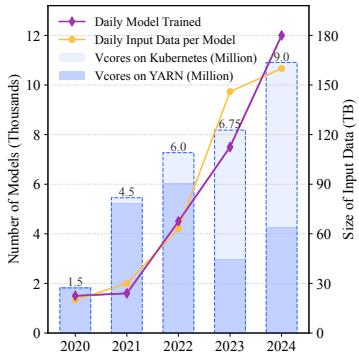

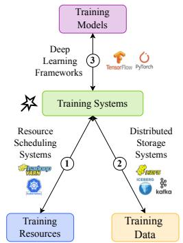  
Figure 1: Our DLRM Trends Figure 2: Training Systems

To support such large-scale training, efficient coordination of training resources, data, and models is essential. As illustrated in Fig. 2, developers submit models via deep learning frameworks, after which the training system requests necessary training resources from resource scheduling systems and concurrently loads relevant training data from distributed storage systems. Training large-scale DLRMs requires substantial GPU resources for model parameter updates and CPU resources for data preprocessing [26, 39]. The underlying training system directly affects resource utilization, convergence speed, and model quality [2, 27, 29, 38].

At ByteDance, DLRMs power core services, including Douyin, Xigua, and Toutiao. Meeting the demands of highfrequency, large-scale training requires an efficient solution capable of coordinating training resources, orchestrating data processing, and supporting training paradigms. Therefore, establishing a unified training system is imperative [18, 21, 56] to meet ByteDance’s needs for enhanced training efficiency and effectiveness.

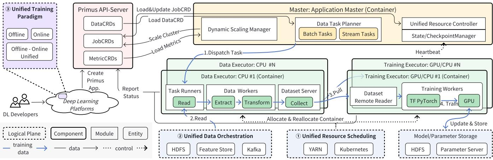  
Figure 3: Primus Architecture. ① Unified resource scheduling includes a training master that monitors new JobCRDs and utilizes a unified resource controller to allocate or reallocate executors. ② Unified data orchestration provides a data task planner to generate batch and stream tasks, which are then dispatched to data executors for data loading. Training executors load remote data samples via RPC and construct minibatches for training. ③ Unified training paradigm allows developers to submit DLRM training jobs to the API-Server, whether offline, online, or offline-online, by declarative JobCRDs and DataCRDs definitions.

Challenges & Limitations. Although some existing studies [3,25,32,45,64] have addressed one or more aspects of unified training systems, the limitations of current solutions still fail to fully resolve the following production-scale challenges.

① Complex and diverse environments, with resources hosted in multiple scheduling systems. Modern large-scale deployments typically span heterogeneous resource pools managed by different scheduling systems. However, current machine learning scheduling frameworks typically only support a single scheduling system, such as YARN [12, 19, 28] or Kubernetes [27, 31]. Elastic training strategies lack the capability to operate across different scheduling systems, like [13, 26, 57, 65, 68] are restricted to GPU elastic training within Kubernetes. Others lack support for heterogeneous resources, for example, only adapting to GPU adjustment [18, 26, 32, 55, 57] or being limited to CPU scheduling [62]. Even systems [50, 64] consider multiple sources but overlook the horizontal and vertical scaling mechanisms.

② Large-scale multi-source data, including stream and batch processing data. DLRM training increasingly involves reading samples from multiple data sources, stored across a variety of systems and formats. The lack of a unified data description complicates orchestration, transformation, and integration. Moreover, the growing complexity of feature engineering pipelines [26, 60] imposes substantial preprocessing demands on CPUs, resulting in a bottleneck in data reading and processing during training [50, 66]. Existing training systems [47, 52, 66] rarely offer native support for orchestrating data from both stream and batch data sources. In particular, integrating emerging storage systems and data formats, like Feature Store [43], require intrusive modifications to training frameworks like TensorFlow [1] and PyTorch [44].

③ Further online model effectiveness improvement, constrained by catastrophic forgetting. Maintaining the timeliness of DLRMs is critical for ensuring inference effectiveness [36], given the continual evolution of user behaviors and preferences over time. Timely training updates empower DL-RMs to reflect current trends more accurately. While online training approaches [28,33,35] directly train with stream data to enhance model timeliness, relying solely on stream data poses the forgetting problem. Specifically, data distribution shifts [59], leading to inadequate utilization of historical sample space. Besides, online learning also does not solve the problem of delayed feedback [30]. Even with the use of both offline and online training modes [10], the lack of unified training support in systems hinders high-frequency updates due to the need for model dumping and loading.

Our Solution. To address the above challenges, we have designed and developed Primus, a unified and production-ready training system tailored for large-scale DLRM workloads. As shown in Fig. 3, Primus is a layered yet centralized architecture that provides unified resource scheduling, unified data orchestration, and a unified training paradigm to integrate with multiple resource scheduling systems and distributed storage systems. Primus coordinates resources, data, and models in a cohesive solution, achieving DLRM training efficiency and effectiveness at the industrial scale.

Contributions. Using Primus, thousands of DLRM training jobs across millions of CPU cores, and tens of thousands of GPUs have been trained efficiently and effectively. We summarize the following four key contributions:

• We introduce a unified resource abstraction technique, which leverages multi-cluster resources and achieves multistrategy dynamic scaling. We standardize DLRM training jobs and heterogeneous resources through custom resource definitions (CRDs), providing a unified API across scheduling systems. It enables seamless resource scaling, reduces the overhead of restarting training jobs, and improves cluster resource utilization. (Sec. 3)

• We propose a unified three-tier data definition, comprising dataset, data stream, and data source layers, to manage DLRM’s training dataset effectively. With this definition, we further optimize the data task graph generation for data orchestration, enhancing the efficiency of processing batch and stream data from multiple sources, and adapting to the diverse data needs of training jobs. (Sec. 4)

• We present a unified offline-online mixture training paradigm that meets the demands for both robustness and timeliness in DLRMs. It leverages both batch and stream data to continuously improve model performance. Primus optimizes the logic for model parameter updates and enhances the integration of batch and stream data for DLRMs at the system level. (Sec. 5)

• Primus has been actively supporting DLRM training within ByteDance for five years. Through empirical evaluations on production models and datasets, we showcase Primus’ capabilities in large-scale resource scheduling and data orchestration. Notably, mixture training with Primus yields up to a 2.43% increase in advertising revenue. (Sec. 6)

Open-Source. The open-source version of Primus is available at https://github.com/bytedance/primus.

## 2 Primus Overview

The architecture of Primus is presented in Fig. 3. Primus is designed as a centralized, layered architecture that addresses the complexity and inefficiencies in large-scale DLRM training. Primus consists of three logical planes: unified resource scheduling, unified data orchestration, and unified training paradigm. We will briefly introduce the end-to-end training workflow and core system components.

## 2.1 Workflow for DLRM Training

DLRM training typically consists of two phases: offline training and online training [41]. In the offline phase, training jobs’ data executors load batch data from offline storage systems like HDFS and Feature Store. After decoding and transformations, the data is used in deep learning frameworks such as TensorFlow or PyTorch to calculate model weights. Subsequently, online training is employed to improve model performance [35] continuously. In the online phase, training jobs use online data samples from stream sources instead of batch sources to update model weights. These model weights are synchronized to inference servers at regular intervals for online service [48]. Due to the presence of high-dimensional sparse features and large embedding tables, DLRM training systems must sustain high data throughput while maintaining training stability across distributed executors.

Developing, training, and deploying DLRMs involves coordinating multiple complex systems [66]. Figure 3 illustrates the DLRM training process within Primus. In the unified training paradigm plane, deep learning developers submit a DLRM training job, defining the training mode as offline, online, or offline-online. The configuration of the training job is stored in the API-Server as JobCRD and DataCRD. In the unified training resource plane, the Primus master initiates first, then it monitors the status of JobCRDs, DataCRDs, and Metric-CRDs in the API-Server in real-time, and requests resources from the scheduling system based on JobCRD to build the training topology. Typically, a training topology comprises several data executors for data loading and training executors for training. In the unified training data plane, the task planner in the master constructs DataCRD into data tasks, which are then dispatched to the executors via remote procedure calls (RPC). The data executors read samples from HDFS, Kafka, and Feature Store through the corresponding task runners. These samples are then converted into minibatches and saved to the data server. The training executors pull the minibatches remotely and process them in the neural network to complete model training. The intermediate states and results of the model training are stored in HDFS or parameter servers (PS).

## 2.2 Component Design and Functionality

Following the concept of tri-unified training resources, data, and paradigms, Primus implements three core components: Primus APIs, Primus Master, and Primus Executors, which collaborate to optimize training efficiency and effectiveness.

• Primus APIs: DLRM information is submitted to the API-Server by deep learning developers via an API-Client. The API-Server stores and records job and data details, that describe each model’s requirements and configuration.

• Primus Master: Acting as the central unit for training, the master is responsible for scheduling computational tasks and managing training data. It requests resources from various scheduling systems through the unified resource controller. During execution, the dynamic scaling manager adjusts resources. The task planner translates the DataCRD into actionable tasks while the state/checkpoint manager records the status of tasks. As a centralized design, Primus adopts frequent checkpoints, resource reservation and stable constraints for fault tolerance and high availability.

• Primus Executors: Executors are responsible for executing training tasks. Data executors handle data management, while training executors perform complex model computations. Each data executor includes task runners reading different format data from various storage systems, data workers performing sample conversion, and the dataset server aggregating the converted samples. The training executors retrieve data from the data executors via the dataset remote reader and perform further training computations.

Table 1: Primus Component Design and Module Functionalities
<table><tr><td rowspan=1 colspan=2>Component</td><td rowspan=1 colspan=1>Module</td><td rowspan=1 colspan=1>Functionality</td></tr><tr><td rowspan=1 colspan=2>Primus APIs</td><td rowspan=1 colspan=1>API-Server</td><td rowspan=1 colspan=1>Stores JobCRDs, DataCRDs,and MetricCRDs, provides API-Client to read/update/watch CRDs.</td></tr><tr><td rowspan=2 colspan=2>Primus Master:</td><td rowspan=1 colspan=1>Data TaskPlanner</td><td rowspan=1 colspan=1>Compiles DataCRDs into dataset logical plans and optimizes them. Compiles dataset logical plans into dataset physical plans for batch/stream data task generations.</td></tr><tr><td rowspan=1 colspan=1>ster:</td><td rowspan=1 colspan=1>Unified ResourceController</td><td rowspan=1 colspan=1>- Unifies different resources belonging to various resource scheduling systems.- Monitors JobCRDs, following the change requirements by request, release, and update resources.</td></tr><tr><td rowspan=2 colspan=2>Training Master</td><td rowspan=1 colspan=1>aster</td><td rowspan=1 colspan=1>Dynamic ScalingManager</td></tr><tr><td rowspan=1 colspan=1>State/CheckpointManager</td><td rowspan=1 colspan=1>- Receives heartbeats from executors and records the status of batch tasks (running,finished)into persistent storage.</td></tr><tr><td rowspan=3 colspan=2>PrimusData Executor:CPU</td><td rowspan=1 colspan=1>Task Runner</td><td rowspan=1 colspan=1>Fetches tasks from the task planner output queue of the master.- Parses and loads tasks as training samples according to their configurations.</td></tr><tr><td rowspan=1 colspan=1>ntor:</td><td rowspan=1 colspan=1>Data Worker</td><td rowspan=1 colspan=1>-Extracts,filters,and converts data into standard training samples,saving them locally.</td></tr><tr><td rowspan=1 colspan=1>Dataset Server</td><td rowspan=1 colspan=1>- Collects local outputs from different upstream task runners.-Provides an RPC service endpoint for remote data reading by downstream training executors.</td></tr><tr><td rowspan=2 colspan=2>PrimusTraining Executor:GPU/CPU</td><td rowspan=1 colspan=1>Training Worker</td><td rowspan=1 colspan=1>- Loads models into deep learning frameworks,reads sample tensors,performs forward andbackward propagation, and then applies optimization to get final model parameters.</td></tr><tr><td rowspan=1 colspan=1>DatasetRemote Reader</td><td rowspan=1 colspan=1>Remotely reads data from data executors,and aggregates results from different upstreamsources,and constructs training minibatches.</td></tr></table>

Table. 1 outlines the modules within each component, detailing their associated entities and respective functionalities.

## 3 Unified Resource Scheduling

To fully utilize existing resources to meet the increasing demands of large-scale DLRM training at ByteDance, Primus integrates resources through the unified resource controller and dynamic scaling manager, as shown in Fig. 4. Specifically, the unified resource controller standardizes the semantics of different resource scheduling systems with JobCRD. Additionally, the dynamic scaling manager enhances the capability for elastic training through collaborative vertical and horizontal scaling. Primus significantly improves training efficiency through multi-cluster resource scheduling and multi-strategy dynamic scaling capabilities.

## 3.1 Multi-Cluster Resource Scheduling

We design the unified resource controller to adapt to the two most widely used resource scheduling systems, YARN [6], and Kubernetes [9]. This allows developers to define a training job topology independent of the underlying resource scheduling systems using the standard JobCRD, ensuring a unified user experience and reducing development costs.

The unified resource controller converts the JobCRD into resource requests specific to each scheduling system, providing a container manager for each job on YARN or an operator as a resource controller for each cluster on Kubernetes. When running on YARN, an API-Server is started for each job to provide read/write services for CRDs, whereas, on Kubernetes, the cluster’s API-Server is used directly. Primus can automatically select resources from multiple YARN and Kubernetes clusters for scheduling based on their idle status. It leverages resources from underutilized clusters while releasing resources when cluster resource utilization is high, thus increasing overall resource efficiency.

Besides, the unified resource controller monitors JobCRD changes and schedules resources accordingly without requiring active user intervention. The dynamic scaling manager modifies JobCRDs determined on optimal scaling strategies using MetricCRDs. The unified resource controller facilitates seamless implementation of horizontal and vertical scaling across different scheduling systems. It addresses the issue of insufficient resources on low-performance executors while enhancing the cost-effectiveness of clusters.

## 3.2 Multi-Strategy Dynamic Scaling

The dynamic scaling manager combines multiple scaling strategies to support distributed training within large-scale, heterogeneous clusters. Motivated by production experience, key metrics like CPU, memory, network, GPU, and dataset pool size are monitored and aggregated into MetricCRDs. Based on these metrics, the following scaling strategies are automatically selected to increase training throughput and improve resource utilization. For stability, only one scaling strategy is executed at a time, while it is still a minute-level dynamic scheduling decision. The selection involves validating, sorting, and optimizing steps using previous scaling strategies, resource type, adjustment range, etc.

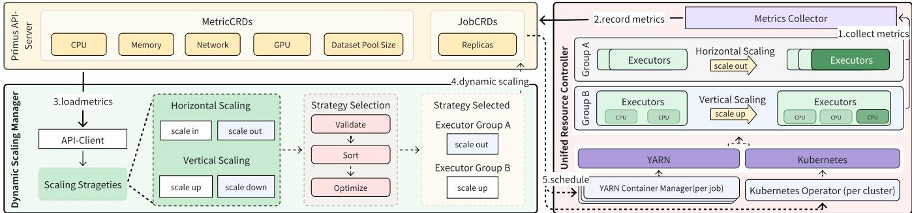  
Figure 4: Unified Resource Scheduling

Dynamic Horizontal Scaling: Primus’ horizontal scaling capabilities are well-suited for large-scale cluster scenarios, achieving dynamic parallelism. In CPU and GPU collaborative training scenarios, tuning the ratio of data executors and training executors is allowed.

• Efficient scaling of executors within large clusters: Gradually increasing the number of training executors has been shown to improve AUC (area under the receiver operating characteristic curve) performance [17]. However, scheduling latency is challenging in large-scale scheduling systems with over 1 million cores. Primus reduces scheduling latency by deploying sharded operators for larger clusters and assigning different training jobs to different operators using hashed job names.

• Auto-tuning in collaborative CPU and GPU training: Predetermining the optimal ratio of data to training executors for various jobs is challenging. Primus employs horizontal scaling to dynamically adjust the ratio of data executors to training executors based on a load value $L _ { u }$ calculated using metrics from data executors. Let $\mathbf { u } = [ u _ { b } , u _ { c } , u _ { m } ]$ represent the total buffer pool, CPU, and memory utilization of data executors, respectively. Users can assign customized weight vector $\mathbf { w } = [ w _ { 1 } , w _ { 2 } , w _ { 3 } ]$ for each utilization metric based on their training job’s requirements. Primus offers an intuitive interface and recommended weights.

$$
L _ { u } = \mathbf { w } \cdot \mathbf { u }\tag{1}
$$

A load threshold $L _ { \Theta }$ is predefined based on historical job data and performance metrics. When $L _ { u } < L _ { \theta }$ , indicating a higher training executor capacity than data executor capacity, Primus increases the number of data executors. Conversely, when $L _ { u } > L _ { \mathsf { \theta } } .$ , Primus reduces the number of data executors. This automatic adjustment improves training throughput and efficiency without resource waste.

Dynamic Vertical Scaling: Primus uses real-time metrics to dynamically adjust CPU and memory resources on individual executors. Each executor has a metrics collector that regularly gathers data on CPU and memory utilization, I/O throughput, and network bandwidth. These metrics are collected from each executor and made accessible through the API-Server. The dynamic scaling manager calculates future resource requirements based on these metrics and updates the JobCRD accordingly. The unified resource controller then adjusts the resource allocation as needed.

We gather $N _ { R }$ historical resource metrics denoted by R, and utilize function $D ( N _ { R } )$ to forecast resource changes in the subsequent period, as expressed in Eq. (2). Recognizing the temporal relevance of these metrics, we assign weights $\begin{array} { r } { w _ { i } = \frac { 1 } { N _ { R } - i + 1 } } \end{array}$ , emphasizing a stronger influence from more recent metrics. To determine the adjustment range $R _ { x }$ , we analyze resource changes over the past x minutes, maintaining a small interval—typically 10 minutes—to enhance utilization while ensuring stability. That is, $R _ { x } = D ( x )$ .

$$
D ( N _ { R } ) = \sum _ { i \in [ 1 , N _ { R } ] } \frac { w ( i ) \cdot ( R _ { i } - R _ { i - 1 } ) } { N _ { R } } , w ( i ) = \frac { 1 } { N _ { R } - i + 1 }\tag{2}
$$

We use $R _ { a l l o c }$ to represent the currently allocated resources for each executor, while $R _ { u s e }$ denotes the maximum resource used over the past x minutes. To ensure stability, a predefined resource safety margin $R _ { s }$ guarantees resource redundancy, preventing individual executors from encountering out-ofmemory (OOM) errors due to overly sensitive adjustments. The sign of $R _ { x }$ determines the direction of resource adjustment. We employ Eq. (3) to compute the updated resource allocation $R _ { a l l o c } ^ { \prime } .$ . Additionally, a minimum adjustment threshold $R _ { \Theta }$ is set. Adjustments where $| R _ { a l l o c } ^ { \prime } - R _ { a l l o c } | \leq R _ { \theta }$ are not implemented to avoid frequent minor adjustments.

$$
R _ { a l l o c } ^ { \prime } = R _ { u s e d } + R _ { x } + R _ { s }\tag{3}
$$

## 4 Unified Data Orchestration

At ByteDance, data sources are typically organized by business units and stored across various storage systems, such as

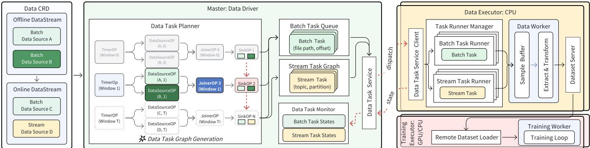  
Figure 5: Unified Data Orchestraction

HDFS, Kafka, and Feature Store. Additionally, utilizing data samples from multiple data sources can help DLRMs capture more complete information. While existing data orchestration solutions [7, 64] and modern ML frameworks [1, 44] support diverse data types, challenges remain in efficiently managing chronological data across multiple sources, particularly for stream data in online training environments at production scale. In pursuit of efficient data management for DLRMs, we propose an integrated data component that abstracts both data definition and acquisition logic, serving data to training jobs in the desired order through streamlined APIs. This solution optimizes data orchestration, improving both performance and stability in DLRM training.

## 4.1 Three-Tier Data Definition

To facilitate training jobs for DLRM in our production environments, there are three unique data orchestration requirements for optimizing model effectiveness: 1) scheduling training data among data workers with a sliding window over data generation time, 2) supporting stream data sources to minimize the time required for online training data to enter a training topology, and 3) providing mixed training data from stream and batch data sources for more sophisticated models. Therefore, to fulfill these requirements, Primus stratifies the definition of training data into three tiers: Primus dataset, Primus data stream, and Primus data source:

• Primus Dataset: A Primus dataset represents an unbounded stateful data input for a training job. It manages the lifecycle of one or multiple Primus data streams, which can be served sequentially or simultaneously according to the requirements of training models.

• Primus Data Stream: A Primus data stream is composed of one or multiple Primus data sources. It serves data to its designated data workers by mixing and scheduling the Primus data sources with a sliding window in either hourly or daily granularity.

• Primus Data Source: A Primus data source represents the data of a given period persisted in a particular storage system. This period could be either bounded or unbounded for continuous online training. Additionally, Primus data sources are responsible for converting data to the format specified by training models to eliminate discrepancies in data formats across different storage systems.

## 4.2 Data Task Graph Generation (DTGG)

Primus embraces data parallelism to harvest the performance improvement from distributed training. Although existing solutions are able to efficiently orchestrate data at scale [52], they lack the support for mixing multiple data sources and serving them chronologically. To address these needs, Primus analyses the assigned Primus data streams and generates data tasks, which are subsequently dispatched to the data executor according to their generation order, where a data task specifies the data from a Primus data source in a time window.

However, data task generation has become a bottleneck due to the increasing data volume since naive implementations may leave training workers pending for data and ultimately lead to underutilized computational resources. Therefore, we introduce data task graph generation (DTGG), a technique designed to improve the performance of data task generation. A DTGG comprises four types of operations (OPs) to serve a Primus data stream, as shown in Fig. 5.

• Timer OPs: The timer OPs are populated for every time window that can be derived from a Primus data stream, and thus, timer OPs are populated indefinitely for unbounded Primus data streams.

• Data Source OPs: The data source OPs are derived from their corresponding Primus data sources and are responsible for generating data tasks based on the time window propagated from their depending timer OPs. For instance, a Feature Store data source OP queries the designated Feature Store table with the propagated time window to locate the relevant data files on storage, which are later built into individual data tasks.

• Joiner OPs: The joiner OPs collect all the data tasks generated from their depending data source OPs. The completion of a joiner OP marks the successful generation of data tasks for its designated time window.

• Sink OPs: The sink OPs are responsible for pushing the generated data tasks into a buffer for future assignments to data executors. Importantly, sink OPs always depend on their predecessor to ensure the correct chronological order in data task executions.

In addition to parallelization, DTGG can further accelerate data task generation at runtime by caching data tasks for repeated usages and fusing data source OPs derived from the same Primus data sources to amortize the cost of interacting with storage systems.

## 4.3 Data Component Architecture

To ensure stability, especially for online models, each training job is assigned to a dedicated data component. As shown in Fig. 5, the data driver generates data tasks for the configured Primus data streams and orchestrates their execution among data executors at the center. Meanwhile, the surrounding data executors process the dispatched data tasks and serve the acquired data to their corresponding data workers. Benefiting from the centralized architecture [7], the data component can load balance across data workers via dynamic sharding and provides fault tolerance mechanisms.

## 4.3.1 Data Driver

In order to well orchestrate data tasks among data executors, the data driver has to generate data tasks efficiently, distribute them to data executors, monitor their status, and provide fault tolerance mechanisms. Therefore, to fulfill these responsibilities, the data driver is composed of five modules.

• Data Task Planner: The data task planner obtains the configured Primus data stream for the training job from API-Server and generates corresponding data tasks using DTGG. The generated tasks from batch data sources and stream data sources are then forwarded to the batch task queue and stream task graph, respectively, for subsequent assignments to data executors.

• Batch Data Task Queue: The batch task queue manages the lifecycles of generated batch tasks, which are tracked through four states: pending, running, succeeded, and failed. Meanwhile, the batch task queue persists batch tasks on remote storage to prevent batch task reconstructions in cases of errors.

• Stream Task Graph: Similarly to the batch task queue, the stream task graph manages the lifecycles of stream tasks. However, since stream tasks run infinitely by binding a data executor to a message queue topic and partition, there are only two states for stream tasks: assigned and unassigned, where the stream data loaded offsets are directly committed to the message queue.

• Data Task Service: The data task service is RPC-based that orchestrates data tasks among data executors by assigning data tasks to them and tracking their status. Importantly, to ensure alignment between batch and stream data serving time windows, the data task service may throttle task assignments when necessary.

• Data Task Monitor: The data task monitor tracks the status of assigned data tasks as reported by data executors. It also periodically or on-demand creates checkpoints for fault tolerance to accurately align with model checkpoints.

## 4.3.2 Data Executor

Data executors are initiated by the data driver to serve orchestrated data. Through the data task service, data executors obtain data tasks and report both their own status and that of the assigned tasks. Upon data task assignments, data executors launch a new data task runner to execute the assigned data task and push the pre-processed data into an in-memory sample buffer, which is finally served to its hosting training worker in a standardized format such as Apache Arrow [4]. As shown in Fig. 5, multiple data task runners are employed in parallel on each data executor to fully utilize the allocated computational resources.

• Batch Task Runner: For every assigned batch task, the data executor launches a new batch task runner, which executes the batch task and terminates upon completion. Meanwhile, the data executor periodically reports the status of the assigned batch tasks to the data driver.

• Stream Task Runner: Streaming task runners are launched for assigned stream tasks. Nevertheless, pursuing better stability in loading stream data sources, stream task runners instead keep running without termination.

However, the static relationships between data executors and the underlying topic and partition of message queues make data component vulnerable to skewed data, which could significantly impact the effectiveness of online models due to the delays in learning stream data. Therefore, data component supports a shuffle mechanism. By allowing data executors to obtain data from each other, data component can well handle skewed data with overheads on memory footprint and network bandwidth in exchange for better overall stability in preparing samples from stream data sources. To support various training scenarios, Primus provides two different stream data loading modes of data executors as listed in Tab. 2:

## 5 Unified Training Paradigm

To effectively combine online stream data with offline batch data, leveraging the strengths of both online and offline training, we propose a unified training paradigm. Utilizing unified resources and data, we delegate the complex resource scheduling and data orchestration to Primus. This allows deep learning developers to focus primarily on model structure updating, thereby facilitating model design. As shown in Fig. 6, we design a mixture training recommendation model (MTRM) that controls the learning sequence of batch and stream data through different computational graphs for training. Additionally, we introduce a mixture data prioritization mechanism, which optimizes the logic for multi-source data retrieval and provides row-level priority control. MTRM is one of the training paradigms supported by Primus, which also provides pure batch, pure stream, and sequential batch-then-stream training.

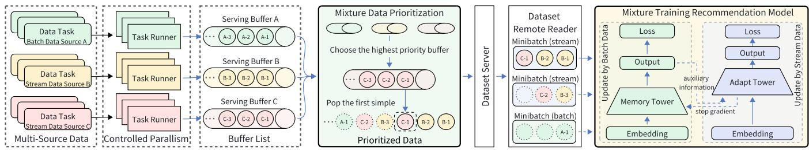  
Figure 6: Unified Training Paradigm

Table 2: Stream Data Loading Modes of Data Executors
<table><tr><td>Mode</td><td>Description</td></tr><tr><td>Forward</td><td>Fetch and pre-process data only from assigned topics and partitions.</td></tr><tr><td></td><td>Rebalance Re-deliver fetched data to others for pre-processing.</td></tr></table>

## 5.1 Mixture Training Recommendation Model

Through statistical analysis and hypothesis testing, we identify two critical observations: 1) The non-MTRM suffers from catastrophic forgetting, where the model prioritizes memorizing the "current distribution". This leads to two primary issues: first, it fails to retain samples over time, underutilizing historical knowledge; and second, it becomes more susceptible to bias and delays in feedback, which results in instability. 2) Different batch data sources exhibit varying output delays due to output strategies, such as label splicing goals (e.g., next-day retention, 7-day retention, etc.). Therefore, MTRM requires controlling the sequence of multi-source data and aligning batch data with stream data.

We propose the universal recommendation model framework MTRM for mixture training, as shown in Fig. 6 (right). The model comprises two key components: the memory tower and the adapt tower. The memory tower focuses on long-term parameter storage, processing historical data from batch data sources to prevent catastrophic forgetting. The adapt tower adapts to recent data from stream data sources, ensuring the model remains updated with the latest trends. Typically, the memory tower has a smaller network structure, minimizing computational overhead. MTRM offers flexibility, allowing the memory and adapt towers to be extended to various neural network structures, supporting model innovation.

```powershell
Algorithm 1: MTRM Training Process
Input: Continuous minibatches X from $D _ { \mathrm { p r i } }$
Output: Updated MTRM with $\theta _ { M } ^ { \mathrm { n e w } }$ and $\bar { \Theta } _ { A } ^ { \mathrm { n e w } }$
1 Initialize or load model parameters: memory tower $\theta _ { M } .$
adapt tower $\theta _ { A } ;$
2 Set learning rates α and loss functions $\mathcal { L } _ { M } .$ $\mathcal { L } _ { A }$
3 while Not all minibatches X are processed do
4 if X is $\mathbf { X } _ { b a t c h }$ then
5 $\mathbf { e } _ { \mathrm { b a t c h } }$ ← Embedding $( \mathbf { X } _ { \mathrm { b a t c h } } ) ;$
6 $\mathbf { h } _ { M }$ ← MemoryTowerForward $( \mathbf { e } _ { \mathrm { b a t c h } } , \mathsf { \Theta } _ { M } ) ;$
7 $\mathcal { L } _ { M }  \mathbf { { ( \mu } }$ omputeLoss $( \mathbf { X } _ { \mathrm { b a t c h } } , \mathbf { h } _ { M } , \theta _ { M } )$
8 $\Theta _ { M } ^ { \mathrm { n e w } }  \Theta _ { M } - \alpha \nabla _ { \Theta } \mathcal { L } _ { M } ;$
9 else if X is $\mathbf { X } _ { s t r e a m }$ then
10 estream ← Embedding $\mathbf { \Pi } ( \mathbf { X } _ { \mathrm { s t r e a m } } )$ ;
11 $\mathbf { h } _ { \mathrm { a u x } }$ ← MemoryTowerForward(estream, $\mathsf { \Omega } _ { \theta _ { M } } ^ { } )$
12 hA ← AdaptTowerForward(estream $\Phi \mathbf { h } _ { \mathrm { a u x } } , \mathbf { \theta } _ { A } )$
13 $\mathcal { L } _ { A } $ ComputeLoss $\left( \mathbf { X } _ { \mathrm { s t r e a m } } , \mathbf { h } _ { A } , \theta _ { A } \right)$
14 $\Theta _ { A } ^ { \mathrm { n e w } }  \Theta _ { A } - \alpha \nabla _ { \Theta } \mathcal { L } _ { A } ;$
15 return $\mathsf { \theta } _ { M } ^ { \mathrm { n e w } }$ or $\theta _ { A } ^ { \mathrm { n e w } }$
```

During training, the dataset remote reader maintains two separate queues for batch and stream samples pushed by the dataset service. The accumulation speed is dynamically determined by the mixture data prioritization mechanism in Sec. 5.2. Whenever samples in either queue reach the size of a minibatch, the training worker executes a training loop as outlined in Algorithm 1. The updated model parameters are synchronized periodically between training workers. For convenience, we denote a minibatch X of batch or stream data samples as $\mathbf { X } _ { \mathrm { b a t c h } }$ or $\mathbf { X } _ { \mathrm { s t r e a m } }$ , respectively.

Each data sample from batch or stream sources is utilized only once during training to avoid overfitting to the latest data and to leverage long-term trends. We design the neural network parameter update control logic as follows:

• Embedding Calculation: The input minibatch X passes through the embedding layers, generating the corresponding feature embeddings ebatch or $\mathbf { e } _ { \mathrm { s t r e a m } }$

• Forward Propagation with Memory or Adapt Towers: 1) The memory tower processes $\mathbf { e } _ { \mathrm { b a t c h } }$ or $\mathbf { e } _ { \mathrm { s t r e a m } } ,$ generating $\mathbf { h } _ { M } = f _ { \boldsymbol { \Theta } _ { M } } ( \mathbf { e } _ { \mathrm { b a t c h } } )$ or $\mathbf { h } _ { \mathrm { a u x } } = f _ { \boldsymbol { \Theta } _ { M } } ( \mathbf { e } _ { \mathrm { s t r e a m } } )$ , with $\theta _ { M }$ as its parameters. 2) The adapt tower combines $\mathbf { e } _ { \mathrm { s t r e a m } }$ with $\mathbf { h } _ { \mathrm { a u x } }$ to generate $\mathbf { h } _ { A } = f _ { \boldsymbol { \Theta } _ { A } } ( \mathbf { e } _ { \mathrm { b a t c h } } \oplus \mathbf { h } _ { \mathrm { a u x } } )$ , using $\theta _ { A }$ as its parameters.

• Loss Calculation and Parameter Updates: During backpropagation, the memory (or adapt) tower’s output $\mathbf { h } _ { M }$ (or $\mathbf { h } _ { A }$ ) are used to compute the loss $\mathcal { L } _ { M }$ (or $\mathcal { L } _ { A } )$ . Its gradients iteratively update the corresponding tower’s parameters.

Since batch data samples are processed several hours or days after the corresponding stream data, the memory tower has not yet encountered samples from the most recent time period. Besides, $\mathbf { h } _ { \mathrm { a u x } }$ is not used in the backpropagation of the memory tower. This temporal and tower parameter separation minimizes the risk of information leakage when $\mathbf { h } _ { \mathrm { a u x } }$ is used as auxiliary information for the adapt tower.

By leveraging this parameter update control logic, we aim to balance overfitting concerns with the efficient handling of delayed feedback, thus enhancing the robustness and effectiveness of recommendation models.

## 5.2 Mixture Data Prioritization

Essentially, MTRMs are trained on data generated at different times with constant offsets; therefore, the ability to effectively orchestrate and integrate data from multiple sources is essential. By creating the prioritized data constructed from stream and batch data sources configured with different offsets, the required mixture data is served to model training. This design is inspired by empirical observations of performance degradation caused by stream data lag in production environments.

Due to the nature of production services, MTRMs are occasionally struck by sudden surges in stream data, particularly during peak hours or hot events. This can cause delays in loading stream data and subsequently affect model effectiveness. In such cases, merely scaling out data workers is not ideal, as computing resources are limited and surge durations are unpredictable. Therefore, an adaptive and resource-aware prioritization strategy is essential.

To retain MTRMs’ effectiveness under high load conditions, Primus enables data workers to prioritize data from different data sources based on their importance and current load. Algorithm 2 shows the detailed process of how data are prioritized and served to the training workers. Data tasks from multi-sources are executed by data workers with controlled parallelism and pushed into their respective serving buffers. When the dataset remote reader requests data, the dataset server fetches data from the serving buffer with the highest priority calculated by Eq. (4):

$$
\arg \operatorname* { m a x } _ { i \in 1 , 2 , \ldots , n } p _ { i } = w _ { i } \cdot \frac { 1 } { 1 + e ^ { - q _ { i } } }\tag{4}
$$

Algorithm 2: Prioritized Data from Serving Buffers   
Input: Serving buffers $D = \{ D _ { 1 } , D _ { 2 } , \ldots , D _ { n } \}$ , buffer   
weight $W = \{ w _ { 1 } , w _ { 2 } , . . . , w _ { n } \}$ , and buffer   
queued data length $Q = \{ q _ { 1 } , q _ { 2 } , . . . , q _ { n } \}$   
Output: Continuous prioritized data queue $D _ { p r i }$   
1 while Serving buffers $D \neq \emptyset$ do   
2 maxIndex $ - 1$ , maxPri ← −∞;   
3 for $i \gets 0$ to bu f f erList.size − 1 do   
4 $p _ { i } \gets w _ { i } \cdot$ sigmoid(qi) ;   
5 if $p _ { i } > m a x P r i$ then   
6 maxIndex ← i, maxPri $ p _ { i }$   
7 samp $ \cdot l e  D _ { m a x I n d e x } . p o p ( ) ;$   
8 $D _ { p r i } .$ .append(sample);   
9 return $D _ { p r i } ;$

where n is the number of severing buffer, $p _ { i }$ is the priority for the i-th buffer, wi is the weight assigned to the i-th buffer indicating its importance, and $q _ { i }$ is the length of the queued data in the i-th buffer. The sigmoid function ensures that buffer length contributes non-linearly to the priority score, allowing Primus to flexibly balance data timeliness, buffer backpressure, and source importance.

In production, the weights of stream data sources are much higher than their batch counterparts due to their impacts on model effectiveness. This flexible mixed data prioritization can dynamically adjust the processing order of different data sources to reduce data latency during high load periods.

## 6 Evalutions

We validate Primus’ capabilities within a large-scale distributed environment. The key highlights are as follows:

• Horizontal scaling saves over 17.1% of resources while vertical scaling improves utilization from 50% to 80%.

• Generating around 4 million data tasks speeds up 23× in 1 thread and can be completed in 42s with 4 threads.

• Model effectiveness in advertising is significantly improved by 0.03%-0.07% in AUC and 0.4%-2.4% in revenue.

As a large-scale, enterprise-grade DLRM training system within ByteDance, we provide detailed information about workloads currently undertaken by Primus in Tab. 3.

## 6.1 Unified Resource Evaluation

We assess Primus’ horizontal and vertical dynamic scaling capabilities in different training scenarios. The evaluation measures training throughput (minibatches/s), CPU/memory utilization, and model effectiveness (AUC).

Dynamic Horizontal Scaling: To evaluate the performance of large-scale dynamic parallelism, a baseline setup running a fixed number of 400 data executors is compared with our setup, where data executors are gradually scaled from 0 to 400 every 10 seconds. As shown in Fig. 7, Primus’s training throughput is gradually increased to 210 minibatch/s, similar to the baseline setup’s throughput of 205 minibatch/s, while AUC is approximately 0.4% higher than the baseline, improving training effectiveness with the scaling strategy.

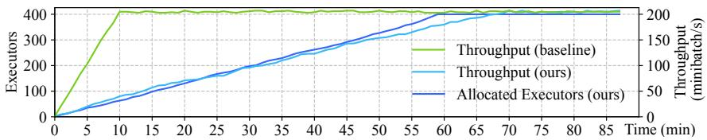

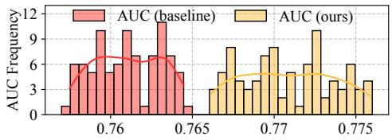

Figure 7: Dynamic Horizontal Scaling  
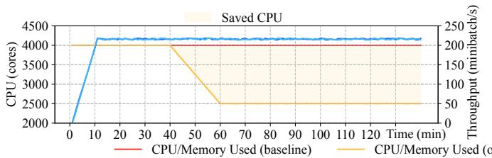

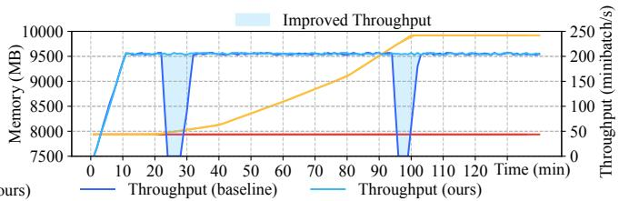  
Figure 8: Dynamic Vertical Scaling Improves Resource Efficiency

To evaluate the impact of tuning the ratio of training executors and data executors, a baseline setup using 900 8-core data executors and 8 training executors throughout the training process is compared with our setup initially using 450 8-core data executors and also 8 training executors. As shown in Tab. 4, the total training time and the training AUC of our setup are comparable to the baseline. However, our setup eventually uses 690 data executors, resulting in a 23.33% saving in CPU cores compared to the baseline. The tuning improves resource utilization without negatively affecting training performance or speed. When the feature is enabled for a production cluster, training throughput per core (ROI) gradually increases from 30.26 to 35.44, representing a 17.1% improvement.

Dynamic Vertical Scaling: We assess Primus’ vertical scaling with two typical training scenarios. The first scenario simulates an excessive CPU resource allocation to workers, causing resource wastage. Both jobs are started with 400 10- core data executors, with Primus’ vertical scaling expected to adjust the CPU core allocation of the executors. As shown in Fig. 8 (left), the baseline utilizes a fixed number of CPU cores, while ours scales down by 1600 CPU cores, representing an adjustment per executor from 10 to 6 cores. The effect is an increase of CPU utilization from 50% to 80% and no impact on both training throughput and AUC.

The other scenario simulates insufficient memory allocation for PS executors, leading to OOM errors, which cause failovers and disrupt training progress. Both the baseline and ours are initiated with 496 PS executors with 16 GB of memory each. Primus’ vertical scaling is expected to dynamically adjust the memory of PS executors for our task to avoid OOM errors. As shown in Fig. 8 (right), the baseline frequently encounters PS executor OOM errors, resulting in periods with low training throughput. Ours adjusts the allocated memory to a total of 9920 GB from 7936 GB compared to the baseline, which prevents the OOM issues. The effect is an increase in throughput from 275 minibatch/s to 496 minibatch/s, and an AUC increase from 0.62 to 0.78.

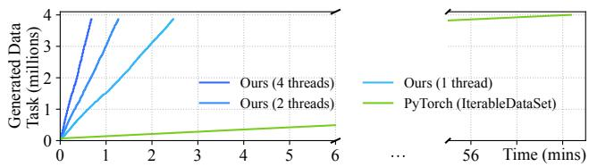  
Figure 9: Data Task Generation Speed

## 6.2 Unified Data Evaluation

We evaluate the performance of Primus data component, which analyses the designated data sources and subsequently serves the data to training workers. Therefore, the overall performance is a collective result of the two major responsibilities: data task generation and data loading.

Data Task Generation Evaluation: We evaluate the efficiency of Primus’s data component in generating data tasks from large-scale production data. The experiment is performed on a single data driver with 8 CPU cores and 25 GB memory to eliminate the impact of memory pressure. The input workload consists of 20-day production data from two Feature Store tables, comprising over 56 million underlying files and yielding approximately 4 million generated data tasks. As shown in Fig. 9, DTGG achieves significantly faster task generation compared to a naive single-threaded baseline implemented with PyTorch. By fusing multiple scan requests to the underlying HDFS storage, the 1-thread DTGG reduces the generation time from 58 minutes to 149 seconds (23×) and further improves to 42 seconds with the 4-thread DTGG. These results demonstrate DTGG’s efficiency in handling multiple data sources and time windows.

Table 3: Characteristics of DLRM Training Workloads on Primus
<table><tr><td>Categories</td><td>Types</td><td>Details</td></tr><tr><td>Resource</td><td>General Data Workers General Training Workers</td><td>800 CPU data workers,each with 5 cores and 50 GB memory 4 GPU training workers,each with 8 GPUs</td></tr><tr><td>Data</td><td>Data Tasks Data Sources Training Throughput</td><td>Ranging from 0 to 80 million tasks (~ 180-540 daysdata) Spanning 2 to 18 sources,each with 10-20 PB data Ranging from 200,000 to 600,000 samples per second</td></tr><tr><td>Model</td><td>Model Size Sample Features</td><td>Varying from 500 GB to1 TB The 75th percentile of the number of features is ~3200</td></tr></table>

Table 4: Dynamic Horizontal Scaling Comparision
<table><tr><td>Method</td><td>CPU Used (cores)</td><td>AUC</td><td>Training Time (days)</td><td>Cluster ROI</td></tr><tr><td rowspan="2">Baseline Ours</td><td>7200</td><td>0.9385</td><td>1.86</td><td>30.26</td></tr><tr><td>5520</td><td>0.9382</td><td>1.90</td><td>35.44+17.12%</td></tr></table>

Data Loading Evaluation: Compared to batch data sources, stream data sources are widely adapted by online training jobs which have higher performance requirements, especially in production environments. Figure 10 shows the performance comparison of serving stream data sources between Primus and Flink [5] (a widely used online model training framework). This experiment is performed on 40 executors on machines equipped with 2 CPU cores and 4 GB memory each, where 10 of them are configured extremely slower than others to simulate anomalies such as hardware degradation in production environments. Both Primus and Frink enable shuffle mechanisms to balance load across executors dynamically. Primus data component achieves 3.97 GB/s, which is 1.25× to 3.17 GB/s with Flink. Since shuffling data with Flink incorporates two layers of task managers for generalized usages, Flink is more fragile to defective machines, as the back pressure induced by the latter layer could lead to resource underutilization in the former layer. On the contrary, Primus data executors are equal and thus will not impede the performance of others. Therefore, though the resource utilization of slow executors is similar, Primus’s shuffle mechanism design allows for better overall utilization across all executors. This leads to higher effective throughput under unstable environments or skewed data.

## 6.3 Unified Training Evaluation

To evaluate the performance of the unified training paradigm, we use production data to conduct the effectiveness of MTRM and mixture data prioritization.

Table 5: Model and Resource Settings
<table><tr><td colspan="2">Model</td><td rowspan="2">Size</td><td colspan="3">Executors CPU</td></tr><tr><td>No.</td><td>Basis*</td><td>(GB)</td><td>Number (cores)</td><td>Memory (GB)</td></tr><tr><td>1</td><td>DSSM [24], LHUC [49]</td><td>600</td><td>60</td><td>13</td><td>45</td></tr><tr><td>2</td><td>FM [46], Transformer [51]</td><td>1200</td><td>40</td><td>6</td><td>30</td></tr><tr><td>3</td><td>FM,DIN [67], Transformer</td><td>800</td><td>50</td><td>12</td><td>35</td></tr><tr><td>4</td><td>EMSNet [20],LHUC</td><td>3700</td><td>50</td><td>8</td><td>30</td></tr></table>

∗Production DLRMs absorb and integrate the various model structures listed.

MTRM Evaluation: We select four representative production models for Conversion Rate (CVR) and Click-Through Rate (CTR) estimation models to thoroughly assess the effectiveness of MTRM in various scenarios. Each model’s structural information and resource specifications are detailed in Tab. 5. Without MTRM (w/o), these baseline models can be viewed as single-tower-like models that process both batch and stream data without separation. When utilizing MTRM (w/), these four models all employ a memory tower to learn from 24-hour delayed batch data, while an adapt tower remains the same structure as baselines but only updated by stream data. Both the models with and without MTRM are pre-trained on one year of historical data. Both the models with and without MTRM are pre-trained on one year of historical data. Since both models utilize the same stream data, they share relatively comparable AUC values. AUC quantifies the model’s ability to rank positive instances (e.g., clicks or conversions) ahead of negative ones, and serves as a reliable proxy for model quality prior to online deployment. As shown in Tab. 6, the implementation of MTRM results in increased AUC uniformity across the four production models, with an average improvement of 0.03% to 0.07%. Additionally, we conduct A/B testing, with the number of samples diverted by each model presented in Tab. 6. After applying MTRM, the advertising revenue increases by 1.045%, 0.806%, 2.438%, and 0.397%, respectively. These results demonstrate that using MTRM can effectively enhance the performance and revenue of recommendation models.

Mixture Data Prioritization: For evaluating serving mixture data under traffic pressure, we conduct an experiment with 60 data executors equipped with 11 CPU cores and 40 GB memory loading 1-day data of a production Kafka topic of 1,024 partitions with average traffic of 600 MB/s and its corresponding historical copy persisted on Feature Store. As shown in Fig. 11, the baseline result without mixture data prioritization suffers badly from data loading lags during peak hours, which eventually renders negative impacts on the model effectiveness. On the contrary, with mixture data prioritization, the loading lags are hugely reduced, and thus, the model effectiveness is better protected, which verifies that Primus is able to control the proportion of loaded data from different data sources in a fine-grained manner, especially during peak hours with limited computation resources.

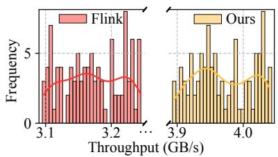

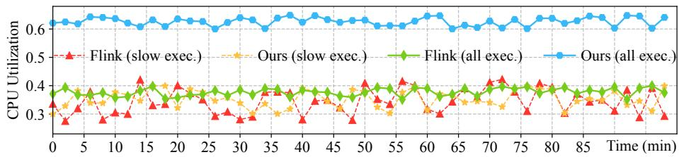  
Figure 10: Primus Online Training VS. Flink Online Training with 25% Slow Executors

Table 6: Comparison of AUC and Revenue Performance for Various Models without (w/o) and with (w/) MTRM
<table><tr><td rowspan="2">Model</td><td colspan="8">Evaluation (AUC)</td><td rowspan="2">A/B Testing Revenue</td></tr><tr><td>Day 1</td><td>Day 2</td><td>Day 3</td><td>Day 4</td><td>Day 5</td><td>Day 6</td><td>Day 7</td><td>Avg Samples1</td></tr><tr><td>w/o</td><td>0.92411</td><td>0.91992</td><td>0.92538</td><td>0.92737</td><td>0.92187</td><td>0.92554</td><td>0.92642</td><td>0.92437</td><td>2,252,037</td><td></td></tr><tr><td>1 w/</td><td></td><td>0.92439+0.03% 0.92018+0.03% 0.92559+0.02% 0.92758+0.02% 0.92212+0.03% 0.92582+0.03% 0.92660+0.01% 0.92461+0.03%</td><td></td><td></td><td></td><td></td><td></td><td></td><td>2,252,459</td><td>+1.045%</td></tr><tr><td>w/o 2</td><td>0.87125</td><td>0.86748</td><td>0.87103</td><td>0.86939</td><td>0.86885</td><td>0.86855</td><td>0.86887</td><td>0.86935</td><td>21,643,587</td><td></td></tr><tr><td>w/</td><td></td><td>0.87173+0.06% 0.86804+0.06% 0.87156+0.06% 0.86987+0.06% 0.86930+0.05% 0.86907+0.06% 0.86945+0.07% 0.86986+0.06%</td><td></td><td></td><td></td><td></td><td></td><td></td><td>21,643,223</td><td>+0.806%</td></tr><tr><td>w/o 3</td><td>0.95333</td><td>0.95083</td><td>0.95175</td><td>0.95098</td><td>0.95070</td><td>0.95218</td><td>0.95141</td><td>0.95160</td><td>21,141,647</td><td></td></tr><tr><td>w/</td><td></td><td>0.95380+0.05% 0.95131+0.05% 0.95220+0.05% 0.95143+0.05% 0.95122+0.05% 0.95269+0.05% 0.95188+0.05% 0.95208+0.05%</td><td></td><td></td><td></td><td></td><td></td><td></td><td>21,148,298 +2.438%</td><td></td></tr><tr><td>w/o 4</td><td>0.83299</td><td>0.83337</td><td>0.83471</td><td>0.83443</td><td>0.83380</td><td>0.83460</td><td>0.83608</td><td>0.83428</td><td>254,869,721</td><td></td></tr><tr><td rowspan="2">w/</td><td></td><td></td><td></td><td></td><td></td><td></td><td></td><td></td><td>254,864,629 +0.397%</td><td></td></tr><tr><td></td><td>0.8352+0.06% 0.83395+0.07%0.83527+0.07% 0.83500+0.07% 0.83438+007% 0.83513+0.06% 0.83666+0.07% 0.83484+0.07%</td><td></td><td></td><td></td><td></td><td></td><td></td><td></td><td></td></tr></table>

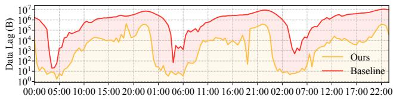  
Figure 11: Data Prioritization Reduces Loading Lag

## 7 Lessons

In this section, we share our experiences and lessons learned during the design and implementation of Primus.

Road Towards Unified Resource Scheduling: In the early stages of Primus, Kubernetes lacked sufficient pod scheduling throughput and did not support gang scheduling semantics. Consequently, training resources were primarily managed by

YARN, through a hybrid deployment of YARN NodeManager and Kubelet. As Kubernetes’ scheduling capabilities improved, along with its support for gang scheduling semantics, a greater portion of training jobs was migrated to Kubernetes. During this migration, ensuring consistency in user experience became critical, as system changes could not impact users. To address this, Primus services as an intermediary layer, insulating users from the differences between scheduling systems by the unified resource scheduling design. Over time, Primus evolves to support more comprehensive dynamic horizontal and vertical scaling capabilities.

Optimizing Data Access for Various Formats: The vast quantities of sample data are stored in diverse formats (e.g., TFRecord, Protobuff, and 4mz) and compressed with multiple algorithms (e.g., Snappy, ZSTD, and GZIP). Initially, a separate Java process (using InputFormat) was used to read files and pipe them to training executors which faced overhead in cross-process communication and data format conversions. To address this, Primus re-engineers the data access layer using Arrow for cross-language efficiency and NativeClient for optimized stream data handling, reducing CPU usage by 40%. Additionally, Primus master employs ClassLoader and other isolation techniques to allow seamless integration of diverse data lakes like Iceberg and Hudi, balancing data management complexity with high retrieval efficiency.

Necessity of Mixture Data Prioritization: Initially, Primus employed two distinct groups of executors to process batch and stream data separately. However, we observed that batch data processing occurred more rapidly, resulting in resource wastage. Then, Primus was updated to handle both batch and stream data within the same executors. While this approach increased resource efficiency, we found that the large volume and fast arrival rate of batch data often consumed excessive resources, delaying the processing of stream data, particularly during peak hours. To address this, we design the continuous prioritized data queue that ensures stream data is processed first. It helps prevent MTRM performance degradation by ensuring timely learning of stream data.

## 8 Related Work

Deep Learning Scheduler. Deep learning training optimization with various resource schedulers has received attention in recent years in recent years [34, 42]. Studies indicate that YARN and Kubernetes are the mainstream training frameworks at present [23]. Current optimization strategies like dynamic resource allocation [15] , face portability issues when applied across heterogeneous environments. Systems like Oobleck [26] and DynamoML [13] concentrate on elastic GPU training but remain tightly coupled to Kubernetes, limiting their applicability to more diverse production infrastructures.. GoldMiner [64] proposes a novel resource allocation paradigm on Kubernetes, separating CPU and GPU and allocating both resources automatically to improve the efficiency of the cluster. However, GoldMiner is only adapted to Kubernetes, which cannot be extended to other schedulers. While ElasticFlow [18] elegantly supports dynamic GPU reallocation, it is not designed to accommodate heterogeneous executor configurations. Moreover, while horizontal pod autoscaling leverages workload predictions to reduce unnecessary resource allocation, discussions on machine learning-based vertical pod autoscaling remain relatively scarce [61]. Primus enables dynamic scaling and precise resource control for both CPU and GPU workers, supporting collaboration with multiple scheduling systems.

Deep Learning Data Loading. Along with the increase of data amount, data reading and preprocessing become complicated and critical [60]. tf.data [40] proposes a machine learning preprocessing framework, which mainly concentrates on throughput optimization during sample reading. However, massive metadata training is not considered, and data fragmentation is not supported in elastic training scenarios. tf.data service [7] maximizes GPU utilization to save training time and implements sample concurrent preprocessing with CPU data preprocessing. However, there is an additional loss in RPC data transmission. Meanwhile, current training systems such as Horovod [47], DLRover [52], and others [58] usually only have a single data source, which fails to have built-in support for multiple data sources with various storage systems and formats. Primus seamlessly integrates various data sources, encompassing both stream and batch data stored in HDFS, Kafka, and Feature Store.

DLRM Online Training. DLRMs are widely employed by internet companies for various tasks such as ad CTR prediction [41]. Due to the rapid increase in data scale, the training of DLRM models in distributed memory and computing systems faces challenges [53]. cDLRM [8] implements training large DLRM model with single GPU and pure data parallel training by unique caching strategy. Monolith [35] and Persia [33] focus primarily on innovations in model structures, such as sparse-dense parameter separation and large model efficient distributed updates. They are tightly coupled with specific model structures and directly train online DLRM with only stream data in homogeneous GPU-based training environments. General stream processing systems, such as Flink [5] and Ray [37], require a lot of user code modifications to use batch data. Primus provides strong model-agnostic support for DLRM training, providing features such as error handling, dynamic scaling, and data orchestration.

## 9 Conclusion

We present Primus, a tri-unified training framework for DLRM that encompasses three primary innovations. First, Primus provides a unified resource scheduling abstraction across multiple resource scheduling systems. To the best of our knowledge, Primus is the first to offer a multi-strategy dynamic scaling mechanism utilizing a standardized API server that interoperates seamlessly with both YARN and Kubernetes clusters. Second, Primus introduces a three-tier data definition that facilitates efficient offline and online training within a single framework. It implements DTGG to enable parallel task generation for orchestrating training data at scale. Third, Primus features an offline-online mixture training paradigm, allowing for continuous ingestion of historical offline batch data during online model training, resulting in a significant increase in advertising revenue. Since 2019, Primus has been utilized for all ByteDance production DLRM training, leveraging a resource scale exceeding 10 million CPU cores and tens of thousands of GPUs. We continue to enhance Primus to achieve better efficiency and effectiveness in DLRM training.

## Acknowledgments

We would like to thank all those who contributed to the design and development of Primus, including Han Qian, Dongyan Zhou, Hanqing Zhao, Irshad Kandy, Kai Xie, Chi Zhang, Di Wu, and Hoang Le. We are also grateful to our business partners across the search, advertising, and recommendation teams for their valuable support and collaboration. This work was supported by the National Key R&D Program of China (2024YFF0617700), the National Natural Science Foundation of China (U23A20309, 62272302, 62372296), “Pioneer” and “Leading Goose” R&D Program of Zhejiang (2024C01167), and the ByteDance Research Project (CT20250218122839). Xiuqi Huang completed the majority of her contributions during her Ph.D. studies at Shanghai Jiao Tong University and her research internship at ByteDance.

## References

[1] Martín Abadi, Ashish Agarwal, Paul Barham, Eugene Brevdo, Zhifeng Chen, Craig Citro, Gregory S. Corrado, Andy Davis, Jeffrey Dean, Matthieu Devin, Sanjay Ghemawat, Ian J. Goodfellow, Andrew Harp, Geoffrey Irving, Michael Isard, Yangqing Jia, Rafal Józefowicz, Lukasz Kaiser, Manjunath Kudlur, Josh Levenberg, Dan Mané, Rajat Monga, Sherry Moore, Derek Gordon Murray, Chris Olah, Mike Schuster, Jonathon Shlens, Benoit Steiner, Ilya Sutskever, Kunal Talwar, Paul A. Tucker, Vincent Vanhoucke, Vijay Vasudevan, Fernanda B. Vié- gas, Oriol Vinyals, Pete Warden, Martin Wattenberg, Martin Wicke, Yuan Yu, and Xiaoqiang Zheng. Tensorflow: Large-scale machine learning on heterogeneous distributed systems. CoRR, abs/1603.04467, 2016.

[2] Bilge Acun, Matthew Murphy, Xiaodong Wang, Jade Nie, Carole-Jean Wu, and Kim M. Hazelwood. Understanding training efficiency of deep learning recommendation models at scale. In IEEE International Symposium on High-Performance Computer Architecture (HPCA), pages 802–814. IEEE, 2021.

[3] Saurabh Agarwal, Amar Phanishayee, and Shivaram Venkataraman. Blox: A modular toolkit for deep learning schedulers. In European Conference on Computer Systems (EuroSys), pages 1093–1109. ACM, 2024.

[4] Apache Software Foundation. Apache Arrow, 2024. A universal columnar format and multi-language toolbox for fast data interchange and in-memory analytics. https://arrow.apache.org/.

[5] Apache Software Foundation. Apache Flink, 2024. A framework and distributed processing engine for stateful computations over unbounded and bounded data streams. https://flink.apache.org/.

[6] Apache Software Foundation. Apache Hadoop YARN, 2024. The fundamental idea of YARN is to split up the functionalities of resource management and job scheduling/monitoring into separate daemons. https://hadoop.apache.org/docs/stable/hadoopyarn/hadoop-yarn-site/YARN.html.

[7] Andrew Audibert, Yang Chen, Dan Graur, Ana Klimovic, Jirí Simsa, and Chandramohan A. Thekkath. tf.data service: A case for disaggregating ML input data processing. In ACM Symposium on Cloud Computing (SoCC), pages 358–375. ACM, 2023.

[8] Keshav Balasubramanian, Abdulla Alshabanah, Joshua D Choe, and Murali Annavaram. cDLRM: Look ahead caching for scalable training of recommendation models. In ACM Conference on Recommender System (RecSys), pages 263–272. ACM, 2021.

[9] Brendan Burns, Brian Grant, David Oppenheimer, Eric A. Brewer, and John Wilkes. Borg, Omega, and Kubernetes. Communications of the ACM (CACM), 59(5):50–57, 2016.

[10] Zhangming Chan, Yu Zhang, Shuguang Han, Yong Bai, Xiang-Rong Sheng, Siyuan Lou, Jiacen Hu, Baolin Liu, Yuning Jiang, Jian Xu, and Bo Zheng. Capturing conversion rate fluctuation during sales promotions: A novel historical data reuse approach. In ACM SIGKDD Conference on Knowledge Discovery and Data Mining (KDD), pages 3774–3784. ACM, 2023.

[11] Shubham Chaudhary, Ramachandran Ramjee, Muthian Sivathanu, Nipun Kwatra, and Srinidhi Viswanatha. Balancing efficiency and fairness in heterogeneous GPU clusters for deep learning. In European Conference on Computer Systems (EuroSys), pages 1:1–1:16. ACM, 2020.

[12] Kai-Hsun Chen, Huan-Ping Su, Wei-Chiu Chuang, Hung-Chang Hsiao, Wangda Tan, Zhankun Tang, Xun Liu, Yanbo Liang, Wen-Chih Lo, Wanqiang Ji, Byron Hsu, Keqiu Hu, HuiYang Jian, Quan Zhou, and Chien-Min Wang. Apache submarine: A unified machine learning platform made simple. In European Workshop on Machine Learning and Systems (EuroMLSys), pages 101–108. ACM, 2022.

[13] Min-Chi Chiang and Jerry Chou. Dynamoml: Dynamic resource management operators for machine learning workloads. In International Conference on Cloud Computing and Services Science (CLOSER), pages 122–132. SCITEPRESS, 2021.

[14] Chao Du, Zhifeng Gao, Shuo Yuan, Lining Gao, Ziyan Li, Yifan Zeng, Xiaoqiang Zhu, Jian Xu, Kun Gai, and Kuang-Chih Lee. Exploration in online advertising systems with deep uncertainty-aware learning. In ACM SIGKDD Conference on Knowledge Discovery and Data Mining (KDD), pages 2792–2801. ACM, 2021.

[15] Apache Software Foundation. Dynamic resource allocation, 2024. Spark provides a mechanism to dynamically adjust the resources your application occupies based on the workload. https://spark.apache.org/docs/latest/jobscheduling.html.

[16] Weihao Gao, Xiangjun Fan, Chong Wang, Jiankai Sun, Kai Jia, Wenzhi Xiao, Ruofan Ding, Xingyan Bin, Hui Yang, and Xiaobing Liu. Learning an end-toend structure for retrieval in large-scale recommendations. In ACM International Conference on Information and Knowledge Management (CIKM), pages 524–533. ACM, 2021.

[17] Priya Goyal, Piotr Dollár, Ross B. Girshick, Pieter Noordhuis, Lukasz Wesolowski, Aapo Kyrola, Andrew Tulloch, Yangqing Jia, and Kaiming He. Accurate, large minibatch SGD: training imagenet in 1 hour. CoRR, abs/1706.02677, 2017.

[18] Diandian Gu, Yihao Zhao, Yinmin Zhong, Yifan Xiong, Zhenhua Han, Peng Cheng, Fan Yang, Gang Huang, Xin Jin, and Xuanzhe Liu. Elasticflow: An elastic serverless training platform for distributed deep learning. In ACM International Conference on Architectural Support for Programming Languages and Operating Systems (ASP-LOS), pages 266–280. ACM, 2023.

[19] Anthony Hsu, Keqiu Hu, Jonathan Hung, Arun Suresh, and Zhe Zhang. Tony: An orchestrator for distributed machine learning jobs. In USENIX Conference on Operational Machine Learning (OpML), pages 39–41. USENIX Association, 2019.

[20] Meiqi Hu, Chen Wu, and Bo Du. EMS-NET: efficient multi-temporal self-attention for hyperspectral change detection. In IEEE International Geoscience and Remote Sensing Symposium (IGARSS), pages 6664–6667. IEEE, 2023.

[21] Qinghao Hu, Peng Sun, Shengen Yan, Yonggang Wen, and Tianwei Zhang. Characterization and prediction of deep learning workloads in large-scale GPU datacenters. In International Conference for High Performance Computing, Networking, Storage and Analysis (SC), pages 104:1–104:15. ACM, 2021.

[22] Qinghao Hu, Meng Zhang, Peng Sun, Yonggang Wen, and Tianwei Zhang. Lucid: A non-intrusive, scalable and interpretable scheduler for deep learning training jobs. In ACM International Conference on Architectural Support for Programming Languages and Operating Systems (ASPLOS), pages 457–472. ACM, 2023.

[23] Jianbo Huang, Wenli Zhou, Ruoning Song, Fang Liu, Siye Wang, and Jun Liu. Design and performance modeling of a yarn-based gpu resource scheduling system. In IEEE International Conference on Computer and Communications (ICCC), pages 1897–1902. IEEE, 2019.

[24] Po-Sen Huang, Xiaodong He, Jianfeng Gao, Li Deng, Alex Acero, and Larry P. Heck. Learning deep structured semantic models for web search using clickthrough data. In ACM International Conference on Information and Knowledge Management (CIKM), pages 2333–2338. ACM, 2013.

[25] Changho Hwang, Taehyun Kim, Sunghyun Kim, Jinwoo Shin, and KyoungSoo Park. Elastic resource sharing for distributed deep learning. In USENIX Symposium on Networked Systems Design and Implementation (NSDI), pages 721–739. USENIX Association, 2021.

[26] Insu Jang, Zhenning Yang, Zhen Zhang, Xin Jin, and Mosharaf Chowdhury. Oobleck: Resilient distributed training of large models using pipeline templates. In Symposium on Operating Systems Principles(SOSP), pages 382–395. ACM, 2023.

[27] Xianyan Jia, Le Jiang, Ang Wang, Wencong Xiao, Ziji Shi, Jie Zhang, Xinyuan Li, Langshi Chen, Yong Li, Zhen Zheng, Xiaoyong Liu, and Wei Lin. Whale: Efficient giant model training over heterogeneous gpus. In USENIX Annual Technical Conference (ATC), pages 673–688. USENIX Association, 2022.

[28] Biye Jiang, Chao Deng, Huimin Yi, Zelin Hu, Guorui Zhou, Yang Zheng, Sui Huang, Xinyang Guo, Dongyue Wang, Yue Song, et al. XDL: An industrial deep learning framework for high-dimensional sparse data. In International Workshop on Deep Learning Practice for High-Dimensional Sparse Data, pages 1–9, 2019.

[29] Ziheng Jiang, Haibin Lin, Yinmin Zhong, Qi Huang, Yangrui Chen, Zhi Zhang, Yanghua Peng, Xiang Li, Cong Xie, Shibiao Nong, Yulu Jia, Sun He, Hongmin Chen, Zhihao Bai, Qi Hou, Shipeng Yan, Ding Zhou, Yiyao Sheng, Zhuo Jiang, Haohan Xu, Haoran Wei, Zhang Zhang, Pengfei Nie, Leqi Zou, Sida Zhao, Liang Xiang, Zherui Liu, Zhe Li, Xiaoying Jia, Jianxi Ye, Xin Jin, and Xin Liu. Megascale: Scaling large language model training to more than 10, 000 gpus. In USENIX Symposium on Networked Systems Design and Implementation (NSDI), pages 745–760. USENIX Association, 2024.

[30] Sofia Ira Ktena, Alykhan Tejani, Lucas Theis, Pranay Kumar Myana, Deepak Dilipkumar, Ferenc Huszár, Steven Yoo, and Wenzhe Shi. Addressing delayed feedback for continuous training with neural networks in CTR prediction. In ACM Conference on Recommender Systems (RecSys), pages 187–195. ACM, 2019.

[31] Kubeflow Community. Kubeflow, 2024. Kubeflow makes artificial intelligence and machine learning simple, portable, and scalable. https://www.kubeflow.org/.

[32] Jiamin Li, Hong Xu, Yibo Zhu, Zherui Liu, Chuanxiong Guo, and Cong Wang. Lyra: Elastic scheduling for deep learning clusters. In European Conference on Computer Systems (EuroSys), pages 835–850. ACM, 2023.

[33] Xiangru Lian, Binhang Yuan, Xuefeng Zhu, Yulong Wang, Yongjun He, Honghuan Wu, Lei Sun, Haodong Lyu, Chengjun Liu, Xing Dong, Yiqiao Liao, Mingnan Luo, Congfei Zhang, Jingru Xie, Haonan Li, Lei Chen, Renjie Huang, Jianying Lin, Chengchun Shu, Xuezhong

Qiu, Zhishan Liu, Dongying Kong, Lei Yuan, Hai Yu, Sen Yang, Ce Zhang, and Ji Liu. Persia: An open, hybrid system scaling deep learning-based recommenders up to 100 trillion parameters. In ACM SIGKDD Conference on Knowledge Discovery and Data Mining (KDD), pages 3288–3298. ACM, 2022.

[34] Feng Liang, Zhen Zhang, Haifeng Lu, Chengming Li, Victor Leung, Yanyi Guo, and Xiping Hu. Resource allocation and workload scheduling for large-scale distributed deep learning: A survey. CoRR, 2024.

[35] Zhuoran Liu, Leqi Zou, Xuan Zou, Caihua Wang, Biao Zhang, Da Tang, Bolin Zhu, Yijie Zhu, Peng Wu, Ke Wang, and Youlong Cheng. Monolith: Real time recommendation system with collisionless embedding table. In Workshop on Online Recommender Systems and User Modeling co-located with the ACM Conference on Recommender Systems, volume 3303 of CEUR Workshop Proceedings. CEUR-WS.org, 2022.

[36] Kiran Kumar Matam, Hani Ramezani, Fan Wang, Zeliang Chen, Yue Dong, Maomao Ding, Zhiwei Zhao, Zhengyu Zhang, Ellie Wen, and Assaf Eisenman. Quick-Update: a real-time personalization system for largescale recommendation models. In USENIX Symposium on Networked Systems Design and Implementation (NSDI), pages 731–744. USENIX Association, 2024.

[37] Philipp Moritz, Robert Nishihara, Stephanie Wang, Alexey Tumanov, Richard Liaw, Eric Liang, Melih Elibol, Zongheng Yang, William Paul, Michael I. Jordan, and Ion Stoica. Ray: A distributed framework for emerging AI applications. In USENIX Symposium on Operating Systems Design and Implementation (OSDI), pages 561–577. USENIX Association, 2018.

[38] Dheevatsa Mudigere, Yuchen Hao, Jianyu Huang, Zhihao Jia, Andrew Tulloch, Srinivas Sridharan, Xing Liu, Mustafa Ozdal, Jade Nie, Jongsoo Park, Liang Luo, Jie Amy Yang, Leon Gao, Dmytro Ivchenko, Aarti Basant, Yuxi Hu, Jiyan Yang, Ehsan K. Ardestani, Xiaodong Wang, Rakesh Komuravelli, Ching-Hsiang Chu, Serhat Yilmaz, Huayu Li, Jiyuan Qian, Zhuobo Feng, Yinbin Ma, Junjie Yang, Ellie Wen, Hong Li, Lin Yang, Chonglin Sun, Whitney Zhao, Dimitry Melts, Krishna Dhulipala, K. R. Kishore, Tyler Graf, Assaf Eisenman, Kiran Kumar Matam, Adi Gangidi, Guoqiang Jerry Chen, Manoj Krishnan, Avinash Nayak, Krishnakumar Nair, Bharath Muthiah, Mahmoud khorashadi, Pallab Bhattacharya, Petr Lapukhov, Maxim Naumov, Ajit Mathews, Lin Qiao, Mikhail Smelyanskiy, Bill Jia, and Vijay Rao. Software-hardware co-design for fast and scalable training of deep learning recommendation models. In International Symposium on Computer Architecture (ISCA), pages 993–1011. ACM, 2022.

[39] Dheevatsa Mudigere, Yuchen Hao, Jianyu Huang, Andrew Tulloch, Srinivas Sridharan, Xing Liu, Mustafa Ozdal, Jade Nie, Jongsoo Park, Liang Luo, Jie Amy Yang, Leon Gao, Dmytro Ivchenko, Aarti Basant, Yuxi Hu, Jiyan Yang, Ehsan K. Ardestani, Xiaodong Wang, Rakesh Komuravelli, Ching-Hsiang Chu, Serhat Yilmaz, Huayu Li, Jiyuan Qian, Zhuobo Feng, Yinbin Ma, Junjie Yang, Ellie Wen, Hong Li, Lin Yang, Chonglin Sun, Whitney Zhao, Dimitry Melts, Krishna Dhulipala, K. R. Kishore, Tyler Graf, Assaf Eisenman, Kiran Kumar Matam, Adi Gangidi, Guoqiang Jerry Chen, Manoj Krishnan, Avinash Nayak, Krishnakumar Nair, Bharath Muthiah, Mahmoud khorashadi, Pallab Bhattacharya, Petr Lapukhov, Maxim Naumov, Lin Qiao, Mikhail Smelyanskiy, Bill Jia, and Vijay Rao. High-performance, distributed training of large-scale deep learning recommendation models. CoRR, abs/2104.05158, 2021.

[40] Derek G Murray, Jiˇrí Šimša, Ana Klimovic, and Ihor Indyk. tf.data: A machine learning data processing framework. Proceedings of the VLDB Endowment, 14(12):2945–2958, 2021.

[41] Maxim Naumov, Dheevatsa Mudigere, Hao-Jun Michael Shi, Jianyu Huang, Narayanan Sundaraman, Jongsoo Park, Xiaodong Wang, Udit Gupta, Carole-Jean Wu, Alisson G. Azzolini, Dmytro Dzhulgakov, Andrey Mallevich, Ilia Cherniavskii, Yinghai Lu, Raghuraman Krishnamoorthi, Ansha Yu, Volodymyr Kondratenko, Stephanie Pereira, Xianjie Chen, Wenlin Chen, Vijay Rao, Bill Jia, Liang Xiong, and Misha Smelyanskiy. Deep learning recommendation model for personalization and recommendation systems. CoRR, abs/1906.00091, 2019.

[42] Giang Nguyen, Stefan Dlugolinsky, Martin Bobák, Viet Tran, Álvaro López García, Ignacio Heredia, Peter Malík, and Ladislav Hluchy. Machine learning and \` deep learning frameworks and libraries for large-scale data mining: a survey. Artificial Intelligence Review, 52:77–124, 2019.

[43] Laurel J. Orr, Atindriyo Sanyal, Xiao Ling, Karan Goel, and Megan Leszczynski. Managing ML pipelines: Feature stores and the coming wave of embedding ecosystems. Proc. VLDB Endow., 14(12):3178–3181, 2021.

[44] Adam Paszke, Sam Gross, Francisco Massa, Adam Lerer, James Bradbury, Gregory Chanan, Trevor Killeen, Zeming Lin, Natalia Gimelshein, Luca Antiga, Alban Desmaison, Andreas Köpf, Edward Z. Yang, Zachary DeVito, Martin Raison, Alykhan Tejani, Sasank Chilamkurthy, Benoit Steiner, Lu Fang, Junjie Bai, and Soumith Chintala. Pytorch: An imperative style, highperformance deep learning library. In Conference

on Neural Information Processing Systems (NeurIPS), pages 8024–8035, 2019.

[45] Aurick Qiao, Sang Keun Choe, Suhas Jayaram Subramanya, Willie Neiswanger, Qirong Ho, Hao Zhang, Gregory R. Ganger, and Eric P. Xing. Pollux: Co-adaptive cluster scheduling for goodput-optimized deep learning. In USENIX Symposium on Operating Systems Design and Implementation (OSDI). USENIX Association, 2021.

[46] Steffen Rendle. Factorization machines. In IEEE International Conference on Data Mining (ICDM), pages 995–1000. IEEE Computer Society, 2010.

[47] Alexander Sergeev and Mike Del Balso. Horovod: Fast and easy distributed deep learning in tensorflow. CoRR, abs/1802.05799, 2018.

[48] Chijun Sima, Yao Fu, Man-Kit Sit, Liyi Guo, Xuri Gong, Feng Lin, Junyu Wu, Yongsheng Li, Haidong Rong, Pierre-Louis Aublin, and Luo Mai. Ekko: A Large-Scale deep learning recommender system with Low-Latency model update. In USENIX Symposium on Operating Systems Design and Implementation (OSDI), pages 821– 839. USENIX Association, 2022.

[49] Pawel Swietojanski, Jinyu Li, and Steve Renals. Learning hidden unit contributions for unsupervised acoustic model adaptation. IEEE ACM Trans. Audio Speech Lang. Process., 24(8):1450–1463, 2016.

[50] Taegeon Um, Byungsoo Oh, Byeongchan Seo, Minhyeok Kweun, Goeun Kim, and Woo-Yeon Lee. Fastflow: Accelerating deep learning model training with smart offloading of input data pipeline. Proc. VLDB Endow., 16(5):1086–1099, 2023.

[51] Ashish Vaswani, Noam Shazeer, Niki Parmar, Jakob Uszkoreit, Llion Jones, Aidan N. Gomez, Lukasz Kaiser, and Illia Polosukhin. Attention is all you need. In Annual Conference on Neural Information Processing Systems NeurIPS, pages 5998–6008, 2017.

[52] Qinlong Wang, Tingfeng Lan, Yinghao Tang, Bo Sang, Ziling Huang, Yiheng Du, Haitao Zhang, Jian Sha, Hui Lu, Yuanchun Zhou, Ke Zhang, and Mingjie Tang. DLRover-RM: Resource optimization for deep recommendation models trainin in the cloud. Proc. VLDB Endow., 17(12):4130–4144, 2024.

[53] Zheng Wang, Yuke Wang, Boyuan Feng, Dheevatsa Mudigere, Bharath Muthiah, and Yufei Ding. EL-Rec: Efficient large-scale recommendation model training via tensor-train embedding table. In International Conference for High Performance Computing, Networking, Storage and Analysis (SC), pages 70:1–70:14. IEEE, 2022.

[54] Wei Wei, Xubin Ren, Jiabin Tang, Qinyong Wang, Lixin Su, Suqi Cheng, Junfeng Wang, Dawei Yin, and Chao Huang. LLMRec: Large language models with graph augmentation for recommendation. In ACM International Conference on Web Search and Data Mining (WSDM), pages 806–815. ACM, 2024.

[55] Wencong Xiao, Romil Bhardwaj, Ramachandran Ramjee, Muthian Sivathanu, Nipun Kwatra, Zhenhua Han, Pratyush Patel, Xuan Peng, Hanyu Zhao, Quanlu Zhang, Fan Yang, and Lidong Zhou. Gandiva: Introspective cluster scheduling for deep learning. In USENIX Symposium on Operating Systems Design and Implementation (OSDI), pages 595–610. USENIX Association, 2018.

[56] Wencong Xiao, Shiru Ren, Yong Li, Yang Zhang, Pengyang Hou, Zhi Li, Yihui Feng, Wei Lin, and Yangqing Jia. AntMan: Dynamic scaling on GPU clusters for deep learning. In USENIX Symposium on Operating Systems Design and Implementation (OSDI), pages 533–548. USENIX Association, 2020.

[57] Lei Xie, Jidong Zhai, Baodong Wu, Yuanbo Wang, Xingcheng Zhang, Peng Sun, and Shengen Yan. Elan: Towards generic and efficient elastic training for deep learning. In IEEE International Conference on Distributed Computing Systems (ICDCS), pages 78–88. IEEE, 2020.

[58] Chih-Chieh Yang and Guojing Cong. Accelerating data loading in deep neural network training. In IEEE International Conference on High Performance Computing, Data, and Analytics (HiPC), pages 235–245. IEEE, 2019.

[59] Zhengyi Yang, Xiangnan He, Jizhi Zhang, Jiancan Wu, Xin Xin, Jiawei Chen, and Xiang Wang. A generic learning framework for sequential recommendation with distribution shifts. In International ACM SIGIR Conference on Research and Development in Information Retrieval (SIGIR), pages 331–340. ACM, 2023.

[60] Buyun Zhang, Liang Luo, Yuxin Chen, Jade Nie, Xi Liu, Shen Li, Yanli Zhao, Yuchen Hao, Yantao Yao, Ellie Dingqiao Wen, Jongsoo Park, Maxim Naumov, and Wenlin Chen. Wukong: Towards a scaling law for largescale recommendation. In International Conference on Machine Learning (ICML). OpenReview.net, 2024.

[61] Chengliang Zhang, Minchen Yu, Wei Wang, and Feng Yan. MArk: Exploiting cloud services for cost-effective, slo-aware machine learning inference serving. In USENIX Annual Technical Conference (ATC), pages 1049–1062, 2019.

[62] Haoyu Zhang, Logan Stafman, Andrew Or, and Michael J. Freedman. SLAQ: quality-driven scheduling for distributed machine learning. In Symposium on Cloud Computing (SoCC), pages 390–404. ACM, 2017.

[63] Yiqian Zhang, Yinfu Feng, Wen-Ji Zhou, Yunan Ye, Min Tan, Rong Xiao, Haihong Tang, Jiajun Ding, and Jun Yu. Multi-domain deep learning from a multi-view perspective for cross-border e-commerce search. In AAAI Conference on Artificial Intelligence (AAAI), pages 9387– 9395. AAAI Press, 2024.

[64] Hanyu Zhao, Zhi Yang, Yu Cheng, Chao Tian, Shiru Ren, Wencong Xiao, Man Yuan, Langshi Chen, Kaibo Liu, Yang Zhang, Yong Li, and Wei Lin. GoldMiner: Elastic scaling of training data pre-processing pipelines for deep learning. ACM SIGMOD International Conference on Management of Data (SIGMOD), 1(2):193:1–193:25, 2023.

[65] Laiping Zhao, Fangshu Li, Wenyu Qu, Kunlin Zhan, and Qingman Zhang. AITurbo: Unified compute allocation for partial predictable training in commodity clusters. In International Symposium on High-Performance Parallel and Distributed Computing (HPDC), pages 133–145. ACM, 2021.

[66] Mark Zhao, Niket Agarwal, Aarti Basant, Bugra Gedik, Satadru Pan, Mustafa Ozdal, Rakesh Komuravelli, Jerry Pan, Tianshu Bao, Haowei Lu, Sundaram Narayanan, Jack Langman, Kevin Wilfong, Harsha Rastogi, Carole-Jean Wu, Christos Kozyrakis, and Parik Pol. Understanding data storage and ingestion for large-scale deep recommendation model training: Industrial product. In International Symposium on Computer Architecture (ISCA), pages 1042–1057. ACM, 2022.

[67] Guorui Zhou, Xiaoqiang Zhu, Chengru Song, Ying Fan, Han Zhu, Xiao Ma, Yanghui Yan, Junqi Jin, Han Li, and Kun Gai. Deep interest network for click-through rate prediction. In ACM SIGKDD International Conference on Knowledge Discovery & Data Mining (KDD), pages 1059–1068. ACM, 2018.

[68] Jun Zhou, Ke Zhang, Feng Zhu, Qitao Shi, Wenjing Fang, Lin Wang, and Yi Wang. ElasticDL: A kubernetesnative deep learning framework with fault-tolerance and elastic scheduling. In ACM International Conference on Web Search and Data Mining (WSDM), pages 1148– 1151. ACM, 2023.