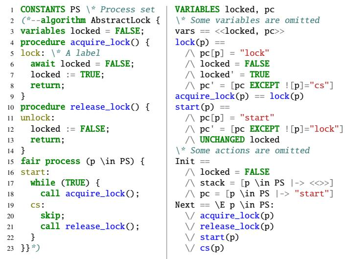
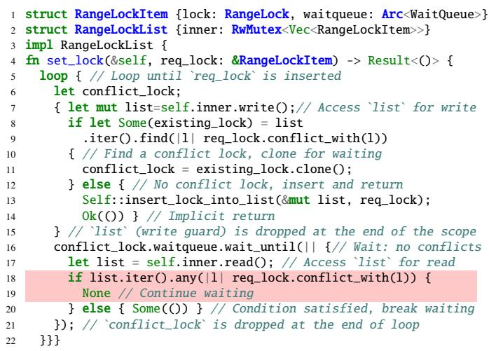
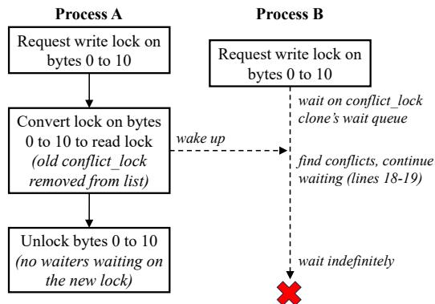
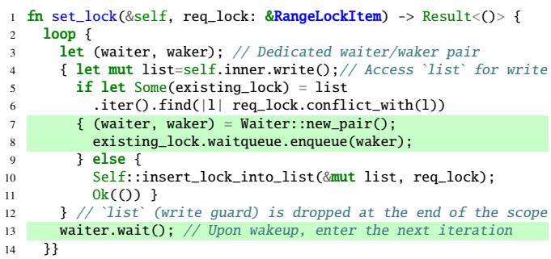
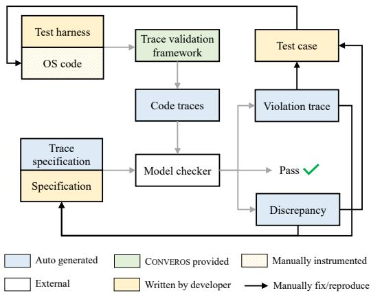
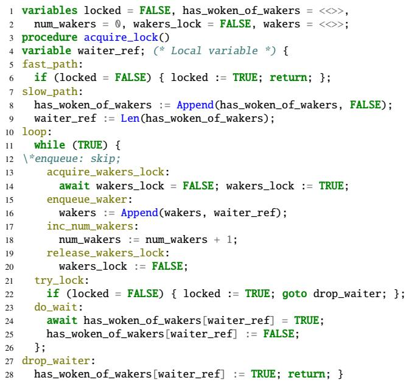
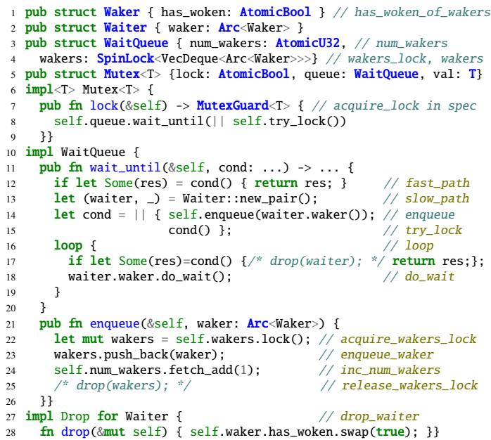
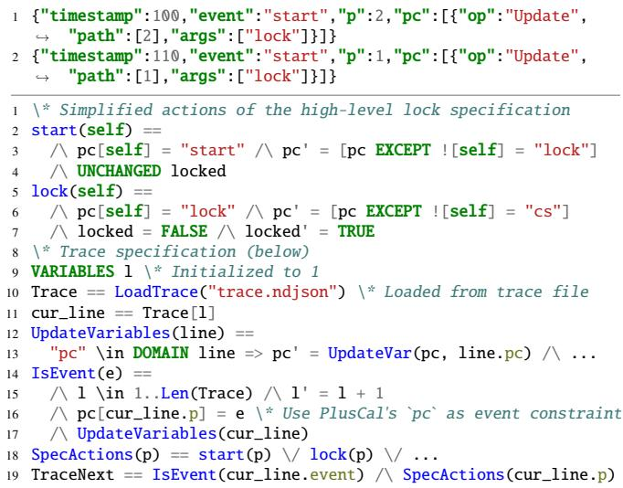
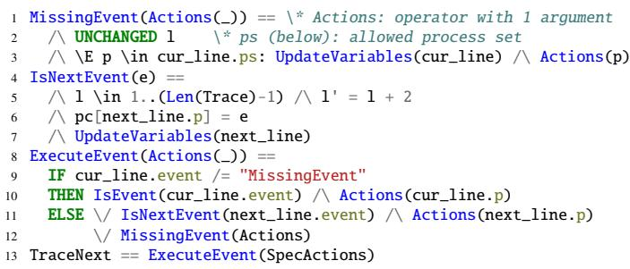

①

USENIX

THE ADVANCED COMPUTING SYSTEMS ASSOCIATION

# Converos: Practical Model Checking for Verifying Rust OS Kernel Concurrency

Ruize Tang, State Key Laboratory for Novel Software Technology, Nanjing University; Minghua Wang, Ant Group; Xudong Sun, University of Illinois Urbana-Champaign; Lin Huang, Ant Group; Yu Huang and Xiaoxing Ma, State Key Laboratory for Novel Software Technology, Nanjing University

https://www.usenix.org/conference/atc25/presentation/tang

# This paper is included in the Proceedings of the 2025 USENIX Annual Technical Conference.

July 7–9, 2025 • Boston, MA, USA ISBN 978-1-939133-48-9

Open access to the Proceedings of the 2025 USENIX Annual Technical Conference is sponsored by

P=-r.h mEesL

auuuJl9 PgleU

King Abdullah University of

Science and Technology

# CONVEROS: Practical Model Checking for Verifying Rust OS Kernel Concurrency

Ruize Tang1∗, Minghua Wang2, Xudong Sun3, Lin Huang2, Yu Huang1†, Xiaoxing Ma1

1State Key Laboratory for Novel Software Technology, Nanjing University 2Ant Group 3University of Illinois Urbana-Champaign

## Abstract

ASTERINAS is an open-source, general-purpose operating system written in Rust, compatible with the Linux ABI, and designed with a focus on reliability and security.

We developed a practical model-checking methodology, CONVEROS, to verify the correctness of ASTERINAS concurrency modules such as synchronization primitives and critical thread-safety components. CONVEROS leverages the rigor of formal specifications and introduces a multi-layered, multi-grained specification approach to make writing scalable specifications practical, demonstrated in our case by writing PlusCal specifications for Rust code. It also makes conformance checking incremental and more automated to detect specification-code discrepancies. While many formal methods are challenging to apply due to complexity and the expertise required, CONVEROS makes model checking cost-effective, accessible, and adaptable to evolving specifications and code. We applied CONVEROS to 12 critical concurrency modules, uncovering 20 bugs that led to issues such as data races, deadlocks, livelocks, and kernel panics. With a specification-to-code ratio ranging from 0.3 to 2.3 and a verification effort of only four person-months, our results demonstrate the practicality and effectiveness of CONVEROS.

## 1 Introduction

ASTERINAS [2, 64] is a new general-purpose OS kernel written in Rust, compatible with the Linux ABI and designed for improved reliability and security. It is being developed with the goal of supporting future deployment within Ant Group. Although still in its early stages, ASTERINAS has a substantial codebase of 100K lines of Rust, supports 200 commonly used Linux syscalls, and can run large-scale applications such as the JVM and MySQL. ASTERINAS is open-source and has built an active community, attracting many contributors.

While ASTERINAS is rapidly evolving, we have encountered numerous low-level concurrency bugs that tests cannot reliably rule out. Although Rust greatly enhances memory safety and prevents data races in safe code, OS kernel development inevitably requires unsafe, which may still introduce concurrency-related undefined behaviors such as data races. Logical errors and flawed designs can lead to deadlocks, livelocks, and functional violations. These concurrency bugs are notoriously difficult to detect, reproduce, and fix correctly.

We decide to apply formal methods by model checking the ASTERINAS implementation because we want to verify the correctness of complex concurrency code to prevent severe bugs from reaching production, inspired by recent successful industrial experiences [31, 38, 47, 61] and efforts to enhance the practicality of model checking [31, 34, 38, 63].

However, applying model checking to complex OS implementations is hard. First, writing specifications can be challenging, as it requires domain knowledge with formal methods and poor specifications can hinder model checking scalability. Second, discrepancies between specifications and implementations–caused by modeling errors or the rapid evolution of code–can compromise verification results, leading to both false positives and false negatives.

Contributions. To address these challenges, we present CONVEROS, a practical methodology for model checking OS concurrency modules. CONVEROS consists of three steps: (1) writing formal specifications (§4), (2) checking conformance between implementation traces and specifications (§5), and (3) model checking the refined specifications. We focus on steps (1) and (2), which make model checking results effectively reflect code correctness. To make CONVEROS practical, each step is small, incremental and provides rapid feedback.

For writing specifications, we introduce a multi-layered, multi-grained specification approach (§4), which divides each module into manageable components for incremental modeling at different granularities. The multi-layered specifications consist of high-level and low-level specifications (§4.1). The high-level specifications represent the correct design, abstracting away implementation details. The low-level specifications reflect code details and incorporate potential code bugs. This ensures model checking can identify those bugs effectively.

We use a multi-grained specification approach [63] for lowlevel specifications (§4.2), enabling incremental verification by verifying modules separately and coarsening actions if the modules do not interact. To make writing specifications more accessible, CONVEROS adopts the imperative-like language PlusCal[54], which is compiled into TLA+[53]. PlusCal offers a syntax similar to C, making it familiar to programmers. Writing PlusCal specifications is applicable across programming languages; in our case, we model Rust code.

For conformance checking, we employ trace validation [34] to check specification-code conformance (§5). Trace validation executes the implementation to generate traces and checks whether these traces are allowed in the specification’s state space (§5.1 and §5.2). We enhanced trace validation to improve automation and usability by introducing a new algorithm that automatically infers missing events (§5.3). This improvement addresses issues such as inaccurate timestamps where recorded event times do not precisely reflect actual occurrences and enables quick and incremental establishment of specification-code conformance, even when logging is incomplete for all actions, significantly reducing logging effort. Checking high-level specification conformance helps identify code bugs. Checking low-level specification conformance increases confidence that the specifications accurately reflect the code’s behavior. When model checking low-level specifications reveals violations, we write test cases to confirm the bugs and often uncover by-product bugs during testing.

Key Results. We have applied CONVEROS to ASTERINAS by verifying 12 critical concurrency modules including spinlocks, mutexes, file locks, futex, SysV semaphore IPC, a lock-free ring buffer, a locking protocol for page tables, and lock usage in TTY. We have detected 20 new bugs in AS-TERINAS: 9 were automatically detected by CONVEROS, and 11 were manually found when diagnosing bugs reported by CONVEROS. All bugs have been confirmed, and 14 have been fixed. The effort required for writing specifications and checking conformance has proven to be manageable and costeffective. The specification-to-code ratio ranges from 0.3 to 2.3, with approximately 43.5 person-days spent writing all specifications and 21.5 person-days on conformance checks– amounting to a total of about four person-months.

Summary. This paper presents four main contributions:

• We designed a practical model checking methodology, CONVEROS, for verifying safety and liveness of OS concurrency modules, featuring a structured, incremental process for specification, trace validation, and model checking.

• We developed a multi-layered, multi-grained specification approach that improves practicality and enables incremental modeling and scalable verification by composing modules at different granularities.

• We proposed a novel algorithm to enhance trace validation for spec-code conformance by automatically searching for missing events, and improved automation and usability for granularity alignment and discrepancy debugging.

• We applied CONVEROS to ASTERINAS, modeling and verifying 12 concurrency modules. CONVEROS revealed 20 bugs and helped improve code correctness, demonstrating its practicality for real-world OS verification.

## 2 Background and Motivation

## 2.1 ASTERINAS

ASTERINAS [2, 64] is an open-source collaborative project between academic researchers and industry practitioners aimed at creating a production-grade operating system entirely in Rust. It aims to support general-purpose usage scenarios such as data centers and trusted execution environments, where thread safety is essential. Although still in the early stages, ASTERINAS is positioned as a serious industry effort intended to serve as a drop-in replacement for Linux, providing Linuxcompatible system call interfaces and replicating key Linux features. To date, it currently comprises approximately 100K lines of code, has implemented 200 of the 336 most commonly used Linux system calls and is capable of running large-scale applications such as JVM and MySQL.

Rust’s ownership model and strict borrowing rules prevent memory safety issues like dangling pointers and use-after-free errors. An example of Rust ownership and concurrency is shown in Figure 1, illustrating the use of Mutex for concurrently updating shared data. Line 6 is detailed in Figure 9, while line 7 involves dereferencing mutable data, which internally uses unsafe as shown in Figure 14. Rust’s ownership model ensures proper resource management, such as automatically unlocking the mutex when the guard goes out of scope. However, these features do not eliminate all concurrency issues. They can still occur in unsafe code or result from design flaws and improper use of low-level synchronization primitives [66]. Concurrency issues are still frequently reported [3], particularly in custom synchronization primitives designed specifically for the OS. This motivates the adoption of formal methods to rigorously verify the concurrency correctness of these modules and increase confidence in their reliability.

```rust
1 // Arc shares ownership across threads via atomic ref counting
2 let m = Arc::new(Mutex::new(0));
3 for _ in 0..10 {
4 let c = Arc::clone(&m); // refcount++; `c` owns a reference
5 thread::spawn(move || { // Ownership of `c` moves in
6 let mut guard = c.lock(); // Blocks until lock acquired
7 *guard += 1; // Critical section: mutable access
8 // `guard` dropped: lock released; `c` dropped: refcount--
9 });} // `m` dropped: refcount goes to zero, Mutex is dropped
```  
Figure 1: Rust ownership and concurrency example

## 2.2 TLA+ and PlusCal

TLA+. TLA+ [53] is a formal specification language widely used in both academia and industry to verify concurrent and distributed systems [32, 34, 38, 47, 61, 63].

  
Figure 2: A simple lock specification. The PlusCal specification (left) includes two procedures (e.g., acquire\_lock) and four atomic actions/labels (e.g., lock) with PS processes executing the process statement concurrently. The lock action can be executed only when the await condition is true. In the compiled TLA+ specification (right), pc is a generated variable that stores the next labels to execute for each process. “\E” and “\A” represent existential and universal quantifiers.

TLA+ models a system as a state machine comprising variables, initial states, and state transitions. A typical specification follows the form Init /\ [Next]\_vars /\ L. “/\” and “\/” represent conjunction and disjunction. Init specifies the initial state by assigning values to all variables. Next specifies state transitions as a disjunction of actions, modeling nondeterminism by allowing multiple possible next steps. vars contains all variables in the specification. [Next]\_vars expands to Next \/ vars’ = vars, representing that either Next holds or all variables remain unchanged (i.e., stuttering), where primed variables represent their next state. L is a temporal formula used to assert liveness and fairness assumptions.

To ensure correctness, safety properties (asserting that nothing bad ever happens) and liveness properties (asserting that something good eventually happens) must also be specified.

PlusCal. PlusCal is a formal specification language designed to describe algorithms using imperative-like structures, with simple syntax and constructs similar to widely-used programming languages (e.g., while loops and procedure calls), making it more accessible to programmers. PlusCal specifications are compiled into TLA+ and verified using TLC [1].

A PlusCal specification consists of one or more processes, declared with the process keyword. Each process executes sequentially, while multiple processes run concurrently and can interleave. In the process and procedure bodies, labels are defined to mark atomic actions. Figure 2 illustrates a simple lock specification in PlusCal and its compiled TLA+.

Industrial experiences show that programmers find PlusCal more productive to start with than TLA+ [61]. Since lowlevel specifications need to closely reflect the code’s structure. PlusCal offers an imperative style that is more intuitive for programmers, making writing, maintaining, and incrementally improving specifications significantly easier.

  
Figure 3: Buggy range lock code causing lost wakeup. When a waiter (line 16) is woken up, it checks for conflicts, and if found, it continues waiting (highlighted code) on conflict\_lock.waitqueue, which is shared with existing\_lock’s (line 11). When existing\_lock is removed from list by another thread, that thread wakes waiters on existing\_lock.waitqueue–the only opportunity for them to be woken up. If a waiter rechecks and waits again, no thread can wake it, resulting in lost wakeup.

## 2.3 Motivation Example

Concurrency bugs, especially in OS kernels, are difficult to detect, reproduce and fix. Addressing concurrency bugs through expert reviews and CI testing is unreliable and may overlook corner cases. Formal methods provide rigorous verification of safety and liveness properties, helping identify bugs, generate violation traces, and ensure the correctness of fixed code.

We demonstrate the effectiveness of CONVEROS in identifying a hard-to-find, difficult-to-fix concurrency bug in range lock implementation [8] (Figure 3). This bug was introduced by a bug fix, but the fix was still incorrect [28]. We fixed it correctly after multiple failed fix attempts.

Range locks (i.e., file record locks) allow processes to place multiple read and write locks on different regions of the same file via the fcntl system call. This involves complex semantics for merging and splitting locks when new locks overlap with existing regions. The implementation maintains a list (i.e., RangeLockList) of active locks for the file inode associated with the file descriptor. When a requested lock conflicts with an existing one (i.e., their ranges overlap and at least one is a write lock), the process waits for the conflict to be resolved (lines 16–21) before inserting the new lock.

  
Figure 4: Range lock bug trace. Process A requests a write lock, blocking Process B’s conflicting write lock request. Process A then converts its lock type to read atomically, replacing the old write lock with a new read lock in list and waking up the waiters on the old write lock. Process B is woken up but finds conflicts with the new read lock and re-enters waiting. Process A unlocks the read lock but wakes no process because no waiters are on the read lock’s waitqueue.

The model checker revealed a deadlock bug cause by lost wakeup of the waiting process. The root cause lies in how the code manages wait queues for conflicting locks. When a requested lock req\_lock conflicts with an existing one (lines 8–9), the thread clones existing\_lock into conflict\_lock (line 11), also cloning its Arc-wrapped waitqueue (line 1). This creates a shared waitqueue between threads. The thread then blocks on this waitqueue (line 16), expecting another thread operating on the same queue to wake it up when the conflict may have been resolved. However, if all locks associated with that waitqueue are removed from the list while some threads are still waiting on it, those threads will block indefinitely. Figure 4 shows how the bug can occur. Several attempts to fix the bug in the specification were identified as incorrect through model checking, highlighting the challenge of correctly fixing concurrency bugs.

• First fix attempt. The fix transferred the wait\_queue to the new lock when replacing the old lock (scenario in Figure 4). However, the model checker revealed another lost wakeup scenario: when a conflict\_lock is removed by unlock, it wakes up the waiting process. But before the waiter checks for conflicts, another process inserts a conflicting lock, causing the waiter to re-enter the wait state even when the old conflict\_lock has been removed from list.

• Second fix attempt. The previous attempt demonstrated the need to ensure the conflict\_lock remains in the list before entering the wait state. To avoid a costly loop check, we tried optimizing by checking if the reference count of the conflict\_lock.waitqueue would reach 0. However, the model checker revealed that multiple processes could be waiting on the same conflict\_lock, causing multiple clones and a non-zero reference count even when the lock was no longer in the list.

  
Figure 5: Correct bug fix code for range lock. Uses a dedicated waiter/waker pair instead of cloning existing\_lock (lines 7–8), and upon wakeup, enters the next loop iteration to recheck for conflicts (line 13).

• Third fix attempt. We then attempted to wait on an empty condition; once woken up, the process would start the next loop for conflict detection. The model checker identified a livelock scenario: at the end of each loop, the conflict\_lock clone would be dropped, waking up all waiting processes. These processes would then drop their conflict\_lock clones, re-check for conflicts, and re-enter the wait state, potentially being awakened by a slower drop of conflict\_lock clones. This resulted in an infinite loop under specific timing conditions, which became increasingly likely under high contention, causing the exclusive write access to list to be held almost continuously.

• Final fix. Finally, we abandoned cloning existing\_lock to conflict\_lock and instead directly enqueued the waiter upon detecting a conflict (Figure 5). Similar to the third fix attempt, the process starts the next loop upon waking up, but this time it waits directly on a dedicated waiter/waker pair, which won’t wake up other processes on drop.

All fix attempts were conducted using model checking, which quickly verified each method and provided counterexamples for incorrect fixes. Once the bug was correctly fixed in the specification, we applied the corresponding fixes to the code and verified specification-code conformance.

## 3 CONVEROS Overview

We present CONVEROS, a practical methodology for model checking OS concurrency modules. CONVEROS draws inspiration from recent advancements in TLA+ for writing multigrained specs [63] and validating traces for conformance [34].

The effectiveness of CONVEROS lies in addressing speccode discrepancies through conformance checking, which enables model checking to detect real code bugs. Applying CONVEROS involves three main steps: (1) formal specification (§4), (2) conformance checking (§5), and (3) model checking. Figure 6 illustrates the overall workflow for verifying a concurrency module using CONVEROS. For step (1), developers write a PlusCal specification derived from the code (e.g., Figure 2). For step (2), They manually instrument the module and create a test harness to run it for trace collection (e.g., Figure 7). When discrepancies are found during conformance checking, developers manually revise the specification or code. Step (3) involves model checking the revised specification and manually writing test cases to reproduce any reported violations. We automated the generation of trace specifications, code traces, and discrepancy traces for conformance checking, while writing specifications, test harnesses, and test cases, and fixing bugs remain manual tasks. We summarize the overall developer burden in §6.2.

  
Figure 6: An overview of CONVEROS’s workflow

CONVEROS is designed to be practical by making each step small, incremental, and quick to execute, ensuring rapid feedback throughout the process. Consider a lock module that provides lock and unlock public APIs. The process begins with writing a simple specification that models the public APIs while abstracting away code details (Figure 2). Next, a corresponding test harness is written to use the lock’s public APIs in a loop, recording logs for each action1 (Figure 7). Each log corresponds to a specification’s action.

CONVEROS’s trace validation framework then automatically runs the test harness to generate code traces. Each trace line represents a code action, recording the action name, process ID and (partial) variable updates. CONVEROS automatically generates a trace specification that constrains the model-checking state transitions by the trace’s action name and variable updates. For example, as logged on line 7 in Figure 7, the start action constrains the next value of pc to lock; if it evaluates to a different value, the state is pruned.

CONVEROS subsequently runs the model checker for trace validation (step 2) and property verification (step 3). If the model checker finds discrepancies, developers address the issue in the code or specification, based on whether the specification reflects the intended design (as in this simple example) or detailed code logic. For property violations, both the spec and code must be fixed if the bug is confirmed in the code.

```rust
1 pub struct MutexModel;
2 impl TlaModel for MutexModel {
3 fn run(&self, procs: usize, loops: usize) {
4 let mutexlock = Arc::new(Mutex::new(0));
5 let proc_func = move || {
6 for _i in 0..loops {
7 TlaLogger::new("start").next_pc("lock").record();
8 let guard = mutexlock.lock();
9 TlaLogger::new("lock").next_pc("cs").record();
10 TlaLogger::new("cs").next_pc("unlock").record();
11 drop(guard);
12 TlaLogger::new("unlock").record();
13 }
14 };
15 run_procs(procs, proc_func); // Provided by trace framework
16 }}
```  
Figure 7: Simplified test harness for a mutex lock model. It implements the run method of the TlaModel trait, defines a closure using Mutex’s public APIs, and logs each action corresponding to a specification’s action. run\_procs executes the closure in parallel and post-processes the log output.

To ensure practicality, CONVEROS addresses two key challenges. First, it makes specifications incremental and scalable through a multi-layered, multi-grained specification approach (§4). Second, it improves automation of trace validation by introducing a new algorithm that allows missing events (§5).

## 4 Formal Specification

We design multi-layered and multi-grained specifications to make them easy to write, incremental, and scalable for model checking. Additionally, we define correctness properties to verify whether the system behaves as required.

## 4.1 Multi-Layered Specifications

Multi-layered specifications serve distinct purposes at each layer. High-level specifications capture the design intent (primarily for basic synchronization primitives) and are straightforward to write and verify (e.g., Figure 2). Low-level specifications are developed from the code and reflect implementation details (e.g., Figure 8 corresponds to the Mutex module shown in Figure 9). We do not construct formal refinement mappings [5] between high-level and low-level specifications, as this imposes substantial burdens on developers. Instead, we directly check the properties on the low-level specification.

High-Level Specifications. High-level specifications capture design requirements and are straightforward to write for their public APIs. These specifications are primarily used for basic synchronization primitives like spin and mutex locks, which are simple to write and easy to verify. For example, the Plus-Cal specification for an abstract lock, shown in Figure 2, models two public APIs: acquire\_lock and release\_lock, written in a style resembling imperative procedural code. These specifications ensure the APIs satisfy common locking properties, such as mutual exclusion, and absence of deadlocks and livelocks (as discussed in §4.3).



## Figure 8: A low-level Mutex PlusCal specification

High-level specifications are designed to provide a quick startup for our approach, enabling incremental development of more detailed low-level specifications based on them. They also support early conformance checking (§5), facilitating efficient application of CONVEROS (§3). Since our focus is on identifying real code bugs in specifications, high-level specifications may be omitted if they are difficult to define (e.g., for modules with complex lock usage).

Low-Level Specifications. Unlike high-level specifications aiming to represent a correct design specification, low-level specifications should closely reflect the code implementation. When bugs exist, the low-level specification enables detection through model checking against correctness properties.

A low-level specification can build on its high-level specification and model code details within the public APIs. For example, Figure 8 presents the lock procedure of a mutex’s specification, while Figure 9 shows the corresponding code.

Translating Rust code into a PlusCal specification is relatively straightforward because PlusCal supports many programming constructs and concepts, such as while loops and procedure calls. However, some Rust-specific characteristics require special handling: (1) Rust automatically invokes drop when a variable’s goes out of scope, which must be explicitly modeled in PlusCal (e.g., line 27 in Figure 8). (2) Closures in Rust do not have direct support in PlusCal and must be expanded into explicit steps (e.g., the closure on line 8 in Figure 9 is expanded in PlusCal to lines 6 and 22 in Figure 8).

## 4.2 Multi-Grained Specifications

A key challenge in specifying low-level code is determining the appropriate level of granularity. Fine-grained specifications can lead to state-space explosion, while coarse-grained ones risk missing concurrency bugs. To address this, we adopt the methodology of multi-grained specifications from Remix [63]. Multi-grained specifications use different levels of granularity for composable modules [6, 7, 35, 50]. They include fine-grained modules for detailed code-level behavior and coarse-grained modules that preserve interactions while omitting internal details to reduce state space.

  
Figure 9: Simplified Mutex code in ASTERINAS. try\_lock performs compare\_exchange and returns a guard on success. do\_wait blocks until has\_woken.swap(false) returns true. Comments in yellow correspond to labels in Figure 8’s spec.

A mixed-grained specification combines fine-grained and coarse-grained modules and aims to mitigate state explosion by verifying selective concurrency interleavings without compromising the ability to detect bugs. This is achieved through the interaction-preserving principle [63], i.e., for each module, only the internal part can be omitted while the interactions with other modules must be preserved. It enables verifying the complex concurrency code module by module and abstract fine-grained actions in verified modules to coarse-grained actions. For example, the acquire\_lock() procedure in the Mutex module (Figure 8) uses five variables. When the Mutex is integrated into another module, only the locked variable, which represents the lock guard, interacts externally and is preserved, while other internal variables are abstracted. Similarly, the SpinLock module is coarsened by preserving only the wakers\_lock variable (Figure 8), which interacts with the Mutex module, while omitting internal details.

Following the mixed-grained specification approach, we analyze dependencies for each module and adopt a stepwise, modularized process. We first specify and verify basic synchronization primitives, such as SpinLock and RwLock, using fine-grained specifications. For modules built on top of these verified primitives, we coarsen their specifications to abstract away internal details, while continuing to specify and verify the module’s own logic with fine-grained actions.

Fine-grained specifications are written based on high-level specifications, capturing the low-level code logic. A key challenge is determining atomic actions. In PlusCal, labels define atomic actions and can be placed in any statement. In our case, the guiding principle is that each modification to a shared variable should be treated as an atomic action because such modifications may be immediately observed by other threads, and lead to interleavings. For example, in Figure 8, we insert labels such as enqueue\_waker and inc\_num\_wakers, corresponding to the operations at lines 23 and 24 in Figure 9. Additionally, we abstract unrelated low-level scheduling mechanisms. For instance, the do\_wait code that parks the kernel thread (line 18 in Figure 9) is assumed correct and modeled as a single atomic action (line 23 in Figure 8).

Once fine-grained specifications are verified, their actions can be composed into coarse-grained actions. This typically requires minimal rewriting compared to Remix [63], as highlevel specification actions can often be reused if they follow the interface-preserving principle. PlusCal and TLA+ natively support action composition, allowing multiple fine-grained actions to be composed into a single coarse-grained action. For example, in PlusCal, removing labels merges consecutive actions into one atomic action, while TLA+’s action composition [53] composes multiple actions in a single step.

By employing multi-grained specifications, we can achieve incremental modeling and scalable verification, without missing bugs thanks to the interaction-preserving principle.

## 4.3 Correctness Properties

We define correctness properties to verify whether the system behaves as required. These properties are classified into two categories: safety and liveness. Safety properties specify that the system never reaches undesirable states (i.e., “something bad never happens”), and liveness properties specify that the system eventually reaches desirable states (i.e., “something good eventually happens”).

For concurrency modules, several correctness properties are commonly checked, as demonstrated in Figure 10. Safety properties include mutual exclusion for locks, which asserts that no two processes are in the critical section simultaneously. Liveness properties include absence of deadlock, livelock, and starvation. Deadlock/livelock freedom specifies whenever a process is in the code attempting to acquire a lock, some process must eventually enter the critical section. Starvation freedom specifies that any process attempting to acquire a lock will eventually succeed in entering the critical section.

In addition to common properties, many modules require domain-specific correctness properties. For example, semaphores must ensure that the semaphore count never drops below zero. These specific properties are typically functional safety properties that require domain knowledge.

```scala
1 MutualExclusion == \* Safety
2 \A i, j \in Procs: (i /= j) => ~(pc[i] = "cs" /\ pc[j]="cs")
3 DeadAndLiveLockFree == \* Liveness
4 \E i \in Procs: pc[i]="lock" ~> (\E j \in Procs: pc[j]="cs")
5 StarvationFree == \* Liveness
6 \A i \in Procs: pc[i]="lock" ~> (pc[i]="cs")
```  
Figure 10: Common safety and liveness properties

## 5 Conformance Checking

Verifying conformance between high- and low-level specifications and code increases confidence in verification correctness. In TLA+, conformance checking can be performed using two approaches: top-down [38, 63, 68] and bottom-up [34, 38, 47]. The top-down approach generates specification traces with the model checker and replays them in the code, requiring deterministic control over event interleaving. In contrast, the bottom-up approach captures code execution traces and verifies whether these traces are allowed by the specification. Controlling thread interleavings in OS kernels is challenging, so we adopt and extend the bottom-up trace validation method outlined in §3. This section describes the trace validation technique used to increase confidence that implementation traces conform to specifications with different granularities.

## 5.1 Trace Validation

To increase confidence that the implementation’s behavior conforms to the spec, we build on trace validation [34] by collecting trace logs and creating a trace specification that reuses actions from the high-level or low-level specification to match trace logs. Unlike CCF [47], which checks properties during trace validation, we focus on conformance at this stage, with property checking as optional. Figure 11 shows an example trace log and the trace specification. Trace logs are generated by instrumenting the code to log each specified action, with each log recording a timestamp, event name, process ID, and optional variable updates. To validate traces, the trace specifications execute the corresponding actions (SpecActions) under constraints set by the trace log and enforced by IsEvent. IsEvent advances the trace line number l, enforces event constraints, and applies variable update constraints. A trace is valid once l exceeds the trace length.

## 5.2 Trace Collection

To collect traces for concurrency modules, we execute the modules with logging inserted after each code region corresponding to a labeled action. The executions align with the process blocks defined in the specification (e.g., lines 15–23 in Figure 2). Since existing unit tests generally do not meet these requirements, we develop lightweight test harnesses (similar to unit tests) to run concurrency modules. One example test harness is shown in Figure 7. The run\_procs function launches a specified number of kernel threads, each pinned to a specific CPU core, executing the defined closure functions. After generation, logs are sorted by timestamps, postprocessed (e.g., adding common constraints; improvements such as merging consecutive missing events are discussed in §5.3), and then output. Finally, the configuration (e.g., process set) and trace files required by the trace specification are automatically produced based on the generated logs.

  
Figure 11: Trace log (top) and trace specification (bottom)

## 5.3 Our Improvements

Allow Missing Events. The success of trace validation relies on two key assumptions. First, the order of concurrent events is either strictly logged or does not impact the results. Second, the trace length precisely matches the length of an accepted behavior inferred by the model checker, as in the trace validation method proposed by Cirstea et al. [34], which advances the trace line number l after matching an event.

However, the first assumption poses challenges in synchronization with shared memory. Modifications to shared variables become immediately visible to other threads, but timestamps may not accurately reflect the actual event timings. This misalignment can cause the incorrect reordering of concurrent events. For instance, in a spinlock scenario, if thread A unlocks and thread B immediately locks the spinlock, the correct trace should show thread A unlocking before thread B locks. Due to timestamp inaccuracies, the order might be reversed in the logs, making the trace invalid. Introducing a global lock to serialize events has been shown to cause problems [38], as it changes system behavior and is prone to deadlock. For example, if thread A holds the global lock and executes the acquire\_wakers\_lock (Figure 8, line 13), which attempts to lock wakers\_lock, while thread B already holds wakers\_lock and attempts to acquire the global lock in inc\_num\_wakers (line 17), the two threads can deadlock.

The second assumption requires users to align granularity by composing actions in the trace specification and logging every corresponding specification label. This is burdensome, particularly for low-level specifications with numerous labels (e.g., the RwMutex specification contains 47 labels).



Figure 12: Missing event algorithm in trace specification  
```rust
1 TlaLogger::new_missing().cur_pc("lock").record();
2 let guard = mutexlock.lock();
3 TlaLogger::new_missing().cur_pc("lock").record();
4 TlaLogger::new("cs").next_pc("unlock").record();
5 TlaLogger::new_missing().cur_pc("unlock").record();
6 drop(guard);
7 TlaLogger::new_missing().cur_pc("unlock").record();
```  
Figure 13: Logging for missing events

We addressed these issues by introducing a new algorithm for inferring missing events, as illustrated in Figure 12, with usage shown in Figure 13. During the instrumentation process for logging, missing events are inserted before and after specific code regions, representing a time window during which some events might have occurred. These missing events can also set constraints, such as allowed events or expected variable updates to guide state exploration. In log post-processing, consecutive missing events are merged into a single event. This ensures that the next event after a missing event is either a normal event (i.e., non-missing) or EOF. When a missing event is encountered, state exploration diverges:

• One branch attempts to match the next (normal) event following the missing event, advancing l by two (skipping the missing event and consuming the matched event).

• The other branch explores any enabled actions allowed by the missing event without advancing l, so that the missing event remains active in the next step, enabling exploration of additional paths.

As a result, a missing event can correspond to zero or more inferred actions. Figure 13 shows how missing events address timestamp inaccuracies by replacing lines 8–12 in the test harness of Figure 7. To illustrate how missing events reduce logging burden for low-level specifications, one can omit the cur\_pc constraint that limits the allowed events based on the current pc. This allows users to avoid logging all labels at once and instead log them incrementally, as discussed in §5.4.

While this approach allows for greater flexibility, it significantly increases the state space to search, as missing events introduce additional nondeterminism during exploration. To address this, we introduced two pruning constraints:

• Maximum exploration depth. A per-event constraint that limits exploration depth for inferred missing events.

• Convergence points. A subsequent trace line is marked as a convergence point during post-processing, instructing the model checker to stop exploring states for the corresponding missing event (implemented by storing a constraint globally via TLCSet). Between the divergence (the missing event) and the convergence point, all processes allowed by the missing event must match at least one normal event.

These constraints can lead to false positives by prematurely pruning valid paths. To mitigate this risk, We set the maximum exploration depth slightly above the estimated limit. For convergence points, adding more detailed constraints (e.g., more variable updates) for the normal event following the missing event, helps improve the accuracy of convergence points. This prevents overly relaxed conditions from creating false convergence points that prune valid traces.

Cirstea et al. [34] implemented depth-first search (DFS) for trace validation in TLC, which is orders of magnitude faster than breadth-first search (BFS). DFS prioritizes deepening paths that advance l, backtracking only when no successors are enabled. Consequently, convergence pruning offers no performance gain in DFS mode, as DFS does not backtrack on genuinely converged paths. However, incorrect pruning at false convergence points may discard valid states and cause false positives. To avoid this, we disable convergence pruning in DFS mode. Conversely, convergence pruning is beneficial for BFS when inferring minimal traces. Without it, BFS becomes impractical, even with a few missing events.

Constrain Variable’s Current State. In Cirstea et al. [34], the UpdateVariables operator only sets constraints for variables’ next states. To constrain the current state of a variable, users previously had to manually modify the trace specification by adding conjunctions in IsEvent, as demonstrated in [47]. We simplify this by incorporating support for current state constraints directly into the logging mechanism and the TLA+ trace library. These constraints can check not only equality but also other conditions, such as inequality, greater-than, or subset relationships. Our test framework automatically generates methods to set these constraints, such as cur\_pc in Figure 13, which constrains the current pc state.

Automatic Generating Trace Specifications. CONVEROS automatically generates trace specifications by parsing TLA+ specifications compiled from PlusCal. These specifications follow a standardized format where each action includes an event name stored in pc and a single argument representing the process, and each variable is defined using consistent keywords. These elements are easily extracted and incorporated into the trace specification (e.g., lines 13 and 18 in Figure 11). By using missing events for aligning granularities (§5.4) and setting current-state constraints during the logging process, we eliminate the need to manually modify trace specifications, enabling fully automatic generation.

Automatic Generating Debugging Trace for Discrepancies. Incorrect logging, unsound pruning, or genuine discrepancies can cause trace rejection, necessitating debugging to identify the issues. The work [34, 47] leverages the TLA+ debugger to debug discrepancies by allowing users to step through formula evaluations and generate all unsatisfied states for trace comparison, but it still needs manual intervention when running batches of trace validations that frequently fail.

CONVEROS automates discrepancy trace generation by performing a second run with the longest unmatched trace line number. When the first run fails, the line number is set as a breakpoint in the improved trace specification for the next run. We use the ENABLED operator in TLA+ to determine if an event can be matched under constraints before applying undiscardable constraints (which assign the variable’s next state). If an event cannot be matched and the trace line number reaches or exceeds the breakpoint, the trace specification searches for a possible missing event without applying trace line constraints and triggers an assertion failure. This causes TLC to produce a counterexample consisting of the longest inferred trace with the unsatisfied state as the final state. Additionally, we periodically print the longest matched trace line number and automatically visualize the failed trace validation state space graph when it is small (e.g., fewer than 100 states).

Although we can construct multiple unsatisfied states after the longest matched trace line, a single constructed unsatisfied state is typically sufficient for debugging. This is because the missing event limits the exploration to the process specified in the trace line, and within a single process, execution is usually deterministic with no multiple successor states.

## 5.4 Granularity Alignment

Our specification approach is multi-layered and multi-grained, producing specifications with varying granularities. Users must ensure that each label corresponds to a specific code location during development. Trace validation requires adding logging for all these code locations, which supports all granularities. However, logging for low-level specifications with numerous labels can be burdensome and error-prone. To address this, we adopted an iterative and incremental process.

High-level specifications model public APIs and abstract internal implementations, allowing logging in the test harness without instrumenting the APIs themselves (Figure 7). Due to timestamp inaccuracies, events involving atomic variables and concurrent updates are marked as missing to let TLC infer a valid execution order (Figure 13).

For low-level specifications, we can reuse the high-level test harness for preliminary conformance checks by marking public API events as missing in logging. For example, in Figure 7, the lock and unlock (i.e., drop(guard)) events need to be marked as missing without constraining the event (i.e., the current pc), enabling trace validation without instrumenting these APIs. This helps detect major discrepancies early, such as missing implicit logic like drop in the specification. We then iteratively log internal API labels, using missing events as placeholders for labels that are not yet fully logged. As more labels are logged, trace validation can uncover increasingly subtle discrepancies, such as incorrect condition checks, as illustrated in Figure 16 and discussed in §6.3.

After logging, we aggregate trace logs to assess event coverage. For uncovered labels, we analyze why the corresponding code paths are not triggered and add assertions to the specification so that if those paths are reached, TLC generates traces that help diagnose and resolve the issues.

## 5.5 Bug Confirmation

After trace validation, we conduct model checking to detect property violations. When violations are identified, we create test cases to reproduce the bugs. The violation trace provides serialized sequence and event timing, making test case development straightforward. Typically, this involves adding delays to events to reconstruct the violation path in the code.

If a test case fails to reproduce the bug, it indicates a discrepancy that requires further specification adjustments. Conversely, successfully reproducing the bug confirms its existence. We then fix the specification, verify it, apply the fix to the code, and rerun trace validation to check conformance.

Additionally, running test cases may uncover by-product bugs. Each test is executed repeatedly in a debugging environment to confirm the fix, which can occasionally reveal additional issues such as kernel panics and hangs. When such by-product bugs are identified, they are addressed to enhance overall system robustness.

## 6 Evaluation

To demonstrate CONVEROS’s practicality, we applied it to 12 concurrency modules in ASTERINAS, evaluating bugs discovered, verification effort, and discrepancy detection. We dedicated 4 person-months to model checking about 4,000 lines of ASTERINAS code and identified 20 bugs. This includes 9 bugs discovered automatically through model checking and 11 by-product bugs discovered during diagnosis, and they were all confirmed by the developers. Among these, 8 modelchecking bugs and 6 by-product bugs were fixed, with the remaining unfixed due to low priority. All bugs were detected under a model checking configuration with 2-5 processes, and each one was detected within 3 minutes on a laptop equipped with a 16-core CPU, 32GB of RAM, and 22 parallel threads.

## 6.1 Case Study

Table 1 summarizes the bugs we found. We examine two case studies to demonstrate how we apply CONVEROS to identify and fix these bugs. Analyses of the other bugs are provided in Appendix A.

Case Study 1: Mutex. We found a mutual exclusion bug in the Mutex module that caused severe data races, allowing multiple threads to enter the critical section and obtain multiple mutable references through unsafe. Figure 14 shows the buggy code. The root cause was an eagerly evaluated MutexGuard in the then\_some argument, which was unintentionally dropped when the lock was not acquired (line 3). The drop method for MutexGuard then unlocks the mutex (line 7). It was introduced following a compiler linter suggestion to replace then with then\_some. Trace validation using the highlevel specification successfully found this bug. We fixed it by restoring then and wrapping the MutexGuard construction using a new method inside a lazily evaluated closure (line 4).

```rust
impl<T> Mutex<T> {
2 pub fn try_lock(&self) -> Option<MutexGuard<T>> {
3 self.acquire_lock().then_some(MutexGuard { mutex: self })
4 self.acquire_lock().then(|| MutexGuard::new(self))
5 }}
6 impl<T> Drop for MutexGuard<T> {
7 fn drop(&mut self) { self.mutex.unlock(); }}
8 impl<T> DerefMut for MutexGuard<T> {
9 fn deref_mut(&mut self) -> &mut T {
10 unsafe { &mut *self.mutex.val.get() }
11 }}
12 impl bool {
13 pub fn then_some<T>(self, t: T) -> Option<T> {
14 if self { Some(t) } else { None }
15 }}
```  
Figure 14: Mutex mutual exclusion bug and fix. Mutex-Guard is incorrectly dropped when acquire\_lock fails.

Case Study 2: RwLock. We found a livelock/starvation bug in the RwLock module that can cause temporary kernel hangs under high contention (Figure 15). The RwLock is a spinning lock with its state represented by an AtomicUsize, encoding readers, an upgradable reader, and a writer. A writer can downgrade to an upgradable reader, or vice versa. The root cause was that the try\_read method for acquiring a read lock was non-atomic. This method uses fetch\_add (line 2) to increase the reader count, and if failed to acquire the read lock, it reverts with fetch\_sub (line 6). The try\_downgrade method fails at the intermediate state created by try\_read, as it requires the lock state to match exactly that of a writer.

```rust
pub fn try_read(&self) -> Option<RwLockReadGuard<T>> {
2 let lock = self.lock.fetch_add(READER);
3 if lock & WRITER == 0 {
Some(RwLockReadGuard { inner: self })
} else {
6 self.lock.fetch_sub(READER);
None
8 }}
9 fn try_downgrade(mut self)->Result<RwLockUpReadGuard<T>,Self> {
10 let inner = self.inner.clone();
11 let res = self.inner.lock
12 .compare_exchange(WRITER, UPREADER);
13 if res.is_ok() {
14 drop(self);
15 Ok(RwLockUpReadGuard { inner })
16 } else {
17 Err(self)
18 }}
```  
Figure 15: RwLock livelock/starvation bug

<table><tr><td>ID</td><td>Module</td><td>Violation/Manifestation</td><td>Description</td></tr><tr><td colspan="4">Found by CONVEROS</td></tr><tr><td>#1</td><td>RangeLock [8]</td><td>Deadlock-free</td><td>Lost wakeup due to waiting on an outdated wait queue</td></tr><tr><td>#2</td><td>Mutex [9]</td><td>Mutual exclusion</td><td>Incorrect guard construction in lock causing unintended unlock on drop</td></tr><tr><td>#3</td><td>RwLock [10]</td><td>Livelock/Starvation-free</td><td>Non-atomic read() operation racing with downgrade()</td></tr><tr><td>#4</td><td>RwMutex [11]</td><td>Deadlock-free</td><td>Wrong wakeup condition causing a dropped upreader to never wake up a waiter</td></tr><tr><td>#5</td><td>Semaphore [12]</td><td>Semaphore count ≥ 0</td><td>Semaphore count decreases below O due to unhandled multi-operation semop()</td></tr><tr><td>#6</td><td>Futex [13]</td><td>Deadlock-free</td><td>Signal or timeout leaving outdated futex item uncleared,causing lost wakeup</td></tr><tr><td>#7</td><td>Flock [14]</td><td>Deadlock-free</td><td>Incorrect wait condition causing permanent wait</td></tr><tr><td>#8</td><td>Pipe [15]</td><td>Write atomicity</td><td>Writes smaller than PIPE_BUF size are not guaranteed to be atomic</td></tr><tr><td>#9</td><td>TTY [16]</td><td>Deadlock-free</td><td>Circular dependencies from incorrect locking order causing TTY hang</td></tr><tr><td colspan="4">By-product bugs</td></tr><tr><td>#10</td><td>Semaphore [17]</td><td>(Found during modeling)</td><td>Incorrect initialization of the waiter count,leading to wrong lookup results</td></tr><tr><td>#11</td><td>Futex [18]</td><td>(Found during modeling)</td><td>Poor hash algorithm leads to uneven key distribution,overloading a few buckets</td></tr><tr><td>#12</td><td>Atomic mode [19]</td><td>Kernel panic</td><td>Misuse of spinlock/mutex breaks atomic mode</td></tr><tr><td>#13</td><td>IRQ[20]</td><td>Stack overflow</td><td>Improper IRQ enabling during the bottom half leads to nested IRQs</td></tr><tr><td>#14</td><td>TLB [21]</td><td>Kernel hang</td><td>Deadlock caused by a spinlock used in IRQ without disabling IRQ outside it</td></tr><tr><td>#15</td><td>Trap [22]</td><td>Kernel panic and hang</td><td>Uncleared direction flag (rflags.DF) leads to memory corruption on traps</td></tr><tr><td>#16</td><td>Task switch [23]</td><td>User process crash</td><td>Missing FPU state save/restore causes memory corruption on task switch</td></tr><tr><td>#17</td><td>Sendfile syscall [24]</td><td>User data truncation</td><td>Short writes cause data truncation when input is read but not fully written</td></tr><tr><td>#18</td><td>Kernel tests [25]</td><td>Kernel test hang</td><td>Assertion in kernel test threads leads to infinite error message unwraps</td></tr><tr><td>#19</td><td>Kernel threads [26]</td><td>Kernel panic</td><td>A new scheduler feature breaks CPU affinity setting</td></tr><tr><td>#20</td><td>Logging [27]</td><td>Kernel hang</td><td>Logging allocating memory during low-memory rescue triggers recursive rescues</td></tr></table>

Table 1: Bugs found. “Violation” indicates violated properties, while “Manifestation” indicates by-product bug manifestations.

Both try\_read and try\_downgrade are repeatedly invoked in surrounding loops, resulting in a livelock where neither operation succeeds. Under high contention, the probability of encountering this issue rises sharply. In our test case, the downgrade method took 26 seconds to complete with 30 readers. This type of liveness bug is challenging to detect through testing but can be effectively identified by CONVEROS.

## 6.2 Verification Effort

Table 2 summarizes key verification effort metrics for the modeled concurrency modules, including lines of code, specification size, number of variables and actions, and the estimated effort in person-days based on Git history.

Our multi-grained specification approach allows coarsening of verified components, and non-essential code such as logging is excluded as well, resulting in a low specification-tocode ratio ranging from 0.3 to 2.3 across 12 modules. Meanwhile, PlusCal effectively supports fine-grained modeling in an imperative style. These factors make modeling each module cost-effective and relatively straightforward, averaging 330 lines of code and 3.6 person-days per module. Variations in effort are mainly due to module complexity and required domain knowledge; for example, the SysV semaphore module took 9 person-days because of its intricate semantics.

Trace validation efforts benefited from improvements to our validation framework, including automation and usability enhancements such as allowing missing events. Developing the trace validation framework took 12 person-days, which included 681 lines of Rust and 396 lines of Python code. On average, trace validation took 2 days per module. Early efforts required more time (e.g., SpinLock took 5 days), as we debugged and refined the framework. Refining the approach into manageable steps significantly sped up later validations.

Writing test cases for confirming and fixing bugs typically took less than a day. Overall, one developer with TLA+ expertise contributed four full-time person-months to writing specifications, developing the trace validation framework, performing trace validation and model checking, and debugging, demonstrating CONVEROS’s cost-effectiveness.

## 6.3 Discrepancies

We identified around 15 modeling errors that caused discrepancies throughout the workflow, especially during trace validation. Trace validation proved effective in uncovering subtle issues that did not trigger obvious property violations. Other discrepancies were easier to detect, as they caused violations during early model checking in specification development.

For example, a discrepancy in RwMutex is illustrated in Figure 16. The try\_upread method uses fetch\_or to set the UPREADER bit and returns the previous lock value, retaining only the WRITER and UPREADER bits. In our low-level specification, the lock state was divided into variables like upreader\_lock and writer\_lock. We incorrectly modeled the returned lock to retain only the previous upreader\_lock state (line 4) and mistakenly checked the current writer\_lock state (line 8) to determine the success condition.

Trace validation identified this discrepancy in a trace where another process released the write lock between the fetch\_or and check actions. In this trace, the check action reported unsuccessful lock acquisition because the WRITER bit was set in the previous lock value. However, the last unmatched state in the discrepancy trace indicated that the upread lock was successfully acquired, revealing the modeling error.

<table><tr><td colspan="2">Code</td><td colspan="3">Specification</td><td colspan="2">Est.Effort</td></tr><tr><td>Module</td><td>#LOC</td><td>#LOC</td><td>#Var.</td><td>#Act.</td><td>Spec.</td><td>Conf.</td></tr><tr><td>SpinLock</td><td>147</td><td>49</td><td>1</td><td>5</td><td>1.5</td><td>5</td></tr><tr><td>Mutex</td><td>113</td><td>89</td><td>4</td><td>14</td><td>4</td><td>3</td></tr><tr><td>RwLock</td><td>404</td><td>261</td><td>5</td><td>19</td><td>5</td><td>2.5</td></tr><tr><td>RwMutex</td><td>202</td><td>460</td><td>9</td><td>47</td><td>3.5</td><td>2.5</td></tr><tr><td>CondVar</td><td>238</td><td>199</td><td>6</td><td>25</td><td>3.5</td><td>1.5</td></tr><tr><td>Semaphore</td><td>622</td><td>490</td><td>10</td><td>37</td><td>9</td><td>2</td></tr><tr><td>PageCursor</td><td>468</td><td>297</td><td>10</td><td>21</td><td>5</td><td>-</td></tr><tr><td>Pipe</td><td>392</td><td>143</td><td>7</td><td>17</td><td>1.5</td><td>1</td></tr><tr><td>RangeLock</td><td>457</td><td>529</td><td>9</td><td>24</td><td>4</td><td>2</td></tr><tr><td>Flock</td><td>144</td><td>176</td><td>7</td><td>12</td><td>1.5</td><td>0.5</td></tr><tr><td>Futex</td><td>469</td><td>201</td><td>5</td><td>21</td><td>4</td><td>1</td></tr><tr><td>TTY</td><td>309</td><td>138</td><td>4</td><td>20</td><td>1</td><td>0.5</td></tr><tr><td>Total</td><td>3965</td><td>3032</td><td>77</td><td>262</td><td>43.5</td><td>21.5</td></tr></table>

Table 2: Verification effort. “#Var.” and “#Act.” denote the number of variables and actions respectively. “Spec.” and “Conf.” represent specification and conformance efforts (in person-days). Conformance checking was skipped for PageCursor as the module is undergoing refactoring.

1 pub fn try\_upread(&self) -> Option<RwMutexUpReadGuard<T>> {   
2 let lock = self.lock.fetch\_or(UPREADER) & (WRITER | UPREADER);   
3 if lock == 0 {   
4 Some(RwMutexUpReadGuard { inner: self })   
5 }   
(a) RwMutex code   
procedure try\_upread()   
2 variable prev\_lock; {   
3 fetch\_or:   
4 prev\_lock := upreader\_lock;   
prev\_lock := <<upreader\_lock, writer\_lock>>;   
6 upreader\_lock := TRUE;   
7 check:   
8 if (\~prev\_lock /\ \~writer\_lock) {   
9 + if (\~prev\_lock[1] /\ \~prev\_lock[2]) {   
10 success:   
11 role[self] := UPREADER;   
12 return;   
13 }  
(b) Discrepancy and fix in the RwMutex specification  
Figure 16: RwMutex discrepancy: code and specification

## 7 Discussions

Assurance. CONVEROS provides assurance that, within the explored state space, the model-checked code satisfies specified safety and liveness properties, assuming it conforms to its low-level specification. To improve this conformance, CONVEROS performs trace validation between code and specification. In addition, high-level specifications help scale to larger systems by enabling compositional verification in mixgrained specifications, where each component can be verified assuming the correctness of the components it interacts with.

False Positives and False Negatives. The final bugs reported by CONVEROS’s model checking stage did not include false positives, all detected bugs were reproduced in the bug confirmation. However, the trace validation stage can report false positives, mainly due to incorrect logging (e.g., incorrect logging of a variable’s value) and unsound pruning (e.g., stopping exploration prematurely due to a maximum depth constraint). To ease diagnosis, discrepancy traces are automatically generated (§5.3). False negatives may result from unmodeled components or incomplete exploration of the state space, which are inherent limitations of model checking. In addition, CONVEROS may miss bugs, as trace validation does not prove refinement and may accept traces that do not conform to the specification. CONVEROS mitigates these issues through multi-layered and multi-grained specifications. Writing specifications also enforces clear thinking, precise designs, and unambiguous documentation, increasing confidence in correctness. To further reduce the risk of undetected discrepancies, we compute trace event coverage (§5.4).

Generalizability. The design of CONVEROS, including its formal specification approach and trace validation techniques, is generic and can be extended beyond OS concurrency modules. It is suitable for verifying systems with clear correctness properties, such as crash safety in file systems or fault tolerance in distributed systems. For example, applying CON-VEROS to a distributed system follows a similar workflow as shown in Figure 6. Core components can be reused, including the multi-layered, multi-grained specification approach, incremental trace validation with support for missing events, and automatic generation of trace specifications and discrepancy traces. In contrast, system-specific elements must be developed anew, including domain-specific specifications (e.g., modeling both intra-node and inter-node concurrency such as faults and messages as separate processes in PlusCal), logging instrumentation, and test harness.

## 8 Related Work

CONVEROS model-checks ASTERINAS’s concurrency modules using multi-layered, multi-grained specifications, building on recent advances in specification development [63] and trace validation [34, 38, 47]. Remix [63] model-checks distributed systems using multi-grained specifications and checks conformance by replaying specification traces against the implementation. In contrast, CONVEROS targets sharedmemory OS concurrency, employs both high-level and lowlevel specifications, and validates code traces within the specification. It further improves coarse-grained specification construction by leveraging TLA+’s action composition. We discuss related work on conformance checking in TLA+, and on model checking, deductive verification, and testing for OS.

Conformance Checking. Prior work has explored conformance checking in TLA+ using trace validation [34, 38, 41, 47, 65, 69] and test case generation [38, 63, 68, 70]. Tasiran et al. [69] first validated execution traces against TLA+ specifications. Pressler [65] formalized trace validation as a refinement check, and Davis et al. [38] applied it to MongoDB (MBTC). However, they found MBTC impractical for conformance, as refinement requires complete state logging and a strict mapping between code and specification actions–both are often infeasible. Cirstea et al. [34] improved trace validation by leveraging TLA+’s nondeterminism to infer missing states and implementing action composition to align granularity, proving effective in CCF [47]. Building on these techniques, CONVEROS introduces a new missing-event algorithm that enables three key improvements. First, it allows inference of event ordering in shared-memory concurrency, where exact timings are hard to trace. Second, it adopts an iterative and incremental workflow for aligning granularity, and improving usability and automation. Unlike prior work requiring manual trace specifications, CONVEROS automatically generates them and only requires incremental code logging. Finally, it enhances discrepancy debugging by automatically reconstructing traces leading to the next unmatched event.

Davis et al. [38] also check conformance by generating test cases from the TLC state space, and attribute its success to the specification being written close to the implementation, namely a low-level specification in our terms. This observation is further supported by SandTable [68] and Remix [63], which check conformance in distributed systems using lowlevel specifications. Mocket [70], by contrast, uses a highlevel specification for conformance but encounters challenges aligning granularities. They report two conformance issues caused by generalizations in common TLA+ modeling patterns, which led them to revise the specification to more closely reflect the implementation. These works suggest that high-level specifications may not always be sufficient to fully guide concrete executions. CONVEROS instead uses trace validation to check code traces against the specification, supporting logging missing events for flexible granularity alignment, which works for both high-level and low-level specifications.

OS Model Checking. Model checking has been extensively studied for detecting bugs in various OS components [4, 29, 30, 39, 42, 52, 58–60, 62, 73, 74]. The most closely related work is C2TLA+[58], which statically translates concurrent C code to TLA+ for property checking, and uses refinement checking to ensure the correctness of a manually written abstraction that helps reduce the state space. In contrast, CONVEROS dynamically checks conformance through trace validation, which additionally can uncover by-product bugs in the process. Moreover, CONVEROS uses multi-layered specifications to ease the writing burden and multi-grained specifications to reduce the model checking search space.

CMC [60] is an explicit-state model checker capable of verifying code extracted from OS kernels. It was later extended to support running the Linux kernel directly within its environment [59, 73], effectively detecting numerous bugs in network protocol implementations and file systems. EXPLODE [74] applies in-situ model checking to validate file systems by running their implementations as-is, reducing both the effort needed to adapt code for verification and false positives introduced by modifications. VSync[62] extends stateless model checking with await-checking to verify OS synchronization primitives under weak memory models. Kani [4] is a bounded model checker for Rust programs, effective in verifying unsafe code and memory safety, but it lacks support for concurrency and functional verification. Compared to previous approaches that directly model check the system implementations, CONVEROS improves the efficiency of model checking by first model checking multi-layered, multi-grained specifications and then confirming bugs at the implementation level. To make it practical, CONVEROS provides an approach for writing high-quality specifications using trace validation.

OS Deductive Verification. Recent work has made great progress in formally verifying OS components using deductive verification [33, 36, 37, 44–46, 51, 55–57, 67, 71, 75]. These approaches offer very strong correctness guarantees but often require significant manual proof effort–commonly 5X to 20X the size of the implementation. CONVEROS takes a different approach: it uses model checking to verify an existing, concurrent OS without requiring any manual proofs. While CertiKOS also adopts a multi-layered strategy, it uses refinement proofs to ensure that low-level code meets top-level specifications. In contrast, CONVEROS uses multi-layered specifications to reduce specification effort by modeling topdown, and multi-grained specifications to reduce the search space of model checking.

OS Testing. Recent research has proposed systematic testing techniques for OS concurrency by exploring different interleavings of kernel events [40, 43, 48, 49, 72]. Despite being effective in detecting concurrency bugs, it is hard for testing to exhaustively explore the (bounded) space of system states. CONVEROS provides a systematic and efficient way to explore the system state space using model checking.

## 9 Conclusion

This work presented CONVEROS, a practical methodology for verifying OS concurrency modules using model checking. CONVEROS employs a multi-layered, multi-grained specification approach and enhanced trace validation to improve usability and automation, enable incremental conformance checking, and scale verification. We show that CONVEROS is both practical and effective: in just four person months, we verified 12 concurrency modules and uncovered 20 bugs, including some that were difficult to detect and fix. We hope that CONVEROS leads to a practical step toward more accessible and efficient verification of real-world systems.

## Acknowledgments

We thank the anonymous reviewers, and our shepherd, Murat Demirbas, for their insightful comments. We thank Hongliang Tian, Junyang Zhang, Yuwei Liu and Ruihan Li for valuable assistance in resolving reported issues. Ruize Tang, Yu Huang, and Xiaoxing Ma were supported by the National Natural Science Foundation of China (62025202, 62372222); Ruize Tang was also supported by Ant Group Research Intern Program.

## References

[1] TLC and TLA+ Toolbox. https://github.com/tla plus/tlaplus, 2024.

[2] Asterinas. https://github.com/asterinas/ast erinas/, 2025.

[3] Asterinas Deadlock Issues. https://github.com/a sterinas/asterinas/issues?q=deadlock+sor t%3Acreated-asc, 2025.

[4] Kani Rust Verifier. https://github.com/model-c hecking/kani, 2025.

[5] M. Abadi and L. Lamport. The Existence of Refinement Mappings. In Proceedings of the 3rd Annual Symposium on Logic in Computer Science (LICS), July 1988.

[6] M. Abadi and L. Lamport. Composing Specifications. ACM Transactions on Programming Languages and Systems, 15(1):73–132, Jan. 1993.

[7] M. Abadi and L. Lamport. Conjoining Specifications. ACM Transactions on Programming Languages and Systems, 17(3):507–535, May 1995.

[8] Asterinas-01. [BUG] Range lock lost wakeup due to waiting on an outdated wait queue. https://github .com/asterinas/asterinas/pull/1466, 2024.

[9] Asterinas-02. [BUG] Incorrect Mutex guard construction in lock() causing unintended unlock(). https:// github.com/asterinas/asterinas/pull/1279, 2024.

[10] Asterinas-03. [BUG] RwLock livelock caused by nonatomic read() operation racing with downgrade(). http s://github.com/asterinas/asterinas/issue s/1297, 2024.

[11] Asterinas-04. [BUG] RwMutex lost wakeup due to wrong wakeup condition. https://github.com/ast erinas/asterinas/issues/1303, 2024.

[12] Asterinas-05. [BUG] Semaphore count decreases below 0 due to unhandled multi-operation semop(). https: //github.com/asterinas/asterinas/issues/ 1370, 2024.

[13] Asterinas-06. [BUG] Futex wait lost-wakeup due to uncleared futex item when failure. https://github .com/asterinas/asterinas/issues/1587, 2024.

[14] Asterinas-07. [BUG] Flock permanent wait due to incorrect wait condition. https://github.com/ast erinas/asterinas/issues/1474, 2024.

[15] Asterinas-08. [BUG] Pipe write atomicity is not guaranteed. https://github.com/asterinas/aster inas/issues/1554, 2024.

[16] Asterinas-09. [BUG] TTY hang due to circular lock dependencies. https://github.com/asterinas/a sterinas/issues/1588, 2024.

[17] Asterinas-10. [BUG] Wrong semctl() lookup results due to incorrect initialization of the waiter count. https: //github.com/asterinas/asterinas/issues/ 1330, 2024.

[18] Asterinas-11. [BUG] Uneven futex key distribution due to poor hash algorithm. https://github.com/ast erinas/asterinas/issues/1641, 2024.

[19] Asterinas-12. [BUG] Misuse of spinlock/mutex breaks atomic mode. https://github.com/asterinas/a sterinas/issues/1483, 2024.

[20] Asterinas-13. [BUG] Stack overflow caused by nested IRQs. https://github.com/asterinas/asterin as/issues/1648, 2024.

[21] Asterinas-14. [BUG] Deadlock in TLB caused by a spinlock used in IRQ without disabling IRQ outside it. https://github.com/asterinas/asterinas/i ssues/1602, 2024.

[22] Asterinas-15. [BUG] Uncleared direction flag (rflags.DF) leads to memory corruption on traps. https: //github.com/asterinas/asterinas/issues/ 1606, 2024.

[23] Asterinas-16. [BUG] Missing FPU state save/restore causes memory corruption on task switch. https://gi thub.com/asterinas/asterinas/issues/1619, 2024.

[24] Asterinas-17. [BUG] Sendfile() short writes cause data truncation when an input file descriptor is read but not fully written. https://github.com/asterinas/a sterinas/issues/1542, 2024.

[25] Asterinas-18. [BUG] Assertion in kernel threads leads to infinite error message unwraps in test environment. https://github.com/asterinas/asterinas/i ssues/1584, 2024.

[26] Asterinas-19. [BUG] A new scheduler feature breaks kernel thread CPU affinity setting. https://github .com/asterinas/asterinas/pull/1697, 2024.

[27] Asterinas-20. [BUG] Deadlock due to logging in lowmemory rescue triggering rescue again. https://gi thub.com/asterinas/asterinas/issues/1738, 2024.

[28] Asterinas-PR. Fix lock acquiring and releasing of fcntl. https://github.com/asterinas/asterinas/p ull/1217, 2024.

[29] T. Ball, E. Bounimova, R. Kumar, and V. Levin. SLAM2: Static Driver Verification with Under 4% False Alarms. In Formal Methods in Computer Aided Design (FMCAD), Oct. 2010.

[30] T. Ball, E. Bounimova, V. Levin, R. Kumar, and J. Lichtenberg. The Static Driver Verifier Research Platform. In Proceedings of the 22nd International Conference on Computer Aided Verification (CAV), July 2010.

[31] J. Bornholt, R. Joshi, V. Astrauskas, B. Cully, B. Kragl, S. Markle, K. Sauri, D. Schleit, G. Slatton, S. Tasiran, J. Van Geffen, and A. Warfield. Using Lightweight Formal Methods to Validate a Key-Value Storage Node in Amazon S3. In Proceedings of the 28th ACM Symposium on Operating Systems Principles (SOSP), Oct. 2021.

[32] M. Brooker. Fifteen Years of Formal Methods at AWS. In TLA+ Conference, Apr. 2024. https://youtu.be /HxP4wi4DhA0.

[33] H. Chen, D. Ziegler, T. Chajed, A. Chlipala, M. F. Kaashoek, and N. Zeldovich. Using Crash Hoare Logic for Certifying the FSCQ File System. In Proceedings of the 25th ACM Symposium on Operating Systems Principles (SOSP), Oct. 2015.

[34] H. Cirstea, M. A. Kuppe, B. Loillier, and S. Merz. Validating Traces of Distributed Programs against TLA+ Specifications. In International Conference on Software Engineering and Formal Methods (SEFM), Nov. 2024.

[35] E. M. Clarke, D. E. Long, and K. L. McMillan. Compositional Model Checking. In Proceedings of the 4th Annual Symposium on Logic in Computer Science (LICS), June 1989.

[36] E. Cohen, M. Dahlweid, M. Hillebrand, D. Leinenbach, M. Moskal, T. Santen, W. Schulte, and S. Tobies. VCC: A Practical System for Verifying Concurrent C. In Theorem Proving in Higher Order Logics (TPHOLs), Aug. 2009.

[37] Z. Dai, S. Liu, V. Sjoberg, X. Li, Y. Chen, W. Wang, Y. Jia, S. N. Anderson, L. Elbeheiry, S. Sondhi, Y. Zhang, Z. Ni, S. Yan, R. Gu, and Z. He. Verifying Rust Implementation of Page Tables in a Software Enclave Hypervisor. In Proceedings of the 29th International Conference on Architecture Support for Programming Languages and Operating Systems (ASPLOS), Apr. 2024.

[38] A. J. J. Davis, M. Hirschhorn, and J. Schvimer. eXtreme Modelling in Practice. In Proceedings of the VLDB Endowment (VLDB), May 2020.

[39] P. N. Devyanin, A. V. Khoroshilov, V. V. Kuliamin, A. K. Petrenko, and I. V. Shchepetkov. Formal Verification of OS Security Model with Alloy and Event-B. In Abstract State Machines, Alloy, B, TLA, VDM, and Z (ABZ), June 2014.

[40] P. Fonseca, R. Rodrigues, and B. B. Brandenburg. SKI: Exposing Kernel Concurrency Bugs through Systematic Schedule Exploration. In Proceedings of the 11th USENIX Symposium on Operating Systems Design and Implementation (OSDI), Oct. 2014.

[41] D. Foo, A. Costea, and W.-N. Chin. Protocol Conformance with Choreographic PlusCal. In International Symposium on Theoretical Aspects of Software Engineering, June 2023.

[42] P. Godefroid. Model Checking for Programming Languages using VeriSoft. In Proceedings of the 24th ACM SIGPLAN Symposium on Principles of Programming Languages (POPL), Jan. 1997.

[43] S. Gong, D. Altinbüken, P. Fonseca, and P. Maniatis. Snowboard: Finding Kernel Concurrency Bugs through Systematic Inter-thread Communication Analysis. In Proceedings of the 28th ACM Symposium on Operating Systems Principles (SOSP), Oct. 2021.

[44] R. Gu, Z. Shao, H. Chen, X. N. Wu, J. Kim, V. Sjöberg, and D. Costanzo. CertiKOS: An Extensible Architecture for Building Certified Concurrent OS Kernels. In Proceedings of the 12th USENIX Symposium on Operating Systems Design and Implementation (OSDI), Nov. 2016.

[45] R. Gu, Z. Shao, J. Kim, X. N. Wu, J. Koenig, V. Sjöberg, H. Chen, D. Costanzo, and T. Ramananandro. Certified Concurrent Abstraction Layers. In Proceedings of the 39th ACM SIGPLAN Conference on Programming Language Design and Implementation (PLDI), June 2018.

[46] C. Hawblitzel, J. Howell, J. R. Lorch, A. Narayan, B. Parno, D. Zhang, and B. Zill. Ironclad Apps: End-to-End Security via Automated Full-System Verification. In Proceedings of the 11th USENIX Symposium on Operating Systems Design and Implementation (OSDI), Oct. 2014.

[47] H. Howard, M. A. Kuppe, E. Ashton, A. Chamayou, and N. Crooks. Smart Casual Verification of the Confidential Consortium Framework. In Proceedings of the 22nd USENIX Symposium on Networked Systems Design and Implementation (NSDI), Apr. 2025.

[48] D. R. Jeong, K. Kim, B. Shivakumar, B. Lee, and I. Shin. Razzer: Finding Kernel Race Bugs through Fuzzing. In 2019 IEEE Symposium on Security and Privacy (S&P), 2019.

[49] D. R. Jeong, Y. Choi, B. Lee, I. Shin, and Y. Kwon. OZZ: Identifying Kernel Out-of-Order Concurrency Bugs with In-Vivo Memory Access Reordering. In Proceedings of the 30th ACM Symposium on Operating Systems Principles (SOSP), Nov. 2024.

[50] B. Jonsson. Compositional Specification and Verification of Distributed Systems. ACM Transactions on Programming Languages and Systems, 16(2):259–303, Mar. 1994.

[51] G. Klein, K. Elphinstone, G. Heiser, J. Andronick, D. Cock, P. Derrin, D. Elkaduwe, K. Engelhardt, R. Kolanski, M. Norrish, T. Sewell, H. Tuch, and S. Winwood. SeL4: Formal Verification of an OS Kernel. In Proceedings of the 22nd ACM Symposium on Operating Systems Principles (SOSP), Oct. 2009.

[52] M. Kokologiannakis and K. Sagonas. Stateless Model Checking of the Linux Kernel’s Read–Copy Update (RCU). Int. J. Softw. Tools Technol. Transf., 21(3): 287–306, June 2019.

[53] L. Lamport. Specifying Systems: The TLA+ Language and Tools for Hardware and Software Engineers. Addison-Wesley Longman Publishing Co., Inc., Aug. 2002.

[54] L. Lamport. The PlusCal Algorithm Language. In International Colloquium on Theoretical Aspects of Computing (ICTAC), July 2009.

[55] A. Lattuada, T. Hance, J. Bosamiya, M. Brun, C. Cho, H. LeBlanc, P. Srinivasan, R. Achermann, T. Chajed, C. Hawblitzel, J. Howell, J. R. Lorch, O. Padon, and B. Parno. Verus: A Practical Foundation for Systems Verification. In Proceedings of the 30th ACM Symposium on Operating Systems Principles (SOSP), Nov. 2024.

[56] S.-W. Li, X. Li, R. Gu, J. Nieh, and J. Z. Hui. A Secure and Formally Verified Linux KVM Hypervisor. In 2021 IEEE Symposium on Security and Privacy (S&P), May 2021.

[57] H. Mai, E. Pek, H. Xue, S. T. King, and P. Madhusudan. Verifying Security Invariants in ExpressOS. In Proceedings of the 18th International Conference on Architectural Support for Programming Languages and Operating Systems (ASPLOS), Mar. 2013.

[58] A. Methni, M. Lemerre, B. Ben Hedia, S. Haddad, and K. Barkaoui. Specifying and verifying concurrent C programs with TLA+. In International Workshop on Formal Techniques for Safety-Critical Systems (FTSCS), Nov. 2014.

[59] M. Musuvathi and D. R. Engler. Model Checking Large Network Protocol Implementations. In Proceedings of the 1st USENIX Symposium on Networked Systems Design and Implementation (NSDI), Mar. 2004.

[60] M. Musuvathi, D. Y. Park, A. Chou, D. R. Engler, and D. L. Dill. CMC: A Pragmatic Approach to Model Checking Real Code. In Proceedings of the 5th Symposium on Operating Systems Design and Implementation (OSDI), Dec. 2002.

[61] C. Newcombe, T. Rath, F. Zhang, B. Munteanu, M. Brooker, and M. Deardeuff. How Amazon Web Services Uses Formal Methods. Communications of the ACM, 58(4):66–73, Mar. 2015.

[62] J. Oberhauser, R. L. d. L. Chehab, D. Behrens, M. Fu, A. Paolillo, L. Oberhauser, K. Bhat, Y. Wen, H. Chen, J. Kim, and V. Vafeiadis. VSync: Push-Button Verification and Optimization for Synchronization Primitives on Weak Memory Models. In Proceedings of the 26th ACM International Conference on Architectural Support for Programming Languages and Operating Systems (ASP-LOS), Apr. 2021.

[63] L. Ouyang, X. Sun, R. Tang, Y. Huang, M. Jivrajani, X. Ma, and T. Xu. Multi-Grained Specifications for Distributed System Model Checking and Verification. In Proceedings of the 20th European Conference on Computer Systems (EuroSys), Mar. 2025.

[64] Y. Peng, H. Tian, Z. Junyang, R. Li, C. Chen, J. Jiang, J. Xian, Y. Luo, X. Wang, C. Xu, D. Zhou, S. Yan, and Y. Zhang. Asterinas: A Linux ABI-Compatible, Rust-Based Framekernel OS with a Small and Sound TCB. In Proceedings of the 2025 USENIX Annual Technical Conference (ATC), July 2025.

[65] R. Pressler. Verifying Software Traces Against a Formal Specification with TLA+ and TLC. https://pron.g ithub.io/files/Trace.pdf, 2018.

[66] B. Qin, Y. Chen, Z. Yu, L. Song, and Y. Zhang. Understanding Memory and Thread Safety Practices and Issues in Real-World Rust Programs. In Proceedings of the 41st ACM SIGPLAN Conference on Programming Language Design and Implementation (PLDI), June 2020.

[67] H. Sigurbjarnarson, J. Bornholt, E. Torlak, and X. Wang. Push-Button Verification of File Systems via Crash Refinement. In Proceedings of the 12th USENIX Symposium on Operating Systems Design and Implementation (OSDI), Nov. 2016.

[68] R. Tang, X. Sun, Y. Huang, Y. Wei, L. Ouyang, and X. Ma. SandTable: Scalable Distributed System Model Checking with Specification-Level State Exploration. In Proceedings of the 19th European Conference on Computer Systems (EuroSys), Apr. 2024.

[69] S. Tasiran, Y. Yu, and B. Batson. Using a Formal Specification and a Model Checker to Monitor and Direct Simulation. In Proceedings of the 40th Annual Design Automation Conference (DAC), June 2003.

[70] D. Wang, W. Dou, Y. Gao, C. Wu, J. Wei, and T. Huang. Model Checking Guided Testing for Distributed Systems. In Proceedings of the 18th European Conference on Computer Systems (EuroSys), May 2023.

[71] F. Xu, M. Fu, X. Feng, X. Zhang, H. Zhang, and Z. Li. A Practical Verification Framework for Preemptive OS Kernels. In International Conference on Computer Aided Verification (CAV), July 2016.

[72] M. Xu, S. Kashyap, H. Zhao, and T. Kim. Krace: Data Race Fuzzing for Kernel File Systems. In 2020 IEEE Symposium on Security and Privacy (S&P), 2020.

[73] J. Yang, P. Twohey, D. Engler, and M. Musuvathi. Using Model Checking to Find Serious File System Errors. In Proceedings of the 6th Symposium on Operating Systems Design and Implementation (OSDI), Dec. 2004.

[74] J. Yang, C. Sar, and D. Engler. EXPLODE: A Lightweight, General System for Finding Serious Storage System Errors. In Proceedings of the 7th Symposium on Operating Systems Design and Implementation (OSDI), Nov. 2006.

[75] Z. Zhou, Anjali, W. Chen, S. Gong, C. Hawblitzel, and W. Cui. VeriSMo: A Verified Security Module for Confidential VMs. In Proceedings of the 18th USENIX Symposium on Operating Systems Design and Implementation (OSDI), July 2024.

## A Descriptions of Bugs Found by CONVEROS

RwMutex. One deadlock bug was found in the RwMutex module that caused kernel hangs. The RwMutex is a blocking version of RwLock, designed with wakeup mechanisms triggered when a lock holder drops. The root cause of the bug was that the wakeup condition for dropping an upgradable reader as the last reader was incorrectly checked. It assumed that the fetch\_sub method’s return value represented the state after the change, whereas it actually represented the state before the change. As a result, the condition indicating the last reader was never satisfied.

Semaphore. One safety bug was found in the SysV semaphore IPC. The bug was related to the complex design of SysV semaphores, which allows a single semop syscall to operate on multiple semaphore numbers with multiple operations. The root cause was the failure to handle cases where multiple operations affected the same semaphore number within a single semop call. In these cases, each operation could proceed (e.g., decreasing the count by 1 when the semaphore count was 1), but the overall result required waiting. The precheck to determine if the syscall could proceed failed to detect this case, causing it to proceed without waiting, which led to the semaphore count dropping below zero.

Futex. One deadlock bug was found in the Futex system call, a critical component for constructing user-space synchronization mechanisms like pthread\_mutex\_lock. The bug caused user process hangs due to lost wakeups. When a process waiting on a futex system call was interrupted by a timeout or signal, the futex item was not properly removed from the wait queue. As a result, a subsequent wake operation targeted the leftover futex item instead of a legitimately waiting one, leading to lost wakeups and user process hangs.

Flock. One deadlock bug was found in the Flock module. Similar to RangeLock, which locks specific file regions, Flock locks the entire file. The root cause of the bug was the incorrect use of the WaitQueue API to wait for an invalid condition. Specifically, the locking method attempted to wait on a None condition when encountering conflicts, intending to resume execution once woken up. However, the WaitQueue API does not support such conditions, resulting in an infinite wait.

Pipe. One safety bug was found in the Pipe module, which is implemented using a lock-free ring buffer. While verifying the ring buffer, we found no issues. To ensure correctness, we also wrote test cases to simulate real-world usage. However, a short write issue was identified in the sendfile system call, causing user data truncation. Although short writes are allowed in the ring buffer, the POSIX standard requires that pipe writes of sizes up to PIPE\_BUF be atomic. After learning about this atomicity requirement, we verified it and, unsurprisingly, found it violated. We then implemented a fix and confirmed its correctness through model checking.

TTY. One deadlock bug was found in the TTY driver, which handles input from the keyboard and outputs to the terminal. During testing, we observed that the TTY occasionally became unresponsive or hung completely. Debugging revealed a circular dependency in the spinlock usage. The TTY driver employed four spinlocks, and the circular dependency led to deadlocks. To ensure the correctness of our fix, we modeled the spinlock usage, reproduced the circular dependency issue, and verified the fix.