①

USENIX

THE ADVANCED COMPUTING SYSTEMS ASSOCIATION

# NetKeeper: Enhancing Network Resilience with Autonomous Network Configuration Update on Traffic Patterns and Anomalies

Zhaoyang Wan, Rongxin Han, Haifeng Sun, Qi Qi, Zirui Zhuang, and Bo He, State Key Laboratory of Networking and Switching Technology, Beijing University of Posts and Telecommunications; Liang Zhang, Huawei Technologies Co., Ltd; Jianxin Liao and Jingyu Wang, State Key Laboratory of Networking and Switching Technology, Beijing University of Posts and Telecommunications

# This paper is included in the Proceedings of the 2025 USENIX Annual Technical Conference.

July 7–9, 2025 • Boston, MA, USA ISBN 978-1-939133-48-9

Open access to the Proceedings of the 2025 USENIX Annual Technical Conference is sponsored by

P=-r.h mEesL

auuuJl9 PgleU

King Abdullah University of

Science and Technology

# NetKeeper: Enhancing Network Resilience with Autonomous Network Configuration Update on Traffic Patterns and Anomalies

Zhaoyang Wan1, Rongxin Han1, Haifeng Sun1,\*, Qi Qi1, Zirui Zhuang1, Bo He1, Liang Zhang2, Jianxin Liao1, Jingyu Wang1,\*

1State Key Laboratory of Networking and Switching Technology,

Beijing University of Posts and Telecommunications

2Huawei Technologies Co., Ltd

## Abstract

Incremental policies and anomaly logs require operators to update network configuration during network operations. However, existing configuration methods lack the capability for intent understanding, traffic analysis optimization, and network dynamic adaptability, complicating overall configuration management.

We propose NetKeeper, an autonomous network configuration update framework. NetKeeper updates network configurations based on multimodal network intent comprising natural language input and anomaly logs, enabling adaptability to network dynamics and enhancing resilience through analyzing traffic patterns and anomalies. We implement northbound and southbound interfaces to translate network intents from operators and network management platforms respectively, bridging the gap between network intents and network behaviors. A multi-agent reinforcement learning model is designed for network configuration updates based on traffic patterns in dynamic networks. This model divides agents based on configuration parameter types, achieving both network resilience optimization and forwarding policy satisfaction.

Experiments in dynamic network show that NetKeeper updates network configurations with 99.6% average policy consistency, improves network performance by 5.3%, and reduces traffic shift by 8.7% on average.

## 1 Introduction

Network operators today face a wide range of management challenges from numerous network events [37], including service changes, topology changes, facility anomalies, and network congestion [15]. They must analyze network and events to formulate and implement low-level policies across devices throughout the network [17], thereby updating configurations to maintain forwarding policies and ensure service assurance. However, as enterprise networks grow increasingly complex, this manual process becomes more time-consuming and error-prone [17]. Moreover, a study reveals that over half of networks experience at least ten change events monthly [1]. The combination of network complexity and frequent changes necessitates substantial human effort from operators to learn and update networks in response to various events.

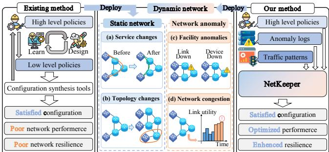  
Figure 1: Illustration of intent-driven network configuration update. Comparison of existing methods with ours includes applicable scenarios, intent forms, processes, and functions.

Recently, several configuration update tools [1, 5, 9, 10, 15, 31, 46] are proposed to assist network operators. These tools input network intents in various forms and produce network configuration as output. However, when facing configuration update in dynamic networks, significant challenges still remain in aligning network intents and automating operational processes.

Firstly, different tools [1, 9, 15, 31] design various network modeling approaches. As shown in Fig. 1, before using these tools, operators need to learn specific modeling languages for networks and policies to express intents [43], which not only demands a high level of expertise but also makes policy writing and maintenance challenging. Moreover, anomaly logs related to network failures (e.g., device or link malfunctions) and network congestion from network management platforms [18] are crucial for network update, serving as update guidance and requiring operators to maintain assure services and performance [39]. Existing tools [17, 46] cannot automatically update network configurations based on these logs, necessitating manual analysis and solution development by

operators.

Secondly, these tools are unable to update configuration that effectively perform load balancing or reduce traffic shifts based on analyzing traffic patterns [34], resulting in network updates with poor resilience. This situation requires operators to manually simulate and address complex network performance issues, which is extremely difficult for them. Furthermore, as networks constantly evolve in architecture, services, and traffic patterns [5], existing work [1, 9, 15, 24] that updates configurations based on static networks fails to adapt to these changes, limiting their ability to maintain efficient service in dynamic network environments.

The concept of autonomous networks (AN) [12] represents a paradigm in network management, envisioning networks that can interpret high-level intents, autonomously explore solutions, and continuously optimize their performance. Based on this vision, we propose a framework that takes multimodal network intent as input and updates network configurations based on analysis of traffic patterns and anomalies. However, three challenges remain to be addressed.

How to implement intent translation interfaces for both operators and networks? Network operators utilize natural language for configuration intent description, offering high readability but vague information. Conversely, network anomaly logs, generated as formatted text, lack readability but contain specific information. While works in [1, 9, 15] employ domain-specific languages (DSL) [27] for intent input and works in [17, 46] accept natural language intent for network updates, none of these can effectively handle multimodal intents. Bridging gap between diverse intent representations and effectively mapping them to low-level policies leads to more comprehensive configuration update.

How to achieve traffic-based network configuration update while also enhancing network resilience? Configuration update solely focusing on forwarding policies often fall short in ensuring network performance. Traffic patterns, reflecting service demands, significantly impact the effectiveness of network configurations. Ignoring traffic information during updates can lead to suboptimal settings, causing unexpected performance issues even when policies are met. Existing approaches such as NetRen [15] and AED [1] have limitations in traffic awareness or overlooking configuration impacts on traffic distribution. To achieve effective and resilient network configurations, it’s crucial to incorporate traffic-aware mechanisms into the update process, optimizing for both policy compliance and real-world network conditions.

How to realize configuration update for dynamic networks? As networks are dynamic with changing policies and traffic patterns [6], configuration update based on static network snapshots without considering actual network conditions cannot be a one-time, permanent solution, especially when facing network dynamics. Existing approaches to network configuration update, such as those using supervised learning [7, 15] or logical expression construction [9, 10, 24], require manual intervention before update. Whether modifying input network templates or crafting logical expressions, these methods limit automation and adaptability to dynamic networks, as they cannot actively gather network information or respond to changes without manual intervention.

To address aforementioned challenges, we propose Net-Keeper, an autonomous network configuration update framework. It provides interfaces for both operators and network management systems, updating configurations based on multimodal intents, and enhancing network resilience through analyzing traffic patterns and anomalies. In summary, our contributions are as follows:

• A bidirectional interface of intent translation is proposed, featuring northbound interfaces for operators to manage network policies and southbound interfaces for network management platforms to handle anomalies.

• A goal-oriented traffic-based configuration update model is proposed that can autonomous updates configuration in dynamic network, while enhancing network resilience through analyzing traffic patterns and anomalies and satisfying forwarding policies.

• An autonomous network configuration update framework is proposed, which enables service assurance and self-managing under anomalies, or interacts with operators to update network configuration.

The rest of the article is organized as follows: §2 briefly introduces the related work. §3 outlines the systematic workflow of NetKeeper. §4 presents the design of intent translation. §5 details the network configuration update model. §6 discusses and analyses the result of evaluation. §7 discusses the limitations. §8 concludes the paper.

## 2 Related Work

## 2.1 Intent-based Networking

Existing works express network intents using various approaches, including domain-specific languages [3, 7, 10, 15, 30], logical expressions [1, 10], and high-level languages for policy expression, as seen in Propane [4], Genesis [40], and Frenetic [36]. For non-natural language intents, operators need to write policies in specific formats before performing updating network. Although Lumi [17] and CONFPILOT [46] can handle intents expressed in natural language, they can not handle anomalies without operators’ effort. These tools fail to bridge the gap between non-natural and natural language intents, map intents of different formats to low-level policies, and provide no interfaces to handle various anomalies generated by management platforms, which are crucial for network self-managing.

## 2.2 Configuration Update

Configuration update aims at synthesizing a set of values that meet policies based on parameters and options involved in protocols[35]. Based on different implementation methods, existing approaches can be divided into two categories, including supervised learning [7, 15, 24, 46] and satisfiability modulo theories (SMT) [1, 9, 10]. Original network configuration reflects how traffic forwards, while traffic format can guide optimization. However, both supervised learning and SMT approaches disregard existing configuration parameters and lack the ability to perceive network traffic. More importantly, these methods produce static configurations that cannot adapt to long-term dynamic network, as they lack the ability to interact with and respond to changing dynamic network.

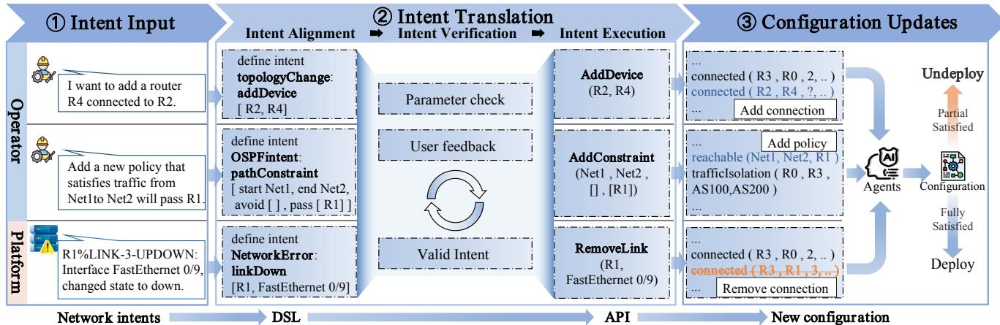  
Figure 2: Overview of autonomous network configuration update framework NetKeeper. ➀ Get intent from operator or platform. ➁ The LLM translates different types of intent into DSL, validates them through a parameter check and feedback, and calls the appropriate APIs based on the DSL. ➂ Modify network sketch and update network configuration through agents if configuration is fully satisfied. Three examples are illustrated in the figure (from left to right respectively).

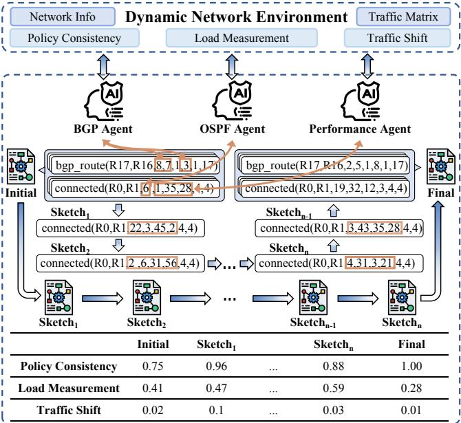  
Figure 3: Illustration of configuration update progress.

## 3 NetKeeper in a Nutshell

We begin with a runtime workflow shown in Fig. 2 and demonstrate how NetKeeper processes multimodal intents to update network configurations and optimize performance.

First, for the Intent Translation module (§4), NetKeeper integrates northbound and southbound interfaces to process natural language intents from operators and anomaly logs from the operation and maintenance platform. These intents are translated into DSL, ensuring their alignment and unification. User feedback and parameter validation further refine the intents through the intent verification, enhancing their accuracy and ensuring the reliability of the LLM used for translation.

The LLM then utilizes the DSL to trigger appropriate APIs, enabling a variety of network updates such as basic configuration changes, topology adjustments, policy modifications, and congestion mitigation. Predefined APIs operate on network configuration files or network sketches [15], where direct edits—e.g., changing IP addresses, link weights, or OSPF metrics—are tailored for predefined operator plans, facilitating quick responses to specific intents.

For global configuration changes, such as network-wide topology revisions or policy optimization, the system first updates the network sketch before applying changes to global configurations. These complex updates employ a multi-agent deep reinforcement learning (MADRL) model [45] described in §5, which optimizes configuration changes based on categorized parameters.

As illustrated in Fig. 3, we design three specialized agents, each responsible for specific parameter categories. These agents interact with the network environment, iteratively generating new configurations. The system evaluates key metrics—policy consistency, load measurement, and traffic shifts—based on real-time traffic matrices and network states. Feedback in the form of rewards guides agents to produce configurations with improved alignment to policies, enhance load measurement, and minimal traffic shift. This iterative process ensures configurations are optimized for both operational goals and network polices.

Table 1: Examples of network intent.
<table><tr><td>#</td><td>Natural language intent</td></tr><tr><td></td><td>Configure IPaddress127.39.236.169 and subnet mask 255.255.255.248 for the Ethernet34 port of R55.</td></tr><tr><td>2 3</td><td>Set the OSPF Hello packet interval on R5 to 20 ms. Configure access control for R45&#x27;s own traffic,performing a deny</td></tr><tr><td></td><td>operation on traffic from R19.</td></tr><tr><td>4</td><td>Remove R6 from the global network.</td></tr><tr><td>5</td><td>Adjust port weights to form a route from R2 to R8,avoiding R6 and R1 while including the routing nodes R5 and R3.</td></tr><tr><td>#</td><td>Network anomaly log</td></tr><tr><td>6</td><td>R1%LINK-3-UPDOWN: Interface Fe 0/9 change state to down.</td></tr><tr><td>7</td><td>HOST_X%Node down: ping timeout(0/5).</td></tr><tr><td>8</td><td>R1%LINK-3-CONGESTION: Interface Gi1/O/1 output queue full, packets dropped: 1532.</td></tr></table>

## 4 Intent Translation

Intent translation is the critical process of transforming highlevel network intents into actionable configurations. This involves three key stages: semantic alignment, validation through DSL abstraction and execution with APIs. This workflow ensures that diverse inputs converge into a unified representation, are rigorously validated for correctness and completeness, and are reliably converted into operational network updates.

## 4.1 Intent Alignment

In enterprise network environments, understanding and managing network intents is essential for maintaining operational efficiency. These intents can originate from two primary sources : user-driven natural language inputs and system-generated anomaly logs. Natural language intents reflect high-level objectives, such as "optimize traffic for critical applications," while anomaly logs highlight internal system issues, such as "link congestion on Router B, Interface C." Both forms of intent are critical yet inherently different: natural language provides proactive, surface-level goals, whereas logs deliver reactive, diagnostic insights. Addressing complex and dynamic network scenarios requires a consistent approach that integrates these two types of intent into a unified model.

To achieve this, we propose a structured and formalized intent description as a unified method to represent the semantic domain of network intents. This model serves several purposes: it aligns diverse intent representations, bridges the gap between high-level goals and low-level configurations, and provides clear semantic boundaries for translating intents. Furthermore, it establishes a theoretical foundation for the subsequent design of DSL in §4.2, enabling precise and verifiable intent-to-configuration translation.

We formalize this intent description as IT = {ND,NP,PO,NR,AT,FP}. The components of IT are defined as follows: ND represents network devices such as routers and switches. NP denotes network protocols like Open Shortest Path First Protocol (OSPF) [29] and Border Gateway Protocol (BGP) [32]. PO stands for protocol options, for instance, the OSPF Hello interval. NR refers to network rules, including Access Control Lists (ACL) [33]. AT signifies attributes such as interface IP addresses. Finally, FP represents forwarding policies, which include path selection policies. It’s important to note that a specific intent may not necessarily include all elements of this description. For example, intents 1 and 6 in Table 1 can be represented as IT = {ND : R55, AT : {inter f ace : Ethernet34, ip\_address : 127.39.236.169,subnet\_mask : 255.255.255.248}} and IT = {ND : R1, AT : {inter f ace : FastEthernet0/9, state : down}} respectively.

Table 2: Part of DSL-supported operations.
<table><tr><td>Name</td><td>Type</td><td>Parameters</td></tr><tr><td>assignIp</td><td>Basic Config</td><td>port/subnet/mask</td></tr><tr><td>staticRouteBasic</td><td>Static Route</td><td>subnet/mask/next_hop</td></tr><tr><td>generateAcl</td><td>ACL</td><td>ip/subnet/action</td></tr><tr><td>assignAcl</td><td>ACL</td><td>router/interface/aclItem</td></tr><tr><td>establishNeighbor</td><td>OSPF/BGP</td><td>ip/mask/area</td></tr><tr><td>setPortWeight</td><td>OSPF</td><td>router/interface/weight</td></tr><tr><td>pathConstraint</td><td>OSPF/BGP</td><td>start/end/avoid/pass</td></tr><tr><td>assignAsNumber</td><td>BGP</td><td>asNumber</td></tr><tr><td>bgpPolicy</td><td>BGP</td><td>policies</td></tr></table>

Table 1 presents a series of network intents, encompassing both natural language intents and network anomaly logs, all of which fall within the scope of IT . For operators with varying levels of network expertise, from novices to experts, they can input intents ranging from high-level goals to precise configuration parameters, which include: (1) Port IP allocation or modification. (2) Specific parameter specifications for routing protocols including OSPF and BGP. (3) Addition, removal, or modification of ACL entries. (4) Changes to physical topology including device or link alterations. (5) Specific routing polices. Meanwhile, we process various types of network anomaly logs, including device malfunction and network congestion logs, collected from network management systems [18] to guarantee business continuity and maintain network performance, including: (6) Link failures. (7) Device node failures. (8) Link congestion or underutilization.

## 4.2 Intent Verification

While IT provides a structured and unified model to describe network intents, it focuses on static representations and lacks the mechanisms for direct validation or feedback. We design a DSL as an abstraction layer between network intents and low-level network configurations, building on the semantic framework provided by IT.

The DSL adopts a syntax inspired by interpretive languages, enabling it to support both the definition and execution of network intents. As shown in Fig. 2➁, each DSL intent starts with a context declaration, followed by a sequence of operations and parameters. The DSL operationalizes IT by transforming elements like ND, NR, and FP into actionable operations. These operations cover a wide range of network tasks, including device configuration, ACL rules, OSPF and BGP settings, topology adjustments, link load optimization, and forwarding policies, part of them are shown in Table 2.

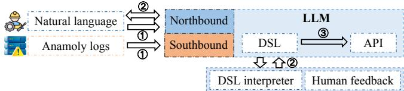  
Figure 4: The process of intent translation.

节除了第四小章之前都不要细说LLM的关系，LLM excels at understanding the semantic nuances of natkflow里面说对LLM做了什么，然后xxxxural language inputs, making them a powerful tool for converting high-level operator intentions into structured DSL representations while preserving the intent’s original meaning. To facilitate the mapping of unstructured intents into operations in DSL, we utilize LLM fine-tuned with P-tuning [26], a parameter-efficient approach for adapting pre-trained models to downstream tasks. However, LLM suffer from the hallucination problem and cannot guarantee the accuracy of the translation. To further validate and ensure the correctness of generated DSL intents, we introduce a dedicated DSL interpreter. The interpreter checks the syntax correctness, verifies the completeness of parameters, and identifies any logical inconsistencies in the DSL representation.

In addition, LLM plays a key role in incorporating feedback during the translation process. Errors from the compiler are described in natural language and fed back to the user through the LLM, so that the user can further provide feedback to correct missing or incorrect parameters. For example, when a network intent involves an invalid device, such as: "I want to add a router A1 connected to R2", the DSL interpreter would provide feedback: "A1 is not a valid device in the network. Please provide a device from [R1, R2, ...]." The system then passes this feedback to the user via LLM, allowing for adjustments to the intent. This bidirectional feedback loop ensures an accurate and iterative translation process between high-level intent and DSL. By combining the reasoning flexibility of the LLM with the robustness of DSL’s static validation models, this hybrid approach guarantees both the expressiveness and reliability required for intent translation.

## 4.3 Intent Execution

While LLM excels in nature language processing tasks, they lack both the specialized knowledge [43] and robust reasoning capabilities required for network updating. Network configuration updates require protocol expertise, device-specific knowledge, and system-wide impact analysis. By utilizing pre-defined APIs, we compensate for these limitations, allowing us to combine the flexibility of LLM in understanding intent with the reliability of well-tested, domain-specific APIs.

We deploy the fine-tuned LLM within the LangChain [41] framework, with a series of APIs established for the LLM to call, enabling it to execute configuration updates. The APIs accept parameters in DSL as input to perform configuration update. Internally, they update configuration either by directly modifying device configurations or by utilizing the configuration update model described in §5.

Table 3: Parameters of OSPF, link attributes and BGP.
<table><tr><td>Description</td><td>Parameter</td><td>Description</td><td>Parameter</td></tr><tr><td>OSPF weight</td><td>α</td><td>Local preference (LP)</td><td>Y1</td></tr><tr><td>Bandwidth</td><td>β</td><td>AS path length (AS)</td><td>22</td></tr><tr><td>Capacity</td><td></td><td>Multi-exit discriminator (MED)</td><td>73</td></tr><tr><td>Queue length</td><td>β</td><td></td><td></td></tr></table>

The Fig. 4 illustrates a complete intent translation process: ➀ The LLM receives the operator’s natural language intent through northbound interface or the platform’s anomaly logs via southbound interface. ➁ The LLM translates this input into DSL and refines it through feedback from humans and logs generated by the DSL interpreter. ➂ Once the DSL is validated, the LLM invokes the corresponding API to update the network configuration. Otherwise, if the DSL fails validation, no action is performed.

## 5 Configuration Update

As the final step of NetKeeper, the internal operation of these APIs determines how effectively the network adapts to dynamic conditions. To enhance adaptability, we leverage Deep Reinforcement Learning (DRL) [2] within the API execution layer, enabling configuration updates that dynamically optimize network performance while maintaining alignment with network intents.

## 5.1 Task Description and Goals

Traditional network configuration updates are mainly based on the adjustment of static network protocol parameters to meet forwarding policies, which leads to limited consideration of configuration parameters, a lack of adaptation to dynamic network traffic patterns, and low flexibility. Meanwhile, the configuration update process often ignores the original network state, including policy satisfaction, network performance, etc., fails to effectively utilize existing configuration information for synthesizing and optimizing new configurations, and does not fully consider changes in forwarding behaviors and traffic patterns before and after the update, which can easily result in network instability after the update.

To address these limitations, we need to consider three new factors: (1) link attributes, such as bandwidth, which impact network performance. (2) traffic patterns, including traffic matrix, enabling more targeted configuration optimization. (3) changes in the forwarding plane before and after updates. By leveraging these additional factors, we aim to achieve two main objectives: (1) Optimize network performance and comply with policies by adjusting parameters of BGP, OSPF and link attributes listed in Table 3. (2) Dynamically adjust network configuration based on network environment, enhancing network resilience.

To address these requirements, we seek a solution that can incorporate diverse network attributes, capture dynamic traffic patterns, and adjust to evolving network conditions. DRL [2] naturally fits this need: it is able to learn from real-time environment feedback [25] and optimize decisions toward explicit objectives [28]. With DRL, we can automatically synthesize new configurations adaptive to both the current network state and traffic changes, thus improving performance and stability. Consequently, DRL is well-suited for our task.

We define a series of goals to leverage these capabilities for configuration update:

1. Policy Consistency π: Considering efficient service delivery, secure data transmission, and reliable business continuity, we adopt three kinds of policies (A, B and C can be router, autonomous system or sub-network) : (1) forward(A, B, C): Traffic from A to B must be forwarded to its neighbor C. (2) reachable $( \mathtt { A } , \mathtt { B } ,$ , C): Traffic from A to B must pass by C. (3) isolation $( \texttt { A } , \texttt { B } , \texttt { C } , \texttt { D } )$ : One of forward $( \mathbb { A } , \ \textrm { B } , \ \textrm { C } )$ or forward $( \mathbb { A } , \ \textrm { B } , \ \textrm { D } )$ must be true at the same time.

Policy consistency defined in Eq. 1 characterizes the degree of satisfaction of forwarding policies. Here, P represents the set of forwarding policies, where $p _ { i }$ denotes an individual policy in $P . { \cal S } a t i s f y ( p _ { i } )$ is a function that returns 1 if policy $p _ { i }$ is satisfied, and 0 otherwise.

$$
\pi = { \frac { \sum _ { p _ { i } \in P } S a t i s f y ( p _ { i } ) } { | P | } } .\tag{1}
$$

2. Load Measurement ρ: Changes in traffic patterns or routing decisions can disrupt load distribution, causing congestion and degraded service quality. Link utilization is a key metric to measure global load, and minimizing the maximum link utilization helps balance traffic, prevent bottlenecks, and improve overall network performance.

For calculation of ρ, we extend the network performance metrics designed in [38], including bandwidth, capacity, link utilization, queue length and lose rate. We use various network information as input, including the network topology $G = \left( N , M _ { A r c } \right)$ , where N is the set of nodes and $M _ { A r c } { }$ is an adjacency matrix describing the network topology, as well as the link weight matrix $M _ { W }$ , traffic matrix $M _ { T }$ , bandwidth matrix $M _ { B } ,$ , capacity matrix $M _ { C } .$ , queue length matrix $M _ { Q } ,$ , lose rate matrix $M _ { L o s e } ,$ and queue packet size $q _ { s }$

We first initialize the link loads ld and maximum link utilization $U _ { m a x } .$ . For each traffic class with destination dst, we follow these steps:

1) Calculate the shortest distance $d _ { u } ^ { d s t }$ from each node $u \in N$ to dst.

2) Identify shortest-path node pairs $\left( u , \nu \right)$ to dst where $M _ { A r c ( u , \nu ) } ^ { d s t } = 1$ indicates traffic from u reaches dst via v:

$$
{ \cal M } _ { A r c } ^ { d s t } = \{ ( u , \nu ) \in { \cal M } _ { A r c } : d _ { u } ^ { d s t } - d _ { \nu } ^ { d s t } = { \cal M } _ { W ( u , \nu ) } \} .\tag{2}
$$

3) Calculate $\ S _ { u } ^ { d s t }$ , the number of next-hop nodes on shortest paths from u to dst, to determine the Equal-Cost Multi-Path (ECMP) [16] options for each node:

$$
\delta _ { u } ^ { d s t } = | \nu \in N : ( u , \nu ) \in M _ { A r c } ^ { d s t } | .\tag{3}
$$

4) Calculate the actual traffic load $l d _ { ( \nu , w ) } ^ { d s t }$ on link (v,w) towards destination dst, where link capacity, bandwidth, and queue length impose upper limits, while also considering upstream traffic accumulation, ECMP load balancing, and packet loss:

$$
\begin{array} { l } { { l d _ { ( \nu , w ) } ^ { d s t } = \displaystyle \operatorname* { m i n } ( M _ { B ( \nu , w ) } , M _ { C ( \nu , w ) } , M _ { Q ( \nu , w ) } \cdot q _ { s } , } } \\ { { \displaystyle \sum _ { ( u , \nu ) \in M _ { A r c } ^ { d s t } } \frac { 1 } { \ S _ { u } ^ { d s t } } \cdot ( d _ { \nu } ^ { d s t } + ( 1 - M _ { L o s e ( u , w ) } ) \cdot l d _ { ( u , w ) } ^ { d s t } ) ) . } } \end{array}\tag{4}
$$

After processing all traffic classes, we aggregate these values to determine the total load on each link $( \nu , w ) \in M _ { A r c } \colon$

$$
l d _ { ( \nu , w ) } = \sum _ { d s t \in N } l d _ { ( \nu , w ) } ^ { d s t } .\tag{5}
$$

Finally, we compute the utilization for each link $( \nu , w ) \in$ $M _ { A r c } { } _ { }$ and update the maximum utilization:

$$
M _ { U ( \nu , w ) } = l d _ { ( \nu , w ) } / M _ { C ( \nu , w ) } ,\tag{6}
$$

$$
U _ { m a x } = \operatorname* { m a x } ( M _ { U ( \nu , w ) } , U _ { m a x } ) .\tag{7}
$$

3. Traffic Shift τ: Changes in protocol configuration parameters can affect the forwarding plane of the entire network, causing changes in device routing tables, which bring traffic shifts. Traffic shift can lead to increased latency, load imbalance, and inconsistent performance, thereby impacting network quality [23]. We consider the degree of traffic shift introduced by the new configuration, which we define as Eq. 8.

$$
\tau = \frac { 1 } { | N D | \cdot | P F | } \sum _ { n d \in N D } \sum _ { p f \in P F } \left\{ 1 , \quad \mathrm { i f } n h _ { t - 1 } ( n d , p f ) \neq n h _ { t } ( n d , p f ) , \right.\tag{8}
$$

Here, ND and $P F$ represent all network devices and reachable network prefixes, respectively. $| N D | \cdot | P F |$ is the total routing table entries. The function $n h _ { t } ( n d , p f )$ denotes the next hop from device nd to prefix $p f$ at timestep t. The traffic shift cost increments by 1 for each entry where $n h _ { t - 1 } ( n d , p f ) \neq n h _ { t } ( n d , p f )$ , indicating a change in routing. Higher traffic shift causes more severe mismatches between network resources and traffic demands, leading to overload in some areas and underutilization in others.

## 5.2 Agents Setup

In §5.1, we define the configuration update task, which requires updating three types of parameters from Table 3. This categorization is based on their distinct roles and functions in the network: BGP parameters manage inter-domain routing policies and path selection, OSPF parameters handle intradomain routing and path calculation, while link attributes reflect physical characteristics and determine traffic-carrying capacity. We set parameter ranges to reflect generalized resource constraints inherent in real-world networks, capturing the limitations typically encountered during configuration updates.

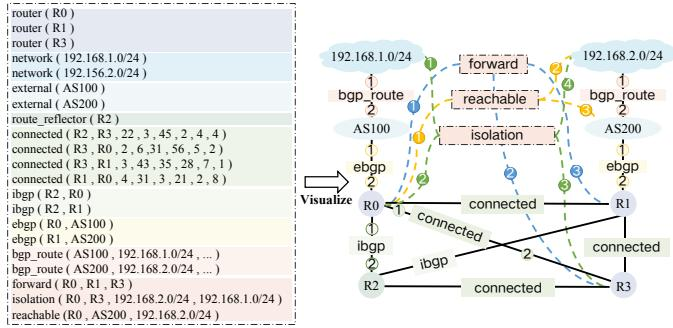  
Figure 5: An example of network sketch.

For single-agent approach, configuration update task presents significant challenges due to its vast solution space, complex parameter interactions, and the need for specialized knowledge across different network domains (BGP, OSPF, and link attributes). To address these challenges, we employ a multi-agent for configuration update. This approach divides the complex task among multiple agents, each specializing in a specific parameter type, thereby reducing solution space complexity, enabling domain-specific optimization, and promoting inter-agent collaboration.

Hence, we employ three agents for configuration update: (1) AOSPF: responsible for OSPF configuration update. (2) ABGP: responsible for BGP configuration update. (3) $A _ { p e r f } \colon$ responsible for link attributes update. We define the set of agents as I , which contains three types of agent.

## 5.3 Environment Model

1. State Space S: We define the state s ∈ S as the network sketch introduced in [15]. Fig. 5 illustrates a network sketch abstracting network information and forwarding policies as nodes with attributes. The sketch is visualized using different colors to represent various node types and connections between nodes.

Based on the network sketch, we encode the node features and connection relationships to obtain the state $s = ( V , E )$ representing the network configuration. Here, $V = \{ \nu _ { 1 } , . . . , \nu _ { n } \}$ is the set of nodes, such as router, ibgp and isolation, where each $\nu _ { i } = [ f _ { i , 0 } , \ldots , f _ { i , 1 9 } ]$ represents a node with its features. The edge information $E = \left( E _ { a d j } , E _ { t y p e } , E _ { p o s } \right)$ consists of three components. $E _ { a d j } \in \mathbb { R } ^ { 2 \times m }$ is the adjacency matrix with m edges, where each column $[ s r c _ { i } , d s t _ { i } ]$ represents an edge. $E _ { t y p e } = \{ E _ { t y p e , 1 } , . . . , E _ { t y p e , m } \}$ denotes edge types. $E _ { p o s } = \{ E _ { p o s , 1 } , . . . , E _ { p o s , m } \}$ indicates edge ordering information. For example, the ibgp node in Fig. 5 is represented as ibgp(R2,R1) in the sketch. It connects to both R1 and R2 nodes, thus establishing two links numbered 1 and 2.

2. Action Space A: We define the action as $\begin{array} { r l } { a _ { i , k } } & { { } = } \end{array}$ $[ f _ { 0 , k } , \ldots , f _ { n , k } ] ^ { T }$ , where k represents parameters in Table 3, n represents node number and i represents agent. Based on the agent setup in Section 5.1, different agents generate specific actions: AOSPF produces aOSPF,α, ABGP generates $a _ { B G P , \gamma _ { 1 } }$ ， $a _ { B G P , \gamma _ { 2 } }$ , and $a _ { B G P , \gamma _ { 3 } }$ , while $A _ { p e r f }$ creates $a _ { p e r f , \beta _ { 1 } } , a _ { p e r f , \beta _ { 2 } } ,$ and $a _ { p e r f , \beta _ { 3 } }$ . These actions are combined into a joint action a. Subsequently, Alg. 1 is employed to update the current state s using this joint action, generating a new state s′ by replacing the corresponding parameter k in s (lines 3 to 5).

3. Reward Function R: To output a configuration that satisfies policies and enhances network resilience, we need to guide the agents towards higher π with lower ρ and τ by designing reward functions $R _ { s }$ for policy consistency (Eq. 9) and network resilience $R _ { d }$ (Eq. 12), where τ and ρ jointly affect the latter. Agents receive larger rewards as π increases, while ρ and τ decrease. In addition, policy satisfaction is treated as the highest-priority objective, as it directly impacts the correctness of network operation, whereas load measurement and traffic shift are secondary goals to be optimized as much as possible. To enforce this prioritization, we introduce dynamic rewards (Eq. 10 and Eq. 11) in the design.

$$
R ( s , a ) _ { p o l } = K \cdot \pi + R _ { s } + R _ { d } ,\tag{9}
$$

$$
R _ { s } = { \left\{ \begin{array} { l l } { 0 , } & { { \mathrm { i f ~ } } t = 0 { \mathrm { ~ o r ~ } } a _ { t } \neq a _ { t - 1 } , } \\ { R _ { s } - 1 , } & { { \mathrm { i f ~ } } a _ { t } = a _ { t - 1 } , } \end{array} \right. }\tag{10}
$$

$$
R _ { d } = { \left\{ \begin{array} { l l } { 0 , } & { { \mathrm { i f ~ } } t = 0 , } \\ { \sum _ { p _ { i } \in P } ( S a t i s f y ( p _ { i } ) _ { t } - S a t i s f y ( p _ { i } ) _ { t - 1 } ) , } & { { \mathrm { i f ~ } } t > 0 . } \end{array} \right. }
$$

$$
R ( s , a ) _ { r e s } = K \cdot ( ( 1 - \mathsf { p } ) + ( 1 - \tau ) ) .\tag{11}
$$

(12)

Eq. 9 combines rewards for policy consistency with stationary and dynamic rewards to enhance the model’s perception of action impacts on the state. The stationary reward $R _ { s }$ (Eq. 10) penalizes consecutive repetitions of the same action to prevent the agent from getting stuck in local optima. At timestep $t , R _ { s }$ resets to 0 when t = 0 or at $\neq a _ { t - 1 } ;$ otherwise, decreasing by a fixed amount. The dynamic reward $R _ { d }$ (Eq. 11) encourages exploration of new configurations to meet previously unmet policies while preserving currently satisfied ones. Negative rewards are applied when previously satisfied policies become unsatisfied, balancing exploration and policy adherence. Given that $R _ { S }$ and $R _ { d }$ are integers while π, ρ, and τ are decimals not exceeding 1, a postive constant K is set to align the reward magnitudes.

Different agents use varied reward function combinations based on their specific tasks:

$$
R ( s , a ) _ { A _ { O S P F } } = R ( s , a ) _ { p o l } + R ( s , a ) _ { p e r f } ,\tag{13}
$$

$$
R ( s , a ) _ { A _ { B G P } } = R ( s , a ) _ { p o l } ,\tag{14}
$$

$$
R ( s , a ) _ { A _ { p e r f } } = R ( s , a ) _ { p e r f } .\tag{15}
$$

In Eq. 13, because OSPF weight impacts on traffic forwarding, affects both policy consistency and network performance, we combine two reward types. Due to the parameters generated by ABGP and $A o s P F$ affect policy consistency and network performance respectively, their reward function values each include one component.

To enable agents to perceive traffic patterns and optimize network configuration, we provide a traffic matrix $M _ { T }$ , where

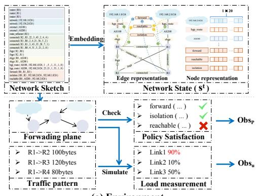

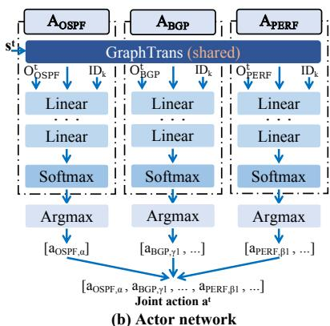

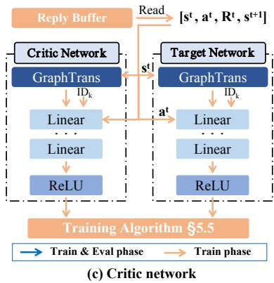  
Figure 6: Architecture of configuration update model.

Algorithm 1: State Update Process   
Input: Current state $s = ( V , E )$ , Joint action a   
Output: New state $s ^ { \prime }$   
1 Initialize $s ^ { \prime }$ as a copy of ${ \bf \Phi } _ { s ; \mathbf { \Lambda } }$   
2 for each action $a _ { i , k } \in a$ do   
3 ik ← index corresponding to parameter type k;   
4 for each node j in $V ^ { \prime }$ do   
5 $V _ { j } ^ { \prime } [ i _ { k } ]  a _ { i , k [ j ] } ;$   
6 end   
7 end   
8 return $s ^ { \prime } = ( V ^ { \prime } , E ) ;$

$M _ { T ( i , j ) }$ records the traffic from nodei to node j. Agents can obtain observation information through the environment shown in Fig.6 (a), including policy satisfaction status and the utilization of links. Policy satisfaction is defined as a vector $O b s _ { p } =$ $[ S a t i s f y ( p _ { 1 } ) , \ldots , S a t i s f y ( p _ { i } ) , \ldots , S a t i s f y ( p _ { n } ) ]$ , where n is the number of polices. $p _ { i }$ is validated by computing its forwarding plane from the network configuration, which reveals how traffic is routed and whether the policies are correctly enforced. Link utilization is defined as a vector $O b s _ { u } = [ u _ { 1 } , \dots , u _ { m } ]$ , where m is the number of links, and ui reflects the utilization of the i-th link, indicating the congestion level of links. Each $u _ { i }$ is computed through Eq.2 - Eq.7.

## 5.4 Model Architecture

In our network, multiple agents update different parameters based on network information. Their collective decisions affect configurations, complicating individual contribution assessment. We employ an Actor-Critic (AC) [22] network with a centralized critic and decentralized actors. This balances efficient local decision-making by actors with global performance optimization by the critic. The overall architecture of the configuration update model is shown in Fig. 6, comprising actor networks corresponding to the agents, critic network and network environment.

The actor network generates actions based on the current state, implementing the agent’s policy. It is designed as encoder-decoder architecture, where all agents share a common network sketch encoder $E N C _ { n e t w o r k }$ in the lower layer to acquire the same network information, implemented using Graph Transformer (GraphTrans) [44]. The decision network $D E C _ { L I N , i }$ of each agent i consists of $L _ { D E C }$ linear layers. Due to varied tasks, agents receive different observations, resulting in different input dimensions for their decision networks. Specifically, $O _ { O S P F } = [ O b s _ { p } , O b s _ { u } ] , O _ { B G P } = [ O b s _ { p } ]$ , and $O _ { p e r f } =$ $[ O b s _ { u } ]$ , where $O _ { i }$ represents the observation list for agent i ∈ I.

$$
x _ { i } = E N C _ { n e t w o r k } ( s ^ { t } ) ,\tag{16}
$$

$$
x _ { i , k } ^ { \prime } = [ x _ { i } \| O _ { i } \| I D _ { k } ] ,\tag{17}
$$

$$
h _ { i , k } = \mathrm { s o f t m a x } ( D E C _ { L I N , i } ( x _ { i , k } ^ { \prime } ) ) ,\tag{18}
$$

$$
a _ { i , k } ^ { t } = \arg \operatorname* { m a x } ( h _ { i , k } ) .\tag{19}
$$

To obtain $a _ { k , i } ^ { t } ,$ the action for parameter k generated by agent i at timestep t, as described in Eq. 16, we first embed the state $s ^ { t }$ at timestep t using $E N C _ { n e t w o r k }$ . Then, the embedding $x _ { i } ,$ along with the environment’s observation $O _ { i }$ and the index of parameter $I D _ { k }$ , are merged through Eq. $1 7 . I D _ { k }$ represents the parameter generation ID where $k \in \left\{ \alpha , \beta _ { 1 } , \beta _ { 2 } , \beta _ { 3 } , \gamma _ { 1 } , \gamma _ { 2 } , \gamma _ { 3 } \right\}$ The action probability distribution of k, denoted as $h _ { i , k } ,$ is predicted through $D E C _ { L I N , i }$ and softmax using Eq. 18. Finally, the action $a _ { i , k } ^ { t }$ is obtained via arg max through Eq. 19.

$$
y _ { i } = E N C _ { n e t w o r k } ( s ^ { t } ) ,\tag{20}
$$

$$
y _ { i , k } ^ { \prime } = [ y _ { i } \| a _ { i , k } ^ { t - 1 } \| a _ { i , k } ^ { t } \| I D _ { i } ] ,
$$

$$
Q ( s ^ { t } , a _ { i , k } ^ { t } ) = \mathrm { R e L U } ( D E C _ { L I N } ( y _ { i , k } ^ { \prime } ) ) .\tag{21}
$$

(22)

Critic network is used to evaluate the quality of the actor’s decisions. The critic network has a similar architecture to the actor network. It ultimately needs to output a Q-value; we replace softmax and argmax with ReLU. The critic is only used during the training phase. To obtain $Q ( s ^ { t } , a _ { i , k } ^ { t } )$ representing the estimated value of agent i taking action $a _ { i , k } ^ { t }$ for parameter k in state $s ^ { t }$ at timestep t, similarly to Eq. 16, state st is encoded using Eq. 20. We merge the encoding yi with the agent ID IDi, the current timestep’s action $a _ { i , k } ^ { t } .$ and the previous timestep’s action $a _ { i , k } ^ { t - 1 }$ in Eq. 21 as input to predict $Q ( s ^ { t } , a _ { i , k } ^ { t } )$ through Eq. 22.

## 5.5 Training Algorithm

The relationship between actions and rewards is often obscure, and the combination of actions influences the final outcome, necessitating careful consideration of each action’s contribution. This makes training multiple agents particularly challenging, especially in credit assignment and decisionmaking under partial observability. We choose the counterfactual multi-agent (COMA) algorithm [11], which adopts the same architecture in §5.4. This approach allows for more accurate evaluation of each agent’s contribution and informed decision-making with limited local information.

The training algorithm takes a network sketch s with n nodes and traffic matrix $M _ { T }$ as inputs. We initialize the actor network $\theta ^ { \mu } ,$ , critic network $\theta ^ { Q }$ , target network ${ \theta } ^ { Q ^ { \prime } }$ (the latter two for improving training stability [14]), replay buffer B, agent mask $M _ { k }$ , and other parameters. We set $E P$ training episodes, each ending when π reaches 1 or after T M timesteps.

In each episode, we initialize the environment and obtain state $s ^ { 0 } .$ . For each timestep t, We use the actor network $\theta ^ { \mu }$ to select actions at for all agents, employing a decaying ε-greedy strategy. This strategy balances exploration (random strategy) and exploitation (learned policy) over time. We then execute these actions through Alg. 1 to obtain the new state $s ^ { t + 1 }$ . We calculate the reward value Rt using Eq. 9 and Eq. 12 , and store the historical experience $( s ^ { t } , a ^ { t } , R ^ { t } , s ^ { t + 1 } )$ in B.

We begin the training process when the data in B exceeds one entry. First, we use the target network ${ \theta } ^ { Q ^ { \prime } }$ to calculate the target Q-values $\boldsymbol { Q } ( s ^ { t } , a _ { i , k } ^ { t } )$ through Eq. 20 to Eq. 22. Subsequently, we compute the baseline baselinei,k and advantage $A d \nu a n t a g e _ { i , k } .$ . baselinei,k represents the average expected value of all possible actions for a given agent i and parameter $k ,$ calculated as the dot product of the action probability distribution $h _ { i , k }$ and $Q ( s ^ { t } , a _ { i , k } ^ { t } )$ in Eq.23. Advantagei,k measures how much better the chosen action is compared to baseline, computed by subtracting the baselinei,k from the Q-value of the selected action in Eq. 25. For nodes that do not include the parameter k, we set the advantage value to 0 through $M _ { k }$

$$
b a s e l i n { e } _ { i , k } = h _ { i , k } \cdot Q ( s ^ { t } , a _ { i , k } ^ { t } ) ,\tag{23}
$$

$$
\begin{array} { r } { Q ^ { \prime } ( s ^ { t } , a _ { i , k } ^ { t } ) = \{ Q ( s ^ { t } , a _ { i , k } ^ { t } ) _ { j , \mathrm { a r g m a x } z } \mid j \in \{ 1 , \dots , n \} , z \in h _ { i , k } \} , } \end{array}\tag{24}
$$

$$
A d \nu a n t a g e _ { i , k } = ( Q ^ { \prime } ( s ^ { t } , a _ { i , k } ^ { t } ) - b a s e l i n e _ { i , k } ) \odot M _ { k } .\tag{25}
$$

Finally, we calculate the actor network’s loss, followed by backpropagation. Eq. 26 selects the most probable actions $h _ { i , k } ^ { \prime }$ from the original distribution $h _ { i , k }$ . Eq. 27 then computes the loss by averaging the product of advantage and log probability of these selected actions. This process aims to increase the likelihood of advantageous actions.

$$
\begin{array} { r } { h _ { i , k } ^ { \prime } = \{ z _ { j , \mathrm { a r g m a x } z } \vert j \in \{ 1 , \ldots , n \} , z \in h _ { i , k } \} , } \end{array}\tag{26}
$$

$$
\mathit { L o s s } _ { \mathit { A c t o r } } = - \frac { 1 } { n } \sum _ { i = 1 } ^ { n } A d \nu a n t a g e _ { i , k } \cdot \log ( h _ { i , k } ^ { \prime } ) .\tag{27}
$$

The critic network is updated to estimate Q-values, representing expected future rewards. This process begins with constructing inputs for each timestep using Eq. 20 to Eq. 22. Subsequently, Q-values $Q ^ { \prime } ( S ^ { t ^ { \prime } } , a _ { i } ^ { t ^ { \prime } } )$ are calculated using the evaluation critic network $\theta ^ { \mu }$ . These Q-values, along with corresponding rewards, are then selected based on action probabilities $h _ { j }$ using Eq. 28 and Eq. 29. Finally, masks are applied to the selected Q-values through Eq. 30.

$$
\begin{array} { r } { Q ^ { \prime } ( s ^ { t ^ { \prime } } , a _ { i , k } ^ { t ^ { \prime } } ) = \left\{ Q ( s ^ { t ^ { \prime } } , a _ { i , k } ^ { t ^ { \prime } } ) _ { j , \mathrm { a r g m a x } z } \ | \ z \in h _ { i , k } , j \in \lbrace 1 , \ldots , n \rbrace \right\} , } \end{array}\tag{28}
$$

$$
{ R ^ { t ^ { \prime } } = \left\{ R _ { j , \mathrm { a r g m a x } \ : z } ^ { t ^ { \prime } } \ : | \ : z \in h _ { i , k } , j \in \lbrace 1 , \dots , n \rbrace \right\} } ,\tag{29}
$$

$$
Q _ { M } ^ { \prime } ( s ^ { t ^ { \prime } } , a _ { i , k } ^ { t ^ { \prime } } ) = Q ^ { \prime } ( s ^ { t ^ { \prime } } , a _ { i , k } ^ { t ^ { \prime } } ) \odot M _ { k } .\tag{30}
$$

We use the $T D ( \lambda )$ algorithm for learning updates, as shown in Eq. 31, which calculates the target value $r ^ { t ^ { \prime } }$ for the critic network. If the episode ends, $r ^ { t ^ { \prime } }$ equals the immediate reward $R ^ { t ^ { \prime } }$ . Otherwise, it combines the current Q-value with a correction term. This term includes the immediate reward $R ^ { t ^ { \prime } + 1 }$ , discounted future Q-value $\gamma \cdot Q ^ { \prime } ( s ^ { t ^ { \prime } + 1 } , a _ { i , k } ^ { t ^ { \prime } } )$ , and current Q-value $Q ^ { \prime } ( s ^ { t ^ { \prime } } , a _ { i , k } ^ { t ^ { \prime } } )$ . The equation uses $l r _ { c }$ and discount rate γ to balance current and future rewards.

$$
\begin{array} { r } { \boldsymbol r ^ { t ^ { \prime } } = \left\{ \begin{array} { l l } { \boldsymbol R ^ { t ^ { \prime } } , } & { \mathrm { i f ~ } d o n e , } \\ { \boldsymbol Q _ { M } ^ { \prime } ( s ^ { t ^ { \prime } } , a _ { i , k } ^ { t ^ { \prime } } ) + l \boldsymbol r _ { c } \cdot ( \boldsymbol R ^ { t ^ { \prime } + 1 } } \\ { + \gamma \cdot \boldsymbol Q _ { M } ^ { \prime } ( s ^ { t ^ { \prime } + 1 } , a _ { i , k } ^ { t ^ { \prime } } ) - \boldsymbol Q _ { M } ^ { \prime } ( s ^ { t ^ { \prime } } , a _ { i , k } ^ { t ^ { \prime } } ) ) , } & { \mathrm { o t h e r w i s e } . } \end{array} \right. } \end{array}\tag{31}
$$

We calculate LossCritic using MSE between predicted $Q _ { M } ^ { \prime } ( s ^ { t ^ { \prime } } , a _ { i } ^ { t ^ { \prime } } )$ and target ${ \boldsymbol { r } } t ^ { \prime }$ values in Eq. 32, then backpropagate to update $\theta ^ { Q }$

$$
L o s s _ { C r i t i c } = \frac { 1 } { n } \sum _ { j = 1 } ^ { n } \left( Q _ { M } ^ { \prime } ( s ^ { t ^ { \prime } } , a _ { i , k } ^ { t ^ { \prime } } ) _ { j } - r _ { j } ^ { t ^ { \prime } } \right) ^ { 2 } .\tag{32}
$$

We update the target critic network ${ \theta } ^ { Q ^ { \prime } }$ with the parameters of the evaluation critic network $\theta ^ { Q }$ at fixed intervals.

## 6 Evaluation

## 6.1 Setup

Dataset. We build two datasets: A network intent dataset and a network sketch dataset. The network intent dataset includes natural language intents, both manually written and templategenerated, as well as anomaly logs collected from network maintenance platform and template-generated. Both contain mappings from network intents to DSL to API calls. The dataset size is 11,000, with a 7:4 ratio of intents to anomalies, and a 10:1 ratio of training to test data. The network sketch dataset is based on Topology Zoo [21] and comprises 258 real-world network topologies. These topologies are categorized into three groups: small (S) with 18–30 nodes, medium (M) with 30–56 nodes, and large (L) with 56–170 nodes, with 8 representative topologies sampled from each group. To further characterize task complexity, we generate three subsets based on the number of forwarding policies: $3 \times 2 , 3 \times 8$ , and 3×16 with a total number of 1,024.

Environment for DRL. We use a Python-based network simulation environment for both online training of the agent and evaluation of NetKeeper. The environment incorporates variations in topology size, routing protocol configurations (OSPF/BGP), forwarding policies, and traffic patterns, enabling the agent to adapt to diverse network scenarios. For testing, the agent is evaluated on fixed subsets of the network sketch dataset, ensuring consistent performance evaluation across varying topology sizes and policy complexities.

Table 4: Parameters in COMA algorithm.
<table><tr><td>Parameter</td><td>Value</td></tr><tr><td>Episodes (EP)</td><td>10</td></tr><tr><td>Timestep (TM)</td><td>200</td></tr><tr><td>Replay Buffer Size</td><td>100</td></tr><tr><td>Batch Size</td><td>16</td></tr><tr><td>Discount Factor (Y)</td><td>0.85</td></tr><tr><td>Initial Exploration Rate</td><td>1.0 (decaying)</td></tr><tr><td>Final Exploration Rate</td><td>0.01</td></tr><tr><td>Exploration Decay Rate</td><td>0.99 per timestep</td></tr><tr><td>Soft Target Update Interval</td><td>16 timestep</td></tr><tr><td>K in reward function</td><td>10</td></tr><tr><td>Disobey reward in reward function</td><td>-1</td></tr></table>

Table 5: Parameters of network.
<table><tr><td>Parameter</td><td>Value</td><td>Parameter</td><td>Value</td></tr><tr><td>OSPF weight (α)</td><td>[1,64]</td><td>Local preference (Y1)</td><td>[1,64]</td></tr><tr><td>Bandwidth (β1)</td><td>(64,128]</td><td>AS path length  $( \gamma _ { 2 } )$ </td><td>[1,64]</td></tr><tr><td>Capacity (β2)</td><td>(64,128]</td><td>Multi-exit discriminator (Y3)</td><td>[1,64]</td></tr><tr><td>Queue length (β3)</td><td>(64,128]</td><td>Packet size (qs)</td><td>5</td></tr><tr><td>Lose rate  $( M _ { L o s s } )$ </td><td>[10,50] %</td><td></td><td></td></tr></table>

Testing Platform and Experiment Parameter. All experiments are performed on a machine equipped with an NVIDIA GeForce RTX 3090 GPU with 24GB VRAM, 64GB RAM, and a 13th Gen Intel Core i9-13900K processor. To ensure the fairness of our experiments, all experiments are conducted using the same seed. We fine-tuned the ChatGLM3-6B[13] through P-tuning using Adam [19] optimizer with a learning rate of 0.02 for 400 steps and deployed it within the LangChain. Other hyperparameters remained unchanged from the default settings. The Actor-Critic network is trained using COMA algorithm. The actor and critic networks share identical structures: an encoder $E N C _ { G r a p h T r a n s }$ with 8 graph convolutional network (GCN) [20] and 8 transformer [42] layers, and a decoder $D E C _ { L I N }$ with 4 linear layers. All layers have a hidden dimension of 128. We use Adam optimizer with learning rates of 0.0001 and 0.0002 for actor and critic networks respectively. Other hyperparameters are listed in Table 4 and network parameter settings are listed in Table 5.

Metrics and Comparisons. We evaluate NetKeeper based on intent translation accuracy, configuration quality, load measurement, traffic shift, and adaptability to dynamic networks. Intent translation accuracy refers to the correct invocation of APIs based on natural language intents or anomaly logs. Configuration quality depends on the policy consistency (Eq.1). Load measurement is quantified by maximum link utility, using a routing simulation program described in §5.1. Traffic shift (Eq.8) evaluates the degree of traffic redistribution after configuration update. We also assess network resilience improvements through simulations of dynamic changes and anomalies. For comparison, we use three categories of baselines: SMT-based [8] methods like NetComplete [10], neural network-based methods like GAT [7], and SMT+supervised learning hybrids like NetRen [15], which integrates SMT solvers with neural network predictions, falling back on neural network’s outputs when the solver fails (overtime).

Table 6: Intent translation under three different tasks with different conditions.
<table><tr><td>Task</td><td>Feedback</td><td>DSL</td><td>Precision</td><td>Recall</td><td>F1</td></tr><tr><td>NL2API</td><td></td><td>X</td><td>83%</td><td>79%</td><td>0.81</td></tr><tr><td>NL2API</td><td>X</td><td></td><td>88%</td><td>83%</td><td>0.85</td></tr><tr><td>NL2API</td><td></td><td>x&gt;</td><td>92%</td><td>90%</td><td>0.91</td></tr><tr><td>NL2API</td><td>×</td><td>√</td><td>94%</td><td>93%</td><td>0.93</td></tr><tr><td>AL2API</td><td></td><td>X</td><td>90%</td><td>88%</td><td>0.89</td></tr><tr><td>AL2API</td><td>X</td><td></td><td>95%</td><td>94%</td><td>0.95</td></tr><tr><td>AL2API</td><td></td><td>x&gt;&gt;</td><td>97%</td><td>96%</td><td>0.96</td></tr><tr><td>AL2API</td><td>X</td><td></td><td>100%</td><td>100%</td><td>1.00</td></tr><tr><td>IT2API</td><td> $\checkmark$ </td><td> $\checkmark$ </td><td>96%</td><td>94%</td><td>0.95</td></tr></table>

## 6.2 Intent Translation Accuracy

To evaluate intent translation accuracy for natural language intents (NL) and anomaly logs (AL), we measure precision, recall, and F1 scores across three tasks: NL2API, AL2API, and IT2API (a combined task integrating both NL and AL scenarios), under different conditions, including the presence or absence of feedback and the use of DSL as an intermediary.

Table 6 demonstrates that the introduction of DSL and feedback significantly enhances performance, achieving a precision of 96%, recall of 94%, and an F1 score of 0.95 for IT2API. Additionally, 58 participants were involved in the manual feedback process, with each feedback iteration averaging 2s in duration, and erroneous translations were typically resolved with only one round of feedback. Compared to the baseline (without DSL or feedback), NL2API exhibits notable improvements: precision increases by 11%, recall by 14%, and the F1 score by 0.12. Similarly, AL2API achieves a 10% boost in precision, a 12% increase in recall, and a 0.11 gain in the F1 score. These results demonstrate the critical role of DSL and feedback in enhancing both the accuracy and reliability of intent translation, improving API invocation precision, reducing errors, and supporting diverse intent types in combined tasks.

## 6.3 Configuration Quality

To evaluate the ability of updating network configuration, we evaluate the policy consistency and time consuming across tasks with varying complexity, including different topology scales, policy categories and policy quantities. We replicate Netcomplele (SMT), GAT and NetRen as benchmarks, following the experimental settings in work [15], and present the average policy consistency. Because SMT solving can be time-consuming on complex tasks, we set a time limit of

Table 7: Comparison of average policy consistency under tasks of varying complexity.
<table><tr><td rowspan="2">Task</td><td rowspan="2">Topology Scale</td><td rowspan="2">SMT GAT</td><td colspan="4">Forward</td><td colspan="4">Reachable</td><td colspan="4">Isolation</td><td colspan="4">Overall</td></tr><tr><td></td><td></td><td>NetRen</td><td>Ours</td><td>SMT</td><td>GAT</td><td>NetRen</td><td>Ours</td><td>SMT</td><td>GAT</td><td>NetRen</td><td>Ours</td><td>SMT</td><td>GAT</td><td>NetRen</td><td>Ours</td></tr><tr><td rowspan="3">3×2</td><td>S</td><td>0.98</td><td>1.00</td><td>1.00</td><td></td><td>1.00</td><td>0.98</td><td>0.96</td><td>1.00</td><td>1.00</td><td>0.99</td><td>0.58</td><td>1.00</td><td>1.00</td><td>0.98</td><td>0.86</td><td>1.00</td><td>1.00</td></tr><tr><td>M</td><td>0.99</td><td>1.00</td><td></td><td>1.00</td><td>1.00</td><td>0.98</td><td>0.88</td><td>1.00</td><td>1.00</td><td>1.00</td><td>0.75</td><td>0.94</td><td>1.00</td><td>0.99</td><td>0.87</td><td>0.98</td><td>1.00</td></tr><tr><td>L</td><td>0.99</td><td>1.00</td><td></td><td>1.00</td><td>1.00</td><td>0.99</td><td>1.00</td><td>1.00</td><td>1.00</td><td>0.98</td><td>0.79</td><td>0.94</td><td>1.00</td><td>0.98</td><td>0.89</td><td>0.98</td><td>1.00</td></tr><tr><td rowspan="3">3×8</td><td>S</td><td>0.98</td><td>0.96</td><td>1.00</td><td></td><td>1.00</td><td>0.98</td><td>0.96</td><td>0.98</td><td>1.00</td><td>0.99</td><td>0.79</td><td>1.00</td><td>1.00</td><td>0.98</td><td>0.89</td><td>0.99</td><td>1.00</td></tr><tr><td>M</td><td>0.99</td><td>0.98</td><td>1.00</td><td></td><td>1.00</td><td>0.99</td><td>0.98</td><td>0.98</td><td>1.00</td><td>0.99</td><td>0.75</td><td>1.00</td><td>1.00</td><td>0.99</td><td>0.91</td><td>0.99</td><td>1.00</td></tr><tr><td>L</td><td>0.98</td><td>0.98</td><td></td><td>1.00</td><td>1.00</td><td>0.99</td><td>0.95</td><td>1.00</td><td>1.00</td><td>0.98</td><td>0.75</td><td>0.96</td><td>1.00</td><td>0.99</td><td>0.89</td><td>0.98</td><td>1.00</td></tr><tr><td rowspan="3">3×16</td><td>S</td><td>0.98</td><td>0.94</td><td>0.99</td><td></td><td>1.00</td><td>0.99</td><td>0.98</td><td>0.95</td><td>1.00</td><td>0.98</td><td>0.78</td><td>0.96</td><td>1.00</td><td>0.98</td><td>0.91</td><td>0.98</td><td>1.00</td></tr><tr><td>M</td><td>0.99</td><td>0.98</td><td>0.99</td><td></td><td>1.00</td><td>0.99</td><td>0.95</td><td>0.95</td><td>1.00</td><td>0.99</td><td>0.73</td><td>0.97</td><td>1.00</td><td>0.99</td><td>0.91</td><td>0.98</td><td>1.00</td></tr><tr><td>L</td><td>0.99</td><td>0.97</td><td>0.99</td><td></td><td>1.00</td><td>0.99</td><td>0.96</td><td>0.99</td><td>1.00</td><td>0.99</td><td>0.79</td><td>0.94</td><td>1.00</td><td>0.99</td><td>0.92</td><td>0.98</td><td>0.99</td></tr></table>

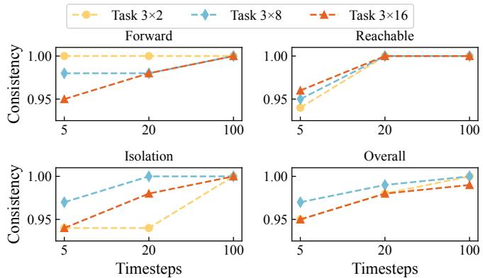  
Figure 7: Average policy consistency within limited timesteps.

Table 8: comparison of average time consuming under tasks of varying complexity (1500+ means timeout).
<table><tr><td>Task</td><td>Topology Scale</td><td>SMT(s)</td><td>GAT(s)</td><td>NetRen(s)</td><td>Ours(s)</td></tr><tr><td rowspan="3">3×2</td><td>S</td><td>7.68</td><td>2.62</td><td>0.37</td><td>0.31</td></tr><tr><td>M</td><td>98.38</td><td>4.37</td><td>0.41</td><td>0.34</td></tr><tr><td>L</td><td>1329.32</td><td>13.41</td><td>1.26</td><td>0.51</td></tr><tr><td rowspan="3">3×8</td><td>S</td><td>58.09</td><td>4.26</td><td>0.64</td><td>0.42</td></tr><tr><td>M</td><td>148.41</td><td>5.89</td><td>0.81</td><td>0.47</td></tr><tr><td>L</td><td>1500+</td><td>17.35</td><td>2.73</td><td>3.01</td></tr><tr><td rowspan="3">3×16</td><td>S</td><td>283.16</td><td>5.25</td><td>1.13</td><td>1.04</td></tr><tr><td>M</td><td>317.24</td><td>6.39</td><td>1.78</td><td>2.08</td></tr><tr><td>L</td><td>1500+</td><td>20.71</td><td>3.16</td><td>4.07</td></tr></table>

1500 seconds for all methods and methods that fail to generate a valid configuration within this time are considered failures. Additionally, since NetKeeper uses DRL for configuration update, enhancing configuration quality through multiple timesteps and environmental interaction, We evaluate the capability by measuring average policy consistency within a limited timesteps.

Fig. 7 shows the average policy consistency achieved by NetKeeper within 5, 20, and 100 timesteps, with 96.2%, 98.7%, and 99.6% respectively, demonstrating a continuous improvement in consistency as timestep (average 0.4s) increases. Moreover, Table 7 demonstrates that NetKeeper achieves a policy consistency of 99.6%, outperforming SMT, GAT and NetRen with improvement of 1.3%, 10.4% and 1.2% respectively. Additionally, Table 8 shows that in the most complex network synthesis scenarios, NetRen achieves an average running time of 3.16 seconds with a policy consistency of 98% and a 2% configuration synthesis timeout rate. In comparison, NetKeeper achieves a slightly higher average running time of 4.07 seconds, but with a higher policy consistency of 99.6%, a much lower timeout rate of only 0.04%, and superior results in terms of network performance and traffic shift. Notably, NetKeeper can exceed NetRen’s policy satisfaction rate (98%) within no more than 8 iterations (approximately 3.2 seconds), while maintaining a comparable average running time. These results suggests that NetKeeper exhibits superior adaptability across various network scenarios in configuration update compared to both SMT, GAT and NetRen.

## 6.4 Load Measurement

To test the network performance optimization capability, we evaluate load measurement by computing maximum link utility under different network scenarios with random traffic.

We set three types of network scenarios: Ideal: This scenario disregards negative factors, including packet loss and latency, and queue length limitations; Normal: This scenario considers all link attributions; High-load: This scenario increases the load to three times that of the normal test scenario. The design of these scenarios reflects real-world network conditions: Ideal represents an optimized network with minimal interference; Normal captures typical operational environments with realistic link attributions; High-load emulates peak traffic or network stress conditions. Although the traffic in this study is synthetically generated, it reflects patterns commonly observed in real-world networks.

In addition, under these scenarios, we establish 4 traffic generation ranges reflcting different traffic patterns, including 1∼2, 2∼4, 4∼8, and 8∼16. In high-load scenarios, the maximum range for a single traffic flow reaches 24 to 64. To make the model more focused on network performance optimization, we set only 3 × 2 network policies for all network topologies in this case. We establish three parameter modes for comparison: (1) Random, (2) OSPF default mode, and (3) NetRen. Due to the occurrence of excessively high utilization, we set maximum link utilization exceeding 1.1 as ≥ 1.1.

Comparing our method with Random, OSPF default mode, and NetRen, Table 9 shows that NetKeeper outperforms these three in most network performance optimization tasks. Random and OSPF default mode exceed our critical utilization threshold in most cases. Compared to NetRen, NetKeeper achieves average congestion mitigation of 6.3%, 3.9%, and

Table 9: Comparison of maximum link utility under three scenarios and four traffic patterns.
<table><tr><td rowspan="2">Topology Scale</td><td rowspan="2">Traffic Range (bytes)</td><td colspan="4">Ideal</td><td colspan="4">Normal</td><td colspan="4">High-load</td></tr><tr><td>Random</td><td>OSPF</td><td>NetRen</td><td>Ours</td><td>Random</td><td>OSPF</td><td>NetRen</td><td>Ours</td><td>Random</td><td>OSPF</td><td>NetRen</td><td>Ours</td></tr><tr><td rowspan="4">S</td><td>1~2</td><td>0.89</td><td>0.49</td><td>0.02</td><td>0.01</td><td>0.64</td><td>0.76</td><td>0.03</td><td>0.02</td><td>&gt;1.1</td><td>&gt;1.1</td><td>0.06</td><td>0.06</td></tr><tr><td>2~4</td><td>0.70</td><td>0.96</td><td>0.05</td><td>0.05</td><td>1.04</td><td>0.99</td><td>0.06</td><td>0.04</td><td>&gt;1.1</td><td>&gt;1.1</td><td>0.11</td><td>0.10</td></tr><tr><td>4~8</td><td>&gt;1.1</td><td>&gt;1.1</td><td>0.09</td><td>0.08</td><td>&gt;1.1</td><td>&gt;1.1</td><td>0.10</td><td>0.10</td><td>&gt;1.1</td><td>&gt;1.1</td><td>0.26</td><td>0.20</td></tr><tr><td>8~16</td><td>&gt;1.1</td><td>&gt;1.1</td><td>0.23</td><td>0.22</td><td>&gt;1.1</td><td>&gt;1.1</td><td>0.25</td><td>0.22</td><td>&gt;1.1</td><td>&gt;1.1</td><td>0.48</td><td>0.48</td></tr><tr><td rowspan="4">M</td><td>1~2</td><td>0.86</td><td>&gt;1.1</td><td>0.06</td><td>0.04</td><td>0.60</td><td>0.84</td><td>0.04</td><td>0.04</td><td>&gt;1.1</td><td>&gt;1.1</td><td>0.09</td><td>0.09</td></tr><tr><td>2~4</td><td>&gt;1.1</td><td>&gt;1.1</td><td>0.18</td><td>0.11</td><td>&gt;1.1</td><td>&gt;1.1</td><td>0.10</td><td>0.08</td><td>&gt;1.1</td><td>&gt;1.1</td><td>0.16</td><td>0.15</td></tr><tr><td>4~8</td><td>&gt;1.1</td><td>&gt;1.1</td><td>0.43</td><td>0.25</td><td>&gt;1.1</td><td>&gt;1.1</td><td>0.29</td><td>0.21</td><td>&gt;1.1</td><td>&gt;1.1</td><td>0.37</td><td>0.40</td></tr><tr><td>8~16</td><td>&gt;1.1</td><td>&gt;1.1</td><td>0.40</td><td>0.38</td><td>&gt;1.1</td><td>&gt;1.1</td><td>0.40</td><td>0.40</td><td>&gt;1.1</td><td>&gt;1.1</td><td>0.73</td><td>0.60</td></tr><tr><td rowspan="4">L</td><td>1~2</td><td>&gt;1.1</td><td>&gt;1.1</td><td>0.10</td><td>0.09</td><td>&gt;1.1</td><td>&gt;1.1</td><td>0.05</td><td>0.05</td><td>&gt;1.1</td><td>&gt;1.1</td><td>0.13</td><td>0.07</td></tr><tr><td>2~4</td><td>&gt;1.1</td><td>&gt;1.1</td><td>0.18</td><td>0.15</td><td>&gt;1.1</td><td>&gt;1.1</td><td>0.12</td><td>0.12</td><td>&gt;1.1</td><td>&gt;1.1</td><td>0.25</td><td>0.18</td></tr><tr><td>4~8</td><td>&gt;1.1</td><td>&gt;1.1</td><td>0.43</td><td>0.32</td><td>&gt;1.1</td><td>&gt;1.1</td><td>0.29</td><td>0.23</td><td>&gt;1.1</td><td>&gt;1.1</td><td>0.49</td><td>0.43</td></tr><tr><td>8~16</td><td>&gt;1.1</td><td>&gt;1.1</td><td>0.78</td><td>0.66</td><td>&gt;1.1</td><td>&gt;1.1</td><td>0.68</td><td>0.53</td><td>&gt;1.1</td><td>&gt;1.1</td><td>1.06</td><td>0.80</td></tr></table>

Policy consistency of NetRen

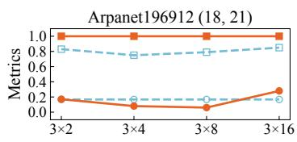

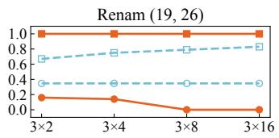

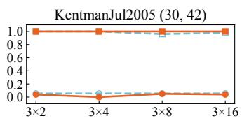

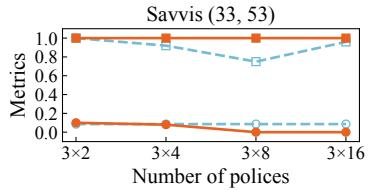

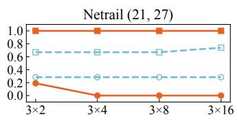

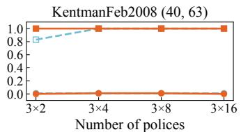

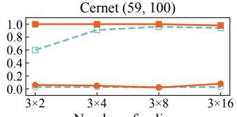

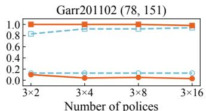  
Figure 8: Traffic shift during configuration updates and policy consistency with policy count increases. Each subplot is titled with the topology name, its corresponding number of node and edge.

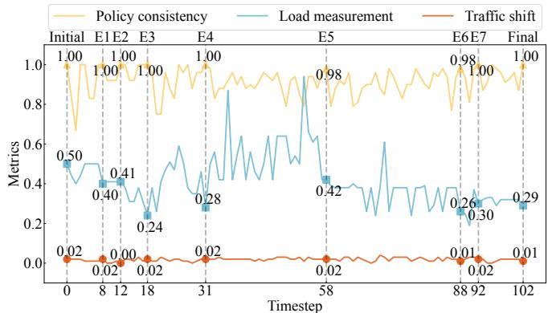  
Figure 9: NetKeeper’s performance in dynamic network: Policy consistency, Load measurement and Traffic shift.

5.8% in the three test scenarios respectively, with maximum mitigation reaching 18.0%, 15.0%, and 26.0%, resulting in an overall network performance improvement of 5.3%. This indicates that NetKeeper is capable of analyzing traffic patterns and performing better network performance optimization based on the current network conditions.

## 6.5 Traffic Shift

To evaluate traffic shifts during the configuration update process, we sample four groups of networks with cumulatively increasing numbers of policies: 3×2, 3×4, 3×8, and 3×16. Each configuration builds upon the constraints of the previous one, generating topologies with cumulative policies. We select NetRen as the baseline.

Fig. 8 depicts traffic shift and policy consistency after configuration update. NetKeeper outperforms NetRen with lower average traffic shift of 5.9% versus 13.9% and higher policy consistency of 99.9% versus 85.8%. Compared to NetRen, NetKeeper can reduce traffic shift by an average of 8.7% and a maximum of 34.7%. NetKeeper significantly outperforms NetRen in network update, demonstrating superior efficiency through reduced traffic shift and higher policy consistency.

## 6.6 Adaptability To Dynamic Network

To evaluate NetKeeper’s adaptability to dynamic network, we simulate dynamic environments with three types of events reflecting challenges commonly encountered in real-world scenarios: Physical: Including device failures, link failures, etc; Forwarding: Addition or reduction of forwarding policies, thereby limiting traffic forwarding paths; Network traffic: Link congestion or underutilization requiring load balancing.

This experiment is conducted on the Pern network, a realworld topology with 125 nodes, 129 edges, and 3×2 policies. We simulate seven sequential events (E1-E7), with NetKeeper updating configurations after each. These events include policy expansions (E1-E4), link load fluctuations (E2 and E5), and component removals (E6 and E7). The changes progressively increase complexity, reduce performance, and weaken connectivity. Each event concludes when consistency reaches 100% or exceeds 30 timesteps (A timestep ranges from 0.5s to 1s).

Figure 10: Network optimization logs in production network.  
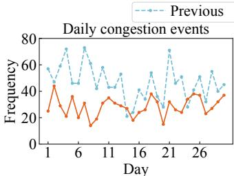

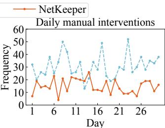  
Figure 11: NetKeeper’s performance in production network.

Fig. 9 shows how NetKeeper updates network configurations in response to different events. We observe that NetKeeper generally achieves full policy satisfaction alongside network optimization. However, under certain exceptional conditions, this may not hold. In E4, policy conflicts—stemming from natural language inputs that may contain inconsistencies—limit satisfaction to a maximum of 98%. In contrast, in E5, despite link load fluctuations, NetKeeper maintains full policy satisfaction while optimizing load distribution. In E6, device failures render associated policies inherently unsatisfiable; these are excluded from reconfiguration, and all remaining conflict-free policies are fully satisfied. This multi-faceted capability showcases NetKeeper’s flexibility in dynamic network. Furthermore, NetKeeper improves network performance while maintaining stability, demonstrating its practical value in dynamic network management.

## 6.7 Deployment in Production Network

To evaluate NetKeeper’s performance in real world, we deployed it in a large-scale enterprise network with hundreds of routers and switches. The network handles high daily traffic and supports critical applications like video conferencing and cloud services. NetKeeper was integrated into the existing network management system. As shown in Fig. 10, part of the deployment logs highlights the optimization of network metrics when facing network congestion.

During deployment, NetKeeper achieved 94.8% correct reconfigurations, with 2.1% false negatives and 3.1% false alarms, while safeguards effectively prevented cascading failures during anomaly responses. Fig. 11 illustrates a 39.4% improvement in network resilience (congestion event reduction) and a 51.5% decrease in manual interventions due to the natural language interface and automation. These enhancements enabled operators to focus on strategic tasks like network design and policy optimization, demonstrating significant improvements in network performance and operational

efficiency through NetKeeper.

## 7 Limitations

NetKeeper still has limitations, which we will further address as future work.

Limited Autonomy in Policy Generation. NetKeeper enables network configuration updates based on operators’ intent, yet still requires human involvement in strategic planning and decision-making when handling business requirement changes or network environment shifts. Specifically, network operators must provide granular policies under such dynamic conditions. Currently, the system cannot autonomously generate policy-level configurations directly from business objectives — automated policy generation adapted to specific business-network contexts remains a critical objective for our future work.

Limited Traffic Awareness for Resilience. NetKeeper considers traffic patterns when updating configurations to improve resilience, but its current traffic modeling is coarsegrained. It lacks fine-grained analysis of bursty flows or application-specific behaviors, limiting its adaptability to complex or rapidly changing traffic. Enhancing traffic profiling remains an important direction for future improvement.

## 8 Conclusion

To address the challenges of aligning network intent, optimizing networks based on traffic patterns, and adapting to dynamic network, we propose an autonomous network configuration update framework. Our framework incorporates a bidirectional north-south interface that aligns intents from user inputs and network anomalies. We design a dynamic network configuration update model based on MADRL, enhancing network resilience based on analyzing traffic patterns. NetKeeper effectively translates multimodal intents, enabling configuration updates through natural language interactions and facilitating network self-management and update based on anomaly logs. Furthermore, NetKeeper achieves a higher degree of automated configuration update, reduces manual intervention and potential human errors.

## Acknowledgments

We thank our shepherd, Tieying Zhang, and the anonymous reviewers for their insightful comments. This work was supported in part by the National Key R&D Program of China 2024YFE0200800, the National Natural Science Foundation of China under Grants (62201072, 62321001, 62471055, U23B2001, 62401080, 62101064, 62171057, 62071067), the High-Quality Development Project of the MIIT(2440STCZB2584), the Ministry of Education and China Mobile Joint Fund (MCM20200202, MCM20180101), the Fundamental Research Funds for the Central Universities (2024PTB-004)

## References

[1] Anubhavnidhi Abhashkumar, Aaron Gember-Jacobson, and Aditya Akella. AED: incrementally synthesizing policy-compliant and manageable configurations. In CoNEXT ’20: The 16th International Conference on emerging Networking EXperiments and Technologies, Barcelona, Spain, December 2020.

[2] Kai Arulkumaran, Marc Peter Deisenroth, Miles Brundage, and Anil Anthony Bharath. Deep reinforcement learning: A brief survey. IEEE Signal Process. Mag., 34(6):26–38, June 2017.

[3] Mahmoud Bahnasy, Fenglin Li, Shihan Xiao, and Xiangle Cheng. DeepBGP: A machine learning approach for BGP configuration synthesis. In Proceedings of the 2020 Workshop on Network Meets AI & ML, NetAI@SIGCOMM, Virtual Event, USA, August 2020.

[4] Ryan Beckett, Ratul Mahajan, Todd D. Millstein, Jitendra Padhye, and David Walker. Don’t mind the gap: Bridging network-wide objectives and device-level configurations. In Proceedings of the ACM SIGCOMM 2016 Conference, Florianopolis, Brazil, August 2016.

[5] Ryan Beckett, Ratul Mahajan, Todd D. Millstein, Jitendra Padhye, and David Walker. Network configuration synthesis with abstract topologies. In Proceedings of the 38th ACM SIGPLAN Conference on Programming Language Design and Implementation, Barcelona, Spain, June 2017.

[6] Theophilus Benson, Aditya Akella, and David A. Maltz. Network traffic characteristics of data centers in the wild. In Internet Measurement Conference, Melbourne, Australia, November 2010.

[7] Luca Beurer-Kellner, Martin T. Vechev, Laurent Vanbever, and Petar Velickovic. Learning to configure computer networks with neural algorithmic reasoning. In Sanmi Koyejo, S. Mohamed, A. Agarwal, Danielle Belgrave, K. Cho, and A. Oh, editors, Advances in Neural Information Processing Systems 35: Annual Conference on Neural Information Processing Systems, New Orleans, LA, November 2022.

[8] Leonardo Mendonça de Moura and Nikolaj S. Bjørner. Z3: an efficient SMT solver. In Tools and Algorithms for the Construction and Analysis of Systems, 14th International Conference, TACAS 2008, Held as Part of the Joint European Conferences on Theory and Practice of Software, ETAPS 2008, Budapest, Hungary, March 2008.

[9] Ahmed El-Hassany, Petar Tsankov, Laurent Vanbever, and Martin T. Vechev. Network-wide configuration

synthesis. In Computer Aided Verification - 29th International Conference, Heidelberg, Germany, July 2017.

[10] Ahmed El-Hassany, Petar Tsankov, Laurent Vanbever, and Martin T. Vechev. Netcomplete: Practical networkwide configuration synthesis with autocompletion. In NSDI, Renton, WA, USA, April 2018.

[11] Jakob N. Foerster, Gregory Farquhar, Triantafyllos Afouras, Nantas Nardelli, and Shimon Whiteson. Counterfactual multi-agent policy gradients. In Proceedings of the Thirty-Second AAAI Conference on Artificial Intelligence, (AAAI-18), the 30th innovative Applications of Artificial Intelligence (IAAI-18), and the 8th AAAI Symposium on Educational Advances in Artificial Intelligence (EAAI-18), Louisiana, USA, February 2018.

[12] TM Forum. Autonomous networks technical architecture v1.1.1 (ig1230), Dec. 2022. https://www.tmforum.org/resources/toolkit/ autonomous-networks-technical-architecture/ /, Last accessed on 2024-9-13.

[13] Team GLM, Aohan Zeng, Bin Xu, Bowen Wang, Chenhui Zhang, Da Yin, Diego Rojas, Guanyu Feng, Hanlin Zhao, Hanyu Lai, Hao Yu, Hongning Wang, Jiadai Sun, Jiajie Zhang, Jiale Cheng, Jiayi Gui, Jie Tang, Jing Zhang, Juanzi Li, Lei Zhao, Lindong Wu, Lucen Zhong, Mingdao Liu, Minlie Huang, Peng Zhang, Qinkai Zheng, Rui Lu, Shuaiqi Duan, Shudan Zhang, Shulin Cao, Shuxun Yang, Weng Lam Tam, Wenyi Zhao, Xiao Liu, Xiao Xia, Xiaohan Zhang, Xiaotao Gu, Xin Lv, Xinghan Liu, Xinyi Liu, Xinyue Yang, Xixuan Song, Xunkai Zhang, Yifan An, Yifan Xu, Yilin Niu, Yuantao Yang, Yueyan Li, Yushi Bai, Yuxiao Dong, Zehan Qi, Zhaoyu Wang, Zhen Yang, Zhengxiao Du, Zhenyu Hou, and Zihan Wang. Chatglm: A family of large language models from glm-130b to glm-4 all tools, June 2024.

[14] Tuomas Haarnoja, Aurick Zhou, Pieter Abbeel, and Sergey Levine. Soft actor-critic: Off-policy maximum entropy deep reinforcement learning with a stochastic actor. In Proceedings of the 35th International Conference on Machine Learning,ICML 2018, Sweden, July 2018.

[15] Rongxin Han, Jingyu Wang, Qi Qi, Haifeng Sun, Chaowei Xu, Zhaoyang Wan, Zirui Zhuang, Yichuan Yu, and Jianxin Liao. Netren: Service migration-driven network renascence with synthesizing updated configuration. In Proceedings of the 29th ACM International Conference on Architectural Support for Programming Languages and Operating Systems, Volume 3, ASPLOS 2024, La Jolla, CA, USA, April 2024.

[16] Christian E. Hopps. Analysis of an equal-cost multipath algorithm. RFC, 2992:1–8, November 2000.

[17] Arthur Selle Jacobs, Ricardo J. Pfitscher, Rafael Hengen Ribeiro, Ronaldo A. Ferreira, Lisandro Zambenedetti Granville, Walter Willinger, and Sanjay G. Rao. Hey, lumi! using natural language for intent-based network management. In Proceedings of the 2021 USENIX Annual Technical Conference, USENIX ATC 2021, April 2021.

[18] Tatsuaki Kimura, Keisuke Ishibashi, Tatsuya Mori, Hiroshi Sawada, Tsuyoshi Toyono, Ken Nishimatsu, Akio Watanabe, Akihiro Shimoda, and Kohei Shiomoto. Spatio-temporal factorization of log data for understanding network events. In 2014 IEEE Conference on Computer Communications, INFOCOM 2014, Toronto, Canada, April 2014.

[19] Diederik P. Kingma and Jimmy Ba. Adam: A method for stochastic optimization. In Yoshua Bengio and Yann LeCun, editors, 3rd International Conference on Learning Representations, ICLR 2015, San Diego, CA, USA, May 2015.

[20] Thomas N. Kipf and Max Welling. Semi-supervised classification with graph convolutional networks. In 5th International Conference on Learning Representations, ICLR 2017, Toulon, France, April 2017.

[21] Simon Knight, Hung X. Nguyen, Nick Falkner, Rhys Alistair Bowden, and Matthew Roughan. The internet topology zoo. IEEE J. Sel. Areas Commun., 29(9):1765– 1775, 2011.

[22] Vijaymohan Konda and Vivek S. Borkar. Actor-critic - type learning algorithms for markov decision processes. SIAM J. Control. Optim., 38(1):94–123, February 1999.

[23] Rupa Krishnan, Harsha V. Madhyastha, Sridhar Srinivasan, Sushant Jain, Arvind Krishnamurthy, Thomas E. Anderson, and Jie Gao. Moving beyond end-to-end path information to optimize CDN performance. In Proceedings of the 9th ACM SIGCOMM Internet Measurement Conference, IMC 2009, Chicago, Illinois, USA, November 2009.

[24] Xingjian Liao, Haifeng Sun, Jingyu Wang, Qi Qi, Zirui Zhuang, Jianxin Liao, and Guang Yang. Solving distributed ACL policies under complex constraints with graph neural networks. In 31st IEEE International Conference on Network Protocols, ICNP 2023, Reykjavik, Iceland, October 2023.

[25] Timothy P. Lillicrap, Jonathan J. Hunt, Alexander Pritzel, Nicolas Heess, Tom Erez, Yuval Tassa, David Silver, and Daan Wierstra. Continuous control with deep reinforcement learning. In 4th International Conference on Learning Representations, ICLR 2016, San Juan, Puerto Rico, May 2016.

[26] Xiao Liu, Kaixuan Ji, Yicheng Fu, Zhengxiao Du, Zhilin Yang, and Jie Tang. P-tuning v2: Prompt tuning can be comparable to fine-tuning universally across scales and tasks. CoRR, abs/2110.07602, December 2021.

[27] Marjan Mernik, Jan Heering, and Anthony M. Sloane. When and how to develop domain-specific languages. ACM Comput. Surv., 37(4):316–344, July 2005.

[28] Volodymyr Mnih, Koray Kavukcuoglu, David Silver, Andrei A. Rusu, Joel Veness, Marc G. Bellemare, Alex Graves, Martin A. Riedmiller, Andreas Fidjeland, Georg Ostrovski, Stig Petersen, Charles Beattie, Amir Sadik, Ioannis Antonoglou, Helen King, Dharshan Kumaran, Daan Wierstra, Shane Legg, and Demis Hassabis. Human-level control through deep reinforcement learning. Nat., 518(7540):529–533, February 2015.

[29] John Moy. OSPF version 2. RFC, 2328:1–244, July 1998.

[30] Sanjai Narain, Gary Levin, Sharad Malik, and Vikram Kaul. Declarative infrastructure configuration synthesis and debugging. J. Netw. Syst. Manag., 16(3):235–258, October 2008.

[31] Sivaramakrishnan Ramanathan, Ying Zhang, Mohab Gawish, Yogesh Mundada, Zhaodong Wang, Sangki Yun, Eric Lippert, Walid Taha, Minlan Yu, and Jelena Mirkovic. Practical intent-driven routing configuration synthesis. In 20th USENIX Symposium on Networked Systems Design and Implementation, NSDI 2023, Boston, MA, April 2023.

[32] Yakov Rekhter, Tony Li, and Susan Hares. A border gateway protocol 4 (BGP-4). RFC, 4271:1–104, January 2006.

[33] Ravi S. Sandhu and Pierangela Samarati. Access control: principles and practice. IEEE Commun. Mag., 32(9):40– 48, August 1994.

[34] Tibor Schneider, Rüdiger Birkner, and Laurent Vanbever. Snowcap: synthesizing network-wide configuration updates. In ACM SIGCOMM 2021 Conference, Virtual Event, USA, August 2021.

[35] Tibor Schneider, Roland Schmid, and Laurent Vanbever. On the complexity of network-wide configuration synthesis. In 30th IEEE International Conference on Network Protocols, ICNP, Lexington, KY, USA, October 2022.

[36] Armando Solar-Lezama, Liviu Tancau, Rastislav Bodík, Sanjit A. Seshia, and Vijay A. Saraswat. Combinatorial sketching for finite programs. In Proceedings of the 12th International Conference on Architectural Support for Programming Languages and Operating Systems, ASPLOS 2006, San Jose, CA, USA, October 2006.

[37] Robert Soulé, Shrutarshi Basu, Parisa Jalili Marandi, Fernando Pedone, Robert D. Kleinberg, Emin Gün Sirer, and Nate Foster. Merlin: A language for provisioning network resources. In Proceedings of the 10th ACM International on Conference on emerging Networking Experiments and Technologies, CoNEXT 2014, Sydney, Australia, December 2014.

[38] Mohammed H. Sqalli, Sadiq M. Sait, and Mohammed Aijaz Mohiuddin. An enhanced estimator to multi-objective OSPF weight setting problem. In Management of Integrated End-to-End Communications and Services, 10th IEEE/IFIP Network Operations and Management Symposium, NOMS 2006, Vancouver, Canada, April 2006.

[39] James PG Sterbenz, David Hutchison, Egemen K Çetinkaya, Abdul Jabbar, Justin P Rohrer, Marcus Schöller, and Paul Smith. Resilience and survivability in communication networks: Strategies, principles, and survey of disciplines. Computer networks, 54(8):1245– 1265, March 2010.

[40] Kausik Subramanian, Loris D’Antoni, and Aditya Akella. Genesis: synthesizing forwarding tables in multi-tenant networks. In Proceedings of the 44th ACM SIGPLAN Symposium on Principles of Programming Languages, POPL 2017, Paris, France, January 2017.

[41] Oguzhan Topsakal and Tahir Cetin Akinci. Creating large language model applications utilizing langchain: A primer on developing llm apps fast. In International Conference on Applied Engineering and Natural Sciences, volume 1, pages 1050–1056, July 2023.

[42] Ashish Vaswani, Noam Shazeer, Niki Parmar, Jakob Uszkoreit, Llion Jones, Aidan N. Gomez, Lukasz Kaiser, and Illia Polosukhin. Attention is all you need. In Advances in Neural Information Processing Systems 30: Annual Conference on Neural Information Processing Systems 2017, Long Beach, CA, USA, December 2017.

[43] Changjie Wang, Mariano Scazzariello, Alireza Farshin, Simone Ferlin, Dejan Kostic, and Marco Chiesa. Netconfeval: Can llms facilitate network configuration? Proc. ACM Netw., 2(CoNEXT2):1–25, June 2024.

[44] Zhanghao Wu, Paras Jain, Matthew A. Wright, Azalia Mirhoseini, Joseph E. Gonzalez, and Ion Stoica. Representing long-range context for graph neural networks with global attention. In Advances in Neural Information Processing Systems 34: Annual Conferenceon Neural Information Processing Systems 2021, NeurIPS 2021, virtual, December 2021.

[45] Kaiqing Zhang, Zhuoran Yang, and Tamer Basar. Multiagent reinforcement learning: A selective overview of

theories and algorithms. CoRR, abs/1911.10635:321– 384, June 2019.

[46] Jinyu Zhao, Haifeng Sun, Jingyu Wang, Qi Qi, Zirui Zhuang, Shimin Tao, and Jianxin Liao. CONFPILOT: A pilot for faster configuration by learning from device manuals. In 43rd IEEE International Conference on Distributed Computing Systems, ICDCS 2023, Hong Kong, October 2023.