USENIX

THE ADVANCED COMPUTING SYSTEMS ASSOCIATION

# KVCache Cache in the Wild: Characterizing and Optimizing KVCache Cache at a Large Cloud Provider

Jiahao Wang, Jinbo Han, and Xingda Wei, Shanghai Jiao Tong University; Sijie Shen, Alibaba Group; Dingyan Zhang, Shanghai Jiao Tong University; Chenguang Fang, Alibaba Group; Rong Chen, Shanghai Jiao Tong University; Wenyuan Yu, Alibaba Group; Haibo Chen, Shanghai Jiao Tong University

# This paper is included in the Proceedings of the 2025 USENIX Annual Technical Conference.

July 7–9, 2025 • Boston, MA, USA ISBN 978-1-939133-48-9

Open access to the Proceedings of the 2025 USENIX Annual Technical Conference is sponsored by

P=-r.h mFe"

auuuJl9 P9leU

King Abdullah University of

Science and Technology

# KVCache Cache in the Wild: Characterizing and Optimizing KVCache Cache at a Large Cloud Provider

Jiahao Wang†1, Jinbo Han†1, Xingda Wei 1, Sijie Shen2, Dingyan Zhang1, Chenguang Fang2, Rong Chen1, Wenyuan Yu2, and Haibo Chen1

1Institute of Parallel and Distributed Systems, Shanghai Jiao Tong University 2Alibaba Group

## Abstract

Serving large language models (LLMs) is important for cloud providers, and caching intermediate results (KV\$) after processing each request substantially improves serving throughput and latency. However, there is limited understanding of how LLM serving benefits from KV\$ caching, where system design decisions like cache eviction policies are highly workload-dependent.

In this paper, we present the first systematic characterization of the KV\$ workload patterns from one of the leading LLM service providers. We draw observations that were not covered by previous studies focusing on synthetic workloads, including: KV\$ reuses are skewed across requests, where reuses between single-turn requests are equally important as multi-turn requests; the reuse time and probability are diverse considering all requests, but for a specific request category, the pattern tends to be predictable; and the overall cache size required for an ideal cache hit ratio is moderate. Based on the characterization, we further propose a workload-aware cache eviction policy that improves the serving performance under real-world traces, especially with limited cache capacity.

## 1 Introduction

Large language models (LLMs) have become an important cloud service thanks to their emerging capabilities in various tasks. Both customer-facing services (to-C) like conversationbased chatbots [43] and business services (to-B) through LLM API calls have been widely deployed on the cloud [42, 21, 4]. As online services, serving LLMs with low latency and high throughput is critical, but achieving this in a cost-efficient way is challenging due to the huge computational requirements to serve each LLM request.

Caching intermediate results of served requests (KV\$) has become a common methodology to improve serving performance [45, 5]: when two requests share the same input prefix, their KV\$ are identical; so if we cache the KV\$ of the first (KV\$ cache), we don’t need to compute the KV\$ for the next. Hence, the serving latency is reduced with the throughput improved thanks to the reduced computation under hits.

Like traditional data caching systems [60, 7, 40], the effectiveness of KV\$ cache system components like cache eviction policy should be tailored to the KV\$ reuse features of workloads. However, LLM serving workloads are complex due to their diverse request types as well as the unique features of each request type. For example, a production LLM service handles both to-C workloads (like chatting) and to-B workloads (like task automation with API calling). These requests can further be processed either as single-turn or multi-turn interactions (§2). Since the KV\$ can be reused across different single-turn requests and multi-turn requests, both the singleturn request types and the multi-turn patterns can possibly affect the design choices of KV\$ cache.

<table><tr><td></td><td>Time</td><td>Type</td><td>UID</td><td>Turn</td><td>Content</td></tr><tr><td>ShareGPT[2]</td><td>X</td><td>×</td><td>×</td><td>√</td><td>√</td></tr><tr><td>Mooncake [1]</td><td>√</td><td>X</td><td>X</td><td>X</td><td>√</td></tr><tr><td>Traces in this work</td><td>√</td><td>√</td><td>√</td><td>√</td><td>√</td></tr></table>

Table 1: A comparison of currently available LLM serving traces. Time is the invocation time of each request. Type is the request type, e.g., whether it is an API call. UID is the user ID that invokes the request. Turn is the multi-turn information of the request. Content is the (anonymous) input and output tokens of each request.

There remains a significant gap in the understanding of common LLM serving workloads for KV\$ cache due to the lack of in-depth analysis of real-world traces. First, it is unclear whether production workloads have many reuses and which request type contributes most to the reuses. Second, the distributions of the reuse time or reuse probability of KV\$ remain unknown, which is critical to cache policy designs. Finally, there is a lack of characterization of the lifespan of KV\$, which is essential in helping us estimate the required cache capacity for serving LLMs in the wild.

Characterizing production traces. To bridge this gap, we collected and characterized two representative production serving workloads from one of the world’s largest cloud providers (ALIYUN): a to-C workload where users submit requests to the cloud-hosted LLM service via browser-based chatbots or mobile applications, and a to-B workload where developers send OpenAI-compatible requests to the LLM service through API calls in their programs. We collected as much detailed information as possible within the company’s strict privacy policy, including request submission times, request types (single-turn, multi-turn, API requests, or others), and anonymized content to analyze caching effectiveness. To our knowledge, no other available LLM serving traces match the information depth and scale of our traces (summarized in Table 1). For example, ShareGPT [2] only provides the input and output of each request, not the submission time of each request, which is critical for analyzing the real KV\$ hit ratio and usage over time. We believe our collected workloads represent typical LLM serving workloads and can provide a foundation for future KV\$ cache system design.

From the perspective of designing an efficient KV\$ cache system—both in performance and resource usage, our key takeaways are as follows:

1. KV\$ reuses are common, but the reuse ratio is smaller than previously reported numbers on synthetic datasets [65, 65]. The reuses follow a skewed distribution: 10 % of KV\$ blocks contribute to 77 % of the reuses. The contribution of KV\$ reuses also varies across traces: contrary to a straightforward observation that multi-turn requests may dominate most reuses, single-turn requests dominate 97 % KV\$ reuses in to-B workloads (§3.2).

2. Key workload features related to KV\$ designs, like reuse time and reuse probability distributions—vary across different LLM request types (API vs. chat) and the number of turns in multi-turn requests. Despite this diversity, for each specific request category (type plus turn number), the reuse time is predictable based on the historical information (§3.4). Since the request categories are known by the serving system, we can systematically use the estimated probability for improving cache policies.

3. The lifespan of KV\$ is ephemeral: the P99 lifespan of KV\$ in to-B workloads is 97 seconds, so a small cache is typically sufficient for the KV\$ cache. For example, in the to-B workload, a KV\$ with capacity 2 × of the GPU HBM per-GPU is sufficient to approach an ideal hit rate under infinite capacity on common GQA models [3] using standard cache eviction policies like LRU (§3.5).

Our characterizations above reveal several important design decisions that current KV\$ cache systems may have overlooked. First, optimizing caching for single-turn requests is equally important as optimizing for multi-turn requests. Second, we could improve cache hits by adopting a workloadaware caching policy instead of only adopting a workloadagnostic policy like LRU. Finally, the ephemeral lifespan of KV\$ suggests that a least-frequently-used (LFU) policy is not suitable because a short-lived KV\$ may have high frequency in the past. Meanwhile, a small (on-GPU) cache is sufficient for API-dominated to-B workloads, eliminating the cost and complexity of deploying and managing a CPU-RDMA-SSD storage hierarchy for KV\$ cache. Besides the main takeaways described above, we also discovered several interesting findings, such as the KV\$ hits across users being extremely low (§3.2), despite the possibility of shared prompts via prompt libraries [6].

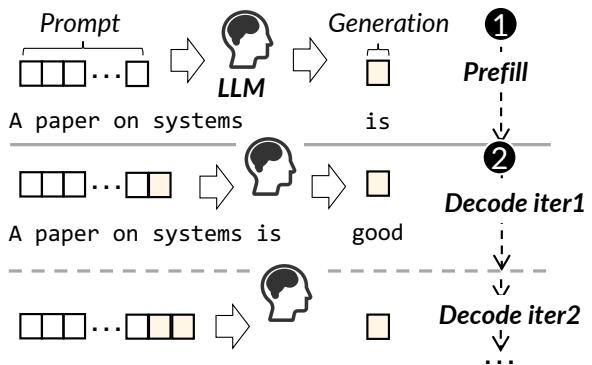  
Figure 1: An illustration showing how an LLM processes requests.

Improved KV\$ cache eviction policy. Based on our findings, we propose a workload-aware KV\$ eviction policy (§4.2) that leverages the profiled reuse probability distributions of each workload to enhance cache hit ratios on realworld workloads. Specifically, we leverage the empirically sampled probability distributions of the reuse probability of each workload to decide the priority of each KV\$ block, with considerations of both the characterized spatial locality and the lifespan of KV\$. To demonstrate the effectiveness of our improved design, we have integrated our policy into vLLM [30]—a popular LLM serving system on the cloud, and our extensive evaluations on production traces show that the improved design can improve 3.9 % cache hits as well as up to 41.4 % mean response time improvements compared to workload-agnostic policies like LRU and LFU.

cmDiscussion. Before moving on, we note two limitations of .Your work. First, our results are based on one week produc-YYtion traces of large-scale LLM serving workloads. While we believe such workloads (chatbot and API) are representative nowadays, LLM serving workloads are evolving, with new trim = workloads like reasoning [44] emerging. We leave the characterization of these newer workloads to future work. Second, our primary focus is on the KV\$ cache policy design, yet we believe the design of other system components for LLM serving like the policy of global scheduling could also benefit from our findings, and we leave other explorations as future work. Nevertheless, we believe our methodology—first characterizing real-world serving features and then optimizing a specific serving component—generalizes to other LLM serving workloads and systems.

A sample of our analyzed trace is available at https://github.com/alibaba-edu/qwenbailian-usagetraces-anon.

## 2 Background: LLM serving, KVCache, KV-Cache cache and Multi-turn Serving

LLM serving. Large language models (LLMs) process requests in an auto-regressive way, as shown in Figure 1. Given a request (or a batch of requests), where each request contains multiple tokens (prompt), the model first executes a prefill

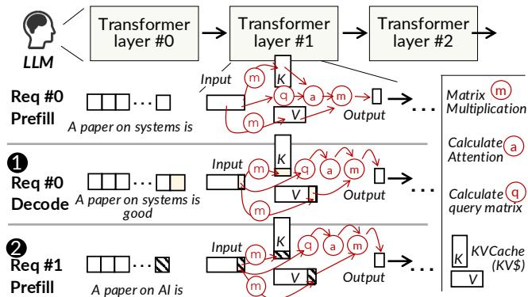  
Figure 2: An illustration of: ❶ how KV\$ from a prefill request (Req#0) can be reused by the decoding of Req#0, and ❷ how KV\$ can be reused for the prefill of a future request (Req#1).

Decodephase to generate the first token (❶) with a forward pass. The model then enters a decoding phase (❷) that iteratively generating the remaining tokens with multiple forward passes. The iteration ends after the module outputs an end-of-sequence (EOS) token. During each iteration, the input consists of both the original prompt and all previously generated tokens.

KVCache (KV\$). LLM performs three steps for a forward cm pass [55] as shown in Figure 2: (1) calculating the Q, K, and .V matrices using matrix multiplication, (2) using Q and K to Yderive attention scores, and (3) combining the attention scores with the V matrix to produce the attention result. These steps trim = 0.25cm Yare computation-intensive. Since inputs with the same tokens share the same K and V matrices (see ❶), all LLM serving systems cache the K and V matrices generated during the prefill phase on the GPUs to save computation time. These cached K and V matrices are then reused during the decode phase for the same request to avoid recomputation, so they are termed as KV\$.

KV\$ cache and KV\$ blocks. Besides KV\$ reuse across prefill and decode phases when processing a single request, the KV\$ can also be reused across different requests if they share the same token prefix. As shown in Figure 2 (❷), the K and V values of “A paper on” are identical for both #Req0 and #Req1. Thus, even when #Req0 finishes decoding, we can still cache its KV\$ for #Req1, which dramatically improves the reaction time (also termed time to first token, TTFT) of #Req1: it only needs to compute the K and V of “AI is” during the prefill. KV\$ caching further increases the serving throughput thanks to the saved computation. Due to the above reasons, existing serving systems all cache the KV\$ of completed requests. We term this approach KV\$ cache [30, 18, 20, 69, 26, 37, 65], though other names like prefix cache or prompt cache also exist. The KV\$ can be cached in GPU memory, on the host memory (or remote machine’s memory), or even SSD [30, 18, 65].

Since checking prefix-match may be costly at a per-token level, the cache granularity of existing KV\$ system is block, where each block contains the KV of a configurable number of tokens. For example, vLLM [30] by default groups 16 tokens as a block.

{ "timestamp": "202x-xx-yy 17:41:33.945",   
"chat\_id": ”1234567890abcdef1234567890abcdef",   
"parent\_chat\_id": ”aabbccddeeff00112233445566778899",   
“user\_id”: ”1000001234567890",   
”req\_type": ”text",   
"num\_input\_tokens": 11026,   
"num\_output\_tokens": 312,   
Prompt  Generation  1 ”tokens\_hashes\_input": [1001,2002,3003,4004,5005,...],   
…  Prefill ”tokens\_hashes\_output": [1234,2341,3412,4123,10000,...], }  
A paper on systems  is Figure 3: An example of the collected trace record.

…A paper on systDecode Multi-turn serving. Interacting with LLMs through multiturn conversations is a common pattern to improve serving quality [58, 56]. Specifically, after receiving the generation from the LLM, the user may issue a next-turn request with a new prompt. Since the LLM needs the previous conversation context for processing, the serving system will concatenate the input and output of requests from the previous turns to the new request’s input, and feed the new input to the LLM for Ycserving. To help manage the history of multi-turn requests, YYrequests in a multi-turn conversation are typically grouped in a session. A multi-turn request naturally reuses KV\$ from cm XX.Xcm 0.25cm, clipprevious turns since current LLM systems deliberately append trim = 0.25cm the history of inputs and outputs as a prefix to each new request.

## 3 Characterize KV\$ Workload in the Wild

## 3.1 Trace data collection

We collected and analyzed two weeks (February 2025 and December 2024) of LLM serving request traces from one of ALIYUN TONGYI’s serving clusters. For brevity, we present results from one representative day per trace. The results remain consistent throughout the workdays in each week (see §A.1). Note that we cannot collect the raw input and output for each request due to ALIYUN’s strict privacy policy. For a specific trace, all its collected requests are served by the same model.

Below, we first describe the detailed anonymized trace record provided by the operational team of the serving cluster, then we move on to highlight the differences between two traces, both representing typical serving workloads nowadays. Figure 3 presents the layout of a collected request:

1. Timestamp: The time when the serving cluster receives the request.

2. Chat ID: The unique ID of the request.

3. Parent Chat ID (under multi-turn serving): For requests in a multi-turn session, the serving system assigns a parent

ID to each request, linking it to the previous request in the session. By traversing the parent IDs, we can identify all requests belonging to the same session. If the parent ID is empty, then the request is the first-turn of a session and we call them single-turn request. Otherwise, we call requests with a non-empty parent ID multi-turn request.

4. User ID: The unique ID of the user submitting the request. These IDs are mapped to a randomly selected domain for anonymity.

5. Request type: The serving gateway categorizes LLM requests into five types: Text: Plain text input via interfaces like ChatBot. File: file analysis (e.g., summarizing document content using LLM). Multimodal: Image understanding through OCR-enhanced processing. Search: Frontend with web-search integrated for knowledge augmentation. API: Programmatic access via OpenAI-compatible interfaces [42].

6. Number of Input/Output Tokens: The number of input tokens provided to the LLM and the number of output tokens generated by it.

7. The hashed values of In/Output tokens: Due to the strict privacy policy, the runtime system generate the traces through salted hashing and domain remapping. Specifically, the collector employs SipHash [8] to generate unique hashes for every four consecutive tokens with random salts per trace, then remapping the hash IDs to consecutive natural numbers. This fine-grained hashing enables more fine-grained cache analysis while enhancing privacy protection compared to single-token hashing.

Trace A vs. Trace B. We collected two traces (A and B) representing two representative LLM serving workloads. Trace A represents a common to-C (customer) scenario where users interact with the model through services built by the cloud, i.e., ChatBot (Text) or File/Multimodal/Search services. A key feature of to-C workloads is that they are typically human-in-theloop. Trace B represents a to-B (business) workload where business users interact with the LLM by calling OpenAIcompatible APIs hosted by the cloud through computer programs [42]. API calling is critical for business users because they can systematically leverage LLM to automate tasks like document translation or user request classification. Trace B has no request type information because, similar to the LLM interface calls currently offered by other vendors [42, 21, 4], this information is concatenated on the client side.

## 3.2 KV\$ reuses analysis in the wild

How many KV\$ can be reused? Figure 4 shows the ideal cache hit rates on two traces, i.e., assuming a cache having infinite capacity. We can see that LLM workloads can benefit from caching—it has 62% and 54% hit rates on Trace A and B, respectively. The hit rate is calculated as follows: for a total of N KV\$ blocks that needed to be computed by LLM in a trace, if the hit rate is 62%, this implies that 62% of the

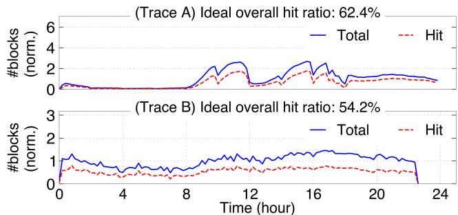  
Figure 4: An analysis of the ideal cache hit ratio of the KV\$ cache under real-world LLM serving workloads within a day. The reported accessed and hit block numbers are normalized (norm.).

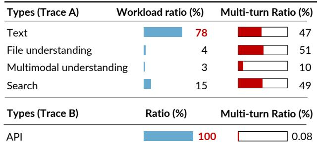  
Figure 5: Workload types and multi-turn ratio of requests in our collected traces.

N blocks can reuse a KV\$ computed and cached in a prior request. While the ideal hit ratio is high, it is smaller than …Req #0 the reported hit ratio (e.g., more than 80% [65, 69, 19]) on synthetic workloads.

Single-turn and multi-turn requests are equally important for KV\$ reuse. While it is a common belief that multi-turn requests are key contributors to the cache hits [65, 19], this is not the case on the to-B workloads (Trace B). Figure 5 shows the contribution of each request type as well as their mmulti-turn ratio. For Trace A, it is dominated by the requests .Ysent by the chatbot (78 %), and all request types except for YYthe multimodal have a similar multi-turn ratio (47–51 %). For Trace B, it only has API requests with a negligible multi-turn ratio (less than 0.1 %). Nevertheless, the single-turn requests contribute 97 % of the total cache hits for Trace B.

Single-turn API requests dominate the hits in to-B workloads for two reasons. First, LLM API requests share KV\$ through common system prompts. Specifically, each request comprises: (1) a system prompt providing task instructions (e.g., document translation guidelines) and (2) a user prompt containing request-specific data (e.g., target document). When programs make API calls [35], they typically hardcode identical system prompts in the program, thus enabling KV\$ sharing across requests, even for single-turn requests. Second, API requests often exhibit rapid submission rates (e.g., > 10 QPS), enabling frequent reuse of the same shared KV\$ from system prompts.

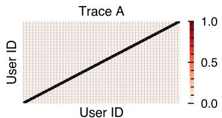

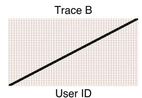  
Figure 6: An analysis of whether a user may hit the KV\$ cached by another user. The darker the color, the higher the normalized hit count. Note that we have amplified the diagonal line in case it is too thin, since the trace provider serves numerous users.

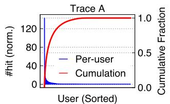

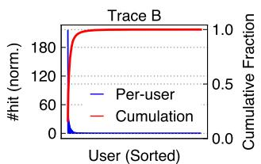  
Figure 7: An analysis of the normalized (norm.) hits contributed by different users in an ideal setup with infinite cache size.

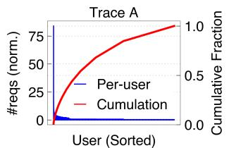

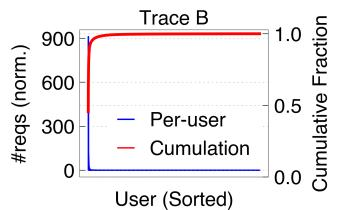  
Figure 8: An analysis of the normalized (norm.) request count for different users.

Cross-user KV\$ hits are rare. Figure 6 shows the heatmap of the cache hits between users, assuming an infinite-size KV\$ cache. Darker colors indicate higher normalized hit counts. We can see that for each user, most hits come from requests submitted by themselves (the diagonal line). While users naturally reuse KV\$ from their own requests—either via multi-turn conversations or through programs calling API with the same system prompt for the same task, the low interuser hit rate suggests that users tend to customize their own system prompts rather than using template prompts provided by third-party libraries [6]. As a result, we suggest paying more attention to intra-user KV\$ reuses rather than interuser [20, 69, 26, 37] when designing KV\$ systems.

The KV\$ reuses are skewed. Figure 7 shows the KV\$ cache hits contributed by different users, along with the cumulative hits. The KV\$ hit pattern is highly skewed: 19 % of the user requests in trace A and 4 % in trace B account for more than 90 % of the KV\$ block hits. This skewness stems from two factors. First, the requests are unevenly distributed across users, especially in Trace B. Figure 8 shows the normalized number of requests sent by different users: 15 % of the users (head users) contribute 90 % of the requests in Trace B. Since KV\$ hits primarily occur for requests from the same user (see Figure 6), the skewness in request counts is expected to lead to a similar skewness in KV\$ hits. Second, even when requests are sent relatively evenly by different users, individual users vary significantly in their KV\$ hits. As also shown in Figure 8, Trace A exhibits a moderately skewed request distribution: 19 % of users generate 50 % of the requests, and 72 % generate 90 % of the requests. Nevertheless, the KV\$ hits are still skewed. We suspect that this is due to their tendency to engage in multi-turn requests.

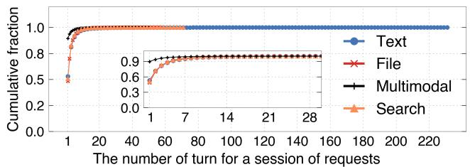  
Figure 9: Distribution of turn number of multi-turn requests on Trace A.

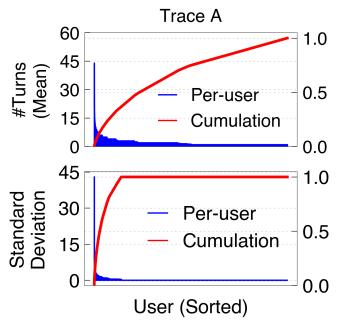

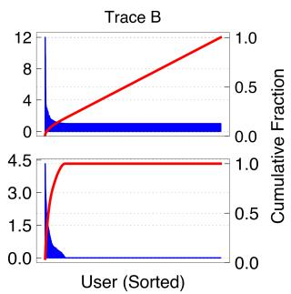  
Figure 10: An analysis of the mean (upper) and standard deviation (lower) of the number of turns of requests sent by each user. The users are sorted across to their mean number of turn (upper) and standard deviation (lower).

## 3.3 Analyses of multi-turn requests features

We first examine the features of multi-turn requests, as they still dominate the KV\$ reuse in to-C workloads. We omit the results on Trace B because multi-turn requests are rare in it.

Multi-turn requests have high variability. We observed two kinds of variability. First, the number of turns varies significantly across different sessions. Figure 9 shows the distributions of turn numbers on Trace A: 54 % of requests are single-turn requests, while the 50th and 90th percentile turn numbers are 1 and 5, respectively. The distribution has a long tail—the longest session has 232 turns, two orders of magnitude larger than the median (232 ×).

Second, multi-turn request distributions exhibit significant user-level variation. Figure 10 shows that most users have similar mean turn counts, except for a few head users—the top 10% exhibit 8.9 × more turns than the average. Additionally, turn count deviations vary substantially, ranging from 1 to 44. This suggests diverse interaction patterns: some users show high variability, while others remain stable.

The probability of issuing the next turn request is predictable given a workload category and time interval, and the probability differs across request categories. A request category includes both the original request type (e.g., Text and Search) as well as the turn number of the request, i.e., a 1-turn text (single-turn text request) is different from the 2-turn text request. Figure 11 shows a heatmap of how the probability of issuing the next-turn request changes over the long time interval (24 hours) as well as a zoomed-in view of a short time interval (3 hours). The intensity of the color indicates the profiled frequencies within a time window (10 minutes). We can see that though different request categories have different frequencies (shown by vertical lines), for a specific category, the frequency of issuing the next-turn request remains consistent over a one-hour time interval (shown by horizontal lines). We attribute this to the fact that the probability distribution of KV\$ reuse is quite fixed given a specific time interval and request category. §3.4 further elaborates on that. Interestingly, the frequency of issuing the next-turn request differs across request categories. For example, single-turn requests demonstrate significantly lower rates of issuing next-turn requests (mean=0.5) compared to multi-turn requests (mean=0.8).

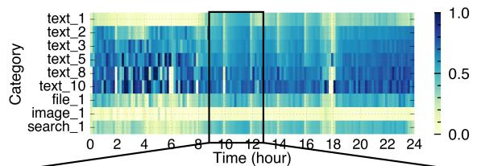

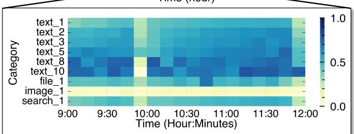  
Figure 11: An illustration of how the frequencies of issuing the next turn request change over time for different request types. The x-axis is the timeline. The workload categories are sorted according to their popularity.

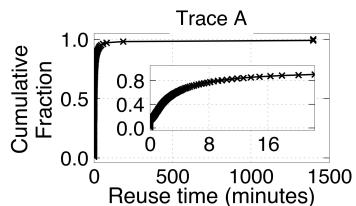

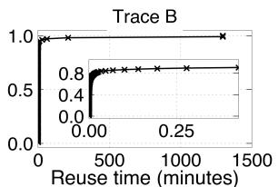  
Figure 12: The distribution of KV\$ reuse time of all requests in Trace A and B.

## 3.4 Analyses of temporal and spatial locality

Temporal locality can be characterized by profiling the distribution of reuse time, i.e., the interval between when a KV\$ block is reused by another request.

KV\$ reuse time is short. Figure 12 shows the distributions of KV\$ reuse time on both traces. We can see that the reuse time for both workloads is typically small: In Trace A, 80% of the reuse time falls within less than 10 minutes, while in Trace B it falls within 10 seconds. The differences lie in the human-in-the-loop versus computer-in-the-loop interactions that generated the requests in two traces.

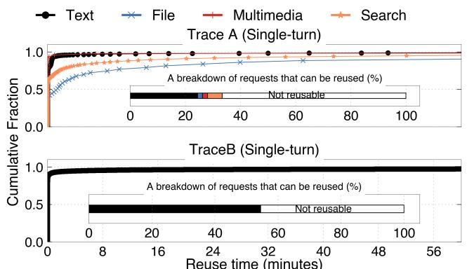  
Figure 13: The distribution of KV\$ reuse time of single-turn requests in Trace A and B. B has one category of request (API).

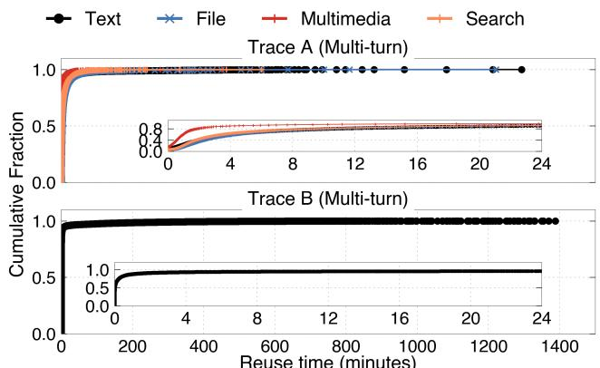  
Figure 14: The distribution of KV\$ reuse time of multi-turn requests in Trace A and B. B has one category of request (API).

Different workload types have different temporal locality. First, single-turn requests have much lower locality in the to-C workloads, while to-B workloads are the opposite. Figure 13 reports whether a single request can be reused by another single-turn request on both traces in the middle sub-figures. As we can see, less than 30 % of the single-turn requests are reusable in Trace A, but more than 50 % of requests can be reused in Trace B.

Second, different request types show different temporal locality. Figure 14 shows the reuse time distribution of multiturn requests categorized by their request types. We can see that chat requests (Text) shows longer reuse time than image understanding (Multimodal), but shorter than file understanding (File). This stems from workload characteristics: users typically spend more time processing complex LLM outputs based on file content than casual outputs from conversational chats. Conversely, visual information processing occurs faster than textual processing [48], leading to shorter reuse times for image tasks. Finally, Search workloads exhibit the secondlongest reuse time, as users often require substantial time to

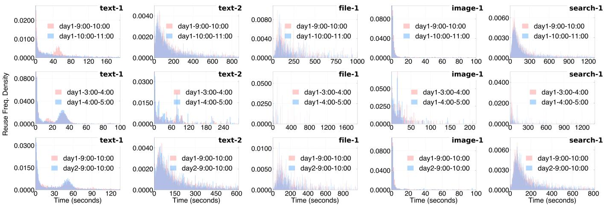  
Figure 15: An empirical analysis of the reuse time probability distribution of KV\$ blocks. The columns present data from different request categories. The first row: distributions under heavy traffic (daytime). The second row: distributions under low traffic (nighttime). The third row: a comparison of distributions under different days but with similar traffic patterns.

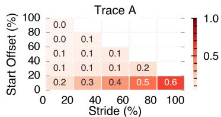

Figure 16: Overall spatial locality of two traces.  
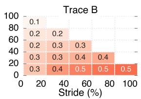

analyze the searched results.

Given a time period and request category, the probability distribution of KV\$ reuse time follows an exponential distribution. Figure 15 presents the reuse time probability distribution of KV\$ blocks across different request categories. For each category, we measure the likelihood of its KV\$ reuse at specific time intervals after caching. We plot these distributions by counting reuse event frequencies at each second following request execution.

From the results, we draw three key observations. First, exponential distributions fit well with the reuse probability given a request category. Second, the probability is workloadaware, i.e., the distributions of different request categories, including the same request type but different turns, are different (e.g., text-1 vs. text-2). This implies a workload-aware design that distinguishes different request categories. Finally, the distributions of requests with similar traffic patterns are similar. Take text-1 as an example: as shown in the first row, the distribution drawn from 9:00–10:00 a.m. is similar to that drawn from 10:00–11:00 a.m., but is significantly different from that drawn from the nighttime—3:00–4:00 a.m. (second row). The distributions are also similar across different days (first row vs. third row). The first and third observation in combine imply that we can acquire the distribution of a request category using recent historical data.

Spatial locality. Figure 16 shows the overall spatial locality of KV\$ across both traces. We characterize the spatial locality by measuring the ideal cache hit ratio with various cache strides, i.e., the percentage of tokens cached per request, as well as different starting token offsets for caching. This gives a two-dimensional heatmap, for example, offset (10 %, 10 %) means that for each request, we only cache 10 % of the tokens starting from the 10 % token position.

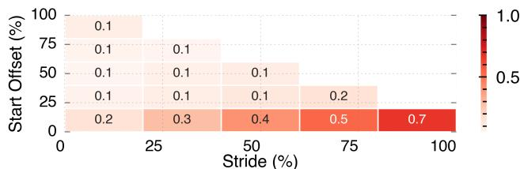  
Figure 17: The spatial locality of multi-turn requests on Trace A.

First, KV\$ shows better spatial locality when caching from the beginning, which is expected since only requests with identical prefixes can share the KV\$ (§2). We emphasize this seemingly trivial point because some KV\$ optimizations [27] cache the tail tokens of requests to hide KV\$ load time through concurrent computation and loading. However, this approach may reduce spatial locality, as Figure 17 particularly demonstrates that reusing intermediate parts in the cache yields minimal benefits for multi-turn conversations.

Second, the spatial locality, like temporal locality, is also workload-aware. In Figure 18, we observed workloads like text and multimodal exhibit obvious spatial locality, while file and search exhibit almost no spatial locality. Due to the lack of user input content, we suspect the cause as follows: the applications add a fixed system prompt for text and multimodal workloads, whereas the system prompt for file and search is dependent on user inputs.

Finally, we found that increasing the stride size implies a higher cache hit ratio in Trace A (Figure 17), but it is not the case in Trace B (the last column in Figure 18). In Trace A, multi-turn requests contribute to the cache hits, so caching more tokens for a request will lead to more cache hits. In Trace B, only the system prompt contributes to the cache hits. Thus, caching a stride of 50 % of the request already achieved a peak hit ratio of 50 %. This implies that most system prompt lengths are below 50% of the total request length in Trace B, though we don’t have the detailed request to support this suspicion.

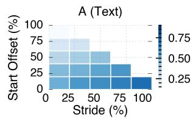

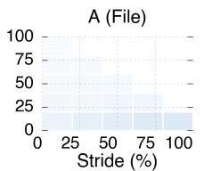

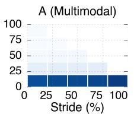  
Figure 18: The spatial locality of single-turn requests.

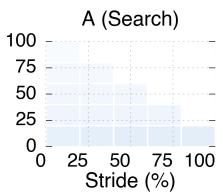

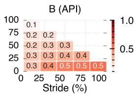

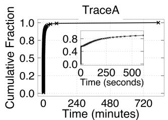

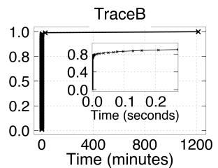  
Figure 19: The distribution of the lifespan of KV\$ blocks on both traces.

## 3.5 Analyses of KV\$ cache capacity requirement

Determining the right cache capacity is critical for a caching system. Unlike traditional storage systems, the cached KV\$ is ephemeral, so identifying the right size requirement can save platform costs. This section analyzes the KV\$ capacity using a bottom-up approach: First, we characterize the features of the lifespan of requests’ KV\$. Then we analyze the storage usage of each request. In combination, this gives us an estimation of the total KV\$ capacity required.

KV\$ lifespan is ephemeral and predictable. Figure 19 analyzes the lifespan of KV\$ blocks. A KV\$ block “dies” if it has not been reused anymore. We can see that most KV\$ blocks “live” shortly. In Trace A, 90 % of the KV\$ blocks are not reused after 612 seconds, and the number for Trace B is 0.3 seconds. This aligns with our analysis in the previous sections, e.g., many multi-turn requests will have a short reuse time (Figure 12), and most requests have a few turns (Figure 9). As a multi-turn request ends, its KV\$ will not be reused anymore. Blocks in Trace B have a shorter lifespan despite some outliers. Unlike Trace A, most of its cached KV\$ blocks are reused for system prompts, so they can be reused after a long time. For example, in Trace B, the longest lifespan is 1,200 minutes while it is 800 minutes in Trace A.

Figure 20 further shows how the mean lifespan of KV\$ blocks changes over time for different request categories. In the graph, the color intensity represents the normalized lifespan, with darker colors indicating longer-lived KV\$ blocks. We can see that although the average lifespan at the 24-hour mscale is changing over time, when we zoom in to a smaller .Ytimescale (9:00 a.m. to 11:00 a.m.), the pattern is quite stable. YThis implies that we can predict the lifespan of a KV\$ block using historical data to reduce the KV\$ cache size for saving trim = 0.25cm YY.Ycm Xcosts, as storing KV\$ at fast storage medium (e.g., CPU’s DRAM) is expensive.

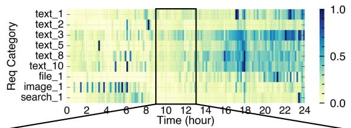

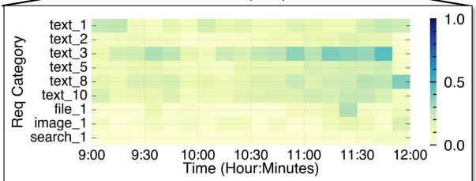  
Figure 20: An illustration of how the mean lifespan of KV\$ blocks changes over time for different request categories. Note that the x-axis represents the timeline. The request categories are sorted according to their usage.

Per-request KV\$ cache usage is moderate. A key factor when considering caching is the size of KV\$ to be cached, which is proportional to the input length of each request and the corresponding model output length. Figure 21 shows the size distribution of requests on different traces. Note that we report the relative size when normalized to the HBM available for serving the request on a serving instance[1]. This is because a relative value gives more intuitive results on the capacity required to cache the KV\$ of each request. The available HBM for KV\$ is calculated by subtracting the total HBM of the GPU(s) in a serving instance from the model parameter and activation sizes. Since the KV\$ size of each request depends on the detailed attention mechanism of the model, we report the results on three representative models with two widely used attention methods: group query attention (GQA [3]) and multi-head attention (MHA [55]). GQA uses less memory for the KV\$.

We can see that the overall size of the KV\$ is moderate compared to the HBM. Take Trace A as an example. On GQA models like Qwen2-7B, the $5 0 ^ { t h } , 9 0 ^ { t h }$ , and $9 9 ^ { t h }$ HBM usage of the request in Text—the dominant request type are 0.09 %, 0.15 %, and 0.37 % and 0.36 %, 1.31 %, and 2.21 % for single-turn and multi-turn requests, respectively. The average usage is 0.09 % and 0.56 % for single- and multi-turn requests, respectively. This small usage is due to the fact that each token consumes few megabytes and requests in production traces tend to be small: in Qwen2-7B, it consumes 0.875 MB KV\$ for 16 tokens, while the mean total token lengths (input+output) for single-turn and multi-turn is 973 and 5,953, respectively. For other models, though Llama3- 70B also adopts GQA, it has a slightly higher HBM usage due to the reduced number of GPUs per instance: the parameter size increases 10 × while the number of GPUs we measured only increases 4 ×. Finally, MHA models have the highest usage due to the increased KV\$ per token. Note that recent open-source models tend to use GQA (or other attention with even fewer KV\$ per token like MLA [36]).

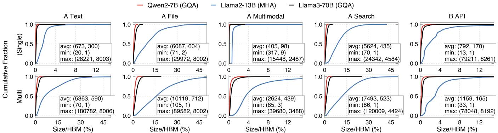  
Figure 21: The distribution of KV\$ size of requests on different traces for Single and Multi-turn requests. The size is normalized to the GPU memory (HBM) available for serving. The number in the tuple inside each graph represents the length of input and output.

Considering that each serving instance typically processes a few requests per second, our characterization implies that an instance can cache a request for a modest time—e.g., for Qwen2-7B, suppose a GPU can process 5 requests per second, it takes at least 1 minute to saturate the HBM assuming an average 0.32 % HBM per request (derived with a 47 % multiturn ratio of Text request type). This time is within the reuse distance of KV\$ in many scenarios (e.g., API). Note that in practical setups, we may not achieve such a long reuse time due to tail requests (e.g., we do observe long context requests with more than 12,000 tokens), and LLM serving systems typically serve requests in large batches to improve computation utilization.

Overall memory required for KV\$ cache is moderate. We analyze the KV\$ cache capacity required by measuring how large a cache can ensure an ideal cache hit ratio assuming an ideal eviction policy, i.e., never evict a KV\$ that will be reused. The measurement is as follows: at a given time, upon processing a request, we update the KV\$ size by adding the KV\$ of this request if it will be reused, and subtracting the size of all cached KV\$ that will never be reused. One tricky thing is that the size required is dependent on the number of serving instances deployed for a workload: if the instances are over-provisioned, then the estimated requirement would be small. To obtain the maximal requirement, we use a setup that uses the minimal number of serving instances, i.e., each instance serves with the maximum QPS, so there is no overprovisioning.

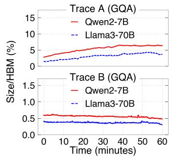

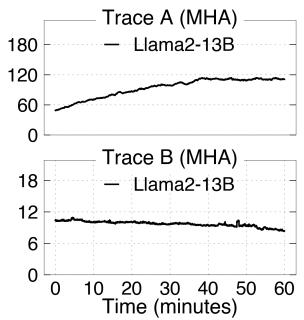  
Figure 22: An analysis of the KV\$ cache size required to achieve an ideal cache hit ratio on different models and traces. The data is collected from 10:00 a.m. to 11:00 a.m.

Figure 22 shows the results normalized to the total HBM of a serving instance. We can see that GQA models require a relatively small cache capacity to reach an ideal cache hit rate: in Trace A, Llama3-70B only needs 4 × of the available HBM for KV\$. This is typically achievable in modern serving clusters without the need for more storage hierarchies like remote memory or SSD [19]. For example, in a typical setup featuring 8 A100 GPUs and 1 TB of CPU memory, each GPU has access to an average of 128 GB of CPU memory, which is nearly 4 × the amount of HBM space reserved for storing the KV\$. Moreover, for Trace B, the KV\$ capacity is even smaller than the reserved HBM, so caching on GPU may be sufficient.

Though GQA needs small cache, we should note that MHA models do require a huge amount of KV\$ cache, This is due to their huge per-token KV pairs (see Figure 21). Thus, optimizing cache eviction policies is still important under limited cache capacity.

## 4 Improved KV\$ cache system

## 4.1 An overview of the design space

Existing KV\$ cache systems [19, 30, 69, 65] follow similar caching mechanisms and policies. Below we give a brief overview of their designs before moving on to our improved policy.

Current KV\$ cache mechanism and policies. Regarding the mechanism: existing systems cache KV\$ primarily on GPU and CPU in a hierarchical manner. The KV\$ is managed at block granularity (see §2): when a KV\$ block is generated, it is first cached on the GPU HBM. If the GPU is unable to cache newly generated blocks due to out of memory, the caching system adopts an eviction policy (described below) to evict some blocks from the GPU to the CPU. The evicted blocks are asynchronously swapped to CPU in a layer-bylayer manner so the swap cost is negligible. If the CPU is also out of memory, the blocks are removed. Before executing a new request, if the request hits cached blocks, the serving system directly reuses the cached blocks to avoid recomputation. Note that if the hit is on CPU, the block is swapped to the GPU also in a layer-by-layer manner.

Regarding the policies: a KV\$ cache system mainly needs two policies: how to determine cache hits and how to evict cached blocks. For the first policy, the design choices differ in their granularity of checking which blocks may contribute to the hits: some systems check for matches across all requests [69, 26] while others only check for matches within requests from individual users [65, 19]. For the second policy, current systems mainly adopt standard eviction policies like LRU or FIFO. Though they adopt some extensions like checking whether the evicted blocks are in the scheduling queue [19], the overall rationale does not change.

The drawback. Existing workload-agnostic policies like LRU may miss the workload features we analyzed in §3, and we argue that they are suboptimal. Take Trace A as an example: given the same amount of time since the last access (e.g., greater than 10 seconds), 10-turn text requests are more likely to have a subsequent turn than 1-turn text requests (see Figure 11). However, if many 1-turn requests are flooding into the system, 10-turn requests can be evicted by LRU because the reuse time is longer.

Our solution: workload-aware reuse-probabilitydistribution-based KV\$ eviction policy. To this end, we propose a workload-aware cache eviction policy that considers the reuse probability distributions of each request category based on the characterizations presented in §3.4. At a high level, at the eviction time, for each block, we calculate a priority—the likelihood of a KV\$ being reused in the future based on the profiled reuse probability distribution of its request category (workload). The priority further holistically considers the spatial locality as well as the short lifespan of KV\$ blocks. The blocks with the lowest priority are evicted first. Table 2 summarizes our techniques as well as their corresponding observations from §3.

<table><tr><td>Observations Techniques</td></tr><tr><td>The probability of KV$ reuse ①Workload-awarereuse- follows exponential distribu- probability-distribution-based</td></tr><tr><td>tions given a workload (Fig-I priority estimation. ure 11 and Figure 15).</td></tr><tr><td>Spatial locality (Figure 16-② Assign a higher priority to 18). the head KV$ blocks.</td></tr><tr><td>Ephemeral KV$ lifespan (Fig- ③ Remove frequency when ure 19). calculating the priority,as well as limiting the time span of</td></tr></table>

Table 2: A summary of the main techniques in our workload-aware cache eviction policy based on the findings in §3

Our caching mechanisms follow existing systems [19, 30, 69, 65]—including asynchronous swapping and pipelined loading, as these techniques have converged to a standard design.

## 4.2 Workload-aware KV\$ cache eviction policy

Existing workload-aware policy. Workload-aware cache eviction policy has been extensively studied in the literature [14, 41, 29, 25, 38, 11, 49]. A representative policy is the Greedy-Dual-Frequency-Size (GDFS) policy [14], which evaluates the priority of each cached object (e.g., KV\$) using the following workload-dependent features:

$$
{ \mathrm { P r i o r i t y } } = { \mathrm { C l o c k } } + { \frac { { \mathrm { F r e q u e n c y } } \times { \mathrm { C o s t } } } { \mathrm { S i z e } } } { \mathrm { ( E x i s t i n g G D F S ) } }
$$

The Clock captures the last access time of an object (similar to LRU), the Frequency is the total access count of an object (similar to LFU), the Size is the size of the cached object, and Cost is the cost to bring the cached content back to the cache. Objects with the lowest priority are evicted first.

While the above GDFS formulation can be retrofitted for calculating the priority of KV\$ blocks, we found it does not fully consider the KV\$ usage in LLM serving as well as the known probability distributions of requests in different categories. For example, a frequently accessed block may not be reused in the future due to the short lifespan of KV\$ blocks, causing a frequently accessed then died block wasting the KV\$ space. Besides, a block with higher cost to bring to the cache does not necessarily mean it is more likely to be reused in the future. Instead, we need to bring the more likely to be reused blocks to the cache first. While such workload information is not available in the setup of GDFS, it is readily available in serving LLMs based on our characterization in the previous section.

Our policy. We follow GDFS to calculate the priority of each KV\$ block and use the priority to determine the eviction order, but our priority is retrofitted with our characterized

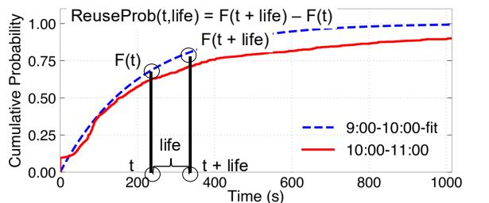  
Figure 23: An illustration of how to calculate the reuse probability of a KV\$ block given its workload (request category).

KV\$ reuse features:

$$
\mathrm { P r i o r i t y } = ( \mathrm { R e u s e P r o b } _ { w } ( t , \mathrm { l i f e } ) , - \mathrm { O f f s e t } ) ( \mathrm { W o r k l o a d - a w a r e } )
$$

Specifically, the priority is represented with a tuple containing two metrics and we compare the tuple with lexicographical order. The rationale behind the two metrics is:

cm • ReuseProbw (➀) calculates the reuse probability of a KV\$ YY.block at a given time t, where t means the time since its last access. For each workload (request category), the trim = 0.25cm YY.Ycm XX.reuse probability is calculated using a two-step process. First, we sample a period of the recently accessed data in the background. Second, based on the observations in Figure 15, we fit an exponential distribution to the sampled data, and look up the fitted curve to get the reuse probability. Figure 23 shows an example of how to calculate the reuse probability. We first use the background sampled data from 9:00 a.m. to 10:00 a.m. to fit the cumulative distribution function (CDF) of the reuse probability of a given workload (blue line).

Note that the fitted curve is close to the real data (red line). Afterward, we can look up the curve to get the reuse probability of a KV\$ block in the future. Note that the function further considers the expected lifespan (life) of the block, which is critical considering the short lifespan of KV\$ and we describe below.

• Offset (➁) considers the spatial locality described in §3.4: the priority is reversely proportional to the prefix length of the KV\$ block in the entire request.

We don’t consider frequency explicitly (➂) because we found it can not provide useful information for cache policy due to the short lifespan of KV\$ blocks (see Figure 19) even for frequently reused ones. More importantly, we also need to regulate the calculated reuse probability with the lifespan. If not, the fitted reuse probability will return a large probability for a request with long-tailed reuse time distribution for a long time. This contradicts the short KV\$ lifespan observation and leads to the inefficient utilization of limited cache space.

The detailed eviction algorithm. Algorithm 24 presents a simplified pseudocode of our workload-aware cache eviction algorithm. Upon eviction, we first iterate through all the cached blocks (line 4–6) and calculate the reuse probability for each block using the workload (b.w). The priority is then compared with the offset of the block to update the block to 0.25cm, clipbe evicted (line 7–9).

Input: Bs: cached KV\$ blocks;   
Life: expected lifespan of the KV\$ blocks;   
H(w): hyper parameters for the workload (w)’s fitted probability.   
distribution that are periodically updated in the background.   
Output: B: the evicted KV\$ block.   
1 CurT = time.time()   
2 MinPriority = +∞   
3 ChosenBlock = PlaceHolder   
4 For b in Bs:   
5 Priority = ReuseProb (CurT - b.cached\_t, Life)H(b.w)   
6 ⏵Priority is the reuse probability in   
[CurT – b.cached\_t, CurT – b.cached\_t+ Life)   
7 If Priority < MinPriority or (Priority == MinPriority and   
b.offset > ChosenBlock.offset):   
8 MinPriority = Priority   
9 ChosenBlock = b   
10 ???????????? ChosenBlock  
Figure 24: A simplified pseudocode of our workload-aware cache eviction algorithm.

Performance optimization. One drawback of the above naive algorithm is that it requires computing the reuse probabilities of all KV\$ blocks to identify the least reusable candidate. To avoid excessive computation overhead, we observe that all KV\$ blocks within each workload are naturally ordered by their last accessed timestamps according to the exponential distribution, so we can avoid computing the reuse probability when comparing blocks within the same workload. Specifically, for each workload, we maintain a priority queue of its KV\$ blocks ordered by last accessed time. During eviction, instead of scanning all blocks, we first treat the least-recently-used block of each workload as the candidate for eviction. Afterward, we run the algorithm described in Algorithm 24 to obtain the final evicted block. This reduces the complexity from O(N ) to O(W ), where W is the number of workloads (typically in the range of tens). As a result, the performance overhead of workload-aware policy is negligible to serving, e.g., we observed a 79 µs policy delay for each eviction, with the aggregated overhead only 1.2 % of the scheduling overhead of a typical serving engine (vLLM [30]).

## 4.3 Performance evaluation

Testbed. We conducted our evaluations on a server with 8 NVIDIA A800-80GB GPUs. The GPUs are connected via 400 GBps bidirectional NVLink, allowing us to use multiple GPUs (e.g., 4) to serve a single large model with tensor parallelism [39]. The GPUs are connected to the host via PCIe Gen4, offering a bidirectional bandwidth of up to 32 GBps between GPU HBM and the host memory.

Implementations and baselines. Since the state-of-the-art KV\$ cache systems that incorporate both CPU and GPU KV\$ like CachedAttention [19] and Pensieve [65] are not open-sourced, we implement a CPU-GPU KV\$ cache on vLLM [30], the state-of-the-art LLM serving system that adopts GPU KV\$ cache by default. We have further integrated the policies and mechanisms from state-of-the-art (see §4.1) to it. We have calibrated that our implementation has a similar performance to state-of-the-art like CachedAttention on the same synthetic workload with a similar testbed.

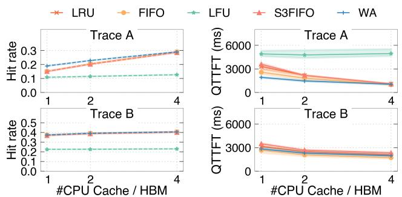  
Figure 25: An analysis of the cache hit ratio and QTTFT with respect to the CPU cache provisioned on Qwen2-7B.

Besides integrating a CPU KV\$ cache on vLLM, we have also implemented the KV\$-centric global scheduler described in Mooncake [1], because serving LLMs on multiple instances is common. Specifically, the global scheduler will record the global KV\$ cache usage and schedule the request to the instance with cached KV\$ whenever possible. Note that our workload-aware caching policy only applies to a single serving instance, extending it to a global layer is left as our future work.

Evaluated models and workloads. We use three representative open-source models for the performance evaluations: Qwen2-7B [9], Llama2-13B [54] and Llama3-70B [15]. The rationale for choosing these models and the differences between them have been discussed in the per-request KV\$ size analysis in §3.5. For Qwen2-7B and Llama2-13B models, we use one GPU per serving instance. For Llama3-70B, we use 4 GPUs. We use the Trace A and B described in §3.1 as our evaluated workloads. Since we don’t have sufficient GPUs to support the real workload, we scale the traces to fit the processing capability of our testbed using the scaling method that preserves the temporal pattern of the trace [51].

Evaluation methodology on anonymous traces. Even though the traces are anonymous, we can evaluate the system serving performance by constructing inputs that accurately reproduce the original trace’s cache hit patterns. Specifically, for each anonymous block without assigned tokens, we randomly generate a token list, ensuring each generated list’s hash differs from all other token lists. Moreover, to match the original input’s iteration count, we constrain the model using the trace’s output length. Finally, we replace the modelgenerated output with the constructed tokens to preserve the cache patterns of multi-turn requests.

Improved cache hit. Figure 25–27 show the cache hit ratio and serving performance for standard cache policies and our workload-aware policy (WA). We compare our policy with the standard policies like least-recently-used (LRU), first-in-firstout (FIFO), least-frequently-used (LFU) and recent optimized FIFO method (S3-FIFO) [61]. We compare with the vanilla GDFS in Figure 28.

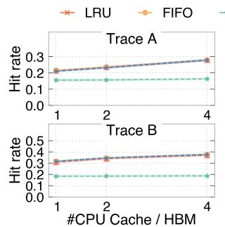

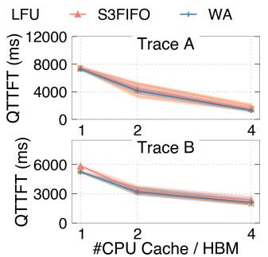  
Figure 26: An analysis of the cache hit ratio and QTTFT with respect to the CPU cache provisioned on Llama2-13B.

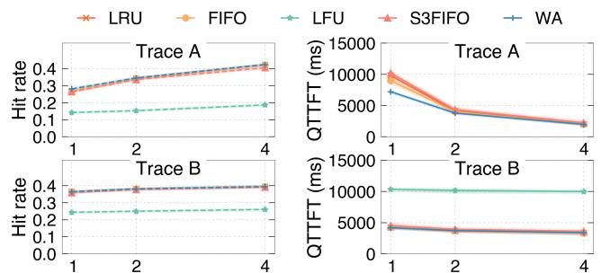  
Figure 27: An analysis of the cache hit ratio and QTTFT with respect to the CPU cache provisioned on Llama3-70B.

Since the performance depends on cache capacity, we report the hit rates (as well as performance) by varying the provisioned KV\$ cache capacity. The capacity is normalized to the GPU HBM size for KV\$, i.e., the #CPU Cache / HBM in the figures means the CPU memory used to store the KV\$ normalized to the GPU HBM. For example, a #CPU Cache / HBM of 1 means the CPU memory used to store the KV\$ is equal to the GPU HBM size. We draw three observations from the results.

First, our policy WA achieves 8.1–23.9 % higher hit rate compared to other baselines, and it has a 1.5–3.9 % higher hit rate compared to the best of other baselines. Our policy is more effective thanks to its knowledge of the workload reuse patterns. Second, the effectiveness of WA decreases when the cache capacity increases, this is as expected because a larger cache can tolerate a less effective policy. Finally, WA is more effective on Trace A than Trace B, this is due to two reasons. (1) Trace B has little workload information (> 99 % of its requests are 1-turn requests). Thus, our fitted exponential distribution-based policy essentially falls back to a normal LRU. (2) Trace B requires a relatively small KV\$ capacity, so GPU HBM is already close to optimal except for LFU. The poor hit rate of LFU comes from the fact that the most frequently accessed blocks may die early thus polluting the KV\$ cache, as we have extensively discussed before.

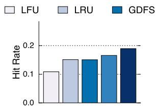

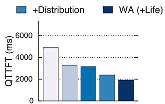  
Figure 28: An ablation study on Qwen2-7B with #CPU Cache / HBM is 1.

Improved performance. The improved cache hit ratio leads to a significant performance improvement in the serving performance. Figure 25–27 also reports the queued TTFT (QT-TFT) when serving different traces, i.e., the TTFT plus the time when waiting for GPU to process the request. We can see that WA achieves 28.3–41.9% QTTFT reduction thanks to the improved KV\$ cache hit rate.

Ablation study. Figure 28 conducts an ablation study on the Qwen2-7B model on Trace A with different policies. Other models share a similar trend. First, we can see that using a distribution-based approach improves the hit rate by 1 % (with technique ➀ in Table 2). Considering the short lifespan of KV\$ with the life regulator further increases the hit rate by 2.4 % (➂). Note that we omit describing the locality optimization ➁ as it is applied to all the policies.

Discussion: fairness issue. Like all existing systems (and their policies), a malicious client can monopolize prefix cache by sending a large volume of requests with long identical prefixes, thus causing fairness issues. Ensuring fairness is an orthogonal topic to cache policy and can be addressed via a co-design of LLM serving strategies like FairRide [47, 52].

## 5 Related Work

Reuse KV\$ across requests via KV\$ cache. Reusing KV\$ for accelerating LLM serving has been widely studied [30, 63, 19, 20, 69, 62] and used in commercial LLM serving [42, 21, 4, 1]. Currently, production systems only treat cache hits by prefix matches [63, 69, 19, 42, 21, 4, 1], because it preserves the original algorithm of model inference with no accuracy loss. A number of studies [20, 62, 23] have studied methods for non-prefix KV\$ cache. We can revisit our characterization once they have matured and been deployed in production.

Other KV\$-related optimizations. Emerging works[59, 68, 33, 13] propose runtime KV\$ compression and deletion methods to reduce KV\$ size. StreamingLLM [59] keeps only a finite attention window for recent tokens combined with a few initial tokens. H2O [68] only involves tokens that contribute most to the attention score for inference. InfiniGen [33] speculatively selects tokens critical for attention scores and drops others. KVQuant [22] enables 3-bit KV cache quantization with minimal perplexity degradation for large language models, achieving fast million-length context inference. These methods require fewer KV\$ per-request, albeit with accuracy degradation. Our study is compatible with these works: if an uncompressed/full KV\$ is reusable, a compressed or deleted version would also be reusable.

Optimizing caching policies. Optimizing caching has long been studied in the literature, in general-purpose caching policies [41, 29, 28, 53, 32, 25, 38, 71, 10, 24, 16, 11, 49, 67, 14] or specific domains [60, 12, 50, 17]. We continue this line of research, and leverage our characterized KV\$ reuse properties for optimizing KV\$ cache policies.

Optimizing LLM serving. We continue the line of research in optimizing the performance of LLM serving systems [70, 57, 31, 34, 64, 46, 18, 66], with a particular focus on characterizing serving workloads for KV\$ cache. Our work is orthogonal to optimizations other than KV\$ cache.

## 6 Conclusion

We present the first systematic and in-depth characterization of production serving workloads for KV\$ cache systems. Our study reveals several important findings that were not captured by synthetic workloads used in previous studies. Based on these findings, we further propose a workload-aware cache eviction policy that improves upon existing workloadagnostic policies like LRU and LFU. We believe our work, as a starting point, can benefit both the research and industry fields in improving current and future LLM serving systems with a workload-driven approach.

## Acknowledgment

We would like to thank ATC reviewers and our shepherd Lei Zhang for their insightful feedback. We sincerely thank Guanhu Wang for helping us with the collection of the trace data. We also thank Xiating Xie for proofreading our paper. We thank Xiangfan Wu for helping us correct the presentation about hashing the token IDs. This work was supported in part by the National Natural Science Foundation of China (No. 62202291, 62272291, 62132014) and the Fundamental Research Funds for the Central Universities. This work was also supported by a research grant from Alibaba Group through the Alibaba Innovative Research Program.

## References

[1] Mooncake trace. https://github.com/kvcacheai/Mooncake/blob/main/mooncake\_trace. jsonl, 2025.

[2] Sharegpt. https://sharegpt.com, 2025.

[3] AINSLIE, J., LEE-THORP, J., DE JONG, M., ZEMLYANSKIY, Y., LEBRÓN, F., AND SANGHAI, S. GQA: training generalized multi-query transformer models from multi-head checkpoints. In Proceedings of the 2023 Conference on Empirical

Methods in Natural Language Processing, EMNLP 2023, Singapore, December 6-10, 2023 (2023), H. Bouamor, J. Pino, and K. Bali, Eds., Association for Computational Linguistics, pp. 4895–4901.

[4] ANTHROPIC. Claude api. https://www.anthropic. com/api, 2025.

[5] ANTHROPIC. Prompt caching. https:// docs.anthropic.com/en/docs/build-withclaude/prompt-caching, 2025.

[6] ANTHROPIC. Prompt library. https://docs. anthropic.com/en/prompt-library/library, 2025.

[7] ATIKOGLU, B., XU, Y., FRACHTENBERG, E., JIANG, S., AND PALECZNY, M. Workload analysis of a large-scale keyvalue store. In Proceedings of the 12th ACM SIGMETRIC-S/PERFORMANCE joint international conference on Measurement and Modeling of Computer Systems (2012), pp. 53–64.

[8] AUMASSON, J., AND BERNSTEIN, D. J. Siphash: A fast short-input PRF. In Progress in Cryptology - INDOCRYPT 2012, 13th International Conference on Cryptology in India, Kolkata, India, December 9-12, 2012. Proceedings (2012), S. D. Galbraith and M. Nandi, Eds., vol. 7668 of Lecture Notes in Computer Science, Springer, pp. 489–508.

[9] BAI, J., BAI, S., CHU, Y., CUI, Z., DANG, K., DENG, X., FAN, Y., GE, W., HAN, Y., HUANG, F., HUI, B., JI, L., LI, M., LIN, J., LIN, R., LIU, D., LIU, G., LU, C., LU, K., MA, J., MEN, R., REN, X., REN, X., TAN, C., TAN, S., TU, J., WANG, P., WANG, S., WANG, W., WU, S., XU, B., XU, J., YANG, A., YANG, H., YANG, J., YANG, S., YAO, Y., YU, B., YUAN, H., YUAN, Z., ZHANG, J., ZHANG, X., ZHANG, Y., ZHANG, Z., ZHOU, C., ZHOU, J., ZHOU, X., AND ZHU, T. Qwen technical report. arXiv preprint arXiv:2309.16609 (2023).

[10] BANSAL, S., AND MODHA, D. S. CAR: clock with adaptive replacement. In Proceedings of the FAST ’04 Conference on File and Storage Technologies, March 31 - April 2, 2004, Grand Hyatt Hotel, San Francisco, California, USA (2004), C. Thekkath, Ed., USENIX, pp. 187–200.

[11] BECKMANN, N., CHEN, H., AND CIDON, A. LHD: improving cache hit rate by maximizing hit density. In 15th USENIX Symposium on Networked Systems Design and Implementation, NSDI 2018, Renton, WA, USA, April 9-11, 2018 (2018), S. Banerjee and S. Seshan, Eds., USENIX Association, pp. 389–403.

[12] BERG, B., BERGER, D. S., MCALLISTER, S., GROSOF, I., GUNASEKAR, S., LU, J., UHLAR, M., CARRIG, J., BECK-MANN, N., HARCHOL-BALTER, M., AND GANGER, G. R. The CacheLib caching engine: Design and experiences at scale. In 14th USENIX Symposium on Operating Systems Design and Implementation (OSDI 20) (Nov. 2020), USENIX Association, pp. 753–768.

[13] CAI, Z., ZHANG, Y., GAO, B., LIU, Y., LIU, T., LU, K., XIONG, W., DONG, Y., CHANG, B., HU, J., AND XIAO, W. Pyramidkv: Dynamic KV cache compression based on pyramidal information funneling. CoRR abs/2406.02069 (2024).

[14] CHERKASOVA, L. Improving WWW proxies performance with greedy-dual-size-frequency caching policy. Hewlett-Packard Laboratories Palo Alto, CA, USA, 1998.

[15] DUBEY, A., JAUHRI, A., PANDEY, A., KADIAN, A., AL-DAHLE, A., LETMAN, A., MATHUR, A., SCHELTEN, A., YANG, A., FAN, A., GOYAL, A., HARTSHORN, A., YANG, A., MITRA, A., SRAVANKUMAR, A., KORENEV, A., HINSVARK, A., RAO, A., ZHANG, A., RODRIGUEZ, A., GREGERSON, A., SPATARU, A., ROZIÈRE, B., BIRON, B., TANG, B., CHERN, B., CAUCHETEUX, C., NAYAK, C., BI, C., MARRA, C., MCCONNELL, C., KELLER, C., TOURET, C., WU, C., WONG, C., FERRER, C. C., NIKOLAIDIS, C., ALLONSIUS, D., SONG, D., PINTZ, D., LIVSHITS, D., ESIOBU, D., CHOUDHARY, D., MAHAJAN, D., GARCIA-OLANO, D., PERINO, D., HUPKES, D., LAKOMKIN, E., AL-BADAWY, E., LOBANOVA, E., DINAN, E., SMITH, E. M., RADENOVIC, F., ZHANG, F., SYNNAEVE, G., LEE, G., AN-DERSON, G. L., NAIL, G., MIALON, G., PANG, G., CU-CURELL, G., NGUYEN, H., KOREVAAR, H., XU, H., TOU-VRON, H., ZAROV, I., IBARRA, I. A., KLOUMANN, I. M., MISRA, I., EVTIMOV, I., COPET, J., LEE, J., GEFFERT, J., VRANES, J., PARK, J., MAHADEOKAR, J., SHAH, J., VAN DER LINDE, J., BILLOCK, J., HONG, J., LEE, J., FU, J., CHI, J., HUANG, J., LIU, J., WANG, J., YU, J., BITTON, J., SPISAK, J., PARK, J., ROCCA, J., JOHNSTUN, J., SAXE, J., JIA, J., ALWALA, K. V., UPASANI, K., PLAWIAK, K., LI, K., HEAFIELD, K., STONE, K., AND ET AL. The llama 3 herd of models. CoRR abs/2407.21783 (2024).

[16] EINZIGER, G., EYTAN, O., FRIEDMAN, R., AND MANES, B. Lightweight robust size aware cache management. ACM Trans. Storage 18, 3 (2022), 27:1–27:23.

[17] FUERST, A., AND SHARMA, P. Faascache: keeping serverless computing alive with greedy-dual caching. In ASPLOS ’21: 26th ACM International Conference on Architectural Support for Programming Languages and Operating Systems, Virtual Event, USA, April 19-23, 2021 (2021), T. Sherwood, E. D. Berger, and C. Kozyrakis, Eds., ACM, pp. 386–400.

[18] GAO, B., HE, Z., SHARMA, P., KANG, Q., JEVDJIC, D., DENG, J., YANG, X., YU, Z., AND ZUO, P. Cost-Efficient large language model serving for multi-turn conversations with CachedAttention. In 2024 USENIX Annual Technical Conference (USENIX ATC 24) (Santa Clara, CA, July 2024), USENIX Association, pp. 111–126.

[19] GAO, B., HE, Z., SHARMA, P., KANG, Q., JEVDJIC, D., DENG, J., YANG, X., YU, Z., AND ZUO, P. Cost-efficient large language model serving for multi-turn conversations with cachedattention. In Proceedings of the 2024 USENIX Annual Technical Conference, USENIX ATC 2024, Santa Clara, CA, USA, July 10-12, 2024 (2024), S. Bagchi and Y. Zhang, Eds., USENIX Association, pp. 111–126.

[20] GIM, I., CHEN, G., LEE, S., SARDA, N., KHANDELWAL, A., AND ZHONG, L. Prompt cache: Modular attention reuse for low-latency inference. In Proceedings of the Seventh Annual Conference on Machine Learning and Systems, MLSys 2024, Santa Clara, CA, USA, May 13-16, 2024 (2024), P. B. Gibbons, G. Pekhimenko, and C. D. Sa, Eds., mlsys.org.

[21] GOOGLE. Gemini api. https://ai.google.dev/api, 2025.

[22] HOOPER, C., KIM, S., MOHAMMADZADEH, H., MAHONEY, M. W., SHAO, Y. S., KEUTZER, K., AND GHOLAMI, A. Kvquant: Towards 10 million context length LLM inference with KV cache quantization. In Advances in Neural Information Processing Systems 38: Annual Conference on Neural Information Processing Systems 2024, NeurIPS 2024, Vancouver, BC, Canada, December 10 - 15, 2024 (2024), A. Globersons, L. Mackey, D. Belgrave, A. Fan, U. Paquet, J. M. Tomczak, and C. Zhang, Eds.

[23] HU, J., HUANG, W., WANG, H., WANG, W., HU, T., ZHANG, Q., FENG, H., CHEN, X., SHAN, Y., AND XIE, T. Epic: Efficient position-independent context caching for serving large language models, 2024.

[24] JIANG, S., CHEN, F., AND ZHANG, X. Clock-pro: An effective improvement of the CLOCK replacement. In Proceedings of the 2005 USENIX Annual Technical Conference, April 10-15, 2005, Anaheim, CA, USA (2005), USENIX, pp. 323–336.

[25] JIANG, S., AND ZHANG, X. LIRS: an efficient low interreference recency set replacement policy to improve buffer cache performance. In Proceedings of the International Conference on Measurements and Modeling of Computer Systems, SIGMETRICS 2002, June 15-19, 2002, Marina Del Rey, California, USA (2002), R. R. Muntz, M. Martonosi, and E. de Souza e Silva, Eds., ACM, pp. 31–42.

[26] JIN, C., ZHANG, Z., JIANG, X., LIU, F., LIU, X., LIU, X., AND JIN, X. Ragcache: Efficient knowledge caching for retrieval-augmented generation. CoRR abs/2404.12457 (2024).

[27] JIN, S., LIU, X., ZHANG, Q., AND MAO, Z. M. Compute or load KV cache? why not both? CoRR abs/2410.03065 (2024).

[28] JOHNSON, T., AND SHASHA, D. E. 2q: A low overhead high performance buffer management replacement algorithm. In VLDB’94, Proceedings of 20th International Conference on Very Large Data Bases, September 12-15, 1994, Santiago de Chile, Chile (1994), J. B. Bocca, M. Jarke, and C. Zaniolo, Eds., Morgan Kaufmann, pp. 439–450.

[29] KAREDLA, R., LOVE, J. S., AND WHERRY, B. G. Caching strategies to improve disk system performance. Computer 27, 3 (1994), 38–46.

[30] KWON, W., LI, Z., ZHUANG, S., SHENG, Y., ZHENG, L., YU, C. H., GONZALEZ, J., ZHANG, H., AND STOICA, I. Efficient memory management for large language model serving with pagedattention. In Proceedings of the 29th Symposium on Operating Systems Principles, SOSP 2023, Koblenz, Germany, October 23-26, 2023 (2023), J. Flinn, M. I. Seltzer, P. Druschel, A. Kaufmann, and J. Mace, Eds., ACM, pp. 611–626.

[31] KWON, W., LI, Z., ZHUANG, S., SHENG, Y., ZHENG, L., YU, C. H., GONZALEZ, J., ZHANG, H., AND STOICA, I. Efficient memory management for large language model serving with pagedattention. In Proceedings of the 29th Symposium on Operating Systems Principles, SOSP 2023, Koblenz, Germany, October 23-26, 2023 (2023), J. Flinn, M. I. Seltzer, P. Druschel, A. Kaufmann, and J. Mace, Eds., ACM, pp. 611–626.

[32] LEE, D., CHOI, J., KIM, J., NOH, S. H., MIN, S. L., CHO, Y., AND KIM, C. LRFU: A spectrum of policies that subsumes the least recently used and least frequently used policies. IEEE Trans. Computers 50, 12 (2001), 1352–1361.

[33] LEE, W., LEE, J., SEO, J., AND SIM, J. Infinigen: Efficient generative inference of large language models with dynamic KV cache management. In 18th USENIX Symposium on Operating Systems Design and Implementation, OSDI 2024, Santa Clara, CA, USA, July 10-12, 2024 (2024), A. Gavrilovska and D. B. Terry, Eds., USENIX Association, pp. 155–172.

[34] LI, Z., ZHENG, L., ZHONG, Y., LIU, V., SHENG, Y., JIN, X., HUANG, Y., CHEN, Z., ZHANG, H., GONZALEZ, J. E., AND STOICA, I. AlpaServe: Statistical multiplexing with model parallelism for deep learning serving. In 17th USENIX Symposium on Operating Systems Design and Implementation (OSDI 23) (Boston, MA, July 2023), USENIX Association, pp. 663–679.

[35] LIN, C., HAN, Z., ZHANG, C., YANG, Y., YANG, F., CHEN, C., AND QIU, L. Parrot: Efficient serving of llm-based applications with semantic variable. In 18th USENIX Symposium on Operating Systems Design and Implementation, OSDI 2024, Santa Clara, CA, USA, July 10-12, 2024 (2024), A. Gavrilovska and D. B. Terry, Eds., USENIX Association, pp. 929–945.

[36] LIU, A., FENG, B., XUE, B., WANG, B., WU, B., LU, C., ZHAO, C., DENG, C., ZHANG, C., RUAN, C., ET AL. Deepseek-v3 technical report. arXiv preprint arXiv:2412.19437 (2024).

[37] LIU, Y., LI, H., CHENG, Y., RAY, S., HUANG, Y., ZHANG, Q., DU, K., YAO, J., LU, S., ANANTHANARAYANAN, G., MAIRE, M., HOFFMANN, H., HOLTZMAN, A., AND JIANG, J. Cachegen: KV cache compression and streaming for fast large language model serving. In Proceedings of the ACM SIGCOMM 2024 Conference, ACM SIGCOMM 2024, Sydney, NSW, Australia, August 4-8, 2024 (2024), ACM, pp. 38–56.

[38] MEGIDDO, N., AND MODHA, D. S. ARC: A self-tuning, low overhead replacement cache. In Proceedings of the FAST ’03 Conference on File and Storage Technologies, March 31 - April 2, 2003, Cathedral Hill Hotel, San Francisco, California, USA (2003), J. Chase, Ed., USENIX.

[39] NARAYANAN, D., SHOEYBI, M., CASPER, J., LEGRES-LEY, P., PATWARY, M., KORTHIKANTI, V., VAINBRAND, D., KASHINKUNTI, P., BERNAUER, J., CATANZARO, B., ET AL. Efficient large-scale language model training on gpu clusters using megatron-lm. In Proceedings of the International Conference for High Performance Computing, Networking, Storage and Analysis (2021), pp. 1–15.

[40] NISHTALA, R., FUGAL, H., GRIMM, S., KWIATKOWSKI, M., LEE, H., LI, H. C., MCELROY, R., PALECZNY, M., PEEK, D., SAAB, P., STAFFORD, D., TUNG, T., AND VENKATARA-MANI, V. Scaling memcache at facebook. In 10th USENIX Symposium on Networked Systems Design and Implementation (NSDI 13) (Lombard, IL, Apr. 2013), USENIX Association, pp. 385–398.

[41] O’NEIL, E. J., O’NEIL, P. E., AND WEIKUM, G. The LRU-K page replacement algorithm for database disk buffering. In Proceedings of the 1993 ACM SIGMOD International Conference on Management of Data, Washington, DC, USA, May 26-28, 1993 (1993), P. Buneman and S. Jajodia, Eds., ACM Press, pp. 297–306.

[42] OPENAI. Openai developer platform. https:// platform.openai.com/docs/overview.

[43] OPENAI. Chatgpt. https://chatgpt.com, 2024.

[44] OPENAI. Introducing openai o1. https://openai.com/ o1/, 2025.

[45] OPENAI. Prompt caching. https://platform.openai. com/docs/guides/prompt-caching, 2025.

[46] PATEL, P., CHOUKSE, E., ZHANG, C., SHAH, A., GOIRI, Í., MALEKI, S., AND BIANCHINI, R. Splitwise: Efficient generative LLM inference using phase splitting. In 51st ACM/IEEE Annual International Symposium on Computer Architecture, ISCA 2024, Buenos Aires, Argentina, June 29 - July 3, 2024 (2024), IEEE, pp. 118–132.

[47] PU, Q., LI, H., ZAHARIA, M., GHODSI, A., AND STOICA, I. Fairride: Near-optimal, fair cache sharing. In 13th USENIX Symposium on Networked Systems Design and Implementation, NSDI 2016, Santa Clara, CA, USA, March 16-18, 2016 (2016), K. J. Argyraki and R. Isaacs, Eds., USENIX Association, pp. 393–406.

[48] ROCK, D. Your brain at work: Strategies for overcoming distraction, regaining focus, and working smarter all day long. Journal of Behavioral Optometry 21, 5 (2010), 130.

[49] RODRIGUEZ, L. V., YUSUF, F. B., LYONS, S., PAZ, E., RAN-GASWAMI, R., LIU, J., ZHAO, M., AND NARASIMHAN, G. Learning cache replacement with CACHEUS. In 19th USENIX Conference on File and Storage Technologies, FAST 2021, February 23-25, 2021 (2021), M. K. Aguilera and G. Yadgar, Eds., USENIX Association, pp. 341–354.

[50] ROY, R. B., PATEL, T., AND TIWARI, D. Icebreaker: warming serverless functions better with heterogeneity. In ASPLOS ’22: 27th ACM International Conference on Architectural Support for Programming Languages and Operating Systems, Lausanne, Switzerland, 28 February 2022 - 4 March 2022 (2022), B. Falsafi, M. Ferdman, S. Lu, and T. F. Wenisch, Eds., ACM, pp. 753–767.

[51] SAJAL, S. M., HASAN, R., ZHU, T., URGAONKAR, B., AND SEN, S. Tracesplitter: a new paradigm for downscaling traces. In EuroSys ’21: Sixteenth European Conference on Computer Systems, Online Event, United Kingdom, April 26-28, 2021 (2021), A. Barbalace, P. Bhatotia, L. Alvisi, and C. Cadar, Eds., ACM, pp. 606–619.

[52] SHENG, Y., CAO, S., LI, D., ZHU, B., LI, Z., ZHUO, D., GONZALEZ, J. E., AND STOICA, I. Fairness in serving large language models. In 18th USENIX Symposium on Operating Systems Design and Implementation, OSDI 2024, Santa Clara, CA, USA, July 10-12, 2024 (2024), A. Gavrilovska and D. B. Terry, Eds., USENIX Association, pp. 965–988.

[53] SMARAGDAKIS, Y., KAPLAN, S. F., AND WILSON, P. R. EELRU: simple and effective adaptive page replacement. In Proceedings of the 1999 ACM SIGMETRICS international conference on Measurement and modeling of computer systems, Atlanta, Georgia, USA, May 1-4, 1999 (1999), D. A. Menascé and C. Williamson, Eds., ACM, pp. 122–133.

[54] TOUVRON, H., LAVRIL, T., IZACARD, G., MARTINET, X., LACHAUX, M., LACROIX, T., ROZIÈRE, B., GOYAL, N.,

HAMBRO, E., AZHAR, F., RODRIGUEZ, A., JOULIN, A., GRAVE, E., AND LAMPLE, G. Llama: Open and efficient foundation language models. CoRR abs/2302.13971 (2023).

[55] VASWANI, A., SHAZEER, N., PARMAR, N., USZKOREIT, J., JONES, L., GOMEZ, A. N., KAISER, L., AND POLOSUKHIN, I. Attention is all you need. In Advances in Neural Information Processing Systems 30: Annual Conference on Neural Information Processing Systems 2017, December 4-9, 2017, Long Beach, CA, USA (2017), I. Guyon, U. von Luxburg, S. Bengio, H. M. Wallach, R. Fergus, S. V. N. Vishwanathan, and R. Garnett, Eds., pp. 5998–6008.

[56] WANG, X., WANG, Z., LIU, J., CHEN, Y., YUAN, L., PENG, H., AND JI, H. Mint: Evaluating llms in multi-turn interaction with tools and language feedback. arXiv preprint arXiv:2309.10691 (2023).

[57] WU, B., LIU, S., ZHONG, Y., SUN, P., LIU, X., AND JIN, X. Loongserve: Efficiently serving long-context large language models with elastic sequence parallelism. CoRR abs/2404.09526 (2024).

[58] WU, Q., BANSAL, G., ZHANG, J., WU, Y., LI, B., ZHU, E., JIANG, L., ZHANG, X., ZHANG, S., LIU, J., ET AL. Autogen: Enabling next-gen llm applications via multi-agent conversations. In First Conference on Language Modeling (2024).

[59] XIAO, G., TIAN, Y., CHEN, B., HAN, S., AND LEWIS, M. Efficient streaming language models with attention sinks. In The Twelfth International Conference on Learning Representations, ICLR 2024, Vienna, Austria, May 7-11, 2024 (2024), OpenReview.net.

[60] YANG, J., YUE, Y., AND RASHMI, K. V. A large scale analysis of hundreds of in-memory cache clusters at twitter. In 14th USENIX Symposium on Operating Systems Design and Implementation (OSDI 20) (Nov. 2020), USENIX Association, pp. 191–208.

[61] YANG, J., ZHANG, Y., QIU, Z., YUE, Y., AND VINAYAK, R. Fifo queues are all you need for cache eviction. In Proceedings of the 29th Symposium on Operating Systems Principles (New York, NY, USA, 2023), SOSP ’23, Association for Computing Machinery, p. 130–149.

[62] YAO, J., LI, H., LIU, Y., RAY, S., CHENG, Y., ZHANG, Q., DU, K., LU, S., AND JIANG, J. Cacheblend: Fast large language model serving for RAG with cached knowledge fusion. CoRR abs/2405.16444 (2024).

[63] YE, L., TAO, Z., HUANG, Y., AND LI, Y. Chunkattention: Efficient self-attention with prefix-aware kv cache and twophase partition. In Proceedings of the 62nd Annual Meeting of the Association for Computational Linguistics (Volume 1: Long Papers) (2024), Association for Computational Linguistics, pp. 11608–11620.

[64] YU, G., JEONG, J. S., KIM, G., KIM, S., AND CHUN, B. Orca: A distributed serving system for transformer-based generative models. In 16th USENIX Symposium on Operating Systems Design and Implementation, OSDI 2022, Carlsbad, CA, USA, July 11-13, 2022 (2022), M. K. Aguilera and H. Weatherspoon, Eds., USENIX Association, pp. 521–538.

[65] YU, L., AND LI, J. Stateful large language model serving with pensieve. CoRR abs/2312.05516 (2023).

[66] ZHANG, D., WANG, H., LIU, Y., WEI, X., SHAN, Y., CHEN, R., AND CHEN, H. Fast and live model auto scaling with O(1) host caching. CoRR abs/2412.17246 (2024).

[67] ZHANG, Y., YANG, J., YUE, Y., VIGFUSSON, Y., AND RASHMI, K. V. SIEVE is simpler than LRU: an efficient turn-key eviction algorithm for web caches. In 21st USENIX Symposium on Networked Systems Design and Implementation, NSDI 2024, Santa Clara, CA, April 15-17, 2024 (2024), L. Vanbever and I. Zhang, Eds., USENIX Association.

[68] ZHANG, Z., SHENG, Y., ZHOU, T., CHEN, T., ZHENG, L., CAI, R., SONG, Z., TIAN, Y., RÉ, C., BARRETT, C. W., WANG, Z., AND CHEN, B. H2O: heavy-hitter oracle for efficient generative inference of large language models. In Advances in Neural Information Processing Systems 36: Annual Conference on Neural Information Processing Systems 2023, NeurIPS 2023, New Orleans, LA, USA, December 10 -

16, 2023 (2023), A. Oh, T. Naumann, A. Globerson, K. Saenko, M. Hardt, and S. Levine, Eds.

[69] ZHENG, L., YIN, L., XIE, Z., HUANG, J., SUN, C., YU, C. H., CAO, S., KOZYRAKIS, C., STOICA, I., GONZA-LEZ, J. E., BARRETT, C. W., AND SHENG, Y. Efficiently programming large language models using sglang. CoRR abs/2312.07104 (2023).

[70] ZHONG, Y., LIU, S., CHEN, J., HU, J., ZHU, Y., LIU, X., JIN, X., AND ZHANG, H. Distserve: Disaggregating prefill and decoding for goodput-optimized large language model serving. In 18th USENIX Symposium on Operating Systems Design and Implementation, OSDI 2024, Santa Clara, CA, USA, July 10-12, 2024 (2024), A. Gavrilovska and D. B. Terry, Eds., USENIX Association, pp. 193–210.

[71] ZHOU, Y., CHEN, Z., AND LI, K. Second-level buffer cache management. IEEE Trans. Parallel Distributed Syst. 15, 6 (2004), 505–519.

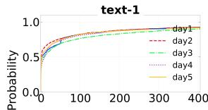

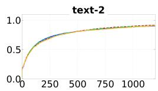

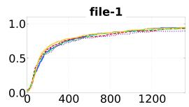

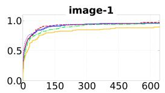

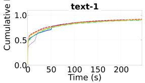

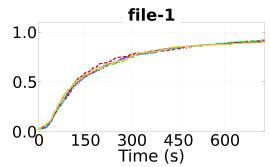

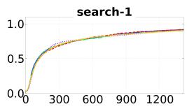

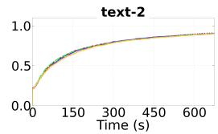

  
Figure 29: The evolution of cumulative distribution function of the reuse probability in 5 workdays. The first row: distributions from 9.00 a.m. to 10.00 a.m. The second row: distributions from 10.00 a.m. to 11.00 a.m.

## A Appendix

## A.1 Trace results across different days

Figure 29 shows the evolution of cumulative distribution (CDF) function of the reuse probability for each request category in future time window over 5 continuous workdays. We can observe that the reuse probability at 9:00 a.m. to 10:00 a.m. similar between workdays. Therefore, we can analyze the reuse log of last day offline to predict the reuse probability of each category in the next day. However, it is noted that the reuse probability of "image" type is harder to predict than other categories, we infer that this is because image types have coarser reusability granularity compared to text types, and there exists greater variability among different users.