①

USENIX

THE ADVANCED COMPUTING SYSTEMS ASSOCIATION

# Colocating ML Inference and Training with Fast GPU Memory Handover

Jiali Wang, Yankui Wang, Mingcong Han, and Rong Chen, Institute of Parallel and Distributed Systems, Shanghai Jiao Tong University https://www.usenix.org/conference/atc25/presentation/wang-jiali

# This paper is included in the Proceedings of the 2025 USENIX Annual Technical Conference.

July 7–9, 2025 • Boston, MA, USA ISBN 978-1-939133-48-9

Open access to the Proceedings of the 2025 USENIX Annual Technical Conference is sponsored by

P-Lr.h £Es/sL.

auuuJl9 PgleU

King Abdullah University of

Science and Technology

# Colocating ML Inference and Training with Fast GPU Memory Handover

Jiali Wang, Yankui Wang, Mingcong Han, Rong Chen

Institute of Parallel and Distributed Systems, Shanghai Jiao Tong University

## Abstract

This paper presents SIRIUS, an efficient colocation system that enables spatial sharing of GPU resources between machine learning (ML) inference and training tasks. To meet strict latency SLOs, SIRIUS prioritizes inference tasks, allowing them to utilize all GPU resources without restriction and interference. Meanwhile, it concurrently runs training tasks on leftover resources to improve throughput and GPU utilization. SIRIUS is novel in three ways. First, it leverages the characteristics of gradient computation in a batch to adjust the memory consumption of training tasks in a few milliseconds. Second, it explicitly manages memory reclamation for training, ensuring a thorough and safe memory handover process. Third, it employs an SLO-aware memory reallocation strategy to mitigate memory initialization overhead and prevent thrashing when facing frequently fluctuating workloads. Our evaluation shows that SIRIUS outperforms existing state-of-the-art colocation approaches, improving inference SLO compliance by an average of 57.0% (up to 97.0%) and training throughput by 2.2× (up to 13.7×).

## 1 Introduction

Serving machine learning (ML) inference and training workloads has become one of the most critical workloads in cloud data centers. High-performance GPUs serve as the predominant accelerators in ML-as-a-Service (MLaaS) platforms, catering to the growing computational demands for ML tasks [7, 8, 42, 47, 87]. However, these costly GPUs are often inefficiently utilized when serving inference with dynamic and bursty workloads. Inference serving is latencysensitive and must adhere to strict Service-Level Objectives (SLOs) for latency (e.g., 100 ms [34]). To meet these SLOs even during sharp bursts—which can surge to 50× the average [56]—MLaaS platforms typically allocate dedicated, over-provisioned GPU resources for inference serving [33, 93]. This strategy, however, results in severe GPU underutilization (e.g., below 15% [44]) for ML inference workloads [32, 37, 49, 87].

Colocating heterogeneous workloads, such as latencysensitive online services and throughput-intensive batch jobs, is a common practice to enhance resource utilization [60, 80]. Industrial products, such as Google Kubernetes Engine [14] and Tencent Cloud qGPU [15], demonstrate this by colocating high-priority inference tasks with low-priority training tasks to improve GPU utilization, serving as a selling point for MLaaS platforms. Furthermore, colocating ML inference and training workloads has also been explored in recent research work [16, 62, 63, 75, 97]. One approach, known as temporal sharing, enables inference and training tasks to share GPU resources in different time slices. For example, Lyra [53] colocates inference and training workloads within the same GPU cluster by dynamically allocating varying numbers of GPU servers for each task. Similarly, PipeSwitch [16] alternates between inference and training execution on a single GPU.

However, both inference and training tasks are memoryintensive, consuming substantial GPU memory to store models and intermediate states [12, 21, 28, 57, 91, 92]. Consequently, temporal sharing inevitably incurs significant overhead due to time-consuming context switching between these tasks. Unlike CPUs, GPUs require memory switching because of their limited capacity (typically tens of GBs). For inference tasks, reinitializing contexts and reloading models into GPU memory can cause significant latency overhead— up to a few seconds [16, 26, 91]—likely violating inference SLOs. For training tasks, preempting execution without saving context for fast switching can result in starvation or even failure. More importantly, temporal sharing cannot improve GPU utilization during inference serving.

Concurrently running ML inference and training tasks on the same GPU, known as spatial sharing, is an attractive alternative with the potential to fully utilize GPUs and avoid context switching. Modern GPUs allow dynamic partitioning of GPU compute units (i.e., Streaming Multiprocessors, SMs) between multiple tasks (e.g., ML training and inference) by setting SM masks within 1 millisecond [17]. Furthermore, recent studies have demonstrated the feasibility of preventing interference between inference and training tasks when sharing GPU computing resources [17, 36, 72, 75, 89].

Spatially sharing GPU memory between inference and training tasks remains challenging. Statically partitioning GPU memory for these memory-intensive tasks inevitably compromises performance for both, even with carefully tuned proportions. This approach is particularly ineffective for dynamic workloads—a hallmark of inference serving. An alternative is dynamic swapping, which transfers data between GPU and host memory as needed. This can be done either proactively through CPU offloading [16, 48, 51, 91] or passively via memory oversubscription mechanism (i.e., Unified Memory, UM [29, 39]). However, data transfer between GPU and host memory can significantly degrade performance due to limited PCIe bandwidth. For example, UM-based colocation suffers 93% degradation in inference SLOs, compared to running inference tasks alone, even under low workloads.

Our approach. We observe that the actual memory requirements of inference tasks fluctuate with the dynamic inference workloads. Without compromising inference SLOs and training throughput, the inherent elasticity of training tasks [58, 61, 66] provides an opportunity for dynamic GPU memory sharing between inference and training tasks— reconfiguring training tasks at runtime to meet the varying memory requirements of inference tasks.

This paper presents SIRIUS, an efficient colocation system that enables spatial sharing of GPU resources between ML inference and training tasks. SIRIUS treats inference tasks as first-class citizens to utilize all GPU resources without restriction and interference, satisfying strict latency SLOs. Meanwhile, it concurrently runs training tasks on leftover resources as much as possible to improve throughput and GPU utilization.

Key challenges. The handover of GPU memory from a training task to an inference task involves three steps: (1) waiting for the current training batch to complete, (2) transferring the released memory from the training task to the inference task, and (3) initializing the memory for the inference task. This process usually takes several hundred milliseconds (typically 250 ms, see §3), which hardly meets the inference SLOs (e.g., 100 ms). Therefore, we introduce a millisecond-scale reallocation mechanism for dynamic GPU memory sharing between inference and training tasks, built on three key techniques:

Instant memory adjustment (§4.1). We discover that the execution of a training batch can be divided into two distinct phases: gradient computation (GC) and model updating (MU). GC dominates the training execution time (over 95%) but does not change the training states. In contrast, MU requires atomic execution but commonly takes less than 10 ms. Therefore, SIRIUS can adjust the memory consumption of training tasks in just a few milliseconds (5 ms on average) by either instantly discarding the executing batch during GC phases or briefly waiting for MU phases to complete.

Safe memory handover (§4.2). To reduce memory handover time, SIRIUS directly transfers GPU memory released by training tasks to inference tasks, bypassing the memory cache in training frameworks and costly processes in the GPU runtime (e.g., 34 ms). However, this approach may result in data pollution due to synchronization issues between allocation and computation. To remedy this, SIRIUS explicitly manages memory reclamation, ensuring a thorough and safe memory handover process.

SLO-aware memory reallocation (§4.3). To guarantee inference SLOs under fluctuating workloads, SIRIUS reallocates memory between inference and training tasks in an SLOaware manner. SIRIUS reserves GPU memory for inference tasks to tolerate memory re-initialization overhead caused by memory thrashing. Moreover, SIRIUS reallocates memory in a coarse-grained way to minimize disruptions to training tasks (e.g., 1.4% overhead caused by reallocation).

We implemented SIRIUS as a new inference engine with a plugin for training frameworks [55], aiming to colocate inference and training tasks on GPUs while ensuring inference SLOs and improving training throughput. We evaluate SIR-IUS with four generated and two real-world traces [71, 85], comparing it with different GPU memory sharing approaches. Our experimental results show that SIRIUS outperforms these approaches by an average of 57.0% (up to 97.0%) improvement in inference SLO compliance and 2.2× (up to 13.7×) speedup in training throughput. Furthermore, SIRIUS can achieve up to 98% of inference SLO compliance of running inference tasks alone, even under a high-intensity workload.

## 2 Background and Motivation

Inference and training are two major tasks in machine learning services. To clarify the problem of colocating inference and training in MLaaS platforms, we begin by analyzing the unique characteristics and demands of both workloads.

## 2.1 ML Inference

Underutilized GPU computing resources. To ensure strict latency SLOs of inference services (i.e., on the order of milliseconds [34, 73]), GPU servers are typically overprovisioned. However, due to the dynamic and fluctuating nature of inference workloads, GPU resources are often underutilized when there are insufficient inference requests to saturate all GPU computing units [23, 94, 95]. Figure 1(a) shows that GPU utilization can often remain low during serving with the MAF trace.1 This underutilization presents a necessity to colocate inference services with training tasks to effectively saturate GPU resources.

Inefficient GPU memory consumption. To maintain low inference latency, GPU memory is typically dedicated to storing inference models. The growing number of deployed models (e.g., more than one million models in HuggingFace model hub [10]) incurs considerable pressure on GPU memory resources. Additionally, the recent emergence of Large Language Models (LLMs) further intensifies this memory pressure due to their KV caches for requests [51, 67, 76]. However, we observe that the dedicated GPU memory (11.9 GB) often surpasses the actual memory requirements (4.4 GB on average), as shown in Figure 1(a). This overconsumption of GPU memory prevents the opportunity to share GPU resources with training tasks, despite the fact that computing resources may remain underutilized.

Dynamic memory requirements. Memory requirements of inference workloads fluctuate over time (e.g., from 1.8 GB to 10.3 GB). This is presented by the changes in the number of requested models, or the volume of generated KV caches. Statically allocating memory that is less than the peak requirement, e.g., based on the average memory consumption, can severely violate SLOs. Because inference tasks must queue up to use GPU memory when their requirements exceed the allocation. For example, when the allocated GPU memory fails to store all requested models, inference tasks must swap models between GPU memory and host memory, which introduces slow model loading (aka. cold start) in the critical path of inference services. Figure 1(b) shows that loading DistilGPT2 [70] (26.6 ms) takes 5.3× longer than its execution (5.0 ms).

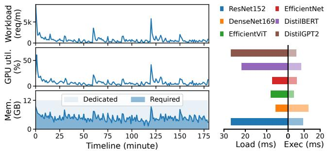  
Figure 1: (a) The GPU utilization and memory consumption during serving 64 different models with MAF [71] trace. Total stands for the memory consumption of all deployed inference models, and Required stands for the actual memory consumption required to serve inference requests. (b) The model loading (Load) and inference execution (Exec) time of six different models on NVIDIA V100.

## 2.2 ML Training

To avoid wasted GPU resources of inference serving under low load, colocating inference services with computingintensive training tasks can ideally saturate GPU resources, which has gained significant attention in recent years [16, 75, 88, 89, 92, 97]. However, due to the large memory consumption of inference services, there is often not enough memory reserved for training tasks, making the colocation inefficient or even infeasible. Fortunately, we observe that the unique characteristics of training tasks bring an opportunity to efficiently share GPU resources with inference tasks.

Memory consumption breakdown. An ML training task iteratively computes gradients (i.e., forward and backward) and applies them to update the model parameters. Figure 2 shows memory consumption during the training of Swin-Transformer (Swin-T) [59] and Qwen2-0.5B models [13].2 The memory consumption of a training task can be categorized into two types: (1) the static training states, which includes model parameters and optimizer states that store training progress, representing the minimum memory required for training; and (2) the intermediate results, which are consumed during the computation of gradients.

Elastic memory consumption. It can be found that the memory consumption of training is primarily dominated by the intermediate results (91% for Swin-T with batch size of 80). Furthermore, by reducing the batch size during training execution, the memory consumption of intermediate results can be effectively controlled (proportional to the batch size), finally adjusting the training memory consumption. This makes it possible to align the memory consumption of training tasks with the varying memory requirements of inference services by configuring the batch size. To guarantee training convergence, the hyper-parameters of training tasks (i.e., the effective batch $\mathrm { s i z e } ^ { 3 } )$ must remain unchanged. Fortunately, a widely-adopted technique—gradient accumulation—enables gradients to be accumulated over multiple smaller batches, maintaining a constant effective batch size for model parameter updating [31, 78].

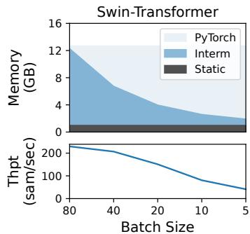

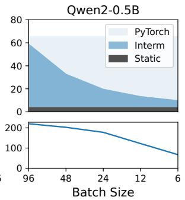  
Figure 2: The memory consumption (GB) and throughput (samples processed per second) for training Swin-Transformer [59] on NVIDIA V100 and Qwen2-0.5 [13] on NVIDIA A100 with different batch sizes.

However, the memory caching mechanism of ML frameworks (e.g., PyTorch [65]), which reduces the memory allocation overhead to improve training performance, leads to the unchanged memory occupation of training tasks even when the batch size is reduced. This causes the unused memory of training tasks invisible to inference tasks.

Memory demand for high throughput. As shown in Figure 2, having more memory resources enables training tasks to use larger batch sizes, which enhances training throughput by fully utilizing the GPU. However, colocating inference and training tasks can restrict the available memory for training, ultimately impacting training performance.

## 2.3 Colocation of ML Inference and Training

We review and discuss various approaches to colocating inference and training tasks, as illustrated in Figure 3, which contains two inference models (Mx) and one training task.

Task switching (temporal sharing). This approach enables inference and training tasks to temporally share GPU resources by switching GPU memory between tasks [16]. Therefore, an ML task can utilize the entire GPU memory and avoid memory contention, achieving the optimal performance during execution. However, this approach comes with significant context switching overhead. In Figure 3(a), to handle the first two inference requests $( \mathsf { R } _ { 1 }$ and $\mathbf { R } _ { 2 } )$ , GPU memory must be switched from the training task to the inference tasks, leading to cold starts for inference models $( \mathbf { M } _ { 1 }$ and $\mathbf { M } _ { 2 } )$ . To guarantee inference SLOs, the training task may be preempted to facilitate fast switching. However, this can result in starvation, where training batches are rarely completed due to the frequent context switching when inference requests arrive continuously. Such frequent switching also causes additional cold starts for inference tasks (e.g., $\mathbf { M } _ { 1 }$ needs to be reloaded to serve $\mathbf { R } _ { 3 } )$ . Moreover, during inference serving, unused GPU resources may be wasted.

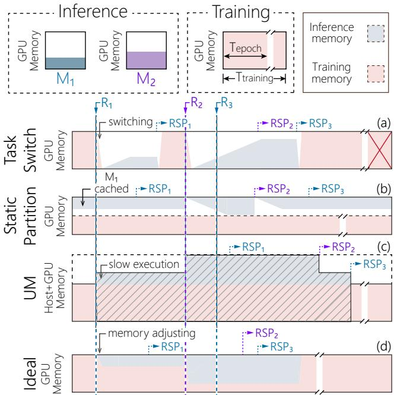  
Figure 3: An example of $G P U$ memory consumption when using different approaches to colocate two inference models $( M _ { x } )$ and one training task. The illustrated time slice contains 3 inference requests $( R _ { x } )$ of two models. $R S P _ { x }$ marks the completion time of requests.

Static GPU memory partition. This approach statically partitions GPU memory for inference and training tasks to spatially share the GPU. Each task is restricted to using the memory allocated to it. This alleviates the interference between inference and training tasks due to memory contention, and avoids the overhead of task switching. However, the available memory for inference and training tasks is limited and fixed. In Figure 3(b), to serve the requests ${ \bf R } _ { 1 }$ and ${ \bf R } _ { 2 }$ , the inference task must swap models between GPU memory and host memory, increasing the inference latency due to cold starts. Furthermore, training throughput is constrained by the limited memory. On the other hand, such static memory allocation can mismatch with the memory requirements of inference workloads, leading to memory waste under low load or inference SLO violations under high load.

Dynamic GPU memory swapping. This approach provides unlimited memory resources for inference and training tasks by swapping between GPU memory and host memory. Therefore, it not only meets the memory requirements of inference and training tasks but also ensures the optimal GPU utilization. However, executing ML tasks on both GPU memory and host memory significantly degrades performance. For example, as shown in Figure 3(c), the data traffic over PCIe (60× slower than GPU memory on NVIDIA A100) caused by memory swapping of Unified Memory (UM) significantly decelerates both tasks.

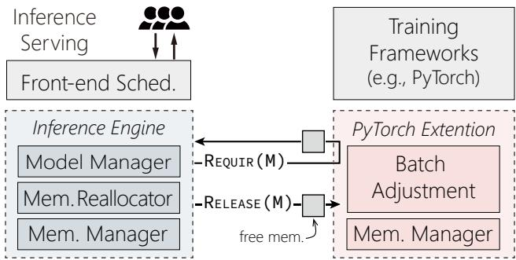  
Figure 4: The architecture of SIRIUS. Modules in boxes with dashed borders are the key components of SIRIUS for ML inference (blue) and training (red), other modules (gray) can be reused from existing ML frameworks. The interfaces for memory handover are labeled as REQUIRE(M) and RELEASE(M), where M represents the memory size.

## 3 Overview of SIRIUS

Our approach: dynamic memory sharing via training elasticity. SIRIUS enables inference and training tasks to spatially share a GPU by exploiting the elasticity of training tasks. As shown in Figure 3(d), SIRIUS dynamically adjusts training memory consumption by reconfiguring the batch size to accommodate fluctuating inference tasks. As a result, inference tasks can fully utilize all GPU memory during high workloads, ensuring latency SLO. Meanwhile, training tasks can still utilize the remaining GPU memory, executing alongside inference tasks. This approach improves training throughput without compromising inference performance.

For example, to serve the requests ${ \bf R } _ { 1 }$ and ${ \bf R } _ { 2 }$ in Figure 3(d), the memory consumption of the training task will be swiftly adjusted by reducing the batch size. This allows inference tasks to utilize the released memory to store the model $\mathbf { M } _ { 1 }$ and $\mathbf { M } _ { 2 }$ to complete serving. Once all inference requests are finished, the training task can utilize all GPU memory to enhance the throughput by increasing the batch size.

System Overview. SIRIUS is designed as a comprehensive system for existing ML software stacks, which colocates inference and training tasks on multiple GPUs. On each GPU, the inference service process cooperates with the training task process to dynamically share GPU memory. As shown in Figure 4, SIRIUS consists of an inference engine and a plugin to the training framework. SIRIUS introduces the memory handover interface—REQUIRE(M)/RELEASE(M)—to enable dynamic GPU memory sharing between ML inference and training tasks. When inference tasks require more memory, the inference engine calls REQUIRE(M) to meet the requirement by adjusting the training memory. Conversely, when less memory is required, the inference engine notifies the training task to utilize idle memory resources by calling RE-LEASE(M).

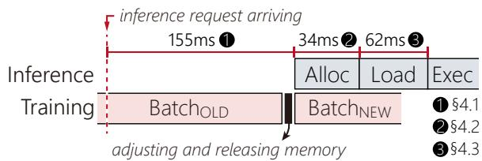  
Figure 5: The breakdown of the time for GPU memory handover from training to inference tasks.

Inference Engine. The inference engine uses a standard MLas-a-Service (MLaaS) interface, the same as existing inference servers (e.g., NVIDIA Triton [12]). To handle dynamic workloads effectively, the inference model manager monitors the memory requirements of online inference services. Memory resources consumed by unrequested models (i.e., idle models) and unused LLM KV caches will be reclaimed for training tasks. Furthermore, the fluctuating memory requirements of inference tasks lead to memory thrashing between inference and training tasks. This incurs cold start delays for inference tasks and frequent interruptions for training tasks. Therefore, SIRIUS introduces an SLO-aware memory reallocator to mitigate memory thrashing.

Extensions on Training Engine. The training plugin extends the popular training frameworks (i.e., PyTorch) to dynamically adjust the training task, while minimizing the training development effort. The main component of training extension is the batch adjustment, which provides a mechanism to adjust training memory consumption by reconfiguring the batch size. When receiving REQUIRE(M) from the inference engine, it swiftly and safely reconfigures the training tasks (i.e., decreasing the batch size) to hand over the memory to inference tasks. When receiving RELEASE(M), it will increase the batch size at the beginning of the next iteration to improve training throughput. To let training tasks utilize multiple GPUs efficiently, the effective batch is distributed across all GPUs with the consideration of load balancing.

Key challenge: fast GPU memory handover between training and inference tasks. When additional inference models are requested, memory must be reallocated from training to inference tasks timely to ensure SLO compliance. As shown in Figure 5, the memory handover process—consisting of adjusting training memory ( 1 , see §4.1), transferring memory to inference ( 2 , see §4.2), and initializing inference memory ( 3 , see §4.3)—takes approximately 250 ms. This delay significantly reduces inference SLO compliance.

Table 1: Execution time (in milliseconds) breakdown of one training batch for different models on NVIDIA V100.
<table><tr><td>Phase</td><td>ResNet-152</td><td>Swin-T-b</td><td>BERT-b</td><td>GPT2</td></tr><tr><td>Gradient Compute</td><td>323.7</td><td>344.2</td><td>241.5</td><td>188.7</td></tr><tr><td>Model Update</td><td>9.6</td><td>9.0</td><td>10.0</td><td>9.8</td></tr></table>

## 4 Fast GPU Memory Handover

In this section, we elaborate on the design of SIRIUS for reallocating GPU memory from ML training to inference.

## 4.1 Instant Memory Adjustment

To adjust training memory consumption through batch size reconfiguration, inference tasks must wait for the currently running batch to complete. Since training batches take hundreds of milliseconds while inference runs in just milliseconds, this waiting period is unacceptable for latency-sensitive inference tasks.

Based on the characteristics of model training, we propose an approach to instantly adjust memory consumption by discarding the currently running batch. We found that the execution of a training batch can be divided into two phases: gradient computation (i.e., forward and backward) and model parameter updating. During the gradient computation phase, the model parameters typically remain unchanged. However, the model updating phase must be executed atomically to prevent inconsistent training states. Therefore, discarding the running batch to achieve instant memory adjustment is safe as long as it is not in the model updating phase.

As shown in Table 1, gradient computation takes significantly longer than model parameter updating, dominating the training time (e.g., 97% for ResNet-152). This is because model updating involves only a few lightweight addition operations. During memory adjustments, most of the time, the training task is engaged in gradient computation. If an adjustment arises during model updating, waiting for this short phase to complete is acceptable.

We first introduce the execution process of a training batch before discussing how to discard the executing training batch. The execution of the training task involves both the host CPU and the GPU accelerator. The host CPU is responsible for the control plane, and the computation-intensive operators in the training computational graph are dispatched to the GPU. The GPU is responsible for the computation plane, where those operators are executed as asynchronous GPU kernels.

However, asynchronous execution makes it challenging to discard the training batch instantly. Since the CPU operator dispatching is much faster than GPU computation, numerous uncompleted kernels are executing on the GPU when the training task is notified of the memory adjustment. Therefore, simply synchronizing the GPU to halt model training incurs a lengthy wait for these in-flight kernels to complete. Ultimately, this delay causes inference tasks at risk of violating SLOs due to waiting for memory adjustments.

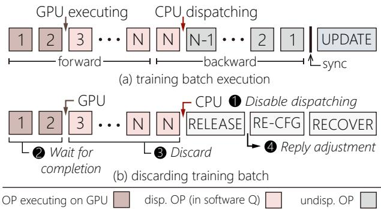  
Figure 6: Instant training memory adjustment.

To harness the training asynchronous execution, SIR-IUS employs the software GPU kernel management technique [36, 72, 75]. As shown in Figure 6(a), instead of directly launching training operators to GPU hardware, SIRIUS adds these operators to a software queue maintained by the host CPU. The operators in the software queue are gradually launched to the GPU for execution. Consequently, only a few in-flight operators are executing on the GPU, whereas most are in the software queue.

Furthermore, SIRIUS leverages the host CPU as the oracle to determine the training stages (i.e., GC or MU), as it manages the training control plane. However, the GPU can lag behind the host CPU and not fully complete gradient computation when the host CPU enters the model updating phase. Therefore, SIRIUS inserts a synchronization between the host CPU and GPU before model updating, ensuring their consistency in the training phase.

Figure 6(b) shows the process of discarding the training batch. When the memory adjustment occurs during the gradient computation, SIRIUS disables operator dispatching by refusing the operators to be added to the software queue ( 1 ). SIRIUS then waits for a few executing GPU kernels to complete ( 2 ). As training kernels are generally short, it only takes a short time. After this, SIRIUS discards the operators in the software queue to fully discard the training batch in the computation plane ( 3 ).

Next, SIRIUS must ensure the training control plane is aware of the adjustment to release the training memory. To achieve this, SIRIUS lets the host CPU actively check for adjustments at each training operator. Because the operator dispatching on the host CPU is very fast, checking for adjustments will not become a bottleneck for the training task. Furthermore, as operators are the basic units of the computational graph, they are fine-grained enough to notify the host CPU of the adjustment in a timely manner.

Once the training memory is released, the memory adjustment will be replied ( 4 ). Before recovering the training task, SIRIUS reconfigures the training task by reducing the batch size. SIRIUS then re-enables the operator dispatching and resets the control plane to the next iteration to recover the training task, where data samples of the discarded batch will

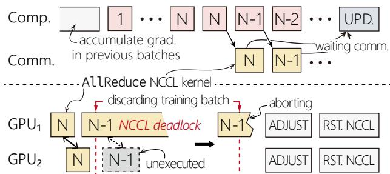  
Figure 7: The memory adjustment with data parallel training.

be reprocessed.

To fully release the memory resources occupied by the discarded training batch, SIRIUS must traverse the training computational graph to release the corresponding intermediate results. This is necessary because discarding the training batch disrupts the normal training execution, causing the training task to fail to release these intermediate results during the backward stage.

Support for multi-GPU training. Data parallelism (DP) is a widely used technique to improve training throughput by distributing data samples across multiple GPUs [55]. Unlike single-GPU training, multi-GPU training with DP involves gradient synchronization (i.e., AllReduce4) across all GPUs in the backward stage, as shown in Figure 7. The training task must wait for gradient synchronization to complete before updating model parameters. When gradient accumulation is incorporated, the gradients are accumulated locally without initiating communication until the effective batch size is reached.

SIRIUS extends its memory adjustment approach from a single GPU to multiple GPUs, supporting training tasks with data parallelism. When memory adjustment is needed, the training task on every GPU receives notifications to initiate the process. Similar to single-GPU training, if a training task is computing gradients, the current batch will be discarded.

However, the execution speed of training varies slightly across different GPUs, leading to inconsistencies in the number of AllReduce NCCL kernels launched at any given timestamp. As shown at the bottom of Figure 7, one more AllReduce NCCL kernel is launched on GPU1 when SIR-IUS starts to discard the training batch. This presents an NCCL deadlock because the NCCL kernel on GPU1 cannot receive the required data from GPU2, which will not launch the corresponding AllReduce NCCL kernel after the discarding process starts. This ultimately causes the SIRIUS to fail at waiting for the completion of in-flight GPU kernels to finish discarding the training batch.

To address this issue, SIRIUS must abort the in-flight NCCL kernels. Simply aborting NCCL kernels by terminating NCCL connections between GPUs (i.e., calling ncclCommAbort)

hurts training throughput. It typically takes hundreds of milliseconds to re-establish NCCL connections to recover the training task.

Contrarily, SIRIUS leverages the NCCL communication mechanism to abort NCCL while retaining NCCL connections. NCCL maintains a counter between GPUs to ensure the order and correctness of collective data transmission. Moreover, to support the basic functionality of collective communication—connection termination, an abort flag is designed to let NCCL kernels exit despite ignoring the correctness of data transmission.

Therefore, SIRIUS sets the abort flag to abort NCCL kernels to fulfill training memory adjustment. To avoid NCCL deadlock or data pollution caused by incorrect NCCL states, SIRIUS resets the NCCL counter on all GPUs before starting the next training iterations, after which the training task will be recovered similarly to the single GPU case.

Batch distributing. The memory requirements for inference tasks can vary across different GPUs, which causes data parallel training to suffer from memory resource imbalances, resulting in a degradation in training throughput due to the straggling GPU. Therefore, SIRIUS must ensure the effective batch processing time is similar across all GPUs. SIRIUS achieves this by dynamically distributing the batch across GPUs to balance the effective batch processing time. SIR-IUS uses training batch size to model the training throughput for each GPU through online profiling. SIRIUS redistributes the batch to maintain a balanced training time when the memory adjustment occurs, assigning more samples to faster GPUs. Furthermore, to prevent communication deadlock during training, SIRIUS ensures that all GPUs progress the training tasks (i.e., the training batch size of each GPU is non-zero), or none of GPUs progress the training task. The latter happens when all adjustable memory is allocated for inference tasks.

## 4.2 Safe Memory Handover

To transfer the released memory from the training task to the inference task, the simplest method is to return the memory cached by the training task to the GPU, then allocate memory from the GPU for the inference task. However, GPU memory allocation (i.e., cudaMalloc) is notoriously inefficient [16, 35, 83, 96], which incurs significant overhead to inference latency (see §3). Therefore, SIRIUS maintains a shared memory pool between inference and training tasks to bypass the memory caching mechanism of training frameworks and the inefficient GPU memory management, minimizing the overhead of memory handover. Furthermore, to protect data privacy, the memory transferred from the training task is filled with zeros before being allocated to the inference task, and vice versa. Due to high GPU memory bandwidth, the impact of zero-filling on memory handover latency is negligible. Nevertheless, the shared memory resources must be carefully managed to avoid data pollution.

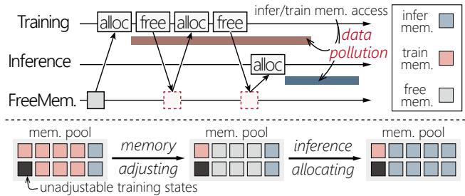  
Figure 8: The illustration of data pollution and memory handover between inference and training tasks.

Data pollution. In the conventional training, the memory allocation and computation are asynchronous. Typically, the training tasks first allocate memory and then launch computational operators. Rather than waiting for the operators to complete, the memory is promptly released to training internal memory cache after launching. This design reduces GPU synchronization overhead and potentially lowers memory consumption by reusing memory across training operators (e.g., the second training memory allocation at the top of Figure 8).

However, when inference and training tasks allocate memory from the shared memory pool, such behavior can lead to data pollution between two tasks. As shown in Figure 8, once the training task releases its memory to the memory pool in the second free operation, this memory immediately appears to be available for the inference task. Then the inference task allocates this memory to serve inference requests. At the same time, however, the training task is still accessing this memory, leading to data pollution. This issue does not occur in solo training execution because no concurrent computation streams using the same memory area.

The root cause of data pollution is that the memory released by the training task is prematurely seen by the inference task, making the inference task mistakenly treat the memory being accessed by the training task as free memory. To address this issue, instead of aggressively polling for the real availability of training released memory, which incurs synchronization overhead to the training task. As shown at the bottom of Figure 8, SIRIUS maintains the memory ownership and only explicitly reclaims the training released memory for inference tasks when the memory adjustment occurs. Because there is no in-flight training operator after training memory adjustment (see §4.1), the safety of memory handover is guaranteed. If the memory adjustment does not occur, the memory released by the training task still belongs to the training task and is not visible to inference tasks.

## 4.3 SLO-aware Reallocation

When serving multiple inference models under fluctuating workloads, an idle model may soon be requested again. If such a model’s memory is reclaimed for the training task, it can lead to memory allocation thrashing. On the one hand, this incurs frequent model loading to initialize memory for inference tasks, degrading the quality of inference services. On the other hand, the training task will be frequently interrupted by inference tasks to fulfill memory adjustment, hurting training throughput. To address these issues, we present an SLO-aware reallocation approach, as shown in Algorithm 1.

Algorithm 1: SLO-aware Memory Reallocation   
Input: The maximum liveness time of idle models, $\mathcal { T } _ { i d l e } ;$   
The watermark of memory reallocation, W.   
$\mathcal { M } _ { r s v } \colon$ The volume of reserved memory for inference tasks.   
1 Function InferRelease(model)   
2 if the model has been requested in the last $\mathcal { T } _ { i d l e }$ then   
3 return;   
4 $\mathcal { M } _ { r s v }$ += model\_sz   
5 if $\mathcal { M } _ { r s v } < 2 \times$ W then   
6 reserve the model   
7 else   
$/ \star$ reallocate memory to training task \*/   
8 release\_ $\mathbf { \mathcal { s } } \mathbf { z } = \mathcal { M } _ { r s v } - \mathcal { W }$   
9 release the coldest models   
10 $\mathcal { M } _ { r s v } = \mathcal { W }$   
11 Function InferRequire(model)   
12 if $\mathcal { M } _ { r s v } \geq$ model\_sz then   
$/ \star$ use the reserved memory \*/   
13 $\mathcal { M } _ { r s v } \mathrel { - } =$ model\_sz   
14 else if training task does not reach the adjustment limit then   
/\* reallocate memory to inference task \*/   
15 adjust $\mathsf { \Pi } _ { \mathsf { - } } \mathsf { s } \mathsf { z } = ( \mathrm { m o d e l \_ s z } - \mathsf { \mathcal { M } } _ { r s v } ) + \mathcal { W }$   
16 AdjustTrainingTask(adjust\_sz)   
17 $\mathcal { M } _ { r s v } = \mathcal { W }$   
18 else   
19 fallback to model swapping

To reclaim memory resources from inference tasks (i.e., InferRelease), SIRIUS maintains a maximum liveness time $( \mathcal { T } _ { i d l e } )$ of idle models. An idle model will be reclaimed if it has not been requested for $\mathcal { T } _ { i d l e }$ time. Furthermore, SIRIUS reallocates memory in a coarse-grained way to minimize the disruptions to training tasks. SIRIUS maintains a watermark (W) to control the minimum granularity of memory reallocation. Instead of directly releasing the memory resources of idle models to the training task, SIRIUS reserves these models until the volume of reserved memory $( \mathcal { M } _ { r s v } )$ reaches the releasing threshold—2W (L5). Therefore, when these models are requested again, SIRIUS can quickly complete the serving. When the releasing threshold is reached, SIRIUS releases the coldest model in the reserved memory until the volume of reserved memory is reduced to W (L8-L10).

When inference tasks require more memory to serve requested models (i.e., InferRequire), SIRIUS first uses the inference reserved memory (L12). If this reserved memory is exhausted, SIRIUS reallocates memory resources between inference and training tasks (L15-L17). Besides meeting the current memory requirements of inference tasks, SIRIUS adjusts W more memory resources to reduce the impact of the memory adjustment on training throughput. However, suppose the training task has reached the adjustment limit (e.g., the batch size has already been adjusted to zero). In that case, SIRIUS will serve inference requests by swapping models between GPU memory and host memory (L19). Finally, to mitigate model loading overhead, SIRIUS employs a pipelined execution scheme [16, 26] to overlap the inference execution with model loading.

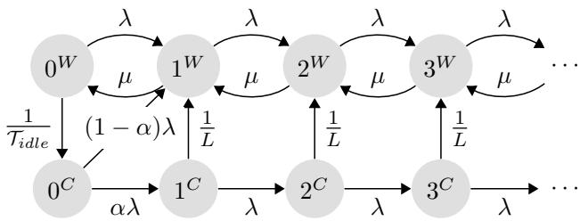  
Figure 9: The M/G/1 model for inference SLO compliance. $x ^ { W }$ and $x ^ { C }$ represent the state where there are x queueing inference requests without cold start and with cold start, respectively. λ is the arrival rate of inference requests. µ is the execution rate of inference tasks. α is the cold start ratio of state $0 ^ { C }$ . L is the re-initialization time of the released model.

To effectively mitigate cold start overhead for inference tasks and not hurt training throughput due to insufficient available memory, SIRIUS needs to be configured with the rational values of $\mathcal { T } _ { i d l e }$ and W (see §6.4). Therefore, we leverage queueing theory to model the inference SLO compliance, finally determining SIRIUS’s configuration.

To simplify modeling, we assume inference models are homogeneous (i.e., inference execution time and loading time are the same across models) and independent of each other. Consequently, the system can be modeled as a single-server queueing system, specifically M/G/1 [38]. In this model, inference requests follow a Poisson process with arrival rate λ, and the processing time of inference tasks follows a general distribution, accounting for potential re-initialization.

Figure 9 shows the M/G/1 model for inference SLO compliance. The expiration of the liveness time $\mathcal { T } _ { i d l e }$ is represented by the transition from state $0 ^ { W }$ to state $0 ^ { C }$ with rate $\frac { 1 } { T _ { i d l e \_ } } .$ The watermark W is modeled by the cold start ratio α of state $0 ^ { C }$ , which can be approximated as $1 - \frac { \mathcal { W } } { \sum \mathrm { m o d e l } _ { - } \mathrm { s z } } .$ , assuming the reserved memory follows a uniform distribution. Consequently, when the inference request arrives at state $0 ^ { C }$ the probability of transitioning to state $1 ^ { W }$ and state $1 ^ { C }$ is 1 − α and α, respectively. Finally, the re-initialization of the released model triggers the transition from state $x ^ { W }$ to state $x ^ { C }$ . The re-initialization time L includes the model loading overhead, and potential training adjustment time due to the coarse-grained reallocation, which can be approximated as the training adjustment time multiplied by α.

For every system state s, the inference response time is the sum of the waiting time for queueing inference requests and the processing time of the current inference request,

$$
X _ { s } \sim \left\{ \begin{array} { l l } { \sum _ { i = 0 } ^ { x } \exp ( u ) } & { s = x ^ { W } } \\ { \sum _ { i = 0 } ^ { x } \exp ( u ) + \exp ( \frac { 1 } { L } ) } & { s = x ^ { C } } \end{array} \right.\tag{1}
$$

where $X _ { s }$ is the inference response time, following the hypoexponential distribution. Finally, the inference SLO compliance—the percentage of inference requests that are served within the SLO—can be calculated by conditioning on states of the system,

$$
\begin{array} { r } { P _ { \mathrm { S L O } } = \sum _ { s } \pi _ { s } P ( X _ { s } \leq \mathrm { S L O } ) } \end{array}\tag{2}
$$

where $\pi _ { s }$ is the probability of state s, which can be calculated using the matrix method [38]. Therefore, given the inference SLO and compliance requirements, we can leverage the above model to search for a suitable configuration of $\mathcal { T } _ { i d l e }$ and W.

## 5 Implementation

For inference tasks, we built the inference server from scratch with approximately 6,000 lines of C++ code. The inference engine employs TVM [20, 98] as the backend for DNN models and vLLM [50] for LLMs. For training tasks, SIRIUS extends PyTorch with a Python library that contains around 5,000 lines of both Python and C++ code. The GPU memory and computing resource management is implemented as a common component of inference and training tasks, comprising roughly 6,000 lines of C++ code.

Memory management. SIRIUS uses GPU Virtual Memory Management (VMM) [1] to maintain a shared memory pool for both inference and training tasks, offering more flexibility than the native GPU memory management (i.e., cudaMalloc/cudaFree). SIRIUS establishes a contiguous memory area constituted by all available memory pages to form this shared memory pool. For inference tasks, SIR-IUS allocates memory by directly dividing the memory area to avoid costly VMM calls. To prevent the memory fragmentation caused by the interleaving memory allocation of inference and training, SIRIUS allocates memory for the training task by mapping free, potentially non-contiguous memory pages in the memory pool to form a separate contiguous memory area.

When inference tasks request the memory adjustment, SIR-IUS unmaps the unused memory pages from the training task to transfer memory resources to inference tasks, leading to the unmapping overhead in the adjustment critical path. To address this, SIRIUS merely updates the ownership of memory pages, postponing the actual unmapping until the next training memory allocation.

Dynamic GPU SM sharing. SIRIUS leverages the GPU hardware mechanism, specifically the SM mask [17], to allocate GPU computing resources between inference and training tasks. This mechanism enables dynamic specification of the Streaming Multiprocessors (SMs) used by GPU kernels, overcoming the limitation of static SM allocation of MPS [4].

Table 2: Inference trace description.
<table><tr><td>Workload</td><td>LIGHT</td><td>HEAVY</td><td>BURST</td><td>SKEWED</td></tr><tr><td>Request Rate</td><td> $\mathrm { L o G N } _ { L }$ </td><td>LOGNH</td><td> $\mathrm { L o G N } _ { L + H }$ </td><td>LOGNL+H</td></tr><tr><td>Model Dist.</td><td>Uniform</td><td>Uniform</td><td>Uniform</td><td>Zipfian</td></tr></table>

SIRIUS offline profiles the number of SMs that each inference model needs without degrading inference performance. To minimize the inference SLO violation during colocation, SIRIUS enables inference tasks to utilize all SMs. To reduce computation interference between inference and training tasks, SIRIUS limits the number of SMs allocated for the training task by subtracting the SMs required by inference tasks from the total number of SMs. When SIRIUS is about to execute inference for a request, SIRIUS decreases the number of SMs allocated to the training task by the amount needed for inference tasks. Upon completion of the inference task, SIRIUS restores these SMs to the training task.

## 6 Evaluation

Testbed. The experiments are conducted on a GPU server with two Intel Xeon Gold 6138 CPUs (total of 80 cores), 503 GB of DRAM, and four NVIDIA Tesla V100 GPUs with 16 GB of memory. The GPUs are fully connected by NVLinks. The GPU and CPU are connected by PCIe 3.0×16. The software environment of the server is configured with Ubuntu 20.04, Python v3.10, CUDA v11.6, PyTorch v2.1.2, TVM v0.14.

Comparing targets. We compare SIRIUS with the following memory resource sharing approaches in inference and training colocation. TaskSwitch represents systems like PipeSwitch [16], where GPU is temporally shared by inference and training tasks. We do not directly compare with vanilla PipeSwitch because it lacks support for multi-GPU training. Moreover, PipeSwitch terminates the entire training task when switching to inference tasks, degrading training performance significantly. Instead, we implement TaskSwitch based on SIRIUS and support switching from the training task to inference tasks by preempting the training batch. Static Partition refers to the approach of statically partitioning GPU memory for inference and training tasks. For this approach, we use NVIDIA Triton [12] for serving inference tasks and PyTorch [65] for running training tasks. We compare SIRIUS against two configurations of static partition: SP-50 (50% GPU memory for inference tasks and 50% for training tasks) and SP-75 (75% GPU memory for inference tasks and 25% for training tasks). UM+MPS represents the dynamic memory swapping approach, which extends GPU memory with the host memory using CUDA Unified Memory [39] and concurrently runs tasks using NVIDIA MPS [4]. We also use NVIDIA Triton and PyTorch to serve inference and training tasks for this approach, respectively.

Workloads. Table 2 shows four generated inference traces used for DNN model serving: LIGHT (L), HEAVY (H), BURST (B), and SKEWED (S). In these traces, the inference serving timeline is sliced into 20-second intervals. During each interval, inference requests arrive following a Poisson distribution [68, 69]. LIGHT represents a low-intensity workload where the request rate of each interval is sampled from a LogNormal distribution [64] with µ=1 and $\sigma { = } 1 \ ( \mathrm { L o G N } _ { L } )$ yielding an average request rate of 3.4 requests per second (reqs/s). HEAVY represents a high-intensity workload where the request rate of each interval is sampled from a LogNormal distribution with µ=4.5 and σ=0.3 (LOGNH), yielding an average request rate of 98.2 reqs/s. BURST represents a bursty inference workload by combining LIGHT and HEAVY workloads [90], with 30% of request rates sampled from $\mathrm { L O G N } _ { H }$ and 70% from $\mathrm { L O G N } _ { L }$ . The average request rate is 29.9 reqs/s. LIGHT, HEAVY and BURST workloads distribute inference requests uniformly on all models, and SKEWED assigns requests to various models following a Zipfian distribution (α=1.05). Furthermore, we use a real-world trace from Microsoft Azure Functions (MAF) [71] to simulate a realistic arrival distribution in cloud data centers. We compressed the MAF workload by scaling one minute to 5 seconds. All workloads run for a total of 300 seconds.

Table 3: ML model description.
<table><tr><td>Inference</td><td>Model</td><td>Model Size</td><td>Exec. Time</td></tr><tr><td rowspan="7">DNN</td><td>ResNet-152 [40]</td><td>319MB</td><td>9.4ms</td></tr><tr><td>DenseNet-169 [43]</td><td>84MB</td><td>12.6ms</td></tr><tr><td>EfficientNetV2-s [77]</td><td>86MB</td><td>5.3 ms</td></tr><tr><td>EfficientViT-b2[19]</td><td>109 MB</td><td>3.7 ms</td></tr><tr><td>DistilBERT[70]</td><td>254MB</td><td>8.0ms</td></tr><tr><td>DistilGPT2 [70]</td><td>317MB</td><td>5.0ms</td></tr><tr><td>Llama2-13B [79]</td><td>26GB</td><td>170.2 ms (TTFT) 20.7 ms (TBT)</td></tr><tr><td>Training</td><td>Model</td><td>Batch Size</td><td>Exec. Time</td></tr><tr><td>DNN</td><td>Swin-T [59]</td><td>72</td><td>318 ms (1 batch)</td></tr><tr><td>LLM</td><td>Qwen2-0.5B[13]</td><td>72</td><td>346 ms (1 batch)</td></tr></table>

For inference tasks, we use six widely-deployed DNN models, as shown in Table 3. All models are compiled using TVM before deployment. To simulate different customized variants of standard models, we duplicate these models up to 56 instances in a round-robin manner. For the training task, we use Swin-Transformer (Swin-T) [59]. To evaluate the performance of SIRIUS with LLMs, we employ Llama2-13B for inference tasks and Qwen2-0.5B for the training task using the BurstGPT [85] trace (see §6.6 for details).

Metrics. For inference, we measure the P99 latency and SLO compliance of all requests. The inference SLO is set as four times of inference model standalone execution time (see Table 3). For training, we measure the value of training throughput (i.e., samples per second).

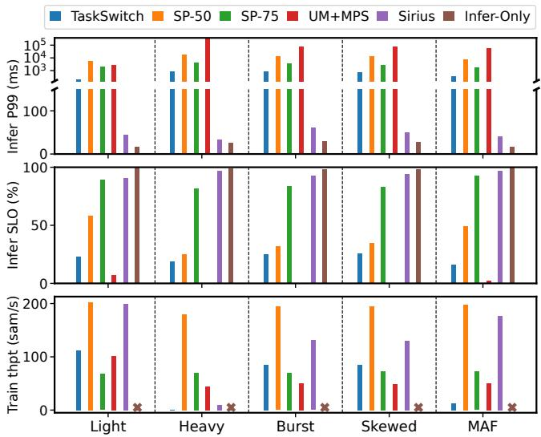  
Figure 10: The comparison of inference P99 latency, SLO compliance, and training throughput for different approaches with various workloads on one GPU.

## 6.1 Overall Performance on A Single GPU

We compare the overall performance of SIRIUS with its competitors using various workloads (see Figure 10). To configure SIRIUS with the above SLO requirement, we use the queueing model with averaged inference model attributes to find values of $\mathcal { T } _ { i d l e }$ and W that achieve an averaged SLO compliance of 90% across all workloads. The result configuration is $\mathcal { T } _ { i d l e } = 5$ seconds and W = 1 GB. Overall, SIRIUS improves the inference SLO compliance by an average of 57.0% (up to 97.0%) and improves the training throughput by an average of 2.2× (up to 13.7×) compared with all competitors.

First, compared with TaskSwitch, SIRIUS improves the P99 latency and SLO compliance by averagely 12.6× and 72.6% respectively. The low inference serving quality of TaskSwitch is mainly caused by the cold starts due to the context switch. For example, the inference task suffers a 38% higher cold start ratio than SIRIUS under BURST workload. For training throughput, SIRIUS outperforms TaskSwitch by averagely 4.6×. Due to preempting the training task, TaskSwitch degrades training throughput by 13.7× under MAF workload compared with SIRIUS, despite the GPU is not fully utilized by inference tasks. Contrarily, only 1.4% of computation time is wasted due to the discarded batch in SIRIUS.

Second, compared with SP-50, SIRIUS improves the P99 latency and SLO compliance by averagely 261.9× and 54.6% respectively. Although SP-50 has higher training throughput, it fails to meet the memory requirements of inference tasks, resulting in only 25% SLO compliance under HEAVY workload. Compared with SP-75, SIRIUS improves the P99 latency and SLO compliance by averagely 64.3× and 8.2% respectively. We found that inference model cold start overhead of Triton can be as high as 2 seconds, leading to high inference latency of SP-75 even with LIGHT workload. SP-75 allocates more memory for inference tasks, leading to 3.0× training throughput degradation with LIGHT workload.

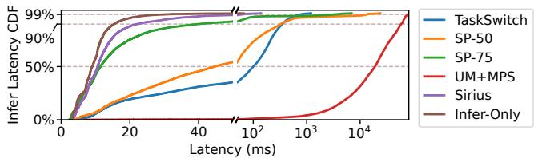  
Figure 11: Inference latency CDF for different approaches with BURST workload.

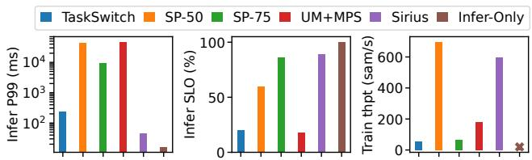  
Figure 12: The comparison of inference P99 latency, SLO compliance, and training throughput with LIGHT workload on four GPUs.

Third, compared with UM+MPS, SIRIUS improves the P99 latency and SLO compliance by 3.1k× and 92.6%, respectively. The poor performance of UM+MPS is mainly caused by memory swapping, presenting significant pressure on the PCIe bus. Even under LIGHT workload, UM+MPS can only achieve 7% SLO compliance. The memory swapping also causes 2.2× degradation of training throughput.

Furthermore, we compare SIRIUS with the ideal case, i.e., Infer-Only, which is based on SIRIUS but solely executes inference tasks on GPU. The evaluation result shows that SIR-IUS achieves averagely 95.3% (up to 98%) of inference SLO compliance of Infer-Only. The decrease in SLO compliance is mainly caused by additional cold start overhead (e.g., 9.1% cold start ratio under BURST workload).

Additionally, Figure 11 shows the CDF of inference latency with BURST workload, illustrating that SIRIUS improves overall inference latency. For more relaxed SLO targets, such as 10× of the standalone execution time, SIRIUS also improves SLO compliance by 48.8% on average compared with all competitors.

Finally, we evaluate the impact of dynamic batch size on training convergence. To evaluate the impact of randomness, we train Swin-T with and without dynamic batch size on CIFAR-100 [9] dataset for five times. We compare the number of epochs required to achieve the same accuracy of 75%. The evaluation result shows that the averaged number of epochs are 210.6 and 206.2 (the standard deviation are 1.5 and 3.7) for each case respectively. This confirms that SIRIUS can ensure training convergence.

## 6.2 Performance on Multiple GPUs

We next evaluate the performance of SIRIUS with four GPUs. To evaluate the inference and training colocation on multiple GPUs, we scale the request rate and the number of inference models of the LIGHT workload by the number of GPUs. As shown in Figure 12, compared with all competitors, SIRIUS improves the inference P99 latency and SLO compliance by averagely 558.4× and 43.0% respectively, and improves the training throughput by averagely 6.1×. The reason for the performance improvement of SIRIUS is similar to the single GPU case. Furthermore, SIRIUS achieves 89.0% of inference SLO compliance of Infer-Only.

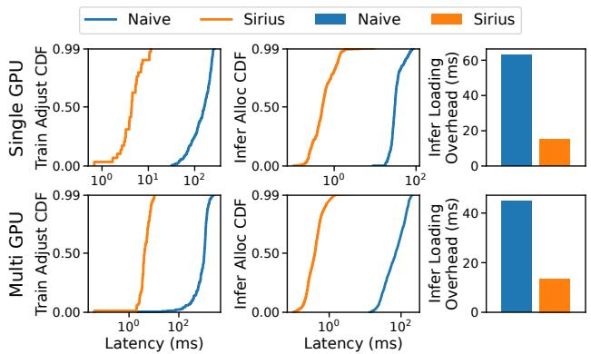  
Figure 13: The comparison of adjustment time for different approaches with MAF workload on one and four GPUs.

## 6.3 Adjustment Breakdown

We next compare the memory handover performance of SIR-IUS with the naive memory handover, which adjusts memory at the end of training batches. Figure 13 shows the breakdown of memory handover, which is evaluated over a mixture of 32 ResNet-152 with MAF workloads on both single and four GPUs. First, for training adjustment, the naive memory handover can take over 250 ms because it must wait for the completion of the training batch. Due to the synchronization across multiple GPUs, the naive adjustment has to wait for the effective batch to complete on all GPUs, resulting in latency exceeding 1 second. In contrast, SIRIUS can adjust training memory in less than 5 ms (121× faster than the naive on average) for both single and multiple GPUs, with P99 latencies of 11.4 ms and 10.5 ms respectively. Moreover, thanks to the coarse-grained reallocation, the average memory adjustment intervals are 10.3 seconds and 3.6 seconds for single and multiple GPUs, respectively. Second, by bypassing inefficient GPU runtime, SIRIUS accelerates memory allocation to averagely 0.8 ms (including zero-filling overhead), 89.2× faster than the naive. Third, thanks to the SLO-aware reallocation and pipeline loading, SIRIUS reduces the waiting time for model loading by 3.7× than the naive. Finally, compared with the naive adjustment, SIRIUS improves memory reallocation by 148× and inference SLO compliance by 38% on average.

## 6.4 Ablation Study

We next evaluate the configuration of SIRIUS that affects the memory adjustment.

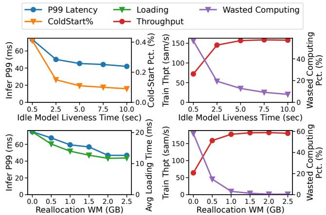  
Figure 14: The effect of maximum model liveness time and reallocation watermark on inference and training performance.

Maximum liveness time $( \mathcal { T } _ { i d l e } )$ . This configuration determines when idle inference models should be released. We evaluate the cold start ratio and P99 latency for inference tasks, as well as the wasted computation time spent on discarded batches and throughput for training tasks, using different $\mathcal { T } _ { i d l e }$ . In this experiment, we use the MAF workload and set the reallocation watermark to zero (i.e., no memory reservation for inference tasks). As shown at the top of Figure 14, with the increase of $\mathcal { T } _ { i d l e } ,$ both the cold start ratio and P99 inference latency decrease. For training throughput, it first increases due to fewer wasted computing resources from discarded batches. However, for larger $\mathcal { T } _ { i d l e }$ , training throughput slightly decreases due to reduced memory resources. This suggests a sweet spot for aggressive levels of dynamic memory sharing.

Memory reallocation watermark (W). The watermark impacts inference model loading and the frequency of adjustments. We evaluate the model loading time and P99 latency for inference tasks, as well as the wasted computation time and throughput for training tasks, using different memory reallocation watermarks. In this experiment, we use the MAF workload and set $\mathcal { T } _ { i d l e }$ e to 500 ms. As shown at the bottom of Figure 14, the finding is consistent with that of inference model liveness time. A larger watermark leads to a reduction in model loading time, P99 inference latency, and wasted training computation. However, training throughput may decrease if the watermark is too large.

## 6.5 Case Study

Memory imbalance. We evaluate the training throughput and GPU memory utilization of SIRIUS with an unbalanced workload on multiple GPUs. To construct the unbalanced workload, we colocate inference and training tasks on two GPUs, where one GPU serves LIGHT inference workload and the other serves HEAVY workload. To demonstrate the issue of memory imbalance, we set the adjustment limit of training batch size to one. Figure 15 shows memory utilization (excluding the CUDA context) without and with the batch distributing (BD) of SIRIUS. It can be found that without batch distributing, the training task must use the same batch size for both GPUs, resulting in memory underutilization on $\mathrm { G P U _ { 0 } }$ and suboptimal training throughput. In contrast, batch distributing allows the training task to use different configurations to fully utilize GPU memory and achieves 8.7× higher throughput.

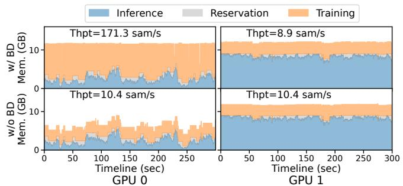  
Figure 15: The training throughput and GPU memory utilization of SIRIUS with an unbalanced workload.

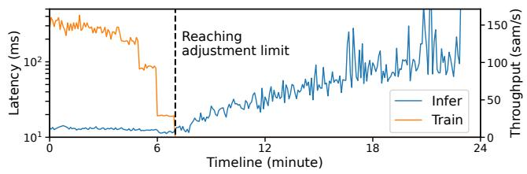  
Figure 16: The inference latency and training throughput of SIR-IUS with varying the number of requested ResNet-152 models.

Memory pressure. We next evaluate the performance of SIR-IUS under memory pressure. We start with 4 ResNet-152 and gradually add 4 ResNet-152 every minute. There are 50 requests per second evenly distributed across these models. Figure 16 shows the evaluation result, where the inference latency and training throughput are averaged over 5 seconds. Before reaching the adjustment limit, inference tasks can get memory from the training task and maintain low latency while training throughput decreases. However, once all training adjustable memory is reallocated for inference tasks, SIRIUS adopts model swapping to serve more models, resulting in increasing inference latency.

## 6.6 LLM Inference

We further investigate the performance of SIRIUS with Large Language Models (LLMs). The memory consumption of LLMs fluctuates due to their KV caches, which typically dominate their memory requirements [41, 76]. Therefore, we dynamically allocate GPU memory for the LLM’s KV cache and the training task to enable memory sharing. The LLM is pinned in GPU memory to minimize inference SLO violations. In our experiments, we use BurstGPT [85] trace and scale the maximum request rate to 10 req/s. We use Llama2-13B as the inference model and colocate it with training Qwen2-0.5B. We compare SIRIUS with SP-50, SP-75, and Infer-Only. All systems use vLLM [50] to serve inference requests. For SP-50 and SP-75, we set the KV cache size as 50% and 75% of that of Infer-Only, which configures the KV cache to utilize the GPU memory fully. For LLM inference, we evaluate the SLO compliance of TTFT (Time To First Token) and TBT (Time Between Tokens). Similarly, we set the SLO to be four times the average latency of an inference request standalone execution (see Table 3). Figure 17 shows the evaluation result on an NVIDIA A100 GPU with 80 GB memory. Compared with SP-50, SIRIUS improves the SLO compliance of TTFT and TBT by 40% and 7% respectively. Compared with SP-75, SIRIUS improves training throughput by 1.5×. This performance improvement stems from the same reason discussed in the previous evaluation—dynamic GPU memory sharing. Finally, in comparison to Infer-Only, SIRIUS achieves 89% and 91% of its SLO compliance for TTFT and TBT, respectively.

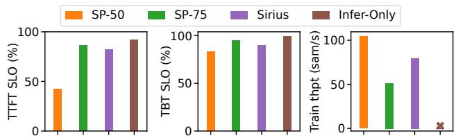  
Figure 17: The comparison of SLO compliance of TTFT (Time To First Token) and TBT (Time Between Tokens) of LLM serving, and training throughput.

## 7 Discussion

Modern inference and training systems are scaled out across multiple GPUs and nodes to enhance their performance. To support memory handover for multi-GPU and multi-node inference tasks, Sirius could allow the inference engine on each GPU to notify the training task of the memory adjustment. The inference task will be processed once the memory adjustment is complete on all GPUs.

For multi-GPU and multi-node training tasks, the memory adjustment can still be completed immediately. However, such training tasks, which typically incorporate data parallelism, pipeline parallelism, and tensor parallelism [18, 74], must be reconfigured and resumed after the memory adjustment. Currently, SIRIUS has explored the elasticity of training tasks with data parallelism to adjust memory consumption, enabling fast GPU memory handover. To support model parallelism (i.e., pipeline parallelism and tensor parallelism), SIRIUS can reshard pipeline stages [30, 45, 81] and reshape tensors [86], respectively. We leave this to future work.

## 8 Related Work

Improving GPU cluster utilization. To address the underutilization of GPU clusters [27, 87], prior work [33, 69, 93] auto-scales GPU resources based on dynamic workloads. Differently, SIRIUS focuses on colocating ML tasks to improve GPU utilization. While Lyra [53] schedules inference and training tasks within the same GPU cluster, SIRIUS colocates two types of tasks on the same GPU in a fine-grained manner. Observing the dynamic resource utilization of training tasks, AntMan [89] co-designs the GPU cluster scheduler and the ML framework to colocate training tasks, which reconciles the GPU memory resources between training tasks by unifying GPU and host memory. Compared with AntMan, SIRIUS instantly adjusts the memory consumption of training tasks to meet inference SLOs.

Elastic training and dynamic batch. To utilize dynamic GPU resources, elastic training has gained increasing attention recently [2, 3, 6, 46, 54, 61, 66, 82, 84]. Different from these approaches, which mainly focus on improving utilization and accelerating training tasks, SIRIUS exploits the elasticity of training tasks to colocate with latency-sensitive inference tasks under dynamic inference workloads.

GPU sharing for machine learning. Fully utilizing GPU becomes increasingly challenging for more powerful GPUs [87, 88, 92, 97]. NVIDIA GPU offers several techniques to enable GPU sharing, including MPS [4] and MIG [5]. MIG is a hardware mechanism for static partitioning, dividing the GPU into multiple isolated instances. While prior work [22, 24, 25, 36, 52, 72, 75] has primarily focused on computational resource sharing, SIRIUS targets GPU memory sharing. Different from PipeSwitch [16] and Zico [57], SIR-IUS dynamically allocates GPU memory between ML tasks to achieve efficient colocation.

## 9 Conclusion

In this paper, we present SIRIUS, a colocation system that leverages training elasticity to dynamically share GPU memory between ML inference and training tasks. SIRIUS prioritizes inference tasks to meet strict latency SLOs, allowing them access GPU memory without interference. Meanwhile, it concurrently runs training tasks on remaining resources to maximize throughput and GPU utilization. The key innovation behind SIRIUS is a millisecond-scale GPU memory handover mechanism between training and inference tasks. Our experiments demonstrate the efficacy and efficiency of SIRIUS in colocating inference and training tasks. SIRIUS is open-source and publicly available at https: //github.com/SiriusInfTra/Sirius.

## Acknowledgments

We sincerely thank our anonymous shepherd and reviewers for their insightful comments and suggestions. This work was supported in part by the National Natural Science Foundation of China (No. 62272291, 62432010), the Fundamental Research Funds for the Central Universities, and a research grant from Huawei Technologies. Corresponding author: Rong Chen (rongchen@sjtu.edu.cn).

## References

[1] 2023. CUDA C++ Programming Guide. https:// docs.nvidia.com/cuda/cuda-c-programmingguide/index.html.

[2] 2023. Elastic Horovod. https://horovod. readthedocs.io/en/latest/elastic\_include. html.

[3] 2023. ElasticDL: A Kubernetes-native Deep Learning Framework. https://github.com/sql-machinelearning/elasticdl.

[4] 2023. Multi-Process Service. https://docs.nvidia. com/deploy/mps/index.html.

[5] 2023. NVIDIA Multi-Instance GPU User Guide. https: //docs.nvidia.com/datacenter/tesla/miguser-guide/index.html.

[6] 2023. Torch Distributed Elastic. https://pytorch.org/ docs/stable/distributed.elastic.html.

[7] 2024. Amazon SageMaker. https://aws.amazon.com/ sagemaker.

[8] 2024. Azure Machine Learning. https://azure. microsoft.com/en-us/products/machinelearning.

[9] 2024. CIFAR-10 and CIFAR-100 datasets. https://www. cs.toronto.edu/\~kriz/cifar.html.

[10] 2024. Hugging Face Model Hub. https://huggingface. co/models.

[11] 2024. NVIDIA Collective Communications Library. https: //developer.nvidia.com/nccl.

[12] 2024. NVIDIA Triton Inference Server. https: //www.nvidia.com/en-us/ai-data-science/ products/triton-inference-server/.

[13] 2024. Qwen2 Technical Report. (2024).

[14] 2025. Optimize GKE resource utilization for mixed AI/ML training and inference workloads. https://cloud.google.com/kubernetesengine/docs/tutorials/mixed-workloads.

[15] 2025. Tencent Cloud qGPU. https://www. tencentcloud.com/document/product/457/ 52078?lang=en.

[16] Zhihao Bai, Zhen Zhang, Yibo Zhu, and Xin Jin. 2020. PipeSwitch: Fast pipelined context switching for deep learning applications. In 14th USENIX Symposium on Operating Systems Design and Implementation (OSDI 20). 499–514.

[17] Joshua Bakita and James H Anderson. 2023. Hardware compute partitioning on NVIDIA GPUs. In 2023 IEEE 29th Real-Time and Embedded Technology and Applications Symposium (RTAS). IEEE, 54–66.

[18] Zhengda Bian, Qifan Xu, Boxiang Wang, and Yang You. 2021. Maximizing parallelism in distributed training for huge neural networks. arXiv preprint arXiv:2105.14450 (2021).

[19] Han Cai, Junyan Li, Muyan Hu, Chuang Gan, and Song Han. 2022. EfficientViT: Multi-scale linear attention for highresolution dense prediction. arXiv preprint arXiv:2205.14756 (2022).

[20] Tianqi Chen, Thierry Moreau, Ziheng Jiang, Lianmin Zheng, Eddie Yan, Haichen Shen, Meghan Cowan, Leyuan Wang, Yuwei Hu, Luis Ceze, et al. 2018. TVM: An automated endto-end optimizing compiler for deep learning. In 13th USENIX Symposium on Operating Systems Design and Implementation (OSDI 18). 578–594.

[21] Runxiang Cheng, Chris Cai, Selman Yilmaz, Rahul Mitra, Malay Bag, Mrinmoy Ghosh, and Tianyin Xu. 2023. Towards GPU Memory Efficiency for Distributed Training at Scale. In Proceedings of the 2023 ACM Symposium on Cloud Computing. 281–297.

[22] Marcus Chow, Ali Jahanshahi, and Daniel Wong. 2023. KRISP: Enabling Kernel-wise RIght-sizing for Spatial Partitioned GPU Inference Servers. In 2023 IEEE International Symposium on High-Performance Computer Architecture (HPCA 23). IEEE, 624–637.

[23] Weihao Cui, Han Zhao, Quan Chen, Hao Wei, Zirui Li, Deze Zeng, Chao Li, and Minyi Guo. 2022. DVABatch: Diversityaware Multi-Entry Multi-Exit Batching for Efficient Processing of DNN Services on GPUs. In 2022 USENIX Annual Technical Conference (USENIX ATC 22). 183–198.

[24] Aditya Dhakal, Sameer G Kulkarni, and KK Ramakrishnan. 2020. GSlice: controlled spatial sharing of GPUs for a scalable inference platform. In Proceedings of the 11th ACM Symposium on Cloud Computing. 492–506.

[25] Aditya Dhakal, Sameer G. Kulkarni, and K. K. Ramakrishnan. 2024. D-STACK: High Throughput DNN Inference by Effective Multiplexing and Spatio-Temporal Scheduling of GPUs. IEEE Transactions on Cloud Computing 12, 4 (2024), 1344–1358.

[26] Yao Fu, Leyang Xue, Yeqi Huang, Andrei-Octavian Brabete, Dmitrii Ustiugov, Yuvraj Patel, and Luo Mai. 2024. Serverless-LLM: Low-latency Serverless Inference for Large Language Models. In 18th USENIX Symposium on Operating Systems Design and Implementation (OSDI 24). 135–153.

[27] Wei Gao, Qinghao Hu, Zhisheng Ye, Peng Sun, Xiaolin Wang, Yingwei Luo, Tianwei Zhang, and Yonggang Wen. 2022. Deep learning workload scheduling in GPU datacenters: Taxonomy, challenges and vision. arXiv preprint arXiv:2205.11913 (2022).

[28] Yanjie Gao, Yu Liu, Hongyu Zhang, Zhengxian Li, Yonghao Zhu, Haoxiang Lin, and Mao Yang. 2020. Estimating GPU memory consumption of deep learning models. In Proceedings of the 28th ACM Joint Meeting on European Software Engineering Conference and Symposium on the Foundations of Software Engineering. 1342–1352.

[29] Chirayu Garg and Nikolay Sakharnykh. 2021. Improving GPU Memory Oversubscription Performance. https:// developer.nvidia.com/blog/improving-gpumemory-oversubscription-performance/.

[30] Hao Ge, Fangcheng Fu, Haoyang Li, Xuanyu Wang, Sheng Lin, Yujie Wang, Xiaonan Nie, Hailin Zhang, Xupeng Miao, and Bin Cui. 2024. Enabling Parallelism Hot Switching for Efficient Training of Large Language Models. In Proceedings of the ACM SIGOPS 30th Symposium on Operating Systems Principles. 178–194.

[31] Priya Goyal, Piotr Dollár, Ross Girshick, Pieter Noordhuis, Lukasz Wesolowski, Aapo Kyrola, Andrew Tulloch, Yangqing Jia, and Kaiming He. 2017. Accurate, large minibatch sgd: Training imagenet in 1 hour. arXiv preprint arXiv:1706.02677 (2017).

[32] Jianfeng Gu, Yichao Zhu, Puxuan Wang, Mohak Chadha, and Michael Gerndt. 2023. FaST-GShare: Enabling efficient spatiotemporal GPU sharing in serverless computing for deep learning inference. In Proceedings of the 52nd International Conference on Parallel Processing. 635–644.

[33] Arpan Gujarati, Sameh Elnikety, Yuxiong He, Kathryn S McKinley, and Björn B Brandenburg. 2017. Swayam: distributed autoscaling to meet slas of machine learning inference services with resource efficiency. In Proceedings of the 18th ACM/IFIP/USENIX middleware conference. 109–120.

[34] Arpan Gujarati, Reza Karimi, Safya Alzayat, Wei Hao, Antoine Kaufmann, Ymir Vigfusson, and Jonathan Mace. 2020. Serving DNNs like clockwork: Performance predictability from the bottom up. In 14th USENIX Symposium on Operating Systems Design and Implementation (OSDI 20). 443–462.

[35] Cong Guo, Rui Zhang, Jiale Xu, Jingwen Leng, Zihan Liu, Ziyu Huang, Minyi Guo, Hao Wu, Shouren Zhao, Junping Zhao, and Ke Zhang. 2024. GMLake: Efficient and Transparent GPU Memory Defragmentation for Large-scale DNN Training with Virtual Memory Stitching. https://api. semanticscholar.org/CorpusID:267027901

[36] Mingcong Han, Hanze Zhang, Rong Chen, and Haibo Chen. 2022. Microsecond-scale preemption for concurrent GPUaccelerated DNN inferences. In 16th USENIX Symposium on Operating Systems Design and Implementation (OSDI 22). 539–558.

[37] Ziyi Han, Ruiting Zhou, Chengzhong Xu, Yifan Zeng, and Renli Zhang. 2024. INSS: An intelligent scheduling orchestrator for multi-GPU inference with spatio-temporal sharing. IEEE Transactions on Parallel and Distributed Systems (2024).

[38] Mor Harchol-Balter. 2013. Performance modeling and design of computer systems: queueing theory in action. Cambridge University Press.

[39] Mark Harris. 2017. Unified Memory for CUDA Beginners. https://developer.nvidia.com/blog/ unified-memory-cuda-beginners/.

[40] Kaiming He, Xiangyu Zhang, Shaoqing Ren, and Jian Sun. 2016. Deep residual learning for image recognition. In Proceedings of the IEEE conference on computer vision and pattern recognition. 770–778.

[41] Coleman Hooper, Sehoon Kim, Hiva Mohammadzadeh, Michael W Mahoney, Yakun Sophia Shao, Kurt Keutzer, and Amir Gholami. 2024. Kvquant: Towards 10 million context length LLM inference with KV cache quantization. arXiv preprint arXiv:2401.18079 (2024).

[42] Qinghao Hu, Peng Sun, Shengen Yan, Yonggang Wen, and Tianwei Zhang. 2021. Characterization and prediction of deep learning workloads in large-scale GPU datacenters. In Proceedings of the International Conference for High Performance Computing, Networking, Storage and Analysis. 1–15.

[43] Gao Huang, Zhuang Liu, Laurens Van Der Maaten, and Kilian Q Weinberger. 2017. Densely connected convolutional networks. In Proceedings of the IEEE conference on computer vision and pattern recognition. 4700–4708.

[44] Paras Jain, Xiangxi Mo, Ajay Jain, Harikaran Subbaraj, Rehan Sohail Durrani, Alexey Tumanov, Joseph Gonzalez, and Ion Stoica. 2018. Dynamic space-time scheduling for GPU inference. arXiv preprint arXiv:1901.00041 (2018), 1–8.

[45] Insu Jang, Zhenning Yang, Zhen Zhang, Xin Jin, and Mosharaf Chowdhury. 2023. Oobleck: Resilient distributed training of large models using pipeline templates. In Proceedings of the 29th Symposium on Operating Systems Principles. 382–395.

[46] Suhas Jayaram Subramanya, Daiyaan Arfeen, Shouxu Lin, Aurick Qiao, Zhihao Jia, and Gregory R Ganger. 2023. Sia: Heterogeneity-aware, goodput-optimized ML-cluster scheduling. In Proceedings of the 29th Symposium on Operating Systems Principles. 642–657.

[47] Myeongjae Jeon, Shivaram Venkataraman, Amar Phanishayee, Junjie Qian, Wencong Xiao, and Fan Yang. 2019. Analysis of Large-Scale Multi-Tenant GPU clusters for DNN training workloads. In 2019 USENIX Annual Technical Conference (USENIX ATC 19). 947–960.

[48] Jinwoo Jeong, Seungsu Baek, and Jeongseob Ahn. 2023. Fast and Efficient Model Serving Using Multi-GPUs with Direct-Host-Access. In Proceedings of the Eighteenth European Conference on Computer Systems. 249–265.

[49] Yunho Jin, Chun-Feng Wu, David Brooks, and Gu-Yeon Wei. 2023. S3: Increasing GPU Utilization during Generative Inference for Higher Throughput. Advances in Neural Information Processing Systems 36 (2023), 18015–18027.

[50] Woosuk Kwon, Zhuohan Li, Siyuan Zhuang, Ying Sheng, Lianmin Zheng, Cody Hao Yu, Joseph Gonzalez, Hao Zhang, and Ion Stoica. 2023. Efficient memory management for large language model serving with pagedattention. In Proceedings of the 29th Symposium on Operating Systems Principles. 611– 626.

[51] Wonbeom Lee, Jungi Lee, Junghwan Seo, and Jaewoong Sim. 2024. InfiniGen: Efficient generative inference of large language models with dynamic KV cache management. In 18th USENIX Symposium on Operating Systems Design and Implementation (OSDI 24). 155–172.

[52] Baolin Li, Tirthak Patel, Siddharth Samsi, Vijay Gadepally, and Devesh Tiwari. 2022. MISO: exploiting multi-instance GPU capability on multi-tenant GPU clusters. In Proceedings of the 13th Symposium on Cloud Computing. 173–189.

[53] Jiamin Li, Hong Xu, Yibo Zhu, Zherui Liu, Chuanxiong Guo, and Cong Wang. 2023. Lyra: Elastic scheduling for deep learning clusters. In Proceedings of the Eighteenth European Conference on Computer Systems. 835–850.

[54] Mingzhen Li, Wencong Xiao, Hailong Yang, Biao Sun, Hanyu Zhao, Shiru Ren, Zhongzhi Luan, Xianyan Jia, Yi Liu, Yong Li, et al. 2023. EasyScale: Elastic Training with Consistent Accuracy and Improved Utilization on GPUs. In Proceedings of the International Conference for High Performance Computing, Networking, Storage and Analysis. 1–14.

[55] Shen Li, Yanli Zhao, Rohan Varma, Omkar Salpekar, Pieter Noordhuis, Teng Li, Adam Paszke, Jeff Smith, Brian Vaughan, Pritam Damania, et al. 2020. PyTorch distributed: Experiences on accelerating data parallel training. arXiv preprint arXiv:2006.15704 (2020).

[56] Zhuohan Li, Lianmin Zheng, Yinmin Zhong, Vincent Liu, Ying Sheng, Xin Jin, Yanping Huang, Zhifeng Chen, Hao Zhang, Joseph E Gonzalez, et al. 2023. AlpaServe: Statistical Multiplexing with Model Parallelism for Deep Learning Serving. In 17th USENIX Symposium on Operating Systems Design and Implementation (OSDI 23). 663–679.

[57] Gangmuk Lim, Jeongseob Ahn, Wencong Xiao, Youngjin Kwon, and Myeongjae Jeon. 2021. Zico: Efficient GPU memory sharing for concurrent DNN training. In 2021 USENIX Annual Technical Conference (USENIX ATC 21). 161–175.

[58] Haibin Lin, Hang Zhang, Yifei Ma, Tong He, Zhi Zhang, Sheng Zha, and Mu Li. 2019. Dynamic mini-batch sgd for elastic distributed training: Learning in the limbo of resources. arXiv preprint arXiv:1904.12043 (2019).

[59] Ze Liu, Yutong Lin, Yue Cao, Han Hu, Yixuan Wei, Zheng Zhang, Stephen Lin, and Baining Guo. 2021. Swin transformer: Hierarchical vision transformer using shifted windows. In Proceedings of the IEEE/CVF international conference on computer vision. 10012–10022.

[60] David Lo, Liqun Cheng, Rama Govindaraju, Parthasarathy Ranganathan, and Christos Kozyrakis. 2015. Heracles: Improving resource efficiency at scale. In Proceedings of the 42nd Annual International Symposium on Computer Architecture. 450–462.

[61] Luo Mai, Guo Li, Marcel Wagenländer, Konstantinos Fertakis, Andrei-Octavian Brabete, and Peter Pietzuch. 2020. KungFu: Making training in distributed machine learning adaptive. In 14th USENIX Symposium on Operating Systems Design and Implementation (OSDI 20). 937–954.

[62] Xupeng Miao, Gabriele Oliaro, Xinhao Cheng, Mengdi Wu, Colin Unger, and Zhihao Jia. 2024. FlexLLM: A System for Co-Serving Large Language Model Inference and Parameter-Efficient Finetuning. arXiv preprint arXiv:2402.18789 (2024).

[63] Jaiaid Mobin, Avinash Maurya, and M Mustafa Rafique. 2023. COLTI: Towards Concurrent and Co-located DNN Training and Inference. In Proceedings of the 32nd International Symposium on High-Performance Parallel and Distributed Computing. 309–310.

[64] Ismael Solis Moreno, Peter Garraghan, Paul Townend, and Jie Xu. 2014. Analysis, modeling and simulation of workload patterns in a large-scale utility cloud. IEEE Transactions on Cloud Computing 2, 2 (2014), 208–221.

[65] Adam Paszke, Sam Gross, Francisco Massa, Adam Lerer, James Bradbury, Gregory Chanan, Trevor Killeen, Zeming Lin, Natalia Gimelshein, Luca Antiga, et al. 2019. Pytorch: An imperative style, high-performance deep learning library. Advances in neural information processing systems 32 (2019).

[66] Aurick Qiao, Sang Keun Choe, Suhas Jayaram Subramanya, Willie Neiswanger, Qirong Ho, Hao Zhang, Gregory R Ganger, and Eric P Xing. 2021. Pollux: Co-adaptive cluster scheduling for goodput-optimized deep learning. In 15th USENIX Symposium on Operating Systems Design and Implementation (OSDI 21).

[67] Ruoyu Qin, Zheming Li, Weiran He, Mingxing Zhang, Yongwei Wu, Weimin Zheng, and Xinran Xu. [n. d.]. Mooncake: A kvcache-centric disaggregated architecture for LLM serving. URL https://arxiv. org/abs/2407.00079 ([n. d.]).

[68] Vijay Janapa Reddi, Christine Cheng, David Kanter, Peter Mattson, Guenther Schmuelling, Carole-Jean Wu, Brian Anderson, Maximilien Breughe, Mark Charlebois, William Chou, et al. 2020. Mlperf inference benchmark. In 2020 ACM/IEEE 47th Annual International Symposium on Computer Architecture (ISCA). IEEE, 446–459.

[69] Francisco Romero, Qian Li, Neeraja J Yadwadkar, and Christos Kozyrakis. 2021. INFaaS: Automated model-less inference serving. In 2021 USENIX Annual Technical Conference (USENIX ATC 21). 397–411.

[70] Victor Sanh, Lysandre Debut, Julien Chaumond, and Thomas Wolf. 2019. DistilBERT, a distilled version of BERT: smaller, faster, cheaper and lighter. arXiv preprint arXiv:1910.01108 (2019).

[71] Mohammad Shahrad, Rodrigo Fonseca, Inigo Goiri, Gohar Chaudhry, Paul Batum, Jason Cooke, Eduardo Laureano, Colby Tresness, Mark Russinovich, and Ricardo Bianchini. 2020. Serverless in the wild: Characterizing and optimizing the serverless workload at a large cloud provider. In 2020 USENIX annual technical conference (USENIX ATC 20). 205–218.

[72] Weihang Shen, Mingcong Han, Jialong Liu, Rong Chen, and Haibo Chen. 2025. XSched: Preemptive Scheduling for Diverse XPUs. In 19th USENIX Symposium on Operating Systems Design and Implementation (OSDI 25).

[73] Sudipta Saha Shubha, Haiying Shen, and Anand Iyer. 2024. USHER: Holistic Interference Avoidance for Resource Optimized ML Inference. In 18th USENIX Symposium on Operating Systems Design and Implementation (OSDI 24). 947–964.

[74] Jaeyong Song, Jinkyu Yim, Jaewon Jung, Hongsun Jang, Hyung-Jin Kim, Youngsok Kim, and Jinho Lee. 2023. Optimus-CC: Efficient large NLP model training with 3D parallelism aware communication compression. In Proceedings of the 28th ACM International Conference on Architectural Support for Programming Languages and Operating Systems. 560–573.

[75] Foteini Strati, Xianzhe Ma, and Ana Klimovic. 2024. Orion: Interference-aware, Fine-grained GPU Sharing for ML Applications. In Proceedings of the Eighteenth European Conference on Computer Systems. 1075–1092.

[76] Biao Sun, Ziming Huang, Hanyu Zhao, Wencong Xiao, Xinyi Zhang, Yong Li, and Wei Lin. 2024. Llumnix: Dynamic Scheduling for Large Language Model Serving. arXiv preprint arXiv:2406.03243 (2024).

[77] Mingxing Tan and Quoc Le. 2021. Efficientnetv2: Smaller models and faster training. In International conference on machine learning. PMLR, 10096–10106.

[78] The Mosaic ML Team. 2021. composer. https://github. com/mosaicml/composer/.

[79] Hugo Touvron, Louis Martin, Kevin Stone, Peter Albert, Amjad Almahairi, Yasmine Babaei, Nikolay Bashlykov, Soumya Batra, Prajjwal Bhargava, Shruti Bhosale, et al. 2023. Llama 2: Open foundation and fine-tuned chat models. arXiv preprint arXiv:2307.09288 (2023).

[80] Abhishek Verma, Luis Pedrosa, Madhukar Korupolu, David Oppenheimer, Eric Tune, and John Wilkes. 2015. Large-scale cluster management at Google with Borg. In Proceedings of the tenth european conference on computer systems. 1–17.

[81] Marcel Wagenländer, Guo Li, Bo Zhao, Luo Mai, and Peter Pietzuch. 2024. Tenplex: Dynamic Parallelism for Deep Learning using Parallelizable Tensor Collections. In Proceedings of the ACM SIGOPS 30th Symposium on Operating Systems Principles. 195–210.

[82] Marcel Wagenländer, Luo Mai, Guo Li, and Peter Pietzuch. 2020. Spotnik: Designing distributed machine learning for transient cloud resources. In 12th USENIX Workshop on Hot Topics in Cloud Computing (HotCloud 20).

[83] Linnan Wang, Jinmian Ye, Yiyang Zhao, Wei Wu, Ang Li, Shuaiwen Leon Song, Zenglin Xu, and Tim Kraska. 2018. Superneurons: Dynamic GPU memory management for training deep neural networks. In Proceedings of the 23rd ACM SIGPLAN symposium on principles and practice of parallel programming. 41–53.

[84] Qinlong Wang, Bo Sang, Haitao Zhang, Mingjie Tang, and Ke Zhang. 2023. DLRover: An Elastic Deep Training Extension with Auto Job Resource Recommendation. arXiv preprint arXiv:2304.01468 (2023).

[85] Yuxin Wang, Yuhan Chen, Zeyu Li, Xueze Kang, Zhenheng Tang, Xin He, Rui Guo, Xin Wang, Qiang Wang, Amelie Chi Zhou, et al. 2024. BurstGPT: A Real-world Workload Dataset to Optimize LLM Serving Systems. (2024).

[86] Zhigang Wang, Xu Zhang, Ning Wang, Chuanfei Xu, Jie Nie, Zhiqiang Wei, Yu Gu, and Ge Yu. 2024. Accelerating Heterogeneous Tensor Parallelism via Flexible Workload Control. arXiv preprint arXiv:2401.11469 (2024).

[87] Qizhen Weng, Wencong Xiao, Yinghao Yu, Wei Wang, Cheng Wang, Jian He, Yong Li, Liping Zhang, Wei Lin, and Yu Ding. 2022. MLaaS in the wild: Workload analysis and scheduling in large-scale heterogeneous GPU clusters. In 19th USENIX Symposium on Networked Systems Design and Implementation (NSDI 22). 945–960.

[88] Bingyang Wu, Zili Zhang, Zhihao Bai, Xuanzhe Liu, and Xin Jin. 2023. Transparent GPU Sharing in Container Clouds for Deep Learning Workloads. In 20th USENIX Symposium on Networked Systems Design and Implementation (NSDI 23). 69–85.

[89] Wencong Xiao, Shiru Ren, Yong Li, Yang Zhang, Pengyang Hou, Zhi Li, Yihui Feng, Wei Lin, and Yangqing Jia. 2020. AntMan: Dynamic scaling on GPU clusters for deep learning. In 14th USENIX Symposium on Operating Systems Design and Implementation (OSDI 20). 533–548.

[90] Jianwei Yin, Xingjian Lu, Xinkui Zhao, Hanwei Chen, and Xue Liu. 2014. BURSE: A bursty and self-similar workload generator for cloud computing. IEEE Transactions on Parallel and Distributed Systems 26, 3 (2014), 668–680.

[91] Minchen Yu, Ao Wang, Dong Chen, Haoxuan Yu, Xiaonan Luo, Zhuohao Li, Wei Wang, Ruichuan Chen, Dapeng Nie, and Haoran Yang. 2023. FaaSwap: SLO-Aware, GPU-Efficient Serverless Inference via Model Swapping. arXiv preprint arXiv:2306.03622 (2023).

[92] Peifeng Yu and Mosharaf Chowdhury. 2019. Salus: Finegrained GPU sharing primitives for deep learning applications. arXiv preprint arXiv:1902.04610 (2019).

[93] Chengliang Zhang, Minchen Yu, Wei Wang, and Feng Yan. 2019. MArk: Exploiting Cloud Services for Cost-Effective, SLO-Aware Machine Learning Inference Serving. In 2019 USENIX Annual Technical Conference (USENIX ATC 19). 1049–1062.

[94] Hong Zhang, Yupeng Tang, Anurag Khandelwal, and Ion Stoica. 2023. SHEPHERD: Serving DNNs in the Wild. In 20th USENIX Symposium on Networked Systems Design and Implementation (NSDI 23). 787–808.

[95] Jeff Zhang, Sameh Elnikety, Shuayb Zarar, Atul Gupta, and Siddharth Garg. 2020. Model-Switching: Dealing with Fluctuating Workloads in Machine-Learning-as-a-Service Systems. In 12th USENIX Workshop on Hot Topics in Cloud Computing (HotCloud 20).

[96] Junzhe Zhang, Sai Ho Yeung, Yao Shu, Bingsheng He, and Wei Wang. 2019. Efficient memory management for GPUbased deep learning systems. arXiv preprint arXiv:1903.06631 (2019).

[97] Yihao Zhao, Xin Liu, Shufan Liu, Xiang Li, Yibo Zhu, Gang Huang, Xuanzhe Liu, and Xin Jin. 2023. MuxFlow: Efficient and Safe GPU Sharing in Large-Scale Production Deep Learn-

ing Clusters. arXiv preprint arXiv:2303.13803 (2023).

[98] Lianmin Zheng, Chengfan Jia, Minmin Sun, Zhao Wu, Cody Hao Yu, Ameer Haj-Ali, Yida Wang, Jun Yang, Danyang Zhuo, Koushik Sen, et al. 2020. Ansor: Generating highperformance tensor programs for deep learning. In 14th USENIX symposium on operating systems design and implementation (OSDI 20). 863–879.

## A Artifact Appendix

This artifact provides the source code of SIRIUS, a detailed readme, and scripts to reproduce the main experimental results from the ATC 2025 paper—“Colocating ML Inference and Training with Fast GPU Memory Handover” by J. Wang, Y. Wang, M. Han, and R. Chen. SIRIUS is a colocation system that leverages training elasticity to dynamically share GPU memory between ML inference and training tasks. We provide instructions to build the software package and run experiments. Our artifact obtained the “Artifacts Available,” “Artifacts Functional,” and “Results Reproduced” badges from the Artifact Evaluation process of ATC 2025. The DOI of our artifact is https://doi.org/10.5281/zenodo.15581800.

Artifact repository. All project source code, along with comprehensive instructions for building and running the main experiments on SIRIUS, is available in the following git repository: https://github.com/SiriusInfTra/Sirius.git.