①

USENIX

THE ADVANCED COMPUTING SYSTEMS ASSOCIATION

## Emulating Space Computing Networks with Rhone

Liying Wang, Peking University; Qing Li, Beijing University of Posts and Telecommunications; Yuhan Zhou and Zhaofeng Luo, Peking University; Donghao Zhang and Shangguang Wang, Beijing University of Posts and   
Telecommunications; Xuanzhe Liu and Chenren Xu, Peking University; and Key   
Laboratory of High Confidence Software Technologies, Ministry of Education (PKU)

https://www.usenix.org/conference/atc25/presentation/wang-liying

# This paper is included in the Proceedings of the 2025 USENIX Annual Technical Conference.

July 7–9, 2025 • Boston, MA, USA ISBN 978-1-939133-48-9

Open access to the Proceedings of the 2025 USENIX Annual Technical Conference is sponsored by

P-Lr.h £Es/sL.

auuuJl9 PgleU

King Abdullah University of

Science and Technology

# Emulating Space Computing Networks with RHONE

Liying WangP∗, Qing LiB∗, Yuhan ZhouP, Zhaofeng LuoP, Donghao ZhangB, Shangguang WangB Xuanzhe LiuPK, Chenren XuPKB†

PPeking University BBeijing University of Posts and Telecommunications

KKey Laboratory of High Confidence Software Technologies, Ministry of Education (PKU)

Abstract – The rapid advancement in satellite technology with the adoption of commercial off-the-shelf (COTS) devices and satellite constellation networking has given rise to Space Computing Networks (SCNs). While SCN research is typically conducted on experimental platforms due to high operational costs, the unique challenges of SCNs – such as the harsh space environment (e.g., power and thermal constraints) and dynamic constellation networks – require special consideration. Existing platforms cannot fully replicate the SCN operating environment with high scalability. This paper introduces RHONE, an emulator that bridges these gaps by achieving both satellite- and constellationlevel fidelity (the accurate replication of satellite and constellation states, including power, thermal, and network conditions, as well as application performance characteristics) while ensuring usability. RHONE adopts a two-phase emulation approach: i) an offline phase builds power, thermal, orbit, network, and computation models using real satellite telemetry data and hardware-in-the-loop chip mirroring, and ii) an online phase executes container-based emulation integrated with these models. Key components, the satellite COTS aligner and the satellite network aligner, dynamically align the containers with real satellite conditions. Evaluation shows RHONE ’s scalability to 700 satellites on a single node, with power and computation model errors under 5% and thermal model errors within 1.3 – 2.5°C. Two case studies – satellite network energy drain attack and real-time earth observation application – demonstrate RHONE’s capability to emulate satellite- and constellation-level dynamics.

## 1 Introduction

Low-earth orbit (LEO) satellites are evolving from large, singular, and expensive nodes focused solely on communication into networked computing systems in space, which we term Space Computing Networks (SCNs). Behind this are two technological trends – i) Adoption of COTS devices. Conventional low-performance computing components (e.g., 50 MHz CPU with 64 MB RAM [1]) specialized for satellites is being replaced by commercial off-the-shelf (COTS) hardware (e.g., Raspberry Pi [2], FPGA [3], GPU [4]), which has better performance and lower costs. ii) Satellite constellation networking. Satellites are no longer limited to low-data-rate communication, but high-bandwidth constellations providing global coverage [5, 6, 7, 8, 9, 10]. Starlink [5], with over 6,000 satellites in low Earth orbit (LEO), provides global connectivity with approximately 100 Mbps downlink and 10 Mbps uplink speeds [7]. Planet Dove constellation, comprising 150 satellites, specializes in Earth observation tasks [11].

SCNs have revolutionized two categories of satellite applications: i) Earth observation (EO). SCNs employ COTS devices for in-orbit image processing, such as compression, filtering, and detection [12, 13, 14, 15, 16], reducing the volume of data transmitted. Satellite constellation networking eliminates the need to wait for satellites to pass over ground stations for data transmission. Together, these enable nearreal-time EO in both industry [11, 17, 18] and academia [19, 15, 16] with SOTA capture-to-insight latency of 6 minutes [15], while conventional approaches take tens of hours to months, as reported by [15, 18]. Academia is actively exploring EO with higher efficiency and lower latency [19, 20] jointly involving onboard processing and data transmission for captured images. ii) Satellite-backboned global networking. Satellites are providing global network services, where on-satellite COTS devices enable the potential of satellites as in-orbit computing nodes to perform network functions. For example, satellites can serve as meet-up servers processing and routing video streams for cross-continent video conferencing [21]. Satellites can also integrate cellular core functionalities [22, 23, 24, 25, 26], enabling the processing of heavy user traffic (e.g., User Plane Function (UPF) in the 5G core) using COTS chips. Satellite network attacks and countermeasures also raise concerns [27, 28], as satellites are more susceptible to malicious threats (e.g., DDoS energy drain attacks) due to their harsh operating environments and predictable orbital trajectories.

However, SCN applications are hard to design, build and evaluate. We identify two unique characteristics of SCN that distinguish it from ground-based computing and networking: i) satellite COTS chips, which are not originally designed for space environment, face energy and thermal constraints. Overlooking these results in low application performance or even serious harm to the satellite such as overheat or power failure [2, 29, 30, 31]; ii) the dynamic nature of constellation networks (e.g., frequent topology changes [32, 33, 22] and node failures [2, 31, 34, 35]) leads to poor network stability and performance, and should be properly addressed.

Therefore, SCN applications must be designed, built and evaluated with careful consideration of the space environment to ensure proper operation and high performance. However, the high costs of operating or accessing a real constellation (e.g., \$150,000 to launch a small satellite [36]) and increasing constellation sizes make it impractical to use real satellites for SCN research. Consequently, SCN research relies on practical experimental platforms that accurately replicate the space environment, i.e., achieving i) satellite-level fidelity, involving heterogeneous COTS devices onboard and environmental context (i.e., energy and thermal) they face; ii) constellation-level fidelity, involving complexity and dynamics of constellation networks, in terms of both topology changes and node failures; iii) high usability, scaling to encompass entire constellations while being cost-effective, flexible, and user-friendly. However, existing tools fall short of meeting all these requirements (§2.3): i) Physical setups [5, 37] offer high fidelity but are difficult to access and lack scalability; ii) Simulators [38, 39, 40, 41, 42, 13] use analytical modeling to simulate the space environment but lack system/network stacks and support for real system functionalities or interactive network traffic [43]; iii) Emulators [44, 45, 43] incorporate constellation network models with virtualized environments (e.g., containers or virtual machines). However, they overlook heterogeneous satellite COTS computing devices facing space environment, especially energy and thermal limitations, and therefore cannot mimic COTS chips’ performance, as our measurement study with real in-space satellites shows.

In this paper, we present RHONE1, an SCN emulator that meets all the requirements above to support SCN research. The challenges in building RHONE stem from a conflict: As the computation performance of onboard chips is influenced by various factors like operating environment, hardware capacity, and application workload, it requires large system overhead (e.g., CPU and memory) or high cost (e.g., hardware device expenses) to achieve accurate emulation for individual satellites. However, while scaling to a constellation level, the total system overhead or cost for emulating SCN constellations exceeds the requirements for scalability and affordability. To address this, RHONE adopts a twophased emulation process – it builds models based on real data collected from in-orbit satellites and on-board COTS devices, and then scales the models to constellation level via a light-weight container-based architecture with the models installed. i) Offline model building phase: we analyze telemetry data from in-space satellites and onboard COTS chips using (a) an open-source dataset [2] and (b) processed flight data which we collected from the Tiansuan constellation2. We have released the processed version of the latter on GitHub3, containing over 800000 timestamped entries spanning December 23, 2021 to July 14, 2022. We build power, thermal, orbit, and network models based on such data to replicate the space environment, and the computation model of COTS chips using hardware-in-the-loop chip mirroring; ii) Online emulation phase: we use container-based emulation integrating the models built in the first phase to mirror space environment. We design the satellite COTS aligner to mirror COTS computing devices through profiling and dynamic resource tuning to ensure satellite-level fidelity. We also integrate the satellite network aligner to manage the container network to mirror constellation-level network dynamics. We also provide a set of easy-to-use monitor and command APIs for users to run unmodified applications.

We evaluate the scalability and fidelity of RHONE. Our scalability evaluation shows that RHONE scales to 700 satellites on a single physical machine node, matching the size of Starlink shells, which is comparable to SOTA emulator [43]. In our fidelity evaluation, RHONE shows < 5% error rate in power and computation models, and 1.3 − 2.5◦C average error in its temperature model, compared to telemetry data we collect from in-orbit satellites as ground truth.

To illustrate how RHONE can advance SCN research, we present two use cases of SCN with RHONE: i) Satellite network energy drain attack. We emulate an energy drain attack [27, 28] in RHONE, where a victim satellite is attacked by malicious heavy traffic load, leading to intensive power usage, rapid battery drain, and degraded network performance. RHONE emulates both satellite-level power consumption and constellation-level network characteristics. ii) Real-time earth observation. We emulate a real-time EO application, comparing four processing strategies (direct transmission, compression, onboard filtering, and onboard inference) in terms of power usage, data transmission volume and end-to-end latency. RHONE emulates both satellite-level in-orbit edge computing for image processing and constellation-level network for data transmission.

Contributions.

• We present RHONE, a full-fledged emulator dedicated for futuristic SCN research(§3);

We build models of satellites’ operating environment and COTS computing performance by collecting and analyzing real satellite telemetry data (§4), and integrate models with online emulation (§5);

• We conduct experiments to evaluate RHONE’s scalability and fidelity (§7), and demonstrate its ability to advance SCN research by two use cases (§8).

This study does not raise any ethical issue.

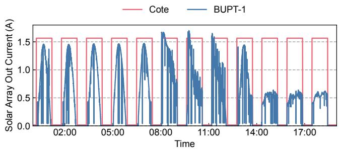

(a) Satellite energy harvesting pattern (cote simulator [13] v.s. real satellite BUPT-1 [2]).  
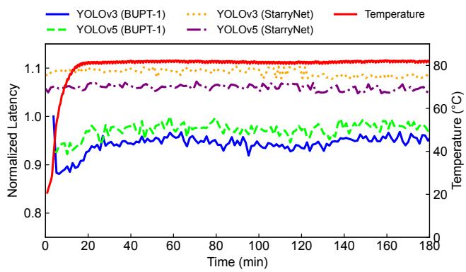  
(b) COTS computation capacity comparison.  
Figure 1: Inaccurate modeling of SOTA emulators.

## 2 Background and Motivation

## 2.1 Research Challenges and Opportunities

While the rise of SCN offers numerous opportunities for the research community, the unique characteristics of satellite platforms and their operating environments present significant challenges for researchers in exploring the architecture and optimization of emerging applications.

Energy and thermal dynamics and constraints. Satellites in space operate under harsh environmental conditions, leading to significant performance degradation compared to those on the ground. Regarding energy, as both energy harvesting capability is influenced by sunlit regions and onboard battery storage is limited, real satellite measurements [2] indicate that the instability in energy supply and limitations on battery discharge depth affect the power available to onboard computing devices, thereby influencing their availability and efficiency. In terms of thermal management, as satellites generally lack active cooling mechanisms to reduce costs, chips can automatically reduce their clock speeds due to thermal throttling. Short-term overheating can reduce the satellite’s computing throughput and prolong task execution latency. Long-term exposure to high temperatures can diminish the reliability and lifespan of COTS devices. As a result, there are opportunities for SCN researchers to consider energy and thermal dynamics and constraints when designing and optimizing SCN applications (e.g., allocate more tasks in sunlit regions and fewer in shadows).

Constellation network dynamics. Different from terrestrial networks, constellation networks in space are highly dynamic. These dynamics manifest in two ways: i) Topology dynamics. The high velocities of satellites relative to each other and to fixed ground stations lead to highly dynamic connectivity and frequent topology changes. As a result, SCN researchers must develop more robust routing schemes [46], topology design [47, 48] and satellite-ground collaboration strategies [19]; ii) Node failure. COTS devices in space are more vulnerable than those on Earth. In addition to cosmic radiation [34], their performance can also be affected by energy and thermal issues, as mentioned above. Recent studies [27, 28] show that malicious network traffic can trigger energy drain attacks on satellites, leading to node failures. Consequently, SCN researchers must address these node failures and their impact on constellation networks.

## 2.2 SCN Emulator Essential Elements

The complex and dynamic operating environment of SCN, combined with the extremely high costs associated with developing a mega-constellation in space, underscores the urgent need for a comprehensive SCN emulator for the research community to optimize constellation-level applications that integrate computing and networking on real satellites. Based on the preceding discussion, a comprehensive emulator should meet the following requirements to mimic the unique characteristics of SCN:

Satellite-level fidelity. A comprehensive emulator should accurately model the operating environment, computational capability, and application performance of individual satellites. This modeling must encompass both the environment and the devices: i) Contextual environmental awareness. The emulator should account for the effects of real satellite operational contexts on applications. For example, energy availability and thermal control should influence computing capacity and efficiency, affecting end-to-end latency in realtime EO applications. ii) Replications of realistic heterogeneous computing devices. The emulator should precisely replicate the computation, storage, and communication capacities of satellite COTS hardware, such as Nvidia’s TX1 and TX2 (CPU+GPU) [49], Xilinx’s Zynq (CPU+FPGA) [3], and Huawei’s Atlas 200DK (CPU+NPU) [2].

Consellation-level fidelity. To emulate constellation networking, the emulator must replicate the complexity and dynamics of entire constellations. This includes the impact of topology changes, satellite-ground communication handoffs, ISL bandwidth, and node failures on network performance.

High usability. The emulator must be highly usable in three aspects: i) scalability to support simulations of extensive satellite constellations containing thousands of satellites while maintaining accurate modeling of each satellite’s performance and inter-satellite networking; ii) flexibility to run real applications and network stack provided by users; iii) accessibility with easy-to-use interfaces and low cost.

<table><tr><td rowspan=3 colspan=1>Category</td><td rowspan=3 colspan=1>Platform</td><td rowspan=1 colspan=6>Fidelity</td><td rowspan=1 colspan=3>Usability</td></tr><tr><td rowspan=1 colspan=4>Satellite-level</td><td rowspan=1 colspan=1>Conste</td><td rowspan=1 colspan=1>Constellation-level</td><td rowspan=2 colspan=1>Scalability</td><td rowspan=2 colspan=1>Flexibility</td><td rowspan=2 colspan=1>Accessibility</td></tr><tr><td rowspan=1 colspan=1>Energy</td><td rowspan=1 colspan=1>Thermal</td><td rowspan=1 colspan=1>Computing Capability</td><td rowspan=1 colspan=1>Software Stack</td><td rowspan=1 colspan=1>Topology</td><td rowspan=1 colspan=1>Network Stack</td></tr><tr><td rowspan=2 colspan=1>Physical Setup</td><td rowspan=1 colspan=1>Live Starlink [5]</td><td rowspan=1 colspan=1>√</td><td rowspan=1 colspan=1>√</td><td rowspan=1 colspan=1>√</td><td rowspan=1 colspan=1>√</td><td rowspan=1 colspan=1>√</td><td rowspan=1 colspan=1>√</td><td rowspan=1 colspan=1>×</td><td rowspan=1 colspan=1>×</td><td rowspan=1 colspan=1>×</td></tr><tr><td rowspan=1 colspan=1>Tiansuan [37]</td><td rowspan=1 colspan=1>√</td><td rowspan=1 colspan=1>√</td><td rowspan=1 colspan=1></td><td rowspan=1 colspan=1>√</td><td rowspan=1 colspan=1>×</td><td rowspan=1 colspan=1>×</td><td rowspan=1 colspan=1>×</td><td rowspan=1 colspan=1>×</td><td rowspan=1 colspan=1>√</td></tr><tr><td rowspan=6 colspan=1>AnalyticalSimulators</td><td rowspan=1 colspan=1>STK [38]</td><td rowspan=1 colspan=1>partial</td><td rowspan=1 colspan=1>×</td><td rowspan=1 colspan=1>×</td><td rowspan=1 colspan=1>×</td><td rowspan=1 colspan=1>√</td><td rowspan=1 colspan=1>×</td><td rowspan=1 colspan=1>√</td><td rowspan=1 colspan=1>×</td><td rowspan=1 colspan=1>√</td></tr><tr><td rowspan=1 colspan=1>GMAT [39]</td><td rowspan=1 colspan=1>×</td><td rowspan=1 colspan=1>×</td><td rowspan=1 colspan=1>×</td><td rowspan=1 colspan=1>×</td><td rowspan=1 colspan=1>√</td><td rowspan=1 colspan=1>×</td><td rowspan=1 colspan=1>√</td><td rowspan=1 colspan=1>×</td><td rowspan=1 colspan=1>√</td></tr><tr><td rowspan=1 colspan=1>SNS3[40]</td><td rowspan=1 colspan=1>×</td><td rowspan=1 colspan=1>×</td><td rowspan=1 colspan=1>×</td><td rowspan=1 colspan=1>×</td><td rowspan=1 colspan=1>√</td><td rowspan=1 colspan=1>for GEO only</td><td rowspan=1 colspan=1>√</td><td rowspan=1 colspan=1>×</td><td rowspan=1 colspan=1>（</td></tr><tr><td rowspan=1 colspan=1>Hypatia [41]</td><td rowspan=1 colspan=1>×</td><td rowspan=1 colspan=1>×</td><td rowspan=1 colspan=1>×</td><td rowspan=1 colspan=1>×</td><td rowspan=1 colspan=1>√</td><td rowspan=1 colspan=1>×</td><td rowspan=1 colspan=1>√</td><td rowspan=1 colspan=1>partial</td><td rowspan=1 colspan=1></td></tr><tr><td rowspan=1 colspan=1>StarPerf 42]</td><td rowspan=1 colspan=1>×</td><td rowspan=1 colspan=1>×</td><td rowspan=1 colspan=1>×</td><td rowspan=1 colspan=1>×</td><td rowspan=1 colspan=1>√</td><td rowspan=1 colspan=1>×</td><td rowspan=1 colspan=1>×</td><td rowspan=1 colspan=1>×</td><td rowspan=1 colspan=1>（</td></tr><tr><td rowspan=1 colspan=1>Cote[13]</td><td rowspan=1 colspan=1>partial</td><td rowspan=1 colspan=1>×</td><td rowspan=1 colspan=1>×</td><td rowspan=1 colspan=1>X</td><td rowspan=1 colspan=1></td><td rowspan=1 colspan=1>×</td><td rowspan=1 colspan=1></td><td rowspan=1 colspan=1>×</td><td rowspan=1 colspan=1></td></tr><tr><td rowspan=3 colspan=1>VirtualizedEmulators</td><td rowspan=1 colspan=1>Celestial [45]</td><td rowspan=1 colspan=1>×</td><td rowspan=1 colspan=1>×</td><td rowspan=1 colspan=1>×</td><td rowspan=1 colspan=1></td><td rowspan=1 colspan=1></td><td rowspan=1 colspan=1></td><td rowspan=1 colspan=1>√</td><td rowspan=1 colspan=1>√</td><td rowspan=1 colspan=1></td></tr><tr><td rowspan=1 colspan=1>StarryNet [43]</td><td rowspan=1 colspan=1>partial</td><td rowspan=1 colspan=1>×</td><td rowspan=1 colspan=1>partial</td><td rowspan=1 colspan=1>√</td><td rowspan=1 colspan=1></td><td rowspan=1 colspan=1></td><td rowspan=1 colspan=1></td><td rowspan=1 colspan=1>√</td><td rowspan=1 colspan=1>（</td></tr><tr><td rowspan=1 colspan=1>RHONE</td><td rowspan=1 colspan=1>√</td><td rowspan=1 colspan=1>√</td><td rowspan=1 colspan=1>√</td><td rowspan=1 colspan=1></td><td rowspan=1 colspan=1></td><td rowspan=1 colspan=1></td><td rowspan=1 colspan=1></td><td rowspan=1 colspan=1>√</td><td rowspan=1 colspan=1></td></tr></table>

Table 1: Comparison of different platforms/simulators/emulators.

## 2.3 Limitations of Existing SCN Emulators

Although many simulators/emulators have been proposed in recent years [38, 39, 40, 41, 42, 13, 44, 45, 43], as shown in Tab. 1, they fall short of meeting all these requirements, particularly in accurately modeling the operational context’s impact on networking and computing performance.

Physical setups. Commercial satellite constellations [5] and open-sourced experimental satellite platforms [37] with physical setups offer the highest fidelity for both individual satellites and constellations. However, commercial platforms do not provide researchers with experimental interfaces. Open-source platforms allow some experimentation, but lack support for freely running user-defined applications and face scalability limitations tied to constellation size.

Simulators. To address the issues of scalability, flexibility, and accessibility, the research community has turned to the development of analytical simulators [38, 39, 40, 41, 42, 13]. These simulators rely on theoretical modeling without real software and network stacks, limiting their ability to simulate the actual behavior of computing or networking devices. Additionally, most of them also do not allow users to run custom applications or algorithms.

Emulators. This widening gap highlights the growing need for emulators [44, 45, 43] that incorporate virtual environments (e.g., containers or virtual machines), thus enabling real system/network stacks to maintain system fidelity. However, due to the lack of real in-orbit data from COTS devices on satellites, even the current state-of-the-art (SOTA) solutions struggle to accurately replicate the actual environmental context, including energy and thermal influences, as well as the characteristics of onboard computing devices.

Motivating examples: low emulation fidelity. We analyze the power, thermal, and computing capacity dynamics of COTS devices onboard with the open-source dataset from an in-space satellite BUPT-1 [2] running DNN inference tasks on a Raspberry Pi. The dataset includes telemetry data of power, temperature, and onboard tasks. With this groundtruth data, we highlight two motivating examples that illustrate the limitations of existing SOTA emulators in achieving high-fidelity emulation of individual satellites: i) Inaccurate power model. Cote [13], the SOTA satellite computing simulator, provides a power model for individual satellites. We compare it with the actual satellite harvested power trace, as shown in Fig. 1a. The power model in Cote assumes the harvested power in the sunlit region to be constant. In reality, the harvested power varies with the satellite’s position, attitude, placement of solar panels, and the satellite’s orientation. An inaccurate power model fails to simulate the effects of power fluctuations on computing or networking devices, such as reduced availability during power shortages, which Cote does not accurately represent. ii) Inaccurate computation capacity. StarryNet [43], the SOTA satellite networks emulator, uses Docker containers to emulate computing devices on individual satellites. We replicate the onboard DNN inference experiments within a container of StarryNet and compare the inference latency with those obtained from Raspberry Pi on BUPT-1. As shown in Fig. 1b, the execution latency of an application in its containers deviates significantly from that of an in-orbit COTS device. The YOLOv3 and YOLOv5 execution latency fluctuations of onboard chips are 330% and 160% larger than emulated, respectively. The application’s average latency in the container differs by up to 15% compared to the real in-orbit COTS devices. Moreover, StarryNet fails to simulate the increase in inference latency caused by chip throttling due to overheating (initial 25 min in Fig. 1b). These inaccuracies arise because StarryNet simulates devices’ capabilities by adjusting CPU core counts and frequencies. However, this method does not capture the inherent characteristics of COTS devices, which are often heterogeneous (e.g., Jetson TX2’s CPU + GPU). Additionally, COTS devices and containers operate on different computing architectures, leading to different performance.

## 3 RHONE Overview

We present RHONE, a comprehensive SCN emulator meeting all requirements discussed in §2.2. As shown in Fig. 2, the emulation process of RHONE consists of two phases: Offline Model Building (§4) and Online Emulation (§5). In the model building phase, RHONE initially constructs power, thermal, computation, orbit, and network models offline using telemetry and experimental data collected from real satellites and onboard COTS devices. These models replicate the complex and dynamic SCN environment, effectively mirroring the behavior of onboard chips. In the emulation phase, RHONE deploys these pre-built models into software containers to emulate each satellite node and their interactions. This two-phased design ensures high-fidelity emulation of individual satellites while scaling to the constellation level at a low cost. Users can interact with the system via monitoring and control APIs to run custom applications.

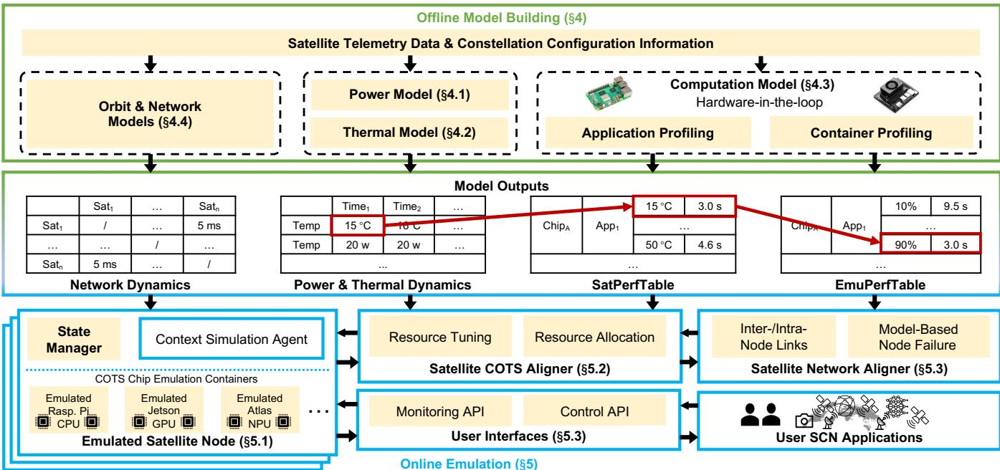  
Figure 2: RHONE system overview. The red lines illustrate the query process of the resource allocation scheme.

## 4 Offline Model Building

In this section, we propose and build the power, thermal, computation, orbital, and network models of RHONE to replicate the computation and communication capacities of individual satellites, based on real telemetry and profiling experiments conducted on devices.

## 4.1 Power Model

As discussed in §2.1, energy dynamics is a critical factor affecting satellite computing performance. We first collect a complete set of power telemetry data from a satellite (Fig. 3), including time series of current and voltage from the solar panels and all onboard electrical components. This dataset is sufficient for building the power models because it contains energy behaviors for all orbital working modes of the satellite (e.g., Earth-pointing, Sun-pointing, etc.) during approximately 2,000 orbital cycles. Our principle is to identify general patterns of energy behavior from this dataset and build our power model. Users with satellite power telemetry can also adopt our method to fine-tune their own models.

## 4.1.1 Energy Harvester

Most LEO satellites regularly transition between sunlight and eclipse during their orbit, leading to cyclical energy harvesting. Additionally, the power harvested in sunlight varies dynamically, as illustrated in Fig. 1a, due to factors such as the satellite’s movement and changes in its working mode. To emulate this energy-harvesting process, we adopt a widely used power model as in [29, 30, 50, 51]:

$$
P _ { h } = S \times \eta \times I _ { d } \times L _ { d } \times A \times \cos \theta ,\tag{1}
$$

where $P _ { h }$ represents the harvested power, such power is determined by the solar constant flux density S, the efficiency of the individual solar cells η, the inherent degradation $I _ { d } ,$ the lifetime degradation $L _ { d } ,$ , the panel area A, and the cosine loss cos θ . The angle θ is the angle between the solar panel norm and the direction of the incoming sunlight, as shown in Fig. 3. It is primarily influenced by the satellite’s orbit, geometry, the installation orientation of the solar panels, and the satellite’s pointing direction. Our energy-harvesting emulation method is straightforward but effective, the accuracy of Eqn. 1 is evaluated in §7.2.2.

## 4.1.2 Energy Consumer

Most satellite subsystems, including the electrical power system, propulsion, guidance, attitude and orbit control, and avionics, consume electrical power. The COTS devices, acting as the computing payload, share a power supply with these systems. To determine the available electrical energy for the computing payload, it is essential to accurately characterize the power consumption of other subsystems.

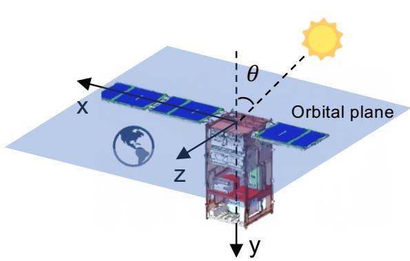  
Figure 3: Satellite position and angle θ .

Working and power consumption patterns. In RHONE’s power model, we analyze component-level power consumption and operational behavior using real satellite telemetry data, specifically current and voltage readings from various components. While components have different power shares, they follow two working patterns and two powerconsumption patterns, which innovate our modeling of onboard power consumption. i) Working pattern. Onboard components’ working patterns can be classified into two types: continuous operation and intermittent operation. Components with continuous operation, typically part of the satellite’s platform system, support the satellite’s normal functioning, such as the magnetic torque system. In contrast, components with intermittent operation are activated only during specific tasks, like the X-band communication component. ii) Power-consumption pattern. A component’s power consumption can be categorized into Markov-based (Fig. 4a) and function-based patterns (Fig. 4b). Next, we detail both patterns of power consumption modeling.

Markov-based power consumption pattern. Components with a Markov-based power consumption pattern switch randomly between several power levels, resembling a Markov chain [52]. For example, the magnetic torquer switches between three power levels, as shown in 4a. To model such components, we perform clustering analysis on the power telemetry data to identify the power levels and use their occurrence probabilities to generate each power value over time. This process reveals the underlying Markov chain and its accuracy is evaluated in §7.2.2.

Function-based power consumption pattern. Some components’ power consumption patterns can be modeled by specific functions, such as the X-band and computing devices. The X-band component is responsible for highspeed data downlink and receiving control commands from ground stations once the connection is established. As shown in Fig. 4b, the X-band transitions between two states: idle (approximately 4W) and active (approximately 14W). This behavior follows the classic radio link power model [27, 53, 54], which can be expressed as:

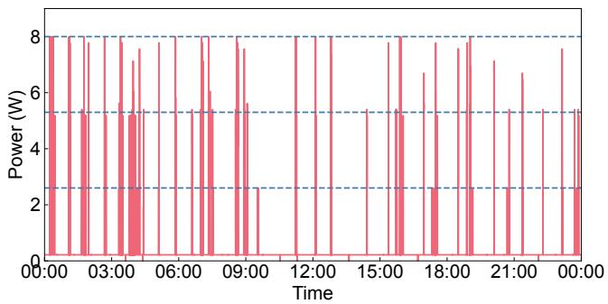

(a) Markov-based pattern with three levels (magnetic torque).  
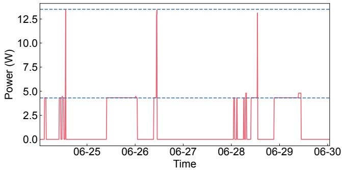  
(b) Function-based pattern with idle and active states (Xband).  
Figure 4: Energy consumption patterns.

$$
P _ { \mathrm { t r } } ( t ) = { \left\{ \begin{array} { l l } { P _ { \mathrm { t r } } ^ { \mathrm { i d l e } } } & { { \mathrm { i f ~ } } t \in { \mathrm { i d l e ~ s t a t e } } , } \\ { P _ { \mathrm { t r } } ^ { \mathrm { a c t i v e } } + w _ { \mathrm { t r } } d r _ { \mathrm { t r } } } & { { \mathrm { i f ~ } } t \in { \mathrm { a c t i v e ~ s t a t e } } , } \\ { 0 } & { { \mathrm { o t h e r w i s e } } . } \end{array} \right. }\tag{2}
$$

where $P _ { \mathrm { t r } } ^ { \mathrm { i d l e } }$ is idle power, $P _ { \mathrm { t r } } ^ { \mathrm { a c t i v e } }$ is baseline power in active stage, $w _ { \mathrm { t r } }$ is a link-specific constant, and $d r _ { \mathrm { t r } }$ is link data rate.

For COTS computing devices, we leverage the insight that their power consumption is influenced by: i) the operational frequency regulated by the device and ii) the temperature [55]. The power model can be formulated as [56],

$$
P _ { c } = P _ { s } ( f ) + U \cdot P _ { d } ( f ) + P _ { l } ( T _ { \mathrm { h o t t e s t } } ) ,\tag{3}
$$

where $f$ represents the processor frequency, U is the processor utilization, $T _ { \mathrm { h o t t e s t } }$ represents the temperature of the hottest spot on chip, Ps is the idle power, $P _ { d }$ is the dynamic power, and $P _ { l }$ is the leakage power. We use our telemetry data to tune the parameters of our power model and evaluate the model accuracy in §7.2.2.

## 4.2 Thermal Model

Unlike proactive cooling methods (e.g., fans, water-cooling) on the ground, many cost-effective small satellites rely on passive cooling methods that depend on thermal conduction and radiation [57]. The in-orbit temperature of COTS computing devices significantly impacts their computational performance. Therefore, in RHONE, we primarily develop a thermal model for computing devices, as shown in Fig. 5. RHONE’s thermal model focuses on the chip temperature, which directly affects computing efficiency and reliability.

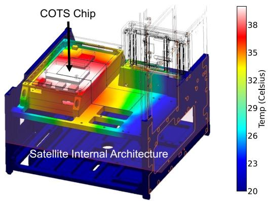  
Figure 5: FEA-based thermal model illustration.

FEA-based thermal model. Simulating temperature variations in computing devices ideally requires real satellite data, but varying heat dissipation across different devices makes profiling costly and non-scalable. Ground-based simulations, including thermal vacuum tests, struggle to replicate external heat flux and structural thermal conduction. To overcome this, we use Finite Element Analysis (FEA) in SolidWorks [58] to model the satellite’s thermal environment and heat transfer. FEA offers scalable and accurate thermal dynamics modeling, widely used in satellite engineering for designing and evaluating thermal control systems [59, 60].

The computing payload primarily dissipates heat through thermal conduction via the mounting structure. In FEA based thermal conduction simulation, the input includes the satellite’s internal temperature and the energy consumption trace from the power model. The output is the chip temperature distribution over time. The thermal conduction equation used in these simulations is:

$$
\rho c { \frac { \partial T } { \partial t } } = \nabla \cdot \left( k \nabla T \right) + q ^ { \prime \prime \prime }\tag{4}
$$

where $\rho$ is the material density, c is the specific heat capacity, T is the temperature vector of the chip region, t is the time, k is the anisotropic thermal conductivity, q′′′ is the local volumetric heat generation rate (i.e., the total amount of heat generated per unit volume), primarily due to internal heat sources such as electronic components.

The FEA model uses a piecewise-smooth approximation for the temperature field. It models heat transfer in two main ways: (i) internal conduction within component domains (e.g., chips), where Eqn. 4 applies and the ∇ · (k∇T ) term describes anisotropic heat conduction; and (ii) heat transfer from chips to the satellite chassis and structure, modeled through physical interfaces (e.g., thermal pads, structural contact). External thermal loads on the satellite (e.g., orbital solar flux, albedo) and system-level thermal context are incorporated via a boundary anchoring strategy, using interface temperatures as empirical boundary conditions. This applies appropriate thermal boundary conditions to the model’s exterior surfaces and relevant interfaces, efficiently accounting for the broader thermal environment.

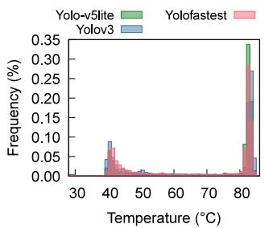  
(a) Raspberry Pi

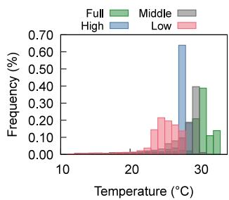  
(b) Atlas 200 DK  
Figure 6: Temperature distribution of COTS devices under computing load.

Then, time discretization is carried out using an implicit method [61], ensuring stability and convergence. The temperature update equation is:

$$
( M + \alpha \Delta t K ) T _ { n + 1 } = M T _ { n } + \alpha \Delta t q ^ { \prime \prime \prime }\tag{5}
$$

where M is mass matrix which represents thermal inertia of model, α is a coefficient, typically set to 0.5 or another appropriate value, ∆t is the time step, K is Stiffness Matrix which describes the heat transfer efficiency, $T _ { n }$ and $T _ { n + 1 }$ are the temperature vectors at the current and next time steps. By integrating these steps, the thermal model accurately depicts the temperature distribution within the satellite.

Note that application workloads interact with the thermal model in two ways: (i) Workload drives utilization, determining chip power consumption (Eqn. 3), which serves as thermal model input. (ii) Application performance is determined by the output temperature of the thermal model.

## 4.3 Computation Model

The computation model for a COTS chip uses the current temperature to estimate the performance (execution latency) of user-defined applications. This estimation facilitates the alignment of computing performance from ground-based emulation to in-space satellites.

Challenge: heterogeneity of COTS device performance. To understand satellite COTS devices’ performance, particularly under overheating, we conduct in-space experiments that complement the measurement study in [2], using a Raspberry Pi and Ascend Atlas 200 DK to run image recognition workloads. The Raspberry Pi runs YOLOv3 [62], YOLOv5lite [63], and YOLOfastest [64] for 90 minutes each, while the Atlas runs YOLOv3 under four power settings (Full, High, Medium, Low) for 30, 60, 60, and 90 minutes. Data on temperature distribution (Fig. 6) and model inference latency (Fig. 7) reveal two levels of heterogeneity: Device-level heterogeneity. The two chips exhibit different average performance, given their differing architectures. For the same model, YOLOv3, the Raspberry Pi and Atlas show varying latency (Fig. 7a). Moreover, they respond differently to overheat-induced performance degradation. The Raspberry Pi shows increased latency for YOLOv3 and YOLOv5lite above 80°C (Fig. 7a), while the Atlas maintains stable latency (Fig. 7b) across its temperature range (Fig. 6b); Application-level heterogeneity. Different applications also react uniquely to overheating. On the Pi, YOLOv3 and YOLOv5lite experience increased latency above 80°C, but YOLOfastest does not (Fig. 7a). Such device- and application-level heterogeneity necessitate tailored modeling for each device and application. To model the computation performance of satellite COTS devices, one intuitive method is to directly set up real COTS devices and execute various applications on them during emulation. However, the challenges of replicating satellite thermal environments on the ground, coupled with inflexibility and high costs, make this impractical. Instead, RHONE adopts a hardware-software codesigned approach: it integrates real COTS devices into the computation model and mirrors them using software containers at scale, maintaining both fidelity and scalability.

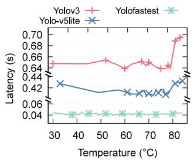  
(a) Raspberry Pi

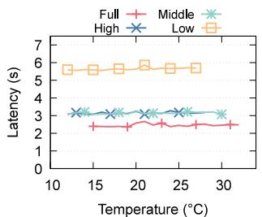  
(b) Atlas 200 DK  
Figure 7: Task latency of COTS computing v.s. Temperature (on Satellite).

Observation: chip overheat can be mimicked on Earth. Our design is based on the key observation that although the space environment differs from that on the ground, the performance of COTS devices, especially the degradation due to overheating can be mimicked on Earth. The rationale is straightforward: overheating leads to performance degradation, and at the same temperature, both satellite and groundbased COTS chips should experience similar degradation. Note that we focus on short-duration tasks (e.g., object detection) where single executions induce negligible temperature changes, which are typical for satellite in-orbit computing. We validate the observation by conducting Earth-based experiments using the same COTS chips as those deployed on satellites, with their cooling fans removed to simulate the absence of active cooling in space. We cyclically stress each chip by repeatedly executing a specific task until thermal throttling occurs, then cool it, and repeat, while each task execution records temperature and execution latency. We observed that the performance degradation closely mirrors that of in-space conditions under temperatures equivalent to those encountered in space as shown in Fig. 6. As shown in Fig. 8, the relative error of task execution latency between inspace and on-the-ground devices is relatively small for most workloads, demonstrating that our Earth-based setup accurately reflects satellite performance under overheating. Note that Pi-YoloFastest’s high speed and large random error resulted in a large relative error. Atlas YoloV3Full also showed high relative error, though we believe better space-simulating thermal vacuum experiments could improve this.

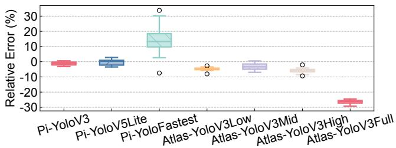  
Figure 8: Relative error of task execution latency between in-space and on-the-ground COTS devices.

Hardware-in-the-loop chip mirroring. Such observation inspires us to integrate actual COTS chips without cooling fans into RHONE to gather detailed performance data across various temperatures. Specifically, when a user registers an application to be run on a particular in-orbit chip, RHONE first profiles the application using the aforementioned cyclic stressing method, generating a satPerfTable that records the application execution latency on the chip at varying temperatures. Next, to mirror the specific COTS chip using software containers, we perform a similar profiling process within the container. This involves adjusting resource constraints, such as CPU and GPU shares, to collect the container’s performance under various resource allocations. This generates an emuPerfTable that records the application latency under different container resources allocated. The satPerfTable and emuPerfTable are then used by the SCA to accurately replicate in-space COTS chip performance accordingly (§5.2). The computation model accuracy is evaluated in §7.2.4.

## 4.4 Orbit and Network Models

The orbit and network models of RHONE are similar to existing studies [65, 43]. Based on the highly predictable satellite orbital operation, the orbit model calculates each satellite’s real-time position at any given time from user-defined constellation and orbit configurations. The network model then utilizes the position data to derive network connectivity by calculating the visibility and signal propagation delay of AllocationTuningISLs and GSLs, providing the foundation for replicating the link performance of real satellite constellations. Additionally, RHONE also computes the real-time positions of Earth and the Sun relative to the satellite, which is passed to the power model to estimate energy harvesting current intensity.

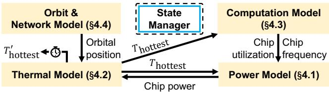  
Figure 9: Model interaction in RHONE online emulation.

## 5 Online Emulation

During the online emulation phase, RHONE leverages the models built in the offline phase (§4) to manage system resources and replicate the SCN environment.

## 5.1 Emulated Satellite Nodes

In RHONE, each satellite node is represented by a state manager and a set of Docker containers each representing a chip on the satellite, either representing a COTS computing chip. State manager. The state manager is responsible for managing the satellite’s emulation states, serving as the central point for interactions. A context simulation agent interfaces with pre-established models (§4) that capture the satellite’s physical and operational characteristics. It continuously fetches the generated traces including energy harvesting and consuming, temperature condition variation, network connectivity and properties from the orbit and network models, and COTS hardware performance data from the computation model from the data store. RHONE coordinates nested interaction of the models iteratively (Fig. 9). For example, the power model reads current chip temperature $T _ { \mathrm { h o t t e s t } } .$ , and outputs the chip power value, which is then used by the thermal model to derive $T _ { \mathrm { h o t t e s t } } ^ { ' } ,$ the new chip temperature value of next time step. Additionally, the agent handles incoming commands and monitoring requests through user API, executing commands to alter the satellite’s states and providing real-time status updates as needed. By maintaining an accurate representation of the satellite’s current state, the state manager relays critical information to the COTS chip emulation containers, ensuring that the emulation remains consistent with the satellite’s operational context.

COTS chip emulation containers. These containers are designed for emulating COTS computing hardware typically equipped on modern satellites, such as Raspberry Pi [2], Jetson [66, 14], or NPUs [2]. Each container reflects the performance of its corresponding chip under various conditions by operating with computing resources dynamically adjusted by the satellite COTS aligner (§5.2) based on the current physical state. For instance, an ARM CPU is represented by a CPU container, while a GPU container models hardware like NVIDIA Jetson GPU or Huawei Atlas NPU. This structure, using containers with dynamic computation resources instead of hardware-based emulation, offers flexibility and scalability with low cost. Additionally, the accuracy is ensured through precise modeling of chip performance and careful handling of resource constraints.

## 5.2 Satellite COTS Aligner

We design the satellite COTS aligner (SCA) to dynamically Inter-/Intra- Model-Basedalign the performance of emulated COTS hardware under emulated satellite conditions, based on offline modeling of atellite Network Aligner (§5.3)real satellite COTS chips (§4.3), and current temperature given by the thermal model (§4.2). It adjusts resource allocations in real-time to ensure the emulated environment accurately reflects the satellite hardware’s behavior.

Resource allocation. Upon invocation, SCA uses the outputs from pre-built models to map the current chip temperature to application execution latency. As illustrated in Fig. 2, SCA first retrieves the current chip temperature, calculated by the thermal model $( e . g . , 1 5 ^ { \circ } \mathrm { C } )$ . It then finds the corresponding execution latency in the satPerfTable, as determined by the computation model (e.g., 3.0 s). Using this expected latency, SCA queries the emuPerfTable to determine the required resource allocation (e.g., 90%) in the container, ensuring accurate performance replication.

Dynamic resource tuning. With the determined resource allocation scheme, SCA adjusts the container’s CPU/GPU share to match the satellite’s expected performance. This adjustment is based on the assumption that the computational power of satellite COTS hardware is weaker than that of ground servers (e.g., the satellite’s CPU is weaker than a server’s CPU, and its NPU/GPU is weaker than a server’s GPU). Therefore, we can slow down the ground server’s CPU and GPU by limiting their resources, bringing their performance closer to that of the satellite’s COTS hardware.

For CPU resource tuning , SCA works by adding the process to a certain cgroup, and periodically adjusting the cgroup’s configured CPU share value, which artificially and accurately controls latency. For GPU adjustment, SCA dynamically manages and limits GPU performance by intercepting CUDA driver API calls and monitoring activity. RHONE initializes a rate limit manager that reads GPU performance thresholds from a configuration file. During each CUDA call, a rate limiter checks GPU usage against these thresholds and applies delays if the usage exceeds the limit.

## 5.3 Satellite Network Aligner

RHONE utilizes Docker networks to emulate complex networking scenarios, including variable latency, fluctuating bandwidth, and dynamic network topologies. The Satellite Network Aligner (SNA) inherits StarryNet [43] to manage the docker network, aligning its configuration and thus performance to the orbit and network model (§4.4). Moreover, we introduce two features beyond StarryNet, enabling a more accurate and realistic emulation of SCNs.

<table><tr><td>Satellite Num.</td><td>CPU Usage Mean (%)</td><td>CPUUsage Std.Var.(%)</td><td>MemoryUsageMean (%)</td><td>MemoryUsage Std.Var. (%)</td><td>Setup Time (min)</td></tr><tr><td>172</td><td>12.1/18.3</td><td>14.7/33.1</td><td>8.9/10.3</td><td>0.1/1.5</td><td>15.1/5.1</td></tr><tr><td>348</td><td>23.7 / 27.5</td><td>31.1 /38.8</td><td>13.5 / 16.7</td><td>0.2/3.0</td><td>19.8 /7.8</td></tr><tr><td>720</td><td>37.7 /42.7</td><td>35.6 /39.5</td><td>24.5 /33.3</td><td>0.5 / 8.5</td><td>42.2 / 17.1</td></tr></table>

Table 2: Emulation capability of RHONE compared to StarryNet [43]. X/Y indicates the performance of RHONE/StarryNet.

Granular satellite node representation. In StarryNet, each satellite node is represented by a single container. This oversimplifies the satellite’s structure, beacuse a satellite typically consists of multiple COTS devices communicating with each other. In RHONE, we represent each satellite node with multiple containers (§5.1), each representing a COTS computing device, thus enabling granular network emulation involving internal communications between the multiple SoCs within a satellite. RHONE also allows users to designate a certain container to represent the on-board computer (OBC), which sends/receives data to/from outside the satellite, and communicates with multiple COTS chips.

Model-based node failure. Additionally, StarryNet uses a random approach to emulate node and link failures. In RHONE, the SNA take a more controlled approach by emulating node failures, shutdowns, or other behaviors based on detailed power and thermal models (§4.2). Rather than randomly disrupting inter-satellite communications, RHONE accurately emulates the consequences of power shortages, overheating (e.g., shutdown the COTS devices at low battery level or high temperature), and other operational challenges, resulting in a more realistic and reliable network emulation.

## 5.4 User Interfaces

RHONE provides two types of runtime APIs for user interaction: Monitor APIs and Command APIs.

Monitor APIs allow users to track the real-time status of satellite nodes and networks. This includes monitoring physical states such as temperature and energy levels, the load on COTS computing hardware, and the status of satellite network links (e.g., routing tables and connection states).

Command APIs offer users the capability to dynamically modify the state of the satellite nodes and the constellation. Through these, users can change operational modes, modify the connectivity of inter-satellite links or satellite-to-ground links, and initiate specific tasks on a satellite, such as running an application on its onboard COTS hardware.

## 6 Implementation

We now highlight the key aspects of RHONE ’s implementation, detailing the foundational offline model building phase and the subsequent online emulation phase.

Offline model building. We prototype RHONE using telemetry data from real satellites, sourced from both an open-source dataset [2] and our own measurements. We use some commercial (e.g., SolidWorks) and open-source software (e.g., PyBaMM) to run the offline emulation process to build the power, thermal, and computation model. We use two common COTS hardware for performance tests while building the computation model: a Raspberry Pi 4B and a Huawei Ascend Atlas 200 DK, both without cooling fans. We use a program-controlled thermoelectric cooler [67] to simulate colder environments when needed.

Online emulation. RHONE coordinates all models using Python Requests API. The SCA uses cgroups to limit CPU resources, and TGS [68] for GPUs. Network connections between nodes are managed using the docker network architecture in StarryNet [43]. The core components of RHONE are implemented in about 4500 lines of Python/C# code.

## 7 Emulation Evaluation

## 7.1 Scalability

## 7.1.1 Experimental Setup

To evaluate the scalability of RHONE, we perform constellation emulations on an enterprise server with both RHONE and StarryNet [43]. Our server is equipped with two Intel Xeon E5-2670 v3 processors, 64GB of DDR4 RAM, 435 GB of disk storage, meeting the requirements of StarryNet.

## 7.1.2 Results

Performance. As Tab. 2 shows, RHONE supports elastic scaling for large constellations. We demonstrate this by using RHONE to deploy constellations of 172, 348, and 720 satellites, which corresponds to the S3 shell of Starlink, on a single physical machine. This exhibits scalability comparable to StarryNet’s performance on a single node. When a multi-node cluster is enabled, RHONE is expected to scale to constellations consisting of thousands of satellites.

System overhead. RHONE exhibits comparable or even lower system overhead in terms of CPU and memory usage. As Tab. 2 shows, CPU and memory usage scale with constellation size, with average CPU usage increasing from 12.1% for 172 satellites to 37.7% for 720 satellites. Similarly, memory usage rises from 8.9% to 24.5% across the same constellation sizes. Notably, these values are consistently comparable to or lower than those observed with StarryNet. This is because RHONE shifts modeling to the offline model-building phase and uses lightweight agents to interact with pre-defined models, resulting in negligible overhead.

Setup time. RHONE exhibits longer setup times than StarryNet due to the calculation of environmental (e.g., energy and thermal) traces and the profiling of COTS computation during the offline phase. Once the setup is completed, the pre-built models can be loaded for subsequent emulations.

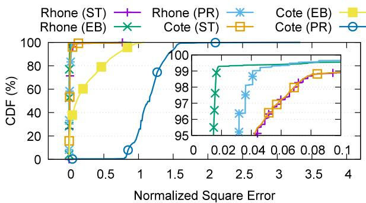  
Figure 10: Energy harvesting accuracy.

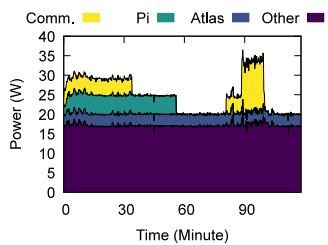  
(a) Real satellite trace.

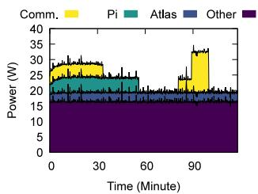  
(b) RHONE generated trace.  
Figure 11: Energy consumption accuracy.

## 7.2 Fidelity

## 7.2.1 Experimental Setup

To evaluate the emulation fidelity of RHONE in power, thermal, and computation capacity. We conduct our evaluation on two enterprise servers, each equipped with two Intel Xeon E5-2470 v2 processors, 32 GB of DDR4 RAM and 557.9 GB of disk storage. We launch a 25-satellite constellation in a 5 × 5 grid at 550 km to evaluate RHONE’s generated power and temperature traces and computing performance. We use real telemetry data from BUPT-1 and another satellite as ground truth, Cote [13] and StarryNet [43] as baselines.

## 7.2.2 Power Model Fidelity

Energy harvesting. We evaluate RHONE’s energy harvesting behavior by comparing its generated solar array output currents with real data collected from the BUPT1 satellite, alongside a baseline model, CoteSim [13]. We generate 1.5-hour traces for three satellite attitudes: Sun-Targeted (ST), Earth-Backed (EB), and Plane-Rotating (PR) calculate the normalized square error (NSE) between emulated results and ground truth. As shown in Fig. 10, RHONE shows much higher accuracy, especially for EB and PR scenarios where CoteSim’s direct solar alignment assumption does not hold. Specifically, RHONE reaches 0.05 NSE at the 99th percentile, outperforming CoteSim (over 1.5 NSE at the 90th percentile) in the PR scenario. These demonstrate RHONE’s ability to accurately mimic the energy harvesting behavior of real satellites. Note that both RHONE and CoteSim exhibit long-tail NSEs due to inevitable inaccuracies in orbit calculations. These errors affect the precise timing of satellite transitions between sunlight and eclipse in emulation, which in turn leads to inaccuracies in energy harvesting.

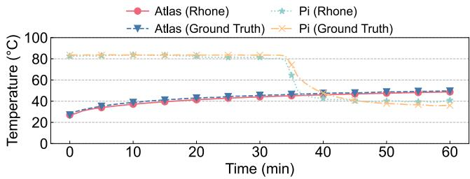  
Figure 12: Temperature accuracy.

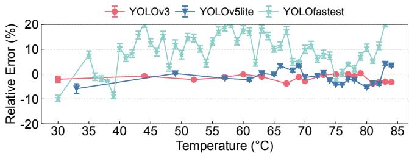

(a) Raspberry Pi  
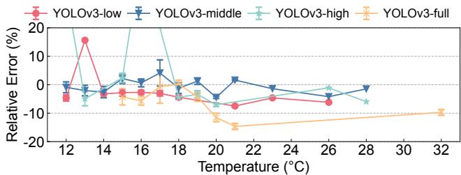  
(b) Atlas 200 DK  
Figure 13: Computation accuracy.

Energy consumption. We compared RHONE’s energy consumption component with the actual consumption trace collected from the BUPT1 satellite. To provide a clear view of the power consumption of each component, we show the stacked power usage of different components in Fig. 11. Overall, the models for each component closely simulate the real power trace. Specifically, Comm. refers to communication components like X-band, with an average error of 3.0%; Pi and Atlas are the COTS devices on board, with an average 3.5% and 3.8% error, respectively; Other represents all other always-on components with Markov-based consumption pattern, with an average error of 4.1%. Such results demonstrate that RHONE can accurately mimic the energy consumption behavior of real satellites, which indirectly influences the performance of onboard COTS devices.

## 7.2.3 Thermal Model Fidelity

To evaluate RHONE’s thermal model, we use the internal architecture temperature of BUPT-1 and the power consumption trace of the onboard COTS devices as the input of our thermal model. We compare the temperature of emulated COTS devices with that of the real satellite. As Fig. 12 shows, the temperature series of the mirrored chip in RHONE closely matches that of the in-orbit chip, both in terms of values and trends, validating RHONE’s accuracy in predicting thermal effects under operational loads, with an average error of $2 . 5 ^ { \circ } \mathrm { C }$ and $1 . 3 ^ { \circ } \mathrm { C }$ for Pi and Atlas, respectively.

## 7.2.4 Computation Model Fidelity

To demonstrate RHONE’s ability to accurately mimic the computational capacity of onboard chips, we run various DNN applications (YOLOv3-Full/High/Medium/Low, YOLOv5lite, YOLOfastest) from the BUPT-1 open-source dataset [2] on mirrored Raspberry Pi and Atlas 200 DK devices in RHONE with different temperatures. We then compare the inference latency of the emulated results with realworld traces. We show the relative error in Fig. 13, the markers represent the mean, while the upper and lower bounds indicate the standard deviation as we repeat the experiment multiple times. The mean relative error of both Pi and Atlas remains below 5% in most cases with low variations, indicating that RHONE can accurately reflect the impact of thermal throttling on computation capability.

Note that some rare cases exhibit high relative errors (e.g., Atlas running YOLOv3-high at $1 6 ^ { \circ } \mathrm { C } ,$ and Pi running YOLOfastest). We summarize two possible reasons: i) RHONE mirrors COTS chips using on-the-ground profiling data, introducing minor absolute errors compared to the actual latency experienced in space, as shown in Fig. 8. This can be mitigated by thermal vacuum experiments strictly aligned to space, or directly integrating in-orbit satellites to profile the tasks, but both incur high costs and scalability issues; ii) Some workloads have short latency (e.g., YOLOfastest completes within 40 ms). Therefore, a small absolute error in emulated inference latency results in high relative errors. This can potentially be addressed by finer-grained container resource tuning, but at the cost of non-trivial scheduling overhead from dynamic quota adjustments.

## 8 Use Cases

## 8.1 Satellite Energy Drain Attack

As satellites have limited energy resources, recent studies [27, 28] have explored the effects of energy drain attacks and heavy loads on satellite networks. This combines the emerging focus on satellite-specific network security [69] with longstanding challenges in satellite power management [70, 71]. Using RHONE, we emulate an energy drain attack, demonstrating its strength in accurately modeling energy constraints and evaluating network resilience.

Experiment Setup. The experiment involves a constellation of 720 satellites arranged in a 36×20 mesh grid at an altitude of 550 km. To simulate the attack or burst heavy loads, a target satellite is selected to be the victim, and botnets are used to send bulk traffic through it. The effects are tested through daylight (sun side) and night (shadow side) conditions.

Observations. We present the battery level (state of charge) and the network bandwidth of the victim satellite during the attack in Fig. 14. Our emulation process reveals two key events: i) Rapid energy drain under heavy load. The saturated link imposes substantial computation overhead on COTS devices for routing and switching from the onset of the attack, leading to a rapid battery drain. The battery level reaches the safety threshold (60%), prompting the onboard system to forcibly shut down the COTS device, signaling a successful attack. Note that satellites are more vulnerable to such attacks at night, as they experience accelerated energy depletion due to the lack of solar power. ii) Abrupt network performance drop. The sudden shutdown of onboard COTS devices causes an immediate bandwidth drop to 0. The bandwidth returns to a normal level (similar to that of BUPT-1) once the devices recover from recharging. Such observations highlight the energy concern for future SCN research, including energy-aware SCN task scheduling, traffic load balancing, and energy-related security issues.

## 8.2 Real-Time Earth Observation

Earth observation constellations (e.g., Planet Dove constellation [11] with 150 satellites) are actively performing Earth imaging tasks. Given the limited bandwidth and computation capacity of satellites, recent studies [72, 73, 14, 74, 75, 76, 15, 13, 66, 19, 77] have explored novel and efficient strategies for in-orbit processing and data transmission. We emulate real-time earth observation in RHONE, highlighting its strength in replicating processing and transmission constraints for strategy evaluation.

Experiment Setup. We launch a 150-satellite constellation at 550 km, with each satellite having a maximum data transmission capability of 200 Mbps. This configuration replicates the constellation of Planet Dove [11], an operational SatEO project. These satellites capture images and process them with four transmission methods: (i) Direct: transmit the raw image immediately; (ii) Compress: compression the image with three quality levels (Q = 75, 50, 25); (iii) Detect: detect objects with YOLOv3 and transmit the objects; (iv) Reasoning: convert image content to text and transmit the results. We capture 2000 images and transfer data via FTP.

Observations. We present the bitrates of data transmission, the power consumption of the computing device (Atlas 200 DK) and communication (XBand) hardware, and the satellite battery levels in Fig. 15. Our emulation reveals two key observations: i) Link usage reduction. In-orbit processing before image transmission can significantly save communication bandwidth by reducing both link usage time and required bandwidth. Specifically, image compression, object detection, and model inference can decrease link usage by

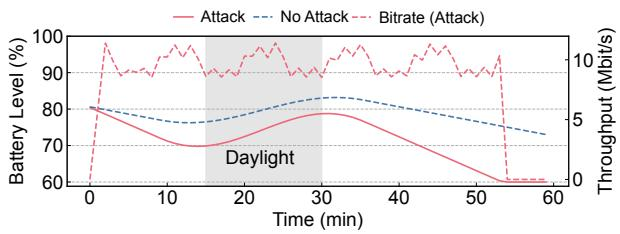  
Figure 14: Energy drain attack emulation.

0.3×, 0.8×, and 0.99×, respectively, compared to direct image transmission. ii) Energy consumption tradeoffs. While onboard object detection and reasoning tasks require significantly more computational power than compression tasks, the reduced data transmission size leads to lower communication power consumption. Therefore, performing certain image inference tasks before transmission in SatEO applications is beneficial for both bandwidth reduction and energy conservation. These observations underscore the trade-offs between computation and communication resources in SCN research, especially in-orbit computing for EO tasks.

Model extendability. While some models in RHONE are built based on telemetry and experimental data from two COTS devices, RHONE allows users to replace or extend models as needed. To expand existing power or thermal models, users can apply the modeling methods provided by RHONE to telemetry data from other satellites or determine model parameters accordingly. Users can also use the hardware-in-the-loop chip mirroring method provided in the computation model to incorporate their own COTS devices.

## 9 Discussion

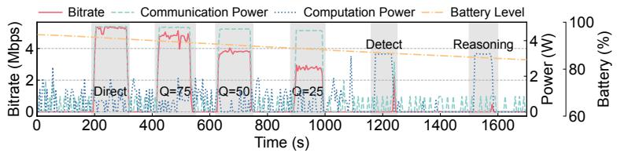

Other environmental context effects on SCN. Currently, RHONE constructs the energy and thermal context for SCN. While additional system effects on COTS devices – such as radiation failures [34], collision avoidance [78], and physical-layer challenges and security concerns [79] – can also impact SCN performance, these are left for future work.

Figure 15: Real-time Earth observation (EO) emulation. Shaded areas indicate the EO working periods.

## 10 Related Work

In this section, we briefly introduce SCN-related research. The network community is currently focusing on system architecture [80], topology design [81], routing [82, 83], transport-layer congestion control [84], security issues [28], real-world measurements [85], traffic scheduling [72], and on-the-ground emulators [38, 39, 40, 41, 66, 45, 43] for emerging satellite networks. The mobile computing community focuses on verifying the feasibility of satellite image processing applications [86, 87, 88, 89] and on task allocation and resource scheduling algorithms and system design [73, 45, 14, 74, 75, 76]. As satellite networking and computing converge, recent studies investigate SCN applications including real-time EO systems [15], cross-continent satellite video conferencing systems [21], and satellite in-network computing [22, 23]. For example, Li et al. [22] explore the feasibility of pushing mobile core network functions to LEO satellite mega-constellations to avoid signaling storm and improve network efficiency. Xing et al. [2] conduct a comprehensive in-orbit measurement of satellite COTS computing systems, revealing that energy and thermal contexts in real satellite environments impact satellite behavior and application performance. RHONE serves as a comprehensive emulator accounting for environmental impacts on both computing and networking performance of onboard chips, on which the SCN-related research can be conducted.

## 11 Conclusion

The growth of SCNs introduces unique characteristics and challenges, which should be carefully considered in designing, building and evaluating SCN applications, demanding accurate, scalable and easy-to-use developing and evaluating tools. In this paper, we introduce RHONE, a full-fledged emulator for SCNs with high satellite- and constellation-level fidelity, high scalability and high usability. It builds models from real in-orbit satellite telemetries, and coordinates the emulation via a Docker container-based environment. Crucially, RHONE provides users with satellite and constellation states (e.g., power, temperature and constellation topology) in real time, and dynamically aligns emulated computing and networking performance with real satellite COTS devices. It enables researchers on Earth to reliably develop, evaluate and optimize SCN applications like satellite earth observation or satellite-backboned global networking without having to access a real in-orbit satellite. We evaluate RHONE ’s fidelity using real in-orbit satellite telemetry data, and demonstrate its effectiveness in emulating typical SCN applications as use cases. We believe RHONE will help advance futuristic SCN research, fostering the development of more resilient and efficient space-based systems.

## Acknowledgments

We thank our shepherd, Timothy Wood, and the anonymous ATC reviewers for their insightful comments and suggestions. This work is supported by National Key Research and Development Plan, China (Grant No. 2023YFB2903902) and the National Natural Science Foundation of China (Grant No. 62022005, 62272010, 62325201). Chenren Xu is the corresponding author.

## References

[1] Satellite on board computer: Sirius tcm leon3ft. https://satsearch.co/products/aac-c lyde-sirius-tcm-leon3ft, 2024. Accessed: 2024-09-05.

[2] Ruolin Xing, Mengwei Xu, Ao Zhou, Qing Li, Yiran Zhang, Feng Qian, and Shangguang Wang. Deciphering the enigma of satellite computing with cots devices: Measurement and analysis. In ACM MobiCom, 2024.

[3] Christopher Wilson and Alan George. Csp hybrid space computing. Journal of Aerospace Information Systems, 15(4):215–227, 2018.

[4] Edward J Wyrwas. Nepp processor enclave (npe) update. In Presentation for posting on public website. NASA Electronic Parts and Packaging (NEPP) Program, 2022.

[5] Starlink: high-speed, low latencybroadband internet. https://www.starlink.com, 2024. Accessed: 2024-08-27.

[6] Maya Posch. Starlink’s inter-satellite laser links are setting new record with 42 million gb per day. https://hackaday.com/2024/02/05/star links-inter-satellite-laser-links-a re-setting-new-record-with-42-milli on-gb-per-day, 2024.

[7] Starlink specifications. https://www.starlink .com/legal/documents/DOC-1400-28829 -70, 2024. Accessed: 2024-08-27.

[8] Oneweb. delivering leo connectivity for new network solutions. https://oneweb.net, 2024. Accessed: 2024-08-27.

[9] Telesat. Telesat. https://www.telesat.com, 2023. Accessed: 2023-05-23.

[10] Amazon. Project kuiper. https://www.abouta mazon.com/what-we-do/devices-service s/project-kuiper, 2023. Accessed: 2023-05-23.

[11] Planet Dove Earth Observation Constellation. https: //www.planet.com/our-constellations, 2024. Accessed: 2024-12-07.

[12] Kuntai Du, Yihua Cheng, Peder Olsen, Shadi Noghabi, and Junchen Jiang. Earth+: On-board satellite imagery compression leveraging historical earth observations. In ACM ASPLOS, 2025.

[13] Bradley Denby and Brandon Lucia. Orbital edge computing: Nanosatellite constellations as a new class of computer system. In ACM ASPLOS, 2020.

[14] Bradley Denby, Krishna Chintalapudi, Ranveer Chandra, Brandon Lucia, and Shadi Noghabi. Kodan: Addressing the computational bottleneck in space. In ACM ASPLOS, 2023.

[15] Bill Tao, Om Chabra, Ishani Janveja, Indranil Gupta, and Deepak Vasisht. Known knowns and unknowns: Near-realtime earth observation via query bifurcation in serval. In USENIX NSDI, 2024.

[16] Zhuo Cheng, Bradley Denby, Kyle McCleary, and Brandon Lucia. Eagleeye: Nanosatellite constellation design for high-coverage, high-resolution sensing. In ACM ASPLOS, 2024.

[17] Palantir’s metaconstellation. https://www.pala ntir.com/offerings/metaconstellation, 2024. Accessed: 2024-08-27.

[18] Nasa earthdata. https://www.earthdata.na sa.gov/learn/earth-observation-dat a-basics/data-latency, 2025. Accessed: 2025-01-15.

[19] Deepak Vasisht, Jayanth Shenoy, and Ranveer Chandra. L2d2: low latency distributed downlink for leo satellites. In ACM SIGCOMM, 2021.

[20] Nathaniel Bleier, Muhammad Husnain Mubarik, Gary R Swenson, and Rakesh Kumar. Space microdatacenters. In IEEE/ACM MICRO, 2023.

[21] Zeqi Lai, Weisen Liu, Qian Wu, Hewu Li, Jingxi Xu, and Jianping Wu. Spacertc: Unleashing the low-latency potential of mega-constellations for real-time communications. In IEEE INFOCOM, 2022.

[22] Yuanjie Li, Hewu Li, Wei Liu, Lixin Liu, Yimei Chen, Jianping Wu, Qian Wu, Jun Liu, and Zeqi Lai. A case for stateless mobile core network functions in space. In ACM SIGCOMM, 2022.

[23] Lixin Liu, Yuanjie Li, Hewu Li, Jiabo Yang, Wei Liu, Jingyi Lan, Yufeng Wang, Jiarui Li, Jianping Wu, Qian Wu, Jun Liu, and Zeqi Lai. Democratizing Directto-Cell low earth orbit satellite networks. In USENIX NSDI, 2024.

[24] 5G-Advanced Core Experiments in the Baoyun LEO Satellite by China Mobile. https://m.c114.c om.cn/w118-1183668.html, 2021. Accessed: 2024-12-06.

[25] Dongfang Hour China Aerospace News Roundup 6–13 December. https://spacewatch.global/20 21/12/spacewatchgl-column-dongfang-h our-china-aerospace-news-roundup-6-1 3-december, 2021. Accessed: 2024-12-06.

[26] Chinese Private Firm Galactic Energy Puts Five Satellites in Orbit with Second Launch. https: //spacenews.com/chinese-private-fir m-galactic-energy-puts-five-satelli tes-in-orbit-with-second-launch, 2021. Accessed: 2024-12-06.

[27] Yaoying Zhang, Qian Wu, Zeqi Lai, Yangtao Deng, Hewu Li, Yuanjie Li, and Jun Liu. Energy drain attack in satellite internet constellations. In 2023 IEEE/ACM IWQoS, 2023.

[28] Giacomo Giuliari, Tommaso Ciussani, Adrian Perrig, and Ankit Singla. Icarus: Attacking low earth orbit satellite networks. In USENIX ATC, 2021.

[29] Tom Etchells and Lucy Berthoud. Developing a power modelling tool for cubesats. In Annual AIAA/USU Conference on Small Satellites, 2019.

[30] Jinkyu Lee, Eugene Kim, and Kang G. Shin. Design and management of satellite power systems. In 2013 IEEE 34th Real-Time Systems Symposium, pages 97– 106, 2013.

[31] Shangguang Wang and Qing Li. Satellite computing: Vision and challenges. IEEE Internet of Things Journal, 10(24):22514–22529, 2023.

[32] Zeqi Lai, Zonglun Li, Qian Wu, Hewu Li, Weisen Liu, Yijie Liu, Xin Xie, Yuanjie Li, and Jun Liu. Mind the misleading effects of leo mobility on end-to-end congestion control. In ACM Hot Nets, 2024.

[33] Jihao Li, Hewu Li, Zeqi Lai, Qian Wu, Yijie Liu, Qi Zhang, Yuanjie Li, and Jun Liu. Satguard: Concealing endless and bursty packet losses in leo satellite networks for delay-sensitive web applications. In ACM WWW, 2024.

[34] Haoda Wang, Steven Myint, Vandi Verma, Yonatan Winetraub, Junfeng Yang, and Asaf Cidon. Mars attacks! software protection against space radiation. In ACM HotNets, 2023.

[35] 40 starlink satellites doomed by geomagnetic storm. https://earthsky.org/space/40-starl ink-satellites-doomed-by-geomagnetic -storm, 2023.

[36] How much do cubesats and smallsats cost? https://nanoavionics.com/blog/how-m uch-do-cubesats-and-smallsats-cost, 2024. Accessed: 2024-09-05.

[37] Shangguang Wang, Qing Li, Mengwei Xu, Xiao Ma, Ao Zhou, and Qibo Sun. Tiansuan constellation: An open research platform. In IEEE EDGE, 2021.

[38] Systems tool kit (stk). https://www.agi.com/ products/stk, 2024. Accessed: 2024-08-27.

[39] General mission analysis tool. https://gmat.a tlassian.net/wiki/spaces/GW, 2024. Accessed: 2024-08-27.

[40] Sns3. satellite network simulator 3. https://www. sns3.org, 2024. Accessed: 2024-08-27.

[41] Simon Kassing, Debopam Bhattacherjee, Andre Bap- ´ tista Aguas, Jens Eirik Saethre, and Ankit Singla. Ex- ´ ploring the ”internet from space” with hypatia. In ACM IMC, 2020.

[42] Zeqi Lai, Hewu Li, and Jihao Li. Starperf: Characterizing network performance for emerging megaconstellations. In IEEE ICNP, 2020.

[43] Zeqi Lai, Hewu Li, Yangtao Deng, Qian Wu, Jun Liu, Yuanjie Li, Jihao Li, Lixin Liu, Weisen Liu, and Jianping Wu. Starrynet: Empowering researchers to evaluate futuristic integrated space and terrestrial networks. In USENIX NSDI, 2023.

[44] Vaibhav Bhosale, Ketan Bhardwaj, and Ada Gavrilovska. Toward loosely coupled orchestration for the LEO satellite edge. In USENIX HotEdge 20, 2020.

[45] Tobias Pfandzelter and David Bermbach. Celestial: Virtual software system testbeds for the leo edge. In ACM/IFIP Middleware, 2022.

[46] Zhiguo Liu, Jie Zhu, Jiangmei Zhang, and Qingli Liu. Routing algorithm design of satellite network architecture based on sdn and icn. Int. J. Satell. Commun. Netw., 38(1):1–15, December 2019.

[47] Debopam Bhattacherjee and Ankit Singla. Network topology design at 27,000 km/hour. In ACM CoNEXT, 2019.

[48] Yuanjie Li, Hewu Li, Lixin Liu, Wei Liu, Jiayi Liu, Jianping Wu, Qian Wu, Jun Liu, and Zeqi Lai. ”Internet in Space” for Terrestrial Users via Cyber-Physical Convergence. In ACM HotNets, 2021.

[49] Sebastian Sabogal, Alan George, and Christopher Wilson. Reconfigurable framework for environmentally adaptive resilience in hybrid space systems. ACM Transactions on Reconfigurable Technology System, 13(3), jul 2020.

[50] Abderezak Lashab, Mohammad Yaqoob, Yacine Terriche, Juan C. Vasquez, and Josep M. Guerrero. Space microgrids: New concepts on electric power systems for satellites. IEEE Electrification Magazine, 8(4):8– 19, 2020.

[51] Qing Li, Shangguang Wang, Xiao Ma, Ao Zhou, Yue Wang, Gang Huang, and Xuanzhe Liu. Battery-aware energy optimization for satellite edge computing. IEEE Transactions on Services Computing, 17(2):437–451, 2024.

[52] Wikipedia. Markov chain. https://en.wikiped ia.org/wiki/Markov\_chain, 2024. Accessed: 2024-08-27.

[53] Quang Gao, Keith J Blow, David J Holding, Ian W Marshall, and XH Peng. Radio range adjustment for energy efficient wireless sensor networks. Ad hoc networks, 4(1):75–82, 2006.

[54] Y Li, Bertan Bakkaloglu, and Chaitali Chakrabarti. A comprehensive energy model and energy-quality evaluation of wireless transceiver front-ends. In IEEE Workshop on Signal Processing Systems Design and Implementation, 2005., 2005.

[55] Heather Hanson, Stephen W. Keckler, Soraya Ghiasi, Karthick Rajamani, Freeman Rawson, and Juan Rubio. Thermal response to dvfs: Analysis with an intel pentium m. In ACM/IEEE ISLPED, 2007.

[56] Beomsik Kim and Hoeseok Yang. Temperature sensor assisted lifetime enhancement of satellite embedded systems via multi-core task mapping and dvfs. Sensors, 19(22), 2019.

[57] B. Yost. https://www.nasa.gov/sites/d efault/files/atoms/files/2022\_soa\_fu ll\_0.pdf, title=State-of-the-Art Small Spacecraft Technology, 2023.

[58] Solideworks. thermal analysis software. https:// www.solidworks.com, 2024. Accessed: 2024-08- 27.

[59] Adelina Ioana Ilies¸, Rajmond Jan´ o, and Gabriel ´ Chindris¸. Thermal management of system-on-chip devices used in satellite systems under low temperature conditions. In International Spring Seminar on Electronics Technology, 2016.

[60] Casper Versteeg and David L Cotten. Preliminary thermal analysis of small satellites. Small Satellite Research Laboratory, The University of Georgia, Athens, Georgia, 30602, 2018.

[61] Franyelit Suarez-Carre ´ no and Luis Rosales-Romero. ˜ Convergency and stability of explicit and implicit schemes in the simulation of the heat equation. Applied Sciences, 11(10):4468, 2021.

[62] Yolov3 algorithm. https://github.com/ultra lytics/yolov3, 2024. Accessed: 2024-08-27.

[63] Yolov5-lite algorithm. https://github.com/p pogg/YOLOv5-Lite, 2024. Accessed: 2024-08-27.

[64] Yolo-fastest algorithm. https://github.com/d og-qiuqiu/Yolo-Fastest, 2024. Accessed: 2024-08-27.

[65] Simon Kassing, Debopam Bhattacherjee, Andre Bap- ´ tista Aguas, Jens Eirik Saethre, and Ankit Singla. Ex- ´ ploring the ”internet from space” with hypatia. In ACM IMC, 2020.

[66] Bradley Denby and Brandon Lucia. Orbital edge computing: Machine inference in space. IEEE Computer Architecture Letters, 18(1), 2019.

[67] Inc. TE Technology. Temperature controllers. https://tetech.com/product-category/ temperature-controllers, 2024. Accessed: 2024-09-05.

[68] Bingyang Wu, Zili Zhang, Zhihao Bai, Xuanzhe Liu, and Xin Jin. Transparent gpu sharing in container clouds for deep learning workloads. In USENIX NSDI, 2023.

[69] Cyber Peace Institute. Case Study ViaSat, 2022.

[70] Dwaine K Coates, Chris L Fox, DJ Standlee, and BK Grindstaff. Advanced nickel-hydrogen spacecraft battery development. In NASA. Marshall Space Flight Center, The 1993 NASA Aerospace Battery Workshop, 1994.

[71] Ashutosh Dutta and Yechiam Yemini. Power management of leos under bursty broadband traffic. In 17th AIAA international communications satellite systems conference and exhibit, page 1317, 1998.

[72] Bill Tao, Maleeha Masood, Indranil Gupta, and Deepak Vasisht. Transmitting, fast and slow: Scheduling satellite traffic through space and time. In ACM MobiCom, 2023.

[73] Tobias Pfandzelter, Jonathan Hasenburg, and David Bermbach. Towards a computing platform for the leo edge. In Proceedings of the International Workshop on Edge Systems, Analytics and Networking, 2021.

[74] Pfandzelter, Tobias and Bermbach, David. Qos-aware resource placement for leo satellite edge computing. In Proceedings of International Conference on Fog and Edge Computing, 2022.

[75] Renchao Xie, Qinqin Tang, Qiuning Wang, Xu Liu, F Richard Yu, and Tao Huang. Satellite-terrestrial integrated edge computing networks: Architecture, challenges, and open issues. IEEE Network, 34(3):224– 231, 2020.

[76] Minglei Tong, Xiaoxiang Wang, Song Li, and Liang Peng. Joint offloading decision and resource allocation in mobile edge computing-enabled satellite-terrestrial network. Symmetry, 14(3), 2022.

[77] Bill Tao, Maleeha Masood, Indranil Gupta, and Deepak Vasisht. Transmitting, fast and slow: Scheduling satellite traffic through space and time. In ACM MobiCom, 2023.

[78] Yuanjie Li, Hewu Li, Wei Liu, Lixin Liu, Wei Zhao, Yimei Chen, Jianping Wu, Qian Wu, Jun Liu, Zeqi Lai, and Han Qiu. A networking perspective on starlink’s self-driving leo mega-constellation. In ACM MobiCom, 2023.

[79] Robin Bisping, Johannes Willbold, Martin Strohmeier, and Vincent Lenders. Wireless signal injection attacks on vsat satellite modems. In USENIX Security, 2024.

[80] Deepak Vasisht, Jayanth Shenoy, and Ranveer Chandra. L2d2: low latency distributed downlink for leo satellites. In ACM SIGCOMM, 2021.

[81] Debopam Bhattacherjee and Ankit Singla. Network topology design at 27,000 km/hour. In ACM CoNEXT, 2019.

[82] Mark Handley. Delay is not an option: Low latency routing in space. In ACM HotNets, 2018.

[83] Mark Handley. Using ground relays for low-latency wide-area routing in megaconstellations. In ACM Hot-Nets, 2019.

[84] Xu Li, Feilong Tang, Jiacheng Liu, Laurence T. Yang, Luoyi Fu, and Long Chen. Auto: Adaptive congestion control based on Multi-Objective reinforcement learning for the Satellite-Ground integrated network. In USENIX ATC, 2021.

[85] Mohamed M. Kassem, Aravindh Raman, Diego Perino, and Nishanth Sastry. A browser-side view of starlink connectivity. In ACM IMC, 2022.

[86] Gianluca Giuffrida, Luca Fanucci, Gabriele Meoni, Matej Batic, L ˇ eonie Buckley, Aubrey Dunne, Chris ´ van Dijk, Marco Esposito, John Hefele, Nathan Vercruyssen, Gianluca Furano, Massimiliano Pastena, and Josef Aschbacher. The φ -sat-1 mission: The first onboard deep neural network demonstrator for satellite earth observation. IEEE Transactions on Geoscience and Remote Sensing, 60:1–14, 2022.

[87] Ximing Yu, Yu Peng, and Liansheng Liu. Cloud detection using fully convolutional network with zynq soc for spaceborne application. In IEEE ICSMD, 2021.

[88] Muhammad Hasif bin Azami, Necmi Cihan Orger, Victor Hugo Schulz, Takashi Oshiro, and Mengu Cho. Earth observation mission of a 6u cubesat with a 5- meter resolution for wildfire image classification using convolution neural network approach. Remote Sensing, 14(8):1874, 2022.

[89] Yuan Yao, Zhiguo Jiang, Haopeng Zhang, and Yu Zhou. On-board ship detection in micro-nano satellite based on deep learning and cots component. Remote Sensing, 11(7):762, 2019.