①

USENIX

THE ADVANCED COMPUTING SYSTEMS ASSOCIATION

# Jenga: Enhancing LLM Long-Context Fine-tuning with Contextual Token Sparsity

Tuowei Wang and Xingyu Chen, Tsinghua University; Kun Li and Ting Cao, Microsoft Research; Ju Ren and Yaoxue Zhang, Tsinghua University https://www.usenix.org/conference/atc25/presentation/wang-tuowei

# This paper is included in the Proceedings of the 2025 USENIX Annual Technical Conference.

July 7–9, 2025 • Boston, MA, USA ISBN 978-1-939133-48-9

Open access to the Proceedings of the 2025 USENIX Annual Technical Conference is sponsored by

P=-r.h mFe"

auuuJl9 P9leU

King Abdullah University of

Science and Technology

# JENGA: Enhancing LLM Long-Context Fine-tuning with Contextual Token Sparsity

Tuowei Wang Tsinghua University

Xingyu Chen Tsinghua University

Kun Li Microsoft Research

Ting Cao Microsoft Research

Ju Ren ∗ Tsinghua University

Yaoxue Zhang Tsinghua University

## Abstract

The escalating demand for long-context applications has intensified the necessity of extending the LLM context windows. Despite recent fine-tuning approaches successfully expanding context lengths, their high memory footprints, especially for activations, present a critical practical limitation. Current parameter-efficient fine-tuning methods prioritize reducing parameter update overhead over addressing activation memory constraints. Similarly, existing sparsity mechanisms improve computational efficiency but overlook activation memory optimization due to the phenomenon of Shadowy Activation.

In this paper, we propose JENGA, the first LLM fine-tuning system that explores and exploits a new token-level sparsity mechanism inherent in long-context scenarios, termed Contextual Token Sparsity. JENGA minimizes redundant token involvement by assessing the informativeness of token embeddings while preserving model accuracy. Specifically, JENGA introduces three key techniques: (1) Token Elimination, dynamically identifying and excluding redundant tokens across varying inputs and layers. (2) Pattern Prediction, utilizing well-trained predictors to approximate token sparsity patterns with minimal overhead. (3) Kernel Optimization, employing permutation-free and segment-based strategies to boost system performance. We implement JENGA as an end-to-end finetuning system compatible with various LLM architectures and other optimization techniques1. Comprehensive evaluations demonstrate that JENGA reduces memory consumption by up to 1.93× and achieves up to 1.36× speedups, outperforming state-of-the-art fine-tuning systems.

## 1 Introduction

As the demand for comprehensive document analysis [13,26], extended multi-turn dialogues [76], and intricate codebase handling [51, 54] grows, large language models (LLMs) with larger context windows are becoming integral to AI applications. Despite their utility, LLMs [1, 31, 52] are typically pretrained with fixed context windows, such as the 4K token limit in Llama2 [67]. When these models encounter inputs exceeding this limit, their performance deteriorates markedly [18]. The discrepancy between the fixed context window during pretraining and the increasingly extended inputs during inference has emerged as a critical challenge in real-world deployments.

Table 1: Memory footprint (GB) comparison across different fine-tuning methods. LoRA and LongLoRA are representative of PEFT and sparsity-based methods, respectively (S = 4K).
<table><tr><td>Model</td><td>Llama2-7B Llama3-8B Mistral-7B OPT-6.7B</td></tr><tr><td>Naive</td><td>78.4 73.4 63.8</td></tr><tr><td></td><td>67.9 LoRA 39.2</td></tr><tr><td>43.4</td><td>39.3 36.1</td></tr><tr><td>LongLoRA 4 41.3 JENGA 31.3</td><td>43.9 39.3 38.1 34.5 31.4 30.0</td></tr></table>

Recent studies [43,53,68,73] show that the context window of pre-trained LLMs can be extended through fine-tuning on longer sequences. Unfortunately, managing these extended sequences imposes substantial resource challenges, particularly in terms of memory consumption. For instance, Position Interpolation [10] extends Llama models [66] from 2K to 32K but requires 128 A100 80GB GPUs, mainly due to memory limitations. Rather than model parameters, the primary memory bottleneck in long-context fine-tuning arises from activations [11, 35, 79], which include intermediate results and gradients that scale proportionally with sequence length.

Although various techniques have been proposed to improve the efficiency of fine-tuning, the substantial demands of activation memory remain largely unaddressed. By adapting only a minimal number of parameters, parameter-efficient finetuning (PEFT) methods [28, 29, 39, 78] reduce the memory requirement of parameter updates but leave activation memory unoptimized. Furthermore, recent works [12, 24, 50, 70] incorporate diverse sparse mechanisms to approximate standard dense attention. Despite achieving considerable computational savings, these methods fail to offer additional memory reduction, as highlighted in Table 1.

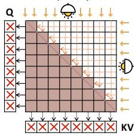  
(a) LoRA

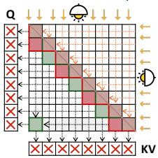  
(b) LongLoRA

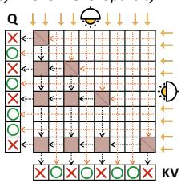  
(c) Jenga  
Figure 1: Illustration of shadowy activation. (a) LoRA performs full attention computation without incorporating sparsity. (b) LongLoRA adopts two shifted local attention patterns (colored in red and green) to approximate full attention, targeting sparsity at the hidden-dimension level. (c) JENGA employs token-level sparsity, minimizing token involvement and achieving activation savings compared to other methods.

This limitation arises because existing sparsity mechanisms primarily focus on sparsity within the hidden dimension of individual tokens. As shown in Figure 1(b), while each token interacts with a reduced subset of tokens compared to dense attention, the entire token sequence remains involved. Crucially, once a token participates in the computation, regardless of the extent of usage, its activations are retained in memory—a phenomenon we term Shadowy Activation. Given the large number of tokens involved in long-context fine-tuning, this observation prompts a critical question: Can we propose a novel LLM fine-tuning scheme with minimal token involvement that optimizes both memory and computational efficiency?

In this paper, we present JENGA, an efficient system for enhancing long-context fine-tuning of LLMs. The design of JENGA is rooted in an intuitive yet profound observation: natural language exhibits significant redundancy, particularly in long-context scenarios. This redundancy, proved to be ubiquitous in linguistic studies [60, 71], has been utilized across multiple LLM-related domains, including data engineering [22, 23], prompt compression [32, 40], and inference optimization [38, 61, 63, 82]. Most importantly, standard full attention can be effectively approximated by focusing on interactions among a small subset of the most informative tokens in a long text sequence. However, to our knowledge, no research has leveraged this approach to improve fine-tuning efficiency. Therefore, the key insight of JENGA is to identify and retain only the most informative tokens, enabling long-context fine-tuning with minimized token involvement.

However, this is not a long-hanging fruit, as this token-level sparsity exhibits unique characteristics in LLM long-context fine-tuning. Specifically, the token embeddings with the highest informativeness vary across different inputs and layers, a mechanism we term Contextual Token Sparsity. Harnessing this mechanism effectively and efficiently demands heuristic designs that address both algorithmic and system-level considerations. Specifically, several challenges must be tackled: Challenge 1: Identification. While long-context texts inherently exhibit significant redundancy, accurately identifying these redundant tokens is non-trivial. Eliminating informative tokens risks degrading model performance while retaining excessive tokens results in inefficient resource utilization.

Challenge 2: Detection. Given the dynamic nature of contextual token sparsity, the optimal sparsity patterns vary across different inputs and layers. This necessitates a selection mechanism capable of adapting to these variations at runtime while incurring minimal computational and memory overhead.

Challenge 3: Performance. The variability in token selection across layers incurs additional token movements, increasing memory access costs. Besides, naive gradient computation of model loss amplifies activation memory usage, resulting in inefficient memory peaks, especially in long-context scenarios.

JENGA consists of three fundamental techniques designed to address these emerging challenges, respectively:

Information-driven Token Elimination. JENGA evaluates token informativeness by analyzing its interactions with other tokens, selectively excluding less informative ones from computation. Moreover, JENGA exploits sparsity variations across layers by applying layer-specific thresholds, which maximizes resource efficiency while preserving model accuracy.

Context-aware Pattern Prediction. JENGA utilizes a neuralnetwork-based approach for predicting optimal sparsity patterns that adapt to the context of the current input. Besides, JENGA introduces a technique that elastically transforms the predictor’s parameter size, minimizing the memory and computational costs associated with the prediction process.

High-performance Kernel Optimization. JENGA adapts a permutation-free strategy to eliminate unnecessary global memory data movement during token selection and padding across different layers. Furthermore, JENGA develops a segmented-based gradient computation method, effectively alleviating activation memory peak in long-context scenarios.

We evaluate JENGA across two representative families of LLMs and on three distinct GPU architectures. The results demonstrate that JENGA achieves a memory reduction of 1.93× in end-to-end fine-tuning, compared to the state-of-theart fine-tuning systems, while maintaining model accuracy.

To the best of our knowledge, JENGA is the first fine-tuning system that exploits the inherent token-level sparsity in longcontext scenarios. This innovation allows JENGA to handle long-context sequences while demanding resources for fewer tokens. In summary, we make the following contributions:

• We identify a new sparsity mechanism, contextual token sparsity, inherent in long-context fine-tuning, enabling optimizing both memory and computational efficiency.

• We develop three key techniques that identify, detect, and perform contextual token sparsity, respectively. Our design provides a heuristic fine-tuning scheme, encompassing both algorithmic and system-level optimizations.

• We implement these techniques as an end-to-end finetuning system compatible with various LLM architectures, enabling seamless integration with other optimization techniques to further enhance performance.

• We conduct comprehensive evaluations of JENGA across diverse LLM families and hardware platforms. The results show that JENGA achieves 1.93× memory savings and 1.36× speedups compared to the state-of-the-art.

## 2 Background and Motivation

## 2.1 Efficient LLM Fine-tuning

Fine-tuning, the process of adapting pre-trained LLMs to diverse downstream applications, is pivotal for their effective deployment. Particularly, fine-tuning a pre-trained LLM on longer text sequences is essential for extending its pre-defined context window size, enabling support for long-context scenarios. However, this process is typically resource-intensive, with the inclusion of long text sequences considerably amplifying both computational and memory requirements.

To improve fine-tuning efficiency, one promising direction is parameter-efficient fine-tuning (PEFT) methods [28, 29, 39, 78], which adapt pre-trained models by updating only a subset of parameters while maintaining model performance. A representative example is low-rank adaption (LoRA) [29], which freezes the pre-trained model weights and injects smaller, trainable low-rank matrices into each transformer block. By reducing the number of trainable parameters, LoRA markedly alleviates the memory demands of optimizer states, driving its widespread adoption in practical applications.

Another research direction [6, 24, 77, 83] focuses on exploiting the inherent sparsity [17] within attention mechanisms by employing various sparsity patterns to the standard dense attention. The central insight is that only a limited subset of interactions is critical, allowing the remainder to be safely disregarded with minimal impact on accuracy. More recent works [12, 70] integrate these two lines of research. Notably, LongLoRA [12] extends LoRA by incorporating a new shifted sparsity pattern, enabling efficient scaling of context length. By substituting global dense attention with two groups of shifted sparse local attention, LongLoRA achieves less training time compared to LoRA. However, subsequent analysis reveals that neither LoRA nor LongLoRA adequately addresses the memory bottleneck in long-context fine-tuning, as activations scale proportionally with sequence length.

## 2.2 Analysis: Fine-tuning Memory Breakdown

Here we provide a detailed analysis of memory consumption during LLM fine-tuning process. Beginning with vanilla fine-tuning, we extend our discussion to include two representative approaches: LoRA, a PEFT method, and LongLoRA, a sparsity-based technique. Our analysis demonstrates that current efficient fine-tuning techniques fall short of addressing memory limitations, particularly in long-context scenarios. Vanilla. The memory consumption of vanilla fine-tuning primarily consists of two parts: model states and residual states, as listed in Figure 2. The first part, model states, includes parameters, gradients, and optimizer states. In mixed-precision fine-tuning [47], parameters and gradients are stored in FP16, while optimizer states are stored in FP32. For modern optimizers like AdamW [46], the optimizer states include the parameters, momentum, and variance. Given model parameter size as ψ, the memory required for all model states is approximately 16ψ, which remains constant for a fixed model.

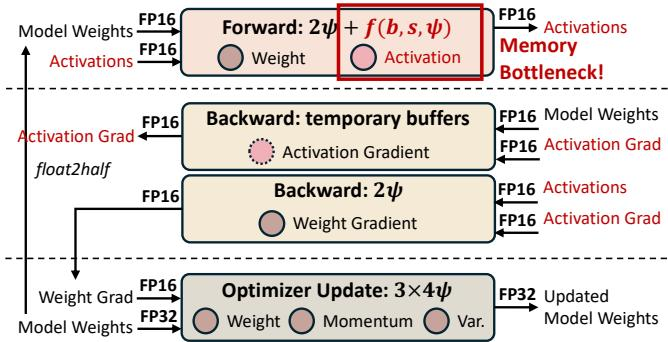  
Figure 2: Memory breakdown during LLM mixed-precision fine-tuning. Compared to consistent model states, activations scale with both input batch size and sequence length, becoming the primary bottleneck in long-context scenarios.

The second part of memory consumption comprises activations, temporary buffers, and fragmented memory. Among these, activations, which include the intermediate results and gradients stored during the forward pass, consume a considerable portion of memory. The memory required for activations is not only dependent on the model parameter size (ψ) but also scales with the input batch size (b) and sequence length (s). As detailed in Table 2, in long-context scenarios, the memory consumption of activations can easily exceed that of model states, emerging as the dominant memory bottleneck.

LoRA. Different from the vanilla, the pre-trained model parameters remain frozen in LoRA, and only the injected lowrank matrices are updated during fine-tuning. Consequently, the memory consumption for gradients and optimizer states is significantly reduced. However, this reduction does not extend to activation memory, which emerges as the new memory bottleneck. As illustrated in Figure 3, LoRA not only fails to alleviate activation memory usage but increases it instead. This is because the trainable low-rank matrices are deeply embedded within the model structure. Gradient computation for these matrices requires a traversal nearly identical to the vanilla, following the chain rule in backpropagation. Similar issues also exist in other PEFT methods.

Table 2: Activation memory usage (compared to model states) of GPT-3 175B [8] across different sequence lengths.
<table><tr><td>Model States</td><td></td><td>s=4K s=8K s=16K s=32K s=64K</td><td></td><td></td></tr><tr><td>16×175B=2.8T =</td><td>937G 0.34×</td><td>3.42T 13.0T 1.22× 4.65×</td><td>50.8T 18.14×</td><td>201T 71.6×</td></tr></table>

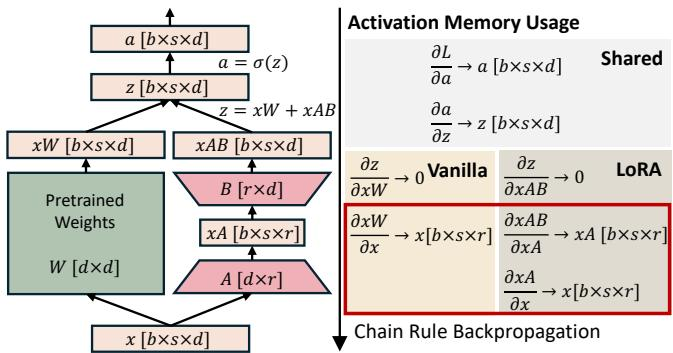  
Figure 3: An illustrated example of LoRA for showcasing the activation memory usage of PEFT. Beyond the shared parts, LoRA requires storing more activations than vanilla.

LongLoRA. Building upon LoRA, LongLoRA proposes a shifted sparse attention (S2-Attn) mechanism for further efficiency. As depicted in Figure 1(b), S2-Attn partitions the input tokens into two groups and performs attention individually in each group. For half of the attention heads, tokens are shifted by half group size to enable information exchange across groups. While LongLoRA achieves computational savings compared to LoRA, it fails to provide additional memory reduction. This limitation arises from the fact that the sparsity mechanism in LongLoRA, as well as other sparsity-based techniques, operates exclusively on the hidden dimensions of token embeddings. While such methods reduce the computational burden associated with individual tokens, they cannot entirely exclude tokens from the computation. However, once a token is involved in the computation, its activations are stored regardless of its usage. We refer to this phenomenon as Shadowy Activation, analogous to how an object casts a shadow by blocking light. In this context, "blocking" refers to cases where a token is unnecessary for token 1 (meaning its activation could be discarded) but is needed by token 2 (requiring its activation to be preserved). The presence of shadowy activation leaves the activation bottleneck still unresolved.

## 3 Insight: Contextual Token Sparsity

To address the emerging challenges discussed in § 2.2, we introduce a fresh perspective that explores and exploits a token-level sparsity mechanism during LLM long-context fine-tuning. Our approach is grounded in the intuitive yet profound observation that natural language is inherently redundant [60, 71]. Specifically, as highlighted in several studies [38, 42, 61, 63, 72, 82], standard full attention can be effectively approximated by focusing on significant interactions among a limited set of query, key, and value values, involving only a subset of tokens in the sequence. Notably, this redundancy becomes even more pronounced in long-context scenarios. As presented in Table 3, the proportion of significant interactions in attention scores decreases as sequence length increases. These insights open up a compelling opportunity to optimize LLM long-context fine-tuning by identifying and retaining only the most informative tokens. Through directly reducing token involvement, shadowy activation constraints are naturally alleviated, enabling activation memory to achieve comparable benefits to computational savings.

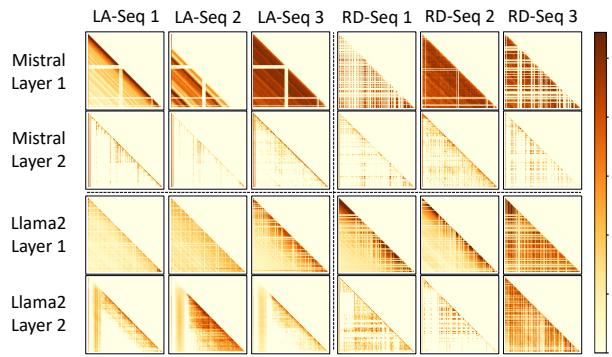  
Figure 4: Visualization of attention scores across different models, datasets, layers, and sequences (darker is higher).

We term this novel sparsity mechanism within LLM longcontext fine-tuning as Contextual Token Sparsity. Through comprehensive evaluations, we identify two key unique characteristics of this mechanism: (1) Token-wise. As depicted in Figure 4, a grid-like distribution of attention scores is observed across different models and datasets, confirming that token embeddings in the sequence exhibit varying levels of importance. This insight enables the exclusion of less valuable tokens, naturally leading to reductions in both memory usage and computational overhead. (2) Contextual. Figure 4 further demonstrates that the distribution of valuable tokens dynamically shifts based on input texts and varies across model layers, even for a given model and dataset. This dynamic nature underscores the need for a system capable of accurately identifying and efficiently exploiting this sparsity in real-time during runtime. Serving as the cornerstone of our system, contextual token sparsity first introduces token-level sparsity into long-context fine-tuning, enabling LLMs to handle larger context windows while effectively involving fewer tokens.

Table 3: Sparsity ratios (the proportion of values below 0.3 of the maximum) of attention scores across sequence lengths.
<table><tr><td>Seq len. 4K</td><td></td><td>6K</td><td>8K</td><td>10K</td><td>12K</td><td>14K</td><td>16K</td></tr><tr><td>Llama2</td><td>38.6%</td><td>48.8%</td><td>48.1%</td><td>65.3%</td><td>69.5%</td><td>62.2%</td><td>69.6%</td></tr><tr><td>Llama3</td><td>44.6%</td><td>46.0%</td><td>54.7%</td><td>52.3%</td><td>57.8%</td><td>50.2%</td><td>58.9%</td></tr></table>

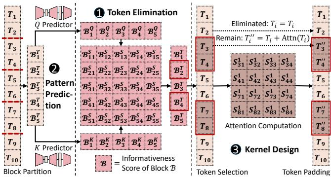  
Figure 5: JENGA overview. At each layer, token embeddings are first partitioned into blocks and fed into the pattern predictors (❷). Using the predicted informativeness scores from these predictors, the token elimination algorithm (❶) effectively identifies and retains only the most informative tokens for processing. Optimized kernels (❸) then efficiently perform token selection, computation, residual addition, and padding.

## 4 System Design

## 4.1 Overview of JENGA

We propose JENGA, an efficient system designed to enhance LLM long-context fine-tuning by systematically exploring and exploiting contextual token sparsity. Figure 5 presents an overview of JENGA, which is built upon three key techniques: Information-driven Token Elimination (§ 4.2). To determine whether a token is redundant, we first establish a formal definition for the informativeness of a given token. Building on this definition, JENGA utilizes a score-based algorithm that dynamically identifies and eliminates redundant tokens within the attention block. The algorithm performs in a block-wise manner and is further refined by adopting a layer-specific threshold, which ensures both effectiveness and efficiency. Additionally, we extend this approach to the MLP block, ensuring consistency across various components of the model. Context-aware Pattern Prediction (§ 4.3). JENGA employs a neural-network-based approach to predict the token sparsity patterns, bypassing the need for costly full attention score computation. Once adequately trained, these predictors can accurately approximate the token informativeness based on contextual inputs. To minimize the overhead introduced by predictors, JENGA utilizes an elastic size transformation technique, optimizing both memory and computational efficiency. High-performance Kernel Optimization (§ 4.4). JENGA delves into kernel-level optimizations to maximize system performance. To minimize unnecessary global memory movement, JENGA introduces a permutation-free strategy that fuses token selection, token padding, and residual addition directly into the computation pipeline. Moreover, JENGA incorporates a segment-based method to alleviate activation memory peaks, enabling efficient gradient computation for long sequences. By tightly coupling these kernel-level optimizations with algorithmic designs, JENGA fully exploits contextual token sparsity for enhancing LLM long-context fine-tuning.

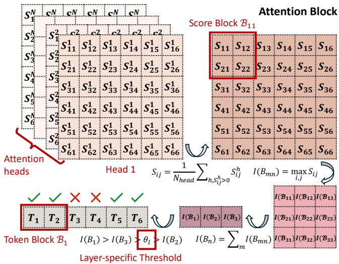  
Figure 6: Token elimination algorithm. Attention scores are first aggregated across different heads and partitioned into multiple score blocks. The maximum value within each score block is defined as its informativeness score, which is then aggregated along the column. These resulting scores are compared against a layer-specific threshold to determine whether the corresponding tokens should be retained.

## 4.2 Information-driven Token Elimination

To fully exploit contextual token sparsity, it is essential to accurately identify the redundant tokens across different inputs and layers. Discarding informative tokens may impact model accuracy while retaining excessive tokens leads to resource inefficiency. To tackle these challenges, JENGA proposes an information-driven algorithm that dynamically identifies and eliminates redundant tokens while preserving accuracy.

Token Informativeness. We begin by defining a token’s informativeness based on its interactions with other tokens within the embedding space. In the attention mechanism, the attention score $S _ { \mathrm { a t t } \mathrm { n } }$ is commonly used to quantify the interaction between tokens [25, 42, 72]. Specifically, the attention score term $S _ { i j } ,$ calculated as $Q _ { i } K _ { j } ,$ represents the interaction between token i and token j. Inspired by this, we define the informativeness of a token I(T ) by considering its interaction with all other tokens in the long-context sequence:

$$
I ( T _ { j } ) = \sum _ { i \ne j } S _ { i j } = \sum _ { i \ne j } Q _ { i } K _ { j }\tag{1}
$$

where the sum aggregates the attention scores across all tokens i in the sequence, excluding the token j itself.

Block-wise Elimination. Building on the concept of token informativeness, the next step involves eliminating redundant tokens based on their informativeness scores. To optimize alignment with hardware characteristics, JENGA performs token elimination in a block-wise manner. As shown in Figure 6, JENGA partitions the attention scores along the token dimension into multiple score blocks $\mathcal { B } ^ { S }$ . Following aggregation across attention heads, the maximum value within each block is selected as the informativeness score $I ( \mathcal { B } ^ { S } )$ . Notably, during aggregation, JENGA sums only the positive attention scores. Since attention scores undergo a softmax operation, negative values have a negligible impact on the final result but may offset the influence of positive values if included. By excluding negative scores, the aggregation process preserves the integrity of informativeness and ensures robust token elimination. The entire process can be formalized as:

$$
I ( \mathcal { B } _ { m n } ^ { S } ) = \operatorname* { m a x } _ { S _ { i j } \in \mathcal { B } _ { m n } ^ { S } } S _ { i j } = \operatorname* { m a x } _ { S _ { i j } \in \mathcal { B } _ { m n } ^ { S } } \frac { \sum _ { h , S _ { i j } ^ { h } > 0 } S _ { i j } ^ { h } } { N _ { \mathrm { h e a d } } }\tag{2}
$$

where $S _ { i j } ^ { h }$ represents the attention score between token i and token j in attention head h, and $N _ { \mathrm { h e a d } }$ is the total number of attention heads, serving as the scaling factor. This blockwise token elimination preserves the original informativeness of long-context sequences for two main reasons. First, compared to long-context input sequences, the block size used in our approach is relatively small. Given the sparse distribution of important tokens across long-context sequences, most token blocks contain no important tokens and can be safely eliminated without compromising accuracy. Second, in cases where important tokens do fall within a block, our informativeness score for token blocks $I ( \mathcal { B } ^ { S } )$ is designed to effectively identify and retain these blocks. This is because the difference in informativeness scores $I ( T )$ for important versus unimportant tokens is large enough that important tokens cannot be averaged out by other unimportant tokens in the block. As a result, our method ensures that any block containing important tokens is preserved, regardless of how many such tokens it contains. We argue that maintaining fine-tuning accuracy is more critical than the negligible computational cost of retaining a few additional unimportant tokens.

Layer-specific Threshold. The informativeness scores of token blocks $\mathcal { B } ^ { T }$ are computed by aggregating the corresponding score blocks, i.e. $\begin{array} { r } { \mathcal { B } _ { n } ^ { \bar { T } } = \sum _ { m } \mathcal { B } _ { m n } ^ { \bar { S } } } \end{array}$ . These scores are then compared against a threshold to determine whether the tokens within the block should be eliminated. Particularly, JENGA further refines the token elimination algorithm by adopting a layer-specific threshold. The key insight is that different layers within LLMs exhibit varying sparsity patterns. As demonstrated in Figure 7, the average informativeness scores of token blocks vary greatly across different model layers, indicating that a universal threshold applied across all layers is suboptimal. Algorithm 1 outlines JENGA’s approach, which initializes a default threshold for all layers based on score profiling and then fine-tunes these values to align with the unique sparsity characteristics of each layer.

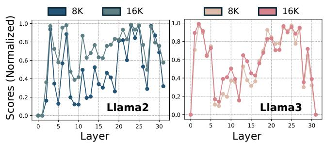  
Figure 7: The average informativeness scores (normalized) of tokens blocks across different layers.

Extend to MLP Block. Additionally, we extend token elimination to the MLP block. Analogous to attention scores, JENGA utilizes intermediate activations within the MLP block to evaluate the informativeness of each token. This extension can be viewed as a variant of the widely studied neuron sparsity within MLP blocks [37, 41, 48], ensuring compatibility with various MLP block structures: for ReLU-based structure [2], the activations are the outputs of the ReLU layer, while for SiLU-based structure [20], the activations correspond to the element-wise multiplication of the gate projection (after SiLU) and the up projection. These techniques enable JENGA to adapt token elimination seamlessly across diverse model components and configurations.

Algorithm 1: Layer-Specific Threshold Optimization   
Input :Model layers $\overline { { \mathscr { L } = \{ L _ { 1 } , L _ { 2 } , . . . , L _ { n } \} } }$   
Output :Layer thresholds $\mathcal { T } = \{ T _ { 1 } , T _ { 2 } , \ldots , T _ { n } \}$   
// Step 1: Threshold Initialization   
foreach layer $L _ { i } \in \mathcal { L }$ do   
// Average scores across token blocks   
$T _ { i } \gets \mathrm { a v g } \big ( I ( \mathcal { B } ^ { T } ) \forall \mathcal { B } ^ { T } \in L _ { i } \big )$ ;   
// Step 2: Threshold Fine-Tuning   
foreach layer $L _ { i } \in \mathcal { L }$ do   
// Compute gradient with finite changes   
Gi ← acc(Ti + ε) − acc(Ti − ε)/2ε;   
// Update threshold based on gradient   
Ti ← Ti + η · Gi;   
return T

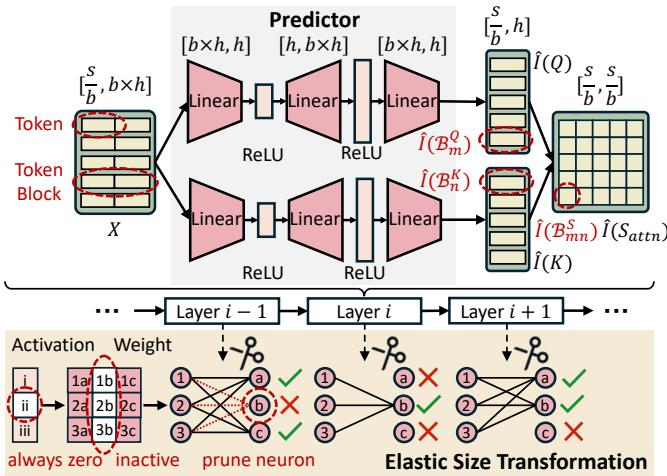  
Figure 8: Pattern prediction process. Each layer is equipped with two predictors to approximate $Q$ and $K ,$ respectively. Taking token embeddings as input (organized in token blocks), each predictor outputs the informative score, $\hat { I } ( B _ { m } ^ { Q } )$ and $\hat { I } ( B _ { n } ^ { K } )$ ， for each token blocks. These scores are then multiplied to compute the informative scores, $\hat { I } ( B _ { m n } ^ { S } )$ , for blocked attention scores. Besides, elastic size transformation is employed to independently minimize the predictor size for each layer.

## 4.3 Context-aware Pattern Prediction

Although the exact sparsity patterns can be directly derived from the full attention scores, computing and storing these scores is prohibitively expensive, with complexity scaling quadratically with the sequence length. Furthermore, due to the dynamic nature of contextual token sparsity, the optimal sparsity patterns can only be determined at runtime, varying across different inputs and layers. To address these challenges, JENGA employs a set of lightweight neural networks as predictors. By taking contextual embeddings as inputs, these predictors infer sparsity patterns accurately and efficiently.

Neural-network-based Predictor. As illustrated in Figure 8, JENGA deploys a pair of predictors in each layer to approximate the informativeness scores of queries Q and keys K, respectively. Each predictor consists of three trainable lowrank matrices, with ReLU activation function applied between successive matrices. The inputs to the predictors are token embeddings X, which contain contextual information and are organized into blocks to align with the block-wise elimination. By extracting the representative embedding from each block, the predictors output the approximate informativeness scores, $\hat { I } ( Q )$ and ${ \hat { I } } ( K )$ . These scores are then multiplied to approximate the informativeness of attention scores $\hat { I } ( S _ { \mathrm { a t t n } } )$ :

$$
\hat { I } ( S _ { \mathrm { a t t n } } ) = \hat { I } ( Q ) \hat { I } ( K ) ^ { T } , \hat { I } ( \mathcal { B } _ { m n } ^ { S } ) = \hat { I } ( \mathcal { B } _ { m } ^ { Q } ) \hat { I } ( \mathcal { B } _ { n } ^ { K } ) ^ { T }\tag{3}
$$

When Q and K predictors are well trained, $\hat { I } ( S _ { \mathrm { a t t n } } )$ can provide a close estimation of accurate informativeness scores $I ( S _ { \mathrm { a t t n } } )$

With a limited training dataset, these predictors can quickly converge and perform well in prediction, as evidenced by prior studies [45, 62, 70]. Particularly, the predictor in JENGA first processes each token individually and then aggregates these individual predictions into a unified outcome. This strategy restricts the predictor’s size to the dimension of a single token block rather than the full long-context sequence, thereby streamlining the design and mitigating prediction overhead.

Elastic Size Transformation. To further reduce the size of the predictors, JENGA utilizes an elastic size transformation technique that dynamically prunes neurons in the predictors based on their individual sparsity characteristics. Inspired by prior work on activation-based pruning studies [37, 41, 69], this design leverages the properties of the ReLU activation function, which introduces a large number of zero elements into the intermediate activation of the predictors. When an activation element is zero, its corresponding neurons (i.e., rows or columns of the model weights) become inactive and can be safely disregarded. Innovatively, JENGA integrates this mechanism into its custom-designed predictors. Specifically, JENGA tracks the zero frequency of intermediate activation elements during training and periodically prunes neurons associated with the highest zero frequencies. Without relying on any prior assumptions, elastic size transformation adaptively determines the optimal size for each predictor, effectively reducing both computational and memory overhead.

Comprehensive Overhead Analysis. We conclude with an analysis of the overhead introduced by predictors during both training and inference. In offline training, the primary bottleneck lies in obtaining the informativeness of attention scores $I ( S _ { \mathrm { a t t n } } )$ . Thanks to the block-wise manner, we seamlessly integrate our custom training kernel into the state-of-theart FlashAttention [15, 16]. This integration eliminates the need for explicit computation and storage of the full attention scores. Instead, $I ( S _ { \mathrm { a t t n } } )$ is derived online, leading to a memory complexity that grows linearly with sequence length.

In online inference, given sequence length s, head dimension h, and block size b, the computational overhead consists of two parts: (1) Prediction of $I ( Q )$ or $I ( K )$ with a complexity of $O ( s h ^ { 2 } ) ; ( 2 )$ Prediction of $I ( S _ { \mathrm { a t t n } } )$ with a complexity of $O ( s ^ { 2 } / b ^ { 2 } )$ . In long-context scenarios, the second part becomes the dominant factor. However, this overhead can be effectively mitigated by increasing the block size b. On the memory side, the primary overhead arises from the linear weights within predictors, with a complexity of $O ( b h ^ { 2 } )$ . Importantly, this complexity remains constant relative to the model configurations. Finally, thanks to the elastic size transformation, both computational and memory complexities are reduced by a sparsity factor, leading to an average reduction of 50%.

## 4.4 High-performance Kernel Optimization

Focusing on token-level sparsity, JENGA introduces minimal modifications to the original fine-tuning dynamics, enabling seamless reuse of existing optimized computational flows.

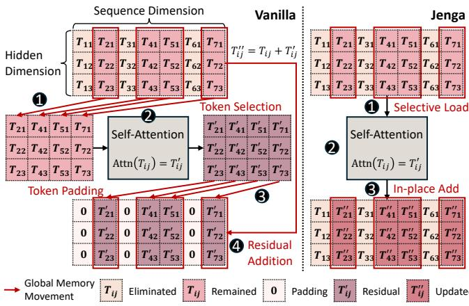  
Figure 9: Comparison between naive token movement and JENGA. Highlighted by the red lines, the naive kernel incurs substantial global memory movement costs. JENGA develops a permutation-free strategy through kernel fusion.

However, two key challenges hidden in JENGA undermine its performance. First, the variability in sparsity patterns across layers necessitates iterative token selection and padding, leading to considerable costly global memory movement. Second, the extensive vocabulary size of LLMs necessitates substantial activation memory to compute the output loss gradient for each token, particularly in long-context scenarios. JENGA incorporates several hardware-efficient techniques at the kernel level, effectively mitigating these bottlenecks.

Permutation-free Token Movement. The dynamic nature of contextual token sparsity leads to varying sparsity patterns across different layers, involving distinct subsets of tokens. As illustrated in Figure 9, at each layer, a set of less informative tokens are eliminated and the remained tokens are re-permuted to serve as the attention block inputs. Then, the attention outputs are padded with zeros to maintain dimensional consistency and are finally residually added to the original inputs. The processes of token selection, token padding, and residual addition involve extensive data movement in global memory, which incurs high memory access latency.

JENGA develops a permutation-free strategy that fuses all unnecessary permutation operations with the attention computations. Instead of materializing re-permuted tokens, JENGA directly loads the selected tokens from original inputs. Furthermore, JENGA performs an in-place addition of attention outputs to the original inputs, simultaneously completing token padding and residual addition in a single step. During backpropagation, the original inputs are recomputed when calculating the gradient of the attention weights. Since the input embedding matrix can be recovered by subtracting the self-attention output from the output embedding matrix, the overhead is minimal. This streamlined approach eliminates unnecessary memory allocation and expensive global memory movement, significantly enhancing system performance.

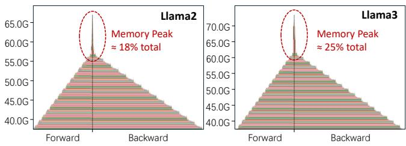

Figure 10: Memory peak during loss gradient computation, exacerbated by the large vocabulary size and long context. The x-axis represents the timeline of a fine-tuning epoch.  
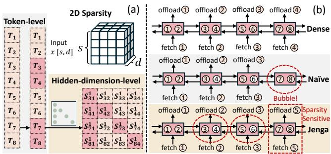  
Figure 11: Two available extensions of JENGA: (a) Twodimensional Sparsity and (b) Sparsity-sensitive Offload.

Segment-based Peak Cutting. LLMs are typically autoregressive, predicting the probability distribution of the next token given all preceding tokens. During fine-tuning, for each token in the input sequence, the model generates a probability distribution over the next token and computes the losses between predictions and ground truth. For LLMs with a large vocabulary size and long context window, this process imposes a significant surge in activation memory usage, as shown in Figure 10. While these activations are transient, the resulting memory peak elevates the upper bound of LLM fine-tuning, imposing stricter demands on GPU memory resources. Existing implementations [64, 65] commonly use column-wise parallelism to distribute the vocabulary across multiple GPUs. However, this optimization is only effective in multi-GPU configurations and provides no benefit for single-GPU setups.

To address this issue, JENGA adopts a segment-based peakcutting strategy that partitions the token sequence into smaller, manageable segments during final loss computation. Instead of performing a forward pass over the entire sequence and retaining all intermediate activations, JENGA processes each segment independently and later aggregates their gradients. Activations for each segment are discarded immediately after the corresponding gradient computation is completed. Consequently, the activation memory peak is reduced to 1/N when the sequence is divided into N segments. This approach greatly alleviates memory pressure on individual GPUs and remains compatible with existing multi-GPU optimizations.

Table 4: Hardware platform configurations.
<table><tr><td>Platform GPUs</td><td></td><td>Memory FP32 TFLOPS BF16 TFLOPS</td><td></td></tr><tr><td>Platform A  $1 \times \mathrm { { A 8 0 0 } }$ </td><td>80GB</td><td>19.5</td><td>312</td></tr><tr><td>Platform B  $1 \times \mathrm { A 4 0 }$ </td><td>48GB</td><td>37.4</td><td>150</td></tr><tr><td>Platform C  $4 \times 4 0 9 0$ </td><td>24GB</td><td>82.6</td><td>82.6</td></tr></table>

Table 5: Model configurations.
<table><tr><td>Model</td><td># Params.</td><td>Def Len.</td><td>Seq Len.</td></tr><tr><td>OPT[81]</td><td>350M/1.3B/2.7B/6.7B</td><td>2K</td><td>2K-64K</td></tr><tr><td>Llama2 [67]</td><td>7B</td><td>4K</td><td>4K-64K</td></tr><tr><td>Llama3 [19]</td><td>8B</td><td>8K</td><td>4K-64K</td></tr></table>

## 5 Implementation and Extension

We implement JENGA with over 3000 lines of Python and C++ code. Given the minimal changes to the original fine-tuning dynamics, JENGA is compatible with a wide range of LLM architectures without requiring any code changes. Besides, JENGA can seamlessly integrate with other techniques:

Extension 1: Two-dimensional Sparsity. As illustrated in Figure 11(a), after applying token-level sparsity in JENGA, the remained tokens can further benefit from existing hiddendimensional sparsity techniques. This natural combination of sparsity mechanisms across two dimensions, which we term 2D-Sparsity, provides more granular control over the model’s resource allocation, leading to a significant reduction in both activation memory and computational costs.

Extension 2: Sparsity-sensitive Offload. JENGA enhances existing offload-based techniques [27, 30, 55, 56] by incorporating contextual token sparsity into the optimization process. As depicted in Figure 11(b), we develop a sparsity-sensitive offloading strategy that adapts to the varying sparsity ratios across different layers. This approach enables the seamless transfer of larger data volumes between the CPU and GPU, effectively alleviating GPU memory constraints.

## 6 Evaluation

## 6.1 Experimental Setup

Hardware. We conduct experiments on three representative platforms, as listed in Table 4, covering both data-center workstations and desktop professional GPUs. Memory measurements are primarily evaluated on Platform A, as it offers the largest GPU memory capacity, with results being largely insensitive to GPU arithmetic performance. For speedup evaluations, we adhere to common practices by employing mixedprecision techniques [47], utilizing both BF16 and FP32.

Models. The models used for evaluation are detailed in Table 5. We choose models from two of the most popular LLM families: OPT and Llama. These models vary in architecture, parameter size, and default context window size. Evaluations on these models provide a robust demonstration of the scalability and versatility of JENGA’s optimizations.

Dataset. We use the RedPajama [14] dataset for long-context fine-tuning, following the setup from LongLoRA. We evaluate the perplexity (PPL) of fine-tuned models on the book corpus dataset PG19 [57] and the cleaned Arxiv Math proof-pile dataset [3] to assess long-context modeling performance. Besides, we evaluate our method on LongBench [5] benchmark, following an instruction-tuning on dataset LongAlign-10k [4]. These tasks cover multiple critical long-text application areas, ensuring a comprehensive evaluation of our approach.

Baselines. We compare JENGA with two state-of-the-art finetuning methods, LoRA [29] and LongLoRA [12]. These methods represent the two dominant optimization directions: parameter-efficient fine-tuning and sparsity-based fine-tuning, respectively. For speedup analysis, we primarily compare with LoRA, leaving LongLoRA for reference. This distinction is because the two methods focus on orthogonal sparsity dimensions, making a direct and fair comparison challenging. Metrics. Memory evaluations are conducted at the time step immediately following the forward pass, which generally corresponds to the memory peak. For execution time evaluation, we measure the time per fine-tuning step. To emphasize the effectiveness of JENGA, activation recomputation and offloading techniques are excluded unless explicitly stated. All metrics are averaged over 10 repeated trials to ensure reliability.

## 6.2 End-to-End Performance

Memory Footprint. We evaluate the memory efficiency of JENGA across various models and sequence lengths, as shown in Figure 12. The results reveal that JENGA achieves average memory savings of 38.2% and 50.5% compared to LoRA across six different models, with sequence lengths of 4K and 8K, respectively. Similar benefits are observed in comparison to LongLoRA, as the presence of shadowy activations renders its sparsity mechanism ineffective in benefiting memory usage (even slightly increased). Furthermore, the results reveal that for a fixed model, JENGA’s memory efficiency improves as sequence length increases. This aligns with the observation that longer text sequences typically exhibit greater redundancy. The enhanced efficiency of JENGA largely extends the fine-tuning sequence length achievable under GPU memory constraints. Without activation recomputation and offloading, both LoRA and LongLoRA are limited to a sequence length of 16K (32K) when fine-tuning OPT 1.3B (350M). Instead, JENGA doubles this capacity, supporting sequence lengths of up to 32K (64K) on a single A800 GPU.

Execution Time. The minimized token involvement in JENGA also brings computational savings during long-context fine-tuning. Figure 13 presents the execution time and corresponding speedups of JENGA during fine-tuning different models at a sequence length of 4K. The results show that

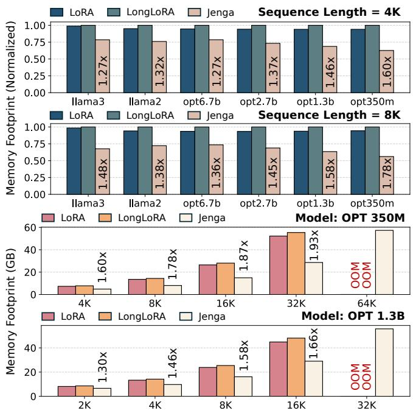  
Figure 12: Memory footprints comparison on A800.

JENGA achieves computational efficiency comparable to LongLoRA, achieving an average speedup over LoRA of 10.8% and 8.6% on two platforms, respectively. We also observe that LongLoRA may perform slower than LoRA in some cases. This is primarily due to the difficulty in fully utilizing hardware computational capacity for sparsity operations when the sequence length is insufficient. In contrast, JENGA introduces minimal modifications to the original computational flow, allowing it to effectively translate computational savings into practical speedups. Further evaluations of JENGA on longer sequence lengths (with recomputation) reveal additional performance gains, achieving up to 1.36× speedups.

Accuracy Evaluation. We test the impact of JENGA on model accuracy by comparing it with the original LoRA. First, we measure test perplexity of fine-tuned Llama2 7B on two representative long-context datasets, PG19 and Proof-Pile. As shown in Table 7, JENGA incurs only a minimal increase in perplexity scores compared to the original LoRA, across varying sequence lengths. Additionally, we evaluate JENGA on LongBench benchmark, which contains tasks from multiple key long-text application areas. Table 6 demonstrates that JENGA achieves accuracy comparable to the original LoRA. These evaluations collectively confirm that the inherent redundancy in long-context sequences can be effectively exploited for performance efficiency without compromising accuracy.

## 6.3 Ablation Study

Fine-grained Performance Breakdown Figure 14 presents a detailed performance breakdown of JENGA, covering both memory and computational aspects. For the memory aspect, the results show that JENGA effectively reduces activation memory consumption compared to both LoRA and LongLoRA. Although the predictors introduced incur additional memory usage, their overhead is minimal, ensuring that the overall memory reduction is preserved. Besides, this reduction is consistent across varying sequence lengths, with the decrease in activation memory scaling linearly with sequence length. For the computational aspect, JENGA also achieves computational gains over LoRA, as the reduced token involvement leads to decreased computation during both the forward and backward phases. Similarly, the computational overhead of predictors is negligible in the context of the overall process.

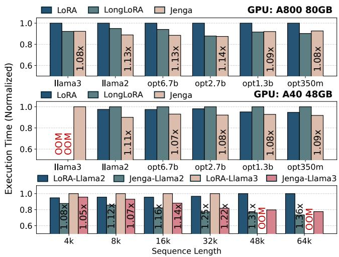  
Figure 13: End-to-end speedup of JENGA on A800 and A40.

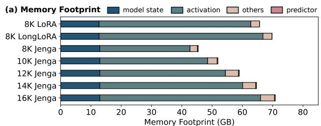

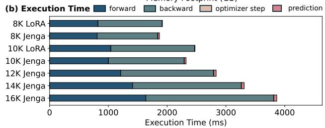  
Figure 14: Performance breakdown of Llama2 fine-tuning: (a) Memory footprint and (b) Execution time.

Technique 1: Token Elimination. We delve into the layer level to analyze the effectiveness of our information-driven token elimination algorithm. Figure 15 presents the memory consumption and corresponding threshold values across different layers in both self-attention and MLP blocks. Evaluations are conducted on both Llama2 and OPT models, considering their distinct MLP block architecture, which respectively uses SiLU and ReLU as activation functions. The results indicate that the token elimination algorithm achieves average memory savings of 38.3% (38.0%) on Attention block and 51.1% (54.8%) on MLP block for Llama2 (OPT) model. Besides, the application of layer-specific thresholds allows for varying degrees of reduction across layers, maximizing the exploitation of token-level sparsity while preserving model accuracy.

Table 6: Comparative analysis of model accuracy on the LongBench benchmark (higher is better).
<table><tr><td colspan="9">Tasks mfqa_zh mfqa_en gov_report triviaqa vcsum qmsum musique 2wikimqa repobench</td></tr><tr><td>Origin</td><td>23.45</td><td>23.22</td><td>27.44</td><td>84.60</td><td>13.30</td><td>22.64</td><td>4.63</td><td>9.01 52.00</td></tr><tr><td>Ours</td><td>23.53</td><td>24.74</td><td>25.92</td><td>82.59</td><td>13.02 20.33</td><td>5.73</td><td>10.14</td><td>48.32</td></tr><tr><td>Tasks</td><td>qasper</td><td>hotpotqa</td><td>multi_ _news pr_zh</td><td>pr_en</td><td>trec</td><td>lsht</td><td>dureader</td><td>lcc</td></tr><tr><td>Origin</td><td>15.94</td><td>9.40</td><td>24.43</td><td>10.0 20.0</td><td>68.0</td><td>21.0</td><td>23.69</td><td>71.28</td></tr><tr><td>Ours</td><td>17.68</td><td>9.55</td><td>22.53</td><td>8.00</td><td>22.0 68.0</td><td>25.0</td><td>21.37</td><td>70.32</td></tr></table>

Table 7: Perplexity of PG19 (PG) and Proof-Pile (PP) datasets.
<table><tr><td>Seq len.</td><td>8K</td><td>10K</td><td>12K</td><td>14K</td><td>16k</td></tr><tr><td>PG-Origin</td><td>6.95</td><td>6.92</td><td>6.91</td><td>6.90</td><td>6.87</td></tr><tr><td>PG-Ours</td><td>7.11</td><td>7.12</td><td>7.08</td><td>7.13</td><td>7.08</td></tr><tr><td>PP-Origin</td><td>2.68</td><td>2.64</td><td>2.59</td><td>2.59</td><td>2.57</td></tr><tr><td>PP-Ours</td><td>2.79</td><td>2.77</td><td>2.72</td><td>2.72</td><td>2.70</td></tr></table>

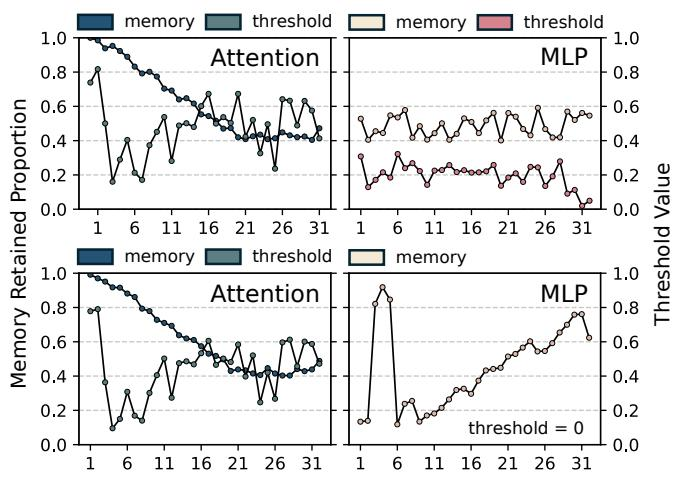  
Figure 15: Memory footprint and corresponding threshold across layers on Llama2 7B (upper) and OPT 6.7B (lower).

Additionally, we investigate the fundamental reason behind the effectiveness of our information-driven token elimination algorithm. Figure 16(a) illustrates the proportion of unimportant blocks across different layers. A block is considered unimportant if its informativeness score is less than 10% of the maximum (excluding outliers) within the same layer. The results reveal that a large proportion of token blocks do not contain any important tokens, especially in the deeper layers of the model. This can be attributed to the relatively small block size used (e.g., 64 in our evaluation settings), compared to the length of long-context input sequences. As the model depth increases, important tokens become more sparsely distributed, resulting in most token blocks containing no important tokens. These blocks can be safely eliminated without compromising model accuracy.

(a) Blocks Without Important Tokens  
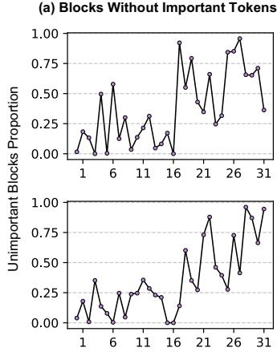

(b) Scores Within a Block  
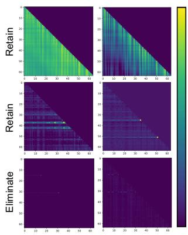  
Figure 16: (a) Proportion of blocks without important tokens and (b) Distribution of attention scores within a token block.

Moreover, we visualize the attention scores within individual blocks to analyze how the tokens within a token block affect its informativeness. Figure 16(b) presents three representative distributions of attention scores within token blocks. The results show that token blocks are generally classified as important when the majority of their tokens are informative, and as unimportant when none are. Particularly, even when only a few tokens in a block are important, the block is still considered as important. This is because the difference in informativeness scores for important versus unimportant tokens is large enough that important tokens cannot be averaged out under our block selection strategy.

Technique 2: Pattern Prediction. Figure 17(a) presents the training loss of predictors across two models and two datasets.

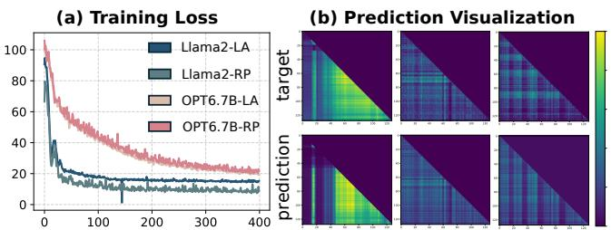  
Figure 17: (a) Training loss curve on LongAlign (LA) / Red-Pajama (RP) and (b) Prediction visualizations of predictors.

The results show that the predictors converge quickly during offline training, requiring fewer than 400 epochs, an acceptable overhead given the following expensive LLM fine-tuning. We then calculate the recall metrics for evaluating the accuracy of predictors, achieving an impressive average of 95.13%. Particularly, we provide visual comparisons of the predictions against the ground truth. As depicted in Figure 17(b), the predicted attention scores closely approximate the ground truth, effectively identifying redundant tokens with high accuracy.

To assess the effectiveness of elastic size transformation, we measure the parameter sizes of predictors across various model layers. Table 8 details that by exploiting the inherent sparsity within predictors, their parameter sizes can be uniformly reduced across layers, on average 64.6%. This reduction in predictor size minimizes prediction overhead, aligning consistently with the findings in the performance breakdown.

Technique 3: Kernel Optimization. We benchmark the performance of kernels optimized with permutation-free token movement against their naive implementation under various sequence lengths, as depicted in Figure 18. The results reveal that both kernel fusion strategies, selective load and inplace addition, effectively enhance performance. The overall speedups increase with sequence length, ranging from 10× to over 50×. This improvement primarily stems from the reduction in global memory movement and temporary data allocation. These findings highlight the critical importance of high-performance kernel design, which serves as a robust foundation for the algorithmic framework of JENGA.

Meanwhile, Figure 19 illustrates the memory consumption during fine-tuning with and without the segment-based peak-cutting technique. In the naive implementation, gradient computation requires about 10GB of temporary activation memory, resulting in an inefficient memory peak. By partitioning the gradient computation into smaller segments, the sharp peak is divided into multiple, much smaller memory peaks, achieving an additional 15% of memory savings.

Table 8: Parameter size (in millions) of predictors across layers of Llama2, with or without elastic size transformation.
<table><tr><td>#Layer 1</td><td></td><td>5</td><td>10</td><td>15</td><td>20</td><td>25</td><td>30</td></tr><tr><td>Origin</td><td>12.58</td><td>12.58</td><td>12.58</td><td>12.58</td><td>12.58</td><td>12.58</td><td>12.58</td></tr><tr><td>Pruned</td><td>8.19</td><td>8.19</td><td>8.13</td><td>8.10</td><td>8.08</td><td>8.07</td><td>8.10</td></tr><tr><td>Pct.</td><td>65.1%</td><td>65.1%</td><td>64.6%</td><td>64.5%</td><td>64.2%</td><td>64.1%</td><td>64.5%</td></tr></table>

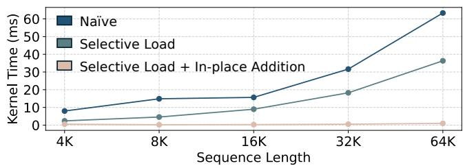  
Figure 18: Performance of JENGA’s permutation-free kernel.

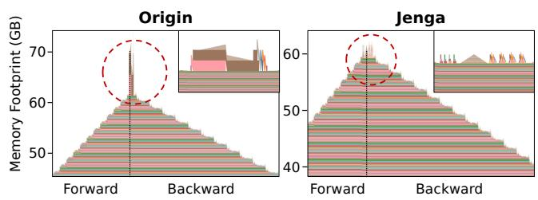  
Figure 19: Memory usage peak in loss gradient computation. The x-axis represents the timeline of a fine-tuning epoch.

## 6.4 Extension Evaluation

Extension 1: Two-dimensional Sparsity. Building upon JENGA, we explore applying existing hidden-dimension-level sparsity techniques [70] to the remaining tokens during attention computation. Figure 20(a) shows that this twodimensional sparsity further improves the computational efficiency of JENGA, achieving up to 2.04× speedups on Llama2.

Extension 2: Sparsity-sensitive Offload. We compare the performance of our sparsity-sensitive offloading against a naive uniform offloading strategy. Unlike the naive approach, JENGA considers the varying sparsity ratios across layers, allowing for the offloading of more activations or a reduction in data transfer latency. Figure 20(b) shows that this technique achieves an average speedup of 1.22× speedups on Llama2.

## 6.5 Scalability Analysis

We conclude by analyzing the strong scalability of JENGA on 4×4090 GPUs. Figure 21 shows that JENGA’s performance scales proportionally with GPU number across different models and sequence lengths. The scalability is achieved because JENGA seamlessly minimizes token involvements and introduces no extra communication overhead. These results highlight JENGA’s potential for deployment in large-scale systems.

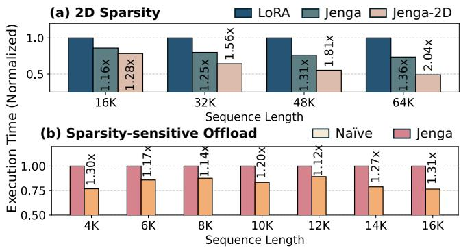

Figure 20: Performance improvements from two extensions.  
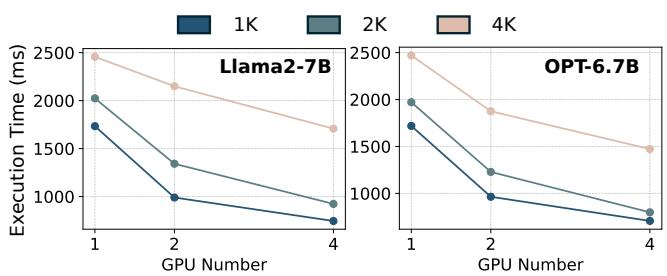  
Figure 21: Strong scalability evaluation of JENGA.

## 7 Related Work

Optimizations for Activation Memory. As a primary memory bottleneck in LLM training or fine-tuning, activation memory consumption has been the focus of extensive research, which can be categorized into three main approaches: The first is activation recomputation [11,35,36], designed to avoid storing activations during the forward pass but recomputing them during the backward pass. The second is activation offloading [27, 30, 55, 56], which asynchronously transfers activations from GPU to CPU and prefetches them back before required. The last is activation compression [9, 21, 44], which reduces the activation memory size through quantization or pruning. However, these methods primarily trade memory for additional computation or communication, rather than fundamentally reducing memory demands. In contrast, JENGA directly minimizes activation memory requirements and can be seamlessly combined with all these optimizations.

Optimizations for Long-context Fine-tuning. To effectively extend the context window to longer sequences, some methods [10, 18, 43] focus on optimizing the fine-tuning algorithm design. Besides, some methods [59, 68, 74] explore strategies for modifying the position embeddings of LLMs to handle longer context. All these efforts are complementary to JENGA.

Beyond effectiveness, some recent methods [80, 84] are proposed to mitigate the substantial fine-tuning overheads for efficiency. Particularly, Parameter-efficient fine-tuning methods [28, 29, 39, 78] first offer an effective solution by reducing the number of trainable parameters and memory usage while achieving comparable performance to full fine-tuning. Furthermore, a series of sparsity-based methods [12, 70] are proposed to further reduce the computation costs by exploiting the inherent sparsity within attention mechanism [17]. However, while PEFT methods greatly cut down the memory consumption of optimizer states, the activation memory emerges as the primary bottleneck. Although existing sparsity mechanisms deliver notable computational gains, the presence of shadowy activation prevents comparable benefits for activation memory. Instead, JENGA achieves the best of both worlds by identifying and exploiting contextual token sparsity.

Optimizations for Token Utilization. Sharing the same high-level idea of JENGA, several studies also explore leveraging the inherent redundancy that existed in natural language, including data engineering [22, 23], prompt compression [32, 40], and inference optimization [38, 61, 63, 82]. Notably, some works [7,25,33,34,49,58,75] propose eliminating tokens during inference to reduce model latency. Compared to existing token-elimination methods, JENGA offers two key innovations. First, prior works focus exclusively on small-model inference, where only a single request is processed at a time and there is no interference between the sparsity patterns of different tokens. JENGA is the first to extend attention-based token elimination to LLM long-context fine-tuning. Second, prior works typically prune tokens permanently throughout the computation of an entire epoch. While this strategy may be acceptable for inference with small models, it is not suitable for fine-tuning LLMs since the importance of a token can vary across different layers. To address this, JENGA proposes a novel sparsity mechanism-Contextual Token Sparsity.

## 8 Conclusion

We propose JENGA, an efficient system designed to optimize long-context fine-tuning for LLMs. Our approach introduces a novel sparsity mechanism within LLM long-context finetuning, termed contextual token sparsity. To systematically exploit this mechanism, we develop three key techniques that identify, predict, and exploit this sparsity, achieving both memory savings and performance speedups over state-of-the-art methods. Compression embodies intelligence, with sparsity serving as a potent form of compression. We envision JENGA inspiring broader exploration of sparsity for advancing LLMs.

## 9 Acknowledgement

We sincerely thank our shepherd Rohan Kadekodi and anonymous reviewers for their insightful feedback. The work is supported in part by the National Natural Science Foundation of China under Grant No. 62432004, and by a grant from the Guoqiang Institute, Tsinghua University.

## A Artifact Appendix

## Abstract

This artifact accompanies the ATC’25 paper titled JENGA: Enhancing Long-Context Fine-tuning of LLMs with Contextual Token Sparsity. It includes all necessary code, scripts, datasets, and pre-trained weights required to fully reproduce the experimental results, including figures and tables. The artifact also provides helper scripts for setup verification and quick result demonstration, and it supports both quick and full-scale experiment reproduction workflows.

## Scope

This artifact allows users to validate all empirical claims made in the paper, including memory and runtime performance, prediction accuracy, and scalability of the proposed JENGA method on long-context fine-tuning tasks. It can be used to inspect all end-to-end results, perform ablation studies, and test generalization across models and datasets.

## Contents

The artifact contains the following components:

• Model and Predictor Weights (checkpoints/): Pretrained model and predictor weights.

• Dataset (dataset/): All datasets used in the experiments.

• Log Files (logs/): Raw logs for generating paper figures.

• Output Figures (output\_figures/): Plots reproduced from logs.

• Experiment Scripts (scripts/): Scripts to reproduce each figure/table in the paper.

• Source Code (src/): Core implementation of JENGA.

## Hosting

The artifact is hosted at a public Github repository. All resources, including models and datasets, can be obtained from:

• Artifact Repository: https://github.com/Pairshoe/ Jenga-AE.

• Model Weights: Models Link (peft\_model.zip and predictor.zip)

• Hugging Face Models: Detailed in Table 9.

• Datasets: Datasets Link (dataset.zip)

Table 9: Download links for required base models and their respective target directories.

<table><tr><td rowspan=1 colspan=1>Destination Path</td><td rowspan=1 colspan=1>Source URL</td></tr><tr><td rowspan=1 colspan=1>checkpoints/llama3</td><td rowspan=6 colspan=1>meta-llama/Meta-Llama-3-8Bmeta-llama/Llama-2-7b-hffacebook/opt-6.7bfacebook/opt-2.7bfacebook/opt-1.3bfacebook/opt-350mfacebook/opt-125m</td></tr><tr><td rowspan=1 colspan=1>checkpoints/llama2checkpoints/opt-6.7b</td></tr><tr><td rowspan=1 colspan=1>checkpoints/opt-2.7b</td></tr><tr><td rowspan=1 colspan=1>checkpoints/opt-1.3b</td></tr><tr><td rowspan=1 colspan=1>checkpoints/opt-350m</td></tr><tr><td rowspan=1 colspan=1>checkpoints/opt-125m</td></tr></table>

## Requirements

• Software: Python 3.10, PyTorch, Flash Attention (install separately).

• Hardware (for full experiments):

– Minimum: 1 NVIDIA A800 or A40 GPU.

– For scalability experiments: 4 NVIDIA 4090 GPUs.

## A.1 Installation

1. Install dependencies: pip install -r requirements.txt

2. Install Flash Attention: pip install flash-attn -no-build-isolation

3. Install Jenga from source:

## A.2 Experiment Workflow

## 1. Environment Setup Verification

Run the script to verify correct setup: bash hello\_world.sh

## 2. Quick Reproduction

Run the script to plot figures from raw data: bash RUNME-a.sh

## 3. In-depth Reproduction

3.1 One-step Execution: Reproduce all results in a single run (runtime around 5 hours).   
bash RUNME-b-a800.sh # for A800   
bash RUNME-b-a40.sh # for A40   
bash RUNME-b-4x4090.sh # for 4x4090

3.2 Separate Execution: For fine-grained control, individual scripts per experiment are summarized in Table 10.

Table 10: Generated output folders and corresponding scripts for reproducing results.
<table><tr><td>Generated OutputFolderName</td><td>Figure/Table</td><td>Script Path</td><td>Runtime</td></tr><tr><td>output_figures/end2end/memory</td><td>Figure 12</td><td>scripts/end2end-memory/run.sh</td><td>40mins</td></tr><tr><td>output_figures/end2end/time-a800</td><td>Figure 13</td><td>scripts/end2end-time/run.sh (A800)</td><td>50 mins</td></tr><tr><td>output_figures/ablations/memory-breakdown</td><td>Figure 14 (Upper)</td><td>scripts/ablation-mem-breakdown/run.sh</td><td>10 mins</td></tr><tr><td>output_figures/ablations/time-breakdown</td><td>Figure 14 (Lower)</td><td>scripts/ablation-time-breakdown/run.sh</td><td>10 mins</td></tr><tr><td>output_figures/ablations/algorithm</td><td>Figure 15</td><td>scripts/ablation-algorithm/run.sh</td><td>5 mins</td></tr><tr><td>output_figures/ablations/predictor</td><td>Figure 16 (Left)</td><td>scripts/ablation-predictor/run.sh</td><td>3 hours</td></tr><tr><td>output_figures/ablations/segment</td><td>Figure 18 (memory_viz)</td><td>scripts/ablation-segment/run.sh</td><td>5 mins</td></tr><tr><td>output_figures/extension/2d</td><td>Figure 19 (Upper)</td><td>scripts/extension-2d/run.sh</td><td>25 mins</td></tr><tr><td>output_figures/extension/offload</td><td>Figure 19 (Lower)</td><td>scripts/extension-offload/run.sh</td><td>30 mins</td></tr><tr><td>output_figures/scalability</td><td>Figure 20</td><td>scripts/scalability/run.sh (4x4090)</td><td>30mins</td></tr><tr><td>logs/end2end/accuracy/longbench</td><td>Table 6</td><td>scripts/end2end-longbench/run.sh</td><td>3 hours</td></tr><tr><td>logs/end2end/accuracy</td><td>Table 7</td><td>scripts/end2end-ppl/ppl.sh</td><td>6 hours</td></tr></table>

## References

[1] Josh Achiam, Steven Adler, Sandhini Agarwal, Lama Ahmad, Ilge Akkaya, Florencia Leoni Aleman, Diogo Almeida, Janko Altenschmidt, Sam Altman, Shyamal Anadkat, et al. Gpt-4 technical report. arXiv preprint arXiv:2303.08774, 2023.

[2] AF Agarap. Deep learning using rectified linear units (relu). arXiv preprint arXiv:1803.08375, 2018.

[3] Zhangir Azerbayev, Hailey Schoelkopf, Keiran Paster, Marco Dos Santos, Stephen McAleer, Albert Q. Jiang, Jia Deng, Stella Biderman, and Sean Welleck. Llemma: An open language model for mathematics, 2023.

[4] Yushi Bai, Xin Lv, Jiajie Zhang, Yuze He, Ji Qi, Lei Hou, Jie Tang, Yuxiao Dong, and Juanzi Li. LongAlign: A recipe for long context alignment of large language models. In Findings of the Association for Computational Linguistics: EMNLP 2024, pages 1376–1395, Miami, Florida, USA, November 2024. Association for Computational Linguistics.

[5] Yushi Bai, Xin Lv, Jiajie Zhang, Hongchang Lyu, Jiankai Tang, Zhidian Huang, Zhengxiao Du, Xiao Liu, Aohan Zeng, Lei Hou, et al. Longbench: A bilingual, multitask benchmark for long context understanding. arXiv preprint arXiv:2308.14508, 2023.

[6] Iz Beltagy, Matthew E Peters, and Arman Cohan. Longformer: The long-document transformer. arXiv preprint arXiv:2004.05150, 2020.

[7] Daniel Bolya, Cheng-Yang Fu, Xiaoliang Dai, Peizhao Zhang, Christoph Feichtenhofer, and Judy Hoffman. Token merging: Your vit but faster. arXiv preprint arXiv:2210.09461, 2022.

[8] Tom Brown, Benjamin Mann, Nick Ryder, Melanie Subbiah, Jared D Kaplan, Prafulla Dhariwal, Arvind

Neelakantan, Pranav Shyam, Girish Sastry, Amanda Askell, et al. Language models are few-shot learners. Advances in neural information processing systems, 33:1877–1901, 2020.

[9] Jianfei Chen, Lianmin Zheng, Zhewei Yao, Dequan Wang, Ion Stoica, Michael Mahoney, and Joseph Gonzalez. Actnn: Reducing training memory footprint via 2-bit activation compressed training. In International Conference on Machine Learning, pages 1803–1813. PMLR, 2021.

[10] Shouyuan Chen, Sherman Wong, Liangjian Chen, and Yuandong Tian. Extending context window of large language models via positional interpolation. arXiv preprint arXiv:2306.15595, 2023.

[11] Tianqi Chen, Bing Xu, Chiyuan Zhang, and Carlos Guestrin. Training deep nets with sublinear memory cost. arXiv preprint arXiv:1604.06174, 2016.

[12] Yukang Chen, Shengju Qian, Haotian Tang, Xin Lai, Zhijian Liu, Song Han, and Jiaya Jia. Longlora: Efficient fine-tuning of long-context large language models. arXiv preprint arXiv:2309.12307, 2023.

[13] Robert Chew, John Bollenbacher, Michael Wenger, Jessica Speer, and Annice Kim. Llm-assisted content analysis: Using large language models to support deductive coding. arXiv preprint arXiv:2306.14924, 2023.

[14] Together Computer. Redpajama: an open dataset for training large language models, 2023.

[15] Tri Dao. FlashAttention-2: Faster attention with better parallelism and work partitioning. In International Conference on Learning Representations (ICLR), 2024.

[16] Tri Dao, Daniel Y. Fu, Stefano Ermon, Atri Rudra, and Christopher Ré. FlashAttention: Fast and memoryefficient exact attention with IO-awareness. In Advances

in Neural Information Processing Systems (NeurIPS), 2022.

[17] Yichuan Deng, Zhao Song, and Chiwun Yang. Attention is naturally sparse with gaussian distributed input. arXiv preprint arXiv:2404.02690, 2024.

[18] Yiran Ding, Li Lyna Zhang, Chengruidong Zhang, Yuanyuan Xu, Ning Shang, Jiahang Xu, Fan Yang, and Mao Yang. Longrope: Extending llm context window beyond 2 million tokens. arXiv preprint arXiv:2402.13753, 2024.

[19] Abhimanyu Dubey, Abhinav Jauhri, Abhinav Pandey, Abhishek Kadian, Ahmad Al-Dahle, Aiesha Letman, Akhil Mathur, Alan Schelten, Amy Yang, Angela Fan, et al. The llama 3 herd of models. arXiv preprint arXiv:2407.21783, 2024.

[20] Stefan Elfwing, Eiji Uchibe, and Kenji Doya. Sigmoidweighted linear units for neural network function approximation in reinforcement learning. Neural networks, 107:3–11, 2018.

[21] R David Evans and Tor Aamodt. Ac-gc: Lossy activation compression with guaranteed convergence. Advances in Neural Information Processing Systems, 34:27434– 27448, 2021.

[22] Yao Fu, Rameswar Panda, Xinyao Niu, Xiang Yue, Hannaneh Hajishirzi, Yoon Kim, and Hao Peng. Data engineering for scaling language models to 128k context. arXiv preprint arXiv:2402.10171, 2024.

[23] Tianyu Gao, Alexander Wettig, Luxi He, Yihe Dong, Sadhika Malladi, and Danqi Chen. Metadata conditioning accelerates language model pre-training. arXiv preprint arXiv:2501.01956, 2025.

[24] Yizhao Gao, Zhichen Zeng, Dayou Du, Shijie Cao, Hayden Kwok-Hay So, Ting Cao, Fan Yang, and Mao Yang. Seerattention: Learning intrinsic sparse attention in your llms. arXiv preprint arXiv:2410.13276, 2024.

[25] Saurabh Goyal, Anamitra Roy Choudhury, Saurabh Raje, Venkatesan Chakaravarthy, Yogish Sabharwal, and Ashish Verma. Power-bert: Accelerating bert inference via progressive word-vector elimination. In International Conference on Machine Learning, pages 3690– 3699. PMLR, 2020.

[26] Wen Hao and He Qianru. Semantic comprehension method for chinese sentences based on minimal semantic structures and its application. Chinese Journal of Electronics, 32(3):613–624, 2023.

[27] Mark Hildebrand, Jawad Khan, Sanjeev Trika, Jason Lowe-Power, and Venkatesh Akella. Autotm: Automatic

tensor movement in heterogeneous memory systems using integer linear programming. In Proceedings of the Twenty-Fifth International Conference on Architectural Support for Programming Languages and Operating Systems, pages 875–890, 2020.

[28] Neil Houlsby, Andrei Giurgiu, Stanislaw Jastrzebski, Bruna Morrone, Quentin De Laroussilhe, Andrea Gesmundo, Mona Attariyan, and Sylvain Gelly. Parameterefficient transfer learning for nlp. In International conference on machine learning, pages 2790–2799. PMLR, 2019.

[29] Edward J Hu, Yelong Shen, Phillip Wallis, Zeyuan Allen-Zhu, Yuanzhi Li, Shean Wang, Lu Wang, and Weizhu Chen. Lora: Low-rank adaptation of large language models. arXiv preprint arXiv:2106.09685, 2021.

[30] Chien-Chin Huang, Gu Jin, and Jinyang Li. Swapadvisor: Pushing deep learning beyond the gpu memory limit via smart swapping. In Proceedings of the Twenty-Fifth International Conference on Architectural Support for Programming Languages and Operating Systems, pages 1341–1355, 2020.

[31] Albert Q Jiang, Alexandre Sablayrolles, Arthur Mensch, Chris Bamford, Devendra Singh Chaplot, Diego de las Casas, Florian Bressand, Gianna Lengyel, Guillaume Lample, Lucile Saulnier, et al. Mistral 7b. arXiv preprint arXiv:2310.06825, 2023.

[32] Huiqiang Jiang, Qianhui Wu, Chin-Yew Lin, Yuqing Yang, and Lili Qiu. Llmlingua: Compressing prompts for accelerated inference of large language models. arXiv preprint arXiv:2310.05736, 2023.

[33] Gyuwan Kim and Kyunghyun Cho. Length-adaptive transformer: Train once with length drop, use anytime with search. arXiv preprint arXiv:2010.07003, 2020.

[34] Sehoon Kim, Sheng Shen, David Thorsley, Amir Gholami, Woosuk Kwon, Joseph Hassoun, and Kurt Keutzer. Learned token pruning for transformers. In Proceedings of the 28th ACM SIGKDD Conference on Knowledge Discovery and Data Mining, pages 784–794, 2022.

[35] Vijay Anand Korthikanti, Jared Casper, Sangkug Lym, Lawrence McAfee, Michael Andersch, Mohammad Shoeybi, and Bryan Catanzaro. Reducing activation recomputation in large transformer models. Proceedings of Machine Learning and Systems, 5:341–353, 2023.

[36] Ravi Kumar, Manish Purohit, Zoya Svitkina, Erik Vee, and Joshua Wang. Efficient rematerialization for deep networks. Advances in Neural Information Processing Systems, 32, 2019.

[37] Mark Kurtz, Justin Kopinsky, Rati Gelashvili, Alexander Matveev, John Carr, Michael Goin, William Leiserson, Sage Moore, Nir Shavit, and Dan Alistarh. Inducing and exploiting activation sparsity for fast inference on deep neural networks. In International Conference on Machine Learning, pages 5533–5543. PMLR, 2020.

[38] Wonbeom Lee, Jungi Lee, Junghwan Seo, and Jaewoong Sim. {InfiniGen}: Efficient generative inference of large language models with dynamic {KV} cache management. In 18th USENIX Symposium on Operating Systems Design and Implementation (OSDI 24), pages 155– 172, 2024.

[39] Xiang Lisa Li and Percy Liang. Prefix-tuning: Optimizing continuous prompts for generation. arXiv preprint arXiv:2101.00190, 2021.

[40] Yucheng Li, Bo Dong, Chenghua Lin, and Frank Guerin. Compressing context to enhance inference efficiency of large language models. arXiv preprint arXiv:2310.06201, 2023.

[41] Zonglin Li, Chong You, Srinadh Bhojanapalli, Daliang Li, Ankit Singh Rawat, Sashank J Reddi, Ke Ye, Felix Chern, Felix Yu, Ruiqi Guo, et al. The lazy neuron phenomenon: On emergence of activation sparsity in transformers. arXiv preprint arXiv:2210.06313, 2022.

[42] Di Liu, Meng Chen, Baotong Lu, Huiqiang Jiang, Zhenhua Han, Qianxi Zhang, Qi Chen, Chengruidong Zhang, Bailu Ding, Kai Zhang, et al. Retrievalattention: Accelerating long-context llm inference via vector retrieval. arXiv preprint arXiv:2409.10516, 2024.

[43] Xiaoran Liu, Hang Yan, Shuo Zhang, Chenxin An, Xipeng Qiu, and Dahua Lin. Scaling laws of rope-based extrapolation. arXiv preprint arXiv:2310.05209, 2023.

[44] Xiaoxuan Liu, Lianmin Zheng, Dequan Wang, Yukuo Cen, Weize Chen, Xu Han, Jianfei Chen, Zhiyuan Liu, Jie Tang, Joey Gonzalez, et al. Gact: Activation compressed training for generic network architectures. In International Conference on Machine Learning, pages 14139–14152. PMLR, 2022.

[45] Zichang Liu, Jue Wang, Tri Dao, Tianyi Zhou, Binhang Yuan, Zhao Song, Anshumali Shrivastava, Ce Zhang, Yuandong Tian, Christopher Re, et al. Deja vu: Contextual sparsity for efficient llms at inference time. In International Conference on Machine Learning, pages 22137–22176. PMLR, 2023.

[46] I Loshchilov. Decoupled weight decay regularization. arXiv preprint arXiv:1711.05101, 2017.

[47] Paulius Micikevicius, Sharan Narang, Jonah Alben, Gregory Diamos, Erich Elsen, David Garcia, Boris Ginsburg, Michael Houston, Oleksii Kuchaiev, Ganesh Venkatesh, et al. Mixed precision training. arXiv preprint arXiv:1710.03740, 2017.

[48] Iman Mirzadeh, Keivan Alizadeh, Sachin Mehta, Carlo C Del Mundo, Oncel Tuzel, Golnoosh Samei, Mohammad Rastegari, and Mehrdad Farajtabar. Relu strikes back: Exploiting activation sparsity in large language models. arXiv preprint arXiv:2310.04564, 2023.

[49] Ali Modarressi, Hosein Mohebbi, and Mohammad Taher Pilehvar. Adapler: Speeding up inference by adaptive length reduction. arXiv preprint arXiv:2203.08991, 2022.

[50] Tsendsuren Munkhdalai, Manaal Faruqui, and Siddharth Gopal. Leave no context behind: Efficient infinite context transformers with infini-attention. arXiv preprint arXiv:2404.07143, 2024.

[51] Daye Nam, Andrew Macvean, Vincent Hellendoorn, Bogdan Vasilescu, and Brad Myers. Using an llm to help with code understanding. In Proceedings of the IEEE/ACM 46th International Conference on Software Engineering, pages 1–13, 2024.

[52] OpenAI. ChatGPT: Get instant answers, find creative inspiration, learn something new. https://openai. com/chatgpt, 2022.

[53] Bowen Peng, Jeffrey Quesnelle, Honglu Fan, and Enrico Shippole. Yarn: Efficient context window extension of large language models. arXiv preprint arXiv:2309.00071, 2023.

[54] Jinxue Peng, Yong Wang, Jingfeng Xue, and Zhenyan Liu. Fast cross-platform binary code similarity detection framework based on cfgs taking advantage of nlp and inductive gnn. Chinese Journal of Electronics, 33(1):128– 138, 2024.

[55] Xuan Peng, Xuanhua Shi, Hulin Dai, Hai Jin, Weiliang Ma, Qian Xiong, Fan Yang, and Xuehai Qian. Capuchin: Tensor-based gpu memory management for deep learning. In Proceedings of the Twenty-Fifth International Conference on Architectural Support for Programming Languages and Operating Systems, pages 891–905, 2020.

[56] Bharadwaj Pudipeddi, Maral Mesmakhosroshahi, Jinwen Xi, and Sujeeth Bharadwaj. Training large neural networks with constant memory using a new execution algorithm. arXiv preprint arXiv:2002.05645, 2020.

[57] Jack W Rae, Anna Potapenko, Siddhant M Jayakumar, and Timothy P Lillicrap. Compressive transformers for long-range sequence modelling. arXiv preprint arXiv:1911.05507, 2019.

[58] Yongming Rao, Wenliang Zhao, Benlin Liu, Jiwen Lu, Jie Zhou, and Cho-Jui Hsieh. Dynamicvit: Efficient vision transformers with dynamic token sparsification. Advances in neural information processing systems, 34:13937–13949, 2021.

[59] Baptiste Roziere, Jonas Gehring, Fabian Gloeckle, Sten Sootla, Itai Gat, Xiaoqing Ellen Tan, Yossi Adi, Jingyu Liu, Romain Sauvestre, Tal Remez, et al. Code llama: Open foundation models for code. arXiv preprint arXiv:2308.12950, 2023.

[60] Claude E Shannon. Prediction and entropy of printed english. Bell system technical journal, 30(1):50–64, 1951.

[61] Ying Sheng, Lianmin Zheng, Binhang Yuan, Zhuohan Li, Max Ryabinin, Beidi Chen, Percy Liang, Christopher Ré, Ion Stoica, and Ce Zhang. Flexgen: High-throughput generative inference of large language models with a single gpu. In International Conference on Machine Learning, pages 31094–31116. PMLR, 2023.

[62] Yixin Song, Zeyu Mi, Haotong Xie, and Haibo Chen. Powerinfer: Fast large language model serving with a consumer-grade gpu. In Proceedings of the ACM SIGOPS 30th Symposium on Operating Systems Principles, pages 590–606, 2024.

[63] Jiaming Tang, Yilong Zhao, Kan Zhu, Guangxuan Xiao, Baris Kasikci, and Song Han. Quest: Query-aware sparsity for efficient long-context llm inference. arXiv preprint arXiv:2406.10774, 2024.

[64] The Hugging Face Team. Transformers: Llama model implementation, line 735. https: //github.com/huggingface/transformers/blob/ 08e3217bafddc5d11ce0e7369bcfaaabe5501ba5/ src/transformers/models/llama/modeling\_ llama.py#L735, 2024. Accessed: 2025-05-13.

[65] The Hugging Face Team. Transformers: Tensor parallel integration, line 261. https: //github.com/huggingface/transformers/blob/ 08e3217bafddc5d11ce0e7369bcfaaabe5501ba5/ src/transformers/integrations/tensor parallel.py#L261, 2024. Accessed: 2025-05- 13.

[66] Hugo Touvron, Thibaut Lavril, Gautier Izacard, Xavier Martinet, Marie-Anne Lachaux, Timothée Lacroix, Baptiste Rozière, Naman Goyal, Eric Hambro, Faisal Azhar,

et al. Llama: Open and efficient foundation language models. arXiv preprint arXiv:2302.13971, 2023.

[67] Hugo Touvron, Louis Martin, Kevin Stone, Peter Albert, Amjad Almahairi, Yasmine Babaei, Nikolay Bashlykov, Soumya Batra, Prajjwal Bhargava, Shruti Bhosale, et al. Llama 2: Open foundation and fine-tuned chat models. arXiv preprint arXiv:2307.09288, 2023.

[68] Szymon Tworkowski, Konrad Staniszewski, Mikołaj Pacek, Yuhuai Wu, Henryk Michalewski, and Piotr Miłos. Focused transformer: Contrastive training for ´ context scaling. Advances in Neural Information Processing Systems, 36, 2024.

[69] Tuowei Wang, Ruwen Fan, Minxing Huang, Zixu Hao, Kun Li, Ting Cao, Youyou Lu, Yaoxue Zhang, and Ju Ren. Ripple: Accelerating llm inference on smartphones with correlation-aware neuron management, 2024.

[70] Tuowei Wang, Kun Li, Zixu Hao, Donglin Bai, Ju Ren, Yaoxue Zhang, Ting Cao, and Mao Yang. Long exposure: Accelerating parameter-efficient fine-tuning for llms under shadowy sparsity. In 2024 SC24: International Conference for High Performance Computing, Networking, Storage and Analysis SC, pages 1176–1193. IEEE Computer Society, 2024.

[71] EC Wit and Marie Gillette. What is linguistic redundancy. University of Chicago, 1999.

[72] Chaojun Xiao, Pengle Zhang, Xu Han, Guangxuan Xiao, Yankai Lin, Zhengyan Zhang, Zhiyuan Liu, and Maosong Sun. Infllm: Training-free long-context extrapolation for llms with an efficient context memory. In The Thirty-eighth Annual Conference on Neural Information Processing Systems, 2024.

[73] Wenhan Xiong, Jingyu Liu, Igor Molybog, Hejia Zhang, Prajjwal Bhargava, Rui Hou, Louis Martin, Rashi Rungta, Karthik Abinav Sankararaman, Barlas Oguz, et al. Effective long-context scaling of foundation models. arXiv preprint arXiv:2309.16039, 2023.

[74] Wenhan Xiong, Jingyu Liu, Igor Molybog, Hejia Zhang, Prajjwal Bhargava, Rui Hou, Louis Martin, Rashi Rungta, Karthik Abinav Sankararaman, Barlas Oguz, et al. Effective long-context scaling of foundation models. arXiv preprint arXiv:2309.16039, 2023.

[75] Deming Ye, Yankai Lin, Yufei Huang, and Maosong Sun. Tr-bert: Dynamic token reduction for accelerating bert inference. arXiv preprint arXiv:2105.11618, 2021.

[76] Zihao Yi, Jiarui Ouyang, Yuwen Liu, Tianhao Liao, Zhe Xu, and Ying Shen. A survey on recent advances in llm-based multi-turn dialogue systems. arXiv preprint arXiv:2402.18013, 2024.

[77] Manzil Zaheer, Guru Guruganesh, Kumar Avinava Dubey, Joshua Ainslie, Chris Alberti, Santiago Ontanon, Philip Pham, Anirudh Ravula, Qifan Wang, Li Yang, et al. Big bird: Transformers for longer sequences. Advances in neural information processing systems, 33:17283–17297, 2020.

[78] Elad Ben Zaken, Shauli Ravfogel, and Yoav Goldberg. Bitfit: Simple parameter-efficient fine-tuning for transformer-based masked language-models. arXiv preprint arXiv:2106.10199, 2021.

[79] Longteng Zhang, Lin Zhang, Shaohuai Shi, Xiaowen Chu, and Bo Li. Lora-fa: Memory-efficient low-rank adaptation for large language models fine-tuning. arXiv preprint arXiv:2308.03303, 2023.

[80] Peitian Zhang, Zheng Liu, Shitao Xiao, Ninglu Shao, Qiwei Ye, and Zhicheng Dou. Long context compression with activation beacon. arXiv preprint arXiv:2401.03462, 2024.

[81] Susan Zhang, Stephen Roller, Naman Goyal, Mikel Artetxe, Moya Chen, Shuohui Chen, Christopher Dewan, Mona Diab, Xian Li, Xi Victoria Lin, et al. Opt: Open pre-trained transformer language models. arXiv preprint arXiv:2205.01068, 2022.

[82] Zhenyu Zhang, Ying Sheng, Tianyi Zhou, Tianlong Chen, Lianmin Zheng, Ruisi Cai, Zhao Song, Yuandong Tian, Christopher Ré, Clark Barrett, et al. H2o: Heavyhitter oracle for efficient generative inference of large language models. Advances in Neural Information Processing Systems, 36:34661–34710, 2023.

[83] Haoyi Zhou, Shanghang Zhang, Jieqi Peng, Shuai Zhang, Jianxin Li, Hui Xiong, and Wancai Zhang. Informer: Beyond efficient transformer for long sequence time-series forecasting. In Proceedings of the AAAI conference on artificial intelligence, volume 35, pages 11106–11115, 2021.

[84] Dawei Zhu, Nan Yang, Liang Wang, Yifan Song, Wenhao Wu, Furu Wei, and Sujian Li. Pose: Efficient context window extension of llms via positional skip-wise training. arXiv preprint arXiv:2309.10400, 2023.