①

USENIX

THE ADVANCED COMPUTING SYSTEMS ASSOCIATION

# GeneralSparse: Bridging the Gap in SpMM for Pruned Large Language Model Inference on GPUs

Yaoyu Wang, Xiao Guo, Junmin Xiao, De Chen, and Guangming Tan, SKLP, Institute of Computing Technology, CAS; and University of Chinese Academy of Sciences

https://www.usenix.org/conference/atc25/presentation/wang-yaoyu

# This paper is included in the Proceedings of the 2025 USENIX Annual Technical Conference.

July 7–9, 2025 • Boston, MA, USA ISBN 978-1-939133-48-9

Open access to the Proceedings of the 2025 USENIX Annual Technical Conference is sponsored by

P--r.h £Es/sL.

auuJl9 PgleU

King Abdullah University of

Science and Technology

# GeneralSparse: Bridging the Gap in SpMM for Pruned Large Language Model Inference on GPUs

Yaoyu Wang1,2,†, Xiao Guo1,2,†, Junmin Xiao1,2, De Chen1,2, Guangming Tan1,2,∗ 1SKLP, Institute of Computing Technology, CAS, 2University of Chinese Academy of Sciences

## Abstract

The rapid growth of generative model parameters poses challenges in deployment, especially regarding weight storage and inference latency. The weight pruning is an effective technique to reduce the computational and memory overhead of Large Language Models (LLMs) while maintaining accuracy, which transforms the matmuls to Sparse Matrix Multiplication (SpMM) computation. However, the diverse pruning methods introduce varying sparsity patterns that challenge highperformance SpMM on GPUs. Existing solutions are limited with adaptability to these patterns, flexibility in handling different sparsity levels, and support for efficient optimizations.

In this work, we present GeneralSparse, a novel solution that bridges this gap by leveraging the abstraction of memory access and reduction spaces. GeneralSparse designs the process of dividing box to adapt dynamically to diverse pruning patterns and proposes hierarchical reduction algorithms tailored to GPU hierarchies. Through evaluations on pruned LLM weight matrices and the SuiteSparse collection, GeneralSparse achieves up to 20.82× speedup over cuSPARSE libraries. At end-to-end inference time on LLMs, GeneralSparse achieves up to 2.33× speedup over counterparts.

## 1 Introduction

Generative models, particularly Large Language Models (LLMs), have achieved remarkable success in various natural language processing tasks [4, 35], such as machine translation [4, 37], text summarizing [50, 51], etc. However, with the rapid growth of the parameter size, it becomes increasingly challenging to efficiently deploy these models. On one hand, their weights could be too large to be placed on GPUs. On the other hand, LLMs usually cause very high inference latency even using multiple GPUs as large amounts of computation and memory access are required [27, 31, 39].

The weight pruning methods [12, 15, 43] have been demonstrated to be effective in reducing memory usage and computations for model inference while retaining good accuracy. There are plenty of pruning algorithms focused on accelerating tensor operations such as matrix-matrix multiplications, which form Sparse Matrix Multiplication (SpMM) computation. Different pruning methods remove elements from different positions in the weight matrix, resulting in varying sparsity patterns in the matrix. However, because of the diversity of pruned matrix sparsity patterns, and the close association between pruned matrix sparsity and the SpMM performance, it is unrealistic to find a one-fits-all method to achieve high performance for all pruned weight matrices.

Many studies focus on improving the performance of SpMM on GPUs in the past decades from artificial designs, auto-tuners, and domain-specific compiler technologies. Artificial design methods [16, 22, 23] rely on human expertise to design optimization techniques. Traditional autotuners [9, 28, 46] are designed to select the most appropriate methods for a given sparse matrix from a set of artificial candidate methods. Compilers technologies [6, 13, 26] generate the specific computation codes for each given input.

Table 1: Comparison with state-of-the-art works on GPUs.
<table><tr><td rowspan=2 colspan=2>Work</td><td rowspan=1 colspan=2>Adaptability</td><td rowspan=1 colspan=1>Support</td></tr><tr><td rowspan=1 colspan=1>SparsityPattern①</td><td rowspan=1 colspan=1>SparsityLevel②</td><td rowspan=1 colspan=1>SpMM Auto-Implement</td></tr><tr><td rowspan=1 colspan=1>ArtificialDesigns</td><td rowspan=1 colspan=1>ASpT[23]Sputnik [16]SparTA [53]</td><td rowspan=1 colspan=1>×</td><td rowspan=1 colspan=1>×</td><td rowspan=1 colspan=1>×</td></tr><tr><td rowspan=1 colspan=1>TraditionalAuto-tuners</td><td rowspan=1 colspan=1>Xin et al. [46]DgSPARSE [9]EC-SpMM[28]</td><td rowspan=1 colspan=1>√</td><td rowspan=1 colspan=1>×</td><td rowspan=1 colspan=1>×</td></tr><tr><td rowspan=2 colspan=1>CompilerTechnologies</td><td rowspan=1 colspan=1>TVM [6]</td><td rowspan=1 colspan=1>×</td><td rowspan=1 colspan=1>×</td><td rowspan=1 colspan=1>×</td></tr><tr><td rowspan=1 colspan=1>AlphaSparse [13]TACO [26]</td><td rowspan=1 colspan=1>V</td><td rowspan=1 colspan=1>×</td><td rowspan=1 colspan=1>×</td></tr><tr><td rowspan=1 colspan=1>IntelligentAuto-tuner</td><td rowspan=1 colspan=1>GeneralSparse</td><td rowspan=1 colspan=1>√</td><td rowspan=1 colspan=1>v</td><td rowspan=1 colspan=1>v</td></tr></table>

① Sparsity Pattern means the position distribution of non-zero elements.  
② Sparsity Level means the percentage of zero elements in sparse matrix.

Despite extensive efforts to improve the SpMM performance, limitations remain evident in current research across three aspects of program design methodology (Table 1). Detailed explanation as follows:

Limitation1 in Sparsity Pattern: The adaptability to matrices with diverse sparsity patterns using different pruning methods of LLMs. Artificial design methods usually use fixed memory access optimization strategies for a specific type of sparsity pattern. ASpT [23] uses column sorting for sparse matrix with localized dense features. Sputnik [16] is proposed for sparse matrix with little variation in row length. SparTA [53] is applied for sparse matrix with structured pruning. However, each method targets specific application scenarios, lacking adaptability to sparsity patterns resulting from various pruning methods (Figure 4).

Limitation2 in Sparsity Level: The adaptability between efficient reduction algorithms and varied pruned sparsity levels at different depth layers of LLMs. For maintaining model accuracy, the weight matrices of different depth layers in LLMs are usually pruned to different sparsity levels (e.g, 70% at the bottom and top layers, 90% at intermediate layers ) [2, 38, 49], while matrices of different sparsity levels require corresponding efficient reduction methods in SpMM. In auto-tuners, Xin et al. [46] and EC-SpMM [28] use thread sequential reduction for all sparse matrices. DgSPARSE [9] designs two reduction algorithms, but it also ignores the interaction between reduction algorithms and sparsity levels.

Limitation3 in SpMM Automatic Implementation: The support of automatic code implementations to cover diverse optimizations. Recent works [9, 23–25, 47] implement the SpMM program as the predefined complete program templates, required a significant amount of human time and effort to design. Current compiler technologies works, such as TVM [6] and AlphaSparse [13], do not support SpMM, utilized for dense tensor operations and SpMV respectively. TACO [8] generates the program for sparse tensor algebra operations on CPU, which is not specifically optimized for GPU. Currently, there is still a lack of research for automatically generating high-performance SpMM programs on GPUs.

To address the above three limitations, we abstract the memory access to dividing box strategies for dynamically adapting to diverse sparsity patterns of pruned matrix and form the memory access space. It employs a multi-level reduction space aligned with GPU hierarchies, enabling efficient handling of varying sparsity levels. Additionally, an automated kernel generator generates SpMM kernels for specific sparse matrices, reducing manual effort for implementing the program. These innovations collectively overcome the constraints of existing methods for GPU-based SpMM computation.

In this work, we present GeneralSparse to address the challenges of efficient SpMM for pruned LLMs on GPUs. The key contributions of this work are summarized as follows:

• GeneralSparse proposes the memory access space (§3.2) and reduction space (§3.3), which allows for efficient handling of diverse sparse matrix patterns and sparsity levels.

• GeneralSparse designs a cost model (§3.4) and implements an efficient code generator (§3.5), which saves the time of program development for diverse pruned methods.

• GeneralSparse demonstrates up to 20.82× speedup over existing SpMM libraries on pruned weight matrices of LLMs and the SuiteSparse collection, and achieves up to 2.33× speedup over counterparts on inference time of LLMs.

## 2 Background and Motivation

## 2.1 Generative Model Inference

Inference performance hotspot of LLMs. Figure 1a depicts the typical decoder architecture of a single layer in LLMs. Within the decoder layer, there are four primary matrix multiplications (matmuls): QKV Projection, Output Projection, MLP1, and MLP2. The inference performance of LLMs is significantly constrained by these four matmuls. Related works [1] and our experiments reveal that these matmuls account for about 80% of the end-to-end execution time. Although the pruning method (magnitude [20]) has been applied to network weights and matmuls have been replaced with the SpMM computation (implemented via cuSPARSE library), Figure 1b shows SpMM still remains the performance bottleneck (about 70%) and has room for further optimization.

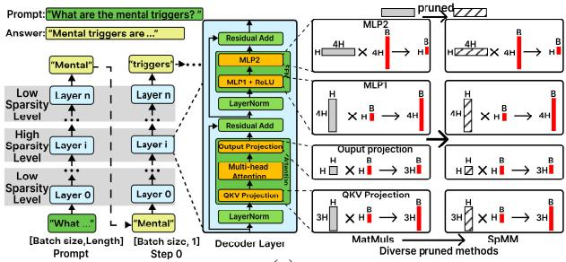  
(a)

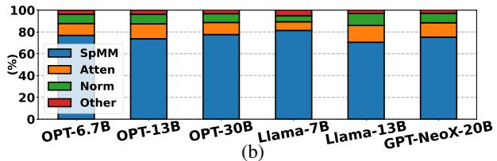  
Figure 1: (a) Network architecture of LLMs. The H and B mean the hidden dimension and inference batch size. (b) The time proportion of inference occupied by different kernels in the pruned model at 8 batch size.

Diverse sparsity patterns by different pruning methods. Many pruning methods have been proposed for LLMs, which are usually classified into structured [5, 7] and unstructured pruning [20, 40]. In practice, unstructured pruning typically retains better accuracy than more restrictive structured pruning [15,18,21]. Our approach is applicable to both types, with a primary focus on unstructured pruning. Besides, we give the examples of two well-known unstructured pruning methods, random [3] and magnitude [20]. Random prunes values randomly and results in a uniform non-zero element distribution per row, while magnitude prunes values with smaller absolute values of matrix weight and leads to an unpredictable and irregular distribution. Sparsity patterns caused by these two pruning methods result in performance fluctuation in Figure 4. Varied sparsity levels across layers at different depths in LLMs. Current works [2, 38, 49] observe that layers at different depths have different sensitivities to parameter pruning. To maintain accuracy, the sparsity level of pruning varies with the layer depth. For example in Figure 1a, the bottom and top layers show higher sensitivities (low sparsity level), while the intermediate layers have lower sensitivities (high sparsity level) [38]. This variance in sparsity level across layers poses additional challenges for efficient SpMM computation, as different sparsity levels demand corresponding tailored optimization strategies.

## 2.2 SpMM

SpMM (Sparse Matrix Multiplication) multiplies an M × K sparse matrix A and an K × N dense matrix B to output a M × N dense matrix C (i.e., C = AB). Figure 2 shows the SpMM computation process, where using the CSR format to store sparse matrix. In SpMM, there are two key factors that affect performance on GPUs. One aspect is how to distribute three loops (M/N/K dimension) of sparse and dense matrix to GPU process units for parallel memory access. Especially sparse matrices have diverse non-zero element distributions and a specially designed storage format, which leads to load unbalance and irregular memory access latency. The other aspect is how to accumulate (reduce) intermediate results with reduction dependencies of K-dimension. The number of reduction results varies with different sparsity levels of sparse matrix, which affects the computation efficiency of GPU process units. Many fine-grained analyses [9, 28] on SpMM suggest that diverse optimization strategies for distinct sparse matrices are necessary to achieve high performance on GPUs.

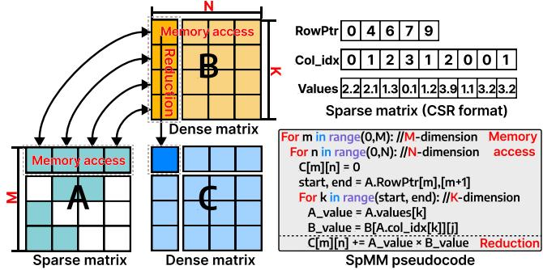  
Figure 2: SpMM computation and pseudocode.

## 2.3 Motivation

The motivation of GeneralSparse comes from two observations, which separately show its necessity and feasibility. Observation1. Parallel memory access strategies can be abstracted as the process of dividing boxes for diverse sparsity patterns. The parallel memory access strategies are to distribute regions of sparse and dense matrix to parallel process units on GPUs, which can be abstracted as the process of dividing boxes. Sparse and dense matrices are divided consecutively at the block/warp/thread level. Then, dividing strategies of sparse and dense matrices are integrated to form the memory access strategy (e.g., Sputnik [16] in Figure 3). However, existing SpMM methods on GPUs usually use the fixed parallel memory access strategy for all sparse matrices.

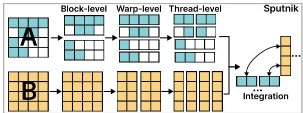  
Figure 3: Parallel memory access strategies are abstracted as the process of dividing box at the block/warp/thread-level.

Based on the above observation, the memory access space can be constructed, where the sparse matrix is adaptively and fine-grained divided for diverse sparsity patterns, and the dense matrix is regularly divided by column. Finally, different division strategies of sparse and dense matrices are integrated. The memory access space covers enormous and fine-grained box division strategies, which makes it challenging to implement this vast space. As shown in Figure 4, the performance of methods varies across different weight matrices, and new strategies in memory access space achieve higher performance.

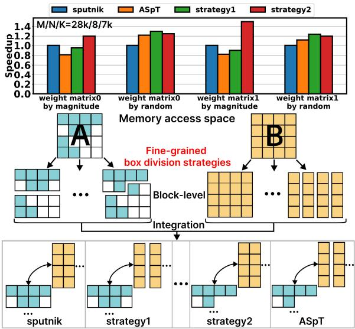  
Figure 4: Memory access space is composed of fine-grained box division strategies of the sparse and dense matrix. For simplicity, warp/thread-level is not shown here.

Observation2. Multi-level reduction algorithms can be used in combination for varied sparsity levels in LLMs. The current methods usually use a thread to sequentially reduce the results, while it limits the GPU parallel computation efficiency, especially in cases of low sparsity levels. As illustrated in Figure 5, we also use the warp-level instruction to reduce results, and the performance of two reduction algorithms varies with sparsity levels, indicating a single reduction algorithm cannot achieve optimal performance in all cases.

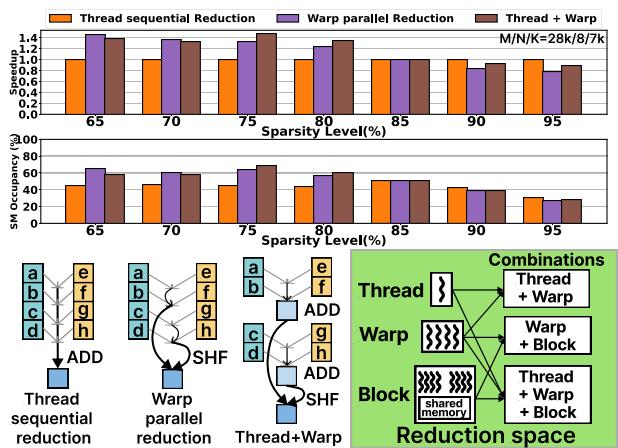  
Figure 5: Performance comparison between reduction algorithms, and the reduction space based on GPU hierarchy.

Due to the performance effect between sparsity levels and reduction algorithms, a hierarchical reduction space is required to adapt to different matrix sparsity levels based on GPU hierarchy. Furthermore, the reduction algorithms can also be used in combination of multi-levels thread/warp/block on GPU (e.g., Thread+Warp in Figure 5), which is challenging to implement these flexible combinations of reduction algorithms. Therefore, there is a need to explore and design efficient reduction strategies that can dynamically select or combine reduction algorithms to fully utilize hardware resources.

## 3 GeneralSparse Design

## 3.1 Overview

We propose GeneralSparse, which automatically designs and implements high-performance SpMM programs on GPUs, as illustrated in Figure 6. It consists of four parts: the memory access space, the reduction space, the cost model, and the code generator. The pruned sparse matrix and dense matrix are initially processed within the memory access space. Subsequently, reduction algorithms are selected and applied in the reduction space. Through the cost model for the optimal solution, the code generator generates the SpMM program.

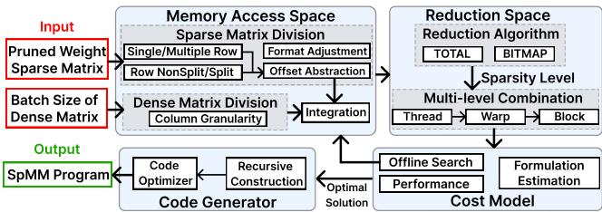  
Figure 6: Overview of GeneralSparse.

## 3.2 Memory Access Space

The memory access space covers fine-grained division strategies of sparse and dense matrix, representing that distributing sparse and dense matrix to process units for parallel memory access. In some cases, we use the concept of worker to represent parallel process units (thread/warp/block) on GPUs.

In memory access space, we design an orthogonal division of sparse matrices (row-based and split-based) and a column-based division of dense matrices. Then, we use offset abstraction for sparse matrix division and perform format adjustments. This allows for adaptive handling of diverse sparsity patterns and integration of sparse and dense matrix.

Design rationales for row-based and split-based. For improving the performance, there are two design rationales: reducing memory access latency and improving GPU efficiency. For reducing memory access latency, row-based reduces row index accesses, while split-based reduces non-zero subscript accesses. For GPU parallelism, if non-zeros concentrate in a few columns per row, multi-row row-based processing improves efficiency by enabling simultaneous column access. If non-zero counts vary greatly across rows, split-based achieves better load balancing.

Orthogonal dimension in sparse matrix division (allocation). In sparse matrix allocation, we design two orthogonal dimensions, including row-based and split-based dimensions as depicted in Figure 7a. Row-based dimension is considered from the perspective of GPU processing units, divided into single/multiple-row. Split-based dimension is considered from the matrix perspective, divided into row-nonsplit/split.

Single/multiple-row dimension means non-zero elements of single/multiple rows in the sparse matrix are processed by a worker. Single-row is beneficial when the matrix rows have distinct characteristics and require individual processing. For example, in matrices with highly irregular row-wise non-zero element distributions, processing one row at a time can simplify the data handling and computation process. Multiple-row takes advantage of the parallel processing capabilities of GPUs. When there is a certain similarity or correlation among adjacent rows, processing multiple rows together can significantly reduce the overhead of data fetching and processing, thereby improving the overall efficiency.

Row-nonsplit/split dimension means whether a row of the sparse matrix is split and processed by different workers. In row-nonsplit, each row of the sparse matrix is kept intact during processing. This ensures that the internal structure of each row is preserved, which can simplify memory access patterns and reduce the complexity of data management. It is useful for matrices with a relatively uniform row-wise structure. The row-split means dividing each row of the sparse matrix into smaller segments. This allows for more fine-grained processing, especially for matrices with highly irregular row structures. By splitting the rows, it becomes possible to better balance the workload among different processing units, resulting in improved performance.

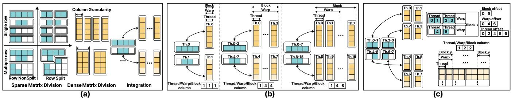  
Figure 7: (a) Division of sparse matrix and dense matrix, and integration in SpMM computation. (b) Integration between sparse and dense matrices using thread, warp, and block hierarchies. (Assume each warp/block has 4/8 threads). (c) Offset abstraction for sparse matrix division, along with integration.

Dense matrix division (allocation). The dense matrix allocation mode pertains to the organization of dense matrices. The dense matrix is distributed to workers with a uniform pattern of data block in column granularity, because computations between columns are independently parallel. An important aspect is the adjustable column granularity of allocation. The number of columns grouped for a particular allocation unit can be changed. For example in Figure 7a, we respectively group 1 and 2 columns into a single allocation unit. By adjusting this grouping of columns, we can optimize the memory access patterns and data transfer operations.

Integration between sparse and dense matrix. Integration of Figure 7a illustrates the column-based relationship between sparse and dense matrices. The arrow indicates the mapping between data blocks of the sparse matrix and those of the dense matrix. In Figure 7b, the dense matrix is divided into 1 column for thread (thread column = 1) and each thread processes one row of sparse matrix. When adjacent consecutive threads process different columns of dense matrix (warp/block column > 1), threads load the same non-zero elements in sparse matrix but different columns of dense matrix, which forms the thread-groups (e.g., Th.0-3 and Th.4-7 in middle of Figure 7b). It achieves data reuse in sparse matrix and coalesced access in dense matrix. When adjacent consecutive warps/blocks process the same non-zero elements in sparse matrix, it also forms warp/block-groups.

## Offset abstraction of adaptable division in sparse matrix.

We use a hierarchical approach with thread/warp/block offset for sparse matrix division, which is aligned with column-based integration in dense matrix. In Figure 7c, dense matrix is distributed with Block.y and two consecutive threads process different columns (e.g., thread-groups of Th.0- 1). Sparse matrix is distributed with Block.x, cooperated with Block.y of dense matrix. Besides, sparse matrix is allocated with thread-groups by single-row and row-split at thread-level, and allocated with warps by single-row and row-nonsplit at warp-level (etc. in block-level). Thread offset indicates the starting position of processing non-zeros range by threadgroups (e.g., 0 and 2 of Th.0-1 and Th.2-3). Warp/Block offset indicates the starting position of warps/blocks.

Design factors of offset abstraction. When designing the abstract representation of GPU allocation for sparse matrices, two crucial factors need to be taken into account. First, it should comprehensively cover the orthogonal allocation dimensions of the sparse matrix (including single/multiplerows and row-split/nonsplit) to adapt to different structures and optimize memory access. Regarding covering the orthogonal allocation dimensions, offsets can clearly locate the positions of different rows or row segments, effectively implementing data processing under different strategies. Second, it must align with the integration of the dense matrix. The change of warp/block column affects the number of threads in the thread-group, as shown in Figure 7c. So, the thread offset is based on thread-groups, not individual threads. Warp/block offset is also based on warp/block-groups, if the adjacent warps/blocks process the same non-zero elements in the sparse matrix.

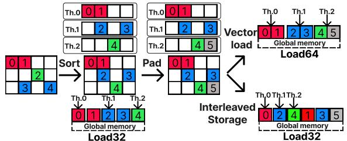  
Figure 8: Format adjustments of sparse matrix with thread allocation for access.

Format adjustment is centered around optimizing the memory access layouts of sparse matrices, which encompasses several crucial operations in Figure 8. Sort is employed to reorder the elements, leading to more regular and predictable memory access patterns. Pad ensures proper data alignment, especially considering the alignment requirements of the hardware. Interleaved storage stores data in a way that enables multiple elements to be loaded in a single coalesced memory access. Besides, vector instruction is utilized for memory access. For dense matrices, they allow simultaneous loading of multiple columns, maximizing memory bandwidth utilization and enhancing data throughput. For sparse matrices, adjacent threads can also load data in a coalesced manner, minimizing redundant memory accesses in Figure 8.

Workflow of memory access space. Based on our abstraction of the memory access, first, the columns of dense matrix are divided three times (block/warp/thread column), determining the threads number in thread-groups of sparse matrix. Second, the non-zero elements of sparse matrix are divided three times. The non-zero elements are divided into different blocks (block offset). The non-zero elements within the blocks are further divided into warps (warp offset) and threads (thread offset). Third, format adjustment and vector instructions are employed to fine-tune the memory access.

## 3.3 Reduction Space

Reduction space represents the reduction (accumulation) algorithms of intermediate results. We design reduction space from two aspects. First, reduction algorithms can be used in combination, with consideration of the pruning sparsity levels and the GPU hierarchy. The thread-level reduction can use fine-grained parallelism and is suitable for higher sparsity levels, while warp/block-levels can handle more data and suitable for lower sparsity levels. The reduction algorithms can be used in combination for diverse pruning sparsity levels. Second, reduction algorithms need to be aligned with the memory access space, especially irregular sparse matrix allocation. The memory access space determines data organization and access in memory, so the allocation of sparse and dense matrices affects the reduction method choice.

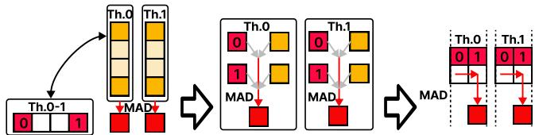  
Figure 9: Simplified illustration of reduction methods.

Simplify figure expression of the reduction algorithm. To describe reduction algorithms more clearly, we show the example in Figure 9. It depicts that two threads (Th.0 and Th.1) use Multiply-Add (MAD) operations to reduce the results of two adjacent columns corresponding with the same row. The elements of the dense matrix are removed for clarity.

Reduction algorithms are designed from GPU hierarchy, and aligned with single/multiple-row dimension. We design reduction algorithms from three-levels of GPU, and propose TOTAL and BITMAP algorithms which are aligned with single/multiple-row dimension. For single-row dimension, each row can be independently processed by a thread or a small set of threads. So it leads to a relatively simple and faster TOTAL algorithm. For multiple-row dimension, it enables the distribution of non-zero elements across rows, thereby achieving better load balancing among the processing units. However, it incurs additional overhead, because BITMAP algorithm must handle reductions that span across rows, necessitating the determination of element row membership.

TOTAL Reduction Algorithm. We introduce the TOTAL algorithm from three-levels of GPU corresponding with singlerow dimension. Figure 10(a) shows that THREAD\_TOTAL uses the MAD operation and registers to sequentially reduce the results of non-zero elements within the same row. Figure 10(c) shows that WARP\_TOTAL uses the warp-level shuffle instruction and registers to reduce results processed by a warp. Figure 10(e) shows that BLOCK\_TOTAL uses MUL and ADD instructions on block-level shared memory to reduce results.

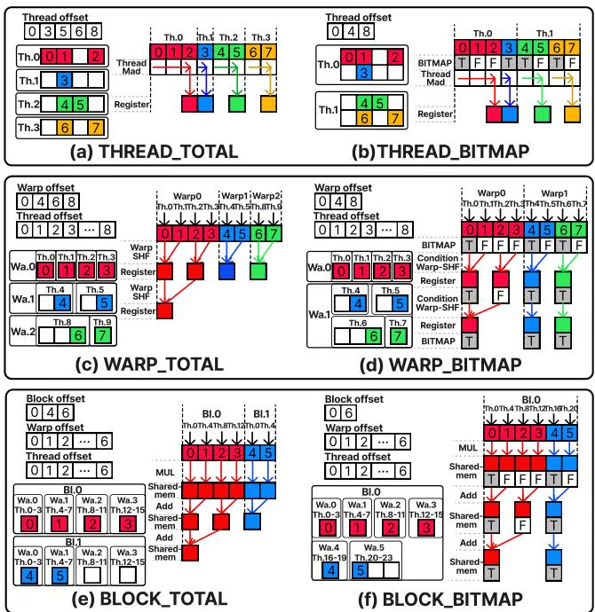  
Figure 10: TOTAL and BITMAP reduction example. Thread to warp/block level are suitable for sparsity from high to low.

BITMAP Reduction Algorithm. We propose the BITMAP algorithm from three-levels of GPU corresponding with multiplerow dimension. It uses the data structure of a BITMAP to judge whether the non-zero elements span rows. Each binary bit of BITMAP represents a non-zero element, T represents the starting position of the row, and F represents the positions within the row. Figure 10(b) shows that THREAD\_BITMAP uses the BITMAP to determine whether a thread continues accumulating the current result. If the next step crosses rows, the result will be written back directly. In warp/block level (Figure 10(d,f)), multiple threads perform reduction in parallel, detailed in Algorithm 1.

Multi-level combination of reduction algorithms can be used on GPU for diverse sparsity levels, which are aligned with row-split/nonsplit dimension. The reduction algorithms of three-levels can be used in combination from thread to warp/block. In row-nonsplit dimension, only a single processing pass is required to reduce all values within a row. This is because the entire row is processed intact, and the reduction can be finished straightforwardly. Conversely, in row-split dimension, the reduction values of the row are divided into several segments, so an extra step of reduction becomes necessary to consolidate these segments. For example, after an initial reduction at a low-level (e.g., thread-level), further reductions at a high-level (e.g., warp-level) are needed. Low-level TOTAL to High-level TOTAL. In Figure 11(a), it shows the example of THREAD\_TOTAL and WARP\_TOTAL. Thread-level allocation is in single-row and row-split dimension, which corresponds with the THREAD\_TOTAL to reduce results, and needs further warp-level reduction. Warplevel allocation is in single-row and row-nonsplit dimension, which corresponds with WARP\_TOTAL, and does not need further block-level reduction.

Algorithm 1 Parallel BITMAP Reduction Algorithm   
Require: Array Result of length L, BIT MAP of length L.   
n = ⌊log2(L)⌋, step = 1, BIT MAPinit = BIT MAP   
for i = 0 to n do   
step = step × 2   
for j = 0 to L − 1 − step in parallel do   
if BIT MAP[ j + step] = F then   
Result[ j] = Result[ j] + Result[ j + ste p]   
BIT MAP[ j + step] = BIT MAP[ j] ∨ BIT MAP[ j + step]   
end if   
end for   
end for   
for i = 0 to L − 1 in parallel do   
if BIT MAPinit [i] = T then   
return Result[i]   
end if   
end for

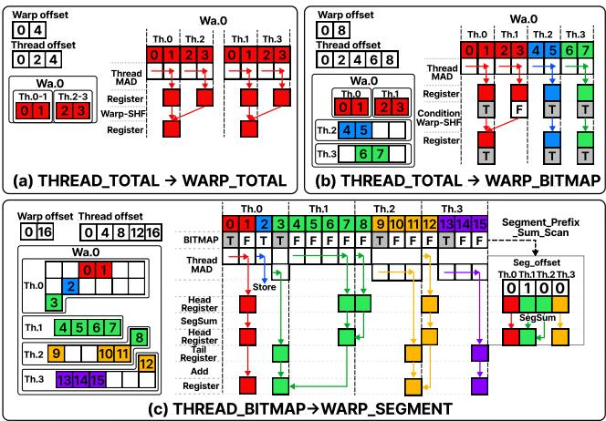  
Figure 11: Multi-level combination examples of reduction.

Low-level TOTAL to High-level BITMAP. In Figure 11(b), it shows the example of THREAD\_TOTAL and WARP\_BITMAP. Thread-level allocation is in single-row and row-split dimension, which corresponds with THREAD\_TOTAL to reduce results, and needs further warp-level reduction. Warplevel allocation is in multiple-row and row-nonsplit, which corresponds with the WARP\_BITMAP, and does not need further block-level reduction.

Low-level BITMAP to High-level SEGMENT. SEGMENT algorithm (Algorithm 2) is proposed to process the remaining intermediate results of low-level BITMAP. In Figure 11(c), THREAD\_BITMAP produces two intermediate results: the remaining result of the non-zero elements of the previous row and the head part of the non-zero elements of the next row, which need to further reduced by WARP\_SEGMENT. WARP\_SEGMENT algorithm uses Seg\_offset to perform reduction in head part, then adds the head and tail results together.

Algorithm 2 Parallel SEGMENT Reduction Algorithm   
Require: Array HeadRegister of length T , Array TailRegister of   
length T , BIT MAP of length L.   
n = L/T   
\*Seg\_offset = Segment\_Prefix\_Sum\_Scan(\*BIT MAP)   
for i = 0 to T − 1 in parallel do   
HeadRegister[i] = SegSum(HeadRegister[i:i+Seg\_offset[i]])   
Result[i] = HeadRegister[i] + TailRegister[i]   
end for   
return \*Result   
Function Segment\_Prefix\_Sum\_Scan(\*BIT MAP):   
malloc(\*Seg\_offset, T )   
for i = 0 to T − 1 in parallel do   
Seg\_offset[i] = False   
for j = 0 to n − 1 do   
Seg\_offset[i] = Seg\_offset[i] ∨ BITMAP[i × n + j]   
end for   
Seg\_offset[i] = 1 - Seg\_offset[i]   
end for   
Cumu\_sum(\*Seg\_offset) // Accumulate the positions with   
// consecutive values of 1 to the first position   
return \*Seg\_offset   
End Function

Rule-based selections of reduction algorithms considering sparsity levels and sparse matrix allocation. The selection process is structured into three hierarchical layers in Figure 12 and each layer has the judge of single-row and row-split dimension of sparse matrix allocation. The \*offset range is calculated by \*offset[i+1] - \*offset[i]. When the weight matrix is pruned at the high sparsity level, we set the thread offset range ≥ 2, so a thread reduction algorithm is applied. Conversely, when the pruned weight matrix at the low sparsity level, we set the thread offset range < 2, so it skips to warp/block-level, and warp/block reduction algorithms are utilized.

## 3.4 Cost Model

Workflow of GeneralSparse. Based on our abstraction of the memory access and reduction space, first, the sparse matrix and dense matrix are consecutively divided and integrated at block/warp/thread levels for distinct sparsity patterns. Second, the reduction algorithm is selected based on the rules, considered from sparsity levels. Third, through offline traversal search and the cost model for performance estimation, the optimal solution is selected.

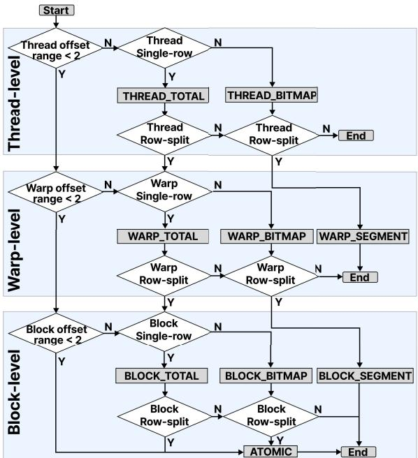  
Figure 12: Rule-based selections of reduction algorithms from GPU structures. The offset is set by sparsity levels.

Problem definition. Based on the workflow of GeneralSparse, the SpMM computation on GPUs can be expressed as a combinatorial problem of divisions (partitions). Consider NNZ non-zero elements of $M \times K$ sparse matrix and N columns of dense matrix that are divided into several groups. We summarize a variety of division strategies and each division (memory access) strategy incurs a specific cost c. Each division strategy is with its post-processing (reduction) cost d. The objective is to select a combination of division and post-processing strategies that minimizes the total cost of division and postprocessing costs $c + d .$

Cost estimation for division and reduction strategies. We collect the sparse characteristics of the sparse matrix (e.g., the average number of non-zeros per row), the column number of dense matrix and etc, as input, and fit the cost estimation using linear regression. The cost functions include the following aspects. Division (memory access) cost (ci j): Estimated based on workload distribution between parallel computation units. Post-processing (reduction) cost $( d _ { i j } ) \colon$ : Estimated based on the number and type of arithmetic operations, including read and write operations of reduction results. The goal is to minimize the total cost:

$$
\operatorname* { m i n } _ { i \in I , j \in J } \quad x _ { i j } ( c _ { i j } + d _ { i j } )\tag{1}
$$

subject to:

$$
x _ { i j } = 0 , \quad \mathrm { i f ~ e x c e e d i n g ~ h a r d w a r e ~ l i m i t a t i o n s }\tag{2}
$$

Offline search solution for optimal strategy. We solve this problem offline by a traversal search. First, we generate the valid strategy combinations for dense and sparse matrices, and calculate costs for each combination, factoring in division and post-processing costs. Second, identify the combination with the minimum cost as the optimal strategy. The offline search for the cost is lightweight compared with long-time running inference services, because the optimal strategy can be reused in the network of LLM.

Table 2: Variable Definitions
<table><tr><td>Variable</td><td>Type</td><td>Description</td></tr><tr><td> $x _ { i j }$ </td><td>Binary</td><td>1 if the division strategy i of dense ma- trix and j of sparse matrix is selected; O</td></tr><tr><td> $c _ { i j }$ </td><td>Real</td><td>otherwise. Division cost associated with the ij-th division strategy.</td></tr><tr><td> $d _ { i j }$ </td><td>Real</td><td>Post-processing (reduction) cost associ- ated with the ij-th division strategy.</td></tr></table>

Cost model explanation. For designing, our cost model is a linear regression model, to estimate the running performance of a specific matrix under a specific combination of strategies. For training, we use the characteristics of the sparse matrix (e.g., row numbers, column numbers, average non-zero elements per row and etc.) as the input for linear regression. We then use this model to fit the actual running performance of the sparse matrices in the training-set and the accuracy rate is approximately 90%. For dependency, there are different linear regression formulas for each specific memory access/reduction algorithm to estimate the actual running performance. Therefore, each formula of cost model depends on the specific memory access/reduction algorithm. Based on the estimated cost, we select the optimal memory access strategy and reduction combination for each sparse matrix.

## 3.5 Code Generator

The code-generator needs to generate executable code based on the memory access and reduction space. The kernel implementation includes recursive construction of the parallel loop and code optimizer.

Recursive construction algorithm. The SpMM kernel is decomposed into multiple levels of parallelism, recursively from block to warp and thread as shown in Figure 13. At the highest level, the SpMM kernel initiates the block-level parallelism and performs block reduction algorithms (if needed). Then move down to the warp and thread level. Each thread operates on a division of the data. The Thread Action involves vector loading of elements from the sparse matrix and dense matrix, reusing sparse data of thread-groups. Finally, the thread reduction is performed using either the THREAD\_TOTAL/BITMAP algorithm, depending on the sparse allocation.

Code Optimizer. An important consideration of code optimizer is the memory access of offset, which is used to determine the address range of non-zero elements in sparse matrix. However, offset may exhibit certain computational patterns in Table 3, so we can replace offset access with computational code. For instance, if the values follow a linear progression (fixed intervals n), instead of directly accessing the values, a mathematical formula (n×ID) can be used to calculate the address. This approach reduces the memory access overhead and can enhance the overall efficiency of the SpMM implementation.

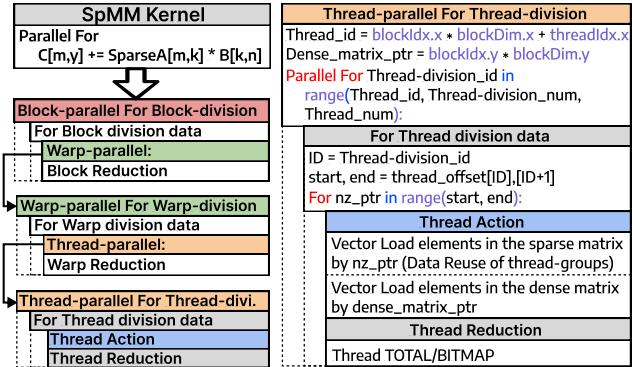  
Figure 13: Kernel skeleton of code generator.

Table 3: Patterns of the offset values, where the memory access can be replaced with the computational code.
<table><tr><td rowspan=1 colspan=1>Method</td><td rowspan=1 colspan=1>Description</td><td rowspan=1 colspan=1>OffsetExample</td></tr><tr><td rowspan=1 colspan=1>Linear</td><td rowspan=1 colspan=1>Compress indices with linear pat-terns into expressions</td><td rowspan=1 colspan=1>[0,5,10...]→5×ID①</td></tr><tr><td rowspan=1 colspan=1>Branch</td><td rowspan=1 colspan=1>Compress indices with only k val-ues into if statements</td><td rowspan=1 colspan=1>（0ifID=0[0,5,8]→5if ID=18if ID=2</td></tr><tr><td rowspan=1 colspan=1>Cyclicity</td><td rowspan=1 colspan=1>Periodically retain one completecycle and the cycle size</td><td rowspan=1 colspan=1>[0,1,6,7.,.]     →6×(ID/2)+ID%2</td></tr><tr><td rowspan=1 colspan=1>Quasilinear</td><td rowspan=1 colspan=1>Fita linear function to transformdata reads into linear calculationsplus residuals</td><td rowspan=1 colspan=1>[3.,8,13...]→5×ID+3</td></tr></table>

① start, end = thread\_offset[ID],[ID+1] → start, end = 5×ID, 5×(ID+1) in Figure 13.

## 4 Evaluation

## 4.1 Experimental Setup

We evaluate the performance of GeneralSparse from two aspects: kernel-level and model-level evaluation. Mixed precisions (FP16/32) are supported. The platform is the NVIDIA Tesla A100, based on the Ampere architecture. The CUDA environment is version 12.1.

## 4.2 Kernel Performance

Dataset of matrices. The sparse matrix datasets are from two aspects. First, the pruned weight matrix of LLM is across different shapes, corresponding to the matmuls within the OPT-30B and OPT-66B models [52]. Second, to demonstrate that our method is applicable to various sparsity patterns, we evaluate 1168 matrices from SuiteSparse collection [11], which source from real-world problems in various scenarios, including scientific computing, graph processing, etc.

Baselines. We compare GeneralSparse with various methods targeting SpMM optimization:

(1) Library: (i) CuSPARSE (v12.1) [30], which inputs sparse matrices in CSR format and offers three parameter choices, with the best result chosen.

(2) Artificial designs and auto-tuners: (i) ASpT [23], which uses column sorting and adaptive tiling to partition sparse matrices. (ii) Sputnik [16], a well-designed sparse library for matrices in DL. (iii) DgSPARSE [9], as the auto-tuner, offers eight algorithm choices, with the best result chosen. (iv) Flash-LLM [45], which uses tensor core to accelerate sparse weight matrices in DL. (v) SparTA [53], which supports structured sparsity on tensor core. (vi) TC-GNN [44], which fits the sparse GNN workload on dense TCs. (vii) DTC-SpMM [14], which is tailored to harness TCs.

(3) Sparse compiler technologies: (i) TACO [26], which supports the code generation of SpMM with the default schedule. (ii) SparseTIR [48], which provides a sparse tensor compilation abstraction.

Furthermore, SpMM in LLMs is the half-precision computation and only partial methods support half-precision. So on pruned matrices of LLMs, SpMM is compared on these partial methods. For the remaining methods, the comparison is conducted on SuiteSparse matrix using single-precision.

Achieved performance on pruned weight matrix. To verify the performance superiority of our method under different sparsity levels and pruning methods, we employ two representative pruning methods (Magnitude and Random) and two sparsity levels (70/90%). Figure 14 presents the kernel performance (in TFLOPs) of GeneralSparse compared to the state-of-the-art methods. GeneralSparse consistently outperforms other methods.

(1) Notably, GeneralSparse achieves the average speedup of 17.15/19.14/20.82× at 8/32/64 batch size over cuSPARSE.

(2) GeneralSparse achieves performance improvements of average 1.84/1.57/1.30× at 8 batch size on A100 over Sputnik, sparTA and Flash-LLM (2.24/1.37/1.31× at 32 and 3.37/1.27/1.38× at 64 batch size). Other methods do not support half-precision computation on GPU.

(3) GeneralSparse achieves the average speedup of 1.21/1.34 /1.33× at 8/32/64 batch size over SparseTIR. TACO does not support half-precision on GPU.

Speedup on pruned methods and sparsity levels. Table 4 shows GeneralSparse outperforms other methods in different pruned methods and sparsity levels. The results also show that sparTA outperforms sputnik in random pruning (70%), while sputnik outperforms sparTA in magnitude pruning (90%). This is because random pruning leads to the low variance of the non-zero elements number per row and 70% sparsity level is relatively dense, which is more suitable for SparTA based on tensor-core operations. While GeneralSparse consistently outperforms other methods, because other methods are unable to adaptively adjust to different sparse pruning patterns.

Speedup on unstructured and structured pruned weight matrix. As pruning methods are usually divided into two categories [5, 7]: structured pruning and unstructured pruning. We use different sizes of the pruning area to demonstrate the difference between the unstructured pruning method and the structured pruning method. The size of the pruned area in structured pruning is larger compared with unstructured pruning. Table 5 presents the kernel performance of GeneralSparse compared to the other methods.

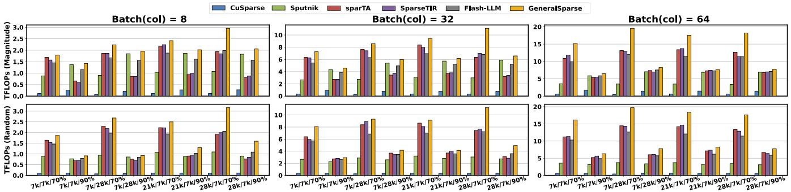  
Figure 14: Kernel performance on weight matrices of different shapes using Magnitude and Random pruning.

Table 4: The average speedup of GeneralSparse over other methods on the weight matrices in Figure 14.
<table><tr><td rowspan="2">Methods</td><td rowspan="2">Pruned methods</td><td colspan="2">col=8</td><td colspan="2">col=32</td></tr><tr><td>70%</td><td>90%</td><td>70%</td><td>90%</td></tr><tr><td rowspan="2">CuSPARSE</td><td>Magnitude</td><td>23.71×</td><td>7.40×</td><td>27.99×</td><td>7.01x</td></tr><tr><td>Random</td><td>26.13×</td><td>11.35×</td><td>29.29×</td><td>12.31×</td></tr><tr><td rowspan="2">Sputnik</td><td>Magnitude</td><td>2.39×</td><td>1.07×</td><td>3.15×</td><td>1.09x</td></tr><tr><td>Random</td><td>2.54×</td><td>1.37×</td><td>3.20×</td><td>1.54×</td></tr><tr><td rowspan="2">SparTA</td><td>Magnitude</td><td>1.22×</td><td>2.27×</td><td>1.28×</td><td>1.77×</td></tr><tr><td>Random</td><td>1.27×</td><td>1.51×</td><td>1.23×</td><td>1.22×</td></tr><tr><td rowspan="2">Flash-LLM</td><td>Magnitude</td><td>1.33x</td><td>1.26×</td><td>1.42×</td><td>1.21×</td></tr><tr><td>Random</td><td>1.36×</td><td>1.24×</td><td>1.41×</td><td>1.21×</td></tr></table>

The results indicate that GeneralSparse outperforms the cuSPARSE and Sputnik methods under various pruning granularities. However, it is inferior to SparTA, Flash-LLM, TC-GNN and DTC-SpMM in the case of a pruning granularity of (8, 8) and 70%. This is because when the pruning granularity is relatively large and relatively dense, it is more favorable for the structured computation of tensor-core. This indicates that our method is more suitable for unstructured pruning, but it also has a speedup for higher sparsity in structured pruning.

Achieved performance on SuiteSparse matrix. To validate that our method is applicable to a wider variety of sparse matrix characteristics, we conduct tests on the SuiteSparse matrix collection and use single-precision for floating-point values. Figure 15 illustrates the performance of 1168 matrices across various libraries and systems. The achieved performance is represented in a scatter plot, where the horizontal axis denotes the number of non-zero elements in the matrices, and the vertical axis measures performance in TFLOPS. The results demonstrate that GeneralSparse consistently outperforms other methods across the majority of the matrices analyzed. We can observe that:

(1) Notably, GeneralSparse achieves the average speedup of (2) GeneralSparse achieves performance improvements of average 2.32/1.37/N.A.× on A100 over Sputnik, DgSPARSE, and ASpT at 8 (1.22/1.20/7.69× at 32 and 1.29/1.23/2.15× at 64) batch size.

Table 5: The average speedup of GeneralSparse over other methods using random pruning on weight matrix.
<table><tr><td rowspan="2">Methods</td><td rowspan="2">Pruned size</td><td colspan="2">col=8</td><td colspan="2">col=32</td></tr><tr><td>70%</td><td>90%</td><td>70%</td><td>90%</td></tr><tr><td rowspan="3">CuSPARSE</td><td>(1,1)</td><td>26.13×</td><td>11.35×</td><td>29.29×</td><td>12.31×</td></tr><tr><td>(4,4)</td><td>27.08×</td><td>13.33×</td><td>30.35×</td><td>12.37×</td></tr><tr><td>(8.8)</td><td>27.10×</td><td>14.01×</td><td>31.37×</td><td>12.45×</td></tr><tr><td rowspan="3">Sputnik</td><td>(1,1)</td><td>2.54×</td><td>1.37×</td><td>3.20×</td><td>1.54×</td></tr><tr><td>(4,4)</td><td>2.60×</td><td>1.45×</td><td>3.27×</td><td>1.56×</td></tr><tr><td>(8.8)</td><td>2.61×</td><td>1.47×</td><td>3.28×</td><td>1.57×</td></tr><tr><td rowspan="3">SparTA</td><td>(1,1)</td><td>1.27×</td><td>1.51×</td><td>1.23×</td><td>1.22×</td></tr><tr><td>(4,4)</td><td>1.12×</td><td>1.26×</td><td>1.11×</td><td>1.18×</td></tr><tr><td>(8.8)</td><td>0.97×</td><td>1.02×</td><td>0.89×</td><td>0.93×</td></tr><tr><td rowspan="3">Flash-LLM</td><td>(1,1)</td><td>1.36×</td><td>1.24×</td><td>1.41×</td><td>1.21×</td></tr><tr><td>(4,4)</td><td>1.22×</td><td>1.20×</td><td>1.31×</td><td>1.12×</td></tr><tr><td>(8.8)</td><td>1.05×</td><td>1.15×</td><td>0.98×</td><td>1.04×</td></tr><tr><td rowspan="3">TC-GNN</td><td>(1,1)</td><td>1.41×</td><td>1.32×</td><td>1.46×</td><td>1.22×</td></tr><tr><td>(4.4)</td><td>1.32×</td><td>1.25×</td><td>1.35×</td><td>1.16×</td></tr><tr><td>(8.8)</td><td>1.07×</td><td>1.19×</td><td>0.98×</td><td>1.01×</td></tr><tr><td rowspan="2">DTC-SpMM</td><td>(1,1)</td><td>1.23×</td><td>1.20×</td><td>1.21×</td><td>1.32x</td></tr><tr><td>(4,4) (8.8)</td><td>1.11× 0.95×</td><td>1.18× 1.02×</td><td>1.09× 0.88×</td><td>1.10× 0.95×</td></tr></table>

(3) GeneralSparse achieves the average speedup of 10.60/ 4.97/2.73× on A100 over TACO at 8/32/64 batch size. A primary factor is that TACO’s design is not tailored for GPUs.

Speedup on SuiteSparse matrix. To illustrate the comparison between methods, we present the speedup ratio for the matrices in Table 6. The results demonstrate that there is a speedup effect compared to the other three methods across different columns for most matrices and experiences slowdown only for a small fraction of the matrices. This is because the current optimization method of the cost model we are using fails to cover finer-grained strategy selections. The best speedup effect is achieved where col = 8. This is because when col is relatively large, the proportion of computation increases compared with memory access, so the impact of memory access and reduction adjustments on GPU decreases.

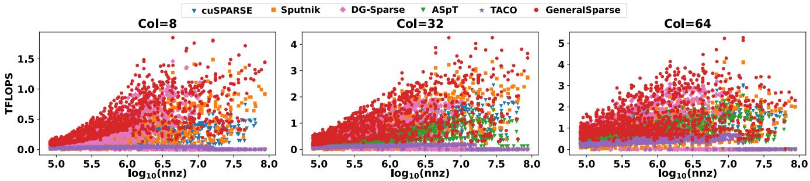  
Figure 15: Kernel Performance on SuiteSparse matrix.

Table 6: The speedup of GeneralSparse over other methods. The percentage represents the portion of matrices from suitesparse matrices. (N.A., ASpT is not applicable to col=8).
<table><tr><td>Col</td><td>Speedup</td><td>cuSPARSE</td><td>Sputnik</td><td>DgSparse</td><td>ASpT</td></tr><tr><td rowspan="4">8</td><td>&gt;1.8× 1.4-1.8×</td><td>76.9% 10.6%</td><td>54.3% 27.4%</td><td>19.1% 16.4%</td><td rowspan="4">N.A.</td></tr><tr><td>1.0-1.4×</td><td>12.0%</td><td>15.4%</td><td>61.3%</td></tr><tr><td>0.8-1.0×</td><td>0.5%</td><td>2.9%</td><td>3.2%</td></tr><tr><td>mean</td><td>6.39×</td><td>2.32×</td><td>1.37×</td></tr><tr><td rowspan="5">32</td><td>&gt;1.8× 1.4-1.8×</td><td>4.2%</td><td>36.7%</td><td>15.2%</td><td>N.A. 64.8%</td></tr><tr><td>1.0-1.4×</td><td>22.5% 65.4%</td><td>17.9% 40.0%</td><td>22.5%</td><td>16.9% 17.7%</td></tr><tr><td>0.8-1.0×</td><td>7.9%</td><td></td><td>49.5%</td><td>0.6%</td></tr><tr><td>mean</td><td>4.38×</td><td>5.4%</td><td>6.8%</td><td></td></tr><tr><td>&gt;1.8×</td><td>0.0%</td><td>1.22×</td><td>1.20×</td><td>7.69×</td></tr><tr><td rowspan="5">64</td><td>1.4-1.8×</td><td></td><td>39.7%</td><td>10.5%</td><td>23.9%</td></tr><tr><td>1.0-1.4×</td><td>12.0%</td><td>27.2%</td><td>13.2%</td><td>40.7%</td></tr><tr><td></td><td>82.9%</td><td>30.2%</td><td>72.1%</td><td>35.0%</td></tr><tr><td>0.8-1.0×</td><td>5.1%</td><td>2.8%</td><td>4.3%</td><td>0.3%</td></tr><tr><td>mean</td><td>7.46×</td><td>1.29 ×</td><td>1.23×</td><td>2.15×</td></tr></table>

## 4.3 Kernel Analysis

The kernel analysis primarily focuses on comparing GeneralSparse with two representative methods, Sputnik [16] and SparTA [53], to investigate the root causes of performance improvement from various perspectives. Additionally, ablation experiments are performed to evaluate our proposed method.

GeneralSparse achieves speedup compared to Sputnik by improving SM utilization. The profiling metrics for the matrix are presented in Figure 16. Notably, Active warps per SM of each matrix increases significantly. Sputnik uses a fixed GPU allocation to assign the row of sparse matrix to different thread blocks, leading to load unbalance. SparTA’s SM utilization is not listed because it uses tensor cores, making the comparison meaningless. GeneralSparse uses offset abstraction to achieve flexible GPU allocation of memory access and improve the parallelism. In addition, reduction methods, such as warp-level reduction, also improve the SM utilization.

GeneralSparse achieves speedup compared to SparTA by improving memory access efficiency. The profiling metrics for the matrix are presented in Figure 17. Notably, the Memory Bandwidth and L1/TEX Cache Throughput of each matrix increases significantly. The distinction in memory utilization is reflected in the reduction methods. SparTA converts the matrix into a format that is suitable for processing by the tensor-core and further performs reduction sequentially. GeneralSparse performs multi-level reduction on the GPU in the reduction method, alleviating the pressure of memory write-back to global memory. It saves the number of redundant write-back operations, improves L1 cache utilization, and thus increases memory bandwidth. Although the computing power of the tensor-core is stronger than that of the cuda-core, the performance bottleneck is limited by the memory access rather than the computing power.

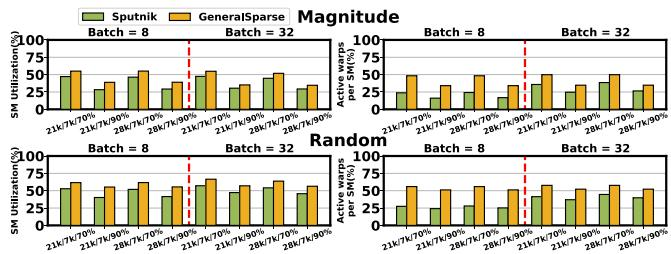  
Figure 16: Profiling metrics compared with Sputnik.

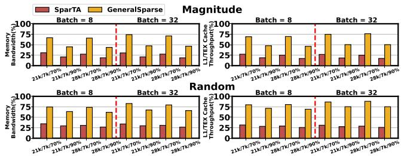  
Figure 17: Profiling metrics compared with SparTA.

Performance gain breakdown. We breakdown the performance gain in Figure 18 brought by GeneralSparse on suitesparse matrix. Due to the diverse sparse characteristics of matrices, the key points for improving performance vary on different matrices. GeneralSparse (base) means using the fixed GPU allocation (one thread block per row of sparse matrix) and thread sequential reduction. Op1 represents the flexible GPU allocation with format adjustments. Op2 represents using the multi-level reduction methods. Op1 mainly improves the performance on magnitude (90%) matrices, because they have a large variance in non-zero elements per row. Op2 mainly improves the performance on 70% matrices, because they have a relatively large number of non-zero elements per row. GeneralSparse (base + op1 + op2) achieves the best performance among them.

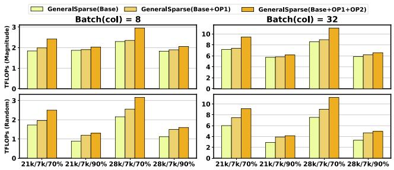  
Figure 18: Performance gain breakdown of GeneralSparse.

Achieved performance on additional GPU hardware. We also test the performance improvements of the pruned weight matrices at 8 batch size on NVIDIA V100 in Figure 19.

(1) Notably, GeneralSparse achieves the average speedup of 16.08× at 8 batch size over cuSPARSE.

(2) GeneralSparse achieves performance improvements of average 1.73/1.55/1.28× at 8 batch size on V100 over Sputnik, sparTA and Flash-LLM.

(3) GeneralSparse achieves the average speedup of 15.98× at 8 batch size over SparseTIR.

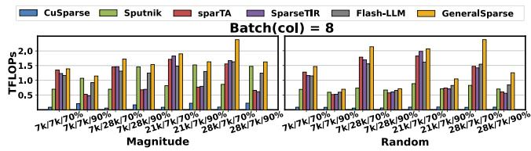  
Figure 19: Kernel performance on weight matrices using Magnitude and Random on NVIDIA V100.

## 4.4 Model Evaluation

Settings and Baselines. We integrate the kernels, generated by GeneralSparse, into FasterTransformer [31] by providing a set of C++ APIs, which enables high-efficiency distributed inference with sparsified weight matrices. GeneralSparse can also be easily integrated into other deep learning frameworks through library calls with APIs. We compare GeneralSparse with various methods by end-to-end performance:

(1) Dense computation: (i) CUBLAS [33], which is included as a baseline to compare the performance gains to standard dense implementations of LLM inference.

(2) Sparse counterparts: (i) CuSPARSE, which is the sparse library. (ii) Flash-LLM, which is also integrated into Faster-Transformer.

Dataset of models. We benchmark the end-to-end inference latency on OPT-30B/66B [52] and Llama-7B/13B/65B [41], Llama-3.1-8B/70B [19]. For all experiments, the input prompt sequence length is 64, and the output/generated sequence length is 512. We utilize the magnitude pruning [29] method, and use 70% sparsity level at the bottom and top layers, and 90% sparsity level at the intermediate layers.

To demonstrate that the pruned model maintains comparable performance to the original model, we evaluate the accuracy of the pruned versions of OPT-30B/66B [52] on the BoolQ task of SuperGLUE [42] by lm-evaluation-harness benchmark [17]. Specifically, the accuracy for OPT-30B decreases from 69.69% to 67.20%, while OPT-60B’s accuracy declines from 70.46% to 68.01%.

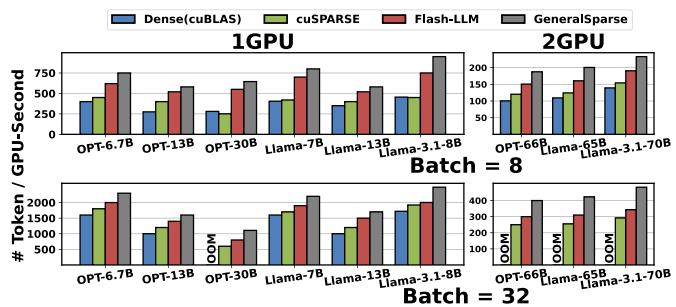  
Figure 20: End-to-end model throughput.

Metric. We use the metric of tokens per GPU-second to represent normalized inference throughput, accounting for both inference time and hardware cost (i.e., the number of GPUs used), which is calculated by the formula: $N _ { t o k e n } / \sum _ { i = 1 } ^ { N _ { g p u } } T _ { i } . N _ { t o k e n }$ means the number of tokens generated, whereas $N _ { g p u }$ and $T _ { i }$ mean the GPU number and the time spent on the i’th GPU for execution. (OOM, out-of-memory).

Speedups on models. OPT-60B, Llama-65B and Llama-3.1- 70B models are evaluated on two A100 GPUs in a tensor parallel manner. Other smaller models are evaluated on a single GPU. From the results, we observe that:

(1) Notably, GeneralSparse achieves the average speedup of 2.33/1.58× over Dense(cuBLAS) at 8/32 batch size.

(2) GeneralSparse achieves performance improvements of average 1.50/1.20× at 8 batch size, 1.48/1.23× at 32 batch size over cuSPARSE/FlashLLM.

OPT-30B, OPT-66B and Llama-65B models exceed the GPU memory limit (OOM, out-of-memory) when batch size is 32. However, the weights after sparse pruning reduce the memory usage, enabling the normal inference process. Besides, under the OPT-30B model (batch size = 8), the inference time of cuSPARSE is even worse than that of the dense implementation, because in some sparse patterns the performance of cuSPARSE is worse than its dense implementation.

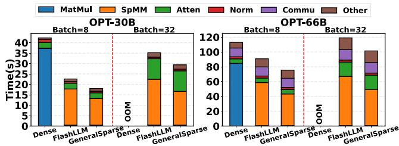  
Figure 21: Time breakdown compared with other methods.

## 4.5 Model Analysis

OPT-30B. For figuring out why GeneralSparse can achieve better performance, we conduct the end-to-end breakdowns using the NSight System [32]. The inference time is shown in Figure 21. GeneralSparse can achieve lower inference latency mainly because we replace the dense MatMul with the more efficient SpMM. Besides, the time of MatMul, SpMM, and attention all increase with the increase in batch size. Compared with cuSPARSE and Flash-LLM, however, due to the performance improvement of SpMM, we decrease the inference time of the end-to-end model.

OPT-66B. To verify the proportion of our matrix time on multiple GPUs, we further analyze the inference time of OPT-60B across 2-GPUs. The OPT-60B runs on two GPUs in a tensor parallel manner, where the weight matrices are split and distributed to 2 GPUs. We conduct the time breakdown of end-to-end inference for OPT-66B as shown in Figure 21. Compared with a single GPU, there is additional communication overhead, but the performance bottleneck is still the MatMul part. It also verifies that our kernel speedup and tensor parallel can be effectively integrated. In detail, the acceleratio ratio in the prefill and decoding stages is 1.21/1.45 times and 1.52/1.63 times higher than FlashLLM/Dense at 8 batch size.

## 4.6 Search Analysis

Offline search analysis. The number of search iterations depends on the number of valid strategy combinations and the matrix characteristics. The search ranges about 30-50 iterations and 10-30 seconds in our search, achieving 90% of the best performance (hundreds search and about 15 minutes). For performance impact of different strategies, the difference in performance between different strategies for different matrices varies, with some matrices having a performance gap of three times that of different strategies, while others fluctuate by about ten percent.

Code generation and compilation time cost. For code generation time cost, it takes about a few seconds on small matrices, and one or two minutes on large matrices. During the offline search, the generated code has already been compiled for each matrix. At runtime, one can directly call the customized library for each matrix, similar to calling a sparse matrix multiplication library. We measure the compilation time for each matrix, which is only a few seconds. For the entire model compilation time, it takes only a few minutes for smaller models like Llama-7B, and for larger models such as Llama-65B, it takes around ten-odd minutes.

## 5 Related Work and Discussion

Our work draws inspiration from and contributes to several key research directions:

SpMM optimization. SpMM is a fundamental operation in sparse computation, with prior works such as cuSPARSE [34] and TACO [26] providing essential support for sparse matrix operations. However, these approaches often lack flexibility and fail to fully leverage GPU architectures for diverse sparsity patterns. Recent methods, such as Sputnik [16] and ASpT [23], have focused on optimizing SpMM for specific sparsity configurations, while SparTA [53] and Flash-LLM [45] utilize GPU tensor cores for structured sparsity acceleration. Despite their improvements, these methods often remain limited in adaptability to diverse sparsity patterns. GeneralSparse addresses these limitations by introducing an adaptable solution and automated code generation.

Pruning techniques for neural networks. Pruning methods are usually classified into unstructured pruning [20, 40] to structured sparsity [5, 7], which have been widely adopted to reduce the computational and memory demands of neural networks. In practice, unstructured pruning achieves higher accuracy retention [15,18,21] compared with structured pruning. GeneralSparse is designed to handle both categories, providing consistent performance gains across varying sparsity levels and patterns.

Large language model acceleration. Accelerating LLMs has become a critical research focus due to their growing computational demands. Existing efforts, such as FasterTransformer [31], DeepSpeed [36], and FlashAttention [10], have optimized various components of LLM inference, including attention mechanisms and scheduling strategies. By integrating seamlessly with existing LLM acceleration frameworks, GeneralSparse enhances the overall efficiency of sparsified LLM inference.

Discussion. This work represents a convergence of advancements in sparse computation, pruning methods, and GPU optimization, delivering a vertical solution that aligns with ongoing developments in LLM acceleration and sparse computation. By bridging the gap between adaptability and performance, GeneralSparse sets a new benchmark for highperformance sparse computation on GPUs.

## 6 Conclusion

We present GeneralSparse, a novel solution for designing SpMM programs on GPUs, addressing key challenges in performance bottlenecks in LLM inference considering diverse pruning patterns and sparsity levels. By introducing a unified abstraction of memory access and reduction spaces, flexible GPU allocation, and automated kernel generation. Extensive evaluations demonstrate its adaptability across pruned weight matrices and real-world datasets. Our code is available on https://github.com/Wangyaoyuu/GeneralSparse.

## Acknowledgments

The authors sincerely thank our shepherd Somali Chaterji and anonymous reviewers for their insightful suggestions. The work is supported by National Natural Science Foundation of China, under Grant No. 62032023, T2125013, 62172391.

## References

[1] Amey Agrawal, Nitin Kedia, Ashish Panwar, Jayashree Mohan, Nipun Kwatra, Bhargav Gulavani, Alexey Tumanov, and Ramachandran Ramjee. Taming {Throughput-Latency} tradeoff in {LLM} inference with {Sarathi-Serve}. In 18th USENIX Symposium on Operating Systems Design and Implementation (OSDI 24), pages 117–134, 2024.

[2] Guangji Bai, Yijiang Li, Chen Ling, Kibaek Kim, and Liang Zhao. Sparsellm: Towards global pruning of pretrained language models. In The Thirty-eighth Annual Conference on Neural Information Processing Systems, 2024.

[3] Davis Blalock, Jose Javier Gonzalez Ortiz, Jonathan Frankle, and John Guttag. What is the state of neural network pruning? In I. Dhillon, D. Papailiopoulos, and V. Sze, editors, Proceedings of Machine Learning and Systems, volume 2, pages 129–146, 2020.

[4] Tom B Brown. Language models are few-shot learners. In H. Larochelle, M. Ranzato, R. Hadsell, M.F. Balcan, and H. Lin, editors, Advances in Neural Information Processing Systems, volume 33, pages 1877–1901. Curran Associates, Inc., 2020.

[5] Roberto L Castro, Andrei Ivanov, Diego Andrade, Tal Ben-Nun, Basilio B Fraguela, and Torsten Hoefler. Venom: A vectorized n: M format for unleashing the power of sparse tensor cores. In Proceedings of the International Conference for High Performance Computing, Networking, Storage and Analysis, pages 1–14, 2023.

[6] Tianqi Chen, Thierry Moreau, Ziheng Jiang, Lianmin Zheng, Eddie Yan, Haichen Shen, Meghan Cowan, Leyuan Wang, Yuwei Hu, Luis Ceze, et al. {TVM}: An automated {End-to-End} optimizing compiler for deep learning. In 13th USENIX Symposium on Operating Systems Design and Implementation (OSDI 18), pages 578–594, 2018.

[7] Zhaodong Chen, Zheng Qu, Liu Liu, Yufei Ding, and Yuan Xie. Efficient tensor core-based gpu kernels for structured sparsity under reduced precision. In Proceedings of the International Conference for High Performance Computing, Networking, Storage and Analysis, pages 1–14, 2021.

[8] Stephen Chou, Fredrik Kjolstad, and Saman Amarasinghe. Format abstraction for sparse tensor algebra compilers. Proceedings of the ACM on Programming Languages, 2(OOPSLA):1–30, 2018.

[9] Guohao Dai, Guyue Huang, Shang Yang, Zhongming Yu, Hengrui Zhang, Yufei Ding, Yuan Xie, Huazhong Yang, and Yu Wang. Heuristic adaptability to input dynamics for spmm on gpus. In Proceedings of the 59th ACM/IEEE Design Automation Conference, pages 595–600, 2022.

[10] Tri Dao, Dan Fu, Stefano Ermon, Atri Rudra, and Christopher Ré. Flashattention: Fast and memoryefficient exact attention with io-awareness. Advances in Neural Information Processing Systems, 35:16344– 16359, 2022.

[11] Timothy A Davis and Yifan Hu. The university of florida sparse matrix collection. ACM Transactions on Mathematical Software (TOMS), 38(1):1–25, 2011.

[12] Tianyu Ding, Tianyi Chen, Haidong Zhu, Jiachen Jiang, Yiqi Zhong, Jinxin Zhou, Guangzhi Wang, Zhihui Zhu, Ilya Zharkov, and Luming Liang. The efficiency spectrum of large language models: An algorithmic survey. arXiv preprint arXiv:2312.00678, 2023.

[13] Zhen Du, Jiajia Li, Yinshan Wang, Xueqi Li, Guangming Tan, and Ninghui Sun. Alphasparse: Generating high performance spmv codes directly from sparse matrices. In SC22: International Conference for High Performance Computing, Networking, Storage and Analysis, pages 1–15. IEEE, 2022.

[14] Ruibo Fan, Wei Wang, and Xiaowen Chu. Dtc-spmm: Bridging the gap in accelerating general sparse matrix multiplication with tensor cores. In Proceedings of the 29th ACM International Conference on Architectural Support for Programming Languages and Operating Systems, Volume 3, pages 253–267, 2024.

[15] Elias Frantar and Dan Alistarh. Sparsegpt: Massive language models can be accurately pruned in one-shot. In International Conference on Machine Learning, pages 10323–10337. PMLR, 2023.

[16] Trevor Gale, Matei Zaharia, Cliff Young, and Erich Elsen. Sparse gpu kernels for deep learning. In SC20: International Conference for High Performance Computing, Networking, Storage and Analysis, pages 1–14. IEEE, 2020.

[17] Leo Gao, Jonathan Tow, Baber Abbasi, Stella Biderman, Sid Black, Anthony DiPofi, Charles Foster, Laurence Golding, Jeffrey Hsu, Alain Le Noac’h, Haonan Li, Kyle McDonell, Niklas Muennighoff, Chris Ociepa, Jason Phang, Laria Reynolds, Hailey Schoelkopf, Aviya Skowron, Lintang Sutawika, Eric Tang, Anish Thite, Ben Wang, Kevin Wang, and Andy Zou. A framework for few-shot language model evaluation, 07 2024.

[18] Aidan N Gomez, Ivan Zhang, Siddhartha Rao Kamalakara, Divyam Madaan, Kevin Swersky, Yarin Gal, and Geoffrey E Hinton. Learning sparse networks using targeted dropout. arXiv preprint arXiv:1905.13678, 2019.

[19] Aaron Grattafiori, Abhimanyu Dubey, Abhinav Jauhri, Abhinav Pandey, Abhishek Kadian, Ahmad Al-Dahle, Aiesha Letman, Akhil Mathur, Alan Schelten, Alex Vaughan, et al. The llama 3 herd of models. arXiv preprint arXiv:2407.21783, 2024.

[20] Song Han, Jeff Pool, John Tran, and William J. Dally. Learning both weights and connections for efficient neural networks, 2015.

[21] Torsten Hoefler, Dan Alistarh, Tal Ben-Nun, Nikoli Dryden, and Alexandra Peste. Sparsity in deep learning: Pruning and growth for efficient inference and training in neural networks. Journal of Machine Learning Research, 22(241):1–124, 2021.

[22] Changwan Hong, Aravind Sukumaran-Rajam, Bortik Bandyopadhyay, Jinsung Kim, Süreyya Emre Kurt, Israt Nisa, Shivani Sabhlok, Ümit V Çatalyürek, Srinivasan Parthasarathy, and P Sadayappan. Efficient sparsematrix multi-vector product on gpus. In Proceedings of the 27th International Symposium on High-Performance Parallel and Distributed Computing, pages 66–79, 2018.

[23] Changwan Hong, Aravind Sukumaran-Rajam, Israt Nisa, Kunal Singh, and P Sadayappan. Adaptive sparse tiling for sparse matrix multiplication. In Proceedings of the 24th Symposium on Principles and Practice of Parallel Programming, pages 300–314, 2019.

[24] Guyue Huang, Guohao Dai, Yu Wang, and Huazhong Yang. Ge-spmm: General-purpose sparse matrix-matrix multiplication on gpus for graph neural networks. In SC20: International Conference for High Performance Computing, Networking, Storage and Analysis, pages 1–12. IEEE, 2020.

[25] Peng Jiang, Changwan Hong, and Gagan Agrawal. A novel data transformation and execution strategy for accelerating sparse matrix multiplication on gpus. In Proceedings of the 25th ACM SIGPLAN symposium on principles and practice of parallel programming, pages 376–388, 2020.

[26] Fredrik Kjolstad, Shoaib Kamil, Stephen Chou, David Lugato, and Saman Amarasinghe. The tensor algebra compiler. Proceedings of the ACM on Programming Languages, 1(OOPSLA):1–29, 2017.

[27] Woosuk Kwon, Zhuohan Li, Siyuan Zhuang, Ying Sheng, Lianmin Zheng, Cody Hao Yu, Joseph E. Gonzalez, Hao Zhang, and Ion Stoica. Efficient memory management for large language model serving with pagedattention. In Proceedings of the ACM SIGOPS 29th Symposium on Operating Systems Principles, 2023.

[28] Junqing Lin, Honghe Zhang, Xiaolong Shi, Jingwei Sun, Xianzhi Yu, Jun Yao, and Guangzhong Sun. Ec-spmm: Efficient compilation of spmm kernel on gpus. In Proceedings of the 52nd International Conference on Parallel Processing, ICPP ’23, page 21–30, New York, NY, USA, 2023. Association for Computing Machinery.

[29] Pavlo Molchanov, Arun Mallya, Stephen Tyree, Iuri Frosio, and Jan Kautz. Importance estimation for neural network pruning. In Proceedings of the IEEE/CVF conference on computer vision and pattern recognition, pages 11264–11272, 2019.

[30] Maxim Naumov, L Chien, Philippe Vandermersch, and Ujval Kapasi. Cusparse library. In GPU Technology Conference, 2010.

[31] NVIDIA. Fastertransformer. https://github.com/ NVIDIA/FasterTransformer, 2022.

[32] NVIDIA. Nsight system. https://developer. nvidia.com/nsight-systems, 2023.

[33] NVIDIA. Cublas docs. https://docs.nvidia.com/ cuda/cublas, 2024.

[34] NVIDIA. Cusparse docs. https://docs.nvidia. com/cuda/cusparse, 2024.

[35] Alec Radford, Jeffrey Wu, Rewon Child, David Luan, Dario Amodei, Ilya Sutskever, et al. Language models are unsupervised multitask learners. OpenAI blog, 1(8):9, 2019.

[36] Jeff Rasley, Samyam Rajbhandari, Olatunji Ruwase, and Yuxiong He. Deepspeed: System optimizations enable training deep learning models with over 100 billion parameters. In Proceedings of the 26th ACM SIGKDD International Conference on Knowledge Discovery & Data Mining, pages 3505–3506, 2020.

[37] Abudurexiti Reheman, Tao Zhou, Yingfeng Luo, Di Yang, Tong Xiao, and Jingbo Zhu. Prompting neural machine translation with translation memories. In Proceedings of the AAAI Conference on Artificial Intelligence, pages 13519–13527, 2023.

[38] Hang Shao, Bei Liu, and Yanmin Qian. One-shot sensitivity-aware mixed sparsity pruning for large language models. In ICASSP 2024-2024 IEEE International Conference on Acoustics, Speech and Signal Processing (ICASSP), pages 11296–11300. IEEE, 2024.

[39] Mohammad Shoeybi, Mostofa Patwary, Raul Puri, Patrick LeGresley, Jared Casper, and Bryan Catanzaro. Megatron-lm: Training multi-billion parameter language models using model parallelism. arXiv preprint arXiv:1909.08053, 2019.

[40] Mingjie Sun, Zhuang Liu, Anna Bair, and J Zico Kolter. A simple and effective pruning approach for large language models. arXiv preprint arXiv:2306.11695, 2023.

[41] Hugo Touvron, Thibaut Lavril, Gautier Izacard, Xavier Martinet, Marie-Anne Lachaux, Timothée Lacroix, Baptiste Rozière, Naman Goyal, Eric Hambro, Faisal Azhar, et al. Llama: Open and efficient foundation language models. arXiv preprint arXiv:2302.13971, 2023.

[42] Alex Wang, Yada Pruksachatkun, Nikita Nangia, Amanpreet Singh, Julian Michael, Felix Hill, Omer Levy, and Samuel Bowman. Superglue: A stickier benchmark for general-purpose language understanding systems. Advances in neural information processing systems, 32, 2019.

[43] Wenxiao Wang, Wei Chen, Yicong Luo, Yongliu Long, Zhengkai Lin, Liye Zhang, Binbin Lin, Deng Cai, and Xiaofei He. Model compression and efficient inference for large language models: A survey. arXiv preprint arXiv:2402.09748, 2024.

[44] Yuke Wang, Boyuan Feng, Zheng Wang, Guyue Huang, and Yufei Ding. {TC-GNN}: Bridging sparse {GNN} computation and dense tensor cores on {GPUs}. In 2023 USENIX Annual Technical Conference (USENIX ATC 23), pages 149–164, 2023.

[45] Haojun Xia, Zhen Zheng, Yuchao Li, Donglin Zhuang, Zhongzhu Zhou, Xiafei Qiu, Yong Li, Wei Lin, and Shuaiwen Leon Song. Flash-llm: Enabling costeffective and highly-efficient large generative model inference with unstructured sparsity. Proceedings of the VLDB Endowment, 17(2):211–224, 2023.

[46] Jie Xin, Xianqi Ye, Long Zheng, Qinggang Wang, Yu Huang, Pengcheng Yao, Linchen Yu, Xiaofei Liao, and Hai Jin. Fast sparse deep neural network inference with flexible spmm optimization space exploration. In 2021 IEEE High Performance Extreme Computing Conference (HPEC), pages 1–7. IEEE, 2021.

[47] Carl Yang, Aydın Buluç, and John D Owens. Design principles for sparse matrix multiplication on the gpu. In European Conference on Parallel Processing, pages 672–687. Springer, 2018.

[48] Zihao Ye, Ruihang Lai, Junru Shao, Tianqi Chen, and Luis Ceze. Sparsetir: Composable abstractions for sparse compilation in deep learning. In Proceedings

of the 28th ACM International Conference on Architectural Support for Programming Languages and Operating Systems, Volume 3, pages 660–678, 2023.

[49] Lu Yin, You Wu, Zhenyu Zhang, Cheng-Yu Hsieh, Yaqing Wang, Yiling Jia, Gen Li, Ajay Jaiswal, Mykola Pechenizkiy, Yi Liang, et al. Outlier weighed layerwise sparsity (owl): A missing secret sauce for pruning llms to high sparsity. arXiv preprint arXiv:2310.05175, 2023.

[50] A. M. Zaki, M. I. Khalil, and H. M. Abbas. Deep architectures for abstractive text summarization in multiple languages. In 2019 14th International Conference on Computer Engineering and Systems (ICCES), pages 22– 27, 2019.

[51] Amr M. Zaki, Mahmoud I. Khalil, and Hazem M. Abbas. Amharic abstractive text summarization, 2020.

[52] Susan Zhang, Stephen Roller, Naman Goyal, Mikel Artetxe, Moya Chen, Shuohui Chen, Christopher Dewan, Mona Diab, Xian Li, Xi Victoria Lin, et al. Opt: Open pre-trained transformer language models. arXiv preprint arXiv:2205.01068, 2022.

[53] Ningxin Zheng, Bin Lin, Quanlu Zhang, Lingxiao Ma, Yuqing Yang, Fan Yang, Yang Wang, Mao Yang, and Lidong Zhou. {SparTA}:{Deep-Learning} model sparsity via {Tensor-with-Sparsity-Attribute}. In 16th USENIX Symposium on Operating Systems Design and Implementation (OSDI 22), pages 213–232, 2022.