①

USENIX

THE ADVANCED COMPUTING SYSTEMS ASSOCIATION

# GMI-DRL: Empowering Multi-GPU DRL with Adaptive-Grained Parallelism

Yuke Wang, Rice University; Boyuan Feng, University of California Santa Barbara; Zheng Wang, University of California San Diego; Guyue Huang, University of California Santa Barbara; Tong (Tony) Geng, University of Rochester; Ang Li, Pacific Northwest National Laboratory; Yufei Ding, University of California San Diego https://www.usenix.org/conference/atc25/presentation/wang-yuke

# This paper is included in the Proceedings of the 2025 USENIX Annual Technical Conference.

July 7–9, 2025 • Boston, MA, USA ISBN 978-1-939133-48-9

Open access to the Proceedings of the 2025 USENIX Annual Technical Conference is sponsored by

P--r.h £Es/sL.

auuJl9 PgleU

King Abdullah University of

Science and Technology

# GMI-DRL: Empowering Multi-GPU DRL with Adaptive-Grained Parallelism

Yuke Wang, Boyuan Feng‡, Zheng Wang⋄, Guyue Huang‡, Tong Geng†, Ang Li∗, and Yufei Ding⋄

†University of Rochester, ∗Pacific Northwest National Laboratory,

‡UC at Santa Barbara, ⋄UC at San Diego,

Rice University

## Abstract

With the increasing popularity of robotics in industrial control and autonomous driving, deep reinforcement learning (DRL) raises the attention of various fields. However, DRL computation on the modern powerful multi-GPU platform is still inefficient due to its heterogeneous tasks and complicated inter-task interactions. To this end, we propose GMI-DRL, the first systematic design for scaling multi-GPU DRL via adaptive-grained parallelism. To facilitate such a new parallelism scheme, GMI-DRL introduces a new concept – GPU Multiplexing Instance (GMI), a unified resource-adjustable sub-GPU design for heterogeneous tasks in DRL scaling. Besides, GMI-DRL introduces an adaptive Coordinator to effectively manage workloads and resources for better system performance. GMI-DRL also incorporates a specialized Communicator with highly efficient inter-GMI communication support to meet diverse communication demands. Extensive experiments demonstrate that GMI-DRL outperforms stateof-the-art DRL accelerating solution in training throughput (up to 2.34×) and GPU utilization (up to 40.8% improvement) on the DGX-A100 platform.

## 1 Introduction

Recently, deep reinforcement learning (DRL) has raised significant interest in research and industry fields. DRL combines the conventional RL algorithms [25, 39] with deep neural networks (DNNs) and has demonstrated superhuman performance in decision-making. DRL has been applied in many real-world applications across various domains, like robotics [12,18,33,44,50], industrial control [4,8,41,51], and autonomous driving [5,20,38,48]. The latest DRL application highlighted most is OpenAI ChatGPT [33], which is trained with DRL from human feedback. Due to the cost, efficiency, and safety concerns in the real world, DRL training is commonly conducted in simulated environments on computers. Then the pretrained DRL model (policy) is fine-tuned and deployed to the real-world environment [15, 24].

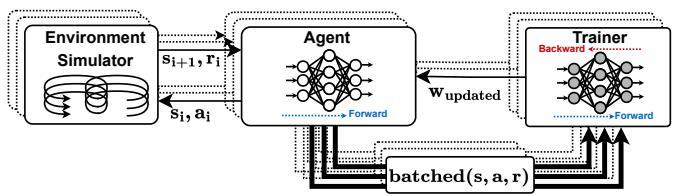  
(a)

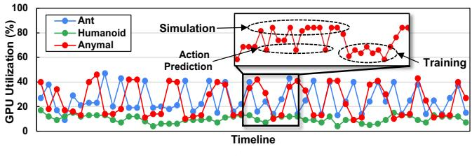  
(b)  
Figure 1: (a) Basic DRL computation flow in PPO [39] with three major components: simulator, agent, and trainer. Note that the dotted-outline boxes/arrows indicate DRL training copies. s: the environment state; a: the agent action; r: the action reward; w: the policy weight; batched(s, a, r): the experience data.; (b) averaged GPU utilization of Isaac Gym for PPO training on a DGX-A100 platform.

Unlike the conventional DL methods (e.g., DNNs) that learn from offline collected datasets, DRL learns from online collected data generated through model-environment interactions. DRL computation features heterogeneous workloads and multi-granularity communication patterns (Figure 1(a)). It interleaves the execution of three components: Environment Simulator, Agent, and Trainer. Agents will interact with environment simulators to collect enough experience (consisting of state, action, and reward). After a number of (e.g., 32) agent-environment interactions, the agent will communicate with a trainer to update the policy model. The above three components feature distinct computation patterns. The environment simulator relies on physics simulation (e.g., local motion and robotics control) while the agent and trainer depend on GEMM-based NN operations (e.g., policy model inference/training).

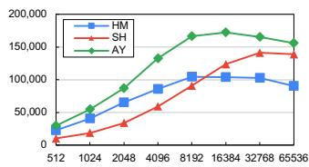  
(a)

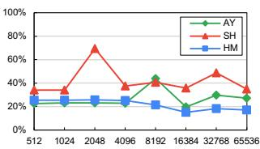  
(b)  
Figure 2: (a) Throughput (samples/seconds) and (b) GPU utilization (via nvidia-smi) for DRL training scaling (increasing batch size) across three different DRL benchmarks.

To catch up with the increasingly intricate and dynamic real-world scenarios with high fidelity, modern DRL applications (e.g., power-grid control [4] and robotics [24]) tend to be more complex (enormous action and state space) and require millions/billions of interaction steps for the final convergence. This motivates the urgent demands for scaling up DRL training on more powerful multi-GPU platforms (e.g., NVIDIA DGX [29]), typically equipped with many (8 or 16) large-size high-end GPUs (e.g., A100 and H100). Such platforms are also the key AI computing building blocks (for more than 60% of machines on the latest Top500 list [42]) and the future trend of DL scaling.

However, existing DRL designs are still yet to maximize the computing benefits of those powerful platforms. For illustration, we profile the popular PPO [39] algorithm from the state-of-the-art Isaac Gym [24] on NVIDIA DGX-A100 (8 GPUs). Figure 1(b) gives the average utilization of GPUs on three representative DRL benchmarks over 10 training epochs. We can see that the multi-GPU training of DRL exhibits both temporally low GPU utilization (where a DRL training flow would only perform intermittent DNN model training/inference per epoch) and spatially low GPU utilization (where the computation/memory demands of DRL training flow could hardly occupy the entire GPU). This indicates that there is a large portion of the computing power of GPU platforms being throttled by the existing designs. DRL performance can potentially be improved by turning those “spare” GPU resources into full utilization.

The common practice to overcome such issues is to adapt computation to fit the underlying resources (i.e., scaling through fine-grained parallelism) [7, 24]. For example, we can increase the simulation batch size to promote DRL training throughput. Figure 2 shows that when first increasing the simulation/training batch size, the performance would increase proportionally w.r.t. the batch size. The overall throughput performance degrades when further increasing the batch size beyond a certain threshold (e.g., 16,384 for Anymal [16] (AY)). Such an increase-followed-by-decrease performance trend is similar across benchmarks and is also observed in GPU utilization. This is mainly because when increasing the batch size, individual DRL components will scale up their resource demands (e.g, SMs, memory/cache) for more task-level concurrency (e.g., DRL simulation). Different DRL components running in parallel would compete for a fixed amount of GPU resources. GPU utilization would suffer since different DRL components are busy waiting for some common resources to move forward. For instance, the GEMM-based DRL policy training/inference would wait for SMs occupied by DRL simulation. The performance penalty of such contention would offset the parallelism benefits after reaching a certain threshold.

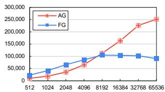  
(a)

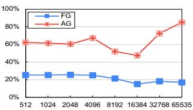  
(b)  
Figure 3: Training Comparison between fine- (FG) and adaptive-grained (AG) parallelism on (a) throughput and (b) GPU utilization on the Humanoid [46] (HM) benchmark.

Such an observation motivates us to think about whether it is a better option to tailor resources for computation demands, so that we can seek for optimal compute-resource efficiency instead of blindly increasing the batch size. Our key insight is to explore adaptive-grained parallelism (AGP) on GPUs. AGP opens a new way for flexible utilization of GPU resources, where a large GPU can be used as a set of size-adjustable sub-GPUs for different tasks. AGP also enlarges the existing design and optimization space for using individual GPUs. For instance, we can treat one GPU as a multi-sub-GPU system for computation and communication at the sub-GPU level. When scaling up to multiple GPUs, AGP is also an effective way for better resource management of different workloads. It can facilitate the creation of the best-fit GPU resource plans, given the specified number of GPUs and the GPU affinity demand (e.g., NVLinks).

However, AGP is not a low-hanging fruit. It is naturally hindered by the memory isolation among different sub-GPUs due to GPU spatial multiplexing. This would be the performance killer for DRL with heterogeneous tasks and substantial intertask communication. Efficient communication at the sub-GPU level is still missing from existing high-performance GPU communication libraries (e.g., NCCL [28]). Such communication hurdles may offset computation gains of GPU spatial multiplexing. Besides, finding the right-fit parallelism granularity (sub-GPU size) for individual tasks is non-trivial. The mismatch between sub-GPUs and their assigned DRL workloads would easily degrade the overall performance while wasting valuable GPU resources (e.g., SM). Furthermore, identifying the optimal layout of sub-GPUs requires careful consideration of the specialties of workloads (e.g., communication) and hardware (e.g., GPU interconnections).

To this end, we introduce GMI-DRL, the first end-to-end system for scaling multi-GPU DRL via adaptive-grained parallelism (AGP), with significantly improved throughput and

GPU utilization compared to fine-grained parallelism (Figure 3). To facilitate AGP, GMI-DRL introduces a new concept – GPU Multiplexing Instance (GMI), a unified resourceadjustable sub-GPU design tailored for heterogeneous tasks. GMI-DRL also provides systematic support for communication, computation, and programming for GMIs. GMI-DRL automates DRL scaling while respecting the black-box nature of DRL simulation (which commonly takes months/years of effort for re-design and implementation).

In short, we make the following contributions

• We introduce a novel adaptive-grained parallelism scheme for DRL scaling and propose GPU Multiplexing Instance (GMI) to facilitate such a new scheme.

• We build a GMI-centric adaptive Coordinator (§3.1) and a specialized Communicator (§3.2) design to meet diverse communication demands among GMIs, to achieve better system performance and GPU utilization.

• We also provide GMI-centric programming support (§3.3) to ease the scaling of diverse DRL-like applications on multi-GPU platforms.

• Extensive experiments show that GMI-DRL outperforms the state-of-the-art DRL acceleration solution (Isaac Gym [24] + MSRL [52]) across various benchmarks.

## 2 Background

## 2.1 Deep Reinforcement Learning

Deep Reinforcement Learning (DRL) [25, 39, 49] features heterogeneous computational workloads and diverse communication patterns. Figure 1 exemplifies the workflow of a typical PPO [39] algorithm in DRL. It interleaves the execution of three components: Environment Simulator, Agent, and Trainer. The environment simulator is responsible for generating environment states and action rewards with the help of its internal physics simulation engine (e.g., local motion and robotics control). GPU-based simulators (e.g., Isaac Gym [24]) can hold hundreds or thousands of environments running concurrently. The agent is the key component to making action decisions based on the environment states. It depends on GEMM-based NNs (e.g., Multi-Layer Perceptron) for policy model inference (action prediction). DRL trainer updates the policy model based on experience (with states, actions, and rewards) from agents. There are two major computing modes of DRL in real-world settings.

DRL Serving: Agents interact with environment simulators by applying the pre-trained policy model. The interaction between simulators and agents demonstrates fine-grained state-action sharing. DRL serving is also essential for experience generation for the DRL training process on computers and the real-world evaluation of the DRL policy.

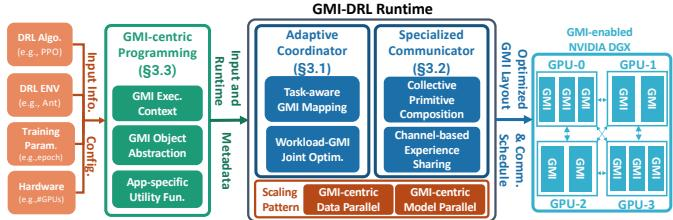  
Figure 4: Overview of the GMI-DRL system.

DRL Training: Agents first interact with simulators to collect experience. After a number (e.g., 32) of interactions, agents will communicate with trainers via coarse-grained experience sharing for policy updates. DRL training aims to maximize the accumulated reward of agent actions by updating the policy iteratively. Depending on whether the policy model training happens sequentially or concurrently with each round of agent-simulator interaction, DRL training can be categorized into synchronized (e.g., PPO [39]) and asynchronized DRL training (e.g., A3C [25]).

## 2.2 Adaptive-grained Parallelism (AGP)

We propose AGP as a new type of parallel computing paradigm that can adjust the size or granularity of the parallel tasks to optimize performance. While the existing scaling schemes are commonly confined to a certain level of granularity for parallelism. For instance, existing data parallelism explores coarse-grained dataflow-level parallelization, model parallelism explores the middle-grained operator execution concurrence, and operator fusion/grouping explores fine-grained kernel-level parallelization. AGP is complementary to those existing schemes by adding parallelization hierarchies with “configurable” granularity.

AGP can be broadly categorized into two major types: 1) adjust the tasks’ workloads (e.g., batch size in DNNs) to fit the hardware; 2) adjust the hardware resource size to fit the given workload. In DRL, the first one is hard to achieve (Figure 2) due to its intrinsically complicated simulator design and mixed workload. We thus advocate solution-2 for performance, resource efficiency, and design complexity. When targeting other workloads, solution-2 can be combined orthogonally with the existing solution-1 for a larger granularity space for diverse settings.

For AGP, GPU Spatial Multiplexing is the most potential candidate with adjustable resource granularity and minimized runtime interference. There are two major techniques: 1) Multi-processing Service (MPS) [31] can transparently enable cooperative multi-process CUDA applications to share a GPU. MPS provides concurrency among client processes to share a GPU via GPU SMs partitioning. 2) Multi-Instance GPU [30] is a new GPU spatial multiplexing solution introduced in NVIDIA Ampere GPUs (e.g., A100). Multi-Instance GPU offers higher isolation (SMs, memory space/bandwidth) compared to MPS. However, the existing practices of GPU spatial multiplexing are limited to their initially targeted settings with independent and homogeneous tasks, like DNN serving [6, 22, 45], thus, unable to offer communication support and strategies for inter-dependent task mapping. Comparatively, we are the first to explore the potential of GPU spatial multiplexing for more challenging DRL applications with heterogeneous tasks and intricate inter-task interactions.

## 3 GMI-DRL Design

GMI-DRL (Figure 4) reshapes the existing GPU-based DRL scaling with a new notion of GMIs. To support such new scaling schemes, GMI-DRL introduces an adaptive Coordinator (§3.1) to manage the workload-resource mapping and configuration optimization and a specialized Communicator (§3.2) to handle diverse inter-task interactions.

## 3.1 Adaptive Coordinator

The key aspect of AGP is to generate a good mapping choice between DRL components and underlying computing resources. This motivates the GMI-DRL Coordinator to systematically combine coarse-grained mapping and fine-grained configuration tuning for maximized overall performance.

## 3.1.1 Task-aware GMI Mapping

The mapping of DRL tasks on GMIs demands careful consideration of the specialties of various DRL tasks and hardware, which requires the mapping that will not only benefit individual tasks but also complex inter-task interactions. For instance, using dedicated GMI instances for simulators can achieve high simulation task performance. However, it may lead to inferior inter-task performance due to the inefficient data communication between simulators and agents on other GMIs. We, therefore, introduce a task-aware GMI mapping strategy to explore the GMI-backed scaling design space.

DRL Serving DRL serving aims to collect enough experience by applying a trained policy model. DRL serving features continuous interaction between simulators and agents. Optimizing DRL serving aims to achieve low latency at each round of interaction between the simulator and agent so that experience can be collected quickly. The interaction between simulators and agents relies on frequent and fine-grained information exchange for high serving performance. With these observations, we explore the potential mappings with the synergy of data (DP) and model parallelism (MP).

1) DP-MP Serving (Figure 5a) uses DP as the backbone for running multiple copies of DRL serving and leverages MP to distribute individual components of each copy to different GMIs. This guarantees the performance of individual components but at a heavy penalty of inter-component performance, since the fine-grained, frequent data movement between GMIs would incur high overhead.

Table 1: Definition of Terms.
<table><tr><td rowspan=1 colspan=1>Term</td><td rowspan=1 colspan=1>Meaning</td></tr><tr><td rowspan=1 colspan=1> $\overline { { R _ { s } , R _ { a } , R _ { t } } }$ </td><td rowspan=1 colspan=1>the size of dominant resources for the simulator,agent,and trainer,respectively.</td></tr><tr><td rowspan=1 colspan=1>Ⅱ</td><td rowspan=1 colspan=1>the type of dominant resource: SM or Memory.</td></tr><tr><td rowspan=1 colspan=1> ${ \overline { { S , A , W } } }$ </td><td rowspan=1 colspan=1>the size of a single state,action,and reward vector,respectively.</td></tr><tr><td rowspan=1 colspan=1> $\overline { { T _ { s } , T _ { a } , T _ { t } } }$ </td><td rowspan=1 colspan=1>the execution time for the simulator,agent, andtrainer in each DRL training/serving iteration.</td></tr><tr><td rowspan=1 colspan=1>BW</td><td rowspan=1 colspan=1>the bandwidth of inter-GMI communication.</td></tr><tr><td rowspan=1 colspan=1> $M _ { p }$ </td><td rowspan=1 colspan=1>the size of the policy model.</td></tr><tr><td rowspan=1 colspan=1>m</td><td rowspan=1 colspan=1>the number of simulation steps before a training.</td></tr><tr><td rowspan=1 colspan=1>n</td><td rowspan=1 colspan=1>the total number of GMIs in the current system.</td></tr><tr><td rowspan=1 colspan=1> $\overline { { \alpha , \beta } }$ </td><td rowspan=1 colspan=1>the size ratio factor when multiple environment sim-ulators are sharing agents or trainers.</td></tr></table>

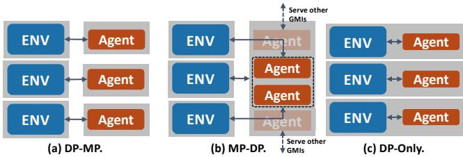  
Figure 5: GMI mapping for DRL serving. Note that Grey shadows indicate GMIs.

2) MP-DP Serving (Figure 5b) leverages MP for interphase scaling for decoupled simulators and agents and utilizes DP for intra-phase scaling to run multiple copies of simulators and agents. The key insight is that the throughput of simulators and agents is naturally different, where an NN-based agent comes with high throughput and can thus be “shared” among different simulators which have relatively low throughput. With this insight, we can achieve higher resource efficiency by accommodating more simulators and agents to improve the theoretical performance. However, the communication between simulators and agents from different GMIs would still throttle the practical system performance.

3) DP-only Serving (Figure 5c) relies on DP for scaling. It runs multiple copies of DRL serving in parallel. In this design, simulators and agents are co-located within the same GMI. Compared with the prior two designs, the state data generated from the simulator can be easily shared with the subsequent agent for action prediction via low-cost intra-GMI memory access. However, it comes at the cost of additional resource consumption and potential resource underutilization. Since different GMIs have to maintain a full copy of the simulator and agent, each agent can only serve one simulator.

Serving Resource-Performance Analysis is to quantify the cost and benefits of different mapping solutions to guide our mapping selection. Terms are defined in Table 1. Here, we compare MP-DP and DP-only solutions for illustration. We first determine the dominated resources type (I) based on

Table 2: Comparing MP-DP and DP-only in DRL serving.
<table><tr><td rowspan=1 colspan=1>Solution</td><td rowspan=1 colspan=1>Resource (Rl)</td><td rowspan=1 colspan=1>Comm. (COM)</td></tr><tr><td rowspan=1 colspan=1>MP-DP</td><td rowspan=1 colspan=1> $\overline { { ( T _ { s } \cdot R _ { s } + T _ { a } \cdot \alpha . } }$  ${ R _ { a } } ) / ( { T _ { s } } + { T _ { a } } )$ </td><td rowspan=1 colspan=1> $2 \cdot S + A + W$ </td></tr><tr><td rowspan=1 colspan=1>DP-only</td><td rowspan=1 colspan=1> $\overline { { ( T _ { s } + T _ { a } ) } } .$  $\operatorname* { m a x } \{ R _ { s } , R _ { a } \} / ( T _ { s } + T _ { a } )$ </td><td rowspan=1 colspan=1>0</td></tr></table>

Equation 1 for $R _ { e } , R _ { a } ,$ , and $R _ { t } ,$ which can be either GPU SM or memory, depending on DRL benchmarks and GPUs.

$$
\mathbb { I } = \left\{ \begin{array} { l l } { S M } & { \frac { R _ { S M } } { R _ { S M p e r G P U } } \geq \frac { R _ { M e m } } { R _ { M e m P e r G P U } } } \\ { M e m o r y } & { O t h e r w i s e . } \end{array} \right.\tag{1}
$$

RSM and $R _ { M e m }$ are computing and memory resource consumption measured on a single DRL serving/training process running exclusively on a GPU. Take the DRL benchmarks from Isaac Gym on DGX-A100 as an example, our empirical study shows that α is around 0.2, $R _ { s } \approx 1 0 R _ { a } ,$ and $T _ { s } \approx 6 T _ { a }$ Thus, the overall serving throughput can be calculated as

$$
T O P _ { s e r v i n g } = \frac { R _ { a l l } ^ { \mathbb { I } } } { R ^ { \mathbb { I } } } \cdot \frac { 1 } { T _ { s } + T _ { a } + \frac { C O M } { B W } }\tag{2}
$$

With Table 2 and $\begin{array} { r } { \frac { C O M } { B W } \approx 2 \cdot \left( T _ { s } + T _ { a } \right) } \end{array}$ based on our profiling, we can estimate that the overall serving throughput of DP-only serving would be higher (about 2.5×) compared with MP-DP serving. This is because the resource penalty (i.e., decrease in parallelism) of simulator-agent co-locating on throughput is minor $( ( T _ { s } + T _ { a } ) \cdot \operatorname* { m a x } \{ R _ { s } , R _ { a } \} / ( T _ { s } \cdot R _ { s } + T _ { a } \cdot \alpha \cdot R _ { a } ) - 1$ ≈ $0 . 1 6 \times )$ compared with the throughput benefits (around 3×) by saving inter-GMI data movements. We experimentally validate this in §4.3.

Synchronized DRL Training Synchronized DRL training has two stages, 1) simulator-agent interaction for experience collection and 2) agent-trainer interaction for policy training. These two stages happen sequentially at each iteration and the training performance is sensitive to both stages. The major goal of optimizing synchronized DRL training is to achieve higher model update frequency. Compared with DRL serving, synchronized DRL training is more complex in its components and inter-component interactions. This brings more tradeoffs for GMI mapping. We first discuss the ones that extend the existing DRL serving mapping principles and then introduce the new ones specific to DRL training.

1) DP-MP and DP-only Training (Figure 6a and 6b) follow similar scaling principles as the DRL serving. For DP-MP scaling, the size of communication would increase significantly compared with DRL serving due to the additional agenttrainer interaction for experience sharing and inter-trainer interaction for policy gradient synchronization. In DP-only scaling, it aligns the environment, agent, and trainer in the same GMI. Despite that it can enjoy the benefit of saving data movements, it would incur additional memory costs of duplicating both agents and trainers.

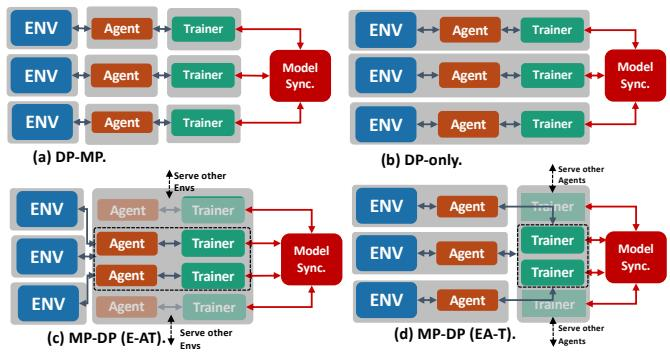  
Figure 6: GMI mapping for Synchronized DRL Training scaling. Note that Grey shadows indicate GMIs.

Table 3: DP-MP (EA-T) and DP-only in Sync. DRL training.
<table><tr><td rowspan=1 colspan=1>Solution</td><td rowspan=1 colspan=1>Resource (RI)</td><td rowspan=1 colspan=1>Comm. (COM)</td></tr><tr><td rowspan=1 colspan=1>DP-MP(EA-T)</td><td rowspan=1 colspan=1> $\overline { { ( T _ { s } \cdot R _ { s } + T _ { a } \cdot \mathbf { \alpha } \mathbf { \alpha } \alpha \cdot R _ { a } + T _ { t } \cdot \beta \cdot } }$  $R _ { t } ) / ( T _ { s } + T _ { a } + T _ { t } )$ </td><td rowspan=1 colspan=1> $\overline { { m \cdot ( S + A + W ) + M _ { p } + } }$  $2 \cdot ( n - 1 ) \cdot M _ { p } / n$ </td></tr><tr><td rowspan=1 colspan=1>DP-only</td><td rowspan=1 colspan=1> $\overline { { ( T _ { s } + T _ { a } + T _ { t } ) . } }$  $\operatorname* { m a x } \{ R _ { s } , R _ { a } , R _ { t } \} / ( T _ { s } + T _ { a } + T _ { t } )$ </td><td rowspan=1 colspan=1> $\overline { { 2 \cdot ( n - 1 ) \cdot M _ { p } / n } }$ </td></tr></table>

2) DP-MP Training with Selective Pipeline Partitioning (Figure 6c and 6d) enables the sharing of common resources like agents and trainers among different training instances. There are two major types of DP-MP training based on their training pipeline partitioning. The first one is E-AT, which partitions the DRL training pipeline between simulators (E) and agents (A). Such partitioning enables the sharing of agents and trainers among different simulators. The second type is EA-T, which partitions the DRL training pipeline between agents and trainers (T). It enables sharing of trainers among different training instances. With more component sharing, such as E-AT, the entire system could accommodate more training instances to achieve higher overall theoretical performance. While with less component sharing, such as EA-T, the communication critical path between the simulator and agent is no longer the bottleneck.

Training Resource-Performance Analysis on synchronized DRL training follows similar steps as DRL serving, except that we need to include the impact of the trainer on the pipeline. Here we compare DP-MP (EA-T) and DP-only training and take as an example the DRL benchmarks from Isaac Gym on DGX-A100. Our empirical study shows that α is around 0.2, β is around 0.3, ${ R _ { s } } \approx 1 0 { R _ { a } }$ ≈ 5Rt , and $T _ { s } \approx 6 T _ { a } \approx 3 T _ { t }$ , the overall throughput is calculated as

$$
T O P _ { t r a i n } = \frac { R _ { a l l } ^ { \mathbb { I } } } { R ^ { \mathbb { I } } } \cdot \frac { 1 } { T _ { s } + T _ { a } + T _ { t } + \frac { C O M } { B W } }\tag{3}
$$

With Table 3 and $\begin{array} { r } { \frac { C O M } { B W } \approx 7 \cdot \left( T _ { s } + T _ { a } + T _ { t } \right) } \end{array}$ based on our profiling, we can derive that the overall system throughput of DPonly training would increase evidently (about 5×) compared with DP-MP (EA-T). This is because the resource penalty on throughput $( \left( T _ { s } + T _ { a } + T _ { t } \right)$ · max $\{ R _ { s } , R _ { a } , R _ { t } \} / ( T _ { s } \cdot R _ { s } + T _ { a } \cdot \alpha \cdot$ $R _ { a } + T _ { t } \cdot \ B { \bf \ B } \cdot R _ { t } ) - 1 \approx 0 . 5 \times )$ is offset by throughput benefits (around 8×) via avoiding unnecessary inter-GMI experience movements. We provide experimental validation in §4.3. For other DRL benchmarks on different platforms, the lightweight profiling over several training rounds is sufficient to get the above parameters to analyze different training mappings.

Asynchronized DRL Training Asynchronized DRL training concurrently executes policy serving for experience collection and policy updates. However, it comes with the staleness of policy parameters that may impact the algorithmic efficiency (e.g., convergence rate). The common practice is to maximize throughput so that all DRL agents can get the model trained with the latest experience. We choose the mapping template from Figure 6d, with decoupled serving and training phase for the minimum communication bottleneck. We use designs in §3.2.1 for latency-optimized inter-trainer synchronization and §3.2.2 for throughput-optimized experience sharing between agents and trainers.

## 3.1.2 Workload-GMI Joint Optimization

After determining the efficient mapping templates, properly matching DRL workloads with right-size GMIs is also of great importance. However, there are two major challenges: 1) How to model the relation between the DRL training performance and GMI resources? The performance of a single GMI depends on configurations of both the DRL algorithmic and the GMI resource, which creates a large design space for exploration. 2) How to balance the single-GMI performance and the overall system performance? The high single-GMI performance does not always imply “optimal” system performance due to its excessive resource consumption and missing effective global planning to jointly optimize resources and performance. We introduce a workload-GMI joint optimization to co-optimize the configuration of the DRL tasks and the GMI resources for maximizing system throughput.

Configurations of DRL tasks and GMI resources. There are two key configurations that will impact the performance and resources of GMI-based DRL. i) num\_env describes the number of concurrent environments running at each GMI. It is equivalent to the batch size in conventional DNN training. The common choices for num\_env range from 128 to 32,768 considering the algorithmic (convergence) and system (runtime execution) efficiency [24]. Generally, a larger value of num\_env would lead to higher throughput. However, when all the computation resources of a GMI are fully occupied, further increasing the num\_env would only increase the memory consumption while being largely throttled by computation resources. This would lead to minor or even no throughput improvement. ii) GMIperGPU describes the quota of computation and memory resources assigned to each GMI. Computation resources determine the throughput performance of DRL computation, since the simulation and the training are computationally intensive and resource sensitive. Comparatively, memory resources mainly determine whether the DRL training can be successfully launched on GPUs, since DRL components have their own minimum memory requirements for basic execution without considering performance.

Algorithm 1: Profiling-based GMI Exploration.   
input :DRL\_bench, num\_GPU   
output :num\_env, GMIperGPU   
1 best\_config = tuple(); max\_top = −inf ;   
2 for GMIperGPU in 10 ... 1 do   
3 pre\_top = 0; pre\_mem = 0;   
4 for num\_env in [128, 256, 512, ..., 16384, 32768] do   
5 ▷ Filter out the GMI OOM/crashing cases..   
6 if num\_env>=512 && projMem(num\_env) >   
GPUmem/GMIperGPU then   
7 break;   
8 end   
9 ▷ Profile the performance of a GMI..   
10 top, mem = profile(DRL\_bench, GMIperGPU, num\_env);   
11 ▷ Initialize tracking variables..   
12 if pre\_top == pre\_mem == 0 then   
13 pre\_top = top; pre\_mem = mem;   
14 continue;   
15 end   
16 ▷ Compute performance/resource changes..   
17 Rtop = (top − pre\_top)/(pre\_top);   
18 Rmem = (mem − pre\_mem)/(pre\_mem);   
19 Sat = Rtop/Rmem;   
20 pre\_top = top; pre\_mem = mem;   
21 ▷ Check if the performance saturates..   
22 if Sat < α then   
23 break;   
24 end   
25 ▷ Project the overall system throughput..   
26 acc\_top = estimate(GMIperGPU, num\_GPU, top);   
27 if acc\_top > max\_top then   
28 max\_top = acc\_top;   
29 best\_config = (num\_env,GMIperGPU);   
30 end   
31 end   
32 end   
33 num\_env, GMIperGPU = best\_config[0], best\_config[1];

Workflow of Joint Optimization. We will take the environment specification (e.g., name and type) and the num\_GPUs as the input, and return num\_env and GMIperGPU as the desired runtime configuration. As illustrated in Algorithm 1, we will iterate through the GMI resource space by adjusting GMIperGPU (Line 4). For instance, when GMIperGPU is 4, the resources of each GPU will be divided into 4 GMIs evenly. Another design dimension to be explored is the number of environments (num\_env). These two dimensions will help us to pinpoint the design that can maximize the throughput given the GMI resource budget. To reduce unnecessary searches, we develop new metrics and heuristics for an early stop, as detailed in the following paragraphs.

We monitor memory at the first two steps of num\_env (128 and 256 are unlikely to trigger out-of-GMI-memory based on our study). Then for all the following steps of num\_env>= 512, we project its memory $( m _ { p } )$ based on the prior two steps of num\_env $( e _ { 1 } , e _ { 2 } )$ and memory $( m _ { 1 } , m _ { 2 } )$ , as shown in Equation 4. When $m _ { p }$ exceeds the GMI memory limits, we avoid searching for even larger num\_env.

$$
m _ { p } = { \frac { \left( e - e _ { 2 } \right) } { e _ { 2 } - e _ { 1 } } } \cdot ( m _ { 2 } - m _ { 1 } ) + m _ { 2 }\tag{4}
$$

The profile function will get the throughput (top) and memory cost (mem) of each configuration. We will then compare the change in computation throughput and the change in memory consumption between its current run and its last run (Line 17 to 18). Our empirical study (§4.3) shows that a GMI tends to saturate its computation capacity when we increase the num\_env and observe (i) the large increase of memory consumption (ii) the minor improvement of top.

Algorithm 1 is currently running offline, given that realworld DRL training usually takes thousands of iterations (hours) for convergence. The major cost of profiling (several minutes) is minor compared to the entire training. We count down from 10 to 1 so as to prioritize (i.e., greedy search) the testing of the upper bound values of the number of GMIs, such that we can early terminate the search, which can make each of our experimental trials worthy and save efforts.

We also perform fine-grained measurement of GMI overhead across our evaluated datasets (§ 4) and policy NNs on the DGX-A100 platform. Specifically, the creation of the GMIs (1, 2, and 4) instance is low-cost (0.05s on average), which is largely minor compared to the typically hours of the DRL training process. Besides, the communication overhead is about 16% on average across GMIs. With the adaptivegrained sub-GPU design, we can better utilize those idle resources that can offset its communication cost brought by the memory isolation. Therefore, we can still achieve evident positive performance gains. per-GMI kernel launch is about 4.5% on average under different numbers of GMIs per GPU (1, 2, and 4), considering both the GPU-based simulation engine and neural network kernels, compared to the direct launch of a single kernel on the entire GPU.

## 3.2 Specialized Communicator

Scaling DRL via AGP demands handling diverse communication to connect DRL components. However, comprehensive communication support is absent from existing GPU multiplexing techniques [6, 45], communication libraries [28, 40], and schedulers [2, 26]. Such a gap drives the specialized design of GMI-DRL Communicator, which tackles two major types of DRL communication: the inter-copy communication in GMI-centric data-parallel scaling and the inter-component communication in GMI-centric model-parallel scaling.

## 3.2.1 Collective Primitive Composition

We introduce a novel GMI-based collective primitive composition strategy with two major primitives: 1) Inter-process primitive (IP). This primitive treats inter-GMI communication as a pure inter-process synchronization. It firstly moves the policy model gradients from GMI to CPUs and then applies gradient reduction on the CPUs across different processes. 2) Ring primitive (RP). This primitive works for GMI layouts with cross-GPU reduction demands. It counts on the existing inter-GPU communication infrastructure, like NCCL on NVLinks, to synchronize GMIs on different GPUs. Note that NCCL prohibits synchronization among GMIs on the same GPU. With the above primitives, we can generate diverse communication compositions given a GMI layout. There are three major types:

IP-only composition only leverages IPs for connecting GMIs. It can handle arbitrary GMI layouts regardless of their underlying placement on GPUs. As exemplified in Figure 7a, all GMIs are synchronized with each other through IPs in only one step. The theoretical cost of the IP-only solution $\mathrm { i s } \ \frac { \bar { 2 (} m \cdot n - 1 ) \cdot S } { m \cdot n \cdot B _ { 1 } }$ , based on the standard allreduce operation [28], where $B _ { 1 } ^ { ' }$ is the bandwidth over PCIe, S is the policy model size, n and m are the number of GPUs and GMIs per GPU, respectively. However, our study shows that this composition can only show advantages in settings with fewer GMIs and small policy models due to the limited throughput of using IPs. In scale-up settings, IP-only composition would 1) incur an excessive amount of data traffic between CPUs and GPUs; 2) idle the high-performance GPU interconnects (e.g., NVLinks) that are available on most modern GPU-based platforms; 3) be throttled by slow CPU-based reduction.

RP-only composition only counts on the RPs for connecting different GMIs. It divides GMIs into separate communication groups that satisfy the NCCL constraints Figure 7b shows that GMIs on different GPUs form multiple non-intersect rings for RP communication ( 1 ). We then use one additional $\mathrm { R P }$ to synchronize all partial results from the prior stage of reduction ( 2 ). The theoretical cost of the RP-only solution is $2 * \frac { 2 ( n - 1 ) { \cdot } S } { n { \cdot } B _ { 2 } }$ , where $B _ { 2 }$ is the bandwidth of NCCL on NVLink and synchronization on different rings of 1 are parallelized. While this composition can enjoy high-speed inter-GPU communication, it is limited to settings where (#GMIs per GPU) ≤ (#GPUs) given the constraint of NCCL (connected GMIs must be on different GPUs). With more GMIs per GPU, there will be more NCCL rings and the communication contentions will also increase, potentially decreasing performance.

Hybrid IP + RP composition: This type of composition mixes IPs and RPs. It offers flexibility to fine-grained primitive combinations. One example of such composition is illustrated in Figure 7c, where we have k GMIs per GPU use RPs and (m − k) GMIs per GPU use IPs for reduction. This composition example consists of two major steps: 1 is gradient synchronization among GMIs on different GPUs through RPs. 2 is gradient synchronization among GMIs on the same GPUs (and different GPUs, if possible) through IPs.

The theoretical cost of hybrid IP + RP solution is $\begin{array} { r } { \frac { 2 ( n - 1 ) \cdot S } { n \cdot B _ { 2 } } + } \end{array}$ $\frac { 2 ( n { \cdot } ( m - k ) { + } k { - } 1 ) { \cdot } S } { ( n { \cdot } ( m { - } k ) { + } k ) { \cdot } B _ { 1 } }$ . The key to utilizing this hybrid composition is to properly adjust the ratio of IPs and RPs and apply

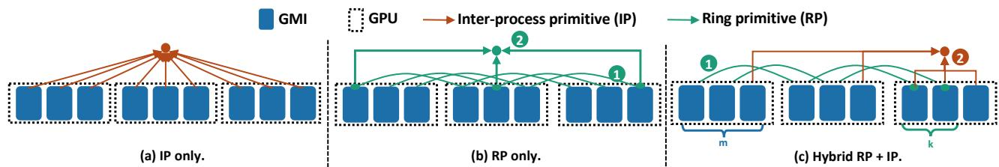  
Figure 7: Exemplification of GMI Communication Primitive Composition. Note that the final broadcasting step is omitted for simplicity. n and m are the number of GPUs and GMIs per GPU, respectively. k is a configurable number of GMIs per GPU that uses RPs for communication. $B _ { 1 }$ and $B _ { 2 }$ C1: IP-only, C3: IP + RP (k=1), C2: RP-only, C4: IP + RP (k=2), are bandwidth by using IPs an RPs, respectively.

GenerationAnalysis … … …them in specific schedules. We next discuss the workflow of generating the effective composition given platform settings.

ProfileOverall Composition Workflow: Given an input GMI Cost (IP-only, n1mlayout and DRL benchmark, we will generate a composition plan with optimized efficiency. We first analyze its characteristics (e.g., #GMIs per GPU and the GPU interconnects) and performs one-time profiling on basic composition. Based on the analyzed inputs, we will generate all candidate compositions. We then project performance based on profiling results to derive the latency cost of possible compositions. The costs of two basic compositions are IP-only $( C o s t _ { i p } )$ and RP-only $( C o s t _ { r p } )$ compositions measured on n GPUs with 1 GMI per GPU. This will determine the “unit” communication cost given the DRL benchmark and hardware platform. We measure $\begin{array} { r } { C o s t _ { i p } ( \mathrm { i . e . , } \frac { 2 ( n - 1 ) \cdot S } { n \cdot B _ { 1 } } ) } \end{array}$ and $\begin{array} { r } { C o s t _ { r p } ( \mathrm { i . e . , } \frac { 2 ( n - 1 ) \cdot S } { n \cdot B _ { \gamma } } ) } \end{array}$ in raw latency (ms) by averaging 100 runs, where n is the number of GPUs, S is the policy model size, and $B _ { 1 }$ and $B _ { 2 }$ are the bandwidth of using IPs and RPs, respectively.

We then estimate the cost of (a) and (b) in n GPUs with m GMIs per GPU by scaling the $C o s t _ { i p }$ and $C o s t _ { r p }$ based on the ratio of measured and the target problem size. For example, in (a), we have (n · m) instance in the targeted problem size and n in the measured problem size, we then estimate $\begin{array} { r } { C o s t { ( a ) } = \frac { 2 ( n \cdot m - 1 ) \cdot S / ( n \cdot m \cdot B _ { 1 } ) } { 2 ( n - 1 ) \cdot S / ( n \cdot B _ { 1 } ) } } \end{array}$ $\begin{array} { r } { C o s t _ { i p } = \frac { ( n \cdot m - 1 ) } { m \cdot ( n - 1 ) } } \end{array}$ · Costip. Similarly, we can get the $C o s t ( b ) = 2 * C o s t _ { r p } .$ . Note that different RPs can be parallelized if there is no output dependency. For (c), given a parameter k (where $k \leq m )$ , we can derive Cost $\begin{array} { r } { \mathbf { \Pi } ^ { ( k ) } ( c ) = ( \frac { k } { n } + m - k ) \cdot C o s t _ { i p } + C o s t _ { r p } } \end{array}$ , Finally, we select the composition with the minimum projected latency. We provide an experimental demonstration in §4.3.

## 3.2.2 Channel-based Experience Sharing

The model-parallel scaling of DRL counts on connecting different DRL components effectively. Data movement of model-parallel DRL follows a point-to-point paradigm and is mixed with heterogeneous types of data under different granularities. For instance, the environment states of simulators are coarse-grained vectors, while the action/reward of agents is fine-grained scalars. Such heterogeneity and diverse granularity create a challenge to utilize existing GPU interconnections, which prefer fixed-sized coarse-grained data packages.

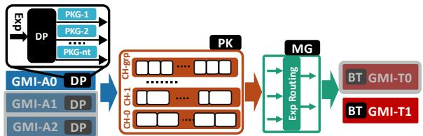  
Figure 8: Exemplification of Channel (CH)-based Experience Sharing (A0 to T1). Note that ${ } ^ { 6 6 } \mathrm { G M I - A } ^ { * 9 }$ is the GMI for DRL agents while ${ } ^ { 6 6 } \mathrm { G M I { - } T ^ { * } { } ^ { 3 } }$ is the GMI for DRL trainers; ${ } ^ { 6 6 } \mathrm { P K G } ^ { * } { } ^ { , }$ are packages decomposed from experiences.

One direct solution is to communicate with heterogeneous data packages. However, it would suffer from high startup costs and underutilized bandwidth for fine-grained transfers. Another direction is to tailor the communication strategies for different data so that we can manage the granularity and heterogeneity of data to maximize communication efficiency. Inspired by this insight and prior efforts on computer networks [17], we develop a channel-based experience sharing strategy for model-parallel DRL scaling. Each channel defines a customized way of communication that will manage inter-GMI communication for one type of data or a group of types of data that share similarities (e.g. shapes).

We build such a design with four components (Figure 8). Specifically, Experience Dispenser (DP) is to decompose the experience data into packages. Experience Packer (PK) is to group packages into channels and batch package groups in each channel for data movement among GMIs. Experience Migrator (MG) is to manage the routing of experience from agents to trainers. Experience Batcher (BT) is to conduct data preparation and model training.

Our initial empirical study shows that the overall performance mainly relies on whether PK can maximize inter-GMI data movement. With multi-channel design in PK, there are two major aspects that are critical to its performance: 1) Which types of packages should be grouped in the same channel? and 2) How many such groups (i.e., batch size) should be transferred each time? To address these questions, we define a proxy metric $T O P _ { m o \nu }$ (Equation 5) for inter-GMI communication throughput given a package group $( \sum _ { j = 1 } ^ { g _ { i } } P _ { j } ^ { ( i ) } )$ and the batch size (batch) of package groups. $T O \bar { P } _ { m o \nu }$ will reward the higher bandwidth (due to package grouping) while penalizing the extra-large packages (due to package concatenation overhead) and too many independent channels (due to inter-channel contention)

$$
T O P _ { m o v } = \operatorname* { m a x } \left\{ \operatorname* { m i n } _ { i \in [ 1 , g r p ] } \{ \frac { B _ { i } } { C o s t _ { c a t } \cdot C o s t _ { c h } } \} \right\}\tag{5}
$$

where $B _ { i }$ is the bandwidth given the current grouping and batching; $g _ { i }$ is the number of packages in a package group (Gi) and it can vary among groups; grp is the total number of package groups; $P _ { j } ^ { ( i ) }$ is the package size (in Bytes) of the j-th package in Gi. Our empirical study shows that $B _ { i } \propto$ $( b a t c h \cdot \sum _ { j = 1 } ^ { g } P _ { j } ) , C o s t _ { c a t } \propto ( b a t c h \cdot g )$ , and $C o s t _ { c h } \propto g r p$ . Now, $T O P _ { m o \nu }$ can be simplified as

$$
T O P _ { m o v } = \operatorname* { m a x } \left\{ \operatorname* { m i n } _ { i \in [ 1 , g r p ] } \{ \frac { \sum _ { j = 1 } ^ { g _ { i } } P _ { j } ^ { ( i ) } } { g _ { i } \cdot g r p } \} \right\}\tag{6}
$$

$$
s . t . ( \sum _ { i = 1 } ^ { g r p } g _ { i } = n t ) \wedge ( g r p \in [ 1 , n t ] )\tag{7}
$$

$$
\prod _ { i , j \in [ 1 , n t ] \wedge k \in [ 1 , g r p ] } ^ { C o n s t r a i n t s } ( D _ { i } \in G _ { k } ) \wedge ( D _ { j } \notin G _ { k } )\tag{8}
$$

where nt is the total types of original packages. Equation 8 describes the constraints that package $D _ { i }$ and $D _ { j }$ cannot be in the group/channel $G _ { k }$ due to their unaligned shape/dimension that complicates the concatenation. The maximization of $T O P _ { m o \nu }$ will balance between the sizes of package groups and the number of package groups. Given $n t \leq 1 0$ and low evaluation cost per entry, we address this problem with enumerative combinatorics [11] with deduplication to find possible grouping combinations and backtrack search [47] with pruning to identify possible package concatenation in each group. We finally return the setting with maximum $T O P _ { m o \nu }$

## 3.3 GMI-centric Programming Support

GMI-DRL follows a process-based design for performance guarantees and compatibility with GPU spatial multiplexing techniques. Processes offer better isolation with configurations (e.g., environmental variables) and memory address spaces. Listing 1 shows GMI-DRL example for synchronized DRL training. There are three major components: 1) GMI Context (Line 3) configures the basic GMI execution settings. For DRL training, MPS is used for communication efficiency. While for DRL serving, MIG is used for a better performance guarantee with minimized interference. 2) GMI Runtime (Line 5 to 28) manages the GMI-based DRL runtime. init function will set up the GMI based on its GMI\_id and register a GMI to a global GMI manager. It also attaches GMIs to specific GPUs based on the GPU ids. The GMI will be assigned to a GMI group for collective communication if necessary. Users will implement the GMI\_run for training.

Our GMI-based design, while demonstrated on A100, can be easily generalized toward other GPUs. This covers a

Listing 1: Illustration of GMI-based Programming.

```python
import GMI_DRL
# import other packages, e.g., PyTorch, Tensorflow ..
GMI_DRL.config = {num_GPUs=3, GPU_arch="sm80",
NVlink=True, backend="MPS"}
# Define GMI tasks.
class GMI_base(object):
6 def __init__(self, role, GMI_id, gpu_id):
self.mgr = GMI_DRL.GMI_manager.add_GMI(GMI_id)
8 self.group = self.mgr.get_group(GMI_id, gpu_id)
9 self.env = gym(’Ant’)
10 self.actor_model = nn.Modules(...)
11 self.optimizer = Adam(self.actor_model)
12 def GMI_run(self, n_epsiode, n_step):
13 for j in range(n_epsiode):
14 samples_li, reward_li = list(), list()
15 for i in range(n_step):
16 state, reward = self.env(state, action)
17 samples_li.append(state, action)
18 reward_li.append(reward)
19 self.GMI_train(samples_li, reward_li)
20 def GMI_train(self, samples_li, reward_li):
21 act_pred = self.model(samples_li)
22 act_ref = comp_act_targets(samples_li, reward_li)
23 loss = nn.CrossEntropyLoss(act_pred, act_ref)
24 loss.backward()
25 self.GMI_collective()
26 optimizer.step()
27 def GMI_collective(self):
28 self.mgr.allreduce(self.model, self.group)
```

wide spectrum of datacenter GPUs including 1) the older generations including Kepler (e.g., Tesla K40), Pascal (e.g., P100), and Volta (e.g., V100); 2) the newer generation of GPUs including Hopper (e.g., H100/H200), and Blackwell (B200). Our design can also work with desktop GPUs (e.g., RTX20/30/40 and Quadro series) seamlessly.

## 4 Evaluation

Benchmarks: The DRL benchmark consists of the simulation environment and the policy NN model. We cover different types of environments, including locomotion simulation [16, 24, 46] (L), franka cube stacking [19] (F), and robotics hand control [34] (R). The details of our evaluated DRL benchmarks are listed in Table 4. “#Dim.” is the dimension of environment state vectors. The policy NN models are expressed in “in\_dim:hidden\_dim:...:out\_dim”.

While there are many DRL algorithms, they can be broadly categorized into on- and off-policy DRL algorithms [52]. In this evaluation, we build our baseline based on the state-ofthe-art MSRL [52] framework and Isaac Gym [24] simulator. Since the MSRL uses OpenAI Gym [3] by default for simulation workload, which is significantly (100×) lower in simulation throughput compared with Isaac Gym. We select the most representative PPO [39] for synchronized (Sync.) DRL training (Isaac Gym + MSRL PPO as IG (PPO)), which is the official implementation from Isaac Gym [24]. We also implement the most representative off-policy A3C [1] in Isaac

Table 4: DRL Benchmarks and Policy NN Models.
<table><tr><td>Benchmark</td><td>Abbr.</td><td>Type</td><td>#Dim.</td><td>PolicyNNModel</td></tr><tr><td>Ant [46]</td><td>AT</td><td>L</td><td>60</td><td>60:256:128:64:8</td></tr><tr><td>Anymal [16]</td><td>AY</td><td>L</td><td>48</td><td>48:256:128:64:12</td></tr><tr><td>BallBalance [24]</td><td>BB</td><td>L</td><td>24</td><td>24:256:128:64:3</td></tr><tr><td>FrankaCabinet [19]</td><td>FC</td><td>F</td><td>23</td><td>23:256:128:64:9</td></tr><tr><td>Humanoid [46]</td><td>HM</td><td>L</td><td>108</td><td>108:200:400:100:21</td></tr><tr><td>ShadowHand [34]</td><td>SH</td><td>R</td><td>211</td><td>211:512:512:512:256:20</td></tr></table>

Gym for an asynchronized (Async.) DRL training study Isaac Gym + MSRL A3C as IG (A3C).

Implementations: GMI-DRL is available1. For evaluation, we choose several baselines: 1) IG (PPO) in multi-GPU serving is to directly scale the Isaac Gym serving to multi-GPU platforms with one serving process per GPU. 2) IG (PPO) + NCCL is for Sync. DRL training in data parallelism and uses NCCL [28] as the communication backend and this is also the only distributed version officially supported by Issac Gym. 3) IG (PPO) + Horovod is also for Sync. DRL training in data parallelism, and uses Horovod [40] as the communication backend. 4) IG (A3C) is for study on Async. DRL training, where policy serving and policy training are running concurrently on different GPUs. 5) Ray is the framework for DRL training. To compare with Ray [27], we select the officially optimized multi-GPU PPO training examples in RLLib [23] of Ray. For all baselines, we manually adjust the simulation batch size (i.e., num\_env) of each DRL benchmark to reach its peak throughput by using each GPU exclusively. The configurations (num\_env and GMIperGPU) are generated with Algorithm 1.

Platforms & Tools: We use a DGX-A100 [29] (including 8×NVIDIA A100 GPUs and Dual AMD Rome 7742 CPUs with a total of 128 cores@2.25 GHz). For environment simulation, we leverage NVIDIA Isaac Gym [24]. We use PyTorch (v3.8) [35] to build the policy model, and NCCL (v2.8.4) [28] and Gloo [10] (commit a01540e) to build the GMI-based communication layer. To measure the performance, we leverage the nvidia-smi tool and PyTorch runtime profiler. The throughput metric of DRL serving and Sync. DRL training is the training samples (simulation steps) per second [24].

## 4.1 Overall Performance

DRL Serving Figure 9a shows how with the help of our GMI-oriented design, the overall throughput of policy serving can be improved (up to 2.62×, averaged 2.08×) across settings with different numbers of GPUs. Based on our detailed profiling results, our GMI-based design can improve GPU utilization (up to 45.7%, averaged 27.9%) compared with the state-of-the-art Isaac Gym. This also demonstrates GMI-DRL to maximize GPU utilization and performance.

Sync. DRL Training We conducted two experiments. Compared with IG (PPO) + NCCL: Figure 9b demonstrates that GMI-DRL with the optimal GMI planning can achieve up to 2.07× (averaged 1.69×) throughput compared to Isaac Gym + MSRL with NCCL under the same number of GPUs. In the more complex DRL setting with a higher number of concurrent simulations and state/observation dimensions, GMI-DRL demonstrates more benefits. This is because of our effective resource planning to maximize the performance gains from available GPU resources, resource isolation to minimize execution interference and communication support to synchronize policy gradients among different training copies. In addition, our profiler shows that GMI-DRL improves GPU utilization by up to 40.8% (31.8% on average). Such an improvement can help users save evident cloud service costs under the same training throughput.

Compared with IG (PPO) + Horovod: Figure 9c shows that GMI-DRL outperforms Isaac Gym + MSRL with Horovod backend with up to 2.34× (averaged 1.72×) training performance throughput. We also notice that there are performance differences between NCCL and Horovod baselines. It can be attributed to the way of updating the policy model parameters. The NCCL-based designs rely on separate gradient reduction and PyTorch optimizer, while the Horovod-based designs manage their own distributed optimizer including both gradient reduction and the distributed model update. Besides, we notice the superlinear speedup number achieved by GMI-DRL in this experiment. This is mainly due to the combined effects of scaling up with multiple GMIs per GPU and scaling out with multiple GPUs. This implies that only focusing on optimizing communication is insufficient to exploit the full potential of multi-GPU platforms.

Async. DRL Training We compare GMI-DRL with IG (A3C) in Async. DRL training. We measure predictions per second (PPS) and the training samples throughput (TTOP) as [25]. Figure 10 shows that with the help of our GMI-based design and the throughput optimized experience transferring technique, GMI-DRL can achieve averaged 1.88× PPS and 1.65× TTOP over non-GMI baseline on 2 and 4 GPUs. This result shows the importance of collaboratively improving the performance of experience collection and experience sharing for Async. DRL training. Our additional study reveals that channel-based experience sharing (§3.2.2) with the searched optimal package grouping plan would contribute to 24% of overall performance improvement.

## 4.2 Comparison with Ray

We compare GMI-DRL with Ray RLLib (leveraging OpenAI Gym) on its expert-tuned multi-GPU PPO implementation [36]. Specifically, for our GMI-DRL design, we replace our Isaac Gym with OpenAI Gym [3] on several benchmarks (including Ant and Humanoid, which are from MuJoCo [46]).

Our result shows that GMI-DRL outperforms Ray evidently in training throughput (up to 62%). Despite that the Ray actor can leverage partial GPU (in percentage) for policy model inference (action prediction) to collect experience, for scaling policy training, Ray still has to follow the conventional oneto-one mapping between trainers and GPUs and leverage NCCL/Horovod for communication [37]. Therefore, Ray can only utilize GPUs in a fixed yet coarse-grained manner during the training, missing the opportunities to harness spare GPU resources. When we retarget our existing design to other simulators, we need to consider 1) placement of simulators on CPUs or GPUs depending on their property and computation efficiency, and 2) layout/topology of simulators based on their connected channels (e.g., NVLink and PCIe). Our design can flexibly accommodate such change by tailoring design parameters in our existing communicators and coordinators.

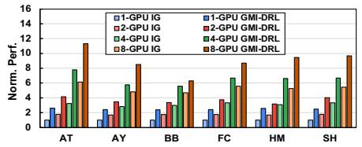  
(a)

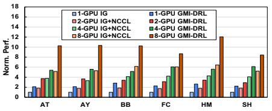  
(b)

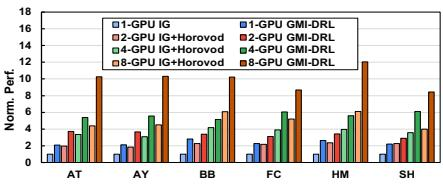  
(c)

Figure 9: End-to-end computation throughput comparison for (a) DRL serving, (b) Sync. DRL training with NCCL, and (c) Sync. DRL training with Horovod. Note that computation throughput is normalized w.r.t. Isaac Gym+MSRL (IG) on a single GPU.  
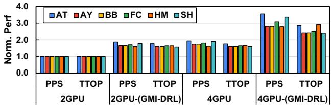  
Figure 10: Async. DRL training throughput performance.

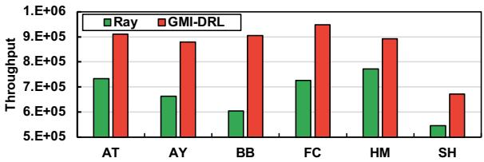  
Figure 11: Training comparison with Ray on 8×A100.

## 4.3 Additional Study

Multi-Node (Machine) Scaling As shown in Table 5, we compute the normalized throughput for multi-node w.r.t. single-node Sync. DRL training. We consider the settings of 1, 2, 4, and 8 nodes with (a) 1 GPU per node and (b) 2 GPUs per node. The throughput improvement from GMI-DRL remains consistent in the multi-node settings, which reaches an average of 83% of the ideal (linear) scaling performance. This demonstrates that our collective composition and its optimization technique can effectively adapt towards multi-node policy gradient synchronization by considering the intra- and inter-node GMI layout hierarchy and combining different inter-GMI communication options.

Table 5: Multi-node scaling with (a) 1 GPU per Node and (b) 2 GPUs per Node on Sync. DRL training.
<table><tr><td rowspan=1 colspan=1>1 GPU/Node</td><td rowspan=1 colspan=1>1-node</td><td rowspan=1 colspan=1>2-node</td><td rowspan=1 colspan=1>4-node</td><td rowspan=1 colspan=1>8-node</td></tr><tr><td rowspan=1 colspan=1>BB</td><td rowspan=1 colspan=1>1.00×</td><td rowspan=1 colspan=1>1.84×</td><td rowspan=1 colspan=1>3.28×</td><td rowspan=1 colspan=1>7.16x</td></tr><tr><td rowspan=1 colspan=1>HM</td><td rowspan=1 colspan=1>1.00×</td><td rowspan=1 colspan=1>1.71x</td><td rowspan=1 colspan=1>2.87x</td><td rowspan=1 colspan=1>6.67x</td></tr><tr><td rowspan=1 colspan=1>2 GPUs/Node</td><td rowspan=1 colspan=1>1-node</td><td rowspan=1 colspan=1>2-node</td><td rowspan=1 colspan=1>4-node</td><td rowspan=1 colspan=1>8-node</td></tr><tr><td rowspan=1 colspan=1>BB</td><td rowspan=1 colspan=1>1.00x</td><td rowspan=1 colspan=1>1.83x</td><td rowspan=1 colspan=1>3.18×</td><td rowspan=1 colspan=1>7.04x</td></tr><tr><td rowspan=1 colspan=1>HM</td><td rowspan=1 colspan=1>1.00×</td><td rowspan=1 colspan=1>1.61×</td><td rowspan=1 colspan=1>2.72×</td><td rowspan=1 colspan=1>6.44×</td></tr></table>

Table 6: Throughput on Collective Composition.
<table><tr><td rowspan=2 colspan=1>Benchmark</td><td rowspan=1 colspan=3>2G3T(m=3)</td><td rowspan=1 colspan=3>4G3T(m=3)</td></tr><tr><td rowspan=1 colspan=1>Baseline</td><td rowspan=1 colspan=2>GMI-DRL k</td><td rowspan=1 colspan=1>Baseline</td><td rowspan=1 colspan=2>GMI-DRL k</td></tr><tr><td rowspan=1 colspan=1>AT</td><td rowspan=1 colspan=1>319,699</td><td rowspan=1 colspan=1>320,925</td><td rowspan=1 colspan=1>2</td><td rowspan=1 colspan=1>529.081</td><td rowspan=1 colspan=1>533,018</td><td rowspan=1 colspan=1>2</td></tr><tr><td rowspan=1 colspan=1>HM</td><td rowspan=1 colspan=1>415,280</td><td rowspan=1 colspan=1>425,641</td><td rowspan=1 colspan=1>1</td><td rowspan=1 colspan=1>621,871</td><td rowspan=1 colspan=1>636,339</td><td rowspan=1 colspan=1>1</td></tr><tr><td rowspan=1 colspan=1>SH</td><td rowspan=1 colspan=1>283,918</td><td rowspan=1 colspan=1>284,492</td><td rowspan=1 colspan=1>3</td><td rowspan=1 colspan=1>485,873</td><td rowspan=1 colspan=1>486,209</td><td rowspan=1 colspan=1>0</td></tr></table>

Collective Composition We also demonstrate the effectiveness of GMI-tailored Collective Composition. Our baseline is IP-only. We choose three settings, including (i) 2 GPUs with 3 Trainers per GPU (2G3T); (ii) 4 GPUs with 4 Trainers per GPU (4G4T). Table 6 indicates that our collective composition can bring evident throughput benefits for DRL training on different policy models. Our Algorithm 1 identifies the right choice for k to maximize communication efficiency. This indicates that our communication optimization can pinpoint the composition plan that will maximize the efficiency of different primitives on various types of interconnects.

Task-aware GMI Mapping We empirically demonstrate our mapping choice comparison for DRL serving (Table 2) and Sync. DRL training (Table 3). Results in Figure 12 show that 1) for DRL Serving, our DP-only design achieves significant throughput improvements (average 110%) with minor memory resource penalty (average 9.5%); 2) for Sync. DRL training, co-locating experience collection and trainer achieves significant throughput improvements (287.5% on average) with a minor memory resource penalty (averaged 6.5%) compared with DP-MP (EA-T). Note that for DRL benchmarks (other than Isaac Gym), our theoretical and experimental analysis methodology can still be applied but the mapping decisions could vary depending on the internal simulator implementation and policy model choices, which bring different performance-resource tradeoffs.

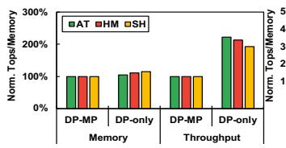  
(a)

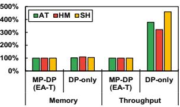  
(b)

Figure 12: Throughput performance and Memory consumption on (a) DRL serving and (b) Sync. DRL training.  
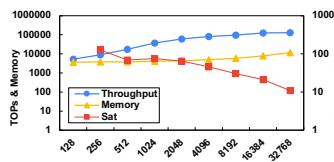  
(a)

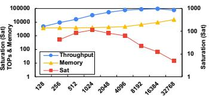  
(b)  
Figure 13: Saturation (Sat) Metric on (a) AT and (b) HM.

Saturation Metric & Memory Projection We analyze the Saturation (Sat) (Algorithm 1) metric in a single Sync. DRL training instance. Figure 13 shows that with the increasing #environment per training instance, the overall throughput will first increase, and then it will increase slowly or even show some decrease (e.g., HM at 32,768 environments). This is mainly due to the complex physics computation in the DRL simulator that cannot scale well to generate large-size data batches. This also justifies using such DRL-specific throughput increase-saturation property to determine an early stop of parameter search. We also evaluate our memory projection model (Equation 4). Figure 14 shows that our memory projection model can effectively predict memory cost given the #environment with minor deviation, indicating its usefulness in joint configuration optimization.

## 5 Related Work

Individual DRL Libraries: Seed RL [9] introduces modern scalable RL agent. Acme [14] provides modularized libraries for building and scaling DRL applications. WarpDrive [21] is a lightweight and open-source library to accelerate single and multi-agent DRL simulation performance on GPUs. Isaac Gym [24] from NVIDIA Omniverse [32] represents the state-of-the-art GPU-based DRL acceleration design, which significantly outperforms its CPU-based counterparts [3] and GPU-based solutions [21] in terms of its simulation throughput. GMI-DRL focuses on adaptive-grained DRL tasks mapping and scheduling are orthogonal and complementary to these existing libraries for specific DRL tasks like simulation.

Holistic DRL Systems: Ray [27] is a distributed computing framework for emerging DL applications including DRL (RLLib). PodRecer [13] introduces a unified scaling architecture for DRL on TPU-based systems. TLeague [43] targets

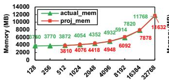  
(a)

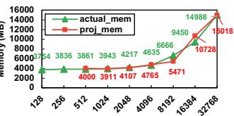  
(b)  
Figure 14: Memory Projection on (a) AT and (b) HM.

DRL scaling on hybrid CPU and GPU clusters for Multi-Agent Reinforcement Learning. MSRL [52] is the state-ofthe-art DRL computing framework that features dataflow fragments for individual DRL functions on CPUs/GPUs. However, MSRL still relies on off-the-shelf communication infrastructures (e.g., NCCL) for scaling the DRL computation and it can only support very limited options of computation granularity in its DRL fragments on GPUs. For instance, the MSRL fragment plan can only allow one DRL simulator/learner on one GPU. Additionally, MSRL relies on hard-coded manual configuration and requires expert users to adapt to different DRL models/inputs. GMI-DRL opens up an all-new dimension by enabling adaptive-granular parallelism at the sub-GPU level that will enlarge the design space of those existing systems.

## 6 Discussion

Our work is the first one investigating the design choices of DRL training and serving for a multi-GPU system. We would like to highlight some key design insights and technical contributions.

Observations. Several observations are drawn through our initial investigation: (a) MIG (Multi-instance GPU) allows strict resource isolation through the full hierarchy (memory, cache, interconnect, SMs) to avoid potential resource competition, but has explicit limitations on communication, thus is more suitable for DRL serving; (b) MPS (Multi-Processing Service) does not enforce resource isolation among agents, but can be more flexible at communication, thus is a better choice for training, given the necessity to collect data from distributive GMI instances; (c) Overall, for single-node scaling-up, until the communication hurdle can be well-addressed by the vendor, MPS is more preferred for the implementation.

Architecture. Despite the use of spatial multiplexing in the prior CPU work, the GPU-based spatial multiplexing is relatively new (e.g., MIG). GPU spatial multiplexing is designed to support diverse and independent GPU applications while guaranteeing their quality of service. There is a trend to keep and consistently improve this feature in future hardware (e.g., H100/H200), and other GPU vendors also follow a similar trend (e.g., AMD MI200 GPU requires at least two MPI processes to fully utilize the GPU resources).

Software/Application. GPUs have now become a more generic accelerator, and many real-world applications (e.g.,

DNN inference) intrinsically cannot fully utilize GPUs. To maximize its utilization, existing work leverages MIG for scaling up simple applications, which just matches the initial design objective of MIG. However, we target complex DRL training with GPU underutilization and interaction/communication among different components. These challenges are outside the scope of MPS/MIG and demand careful resource/- workload planning and efficient communication support.

Performance. Our design evidently outperforms the stateof-the-art Isaac Gym and would facilitate the quick/wide deployment of DRL at scale. The performance regarding different DRL design choices, as well as these observations, are not reported by any existing works.

## 7 Conclusion

This paper introduces GMI-DRL, the first system to scale multi-GPU DRL with adaptive-grained parallelism. GMI-DRL includes a novel design of resource-efficient GPU multiplexing instances (GMIs), highly efficient communication support across GMIs, and an adaptive GMI management strategy to meet various demands of DRL training. Experiments demonstrate GMI-DRL advantages across various settings over the state-of-the-art DRL frameworks.

## 8 Acknowledgment

We would like to appreciate the great help and support from the USENIX ATC’25 shepherd and anonymous reviewers. This work was supported in part by NSF 2124039. This material is also based upon work supported by the U.S. Department of Energy, Office of Science, Office of Advanced Scientific Computing Research, ComPort: Rigorous Testing Methods to Safeguard Software Porting, under Award Number 78284. The Pacific Northwest National Laboratory is operated by Battelle for the U.S. Department of Energy under Contract DE-AC05-76RL01830.

## References

[1] Mohammad Babaeizadeh, Iuri Frosio, Stephen Tyree, Jason Clemons, and Jan Kautz. Ga3c: Gpu-based a3c for deep reinforcement learning. International Conference on Learning Representations (ICLR), 2016.

[2] Zhihao Bai, Zhen Zhang, Yibo Zhu, and Xin Jin. Pipeswitch: Fast pipelined context switching for deep learning applications. In 14th USENIX Symposium on Operating Systems Design and Implementation (OSDI 20).

[3] Greg Brockman, Vicki Cheung, Ludwig Pettersson, Jonas Schneider, John Schulman, Jie Tang, and Wo-

jciech Zaremba. Openai gym. arXiv preprint arXiv:1606.01540, 2016.

[4] Dong Chen, Kaian Chen, Zhaojian Li, Tianshu Chu, Rui Yao, Feng Qiu, and Kaixiang Lin. Powernet: Multi-agent deep reinforcement learning for scalable powergrid control. IEEE Transactions on Power Systems, 2021.

[5] Jianyu Chen, Bodi Yuan, and Masayoshi Tomizuka. Model-free deep reinforcement learning for urban autonomous driving. In 2019 IEEE intelligent transportation systems conference (ITSC), pages 2765–2771. IEEE, 2019.

[6] Seungbeom Choi, Sunho Lee, Yeonjae Kim, Jongse Park, Youngjin Kwon, and Jaehyuk Huh. Multi-model machine learning inference serving with gpu spatial partitioning. arXiv preprint arXiv:2109.01611, 2021.

[7] Steven Dalton, Iuri Frosio, and Michael Garland. Accelerating reinforcement learning through gpu atari emulation. 34th Conference on Neural Information Processing Systems (NeurIPS), 2020.

[8] Ruisheng Diao, Zhiwei Wang, Di Shi, Qianyun Chang, Jiajun Duan, and Xiaohu Zhang. Autonomous voltage control for grid operation using deep reinforcement learning. In 2019 IEEE Power & Energy Society General Meeting (PESGM), pages 1–5. IEEE, 2019.

[9] Lasse Espeholt, Raphaël Marinier, Piotr Stanczyk, Ke Wang, and Marcin Michalski. Seed rl: Scalable and efficient deep-rl with accelerated central inference. arXiv:1910.06591, 2019.

[10] Facebook. Gloo collective communications library. github.com/facebookincubator/gloo.

[11] Ian P Goulden and David M Jackson. Combinatorial enumeration. Courier Corporation, 2004.

[12] Shixiang Gu, Ethan Holly, Timothy Lillicrap, and Sergey Levine. Deep reinforcement learning for robotic manipulation with asynchronous off-policy updates. In 2017 IEEE international conference on robotics and automation (ICRA), pages 3389–3396. IEEE, 2017.

[13] Matteo Hessel, Manuel Kroiss, Aidan Clark, Iurii Kemaev, John Quan, Thomas Keck, Fabio Viola, and Hado van Hasselt. Podracer architectures for scalable reinforcement learning. arXiv preprint arXiv:2104.06272, 2021.

[14] Matt Hoffman, Bobak Shahriari, John Aslanides, Gabriel Barth-Maron, Feryal Behbahani, Tamara Norman, Abbas Abdolmaleki, Albin Cassirer, Fan Yang, Kate Baumli, Sarah Henderson, Alexander Novikov, Sergio Gómez Colmenarejo, Serkan Cabi, Çaglar Gülçehre,

Tom Le Paine, Andrew Cowie, Ziyu Wang, Bilal Piot, and Nando de Freitas. Acme: A research framework for distributed reinforcement learning. arXiv:2006.00979, 2020.

[15] Renke Huang, Yujiao Chen, Tianzhixi Yin, Xinya Li, Ang Li, Jie Tan, Wenhao Yu, Yuan Liu, and Qiuhua Huang. Accelerated deep reinforcement learning based load shedding for emergency voltage control. arXiv:2006.12667, 2020.

[16] Marco Hutter, Christian Gehring, Dominic Jud, Andreas Lauber, C Dario Bellicoso, Vassilios Tsounis, Jemin Hwangbo, Karen Bodie, Peter Fankhauser, Michael Bloesch, et al. Anymal-a highly mobile and dynamic quadrupedal robot. In 2016 IEEE/RSJ international conference on intelligent robots and systems (IROS), pages 38–44. IEEE, 2016.

[17] Ozlem Durmaz Incel. A survey on multi-channel communication in wireless sensor networks. Computer Networks, 55(13):3081–3099, 2011.

[18] Dmitry Kalashnikov, Alex Irpan, Peter Pastor, Julian Ibarz, Alexander Herzog, Eric Jang, Deirdre Quillen, Ethan Holly, Mrinal Kalakrishnan, Vincent Vanhoucke, and Sergey Levine. Scalable deep reinforcement learning for vision-based robotic manipulation. In Conference on Robot Learning, pages 651–673. PMLR, 2018.

[19] Oussama Khatib. A unified approach for motion and force control of robot manipulators: The operational space formulation. IEEE Journal on Robotics and Automation, 3(1):43–53, 1987.

[20] B Ravi Kiran, Ibrahim Sobh, Victor Talpaert, Patrick Mannion, Ahmad A Al Sallab, Senthil Yogamani, and Patrick Pérez. Deep reinforcement learning for autonomous driving: A survey. IEEE Transactions on Intelligent Transportation Systems, 2021.

[21] Tian Lan, Sunil Srinivasa, Huan Wang, and Stephan Zheng. Warpdrive: Extremely fast end-to-end deep multi-agent reinforcement learning on a gpu. arXiv preprint arXiv:2108.13976, 2021.

[22] Baolin Li, Tirthak Patel, Siddharth Samsi, Vijay Gadepally, and Devesh Tiwari. Miso: exploiting multiinstance gpu capability on multi-tenant gpu clusters. In Proceedings of the 13th Symposium on Cloud Computing, pages 173–189, 2022.

[23] Eric Liang, Richard Liaw, Philipp Moritz, Robert Nishihara, Roy Fox, Ken Goldberg, Joseph E Gonzalez, Michael I Jordan, and Ion Stoica. Rllib: Abstractions for distributed reinforcement learning. arxiv e-prints, page. arXiv preprint arXiv:1712.09381, 2017.

[24] Viktor Makoviychuk, Lukasz Wawrzyniak, Yunrong Guo, Michelle Lu, Kier Storey, Miles Macklin, David Hoeller, Nikita Rudin, Arthur Allshire, Ankur Handa, and Gavriel State. Isaac gym: High performance GPU based physics simulation for robot learning. In Thirtyfifth Conference on Neural Information Processing Systems Datasets and Benchmarks Track (Round 2), 2021.

[25] Volodymyr Mnih, Adria Puigdomenech Badia, Mehdi Mirza, Alex Graves, Timothy Lillicrap, Tim Harley, David Silver, and Koray Kavukcuoglu. Asynchronous methods for deep reinforcement learning. In International conference on machine learning (ICML), 2016.

[26] Jayashree Mohan, Amar Phanishayee, Janardhan Kulkarni, and Vijay Chidambaram. Looking beyond {GPUs} for {DNN} scheduling on {Multi-Tenant} clusters. In 16th USENIX Symposium on Operating Systems Design and Implementation (OSDI 22), pages 579–596, 2022.

[27] Philipp Moritz, Robert Nishihara, Stephanie Wang, Alexey Tumanov, Richard Liaw, Eric Liang, Melih Elibol, Zongheng Yang, William Paul, Michael I. Jordan, and Ion Stoica. Ray: A distributed framework for emerging AI applications. In 13th USENIX Symposium on Operating Systems Design and Implementation (OSDI 18), pages 561–577, Carlsbad, CA, October 2018. USENIX Association.

[28] Nvidia. Nvidia collective communication library (nccl). developer.nvidia.com/nccl.

[29] Nvidia. Nvidia dgx a100. www.nvidia.com/ content/dam/en-zz/Solutions/Data-Center/ nvidia-dgx-a100-datasheet.pdf.

[30] Nvidia. Nvidia multi-instance gpu. www.nvidia.com/ en-us/technologies/multi-instance-gpu/.

[31] NVIDIA. Nvidia multi-process service. docs.nvidia.com/deploy/pdf/CUDA\_Multi\_ Process\_Service\_Overview.pdf.

[32] NVIDIA. Nvidia omniverse. https://www.nvidia. com/en-us/omniverse/.

[33] OpenAI. Openai chatgpt. https://openai.com/ blog/chatgpt/.

[34] OpenAI, Marcin Andrychowicz, Bowen Baker, Maciek Chociej, Rafal Józefowicz, Bob McGrew, Jakub Pachocki, Arthur Petron, Matthias Plappert, Glenn Powell, Alex Ray, Jonas Schneider, Szymon Sidor, Josh Tobin, Peter Welinder, Lilian Weng, and Wojciech Zaremba. Learning dexterous in-hand manipulation. The International Journal of Robotics Research, 39(1):3–20, 2020.

[35] Adam Paszke, Sam Gross, Soumith Chintala, Gregory Chanan, Edward Yang, Zachary DeVito, Zeming Lin, Alban Desmaison, Luca Antiga, and Adam Lerer. Automatic differentiation in pytorch. 2017.

[36] Ray. tuned\_examples for ppo. https: //github.com/ray-project/ray/blob/master/ rllib/tuned\_examples/ppo/humanoid-ppo.yaml.

[37] Ray Project Contributors. Ray Collective Communication Library. Ray Project, 2025. Accessed: 2025-05-06.

[38] Ahmad EL Sallab, Mohammed Abdou, Etienne Perot, and Senthil Yogamani. Deep reinforcement learning framework for autonomous driving. Electronic Imaging, 2017(19):70–76, 2017.

[39] John Schulman, Filip Wolski, Prafulla Dhariwal, Alec Radford, and Oleg Klimov. Proximal policy optimization algorithms. arXiv:1707.06347, 2017.

[40] Alexander Sergeev and Mike Del Balso. Horovod: fast and easy distributed deep learning in tensorflow. arXiv preprint arXiv:1802.05799, 2018.

[41] SPK Spielberg, RB Gopaluni, and PD Loewen. Deep reinforcement learning approaches for process control. In 2017 6th international symposium on advanced control of industrial processes (AdCONIP). IEEE.

[42] Erich Strohmaier, Jack Dongarra, Horst Simon, and Martin Meuer. Top500 the list. https://www.top500. org/.

[43] Peng Sun, Jiechao Xiong, Lei Han, Xinghai Sun, Shuxing Li, Jiawei Xu, Meng Fang, and Zhengyou Zhang. Tleague: A framework for competitive self-play based distributed multi-agent reinforcement learning. arXiv preprint arXiv:2011.12895, 2020.

[44] Lei Tai, Giuseppe Paolo, and Ming Liu. Virtual-to-real deep reinforcement learning: Continuous control of mobile robots for mapless navigation. In 2017 IEEE/RSJ International Conference on Intelligent Robots and Systems (IROS), pages 31–36. IEEE, 2017.

[45] Cheng Tan, Zhichao Li, Jian Zhang, Yu Cao, Sikai Qi, Zherui Liu, Yibo Zhu, and Chuanxiong Guo. Serving dnn models with multi-instance gpus: A case of the reconfigurable machine scheduling problem. arXiv:2109.11067, 2021.

[46] Emanuel Todorov, Tom Erez, and Yuval Tassa. Mujoco: A physics engine for model-based control. In 2012 IEEE/RSJ international conference on intelligent robots and systems, pages 5026–5033. IEEE, 2012.

[47] Peter Van Beek. Backtracking search algorithms. In Foundations of artificial intelligence, volume 2, pages 85–134. Elsevier, 2006.

[48] Sen Wang, Daoyuan Jia, and Xinshuo Weng. Deep reinforcement learning for autonomous driving. arXiv:1811.11329, 2018.

[49] Wikipedia. Atari 2600. https://en.wikipedia.org/ wiki/Atari\_2600.

[50] Fangyi Zhang, Jürgen Leitner, Michael Milford, Ben Upcroft, and Peter Corke. Towards vision-based deep reinforcement learning for robotic motion control. arXiv:1511.03791, 2015.

[51] Zidong Zhang, Dongxia Zhang, and Robert C Qiu. Deep reinforcement learning for power system applications: An overview. CSEE Journal of Power and Energy Systems, 6(1):213–225, 2019.

[52] Huanzhou Zhu, Bo Zhao, Gang Chen, Weifeng Chen, Yijie Chen, Liang Shi, Yaodong Yang, Peter Pietzuch, and Lei Chen. {MSRL}: Distributed reinforcement learning with dataflow fragments. In 2023 USENIX Annual Technical Conference (USENIX ATC 23), pages 977–993, 2023.