①

USENIX

THE ADVANCED COMPUTING SYSTEMS ASSOCIATION

# Minos : A Lightweight and Dynamic Defense against Traffic Analysis in Programmable Data Planes

Zihao Wang, Pengcheng Laboratory and Tsinghua Shenzhen International Graduate School; Qing Li, Guorui Xie, Dan Zhao, Kejun Li, and Zhuochen Fan, Pengcheng   
Laboratory; Lianbo Ma, Northeastern University; Yong Jiang, Pengcheng Laboratory and Tsinghua Shenzhen International Graduate School https://www.usenix.org/conference/atc25/presentation/wang-zihao

# This paper is included in the Proceedings of the 2025 USENIX Annual Technical Conference.

July 7–9, 2025 • Boston, MA, USA ISBN 978-1-939133-48-9

Open access to the Proceedings of the 2025 USENIX Annual Technical Conference is sponsored by

P-Lr.h £Es/sL.

auuuJl9 PgleU

King Abdullah University of

Science and Technology

# Minos : A Lightweight and Dynamic Defense against Traffic Analysis in Programmable Data Planes

Zihao Wang1,2 Qing Li1 Guorui Xie1 Dan Zhao1 Kejun Li1 Zhuochen Fan1 Lianbo Ma3 Yong Jiang1,2

1 Pengcheng Laboratory 2 Tsinghua Shenzhen International Graduate School 3 Northeastern University

## Abstract

Encrypted traffic analysis techniques extract valuable information from encrypted traffic and pose significant threats to user privacy. However, existing defense mechanisms against traffic analysis either incur significant bandwidth overhead and lack scalability, or fail to provide sufficient defense against evolving attacks. The emerging programmable switches provide data plane programmability with line rate packet processing to support advanced defense mechanisms. In this work, we present Minos, a lightweight and scalable programmable switch-based defense mechanism while providing both identity anonymity and traffic anonymity. Minos comprises three key modules: the Proxy Module, the Traffic Morphing Module, and the Schedule Module. In the Proxy Module, we design encryption round compression to take advantage of the match-action pipeline of programmable switches and realize line rate packet header encryption. The Schedule Module incorporates a lightweight dynamic flow scheduling method to interleave packets from different flows, so as to simulate dummy packets without causing bandwidth and delay overhead on the data plane. The Traffic Morphing Module further obfuscates the flows by dummy packet insertion and packet padding. Specifically, we devise a lightweight dummy packet scheduling method using priority dummy queues, minimizing bandwidth and delay overhead within the switch pipeline. We implement our defense on Tofino1 switches and adapt our method to defend Website Fingerprinting and IoT Fingerprinting. The results show that Minos can reduce the accuracy of previous attacks to less than 20% with only one-tenth of the overhead of existing defenses.

## 1 Introduction

Nowadays, user privacy has become a major concern [54–56], leading to the development of encryption protocols that secure packet payloads and shield user information. Nevertheless, even with encryption protocols, attackers can still compromise user privacy through encrypted traffic analysis techniques [26, 39, 48, 62]. These techniques assume a passive attacker who eavesdrops traffic from the victim by its 5-tuple (Source IP, Destination IP, Source port, Destination port, Protocol) to infer users’ intentions–usually the resources they are requesting, such as websites or videos. Attackers can classify encrypted traffic by machine learning classifiers, without actually knowing packet contents, using features extracted from just packet sizes, packet directions, and some statistical features such as the total number of packets and the fraction of incoming or outgoing packets to the total number of packets. By leveraging the aforementioned 5-tuple, attackers can intercept the privacy of specific targets, deducing the content they access. Traffic analysis methods for different kinds of applications have been developed, including Website Fingerprinting (WF) [20, 42, 48] and IoT Fingerprinting [26, 46], posing serious threats to these applications.

The most popular defense methods against traffic analysis are Proxy-based defenses, which obfuscate the 5-tuple of user flows to hinder attackers from capturing pure traffic without background noise, thereby reducing the accuracy of classifiers. For example, IPsec gateways replace the source IP of each flow with its own public IP to create an end-toend encrypted tunnel between two gateways. Multiple flows from various users are concurrently transmitted through this encrypted tunnel so that attackers can only capture a blend of noisy traffic, making categorizing encrypted traffic considerably more challenging [49]. However, they suffer from several critical weaknesses. First, most IPsec gateways have limited throughput [35] and cannot process today’s high rate traffic, i.e., 100Gbps. Furthermore, security gateways, being specialized hardware with fixed capabilities, are not designed to incorporate advanced security features. This limitation not only renders them ineffective against new threats but also means they do not offer traffic anonymity to protect users’ privacy. For example, the attack proposed in [14] applies packet labeling to each packet and successfully infers device types through noisy IoT traffic with per-packet features.

Table 1: Comparison of the existing solutions.
<table><tr><td rowspan=1 colspan=1>Scheme</td><td rowspan=1 colspan=1>Lightweight</td><td rowspan=1 colspan=1>Scalable</td><td rowspan=1 colspan=1>Anon</td><td rowspan=1 colspan=1>mity</td></tr><tr><td></td><td></td><td></td><td rowspan=1 colspan=1>Identity Anonymity</td><td rowspan=1 colspan=1>Traffic Anonymity</td></tr><tr><td rowspan=1 colspan=1>Traffic morphing-based Defenses</td><td rowspan=1 colspan=1>×</td><td rowspan=1 colspan=1>×</td><td rowspan=1 colspan=1>X</td><td rowspan=1 colspan=1>√</td></tr><tr><td rowspan=1 colspan=1>Ditto [28]</td><td rowspan=1 colspan=1>×</td><td rowspan=1 colspan=1>√</td><td rowspan=1 colspan=1>X</td><td rowspan=1 colspan=1>√</td></tr><tr><td rowspan=1 colspan=1>Minos</td><td rowspan=1 colspan=1>√</td><td rowspan=1 colspan=1>√</td><td rowspan=1 colspan=1>√</td><td rowspan=1 colspan=1>√</td></tr></table>

Traffic morphing-based defenses [9, 10, 52, 58] can effectively impede fingerprinting attacks by morphing characteristics of the origin traffic flows through padding, splitting, and inserting packets, reducing the accuracy of WF attacks to random guess [10]. These defense mechanisms obfuscate the metadata of user flows, providing traffic anonymity to defeat traffic analysis attacks. However, traffic morphing-based defenses share a common disadvantage: their practical deployment can be challenging due to high bandwidth overhead. For instance, in Tamaraw [10], the bandwidth overhead reaches 199%, resulting in a goodput of less than 40%. Besides, traffic morphing-based defenses, targeted at individual users, lack scalability to perform defenses for multiple users due to the escalated overhead. Finally, traffic morphing-based defenses do not offer identity anonymity and require a VPN to obfuscate the 5-tuple.

Lately, researchers have explored line rate traffic obfuscation on programmable switches [28] for traffic morphingbased defenses. Programmable switches, with their inherent flexibility, scalability, and customizability, offer line rate processing capability of up to 100Gbps and the ability to adapt to changing network demands. Ditto [28] establishes tunnels between programmable switches and sends packets with a static traffic pattern of fixed intervals and fixed size sequences. Although Ditto has achieved increased throughput compared to its predecessors, it still introduces significant additional bandwidth overhead by padding packets to specified sizes, as well as increased latency due to passing packets through the switch twice. Besides, Ditto requires the cooperation of IPsec gateways or MACsec gateways to hide user identity, thus fails to provide identity anonymity.

In this work, we present Minos, a lightweight and scalable programmable switches-based defense mechanism while providing both identity anonymity and traffic anonymity at 100Gbps line rate. In Minos, we design three modules as defense primitives in the switch hardware: the Proxy Module, the Schedule Module, and the Traffic Morphing Module. The Proxy Module performs line rate packet header encryption and acts as gateway switches of a trusted entity to realize an end-to-end encrypted tunnel to provide identity anonymity. The Traffic Morphing Module enhances the defense performance of Proxy-based defenses by performing lightweight dummy packet insertion and packet padding to provide traffic anonymity. In the Schedule Module, we dynamically schedule multiple flows to accommodate multiple end users.

The design and implementation of Minos on programmable switches face three challenges: 1) Ensuring line rate encryption with the Proxy Module is challenging since programmable switches have limited computational resources and cannot accommodate complex calculations or numerous encryption rounds; 2) Managing a multitude of flows from various users concurrently with the Schedule Module is challenging since we need to prevent packet disorder and minimize the overhead associated with traffic morphing. 3) Implementing the Traffic Morphing Module requires inserting dummy packets to obscure flows. However, since packets cannot be directly generated in the data plane and must be injected in advance by the control plane, inserting dummy packets into flows in real-time poses a significant challenge.

We address the above key algorithmic and system design challenges in Minos as follows. To achieve line rate encryption within constrained computations and resources, we devise an Encryption Round Compression method to implement the Proxy Module, which realizes implementation on hardware programmable switches equipped with match-action tables, eliminates the necessity for multiple pipeline passes, and ensures line rate encryption. To handle concurrent user traffic in a dynamic and scalable manner, we propose a Dynamic Flow Scheduling Method in the Schedule Module, which leverages packets from different flows to act as dummy packets to other flows. We formulate our flow scheduling algorithm to obfuscate flows dynamically according to multiple per-flow states and enable traffic morphing based on active flow numbers. With the scheduling algorithm, Minos is able to obfuscate flows with minimal dummy packets and packet padding. To realize real-time insertion of dummy packets, we design Priority Queue based Dummy Packet Scheduling to approximate real-time dummy packet insertions with little bandwidth overhead, thereby enabling the implementation of a lightweight Traffic Morphing Module.

We implement Minos on Tofino1 switches, and the evaluation shows that Minos has better throughput performance than previous defenses. The evaluation results also show that Minos can reduce the accuracy of Website Fingerprinting attacks to less than 20% with lower bandwidth and latency overhead than previous defenses.

The remainder of this paper is organized as follows. We first discuss the related work in Section 2, and then introduce our design goals and Minos system overview in Section 3. Then, we elaborate on the design of the Proxy Module, Schedule Module, Traffic Morphing Module in Section 4, 5 and 6. We evaluate the performance of Minos in Section 7, and adapt Minos to defend against Website Fingerprinting in Section 8. At last, we conclude our work in Section 9. We further expand our defense to defeat IoT Fingerprinting in Appendix A.

## 2 Background and Motivation

## 2.1 Encrypted Traffic Analysis

Encrypted traffic analysis is a passive attack in which attackers collect encrypted traffic flows by 5-tuple (Source IP, Destination IP, Source port, Destination port, Protocol) and analyze them through machine learning classifiers to infer whether victims are visiting some specific resources (e.g. websites and videos). Figure.1 shows an example of encrypted traffic analysis attacks, where users use different kinds of applications, e.g., websites, video streams, and IoT applications, inside a local network, and send encrypted traffic through a gateway. A local attacker may eavesdrop on the gateway, while a remote attacker eavesdrops on flows from the untrusted network by the 5-tuple of each flow, thereby locating the user and compromising their privacy. Considering the distinctive characteristics of different target applications, several encrypted traffic analysis attacks have been designed, e.g., Website Fingerprinting (WF) [20, 42, 48] and IoT Fingerprinting [26, 46].

Website Fingerprinting. Website Fingerprinting attacks target victims who use proxies and encrypted protocols to hide their identities and packet contents when browsing. Early works like [16, 48] focus on HTTPS traffic, where attackers are able to utilize the sizes, directions, and intervals of packets. Wang et al. [48] design an attack that utilizes the k-Nearest Neighbour classifier on a feature set including unique packet lengths, bursts, etc., and achieve an accuracy of 0.85 on early defenses like [25,52]. Recent WF attacks aim at Tor [13], one of the most frequently used anonymous communications tools. Tor conceals clients’ packet size by sending packets in fixed size (512-byte) Tor cells, rendering attacks more challenging because Tor traffic only discloses packet directions. Hayes et al. [20] develop a k-fingerprints attack with random forests to extract and represent fingerprints of different traffic traces and achieve 88% TPR in an open-world setting. Recent attacks [6, 37, 42] exploit deep learning against WF defenses, achieving accuracy over 95%.

IoT Fingerprinting. IoT Fingerprinting poses a significant threat to the rapidly growing IoT user base. IoT Fingerprinting attacks have seen success in decrypting IoT device types [30, 43, 44]. For example, [30] identifies device types with over 95% accuracy by passively observing network traffic using a two-fold classification system. Beyond device fingerprinting, [26, 45, 46] even manage to infer user activities from IoT traffic, further exacerbating user privacy concerns. [26] generates sequence profiles from packet sequences and matches them to collected traffic traces to estimate device types and user interactions. [45] develops two polynomial time algorithms to capture IoT devices’ activity signatures and full activity sequences.

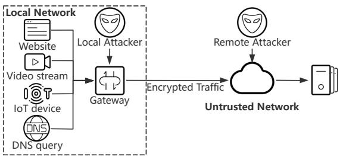

Figure 1: An example of encrypted traffic analysis.  
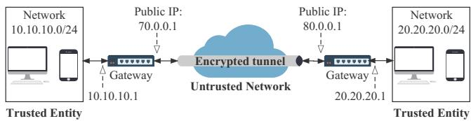  
Figure 2: An example of IPsec gateway.

## 2.2 Defenses against Encrypted Traffic Analysis

Proxy-based defenses. Proxy-based defenses obfuscate the 5-tuple of user flows, preventing passive observers from obtaining clear traffic traces without noise. Popular Socks-based proxies like Shadowsocks [3] and V2Ray [2] break one access to a website into several flows by randomly generating new ports to request different resources in a website. Hence, the attackers can only capture partial access to the website through various 5-tuples. IPsec gateways, commonly used as LAN gateways, establish a secure and encrypted tunnel with aggregated flows by replacing the original IP headers with new IP headers with the same public IP, as illustrated in Figure. 2. In this way, attackers can only capture a noisy flow where multiple flows are actually transmitting, rather than pinpointing any individual user because they cannot capture the user’s original IP address.

Proxies are widely deployed because they are lightweight, bringing little bandwidth or latency overhead, and can handle multiple end users. However, these proxies fail to defend against new encrypted traffic analysis. [27] succeeds in recognizing websites through per-flow traffic analysis and breaches socks-based proxies. [14] identifies device types by a LSTM model with per-packet labels, threatening IoT users even with the protection of IPsec gateways. Although proxies provide identity anonymity, emerging studies indicate that traditional Proxy-based defenses are no longer safe, thus traffic morphing-based defenses are necessary.

Traffic morphing-based defenses. Traffic morphingbased defenses obfuscate traffic traces to resist traffic analysis attacks by inserting, delaying, combining, or splitting packets. BuFLO [16] removes all side-channel information by sending fixed-length packets at a fixed interval for at least a fixed amount of time. [21] proposes WTF-PAD, an adaptive padding method on top of Tor, which utilizes a finite state machine along with histograms. WTF-PAD is effective against conventional attacks, with half the bandwidth overhead of Bu-FLO, but fails to resist the more advanced deep learning-based attacks [42]. To defeat deep learning classifiers, researchers have applied adversarial perturbations [32] and patches [23]. [18] designs a lightweight defense that dedicates most of its bandwidth budget to obfuscate the trace front. In IoT Fingerprinting, Alshehri et al. [5] attack tunneled IoT traffic based on packet-size sequences and propose an algorithm to pad packets with uniform random noise to defend against it. According to [5] and [44], it is necessary to hide packet lengths to defend against IoT Fingerprinting.

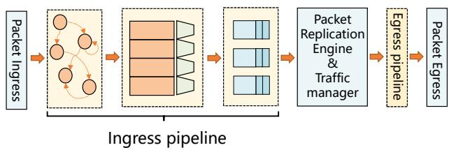  
Figure 3: Standard Tofino pipeline.

In summary, traffic morphing-based defenses, despite their effectiveness, face three main challenges. First, their high bandwidth and latency overhead hinder real-world deployment, especially for handling multiple users within a trusted entity. Second, deploying multiple targeted defenses simultaneously is infeasible and laborious due to excessive bandwidth demands. Third, traffic morphing-based defenses can not hide user identity and require the cooperation of proxies. Although recent studies [17] have increased the packet processing speed of end hosts, it is impractical to equip every user with a dedicated network interface card. Moreover, configuring defenses for each user would bring escalated overhead and place a greater burden on the network.

## 2.3 Traffic Analysis Defense on Programmable Switches

Traditional switches have fixed default functions. Thus network operators have to apply specific middleboxes or upload packets to servers [29] to support customized functions, which bring extra costs with limited throughput [57]. The emerging programmable switches provide data plane programmability with line rate packet processing capability to support customized functions [53, 59, 63]. This advancement presents a valuable opportunity to enhance the throughput of traffic morphing-based defense mechanisms by integrating traffic morphing directly into the programmable pipeline [28]. Our work focuses on PISA (Protocol Independent Switch Architecture) processors, which allow packet processing at line rate (100 Gbps) with flexible modification of packet headers by

P4 [8]. A typical Tofino architecture is shown in Figure. 3.

Packets sent to the data plane pass through two programmable pipelines and a Traffic Manager (TM). In the ingress pipeline, packets are first parsed by the ingress parser and mapped into the Packet Header Vector (PHV). After leaving the parser, PHVs are sent into the match-action pipeline where network admins can design their own packet process logic by configuring match-action tables. Packets are then assembled by the deparser and passed to the TM, where packets are replicated, recirculated, or buffered in the Traffic Manager’s round-robin queues and then passed forward to the 1egress pipeline which is identical to the ingress pipeline.

With the help of the programmable pipeline and multifunctional Traffic Manager, programmable switches can potentially deploy proxy-based defense and traffic morphingbased defense at the same time, providing both identity anonymity and traffic anonymity. Several studies have attempted implementing encryption algorithms on programmable switches. [11] and [60] implement standard encryption algorithms, e.g., AES, on programmable switches. However, they must send packets through the pipeline multiple times and thus cannot reach line rate. [12, 19, 33] either lack hardware implementation or require extensive communication with the control plane. [47] implements the two-round Even-Mansour scheme on hardware programmable switches, at the cost of excessive computing resource consumption.

A recent work, Ditto [28], establishes tunnels between programmable switches and obfuscates traffic with packet padding and dummy packets. However, Ditto exhibits a few limitations. First, Ditto relies on IPsec and MACsec gateways for encryption, which will bring additional deployment difficulties and costs. Besides, IPsec gateways have limited throughput compared to programmable switches and may become the bottleneck of the whole system. In Minos, we provide traffic obfuscating primitives along with encryption primitives and no extra devices are required. Second, Ditto realizes complete traffic anonymity by sending packets through a static traffic pattern with fixed intervals and fixed size sequences. Consequently, each packet must be padded to a predetermined size and sent through the pipeline twice for packet scheduling, resulting in significant latency and bandwidth overhead. Third, Ditto cannot adapt to dynamic network environments due to its reliance on a static traffic pattern.

## 3 Minos Overview

## 3.1 Design Goals

In this work, we propose Minos, a line rate traffic analysis defense scheme based on programmable switches. Based on the shortcomings of proxy-based and traffic morphing-based defenses, we propose the following design goals.

Lightweight. Minos is lightweight and easy to deploy in the real world. We design each Minos module with minimal bandwidth overhead and hardware resources.

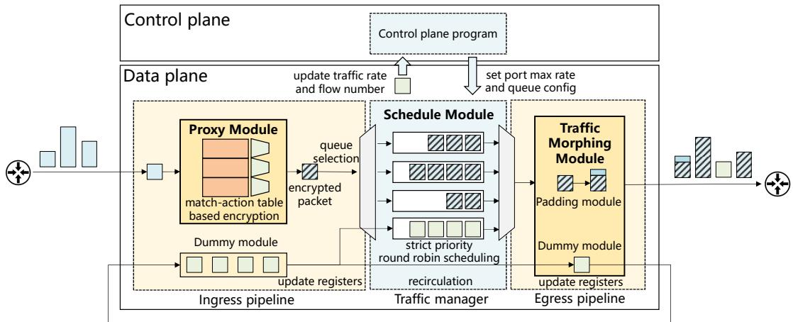  
Figure 4: System overview of Minos.

Scalable. Minos is able to dynamically adjust its defense strategy to accommodate different circumstances and handle concurrent flows from multiple users.

Anonymity. Minos provides both identity anonymity and traffic anonymity. Minos not only hides user identities through encryption but also performs traffic obfuscation, concealing metadata within the traffic.

Like IPsec, Minos establishes an end-to-end tunnel between an obfuscating gateway (e.g., an organization’s gateway) and a corresponding de-obfuscating gateway (e.g., ISPs that offer enhanced privacy or IoT operators that secure user data) for traffic obfuscation. We assume a passive attacker [20,48] who collects traffic from any point between Minos gateways and classifies them from their 5-tuples but cannot modify or insert packets.

Unlike Tor, the goal of Minos is not to hide the identities of the endpoints involved, but to establish an encrypted channel between the sender and the receiver and to conceal the metadata and the user identities. This objective is similar to the setup in Ditto. In real-world deployment, for instance, when deploying Minos to defend against IoT Fingerprinting attacks, it is necessary for IoT devices to transmit essential information to the IoT service provider. The objective of Minos is not to conceal the identity of the IoT service provider, but rather to ensure that attackers are unable to infer users’ IoT activity from the communication between the IoT device and the service provider. This principle remains consistent when deploying Minos to mitigate other types of attacks.

## 3.2 System Overview

The main process of Minos runs on the programmable data plane and communicates with the control plane to configure Traffic Manager settings. Packets entering the Minos switch will pass three modules before exit: the Proxy Module, the Schedule Module, and the Traffic Morphing Module.

The Proxy Module acts as a gateway switch that replaces the source IP of each packet with the gateway IP and sends packets at line rate. The original source IP and other fields will be encrypted and placed in a new header. Particularly, we design Encryption Round Compression exploiting matchaction tables to achieve line rate implementation of packet header encryption on programmable switches.

The Schedule Module aggregates different flows to the same destination to obfuscate the original traffic with minimal dummy packets. Packets entering Minos switches will be inserted into specific queues and interleaved by the switch’s Traffic Manager. Specifically, we propose a dynamic schedule algorithm to perform flow interleaving and decide whether to enable the Traffic Morphing Module. With the co-action of the Proxy Module and Schedule Module, Minos aggregates each incoming flow with limited overhead.

The Traffic Morphing Module provides primitives to implement traffic morphing-based defenses, consisting of the Dummy Module and the Padding Module. The former module manages dummy packets and the latter module pads and assembles packet headers. We design priority queue-based dummy packet scheduling to realize real-time dummy packet insertion.

Figure. 4 shows the workflow of Minos. When a flow enters a Minos switch, its source IP will be replaced and encrypted by the Proxy Module in the ingress pipeline, and scheduled into the Traffic Manager by the Schedule Module. Meanwhile, the Schedule Module examines the flow state and decides whether the Traffic Morphing Module should be applied. When few flows are active, simply interleaving flows is not sufficient to defeat advanced attacks. Thus, the Traffic Morphing Module will be activated, and its Dummy module and Padding module will perform dummy packet insertion and packet padding, respectively. When there is a substantial number of active flows, the Traffic Morphing Module is not needed. The control plane periodically adjusts queue configurations and changes the port max rate limitation to perform strict priority round-robin scheduling in the Schedule Module.

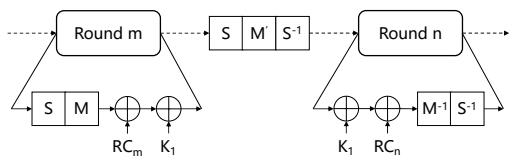  
Figure 5: Simplified encryption process of $P R I N C E _ { c o r e }$

## 4 Proxy Module

The Proxy Module acts as a secure gateway switch and performs line rate packet header encryption. In this section, we introduce how we design and implement the Proxy Module to reach line rate.

## 4.1 Choose of cipher

Similar to IPsec gateways, Minos Proxy Module replaces the original source IP of each flow with the public IP of the gateway. Related information (e.g., the original IP header) is encrypted and placed in a new header. Minos is typically used for Website Fingerprinting, IoT Fingerprinting, etc., and the receiver end is often a large service provider. Since these providers commonly deploy technologies such as anycast and CDN with publicly accessible IP addresses, encrypting the destination IP is not necessary. Therefore, Minos encrypts the source IP address and source port to provide identity anonymity.

However, achieving line rate implementation of an encryption algorithm in programmable switches is a challenging task, due to the limited resources and computations of the programmable switches. The selection of cipher should take into account the following aspects. First, the encryption algorithm should exclusively employ computational operations compatible with P4 switches. Asymmetric encryption algorithms that require prime-based computations [22, 38] and resourceintensive symmetric encryption algorithms like IDEA [1] are impractical choices. Second, as Tofino1 programmable switches consist of 12 stages per pipeline and 24 stages in total, the chosen encryption algorithm should be completed within 24 rounds. For instance, implementing a 64-round lightweight cipher TEA [51] on a programmable switch would necessitate multiple pipeline passes, resulting in increased latency overhead. Third, the cipher should utilize as few match action tables as possible to avoid resource contention with other programs.

In Minos, we choose PRINCE [7], a low-latency, lightweight SPN-based block cipher as our encryption algorithm on the programmable switch. Figure. 5 shows the basic core encryption process of PRINCE, with one encryption round on each side. PRINCE takes a 64-bit string as input and cuts it into sixteen 4-bit strings. In each encryption round, a 4-bit Sbox maps a 4-bit input to a 4-bit output, which is multiplied with a matrix M and then XORed with a 64-bit RC as well as the key $k _ { 1 }$ . String-to-string mapping can be easily realized by match-action tables, making Sboxand-permutation-based ciphers well-suited for programmable switches. Also, PRINCE, with its maximum of 10 encryption rounds (6 or 8 rounds also viable), aligns with typical 12- stage pipelines. Additionally, PRINCE features a α-reflection property, enabling encryption and decryption with the same set of match-action tables.

## 4.2 Encryption round compression

Although the PRINCE algorithm is well-suited for programmable switches, it cannot be directly implemented on programmable switches due to the limitation of stages. Each encryption round involves a sequence of non-parallelizable operations. Allocating each step of an encryption round to a separate stage would necessitate four stages per round and a total of at least forty stages, exceeding the capacity of a single 12-stage pipeline. To address this limitation, we add $k _ { 1 }$ and $R C _ { i }$ together and pre-add the $k _ { 1 } { - } R C _ { i }$ to each Sbox in each round to combine the Sbox together with XOR. It’s hard to implement the matrix multiplication in the data plane because this computation is not supported in programmable switches. However, we observe that the actual input and output of each 4\*4 matrix are four 4-bit strings thus we can combine the matrix multiplication step with the Sbox-xor table by implementing a 4-bit to 4-bit mapping table for each of the 16 4-bit strings.

## 4.3 Memory Consumption Reduction

The α-reflection feature of PRINCE cipher allows easier implementation on programmable switches. With a 128-bit key k, PRINCE divides it into two 64-bit halves $k _ { 0 }$ and $k _ { 1 }$ and employs these halves to generate a third 64-bit chunk $k _ { 0 } ^ { \prime } = \left( k _ { 0 } \gg 1 \right) \oplus \left( k _ { 0 } \gg 6 3 \right)$ . PRINCE encrypts a packet on the sender switch with $k _ { 0 } , k _ { 0 } ^ { \prime } , k _ { 1 }$ the receiver switch decrypts the packet by encrypting the packet again with $k _ { 0 } ^ { \prime } , k _ { 0 } , k _ { 1 }$ ⊕ α:

$$
D ( k _ { 0 } | | k _ { 0 } ^ { \prime } | | k _ { 1 } ) ( m e s s a g e ) = E ( k _ { 0 } ^ { \prime } | | k _ { 0 } | | k _ { 1 } \oplus \alpha ) ( m e s s a g e ) ,\tag{1}
$$

where α is a constant derived from the fraction part of π. Taking advantage of this feature, when implementing Minos on a P4 switch, we employ a single set of keys and matchaction tables for both encryption and decryption, effectively reducing the SRAM consumption by half. The match-action tables are determined by key $k _ { 1 }$ , and the Minos sender switch can hold multiple sets of keys to establish encrypted tunnels with different receiver switches by altering k0, without the need to modify match-action tables. As both ends of the tunnel are trusted, keys can be exchanged and updated by operators through the control plane.

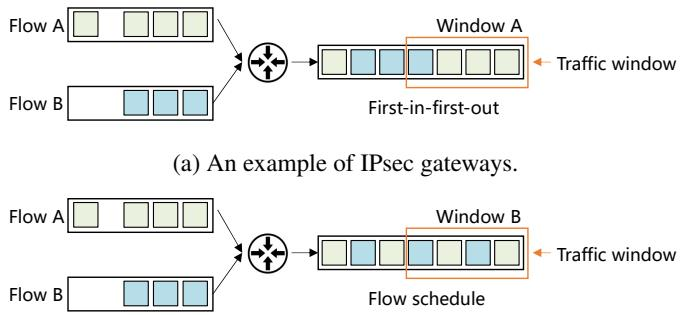  
(b) An example of Minos flow schedule.  
Figure 6: A comparison of IPsec gateway and Minos.

## 5 Schedule Module

In Minos, the Schedule Module mixes multiple flows by performing dynamic flow scheduling. Figure. 6a illustrates how an IPsec gateway mixes flows. An IPsec gateway mixes packets from multiple flows and sends them out in a first-in-firstout manner, which unavoidably includes consecutive packets from the same flows. Traffic analysis attackers can potentially exploit traffic windows comprising consecutive packets to deduce privacy-related information, such as device types [14,41]. Prior traffic morphing-based defense schemes [9, 10] insert dummy packets between original packets to address this flaw, but at the expense of increased bandwidth and latency overhead.

In Minos, the Schedule Module addresses this with greater efficiency by cleverly exploiting multiple flows, using packets from different flows as dummy packets for one another. As illustrated in Figure 6b, the Schedule Module interleaves packets from flow A and flow B, enabling packets from one flow to act as dummy packets for the other. This innovative scheduling strategy disrupts the attacker’s model, significantly reducing its accuracy while providing an effective and lightweight defense mechanism.

The detailed scheduling process of Minos on the data plane is illustrated in Figure. 7. In Minos, our aim is to achieve per-flow scheduling, but the match-action pipeline in a programmable switch typically handles flows on a per-packet basis, lacking consideration for flow states. To enable flow interleaving, maintaining per-flow states becomes essential. In Minos, we address this challenge by utilizing registers within the programmable data plane to store the following flow states:

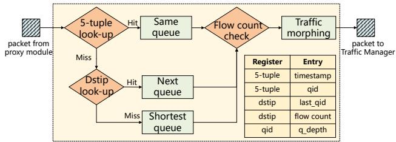  
Figure 7: Schedule algorithm of Minos.

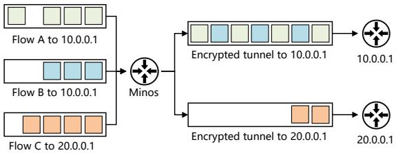  
Figure 8: Example of multiple encrypted tunnels.

• Timestamp. The timestamp for a flow identified by the 5-tuple is stored in the corresponding entry. Upon packet ingress, Minos records the entry timestamp, signifying when the last packet from this flow entered the pipeline. Inactive flow entries are subject to expiration and removal from the register through the recirculation of dummy packets.

• Queue ID. The queue ID to which the flow is sent.

• Flow count. A Minos sender switch maintains multiple encrypted tunnels with multiple destination IPs, each representing a Minos receiver switch that performs decryption and de-obfuscation. We monitor the number of flows currently transmitting to each destination IP. Figure. 8 shows the scheduling of three flows. Flow A and B are sending to 10.0.0.1, so they will be mixed into an encrypted tunnel to 10.0.0.1. Flow C is sending to 20.0.0.1, so it will be sent into another encrypted tunnel. We assume that passive attackers will eavesdrop on each encrypted tunnel based on sender and receiver Minos switches’ IP addresses. Recording flow numbers in each encrypted tunnel helps Minos decide whether traffic morphing is needed.

• The last assignment of the queue ID of each destination IP.

For each packet entering the pipeline, Minos first maps its 5-tuple into the timestamp register and performs a lookup in the queue ID register. If an entry exists, it means that previous packets of this flow have been sent into a specific queue so that the following packets should be sent through the same queue to avoid packet reordering. If no entry is found, it means the packet is initializing a new flow. Then, the 5-tuple will be matched in the destination IP register. If an entry is found in the destination IP register, the flow will be assigned to the next queue based on the recorded queue ID. This new flow’s queue ID will be the origin queue ID plus one. In this way, flows in the same encrypted tunnel will be evenly spread into different queues and scheduled in a round-robin manner, just like Flow A and B in Figure. 8. If the destination IP is not found, it means that we are building a new encrypted tunnel and no restrictions are applied to this flow. In this case, the flow will be sent into the shortest queue to balance queue length.

The flow count table keeps track of the number of flows sent to each destination to decide whether the Traffic Morphing Module should be activated. When the number of flows in an encrypted tunnel is very small, a mixture of these flows is insufficient to conceal their information effectively. Moreover, when only a few flows are active, the Schedule Module may encounter the problem of asymmetric flow interleaving, where one flow sends significantly more packets than others, resulting in consecutive packets from the same flow. This could potentially expose features from the aggregated flow to traffic analysis attackers. In such cases, the Traffic Morphing Module will perform dummy packet insertion to supplement packets for flow mixing. Besides, it will also conduct packet padding to further obfuscate flows. The flow count table is regularly checked to decide whether to invoke the Traffic Morphing Module to make sure sufficient protection is always in place. In the Schedule Module, we only track the target flows that require defenses, rather than recording every incoming flow. For detailed implementation, please refer to Section 7.1.

## 6 Traffic Morphing Module

The Traffic Morphing Module performs dummy packet insertion and packet padding to implement traffic morphing. In this section, we introduce how we implement the Dummy Module and the Padding Module in a lightweight manner.

## 6.1 Dummy Module

Although programmable switches cannot generate packets directly from the data plane, programmers can incorporate template packets into the pipeline. A typical workflow of this process is as follows. First, packet templates are sent by the switch CPU or through specific ports, marking every subsequent packet from that port as a dummy packet. Second, dummy packets are passed through the pipeline and essential functions are executed, e.g. updating registers. Third, after going through the ingress pipeline, dummy packets can either be sent into the egress pipeline or inserted into the recirculation port for another pass through the pipeline.

However, sending dummy packets in a pipeline is challenging, as they must be generated in advance and can not be sent on demand. In Minos, for instance, obfuscating a single flow within a tunnel requires the use of dummy packets. However, the inability to generate these packets instantaneously leads to unpredictable delays before a dummy packet can enter the pipeline. This limitation complicates the timely and seamless integration of dummy packets for effective obfuscation. Prior works [24, 28] have attempted to buffer dummy packets, but they cause significant bandwidth overhead.

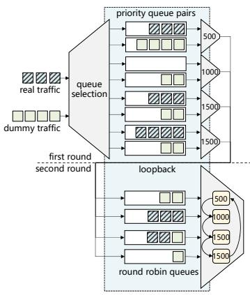  
(a) Ditto Traffic Manager

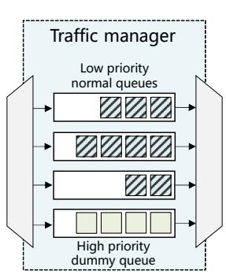  
(b) Minos Traffic Manager  
Figure 9: Different dummy packet scheduling methods.

In IMap [24], control plane programs generate dummy packets on the switch CPU, and recirculate them through the pipeline to accumulate speed. This approach handles dummy packet buffering by filling the pipeline entirely with dummy packets, enabling the generation of probe packets as needed. However, this approach introduces excessive dummy packets that would reduce overall throughput, contradicting our design goal of achieving a lightweight, line-rate defense model.

Another previous work, Ditto [28], conducts traffic morphing on the programmable data plane at the cost of high overhead. Ditto morphs traffic so that the sizes of packets sent out strictly adhere to a predefined pattern, e.g., [500,1000,1500,1500]. To achieve this, Ditto pads packets when their sizes are smaller than the intended size. Conversely, if the original packets are larger than the target size, Ditto uses dummy packets to simulate smaller ones. Consequently, a constant supply of dummy packets is required. As shown in Figure. 9a, Ditto uses hierarchical queues to buffer dummy packets, causing each packet to pass through the pipeline twice. In the first round, queues are organized by packet size (e.g., 500B). Real packets go to higher priority queues, while dummy packets fill lower priority ones. In the second round, packets are sorted by size and the traffic manager schedules them out in a round-robin manner to match the fixed pattern.

Previous studies fail to design a lightweight method to schedule dummy packets. In Minos, we design a prioritybased dummy packet scheduling structure which utilizes priority queues in the Traffic Manager to approximate instant dummy packet insertion with strict priority queues. As Figure. 9b shows, in the Minos Traffic Manager, a set of queues for normal packets shares the same low priority, and a special dummy queue owns the highest priority. Normal packets are scheduled as Figure. 7 illustrates, and are sent in a round-robin manner. The dummy queue, while owning the highest priority, will be paused when it is not needed. Unfortunately, directly pausing and resuming queues is not a supported feature in P4 switches [40]. In Minos, we modify the queue state with the assistance of the control plane. Specifically, we send marker packets to the control plane at regular intervals to report the number of active flows. Then, according to the active flow number, the control plane decides the proper cycle lengths for periodically pausing and resuming queues. The control plane program adjusts the dummy packet rate as follows:

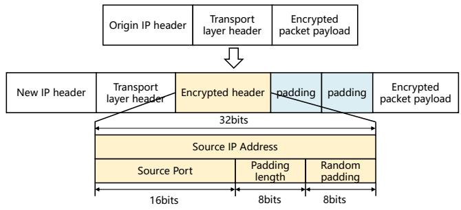  
Figure 10: Minos packet format.

$$
D u m m y \_ r a t e = \left( \frac { 1 } { n } - d - i \right) * \frac { r } { R } ,\tag{2}
$$

where n is the number of rounds in the resume period, i is the interval between resume and pause periods, r is the output rate of the dummy queue, R is the current output rate of target flow, and d is a constant representing the delay of instructions between the control plane and the data plane. This approach allows us to efficiently blend normal packets with dummy packets at minimal cost, requiring only a single buffer queue in the Traffic Manager.

## 6.2 Padding Module

Besides dummy packets, packet padding is also necessary to hide packet length to defend against packet length attacks, such as PINGPONG [44]. In Minos, we apply random padding based on the average size of the original traffic. We can set different padding sizes according to different defensive needs, as discussed in Appendix A. The programmable switch pads packets by adding packet headers after regular packet headers. From the attackers’ perspective, these headers are disguised as packet payload. As Figure. 10 shows, Minos adds multiple headers of different sizes after the transport layer header to realize dynamic padding. To de-obfuscate and remove these headers, the receiver Minos switch must be informed of the exact padding length.

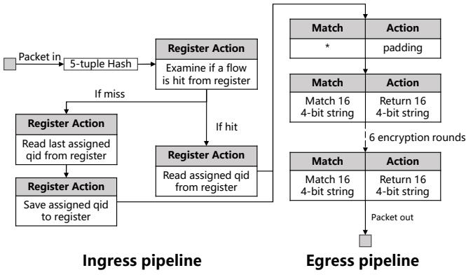  
Figure 11: Minos flow table.

Therefore, the padding length is also encrypted with the Proxy Module. A total of 64 bits will be encrypted and inserted after the transport layer header, including 32-bit source IP, 8-bit padding length, 16-bit source port, and 8-bit random padding. The padding size is calculated in the ingress pipeline and encrypted along with the source IP while padding headers are added in the egress pipeline. On the receiver switch, padding size and source IP will be decrypted in the ingress pipeline, so that extra headers can be stripped in the egress pipeline. Overall, the Proxy Module will bring a static 8 Bytes to each packet and the bandwidth overhead of the Padding Module depends on defense settings.

## 7 Hardware Prototype Evaluation

We implement a hardware prototype of Minos on two Barefoot Tofino1 switches with 32 × 100 Gbps ports. We use a traffic generator [4] to inject packets and record output traffic.

## 7.1 Implementation

The switch pipeline and flow tables are depicted in Figure. 11. Specifically, packets entering the ingress pipeline will first be hashed. Utilizing the inherent CRC32 hash function of the Tofino ASIC, the five-tuple of each flow is hashed into a unique flow identifier (ID). This flow ID subsequently serves as the key for storing flow-level information within the register. A Tofino1 switch offers 80 pages, each containing 1000 entries of 128b RAMs, which can be allocated for storing the flow-level information. These hardware resources enable Minos to manage over 10,000 concurrent flows. Nevertheless, as a gateway switch, the number of flows handled by Minos may exceed this capacity. It is important to note that Minos is designed to monitor only those flows that require defense, rather than monitoring the information of every single flow. Therefore, the register of Tofino does not affect the scalability of Minos. The dummy packets are injected from a specific port and assigned to the high priority queue. We use bfrt python scripts to pause and resume the dummy queue. In the egress pipeline, Minos first performs packet padding by adding packet headers. Then, in each encryption round, the original 64-bit string is segmented into 16 4-bit strings, and the match action table executes string-to-string mapping. Owing to the limitation of the number of stages, the maximum number of encryption rounds that can be performed is six.

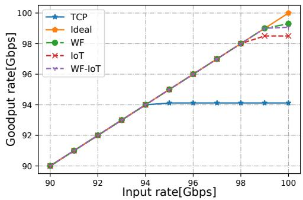  
Figure 12: Throughput of Minos proxy module.

Table 2 shows the utilization of each hardware resource. The Minos Proxy Module consumes only 6.15% of VLIWs and does not use any ALUs or TCAMs. Instead, it relies on 55.96% of SRAM to support match-action table-based encryption. Notably, many functions commonly deployed on P4 switches, such as Sketch [61] and Network Attack Detection [31], demand substantial ALU (>20%) or VLIW (≈ 10%) resources but have low SRAM requirements. Therefore, Minos can coexist efficiently with these P4 programs. The receiving switch and the sending switch have the same hardware resource consumption because the same P4 program and the corresponding decryption flow tables need to be deployed.

## 7.2 Evaluation of the Proxy Module.

First, we evaluate the throughput of the Proxy Module. We send TCP packets of 128B at different rates to examine if Minos can perform line rate encryption and also evaluate the performance of the Proxy Module using realistic flows. The detailed construction of each dataset will be illustrated in section 7.6. In Figure. 12, the X-axis reflects the input rate of packets, and the Y-axis represents the actual output rate of real traffic without extra bytes brought by the Minos Proxy Module. The result proves that Minos is able to perform line rate source IP encryption in the case of realistic datasets. Minos reached an upper limit of 94 Gbps in the case of TCP streams because the packets in TCP streams are relatively small, which means that adding an 8-byte packet header has a greater impact and thus reduces the throughput. As Minos has a static 8-byte overhead per packet, the output ratio of real traffic will be higher if larger packets are sent.

Table 2: Hardware Resource utilization.
<table><tr><td>Module name</td><td>Stages</td><td>VLIWs</td><td>ALUs</td><td>TCAM</td><td>SRAM</td></tr><tr><td>Proxy module</td><td>10</td><td>6.15%</td><td>0%</td><td>0%</td><td>55.96%</td></tr><tr><td>Minos</td><td>12</td><td>7.81%</td><td>0%</td><td>0%</td><td>59.06%</td></tr></table>

Table 3: Arrival time of 1000th packet(s).
<table><tr><td>Origin</td><td>Limited output rate</td><td>Two flows</td><td>Three flows</td><td>Four flows</td></tr><tr><td>1</td><td>1.095861</td><td>1.102307</td><td>1.106605</td><td>1.108754</td></tr></table>

## 7.3 Evaluation of the Schedule Module.

We implement a simple scenario to evaluate the latency brought by the Schedule Module. In each flow, we send 1000 packets per second and record the arrival time of the 1000th packet. Then, we mix different numbers of flows to see if the flow mixture will bring extra latency overhead. In Minos, we record the current traffic rate and report to the control plane periodically to update port speed limitation, usually 99% of the current traffic rate. Otherwise, packets will not be cached in queues and will be sent out directly in the First-in-First-out manner. In this experiment, we set the output rate of the tested port at 90% of the current traffic rate to magnify the delay effect and evaluate the arrival time of 1000th packets of each flow.

As Table 3 shows, adding flow numbers only incurs less than 1% latency, which is insignificant compared to output rate limiting. The results show that Minos can handle multiple flows without incurring much delay. Therefore, we should keep track of the current traffic rate and synchronize it with the control plane frequently to reduce latency overhead.

## 7.4 Evaluation of the Dummy Module

Minos enables real time dummy packet insertion by pausing and resuming priority queues. The control plane periodically pauses and resumes queues by altering queue status according to equation 2. We set the number of sending rounds n to 10 rounds per second and the output rate of normal queues to 1Gbps, and evaluate the impacts of resume interval i (X-Axis in 13a) and dummy queue output rate r (X-Axis in 13b) on dummy traffic rate.

When evaluating the impact of the interval between resume and pause dummy queue on output rate, we set the default output rate of the dummy queue to 0.1Gbps and alter interval lengths. As shown in Figure. 13a, the output rate of dummy packets increases as the interval increases and reaches its limit of about 4.5%. This is because we repeat each sending round 10 times per second, and each round lasts for 0.1 second. In this way, if we resume a queue for too long, the next resume instruction will come as soon as the previous pause instruction finishes, which means the queue will always be open.

Table 4: Overhead of Minos  
Flow type arrival time of 500,000th packet(s) Goodput rate(%)
<table><tr><td>Base</td><td>5 100%</td></tr><tr><td>One flow</td><td>5.02 95.3%</td></tr><tr><td>Multiple flows</td><td>5.12 99.2%</td></tr></table>

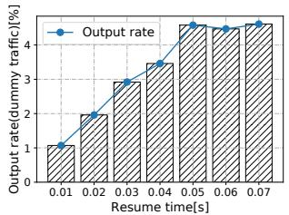  
(a) Different intervals

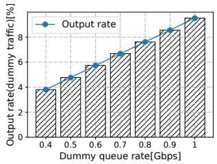  
(b) Different output rates  
Figure 13: Evaluation of the dummy module

In the evaluation of the impact of different dummy queue rates on output rate, we set the interval between resume and pause to 0.01 seconds. As shown in Figure. 13b, the output rate of dummy packets and the queue output rate exhibit an almost linear relationship, which means we can precisely control the output rate of dummy packets through the dummy queue output rate.

## 7.5 Overall Evaluation

At last, we evaluate Minos’s overall latency overhead and bandwidth overhead of all three modules. We send packets of 1024B with 10,000 packets per second and evaluate Minos in both one-flow scenario and multiple-flow scenario. In the former case, we add 64B padding to each packet and insert dummy packets with 0.01s interval and 0.5Gbps output rate. When multiple flows are transmitting, we do not perform traffic morphing because flow interleaving is sufficient to defend against traffic analysis attacks.

Table 4 shows that Minos can perform with limited latency and bandwidth overhead. In the one-flow scenario, Minos reaches 95% goodput with little latency overhead. In the multiple-flow scenario, the goodput rate is close to 100% because we only add 8B of encryption header to each packet. The arrival time of the 500,000th packet experiences a slight delay of just around 2.4%. This delay is caused by the fact that the output rate of the tested port is limited to enable roundrobin queues, as discussed in the evaluation of the Schedule Module.

## 7.6 Comparison with SOTA work

We compare Minos with the state-of-the-art traffic morphingbased defense on programmable switches, as presented in Ditto [28]. Ditto is an end-to-end system that incorporates two Tofino switches, responsible for obfuscation and deobfuscation respectively. To assess the performance of Minos and Ditto across various network conditions, we choose three datasets for our evaluation: Website Fingerprinting dataset (WF) [37], IoT Fingerprinting dataset (IoT) [36], and a mixture of both (Mix). We send background traffic ranging from 0 to 100Gbps with these datasets and conduct four experiments. Besides, we configure Minos to perform a 64B padding to each packet. Note that the Dummy Module is disabled because the evaluation involves transmitting multiple flows, and dummy packet insertion are unnecessary.

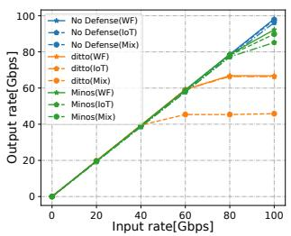

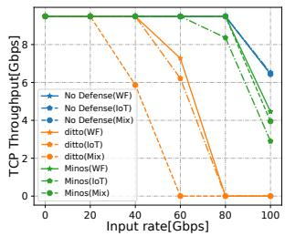  
(a) Overall Throughput

(b) TCP Throughput  
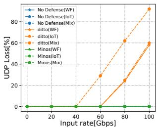  
(c) UDP Packet Loss

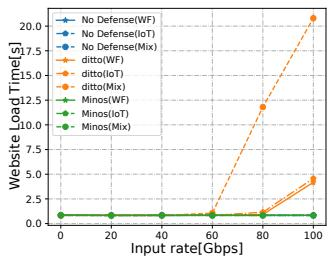  
(d) Website Load Time  
Figure 14: Evaluation results in comparison with Ditto.

First, we assess the overall throughput of Minos and Ditto. Figure. 14a illustrates that Minos is capable of adapting to diverse scenarios, whereas Ditto’s throughput is capped at 45Gbps when dealing with packets of more uniform sizes in the Mixed dataset. In the TCP throughput experiments, we send background traffic ranging from 0Gbps to 100Gbps along with a 10Gbps TCP flow. Figure. 14b reveals that the throughput of Ditto drops to near 0 when sending 80Gbps background traffic, whereas Minos maintains more than 8Gbps throughput at 80Gbps and approximately 4Gbps at 100Gbps. Additionally, we examine the performance of Minos and Ditto in terms of the UDP packet loss rate and the loading time of Google. The results show that Minos’s performance is almost the same as the ideal case, with no significant impact on applications. However, Ditto can cause packet loss and website loading delays under high throughput conditions.

## Use Case: Website Fingerprinting

In this section, we implement Minos to defend against Website Fingerprinting. We introduce our dataset, baseline attacks, and defenses in section 8.1 and introduce how we adapt Minos to defend WF attacks in section 8.2. At last, we evaluate Minos against baseline attacks and defenses.

## 8.1 Evaluation Setup

We request the parsed dataset with all meta-data including timestamps from [37]. The closed world dataset contains 900 websites, and 5,000 visits each. In our experiments, we select 300 websites and 100 traces each, 30,000 traces in total from the closed world dataset. Each trace acts as a real traffic trace and is sent to Minos according to its timestamp.

We evaluate Minos against four up-to-date Website Fingerprinting attacks: kNN [48], CUMUL [34], kFP [20], DF [42]. We use the simulation code provided by Gong et al. [18] and keep the suggested parameters from the original papers, but we change the maximum length of traces, which will be illustrated in section 8.3. As for defenses, we also adopt defenses provided by [18]: Tamaraw [10] and WTF-PAD [9]. The former is a heavyweight obfuscation defense, and the latter is a lightweight defense. We compare these two defenses to Minos on overhead and effectiveness.

## 8.2 Defense Design

Recall that in Minos, traffic morphing-based defense against Website Fingerprinting is only needed when we have a limited number of flows transmitting in an encrypted tunnel. When the number of transmitted flows is large, Minos performs flow-interleaving to obfuscate the flows. When the number of transmitted flows falls below a threshold, it supplements the defense with traffic morphing-based Website Fingerprinting defense. The exact threshold will be examined in section 8.3. In this section, we describe our lightweight defense mechanism.

Based on previous studies, the first few seconds of each trace leak the most useful features for website fingerprinting [20, 50]. [18] proposes FRONT, a defense that dedicates most of its bandwidth budget to obfuscate the trace front. FRONT samples a dynamic traffic window and sends packets based on Rayleigh Distribution, and uses four parameters to control this process. In Minos, we simplify this defense to two parameters: front window W and obfuscating parameter Ω. In the first W packets, we randomly insert dummy packets with a given probability Ω, and in the rest of the traffic, no dummy packets are inserted. To implement the above defense mechanism, we can use the estimated overhead budget and equation 2 to configure the dummy queue. To make this defense as lightweight as possible, we choose not to pad or delay packets and only insert dummy packets at a given possibility.

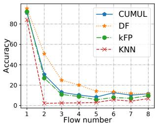

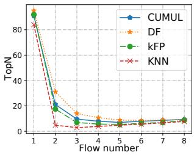  
(a) Normal model Acc

(b) Normal model TopN  
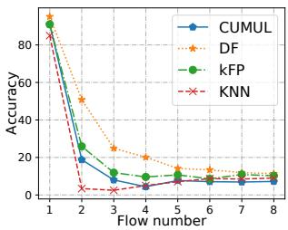

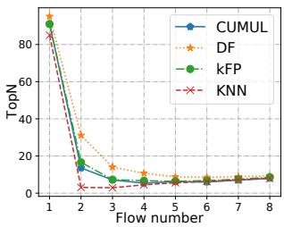  
(c) 5000 model Accuracy  
(d) 5000 model TopN  
Figure 15: Evaluation of flow mixture

## 8.3 Evaluation

First, we evaluate the relationship between the flow number and the accuracy of attack models. The attacks are trained with the original recommended parameters, except for flow length. To avoid disturbance brought by flow aggregation, we train models at two fixed lengths: 5000 and 10000, and cut off input traffic traces to them. We apply two metrics to evaluate each attack model: the accuracy metric and the TopN metric. In both cases, we select the top N labels with the highest probability, where N equals the number of mixed flows. The accuracy metric evaluates if machine learning models return any right label of the original flows, while the latter metric evaluates how many labels are correct. Each correct label is counted as 1/N correct answer.

Figure. 15 shows our results. Figure. 15a and 15b show how metrics change with flow numbers. We can see that both evaluation metrics quickly decrease as the flow number n increases, and converge at n=5. When flow numbers are larger than 5, both metrics are lower than 20%, which is effective and able to defend against any attack models. As for the two graphs evaluating the top 5000 models, although different in exact numbers, the overall tendencies are the same, and also coverage at n=4 or 5. To conclude, mixing up flows can significantly obfuscate attackers with only a few flows. Based on this experiment, we set the threshold of enabling dummy packet insertion to 4, which decreases attackers’ accuracy to lower than 20% without any extra overhead.

Then we evaluate our defense mechanism against other defenses. Here, we set the obfuscating parameter Ω to 0.6 and evaluate the defense effect of window sizes of 500 and 1000. The bandwidth overhead of each defense is shown in Table 6. Table 5 shows all evaluation results. We use accuracy, precision, and F1 score to evaluate defense performances. Without any defense, each attack model can achieve around 90% accuracy, and the DF model has the highest accuracy of 96.9%. Tamaraw decreases the accuracy of each attack to single digits at the cost of its high bandwidth overhead. On the other hand, lightweight defense WTF-PAD fails to defend against DF which still has more than 80% accuracy. In Minos, both defenses achieve less than 40% accuracy and 60% precision. With only one-third of the overhead of WTF-PAD, Minos achieves a satisfying defense effect. Besides, as a practical, lightweight defense mechanism, we are concerned about the actual throughput with each defense. As Figure. 16 shows, the previous defense schemes have lower output rates because of their high bandwidth overhead, even the lightweight defense model WTF-PAD reaches less than 80Gbps of real traffic. In Minos, we can achieve about 95Gbps throughput.

Table 5: Defense performances
<table><tr><td rowspan="2">Defense</td><td colspan="4"> Accuracy%</td><td colspan="4">Precision%</td><td colspan="4">F1</td></tr><tr><td>kNN</td><td>CUMUL</td><td>kFP</td><td>DF</td><td>kNN</td><td>CUMUL</td><td>kFP</td><td>DF</td><td>kNN</td><td>CUMUL</td><td>KFP</td><td>DF</td></tr><tr><td>No defense</td><td>84.62</td><td>91.47</td><td>91.68</td><td>96.9</td><td>83.46</td><td>90.72</td><td>91.56</td><td>96.75</td><td>0.831</td><td>0.9091</td><td>0.9147</td><td>0.9676</td></tr><tr><td>Tamaraw</td><td>2.55</td><td>4.42</td><td>4.99</td><td>1.47</td><td>3.57</td><td>8.18</td><td>6.43</td><td>5.32</td><td>0.0223</td><td>0.049</td><td>0.0528</td><td>0.0206</td></tr><tr><td>WTF-PAD</td><td>20.38</td><td>44.42</td><td>57.28</td><td>81.06</td><td>18.43</td><td>44.14</td><td>56.11</td><td>78.86</td><td>0.1766</td><td>0.4305</td><td>0.5491</td><td>0.7857</td></tr><tr><td>Minos-500</td><td>5.63</td><td>39.82</td><td>31.73</td><td>7.06</td><td>7.96</td><td>55.68</td><td>38.96</td><td>6.7</td><td>0.05</td><td>0.4</td><td>0.28</td><td>0.05</td></tr><tr><td>Minos-1000</td><td>7.38</td><td>38.73</td><td>32.66</td><td>6.67</td><td>8.49</td><td>52.61</td><td>38.31</td><td>6.7</td><td>0.06</td><td>0.38</td><td>0.28</td><td>0.045</td></tr></table>

Table 6: Overhead of each defense mechanism
<table><tr><td rowspan="2">Defense</td><td rowspan="2">Parameters</td><td colspan="2">Overhead</td></tr><tr><td>Latency(%)</td><td>Bandwidth(%)</td></tr><tr><td>Tamaraw</td><td> $\rho _ { o u t } = 0 . 0 4 , \rho _ { i n } = 0 . 0 1 2 , \mathrm { L } = 5 0$ </td><td>14.23</td><td>143.82</td></tr><tr><td>WTF-PAD</td><td>Normal rcv</td><td>o</td><td>60</td></tr><tr><td>Minos-500</td><td>Ω=0.6,window=500</td><td>0</td><td>6</td></tr><tr><td>Minos-1000</td><td>Ω=0.6,window=1000</td><td>0</td><td>12</td></tr></table>

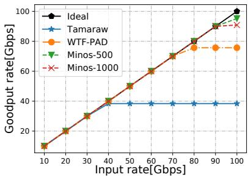  
Figure 16: Throughput of each defense.

To sum up, although our simple and intuitive Website Fingerprinting defense cannot reduce the accuracy of Website

Fingerprinting attacks to random guess, we believe it’s acceptable because of its low overhead and high throughput. Besides, in more usual scenarios, we have more than four flows transmitting in one encrypted tunnel on the programmable switch, which can naturally decrease the accuracy of attackers to lower than 20% without any bandwidth overhead.

## 9 Conclusion

In this paper, we present Minos, a lightweight and scalable defense against traffic analysis attacks using programmable switches, providing both identity anonymity and traffic anonymity. Minos performs line rate packet header encryption with the Proxy Module and performs lightweight dummy packet insertion and packet padding with the Traffic Morphing module. Besides, Minos applies a dynamic flow scheduling algorithm to accommodate different network scenarios. Our evaluation shows that Minos can perform line rate packet encryption and flow scheduling at a low cost, and defend against Website Fingerprinting attacks with little overhead.

## 10 Acknowledgements

This work is supported by the Major Key Project of PCL under grant No. PCL2023A06, Shenzhen RD Program under grant NO. KJZD20230923114059020, and in part by Shenzhen Key Laboratory of Software Defined Networking under Grant ZDSYS20140509172959989.

## References

[1] International data encryption algorithm. https: //en.wikipedia.org/wiki/International\_Data\_ Encryption\_Algorithm, Accessed August, 2023.

[2] Project v. v2ray. https://www.v2ray.com/, Accessed August, 2023.

[3] Shadowsocks. https://shadowsocks.org/en/ download/clients.html, Accessed August, 2023.

[4] Spirent spt-n11u. https://assets.ctfassets. net/wcxs9ap8i19s/7mjZqW5guntME8DD0gf27g/ dcc39be517f3296d4ada20b3ecaec900/SPT-N11U Mainframe\_Chassis\_Datasheet.pdf, Accessed Janurary, 2024.

[5] Ahmed Alshehri, Jacob Granley, and Chuan Yue. Attacking and protecting tunneled traffic of smart home devices. In Proceedings of the Tenth ACM Conference on Data and Application Security and Privacy, pages 259–270, 2020.

[6] Sanjit Bhat, David Lu, Albert Kwon, and Srinivas Devadas. Var-cnn: A data-efficient website fingerprinting attack based on deep learning. arXiv preprint arXiv:1802.10215, 2018.

[7] Julia Borghoff, Anne Canteaut, Tim Güneysu, Elif Bilge Kavun, Miroslav Knezevic, Lars R Knudsen, Gregor Leander, Ventzislav Nikov, Christof Paar, Christian Rechberger, et al. Prince–a low-latency block cipher for pervasive computing applications. In Advances in Cryptology–ASIACRYPT 2012: 18th International Conference on the Theory and Application of Cryptology and Information Security, Beijing, China, December 2-6, 2012. Proceedings 18, pages 208–225. Springer, 2012.

[8] Pat Bosshart, Dan Daly, Glen Gibb, Martin Izzard, Nick McKeown, Jennifer Rexford, Cole Schlesinger, Dan Talayco, Amin Vahdat, George Varghese, et al. P4: Programming protocol-independent packet processors. ACM SIGCOMM Computer Communication Review, 44(3):87–95, 2014.

[9] Xiang Cai, Rishab Nithyanand, and Rob Johnson. Csbuflo: A congestion sensitive website fingerprinting defense. In Proceedings of the 13th Workshop on Privacy in the Electronic Society, pages 121–130, 2014.

[10] Xiang Cai, Rishab Nithyanand, Tao Wang, Rob Johnson, and Ian Goldberg. A systematic approach to developing and evaluating website fingerprinting defenses. In Proceedings of the 2014 ACM SIGSAC Conference on Computer and Communications Security, pages 227– 238, 2014.

[11] Xiaoqi Chen. Implementing aes encryption on programmable switches via scrambled lookup tables. In Proceedings of the Workshop on Secure Programmable Network Infrastructure, pages 8–14, 2020.

[12] Trisha Datta, Nick Feamster, Jennifer Rexford, and Liang Wang. {spine}: Surveillance protection in the network elements. In 9th USENIX Workshop on Free and Open Communications on the Internet (FOCI 19), 2019.

[13] Roger Dingledine, Nick Mathewson, Paul F Syverson, et al. Tor: The second-generation onion router. In USENIX security symposium, volume 4, pages 303–320, 2004.

[14] Shuaike Dong, Zhou Li, Di Tang, Jiongyi Chen, Menghan Sun, and Kehuan Zhang. Your smart home can’t keep a secret: Towards automated fingerprinting of iot traffic. In Proceedings of the 15th ACM Asia Conference on Computer and Communications Security, pages 47–59, 2020.

[15] Chenxin Duan, Hao Gao, Guanglei Song, Jiahai Yang, and Zhiliang Wang. Byteiot: A practical iot device identification system based on packet length distribution. IEEE Transactions on Network and Service Management, 19(2):1717–1728, 2021.

[16] Kevin P Dyer, Scott E Coull, Thomas Ristenpart, and Thomas Shrimpton. Peek-a-boo, i still see you: Why efficient traffic analysis countermeasures fail. In 2012 IEEE symposium on security and privacy, pages 332– 346. IEEE, 2012.

[17] Hamid Ghasemirahni, Alireza Farshin, Mariano Scazzariello, Gerald Q. Maguire, Dejan Kostic, and Marco ´ Chiesa. Fajita: Stateful packet processing at 100 million pps. Proc. ACM Netw., 2(CoNEXT3), August 2024.

[18] Jiajun Gong and Tao Wang. Zero-delay lightweight defenses against website fingerprinting. In 29th USENIX Security Symposium (USENIX Security 20), pages 717– 734, 2020.

[19] Frederik Hauser, Marco Häberle, Mark Schmidt, and Michael Menth. P4-ipsec: Site-to-site and host-to-site vpn with ipsec in p4-based sdn. IEEE Access, 8:139567– 139586, 2020.

[20] Jamie Hayes and George Danezis. k-fingerprinting: A robust scalable website fingerprinting technique. In 25th USENIX Security Symposium (USENIX Security 16), pages 1187–1203, 2016.

[21] Marc Juarez, Mohsen Imani, Mike Perry, Claudia Diaz, and Matthew Wright. Toward an efficient website fingerprinting defense. In Computer Security–ESORICS 2016: 21st European Symposium on Research in Computer Security, Heraklion, Greece, September 26-30, 2016, Proceedings, Part I 21, pages 27–46. Springer, 2016.

[22] Neal Koblitz, Alfred Menezes, and Scott Vanstone. The state of elliptic curve cryptography. Designs, codes and cryptography, 19:173–193, 2000.

[23] Ding Li, Yuefei Zhu, Minghao Chen, and Jue Wang. Minipatch: Undermining dnn-based website fingerprinting with adversarial patches. IEEE Transactions on Information Forensics and Security, 17:2437–2451, 2022.

[24] Guanyu Li, Menghao Zhang, Cheng Guo, Han Bao, Mingwei Xu, Hongxin Hu, and Fenghua Li. {IMap}: Fast and scalable {In-Network} scanning with programmable switches. In 19th USENIX Symposium on Networked Systems Design and Implementation (NSDI 22), pages 667–681, 2022.

[25] Xiapu Luo, Peng Zhou, Edmond WW Chan, Wenke Lee, Rocky KC Chang, Roberto Perdisci, et al. Httpos: Sealing information leaks with browser-side obfuscation of encrypted flows. In NDSS, volume 11, 2011.

[26] Xiaobo Ma, Jian Qu, Jianfeng Li, John CS Lui, Zhenhua Li, Wenmao Liu, and Xiaohong Guan. Inferring hidden iot devices and user interactions via spatial-temporal traffic fingerprinting. IEEE/ACM Transactions on Networking, 30(1):394–408, 2021.

[27] Xiaobo Ma, Mawei Shi, Bingyu An, Jianfeng Li, Daniel Xiapu Luo, Junjie Zhang, and Xiaohong Guan. Context-aware website fingerprinting over encrypted proxies. In IEEE INFOCOM 2021-IEEE Conference on Computer Communications, pages 1–10. IEEE, 2021.

[28] Roland Meier, Vincent Lenders, and Laurent Vanbever. Ditto: Wan traffic obfuscation at line rate. In NDSS Symposium, 2022.

[29] Congcong Miao, Minggang Chen, Arpit Gupta, Zili Meng, Lianjin Ye, Jingyu Xiao, Jie Chen, Zekun He, Xulong Luo, Jilong Wang, and Heng Yu. Detecting ephemeral optical events with optel. In USENIX Symposium on Networked Systems Design and Implementation (NSDI), Renton, WA, USA, April 4-6, 2022, pages 339– 353. USENIX Association, 2022.

[30] Markus Miettinen, Samuel Marchal, Ibbad Hafeez, N Asokan, Ahmad-Reza Sadeghi, and Sasu Tarkoma. Iot sentinel: Automated device-type identification for security enforcement in iot. In 2017 IEEE 37th international conference on distributed computing systems (ICDCS), pages 2177–2184. IEEE, 2017.

[31] Seyed Mohammad Mehdi Mirnajafizadeh, Ashwin Raam Sethuram, David Mohaisen, DaeHun Nyang, and Rhongho Jang. Enhancing network attack detection with distributed and in-network data collection system. In Davide Balzarotti and Wenyuan Xu, editors, 33rd USENIX Security Symposium, USENIX Security 2024, Philadelphia, PA, USA, August 14-16, 2024. USENIX Association, 2024.

[32] Milad Nasr, Alireza Bahramali, and Amir Houmansadr. Defeating {DNN-Based} traffic analysis systems in {Real-Time} with blind adversarial perturbations. In 30th USENIX Security Symposium (USENIX Security 21), pages 2705–2722, 2021.

[33] Isaac Oliveira, Emídio Neto, Roger Immich, Ramon Fontes, Augusto Neto, Fabrício Rodriguez, and Christian Esteve Rothenberg. Dh-aes-p4: on-premise encryption and in-band key-exchange in p4 fully programmable data planes. In 2021 IEEE Conference on Network Function Virtualization and Software Defined Networks (NFV-SDN), pages 148–153. IEEE, 2021.

[34] Andriy Panchenko, Fabian Lanze, Jan Pennekamp, Thomas Engel, Andreas Zinnen, Martin Henze, and Klaus Wehrle. Website fingerprinting at internet scale. In NDSS, 2016.

[35] Maximilian Pudelko, Paul Emmerich, Sebastian Gallenmüller, and Georg Carle. Performance analysis of VPN gateways. In 2020 IFIP Networking Conference, Networking 2020, Paris, France, June 22-26, 2020, pages 325–333. IEEE, 2020.

[36] Jingjing Ren, Daniel J Dubois, David Choffnes, Anna Maria Mandalari, Roman Kolcun, and Hamed Haddadi. Information exposure from consumer iot devices: A multidimensional, network-informed measurement approach. In Proceedings of the Internet Measurement Conference, pages 267–279, 2019.

[37] Vera Rimmer, Davy Preuveneers, Marc Juarez, Tom Van Goethem, and Wouter Joosen. Automated website fingerprinting through deep learning. arXiv preprint arXiv:1708.06376, 2017.

[38] Ronald L Rivest, Adi Shamir, and Leonard Adleman. A method for obtaining digital signatures and public-key cryptosystems. Communications of the ACM, 21(2):120– 126, 1978.

[39] Roei Schuster, Vitaly Shmatikov, and Eran Tromer. Beauty and the burst: Remote identification of encrypted video streams. In 26th USENIX Security Symposium (USENIX Security 17), pages 1357–1374, 2017.

[40] Naveen Kr Sharma, Chenxingyu Zhao, Ming Liu, Pravein G Kannan, Changhoon Kim, Arvind Krishnamurthy, and Anirudh Sivaraman. Programmable calendar queues for high-speed packet scheduling. In 17th USENIX Symposium on Networked Systems Design and Implementation (NSDI 20), pages 685–699, 2020.

[41] Sandra Siby, Marc Juarez, Claudia Diaz, Narseo Vallina-Rodriguez, and Carmela Troncoso. Encrypted dns–> privacy? a traffic analysis perspective. arXiv preprint arXiv:1906.09682, 2019.

[42] Payap Sirinam, Mohsen Imani, Marc Juarez, and Matthew Wright. Deep fingerprinting: Undermining website fingerprinting defenses with deep learning. In Proceedings of the 2018 ACM SIGSAC Conference on

Computer and Communications Security, pages 1928– 1943, 2018.

[43] Arunan Sivanathan, Hassan Habibi Gharakheili, Franco Loi, Adam Radford, Chamith Wijenayake, Arun Vishwanath, and Vijay Sivaraman. Classifying iot devices in smart environments using network traffic characteristics. IEEE Transactions on Mobile Computing, 18(8):1745– 1759, 2018.

[44] Rahmadi Trimananda, Janus Varmarken, Athina Markopoulou, and Brian Demsky. Packet-level signatures for smart home devices. In Network and Distributed Systems Security (NDSS) Symposium, volume 2020, 2020.

[45] Yinxin Wan, Kuai Xu, Feng Wang, and Guoliang Xue. Iotathena: Unveiling iot device activities from network traffic. IEEE Transactions on Wireless Communications, 21(1):651–664, 2021.

[46] Yinxin Wan, Kuai Xu, Feng Wang, and Guoliang Xue. Iotmosaic: Inferring user activities from iot network traffic in smart homes. In IEEE INFOCOM 2022-IEEE Conference on Computer Communications, pages 370– 379. IEEE, 2022.

[47] Liang Wang, Hyojoon Kim, Prateek Mittal, and Jennifer Rexford. Programmable in-network obfuscation of dns traffic. In NDSS: DNS Privacy Workshop. sn, 2021.

[48] Tao Wang, Xiang Cai, Rishab Nithyanand, Rob Johnson, and Ian Goldberg. Effective attacks and provable defenses for website fingerprinting. In 23rd USENIX Security Symposium (USENIX Security 14), pages 143– 157, 2014.

[49] Tao Wang and Ian Goldberg. On realistically attacking tor with website fingerprinting. Proc. Priv. Enhancing Technol., 2016(4):21–36, 2016.

[50] Tao Wang and Ian Goldberg. {Walkie-Talkie}: An efficient defense against passive website fingerprinting attacks. In 26th USENIX Security Symposium (USENIX Security 17), pages 1375–1390, 2017.

[51] David J Wheeler and Roger M Needham. Tea, a tiny encryption algorithm. In Fast Software Encryption: Second International Workshop Leuven, Belgium, December 14–16, 1994 Proceedings 2, pages 363–366. Springer, 1995.

[52] Charles V Wright, Scott E Coull, and Fabian Monrose. Traffic morphing: An efficient defense against statistical traffic analysis. In NDSS, volume 9, 2009.

[53] Jingyu Xiao, Qing Li, Dan Zhao, Xudong Zuo, Wenxin Tang, and Yong Jiang. Themis: A passive-active hybrid

framework with in-network intelligence for lightweight failure localization. Computer Networks, 255:110836, 2024.

[54] Jingyu Xiao, Zhiyao Xu, Qingsong Zou, Qing Li, Dan Zhao, Dong Fang, Ruoyu Li, Wenxin Tang, Kang Li, Xudong Zuo, et al. Make your home safe: Time-aware unsupervised user behavior anomaly detection in smart homes via loss-guided mask. In Proceedings of the 30th ACM SIGKDD Conference on Knowledge Discovery and Data Mining, pages 3551–3562, 2024.

[55] Jingyu Xiao, Qingsong Zou, Qing Li, Dan Zhao, Kang Li, Wenxin Tang, Runjie Zhou, and Yong Jiang. User device interaction prediction via relational gated graph attention network and intent-aware encoder. In ACM International Conference on Autonomous Agents and Multiagent Systems (AAMAS), London, United Kingdom, 29 May-2 June, 2023, pages 1634–1642. ACM, 2023.

[56] Jingyu Xiao, Qingsong Zou, Qing Li, Dan Zhao, Kang Li, Zixuan Weng, Ruoyu Li, and Yong Jiang. I know your intent: Graph-enhanced intent-aware user device interaction prediction via contrastive learning. ACM on Interactive, Mobile, Wearable and Ubiquitous Technologies (IMUWT/UbiComp), 7(3):1–28, 2023.

[57] Jingyu Xiao, Xudong Zuo, Qing Li, Dan Zhao, Hanyu Zhao, Yong Jiang, Jiyong Sun, Bin Chen, Yong Liang, and Jie Li. Flexnf: Flexible network function orchestration for scalable on-path service chain serving. IEEE/ACM Transactions on Networking (ToN), 2023.

[58] Sijie Xiong, Anand D Sarwate, and Narayan B Mandayam. Network traffic shaping for enhancing privacy in iot systems. IEEE/ACM Transactions on Networking, 30(3):1162–1177, 2022.

[59] Lianjin Ye, Qing Li, Xudong Zuo, Jingyu Xiao, Yong Jiang, Zhuyun Qi, and Chunsheng Zhu. PUFF: A passive and universal learning-based framework for intradomain failure detection. In IEEE International Performance, Computing, and Communications Conference (IPCCC), Austin, TX, USA, October 29-31, 2021, pages 1–8. IEEE, 2021.

[60] Sophia Yoo and Xiaoqi Chen. Secure keyed hashing on programmable switches. In Proceedings of the ACM SIGCOMM 2021 Workshop on Secure Programmable network INfrastructure, pages 16–22, 2021.

[61] Hao Zheng, Chengyuan Huang, Xiangyu Han, Jiaqi Zheng, Xiaoliang Wang, Chen Tian, Wanchun Dou, and Guihai Chen. µmon: Empowering microsecond-level network monitoring with wavelets. In Proceedings of the ACM SIGCOMM 2024 Conference, ACM SIGCOMM 2024, Sydney, NSW, Australia, August 4-8, 2024, pages 274–290. ACM, 2024.

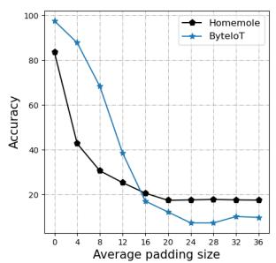

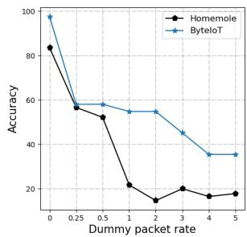  
(a) Impact of different padding (b) Impact of different dummy sizes. packet rates.  
Figure 17: Accuracy of attacks against different defenses

[62] Qingsong Zou, Qing Li, Ruoyu Li, Yucheng Huang, Gareth Tyson, Jingyu Xiao, and Yong Jiang. Iotbeholder: A privacy snooping attack on user habitual behaviors from smart home wi-fi traffic. ACM on Interactive, Mobile, Wearable and Ubiquitous Technologies (IMWUT/UbiComp), 7(1):1–26, 2023.

[63] Xudong Zuo, Qing Li, Jingyu Xiao, Dan Zhao, and Jiang Yong. Drift-bottle: a lightweight and distributed approach to failure localization in general networks. In ACM International Conference on emerging Networking EXperiments and Technologies (CoNEXT), Roma, Italy, December 6-9, 2022, pages 337–348. ACM, 2022.

## A Use case: IoT Fingerprinting

In this section, we adapt Minos to defend IoT Fingerprinting, which utilizes different features from Website Fingerprinting attacks. We apply public dataset from [36] and develop our defense against the state-of-the-art HomeMole [14] and ByteIoT [15]. All the experiments in this section are simulated in software. We evaluate the accuracy of both model against different padding sizes and dummy packet rates.

In Figure. 17a, we pad packets to different sizes to evaluate the impact of packet padding. The result shows that an average padding of 16 Bytes can reduce the accuracy of both attacks to 20%, with 98% goodput rate. On the contrary, inserting dummy packets is less effective. Figure. 17b shows the impact of inserting dummy packets with different rates, from adding 1 dummy packet for every 4 real packets (0.25), to adding 5 dummy packet for each real packet (5). The result shows that only with large amounts of dummy packets can we reduce the accuracy of ByteIoT to less than 40%.

That is because IoT Fingerprinting attacks utilizes packet length information with timing and directions, which makes packet padding more effective than dummy packet insertion based defense like [9]. For example, ByteIoT utilizes the frequency distribution of packet lengths, so that a large number of dummy packets has to be inserted to obfuscate the original frequency distribution. The results shows that different defense mechanisms are required to defense different traffic analysis attacks, and the adaptability of Minos can satisfy this need well.