①

USENIX

THE ADVANCED COMPUTING SYSTEMS ASSOCIATION

# LogCrisp: Fast Aggregated Analysis on Large-scale Compressed Logs by Enabling Two-Phase Pattern Extraction and Vectorized Queries

Junyu Wei, Guangyan Zhang, and Junchao Chen, Tsinghua University; Qi Zhou, Alibaba Cloud

https://www.usenix.org/conference/atc25/presentation/wei

# This paper is included in the Proceedings of the 2025 USENIX Annual Technical Conference.

July 7–9, 2025 • Boston, MA, USA ISBN 978-1-939133-48-9

Open access to the Proceedings of the 2025 USENIX Annual Technical Conference is sponsored by

P=-r.h mEesL

auuuJl9 PgleU

King Abdullah University of

Science and Technology

# LogCrisp: Fast Aggregated Analysis on Large-scale Compressed Logs by Enabling Two-Phase Pattern Extraction and Vectorized Queries

Junyu Wei†, Guangyan Zhang†∗, Junchao Chen†, Qi Zhou§ †Tsinghua University, §Alibaba Cloud

## Abstract

Cloud providers generate logs at massive scales, often requiring dense compression using log patterns. Meanwhile, aggregated analysis on logs is essential for various applications. However, performing aggregated analysis on highly compressed logs presents two fundamental challenges: 1) it is hard to extract a set of log patterns that have both a global description and high filtering effectiveness; 2) executing fulltext queries on numerically encoded data is challenging.

This paper proposes a two-phase pattern extraction paradigm. Such a paradigm decouples messages within patterns into Sketch (global pattern structure) and Specs (local fine-grained pattern specifications). The Sketch is extracted in an offline phase to provide a comprehensive global description, while the Specs are customized in the online phase to enhance pattern filtering effectiveness. Additionally, this paper proposes an efficient prefix/suffix vectorized query algorithm for numerically encoded data, which leverages AVX SIMD instructions to convert full-text queries into high-performance range/point queries.

We implement and integrate all these techniques into a system called LogCrisp, which is evaluated using nearly 7TB of logs from both production environments and public datasets. Experimental results show that LogCrisp achieves an order of magnitude lower analysis latency, 3.8× higher ingestion speed, and an almost identical compression ratio, compared with state-of-the-art works.

## 1 Introduction

Large cloud providers continuously generate system logs, which can accumulate to the PB scale per day [26, 29, 33, 35]. Cloud logs capture critical system information and user access records. To support error diagnosis, security attack detection, and user behavior profiling [7, 12, 14, 38, 39], it is common to perform aggregated analysis (e.g. counting, summation, getting max/min) on these logs.

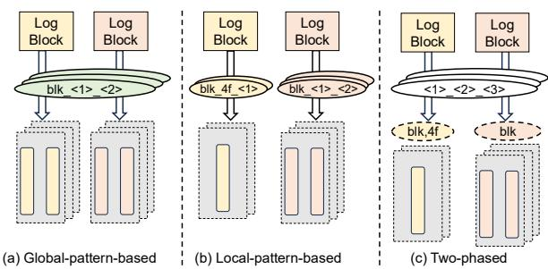  
Figure 1: Comparison of different pattern extraction paradigms

In addition, since logs need to be retained for a relatively long time (say 180 days [35]) for audit purposes, existing log storage methods [17, 26, 29, 33–35] propose to compress logs densely using patterns within them. For example, in Hadoop logs, the chunk ID has the pattern of “blk\_<hex,3>\_<num,2>”. During the ingestion process, each variable value (e.g. “blk\_4ff\_34”) will be broken into a group of fragments (e.g. “4ff” and “34”) according to the pattern. All fragments occurring at the same place will be encoded as a unit during the compression to achieve a high compression ratio. Patterns can also be used to filter out unrelated units during analysis. For example, when counting logs containing “blk\_czf”, there is no need to decompress any unit of chunk ID variable, since “czf” is not a three-character hexadecimal value.

However, performing aggregated analysis on highly compressed logs faces two fundamental challenges. The first is the dilemma between global description and filtering effectiveness of log patterns. Pattern-based log compression methods ingest logs as multiple log blocks and compress each block as a compressed file containing a set of units. They thus have a key design choice of extracting patterns. As shown in Figure 1, global-pattern-based methods [29, 35] extract or predefine a set of global patterns shared by all log blocks. On the other hand, local-pattern-based methods [17, 26, 33] extract a set of patterns for each log block. In order to perform aggregated analysis on multiple log blocks, a global description of each fragment positions is needed. For example, to count how many chunks belong to “4f\*” region, we need to perform a prefix query on the first unit of chunk ID variables according to the global pattern “blk\_<hex,3>\_<num,2>”. However, global patterns are usually too general to describe the content of each unit precisely, and thus the query process needs to decompress more units because of the limited filtering effectiveness. According to previous work, the analysis latencies of global-pattern-based methods are usually longer than local-pattern-based methods by up to 10× [33].

We thus propose to extract patterns in two phases by decoupling messages within patterns clearly. We begin with an off-line phase that only extracts the minimum messages necessary to break variables into fragments. We call these messages as Sketch. For example, pattern “blk\_<hex,3>\_<num,2>” has the Sketch $^ { \cdots } < ^ { * } > _ { - } < ^ { * } > _ { - } < ^ { * } > ^ { , * }$ . Sketch contains the necessary global description for aggregation and leaves as many messages as possible to be customized for each log block. We then continue with an on-line phase when ingesting each log block. This phase extracts other messages of the pattern, such as the constant characters (“blk”), type messages (“hex”, “num”) and length messages (“3”, “2”). We call these messages as Spec.

However, to enable two-phase pattern extraction, it is challenging to derive all fragment boundaries before extracting the whole pattern. We thus examine 11,954 fragment boundaries in all 3,259 local patterns extracted by the stateof-the-art method [33] and find over 98% of them are nonalphanumerical (NAU) characters. We thus choose to extract the Sketch according to all NAU characters heuristically. However, the opposite direction does not hold, namely some NAU characters may not be the boundaries and thus variable values originally correspond to the same local pattern may have multiple Sketches. To address this issue, a well-organized Sketch warehouse is maintained for each variable type, enabling efficient selection of the appropriate Sketch during data ingestion.

Besides, we further optimize the on-line ingestion speed by leveraging the total count of units according to the Sketch and generating Spec in a pre-allocated cacheline-aligned manner.

The second fundamental challenge in performing aggregated analysis on compressed logs is the dilemma between numerical encoding format and full-text query semantic. To execute arithmetical aggregation and improve the compression ratio, values in the unit that only contains numerical characters, which takes up 53% of all units, have to be encoded as integers. However, since logs are of text format originally, it is required to support full text queries on real-world logs, i.e. pre/suffix queries on some numerical variables [29, 33]. For example, it is a common practice to count how many chunks has a number starting with “3” (i.e., to query “blk\_4FF\_3\*”).

To overcome such a problem, we propose a vectorized pre/suffix query algorithm to execute pre/suffix queries directly on integer-encoded units with AVX SIMD instructions. Our key idea is to convert pre/suffix queries into range/point queries which are compatible to numerical encoding format. It is not hard to convert suffix queries since they correspond to querying specific modulo results for all target values. However, converting prefix queries to range queries is more complex, as the resulting range varies with each value. We prove that the corresponding range can be uniquely determined by a squeezing range whose endpoints are both powers of two. Based on this theorem, we: 1) calculate the squeezing range using vectorized shift operations; 2) determine the corresponding range for each value; 3) load each range with an AVX SIMD instruction of conditional blending [10]; 4) perform vectorized range queries accordingly.

Besides, to further reduce analysis latency, we use the AVX SIMD shuffle instruction [10] to construct the indexed bimtap [33], which records intermediate query results for subsequent aggregation and enables efficient merging across different units.

Finally, we implement and integrate all these techniques into a system called LogCrisp. We evaluate LogCrisp on 13 types of logs, nearly 7TB of data in total, including both production logs from our collaborator Alibaba Cloud and public logs used in previous works [18, 29, 33, 35]. We compare LogCrisp with the state-of-the-art works, i.e. CLP [29] and LogGrep [33]. We observe that LogCrisp achieves significantly lower aggregated analysis latency—15.32× and 4.65× faster than CLP and LogGrep, respectively. Additionally, LogCrisp improves ingestion speed by up to 3.8× over LogGrep, while maintaining a compression ratio comparable to CLP (about 1.1×) and LogGrep (about 96%).

The contributions of this paper are threefold:

• We propose a two-phase pattern extraction paradigm that delivers a global description for aggregated analysis while maintaining high filtering effectiveness.

• We propose a prefix/suffix query algorithm that, for the first time, enables vectorized aggregated analysis on highly compressed logs.

• We implement and evaluate LogCrisp, a compressed log storage system that outperforms state-of-the-art methods in analysis latency and ingestion speed.

## 2 Background and Related Work

Log storage systems target at a high compression ratio, a low analysis latency as well as a high ingestion speed. Table 1 shows four typical log storage systems as well as our work (called LogCrisp) in respect of their compression, ingestion and analysis performance. Besides, not all log storage systems have a global description of each variable, some systems thus can only perform keyword searching on logs.

<table><tr><td></td><td>ZG [24]</td><td>ES [5]</td><td>CLP [29]</td><td>LG [33]</td><td>LC</td></tr><tr><td>Compression Ratio Ingestion Speed</td><td>Bad</td><td>Bad</td><td>Medium</td><td>Good</td><td>Good</td></tr><tr><td>Analysis Latency</td><td>Good</td><td>Bad</td><td>Good</td><td>Medium</td><td>Good</td></tr><tr><td></td><td>Bad</td><td>Good</td><td>Medium</td><td>Good</td><td>Good</td></tr><tr><td>Global Description</td><td>No</td><td>Yes</td><td>Yes</td><td>No</td><td>Yes</td></tr></table>

Table 1: Summary of log storage systems. ZG, ES, LG and LC are the abbreviations for Zgrep, Elastic Search, LogGrep and LogCrisp respectively  
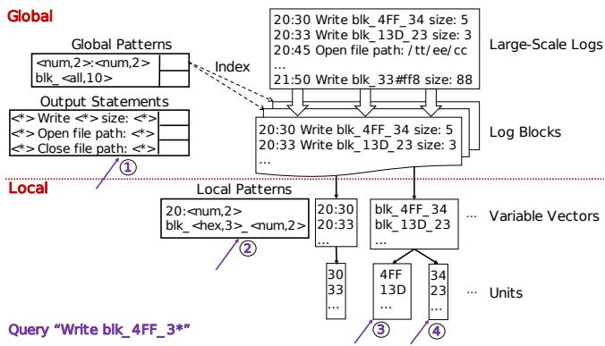  
Figure 2: Conceptual diagram of pattern-based log storage

Due to the semi-structured characteristics of logs, patternbased log storage methods [17, 26, 29, 33–35] are the most common solutions for log storage. Figure 2 shows the conceptual diagram of pattern-based log storage methods, which can be further categorized into global-pattern-based methods and local-pattern-based methods. Both of them need a log parsing process to extract output statements and log variables. In this section, we first introduce the log parsing process and then analyze these two types of pattern-based methods respectively. Finally, we discuss other works related with log storage.

## 2.1 Log Parsing

Since logs are generated by programs, each log entry can be parsed as an output statement and several variables. This parsing can be done by designating programming standard [6], analysis source code [8, 36] or using a log parser [11, 21]. For example, as shown in Figure 2, output statement printf("%s Write block: %s with length: %d", time, blk, len) will print many log entries, each containing three variable values, namely the timestamp, the block number and the write size.

Pattern-based log storage methods are all built based on such output statements and use them to extract log variables as well as locate the to-be-aggregated variables during the analysis. They regard all variable values occurring at the same place of the statement as belonging to the same variable and further extract a pattern for each variable to improve the compression ratio and accelerate the analysis.

## 2.2 Global-pattern-based Methods

Global-pattern-based methods extract or pre-define a global pattern for each variable, which is shared by all log blocks. This pattern is usually very general (e.g. “blk\_<all,10>”) since it has to describe variable values occurring at all log blocks.

CLP [29] is the state-of-the-art global-pattern-based method. During the ingestion process, CLP extracts variables based on the output statements and breaks them according to the pre-defined global pattern. Such process can be done alongside the ingestion process without any extra data copy. Then CLP reorganizes all fragments of each log entry as an encoded message. Finally, it compresses all encoded messages of the same log block together as a unit and constructs an inverted index to map the global pattern to the unit. During the analysis, it will first query on the output statements to locate to-be-aggregated variables and then query on the corresponding global patterns to decompress part of units based on the inverted index.

CLP achieves a relatively high compression ratio, a high ingestion speed as well as a global description of variables delivered by the global patterns. However, the analysis latency of CLP is sub-optimal in some scenarios [33] due to the limited filtering efficiency of global patterns. Besides, since CLP stores all fragments according to their original order, numerical fragments cannot be processed and aggregated with vectorized instructions.

## 2.3 Local-pattern-based Methods

Local-pattern-based methods propose to extract a local pattern for each variable within a log block. Compared with global pattern, such pattern will be more concrete and describe the content of each unit precisely (e.g. “blk\_<hex,3>\_<num,2>”) since it only needs to describe variables within this block.

LogGrep [33] is the state-of-the-art local-pattern-based method. During the ingestion process, LogGrep first uses the output statement to extract all variables like CLP and then copies all variables of the same type into a variable vector. Afterward, LogGrep extracts a local pattern for each vector. Then it breaks each variable in the vector into fragments according to the local pattern and stores all fragments occurring at the same position within a unit. Finally, it compresses each unit individually. During the analysis process, LogGrep first locates to-be-aggregated variables like CLP (step ① in Figure 2) and filters units based on the local patterns (step ②). It then only decompresses and searches within a small part of units (step ③ and step ④).

LogGrep can partition log blocks into fine-grained units to achieve a low query latency without compromising the compression ratio. Such a design is also necessary to process numerical units with vectorized instructions together. However, due to the differences of local patterns, LogGrep does not have a global description. It thus can only support keyword searching like Linux grep. Besides, when processing numerical units with vectorized instructions, full-text queries cannot be supported directly. LogGrep thus compromises to execute ordinary text query on numerical units. Thirdly, Log-Grep’s lack of prior knowledge about the patterns requires to execute full pattern extraction process for each log block. Consequently, LogGrep’s ingestion speed is 2-5× slower than that of CLP.

## 2.4 Other Related Works

Except for CLP and LogGrep, there are still some related log storage methods. Besides, there are some works that can process directly on column-oriented storage in database or on compressed text data.

Log storage methods. Besides pattern-based methods, some other methods, such as Cowic [25] and LogArchive [16], are designed to compress log. They choose to compress by clustering similar logs together instead of breaking the variables and encoding similar fragments with tailored methods. As a result, their compression ratio is lower than pattern-based methods [35].

A common practice to execute aggregated analysis is using log management tools, such as ElasticSearch [5], Splunk [20], Scalyr [19] and Loki [22]. These tools can manage large-scale logs and are employed in production environments. However, they can not process compressed logs, which hinders them to achieve a low storage cost.

Processing directly on compressed data. Processing directly on compressed data includes two basic types: light-weight encoding methods [3, 15, 27, 28, 30, 31, 40, 41] and partial decompression methods [1,2,23,29,33] . Light-weight encoding methods do not combine with heavy byte-oriented compression method as its packing method, their compression ratios are lower than partial decompression methods [29, 33] and their supported operations are limited.

Pattern-based log storage methods can be categorized as partial decompression methods but they are different from other methods used in database [1, 2, 23] in respect that they are designed on compressed text logs. They thus need to support full-text queries on the original data.

## 3 Two-phase Pattern Extraction

A common global description shared by all log blocks can support aggregating fragments within the variable as well as improves the ingestion speed. However, to maintain the filtering effectiveness of patterns, local details for each log block are also needed.

We thus propose to decouple messages within the pattern and extract them in a two-phase manner. The primary challenge of this design is how to minimize the messages extracted globally so as to 1) ensure they are sufficient to describe each fragment’s position; 2) maximize locally customized messages to enhance filtering effectiveness.

<table><tr><td></td><td>Pattern Count</td><td>Boundary Count</td><td>NAUBoundaryRate</td></tr><tr><td>Hadoop</td><td>118</td><td>570</td><td>97.37%</td></tr><tr><td>HadoopL</td><td>97</td><td>358</td><td>99.16%</td></tr><tr><td>Hive</td><td>470</td><td>2117</td><td>98.87%</td></tr><tr><td>OpenStackC</td><td>170</td><td>850</td><td>100.00%</td></tr><tr><td>Spark</td><td>316</td><td>1416</td><td>99.44%</td></tr><tr><td>Thunderbird</td><td>1962</td><td>5691</td><td>98.84%</td></tr><tr><td>Windows</td><td>126</td><td>952</td><td>98.84%</td></tr></table>

Table 2: Proportion of non-alphanumerical boundaries

In this section, we first discuss the clear decoupling of messages within patterns and then present the two-phase pattern extraction paradigm. Additionally, we explore a cache-lineaware optimization based on this paradigm to further boost ingestion speed.

## 3.1 Pattern Message Decoupling

To locate and deliver a global description of fragments, we must at least know their boundaries. To investigate fragment boundary characteristics in local patterns, we extract 3,259 local patterns from 7 log types using LogGrep [33]. Among these patterns, which include 11,954 fragment boundaries in total, we find that over 98% of them are non-alphanumerical (NAU) characters, as shown in Table 2. This trend likely arises from two factors: 1) NAU characters often separate semantic components within log variables, making them natural boundaries; 2) State-of-the-art local-pattern extraction methods (e.g., [17, 26, 33, 35]) typically use NAU characters to split variables during pattern extraction.

Based on this observation, we define all NAU characters within a variable value as its Sketch. For example, in Figure 3, the value /pjhe/35/part-0009” has a Sketch /<\*>/<\*>/<\*>- <\*>”. However, this observation is not bidirectional, namely not all NAU characters function as boundaries. Our method therefore extracts multiple Sketches for each variable type.

To overcome such problem, we organize all Sketches we found for a variable in a Sketch warehouse and represent each Sketch in a compactly: we calculate a 64-bit integer based on all NAU characters shown within the Sketch [32]. Such an integer serves as a fingerprint to merge common Sketches during the extraction as well as to determine the corresponding Sketch of an ingested variable value immediately. To accelerate such process, we build a hashing-based searching index on the Sketch warehouse.

## 3.2 Two-phase Extraction Paradigm

Pattern message decoupling enables simultaneous global description and local detail maintenance. We therefore propose to locate fragments using pre-extracted Sketches from an off-line phase and extract additional messages, referred to as

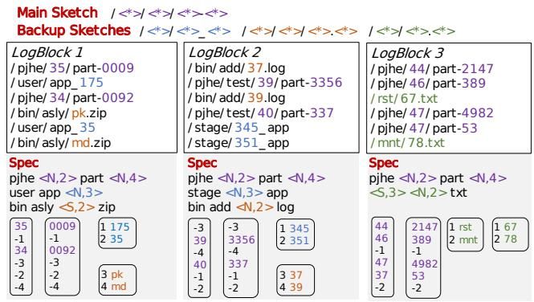  
Figure 3: An example of pattern message decoupling

Specs, during ingestion. During analysis, units are filtered by combining both Sketch and Spec information.

Off-line phase. The extraction algorithm’s pseudocode is detailed in Algorithm 1. First, we extract the Sketch from each value’s NAU characters (line 5). We then merge identical Sketches to build the Sketch warehouse (line 6). The most common Sketch in the warehouse is designated as the main Sketch (line 8), with others classified as backup Sketches.

Algorithm 1 Sketch extraction algorithm   
1: Variable value sample set S   
2: Main sketch Ψ   
3: Sketch warehouse B = 0/   
4: for all s in S do   
5: K ← getSketch(s)   
6: B ← B∩K   
7: end for   
8: Ψ = the most common sketch in B   
9: Output Ψ, B

On-line phase. We extract other details, namely Specs, for each Sketch when ingesting logs during the online phase. After parsing variables with output statements, we first calculate the Sketch fingerprint of each incoming variable value based on all NAU characters in that value. We then search for this fingerprint in the corresponding Sketch warehouse. If a Sketch matches, we locate all fragments accordingly. If not, the incoming log entry is stored as an outlier.

We extract Specs in a piggybacked manner alongside ingestion after fragment location. Specifically: 1) (e.g., pjhe” in the Spec of LogBlock1” in Figure 3): We record the latest fragment and compare it with subsequent ingested fragments. If all fragments are constant by the end of ingestion, this value is treated as part of the pattern rather than creating a new unit. 2) for type messages (e.g., N” in <N,2>” in the Spec of Log-Block1” indicates 35” and “34” are numbers): We record type messages using a 6-bit vector [34], updating corresponding bits when new character types occur. 3) for length messages (e.g., 4” in <N,4>” in the Spec of LogBlock1” represents the maximum length of 0009” and “0092” as four): We track the maximum fragment length within a unit, updating it when a longer fragment is ingested.

Since each variable may have multiple Sketches, we store fragments of different Sketches in separate units. The main Sketch’s units record the incoming order of variable values that conform to backup Sketches. Each value is assigned a number determined first by the global order of backup Sketches and then by its ingestion sequence. Each fragment unit of the main Sketch stores not only fragment values but also a placeholder. For positions corresponding to backup Sketch values, this placeholder holds the negative of the assigned number.

Used for filtering. During the analysis, if the to-be-aggregated fragment is designated, we directly execute aggregation on the corresponding unit in each log block. If the unit corresponds to constant characters, we return the constant value within the Spec rather than decompress units. If the to-beaggregated fragment is not designated, we combine Specs in all log blocks with their corresponding Sketches to form patterns and then match the query keyword against these patterns to determine which unit to decompress, as shown in prior work [33]. If a fragment within the backup Sketches is designated or the keyword matches a variable value conforming to backup Sketches, we check one of the main Sketch units to determine its original incoming order based on the assigned number.

A concrete example. We provide an example of pattern decoupling in Figure 3. The variable from "LogBlock 1" includes six variable values, stored in four units: two for fragments in the main Sketch and two for backup Sketches. We also store placeholders for backup Sketch variables in the main Sketch’s unit. In this example, the customization feature of Spec is demonstrated by: 1) Selective Sketch Adoption: Different log blocks can choose Sketches from the Sketch warehouse. For example, "LogBlock 3" has variable values conforming to the third backup Sketch, while the other two log blocks use values conforming to the first and second backup Sketches. 2) Spec Variability Across Log Blocks: Specs for the same Sketch differ in constant, type, and maximum length attributes across log blocks. For example, both "LogBlock 1" and "LogBlock 2" use the first and second backup Sketches, but their Specs are distinct.

## 3.3 Cache-friendly Ingestion Optimization

Based on two-phase extraction paradigm, pre-extracted Sketches offer position messages for fragments, allowing us to extract Specs in a pre-allocated and cache-friendly manner. We thus introduce two optimizations to further enhance the ingestion speed.

Cache-friendly position batching. During ingestion, preextracted Sketches locate fragments, but Specs are determined only at ingestion completion. Specs dictate compression strategies (e.g., units with constant fragments require no compression). Thus, we need to record fragment positions temporarily.

We represent each fragment position with a (offset, length) pair and batch positions for the same unit. Each batch is sized at 64 bytes (aligned with CPU cache lines), storing up to seven sequential position pairs and a 4-byte pointer to the next batch for the unit. This design enables the compressor to retrieve seven sequential positions for a unit in a single memory access by leveraging CPU cache locality.

Cache-friendly metadata maintaining. Each unit’s metadata includes the head/tail of the position batch list, the latest ingested fragment, and type/length attributes for generating Specs. Prior approaches [33–35] use hash tables or tree-based indexes for metadata management, supporting dynamic unit insertion during ingestion.

By contrast, our method pre-allocates and stores metadata for all possible units (based on pre-extracted Sketches) in contiguous memory. This allows seamless, cache-friendly updates to all relevant metadata as each log entry is ingested.

## 4 Vectorized Query Processing

Pattern-based log storage methods break variables into fragments and group fragments into units. This design choice leads to a significant number of numerical units containing only numerical characters. Based on our statistics on 15,402 units from 7 log types [18], approximately 53% of units are numerical on average, accounting for about 60% of compressed space (exceeding 80% on some logs).

This observation motivates previous works to encode these units as integer vectors, aiming to improve compression ratios and enable efficient arithmetic aggregation. However, since logs are inherently in text format, performing pre/suffix queries on them is common practice—and such queries are naturally incompatible with integer-encoded units. Existing approaches either encode numerical units as plain strings [33] or convert integers back to numerical characters before pre/suffix queries [35].

We propose an efficient method to perform pre/suffix queries on integer-encoded units, fully leveraging the vectorization potential offered by numerical units. As evaluated in Section 6.2, this method is even more efficient than directly executing pre/suffix queries on plain strings. Additionally, we introduce a vectorized generation method for intermediate query results to further accelerate analysis.

## 4.1 Vectorized Processing of Pre/suffix Queries

Prefix queries. Our key idea is to transform prefix queries into multiple range queries. For example, checking if “502769” has a prefix of “502\*” is equivalent to verifying whether it belongs to the range “[502000, 503000)”. We term this range as the “compared range” of the encoded number. However, the key challenge is how to efficiently determine the correct compared range for each encoded number using vectorized operations.

We propose to calculate a “squeezing range” for each encoded number to derive its compared range. Given a parameter b (a power of 2), for any encoded number, there exists a unique integer m such that the range $[ b ^ { m - 1 } , b ^ { m } )$ contains the number. We term this range as the “squeezing range” of the encoded number.

It can be proved as follow that when b is a power of two smaller than 10, each squeezing range $[ b ^ { m - 1 } , b ^ { m } )$ contains at most one compared range:

Proof. Consider a positive integer a within a compared range. If its compared range is contained in a squeezing range $[ b ^ { m - 1 } , b ^ { m } )$ , then

$$
a \in [ b ^ { m - 1 } , b ^ { m } )\tag{1}
$$

Multiplying a by 10 yields another compared range. If this new range were also contained in the same squeezing range, we would have.

$$
1 0 \ast a \in [ b ^ { m - 1 } , b ^ { m } )\tag{2}
$$

For $b < 1 0 .$ , Equations 1 and 2 cannot hold simultaneously. Thus, each squeezing range contains at most one compared range. □

Based on this theorem, we design our vectorized prefix query algorithm. The algorithm first performs SIMD right-shifting operations (\_mm256\_srli\_epi32) on all encoded numbers, shifting them by $l o g _ { 2 } ^ { b }$ bits per step. A number is within the squeezing range $[ b ^ { \bar { m } - 1 } , b ^ { m } )$ if it becomes zero after m shifts. Using a conditional blending instruction (\_mm256\_blendv\_epi8), we load the identified compared range (or [0, 0) if none is found) into corresponding slots of the SIMD register. After loading ranges for all numbers, SIMD comparison instructions check whether each encoded number falls within the queried range, determining if the prefix matches.

In the implementation, to avoid frequent loading of similar compared ranges into the registers, we use the 16 YMM registers [9] to keep all alternative compared ranges stored in the registers. We also maintain a map between squeezing ranges and compared ranges in a table. Additionally, the value of parameter b determines the total execution count of SIMD right-shifting operations. Since a larger b reduces the number of shifts, we choose b = 8, the largest power of 2 smaller than 10.

A concrete example is shown in Table 3. Here, we have four encoded numbers. By shifting each number until it becomes zero (after m shifts), we determine its squeezing range. Each squeezing range either contains no compared range (e.g.,“3307”) or exactly one compared range. We load the corresponding range as the “queried range” and perform vectorized queries within it. Note that the queried range may differ from the compared range if the number lacks the queried prefix (e.g., “246532”), but this does not impact the final result. Suffix queries. Suffix queries are much simpler than prefix queries and only require determining whether the modulo result of an encoded number matches the queried suffix. For example, checking if “6927502” has a suffix of “\*502” is equivalent to determining whether “6927502” modulo 1000 equals 502. Since the modulo number (e.g., 1000 in this example) remains constant for all encoded numbers, it is retained as an immediate value to accelerate calculations.

<table><tr><td>Encoded Number</td><td>Compared Range</td><td>Moves to Zero</td><td>Squeezing Range</td><td>Queried Range</td><td>Query Result</td></tr><tr><td>502769</td><td>[502000,503000)</td><td>7 (&gt;&gt;21)</td><td>[262144,2097152)</td><td>[502000, 503000)</td><td>Hit</td></tr><tr><td>246532</td><td>[502000, 503000)</td><td>6(&gt;&gt;18)</td><td>[32768, 262144)</td><td>[50200, 50300)</td><td>Miss</td></tr><tr><td>3307</td><td>[5020,5030)</td><td>4 (&gt;&gt;12)</td><td>[512, 4096)</td><td>[0,0)</td><td>Miss</td></tr><tr><td>45237</td><td>[50200,50300)</td><td>6 (&gt;&gt;18)</td><td>[32768,262144)</td><td>[50200, 50300)</td><td>Miss</td></tr></table>

Table 3: An example for vectorized prefix queries (query “502\*” on integer-encoded units)

Our algorithm computes modulo results for all encoded numbers and performs vectorized point queries on these results. While the modulo operation itself is not vectorized, the algorithm matches the performance of executing suffix queries directly on plain strings. Vectorized optimization of suffix queries is reserved for future work.

<table><tr><td rowspan=1 colspan=1>Mask Code</td><td rowspan=1 colspan=1>Array Order</td><td rowspan=1 colspan=1>Description</td></tr><tr><td rowspan=1 colspan=1>0000000000000001</td><td rowspan=1 colspan=1>0123456770123456</td><td rowspan=1 colspan=1>Original orderMove 7 to the head</td></tr><tr><td rowspan=1 colspan=1></td><td rowspan=1 colspan=1>.</td><td rowspan=1 colspan=1></td></tr><tr><td rowspan=1 colspan=1>01001101</td><td rowspan=1 colspan=1>14570236</td><td rowspan=1 colspan=1>Move1,4,5and7 to the head in turn</td></tr><tr><td rowspan=1 colspan=1></td><td rowspan=1 colspan=1>…</td><td rowspan=1 colspan=1></td></tr><tr><td rowspan=1 colspan=1>11111111</td><td rowspan=1 colspan=1>01234567</td><td rowspan=1 colspan=1>Original order</td></tr></table>

Table 4: The shuffle rule to construct index

## 4.2 Vectorized Construction of Intermediate Results

Since an aggregation can perform queries on multiple variables simultaneously, it needs to store intermediate query results so that subsequent queries can leverage previous results. We adopt the Indexed Bitmap proposed in prior work [34] to record intermediate results, consisting of a bitmap and an index array tracking all positions marked “1” in the bitmap. To further accelerate analysis, we propose a vectorized construction strategy for this structure using SIMD shuffle instructions.

A SIMD shuffle instruction takes a “Mask Code” and an original array as inputs; it then reorders elements in the array according to the mapping defined by the Mask Code in a shuffle matrix. In our case, the result bitmap serves as the Mask Code, and the original array contains 32-bit natural number sequences. A customized shuffle matrix is shown in Table 4, designed to move positions corresponding to “1” in the bitmap to the front of the array. For example, if the bitmap (Mask Code) is “01001101”, indicating hits at the second, fifth, sixth, and eighth positions, the shuffle instruction moves indices “1”, “4”, “5”, “7” to the front. The array order becomes “1 4 5 7 0 2 3 6”, with the first four numbers forming a segment of the index array.

The vectorized construction process involves three steps: 1) Perform vectorized comparison operations on encoded data to generate a bitmap of search results using the scatter instruction (\_mm256\_movemask\_epi8). 2) Using the bitmap and shuffle matrix, construct an index array segment via the shuffle instruction (\_mm256\_permutevar8x32\_epi32). 3) Gather all segments to build the Indexed Bitmap using the gather instruction (\_mm256\_storeu\_si256).

An example of this process is illustrated in Figure 4. The algorithm first performs a vectorized point check “(==2)” on 16-bit encoded data to obtain the corresponding bitmap. It then loads the natural number sequence and bitmap into the register, using the customized shuffle matrix to reorder elements. This process constructs an index fragment for every 8 numbers, with all indices corresponding to “1” in the bitmap gathered at the front. These indices are written back to form the Indexed Bitmap.

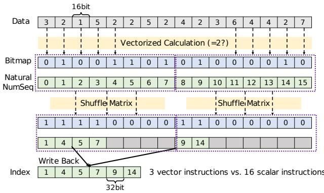  
Figure 4: Vectorized construction of Indexed Bitmap

## 5 Implementation

By integrating all discussed techniques, we implement a log storage system named LogCrisp using approximately 15,000 lines of C++ code. LogCrisp simultaneously achieves high compression ratios, fast ingestion speeds, and low analysis latency. Figure 5 presents an overview of LogCrisp. The workflow of LogCrisp can be summarized as follows:

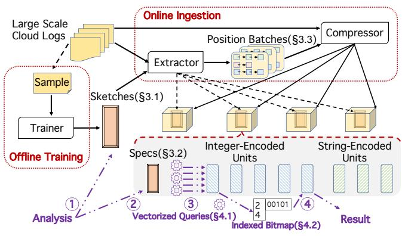  
Figure 5: Overview of the LogCrisp system

Training. LogCrisp employs a Trainer to extract global information, including output statements and Sketches, from a log sample. It uses LogGrep’s log parser to identify output statements. The specifics of Sketches are discussed in Section 3.1, and the extraction process is detailed in Section 3.2.

Compression. For each log block, LogCrisp uses an Extractor to: 1) Parse log variables based on output statements. 2) Locate fragments for encoding using pre-extracted Sketches. 3) Organize fragment positions into batches optimized for CPU cache lines (§3.3). Each compression stream corresponds to a batch group. The Extractor also extracts Specs for each variable type during ingestion (§3.2). A Packer then compresses fragments into units using zstd [13]: numerical units are encoded as integer vectors, while others use string vectors. Specs and compressed units are packaged into a zipped file.

Analysis. LogCrisp supports aggregated analysis on designated numerical units using query results from multiple units (e.g., Count \* where IP=xxx” and ERROR”). Aggregation types include counting, summing, and min/max operations; query types include point, prefix/suffix, and range queries. LogCrisp supports: 1) Grep-like full-text queries, similar to prior works [29, 33, 34]; 2) Queries on specific units. Counting, point, and prefix/suffix queries work in both modes, while other aggregations and range queries require designated units.

The query process involves four steps: (1) Locate Variables: Match output statements to identify queried variables (like prior works [33]). (2) Filter Units (Steps ① and ②): Load zipped files and combine Sketches/Specs to filter relevant units (§3.2). (3) Execute Queries (Step ③): Perform vectorized queries on integer-encoded units and fixed-length queries on string-encoded units (§4.1). Store intermediate results in an Indexed Bitmap (§4.2). (4) Finalize Results(Step ④): Use the Indexed Bitmap to execute subsequent queries and generate final results.

## 6 Evaluation

We evaluate LogCrisp on a vast volume of logs and compare it with state-of-the-art works. Our evaluation answers the following questions:

• How does LogCrisp ’s overall performance compare to state-of-the-art works? (§6.1)

• In LogCrisp, how much benefit does each key technology bring? (§6.2)

• How long is the training time of LogCrisp? How frequently must LogCrisp execute the training process? (§6.3)

• How does LogCrisp perform on different types of query strings? (§6.4)

• What percentage of query latency does each suboperation in a single query account for? (§6.5)

The logs tested include three parts: 1) The four largest log types from the LogHub Dataset [18]; 2) All log types opened by the authors of CLP [37]; 3) Six types of real-world production logs collected from Alibaba Cloud. The total scale of these logs is nearly 7TB, with their names and sizes listed in Table 5.

We compare LogCrisp with two state-of-the-art methods, LogGrep and CLP:

• CLP [29]: the state-of-the-art global-pattern-based method, CLP is tested by running its open-source code [37] on all open logs. Due to our production environment using a self-developed OS incompatible with CLP, we exclude production log comparisons for CLP. Like LogCrisp, CLP uses zstd for packing.

• LogGrep [33]: the state-of-the-art local-pattern-based method, LogGrep is tested by running its open-source code [4] on both open and production logs. While Log-Grep defaults to LZMA for packing, we changed it to zstd for fair comparison.

Since LogGrep does not support designating specific units, we standardize the comparison across all methods by testing counting analysis using grep-like full-text queries. We generated 22 query strings for production logs in collaboration with Alibaba Cloud engineers and 28 query strings for open logs to cover all execution paths of LogCrisp.

Before compression, a training process is required for each log type. For all open logs, sampling 1% of logs suffices to achieve over 99% Sketch matching rate. In practice, engineers can re-run the training when matching rates decline. Log ingestion uses a single thread for all logs except LogF (TBscale), which employs 8-thread parallel ingestion with results normalized to a single thread.

Testbed. Experiments on open logs were conducted on a server with 2× Intel Xeon Silver 4210R (2.40GHz, 16 cores), 64GB RAM, and Ubuntu 11.3.0 kernel. Experiments on production logs used an Alibaba Cloud server with 2× Intel Xeon CPU E5-2682 v4 (2.50GHz, 32 cores), 188GB RAM, and a self-developed kernel based on Linux 3.10.0.

## 6.1 Overall Performance

We compare the overall analysis performance, ingestion speed, and compression ratio across all 13 log types. Detailed results are listed in Table 5. LogCrisp consistently optimizes analysis latency, compression ratio, and ingestion speed, outperforming CLP and LogGrep by 15.32× and 4.65× on average in analysis performance. It ingests logs 2.43× faster than LogGrep and achieves 95% of CLP’s ingestion speed on average. Regarding compression ratio, LogCrisp matches 1.11× CLP and 96% of LogGrep’s ratios on average.

Analysis latency. LogCrisp outperforms other systems in respect of aggregation analysis latency on all tested query strings on all datasets. We list the average analysis latency in the table.

To be concrete, on open datasets, the analysis latency of LogCrisp is 4.03× to 40.11× (average 15.32×) lower than that of CLP. We find LogCrisp outperforms CLP by 40.11× on average on Windows logs. This is because the inverted index on Windows is relatively simple since it does not have many variables. This is good news for compression ratio and ingestion speed but causes a high query latency by almost decompressing all compressed logs without any filtering. Compared with LogGrep, the analysis latency of LogCrisp is 4.30× to 10.90× (average 4.29×) lower. This is mainly because LogCrisp can achieve comparably high efficiency with the help of both Sketches and Specs and it can also achieve efficient vectorized queries on integer-encoded units. For example, LogCrisp can outperform LogGrep on Hadoop by 10.90×, since Hadoop includes many integer-encoded units, these units may cause a reduction on compression ratio, but can accelerate the analysis significantly by fully exploiting the vectorization technique.

As for the production logs, LogCrisp outperforms LogGrep by 2.50× to 7.27× (5.07× on average). Such result confirms the efficiency of LogCrisp to achieve fast aggregation analysis again.

To sum up, we find LogCrisp can outperform other compared systems and achieve significant performance gain in respect of analysis latency on both open and production logs. Compression ratio. The compression ratio of LogCrisp is 89% and 95% of the highest compression ratio among three systems on average on LogHub dataset and CLP-opened dataset. LogGrep has the best compression ratio on these two datasets by 96% and 97% of the highest compression ratio on average.

We find LogCrisp achieves the highest compression ratio on HadoopL and Hive. Its compression ratio is comparable to LogGrep except Hadoop where LogGrep outperforms LogCrisp by 16%. The compression ratio of LogCrisp is higher than CLP on most logs except OpenStackC and Windows where CLP outperforms LogCrisp by 20% and 33% respectively. Our investigation reveals Hadoop includes many numerical values that are close to each other semantically, as a result, encoding them as strings has a lower storage overhead than encoding them as integers. OpenStackC includes many user-specific formats used by CLP. Windows includes few variables and many entries are in fact totally common, as a result, using global pattern is enough to achieve high compression ratio while more processing may incur extra overhead.

As for the production logs, the compression ratio of LogCrisp is comparable to LogGrep. The compression ratio of LogCrisp and LogGrep are 97% and 99% of the highest compression ratio on average respectively.

To sum up, introducing two-phase pattern extraction and encoding numerical units as integer vectors does not affect the compression ratio on most logs and the compression ratio of LogCrisp is comparable to other compatible systems on the tested logs.

Ingestion speed. The ingestion speed of LogCrisp is 91% and 95% of the highest ingestion speed on average on LogHub dataset and CLP-opened dataset respectively. CLP has the highest ingestion speed on these two datasets.

LogCrisp outperforms LogGrep on all logs significantly by up to 2.38×. LogCrisp outperforms CLP on 2 types of logs (Thunderbird, HadoopL) by up to 1.61×. These two logs has many output statements and variables, which incurs high overhead for CLP to build the inverted index. As for other logs, the ingestion speed of LogCrisp is within 99% of that of CLP on 2 types and lower than CLP on other 3 types by up to 79% (Windows). This is because many log entries in Windows are common, CLP does not need to build complex inverted index.

As for the production logs, the ingestion speed of LogCrisp is significantly higher than that of LogGrep by up to 3.72×.

To sum up, we find the ingestion speed of LogCrisp is comparable to or even outperforms global-pattern-based method, i.e. CLP, on most types of logs.

## 6.2 Individual Benefits of Proposed Techniques

We evaluate the impact of each proposed technique using all open logs in Table 5. The effectiveness of our vectorized algorithm correlates strongly with query type; we analyze its impact using representative Hadoop log queries: two point queries (Q1: “blk\_1075557039\_1816215”, Q2: “134217728”), one prefix query (Q3: bytes: “1\*”), one suffix query (Q4: “\*28,”), and one range query (Q5: “bytes > 1342”). Similar trends are observed across other logs and queries.

<table><tr><td rowspan="2"></td><td rowspan="2">Source</td><td rowspan="2">Size (GB)</td><td colspan="3">Compression Ratio</td><td colspan="3">Ingestion Speed (MB/s)</td><td colspan="3">Average Analysis Latency (s)</td></tr><tr><td>CLP</td><td>LogGrep</td><td>LogCrisp</td><td>CLP</td><td>LogGrep</td><td>LogCrisp</td><td>CLP LogGrep</td><td></td><td>LogCrisp</td></tr><tr><td>Hadoop</td><td>LogHub</td><td>16.04</td><td>27.63</td><td>33.48</td><td>28.85</td><td>97.16</td><td>40.45</td><td>96.59</td><td>45.09</td><td>26.37</td><td>2.42</td></tr><tr><td>HadoopL</td><td>Opened by CLP</td><td>428.87</td><td>42.30</td><td>54.31</td><td>54.76</td><td>87.52</td><td>43.31</td><td>89.33</td><td>603.83</td><td>82.81</td><td>56.70</td></tr><tr><td>Hive</td><td>Opened by CLP</td><td>1.36</td><td>44.63</td><td>47.39</td><td>47.76</td><td>116.19</td><td>46.47</td><td>99.59</td><td>1.08</td><td>1.48</td><td>0.25</td></tr><tr><td>OpenStackC</td><td>Opened by CLP</td><td>32.93</td><td>36.13</td><td>33.93</td><td>30.71</td><td>101.56</td><td>52.11</td><td>100.35</td><td>60.86</td><td>15.90</td><td>6.15</td></tr><tr><td>Spark</td><td>LogHub</td><td>2.71</td><td>21.49</td><td>29.10</td><td>28.63</td><td>77.04</td><td>30.48</td><td>64.50</td><td>7.05</td><td>1.48</td><td>0.36</td></tr><tr><td>Thunderbird</td><td>LogHub</td><td>29.61</td><td>22.76</td><td>34.41</td><td>32.83</td><td>49.14</td><td>38.23</td><td>58.87</td><td>38.39</td><td>20.82</td><td>9.53</td></tr><tr><td>Windows</td><td>LogHub</td><td>26.09</td><td>404.80</td><td>339.74</td><td>304.50</td><td>140.61</td><td>67.63</td><td>111.31</td><td>62.98</td><td>4.58</td><td>1.57</td></tr><tr><td>LogA</td><td>Production Log</td><td>18.67</td><td>1</td><td>23.17</td><td>21.79</td><td>1</td><td>23.93</td><td>69.79</td><td>1</td><td>8.05</td><td>3.23</td></tr><tr><td>LogB</td><td>Production Log</td><td>45.82</td><td>/</td><td>17.72</td><td>18.24</td><td>/</td><td>17.85</td><td>54.75</td><td>/</td><td>20.15</td><td>4.25</td></tr><tr><td>LogC</td><td>Production Log</td><td>65.74</td><td>/</td><td>14.17</td><td>13.79</td><td>/</td><td>14.72</td><td>41.25</td><td>/</td><td>50.04</td><td>10.21</td></tr><tr><td>LogD</td><td>Production Log</td><td>2.12</td><td>/</td><td>10.84</td><td>10.14</td><td>/</td><td>17.61</td><td>65.65</td><td>/</td><td>4.02</td><td>0.66</td></tr><tr><td>LogE</td><td>Production Log</td><td>7.82</td><td>/</td><td>16.18</td><td>16.82</td><td>/</td><td>19.82</td><td>69.63</td><td>/</td><td>1.29</td><td>0.18</td></tr><tr><td>LogF</td><td>Production Log</td><td>6149.34</td><td>/</td><td>14.46</td><td>13.93</td><td>/</td><td>6.20</td><td>10.73</td><td>/</td><td>6199.90</td><td>1268.54</td></tr></table>

Table 5: Overall performance comparison. The best result across the three systems for each log type and metric is highlighted in bold.

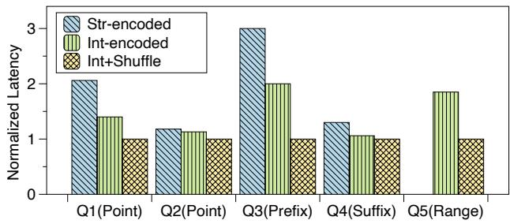  
Figure 6: Impact of vectorized per/suffix queries and vectorized construction of indexed bitmap

Two-phase pattern extraction (§3.2). We implement a version called “LC-global” by only extracting a global pattern on our log sample. We use such pattern to ingest logs as well as filter units during the query. We test “LC-global” on all 7 open logs and plot the results of 6 types of logs in Figure 7. We do not put the result on HadoopL here since we do not observe significant impact of such technique, which is mainly because its patterns are relatively static on all log blocks and a single global pattern is enough to filter most units. However, on logs such as OpenStackC and Spark, global pattern will be too general to serve for filtering. After we decouple the Sketches and Specs within the pattern, we can eliminate the average analysis latency by 2.59× on average and up to 5.55× (Spark). Besides, two-phase pattern extraction can maintain or even improve (by up to 7%) the ingestion speed, since it can directly break the variables into fragments during the ingestion without complex pattern matching. It also has less effect on the compression, which only causes the compression ratio to drop by 9% on windows since it has a relatively large Sketch Warehouse. As a result, we need to record multiple assigned numbers for backup Sketches in the units of main Sketch.

Cache-friendly ingestion (§3.3). We implement a version called “LC-w/o-cache” by recording positions in a list and maintain metadata using a tree-based index like LogGrep. According to Figure 7, we find by introducing the cachefriendly design, we can improve the ingestion speed by 6% to 43% (19% on average). Such method will have a more significant improvement when each unit has many fragments such as on Spark and Thunderbird.

Vectorized pre/suffix queries (§4.1). We first encode all NUnits as plain strings and execute queries on them and mark this version as “Str-encoded”. Then we change the encoding format of NUnit into integer vector, execute our proposed vectorized queries on them and mark this version as “Intencoded”. According to Figure 6, we find by encoding NUnits as integer vectors and exploiting vectorization on such format, we can reduce the latency of point and pre/suffix queries and support range queries additionally. Specifically, we can eliminate the latency of point queries, prefix queries, and suffix queries by 1.46×, 1.50×, and 1.22× respectively. The results on prefix and suffix queries demonstrate by exploiting vectorization properly, we can overcome the incompatibility between numerical encoding format and full-text queries semantic.

Vectorized construction of indexed bitmap (§4.2). We change the construction process of Indexed Bitmap in “Intencoded” version to our proposed vectorized manner, and mark such version as “Int+Shuffle”. According to Figure 6, we find the vectorized construction process of Indexed Bitmap can eliminate the latency by 1.4× for Q1, 2× for Q3 and 1.85× for Q5. We find these three queries have dense results, as a result, their construction processes of the Indexed Bitmap take up a significant part.

## 6.3 Analysis of Training Overhead

Since the training process to extract Sketches is crucial for delivering a global description in our design, we measure the training overhead in terms of the training time, miss rate as well as the training frequency.

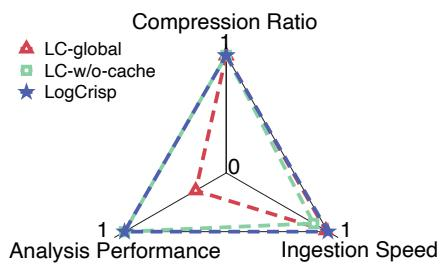  
(a) Hadoop

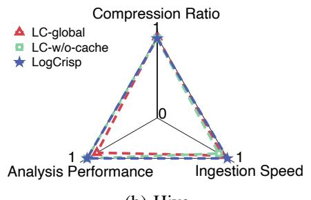  
(b) Hive

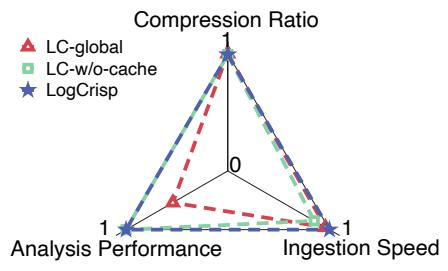  
(c) OpenStackC

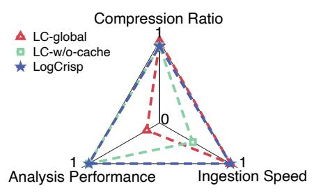  
(d) Spark

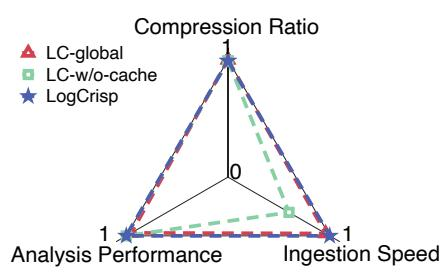  
(e) Thunderbird

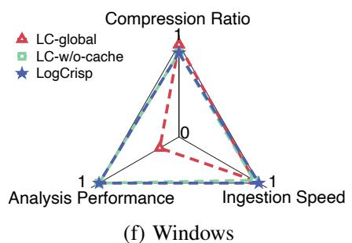  
Figure 7: Impact of two-phase pattern extraction and cache-friendly ingestion (normalized to the best result in each dimension)

Training time. We evaluate the training time of different sample rates on an open log (Hadoop) as well as a production log (LogA). The results are shown in Figure 8. We find the training time of production log is relatively larger than that of open log due to the higher number of Sketches in production logs. Generally speaking, in our experiment (sampling 1% log), the relative training overhead, namely the training time divided by the compression time, is 10% (Hadoop) and 5.9% (LogA) respectively. The training overhead is higher on Hadoop since the compression time on Hadoop is shorter than that on LogA.

Miss rate. Miss rates for different sample rates on sampled logs are shown in Figure 8. Open logs exhibited higher sensitivity to sample rate than production logs. Given the sharp increase at 10% sampling, we chose 1% sample rate for experiments to balance training time and miss rate.

Training frequency. To evaluate training frequency, we sorted Hadoop and LogA logs by timestamp and split them into 64MB blocks. We trained on 1% of the first block and applied results to subsequent blocks, triggering retraining (with 1% sampling of all processed blocks) when miss rate exceeded 5%.

Figure 9 shows the miss rate per block and total training counts. For Hadoop (16GB total), we train for 3 times (5.3GB per training on average). For LogA (18GB total), we train for 6 times (3GB per training on average). We find the production logs change more frequently and thus the training process will be executed for more times.

## 6.4 Performance of Different Query Interfaces

We show the comparison between LogCrisp and other systems across different query interfaces. We evaluate 13 point queries, 7 prefix queries, 5 suffix queries and 3 range queries in total and plot their average analysis speed with maximum and minimum values as error bars in Figure 11.

For CLP, we find it performs better on point queries than prefix and suffix queries, which is due to the complex wildcard processing in CLP’s algorithm. LogGrep exhibits nearly identical average performance across query types. As for LogCrisp, it performs better on point and range queries than those on prefix and suffix queries on average, since the integerencoded units are more compatible with the former two types. But we find LogCrisp still outperforms LogGrep in prefix and suffix queries even though the string-encoded units used by LogGrep are compatible with such queries.

Besides, compared to other systems, LogCrisp exhibits a wider speed range. This is because compared to filtering using only global or local patterns, filtering with decoupled patterns varies more significantly for each queried string. Queried strings containing NAU characters can use the locating messages within Sketches to filter units while other strings can only rely on the Specs.

## 6.5 Breakdown of Query Latency

We plot a breakdown analysis of query latency for Q1-Q5 in Figure 10. We find for different queries, the Sketch loading and Spec loading latency remain the same. In practice, users can load them once and execute multiple query strings based on them. We find the point queries and the suffix queries spend much time (0.84 - 1.12 seconds) to match on the patterns, as these queries need to match patterns across multiple log variables. The prefix queries and the range queries can directly find the related log variable based on the output statement and their matching latency is thus as low as only 0.03 seconds. We find the latency of the prefix queries and the range queries is much lower than that of the point queries and the suffix queries. This is because the point queries need to search within more units and the suffix queries need to calculate modulus result for each encoded number.

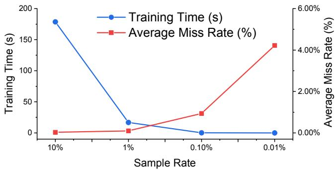  
(a) Hadoop

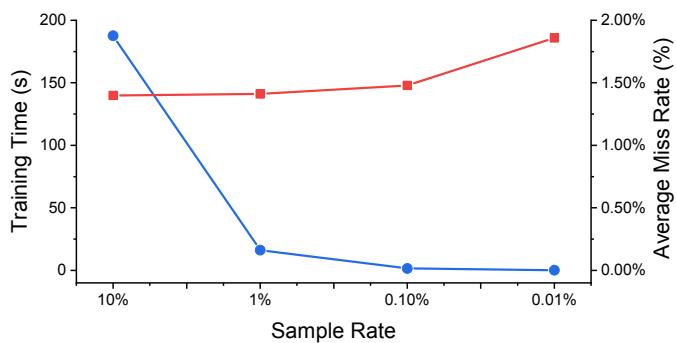  
(b) LogA

Figure 8: The training time and miss rate for different sample rate  
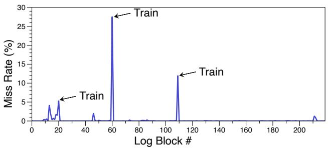  
(a) Hadoop

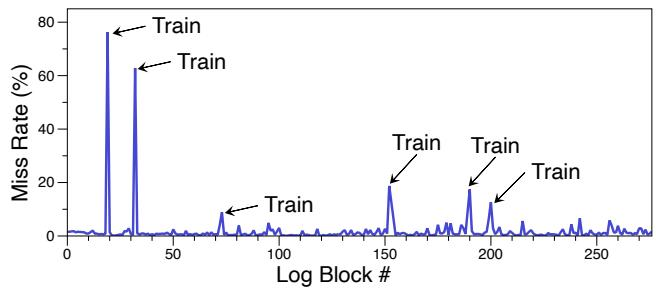  
(b) LogA  
Figure 9: The miss rate on different blocks in the time series (showing the training frequency)

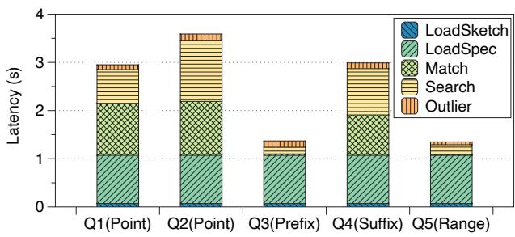  
Figure 10: Query latency breakdown

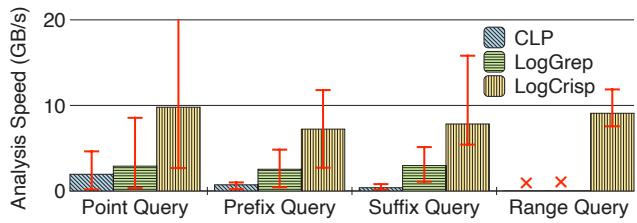  
Figure 11: Query performance for different interfaces. CLP and LogGrep cannot support range query.

## 7 Conclusion

This paper presents LogCrisp, a log storage system designed to enable fast aggregated analysis on large-scale compressed logs. Our evaluation shows that by decoupling messages within log patterns, LogCrisp efficiently generates global descriptions while maintaining filtering effectiveness. The proposed paradigm enhances ingestion speed through hardwareoptimized techniques (e.g., cache-line alignment). By leveraging vectorization properly, LogCrisp overcomes the semantic mismatch between numerical encoding and full-text queries, enabling vectorized queries on log data for the first time.

## Acknowledgment

We thank all reviewers for their insightful comments and helpful suggestions. We are especially grateful to our shepherd, Dan Feng, for her detailed and patient guidance during our camera-ready preparation. This work was supported by the National Natural Science Foundation of China under Grant 62025203.

## References

[1] Daniel Abadi, Peter Boncz, Stavros Harizopoulos, Stratos Idreos, Samuel Madden, et al. The design and implementation of modern column-oriented database systems. Foundations and Trends® in Databases, 5(3):197– 280, 2013.

[2] Daniel Abadi, Samuel Madden, and Miguel Ferreira. Integrating compression and execution in column-oriented database systems. In Proceedings of the 2006 ACM SIG-MOD international conference on Management of data, pages 671–682, 2006.

[3] Rachit Agarwal, Anurag Khandelwal, and Ion Stoica. Succinct: enabling queries on compressed data. In NSDI’15 Proceedings of the 12th USENIX Conference on Networked Systems Design and Implementation, pages 337–350, 2015.

[4] LogGrep authors. Source code of loggrep. https: //github.com/THUBear-wjy/LogGrep, 2022.

[5] Elasticsearch B.V. Elasticsearch 7.8.0. https: //www.elastic.co/downloads/past-releases/ elasticsearch-7-8-0, 2020.

[6] Wei Cao, Xiaojie Feng, Boyuan Liang, Tianyu Zhang, Yusong Gao, Yunyang Zhang, and Feifei Li. Logstore: A cloud-native and multi-tenant log database. In Proceedings of the 2021 International Conference on Management of Data, pages 2464–2476, 2021.

[7] Michael Chow, David Meisner, Jason Flinn, Daniel Peek, and Thomas F Wenisch. The mystery machine: End-toend performance analysis of large-scale Internet services. In Proceedings of the 11th USENIX Symposium on Operating Systems Design and Implementation, pages 217–231. USENIX Association, 2014.

[8] Mihai Christodorescu, Nicholas Kidd, and Wen-Han Goh. String analysis for x86 binaries. In Proceedings of the 6th ACM SIGPLAN-SIGSOFT workshop on Program analysis for software tools and engineering, pages 88–95, 2005.

[9] Intel Corporation. Intel® avx-512 instructions. https://www.intel.com/content/

www/us/en/developer/articles/technical/ intel-avx-512-instructions.html, 2022.

[10] Intel Corporation. Intel® instruction set extensions technology. https://www.intel.com/content/www/us/ en/support/articles/000005779/processors. html, 2022.

[11] Min Du and Feifei Li. Spell: Streaming parsing of system event logs. In Proceedings of the 16th International Conference on Data Mining, pages 859–864. IEEE, 2016.

[12] Min Du, Feifei Li, Guineng Zheng, and Vivek Srikumar. DeepLog: Anomaly detection and diagnosis from system logs through deep learning. In Proceedings of 2017 ACM SIGSAC Conference on Computer and Communications Security, pages 1285–1298. ACM, 2017.

[13] Facebook. z-standard compression tool. https:// github.com/facebook/zstd, 2021.

[14] Bettina Fazzinga, Sergio Flesca, Filippo Furfaro, and Luigi Pontieri. Online and offline classification of traces of event logs on the basis of security risks. Journal of Intelligent Information Systems, 50(1):195–230, 2018.

[15] Paolo Ferragina and Giovanni Manzini. An experimental study of a compressed index. Information Sciences, 135(1):13–28, 2001.

[16] LogArchive group. Open source code of LogArchive. https://github.com/robertchristensen/ log\_archive\_v0, 2019.

[17] Pinjia He, Jieming Zhu, Zibin Zheng, and Michael R Lyu. Drain: An online log parsing approach with fixed depth tree. In Proceedings of 2017 IEEE International Conference on Web Services, pages 33–40. IEEE, 2017.

[18] Shilin He, Jieming Zhu, Pinjia He, and Michael R. Lyu. Loghub: A large collection of system log datasets towards automated log analytics. arXiv preprint arXiv:2008.06448, 2020.

[19] Scalyr Inc. Scalyr home page. https://www.scalyr. com/, 2021.

[20] Splunk Inc. Spunk enterprise 8.0.3. https://www.splunk.com/en\_us/download/ previous-releases.html, 2020.

[21] Zhen Ming Jiang, Ahmed E Hassan, Parminder Flora, and Gilbert Hamann. Abstracting execution logs to execution events for enterprise applications (short paper). In Proceedings of the 8th International Conference on Quality Software, pages 181–186. IEEE, 2008.

[22] Grafana Labs. Loki documentation. https:grafana. com/docs/loki/latest/, 2021.

[23] Harald Lang, Tobias Mühlbauer, Florian Funke, Peter A Boncz, Thomas Neumann, and Alfons Kemper. Data blocks: Hybrid oltp and olap on compressed storage using both vectorization and compilation. In Proceedings of the 2016 International Conference on Management of Data, pages 311–326, 2016.

[24] Charles Levert. Zgrep linux manuel. https://linux. die.net/man/1/zgrep, 2020.

[25] Hao Lin, Jingyu Zhou, Bin Yao, Minyi Guo, and Jie Li. Cowic: A column-wise independent compression for log stream analysis. In Proceedings of the 15th IEEE/ACM International Symposium on Cluster, Cloud and Grid Computing, pages 21–30. IEEE, 2015.

[26] Jinyang Liu, Jieming Zhu, Shilin He, Pinjia He, Zibin Zheng, and Michael R Lyu. Logzip: extracting hidden structures via iterative clustering for log compression. In Proceedings of the 34th IEEE/ACM International Conference on Automated Software Engineering, pages 863–873. IEEE, 2019.

[27] Giulio Ermanno Pibiri, Matthias Petri, and Alistair Moffat. Fast dictionary-based compression for inverted indexes. In Proceedings of the Twelfth ACM International Conference on Web Search and Data Mining, pages 6– 14, 2019.

[28] Giulio Ermanno Pibiri and Rossano Venturini. Techniques for inverted index compression. ACM Computing Surveys, 53(6):1–36, 2020.

[29] Kirk Rodrigues, Yu Luo, and Ding Yuan. Clp: Efficient and scalable search on compressed text logs. In 15th USENIX Symposium on Operating Systems Design and Implementation (OSDI’21), pages 183–198, 2021.

[30] Kunihiko Sadakane. Succinct representations of lcp information and improvements in the compressed suffix arrays. In Proceedings of the thirteenth annual ACM-SIAM symposium on Discrete algorithms, pages 225– 232, 2002.

[31] Khalid Sayood. Introduction to data compression. Morgan Kaufmann, 2017.

[32] Stackoverflow. How to calculate fingerprint. https:// stackoverflow.com/questions/51059782, 2018.

[33] Junyu Wei, Guangyan Zhang, Junchao Chen, Yang Wang, Weimin Zheng, Tingtao Sun, Jiesheng Wu, and Jiangwei Jiang. Loggrep: Fast and cheap cloud log storage by exploiting both static and runtime patterns. In 18th European Conference on Computer Systems (Eurosys’23), 2023.

[34] Junyu Wei, Guangyan Zhang, Junchao Chen, Yang Wang, Weimin Zheng, Tingtao Sun, Jiesheng Wu, and Jiangwei Jiang. Exploiting data-pattern-aware vertical partitioning to achieve fast and low-cost cloud log storage. ACM Trans. Storage, 20(2), February 2024.

[35] Junyu Wei, Guangyan Zhang, Yang Wang, Zhiwei Liu, Zhanyang Zhu, Junchao Chen, Tingtao Sun, and Qi Zhou. On the feasibility of parser-based log compression in large-scale cloud systems. In 19th USENIX Conference on File and Storage Technologies (FAST’21), pages 249–262, 2021.

[36] Wei Xu, Ling Huang, Armando Fox, David Patterson, and Michael I Jordan. Detecting large-scale system problems by mining console logs. In Proceedings of the ACM SIGOPS 22nd symposium on Operating systems principles, pages 117–132, 2009.

[37] YScope. clp-core. https://github.com/y-scope/ clp-core, 2021.

[38] Ding Yuan, Soyeon Park, Peng Huang, Yang Liu, Michael M Lee, Xiaoming Tang, Yuanyuan Zhou, and Stefan Savage. Be conservative: Enhancing failure diagnosis with proactive logging. In Presented as part of the 10th USENIX Symposium on Operating Systems Design and Implementation (OSDI’12), pages 293–306, 2012.

[39] Ding Yuan, Jing Zheng, Soyeon Park, Yuanyuan Zhou, and Stefan Savage. Improving software diagnosability via log enhancement. ACM Transactions on Computer Systems (TOCS), 30(1):1–28, 2012.

[40] Feng Zhang, Weitao Wan, Chenyang Zhang, Jidong Zhai, Yunpeng Chai, Haixiang Li, and Xiaoyong Du. Compressdb: Enabling efficient compressed data direct processing for various databases. In Proceedings of the 2022 International Conference on Management of Data, pages 1655–1669, 2022.

[41] Feng Zhang, Jidong Zhai, Xipeng Shen, Dalin Wang, Zheng Chen, Onur Mutlu, Wenguang Chen, and Xiaoyong Du. Tadoc: Text analytics directly on compression. The VLDB Journal, 30(2):163–188, 2021.