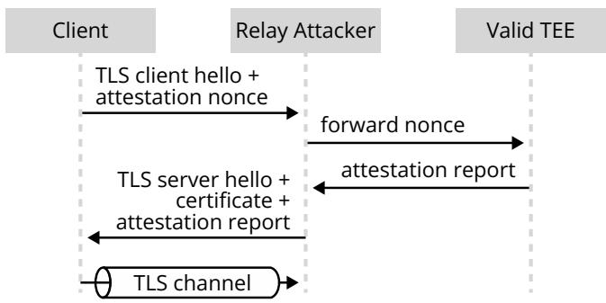
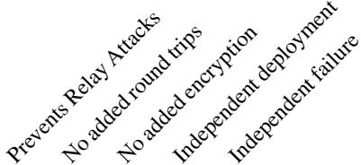
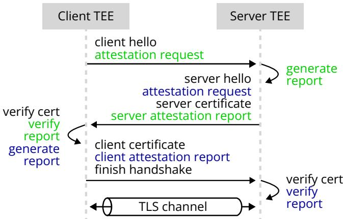
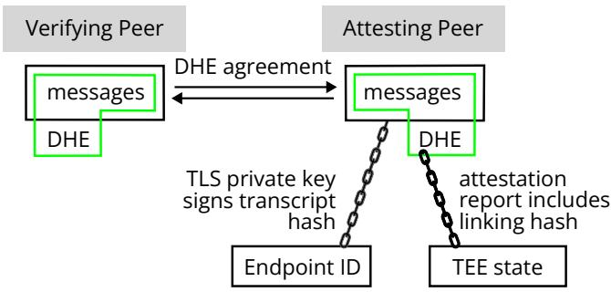
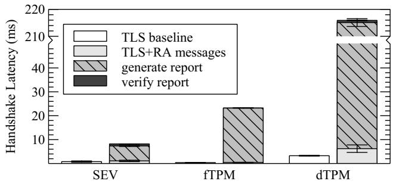
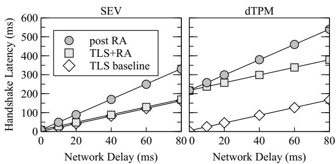
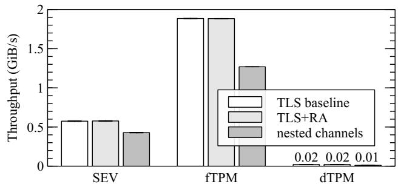

①

USENIX

THE ADVANCED COMPUTING SYSTEMS ASSOCIATION

# Separate but Together: Integrating Remote Attestation into TLS

Carsten Weinhold, Barkhausen Institut; Muhammad Usama Sardar, TU Dresden; Ionut Mihalcea and Yogesh Deshpande, Arm; Hannes Tschofenig, University of Applied Sciences Bonn-Rhein-Sieg; Yaron Sheffer, Intuit; Thomas Fossati, Linaro; Michael Roitzsch, Barkhausen Institut

https://www.usenix.org/conference/atc25/presentation/weinhold

# This paper is included in the Proceedings of the 2025 USENIX Annual Technical Conference.

July 7–9, 2025 • Boston, MA, USA ISBN 978-1-939133-48-9

Open access to the Proceedings of the 2025 USENIX Annual Technical Conference is sponsored by

P-Lr.h £Es/sL.

auuuJl9 PgleU

King Abdullah University of

Science and Technology

# Separate but Together: Integrating Remote Attestation into TLS

Carsten Weinhold Barkhausen Institut

Hannes Tschofenig University of Applied Sciences Bonn-Rhein-Sieg

Muhammad Usama Sardar

TU Dresden

Yaron Sheffer Intuit

Ionut, Mihalcea Arm

Thomas Fossati Linaro

Yogesh Deshpande Arm

Michael Roitzsch Barkhausen Institut

## Abstract

Confidential computing based on Trusted Execution Environments (TEEs) allows software to run on remote servers without trusting the administrator. Remote attestation offers verifiable proof of the software stack and hardware elements comprising the TEE. However, setting up a secure channel to such a TEE requires a security guarantee that the channel actually terminates inside the TEE. TLS is an existing protocol for secure channel establishment, and in its most common use on the Web, it uses a key pair to assert the server identity encoded in a certificate. Various approaches have been proposed to integrate remote attestation into TLS. Unfortunately, they all have shortcomings. In this paper, we present a protocol that combines the existing certificate-based assurances of TLS with remote attestation-based assurances in a way that they can be deployed independently and can fail independently. We design these two assurances to be additive without relying on each other, a property that has not been considered by existing approaches.

## 1 Introduction

Remote attestation, originally developed for Trusted Platform Modules (TPMs) [1], recently experiences a revival due to the availability of Trusted Execution Environments (TEEs) [2] in processors and initiatives towards confidential computing [3]. With confidential computing, a cloud server runs client workloads inside a TEE, with the security guarantee that the code being executed and the data being processed is not accessible even to a malicious system administrator with control over the hypervisor. During execution, TEE state is shielded from software outside the TEE and physically never leaves the processor unencrypted. Remote attestation offers a cryptographic proof to a remote party that the TEE is backed by genuine hardware and asserts which software is running inside it.

However, to communicate with a TEE, the remote party also requires a secure channel into the TEE. Establishing such a channel should be compatible with multiple TEE implementations, and the protocol must guarantee channel termination inside the TEE. Transport Layer Security (TLS) [4] is a widely-deployed and well-analyzed protocol providing secure channels, but needs to be extended to support remote attestation. Such extensions to TLS were explored when TPMs were introduced [5, 6] and more recently with Intel SGX [7, 8] and other TEEs [3]. Such a TLS extension is non-trivial as it must take care of relay attacks [9, 10], where the attestation report of a valid TEE is used by a malicious intermediary to terminate the encrypted connection outside the valid TEE. Therefore, TLS and attestation cannot be used side-by-side, but must be cryptographically linked with each other to guarantee that the encrypted channel terminates at the origin of the attestation report [9].

The existing approaches differ in the way both aspects are linked: One option is to establish a regular TLS connection first and then arrange an attestation exchange through the TLS channel to establish a second, attestation-based communication channel inside the outer TLS channel. However, this construction [8] results in additional handshake round trips and an additional layer of encryption for the inner channel. Another option is to include attestation information in the certificate used to establish the TLS connection, thus linking both aspects statically at deployment [9]. Such linking risks losing the attestation-based assurance in case the long-lived TLS private key is ever leaked, for example through a Heartbleed-like side channel [11].

In this paper, we present TLS+RA, an attestation extension to TLS. To maintain best practices and the resulting trust relationships, TLS+RA keeps the deployment of certification authorities (CAs), which issue end-entity certificates to TLS servers, separate from attestation-related information and vice versa. Therefore, we opt for a late linking of TLS and attestation during the connection handshake, rather than modifying certificates. Using short-lived, per-session handshake secrets rather than long-lived TLS keys, the failure behavior remains independent, resulting in truly additive security assertions. We have not seen this property considered in existing approaches. Two key enablers to revisit this problem now are the compulsory use of ephemeral Diffie-Hellman key agreement (when used with certificate-based authentication) and the extension mechanisms available in TLS protocol version 1.3 [4].

In summary, TLS+RA combines attestation and TLS in a new way, so that channel termination inside the TEE is guaranteed while both connection aspects are kept separate in terms of deployment and failure behavior. Our contributions are:

1. The introduction of deployment and failure independence (Section 2) and a survey of related work (Section 3).

2. The TLS+RA protocol (Section 5), a TEE-agnostic attestation extension to TLS offering deployment and failure independence. While server-side TEEs are our main motivation for use in confidential computing, the protocol supports client-side and mutual attestation as well.

3. An implementation based on OpenSSL (Section 6), which we evaluate regarding handshake latency and channel throughput (Section 7). The code is available as open source [12].

## 2 Background and Properties

After reiterating the fundamental security properties of TLS and attestation, we explain our desired properties of deployment and failure independence for the combination of both.

## 2.1 Properties of TLS and Remote Attestation

The TLS protocol establishes a confidential and integrityprotected channel between a client and a server. For a typical use of TLS 1.3 [4] on the Web, the channel is based on an ephemeral shared secret established by Diffie-Hellman key agreement. This key agreement ensures that a passive eavesdropper listening to the exchange cannot derive the shared secret. To prevent active attacks, the server uses an X.509 certificate and key confirmation to authenticate to the client (typically a browser). These server certificates associate an endpoint identifier, typically a Fully Qualified Domain Name (FQDN) [13], with a public key. The certificate is signed by a CA in response to a certificate request from the operator of the server, after the requester has demonstrated that it controls the FQDN. Only the valid endpoint can prove possession of the matching private key, unless this private key is leaked or stolen. To authenticate a server, the TLS client compares the expected FQDN (e.g. the URL entered into the browser) with the FQDN found in the subject name of the certificate to decide whether to trust the server or not [14].

Rather than demonstrating control over a domain name, remote attestation offers an assertion of the hardware and software stack running on the remote machine [1]. A pre-requisite for remote attestation is a set of components on the remote machine that are trusted to reliably ascertain the running software stack and sign a cryptographic report of its state. Collectively, this set of components forms the root-of-trust (RoT). Each TEE comes with its own RoT implementation, typically involving a secret securely kept inside the device hardware. SGX, for example, implements the RoT as part of the main CPU, including software components performing the report signature. Processor-independent RoTs like TPMs can externally inspect and attest the software being booted on a CPU, effectively treating this boot state as one large execution environment. When connecting to a TEE, the TEE is sent a challenge in the form of a nonce. The TEE asks its RoT to respond with a signed quote, containing the nonce and measurements of the current hardware/software state. The key pair with which this attestation report gets signed is confirmed to be valid by the RoT’s manufacturer, usually also in the form of a certificate. As long as the private key pertaining to the RoT is not leaked, only valid hardware with this RoT can create the signature. The connecting party can make a trust decision based on the TEE state encoded in the attestation report.

  
Figure 1: Relay attack when combining TLS and attestation.

We believe both trust decisions are useful and orthogonal to each other: While attestation makes an assertion about the internal state of the TEE, the TLS certificate asserts the endpoint identity and administrative control, i.e., factors external to the TEE. As TEEs do not exist in a vacuum, the infrastructure around it may influence the trust decision. Therefore, we intend to combine both assertions into one protocol but keep them independent enough that their properties are additive.

## 2.2 Combining TLS and Remote Attestation

Past research [9] has shown that combinations of both these protocols can be insecure. Figure 1 illustrates a relay attack. When TLS authentication and attestation are performed next to each other, i.e., without cryptographically interlinking the handshake, the resulting secure channel is not guaranteed to terminate in the TEE issuing the attestation report. In case an attacker obtains the private key of the TLS certificate, a fake endpoint can be set up running an invalid software stack. The attacker forwards the attestation nonce to a correct TEE and thus obtains a valid-looking attestation report, which is forwarded to the client. This attack shows that protocol combinations without adequate cryptographic linking are not independent in their properties: here, the credibility of the attestation relies on the protection of the TLS private key. If, for example, the TLS private key is handled by cloud provider infrastructure, we suddenly trust the cloud provider as to the validity of attestation reports, undermining the promises of TEEs and confidential computing. Therefore, we postulate five properties a combined TLS+RA protocol should provide:

1. Retain the properties of the secure channel, like confidentiality, integrity, and replay protection, but additionally transmit an attestation report. Currently, there is no Internet protocol standard for establishing a secure channel with remote attestation. Hence, building upon the battle-hardened [15] TLS protocol is natural. The protocol must guarantee that the tunnel terminates in the TEE to prevent relay attacks.

2. Do not add extra network message round trips to the connection handshake. Attestation should not unduly increase the cost of establishing a TLS channel.

3. Once the channel is established, do not add encryption layers. The regular TLS payload encryption should suffice.

4. Independent deployment: To remain compatible with the existing certificate practices (issuance, expiration, revocation, use in transparency logs), the use of certificates and the underlying public-key infrastructure (PKI) should not be changed. Especially, TLS certificates should not contain attestation information, which would complicate load balancing in data centers, where the same domain name may be served by different machines with different attestation technologies. Equally, attestation deployment should only involve the TEE vendor, not a Web PKI CA issuing certificates typical for use on the Web.

5. Independent failure: If either the TLS certificate private key or the attestation RoT are compromised, the assertion of the other should remain intact. The TLS private key can be leaked through side channels like Heartbleed [11]. Then, the connecting party can no longer be sure to connect to the expected machine in the expected administrative environment. But the attestation assertion to the validity of the software stack should remain correct. Vice versa, if the attestation RoT is compromised, the validity of the stack can no longer be assured. However, the TLS certificate should continue to demonstrate that the domain is still under the control of the owner.

With these properties in place, TLS+RA offers additive security properties of TLS and remote attestation.

## 3 Related Work

While prior work exists that designs such protocols from scratch [10], we focus on combinations of attestation and TLS, because we want to retain and augment the properties of TLS rather than replace it. Points in the solution space differ by the method of combining TLS and attestation, which we cover in the following (Table 1) from coarse-grained linking towards more intricate merging of both. We note that all solutions offer protection against relay attacks if neither the TLS private key nor the attestation RoT private key are leaked. However, only few offer failure independence in case the TLS private key is compromised. The protocol should still ensure that the TLS channel terminates in the TEE that created the attestation report.

Table 1: Related work compared to the TLS+RA properties.  

<table><tr><td>HTTPA [8,16]</td><td>√</td><td></td><td></td><td>√ √</td></tr><tr><td>Platform Certificate [9]</td><td>√</td><td>√</td><td></td><td></td></tr><tr><td>RA-TLS [7]</td><td>√</td><td>√</td><td>√</td><td></td></tr><tr><td>RA-TLS with CA [7]</td><td>√</td><td></td><td>√</td><td></td></tr><tr><td>Extending TLS [6]</td><td>√</td><td></td><td>√</td><td>√</td></tr><tr><td>RATLS [17]</td><td>√</td><td>√</td><td>√√</td><td></td></tr><tr><td>Trusted Channels [5]</td><td>√</td><td>√</td><td>√ √</td><td></td></tr></table>

HTTPA [8, 16] offers such failure independence. It does so by nesting an attestation-based encrypted channel inside the TLS-based encrypted channel, doubling handshake and encryption effort. To avoid this cost, the linking has to happen in the TLS handshake, resulting in a single layer of encryption. Goldman et al. [9] postulate binding the TLS key pair to the attestation RoT key pair by way of a platform certificate, which is signed by a regular CA. If the valid TEE obtains such a certificate and afterwards loses its TLS private key, a relay attack can be launched by presenting this same platform certificate plus the relayed attestation report. Since certificates are connectionindependent, they cannot prevent such connection relaying.

Per-connection certificates may offer a way out. RA-TLS [7] creates an ephemeral, self-signed certificate, which contains the attestation report itself. Due to the use of self-signed certificates it does not provide the certificates used in Web PKI environments. The same paper proposes an extension where the ephemeral certificate is signed on-the-fly by a PKI CA. However, this increases connection latency and does not offer failure independence: to automate this per-connection process, a long-lived secret or proof-of-domain-control [13] must be presented to the CA, both of which an attacker could replicate to mount a relay attack without compromising the TEE RoT. Instead of using a TLS certificate as a transport vehicle for the attestation report, Aziz et al. [6] obtain for every connection an ephemeral attestation-key certificate for the RoT and bind this RoT to the TLS handshake nonce. This is enough to prevent relay attacks even when the TLS key is compromised, but the described approach adds handshake messages and a full round trip for the certificate signing request to the critical path.

Walther et al. [17] and Armknecht et al. [5] describe two protocols very closely integrated with TLS. Both use the existing TLS extension mechanism to add additional data fields to regular TLS handshake messages. TLS certificates remain unmodified. However, both protocols use the TLS private key to link the attestation report to the TLS connection being established. Should the TLS private key be leaked, this linking can be performed outside the TEE on another machine, thus enabling a relay attack.

Finally, co-authors of this paper contribute to an Internet protocol draft [18] that aims to standardize how TLS message extensions carry attestation evidence. The draft seeks interoperability with a related standard proposal [19] and therefore links attestation to the TLS private key. Hence, it offers security guarantees similar to the works of Walther et al. [17] and Armknecht et al. [5] that we already discussed above.

In summary, promising approaches exist, but only designs costly in terms of handshake messages or encryption overhead fulfill our desired property of failure independence.

## 4 Deployment and Threat Model

We assume that the TLS public-key infrastructure and its CAs are operated independently of the TEE manufacturer and associated remote-attestation infrastructure. However, we do require that the TLS+RA library, the application using it, and any security-critical code they depend on run inside a TEE. This requirement ensures that the code implementing the combined TLS+RA handshake is captured in the attestation report; some TLS+RA state must also be included, as described in the following section. The exact procedure of how to start software in a TEE, what else to include in an attestation report, and how to validate it are orthogonal to the TLS+RA approach. However, we assume that all necessary steps for TEE provisioning have been executed securely.

Under these assumptions, we consider an attacker who can compromise either the TLS private key or the attestation RoT, but not both. A TLS private key or an RoT private key can be leaked (e.g., through a side-channel attack or information-disclosure bug) or a fake key can be certified (in case the responsible CA has been compromised). If an attacker compromises only the RoT key material but not the isolation of the associated TEE, then an invalid attestation report can be forged but the TLS private key inside the TEE is not assumed to be compromised.

## 5 Protocol Design

Although our TLS+RA protocol supports mutual attestation of client and server, let us consider a confidential computing scenario where a client interacts with a workload running inside a TEE hosted by a cloud provider. The client wants to establish a TLS channel with the guarantee that the channel terminates inside the TEE running the expected software. Thus, the server should attest its TEE state to the client. The flow starts with the client checking its attestation verifier for supported attestation evidence formats. This verifier can be a local library or a remote service, but this is orthogonal to the design of TLS+RA. The client then initiates the TLS+RA handshake with the server by sending a client hello message. As part of this message, the client forwards supported attestation evidence formats and an attestation nonce for freshness from the verifier to the server as part of an attestation request. If the server supports one of the evidence formats presented to it, it returns a corresponding attestation report as part of its TLS certificate message. If none of the formats match, the handshake terminates.

  
Figure 2: TLS+RA handshake with mutual attestation (server attests to client in light green, client attests to server in dark blue, black is standard TLS).

Building upon TLS In order to ensure deployment independence, we do not want to change how TLS certificates are managed or what information they carry. Thus, attestation data must be added next to the existing TLS data as part of the TLS handshake. As demonstrated by prior work [5,17], it is possible to exchange attestation-related information between the client and the server via message extensions available in TLS version 1.3. Figure 2 shows the additional attestation request and report encapsulated in extensions to the hello messages (extended with respective attestation request) and certificate messages (extended with respective attestation report). These extensions are transmitted together with the regular TLS handshake messages and do not incur additional network round trips.

To prevent relay attacks, the TLS+RA session and the attestation report must be cryptographically linked. To construct this link, we exploit another feature of TLS 1.3: the compulsory use (outside of special cases using pre-shared keys-only mode) of Ephemeral Diffie-Hellman (DHE) key agreement. DHE key agreement gives both parties a freshly-generated shared secret that is unknown to any third party. However, there are no assurances about who the two parties are. Regular TLS solves this problem by linking the shared secret to the TLS certificate. For this, a cryptographic hash called transcript hash is computed over a log of the exchanged messages up until this point in the handshake, meaning the client hello message received by the server as well as the server hello response generated by the server. This hash therefore subsumes TLS nonces and the public parts of the DHE key material that each peer must use to compute the shared secret. The transcript hash is then signed using the private key belonging to the TLS certificate. This signature offers cryptographic proof of possession of the TLS private key and thus establishes a link between the TLS session and the endpoint identity (typically the domain name).

Linking TLS and Attestation Handshakes To this existing link in standard TLS, TLS+RA adds a second, independent link: We generate a linking hash and forward it as the challenge to the attestation RoT. As the key difference compared to the transcript hash, this linking hash is computed over the same TLS handshake messages, but also includes the DHEderived shared secret. Without this shared secret, the linking hash would only cover publicly visible information of handshake messages, therefore opening the possibility of a relay attack. Including the shared secret, which is only known to the connecting parties, prevents this attack. The verifying peer can compute the same hash, because it actively participated in the DHE key exchange. Note that the linking hash also ensures freshness by including the attestation nonce, which is part of the attestation request transmitted via a message extension. In summary, this hash links the attestation report to the TLS session in the same way the TLS certificate is linked to it. The secure tunnel is therefore guaranteed to terminate where the TLS private key is kept and where the attestation report was generated.

Additive Security in TLS+RA As shown in Figure 3, this double linking causes both links to be symmetric (they are derived from the same message log) and independent from each other (they use different signing keys and deployment infrastructure). If the attestation RoT fails, but TEE isolation remains unaffected as described in our threat model (Section 4), the TLS assurances remain intact. If the TLS private key is compromised, the client can still trust and verify the attestation evidence. The attacker can only set up a rogue server with the same TEE hardware and the same software the client expects; otherwise the client will reject the attestation evidence.

Furthermore, double linking prevents relay or other intercept attacks [20]. TLS+RA inherits the property of forward secrecy from TLS 1.3: A stolen TLS private key cannot be used to decrypt previously intercepted traffic, because message payloads are instead encrypted using a key derived from the randomlygenerated, per-session DHE shared secret. However, unlike the standard protocol, TLS+RA also prevents the attacker from using the TLS private key to mount future relay attacks. If the attacker sets up a fake server running malicious software using the stolen key, this fake server cannot attest itself and must therefore establish separate channels with the client and the original server. Since the attacker cannot predict the randomness used by the other two machines, both TLS+RA channels will use different DHE secrets resulting in different linking hashes. Hence, the client will detect the mismatch between the linking hash based on its own DHE computation and the one that has been attested by the original server; it will then abort the handshake.

  
Figure 3: Double linking of TLS+RA handshake. While the TLS private key signs the message transcript, the linking hash in the attestation report also includes the shared DHE secret.

Other protocols lack this property, because they link the attestation with the TLS certificate private key [7, 9], thus not forming two independent links. Or, they link it only with the TLS nonce [5, 17] but not with the DHE key material, which would additionally protect against relay attacks. The attestation linking we propose matches the protocol that Stumpf et al. designed from scratch without TLS integration [10]. TLS+RA thus integrates remote attestation with the state-of-the-art and widely deployed TLS 1.3 protocol, benefitting from its known security properties.

## 6 Implementation

Similar to the work done by Armknecht et. al. [5] and Walther et. al. [17], we built our TLS+RA prototype on top of OpenSSL. With SSL\_CTX\_add\_custom\_ext, this TLS library offers a public API for adding callbacks that can create or inspect message extensions during the TLS handshake. Another callback registered with SSL\_CTX\_set\_verify is invoked, when the attestation report has been received as an extension to a certificate message. Using SSL\_CTX\_set\_ex\_data, we embed user-defined data in the TLS session context. Using these APIs, we implement a remote attestation state machine as a set of callback functions that runs in parallel to the TLS handshake.

However, there is one modification we have to make to the OpenSSL codebase: to link the attestation report to the TLS session, we must compute the linking hash over the log of handshake messages and the DHE-derived shared secret. This information is readily available internally in OpenSSL, but not accessible through an API. As part of the TLS specification,

RFC 5705 [21] defines so-called exporters, which do give applications access to TLS keying material. However, the corresponding APIs can only be called after the completion of the handshake. This is too late for our approach. We therefore add an additional, non-standard exporter function that generates the linking hash during the handshake, right after OpenSSL has computed the shared secret using DHE key agreement. Note that this extension does not change the TLS wire protocol, but merely derives the linking hash from internal state of the TLS implementation to facilitate the cryptographic link between the TLS session and the attestation report.

The way in which TLS+RA extends standard TLS is agnostic to the TEE in which it is running, the underlying attestation RoT, and the data formats used in attestation reports. TLS+RA treats these reports as opaque data when shipped inside TLS message extensions, so any data format can be carried. To demonstrate the separation between TLS+RA as a protocol and the underlying attestation RoT, we integrate a simple API for platform-specific TLS+RA plugins. At the core, plugins for this API must implement two functions: remote\_attest and check\_report, which request and validate attestation reports, respectively. Two of these plugins, one for industry-standard TPMs and one for AMD’s Secure Encrypted Virtualization with Secure Nested Paging (SEV-SNP), will be evaluated quantitatively in the next section. Another plugin targeting Arm Confidential Compute Architecture (Arm CCA) has been developed and tested using an emulator. This plugin will not be used in benchmarks, because Arm CCA-enabled hardware is not available to the public yet.

## 7 Evaluation

With our experiments, we want to demonstrate the following properties of TLS+RA:

1. Qualitatively show interoperability with different TEE implementations.

2. Quantify the overhead of TLS+RA over standard TLS to demonstrate the feasibility of TLS+RA.

3. Compare TLS+RA against approaches that layer attestation on top of TLS to demonstrate the benefit of merging TLS and attestation into a combined protocol.

We evaluate TLS+RA on AMD SEV-SNP (representing a cloud server TEE), firmware TPMs (representing end user devices), and hardware TPMs (representing Internet-of-things devices). For AMD SEV-SNP, we use an Amazon c6a.large instance running Amazon Linux 2023 with Linux kernel 6.1. The firmware TPM (fTPM) implements the TPM 2.0 specification and is provided by a 13th Gen Intel Core i5-13400 desktop machine running Ubuntu Linux kernel 6.5. The discrete hardware TPM (dTPM) is an Infineon Optiga SLB 9670, also implementing TPM 2.0. It is connected to a Raspberry Pi 4

  
Figure 4: Handshake latency for TLS+RA compared to standard TLS. Note: The y-axis skips the range from 50 to 210 ms.

Model B Rev 1.4 with four Cortex-A72 cores and running kernel 5.15. For Arm CCA, we use an emulator by Arm which allows to test functionality, but is not suitable for performance measurements. To qualitatively test the interoperability of TLS+RA, we successfully executed combined TLS and remote attestation flows with these four technologies. TLS+RA supports server-to-client, client-to-server, and mutual attestation.

Attestation Overhead TLS+RA does not add any network round trips compared to standard TLS. Thus, to measure the worst-case processing overhead of the combined protocol, we co-locate both client and server on different cores of the same machine and let them communicate over the loopback interface. We disable idle sleep states on these cores to reduce measurement noise. Figure 4 compares a standard TLS baseline against TLS+RA for each attestation technology. Each measurement is repeated 100 times after two warmup runs; mean and standard deviation (some error bars are too small to be visible) are plotted. The overall handshake duration for TLS+RA is broken down into the time required to generate the attestation report on the server, the time required to verify the report on the client, and the processing and transmission of all messages by the OpenSSL library.

We see that TLS+RA adds overhead over standard TLS, which is dominated by the generation and verification of the attestation report. The remaining gap between TLS+RA message processing and baseline TLS is caused by increased computation and system-call overhead, as TLS+RA handshake messages are larger due to the additional report data. While baseline TLS sends approximately 1.5 KiB of data, TLS+RA for the fTPM technology has to transfer 6.4 KiB. The increase in data volume is dominated by the attestation report (called a quote) and the public part of the TPM’s attestation identity key. The prototype plugin for TPMs serializes this information into JSON format. The SEV plugin forwards the original binary representation of both the roughly 1 KiB attestation report and the key certificate of the host platform. All reports are coarse-grained, describing the software stack as a whole.

Network Latency To quantify the end-to-end overhead of TLS+RA across various network distances, we plot in

  
Figure 5: Handshake latency for TLS+RA compared to standard TLS and TLS with post-handshake attestation for various network delays. Lines between measurement points are linear fits to help with readability.

Figure 5 the handshake duration including network latency. We use Linux’ netem facility to simulate network delays of up to 80 ms per direction, which is representative of client and server being on different continents. Again, the mean of one hundred runs is presented, after two warmup rounds. For SEV, which takes only 6 ms to generate the report, the relative overhead of TLS+RA shrinks to 5 percent at 80 ms network latency. With dTPM, report generation needs 210 ms, resulting in a 1.3x handshake overhead at 80 ms network distance.

Comparison to Related Work To compare TLS+RA not only against standard TLS as a baseline, we re-implemented the composition approaches of related works, while keeping the TLS protocol version, its implementation, and the hardware the same. The lines labeled “post RA” in Figure 5 show the performance impact of extra network round trips, when attestation is performed after the TLS handshake. For this experiment, we re-implemented the approach used by related work solutions such as HTTPA [8] and others, which require twice as many network round trips between client and server. In the case of SEV, for 10 ms network delay and greater, performing the TLS and attestation handshakes sequentially incurs more than 100% overhead compared to baseline TLS.

Solutions like HTTPA also nest two independent channels, requiring redundant encryption and integrity protection of all message payload. To quantify the associated costs, we compare throughput of standard TLS, TLS+RA, and a re-implementation of the nested channel solution. The nested channel is simulated using a second layer of AES-GCM authenticated encryption for sending 1 GiB of payload from server to client. Client and server again run on the same machine, so throughput is limited by cryptographic operations protecting the payload. The mean of 10 runs after two warmup runs is plotted. Figure 6 illustrates that TLS and TLS+RA perform similarly after the initial connection handshake, because they perform exactly the same cryptographic operations. Adding remote attestation introduces no overhead post-handshake. Throughput is therefore not determined by the TEE technology, but by the processor performing cryptographic operations. A nested channel solution achieves a lower overall throughput because of the additional cryptographic overhead.

  
Figure 6: Channel throughput for TLS+RA compared to standard TLS and nested channels.

Similar to TLS+RA, related works such as [5, 7, 17] avoid the cost of additional network round trips and nested channels, too. However, they offer weaker security properties by lacking failure independence (Table 1).

## 8 Conclusion

We have presented TLS+RA, a network protocol combination of TLS and remote attestation. TLS establishes an encrypted and integrity-protected channel to a specific endpoint, whereas remote attestation cryptographically verifies the hardware and software state of that endpoint. Both protocols are combined at the handshake level using standard TLS message extensions. The novel properties of deployment and failure independence set TLS+RA apart from related work. During the handshake, double linking of both the TLS certificate and the attestation report against the secret established during handshake is performed. Thereby, TLS+RA guarantees that the encrypted channel terminates at the attested machine even if the TLS certificate private key is compromised. By adding this security assertion to standard TLS, we hope to make attestation more accessible and thus more pervasively used in today’s connected world.

## Acknowledgements

We thank the anonymous reviewers of the USENIX ATC’24, ATC’25, and ACM/IFIP Middleware’24 program committees for their valuable feedback, which helped us to improve this paper. We thank our shepherd Joel Wolfrath for his feedback on drafts of the final version. This research is funded by the European Union’s Horizon Europe research and innovation program under grant agreement No. 957216 (iNGENIOUS), No. 101094218 (CYMEDSEC), No. 101092598 (COREnext), and via German Research Foundation (DFG) grant No. 389792660 as part of TRR 248 (CPEC). It is also financed on the basis of the budget passed by the Saxon State Parliament in Germany.

## References

[1] Boris Balacheff, Liqun Chen, Siani Pearson, David Plaquin, and Graeme Proudler. Trusted Computing Platforms: TCPA Technology in Context. Prentice Hall, 2003.

[2] Patrick Jauernig, Ahmad-Reza Sadeghi, and Emmanuel Stapf. Trusted Execution Environments: Properties, Applications, and Challenges. IEEE Security & Privacy, 18(2):56–60, March 2020.

[3] Muhammad Usama Sardar, Thomas Fossati, and Simon Frost. SoK: Attestation in Confidential Computing. ResearchGate pre-print, January 2023.

[4] Eric Rescorla. The Transport Layer Security (TLS) Protocol Version 1.3. RFC 8446, August 2018.

[5] Frederik Armknecht, Yacine Gasmi, Ahmad-Reza Sadeghi, Patrick Stewin, Martin Unger, Gianluca Ramunno, and Davide Vernizzi. An Efficient Implementation of Trusted Channels based on OpenSSL. In 3rd ACM workshop on Scalable Trusted Computing (STC), pages 41–50, October 2008.

[6] Norazah Abd Aziz, Nur Izura Udzir, and Ramlan Mahmod. Extending TLS with Mutual Attestation for Platform Integrity Assurance. Journal of Communications, 9(1):63–72, January 2014.

[7] Thomas Knauth, Michael Steiner, Somnath Chakrabarti, Li Lei, Cedric Xing, and Mona Vij. Integrating Remote Attestation with Transport Layer Security. Technical report, Intel Labs, January 2018.

[8] Gordon King and Hans Wang. HTTPA: HTTPS Attestable Protocol. In Future of Information and Communication Conference (FICC), pages 811–823. Springer, March 2023.

[9] Kenneth Goldman, Ronald Perez, and Reiner Sailer. Linking Remote Attestation to Secure Tunnel Endpoints. In 1st ACM workshop on Scalable Trusted Computing (STC), pages 21–24, November 2006.

[10] Frederic Stumpf, Omid Tafreschi, Patrick Röder, and Claudia Eckert. A Robust Integrity Reporting Protocol for Remote Attestation. In Workshop on Advances in Trusted Computing (WATC), page 65, November 2006.

[11] Common Vulnerabilities and Exposures: CVE-2014- 0160 ("Heartbleed bug"), April 2014.

[12] TLS+RA Source Code on GitHub. https://github. com/Barkhausen-Institut/ratls, May 2025.

[13] Richard Barnes, Jacob Hoffman-Andrews, Daniel Mc-Carney, and James Kasten. Automatic Certificate Management Environment (ACME). RFC 8555, March 2019.

[14] Peter Saint-Andre and Rich Salz. Service Identity in TLS. RFC 9525, November 2023.

[15] Yaron Sheffer, Ralph Holz, and Peter Saint-Andre. Summarizing Known Attacks on Transport Layer Security (TLS) and Datagram TLS (DTLS). RFC 7457, February 2015.

[16] Gordon King and Hans Wang. HTTPA/2: a Trusted End-to-End Protocol for Web Services. In Future of Information and Communication Conference (FICC), pages 824–848. Springer, March 2023.

[17] Robert Walther, Carsten Weinhold, and Michael Roitzsch. RATLS: Integrating Transport Layer Security with Remote Attestation. In 4th Workshop on Cloud Security and Privacy (Cloud S&P), pages 361–379. Springer Nature, June 2022.

[18] Hannes Tschofenig, Yaron Sheffer, Paul Howard, Ionut, Mihalcea, Yogesh Deshpande, Arto Niemi, and Thomas Fossati. Using Attestation in Transport Layer Security (TLS) and Datagram Transport Layer Security (DTLS), Internet-Draft. https://datatracker.ietf.org/ doc/draft-fossati-tls-attestation/09/, April 2025.

[19] Henk Birkholz, Dave Thaler, Michael Richardson, Ned Smith, and Wei Pan. Remote ATtestation procedureS (RATS) Architecture. RFC 9334, January 2023.

[20] N. Asokan, Valtteri Niemi, and Kaisa Nyberg. Manin-the-Middle in Tunnelled Authentication Protocols. In 11th International Workshop on Security Protocols, pages 28–41. Springer, April 2003.

[21] Eric Rescorla. Keying Material Exporters for Transport Layer Security (TLS). RFC 5705, March 2010.