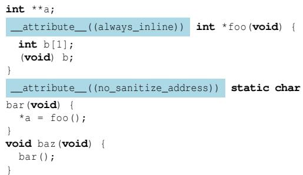
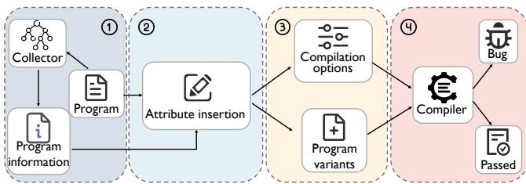
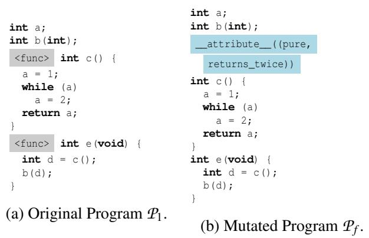
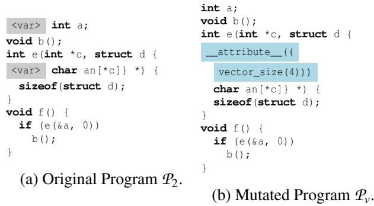
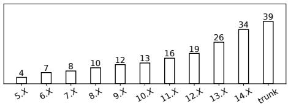
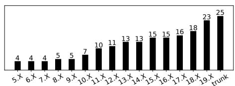
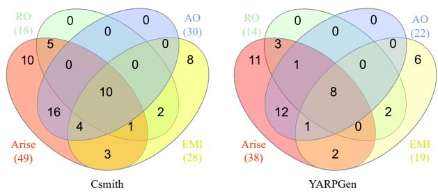
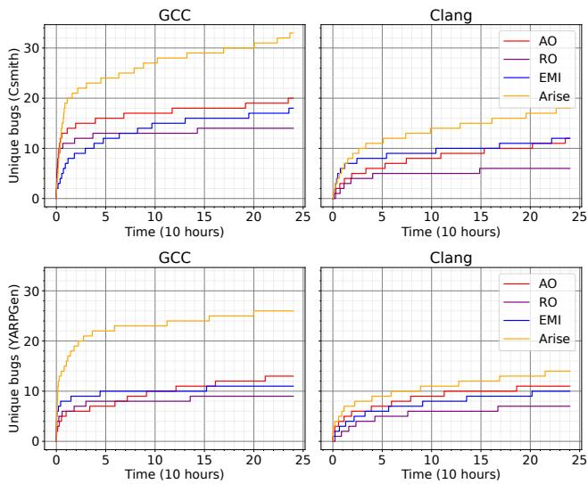

①

USENIX

THE ADVANCED COMPUTING SYSTEMS ASSOCIATION

# Unveiling Compiler Faults via Attribute-Guided Compilation Space Exploration

Jiangchang Wu, Yibiao Yang, Maolin Sun, and Yuming Zhou, State Key Laboratory for Novel Software Technology, Nanjing University https://www.usenix.org/conference/atc25/presentation/wu-jiangchang

# This paper is included in the Proceedings of the 2025 USENIX Annual Technical Conference.

July 7–9, 2025 • Boston, MA, USA ISBN 978-1-939133-48-9

Open access to the Proceedings of the 2025 USENIX Annual Technical Conference is sponsored by

P--r.h £Es/sL.

auuJl9 PgleU

King Abdullah University of

Science and Technology

# Unveiling Compiler Faults via Attribute-Guided Compilation Space Exploration

Jiangchang Wu, Yibiao Yang∗, Maolin Sun, Yuming Zhou

State Key Laboratory for Novel Software Technology, Nanjing University, Nanjing, China

## Abstract

Compiler testing is critically important, as compilers serve as the foundational infrastructure in system software development. A comprehensive exploration of the compilation space is essential for uncovering bugs in compilers. Existing methods primarily involve the utilization of various compilation options alongside test programs as inputs for stress-testing compilers. However, these compilation options are typically applied uniformly across all program elements-such as functions and variables–by default, limiting the ability to thoroughly explore the compilation space. In programming languages like C and C++, attributes such as the \_\_attribute\_\_((always\_inline)) directive provide a mechanism for programmers to specify additional information for specific code elements to the compiler. These attributes allow for precise control over the compilation process, such as enforcing constraints and customizing optimization passes for particular elements. This flexibility in specifying attributes offers opportunities to investigate previously unexamined areas within compilers. Unfortunately, few studies have leveraged attributes for compiler testing. To this end, we propose AT-LAS, an attribute-guided approach that strategically inserts attributes into test programs to facilitate a more thorough exploration of the compilation space. Our key insight is that attributes specified for individual program elements can provide a more flexible means of exploring the compilation space. Our extensive experiments on GCC and LLVM demonstrate the superiority of ATLAS over baseline testing techniques that do not employ attributes, particularly in terms of bug detection and code coverage. Furthermore, ATLAS has led to the discovery of 73 unique bugs in GCC and LLVM, 58 of which have already been confirmed or fixed, showcasing its practical utility.

## 1 Introduction

Compilers are fundamental to the development of system software, as nearly all system software relies on them for construction [2]. However, the complexity and extensive scope of compilers make them prone to errors. Bugs hidden within compilers can have far-reaching consequences, affecting system correctness, security, reliability, performance, and maintenance. Therefore, ensuring the reliability and correctness of compilers is of critical importance.

To ensure the quality of compilers, various compiler testing methods have been proposed [5]. Csmith [52], a notable tool in this domain, randomly generates diverse test programs based on predefined rules or grammar. More recently, YARP-Gen [32] and its successor YARPGen v.2 [33] have been proposed, focusing on generating test programs specific to the compiler’s loop optimization strategies. Both Csmith and YARPGen are capable of generating a large number of test programs to stress test compilers. During the testing process, different combinations of compilation options are employed which aim to explore the compilation space, thereby exposing potential bugs in compilers. EMI [25], a representative metamorphic testing technique [9], mutates existing programs by removing or inserting random code while preserving the original input/output behaviors. EMI also applies various compilation options to compile the mutated programs which also intend to trigger unexplored behaviors of compilers. This line of research has yielded significant results, uncovering a considerable number of bugs in mature and well-established compilers [26, 46].

However, existing compiler testing methods primarily depend on the use of different compilation options to explore compilation space. These options are typically applied to the entire program, which limits their capabilities to explore the deeper states of compilers. In practice, attributes in programming languages such as C and C++ provide a valuable mechanism for programmers to specify additional information to the compiler to enforce constraints, optimize specific sections of code, or facilitate targeted code generation. The additional information can include the intended use and behavior of variables, functions, and types [13, 19, 20], which can influence various stages of the compilation process, from optimization to code generation, and even runtime behavior. For instance, the noinline attribute instructs the compiler not to inline a function during optimization [13]. The aligned attribute specifies the necessary alignment for data structures during code generation [20]. Similarly, the noreturn attribute indicates that a function does not return, allowing the compiler to optimize control flow and potentially eliminate unnecessary cleanup code [13].

Approach In this paper, we propose ATLAS 1, an attributeguided comprehensive compiler testing technique. The key insight underlying ATLAS is that attributes provide flexible control over the compilation process for individual elements within test programs, thereby facilitating a more thorough exploration of compiler behavior. Specifically, for a given test program, ATLAS first identifies the program elements, i.e., the functions, variables, and statements, that potential attributes can be specified. Subsequently, ATLAS randomly inserts appropriate attributes for those elements, resulting in mutated test programs with the inserted attributes. These mutated test programs will be then fed to compilers for subsequent testing. By strategically combining various compilation options with the attributes inserted programs, ATLAS can thoroughly explore the functionalities of the compiler, thereby improving the effectiveness in exposing compiler faults.

To evaluate the performance of ATLAS, we conduct an extensive study based on GCC and LLVM. In the study, we compared ATLAS with those baseline techniques without inserting any attributes. Our experimental results show that ATLAS outperforms these methods in terms of the number of bugs found within the same testing period. In particular, ATLAS can detect 109.1% more bugs than the baseline approaches on average. Moreover, ATLAS achieves higher code coverage of GCC and LLVM triggered by the mutated test programs than the baseline approaches. Furthermore, we applied ATLAS to test the trunk version of both GCC and LLVM. In total, ATLAS has successfully detected 73 unique bugs, 58 of which have been confirmed or fixed by developers, demonstrating the effectiveness of ATLAS.

Contributions. We make the following major contributions:

• Novelty: We introduce an attribute-guided compilation space exploration approach for comprehensive compiler testing. Specifically, we propose to strategically insert appropriate attributes for program elements to systematically explore the compilation space for testing compilers.

• Prototype: We have developed a prototype implementation of our proposed approach, named ATLAS, which leverages various attributes to more effectively explore the compilation space of compilers.

• Usefulness: We conduct an extensive study to evaluate ATLAS on two most widely used C compilers (i.e., GCC and LLVM), demonstrating its effectiveness. In particular, ATLAS has led to 73 unique bugs for GCC and LLVM, 58 of which have been confirmed or fixed by developers.

Paper Organization. The rest of this paper is structured as follows. Section 2 describes the background and our motivation. Section 3 illustrates our proposed approach, ATLAS. Section 4 presents our extensive evaluation of ATLAS. Section 5 is the discussion. Section 6 is the related works. Section 7 is our conclusion.

## 2 Background and Motivation

This section first presents a brief introduction to compiler optimizations and compiler attributes. Then, we motivate our technique using a real bug example.

## 2.1 Compiler Optimizations

Modern compilers, such as GCC and Clang, use optimization techniques to reduce compilation time, minimize binary size, and improve runtime performance [23]. These compilers typically provide multiple standard optimization levels, such as -O1, -O2, -Os, and -O3, each comprising a set of optimization options. For example, the -O1 optimization level in GCC includes options like -fdce, which eliminates unreachable code within the programs, and -fmerge-constants, which consolidates duplicate constants within the programs. These optimization options can be applied as part of optimization levels or individually specified in the compilation setting [18]. Regardless of whether they are enabled by default within a compilation level or specified individually, these strategies usually apply to the entire program rather than to specific code elements (e.g., a single function).

Over the past two decades, substantial research efforts have been devoted to the field of compiler testing [6, 12, 25, 27, 30, 32, 33, 46, 53]. Various techniques have been proposed that primarily focus on generating diverse test programs and then utilizing different optimization levels or employing various combinations of optimization options to perform differential testing of compilers. However, these approaches overlook the application of attributes, which allow for the flexible specification of different compilation strategies for individual code elements. As a result, they miss the opportunity to explore the extensive compilation space thoroughly.

## 2.2 Compiler Attributes

Attributes provide a mechanism for passing additional details about code generation and code optimization to the compiler [1]. For instance, attributes can control inlining decisions, specify memory alignment requirements, or impose specific constraints on variable usage [13, 20]. Unlike compiler options, attributes operate at a finer granularity, allowing precise control over specific program elements, such as individual functions or variables. Common types of attributes include function attributes [13], variable attributes [20], and type attributes [19], covering functionalities such as optimization control, memory alignment, warning suppression, and specifying function characteristics. For instance, the noreturn attribute indicates that a function does not return, while the pure attribute specifies that a function has no side effects [13]. Such fine-grained functionality cannot be achieved through compilation options alone.

During compilation, the compiler identifies and parses these attributes in the syntax analysis phase. In the semantic analysis phase, it adjusts its behavior based on the information provided by the attributes. For instance, recognizing a noreturn attribute allows the compiler to handle functions that do not return appropriately. In the optimization phase, attributes can guide the compiler to perform specific optimizations or disable certain optimizations. Ultimately, in the code generation phase, the compiler produces the target code following these attributes. By applying different attributes to finer-grained program elements, such as functions or variables, the compiler can trigger additional behaviors, maybe further exploring previously unexamined areas within compilers.

```c
struct S {
int i;
};
inline struct S bar() {
struct S s = { 0 };
return s;
_attribute__((optimize("-ftree-loop-distribution")))
void foo() {
bar();
}
```  
Figure 1: GCC bug 43234. The optimization attribute optimize("-ftree-loop-distribution") specified for the function foo() triggers a GCC bug.

As depicted in Figure 1, the highlighted code snippet demonstrates the use of an optimization attribute applied to the foo() function. The -ftree-loop-distribution optimization option, which can improve cache performance on big loop bodies and allow further loop optimizations [18], is typically enabled at the -O3 optimization level. When used in conjunction with attribute, this optimization can be selectively applied to individual functions. In this case, when GCC compiled the program with the optimization attribute applied to the foo() function, a crash occurred. Interestingly, the original program does not have an optimization attribute on foo(), and compiling the original program with the optimization option directly did not result in a compiler crash. This approach allows for finer-grained compilation control over individual functions within the program.

Proper use of attributes is a vital strategy for improving both code quality and compiler efficiency. Through the judicious application of attributes, programmers can achieve substantial gains in performance, and clarity of code intent, making attributes an essential tool for enhancing the quality of code and the performance of the compiler.

  
Figure 2: GCC bug 114956, which is triggered by a test program generated by ATLAS. When this generated program is compiled with the flags -O2 -fsanitize=address,null, it results in a crash.

## 2.3 Motivation

To illustrate the motivation behind our work, consider the compilable program shown in Figure 2. It is generated by our tool, ATLAS, which triggered an internal compiler error (ICE) when GCC-15 compiled it with -O2 -fsanitize=address,null. The -fsanitize=address uses AddressSanitizer (ASan) [44] to detect memory-related bugs in programs and the option -fsanitize=null is used to detect null pointer in programs. The highlighted code of the figure denotes the attribute segments inserted by ATLAS. While the original program compiled normally, the introduction of these attributes caused the compiler to crash during the compilation of the modified program. The always\_inline attribute is used to force the compiler to inline a function, even if the compiler’s optimization heuristics would normally choose not to do so. The no\_sanitize\_address attribute is used to instruct the compiler not to instrument a particular function with ASan marks, even if ASan is enabled globally.

In this case, the always\_inline function foo() is inlined into the no\_sanitize\_address function bar(), ASan marks (like .ASAN\_MARK calls) are still left in the code during compiler optimization (O2). These leftover marks cause issues during later compilation stages, resulting in an internal compiler error (ICE). The compiler does not correctly remove the ASan instrumentation calls when inlining functions into a caller with sanitization disabled, leading to this bug. When attempting to inline the foo() function via the command line, the program must be compiled with the -finline-functions option. However, this would apply inlining to all functions within the program. Additionally, compiling the program with the -finline-functions and -fsanitize=address options, without applying the always\_inline attribute to foo(), does not trigger a compiler crash. The crash is only triggered when the always\_inline and the no\_sanitize\_address attributes are applied separately to the foo() and bar() functions, respectively.

The example demonstrates that the combination of optimizations and attributes can result in uncommon scenarios and expose bugs within the compiler. The occurrence of such situations would not have been possible without the use of attributes. This also serves as evidence for the feasibility of utilizing attributes to achieve fine-grained control over the exploration of the compilation space for compiler testing.

## 3 Approach

  
Figure 3: The workflow of ATLAS.

The fundamental workflow of our proposed approach is illustrated in Figure 3. Initially, in step ⃝1 , the program $\mathcal { P }$ is parsed to identify potential candidates that attribute could be inserted, forming the candidate set ${ \mathcal { S } } .$ . Subsequently, in step $\textcircled{2}$ , compiler attributes are randomly inserted into program $\mathcal { P }$ based on ${ \mathcal { S } } ,$ creating a set of mutated program variants $S _ { p } .$ . Each variant $\mathcal { P } ^ { \prime }$ in $S _ { p }$ explores a broader range of code paths within the compiler compared to P . As discussed in Section 2.2, some attributes only take effect when specific compilation options are used. To ensure the inserted attributes are effective, we not only insert the attributes but also select the relevant compilation options. To enhance the complexity of the compilation options, a carefully designed strategy for combining compilation options is applied in step ⃝3 . This strategy involves selecting more diverse compilation options for each $\mathcal { P } ^ { \prime }$ , aiming to generate a more intricate combination of compilation options. In step ⃝4 , the compilation options selected in step $\textcircled{3}$ are combined with optimization options to compile the mutated program variants. If the compiler encounters any crashes during the compilation process, the bugs are found.

This section details our approach to combining compilation options and attributes to explore the compilation space for validating compiler reliability. Our strategy attempts to maximize the diversity of compilation option combinations with a wide range of attributes. This approach not only broadens the exploration of the compilation space but also increases the chances of uncovering potential compiler bugs.

## 3.1 Collecting Information

The initial step of our approach involves gathering essential information about functions, variables, and statements present in the test programs. Test programs typically comprise multiple functions and assorted variables. During the front-end parsing phase, the compiler analyzes different code fragments and variables individually and then performs targeted optimizations tailored to their specific requirements. As an illustration, LLVM follows a multistep process for program compilation. Initially, the program undergoes translation into an Intermediate Representation (IR). The compiler then traverses the IR, identifies specific structural patterns, and applies customized optimizations for those patterns [24, 34]. For instance, the Instcombine pass is responsible for identifying duplicate instructions and merging redundant ones through the execution of the pass [39]. Due to the different structure of functions, the compiler can perform different optimizations on them.

ATLAS collects function information, variable information, and statement information within the programs. We define the collector Collect\ as follows:

Definition 1 (Collection). Given a program P and the function set $\underline { { S } } _ { f }$ , variable set $S _ { \nu } { } _ { ; }$ , and statement set ${ \mathcal { S } } _ { s } ,$ the collector Collect \ records the property tuple A for each function, variable, and statement in P .

To provide a more detailed explanation, we define the following tuples to depict information from Collect \ :

$\mathcal { A } _ { \langle n , t , p o s \rangle }$ contains the following information in S f : the function name n, the function return type t, and the function definition locations pos.

$\mathcal { A } _ { \langle t , p o s \rangle }$ contains the following information in $S _ { \nu } \mathrm { i }$ the variable type t, and the variable declaration locations pos.

$\mathcal { A } _ { \langle \nu l , p o s \rangle }$ contains the following information in $\mathcal { S } _ { s }$ : the variables vl in statement, and the statement locations pos.

To acquire insights into the program’s structure, ATLAS initially extracts the Abstract Syntax Tree (AST) of the program. In our implementation, given a new seed program P , we first utilize the Collect  collecting method to obtain $S _ { f } , S _ { \nu } ,$ , and $S _ { s } .$ Afterward, we generate program variant set $S _ { p }$ based on $S _ { f }$ $S _ { \nu } { } _ { ; }$ , and $S _ { s }$

## 3.2 Inserting Attributes

As detailed in Section 2.2, attributes allow developers to finely tune their code’s behavior and performance, granting them better control over the compilation process. For instance, we can use \_\_attribute\_\_((optimize(1))) int $\pounds \left( \ \right)$ ; to instruct the compiler to optimize the function f() at the O1 level. In light of this, we propose a method for fine-grained control of compilation by leveraging compiler function attributes. More specifically, we utilize these attributes to explicitly influence the decisions made by the compiler. Algorithm 1 lists the primary procedure used in ATLAS to achieve fine-grained control of compilation by randomly inserting attributes into the program.

Algorithm 1: Insert Attributes   
Input: P , original program   
S f a, function attribute set   
${ \dot { S } } _ { v a } ,$ variable attribute set   
Ssa, statement attribute set   
${ \mathbf { } } S _ { f } ,$ function set of the original program   
Sv, variable set of the original program   
${ \mathcal { S } } _ { s } ,$ statement set of the original program   
$\mathcal { N } ,$ the number of mutated programs   
Output: $S _ { p } ,$ the set of programs with attributes inserted   
1 Sp ← [ ];   
2 P ′ ← P ;   
3 n ← 0;   
4 while true do   
5 foreach $\mathcal { A } _ { ( n , t , p o s ) } \in S _ { f }$ do   
6 if FlipCoin() then   
7 attr ← f ormF uncAttr(S f a, A⟨n,t,pos⟩);   
8 pos ← A⟨n,t,pos⟩.getPos();   
9 P ′ ← insertAttr(P ′ , attr, pos);   
10 foreach $\mathcal { A } _ { \left. t , p o s \right. } \in S _ { \nu }$ do   
11 if FlipCoin() then   
12 attr ← selectVarAttr(Sva, A⟨t,pos⟩);   
13 pos ← A⟨t,pos⟩.getPos();   
14 P ′ ← insertAttr(P ′ , attr, pos);   
15 foreach A⟨vl,pos⟩ ∈ Ss do   
16 if FlipCoin() then   
17 attr ← f ormStmtAttr(Ssa , A⟨vl,pos⟩ );   
18 pos ← A⟨vl,pos⟩.getPos();   
19 P ′ ← insertAttr(P ′ , attr, pos);   
20 Sp .add(P ′ );   
21 n++;   
22 if n >= N then   
23 break   
24 return $S _ { p }$

Function Attribute Insertion. For each function within program P , ATLAS employs FlipCoin() to probabilistically determine the inclusion of each attribute from the attribute set $S _ { f a }$ (Line 5-9 in Algorithm 1). The f ormFuncAttr() method selects one or more attributes and ATLAS inserts them into each function (Line 7 in Algorithm 1). Figure 4 illustrates an example of how ATLAS inserts function attributes. First, AT-LAS identifies the location of function definitions based on position information pos from $\mathcal { A } _ { \langle n , t , p o s \rangle }$ marking these locations with <func> . After marking the locations, ATLAS selects appropriate function attributes based on the function return type t and inserts them at the specified positions. For instance, the return type of c() is int, we cannot apply noreturn attribute to it. Since P1 contains two function definitions, two corresponding marked locations are created. The mutated program $\mathcal { P } _ { f }$ shown in Figure 4-(b), is derived from $\mathcal { P } _ { 1 }$ , with the highlighted code segments representing the function attributes inserted by ATLAS.

Variable Attribute Insertion. For each variable within program P , the method selectVarAttr() picks appropriate variable attributes through type checking (Line 12 in Algorithm 1). For example, the packed attribute, which instructs the compiler to pack structure members tightly together without inserting padding [20], cannot be applied to variables of type int. As such, the method selectVarAttr() will only apply packed attribute to member variables within a structure. In the case of program $\mathcal { P } _ { 2 }$ shown in Figure 5-(a), ATLAS identifies the positions of all variables and marks them with <var> using the position information pos from $\mathcal { A } _ { \langle t , p o s \rangle }$ . The mutated program $\mathcal { P } _ { \nu }$ in Figure 5-(b) is derived from P2, where ATLAS inserts the vector\_size attribute into a member variable of the structure d. Since there are two <var> marks in P2, ATLAS selects the one within the structure d based on the outcome of the FlipCoin() decision.

  
Figure 4: Illustration examples of function attributes insertion. $\mathcal { P } _ { f }$ was mutated from P1 by inserted function attribute. This program triggers the GCC bug 114687 when compiled with -fsanitize=address -O1.

  
Figure 5: Illustration examples of variable attributes insertion. $\mathcal { P } _ { \nu }$ was mutated from P2 by inserted variable attribute. $\mathcal { P } _ { \nu }$ triggers the GCC bug 117145 when compiled with -O1.

Statement Attribute Insertion. The process of statement attribute insertion is outlined in Algorithm 2. This process begins with the use of the function FlipCoin() to determine which attributes from the set $\mathcal { S } _ { s a }$ will be utilized in subsequent steps (Line 4). The method isEmpty() is employed to verify the presence of variables within the statement (Line 6). If variables are indeed present, the Construct() method generates a simple expression based on the identified variable list vl to accomplish the corresponding attribute. Notably, each statement is associated with only a single attribute. To provide a clearer understanding, consider program P3 as depicted in Figure 6-(a), where ATLAS annotates the loop statement with <stmt> . The variables x and y are included in the variable list; consequently, the Construct() method selects a linear modifier and produces simple expression (uval (x): y + 1). The highlighted code in Figure 6-(b) illustrates the attribute generated by f ormStmtAttr(). #pragma is also a form of attribute. For clarity, this line of code has been folded to enhance readability.

void a (int &x, int &y) {   
void a (int &x, int &y) {   
#pragma omp simd   
<stmt>   
for (i=0; i<10; i++) { linear(uval (x): y+1)   
x += y + 1; for (i=0; i<10; i++) {   
} x += y + 1;   
(a) Original Program P3.   
(b) Mutated Program Ps.

Figure 6: Illustration examples of statement attributes insertion. Ps was mutated from from P3 by inserted statement attribute. This program triggers the LLVM bug 108166.

```csv
Algorithm 2: Form Statement Attributes
1 Function formStmtAttr(Ssa,A⟨vl,pos⟩):
2 a ← “ ”;
3 foreach attr ∈ Ssa do
4 if FlipCoin() then
5 var_list ← A⟨vl,pos⟩.getVarList();
6 if !var_list.isEmpty() then
7 a ← Construct(var_list);
8 break
9 else
10 a ← attr;
11 return a
```

## 3.3 Selecting Options

In practical use, certain attributes become effective only when specific compilation options are applied. As illustrated in Figure 2, we utilize the no\_sanitize\_address attribute to disable the instrumentation of bar() function. Such attribute will only exert its influence during the compilation process if the -fsanitize=address option is specified. Following the insertion of attributes in Section 3.2, ATLAS selects the appropriate compilation options based on the attributes inserted to ensure their effectiveness.

The procedure for this selection is outlined in Algorithm 3. In the map ${ \mathcal { M } } _ { o } .$ , each attribute (key) corresponds to the compilation options (value) that activate it. The getInsertedAttr() method retrieves all attributes that have been inserted into the program P (Line 2). By iterating the attributes in the list $\mathcal { L } _ { a t t r } ,$ the corresponding compilation options are retrieved (Line 3-5). These options are then consolidated to form the final compilation options O for the program P (Line 6).

Algorithm 3: Select Compilation Options   
Input: P , the programs with attributes inserted   
Mo, the map of attributes and their options   
Output: O, the compilation option of P   
1 select ← set();   
2 Lattr ← getInsertedAttr(P );   
3 foreach attr ∈ Lattr do   
4 if attr ∈ Mo.keys() then   
5 select.add(Mo.getValues(attr);   
6 O ← FormOpt(select);   
7 return O

## 3.4 Validating Compiler

Once the program variants are generated, the testing process becomes straightforward. The modifications made by ATLAS, such as attribute insertion, do not compromise the overall structure of the programs. For each variant, a stochastic selection process is employed to randomly choose a sequence of optimization options from a set of options $O _ { a l l }$ $O _ { a l l }$ contains all optimization options for the compiler. The number of selected optimization options does not exceed five, as previous research investigations have indicated that the average number of optimization options leading to bugs is five [6]. These selected options are then combined with the options in O determined by Algorithm 3 for compilation along with the program variant. We define the validation process as follows.

Definition 2 (Validation). Program Pi is a variant of program P and the option Oi is carefully designed. The compiler under test is denoted as C omp, which can receive compilation options and test programs as inputs. If C omp(Pi, Oi) crashed, a compiler bug is identified.

Our key insight is that when considering a valid program P , the compiler should exhibit stability without encountering any crashes throughout the compilation process with a specific compilation option, denoted as $O _ { p }$ . Figure 2 illustrates the final results of our tool. In the case of the attribute-inserted variant, detecting the bug requires both the selection of appropriate compiler options (-fsanitize=address,null) and the application of suitable optimization settings (-O2). The results illustrated in Figures 4 and 5 further substantiate the importance of selecting the appropriate optimization options in the identification of compiler bugs.

## 4 Evaluation

This section presents our extensive evaluation of ATLAS to find bugs in compilers. Our evaluation is based on the follow-

ing research questions:

• RQ1 (Effectiveness): How many compiler bugs have been found by ATLAS?

• RQ2 (Efficiency): How efficient is ATLAS in uncovering compiler bugs?

• RQ3 (Capability): Can ATLAS improve code coverage?

## 4.1 Implementation and Evaluation Setup

Implementation. ATLAS is designed to run in a fully automated way, including program information collection, attribute-guided mutation, and validation stages. ATLAS utilizes LLVM’s LibTooling library [36] to facilitate the program information collection task as described in Section 3.1. Once launched, ATLAS will automatically generate programs and feed them into the compilers under test.

Target Compilers. We used ATLAS to continuously test the trunk version of two widely used compilers: GCC and LLVM. Specifically, we obtained daily builds of GCC from its repositories and utilized nightly packages of LLVM [37]. Testing on the latest development versions of software offers several advantages:

• By testing these trunk versions, developers can immediately identify and address these bugs.

• This approach can avoid duplicate bug reports as much as possible because once bugs are found in the trunk version, developers tend to quickly fix them [25, 52].

Test programs. In our testing, we have drawn from two sources of programs to generate test programs:

• Compiler Test Suites: Each of GCC and LLVM has an already sizable and expanding regression test suite [17, 35], which we can use for generating various test programs. We chose GCC test suite and LLVM test suite because: (1) they are open source which can be easily obtained; (2) they are typically used for compiler regression testing, covering a wide range of C semantics; and (3) many of these test programs can be compiled and executed independently, as they do not rely on external libraries and have fixed inputs.

• Generated Code: We choose Csmith [52] and YARP-Gen [32, 33] as the random program generators to generate C programs to test compilers for the following main reasons: (1) they are extensively used in the literature of C compiler testing [6, 26, 46]; (2) they are effective in finding bugs as thousands of bugs have been exposed and reported for the most widely-used C compilers; (3) each test case generated by Csmith and YARPGen is valid and does not require external inputs; and (4) they are efficient as a test program with tens of thousands of lines can be generated quickly.

Attributes. All the attributes we used are from the GCC and LLVM documentation [10, 15]. The attributes and options map Mo described in Algorithm 3 was also formed from the documentation. We chose attributes for the following main standard: (1) Programming Language Compatibility: The attribute must be compatible with the C programming language. (2) Exclusions: Attributes that are specifically designed for GPU support are not considered. The attribute sets utilized for GCC and LLVM in our experiments were distinct.

Hardware. Our evaluation was conducted on a workstation with an Intel 48-core 2.30GHz CPU, 120GiB RAM, and Ubuntu 22.04.2 LTS operating system.

Testing process. Our testing process is fully automated and runs continuously. ATLAS first inserts attributes into programs for the test program to get the program variants set, then chooses a proper compilation option for each variant. The program variant with a range of compilation options is used to test GCC and LLVM. Once a program triggers a compiler bug, we use C-Reduce [43] to reduce the program. If the program triggers a new compiler bug, we report the bug to the developers. The only manual step in the testing is analyzing and reporting bugs.

## 4.2 RQ1: Bug-finding

Table 1 summarizes the bugs we discovered during our testing period. Overall, we reported 73 bugs in total: 44 for GCC and 29 for LLVM. The developers have confirmed 58 of them. This highlights the bug-finding capability of ATLAS. Of all these bugs, 17 of them have been fixed of which 13 fixed bugs are in GCC and 4 fixed bugs are in LLVM2. We also experienced that the LLVM developers were less responsive than GCC and mostly only labelled our reports as bugs without further diagnosis. The results presented in the “Options" column indicate whether the triggering of a bug requires compilation options. If such options are necessary, the bug is marked with ✓; if not, it is marked with ✗. A total of 49 bugs require compilation options for triggering, while only 24 bugs can be triggered solely through the insertion of attributes. In the Table 1, the “Priority" is priority of a bug report. The field priority of a bug report is determined by developers for prioritizing bugs, expressing the order in which bugs should be fixed [47]. P1 is the most urgent level and bugs of this level should be fixed soon, and P3 is the default priority level. LLVM developers do not prioritize bugs explicitly in the bug repository, so we only present the priority on GCC.

Note that the bug management guidelines of GCC and LLVM are not exactly similar. Specifically, a reported bug in GCC Bugzilla will be initially labelled as “UNCON-FIRMED", and the status will turn to “NEW" if developers confirm it. However, in LLVM issue tracker, a reported bug will be labelled as “new issue" by default, and if the developers confirm it, they will remove the “new issue" label and add other labels. For example, if the bug is related to link time optimization, it will be labelled as “LTO". In addition, if the status of a bug is “Assigned" means the bug is confirmed and is assigned to a certain developer to deal with it. If a bug is fixed by developers in LLVM issue tracker, the corresponding issue report will be closed. If the bug has the same root cause with the bug reported by other developers previously, we categorize it as “Duplicate".

Table 1: The bugs reported by ATLAS.
<table><tr><td rowspan=1 colspan=10>ID   |Priority|Status    |Options |        Attributes        |ID   |Priority|Status    |Options      AttributesThe reported bugs of GCC                                     The reported bugs of GCC</td></tr><tr><td rowspan=1 colspan=1>112709</td><td rowspan=1 colspan=1>P2</td><td rowspan=1 colspan=1>Fixed</td><td rowspan=1 colspan=1>√</td><td rowspan=1 colspan=1>returns_twice</td><td rowspan=1 colspan=1>117461</td><td rowspan=1 colspan=1>P3</td><td rowspan=1 colspan=1>Unconfirmed</td><td rowspan=1 colspan=1>√</td><td rowspan=7 colspan=1>returns_twicevector_size(func)pure,sanitizeusedaligned(var)flattenreturns_twice,const(func)</td></tr><tr><td rowspan=1 colspan=1>112860</td><td rowspan=1 colspan=1>P3</td><td rowspan=1 colspan=1>Fixed</td><td rowspan=1 colspan=1></td><td rowspan=1 colspan=1>vector_size(var)</td><td rowspan=1 colspan=1>117479</td><td rowspan=1 colspan=1>P5</td><td rowspan=1 colspan=1>Confirmed</td><td rowspan=1 colspan=1>X</td></tr><tr><td rowspan=1 colspan=1>113043</td><td rowspan=1 colspan=1>P3</td><td rowspan=1 colspan=1>Confirmed</td><td rowspan=1 colspan=1></td><td rowspan=1 colspan=1>interrupt</td><td rowspan=1 colspan=1>117489</td><td rowspan=1 colspan=1>P2</td><td rowspan=1 colspan=1>Confirmed</td><td rowspan=1 colspan=1></td></tr><tr><td rowspan=1 colspan=1>113264</td><td rowspan=1 colspan=1>P3</td><td rowspan=1 colspan=1>Confirmed</td><td rowspan=1 colspan=1></td><td rowspan=1 colspan=1>alias,sanitize,target_clones,copy</td><td rowspan=1 colspan=1>117505</td><td rowspan=1 colspan=1>P3</td><td rowspan=1 colspan=1>Confirmed</td><td rowspan=1 colspan=1></td></tr><tr><td rowspan=1 colspan=1>114687</td><td rowspan=1 colspan=1>P1</td><td rowspan=1 colspan=1>Fixed</td><td rowspan=1 colspan=1>√</td><td rowspan=1 colspan=1>pure,returns_twice</td><td rowspan=1 colspan=1>117512</td><td rowspan=1 colspan=1>P2</td><td rowspan=1 colspan=1>Fixed</td><td rowspan=1 colspan=1>X</td></tr><tr><td rowspan=1 colspan=1>114956</td><td rowspan=1 colspan=1>P2</td><td rowspan=1 colspan=1>Fixed</td><td rowspan=1 colspan=1>√</td><td rowspan=1 colspan=1>always_inline,sanitize</td><td rowspan=1 colspan=1>117540</td><td rowspan=1 colspan=1>P3</td><td rowspan=1 colspan=1>Duplicate</td><td rowspan=1 colspan=1></td></tr><tr><td rowspan=1 colspan=1>115509</td><td rowspan=1 colspan=1>P3</td><td rowspan=1 colspan=1>Unconfirmed</td><td rowspan=1 colspan=1>X</td><td rowspan=1 colspan=1>aligned(func),sentinel</td><td rowspan=1 colspan=1>117979</td><td rowspan=1 colspan=1>P2</td><td rowspan=1 colspan=1>Assigned</td><td rowspan=1 colspan=1>√</td></tr><tr><td rowspan=1 colspan=1>115530</td><td rowspan=1 colspan=1>P3</td><td rowspan=1 colspan=1>Confirmed</td><td rowspan=1 colspan=1></td><td rowspan=1 colspan=1>simd(func)</td><td rowspan=1 colspan=1></td><td rowspan=1 colspan=1></td><td rowspan=1 colspan=1>Thereport</td><td rowspan=1 colspan=1>edbugsof</td><td rowspan=1 colspan=1>（LLVM</td></tr><tr><td rowspan=1 colspan=1>115548</td><td rowspan=1 colspan=1>P3</td><td rowspan=1 colspan=1>Unconfirmed</td><td rowspan=1 colspan=1>X</td><td rowspan=1 colspan=1>malloc,simd(func)</td><td rowspan=1 colspan=1>73378</td><td rowspan=1 colspan=1></td><td rowspan=1 colspan=1>Confirmed</td><td rowspan=1 colspan=1>√</td><td rowspan=1 colspan=1>noinline</td></tr><tr><td rowspan=1 colspan=1>115549</td><td rowspan=1 colspan=1>P3</td><td rowspan=1 colspan=1>Fixed</td><td rowspan=1 colspan=1></td><td rowspan=1 colspan=1>aligned(func),optimize(s)</td><td rowspan=1 colspan=1>73797</td><td rowspan=1 colspan=1></td><td rowspan=1 colspan=1>Duplicate</td><td rowspan=1 colspan=1>√</td><td rowspan=1 colspan=1>noinline</td></tr><tr><td rowspan=1 colspan=1>115573</td><td rowspan=1 colspan=1>P3</td><td rowspan=1 colspan=1>Unconfirmed</td><td rowspan=1 colspan=1>√</td><td rowspan=1 colspan=1>no_reorder</td><td rowspan=1 colspan=1>74189</td><td rowspan=1 colspan=1></td><td rowspan=1 colspan=1>Fixed</td><td rowspan=1 colspan=1>√</td><td rowspan=1 colspan=1>packed</td></tr><tr><td rowspan=1 colspan=1>115595</td><td rowspan=1 colspan=1>P3</td><td rowspan=1 colspan=1>Unconfirmed</td><td rowspan=1 colspan=1>√</td><td rowspan=1 colspan=1>optimize(1),noipa</td><td rowspan=1 colspan=1>75019</td><td rowspan=1 colspan=1></td><td rowspan=1 colspan=1>Confirmed</td><td rowspan=1 colspan=1>X</td><td rowspan=1 colspan=1>noinline</td></tr><tr><td rowspan=1 colspan=1>115815</td><td rowspan=1 colspan=1>P2</td><td rowspan=1 colspan=1>Fixed</td><td rowspan=1 colspan=1>√</td><td rowspan=1 colspan=1>destructor</td><td rowspan=1 colspan=1>75301</td><td rowspan=1 colspan=1></td><td rowspan=1 colspan=1>Confirmed</td><td rowspan=1 colspan=1>√</td><td rowspan=2 colspan=1>vector_sizeloop_vectorize(stmt)</td></tr><tr><td rowspan=1 colspan=1>115816</td><td rowspan=1 colspan=1>P3</td><td rowspan=1 colspan=1>Confirmed</td><td rowspan=1 colspan=1></td><td rowspan=1 colspan=1>vector_size(var),target</td><td rowspan=1 colspan=1>75321</td><td rowspan=1 colspan=1></td><td rowspan=1 colspan=1>Confirmed</td><td rowspan=1 colspan=1>√</td></tr><tr><td rowspan=1 colspan=1>115847</td><td rowspan=1 colspan=1>P3</td><td rowspan=1 colspan=1>Confirmed</td><td rowspan=1 colspan=1>X</td><td rowspan=1 colspan=1>simd(func),vector_size(func)</td><td rowspan=1 colspan=1>75690</td><td rowspan=1 colspan=1></td><td rowspan=1 colspan=1>Duplicate</td><td rowspan=1 colspan=1></td><td rowspan=1 colspan=1>vector_size</td></tr><tr><td rowspan=1 colspan=1>115848</td><td rowspan=1 colspan=1>P3</td><td rowspan=1 colspan=1>Assigned</td><td rowspan=1 colspan=1>√</td><td rowspan=1 colspan=1>strub</td><td rowspan=1 colspan=1>88692</td><td rowspan=1 colspan=1></td><td rowspan=1 colspan=1>Confirmed</td><td rowspan=1 colspan=1>√</td><td rowspan=2 colspan=1>minsize,sanitizeopencl_global_device</td></tr><tr><td rowspan=1 colspan=1>115859</td><td rowspan=1 colspan=1>P3</td><td rowspan=1 colspan=1>Confirmed</td><td rowspan=1 colspan=1>√</td><td rowspan=1 colspan=1>optimize(3)</td><td rowspan=1 colspan=1>95892</td><td rowspan=1 colspan=1></td><td rowspan=1 colspan=1>Confirmed</td><td rowspan=1 colspan=1>×</td></tr><tr><td rowspan=1 colspan=1>115861</td><td rowspan=1 colspan=1>P3</td><td rowspan=1 colspan=1>Unconfirmed</td><td rowspan=1 colspan=1>X</td><td rowspan=1 colspan=1>deprecated</td><td rowspan=1 colspan=1>95928</td><td rowspan=1 colspan=1></td><td rowspan=1 colspan=1>Confirmed</td><td rowspan=1 colspan=1>√</td><td rowspan=2 colspan=1>preserve_noneinterrupt</td></tr><tr><td rowspan=1 colspan=1>116607</td><td rowspan=1 colspan=1>P3</td><td rowspan=1 colspan=1>Fixed</td><td rowspan=1 colspan=1>√</td><td rowspan=1 colspan=1>sanitize</td><td rowspan=1 colspan=1>96018</td><td rowspan=1 colspan=1></td><td rowspan=1 colspan=1>Confirmed</td><td rowspan=1 colspan=1>X</td></tr><tr><td rowspan=1 colspan=1>116612</td><td rowspan=1 colspan=1>P3</td><td rowspan=1 colspan=1>Duplicate</td><td rowspan=1 colspan=1>X</td><td rowspan=1 colspan=1>aligned(var)</td><td rowspan=1 colspan=1>96383</td><td rowspan=1 colspan=1></td><td rowspan=1 colspan=1>Confirmed</td><td rowspan=1 colspan=1>√</td><td rowspan=1 colspan=1>simd</td></tr><tr><td rowspan=1 colspan=1>116659</td><td rowspan=1 colspan=1>P3</td><td rowspan=1 colspan=1>Duplicate</td><td rowspan=1 colspan=1></td><td rowspan=1 colspan=1>optimize(&quot;Ofast&quot;)</td><td rowspan=1 colspan=1>98635</td><td rowspan=1 colspan=1></td><td rowspan=1 colspan=1>Confirmed</td><td rowspan=1 colspan=1></td><td rowspan=1 colspan=1>regcall</td></tr><tr><td rowspan=1 colspan=1>116687</td><td rowspan=1 colspan=1>P3</td><td rowspan=1 colspan=1>Unconfirmed</td><td rowspan=1 colspan=1>√</td><td rowspan=1 colspan=1>simd(func)</td><td rowspan=1 colspan=1>98663</td><td rowspan=1 colspan=1></td><td rowspan=1 colspan=1>Confirmed</td><td rowspan=1 colspan=1></td><td rowspan=1 colspan=1>vectorcall</td></tr><tr><td rowspan=1 colspan=1>117142</td><td rowspan=1 colspan=1>P2</td><td rowspan=1 colspan=1>Fixed</td><td rowspan=1 colspan=1></td><td rowspan=1 colspan=1>returns_twice</td><td rowspan=1 colspan=1>107979</td><td rowspan=1 colspan=1></td><td rowspan=1 colspan=1>Confirmed</td><td rowspan=1 colspan=1></td><td rowspan=2 colspan=1>atomicsimd</td></tr><tr><td rowspan=1 colspan=1>117145</td><td rowspan=1 colspan=1>P2</td><td rowspan=1 colspan=1>Fixed</td><td rowspan=1 colspan=1>√</td><td rowspan=1 colspan=1>vector_size(var)</td><td rowspan=1 colspan=1>108166</td><td rowspan=1 colspan=1></td><td rowspan=1 colspan=1>Confirmed</td><td rowspan=1 colspan=1></td></tr><tr><td rowspan=1 colspan=1>117167</td><td rowspan=1 colspan=1>P3</td><td rowspan=1 colspan=1>Duplicate</td><td rowspan=1 colspan=1></td><td rowspan=1 colspan=1>const(func)</td><td rowspan=1 colspan=1>113285</td><td rowspan=1 colspan=1></td><td rowspan=1 colspan=1>Confirmed</td><td rowspan=1 colspan=1>√</td><td rowspan=8 colspan=1>nodebugpreserve_mostspeculative_load_hardeningtargetcpu_specificoptnoneno_caller_saved_registerscold</td></tr><tr><td rowspan=1 colspan=1>117197</td><td rowspan=1 colspan=1>P3</td><td rowspan=1 colspan=1>Confirmed</td><td rowspan=1 colspan=1></td><td rowspan=1 colspan=1>vector_size(var)</td><td rowspan=1 colspan=1>113401</td><td rowspan=1 colspan=1></td><td rowspan=1 colspan=1>Confirmed</td><td rowspan=1 colspan=1></td></tr><tr><td rowspan=1 colspan=1>117209</td><td rowspan=1 colspan=1>P2</td><td rowspan=1 colspan=1>Fixed</td><td rowspan=1 colspan=1>√</td><td rowspan=1 colspan=1>returns_twice,pure</td><td rowspan=1 colspan=1>113403</td><td rowspan=1 colspan=1></td><td rowspan=1 colspan=1>Confirmed</td><td rowspan=1 colspan=1>√</td></tr><tr><td rowspan=1 colspan=1>117230</td><td rowspan=1 colspan=1>P2</td><td rowspan=1 colspan=1>Fixed</td><td rowspan=1 colspan=1>√</td><td rowspan=1 colspan=1>vector_size(var)</td><td rowspan=1 colspan=1>113420</td><td rowspan=1 colspan=1></td><td rowspan=1 colspan=1>Confirmed</td><td rowspan=1 colspan=1>√</td></tr><tr><td rowspan=1 colspan=1>117245</td><td rowspan=1 colspan=1>P2</td><td rowspan=1 colspan=1>Assigned</td><td rowspan=1 colspan=1>X</td><td rowspan=1 colspan=1>vector_size(var)</td><td rowspan=1 colspan=1>115299</td><td rowspan=1 colspan=1></td><td rowspan=1 colspan=1>Fixed</td><td rowspan=1 colspan=1>×</td></tr><tr><td rowspan=1 colspan=1>117254</td><td rowspan=1 colspan=1>P2</td><td rowspan=1 colspan=1>Fixed</td><td rowspan=1 colspan=1>X</td><td rowspan=1 colspan=1>nonstring</td><td rowspan=1 colspan=1>115411</td><td rowspan=1 colspan=1></td><td rowspan=1 colspan=1>Fixed</td><td rowspan=1 colspan=1>√</td></tr><tr><td rowspan=1 colspan=1>117295</td><td rowspan=1 colspan=1>P3</td><td rowspan=1 colspan=1>Unconfirmed</td><td rowspan=1 colspan=1>√</td><td rowspan=1 colspan=1>returns_twice</td><td rowspan=1 colspan=1>115490</td><td rowspan=1 colspan=1></td><td rowspan=1 colspan=1>Confirmed</td><td rowspan=1 colspan=1>X</td></tr><tr><td rowspan=1 colspan=1>117326</td><td rowspan=1 colspan=1>P3</td><td rowspan=1 colspan=1>Confirmed</td><td rowspan=1 colspan=1>√</td><td rowspan=1 colspan=1>constructor</td><td rowspan=1 colspan=1>115602</td><td rowspan=1 colspan=1></td><td rowspan=1 colspan=1>Confirmed</td><td rowspan=1 colspan=1></td></tr><tr><td rowspan=1 colspan=1>117358</td><td rowspan=1 colspan=1>P2</td><td rowspan=1 colspan=1>Assigned</td><td rowspan=1 colspan=1>√</td><td rowspan=1 colspan=1>const(func)</td><td rowspan=1 colspan=1>115632</td><td rowspan=1 colspan=1></td><td rowspan=1 colspan=1>Confirmed</td><td rowspan=1 colspan=1>√</td><td rowspan=5 colspan=1>address_spacevector_sizealias,constructornoderefvectorcall</td></tr><tr><td rowspan=1 colspan=1>117380</td><td rowspan=1 colspan=1>P4</td><td rowspan=1 colspan=1>Confirmed</td><td rowspan=1 colspan=1>X</td><td rowspan=1 colspan=1>vector_size(var)</td><td rowspan=1 colspan=1>115655</td><td rowspan=1 colspan=1></td><td rowspan=1 colspan=1>Confirmed</td><td rowspan=1 colspan=1>X</td></tr><tr><td rowspan=1 colspan=1>117429</td><td rowspan=1 colspan=1>P3</td><td rowspan=1 colspan=1>Duplicate</td><td rowspan=1 colspan=1>√</td><td rowspan=1 colspan=1>no_sanitize,flatten</td><td rowspan=1 colspan=1>116010</td><td rowspan=1 colspan=1></td><td rowspan=1 colspan=1>Confirmed</td><td rowspan=1 colspan=1>√</td></tr><tr><td rowspan=1 colspan=1>117437</td><td rowspan=1 colspan=1>P3</td><td rowspan=1 colspan=1>Confirmed</td><td rowspan=1 colspan=1>√</td><td rowspan=1 colspan=1>sanitize</td><td rowspan=1 colspan=1>116124</td><td rowspan=1 colspan=1></td><td rowspan=1 colspan=1>Fixed</td><td rowspan=1 colspan=1>X</td></tr><tr><td rowspan=1 colspan=1>117440</td><td rowspan=1 colspan=1>P2</td><td rowspan=1 colspan=1>Confirmed</td><td rowspan=1 colspan=1></td><td rowspan=1 colspan=1>pure</td><td rowspan=1 colspan=1>121865</td><td rowspan=1 colspan=1></td><td rowspan=1 colspan=1>Confirmed</td><td rowspan=1 colspan=1>X</td></tr></table>

Priority of bugs. To analyze the importance of the bugs, we present the priority levels of GCC bugs in the Table 1. One bug (ID:114687) has been marked as P1 priority by the developers, and 14 bugs have been marked as P2 priority. The higher priority assigned to these bugs indicates the developers’ attention to the bugs. Developers have to fix all P1 bugs before making the next release [30].

Influence of bugs. To further understand the influence of our reported bugs, we investigate the official release versions of compilers affected by the reported bugs. Here, we select GCC-5 (released in 2015) and LLVM-5 (released in 2017) as the earliest versions of the subjects because they are the first stable versions that support sanitizers [29] and our compilation options include sanitize options. The results indicate that

  
(a) Affected GCC versions

  
(b) Affected LLVM versions  
Figure 7: Compiler versions affected by the reported bugs.

ATLAS is capable of identifying critical bugs. As illustrated in Figure 7, four enduring bugs spanning eight years are evident within the GCC-5, signifying its persistence over a considerable period. Similarly, in LLVM, four bugs have persisted within the compiler for a duration of six years. Most bugs affect at least two compiler versions. These findings demonstrate the capability of ATLAS in uncovering long-standing bugs, further emphasizing the significance and impact of our

## bug-finding results.

Severity of the bugs. Some of the identified bugs have impact on compiler correctness and reliability. For example, GCC Bug 112709 leads to an ICE during sanitizer instrumentation on function return values, which directly causes the compiler to crash. GCC Bug 114687 reflects an overly aggressive constraint in handling the function call during instrumentation, which may result in incorrect control-flow or optimization behavior. These issues demonstrate fragility in the compiler’s Static Single Assignment (SSA) and Control Flow Graph (CFG) transformation logic, especially under instrumentation. Other bugs affect semantic correctness or type handling. For instance, GCC Bug 117145 occurs when a vector\_size attribute is applied to a struct, and the compiler fails to treat it as a Variable Modified Type (VMT), leading to type analysis errors. GCC Bug 117230 misuses type precision on vector types, potentially resulting in incorrect code generation or undefined behavior when vector types are involved. Bugs related to SIMD support can result in broken vectorization or compilation failure. GCC Bug 115847 misinterprets the simd attribute on functions with vector return types, breaking code generation. LLVM Bugs 96383 and 108166 show the compiler’s inability to handle loop-level SIMD attributes properly, which causes compilation errors when auto-vectorization is attempted. These examples represent only a subset of the bugs we identified. Many other issues were found across different components of the compiler. Overall, these bugs impact the reliability of compilers in real-world scenarios.

Table 2: The number of affected compiler components.
<table><tr><td rowspan=1 colspan=1>Component</td><td rowspan=1 colspan=1>GCC</td><td rowspan=1 colspan=1>LLVM</td><td rowspan=1 colspan=1>Total</td></tr><tr><td rowspan=1 colspan=1>Front-End</td><td rowspan=1 colspan=1>17</td><td rowspan=1 colspan=1>6</td><td rowspan=1 colspan=1>23</td></tr><tr><td rowspan=1 colspan=1>Middle-End</td><td rowspan=1 colspan=1>13</td><td rowspan=1 colspan=1>8</td><td rowspan=1 colspan=1>21</td></tr><tr><td rowspan=2 colspan=1>OptimizationBack-End</td><td rowspan=1 colspan=1>11</td><td rowspan=1 colspan=1>5</td><td rowspan=1 colspan=1>16</td></tr><tr><td rowspan=1 colspan=1>3</td><td rowspan=1 colspan=1>10</td><td rowspan=1 colspan=1>13</td></tr></table>

Affected Compiler Components. As shown in Table 2, the 73 identified bugs span a wide range of compiler components, with the front-end being the most affected, accounting for 31.5% of the total. Additionally, 28.8% of the bugs occur in the middle-end, suggesting that attributes have a significant impact on the generation and manipulation of intermediate representations (IR), a critical phase where high-level code is transformed into an optimized, lower-level form. Furthermore, 16 bugs were found within the optimization components. This finding highlights that attribute insertion can influence the compiler’s optimization processes, triggering rarely exercised code paths. The presence of such bugs underscores the importance of thoroughly testing the interaction between attributes and optimization routines, particularly in complex or highly optimized code scenarios.

Valuable attributes. The attribute combination of each bug is listed in Table 1 tables. Since some attributes can be applied to both functions and variables, we explicitly annotate their usage: “func" represents function attribute, “var" represents variable attribute, “stmt" represents statement attribute. To ascertain the effectiveness of various attributes in bug detection, we analyzed the 73 test cases that trigger bugs. Specifically, we find that each test case contained at least one attribute, indicating that attribute insertion is essential. Delving deeper, we find that certain attributes are more frequently involved in bug-triggering test cases. Table 3 presents the number and types of attributes involved in the test cases. The attributes of GCC and LLVM displayed in the table reveal differences. For example, in the context of optimization-related attributes, LLVM and GCC have distinct approaches to applying optimization settings to functions. LLVM typically disables optimization for a function by specifying the optnone attribute on the function. Notably, the largest number of function attributes is return\_twice in GCC (7). A variety of optimization-related attributes were also identified. Additionally, the attributes always\_inline, noipa and noinline are utilized to control function-level optimizations, influencing how specific functions are treated during the optimization process. These findings highlight the effectiveness of our approach in uncovering bugs by fine-tuning function optimization through attribute manipulation. The vector\_size attribute, which can be applied to both variables and functions, requires careful distinction based on its usage context. This attribute proves effective in detecting bugs in both GCC and LLVM, as compilers often struggle with optimizing code when vector\_size is used, particularly in complex expressions or with multiple vectorized operations. Furthermore, the simd attribute uncovered several bugs in both compilers due to its role in generating SIMD instructions for loops. Automatically transforming scalar operations into vectorized forms is a complex process; the compiler must analyze dependencies and ensure that operations can be executed in parallel without introducing errors. Such observations suggest that compiler developers should pay more attention to these attributes to ensure the compiler’s correctness.

Table 3: The distribution of the valuable attributes. “#" denotes the number of bugs detected by ATLAS.
<table><tr><td rowspan=1 colspan=1>Attribute</td><td rowspan=1 colspan=5>Type #  Attribute     Type #</td></tr><tr><td rowspan=1 colspan=1></td><td rowspan=1 colspan=5>The attributes of GCC</td></tr><tr><td rowspan=1 colspan=1>vector_size</td><td rowspan=1 colspan=1>var.</td><td rowspan=1 colspan=1>7</td><td rowspan=1 colspan=1>alias</td><td rowspan=1 colspan=1>func.</td><td rowspan=1 colspan=1>1</td></tr><tr><td rowspan=1 colspan=1>return_twice</td><td rowspan=1 colspan=1>func.</td><td rowspan=1 colspan=1></td><td rowspan=1 colspan=1>no_reorder</td><td rowspan=1 colspan=1>func.</td><td rowspan=1 colspan=1>1</td></tr><tr><td rowspan=1 colspan=1>sanitize</td><td rowspan=1 colspan=1>func.</td><td rowspan=1 colspan=1>5</td><td rowspan=1 colspan=1>noipa</td><td rowspan=1 colspan=1>func.</td><td rowspan=1 colspan=1>1</td></tr><tr><td rowspan=1 colspan=1>simd</td><td rowspan=1 colspan=1>func.</td><td rowspan=1 colspan=1>4</td><td rowspan=1 colspan=1>destructor</td><td rowspan=1 colspan=1>func.</td><td rowspan=1 colspan=1>1</td></tr><tr><td rowspan=1 colspan=1>optimize</td><td rowspan=1 colspan=1>func.</td><td rowspan=1 colspan=1>4</td><td rowspan=1 colspan=1>malloc</td><td rowspan=1 colspan=1>func.</td><td rowspan=1 colspan=1>1</td></tr><tr><td rowspan=1 colspan=1>pure</td><td rowspan=1 colspan=1>func.</td><td rowspan=1 colspan=1>4</td><td rowspan=1 colspan=1>strub</td><td rowspan=1 colspan=1>func.</td><td rowspan=1 colspan=1>1</td></tr><tr><td rowspan=1 colspan=1>const</td><td rowspan=1 colspan=1>func.</td><td rowspan=1 colspan=1></td><td rowspan=1 colspan=1>deprecated</td><td rowspan=1 colspan=1>func.</td><td rowspan=1 colspan=1>1</td></tr><tr><td rowspan=1 colspan=1>malloc</td><td rowspan=1 colspan=1>func.</td><td rowspan=1 colspan=1>2</td><td rowspan=1 colspan=1>copy</td><td rowspan=1 colspan=1>func.</td><td rowspan=1 colspan=1>1</td></tr><tr><td rowspan=1 colspan=1>target</td><td rowspan=1 colspan=1>func.</td><td rowspan=1 colspan=1>2</td><td rowspan=1 colspan=1>sentinel</td><td rowspan=1 colspan=1>func.</td><td rowspan=1 colspan=1>1</td></tr><tr><td rowspan=1 colspan=1>aligned</td><td rowspan=1 colspan=1>var.</td><td rowspan=1 colspan=1>2</td><td rowspan=1 colspan=1>nonstring</td><td rowspan=1 colspan=1>var.</td><td rowspan=1 colspan=1>1</td></tr><tr><td rowspan=1 colspan=1>aligned</td><td rowspan=1 colspan=1>func.</td><td rowspan=1 colspan=1>2</td><td rowspan=1 colspan=1>copy</td><td rowspan=1 colspan=1>func.</td><td rowspan=1 colspan=1>1</td></tr><tr><td rowspan=1 colspan=1>flatten</td><td rowspan=1 colspan=1>func.</td><td rowspan=1 colspan=1>2</td><td rowspan=1 colspan=1>always_inline</td><td rowspan=1 colspan=1>func.</td><td rowspan=1 colspan=1>1</td></tr><tr><td rowspan=1 colspan=1>vector_size</td><td rowspan=1 colspan=1>func.</td><td rowspan=1 colspan=1>2</td><td rowspan=1 colspan=1>used</td><td rowspan=1 colspan=1>func.</td><td rowspan=1 colspan=1>1</td></tr><tr><td rowspan=1 colspan=1>constructor</td><td rowspan=1 colspan=1>func.</td><td rowspan=1 colspan=1></td><td rowspan=1 colspan=1>interrupt</td><td rowspan=1 colspan=1>func.</td><td rowspan=1 colspan=1>1</td></tr><tr><td rowspan=1 colspan=1></td><td rowspan=1 colspan=1>Thea</td><td rowspan=1 colspan=1>tribut</td><td rowspan=1 colspan=1>esofLLVM</td><td rowspan=1 colspan=1></td><td rowspan=1 colspan=1></td></tr><tr><td rowspan=1 colspan=1>noline</td><td rowspan=1 colspan=1>func.</td><td rowspan=1 colspan=1>3</td><td rowspan=1 colspan=1>speculative</td><td rowspan=1 colspan=1>func.</td><td rowspan=1 colspan=1>1</td></tr><tr><td rowspan=1 colspan=1>vector_size</td><td rowspan=1 colspan=1>var.</td><td rowspan=1 colspan=1>3</td><td rowspan=1 colspan=1>interrupt</td><td rowspan=1 colspan=1>func.</td><td rowspan=1 colspan=1>1</td></tr><tr><td rowspan=1 colspan=1>simd</td><td rowspan=1 colspan=1>stat.</td><td rowspan=1 colspan=1>2</td><td rowspan=1 colspan=1>atomic</td><td rowspan=1 colspan=1>func.</td><td rowspan=1 colspan=1>1</td></tr><tr><td rowspan=1 colspan=1>vectorcall</td><td rowspan=1 colspan=1>func.</td><td rowspan=1 colspan=1>2</td><td rowspan=1 colspan=1>optnone</td><td rowspan=1 colspan=1>func.</td><td rowspan=1 colspan=1>1</td></tr><tr><td rowspan=1 colspan=1>preserve_none</td><td rowspan=1 colspan=1>func.</td><td rowspan=1 colspan=1></td><td rowspan=1 colspan=1>nodebug</td><td rowspan=1 colspan=1>func.</td><td rowspan=1 colspan=1>1</td></tr><tr><td rowspan=1 colspan=1>minsize</td><td rowspan=1 colspan=1>func.</td><td rowspan=1 colspan=1></td><td rowspan=1 colspan=1>preserve_most</td><td rowspan=1 colspan=1>func.</td><td rowspan=1 colspan=1>1</td></tr><tr><td rowspan=1 colspan=1>sanitize</td><td rowspan=1 colspan=1>func.</td><td rowspan=1 colspan=1></td><td rowspan=1 colspan=1>packed</td><td rowspan=1 colspan=1>var.</td><td rowspan=1 colspan=1>1</td></tr><tr><td rowspan=1 colspan=1>opencl</td><td rowspan=1 colspan=1>func.</td><td rowspan=1 colspan=1></td><td rowspan=1 colspan=1>regcall</td><td rowspan=1 colspan=1>var.</td><td rowspan=1 colspan=1>1</td></tr><tr><td rowspan=1 colspan=1>loop_vectorize</td><td rowspan=1 colspan=1>stmt.</td><td rowspan=1 colspan=1></td><td rowspan=1 colspan=1>target</td><td rowspan=1 colspan=1>func.</td><td rowspan=1 colspan=1>1</td></tr><tr><td rowspan=1 colspan=1>cpu_specific</td><td rowspan=1 colspan=1>func.</td><td rowspan=1 colspan=1></td><td rowspan=1 colspan=1>register</td><td rowspan=1 colspan=1>func.</td><td rowspan=1 colspan=1>1</td></tr><tr><td rowspan=1 colspan=1>cold</td><td rowspan=1 colspan=1>func.</td><td rowspan=1 colspan=1></td><td rowspan=1 colspan=1>address_space</td><td rowspan=1 colspan=1>var.</td><td rowspan=1 colspan=1>1</td></tr><tr><td rowspan=1 colspan=1>alias</td><td rowspan=1 colspan=1>func.</td><td rowspan=1 colspan=1></td><td rowspan=1 colspan=1>constructor</td><td rowspan=1 colspan=1>func.</td><td rowspan=1 colspan=1>1</td></tr><tr><td rowspan=1 colspan=1>noderef</td><td rowspan=1 colspan=1>var.</td><td rowspan=1 colspan=1></td><td rowspan=1 colspan=1>-</td><td rowspan=1 colspan=1>-</td><td rowspan=1 colspan=1>-</td></tr></table>

Commonly Used Attributes. The attributes that triggered bugs found by ATLAS are not rarely used; rather, they are commonly found in real-world software systems. For instance: the optimize and optnone attributes are used to enforce or disable optimization on specific functions, which is common in debugging, benchmarking, and embedded systems; The simd attribute is prevalent in high-performance computing (HPC), multimedia processing, and numerical libraries where loop vectorization is critical; The malloc attribute is frequently applied to memory allocation routines to improve alias analysis and enable optimizations; The aligned attribute is widely used in performance-critical software to ensure proper memory alignment for data structures, particularly in low-level systems code and signal processing; The vector\_size attribute is common in SIMD programming and is used in many numerical and graphics applications. These attributes appear regularly in system libraries, graphics engines, deep learning frameworks, HPC software, and performance-tuned applications. As a result, the bugs associated with them are likely to be triggered in real-world development.

## 4.3 RQ2: ATLAS Efficiency

Baseline approaches. We compared ATLAS with the most direct and the state-of-the-art approach for compiler testing:

• Random Option (RO): To isolate and understand the contribution of ATLAS, we evaluate ATLAS without incorporating attributes into the programs. The RO approach represents the conventional approach, where programs are generated randomly and paired with randomly selected optimization flags. This method aims to explore the compilation space without any guided mechanism, thereby serving as a fundamental baseline for assessing the efficacy of our proposed method.

• Attribute Only (AO): Since ATLAS also compiles programs with compilation options, it is necessary to investigate the contribution of this part. Therefore, we evaluate ATLAS without compilation options compiled with programs. In this scenario, attributes that depend on specific options to be effective are excluded from insertion into the program. AO helps in quantifying the extent to which compilation options enhance the exploration of the compilation space. The approach AO ensures broad coverage of the compilation space by using attributes, albeit without specific direction.

• Equivalence Modulo Inputs (EMI): We also compared ATLAS against Hermes [46], which is the most recent and powerful EMI-based compiler testing tool.

These comparative analyses provide a comprehensive understanding of the strengths and weaknesses of ATLAS in relation to both the EMI, RO and AO, a method devoid of its core attribute-based exploration strategy. We use Csmith and YARPGen as the generators to generate the test programs.

Measurements. Following the existing work [6, 7, 51], we used the number of detected bugs within the same testing period to measure the performance of ATLAS. Same as the existing study [6, 7, 51], we tested each subject using each approach for 10 days , and adopted Correcting Commits [4], a method commonly used in existing studies [6, 8, 51], to identify the number of detected bugs from a set of failing test programs. More specifically, for any test program that triggers a bug of a compiler C whose commit version is x, the Correcting Commits method checks subsequent commits of the compiler and determines which commits fix the bug. If two failing test programs have the same correcting commit, they are regarded as triggering the same bug. The number of correcting commits is approximately regarded as the number of detected bugs. In fact, the accuracy of this method is quite substantial as existing studies [4,8] demonstrate. This method may be a threat to our study. However, it is the only automatic method to measure the number of detected bugs and its accuracy has been demonstrated by the existing study, and thus this threat may be not serious. We applied RO, AO, EMI, and ATLAS to test GCC-5.1 and LLVM-5.0.0. We choose these old releases rather than the latest release since: 1) they are the stable versions that support sanitizers [29] and the compilation options includes sanitizer options; 2) they released for a long time, and thus most bugs have been exposed; 3) most bugs have been fixed as they have been maintained for a long period, thus we will have enough correcting commits to evaluate different strategies.

Table 4: The number of detected bugs and generated compilable programs within 10 Days.
<table><tr><td>Generators</td><td>Techniques</td><td>GCC Bugs(#)</td><td>LLVM Bugs(#)</td><td>Total Bugs(#)</td><td>Compilable Programs(#)</td><td>Total Programs(#)</td></tr><tr><td rowspan="4">Csmith</td><td>RO</td><td>13</td><td>5</td><td>18</td><td>53,458</td><td>53,481</td></tr><tr><td>AO</td><td>19</td><td>11</td><td>30</td><td>32.043</td><td>47,825</td></tr><tr><td>EMI</td><td>17</td><td>11</td><td>28</td><td>48,765</td><td>49,279</td></tr><tr><td>ATLAS</td><td>32</td><td>17</td><td>49</td><td>30,170</td><td>46,416</td></tr><tr><td rowspan="4">YARPGen</td><td>RO</td><td>8</td><td>6</td><td>14</td><td>123.087</td><td>123,192</td></tr><tr><td>A0</td><td>12</td><td>10</td><td>22</td><td>70.361</td><td>108.085</td></tr><tr><td>EMI</td><td>10</td><td>9</td><td>19</td><td>101,734</td><td>103.628</td></tr><tr><td>ATLAS</td><td>25</td><td>13</td><td>38</td><td>62,142</td><td>99,439</td></tr></table>

Number of detected bugs. Table 4 shows the number of detected bugs within 10 days. For programs generated by Csmith, the total number of bugs identified by ATLAS, AO, RO and EMI is 49, 30, 18 and 28, respectively. For programs generated by YARPGen, the corresponding numbers are 38, 22, 12, and 19. A comparative analysis indicates that AT-LAS consistently outperforms AO, RO and EMI across both generators, demonstrating the effectiveness of ATLAS.

  
Figure 8: Unique bugs found by different techniques.

Number of unique bugs. We further analyzed the number of unique bugs detected by each approach, whose results are shown in Figure 8. More specifically, these Venn diagrams show various relations among the bugs detected by the four approaches, including the unique bugs and the common bugs. For programs generated by Csmith, ATLAS detects 10 unique bugs, accounting for approximately 20.4% of its total findings. This result demonstrates the distinct bug-finding capability of ATLAS. Moreover, ATLAS can detect most (18) of the bugs detected by EMI. AO identifies more bugs than RO and EMI, highlighting the effectiveness of using attribute insertion for compiler testing. Furthermore, ATLAS is able to detect all the bugs identified by method AO. In the case of YARPGengenerated programs, ATLAS again detected all bugs identified by AO and uncovered 11 unique bugs.

Although ATLAS is superior in detecting compiler bugs compared with RO and AO, EMI can also detect some unique bugs. We further analyze the reason for this phenomenon. Regarding EMI, it modifies the program’s structure and enhances its diversity by adding and removing code. Additionally, it compiled and executed more test programs than AT-LAS during the same testing period. As demonstrated by the existing study [7], the number of test programs indeed affects the performance of compiler testing to some degree, and thus this may result in the unique bugs detected by EMI.

There is a different performance between LLVM and GCC in Table 4. We summarize the reasons as follows: (1) The release time of the LLVM subjects is about two years later than the GCC subjects. Thus, these LLVM subjects should have fewer bugs than those GCC subjects. The chosen LLVM subjects are LLVM-5.0.0 released on 9/7/2017 [38]. While GCC-5.1 were released in 4/22/2015 [16]. There is a two-year gap between the LLVM subjects and the GCC subjects. In addition, Csmith was released in 2011. At that time, Csmith found 203 bugs for LLVM and 79 for GCC [52]. In other words, most bugs found by Csmith have been fixed in those LLVM subjects as they were released two years later after Csmith. (2) Each LLVM version is maintained for a shorter period than the three subject GCC versions. LLVM-5.0.0 was only maintained for ten months [40]. While the GCC-5.1 are respectively maintained for 30 months [14]. Since the GCC subjects were maintained for much longer than the LLVM subjects, the GCC subjects should have much more bug-fixing commits than LLVM during the maintenance period.

Compilable Programs. As shown in Table 4, RO and EMI generated the highest proportion of compilable programs among these approaches. This outcome is expected, as the programs generated by Csmith and YARPGen strictly adhere to the C language standard, whereas EMI performs equivalent mutations on these programs. The total number of test programs generated by AO and ATLAS is smaller than those produced by RO and EMI. This is because the program generation phase in AO and ATLAS involves both modifying the original program and selecting attributes, resulting in slightly higher overhead compared to EMI. Additionally, the proportion of programs successfully compiled by AO and ATLAS is lower than that of RO and EMI. This is primarily due to the insertion of certain attributes—particularly those related to variables, such as vector\_size—which may conflict with the program’s requirements for variable usage.

Time Trends. Figure 9 illustrates the time trends in the number of unique bugs discovered for both GCC and Clang, with the top two subplots corresponding to programs generated by Csmith, and the bottom two to those generated by YARPGen. For the Csmith generated programs, RO reached a saturation point after approximately 40 hours, making it challenging to identify additional bugs in GCC and LLVM. EMI approached saturation after more than 200 hours. Meanwhile, AO and AT-LAS continued to uncover bugs over a period of 10 days. For programs generated by YARPGen, all four techniques were able to detect bugs continuously. However, as the number of discovered unique bugs increased, the time required for AO, RO, and EMI to find additional bugs also grew significantly. In comparison, ATLAS maintained a more consistent discovery rate, further demonstrating its efficiency and robustness in uncovering compiler bugs over time.

Table 5: Code coverage of GCC and LLVM.
<table><tr><td></td><td>Compiler|Techniques |</td><td>Line</td><td>Function</td><td>Branch</td></tr><tr><td rowspan="4">GCC</td><td>RO</td><td>33.5%</td><td>35.2%</td><td>21.1%</td></tr><tr><td>AO</td><td></td><td>34.7%(+13.080) 36.9%(+419)</td><td>22.0%(+10.697)</td></tr><tr><td>EMI</td><td>35.3%(+19.619)</td><td>36.8%(+314)</td><td>22.4%(15,450)</td></tr><tr><td>ATLAS</td><td></td><td></td><td>36.3%(+30,519) 37.6%(+1,152) 23.2%(+24,958)</td></tr><tr><td rowspan="4">LLVM</td><td>RO</td><td>34.4%</td><td>25.6%</td><td>20.0%</td></tr><tr><td>AO</td><td></td><td>35.6%(+20.324) 26.5%(+849)</td><td>20.9%(+6,472)</td></tr><tr><td>EMI</td><td></td><td></td><td>35.1%(+12,435) 26.9%(+1,307) 21.3%(+9,592)</td></tr><tr><td>ATLAS</td><td></td><td></td><td>36.8%(+41,806) 27.6%(+1,953) 21.7%(+12,954)</td></tr></table>

## 4.4 RQ3: Code Coverage

To evaluate the effectiveness of ATLAS, we analyzed the coverage achieved while testing the compiler using this approach.

  
Figure 9: The earliest time each unique bug was discovered.

We randomly generated 10,000 seed programs by Csmith following the methodology outlined in previous work [30] and inserted attributes into these programs. These test programs were distinct from those generated in Section 4.3. For each set of seed programs and their corresponding variants, we utilized the most recent releases of compilers, such as LLVM-19.0.0 and GCC-15.0.0. The compilation of each program was constrained to a maximum of 10 seconds, and we measured the code coverage achieved during these compilations. The primary aim was to determine if the variants produced by ATLAS could improve code coverage compared to the original seed programs. An improvement in code coverage would suggest that our transformations effectively explore additional code paths within the compilers, thereby increasing the likelihood of triggering compiler bugs.

The results of these experiments are summarized in Table 5 (the best results are marked in gray), which displays the code coverage metrics for line, branch, and function coverage achieved by four techniques: RO and AO, EMI and ATLAS. Although the coverage percentages are relatively similar, a detailed analysis of the specific values reveals an improvement of tens of thousands in the number of covered lines and branches. These results indicate that ATLAS improves code coverage across all metrics of the compilers under test. By triggering more code paths in the compilers, ATLAS not only enhances the thoroughness of compiler testing but also increases the potential for uncovering hidden bugs. This demonstrates the practical value and efficacy of ATLAS.

## 5 Discussion

## 5.1 Threats to Validity

We have identified the following main threats to validity: Impact of subjects. One potential threat to the validity of our results is the representativeness of the compiler versions used in our experiments. In Section 4.3, we acknowledge that using a single version of a compiler may not adequately reflect the diversity of compilation scenarios encountered in practice. To mitigate this threat, we selected the two most widely used C compilers, GCC and LLVM, and evaluated multiple versions of each. This approach is consistent with existing studies [3, 4, 6, 21, 22, 26, 27, 41, 45, 47, 52], which have demonstrated the importance of considering a variety of compiler versions to ensure a comprehensive evaluation. By incorporating different versions, we aimed to enhance the generalizability and robustness of our findings regarding the effectiveness of ATLAS.

Impact of metrics. The accuracy of our bug detection metrics is another critical aspect that could affect the validity of our study. We employed the Correcting Commit approach, as used in prior research [4, 6–8], to estimate the number of bugs in our test programs that trigger errors. Although this method may not achieve perfect precision, it is currently the only automated approach available for estimating bug counts. Previous research [4] has demonstrated the reliability of this method, suggesting that its limitations do not pose significant concerns. Furthermore, we took measures to mitigate the occurrence of duplicate false positives by carefully analyzing crash messages. False positives were rare in our study, and we did not encounter any instances of false positives when testing with GCC and LLVM.

Test programs. To reduce the threat posed by the test programs, we used the most widely used C test program generation tools, Csmith and YARPGen, following many existing compiler-testing studies [11, 25–27, 48]. Additionally, many other test program generation tools are also adapted from Csmith and YARPGen [24, 29]. We also incorporated test suites from both GCC and LLVM for testing.

## 5.2 Integration with Other Techniques

ATLAS can be easily integrated with other compiler testing techniques. Specifically, ATLAS can take test programs generated by tools such as Csmith [52], YARPGen [32, 33], and EMI [25] as seed inputs. For each seed program, AT-LAS parses its AST and identifies locations where attributes can be meaningfully inserted. By systematically injecting attributes at these locations, ATLAS enables exploration of additional compiler compilation space, such as those involving optimization, code generation for special attributes, or attribute-sensitive transformations. Take EMI [25] as an example. EMI generates program variants that are semantically equivalent on a given input. After these variants are created, ATLAS can further process each of them by analyzing their ASTs and inserting attributes at appropriate positions. This layered approach enables the discovery of bugs that only manifest under specific combinations of program structure and attributes. A similar integration can be achieved with

Creal [30], which generates test cases by inserting real-world functions. ATLAS can apply attribute insertion to these programs as well. In summary, ATLAS is highly compatible with existing compiler testing frameworks and can be seamlessly integrated to explore a broader compilation space.

## 6 Related Work

This section introduces the related work on compiler testing techniques and compilation space exploration.

## 6.1 Compiler Testing Techniques

The identification of compiler bugs has been the subject of extensive research, with significant efforts dedicated to testing various functionalities of compilers. Notable contributions in this area include the widely-used Csmith [52], a program generator specifically designed for C, which has successfully uncovered numerous compiler crashes and correctness bugs. It is worth noting that programs generated by Csmith are guaranteed to be devoid of undefined behavior. Another approach, Equivalent Modulo Input (EMI) [25], has been proposed for mutating or transforming seed programs while preserving their semantics under the same input. EMI can be implemented through techniques such as deleting dead statements [25], inserting new code in inactive regions [26], or synthesizing equivalent code in active regions [46]. When combined with Csmith, EMI has proven effective in uncovering thousands of compiler optimization bugs. YARPGen [32, 33] is another program generator for C/C++ that specifically focuses on testing scalar optimizations in compilers. SPE focuses on enumerating variable usage patterns in skeleton-based test synthesis [55]. GrayC designs five semantic-aware mutators specifically for creating more compilable programs [11]. Recent researchers have leveraged large language models (LLMs) in compiler testing: Ou et al. [42] proposed using LLMs to generate mutators, and Gao et al. [12] introduced a bracket-based masking strategy driven by historical Rust compiler bugs to synthesize valid test inputs, leading to the discovery of multiple confirmed bugs. Li et al. [30] use real-world code snippets to construct semanticspreserving programs for testing optimizing compilers.

In addition to optimization correctness,other aspects of compiler reliability such as incorrect debug information [31, 50], debugger toolchain bugs [54], and missed optimizations [48, 49], have also been extensively studied.

## 6.2 Compilation Space Exploration

Li et al. [28] introduced the concept of the compilation space exploration(CSE), which encompasses a comprehensive collection of Just-In-Time (JIT) compilation options. These options can be cross-validated to ensure the correctness of JIT compilation. To systematically explore the compilation space,

Li et al. employed strategic mutations in the code structure of test programs. These mutations were thoughtfully designed to preserve the code’s semantics while effectively triggering a wide range of JIT compilation choices. Chen et al. [6] conducted an empirical study on GCC and LLVM, highlighting the distinctive value of exploring the space of compiler optimizations. They proposed the COTest by considering both optimization settings and test cases to boost compiler testing.

Different from these approaches, our approach integrates not only the optimization options but also compilation options with the attributes to facilitate the exploration of the compilation space. Additionally, we introduce the insertion of attributes into the program, enabling a fine-grained and in-depth exploration of the compilation space. This integration of attributes with compilation options represents a novel approach, providing a more detailed and comprehensive examination of compiler behavior and reliability.

## 7 Conclusion

This study introduces a novel approach that utilizes attributes to guide the exploration of compilation space for compiler testing. To achieve this, we strategically incorporate attributes into existing test programs to generate mutated versions. Since attributes enable precise control over the compilation strategies applied to individual code segments, the mutated versions can be utilized to explore previously unexamined areas of compilers. We implement this concept as a prototype called ATLAS. Through extensive evaluation, we demonstrate the practical value of ATLAS, as it successfully detected a total of 73 bugs for GCC and LLVM. Notably, 58 of these bugs have been confirmed, and 17 have been resolved by the developers, underscoring the significant impact and efficacy of ATLAS in identifying compiler bugs.

## Acknowledgments

We are grateful to the anonymous reviewers and our shepherd, Aravind Machiry, for their valuable and constructive feedback on this work. We are also indebted to the GCC and LLVM developers, particularly Jakub Jelinek, Richard Biener, Marek Polacek, and Martin Jambor for inspecting and fixing our reported bugs. This work is partially supported by the National Natural Science Foundation of China (Grants 62072194, 624B2067, 62172205, 62272214), the Jiangsu Natural Science Foundation under Grant BK20231402, the Collaborative Innovation Center of Novel Software Technology and Industrialization, and the Fundamental Research Funds for the Central Universities (XJ2024003301, XJ2025000601).

## References

[1] Attribute specifier sequence. https://en. cppreference.com/w/cpp/language/attributes. Accessed October 20, 2024.

[2] Andrew W. Appel. Modern Compiler Implementation in C. Cambridge University Press, 1998.

[3] Junjie Chen, Yanwei Bai, Dan Hao, Yingfei Xiong, Hongyu Zhang, and Bing Xie. Learning to prioritize test programs for compiler testing. In Proceedings of the 39th International Conference on Software Engineering, ICSE 2017, Buenos Aires, Argentina, May 20-28, 2017, pages 700–711. IEEE / ACM, 2017.

[4] Junjie Chen, Wenxiang Hu, Dan Hao, Yingfei Xiong, Hongyu Zhang, Lu Zhang, and Bing Xie. An empirical comparison of compiler testing techniques. In Proceedings of the 38th International Conference on Software Engineering, ICSE 2016, Austin, TX, USA, May 14-22, 2016, pages 180–190. ACM, 2016.

[5] Junjie Chen, Jibesh Patra, Michael Pradel, Yingfei Xiong, Hongyu Zhang, Dan Hao, and Lu Zhang. A survey of compiler testing. ACM Comput. Surv., 53(1):4:1– 4:36, 2020.

[6] Junjie Chen and Chenyao Suo. Boosting compiler testing via compiler optimization exploration. ACM Trans. Softw. Eng. Methodol., 31(4):72:1–72:33, 2022.

[7] Junjie Chen, Guancheng Wang, Dan Hao, Yingfei Xiong, Hongyu Zhang, and Lu Zhang. History-guided configuration diversification for compiler test-program generation. In 34th IEEE/ACM International Conference on Automated Software Engineering, ASE 2019, San Diego, CA, USA, November 11-15, 2019, pages 305–316. IEEE, 2019.

[8] Junjie Chen, Guancheng Wang, Dan Hao, Yingfei Xiong, Hongyu Zhang, Lu Zhang, and Bing Xie. Coverage prediction for accelerating compiler testing. IEEE Trans. Software Eng., 47(2):261–278, 2021.

[9] Tsong Yueh Chen, Shing-Chi Cheung, and Siu-Ming Yiu. Metamorphic testing: A new approach for generating next test cases. CoRR, abs/2002.12543, 2020.

[10] LLVM developers. LLVM function attributes. https://clang.llvm.org/docs/ AttributeReference.html. Accessed October 20, 2024.

[11] Karine Even-Mendoza, Arindam Sharma, Alastair F. Donaldson, and Cristian Cadar. Grayc: Greybox fuzzing of compilers and analysers for C. In Proceedings of the

32nd ACM SIGSOFT International Symposium on Software Testing and Analysis, ISSTA 2023, Seattle, WA, USA, July 17-21, 2023, pages 1219–1231. ACM, 2023.

[12] Hongyan Gao, Yibiao Yang, Maolin Sun, Jiangchang Wu, Yuming Zhou, and Baowen Xu. ClozeMaster: Fuzzing Rust Compiler by Harnessing LLMs for Infilling Masked Real Programs . In 2025 IEEE/ACM 47th International Conference on Software Engineering, ICSE 2025, pages 712–712. IEEE / ACM, 2025.

[13] GCC developers. Declaring Attributes of Functions. https://gcc.gnu.org/onlinedocs/gcc/ Function-Attributes.html. Accessed October 20, 2024.

[14] GCC developers. GCC development plan. https:// gcc.gnu.org/develop.html. Accessed October 20, 2024.

[15] GCC developers. GCC function attributes. https://gcc.gnu.org/onlinedocs/gcc/ Common-Function-Attributes.html. Accessed October 20, 2024.

[16] GCC developers. GCC releases. https://gcc.gnu. org/releases.html. Accessed October 20, 2024.

[17] GCC developers. Installing GCC: Testing. https: //gcc.gnu.org/install/test.html. Accessed October 20, 2024.

[18] GCC developers. Options that control optimization. https://gcc.gnu.org/onlinedocs/gcc/ Optimize-Options.html. Accessed October 20, 2024.

[19] GCC developers. Specifying Attributes of Types. https://gcc.gnu.org/onlinedocs/ gcc/Type-Attributes.html. Accessed October 20, 2024.

[20] GCC developers. Specifying Attributes of Variables. https://gcc.gnu.org/onlinedocs/gcc/ Variable-Attributes.html. Accessed October 20, 2024.

[21] Alex Groce, Mohammad Amin Alipour, Chaoqiang Zhang, Yang Chen, and John Regehr. Cause reduction for quick testing. In Seventh IEEE International Conference on Software Testing, Verification and Validation, ICST 2014, March 31 2014-April 4, 2014, Cleveland, Ohio, USA, pages 243–252. IEEE Computer Society, 2014.

[22] Alex Groce, Mohammad Amin Alipour, Chaoqiang Zhang, Yang Chen, and John Regehr. Cause reduction: delta debugging, even without bugs. Softw. Test. Verification Reliab., 26(1):40–68, 2016.

[23] Kenneth Hoste and Lieven Eeckhout. Cole: compiler optimization level exploration. In Sixth International Symposium on Code Generation and Optimization (CGO 2008), April 5-9, 2008, Boston, MA, USA, pages 165– 174. ACM, 2008.

[24] Raphael Isemann, Cristiano Giuffrida, Herbert Bos, Erik van der Kouwe, and Klaus von Gleissenthall. Don’t look UB: exposing sanitizer-eliding compiler optimizations. Proc. ACM Program. Lang., 7(PLDI):907–927, 2023.

[25] Vu Le, Mehrdad Afshari, and Zhendong Su. Compiler validation via equivalence modulo inputs. In Michael F. P. O’Boyle and Keshav Pingali, editors, ACM SIG-PLAN Conference on Programming Language Design and Implementation, PLDI ’14, Edinburgh, United Kingdom - June 09 - 11, 2014, pages 216–226. ACM, 2014.

[26] Vu Le, Chengnian Sun, and Zhendong Su. Finding deep compiler bugs via guided stochastic program mutation. In Proceedings of the 2015 ACM SIGPLAN International Conference on Object-Oriented Programming, Systems, Languages, and Applications, OOPSLA 2015, part of SPLASH 2015, Pittsburgh, PA, USA, October 25-30, 2015, pages 386–399. ACM, 2015.

[27] Vu Le, Chengnian Sun, and Zhendong Su. Randomized stress-testing of link-time optimizers. In Proceedings of the 2015 International Symposium on Software Testing and Analysis, ISSTA 2015, Baltimore, MD, USA, July 12-17, 2015, pages 327–337. ACM, 2015.

[28] Cong Li, Yanyan Jiang, Chang Xu, and Zhendong Su. Validating JIT compilers via compilation space exploration. In Proceedings of the 29th Symposium on Operating Systems Principles, SOSP 2023, Koblenz, Germany, October 23-26, 2023, pages 66–79. ACM, 2023.

[29] Shaohua Li and Zhendong Su. Ubfuzz: Finding bugs in sanitizer implementations. In Proceedings of the 29th ACM International Conference on Architectural Support for Programming Languages and Operating Systems, Volume 1, ASPLOS 2024, La Jolla, CA, USA, 27 April 2024- 1 May 2024, pages 435–449. ACM, 2024.

[30] Shaohua Li, Theodoros Theodoridis, and Zhendong Su. Boosting compiler testing by injecting real-world code. Proc. ACM Program. Lang., 8(PLDI):223–245, 2024.

[31] Yuanbo Li, Shuo Ding, Qirun Zhang, and Davide Italiano. Debug information validation for optimized code. In Proceedings of the 41st ACM SIGPLAN International Conference on Programming Language Design and Implementation, PLDI 2020, London, UK, June 15-20, 2020, pages 1052–1065. ACM, 2020.

[32] Vsevolod Livinskii, Dmitry Babokin, and John Regehr. Random testing for C and C++ compilers with yarpgen. Proc. ACM Program. Lang., 4(OOPSLA):196:1–196:25, 2020.

[33] Vsevolod Livinskii, Dmitry Babokin, and John Regehr. Fuzzing loop optimizations in compilers for C++ and data-parallel languages. Proc. ACM Program. Lang., 7(PLDI):1826–1847, 2023.

[34] LLVM developers. Core Pipelines. https://llvm. org/docs/GlobalISel/Pipeline.html. Accessed October 20, 2024.

[35] LLVm developers. Installing gcc: Testing. https:// llvm.org/docs/TestSuiteGuide.html. Accessed October 20, 2024.

[36] LLVM developers. Libtooling. https://clang.llvm. org/docs/LibTooling.html. Accessed October 20, 2024.

[37] LLVM developers. Llvm debian/ubuntu nightly packages. https://apt.llvm.org. Accessed October 20, 2024.

[38] LLVM developers. Llvm download page. https:// releases.llvm.org/. Accessed October 20, 2024.

[39] LLVM developers. LLVM’s Analysis and Transform Passes. https://llvm.org/docs/Passes.html. Accessed October 20, 2024.

[40] LLVM developers. Release 5.x commits. https://github.com/llvm/llvm-project/ commits/release/5.x/. Accessed October 20, 2024.

[41] William M. McKeeman. Differential testing for software. Digit. Tech. J., 10(1):100–107, 1998.

[42] Xianfei Ou, Cong Li, Yanyan Jiang, and Chang Xu. The mutators reloaded: Fuzzing compilers with large language model generated mutation operators. In Proceedings of the 29th ACM International Conference on Architectural Support for Programming Languages and Operating Systems, Volume 4, ASPLOS 2024, Hilton La Jolla Torrey Pines, La Jolla, CA, USA, 27 April 2024 - 1 May 2024, pages 298–312. ACM, 2024.

[43] John Regehr, Yang Chen, Pascal Cuoq, Eric Eide, Chucky Ellison, and Xuejun Yang. Test-case reduction for C compiler bugs. In ACM SIGPLAN Conference on Programming Language Design and Implementation, PLDI ’12, Beijing, China - June 11 - 16, 2012, pages 335–346. ACM, 2012.

[44] Konstantin Serebryany, Derek Bruening, Alexander Potapenko, and Dmitriy Vyukov. Addresssanitizer: A fast address sanity checker. In Proceedings of the 2012 USENIX Annual Technical Conference, USENIX ATC 2012, Boston, MA, USA, June 13-15, 2012, pages 309– 318. USENIX Association, 2012.

[45] Chengnian Sun, Vu Le, and Zhendong Su. Finding and analyzing compiler warning defects. In Proceedings of the 38th International Conference on Software Engineering, ICSE 2016, Austin, TX, USA, May 14-22, 2016, pages 203–213. ACM, 2016.

[46] Chengnian Sun, Vu Le, and Zhendong Su. Finding compiler bugs via live code mutation. In Eelco Visser and Yannis Smaragdakis, editors, Proceedings of the 2016 ACM SIGPLAN International Conference on Object-Oriented Programming, Systems, Languages, and Applications, OOPSLA 2016, part of SPLASH 2016, Amsterdam, The Netherlands, October 30 - November 4, 2016, pages 849–863. ACM, 2016.

[47] Chengnian Sun, Vu Le, Qirun Zhang, and Zhendong Su. Toward understanding compiler bugs in GCC and LLVM. In Proceedings of the 25th International Symposium on Software Testing and Analysis, ISSTA 2016, Saarbrücken, Germany, July 18-20, 2016, pages 294– 305. ACM, 2016.

[48] Theodoros Theodoridis, Manuel Rigger, and Zhendong Su. Finding missed optimizations through the lens of dead code elimination. In ASPLOS ’22: 27th ACM International Conference on Architectural Support for Programming Languages and Operating Systems, Lausanne, Switzerland, 28 February 2022 - 4 March 2022, pages 697–709. ACM, 2022.

[49] Theodoros Theodoridis and Zhendong Su. Refined input, degraded output: The counterintuitive world of compiler behavior. Proc. ACM Program. Lang., 8(PLDI):671–691, 2024.

[50] Theodore Luo Wang, Yongqiang Tian, Yiwen Dong, Zhenyang Xu, and Chengnian Sun. Compilation consistency modulo debug information. In Proceedings of the 28th ACM International Conference on Architectural Support for Programming Languages and Operating Systems, Volume 2, ASPLOS 2023, Vancouver, BC, Canada, March 25-29, 2023, pages 146–158. ACM, 2023.

[51] Jiangchang Wu, Yibiao Yang, and Yuming Zhou. Boosting compiler testing via eliminating test programs with long-execution-time. In IEEE International Conference on Software Analysis, Evolution and Reengineering, SANER 2023, Taipa, Macao, March 21-24, 2023, pages 593–603. IEEE, 2023.

[52] Xuejun Yang, Yang Chen, Eric Eide, and John Regehr. Finding and understanding bugs in C compilers. In Proceedings of the 32nd ACM SIGPLAN Conference on Programming Language Design and Implementation, PLDI 2011, San Jose, CA, USA, June 4-8, 2011, pages 283–294. ACM, 2011.

[53] Yibiao Yang, Qingyang Li, Maolin Sun, Jing Yang, Jiangchang Wu, and Yuming Zhou. Isolating compiler faults through differentiated compilation configurations. IEEE Transactions on Software Engineering, pages 1– 16, 2025.

[54] Yibiao Yang, Maolin Sun, Jiangchang Wu, Qingyang Li, and Yuming Zhou. Debugger toolchain validation via cross-level debugging. In Proceedings of the 30th ACM International Conference on Architectural Support for Programming Languages and Operating Systems, Volume 1, ASPLOS 2025, Rotterdam, The Netherlands, 30 March 2025 - 3 April 2025, pages 280–294. ACM, 2025.

[55] Qirun Zhang, Chengnian Sun, and Zhendong Su. Skeletal program enumeration for rigorous compiler testing. In Proceedings of the 38th ACM SIGPLAN Conference on Programming Language Design and Implementation, PLDI 2017, Barcelona, Spain, June 18-23, 2017, pages 347–361. ACM, 2017.

## A Artifact Appendix

## Abstract

The artifact contains the code and datasets we used for our experiments, as well as scripts to generate the numbers and tables of our evaluation. Specifically, it includes (a) links and bug-triggering test cases of each reported bug and (b) detailed instruction documentation for using ATLAS. Everything is packaged and pre-built as a docker image.

## Scope

The artifact allows validation of the identified bugs shown in Table 1. Additionally, Table 2, Table 3, and Figure 7 are based on a manual analysis of the identified bugs.

## Contents

This artifact consists of the following items:

• The AST Parsing Tool. This artifact provides the tool to parse the seed programs.

• Attribute Insertion Tool. This artifact provides scripts that can be used to insert attributes into the seed programs

• Documentation. This artifact provides step-by-step instructions on setting up and using the Docker image, along with usage guidance for the tools above.

## Hosting

The artifact is archived on Zenodo and can be downloaded at the following DOI: https://doi.org/10.5281/zenodo. 15375789

## Requirements

For optimal performance, we recommend running the full evaluation on a machine with the following specifications:

• CPU: 16 cores or more

• Memory: At least 32 GB

• Disk Space: 20 GB free

## A.1 Installation

The Docker image is provided in a pre-configured format, obviating the need for any installation. The following commands can be employed to extract the artifact archive and import it into Docker:

\$ gunzip -c atlas.tar.gz > atlas.tar   
\$ docker load -i atlas.tar   
\$ docker run -it -name atlas   
compiler\_testing:atlas /bin/bash