①

USENIX

THE ADVANCED COMPUTING SYSTEMS ASSOCIATION

# Turbocharge ANNS on Real Processing-in-Memory by Enabling Fine-Grained Per-PIM-Core Scheduling

Puqing Wu, Minhui Xie, Enrui Zhao, Dafang Zhang, and Jing Wang, Renmin University of China; Xiao Liang and Kai Ren, Kuaishou; Yunpeng Chai, Renmin University of China

https://www.usenix.org/conference/atc25/presentation/wu-puqing

# This paper is included in the Proceedings of the 2025 USENIX Annual Technical Conference.

July 7–9, 2025 • Boston, MA, USA ISBN 978-1-939133-48-9

Open access to the Proceedings of the 2025 USENIX Annual Technical Conference is sponsored by

P--r.h £Es/sL.

auuuJl9 PgleU

King Abdullah University of

Science and Technology

# Turbocharge ANNS on Real Processing-in-Memory by Enabling Fine-Grained Per-PIM-Core Scheduling

Puqing Wu1†, Minhui Xie1†, Enrui Zhao1, Dafang Zhang1, Jing Wang1, Xiao Liang2, Kai Ren2, Yunpeng Chai1 \* 1Renmin University of China 2Kuaishou

## Abstract

Approximate Nearest Neighbor Search (ANNS) plays a key role in database and AI infrastructure. It exhibits extremely high memory intensity with a ∼1:1 compute-to-memory access ratio. Commodity Processing-in-Memory (PIM) hardware such as UPMEM is promising for overcoming the memory wall in ANNS. However, its reuse of the system DDR bus prevents the CPU and PIM cores from accessing memory simultaneously. This necessitates batch scheduling in existing systems, which, in turn, leads to severe underutilization in two scenarios: 1) inter-batch, where PIM remains idle while the CPU is copying data, and 2) intra-batch, caused by uneven load distribution of PIM cores in a batch.

This paper proposes an efficient PIM-capable ANNS system named PIMANN. We observe that each PIM core has an additional, undocumented, and little-known control interface (originally used for control commands like launching PIM kernels), which could be retrofitted for fine-grained arbitration of DDR bus access. Thus, PIMANN can break the traditional batching scheduling paradigm and adopt a fine-grained, per-PIM-core scheduling paradigm. With this key idea, PIMANN introduces 1) persistent PIM kernel technique to eliminate the idle state between two batches, and 2) per-PU query dispatching technique that dispatches queries based on the real-time load of PIM cores. Experiments show that PIMANN can boost throughput by 2.4-10.4× compared to existing ANNS systems on CPU or GPU. The implementation of PIMANN is available at https://github.com/cds-ruc/PIM-ANNS.

## 1 Introduction

Nearest Neighbor Search (NNS) finds top-k vectors closest to a query vector in a dataset. Approximate Nearest Neighbor Search (ANNS) balances speed and accuracy, making it suitable for massive high-dimensional data where exact NNS is costly. ANNS has wide applications in various scenarios, including information retrieval tasks such as search [59] and recommendation [66] (e.g., image-based search [7] and content retrieval [19]), or assist large language models through retrieval-augmented generation (RAG) [48].

ANNS is characterized by extremely high memory intensity [34]. The core of ANNS lies in maintaining in-memory data structures to quickly identify potential neighbors. Currently, mainstream ANNS algorithms rely on traversing data points within their respective data structure (i.e., clusterbased [36] or graph-based [68]), resulting in an extremely low compute-to-memory access ratio, close to 1:1.

Constrained by the von Neumann memory wall [53], current ANNS systems based on CPUs [35] or GPUs [71] are increasingly unable to meet the growing demand in both volume and performance [40]. While CPUs can provide TBscale memory capacity to store large volumes of vectors, their limited DRAM bandwidth (approximately 200 GB/s) limits vector retrieval performance. Existing work [14] shows that modern CPUs, with SIMD instructions equipped, can typically process 5 billion vector operations per second (with a compute bandwidth of around 500 GB/s), far exceeding DRAM bandwidth. On the other hand, while GPUs offer substantial computing capability and high-bandwidth memory, their limited memory capacity (even a recent high-end GPU like H100 has only 100 GB) prevents them from handling storage requirements for billions of vectors with thousands of dimensions.

Processing-in-Memory (PIM) is a classic approach to overcoming the memory wall by performing computations directly within memory, eliminating the need for extensive data transfers between memory and processors. With the release of UP-MEM [65], the world’s first commercially available real PIM hardware in 2022, this technology is finally no longer limited to software simulations [5, 6, 10, 11, 15, 18, 20, 23, 26, 29, 31] or FPGA verification [4, 5, 32, 37] and is ready for public real use [42, 47, 57]. UPMEM modules can be plugged into general-purpose servers via DIMM interfaces, functioning like DRAM. Each module integrates two levels of memory (WRAM and MRAM) and incorporates over one hundred

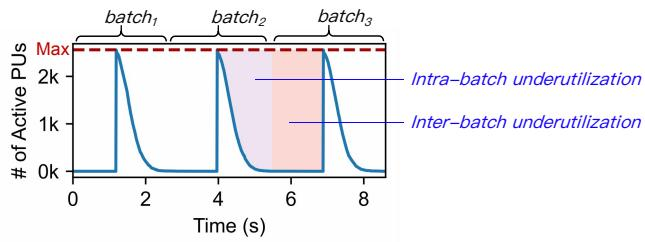  
Figure 1: The active PU count over time in a PIM-capble ANNS strawman system. The red dashed line shows the maximum PU count (2560). In an ideal case, the blue line should closely follow the red dashed line as much as possible.

RISC-based processing units (PUs1), with each PU capable of supporting up to 16 parallel threads. Equipped with 20 UPMEM modules, a single server can provide a total of 2,560 PUs (supporting over 40,000 threads) and deliver an aggregate memory bandwidth of 2 TB/s.

However, due to the architectural differences between UP-MEM and CPU/GPU, simply shoehorning existing ANNS systems into UPMEM can only achieve 18.2% of the hardware’s theoretical throughput cap (see §2.3), and the number of active PUs is zero for more than 65% of the time (Figure 1). We analyze that this under-utilization stems from the deficiency of batching paradigm (§2.3), including the following two key factors:

• Inter-batch under-utilization, caused by batches’ gang scheduling. Due to UPMEM’s reuse of the system DDR bus, it currently does not natively support concurrent memory access by both the CPU and PUs; see §2.2. As a result, existing applications [8, 9, 16, 25, 27, 30, 38, 43, 51, 54] typically rely on batching paradigm, where the CPU first copies all necessary data to UPMEM, and then gang-schedules all PUs to run. This leads to a gap between two batches where PUs are unable to perform computations.

• Intra-batch under-utilization, caused by PU load unbalance within a batch. Although UPMEM enjoys a strong aggregated multi-core performance, its single-core capability is rather weak. Unlike CPUs, where multiple cores can access each other through the shared memory architecture, UPMEM hardware restricts PUs from mutual access. Thus, uneven load distribution among PUs may cause some straggler PUs to become the performance bottleneck for the entire batch.

To this end, we propose PIMANN, an ANNS system designed to fully harness UPMEM’s potential. Its core idea is breaking the traditional batching scheduling paradigm and adopting a fine-grained, per-PU scheduling paradigm. We observe that the necessity of existing batch gang-scheduling arises from the hypothesis that CPU and PUs can only communicate at the boundary of batches due to their mutually exclusive access to the shared DDR bus. Under this paradigm, once a PIM kernel (i.e., a batch of tasks) is launched, it must be assumed that the PU always retains control of the shared bus until the kernel completes. However, this constraint could be relaxed, with our key observation that each PU has an additional, undocumented, and little-known control interface (originally used for launching and synchronizing PU programs), which could be retrofitted for fine-grained arbitration of DDR bus access.

With this key idea, we propose persistent PIM kernel (§4.2) to address inter-batch under-utilization. persistent PIM kernel allows continuous sending of individual ANN requests to different PUs for computation in runtime. Unlike the original batch gang-scheduling approach, where there is a pause between two batches, our approach ensures that UPMEM remains uninterrupted throughout the entire process. Specifically, by modifying the UPMEM driver, persistent PIM kernel carefully coordinates the access to the corresponding memory (i.e., MRAM) by either the CPU or PU through each PU’s control interface. Due to the limited shared bus bandwidth (∼0.41 GB/s), the CPU or PUs may experience prolonged data stalls when attempting to gain bus control while the other is holding it. To minimize this data stall, PIMANN employs coroutine techniques on the CPU, which hides the bus acquisition time and parallelizes data transmission and computation.

To cope with intra-batch under-utilization, PIMANN introduces per-PU query dispatching (§4.3) to dispatch queries to individual PUs based on their real-time load to achieve well load balance. Since PUs follow a share-nothing architecture, PIMANN employs a selective replication data placement scheme, which replicates hot clusters across multiple PUs. With the help of fine-grained per-PU scheduling, PIMANN enables 1) live adjusting data placement without downtime based on the updated hotness information, and 2) dynamically dispatching queries to different replicas based on the real-time load of PUs.

Our evaluation on off-the-shelf UPMEM shows that, PI-MANN can improve the throughput by up to 10.4× compared with Faiss-CPU [22] and by up to 2.4× compared with a PIM-capable ANNS system based on the batching paradigm. Compared to a pure-GPU-storage system, Faiss-GPU [22], PIMANN can also improve the throughput by up to 3.7×.

## 2 Background and Motivation

## 2.1 Approximate Nearest Neighbor Search (ANNS)

By 2030, humanity will enter the YB-scale data era, with more than 90% being unstructured [33]. ANNS is the primary method for retrieving useful information from massive unstructured data. ANNS has wide applications in various scenarios. Initially, they were used in traditional information retrieval tasks such as search [59] and recommendation [66] (e.g., image-based search [7] and content retrieval [19]). In recent years, as large language models (LLMs) have emerged as a new frontier of artificial intelligence, ANNS has become a core infrastructure to carry knowledge for LLMs. Through retrieval-augmented generation (RAG) [48], they assist LLMs in retrieving credible, accurate, and timely knowledge, helping to mitigate hallucinations [64].

ANNS exhibits an extremely high memory intensity. First, ANNS needs to repeatedly read large volumes of vectors from memory, causing massive memory access. For example, Alibaba handles approximate searches on billions of data points [69], while Microsoft performs approximate queries on datasets with hundreds of billions of entries [1]. Second, ANNS have an extremely low compute-to-memory access ratio. Typical ANNS algorithms rely on maintaining in-memory data structures to quickly identify potential neighbors. Currently, ANNS algorithms can be broadly classified into two categories, cluster-based [36] and graph-based [68]. Both rely on traversing data points within their respective data structure (i.e., clusters or graphs), resulting in a compute-to-memory access ratio close to 1:1.

In this paper, we explore ANNS systems on UPMEM, with a specific focus on cluster-based algorithms, which are wellsuited to UPMEM’s massive parallel threading capabilities. Specifically, we focus on the Inverted File with Product Quantization (IVFPQ) algorithm, as it incorporates the Product Quantization (PQ) technique on standard cluster algorithms to further reduce computational overhead. Another category of ANNS algorithms (graph-based methods) are not suitable for UPMEM, because they introduce significant communication overhead when implemented on PIM architectures. This limitation is caused by the constrained communication bandwidth on commodity UPMEM systems—only 0.41 GB/s (from our test results) for both inter-PU and CPU-PIM data transfers. In fact, to the best of our knowledge, there are no existing implementations of graph-based ANNS on PIM devices.

Figure 2 shows an example of the IVFPQ algorithm, which includes two phases: the offline phase and the online phase.

Offline Phase: The offline phase is responsible for preparing the dataset for efficient search by building a cluster-based index. This phase includes two steps: ➀ Inverted File (IVF) and ➁ Product Quantization (PQ).

➀ The IVF step partitions the whole dataset into C clusters using methods such as K-means. Once the clusters are formed, ➁ the PQ step calculates the residuals, which are defined as the differences between each data point x and its corresponding cluster centroid c. It then compresses these residuals by dividing the residual vectors into M subvectors and then encoding them using a codebook. Each encoded point serves as an identifier that has a one-to-one mapping with a specific codeword in the codebook. In practical implementations, the identifiers are often encoded as 8-bit unsigned integers (uint8), enabling a compression rate of $\frac { 4 D } { M }$

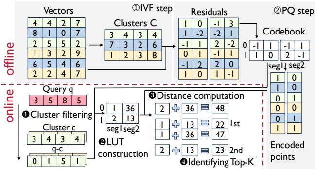  
Figure 2: IVFPQ example.

Online Phase: Given a query vector q, the online phase includes 4 steps to find k vectors closest to q. ➊ Cluster filtering, which finds nprobes clusters that are closest to q by computing the distances between their centroids and q. ➋ Look-up table (LUT) construction. The LUT serves to store pre-computed data, significantly optimizing the search process by converting computing to memory lookups. Specifically, each element $\mathrm { L U T } [ j ] [ i ]$ represents the distance between the j-th vector in the codebook $B _ { i } ,$ where i denotes the i-th segment of residual vectors. To derive the distance from q to a given data point x, one can refer to and sum up the values in LUT as follows:

$$
L _ { 2 } ( q , x ) = L _ { 2 } ( q - c , r ) = \sum _ { i = 0 } ^ { M - 1 } \mathrm { L U T } [ e _ { i } ] [ i ] ,
$$

where r and e· denote the residual and encoded vectors of x, respectively.

➌ Distance computation. Leveraging LUTs, the distances from q to all data points within the filtered clusters are calculated. ➍ Identifying Top-K, which sorts all computed distances and selects the k vectors with the shortest distances as the approximate nearest neighbors.

## 2.2 Commodity PIM hardware architecture

Processing-in-Memory (PIM) is a classic way to deal with the famous “memory wall” problem [6]. For a long time, various PIM architectures have been proposed [17]. However, prior to the release of UPMEM in 2022, these PIM architectures were confined to simulations or FPGA-based verification. UPMEM marked a significant milestone as the world’s first commercially available real-world PIM hardware, bridging the gap between theoretical concepts and practical applications. Consequently, our work mainly focuses on leveraging UPMEM to build ANNS system.

In this section, we mainly introduce the following three hardware features of UPMEM.

Multi-core architecture. Figure 3a shows the architecture of the UPMEM-capable system and inner-UPMEM-DIMM details. UPMEM are connected to the CPU through DIMM slots. An UPMEM DIMM is made up of 64 PIM units. As shown in Figure 3b, each unit has two main components: a memory bank (MRAM) and a general-purpose processing unit (PU) integrated with the bank. Each PU is a 32-bit inorder RISC-V core featuring a 14-stage pipeline and supporting up to 16 hardware threads. With 20 UPMEM DIMMs, a single server can harness a total of 2,560 PUs, accommodating over 40,000 threads and achieving an aggregate memory bandwidth of 2.5 TB/s. Due to limitations in hardware fabrication, PUs in the current generation of PIM hardware have the following three issues: 1) PU only offers integer-native ALUs; float-related operations are implemented via software. This causes UPMEM to have a much slower FLOPS compared to integer operations. 2) All PUs adhere to a share-nothing architecture, meaning that each PU can only access data stored in its local memory bank. Currently, any communication between PU has to go through the host CPU.

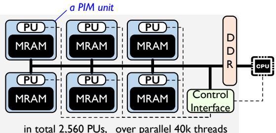  
(a) Architecture of UPMEM-capable system.

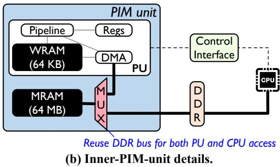  
Figure 3: Architecture of UPMEM-capable system and inner-PIM-unit details. The bold line represents DDR bus, and the dashed line represents control interface.

Two-level memory hierarchy. Each PIM unit contains two levels of memory internally, including 1) Working RAM (WRAM), and 2) Main RAM (MRAM). WRAM acts as the faster cache, made of SRAM, with a size of 64KB. MRAM has a substantially larger storage capacity (64MB), but it has slower access speeds compared to WRAM. PU cannot directly access MRAM; it must first bring data from MRAM to WRAM via the on-chip DMA engine.

Bus sharing on MRAM. MRAM receives access from both the CPU and the PU. The CPU is used for sending/collecting task data, while the PU is for PIM computing. Nevertheless, the DIMM-PIM architecture (such as UPMEM), which plugs PIM devices into DIMM slots, inherently lacks the support for simultaneous memory access by the host CPU and the PUs. Specifically, as shown in Figure 3b, each PIM unit reuses the DDR bus for both the PU and host CPU access. Due to the constraints of existing DDR bus protocols, which require deterministic latency behavior [61], simultaneous memory access by the CPU and PU is not feasible. This is because shared access alters the memory access latency, violating the strict timing guarantees of DDR protocols. To address this limitation, UPMEM hardware employs a multiplexer (MUX) for manual access arbitration. Specifically, MUX is a two-state register, namely CPU-side or PU-side, allowing exclusive access to the MRAM by the CPU or the PU, respectively. The state of MUX is controlled by the CPU through the control interface. With this design, it simplifies the integration of PIM into traditional systems while adhering to the requirements of DDR bus protocols.

## 2.3 Motivation

Batching paradigm of current PIM programming model. The PIM programming model adheres to an accelerator model, similar to that of GPUs. Programmers prepare an execution program (referred to as a kernel) along with its data in advance and then launch it on the PIM device. The CPU communicates with PIM via the control interface, by sending commands such as starting/synchronizing kernels or querying the status of the running kernel (Figure 3b).

Currently, PIM-capable programs [12, 13, 39, 46, 49, 51] typically follow the batching paradigm. This paradigm stems from the limitation that the CPU can only interact with PIM’s MRAM at kernel boundaries—either before launching a kernel or after it completes. This restriction arises with the hypothesis that, once PUs are activated, PUs will retain the bus control until the kernel terminates. Thus, the CPU can not read/write PIM’s MRAM when PUs are running.

This batching paradigm includes three steps; see Figure 4. First, the CPU gets a buffer ready, filling it with a set of tasks (i.e., a batch) meant for each PIM unit, and sends the buffer to all PIM’s MRAM. Next, the CPU launches the PIM kernel, prompting the PIM units to start working on their assigned tasks and generate computing results. Lastly, the CPU collects all the running results and moves them into the host memory.

Impact of batching paradigm on ANNS. We investigate the deficiency of existing batching paradigm on ANNS. We implement a strawman ANNS system based on Faiss [22], by storing clusters on MRAM and offloading the distance computation step (➌ in the Online Phase) to PIM’s PUs. Figure 5 shows their performance on the SPACE-1B dataset [3]. We can observe that:

• Achieving only 18.2% of the theoretical performance. Figure 5a shows the computing performance of Faiss-CPU and PIM-capable strawman system. We observe that: 1) for the strawmen system, the throughput of PIM, although with tens of thousands of threads, is comparable with that of a standard CPU. 2) PIM’s performance is far from being fully utilized. If fully leveraged, PIM has the potential to achieve more than 5.5× the throughput. Further analysis reveals that there are two types of under-utilization as follows.

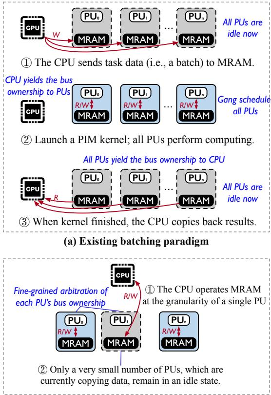  
(b) PIMANN: Per-PU scheduling paradigm  
Figure 4: Comparision of existing batching paradigm and PIMANN’s per-PU scheduling paradigm.

• Inter-batch under-utilization. Figure 1 shows the number of active PUs across time. Between two batches, there is a period of over 1.21s during which the number of active PUs is zero. This period accounts for 65% of a single batch’s duration. This is because, during this time, the CPU is copying the results of the previous batch from MRAM while transferring the input for the next batch to MRAM. Since the CPU and PUs cannot access the shared bus simultaneously, PUs cannot be activated.

• Intra-batch under-utilization. In batch scheduling, a batch of queries is distributed among the PUs. Figure 5b shows the number of tasks assigned to each PU. As shown in this figure, imbalanced workloads across PUs may cause some PUs to idle while others are overloaded, delaying the completion of the entire batch.

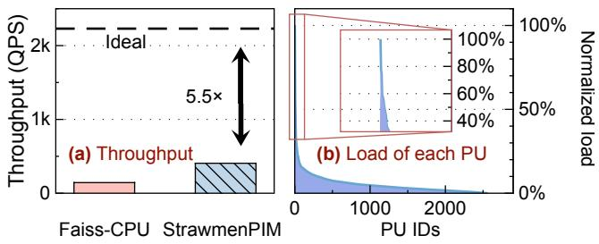  
Figure 5: Motivation. (a) The throughput of a standard CPU ANNS system (Faiss-CPU) and a strawmen PIM-capable system (StrawmenPIM). The dashed line denotes the ideal performance of UPMEM. (b) The load of each PU. The load values are normalized by the heaviest PU.

## 3 Key Idea & Challenges

Key Idea: Per-PU scheduling with fine-grained arbitration. Traditional PIM systems use batched gang scheduling where CPUs and PUs operate MRAM alternately, leading to the inefficiencies of inter/intra-batch underutilization (§2.3). These issues are rooted in the assumption that PUs retain control of the shared bus for the entire duration of the PIM kernel’s execution, from launch to completion. Differently, this assumption is broken with our key observation that: each PU in UPMEM has an additional control interface (originally used for control commands), which could be retrofitted for sending custom control messages to fine-grainedly coordinate the access of PU and CPU. Building on this insight, we propose a per-PU scheduling paradigm (Figure 4b) by manipulating the ownership of each PU unit’s MRAM, determining whether it is currently being read/written by PU/CPU.

Per-PU scheduling offers two advantages. First, it eliminates the idle state between two batches (Figure 1), effectively handling inter-batch underutilization. Each PU can be in one of two states: either performing computation or waiting for the CPU to copy data. Second, without gang scheduling, it enables dynamically dispatching each query to different PUs based on their real-time loads, thus achieving good load balance and avoiding intra-batch underutilization.

Challenges. However, achieving per-PU scheduling is not easy. First, the native driver does not allow reading from or copying data to PIM when PIM is running. Second, due to the limited read/write bandwidth between the CPU and the PU’s MRAM, switching a PU’s state may cause the CPU to experience a long stall. Third, although per-PU scheduling can dynamically send queries based on the current load of each PU, PUs do not share the same memory space. Therefore, an efficient data placement scheme needs to be designed to pre-distribute clusters across the PUs.

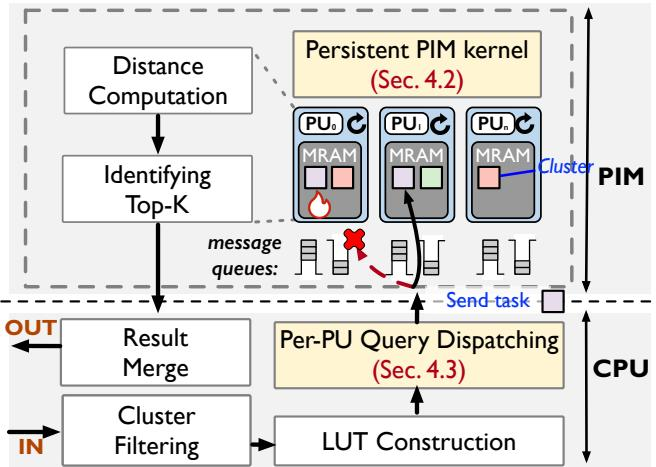  
Figure 6: Overview of PIMANN. This figure shows the workflow of an ANNS query in PIMANN. It supposes PU0 is overloaded. Our per-PU query dispatching will dispatch this query to the replica on PU1.

## 4 PIMANN Design

## 4.1 Overview

PIMANN architecture. Figure 6 shows the architecture of PIMANN. PIMANN offloads the most parallelizable distance computation step (see §2.1) of the entire IVFPQ process to UPMEM, while the other steps are still executed by the CPU. Each PU stores multiple IVF clusters and performs the corresponding distance computations.

To mitigate inter-batch underutilization, PIMANN introduces the persistent PIM kernel (§4.2), which launches a persistent kernel enabling continuous query processing without idle states between batches. Each PU can independently receive queries from the CPU continuously.

However, due to bus sharing, the native UPMEM driver does not support copying data to/from PIM when PIM is running. Based on our observation that the additional control interface can be retrofitted for fine-grained bus arbitration, we implement a hot transfer mechanism to transfer data between the CPU and PU when PIM is running (§4.2.1).

With bus arbitration, each PU can dynamically switch between two states: Running (performing computation) or Wait-CPUCopy (waiting for the CPU to copy data). These two states correspond to the ownership of the shared bus being held by either the PU or the CPU. We discuss how to switch two states safely and efficiently in §4.2.2.

To optimize energy efficiency during idle periods (i.e., when no queries are being processed), we also support transitioning from the persistent kernel to the normal kernel.

To mitigate intra-batch underutilization, we propose per-PU query dispatching (§4.3). With the help of bus arbitration, we can dispatch queries to individual PUs based on their real-time load. However, as PUs follow a share-nothing architecture, different PUs cannot access each other’s MRAM. Thus, we must tailor an efficient data placement scheme, preallocating each PU’s clusters in advance. PIMANN leverages a selective replication for data placement (§4.3.1), replicating high-popularity clusters among PUs. It also detects hotness shifts and dynamically adjusts data placement without shutting down the PIM (§4.3.2).

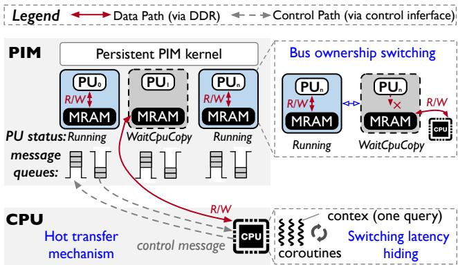  
Figure 7: Design of persistent PIM kernel. Each PU contiguously pulls tasks from the message queue and performs computation. The input/output data of tasks are transferred via the hot transfer mechanism, involving multiple bus ownership switches.

## 4.2 Persistent PIM kernel

Different from the existing batching paradigm which launches a separate PIM kernel for each batch of queries and lets the CPU copy data between two kernels, PIMANN only launches one persistent PIM kernel for all ANNS queries during system initialization. In this kernel, since we allow dynamic arbitration of per-PU bus during runtime, each PU can independently perform computation or data copying. Thus, the persistent PIM kernel design eliminates the idle copying time introduced by batch gang scheduling.

The main workflow of each PU continuously loops through the following steps:

➀Dequeue an ANNS request from the message queue.

➁Wait for CPU to copy the task data (e.g., LUT) to MRAM.

➂Switch to the Running state and perform computing.

➃Switch to the WaitCPUCopy state.

➄Wait for the CPU to copy the computing results.

Step ➀➁➄ require data transfer from the CPU to the PU while PUs are in the running state; step ➂➃ require switching the PU’s state (i.e., switching ownership of the shared bus). Therefore, we have designed the hot transfer mechanism (§4.2.1) and bus ownership switching scheme (§4.2.2), respectively.

## 4.2.1 Hot transfer between CPU and PIM

Next, we discuss how CPU and PUs transfer data to each other when PUs are running. This hot transfer mechanism includes two parts, with control and data paths separated: 1) The control path uses a custom message queue, implemented through the PU’s control interface link and isolated from the DDR bus. 2) The data path allows the CPU to directly read/write MRAM via the DDR bus (but requires holding the bus ownership).

Control path: Message queue implemented on the control interface. To achieve fine-grained per-PU scheduling, the most fundamental function lies in the ability of CPU-PU communication when PIM is running. By carefully reading through the UPMEM driver, we notice that the CPU’s read and write access to the WRAM is routed through an additional, undocumented control interface link (§2.2), completely bypassing the DDR bus. This hardware characteristic allows us to implement a message queue directly on WRAM for communication between the PU and the CPU.

This message queue has two limitations, which should be considered when designing our system. First, the message queue has a limited capacity (in the order of a few tens of bytes), In comparison, a common data structure in an ANNS query, LUT, has a typical size of 32 KB. To this end, we only store necessary metadata (e.g., query ID) or small control messages (e.g., ownership switching) in this queue. Other large messages (e.g., LUT) are directly written to MRAM. Second, as PIM does not have the ability to interrupt the CPU, PIMANN maintains dedicated CPU threads to poll all message queues of PUs to get notifications from PIM.

Data path: Exposing MRAM to CPU. The native UP-MEM driver does not support exposing MRAM to the CPU for direct read and write operations during PIM execution. We perform a thorough analysis of the driver and make the following two modifications: 1) exposing MRAM to CPU when PIM is running (enabling the CPU to directly read/write MRAM), and 2) constructing a mapping table that maps all variable symbols to their corresponding MRAM addresses (finding where should the CPU read/write).

For 1), all MRAM are viewed as multiple device files in the operation system, and mapped in the virtual memory space. We can obtain the base address of mmap files by implanting a recording function in the PIM startup path. Considering UPMEM adopts memory-level parallelism [44], all writes to MRAM should perform a transpose operation on the data to ensure that the data can be correctly transmitted to the same chip [44].

For 2), the main challenge is the lack of mapping from variable symbols to offsets in the mmap files. Our solution is as follows: before starting the PIM, we first use the standard MRAM copy interface (dpu\_copy\_to) to access the corresponding variables once, recording the corresponding addresses and caching them in the user program.

It should also be noted that the bandwidth of directly writing MRAM by CPU in the running state seems to be relatively low (0.41 GB/s). The reason is that: different from batching paradigm which could easily exploit the bank-level parallelism (8 PUs), our fine-grained per-PU scheduling means that data can be copied to only one PU’s MRAM at a time. Although per-8PU scheduling could achieve higher bandwidth, we abandon this approach for two main reasons. First, per-8PU scheduling incurs computation redundancy: if a cluster is split into 8 slices, each slice needs to maintain its own top-k queue, resulting in 8x computation redundancy. Second, per-PU scheduling already has a negligible data transfer time: Although per-PU may suffer from a relatively lower bandwidth, in our implementation, the time taken to copy data is negligible (please refer to the purple bar in Figure 15).

## 4.2.2 Per-PU bus ownership switching

In this subsection, we present how we safely and efficiently switch the state (i.e., bus ownership) of each PU in PIMANN.

Switching ownership safely. As stated in §2.2, the bus ownership is controlled by the MUX registers; we expose the mapping of each PU units’ MUX registers to userspace. Each MUX has two states: CPU-side and PU-side. If there is an inconsistency between the memory access and the MUX state, it may cause abnormal access by either the CPU or PU.

Thus, we next show how PIMANN ensure this consistency. We discuss two cases of PU state switching respectively: 1) WaitCPUCopy→Running (i.e., MRAM access ownership switching from CPU to PU), and 2) Running→WaitCPUCopy, reversely. The first case corresponds to the CPU copying the LUT table to the PU, and waiting for the PU to start the distance calculation. The second case occurs after the computation finishes, where the PU waits for the CPU to perform result aggregation.

For WaitCPUCopy→Running, in PIMANN, the CPU sends an ownership transfer message to the queue after completing the copy operation. Thus, the PU only needs to poll the message queue to receive the message, after which it can safely access the MRAM and perform computation.

For Running→WaitCPUCopy, since the PU itself cannot switch its MUX, it sends a message to the CPU via the queue. Upon receiving this message, the CPU switches the MUX and sends an ack message back to the PU. At this point, the PU can enter the WaitCPUCopy state safely.

To reduce the software stack overhead, PIMANN caches the MUX state for each PU in userspace. The interface for checking the MUX state directly reads from the cache. When switching a PU bus ownership, both the actual MUX state and its cached copy are updated simultaneously. Since only the CPU can modify the MUX state, cache inconsistency is not a concern.

Ownership switch in pairs. In our implementation, we discover a strange phenomenon: when the CPU directly accesses the MRAM of a certain PU, it sometimes causes the tasks on the adjacent PU to malfunction. This lead us to a reasonable speculation: two adjacent PUs may share a physical MUX register. It may be due to the special hardware circuit design of UPMEM that there is only one control interface for the MUXes of two adjacent PUs. We later confirm this speculation through experiments. As a result, we determine that the minimum switching granularity of PIMANN is two adjacent PUs. Thus, even if the current query only involves one PU, it is necessary to simultaneously switch the ownership of two adjacent PUs, resulting in a resource waste of the other adjacent PU.

To address this limitation and minimize resource waste, we propose the optimization of pairwise cluster slicing to ensure that adjacent PUs are always invoked simultaneously. Specifically, instead of assigning a single IVF cluster to a PU, each cluster is sliced into two smaller cluster slices and adjacent PUs are allocated segments from the same cluster. This ensures that when one PU in a pair is active, its neighboring PU is also active, thus maximizing hardware resource efficiency. We will refine this slicing strategy in the section of load balancing design (§4.3).

Hiding the switching latency. The per-PU bus ownership switching may experience significant latency if the required MUX ownership is not immediately available. The reasons are twofold. First, PU’s computing capability is weak. The clock frequency of PU is only O(100) MHz, so the task execution time of a single PU may be relatively long. If the PU is still executing a task, the switching time also includes the wait for the ongoing computation to complete, which can be substantial, reaching up to several milliseconds.

Second, the CPU-PIM communication latency is high. Even if the PU already releases the ownership, the CPU side cannot obtain it immediately. Instead, it has to poll the message queue on WRAM through a bandwidth-limited interface [2]; it takes 0.9 ms to poll the message queue of one rank (64 PUs). Thus, naively blocking the CPU thread is inefficient.

To mitigate this, we employ a coroutine-based optimization that allows the CPU to switch execution contexts to other tasks while waiting for ownership switching, thus hiding the switching latency. Specifically, our coroutine scheduling prioritizes tasks based on the two following principles. 1) Immediate ownership availability: coroutines associated with PUs whose bus ownership is already set to CPU side are prioritized for execution. 2) Predictive scheduling: for PUs whose MUX state is on the PU side, our scheduler estimates when the MUX state will switch based on the fixed execution time of PU tasks. Coroutines likely to have their ownership status become available soon are given higher priority. This estimation leverages the deterministic nature [28] of UPMEM’s in-order RISC cores, which have no caching or speculative execution.

## 4.3 Per-PU query dispatching

The design of the persistent PIM kernel enables us to dispatch queries to individual PUs based on their real-time load, thereby addressing intra-batch underutilization. However, since each PU follows a share-nothing architecture, different PUs cannot access each other’s MRAM. As a result, it is crucial to design an appropriate data (i.e., cluster) placement strategy. A naive approach, such as random assignment of clusters to PUs, often leads to significant load imbalances due to variations in cluster popularity.

To this end, PIMANN employs a selective replication data placement scheme. This scheme selectively replicates hot clusters across multiple PUs. In this section, we discuss: 1) how to choose clusters to replicate in §4.3.1, 2) how to live adjust the data placement when hotness shifts in §4.3.2, and 3) how to dispatch queries between replicas to achieve well load balance in §4.3.3.

## 4.3.1 Selective replication data placement

The selective replication data placement includes the following three steps.

Replicating high-popularity clusters. Clusters are replicated based on their popularity, which is quantified as the product of cluster size $( s _ { i } )$ and access frequency ( fi), because popularity is determined by the query time of a cluster and the query time is proportional to its size and its access frequency. The number of replicas for a cluster is determined by dividing its popularity $( p _ { i } = s _ { i } * f _ { i } )$ by the average PU load. Formally, for a high-popularity cluster i, its number of replicas replica $c o u n t _ { i } = p _ { i } / p _ { a \nu g }$ . where $\begin{array} { r } { p _ { a { \nu } g } = \frac { \sum _ { i } p _ { i } } { n } } \end{array}$ , n denotes the cluster count.

Slicing clusters for less memory fragmentation. As the size of MRAM is not necessarily an exact multiple of the cluster size, the previous strategy may lead to significant memory fragmentation. To address this problem, we divide clusters into smaller slices of uniform size. Specifically, MRAM is partitioned into fixed-length slots, each capable of holding one slice. This approach simplifies data allocation and minimizes memory fragmentation, especially given the variety in cluster sizes and dynamic insertion or deletion of clusters in online adjustment (§4.3.2).

Placement of cluster slices. Cluster slices are placed to ensure balanced utilization across PUs. Considering the constraint of pairwise bus ownership switching, we group adjacent PUs and distribute slices evenly among PU pairs, ensuring that the two adjacent PUs are always active simultaneously. We define a heat upper limit for each PU pair. The heat upper limit is a hyperparameter tradeoff the time spent on generating the placement with the degree of load balancing. Within this upper limit, all cluster slices are greedily assigned to maintain balanced workload distribution. In our practice, this simple greedy strategy can already achieve a well load balance; please see the evaluation section.

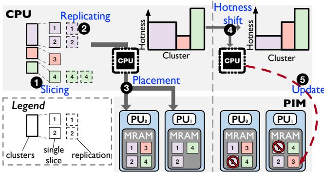  
Figure 8: Design of per-PU query dispatching.

## 4.3.2 Live adjustment of data placement

Over time, cluster hotness may shift, necessitating real-time adjustments to the data placement. Fortunately, the per-PU scheduling design of the persistent kernel enables us to redistribute clusters without shutting down the PIM.

Hotness shifting detection. We use a lightweight monitoring mechanism that tracks cluster access frequency in real time. Specifically, each cluster is assigned a frequency counter that increments when a query involves the cluster. We define a time window and threshold used to detect significant changes in cluster popularity. For example, within the past 1,000 queries (pre-defined time window), if the ratio of a cluster’s access frequency compared to the previous time window exceeds a factor of 2 (pre-defined threshold), whether the change is an increase or a decrease, it is considered that the cluster’s heat has changed significantly.

Adjustment strategy based on updated hotness. 1) For increased cluster hotness, additional replicas are created on underutilized PUs based on the updated hotness. Queries are then dynamically redirected to these new replicas. 2) For decreased cluster hotness, we remove redundant replicas to free up MRAM space; we prioritize the removal of replicas on heavily loaded PUs. Freed memory slots can be reallocated to clusters with increasing hotness.

## 4.3.3 Online request dispatching

We maintain a mapping table that records the cluster ID to PU IDs (i.e., all replicas) on the host side. The dispatcher always selects the replica with the lightest current load to send the request. The load of PUs are denoted by the queue depth of message queues.

## 5 Evaluation

## 5.1 Experimental Setup

The experiments are conducted on a server equipped with UPMEM modules. The server features two Intel Xeon Silver

4210 processors, providing a total of 20 physical cores running at 2.4 GHz. It is configured with 128 GB of DDR4 memory distributed across 4 DIMM slots. The UPMEM setup consists of 20 DIMM modules, containing a total of 2,560 PUs running at 400 MHz. Each PU supports 16 threads. The server runs Ubuntu 22.04 with kernel version 5.15. The host program is developed using the GCC 11.4.0 compiler, while the PIM program is built with UPMEM SDK 2024.2.0, based on Clang 12.0.0. Additionally, we use an NVIDIA RTX A6000 for evaluating GPU-based ANNS systems.

Competitors:We compare PIMANN with the following ANNS systems.

• Faiss-CPU [22]: It is a popular approximate nearest neighbor search library developed by Meta.

• PIMANN-Batch: There exists one UPMEM baseline system named DRIM-ANN [12], which leverages the batching paradigm, but this work does not provide open-source code. Therefore, we rigorously implemented it according to its paper and named it PIMANN-Batch in our paper.

• Faiss-GPU [22]: It is the GPU-capable version of Faiss, which stores all vectors in GPU memory and performs their computations directly on the GPU.

As for FPGA-based systems [34, 70], because they are not open source, and work [34] requires a customized IP core, for which we do not have the necessary experimental setup, we are unable to include a comparison with these systems.

Datasets: We use the following two large-scale datasets for evaluation:

• SIFT-1B [62]: It consists of 1 billion 128-dimensional vectors encoded into 32 segments.

• SPACE-1B [3]: It consists of 1 billion 100-dimensional vectors encoded into 20 dimensions.

Metrics: We compare different solutions based on: throughput (QPS), latency, and tail latency under the same recall@10. Here, recall@10 refers to the recall calculated for the top 10 items returned by ANNS systems. For Faiss-GPU, we also compare the QPS/Watt to evaluate the energy efficiency of different systems. And we compare the QPS/\$ to evaluate the cost efficiency.

Unless otherwise specified, we use the following default experimental configuration: selective replication defaults to using all MRAM memory; the number of clusters in IVF is set to 4096; the number of coroutine is 4; the slice size is 100 K; the default dataset is SPACE-1B; the default achieved recall@10 is 0.9.

## 5.2 Performance vs. Recall

We evaluate the throughput and latency of PIMANN, Faiss-CPU and PIMANN-Batch. PIMANN significantly outperforms the other two in all cases.

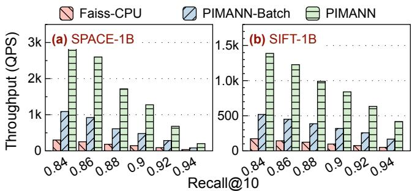  
Figure 9: (Exp #1) Throughput under different recalls.

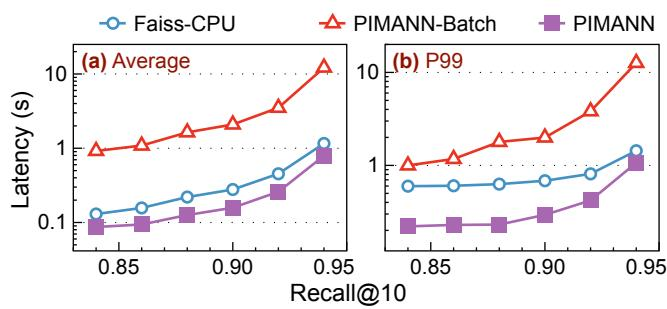  
Figure 10: (Exp #2) Latency under different recalls. (a) Average latency, (b) Tail latency

Exp #1: Overall throughput. Figure 9 shows the throughput of PIMANN, Faiss-CPU, and PIMANN-Batch on SPACE-1B and SIFT-1B. We can make the following observations:

1) The throughput of PIMANN-Batch is 2.4-3.7× higher than that of Faiss-CPU. This is because batch takes advantage of the High Memory Bandwidth of UPMEM.

2) Compared with PIMANN-Batch, introducing per-PU scheduling (PIMANN) can further boost throughput by 2.4- 2.9×. This is because PIMANN eliminates inter-batch underutilization caused by batch gang scheduling, and alleviates intra-batch under-utilization caused by PU load imbalance within a batch. As a result, the QPS of PIMANN improves by 5.9-10.4× compared with that of Faiss-CPU.

3) For cases with low recall (≤ 0.88), the QPS of all three systems on SPACE-1B is higher than on SIFT-1B; for cases with high recall, the opposite is true. This is because, in lowrecall cases, fewer clusters need to be queried on SPACE-1B compared to SIFT-1B to achieve the same recall rate, whereas in high-recall cases, the reverse holds true.

Exp #2: End-to-end latency. Figure 10 shows the average latency and the P99 tail latency of Faiss-CPU, PIMANN-Batch, and PIMANN under different levels of search recall requirements, ranging from 0.84 to 0.94. We can find that PIMANN exhibited significantly superior performance compared to CPU and PIMANN-Batch.

Compared to Faiss-CPU, although PIMANN-Batch is equipped with high-parallel UPMEM and enjoy a 2.4-3.7× throughput boost (Exp #1), its average latency is approximately 7.1 to 10.5× higher and its tail latency is about 1.7- 8.8× higher, mainly due to the additional inter-batch blockage latency. In contrast, PIMANN eliminates this additional latency by enabling fine-grained bus sharing, reducing average latency by 32-43% and tail latency by 26-63%. The independent per-PU scheduling enables the independent scheduling of tasks, reducing the end-to-end per-query latency.

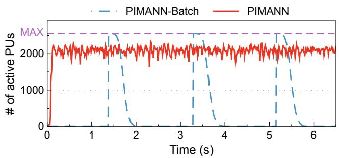  
Figure 11: (Exp #3) The number of active PUs over time.

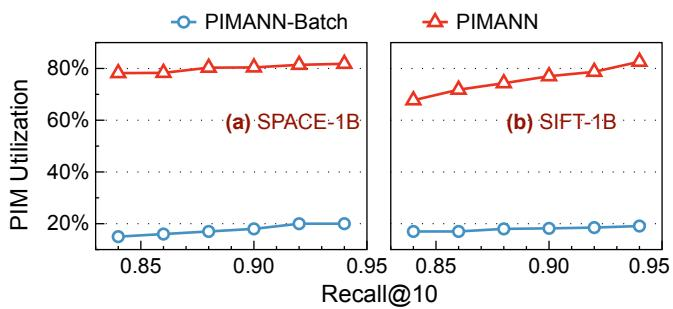  
Figure 12: (Exp #3) PIM utilization of different systems. Utilization is defined as the integral of the number of active PUs over time.

## 5.3 PIM utilization

Exp #3: PIM utilization. In this experiment, we revisit our motivation to investigate the PIM utilization of different systems. Figure 11 shows the number of active PUs over time. An active PU refers to a PU that is currently executing computing tasks. Here the used dataset is SPACE-1B; the recall rate is 0.9; other cases share a similar conclusion.

As shown in Figure 11, the number of active PUs in PI-MANN (the red line) remains basically stable over time, achieving a utilization around 80%. This stability is achieved because PIMANN overcomes the limitations of batch scheduling. When the CPU receives a query task and completes the corresponding stage, it can immediately send the task to the PU. After the PU finishes the task, it can promptly return the result to the CPU and wait for new tasks. The PU remains active from the time it receives a task until it completes the task. In contrast, in PIMANN-Batch, the number of active PUs exhibits periodic fluctuations (the blue dashed line). At the start of each batch, when all PUs are initially active, the number of active PUs peaks. Later, during the data copying phase between batches, all PUs yield the bus ownership and become inactive. Additionally, within a batch, due to the imbalanced task load among PUs, some PUs complete their tasks early and enter a waiting state, further reducing the number of active PUs.

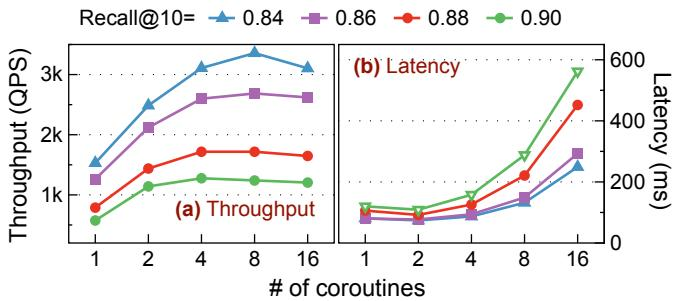  
Figure 13: (Exp #4): Effectiveness of coroutine-based bus ownership switching.

Furthermore, we integrate the number of active PUs over time, and based on this, calculate the PIM utilization rates of the two systems under different datasets and recall conditions; please see Figure 12. Under all datasets and all recall rates, PIMANN can achieve 65-83% of the PIM utilization, far surpassing the batch paradigm (∼20%). This shows the effectiveness and efficiency of PIMANN’s designs. The persistent PIM kernel technique eliminates the idle state between batches. On the other hand, the per-PU dispatching technique makes the load of each PU sufficiently balanced.

## 5.4 Techniques

Exp #4: Coroutine-based bus ownership switching. Figure 13 shows the performance with different coroutine counts. We can see that: 1) Compared to PIMANN without coroutine optimization (i.e., coroutine count=1), PIMANN with this optimization can yield around 3× better throughput. A moderate coroutine count can slightly reduce request latency, as coroutines help hide the latency associated with shared bus ownership switching. 2) However, an excessive number of coroutines increases the system’s scheduling overhead, which negatively impacts both throughput and latency.

Exp #5: Effect of selective replication. Figure 14a shows the impact of selective replication technique in per-PU dispatching of PIMANN. Compared to the system without replication, which causes a single PU to become a bottleneck, PIMANN can use the replication technique to prevent hotspot clusters from concentrating on a few PUs, achieving better load balancing. Figure 14b shows the throughput under different memory capacity budgets, and throughput increases with the budget.

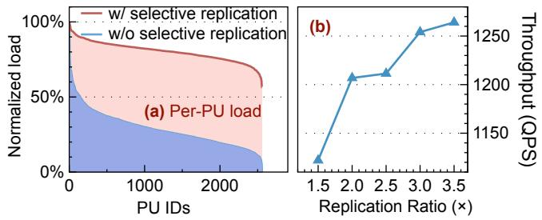  
Figure 14: (Exp #5): Effect of per-PU dispatching. (a) Per-PU load w/ or w/o selective replication, (b) Throughput with different capacity budgets.

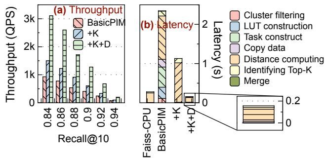  
Figure 15: (Exp #6): Contributions of techniques. (a) Throughput, (b) Latency breakdown of a query. Design techniques are cumulative. BasicPIM: a version of PIMANN-Batch w/o selective replication; K: persistent PIM kernel; D: per-PU query dispatching.

Exp #6: Contributions of individual techniques. Figure 15 shows the contribution of each individual technique to the endto-end performance. We only show the result of SPACE-1B, while SIFT-1B shares a similar conclusion.

We evaluate the throughput (Figure 15a) and latency breakdown (Figure 15b) of the system by gradually adding the persistent PIM kernel (abbr. as K) and the per-PU query dispatching technique (abbr. as D) to a baseline version of PIMANN-batch (called BasicPIM, which forbids the selective data replication optimization).

From Figure 15, we can observe that: 1) in all cases, both techniques have achieved positive performance gains. Specifically, the persistent PIM kernel technique has increased the throughput by 30% to 70%; by introducing the per-PU query dispatching, it further increases the throughput by 88% to 112%. 2) The persistent PIM kernel technique reduces the time in all stages except for distance computation, since it overcomes the inter-batch wait time of batch scheduling. 3) By introducing per PU query scheduling, distance computation time is also greatly reduced. The main reason is that this technique leads to a more balanced load distribution between PUs.

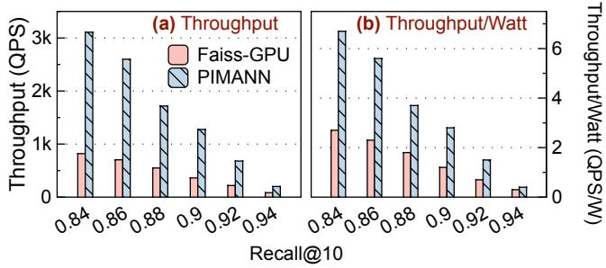  
Figure 16: (Exp #7) Comparision with GPU-based system. (a) Throughput, (b) Power Efficiency.

Table 1: (Exp #8): Cost efficiency comparison of different solutions.
<table><tr><td>Solution</td><td>Price ($)</td><td>QPS</td><td>QPS/$</td></tr><tr><td>Faiss-CPU</td><td>1,500</td><td>144</td><td>0.096</td></tr><tr><td>Faiss-GPU</td><td>9,685</td><td>478</td><td>0.049</td></tr><tr><td>PIMANN</td><td>5,473</td><td>1,276</td><td>0.233</td></tr></table>

## 5.5 Comparison with GPU-based systems

Exp #7: Comparison with Faiss-GPU. We compare PI-MANN and Faiss-GPU in terms of performance and power efficiency on the SPACE-1B dataset; see Figure 16. It is worth noting that there is a huge gap in peak computing resources between UPMEM and GPU. The GPU is equipped with 10,752 cores and has a computing power of up to 38.7 TFLOPS, while UPMEM can only achieve an integer processing capacity of 1 TOPS [65]. In terms of power consumption, the total power consumption of UPMEM is 462W [24]. In contrast, the power consumption of the RTX A6000 GPU is approximately 300W. The current high power consumption of UPMEM is mainly influenced by hardware fabrication, but it can be significantly reduced with future PIM designs. However, even with such a large power gap, as shown in Figure 16, the throughput of PIMANN is still 2.4 to 3.7× compared with that of the GPU, and the power efficiency is increased by 1.6 to 2.5× compared with that of the GPU. It is worth noting that Faiss-GPU requires storing all vectors in the GPU memory, so PIMANN has a much better capacity scalability.

## 5.6 Cost efficiency

Exp #8: Cost efficiency. As shown in Table 1, we evaluate the cost-effectiveness of three solutions using QPS/\$. PIMANN outperforms both Faiss-CPU and Faiss-GPU. Compared to Faiss-CPU, PIMANN’s price is higher, but its throughput is significantly improved, leading to a 2.4× increase in costeffectiveness. Compared to Faiss-GPU, PIMANN achieves both the lower price and the higher throughput, resulting in a 4.8× improvement in cost-effectiveness.

## 6 Discussion

Available for the next generation of UPMEM: Our approach is fundamentally decoupled from specific architectural implementation details of the UPMEM platform. Instead, it leverages intrinsic hardware capabilities that are inherent to the underlying PIM infrastructure. Consequently, potential architectural modifications to UMPEM would not necessitate revisions to our proposed design.

The core of our methodology relies exclusively on the standardized control interface exposed by each PU. As it serves as the fundamental mechanism through which the host CPU issues critical control commands like launching PIM kernels, it is guaranteed to persist across future iterations of the UMPEM platform.

Other PIM architectures: We evaluate our framework on the UPMEM platform, which is the first commercially available real-world PIM hardware. And we observe that other PIM architectures [41, 45, 52, 56, 58] also exhibit similar characteristics to UPMEM. In future work, we will evaluate our framework on these platforms as conditions permit.

## 7 Related Work

We organize the related work into two types: 1) with similar goal and different mechanism, which uses other hardware to optimize ANNS systems, and 2) with different goal and similar mechanism, which uses PIM for other applications.

ANNS systems built on CPU, GPU, or FPGA. Faiss [22] and Milvus [67] are two widely used open-source vector databases. Both support CPU and GPU, but they are also restricted by the memory capacity.

DiskANN [35] and HM-ANN [60] all expand the memory of a single machine to support vector storage with a larger capacity. DiskANN extends DRAM with SSDs, forming a two-layer memory structure consisting of DRAM and SSD. It modifies the neighbor pruning algorithm of nodes, enabling free control over the scale of edge pruning, and adapts to the poor random access performance of SSDs through techniques such as cache prefetching. HM-ANN expands memory using heterogeneous memory and maps the hierarchical design of HNSW onto the memory hierarchy. The upper layer is placed on DRAM, and the bottom layer is placed on heterogeneous memory.

CAGRA [55], BANG [40] and RUMMY [71] use GPU to build ANN systems. CAGRA has designed a new indexing algorithm to make full use of the parallel processing capabilities of the GPU: it first calculates the kNN graph [21], and then prunes and reorders based on the kNN graph to build the index. However, the expensive GPU memory limits the scale of vectors. BANG focuses on graph-based ANNS, which requires much more memory than cluster-based systems. To extend GPU memory, BANG uses a storage structure similar to that of DiskANN. It stores compressed vectors in the

GPU video memory and the full set of vectors in DRAM for full distance computation. RUMMY solves the problem of redundant and inefficient data transmission between video memory and memory through techniques such as pipeline rearrangement.

Apart from CPUs and GPUs, there are also works that use FPGAs and SmartSSDs to build ANN systems. FANNS [37] achieves lower costs and power consumption than GPU through multi-stage automatic tuning, but it is still limited to a single card. DF-GAS [70] extends vector retrieval to multiple FPGAs, improving memory access efficiency through data prefetching and latency optimization. It also enhances query performance by enabling parallel searches that integrate both the entire graph and its subgraphs. Vstore [50] utilizes computable SSDs to complete graph-based approximate retrieval. SmartSSDs [63] are extended to multiple computable SSD devices. It has designed a multi-disk task scheduling strategy to ensure load balancing and a search pruning strategy to reduce unnecessary computations. CXL-ANNS [34] uses the CXL link protocol to connect memory pools and adopts caching and prefetching techniques to reduce the impact of the high latency of the CXL pooled memory.

Other systems using emerging PIM hardware. Numerous explorations have been made to build applications in different fields on PIM. 1) In the field of databases, PID-Join [51] utilizes PIM to implement the join operator and proposes a method for rapid communication among PIM nodes. Work [8] utilized PIM to address large table scan. Work [9] used PIM for query compilation. PIM-tree [38] designed an ordered index for PIM systems. 2) In the field of programming library, TransPimLib [27] provided a library of transcendental functions, such as trigonometric functions, logarithms, powers, etc. PID-Comm [54] proposes a framework for collective inter-PE communication designed for PIM-enabled DIMMs. 3) In the field of machine learning, work [16] implements two CNN algorithms, eBNN and YOLO3, on UPMEM. 4) In the field of scientific computing, UPMEM BLAST [43] deploys a molecular biology software on UPMEM. SparseP [25] provided a sparse matrix-vector multiplication library.

## 8 Conclusion

This paper presents PIMANN, an ANNS system designed to fully exploit the potential of UPMEM. By introducing the persistent PIM kernel and per-PU dispatching techniques, PIMANN effectively addresses the inefficiencies of traditional batching scheduling in PIM-based ANNS systems. The experimental results demonstrate its superiority in terms of throughput, latency, and resource utilization compared to existing CPU-based, GPU-based, and batching-paradigm-based solutions. PIMANN not only provides a promising approach for accelerating ANNS on PIM hardware but also offers valuable insights for future research in the intersection of memorycentric computing applications.

## Acknowledgement

We appreciate our shepherd and anonymous reviewers’ constructive comments for improving the quality of this paper. This work is supported by Beijing Natural Science Foundation (Grant No. 4254083), National Natural Science Foundation of China (Grant No. U23A20299), PCL-CMCC Foundation for Science and Innovation (Grant No. 2024ZY1C0030) and Kuaishou.

## A Artifact Appendix

## Abstract

The artifact consists of the C++ code of PIMANN and baseline systems used in evaluation. For ease of experiment reproduction and result visualization, we also provide runner scripts and plotter scripts accordingly. It is intended for validating the claims made in the paper and facilitating further research on Processing-in-Memory (PIM) hardware.

## Scope

At a high level, the artifact allows its users to validate the following major claims in the paper:

• Major Claim 1: PIMANN outperforms baselines in terms of query throughput and latency. (Exp #1,#2,#7,#8)

• Major Claim 2: PIMANN overcomes batch scheduling limitations via fine-grained per-PU scheduling. (Exp #3,#6a)

• Major Claim 3: PIMANN’s techniques synergistically improve performance.(Exp #4,#5,#6b)

## Contents

The artifact contains source code, scripts, and README files. Below, we explain the contents aside from the README.

Source codes. The major part of source codes are well documented, facilitating further research.

common/ # shared files for both DPU and host programs   
# DPU kernel functions   
# host programs interacting with DPU kernels   
L faiss\_upmem/ # modified FAISS   
# test scripts and plotting scripts   
# main program entry point  
Figure 17: Directory structure of our project.

Scripts. The scripts directory contains runner scripts for running experiments and plotter scripts for visualizing the results. Scripts directly reproducing the experiments (i.e., AE scripts) in the paper are in the ae subdirectory. Scripts not in the ae subdirectory serve as building blocks of the AE scripts, such as running a single experiment.

## Hosting

PIMANN’s artifact repository is hosted on GitHub at PIM-ANNS on the main branch. The first usable commit version is the initial commit (af44d9f). However, due to possible future bugfixes and updates, please always use the latest commit.

## Requirements

Hardware Requirements: To run this project, a server equipped with UPMEM hardware (https://www.upmem.com/) is required. Software Requirements: Additionally, we also need setup the following software environment.

• UPMEM-SDK: This project uses a modified version of UPMEM-SDK based on the 2024.2 release.

```shell
cd third - party / upmem -2024.2.0 - Linux - x86_64
cd src / backends
3 bash ./ install . sh
```

• FAISS: The IVFPQ index algorithm reuses portions of the FAISS codebase. For better UPMEM compatibility, we provide a modified version of FAISS based on: https://github.com/ facebookresearch/faiss. Install like FAISS.

cd third - party / faiss\_upmem   
2 cmake -B build .   
3 make -C build -j faiss   
4 make -C build install

• Boost library: This project utilizes Boost’s coroutine library. Thus, please install the libboost with the following commands.

sudo apt - get update   
2 sudo apt install libboost -all - dev

## Experiment workflow

## Building PIMANN from source

Please simply use the CMake building system.

## Hello-world example

To verify that everything is prepared, you can run a hello-world example that verifies PIMANN’s functionality, please run the following command:

```batch
bash AE / hello_world . sh
```

It will run for approximately 1 minute and, on success, output something like below:

yyyy -mm - dd hh : mm : ss   
2 json\_path : PIMANN / config . json   
query path is dataset / space / query10K . i8bin   
4 query\_num : 10000 , dim : 100   
5 searching SPACE1M , nprobe = 11   
6 The command ./ main 11 completed successfully

If you can see this output, then everything is OK, and you can start running the artifact.

## Run all experiments

We provide convenient scripts for running either all experiments collectively (#1) or individual experiments selectively (#2).

#1: Running the all-in-one script. We provide an all-in-one AE script for running all experiments end-to-endly:

AE / run\_all . sh

This script will run for approximately 8 hours and store all results in the “AE” directory.

#2: Running specific experiments. If you wish to replicate only specific experiments, we provide nine separate scripts corresponding to different experimental settings. These scripts, located in the AE/exps/expX.sh files (where X = 1, 2, ..., 8), can be used to reproduce all the figures presented in our paper. The name of all scripts (i.e., expX.sh) are aligned with those presented in our main paper.

If you want to run individual experiments, please refer to these script files and the comments in them (which describes the relationship between experiments and figures/tables).

Estimated running hours of experiments are shown in Table 2.

Table 2: Estimated time of all experiments
<table><tr><td>Experiment Description</td><td>Time(hours)</td></tr><tr><td>Exp #1: Overall throughput</td><td>1.5</td></tr><tr><td>Exp #2: End-to-end latency</td><td>1.5</td></tr><tr><td>Exp #3:PIM utilization</td><td>1.5</td></tr><tr><td>Exp #4: Coroutine</td><td>1.0</td></tr><tr><td>Exp #5: Selective replication</td><td>0.5</td></tr><tr><td>Exp #6: Individual techniques</td><td>1.0</td></tr><tr><td>Exp #7: Comparison with Faiss-GPU</td><td>0.5</td></tr><tr><td>Exp #8: Cost efficiency</td><td>0.2</td></tr></table>

## Plot all figures & tables

We provide two alternative ways to visualize the experimental results.

#1: (Recommended) All-in-one jupyter notebook for Visual Studio Code users. Please install the Jupyter extension in VSCode. Then, please open AE/figures/plot.ipynb. Please activate the virtual environment (.venv/bin/python) by running the following commands.

source . venv / bin / activate

Then, you can run each cell from top to bottom. Each cell will plot a figure or table (see Figure 18). Titles of these figures and tables are consistent with those in the paper.

## #2: Traditional python plotting scripts.

We provide a traditional plotter script. Please run it in the AE directory:

cd AE / figures   
python3 plot . py

The command above will plot all figures and tables by default, and the results will be stored in the AE/figures directory (Figure 19). So, please ensure that you have finished running the all-in-one AE script before running the plotter.

The plotter further allows users to specify particular figures or tables to generate by providing supplementary command-line arguments. For example:

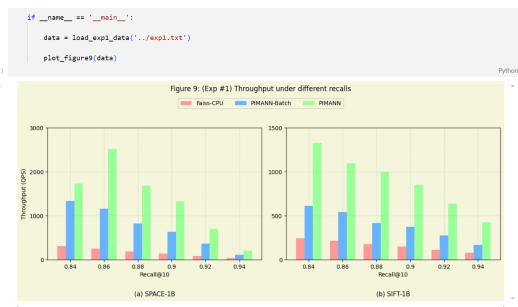  
Figure 18: Visualizing results with the all-in-one Jupyter notebook.

Figure 19: Visualizing results with the conventional script.

python3 plot . py exp1 exp2

Please refer to plot.py for accepted arguments.

python3 plot . py help

## References

[1] Microsoft Research talk: Approximate nearest neighbor search systems at scale. [EB/OL].

[2] The Software Development Kit for programming and using the DPU provided by the UPMEM Acceleration platform.

[3] SPACEV1B: A billion-Scale vector dataset for text descriptors. https://github.com/microsoft/SPTAG/tree/ main/datasets/SPACEV1B, 2021.

[4] Ameer MS Abdelhadi, Christos-Savvas Bouganis, and George A Constantinides. Accelerated approximate nearest neighbors search through hierarchical product quantization. In 2019 International Conference on Field-Programmable Technology (ICFPT), pages 90–98. IEEE, 2019.

[5] Junwhan Ahn, Sungpack Hong, Sungjoo Yoo, Onur Mutlu, and Kiyoung Choi. A scalable processing-in-memory accelerator for parallel graph processing. In Proceedings of the 42nd Annual International Symposium on Computer Architecture, pages 105–117, 2015.

[6] Junwhan Ahn, Sungjoo Yoo, Onur Mutlu, and Kiyoung Choi. Pim-enabled instructions: A low-overhead, locality-aware processing-in-memory architecture. ACM SIGARCH Computer Architecture News, 43(3S):336–348, 2015.

[7] Dimitrios Androutsos, Konstantinos N Plataniotis, and Anastasios N Venetsanopoulos. A novel vector-based approach to color image retrieval using a vector angular-based distance measure. Computer Vision and Image Understanding, 75(1- 2):46–58, 1999.

[8] Alexander Baumstark, Muhammad Attahir Jibril, and Kai-Uwe Sattler. Accelerating large table scan using processing-inmemory technology. Datenbank-Spektrum, 23(3):199–209, 2023.

[9] Alexander Baumstark, Muhammad Attahir Jibril, and Kai-Uwe Sattler. Adaptive query compilation with processingin-memory. In 2023 IEEE 39th International Conference on Data Engineering Workshops (ICDEW), pages 191–197. IEEE, 2023.

[10] Amirali Boroumand, Saugata Ghose, Minesh Patel, Hasan Hassan, Brandon Lucia, Rachata Ausavarungnirun, Kevin Hsieh, Nastaran Hajinazar, Krishna T Malladi, Hongzhong Zheng, et al. Conda: Efficient cache coherence support for near-data accelerators. In Proceedings of the 46th International Symposium on Computer Architecture, pages 629–642, 2019.

[11] Amirali Boroumand, Saugata Ghose, Minesh Patel, Hasan Hassan, Brandon Lucia, Kevin Hsieh, Krishna T Malladi, Hongzhong Zheng, and Onur Mutlu. Lazypim: An efficient cache coherence mechanism for processing-in-memory. IEEE Computer Architecture Letters, 16(1):46–50, 2016.

[12] Mingkai Chen, Tianhua Han, Cheng Liu, Shengwen Liang, Kuai Yu, Lei Dai, Ziming Yuan, Ying Wang, Lei Zhang, Huawei Li, and Xiaowei Li. Drim-ann: An approximate nearest neighbor search engine based on commercial dram-pims, 2024.

[13] Sitian Chen, Amelie Chi Zhou, Yucheng Shi, Yusen Li, and Xin Yao. Memanns: Enhancing billion-scale anns efficiency with practical pim hardware, 2024.

[14] Rongxin Cheng, Yifan Peng, Xingda Wei, Hongrui Xie, Rong Chen, Sijie Shen, and Haibo Chen. Characterizing the dilemma of performance and index size in billion-scale vector search and breaking it with second-tier memory, 2024.

[15] Benjamin Y Cho, Jeageun Jung, and Mattan Erez. Accelerating bandwidth-bound deep learning inference with main-memory accelerators. In Proceedings of the International Conference for High Performance Computing, Networking, Storage and Analysis, pages 1–14, 2021.

[16] Prangon Das, Purab Ranjan Sutradhar, Mark Indovina, Sai Manoj Pudukotai Dinakarrao, and Amlan Ganguly. Implementation and evaluation of deep neural networks in commercially available processing in memory hardware. In 2022 IEEE 35th International System-on-Chip Conference (SOCC), pages 1–6. IEEE, 2022.

[17] Stephen Deering, Deborah L Estrin, Dino Farinacci, Van Jacobson, Ching-Gung Liu, and Liming Wei. The pim architecture for wide-area multicast routing. IEEE/ACM transactions on networking, 4(2):153–162, 1996.

[18] Alexandar Devic, Siddhartha Balakrishna Rai, Anand Sivasubramaniam, Ameen Akel, Sean Eilert, and Justin Eno. To pim or not for emerging general purpose processing in ddr memory systems. In Proceedings of the 49th Annual International Symposium on Computer Architecture, pages 231–244, 2022.

[19] T Dharani and I Laurence Aroquiaraj. Content based image retrieval system using feature classification with modified knn algorithm. arXiv preprint arXiv:1307.4717, 2013.

[20] Safaa Diab, Amir Nassereldine, Mohammed Alser, Juan Gómez Luna, Onur Mutlu, and Izzat El Hajj. A framework for high-throughput sequence alignment using real processing-inmemory systems. Bioinformatics, 39(5):btad155, 2023.

[21] Wei Dong, Charikar Moses, and Kai Li. Efficient k-nearest neighbor graph construction for generic similarity measures. In Proceedings of the 20th international conference on World wide web, pages 577–586, 2011.

[22] Matthijs Douze, Alexandr Guzhva, Chengqi Deng, Jeff Johnson, Gergely Szilvasy, Pierre-Emmanuel Mazaré, Maria Lomeli, Lucas Hosseini, and Hervé Jégou. The faiss library. arXiv preprint arXiv:2401.08281, 2024.

[23] Duncan G Elliott, Michael Stumm, W Martin Snelgrove, Christian Cojocaru, and Robert McKenzie. Computational ram: Implementing processors in memory. IEEE Design & Test of Computers, 16(1):32–41, 1999.

[24] Yann Falevoz and Julien Legriel. Energy efficiency impact of processing in memory: A comprehensive review of workloads on the upmem architecture. In European Conference on Parallel Processing, pages 155–166. Springer, 2023.

[25] Christina Giannoula, Ivan Fernandez, Juan Gómez Luna, Nectarios Koziris, Georgios Goumas, and Onur Mutlu. Sparsep: Towards efficient sparse matrix vector multiplication on real processing-in-memory architectures. Proceedings of the ACM on Measurement and Analysis of Computing Systems, 6(1):1– 49, 2022.

[26] Christina Giannoula, Nandita Vijaykumar, Nikela Papadopoulou, Vasileios Karakostas, Ivan Fernandez, Juan

Gómez-Luna, Lois Orosa, Nectarios Koziris, Georgios Goumas, and Onur Mutlu. Syncron: Efficient synchronization support for near-data-processing architectures. In 2021 IEEE International Symposium on High-Performance Computer Architecture (HPCA), pages 263–276. IEEE, 2021.

[27] Juan Gómez-Luna, Yuxin Guo, Geraldo F Oliveira, Mohammad Sadrosadati, and Onur Mutlu. Transpimlib: A library for efficient transcendental functions on processing-in-memory systems. arXiv preprint arXiv:2304.01951, 2023.

[28] Juan Gómez-Luna, Izzat El Hajj, Ivan Fernandez, Christina Giannoula, Geraldo F Oliveira, and Onur Mutlu. Benchmarking a new paradigm: An experimental analysis of a real processingin-memory architecture. arXiv preprint arXiv:2105.03814, 2021.

[29] Nastaran Hajinazar, Geraldo F Oliveira, Sven Gregorio, João Dinis Ferreira, Nika Mansouri Ghiasi, Minesh Patel, Mohammed Alser, Saugata Ghose, Juan Gómez-Luna, and Onur Mutlu. Simdram: A framework for bit-serial simd processing using dram. In Proceedings of the 26th ACM International Conference on Architectural Support for Programming Languages and Operating Systems, pages 329–345, 2021.

[30] Guseul Heo, Sangyeop Lee, Jaehong Cho, Hyunmin Choi, Sanghyeon Lee, Hyungkyu Ham, Gwangsun Kim, Divya Mahajan, and Jongse Park. Neupims: Npu-pim heterogeneous acceleration for batched llm inferencing. In Proceedings of the 29th ACM International Conference on Architectural Support for Programming Languages and Operating Systems, Volume 3, pages 722–737, 2024.

[31] Kevin Hsieh, Eiman Ebrahimi, Gwangsun Kim, Niladrish Chatterjee, Mike O’Connor, Nandita Vijaykumar, Onur Mutlu, and Stephen W Keckler. Transparent offloading and mapping (tom) enabling programmer-transparent near-data processing in gpu systems. ACM SIGARCH Computer Architecture News, 44(3):204–216, 2016.

[32] Kevin Hsieh, Samira Khan, Nandita Vijaykumar, Kevin K Chang, Amirali Boroumand, Saugata Ghose, and Onur Mutlu. Accelerating pointer chasing in 3d-stacked memory: Challenges, mechanisms, evaluation. In 2016 IEEE 34th International Conference on Computer Design (ICCD), pages 25–32. IEEE, 2016.

[33] Huawei. Data Storage 2030. Technical report, 2024.

[34] Junhyeok Jang, Hanjin Choi, Hanyeoreum Bae, Seungjun Lee, Miryeong Kwon, and Myoungsoo Jung. {CXL-ANNS}:{Software-Hardware} collaborative memory disaggregation and computation for {Billion-Scale} approximate nearest neighbor search. In 2023 USENIX Annual Technical Conference (USENIX ATC 23), pages 585–600, 2023.

[35] Suhas Jayaram Subramanya, Fnu Devvrit, Harsha Vardhan Simhadri, Ravishankar Krishnawamy, and Rohan Kadekodi. Diskann: Fast accurate billion-point nearest neighbor search on a single node. Advances in Neural Information Processing Systems, 32, 2019.

[36] Hervé Jégou, Romain Tavenard, Matthijs Douze, and Laurent Amsaleg. Searching in one billion vectors: re-rank with source coding. In 2011 IEEE International Conference on Acoustics, Speech and Signal Processing (ICASSP), pages 861–864. IEEE, 2011.

[37] Wenqi Jiang, Shigang Li, Yu Zhu, Johannes de Fine Licht, Zhenhao He, Runbin Shi, Cedric Renggli, Shuai Zhang, Theodoros Rekatsinas, Torsten Hoefler, et al. Co-design hardware and algorithm for vector search. In Proceedings of the International Conference for High Performance Computing, Networking, Storage and Analysis, pages 1–15, 2023.

[38] Hongbo Kang, Yiwei Zhao, Guy E. Blelloch, Laxman Dhulipala, Yan Gu, Charles McGuffey, and Phillip B. Gibbons. Pimtree: A skew-resistant index for processing-in-memory. Proc. VLDB Endow., 16(4):946–958, December 2022.

[39] Hongbo Kang, Yiwei Zhao, Guy E Blelloch, Laxman Dhulipala, Yan Gu, Charles McGuffey, and Phillip B Gibbons. Pimtrie: A skew-resistant trie for processing-in-memory. In Proceedings of the 35th ACM Symposium on Parallelism in Algorithms and Architectures, pages 1–14, 2023.

[40] Saim Khan, Somesh Singh, Harsha Vardhan Simhadri, Jyothi Vedurada, et al. Bang: Billion-scale approximate nearest neighbor search using a single gpu. arXiv preprint arXiv:2401.11324, 2024.

[41] Seongguk Kim, Subin Kim, Kyungjun Cho, Taein Shin, Hyunwook Park, Daehwan Lho, Shinyoung Park, Kyungjune Son, Gapyeol Park, and Joungho Kim. Processing-in-memory in high bandwidth memory (pim-hbm) architecture with energyefficient and low latency channels for high bandwidth system. In 2019 IEEE 28th Conference on Electrical Performance of Electronic Packaging and Systems (EPEPS), pages 1–3, 2019.

[42] Yongkee Kwon, Guhyun Kim, Nahsung Kim, Woojae Shin, Jongsoon Won, Hyunha Joo, Haerang Choi, Byeongju An, Gyeongcheol Shin, Dayeon Yun, et al. Memory-centric computing with sk hynix’s domain-specific memory. In 2023 IEEE Hot Chips 35 Symposium (HCS), pages 1–26. IEEE Computer Society, 2023.

[43] Dominique Lavenier, Charles Deltel, David Furodet, and Jean-François Roy. BLAST on UPMEM. PhD thesis, INRIA Rennes-Bretagne Atlantique, 2016.

[44] Dongjae Lee, Bongjoon Hyun, Taehun Kim, and Minsoo Rhu. Pim-mmu: A memory management unit for accelerating data transfers in commercial pim systems. In 2024 57th IEEE/ACM International Symposium on Microarchitecture (MICRO), pages 627–642. IEEE, 2024.

[45] Seongju Lee, Kyuyoung Kim, Sanghoon Oh, Joonhong Park, Gimoon Hong, Dongyoon Ka, Kyudong Hwang, Jeongje Park, Kyeongpil Kang, Jungyeon Kim, Junyeol Jeon, Nahsung Kim, Yongkee Kwon, Kornijcuk Vladimir, Woojae Shin, Jongsoon Won, Minkyu Lee, Hyunha Joo, Haerang Choi, Jaewook Lee, Donguc Ko, Younggun Jun, Keewon Cho, Ilwoong Kim, Choungki Song, Chunseok Jeong, Daehan Kwon, Jieun Jang, Il Park, Junhyun Chun, and Joohwan Cho. A 1ynm 1.25v 8gb, 16gb/s/pin gddr6-based accelerator-in-memory supporting 1tflops mac operation and various activation functions for deep-learning applications. In 2022 IEEE International Solid-State Circuits Conference (ISSCC), volume 65, pages 1–3, 2022.

[46] Suhyun Lee, Chaemin Lim, Jinwoo Choi, Heelim Choi, Chan Lee, Yongjun Park, Kwanghyun Park, Hanjun Kim, and Youngsok Kim. Spid-join: A skew-resistant processing-in-dimm join

algorithm exploiting the bank- and rank-level parallelisms of dimms. Proc. ACM Manag. Data, 2(6), December 2024.

[47] Sukhan Lee, Shin-haeng Kang, Jaehoon Lee, Hyeonsu Kim, Eojin Lee, Seungwoo Seo, Hosang Yoon, Seungwon Lee, Kyounghwan Lim, Hyunsung Shin, et al. Hardware architecture and software stack for pim based on commercial dram technology: Industrial product. In 2021 ACM/IEEE 48th Annual International Symposium on Computer Architecture (ISCA), pages 43–56. IEEE, 2021.

[48] Patrick Lewis, Ethan Perez, Aleksandra Piktus, Fabio Petroni, Vladimir Karpukhin, Naman Goyal, Heinrich Küttler, Mike Lewis, Wen-tau Yih, Tim Rocktäschel, et al. Retrievalaugmented generation for knowledge-intensive nlp tasks. Advances in Neural Information Processing Systems, 33:9459– 9474, 2020.

[49] Cong Li, Zhe Zhou, Yang Wang, Fan Yang, Ting Cao, Mao Yang, Yun Liang, and Guangyu Sun. Pim-dl: Expanding the applicability of commodity dram-pims for deep learning via algorithm-system co-optimization. In Proceedings of the 29th ACM International Conference on Architectural Support for Programming Languages and Operating Systems, Volume 2, ASPLOS ’24, page 879–896, New York, NY, USA, 2024. Association for Computing Machinery.

[50] Shengwen Liang, Ying Wang, Ziming Yuan, Cheng Liu, Huawei Li, and Xiaowei Li. Vstore: in-storage graph based vector search accelerator. In Proceedings of the 59th ACM/IEEE Design Automation Conference, pages 997–1002, 2022.

[51] Chaemin Lim, Suhyun Lee, Jinwoo Choi, Jounghoo Lee, Seongyeon Park, Hanjun Kim, Jinho Lee, and Youngsok Kim. Design and analysis of a processing-in-dimm join algorithm: A case study with upmem dimms. Proceedings of the ACM on Management of Data, 1(2):1–27, 2023.

[52] Haifeng Liu, Long Zheng, Yu Huang, Jingyi Zhou, Chaoqiang Liu, Runze Wang, Xiaofei Liao, Hai Jin, and Jingling Xue. Enabling efficient large recommendation model training with near cxl memory processing. In 2024 ACM/IEEE 51st Annual International Symposium on Computer Architecture (ISCA), pages 382–395, 2024.

[53] Ravi Nair. Evolution of memory architecture. Proceedings of the IEEE, 103(8):1331–1345, 2015.

[54] Si Ung Noh, Junguk Hong, Chaemin Lim, Seongyeon Park, Jeehyun Kim, Hanjun Kim, Youngsok Kim, and Jinho Lee. Pidcomm: A fast and flexible collective communication framework for commodity processing-in-dimm devices. arXiv preprint arXiv:2404.08871, 2024.

[55] Hiroyuki Ootomo, Akira Naruse, Corey Nolet, Ray Wang, Tamas Feher, and Yong Wang. Cagra: Highly parallel graph construction and approximate nearest neighbor search for gpus. In 2024 IEEE 40th International Conference on Data Engineering (ICDE), pages 4236–4247. IEEE, 2024.

[56] Jaehyun Park, Jaewan Choi, Kwanhee Kyung, Michael Jaemin Kim, Yongsuk Kwon, Nam Sung Kim, and Jung Ho Ahn. Attacc! unleashing the power of pim for batched transformerbased generative model inference. In Proceedings of the 29th ACM International Conference on Architectural Support for Programming Languages and Operating Systems, Volume 2,

ASPLOS ’24, page 103–119, New York, NY, USA, 2024. Association for Computing Machinery.

[57] Sang-Soo Park, KyungSoo Kim, Jinin So, Jin Jung, Jonggeon Lee, Kyoungwan Woo, Nayeon Kim, Younghyun Lee, Hyungyo Kim, Yongsuk Kwon, et al. An lpddr-based cxlpnm platform for tco-efficient inference of transformer-based large language models. In 2024 IEEE International Symposium on High-Performance Computer Architecture (HPCA), pages 970–982. IEEE, 2024.

[58] Sang-Soo Park, KyungSoo Kim, Jinin So, Jin Jung, Jonggeon Lee, Kyoungwan Woo, Nayeon Kim, Younghyun Lee, Hyungyo Kim, Yongsuk Kwon, Jinhyun Kim, Jieun Lee, Yeon-Gon Cho, Yongmin Tai, Jeonghyeon Cho, Hoyoung Song, Jung Ho Ahn, and Nam Sung Kim. An lpddr-based cxl-pnm platform for tco-efficient inference of transformer-based large language models. In 2024 IEEE International Symposium on High-Performance Computer Architecture (HPCA), pages 970–982, 2024.

[59] Christian Platzer and Schahram Dustdar. A vector space search engine for web services. In Third European Conference on Web Services (ECOWS’05), pages 9–pp. IEEE, 2005.

[60] Jie Ren, Minjia Zhang, and Dong Li. Hm-ann: Efficient billionpoint nearest neighbor search on heterogeneous memory. Advances in Neural Information Processing Systems, 33:10672– 10684, 2020.

[61] Samsung. “8Gb C-die DDR4 SDRAM x16,” 2017. https://download.semiconductor.samsung.com/ resources/user-manual/x16%20only\_8G\_C\_DDR4\_ Samsung\_Spec\_Rev1.5\_Apr.17.pdf. [Accessed 09-01- 2025].

[62] Harsha Vardhan Simhadri, George Williams, Martin Aumüller, Matthijs Douze, Artem Babenko, Dmitry Baranchuk, Qi Chen, Lucas Hosseini, Ravishankar Krishnaswamny, Gopal Srinivasa, et al. Results of the neurips’21 challenge on billion-scale approximate nearest neighbor search. In NeurIPS 2021 Competitions and Demonstrations Track, pages 177–189. PMLR, 2022.

[63] Bing Tian, Haikun Liu, Zhuohui Duan, Xiaofei Liao, Hai Jin, and Yu Zhang. Scalable billion-point approximate nearest neighbor search using {SmartSSDs}. In 2024 USENIX Annual Technical Conference (USENIX ATC 24), pages 1135–1150, 2024.

[64] SM Tonmoy, SM Zaman, Vinija Jain, Anku Rani, Vipula Rawte, Aman Chadha, and Amitava Das. A comprehensive survey of hallucination mitigation techniques in large language models. arXiv preprint arXiv:2401.01313, 2024.

[65] UPMEM. Upmem website. https://www.upmem.com/, 2025.

[66] Vaishali S Vairale and Samiksha Shukla. Recommendation of food items for thyroid patients using content-based knn method. In Data Science and Security: Proceedings of IDSCS 2020, pages 71–77. Springer, 2021.

[67] Jianguo Wang, Xiaomeng Yi, Rentong Guo, Hai Jin, Peng Xu, Shengjun Li, Xiangyu Wang, Xiangzhou Guo, Chengming Li, Xiaohai Xu, et al. Milvus: A purpose-built vector data

management system. In Proceedings of the 2021 International Conference on Management of Data, pages 2614–2627, 2021.

[68] Mengzhao Wang, Xiaoliang Xu, Qiang Yue, and Yuxiang Wang. A comprehensive survey and experimental comparison of graph-based approximate nearest neighbor search. arXiv preprint arXiv:2101.12631, 2021.

[69] Chuangxian Wei, Bin Wu, Sheng Wang, Renjie Lou, Chaoqun Zhan, Feifei Li, and Yuanzhe Cai. Analyticdb-v: a hybrid analytical engine towards query fusion for structured and unstructured data. Proceedings of the VLDB Endowment, 13(12):3152– 3165, 2020.

[70] Shulin Zeng, Zhenhua Zhu, Jun Liu, Haoyu Zhang, Guohao Dai, Zixuan Zhou, Shuangchen Li, Xuefei Ning, Yuan Xie, Huazhong Yang, et al. Df-gas: a distributed fpga-as-a-service architecture towards billion-scale graph-based approximate nearest neighbor search. In Proceedings of the 56th Annual IEEE/ACM International Symposium on Microarchitecture, pages 283–296, 2023.

[71] Zili Zhang, Fangyue Liu, Gang Huang, Xuanzhe Liu, and Xin Jin. Fast vector query processing for large datasets beyond {GPU} memory with reordered pipelining. In 21st USENIX Symposium on Networked Systems Design and Implementation (NSDI 24), pages 23–40, 2024.