①

USENIX

THE ADVANCED COMPUTING SYSTEMS ASSOCIATION

# PluS: Highly Efficient and Expandable ML Compiler with Pluggable Graph Schedules

Ruofan Wu, Renmin University of China; Zhen Zheng, Microsoft; Feng Zhang, Renmin University of China; Chuanjie Liu, Microsoft; Zaifeng Pan, Renmin University of China; Jidong Zhai, Tsinghua University; Xiaoyong Du, Renmin University of China

https://www.usenix.org/conference/atc25/presentation/wu-ruofan

# This paper is included in the Proceedings of the 2025 USENIX Annual Technical Conference.

July 7–9, 2025 • Boston, MA, USA ISBN 978-1-939133-48-9

Open access to the Proceedings of the 2025 USENIX Annual Technical Conference is sponsored by

P-Lr.h £Es/sL.

auuuJl9 PgleU

King Abdullah University of

Science and Technology

# PluS: Highly Efficient and Expandable ML Compiler with Pluggable Graph Schedules

Ruofan Wu§∗1, Zhen Zheng†, Feng Zhang§, Chuanjie Liu†, Zaifeng Pan§∗2, Jidong Zhai‡, Xiaoyong Du§ §Renmin University of China †Microsoft ‡Tsinghua University

## Abstract

Machine learning (ML) compilers are effective solutions for deploying diverse Deep Neural Network (DNN) workloads on various hardware platforms automatically. However, there is a notable lag in existing ML compilers when it comes to supporting emerging optimization techniques like recent attention optimizations. These compilers lack the requisite flexibility to support expert-driven subgraph optimizations timely, resulting in suboptimal performance compared to manually optimized libraries. Conversely, template-based compilers lack the ability to abstractly express subgraphs, thereby reducing their adaptability to subtle changes in model architectures.

In this paper, we present PluS, an end-to-end ML compiler that facilitates the deployment of expert-optimized subgraph implementations while still preserving compiler flexibility. We rethink the encapsulation of ML compiler and decouple the burdensome embedded graph transformation process. PluS provides a lightweight loop-centric subgraph abstraction for experts to manage a flexible pattern warehouse, and employs a pattern identification approach for subgraph generation. As a result, PluS can deploy efficient subgraph implementations with minimal manual efforts, making it outperform the state-of-the-art rule-based embedded compilers (up to 4.04× speedup) on popular ML models.

## 1 Introduction

Deep neural networks (DNNs) have achieved remarkable success in various ML tasks [16, 25, 29, 33, 34, 41, 50]. In recent years, key DNN architectures have exhibited the trend of convergence. For instance, notably, the attention mechanism [43] has become a staple in state-of-the-art DNN designs. Even so, they continue to evolve with the introduction of novel local changes over time, e.g., RMSNorm normalizing function [48] and SwiGLU activation function [37]. Besides the above trends of model evolving, new tensor graph optimization techniques emerge rapidly, e.g., FlashAttention [13, 14] and fused Matmul-LayerNorm-Matmul [40]. The partially convergent model architectures and the rapidly evolved graph optimizations lead to a new demand for ML compilers.

ML compilers [10, 22, 30, 36, 57] play a crucial role in generating efficient kernel implementations for deploying ML models on various hardware platforms automatically. Typically, ML compilers translate ML models into computational graphs of operators and leverage graph transformation techniques like operator fusion to enhance performance. However, many ML compilers [22, 30, 36, 57] rely on predefined rules hard-written in the compilers for graph transformation. This approach cannot meet the growing demands of quickly supporting emerging novel and high-performance optimization techniques, as adjusting the compilers often requires significant effort. Consequently, ML compilers often lag behind the state-of-the-art performance due to the need for heavy modifications to predefined rules and code bases.

Simultaneously, template-based methods have been proposed to optimize computational graphs by matching predefined templates with specific operator compositions. Compared with the compilers with hard-written predefined rules, these methods allow users to support emerging optimizations more easily, without the need to modify the compiler implementation itself. However, this approach often struggles to support diverse model structures. For instance, the current AITemplate [45] codebase fails to support models like T5 due to the absence of fused T5LayerNorm composition, even though the T5LayerNorm consists of very basic operators. To support this model, users need to define the T5LayerNorm graph pattern and code generation (codegen) template.

Given the limitations of existing works, ML compilers face significant demands and challenges in swiftly supporting emerging graph optimization technologies, especially as ML model architectures exhibit a convergent yet evolving trend.

In this work, we introduce PluS, a highly efficient and expandable ML optimizing compiler with pluggable graph schedules. PluS decouples the graph transformation and codegen schedule definition from the compiler implementation itself based on the following insights. First, rather than relying on cumbersome graph transformation rules hard-written in the compiler itself, PluS offers a pluggable graph transformation module, which allows domain experts to maintain a warehouse of subgraph patterns. This approach facilitates the seamless deployment of emerging high-performance optimization techniques. Second, PluS recognizes that the optimized schedules for a subgraph are usually determined by the loop structure of key operators, such as MatMul and Reduce. For instance, substituting an Add operator with a Sub operator does not alter the loop structure of a graph, making it unnecessary to regenerate the entire schedule for such modifications. Therefore, instead of matching the exact graph of operators, PluS employs a loop-centric pattern matching method for graph transformation, wherein a pattern represents operators or subgraphs with similar underlying loop-centric features.

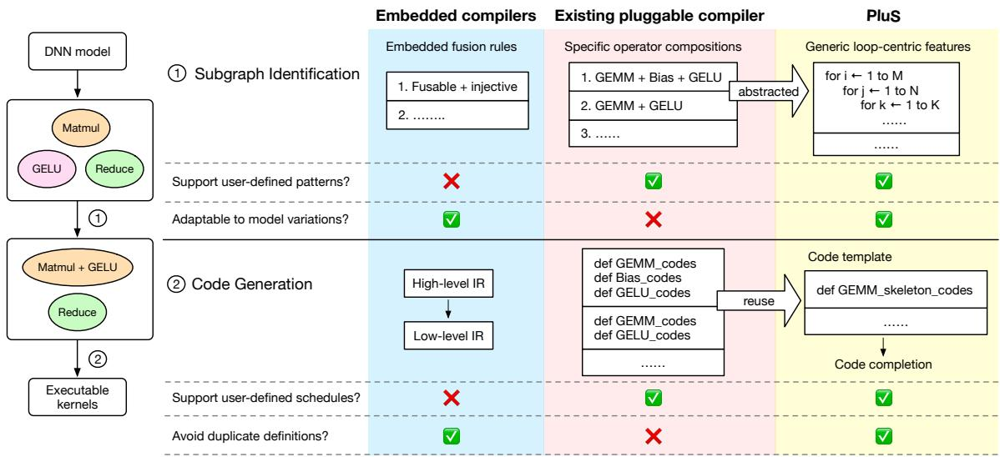  
Figure 1: Workflow of ML compilers and a comparison between embedded compilers, existing pluggable compilers, and PluS.

Building upon these insights, PluS proposes +Graph, a lightweight subgraph abstraction based on the loop-centric feature (named +Loop) (Sec. 4.1). PluS employs a novel graph transformation approach by generically matching a set of predefined subgraph patterns (with +Graph) from the expert-driven pattern warehouse (Sec. 4.2). Subsequently, PluS generates code for the subgraph pattern using the predefined code template (Sec. 4.3).

We have implemented PluS on top of PyTorch and conducted evaluations using five mainstream ML models on NVIDIA A100 GPU and RTX 4090 GPU. In comparison with TorchInductor [8] and TensorRT [22], PluS demonstrates an average end-to-end performance improvement of 4.04× and 1.77×, respectively. These performance gains are attributed to PluS’s ability to integrate high-performance subgraph optimization techniques from various vendors and select optimal schedules for different shapes. When compared to the template-based ML compiler AITemplate [45], PluS excels in supporting newly developed DNN architectures while still maintaining a slight performance advantage (approximately 7.8%) on those AITemplate-supported models.

In summary, we make the following contributions:

▶ We pioneer the concept of pluggable graph schedules, enabling the effortless integration of expert-driven subgraph optimizations within an ML compiler. This innovation facilitates the decoupling of subgraph code generation iteration from the burdensome compiler infrastructure.

▶ We introduce a novel subgraph abstraction based on the underlying loop-centric features, providing a robust representation of subgraph patterns. Leveraging this abstraction, we devise a novel pattern-matching strategy for graph optimization.

▶ We develop PluS, an ML compiler supporting the pluggable graph schedule definition, and establish a subgraph pattern warehouse leveraging optimization schedules from state-of-the-art vendors. Extensive evaluation demonstrates the efficacy, portability, and flexibility of PluS.

## 2 Background and Motivation

## 2.1 Embedded and Pluggable Compilers

Given a DNN model, an ML compiler typically lowers it into a computation graph composed of a set of fine-grained tensor operators. The common workflow of ML compilers usually involves two key modules: subgraph identification and code generation (codegen), as shown in the left half of Fig. 1. The subgraph identification is to identify subgraphs within the computation graph that can be further optimized. For example, it identifies groups of operators that can be fused into a single subgraph, allowing for the generation of higherperformance code. Codegen is responsible for generating codegen schedules for the identified subgraphs, which define how to map data computation onto hardware [56].

We categorize the optimizing compilers into two types: embedded and pluggable, based on whether the subgraph identification process supports user-defined functions or not. Embedded compilers implement the subgraph identification within the compiler so that users cannot customize this behavior. In contrast, pluggable compilers empower users to customize the process without modifying the compiler itself. Fig. 1 shows the characteristics of the embedded compilers and the existing pluggable compilers.

Embedded mode. Many of the ML compilers adopt embedded mode, such as XLA [36], TorchInductor [8], BladeDISC [56], DNNFusion [31] and TensorRT [22]. These compilers utilize predefined fusion rules to generate subgraphs. Users cannot modify the fusion rules without changing the compiler implementation. For example, TVM [10] has a set of embedded fusion rules not customizable by users. It categorizes operators into complex-out-fusable, injective, and reduction, and proposes three fusion rules: injective can fuse after complex-out-fusable, injective can fuse before reduction, and injective can fuse with injective. After generating the subgraphs, these compilers lower the high-level graph representations into target-specific code using a low-level intermediate representation (IR). For example, BladeDISC [56] employs the MLIR dialects [26], which encodes computations as loop constructs that map closely to the underlying hardware.

However, embedded compilers are not friendly to adopting the emerging subgraph optimizations. This stems from the complete reliance on compiler predefined rules for graph transformation, making it challenging to harness the innovations of the new optimizations fast. To catch up the new optimizations, it usually requires to modify the cumbersome graph transformation module in the compiler, demanding substantial effort and time.

We utilize the subgraph and the corresponding optimized kernels depicted in Fig. 2 to elucidate the limitations of embedded graph transformation. This subgraph comprises a matrix multiplication (Matmul) followed by a softmax function (Softmax), and the Softmax is decomposed into several basic operators by the ML compiler. Existing manually-written libraries (CUTLASS [40]) can optimize this pattern into 3 kernels as shown in Fig. 2. However, embedded-mode ML compilers face challenges in leveraging these optimizations. First, it requires modifying the fusion and codegen rules to support such subgraphs, which is usually labor-intensive and cannot be timely. Second, given that the high-level operators (Softmax) are usually decomposed into smaller and basic operators in the modern ML compilers, it is hard for the existing compilers to match the intricate subgraph adequately based on simplistic rules.

Pluggable mode. Some tensor compilers allow users to customize the subgraph identification. Users do not need to rewrite the compiler itself to add new fusion or codegen rules. For example, AITemplate [45] employs operator-level subgraph matching to optimize ML models. Users can define desired subgraphs during model definition, and AITemplate identifies specific operator-composed subgraphs for code generation. For instance, AITemplate currently supports 18 types of matrix multiplication-based subgraphs, such as gemm\_rcr\_bias\_gelu. This particular subgraph represents a General Matrix Multiply (GEMM) with inputs in row major and column major, followed by Bias and GELU operations, with the output in row major.

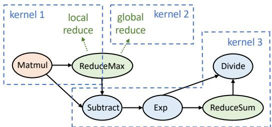  
Figure 2: A subgraph formed by basic operators consisting of matrix multiplication followed by the softmax function, and the corresponding kernel implementation in CUTLASS.

However, the existing pluggable mode ML compiler relies on operator-level pattern matching to identify subgraphs and lacks proficiency in handling subtle changes in model architectures. Users are required to provide corresponding implementations for the specific operator composition and specify it during the model definition. For instance, in the case of AITemplate, it currently supports gemm\_rcr\_bias\_gelu but not gemm\_rcr\_gelu. This implies that if a user opts to exclude the Bias operation, a new backend template and frontend definition must be added to AITemplate. Furthermore, AITemplate lacks the design for compiling models with dynamic shapes, limiting its flexibility in real-world scenarios. These shortcomings significantly reduce adaptability of pluggable ML compiler and hinders its ability to generalize for broader use cases.

## 2.2 Opportunities and Insights

We recognize the pressing need for ML compilers to alleviate manual burdens and overcome the inflexibility of embedded graph transformations. In this work, we introduce the concept of pluggable graph transformation to decouple the intricate graph transformation process from the ML compiler implementation. By providing a pluggable and flexible approach to subgraph identification and optimization, we empower users to define graph transformation patterns flexibly.

Given the limitations of existing pluggable compilers that rely on operator-level pattern matching for subgraph optimization, our insight is to use a general pattern with fundamental characteristics to map different operator compositions into the same underlying codegen schedule. We address several key issues with PluS in Sec. 4.1, Sec. 4.2 and Sec. 4.3 respectively:

▶ How is the general pattern defined, and how does it express the fundamental characteristics of a subgraph?

▶ How does PluS match or identify subgraph patterns?

▶ How do users provide codegen schedules for subgraph patterns, and how does PluS generate code accordingly?

First, operators and subgraphs can be expressed through only the loop skeleton of several key operators, which dominate the codegen schedules [56, 57]. PluS introduces a lightweight subgraph abstraction, +Graph, to define subgraph patterns with the loop-centric characteristics of key operators while ignoring trivial operators.

Unlike low-level loop abstractions designed for code generation like MLIR dialects [26], which are complex and generally inaccessible to ML optimization experts, +Graph is specifically designed for subgraph pattern matching, offering users the concise and necessary representation of a subgraph’s essential structure.

Second, PluS employs a novel subgraph pattern identification method based on +Graph, rather than relying on fusion rules or matching specific operator compositions. PluS starts identification from the key operators and iteratively matches the subgraphs with user-predefined subgraph patterns.

Compared to the operator-by-operator matching approach employed by AITemplate [45], PluS’s subgraph identification algorithm applies a generic matching on subgraph loop skeletons, which allows subgraphs with the same underlying loop-centric features but different operator compositions to be matched to the same +Graph.

Third, PluS offers an interface called +Code for users to provide the codegen template for any +Graph. The code templates define the schedules for the loop skeleton of the key operators, and PluS generates code for other trivial operations in the subgraph according to the data and computation information maintained by the compiler.

With this mechanism, PluS can reuse the codegen schedules for subgraphs with identical +Graph, eliminating the need to repeatedly define code implementations for every operator composition like in AITemplate (Fig. 1).

## 3 System Overview

Building upon the motivation and insights elaborated in Sec. 2, we introduce PluS to address the challenge of flexible subgraph optimization integration with a pluggable graph transformation solution based on loop-centric pattern matching. The core insight is to map different subgraphs with the same loop skeleton to a unique identifier and share the same codegen schedules for these subgraphs. PluS first designs +Graph (Sec. 4.1) to serve as an identifier for subgraph pattern matching, which encapsulates the loop-centric characteristics of subgraphs. PluS develops a pattern warehouse to decouple the subgraph identification and codegen process from compiler internals. Users are empowered to manage these processes by providing mappings of +Graphs to their corresponding code templates using PluS’s interface +Code (Sec. 4.3). The code template defines the codegen schedules for the skeleton operations in the subgraphs.

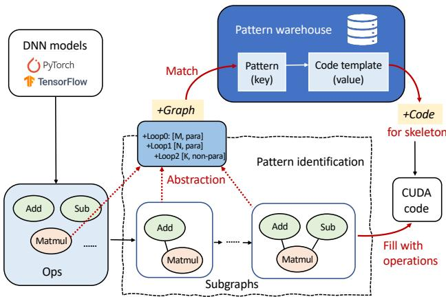  
Figure 3: System Overview of PluS.

Figure 3 shows the system overview of PluS. To begin the compilation process, PluS ingests a DNN model from the framework (e.g., PyTorch). It then automatically translates the model into a computational graph comprised of operators. Each operator is essentially expressed as a +Loop (Sec. 4.1), which serves as the building block of +Graph. Subsequently, PluS employs a pattern identification methodology to identify subgraphs that match the pre-defined subgraph patterns in the pattern warehouse, as detailed in Sec. 4.2. Specifically, PluS adopts a greedy extension policy to expand the subgraph scope, obtaining the +Graphs of subgraphs and iteratively querying the pattern warehouse to determine whether the +Graph matches the pre-defined patterns. Finally, PluS generates code for the identified subgraphs using the code templates in the pattern warehouse and specific information within each subgraph, filling in the trivial operations, as detailed in Sec. 4.3.

## 4 Design Methodology

## 4.1 Subgraph Identifier: +Graph

In this section, we introduce +Graph, a subgraph representation designed to serve as an identifier in the subgraph identification process. +Graph abstracts DNN computation to its loop structure and key operations. This allows subgraphs with different operator compositions but similar loop-centric features to be mapped to the same +Graph, and share the same codegen schedule. This enhances PluS’s adaptability to varying model structures. The +Graph consists of multiple levels of +Loops. Typically, computations on a tensor can be expressed as nested loops. +Loop is an abstraction of such loops, with the nested loops of tensor computations corresponding to the nested +Loops.

As a subgraph identifier for pattern identification, +Graph must possess two key features: it encapsulates the underlying characteristics of loops and computations, and it maintains uniqueness—each subgraph has a distinct +Graph. In the following content, we first introduce the key properties of +Loop, which succinctly express essential information of a loop for the pattern abstraction. We then present a comprehensive list of transformation primitives of +Loop. When multiple opoid MergeKeepProperty();erators are grouped into a single subgraph, the +Loops are oid MergeAlterParallellism();interconnected and undergo transformations based on these oid NestedLoopCoalesce();primitives, forming the unique +Graph of the subgraph.

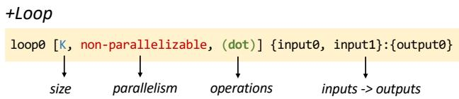  
Figure 4: The +Loop representation.

Properties. As shown in Fig. 4, +Loop is characterized by three main properties: size, parallelism, and operation.

Size describes the size of a +Loop, encompassing two types: integer and symbolic. When the size is known at the compile time, it will be a constant integer, otherwise it will be represented symbolically (i.e., dynamic shape).

Loop-level Parallelism assumes paramount significance for mapping +Loop computations onto hardware execution units. It can be classified into two categories: parallelizable and non-parallelizable +Loop. A parallelizable +Loop indicates that there are no data dependencies between consecutive loop iterations, allowing for parallel execution. Conversely, in the non-parallelizable +Loop, statements in an iteration of the +Loop depend on statements in another iteration of the +Loop, which necessitates serial execution or synchronization efforts. For instance, the innermost +Loop of a reduction operator (ReduceOp) is non-parallelizable, while each level of the +Loop in an elementwise operator is parallelizable.

Operation is an optional property that records computational operations within a +Loop. When users provide +Graph in the pattern warehouse, they need to specify only the crucial operations that determine codegen schedules in the subgraph pattern, such as dot product, reduce-max, etc., rather than specifying all trivial operations. PluS will identify subgraph patterns by leveraging the information within the Operation property. If an operation is defined in a +Graph, only subgraphs whose corresponding +Loop contains this operation will match the pattern (detailed in Sec. 4.2). Other trivial operations not specified by users will be ignored in the subgraph’s +Loop. For instance, users can specify the permutation (transpose) operation in +Graph to determine whether the permutation operator can be included in a subgraph.

In addition to the three properties mentioned above, +Loops in a subgraph also carry input and output tensors. However, this information does not affect pattern matching as this does not affect the underlining codegen schedule design. This means that subgraphs with different inputs and outputs might still map to the same +Graph, depending on the key operations within the subgraph. We will discuss the input and output features in the code generation section in Sec. 4.3.

Transformation primitives. As an identifier of a subgraph, the +Graph representation should be deterministic and unique for a given subgraph. Our insight is to merge the loops in a graph as much as possible while maintaining correctness to simplify the representation of the subgraph, making pattern identification easier. To achieve this, we design three primitives to guide the transformation of +Loops across different operators when forming a subgraph. After the +Loops of the subgraph are transformed, a fourth primitive collapses nested +Loops for final standardization.

Assuming operator B follows operator A, i.e., B’s input corresponds to A’s output, we define the tensor connecting these two operators as the hub tensor. The +Loop associated with this hub tensor in operator A is referred to as prev\_loop. The corresponding loop of operator B is denoted as cur\_loop.

Primitive 1: Merge without Altering Properties. This primitive involves merging prev\_loop and cur\_loop when they share identical sizes and are both parallelizable.

For example, consider merging MatmulOp [M, N, K] and AddOp [M, N] into a +Graph, where axes M and N can be seamlessly merged without altering their properties. Before the merge, the computation of MatmulOp is illustrated in Fig. 5(1)(a). After the merge, the computation of MatmulOp and AddOp is depicted in Fig. 5(1)(b). The final +Loop structure of the subgraph is determined as shown in Fig. 5(1)(c).

Primitive 2: Merge with Parallelism Modification. In cases where prev\_loop and cur\_loop share identical sizes, and prev\_loop is parallelizable while cur\_loop is nonparallelizable, when merging the two loops, the Parallelism property is adjusted to non-parallelizable.

For instance, consider the fusion of AddOp [M, N] and ReduceOp [M, N], where the reduction axis is N. Since the N axis of AddOp is parallelizable while the N axis of ReduceOp is non-parallelizable, these +Loops can be merged into a nonparallelizable +Loop. The computation of AddOp and this fused subgraph, and the +Loop structure of this subgraph are shown in Fig. 5(2).

Primitive 3: Transition to a New Loop. If the prev\_loop is non-parallelizable, cur\_loop cannot be merged and instead forms a distinct new +Loop, irrespective of the size and parallelism of cur\_loop.

For instance, consider the fusion of ReduceOp [M, N] and AddOp [M, N], shown in Fig. 5(3)(a) and (b). Given that the N axis of ReduceOp is non-parallelizable, it results in the creation of a distinct new +Loop for the N axis of AddOp in Fig. 5(3)(c). This subgraph is represented as Fig. 5(3)(d).

Primitive 4: Nested loops collapsing. After the +Loops in different operator are transformed, PluS collapses consecutive nested +Loops that belong to the same categories within the subgraph to achieve the simplest representation under equivalent conditions. For instance, a BatchMatmulOp [B, L, M, N, D] can be simplified to BatchMatmulOp [B x L, M, N, D] because axes B and L both represent batch dimensions in this scenario and can be collapsed.

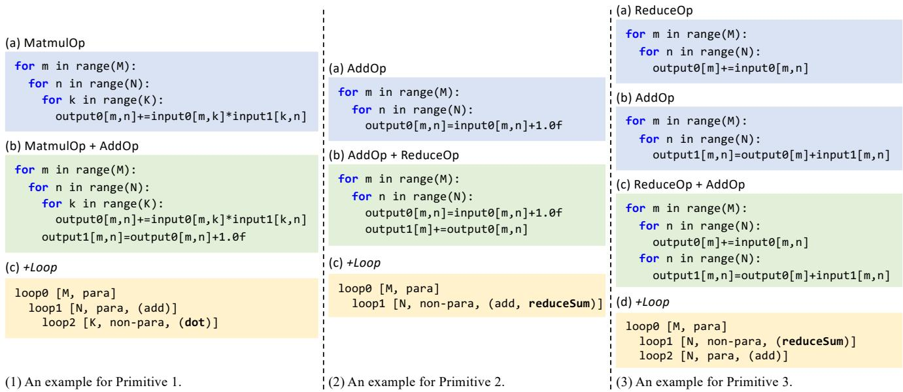  
Figure 5: Examples for transformation primitives of +Loop.

Specifically, PluS determines the collapsibility of a +Loop and its next +Loop sequentially, adhering to three conditions for collapsing: First, the next +Loop must be the only +Loop nested inside the current +Loop. Second, the next +Loop must possess the same parallelism as the current +Loop. Third, the input tensors involved in both the next +Loop and the current +Loop must be exactly the same. For instance, consider the BatchMatmulOp [B x L, M, N, D]. Here, axes B and L are both parallelizable and present in all input tensors, whereas the parallelizable M axis exists only in the first input tensor, and the parallelizable N axis exists only in the second input tensor. The D axis is non-parallelizable.

## 4.2 Subgraph Identification

Based on the subgraph identifier +Graph, PluS employs a pattern identification method to generate subgraphs. This process is guided by two key insights. First, PluS begins subgraph identification with a skeleton operator. The concept of a skeleton operator, as proposed in [57] and [56], denotes a crucial operator that determines the data layout and codegen schedule within the computational graph, such as MatmulOp and ReduceOp. Most advanced optimized subgraphs are now built around these skeleton operators.

Second, PluS uses a greedy extension strategy to expand the subgraph scope when identifying subgraph patterns. This approach aims to match the largest possible range of subgraph patterns, including the maximum number of operators. Through subgraph extension, PluS iteratively matches the subgraph with pre-defined +Graphs in the pattern warehouse. The greedy extension strategy provides users with the greatest flexibility in code planning to decide the best implementation of the subgraphs. Unlike conventional ML compilers that map each subgraph into a single kernel, PluS allows users to freely determine the number of kernels in the code template of a +Graph. By expanding the range of subgraphs from the skeleton operator, PluS can identify most of the current mainstream subgraph optimizations.

In this section, we first present the steps of PluS’s pattern identification method, which continually expands the subgraph and queries the pattern warehouse to match +Graphs. We then propose the match conditions to determine whether to continue or stop the extension.

Algorithm 1: Main steps of subgraph identification.   
Input :un f used\_ops initialized by the computational graph of   
operators   
Output :computational graph of fused subgraphs   
1 while un f used\_ops.IsEmpty() ̸= True do   
2 skeleton\_op = FindSkeletonOp(unfused\_ops);   
3 if skeleton\_op then   
4 MatchFromSkeletonOp(skeleton\_op);   
5 else   
6 root\_op = FindRootOp(unfused\_ops);   
7 MatchFromSkeletonOp(root\_op);

Subgraph identification process. The main steps of PluS’s subgraph identification are outlined as Algo.1. The variable unfused\_ops denotes the operators that have not yet been fused into a subgraph and is initialized by the computational graph. When the list of unfused operators is not empty (line 1), PluS attempts to identify a skeleton operator from unfused operators (line 2) and initiates pattern matching from that point (line 4). In PluS, we define the skeleton operator as the operator possessing at least one non-parallelizable +Loop, including MatmulOp and ReduceOp. If there is no skeleton operator in the unfused operators, PluS will start pattern matching from the root operator (lines 7-8), defined as the operator without a producer operator in the list in this paper.

(a) Operators (d) MatmulOp + ReduceMaxOp + SubtractOp (f) MatmulOp + ReduceMaxOp + SubstractOp   
x2[M,N] = MatmulOp(x0[M,K], x1[K,N]) for m in range(M): // [para] + ExpOp + ReduceSumOp + DivideOp   
x3[M,1] = ReduceMaxOp(x2[M,N]) for n in range(N): // [non-para] for m in range(M): // [para]   
x4[M,N] = SubtractOp(x2[M,N], x3[M,1]) for k in range(K): // [non-para] for n in range(N): // [non-para]   
x5[M,N] = ExpOp(x4[M,N]) x2[m,n]+=x0[m,k]\*x1[k,n] for k in range(K): // [non-para]   
x6[M,1] = ReduceSumOp(x5[M,N]) x3[m,0]=max(x3[m,0],x2[m,n]) x2[m,n]+=x0[m,k]\*x1[k,n]   
x7[M,N] = DivideOp(x5[M,N], x6[M,1]) for n in range(N): // [para] x3[m,0]=max(x3[m,0],x2[m,n])   
(b) MatmulOp x4[m,n]=x2[m,n]-x3[m,0] for n in range(N): // [non-para]   
x4[m,n]=x2[m,n]-x3[m,0]   
for m in range(M): for n in range(N): // [para] // [para] (e) MatmulOp + ReduceMaxOp + SubtractOp + ExpOp + ReduceSumOp x5[m,n]=exp(x4[m,n]) x6[m,0]+=x5[m,n]   
for k in range(K): // [non-para]x2[m,n]+=x0[m,k]\*x1[k,n] for m in range(M): for n in range(N): // [para]// [non-para] for n in range(N): x7[m,n]=x6[m,0]/N // [para]   
(c) MatmulOp + ReduceMaxOp for k in range(K): // [non-para]x2[m,n]+=x0[m,k]\*x1[k,n] (g) +Graph (+Loops)   
for m in range(M): // [para] x3[m,0]=max(x3[m,0],x2[m,n]) loop0 [M, para]   
for n in range(N): // [non-para] for n in range(N): // [non-para] loop1 [N, non-para, (reduceMax)]   
for k in range(K): // [non-para] x4[m,n]=x2[m,n]-x3[m,0] loop2 [K, non-para, (dot)]   
x2[m,n]+=x0[m,k]\*x1[k,n] x5[m,n]=exp(x4[m,n]) loop3 [N, non-para, (sub, exp, reduceSum)]   
x3[m,0]=max(x3[m,1],x2[m,n]) x6[m,0]+=x5[m,n] loop4 [N, para, (div)]  
Figure 6: Case study for the subgraph identification workflow of PluS.

Algorithm 2: The steps of MatchFromSkeletonOp.   
Input :subgraph initialized by skeleton operator   
Input :Boolean flags: allow\_prologue, allow\_epilogue   
1 if allow\_prologue then   
2 while prologue = FindPrologueOp(subgraph) do   
3 if Matching(subgraph, prologue) then   
4 FusePrologueOp(subgraph, prologue);   
5 if allow\_epilogue then   
6 while epilogue = FindEpilogueOp(subgraph) do   
7 if Matching(subgraph, epilogue) then   
8 FuseEpilogueOp(subgraph, epilogue);   
9 while producer = GetProducerOp(epilogue) do   
10 if Matching(subgraph, producer) then   
11 FusePrologueOp(subgraph, producer);

The steps of MatchFromSkeletonOp are outlined in Algo.2. First, PluS initializes the current subgraph with a skeleton operator. Each skeleton operator has two boolean properties predefined by experts in the pattern warehouse: allow\_prologue and allow\_epilogue, which determine the fusion direction of the skeleton operator. Specifically, if the skeleton operator allows prologue fusion (line 1), PluS continuously attempts to find a prologue operator of the current subgraph (line 2), which produces one of the input tensors of the current subgraph. PluS then assesses whether the subgraph meets the match conditions if the prologue operator is fused (line 3). If the conditions are met, PluS fuses this prologue operator into the subgraph (line 4). The criteria for determining whether the subgraph meets the match conditions will be detailed later.

Additionally, if the skeleton operator allows epilogue fusion (line 5), PluS continuously attempts to find an epilogue operator of the current subgraph that utilizes the output tensor of the current subgraph (line 6). PluS then evaluates whether the subgraph meets the match conditions if the epilogue operator is fused (line 7). If the conditions are met, PluS incorporates this epilogue operator into the subgraph (line 8). Moreover, unlike prologue operators, after an epilogue operator is fused,

PluS endeavors to find the producer operator of this operator that is not in the subgraph (line 9) and assesses whether it can be fused (lines 10-11). For instance, after fusing a MatmulOp and a binary AddOp, PluS will also fuse the producer operator of another input tensor in the AddOp, such as the DivideScalarOp.

PluS applies the following prioritization to avoid ambiguity in subgraph matching. First, if an operator can serve either as an epilogue to a skeleton operator or as a prologue, PluS prioritizes epilogue fusion. This is because prologue fusion sometimes introduce redundant computations due to repeated input loading across multiple thread blocks, whereas epilogue operations do not, as the output is computed and written only once, such as the data processing in MatMul. Second, if an operator A produces two outputs, and each output could be fused with different downstream operators (B and C), but not both together, PluS does not enforce a fusion priority between them. PluS applies a greedy matching strategy: if B is encountered first during traversal, PluS fuses A with B, saves A’s intermediate output, and computes C separately using that output. From a performance standpoint, fusing A with either B or C yields comparable efficiency, as the key benefit—avoiding redundant memory accesses and kernel launches—is achieved in both cases.

PluS fuses operators only to generate +Graphs as identifiers to match the pre-defined patterns and corresponding codegen schedules in the pattern warehouse. This approach differs from conventional compilers, which use hard-written fusion rules to generate code of subgraphs.

Case study for subgraph identification. We use Fig. 6 to illustrate how the +Graph of a subgraph is transformed during subgraph identification based on the transformation primitives. It is assumed that at each step the subgraph satisfies the match conditions. To exemplify, we consider the subgraph shown in Fig. 6, which consists of a subgraph comprising a GEMM operation followed by a Softmax operation. This subgraph encompasses six basic operators, as shown in Fig. 6(a).

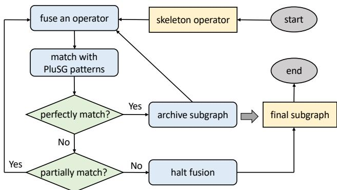  
Figure 7: Workflow of match conditions.

Initially, PluS identifies a skeleton operator, MatmulOp [M, N, K], within the un f used\_ops. The MatmulOp permits epilogue fusion while disallowing prologue fusion. The +Loop of MatmulOp [M, N, K] is shown in Fig. 6(b), where the M axis and N axis are parallelizable +Loops, while the K axis is a non-parallelizable +Loop.

Subsequently, PluS identifies an epilogue operator, Reduce-MaxOp [M, N], and attempts to incorporate it into the subgraph. During the fusion of MatmulOp and ReduceMaxOp, the properties of the M axis remain unaltered, following Primitive 1. However, the N axis is modified to be nonparallelizable in accordance with Primitive 2. The results are shown in Fig. 6(c).

Following that, PluS identifies an epilogue operator, SubtractOp [M, N]. The M axis can be merged according to Primitive 1 since the M axis in the subgraph and SubtractOp are both parallelizable. However, the N axis in the subgraph is non-parallelizable, while in SubtractOp, it is parallelizable. Hence, after fusing SubtractOp based on Primitive 3, the subgraph requires a new N axis, depicted in Fig. 6(d).

Similarly, as depicted in Fig. 6(e), PluS fuses injective ExpOp [M, N] where axes M and N are merged following Primitive 1, and ReduceSumOp [M, N] where M axis is merged following Primitive 1 and N axis is merged following Primitive 2. Additionally, a new N axis emerges within the subgraph during the fusion of DivideOp [M, N], according to Primitive 3. Finally, the computation of the resulting subgraph is depicted in Fig. 6(f), and can be represented by Fig. 6(g).

Match conditions. During the pattern matching process, PluS generates subgraphs represented by +Graph and evaluates them against match conditions with the patterns stored in the pattern warehouse to determine whether to extend further. Fig. 7 shows the workflow of this assessment process in PluS. Initially, it verifies whether each pattern in the warehouse perfectly aligns with the +Graph of the subgraph. If there is a complete match, PluS archives the subgraph as the most recently successfully matched subgraph corresponding to that skeleton operator and proceeds with the extension. This aligns with the principle of PluS, which is to expand subgraphs within the broadest scope possible.

In cases where there’s no perfect match, PluS investigates whether the current subgraph represents a partial or intermediate state of a +Graph pattern in the warehouse. This involves determining if the current subgraph could potentially evolve into a specific +Graph pattern in the future. PluS accomplishes this by recursively traversing the multi-level +Loop tree, considering the following criteria for each +Loop: First, if the +Loop in the warehouse pattern is non-parallelizable, the corresponding +Loop in the current subgraph can be either parallelizable or non-parallelizable, as parallelizable +Loops might transform into non-parallelizable ones in subsequent extension as per Primitive 2. Second, if the +Loop in the warehouse pattern is parallelizable, the corresponding +Loop in the current subgraph must also be parallelizable. Third, the number of +Loops nested within one +Loop in the warehouse pattern must be greater than or equal to the number of +Loops nested within the corresponding +Loop in the current subgraph, as subsequent extension operations might introduce new +Loops. Fourth, if the warehouse pattern includes an operation, such as dot product and max-reduction, the subgraph must match it exactly.

Finally, two outcomes emerge: First, if the current subgraph doesn’t align with any +Graph pattern in the pattern warehouse in its partial or intermediate state, the pattern matching process for the current skeleton operator is halted. The last archived subgraph, i.e., the most recently matched subgraph corresponding to a warehouse pattern, becomes the final subgraph for the current skeleton operator. Second, if the current subgraph represents the partial or intermediate state of a specific pattern in the pattern warehouse, the pattern matching process continues.

Case study for match conditions. Taking the subgraph in Fig. 6(d) as an example, which includes MatmulOp, Reduce-MaxOp, and SubtractOp, its +Graph (+Graph0) can be represented as follows.

loop0 [M , parallelizable ]   
loop1 [N , non - parallelizable , (reduceMax)]   
loop2 [K , non - parallelizable , (dot)]   
loop3 [N , parallelizable , ( sub )]

While this subgraph does not perfectly match the +Graph pattern in Fig. 6(g) (+Graph1), it can be identified as a partial state of that pattern. First, loop0 in +Graph1 is parallelizable, and loop0 in +Graph0 is also parallelizable. Second, loop3 in +Graph1 is non-parallelizable, whereas loop3 in +Graph0 can be parallelizable. Third, the number of +Loops nested within +Graph1-loop0 (loop1, loop3, loop4) is greater than those nested within +Graph0-loop0 (loop1, loop3). Finally, the skeleton operations involving in +Graph0, specifically reduceMax and dot, are the same as those in +Graph1.

## 4.3 Code Generation

In this section, we describe how PluS generates code for subgraphs. Subgraph optimization experts first provide mappings between a +Graph and the code template in the pattern warehouse. The +Graph encapsulates the loop skeleton of the subgraph with key operations, while the code template defines the codegen schedules for this skeleton, leaving the code for trivial operations to fill by compiler. PluS compiler will maintain every detailed information during subgraph identification and generate the remaining code for the subgraph.

loop0 [M, para] {x0,x1}:{x7}   
loop1 [N, non-para, (reduceMax)] {x2}:{x3}   
loop2 [K, non-para, (dot)] {x0,x1}:{x2}   
loop3 [N, non-para, (sub, exp, reduceSum)] {x2,x3}:{x6}   
loop4 [N, para, (div)] {x6}:{x7}  
Figure 8: An example for loop bodies.

PluS compiler. During actual compilation, PluS retains information about all the data dependencies and operations of each +Loop, including the input tensors, output tensors, and computations involved in each loop. When the PluS compiler fills the code template of the +Graph with specific code, it traverses from the leaf nodes of the +Loop tree and generates the corresponding data and operation code, because the +Loop body of each leaf node can be implemented as an independent code segment. For instance, consider the subgraph in Fig. 6(g). PluS compiler will generate code for four +Loop bodies in turn: loop0-loop1-loop2, loop0-loop1, loop0-loop3 and loop0-loop4. The inputs, outputs, and operations involved in each of these +Loops are illustrated in Fig 8.

+Code interface. Each matched subgraph pattern has a expert-provided code template in the pattern warehouse. Experts can create these templates by adding +Code statements in the code. +Code includes three types: data placeholder, compute, and data write-back, as shown in Fig 9. A data placeholder can represent any number of input and output tensors in the code. The compiler will complete the code for pointers to the data at this position based on the specific +Loop information. Compute-type statement tells the compiler where the data computation occurs in the code. If the data has not been loaded before computation, the compiler will automatically generate the code to load the data based on the addressing information in the +Loop, followed by the corresponding computation code. Data write-back usually occurs after all +Loop body computations are completed, indicating to the compiler to generate code that writes the computation results back to global memory. Typically, the compiler needs to address computations and write-backs. PluS has also implemented a compilation path compatible with CUT-LASS, which is widely used by many ML compiler backends. Since CUTLASS provides a wrapper for implementing highperformance linear algebra on CUDA, PluS’s compiler does not need to handle those details in code generation.

Case study for code generation. Continuing with the subgraph from Fig. 6 as an example, an expert might want to define a codegen schedule for subgraphs with this skeleton. First, they would define the pattern of this subgraph, or +Graph, in the pattern warehouse, retaining only the skeleton operations in the pattern. This allows the compiler to reuse the codegen schedule for any subgraph that matches the same structure.

```cpp
// data placeholder
plus :: InputList input_list ;
plus :: OutputList output_list ;
// compute
plus :: compute </* DataType */float>( input_list ,
/* Result */ local_out );
// data write -back
plus :: writeback ( local_out , output_list );
```  
Figure 9: +Code statements.

Then, in the code template, the expert defines the code design for the loop0-loop1-loop2 structure, which corresponds to a matrix multiplication pattern. The expert has the flexibility to use a simple cuBLAS interface, the Matmul templates from CUTLASS, or even custom handwritten code. Since MatmulOp is a skeleton operator that allows epilogue fusion, the expert uses the compute statement in the code to reserve a placeholder for epilogue operations. Next, the expert implements the schedule logic for loop0-loop1 and loop0-loop2, handling the reduction logic by designing parallel execution and synchronization operations as needed. They can also decide whether to integrate this logic with the previous dot operation to achieve the most efficient schedule. Similarly, compute placeholders for prologue operations are reserved before reduction operations. Finally, since the loop0-loop4 loop body does not contain skeleton operations, the expert only needs to reserve a placeholder with a compute statement for this loop body. After all the loops are completed, a data write-back statement is added to the code.

Dynamic shape. PluS is capable of compiling models with dynamic shapes. It uses symbolic types to represent shapes during subgraph identification. These symbolic dimensions are carried through the compilation process, and the corresponding code templates treat shapes as runtime variables. Experts can then autonomously decide dynamic schedules based on the actual input sizes. PluS enables broad flexibility in handling dynamic shapes by allowing multiple implementations for the same subgraph pattern. For example, if different shapes require different fusion or scheduling strategies, experts can define a subgraph pattern with maximal scope, and encode shape-based routing logic within the code template.

## 5 Implementation

Recalling the overview of PluS outlined in Sec. 3, PluS has the capability to compile model representations compatible with various mainstream deep learning frameworks, and our current implementation is specifically based on PyTorch [32].

Pattern warehouse. PluS incorporates an expert-defined pattern warehouse that facilitates the dynamic insertion and deletion of patterns at any given time. This warehouse serves as a mapping between +Graphs and their corresponding kernel implementations. Users can define subgraph patterns through two methods. The first method allows them to deploy optimized code for a specific subgraph by providing a torch.nn.Module and the corresponding code. For instance, deploying the FlashAttention optimization for the attention mechanism. In such cases, PluS automatically generates a +Graph and stores the provided code as a template in the pattern warehouse. Nevertheless, this approach may lack the desired flexibility and universality.

Meanwhile, PluS offers a second method where users can articulate the +Graph, as detailed in Sec. 4.1. Users also provide the associated code template to the pattern warehouse with +Code detailed in Sec. 4.3. Subgraphs with the same data layout share identical +Graph, minimizing the need for additional deployment efforts. PluS automatically generates codes for various operations.

Workflow. We implement a complete TorchDynamo-based backend. Initially, PluS takes a torch.fx.GraphModule as inputs and leverages Hidet [17]’s API to parse the graph module, resulting in a computational graph composed of low-level operators represented by the +Graph outlined in Sec. 4.1. Subsequently, PluS generates subgraphs through a pattern matching method explained in Sec. 4.2. Finally, PluS utilizes a code generation module detailed in Sec. 4.3 to produce codes for each subgraph. The code generation module maps the +Graph to codes using the templates stored in the pattern warehouse. In our current implementation, we seamlessly integrate kernels from CUTLASS, ByteTransformer, FlashAttention, and other sources.

Applicability discussion. PluS can support all DNN models, as all DNN computations are fundamentally loop-based computations involving multi-dimensional tensors. The subgraph abstraction introduced by PluS is built on this loopbased nature, which allows various types of operators to be supported through this abstraction.

## 6 Evaluation

## 6.1 Experimental Setup

Methodology. We compare PluS against mainstream DNN compilers and framework including TorchInductor [8] v2.4.0, TensorRT [22] v10.5.0 (in ONNX Runtime [15] v1.18.0), and AITemplate [45] v0.3.dev0. In our evaluation, we initially evaluate the end-to-end inference latency (Sec. 6.2). The effectiveness of PluS’s +Graph-matching fusion strategies is demonstrated by presenting the layer count before and after fusion. Subsequently, we conduct several case studies to highlight the advantages of PluS in two aspects (Sec. 6.3). First, we report the subgraph inference latency to showcase PluS’s ability to leverage efficient expert-optimized subgraph implementations. Second, we compare the size of code required by experts to add a new subgraph implementation against AITemplate, demonstrating that PluS can accommodate new subgraph implementations with minimal effort.

Platforms. We conduct experiments on two GPUs with different architectures: an NVIDIA A100 PCIe 80GB and an NVIDIA GeForce RTX 4090. The servers are equipped with

AMD EPYC 7V13 CPUs and Intel Xeon Gold 5318Y CPUs, running Ubuntu 22.04 with CUDA 11.8 installed.

Workloads. We use five typical DNN models for evaluation, including BERT-base [16], ALBERT [25], GPT-2 [33], T5 [34] and ViT [18], encompassing popular transformer architectures in both natural language processing and computer vision. For the experiments, we set the batch sizes to 1 and 16, with a default sequence length of 128 for language models and an input image size of 224×224 for vision models.

## 6.2 End-to-End Evaluation

Performance. We first evaluate the end-to-end performance of PluS by comparing it against TorchInductor, TensorRT, and AITemplate. For TorchInductor, we employ the TorchInductor compiler provided by TorchDynamo to compile the PyTorch models, but dynamic shape support is disabled due to its poor performance. To evaluate TensorRT, we utilize the TensorRT provider in the Onnx Runtime with dynamic shape enabled, defining a batch size range of 1 to 32 and a sequence length range of 64 to 256 for the TensorRT engine. Furthermore, AITemplate does not support dynamic shape, whereas PluS supports the compilation of PyTorch models with dynamic shape. For each experiment, we measure the average end-to-end latency over 10 executions, repeated three times after 10 warm-up executions. One exception is that we observe unusually long GPU-to-CPU memory transfer time when running the T5 model in TensorRT, resulting in the end-to-end runtime exceeding 300 ms. Therefore, we perform additional profiling of the T5 model in TensorRT using Nsight Systems [1] and use the pure kernel execution time from the profiling data as the end-to-end runtime for the T5 model.

Fig. 10 shows the end-to-end inference latency on all workloads for batch sizes 1 and 16. PluS, when compared to stateof-the-art deep learning compilers with embedded graph transformation, outperforms TorchInductor by an average of 4.04× and TensorRT by 1.77× on A100 GPU. On the RTX 4090 GPU, it achieves an average speedup of 4.59× over TorchInductor and 2.01× over TensorRT. In Sec. 6.3, we delve into a subgraph performance analysis to showcase PluS’s advantages in supporting highly optimized subgraph implementations.

Additionally, as a pluggable graph transformation solution, PluS demonstrates comparable end-to-end performance with AITemplate, even exhibiting an average 7.8% performance improvement on the A100 and 7.2% on the RTX 4090. This achievement stems from PluS’s ability to leverage all subgraph optimization techniques available in AITemplate, alongside additional techniques from various vendors, such as ByteTransformer [47] and FlashInfer [46]. Notably, the performance of the T5 model in AITemplate is not reported, as we cannot define the T5LayerNorm module using the AITemplate interface. Meanwhile, AITemplate is designed solely for static shapes, limiting its flexibility in deployment. A case study in Sec. 6.3 further illustrates the portability of PluS in

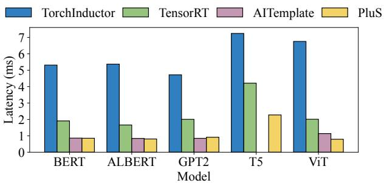  
(a) A100, batch size = 1.

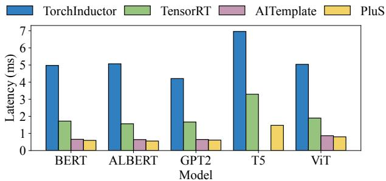  
(c) RTX 4090, batch size = 1.

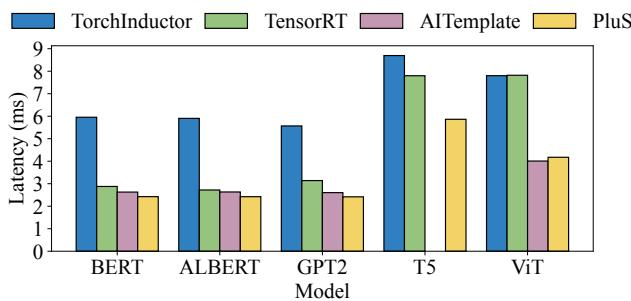

(b) A100, batch size = 16.  
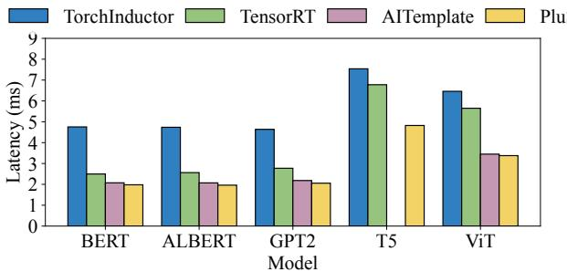  
(d) RTX 4090, batch size = 16.  
Figure 10: End-to-end inference latency on different GPU platforms.

Table 1: Fusion rate evaluation. #Ops represents the number of fundamental operators comprising the DNN model, and #Layers denotes the number of layers after graph transformation within DNN compilers.
<table><tr><td rowspan="2">Model</td><td rowspan="2">#Ops</td><td colspan="4">#Layers</td></tr><tr><td>TorchInductor</td><td>TensorRT</td><td>AITemplate</td><td>PluS</td></tr><tr><td>BERT</td><td>635</td><td>195</td><td>107</td><td>88</td><td>87</td></tr><tr><td>ALBERT</td><td>637</td><td>195</td><td>107</td><td>89</td><td>88</td></tr><tr><td>GPT2</td><td>630</td><td>171</td><td>126</td><td>89</td><td>87</td></tr><tr><td>T5</td><td>1460</td><td>364</td><td>247</td><td>-</td><td>220</td></tr><tr><td>ViT</td><td>655</td><td>201</td><td>105</td><td>90</td><td>87</td></tr></table>

comparison to AITemplate.

Fusion rate. In this section, we report the number of fundamental operators and the number of layers after subgraph identification (i.e., fusion) in PluS, TorchInductor, TensorRT, and AITemplate across all evaluated models. We define the fusion rate as the ratio of the original operator count to the fused layer count as [31]. As illustrated in Tab. 1, PluS demonstrates an average 2.08× and 1.25× fusion rate improvement compared to TorchInductor and TensorRT, respectively. This is due to PluS’s capability to generate fused subgraphs with a larger scope, facilitated by its flexible pattern warehouse, in contrast to TorchInductor and TensorRT’s rule-based embedded graph transformation module. Moreover, PluS exhibits subgraph fusion behavior similar to that of AITemplate, as both are ML compilers equipped with pluggable graph transformation modules, sharing advanced capabilities for deploying state-of-the-art subgraph optimizations. However, PluS can identify subgraphs with broader operator variations and leverage the reuse of codegen schedules, enabling it to support a wider range of models than AITemplate, such as T5.

Runtime overhead. We analyze the compilation time and memory overhead of PluS. PluS incurs a compilation overhead of 18 to 25 seconds when the model is cached, which is dominated by NVCC compilation. It takes 1 to 2 minutes to compile the model for the first time. The memory overhead of PluS includes the memory consumption of pattern warehouse and the intermediate representations, all of which reside on the CPU. After excluding memory consumed by other Python modules such as torch andtransformers, PluS introduces a memory overhead of 130 to 190 MB.

## 6.3 Case Studies

Subgraph optimization. In this section, we utilize the benchmark BERT on A100 GPU to dissect why PluS outperforms other frameworks. Tab.2 delineates the configurations of subgraphs that consume over 95% of end-to-end execution time, detailing the operators constituting each subgraph along with shape information. The final column specifies the implementation vendor PluS utilizes for each subgraph. PluS integrates highly optimized kernel implementations from CUTLASS [40], ByteTransformer [47], and FlashAttention [13, 14]. We dynamically select the optimal solution for different configurations during the pattern definition phase. It is noteworthy that we adopt the implementation from FlashAttention for multi-head attention in batch size 16 (S1) and the implementation from ByteTransformer for multi-head attention in batch size 1 (S6). Both implementations demonstrate optimal performance within their respective configurations during our evaluation.

We utilize Nsight Systems [1] to measure the latency of subgraphs. Comparisons of subgraph latency between PluS, TensorRT, and AITemplate are presented in Fig. 11. The results demonstrate that PluS achieves an average speedup of

Table 2: Dominant subgraph configurations in BERT.
<table><tr><td>Note</td><td>Operators</td><td>Configuration</td><td>PluS vendor</td></tr><tr><td>S0</td><td>Matmul+Bias</td><td>M=2048,N=2304,K=768</td><td>CUTLASS</td></tr><tr><td>S1</td><td>Split+Permute+Matmul+ Div+Add+Softmax+ Matmul+Permute</td><td>M0=2048,N0=128,K0=64 M1=2048,N1=64,K1=128</td><td>FlashAttention</td></tr><tr><td>S2</td><td>Matmul+Bias+ Add+LayerNorm</td><td>M=2048,N=768,K=768</td><td>ByteTransformer</td></tr><tr><td>S3</td><td>Matmul+Bias+Gelu</td><td>M=2048,N=3072.K=768</td><td>CUTLASS</td></tr><tr><td>S4</td><td>Matmul+Bias+ Add+LayerNorm</td><td>M=2048,N=768.K=3072</td><td>ByteTransformer</td></tr><tr><td>S5</td><td>Matmul+Bias</td><td>M=128,N=2304,K=768</td><td>CUTLASS</td></tr><tr><td>S6</td><td>Split+Permute+Matmul+ Div+Add+Softmax+ Matmul+Permute</td><td>M0=128,N0=128,K0=64 M1=128,N1=64,K1=128</td><td>ByteTransformer</td></tr><tr><td>S7</td><td>Matmul+Bias+ Add+LayerNorm</td><td>M=128,N=768,K=768</td><td>ByteTransformer</td></tr><tr><td>S8</td><td>Matmul+Bias+Gelu</td><td>M=128,N=3072,K=768</td><td>CUTLASS</td></tr><tr><td>S9</td><td>Matmul+Bias+ Add+LayerNorm</td><td>M=128,N=768,K=3072</td><td>ByteTransformer</td></tr></table>

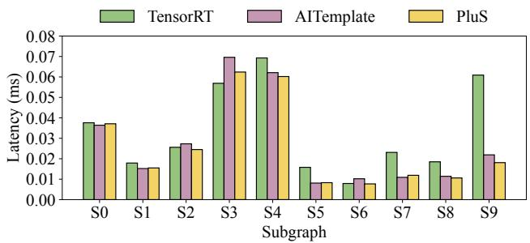  
Figure 11: Subgraph latency.

1.53× over TensorRT and 1.07× over AITemplate. Moreover, PluS retains the ability to reduce their latency by incorporating superior optimizations subsequently.

Ablation study. We then compare PluS with a configuration that disables optimized kernel sources (i.e., CUTLASS, ByteTransformer, and FlashAttention), falling back to generic implementations. PyTorch eager mode is used as the default baseline. Experimental results on the ten subgraphs show that PluS achieves an average speedup of 4.79× and 13.27× over the baseline with batch size of 16 and 1, respectively.

We further analyze why flexibly supporting a variety of subgraph patterns is necessary. Take the subgraphs S1 and S6 as examples. If these subgraphs are executed in PyTorch’s eager mode—where each operator is executed separately—the total runtime for S1 and S6 is 0.221 ms and 0.209 ms, respectively. This demonstrates the poor performance that results from a lack of operator fusion. Next, when using TorchInductor, it excutes three kernels for this subgraph, fusing the elementwise operators with MatmulOp and implementing SoftmaxOp as a whole. Under this mode, the runtime for S1 and S6 becomes 0.0183 ms and 0.0078 ms. Furthermore, TensorRT, AITemplate and our PluS go a step further by implementing S1 and S6 as a single subgraph, generating one large kernel to execute the entire subgraph [13, 14]. They achieve better performance due to the tighter integration, with execution times of 0.015 ms and 0.0077 ms in PluS. The results demonstrate that different graph optimization techniques can lead to significant changes in model performance.

Portability. In this section, we use the T5 model as an example to showcase the portability of PluS compared to AITemplate, which does not support T5. Assuming that both frameworks can already support models like BERT, ALBERT, and GPT2, it becomes evident that PluS exhibits superior adaptability to minor alterations in DNN models, thereby reducing deployment complexities when compared to other pluggable ML compilers.

First, we observe that all Linear layers utilized in the T5 model lack bias operations, leading to the emergence of numerous new subgraphs not present in models like BERT, AL-BERT, and GPT2. Intuitively, this subgraph should share the same code generation schedule as the subgraph with bias operations found in BERT, ALBERT, and GPT2, given their shared loop structure and data layout. However, to accommodate this fused subgraph in AITemplate, a new template must be added. This entails a developer writing both frontend and backend code for the Matmul+Relu module, comprising over 250 lines of code (LoC), and registering it in the pipeline. As similar subgraphs continue to arise, programmers must repetitively perform this task. In contrast, leveraging the +Graph and code templates previously added by experts in the pattern warehouse, PluS can seamlessly generate code for these subgraphs without additional efforts.

x1 [M ,N] = Pow ( x0 [M ,N ])   
x2 [M ,1] = ReduceMean ( x1 [M ,N ])   
x3 [M ,1] = AddScalar ( x2 [M ,1])   
x4 [M ,1] = Rsqrt ( x3 [M ,1])   
x5 [M ,N] = Multiply ( x1 [M ,N], x4 [M ,1])   
x6 [M ,N] = Multiply ( x5 [M ,N], c[1 ,N ])

Another case arises with T5 introducing a novel layer normalization method, T5LayerNorm [49], leading to a distinct subgraph composition as depicted above. To support this subgraph in AITemplate, developers must invest additional effort in writing an end-to-end pipeline, including frontend and backend components, due to the lack of inheritable similar subgraphs defined previously. This process involves 1701 LoC to accommodate all components related to layer normalization, including 453 LoC for frontend registration and 1248 LoC for backend implementation. Similarly, in PluS, a new subgraph pattern must be incorporated into the pattern warehouse due to the absence of subgraphs sharing the same subsequent +Loop structure. In total, PluS requires 18 LoC to define the +Graph and an additional 129 lines to provide the necessary code template. In contrast, when new variants of this algorithm emerge, such as adopting a zero-centered gamma, PluS supports them seamlessly without requiring any additional effort.

loop0 [M , parallelizable ]   
loop1 [N , non - parallelizable ]   
loop2 [N , parallelizable ]

Sensitivity analysis. PluS is designed as a functional compiler, where subgraph matching and operator fusion does not change the computation semantics. The code generation process in PluS strictly follows the data dependencies between operations, ensuring correct implementation of the backend kernels. Therefore, accuracy degradation is not expected under correct pattern definitions.

To validate the correctness and robustness of PluS, we compare the accuracy of subgraph outputs between the optimized and unoptimized execution paths using randomly initialized inputs from a standard normal distribution. We use PyTorch eager mode as the baseline. Experimental results show that the maximum absolute difference between the outputs is 1.9e-3, and the average absolute difference is 3.57e-5.

## 7 Related Works

Graph-level optimization. Graph-level optimization techniques are crucial for enhancing model execution in ML compilers [8, 10, 19, 22, 23, 30, 31, 36, 39, 45, 51, 52, 56, 57]. ML compilers can be categorized into two classes based on the approach to graph transformation. Embedded mode ML compilers [8,22,23,30,31,36,39,51,52,56,57], such as TensorFlow XLA [36] and TorchInductor [8], employ a rule-based strategy for graph enhancement. In particular, FractalTensor [28] employs nested loops to express DNN operator, breaking the optimization boundaries of traditional operator functions. However, they often overlook opportunities for expert-driven subgraph optimizations due to the complexities of their embedded graph transformation modules. In contrast, pluggable mode ML compilers like AITemplate [45] utilize fixed operator patterns for graph-level optimizations, sacrificing adaptability to structure-similar subgraphs. PluS offers a novel approach supporting flexible integration of pluggable graph schedules with an adaptable pattern-matching strategy based on loop-centric features. Additionally, FlexAttention [20] supports the implementation of different attentions variants as FlashAttention optimizations; however, its scope is limited to attention-specific adaptations. While TVM [10] and Tensor-Flow Grappler [19] allow users to catch and modify the entire computational graph with customized passes, they require developers to define complicated graph transformation rules from scratch. In contrast, PluS allows users to define graph optimization easily, providing a mapping of loop-centric subgraph pattern with associated code templates. It is also possible for us to implement PluS on top of TVM and TensorFlow Grappler, and integrate FlexAttention in the future.

Kernel-level optimization. Many deep learning frameworks [4, 5, 32] rely on ad-hoc kernels libraries [2, 3, 7, 13, 14, 27, 40, 47] to efficiently execute specific operators or subgraphs. NVIDIA’s libraries like cuBLAS [2], CUTLASS [40], and cuSPARSE [3] provide high-performance implementations for operators and subgraphs, and frameworks like Byte-Transformer [47], FasterTransformer [4], xFormers [27] and FlashInfer [46] offer optimized GPU kernels for transformerbased models. FlashAttention [13, 14] is a novel attention kernel implementation with fewer memory accesses. Meanwhile, ML compilers [6,9,11,12,17,21,24,38,42,44,52–55,58] focus on different operator-level scheduling strategies to improve efficiency. TVM [10], for instance, leverages Halide [35]’s scheduling principles to map tensor expressions to lowlevel code. AutoTVM [11] and Ansor [54] employ heuristic algorithms to automatically search optimal configurations. Tiramisu [9], AKG [52], and Tensor Comprehensions [42] automate scheduling space exploration using polyhedral models. PluS is a compiler that supports pluggable graph schedules, making it compatible with these manually-optimized and autoscheduled approaches, and capable of accommodating various tensor program scheduling within its pattern warehouse.

## 8 Conclusion

ML compilers encounter new challenges in the face of partially convergent model architectures and the rapid evolution of graph optimization techniques. PluS addresses this challenge by offering pluggable graph scheduling based on the +Graph abstraction, enabling rapid deployment of highperformance subgraph implementations. Unlike existing ML compilers burdened by cumbersome embedded graph transformation rules, or limited by matching fixed operator composition, PluS introduces a pioneering loop-centric patternmatching solution. Consequently, PluS outperforms state-ofthe-art embedded ML compilers, achieving up to a 4.04× speedup, owing to its superior expandability for graph optimizations. Moreover, it demonstrates improved adaptability to model evolution while still preserving minor performance benefits (about 7.8%) compared to template-based solutions.

## Acknowledgments

We sincerely thank all the anonymous reviewers and our shepherd, Prof. Saurabh Bagchi, for their insightful comments and feedback. This work is supported by the Project of Key R&D Program of Shandong Province (2024CXGC010113), National Natural Science Foundation of China (No. 62461146205 and 62322213), and Beijing Nova Program (No. 20230484397 and 20220484137). Ruofan Wu, Feng Zhang, Zaifeng Pan, and Xiaoyong Du are with the Key Laboratory of Data Engineering and Knowledge Engineering (MOE), and School of Information, Renmin University of China. Feng Zhang is the corresponding author of this paper (fengzhang@ruc.edu.cn).

## References

[1] Nvidia nsight systems. https://developer.nvidia. com/nsight-systems.

[2] Basic linear algebra on nvidia gpus. https:// developer.nvidia.com/cublas, 2024.

[3] Gpu library apis for sparse computation. https:// developer.nvidia.com/cusparse, 2024.

[4] Nvidia fastertransformer. https://github.com/ NVIDIA/FasterTransformer, 2024.

[5] Martín Abadi, Paul Barham, Jianmin Chen, Zhifeng Chen, Andy Davis, Jeffrey Dean, Matthieu Devin, Sanjay Ghemawat, Geoffrey Irving, Michael Isard, Manjunath Kudlur, Josh Levenberg, Rajat Monga, Sherry Moore, Derek G. Murray, Benoit Steiner, Paul Tucker, Vijay Vasudevan, Pete Warden, Martin Wicke, Yuan Yu, and Xiaoqiang Zheng. Tensorflow: a system for largescale machine learning. In Proceedings of the 12th USENIX Conference on Operating Systems Design and Implementation, OSDI’16, page 265–283, USA, 2016. USENIX Association.

[6] Peter Ahrens, Fredrik Kjolstad, and Saman Amarasinghe. Autoscheduling for sparse tensor algebra with an asymptotic cost model. In Proceedings of the 43rd ACM SIGPLAN International Conference on Programming Language Design and Implementation, PLDI 2022, page 269–285, New York, NY, USA, 2022. Association for Computing Machinery.

[7] Reza Yazdani Aminabadi, Samyam Rajbhandari, Ammar Ahmad Awan, Cheng Li, Du Li, Elton Zheng, Olatunji Ruwase, Shaden Smith, Minjia Zhang, Jeff Rasley, and Yuxiong He. Deepspeed-inference: enabling efficient inference of transformer models at unprecedented scale. In Proceedings of the International Conference on High Performance Computing, Networking, Storage and Analysis, SC ’22. IEEE Press, 2022.

[8] Jason Ansel, Edward Yang, Horace He, Natalia Gimelshein, Animesh Jain, Michael Voznesensky, Bin Bao, Peter Bell, David Berard, Evgeni Burovski, Geeta Chauhan, Anjali Chourdia, Will Constable, Alban Desmaison, Zachary DeVito, Elias Ellison, Will Feng, Jiong Gong, Michael Gschwind, Brian Hirsh, Sherlock Huang, Kshiteej Kalambarkar, Laurent Kirsch, Michael Lazos, Mario Lezcano, Yanbo Liang, Jason Liang, Yinghai Lu, C. K. Luk, Bert Maher, Yunjie Pan, Christian Puhrsch, Matthias Reso, Mark Saroufim, Marcos Yukio Siraichi, Helen Suk, Shunting Zhang, Michael Suo, Phil Tillet, Xu Zhao, Eikan Wang, Keren Zhou, Richard Zou, Xiaodong Wang, Ajit Mathews, William Wen, Gregory Chanan, Peng Wu, and Soumith Chintala. Pytorch 2:

Faster machine learning through dynamic python bytecode transformation and graph compilation. In Proceedings of the 29th ACM International Conference on Architectural Support for Programming Languages and Operating Systems, Volume 2, ASPLOS ’24, page 929–947, New York, NY, USA, 2024. Association for Computing Machinery.

[9] Riyadh Baghdadi, Jessica Ray, Malek Ben Romdhane, Emanuele Del Sozzo, Abdurrahman Akkas, Yunming Zhang, Patricia Suriana, Shoaib Kamil, and Saman Amarasinghe. Tiramisu: a polyhedral compiler for expressing fast and portable code. In Proceedings of the 2019 IEEE/ACM International Symposium on Code Generation and Optimization, CGO 2019, page 193–205. IEEE Press, 2019.

[10] Tianqi Chen, Thierry Moreau, Ziheng Jiang, Lianmin Zheng, Eddie Yan, Haichen Shen, Meghan Cowan, Leyuan Wang, Yuwei Hu, Luis Ceze, Carlos Guestrin, and Arvind Krishnamurthy. TVM: An automated Endto-End optimizing compiler for deep learning. In 13th USENIX Symposium on Operating Systems Design and Implementation (OSDI 18), pages 578–594, Carlsbad, CA, October 2018. USENIX Association.

[11] Tianqi Chen, Lianmin Zheng, Eddie Yan, Ziheng Jiang, Thierry Moreau, Luis Ceze, Carlos Guestrin, and Arvind Krishnamurthy. Learning to optimize tensor programs. In S. Bengio, H. Wallach, H. Larochelle, K. Grauman, N. Cesa-Bianchi, and R. Garnett, editors, Advances in Neural Information Processing Systems, volume 31. Curran Associates, Inc., 2018.

[12] Stephen Chou, Fredrik Kjolstad, and Saman Amarasinghe. Automatic generation of efficient sparse tensor format conversion routines. In Proceedings of the 41st ACM SIGPLAN Conference on Programming Language Design and Implementation, PLDI 2020, page 823–838, New York, NY, USA, 2020. Association for Computing Machinery.

[13] Tri Dao. FlashAttention-2: Faster attention with better parallelism and work partitioning. 2023.

[14] Tri Dao, Daniel Y. Fu, Stefano Ermon, Atri Rudra, and Christopher Ré. FlashAttention: Fast and memoryefficient exact attention with IO-awareness. In Advances in Neural Information Processing Systems, 2022.

[15] ONNX Runtime developers. ONNX Runtime, November 2018.

[16] Jacob Devlin, Ming-Wei Chang, Kenton Lee, and Kristina Toutanova. BERT: pre-training of deep bidirectional transformers for language understanding. In Jill Burstein, Christy Doran, and Thamar Solorio, editors,

Proceedings of the 2019 Conference of the North American Chapter of the Association for Computational Linguistics: Human Language Technologies, NAACL-HLT 2019, Minneapolis, MN, USA, June 2-7, 2019, Volume 1 (Long and Short Papers), pages 4171–4186. Association for Computational Linguistics, 2019.

[17] Yaoyao Ding, Cody Hao Yu, Bojian Zheng, Yizhi Liu, Yida Wang, and Gennady Pekhimenko. Hidet: Taskmapping programming paradigm for deep learning tensor programs. In Proceedings of the 28th ACM International Conference on Architectural Support for Programming Languages and Operating Systems, Volume 2, ASPLOS 2023, page 370–384, New York, NY, USA, 2023. Association for Computing Machinery.

[18] Alexey Dosovitskiy, Lucas Beyer, Alexander Kolesnikov, Dirk Weissenborn, Xiaohua Zhai, Thomas Unterthiner, Mostafa Dehghani, Matthias Minderer, Georg Heigold, Sylvain Gelly, et al. An image is worth 16x16 words: Transformers for image recognition at scale. arXiv preprint arXiv:2010.11929, 2020.

[19] Google. TensorFlow graph optimization with Grappler. https://www.tensorflow.org/guide/graph\_ optimization, 2024.

[20] Horace He, Driss Guessous, Yanbo Liang, and Joy Dong. FlexAttention: The Flexibility of PyTorch with the Performance of FlashAttention, 2024.

[21] Guyue Huang, Yang Bai, Liu Liu, Yuke Wang, Bei Yu, Yufei Ding, and Yuan Xie. Alcop: Automatic loadcompute pipelining in deep learning compiler for aigpus. Proceedings of Machine Learning and Systems, 5, 2023.

[22] NVIDIA Inc. NVIDIA TensorRT., 2022.

[23] Zhihao Jia, Oded Padon, James Thomas, Todd Warszawski, Matei Zaharia, and Alex Aiken. Taso: optimizing deep learning computation with automatic generation of graph substitutions. SOSP ’19, page 47–62, New York, NY, USA, 2019. Association for Computing Machinery.

[24] Fredrik Kjolstad, Shoaib Kamil, Stephen Chou, David Lugato, and Saman Amarasinghe. The tensor algebra compiler. Proc. ACM Program. Lang., 1(OOPSLA):77:1–77:29, October 2017.

[25] Zhenzhong Lan, Mingda Chen, Sebastian Goodman, Kevin Gimpel, Piyush Sharma, and Radu Soricut. Albert: A lite bert for self-supervised learning of language representations. In International Conference on Learning Representations, 2020.

[26] Chris Lattner, Mehdi Amini, Uday Bondhugula, Albert Cohen, Andy Davis, Jacques Pienaar, River Riddle, Tatiana Shpeisman, Nicolas Vasilache, and Oleksandr Zinenko. Mlir: A compiler infrastructure for the end of moore’s law, 2020.

[27] Benjamin Lefaudeux, Francisco Massa, Diana Liskovich, Wenhan Xiong, Vittorio Caggiano, Sean Naren, Min Xu, Jieru Hu, Marta Tintore, Susan Zhang, Patrick Labatut, Daniel Haziza, Luca Wehrstedt, Jeremy Reizenstein, and Grigory Sizov. xformers: A modular and hackable transformer modelling library. https: //github.com/facebookresearch/xformers, 2022.

[28] Siran Liu, Chengxiang Qi, Ying Cao, Chao Yang, Weifang Hu, Xuanhua Shi, Fan Yang, and Mao Yang. Uncovering nested data parallelism and data reuse in dnn computation with fractaltensor. In SOSP, November 2024.

[29] Yaoyang Liu, Zhen Zheng, Feng Zhang, Jincheng Feng, Yiyang Fu, Jidong Zhai, Bingsheng He, Xiao Zhang, and Xiaoyong Du. A comprehensive taxonomy of prompt engineering techniques for large language models. Frontiers of Computer Science, 2025.

[30] Lingxiao Ma, Zhiqiang Xie, Zhi Yang, Jilong Xue, Youshan Miao, Wei Cui, Wenxiang Hu, Fan Yang, Lintao Zhang, and Lidong Zhou. Rammer: Enabling holistic deep learning compiler optimizations with rTasks. In 14th USENIX Symposium on Operating Systems Design and Implementation (OSDI 20), pages 881–897. USENIX Association, November 2020.

[31] Wei Niu, Jiexiong Guan, Yanzhi Wang, Gagan Agrawal, and Bin Ren. Dnnfusion: accelerating deep neural networks execution with advanced operator fusion. In Proceedings of the 42nd ACM SIGPLAN International Conference on Programming Language Design and Implementation, PLDI 2021, page 883–898, New York, NY, USA, 2021. Association for Computing Machinery.

[32] Adam Paszke, Sam Gross, Francisco Massa, Adam Lerer, James Bradbury, Gregory Chanan, Trevor Killeen, Zeming Lin, Natalia Gimelshein, Luca Antiga, Alban Desmaison, Andreas Kopf, Edward Yang, Zachary DeVito, Martin Raison, Alykhan Tejani, Sasank Chilamkurthy, Benoit Steiner, Lu Fang, Junjie Bai, and Soumith Chintala. Pytorch: An imperative style, highperformance deep learning library. In H. Wallach, H. Larochelle, A. Beygelzimer, F. d'Alché-Buc, E. Fox, and R. Garnett, editors, Advances in Neural Information Processing Systems, volume 32. Curran Associates, Inc., 2019.

[33] Alec Radford, Jeff Wu, Rewon Child, David Luan, Dario Amodei, and Ilya Sutskever. Language models are unsupervised multitask learners. 2019.

[34] Colin Raffel, Noam Shazeer, Adam Roberts, Katherine Lee, Sharan Narang, Michael Matena, Yanqi Zhou, Wei Li, and Peter J. Liu. Exploring the limits of transfer learning with a unified text-to-text transformer. J. Mach. Learn. Res., 21(1), jan 2020.

[35] Jonathan Ragan-Kelley, Connelly Barnes, Andrew Adams, Sylvain Paris, Frédo Durand, and Saman Amarasinghe. Halide: a language and compiler for optimizing parallelism, locality, and recomputation in image processing pipelines. SIGPLAN Not., 48(6):519–530, jun 2013.

[36] Amit Sabne. Xla : Compiling machine learning for peak performance, 2020.

[37] Noam Shazeer. Glu variants improve transformer. arXiv preprint arXiv:2002.05202, 2020.

[38] Haichen Shen, Jared Roesch, Zhi Chen, Wei Chen, Yong Wu, Mu Li, Vin Sharma, Zachary Tatlock, and Yida Wang. Nimble: Efficiently compiling dynamic neural networks for model inference. Proceedings of Machine Learning and Systems, 3:208–222, 2021.

[39] Yining Shi, Zhi Yang, Jilong Xue, Lingxiao Ma, Yuqing Xia, Ziming Miao, Yuxiao Guo, Fan Yang, and Lidong Zhou. Welder: Scheduling deep learning memory access via tile-graph. In 17th USENIX Symposium on Operating Systems Design and Implementation (OSDI 23), pages 701–718, 2023.

[40] Vijay Thakkar, Pradeep Ramani, Cris Cecka, Aniket Shivam, Honghao Lu, Ethan Yan, Jack Kosaian, Mark Hoemmen, Haicheng Wu, Andrew Kerr, Matt Nicely, Duane Merrill, Dustyn Blasig, Fengqi Qiao, Piotr Majcher, Paul Springer, Markus Hohnerbach, Jin Wang, and Manish Gupta. CUTLASS, January 2023.

[41] Hugo Touvron, Louis Martin, Kevin Stone, Peter Albert, Amjad Almahairi, Yasmine Babaei, Nikolay Bashlykov, Soumya Batra, Prajjwal Bhargava, Shruti Bhosale, et al. Llama 2: Open foundation and fine-tuned chat models. arXiv preprint arXiv:2307.09288, 2023.

[42] Nicolas Vasilache, Oleksandr Zinenko, Theodoros Theodoridis, Priya Goyal, Zachary DeVito, William S. Moses, Sven Verdoolaege, Andrew Adams, and Albert Cohen. Tensor comprehensions: Framework-agnostic high-performance machine learning abstractions. CoRR, abs/1802.04730, 2018.

[43] Ashish Vaswani, Noam Shazeer, Niki Parmar, Jakob Uszkoreit, Llion Jones, Aidan N Gomez, Łukasz Kaiser, and Illia Polosukhin. Attention is all you need. Advances in neural information processing systems, 30, 2017.

[44] Jiarong Xing, Leyuan Wang, Shang Zhang, Jack Chen, Ang Chen, and Yibo Zhu. Bolt: Bridging the gap between auto-tuners and hardware-native performance. Proceedings of Machine Learning and Systems, 4:204– 216, 2022.

[45] Bing Xu, Ying Zhang, Hao Lu, Yang Chen, Terry Chen, Mike Iovine, Mu-Chu Lee, and Zhijing Li. AITemplate, October 2022.

[46] Zihao Ye, Lequn Chen, Ruihang Lai, Wuwei Lin, Yineng Zhang, Stephanie Wang, Tianqi Chen, Baris Kasikci, Vinod Grover, Arvind Krishnamurthy, and Luis Ceze. Flashinfer: Efficient and customizable attention engine for llm inference serving. arXiv preprint arXiv:2501.01005, 2025.

[47] Y. Zhai, C. Jiang, L. Wang, X. Jia, S. Zhang, Z. Chen, X. Liu, and Y. Zhu. Bytetransformer: A highperformance transformer boosted for variable-length inputs. In 2023 IEEE International Parallel and Distributed Processing Symposium (IPDPS), pages 344– 355, Los Alamitos, CA, USA, may 2023. IEEE Computer Society.

[48] Biao Zhang and Rico Sennrich. Root mean square layer normalization. Advances in Neural Information Processing Systems, 32, 2019.

[49] Biao Zhang and Rico Sennrich. Root Mean Square Layer Normalization. In Advances in Neural Information Processing Systems 32, Vancouver, Canada, 2019.

[50] Feng Zhang, Chenyang Zhang, Jiawei Guan, Qiangjun Zhou, Kuangyu Chen, Xiao Zhang, Bingsheng He, Jidong Zhai, and Xiaoyong Du. Breaking the edge: Enabling efficient neural network inference on integrated edge devices. IEEE Transactions on Cloud Computing, 2025.

[51] Jie Zhao, Xiong Gao, Ruijie Xia, Zhaochuang Zhang, Deshi Chen, Lei Chen, Renwei Zhang, Zhen Geng, Bin Cheng, and Xuefeng Jin. Apollo: Automatic partitionbased operator fusion through layer by layer optimization. Proceedings of Machine Learning and Systems, 4:1–19, 2022.

[52] Jie Zhao, Bojie Li, Wang Nie, Zhen Geng, Renwei Zhang, Xiong Gao, Bin Cheng, Chen Wu, Yun Cheng, Zheng Li, Peng Di, Kun Zhang, and Xuefeng Jin. Akg: automatic kernel generation for neural processing units using polyhedral transformations. In Proceedings of the 42nd ACM SIGPLAN International Conference on Programming Language Design and Implementation, PLDI 2021, page 1233–1248, New York, NY, USA, 2021. Association for Computing Machinery.

[53] Bojian Zheng, Ziheng Jiang, Cody Hao Yu, Haichen Shen, Joshua Fromm, Yizhi Liu, Yida Wang, Luis Ceze, Tianqi Chen, and Gennady Pekhimenko. Dietcode: Automatic optimization for dynamic tensor programs. Proceedings of Machine Learning and Systems, 4:848–863, 2022.

[54] Lianmin Zheng, Chengfan Jia, Minmin Sun, Zhao Wu, Cody Hao Yu, Ameer Haj-Ali, Yida Wang, Jun Yang, Danyang Zhuo, Koushik Sen, Joseph E. Gonzalez, and Ion Stoica. Ansor: generating high-performance tensor programs for deep learning. In Proceedings of the 14th USENIX Conference on Operating Systems Design and Implementation, OSDI’20, USA, 2020. USENIX Association.

[55] Size Zheng, Yun Liang, Shuo Wang, Renze Chen, and Kaiwen Sheng. Flextensor: An automatic schedule exploration and optimization framework for tensor computation on heterogeneous system. In Proceedings of the Twenty-Fifth International Conference on Architectural Support for Programming Languages and Operating Systems, pages 859–873, 2020.

[56] Zhen Zheng, Zaifeng Pan, Dalin Wang, Kai Zhu, Wenyi Zhao, Tianyou Guo, Xiafei Qiu, Minmin Sun, Junjie Bai,

Feng Zhang, Xiaoyong Du, Jidong Zhai, and Wei Lin. Bladedisc: Optimizing dynamic shape machine learning workloads via compiler approach. Proc. ACM Manag. Data, 1(3), nov 2023.

[57] Zhen Zheng, Xuanda Yang, Pengzhan Zhao, Guoping Long, Kai Zhu, Feiwen Zhu, Wenyi Zhao, Xiaoyong Liu, Jun Yang, Jidong Zhai, Shuaiwen Leon Song, and Wei Lin. AStitch: enabling a new multi-dimensional optimization space for memory-intensive ML training and inference on modern SIMT architectures. In Proceedings of the 27th ACM International Conference on Architectural Support for Programming Languages and Operating Systems, ASPLOS ’22, page 359–373, New York, NY, USA, 2022. Association for Computing Machinery.

[58] Hongyu Zhu, Ruofan Wu, Yijia Diao, Shanbin Ke, Haoyu Li, Chen Zhang, Jilong Xue, Lingxiao Ma, Yuqing Xia, Wei Cui, Fan Yang, Mao Yang, Lidong Zhou, Asaf Cidon, and Gennady Pekhimenko. ROLLER: Fast and efficient tensor compilation for deep learning. In 16th USENIX Symposium on Operating Systems Design and Implementation (OSDI 22), pages 233–248, Carlsbad, CA, July 2022. USENIX Association.