①

USENIX

THE ADVANCED COMPUTING SYSTEMS ASSOCIATION

# Greyhound: Hunting Fail-Slows in Hybrid-Parallel Training at Scale

Tianyuan Wu and Wei Wang, Hong Kong University of Science and Technology; Yinghao Yu, Siran Yang, and Wenchao Wu, Alibaba Group; Qinkai Duan, Hong Kong University of Science and Technology; Guodong Yang, Jiamang Wang, Lin Qu, and Liping Zhang, Alibaba Group

https://www.usenix.org/conference/atc25/presentation/wu-tianyuan

# This paper is included in the Proceedings of the 2025 USENIX Annual Technical Conference.

July 7–9, 2025 • Boston, MA, USA ISBN 978-1-939133-48-9

Open access to the Proceedings of the 2025 USENIX Annual Technical Conference is sponsored by

P=-r.h mEe-s

auuuJl9 PgleU

King Abdullah University of

Science and Technology

# GREYHOUND: Hunting Fail-Slows in Hybrid-Parallel Training at Scale

Tianyuan Wu†, Wei Wang†∗, Yinghao Yu§, Siran Yang§, Wenchao Wu§, Qinkai Duan†, Guodong Yang§, Jiamang Wang§, Lin Qu§, Liping Zhang§

†Hong Kong University of Science and Technology §Alibaba Group

## Abstract

Fail-slows, or stragglers, are common problems in largescale hybrid-parallel training that runs on a large fleet of GPU servers for an extended period of time. Yet, these problems are not well studied. In this paper, we first present a characterization study on a shared production cluster with over 10,000 GPUs. We find that fail-slows manifest as transient stragglers caused by slow computations or communications due to contention, device degradation, or network congestion, lasting from sub-minutes to nearly ten hours, and delaying large training jobs by 1.34× on average. The current practice is to manually detect fail-slows and treat them as fail-stops by means of checkpoint-and-restart failover, which is timeconsuming. In this paper, we propose GREYHOUND, a system that rapidly identifies slow GPUs and/or communication links, and effectively tackles them with a novel multi-level mitigation mechanism, all without human intervention. GREY-HOUND correctly detects fail-slows in a production cluster with over 99% accuracy. Testbed experiment on 256 H800 GPUs further shows it effectively handles (manually injected) stragglers, improving end-to-end throughput by 1.58×.

## 1 Introduction

Large deep learning models have taken the industry by storm [1, 40, 42, 51, 52, 55, 62]. These large models boast unprecedented sizes, containing billions to trillions of parameters, and are trained over massive datasets in a large cluster. A typical training job often runs on tens of thousands of GPUs for weeks or even several months [1, 12, 62]. At this scale, failures become a norm rather than an exception. Therefore, developing runtime mechanisms that rapidly detect failures and efficiently tackle them is crucial to achieving high reliability in large model training.

Many of these mechanisms are developed to handle failstop failures that result in a complete halt of training [20, 26, 28, 33, 56], e.g., GPU hangs and runtime crashes. However, fail-stop alone does not cover the full spectrum of failure issues encountered in hyperscale training. Many system components, including CPUs, GPUs, and communication links, may still function but experience occasional performance degradation due to resource contention, thermal throttling, power supply, and network congestion. These failures, known as fail-slows or stragglers, do not cause a crash stoppage but significantly slow down the training progress [12,22], as stateof-the-art large model training requires synchronization at each iteration boundary to achieve optimal model quality [50]. Despite their prevalence, fail-slow failures are hard to detect and have not been well studied. Although briefly mentioned in recent reports [12, 22], the overall characteristics of fail-slow failures in hyperscale training remain not well understood.

To shed light on this, in this paper, we first conduct a comprehensive characterization study (§3) in a shared production cluster comprising over 10,000 GPUs on 4,000 nodes interconnected through a RoCE network with up to 400 Gbps bandwidth. Our study reveals that fail-slows manifest as transient failures in both computation and communication. Specifically, computation fail-slows primarily result from CPU contention and GPU performance degradation due to thermal throttling or other issues (§3.2). These fail-slows occur occasionally (< 2%) on individual nodes, with a short mean duration of 10 minutes. In comparison, communication fail-slows caused by network congestion on a communication link occur more frequently (40%) and last longer time, with a mean duration of 24 minutes. When it comes to at-scale distributed training, computation and communication fail-slows become even more prevalent, collectively causing more damage than that on small-scale training. We manually inspected large training jobs submitted in July 2024, each requiring at least 512 GPUs. Among all 27 large jobs, 16 experienced fail-slow failures, with a mean straggler duration of 72 minutes. These fail-slows delay the job completion time by an average of 1.34×.

Compared to fail-stops, fail-slows are more elusive to detect and locate [12, 22], especially when advanced hybrid parallelism techniques are utilized [35, 50], which combine tensor, data, pipeline, and possibly other parallelism to expedite training [13, 27]. Simply collecting hardware metrics like GPU SM utilization and RNIC’s CNP (congestion notification packet) responses through telemetry offers little clue in this regard: given the synchronous nature of training, the presence of a straggler results in simultaneous utilization drops of all GPUs; likewise, a link could be shared by multiple jobs, and an RNIC’s CNP response may not necessarily indicate a job-level performance issue for all. Although advanced benchmarking tools are available [58, 65], using them to locate fail-slows requires stopping the entire training job and benchmarking all the involved GPUs and links, which is prohibitively expensive.

In this paper, we propose GREYHOUND, a system that rapidly identifies computation and communication fail-slows and reacts with effective mitigation mechanisms. GREY-HOUND achieves this through two subsystems. The first subsystem, GREYHOUND-DETECT, employs a non-intrusive, framework-agnostic mechanism for fail-slow detection. It transparently tracks the training iteration time on each worker by hooking to NCCL [38] function calls and identifies prolonged iterations using the Bayesian Online Change-point Detection (BOCD) algorithm [2]. It then initiates lightweight profiling on each worker to obtain a fine-grained execution profile for each parallelization group, without interrupting the ongoing training job. By analyzing these execution profiles, it narrows the search space to a few suspicious worker groups where fail-slows may reside. To pinpoint their exact locations, GREYHOUND-DETECT briefly hangs the training job and runs benchmarking tests within suspicious groups to validate the GPU computation and link communication performance. Slow GPUs and links are then identified as straggling components. Notably, our detection system uniquely introduces online anomaly detection and micro-benchmarking to localize fail-slows at runtime, without disrupting training or relying on intrusive, full-job validation. This approach enables accurate, framework-agnostic diagnosis of both computation and communication stragglers at scale.

Once fail-slows are identified, GREYHOUND-MITIGATE takes over with an efficient mitigation mechanism. As failslows are usually transient, simply handling them as failstops using checkpoint-and-restart is an overkill. We explore the design space and identify four strategies to tackle failslows: (S1) ignoring them in the hope that they will soon be alleviated, (S2) resharding data parallelism to alleviate the load on slow GPUs, (S3) adjusting the parallelization topology to move congested links to light-traffic groups, and (S4) checkpoint-and-restart. As we move from S1 to S4, the mitigations become more effective, while the cost of action taking also increases. Therefore, the choice of optimal strategy depends on the duration (and severity) of the ongoing fail-slows, which cannot be known a priori. This problem resembles the classical ski-rental problem [23]. Drawing inspirations from its solution, we propose an effective online heuristic that starts with a low-cost strategy (S1) and progressively switches to a more effective, yet costly one if fail-slow persists and the current strategy proves ineffective. The mechanism falls back to job restart as a last resort. By explicitly modeling it as an online decision process and applying ski-rental theory, our system provides a principled solution for straggler mitigation. This approach systematically balances effectiveness and cost, which is not considered in previous solutions.

We have implemented GREYHOUND-DETECT as a framework-independent detection system and GREYHOUND-MITIGATE as a plugin for Megatron-LM [50]. We use GREY-HOUND-DETECT as the primary tool in our characterization study to identify computation and communication fail-slows for 499 probing jobs submitted to the production cluster. Cross validation with human inspection shows that GREY-HOUND-DETECT correctly diagnoses 498 jobs (99.8% accuracy), with less than 1% performance overhead. We further evaluate GREYHOUND-MITIGATE with manually injected fail-slows. It reduces the slowdown from computation failslows by up to 1.59× and from communication fail-slows by up to 1.23×. Experiments involving a training job on 256 H800 GPUs demonstrate that GREYHOUND accurately identifies the injected fail-slows and improves end-to-end throughput by 1.58×.

Our contributions are summarized as follows:

1. We present the first comprehensive characterization study in a production cluster to understand the overall characteristics and performance impacts of fail-slow failures in hyperscale large model training.

2. We propose GREYHOUND-DETECT, a non-intrusive, framework-agnostic detection system that identifies computation and communication fail-slows at runtime.

3. We propose GREYHOUND-MITIGATE, a system that effectively addresses fail-slow failures through a novel multi-level straggler mitigation mechanism.

## 2 Background

Parallelism for distributed training. Hyperscale training can require thousands of petaFLOP/s of compute power, necessitating the use of high-performance computing (HPC) clusters [12, 22, 35, 44]. These HPC clusters typically consist of tens of thousands of GPUs interconnected through high-speed fabrics such as InfiniBand [43] and RoCE [24]. To efficiently train large models on HPC clusters, various parallelism strategies have been developed to partition and distribute models across GPUs and nodes.

1) Tensor Parallelism (TP) is a technique that partitions the computation of specific operators, such as MatMul or Attention, along non-batch axes [25,50,63]. It enables parallel computation of each partition across multiple devices. TP often incurs significant communication costs due to the need for synchronization of each operator, and is often confined to a single node to minimize latency [22, 35].

2) Data Parallelism (DP) involves creating multiple model replicas and distributing them across multiple GPUs [35, 46, 50]. In each iteration, the global data batch is split into minibatches, allowing each model replica to handle a portion of the data concurrently. After each iteration, the gradients from all replicas are synchronized. DP communication involves a moderate data transfer volume, which can occur either within a single node or across multiple nodes.

3) Pipeline parallelism (PP) partitions the model by placing different groups of layers, called stages, on separate

GPUs [19,35,63]. It further divides the mini-batch into microbatches, allowing for pipelined forward and backward passes across different nodes. PP incurs the smallest communication overhead among all three strategies.

4) Hybrid parallelism. To maximize training efficiency, different parallelism strategies can be combined, allowing the model to be partitioned in multiple dimensions [12, 22, 35]. This technique, known as hybrid parallelism, have demonstrated the ability to train models with over a trillion parameters across thousands of GPUs [12, 22, 35].

Reliability issues. Given the complex nature of distributed training and the sheer scale of resources involved, large model training presents significant reliability challenges, manifested as crash stoppage (fail-stop) and still-functioning but slow stragglers (fail-slow). Both types of failures stem from software or hardware problems, and their impacts are magnified in large-scale setup: a single component experiencing fail-stop or fail-slow can crash or slow down the entire training process due to the frequent synchronization required in distributed training. Compared to fail-stops, fail-slow problems are hard to detect [12], necessitating sophisticated performance analysis tools [22, 58]. Despite brief reports from recent studies [12,22,58], the overall characteristics of fail-slows remains largely unknown, which motivates our study.

## 3 Characterization Study

In this section, we intend to answer the question, how do fail-slows manifest in large model training? We present a characterization study in a shared production cluster.

## 3.1 Cluster Setup and Methodology

Cluster setup. Our production cluster consists of over 4,000 nodes and more than 10,000 heterogeneous GPUs, including approximately 1,800 NVIDIA H800 GPUs and 2,600 A100 GPUs. These nodes are connected through a highperformance network employing the popular spine-leaf architecture [44]. The network offers up to 4 × 200/400 Gbps RoCE bandwidth for A100/H800 nodes. Within a node, GPUs are interconnected with NVLink/NVSwitch [36]. The cluster is a shared, multi-tenant system that runs diverse workloads, including: (1) large-scale model training jobs utilizing over 1,000 GPUs, (2) inference jobs encompassing both online inference and offline batch inference, (3) jobs for recommendation models, such as training embedding tables, and (4) short-running spot jobs for model debugging. Unless a job requests 8×GPUs per node, it may colocate with other jobs on the same node, e.g., embedding training collocated with inference. No GPU sharing [57] is allowed.

Methodology. As we are not allowed to instrument production workloads, we use two approaches to characterize failslows. (1) Online probing with repeated sampling. We repeatedly submitted identical small training jobs as spot workloads, which were randomly scheduled on available nodes across the cluster, often colocated with other production jobs. These training jobs are specially designed to act as probes, collecting key performance metrics to identify computation and communication fail-slows at runtime using techniques developed in §4. By submitting many of these probing jobs, we can cover a large number of nodes and links, effectively sampling a large portion of the cluster to characterize fail-slows at microscale (e.g., individual nodes and links). (2) Offline inspection with collected traces. To characterize fail-slows at macroscale, we collected a one-month trace containing numerous large training jobs, each utilizing at least 512 GPUs. We manually inspected the trace to identify fail-slows.1

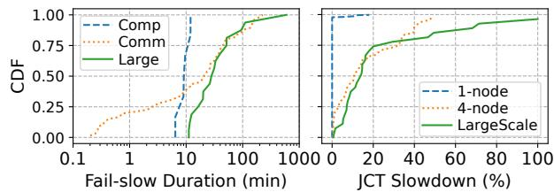

Figure 1: Left: CDF of fail-slow duration. Right: CDF of fail-slows’ impact on job completion time (JCT).
<table><tr><td rowspan="2">Category</td><td colspan="2">Online Probing</td><td>Offline Inspection</td></tr><tr><td>1-Node</td><td>4-Node</td><td>At Scale (≥ 512 GPUs)</td></tr><tr><td>No fail-slow</td><td>386</td><td>64</td><td>11</td></tr><tr><td>CPU Contention</td><td>4</td><td>1</td><td>0</td></tr><tr><td>GPUDegradation</td><td>2</td><td>0</td><td>0</td></tr><tr><td>Network Congestion</td><td>0</td><td>42</td><td>13</td></tr><tr><td>Multiple Issues</td><td>0</td><td>0</td><td>3</td></tr><tr><td>Total # Jobs</td><td>392</td><td>107</td><td>27</td></tr><tr><td>Avg. JCT Slowdown</td><td>11.79%</td><td>15.45%</td><td>34.59%</td></tr></table>

Table 1: Root causes and JCT slowdown of fail-slow issues in our characterization study.

## 3.2 How Do Comput. Fail-Slows Manifest?

Probing jobs. We start to characterize computation fail-slows occurred on individual nodes. We submitted 400 single-node training jobs to the cluster, of which 392 completed successfully without fail-stop errors. Each job trains a GPT2-11B model on one node using 4×H800 GPUs with a hybrid parallelism strategy of (2TP, 1DP, 2PP) to fully utilize GPU memory. The training framework used is Megatron-LM. Each job runs 10,000 iterations, taking 70 to 90 minutes. These probing jobs were scheduled to run on approximately 500 out of 1,800 H800 GPUs in our cluster (28% coverage).

Frequency and impacts. As summarized in Table 1, among 392 completed probing jobs, six experienced computation fail-slows, of which four are due to CPU contention and two are resulted from GPU performance degradation. Figure 1 (left) further shows the distribution of fail-slow duration. All computation fail-slows (blue curve) are short-lived, with an average duration of 10 minutes, extending the job completion time (JCT) by 11.79%. We next provide two case studies to better understand the root causes of these issues.

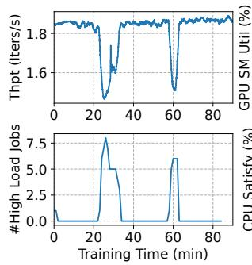

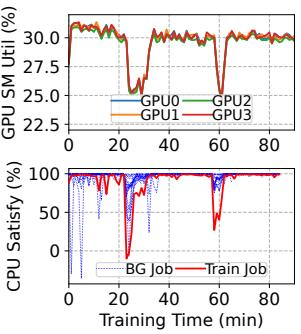  
Figure 2: A case of a fail-slow job due to CPU contention. Upper-left: Training throughput. Upper-right: GPU SM utilization of the four GPUs used by this job. Bottom-left: The number of high-CPU jobs running on the same node. Bottom-right: CPU satisfaction rate of the training job (red) and other colocated background jobs (blue).

Case-1: CPU contention. As shown in Figure 2 (upper-left), the job under study experienced two fail-slows at 22 and 55 minutes, resulting in a maximum performance drop of 21.6%. Correspondingly, the job measured simultaneous declines in SM utilization across all four GPUs during fail-slow periods (upper-right), suggesting GPU slowdown. To validate this, we paused the job and conducted a matrix computation to assess GPU performance upon fail-slow detection, but found no performance degradation. Further investigation revealed a surge in the number of high-CPU jobs coinciding with the fail-slow occurrence (bottom-left), leading to a decreased CPU satisfaction rate (bottom-right), increased CPU time, and ultimately, a reduction in throughput.

Case-2: GPU performance degradation. Computation failslows can also be attributed to GPU performance degradation, often linked to thermal throttling. Figure 3 illustrates a case where the job under study experienced slowdown in the first 10 minutes (upper-left), during which all four GPUs measured low SM utilization (upper-right). Further investigation indicated that only GPU0 was 20% slower than others (bottomleft) because of thermal throttling (bottom-right). Notably, rising temperatures do not always lead to performance issues; this may indicate a hardware problem, with an occurrence rate of about 0.5%, consistent with ByteDance’s report [22]. Requirements for mitigation strategies. Given that compute fail-slows are typically transient—often resolving within tens of minutes—the overall impact on training performance is moderate. Thus, mitigation strategies must be lightweight and impose minimal overhead. Costly interventions are unsuitable, as their adjustment costs can exceed the potential performance gains, thereby negating the benefits of mitigation.

## 3.3 How Do Commun. Fail-Slows Manifest?

Probing jobs. To explore communication fail-slows, we submitted 120 multi-node probing jobs, of which 107 successfully completed without fail-stop. Each job utilizes 8×A100 GPUs across four nodes to train a GPT2-7B model with (2TP, 4DP,

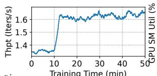

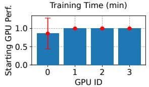

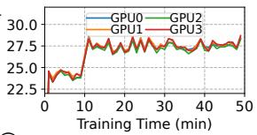

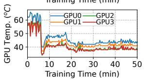  
Figure 3: A case of a fail-slow job due to GPU performance degradation. Upper-left: Training throughput. Upperright: GPU SM utilization of the four GPUs used by this job. Bottom-left: Normalized GPU performance during fail-slow. Bottom-right: NVML [39] reported GPU temperature.

1PP), where TP communications are over NVLink and DP communications are cross-node through a 400 Gbps RoCE link. Each job runs 10,000 iterations, taking approximately five hours. These probing jobs were distributed among 690 out of 2,600 A100 GPUs in our cluster (26.5% coverage).

Frequency and impacts. As summarized in Table 1, 43 out of 107 jobs experienced fail-slows. Among them, only one job was slowed due to CPU contention, while the other 42 encountered communication fail-slows caused by network congestion. We observed no hardware-induced fail-slows, such as issues with RNICs. Compared to computation slowdowns, communication fail-slows exhibit a wider range of duration, from sub-minutes to over 100 minutes(Figure 1, left). On average, communication fail-slow persists for about 24 minutes, delaying the average JCT by 15.45%.

Network congestion. Compared to computation slowdowns, network congestion emerges as a more significant factor contributing to performance degradation in multi-node training [12,45], with a notably higher frequency. Figure 4 presents a case study on a probing job that experienced two communication fail-slows at t=90 and t=265 minutes. The initial fail-slow resulted in throughput drop from 0.57 to 0.41 iterations/s; shortly thereafter, at t=265, the second slowdown further reduced throughput to merely 0.31 iterations/s (Figure 4, left). The two throughput drops align with the surges of congestion notification packets (CNPs) reported by the RNICs (center), indicating severe network congestion. Upon the onset of communication fail-slows, the SM utilization across all eight GPUs reduced simultaneously (right), despite healthy GPUs. We further investigated the spike in CNPs and discovered that other jobs were sharing the same link as our probing job, leading to throttled communication bandwidth.

Although this behavior is expected for network congestion control, such congestion is typically unavoidable and unpredictable in multi-tenant clusters, leading to reduced training performance [4, 45]. This is primarily due to the spine-leaf topology in modern clusters, where multiple jobs must share spine switches. As a result, isolating network traffic between jobs remains difficult, even with advanced scheduling policies [4, 45] and network-level optimizations [44]—though improved isolation can help reduce the frequency of congestion events. Given its inevitability and impact, we classify such congestion-induced slowdowns as a type of fail-slow.

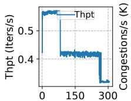  
Time (min)

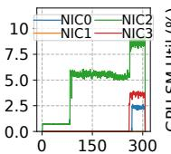

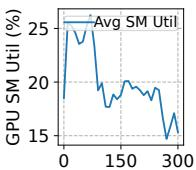  
Time (min)  
Time (min)  
Figure 4: A case of fail-slow jobs caused by network congestion. Left: Training throughput. Center: The number of congestion notification packets (×1000) sent by RNICs. Right: Average GPU SM utilization of the 8 GPUs used by this job.

Requirements for mitigation strategies. Due to their long duration and substantial impact, communication fail-slows can cause severe performance degradation if left unaddressed or mitigated ineffectively. This justifies and motivates the use of more effective, aggressive—and potentially higheroverhead— strategies, as the benefits can ultimately outweigh the associated costs.

## 3.4 How Do Fail-Slows Manifest at Scale?

Limited by the small scale of each probing job, previous studies can only characterize fail-slows at microscale, i.e., on individual nodes or links. To characterize fail-slows at a larger scale, we collected and manually examined a one-month trace containing 27 large-scale training jobs that ran on our cluster in July 2024, each utilizing 512 to 1024 GPUs.

Frequency and impacts. Among 27 jobs, 16 encountered fail-slows, delaying the average JCT by 34.59%. In particular, 20% of these jobs were delayed more than 50% (green curve in Figure 1, right). The mean fail-slow duration is 72 minutes, significantly longer than that measured in the small sampling jobs (Figure 1, left). Table 1 summarizes the causes of the encountered fail-slows, where 13 slow jobs were due to network congestion, while the remaining were attributed to both network and GPU degradation. We observed no CPU contention for these jobs as they require 8×GPU per node and hence do not collocate with other workloads.

Deep dive. Figure 5 illustrates the throughput of two 1024- GPU jobs, one for LLM training and the other for MoE model training. Both jobs experienced severe network congestion, leading to considerable throughput fluctuations, one at the initial stage (left) and the other throughout training (right). Worse still, at this scale, a job may experience multiple fail-slows at certain times, causing more damage to training. Figure 6 illustrates a real case. Throughout the training process, the observed throughput closely aligns with the GPU SM utilization. The first severe network congestion occurred at t=62 minutes, slashing the training throughput by 80%. This degradation was further exacerbated by a GPU thermal throttling event occurred at around t=80 while the network congestion remains unabated, further reducing the throughput to only 10% of the normal performance. Subsequently, from t=120 onward, another severe network congestion persisted for about two hours, cutting the throughput by 85% again. This case highlights the compounding effects of multiple performance issues in largescale training, significantly undermining training efficiency. Requirements for mitigation strategies. At large scale, training jobs are likely to be affected compound of compute and communication fail-slows. Therefore, mitigation strategies must be adaptive and flexible, able to dynamically handle these complex and compounded performance issues to maintain training efficiency.

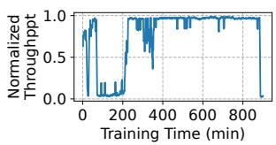

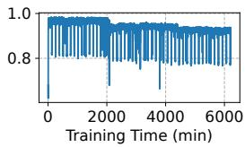  
Figure 5: Two 1024-GPU jobs that failed slow due to network congestion. Left: An LLM training job. Right: An MoE training job with high variance and ladder-shaped fail-slow.

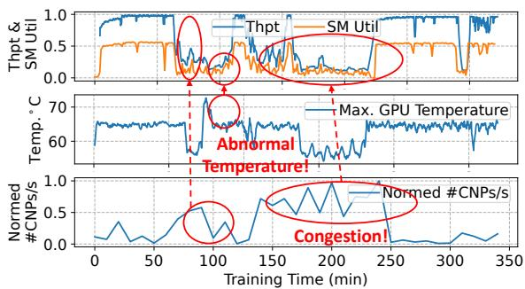  
Figure 6: A 1024-GPU training job experiencing multiple performance issues, where fail-slow is caused by a compound of high GPU temperature and congested network. Y-axis of the top and bottom sub-figures are normalized.

## 3.5 Takeaways and Other Evidences

Our characterization study brings three takeaways:

Takeaway #1. Fail-slows are usually transient, primarily caused by degradation in computation and communication; the former typically stem from slow GPUs or CPU contention, while the latter are mainly due to network congestion.

Takeaway #2. Computation fail-slows tend to be short-lived and less frequent, leading to relatively minor performance degradation. In contrast, communication fail-slows due to network congestion are more common and tend to last longer, resulting in more significant training slowdowns.

Takeaway #3. As training scales up, the likelihood of simultaneously encountering multiple performance issues increases. The compounding effects of these issues can lead to significant training slowdowns, potentially exceeding 90%.

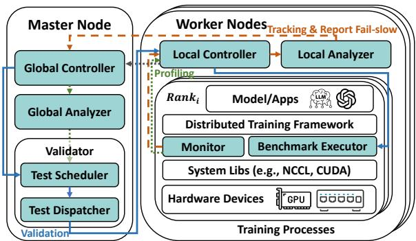  
Figure 7: Architecture overview of GREYHOUND-DETECT.

Evidence from other companies. In addition to our study, ByteDance has reported computation fail-slows in its training platform [22]. Also, Meta’s Llama team and Alibaba Cloud have reported communication fail-slows in LLM training [4, 12]. Our contacts with other companies bring attention to the similar fail-slow problems in large model training even on a single-tenant cluster of a hyperscale. While fail-slow issues are generally aware to practitioners, the general consensus, as noted in [12, 22], is that they are hard to detect at scale.

## 4 GREYHOUND-DETECT

Simply performing telemetry at cluster or node level, such as collecting GPU SM utilization and RNIC’s CNP responses using standard tools like nvidia-smi or NVML [39], is insufficient to locate fail-slows. As discussed in §3, given the synchronous nature of training, any degraded component results in simultaneous utilization drops of all GPUs. Also, in a multi-tenant cluster, a network link is commonly shared by multiple jobs, and an increase in CNPs does not mean that all jobs are experiencing communication fail-slows, especially for those transferring light traffics over the link.

In this section, we design GREYHOUND-DETECT, a distributed monitoring system for large-scale training that accurately identifies performance issues in computation and communication at runtime. We have four design requirements.

R1: Non-intrusive and framework-independent. The detection system should not be bound to a specific training framework or require any modifications to the framework.

R2: Rapid and accurate. The system should rapidly identify the onset and resolution of fail-slow degradation while accurately locating the slow GPUs or communication links.

R3: Automated. The detection should be fully automated.

R4: Lightweight. The system should introduce minimal inspection overhead to training, without costly full-job validations that typically require checkpoints and restarts.

## 4.1 System Overview

GREYHOUND-DETECT is a distributed performance monitoring system deployed together with a large model training framework, such as DeepSpeed [46–48] or Megatron-LM [50]. Figure 7 provides an architecture overview, where components introduced by GREYHOUND-DETECT are highlighted in cyan. GREYHOUND-DETECT employs a master-worker architecture. On each worker node, multiple worker agents are co-deployed with the framework processes to monitor the training performance and report potential degradation to the master for further analysis and handling. Specifically, GREY-HOUND-DETECT identifies fail-slows through a three-phase workflow: tracking, profiling, and validation.

1) Tracking. In this phase, each worker keeps track of the training iteration time for all training processes, called ranks, and detects slow iterations that indicate the onset of fail-slows. The worker reports these issues to the GlobalController, which transitions the system to the profiling phase.2

2) Profiling. During this phase, the GlobalController instructs each worker to collect the detailed execution profiles of the ongoing training job. These log profiles are sent to the GlobalAnalyzer, which identifies suspicious worker groups that may contain fail-slows. The GlobalController then transitions the system to the validation phase.

3) Validation. In this final phase, the system initiates failslow validations within the suspicious worker groups to precisely locate slow GPUs or congested network links.

We next describe the detailed designs in the three phases.

## 4.2 Tracking

GREYHOUND-DETECT enters the tracking phase upon the execution of a training job, continuously monitoring its performance on each worker node. Note that the monitoring is performed per-job on a multi-tenant cluster. To maintain transparency to the training framework (R1), GREYHOUND-DETECT inserts a shim monitoring and benchmarking layer between the framework and the underlying system libraries, such as NCCL and CUDA (Figure 7). In this shim layer, a Monitor intercepts communication operations (e.g., NCCL function calls) from the training framework and logs their types and timestamps. This is done by hooking to NCCL functions using Linux’s LD\_PRELOAD mechanism. Our system only intercepts top-level communication interfaces that are uniform in all communication libraries, such as AllReduce or AllGather, regardless of the underlying library implementation. Consequently, GREYHOUND-DETECT can seamlessly integrate with other communication libraries like ACCL [10], MSCCL [8], or customized NCCL as long as their top-level interfaces are consistent. The node’s LocalAnalyzer then retrieves the communication call logs, maintained in shared memory, to infer the iteration time and detect slow iterations using two time series analysis techniques as follows.

Iteration time analysis. Throughout iterations, various collective communication functions, such as ReduceScatter (RS), AllGather (AG), and AllReduce (AR), are invoked periodically. Figure 8 illustrates an example, where a training process exhibits a recurring period containing four communication calls. In practice, the number of communication calls involved in a recurring period and their patterns vary depending on the framework and the training model, which cannot be known due to the framework-agnostic requirement (R1).

<table><tr><td colspan="15">TrainingProcess</td></tr><tr><td colspan="4">Iteration1</td><td colspan="3">Iteration 2</td><td colspan="4">Iteration3</td></tr><tr><td>RSAG</td><td>AR</td><td>ARRS</td><td></td><td>AG</td><td>AR AR</td><td>RS</td><td>AG</td><td></td><td>AR AR</td></tr><tr><td colspan="2">Period #1</td><td colspan="8"></td></tr><tr><td colspan="10">Period #2 Period #3 Communication Operations</td></tr></table>

Figure 8: In iterative training, communication operations exhibit a clear periodic pattern, leading to recurring periods.

To identify the recurring period from a call sequence, we employ a time series analysis approach based on autocorrelation function (ACF) [5]. Formally, given a call sequence $X = \{ x _ { 1 } , x _ { 2 } , . . . \}$ , let $X _ { t }$ be a subsequence of X containing L elements starting from $x _ { t } .$ . Let k be the lag, ranging from 1 to a predefined maximum. We evaluate the likelihood of k being the recurring period of X by calculating the corresponding ACF defined as follows:

$$
\begin{array} { r } { A C F ( X ) _ { k } = \frac { C o \nu ( X _ { t } , X _ { t + k } ) } { V a r ( X _ { t } ) } = \frac { \sum _ { t = 1 } ^ { L - k } ( X _ { t } - \mu ) ( X _ { t + k } - \mu ) } { \sum _ { t = 1 } ^ { L } ( X _ { t } - \mu ) ^ { 2 } } , } \end{array}
$$

where µ is the mean of X. A higher value of $A C F ( X ) _ { k }$ indicates a greater likelihood that k is a recurring period. Thus, we can determine the recurring period of X by identifying the first k for which $A C F ( X ) _ { k }$ exceeds a certain threshold M (set to 0.95 in our experiments), i.e.,

$$
\mathrm { P e r i o d } = \arg \operatorname* { m i n } _ { k } ( A C F ( X ) _ { k } \geq M ) .
$$

Once the recurring period is identified, the iteration time derives as the time difference between a communication operation and its occurrence in the previous period.

Slow iteration detection. Training performance inherently fluctuates due to factors like periodic Python garbage collection, PyTorch CUDA memory allocator cache misses, and uneven sequence lengths in the dataset [59]. Thus, a robust statistical method is required to reliably identify true performance degradations while filtering out normal fluctuations (R2). To achieve this at runtime, we propose to use the Bayesian online change-point detection (BOCD) algorithm [2] followed by a verification checking to differentiate between real fail-slow issues and normal performance jitters.

1) The BOCD algorithm is an efficient time series algorithm that finds change-points online in a dynamic sequence in linear time. Feeding the algorithm the iteration time sequence, the identified change points usually correspond to the iterations with its duration change of over 10% due to the onset or relief of fail-slows. Specifically, the algorithm defines a run-length $r _ { t }$ for each timestamp t, which equals to $r _ { t - 1 } + 1 \mathrm { i }$ f t is not a change point, otherwise it is reset to 0. It then applies Bayesian inference to calculate the likelihood of $r _ { t } = 0$ for each timestamp. If the likelihood exceeds a certain threshold (0.9 in our experiments), it reports t as a change-point.

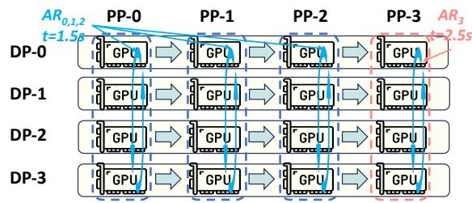  
Figure 9: An example of cross-group comparison, AR0,1,2,3 form a comparable cluster and AR3 is a degraded group.

2) Change-point verification. While the BOCD algorithm identifies potential change-points, applying it directly to failslow detection results in numerous false positives, as it misclassifies normal performance jitters as fail-slow incidents. To improve the detection accuracy (R2), we propose an additional verification step that compares the average iteration time before and after each identified change-point, treating it as a jitter if the difference is less than 10%.

The ACF-based iteration time analysis, combined with BOCD plus change-point verification, detects slow iterations reliably and in linear time, thereby meeting requirement R2. Once slow iterations are detected, the LocalAnalyzer reports to the master for further analysis and handling.

## 4.3 Profiling and Validation

Profiling. The detection of a slow iteration is a clear indicator of stragglers, which must be located rapidly. To avoid benchmarking all GPUs and links (R4), which is costly, GREY-HOUND-DETECT narrows the search to a few suspicious worker groups. This is achieved through lightweight profiling. On each worker node, the GPU Monitor injects CUDA events into intercepted NCCL calls to measure the execution time of each communication group. The measurement results are then collected by the master’s GlobalAnalyzer to identify the degraded groups via cross-group comparison. The basic idea is to categorize communication profiles into comparable clusters, where each communication group (e.g., NCCLGroup) within a cluster handles an identical data transfer volume. Ideally, communication times within the same comparable cluster should be consistent. However, stragglers manifest as groups with prolonged execution times due to performance degradation. For instance, as illustrated in Figure 9, the four DP all-reduce groups $A R _ { 0 , 1 , 2 , 3 }$ have identical communication volumes under uniform PP stage division, forming a 4-group comparable cluster. Nevertheless, $A R _ { 3 }$ measures a markedly longer execution time compared to the other groups, indicating the presence of a straggler within it. In practice, we identify a group as degraded if its execution time exceeds the median by over 10%.

Validation. Once a suspicious group is identified, further validation is needed to locate the degraded components in it. As this requires running benchmark tests, the training job must be temporarily suspended. To avoid expensive checkpointand-restart, we devise a lightweight training suspension mechanism (R4). Since GPU Monitor hooks NCCL calls, it can hang the training by simultaneously “trapping” those calls into a wait loop and give control back to the hanged training process once validation is done, without costly restarting the process or re-initialization.

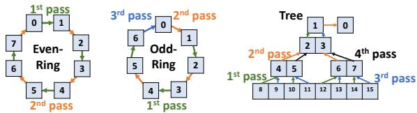  
Figure 10: O(1) validation of Ring and Tree communicators. Each cell is a rank, and the lines represent network links.

While the training is being hanged, computation and communication benchmark tests are dispatched automatically to the identified suspicious worker groups to precisely locate the degraded components (R2 and R3).

1) Computation validation. To benchmark computation performance within a group, the master’s TestDispatcher dispatches standard GEMM [37] tests to all worker GPUs in parallel to identify slow stragglers, if any. We use GEMM as it is a building block training operation and is commonly used as a standard test in advanced benchmarking tools like SuperBench [58]. Customized tests are also supported.

2) Communication validation. Exhaustive evaluation of all possible links within a communication group is timeconsuming (O(N2), where N is the group size). As collective communications can be performed with ring or tree topologies, we propose to divide the collective topology into nonoverlapping peer-to-peer (P2P) operations and evaluate only the links used in training. These operations can be executed efficiently in O(1) time, regardless of the group size (R2), as illustrated in Figure 10. Specifically, for a ring topology, the algorithm differentiates between even- and odd-rank rings. It divides even-rank rings into P2P send-receive operations that can be covered in two passes. In the first pass, data is transferred from even to adjacent odd ranks simultaneously (i.e., 0 → 1, 2 → 3, . . .); the second pass sends data from odd ranks to adjacent even ranks simultaneously (i.e., 1 → 2, 3 → 4, . . ., as shown in Figure 10, left). For odd-rank rings, an additional pass is needed to accommodate the remaining link (Figure 10, center). For tree topology, the validation requires four passes (Figure 10, right). The first pass simultaneously sends from left-child ranks at even levels to their parents, followed by the second pass which sends from right-child ranks at even levels, also simultaneously. The third and fourth passes reverse the roles of the senders, starting from odd levels. Since the transmission sizes are identical, slows link measures longer communication times and can be easily identified. In our implementation, both ring- and tree-topology validation are needed in a worker group as NCCL determines the actual collective communication topology dynamically.

Limitation. Our current design cannot detect fail-slows that occur only when computation and communication kernels co-execute in specific patterns [58]. However, these instances are typically linked to defects in particular hardware batches and are extremely rare in production environments.

## 5 GREYHOUND-MITIGATE

Unlike fail-slow detection, which is non-intrusive, fail-slow mitigation requires supports from the training framework. Therefore, it cannot be entirely non-intrusive to the training job. In this section, we present GREYHOUND-MITIGATE, a system that effectively addresses fail-slows with a novel adaptive multi-level mitigation mechanism.

## 5.1 Adaptive Multi-Level Mitigation

Solution space. Simply treating transient fail-slows as failstops by means of checkpoint-and-restart can do more harm than good, as dumping and restoring checkpoints for large models is time-consuming. In fact, dumping a GPT2-100B model takes nearly 100 minutes [56], even longer than the mean fail-slow duration in our cluster (§3). We explore the solution space and identify four strategies.

(S1) Do nothing. This approach simply ignores fail-slow problems in the hope that the straggler components will soon be self-recovered. Many existing systems choose to do so due to the lack of an effective detection tool.

(S2) Adjust micro-batch distribution. This strategy is efficient in addressing computation fail-slows, which result in uneven processing speed among model replicas (i.e., DP groups). The strategy reacts by redistributing micro-batches across DP groups based on their processing speed, alleviating the load on slow GPUs and rebalancing the computation (§5.2).

(S3) Adjust parallelism topology. This strategy effectively mitigates both computation and communication stragglers by: 1) reassigning heavy-traffic communications to less congested links, thereby mitigating network congestion; and 2) consolidating multiple stragglers into the minimal number of PP stages, thus reducing their overall impact (§5.2).

(S4) Checkpoint-and-restart. As a last resort, the system performs checkpointing and restarts training on healthy nodes. While this approach effectively eliminates all fail-slows by replacing slow components, it incurs the highest overhead and may require significant human intervention.

We compare the four strategies in Table 2.3 As we move from S1 to S4, the mitigation effectiveness improves, but the action overhead also increases. Therefore, the optimal strategy varies depending on the severity and the duration of failslows. While the severity can be measured, fail-slow duration exhibits a large dynamic range, from tens of seconds to several hours (Figure 1, left), and cannot be predicted accurately.

Ski-rental-like multi-level straggler mitigation. We find that the mitigation planning problem resembles the classical ski-rental problem [23], which involves balancing recurring ski-rental costs (akin to experiencing fail-slows) against a oneoff ski-buying investment to avoid those costs (akin to taking mitigation action), all without prior knowledge of duration. Inspired by the classical ski-rental algorithm, we design an adaptive multi-level fail-slow mitigation mechanism. It begins with a low-cost strategy (S1) and progressively switches to more effective—and hence more costly—strategies (S2 to S4) if fail-slow persists and the current approach proves ineffective. To determine when to switch strategy, the algorithm tracks the number of iterations affected by fail-slow and the resulting slowdowns to calculate an accumulated performance impact. It switches to the next strategy when the cumulative slowdown equals the action overhead of that strategy; that is, the algorithm is better off taking that more aggressive strategy upon the detection of fail-slow should it have known its performance impact (i.e., buy a ski when the cumulative rental cost equals the one-off buy cost). Algorithm 1 formally describes this mechanism.

<table><tr><td rowspan=2 colspan=2>Strategy</td><td rowspan=1 colspan=2>Effectiveness</td><td rowspan=2 colspan=1>ActionOverhead</td></tr><tr><td rowspan=1 colspan=1>Slow Comp.</td><td rowspan=1 colspan=1>Slow Comm.</td></tr><tr><td rowspan=6 colspan=2>S1: IgnoreS2:Adjust MicrobatchS3:Adjust TopologyS4: Ckpt-N-Restart</td><td rowspan=1 colspan=1>No Effect</td><td rowspan=1 colspan=1>No Effect</td><td rowspan=1 colspan=1>None</td></tr><tr><td rowspan=1 colspan=1>Mitigate</td><td rowspan=1 colspan=1>No Effect</td><td rowspan=2 colspan=1>LowMedium</td></tr><tr><td rowspan=1 colspan=1>slogy</td><td></td><td></td></tr><tr><td></td><td></td><td></td></tr><tr><td rowspan=1 colspan=1>Mitigate</td><td rowspan=1 colspan=1>Mitigate</td><td rowspan=1 colspan=1>N</td></tr><tr><td rowspan=1 colspan=1>Eliminate</td><td rowspan=1 colspan=1>Eliminate</td><td rowspan=1 colspan=1>High</td></tr></table>

Table 2: Comparison of mitigation strategies in terms of effectiveness and overhead.  
Algorithm 1 Adaptive Multi-level Fail-Slow Mitigation   
1: function MITIGATIONPLANNER(event)   
Input: The fail-slow event to handle.   
2: ▷ Find available strategies to mitigate this event.   
3: candidates ← FINDSTRATEGIES(event.root\_cause)   
4: ▷ Sort the strategies by their overhead.   
5: candidates.sort(key=strategy.overhead)   
6: id ← 0 ▷ Current mitigation strategy ID.   
7: while event.persist() do   
8: ▷ Get number of iterations that fails slow.   
9: slow\_iters ← event.get\_slow\_iters()   
10: ▷ Calculate the impact of fail-slow.   
11: slow\_impact ← slow\_iters $\mathrm { \mathrm { ~ \AA ~ } } ^ { \ast } ( t _ { \mathrm { { s l o w } } } - t _ { \mathrm { { h e a l t h y } } } )$   
12: ▷ Apply the current strategy and move forward.   
13: if slow\_impact $\geq$ candidates[id].overhead then   
14: candidate\_strategies[id].apply()   
15: id ← id + 1   
16: end if   
17: end while   
18: end function

## 5.2 Micro-batch and Parallelism Adjustment

We now describe the detailed design of the four strategies employed in the multi-level mitigation scheme. Since S1 and S4 are straightforward, we focus specifically on the two parallelism adjustment strategies S2 and S3.

S2: Adjust micro-batch distribution. This strategy dynamically adjusts the number of micro-batches allocated to DP groups according to their computation performance, effectively mitigating computation fail-slows at a low cost. Specifically, DP shards a large global batch into multiple microbatches and distributes them evenly among all groups (i.e., model replicas) at initial. When a certain group experiences computation fail-slow, we rebalance the workload by accordingly reducing the number of micro-batches allocated to it.

Formally, let D be the number of DP groups and M be the number of micro-batches in a global batch, where group $D P _ { i }$ is allocated $m _ { i }$ micro-batches. The processing time for a micro-batch in $D P _ { i }$ is denoted as $t _ { i } ,$ which is profiled by GREYHOUND-DETECT (§4.3). Our goal is to minimize the processing time of the slowest DP group, which can be formulated as a quadratic programming problem that minimizes the variance in processing times across all DP groups:4

$$
\begin{array} { r } { \operatorname* { m i n } \underset { i = 1 , \ldots , D } { \operatorname* { m a x } } m _ { i } t _ { i } \Leftrightarrow \operatorname* { m i n } { \sum _ { i = 1 } ^ { D } } ( m _ { i } t _ { i } - \frac { \sum _ { i = 1 } ^ { D } m _ { i } t _ { i } } { D } ) ^ { 2 } , } \end{array}
$$

$$
\begin{array} { r } { \mathrm { S u b j e c t ~ t o ~ } \quad m _ { i } \in \mathbb { N } ^ { + } \mathrm { ~ a n d ~ } \sum _ { i = 1 } ^ { D } m _ { i } = M . } \end{array}\tag{1}
$$

Although the micro-batches are not evenly distributed after this adjustment, the training loss can remain consistent using a weighted gradient aggregation method [6]. This leads to the same training result and hence ensures the correctness. Moreover, this adjustment only modifies the number of microbatches $( m _ { i } )$ assigned to each DP group, both the global batch size and micro-batch sizes remain unchanged. Given the peak GPU memory usage in memory-efficient pipelines such as 1F1B [34] is independent of $m _ { i } ,$ this strategy does not increase memory footprint during training.

Implementation and overhead. Our implementation uses cvxpy [9] to solve Equation (1), which typically takes only a few seconds (detailed in Table 5). Before each iteration, each DP group retrieves its assigned $m _ { i }$ from the global controller, allowing the new distribution to take effect immediately in the subsequent iteration, without requiring a job restart.

S3: Adjust parallelism topology. We design this strategy as a reactive method to handle communication stragglers. It adjusts the parallelism topology to reduce congestion and minimize PP stages affected by stragglers, more effectively mitigating communication fail-slows with moderate overheads.

Reassign congested links to light-traffic groups. One key characteristic in hybrid-parallel training is that PP communication involves significantly less data transfer than DP [35,50]. Specifically, per-GPU PP traffic is O(mi × activation\_size), typically in tens to hundreds of MBs per iteration, while DP gradient synchronization can exceed tens of GBs. Therefore, DP groups are much more susceptible to network congestion. To mitigate fail-slow events caused by congestion, we can reassign congested links from heavy-traffic DP groups to light-traffic PP groups, reducing the overall performance impact. For example, as shown in Figure 11, suppose the link between nodes 3 and 4 is congested and originally used for DP communication. By exchanging the DP and PP roles for nodes 2 and 3, we can redirect the traffic from node 3 to node 4 into light-traffic PP communication, effectively alleviating the impact of network congestion.

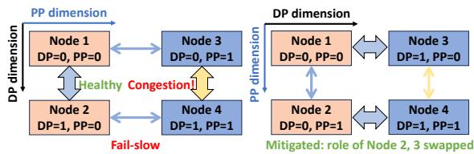

Figure 11: Topology adjustment to mitigate network congestion. After swapping Nodes 2 and 3, the congested link shifts from a heavy-traffic DP group to a lighter-traffic PP group.  
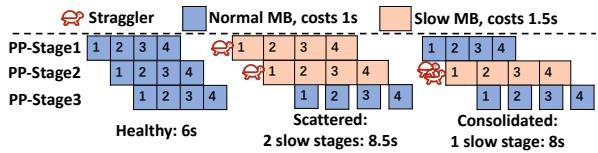  
Figure 12: The number of straggling PP stages determines iteration time. With two stragglers are scattered across two stages, the execution time is prolonged to 8.5s, while it can be mitigated to 8s by consolidating two stragglers in one stage.

Straggler consolidation. When multiple stragglers are present, consolidating them into one PP stage mitigates slowdown. Since workers within the same PP stage operates synchronously, the performance is determined by the slowest straggler, irrespective of the number of stragglers within this stage. In contrast, as shown in Figure 12, having stragglers scatter across multiple PP stages is sub-optimal. Therefore, in case of multiple stragglers, our topology adjustment aims to consolidate them into the minimal PP stages. To achieve this, we calculate the minimal number of PP stages needed to contain stragglers by ⌈#Stragglers/# GPUs per PP stage⌉ and consolidate the stragglers accordingly. We also prefer to shift them to interior stages, as the first and last stages typically endure a higher load due to the pre- and post-processing modules (e.g., embedding layers) allocated to them.

Implementation and overhead. Topology adjustment can be implemented in four steps: 1) pausing the ongoing training, 2) temporally dumping parameters to swap into main memory, 3) swapping parameters via peer-to-peer RDMA, and 4) restarting the training process. This adjustment incurs moderate overhead, only determined by the number of parameters per GPU, irrespective of the training scale given that each GPU operates independently. This adjustment is typically done in about one minute (detailed in Figure 19).

## 6 Implementation

We have implemented GREYHOUND-DETECT in approximately 5.5k lines of code (LOC) of C++ and Python. The worker’s GPU Monitor hooks NCCL functions using Linux’s LD\_PRELOAD mechanism. Intra-node and inter-node communications between modules are achieved through shared memory and Redis [49], respectively. During validation, the BenchmarkExecutor reuses the same CUDA context and

NCCL communicators from training, eliminating initialization overhead. For compute benchmarking, we use GEMM kernels with various data types, as GEMM is the primary building block in training and a common benchmarking standard. Specifically, BenchmarkExecutor sequentially run FP8, FP16, and FP32 GEMM kernels, with each kernel execution monopolizing all SMs to accurately assess the performance. For communication benchmarking, we perform concurrent NCCL send/receive operations shown in Figure 10, using message sizes of 16, 32, and 64 MB. Each computation and communication test is repeated three times, with the mean execution time used as the final metric. The benchmarking component is designed in a modular fashion, which facilitates the easy integration of additional benchmarks in the future.

GREYHOUND-MITIGATE is implemented in 1.5k LOC of Python. The planner receives straggler IDs from Redis and generates adjustment strategies, which are then executed a lightweight plugin of Megatron-LM [50].

## 7 Evaluation

In this section, we evaluate GREYHOUND-DETECT and GREYHOUND-MITIGATE to answer the following questions:

1. How accurately does GREYHOUND-DETECT estimate iteration time and identify fail-slow incidents across various models and parallelism configurations? (§7.2)

2. Is GREYHOUND-MITIGATE effective in alleviating various fail-slow failures with different root causes and parallelism configurations? (§7.3)

3. What is the overhead associated with GREYHOUND-DETECT and the various mitigation strategies implemented in GREYHOUND-MITIGATE? (§7.4)

4. How effective is GREYHOUND in enhancing training efficiency and mitigating the impact of fail-slow incidents in large-scale real-world training scenarios? (§7.5)

## 7.1 Experiment Setup

Testbed configuration. We conduct our evaluation on a highperformance cluster comprising 55 nodes, each equipped with 8 NVIDIA H800 GPUs connected via NVSwitch. The nodes are interconnected through a 400Gbps InfiniBand network in a spine-leaf topology, ensuring symmetric inter-node bandwidth. Our tests utilize Megatron-LM [50], a large-scale distributed training framework built on PyTorch [3], to train a set of GPT-2 models in various sizes and parallel strategies. The testbed runs CUDA version 12.2 and NCCL version 2.18.1.

Fail-slow injection. We evaluate the effectiveness of our mitigation system using deterministic manually injected failslows. To simulate computational fail-slows, we employ nvidia-smi to lock the GPU SM frequency. To inject communication fail-slows, we initiate side-channel communication jobs that create network bandwidth contention, thereby reducing the available bandwidths on specific network links.

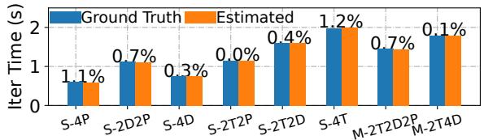

Figure 13: Accuracy of iteration time estimation in singlenode (S) and multi-node (M) settings. The notation xTyDzP specifies the TP size x, DP size y, and PP size z.
<table><tr><td>Algorithm</td><td>Accuracy↑(%)</td><td>FPR↓(%)</td><td>FNR↓(%)</td></tr><tr><td>SlideWindow</td><td>99.5(390/392)</td><td>0.0(0/386)</td><td>25.0(2/8)</td></tr><tr><td>BOCD</td><td>77.8(305/392)</td><td>18.39(87/473)</td><td>0.0(0/6)</td></tr><tr><td>BOCD+V</td><td>100.0(392/392)</td><td>0.0(0/386)</td><td>0.0(0/6)</td></tr></table>

Table 3: Detection evaluation for computation fail-slows.

## 7.2 How Accurate Is Detection?

Iteration time estimation. We first evaluate the accuracy of the ACF-based iteration time estimation across various hybridparallel strategies as it is the foundation of fail-slow detection. We deploy GPT2-7B training jobs using different parallelism strategies on 1, 2, and 4 nodes. As illustrated in Figure 13, in single-node experiments with 4 GPUs, the relative error remains below 1.2% compared to the ground truth iteration time, regardless of the parallel strategies employed. In a 2- node experiment with a (2TP, 2DP, 2PP) configuration, the error is 0.7%, while in a 4-node test with a (2TP, 4DP) setup, it remains highly accurate at just 0.1% relative error.

Fail-slow detection. We then assess the effectiveness of our BOCD and verification algorithm (BOCD+V) in detecting computation and communication fail-slows. The baseline methods are sliding window and classical BOCD; the former reports a fail-slow if there’s a >10% performance change in the sliding window from the current median, while the latter performs no verification. Using traces from §3, we assess their accuracy against human-labeled ground truth. As shown in Table 3, BOCD+V achieves perfect 100% accuracy with 0% False-Positive Rate (FPR) and 0% False-Negative Rate (FNR) in detecting computation fail-slow. In case of communication fail-slow (as illustrated in Table 4), BOCD+V attains 99.1% accuracy, 0% FPR, and only 2.3% FNR. The FNR primarily results from a rare case containing consecutive <10% degradations. The original BOCD has a lower FNR by reporting all suspicious change-points but suffers from a high FPR. Similarly, the sliding window method is less accurate, missing many fail-slow cases with a higher FNR.

## 7.3 How Effective Is Mitigation?

In this section, we assess the effectiveness of the mitigation strategies introduced in § 5.2. Since GREYHOUND does not have prior knowledge of stragglers, they must be detected online during training. As a result, these experiments also serve as an implicit end-to-end test of GREYHOUND-DETECT, which achieves 100% accuracy in all cases reported below.

<table><tr><td>Algorithm</td><td>Accuracy↑(%)</td><td>FPR↓(%)</td><td>FNR↓(%)</td></tr><tr><td>SlidingWindow</td><td>93.5(100/107)</td><td>1.5(1/65)</td><td>12.2(6/49)</td></tr><tr><td>BOCD</td><td>69.2(74/107)</td><td>34.0(33/97)</td><td>0.00(0/43)</td></tr><tr><td>BOCD+V</td><td>99.1(106/107)</td><td>0.00(0/64)</td><td>2.3(1/44)</td></tr></table>

Table 4: Detection evaluation for communication fail-slows.

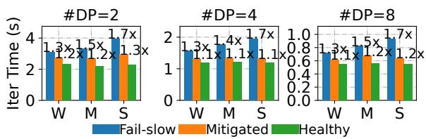  
Figure 14: Effectiveness of micro-batch adjustment strategy of mitigating various fail-slow severities and DP settings.

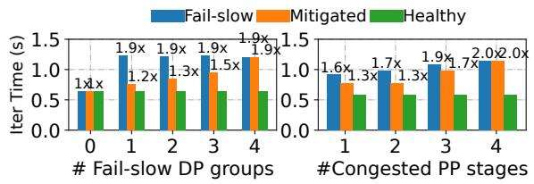  
Figure 15: Left: Effectiveness of micro-batch adjustment (S2) on various number of slow DP groups. Right: Effectiveness of straggler consolidation (S3) on various slow PP stages.

Micro-batch distribution adjustment (S2). To evaluate the effectiveness of strategy S2 in mitigating computation failslows, we deploy a single-node training with 8 GPUs. We inject weak (W), medium (M), and severe (S) computation fail-slows to training jobs with 2, 4, and 8 DP groups, as illustrated in Figure 14. Our approach reduces the average iteration time from 1.7× the baseline to 1.3/1.1/1.2×, yielding up to 1.52× optimization. This strategy proves effective across various setups and fail-slow severity since it consistently ensures a dynamic load balance across all DP groups.

As shown in Figure 15 (left), we also evaluate S2 when multiple DP groups experience fail-slow. In a 4-DP training job, we inject medium slow computation into 0 to 4 DP groups. S2 achieves its best performance with only one slow group, reducing iteration time from 1.31s to 0.83s, yielding 1.59× improvement. While multiple slow DP groups do not further increase iteration time, the room for mitigation decreases as the number of degraded DP groups rises. This is because with multiple DP groups degraded, total computational power decreases, limiting adjustment flexibility, and there is no room for adjustment if all groups are slow.

Topology adjustment (S3). We evaluate strategy S3 in a 2- node experiment with 16 GPUs. As shown in Figure 16, we inject communication fail-slows into training jobs with 4 or 8 PP stages. The results reveal a reduction in the average iteration time by up to 1.23× for PP=4, and 1.14× for PP=8, both under severe congestion. The strategy is more effective with 4-stage PP due to the increased bubble rate and longer idle times associated with the longer pipeline in the 8-stage setup, which ultimately understates the effectiveness.

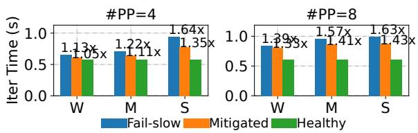  
Figure 16: Effectiveness of topology adjustment strategy of mitigating various fail-slow severity and PP settings.

To evaluate the effectiveness of straggler consolidation in topology adjustment, we conduct an experiment with 16 GPUs using (4DP, 4PP) setup. As shown in Figure 15 right, congestion in one or two links raises iteration time to 1.6/1.7×, which can be both mitigated to 1.3× through consolidating them into only one PP stage. With three congested links affecting 6 GPUs, mitigation reduces iteration time from 1.9× to 1.7×, since one stage contains only four GPUs and six stragglers must occur across two PP stages. If all links are slow, there is no room for adjustment.

## 7.4 How Large Is the Overhead?

Overhead of GREYHOUND-DETECT. As discussed in §4, GREYHOUND-DETECT comprises a three-phase workflow: tracking, profiling, and validation, with corresponding overhead evaluated as follows.

Tracking. We conducted training under the same settings as in §7.2. As shown in Figure 18, the average overhead is only 0.39%, with a maximum of 1.1% compared to training without the detector. In some cases, enabling the detector results in an even slightly faster iteration (indicated by 0.0% in green), highlighting that such overhead is caused by inherent fluctuations instead of detector itself. These results prove that the overhead of GREYHOUND-DETECT is negligible. Upon fail-slow events, the BOCD algorithm can detect it in the next 2-3 iterations, costing typically <5 seconds for reaction.

Profiling. Since this phase only collects profiles for offline analysis, it does not introduce any additional overhead.

Validation. The validation phase runs the compute and communication benchmarks described in §6. As shown in Figure 17, compute validation completes within 0.59/0.51/0.24s on NVIDIA A10, A100, and H800 GPUs under normal conditions, and within 1.94/1.23/0.87s under fail-slow scenarios (GPU clock rate locked at 300 MHz). For communication validation, we assess NVLink, PCIe, and RDMA, where RDMA is most susceptible to congestion, but all benchmarks (3 repetitions) still finish within 3.04 seconds. Overall, the total benchmarking overhead remains about 5 seconds even under severe fail-slow scenarios or on lower-end GPUs.

Overhead of GREYHOUND-MITIGATE. We then evaluate the overhead of the strategies in GREYHOUND-MITIGATE.

Micro-batch adjustment (S2). We evaluate the overhead for adjusting the micro-batch distribution, which primarily arises from solving Equation (1). As shown in Table 5, although this overhead increases exponentially with the number of DP groups, it remains around 30 seconds even with 512 DP groups, showing its efficiency for hyperscale training.

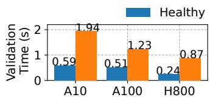

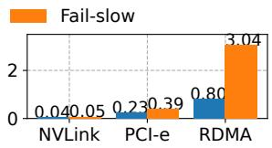  
Figure 17: Left: overhead of executing compute benchmarks. Right: overhead of executing communication benchmarks.

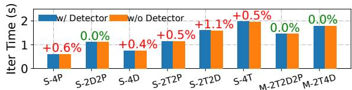  
Figure 18: Overhead introduced by GREYHOUND-DETECT across various parallel strategies.

Topology adjustment (S3). We evaluate the topology adjustment overhead under various parameter settings. We set the per GPU memory footprint to dump to 10, 22, 38, and 76GB, and conduct training on a single node with 8 GPUs. The adjustment time will no more increase as training scales up, since each node operates independently. As shown in Figure 19, our approach reduces pause time by up to 6.72× compared to the disk-based C/R, primarily by eliminating checkpoint dumping and loading times. The performance gains are more pronounced with more parameters, as the disk operation times increase significantly for large I/O sizes.

## 7.5 How Does GREYHOUND Perform at Scale?

To evaluate GREYHOUND ’s effectiveness at scale, we conduct a GPT2-40B training experiment on 256 NVIDIA H800 GPUs with (8TP, 16DP, 2PP). We manually inject 12 fail-slow events, including two communication congestion events and ten compute slowdowns, each with varying severity levels, as detailed in Table 6. We also simulate compound cases where compute and communication fail-slows occur simultaneously, mirroring the scenarios presented in our characterization (§3.4). The training job is executed twice under identical straggler injection schedule: once with GREYHOUND and once without for A/B testing. Note that the straggler schedule is unknown to GREYHOUND—all fail-slows must be detected first and then mitigated, yielding an end-to-end evaluation.

Detection. First, we evaluate GREYHOUND-DETECT ’s detection accuracy and reaction time. As presented in Table 6, it accurately identifies all 12 fail-slow events, achieving a 100% detection rate. For each fail-slow event, we measure the time difference between when GREYHOUND-DETECT reports it and the actual injection timestamp, representing the reaction time. The average reaction time is 10.56 seconds in this 256-GPU experiment, indicating low detection overhead at scale. This reaction time consists of two phases: the BOCD algorithm signals a change point, occurring approximately 4 seconds post straggler injection. Subsequently, GREYHOUND-DETECT enters profiling and validation mode, requiring an additional 6 to 10 seconds to identify the root cause.

<table><tr><td rowspan=1 colspan=1>#DPs</td><td rowspan=1 colspan=1>16</td><td rowspan=1 colspan=1>32</td><td rowspan=1 colspan=1>64</td><td rowspan=1 colspan=1>128</td><td rowspan=1 colspan=1>256</td><td rowspan=1 colspan=1>512</td></tr><tr><td rowspan=1 colspan=1>Time(s)</td><td rowspan=1 colspan=1>0.01</td><td rowspan=1 colspan=1>0.01</td><td rowspan=1 colspan=1>0.01</td><td rowspan=1 colspan=1>0.11</td><td rowspan=1 colspan=1>6.78</td><td rowspan=1 colspan=1>35.93</td></tr></table>

Table 5: Time to find the optimal micro-batch distribution.

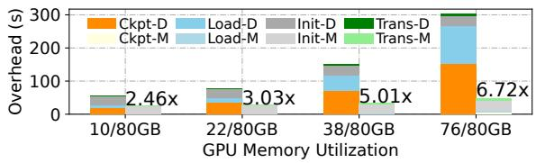

Figure 19: Overhead breakdown of S3. M: memory-based dump and load (our method), D: disk-based C/R.
<table><tr><td>Comm. Slow</td><td>Comp.Slow</td><td>Detect Acc.</td><td>Avg.Reaction</td></tr><tr><td rowspan="3">Medium: 2</td><td>Weak:3</td><td rowspan="3">100%</td><td>BOCD:3.7s</td></tr><tr><td>Medium: 5</td><td>Prof.&amp;Val.: 6.86s</td></tr><tr><td>Severe: 2</td><td>Total: 10.56s</td></tr></table>

Table 6: Detection accuracy and average reaction time of GREYHOUND-DETECT in the 256 H800 GPU experiment.

Mitigation. Accurate and timely detection enables effective mitigation strategies. As shown at the top of Figure 20, without GREYHOUND, computation stragglers cause significant throughput declines. In contrast, with GREYHOUND, throughput quickly recovers to near-optimal levels, demonstrating the effectiveness of micro-batch adjustment (S2). During communication congestion periods, GREYHOUND initiates brief pause for topology adjustments (S3) at t=850 and t=2100, each lasting under one minute. These adjustments are faster than traditional C/R methods which takes tens of minutes. Once congestion ends, the topology is promptly reverted (at t=1150 and t=2350). Notably, compound fail-slows can reduce training throughput by about 55%, but it can be mitigated to only 25% degradation with GREYHOUND.

End-to-end performance. Combining accurate detection and effective mitigation, GREYHOUND significantly reduces the impact of stragglers. Without GREYHOUND, end-to-end throughput decreases from 37.4 to 18.9 iterations per minute due to injected fail-slow events. In contrast, with GREY-HOUND, throughput recovers to 29.8 iterations per minute (including the detection and validation overhead), achieving 1.58× improvement in end-to-end throughput.

## 8 Related Work

Reliability issues in training. Several studies address the failstop issue using checkpoints [28,33,56], re-computation [53], and elastic frameworks [11, 20, 53, 56, 64]. For example, Oobleck [20] pre-computes static parallelism adjustments for predictable resource changes (e.g., node removal). In contrast, while fail-slow have been acknowledged in various reports [12,22], only a concurrent work, Holmes [59], addresses this issue but lacks mitigation. However, fail-slow mitigation is orthogonal to fail-stop recovery and more challenging as it requires dynamic reactions according to the detected stragglers without altering the number of available resources.

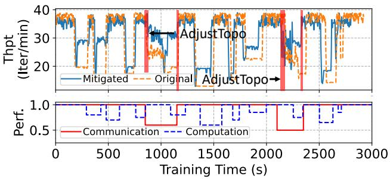  
Figure 20: Evaluation of GREYHOUND for a 256 H800 GPU training with computation and communication fail-slows.

Fail-slow in other fields. Fail-slow also exists in cloud services [7, 14, 15, 17, 18, 29], operating systems [61], and storage [16, 30], but presents unique challenges in large-scale training. In these domains, the main issue is identifying the source of gradually propagating [14, 15] or independent [30] fail-slows. In contrast, large-scale training is synchronous, one slow component can immediately propagate to the entire cluster. Additionally, replacing degraded components in these fields often does not impact the entire system.

Heterogeneous DL training. Several researches focus on efficient parallel training on heterogeneous hardware with various performance [6, 21, 31, 32, 41, 54, 60, 63]. However, mitigating fail-slow presents distinct challenges. Heterogeneous training is static, where performance does not fluctuate over time, thus allowing for higher-cost parallel strategy searches at initial [54,63]. In contrast, fail-slow handling must be dynamic, precluding those high-cost searches.

## 9 Conclusion

In this paper, we presented the first comprehensive characterization study in a production cluster to understand the overall characteristics and performance impacts of fail-slow failures in large-scale LM training. We proposed GREYHOUND, a framework that swiftly identifies fail-slowed compute or communication components and effectively mitigates them using a novel multi-level mechanism, all without human intervention. GREYHOUND achieves over 99% accuracy in detecting fail-slows and improves the end-to-end performance by 1.58× in large-scale training.

## Acknowledgment

We thank our shepherd, Linhai Song, and the anonymous reviewers for their valuable comments that help improve the quality of this work. This work was supported in part by the Alibaba Innovative Research (AIR) Grant, RGC CRF Grant (Ref. #C6015-23G), RGC GRF Grant (Ref. #16217124), and NSFC/RGC CRS Grant (#CRS\_HKUST601/24).

## References

[1] Josh Achiam, Steven Adler, Sandhini Agarwal, Lama Ahmad, Ilge Akkaya, Florencia Leoni Aleman, Diogo Almeida, Janko Altenschmidt, Sam Altman, Shyamal Anadkat, et al. Gpt-4 technical report. arXiv preprint arXiv:2303.08774, 2023.

[2] Diego Agudelo-España, Sebastian Gomez-Gonzalez, Stefan Bauer, Bernhard Schölkopf, and Jan Peters. Bayesian online prediction of change points. In Conference on Uncertainty in Artificial Intelligence, pages 320–329. PMLR, 2020.

[3] Jason Ansel, Edward Yang, Horace He, Natalia Gimelshein, Animesh Jain, Michael Voznesensky, Bin Bao, Peter Bell, David Berard, Evgeni Burovski, et al. Pytorch 2: Faster machine learning through dynamic python bytecode transformation and graph compilation. In Proceedings of the 29th ACM International Conference on Architectural Support for Programming Languages and Operating Systems, Volume 2, pages 929– 947, 2024.

[4] Jiamin Cao, Yu Guan, Kun Qian, Jiaqi Gao, Wencong Xiao, Jianbo Dong, Binzhang Fu, Dennis Cai, and Ennan Zhai. Crux: Gpu-efficient communication scheduling for deep learning training. In Proceedings of the ACM SIGCOMM 2024 Conference, pages 1–15, 2024.

[5] Christopher Chatfield. The analysis of time series: theory and practice. Springer, 2013.

[6] Chen Chen, Qizhen Weng, Wei Wang, Baochun Li, and Bo Li. Semi-dynamic load balancing: Efficient distributed learning in non-dedicated environments. In Proceedings of the 11th ACM Symposium on Cloud Computing, pages 431–446, 2020.

[7] Mike Chow, Yang Wang, William Wang, Ayichew Hailu, Rohan Bopardikar, Bin Zhang, Jialiang Qu, David Meisner, Santosh Sonawane, Yunqi Zhang, et al. {ServiceLab}: Preventing tiny performance regressions at hyperscale through {Pre-Production} testing. In 18th USENIX Symposium on Operating Systems Design and Implementation (OSDI 24), pages 545–562, 2024.

[8] Meghan Cowan, Saeed Maleki, Madanlal Musuvathi, Olli Saarikivi, and Yifan Xiong. Mscclang: Microsoft collective communication language. In Proceedings of the 28th ACM International Conference on Architectural Support for Programming Languages and Operating Systems, Volume 2, pages 502–514, 2023.

[9] Steven Diamond and Stephen Boyd. CVXPY: A Pythonembedded modeling language for convex optimization. Journal of Machine Learning Research, 17(83):1–5, 2016.

[10] Jianbo Dong, Shaochuang Wang, Fei Feng, Zheng Cao, Heng Pan, Lingbo Tang, Pengcheng Li, Hao Li, Qianyuan Ran, Yiqun Guo, et al. Accl: Architecting highly scalable distributed training systems with highly efficient collective communication library. IEEE micro, 41(5):85–92, 2021.

[11] Jiangfei Duan, Ziang Song, Xupeng Miao, Xiaoli Xi, Dahua Lin, Harry Xu, Minjia Zhang, and Zhihao Jia. Parcae: Proactive,{Liveput-Optimized}{DNN} training on preemptible instances. In 21st USENIX Symposium on Networked Systems Design and Implementation (NSDI 24), pages 1121–1139, 2024.

[12] Abhimanyu Dubey, Abhinav Jauhri, Abhinav Pandey, Abhishek Kadian, Ahmad Al-Dahle, Aiesha Letman, Akhil Mathur, Alan Schelten, Amy Yang, Angela Fan, et al. The llama 3 herd of models. arXiv preprint arXiv:2407.21783, 2024.

[13] William Fedus, Barret Zoph, and Noam Shazeer. Switch transformers: Scaling to trillion parameter models with simple and efficient sparsity. Journal of Machine Learning Research, 23(120):1–39, 2022.

[14] Yu Gan, Mingyu Liang, Sundar Dev, David Lo, and Christina Delimitrou. Sage: Leveraging ml to diagnose unpredictable performance in cloud microservices. arXiv preprint arXiv:2112.06263, 2021.

[15] Yu Gan, Yanqi Zhang, Kelvin Hu, Dailun Cheng, Yuan He, Meghna Pancholi, and Christina Delimitrou. Seer: Leveraging big data to navigate the complexity of performance debugging in cloud microservices. In Proceedings of the twenty-fourth international conference on architectural support for programming languages and operating systems, pages 19–33, 2019.

[16] Haryadi S Gunawi, Riza O Suminto, Russell Sears, Casey Golliher, Swaminathan Sundararaman, Xing Lin, Tim Emami, Weiguang Sheng, Nematollah Bidokhti, Caitie McCaffrey, et al. Fail-slow at scale: Evidence of hardware performance faults in large production systems. ACM Transactions on Storage (TOS), 14(3):1–26, 2018.

[17] Peng Huang, Chuanxiong Guo, Jacob R Lorch, Lidong Zhou, and Yingnong Dang. Capturing and enhancing in situ system observability for failure detection. In 13th USENIX Symposium on Operating Systems Design and Implementation (OSDI 18), pages 1–16, 2018.

[18] Peng Huang, Chuanxiong Guo, Lidong Zhou, Jacob R Lorch, Yingnong Dang, Murali Chintalapati, and Randolph Yao. Gray failure: The achilles’ heel of cloudscale systems. In Proceedings of the 16th Workshop on Hot Topics in Operating Systems, pages 150–155, 2017.

[19] Yanping Huang, Youlong Cheng, Ankur Bapna, Orhan Firat, Dehao Chen, Mia Chen, HyoukJoong Lee, Jiquan Ngiam, Quoc V Le, Yonghui Wu, et al. Gpipe: Efficient training of giant neural networks using pipeline parallelism. In NeurIPS, 2019.

[20] Insu Jang, Zhenning Yang, Zhen Zhang, Xin Jin, and Mosharaf Chowdhury. Oobleck: Resilient distributed training of large models using pipeline templates. In Proceedings of the 29th Symposium on Operating Systems Principles, pages 382–395, 2023.

[21] Xianyan Jia, Le Jiang, Ang Wang, Wencong Xiao, Ziji Shi, Jie Zhang, Xinyuan Li, Langshi Chen, Yong Li, Zhen Zheng, et al. Whale: Efficient giant model training over heterogeneous {GPUs}. In 2022 USENIX Annual Technical Conference (USENIX ATC 22), pages 673– 688, 2022.

[22] Ziheng Jiang, Haibin Lin, Yinmin Zhong, Qi Huang, Yangrui Chen, Zhi Zhang, Yanghua Peng, Xiang Li, Cong Xie, Shibiao Nong, et al. {MegaScale}: Scaling large language model training to more than 10,000 {GPUs}. In 21st USENIX Symposium on Networked Systems Design and Implementation (NSDI 24), pages 745–760, 2024.

[23] Anna R Karlin, Claire Kenyon, and Dana Randall. Dynamic tcp acknowledgement and other stories about e/(e-1). In Proceedings of the thirty-third annual ACM symposium on Theory of computing, pages 502–509, 2001.

[24] Gurkirat Kaur and Manju Bala. Rdma over converged ethernet: A review. International Journal of Advances in Engineering & Technology, 6(4):1890, 2013.

[25] Vijay Anand Korthikanti, Jared Casper, Sangkug Lym, Lawrence McAfee, Michael Andersch, Mohammad Shoeybi, and Bryan Catanzaro. Reducing activation recomputation in large transformer models. In MLSys, 2023.

[26] Teven Le Scao, Angela Fan, Christopher Akiki, Ellie Pavlick, Suzana Ilic, Daniel Hesslow, Roman Castagné, ´ Alexandra Sasha Luccioni, François Yvon, Matthias Gallé, et al. Bloom: A 176b-parameter open-access multilingual language model. 2023.

[27] Dmitry Lepikhin, HyoukJoong Lee, Yuanzhong Xu, Dehao Chen, Orhan Firat, Yanping Huang, Maxim Krikun, Noam Shazeer, and Zhifeng Chen. Gshard: Scaling giant models with conditional computation and automatic sharding. arXiv preprint arXiv:2006.16668, 2020.

[28] Yuanhao Li, Tianyuan Wu, Guancheng Li, Yanjie Song, and Shu Yin. Portus: Efficient dnn checkpointing to persistent memory with zero-copy. In 2024 IEEE 44th

International Conference on Distributed Computing Systems (ICDCS), pages 59–70. IEEE, 2024.

[29] Chang Lou, Peng Huang, and Scott Smith. Understanding, detecting and localizing partial failures in large system software. In 17th USENIX Symposium on Networked Systems Design and Implementation (NSDI 20), pages 559–574, 2020.

[30] Ruiming Lu, Erci Xu, Yiming Zhang, Fengyi Zhu, Zhaosheng Zhu, Mengtian Wang, Zongpeng Zhu, Guangtao Xue, Jiwu Shu, Minglu Li, et al. Perseus: A {Fail-Slow} detection framework for cloud storage systems. In 21st USENIX Conference on File and Storage Technologies (FAST 23), pages 49–64, 2023.

[31] Yixuan Mei, Yonghao Zhuang, Xupeng Miao, Juncheng Yang, Zhihao Jia, and Rashmi Vinayak. Helix: Distributed serving of large language models via max-flow on heterogeneous gpus. arXiv preprint arXiv:2406.01566, 2024.

[32] Xupeng Miao, Yining Shi, Zhi Yang, Bin Cui, and Zhihao Jia. Sdpipe: A semi-decentralized framework for heterogeneity-aware pipeline-parallel training. Proceedings of the VLDB Endowment, 16(9):2354–2363, 2023.

[33] Jayashree Mohan, Amar Phanishayee, and Vijay Chidambaram. {CheckFreq}: Frequent,{Fine-Grained}{DNN} checkpointing. In 19th USENIX Conference on File and Storage Technologies (FAST 21), pages 203–216, 2021.

[34] Deepak Narayanan, Aaron Harlap, Amar Phanishayee, Vivek Seshadri, Nikhil R Devanur, Gregory R Ganger, Phillip B Gibbons, and Matei Zaharia. Pipedream: Generalized pipeline parallelism for dnn training. In Proceedings of the 27th ACM symposium on operating systems principles, pages 1–15, 2019.

[35] Deepak Narayanan, Mohammad Shoeybi, Jared Casper, Patrick LeGresley, Mostofa Patwary, Vijay Korthikanti, Dmitri Vainbrand, Prethvi Kashinkunti, Julie Bernauer, Bryan Catanzaro, et al. Efficient large-scale language model training on gpu clusters using megatron-lm. In Proceedings of the International Conference for High Performance Computing, Networking, Storage and Analysis, pages 1–15, 2021.

[36] NVIDIA Corporation. Fabric manager for nvidia nvswitch systems, 2023. Accessed: 2024-09-04.

[37] NVIDIA Corporation. Matrix multiplication background user’s guide, 2024. Accessed: 2024-09-17.

[38] NVIDIA Corporation. Nvidia collective communications library (nccl), 2024. Accessed: 2024-09-06.

[39] NVIDIA Corporation. Nvidia management library (nvml), 2024. Accessed: 2025-01-01.

[40] OpenAI. Openai sora, 2024. Accessed: 2024-09-13.

[41] Jay H Park, Gyeongchan Yun, M Yi Chang, Nguyen T Nguyen, Seungmin Lee, Jaesik Choi, Sam H Noh, and Young-ri Choi. {HetPipe}: Enabling large {DNN} training on (whimpy) heterogeneous {GPU} clusters through integration of pipelined model parallelism and data parallelism. In 2020 USENIX Annual Technical Conference (USENIX ATC 20), pages 307–321, 2020.

[42] William Peebles and Saining Xie. Scalable diffusion models with transformers. In Proceedings of the IEEE/CVF International Conference on Computer Vision, pages 4195–4205, 2023.

[43] Gregory F Pfister. An introduction to the infiniband architecture. High performance mass storage and parallel I/O, 42(617-632):10, 2001.

[44] Kun Qian, Yongqing Xi, Jiamin Cao, Jiaqi Gao, Yichi Xu, Yu Guan, Binzhang Fu, Xuemei Shi, Fangbo Zhu, Rui Miao, et al. Alibaba hpn: A data center network for large language model training. In Proceedings of the ACM SIGCOMM 2024 Conference, pages 691–706, 2024.

[45] Sudarsanan Rajasekaran, Manya Ghobadi, and Aditya Akella. {CASSINI}:{Network-Aware} job scheduling in machine learning clusters. In 21st USENIX Symposium on Networked Systems Design and Implementation (NSDI 24), pages 1403–1420, 2024.

[46] Samyam Rajbhandari, Jeff Rasley, Olatunji Ruwase, and Yuxiong He. Zero: Memory optimizations toward training trillion parameter models. In IEEE/ACM SC, 2020.

[47] Jeff Rasley, Samyam Rajbhandari, Olatunji Ruwase, and Yuxiong He. Deepspeed: System optimizations enable training deep learning models with over 100 billion parameters. In Proceedings of the 26th ACM SIGKDD International Conference on Knowledge Discovery & Data Mining, pages 3505–3506, 2020.

[48] Jie Ren, Samyam Rajbhandari, Reza Yazdani Aminabadi, Olatunji Ruwase, Shuangyan Yang, Minjia Zhang, Dong Li, and Yuxiong He. {Zero-offload}: Democratizing {billion-scale} model training. In 2021 USENIX Annual Technical Conference (USENIX ATC 21), pages 551–564, 2021.

[49] Salvatore Sanfilippo. Redis - the real-time data platform, 2009. Accessed: 2024-09-08.

[50] Mohammad Shoeybi, Mostofa Patwary, Raul Puri, Patrick LeGresley, Jared Casper, and Bryan Catanzaro.

Megatron-lm: Training multi-billion parameter language models using model parallelism. arXiv preprint arXiv:1909.08053, 2019.

[51] Shaden Smith, Mostofa Patwary, Brandon Norick, Patrick LeGresley, Samyam Rajbhandari, Jared Casper, Zhun Liu, Shrimai Prabhumoye, George Zerveas, Vijay Korthikanti, et al. Using deepspeed and megatron to train megatron-turing nlg 530b, a large-scale generative language model. arXiv preprint arXiv:2201.11990, 2022.

[52] Gemini Team, Rohan Anil, Sebastian Borgeaud, Yonghui Wu, Jean-Baptiste Alayrac, Jiahui Yu, Radu Soricut, Johan Schalkwyk, Andrew M Dai, Anja Hauth, et al. Gemini: a family of highly capable multimodal models. arXiv preprint arXiv:2312.11805, 2023.

[53] John Thorpe, Pengzhan Zhao, Jonathan Eyolfson, Yifan Qiao, Zhihao Jia, Minjia Zhang, Ravi Netravali, and Guoqing Harry Xu. Bamboo: Making preemptible instances resilient for affordable training of large {DNNs}. In 20th USENIX Symposium on Networked Systems Design and Implementation (NSDI 23), pages 497–513, 2023.

[54] Taegeon Um, Byungsoo Oh, Minyoung Kang, Woo-Yeon Lee, Goeun Kim, Dongseob Kim, Youngtaek Kim, Mohd Muzzammil, and Myeongjae Jeon. Metis: Fast automatic distributed training on heterogeneous {GPUs}. In 2024 USENIX Annual Technical Conference (USENIX ATC 24), pages 563–578, 2024.

[55] Pablo Villalobos, Jaime Sevilla, Tamay Besiroglu, Lennart Heim, Anson Ho, and Marius Hobbhahn. Machine learning model sizes and the parameter gap. arXiv preprint arXiv:2207.02852, 2022.

[56] Zhuang Wang, Zhen Jia, Shuai Zheng, Zhen Zhang, Xinwei Fu, TS Eugene Ng, and Yida Wang. Gemini: Fast failure recovery in distributed training with in-memory checkpoints. In Proceedings of the 29th Symposium on Operating Systems Principles, pages 364–381, 2023.

[57] Qizhen Weng, Lingyun Yang, Yinghao Yu, Wei Wang, Xiaochuan Tang, Guodong Yang, and Liping Zhang. Beware of fragmentation: Scheduling gpu-sharing workloads with fragmentation gradient descent. In 2023 USENIX Annual Technical Conference (ATC’23), 2023.

[58] Yifan Xiong, Yuting Jiang, Ziyue Yang, Lei Qu, Guoshuai Zhao, Shuguang Liu, Dong Zhong, Boris Pinzur, Jie Zhang, Yang Wang, et al. SuperBench: Improving cloud AI infrastructure reliability with proactive validation. In 2024 USENIX Annual Technical Conference (ATC’24), pages 835–850, 2024.

[59] Zhiyi Yao, Pengbo Hu, Congcong Miao, Xuya Jia, Zuning Liang, Yuedong Xu, Chunzhi He, Hao Lu, Mingzhuo Chen, Xiang Li, et al. Holmes: Localizing irregularities in {LLM} training with mega-scale {GPU} clusters. In 22nd USENIX Symposium on Networked Systems Design and Implementation (NSDI 25), pages 523–540, 2025.

[60] Xiaodong Yi, Shiwei Zhang, Ziyue Luo, Guoping Long, Lansong Diao, Chuan Wu, Zhen Zheng, Jun Yang, and Wei Lin. Optimizing distributed training deployment in heterogeneous gpu clusters. In Proceedings of the 16th International Conference on emerging Networking EXperiments and Technologies, pages 93–107, 2020.

[61] Shenglin Zhang, Yongxin Zhao, Xiao Xiong, Yongqian Sun, Xiaohui Nie, Jiacheng Zhang, Fenglai Wang, Xian Zheng, Yuzhi Zhang, and Dan Pei. Illuminating the gray zone: Non-intrusive gray failure localization in server operating systems. In Companion Proceedings of the 32nd ACM International Conference on the Foundations of Software Engineering, pages 126–137, 2024.

[62] Susan Zhang, Stephen Roller, Naman Goyal, Mikel Artetxe, Moya Chen, Shuohui Chen, Christopher Dewan, Mona Diab, Xian Li, Xi Victoria Lin, et al. Opt: Open pre-trained transformer language models. arXiv preprint arXiv:2205.01068, 2022.

[63] Lianmin Zheng, Zhuohan Li, Hao Zhang, Yonghao Zhuang, Zhifeng Chen, Yanping Huang, Yida Wang, Yuanzhong Xu, Danyang Zhuo, Eric P Xing, et al. Alpa: Automating inter-and {Intra-Operator} parallelism for distributed deep learning. In 16th USENIX Symposium on Operating Systems Design and Implementation (OSDI 22), pages 559–578, 2022.

[64] Yuchen Zhong, Guangming Sheng, Juncheng Liu, Jinhui Yuan, and Chuan Wu. Swift: Expedited failure recovery for large-scale dnn training. In Proceedings of the 28th ACM SIGPLAN Annual Symposium on Principles and Practice of Parallel Programming, pages 447–449, 2023.

[65] Keren Zhou, Yueming Hao, John Mellor-Crummey, Xiaozhu Meng, and Xu Liu. Gvprof: A value profiler for gpu-based clusters. In SC20: International Conference for High Performance Computing, Networking, Storage and Analysis, pages 1–16. IEEE, 2020.