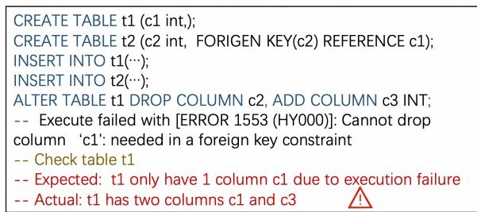
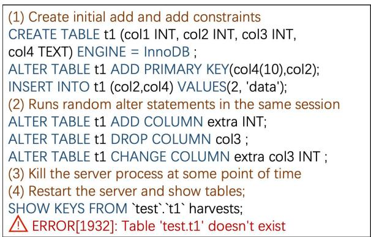
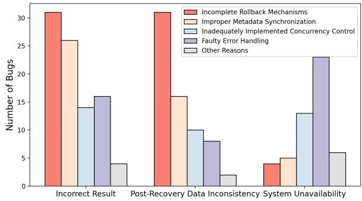
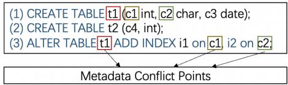
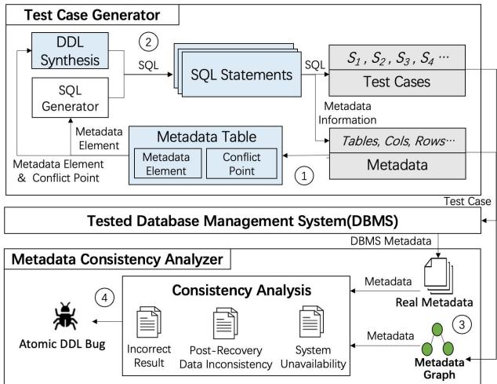
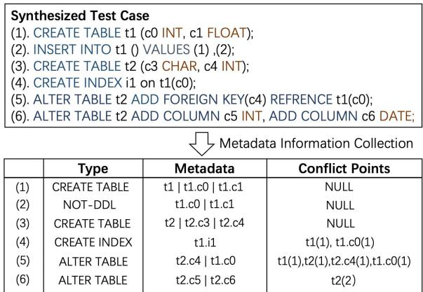
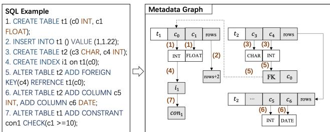
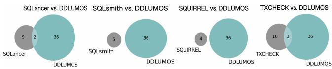
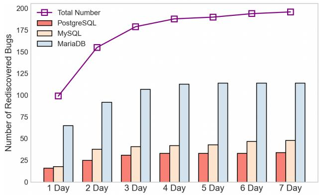

①

USENIX

THE ADVANCED COMPUTING SYSTEMS ASSOCIATION

# DDLumos: Understanding and Detecting Atomic DDL Bugs in DBMSs

Zhiyong Wu, Tsinghua University; Jie Liang, Beihang University; Jingzhou Fu, Wenqian Deng, and Yu Jiang, Tsinghua University https://www.usenix.org/conference/atc25/presentation/wu-zhiyong

# This paper is included in the Proceedings of the 2025 USENIX Annual Technical Conference.

July 7–9, 2025 • Boston, MA, USA ISBN 978-1-939133-48-9

Open access to the Proceedings of the 2025 USENIX Annual Technical Conference is sponsored by

P--r.h £Es/sL.

auuuJl9 PgleU

King Abdullah University of

Science and Technology

# DDLUMOS: Understanding and Detecting Atomic DDL Bugs in DBMSs

Zhiyong Wu KLISS, BNRist, School of Software Tsinghua University, China

Wenqian Deng KLISS, BNRist, School of Software Tsinghua University, China

Jie Liang ∗ School of Software Beihang University, China

Jingzhou Fu KLISS, BNRist, School of Software Tsinghua University, China

Yu Jiang ∗ KLISS, BNRist, School of Software Tsinghua University, China

## Abstract

Atomic Data Definition Language (Atomic DDL) is fundamental in DBMSs, ensuring that schema modifications are executed completely or not at all, preserving database integrity. Despite their critical importance, bugs persist in the Atomic DDL, leading to severe consequences such as data corruption and system inconsistencies. However, there is a limited understanding of the characteristics and root causes of these bugs. Furthermore, existing testing methods often fail to effectively identify Atomic DDL bugs, particularly under conditions of high concurrency and unexpected system failures.

This paper presents a comprehensive study of 207 Atomic DDL bugs across three widely used DBMSs. It reveals that Atomic DDL bugs primarily manifest as incorrect results, post-recovery data inconsistency, and system unavailability, which are mainly triggered by metadata conflicts between DDL statements. Based on these findings, we developed DD-LUMOS, a testing tool that detects Atomic DDL bugs with metadata conflict-guided DDL synthesis and graph-based consistency analysis. We applied DDLUMOS to six popular DBMSs (e.g., PostgreSQL and MySQL) and found 73 previously unknown Atomic DDL bugs. DBMS vendors responded promptly, fixing 14 issues, highlighting the effectiveness of DDLUMOS in improving the reliability of DBMSs.

## 1 Introduction

Atomic Data Definition Language (Atomic DDL) is foundational in Database Management Systems (DBMSs), ensuring that schema changes (e.g., creating, altering tables) are executed entirely or not at all, thereby preserving database integrity [22, 23]. Traditional DDLs modify the data structure immediately without rollback mechanisms, so any interruption or failure can leave the DBMS in an inconsistent state.

To address this flaw, modern DBMSs such as MySQL and PostgreSQL introduce Atomic DDL mechanism, ensuring that schema modifications either fully succeed or leave the

DBMS in its original state, thus preventing partial updates that could cause inconsistencies or corruption.

  
Figure 1: An Atomic DDL bug in MySQL8.0.

The implementation of Atomic DDL is complex due to the involvement of multiple components(e.g., rollback mechanisms, metadata synchronization, and concurrency control), all of which must work together to ensure atomicity and consistency during schema changes. Consequently, implementation errors in the Atomic DDL are difficult to avoid. We define Atomic DDL bugs (ADBs) as issues that arise during the execution of Atomic DDL operations, which can lead to partial updates, data corruption, or inconsistencies within the DBMSs. For example, Figure 1 illustrates an Atomic DDL bug in MySQL 8.0, which is caused by the implementation errors in rollback mechanisms. The ALTER TABLE statement tries to drop column c1 and add a new column c3 on table t1. However, it fails due to the foreign key constraint. Therefore, table t1 would still have one column c1. However, the ALTER TABLE statement is not correctly rolled back, resulting in the t1 table having two columns (i.e., c1 and c3), which is inconsistent with the expected state. ADBs have distinct characteristics that make them particularly problematic:

(1)Widespread Impact: ADBs have a widespread impact due to their role in maintaining the consistency and integrity of the database schema. When these bugs occur, they can propagate inconsistencies across multiple layers of the DBMS. In a typical scenario, a partially executed CREATE TABLE operation caused schema discrepancies that disrupted not only the current statement but also subsequent DDL or DML operations. For instance, among the recently reported 119 Atomic DDL bugs in MariaDB, 48% of them affected subsequent operations beyond the initial DDL statement, leading to cascading failures in query execution and schema management.

(2)High Severity: ADBs pose significant threats to DBMS stability, often leading to severe consequences such as system crashes, data corruption, and even permanent data loss. For example, among the recent 50 CVEs related to Atomic DDLs in MySQL [30], 29 CVEs scored over 7.0. Among them, 28% ADBs caused system crashes, while 33% ADBs resulted in data corruption or data loss. In 15% of cases, the damage was irreversible, causing prolonged downtime and necessitating database restoration from backups.

(3)Complex and Hard to Detect: The complexity of ADBs lies in the intricate interactions between different schema elements during DDL operations. Additionally, many ADBs can only be triggered under specific conditions (e.g., specific sequences of DDL operations), which are not easily replicated during standard testing. This complexity makes them particularly challenging to isolate and resolve. Moreover, these bugs are difficult to detect because they might not cause immediate or obvious failures; instead, they may lead to latent inconsistencies that only become apparent under certain query patterns or after further schema modifications.

Despite the substantial damage ADBs can cause, there is a lack of testing methods for ADBs. Current DBMS testing approaches, such as fuzzing and random query generation, primarily target functional correctness [35–37], performance bugs [15], and memory safety [16, 39, 46]. They mainly focus on generating complex SQL syntax structures or sequences of SQL operations to trigger more behaviors in DBMS components. However, due to the limited understanding of the specific manifestations and trigger conditions of ADBs, existing works struggle to identify them.

To understand and detect ADBs, we conducted a comprehensive study of 207 ADBs across three widely used DBMSs, namely PostgreSQL, MySQL, and MariaDB. Our research focused on identifying the manifestations of ADBs, the root causes of the ADBs, and the conditions that trigger these bugs. Our investigation revealed that approximately 44% of ADB lead to incorrect results, 32% cause post-recovery data inconsistency, and 24% result in system unavailability. We found that about 32%, 22%, 18%, and 22% of ADBs are caused by the implementation errors in rollback mechanisms, metadata synchronization, concurrency control subsystem, and error handling mechanisms, respectively. More importantly, we found that 94% of ADBs are triggered by the metadata conflicts between DDL statements.

Building on these findings, we developed DDLUMOS, a testing tool that detects ADBs with metadata conflict-guided DDL synthesis and graph-based consistency analysis. DD-LUMOS was applied to six DBMSs, uncovering 73 ADBs. DBMS vendors responded promptly, fixing 14 bugs. Meanwhile, DDLUMOS can rediscover 94.7% studied bugs in one week. Moreover, we compare DDLUMOS with state-of-theart DBMS testing tools. The 48-hour results show that DD-LUMOS detects 27, 31, 32, and 26 more bugs than SQLancer, SQLsmith, SQUIRREL, and TXCHECK, respectively. In summary, this paper makes following contributions:

1. We conduct a comprehensive analysis of 207 ADB across three widely used DBMSs, revealing that ADBs manifest as incorrect results, post-recovery data inconsistency, and system unavailability.

2. We identify the root cause and trigger conditions that lead to ADBs, particularly arising from the metadata conflicts of DDL operations. Based on the findings, we developed DDLUMOS to detect the ADBs.

3. DDLUMOS uncovered 73 previously unknown ADBs in six popular DBMSs. 20 bugs have been fixed, demonstrating the effectiveness of the tool in improving the reliability and consistency of the DBMS.

## 2 Preliminaries of Atomic DDL

Definitions. Database Management Systems (DBMSs) are software that allows users to define, create, maintain, and control access to databases [1]. Structured Query Language (SQL) is a standard language for interacting with DBMS [41], used to create, modify, and query relational databases. Data Definition Language (DDL) is a subset of SQL that is used to define and manage the structure of database objects like tables and indexes. It plays a key role in schema design and maintenance. For example, the CREATE TABLE statement in DDL is used to define a table and its columns, specifying data types and constraints Atomic DDL arises from the risk of partial updates during schema modifications, which can cause data corruption and system inconsistencies. Traditional DDL operations may fail midway, leaving the database in an inconsistent state. Atomic DDL addresses this by ensuring that schema changes either fully succeed or fail without residual effects, preserving database stability and reliability.

There are two main implementations for Atomic DDL: Atomic DDL Statement, where individual DDL statements are treated as atomic transactions by the DBMS, ensuring either full success or full rollback (e.g., MySQL); and Atomic DDL Transaction, which allows grouping a series of DDL statements into a single atomic transaction, enabling multiple DDL statements to commit or rollback together (e.g., PostgreSQL).

Key Features. Atomic DDLs are designed to ensure that schema changes are executed in a reliable, consistent, and robust manner. They have the following features:

Comprehensive Rollback Mechanism. Atomic DDL ensures that any changes made during a schema modification are either fully applied or fully rolled back. This all-or-nothing approach prevents partial updates that could otherwise leave the database in an inconsistent state. For instance, if a table alteration operation fails midway due to a system error, Atomic DDL automatically rolls back the changes, restoring the DBMS to its original state before the operation began. This comprehensive rollback mechanism is crucial for safeguarding data integrity and consistency, especially in complex production environments.

Concurrency Control. In environments where multiple users may attempt to modify the schema simultaneously, Atomic DDL plays a critical role in managing concurrency. It uses locking mechanisms to ensure that only one operation can alter a specific part of the schema at any given time, preventing conflicts and potential corruption. This control is vital for avoiding race conditions and ensuring that all schema changes are applied in a controlled and predictable manner.

Failure Handling and Recovery. One of the key strengths of Atomic DDL is its robust failure handling and recovery mechanism. In case of failure, it ensures no partial changes remain by using detailed logging and transactional controls to track schema modifications. This enables precise rollbacks or retries, protecting the database from corruption while streamlining the recovery process, reducing downtime, and ensuring operational continuity.

## 3 Methodology

To better understand the characteristics of Atomic DDL Bugs (ADBs), we investigate ADBs across three widelyused DBMSs: PostgreSQL, MySQL, and MariaDB from these DBMSs’ issue tracker systems and commit histories [2, 3, 6, 7, 11]. The number of ADB issues we collected is summarized in Table 1.

Table 1: The numbers of collected ADBs in selected DBMSs.
<table><tr><td>DBMSs</td><td>PostgreSQL</td><td>MySQL</td><td>MariaDB</td><td>Total</td></tr><tr><td>Studied Issues</td><td>351</td><td>301</td><td>2103</td><td>2755</td></tr><tr><td>Unique Bugs</td><td>38</td><td>50</td><td>119</td><td>207</td></tr></table>

These DBMSs, developed over long periods (e.g., 27 years for MySQL), often contain a large number of issues (e.g., over 109k issues in MySQL). Manually inspecting all these issues to identify ADBs is time-consuming and challenging. Therefore, we apply filtering rules to identify relevant issues in the recent 10 years. Since DBMS developers typically do not label issues as related to ADBs, we use keywords like “atomic”, “DDL”, “CREATE”, “Atomic DDL”, and their variations to retrieve potentially relevant issues. We then manually review the bug descriptions and developer comments, excluding those that do not involve Atomic DDL mechanisms. As a result, we find 2755 related issues. Then, we filter these issues into two steps. First, we exclude bugs labeled as “duplicate” to refine our dataset. Second, we manually reproduce each bug by extracting the provided SQL statements and transaction sequences, ensuring that only distinct issues are included in our study. Through this process, we identified 38, 50, and 119 ADBs in PostgreSQL, MySQL, and MariaDB, respectively.

Threats to Validity. Similar to other studies, our research has several limitations that should be considered.

Invisibility of high-severity vulnerabilities. High-severity vulnerabilities, such as those leading to data breaches or unauthorized access, are often not disclosed publicly by security teams. For example, severe security issues in MySQL and PostgreSQL are typically reported directly to their security teams and are not made available in public bug trackers. Consequently, our study may miss some of the most critical vulnerabilities, potentially limiting the completeness of our findings. However, the focus on transaction-related bugs still provides valuable insights into detecting atomicity issues.

Representativeness of selected DBMSs. Our study focused on three popular relational DBMSs: PostgreSQL, MySQL, and MariaDB. While these systems represent a significant portion of the market, our findings may not fully apply to other databases, such as NoSQL or graph databases, with different transaction models and atomicity guarantees. Nevertheless, the insights gained could still provide useful guidance for understanding atomicity in various DBMS.

## 4 General Findings of ADBs

In this Section, we analyze 207 collected unique ADBs to identify their common characteristics, focusing on the manifestations, root cause, and trigger conditions of ADBs.

## 4.1 Manifestations of ADBs

To understand the potential damage of ADBs, we examined the manifestations of the collected bugs by manually reviewing the bug descriptions and reproducing them. Regarding the manifestations of ADBs, we have the following findings:

Finding 1. Among the studied bugs, about 44% (91/207) of them manifest as incorrect results, about 32% (66/207) of them manifest as post-recovery data inconsistencies, and about 24% (50/207) of them manifest as system unavailability.

Incorrect Result. Our investigation indicates that approximately 44% of the ADBs result in incorrect outcomes, undermining the accuracy and reliability of data returned to users. These incorrect results contain various forms, such as schema errors, metadata mismatches, trigger errors, function errors, and constraint violations. Such manifestations arise when a DDL operation (e.g., ALTER TABLE or CREATE INDEX) aborts but fails to roll back all of its catalog mutations, leaving the database in a partially updated state. As a result, query results may be incorrect due to a misalignment between the database schema and the intended structure. For instance, the ALTER TABLE statement in Figure 1 fails to execute but still modifies the metadata of table t1, resulting in the incorrect result.

Post-Recovery Data Inconsistency. Post-recovery data inconsistency is a prominent issue in ADB, potentially leading to long-term corruption or loss of critical information, occurring in 32% (66/207) studied cases. This problem typically arises during system recovery when a DDL operation is interrupted by a fault (e.g., power outage), and the DBMS attempts to restore the previous state upon restart. If the atomicity of the DDL operation is not properly maintained, the recovery process may fail to fully restore the schema, leading to the loss of recently added or modified schema objects. Figure 2 illustrates an example of post-recovery data inconsistency in MariaDB. In this case, table t1 is modified through several DDLs, such as adding and dropping columns, when the server process is unexpectedly terminated. Upon restart, MariaDB shows that table t1 does not exist, indicating data loss.

  
Figure 2: A post-recovery data inconsistency in MariaDB.

System Unavailability. The complete system unavailability is a severe manifestation of ADBs, causing significant downtime and affecting the accessibility of the DBMS, accounting for 24% (50/207) studied cases. This includes issues such as system crashes, assertion failures, memory errors, and system hangs, where the entire system becomes unresponsive or fails to recover, causing prolonged downtime and potential data loss. This typically occurs when the DBMS engine encounters an unhandled exception or fatal error during the execution of a DDL operation. The instability introduced by these bugs makes them particularly dangerous, as they can compromise the availability and reliability of DBMSs.

## 4.2 Root Cause of ADBs

We manually checked each bug report and further identified several underlying causes that directly contribute to the manifestations described earlier. We discovered that all the ADBs are caused by the implementation errors of Atomic DDL, which are inherently complex due to the intricacies involved in ensuring atomicity, consistency, and rollback mechanisms during schema modifications. We categorize the root causes into four categories, and we have the following findings:

Finding 2. Among the studied bugs, four main causes of ADBs were identified, with the following distribution: incomplete rollback mechanisms accounted for 32%, improper synchronization for 22%, inadequately implemented concurrency control for 18%, and incorrect error handling for 22%.

The four categories collectively account for 94% of the studied ADBs. Figure 3 illustrates how frequently each root cause appears in ADBs manifesting as incorrect results, data loss, or system crashes. Inappropriate metadata synchronization is the most common trigger for incorrect results, while inadequate rollback mechanisms frequently lead to data loss, and faulty error handling is often responsible for system crashes. Besides them, other ADBs (6%) are caused by implementation errors in various auxiliary mechanisms, such as improper handling of system-level configurations, and rare edge cases in DBMS extensions or plugins.

  
Figure 3: Statistic of bugs and root causes.

Incomplete Rollback Mechanisms. The implementation error in the rollback mechanisms is a prevalent root cause for ADBs, responsible for 65 bugs, including 31 incorrect results and 31 post-recovery data inconsistencies. These bugs arise when a failed Atomic DDL operation leaves the schema in an inconsistent state due to incomplete rollbacks. For example, in MDEV-25506 of MariaDB, the server is forcibly crashed while executing CREATE TABLE IF NOT EXISTS tt11 AS SELECT... statement. After crash recovery, both DROP TABLE tt11 statement and a new CREATE TABLE tt11 statement fail to execute successfully with error messages. The drop statement returns “Unknown table tt11” while the create statement complains that the "tablespace tt11 already exists". The main reason is that InnoDB discovers both tt11.frm and tt11.ibd on disk, yet the internal data dictionary believes the table is already being dropped and raises an error that test.tt11 does not exist [24]. The root cause of the bug is a flaw in the rollback mechanism of Atomic DDL recovery: the DDL log rolled back the dictionary-level create operation but failed to purge the tablespace, leaving the recovery state inconsistent.

Improper Metadata Synchronization. The implementation errors in synchronization between schema metadata and physical data structures cause 47 ADBs, including 26 incorrect result cases. This issue arises when metadata is updated to reflect a schema change, but the corresponding data structures remain unchanged due to an interruption in Atomic DDL operations. For example, in bug#18570 of PostgreSQL, when an DROP EVENT TRIGGER statement appears to succeed in detecting the trigger, while the event trigger remains active in memory. After the command, catalog queries such as information\_schema.triggers show no trigger remains, yet every subsequent DDL statement still invokes the trigger’s function; meanwhile, attempting to drop that function fails because the system claims the (supposedly deleted) trigger depends on it [33]. The mismatch between system catalogs and the in-memory trigger cache creates a “ghost trigger” that blocks normal maintenance until the function is forcibly dropped, breaking Atomic DDL semantics.

Inadequately Implemented Concurrency Control. The implementation errors in the concurrency control subsystem represent another major root cause, accounting for 37 ADBs. These issues typically arise when multiple DDL operations or concurrent transactions contend for the same resources, such as locks on tables or indexes. For example, in BUG#116502 of MySQL, during an online build of a unique index that includes a NULL-able column, MySQL ’s Atomic DDL mishandles a concurrent sequence of DELETE → ROLLBACK combined with an INSERT. The engine incorrectly treats rows containing NULL as duplicates, so the rollback cannot re-insert the original row, and the entire DDL aborts—violating its all-or-nothing guarantee [28].

Faulty Error Handling. Faulty error handling during DDL operations is another root cause for ADBs, accounting for 18% of incorrect result cases and 46% of system unavailability. This issue occurs when the DBMS fails to properly handle errors or exceptions that arise during DDL operations. For instance, in MDEV-13205 of MariaDB, an unexpected error happens during the executing the ALTER TABLE statements to add unique key and foreign key [25]. The ALTER TABLE t2 ADD UNIQUE(c) is aborted due to a duplicate key error, but the DBMS fails to remove the partially created index stub from the data dictionary. Because that orphaned metadata is left intact, executing ALTER TABLE t3 ADD FOREIGN KEY (c) REFERENCES t2(c) statement will consult the corrupted data dictionary, trigger the assertion !dict\_index\_is\_online\_ddl(index), and finally crash the server.

## 4.3 Trigger Conditions of ADBs

Following the identification of root causes, we analyze the specific conditions that trigger ADBs.

Finding 3. Most ADBs (approximately 93%) are triggered in scenarios involving data conflicts between DDL statements, where multiple DDL statements operate or interact with the same metadata elements in the test case.

We define metadata conflict points as the specific locations in test cases where multiple DDL statements operate or interact with the same metadata elements, such as a table, column, index, or constraint. In other words, the conflict points reflect the data dependency between different statements, which can help trigger more code behaviors of Atomic DDL for detecting ADBs. Figure 4 illustrates an example of metadata conflict points. The two CREATE TABLE statements establishes two tables(t1 and t2) with three columns and one column, respectively. The subsequent ALTER TABLE statement adds two indexes on table t1, which will change the three metadata elements t1, t1.c1, and t1.c2. Here, we identify t1, t1.c1, and t1.c2 as the 3 metadata conflict points in the test cases. The second CREATE TABLE statement does not make any metadata conflict points due to it does not change any existing metadata elements.

  
Figure 4: An example of metadata conflict points.

In our study, 193 (93% of 207) studied bugs contain metadata conflict points, and 174 (84% of 207) cases contain over 4 metadata conflict points. Among the 193 studied bugs containing metadata conflict points, 94% (181/193) were directly triggered by metadata conflict points with the corresponding statements. The remaining 6% (12/193) were not directly triggered by conflict points, but the bug-triggering statements have dependency relationships with those conflict points. Our investigation results demonstrate that metadata conflict points are essential to trigger ADBs.

Finding 4. Incorrect result, post-recovery data inconsistency, and system unavailability have different trigger scenarios and test oracle.

In our study, incorrect results and system unavailability can occur during DDL execution. Incorrect results are identified by comparing the execution output and metadata. For example, the ALTER TABLE statement in Figure 1 should fail without modifying any metadata, which was confirmed by detecting unexpected changes in metadata. System unavailability is detected by checking the server’s response after executing the test cases. If the server disconnects or becomes unresponsive, it is confirmed as a bug. In contrast to incorrect results and system unavailability, post-recovery data inconsistency occurs when the server is restarted mid-Atomic DDL execution. If the recovery metadata differs from the expected state after rollback, developers confirm it as a bug.

## 4.4 Limitations of Existing Methods

According to the conditions outlined in Section 4.3, detecting ADBs requires generating DDL statements that involve more metadata conflict points. Moreover, these test cases must be examined in various scenarios to detect the three manifestations: incorrect results, system crashes, and post-recovery data inconsistency. However, existing DBMS testing tools are limited in both aspects.

First, most existing tools focus on generating DQL (Data Query Language) statements, with minimal attention paid to DDLs. Even when DDLs are included, they are generated with few metadata conflict points. For example, SQLsmith [39] and EET [14] focus on generating SELECT queries, and the DDLs they produce are typically simple, making it difficult to simulate the complex interactions between different DDL operations. Similarly, SQLancer [37] generates equivalent queries to detect logic bugs by transforming SQL expressions, which will overlook potential conflicts between DDLs.

Moreover, existing testing tools struggle to detect ADB manifestations, particularly those resulting in inconsistencies. For instance, when a DDL operation is interrupted midexecution, the DBMS may enter an inconsistent state with only partial changes applied—a scenario that current tools fail to detect. Furthermore, these tools also struggle to identify data inconsistency after recovery, as this requires precise tracking of Atomic DDL execution and metadata modifications, capabilities that are often lacking in existing approaches.

Following the findings, we design DDLUMOS which targets ADBs with metadata conflict-guided DDL synthesis and graph-based consistency analysis. The main idea is to analyze DDL dependencies to generate more metadata conflict points, while also designing detection methods for three manifestations. Specifically, DDLUMOS generates more metadata conflict points by tracking schema elements and guiding test case generation through a metadata table. On the other hand, it constructs a metadata graph to analyze schema inconsistencies and identify ADBs based on predefined detection scenarios.

## 5 Design of DDLUMOS

Figure 5 illustrates the workflow of DDLUMOS, which consists of two key modules: an Test Case Generator for synthesizing high-quality DDL sequences and a Metadata Consistency Analyzer for detecting ADBs. The process follows four main steps: In Step 1 , DDLUMOS initializes a metadata table to record schema elements used during test case generation, as well as the metadata conflict points associated with each DDL operation. In Step 2 , DDLUMOS alternates between generating DDL statements and other SQL statements. After each DDL operation, DDLUMOS analyzes the resulting metadata conflict points and updates the metadata table accordingly, guiding subsequent DDL generation to maximize conflict scenarios. In Step 3 , DDLUMOS constructs a metadata graph for the generated test cases and sends them to the target DBMS. The metadata graph captures the relationships between schema elements before and after DDLs, providing a structural foundation for analyzing schema consistency and correctness. In Step 4 , DDLUMOS uses the metadata graph to detect ADBs by comparing the execution results with predefined detection scenarios for three bug manifestations.

  
Figure 5: The workflow of DDLUMOS. It includes two main components: (1) Test Case Generator for generating test cases with metadata conflict guided DDL synthesis. (2) Metadata Consistency Analyzer for detecting atomic DDL bugs with graph-based consistency analysis.

## 5.1 Metadata Conflict-Guided DDL Synthesis

Metadata Conflict-Guided DDL Synthesis generates test cases that maximize metadata conflict points to trigger ADBs effectively. This approach consists of two components: Conflict Point Tracking and Test Case Synthesis, which work together to trigger deep behaviors of Atomic DDL.

Conflict Point Tracking. Based on the findings in Section 4.3, incorporating metadata conflict points into DDL test cases significantly increases the likelihood of exposing ADBs. To achieve this, DDLUMOS continuously collects and updates Metadata Information during test case generation, using these details to guide the synthesis of subsequent DDL operations. Specifically, DDLUMOS maintains a metadata table that records critical information about schema elements relevant to conflict scenarios, including the DDL identifier (e.g., operation type), table name, column, index, and constraint data. After each DDL statement executes, DDLUMOS updates the corresponding entries in the metadata table based on the statement type (create, alter, or drop) and the targeted objects (tables, columns, indexes, or constraints).

For example, as shown in Figure 6, when processing the 5th ALTER TABLE statement, DDLUMOS identifies the affected table (i.e., t2, t1) in the metadata table and increments its “conflict point” field by the value introduced by that operation (e.g., t1(1)). Likewise, if new columns or indexes are added or removed(e.g., 6th statement), DDLUMOS revises the corresponding fields to reflect the latest state and constraints.

  
Figure 6: An example of metadata information collection.

This metadata-driven update process accurately captures how the schema evolves over time and provides precise conflict guidance for generating subsequent test cases.

Test Case Synthesis. By tracking conflict points in the metadata table, DDLUMOS synthesizes test cases that strategically exploit these conflict points to maximize the likelihood of uncovering atomic DDL bugs. During test-case generation, DDLUMOS interweaves DDL statements with DML (e.g., INSERT, UPDATE) and DQL (e.g., SELECT) statements, creating comprehensive and high-coverage input sequences. DDLUMOS generates statements of each test case iteratively: First, it determines the statement type. Second, it builds the skeleton of the statement based on its type and then populates objects into the skeleton with the metadata table.

```matlab
Algorithm 1: Test Case Synthesis with Metadata Table
Input :L: The length of test cases
MT : The metadata table
Output :T : The test cases
1 T = initalTestCase ();
2 while L > 0 do
3 Me,Cp = getMetadataAndConlictPoint(MT);
4 Stype = pickStatementType(T);
5 if Stype = DDL then
6 Mu = sortMetadataWithConflictPoint(Me);
7 S = synthesizeDDL(Mu,Cp);
8 end
9 else
10 S = synthesizeDMLorDQL(Me);
11 end
12 MT = updateMetadataTable(MT,S);
13 T = addToTestCase(T,S);
14 L = L −1;
15 end
```

Algorithm 1 details the process of test case synthesis with the metadata table. DDLUMOS first initializes an empty test case(T ) and then iterates to synthesize the statement until the desired length of the test case (L) is reached (Line 1-2). The length of the test case(L) is critical for the performance of DD-LUMOS. We will give the specific length of the test case(L) in Section 6. In each iteration, DDLUMOS first retrieves the current metadata state $( M _ { e } )$ and conflict point information $( C _ { p } )$ from the metadata table (MT ) (Line 3). Next, it determines the type of the next SQL statement to be synthesized $( S _ { t y p e } )$ (Line 4). Specifically, DDLUMOS uses a predefined ratio (80% for DDL, 20% for other types in our implementation) to determine whether to generate DDL statements. If true, DD-LUMOS then randomly selects the least frequently used DDL statement types (e.g., ALTER TABLE, CREATE INDEX) to synthesize, ensuring diversity in the generated statements. Otherwise, DDLUMOS similarly randomly chooses from the available types of non-DDL statements, maintaining variability in the types of statements generated. If the statement type is DDL, DDLUMOS sorts the existing metadata by conflict point frequency and synthesizes the DDL with stored metadata(Mu) and corresponding conflict points(Lines 5-8). Otherwise, if the selected statement type is DML or DQL, DDLUMOS uses the existing metadata $M _ { e } )$ to synthesize to ensure semantic correctness (Lines 9-11). The implementation details of the DDL synthesis process can be found in Section 6. Once the statement (S) is generated, DDLUMOS updates the metadata table (MT ) to reflect changes introduced by the new statement and adds it to the test case (T ) (Lines 12-13).

## 5.2 Graph-Based Consistency Analysis

After generating test cases using Metadata Conflict Guided DDL Synthesis, DDLUMOS distributes the test cases across multiple client threads, while controlling concurrency based on the sequence of these statements (Details can be found in Section 6). Besides, DDLUMOS employs Graph-Based Consistency Analysis to verify the correctness of test case execution results. This analysis involves two critical steps. First, for a test case, DDLUMOS constructs a metadata graph that represents the schema elements and their relationships before and after executing each DDL statement. Then, based on the metadata graph and DDL execution scenario, DDLUMOS analyzes the metadata state resulting from the DDL operations. It compares the expected metadata derived from the graph with the actual metadata in the database after execution. Any discrepancies between the expected and actual metadata indicate a potential atomic DDL bug.

Metadata Graph Construction. For each test case, DD-LUMOS constructs a metadata graph that represents the metadata state of the DBMS both before and after executing each SQL statement in the test cases. Unlike a full dataset dump, this metadata graph focuses on essential metadata information, which can be influenced by DDL operations, including tables, columns, constraints, triggers, row counts, indexes, views, as well as their relationships. Each element of the metadata information is modeled as a node in the graph, while edges represent dependencies or hierarchical relationships.

  
Figure 7: An example of metadata graph construction.

For instance, Figure 7 demonstrates the construction process of the metadata data graph with a test case in MySQL. The left side of the figure shows the SQL statements executed sequentially in the order(e.g.,(1)->(2)->(3)->...). The right side illustrates the effects of these statements on the graph structure (such as the data structure, dependencies, etc.). The numbers(e.g., (1), (2)) on the arrows indicate which SQL statement generated each corresponding effect.

For statement (1), DDLUMOS first creates a node for table t1 along with child nodes for each column (c0 and c1), connecting the parent table node to its columns. In addition, DDLUMOS initializes a rows node that records the row count of t1. When statement (2) inserts records into t1, DDLU-MOS updates the rows node accordingly. Similarly, statement (3) adds another table node (t2) and its corresponding column nodes (c3 and c4). Attributes such as data types, constraint types, and dependency properties are also stored within nodes and edges, ensuring comprehensive tracking of schema changes. For example, when statement (4) creates index i1 on c0 of t1, DDLUMOS adds an i1 node to the metadata graph and draws a direct edge from the existing c0 node to this new i1 node. When statements (4), (5), and (7) further alter the metadata of t1 and t2, DDLUMOS adds or updates the corresponding nodes and edges to capture the new information and relationships and reflect these changes in the metadata graph. Throughout the entire test execution process, the metadata graph is dynamically updated to provide an accurate and consistent representation of the schema’s state at each stage.

Metadata Consistency Analysis. After constructing the metadata graph, DDLUMOS evaluates the correctness of DDL operations by comparing it with the actual metadata state after each operation. Specifically, the metadata information(e.g., schema information, tables, columns, row counts, triggers, and indexes) stored in the metadata graph should align precisely with the metadata in the real databases. For each DDL statement, DDLUMOS identifies affected metadata objects and checks for inconsistencies between the metadata graph and their actual counterparts in the DBMS. Discrepancies are flagged as potential bugs.

For example, the sixth ALTER TABLE statement in Figure 7,modifies table t2 along with columns c5 and c6. DD-LUMOS first determines that this operation could affect the metadata for t2, c5, and c6, and updates the metadata graph accordingly. More concretely, upon executing the sixth statement, the metadata graph adds two child nodes c5 and c6 under the node t2, including their data types. Once the database finishes processing this statement, DDLUMOS retrieves the relevant metadata from the graph (namely the node information for t2, c5, and c6), and compares it with the actual metadata stored in the DBMS. Any mismatch discovered in this process is reported as a potential bug.

By comparing the metadata graph with the actual metadata stored in the database, DDLUMOS can evaluate the correctness of DDL operations. However, as highlighted in Section 4.1, ADBs manifest in three distinct forms: incorrect results, system unavailability, and post-recovery data inconsistencies, each arising from different triggering scenarios. To comprehensively detect ADBs, DDLUMOS extends its graph-based consistency analysis to incorporate the detection scenarios described in 4.3.

Algorithm 2: Detect ADBs with Consistency Analysis   
Input :T : The test case to be executed   
K: The kill signal to simulate the crash   
G: Initial metadata graph   
Output :The ADBs detected by DDLUMOS   
1 S ← splitToStatements(T)   
2 foreach s ∈ S do   
3 G ← constructGraph(G,s)   
4 M ← executeToGetMetadata(s)   
5 if isSimulateCrash(K) = false then   
6 if connectionCheck () = false then   
7 return System Unavailability   
8 end   
9 if !ConsistencyAnalysis(M,G) then   
10 return Incorrect Result   
11 end   
12 end   
// asynchronously trigger crash   
13 spawn(AsyncCrashRecovery(K,G))   
14 end   
15 procedure AsyncCrashRecovery(K, G):   
16 sendKillSignal(K)   
17 Mn ← RebootandGetMetadata()   
18 if !ConsistencyAnalysis(Mn,G) then   
19 return Post-Recovery Data Inconsistency   
20 end

Algorithm 2 details the process of identifying ADBs with these three manifestations. Given a test case generated with metadata conflict-guided DDL synthesis, DDLUMOS first splits it into individual SQL statements (Line 1). For every statement, DDLUMOS constructs and updates the metadata graph to represent the expected metadata state after the execution. DDLUMOS will also send the statement for execution and get real metadata information from the DBMS (Lines 3- 4). Following the SQL execution, DDLUMOS systematically evaluates the three types of Atomic DDL bugs: system unavailability, incorrect results, and post-recovery data inconsistencies. To detect system unavailability, DDLUMOS performs a connection check to assess the server’s responsiveness. If the system becomes unresponsive during execution, DDLU-MOS identifies this as a system unavailability issue (Lines 6-8). For detecting incorrect results, DDLUMOS compares the actual metadata state (M) retrieved from the database with the expected metadata graph (G) following the consistency analysis. Any discrepancies between the actual metadata and the expected graph indicate an incorrect result (Lines 9-11). To identify post-recovery data inconsistencies, DDLUMOS asynchronously simulates a server crash by sending a kill signal to abruptly terminate the database process. After rebooting the server, DDLUMOS retrieves the post-recovery metadata and compares it with the metadata graph. Any mismatches between the recovered metadata and the expected state are flagged as post-recovery data inconsistencies, highlighting failures in the database’s recovery mechanism (Lines 13-20). Note that the process of killing the server to simulate the crash is independent and asynchronous from the process of executing the SQL statements and identifying the system unavailability and incorrect results.

## 6 Implementation

Based on our approach, we realized DDLUMOS. The overall codebase consists of 10k lines of C++ code, 4k lines of Bison and Flex code, and 1k lines of Python code. Then, we explain some other implementation details, which we consider significant for the outcome.

Effort to Adaption. Adapting DDLUMOS to a new DBMS requires minimal effort and involves two primary steps. First, we need to write the metadata information query statements retrieve schema elements such as tables, columns, indexes, and constraints. This step typically requires no more than 10 lines of SQL, tailored to the specific metadata structures of the DBMS under test. Second, we find the SQL grammar file (e.g., Yacc files) of the target DBMS for grammar adaption. DDLUMOS can leverage these grammar files to automatically adapt to the SQL operators of the target DBMS with a grammar adaptor(implemented with python and bison code).

Length of Test Case Setting. The length of test cases generated by DDLUMOS is critical to the testing performance. Overly long test cases will increase the storage and computational burden of maintaining and analyzing the metadata graph, thereby reducing testing efficiency. Conversely, overly short test cases may fail to adequately trigger the deeper logic associated with Atomic DDL operations. We analyze the test cases of 207 studied bugs and we observed that 98% of them contained no more than 15 SQL statements. Consequently, we set the length of test cases to 15 SQL statements in our testing framework to balance efficiency and effectiveness.

Details of DDL Synthesis. Synthesizing DDLs with the picked statement type and metadata table contains two steps. (1)DDLUMOS first constructs a DDL skeleton based on the chosen statement type (e.g., ALTER TABLE [table\_name] ADD COLUMN [column1 datatype], ADD COLUMN [column2 datatype]...). The clause of this skeleton is randomly generated(e.g., ADD COLUMN [column1 datatype]. To increase potential conflict points, each skeleton contains at least two objects (named metadata elements such as table\_name). (2)DDLUMOS populates the skeleton objects (e.g., table\_name) with entries (e.g., t1, t1.c1) from the metadata table, which tracks existing metadata elements along with their corresponding conflict point counts. During the population, entries with fewer conflict points are selected more frequently, and these chosen entries must conform to the relevant data type semantics. If DDLUMOS cannot find suitable entries in the metadata table, it generates new entries to fill the skeleton objects.

Distributing Test Cases with Multiple Clients. As the study shows, about 18% of ADBs arise from those implementation errors, and they still manifest as incorrect results, post-recovery data inconsistency, and system unavailability. To cover the codes of the concurrency control mechanism, DDLUMOS constructs concurrent scenarios by leveraging multiple clients to distribute SQL statements, while controlling concurrency based on the sequencing of these statements. Specifically, DDLUMOS tags every SQL statement with a sequence identifier, then launches N client worker threads (typically 2–5) and assigns the statements to them in that predefined order. Note that each client issues its own statements sequentially so that DDLUMOS can reconstruct an accurate metadata graph of the execution. To trigger more behaviors of DBMS’s concurrency control mechanism, DDLUMOS occasionally sends a subsequent statement before the completed execution of the previous one, thereby intentionally triggering concurrency control behaviors to detect ADBs in them.

## 7 Evaluation

To evaluate the effectiveness of DDLUMOS, we conduct experiments to address the following research questions:

• RQ1: Is DDLUMOS effective in finding ADBs in realworld DBMSs?

• RQ2: How does DDLUMOS’s performance compared with state-of-the-art methods?

• RQ3: How many bugs collected in the study can be rediscovered by DDLUMOS?

## 7.1 Evalution Setup

Tested DBMSs. To evaluate the generality and efficiency of DDLUMOS, we select six popular open-source and welltested DBMSs, namely MySQL [29,43], MariaDB [4,26], Percona [5], PolarDB [32], GreatSQL [10], and PostgreSQL [27, 34]. These DBMSs are also widely used in industry.

Table 2: DDLUMOS discovered 73 bugs in six DBMSs within two weeks. (MySQL: 14, MariaDB: 15, Percona: 14, PolarDB: 11, GreatSQL: 15, PostgreSQL: 4). [IRM: Incomplete Rollback Mechanisms, IMSYN: Improper Metadata Synchronization, IICC: Inadequately Implemented Concurrency Control, FEH: Faulty Error Handling, Others: Other Root Causes for Bugs.
<table><tr><td>DBMS</td><td>Bug Type and Number</td><td>Bug Status</td><td>Root Cause</td></tr><tr><td>MySQL</td><td>Incorrect Result(7)</td><td>Confirmed(7),Fixed (1)</td><td>IRM(2), IMSYN(1),IICC(1),FEH(1),Others(2)</td></tr><tr><td>MySQL</td><td>System Unavailability(4)</td><td>Confirmed(4), Fixed(1)</td><td>FEH(3), IICC(1)</td></tr><tr><td>MySQL</td><td>Post-Recovery Data Inconsistency(3)</td><td>Confirmed(3)</td><td>IRM(1), IMSYN(1),IICC(1)</td></tr><tr><td>MariaDB</td><td>Incorrect Result(8)</td><td>Confirmed(8),Fixed(1)</td><td>IRM(3),IMSYN(2),FEH(2),Others(1)</td></tr><tr><td>MariaDB</td><td>System Unavailability(3)</td><td>Confirmed(3),Fixed(1)</td><td>FEH(1), IICC(1),IRM(1),</td></tr><tr><td>MariaDB</td><td>Post-Recovery Data Inconsistency(4)</td><td>Confirmed(4)</td><td>IMSYN(2),IRM(1),FEH(1)</td></tr><tr><td>Percona</td><td>Incorrect Result(4)</td><td>Confirmed(4),Fixed(1)</td><td>IRM(1),IMSYN(2),FTH(1)</td></tr><tr><td>Percona</td><td>System Unavailability(4)</td><td>Confirmed(4)</td><td>Others(2),FEH(1),IICC(1)</td></tr><tr><td>Percona</td><td>Post-Recovery Data Inconsistency(6)</td><td>Confirmed(6),Fixed(2)</td><td>IMSYN(3),IRM(2),FEH(1)</td></tr><tr><td>PolarDB</td><td>Incorrect Result(4)</td><td>Confirmed(4)</td><td>IICC(1),FEH(1),(2),</td></tr><tr><td>PolarDB</td><td>System Unavailability(4)</td><td>Confirmed(4),Fixed(1)</td><td>FEH(3),Others(1)</td></tr><tr><td>PolarDB</td><td>Post-Recovery Data Inconsistency(3)</td><td>Confirmed(3),Fixed(1)</td><td>IRM(3)</td></tr><tr><td>GreatSQL</td><td>Incorrect Result(7)</td><td>Confirmed(7)</td><td>IMSYN(3), IRM(3),IICC(1)</td></tr><tr><td>GreatSQL GreatSQL</td><td>System Unavailability(3)</td><td>Confirmed(3),Fixed(1)</td><td>FEH(1),IICC(2)</td></tr><tr><td>PostgreSQL</td><td>Post-Recovery Data Inconsistency(5)</td><td>Confirmed(5),Fixed(1)</td><td>IRM(1),IICC(2),FEH(1),Others(1)</td></tr><tr><td>PostgreSQL</td><td>Incorrect Result(1) System Unavailability(2)</td><td>Confirmed(1) Confirmed(2),Fixed(2)</td><td>IMSYN(1)</td></tr><tr><td>PostgreSQL</td><td>Post-Recovery Data Inconsistency(1)</td><td>Confirmed(1),Fixed(1)</td><td>FEH(2) IRM(1)</td></tr><tr><td>Total</td><td></td><td></td><td></td></tr><tr><td></td><td>73 ADBs</td><td>73 confirmed,14 fixed</td><td></td></tr></table>

Basic Setup. The experiments were conducted on a machine running 64-bit Ubuntu 20.04 with an AMD EPYC 7742 Processor @ 2.25 GHz, 128 cores, and 504 GiB of main memory. All DBMSs were tested using docker containers that were downloaded directly from their websites, each with 5 CPU cores and 50 GiB of RAM.

Compared Techniques. We compare DDLUMOS with four state-of-the-art DBMS testing tools, including SQLancer [37], SQLsmith [39], SQUIRREL [46], and TXCHECK [13], which are widely used in industry and detect amounts of bugs SQLancer and TXCHECK detect the logic and transactional bugs, respectively, while SQLsmith and SQUIRREL focus on detecting crashes in DBMSs.

## 7.2 ADBs in Real-World DBMS

We apply DDLUMOS to six DBMS under test for atomic DDL bug detection evaluation. DDLUMOS successfully detected 73 ADBs in two weeks. Table 2 shows DDLUMOS discovered 14, 15, 14, 11, 15, and 4 ADBs in MySQL, MariaDB, Percona, PolarDB, GreatSQL, and PostgreSQL, respectively. 14 ADBs of them have been fixed due to the high severity. As described in Section 4.1, the 73 ADBs contain three types, 31, 20, and 22 bugs corresponding to incorrect results, system unavailability, and post-recovery data inconsistency, respectively.

Root Cause and Severity. We analyze the root causes of discovered bugs based on the response of the vendor. The right part of Table 2 shows the statistics of ADBs’ root causes in six DBMSs. Specifically, DDLUMOS detected 21, 15, 11, and 19 ADBs caused by incomplete rollback mechanisms, improper metadata synchronization, inadequately implemented concurrency control, and faulty error handling, respectively. Besides, 7 bugs are caused by other root causes (e.g., untracked schema element orphaning, errors in parsing DDLs).

Feedback from DBMS Developers. We have actively reported all 73 bugs to the corresponding DBMS vendors and received their confirmation feedback. At the time of the paper writing, 73 ADBs have already been confirmed, and 14 ADBs have been fixed. Besides, 9 bugs have been assigned with CVE IDs due to their severity. More importantly, the detected bugs have garnered the attention of the DBMS developers. For example, when we were reporting bugs to PolarDB, the developers responded for them immediately.

Case Studies. We give the following case studies to demonstrate the effectiveness of DDLUMOS.

Case Study 1: No trigger exists after CREATE OR RE-PLACE TRiGGER in MySQL. Figure 8 illustrates a case of incorrect result in MySQL. This bug occurs when attempting to create a trigger on one table (t1) and then replace it with another table (t2) using the CREATE OR REPLACE TRIGGER statement. Instead of successfully replacing the original trigger on t1 with a new trigger on table t2, an error is thrown and both triggers disappear finally in DBMS. The root cause is the implementation errors in metadata synchronization, where the new trigger can not be saved correctly due to the metadata inconsistency and return error messages.

CREATE TABLE t1 (c1 int);   
CREATE TABLE t2 (c1 int );   
CREATE OR RPLACE trigger tr0 AFTER INSERT on t1 for   
each row set @X =1;   
CREATE OR RPLACE trigger tr0 AFTER INSERT on t2 for   
each row set @X =1;   
ERROR 1360( HY000 ): Trigger tr0 does not exist  
Figure 8: A case of incorrect result in MySQL.

Case Study 2: Tablespace id Confilt and Data Loss upon Crash Recovery. Figure 9 illustrates a case of post-recovery data inconsistency in GreatSQL. This bug occurs when attempting to execute an ALTER TABLE statement to modify a table (t0) by changing its storage engine. During the execution of this statement, the server is forcibly killed. Upon restarting the server, an error is thrown, indicating a tablespace mismatch. Additionally, table t0 is found to be empty after the restart, resulting in data loss. The root cause lies in the implementation errors in rollback mechanisms. The modification to table t0 affects the underlying tablespace information, which does not properly rollback after the crash. As a result, after the server recovery, the data in table t0 is lost.

CREATE TABLE t0(c1 int, c2 char);   
INSERT INTO t0.();   
-- Kill the server when executing below statement   
ALTER TABLE t0 ENGINE = InnODB，ADD COLUMN IF NOT   
EXISTS c2 MEDIUMINT UNSIGNED ZEROFILL DEFAULT 2,   
LOCK = SHARED   
- Reboot the server   
[ERROR] InnoDB : Expected tablespace id 43   
but found O in the file ./db/ t2 .ibd A   
-- Table t0 is empty  
Figure 9: A post-recovery inconsistency case in GreatSQL.

## 7.3 Comparison with State of the Art

To evaluate the effectiveness of our approach, we compared DDLUMOS with four state-of-the-art DBMS testing tools: SQUIRREL, SQLancer, SQLsmith, and TXCHECK, all of which are widely recognized in the industry. The evaluation focused on three key metrics: (i) the number of code branches covered in DDL operation modules, (ii) the average number of metadata conflict points generated per DDL statement within 48 hours, and (iii) the number of unique ADBs identified by each tool during the same 48-hour period. For a fair comparison, after each testing session, we collected all generated queries and reran them to unify branch measurements. Each experiments were run for 5 times.

Table 3: Number of related branches covered by each tool.
<table><tr><td>DBMS</td><td>SQLancer</td><td>SQLsmith</td><td>SQUIRREL</td><td>TxCHECK</td><td>DDLUMOS</td></tr><tr><td>MySQL</td><td>1083</td><td>401</td><td>954</td><td>571</td><td>3184</td></tr><tr><td rowspan="3">MariaDB Percona PolarDB</td><td>1,206</td><td>593</td><td>1103</td><td>452</td><td>2994</td></tr><tr><td>1,120</td><td>374</td><td>853</td><td>501</td><td>3201</td></tr><tr><td>1075</td><td>524</td><td>812</td><td>532</td><td>2814</td></tr><tr><td rowspan="3">GreatSQL PostgreSQL</td><td>938</td><td>412</td><td>1063</td><td>447</td><td>2597</td></tr><tr><td>2041</td><td>953</td><td>1443</td><td>1202</td><td>3405</td></tr><tr><td>7463 2304</td><td>3257 8049</td><td>6228 15293</td><td>3705 9984</td><td>18195 8852</td></tr></table>

Related Code Branches. Tables 3 show the average number of covered code branches in DDL operations modules by those DBMS testing tools in 48 hours within 5 runs. The results indicate that DDLUMOS outperformed other DBMS testing tools in triggering DDL behaviors. Specifically, DDLU-MOS covered 10732, 14938, 11976, and 14490 more branches in Atomic DDL modules than SQUIRREL, SQLancer, SQLsmith, and, TXCHECK, respectively. The variance shows that different tools exhibit variations during testing.

Average Metadata Conflict Points. Table 4 shows that DDLUMOS generates more metadata conflict points for each DDL statement on average than other tools within 5 runs. Specifically, each DDL statement generated by DDLUMOS contains an average of 1.24 metadata conflict points, which is 0.93, 1.21, 0.17, and 0.76 more than the average metadata conflict points for each DDL statement generated by SQUIRREL, SQLancer, SQLsmith, and TXCHECK, respectively.

The improvement achieved by DDLUMOS is primarily due to its metadata conflict-guided DDL synthesis. This approach enables DDLUMOS to systematically generate test cases that specifically stress the atomicity of DDL operations by creating scenarios that involve metadata conflicts. These targeted test cases not only enhance coverage but also uncover deep logical flaws in the DBMS’s handling of concurrent and interrupted DDL operations. In contrast, other tools lack specialized mechanisms for generating Atomic DDL scenarios. For example, SQLancer primarily generates random DDL operations without focusing on metadata conflicts, which limits its effectiveness in testing atomicity. Similarly, SQUIRREL and SQLsmith prioritize syntax correctness over conflict-driven test case design, resulting in lower coverage of Atomic DDL components in DBMSs.

Table 4: Number of average metadata conflict points per DDL.
<table><tr><td>DBMS</td><td>|SQLancer</td><td>SQLsmith</td><td>SQUIRREL</td><td>TxCHECK</td><td>DDLUMOS</td></tr><tr><td>MySQL</td><td>0.33</td><td>0.03</td><td>0.15</td><td>0.43</td><td>1.28</td></tr><tr><td>MariaDB</td><td>0.27</td><td>0.03</td><td>0.17</td><td>0.46</td><td>1.31</td></tr><tr><td>Percona</td><td>0.29</td><td>0.02</td><td>0.16</td><td>0.44</td><td>1.26</td></tr><tr><td>PolarDB</td><td>0.29</td><td>0.04</td><td>0.17</td><td>0.5</td><td>1.25</td></tr><tr><td>GreatSQL</td><td>0.34</td><td>0.04</td><td>0.22</td><td>0.48</td><td>1.18</td></tr><tr><td>PostgreSQL</td><td>0.28</td><td>0.03</td><td>0.23</td><td>0.39</td><td>1.16</td></tr><tr><td>Average</td><td>0.3</td><td>0.03</td><td>0.18</td><td>0.45</td><td>1.24</td></tr><tr><td>Variances</td><td>0.00067</td><td>0.00047</td><td>0.0092</td><td>0.00127</td><td>0.00283</td></tr></table>

Triggered ADBs. Table 5 displays the average number of bugs detected by each tool in 48 hours within 5 runs. It shows that DDLUMOS outperformed the other tools, uncovering 27, 31, 32, and 26 more bugs compared to SQLancer, SQLsmith, SQUIRREL, and TXCHECK, respectively.

Table 5: Number of bugs detected by each tool in 48 hours.
<table><tr><td>DBMS</td><td>|SQLancer</td><td>SQLsmith</td><td>SQUIRREL</td><td>TXCHECK DDLUMOS</td></tr><tr><td>MySQL</td><td>2</td><td>1</td><td>2 3</td><td>8</td></tr><tr><td>MariaDB</td><td>1</td><td>0</td><td>0 1</td><td>9</td></tr><tr><td>Percona</td><td>2</td><td>1</td><td>1 2</td><td>5</td></tr><tr><td>PolarDB</td><td>2</td><td>2</td><td>0 1</td><td>4</td></tr><tr><td>GreatSQL</td><td>1</td><td>1 1</td><td>2</td><td>8</td></tr><tr><td>PostgreSQL</td><td>1</td><td>0</td><td>0 1</td><td>2</td></tr><tr><td>Total</td><td>9</td><td>5</td><td>4 10</td><td>36</td></tr><tr><td>Variances</td><td>2</td><td>0.8</td><td>0.4 2</td><td>6</td></tr></table>

To better understand the relationships between the bugs detected by the different tools, we analyzed their bug reports. Figure 10 illustrates the overlap between bugs detected by DDLUMOS and the other tools. DDLUMOS uniquely identified 36 bugs, demonstrating its ability to uncover a broad range of ADBs. Among these, 2 bugs and 3 bugs are overlapped with SQLancer and TXCHECK, respectively, while no overlap was observed with SQLsmith or SQUIRREL. The overlapping bugs detected by DDLUMOS, SQLancer, and TXCHECK were primarily related to simple schema modifications involving basic DDL operations, which both tools focus on. However, DDLUMOS significantly outperformed SQLancer in detecting bugs involving concurrent schema modifications and recovery scenarios, as SQLancer does not target these conditions.

  
Figure 10: Venn diagram for bugs found by different tools.

The bugs detected by DDLUMOS and SQLsmith were entirely orthogonal. SQLsmith primarily focuses on generating complex SELECT statements to detect crash bugs, producing limited DDL statements that do not involve metadata modifications. In contrast, DDLUMOS targets metadata conflicts, incomplete rollbacks, and concurrency issues during DDL operations, making it uniquely suited for detecting ADBs. Similarly, the bugs detected by DDLUMOS and SQUIRREL were also orthogonal. SQUIRREL explores a broader range of DBMS behaviors with coverage guidance to detect memory safety bugs and crashes. The four bugs detected by SQUIRREL are unrelated to DDL statements.

## 7.4 Rediscovery of Surveyed ADBs

To further evaluate the effectiveness of DDLUMOS, we examined whether DDLUMOS could rediscover 207 known Atomic DDL bugs previously collected in our research. Our goal was to evaluate whether DDLUMOS could systematically rediscover these ADBs in realistic settings. Specifically, we applied DDLUMOS to the versions of PostgreSQL, MySQL, and MariaDB corresponding to each bug report in the dataset. For each DBMS version, DDLUMOS ran for one week to detect ADBs. Whenever a bug was detected, we compared its triggers and observed symptoms with those in the surveyed dataset. A bug was considered rediscovered if it manifested in the same way as originally reported, such as incorrect results, system crashes, or data loss.

Figure 11 presents the cumulative number of Atomic DDL bugs rediscovered by DDLUMOS in PostgreSQL, MySQL, and MariaDB in one week. Within the first two days of testing, DDLUMOS successfully rediscovered 86.5% of the bugs (179/207), demonstrating its efficiency in quickly exposing a significant portion of critical DDL-related issues. By extending the test period to one week, DDLUMOS increased the total number of rediscovered bugs to 196, representing approximately 94.7% of the 207 reported Atomic DDL bugs. This includes 34 out of 38 bugs in PostgreSQL, 48 out of 50 bugs in MySQL, and 114 out of 119 bugs in MariaDB.

  
Figure 11: Number of rediscovered bugs in one week.

The high rediscovery rate primarily stems from two key design features in DDLUMOS. First, its Metadata Conflict Guided DDL Synthesis systematically constructs test scenarios that faithfully reflect real-world DBMS usage, such as concurrent schema modifications and transaction rollbacks. As a result, DDLUMOS rapidly surfaces problems that can lead to data corruption, server crashes, or anomalies during recovery. Second, the Graph-Based Metadata Consistency Analysis enhances DDLUMOS’s effectiveness by identifying subtle inconsistencies in the database schema and system that may not be immediately obvious. Through a graph-based representation of schema states, DDLUMOS can efficiently explore diverse execution paths and detect bugs that would remain hidden under conventional testing.

## 8 Discussion

Missed Rediscoveries. Despite the bugs being rediscovered, there are still 11 bugs that did not resurface in the one-week experiments. A closer inspection revealed two main reasons for these missed rediscovered. First, 8 out of the 11 unrediscovered bugs relied on specialized plugins or configuration features. Since DDLUMOS does not modify system environments during testing (e.g., it does not install plugins or enable specific configurations), the required conditions for these bugs to occur were not present. These environmentdependent issues represent a small fraction (8 out of 207) of the total. Second, 3 bugs required specific execution paths that DDLUMOS’s current generation strategy did not systematically explore within one week. When the testing period was extended to two weeks, DDLUMOS was able to rediscover these three bugs, demonstrating its ability to detect rare or timing-sensitive defects when given sufficient time.

Extend Existing DBMS Testing Tools with DDLUMOS. While DDLUMOS primarily focuses on detecting atomic DDL bugs, its metadata conflict tracking and DDL synthesis patterns can also aid in discovering other types of DBMS bugs. First, DDLUMOS can be integrated into existing grammarbased DBMS testing frameworks to enhance their bug detection capabilities. For example, grammar-based tools typically focus on generating syntactically correct SQL queries, but they may not always consider how DDL operations interact with schema elements. By incorporating DDLUMOS, these existing frameworks can trigger scenarios that may expose rare or hard-to-find bugs in DBMS schema handling. Furthermore, DDLUMOS can be used in conjunction with other DBMS testing tools, such as those focused on transaction-level bugs or logical errors, to cover a broader range of potential issues.

## 9 Related Work

DBMS Testing. DBMS testing has evolved significantly over the years, with efforts primarily focusing on crash bug detection [12, 16, 39, 46], correctness verification [14, 17, 35, 37, 40, 45], and performance evaluation [15, 18].

Crash bug testing aims to identify scenarios where the DBMS may fail or crash under specific conditions. Tools like SQLsmith [39] generate a variety of SQL queries to stress test the DBMS, revealing potential crash points. SQUIRREL [46] and RATEL [42] introduce coverage-feedback into the query mutation to cover more branches. LEGO [16] enhances code coverage with sequence-oriented SQL mutation. LEGO [16] proposes sequence-oriented mutation to improve the code coverage by combining different SQL Type Sequences of the statements. Griffin [9] designs grammar-free mutation methods to detecting crash bugs in DBMS. Correctness verification is another crucial aspect of DBMS testing, focused on ensuring the accuracy of query execution. Techniques such as metamorphic testing [14,17,35–37] and differential testing [40,45] have gained widespread adoption. For example, SQLancer uses oracles [35,37,37] to detect logic bugs by comparing the outcomes of different queries that should theoretically yield the same result. Additionally, RAGS [40] and Grand [45] utilize differential testing to uncover logic discrepancies by comparing the results of similar queries across different execution paths. Performance evaluation tests how efficiently a DBMS handles diverse workloads. Tools like APOLLO [15] conduct performance regression testing to identify degradation over time. Meanwhile, AMOEBA [18] assesses the performance consistency of semantically equivalent queries to uncover unexpected performance bottlenecks. Puppy [44] detects performance degradation bugs with limited-optimization plan construction.

While these approaches have significantly advanced DBMS testing, they primarily focus on query execution and general

DBMS stability, often overlooking the specific challenges associated with Data Definition Language (DDL) operations. With the growing complexity of DDL operations, particularly in high-concurrency environments, there is an urgent need for testing frameworks that focus specifically on ensuring atomicity and consistency in these operations.

Atomicity Bug Detection. Atomicity bugs pose significant challenges to DBMS reliability. These bugs occur when a sequence of SQL operations, expected to be atomic, fails to execute completely, leaving the DBMS in an inconsistent state. Existing work related to atomicity has largely focused on transaction management [8, 13, 19–21, 31, 38]. For example, techniques like transactional memory testing [19,21] and atomicity violation detection in multithreaded programs [20, 31, 38] can also be applied to detect atomicity issues. In the context of DDL operations, Atomic DDL bugs are often triggered by metadata conflicts, insufficient rollback mechanisms, and concurrency issues. Tools specifically designed to detect such Atomic DDL bugs are still scarce. While some research has explored the use of fuzzing techniques to generate DDL operations for testing purposes [8, 13], these efforts are still in their infancy and lack the sophistication needed to fully capture the complex interactions that can lead to atomicity violations in real-world DBMSs.

DDLUMOS addresses this gap by focusing specifically on detecting atomicity bugs in DDL operations. By generating DDL sequences that intentionally create metadata conflicts and simulating high-concurrency environments, DDLUMOS is able to uncover vulnerabilities that are typically missed by conventional testing approaches. This focus on DDL atomicity represents a significant advancement in DBMS testing, providing a new avenue to improve the reliability of schema modifications in modern databases.

## 10 Conclusion

In this paper, we have presented an in-depth analysis of 207 ADBs across three widely used industry DBMSs. Our investigation reveals that ADBs primarily manifest as incorrect results, data loss during recovery, and system crashes, which are mainly triggered by the metadata conflicts between DDL statements. To address these issues, we developed DDLUMOS, a testing tool that detects ADBs with metadata conflict-based DDL generation. By employing DDLUMOS across widely used DBMSs (e.g., MySQL and MariaDB), we discovered 73 previously unknown bugs, all of which have been confirmed.

## Acknowledgements

We thank the shepherd and reviewers for their valuable comments. This research is partly sponsored by the National Key Research and Development Project (No. 2022YFB3104000), NSFC Program (No. 62302256, 92167101, 62021002, U2441238), and CCF-NSFOCUS Program (No.2023001).

## References

[1] databases. https://en.wikipedia.org/wiki/Database. Accessed: June 3, 2025.

[2] Mariadb github. https://github.com/MariaDB/server. Accessed: June 3, 2025.

[3] Postgresql github. https://github.com/postgres/postgres. Accessed: June 3, 2025.

[4] BARTHOLOMEW, D. MariaDB cookbook. Packt Publishing Ltd, 2014.

[5] BLÅUDD, A. M. Percona website. https://www.percona.com/. Accessed: June 3, 2025.

[6] CORPORATION, M. Mariadb’s jira. https://jira.mariadb.org, 2024. Accessed: June 3, 2025.

[7] CORPORATION, O. Mysql bug system. https://bugs.mysql.com/, 2024. Accessed: June 3, 2025.

[8] CUI, Z., DOU, W., DAI, Q., SONG, J., WANG, W., WEI, J., AND YE, D. Differentially testing database transactions for fun and profit. In Proceedings of the 37th IEEE/ACM International Conference on Automated Software Engineering (2022), pp. 1–12.

[9] FU, J., LIANG, J., WU, Z., WANG, M., AND JIANG, Y. Griffin: Grammar-free dbms fuzzing. In Conference on Automated Software Engineering (ASE’22) (2022).

[10] GREATDB. Greatsql github. https://github.com/GreatSQL/ GreatSQL. Accessed: June 3, 2025.

[11] GROUP, T. P. G. D. Postgresql bug report mailing list. https:// www.postgresql.org/list/pgsql-bugs/, 2024. Accessed: June 3, 2025.

[12] JIANG, Z.-M., BAI, J.-J., AND SU, Z. {DynSQL}: Stateful fuzzing for database management systems with complex and valid {SQL} query generation. In 32nd USENIX Security Symposium (USENIX Security 23) (2023), pp. 4949–4965.

[13] JIANG, Z.-M., LIU, S., RIGGER, M., AND SU, Z. Detecting transactional bugs in database engines via Graph-Based oracle construction. In 17th USENIX Symposium on Operating Systems Design and Implementation (OSDI 23) (Boston, MA, July 2023), USENIX Association, pp. 397–417.

[14] JIANG, Z.-M., AND SU, Z. Detecting logic bugs in database engines via equivalent expression transformation. In 18th USENIX Symposium on Operating Systems Design and Implementation (OSDI 24) (Santa Clara, CA, July 2024), USENIX Association, pp. 821–835.

[15] JUNG, J., HU, H., ARULRAJ, J., KIM, T., AND KANG, W. APOLLO: Automatic Detection and Diagnosis of Performance Regressions in Database Systems (to appear). In Proceedings of the 46th International Conference on Very Large Data Bases (VLDB) (Tokyo, Japan, Aug. 2020).

[16] LIANG, J., CHEN, Y., WU, Z., FU, J., WANG, M., JIANG, Y., HUANG, X., CHEN, T., WANG, J., AND LI, J. Sequence-oriented dbms fuzzing. In 2023 IEEE International Conference on Data Engineering (ICDE), IEEE.

[17] LIANG, J., WU, Z., FU, J., WANG, M., SUN, C., AND JIANG, Y. Mozi: Discovering DBMS bugs via configuration-based equivalent transformation. In Proceedings of the 46th IEEE/ACM International Conference on Software Engineering, ICSE 2024, Lisbon, Portugal, April 14-20, 2024 (2024), ACM, pp. 135:1–135:12.

[18] LIU, X., ZHOU, Q., ARULRAJ, J., AND ORSO, A. Automatic detection of performance bugs in database systems using equivalent queries. In Proceedings of the 44th International Conference on Software Engineering (2022), pp. 225–236.

[19] LOURENÇO, J., AND CUNHA, G. Testing patterns for software transactional memory engines. In Proceedings of the 2007 ACM workshop on Parallel and distributed systems: testing and debugging (2007), pp. 36–42.

[20] LU, S., TUCEK, J., QIN, F., AND ZHOU, Y. Avio: detecting atomicity violations via access interleaving invariants. ACM SIGOPS Operating Systems Review 40, 5 (2006), 37–48.

[21] MANOVIT, C., HANGAL, S., CHAFI, H., MCDONALD, A., KOZYRAKIS, C., AND OLUKOTUN, K. Testing implementations of transactional memory. In Proceedings of the 15th international conference on Parallel architectures and compilation techniques (2006), pp. 134–143.

[22] MARIADB. Aotmic ddl of mairadb. https://mariadb.com/kb/en/ atomic-ddl/. Accessed: June 3, 2025.

[23] MARIADB. Aotmic ddl of mysql. https://dev.mysql.com/doc/ refman/8.4/en/atomic-ddl.html. Accessed: June 3, 2025.

[24] MARIADB. Atomic ddl: .frm file is removed and orphan innodb tablespace is left behind upon crash recovery. https:// jira.mariadb.org/browse/MDEV-25506. Accessed: June 3, 2025.

[25] MARIADB. Innodb: Failing assertion: !dict\_index\_is\_online\_ddl(index) upon alter table. https: //jira.mariadb.org/browse/MDEV-13205. Accessed: June 3, 2025.

[26] Mariadb. https://mariadb.org/, 1 2024. Accessed: June 3, 2025.

[27] MOMJIAN, B. PostgreSQL: introduction and concepts, vol. 192. Addison-Wesley New York, 2001.

[28] MYSQL. Duplicate detection flaw for null values in uk during ddl rollback operations. https://bugs.mysql.com/bug.php?id=116502. Accessed: June 3, 2025.

[29] Mysql. https://www.mysql.com/, 1 2024. Accessed: June 3, 2025.

[30] ORACLE. Oracle security website. https://www.oracle.com/ security-alerts/. Accessed: June 3, 2025.

[31] PARK, C.-S., AND SEN, K. Randomized active atomicity violation detection in concurrent programs. In Proceedings of the 16th ACM SIGSOFT International Symposium on Foundations of software engineering (2008), pp. 135–145.

[32] Polardb. https://www.alibabacloud.com/product/polardb, 1 2024. Accessed: June 3, 2025.

[33] POSTGRESQL. Drop event trigger for ddl finishes successfully but trigger still executed on ddl. https://www.postgresql.org/messageid/18570-43bc1b85bebd2572%40postgresql.org. Accessed: June 3, 2025.

[34] Postgresql. https://www.postgresql.org/, 1 2024. Accessed: June 3, 2025.

[35] RIGGER, M., AND SU, Z. Detecting optimization bugs in database engines via non-optimizing reference engine construction. In Proceedings of the 28th ACM Joint Meeting on European Software Engineering Conference and Symposium on the Foundations of Software Engineering (2020), pp. 1140–1152.

[36] RIGGER, M., AND SU, Z. Finding bugs in database systems via query partitioning. Proceedings of the ACM on Programming Languages 4, OOPSLA (2020), 1–30.

[37] RIGGER, M., AND SU, Z. Testing database engines via pivoted query synthesis. In 14th USENIX Symposium on Operating Systems Design and Implementation OSDI 20) (2020), pp. 667–682.

[38] SAMAK, M., AND RAMANATHAN, M. K. Synthesizing tests for detecting atomicity violations. In Proceedings of the 2015 10th Joint Meeting on foundations of software engineering (2015), pp. 131–142.

[39] SELTENREICH, A., TANG, B., AND MULLENDER, S. Sqlsmith: a random sql query generator.

[40] SLUTZ, D. R. Massive stochastic testing of SQL. In VLDB’98, Proceedings of 24rd International Conference on Very Large Data Bases, New York, USA, Morgan Kaufmann, pp. 618–622.

[41] VAN DER LANS, R. F. The SQL standard: a complete guide reference. Prentice Hall International (UK) Ltd., 1989.

[42] WANG, M., WU, Z., XU, X., LIANG, J., ZHOU, C., ZHANG, H., AND JIANG, Y. Industry practice of coverage-guided enterprise-level dbms fuzzing. In 2021 IEEE/ACM 43rd International Conference on Software Engineering: Software Engineering in Practice (ICSE-SEIP) (2021), IEEE, pp. 328–337.

[43] WIDENIUS, M., AXMARK, D., AND ARNO, K. MySQL reference manual: documentation from the source. " O’Reilly Media, Inc.", 2002.

[44] WU, Z., LIANG, J., FU, J., WANG, M., AND JIANG, Y. Puppy: Finding performance degradation bugs in dbmss via limited-optimization plan

construction. In Proceedings of the IEEE/ACM 47th International Conference on Software Engineering (2025), pp. 1–12.

[45] ZHENG, Y., DOU, W., WANG, Y., QIN, Z., TANG, L., GAO, Y., WANG, D., WANG, W., AND WEI, J. Finding bugs in gremlin-based graph database systems via randomized differential testing. In Proceedings of the 31st ACM SIGSOFT International Symposium on Software Testing and Analysis (2022), pp. 302–313.

[46] ZHONG, R., CHEN, Y., HU, H., ZHANG, H., LEE, W., AND WU, D. Squirrel: Testing database management systems with language validity and coverage feedback. In The ACM Conference on Computer and Communications Security (CCS), 2020 (2020).