USENIX

THE ADVANCED COMPUTING SYSTEMS ASSOCIATION

# Voltrix: Sparse Matrix-Matrix Multiplication on Tensor Cores with Asynchronous and Balanced Kernel Optimization

Yaqi Xia and Weihu Wang, Wuhan University; Donglin Yang, Nvidia Corporation; Xiaobo Zhou, University of Macau; Dazhao Cheng, Wuhan University https://www.usenix.org/conference/atc25/presentation/xia

# This paper is included in the Proceedings of the 2025 USENIX Annual Technical Conference.

July 7–9, 2025 • Boston, MA, USA ISBN 978-1-939133-48-9

Open access to the Proceedings of the 2025 USENIX Annual Technical Conference is sponsored by

P=-r.h mFe"

auuuJl9 P9leU

King Abdullah University of

Science and Technology

# Voltrix: Sparse Matrix-Matrix Multiplication on Tensor Cores with Asynchronous and Balanced Kernel Optimization

Yaqi Xia∗ School of Computer Science Wuhan University

Weihu Wang∗ School of Computer Science Wuhan University

Xiaobo Zhou†   
IOTSC   
University of Macau

## Abstract

Sparse Matrix-Matrix Multiplication (SpMM) is crucial in scientific computing and machine learning. Despite advancements in GPU architectures, efficiently leveraging Tensor Cores for SpMM remains challenging. The core issue is the mismatch between the inherently sparse nature of the matrices and the dense computational patterns. Existing methods struggle with substantial overheads in loading data to computation units and cannot adequately manage data imbalance across computations, thereby limiting the high computational throughput potential of Tensor Cores.

In this paper, we introduce Voltrix-SpMM, a revolutionary GPU kernel design that overcomes these challenges. First, we implement an asynchronous data loading pipeline that employs a bit-wise compressed format for sparse matrices and bulk memory copy instructions for dense matrices. This innovative design enables efficient data access and incorporates a warp-specialized producer-consumer model to seamlessly overlap data loading with computation. Second, we develop a persistent and I/O co-balanced kernel mechanism that features a two-stage partition strategy to achieve balance between input and output. Implemented with CUDA 12.6, Voltrix-SpMM substantially improves performance, delivering an average speedups of 36.5x and 1.8x over Tensor Core-based TC-GNN and DTC-SpMM respectively, and an average 1.7x speedup over the CUDA Core-based RoDe, fully unleashing the power of Tensor Cores for SpMM.

## 1 Introduction

Sparse Matrix-Matrix Multiplication (SpMM), which refers to the multiplication of a sparse matrix with a dense matrix, plays a pivotal role in a wide range of scientific computing applications [1,3,13,20,22,40,45–47,52], from simulations and linear algebra to advanced machine learning. Recent studies have identified SpMM as a significant performance bottleneck

Donglin Yang NVIDIA Corporation

Dazhao Cheng† School of Computer Science Wuhan University

in these applications, particularly in the training of Graph Neural Networks (GNNs), where SpMM accounts for over 80% of the total computational cost during training [43].

GPUs have become the primary processing units for modern high-performance computing and have been widely adopted to accelerate SpMM computations. Recent studies have utilized CUDA cores, the fundamental processing units within NVIDIA’s GPU architecture, to speed up the multiplication process [12,16,17,24,32]. With advancements in GPU power, NVIDIA introduced a specialized unit known as the Tensor Core, beginning with the Volta architecture [29]. Tensor Cores offer significantly higher computational throughput than traditional CUDA cores and are specifically optimized for dense matrix multiplication and accumulation operations using fixed-precision arithmetic. However, the inherent sparsity of matrices in SpMM presents challenges. Tensor Cores struggle with the irregular memory access and data sparsity typical of these operations, making them less effective for SpMM without specialized optimizations.

One of the prominent attempts to apply Tensor Core acceleration to SpMM is TC-GNN [43], which introduces sparse graph translation to convert sparse matrices into compressed dense blocks, called TCU blocks. Although this method overcomes the traditional barriers between sparse SpMM workloads and dense computation patterns, the inefficient process of loading data into Tensor Core units severely limits their full potential. Our experiments have shown that data loading consumes over 80% of kernel execution time, significantly constraining the effective use of Tensor Cores. Recently, DTC-SpMM introduces an asynchronous loading technique that overlaps computation with data loading through a pipeline [10]. However, the benefits of this approach are limited by several factors: firstly, DTC-SpMM’s asynchronous loading instruction can only process 16-byte chunk at a time, which is insufficient for the high-dimensional data typical in applications like GNN training, where matrix sizes often exceed 256 [37]. This limitation necessitates numerous loading instructions, diminishing the pipeline’s potential benefits. Secondly, the single-layer pipeline of DTC-SpMM results in minimal overlap between computation and data loading, and the required synchronization at the warp level introduces additional overhead, further impairing the expected performance gains.

In addition to inefficient data loading, the irregular data distribution in SpMM further exacerbates performance bottlenecks during kernel execution on GPUs. A critical challenge lies in efficiently partitioning unevenly distributed data across different Streaming Multiprocessors (SMs) to achieve hardware load balancing. Current methods typically focus either on input balance or output balance. TC-GNN attempts to address output balance by controlling how each Cooperative Thread Array (CTA) processes rows of TCU blocks. However, this approach results in significant variations in the data processed per CTA, leading to underutilization of some SMs and overloading of others. Conversely, DTC-SpMM prioritizes input balance by assigning each CTA a fixed number of TCU blocks, aiming for a more uniform workload distribution. While this strategy reduces discrepancies, it fails to address imbalances during the write-back phase. Moreover, the atomic operations required to ensure accurate results during writeback introduce substantial overhead, thereby undermining the potential performance benefits of the optimization.

We introduce Voltrix-SpMM, a revolutionary GPU kernel design that addresses the outlined challenges and fully leverages the capabilities of Tensor Cores for accelerated SpMM computations. Voltrix-SpMM features two key innovations: First, a novel asynchronous data loading pipeline that establishes seamless overlap between computation and data loading. Unlike current SpMM kernels that manage these processes within the same warp, our model uses a warpspecialized workflow control to distinctly separate these tasks. This approach allows for fine-grained, multi-tiered overlap, significantly reducing the overhead associated with data loading. Second, a persistent and I/O co-balanced kernel mechanism that ensures even partitioning of irregular workloads across the underlying SM units. By integrating coarse-grained input partitioning with fine-grained output partitioning, we achieve an optimal balance between input and output, while eliminating the overhead linked to atomic operations.

The first innovation, the warp-level asynchronous pipeline, significantly reduces data loading overhead while achieving seamless overlap with computation. Specifically, we design a bit-wise compressed format for sparse matrices that is both vectorization-friendly and conflict-free, accelerating access and transformation. For dense matrices, we utilize the bulk asynchronous loading instruction TMA [30], which reduces the number of instructions while enabling the asynchronous loading of large data blocks. Leveraging our warp-specialized producer-consumer model, we decouple data access from computation at the warp level. This separation allows for finer granularity and higher overlap between data loading and computation through a multi-tiered pipeline.

In the second innovation, a persistent and I/O co-balanced kernel mechanism, we align each CTA task with SMs and ensure persistent execution, thus achieving a seamless softwareto-hardware balance. Through a greedy and heuristic search algorithm, we determine the optimal partition points for each CTA task, ensuring co-balance between input and output. Additionally, by performing coarse-grained partitioning at the input stage and fine-grained partitioning at the output stage, we resolve the issue of data crossing row boundaries, avoiding the additional overhead of atomic operations.

In summary, our key contributions are as follows:

1. Through in-depth analysis, we identify the primary challenge in current Tensor Core-accelerated SpMM methods: a significant gap between high-throughput computation units and inefficient, heavy data loading processes.

2. We design a bit-wise sparse matrix compression format to enable efficient data access via vectorized loading, and a bulk asynchronous loading instruction to load dense matrices with reduced number of instructions.

3. We propose a warp-specialized producer-consumer model to efficiently pipeline data access and computation, along with a multi-tiered pipeline to effectively conceal the overhead associated with data loading.

4. We develop a persistent and I/O balanced kernel mechanism, ensuring uniform kernel execution across hardware that balances both input and output processing.

Voltrix-SpMM, implemented with CUDA 12.6, has been integrated into PyTorch 2.5 [33]. On the SuiteSparse dataset [7] and 12 real-world graph datasets, it achieves average speedups of 36.5x and 1.8x over the Tensor Core-based TC-GNN and DTC-SpMM respectively, and 1.7x over the CUDA Corebased RoDe [32]. Additionally, it delivers 2.0x speedup over the popular GNN training framework DGL [2] in end-to-end training. Notably, Voltrix-SpMM is the first to fully unleash the power of Tensor Cores, achieving speedups that surpass those of traditional CUDA Core-based methods.

## 2 Background and Motivation

## 2.1 Matrix-Matrix Multiplication on Hopper

General Matrix-Matrix Multiplication (GEMM) is a core operation in deep learning [39, 50]. On NVIDIA Hopper [30], GEMM performance is enhanced through warp-specialized and persistent kernel designs [31]. Warps are split into producers, which use Tensor Memory Accelerator (TMA) to load tiles into shared memory, and consumers, which perform Warp-Group Matrix Multiply-Accumulate (WGMMA) operations. This producer-consumer model enables overlap of data load and computation, maximizing Tensor Core utilization.

Hopper’s persistent kernel strategy assigns a fixed number of Cooperative Thread Arrays (CTAs), typically equal to the number of Streaming Multiprocessors (SMs), allowing them to remain resident and avoid relaunch overhead. This design also overlaps epilogue storage with the next stage’s prologue and compute loop, enhancing pipeline efficiency.

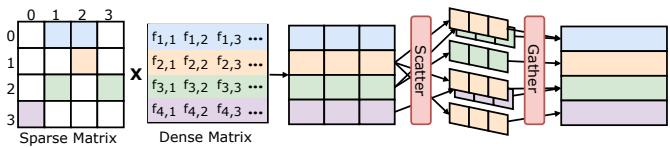  
Figure 1: Illustration of SpMM workflow.

Sparse Matrix-Matrix Multiplication (SpMM) multiplies a sparse matrix with a dense one, using only the non-zero elements [7]. Unlike GEMM, SpMM identifies non-zero indices to guide a scatter from the dense matrix and a gather for accumulation, as shown in Figure 1. However, due to sparsity and irregularity, SpMM cannot directly adopt GEMM’s warp-specialized and persistent kernel designs: 1. TMA and WGMMA require dense data blocks, wasting resources on zeros. 2. Irregular non-zero patterns cause workload imbalance, making persistent kernels inefficient.

This paper introduces a BMat encoding for fast non-zero identification, a multi-tiered async loading scheme to maximize bandwidth, and a balanced partitioning strategy that enables an effective sparse-aware persistent kernel.

## 2.2 SpMM on Tensor Cores

NVIDIA Tensor Cores are specialized units that accelerate matrix operations essential for deep learning. They efficiently perform dense mixed-precision matrix multiplications, such as TF32 inputs with FP32 accumulation, computing

$$
C = A \times B + C
$$

where A and B have dimensions m×k and k ×n. Matrices are distributed across thread registers (fragments) within a warp, arranged in layouts like row- or column-major [29]. Applying Tensor Cores to SpMM is challenging because, unlike dense models (e.g., Transformers [19, 38] and CNNs [14, 21]) with regular memory access, SpMM exhibits irregular access and sparse computation patterns that conflict with the fixed-size fragment requirements of Tensor Cores.

TC-GNN [43] represents the first significant effort to bridge the gap between SpMM and Tensor Core capabilities by introducing a novel sparse graph translation technique. As illustrated in the top part of Figure 2, this approach compresses a sparse matrix into multiple condensed sparse blocks, referred to as TCU blocks. Each block is carefully sized to align with the computational dimensions of Tensor Cores. This transformation allows TC-GNN to effectively map irregular computation workloads onto the regular computational framework of Tensor Cores, thereby enabling these specialized units to handle sparse computation tasks efficiently.

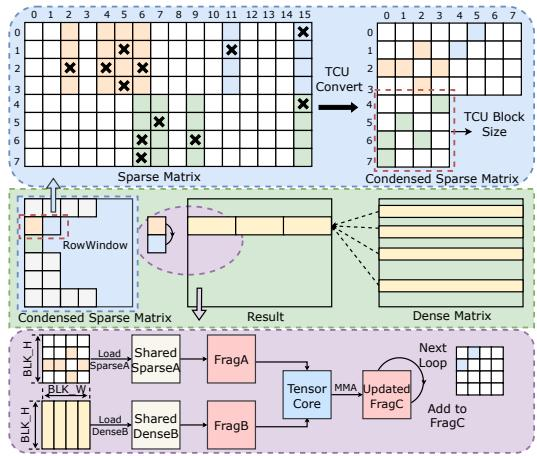  
Figure 2: Illustration of the typical Tensor core-based SpMM implementation, TC-GNN’s workflow.

In TC-GNN, the TCU block data for each row (a RowWindow) is processed iteratively. The workflow of TC-GNN operates as follows: First, the compressed TCU block is expanded into a BLK\_W × BLK\_H matrix, named SparseA, where BLK\_W and BLK\_H are specifically set to 8 and 16, respectively, to fit the dimensions of the Tensor Core MMA operations. Then, based on the column index of the TCU block, the corresponding row data from the dense matrix is identified and transformed into a BLK\_W × BLK\_H matrix, DenseB. Both matrices are first loaded into shared memory and then into registers for MMA operations, as depicted in the bottom part of Figure 2. The results are stored and subsequently used to update the output matrix C, which is accumulated with the next SparseA in the RowWindow in the subsequent loop iteration, ensuring the correctness of the results.

## 2.2.1 Tensor Core’s Hunger: Starved by Data Loading

Utilizing Tensor Cores significantly enhances computational throughput for sparse operations, providing potential performance gains over traditional CUDA Cores. For instance, in optimized conditions, Tensor Cores can achieve up to 495 TFLOPS for TF32 datatype matrix multiplications, in contrast to the 67 TFLOPS for FP32 typically delivered by CUDA Cores in similar scenarios [30]. However, despite these impressive advancements, the overall efficiency of kernel execution is often bottlenecked by the data loading process. Our experiments across multiple datasets, as illustrated in Figure 3, reveal that data loading accounts for over 80% of the execution time. This significant overhead, due to loading matrices SparseA and DenseB into shared memory, severely restricts the overall computational efficiency, thereby diminishing the full potential of Tensor Core acceleration.

To address the data-loading bottleneck in Tensor Coreaccelerated SpMM computation, DTC-SpMM [10] introduces a pivotal innovation: a pipeline arrangement that effectively overlaps the loading of SparseA with Tensor Core computations, mitigating loading time. However, the typically large dimensions of the dense matrix in GNNs, often exceeding 256, mean one SparseA corresponds to multiple tiled DenseB matrices, creating a data copy overhead that significantly exceeds that of SparseA. Our experimental results, as shown in Figure 3 , reveal that in most cases, loading the dense matrix (DenseB) accounts for over 60% of the total execution time. Thus, despite the full overlap of SparseA loading, the primary challenge persists: the prolonged stalls caused by loading DenseB continue to dominate kernel execution time.

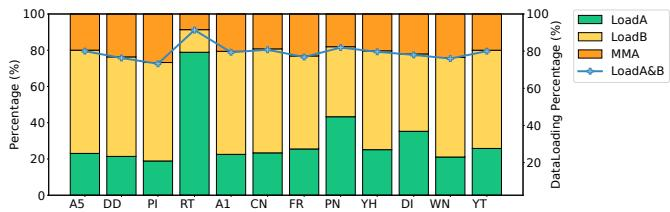  
Figure 3: Breakdown of TC-GNN.

Furthermore, the pipelining strategy in DTC-SpMM struggles to effectively parallelize the loading of DenseB with MMA computations for several reasons: (1) DTC-SpMM leverages the LDGSTS SASS instruction [28] for asynchronous loading, which initiates data transfers without stalling computation. However, this instruction is limited to loading only 16 bytes of data per operation. When applied to the DenseB matrix, the substantial number of LDGSTS instructions required increases dramatically, leading to a high instruction count that undermines the benefits of pipelining. (2) The single-layer and intra-warp pipeline used by DTC-SpMM results in minimal overlap and frequent synchronization within warps, thereby reducing overall efficiency. (3) DTC-SpMM loads DenseB data directly into the registers, bypassing shared memory. This access pattern does not support asynchronous prefetching, further limiting the effectiveness of the pipeline.

Summary. Given these issues, there is an urgent need for a novel pipelining design that can effectively bridge the gap between lengthy data loading times and efficient Tensor Core computations. Such a design should enable enhanced overlap of memory copying with computation, ultimately addressing the persistent data-loading challenge.

## 2.2.2 Unbalanced Workload: Failure to Balance I/O

NVIDIA GPUs use a Streaming Multiprocessor (SM) architecture, where multiple CTAs are executed concurrently on each SM. In CUDA programming, CTAs are mapped to SMs and execute in parallel. This model is highly efficient when workloads are evenly distributed among CTAs. However, the irregular nature of sparse data often leads to significant imbalances in workload distribution. For example, each row of the sparse matrix has a different number and arrangement of non-zero entries, leading to a varying number of TCU blocks per RowWindow, as shown in Figure 4. Furthermore, results from multiple TCU blocks within the same RowWindow must be accumulated, adding complexity. This uneven distribution of TCU blocks across RowWindows poses a substantial challenge in maintaining balanced workload distribution across each SM. To address this, current methods employ various workload partitioning strategies at the CTA level, which we categorize into two main types.

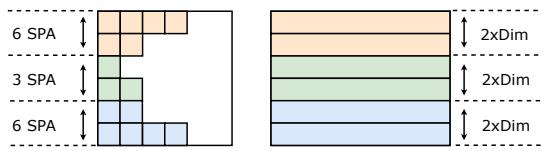

(a) Output balance for TC-GNN.  
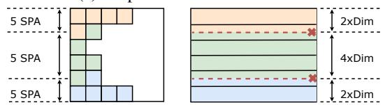

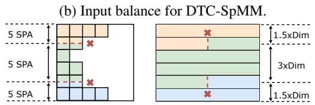  
(c) Our input and output co-balance.  
Figure 4: Workload partitioning strategies at the CTA level.

Output Balancing. The approach, employed by TC-GNN as illustrated in Figure 4a, assigns each CTA the task of processing all TCU blocks corresponding to a single row within a RowWindow. This strategy ensures that the output from each CTA is confined to the results of one specific RowWindow. While this design standardizes output workloads across CTAs, it leads to a significant input imbalance due to the large variations in the number of TCU blocks per row. Since the input directly influences the volume of data loading and computation, this discrepancy causes some CTAs to complete their tasks quickly while others lag, resulting in inefficient utilization of SM resources and diminished overall performance.

Input Balancing. Conversely, DTC-SpMM adopts the input balancing approach, as demonstrated in Figure 4b. This strategy ensures that each CTA processes an equal number of TCU blocks, distributing the input workload evenly across CTAs. While this method equalizes the amount of data each CTA handles, it complicates the management of output results. Specifically, when one RowWindow contains a large number of TCU blocks, multiple CTAs might need to contribute to the same row. To address this, DTC-SpMM employs atomic operations to accumulate results from different CTAs. Although these atomic operations maintain result accuracy, they significantly increase computational overhead. On the other hand, when a RowWindow includes only a few TCU blocks, a single CTA may need to write results across multiple rows, which exacerbates the disparities in output overhead among CTAs. Consequently, DTC-SpMM still incurs considerable overhead and does not fully resolve the imbalance issue, thereby impacting its overall efficiency.

Summary. Due to the irregular nature of sparse data in SpMM, attempting to balance the workload solely from either the input or output perspective often leads to an imbalance on the other side. Furthermore, partitioning data across RowWindows requires atomic operations to ensure the correctness of results. Given these challenges, an ideal partitioning scheme should not only achieve input-output co-balance but also maintain coarse granularity for sparse data to prevent crossing RowWindow boundaries, as illustrated in Figure 4c.

## 3 Voltrix-SpMM Design

Voltrix-SpMM significantly improves sparse matrix-matrix multiplication through three key innovations. First, it utilizes a bitwise-level format to compress sparse matrices, which enables coalesced memory accesses and bank conflict-free decoding. Second, a warp-level asynchronous pipelining model effectively decouples data loading from computation, leading to greater overlap and improved throughput. Third, its persistent and balanced kernel design ensures co-balanced input and output workloads, ultimately boosting overall efficiency.

## 3.1 Warp-level Asynchronous Pipelining

In this subsection, we first introduce the BMat data format for accelerating sparse matrix loading. Then, we present the warp-specialized producer-consumer model that enables multi-tiered data access and asynchronous computation, effectively hiding dense data loading overhead.

## 3.1.1 Bit-wise Compressed Data Format

In the design of Tensor Core-based SpMM kernels, SparseA used in MMA calculations is typically represented as a 16x8 dense matrix. However, to accommodate the high proportion of zero elements, which can exceed 90% as reported in DTC-SpMM [10], SparseA is stored in a sparse format during noncomputational phases. For instance, TC-GNN uses the CSR matrix format, while DTC-SpMM employs the ME-TCF format. Directly storing SparseA in a dense format would place undue pressure on memory resources and incur substantial data copy overhead during kernel execution.

Therefore, the processing of SparseA involves two steps when transitioning from global memory to fragment: 1. loading SparseA in its sparse format, and 2. converting SparseA from a sparse to a dense format. In the data loading stage, the goal is to minimize both the data volume and the number of loading instructions. In the conversion stage, the goal is to avoid bank conflicts during shared memory access.

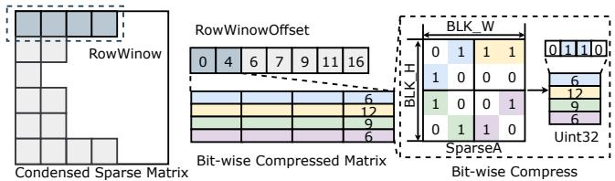

(a) Bit-wise compressed matrix.  
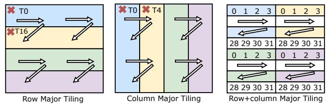  
(b) Various tiling methods. Different colors represent 128-byte contiguous segments in shared memory, corresponding to one group of 32 banks. The arrows indicate the layout distribution of registers held by threads in a warp during MMA execution.  
Figure 5: Loading and decoding of BMat.

While TC-GNN and DTC-SpMM have focused primarily on optimizing one of these aspects, Voltrix-SpMM aims to comprehensively address all these factors. We propose a novel data format that is both vectorization-friendly and conflictfree, termed the bit-wise compressed matrix, or BMat.

How to load? As illustrated in Figure 5a, we use RowWindowOffset to record the offset of each RowWindow in the condensed sparse matrix, with each offset corresponding to a SparseA. Each 0 and 1 element of SparseA is represented by just 1 bit, allowing us to compress a 16x8 matrix into a 128-bit BMat. Specifically, a BMat is stored using four Uint32 values, enabling us to access the entire BMat with a single vectorized load instruction LDGSTS.128.

How to decode? We address the challenge of tiling SparseA to compress it into four Uint32 values, as different tiling strategies significantly impact conversion efficiency. As illustrated in Figure 5b, one could employ row-major tiling—as adopted by the BitTCF format of ACC-SpMM [51]—resulting in four 4×8 sub-blocks, or column-major tiling, which splits it into four 16x4 sub-blocks. However, we adopt a hybrid row + column-major tiling approach, segmenting SparseA into four 8x4 sub-blocks. This method offers two key benefits:

1. Efficient decoding by each thread in a Warp using thread ID-based shifting, where each Uint32 facilitates streamlined data access. 2. The alignment of each Uint32’s BMat decoding with its corresponding submatrix in the MMA computation prevents bank conflicts, enhancing computational efficiency. This contrasts with other tiling methods that often lead to cross-bank accesses, marked by red crosses in Figure 5b.

By optimizing both the loading and conversion phases, our

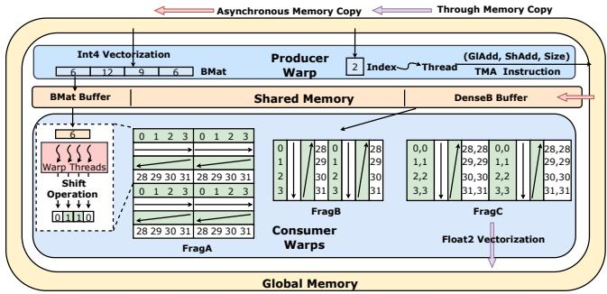  
Figure 6: The warp-specialized producer-consumer model.

BMat approach enables more efficient handling of SparseA. Moreover, the decoded content is directly loaded into registers for immediate computation. In contrast to previous methods that required a 16x8-sized Int32 shared memory space, our strategy only uses four Uint32 values to store the BMat, reducing the demand on shared memory resources.

Non-binary cases. To support non-binary SparseA with floating-point values, our BMat format only requires an additional value vector to store the non-zero floating-point values. Within a warp, the i-th thread (thread Ti) constructs a 32-bit position mask Mi. The first i + 1 bits of this mask are set to 1, while the remaining 31-i bits are set to 0. This mask is then bitwise-and with the BMat to obtain Pi. Subsequently, each thread calculates the bitwise-sum of its Pi using the \_\_popc() intrinsic. This bitwise-sum determines the offset of its corresponding non-zero element within the value vector.

For instance, consider an 8x4 sparse matrix SparseA containing floating-point values at indices 3, 7, and 20. The BMat representation for this matrix is B = 0x00100088. For thread i = 7, the binary mask is M7 = 0x0000000f. The bitwiseand operation yields P7 = 0x00100088 & 0x0000000f = 0x00000008. The bitwise-sum of P7, calculated as bitwisesum(0x00000008), is 1, indicating that the non-zero element associated with this thread is located at the second position in the value vector (using zero-based indexing).

Unlike DTC-SpMM, which requires an explicit offset to track non-zero counts, BMat encodes this information directly. By performing a bitwise-sum on BMat, we can obtain the nonzero count without extra metadata. In our method, we only need to allocate a register within the kernel to accumulate the total count of non-zero elements. This accumulated count directly provides the starting offset for accessing the value vector in the current iteration. This design contributes to more efficient compression and memory access when using BMat.

## 3.1.2 Warp-Specialized Producer-Consumer Model

To mitigate the significant data access overhead, particularly the stalls caused by loading SparseA and DenseB, we implement an inter-warp pipelining strategy. In our kernel design, specific warps within a CTA are assigned to load data from global memory into shared memory, while other warps concurrently fetch preloaded data from shared memory to perform Tensor Core computations. This warp-specialized task allocation establishes a producer-consumer model within each CTA, where shared memory serves as a shared buffer to facilitate the overlap of computation and data access.

How to fetch data? As depicted in Figure 6, the Producer is tasked with loading data and issuing instructions, managing the transfer of SparseA and DenseB from global memory to shared memory. For SparseA, as detailed in Section 3.1.1, we employ vectorization techniques to copy the BMat to shared memory using a single INT4 instruction. For DenseB, each SparseA corresponds to a number of DenseB elements equal to BLK\_W × D, where D represents the dimension of the dense data. The Producer utilizes its index to locate these elements in global memory and subsequently transfers them to shared memory. This transfer leverages asynchronous TMA instructions for efficiency: 1) TMA requires only a single instruction to access dense data, reducing the overhead associated with multiple LDGSTS instructions; 2) TMA allows just one thread to issue the instruction, enabling all the dense data corresponding to a SparseA in a CTA to be loaded using only 8 threads. As a result, a single Warp acts as the Producer to issue the instructions, minimizing the resource wastage caused by excessive producer warps.

The Consumer retrieves data from shared memory and loads it into registers for MMA computation using Tensor Cores, configured to an MMA size of m16n8k8. For SparseA, each consumer performs shift operations for decoding. For DenseB, pending operations are performed to prevent bank conflicts in shared memory. After completing all SparseA in a RowWindow, each thread retains two float32 results per MMA. Consequently, we utilize FLOAT2 write-through instructions to directly transfer data from registers to global memory, effectively bypassing shared memory.

How to pipeline? In Voltrix-SpMM design, shared memory buffers are managed using a memory barrier (MBarrier) signaling mechanism to efficiently coordinate producer and consumer operations. All barriers are classified as either ‘ready’ or ‘filled’. Initially, ‘ready’ barriers use the SYNCS.ARRIVE instruction to signal the producer to load data, while ‘filled’ barriers use the SYNCS.TRYWAIT instruction to block the consumer. Once the producer finishes loading, it releases the ‘filled’ barrier with SYNCS.ARRIVE, notifying the consumer to transfer the preloaded data for computation. Subsequently, the ‘ready’ barrier suspends the producer with SYNCS.TRYWAIT for the next batch. Conversely, the consumer coordinates with the producer to wait and refill the buffer.

This creates a ping-pong scheduling mechanism, where data loading and computation alternate seamlessly across buffers. As illustrated in Figures 7a and 7b, unlike DTC-SpMM which only overlaps the loading of SparseA with MMA computation, our producer-consumer model facilitates pipelining of MMA with both SparseA and DenseB, allowing for enhanced potential to conceal data loading overhead.

<table><tr><td></td><td>DEB 0,0</td><td>SPA 0</td><td>DEB 0,1</td><td>SPA 1</td><td>DEB 1,0</td><td>SPA 1</td><td>DEB 1,1</td><td>SPA 2</td><td>DEB 2,0</td><td>SPA 2</td><td>DEB 2,1</td><td>SPA 3</td><td>DEB 3,0</td><td>SPA 3</td><td>DEB 3,1</td><td></td></tr><tr><td></td><td></td><td>品</td><td></td><td>MMA [0,1</td><td></td><td>MMA 1,0</td><td></td><td></td><td></td><td></td><td></td><td></td><td></td><td>MMA 3,0</td><td></td><td>M</td></tr></table>

(a) Pipelining for DTC-SpMM.
<table><tr><td>SPA 0</td><td>DEB 0,0</td><td>SPA 0</td><td>DEB 0,1</td><td>SPA 1</td><td>DEB 1,0</td><td>SPA 1</td><td>DEB 1,1</td><td>SPA 2</td><td>DEB 2,0</td><td>SPA 2</td><td>DEB 2,1</td><td>SPA 3</td><td>DEB 3,0</td><td>SPA 3</td><td>DEB 3,1</td><td></td></tr><tr><td></td><td></td><td>MMA 0,0</td><td></td><td>MMA 0,1</td><td></td><td>MMA 1,0</td><td></td><td>MMA 1,1</td><td></td><td>MMA 2,0</td><td></td><td>MMA 2,1</td><td></td><td>MMA 3,0</td><td></td><td>MMA 3,1</td></tr></table>

(b) Voltrix-SpMM with single-layer pipelining.
<table><tr><td rowspan=2 colspan=1>SPA  DEB0    0</td><td rowspan=2 colspan=1>SPA1</td><td rowspan=2 colspan=2>DEB1</td><td rowspan=2 colspan=1>SPA2</td><td rowspan=2 colspan=2>DEB2</td><td rowspan=2 colspan=1>SPA3</td><td rowspan=2 colspan=2>DEB3</td><td rowspan=2 colspan=2></td></tr><tr><td rowspan=1 colspan=1></td></tr><tr><td rowspan=1 colspan=1></td><td rowspan=1 colspan=1>0,00,1</td><td rowspan=1 colspan=1>0,00,1</td><td rowspan=1 colspan=1></td><td rowspan=1 colspan=1>1,01</td><td rowspan=1 colspan=1>1,01</td><td rowspan=1 colspan=1></td><td rowspan=1 colspan=1>MMA</td><td rowspan=1 colspan=1>MMA</td><td rowspan=1 colspan=1></td><td rowspan=1 colspan=1>MMA</td><td rowspan=1 colspan=1>MMI</td></tr></table>

(c) Voltrix-SpMM with multiple MMA.  
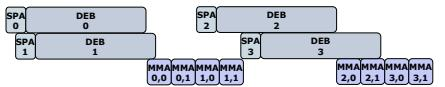  
(d) Voltrix-SpMM with multi-tiered pipelining.  
Figure 7: Different pipelining strategies.

## 3.1.3 Fine-Grained Multi-Tiered Pipelining

Although a single-layer pipeline can mitigate some data loading overhead, it often results in low overlap and suboptimal resource utilization. In contrast, our producer-consumer model enables a higher-level extension of the traditional pipeline, maximizing hardware resource usage and facilitating seamless parallelism between computation and data access. By deploying a warp to manage multiple MMAs and buffers within the pipeline, this approach significantly minimizes idle cycles and enhances overall system throughput.

Multiple MMA. Given that the data access phase incurs higher stalls than the computation phase—due to the producer’s loading speed lagging significantly behind the consumer’s consumption speed—a practical solution is to increase the computation workload for each consumer without altering the producer’s throughput. A single CTA can manage a maximum of 512-dimensional dense data, allocated across 32 warps, with each warp handling up to 16 dimensions of dense data. Consequently, any data exceeding 512 dimensions necessitates a reloading of SparseA. As depicted in Figure 7a, a DenseB data chunk is divided into two loading phases, with the MMA computations also split accordingly. We enable each consumer to load multiple tiled DenseB data simultaneously and conduct multiple MMA operations to enhance processing efficiency, as shown in Figure 7c. This strategy not only reduces the instruction issuing overhead associated with loading but also promotes a higher degree of overlap between computational tasks.

Multiple buffer. To maximize bandwidth utilization and enable seamless pipelining, we introduce multiple buffers, as shown in Figure 7d, to accommodate concurrent MMA operations. Each buffer operates independently, allowing the producer to issue data copy instructions for multiple buffers simultaneously. Once a buffer’s barrier is set to ‘filled’, the consumer begins to read the data from that buffer for computation. Upon completing the computation, the consumer immediately accesses data from another buffer, while the previously used buffer is reloaded with new data. This multi-tiered finegrained pipeline, compared to traditional single-layer pipeline, significantly enhances hardware data copy bandwidth utilization. It bridges the gap between data loading and computation and facilitates more seamless overlap of these processes, ultimately improving overall system performance.

Trade off. While incorporating more MMAs and buffers enhances pipelining potential, this approach does not guarantee improved performance due to two primary factors:

1. Shared memory is a limited resource. Since it shares the same hardware storage with the L1 cache, increasing the number of buffers can reduce cache hit rates for other data, potentially impacting overall performance.

2. Effective pipelining depends on the ability to simultaneously load corresponding DenseB data for different SparseA matrices within the same RowWindow. If a RowWindow contains only a few SparseA matrices, extensive pipelining might lead to underutilization of resources.

Consequently, striking a balance between maximizing overlap and minimizing resource wastage is crucial. In Voltrix-SpMM, we observe that the optimal configuration depends solely on the dimensions of the dense matrix. By pretesting various configurations for dense data of differing dimensions, we can identify the most efficient setup for each scenario.

## 3.2 Persistent and Balanced Kernel

In this subsection, we’ll first present our persistent kernel design, which eliminates atomic operations while simultaneously achieving co-balanced input and output. Following this, we’ll introduce a greedy and heuristic partitioning strategy developed to identify workload-balanced partition points.

## 3.2.1 SM-Aligned and Atomic-Free Partitioning

Software-hardware balance. In Section 2.2.2, we discussed the challenges of achieving balance in Tensor Coreaccelerated SpMM kernels. A well-balanced GPU kernel evenly distributes tasks across hardware units. However, in CUDA, software-level balance among CTAs doesn’t always ensure hardware-level balance across SMs, since the number of CTAs may not match the number of SMs, causing idle SMs during later scheduling stages.

For example, TC-GNN sets CTAs based on RowWindow rows, while DTC-SpMM assigns a fixed number of SparseA elements per CTA. Both adjust CTAs dynamically based on sparse matrix structure. Given millions of SparseA elements, CTAs often far outnumber SMs, increasing overhead associated with CTAs scheduling and prologue/epilogue execution.

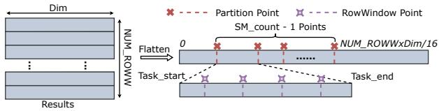

(a) Illustration of task partitioning.  
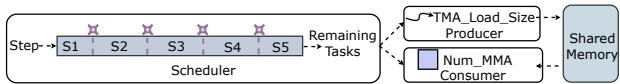  
(b) Task coordination by the scheduler.  
Figure 8: SM-aligned and atomic-free partitioning.

To address this, we adopt an SM-aligned kernel design by fixing the number of CTAs to match the number of SMs. This persistent approach offers two key benefits:

1. It ensures that the software-level distribution of tasks (CTAs) corresponds directly with the hardware-level distribution (SMs). This alignment results in a balanced execution with no idle units.

2. It accommodates the high number of SparseA elements relative to the available SMs, allowing the kernel to run persistently until all tasks are completed. This continuous operation mode reduces the frequent launching and termination of kernel CTAs, which typically incur significant prologue and epilogue execution overhead.

Input-output co-balance. As detailed in Section 2.2.2, TC-GNN suffers from output imbalance, causing uneven data loading and computation across CTAs. DTC-SpMM’s input balancing mitigates SparseA distribution issues but introduces atomic addition overhead and output imbalance.

To address these challenges, we propose an atomic-free partition method that balances both input and output while eliminating atomic operations. This dual-perspective approach simplifies partitioning and improves computational efficiency.

On the input side, SparseA is partitioned at the RowWindow level to keep data contiguous and complete within each partition, eliminating the need for atomic operations. On the output side, the dense matrix is partitioned by its dimensions to ensure balanced output distribution. This fine-grained, flexible partitioning fits naturally with our SM-aligned design, allowing the kernel to persist until all tasks finish. As a result, the kernel must continuously track its progress within each RowWindow and monitor remaining tasks, which introduces complexity in boundary detection.

To manage this, we integrate a scheduler within our producer-consumer model tailored to the balanced partitioning method. Task partitioning is based on result allocation, as shown in Figure 8a, by flattening the result matrix into a 1D vector. The total task count equals the number of RowWindow rows times the result matrix’s dimension. We divide these tasks evenly across M SMs by selecting M − 1 split points, using a single warp MMA operation (i.e., 16) as the partition unit for finer granularity.

By tracking each task’s start and end points, the scheduler effectively defines task and RowWindow boundaries. At runtime (as shown in Figure 8b), tasks are divided into stages aligned with RowWindow boundaries. The scheduler computes remaining tasks in the current stage and instructs the producer how much data to load via TMA. It also dynamically adjusts the number of MMA operations per warp in the consumer accordingly.

While this segmentation removes the need for atomic additions in output, it may require reloading SparseA at boundary stages with incomplete tasks (i.e., tasks that do not fully form a RowWindow). However, since RowWindows typically contain many more rows than SMs and SparseA is efficiently loaded via the BMat format, the overhead of this secondary loading is effectively negligible.

Algorithm 1: Greedy and heuristic-based partition   
point search algorithm   
input : Total cost: $C _ { a l l } .$ , SM counts: M   
output :Partitioned points $S = \left\{ 0 , S _ { 1 } \ldots , S _ { \mathcal { M } } , C _ { a l l } \right\}$   
1 Calculate the average cost $C _ { a \nu g } = C _ { a l l } / { \mathcal { M } } .$   
2 for $S _ { i } \in \mathcal { S } , j \gets 1$ to $\mathcal { M }$ do   
3 Move the $S _ { i }$ points forward until the accumulated cost   
between $S _ { i - 1 }$ and $S _ { i }$ exceeds $C _ { a \nu g } .$   
4 Calculate column position of the end point $C o l = S _ { i } \% \mathcal { D }$   
5 if Col < D/8 then   
6 $S _ { i } = S _ { i } ^ { ' } - C o l$   
7 end   
8 else if $C o l > \mathcal { D } * 7 / 8$ then   
9 $S _ { i } = S i + \mathcal { D } - \dot { C } o l$   
10 end   
11 end

## 3.2.2 Input-Output Co-Balance Searching

With our SM-aligned and atomic-free partitioning, the kernel balancing problem is simplified by dividing all tasks evenly among the SMs to ensure balanced workloads. To evaluate different splitting methods, we propose a cost model for the entire SpMM operation:

$$
\boldsymbol { C } _ { a l l } = \sum _ { i = 0 } ^ { R _ { W } } N u m \_ S P A ( i ) \cdot \boldsymbol { c f } _ { 1 } \cdot \mathcal { D } + R _ { W } \cdot \boldsymbol { c f } _ { 2 } \cdot \mathcal { D } + \boldsymbol { c f } _ { 3 }\tag{1}
$$

The first term captures input costs across all RowWindows, including overhead from SparseA loading and computation, scaled by D, the dense matrix dimension. The second term represents output costs from write-back operations, with $R _ { W }$ as the number of RowWindows. Coefficients c f1, $c f _ { 2 }$ , and $c f _ { 3 }$ quantify the costs of input, output, and fixed kernel overheads, respectively, and are tuned to reflect hardware characteristics.

In the experimental section 4.7, we will measure these three coefficients to validate the accuracy of our cost model. From this model, we derive the optimization objective, which is formulated as follows:

$$
S ^ { * } = \arg \operatorname* { m i n } _ { S } \left( \operatorname* { m a x } \left\{ \frac { C _ { i } ( S ) } { \sum _ { j } C _ { j } ( S ) } \bigg | i \right\} + P ( S ) \right)\tag{2}
$$

Here, S denotes a partitioning scheme, and $P ( S )$ is the penalty from crossing RowWindow boundaries. To find the optimal scheme S ∗, we design a greedy, heuristic-based search algorithm, detailed in Algorithm 1.

The algorithm starts by computing the ideal per-SM cost from the total task cost (Line 1). For each SM, it incrementally extends the partition endpoint until the accumulated cost exceeds this average (Lines 3–4). To reduce boundary-crossing overhead, partition points near RowWindow boundaries are adjusted to align with them (Lines 5–10). Finally, a genetic algorithm [8, 15] refines these points for a globally optimal solution, requiring only one iteration in practice.

Utilizing the greedy and heuristic-based partition point search algorithm, we aim to balance the tasks across each SM as evenly as possible while minimizing the additional overhead incurred by crossing RowWindow boundaries.

## 4 Evaluation

Voltrix-SpMM is a pure CUDA-based [28] library with around 5k lines of code and no third-party dependencies. It extensively utilizes the C++ template metaprogramming paradigm to adapt to our multi-tiered pipelining design, making the code highly configurable and minimizing kernel runtime overhead. We employ inline PTX instructions to leverage specific hardware features of the Hopper GPU [30], including MMA, TMA, and MBarrier, to maximize efficiency.

Voltrix-SpMM is integrated into the popular machine learning framework PyTorch 2.5 [33] and can be easily invoked from both Python and C++ backends using common sparse matrix formats like CSR and COO. Voltrix-SpMM has been open-sourced at github.com/YaqiXia/Voltrix-SpMM, encouraging community use and contributions.

## 4.1 Experimental Setup

Platform. Our experiments are conducted on a Hopper H100 PCIe GPU [30], equipped with 456 Tensor Core units, 14,592 CUDA cores, and 80 GB of graphics memory.

Dataset. As detailed in Table 1, we employ 12 real-world graph datasets, categorized into two types: Type I datasets, with a smaller average row length (less than 20), and Type II datasets, with an average row length close to 500. This distinction in row length influences the data volume in each RowWindow’s TCU blocks, impacting efficiency. To evaluate the adaptability of different methods, our selection includes datasets with varied average row lengths. We also incorporate the SuiteSparse dataset [7], a comprehensive collection of sparse matrix benchmarks, for extended validation.

Methodology. We benchmark SpMM against state-of-theart CUDA Core-based and Tensor Core-based methods. The

Table 1: Dataset Statistics
<table><tr><td>Type</td><td>Dataset</td><td>Abbr.</td><td>Vertex</td><td>Edge</td></tr><tr><td rowspan="7">I</td><td>amazon0505</td><td>A5</td><td>410,236</td><td>4,878,875</td></tr><tr><td>DD</td><td>DD</td><td>334,925</td><td>1,686,092</td></tr><tr><td>PPI</td><td>PI</td><td>56,944</td><td>818,716</td></tr><tr><td>amazon0601</td><td>A1</td><td>403,394</td><td>3,387,388</td></tr><tr><td>com-amazon</td><td>CN</td><td>334,863</td><td>1,851,744</td></tr><tr><td>Yeast</td><td>YT</td><td>1,714,644</td><td>3,636,546</td></tr><tr><td>YeastH</td><td>YH</td><td>3,139,988</td><td>6,487,230</td></tr><tr><td rowspan="4">ⅡI</td><td>web-BerkStan</td><td>WN</td><td>685,230</td><td>7,600,595</td></tr><tr><td>FraudYelp-RSR Reddit</td><td>FR</td><td>45,914</td><td>6,805,486</td></tr><tr><td>ddi</td><td>RT</td><td>232,965</td><td>114,848,857</td></tr><tr><td>protein</td><td>DI PN</td><td>4267 132,534</td><td>2,140,089 79,255,038</td></tr></table>

CUDA Core baselines include Sputnik [12], GE-SpMM [17], RoDe [32], and cuSPARSE [24], while the Tensor Core baselines include TC-GNN [43] and DTC-SpMM [10]. For GNN testing, comparisons are made with GNNAdvisor [42], TC-GNN, and the widely-used DGL framework [2]. Our GNN model features two GCN [20] convolutional layers, each with a hidden dimension of 256.

## 4.2 SpMM Performance

First, we evaluate the performance of Voltrix-SpMM against other SpMM kernels using real-world graph datasets and the SuiteSparse collection to provide the sparse matrices on the left-hand side. The dimensions of the dense matrices on the right-hand side are set to 256, 512, and 1024, respectively.

Graph datasets. As illustrated in Figure 9, Voltrix-SpMM achieves superior performance across nearly all graph datasets. It outperforms cuSPARSE with an average speedup of 2.7x and surpasses the state-of-the-art CUDA Core-based method, RoDe, by the 1.9x speedup. Against the Tensor Core-based method, DTC-SpMM, Voltrix-SpMM delivers an average speedup of 1.8x, demonstrating its high efficiency.

Voltrix-SpMM particularly excels as the dimension of the dense matrix increases, achieving speedups of 2.4x, 2.8x, and 3.0x over cuSPARSE for dimensions of 256, 512, and 1024, respectively. This improvement is attributed to our multiple MMA and buffer design, which can load more data per operation at higher dimensions, thereby reducing instruction overhead and making more effective use of bandwidth.

Furthermore, while DTC-SpMM and TC-GNN also utilize Tensor Cores for acceleration, their performance lags behind the CUDA Core-based RoDe by 2% and 69%, respectively. This highlights that despite the high computational throughput of Tensor Cores, significant data loading overhead can restrict their performance, leading to underutilized and ‘starved’ Tensor Cores. In contrast, Voltrix-SpMM overcomes these limitations with its warp-level asynchronous pipelining and balanced workload design, effectively unlocking the full potential of Tensor Cores for SpMM. While some CUDA Core-based methods, such as Sputnik and RoDe, encounter CUDA errors under specific conditions due to shared memory limitations, Voltrix-SpMM consistently adapts to all scenarios, thanks to its robust persistent kernel design.

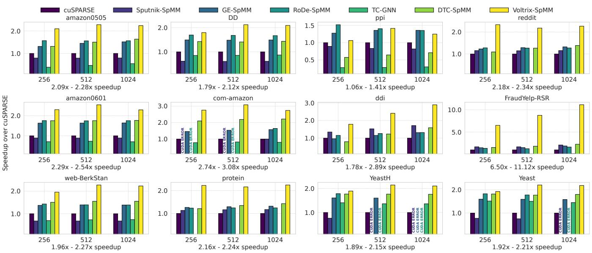  
Figure 9: Performance comparison on graph datasets, with each subplot showing Voltrix-SpMM’s speedup over cuSPARSE.

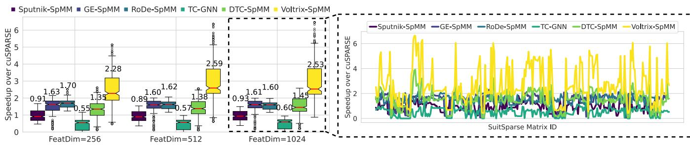  
Figure 10: Speedup comparison on SuiteSparse: Box plot shows the overall distribution, while line chart shows detailed speedup.

SuiteSparse datasets. As shown in Figure 10, Voltrix-SpMM achieves average speedups of 2.5x compared to cuS-PARSE. These results not only outperform all other methods but also demonstrate that the effectiveness of our design increases with the matrix dimensions, consistent with results observed on graph datasets. In the SuiteSparse tests, DTC-SpMM and TC-GNN still fall short of the performance achieved by the state-of-the-art CUDA Core-based method, RoDe, lagging by 11% and 70%, respectively. In contrast, Voltrix-SpMM achieves a 1.6x speedup over RoDe. This underscores that existing Tensor Core-based designs typically do not outperform CUDA Core-based methods. Our work is the first to fully leverage the capabilities of Tensor Cores, achieving speedups that surpass those achievable with traditional CUDA Core-based methods.

Mirco-level analysis. To provide a more granular understanding of the performance characteristics of various SpMM implementations, we augment our evaluation with micro-level hardware analysis. Using NVIDIA Nsight Compute, we collected key metrics such as register allocation, DRAM reads (GB), bank conflicts, and Tensor Core Unit (TCU) pipe utilization, as shown in Figure 12. These measurements are based on experiments using the Reddit dataset.

Results show Voltrix-SpMM consistently outperforms DTC-SpMM and RoDe-SpMM across multiple hardware metrics. It uses fewer registers and consumes less memory bandwidth, reflecting the efficiency of our bit-wise compressed data format, BMat.

Furthermore, Voltrix-SpMM exhibits a competitive L2 cache hit rate and significantly fewer bank conflicts, demonstrating effective memory access management, especially during the BMat decoding phase. It also demonstrates a competitive L2 hit rate and significantly fewer bank conflicts, highlighting its effective memory access management, particularly in optimizing BMat decoding phase.

Additionally, Voltrix-SpMM achieves the highest TCU pipe utilization, demonstrating superior pipeline efficiency and more effective use of GPU tensor cores. In contrast, RoDe-SpMM, limited to CUDA cores, shows zero TCU activity.

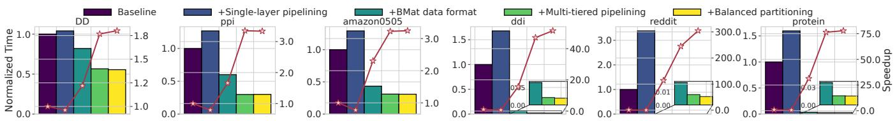  
Figure 11: Performance Breakdown: The left axis shows normalized time, and the right axis shows speedup.

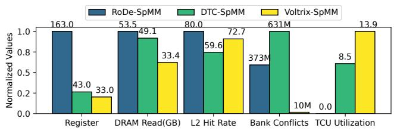  
Figure 12: Micro-level performance comparison.

In summary, Voltrix-SpMM outperforms the other implementations in terms of memory efficiency and hardware utilization, making it the most optimized choice for SpMM tasks.

## 4.3 SpMM Performance Breakdown

We assess the performance contributions of Voltrix-SpMM’s core components. Experiments are conducted on the graph datasets with dense matrix dimensions set to 256, using TC-GNN as the baseline. We incrementally integrate Voltrix-SpMM’s components to gauge the performance improvements, which are illustrated in Figure 11.

Initially, we integrate the bulk asynchronous data transfer instruction, TMA, to establish a single layer of pipelining. However, in most datasets, this addition results in a performance degradation, with an average decrease of 32.6%. This occurs because, while the TMA instruction can transfer a large volume of data per operation, its latency is relatively high. Therefore, with the data dimension set to 256, each operation is limited to transferring only 256 float32 elements, restricting the potential for bulk data transfer. Additionally, the single-layer pipelining provides minimal overlap, further reducing the overall benefits of pipelining.

Adding our bit-wise compressed data format (BMat), we observe over a 77x average speedup, with results on Reddit reaching up to 384x. This significant improvement is due to datasets like Reddit, Protein, and ddi having larger average row lengths, which results in more SparseA blocks per RowWindow after TCU compression. In comparison, TC-GNN struggles with inefficient loading and transformation of SparseA, causing substantial delays. Voltrix-SpMM, with its bit-wise compressed data format, leverages vectorized loading and a conflict-free transformation design, dramatically reducing the processing time for SparseA.

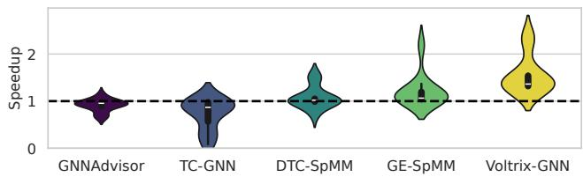  
Figure 13: End-to-end GNN testing on different graph datasets: The vertical axis represents the speedup over DGL.

Next, incorporating our multi-tiered pipelining yields an average 2.1x speedup. Although bulk asynchronous transfers introduce some overhead, Voltrix-SpMM counteracts this through multiple MMA operations and buffers, which amortize the instruction overhead while optimizing bandwidth utilization. Our warp-specialized producer-consumer model further facilitates fine-grained, multi-tiered pipelining, achieving higher levels of overlap and yielding significant benefits.

Lastly, integrating our persistent kernel design results in up to a 1.3x speedup. On datasets like Reddit, which feature more uneven data distributions, we observe even greater improvements, showcasing our balance search algorithm’s efficacy in addressing challenges associated with uneven data distribution on input-output balance.

Overall, through the strategic design of these four components, Voltrix-SpMM achieves speedups ranging from 2.0x to 304x, underscoring the effectiveness of each module in enhancing SpMM performance.

## 4.4 GNN End-to-end Training

We evaluate the performance of Voltrix-SpMM in end-to-end GNN training, which we refer to as Voltrix-GNN, exploring its potential in machine learning tasks. We use GCN [20], one of the most widely used GNN models, which comprises multiple graph convolutional layers. Each layer’s computation primarily involves a SpMM operation and a GEMM operation, indicating that any computational gaps in SpMM may be balanced by other operations during training.

The experimental results in Figure 13 use DGL [2], which leverages cuSPARSE library for SpMM acceleration, as the baseline. Voltrix-GNN consistently outperforms all baselines across diverse graph datasets, with average speedups of 1.55×, 1.77×, 4.01×, 1.45×, and 1.29× over DGL, GNNAdvisor, TC-GNN, DTC-SpMM, and GE-SpMM, respectively. These findings underscore the applicability and outstanding performance of Voltrix-SpMM in GNN training tasks.

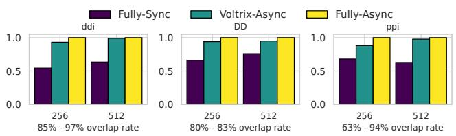  
Figure 14: Overlap rate testing: The horizontal axis shows dimensions, and the vertical axis shows normalized speedup.

## 4.5 Overlap Rate of Pipelining

We investigate the overlap rate of Voltrix-SpMM’s pipelining strategy. Profiling the kernel’s time trace is challenging, so we adopt an approximation method to determine the kernel’s overlap rate: First, we implement a configuration using a single buffer, termed Fully-Sync, where the consumer begins computation only after production has completed, forcing the kernel to operate serially without any pipelining. Next, we configure the kernel to run completely asynchronously by removing all MBarrier instructions, which we refer to as Fully-Async. This scenario represents the upper bound of our kernel’s performance. We define the overlap rate, $R _ { o }$ , as:

$$
R _ { o } = \frac { T ( F u l l y \_ S y n c ) - T ( V o l t r i x \_ A s y n c ) } { T ( F u l l y \_ S y n c ) - T ( F u l l y \_ A s y n c ) } \times 1 0 0 \%\tag{3}
$$

Here, Voltrix-Async refers to our method. As depicted in Figure 14, Voltrix-SpMM achieves peak overlap rates of 85% and 97% at 256 and 512 dimensions, respectively. These results demonstrate the effectiveness of our warp-specialized asynchronous data loading pipelining. With near-seamless overlap, Voltrix-SpMM significantly reduces the data loading overhead, showcasing its high efficiency.

## 4.6 Workload Balance Analysis

Active SM cycles analysis. To evaluate the effectiveness of our workload balancing design, we analyze the distribution of active SM cycles using runtime data from both non-balanced and balanced kernel executions, as shown in Figure 15. The impact of our approach varies across datasets. On imbalanced workloads like ddi, our method significantly improves SM utilization and reduces kernel time by 8.6%. In contrast, for already balanced datasets like ppi, the benefit is marginal, with only a 0.4% increase in kernel time.

While the balancing introduces minor overhead, it is largely hidden by the persistent kernel design, which overlaps epilogue execution with ongoing computation. As a result,our method delivers clear gains on imbalanced workloads while preserving original performance on balanced ones.

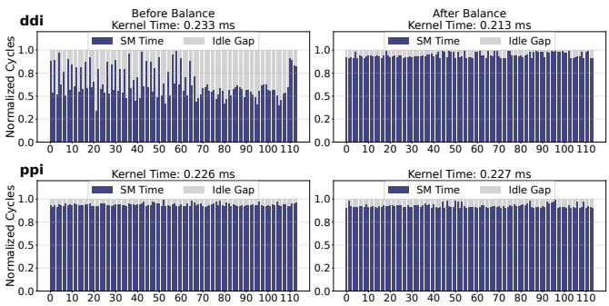  
Figure 15: SM-Level active cycle distribution comparison.

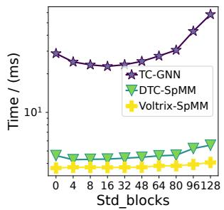

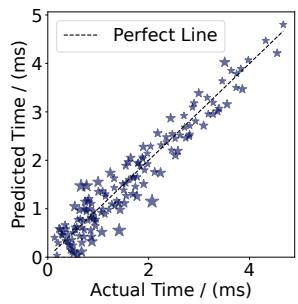  
Figure 16: Sensitivity.  
Figure 17: Time alignment.

Sensitivity analysis. We investigate the balance of different methods to irregular distributed data. By configuring the number of SparseA elements in each RowWindow, we generate sparse datasets with varying levels of uniformity. Using a Gamma distribution [25], we create datasets with a mean of 256 and variances ranging from 0 to 192, and evaluate their performance.

As shown in Fiure 16, under different variance distributions, our method outperforms both DTC-SpMM and TC-GNN in terms of speed. Moreover, as the distribution of SparseA becomes increasingly uneven,our method remains stable with only a 4% performance drop, while TC-GNN experiences a significant 47% degradation. These results demonstrate the superiority of Voltrix-SpMM in balancing I/O while avoiding the high overhead of atomic operations.

## 4.7 Validation of Cost Model

We evaluate the effectiveness of the cost model outlined in Equation 1, utilizing kernel execution time as the cost measure. To understand the relationship between time and the two variables, Num\_SPA and $R _ { W } .$ , we generate datasets with varying values for these parameters. Given the linear relationship postulated in our model between the cost and these variables, we employ linear regression for fitting, as demonstrated as:

$$
T = \alpha _ { 1 } \cdot N u m \_ S P A + \alpha _ { 2 } \cdot R _ { W } + \alpha _ { 3 }\tag{4}
$$

Here, α1, α2, and α3 represent the coefficients of the linear regression model, correlating positively with c f1, c f2, and c f3, respectively. We divide the data into a training set (80%) and a testing set (20%). Using this model, we predict values on the testing set and compare these predictions to the actual values. This comparison is visually represented in Figure 17, where the predicted values are plotted against the actual values on the x and y axes, respectively. The discrepancy between them is indicated by the size of the scatter markers, with smaller sizes denoting a closer fit to the perfect prediction line.

As depicted in Figure 17, nearly all points closely align with the ideal prediction line. Moreover, we calculate the coefficient of determination, $R ^ { 2 } = 0 . 9 2$ , indicating a strong linear relationship. An $R ^ { 2 }$ value exceeding 0.9 reaffirms the high accuracy of our model’s fit to the data.

## 5 Related Work

CUDA Core-accerateled SpMM. Recently, numerous studies have focused on optimizing SpMM computation on GPUs, primarily utilizing CUDA Cores [12,16–18,26,32,34]. NVIDIA’s official sparse matrix library, cuSPARSE [24], offers highly optimized GPU-accelerated routines for SpMM. Merge-SpMM [48] accelerates SpMM using the CSR format, emphasizing instruction-level parallelism. Sputnik [12] introduces a 1D tiling scheme that enhances operand reuse and employs subwarp tiling and reverse-offset memory alignment to optimize vector memory access for misaligned addresses. GE-SpMM [17] integrates a coalesced row caching method for efficient memory access and a coarse-grained warp mapping method to reduce threading overheads. GNNAvisor [42] proposes an adaptive runtime system with a novel 2D workload management strategy to improve GPU utilization. DA-SpMM [6] employs a data-aware heuristic GPU kernel, while HP-SpMM [9] uses dynamic task partitioning and hierarchical vectorized memory access. Lastly, RoDe [32] introduces a row decomposition-based method that enables efficient computation, load balancing, and fine-grained pipelining, setting a new performance benchmarks for SpMM.

Collectively, these methods optimize SpMM across various dimensions but often overlook the potential of Tensor Cores for accelerating computations. This oversight limits their ability to leverage the high throughput of modern GPUs.

Tensor Core-accerateled SpMM. With the advancement of Tensor Core computational throughput, an increasing number of studies have focused on leveraging Tensor Cores to accelerate SpMM [1, 5, 23, 41, 44]. However, most of these efforts target structured SpMM, which assumes a predefined pattern for the non-zero element distribution in sparse matrices, thereby limiting their applicability in real-world scenarios.

In contrast, TC-GNN addresses the more challenging application of unstructured SpMM on Tensor Cores. By introducing a sparse graph translation method that compresses sparse matrices into Tensor Core-sized TCU blocks, TC-

GNN enables the efficient mapping of SpMM workloads to Tensor Core units. This approach has been further integrated into SparseTIR [49]. Despite its advances, however, TC-GNN’s performance is compromised by inefficient data loading, which leaves the Tensor Cores underutilized. DTC-SpMM [10] attempts to enhance efficiency through several optimization methods, such as bypassing shared memory to accelerate dense data loading and implementing a pipeline arrangement to overlap sparse data loading and computation. However, the intra-warp asynchronous pipeline of DTC-SpMM struggles with the overhead caused by a large number of instructions and the costs of intra-warp synchronization.

While ACC-SpMM [51], FlashSparse [36], Groot [4], and SpInfer [11] make valuable contributions and optimizations beyond DTC-SpMM, they all operate within the same asynchronous design paradigm. To address these limitations, Voltrix-SpMM employs a multi-tiered inter-warp pipeline for enhanced computational overlap through warp specialization and utilizes bulk asynchronous data loading via TMA to efficiently handle high-dimensional data.

Libraries like cuBLAS [27], CUTLASS [31], and FlashAttention-3 [35] optimize GEMM operation using warp specialization and persistent kernel design, but the unique challenges posed by the sparse and irregular workload of SpMM make these approaches inapplicable.

## 6 Conclusion

In this paper, we introduced Voltrix-SpMM, a novel GPU kernel design that enhances SpMM on Tensor Cores. Voltrix-SpMM maximizes the computational potential of Tensor Cores for unstructured SpMM tasks. Its innovations include a new compression format for sparse matrices, bulk asynchronous data loading and a warp-specialized producerconsumer model, which streamline data handling and computation. Additionally, its SM-aligned, atomic-free partitioning mechanism ensures balanced workload distribution across SMs. The impact of Voltrix-SpMM is significant, achieving an average 1.8x improvement over DTC-SpMM, 1.7x over RoDe, and a 2.0x increase in end-to-end GNN training speeds, proving its effectiveness in real-world applications.

## 7 Acknowledgment

We sincerely thank all reviewers for their constructive comments. Special thanks to our shepherd Tim Harris for his patient guidance and valuable suggestions through multiple review rounds, which greatly improved this paper’s quality.

This work was supported by the National Key Research and Development Program of China (2023YFE0205700), the National Natural Science Foundation of China (62341410), and the Science and Technology Development Fund, Macao S.A.R (FDCT) project (0078/2023/AMJ).

## References

[1] Hartwig Anzt, Stanimire Tomov, and Jack J Dongarra. Accelerating the lobpcg method on gpus using a blocked sparse matrix vector product. In SpringSim (HPS), pages 75–82, 2015.

[2] AWS. Deep graph library. https://github.com/ dmlc/dgl, 2024.

[3] David M Blei, Andrew Y Ng, and Michael I Jordan. Latent dirichlet allocation. Journal of machine Learning research (JMLR), 3(Jan):993–1022, 2003.

[4] YuAng Chen, Jiadong Xie, Siyi Teng, Wenqi Zeng, and Jeffrey Xu Yu. Groot: Graph-centric row reordering with tree for sparse matrix multiplications on tensor cores. In Proceedings of the Twentieth European Conference on Computer Systems (EuroSys), pages 803–817, 2025.

[5] Zhaodong Chen, Zheng Qu, Liu Liu, Yufei Ding, and Yuan Xie. Efficient tensor core-based gpu kernels for structured sparsity under reduced precision. In SC21: Proceedings of the International Conference for High Performance Computing, Networking, Storage and Analysis, pages 1–14, 2021.

[6] Guohao Dai, Guyue Huang, Shang Yang, Zhongming Yu, Hengrui Zhang, Yufei Ding, Yuan Xie, Huazhong Yang, and Yu Wang. Heuristic adaptability to input dynamics for spmm on gpus. In Proceedings of the ACM/IEEE Design Automation Conference (DAC), pages 595–600, 2022.

[7] Timothy A Davis and Yifan Hu. The university of florida sparse matrix collection. ACM Transactions on Mathematical Software (TOMS), 38(1):1–25, 2011.

[8] Kalyanmoy Deb. Multi-objective optimisation using evolutionary algorithms: an introduction. In Multiobjective evolutionary optimisation for product design and manufacturing, pages 3–34. Springer, 2011.

[9] Ruibo Fan, Wei Wang, and Xiaowen Chu. Fast sparse gpu kernels for accelerated training of graph neural networks. In Proceedings of the IEEE International Parallel and Distributed Processing Symposium (IPDPS), pages 501–511. IEEE, 2023.

[10] Ruibo Fan, Wei Wang, and Xiaowen Chu. Dtc-spmm: Bridging the gap in accelerating general sparse matrix multiplication with tensor cores. In Proceedings of the ACM International Conference on Architectural Support for Programming Languages and Operating Systems (ASPLOS), pages 253–267, 2024.

[11] Ruibo Fan, Xiangrui Yu, Peijie Dong, Zeyu Li, Gu Gong, Qiang Wang, Wei Wang, and Xiaowen Chu. Spinfer: Leveraging low-level sparsity for efficient large language model inference on gpus. In Proceedings of the Twentieth European Conference on Computer Systems (EuroSys), pages 243–260, 2025.

[12] Trevor Gale, Matei Zaharia, Cliff Young, and Erich Elsen. Sparse gpu kernels for deep learning. In SC20: International Conference for High Performance Computing, Networking, Storage and Analysis, pages 1–14. IEEE, 2020.

[13] Will Hamilton, Zhitao Ying, and Jure Leskovec. Inductive representation learning on large graphs. In Proceedings of the Advances in Neural Information Processing Systems (NeurIPS), 2017.

[14] Kaiming He, Xiangyu Zhang, Shaoqing Ren, and Jian Sun. Deep residual learning for image recognition. In Proceedings of the IEEE Conference on Computer Vision and Pattern Recognition (CVPR), pages 770–778, 2016.

[15] John H Holland. Genetic algorithms. Scientific american, 267(1):66–73, 1992.

[16] Changwan Hong, Aravind Sukumaran-Rajam, Israt Nisa, Kunal Singh, and P Sadayappan. Adaptive sparse tiling for sparse matrix multiplication. In Proceedings of the ACM Symposium on Principles and Practice of Parallel Programming (PPoPP), pages 300–314, 2019.

[17] Guyue Huang, Guohao Dai, Yu Wang, and Huazhong Yang. Ge-spmm: General-purpose sparse matrix-matrix multiplication on gpus for graph neural networks. In SC20: International Conference for High Performance Computing, Networking, Storage and Analysis, pages 1–12. IEEE, 2020.

[18] Kezhao Huang, Jidong Zhai, Zhen Zheng, Youngmin Yi, and Xipeng Shen. Understanding and bridging the gaps in current gnn performance optimizations. In Proceedings of the 26th ACM SIGPLAN Symposium on Principles and Practice of Parallel Programming (PPoPP), pages 119–132, 2021.

[19] Jacob Devlin Ming-Wei Chang Kenton and Lee Kristina Toutanova. Bert: Pre-training of deep bidirectional transformers for language understanding. In Proceedings of naacL-HLT, volume 1, page 2, 2019.

[20] Thomas N Kipf and Max Welling. Semi-supervised classification with graph convolutional networks. In Proceedings of the International Conference on Learning Representations (ICLR), 2016.

[21] Alex Krizhevsky, Ilya Sutskever, and Geoffrey E Hinton. Imagenet classification with deep convolutional neural networks. Proceedings of the Advances in Neural Information Processing Systems (NeurIPS), 2012.

[22] Andrew S Lan, Andrew E Waters, Christoph Studer, and Richard G Baraniuk. Sparse factor analysis for learning and content analytics. The Journal of Machine Learning Research (JMLR), 15(1):1959–2008, 2014.

[23] Shigang Li, Kazuki Osawa, and Torsten Hoefler. Efficient quantized sparse matrix operations on tensor cores. In SC22: International Conference for High Performance Computing, Networking, Storage and Analysis, pages 1–15. IEEE, 2022.

[24] Maxim Naumov, L Chien, Philippe Vandermersch, and Ujval Kapasi. Cusparse library. In GPU Technology Conference, volume 12, 2010.

[25] John Ashworth Nelder and Robert WM Wedderburn. Generalized linear models. Journal of the Royal Statistical Society Series A: Statistics in Society, 135(3):370– 384, 1972.

[26] Yuyao Niu, Zhengyang Lu, Haonan Ji, Shuhui Song, Zhou Jin, and Weifeng Liu. Tilespgemm: A tiled algorithm for parallel sparse general matrix-matrix multiplication on gpus. In Proceedings of the 27th ACM SIGPLAN Symposium on Principles and Practice of Parallel Programming (PPoPP), pages 90–106, 2022.

[27] Nvidia. cublas. https://developer.nvidia.com/ cublas, 2023.

[28] Nvidia. Cuda. https://docs.nvidia.com/cuda/ cuda-toolkit-release-notes/index.html, 2023.

[29] Nvidia. Tensor core. https://www.nvidia.cn/ data-center/tensor-cores/, 2023.

[30] Nvidia. Nvidia hopper architecture. https: //www.nvidia.com/en-us/data-center/ technologies/hopper-architecture/, 2024.

[31] Nvidia. Cutlass. https://github.com/NVIDIA/ cutlass, 2025.

[32] Meng Pang, Xiang Fei, Peng Qu, Youhui Zhang, and Zhaolin Li. A row decomposition-based approach for sparse matrix multiplication on gpus. In Proceedings of the ACM SIGPLAN Annual Symposium on Principles and Practice of Parallel Programming (PPoPP), pages 377–389, 2024.

[33] Adam Paszke, Sam Gross, Francisco Massa, Adam Lerer, James Bradbury, Gregory Chanan, Trevor Killeen, Zeming Lin, Natalia Gimelshein, Luca Antiga, et al.

Pytorch: an imperative style, high-performance deep learning library. In Proceedings of the Advances in Neural Information Processing Systems (NeurIPS), pages 8026–8037, 2019.

[34] Hongwu Peng, Xi Xie, Kaustubh Shivdikar, Md Amit Hasan, Jiahui Zhao, Shaoyi Huang, Omer Khan, David Kaeli, and Caiwen Ding. Maxk-gnn: Extremely fast gpu kernel design for accelerating graph neural networks training. In Proceedings of the 29th ACM International Conference on Architectural Support for Programming Languages and Operating Systems (ASPLOS), pages 683–698, 2024.

[35] Jay Shah, Ganesh Bikshandi, Ying Zhang, Vijay Thakkar, Pradeep Ramani, and Tri Dao. Flashattention-3: Fast and accurate attention with asynchrony and lowprecision. arXiv preprint arXiv:2407.08608, 2024.

[36] Jinliang Shi, Shigang Li, Youxuan Xu, Rongtian Fu, Xueying Wang, and Tong Wu. Flashsparse: Minimizing computation redundancy for fast sparse matrix multiplications on tensor cores. In Proceedings of the 30th ACM SIGPLAN Annual Symposium on Principles and Practice of Parallel Programming (PPoPP), pages 312–325, 2025.

[37] Jie Sun, Li Su, Zuocheng Shi, Wenting Shen, Zeke Wang, Lei Wang, Jie Zhang, Yong Li, Wenyuan Yu, Jingren Zhou, et al. Legion: Automatically pushing the envelope of multi-gpu system for billion-scale gnn training. In 2023 USENIX Annual Technical Conference (USENIX ATC), pages 165–179, 2023.

[38] Ashish Vaswani, Noam Shazeer, Niki Parmar, Jakob Uszkoreit, Llion Jones, Aidan N Gomez, Łukasz Kaiser, and Illia Polosukhin. Attention is all you need. Advances in Neural Information Processing Systems (NeurIPS), 30, 2017.

[39] Hulin Wang, Yaqi Xia, Donglin Yang, Xiaobo Zhou, and Dazhao Cheng. Harnessing inter-gpu shared memory for seamless moe communication-computation fusion. In Proceedings of the 30th ACM SIGPLAN Annual Symposium on Principles and Practice of Parallel Programming (PPoPP), pages 170–182, 2025.

[40] Weihu Wang, Yaqi Xia, Donglin Yang, Xiaobo Zhou, and Dazhao Cheng. Accelerating distributed dlrm training with optimized tt decomposition and micro-batching. In International Conference for High Performance Computing, Networking, Storage and Analysis (SC), pages 1–15. IEEE, 2024.

[41] Yuke Wang, Boyuan Feng, and Yufei Ding. Qgtc: accelerating quantized graph neural networks via gpu tensor core. In Proceedings of the ACM SIGPLAN Symposium

on Principles and Practice of Parallel Programming (PPoPP), pages 107–119, 2022.

[42] Yuke Wang, Boyuan Feng, Gushu Li, Shuangchen Li, Lei Deng, Yuan Xie, and Yufei Ding. Gnnadvisor: An adaptive and efficient runtime system for gnn acceleration on gpus. In Proceedings of the USENIX Symposium on Operating Systems Design and Implementation (OSDI), pages 515–531, 2021.

[43] Yuke Wang, Boyuan Feng, Zheng Wang, Guyue Huang, and Yufei Ding. Tc-gnn: Bridging sparse gnn computation and dense tensor cores on gpus. In Proceedings of the USENIX Annual Technical Conference (USENIX ATC), pages 149–164, 2023.

[44] Haojun Xia, Zhen Zheng, Yuchao Li, Donglin Zhuang, Zhongzhu Zhou, Xiafei Qiu, Yong Li, Wei Lin, and Shuaiwen Leon Song. Flash-llm: Enabling costeffective and highly-efficient large generative model inference with unstructured sparsity. Proceedings of the VLDB Endowment, 17(2):211–224, 2023.

[45] Yaqi Xia, Donglin Yang, Xiaobo Zhou, and Dazhao Cheng. Scaling new heights: Transformative cross-gpu sampling for training billion-edge graphs. In International Conference for High Performance Computing, Networking, Storage and Analysis (SC), pages 1–15. IEEE, 2024.

[46] Yaqi Xia, Zheng Zhang, Hulin Wang, Donglin Yang, Xiaobo Zhou, and Dazhao Cheng. Redundancy-free high-performance dynamic gnn training with hierarchical pipeline parallelism. In Proceedings of the 32nd International Symposium on High-Performance Parallel and Distributed Computing (HPDC), pages 17–30, 2023.

[47] Keyulu Xu, Weihua Hu, Jure Leskovec, and Stefanie Jegelka. How powerful are graph neural networks? arXiv preprint arXiv:1810.00826, 2018.

[48] Carl Yang, Aydın Buluç, and John D Owens. Design principles for sparse matrix multiplication on the gpu. In Proceedings of the European Conference on Parallel Processing (EuroPar, pages 672–687. Springer, 2018.

[49] Zihao Ye, Ruihang Lai, Junru Shao, Tianqi Chen, and Luis Ceze. Sparsetir: Composable abstractions for sparse compilation in deep learning. In Proceedings of the ACM International Conference on Architectural Support for Programming Languages and Operating Systems (ASPLOS), pages 660–678, 2023.

[50] Zheng Zhang, Donglin Yang, Xiaobo Zhou, and Dazhao Cheng. Mcfuser: High-performance and rapid fusion

of memory-bound compute-intensive operators. In International Conference for High Performance Computing, Networking, Storage and Analysis (SC), pages 1–15. IEEE, 2024.

[51] Haisha Zhao, San Li, Jiaheng Wang, Chunbao Zhou, Jue Wang, Zhikuang Xin, Shunde Li, Zhiqiang Liang, Zhijie Pan, Fang Liu, et al. Acc-spmm: Accelerating generalpurpose sparse matrix-matrix multiplication with gpu tensor cores. In Proceedings of the 30th ACM SIGPLAN Annual Symposium on Principles and Practice of Parallel Programming, pages 326–338, 2025.

[52] Kai Zhong, Zhenhua Zhu, Guohao Dai, Hongyi Wang, Xinhao Yang, Haoyu Zhang, Jin Si, Qiuli Mao, Shulin Zeng, Ke Hong, et al. Feasta: A flexible and efficient accelerator for sparse tensor algebra in machine learning. In Proceedings of the 29th ACM International Conference on Architectural Support for Programming Languages and Operating Systems (ASPLOS), pages 349–366, 2024.