①

USENIX

THE ADVANCED COMPUTING SYSTEMS ASSOCIATION

# Roaming Free in the VR World with MP2

Yifei Xu, University of California, Los Angeles; Xumiao Zhang, University of Michigan and Alibaba Cloud; Yuning Chen, University of California, Merced; Pan Hu, Uber Technologies, Inc.; Xuan Zeng, Zhilong Zheng, Xianshang Lin, and Yanmei Liu, Alibaba Cloud; Songwu Lu, University of California, Los Angeles; Z. Morley Mao,   
University of Michigan; Wan Du, University of California, Merced; Dennis Cai and Ennan Zhai, Alibaba Cloud; Yunfei Ma, Uber Technologies, Inc. https://www.usenix.org/conference/atc25/presentation/xu

# This paper is included in the Proceedings of the 2025 USENIX Annual Technical Conference.

July 7–9, 2025 • Boston, MA, USA ISBN 978-1-939133-48-9

Open access to the Proceedings of the 2025 USENIX Annual Technical Conference is sponsored by

P=-r.h mEesL

auuuJl9 PgleU

King Abdullah University of

Science and Technology

# Roaming Free in the VR World with MP2

Yifei Xu1, Xumiao Zhang2,5, Yuning Chen3, Pan Hu4, Xuan Zeng2, Zhilong Zheng2, Xianshang Lin2, Yanmei Liu2, Songwu Lu1, Z. Morley Mao5, Wan Du3, Dennis Cai2, Ennan Zhai2, Yunfei Ma4

1University of California, Los Angeles

2Alibaba Cloud

3University of California, Merced

4Uber Technologies, Inc.

5University of Michigan

## Abstract

Free-roaming VR which allows a group of users to navigate in rooms and even buildings, enhances the VR experience by making it more immersive and interactive. Streaming VR videos over wireless enables unconstrained experiences but raises unprecedented requirements in mobility, efficiency, and scalability. Existing solutions fail in one or more of the following challenges: maintaining low latency during handover, balancing loads on different APs, and stabilizing bitrate for competing users, due to their decentralized nature where each user lacks information about others and makes locally optimal decisions. To address these problems, we present MP2, a centralized VR streaming system that coordinates multiple Wi-Fi links and video bitrates among users for better QoE. A centralized controller collects cross-layer information from each user and makes better decisions based on global information. It achieves this in a timely manner through accurate modeling and the use of efficient pruning and partitioning algorithms. To our knowledge, MP2 is the first centrally coordinated VR streaming system that supports multi-user free-roaming. Comprehensive benchmarks including real-world tests, large-scale emulation, and trace-driven user studies, confirm the effectiveness of MP2 against state-of-the-art solutions. It achieves 35 improvement in tail latency, 1.56 in bitrate, and 1.86 in QoE over state-of-the-art baselines. MP2 achieves up to a 99.1% improvement in mean opinion scores according to the user study.

## 1 Introduction

Among the rapidly growing Virtual Reality (VR) ecosystem, free-roaming VR has gained significant traction as it provides a more immersive and interactive experience. In contrast to traditional VR where users are constrained to a small room or seated position, free-roaming VR users can freely walk, run, and explore the virtual world in a much larger physical space. Notable examples include Zero Latency VR [18] with perceptual tricks that enable players to travel up to 1 km to journey through the virtual world within a 400 m2 room, and Sandbox VR Game [12] that features a group of players collaborating with each other in a shared virtual adventure to defeat aliens, as illustrated in Figure 1. Besides gaming, free-roaming virtual reality has found its way to virtual tourism [17], training [15], and education [13].

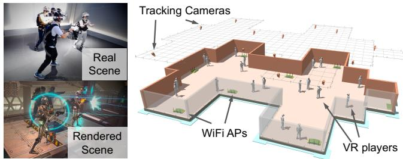  
Figure 1: Real-world/rendered scenes and settings of a freeroaming VR scenario. Although existing commercial systems still require users to carry a heavy backpack (top left), a wireless streaming system would remove the burden.

Existing on-device VR rendering solutions necessitate that users either carry a heavy backpack or wear a bulky headset and battery pack for the rendering hardware, which limits immersion. Wireless streaming offloads rendering but needs to meet several requirements in free-roaming VR scenarios: (1) Mobility: The system must support wireless operation and allow users to roam freely across different access points (APs) without experiencing significant latency or disconnections, as a single AP cannot provide sufficient coverage and bandwidth. (2) Scalability: The system should be capable of supporting multiple users simultaneously, each with its own control loop, without compromising the quality of service. (3) Efficiency: It is crucial for the system to schedule available bandwidth resources efficiently to accommodate a large group of users.

It is not surprising to find that existing solutions often fail to meet the requirements of free-roaming VR as they are not specifically designed for such use cases. To better understand the challenges, we build a VR streaming system with XLINK [110], a state-of-the-art multipath transport, and ALVR [2], the most popular open-source VR streaming solution. The experiment results are shown in Figure 2. We summarize the challenges as follows:

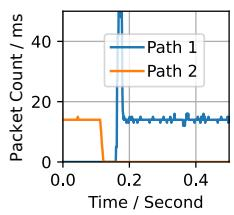

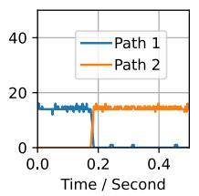

(a) Large (⇡50 ms) packet gap during handover (left) vs. seamless handover (right).  
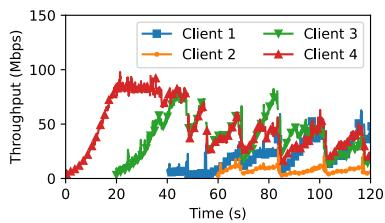  
(b) Bitrate fluctuation of four competing streams.

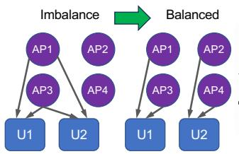

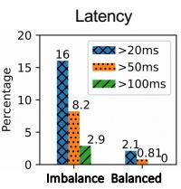  
(c) Example of uneven AP traffic load and how balancing improves latency.  
Figure 2: Challenges of supporting free-roaming VR with state-of-the-art streaming system.

High handover latency: Handover between APs can lead to significant performance degradation [85]. While the baseline uses a multipath protocol designed to mitigate latency spikes during handover, it fails to account for the fact that Wi-Fi radios require time to wake up and achieve their optimal throughput. This oversight results in a substantial packet gap compared to the ideal seamless migration scenario, as illustrated in Figure 2a.

Unstable bitrate: Deciding which encoding bitrate to use is already considered challenging over dynamic wireless links. This becomes more complex when coupled with multipath transport, which is known as the double-control loop problem [24,50]. The problem is further exacerbated in the context of multiple players competing for resources, resulting in unstable bitrates for players, as shown in Figure 2b.

• Imbalance of loads: Although the baseline solution can distribute traffic between different connected APs, it lacks control over which AP to connect to, nor does it have a global view. This results in an imbalance of loads with users concentrated on a subset of the APs, leading to sub-optimal performance, as shown in Figure 2c.

Similar to the baseline solution, current systems fall short in addressing one or more of the above challenges, as detailed in Table 1. We attribute the root cause to a lack of coordination in their architecture design, including 1) no horizontal coordination among competing users and APs; 2) no vertical coordination across different layers including link, transport, and application layers. Users have to rely on probing to make decisions in a decentralized manner, which is inefficient in free-roaming VR scenarios. While certain solutions manage to tackle some of the challenges, they often require kernel modifications or the use of special hardware, complicating the deployment, as shown in Table 1.

Our answer to these problems is $\mathbf { M P } ^ { 2 }$ (Multi-Path for Multi-Players), a centralized overlay system that has a global view of the entire stack and coordinates link/path/bitrate decisions across free-roaming VR users on different APs. MP2 can be separated into a data plane and a control plane. The data plane of ${ \bf M P } ^ { 2 }$ is built around multipath QUIC tunnels that create a virtualized interface to route VR traffic according to the control plane’s decisions. The control plane, on the other hand, obtains a global view of the system by gathering cross-layer information, including Wi-Fi PHY and VR application data from all users. By leveraging global knowledge, it orchestrates link-level AP association, transport-level path selection, and application-level bitrate adaptation to optimize Quality of Experience (QoE), and judiciously coordinates different streams to avoid performance degradation when enforcing the arrangement. MP2 is practical to deploy as both its control and data planes operate in the user space thus requiring no modifications of the kernel, and can be implemented with low-cost commercial Wi-Fi hardware.

In addition to its unique centralized architecture, ${ \bf M P } ^ { 2 }$ incorporates two significant advancements to achieve its objective. The first is an efficient decision algorithm that optimizes global QoE for large-scale systems in a timely manner. We combine mathematical observations and algorithms optimization including Gaussian Mixture Modeling (GMM) of frame statistics, Modulation and Coding Scheme (MCS)- aware pruning, location-based partitioning, and adaptive topology stabilization. The second advancement is the coordinated seamless migration method which utilizes a combination of path warmup, bitrate guidance, and redundant transmission to smooth out latency spikes during migration.

We conduct comprehensive evaluations including realworld tests, large-scale emulation, and trace-driven user studies on commercial devices to benchmark and understand the performance gain of ${ \bf M P } ^ { 2 }$ . Real-world tests confirm the effectiveness of seamless migration that reduces tail latency by more than an order of magnitude. Large-scale emulation results indicate that ${ \bf M P } ^ { 2 }$ consistently outperforms state-ofthe-art solutions at all scales, achieving a 35 improvement in terms of tail latency, a 1.56 improvement in bitrate, and a 1.86⇥ QoE improvement. The improvements in bitrate and latency translate into significant perceptual quality gain over different VR scenes, resulting in up to a 99.1% improvement in Mean Opinion Scores (MOS) according to our user study.

Our major contributions can be summarized as follows:

• We are the first to identify the requirements and challenges of wireless video streaming for free-roaming VR, and propose the first centralized multipath multiplayer orchestration system as an alternative to existing decentralized solutions that fail to meet the needs.

Table 1: Comparison of $\mathbf { M P } ^ { 2 }$ to related video streaming systems.
<table><tr><td>Category</td><td>System</td><td></td><td></td><td>Application Architecture Implementation</td><td>Low-latency Handover</td><td>Bitrate Coordination</td><td>Cross-AP Load Balancing</td></tr><tr><td rowspan="4">Bitrate coordination</td><td>Habitus [105]</td><td>multi-path VR</td><td>cross-AP D cross-layer</td><td>O special hardware</td><td>O</td><td></td><td>O</td></tr><tr><td>Firefly [58]</td><td>multi-user VR</td><td>cross-user 0 cross-layer</td><td>O kernel-space</td><td>0</td><td>.</td><td>O</td></tr><tr><td>Chen et al. [27]</td><td>multi-user VR</td><td>cross-user cross-layer</td><td>O special hardware</td><td>O</td><td></td><td>0</td></tr><tr><td>Minerva [70]</td><td>multi-user VoD</td><td> cross-user</td><td>●user-space</td><td>O</td><td></td><td>O</td></tr><tr><td rowspan="2">Multi-AP coordination</td><td>WGTT [84]</td><td>MU-MIMO</td><td> cross-AP</td><td>O special hardware</td><td></td><td>O</td><td></td></tr><tr><td>ClientMarshal [23]</td><td>MU-MIMO</td><td> cross-AP</td><td>O special hardware</td><td>O</td><td>O</td><td></td></tr><tr><td rowspan="3">Reducing handover latency</td><td>Paasch et al. [74]</td><td> multi-path</td><td> cross-AP</td><td>O kernel-space</td><td>0</td><td>O</td><td>O</td></tr><tr><td>ECF [56]</td><td>multi-path</td><td>cross-AP cross-AP</td><td>O kernel-space</td><td>0</td><td>O</td><td>○</td></tr><tr><td>XLINK [110]</td><td> multi-path VoD</td><td>cross-layer</td><td>● user-space</td><td>0</td><td>O</td><td>O</td></tr><tr><td>This work</td><td> $\mathbf { M P } ^ { 2 }$ </td><td>free-roaming multi-user VR</td><td>cross-user ●cross-AP cross-layer</td><td>●user-space</td><td></td><td></td><td></td></tr></table>

Legend: : full support; : partial support; : no support.

• We present the design and implementation of $\mathbf { M P ^ { 2 } \bar { s } }$ data and control planes, along with key enablers including an efficient scheduler and seamless migration mechanism to solve the challenges of mobility and scalability. ${ \bf M P } ^ { 2 }$ is implemented in the user space, ensuring easy deployment without the need for special hardware.

• We perform extensive evaluations on MP2 through realworld testing, large-scale emulation, and trace-driven user studies to demonstrate its superior supports for mobility, scalability, and improvements in latency, bitrate, as well as perceptual quality over state-of-the-art baselines.

## 2 Background and Motivations

## 2.1 Requirements of Free-Roaming VR

QoE requirements: Creating life-like, immersive VR experiences is the holy grail for multimedia technology. Ideally, to match human perception, a resolution of 9720⇥8100 per eye is needed, assuming a 162 ⇥ 135 degree field of view and 60 pixels per degree, thus requiring a whopping 4 Gbps of bandwidth [30]. Although the peak/average bitrates are 140/80 Mbps on Oculus Pro and Quest 2, we anticipate higher bitrates with next-generation, higher-resolution headsets. Latency is equally important. The optimal motion-to-photon latency should be 20 ms or less [52, 89–91, 103], which poses significant challenges to the entire video pipeline, including rendering, encoding, transport, decoding, and display. As a result, we report percentages of frames with >20/50/100 ms as the latency metric, though ${ \bf M P } ^ { 2 }$ is designed to be flexible with different latency targets (§6.2.3). Ideally, all these percentages should be zero. We also include a user study for a more subjective understanding of the performance (§6.3).

Number of players and APs: An example setup of the freeroaming VR is shown in Figure 1. Current free-roaming VR supports 4 to 12 players per venue [12, 18], and there is a growing demand to support even more players [108] in the building scale. This not only accommodates larger groups, but also helps to increase sales per unit area. Considering the aforementioned bandwidth requirement for each user and the maximum throughput supported by modern Wi-Fi [7], we estimate that each AP can reliably serve up to three users. Taking a 48-user scenario as an example, this requires at least 16 APs, or more, to accommodate redundancy and account for varying and uneven user distribution. Given the number of users and APs, it is crucial to keep scalability in mind. MP2 is designed to achieve this goal, and we present large-scale studies in §6.2.

## 2.2 Key Observations

The following key observations motivate the design of MP2: Observation I: Centralization beats decentralization. Existing decentralized systems cannot effectively manage the complex dynamics of free-roaming VR scenarios due to their inability to coordinate decisions across users and network layers. This can lead to high handover latency, unstable bitrates, and imbalanced loads, all of which degrade the quality of experience for VR users. In contrast, the centralized design of ${ \bf M P } ^ { 2 }$ not only solves these problems, but also simplifies deployment and maintenance.

Observation II: Single Wi-Fi is insufficient. Handover and reliability are limiting factors for a single Wi-Fi link in freeroaming VR. Wi-Fi handover involves hundred-ms level network outages even with fast handover mechanisms [21,35,88], which is not acceptable for the free-roaming VR experience. Another factor to consider is reliability. A single Wi-Fi link can be prone to interference, congestion, and signal degradation, leading to packet loss, jitter, and increased latency. Recent studies [33, 41, 46, 65, 79, 80, 110, 112] show that combining multiple links provides better stability and quality for mobile users. We present a more detailed discussion in §8.

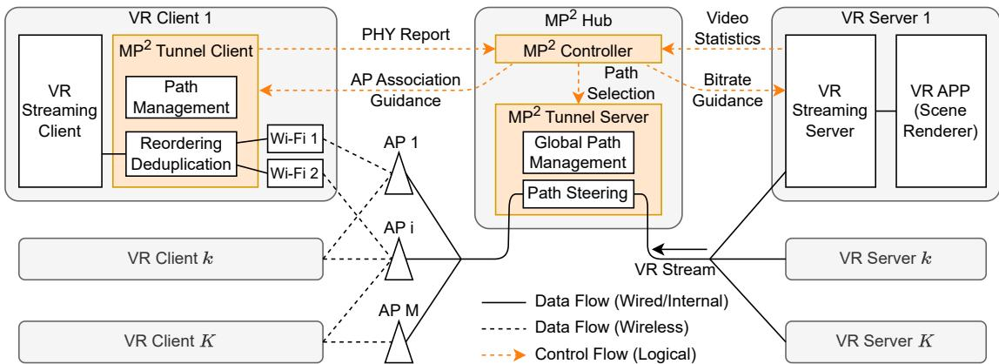  
Figure 3: System architecture of ${ \bf M P } ^ { 2 }$ consists of multi-homed VR clients, ${ \bf M P } ^ { 2 }$ Hub, and VR servers.The data flows are represented in black lines, with solid lines for wired data, and dotted lines for wireless data. The logical control flows are indicated by colored, dotted arrows.

Observation III: User-space implementation simplifies deployment. Operating in user space allows ${ \bf M P } ^ { 2 }$ to be deployed without OS kernel modifications or special hardware, which significantly lowers the barrier to adoption (see Table 1). This also facilitates easier updates and maintenance allowing quick adaptation to evolving technologies and user needs. We explain the design of $\mathrm { { M P } } ^ { 2 }$ in §3.1.

Inspired by these observations, we then explain how we build $\bar { \mathbf { M P } } ^ { 2 }$ to overcome challenges and meet the requirements of free-roaming VR in the following sections.

## 3 Overview of MP2

${ \bf M P } ^ { 2 }$ orchestrates VR streams for multi-homing users by collecting cross-layer and cross-user information, then performing path assignment and migration for optimal overall QoE. The system architecture, depicted in Figure 3, consists of endpoints including VR clients and servers, as well as network infrastructure components including Wi-Fi APs and Ethernet switches. ${ \bf M P } ^ { 2 }$ incorporates a centralized hub, namely ${ \bf M P } ^ { 2 }$ hub, to coordinate between multiple paths and users. Note that the ${ \bf M P } ^ { 2 }$ hub can run on one of the servers, eliminating the need for additional hardware. Also, we focus on downlink traffic (from server to client) as uplink traffic, which primarily comprises of VR tracking and control messages, requires minimal bandwidth.

The VR client (headset) is equipped with multiple Wi-Fi radios, runs a VR streaming client application, and integrates a tunnel client built on top of multipath QUIC (MPQUIC [59]). It sends PHY layer reports to the ${ \bf M P } ^ { 2 }$ controller running on the ${ \bf M P } ^ { 2 }$ hub, and receives AP association guidance from the controller. The VR servers run a VR scene renderer that generates raw video streams, a GPU/CPU video encoder that compresses the frames, and a VR streaming server that controls the sending rate. The video streams are sent to the tunnel server inside the ${ \bf M P } ^ { 2 }$ hub and then distributed to clients via Wi-Fi APs according to the path selection decision from the ${ \bf M P } ^ { 2 }$ controller. Similar to the client, the VR servers also send video statistics to the ${ \bf M P } ^ { 2 }$ controller which generates bitrate guidance based on the statistics.

The bitrate guidance works by setting a cap on top of the target bitrate input for codec while keeping the original Adaptive Bitrate (ABR) algorithm functioning if its suggested bitrate is lower. This provides two-fold benefits: 1) it guarantees that no stream will exceed its optimal bitrate (flattening the curve), and 2) it allows ${ \bf M P } ^ { 2 }$ to make use of any advanced ABR algorithm that may respond faster than the $\dot { \bf M P } ^ { 2 }$ control loop or even provide more advanced features [45, 63, 92, 104].

We first introduce the ${ \bf M P } ^ { 2 }$ data plane (§3.1), including the tunnel server and clients that carry video traffic, and then present techniques for seamless connection migration in $\mathbf { M P } ^ { 2 }$ (§3.2). We describe the ${ \bf M P } ^ { 2 }$ controller which makes centralized routing decisions according to cross-layer information in the next section (§4).

## 3.1 MP2 Data Plane

The goal of the ${ \bf M P } ^ { 2 }$ tunnel is to provide the data plane for handling VR traffic while facilitating real-world deployment by masking the complexity of the underlying links. It consists of a tunnel server and client:

Tunnel Server: It uses a virtual tunnel interface to receive VR video streams and conduct path steering based on decisions from the ${ \bf M P } ^ { 2 }$ controller. It encapsulates all incoming packets with a tunnel header, assigning new IPs and ports for diverse path forwarding. Additionally, it manages a global path table for tracking client-server mappings and IP/port details for each stream’s paths.

Tunnel Client: It is positioned between the VR streaming client and the Wi-Fi radio on each VR client. On the control plane, the tunnel client is responsible for local path management by maintaining a local path table. It collects PHY layer information and transmits it to the ${ \bf M P } ^ { 2 }$ controller. Additionally, it relays the AP association guidance received from the $\mathbf { M } \bar { \mathbf { P } } ^ { 2 }$ controller to the Wi-Fi radios to establish association ondemand. On the data plane, the tunnel client exposes a virtual tunnel interface to the VR streaming client as the egress port for video streams.

## 3.2 Coordinated Seamless Migration

The centralized architecture of ${ \bf M P } ^ { 2 }$ is required by the Client-Server model of the QUIC protocol, but it also provides a coordinated scheduler to maximize overall QoE as described in the previous section. In fact, we find that the benefit of a centralized architecture goes beyond that: it enables a coordinated workflow for seamless connection migration:

Path warmup: Before initiating a connection migration, the ${ \bf M P } ^ { 2 }$ controller sends a small amount of probing traffic (e.g., one packet per 10 ms) over the target link for a short period to warm up the Wi-Fi radio. While the Wi-Fi beaconing mechanism may also help keep the radio active to some extent, it is primarily intended for network management and typically with over 100 ms intervals, which is insufficient for seamless handover (confirmed empirically by our observation in Figure 2a).

Redundant transmission: During connection migrations, we adopt a transient full-redundant transmission on both paths to minimize packet loss and latency. The path warmup and redundancy mechanisms introduce a fractional overhead, but they are only required for a short time window (100 ms for path warmup and 50 ms for redundant transmission based on our practice), and therefore negligible. Our evaluation in 6.2.1 also shows significant empirical gains from both.

Bitrate guidance: Migration can disrupt streams on an AP by breaking the original equilibrium. Instead of waiting for the underlying ABR algorithm to achieve the new equilibrium, which can take over 10 seconds according to our evaluation 8a, the ${ \bf M P } ^ { 2 }$ controller proactively issues bitrate guidance that enforces a maximum bitrate cap for all users on the AP. The guidance value is calculated by ${ \bf M P } ^ { 2 }$ controller (§4) to optimize global QoE. As a result, the new user quickly reaches the ideal bitrate, enabling higher overall bitrates along with lower latencies. Note that bitrate guidance functions as a cap, only intervening when the existing ABR attempts to use excessive bitrate. This allows ${ \bf M P } ^ { 2 }$ to coexist seamlessly with other traffic, as the ABR continues to adapt when bandwidth is occupied by competing traffic.

While not all these techniques are surprising, a combination of them forms the perfect recipe. To understand the performance of coordinated seamless migration, we present a comprehensive evaluation of seamless migration and ablation study in §6.1. Next, we introduce the ${ \bf M P } ^ { 2 }$ controller that performs all the heavy lifting behind the scenes.

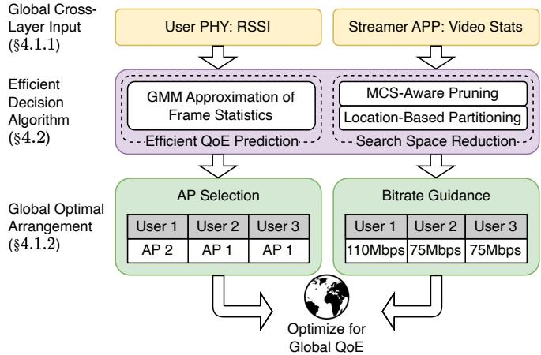  
Figure 4: Overview of the ${ \bf M P } ^ { 2 }$ controller.

Table 2: Notations used in the controller design, in each timestamp.
<table><tr><td>Notation</td><td>Definition for user k</td></tr><tr><td> $\pmb { L } _ { k , m }$   $\boldsymbol { s } _ { k , t }$   $\pmb { A } _ { k , m }$   $B _ { k }$   $\pmb { P } _ { k , i }$ </td><td>Matrix of link rates from clients (Mbps). Matrix of frame sizes from clients (Byte). Binary matrix of user-AP connections. List of bitrate guidance for each user. % of frames with latency &gt; threshold.</td></tr></table>

## 4 MP2 Controller

The ${ \bf M P } ^ { 2 }$ controller acts as the brain of the control plane, positioned atop the tunnels within the data plane. Figure 4 shows an overview of the controller. We start with the design of MP2 controller, including control objectives, inputs, and outputs. Then, we present an efficient decision algorithm enhanced through mathematical observations and algorithms including approximation, pruning, and partitioning.

## 4.1 Control Problem Formulation

In this section, we define the control input/output and optimization goal. The notations used can be found in Table 2.

## 4.1.1 Control Inputs

The MP2 controller collects cross-layer information from both clients and servers during each decision-making round. It focuses on adapting to changes in user/AP topology rather than fine-grained Wi-Fi link fluctuations. Consequently, the decision interval need not be long and is adjusted based on mobility levels1. The collected data includes:

Link rate from clients: The ${ \bf M P } ^ { 2 }$ tunnel client periodically collects Wi-Fi SSID and RSSI information using iw dev wlan link and iw dev scan for connected and nearby Wi-Fi APs. We then convert the RSSI to link capacity using standard MCS (Modulation and Coding Scheme) table [1, 7] and AP configurations such as generation (e.g., Wi-Fi 5/6), bandwidth, number of spatial streams, and guard interval 2. While raw CSI information or dedicated measurement streams could provide more accurate capacity estimates, these approaches are either impractical due to special firmware/driver requirements [39] or too resource-intensive for tight bandwidth budgets. RSSI strikes a balance, offering both practicality and decent estimation [102]. The ${ \bf M P } ^ { 2 }$ hub aggregates PHY reports from all clients as a link rate matrix $\pmb { L } _ { k , m }$ with values in Mbps where $k \in [ 1 , K ]$ and $m \in [ 1 , M ]$ for K clients and M APs. We fill $\pmb { L } _ { k , m }$ with zeros if AP m is out of range for client k.

Statistics of VR frames from servers: The actual frame size of the VR video stream varies from frame to frame, as shown in Figure 5. Simply dividing the bitrate by the frame rate can lead to significant inaccuracies [49], particularly when the QoE function is sensitive to transient or tail latency, as is often the case in VR streaming. To more accurately characterize VR traffic at the per-stream level, we collect recent T video frame size information from all users as $\pmb { S } _ { k , t }$ with values in Bytes where $k \in [ 1 , K ]$ and $t \in [ 1 , T ]$ for K clients and T samples. Instead of using raw frame size for scheduling, we use the Gaussian function to approximate the size, as also depicted in Figure 5. We will discuss Gaussian approximation in detail in §4.2. The system also includes an empirical preset to help cold-start the system.

## 4.1.2 Control outputs

The ${ \bf M P } ^ { 2 }$ controller generates the following control outputs: Arrangement of Path/AP selection: As mentioned in §3.1, the tunnel server needs to select a path (AP) for each user denoted as a logical matrix $\pmb { A } _ { k , m }$ with values in the Boolean domain {0,1}, where 1 means establishing or maintaining a connection between user k and AP m. To ensure all users have exactly one active connection, $\begin{array} { r } { \sum _ { m = 1 } ^ { M } \pmb { A } _ { k , m } = 1 } \end{array}$ for all $k \in \{ 1 , K \}$ . There are two cases when executing A: in the first case, all users have connections to APs $( \textstyle \sum _ { k = 1 } ^ { K } \bar { \sum _ { m = 1 } ^ { M } } \pmb { A } _ { k , m } = K )$ so the data plane can switch the path directly; in the second case, a user k may not satisfy the aforementioned condition, thus requiring one of the Wi-Fi NICs on user k to associate with the AP first and then apply the path switch. As a result, ${ \bf M P } ^ { 2 }$ operates with a minimum number of two Wi-Fi radios3, one for the active link that carries the VR stream, and the other for scanning AP downlink MCSs passively.

Bitrate guidance: With the centralized framework, ${ \bf M P } ^ { 2 }$ is able to steer the encoder target bitrate on each VR server by overriding ABR with a global bitrate guidance $\pmb { B } _ { k }$ for $k \in$ [1, K]. This approach has several advantages: 1) Decentralized ABR tends to achieve fairness among streams passing through the same AP, while ${ \bf M P } ^ { 2 }$ can apply different bitrates on each stream for better overall QoE. 2) It is generally hard to tune a decentralized ABR algorithm to settle on the optimal bitrate for high-bandwidth, low-latency applications (as depicted in Figure 2b). 3) We can enable seamless path migration by coordinating bitrate between contending users, which we explain in detail in §3.2.

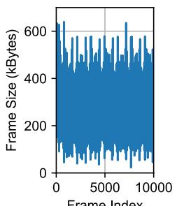

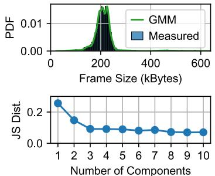  
Figure 5: (a) Left: time series of frame size during a real VR session. (b) Top Right: GMM approximation. (c) Bottom Right: Jensen-Shannon distance of the approximation vs. number of components in GMM, where 0 means identical and 1 means completely different.

## 4.1.3 Optimization Goal

${ \bf M P } ^ { 2 }$ uses a flexible QoE goal that can be customized for various VR scenarios from fast-paced first-person shooting games to slow-paced leisure games:

$$
\pmb { Q } = \sum _ { k = 1 } ^ { K } \pmb { B } _ { k } \ast \big ( 1 - \sum _ { i = 1 } ^ { 3 } w _ { i } \ast \pmb { P } _ { k , i } \big )\tag{1}
$$

where $\pmb { P } _ { k , 1 } , \pmb { P } _ { k , 2 } , \pmb { P } _ { k , 3 }$ 3 represent the percentage of frames with latency $> 2 0 / 5 0 / 1 0 0$ ms for user k, and $w _ { i }$ represent their respective weights that can be tailored for different needs4.

## 4.2 The $\mathbf { M P } ^ { 2 }$ Decision Algorithm

Optimizing the QoE goal shown in Equation 1 is non-trivial. A brute-force approach would require searching across all possible combinations of (A, B), then running a simulator with recorded video traces to compute P by counting the delayed frames. The time complexity for K clients and M APs is $M ^ { K } \cdot B ^ { K } \cdot C ,$ , where B is the number of discrete bitrate levels, and C is the time needed to run the simulator once. For example, with $M = 4 , K = 1 2 , B = 1 0$ , and $C = 0 . 1$ seconds, the total running time would be $1 . 6 7 \times 1 0 ^ { 1 8 }$ seconds, making this approach computationally infeasible. The core issues here are the lack of closed-form prediction for tail latency and the intractable search space. To address this challenge, ${ \bf M P } ^ { 2 }$ incorporates two key components: Gaussian Mixture

Modeling (GMM) of frame statistics to provide a closed-form solution for calculating P, and pruning and partitioning based on MCS and user locations to exponentially reduce the search space.

Gaussian Mixture Modeling (GMM) of frame statistics: The decision engine should be able to estimate tail latency ratio P for a given candidate arrangement and bitrate guidance (A, B). While this could theoretically be achieved with a simulator or a complex prediction model, the exponentially growing search space makes such non-closed-form predictions impractical. Therefore, an efficient yet effective prediction method with a closed-form solution is essential. Our intuition for solving the problem is to approximate the VR frame size statistics using Gaussian approximation. However, since videos usually contain different types of frames such as intra/inter frames with varying size distributions, a single Gaussian distribution may be insufficient. Instead, we adopt GMM [64] which is a mixture of several Gaussian distributions. We use the Expectation-Maximization (EM) algorithm [69] to find parameters in the GMM model and experiment with different numbers of components. The result shown in Figure 5 confirms our approach: the GMM closely tracks the distribution of measured frame size. We further calculate the distance of two distributions using Jensen-Shannon (JS) divergence [57] and experiment with different components of the GMM. From the figure, we conclude that a small number of components such as three, is sufficient to bring the JS distance below 0.10, which indicates accurate modeling.

We then realize a nice property of Gaussian modeling: a linear combination of Gaussian distribution is also Gaussian distributed, which can be demonstrated using convolutions or characteristic functions [16]. Such property helps to solve two problems at once of generating closed-form solutions for both L and B, eliminating the need to run a simulator. Assuming that there are N users streaming through an AP and the total link bandwidth W (also assume fair time-sharing between Wi-Fi clients), the sum of distribution S would be:

$$
\pmb { B } = \alpha \pmb { W } = N \ast ( \sum _ { k = 1 } ^ { N } L _ { k } ^ { - 1 } ) ^ { - 1 } , \quad \pmb { S } \sim \mathcal { N } ( \sum _ { k = 1 } ^ { N } \mu _ { k } , \sum _ { k = 1 } ^ { N } \sigma _ { k } ^ { 2 } )\tag{2}
$$

where a is a discounting variable $( 0 < \alpha < 1 )$ to trade-off between bitrate and latency. As a result, we can calculate P directly:

$$
P _ { k , i } = \frac { 1 } { 2 } \left[ 1 - e r f ( \frac { x _ { i } - \sum _ { k = 1 } ^ { N } \mu _ { k } } { \sqrt { 2 \sum _ { k = 1 } ^ { N } \sigma _ { k } ^ { 2 } } } ) \right]\tag{3}
$$

where er f is the Error function and x is the size of frames that take more than 20/50/100 ms to transmit, e.g., W 0.1 for >100 ms latency. Using binary search or Newton’s method we can find the best a that maximizes the QoE function.

Pruning and Partitioning: Despite the advantages of GMM, the problem remains challenging as there are still $M ^ { K }$ possible arrangements. Our solution is two-fold: (1) MCS-aware

Pruning: We sort the MCS for all users and apply pruning by skipping a certain percentage p of links with low MCS. The percentage p is adjusted according to computation resources. (2) Location-based Partitioning: We group co-located APs into cells. Handover between cells is handled in a way that is adapted from traditional cellular networks: if there exists an AP in another cell with MCS higher than the current AP by a certain threshold, ${ \bf M P } ^ { 2 }$ calculates the performance gain and initiates the cell switch only if there is significant QoE gain.

With these strategies, we reduce the time complexity to $E * ( p * ( M / E ) ) ^ { K / E }$ where E is the number of cells. ${ \bf M P } ^ { 2 }$ is able to handle system as large as $M = 1 6 , K = 4 8 , E = 4$ $p = 0 . 6$ with a running time of less than 1 second. Assuming a fixed cell size with a fixed AP-to-client ratio of M : K : E, the complexity of the ${ \bf M P } ^ { 2 }$ decision algorithm grows linearly as the total number of cells/total users.

In practice, we also observe that link bandwidth fluctuates frequently. Blindly applying the optimal client configuration at each control interval can cause excessive link switching, leading to instability. To address this, ${ \bf M P } ^ { 2 }$ employs an adaptive topology stabilization mechanism based on a configurable threshold $V _ { \mathrm { t h r e s h - q o e } }$ , which prevents unnecessary topology changes that offer only marginal benefits but pose significant risks of service disruption. This mechanism acts effectively as a dual-threshold strategy: a handover is triggered only when the estimated global QoE gain exceeds $V _ { \mathrm { t h r e s h - q o e } } ,$ ensuring that topology changes are made only when the benefit is substantial. In scenarios where clients frequently move between neighboring AP cells, this approach prevents oscillation by favoring stability unless a meaningful performance gain is predicted. The threshold is tunable based on user dynamics: a higher value improves stability in volatile scenarios, while a lower one allows more responsive adaptation to user movements. By default, the threshold is set proportional to the number of links being changed in a given attempt $( | A ^ { \mathrm { c a n d } } - A ^ { \mathrm { c u r } } | )$

The complete decision algorithm of $\mathbf { M P } ^ { 2 }$ is shown in Algorithm 1. By combining all the optimizations, the control loop takes less than one second to run, which is sufficient for the target scenario.

## 5 Implementation

It requires non-trivial effort to build a free-roaming VR system as it is relatively new. Most VR streaming systems operate on special hardware with constrained software and OS access, complicating the development. We describe the implementation details of ${ \bf M P } ^ { 2 }$ and highlight the major challenges we have encountered.

VR streaming platform: The platform should satisfy the following requirements: 1) hardware support for multiple Wi-Fi radios; 2) a software platform that runs ${ \bf M P } ^ { 2 }$ ; 3) detailed metrics from VR applications to facilitate evaluation of both the server and client sides. The Oculus ecosystem has the largest user base, but unfortunately, it does not satisfy any of these requirements. Instead, we choose to implement ${ \bf M P } ^ { 2 }$ with ALVR/ALXR [2] as it not only runs on Linux PCs as well as commercial headsets but also comes with source code that allows for the collection of all necessary metrics. On the server side, we have the Steam gaming platform [14] for VR scene rendering and ALVR for VR video streaming. On the client side, we run the headset application using Linux ALXR on top of Monado [8], an open-source XR runtime.

```csv
Algorithm 1: The ${ \bf M P } ^ { 2 }$ Decision Algorithm
Input: Link rates L, approximated framesize ${ \pmb S } ,$ current AP
selection ${ \pmb A } ^ { c u r }$ and bitrate ${ \pmb B } ^ { c u r }$
Output: Arrangement of AP selection A, bitrate guidance B
$/ \star$ Location-based partitioning */
1 for each client k do
2 if max $( { \pmb L } _ { k } ) > { \pmb A } _ { k } ^ { c u r } + V _ { t h r e s h - l i n k }$ then
3 Join(k, argmax $( { \pmb L } _ { k } )$ .partition)
4 for each partition e do
5 $U ^ { e } \gets \mathbf { A l l }$ clients in partition e
/* Topology stabilization */
6 $A ^ { e } , B ^ { e } , Q o E ^ { m a x } \gets$
$A ^ { c u r } , B ^ { c u r } , Q o E ^ { c u r } + | A ^ { c a n d } - A ^ { c u r } | \times V _ { t h r e s h - q o e }$
/* MCS-aware pruning */
7 $L ^ { p r u n e }$ prune(argsort $( \pmb { L } _ { k } ) , p )$ for k in $U ^ { e }$
8 candidates Cartesian_prod( $\{ L _ { u } ^ { p r u n e d } | u \in U ^ { e } \} )$
9 for $A ^ { c a n d } \in$ candidates do
10 $Q o E ^ { c a n d } \gets 0$
11 for each AP a in partition e do
12 $U ^ { a } \gets \{ u | \pmb { A } _ { u } ^ { c a n d } = a \}$
/* GMM-based approx. $( S _ { u } ^ { \prime }$ obtained) */
13 a, QoEa Search towards maximizing:
$\begin{array} { r } { \sum _ { u \in U ^ { a } } Q o E ( { \cal L } _ { u } , { \cal S } _ { u } ^ { \prime } , \alpha ) } \end{array}$
14 for $u \in U ^ { a }$ do
15 $B _ { u } ^ { c a n d } \gets \infty \times ( \Sigma ( { \pmb { L } } _ { u \in U ^ { a } } ) ^ { - 1 } ) ^ { - 1 }$
16 $Q o E ^ { c a n d } \gets Q o E ^ { c a n d } + Q o E ^ { a }$
17 if $Q o E ^ { c a n d } > Q o E ^ { m a x }$ then
18 厂 $A ^ { e } , B ^ { e } , Q o E ^ { m a x } \gets A ^ { c a n d } , B ^ { c a n d } , Q o E ^ { c a n d }$
19 A.merge(Ae )
20 B.merge $( \pmb { B } ^ { e } )$
21 return A, B
```

$\mathbf { M P } ^ { 2 }$ tunnel and controller: We implement the ${ \bf M P } ^ { 2 }$ tunnel in C, following the IETF draft of QUIC [59] with 10k lines of code. It is an event-driven framework that responds to registered events such as read/write file descriptors and timers. We enable multithreading for packet forwarding with dedicated threads for logging and monitoring. The ${ \tt M P } ^ { \tilde { 2 } }$ system involves orchestrating multiple clients/servers on different layers of the stack. As a result, we choose to build the centralized controller and the VR client/GPU software around Redis [11], as it provides us with a robust, efficient, and scalable method to synchronize messages across devices with versatile interfaces to modules built in different languages. For example, we use hiredis for the C binding with the tunnel, tokio-rs for the Rust binding with the ALVR application, and redis-py for the Python binding with Wi-Fi information collection and the centralized controller.

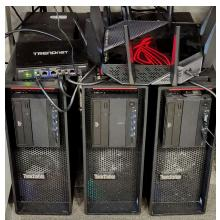

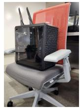  
Figure 7: Lag rate comparison of different stream migration methods. ${ \bf M P } ^ { 2 }$ with both redundant transmission and path warm-up led to significant improvement in the >20 ms lag rate and eliminated >50/100 ms lag completely, which is very close to the upper bound, no migration scenario.

Hardware testbed: The streaming server is equipped with an Intel Xeon 18-core 36-thread CPU and NVIDIA RTX 3070 GPU. The ${ \bf M P } ^ { 2 }$ tunnel server and the streaming clients are each equipped with an Intel i5 6-core 12-thread CPU. The tunnel server is equipped with one Intel ${ } ^ { 2 ^ { * } 1 0 }$ Gbps NIC, and one Intel 4\*1 Gbps NIC. We connect the tunnel server, and two Asus ROG Rapture GT-AXE11000 Wi-Fi 6 APs via a TEG-S762 six-port, 10 Gbps switch. The streaming clients each connect to the APs with two Intel AX211 Wi-Fi 6E radios and two external antennas, as shown in Figure $6 ^ { 5 }$

## 6 Evaluation

In this section, we present a comprehensive evaluation for ${ \bf M P } ^ { 2 }$ to answer the following questions:

• How does $\mathbf { M P } ^ { 2 }$ perform in real-world? We evaluate the handover performance of ${ \bf M P } ^ { 2 }$ against state-of-the-art systems in the real world under single/multiuser scenarios.

• How does $\mathbf { M P } ^ { 2 }$ perform in large-scale emulation? We perform Mininet emulations that run $\mathbf { M P } ^ { 2 }$ data and control plane to evaluate ${ \bf M P } ^ { 2 }$ in large-scale deployments that are required to unleash the full potential of $\mathrm { \dot { M } P ^ { 2 } }$ as well as ensure repeatability and facilitate reproducibility.

• How does $ { \mathbf { M P } } ^ { 2 }  { \mathbf { s } }$ performance translate into real players’ experience? We put ${ \bf M P } ^ { 2 }$ to the ultimate test by conducting a user study with VR headsets and emulation traces to understand how ${ \bf M P } ^ { 2 }$ performs from players’ perspective.

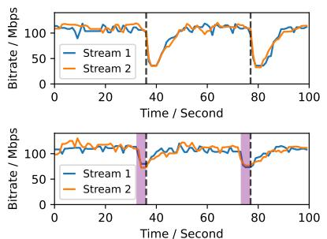  
(a) Bitrate of two streams without (top) and with (bottom) guidance.

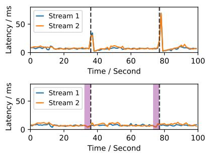  
(b) Latency of two streams without (top) and with (bottom) guidance.

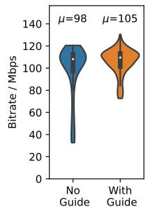

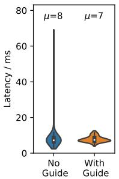  
(c) Distribution of bitrate (left) and latency (right).  
Figure 8: Multi-user handover benchmarks. We indicate the time of migration with vertical dashed lines and color area with bitrate guidance in purple. ${ \bf M P } ^ { 2 }$ does not incur any noticeable latency increase with a higher average bitrate than XLINK + ALVR which does not have bitrate guidance.

Baselines. As we have mentioned in §5, it is not easy to build free-roaming VR systems that require setting up both application and transport software on different platforms. We intend to compare as many state-of-the-art solutions as possible, but unfortunately, many works are yet to be open-sourced, which prohibits faithful replication and greatly increases the development effort, or does not support the target platform, or require special hardware. By carefully evaluating recent works, we select the industry standard MPQUIC [32, 60] with four state-of-the-art schedulers as the transport layer for our baselines: minRTT (the default and wide adopted scheduler for MPTCP and MPQUIC) [78], fully redundant (RE) [36], Earliest Completion First (ECF) [56], and XLINK [110] (a recent advancement in MPQUIC optimized specifically for video streaming in mobile environments). The application layer of our baselines is ALVR, and we use high-end commercial Wi-Fi and compute hardware as described in §5. For a fair comparison, we have tailored and optimized these baselines to perform at their best.

## 6.1 Real-world Performance Test

We benchmark the real-world performance of $\mathbf { M P } ^ { 2 }$ by initially testing with a single user and then introducing additional competing users. Through an ablation study and detailed trace analysis, we closely examine and explain the reasons for the performance improvement.

## 6.1.1 Handover Latency.

We conduct an ablation study to demonstrate the effectiveness of path warmup and redundant transmission in enhancing path migration latency in a single-user scenario.

In this experiment, we allow a client to move freely between two APs, which triggers a handover every 20 seconds, and record the frame latency for a total duration of 75 minutes. The findings of this study are presented in Figure 7.

Compared with XLINK + ALVR (No Opt.), ${ \bf M P } ^ { 2 }$ with both optimizations could reduce the >20 ms lag rate (percentage of frames with over 20 ms latency) from 1.2% to 0.4% and eliminate >50/100 ms latency completely. The performance of applying both optimizations is the closest to the no migration baseline (achieving minimal latency by sacrificing bitrate) with normal Wi-Fi fluctuation while using a single optimization method leads to worse performance.

## 6.1.2 Bitrate Guidance.

We further demonstrate the performance of ${ \bf M P } ^ { 2 }$ in scenarios involving multiple users. We arrange for stream 1 to repeatedly join and depart from the AP with 20-second intervals, while stream 2 remains active. One representative period is depicted in Figure 8. It is important to note that the departure of stream 1 does not cause significant fluctuation. However, when we move stream 2 to the same AP as stream 1, the ABR algorithm responds drastically, reducing the bitrate by more than half and taking over 10 seconds to recover. This is evident in the upper half of Figure 8a.

In contrast, the bitrate guidance method proactively reduces the bitrate, thereby avoiding a drastic drop and recovering to the normal bitrate much quicker. As expected, this preemptive guidance also significantly reduces the latency during the switch, as shown in Figure 8b. This is because the traditional reactive method relies on a delay increase as the signal for bitrate adaptation, which is often too late.

Consequently, bitrate guidance contributes to a 120% increase in the minimum bitrate, from 32.7 to 72.7 Mbps, and a 4.5-fold reduction in the maximum latency, from 68.9 to 12.6 ms. These improvements are illustrated in Figure 8c.

## 6.2 Larger Scale Emulation

Mininet Wi-Fi Emulation Testbed: Our emulation testbed is based on Mininet Wi-Fi [37], which is a Wi-Fi extension of the network emulator Mininet [51]. It can create isolated containers for each server and mobile client and faithfully emulate the behavior of Wi-Fi. We choose Mininet-based emulation because ${ \bf M P } ^ { 2 }$ is designed as an end-to-end system that tightly integrates real-time components. Mininet allows us to run the ${ \bf M P } ^ { 2 }$ software stack without abstracting the core components to evaluate.We overcome two major hurdles to set up the testbed:

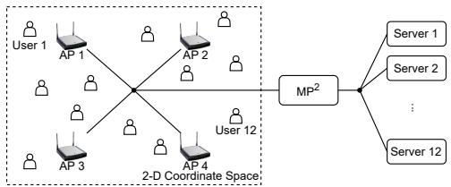  
Figure 9: Topology of the large-scale Emulation with Mininet Wi-Fi, using 4 $\boldsymbol { \mathrm { A P } } \times 1 2$ clients as an example.

(a) VR streams: Due to the limitation of computation resources, it is not possible to start enough VR encoding sessions for the emulation. To maximize emulation fidelity, we record real VR packet traces and replay them using a UDPbased streamer, which implements the same ABR algorithm as ALVR.

(b) Wmediumd: wmediumd is the built-in physical layer emulator of Mininet Wi-Fi. Our test results show that its max throughput is less than 30Mbps, which is far away from the aggregated throughput of multiple VR streams. To solve the problem, we approximate a high bandwidth link by scaling the packet count by 40⇥ to balance between performance and practicality that each frame still consists of a few packets. Furthermore, since the implementation of wmediumd cannot emulate the effects during handover, we focus solely on emulating the periods between handovers. Although this may understate the full advantages of ${ \bf M P } ^ { 2 }$ , it will accurately demonstrate the contribution of the ${ \bf M P } ^ { 2 }$ controller.

Figure 9 shows an example of the Mininet Wi-Fi deployment featuring 4 APs and 12 clients. In this setup, the APs and their antennas remain stationary. To simulate player movements, we generate a set of random walk trajectories with random speeds between 0 to 3 m/s for each individual player, which. Both the traffic pattern and player movements are kept consistent across comparisons. We carry out the emulation for a cumulative total of 300 hours for all the experiments in this section.

## 6.2.1 Comprehensive Performance Evaluation.

In this section, we carry out an extensive and thorough performance evaluation involving 16 APs and 48 clients. The results are displayed in Figure 10. ${ \bf M P } ^ { 2 }$ consistently reduced latency throughout the tests, with only 0.26% of the time where latency exceeded 20 ms outperforming all baseline metrics by a large margin. It achieves an impressive reduction in the 20 ms lag rate by 97.3% to 98.9%. Moreover, it completely eliminates cases where the latency exceeds 50 ms.

MPQUIC + ALVR with RE scheduler exhibits the weakest performance, primarily due to its design of full redundancy. This design, while intended for occasional severe network disruptions, is not well-suited for multi-user scenarios. The unnecessary redundant packets congest the system, leading to an increased queue buildup and consequently compromising QoE for all players. XLINK and other MPQUIC schedulers including MinRTT, and ECF display similar latency patterns.

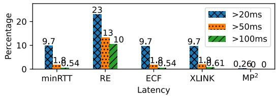

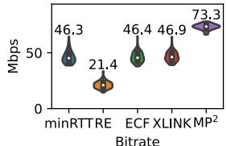

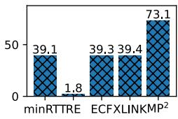

Figure 10: 16 AP  48 client Emulation. ${ \bf M P } ^ { 2 }$ significantly outperforms XLINK + ALVR and different flavors of MPQUIC (MinRTT, RE, ECF) + ALVR on both latency (35⇥ improvement over 2nd place), bitrate (1.56⇥), and QoE (1.86⇥).  
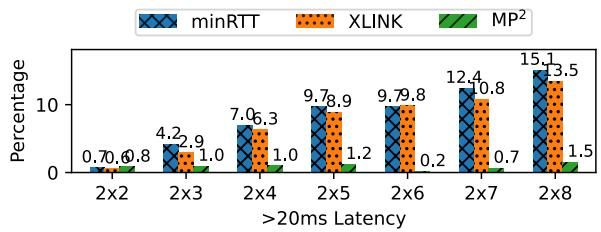

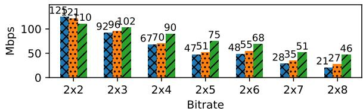  
Figure 11: Benchmark of MPQUIC (minRTT) + ALVR, XLINK + ALVR and ${ \bf M P } ^ { 2 }$ under different AP user ratio. ${ \bf M P } ^ { 2 }$ is able to maintain a steady low latency while baselines keep increasing as there are more users while keeping a high bitrate with up to 8 users.

MP2 achieves an average bitrate of 73.3 Mbps, notably improving the overall network capacity by 56.3% to 242.5%. We adopt a sample QoE with latency penalty weights $w _ { 1 } , w _ { 2 } , w _ { 3 } = 1 , 2 ,$ 4 in this experiment to show consideration of the combined effect of latency and bitrate. It is not surprising that $\mathbf { M P } ^ { 2 }$ also achieves outstanding performance in terms of QoE, which is 1.86⇥ the closest contender.

## 6.2.2 Scalability Evaluation.

In this experiment, we compare ${ \bf M P } ^ { 2 }$ with other competitors under different user/AP densities and scales to show its scalability advantages. Figure 11 shows the performance variation in a $. 2 { \scriptstyle - } \mathbf { A } \mathbf { P }$ setup where the number of users grows from 2 to 8. In $2 \times 2$ deployment, ${ \bf M P } ^ { 2 }$ performs similarly to its competitors. This is expected since most multipath schedulers are naturally optimized for such cases. When the user density grows, as expected, both latency and bitrate performance of both MPQUIC (minRTT) + ALVR and XLINK + ALVR degrade drastically due to unmannered competing for bandwidth. On the other hand, ${ \bf M P } ^ { 2 }$ successfully keeps the >20 ms lag rate below 1.5%, achieving up to $4 8 \times$ lag rate improvement over the 2nd place. In terms of bitrate, ${ \bf M P } ^ { 2 } { \bf s }$ able to maximize the utility of limited bandwidth and achieves $1 . 7 \times$ improvement over the 2nd place.

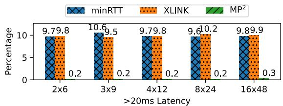

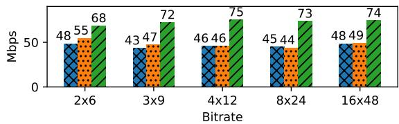  
Figure 12: Benchmark of MPQUIC (minRTT) + ALVR, XLINK + ALVR, and ${ \bf M P } ^ { 2 }$ with the same AP to client ratio but different scales. $\mathbf { M P } ^ { 2 }$ consistently outperforms baselines.

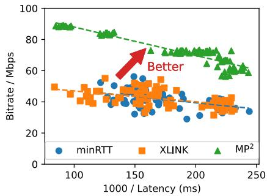  
Figure 13: Latency vs. bitrate under different ABR algorithm targets. ${ \bf M P } ^ { 2 }$ achieves a clearly better trade-off than minRTT + ALVR and $\mathrm { X L I N K + A L V R }$

Figure 12 illustrates the variations in latency and bitrate across different scales ranging from $2 \times 6$ to $1 6 \times 4 8$ . Overall, ${ \bf M P } ^ { 2 }$ consistently delivers a substantial performance boost irrespective of the scale. The lag rate exceeding 20 ms remains below 0.6% across all scales, while the bitrate improvement ranges from 51.0% to 71.4% over the baseline. The performance of ${ \bf M P } ^ { 2 }$ remains relatively stable when the system scale grows, demonstrating its capability for VR streaming with a larger number of users.

## 6.2.3 Evaluation under Different ABR Latency Targets.

$\mathbf { M P } ^ { 2 }$ is designed to cooperate with ABR algorithms, enabling flexible adjustments to meet various latency objectives. To understand its performance, we conducted experiments with latency target settings of 5/10/20 ms and compared the results with minRTT/XLINK + ALVR baselines. The experiments are performed 70 times in a 4 $\boldsymbol { \mathrm { A P } } \times 1 2$ client setup. Figure 13 clearly illustrates the trade-off between median latency and bitrate for each of the three ABR targets. ${ \bf M P } ^ { 2 }$ ranges from 4 ms/61 Mbps to 12 ms/92 Mbps while minRTT and XLINK ranges from 4 ms/38 Mbps to 12 ms/50 Mbps. Regardless of the latency target, ${ \bf M P } ^ { 2 }$ consistently achieves a better Pareto frontier between latency and bitrate.

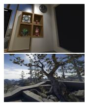

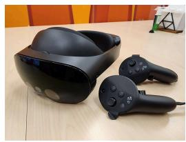  
(a) Sample VR scenes (in- (b) Oculus Pro VR headset and condoor and outdoor). trollers.

Figure 14: Software/hardware setup of the user study.  
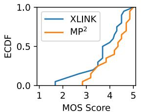

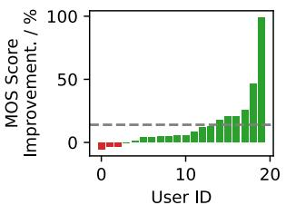  
Figure 15: Perceptual quality of experience score for ${ \bf M P } ^ { 2 }$ and $\mathrm { X L I N K + A L V R }$ , the higher the better. ${ \bf M P } ^ { 2 }$ consistently outperforms the baseline and is significantly preferred by the vast majority of users.

## 6.3 Trace-driven User Study

A fundamental limitation of current commercial VR headsets is their lack of support for additional network adapters, in both hardware and software, which constrains the evaluation of ${ \bf M P } ^ { 2 }$ . In order to assess the benefits ${ \bf M P } ^ { 2 }$ could bring to the VR experience from the viewpoint of the players, we conduct a user study which is based on packet-level traces collected from the previous large-scale emulation, by randomly selecting client-side traces from both XLINK + ALVR and ${ \bf M P } ^ { 2 }$

System Setup: The setup is shown in Figure 14. We construct the user study platform using the ALVR backend, the Steam VR gaming engine, and the Oculus Quest Pro, a high-end consumer VR headset. To emulate network impact, we use MahiMahi [71] to replay the collected packet-level traces between the headset and a container running Steam VR and the ALVR streamer on a GPU server.

Methodology: We recruit 20 unpaid volunteers, ranging in age from early 20s to 40s, with varied technical and VR experience. We distribute invitations for the user study via a public channel within our organization, and include all interested individuals in the experiment and results. Each participant is exposed to both the MP2 and XLINK + ALVR conditions in randomized order, across visually distinct indoor and outdoor scenes. In each setting, participants freely explore three

30-second segments per condition and rate their overall VR experience on a 1–5 scale (bad to excellent), yielding a total of 240 ratings. The evaluation is based on the question: “How would you rate your overall VR experience?” While the scale labels are explained qualitatively, no formal training or dimension-specific criteria are provided.

Figure 15 shows the distribution and improvements of Mean Opinion Scores (MOS). ${ \bf M P } ^ { 2 }$ consistently outperforms the baseline in terms of MOS distribution. Additionally, $\mathbf { M P } ^ { 2 }$ is preferred by the vast majority of users, with an improvement of up to 99.1%. Even among users who do not perceive an improvement, ${ \bf M P } ^ { 2 }$ matches the baseline performance, with no more than 5.5% drawbacks.

## 7 Limitations and Discussion

Next, we discuss $\mathbf { M P ^ { 2 } \bar { s } }$ limitations and future directions.

## 7.1 Practical Concerns

Larger scale deployment: Due to hardware (no support for multiple Wi-Fi interfaces) and software (unable to run a customized tunnel application) constraints (§5), in the realworld experiments, the client-side testbed for ${ \bf M P } ^ { 2 }$ is implemented on PC rather than actual headsets. These constraints are largely due to the relatively closed nature of current VR headset ecosystems. We look forward to a large-scale deployment with actual VR headsets. In fact, we anticipate that $\mathbf { M P } ^ { 2 }$ can be easily deployed on any headset by simply connecting an extra Wi-Fi NIC and installing a user-plane application.

Hardware Gap: The only hardware gap between ${ \bf M P } ^ { 2 }$ and current commercial VR systems is the addition of a second Wi-Fi interface (with the corresponding antenna). However, we argue that this is practical: (1) Multiple Wi-Fi interfaces have long been commercially available on the AP side [22], and there are no technical difficulties on the client side either. In fact, the industry [5, 6, 9] is moving towards Dual Band Dual Concurrent (DBDC) Wi-Fi, which enables simultaneous operation on different bands; (2) Wi-Fi radios are relatively inexpensive compared to the cost of VR headsets, with entrylevel models available for as little as USD \$2 [10], and even advanced Wi-Fi radios can be obtained for \$10 to \$20 [3, 4]. Additional Power Consumption: While the second Wi-Fi interface introduces some power overhead, our estimation shows it is minimal, contributing less than 2% of the total headset power consumption. The interface remains idle most of the time (for PHY info collection) and activates only during migration periods, which occur for at most 100 ms per second (10% duty cycle). According to open measurements [68], it consumes up to 750 mW when active and 25 mW when idle. Based on this, the weighted average overhead is 97.5 mW. Given that typical VR headsets draw 5–13 W during operation [66, 67], the additional consumption remains within 0.75%–2%.

Scalability Limits: Scalability is an important consideration in $\mathbf { M P ^ { 2 } \bar { s } }$ centralized architecture. To address this, ${ \bf M P } ^ { 2 }$ adopts a partitioning strategy (§4.2) in which the environment is divided into geographic cells. This reflects the observation that resource contention in multiplayer VR primarily occurs among users who are physically close. By optimizing QoE within each cell independently, global optimization is reduced to a set of localized sub-problems. Inter-cell handovers are handled using lightweight heuristics inspired by cellular network designs. As a result, the computational overhead of the ${ \bf M P } ^ { 2 }$ Controller scales linearly with the number of users and APs. Nonetheless, scalability within a single partition is bounded by the CPU and NIC capacity of the ${ \bf M P } ^ { 2 }$ Hub. Our prototype demonstrates support for up to 48 users per partition using a single server. Beyond this scale, the hub may become a bottleneck. While partitioning enhances scalability, it can weaken global optimality. Thus, partition size should be carefully selected based on server capability, or alternatively, multiple servers can be deployed to scale out the ${ \bf M P } ^ { 2 }$ Hub horizontally, managed by containerized cloud [28, 98, 99].

## 7.2 Future Works

Handling Failures: As a centralized system, $\mathbf { M P } ^ { 2 }$ is built with failure resilience in mind. In the event of a data plane failure, such as a tunnel disconnection, clients will immediately fall back to a direct connection with VR servers. While AP and bitrate guidance remain functional, handovers are no longer seamless under this fallback mode. To detect control plane failures, clients periodically send heartbeat packets, allowing the system to revert to a baseline solution when needed. Partial failures may result in some clients/servers being unresponsive to AP association and bitrate guidance, leading to reduced performance for unaffected clients. However, addressing these failure scenarios comprehensively requires careful design and rigorous testing.

Full redundancy and network coding: ${ \bf M P } ^ { 2 }$ does not replicate streams unless during migration for better efficiency as we observe there is nontrivial overhead to do so, which may result in much worse performance, such as RE mode of MPQUIC in $\ S 6 .$ This result aligns with previous works [81]. However, if bandwidth permits, network coding [38, 44, 48] based redundant transmission through two or more links may offer higher flexibility, especially for less stable links.

Experiment with other ABR algorithms: although ${ \bf M P } ^ { 2 }$ is designed to work with any ABR algorithm due to the fact that we impose a cap for the bitrate only, it may be interesting to see how it works with state-of-the-art real-time ABR algorithms [25, 34].

## 8 Related Work

While we have presented a comparison of ${ \bf M P } ^ { 2 }$ with related works in Table 1, we delve into them with greater detail:

Reducing latency during handover. Latency experienced during handover between APs represents a significant challenge [74] that attracted substantial attention: SCTP [86] dynamically updates a user’s address list for handover from one interface to another. MPTCP [74, 78, 95] and MPQUIC [32, 94], multipath extensions of TCP and QUIC, can adapt to changing network conditions and provide smooth handover leveraging multiple channels. Efforts have been made to improve multipath transport [40, 55, 72, 73] and apply multipath for various cases, such as path dynamics, heterogeneity, and handovers [43, 53, 77, 110, 111]. These systems primarily focus on single-user perspectives while $\dot { \bf M P ^ { 2 } }$ targets a group of VR users sharing the common bottleneck and optimizes for overall performance. There are also multipath solutions designed for Wi-Fi networks. Sheriff et al. [83], Musher [81], MPWi-Fi [75] and DiversiFi [47] aim to exploit multiple Wi-Fi paths simultaneously for improved throughput. Croitoru et al. [29] connects mobile clients with all visible APs and splits traffic among them. Again, they do not address multiple contending users. Our approach optimizes global QoE for a group of users with coordination among different user streams.

Streaming optimizations for mobile VR. Collaborative VR is a real-time streaming application without an explicit playback buffer and thus cannot utilize existing buffer-aware ABR algorithms on video-on-demand (VoD) tasks [45, 63, 70, 100, 104]. Adaptive real-time streaming solutions like GCC [25] and Converge [34] optimize both latency and bitrate, but their applications (e.g., video conferencing) do not involve user competition at the edges. Nevertheless, they are orthogonal and can be integrated with $\mathbf { M P } ^ { 2 }$ . Given the positional and linkquality dynamics of mobile VR users, VR-specific ABR algorithms and streaming strategies like Firefly [58], MoVR [19], M5 [107], Habitus [105], and CollaborativeVR [26] have been developed. However, they either focus on single-user scenarios, potentially compromising other users’ performance, or are limited to single-AP scenarios that are unsuitable for freeroaming VR. Recent advancements including MuV2 [61], Dasari et al. [31] leverage the correlation across VR users to optimize rendering, which are also orthogonal and can be integrated with MP2.

Multi-AP coordination for load-balancing. Multi-AP coordination techniques like C-OFDMA [93], coordinated spatial reuse [62], coordinated beamforming [20, 42], and joint transmission [106] have been explored. There is also a growing interest in using a centralized controller for WLAN management such as Smartassoc [97], NEMOx [109], SWAN [54], OpenSDWN [82], MUSE [87], BigAP [113], Wi-Fi Goes to Town [84], ClientMarshal [23], LATTE [76], LMA-ABC [96], and OpenCarrier [101]. However, these approaches often require either low-level access to Wi-Fi devices or customized hardware. Additionally, they may fail to meet the stringent demands for handover latency and bandwidth required by free-roaming VR.

## 9 Conclusion

We design, implement, and evaluate $\mathbf { M P } ^ { 2 }$ , a centralized overlay system with a global view of the entire stack that coordinates link/path/bitrate decisions across free-roaming VR users. With a carefully engineered data plane and an intelligent control plane, $\mathrm { { M P } } ^ { \bar { 2 } }$ orchestrates VR streams that compete for bandwidth to achieve global optimal QoE and steer traffic between paths seamlessly. Our real-world tests, large-scale simulations, and trace-driven user studies confirm the effectiveness of ${ \bf M P } ^ { 2 }$ , with up to an order of magnitude improvement in latency metrics, as well as consistent QoE gain under different settings, making it a promising solution for future immersive VR experiences.

## References

[1] 802.11ac-vht mcs, snr and rssi. https: //d2cpnw0u24fjm4.cloudfront.net/wp-content/ uploads/802.11ac-VHT-MCS-SNR-and-RSSI.pdf. Accessed: 2024-02-29.

[2] Alvr. https://alvr-org.github.io/. Accessed: 2023-09-01.

[3] Ax201ngw 2.4gbps 802.11ax wireless bluetooth 5.0 adapter. https://www.amazon.com/Wendry-Wireless-M-2-CNVio2-Interface-Bluetooth/ dp/B083WFL2W3. Accessed: 2023-09-01.

[4] Intel ax210 ieee 802.11ax bluetooth 5.2 tri band wi-fi/bluetooth combo adapter. https: //www.amazon.com/Intel-802-11ax-Blue-tooth-Adapter-Notebook/dp/B0B4T696W5. Accessed: 2023-09-01.

[5] Intel wi-fi 6e ax411. https://www.intel.com/ content/www/us/en/products/sku/ 217242/intel-wifi-6e-ax411-gig/ specifications.html. Accessed: 2023-09-01.

[6] Intel® killer™ wi-fi 6e ax1690. https: //www.intel.com/content/www/us/en/products/ sku/217241/intel-killer-wifi-6e-ax1690- is/specifications.html. Accessed: 2023-09-01.

[7] Mcs index, modulation and coding. https:// mcsindex.net/. Accessed: 2023-09-01.

[8] Monado - open source xr platform. https:// monado.dev/. Accessed: 2023-09-01.

[9] Qualcomm unleashes wi-fi gaming performance for windows 11 pcs. https://www.qualcomm.com/ news/releases/2021/10/qualcomm-unleasheswi-fi-gaming-performance-windows-11-pcs. Accessed: 2023-09-01.

[10] Realtek mini usb wireless 802.11b/g/n lan card wifi network adapter rtl8188. https://www.ebay.com/itm/ 284649544751. Accessed: 2023-09-01.

[11] Redis. https://redis.io/. Accessed: 2023-09-01.

[12] Sandbox vr. https://sandboxvr.com/. Accessed: 2023-09-01.

[13] Spree arena. https://jointhespree.com/ solutions/spree-arena-vr-attraction/. Accessed: 2023-09-01.

[14] Steam. https://steampowered.com/. Accessed: 2023-09-01.

[15] Strivr enterprise vr training. https: //www.strivr.com/. Accessed: 2023-09-01.

[16] Sum of normally distributed random variables. https://en.wikipedia.org/wiki/ Sum\_of\_normally\_distributed\_random\_variables. Accessed: 2023-09-01.

[17] The void vr. https://www.thevoid.com/. Accessed: 2023-09-01.

[18] Zero latency vr. https://zerolatencyvr.com/. Accessed: 2023-09-01.

[19] Omid Abari, Dinesh Bharadia, Austin Duffield, and Dina Katabi. Enabling high-quality untethered virtual reality. In USENIX NSDI, 2017.

[20] Omid Abari, Hariharan Rahul, Dina Katabi, and Mondira Pant. Airshare: Distributed coherent transmission made seamless. In 2015 IEEE Conference on Computer Communications (INFOCOM), pages 1742– 1750. IEEE, 2015.

[21] Hassan Ahmed and Hossam Hassanein. A performance study of roaming in wireless local area networks based on ieee 802.11 r. In 2008 24th Biennial Symposium on Communications. IEEE, 2008.

[22] ASUS ROG. Rog rapture gt-axe11000. https://rog.asus.com/networking/rograpture-gt-axe11000-model/. Accessed: 2025-05-20.

[23] Apurv Bhartia, Bo Chen, Derrick Pallas, and Waldin Stone. Clientmarshal: Regaining control from wireless clients for better experience. In The 25th Annual International Conference on Mobile Computing and Networking, pages 1–16, 2019.

[24] Divyashri Bhat, Amr Rizk, and Michael Zink. Not so quic: A performance study of dash over quic. In

Proceedings of the 27th workshop on network and operating systems support for digital audio and video, pages 13–18, 2017.

[25] Gaetano Carlucci, Luca De Cicco, Stefan Holmer, and Saverio Mascolo. Analysis and design of the google congestion control for web real-time communication (webrtc). In ACM MMSys, 2016.

[26] Jiangong Chen, Feng Qian, and Bin Li. Enhancing quality of experience for collaborative virtual reality with commodity mobile devices. In 2022 IEEE 42nd International Conference on Distributed Computing Systems (ICDCS), pages 1018–1028. IEEE, 2022.

[27] Ying Chen, Hojung Kwon, Hazer Inaltekin, and Maria Gorlatova. Vr viewport pose model for quantifying and exploiting frame correlations. In IEEE INFOCOM, 2022.

[28] Yuning Chen, Kang Yang, Zhiyu An, Brady Holder, Luke Paloutzian, Khaled M Bali, and Wan Du. Marlp: Time-series forecasting control for agricultural managed aquifer recharge. In ACM KDD, 2024.

[29] Andrei Croitoru, Dragos Niculescu, and Costin Raiciu. Towards wifi mobility without fast handover. In USENIX NSDI, 2015.

[30] Eduardo Cuervo, Krishna Chintalapudi, and Manikanta Kotaru. Creating the perfect illusion: What will it take to create life-like virtual reality headsets? In Proceedings of the 19th International Workshop on Mobile Computing Systems & Applications, 2018.

[31] Mallesham Dasari, Edward Lu, Michael W Farb, Nuno Pereira, Ivan Liang, and Anthony Rowe. Scaling vr video conferencing. In 2023 IEEE Conference Virtual Reality and 3D User Interfaces (VR), pages 648–657. IEEE, 2023.

[32] Quentin De Coninck and Olivier Bonaventure. Multipath quic: Design and evaluation. In ACM CoNEXT, 2017.

[33] Quentin De Coninck and Olivier Bonaventure. Multiflow quic: a generic multipath transport protocol. IEEE Communications Magazine, 59(5):108–113, 2021.

[34] Sandesh Dhawaskar Sathyanarayana, Kyunghan Lee, Dirk Grunwald, and Sangtae Ha. Converge: Qoedriven multipath video conferencing over webrtc. In ACM SIGCOMM, 2023.

[35] Stefan Feirer and Thilo Sauter. Seamless handover in industrial wlan using ieee 802.11 k. In 2017 IEEE 26th international symposium on industrial electronics (ISIE), pages 1234–1239. IEEE, 2017.

[36] Tobias Flach, Nandita Dukkipati, Andreas Terzis, Barath Raghavan, Neal Cardwell, Yuchung Cheng, Ankur Jain, Shuai Hao, Ethan Katz-Bassett, and Ramesh Govindan. Reducing web latency: the virtue of gentle aggression. In ACM SIGCOMM, 2013.

[37] Ramon R Fontes, Samira Afzal, Samuel HB Brito, Mateus AS Santos, and Christian Esteve Rothenberg. Mininet-wifi: Emulating software-defined wireless networks. In 2015 11th International Conference on Network and Service Management (CNSM). IEEE, 2015.

[38] Christos Gkantsidis and Pablo Rodriguez Rodriguez. Network coding for large scale content distribution. In Proceedings IEEE 24th Annual Joint Conference of the IEEE Computer and Communications Societies., volume 4, pages 2235–2245. IEEE, 2005.

[39] Francesco Gringoli, Matthias Schulz, Jakob Link, and Matthias Hollick. Free your csi: A channel state information extraction platform for modern wi-fi chipsets. In Proceedings of the 13th International Workshop on Wireless Network Testbeds, Experimental Evaluation & Characterization, pages 21–28, 2019.

[40] Yihua Ethan Guo, Ashkan Nikravesh, Z Morley Mao, Feng Qian, and Subhabrata Sen. Accelerating multipath transport through balanced subflow completion. In ACM MobiCom, 2017.

[41] Habtegebreil Haile, Karl-Johan Grinnemo, Simone Ferlin, Per Hurtig, and Anna Brunstrom. Performance of quic congestion control algorithms in 5g networks. In Proceedings of the ACM SIGCOMM Workshop on 5G and Beyond Network Measurements, Modeling, and Use Cases, pages 15–21, 2022.

[42] Ezzeldin Hamed, Hariharan Rahul, Mohammed A Abdelghany, and Dina Katabi. Real-time distributed mimo systems. In Proceedings of the 2016 ACM SIGCOMM Conference, pages 412–425, 2016.

[43] Bo Han, Feng Qian, Lusheng Ji, and Vijay Gopalakrishnan. Mp-dash: Adaptive video streaming over preference-aware multipath. In ACM CoNEXT, 2016.

[44] Tracey Ho, Muriel Médard, Ralf Koetter, David R Karger, Michelle Effros, Jun Shi, and Ben Leong. A random linear network coding approach to multicast. IEEE Transactions on information theory, 52(10):4413–4430, 2006.

[45] Te-Yuan Huang, Ramesh Johari, Nick McKeown, Matthew Trunnell, and Mark Watson. A buffer-based approach to rate adaptation: Evidence from a large video streaming service. In Proceedings of the 2014 ACM conference on SIGCOMM, pages 187–198, 2014.

[46] Arash Molavi Kakhki, Samuel Jero, David Choffnes, Cristina Nita-Rotaru, and Alan Mislove. Taking a long look at quic: an approach for rigorous evaluation of rapidly evolving transport protocols. In ACM IMC, 2017.

[47] Rajat Kateja, Nimantha Baranasuriya, Vishnu Navda, and Venkata N Padmanabhan. Diversifi: Robust multilink interactive streaming. In Proceedings of the 11th ACM Conference on Emerging Networking Experiments and Technologies, 2015.

[48] Sachin Katti, Hariharan Rahul, Wenjun Hu, Dina Katabi, Muriel Médard, and Jon Crowcroft. Xors in the air: Practical wireless network coding. In Proceedings of the 2006 conference on Applications, technologies, architectures, and protocols for computer communications, 2006.

[49] H Koumaras, C Skianis, G Gardikis, and A Kourtis. Analysis of h. 264 video encoded traffic. In Proceedings of the 5th International Network Conference (INC2005), pages 441–448, 2005.

[50] Jonathan Kua, Grenville Armitage, and Philip Branch. A survey of rate adaptation techniques for dynamic adaptive streaming over http. IEEE Communications Surveys & Tutorials, 19(3):1842–1866, 2017.

[51] Bob Lantz, Brandon Heller, and Nick McKeown. A network in a laptop: rapid prototyping for softwaredefined networks. In Proceedings of the 9th ACM SIG-COMM Workshop on Hot Topics in Networks, 2010.

[52] Steven M LaValle, Anna Yershova, Max Katsev, and Michael Antonov. Head tracking for the oculus rift. In IEEE ICRA, 2014.

[53] HyunJong Lee, Jason Flinn, and Basavaraj Tonshal. Raven: Improving interactive latency for the connected car. In ACM MobiCom, 2018.

[54] Tao Lei, Zhaoming Lu, Xiangming Wen, Xing Zhao, and Luhan Wang. Swan: An sdn based campus wlan framework. In 2014 4th International Conference on Wireless Communications, Vehicular Technology, Information Theory and Aerospace & Electronic Systems (VITAE), pages 1–5. IEEE, 2014.

[55] Yeon-sup Lim, Yung-Chih Chen, Erich M Nahum, Don Towsley, Richard J Gibbens, and Emmanuel Cecchet. Design, implementation, and evaluation of energyaware multi-path tcp. In ACM CoNEXT, 2015.

[56] Yeon-sup Lim, Erich M Nahum, Don Towsley, and Richard J Gibbens. Ecf: An mptcp path scheduler to manage heterogeneous paths. In Proceedings of the 13th international conference on emerging networking experiments and technologies, pages 147–159, 2017.

[57] Jianhua Lin. Divergence measures based on the shannon entropy. IEEE Transactions on Information theory, 37(1):145–151, 1991.

[58] Xing Liu, Christina Vlachou, Feng Qian, Chendong Wang, and Kyu-Han Kim. Firefly: Untethered multiuser vr for commodity mobile devices. In Proceedings of the 2020 USENIX Conference on Usenix Annual Technical Conference, pages 943–657, 2020.

[59] Yanmei Liu, Yunfei Ma, Quentin De Coninck, Olivier Bonaventure, Christian Huitema, and Mirja Kühlewind. Multipath Extension for QUIC. Internet-Draft draft-ietf-quic-multipath-02, Internet Engineering Task Force, July 2022. Work in Progress.

[60] Yanmei Liu, Yunfei Ma, Quentin De Coninck, Olivier Bonaventure, Christian Huitema, and Mirja Kühlewind. Multipath Extension for QUIC. Internet-Draft draft-ietf-quic-multipath-10, Internet Engineering Task Force, July 2024. Work in Progress.

[61] Yu Liu, Puqi Zhou, Zejun Zhang, Anlan Zhang, Bo Han, Zhenhua Li, and Feng Qian. Muv2: Scaling up multi-user mobile volumetric video streaming via content hybridization and sharing. In ACM MobiCom, 2024.

[62] David López-Pérez, Xiaoli Chu, Athanasios V Vasilakos, and Holger Claussen. On distributed and coordinated resource allocation for interference mitigation in self-organizing lte networks. IEEE/ACM Transactions on Networking, 21(4):1145–1158, 2012.

[63] Hongzi Mao, Ravi Netravali, and Mohammad Alizadeh. Neural adaptive video streaming with pensieve. In Proceedings of the conference of the ACM special interest group on data communication, pages 197–210, 2017.

[64] Geoffrey J McLachlan, Sharon X Lee, and Suren I Rathnayake. Finite mixture models. Annual review of statistics and its application, 6:355–378, 2019.

[65] Péter Megyesi, Zsolt Krämer, and Sándor Molnár. How quick is quic? In IEEE ICC, 2016.

[66] Meta. Meta quest 3 — specs. https:// www.meta.com/ie/quest/quest-3/#specs. Accessed: 2025-04-09.

[67] Meta. Product information sheet – meta quest 3. https://www.meta.com/ie/legal/quest/ product-information-sheet-meta-quest-3/. Accessed: 2025-04-09.

[68] Microsoft. Wi-fi power management for modern standby platforms. https://learn.microsoft.com/ en-us/windows-hardware/design/device-

experiences/wi-fi-power-management-formodern-standby-platforms. Accessed: 2025-04- 09.

[69] Todd K Moon. The expectation-maximization algorithm. IEEE Signal processing magazine, 13(6):47–60, 1996.

[70] Vikram Nathan, Vibhaalakshmi Sivaraman, Ravichandra Addanki, Mehrdad Khani, Prateesh Goyal, and Mohammad Alizadeh. End-to-end transport for video qoe fairness. In Proceedings of the ACM Special Interest Group on Data Communication, pages 408–423. 2019.

[71] Ravi Netravali, Anirudh Sivaraman, Somak Das, Ameesh Goyal, Keith Winstein, James Mickens, and Hari Balakrishnan. Mahimahi: accurate Record-and-Replay for HTTP . In USENIX ATC, 2015.

[72] Yunzhe Ni, Feng Qian, Taide Liu, Yihua Cheng, Zhiyao Ma, Jing Wang, Zhongfeng Wang, Gang Huang, Xuanzhe Liu, and Chenren Xu. {POLYCORN}: Datadriven cross-layer multipath networking for high-speed railway through composable schedulerlets. In USENIX NSDI, 2023.

[73] Ashkan Nikravesh, Yihua Guo, Feng Qian, Z Morley Mao, and Subhabrata Sen. An in-depth understanding of multipath tcp on mobile devices: Measurement and system design. In ACM MobiCom, 2016.

[74] Christoph Paasch, Gregory Detal, Fabien Duchene, Costin Raiciu, and Olivier Bonaventure. Exploring mobile/wifi handover with multipath tcp. In Proceedings of the 2012 ACM SIGCOMM workshop on Cellular networks: operations, challenges, and future design, pages 31–36, 2012.

[75] Mijanur Rahaman Palash and Kang Chen. Mpwifi: Synergizing mptcp based simultaneous multipath access and wifi network performance. IEEE Transactions on Mobile Computing, 19(1):142–158, 2018.

[76] Hannaneh Barahouei Pasandi, Tamer Nadeem, Hadi Amirpour, and Christian Timmerer. A cross-layer approach for supporting real-time multi-user video streaming over wlans. In Proceedings of the 27th Annual International Conference on Mobile Computing and Networking, pages 849–851, 2021.

[77] Costin Raiciu, Sebastien Barre, Christopher Pluntke, Adam Greenhalgh, Damon Wischik, and Mark Handley. Improving datacenter performance and robustness with multipath tcp. ACM SIGCOMM Computer Communication Review, 41(4):266–277, 2011.

[78] Costin Raiciu, Christoph Paasch, Sebastien Barre, Alan Ford, Michio Honda, Fabien Duchene, Olivier Bonaventure, and Mark Handley. How hard can it be? designing and implementing a deployable multipath {TCP}. In 9th USENIX symposium on networked systems design and implementation (NSDI 12), pages 399–412, 2012.

[79] Jan Rüth, Ingmar Poese, Christoph Dietzel, and Oliver Hohlfeld. A first look at quic in the wild. In International Conference on Passive and Active Network Measurement, pages 255–268. Springer, 2018.

[80] Jan Rüth, Konrad Wolsing, Klaus Wehrle, and Oliver Hohlfeld. Perceiving quic: Do users notice or even care? In Proceedings of the 15th International Conference on Emerging Networking Experiments And Technologies, 2019.

[81] Swetank Kumar Saha, Shivang Aggarwal, Rohan Pathak, Dimitrios Koutsonikolas, and Joerg Widmer. Musher: An agile multipath-tcp scheduler for dualband 802.11 ad/ac wireless lans. In The 25th Annual International Conference on Mobile Computing and Networking, pages 1–16, 2019.

[82] Julius Schulz-Zander, Carlos Mayer, Bogdan Ciobotaru, Stefan Schmid, and Anja Feldmann. Opensdwn: Programmatic control over home and enterprise wifi. In Proceedings of the 1st ACM SIGCOMM symposium on software defined networking research, pages 1–12, 2015.

[83] Irfan Sheriff and Elizabeth Belding-Royer. Multipath selection in multi-radio mesh networks. In 2006 3rd International Conference on Broadband Communications, Networks and Systems, pages 1–11. IEEE, 2006.

[84] Zhenyu Song, Longfei Shangguan, and Kyle Jamieson. Wi-fi goes to town: Rapid picocell switching for wireless transit networks. In ACM SIGCOMM, 2017.

[85] Hamed Soroush, Peter Gilbert, Nilanjan Banerjee, Brian Neil Levine, Mark Corner, and Landon Cox. Concurrent wi-fi for mobile users: analysis and measurements. In Proceedings of the Seventh COnference on emerging Networking EXperiments and Technologies, pages 1–12, 2011.

[86] Randall Stewart, Qiaobing Xie, Michael Tuexen, Shin Maruyama, and Masahiro Kozuka. Stream control transmission protocol (sctp) dynamic address reconfiguration. Technical report, 2007.

[87] Sanjib Sur, Ioannis Pefkianakis, Xinyu Zhang, and Kyu-Han Kim. Practical mu-mimo user selection on 802.11 ac commodity networks. In Proceedings of the 22nd

Annual International Conference on Mobile Computing and Networking, pages 122–134, 2016.

[88] Ahmad Ali Tabassam, Henning Trsek, Stefan Heiss, and Jürgen Jasperneite. Fast and seamless handover for secure mobile industrial applications with 802.11 r. In 2009 IEEE 34th Conference on Local Computer Networks. IEEE, 2009.

[89] Zhaowei Tan, Yuanjie Li, Qianru Li, Zhehui Zhang, Zhehan Li, and Songwu Lu. Supporting mobile vr in lte networks: How close are we? Proceedings of the ACM on Measurement and Analysis of Computing Systems, 2(1):1–31, 2018.

[90] Zhaowei Tan, Jinghao Zhao, Yuanjie Li, Yifei Xu, Yunqi Guo, and Songwu Lu. Ldrp: Device-centric latency diagnostic and reduction for cellular networks without root. IEEE Transactions on Mobile Computing, 23(4):2748–2764, 2023.

[91] Zhaowei Tan, Jinghao Zhao, Yuanjie Li, Yifei Xu, and Songwu Lu. {Device-Based}{LTE} latency reduction at the application layer. In 18th USENIX Symposium on Networked Systems Design and Implementation (NSDI 21), pages 471–486, 2021.

[92] Farzad Tashtarian, Abdelhak Bentaleb, Hadi Amirpour, Sergey Gorinsky, Junchen Jiang, Hermann Hellwagner, Christian Timmerer, et al. Artemis: Adaptive bitrate ladder optimization for live video streaming. In USENIX Symposium on Networked Systems Design and Implementation, pages 1–21, 2024.

[93] Luca Venturino, Alessio Zappone, Chiara Risi, and Stefano Buzzi. Energy-efficient scheduling and power allocation in downlink ofdma networks with base station coordination. IEEE transactions on wireless communications, 14(1):1–14, 2014.

[94] Tobias Viernickel, Alexander Froemmgen, Amr Rizk, Boris Koldehofe, and Ralf Steinmetz. Multipath quic: A deployable multipath transport protocol. In IEEE ICC, 2018.

[95] Damon Wischik, Costin Raiciu, Adam Greenhalgh, and Mark Handley. Design, implementation and evaluation of congestion control for multipath tcp. In NSDI, 2011.

[96] Huaqing Wu, Jiayin Chen, Conghao Zhou, Feng Lyu, Ning Zhang, Li Wang, and Xuemin Sherman Shen. Load-and mobility-aware cooperative content delivery in sag integrated vehicular networks. In ICC 2021- IEEE International Conference on Communications, pages 1–6. IEEE, 2021.

[97] Fengyuan Xu, Xiaojun Zhu, Chiu C Tan, Qun Li, Guanhua Yan, and Jie Wu. Smartassoc: Decentralized access point selection algorithm to improve throughput. IEEE transactions on Parallel and distributed systems, 24(12):2482–2491, 2013.

[98] Yifei Xu, Yuning Chen, Xumiao Zhang, Xianshang Lin, Pan Hu, Yunfei Ma, Songwu Lu, Wan Du, Z Morley Mao, Ennan Zhai, et al. Cloudeval-yaml: A realistic and scalable benchmark for cloud configuration generation. 2023.

[99] Yifei Xu, Yuning Chen, Xumiao Zhang, Xianshang Lin, Pan Hu, Yunfei Ma, Songwu Lu, Wan Du, Zhuoqing Mao, Ennan Zhai, et al. Cloudeval-yaml: A practical benchmark for cloud configuration generation. Proceedings of Machine Learning and Systems, 6:173–195, 2024.

[100] Francis Y Yan, Hudson Ayers, Chenzhi Zhu, Sadjad Fouladi, James Hong, Keyi Zhang, Philip Levis, and Keith Winstein. Learning in situ: a randomized experiment in video streaming. In 17th USENIX Symposium on Networked Systems Design and Implementation (NSDI 20), pages 495–511, 2020.

[101] Yubo Yan, Panlong Yang, Jie Xiong, and Xiang-Yang Li. Opencarrier: Breaking the user limit for uplink mu-mimo transmissions with coordinated aps. ACM Transactions on Sensor Networks (TOSN), 18(2):1–21, 2022.

[102] Kang Yang, Yuning Chen, and Wan Du. Gwrf: A generalizable wireless radiance field for wireless signal propagation modeling. arXiv preprint arXiv:2502.05708, 2025.

[103] Richard Yao, Tom Heath, Aaron Davies, Tom Forsyth, Nate Mitchell, and Perry Hoberman. Oculus vr best practices guide. Oculus VR, 4:27–35, 2014.

[104] Xiaoqi Yin, Abhishek Jindal, Vyas Sekar, and Bruno Sinopoli. A control-theoretic approach for dynamic adaptive video streaming over http. In Proceedings of the 2015 ACM Conference on Special Interest Group on Data Communication, pages 325–338, 2015.

[105] Anlan Zhang, Chendong Wang, Yuming Hu, Ahmad Hassan, Zejun Zhang, Bo Han, Feng Qian, and

Shichang Xu. Habitus: Boosting mobile immersive content delivery through full-body pose tracking and multipath networking. In USENIX NSDI, 2024.

[106] Ding Zhang, Mihir Garude, and Parth H Pathak. Mmchoir: Exploiting joint transmissions for reliable 60ghz mmwave wlans. In Proceedings of the Eighteenth ACM International Symposium on Mobile Ad Hoc Networking and Computing, pages 251–260, 2018.

[107] Ding Zhang, Puqi Zhou, Bo Han, and Parth Pathak. M5: Facilitating multi-user volumetric content delivery with multi-lobe multicast over mmwave. In Proceedings of the 20th ACM Conference on Embedded Networked Sensor Systems, pages 31–46, 2022.

[108] Wenxiao Zhang, Bo Han, and Pan Hui. Sear: Scaling experiences in multi-user augmented reality. IEEE Transactions on Visualization and Computer Graphics, 28(5):1982–1992, 2022.

[109] Xinyu Zhang, Karthikeyan Sundaresan, Mohammad A Khojastepour, Sampath Rangarajan, and Kang G Shin. Nemox: Scalable network mimo for wireless networks. In Proceedings of the 19th annual international conference on Mobile computing & networking, pages 453–464, 2013.

[110] Zhilong Zheng, Yunfei Ma, Yanmei Liu, Furong Yang, Zhenyu Li, Yuanbo Zhang, Jiuhai Zhang, Wei Shi, Wentao Chen, Ding Li, et al. Xlink: Qoe-driven multi-path quic transport in large-scale video services. In ACM SIGCOMM, 2021.

[111] Xiao Zhu, Jiachen Sun, Xumiao Zhang, Y Ethan Guo, Feng Qian, and Z Morley Mao. Mpbond: efficient network-level collaboration among personal mobile devices. In ACM MobiSys, 2020.

[112] Johannes Zirngibl, Philippe Buschmann, Patrick Sattler, Benedikt Jaeger, Juliane Aulbach, and Georg Carle. It’s over 9000: analyzing early quic deployments with the standardization on the horizon. In ACM IMC, 2021.

[113] Anatolij Zubow, Sven Zehl, and Adam Wolisz. Bigap—seamless handover in high performance enterprise ieee 802.11 networks. In NOMS 2016-2016 IEEE/IFIP Network Operations and Management Symposium, pages 445–453. IEEE, 2016.