①

USENIX

THE ADVANCED COMPUTING SYSTEMS ASSOCIATION

# ShieldReduce: Fine-Grained Shielded Data Reduction

Jingyuan Yang, Jun Wu, Ruilin Wu, and Jingwei Li, University of Electronic Science and   
Technology of China; Patrick P. C. Lee, The Chinese University of Hong Kong; Xiong Li and Xiaosong Zhang, University of Electronic Science and Technology of China https://www.usenix.org/conference/atc25/presentation/yang-jingyuan

# This paper is included in the Proceedings of the 2025 USENIX Annual Technical Conference.

July 7–9, 2025 • Boston, MA, USA ISBN 978-1-939133-48-9

Open access to the Proceedings of the 2025 USENIX Annual Technical Conference is sponsored by

P-Lr.h £Es/sL.

auuuJl9 PgleU

King Abdullah University of

Science and Technology

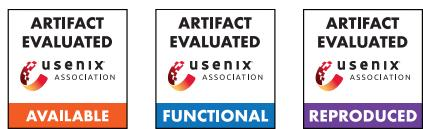

# ShieldReduce: Fine-Grained Shielded Data Reduction

Jingyuan Yang†, Jun Wu†, Ruilin Wu†, Jingwei Li†\*, Patrick P. C. Lee‡, Xiong Li†, Xiaosong Zhang† †University of Electronic Science and Technology of China ‡The Chinese University of Hong Kong

## Abstract

Storage savings and data confidentiality are two primary yet conflicting goals in outsourced backup management. While deduplication-aware encryption has been extensively studied to make deduplication viable for encrypted data, it is incompatible with fine-grained delta and local compression for further storage savings. We present ShieldReduce, a secure outsourced storage system that aims for fine-grained shielded data reduction by applying deduplication, delta compression, and local compression to data in a trusted execution environment based on Intel SGX, so as to achieve high storage savings with security guarantees. To mitigate the I/Os of accessing base chunks for delta compression in SGX, Shield-Reduce adopts bi-directional delta compression via a novel hybrid inline and offline compression design to maintain the physical locality of base chunks. Evaluation on various backup workloads shows that ShieldReduce achieves significant speedups over a shielded baseline without bi-directional delta compression, while maintaining comparable storage savings to fine-grained data reduction for plain data.

## 1 Introduction

Outsourced storage in third-party clouds provides a costeffective solution for organizations to manage backups for multiple clients. Practical outsourced storage systems should be designed with two major goals in mind: (i) storage savings, which reduce the storage footprints of outsourced data to save management costs; and (ii) data confidentiality, which protects outsourced data against unauthorized access by malicious users and even cloud operators. The goals, however, are inherently conflicting: clients should encrypt their data to ensure confidentiality, but conventional symmetric-key encryption, which uses unique user-specific keys, makes redundant data from different clients incompressible, thereby prohibiting storage savings through compression.

To resolve this conflict, one class of work in the literature focuses on encrypted deduplication (e.g., convergent encryption [20] and message-locked encryption [10, 11]), which relaxes conventional symmetric-key encryption by encrypting each data chunk with a deterministic key derived from the chunk content, so as to allow duplicate data chunks from different clients to be mapped into duplicate encrypted chunks that can be removed via cross-client deduplication. However, encrypted data has high entropy, making encrypted deduplication incompatible with delta and local compression for further storage savings (see §2.2 for details).

We explore fine-grained shielded data reduction, which performs deduplication, delta compression, and local compression in sequence for high storage savings, and uses shielded execution to realize the whole data reduction workflow with conventional symmetric-key encryption for data confidentiality. We leverage Intel’s Software Guard Extensions (SGX) [6] to provide a trusted execution environment called the enclave for shielded execution. Client-side organizations can host an enclave-enabled virtual machine in the cloud, ensuring that even cloud operators cannot access any content inside the enclave. The virtual machine can perform fine-grained shielded data reduction for the data chunks originating from multiple clients inside the enclave, encrypt the reduced outputs, and persistently store the encrypted chunks in the cloud. Fine-grained shielded data reduction is compliant with conventional symmetric-key encryption by removing content redundancies before encryption inside the enclave [60], so as to maintain the confidentiality guarantees of conventional symmetric-key encryption.

Realizing fine-grained data reduction in an enclave is nontrivial, since the enclave incurs high context-switch overhead to interact with untrusted host applications outside of the enclave [18, 28]. Delta compression, in particular, works by encoding the content difference between a new data chunk and a previously stored base chunk identified as similar to the new data chunk [45, 52, 53, 62]. This challenges the management of base chunks for a large number of data chunks: even though the latest SGX generation [9] allows hundreds of gigabytes in enclave memory, the machine hosting the enclave may not have sufficient memory to support a large-size enclave for buffering all base chunks. Storing base chunks in persistent storage and loading them into the enclave on demand incurs significant overhead in both disk I/Os and context switches.

We present ShieldReduce, an outsourced backup storage system based on fine-grained shielded data reduction. Inspired by the locality of backup workloads [38, 66], ShieldReduce operates on data chunks on a per-batch basis and loads the base chunks in batches from persistent storage into the enclave for fine-grained data reduction, as the base chunks are likely to be physically stored together due to locality. This mitigates I/O overhead compared to reading individual base chunks. However, as more versions of backups are stored, the base chunks become more scattered across different versions of backups. Thus, ShieldReduce maintains physical locality across different versions of backups via bi-directional delta compression by examining the physical distribution of base chunks: if the base chunks are stored together (i.e., strong locality), ShieldReduce delta-compresses new data chunks with respect to the corresponding base chunks (i.e., forward); otherwise, if the base chunks are physically scattered (i.e., weak locality), ShieldReduce treats the new data chunks as base chunks and delta-compresses the old base chunks with respect to the new data chunks (i.e., backward). Since the new data chunks are likely to be logically adjacent, making them base chunks can reconstruct physical locality for future backups with low I/O overhead. ShieldReduce adopts a hybrid inline and offline compression approach (i.e., on and off the write path, respectively) to limit the I/O interference of bidirectional delta compression with normal backup operations. We emphasize that ShieldReduce differs from a recent work LoopDelta [61], which applies backward delta compression only to mitigate chunk fragmentation. In contrast, Shield-Reduce adaptively switches between forward and backward delta compression to balance the trade-off between I/O performance and storage savings based on a single configurable parameter (see §6 for detailed comparisons).

We extend ShieldReduce based on DEBE [60], and compare ShieldReduce in a networked environment with several baselines using various backup workloads (e.g., source code versions, binary snapshots, websites, and operating system images). ShieldReduce achieves an upload throughput gain of up to 3.5× over a baseline without bi-directional delta compression and maintains comparable storage savings as in fine-grained data reduction for plain data (i.e., without data confidentiality). Compared with an existing performanceoriented approach [67] that we adapt to shielded execution, ShieldReduce achieves a comparable upload speed inline, while achieving additional storage savings of up to 3.6× via offline compression. The source code of our ShieldReduce prototype is at: https://github.com/YangJingyuan99/ shieldreduce.

## 2 Background and Problem

## 2.1 Plain Data Reduction

Overview of data reduction. We explore three data reduction approaches for plain data (without encryption): deduplication, delta compression, and local compression. Deduplication has been widely adopted in backup systems [12, 37, 38, 55, 57, 66] and achieves storage savings of around 10× in production backup workloads [55]. It partitions file data into chunks (e.g., 4 KiB or 8 KiB each [66]), and identifies each chunk by a fingerprint, generated by the cryptographic hash of the chunk content. Assuming that fingerprint collisions for non-duplicate chunks are highly unlikely [14], two chunks are said to be duplicate if they have the same fingerprint. Only unique copies (called physical chunks) are stored, while duplicate chunks refer to the same physical chunk via small-size references. The fingerprint of each physical chunk and its chunk location are kept in a key-value store called the fingerprint index.

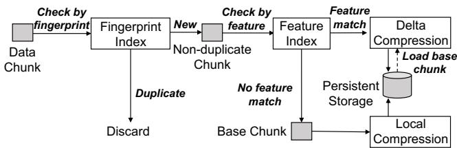  
Figure 1: Fine-grained data reduction for plain data.

Delta compression removes duplicate content among nonduplicate but similar chunks, which contain large fractions of duplicate content with differences in only a few chunk regions. It can achieve extra storage savings of around 2× on average beyond deduplication and local compression in production backup workloads [53]. One approach of finding similar chunks is to derive features from the chunk content [16, 22, 47, 53, 62]; for example, a feature can be the maximum Rabin fingerprint over all sliding windows of the chunk content [22, 40, 47, 53, 62]. Two chunks are considered similar if they share one or more common features. Delta compression stores one of the data chunks (called the base chunk) and the content differences from the base chunk to the remaining similar chunks (called delta chunks), with each delta chunk typically being smaller than the original chunk. Each feature and its associated base chunk (identified by its fingerprint) are kept in a key-value store called the feature index.

Local compression encodes the content of a data chunk into fewer bits in a lossless manner for persistent storage, such that the encoded bits can be decoded without information loss. We do not perform local compression on delta chunks, since they are already encoded and local compression only achieves marginal storage savings [53].

Fine-grained data reduction. We apply deduplication, delta compression, and local compression in sequence to achieve fine-grained data reduction for high storage savings [45, 47, 53], as shown in Figure 1. Suppose that a chunk of a file is written to a storage system. The system first queries the fingerprint index to check if the chunk is a duplicate; if so, the chunk is discarded.

If the chunk is new, the system updates the fingerprint index to track the new chunk. It extracts features from the chunk and queries the feature index to check for any similar chunks with common features. If no common feature is found, the chunk is treated as a base chunk. The system locally compresses the base chunk and stores it in persistent storage, as well as adds the feature mappings of the base chunk to the feature index.

If at least one feature of the new chunk is found, the system retrieves the base chunk with the first matching feature from persistent storage and delta-compresses the new chunk with respect to the base chunk into a delta chunk, which is then stored in persistent storage.

For file reconstruction, the system keeps a file recipe in persistent storage to track the fingerprints of delta chunks and corresponding base chunks of each file. All chunks (of several KiB each) in persistent storage are packed and managed in large fixed-size units called containers [37] of several MiB each (e.g., 4 MiB). All I/O operations are performed in units of containers. This mitigates the I/O overhead of accessing many small-size chunks.

## 2.2 Encrypted Deduplication and Its Limitations

Encrypted deduplication. To support data reduction on encrypted data, one extensively studied approach is encrypted deduplication [10, 11, 35, 39], in which a client symmetrically encrypts each data chunk to be outsourced to the cloud via a key derived from the chunk content (e.g., via the cryptographic hash of the data chunk [20], or via a server-aided approach where a dedicated key manager returns the same key for the same fingerprint [10]). This ensures that duplicate data chunks, even from different clients, are deterministically mapped to duplicate encrypted chunks that can be removed by deduplication. The client uploads encrypted chunks to the cloud, which cannot access the original data chunks but can still perform cross-client deduplication on the encrypted chunks for storage savings.

Limitations. Encrypted deduplication has two major limitations. First, it must use a deterministic encryption approach [10, 11, 20] to preserve the identical contents even after encryption. This inevitably leaks the number of occurrences of each data chunk in the original plain data, allowing an adversary to launch frequency analysis to infer the plain data chunks based on the frequency distribution of encrypted chunks [33]. From a cryptography perspective, no cryptographic primitive for data reduction can achieve the confidentiality guarantees of conventional symmetric-key encryption [11]. Second, since encryption inherently generates high-entropy encrypted data, it is infeasible to further reduce the sizes of encrypted chunks via delta and local compression for additional storage savings.

One may argue for a simple approach in which clients first perform data reduction on their own data, encrypt the reduced data via conventional symmetric-key encryption, and upload the encrypted reduced data to the cloud. However, this approach prohibits cross-client data reduction for further storage savings in some workloads; for example, multiple clients may perform regular backups on their virtual machine images in cloud environments, while the virtual machine images from different clients commonly share identical content in operating system files [29, 36] that cannot be removed.

## 2.3 Fine-grained Shielded Data Reduction

Instead of designing new cryptographic solutions, we leverage shielded execution to design fine-grained shielded data reduction. We focus on Intel’s Software Guard Extensions (SGX) [6] for shielded execution due to its widespread use [19,30,42,46,49,50,60] and long-term support for Intel Xeon platforms [48]. SGX creates a secure running context, called an enclave, for code and data processing with confidentiality and integrity guarantees. This contrasts with AMD SEV [2] and Intel TDX [5], which protect the execution of the entire virtual machine (i.e., more coarse-grained) and rely on a sizable trusted computing base [17].

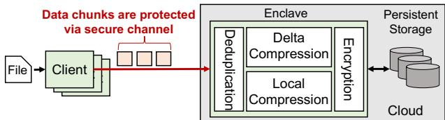  
Figure 2: ShieldReduce architecture.

Architecture. We consider an organization that leverages an untrusted cloud to deliver secure backup services to its users. The organization can deploy an enclave-enabled virtual machine instance in the cloud and allow multiple clients to send plain data chunks via secure channels to the enclave [60]. The enclave performs the complete data reduction workflow (i.e., deduplication, delta compression, and local compression) on all received data chunks, encrypts the reduced outputs, and persistently stores the encrypted chunks in the cloud. It eliminates the need for deterministic encryption on data chunks as in encrypted deduplication to mitigate frequency leakage, since fine-grained data reduction is now performed before the reduced outputs are encrypted. It further supports delta and local compression, which can now be done before encryption. Note that DEBE [60] also makes a similar observation and supports deduplication-before-encryption, but it does not address delta compression.

We design ShieldReduce to realize fine-grained shielded data reduction for secure and space-efficient backup storage (Figure 2). To upload a backup, a client first sets up a random one-time session key with the enclave via the Diffie-Hellman key exchange protocol and establishes a secure session with the enclave, so that any adversary cannot feasibly infer the transferred chunks [60]. The client then partitions the backup file into data chunks, encrypts each data chunk with the random one-time session key, and sends the encrypted chunks to the enclave. Since client-enclave communications are protected by random one-time session keys, they do not leak the frequency information of each data chunk [34]. The enclave decrypts received data chunks with the session key and performs fine-grained shielded data reduction (§2.2). Such target-based data reduction [36] prevents a malicious client from inferring the deduplication pattern and launching sidechannel attacks [26, 27]. The enclave also maintains a data key to encrypt the reduced output data, which is then stored in the cloud for persistence. Note that ShieldReduce does not require a dedicated key manager on the critical I/O path as in server-aided encrypted deduplication [10] (§2.2).

Threat model. We aim to provide confidentiality guarantees for outsourced backups, which may contain sensitive data. Our threat model considers an adversary that aims to infer the original plain backup data. The adversary can compromise the cloud to access the encrypted contents stored in both untrusted memory and persistent storage, as well as monitor the enclave’s interactions with the untrusted memory outside the enclave. It can also compromise some clients to access their private information, so as to infer the backup data of other non-compromised clients.

We assume that the adversary and even cloud operators cannot access the contents inside the enclave, even though the enclave is hosted in the cloud. Also, the enclave is securely initialized, and any application code running inside it is authenticated. Enclave authentication is achievable with the aid of a third party (e.g., the organization that provides backup services) [49, 60]. Specifically, the organization compiles the application code into a shared object. It distributes the shared object and its signature to the cloud, which bootstraps the enclave by loading the shared object. The enclave can be publicly verified by remote attestation [6]. Note that the organization cannot access any plain data, since the enclave is initialized with the necessary code only without any client data. After attesting the enclave, the organization can go offline, and clients can send backups via secure channels.

The enclave runs the deployed application and verifies the authenticity of the client for each connection via SSL mutual authentication to prevent unauthorized data access. We assume that current countermeasures [15, 24, 44] can be used to protect against attacks for extracting secret information from the enclave [13,43], and we do not further consider such attacks in this work. Finally, the source code of the enclave’s binaries can be publicly verified to ensure that it does not include any backdoors. Note that backdoor-free enclaves are commonly assumed in state-of-the-art shielded deduplicated storage [25, 42, 49, 60].

## 2.4 Challenges

Although previous studies explore SGX-based secure deduplication [25, 42, 49, 60], implementing the complete data reduction process in SGX remains non-trivial.

Resource constraints of SGXv2. In this work, we focus on SGXv2 [9], the latest SGX generation that supports up to 512 GiB of enclave page cache (EPC) (an isolated memory region for an enclave) per CPU socket [23]. SGXv2 significantly mitigates the limited EPC space of its predecessor SGXv1 (which supports up to 128 MiB), yet it still has resource constraints. First, the maximum physical size of an EPC is subject to the available memory size of the hosting machine. In practical cloud environments, an EPC uses only 50% of the overall memory of a virtual machine instance [4]. When an enclave reaches the EPC size limit, it swaps encrypted EPC pages with untrusted memory, leading to expensive paging overhead [18, 23, 28]. Also, SGX provides interfaces for the enclave to securely interact with untrusted memory: ECalls for outside applications to securely access in-enclave contents, and OCalls for the enclave to access unprotected memory. However, these interfaces incur high overhead, approximately 8,000 CPU cycles per invocation (compared to 150 CPU cycles for a standard system call) [56], due to (i) context switching in the CPU, (ii) operations for preserving the confidentiality of trusted application data, and (iii) flushing of CPU and address translation cache [18, 28].

Expensive base chunk management of delta compression. Fine-grained shielded data reduction should support delta compression (§2.1), yet efficiently managing base chunks is non-trivial, especially when delta compression is applied to numerous data chunks [53, 67]. One option is to keep base chunks inside the enclave. However, the GiB-level memory available in commodity machines for hosting the EPC remains insufficient to buffer all base chunks. Another option is to store base chunks in persistent storage and load them into the enclave on demand. This relieves EPC usage, but incurs significant overhead both in disk I/Os for retrieving the required base chunks from persistent storage and in context switches for loading base chunks from unprotected memory into the enclave.

## 3 ShieldReduce Design

ShieldReduce is an outsourced backup storage system that aims for the following goals: (i) storage savings via deduplication, delta compression, and local compression, (ii) data confidentiality via shielded data reduction, and (iii) high performance in enclave usage. It builds on DEBE [60] to apply deduplication to data chunks and extend DEBE with delta compression. DEBE mitigates the enclave resource overhead via frequency-based deduplication, which performs firstphase deduplication on the chunks with high duplicate counts using a small fingerprint index inside the enclave, followed by second-phase deduplication on the remaining chunks using a full fingerprint index outside of the enclave. We do not claim novelty in the deduplication design. Instead, our focus is on designing lightweight delta compression and local compression for post-deduplicated chunks (all of which are non-duplicate) inside the enclave and mitigating the base chunk management overhead in delta compression (§2.4).

## 3.1 Main Idea

To achieve high performance against the challenges in §2.4, ShieldReduce leverages locality in backup workloads [32, 41, 53], in which modifications to a backup are often clustered in a few regions. If a data chunk (say M′) in the latest backup is modified from a data chunk (say M) in the previous backup, then M is likely to be the base chunk of M′, and the neighboring chunks of M are also likely to be the base chunks of the neighboring modified chunks of M′. Our rationale is that small changes are unlikely to alter the features of data chunks, so the modified data chunks are likely to follow the same sequence as the corresponding base chunks in the previous backup. Specifically, ShieldReduce operates on data chunks on a per-batch basis. It loads the base chunks for a batch of data chunks from persistent storage into the enclave and performs delta compression on the data chunks. Due to locality, the base chunks for a batch of data chunks are likely to be stored in only a few containers, thereby mitigating the I/Os of accessing persistent storage.

However, the locality across two backups in persistent storage (i.e., physical locality) gradually decreases as they are separated by an increasing number of backups. Existing finegrained data reduction techniques [53, 62] often choose the first data chunk with new features as the base chunk, so earlier backups typically include many base chunks. Thus, a data chunk $M ^ { \prime }$ in a recent backup tends to refer to a base chunk M in an older backup. As changes accumulate across backups, the neighboring physical chunks of M may be heavily updated and no longer be the base chunks of neighboring chunks of $M ^ { \prime }$ . This causes ShieldReduce to issue more I/Os to load base chunks from persistent storage into the enclave as the number of backups increases.

To preserve physical locality, we propose bi-directional delta compression. Our insight is that chunk similarity is symmetric, meaning that if a new data chunk $M ^ { \prime }$ is similar to a base chunk M, then M is also similar to M′. This allows delta compression to be performed in two directions: (i) forward delta compression, which delta-compresses $M ^ { \prime }$ with respect to M, and (ii) backward delta compression, which makes $M ^ { \prime }$ a new base chunk and delta-compresses M with respect to M′. For a batch of data chunks, ShieldReduce performs either forward or backward delta compression based on the physical distribution of the corresponding base chunks. If the base chunks are stored in a limited number of containers (i.e., physical locality exists), ShieldReduce loads these base chunks from persistent storage to the enclave and performs forward delta compression on the batch of data chunks. Otherwise, if the base chunks are scattered across many containers (i.e., physical locality drops), ShieldReduce performs backward delta compression to delta-compress old base chunks with respect to new data chunks. Since the new data chunks are likely to be logically adjacent prior to data reduction, letting them be base chunks can reconstruct physical locality.

ShieldReduce’s bi-directional delta compression differs from LoopDelta’s backward delta compression [61], which focuses on mitigating chunk fragmentation and does not consider the storage-performance trade-off and security guarantees (§6). We choose Finesse [62] as the major similarity matching technique for ShieldReduce to pair base chunks with their similar chunks due to its high performance and delta-compression savings, and extend Finesse to preserve physical locality. There are possibly other similarity matching techniques, and we pose the analysis as future work.

Example. Figure 3 motivates via an example the need for bi-directional delta compression. Suppose that we store a sequence of backups denoted by $\mathbf { V _ { 0 } } , \mathbf { V _ { 1 } } , \mathbf { V _ { 2 } }$ , and $\mathbf { V } _ { 3 }$ , each of which has a single batch of data chunks. $\mathbf { V _ { 0 } }$ is already stored.

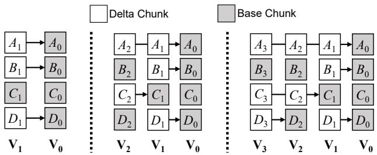  
(a) Forward delta compression only

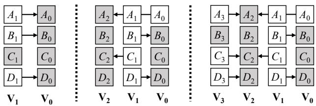  
(b) Bi-directional delta compression  
Figure 3: Comparison of forward delta compression only and bidirectional delta compression. The relation X → Y for two data chunks X and Y means: (i) both X and Y are similar, (ii) Y is the base chunk of X, and (iii) X is delta-compressed with respect to Y .

Figure 3(a) shows an example of using forward delta compression only. Suppose that $\mathbf { V _ { 1 } }$ is to be stored, in which $A _ { 1 }$ $B _ { 1 }$ , and $D _ { 1 }$ are slightly updated from (and hence are similar to) $A _ { 0 } , B _ { 0 }$ , and $D _ { 0 }$ in $\mathbf { V _ { 0 } } .$ respectively. Forward delta compression identifies $A _ { 0 } , B _ { 0 }$ , and $D _ { 0 }$ in $\mathbf { V _ { 0 } }$ as the base chunks of $A _ { 1 } , B _ { 1 }$ , and $D _ { 1 }$ in $\mathbf { V _ { 1 : } }$ , respectively. Such base chunks are close in persistent storage and are also likely stored in the same container. Suppose that $\mathbf { V } _ { 2 }$ is to be stored, in which $A _ { 2 }$ and $C _ { 2 }$ are slightly updated from $A _ { 1 }$ and $C _ { 1 }$ in $\mathbf { V _ { 1 } }$ . Forward delta compression chooses $A _ { 0 }$ in $\mathbf { V _ { 0 } }$ as the base chunk of $A _ { 2 } .$ and $C _ { 1 }$ as the base chunk of $C _ { 2 }$ . Now, the base chunks are in both backups $\mathbf { V _ { 0 } }$ and $\mathbf { V _ { 1 } }$ . When ${ \bf V } _ { 3 }$ is stored, we see that the base chunks are scattered in all backups $\mathbf { V _ { 0 } } , \mathbf { V _ { 1 } }$ , and $\mathbf { V } _ { 2 }$ . In other words, physical locality drops.

Figure 3(b) shows an example of bi-directional delta compression. When $\mathbf { V _ { 1 } }$ is stored, bi-directional delta compression selects the same base chunks in $\mathbf { V _ { 0 } }$ as in forward delta compression only. When $\mathbf { V } _ { 2 }$ is stored, it can apply backward delta compression to treat the data chunks $A _ { 2 }$ and $C _ { 2 }$ in $\mathbf { V } _ { 2 }$ as the base chunks for $A _ { 1 }$ and $C _ { 1 }$ in $\mathbf { V _ { 1 } }$ , respectively. Also, it treats $A _ { 2 }$ as the new base chunk for the old base chunk $A _ { 0 } .$ , which will be retrieved from persistent storage for delta compression. When $\mathbf { V } _ { 3 }$ is stored, it can apply forward delta compression again and select $A _ { 2 } , C _ { 2 }$ , and $D _ { 2 }$ from $\mathbf { V } _ { 2 }$ as the base chunks for $A _ { 3 } , C _ { 3 } ,$ , and $D _ { 3 } ,$ , respectively. The base chunks are still from the same backup and can be readily retrieved.

Design roadmap. Figure 4 presents the design roadmap for ShieldReduce. ShieldReduce adopts a hybrid inline (i.e., on the write path) and offline (i.e., off the write path) approach. After deduplication, if physical locality exists, the enclave performs locality-based inline compression, which includes both forward delta compression and local compression, and encrypts and stores the compressed chunks in persistent storage. Locality-based inline compression aims to achieve high performance on the write path.

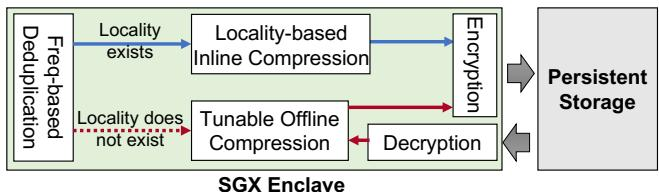  
Figure 4: Design roadmap of ShieldReduce. Frequency-based deduplication is proposed by DEBE [60].

If physical locality drops, the enclave performs tunable offline compression, which reconstructs physical locality via backward delta compression and also provides a tunable mechanism to balance the storage-performance trade-off. As backward delta compression delta-compresses an old base chunk (say M) with respect to a new data chunk (say M′), it should also reapply delta compression on the data chunks that are originally delta-compressed with respect to M; otherwise, any subsequent reconstruction of such data chunks needs to first retrieve and decrypt M′ from persistent storage to delta-decompress M, thereby triggering multiple I/Os. ShieldReduce exports a single user-configurable parameter to balance the trade-off between the performance overhead and storage savings from backward delta compression.

ShieldReduce ensures that the enclave always receives data chunks from multiple clients via secure sessions (§2.3) and only stores encrypted data in persistent storage, so as to achieve end-to-end security for the data path.

## 3.2 Locality-based Inline Compression

Overview. Figure 5 presents the workflow of locality-based inline compression in ShieldReduce. It processes a batch of n data chunks before deduplication (n = 128 by default). After deduplication, it extracts three features [62] from each data chunk, queries the feature index for the base chunk (§2.1), and retrieves the container IDs of these base chunks from the fingerprint index. It then detects the physical locality of the base chunks for the batch of data chunks. If physical locality exists, it performs forward delta compression and local compression; otherwise, it prepares for offline compression.

Locality detection. ShieldReduce detects the physical locality of the base chunks of a batch of data chunks based on how they are physically stored in containers. Given n data chunks of a batch, let p be the number of data chunks that have the base chunks and q be the number of containers that contain the base chunks, where $q \leq p \leq n .$ ShieldReduce quantifies physical locality as q/n; a small q/n implies strong locality as the base chunks are clustered in a small number of containers. If q/n is no more than some pre-defined locality threshold t, we say that physical locality exists. We evaluate the sensitivity of t in §5.3.

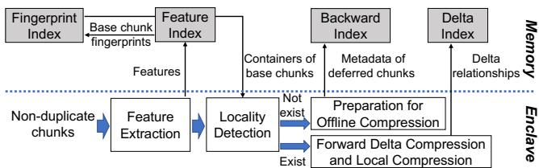  
Figure 5: Locality-based inline compression in ShieldReduce.

Forward delta compression and local compression. If physical locality exists, ShieldReduce performs forward delta compression and local compression in two cases.

• For the p data chunks that have base chunks, it loads the corresponding encrypted base chunks from persistent storage into the enclave. The enclave decrypts the encrypted base chunks, locally decompresses them, and delta-compresses the data chunks with respect to the base chunks into delta chunks. It encrypts and stores the delta chunks in persistent storage. It also updates the file recipe to track the base chunks of such data chunks.

• For the remaining data chunks that do not have base chunks (at most n− p such data chunks due to deduplication), ShieldReduce treats them as new base chunks. The enclave locally compresses, encrypts, and stores the new base chunks in persistent storage. It updates the file recipe and feature index to track the features of the new base chunks.

ShieldReduce maintains a key-value store called the delta index in untrusted memory to track the delta relationships, which are later needed by backward delta compression (§3.3) to reapply delta compression on the data chunks originally delta-compressed with respect to old base chunks. Each entry in the delta index maps the encrypted fingerprint of a base chunk to a set of encrypted fingerprints of the corresponding delta chunks. After forward delta compression, ShieldReduce updates the delta index to track the data chunks that have been delta-compressed with respect to the base chunks.

Preparation for offline compression. If physical locality does not exist $( \mathrm { i } . \mathrm { e } . , q / n > t )$ , ShieldReduce defers the compression for the batch of data chunks offline and performs the following preparation steps. It locally compresses each data chunk and stores the encrypted compressed chunks in persistent storage. It also maintains a key-value store called the backward index in untrusted memory to track the chunks for backward delta compression. Each entry in the backward index maps the encrypted fingerprint of a base chunk to a set of encrypted fingerprints of corresponding data chunks that will be delta-compressed offline.

The backward index keeps the mappings until backward delta compression is performed, and the mappings can be cleared afterwards. Thus, ShieldReduce bounds the maximum size of the backward index to limit resource overhead. For example, suppose that each encrypted fingerprint has 32 bytes (from SHA-256) and each data chunk has an average size of 8 KiB. If we configure the backward index with a maximum size of 256 MiB, it can keep the mappings for at least 256 MiB / (32 + 32) bytes × 8 KiB ≈ 32 GiB of data chunks (assuming that each data chunk has a distinct base chunk). If the backward index is full, ShieldReduce performs forward delta compression on the remaining data chunks.

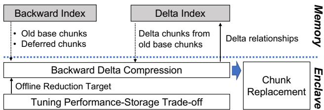  
Figure 6: Tunable offline compression in ShieldReduce. The dotted line means that ShieldReduce retrieves chunks from persistent storage based on the backward index and delta index.

## 3.3 Tunable Offline Compression

Overview. Figure 6 depicts the workflow of tunable offline compression in ShieldReduce. Based on the mappings in the delta index and backward index, ShieldReduce retrieves from persistent storage the (encrypted) physical copies of (i) the old base chunks, (ii) the data chunks deferred to be deltacompressed, and (iii) the delta chunks already compressed with respect to the old base chunks. It performs backward delta compression based on a user-configurable parameter to balance the storage-performance trade-off. It also replaces the existing physical copies of the above chunks in persistent storage with the new ones that are delta-compressed with respect to new base chunks in offline compression.

Backward delta compression. Recall that each entry of the backward index maps an encrypted fingerprint of a base chunk (say M) to a set of encrypted fingerprints of the data chunks (§3.2). ShieldReduce selects the most recent data chunk (say M′) in the backward index as the new base chunk. It delta-compresses M, as well as any other data chunk (say Mˆ ) that is also mapped by M in the backward index, with respect to $M ^ { \prime }$ . Our rationale is that future data chunks are likely to be modified from the most recent data chunks with minimum content differences [61], so choosing the most recent data chunks as new base chunks likely brings more storage savings in delta compression. Note that M′ and Mˆ may not have any common feature, yet we expect that deltacompressing Mˆ with respect to $M ^ { \prime }$ shows storage savings (Exp#1 in §5.2), as they are similar to the same old base chunk M.

We elaborate on the details of backward delta compression. For each old base chunk M, the enclave chooses the most recent data chunk that is mapped by M as the new base chunk $M ^ { \prime }$ , delta-compresses M with respect to $M ^ { \prime } ,$ and encrypts and stores the delta chunk in persistent storage. It reapplies delta compression on the affected data chunks in two cases. First, for the remaining data chunks that are also mapped by M and deferred to be delta-compressed as tracked by the backward index, the enclave decrypts and recovers such data chunks via local decompression. Second, for the others that are already delta-compressed with respect to M as tracked by the delta index, the enclave recovers them via delta decompression. Then, for both cases, the enclave delta-compresses the data chunks with respect to M′, and encrypts and stores the delta chunks in persistent storage. It updates (i) the feature index to track the new base chunk M′, (ii) the delta index to track the delta compression relationships, (iii) the fingerprint index to track the new physical copies of the related chunks that are delta-compressed with respect to M′, and (iv) the file recipe to change the corresponding base chunks to M′.

Tunable performance-storage trade-off. Since backward delta compression incurs extra I/O and computational overhead (§3.1), ShieldReduce skips the backward delta compression of some old base chunks (i.e., the old base chunks are now directly stored without delta compression). The trade-off is that the physical copies of the skipped base chunks are no longer delta-compressed and the storage size increases. To make the trade-off readily tunable, ShieldReduce introduces a configurable parameter called the offline reduction target α (where $0 \leq \alpha \leq 1 )$ based on the data reduction ratio that is expected to be achieved by offline compression: a smaller (larger) α means that ShieldReduce will remove more (less) data in offline compression.

When processing a backup, ShieldReduce monitors the current storage space occupied by the backup, and tracks the current reduction ratio of offline compression as $\alpha _ { c u r r e n t } =$ $S _ { c u r r e n t } / S _ { i n l i n e } ,$ , where $S _ { i n l i n e }$ is the actual storage space occupied by the backup after inline compression and Scurrent is the currently occupied storage space during offline compression. It collects the old base chunks from the backward index, and sorts them based on the number of data chunks delta-compressed with respect to each old base chunk. It prefers to choose the old base chunk with the least number of data chunks for backward delta compression, and keeps processing the old base chunks until either $\alpha _ { c u r r e n t } < \alpha$ or all old base chunks have been processed.

For any remaining old base chunks, ShieldReduce skips their backward delta compression and directly updates the feature index based on the new base chunks. Also, it removes their delta relationships from the delta index to mitigate index overhead. The rationale is that such skipped old base chunks are no longer used for delta compression.

Chunk replacement. After offline compression, Shield-Reduce performs the mark-and-sweep approach [21] to reclaim the storage space of the old physical copies of the chunks that are delta-compressed by offline compression (e.g., after the old base chunk is delta-compressed with respect to the new data chunk, its physical copy still exists in physical storage); note that it does not compromise data integrity, as the new delta-compressed copies have been stored in persistent storage. ShieldReduce maintains a temporary deletion map in unprotected memory to track the chunks whose old copies need to be deleted. Each entry in the deletion map maps a container ID to a list of deleted chunks, each of which is identified by its offset and length within the container. The deletion map only marks the chunks for logical deletion. Once all chunks have been processed in offline compression, ShieldReduce re-writes the marked containers to reclaim storage space and clears the deletion map.

## 3.4 Storage Management

Container organization by semantics. ShieldReduce sets each container (§2.1) with a fixed size of 4 MiB, and decouples the management of chunks into two types of containers: (i) the base chunk container, which stores encrypted and compressed base chunks, and (ii) the delta chunk container, which stores encrypted delta chunks. Our rationale is to improve the I/O efficiency of inline compression (§3.2), since only base chunks are retrieved for delta compression.

Metadata management. ShieldReduce manages the fingerprint index and feature index in unprotected memory, and protects sensitive data fields in both indexes via encryption. In addition to the data key that protects chunk data (§2.3), the enclave persistently manages a meta key to encrypt fingerprints. Each entry of the fingerprint index maps an encrypted fingerprint of a data chunk to a container ID where the corresponding chunk data are stored, while that of the feature index maps a feature to the encrypted fingerprint of the corresponding base chunk. Each feature is derived from the original chunk content using a collision-allowed hash function [53, 62], so different chunks can have the same features, yet an adversary cannot readily identify the original base chunks based on features only.

ShieldReduce maintains a file recipe (§2.1) for each backup file, so as to track all data chunks of the file. Each entry in the file recipe stores the fingerprint of an encrypted chunk. If the chunk is delta-compressed, the entry also stores the fingerprint of the corresponding base chunk. ShieldReduce encrypts and stores the file recipe in persistent storage.

Download. To restore a backup, a client submits a download request to the cloud. The enclave verifies the client’s authenticity (§4). It decrypts the file recipe and restores each data chunk. If the data chunk is a base chunk (i.e., not delta-compressed), the enclave reads the encrypted data chunk, decrypts it, and performs local decompression to recover the original data chunk; otherwise, if the data chunk is delta-compressed, the enclave restores the corresponding base chunk and decompresses the data chunk based on the base chunk. Finally, the enclave sends all data chunks back to the client via a secure channel.

## 3.5 Security Discussion

We discuss the security guarantees of ShieldReduce against the threat model in §2.3.

Eavesdropping on untrusted memory and cloud storage. An adversary can access the fingerprint index, feature index, delta index, and backward index in untrusted memory of the cloud. Nevertheless, ShieldReduce encrypts fingerprints and generates features via collision-allowed hash functions, so it prevents the adversary from identifying the data chunks from the indexes (§3.4). Note that the adversary may learn from both the delta index and backward index which data chunks are similar to a base chunk, yet it still cannot identify original data chunks, so the practical damage remains an open question. We can still fully encrypt the delta index and backward index to prevent such leakage, yet this adds the overhead of decrypting the indexes inside the enclave for updates and queries. The adversary can access the chunks and file recipes in persistent storage of the cloud, yet ShieldReduce ensures that they are fully encrypted to prevent unauthorized access.

Monitoring interface calls. An adversary can monitor the enclave’s boundary on three types of cross-boundary function calls: (i) index queries, which query the fingerprint index and feature index based on the encrypted fingerprints and features of data chunks, respectively; (ii) index updates, which update the backward index and delta index based on encrypted fingerprints; and (iii) data transfers, which move encrypted data via the enclave. The adversary can learn (i) from index queries which encrypted fingerprints and features correspond to a batch of data chunks, (ii) from index updates which chunks will be offloaded to offline compression, and (iii) from data transfers how much data is reduced for each batch of data chunks. Such learned knowledge, however, cannot help the adversary infer original data. For (i), the underlying frequency-based deduplication mitigates the leakage of querying the fingerprint index [60] and ShieldReduce maps distinct chunks to the same feature (§3.4). For (ii), the chunks and fingerprints are encrypted. For (iii), while such leakage is inevitable to support data reduction, an adversary only sees encrypted data without useful information.

Collusion between the cloud and clients. An adversary can compromise both the cloud and a client to additionally access the compromised client’s session key and its data chunks. Nevertheless, since the session key is random and used only once, it does not leak other clients’ uploaded data that are protected by different session keys.

However, a powerful adversary may now exploit the leakage of how much data is reduced (see above). It can proactively upload artificial chunks via the compromised client and monitor the cloud to see how much data is actually stored. It can learn whether the artificial chunks have been stored by other clients (due to deduplication) and how similar they are to the chunks of other clients (due to delta compression). To defend, we can use selective deduplication [27] to obfuscate deduplication patterns and pad delta chunks with random dummy bytes to mitigate compression leakage, at the expense of increasing storage overhead. Alternatively, we can also rate-limit clients’ queries to slow down the attack [10].

## 4 Implementation

We prototyped ShieldReduce based on Intel SGX SDK Linux 2.15. It implements in-memory index structures with std::unordered map and encrypts fingerprints (computed via SHA-256) in each index structure via AES-256 in CBC mode with a fixed zero initialization vector [60], so that identical plain fingerprints are mapped to identical encrypted fingerprints for duplicate detection. It uses multi-threading to parallelize internal operations, and the cloud maintains an inmemory 256-MiB cache to hold recently accessed containers. Our prototype includes 10.5 K lines of C++ code.

Chunking and deduplication. Each client uses FastCDC [59] for content-defined chunking with minimum, average, and maximum chunk sizes of 4 KiB, 8 KiB, and 16 KiB, respectively. It uses the Diffie-Hellman key exchange (§2.3) based on the NIST P-256 elliptic curve. Each client is associated with a per-client master key, which is sent to the enclave during uploads through a secure channel. The enclave encrypts file recipes with the master key to ensure backup integrity. The enclave implements frequency-based deduplication as in DEBE [60] by keeping a small fingerprint index of the 256 K most frequent chunks inside the enclave and a full fingerprint index in untrusted memory.

Compression and storage. The enclave processes batches of 128 data chunks and uses Finesse [62] to extract three features (32 bytes each) from each non-duplicate chunk after deduplication. It uses Edelta [58] for delta compression and LZ4 [8] for local compression. It encrypts each compressed chunk via AES-256 in GCM mode with a random 16-byte initialization vector. It batches the encrypted fingerprints from each batch of chunks to update the delta index, and from all chunks in the entire backup to update the backward index. It stores the encrypted compressed chunks and corresponding initialization vectors in 4 MiB containers.

## 5 Evaluation

## 5.1 Methodology

Testbed. We deploy ShieldReduce on Alibaba Cloud [1], using ecs.r7t.xlarge virtual machine instances to host cloud storage and multiple clients. Each instance has 32 GiB RAM and a 4-core 2.7 GHz Intel Xeon CPU to support SGXv2, and is installed with Ubuntu 20.04. All instances are connected with a 3 GbE network. The cloud storage instance is attached with a 1 TiB Aliyun SSD (PL0) offering up to 10 K IOPS for persistent storage, except for Exp#4, where we use the Aliyun SSD (PL3) with a maximum of 1 M IOPS to boost aggregate download performance.

Datasets. Our evaluation needs access to data contents, yet no public backup datasets with sensitive contents are available. Thus, we consider three public real-world datasets to mimic sensitive backup workloads: (i) Linux [7], which includes 209 versions (from v2.6.11 to v6.4-rc7) of Linux source code with a total of 185.7 GiB of logical data; (ii) Web [61, 62, 68], which includes 78 versions (from June 13 to September 1 in 2016) of website backups of news.sina.com with a total of 210.8 GiB of logical data; and (iii) Docker [3], which includes 95 versions (from v2.1.14 to v4.1) of Docker image snapshots of Cassandra from Docker Hub with a total of 32.2 GiB of logical data. These datasets simulate the development of copyrighted software (Linux) and the maintenance of sensitive services (Web) and environments (Docker). We also consider a synthetic dataset, SimOS, where we apply controlled modifications [38] to an operating system image to simulate a user’s private activities. We create an initial snapshot from the CentOS 7 virtual disk image (containing 1.25 GiB of data) with a total of 8 GiB of space. We generate a sequence of 30 SimOS snapshots, with a total of 240 GiB of logical data, from the initial image, such that each snapshot is created from the previous one by randomly picking 30% of files, modifying 30% of their contents, and adding 10 MiB of new data.

Baselines. We compare ShieldReduce with three baselines: DEBE [60], ForwardDelta, and SecureMeGA. DEBE performs frequency-based deduplication and local compression in an enclave, but without delta compression (§3). Both ForwardDelta and SecureMeGA extend DEBE with delta compression on a per-batch basis. ForwardDelta loads the base chunks (in containers) from persistent storage into the enclave for forward delta compression (§3.1), but does not perform backward delta compression. SecureMeGA implements MeGA [67] for delta compression in the enclave. It loads the containers with at least three base chunks [67] into the enclave for delta compression and skips the delta compression of data chunks whose base chunks are not in such containers. We use the open-sourced DEBE prototype [60] to implement ForwardDelta and SecureMeGA in C++.

Default configurations. We configure ShieldReduce and all baselines to track the fingerprints of up to 256 K chunks in the enclave for frequency-based deduplication. For Forward-Delta, SecureMeGA, and ShieldReduce, we fix the batch size as 128 data chunks and use three threads to extract features in parallel (except Exp#2, which runs in a single thread to study performance breakdown). We set the locality threshold t = 0.03 and the offline reduction target α = 0; we study the sensitivity of the parameters in Exp#5.

## 5.2 Storage Efficiency

Exp#1 (Analysis of data reduction). We compare the data reduction ratios of different approaches. We do not consider metadata overhead, but will study the index overhead of ShieldReduce in Exp#6. Note that ForwardDelta implements fine-grained data reduction (Figure 1) in the enclave and achieves the same data reduction ratio as fine-grained data reduction for plain data.

<table><tr><td rowspan=2 colspan=1>Datasets</td><td rowspan=2 colspan=1>DEBE</td><td rowspan=1 colspan=4>ShieldReduce</td><td rowspan=2 colspan=1>SecureMeGA</td><td rowspan=2 colspan=1>ForwardDelta</td></tr><tr><td rowspan=1 colspan=1>α=0</td><td rowspan=1 colspan=1>α=0.5</td><td rowspan=1 colspan=1>α=0.7</td><td rowspan=1 colspan=1>α=1</td></tr><tr><td rowspan=1 colspan=1>Linux</td><td rowspan=1 colspan=1>5.8</td><td rowspan=1 colspan=1>25.8</td><td rowspan=1 colspan=1>12.2</td><td rowspan=1 colspan=1>8.9</td><td rowspan=1 colspan=1>6.3</td><td rowspan=1 colspan=1>12.1</td><td rowspan=1 colspan=1>25.1</td></tr><tr><td rowspan=1 colspan=1>Web</td><td rowspan=1 colspan=1>13.1</td><td rowspan=1 colspan=1>58.6</td><td rowspan=1 colspan=1>27.9</td><td rowspan=1 colspan=1>19.9</td><td rowspan=1 colspan=1>14.0</td><td rowspan=1 colspan=1>16.1</td><td rowspan=1 colspan=1>60.6</td></tr><tr><td rowspan=1 colspan=1>Docker</td><td rowspan=1 colspan=1>8.6</td><td rowspan=1 colspan=1>14.9</td><td rowspan=1 colspan=1>14.4</td><td rowspan=1 colspan=1>12.9</td><td rowspan=1 colspan=1>10.3</td><td rowspan=1 colspan=1>14.0</td><td rowspan=1 colspan=1>15.0</td></tr><tr><td rowspan=1 colspan=1>SimOS</td><td rowspan=1 colspan=1>59.3</td><td rowspan=1 colspan=1>63.6</td><td rowspan=1 colspan=1>63.6</td><td rowspan=1 colspan=1>63.6</td><td rowspan=1 colspan=1>61.0</td><td rowspan=1 colspan=1>60.2</td><td rowspan=1 colspan=1>63.3</td></tr></table>

Table 1: (Exp#1) Analysis of data reduction ratio. For $\alpha = 0 .$ , ShieldReduce aims for the highest possible storage savings via backward delta compression, while for $\alpha = 1$ , ShieldReduce only updates indexes and skips backward delta compression (§3.3).

Table 1 shows the results. ShieldReduce, ForwardDelta, and SecureMeGA achieve higher storage savings than DEBE due to delta compression. When $\alpha = 0 ,$ ShieldReduce has a data reduction ratio comparable to ForwardDelta, with a minor difference attributed to the variation in base chunks used in backward delta compression. ShieldReduce achieves up to a 3.6× data reduction ratio in Web compared with SecureMeGA, since Web includes a large fraction of similar chunks, yet SecureMeGA skips the delta compression of most similar chunks for high performance. Also, the data reduction ratio of ShieldReduce generally decreases with $\alpha ,$ since a larger α implies that fewer chunks are compressed offline (§3.3). ShieldReduce keeps almost the same data reduction ratio (63.6×) in SimOS for $0 \leq \alpha \leq 0 . 7$ , as SimOS has very few similar chunks and ShieldReduce’s offline compression has limited extra storage savings. In Exp#5 (§5.3), we study the inline and offline time durations to achieve the presented data reduction ratios for different t and α.

## 5.3 Performance

Exp#2 (Microbenchmarks). We study the performance breakdown of ShieldReduce in uploading backups. We configure ShieldReduce to run with a single thread. We let a client upload the first 20 backups of each dataset and measure the average computational time of different steps on the write path. Table 2 presents a breakdown of the computational time per 1 MiB of logical data processed. ShieldReduce’s bi-directional delta compression, including locality detection and delta compression, takes only 2.8-8.8% of the overall computational time. Notably, feature generation takes 55.9% and 52.6% of the overall computational time in Linux and Docker, respectively, and throttles the performance of ShieldReduce, while it only takes 41.3% in Web and 15.2% in SimOS. The discrepancy is due to the relatively small data reduction ratios from deduplication in Linux and Docker (see the data reduction ratio of DEBE in Table 1), so ShieldReduce needs feature generation from more non-duplicate chunks.

Exp#3 (Inline performance). We compare the inline performance of different approaches. We consider a single client that loads a backup into its memory (to remove client-side disk I/Os) and uploads each backup one by one. We measure the upload speed by dividing the logical backup size by the total time of writing backup data into persistent storage.

<table><tr><td rowspan=1 colspan=1>Steps</td><td rowspan=1 colspan=1>Linux</td><td rowspan=1 colspan=1>Web</td><td rowspan=1 colspan=1>Docker</td><td rowspan=1 colspan=1>SimOS</td></tr><tr><td rowspan=1 colspan=1>Chunking</td><td rowspan=1 colspan=1>0.930</td><td rowspan=1 colspan=1>0.756</td><td rowspan=1 colspan=1>0.841</td><td rowspan=1 colspan=1>0.877</td></tr><tr><td rowspan=1 colspan=1>Secure session setup</td><td rowspan=1 colspan=1>0.208</td><td rowspan=1 colspan=1>0.205</td><td rowspan=1 colspan=1>0.202</td><td rowspan=1 colspan=1>0.190</td></tr><tr><td rowspan=1 colspan=1>Deduplication</td><td rowspan=1 colspan=1>1.647</td><td rowspan=1 colspan=1>1.186</td><td rowspan=1 colspan=1>1.499</td><td rowspan=1 colspan=1>0.898</td></tr><tr><td rowspan=1 colspan=1>Feature generation</td><td rowspan=1 colspan=1>6.541</td><td rowspan=1 colspan=1>1.978</td><td rowspan=1 colspan=1>4.705</td><td rowspan=1 colspan=1>0.375</td></tr><tr><td rowspan=1 colspan=1>Locality detection</td><td rowspan=1 colspan=1>0.138</td><td rowspan=1 colspan=1>0.061</td><td rowspan=1 colspan=1>0.094</td><td rowspan=1 colspan=1>0.011</td></tr><tr><td rowspan=1 colspan=1>Delta compression</td><td rowspan=1 colspan=1>0.749</td><td rowspan=1 colspan=1>0.168</td><td rowspan=1 colspan=1>0.688</td><td rowspan=1 colspan=1>0.059</td></tr><tr><td rowspan=1 colspan=1>Local compression</td><td rowspan=1 colspan=1>1.282</td><td rowspan=1 colspan=1>0.364</td><td rowspan=1 colspan=1>0.750</td><td rowspan=1 colspan=1>0.043</td></tr><tr><td rowspan=1 colspan=1>Encryption</td><td rowspan=1 colspan=1>0.201</td><td rowspan=1 colspan=1>0.067</td><td rowspan=1 colspan=1>0.168</td><td rowspan=1 colspan=1>0.012</td></tr></table>

Table 2: (Exp#2) The computational time (unit: ms) per processing 1 MiB of logical data in each step on the write path. The results are averaged from the uploads of 20 backups, and the variances are less than 10.5% of the corresponding average values.

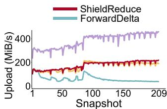  
(a) Linux

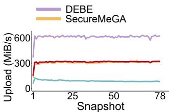

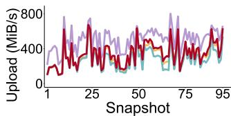  
(b) Web

(c) Docker  
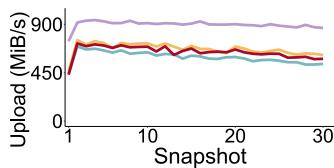  
(d) SimOS  
Figure 7: (Exp#3) Upload speed in long-term backups.

Figure 7 shows the upload speeds. DEBE achieves a 1.5- 2.2× speedup over ShieldReduce since it does not perform delta compression. Compared with ForwardDelta, Shield-Reduce achieves an upload throughput gain of 1.1-3.5× since it preserves physical locality to limit the I/Os of loading base chunks from persistent storage, and further moves delta compression offline if physical locality drops. Notably, Secure-MeGA trades storage savings for performance (Exp#1), yet ShieldReduce still accelerates SecureMeGA by up to 7.3%.

We also measure the CPU utilization of the cloud machine as the ratio of the actual CPU time to the total processing time on the write path (not shown in figures). ShieldReduce has the highest CPU utilization (50.4%) in Linux among all datasets, since Linux has the most non-duplicate chunks that need encryption. Compared with DEBE, ShieldReduce adds an absolute CPU utilization of 1.1-11.6% for feature extraction and delta compression.

Exp#4 (Multi-client performance). We evaluate Shield-Reduce when multiple clients concurrently upload and download backups. We configure ten virtual machines to simultaneously upload (download) data files to (from) the cloud for stress testing. We consider two cases: (i) Unique, where each client has a 2-GiB data file with globally unique content (i.e., no redundancies) and (ii) Redundant, where each client’s data is generated based on controlled modifications like SimOS from the same CentOS 7 virtual disk image.

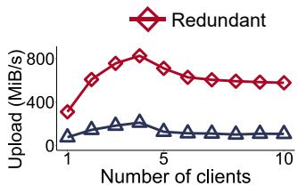  
(a) Multi-client uploads

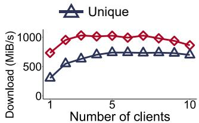  
(b) Multi-client downloads  
Figure 8: (Exp#4) Multi-client uploads and downloads.

We measure the aggregate upload speed as the ratio of the uploaded data size to the total time taken for the cloud to write all clients’ data into persistent storage (in the inline stage). Figure 8(a) shows that the aggregate upload speed of Redundant first increases with the number of clients and achieves 826.7 MiB/s for four clients, and then drops to 578.1 MiB/s for ten clients due to resource contention in the cloud-side enclave. Enhancing the parallelization of SGX is beyond the scope of this paper. However, ShieldReduce can be extended using frameworks like Occulum [51], which supports multi-process execution within a single enclave. Similarly, the aggregate upload speed of Unique gradually increases from 76.3 MiB/s to 211.2 MiB/s for four clients, and is then bounded by disk I/Os in persistent storage.

We also measure the aggregate download speed as the ratio of the downloaded data size to the total time taken for all clients to reconstruct files (client-side disk I/Os are not considered). Figure 8(b) shows that the aggregate download speed of Redundant (Unique) first increases to 1024.6 MiB/s (738.1 MiB/s), and then decreases to 862.7 MiB/s (698.0 MiB/s) due to read contention among multiple clients. ShieldReduce in Redundant has a 1.2-1.4× speedup compared with that in Unique, since the container cache (§4) mitigates the disk I/Os of retrieving duplicate data from persistent storage.

Exp#5 (Sensitivity of configurable parameters). We study the impact of the locality threshold t (§3.2) and offline reduction target α (§3.3) on ShieldReduce’s performance. We upload each backup by a client, followed by offline compression. We measure the time durations of the data reduction process on and off the write path.

Figure 9 shows the results averaged across all backups when we fix α = 0 and vary t. Note that t = 0 implies that ShieldReduce locally compresses all data chunks on the write path and defers delta compression off the write path. As t increases, ShieldReduce needs more time to process uploads on the write path, since it loads many containers from persistent storage into the enclave for delta compression. The increase of t only slightly increases inline duration (i.e., the left Y-axis), but dramatically reduces offline duration (i.e., the right Y-axis), as it avoids reapplying delta compression to many chunks that are already compressed with respect to old base chunks. For example, when t increases from 0.05 to 0.1, the inline (offline) time duration increases (decreases) from 12.4s (389.3s) to 25.5s (155.7s) in Web. Compared to Linux, the write path performance in Docker and SimOS is less affected by t, as they contain fewer similar chunks (Exp#1 in §5.2) and increasing t adds only a small number of chunks for inline delta compression. As future work, we plan to adaptively configure t based on workload characteristics.

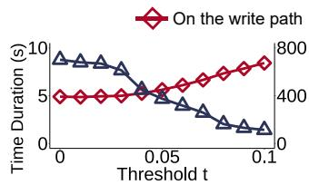  
(a) Linux

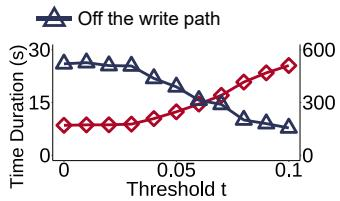  
(b) Web

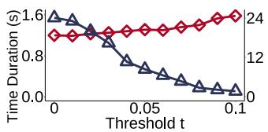  
(c) Docker

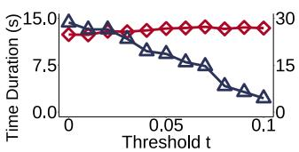  
(d) SimOS

Figure 9: (Exp#5) Impact of t on inline (referred to the left Y-axis) and offline (referred to the right Y-axis) durations.  
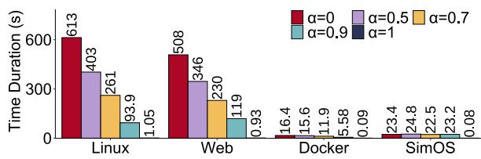  
Figure 10: (Exp#5) Impact of α on offline duration.

Figure 10 shows the average time duration (across all backups) off the write path when we fix t = 0.03 and vary α. When α = 1, ShieldReduce updates metadata without performing backward delta compression on old base chunks. Clearly, with the increase of α, we can effectively reduce the time duration of offline compression, with the cost of additional storage overhead (Exp#1). Due to the limited number of similar chunks in Docker and SimOS, varying α only slightly affects the number of delta compression operations, leading to a modest impact on the time duration.

## 5.4 Resource Overhead

Exp#6 (Index overhead). We evaluate the size overhead of index structures in ShieldReduce, including the full fingerprint index outside the enclave, feature index, and delta index. We do not consider the small fingerprint index (based on DEBE) inside the enclave, as it only stores up to 256 K fingerprints (§4) and has a limited size of 8 MiB (assuming

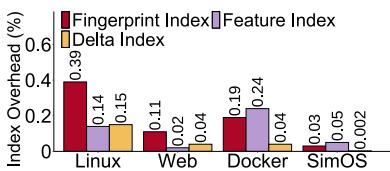  
(a) Fraction of index size over logical size

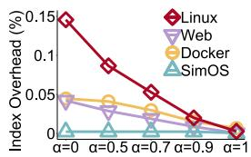  
(b) Delta index overhead versus α  
Figure 11: (Exp#6) Analysis of index overhead.

32-byte fingerprints). We also do not consider the backward index and deletion map, as both of them will be cleared after offline compression (§3.3). We report the index overhead as the fraction of the size of each index after the last backup over the total amount of logical data.

Figure 11(a) shows that the major index overhead generally comes from the fingerprint index and feature index, which reach up to 0.39% in Linux and 0.24% in Docker. We can mitigate the memory overhead of the fingerprint index and feature index via locality-preserved caching [66] and the stream-informed approach [52], respectively, without introducing extra storage overhead. The delta index incurs 0.14% overhead in Linux. We can increase α to skip the backward delta compression of some old base chunks being used to delta-compress many data chunks (§3.3) to reduce the size of the delta index, at the expense of extra storage overhead (Exp#1 in §5.2). For example, increasing α to 0.5 reduces the overhead of the delta index to 0.09% in Linux (Figure 11(b)).

Exp#7 (Enclave overhead). We evaluate the enclave overhead of ShieldReduce in interface calls. We follow Exp#3 to upload each backup and count ECalls and OCalls on and off (for ShieldReduce only) the write path. We focus on three types of OCalls (§3.5) on the write path: index queries, index updates (for ShieldReduce only), and data transfers.

Table 3 shows the numbers of ECalls and OCalls. On the write path, all approaches issue the same number of ECalls to batch data chunks into the enclave. Compared with DEBE (which issues OCalls to query the full fingerprint index outside the enclave for deduplication), ShieldReduce adds up to 2.4× OCalls (Docker) for two reasons: (i) querying the feature index and loading base chunks into the enclave for delta compression, and (ii) updating the backward index and delta index to offload delta compression off the write path. ShieldReduce reduces the total number of OCalls for ForwardDelta by up to 83.3% (Linux) by preserving physical locality and offloading delta compression from the write path.

To justify the significance of preserving physical locality in ShieldReduce, we disable the offloading of delta compression to offline compression by manually clearing the backward index (i.e., no reconstruction of physical locality). We measure the average amount of data reduced by delta compression per OCall for data transfers and index updates with and without offloading (we exclude index queries as the same number of OCalls are issued in both cases). Table 4 shows that Shield-Reduce (with offloading) has up to 4.6× data reduction per

<table><tr><td rowspan=2 colspan=3>Datasets</td><td rowspan=2 colspan=1>DEBE</td><td rowspan=2 colspan=1>ForwardDelta</td><td rowspan=1 colspan=2>ShieldReduce</td></tr><tr><td rowspan=1 colspan=1>Inline</td><td rowspan=1 colspan=1>Offline</td></tr><tr><td rowspan=5 colspan=1>xnui1</td><td rowspan=1 colspan=2>#ECall</td><td rowspan=1 colspan=1></td><td rowspan=1 colspan=2>0.2M</td><td rowspan=1 colspan=1>209</td></tr><tr><td rowspan=4 colspan=1>#OCall</td><td rowspan=1 colspan=1>Index queries</td><td rowspan=1 colspan=1>0.2M</td><td rowspan=1 colspan=2>0.4M</td><td rowspan=4 colspan=1>963.6M</td></tr><tr><td rowspan=1 colspan=1>Index updates</td><td rowspan=1 colspan=1>-</td><td rowspan=1 colspan=1>-</td><td rowspan=1 colspan=1>0.04M</td></tr><tr><td rowspan=1 colspan=1>Data transfers</td><td rowspan=1 colspan=1>0.03M</td><td rowspan=1 colspan=1>2.6M</td><td rowspan=1 colspan=1>0.06M</td></tr><tr><td rowspan=1 colspan=1>Total</td><td rowspan=1 colspan=1>0.23M</td><td rowspan=1 colspan=1>3.0M</td><td rowspan=1 colspan=1>0.5M</td></tr><tr><td rowspan=5 colspan=1>qm</td><td rowspan=1 colspan=1></td><td rowspan=1 colspan=1>#ECall</td><td rowspan=1 colspan=1></td><td rowspan=1 colspan=2>0.2M</td><td rowspan=1 colspan=1>78</td></tr><tr><td rowspan=4 colspan=1>#OCall</td><td rowspan=1 colspan=1>Index queries</td><td rowspan=1 colspan=1>0.2M</td><td rowspan=1 colspan=2>0.4M</td><td rowspan=4 colspan=1>250.4M</td></tr><tr><td rowspan=1 colspan=1>Index updates</td><td rowspan=1 colspan=1>-</td><td rowspan=1 colspan=1>-</td><td rowspan=1 colspan=1>0.02M</td></tr><tr><td rowspan=1 colspan=1>Data transfers</td><td rowspan=1 colspan=1>0.03M</td><td rowspan=1 colspan=1>1.4M</td><td rowspan=1 colspan=1>0.05M</td></tr><tr><td rowspan=1 colspan=1>Total</td><td rowspan=1 colspan=1>0.23M</td><td rowspan=1 colspan=1>1.8M</td><td rowspan=1 colspan=1>0.47M</td></tr><tr><td rowspan=5 colspan=1>goeeer</td><td rowspan=1 colspan=1></td><td rowspan=1 colspan=1>#ECall</td><td rowspan=1 colspan=1></td><td rowspan=1 colspan=2>0.03M</td><td rowspan=1 colspan=1>95</td></tr><tr><td rowspan=4 colspan=1>#OCall</td><td rowspan=1 colspan=1>Index queries</td><td rowspan=1 colspan=1>0.02M</td><td rowspan=1 colspan=2>0.04M</td><td rowspan=4 colspan=1>19.5M</td></tr><tr><td rowspan=1 colspan=1>Index updates</td><td rowspan=1 colspan=1>-</td><td rowspan=1 colspan=1>-</td><td rowspan=1 colspan=1>0.01M</td></tr><tr><td rowspan=1 colspan=1>Data transfers</td><td rowspan=1 colspan=1>0.005M</td><td rowspan=1 colspan=1>0.03M</td><td rowspan=1 colspan=1>0.01M</td></tr><tr><td rowspan=1 colspan=1>Total</td><td rowspan=1 colspan=1>0.025M</td><td rowspan=1 colspan=1>0.07M</td><td rowspan=1 colspan=1>0.06M</td></tr><tr><td rowspan=5 colspan=1>souis</td><td rowspan=1 colspan=1></td><td rowspan=1 colspan=1>#ECall</td><td rowspan=1 colspan=1></td><td rowspan=1 colspan=2>0.1M</td><td rowspan=1 colspan=1>30</td></tr><tr><td rowspan=4 colspan=1>#OCall</td><td rowspan=1 colspan=1>Index queries</td><td rowspan=1 colspan=1>0.03M</td><td rowspan=1 colspan=2>0.05M</td><td rowspan=4 colspan=1>8.8M</td></tr><tr><td rowspan=1 colspan=1>Indexupdates</td><td rowspan=1 colspan=1>-</td><td rowspan=1 colspan=1>-</td><td rowspan=1 colspan=1>0.01M</td></tr><tr><td rowspan=1 colspan=1>Data transfers</td><td rowspan=1 colspan=1>0.02M</td><td rowspan=1 colspan=1>0.05M</td><td rowspan=1 colspan=1>0.03M</td></tr><tr><td rowspan=1 colspan=1>Total</td><td rowspan=1 colspan=1>0.05M</td><td rowspan=1 colspan=1>0.10M</td><td rowspan=1 colspan=1>0.09M</td></tr></table>

Table 3: (Exp#7) Enclave overhead. We measure the overhead by the number of interface function calls.

<table><tr><td rowspan=1 colspan=1>Approaches</td><td rowspan=1 colspan=1>Linux</td><td rowspan=1 colspan=1>Web</td><td rowspan=1 colspan=1>Docker</td><td rowspan=1 colspan=1>SimOs</td></tr><tr><td rowspan=1 colspan=1>Without offloading</td><td rowspan=1 colspan=1>14.3</td><td rowspan=1 colspan=1>16.8</td><td rowspan=1 colspan=1>42.4</td><td rowspan=1 colspan=1>8.1</td></tr><tr><td rowspan=1 colspan=1>With offloading</td><td rowspan=1 colspan=1>65.9</td><td rowspan=1 colspan=1>29.9</td><td rowspan=1 colspan=1>47.5</td><td rowspan=1 colspan=1>10.9</td></tr></table>

Table 4: (Exp#7) Average amount of data reduced by delta compression per OCall for data transfers and index updates (KiB) with and without offloading (i.e., performing delta compression offline on similar chunks whose base chunks exhibit weak physical locality).

OCall (Linux) compared to without offloading. The reason is that preserving physical locality allows ShieldReduce to keep more base chunks in the same containers and issues fewer OCalls to load containers in data reduction.

Off the write path, ShieldReduce issues ECalls to start offline compression after each backup upload, and many OCalls to load chunks into the enclave and update the delta index after backward delta compression. We argue that the latter only incurs up to a few hundred seconds for the offline compression of each backup (Figure 9 in Exp#5). We can tune α to reduce the duration of offline compression (Figure 10 in Exp#5) by trading storage savings (Table 1 in Exp#1).

## 6 Related Work

Performance improvements for delta compression. Earlier studies [22,40,47,53] generate features based on Rabin fingerprints. Finesse [62] mitigates the computational overhead of calculating Rabin fingerprints via fine-grained locality within similar chunks. DeepSketch [45] improves the accuracy of base chunk search based on deep learning with specialized hardware. ShieldReduce builds on Finesse [62] to search for base chunks without specialized hardware.

Recent studies explore fast delta compression that trades storage savings for performance. MeGA [67] uses selective delta compression to avoid loading containers with only a few base chunks, but it significantly degrades storage savings (Exp#1 in §5.2). LoopDelta [61] proposes inverse delta compression similar to ShieldReduce by treating new data chunks as base chunks and delta-compressing old base chunks with respect to the new data chunks, so as to be compatible with rewriting techniques for the mitigation of chunk fragmentation [37, 61]. However, LoopDelta does not address the I/O overhead especially when reconstructing the data chunks that are originally delta-compressed with respect to old base chunks. ShieldReduce maintains I/O efficiency by performing forward or backward delta compression based on physical locality and proposing tunable offline compression to balance the storage-performance trade-off when applying backward delta compression. Also, LoopDelta only considers plain data reduction, while ShieldReduce realizes shielded data reduction and addresses the enclave resource overhead.

Confidentiality for data reduction. Several studies propose encryption mechanisms to allow the reduction of encrypted data via deduplication [10, 11, 20, 35, 54], local compression [31, 65], or a combination of both along with delta compression [64]. However, they necessitate weaker encryption to preserve content redundancies after encryption, and incur information leakage [33]. Shielded execution has been used for secure data reduction. SeGShare [25] and S2Dedup [42] use an enclave to mitigate the key management overhead of deduplication on encrypted data. SGXDedup [49] leverages SGX to speed up secure deduplication. DEBE [60] mitigates the key management overhead by performing deduplication and local compression before encryption inside an enclave. SeedSync [63] builds on SGX to securely reduce transferred data during cross-cloud synchronization. All the above studies do not consider delta compression.

## 7 Conclusion

We present ShieldReduce, which leverages SGX to realize fine-grained shielded data reduction for outsourced storage. The main novelty of ShieldReduce is bi-directional delta compression, which performs either forward or backward delta compression based on the physical distribution of base chunks, so as to preserve physical locality and mitigate I/O overhead. Experiments show that ShieldReduce achieves high performance and high storage savings.

## Acknowledgments

We thank our shepherd, Steven Swanson, and the anonymous reviewers for their comments. This work was supported in part by National Key R&D Program of China (2022YFB4501200), National Natural Science Foundation of China (62332018), Sichuan Science and Technology Program (2024NSFTD0031, 2024YFHZ0339 and 2025ZNSFSC0497), and Innovation and Technology Commission of Hong Kong (GHX/076/20).

## References

[1] Alibaba cloud. https://www.alibabacloud.com/.

[2] AMD secure encrypted virtualization (SEV). https: //www.amd.com/en/developer/sev.html.

[3] Cassandra: Open source NoSQL database. https:// cassandra.apache.org/ /index.html.

[4] g7t, security-enhanced general-purpose instance family. https://www.alibabacloud.com/help/en/ ecs/user-guide/general-purpose-instancefamilies. Accessed in January 2025.

[5] Intel trust domain extensions (Intel TDX) isolation, confidentiality, and integrity at the virtual machine (VM) level. https://www.intel.com/content/ www/us/en/developer/tools/trust-domainextensions/overview.html.

[6] Intel(R) software guard extensions. https: //www.intel.com/content/www/us/en/ developer/tools/software-guardextensions/overview.html.

[7] The linux kernel archives. https:// www.kernel.org/.

[8] LZ4. https://lz4.org/.

[9] Supporting Intel SGX on multi-socket platforms. https://www.intel.com/content/www/us/en/ architecture-and-technology/softwareguard-extensions/supporting-sgx-on-multisocket-platforms.html.

[10] Mihir Bellare, Sriram Keelveedhi, and Thomas Ristenpart. DupLESS: Server-aided encryption for deduplicated storage. In Proc. of USENIX Security, 2013.

[11] Mihir Bellare, Sriram Keelveedhi, and Thomas Ristenpart. Message-locked encryption and secure deduplication. In Proc. of EuroCrypto, 2013.

[12] Deepavali Bhagwat, Kave Eshghi, Darrell D.E. Long, and Mark Lillibridge. Extreme binning: Scalable, parallel deduplication for chunk-based file backup. In Proc. of IEEE MASCOTS, 2009.

[13] Andrea Biondo, Mauro Conti, Lucas Davi, Tommaso Frassetto, and Ahmad-Reza Sadeghi. The guard’s dilemma: Efficient code-reuse attacks against Intel SGX. In Proc. of USENIX Security, 2018.

[14] John Black. Compare-by-hash: A reasoned analysis. In Proc. of USENIX FAST, 2006.

[15] Ferdinand Brasser, Srdjan Capkun, Alexandra Dmitrienko, Tommaso Frassetto, Kari Kostiainen, and Ahmad-Reza Sadeghi. Dr.SGX: Automated and adjustable side-channel protection for SGX using data location randomization. In Proc. of ACM ACSAC, 2019.

[16] Andrei Broder. On the resemblance and containment of documents. In Proc. of Compression and Complexity of Sequences, 1997.

[17] Pau-Chen Cheng, Wojciech Ozga, Enriquillo Valdez, Salman Ahmed, Zhongshu Gu, Hani Jamjoom, Hubertus Franke, and James Bottomley. Intel TDX demystified: A top-down approach. ACM Computing Surveys, 56(9):1--33, 2024.

[18] Tu Dinh Ngoc, Bao Bui, Stella Bitchebe, Alain Tchana, Valerio Schiavoni, Pascal Felber, and Daniel Hagimont. Everything you should know about Intel SGX performance on virtualized systems. In Proc. of ACM SIG-METRICS, 2019.

[19] Judicael B Djoko, Jack Lange, and Adam J Lee. NEXUS: Practical and secure access control on untrusted storage platforms using client-side SGX. In Proc. of IEEE/IFIP DSN, 2019.

[20] John R Douceur, Atul Adya, William J Bolosky, P Simon, and Marvin Theimer. Reclaiming space from duplicate files in a serverless distributed file system. In Proc. of IEEE ICDCS, 2002.

[21] Fred Douglis, Abhinav Duggal, Philip Shilane, Tony Wong, Shiqin Yan, and Fabiano Botelho. The logic of physical garbage collection in deduplicating storage. In Proc. of USENIX FAST, February 2017.

[22] Fred Douglis and Arun Iyengar. Application-specific delta-encoding via resemblance detection. In Proc. of USENIX ATC, June 2003.

[23] Muhammad El-Hindi, Tobias Ziegler, Matthias Heinrich, Adrian Lutsch, Zheguang Zhao, and Carsten Binnig. Benchmarking the second generation of Intel SGX hardware. In Proc. of Data Management on New Hardware, 2022.

[24] Shufan Fei, Zheng Yan, Wenxiu Ding, and Haomeng Xie. Security vulnerabilities of SGX and countermeasures: A survey. ACM Computing Surveys, 54(6), 2021.

[25] Benny Fuhry, Lina Hirschoff, Samuel Koesnadi, and Florian Kerschbaum. SeGShare: Secure group file sharing in the cloud using enclaves. In Proc. of IEEE/IFIP DSN, 2020.

[26] Shai Halevi, Danny Harnik, Benny Pinkas, and Alexandra Shulman-Peleg. Proofs of ownership in remote storage systems. In Proc. of ACM CCS, 2011.

[27] Danny Harnik, Benny Pinkas, and Alexandra Shulman-Peleg. Side channels in cloud services: Deduplication in cloud storage. IEEE Security & Privacy, 8(6):40--47, 2010.

[28] Danny Harnik, Eliad Tsfadia, Doron Chen, and Ronen Kat. Securing the storage data path with SGX enclaves. https://arxiv.org/abs/1806.10883, 2018.

[29] Keren Jin and Ethan L. Miller. The effectiveness of deduplication on virtual machine disk images. In Proc. of ACM SYSTOR, 2009.

[30] Taehoon Kim, Joongun Park, Jaewook Woo, Seungheun Jeon, and Jaehyuk Huh. ShieldStore: Shielded inmemory key-value storage with SGX. In Proc. of ACM EuroSys, 2019.

[31] Demijan Klinc, Carmit Hazay, Ashish Jagmohan, Hugo Krawczyk, and Tal Rabin. On compression of data encrypted with block ciphers. In Proc. of Data Compression Conference, 2009.

[32] Erik Kruus, Cristian Ungureanu, and Cezary Dubnicki. Bimodal content defined chunking for backup streams. In Proc. of USENIX FAST, 2010.

[33] Jingwei Li, Patrick P. C. Lee, Chufeng Tan, Chuan Qin, and Xiaosong Zhang. Information leakage in encrypted deduplication via frequency analysis: Attacks and defenses. ACM Transactions on Storage, 16(1):4:1--4:30, 2020.

[34] Jingwei Li, Chuan Qin, Patrick P. C. Lee, and Xiaosong Zhang. Information leakage in encrypted deduplication via frequency analysis. In Proc. of IEEE/IFIP DSN, 2017.

[35] Jingwei Li, Zuoru Yang, Yanjing Ren, Patrick P. C. Lee, and Xiaosong Zhang. Balancing storage efficiency and data confidentiality with tunable encrypted deduplication. In Proc. of ACM Eurosys, 2020.

[36] Mingqiang Li, Chuan Qin, and Patrick P. C. Lee. CD-Store: Toward reliable, secure, and cost-efficient cloud storage via convergent dispersal. In Proc. of USENIX ATC, 2015.

[37] Mark Lillibridge, Kave Eshghi, and Deepavali Bhagwat. Improving restore speed for backup systems that use inline chunk-based deduplication. In Proc. of USENIX FAST, 2013.

[38] Mark Lillibridge, Kave Eshghi, Deepavali Bhagwat, Vinay Deolalikar, Greg Trezis, and Peter Camble. Sparse indexing: Large scale, inline deduplication using sampling and locality. In Proc. of USENIX FAST, 2009.

[39] Jian Liu, Nadarajah Asokan, and Benny Pinkas. Secure deduplication of encrypted data without additional independent servers. In Proc. of ACM CCS, 2015.

[40] Udi Manber. Finding similar files in a large file system. In Proc. of USENIX ATC, January 1994.

[41] Dirk Meister, Andre Brinkmann, and Tim Suß. File ¨ recipe compression in data deduplication systems. In Proc. of USENIX FAST, 2013.

[42] Mariana Miranda, Tania Esteves, Bernardo Portela, and ˆ Joao Paulo. S2Dedup: SGX-enabled secure deduplica- ˜ tion. In Proc. of ACM SYSTOR, 2021.

[43] Kit Murdock, David Oswald, Flavio D. Garcia, Jo Van Bulck, Daniel Gruss, and Frank Piessens. Plundervolt: Software-based fault injection attacks against Intel SGX. In Proc. of IEEE S&P, 2020.

[44] Oleksii Oleksenko, Bohdan Trach, Robert Krahn, Mark Silberstein, and Christof Fetzer. Varys: Protecting SGX enclaves from practical side-channel attacks. In Proc. of USENIX ATC, 2018.

[45] Jisung Park, Jeonggyun Kim, Yeseong Kim, Sungjin Lee, and Onur Mutlu. DeepSketch: A new machine learning-based reference search technique for postdeduplication delta compression. In Proc. of USENIX FAST, 2022.

[46] Christian Priebe, Kapil Vaswani, and Manuel Costa. EnclaveDB: A secure database using SGX. In Proc. of IEEE S&P, 2018.

[47] Kulkarni Purushottam, Fred Douglis, Jason LaVoie, and John M. Tracey. Redundancy elimination within large collections of files. In Proc. of USENIX ATC, June 2004.

[48] Anil Rao. Rising to the challenge—data security with Intel confidential computing. https: //community.intel.com/t5/Blogs/Productsand-Solutions/Security/Rising-to-the-Challenge-Data-Security-with-Intel-Confidential/post/1353141, 2022.

[49] Yanjing Ren, Jingwei Li, Zuoru Yang, Patrick P. C. Lee, and Xiaosong Zhang. Accelerating encrypted deduplication via SGX. In Proc. of USENIX ATC, 2021.

[50] Felix Schuster, Manuel Costa, Cedric Fournet, Christos ´ Gkantsidis, Marcus Peinado, Gloria Mainar-Ruiz, and Mark Russinovich. VC3: Trustworthy data analytics in the cloud using SGX. In Proc. of IEEE S&P, 2015.

[51] Youren Shen, Hongliang Tian, Yu Chen, Kang Chen, Runji Wang, Yi Xu, Yubin Xia, and Shoumeng Yan. Occlum: Secure and efficient multitasking inside a single enclave of Intel SGX. In Proc. of ASPLOS, 2020.

[52] Philip Shilane, Mark Huang, Grant Wallace, and Windsor Hsu. WAN optimized replication of backup datasets using stream-informed delta compression. In Proc. of USENIX FAST, 2012.

[53] Philip Shilane, Grant Wallace, Mark Huang, and Windsor Hsu. Delta compressed and deduplicated storage using stream-informed locality. In Proc. of USENIX HotStorage, 2012.

[54] Tong Sun, Bowen Jiang, Borui Li, Jiamei Lv, Yi Gao, and Wei Dong. SimEnc: A high-performance similaritypreserving encryption approach for deduplication of encrypted docker images. In Proc. of USENIX ATC, 2024.

[55] Grant Wallace, Fred Douglis, Hangwei Qian, Philip Shilane, Stephen Smaldone, Mark Chamness, and Windsor Hsu. Characteristics of backup workloads in production systems. In Proc. of USENIX FAST, 2012.

[56] Ofir Weisse, Valeria Bertacco, and Todd Austin. Regaining lost cycles with hotcalls: A fast interface for SGX secure enclaves. In Proc. of ACM ISCA, 2017.

[57] Wen Xia, Hong Jiang, Dan Feng, and Yu Hua. SiLo: A similarity-locality based near-exact deduplication scheme with low RAM overhead and high throughput. In Proc. of USENIX ATC, 2011.

[58] Wen Xia, Chunguang Li, Hong Jiang, Dan Feng, Yu Hua, Leihua Qin, and Yucheng Zhang. Edelta: A word-enlarging based fast delta compression approach. In Proc. of USENIX HotStorage, 2015.

[59] Wen Xia, Yukun Zhou, Hong Jiang, Dan Feng, Yu Hua, Yuchong Hu, Qing Liu, and Yucheng Zhang. FastCDC: A fast and efficient content-defined chunking approach for data deduplication. In Proc. of USENIX ATC, 2016.

[60] Zuoru Yang, Jingwei Li, and Patrick P. C. Lee. Secure and lightweight deduplicated storage via shielded deduplication-before-encryption. In Proc. of USENIX ATC, 2022.

[61] Yucheng Zhang, Hong Jiang, Dan Feng, Nan Jiang, Taorong Qiu, and Wei Huang. LoopDelta: Embedding locality-aware opportunistic delta compression in inline deduplication for highly efficient data reduction. In Proc. of USENIX ATC, 2023.

[62] Yucheng Zhang, Wen Xia, Dan Feng, Hong Jiang, Yu Hua, and Qiang Wang. Finesse: Fine-grained feature locality based fast resemblance detection for postdeduplication delta compression. In Proc. of USENIX FAST, 2019.

[63] Jia Zhao, Yanjing Ren, Jingwei Li, and Patrick P. C. Lee. SGX-enabled encrypted cross-cloud data synchronization. In Proc. of IEEE ICDCS, 2025.

[64] Jia Zhao, Zuoru Yang, Jingwei Li, and Patrick P. C. Lee. Encrypted data reduction: Removing redundancy from encrypted data in outsourced storage. ACM Transactions on Storage, 20(4):1--30, 2024.

[65] Wenting Zheng, Frank Li, Raluca Ada Popa, Ion Stoica, and Rachit Agarwal. MiniCrypt: Reconciling encryption and compression for big data stores. In Proc. of ACM EuroSys, 2017.

[66] Benjamin Zhu, Kai Li, and Hugo Patterson. Avoiding the disk bottleneck in the data domain deduplication file system. In Proc. of USENIX FAST, 2008.

[67] Xiangyu Zou, Wen Xia, Philip Shilane, Haijun Zhang, and Xuan Wang. Building a high-performance finegrained deduplication framework for backup storage

with high deduplication ratio. In Proc. of USENIX ATC, 2022.

[68] Xiangyu Zou, Jingsong Yuan, Philip Shilane, Wen Xia, Haijun Zhang, and Xuan Wang. The dilemma between deduplication and locality: Can both be achieved? In Proc. of USENIX FAST, 2021.

## A Artifact Appendix

## Abstract

Our artifact includes the ShieldReduce prototype, which simultaneously supports all baseline approaches, along with scripts for downloading the datasets used in our evaluation and scripts for running all our experiments in §5. The ShieldReduce prototype is a secure outsourced storage system designed to enhance storage efficiency via fine-grained data reduction, while ensuring data confidentiality via shielded execution. It supports upload and download operations and allows multiple clients to securely outsource their backup storage to the cloud. It implements bi-directional delta compression to improve performance and incorporates the hybrid inline and offline designs described in §3. It builds on DEBE [60] to support frequency-based deduplication.

## Scope

The artifact can be used to validate all results shown in the figures and tables in §5, especially for our main claims.

• ShieldReduce achieves a similar data reduction ratio to ForwardDelta and higher data reduction ratios than Secure-MeGA and DEBE (Exp#1).

• ShieldReduce achieves a similar upload throughput to SecureMeGA and higher upload throughputs than Forward-Delta and DEBE (Exp#3).

• ShieldReduce with offloading reduces more data per OCall compared to without offloading (Exp#7).

## Contents

The artifact comprises the following sub-directories:

• /Prototype includes the implementation of the Shield-Reduce prototype.

• /MultiClient includes the implementation of parallel processing of the ShieldReduce prototype (dedicated to Exp#4).

• /Result stores evaluation results and scripts for generating plots based on the results.

• /Dataset includes scripts for downloading datasets used in our paper. Note that the Web dataset is private and not included in the artifact.

• /ClientScript includes scripts for uploading backups from a client.

• /ServerScript includes scripts for reproducing all experimental results in §5.

## Hosting

The artifact is available on GitHub. Users can obtain the artifact from the repository https://github.com/ YangJingyuan99/shieldreduce. The version we provided for the artifact evaluation is marked with the atc25ae tag. We encourage users to use the latest version of the repository since it may include bug fixes. We also release scripts for downloading (for Linux and Docker) and generating (for SimOS) datasets used in §5. The README file (https://github.com/YangJingyuan99/ shieldreduce/blob/master/README.md) describes the detailed instructions to produce these datasets.

## Requirements

We implement ShieldReduce based on Intel SGX SDK Linux 2.15, Intel SGX SSL 1.1.1l, and OpenSSL 1.1.1l in Ubuntu 20.04 LTS. See our README file for detailed dependencies. We evaluate ShieldReduce on Alibaba Cloud using ecs.r7t.xlarge virtual machine instances to host cloud storage and multiple clients. Each instance has 32 GiB RAM and a 4-core 2.7 GHz Intel Xeon CPU to support SGXv2, and is installed with Ubuntu 20.04. All instances are connected with a 3 GbE network. See §5.1 for the detailed evaluation setup.

## Workflow

To reproduce the experiments in §5, users can refer to ./AEInstructions.md for detailed instructions.