①

USENIX

THE ADVANCED COMPUTING SYSTEMS ASSOCIATION

# TGW: Operating an Efficient and Resilient Cloud Gateway at Scale

Yifan Yang, Lin He, Jiasheng Zhou, Xiaoyi Shi, Yichi Xu, and Shicheng Wang,   
Tsinghua University; Jinlong E, Renmin University of China; Ying Liu, Tsinghua University; Junwei Zhang, Zhuang Yuan, and Hengyang Xu, Tencent https://www.usenix.org/conference/atc25/presentation/yang-yifan

# This paper is included in the Proceedings of the 2025 USENIX Annual Technical Conference.

July 7–9, 2025 • Boston, MA, USA ISBN 978-1-939133-48-9

Open access to the Proceedings of the 2025 USENIX Annual Technical Conference is sponsored by

P=-r.h mEesL

auuuJl9 PgleU

King Abdullah University of

Science and Technology

# TGW: Operating an Efficient and Resilient Cloud Gateway at Scale

Yifan Yang†∗, Lin He†∗, Jiasheng Zhou†, Xiaoyi Shi†, Yichi Xu†, Shicheng Wang†, Jinlong E⋄, Ying Liu†, Junwei Zhang◦, Zhuang Yuan◦, Hengyang Xu◦ †Tsinghua University, ⋄Renmin University of China, ◦Tencent

## Abstract

Large-scale cloud data centers have become a critical Internet infrastructure. As the cloud entrance, today’s cloud gateways have integrated multiple functions such as elastic public access and load balancing to cope with the rapid growth of services and requirements. To meet the demands of largescale clouds for efficient packet forwarding, scalable state management, and high resilience, we design, deploy, and operate Tencent Gateway (TGW), an efficient and resilient cloud gateway at scale. Compared to other large cloud providers that primarily offer services like search, e-commerce, or shortform video, the “killer services” of Tencent Cloud are online gaming and live streaming, which come with much stricter requirements for latency, jitter, and packet loss. From a technological perspective, TGW is highly decoupled and modular, with core components focused on efficient forwarding planes, a scalable state migration mechanism, a resilient failure recovery mechanism, and a failure detection and localization system. In terms of engineering, TGW has been operating in large-scale, real-world industrial environments for eight years, during which we have gained extensive insights and experience. We evaluate TGW both in testbed and real-world scenarios. In our testbed, TGW’s single node achieves 2.9× the forwarding capacity of prior systems. Between clusters, states and traffic can be migrated in 4s without packet loss. In our real-world environment, TGW handles tens of Tbps of traffic, with a worst-case packet drop rate ranging from 10−7 to 10−4, while balancing traffic across clusters. Additionally, TGW can quickly migrate states and traffic and recover from failures without tenant awareness, guided by our failure localization system, achieving 100% availability for years.

## 1 Introduction

Large-scale public clouds have increasingly become an essential Internet infrastructure, providing services to millions of clients [2, 4, 12, 17, 32, 35]. We, Tencent Cloud [52], as one of the largest cloud service providers, have been facing rapid growth in traffic volume, service type, and service demand. Our service number and gateway traffic have grown at an average rate of over 100% and 60% per year, respectively, in the past few years. To meet the service level agreements (SLAs) for the high volume and uptime [42] of inter- and intra-data center traffic, efficient and resilient services must be provided in a large-scale cloud carrying tens of Tbps traffic.

As the primary component of the cloud, the cloud gateway plays a vital role in ensuring high-performance and high-availability networking. With the rapid advancement of virtualization technologies and the increasing performance demands of backend services, cloud gateways have evolved beyond merely providing connectivity between external and internal networks. They now also integrate additional complex functions such as load balancing, network intrusion detection, and stateful firewalls. These functions are crucial for maintaining the robustness and security of cloud services.

However, operating such a large-scale networked system is challenging. Traditional gateways, consisting of commodity hardware routers and switches, can provide high throughput, but their fixed functionality does not adapt to the changing scheduling dynamics and proprietary protocols in the cloud. The slow iteration cycle of fixed-function hardware also becomes a bottleneck for the cloud’s rapid growth [40]. While there have been efforts in cloud gateway design and implementation using software solutions [3, 31, 47, 58], most of them have been evaluated in small-scale laboratory environments and cannot meet the large-scale cloud requirements for efficiency, scalability, and resilience. Some hybrid solutions [40] utilize programmable hardware to improve performance, but they suffer from vendor dependency and supply chain challenges [10], due to the uncertain outlook of programmable switches.

To bridge the gap, we propose Tencent Gateway (TGW), the gateway system of Tencent Cloud with efficient packet forwarding, scalable state management, and high resilience. TGW has been in operation for eight years and deployed in more than 30 regions. In our largest region, TGW scales to hundreds of clusters and thousands of machines, handling tens of Tbps of traffic.

TGW’s main functions are elastic public access [5, 51] and cloud-level load balancing [50] (§2.1). Compared to other large cloud providers that primarily offer services like search [6, 23], e-commerce [2, 4], or short-form video [8], the “killer services” of Tencent Cloud are online gaming and live streaming, which have much more stringent requirements for latency, jitter, and loss [33]. Based on these requirements and after weighing various alternatives in performance and cost, TGW leverages DPDK-based [27] software server clusters to ensure the efficiency, scalability, and resilience of the gateway system with sequentially increasing priorities (§2.2 and §2.3).

Architecturally, we decouple and modularize TGW’s functions at different levels (§3). For the forwarding plane, we decouple public access and load balancing by designing the corresponding TGW instances separately in a hierarchical manner. We design TGW-EIP for stateless elastic public access in regional data centers and TGW-CLB for stateful cloud load balancing in each available zone (AZ) of the region. The tenant traffic will be processed by different forwarding instances and load-balanced. In addition to tenant traffic, the TGW also hosts and manages its internal traffic, including state migration, state synchronizing, and running logs.

TGW mainly consists of efficient forwarding planes, a scalable state migration mechanism, a failure resilience mechanism, and a failure detection and localization system. First, we unleash the forwarding capacity of DPDK by utilizing and optimizing different forwarding models based on the specific functions of TGW-EIP and TGW-CLB (§4). We implement a scalable run-to-completion (RTC) model for TGW-EIP and a two-stage pipeline model for more complex TGW-CLB with empirical tuning and optimization. Second, we design an efficient, lockless, and lossless connection state migration mechanism for fast cluster scaling (§5). In case of overload or failure, TGW can quickly scale the cluster and steer the traffic at runtime. Third, we develop different recovery mechanisms for various levels of failures (§6). TGW uses an empirical multicycle synchronization mechanism for stateful backup and establishes failure recovery plans at all levels. TGW can react to failures as soon as they are discovered to minimize their impact, without knowing the cause. Fourth, we design a taintbased telemetry system to detect and localize failures (§7). By distributed analyzing collected logs from active probers and forwarding planes, TGW can automatically detect failures and make decisions within 1 minute.

In addition to technical details, in contrast to most existing work, which is only evaluated in the laboratory, TGW is a mature system that has been commercially operated for years. We summarize our insights and experiences during years of operating TGW, from network topology and hardware setup, to cluster construction and management (§8). We believe that these experiences are helpful for both academia and industry.

We prove TGW’s efficiency by listing the evaluation data of TGW running both in a testbed and a real-world environment (§9). In our testbed environment, TGW’s single node achieves 2.9× forwarding capacity than in prior work. Between two clusters, states, and traffic can be migrated in 4s without packet loss. In our real-world environment, TGW carries tens of Tbps of traffic with the worst-case packet drop rate of $1 0 ^ { - 7 }$ to 10−4 and divides traffic among clusters in balance. TGW can also quickly migrate states and traffic and recover from failures without tenant awareness, achieving 100% availability for multiple years.

## 2 Background and Motivation

This section describes the background and motivation for building TGW. We commence by providing some foundational background on cloud gateways. Subsequently, we analyze and contrast the alternatives that we have contemplated. Finally, we illustrate our motivation for building TGW under the requirements of our cloud services. For clarity and to make the paper more self-contained, we provide explanations for technical acronyms whose full names do not appear in the main text in Table 1 in the Appendix.

## 2.1 Background

Today’s cloud gateway has evolved far beyond its traditional role as a simple network address translation (NAT) device. It now functions as a traffic scheduler, offering flexible flow distribution with high scalability and availability to meet the demands of modern data centers [40]. The cloud gateway serves as a critical bridge between the public network and the data center network, facilitating seamless communication between users and applications. Services such as online gaming or video streaming often deploy application instances beneath the cloud gateway, which are accessed by users worldwide. Modern cloud gateways, including TGW, support two primary traffic scheduling services:

Elastic public access. Elastic access [5, 51] has become a fundamental service in modern cloud data centers. It allows the assignment of a static public IP address to one or more cloud virtual machines (VMs) or network functions (NFs), such as L4 load balancers. Each VM is typically assigned a private IP address called a direct IP address (DIP). A service exposed to the public is given a public IP address called a virtual IP address (VIP). A cloud gateway distributes traffic destined for the VIP to enable connectivity while ensuring tenant isolation. A client’s external public IP address is called a client IP address (CIP). TGW’s elastic access service is particularly noteworthy for its transparency, scalability, and high availability. Firstly, TGW ensures seamless access to internal resources and services for public users across various Internet service providers (ISPs) worldwide. Secondly, TGW associates an anycast public IP address with service instances deployed across multiple regions globally. This allows incoming traffic to be routed to the nearest cloud gateway entrance. Thirdly, by steering traffic through the data center’s backbone infrastructure and dynamically selecting the nearest gateway via multiple ISPs, TGW minimizes latency for users worldwide.

Cloud-scale load balancing. Load balancing is one of the most essential services in modern cloud data centers [34, 42], enabling efficient distribution of traffic across a pool of resources. Taking the L4 load balancing as an example, the cloud load balancer maps a single (VIP, VPort) tuple to a pool of (DIP, DPort) tuples. When the first packet of a new flow arrives, the load balancer selects one (DIP, DPort) tuple from the backend pool based on a predefined load-balancing algorithm. This mapping rule is applied to all subsequent packets of the same flow. The load balancer ensures traffic is evenly distributed across instances in the pool while maintaining service performance and reliability. With the rapid growth of the cloud, the traffic scale in data centers has increased significantly, including both north-south and east-west traffic [40]. Besides inter-cloud traffic from public access, there is also tremendous traffic from tenant data centers, on-premise cloud VMs, and other public clouds [45]. In our cloud, the number of data center instances accounts for more than 45%, and the intra-cloud traffic accounts for about 80%. For both inter- and intra-cloud traffic, TGW provides multi-granularity cloud load balancing services with the awareness of real-time workload distribution and link health.

## 2.2 Alternatives

Due to the variability of services and proprietary protocols in cloud data centers, fixed-function switches are usually not suitable for cloud gateways. Over the years, many advanced schemes, both software-based and hardware-based, have been proposed or matured during TGW’s evolution. Despite these advancements, completely replacing TGW’s DPDK-based infrastructure with these emerging solutions is extremely challenging in terms of CapEx and OpEx. Nonetheless, we have experimented with these alternatives and even deployed them at a small scale in our cloud. The details are as follows:

XDP [55]. In terms of performance, we find that the XDPbased forwarding plane is not suitable for complex network functions that process large traffic volumes. However, it is simple to develop and deploy as it runs in the kernel without external dependencies. As a result, we deploy XDP-based network functions only at the edge of the data center rather than at its entrance. For example, we deploy XDP on the edge hosts of our cloud CDN, where it achieves load balancing and anti-DDoS functions at 10 Mpps per host, utilizing just 5% of CPU resources.

VPP [54]. VPP offers rich routing features and good performance. However, in a cloud gateway, the functions of elastic access and load balancing are logically simple yet highly coupled. Decoupling these functions into multiple graph nodes does not yield any performance improvement. Instead, it increases OpEx due to the need to manage an additional overlay on top of DPDK. Furthermore, VPP distributes packets to different CPU cores using the NIC’s receive side scaling (RSS), which fails to meet the requirements of cloud-scale load balancing in our infrastructure (see §4).

DPUs, FPGAs, and smartNICs. DPUs, FPGAs, and smart-NICs offer full or partial programmability and are effective for accelerating NFs [36, 57]. However, their relatively high cost and power consumption [40] make them less appealing for large-scale deployment within cloud gateway infrastructures. Programmable switches. Programmable switches have proven beneficial in large-scale productive environments [40], offering line-rate throughput of ∼Tbps with minimal CapEx and power costs. For example, Tofino [28] achieves around 3 Tbps throughput at a cost of less than 10\$ per Gbps and 1 Watt per Gbps [59]. Consequently, we have introduced programmable switches to accelerate gateway functions within our data center. We directly replace LDs and their upstream and downstream access routers with programmable switches. These switches are directly connected to regional core routers. Each cluster consists of two switches, which serve as backups for each other. To maximize throughput and optimize memory usage, we identify the largest elephant IP flows and distribute them across multiple programmable switches. Each switch manages O(50K) IP addresses and contains O(200K) rules, including GRE [15] encapsulation, rate limiting, and statistics. This setup provides up to 2 Tbps throughput. However, two significant challenges prevent the large-scale deployment of programmable switches: 1) Current programmable ASICs are highly resource-constrained, with tightly coupled network functions that are challenging to manage. 2) The programmable switch ecosystem and community remain underdeveloped and fragmented. Existing programmable chips and associated programming languages lack a unified standard. The programming community has yet to mature, and the software toolchain is still incomplete and evolving. Prematurely committing to a specific type of programmable ASIC risks vendor dependence and potential supply chain issues, such as the discontinuation of Tofino chips [10].

Hyper-converged gateway. As discussed above, the significant advantages of deploying programmable hardware are highly appealing. Combining high performance with extensive flexibility, the hyper-converged gateway [39] integrates the entire cloud infrastructure using CPUs, ASICs, and DPUs. We believe that the hyper-converged solution will be a key area of exploration for the next generation of TGW, although it lies beyond the scope of this paper.

## 2.3 Motivation

Before discussing our motivation for building TGW, it is important to highlight that its design principles are rooted in the stringent requirements for low latency, jitter, and packet loss demanded by our cloud services. Unlike other major cloud providers that focus primarily on search [6, 23], ecommerce [2, 4], or short-form video [8], Tencent Cloud’s killer services—online gaming and live streaming—demand much stricter latency, jitter, and loss thresholds. For users of online gaming and live streaming services, high round-trip time (RTT) or reconnections caused by network latency, jitter, or packet loss can drastically degrade the QoS (quality of service) [7, 11, 33]. In particular, online gaming users require latency to remain below 100 ms [18,33,41], which means TGW must deliver µs-level latency to compensate for the delays introduced by the Internet and backend servers. With these foundational requirements in mind, we outline our motivation for building TGW, with increasing priorities:

Efficient packet processing. The rapid growth of the cloud has significantly elevated the performance demands of cloud services. The deployment of more and larger services has resulted in a rapid surge in bandwidth requirements. To meet these demands, our cloud gateways must deliver tens of Tbps throughput with µs-level latency. Among the alternatives discussed in §2.2, DPDK stands out as the preferred choice due to its robust performance, flexible development environment, rich community support, and long-term stability, backed by consistent version updates and a reliable compilation toolchain. However, while DPDK offers numerous advantages, scaling it for large-scale environments presents challenges. Simply adding more servers horizontally leads to substantial CapEx and OpEx increases. Therefore, TGW leverages specialized DPDK-based forwarding models tailored to specific forwarding functions, optimizing performance while maintaining scalability and efficiency.

Scalable state management. Data centers handle immense traffic volumes, expansive address spaces, and a vast number of concurrent flows [21, 34, 42, 58], resulting in the need to manage a significant number of states. Additionally, the variety of services requires flexible and fine-grained connection state maintenance. Frequent occurrences of microbursts and software or hardware failures further complicate operations, leading to state loss, flow interruptions, load imbalances, or collateral damage to other tenants, ultimately disrupting performance isolation. These challenges impose stringent requirements on precise state management and scheduling. Traditional cold migration, which causes reconnections, fails to meet the demands for low latency, jitter, and loss. Therefore, TGW needs a scalable connection state management mechanism that ensures seamless, lossless runtime state migration without impacting service continuity.

Fast failure recovery. Large-scale data centers frequently encounter machine and link failures [22, 24, 53]. These failures in the cloud gateway can lead to significant performance degradation or even downtime. In commercial environments, the consequences of such frequent failures include customer losses and reduced revenue. As a result, ensuring the reliability of TGW has become our top priority. TGW must exhibit high resilience to network failures to maintain high availability.

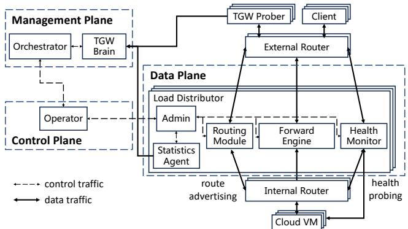  
Figure 1: The architecture of a TGW instance. All components are loosely coupled to isolate failures and allow independent scaling.

## 3 TGW Overview

In this section, we first illustrate the architecture of TGW by listing its components across different levels. We then present the workflow of TGW’s packet processing.

## 3.1 Architecture

TGW instances are mainly deployed in both the regional entrances, i.e., TGW-EIP, and each AZ of every data center, i.e., TGW-CLB. Each TGW instance is a loosely coupled, disaggregated system composed of multiple components. As illustrated in Fig. 1, a TGW instance spans different operational planes, including a global management plane, cluster-local control planes, and distributed data planes. Besides, TGW has routers located upstream and downstream of the data planes and probers located on the Internet. The details are as follows: Routers. Commodity external and internal routers are employed between upstream devices, TGW instances, and backend servers. These routers establish BGP [43] connections with the data-plane routing modules and distribute incoming traffic using the ECMP protocol [26].

Load distributors. We refer to the data plane of a TGW instance as a load distributor (LD). The LD is the core component of TGW and comprises several modules. The routing module advertises BGP routes to neighboring routers. The forwarding engine is responsible for handling workload traffic. The admin is a control process within the LD, tasked with interacting with the controller, updating data plane rules, and maintaining network status, such as link connectivity and backend server workload. The health monitor continuously sends probes to detect the activity of routers and servers. It alerts the admin process to adjust scheduling policies based on network health, e.g., by adjusting the weight of servers in load balancing. The statistics agent aggregates LD usage metrics (e.g., CPU, memory, and disk usage), collects data from the health monitor, and records the abnormal packet loss information in the forwarding engine. It periodically reports to TGW brains.

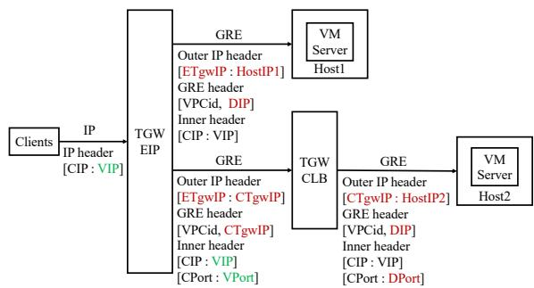  
Figure 2: TGW’s inbound packet processing flow. Green fields are checked by downstream LDs, and red ones are set by upstream LDs.

Operator. The operator serves as the local controller for an LD cluster and provides northbound APIs to the management plane for resource management tasks, such as managing hardware clusters and network addresses. The operator translates abstract resource configurations defined in the management plane into low-level, concrete rules (e.g., VIP-DIP mappings and rate-limit rules). It then installs these rules into the LDs through their respective admin modules.

Orchestrator. The orchestrator is a global controller, offering comprehensive observability across the entire cloud data center. It evaluates multiple metrics, such as workload, available capacity, and the health status of network links and devices in each cluster. Using a multi-dimensional scheduling algorithm, the orchestrator makes decisions on traffic scheduling and state migration to ensure balanced workload distribution.

TGW probers. TGW probers are active monitoring tools that periodically send probing packets to backend servers and get the probing result from the response packet.

TGW brains. TGW brains are distributed log analyzers that gather runtime telemetry and health data from TGW probers and LDs’ statistics agents. They analyze the logs within seconds and report the results to the orchestrator.

## 3.2 Workflow

The TGW-EIP at the regional entrances primarily handles elastic access, while the TGW-CLB in each AZ manages cloud load balancing for traffic involving cloud VMs or other resources within the zone. In a TGW instance, LDs are configured with rules that map VIPs to DIPs in the cloud data center. A DIP can represent a cloud VM or other successive NF instances, such as a TGW-CLB. Additionally, a VIP can integrate multiple services identified by different VPorts, allowing for more granular mapping rules. Fig. 2 shows the inbound traffic processing flow in TGW. When traffic arrives, external routers initially distribute it based on L3 information via ECMP. The LD clusters then distribute the load at different granularities based on the rules. TGW-EIP and TGW-CLB configure different functions in the LDs and are adapted to distinct forwarding models (§4). TGW-EIP looks up backend cloud VMs or NFs based on the rules and encapsulates the traffic in a GRE tunnel. The DIP and additional critical information, such as the identifier of the VPC (i.e., VPCid), are encoded into the GRE header. These packets are then forwarded as standard IP packets. TGW-CLB distributes traffic based on the 5-tuple and supports other scheduling methods, such as load balancing for QUIC [29]. It selects DIPs and cloud VMs using load-balancing algorithms and pre-configured rules. It then encapsulates the traffic into GRE tunnels, similar to TGW-EIP, but establishes and maintains connection states within the LDs. Subsequent traffic for the same connection is directed to the same DIP and DPort to ensure flow affinity. Internal routers forward these packets as standard IP packets to the corresponding backend servers. Virtual switches in the VPCs, where the cloud VMs are deployed, decapsulate the tunnel, rewrite the destination IP address to the DIP, and add a new Ethernet header for forwarding to the host cloud server. This process uses the VPCid and VM DIP encoded in the header and the routing table maintained by the switch. Outbound traffic processing is the inverse of the inbound packet processing flow. Additionally, there is also traffic between TGW components, such as state migration traffic for cluster scaling (§5), state synchronization traffic for failure recovery (§6), and log aggregation traffic for failure detection and localization (§7). This internal traffic primarily consists of UDP packets with an IP header specifying the source and destination TGW components.

## 4 Packet Forwarding

This section outlines our optimization of the DPDK-based forwarding plane for efficient packet forwarding. We first unleash DPDK’s potential for efficient and scalable forwarding by decoupling the forwarding behaviors of TGW. Specifically, we employ different DPDK forwarding models tailored for TGW-EIP and TGW-CLB. In addition, we enhance the performance of these models by leveraging the traffic characteristics in our cloud and drawing from years of operational experience.

RTC model. As a regional gateway for elastic IP access, TGW-EIP employs an RTC model where packets in a single connection are processed in a single core. This approach minimizes latency and achieves better scalability as cores can operate in parallel for stateless packet forwarding. To further accelerate the forwarding process, we optimize the forwarding table lookup. The forwarding table is implemented as a hash table that maps packet features to the memory address of a forwarding entry. This entry includes the DIP and additional flow control information, such as the flow rate limit or maximum connection limit. However, frequent hash lookups often lead to CPU cache misses, accounting for up to 20% of CPU usage and causing a performance bottleneck in our practice. To mitigate this issue, we utilize a batch-based hash lookup approach. First, we calculate the hash values for packets sequentially in a batch and prefetch them into the cache. The maximum batch size is set to 64, and the actual packet number in a batch depends on the throughput. We use a separate-chaining-based hash table and extend each list node to store up to four forwarding rule indexes. Storing multiple indexes reduces the overhead of chain expansion when multiple entries share the same hash. We limit each node to four indexes to constrain the node size to 64 bytes, which aligns with the CPU cache line size and maximizes cache utilization. Second, to handle hash collisions—when more than four forwarding rules correspond to entries with the same hash—we prefetch only the first node of the corresponding slot into the CPU cache. Thanks to the CPU’s sufficiently large RAM space for hash buckets and the extended linked list nodes, the first node is highly likely to be the one we need. Prefetching it greatly reduces cache misses. This optimization improves L2 and L3 cache hit rates by 8% each and reduces CPU usage for hash lookups from 20% to 5%.

Pipeline model. Although the RTC model has good scalability and performance in stateless packet processing, it cannot be directly applied to TGW-CLB. TGW-CLB requires more complex and fine-grained L4 flow scheduling than TGW-EIP, leading to more intricate connection states indexed by various combinations of flow identifiers. For example, in latencysensitive services like online gaming, TCP and UDP flows originating from the same client IP must be processed on a single core to minimize delay jitter. This means that the IP-pair-based flow scheduling is more suitable than the traditional 5-tuple approach. Another case is QUIC-aware load balancing, where it is more efficient to distribute and maintain connection states at the granularity of (srcIP, connectionID). Additionally, the backend server associated with a VIP may dynamically change based on load distribution algorithms, meaning that only the core processing the flow’s first packet has knowledge of the required state. To maintain flow affinity across various service scenarios, the dispatcher must flexibly allocate packets using service-specific identifiers, which are not supported by the NIC’s RSS mechanism. Therefore, we implement the forwarding plane of TGW-CLB as a two-stage pipeline model. The model consists of 1) the dispatching stage, which maps packets to the appropriate packet processing cores using the service-specific identifiers defined by the rules, and 2) the processing stage, which performs rule and state table lookups, encapsulates packets into a tunnel, and transmits them. Based on our operational experience, a typical proportional relationship between dispatcher cores and processing cores is 1:2, reflecting the flow distribution patterns in our cloud environment. To further enhance performance, each dispatcher core is equipped with its own dedicated ring buffer to avoid locking operations.

## 5 Live Migration of Connection States

In data centers, core routers commonly employ ECMP to distribute traffic to the cloud gateway. One huge challenge we have faced when building TGW is the well-known but tricky “80/20 rule” [40]. In LD, each flow—identified by a unique 5-tuple—is processed by a single forwarding core. However, elephant flows can consume excessive resources on one core, resulting in core overload and rapid performance degradation. Sailfish [40] mitigates this issue by using programmable switches to absorb most of the traffic. However, the remaining responsive traffic is still processed by x86 nodes, creating performance bottlenecks. To address the issue, we design a scalable state migration mechanism. This mechanism enables the seamless migration of network states and traffic from an overloaded cluster to a more capable standby cluster or even multiple standby clusters during runtime. Importantly, this migration is carried out without any packet loss or awareness on the part of the tenant, ensuring uninterrupted service and maintaining the overall performance of the gateway.

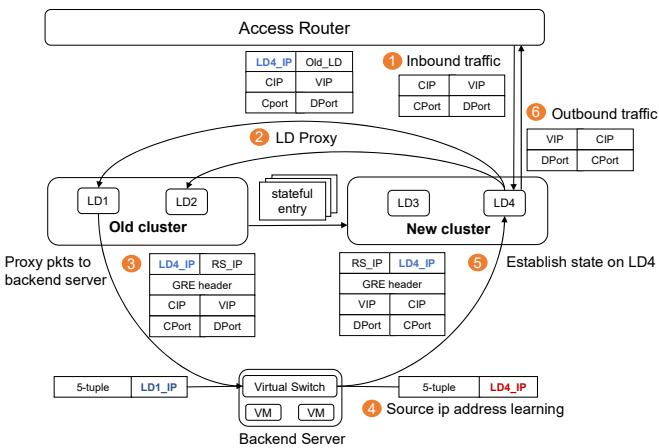  
Figure 3: The process of LD proxy for new connections when we migrate connection states during runtime.

Live migration and cold migration. TGW supports both live and cold migration of traffic. The key distinction between live migration and cold migration lies in whether the connection information stored in the old cluster is transferred to the new cluster before redirecting traffic. For the critical services hosted in our data centers, such as video gaming and live streaming, the latency overhead caused by reconnections in cold migration is unacceptable. Consequently, we primarily rely on live migration during runtime, enabling traffic redirection without tenant awareness or service disruption. Cold migration, on the other hand, is utilized in scenarios where the original cluster has failed, rendering the connection information invalid, or when the data center faces an urgent fault that requires immediate traffic redirection to maintain availability. Major state migration. In the live migration process, to migrate the existing states from the old cluster when the migration process begins, the operator module first replicates the stateless configurations to the new cluster. Subsequently, the states are then transferred to this new cluster. TGW realizes the migration through a customized application-layer protocol under UDP. This is more engineering work, so we omit this part from this paper. To prevent traffic bursts during this process, we employ a time-slice-based mechanism to control the number of states synchronized per slice. Once the majority of connection states—typically over 90%—have been successfully migrated, the operator module directs the routing module in the LD to send BGP advertisements for the migrated VIPs, thereby steering the inbound traffic to the new cluster.

LD proxy for new connections. To avoid dropping new incoming flows during migration, the old cluster remains unlocked during the major state migration, allowing new states to be established. This introduces a consistency issue, as new connections are continuously created in the old cluster. As a result, the new cluster may lack the connection states for subsequent packets of these flows after the routing update. To address this, the LDs in the new cluster will act as proxies, forwarding packets from unseen flows to all LDs in the old cluster during the migration process (② in Fig. 3). Specifically, the proxy LD will forward these packets to every LD in the old cluster. To prevent duplicate responses, a flag is set in the connection state to identify the LD where the state was initially created (i.e., the LD that processed the first packet of the flow). Only the correct LD will process the proxied packets and forward them to the VMs.

Fast convergence. While the LD proxy method helps prevent packet loss during migration, it will amplify traffic, leading to increased latency and potential security risks. To minimize these impacts on tenant traffic, we accelerate the migration process by leveraging the source IP address learning capabilities of the backend server’s virtual switch. As shown in Fig. 3, the new cluster initially forwards packets to the old cluster via GRE tunnels, using the source IP in the outer header as its own LD\_IP (②). The old cluster then forwards the packets to the VM without modifying the outer source IP (③). This action updates the learning table of the virtual switch, causing outbound traffic for these flows to be directed to the new cluster (④). The new cluster will then establish the connection state based on the outbound traffic, completing the migration for this flow (⑤). The amplification is significantly reduced since each new flow is proxied only for the brief period required to receive the outbound traffic from the first packet.

State aggregation. In our forwarding cores, we typically use hash tables to maintain connection states, indexed by the 5- tuple. However, in practice, we often migrate packets at the granularity of the VIP, as a VIP generally corresponds to one or more specific types of services. Within a single LD of our data center, there can be up to 240M states distributed across the cores. Aggregating these states across forwarding cores by VIP would introduce an unacceptable overhead if we were to directly use the connection state tables for migration. Therefore, we decouple the migration from packet processing by introducing an independent thread called the migration agent. This agent manages migration states using reorganized logic and data structures. Specifically, the migration agent reorganizes the states by VIPs as the key, storing only the state addresses of these states. It also maintains additional information, such as the connection ID, to ensure consistency throughout the migration process.

## 6 Failure Resilience

Failures in cloud data centers occur at different levels, including links, devices, clusters, and regions. These failures can stem from diverse causes such as human errors (e.g., misconfiguration), hardware malfunctions, and software bugs [22, 24, 53]. In this section, we illustrate our multi-cycle connection synchronization scheme for state backup, a fault tolerance model designed to address issues across different levels, and a dispersal migration scheme for blast radius isolation and attack defense. With the continuous evolution of TGW’s failure resilience strategies, the unavailability time has been reduced to zero by the first half of 2021.

## 6.1 Multi-cycle State Synchronization

Naively replicating and broadcasting new states to other LDs would impose significant overhead on link bandwidth and CPU usage. Therefore, based on three practical observations, we design a multi-cycle synchronization mechanism to back up states efficiently and consistently at runtime.

First, to reduce the number of replicated states, we set a timer for each new flow and only replicate those that have been active for at least 3 seconds. The 3-second time limit is an empirical value that reduces the number of replicated flows by 70% to 80% in practice. This is based on the observation that most connections in our cloud, such as HTTP requests and Radius database queries, last only a short time. Their states do not need to be replicated, as they are typically terminated before replication is completed.

Second, we find that exporting all states for replication simultaneously can lead to traffic bursts, while keeping separate export cycles for each state generates a large number of short packets, which decreases throughput. To reduce the replication frequency, we create a batch to cache the states to be exported, with a size of MTU (e.g., 1500 B in TGW). Each state identified for replication is inserted into the batch every 4 minutes. The batch is then exported to other LDs via UDP packets every 2 seconds. If the batch becomes full in less than 2 seconds, it is exported immediately. These processing time cycles are empirically defined based on the observation that long-lived connections do not modify their states frequently.

Third, for connections that are being established or closed, the LD will not replicate their states to further reduce overhead. This is because we observe that there is no need to synchronize the states of inactive connections, as they do not compromise failure resilience. We preserve consistency through the timeout recycling mechanism of peer LDs. Each synchronization event refreshes the timer of a connection state, and the state will be recycled if it times out. We do not use dirty flags to enable incremental state updates, as every active state’s timer needs to be refreshed by synchronization.

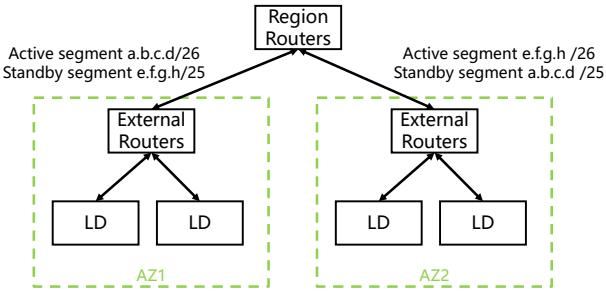  
Figure 4: TGW’s inter-AZ Active-Standby model. AZ1 and AZ2 operate on different IP segments but back up each other’s states.

## 6.2 Fault Tolerance Model

In TGW’s fault tolerance model, we combine both the Active-Active model and the Active-Standby model. Given synchronization cost and service requirements, we employ different fault tolerance models under different levels.

Intra-AZ Active-Active model. The failure of one LD within an AZ is common but typically has minimal impact. In each AZ, we use an Active-Active model, where LDs share the same connection state table. This allows traffic previously handled by a failed LD to be seamlessly redirected to another LD within the same AZ. Since LDs in the same AZ are closer in terms of network topology, frequent state synchronization incurs lower costs. The routing modules of every LD in an AZ cluster continuously send BGP advertisements with the same IP addresses to neighboring routers. If an LD fails and stops sending advertisements, routers recognize it as unreachable and reroute traffic to other LDs. The routers distribute traffic with a consistent hash algorithm [13] to minimize traffic redistribution and ensure flow affinity for ongoing connections. Thanks to mature BGP and BFD [30] technologies in data center networks, we can reliably achieve millisecond-level failure detection and failover delays of no more than a few seconds. Because of state synchronization (§6.1), re-diverted traffic is processed and correctly mapped to the VMs, ensuring continuity in service for unaffected connections.

Inter-AZ Active-Standby model. In extreme cases, such as when routers crash or an entire LD group fails, an entire AZ may become inaccessible. Given that intra-cloud traffic accounts for about 80% of our total traffic, the latency difference between AZs is significant. If AZs were set to Active-Active, different connections from the same tenant might be routed to different AZs, causing noticeable latency jitter. To recover from AZ-level failure, we implement an Active-Standby model for AZ pairs, where AZs operate on different network segments but back up each other’s states. This ensures consistent latency for all connections from the same tenant, preventing jitter. Specifically, we configure AZs into redundancy pairs. These pairs synchronize their states, as outlined in §6.1, but handle traffic from distinct network segments. We achieve this by configuring IP prefix advertisements for each redundancy pair, where different-length prefix announcements are configured for a subnet in both AZs. For example, as shown in Fig. 4, AZ1 and AZ2 form a redundancy pair. AZ1 is responsible for the subnet a.b.c.d/26, while AZ2 handles e.f.g.h/26. To recover from an AZ1 failure, AZ2 additionally advertises the same IP prefix as AZ1, but with a shorter mask, such as a.b.c.d/25. Symmetrically, AZ1 advertises e.f.g.h/25. When both AZ1 and AZ2 are operational, they handle distinct traffic because of the longest-prefix matching behavior of the regional routers. However, if one AZ fails, traffic is seamlessly redirected to the other, ensuring uninterrupted services.

Inter-region failure reaction. A more disastrous case is the disability of an entire regional-level data center, meaning the complete TGW system in a physical region becomes unavailable. This is an extremely severe failure that is rarely encountered. In this case, the affected routing table is so large for synchronization that re-routing at Layer 3 is not feasible, as the routes converge too slowly. To counter this, we can modify the DNS records of the affected IP addresses to divert the massive traffic to other TGW regions or allow client applications to connect to access point IPs in other regions. This will inevitably bring higher loads to other regions, and all the connections will be broken due to a lack of backup. However, survivability is more important than performance in this case.

## 6.3 Decentralized Migration

When a failure or attack occurs, it is too late to react after localizing the issue. Furthermore, the backup-based fault tolerance model cannot handle all failures. For example, when abnormal packets or unexpected IP flags appear in the traffic destined for a VIP, bugs in the forwarding plane may be triggered, leading to an LD failure. Since the root of the failure lies in the traffic instead of TGW components, steering the traffic from a crashed LD to other LDs or AZs will only cause more LDs to fail due to abnormal or malicious traffic. To mitigate this as quickly as possible, we design a decentralized migration approach to isolate failures and defend against attacks. This decentralized migration is based on the observation that the vast majority of such failures are caused by traffic destined for a single VIP. This is because different VIPs correspond to different service types, each exhibiting distinct traffic patterns. The abnormal traffic that causes LD crashes may originate from client software associated with one of our services or from malicious attackers targeting a specific service. Specifically, when a set of LDs fails, the orchestrator will schedule the affected traffic by evenly dividing the corresponding affected VIPs into k parts. These parts of VIPs will be distributed to k standby LD sets, called buffer sets, respectively. The states of these VIPs will be concurrently migrated to these buffer sets. This migration follows a cold migration mechanism, as the crashed LDs can no longer proxy new connections and have lost their latest states. A decentralized migration using k buffered LD sets can be viewed as k concurrent cold migrations from the failed LD set to the k buffered sets. Through this, failure or attack will only affect one buffer set, reducing the impact by a factor of 1/k. For the affected buffer set, we can continue to perform one or more decentralized migrations, exponentially reducing the impact of failure or attack. The number of buffer sets k is determined by the hot standby capacity of the cloud region and the priority of the affected traffic. In TGW, the typical value of k is 10. Decentralized migration is triggered when the backup-based recovery mechanisms fail, without the need to locate the root cause of the failure. After decentralized migration, most services will be restored, and the affected scope will be greatly reduced, which also facilitates subsequent failure location and recovery.

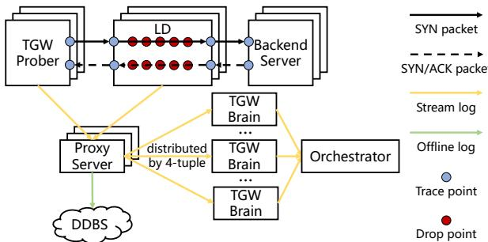  
Figure 5: TGW’s taint-based telemetry system.

## 7 Failure Detection and Localization

Although TGW can recover most services before we locate the failure, it is crucial to detect the failure as quickly as possible and gather sufficient logs for subsequent failure localization and improvement. However, achieving high observability is always challenging in such a large-scale, complex network. First, it is difficult to locate the exact failed LD when a cluster’s performance decreases or experiences jitter. This is because, in our Active-Active fault tolerance model, the LDs within the same AZ cluster are equivalent and load-balanced. Second, when the root of the failure is not LD itself (i.e., the situation described in §6.3), it becomes harder to identify the root cause and reason. Third, our failure localization must be imperceptible to tenants and services, minimizing the impact of failure detection and localization on tenant traffic. To counter this, we design a taint-based telemetry system, inspired by taint checking in program analysis [14, 37]. We efficiently detect and locate failures by active probing and log analysis.

## 7.1 Taint-based Telemetry

As shown in Fig. 5, the taint-based telemetry system consists of TGW probers, probing proxy servers, and TGW brains. TGW probers continuously generate probing packets, while the LDs and backend servers apply taints to these packets according to the monitoring rules. These rules here are pre-configured static rules. They typically originate from two sources: abnormal forwarding rules that need to be inspected (based on user bug reports), and pre-configured forwarding rules specifically used for probing operational status. Logs are generated by both TGW probers and LDs, and are transferred through the probing proxy servers to the distributed TGW brains. The results are analyzed by the probing brain servers and stored in our data management system. After analysis, the orchestrator will automatically respond to the results.

Taint points. Naively assigning a unique rule to each LD solves the problem of locating a single LD, but it breaks the equivalence of LDs and introduces management overhead. To counter this, we set up several trace points (TPs) and drop points (DPs) to locate the failed LD. TPs are located at the RX and TX of TGW probers, LDs, and backend servers. When a probe packet arrives at a TP, it is tainted according to the rules. The LD also taints the packet with its unique LD ID. DPs are the points where an LD drops a packet. We have more than 20 types of DPs, such as RX\_ENQUEUE\_FAIL, INVALID\_V LANID, FLOW\_LIMIT, and TUNNEL\_ENCAP\_FAIL. When a packet is dropped in the LD, the DP is recorded in its statistics agent. The number of TPs in received probing packets and DPs from statistics agents helps us infer single-LD failure, and the type of DPs helps us pinpoint the root cause of the failure when misconfiguration or abnormal traffic occurs.

Handshake-based probing. Existing telemetry systems perform telemetry for web applications by constructing application-layer packets [19]. However, this method is not suitable for LDs with only L4 functions. In addition, it also requires more than three interactions with the backend servers, consuming bandwidth and CPU resources. Thus, we utilize the TCP handshake process for telemetry, just like in IP address probing [9, 60]. We use the (CIP, CPort, VIP, VPort) tuple as a unique probing ID for probing packets. A TGW prober will probe a specific service, i.e., a certain (VIP, VPort) tuple, every 5 seconds with a different CPort. For one probing process, the probing SYN packet is first sent by the prober. The tainted contents of the sending SYN packet are written into the response SYN/ACK packet by the backend server. To reduce overhead on bandwidth and CPU usage, we set up special firewall rules in advance to prevent the connection from being established on the backend server. Specifically, after the SYN/ACK packet arrives at the TGW prober, the prober drops the ACK packets for the third handshake and actively sends an RST packet to terminate the half-connection, thereby freeing the backend server resources.

Vantage points. To cover all LDs in the inbound direction, we deploy dozens of servers with public IP addresses as TGW probers. They are deployed across three geographic areas and connected to BGP-enabled routers to mitigate the impact of ISPs. To cover all LDs in the outbound direction, we also deploy dozens of backend servers for responses. These backend servers are distributed across multiple regions and racks. Log analysis. Due to the large scale of TGW, the logs generated by TGW probers and LDs are vast. Aggregating them for analysis could result in GBps-level traffic and pose significant challenges for real-time processing. Therefore, we combine distributed streaming analysis with offline analysis for efficient log processing. For stream analysis, we aggregate and analyze probing logs from both probers and LDs every 20 seconds. These logs are transferred via proxy servers to distributed TGW brains. Logs sharing the same probing ID (i.e., the 4-tuple) are aggregated and directed to the corresponding TGW brain. Within seconds, the TGW brains analyze the logs and send the results to the orchestrator. For common failures, TGW can automatically complete detection, analysis, and decision-making within 1 minute, significantly reducing the need for manual intervention. In addition to online monitoring, we also inspect historical logs when diagnosing issues. These logs are stored in commercial distributed database systems (DDBS), with the total volume exceeding 10 TB per day. To facilitate fast queries, we utilize the inverted index algorithm that allows TB-scale data to be queried in under one second.

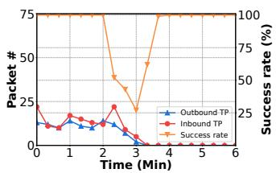  
(a) LD1

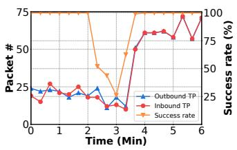  
(b) LD2  
Figure 6: Single-LD crash in an LD cluster.

## 7.2 Case Study: Problematic LD location

We show how we figure out the problematic LD through our telemetry system in two real-world cases.

Single-LD crash. As shown in Fig. 6(a) and Fig. 6(b), we present the probe success rate of the cluster and the number of partial TPs during the failure of a single LD. When an LD crashes at 2 Min, the probing success rate of the cluster decreases. The number of TPs for inbound and outbound packets arriving at LD1 drops to nearly zero, significantly lower than that of LD2. This indicates that LD1 has completely crashed, and all packets fail to reach its RX. TGW detects and recovers this failure within 1 minute and responds at 3 Min, redirecting the traffic to LD2.

Single-LD jitter. As shown in Fig. 7(a) and Fig. 7(b), we additionally present the total number of DPs in both inbound and outbound directions during the failure of a single-LD jitter. In LD1, the number of DPs begins to rise at 1 Min, while in LD2, the number of DPs remains at zero. This indicates that the jittery packet loss is caused by LD1. Further analysis of the DP types allows us to pinpoint the root cause of the jittery packet loss.

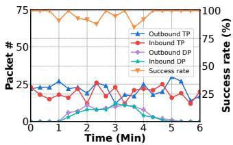  
(a) LD1

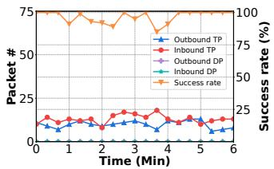  
(b) LD2  
Figure 7: Single-LD jitter in an LD cluster.

## 8 Operational Experiences

Operating a large-scale gateway system is not a trivial task. TGW has been in operation for eight years, during which it has significantly evolved in forwarding performance and availability. Here, we share our operational experiences derived from our long-term operation of TGW.

Blast radius isolation. A crucial principle of availability is limiting the “blast radius” [16] that failures can impact: 1) We restrict the fault domain in architectural design. TGW is designed to be distributed and multi-layered, with different modules in regions, AZs, and clusters. Each module in a particular layer is decoupled from the others to reduce the impact of failures. Each module can be independently scaled or backed up. 2) We implement ad-hoc availability mechanisms at each layer, including customer service partitioning and placement (§6.3), routing or connection state management, and underlying hardware arrangements. 3) We divide the global controller based on geographic areas and deploy separate scheduler systems for each area. Each scheduler system only accesses the status of the data center it is responsible for and performs scheduling within that area.

Redundancy. Redundancy is always the best practice to ensure reliability. Considering the trade-off between cost and effectiveness, we use 50% redundancy, which ensures that: 1) At the AZ level, for two available zones as a redundancy pair, the clusters of one AZ can handle all traffic if the other AZ fails. 2) At the rack level, machines within a cluster are distributed across multiple racks, ensuring that the cluster remains available if half of the racks fail. 3) At the machine level, if half of the machines in a cluster fail, the remaining machines can carry all the traffic. 4) At the link level, the failure of half of the network cards or fibers of one or more machines does not affect the cluster.

Cluster construction. When a new cluster is set up after the machines and software are deployed, static parameter checks are first performed in a no-traffic environment. Once the cluster is in place, it will begin carrying traffic by sending BGP advertisements. After a batch of addresses is placed in the cluster, one of them is selected for long-term probing to monitor the forwarding status of the cluster before it becomes available for purchase. Our empirical cluster size is 4. At one point, we scaled a single cluster to support up to 8 LDs per AZ. However, we found that during operations, a small cluster composed of 4 LDs is sufficient for nearly all scenarios, while also providing the advantage of a smaller failure domain.

Cluster management. When an LD in the cluster needs to be maintained, its BGP advertisements will first be terminated, and the traffic originally handled by it will be automatically routed to other LDs. To manage dynamic changes in traffic volume, some gateway operators may choose to enable the CPU’s low-power mode to reduce power consumption. However, we find that frequent mode switching introduces processing delays in the CPU and causes jitter. As a result, we adjust the capacity of the cluster by performing fast scaling instead of switching CPU C-States. When the traffic volume exceeds the threshold, we migrate part of the traffic to standby LDs (§5). When the traffic volume decreases, we first isolate the extra LDs’ routing and then release them.

Odd-even routing. In the case of packet fragmentation and session persistence [49], we need to ensure that packets with the same IP pair are processed by the same LD. To achieve this, we configure odd-even routing between core routers and access routers, ensuring that packets with the same parity are forwarded by the same access router and distributed to LDs via the IP-pair-based ECMP protocol.

From multicast to unicast. In the early versions of TGW, we used multicast to transfer state synchronization and migration packets between LDs. However, we found that multicast was not suitable for large-scale gateways spanning multiple regions. Initially, small-scale TGW clusters were deployed in isolated environments within a single region, where multicast could be achieved reliably and stably by the data center network. However, as TGW evolved to support live migration functions and cross-region cluster configurations, the complexity of configuring multicast across regions increased, and its reliability diminished. As a result, unicast UDP packets became the preferred choice due to their lower OpEx and greater reliability. The trade-off of using unicast is that each LD must maintain its own list of peer LDs for communication.

DDoS defense. The main function of TGW is to schedule traffic. TGW’s DDoS defense relies on the security gateway deployed between the Internet and TGW, which monitors and cleans attack traffic. TGW supports configuring rate-limiting functions across multiple dimensions, including bandwidth, packet volume, total number of connections, and new connection rate, all at the service granularity. This allows for fine-grained isolation when services are under attack.

## 9 Evaluation

We demonstrate TGW’s capabilities in performance, flow migration, and failure resilience. Our results are from two parts: experimental data from the testbed and real-world data from one of our regions. The testbed experiments are conducted on servers with 528 GB of RAM and 96 cores (AMD EPYC 7K62 Processor @2.6Ghz). They are connected via Mellanox MT28800 Family 100 Gbps NICs and commercial switches. In our testbed experiment, a single LD node is a test server running the LD forwarding plane along with the necessary management and control components.

## 9.1 Testbed Scenario

Single-node forwarding performance. We evaluate a singlenode TGW-CLB instance in terms of throughput and latency. In this instance, 50 cores are used for two-stage pipelining forwarding, 18 cores are used for the first stage, and 32 are for the second. For throughput, we compare TGW-CLB with Tripod [58] under different loads with various packet sizes ranging from 128 B to 1500 B. Tripod is also configured with 50 cores for forwarding. We generate a huge amount of UDP traffic and perform at least 5 table lookups for each flow with O(1M) static rules and O(100M) dynamic connection states. As shown in Fig. 8(a), TGW-CLB achieves 2× (128 B) to 2.9× (512 B) throughput than Tripod for different packet sizes under the 99% CPU load and 1.9× (128 B) to 3.1× (512 B) under the 50% CPU load. TGW-CLB achieves a maximum of 96.8 Gbps bandwidth for the 1024 B packet. Although both TGW-CLB and Tripod are based on DPDK, TGW achieves significantly better performance due to extensive tuning and optimizations built on top of DPDK. These optimizations stem from long-term operational experience and testing, and include not only model and algorithmic optimizations discussed in §4, but also a range of engineering optimizations, such as memory management, code structure and code execution efficiency, as well as OS and hardware configurations. We also measure the average processing latency of TGW-CLB for each packet size under five different loads in Fig. 8(b). In most cases, for different packet sizes, TGW-CLB can provide a stable latency of 66 µs to 105 µs. The latency for the same packet size also increases slightly when the load rises.

Two-cluster migration. We prepare two clusters, A and B, each with 4 LDs deployed to measure TGW’s LD proxy and state convergence. We set up 8M connections in cluster A and started the migration at 0 s, as shown in Fig. 8(c). The throughput of proxied traffic in cluster B is 4× of that of cluster A at the beginning because the LDs in cluster B will forward traffic to all four LDs in cluster A due to state miss, and only one LD in cluster A will process the proxied packet to reduce overhead. Since cluster B creates states based on the outbound traffic and each connection only has a few packets to be proxied, the migration process is greatly sped up and converges in less than 4 seconds.

Two-LD failure recovery. To illustrate TGW’s failure resilience, we set up a cluster with 2 LDs, send HTTP requests to the LDs via ECMP, and monitor the traffic handled by each LD during a failure. As shown in Fig. 8(d), equal traffic passes through two LDs at the beginning. At 22 s, LD2 is shut down. The traffic through LD2 is immediately reduced to 0, while the traffic is almost immediately steered to LD1 via ECMP. Due to their advanced state synchronization, LD1 successfully handles almost all the incoming requests. At around 42 s, LD2 reboots. Since LD1 and LD2 use BGP to advertise the same IP addresses, the upstream sender distributes the traffic equally between the two LDs eventually.

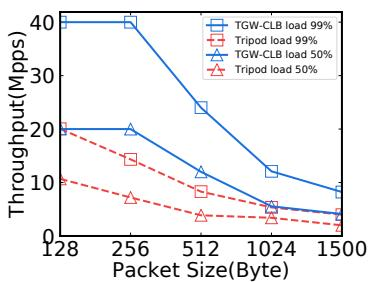  
(a) Single-node throughput

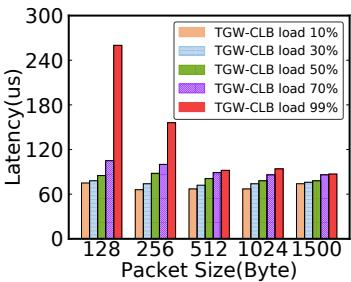  
(b) Single-node latency

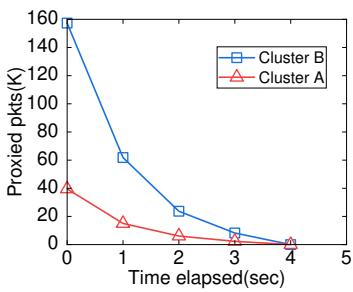  
(c) Two-cluster state migration

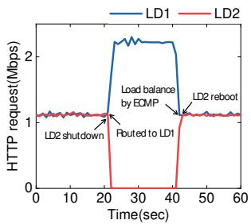  
(d) Two-LD failure recovery

Figure 8: TGW’s performance in the testbed environment.  
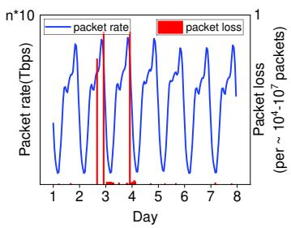  
(a) Traffic rate and packet drop rate

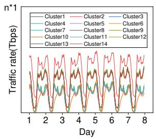  
(b) Load balancing for clusters

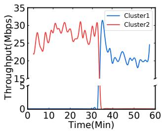  
(c) Migration between 2 clusters

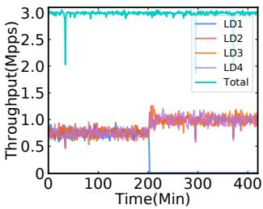  
(d) Failure recovery between 4 LDs  
Figure 9: TGW’s productive performance in one of our large cloud regions.

## 9.2 Real-world Scenario

Throughput and packet loss rate. Fig. 9(a) shows the performance of TGW in a large cloud region during a one-week online shopping festival. Note that for privacy reasons, we muddle the integer n lying between 1 and 10. TGW has tens of Tbps of throughput and provides a low loss rate while carrying huge amounts of traffic. Even in the worst case, when certain cores are hit by heavy-hitter flows on day 3 and day 4, the packet loss rate only reaches 10−7 to 10−4.

Traffic load distribution among clusters. The “80/20” rule makes it impossible to balance the load across clusters fully. Fig. 9(b) shows that the traffic is split horizontally among clusters within a region by TGW and is well balanced across most clusters at different workload levels. TGW sets different workload constraints among clusters according to the performance sensitivity of the deployed services and sets low-loaded clusters as hot backups so that traffic from high-loaded clusters can be quickly migrated to these clusters to maintain SLAs.

Live migration. We first evaluate the migration speed by recording one major state migration process of our productive cloud data center. In this process, we track the migration of 1371 VIPs, which host 130M connections. We find that 95.6% VIPs are migrated in 20 s, with 24.5% in 10 s and 71.1% in 10∼20 s. The left 4.4% VIPs are also completed in 20∼30 s. We secondly show the traffic migration process between two running clusters in Fig. 9(c). At 33 Min, we start migrating a /24 VIP segment from one cluster to another. Though new connections are continuously established on the old cluster, the migration process migrates the major traffic quickly and converges in 2 Min without any packet loss. Our real-time monitoring and customer feedback indicate that during the migration, no connections are interrupted, and the migration of services is not perceived by the customer.

Failure recovery. According to our record, TGW can synchronize 130M connections in 13 s with a peak bandwidth of 350 Mbps on each LD NIC. Fig. 9(d) shows one real-world failure in one of our commercial clusters with 4 LDs. The cluster carries 3 Mpps traffic and LD1 fails at 200 Min. Since the states of LD1 are synchronized in advance and the other LDs have redundant computing power and throughput, the traffic carried by LD1 is immediately taken over equally by other LDs. The total throughput is not affected, and the service is still available.

## 10 Lessons Learned

TGW has high scalability. Thanks to the distributed and modular design of TGW, it can be scaled at every level. TGW is currently scaled in more than 30 regions with the maximum scale of hundreds of clusters, thousands of machines, and tens of Tbps throughput. Our single cluster can support more than 200K rules and 100M connections. TGW carries almost all the public network traffic of our company’s services and the public or load-balancing traffic of our cloud tenants.

TGW is proved easy to port. Compared to prior work [40], TGW’s portability has been proved by practice. In addition to our own cloud gateway, we have already deployed TGW for dozens of other large custom companies, including famous banks, TV stations, and car groups. The forwarding plane of TGW is a software component developed based on DPDK. It can be easily compiled and deployed on DPDK-enabled NICs and CPUs. The control plane and management plane components of TGW are hardware-independent application-layer logic that can run on general-purpose Linux OSes. Therefore, TGW can be smoothly ported to other data centers operated by large companies. Operators with knowledge of data center network management and DPDK programming can operate the entire system effectively. In contrast, hybrid solutions like Sailfish [40], which rely on P4 [1]-centric programmable hardware, present a high technical barrier due to the niche programming language and the immature compilation toolchain, requiring specialized hardware and professional expertise for deployment and operation.

TGW can be integrated with other solutions. Ease of integration with non-DPDK solutions and flexibility for future evolution are key design considerations in TGW. For example, when integrating TGW with alternative packet forwarding solutions, such as XDP and programmable switches (discussed in §2.2), we only need to implement corresponding APIs for the existing control plane and replace them with the DPDK-based forwarding plane.

The service type determines the properties of the infrastructure. As the most critical infrastructure of Tencent Cloud, TGW’s properties are primarily determined by the service type. Tencent’s core services—such as online gaming and live streaming—require TGW to guarantee low latency and jitter with high availability. It is worth mentioning that TGW-CLB supports port-segment-based configuration, i.e., a forwarding rule can specify a range of ports as a VPort, which maps to a corresponding port range on the backend server. This feature is particularly useful for multiplayer competitive games. Since each game room usually uses one port, a port segment forwarding rule can support multiple game room network connections in bulk. This capability is unique to TGW among cloud vendors and is driven by the specific requirements of our services.

## 11 Related Work

Cloud gateway. There are some related frameworks for cloud gateways: NVP [31] uses software to implement a cloud gateway to host thousands of tunnels, but does not support multi-tenancy in large-scale clouds. Tripod [58] provides an NF framework to host various NFs in cloud gateway scenarios. However, its unoptimized forwarding performance and coupled state management logic are insufficient for scaling in large-scale clouds. Protego [47] is a centrally controlled cloudscale multi-tenant gateway. However, it does not solve the problem of heavy-hitter flows making certain cores overload. Arashloo et al. [3] use fixed-function switches to accelerate the cloud gateway, but the solution lacks the flexibility to meet our requirements in NFs. Sailfish [40] and Luoshen [39] use programmable switches and DPUs to enhance the performance of cloud gateways. However, they are suffering from supply chain breakdown by using P4-centric Tofino chips [10], lacking viability. DSR [45] is a disaggregated software-defined router system to provide reliable access. TGW can work with DSR when it acts as an edge access and steers the traffic to TGW, as Facebook [44] and Google [56] do.

Cloud load balancing. Load balancing is a fundamental building block in cloud gateway systems. Beamer [38] and Yoda [20] provide L4 or L7 load balancing in the cloud gateway using software methods. Ananta [42] focuses on the ECMP to scale, and Maglev [13] utilizes the consistent hash to map VIP and connections. These methods give less consideration to cooperation with public access. Large-scale deployment may cause considerable inter-AZ traffic because of the coupling with public access. They also sacrifice the flexibility of state management for different services in our practice. Alibaba Cloud [2] and AWS [4], as typical cloud providers, have similar services, including elastic IP address and cloud load balancing. Duet [21], SilkRoad [34], Prism [25], Con-Weave [48] and Miresga [46] utilize programmable switches to accelerate load balancing. Tiara [57] and AccelTCP [36] use FPGAs and smartNICs to balance the traffic. However, they cannot support flexible DIP selection and are not general for all kinds of L4 traffic.

## 12 Conclusion

We introduce TGW, a long-term operated, large-scale cloud gateway system. It consists of efficient forwarding planes, a scalable state migration mechanism, a multi-level failure resilience mechanism, and a taint-based failure localization system. The experimental data from both the testbed and realworld scenarios illustrate TGW’s capability in performance, scalability, and resilience. We believe that TGW’s designs and the experiences gained from long-term, large-scale network operations are beneficial to both academia and industry. TGW will continue to evolve in the future as a key infrastructure of Tencent Cloud.

## 13 Acknowledgments

We sincerely thank our shepherd, Daehyeok Kim, and the anonymous reviewers for their insightful comments and helpful feedback. This work is supported by the National Natural Science Foundation of China under Grant No. 62302253 and 62102224, the Beijing Natural Science Foundation under Grant No. 4252017, and the research fund of Tsinghua University-Tencent Joint Laboratory for Internet Innovation Technology. Lin He is the corresponding author of this paper.

## References

[1] P4 language. https://p4.org, 2025.

[2] Alibaba. Alibaba Cloud Services. https://us. alibabacloud.com/, 2025.

[3] Mina Tahmasbi Arashloo, Pavel Shirshov, Rohan Gandhi, Guohan Lu, Lihua Yuan, and Jennifer Rexford. A scalable vpn gateway for multi-tenant cloud services. SIGCOMM Comput. Commun. Rev., 48(1):49–55, apr 2018.

[4] AWS. AWS Cloud Services. https://aws.amazon. com/, 2025.

[5] AWS. Elastic IP addresses. https://docs. aws.amazon.com/AWSEC2/latest/UserGuide/ elastic-ip-addresses-eip.html, 2025.

[6] Baidu. Baidu Cloud Services. https://intl.cloud. baidu.com, 2025.

[7] Tom Beigbeder, Rory Coughlan, Corey Lusher, John Plunkett, Emmanuel Agu, and Mark Claypool. The effects of loss and latency on user performance in unreal tournament 2003®. In Proceedings of 3rd ACM SIG-COMM Workshop on Network and System Support for Games, NetGames ’04, page 144–151, New York, NY, USA, 2004. Association for Computing Machinery.

[8] ByteDance. ByteDance Cloud Services. https:// bytehouse.cloud, 2025.

[9] Daguo Cheng, Lin He, Chentian Wei, Qilei Yin, Boran Jin, Zhaoan Wang, Xiaoteng Pan, Sixu Zhou, Ying Liu, Shenglin Zhang, Fuchao Tan, and Wenmao Liu. Luori: Active probing and evaluation of internet-wide ipv6 fully responsive prefixes. In 2024 IEEE 32nd International Conference on Network Protocols (ICNP), pages 1–12, 2024.

[10] Max A. Cherney. Intel is halting development of the networking chip it got from barefoot networks. https://www. bizjournals.com/sanjose/news/2023/01/26/ intel-halts-development-of-tofino-switch-chips. html, 2023.

[11] Mark Claypool and Kajal Claypool. Latency and player actions in online games. Commun. ACM, 49(11):40–45, November 2006.

[12] Michael Dalton, David Schultz, Jacob Adriaens, Ahsan Arefin, Anshuman Gupta, Brian Fahs, Dima Rubinstein, Enrique Cauich Zermeno, Erik Rubow, James Alexander Docauer, Jesse Alpert, Jing Ai, Jon Olson, Kevin DeCabooter, Marc de Kruijf, Nan Hua, Nathan Lewis,

Nikhil Kasinadhuni, Riccardo Crepaldi, Srinivas Krishnan, Subbaiah Venkata, Yossi Richter, Uday Naik, and Amin Vahdat. Andromeda: Performance, isolation, and velocity at scale in cloud network virtualization. In Proceedings of NSDI 2018.

[13] Daniel E. Eisenbud, Cheng Yi, Carlo Contavalli, Cody Smith, Roman Kononov, Eric Mann-Hielscher, Ardas Cilingiroglu, Bin Cheyney, Wentao Shang, and Jinnah Dylan Hosein. Maglev: A fast and reliable software network load balancer. In Proceedings of NSDI 2016.

[14] William Enck, Peter Gilbert, Seungyeop Han, Vasant Tendulkar, Byung-Gon Chun, Landon P. Cox, Jaeyeon Jung, Patrick McDaniel, and Anmol N. Sheth. Taintdroid: An information-flow tracking system for realtime privacy monitoring on smartphones. ACM Trans. Comput. Syst., 32(2), jun 2014.

[15] D. Farinacci, T. Li, S. Hanks, D. Meyer, and P. Traina. Rfc2784: Generic routing encapsulation (gre), 2000.

[16] Andrew D. Ferguson, Steve Gribble, Chi-Yao Hong, Charles Killian, Waqar Mohsin, Henrik Muehe, Joon Ong, Leon Poutievski, Arjun Singh, Lorenzo Vicisano, Richard Alimi, Shawn Shuoshuo Chen, Mike Conley, Subhasree Mandal, Karthik Nagaraj, Kondapa Naidu Bollineni, Amr Sabaa, Shidong Zhang, Min Zhu, and Amin Vahdat. Orion: Google’s software-defined networking control plane. In Proceedings of NSDI 2021.

[17] Daniel Firestone, Andrew Putnam, Sambhrama Mundkur, Derek Chiou, Alireza Dabagh, Mike Andrewartha, Hari Angepat, Vivek Bhanu, Adrian Caulfield, Eric Chung, Harish Kumar Chandrappa, Somesh Chaturmohta, Matt Humphrey, Jack Lavier, Norman Lam, Fengfen Liu, Kalin Ovtcharov, Jitu Padhye, Gautham Popuri, Shachar Raindel, Tejas Sapre, Mark Shaw, Gabriel Silva, Madhan Sivakumar, Nisheeth Srivastava, Anshuman Verma, Qasim Zuhair, Deepak Bansal, Doug Burger, Kushagra Vaid, David A. Maltz, and Albert Greenberg. Azure Accelerated Networking: SmartNICs in the Public Cloud. In Proceedings of NSDI 2018.

[18] Tobias Fritsch, Hartmut Ritter, and Jochen Schiller. The effect of latency and network limitations on mmorpgs: a field study of everquest2. In Proceedings of 4th ACM SIGCOMM Workshop on Network and System Support for Games, NetGames ’05, page 1–9, New York, NY, USA, 2005. Association for Computing Machinery.

[19] Cloud Native Computing Fundation. OpenTelemetry. https://opentelemetry.io, 2025.

[20] Rohan Gandhi, Y. Charlie Hu, and Ming Zhang. Yoda: A highly available layer-7 load balancer. In Proceedings of the Eleventh European Conference on Computer

Systems, EuroSys ’16, New York, NY, USA, 2016. As-sociation for Computing Machinery.

[21] Rohan Gandhi, Hongqiang Harry Liu, Y. Charlie Hu, Guohan Lu, Jitendra Padhye, Lihua Yuan, and Ming Zhang. Duet: Cloud scale load balancing with hardware and software. In Proceedings of SIGCOMM 2014.

[22] Phillipa Gill, Navendu Jain, and Nachiappan Nagappan. Understanding network failures in data centers: Measurement, analysis, and implications. In Proceedings of SIGCOMM 2011.

[23] Google. Google Cloud Services. https://solutions. cloud.google.com/home, 2025.

[24] Albert Greenberg, James R. Hamilton, Navendu Jain, Srikanth Kandula, Changhoon Kim, Parantap Lahiri, David A. Maltz, Parveen Patel, and Sudipta Sengupta. Vl2: A scalable and flexible data center network. In Proceedings of SIGCOMM 2009.

[25] Yutaro Hayakawa, Michio Honda, Douglas Santry, and Lars Eggert. Prism: Proxies without the pain. In 18th USENIX Symposium on Networked Systems Design and Implementation (NSDI 21), pages 535–549, 2021.

[26] C. Hopps. Rfc2992: Analysis of an equal-cost multipath algorithm, 2000.

[27] Intel. DPDK: Data plane development kit. https: //https://www.dpdk.org/, 2025.

[28] Intel. Intel tofino series programmable ethernet switch asic. https://www. intel.com/content/www/us/en/products/ network-io/programmable-ethernet-switch/ tofino-series/tofino.html, 2025.

[29] Jana Iyengar and Martin Thomson. QUIC: A UDP-Based Multiplexed and Secure Transport. RFC 9000, May 2021.

[30] Dave Katz and David Ward. Bidirectional Forwarding Detection (BFD). RFC 5880, June 2010.

[31] Teemu Koponen, Keith Amidon, Peter Balland, Martín Casado, Anupam Chanda, Bryan Fulton, Igor Ganichev, Jesse Gross, Paul Ingram, Ethan Jackson, et al. Network virtualization in multi-tenant datacenters. In Proceedings of NSDI 2014.

[32] Ze Li, Qian Cheng, Ken Hsieh, Yingnong Dang, Peng Huang, Pankaj Singh, Xinsheng Yang, Qingwei Lin, Youjiang Wu, Sebastien Levy, and Murali Chintalapati. Gandalf: An Intelligent, End-To-End Analytics Service for Safe Deployment in Large-Scale Cloud Infrastructure . In Proceedings of NSDI 2020.

[33] Florian Metzger, Stefan Geißler, Alexej Grigorjew, Frank Loh, Christian Moldovan, Michael Seufert, and Tobias Hoßfeld. An introduction to online video game qos and qoe influencing factors. IEEE Communications Surveys and Tutorials, 24(3):1894–1925, 2022.

[34] Rui Miao, Hongyi Zeng, Changhoon Kim, Jeongkeun Lee, and Minlan Yu. Silkroad: Making stateful layer-4 load balancing fast and cheap using switching asics. In Proceedings of SIGCOMM 2017.

[35] Microsoft. Microsoft Azure: Cloud Computing Services. https://azure.microsoft.com/en-us/, 2025.

[36] YoungGyoun Moon, SeungEon Lee, Muhammad Asim Jamshed, and KyoungSoo Park. {AccelTCP}: Accelerating network applications with stateful {TCP} offloading. In 17th USENIX Symposium on Networked Systems Design and Implementation (NSDI 20), pages 77–92, 2020.

[37] James Newsome and Dawn Xiaodong Song. Dynamic taint analysis for automatic detection, analysis, and signature generation of exploits on commodity software. In Proceedings of NDSS 2005.

[38] Vladimir Olteanu, Alexandru Agache, Andrei Voinescu, and Costin Raiciu. Stateless datacenter load-balancing with beamer. In Proceedings of NSDI 2018.

[39] Tian Pan, Kun Liu, Xionglie Wei, Yisong Qiao, Jun Hu, Zhiguo Li, Jun Liang, Tiesheng Cheng, Wenqiang Su, Jie Lu, Yuke Hong, Zhengzhong Wang, Zhi Xu, Chongjing Dai, Peiqiao Wang, Xuetao Jia, Jianyuan Lu, Enge Song, Jun Zeng, Biao Lyu, Ennan Zhai, Jiao Zhang, Tao Huang, Dennis Cai, and Shunmin Zhu. LuoShen: A Hyper-Converged programmable gateway for Multi-Tenant Multi-Service edge clouds. In 21st USENIX Symposium on Networked Systems Design and Implementation (NSDI 24), pages 877–892, Santa Clara, CA, April 2024. USENIX Association.

[40] Tian Pan, Nianbing Yu, Chenhao Jia, Jianwen Pi, Liang Xu, Yisong Qiao, Zhiguo Li, Kun Liu, Jie Lu, Jianyuan Lu, Enge Song, Jiao Zhang, Tao Huang, and Shunmin Zhu. Sailfish: Accelerating cloud-scale multi-tenant multi-service gateways with programmable switches. In Proceedings of SIGCOMM 2021.

[41] Lothar Pantel and Lars C. Wolf. On the impact of delay on real-time multiplayer games. In Proceedings of the 12th International Workshop on Network and Operating Systems Support for Digital Audio and Video, NOSSDAV ’02, page 23–29, New York, NY, USA, 2002. Association for Computing Machinery.

[42] Parveen Patel, Deepak Bansal, Lihua Yuan, Ashwin Murthy, Albert Greenberg, David A. Maltz, Randy Kern, Hemant Kumar, Marios Zikos, Hongyu Wu, Changhoon Kim, and Naveen Karri. Ananta: Cloud scale load balancing. In Proceedings of SIGCOMM 2013.

[43] Y. Rekhter, T. Li, and S. Hares. Rfc 4271: A border gateway protocol 4 (bgp-4), 2006.

[44] Brandon Schlinker, Hyojeong Kim, Timothy Cui, Ethan Katz-Bassett, Harsha V. Madhyastha, Italo Cunha, James Quinn, Saif Hasan, Petr Lapukhov, and Hongyi Zeng. Engineering egress with edge fabric: Steering oceans of content to the world. In Proceedings of SIG-COMM 2017, New York, NY, USA, 2017. Association for Computing Machinery.

[45] Hua Shao, Xiaoliang Wang, Yuanwei Lu, Yanbo Yu, Shengli Zheng, and Youjian Zhao. Accessing Cloud with Disaggregated Software-Defined Router. In Proceedings of NSDI 2021.

[46] Xiaoyi Shi, Lin He, Jiasheng Zhou, Yifan Yang, and Ying Liu. Miresga: Accelerating layer-7 load balancing with programmable switches. In Proceedings of the ACM on Web Conference 2025, WWW ’25, page 2424–2434, New York, NY, USA, 2025. Association for Computing Machinery.

[47] Jeongseok Son, Yongqiang Xiong, Kun Tan, Paul Wang, Ze Gan, and Sue Moon. Protego: Cloud-Scale multitenant IPsec gateway. In Proceedings of ATC 2017.

[48] Cha Hwan Song, Xin Zhe Khooi, Raj Joshi, Inho Choi, Jialin Li, and Mun Choon Chan. Network load balancing with in-network reordering support for rdma. In Proceedings of the ACM SIGCOMM 2023 Conference, ACM SIGCOMM ’23, page 816–831, New York, NY, USA, 2023. Association for Computing Machinery.

[49] Tecent. Session Persistence. https://www. tencentcloud.com/document/product/214/ 6154?lang=en, 2025.

[50] Tencent. Cloud Load Balance. https://intl.cloud. tencent.com/document/product/214, 2025.

[51] Tencent. Elastic IP addresses. https://intl.cloud. tencent.com/document/product/213/5733, 2025.

[52] Tencent. Tencent Cloud Services. https://www. tencentcloud.com, 2025.

[53] Kashi Venkatesh Vishwanath and Nachiappan Nagappan. Characterizing cloud computing hardware reliability. In Proceedings of SoCC 2010.

[54] VPP. The Vector Packet Processing platform. https: //github.com/FDio/vpp, 2025.

[55] XDP. The eXpress Data Path inside the Linux kernel. https://github.com/xdp-project/, 2025.

[56] Kok-Kiong Yap, Murtaza Motiwala, Jeremy Rahe, Steve Padgett, Matthew Holliman, Gary Baldus, Marcus Hines, Taeeun Kim, Ashok Narayanan, Ankur Jain, Victor Lin, Colin Rice, Brian Rogan, Arjun Singh, Bert Tanaka, Manish Verma, Puneet Sood, Mukarram Tariq, Matt Tierney, Dzevad Trumic, Vytautas Valancius, Calvin Ying, Mahesh Kallahalla, Bikash Koley, and Amin Vahdat. Taking the edge off with espresso: Scale, reliability and programmability for global internet peering. In Proceedings of SIGCOMM 2017, New York, NY, USA, 2017. Association for Computing Machinery.

[57] Chaoliang Zeng, Layong Luo, Teng Zhang, Zilong Wang, Luyang Li, Wenchen Han, Nan Chen, Lebing Wan, Lichao Liu, Zhipeng Ding, Xiongfei Geng, Tao Feng, Feng Ning, Kai Chen, and Chuanxiong Guo. Tiara: A scalable and efficient hardware acceleration architecture for stateful layer-4 load balancing. In Proceedings of NSDI 2022.

[58] Menghao Zhang, Jun Bi, Kai Gao, Yi Qiao, Guanyu Li, Xiao Kong, Zhaogeng Li, and Hongxin Hu. Tripod: Towards a scalable, efficient and resilient cloud gateway. IEEE Journal on Selected Areas in Communications, 37(3):570–585, 2019.

[59] Menghao Zhang, Guanyu Li, Shicheng Wang, Chang Liu, Ang Chen, Hongxin Hu, Guofei Gu, Qi Li, Mingwei Xu, and Jianping Wu. Poseidon: Mitigating volumetric ddos attacks with programmable switches. In Proceedings of NDSS 2020.

[60] Jiasheng Zhou, Lin He, Yifan Yang, Xiaoyi Shi, Daguo Cheng, Jinlong E, Ying Liu, and Dong Zhang. 6map: Enabling fast active ipv6 address discovery with programmable switches. In Proceedings of the 44th IEEE Conference on Computer Communications (INFOCOM 2025), London, United Kingdom, 2025.

## Appendix

Appendices are supporting material that has not been peerreviewed.

## A Acronym Explanation

We provide explanations for technical acronyms whose full names do not appear in the main text, as shown in Table 1.

<table><tr><td>Acronym</td><td>Explanation</td></tr><tr><td>DPDK</td><td>Data Plane Development Kit，a high- performancepacketprocessinglibrary</td></tr><tr><td>XDP</td><td>bypassing the Linux kernel protocol stack. eXpress Data Path,a kernel integrated packet processor based on eBPF.</td></tr><tr><td>VPP</td><td>Vector Packet Processor, a packet processing framework providing rich routing functions, supporting DPDK as the forwarding plane.</td></tr><tr><td>GRE</td><td>Genetic Routing Encapsulation protocol that stipulates how datagrams under one network</td></tr><tr><td>BGP</td><td>protocol are encapsulated in another. Border Gateway Protocol, a routing protocol used to exchange network layer reachability</td></tr><tr><td>BFD</td><td>information between routing domains. Bidirectional Forwarding Detection,a high- speed network fault detection mechanism for</td></tr><tr><td>ECMP</td><td>fault recovery. Equal-Cost Multi-Path,a flow-based load bal- ancing strategy,enabling packets with the same destination to be forwarded to different</td></tr><tr><td>QUIC</td><td>equivalent optimal next hops. Quick UDP Internet Connection,a multiplexed transport protocol built on top of UDP that aims to improve the speed and reliability of</td></tr><tr><td>HTTP</td><td>the network connection. Hypertext Transfer Protocol,a client-server request response protocol.</td></tr><tr><td>CapEx OpEx</td><td>Capital expenditures. Operating expense.</td></tr></table>

Table 1: Acronym explanation.