①

USENIX

THE ADVANCED COMPUTING SYSTEMS ASSOCIATION

# Cosmic: Cost-Effective Support for Cloud-Assisted 3D Printing

Yuan Yao, University of Southern California; Chuan He and Chinedum Okwudire, University of Michigan; Harsha V. Madhyastha, University of Southern California https://www.usenix.org/conference/atc25/presentation/yao

# This paper is included in the Proceedings of the 2025 USENIX Annual Technical Conference.

July 7–9, 2025 • Boston, MA, USA ISBN 978-1-939133-48-9

Open access to the Proceedings of the 2025 USENIX Annual Technical Conference is sponsored by

P-Lr.h £Es/sL.

auuuJl9 PgleU

King Abdullah University of

Science and Technology

# Cosmic: Cost-Effective Support for Cloud-Assisted 3D Printing

Yuan Yao1, Chuan He2, Chinedum Okwudire2, and Harsha V. Madhyastha1

1University of Southern California

## Abstract

In this paper, we consider a new workload for which serverless platforms are well-suited: the execution of a 3D printer controller in the cloud. This workload is qualitatively different from those considered in prior work due to the stringent timing requirements. Our measurements on popular serverless platforms reveal millisecond-level overheads that impair the timely execution of the example control algorithm we consider. To mitigate the impact of these overheads, we judiciously partition the execution of the algorithm across a set of serverless functions and exploit timely speculation. Our evaluations on AWS Lambda show that, for 30 diverse print jobs, Cosmic is able to ensure the timely execution of the controller while reducing cost by 2.8×–3.5× compared to other approaches.

## 1 Introduction

Serverless computing platforms like AWS Lambda [2] and Azure Functions [3] have gained in popularity over the last few years. In these services, the customer registers their code – typically in the form of a container – with the cloud provider, who runs an instance of the code for every request received. Thus, the customer is freed from the onus of having to monitor load and correspondingly scale up or scale down their service deployment, and they do not pay for idle time.

The scalability and cost-effectiveness of serverless computing make it ideal for workloads with intermittent execution patterns, such as periodic data processing or event-driven workflows. However, when these workloads also demand high parallelization and millisecond-level latency guarantees, significant challenges arise. First, the overhead of cold starts and function invocations, while acceptable for many applications, becomes prohibitive for latency-critical tasks. Second, the management of large datasets across serverless instances introduces significant delays and coordination overhead, as network bandwidth and transfer times dominate.

In this paper, we study these challenges in serverless computing with a non-traditional workload: 3D printing. In particular, our interest is in the control algorithm that guides the operation of a printer by determining the sequence in which it should print the different portions of a product. What distinguishes the controller is the stringent constraint on the timeliness of its execution: before the printer is ready to execute the ith step of a print job, the controller must have identified which portion of the product to print in that step.

Using a state-of-the-art control algorithm for a specific form of 3D printing as an example, we demonstrate that commodity 3D printers lack the hardware necessary to run com-

2University of Michigan

plex control algorithms on-device. On the one hand, the CPU on the printer cannot execute the sequential control algorithm fast enough to keep up with the speed of printing. On the other hand, to ensure that I/O delays do not slow down the controller, the state needed by all steps of the algorithm must be preloaded into memory. But, the amount of on-board memory does not suffice to accommodate all the necessary state. Therefore, we consider the execution of the controller in a cloud region close to the 3D printer.

In contrast to running the control algorithm across a fleet of virtual machines, serverless offers two benefits.

• No cost during idle time: First, with serverless, the user incurs no cost during idle periods, such as when the printer pauses after each layer to spread metallic powder. These short idle periods of a few seconds make suspending and resuming a VM impractical.

• No cost to keep state in memory: Second, to handle requests at low overhead, cloud providers attempt to reuse serverless workers across requests [1]. These warm starts retain the state read into the memory of a serverless worker while printing one layer for subsequent layers, at no cost to the user.

Nevertheless, our measurements on AWS Lambda and Azure Functions show that exploiting these benefits while meeting the controller’s timing constraints is nontrivial. Function invocation overheads, even on pre-warmed workers, remain too high to meet the stringent requirements of each step of the controller. While parallelizing each step across multiple workers reduces computation time, it introduces substantial delays due to the network overhead of transferring the relevant inputs to all workers.

To address these challenges, we have designed and implemented Cosmic (Cost-effective Serverless for Millisecond Computations), a system for cost-effective and timely execution of the low latency compute pipeline necessary to support high quality 3D printing. Cosmic distributes sequential algorithms across serverless workers, with three key strategies: intelligent workload partitioning to minimize coordination overhead and optimize function reuse, speculative execution to mask invocation delays, and an adaptive search for the configuration which balances performance and cost.

We use Cosmic to run the controller on Lambda for 30 print jobs: 10 diverse parts, each in 3 different sizes. We show that Cosmic satisfies the timing constraints on the controller’s execution for all jobs; other approaches from prior work that have used serverless either fail in meeting these constraints for 23 of the 30 jobs, or do so at 3.2×–3.5× higher cost.

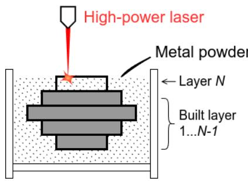  
(a) Illustration of LPBF printing.

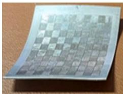  
(b) Deformation from temperature nonuniformity.  
Figure 1: Powder bed fusion.

In summary, we make the following contributions:

• We consider a workload that has not been of much interest in the systems and networking research community – realtime control of 3D printers – and showcase the relevance of serverless computing for this workload.

We present measurements of popular serverless platforms to highlight previously ignored overheads that make it challenging to satisfy the millisecond-level timing requirements of the control algorithm we consider.

• We introduce a new strategy for executing a sequential algorithm on serverless and demonstrate how to use it to cost-effectively satisfy the algorithm’s timing constraints.

• Lastly, we demonstrate the utility of our system, Cosmic, by using it to run the controller for a variety of print jobs.

Though we focus in this paper on supporting the execution of a 3D printer’s controller, many aspects of Cosmic’s design extend to other latency-sensitive compute pipelines. We discuss the broader applicability of our work in Section 7.

## 2 Background and Motivation

Powder bed fusion. There exist a variety of 3D printing technologies [12, 20, 26, 28]. In this paper, we focus specifically on laser powder bed fusion (LPBF), which is used to build three-dimensional parts by selectively fusing or melting metal powder using a laser, as shown in Figure 1(a).

In LPBF, three-dimensional parts are constructed layer by layer. Prior to scanning a layer, a thin layer of metal powder is spread across the platform. The high-power laser then scans this layer, selectively melting the powder to create a solid cross-section of the part. This procedure is repeated for each layer until the entire part is constructed.

One of the primary challenges in LPBF printing is in managing the distribution of temperature during the scanning process. For example, consider Figure 2(a), which shows the print of a square metal plate with the laser scanning each layer from the top edge to the bottom edge. By the time the laser starts scanning the end of the layer, the top half cools down, resulting in a non-uniform distribution of temperature across the layer. As shown in Figure 1(b), such non-uniformity in temperatures can lead to residual stresses and deformities in

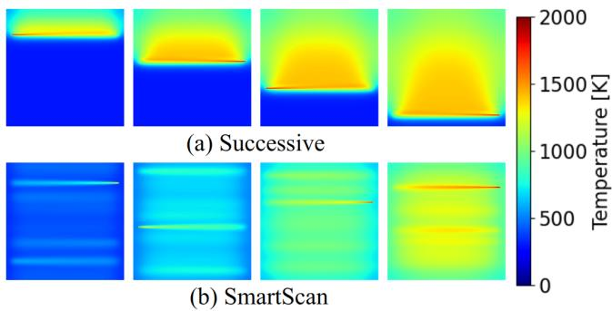

Figure 2: Comparison of temperature distribution when scanning a layer’s cells (a) in order versus (b) with SmartScan.  
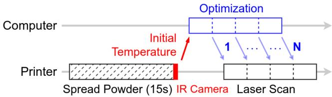  
Figure 3: Timeline of SmartScan execution.

the final product.

SmartScan. To maximize temperature uniformity, the solution is to optimize the order in which an LPBF printer scans each layer. For this, we consider SmartScan [29], a feedforward control algorithm. SmartScan relies on a logical division of each layer into cells, e.g., a square metal plate can be partitioned either into a set of horizontal or vertical stripes, or a set of square islands. To determine the optimal sequence in which the cells in a layer must be scanned, SmartScan uses a physics-based thermal model to simulate temperature distribution and heat transfer.

As depicted in Figure 3, the print of a layer starts with the distribution of metal powder across the print platform, which takes a fixed duration of 15 seconds. The printer then employs an infrared camera to capture an initial map of how temperature varies across the layer. The SmartScan algorithm then iteratively computes the index of the next cell to print. Each iteration involves multiplying the current temperature map with a precomputed heat transfer matrix to produce an updated temperature map, which the controller analyzes to pick the next cell index. The process continues until the entire layer has been scanned. Figure 2(b) illustrates the improved temperature uniformity achieved with SmartScan.

Note that, though the cell-specific heat transfer matrices for a part can be reused across multiple prints of that part, the results of SmartScan’s computations cannot be reused. The optimal sequence for printing a layer does not depend only on the layer’s geometry. It also depends on the initial temperature distribution captured by the infrared camera before the scanning of a layer begins. The temperature distribution at the start of each layer is influenced by multiple dynamic factors which vary across layers, such as residual heat from previously melted layers and the spreading of powder across the platform. Unlike the modeling of heat transfer across cells within a layer, these other heat transfer processes cannot be modeled efficiently; hence, real-time computation of the optimal scanning sequence is essential.

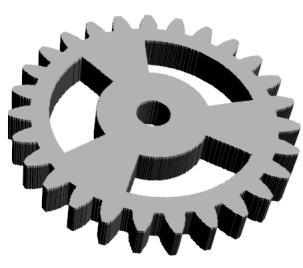  
(a) A gear

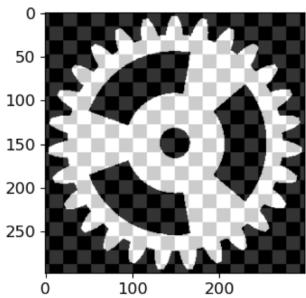  
(b) One of the layers  
Figure 4: An example part printed using LPBF, and an example partitioning of one of its layers into cells.

Challenges in local execution. Unfortunately, running SmartScan on an LPBF printer’s on-board computer is infeasible for most print jobs. This is because, as shown in Figure 3, in order to maintain the accuracy of SmartScan’s simulation of heat transfer, it is crucial that, by the time the printer is done scanning a cell, the cell that it should print next has already been computed and delivered to it. Given the typical speed of printing, the length of the time within which SmartScan’s computation of the next cell to print must complete – which we refer to as a time window – is quite short. For example, at a speed of 600mm/s [29], printing a length of 3cm takes only 50ms. If SmartScan fails to finish computation within a time window, the printer will fall back to printing a random cell, thus degrading printing quality.

Due to this stringent timing constraint, the heat transfer matrices for all cells in a layer must be prefetched into memory; else, within any window, delays when reading the heat transfer matrix from disk for the cell currently being printed will leave little to no time to perform the computation necessary to select the next cell. This is a problem because, as shown in Figure 5 for the example gear shape in Figure 4, as the size of the printed part grows, so does the number of cells and the size of the matrix for each cell. For example, to print the gear with each layer of size 16cm2, 1,514 GB of data – 127 matrices, each of size 11.92 GB – will need to be in memory, which greatly exceeds the amount of memory on-board an LPBF printer.

Moreover, the processor on a typical LPBF printer is incapable of executing SmartScan to keep up with the speed of printing. For example, it takes around 450ms to complete the matrix multiplication necessary to model the distribution of heat during the print of a single cell in the above-mentioned gear. This is significantly longer than the roughly 50ms time window within which this computation must complete.

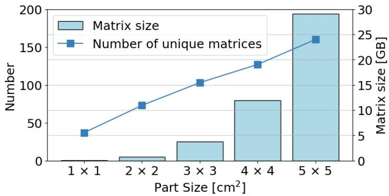  
Figure 5: For the gear in Figure 4, size of each heat transfer matrix, and number of unique matrices in relation to layer size.

## 3 SmartScan in the Cloud

One could potentially try to address the limitations of the computer on-board an LPBF printer by offloading control of the printer to a fleet of edge servers. But, given that SmartScan’s memory and compute requirements increase with the size of the part being printed (Figure 5), an edge deployment sufficient to support the print of large parts would be significantly under-utilized when printing small parts.

To instead enable elasticity, we seek to run SmartScan at a cloud data center close to the printer. If the printer loses connectivity with its controller in the midst of a print job, it can revert to how it would operate without SmartScan, i.e., print all remaining cells in a random order. We focus on parts that are symmetric along the z-axis; for such parts, since the heat transfer matrices are identical for every layer, in-memory data can be reused across layers.

When running SmartScan in the cloud, precomputed matrices can be generated on a cloud VM and uploaded to cloud storage. Within a datacenter, cloud providers do not charge for data transmission between VMs and cloud storage, as well as between the storage and serverless workers. Moreover, since the heat distribution matrices need to be precomputed once per part, their generation has no impact on the delays involved in every job which prints that part.

## 3.1 Why serverless?

In every step of the SmartScan algorithm, the controller computes the temperature distribution expected after the printer scans and melts the cell chosen in the previous step. It does so by multiplying the temperature distribution vector computed in the previous step with the precomputed heat transfer matrix for the chosen cell. To ensure that the next cell to print is determined before the printer completes printing a cell, the multiplication can be parallelized across a set of virtual machines (VMs) or serverless workers; each VM/worker can multiply the vector with a partition of the matrix, and these results can be aggregated by a coordinator.

We argue that serverless workers are more well-suited for this workload than VMs for two reasons.

## 3.1.1 Cost overhead of VMs

Paying for in-memory data when not in use. First, SmartScan’s timing constraints make it infeasible for a VM to dynamically read in the heat transfer matrix for the chosen cell on-demand from cloud storage. For instance, if we execute SmartScan for a 16cm2 gear on a x2gd.xlarge VM on Amazon EC2, the computation can keep up with a printing speed of 600mm/s. But, the length of each time window at this speed is roughly 50ms, which is significantly shorter than the 350ms it takes for the VM to read in the 11.92 GB matrix for a cell from an EBS volume which uses a gp3 SSD configured with the maximum permitted limits on IOPS and throughput. Retrieving this data from Amazon S3 takes even longer: 8 seconds.

Therefore, to adhere to SmartScan’s timing constraints, the heat transfer matrices for all cells must be readily available in memory throughout the algorithm’s execution. This calls for the use of several expensive high-memory VMs. For example, the 249 cells in a 16cm2 gear map to 127 unique heat transfer matrices, whose total size is 1,514 GB.

Paying for idle VMs. Second, as mentioned earlier, there is a 15-second period between layers when metallic powder is spread onto the printer bed. Though no computation is performed during this period, 15 seconds is too short to suspend and resume all the VMs that support SmartScan’s execution. Thus, the user will need to pay to keep all data in-memory during this period.

Note that it is challenging to reduce idle time on VMs by multiplexing each VM across multiple print jobs. On the one hand, the 15-second idle period for one job is not long enough to read the data for another job into memory. On the other hand, if multiple jobs printing the same part share a set of VMs preloaded with the data for that part, the execution of SmartScan for these jobs will need to be carefully coordinated so that they do not interfere with each other’s ability to use the CPUs on the VMs.

## 3.1.2 Advantages of serverless

In addition to enabling their customers to rent VMs, many cloud providers today also have function-as-a-service offerings; AWS Lambda and Azure Functions are popular examples. In these services, the user registers with the cloud provider a container which encapsulates the user’s code. In response to a new request, the cloud provider spins up an instance of that container – which we refer to as a worker – and executes the request in that instance.

Two characteristics of serverless platforms help address the aforementioned cost overheads associated with using VMs to execute SmartScan.

Pay per use pricing. First, the pricing model for services such as AWS Lambda is structured such that users have to pay only for the duration when a worker is running the user’s code. As a result, the user will not incur any cost during the

15-second idle period between layers when no computation is needed. Moreover, in each time window, the user need only pay for the workers that are computing the expected impact on temperature distribution due to the scanning of the cell chosen in the previous window.

Warm starts. Second, once a worker is initiated, the cloud provider keeps that worker’s state in memory for a few minutes even after the worker’s execution ends. As long as the gap between consecutive invocations of a function is less than a few minutes, the worker initiated for the first invocation is reused for the second invocation. Thus, the workers that are used to execute SmartScan when scanning one layer of a part will retain the heat transfer matrices in memory even when the scanning of the next layer is underway. Importantly, despite the cloud provider keeping the worker’s state in memory between successive invocations of a function, the user incurs no cost during this period.

Though cloud platforms do not provide any guarantees on reusing worker state in this manner, our measurements on both AWS Lambda and Azure Functions reveal that warm starts are highly reliable. Over a 24-hour period, we conducted hourly trials where we issued sequences of function calls at fixed intervals. For shorter invocation intervals, ranging from 50 milliseconds to 1 second, cold starts were extremely rare, occurring in less than 0.1% of trials in a day. For longer idle periods, ranging from 5 seconds to 1 minute, memory eviction becomes slightly more likely, with cold starts increasing from 0.6% to 3.2% as the interval lengthened. To prevent cold starts across layers, which typically involve idle times of tens of seconds, users can periodically issue dummy requests to keep workers alive. The cost of sending such dummy requests is negligible, as they require only a few milliseconds of execution per second.

## 3.2 Challenges with serverless

Taking advantage of the characteristics of serverless platforms to support the cost-effective execution of SmartScan is, unfortunately, not easy. To see why, we now consider some of the approaches considered in prior work for other workloads and demonstrate their limitations via measurements. For simplicity, in this section and the next, we assume that each cell maps to a unique heat transfer matrix.

## 3.2.1 Even warm starts incur invocation overhead

The simplest approach to implement SmartScan on serverless, which we refer to as the Invoke-on-demand strategy, involves registering a separate function for each cell in the part being printed. At the start of the print, we concurrently invoke all functions once so that they can read in the matrix assigned to them from cloud storage into memory and exit; because of warm starts, this data remains in memory. Thereafter, to print each layer, a coordinator VM collects the temperature map from the printer, and then iteratively repeats the following steps (as shown in Figure 6): it invokes the function associated with the cell chosen in the previous step, collects the result and identifies the next cell to scan, and relays this choice to the printer. In each step, the executed function multiplies the input temperature map with its in-memory heat transfer matrix to compute the estimated temperature map after the printer scans the chosen cell.

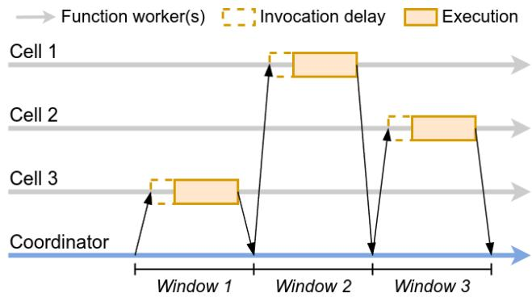  
Figure 6: Execution of SmartScan wherein a new function is invoked every time the algorithm picks a new cell to scan.

Like prior work which has aimed to take advantage of serverless computing’s pay-for-use pricing model [34, 35], this simple implementation ensures that, at every step, the user incurs cost only for the computation associated with one cell. The user also does not incur any cost during the 15-second idle period between the scanning of successive layers. Thus, as long as the number of unique heat transfer matrices associated with a part is large, the cost for a SmartScan-optimized print of the part will be significantly smaller with this implementation than one which runs SmartScan on EC2 VMs; see Appendix A for a detailed analysis.

Invocation delays result in violation of timing constraint. However, we find that the Invoke-on-demand strategy for executing SmartScan on Lambda fails to keep up with the printing speed. For example, in our execution of SmartScan on Lambda for any one layer of a 4cm2 gear, Lambda workers are actively executing code for only 1.30 seconds, which is less than the 3.33 seconds needed to print the layer. But, SmartScan’s per-layer runtime includes an additional 2.98 seconds. When combined, these delays add up to 4.28 seconds per layer, exceeding the 3.33-second print time constraint. This additional delay averages 24.8ms for each of the 120 cells in a layer, encompassing not only the invocation delay (the time between when we invoke a function and when a worker begins executing the function’s code), but also the time spent sending temperature maps to the workers and the cleanup overhead incurred by repeatedly invoking functions.

Invocation delays occur despite the fact that all of our function invocations are served by pre-warmed workers that already have the function state in memory. The underlying cause is overheads internal to Lambda associated with its routing of requests [7, 10] and context preparation.

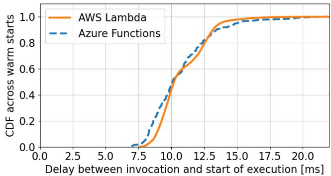  
Figure 7: Distribution of the overhead of invoking a serverless function when executed on a pre-warmed worker.

To measure this overhead, we invoke a pre-warmed function instance from an EC2 VM. At the start of its execution, the function issues a HTTP request back to the VM. We measure the invocation delay by comparing the times at which the VM invokes the function and when it receives the HTTP request from the function. Note that the measured invocation delay includes a network round-trip between the VM and the worker, which is sub-millisecond within a datacenter.

Based on our measurements on AWS Lambda, Figure 7 shows that the invocation delay is 10.2ms at the median, and 13.2ms at the 90th percentile. Figure 7 also shows that these delays are similar with Azure Functions. For workloads that have previously been considered a good match for serverless, such as video processing [8, 16] and model training [18, 34], function invocation delays have been insignificant since the execution time of individual functions has been in the order of seconds or higher. In contrast, in our workload, overheads even in the order of 10ms end up resulting in violations of SmartScan’s timing constraints.

## 3.2.2 High parallelism leads to coordination overheads

Eliminating invocation overhead inflates cost. To avoid the overheads associated with routing each function invocation to a worker, we can invoke the functions for all cells at the start of a new layer. Every function then waits for input from the coordinator to perform the appropriate matrix multiplication, akin to the strategy used in some prior systems [8, 16].

Executing SmartScan with this All-persistent strategy, however, significantly inflates costs. The user would not need to pay for any computation during the idle time between layers when metallic powder is being spread for the next layer. But, since the functions for all cells will be active throughout the duration that a layer is being scanned, we lose the benefit of warm starts; the user will have to pay for a function’s state to be kept in memory even when the worker assigned to run that function is idle. Since serverless workers cost more per GB of memory per second than VMs, the net effect is that executing SmartScan with the All-persistent approach eliminates the benefits of using serverless.

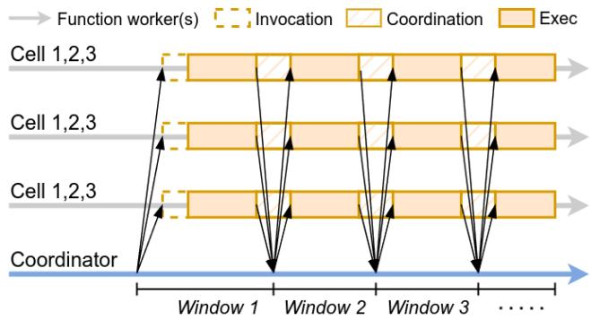  
Figure 8: Execution of SmartScan wherein the computation for every cell is parallelized across all workers.

Keeping all workers active introduces coordination overheads. To lower cost, one might think: if the workers for all functions are active throughout the print of a layer, we might as well utilize the CPUs on all of them during that period? We can accomplish this by rethinking the assignment of cells to workers. Thus far, we have considered that each function is assigned to store and process the matrix for a unique cell. Instead, we can assign $\bar { \frac { 1 } { N } } ^ { t h }$ of every matrix to each function, where N is the number of workers needed to keep all the matrices in memory. As shown in Figure 8, in every step of SmartScan’s execution, the coordinator VM sends the current temperature map to all workers, each of whom multiplies their slice of the matrix for the chosen cell. By aggregating results from all workers, the coordinator assembles the updated temperature map.

The high degree of parallelism with this All-active strategy, however, ends up inflating SmartScan’s runtime. For example, we need 159 Lambda workers to accommodate all the matrices for the 16cm2 gear. When we execute SmartScan across these many workers using the All-active strategy, it takes 16 seconds per layer, which greatly exceeds the constraint of 13.3 seconds imposed by the printing speed.

The primary source of delay here is the limited network bandwidth at the coordinator. For example, of the 16-second runtime per layer, only 270 ms involve any worker actively executing matrix multiplications. The remaining coordination delays stem from the overheads incurred in transferring the temperature map in each step from the coordinator to all workers. In our example job, each of the 249 steps involves the coordinator pushing a 312 KB map to 159 workers – up to 50 MB of data per step. Note that, though each worker computes the output temperature for only a subset of cells, every worker receives the entire input temperature map. This is because the heat transfer matrix models the distribution of heat from every cell to every other cell. This data is transmitted at a rate of roughly 5 Gbps, resulting in a delay – the coordination delay – which takes up almost all of the runtime.

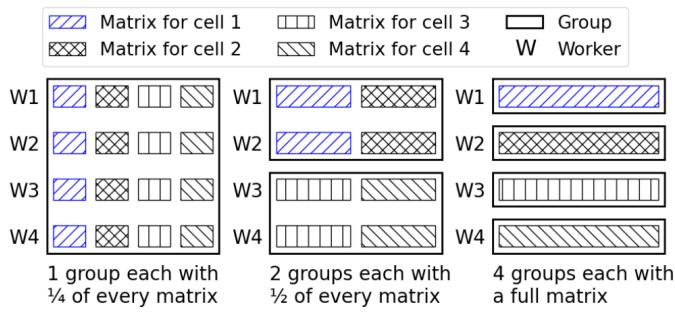  
Figure 9: Three ways of dividing the matrices for 4 cells into groups across 4 workers.

## 4 Design

The takeaway from our measurements in the previous section is that simple approaches for executing SmartScan using serverless either fail to meet the algorithm’s timing constraints or significantly inflate cost compared to using VMs. To address this problem, we present Cosmic, a new system for executing low-latency compute pipelines like SmartScan on serverless platforms.

Cosmic’s design has three key components. First, in terms of how serverless is used to run SmartScan, we expand the configuration space beyond the point solutions discussed in the previous section. Second, we develop a model that can accurately estimate for each configuration, the execution time of SmartScan in that configuration and the cost the user would incur. Using this model, Cosmic is able to identify the lowest cost configuration that is expected to satisfy SmartScan’s timing constraints. Third, we implement a runtime which can ensure that SmartScan is executed in accordance with the chosen configuration.

Though Cosmic is tailored to SmartScan’s 3D-printing control loop, we believe its modular components are workloadagnostic and reusable across latency-sensitive cloud applications. We elaborate on this in Section 7.

## 4.1 Expanding configuration space

Any particular serverless configuration for running SmartScan specifies two properties: a) which set of functions are used to run the computation for any particular cell, and b) when those functions are invoked. In comparison to the approaches discussed in the previous section, we expand the space of configurations along two dimensions.

Grouping. First, we rethink the assignment of cells to functions. Existing approaches either assign each cell to a separate set of functions (Invoke-on-demand or All-persistent) or have a common set of functions execute the computations for all cells (All-active). In contrast, Cosmic allows for many more intermediate configurations as follows.

If N functions are registered in total across all cells – where N must at least be equal to the number of workers needed to store in memory the matrices for all cells – we divide these functions into G groups of $\frac { N } { G }$ workers each. Each group of workers is responsible for performing the computations corresponding to ${ \frac { 1 } { G } } ^ { t h }$ of the part’s cells.

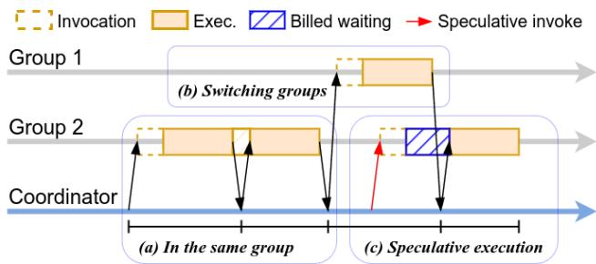  
Figure 10: Illustration of SmartScan execution with Cosmic.

For example, Figure 9 shows three groupings for a part which has four cells, each with a unique heat transfer matrix. The right and left show configurations realized by existing approaches: 4 groups with a unique function assigned to each cell (right), or the state for all cells is equally distributed across one group of 4 functions (left). In the middle is a new configuration enabled by our approach: 2 groups of 2 functions each, with 2 cells assigned to either group.

Speculation. Second, we observe that it is not necessary to incur the cost overhead of keeping the workers for all cells active throughout the printing of a layer. Instead, it suffices if every function is invoked prior to when it needs to start running. Thus, while any step of SmartScan is executing, we can predict the cell likely to be chosen in that step and preemptively invoke the functions assigned to that cell.

Benefits. Partitioning workers into groups and assigning multiple cells to each group combined with speculative execution offers multiple advantages.

• New mechanisms for mitigating invocation overhead. When the cells chosen in two successive windows belong to the same group, no function invocation overhead is incurred at the start of the second window. For example, in the first two windows in Figure 10, the workers that will execute the computation for the second cell will already be active after the first window. In addition, speculative invocation of functions enables Cosmic to reduce the impact of function invocation overheads without incurring the cost overhead of keeping all workers alive.

• New tradeoffs between invocation and coordination overhead. At one extreme, assigning all cells to a single group eliminates invocation overheads, but will result in high coordination overhead. At the other extreme, assigning each cell to its own small subset of functions ensures that the network on the coordinator VM does not prove to be a bottleneck; but, without incurring the cost overheads associated with speculation or keeping all workers alive, the start of every window will be delayed by function invocation overheads. By varying the number of cells per group, we can realize various intermediate points in the tradeoff between the two overheads.

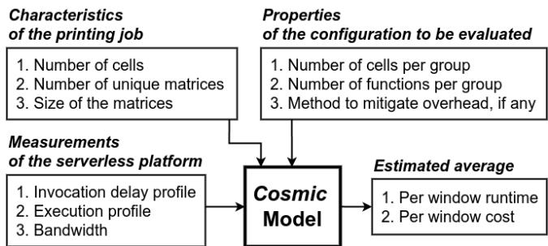  
Figure 11: Inputs and outputs of model used in Cosmic.

• Easier speculation. The assignment of multiple cells to the same group of workers allows for easier use of speculation. As long as the predicted cell belongs to the same group as the cell chosen by SmartScan, invocation delays will not affect our ability to satisfy timing constraints.

## 4.2 Choosing most cost-effective configuration

Enumerating all configurations. Given a product to print, we use the combination of three attributes to represent every serverless configuration that Cosmic can use to execute SmartScan while the product is printed:

• The number of cells per group: varies from 1 to the total number of cells that the product has been partitioned into

• The number of functions per group: at least the number of workers needed to accommodate in memory the heat transfer matrices for all cells in a group

• Which, if any, method is employed to address function invocation overheads: workers for all functions are kept active throughout the printing of each layer, functions for the next window are invoked speculatively, or neither

The question at hand then is: among all configurations which will enable SmartScan’s execution to keep up with the printing speed, which one minimizes cost? In our current implementation, Cosmic exhaustively enumerates all configurations; for the parts we have considered, this takes around 10 seconds at the start of a print job. Among those configurations where the estimated runtime is less than the time needed to print a layer, Cosmic picks the one with the lowest estimated cost. In extreme cases where the time constraint is too stringent (e.g., because of a high printing speed), Cosmic can determine when no feasible solution exists. In such cases, SmartScan must be run across a fleet of VMs.

Model to estimate runtime and cost. For every configuration that Cosmic considers during its search for the lowest cost configuration, it needs to estimate SmartScan’s runtime per layer with this configuration and the corresponding dollar cost. Given the large number of configurations for even a simple part, it is impractical to determine these estimates by executing SmartScan in every configuration.

Instead, we need to estimate the runtime and cost associated with any configuration without running SmartScan in that configuration. For this, as shown in Figure 11, we develop a model which takes three kinds of inputs: 1) characteristics of the product to be printed, 2) properties of the configuration being evaluated, and 3) measurements of the serverless platform. Since the SmartScan algorithm involves a linear sequence of steps, with each step lasting a window, the model’s task is equivalent to computing the average runtime and cost per window. The duration of each window has two components:

• First, the coordinator VM requests the serverless platform to invoke the functions for the cell being scanned in the window. The workers which execute these functions request the function input from the coordinator. The delays involved depend on invocation overheads and the effectiveness of the speculation strategy.

• Then, the coordinator sends the input temperature map to all workers and receives the output from them. Delays include coordination and computation time.

We model each component of window duration separately.

In configurations where workers are kept alive throughout the printing of a layer, the first delay component is zero as no function invocation overhead is invoked. In configurations which employ speculation, this delay is zero for a fraction of the windows equal to the speculation accuracy; the expected speculation accuracy can be estimated from previously completed prints of the same product. The delay is also zero for windows in which the group is reused; we estimate the expected chance of reuse by simulating random selection of cells. For the other windows, or for all windows in the remaining configurations, we estimate the magnitude of the first component as equal to the overhead of invoking functions on warm workers. We rely on a one-time profiling of function invocation delays, using measurements akin to those used to generate Figure 7. Due to the heavy tailed distribution of these delays, instead of simply using the average or median value for all windows, we sample from the measured distribution independently for every window.

The second component of a window’s duration, which is also the period for which the user is billed, includes 1) the time for the coordinator to disseminate the temperature map obtained at the end of the previous window as input to all the workers, and 2) the time taken by the workers to execute the matrix multiplication which models the distribution of heat during the printing. For the former, we observe that the bandwidth between the coordinator VM on EC2 and the Lambda workers is the bottleneck. We measure this bandwidth limit once using iperf. For every print job, we can then use the size of the temperature map for each layer and the number of functions per group to estimate the time it will take for the coordinator to finish sending the inputs to all workers. For the latter, we rely on a profile of the time to execute matrix multiplication on Lambda. We record the distribution of execution time for a range of matrix sizes, and interpolate from this data for any particular part.

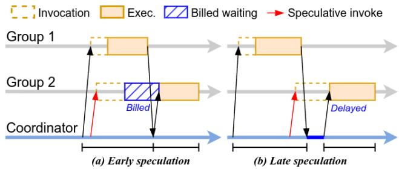  
Figure 12: Illustration of early and late speculation.

## 4.3 Executing chosen configuration

Once Cosmic uses its model to select the most cost-effective configuration, the coordinator VM oversees the execution. It invokes functions when necessary: all functions once at the start of the print job so that all workers can read their state into memory; then, the relevant functions at the start of each window. The primary complexity in the coordinator’s role is in determining how and when it should speculate.

Speculation algorithm. While the SmartScan algorithm is running its computation in any particular window, we need a lightweight method to predict the cell that will be chosen for printing next. Our speculation strategy is inspired by approximation techniques commonly used in 3D printing algorithms to reduce computation at the expense of lower printing quality [29]. Instead of to avoid compute bottlenecks, we leverage approximation to quickly generate guesses with minimal additional execution time and cost.

In SmartScan, recall that the primary purpose of the computation is to model the diffusion of heat. SmartScan maintains a temperature map for a layer and simulates the scanning of each cell in two steps: 1) applying the input heat from the laser to the temperature map, and 2) updating the heat transfer across the layer during scanning. The compute bottleneck is the second step as it involves multiplying a matrix, which models the expected heat transfer, with the temperature map. In contrast, the first step simply involves adding a precomputed vector to the temperature map.

The approximation of this computation is rooted in the observation that scanning each cell with a laser typically takes only tens of milliseconds. Therefore, a good approximation of the updated temperature map can be obtained by considering only the laser input and ignoring the heat transfer over such a short period. This approximate temperature map, which can be computed by the coordinator using much less computation than the full algorithm executed concurrently by the serverless workers, can then be used to guess the next cell that will be selected.

Note that this approximation cannot replace the full algorithm. If we rely on the approximated temperature map in every window, the simulation gradually deviates from the real state of heat transfer, thus degrading SmartScan’s ability to reduce the variance in temperature across the layer.

  
(1) Segmented gear

  
(2) Triangular rotor

  
(3) Slotted grid

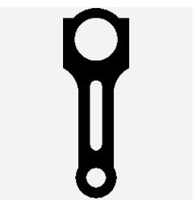  
(6) Connecting rod

  
(7) Mounting bracket

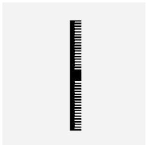  
(8) Ribbed bar

Figure 13: Shapes of the printed parts.

Speculation timing. In addition to identifying which functions to invoke speculatively, we need to determine when to invoke them. Launching the group of functions early can ensure that they are ready to begin executing when SmartScan’s next window starts, but doing so can inflate cost. Deferring the speculative execution for as late as possible can reduce cost but also reduce the utility in overcoming function invocation overheads. Figure 12 illustrates these two scenarios.

To balance the two concerns, we rely on our profiling of invocation overheads (Figure 7). During any window in the execution of SmartScan, Cosmic’s coordinator estimates how long it expects the window to last. It speculatively invokes the functions for the predicted cell’s group D ms prior to when it expects the current window to end, where D is the median of the measured distribution of function invocation delay.

## 5 Evaluation

We evaluate Cosmic from three perspectives: Is it able to satisfy the timing constraints associated with SmartScan’s execution? What cost benefits does it offer? What contributions do each of Cosmic’s components make in enabling these benefits? We compare Cosmic to the three baselines from §3.2, which mimic the approaches used in prior work.

1) Invoke-on-demand: The computation for every cell is distributed across a separate set of N functions, which are invoked on-demand.

2) All-persistent: The computation for each cell is again spread across N functions. But, all functions are invoked at the start of a layer and return only once the computation for the entire layer ends. To minimize cost, we assign a group of cells to the same set of N functions if the workers for those functions can collectively store the state for all of these cells in memory.

3) All-active: The data and computation for all cells are distributed across a common set of N functions. As a result, the workers for all functions are kept busy for the entire duration of the print job.

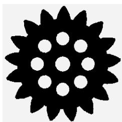  
(4) Holed gear

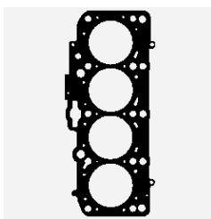  
(5) Cylinder gasket

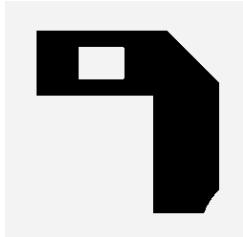  
(9) Holed L-bracket

  
(10) Simple L-bracket

In addition, we also compare Cosmic to the traditional approach of using N VMs, with the data and computation for all cells equally split across the fleet. In all cases, we vary the value of N to identify the lowest cost solution which ensures that SmartScan keeps up with the printing speed.

## 5.1 Evaluation setup

We evaluate Cosmic and the baseline approaches by executing a real SmartScan controller in the cloud. We mimic a print job by having the controller relay its commands to a local desktop computer, which substitutes for an LPBF machine. This mirrors a realistic deployment because any industrial grade LPBF machine is itself driven by desktop software. On the desktop, we simulate the mechanical printing process using the printer’s precise specifications, e.g., uploading randomly generated temperature maps and timing “laser movements” with corresponding delays. We host the controller in the AWS region closest to the desktop.

This setup enables us to examine the feasibility of real-time control, even though the current printer hardware does not yet support this capability; the current proprietary driver on our LPBF printer only accepts precomputed sequences. Importantly, it also provides two other major benefits: 1) enhanced data instrumentation, allowing fine-grained timing measurements, and 2) the ability to conduct large-scale, long-term evaluations without monopolizing physical resources.

Cloud hardware. We configure each AWS Lambda function to its maximum capacity: 10 GB of memory and 6 vCPUs. Using the largest worker size allows for fewer parallel workers or fewer groups for a given workload, reducing coordination delays and improving speculation accuracy. We choose Lambda functions equipped with ARM-based processors over x86 due to their lower cost, without sacrificing performance.

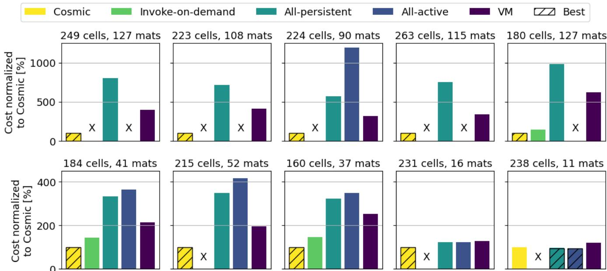  
Figure 14: Comparison of Cosmic with baseline approaches across 10 print jobs with layer size 16cm2. The cost is normalized to that obtained with Cosmic. X indicates the timing constraints were not met. The bars filled with hatched marks show the cheapest solution for each job. The subplots are in the same order as in Figure 13.

We set up the coordinator on a m6g.8xlarge instance with 32 vCPUs to efficiently handle concurrent requests. To minimize latency of communications between the coordinator and workers, we place all of them in the same VPC and disable TCP slow start on the coordinator.

For the VM-based baseline, we select instances from EC2’s x2gd series, which are among the instance types with the highest memory-to-vCPU ratios, offering 16GB of memory per vCPU; a large memory-to-vCPU ratio helps avoid the cost inefficiency of over-provisioned cores.

Printing parameters. We consider a diverse set of 10 parts, shown in Figure 13, which are either derived from benchmarks used in PBF optimization studies [29,33] or designed to model real industrial parts. We consider each part in three layer sizes – 9cm2, 16cm2, and 25cm2 – giving a total of 30 print jobs which vary widely with respect to 1) number of cells per layer, 2) number of unique heat transfer matrices, and 3) size of the matrices. For example, among the parts with a 16cm2 size, the time constraint per window ranges from 38ms to 62ms, and the total memory requirement ranges from 131 GB to 1,514 GB.

We assume a printing speed of 800 mm/s, which falls within the range for optimal LPBF results on AISI 316L stainless steel, the material used in prior experiments [19, 22]. We selected this slightly higher speed than the more conservative 600 mm/s used in the original SmartScan paper [29], to evaluate Cosmic under more stringent conditions.

We assume the thickness of each layer to be 50 µm [29]. For example, a 1 cm thick part would comprise 200 layers.

We start each print job assuming temperature across the entire layer is uniformly at 293 Kelvin. Though the initial temperature map can vary in practice due to residual heat from previous prints, the computation performed when executing the SmartScan algorithm will be unchanged. Moreover, we show later that the accuracy of our speculation is largely the same as we vary the initial temperature map.

## 5.2 Satisfaction of timing constraints

In every print job, we measure the timing of the controller’s commands received at the desktop. In all 30 print jobs, we find that Cosmic’s execution of SmartScan keeps up with the specified printing speed, i.e., prior to the start of every window, the desktop is expected to have received the next cell to be scanned. Though the All-persistent and VM-based approaches also manage to satisfy the timing constraints in all print jobs, they do so at the expense of over-provisioned compute resources and user-paid idle time. All-active satisfies the constraints in all 10 jobs with layer size 9cm2, as few workers are needed to accommodate all the matrices in memory. However, All-active fails to finish running SmartScan in time for 11 of the remaining 20 jobs, as coordination overheads increase. Invoke-on-demand fares the worst, as it failed to meet the time constraints in 23 of the 30 jobs, irrespective of the amount of parallelism per cell. This is largely due to invocation delays associated with warm starts (§3.2.1).

## 5.3 Comparison of dollar costs

For printing the parts with layer size 16cm2, Figure 14 shows the dollar cost for resources in the cloud with each of the approaches considered, normalized to the cost with Cosmic. Results are similar for prints of the other two sizes. For every approach, we consider the cost associated with the cheapest configuration in which SmartScan’s execution keeps up with the printing speed. We mark an ‘X’ if, for that job, that approach cannot meet the time constraints in any configuration.

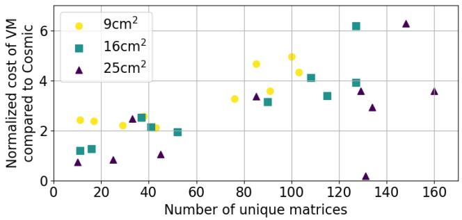  
Figure 15: Cost savings with Cosmic compared to VM-based approach as a function of number of heat transfer matrices.

We see that Cosmic outperforms all four baseline approaches in 26 of the 30 print jobs; it results in the lowest cost in all 10 prints of $9 \mathrm { c m } ^ { 2 }$ layer size, in 9 of the 10 with layer size $1 6 \mathrm { c m } ^ { 2 }$ , and in 7 of the 10 with 25cm2 layer size. In the 4 print jobs where Cosmic does not minimize cost, the cheapest solutions cost 0.94×, 0.83×, 0.75×, 0.17× lower, with the first achieved by All-active and the rest using VMs.

Cost-savings compared to VMs. Across all 30 print jobs, the cost overhead of VM-based solutions relative to Cosmic is 2.8× at the median, with a maximum of 6.3×. If the thickness of every part was 1cm, for example, these numbers translate to an average cost savings of \$1.2, \$4.5, and \$18.7 per part for 9cm2, 16cm2, and 25cm2 layer sizes, respectively. Cosmic’s cost savings relative to VMs increases with layer size due to the decreasing fraction of idle time in SmartScan’s workflow (see Appendix A). Powder spreading between layers (§2) takes 15 seconds irrespective of layer size. Hence, this downtime takes up progressively less of SmartScan’s total runtime as layer size increases: 73% for 9cm2, 60% for 16cm2, and 49% for 25cm2.

As demonstrated in Figure 15, we also observe a correlation between Cosmic’s cost benefits relative to VMs and the number of unique heat transfer matrices needed for a specific print job. VMs are cost-effective for running SmartScan when the total size of precomputed data is relatively small (left end of the graph), as the data can be stored in a few instances which can all be kept busy without much coordination overhead. When the total data size is large, the number of VMs needed is dictated by the total memory size, resulting in most of the CPUs idling during runtime. In such cases, Cosmic benefits from Lambda’s pricing policy, which charges customers only when workers are executing code, but not during idle periods in-between when worker state remains in memory.

Cost savings compared to other serverless approaches. In all but one of the 27 print jobs where using VMs is not the most cost-effective solution, Cosmic outperforms all other baseline approaches that use serverless. Again, if we consider all parts to be 1cm thick, the average cost savings enabled by Cosmic compared to the second-cheapest solution on serverless are \$0.71, \$8.3, and \$78.4 per part for 9cm2, 16cm2, and $2 5 \mathrm { c m } ^ { 2 }$ layer sizes, respectively.

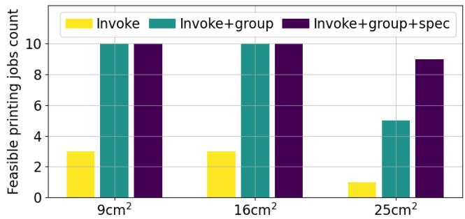  
Figure 16: Number of print jobs for which timing constraints are met first with Invoke-on-demand, and then by adding grouping and speculative invocation incrementally.

Ideally, Cosmic is expected to outperform Invoke-ondemand, All-persistent, and All-active in all cases because Cosmic’s configuration space subsumes these approaches. However, in one of the print jobs – part 10 in layer size 16cm2 – All-active provides a solution that costs 0.94× as much as Cosmic. Although this solution is within Cosmic’s search space, it is not chosen because Cosmic’s performance model incorrectly estimates it to be slightly more expensive than the selected alternative.

## 5.4 Utility of individual techniques

The fact that Cosmic combines many techniques to deliver cost savings is evident in the wide diversity of configurations that it chooses for the 30 print jobs we consider. The number of groups into which it partitions the serverless functions that it uses varies across jobs from 1 to 50. Whereas, the degree of parallelism per group ranges from 4 to 34. To mitigate the impact of function invocation delays, Cosmic chooses to keep all workers active throughout the print only in 3 jobs. It employs speculation in 21 of the 30 jobs. In the remaining cases – primarily when the number of groups is less than 10 – Cosmic relies on the property that no invocation overhead is incurred when the cells chosen in consecutive windows belong to the same group.

## 5.4.1 Ablation study

To further evaluate the utility of the two key techniques that Cosmic combines, we start with Invoke-on-demand and then incrementally add grouping of functions and speculative invocation. For each of the three approaches, Figure 16 shows the number of print jobs (grouped by layer size) for which they satisfied SmartScan’s timing constraints. As seen earlier, Invoke-on-demand is capable of satisfying these constraints in only 7 of the 30 jobs. Adding grouping addresses this problem for all printing jobs with layer sizes 9cm2 and 16cm2, but falls short for larger parts. Adding speculative invocation further improves the coverage to all but one job, for which all workers need to be kept persistently alive in order to ensure timely execution.

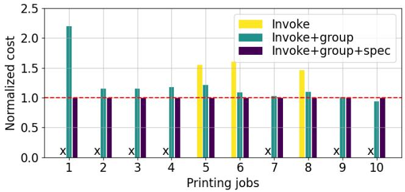  
Figure 17: For print jobs with layer size 16cm2, cost with Invokeon-demand, and with incremental addition of grouping and speculation; normalized to the cost with Invoke-on-demand plus grouping and speculation.

Beyond the ability to ensure timeliness, the techniques used in Cosmic also help reduce cost. Figure 17 demonstrates this for print jobs with 16cm2 layer size; the results are similar for the other two layer sizes. In all 3 print jobs where Invoke-ondemand enables SmartScan to keep up with the printing speed, the addition of grouping lowers cost. We observe that grouping lowers runtime without increasing cost, as it increases the likelihood of reusing Lambda workers in consecutive windows, thereby avoiding invocation latency. In all but one of the printing jobs, adding speculation further reduces cost as it reduces the amount of parallelism needed to overcome the impact of invocation delays.

## 5.4.2 Speculative invocation

Next, we dive deeper into the efficacy of Cosmic’s speculative invocation of functions.

Speculation accuracy. First, across all 30 print jobs, we find that Cosmic’s algorithm for predicting the cell group whose functions need to be executed in the next window is 85% accurate on average. To examine the robustness of this accuracy to variance in the initial temperature map, we rerun Cosmic’s speculation for each part with 30 different initial temperature maps. We observed that the speculation accuracy is typically $8 5 \% \pm 5 \%$ . This suggests that it is reasonable for our runtime/cost prediction model to take as input the speculation accuracy from previously completed prints of the same part.

Speculation timing. Next, we illustrate Cosmic’s effectiveness in using speculation to hide invocation delays at low cost. Figure 18 shows the distribution of speculative timing during the execution of SmartScan for a 16cm2 gear shape. Specifically, we measure the gap from a) when the current window finishes, i.e., the coordinator has received outputs for the current window from all workers, until b) when the Lambda functions needed for the next window are ready to start execution, i.e., the coordinator has received a request for input from all the speculatively invoked functions. Negative values for this difference indicate early speculation, while positive values indicate late speculation. The data reveals a median value of 0.19ms, with the 5th and 95th percentiles at -2.00ms and 1.24ms, respectively. This implies that 95% of the speculation instances incur a billable idle time of no more than 2ms, and 95% of the speculation instances incur a latency overhead less than 1.24ms; both account for less than 5% of the duration of the average window in this case study. This efficiency demonstrates the balance achieved between cost and performance via accurate modeling.

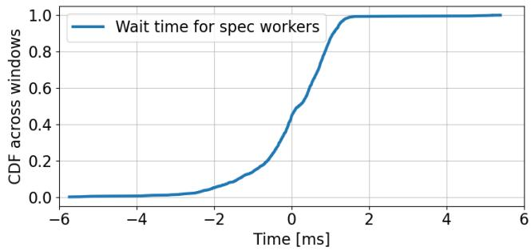  
Figure 18: For a specific print job, distribution across windows of the time from when the coordinator completes the current window until when the speculatively invoked workers are ready to start executing the next window.

## 6 Related Work

Applications on serverless. Prior work [8, 16] has utilized the massive parallelism enabled by serverless to significantly reduce the time needed to process videos. Other work [34] has taken advantage of serverless pricing policy to achieve time and cost savings in processing sparse graphs workloads. However, all of this work targets workloads in which each task takes tens of seconds, even minutes, to complete. To the best of our knowledge, we are the first to demonstrate the viability of serverless for workloads with latency targets in the order of tens of milliseconds.

Mitigating invocation latency. A significant body of prior work targets cold start latency in serverless computing. Some propose new optimizations that require changes to the serverless platform [14,17,32]. There has also been work [31] on reducing the platform’s burden for keeping instances warm. Others try to avoid cold starts in the user space [8, 16, 23, 24, 30]. However, none of these prior efforts target eliminating warm start latency. We found that the latency associated with warm starts is a bottleneck in meeting millisecond-level time constraints, and we use a combination of strategies to mitigate this latency.

Performance modeling. Runtime optimization on serverless often requires accurate performance prediction. Previous efforts have modeled the combination of parallel and sequential function executions [24], used Monte Carlo simulations to predict the distribution of function costs [15], and modeled cold start latency and execution time under different degrees of parallelism [9]. Our model accounts for a variety of delays, including function invocations and coordination overheads, and models the impact of techniques such as grouping of functions and speculative invocation.

Speculation. Speculative execution has been used to hide latency in a wide variety of networked systems, e.g., distributed file systems [27], distributed data processing [11], web browsing [25], and online gaming [21]. Speculative execution has also been employed to improve the performance of serverless applications. For example, SpecFaaS [32] pre-executes potential function calls before their control and data dependencies are resolved, and Xanadu [13] pre-invokes functions to mitigate cascading cold starts in function DAGs.

Our work developed a method for speculation specific to a 3D printing optimization algorithm, SmartScan [29]. Unlike prior work that uses speculation as a best-effort strategy to hide latency, our strategy for speculation is both time- and cost-sensitive. In addition, we use grouping of functions to improve the accuracy of speculation.

## 7 Discussion

Impact of changes in cloud pricing policies. Cosmic takes advantage of serverless computing’s pay-as-you-go pricing model, which only charges for active execution time. In particular, Cosmic avoids the cost of retaining data in memory during the idle time between successive invocations of the same function. Presumably, serverless platforms already bake in the cost for supporting warm starts into their pricing policy, as they charge more per GB of memory than traditional VMs. These characteristics are not unique to AWS, but also exist in Azure [3], Google Cloud [5], and emerging serverless GPU inference services [4, 6], reflecting a deliberate design choice to enhance the utility of serverless, and one that is likely to persist in the near-term.

That said, if cloud providers alter their infrastructure – e.g., shortening warm start windows, or begin explicitly charging for idle memory – Cosmic’s design remains adaptable. To account for reduced persistence of warm workers, Cosmic can issue dummy requests to maintain warm containers at a negligible cost. Cosmic can also re-profile platform delays and pricing, adjusting invocation timing or the degree of parallelism. Though savings might decrease, many of our approach’s benefits, such as minimizing the impact of invocation delays and reducing over-provisioning of resources, would still apply.

Printing larger parts. While our evaluation demonstrates Cosmic’s ability to meet timing constraints and reduce costs across a diverse set of print jobs, significantly larger printing jobs present additional challenges. With much greater parallelization, the overhead of communication between serverless functions and ensuring scalability without compromising timeliness are heavily constrained by the platform’s specifications, and remains an area for future exploration.

Reusability of abstractions. Though we designed and evaluated Cosmic in the context of optimizing a specific form of 3D printing, its core abstractions and modular components are reusable in other domains: 1) Cosmic’s strategies for trading off invocation and coordination overheads – e.g., grouping parallelizable functions and optimizing invocation timing – apply to any latency-critical processing pipeline where each step is parallelizable. 2) Cosmic’s use of speculation to combat function invocation overheads is applicable in settings amenable to predictions. 3) Cosmic’s models for runtime and cost guided by measurement profiles and pricing policies can inform data partitioning and the degree of parallelization.

Generalizability to other workloads. Cosmic’s configuration framework and profiling tool, when supplied with other workload characteristics by users, can be adapted to a broad range of domains. For example, we believe Cosmic can be adapted for using serverless to support computations in scenarios where real-time spatial data is being analyzed, e.g., in AR/VR and online gaming. In these scenarios, models of the real/virtual world will need to be preloaded and data from user inputs or sensors must be processed quickly in order to render or make decisions in real-time. Processing of each input can be treated as similar to each window in SmartScan. Speculative execution could be used to predict inputs based on the user’s trajectory, allowing for faster responses.

Another potential application of Cosmic could be autonomous vehicle fleet coordination, which requires real-time route planning and vehicle-to-vehicle coordination. Such systems rely on large preloaded datasets, including highdefinition maps, traffic prediction models, and vehicle dynamics, to make decisions under tight timing constraints. At each step, the coordination algorithm processes these datasets to update vehicle paths dynamically, involving computation similar to SmartScan. Cosmic could enhance this process through speculative execution, precomputing likely scenarios – such as potential lane changes or congestion – to minimize delays.

## 8 Conclusion

In this paper, we demonstrated the utility of serverless computing for a new application workload: control of 3D printing from the cloud. While the pricing policy of serverless platforms make them a good match for this workload, our measurements highlighted the delays that make it challenging to meet millisecond-level time constraints. Our design of Cosmic combines a range of techniques with an accurate model that estimates runtime and costs. Our results showcased Cosmic’s utility across a diverse set of print jobs.

## Acknowledgments

We thank the reviewers for their valuable feedback. This work was supported in part by NSF grant CNS-2106184 and a grant from Cisco.

## References

[1] Lambda execution environments. https: //docs.aws.amazon.com/lambda/latest/ operatorguide/execution-environments.html, 2024.

[2] AWS Lambda. https://aws.amazon.com/lambda, 2025.

[3] Azure Functions. https://azure.microsoft.com/ en-us/products/functions, 2025.

[4] Beam. https://www.beam.cloud/, 2025.

[5] Google Cloud Run. https://cloud.google.com/ run, 2025.

[6] Modal. https://modal.com/, 2025.

[7] Alexandru Agache, Marc Brooker, Alexandra Iordache, Anthony Liguori, Rolf Neugebauer, Phil Piwonka, and Diana-Maria Popa. Firecracker: Lightweight virtualization for serverless applications. In 17th USENIX symposium on networked systems design and implementation (NSDI 20), pages 419–434, 2020.

[8] Lixiang Ao, Liz Izhikevich, Geoffrey M Voelker, and George Porter. Sprocket: A serverless video processing framework. In Proceedings of the ACM Symposium on Cloud Computing, pages 263–274, 2018.

[9] Rohan Basu Roy, Tirthak Patel, Richmond Liew, Yadu Nand Babuji, Ryan Chard, and Devesh Tiwari. ProPack: Executing concurrent serverless functions faster and cheaper. In Proceedings of the 32nd International Symposium on High-Performance Parallel and Distributed Computing, pages 211–224, 2023.

[10] Marc Brooker, Adrian Costin Catangiu, Mike Danilov, Alexander Graf, Colm MacCárthaigh, and Andrei Sandu. Restoring uniqueness in microvm snapshots. arXiv preprint arXiv:2102.12892, 2021.

[11] Qi Chen, Cheng Liu, and Zhen Xiao. Improving MapReduce performance using smart speculative execution strategy. IEEE Transactions on Computers, 63(4):954– 967, 2013.

[12] Sohini Chowdhury, N Yadaiah, Chander Prakash, Seeram Ramakrishna, Saurav Dixit, Lovi Raj Gupta, and Dharam Buddhi. Laser powder bed fusion: a stateof-the-art review of the technology, materials, properties & defects, and numerical modelling. Journal of Materials Research and Technology, 20:2109–2172, 2022.

[13] Nilanjan Daw, Umesh Bellur, and Purushottam Kulkarni. Xanadu: Mitigating cascading cold starts in serverless function chain deployments. In Proceedings of the 21st

International Middleware Conference, pages 356–370, 2020.

[14] Dong Du, Tianyi Yu, Yubin Xia, Binyu Zang, Guanglu Yan, Chenggang Qin, Qixuan Wu, and Haibo Chen. Catalyzer: Sub-millisecond startup for serverless computing with initialization-less booting. In Proceedings of the Twenty-Fifth International Conference on Architectural Support for Programming Languages and Operating Systems, pages 467–481, 2020.

[15] Simon Eismann, Johannes Grohmann, Erwin Van Eyk, Nikolas Herbst, and Samuel Kounev. Predicting the costs of serverless workflows. In Proceedings of the ACM/SPEC international conference on performance engineering, pages 265–276, 2020.

[16] Sadjad Fouladi, Riad S Wahby, Brennan Shacklett, Karthikeyan Balasubramaniam, William Zeng, Rahul Bhalerao, Anirudh Sivaraman, George Porter, and Keith Winstein. Encoding, fast and slow: Low-latency video processing using thousands of tiny threads. In NSDI, volume 17, pages 363–376, 2017.

[17] Alexander Fuerst and Prateek Sharma. FaasCache: keeping serverless computing alive with greedy-dual caching. In Proceedings of the 26th ACM International Conference on Architectural Support for Programming Languages and Operating Systems, pages 386–400, 2021.

[18] Runsheng Guo, Victor Guo, Antonio Kim, Josh Hildred, and Khuzaima Daudjee. Hydrozoa: Dynamic hybridparallel dnn training on serverless containers. Proceedings of Machine Learning and Systems, 4:779–794, 2022.

[19] Liang Hao, Wanlin Wang, Jie Zeng, Min Song, Shuai Chang, and Chenyang Zhu. Effect of scanning speed and laser power on formability, microstructure, and quality of 316L stainless steel prepared by selective laser melting. Journal of Materials Research and Technology, 25:3189–3199, 2023.

[20] Jigang Huang, Qin Qin, and Jie Wang. A review of stereolithography: Processes and systems. Processes, 8(9):1138, 2020.

[21] Kyungmin Lee, David Chu, Eduardo Cuervo, Johannes Kopf, Yury Degtyarev, Sergey Grizan, Alec Wolman, and Jason Flinn. Outatime: Using speculation to enable low-latency continuous interaction for mobile cloud gaming. In Proceedings of the 13th Annual International Conference on Mobile Systems, Applications, and Services, pages 151–165, 2015.

[22] Jiangwei Liu, Yanan Song, Chaoyue Chen, Xiebin Wang, Hu Li, Jiang Wang, Kai Guo, Jie Sun, et al. Effect of

scanning speed on the microstructure and mechanical behavior of 316L stainless steel fabricated by selective laser melting. Materials & Design, 186:108355, 2020.

[23] Xuanzhe Liu, Jinfeng Wen, Zhenpeng Chen, Ding Li, Junkai Chen, Yi Liu, Haoyu Wang, and Xin Jin. Faaslight: General application-level cold-start latency optimization for function-as-a-service in serverless computing. ACM Transactions on Software Engineering and Methodology, 32(5):1–29, 2023.

[24] Ashraf Mahgoub, Edgardo Barsallo Yi, Karthick Shankar, Sameh Elnikety, Somali Chaterji, and Saurabh Bagchi. ORION and the three rights: Sizing, bundling, and prewarming for serverless DAGs. In 16th USENIX Symposium on Operating Systems Design and Implementation (OSDI 22), pages 303–320, 2022.

[25] James W Mickens, Jeremy Elson, Jon Howell, and Jay R Lorch. Crom: Faster web browsing using speculative execution. In NSDI, volume 10, pages 9–9, 2010.

[26] Amir Mostafaei, Amy M Elliott, John E Barnes, Fangzhou Li, Wenda Tan, Corson L Cramer, Peeyush Nandwana, and Markus Chmielus. Binder jet 3d printing—process parameters, materials, properties, modeling, and challenges. Progress in Materials Science, 119:100707, 2021.

[27] Edmund B Nightingale, Peter M Chen, and Jason Flinn. Speculative execution in a distributed file system. ACM SIGOPS operating systems review, 39(5):191–205, 2005.

[28] Kumaresan Rajan, Mahendran Samykano, Kumaran Kadirgama, Wan Sharuzi Wan Harun, and Md Mustafizur Rahman. Fused deposition modeling: process, materials, parameters, properties, and applications. The International Journal of Advanced Manufacturing Technology, 120(3):1531–1570, 2022.

[29] Keval S Ramani, Chuan He, Yueh-Lin Tsai, and Chinedum E Okwudire. Smartscan: An intelligent scanning approach for uniform thermal distribution, reduced residual stresses and deformations in pbf additive manufacturing. Additive Manufacturing, 52:102643, 2022.

[30] Rohan Basu Roy, Tirthak Patel, and Devesh Tiwari. DayDream: executing dynamic scientific workflows on serverless platforms with hot starts. In SC22: International Conference for High Performance Computing, Networking, Storage and Analysis, pages 1–18. IEEE, 2022.

[31] Rohan Basu Roy, Tirthak Patel, and Devesh Tiwari. Icebreaker: Warming serverless functions better with heterogeneity. In Proceedings of the 27th ACM Interna-

tional Conference on Architectural Support for Programming Languages and Operating Systems, pages 753– 767, 2022.

[32] Jovan Stojkovic, Tianyin Xu, Hubertus Franke, and Josep Torrellas. Specfaas: Accelerating serverless applications with speculative function execution. In 2023 IEEE International Symposium on High-Performance Computer Architecture (HPCA), pages 814–827. IEEE, 2023.

[33] Akihiro Takezawa, Honghu Guo, Ryotaro Kobayashi, Qian Chen, and Albert C To. Simultaneous optimization of hatching orientations and lattice density distribution for residual warpage reduction in laser powder bed fusion considering layerwise residual stress stacking. Additive Manufacturing, 60:103194, 2022.

[34] John Thorpe, Yifan Qiao, Jonathan Eyolfson, Shen Teng, Guanzhou Hu, Zhihao Jia, Jinliang Wei, Keval Vora, Ravi Netravali, Miryung Kim, et al. Dorylus: Affordable, scalable, and accurate GNN training with distributed CPU servers and serverless threads. In 15th USENIX Symposium on Operating Systems Design and Implementation (OSDI 21), pages 495–514, 2021.

[35] Ao Wang, Jingyuan Zhang, Xiaolong Ma, Ali Anwar, Lukas Rupprecht, Dimitrios Skourtis, Vasily Tarasov, Feng Yan, and Yue Cheng. InfiniCache: exploiting ephemeral serverless functions to build a cost-effective memory cache. In 18th USENIX conference on file and storage technologies (FAST 20), pages 267–281, 2020.

## A Appendix

The cost for a VM per window is formulated as:

$$
F _ { \nu m } = ( n \cdot m ) \cdot ( t + 1 5 s ) \cdot c _ { \nu m } ,
$$

where

• n = number of unique matrices,

• m = size of in-memory precomputed data per cell in GB,

• t = time constraint in seconds,

• cvm = cost per GB of memory per unit of time for the VM.

It’s important to note that VMs must stay operational between layers, hence the additional 15 seconds of billed time. This formula also assumes full utilization of the VM’s memory capacity.

In contrast, the cost for Lambda per window is:

$$
F _ { \lambda } = M \cdot ( t ) \cdot c _ { \lambda } ,
$$

where M is the total memory capacity of Lambda workers running in parallel, and assuming Lambda functions are configured to complete computations precisely within the time constraint t. Unlike VMs, where the scale of operation is dictated by the total data size, the number of Lambda functions running in parallel during each window is determined primarily by the need to meet stringent time constraints. Consequently, this total capacity M often exceeds what is necessary for storing the precomputed data per cell m. Given that we use the largest Lambda instances, we have $M = N _ { P } \cdot 1 0 G B .$ where $N _ { P }$ is the number of parallelism in each window.

Solving $F _ { \nu m } > F _ { \lambda }$ simplifies to:

$$
n \cdot m > \frac { t } { t + 1 5 } \cdot N _ { P } \cdot 9 2 G B .\tag{1}
$$

Here, the left side represents the total size of precomputed data. Taking the example of the $1 6 \mathrm { c m } ^ { 2 }$ gear shaped print job, this inequality holds true as 1514 GB > 404.8 GB, with $n = 1 2 7 , m = 1 1 . 9 \ G B , t = 1 0 \ s .$ and $N _ { P } = 1 1$ . Qualitative interpretation of this inequality shows that Lambda is potentially more cost-effective than VM under certain conditions: 1) a higher total size of precomputed data, 2) a lower time constraint relative to powder spreading time, and 3) fewer parallel workers required in each window.