①

USENIX

THE ADVANCED COMPUTING SYSTEMS ASSOCIATION

# PageFlex: Flexible and Efficient User-space Delegation of Linux Paging Policies with eBPF

Anil Yelam and Kan Wu, Google; Zhiyuan Guo, UC San Diego; Suli Yang, Google; Rajath Shashidhara, University of Washington; Wei Xu and Stanko Novaković, Google; Alex C. Snoeren, Google and UC San Diego; Kimberly Keeton, Google

https://www.usenix.org/conference/atc25/presentation/yelam

# This paper is included in the Proceedings of the 2025 USENIX Annual Technical Conference.

July 7–9, 2025 • Boston, MA, USA ISBN 978-1-939133-48-9

Open access to the Proceedings of the 2025 USENIX Annual Technical Conference is sponsored by

P=-r.h mEesL

auuuJl9 PgleU

King Abdullah University of

Science and Technology

# PageFlex: Flexible and Efficient User-space Delegation of Linux Paging Policies with eBPF

Anil Yelam Google

Kan Wu Google

Zhiyuan Guo UC San Diego

Suli Yang Google

Rajath Shashidhara University of Washington

Wei Xu Google

Stanko Novakovic Google

Alex C. Snoeren Google and UC San Diego

Kimberly Keeton Google

## Abstract

To increase platform memory efficiency, hyperscalers like Google and Meta transparently demote “cold” application data to cheaper cost-per-byte memory tiers like compressed memory and NVMe SSDs. These systems rely on standard kernel paging policies and mechanisms to maximize the achievable memory savings without hurting application performance. Although the literature promises better policies, implementing and deploying them within the Linux kernel is challenging. Delegating policies and mechanisms to user space, through userfaultfd or library-based approaches, incurs overheads and may require modifying application code.

We present PageFlex, a framework for delegating Linux paging policies to user space with minimal overhead and full compatibility with existing real-world deployments. Page-Flex uses eBPF to delegate policy decisions while providing low-overhead access to in-kernel memory state and access information, thus balancing flexibility and performance. Additionally, PageFlex supports different paging strategies for distinct memory regions and application phases. We show that PageFlex can delegate existing kernel-based policies with little (< 1%) application slowdown, effectively realizing the benefits of state-of-the-art policies like Hyperbolic caching [18] and Leap [12] prefetching, and unlocking application-specific benefits through region- and phase-aware policy specialization.

## 1 Introduction

Memory cost as a fraction of hyperscalers’ total cost of ownership (TCO) has been growing at an alarming rate [25, 32, 48]. Offloading cold memory to cheaper cost-per-byte memory tiers like compressed memory and NVMe SSDs offers a promising way to increase platform memory efficiency. Recent hyperscale deployments like Google’s g-swap1 [32] and Meta’s Transparent Memory Offloading (TMO) [48] demonstrate that significant (20–30%) memory savings can be achieved with minimal impact to application performance. These systems rely on the OS’s page reclamation mechanisms to offload “cold” application pages (pages that haven’t been accessed recently) and minimize the chances of costly page refaults from the swap backend, which directly impact application performance. Consequently, correctly inferring what pages are cold and whether to offload them—i.e., the page offload or reclamation2 policy—is crucial to improving memory savings without hurting application performance. Similarly, prefetching the offloaded pages before they are reaccessed can hide the cost of refaults, making prefetching equally important.

Existing deployments leave the critical page offloading decisions in the kernel: they maintain page ordering based on page access information using kernel mechanisms, and use control loops in user space to determine the threshold for offloading pages based on application impact. For page ordering, they rely on traditional Linux kernel LRU mechanisms like active/inactive lists [48]; multi-generational LRU (MGLRU) [6]; or implicit ordering through per-page “age” fields [32], where orderings are updated based on page access information that is checked periodically [32]. However, many more sophisticated eviction algorithms have been proposed in recent work [15, 18, 35, 42, 50] that could potentially further improve memory savings. Our measurements show that there is a significant gap between LRU and the optimal decisions for real-world accesses from page access traces (§2.3). Similarly, for prefetching, existing systems rely on Linux’s default read-ahead, while more advanced prefetching policies like Leap can improve performance by 7—75% [12].

Linux currently offers limited paging policy choices, and improving these policies or implementing new ones in kernel code brings significant challenges. Deploying kernel changes across a large fleet is a slow and risky process, and experimental or application-specific policies are harder to upstream [28, 34]. Existing user-space designs, such as those that rely on Linux userfaultfd [3, 38, 40, 54] or custom libraries [26, 41, 45, 53], can externalize (i.e., allow out-ofkernel implementations for) paging, but introduce new problems. By migrating the entire paging infrastructure to user space, userfaultfd dramatically increases the cost of refaults (e.g., by more than 50% for zswap (§ 2.4)). Additionally, it imposes a high deployment barrier by requiring user-level swap implementations—along with the effort to maintain them—since it cannot leverage the kernel’s mechanisms.

Custom memory management libraries such as DiLOS or Application-Integrated Far Memory (AIFM) [23,26,41,45,53] completely avoid kernel paging for flexibility and lower paging overhead, but pose similar challenges. They often require modifying applications, and while their slow path (i.e., refault from swap) is generally much faster, they introduce considerable performance overhead even when no memory is offloaded, as they force a custom interface [52]. Both userfaultfd and custom libraries introduce significant operational overhead at scale, where maintaining stability, efficiency, and seamless integration with existing infrastructure is critical. Thus, in this paper, we ask the following question: Can we delegate paging policies to user space without slowing down the application or compromising compatibility with existing deployments (i.e., avoiding application modifications and the need to reimplement swap infrastructure)?

Our solution is PageFlex, a framework designed to delegate the paging policy outside of the kernel, while keeping it compatible with existing kernel-based swap deployments like g-swap [32] and TMO [48]. To achieve these goals, Page-Flex only delegates non-performance-critical policy decisions made for prefetching and proactive reclamation outside the kernel code. Enabling policies requires tracking the state of memory and how it is being accessed (e.g., paging activity and page access information), which could introduce considerable overhead if significant kernel state needs to be exported to and processed in user space. To address this issue, PageFlex uses eBPF programs [10] to provide a flexible, low-overhead view of in-kernel memory state to externalized policy code.

At a high level, PageFlex implements policies by observing the changes to memory state and access information, and making decisions based on them. To track memory state, PageFlex traces various paging events (page status changes like page allocations, frees, swap-ins and -outs) and access signals (through page faults and periodic checks on access bits) and exposes them to the policies implemented as eBPFbased event handlers. To enable policies to efficiently track and maintain metadata based on observed state, PageFlex provides event handlers with safe, overhead-free access to a small amount of in-kernel metadata for each page. Policies subscribe to only the events they need, providing handlers to process them and optionally communicate with user-level code for more complex decision making. Any policy decisions made in user space are enforced by PageFlex through paging hints (page in or out) using the madvise syscall interface.

To make it easier to write policies, PageFlex provides generic reclamation and prefetching policy models that support a variety of policies with a simple interface. Our reclamation model generalizes g-swap’s per-page, age-based ordering to instead employ generic, per-page weights. In this model, most existing eviction heuristics can be implemented as custom weight-update functions that consume the page-access information PageFlex periodically exports. Our prefetching model enables customized trend detection, allowing the implementation of state-of-the-art policies like Hyperbolic caching [18] and the Leap [12] prefetching. Our re-implementations require no changes to the kernel and only a handful of lines of policy code (17 for Hyperbolic caching and 21 extra lines for Leap in addition to 160 borrowed from its original implementation [1]). Going beyond a single static policy for an application, PageFlex supports specialization for memory regions within a process and runtime policy adjustments.

We evaluate PageFlex with a variety of workloads and policies. PageFlex introduces very little additional application slowdown compared to kernel implementations of the same policies. For page reclamation, we show that Redis and synthetic benchmarks run at most 1% slower when using PageFlex’s LRU implementation as compared to g-swap’s functionally-equivalent but kernel-based variant. For prefetching, a PageFlex-based implementation of Linux’s read-ahead policy provides similar benefit to the native in-kernel implementation: when measuring the page refault rate from an SSD-like swap backend, Linux’s kernel-based read-ahead is 82% faster than no prefetching, while PageFlex delivers a 76% improvement with minimal (0.8%) overhead when there are no prefetching benefits.

Going beyond these default policies, we implement various policies from the literature and demonstrate their memory savings and performance benefits. PageFlex’s LFU policy offloads up to 2× more memory than LRU at any given performance slowdown for a synthetic LFU-friendly workload. Similarly, PageFlex-based Hyperbolic caching allows up to 5% more memory savings for real-world workload traces. PageFlex-based Leap prefetching improves the refault rate with strided accesses by 75.4% over the Linux default, which cannot capture strided patterns. Our workload-aware, specialized policies show up to 36% more memory savings for a key/value store, and 6% for the GAPBS PageRank workload, compared to LRU for the same performance target. Moreover, PageFlex enables these flexibility and performance benefits despite modest overheads from its supporting infrastructure. For example, compared to the in-kernel implementation of g-swap, PageFlex’s periodic page table scans are 17% slower due to eBPF overheads, and enforcing paging actions from user space through syscalls takes 14% longer.

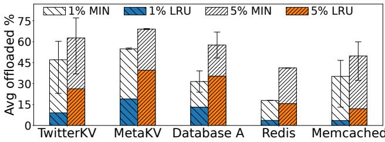  
Figure 1: Average memory offloaded (% of total memory usage) with periodic LRU eviction (colored bars) simulated on page access traces of real workloads (detailed in Table 2) at two different allowed page refault rates (1% and 5%), overlaid against Belady’s MIN. The white space in each bar shows the opportunity for more memory offloaded at the same performance target.

## 2 Background and Motivation

We begin by motivating the need for a platform to easily explore novel paging policies. We then discuss the requirements for investigating paging policies in the data center. We describe paging alternatives, including kernel-based, user-level, and library-based implementations, showing that current solutions fall short of meeting these requirements. Additionally, we survey paging policies from the literature and provide a background on eBPF.

## 2.1 Motivation for policy investigation

We begin by exploring the potential for improving on standard reclamation policies like LRU by comparing its effectiveness against an optimal policy based on Belady’s MIN [16]. We evaluate these policies by simulating the proactive reclamation approach used in hyperscaler data centers using the traces described in Table 2. These deployments [32,48] proactively offload application pages to swap devices like NVMe SSDs [48] or in-memory compressed caches like zswap [7]. Rather than reclaiming pages in response to memory pressure, which can be disruptive to application performance (since reclamation happens on the critical path of memory allocation), these systems proactively reclaim data in a manner that limits the impact on application performance.

Figure 1 shows the difference in the fraction of memory offloaded for two different performance constraints. To simulate the policies, a target amount of memory is offloaded at the end of each interval (similar to TMO [48] and g-swap [7]) based on each algorithm (i.e., ordered by the last access time for LRU and the next access time for MIN). As a proxy for application impact, we use g-swap’s promotion rate3, the rate of page refaults normalized to the working set, averaged for all intervals. We vary the memory offload targets and measure the largest target that results in a refault rate below 1% and

<table><tr><td>Policy Infrastructure</td><td>Kernel</td><td>User- faultfd</td><td>Library</td><td>PageFlex</td></tr><tr><td>App portability</td><td></td><td>V</td><td></td><td></td></tr><tr><td>Debuggability</td><td>×</td><td></td><td></td><td></td></tr><tr><td>Reuse swap stack</td><td></td><td>×</td><td>×</td><td></td></tr><tr><td>Faster rollouts</td><td>×</td><td></td><td></td><td></td></tr><tr><td>Min.overheads</td><td></td><td></td><td></td><td></td></tr><tr><td>Fault isolation</td><td>×</td><td></td><td></td><td></td></tr></table>

Table 1: Comparing various paging designs.

5%. Even at these low refault rates, the gap between LRU and MIN is significant for all traces, ranging from 14–37% at 1% refault rate and 22–38% at 5%, strongly suggesting that there is opportunity to design better eviction algorithms. Our goal is to make it easier to experiment with and adopt such algorithms—both existing research algorithms and novel ones—to close this gap.

## 2.2 Hyperscaler paging goals

When experimenting and adopting a new paging policy, hyperscalers have several goals. Application portability without source code modifications increases ease of adoption for new policies. Hyperscalers need the ability to easily develop and debug a new policy implementation. To aid in this goal, they want to reuse existing swap stack implementations for components that are not critical to the policy (e.g., swap device implementations, swap device sharing, swap accounting). Once policies are developed, hyperscalers need the ability to roll them out to their fleet of servers; given fleet sizes, deployment speed of new policies (and any fixes to critical bugs) is critical. Once deployed, policy enforcement should operate with minimal overheads to limit potential regressions in application performance. Finally, if the policy has bugs, their impact should be limited in scope. Table 1 summarizes various paging designs with respect to these criteria. In the subsequent sections, we dig into these alternatives in more detail.

## 2.3 Kernel-level paging

Page reclamation. Page faults can be expensive (e.g., 4–10 µs for zswap [32] to tens/hundreds of µs for SSD), so minimizing refaults is crucial to avoid hurting application performance. The page reclamation policy determines what pages to reclaim and when, relying on past page access information to predict future demands. Reclamation policies rely on two key mechanisms: (1) per-page measures to order pages based on their re-access probability and (2) a control loop that determines which pages to offload by enforcing a threshold based on the perceived application performance impact.

Current hyperscaler reclamation reuses existing Linux kernel mechanisms based on various LRU approximations to maintain page ordering. TMO [48] reuses Linux’s active/inactive lists to track pages for on-demand reclamation. While efficient, these lists track page coldness at a very coarse granularity (active vs. inactive) and do not track page access counts. Recent improvements like MGLRU [6] enable a configurable number of levels, allowing for more fine-grained page coldness tracking. MGLRU also introduces page “aging” scans to scan page tables and constantly move pages from younger to older generations, rather than relying on memory pressure events. Another approach, employed by g-swap [32], maintains an implicit ordering based on a per-page coldness “age”, which tracks time since the last access for every page. Similar to MGLRU, g-swap employs aging scans using its kstaled kernel thread; the resulting aging allows bucketing pages by coldness at a fine granularity. g-swap relies on a pre-configured age threshold to trigger reclamation.

To determine how many pages to offload, hyperscaler systems employ control loops to constantly monitor application performance impact metrics (e.g., g-swap’s refault rate or TMO’s pressure stall information (PSI)) and adjust the offloading threshold accordingly. These control mechanisms are implemented in user space, and they use cgroup knobs like memory.reclaim or g-swap’s reclaim age threshold to inform kernel mechanisms.

Page prefetching. Prefetching offloaded pages that are likely to be accessed into local memory hides the high cost of refaults, which is especially useful for high-latency swap backends like SSDs. Current prefetch policies detect historical patterns in refaulted pages to guess simple trends like sequential or strided accesses. For example, Linux uses a simple read-ahead policy that looks for successive refaults to adjacent pages for sequential patterns; even minor levels of noise can throw off its trend detection. Prefetch aggressiveness, the number of pages to prefetch, depends on the number of hits seen for the previously prefetched pages.

As with reclamation policies, we want to support easy adoption of experimental policies. For example, the Leap [12] policy uses a more complex trend detection that can handle both sequential and strided patterns even in the presence of noise. Leap can achieve up to 0.7—37.5% higher prefetching coverage over Linux read-ahead, while maintaining similar accuracy for some workloads [12].

Challenges with kernel-based policies. Experimenting and adopting new policies written in the kernel is challenging. Deploying kernel changes across a large fleet is difficult, analogous to what warehouse-scale operators like Google already observed for CPU scheduling [28] and networking stacks [34]. Kernel rollouts even at a monthly cadence are “not well-tolerated” at Google [28]. This prevents both fast roll-outs for any critical bugs as well as rapid iteration with new policies. Furthermore, experimental policies or policies tailored to specific workloads are harder to upstream, requiring maintaining separate forks for new policies and a constant developer effort to keep them in sync with the upstream kernel. These challenges motivate the need for moving paging policies out of the kernel.

## 2.4 User-level paging

User-level paging is a well-known technique used to transparently manage OS pages from user space [2, 20, 27, 38, 40, 43, 54], typically supported by an interface like Linux’s userfaultfd [3]. With userfaultfd, a user-space handler process can register to manage sections of an application’s address space, causing the kernel to synchronously route all page operations (page faults, map, unmap, madvise, etc.) for these regions to user space. Combined with the ability to writeprotect and unmap the pages at any time (using madvise), the handler can transparently back the registered memory regions with a custom swap mechanism. Policies can then be implemented in the handler process without any kernel involvement. However, this approach has several limitations, both in terms of overheads and compatibility.

First, by routing page faults through the user-space handler, the approach increases refault costs, directly impacting application performance. This overhead comes from the additional user-kernel transitions and the extra copy required to move the page data from the buffer provided by the user-space handler into the destination page. To quantify this overhead, we measure the cost of a zero-page fault (a fault that does not require servicing by the swap backend) for both userfaultfd and the kernel, focusing on the per-page fault overheads due to the interface. Figure 2 shows the median cost; while a kernel zero-page fault takes 1.2 µs, the same fault handled by userfaultfd takes 5.6 µs, with up to 4 µs spent waiting for the handler. For reference, fetching a page from zswap backend takes 6 µs at the median; userfaultfd would add more than 50% overhead to this cost. In §6.2, we show that overheads of even a few microseconds can entirely erase the performance benefit gained by avoiding refaults.

Second, memory regions managed through userfaultfd require custom swap backend implementations in the handler. Normally this is an advantage, as it allows for non-standard swap backends like cloud-based storage [2]. However, existing large-scale deployments like g-swap and TMO heavily rely on the kernel’s swap subsystem for paging mechanisms, swap device implementations (like zswap [7]), swap device sharing, cgroup-based memory and swap accounting, etc. Moving this functionality outside the kernel requires significant development effort.

## 2.5 Custom library-based approaches

Flexibility in memory management has been well-explored in the RDMA-based far memory space [13, 19, 26, 39, 41, 45, 47, 53, 56]. Systems like DiLOS [53] and AIFM [41] and its derivatives [26, 45] completely bypass the OS and provide libraries/user-level runtimes for applications to use directly.

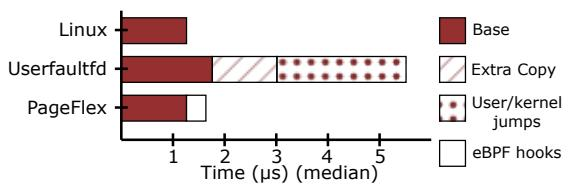  
Figure 2: Cost of zero-page fault served from the kernel and from the userfaultfd handler.

By parceling everything within the application, they also limit the blast radius of any policy implementation bugs to the application.

However, library-based approaches introduce a custom memory interface that requires application modifications. They also introduce performance overhead even without any memory offloading, as they bypass the highly-efficient address translation hardware (TLB & MMU) and introduce additional dereferences for memory indirection in software, resulting in up to a 40% slowdown [45]. Note that, unlike the overhead caused by refaults (which can be traded off with memory savings), this overhead cannot be avoided. Like userlevel paging, library approaches face compatibility challenges, as they, too, lift the entire swap infrastructure into user space and do not offer a clear solution for swap device sharing.

## 2.6 eBPF

eBPF (Extended Berkeley Packet Filter) allows user-defined programs to run within the Linux kernel, offering the flexibility to observe kernel activities and even customize their behavior without any overhead [10]. These programs are written in a C-like language, compiled into bytecode, and then verified by the kernel to ensure they are safe to execute. The programs are then "hooked" to specific points in the kernel (e.g., tracepoints, kprobes, etc.), triggering synchronous execution at those points. Data can be shared efficiently between eBPF programs and user space using eBPF maps. For safety, access to kernel data structures is not permitted unless explicitly whitelisted through specific access points, such as writable tracepoints [5]. eBPF has been widely used to unlock customization for various kernel subsystems like packet processing [24,46], file systems [17], process scheduling [28,31], storage [51, 55], kernel locks [37] and even prefetching [21].

## 3 PageFlex Design

In this section, we first discuss our design goals and how they motivate PageFlex’s design, followed by a detailed overview of PageFlex’s mechanisms.

## 3.1 Design Goals

Our key goal is to enable writing new paging policies while meeting the hyperscaler paging goals discussed in § 2.2. More concretely, our solution requires the following considerations:

1. Compatibility: Our solution must coexist with current kernel-based policies and swap backends; i.e., some workloads running with the default policies and others using Page-Flex but sharing the same swap backend.

2. Fail-safety: Failure of any PageFlex components (e.g., due to policy bugs) should not affect other workloads or even crash the apps whose policy is handled. This allows for safe, non-disruptive policy upgrades that are crucial for warehousescale deployments [28].

3. Minimal overheads: Any overheads introduced by the Page-Flex infrastructure must be minimal. More importantly, overheads that directly impact the application performance must be negligible (i.e., background overheads are more tolerable).

To achieve these goals, PageFlex only externalizes noncritical policy decisions for prefetching and proactive reclamation to user space, while the kernel continues to provide core mechanisms for page access tracking, on-demand page fault handling and page reclamation. This division of labor achieves compatibility (1), unlike userfaultfd and librarybased approaches. Also, because policy decisions are not critical to application functionality, PageFlex failures will not crash the application (2). Finally, PageFlex uses eBPF programs to provide a flexible, low-overhead view of in-kernel memory state to the externalized policy code. More specifically, policies run their performance-critical code inline with the kernel paths using eBPF to flexibly process the page events as they occur, without incurring the overheads of exporting large volumes of page event metadata to user space (3).

## 3.2 System Overview

Figure 3 provides an overview of PageFlex’s design. At a high level, PageFlex consists of a kernel component (left half of the figure) with eBPF programs where policies run inband with the kernel events to get a low-overhead memory view and arrive at paging decisions. This information is then shared out-of-band with a user-level component (right half) which is used to enforce these decisions and implement any non-performance critical policy infrastructure.

## 3.2.1 In-kernel policy execution

To provide a memory view, PageFlex tracks various basic paging events with explicit kernel tracepoints. Policies then subscribe to (any subset of) these events and provide event handlers that PageFlex runs synchronously with the paging events in the kernel as eBPF programs. We discuss these components below.

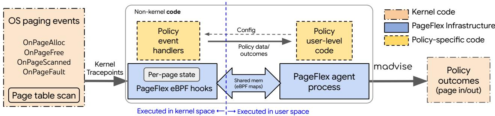  
Figure 3: An overview of PageFlex’s design showing various components. The policy control flows from left to right. The box in the middle indicates the components that support the policy code written outside the kernel code.

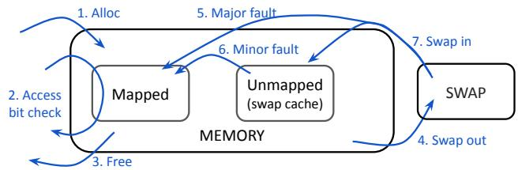  
Figure 4: Paging paths (blue arrows) that PageFlex’s events track for each page, as the page transitions between various memory states and the swap backend.

Kernel paging events. The left-most box in Figure 3 shows the set of in-kernel page events PageFlex provides for policy handlers to subscribe to. (Figure 4 shows all the page state transitions these events cover.) OnPageAlloc (arrows 1 and 7 in Figure 4) and OnPageFree (arrows 3 and 4) events are raised when a page enters or leaves the memory, either due to allocation or freeing by the application or being moved in from/out to the swap backend. These events are useful for keeping track of the current memory and swap state. For access information, PageFlex tracks two sets of events: for unmapped pages, OnPageFault (arrows 5 and 6) is raised when an unmapped page is requested by the process through a page fault (regardless of whether the page is mapped from the swap backend or the swap-cache)—it reports both swapcache hit and miss events as both are useful access signals for prefetching (§2.3). For mapped pages, PageFlex periodically collects page access bits similar to g-swap. OnPageScanned (arrow 2) is raised for each page with information on whether it is accessed. Combined, these events provided the necessary information for all the policies we implemented (§6.3).

eBPF-based custom event handlers. Policies subscribe to (any subset of) the above events and provide custom handler functions that PageFlex runs inline with the events as eBPF programs. Allowing policy-specific handlers with eBPF avoids the need for indiscriminately tracing and communicating everything to user space. In fact, we will show that most policies can make their decisions in their event handlers and only export digested data (like policy outcomes to enforce or statistics for policy tuning in user space). The event handlers run synchronously with paging paths, potentially impacting application performance (e.g., slower page fault handling due to OnPageFault events). However, the overhead of eBPF programs is very little (<50 ns per eBPF invocation), allowing PageFlex to use them aggressively even in high-frequency paths. (We quantify the overhead of eBPF in §6.5.)

Low-overhead per-page state. Policies generally need to maintain per-page metadata as they learn from page accesses and make decisions over time. For example, g-swap keeps track of page ages for LRU ordering. As we will see in §4.1, most reclamation policies assign per-page scores that are updated over time based on page accesses. Such state can be maintained in user-space data structures (e.g., a hash table) or eBPF maps, however, these introduce overheads (i.e., lookups, additional memory). Fortunately, all the events traced in PageFlex are page-specific and the kernel page structures are already available for these events. Thus, PageFlex reserves a small space (4 bytes) in the kernel page structure for each page and provides safe and exclusive read/write access from the event handlers. This space also allows PageFlex event handlers to mark or track events for only a subset of pages based on policy-specific criteria. For example, online learning policies like LRB [42] may want to sample a subset of pages and track only those pages through their lifetime (e.g., send their access events to user space) for training their models. The state is limited (a 4-B state per each page incurs a fixed 0.1% memory cost, same as g-swap), however it is more than enough for most policies. By default, the state is reset when the page is swapped out, but policies can optionally persist the old state across reclamations if needed (at an additional memory cost of 0.1% incurred for swapped-out pages as well).

## 3.2.2 User-level policy control and enforcement

PageFlex employs a dedicated user-level agent process to initialize and run policies for the applications that opt in for PageFlex. The agent process loads the policy’s eBPF handlers and lets policies configure them through eBPF maps. Policies can push events (e.g., page in/out decisions) to user space and handle them asynchronously with user-level handlers (e.g., issuing paging actions). Additionally, policies can perform any non-critical and complex functionality in their user-level code using the information passed from the event handlers, e.g., control loops used in page reclamation (§ 2.3). PageFlex enables two-way shared-memory communication between user space and the eBPF event handlers with eBPF maps.

<table><tr><td>// Reclaim interface (per-page) struct {} state;// 4B max Updateweight(state,accessBit):{}</td><td>// Hyperbolic caching struct {u8 hits；u8 age;} state; UpdateWeight(state,accessBit):</td><td>// Linux read-ahead PredictTrend(page,isHit): if(isHit and page in prevWin）nHits++;</td></tr><tr><td>OnSwapIn(state,oldState):{} default{state=0}</td><td>if(accessBit） state.hits++; state.age++;</td><td>// re-use linux function newwin =__swapin_nr_pages</td></tr><tr><td>OnSwapout(oldState)：{}</td><td>return (state.hits /state.age);</td><td>(lastPage，page，nHits);</td></tr><tr><td>default {oldState = 0}</td><td></td><td>prevWin = newwin； lastPage = page;</td></tr><tr><td></td><td>OnSwapIn(state，oldState):default</td><td></td></tr><tr><td></td><td></td><td>if（newWin） nHits = 0;</td></tr><tr><td>// Prefetch interface (per-page fault) PredictTrend(page，isHit)：{}</td><td>OnSwapout(oldState):default</td><td>return newwin；// to prefetch</td></tr></table>

Figure 5: PageFlex simplified interface for most policies (left) and example policy implementations (center and right).

Enforcing policy outcomes. PageFlex acts on the policy outcomes using madvise hints from the user-level agent to page in (for prefetching) or page out (for reclamation). Specifically, the agent process uses the process\_madvise() wrapper to issue madvise hints against a different (process’) address space. Using a hardened interface like madvise lets us avoid introducing new kernel infrastructure while still making the decisions outside the kernel. However, this introduces additional overhead due to extra user/kernel crossings when compared to the policy decisions made in pure kernel designs. E.g., in g-swap a kernel thread, kreclaimd, reclaims pages. We amortize these overheads by issuing madvise calls on batches of pages. (As shown in the results in §6.5, both prefetching and proactive reclamation paths do not directly affect application latency, allowing us to batch aggressively.)

Policy isolation. As in ghOSt [28], PageFlex provides separate “enclaves” for running different policies simultaneously for different groups of processes. Each enclave binds to a single Linux kernel cgroup and applies a single policy to all the processes in that cgroup. The enclave separation is provided in the event handlers (in eBPF), user-space code and in the communication between the two. This enables targeted policy application for select workloads while the rest continue to use the default kernel policy (while sharing the same swap backend). And, if at any point PageFlex fails (or during upgrades), the cgroup bindings are gracefully released without any effect on the attached processes. Additionally, because PageFlex uses the kernel’s swap subsystem, existing kernel-based reclamation like g-swap can be configured to take over on failure, a feature usefaultfd-based designs cannot provide.

## 4 Policies in PageFlex

In this section, we first show how PageFlex enables writing prefetching and reclamation policies with varying degrees of specialization, followed by a discussion on the limits of its policy expressibility.

## 4.1 Unlocking policy customization

Proactive reclamation. We start with a goal of unlocking various eviction algorithms for hyperscaler reclamation systems like g-swap (described in §2.3) with PageFlex. To that end, PageFlex replaces g-swap’s per-page LRU age that defines eviction ordering with generic per-page weights that are policy-specific. PageFlex then lets the policies provide custom functions to update these weights—and the way weights are updated can implement a variety of policies. For example, an LRU ordering maintains the time since last access as the weight while, for LFU, it is the number of hits. Many other traditional eviction heuristics such as LRU-K [36], LRFU [33], LIRS [30], Hyperbolic [18], LHD [15], etc. can be similarly expressed as simple functions of the page accesses. Even more complex ones based on multiple queues [50] can be modeled by partitioning the weight space to represent different queues (our 4-B per-page state allows a 32-bit weight which is large enough in practice). PageFlex runs these policy-specific functions through its (eBPF) event handlers while maintaining the page weights in the low-overhead per-page state (described in §3.2), thereby achieving the flexibility to implement various eviction algorithms for g-swap without kernel changes.

Along with policy flexibility, PageFlex’s mechanisms can also easily support policy-agnostic infrastructure that is required to support the reclamation policies. Like g-swap, Page-Flex employs periodic page-table scans to collect page access bits and allow page weight updates, exports page-weight distributions using eBPF maps, and runs the control loop in the userlevel agent to determine the eviction threshold. To simplify policies, PageFlex abstracts away this common infrastructure and provides the interface shown in Figure 5 for most polices (like above) that can work with simple update functions. The only required function is UpdateWeight, which is called periodically for each page after checking its access bit (provided as accessBit) and returns a new weight (see the example for Hyperbolic caching [18] in the center). The function can maintain a small state (state) persisted as long as the page is in memory. By default, the state is reset once the page is swapped out. This works for most policies as they do not need the access history after a page gets reclaimed. Some policies, however, remember the order of recently reclaimed pages to maintain a ghost queue [50], while a learning-based policy may want to remember the tracked pages across reclamations, and g-swap remembers the page age when it was reclaimed, etc. To enable such policies, PageFlex optionally lets the policies customize the behavior at OnSwapIn and OnSwapOut to persist and retrieve the state (oldState). More specialized policies, however, may bypass this simplified interface and directly work with the core paging events described in § 3.2.

Prefetching. As discussed in §2.3, prefetching policies require page refault history for trend detection and predicting the next pages in the trend to prefetch, and the number of prefetching hits (through minor-faults) to adjust the predictions. PageFlex can provide both the signals with OnPageFault events. Similar to reclamation, PageFlex takes care of the policy-agnostic support like enforcing prefetching decisions while only requiring the policies to define a PredictTrend function, where they can detect any trend and return the pages to prefetch. The function could be marked to run directly in the eBPF event handler or in user-level code depending on complexity. Figure 5 (right) shows the Linux read-ahead policy implemented with PageFlex’s simplified prefetching interface.

## 4.2 Application-specific policies

PageFlex further supports applying distinct paging policies to different continuous memory regions and execution phases within a user application. This capability is particularly beneficial for workloads with diverse memory access patterns. For example, two memory regions with distinct memory access patterns might exist in a graph processing application: graph edges are traversed sequentially, while vertices are accessed randomly. In such scenarios, applying separate prefetching (and reclamation) policies to the two regions can significantly enhance performance and memory savings.

Specialization in PageFlex is guided by applicationprovided hints. PageFlex offers an inter-process communication (IPC) interface, enabling authorized agents to provide these hints. Each hint message associates an existing Page-Flex policy, along with specific parameters, to a designated memory region represented by memory addresses. With Page-Flex’s IPC client library, agents can be developed to monitor and analyze applications’ memory access patterns (e.g., detecting sequentiality) and translate these observations into corresponding PageFlex hints (e.g., applying lookahead prefetching with a step size of N). Agents can be implemented within the application process or as independent, authorized processes running alongside the application. By providing hints to PageFlex for region creation/deletion or adjustments to prefetching/reclamation policies, applications can create specialized spatial and temporal and paging policies.

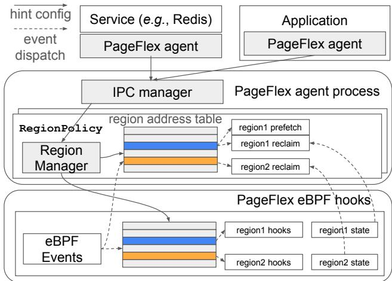  
Figure 6: Control (solid line) and event dispatch (dotted line) paths for application specialization support.

As illustrated by Figure 6, PageFlex enforces specializations through a new policy, RegionPolicy, which composes existing PageFlex policies and dynamically manages isolated sub-policies for specific memory address regions. Upon receiving a hint from an agent, PageFlex dynamically creates, updates, or removes sub-policies. Internally, PageFlex maintains a mapping table that associates memory regions with their corresponding sub-policies. To ensure correctness, the regions in this table are non-overlapping, and each region can be linked to at most one prefetching policy and one reclamation policy. PageFlex dispatches events to the appropriate sub-policies based on the virtual address of the accessed page, operating seamlessly across both user and kernel space.

## 4.3 Limits of policy expressibility

To avoid the CPU and memory overheads of exporting page access data to user space, PageFlex makes the design choice to limit the policy to eBPF programs which need to work with very limited state in the kernel. This may limit policies in some ways. First, writing complex policies could be challenging with eBPF due to verifier restrictions on program complexity (§ 2.6), limiting some policies such as LRB [42] which require ML model inference. Second, limited state such as the 32-bit per-page weights available to summarize a page’s access history that are only accessible to eBPF code (as opposed to complex user-level data structures) could also limit the policies which work with more “information context”. For example, a hypothetical policy that looks for spatial access patterns across the address space over time may be challenging to implement.

For such policies, PageFlex may still be used by shifting the policy complexity to user space while the eBPF handlers merely export the necessary state instead of running the policy. However, in such cases, policies are left to account for the CPU/memory costs of exporting the state when weighing against the potential memory savings. It is worth noting that policy complexity generally translates to increased cost in making policy decisions to which paging policies are highly sensitive; as a result the increased cost may discourage such complex policies regardless of where they are implemented.

## 5 Implementation

PageFlex is implemented with a combination of Linux kernel changes, a user-space agent written in C++, and a collection of eBPF programs. We made 608 lines of changes to kernel code with most of it defining and introducing tracepoints at various paging events, and supporting the reserved field in the page struct. Excluding the policy-specific component, the agent constitutes 2,900 lines of C++ code and the eBPF programs are 700 lines of code to support the key components and the simplified policy interfaces.

Tracepoints. We add tracepoints in the kernel code to support PageFlex’s events (sometimes at multiple places for each event) and attach eBPF programs to run the event handlers where needed. Page allocations, frees, swap-ins and swap-outs are traced from cgroup page charge and uncharge functions that already track all possible ways pages enter and leave memory. Page-fault events are traced from page-fault handling code. For page-access scans, we depend on a kernel thread similar to g-swap’s kstaled whose period can be externally controlled. Currently, the thread scans all physical pages in the system in each scan; in future, this can be made cgroupspecific by moving to the (already-upstreamed) MGLRU’s page-table-based scans [8]. All tracepoints export the memcg id of the page so PageFlex can target required cgroups and a writable pointer to the reserved field in the page struct (described below).

Per-page persistable state. To provide low-overhead perpage state for eBPF code, we reserve a 4-byte field in the kernel page struct (associated with for each page in memory) exclusively for eBPF use. By default, eBPF disallows writing to kernel data structures exported through the tracepoints. To allow write access, we use writeable tracepoints [5] that allow explicitly whitelisting specific (section of) kernel data structures (in our case, the reserved 4-byte field in the page struct) to be writable by eBPF programs. This is safe because we make sure this field is never read by the kernel so any data written by the eBPF programs has no effect on the kernel’s operation. To persist the state across swap-outs (the page structs are freed for swapped-out pages), we re-use swap cgroup maps that already maintain cgroup ids for swap entries for cgroup-level swap accounting. When a page is swapped in, we retrieve the old state and provide it to the policy through the OnPageAlloc event.

eBPF maps. PageFlex extensively uses eBPF maps for eBPF/user space communication. For each policy, we use a BPF\_MAP\_TYPE\_HASH map for policy configuration, BPF\_MAP\_TYPE\_ARRAY map for statistics, and BPF\_MAP\_TYPE\_RINGBUF for event notifications to trigger user-level handlers if needed. Policies may employ maps where needed, too. For policies in § 4.1, we use histograms modeled on hash maps to communicate page weight distributions. Region-aware policy in § 4.2 maintains a hash map to store the VMA segment to sub-policy association, which is traversed to find the right policy handler at each event. (Current implementation reserves 256 slots per enclave.)

## 6 Evaluation

In this section, we evaluate PageFlex for its flexibility and performance overheads. Specifically, we focus on the following high-level questions:

• Can PageFlex externalize current (kernel-based) policy implementations without negating their benefits?

• Is PageFlex flexible enough to support new policies? Specifically, can PageFlex enable specializing the policies, from general policy improvements that go beyond the current defaults like LRU to more tailored application-specific ones, and show improved memory savings?

• What overheads does PageFlex introduce, if any?

## 6.1 Testbed

We run experiments on a server fitted with two 24-core Intel Xeon E5-2696 CPUs each with 128 GB of memory. The server runs Linux 5.10 with PageFlex kernel changes discussed in §5. We use g-swap [32] as our kernel-based baseline for comparison. To ensure a fair comparison, we use the same kernel rebased with g-swap. Unless otherwise mentioned, we use zswap [7] as the swap backend. For a fast SSD-based swap emulation (with a 50-µs mean access latency), we use a block device supported by the Linux ublk driver using an SPDK Ublk target [11]. We use a combination of real-world benchmarks like Redis [4], RocksDB [22] and the GAP benchmark suite [14], and various synthetic workloads with a memory-access generator when evaluating application-level performance impact. For some long-running workloads, we first collect page-level access traces and replay them faster with the access generator (along with commensurate speedup in policy execution) where we need to collect a large number of data points; in such cases, we take care to only compare policy effectiveness (e.g., cache miss rate) and not raw performance (§ 6.3). Table 2 shows the list of workloads for which we collected page-level access traces by periodically scanning the page tables and logging the accessed pages in each scan. We get these traces at a fine granularity (10–60 seconds) compared to their total running time which varies from hours to days. Where possible, we always batch the madvise calls to issue page-in or page-out hints for up to 64 pages. (We quantify the benefit in § 6.5).

<table><tr><td>Trace group</td><td>#Traces</td><td>#Pages (M)</td><td>Max RSS (GB)</td><td>Span (hrs)</td><td>Scan interval (s)</td><td>Description</td></tr><tr><td>Redis</td><td>1</td><td>10</td><td>40</td><td>1</td><td>10</td><td>10-Mkeys, zipf skew= 0.5 workload</td></tr><tr><td>Memcached</td><td>4</td><td>1.3</td><td>5.2</td><td>1</td><td>60</td><td>10M 1024-B and 8-KB objs,sliding hotset</td></tr><tr><td>Database A</td><td>2</td><td>1</td><td>4</td><td>1</td><td>30</td><td>Proprietary SQL DB (like [44]) benchmark</td></tr><tr><td>Twitter KV</td><td>3</td><td>2.9-11.2</td><td>11.6-44.8</td><td>24-100</td><td>10</td><td>Twitter KV traces [49] played on Redis</td></tr><tr><td>Meta KV</td><td>4</td><td>2.8</td><td>11.2</td><td>24</td><td>10</td><td>MetaKV traces [9] played on Redis</td></tr></table>

Table 2: Traces used for evaluation of PageFlex policies. We collect the page-level access traces by periodically scanning the page tables, at a fine granularity (10-60 seconds) compared to their total running time (hours to days).

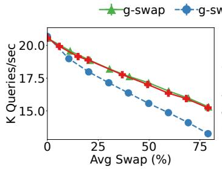  
(a) Redis

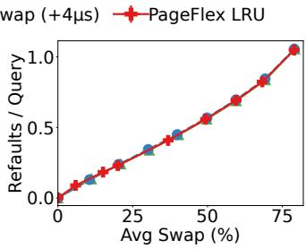

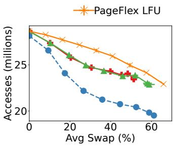

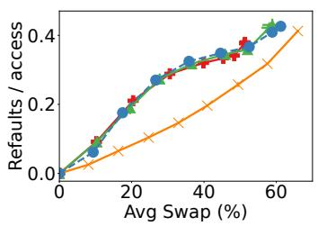  
(b) Synthetic  
Figure 7: Performance comparison of PageFlex’s LRU with g-swap’s kernel-based implementations for (a) Redis with a zipf(0.5) client and (b) a memory access generator with an LFU-friendly workload. In each case, the left plot shows the raw application performance at various memory offloading targets and the right plot shows the refault rates for the same.

## 6.2 Existing policies on PageFlex

We start with implementing existing policies on PageFlex to show that PageFlex can support these policies without causing any application slowdown compared to their functionallyequivalent kernel-based implementations.

PageFlex LRU vs g-swap. We use g-swap’s age-based reclamation as our kernel baseline and compare with Page-Flex’s LRU, which fully implements g-swap outside the kernel (§ 4.1). We run Redis with the memtier client, loaded with 10M keys with 1024-byte values (12 GB total memory), and measure its performance for requests drawn from a zipf(0.5) distribution. To compare policies at different degrees of memory offloading, we configure both systems to tune the age threshold based on a static memory reclamation target (i.e., a fraction of total process memory that should be swapped out).

Figure 7a (left) shows the Redis performance (queries per second) at various memory reclamation targets for both systems. The overall performance degrades with the increasing memory offloading as expected, as the refault rate per query (shown in Figure 7a right) increases. The performance of PageFlex’s LRU is similar to g-swap’s LRU (within 0.98% of baseline) for all memory reclamation targets. The refault rates are also similar, showing their functional equivalence as well. To give a sense of the potential impact of userfaultfd-like overhead in the page swap-in path, we show the performance of g-swap modified to inject an additional 4-µs delay for each page fault, the overhead that userfaultfd introduces (§2.4). (Note that drawing an apples-to-apples comparison with real userfaultfd was infeasible, as it cannot use a kernel-based swap backend as PageFlexdoes; additionally, page access information is not yet available in userfaultfd). This result is significantly worse, slowing down the application by up to an additional 13.3% (for a similar refault rate), showing the importance of avoiding overheads in the page fault path. For reference, even a policy that randomly reclaims pages, which increases the refaults per query by 40% (to 1.4) at the rightmost point (80% swap), only incurs a 8.1% additional slowdown. Note that we only look at the direct impact to application performance here; we discuss the overheads added to the asynchronous policy work, which is similar across benchmarks, in §6.5.

To show another example where PageFlex can support a policy better suited for the workload, we use a synthetic memory access generator that generates page accesses from a skewed distribution interleaved with large sequential scans—a workload where pure recency-based eviction algorithms like LRU do poorly and LFU does better as it can filter out the noisy scans more effectively. We take measurements similar to Figure 7a, with the number of pages accessed in a fixed time (5-minute runs) as the performance metric. Figure 7b shows the results for the same configurations as above, as well as LFU implemented with PageFlex. Both LRUs perform similarly worse compared to LFU, which degrades more gracefully with increasing memory offloading, due to the better miss rate shown in the right graph. For example, for a 10% slowdown (25.8 million accesses), LFU achieves 41% swap usage compared to LRU’s 20% swap usage, providing 2× the memory savings. Emulated userfaultfd performance is again significantly worse than the baseline, potentially negating LFU’s benefit (if it were to be implemented as a userfaultfd-based policy).

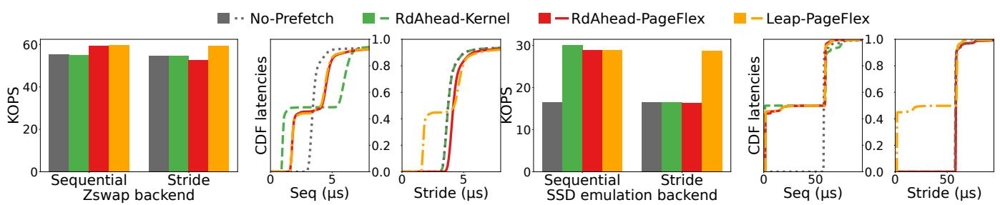  
Figure 8: Page refault rate (pages/sec) and page fault latency distributions of a sequential and strided memory access patterns when working with various prefetching policies on two very different swap backends. Both kernel and PageFlex-based read-ahead improve the sequential performance but only Leap helps the strided one. The improvements are more significant with the emulated SSD backend.

Linux default read-ahead with PageFlex. We externalize Linux’s default read-ahead policy with PageFlex to quantify the overheads of running a prefetching policy on Page-Flex. We implemented Linux’s simple sequential trend detection and window size calculation in the PredictTrend function provided by our prefetching interface, which runs in the user-level code. The implementation consists of 61 lines, 41 of which were borrowed from the kernel code to perform window-size estimation.

To show policy equivalence and overheads, we use a synthetic benchmark with sequential and strided access patterns. The benchmark starts with a large dataset in the swap backend and promotes the data into memory with various fault patterns. Figure 8 (left) shows the rate at which the benchmark can promote the pages (with a 10-µs no-op work between the accesses) from a zswap backend. With sequential accesses, both kernel and PageFlex read-ahead prefetch half the pages as expected—we limit the prefetch window size to 1 in all cases. Figure 8 (second) shows the swap-in latency distribution. The no prefetching case (No-Prefetch) sees the standard zswap swap-in latency (3.5 µs at median) for most pages. For both read-aheads (RdAhead-Kernel and RdAhead-PageFlex), half of the pages see lower (minorfault) latency due to a prefetching hit (1.08 µs for kernel and 1.85 for PageFlex at p25), whereas the other half see higher latency compared to No-Prefetch due to a miss. The kernel’s miss latency (6.2 µs at p75) is twice as high as usual major fault, as the prefetches are synchronously issued with the original page fault and (unlike a block device-based swap backend) zswap’s swap handling is also synchronous. Page-Flex, however, prefetches asynchronously, incurring a miss latency closer to that of a major fault (No-Prefetch). For both hits and misses, PageFlex’s latency is still slightly (0.5–1 µs) higher than the usual minor and major faults respectively— while a small fraction of it is PageFlex’s eBPF overhead, we noticed that the interleaved madvise calls that do the prefetching from PageFlex’s agent thread contribute to this overhead. Still, PageFlex’s read-ahead is (inadvertently) faster than the kernel because of its asynchronous prefetching in the sequential case, but is slightly (3%) slower than the kernel, as expected, in the strided case with no prefetching.

The benefits of prefetching are more apparent with an SSDlike swap backend, where the cost of a major fault is much higher and prefetching makes a huge difference. Figure 8 (right half) shows the same results with an SSD emulation backend, where the swap-in latency is 58 µs at the median (for No-Prefetch) and both the read-aheads avoid this cost for half the prefetched pages. The kernel read-ahead promotes pages 82% faster than No-Prefetch for the sequential benchmark, and PageFlex’s read-ahead is similarly (76%) faster. When not prefetching (in the stride case), PageFlex (at 16228 ops per sec) is only 0.8% slower than No-Prefetch (16364), adding very little overhead. In the figure, we also show the performance of the Leap [12] prefetching implemented with PageFlex (details in §6.3), which can capture strided patterns that the default read-ahead implementations cannot. In the stride case, only Leap prefetches (half) the pages as expected, and delivers higher performance over the both read-aheads on both the backends; the difference is starker in SSD emulation case with a 75.4% improvement (at 28,710 operations per second).

## 6.3 Beyond default policies

To demonstrate PageFlex’s flexibility, we implemented two additional paging policies, Hyperbolic caching [18] and a version of Belady’s MIN [16], as well as the Leap prefetching [12]. Table 3 shows the implementation complexity of

<table><tr><td>Kind</td><td>Policy</td><td>eBPF</td><td>User-level (LoC w/ simple interface)</td></tr><tr><td rowspan="5">Reclaim</td><td>LRU (g-swap)</td><td>6</td><td>0</td></tr><tr><td>LFU</td><td>8</td><td>0</td></tr><tr><td>Hyperbolic [18]</td><td>17</td><td>0</td></tr><tr><td>Belady&#x27;sMIN[16]</td><td>33</td><td>100</td></tr><tr><td>Region-aware ($6.4)</td><td>95</td><td>204</td></tr><tr><td rowspan="2">Prefetch</td><td>Linux default</td><td>0</td><td>61</td></tr><tr><td>Leap [12]</td><td>0</td><td>187</td></tr></table>

Table 3: Policies we implemented with PageFlex.

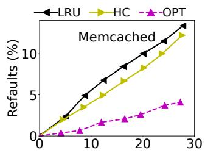

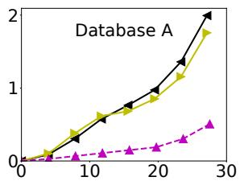

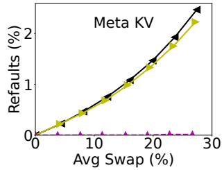

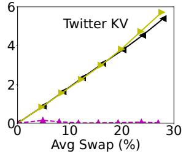  
Figure 9: Refault rates for LRU, Hyperbolic (HC) and Belady’s MIN policies with PageFlex for various page access traces, for memory offload targets up to 30%.

each.

Hyperbolic caching [18] is a recent cache eviction policy that introduces hit density, a new metric defined as the ratio of the number of accesses seen to the age of the page in the cache, to order the pages for eviction (lower hit density gets evicted first). Hyperbolic requires 17 LoC as shown in Figure 5 (center).

Belady’s MIN [16]. We also implemented Belady’s MIN [16] with a page access oracle based on the traces; this policy is not practical for real applications, but serves as a good representative for complex learning-based policies like LRB [42] from an implementation flexibility standpoint. Our MIN implementation re-uses our generic model with one difference: the UpdateWeight function performs a lookup to a table with distance to the next access for all pages (installed before each scan by the user-level code with access to the trace); one can imagine a policy that uses a learned ML model like LRB [42] to predict the same information.

We evaluate the performance of the above policies (i.e., refault or miss ratio at a given amount of offloaded memory) on the traces shown in Table 2. Figure 9 shows the observed refault rate (normalized to trace length) against average swap usage for one representative trace from each group (the results for other traces in the group are similar). Hyperbolic caching (HC) does slightly better than LRU for Memcached, Meta KV and in some regions of Database A. With Memcached, for example, Hyperbolic allows up to 5% more memory savings at a certain refault rates (e.g., 7%). For all the traces, there is a big gap between either of these policies and MIN, suggesting opportunity for better policies, as we also noted in §2.3.

Leap prefetching [12]. To show prefetching flexibility, we re-implemented the Leap prefetching with PageFlex. We implemented Leap’s complex trend detection (§2.3) entirely in the PrefetchTrend function provided by our prefetching interface, where we re-used most of the trend detection logic from the original Leap implementation [1]. This required 187 lines of policy-specific code, out of which 160 were copied from the original Leap code. We discussed the resulting prefetching improvements at the end of §6.2.

## 6.4 Application-specific policies

We demonstrate PageFlex’s flexibility in supporting specialized policies with spatial/temporal workload awareness with the help of two case studies.

Policy specialization in a key/value store. Meta’s study [22] demonstrates that key/value store access patterns exhibit significant non-uniformity, with strong key-space and temporal locality. We reproduce the access patterns from the original study [22] using the db\_bench tool, focusing on two scenarios: 1) Region (key-space) hotness pattern, where different memory regions are assigned varying eviction thresholds. We implement a PageFlex agent that monitors the hotness in different application-defined regions. This agent uses an LRU policy for all regions but sets distinct reclamation thresholds based on observed region hotness. We assume the KV store logically maps its key space onto the address regions (hence patterns), for example, by using key-range-based heap segregation or by re-organizing/compacting key/value pairs. 2) Phase change pattern, where the access pattern changes from random access to sequential scan during the runtime. We implement an agent that dynamically switches the reclamation policy from the default LRU to MRU accordingly. We then compare the average memory savings for these specialized policies with the default LRU policy, while keeping the KV performance target the same for all policies. As shown in Figure 10-left, the specialized policies achieve up to 36% more memory savings than the default LRU policy.

ExtMem [29] policies for PageRank. ExtMem introduced a specialized compound reclaim and prefetch policy designed for the PageRank workload within the GAP benchmark suite [14]. This policy targets a specific memory region within the application, the “edge array”, applying sequential eviction and prefetching to optimize performance. To leverage this policy with PageFlex, we implemented an agent within the application that sends hints to PageFlex upon creation of the edge array. This agent assigns a lookahead prefetching policy and an MRU reclamation policy to the edge array region. All other regions use the default LRU reclamation policy. This agent requires adding approximately 10 lines of code to the application, with no modifications required within PageFlex. This specialized policy reduces memory usage by 6.4% (Figure 10-middle) compared to a uniform LRU policy, with a performance overhead of less than 2% (Figure 10-right).

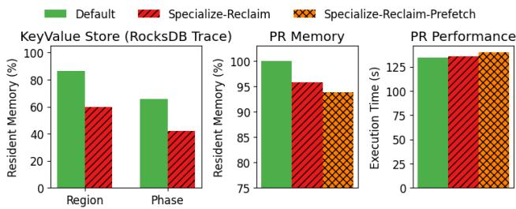  
Figure 10: Specialized policies in KV store and GAPBS PageRank.

## 6.5 PageFlex Overheads

PageFlex runs most policy infrastructure asynchronously and overheads introduced in these paths do not directly cause application slowdown (as we have seen so far), but they still increase the resource usage, which could be a concern. We discuss these overheads below.

Page table scanning overhead. Recall that PageFlex employs a kernel thread to periodically scan page tables to inform page access information with OnpageScanned events. These scans are CPU-intensive and any increased overhead could limit how often a policy can choose to run these scans, affecting its efficacy. To isolate the overhead added by Page-Flex’s eBPF hooks, we compare the CPU usage for each scan in the Redis experiments from §6.2, where we compared PageFlex LRU and g-swap. While g-swap’s scans take 0.72 seconds (on 1 CPU core) on average to scan 12 GB of memory, PageFlex scans average 0.87 secs, a 17% increase due to the eBPF invocation for each page scanned (≈50 ns per invocation). Note that the relative overhead is constant regardless of the application’s memory footprint. Unlike PageFlex, userfaultfd does not provide page access information.

Paging from user space. Unlike kernel-based policies, policy outcomes in PageFlex are enforced from the user-level agent, incurring extra syscall overhead for calls to madvise, which we amortize with batching. To quantify the overhead, we compare the work done by PageFlex’s agent for reclaiming pages to that of g-swap’s kreclaimd thread which reclaims pages directly in the kernel. While kreclaimd spends an average of 4.3 µs to offload a page to zswap, PageFlex takes 6.9 µs to do the same from the agent, a 57% increase. However, after batching the offloading with one process\_madvise call per 64 pages, the cost comes down to an amortized 4.9 µs per page, a 14% overhead. Note that, assuming similar paging costs, userfaultfd would incur a similar user-kernel crossing overhead for its syscalls, in addition to the cost of extra page copying per syscall.

## 7 Conclusion

Paging policies determine how much memory can be offloaded within a performance target. Existing deployments employ OS-based policies, making it slow and risky to evolve them in hyperscaler data centers. User-level designs such as userfaultfd and library-based approaches can provide better policy flexibility by completely externalizing paging, but they introduce practicality concerns such as significant performance overheads or incompatibility with existing deployments. To address these issues, PageFlex carefully separates the paging policy from the underlying mechanisms, and delegates the policy to eBPF programs, thereby providing policy flexibility while keeping the overheads low. We show that PageFlex enables writing prefetching and reclamation policies with varying degrees of specialization, and with virtually no impact on application performance.

## Acknowledgments

We thank David Culler, Andrew Baumann, the anonymous reviewers, and our shepherd, Ankit Bhardwaj, for valuable feedback on earlier drafts of this manuscript.

## References

[1] Leap prefetching changes to the Linux kernel. https: //github.com/SymbioticLab/Leap.

[2] Querying data in Amazon S3 directly with user-space page fault handling. https://tech.nextroll.com/ blog/data/2016/11/29/traildb-mmap-s3.html, 2016.

[3] Linux Userfaultfd. https://www.kernel.org/ doc/html/latest/admin-guide/mm/userfaultfd. html, 2022.

[4] Redis - an open source, in-memory data store. https://redis.io/, 2023.

[5] Linux ebpf patch: writable contexts for bpf raw tracepoints. https://lwn.net/ml/bpf/20190419210409. 5021-1-mmullins@fb.com/, 2024.

[6] Linux multi-gen LRU. https://www.kernel.org/ doc/Documentation/mm/multigen\_lru.rst, 2024.

[7] Linux zswap swap cache documentation. https:// docs.kernel.org/admin-guide/mm/zswap.html, 2024.

[8] Merging the multi-generational LRU. https://lwn. net/Articles/894859/, 2024.

[9] Running cachebench with the trace workload. https://cachelib.org/docs/Cache\_Library\_ User\_Guides/Cachebench\_FB\_HW\_eval, 2024.

[10] A thorough introduction to eBPF. https://lwn.net/ Articles/740157/, 2024.

[11] ublk: the new and improved way to serve spdk storage locally! https://spdk.io/news/2023/03/28/ublk/, 2024.

[12] Hassan Al Maruf and Mosharaf Chowdhury. Effectively prefetching remote memory with Leap. In Proceedings of the USENIX Annual Technical Conference, July 2020.

[13] Emmanuel Amaro, Christopher Branner-Augmon, Zhihong Luo, Amy Ousterhout, Marcos K. Aguilera, Aurojit Panda, Sylvia Ratnasamy, and Scott Shenker. Can far memory improve job throughput? In Proceedings of the 15th European Conference on Computer Systems, EuroSys 2020, page 16. ACM, 2020.

[14] Scott Beamer, Krste Asanovic, and David Patter- ´ son. The GAP benchmark suite. arXiv preprint arXiv:1508.03619, 2015.

[15] Nathan Beckmann, Haoxian Chen, and Asaf Cidon. LHD: Improving cache hit rate by maximizing hit density. In 15th USENIX Symposium on Networked Systems Design and Implementation (NSDI 18), pages 389–403, Renton, WA, April 2018. USENIX Association.

[16] L. A. Belady. A study of replacement algorithms for a virtual-storage computer. IBM Systems Journal, 5(2):78– 101, 1966.

[17] Ashish Bijlani and Umakishore Ramachandran. Extension framework for file systems in user space. In 2019 USENIX Annual Technical Conference (USENIX ATC 19), pages 121–134, Renton, WA, July 2019. USENIX Association.

[18] Aaron Blankstein, Siddhartha Sen, and Michael J. Freedman. Hyperbolic caching: Flexible caching for web applications. In 2017 USENIX Annual Technical Conference (USENIX ATC 17), pages 499–511, Santa Clara, CA, July 2017. USENIX Association.

[19] Irina Calciu, M. Talha Imran, Ivan Puddu, Sanidhya Kashyap, Hasan Al Maruf, Onur Mutlu, and Aasheesh Kolli. Rethinking software runtimes for disaggregated memory. In ASPLOS, pages 79–92, 2021.

[20] Blake Caldwell, Sepideh Goodarzy, Sangtae Ha, Richard Han, Eric Keller, Eric Rozner, and Youngbin Im. FluidMem: Full, flexible, and fast memory disaggregation for the cloud. In 2020 IEEE 40th International Conference on Distributed Computing Systems (ICDCS), pages 665–677, 2020.

[21] Xuechun Cao, Shaurya Patel, Soo Yee Lim, Xueyuan Han, and Thomas Pasquier. FetchBPF: Customizable prefetching policies in linux with eBPF. In 2024 USENIX Annual Technical Conference (USENIX ATC 24), pages 369–378, Santa Clara, CA, July 2024. USENIX Association.

[22] Zhichao Cao, Siying Dong, Sagar Vemuri, and David HC Du. Characterizing, modeling, and benchmarking RocksDB key-value workloads at Facebook. In 18th USENIX Conference on File and Storage Technologies (FAST 20), pages 209–223, 2020.

[23] Lei Chen, Shi Liu, Chenxi Wang, Haoran Ma, Yifan Qiao, Zhe Wang, Chenggang Wu, Youyou Lu, Xiaobing Feng, Huimin Cui, Shan Lu, and Harry Xu. A tale of two paths: Toward a hybrid data plane for efficient Far-Memory applications. In 18th USENIX Symposium on Operating Systems Design and Implementation (OSDI 24), pages 77–95, Santa Clara, CA, July 2024. USENIX Association.

[24] Zhongjie Chen, Qingkai Meng, ChonLam Lao, Yifan Liu, Fengyuan Ren, Minlan Yu, and Yang Zhou. eTran: Extensible kernel transport with eBPF. In 22nd USENIX Symposium on Networked Systems Design and Implementation (NSDI 25), pages 407–425, Philadelphia, PA, April 2025. USENIX Association.

[25] Padmapriya Duraisamy, Wei Xu, Scott Hare, Ravi Rajwar, David Culler, Zhiyi Xu, Jianing Fan, Christopher Kennelly, Bill McCloskey, Danijela Mijailovic, Brian Morris, Chiranjit Mukherjee, Jingliang Ren, Greg Thelen, Paul Turner, Carlos Villavieja, Parthasarathy Ranganathan, and Amin Vahdat. Towards an adaptable systems architecture for memory tiering at warehousescale. In Proceedings of the 28th ACM International Conference on Architectural Support for Programming Languages and Operating Systems, Volume 3, ASPLOS 2023, page 727–741, New York, NY, USA, 2023. Association for Computing Machinery.

[26] Zhiyuan Guo, Zijian He, and Yiying Zhang. Mira: A program-behavior-guided far memory system. In Proceedings of the 29th Symposium on Operating Systems Principles, SOSP ’23, page 692–708, New York, NY, USA, 2023. Association for Computing Machinery.

[27] Steven M. Hand. Self-paging in the Nemesis operating system. In USENIX Symposium on Operating Systems

Design and Implementation (OSDI 99), pages 73–86. USENIX Association, 1999.

[28] Jack Tigar Humphries, Neel Natu, Ashwin Chaugule, Ofir Weisse, Barret Rhoden, Josh Don, Luigi Rizzo, Oleg Rombakh, Paul Turner, and Christos Kozyrakis. GhOSt: Fast & flexible user-space delegation of linux scheduling. In Proceedings of the ACM SIGOPS 28th Symposium on Operating Systems Principles, SOSP ’21, page 588–604, New York, NY, USA, 2021. Association for Computing Machinery.

[29] Sepehr Jalalian, Shaurya Patel, Milad Rezaei Hajidehi, Margo Seltzer, and Alexandra Fedorova. ExtMem: Enabling application-aware virtual memory management for data-intensive applications. In 2024 USENIX Annual Technical Conference (USENIX ATC 24), pages 397–408, 2024.

[30] Song Jiang and Xiaodong Zhang. LIRS: an efficient low inter-reference recency set replacement policy to improve buffer cache performance. SIGMETRICS Perform. Eval. Rev., 30(1):31–42, jun 2002.

[31] Kostis Kaffes, Jack Tigar Humphries, David Mazières, and Christos Kozyrakis. Syrup: User-defined scheduling across the stack. In Proceedings of the ACM SIGOPS 28th Symposium on Operating Systems Principles, SOSP ’21, page 605–620, New York, NY, USA, 2021. Association for Computing Machinery.

[32] Andres Lagar-Cavilla, Junwhan Ahn, Suleiman Souhlal, Neha Agarwal, Radoslaw Burny, Shakeel Butt, Jichuan Chang, Ashwin Chaugule, Nan Deng, Junaid Shahid, Greg Thelen, Kamil Adam Yurtsever, Yu Zhao, and Parthasarathy Ranganathan. Software-Defined Far Memory in Warehouse-Scale Computers. International Conference on Architectural Support for Programming Languages and Operating Systems - ASPLOS, pages 317– 330, 2019.

[33] Donghee Lee, Jongmoo Choi, Jong-Hun Kim, S.H. Noh, Sang Lyul Min, Yookun Cho, and Chong Sang Kim. LRFU: a spectrum of policies that subsumes the least recently used and least frequently used policies. IEEE Transactions on Computers, 50(12):1352–1361, 2001.

[34] Michael Marty, Marc De Kruijf, Jacob Adriaens, Christopher Alfeld, Sean Bauer, Carlo Contavalli, Michael Dalton, Nandita Dukkipati, William C Evans, Steve Gribble, Nicholas Kidd, Gautam Kumar, Carl Mauer, Emily Musick, Lena Olson, Erik Rubow, Michael Ryan, Kevin Springborn, Paul Turner, Valas Valancius, Xi Wang, and Amin Vahdat. Snap: a Microkernel Approach to Host Networking. In Proceedings of the ACM Symposium on Operating Systems Principles, pages 399–413, 2019.

[35] Nimrod Megiddo and Dharmendra S. Modha. ARC: A Self-Tuning, low overhead replacement cache. In 2nd USENIX Conference on File and Storage Technologies (FAST 03), San Francisco, CA, March 2003. USENIX Association.

[36] Elizabeth J. O’Neil, Patrick E. O’Neil, and Gerhard Weikum. The LRU-K page replacement algorithm for database disk buffering. In Proceedings of the 1993 ACM SIGMOD International Conference on Management of Data, SIGMOD ’93, page 297–306, New York, NY, USA, 1993. Association for Computing Machinery.

[37] Sujin Park, Diyu Zhou, Yuchen Qian, Irina Calciu, Taesoo Kim, and Sanidhya Kashyap. Application-Informed kernel synchronization primitives. In 16th USENIX Symposium on Operating Systems Design and Implementation (OSDI 22), pages 667–682, Carlsbad, CA, July 2022. USENIX Association.

[38] Ivy Bo Peng, Marty McFadden, Eric W. Green, Keita Iwabuchi, Kai Wu, Dong Li, Roger Pearce, and Maya B. Gokhale. UMap: Enabling application-driven optimizations for page management. CoRR, abs/1910.07566, 2019.

[39] Yifan Qiao, Chenxi Wang, Zhenyuan Ruan, Adam Belay, Qingda Lu, Yiying Zhang, Miryung Kim, and Guoqing Harry Xu. Hermit: Low-Latency, High-Throughput, and transparent remote memory via Feedback-Directed asynchrony. In 20th USENIX Symposium on Networked Systems Design and Implementation (NSDI 23), pages 181–198, Boston, MA, April 2023. USENIX Association.

[40] Amanda Raybuck, Tim Stamler, Wei Zhang, Mattan Erez, and Simon Peter. HeMem: Scalable tiered memory management for big data applications and real nvm. In Proceedings of the ACM SIGOPS 28th Symposium on Operating Systems Principles, SOSP ’21, page 392–407, New York, NY, USA, 2021. Association for Computing Machinery.

[41] Zhenyuan Ruan, Malte Schwarzkopf, Marcos K. Aguilera, and Adam Belay. AIFM: High-Performance, application-integrated far memory. Proceedings of the 14th USENIX Symposium on Operating Systems Design and Implementation, OSDI 2020, pages 315–332, 2020.

[42] Zhenyu Song, Daniel S. Berger, Kai Li, and Wyatt Lloyd. Learning relaxed Belady for content distribution network caching. In 17th USENIX Symposium on Networked Systems Design and Implementation (NSDI 20), pages 529–544, Santa Clara, CA, February 2020. USENIX Association.

[43] Indira Subramanian. Managing discardable pages with an external pager. In USENIX Mach Symposium (USENIX Mach Symposium), Monterey, CA, November 1991. USENIX Association.

[44] Rebecca Taft, Irfan Sharif, Andrei Matei, Nathan Van-Benschoten, Jordan Lewis, Tobias Grieger, Kai Niemi, Andy Woods, Anne Birzin, Raphael Poss, Paul Bardea, Amruta Ranade, Ben Darnell, Bram Gruneir, Justin Jaffray, Lucy Zhang, and Peter Mattis. CockroachDB: The resilient geo-distributed SQL database. In Proceedings of the 2020 ACM SIGMOD International Conference on Management of Data, SIGMOD ’20, page 1493–1509, New York, NY, USA, 2020. Association for Computing Machinery.

[45] Brian R. Tauro, Brian Suchy, Simone Campanoni, Peter Dinda, and Kyle C. Hale. TrackFM: Far-out compiler support for a far memory world. In Proceedings of the 29th ACM International Conference on Architectural Support for Programming Languages and Operating Systems, Volume 1, ASPLOS ’24, page 401–419, New York, NY, USA, 2024. Association for Computing Machinery.

[46] William Tu, Yi-Hung Wei, Gianni Antichi, and Ben Pfaff. Revisiting the open vSwitch dataplane ten years later. In Proceedings of the 2021 ACM SIGCOMM 2021 Conference, SIGCOMM ’21, page 245–257, New York, NY, USA, 2021. Association for Computing Machinery.

[47] Chenxi Wang, Yifan Qiao, Haoran Ma, Shi Liu, Yiying Zhang, Wenguang Chen, Ravi Netravali, Miryung Kim, and Guoqing Harry Xu. Canvas: Isolated and adaptive swapping for multi-applications on remote memory. In Proceedings of the 19th USENIX Symposium on Networked Systems Design and Implementation, April 2023.

[48] Johannes Weiner, Niket Agarwal, Dan Schatzberg, Leon Yang, Hao Wang, Blaise Sanouillet, Bikash Sharma, Tejun Heo, Mayank Jain, Chunqiang Tang, and Dimitrios Skarlatos. TMO: Transparent memory offloading in datacenters. In Proceedings of the 27th ACM International Conference on Architectural Support for Programming Languages and Operating Systems, AS-PLOS ’22, page 609–621, New York, NY, USA, 2022. Association for Computing Machinery.

[49] Juncheng Yang, Yao Yue, and K. V. Rashmi. A large scale analysis of hundreds of in-memory cache clusters at Twitter. In 14th USENIX Symposium on Operating Systems Design and Implementation (OSDI 20), pages 191–208. USENIX Association, November 2020.

[50] Juncheng Yang, Yazhuo Zhang, Ziyue Qiu, Yao Yue, and Rashmi Vinayak. FIFO queues are all you need

for cache eviction. In Proceedings of the 29th Symposium on Operating Systems Principles, SOSP ’23, page 130–149, New York, NY, USA, 2023. Association for Computing Machinery.

[51] Zhe Yang, Youyou Lu, Xiaojian Liao, Youmin Chen, Junru Li, Siyu He, and Jiwu Shu. Lambda-IO: a unified IO stack for computational storage. In Proceedings of the 21st USENIX Conference on File and Storage Technologies, FAST’23, USA, 2023. USENIX Association.

[52] Anil Yelam, Stewart Grant, Saarth Deshpande, Nadav Amit, Radhika Niranjan Mysore, Amy Ousterhout, Marcos K. Aguilera, and Alex C. Snoeren. Eden: developerfriendly application-integrated far memory. In USENIX Symposium on Networked Systems Design and Implementation (NSDI), April 2025.

[53] Wonsup Yoon, Jisu Ok, Jinyoung Oh, Sue Moon, and Youngjin Kwon. DiLOS: Do not trade compatibility for performance in memory disaggregation. In Proceedings of the Eighteenth European Conference on Computer Systems, EuroSys ’23, page 266–282, New York, NY, USA, 2023. Association for Computing Machinery.

[54] Kan Zhong, Wenlin Cui, Xin Chen, Qiao Li, Zhe Yang, Youyou Lu, Xiaodan Yan, Siwei Luo, Qizhao Yuan, and Keji Huang. Revisiting swapping in user-space with lightweight threading. IEEE Transactions on Computer-Aided Design of Integrated Circuits and Systems, 42(11):4205–4218, 2023.

[55] Yuhong Zhong, Haoyu Li, Yu Jian Wu, Ioannis Zarkadas, Jeffrey Tao, Evan Mesterhazy, Michael Makris, Junfeng Yang, Amy Tai, Ryan Stutsman, and Asaf Cidon. XRP: In-kernel storage functions with eBPF. In 16th USENIX Symposium on Operating Systems Design and Implementation (OSDI 22), pages 375–393, Carlsbad, CA, July 2022. USENIX Association.

[56] Yang Zhou, Hassan M. G. Wassel, Sihang Liu, Jiaqi Gao, James Mickens, Minlan Yu, Chris Kennelly, Paul Turner, David E. Culler, Henry M. Levy, and Amin Vahdat. Carbink: Fault-Tolerant far memory. In 16th USENIX Symposium on Operating Systems Design and Implementation (OSDI 22), pages 55–71, Carlsbad, CA, July 2022. USENIX Association.