①

USENIX

THE ADVANCED COMPUTING SYSTEMS ASSOCIATION

# Torpor: GPU-Enabled Serverless Computing for Low-Latency, Resource-Efficient Inference

Minchen Yu, The Chinese University of Hong Kong, Shenzhen; and Hong Kong University of Science and Technology; Ao Wang, Alibaba Group; Dong Chen, Haoxuan Yu, Xiaonan Luo, Zhuohao Li, and Wei Wang, Hong Kong University of Science and Technology; Ruichuan Chen, Nokia Bell Labs; Dapeng Nie, Haoran Yang, and Yu Ding, Alibaba Group https://www.usenix.org/conference/atc25/presentation/yu

# This paper is included in the Proceedings of the 2025 USENIX Annual Technical Conference.

July 7–9, 2025 • Boston, MA, USA ISBN 978-1-939133-48-9

Open access to the Proceedings of the 2025 USENIX Annual Technical Conference is sponsored by

P=-r.h mEe-s

auuJl9 PgleU

King Abdullah University of

Science and Technology

# Torpor: GPU-Enabled Serverless Computing for Low-Latency, Resource-Efficient Inference

Minchen Yu†‡ Ao Wang§ Dong Chen‡ Haoxuan Yu‡ Xiaonan Luo‡ Zhuohao Li‡ Wei Wang‡ Ruichuan Chen∗ Dapeng Nie§ Haoran Yang§ Yu Ding§ †CUHK-Shenzhen ‡HKUST §Alibaba Group ∗Nokia Bell Labs

## Abstract

Serverless computing offers a compelling cloud model for online inference services. However, existing serverless platforms lack efficient support for GPUs, hindering their ability to deliver high-performance inference. In this paper, we present Torpor, a serverless platform for GPU-efficient, low-latency inference. To enable efficient sharing of a node’s GPUs among numerous inference functions, Torpor maintains models in main memory and dynamically swaps them onto GPUs upon request arrivals (i.e., late binding with model swapping). Torpor uses various techniques, including asynchronous API redirection, GPU runtime sharing, pipelined model execution, and efficient GPU memory management, to minimize latency overhead caused by model swapping. Additionally, we design an interference-aware request scheduling algorithm that utilizes high-speed GPU interconnects to meet latency service-level objectives (SLOs) for individual inference functions. We have implemented Torpor and evaluated its performance in a production environment. Utilizing late binding and model swapping, Torpor can concurrently serve hundreds of inference functions on a worker node with 4 GPUs, while achieving latency performance comparable to native execution, where each model is cached exclusively on a GPU. Pilot deployment in a leading commercial serverless cloud shows that Torpor reduces the GPU provisioning cost by 70% and 65% for users and the platform, respectively.

## 1 Introduction

The remarkable advances in machine learning (ML) and its widespread adoption in various domains have fueled a surging demand for cloud-based ML inference services [24, 32, 49, 65, 66]. Severless computing offers a compelling cloud model for inference serving [20, 58, 61]. In a serverless cloud, users publish ML models as inference functions, and delegate resource provisioning and scaling responsibilities to the cloud platform. Serverless computing is also economically appealing as users only pay for the resources consumed by their functions (i.e., pay-per-use billing), eliminating resource idling costs.

However, today’s serverless computing platforms, such as AWS Lambda [6] and Alibaba Function Compute [1], lack efficient support for GPUs. They typically run an ML model in a container (or a microVM) and early bind it to a GPU before starting to serve requests. To avoid considerable startup overhead of on-demand GPU function provisioning (e.g., tens of seconds as shown in Table 1), an inference function is maintained as a long-lived, provisioned instance on a designated GPU to handle future requests [4,7]. This approach essentially follows the “serverful” inference serving practice [47, 49, 65], requiring users to pay for the occupied GPUs even during function idling. Furthermore, our analysis in a production cloud demonstrates that inference functions exhibit varying request rates, with 85% functions being invoked no more than once per minute (Fig. 2). Early binding these functions to GPUs results in low utilization and imbalanced load across GPUs, making it inefficient for cloud providers.

We believe that an efficient serverless inference platform should provide four desirable properties. First, it should enable pay-per-GPU-use billing for users, with charges incurred only when the functions are invoked and running on GPUs. Second, the platform should achieve optimal GPU utilization through efficient GPU sharing for concurrent inference functions, minimizing resource provisioning costs for cloud providers. Third, the platform should be aware of the userspecified latency SLOs and strive to meet them for all inference requests, if feasible. Lastly, the platform should achieve the aforementioned three properties without requiring detailed knowledge about inference models due to intellectual property and business-critical confidentiality reasons. We notice that there have been several relevant systems developed in recent years [23,32,34,36,46,47,49,58,63], none of which, however, provide all of these properties for serverless inference. They often suffer from cost inefficiency, SLO violations, or necessitate model-specific knowledge (see §2.2 and §9).

In this paper, we present Torpor, a GPU-efficient serverless inference platform that achieves all four desirable properties and is readily-deployable onto real-world serverless platforms without intrusive changes. Torpor follows a late binding design principle, whereby idle inference models are maintained in host memory and dynamically swapped to GPUs upon request arrivals. Compared to GPU memory, host memory is less expensive and has a much larger capacity, making it an ideal storage for holding numerous idle functions. This approach naturally supports pay-per-GPU-use billing, as idle functions no longer occupy GPU resources. Furthermore, by dynamically swapping models from host to GPUs, it enables fine-grained GPU sharing among concurrent inference functions, substantially improving GPU utilization and load balancing across GPUs. Model swapping can also be efficiently performed through pipelined loading, yielding significantly lower latency compared to function cold starts. All these are achieved without detailed knowledge about inference models – a must-have in a commercial environment for intellectual property and confidentiality protection. These techniques, combined with intelligent request scheduling, enable the platform to optimize the SLO attainment for users.

Specifically, to realize late binding while being readilydeployable on real-world serverless platforms, Torpor leverages a GPU pooling architecture. In this design, each worker node manages a pool of local GPUs and allows its inference functions to access any of these GPUs freely through CUDA API redirection. This enables seamless model swapping within a GPU pool and is transparent to users. However, this approach also presents three key challenges.

First, GPU pooling and model swapping incur high communication overhead compared to native execution (i.e., executing a model directly on a GPU). To address this challenge, Torpor proposes asynchronous API redirection to avoid frequent synchronizations between the inference functions and the GPU pool, eliminating the high communication overheads for model inference. Torpor further utilizes pipeline execution to overlap the host-to-GPU model swapping and the inference execution, thereby reducing end-to-end latency. It also utilizes high-speed NVLink for fast model swapping between GPUs whenever feasible and beneficial. Combined with lowlatency API redirection, Torpor can efficiently execute models on any available GPUs. Torpor is intentionally designed to be model-agnostic to meet the confidentiality requirements while being generally applicable to various models, including even large generative models where runtime states (e.g., KV cache) can be managed as part of the model.

The second challenge is that GPU pooling and model swapping necessitate an efficient GPU memory management system. Torpor designs such a system that automatically tracks the addresses of models as they are swapped across multiple GPUs and adjusts each memory access of CUDA APIs accordingly during inference execution. It also efficiently organizes and shares memory blocks to avoid high memory allocation overheads, improving the overall performance of model swapping. Additionally, Torpor offers two GPU runtime management modes—runtime sharing and runtime isolation—to meet various needs for resource efficiency and

cross-model isolation.

The third challenge is that the platform should meet the latency SLOs for inference functions while maintaining low GPU costs. Torpor proposes three policies to achieve this objective. First, Torpor designs a request scheduling algorithm that minimizes model swapping overheads, resulting in reduced end-to-end inference latency. It categorizes models into two groups, heavy or light, based on whether these models incur high overhead during swapping via PCIe. Torpor then prioritizes NVLink over PCIe for transferring heavy models across GPUs, effectively reducing concurrent PCIe traffic. Second, Torpor globally manages GPU memory in the pool and leverages model heaviness to guide eviction. Together with request scheduling, this approach significantly minimizes model swapping overhead. Third, Torpor proposes an SLO-aware request queuing policy that prioritizes requests to functions that have a higher likelihood of meeting SLOs, effectively improving the SLO attainment.

We have implemented and evaluated Torpor through a pilot deployment in Alibaba Cloud 1, one of the world’s largest commercial serverless platforms. Evaluation results show that Torpor achieves low-latency model inference, comparable with native executions. Torpor can share a single GPU across hundreds of inference functions and load-balance GPUs with model swapping, resulting in over 10× cost reduction compared with current GPU offering in Alibaba Cloud. With its efficient SLO-aware scheduling and queuing policies, Torpor can serve 480 functions on a 4-GPU worker node while achieving low tail latency and satisfying millisecond-scale SLOs for all functions. Cluster experiments further demonstrate that Torpor scales well with the number of inference functions at low resource cost and meets per-function latency SLOs for thousands of functions. Torpor has been beta-released in a pilot production cluster in Alibaba Cloud, saving 70% of user costs on average and 65% of GPU provisioning costs for Alibaba Cloud.

## 2 Background and Motivation

In this section, we first give an overview of serverless inference. We then describe the inefficiency of existing solutions to enabling GPUs in serverless platforms, and highlight four key requirements in this regard.

## 2.1 Serverless Inference

As a leading serverless platform with a global presence, our Alibaba Cloud has observed a growing adoption among enterprise customers who opt to deploy their inference services using serverless functions, known as serverless inference. In comparison to existing inference services based on a “serverful” cloud model, such as AWS SageMaker [5], serverless inference significantly alleviates the burden of server management for cloud users. Specifically, the serverful approach requires users to manually configure various system-level parameters (e.g., VM types, GPUs, CPU cores, etc.) and manage resource provisioning (e.g., scaling the number of VMs up or down according to demand changes). In contrast, serverless inference enables users to simply publish models with inference code as functions, and then cloud providers automatically handle resource provisioning, autoscaling, scheduling, and fault tolerance. Furthermore, compared with the serverful approach, serverless inference also offers substantial cost savings as users do not pay for idle resources under the payper-use pricing model [20, 58, 61, 65]. In Alibaba Cloud, the requests to a function typically exhibit dynamic, bursty arrival patterns as shown in Fig. 1, consistent with previous research findings [24, 25, 32, 33, 41, 42, 47, 49, 67]. By leveraging the high elasticity of a serverless platform, inference functions can quickly scale in response to the changing workload, while users are billed based on the actual function runtime at a fine granularity, such as 1 ms [6, 8].

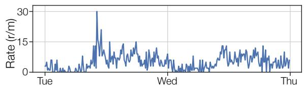  
Figure 1: A two-day request trace of a typical GPU inference function in Alibaba Cloud.

## 2.2 GPU Support in Serverless Platforms

Despite the benefits of the serverless inference model, existing serverless platforms, including Alibaba Cloud and other leading platforms, currently lack efficient support for GPUs, which impedes their ability to achieve high-performance serverless inference. Alibaba Cloud users also have expressed a compelling need to execute their models in GPU-enabled functions.

Existing solutions and their inefficiency. A number of recent systems have been proposed to support GPUs in serverless platforms [1, 27, 29, 58]. They, however, still follow the approach of existing serverful model serving systems (e.g., Nexus [49] and INFaaS [47]), and deploy inference models as long-running containers where each container, when created, is bound to a specific GPU (i.e., early binding). The deployed model remains in the memory of a designated GPU to handle future requests, and the occupied GPU resources can only be reclaimed after the model serving terminates.

However, the early-binding approach deviates from the serverless paradigm and is costly for both cloud users and providers. First, binding inference functions to GPUs occupies resources for extended duration, even when idling. Thus, users are obligated to pay for the allocated GPUs regardless of actual usage [3], leading to high expenses that undermine the cost-saving benefits of serverless inference. Second, this approach results in severe GPU underutilization, considering the low average request rates of most inference functions and the cross-GPU load imbalancing. Fig. 2 (left) depicts the distribution of the average request rates of Alibaba Cloud functions in a one-week trace, revealing that 85% (97%) of functions were invoked only once per minute (second) on average2. These findings align with the observations from other production traces [8, 48]. Fig. 2 (right) further illustrates that consolidating multiple models to fill GPU memory can still lead to low GPU load. Meanwhile, packing models into a GPU can cause temporary overloading due to the bursty request patterns (Fig. 1), thus inevitably leading to hotspots and load imbalancing in a multi-GPU setting. The impact of load imbalancing will be shown in Fig. 9 in §7.2.

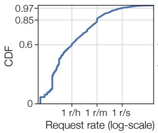

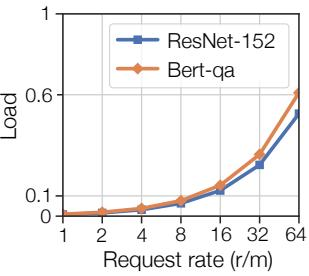  
Figure 2: CDF of average function request rates from a oneweek production trace (left) and the GPU load under various per-function request rates when running multiple functions on a V100 GPU to saturate its 32 GB memory (right).

Table 1: Model startup times (s) under Torpor (runtime isolation mode in §4.5) and cold-starts. Torpor’s startup time is broken down into model loading and runtime resumption.
<table><tr><td rowspan="2">Model</td><td colspan="2">Torpor</td><td rowspan="2"></td><td rowspan="2">Cold-start Mem.footprint</td></tr><tr><td>Model</td><td>Runtime</td></tr><tr><td>ResNet-152 [17]</td><td>0.03</td><td>0.26</td><td>8</td><td>1.6 GB</td></tr><tr><td>Bert-qa [26]</td><td>0.14</td><td>0.19</td><td>11</td><td>2.4 GB</td></tr><tr><td>Stable Diffusion [18]</td><td>0.24</td><td>1.5</td><td>25</td><td>5.1 GB</td></tr><tr><td>Llama3-8B[11]</td><td>1.6</td><td>1.4</td><td>48</td><td>13 GB</td></tr><tr><td>Qwen-14B[16]</td><td>2.1</td><td>1.5</td><td>57</td><td>20.1GB</td></tr><tr><td>Llama2-13B[10]</td><td>2.5</td><td>1.9</td><td>61</td><td>24.5 GB</td></tr></table>

To reduce costs, current systems need to frequently reclaim GPU resources when functions are inactive, avoiding charges for unused GPUs and allowing other functions to utilize idle resources. Unfortunately, this approach leads to frequent function cold starts, leading to significant overhead for model inference. Table 1 shows model startup times under cold starts, which need tens of seconds for GPU container setup, ML framework startup, GPU runtime creation, and model initialization3. Therefore, the cold-start overhead far exceeds the typical SLO requirement of model inference.

Table 2: A comparison of Torpor and existing solutions that offer GPU support on serverless platforms.
<table><tr><td>Solution</td><td>GPU pay-per-use</td><td>GPU efficient</td><td>SLO compliant</td><td>Model agnostic</td></tr><tr><td>Alibaba Cloud [1]</td><td>×</td><td>×</td><td>×</td><td>√</td></tr><tr><td>Molecule [27]</td><td>×</td><td>×</td><td>×</td><td>√</td></tr><tr><td>DGSF [29]</td><td>×</td><td>×</td><td>×</td><td>√</td></tr><tr><td>INFless [58]</td><td>×</td><td>×</td><td>*</td><td>×</td></tr><tr><td>Torpor</td><td>√</td><td>√</td><td>√</td><td>√</td></tr></table>

Requirements of serverless inference. Table 2 summarizes key requirements of serverless inference and compares Torpor with other existing solutions. Serverless users should be billed only when their functions are invoked and running on GPUs to achieve substantial cost savings (pay-per-GPUuse)4. Serverless platforms like Alibaba Cloud should serve as many inference functions as possible using a minimum number of GPUs, thereby attaining high GPU utilization (GPU efficient). The platform should allow users to specify their latency SLOs and strive to meet the latency SLOs for all functions (SLO compliant). For confidentiality reasons, the serverless platform should avoid inspecting detailed model structure, which can be of high business value (Model agnostic).

Compared with Torpor, none of existing solutions can meet all desired requirements. Alibaba Cloud and Alibaba Function Compute [1] are leading commercial serverless platforms with GPU supports; Molecule [27] introduces a serverless platform that supports GPUs and other hardware devices; DGSF [29] enables serverless functions to access GPUs in a remote cluster. These systems employ the early-binding approach as previously discussed, failing to enable pay-per-GPU-use billing and achieve high GPU efficiency. Moreover, they are oblivious to the semantics of model inference and unable to meet latency SLOs. INFless [58] presents a serverless inference system that early-binds functions to GPUs. While INFless proposes function scheduling and keep-alive schemes aimed at low-latency inference, it still leads to function cold starts and SLO violations (details in §7.3). Furthermore, IN-Fless requires model knowledge for operator-level profiling. We leave more discussions on related work to §9.

## 3 Key Insight and Challenges

Key insight. As described in §2.2, the current early-binding approach of retaining inference models in GPU memory leads to high idling costs and underutilized resources. Therefore, an efficient serverless inference platform should enable late binding, where GPUs are managed as a resource pool and idle inference models reside in host memory, dynamically swapping into any available GPUs upon request. This approach should also be easily deployable on real-world serverless platforms without requiring intrusive changes. Late binding offers several key advantages in meeting the requirements in §2.2. First, keeping models in host memory eliminates GPU memory usage during idle periods, enabling pay-per-GPU-use billing and cost savings for cloud users. Second, host memory is significantly larger than GPU memory (e.g., a few TB vs. tens of GB), allowing for consolidation of multiple lowfrequency functions onto a single GPU with improved GPU utilization. Late binding also facilitates load-balancing across multiple GPUs in a pool. Third, model swapping provides an efficient method to resume function execution compared to cold starts in the early-binding approach, thereby facilitating SLO compliance. Finally, late binding can be performed transparently to users within the GPU pool, which holds a holistic view of memory usage without requiring detailed model-specific knowledge.

Challenges. Implementing GPU pooling and late binding in the serverless platform presents three challenges. C1: Efficient GPU pooling and model swapping. GPU pooling requires inference functions to synchronize with a remote GPU pool [28, 31], which introduces additional communication overhead compared to local executions and presents challenges in achieving low-latency inference. C2: GPU memory management. To enable seamless late binding, the platform should automatically monitor and manage memory usage without detailed model knowledge. This requires a unified and efficient GPU memory management system across the GPU pool. C3: SLO compliance and resource efficiency. The platform should provide efficient request scheduling and model placement algorithms that effectively utilize the late binding mechanism to meet latency SLOs and enhance resource efficiency.

In the following sections, we present Torpor, a GPUenabled serverless platform that addresses the aforementioned challenges and, importantly, is readily-deployable onto realworld serverless platforms without intrusive changes.

## 4 Torpor System Design

## 4.1 Architecture overview

Fig. 3 provides an overview of the architecture of Torpor, which comprises two main components: the cluster manager and worker nodes. The cluster manager handles clusterlevel tasks, including request routing, node allocation, and resource scaling. It dynamically schedules function instances and routes inference requests to maintain load balancing across worker nodes and ensure fault tolerance (§ 4.5). At each worker node, Torpor employs GPU pooling, where a GPU server manages all local GPUs as a pool and allows functions to dynamically access any available GPUs. Within the GPU server, a model repository manages models in host memory; GPU executors handle CUDA execution, perform necessary model swapping, and manage GPU memory on the associated GPUs; the controller maintains a global view of GPU memory and executor status, and decides how to schedule requests to executors. Additionally, each worker node runs an intra-node router to signal the GPU server about request arrivals and route requests to local inference functions. Once the target function receives a request, it interacts with the scheduled executor through a GPU client by remoting CUDA API calls. All components within the worker node—the GPU server, intra-node router, and functions—are deployed as containers.

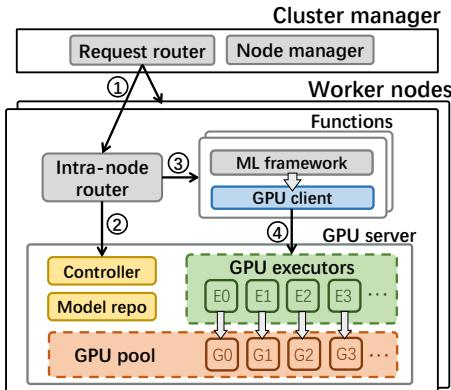  
Figure 3: Architecture overview of Torpor. A request arriving at a Torpor cluster is first routed to a worker node hosting its target function 
1 . The router in the worker node synchronizes with the GPU server to query the executor for this request 2 , and then routes it to the function instance with the target executor ID 
3 . The function instance next processes the request and uses a GPU client to automatically redirect CUDA API calls to this executor 
4 , and finally returns the result to the user after request completion.

Key to Torpor is to develop an efficient GPU server that enables low-latency model inference and addresses the challenges discussed in §3. Specifically, we will elaborate upon Torpor’s designs to address the following questions: 1) how Torpor achieves low-latency GPU pooling (§4.2) and model swapping (§4.3); 2) how Torpor tracks the memory footprint of functions and manages GPU memory (§4.4); 3) how Torpor ensures isolation and handles failures (§4.5).

## 4.2 GPU Remoting

Asynchronous API redirection. Existing GPU remoting solutions [28, 45] introduce high communication overhead due to synchronizations for individual API calls during model inference (details in §7.1). Leveraging the computing pattern of model inference, Torpor proposes asynchronous API redirection to reduce synchronizations. Specifically, we observe that the intermediate steps in an inference execution are typically performed asynchronously on the GPU, where intermediate data is generated and consumed in GPU memory without requiring data transfer to the host until the execution completes. Consequently, a function can redirect intermediate CUDA calls to the GPU executor asynchronously without waiting for their results, and only perform synchronizations for the final output. This approach preserves the execution order of CUDA APIs, ensuring the correctness of the inference results.

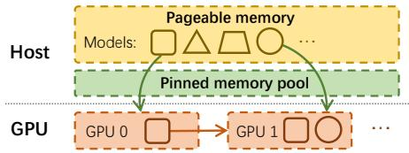  
Figure 4: An example of model swapping. Models can be swapped from host to GPU through PCIe (green arrows), or across GPUs through NVLink (red arrow).

Following this insight, Torpor categorizes CUDA APIs into two groups based on their semantics: 1) synchronous, blocking APIs that require the host to await their completion before proceeding, such as cudaMalloc; and 2) asynchronous, non-blocking APIs that do not alter the host’s runtime state, such as cudaLaunchKernel, which allows for asynchronous API redirection. Most APIs issued during inference fall into the asynchronous category, presenting opportunities to mitigate the synchronization overhead. Torpor can further batch consecutive CUDA API calls to enhance asynchronous API redirection (see APIs and batching details in our technical report [62]).

## 4.3 Model Swapping

As serverless platforms are constrained from examining the detailed model structures, it poses challenges to achieve seamless and efficient model swapping. Torpor overcomes the problem by leveraging two insights: 1) tracking general memory footprint of model inferences is feasible within a GPU pool, and 2) the memory access pattern of a model—the addresses and access order of model parameters—generally remains consistent across requests. Therefore, Torpor only tracks the first function execution (i.e., cold start), and applies the pattern to future request executions (see memory tracking in §4.4). Torpor performs model swapping on demand at the request level, and enhances performance through pinned memory pool and pipeline execution.

Model swapping and pipeline execution. Fig. 4 illustrates the model swapping in Torpor, where it utilizes pinned memory to enhance the host-to-GPU model loading and supports fast, cross-GPU model swapping via high-speed NVLink. Torpor’s swapping can be generally applied to various types of models, including those that require maintaining runtime states (e.g., KV cache in LLMs) by treating these states as part of the model itself. Torpor further employs pipeline execution to enhance swapping performance, which is particularly effective for models computed in one forward pass, allowing the transmission of subsequent layers to overlap with the computation of previous layers.

Key to pipeline execution is to judiciously group model parameters for swapping. Grouping too few parameters triggers a large number of transmissions and high synchronization overhead; conversely, grouping too many parameters impairs pipeline efficiency. Pipeline strategies in previous systems like PipeSwitch [22] and DeepPlan [36] do not suit serverless inference as they assume model structure is provided and require extensive model profiling. Torpor employs a modelagnostic approach to determine the group size for model pipelining. We observe that the transmission performance experiences an "elbow point" concerning group sizes: increasing the group size improves overall transmission throughput, but the improvement becomes marginal after a certain point. We therefore select this elbow point as the group size, which can achieve good swapping performance without substantially compromising pipeline efficiency. This group size depends only on hardware configurations such as PCIe, and can be easily determined by profiling various-sized data (e.g, about 2 MB in our testbed). This approach requires no detailed model knowledge and can be directly applied to various models.

Model eviction. We observe that model unloading from GPUs to host can result in considerable overhead and can interfere with concurrent inference executions. Therefore, Torpor always maintains a copy of the model in the host, and only invalidates its GPU memory region during eviction.

## 4.4 Memory Management

Torpor presents two key requirements for GPU memory management, as compared with other systems [12, 23, 44]. First, late binding requires a pool of GPUs to share the same logical memory space. This is because the inference functions do not recognize backend GPUs, and consistently access models using identical memory addresses even across different GPUs. Second, model swapping triggers frequently GPU memory (de)allocation, which leads to substantial overhead when using native methods like cudaMalloc (see Fig. 13). We therefore design a GPU memory management system that can effectively hide memory address differences between various GPUs and provide low-latency memory (de)allocations.

Memory address management. We observe ML frameworks like PyTorch typically organize data into blocks, each containing multiple parameters. Torpor leverages such memory layout to perform memory mapping at the block level. In particular, Torpor monitors memory blocks for each function and maintains a mapping to their actual physical addresses after model swapping. Since the internal data layout within each block remains unchanged (e.g., parameter offsets), Torpor can easily obtain the physical address of a parameter using its associated block address and offset. This approach eliminates the need for extensive metadata maintenance for individual data pointers, enabling the efficient address translation with low management overhead.

Memory block allocation. To mitigate the high overhead of native GPU memory allocation, Torpor reserves all GPU memory at bootstrap and internally manages memory blocks. This provides a shim layer to service memory requests from functions, without needing the native method. Key to this approach is to avoid memory fragmentation, which can decrease available GPU memory and harm overall efficiency. Torpor effectively addresses this issue by extending the Buddy memory allocation scheme [40] and leveraging unique characteristics of inference. It consolidates memory blocks from the same models to minimize fragmentation and enables sharing of common-sized blocks across different models (see details in our technical report [62]).

## 4.5 Isolation and Fault Handling

Resource isolation and GPU runtime management. Torpor provides container-level isolation for CPU and memory resources5, similar to existing serverless platforms [1, 52, 60]. For GPUs, Torpor executes only one function on a GPU at a time and isolates GPU memory regions across functions. This is achieved through Torpor’s GPU server, which has full control over CUDA API execution and GPU memory access.

Torpor offers two isolation modes for GPU runtime: 1) runtime sharing, which runs a single runtime on a GPU for multiple models, for instance, in a more trusted environment, and 2) runtime isolation, which maintains a dedicated runtime for each model and suits better for a more untrusted environment. By default, Torpor employs runtime sharing to improve resource efficiency. When stricter isolation is necessary, Torpor can switch to runtime isolation mode. Indeed, in our pilot deployment (§8), Torpor runs in the runtime isolation mode. The overhead incurred by runtime isolation is generally acceptable, e.g., hundreds of milliseconds to 1.5 seconds as shown in Table 1, which is still over one order of magnitude latency improvement compared with cold starts.

Fault handling. Torpor sustains various system component failures. In case of function failures, Torpor restarts them to resume the execution. For executor failures or GPU runtime errors, Torpor migrates the affected models to other working GPUs (executors) via swapping, and then restarts the failed ones. When runtime isolation is employed, Torpor can ensure that buggy function executions do not affect others, achieving stronger fault isolation. The GPU server also persists runtime states (e.g., models and metadata) in local storage to allow fast recovery from an entire failure of the GPU server.

At the cluster level, Torpor persists metadata of individual nodes in a database, which enables the cluster manager to retain these states and recover from failures, aligning with current practices in Alibaba Cloud. It also keeps periodic health checks with the router on each worker node, and handles node

Table 3: Latency (ms) of model pipelining execution when concurrently swapping other models through PCIe. The diagonal values indicate the latencies without concurrent models.
<table><tr><td>Model</td><td>DenseNet-169</td><td>ResNet-152</td><td>Bert-qa</td></tr><tr><td>DenseNet-169</td><td>27</td><td>27 (+0%)</td><td>27(+0%)</td></tr><tr><td>ResNet-152</td><td>31(+7%)</td><td>29</td><td>43 (+48%)</td></tr><tr><td>Bert-qa</td><td>166 (+11%)</td><td>240 (+61%)</td><td>149</td></tr></table>

failures by launching a new node and migrating all relevant functions.

## 5 Torpor Policy Design

We present how Torpor meets the latency SLOs and delivers resource efficiency (i.e., Challenge C3 in §3). We start with the design overview, followed by individual policies.

## 5.1 Design Overview

Objective. The objective of Torpor’s policy design is to meet latency SLOs for inference functions while minimizing the resource cost. We define a function to comply with latency SLOs if its tail request latency is not longer than a user-specified deadline, and meter the resource cost by the number of worker nodes. Key to achieving this goal is to maximize the number of SLO-compliant functions at each worker, such that Torpor can efficiently exploit per-worker GPU resources to host as many functions as possible, which in turn reduces the total number of workers required.

Challenges. Previous systems have proposed various schemes to meet latency SLOs [32, 58, 65, 67]; however, their policies do not apply to Torpor for two reasons. First, previous systems like INFless [58] and Shepherd [67] assume sufficient GPU memory and employ early binding, so they schedule model serving instances to GPUs and then batch and route requests to them. In contrast, Torpor focuses on late-binding the often lower-frequency or varying-demand functions to a pool of memory-constrained GPUs, requiring a joint design of model management (i.e., model swapping and eviction) and request scheduling. Second, previous systems assume a stable model inference latency [32, 47, 58, 65, 67] which, however, does not hold in our setting — model swapping can cause unpredictable performance due to PCIe bandwidth contention [21, 38]. For instance, as show in Table 3, concurrently swapping two models through PCIe increases individual model inference latency compared with running them alone, especially for large models (e.g., Bert-qa).

We propose three policies to address the aforementioned challenges. First, considering that packing many functions together can cause short-term overloading and request queueing, Torpor introduces a request prioritization policy to maximize the number of SLO-compliant functions (§5.2). Second, Torpor designs a request scheduling and model swapping policy to reduce bandwidth contention across concurrent models, thereby improving overall inference performance (§5.3). Lastly, by leveraging the characteristics of model swapping, Torpor proposes an effective model eviction policy to reduce bandwidth footprint in model swapping; combined with the request scheduling policy, Torpor minimizes the interference among concurrent model executions (§5.4).

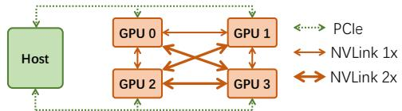  
Figure 5: Topology of a 4-GPU worker node in Alibaba Cloud.

## 5.2 Request Queueing

To maximize the number of SLO-compliant functions, Torpor needs to monitor the SLO compliance of individual functions to determine their request executions. Intuitively, Torpor prioritizes functions with a higher probability to comply with SLOs. However, realizing this approach requires answering two questions: 1) how to quantify the likelihood of SLO compliance for a function, and 2) how to determine function execution order for improved SLO compliance.

Torpor proposes a metric, required request count (RRC), to measure the “degree of needed effort” to meet SLOs. RRC represents the expected request number that a function needs to successfully serve in order to satisfy SLOs. Let n be the current number of requests to a function, and m be the number of requests served within deadlines out of n. The RRC of this function is defined as $\frac { p n - m } { 1 - p }$ , where p is the tail percentile specified in SLOs such as 98%. This is derived from the equation: ${ \frac { m + R R C } { n + R R C } } = p .$ Smaller RRC values indicate a higher likelihood of SLO attainment. Hence Torpor divides functions into highand low-priority groups based on their RRCs, and prioritizes their requests accordingly. We develop an effective strategy to determine the boundary (i.e., RRC threshold) between the two groups that can dynamically adjust function prioritization based on the current load at a worker, thereby improving the overall SLO compliance (see details in our technical report [62]).

## 5.3 Scheduling and Model Swapping

While model execution latency is often stable, model swapping can incur unpredictable overhead due to PCIe bandwidth contention [21, 38]. Fig. 5 shows the topology of a worker node in Alibaba Cloud, where each pair of GPUs shares a PCIe switch and GPUs are inter-connected via NVLinks with various bandwidths6. The performance slowdown caused by bandwidth contention can vary among models as shown in Table 3, where larger models require more intensive data transmission and exhibit more pronounced performance degradation. Hence we propose interfere-aware scheduling to minimize PCIe contention, thereby reducing request latencies.

Algorithm 1 Interference-Aware Request Scheduling   
1: function SCHEDULE(req r)   
2: A ← set of available GPUs . A 6= ∅, otherwise queueing r   
3: M ← set of GPUs hosting the target model   
4: if M 6= ∅ then   
5: G ← M ∩ A   
6: if G 6= ∅ then   
7: g ← any GPU in G   
8: Execute r on g . No swapping   
9: else   
10: (g, m) ← GPU pair with fastest NVLink, g ∈ A, m ∈ M   
11: Execute r on g; Swap model from m . GPU-to-GPU   
12: else   
13: g ← a GPU whose neighbor is not loading models, g ∈ A   
14: if g not found then   
15: g ← a GPU whose neighbor is loading a light model, g ∈ A   
16: if g not found then   
17: g ← any GPU in A   
18: Execute r on g; Swap model from host . Host-to-GPU

Interference-aware scheduling. Torpor exploits the direct NVLink connections between GPUs to reduce PCIe contention whenever possible. It prioritizes GPU-to-GPU over host-to-GPU model swapping to enable faster model transmission and avoid interference with concurrent PCIe traffic. When concurrent host-to-GPU swapping is unavoidable, Torpor avoids loading bandwidth-intensive models (e.g., Bert-qa in Table 3) simultaneously to minimize the impact of PCIe contention. Therefore, models are categorized as heavy or light based on their bandwidth requirements (see Table 4).

Algorithm 1 shows Torpor’s scheduling and swapping mechanisms. Torpor first checks whether the target model is loaded on an available GPU, and if so, directly executes it without swapping (line 8). If the model is hosted by busy GPUs, Torpor then schedules the request to perform GPU-to-GPU swapping, as the source and target GPUs should have a fast NVLink connection (line 11). Otherwise, Torpor resorts to the host-to-GPU swapping and prioritizes target GPUs whose neighbors are idle or running light models to reduce PCIe contention (line 18). Altogether, Torpor minimizes the interference and overhead of model swapping for each request, thus providing low inference latency.

## 5.4 Model Eviction Policy

Model eviction plays a critical role in reducing bandwidth contention and enhancing the overall inference performance, in conjunction with Torpor’s request scheduling policy. Unlike traditional cache eviction strategies which primarily aim to minimize the miss rates, Torpor’s model eviction policy considers the performance implications of model swapping for different models to facilitate future model loading.

We notice that swapping light models leads to negligible overhead for end-to-end performance compared with heavy ones (Table 3 and Table 4). Therefore, we tend to evict models that have little or no impact on performance when swapping. We employ two mechanisms following this insight. First, Torpor manages memory of all GPUs as a pool to globally optimize model placement, which ensures that each model can have up to one replica among GPUs when GPU memory is full. This allows for more efficient model caching and reduces host-to-GPU data transmission. Second, Torpor prioritizes light models in eviction, as swapping them leads to negligible or no PCIe bandwidth contention. When only heavy models remain, Torpor adopts Least-Recently-Used (LRU) policy to determine their eviction order.

## 6 Implementation

We have implemented Torpor for Alibaba Cloud, one of the world’s leading commercial serverless platforms. Torpor’s GPU server and GPU client were implemented in 4k and 1.5k lines of C++ code, respectively. Intra-node router and cluster manager were implemented atop the relevant components in Alibaba Cloud. Torpor’s late-binding mechanism imposes no intrusive changes to standard cluster management logic, enabling the reuse of Alibaba Cloud’s existing manager with minimal changes. In fact, Torpor has been successfully deployed in a real-world production environment of Alibaba Cloud (§8). We provide a container image as a function template based on PyTorch, where the original CUDA libraries (e.g., libcudart.so) are replaced by our GPU clients to enable GPU remoting. This requires no modification to the PyTorch framework.

## 7 Evaluation

In this section, we evaluate Torpor with the runtime sharing mode using production traces from Alibaba Cloud. We intergrate Torpor with runtime isolation mode into Alibaba Cloud’s real-world production environment and report the results in §8.

Settings. We deploy Torpor at Alibaba Cloud following the realistic production specification of its serverless platform. Torpor runs in a cluster with up to 6 workers. Each worker node has 48 vCPU cores, 384 GB memory, and 4 NVIDIA V100 GPUs each with 32 GB memory. We use 8 popular ML models for evaluation, as shown in Table 4, and distribute them across inference functions in a round-robin manner. All functions are warmed up before running the test workloads. We compare Torpor against Native execution—the default approach in Alibaba Cloud—and INFless [58], a state-of-theart serverless inference system.

Metrics. We focus on the ratio of functions meeting SLOs and the GPU load in the evaluation. A function complies SLOs if its tail request latency is within a deadline. By default, we use 98th tail latency, and set deadlines for CV models and Bert-qa to 80 ms and 200 ms, respectively. The GPU load is measured by the proportion of time during which the GPU is processing inference requests.

Table 4: Various models and their latencies (ms) with GPU remoting and model swapping. Underlined are heavy models where swapping via PCIe slows down the inference (see §5.3).
<table><tr><td>Model</td><td>Native</td><td>GPU remoting</td><td>Swap-PCIe</td><td>Swap-NVLink</td></tr><tr><td>DenseNet-169</td><td>30</td><td>25</td><td>27</td><td>26</td></tr><tr><td>DenseNet-201</td><td>36</td><td>28</td><td>30</td><td>30</td></tr><tr><td>Inception-v3</td><td>19</td><td>14</td><td>17</td><td>16</td></tr><tr><td>EfficientNet</td><td>17</td><td>12</td><td>13</td><td>13</td></tr><tr><td>ResNet-50</td><td>11</td><td>9</td><td>13</td><td>11</td></tr><tr><td>ResNet-101</td><td>20</td><td>14</td><td>22</td><td>16</td></tr><tr><td>ResNet-152</td><td>25</td><td>17</td><td>25</td><td>20</td></tr><tr><td>Bert-qa</td><td>42</td><td>43</td><td>144</td><td>45</td></tr></table>

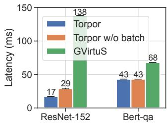

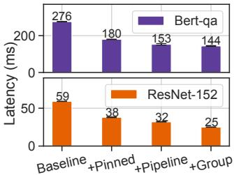  
Figure 6: Inference latency Figure 7: Performance breakwith Torpor and other GPU down of Torpor’s model remoting techniques. swapping via PCIe.

## 7.1 Overhead of Torpor’s Late Binding

Table 4 compares the performance of 8 popular models under Native execution and Torpor with its GPU remoting (§4.2) and model swapping (§4.3). For GPU remoting, Torpor adopts efficient, asynchronous API redirection, leading to comparable performance to Native, or even better for CV models. This is because serving these models requires configuring many cuDNN descriptors where the relevant CUDA APIs are executed on the CPU side and do not require GPU resources; thus, redirecting these APIs effectively distributes CPU-side workloads across functions and the GPU server, enabling functions to access more CPUs and perform parallel computation. Note that, CPU resources are not the bottleneck in this scenario. According to our measurements, the CPU utilization of Torpor (native execution) for ResNet-152 and Bert-qa remains at 27.4% (8.8%) and 17.2% (9.2%), respectively. For model swapping, Torpor supports efficient pipeline execution through PCIe, and leveraing NVLink further improves performance.

Performance of Torpor’s GPU remoting. To show the advantage of Torpor’s GPU remoting, we compare it with GVirtuS [9, 31], a leading solution among publicly available GPU remoting techniques. GVirtuS adopts a synchronous approach to API redirection. We also evaluate a variant of Torpor that disables call batching in asynchronous API redirection, i.e, “Torpor w/o batch”. Fig. 6 shows the inference performance under various approaches. Torpor significantly outperforms GVirtuS and reduces latencies by 88% and 37% for ResNet-152 and Bert-qa, respectively. ResNet-152 triggers a large number of API calls during each inference, leading to high synchronization overhead for GVirtuS. Asynchronous API redirection (Torpor w/o batch) dramatically reduces the latency by 79%; with API call batching, Torpor further reduces the latency by 41%. Compared with ResNet-152, Bert-qa requires less communication in GPU remoting; therefore, the improvement from asynchronous API redirection is less but still quite significant.

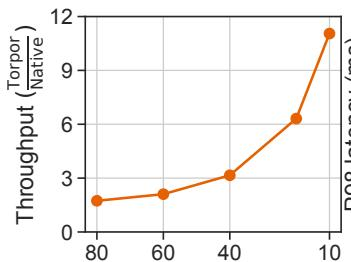

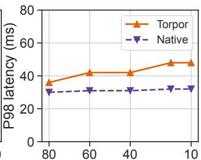  
Per-function request rate (from 80 to 10 r/m)  
Figure 8: Performance of executing multiple ResNet-152 functions on a single GPU with Torpor’s late binding (Torpor) and Native execution. We show the throughput of Torpor normalized to Native (left) and the tail latencies under varying per-function request rates (right).

Performance breakdown of model swapping. To illustrate how each of Torpor’s model swapping designs contributes to performance improvement, we break down the inference performance of ResNet-152 and Bert-qa, as shown in Fig. 7. Specifically, “Baseline” directly performs model swapping and then executes inference; “Pinned” uses a pinned memory pool for improved swapping performance; “Pipeline” overlaps model swapping and execution at the granularity of individual model parameters; “Group” groups parameters for efficient pipeline execution. We note that enabling pinned memory reduces overall latencies by around 35%; parameter-level pipeline execution further reduces the latency by 15%. By grouping model parameters, Torpor achieves up to 22% performance improvement over “Pipeline”, especially for ResNet-152 that consists of many small-sized parameters.

## 7.2 Benefits of Torpor’s Late Binding

GPU efficiency for low-frequency functions. With late binding, Torpor substantially reduces per-function memory footprint, thereby enabling the consolidation of many lowfrequency functions for improved GPU efficiency. We stresstest its performance by executing multiple ResNet-152 functions on a single GPU, varying request rates between 80 and 10 requests per minute (r/m)—a typical range of lowfrequency functions in production traces (Fig. 2). In this setup, we execute sufficient concurrent functions on a GPU node to saturate GPU memory and ensure a high overall load. Fig. 8 compares normalized throughput and latency under Torpor and Native executions. Native’s throughput declines as the per-function request rate decreases, due to its limited capacity to host many functions. In contrast, Torpor leverages host memory to accommodate many more functions, maintaining high throughput with efficient, request-level GPU sharing. For example, Torpor achieves over 10× higher throughput than Native at 10 r/m. Furthermore, even when model swapping is required, Torpor still keeps the tail latency below 50 ms.

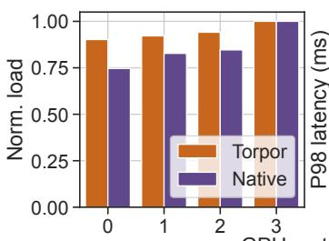

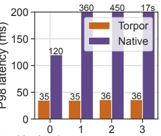  
GPU sorted by load  
Figure 9: The normalized per-GPU load and the tail request latency with Torpor’s late binding (Torpor) and Native.

Cross-GPU load balancing for high-frequency functions. We run 40 high-frequency ResNet-152 functions on a 4-GPU worker, where the average request rate is around 200 r/m. Fig. 9 shows the normalized per-GPU load and the tail request latency with Torpor and Native. Unlike Native, where GPUs hosting high-frequency functions can easily become overloaded due to bursts of requests, Torpor enables ondemand model migration for efficient load balancing. Therefore, Torpor achieves much less load variance across GPUs compared with Native, as shown in Fig. 9 (left). Moreover, Fig. 9 (right) shows the tail latency of requests executed on each GPU, where Native leads to extremely long tail latency (e.g., multi-seconds) due to high queueing delays. In contrast, Torpor consistantly delivers fast model inference, achieving a tail latency of around 35 ms on all GPUs.

## 7.3 Torpor at A Node

We next evaluate the performance of Torpor at a node. We use real-world workloads sampled from production traces (Fig. 2), where function request rates range from 5 to 30 r/m. Performance comparison. We compare Torpor with two baselines, Native execution and INFless [58] — a state-of-theart serverless inference system. INFless introduces a function keep-alive policy to set the lifespan of individual functions based on historical traces, denoted as INFless-KA. For a fair comparison, we implement the keep-alive policy of INFless (INFless-KA) in the Native system. Fig. 10 (left) shows the ratio of functions meeting SLOs in Torpor, Native, and INFless-

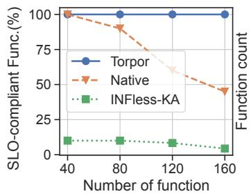

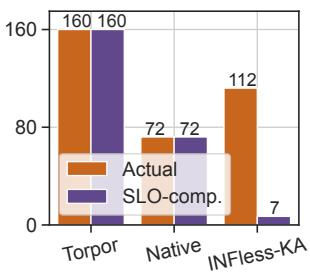

Figure 10: Performance comparison in terms of SLO compliance between Torpor, Native, and INFless-KA.  
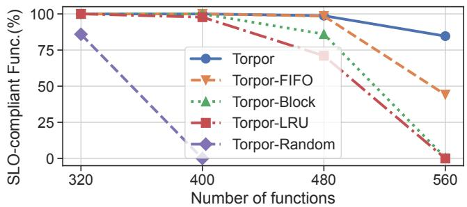  
Figure 11: Ratio of SLO-compliant functions with the full Torpor and various different policies.

KA. Fig. 10 (right) shows the numbers of functions being actually executed and being SLO-compliant, when hosting 160 functions. With fast model swapping, Torpor executes all 160 functions and also meets SLOs for all functions. In contrast, due to limited GPU memory, Native can only execute 72 out of 160 functions. INFless-KA can reclaim GPU memory via cleaning up idle functions, thereby enabling the execution of more functions (i.e., 112 functions) than Native; however, INFless-KA inevitably incurs function cold starts and results in only 7 functions being SLO-compliant.

Benefits of Torpor’s policies. To understand the benefits of Torpor’s policy designs, we compare the full Torpor with four baselines. 1) Torpor-FIFO uses a FIFO policy in request queueing rather than our SLO-aware policy (§5.2). 2) Torpor-Random disables our interference-aware scheduling and model swapping (§5.3), and randomly schedules a request to an idle GPU if the target model is not loaded, and then triggers model swapping. 3) Torpor-LRU adopts a LRU policy in model eviction rather than prioritizing models according to swapping overheads (§5.4). 4) Torpor-Block disables our block management policy (§4.4), and caches the released memory blocks in a single pool; when a new block is required, it directly returns a cached one in the pool if the requested size can be satisfied, otherwise it frees multiple blocks until the required memory space is available.

Fig. 11 shows the ratio of SLO-compliant functions. In particular, Torpor-FIFO is oblivious to SLOs and unable to properly prioritize functions, leading to serious SLO violations when the number of functions is large. Torpor-Block cannot reuse various-sized blocks and forces frequent memory allocation via CUDA APIs, which incurs long delay in block allocation and harms overall performance. Torpor-LRU evicts heavy models often, leading to PCIe bandwidth contention during future model swapping. Torpor-Random leads to the worst performance due to its inefficient scheduling and model swapping policy, which does not exploit NVLink across GPUs and is oblivious to model heaviness. Compared with these baselines, Torpor successfully supports over 80% functions even with 560 functions, maximizing the number of SLOcompliant functions.

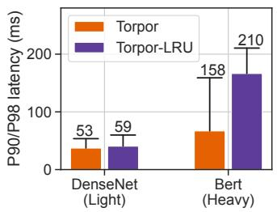

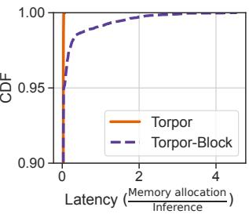  
Figure 12: $9 0 ^ { t h }$ (bars) and Figure 13: Latency CDF $9 8 ^ { \overline { { t } } h }$ (whiskers) tail latencies of memory allocation in in Torpor and Torpor-LRU. Torpor and Torpor-Block.

Efficiency of model heaviness. We evaluate the efficiency of model heaviness with Torpor and Torpor-LRU, using DenseNet-201 and Bert-qa as light and heavy models, respectively. Fig. 12 shows tail latencies of DenseNet-201 and Bert-qa in a mixed workload, where Bert-qa instances account for 60% of overall memory footprint. Torpor-LRU is agnostic to model heaviness and can evict heavy models frequently, leading to high tail latencies for Bert-qa that fail to meet its SLOs (200 ms). In contrast, Torpor effectively reduces tail latencies of Bert-qa without compromissing performance for DenseNet-201, achieving SLOs for both models.

Efficiency of memory allocation. Fig. 13 shows the distribution of the latencies of per-request memory allocation normalized to inference time, under Torpor and Torpor-Block. Due to efficient memory allocation and sharing (§4.4), Torpor incurs only negligible overhead. In contrast, Torpor-Block leads to high allocation overhead (e.g., over 4× than the actual inference time), harming the end-to-end performance.

## 7.4 Torpor in A Cluster

We next evaluate Torpor in a cluster deployment with 6 GPU worker nodes. As running Torpor in a Alibaba Cloud cluster incurs additional system overhead, we set the SLOs for CV models and Bert-qa to 150 ms and 250 ms, respectively.

Baselines. We exclude INFless-KA from our cluster deployment due to its poor performance (see Fig. 10). We use three baselines: 1) Native uses native GPU containers bound to specific GPUs, which is the current practice in Alibaba Cloud. 2) NonSwap allows GPU remoting similar to Torpor, but disables model swapping, reducing memory footprint compared with Native. 3) SimpleSwap enables model swapping

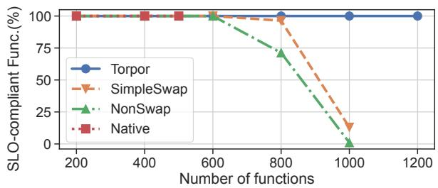

(a) Ratio of SLO-compliant functions under Torpor and baselines.  
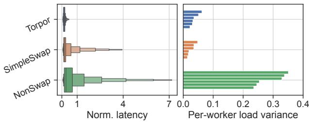  
(b) Distribution of per-request latencies normalized to deadlines (left) and the per-worker variance of GPU load normalized to the maximum (right), when running 1k functions. Boxes (left) depict the 1/128, 1/64, . . . , 1/2, . . . , 63/64, 127/128 quantiles.

## Figure 14: Cluster evaluation of Torpor.

compared with NonSwap. This approach only supports simple strategies as discussed in §7.3, including FIFO request queueing, random scheduling, and LRU model eviction.

Cluster evaluation. Fig. 14 compares Torpor with these three baselines. We first show the ratio of SLO-compliant functions under various number of functions. As shown in Fig. 14a, only Torpor can consistently meet per-function latency SLOs even with a large number of functions (e.g., over 1000). Native quickly saturates all GPU memory and only supports up to 500 functions, thus low GPU utilization. Compared with Native, NonSwap relaxes the constraint of GPU memory and enables more functions; however, it still fixes the binding between functions and GPUs, and causes GPUs overloaded by requests and leads to long tail latency. Moreover, while SimpleSwap outperforms NonSwap with model swapping, it still suffers from severe SLO violations with a large number of functions (e.g., 1k).

Fig. 14b compares the behaviors of Torpor, SimpleSwap, and NonSwap under 1k functions. We show the distribution of per-request latencies normalized to corresponding deadlines (left). In Torpor, almost every request can be served within its deadline, leading to a normalized latency less than 1. However, SimpleSwap and NonSwap suffer from long tail latency — over 4× and 7× of the respective deadlines. We also compare the per-worker GPU load of the three systems. For each worker node, we normalize the loads of its four GPUs to the maximum, and calculate the variance. Lower variance indicates better load balancing. Fig. 14b (right) plots the perworker load variances of three solutions, each with 6 workers in total. Compared with NonSwap, Torpor and SimpleSwap can effectively balance GPU load across workers with model swapping, thus achieving much less load variance.

Table 5: Overview of Torpor’s pilot production.
<table><tr><td>Metric</td><td>Value</td><td>Metric</td><td>Value</td></tr><tr><td>#of users</td><td>&gt;150</td><td>Users&#x27;cost savings</td><td>70% on avg.</td></tr><tr><td># of GPUs</td><td>&gt;350</td><td>GPU savings</td><td>65%</td></tr><tr><td># of daily requests</td><td>up to 465k</td><td></td><td></td></tr></table>

## 8 Torpor in Pilot Production

Torpor has been deployed in a pilot production cluster in Alibaba Cloud for beta testing. In this section, we present the testing results and our observations.

Overview of the pilot production. In the deployment, we employ a cost-efficient billing scheme in which users are charged only 10% of the GPU cost when their functions are inactive and retained in the host memory. This billing scheme aligns with Torpor’s late binding mechanism and has attracted a variety of real-world inference workloads to Alibaba Cloud, including image processing, text generation, and image generation. Table 5 provides an overview of our pilot production system and the achieved savings. Currently, Torpor serves over 150 users in a cluster with more than 350 GPUs, handling up to 465k requests everyday. The system achieves an average cost savings of 70% for users compared to the previous approach of Alibaba Cloud that kept functions long-running on GPUs and billed users for the entire GPU time. Moreover, Torpor enables Alibaba Cloud to consolidate various functions for improved GPU utilization, resulting in a 65% reduction in the total number of required GPUs and cost savings for Alibaba Cloud.

Startup latency. Table 1 shows the performance of Torpor in the pilot production across various models, ranging from CNNs such as ResNet to LLMs like Llama. In the production environment, Torpor prioritizes user isolation and manages a dedicated GPU runtime for each function. Hence we also provide a detailed breakdown of the time required for model loading and runtime resumption in Table 1. Compared to cold starts in Alibaba Cloud, Torpor reduces model startup latencies by over an order of magnitude, e.g., cutting Llama2- 13B’s startup time to 4.4 seconds—a delay that is acceptable considering that generating all output tokens for a query can take tens of seconds [30, 68].

Case study. We next present a case study of a realistic GPU function in our pilot production, which involves text generation from input images. This function is invoked several thousands times per day and follows a request arrival pattern similar to Fig. 1. Without Torpor, this function would need to be kept long-running on a GPU for low inference latency, resulting in high GPU costs. Fig. 15 depict latency distribution and user cost of this function. For confidentiality reasons, we normalize the latency of model (and runtime) loading to the mean of end-to-end times, and the cost to that of long-running GPU functions (i.e., w/o Torpor). The loading duration is consistent, as shown in Fig. 15 (left), which accounts for only ∼30% of the overall latency. Fig. 15 (right) illustrates the user cost, where Torpor reduces the total cost by 84% compared to the previous approach in Alibaba Cloud. Based on this real-world use case, Torpor achieves significant cost savings without compromising end-to-end performance, proving to be an effective solution for serverless inference.

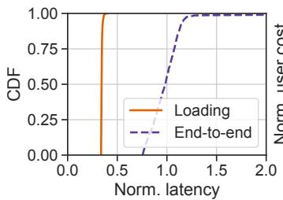

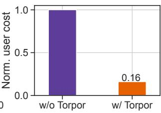  
Figure 15: Latency distribution and user cost of a realistic GPU function in Alibaba Cloud.

Discussion. We have identified three challenges that require further investigation based on our experiences with the production cluster. (1) Extremely infrequent functions: We have observed that some functions are invoked extremely infrequently (e.g., a few requests per hour). However, these functions still result in substantial user costs due to their host memory usage. To address this, we plan to explore the utilization of cheaper storage for low-demand functions and investigate a multi-tier storage architecture that dynamically adapts to request patterns for improved resource and cost efficiency. (2) Very large models: While Torpor’s late–binding design is versatile and has been applied to large models (Table 1), it currently does not support model-parallel execution across multiple GPUs. To accommodate very large models spanning multiple GPUs or nodes, it is crucial to enable efficient model partitioning and parallelization that integrates with Torpor’s model-swapping mechanism. Therefore, we intend to extend Torpor to leverage various interconnects, including PCIe and NVLink (Fig. 5), for enhanced model parallel and pipeline execution. (3) Highly bursty workloads: While Torpor is primarily designed for efficient resource sharing among many low-frequency functions (Fig. 2), some functions may experience highly bursty workloads with short periods of extensive request arrivals. To handle such spikes, Torpor can proactively maintain host-memory-cached model replicas across multiple nodes, mitigating cold starts at the cost of increased memory usage. We plan to explore high-speed inter-node networks (e.g., RDMA) for efficient model loading between nodes, which can reduce memory footprint while maintaining low-latency model startup.

## 9 Related Work

Serverless Inference. In addition to the serverless platforms discussed in §2.2, there are several recent works on serverless inference. StreamBox [56] and Dilu [43] support spatial GPU sharing for concurrent model execution; FaaSTube [55] improves data sharing within inference workflows. These works are orthogonal to Torpor and can be integrated for enhanced performance. ServerlessLLM [30] and Medusa [64] propose cold-start optimizations specialized for large language models, which is complementary to Torpor and can be used to accelerate those specific models.

Host-to-GPU data swapping. Many other systems have leveraged host-to-GPU data swapping in general deep learning and GPU workloads [23, 32, 34, 39, 46, 50, 57, 63]. For example, vDNN [46], Salus [63] and SwapAdvisor [34] leverage host memory for deep learning jobs with large GPU memory footprints; Batch-aware [39] and HUVM [23] optimize GPU memory access for general-purpose workloads; POS [35] supports efficient GPU checkpointing and restoring. Compared with Torpor, these systems are not specifically designed for model inference and do not account for its SLO attainment. Inference systems such as PipeSwitch [22] and DeepPlan [36] improve host-to-GPU model loading for fast switching. Unlike Torpor, these systems require detailed model-specific knowledge and do not target meeting model-level SLOs in a shared, multi-tenant serverless environment.

GPU remoting. GPU remoting techniques have been employed in different layers for GPU virtualization [28, 31, 45, 59]. Existing solutions like GVirtuS [31] and rCUDA [28] primarily focus on general-purpose workloads. Torpor applies GPU remoting in serverless inference, leveraging its characteristics for asynchronous, low-latency API redirection.

Spatio-temporal GPU sharing. Existing techniques have investigated the spatial and temporal GPU sharing to improve overall utilization [2, 13–15, 24, 33, 51, 56]. These techniques are orthogonal to Torpor and can be directly applied, which allow partitioning a physical GPU into multiple virtual instances to late-bind more functions.

## 10 Conclusion

This paper introduces Torpor, a serverless platform for SLOaware and GPU-efficient model inference. Torpor employs a late binding approach, managing inference functions in host memory and dynamically swapping them to a pool of GPUs upon request arrivals. This approach enables pay-per-GPUuse billing and maximizes resource utilization. Additionally, Torpor proposes request scheduling and model management policies to meet latency SLOs for inference functions while minimizing resource costs. Torpor has been beta released in a large commercial serverless platform, successfully serving up to 465k requests per day and achieving 70% and 65% GPU cost savings for users and the platform, respectively.

## Acknowledgments

We thank the anonymous reviewers and our shepherd, Somali Chaterji, for their insightful comments that helped improve this work. We also thank Bohui Wu and Zhexiang Zhang for their help in experiments. This work was supported in part by the Alibaba Innovative Research (AIR) Grant, RGC CRF Grant (Ref. #C6015-23G), RGC GRF Grants (Ref. #16217124 and #16210822), NSFC/RGC CRS Grant (Ref. #CRS\_HKUST601/24), and CUHK-Shenzhen Research Grant (UDF01003466).

## References

[1] Alibaba Cloud Function Compute. https://www. alibabacloud.com/product/function-compute.

[2] Aliyun cGPU. https://www.alibabacloud. com/help/en/container-service-forkubernetes/latest/cgpu-overview.

[3] Aliyun Function Compute Billing Scheme. https: //www.alibabacloud.com/help/en/functioncompute/latest/billing-billing.

[4] Aliyun Function Compute Instance Types and Modes. https://www.alibabacloud.com/help/ en/function-compute/latest/instance-typesand-instance-modes.

[5] Amazon SageMaker. https://aws.amazon.com/ sagemaker/.

[6] AWS Lambda. https://aws.amazon.com/lambda/.

[7] AWS Lambda Provisioned Concurrency. https://docs.aws.amazon.com/lambda/latest/ dg/provisioned-concurrency.html.

[8] Azure Functions. https://azure.microsoft.com/ en-us/services/functions/.

[9] GVirtuS. https://github.com/gvirtus/GVirtuS.

[10] Llama2. https://www.llama.com/llama2.

[11] Llama3. https://www.llama.com/models/llama-3.

[12] Memory Management on Modern GPU Architectures. https://developer.download.nvidia.com/ video/gputechconf/gtc/2019/presentation/ s9727-memory-management-on-modern-gpuarchitectures.pdf.

[13] Nvidia Multi-Instance GPU. https://www.nvidia. com/en-us/technologies/multi-instance-gpu/.

[14] Nvidia Multi-Process Service. https://docs.nvidia. com/deploy/mps/.

[15] Nvidia Virtual GPU. https://www.nvidia.com/enus/data-center/virtual-solutions/.

[16] Qwen. https://github.com/QwenLM/Qwen.

[17] ResNet in PyTorch. https://pytorch.org/vision/ stable/models/resnet.html.

[18] Stable Diffusion. https://huggingface.co/ stable-diffusion-v1-5/stable-diffusion-v1- 5.

[19] Alexandru Agache, Marc Brooker, Alexandra Iordache, Anthony Liguori, Rolf Neugebauer, Phil Piwonka, and Diana-Maria Popa. Firecracker: Lightweight virtualization for serverless applications. In Proc. USENIX NSDI, 2020.

[20] Ahsan Ali, Riccardo Pinciroli, Feng Yan, and Evgenia Smirni. BATCH: Machine learning inference serving on serverless platforms with adaptive batching. In Proc. ACM/IEEE Supercomputing, 2020.

[21] Marcelo Amaral, Jordà Polo, David Carrera, Seetharami Seelam, and Malgorzata Steinder. Topology-aware gpu scheduling for learning workloads in cloud environments. In Proc. ACM SC, 2017.

[22] Zhihao Bai, Zhen Zhang, Yibo Zhu, and Xin Jin. PipeSwitch: Fast pipelined context switching for deep learning applications. In Proc. USENIX OSDI, 2020.

[23] Sangjin Choi, Taeksoo Kim, Jinwoo Jeong, Myeongjae Jeon, Youngjin Kwon, Rachata Ausavarungnirun, and Jeongseob Ahn. Memory harvesting in multi-GPU systems with hierarchical unified virtual memory. In Proc. USENIX ATC, 2022.

[24] Seungbeom Choi, Sunho Lee, Yeonjae Kim, Jongse Park, Youngjin Kwon, and Jaehyuk Huh. Serving heterogeneous machine learning models on multi-GPU servers with spatio-temporal sharing. In Proc. USENIX ATC, 2022.

[25] Daniel Crankshaw, Xin Wang, Giulio Zhou, Michael J Franklin, Joseph E Gonzalez, and Ion Stoica. Clipper: A low-latency online prediction serving system. In Proc. USENIX NSDI, 2017.

[26] Jacob Devlin, Ming-Wei Chang, Kenton Lee, and Kristina Toutanova. Bert: Pre-training of deep bidirectional transformers for language understanding. arXiv preprint arXiv:1810.04805, 2018.

[27] Dong Du, Qingyuan Liu, Xueqiang Jiang, Yubin Xia, Binyu Zang, and Haibo Chen. Serverless computing on heterogeneous computers. In Proc. ACM ASPLOS, 2022.

[28] José Duato, Antonio J. Peña, Federico Silla, Rafael Mayo, and Enrique S. Quintana-Ortí. rcuda: Reducing the number of gpu-based accelerators in high performance clusters. In Proc. IEEE HPCS, 2010.

[29] Henrique Fingler, Zhiting Zhu, Esther Yoon, Zhipeng Jia, Emmett Witchel, and Christopher J. Rossbach. Dgsf: Disaggregated gpus for serverless functions. In Proc. IEEE IPDPS, 2022.

[30] Yao Fu, Leyang Xue, Yeqi Huang, Andrei-Octavian Brabete, Dmitrii Ustiugov, Yuvraj Patel, and Luo Mai. ServerlessLLM: Locality-enhanced serverless inference for large language models. In Proc. USENIX OSDI, 2024.

[31] Giulio Giunta, Raffaele Montella, Giuseppe Agrillo, and Giuseppe Coviello. A gpgpu transparent virtualization component for high performance computing clouds. In Proc. Euro-Par, 2010.

[32] Arpan Gujarati, Reza Karimi, Safya Alzayat, Wei Hao, Antoine Kaufmann, Ymir Vigfusson, and Jonathan Mace. Serving DNNs like clockwork: Performance predictability from the bottom up. In Proc. USENIX OSDI, 2020.

[33] Mingcong Han, Hanze Zhang, Rong Chen, and Haibo Chen. Microsecond-scale preemption for concurrent GPU-accelerated DNN inferences. In Proc. USENIX OSDI, 2022.

[34] Chien-Chin Huang, Gu Jin, and Jinyang Li. SwapAdvisor: Pushing deep learning beyond the GPU memory limit via smart swapping. In Proc. ACM ASPLOS, 2020.

[35] Zhuobin Huang, Xingda Wei, Yingyi Hao, Rong Chen, Mingcong Han, Jinyu Gu, and Haibo Chen. PARAL-LELGPUOS: A concurrent OS-level GPU checkpoint and restore system using validated speculation. arXiv preprint arXiv:2405.12079, 2024.

[36] Jinwoo Jeong, Seungsu Baek, and Jeongseob Ahn. Fast and efficient model serving using multi-gpus with directhost-access. In Proc. ACM EuroSys, 2023.

[37] Zhipeng Jia and Emmett Witchel. Nightcore: Efficient and scalable serverless computing for latency-sensitive, interactive microservices. In Proc. ACM ASPLOS, 2021.

[38] Yimin Jiang, Yibo Zhu, Chang Lan, Bairen Yi, Yong Cui, and Chuanxiong Guo. A unified architecture for accelerating distributed dnn training in heterogeneous gpu/cpu clusters. In Proc. USENIX OSDI, 2020.

[39] Hyojong Kim, Jaewoong Sim, Prasun Gera, Ramyad Hadidi, and Hyesoon Kim. Batch-aware unified memory management in GPUs for irregular workloads. In Proc. ACM ASPLOS, 2020.

[40] Kenneth C. Knowlton. A fast storage allocator. Commun. ACM, 8(10):623–624, 1965.

[41] Jack Kosaian, K. V. Rashmi, and Shivaram Venkataraman. Parity models: erasure-coded resilience for prediction serving systems. In Proc. ACM SOSP, 2019.

[42] Yunseong Lee, Alberto Scolari, Byung-Gon Chun, Marco Domenico Santambrogio, Markus Weimer, and Matteo Interlandi. PRETZEL: Opening the black box of machine learning prediction serving systems. In Proc. USENIX OSDI, 2018.

[43] Cunchi Lv, Xiao Shi, Zhengyu Lei, Jinyue Huang, Wenting Tan, Xiaohui Zheng, and Xiaofang Zhao. Dilu: Enabling GPU resourcing-on-demand for serverless DL serving via introspective elasticity. In Proc. ACM ASP-LOS, 2025.

[44] Xuan Peng, Xuanhua Shi, Hulin Dai, Hai Jin, Weiliang Ma, Qian Xiong, Fan Yang, and Xuehai Qian. Capuchin: Tensor-based GPU memory management for deep learning. In Proc. ACM ASPLOS, 2020.

[45] C. Reaño, A. J. Peña, F. Silla, J. Duato, R. Mayo, and E. S. Quintana-Ortí. Cu2rcu: Towards the complete rcuda remote gpu virtualization and sharing solution. In Proc. IEEE HiPC, 2012.

[46] Minsoo Rhu, Natalia Gimelshein, Jason Clemons, Arslan Zulfiqar, and Stephen W. Keckler. vDNN: Virtualized deep neural networks for scalable, memory-efficient neural network design. In Proc. ACM/IEEE MICRO, 2016.

[47] Francisco Romero, Qian Li, Neeraja J Yadwadkar, and Christos Kozyrakis. INFaaS: Automated model-less inference serving. In Proc. USENIX ATC, 2021.

[48] Mohammad Shahrad, Rodrigo Fonseca, Iñigo Goiri, Gohar Chaudhry, Paul Batum, Jason Cooke, Eduardo Laureano, Colby Tresness, Mark Russinovich, and Ricardo Bianchini. Serverless in the wild: Characterizing and optimizing the serverless workload at a large cloud provider. In Proc. USENIX ATC, 2020.

[49] Haichen Shen, Lequn Chen, Yuchen Jin, Liangyu Zhao, Bingyu Kong, Matthai Philipose, Arvind Krishnamurthy, and Ravi Sundaram. Nexus: a GPU cluster engine for accelerating DNN-based video analysis. In Proc. ACM SOSP, 2019.

[50] Ying Sheng, Lianmin Zheng, Binhang Yuan, Zhuohan Li, Max Ryabinin, Daniel Y. Fu, Zhiqiang Xie, Beidi Chen, Clark Barrett, Joseph E. Gonzalez, Percy Liang, Christopher Ré, Ion Stoica, and Ce Zhang. Highthroughput generative inference of large language models with a single gpu. arXiv preprint arXiv:2303.06865, 2023.

[51] Foteini Strati, Xianzhe Ma, and Ana Klimovic. Orion: Interference-aware, fine-grained gpu sharing for ml applications. In Proc. ACM EuroSys, 2024.

[52] Huangshi Tian, Suyi Li, Ao Wang, Wei Wang, Tianlong Wu, and Haoran Yang. Owl: Performance-aware scheduling for resource-efficient function-as-a-service cloud. In Proc. ACM SoCC, 2022.

[53] Dmitrii Ustiugov, Plamen Petrov, Marios Kogias, Edouard Bugnion, and Boris Grot. Benchmarking, analysis, and optimization of serverless function snapshots. In Proc. ACM ASPLOS, 2021.

[54] Ao Wang, Shuai Chang, Huangshi Tian, Hongqi Wang, Haoran Yang, Huiba Li, Rui Du, and Yue Cheng. FaaS-Net: Scalable and fast provisioning of custom serverless container runtimes at alibaba cloud function compute. In Proc. USENIX ATC, 2021.

[55] Hao Wu, Junxiao Deng, Minchen Yu, Yue Yu, Yaochen Liu, Hao Fan, Song Wu, and Wei Wang. Faastube: Optimizing gpu-oriented data transfer for serverless computing. arXiv preprint arXiv:2411.01830, 2024.

[56] Hao Wu, Yue Yu, Junxiao Deng, Shadi Ibrahim, Song Wu, Hao Fan, Ziyue Cheng, and Hai Jin. StreamBox: A lightweight GPU SandBox for serverless inference workflow. In Proc. USENIX ATC, 2024.

[57] Wencong Xiao, Shiru Ren, Yong Li, Yang Zhang, Pengyang Hou, Zhi Li, Yihui Feng, Wei Lin, and Yangqing Jia. AntMan: Dynamic scaling on GPU clusters for deep learning. In Proc. USENIX OSDI, 2020.

[58] Yanan Yang, Laiping Zhao, Yiming Li, Huanyu Zhang, Jie Li, Mingyang Zhao, Xingzhen Chen, and Keqiu Li. INFless: a native serverless system for low-latency, highthroughput inference. In Proc. ACM ASPLOS, 2022.

[59] Hangchen Yu, Arthur Michener Peters, Amogh Akshintala, and Christopher J. Rossbach. AvA: Accelerated virtualization of accelerators. In Proc. ACM ASPLOS, 2020.

[60] Minchen Yu, Tingjia Cao, Wei Wang, and Ruichuan Chen. Following the data, not the function: Rethinking function orchestration in serverless computing. In Proc. USENIX NSDI, 2023.

[61] Minchen Yu, Zhifeng Jiang, Hok Chun Ng, Wei Wang, Ruichuan Chen, and Bo Li. Gillis: Serving large neural networks in serverless functions with automatic model partitioning. In Proc. IEEE ICDCS, 2021.

[62] Minchen Yu, Ao Wang, Dong Chen, Haoxuan Yu, Xiaonan Luo, Zhuohao Li, Wei Wang, Ruichuan Chen, Dapeng Nie, Haoran Yang, and Yu Ding. Torpor: Gpuenabled serverless computing for low-latency, resourceefficient inference. arXiv preprint arXiv:2306.03622, 2025.

[63] Peifeng Yu and Mosharaf Chowdhury. Salus: Finegrained GPU sharing primitives for deep learning applications. In Proc. MLSys, 2020.

[64] Shaoxun Zeng, Minhui Xie, Shiwei Gao, Youmin Chen, and Youyou Lu. Medusa: Accelerating serverless LLM inference with materialization. In Proc. ACM ASPLOS, 2025.

[65] Chengliang Zhang, Minchen Yu, Wei Wang, and Feng Yan. MArk: Exploiting cloud services for cost-effective,

SLO-aware machine learning inference serving. In Proc. USENIX ATC, 2019.

[66] Hong Zhang, Yupeng Tang, Anurag Khandelwal, Jingrong Chen, and Ion Stoica. Caerus: NIMBLE task scheduling for serverless analytics. In Proc. USENIX NSDI, 2021.

[67] Hong Zhang, Yupeng Tang, Anurag Khandelwal, and Ion Stoica. SHEPHERD: Serving DNNs in the wild. In Proc. USENIX NSDI, 2023.

[68] Yinmin Zhong, Shengyu Liu, Junda Chen, Jianbo Hu, Yibo Zhu, Xuanzhe Liu, Xin Jin, and Hao Zhang. Dist-Serve: Disaggregating prefill and decoding for goodputoptimized large language model serving. In 18th USENIX Symposium on Operating Systems Design and Implementation (OSDI 24), 2024.