USENIX

THE ADVANCED COMPUTING SYSTEMS ASSOCIATION

# Internet Connection Splitting: What’s Old is New Again

Gina Yuan, Thea Rossman, and Keith Winstein, Stanford University https://www.usenix.org/conference/atc25/presentation/yuan

# This paper is included in the Proceedings of the 2025 USENIX Annual Technical Conference.

July 7–9, 2025 • Boston, MA, USA ISBN 978-1-939133-48-9

Open access to the Proceedings of the 2025 USENIX Annual Technical Conference is sponsored by

P--r.h £Es/sL.

auuuJl9 PgleU

King Abdullah University of

Science and Technology

# Internet Connection Splitting: What’s Old is New Again

Gina Yuan Stanford University

Thea Rossman Stanford University

Keith Winstein Stanford University

## Abstract

In the 1990s, many networks deployed performanceenhancing proxies (PEPs) that transparently split TCP connections to aid performance, especially over lossy, long-delay paths. Two recent developments have cast doubts on their relevance: the BBR congestion-control algorithm, which deemphasizes loss as a congestion signal, and the QUIC transport protocol, which prevents transparent connection-splitting yet empirically matches or exceeds TCP’s performance in wide deployment, using the same congestion control.

In light of this, are PEPs obsolete? This paper presents a range of emulation measurements indicating: “probably not.” While BBR’s original 2016 version didn’t benefit markedly from connection-splitting, more recent versions of BBR do and, in some cases, even more so than earlier “loss-based” congestion-control algorithms. We also find that QUIC implementations of the “same” congestion-control algorithms vary dramatically and further differ from those of Linux TCP— frustrating head-to-head comparisons. Notwithstanding their controversial nature, our results suggest that PEPs remain relevant to Internet performance for the foreseeable future.

## 1 Introduction

A stylized history of connection-splitting over the Internet could go roughly as follows: In the 1970s, TCP was designed as a host-to-host transport for flow-controlled reliable byte streams. In the late 1980s, TCP implementations added congestion control [24] to respond to network-path limitations and contention, with indications of packet loss as the primary congestion signals. As Internet use exploded in the 1990s, it became apparent that contemporary TCP implementations performed poorly over long paths with packet loss. By the late 1990s, many network operators deployed commercial “TCP accelerators,” also known as “performance-enhancing proxies” [17, 21], to improve customers’ TCP throughput. These proxies transparently split a TCP connection in two, providing an intermediate point of acknowledgment and retransmission and transforming an end-to-end TCP connection into two independent connections.

PEPs were marketed as improving users’ throughput, especially where a PEP splits a high-delay, lossy path into two segments, each with less delay or less loss. Past surveys found connection-splitting PEPs deployed on large numbers of wireless and satellite networks [17, 21]. But for almost as long as these PEPs have existed, purists have criticized their alleged (c) Symmetric, both path segments are lossy.

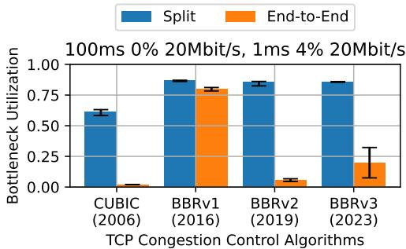

(a) Asymmetric, lossy last-mile.  
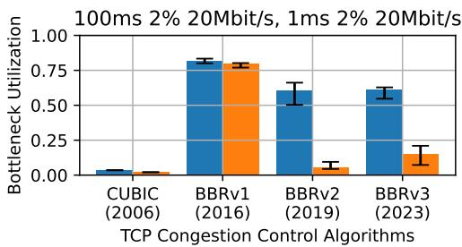  
(b) Asymmetric, both path segments are lossy.

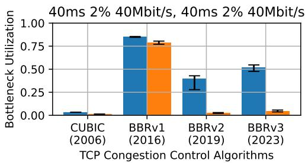

Figure 1: Three classes of network settings in which the throughput of a long-lived data transfer using BBRv3 benefits significantly from connection-splitting. While the throughput of TCP using BBRv1 may not have benefitted from a PEP, as the BBR algorithm has evolved over time, it has also made splitting pertinent again. In two of these classes, split BBRv3 even achieves high bottleneck link rate utilization where split CUBIC does not. IQR of n = 20.

benefits as exaggerated or unfair, sensitive to the details of an endpoint’s congestion-control scheme, contrary to end-to-end arguments [42], and likely to lead to ossificiation [13, 38].

Two more-recent developments have put PEPs on the back foot. The QUIC transport protocol, standardized in 2021 [23], is encrypted end-to-end and, unlike TCP, its connections can’t be split by a transparent proxy—but its wide deployment by major traffic sources (particularly Google) in the 2010s didn’t produce a measured reduction in performance, compared with TCP connections that do benefit from PEPs in the field [31]. If PEPs had really been aiding TCP connections all this time, QUIC could have been expected to experience lower sustained throughput over such paths (compared with TCP connections between the same endpoints, using the same congestion-control schemes).

Furthermore, the BBR congestion-control scheme [8], first released in 2016, now controls a large percentage of Internet traffic (both TCP and QUIC) [51] and puts less emphasis on packet loss as a congestion signal than older schemes in wide deployment, such as CUBIC. Because much of PEPs’ benefit comes from splitting up long, lossy paths for the benefit of “loss-based” schemes, it has been suggested that BBR has led to a sharp decline in the use of PEPs [25].

Do BBR and QUIC make connection-splitting obsolete? In this paper, we present findings that suggest that neither of these developments should be regarded as reliable; Connection-splitting may yet play a performance-enhancing role on the Internet, despite its controversial nature.

We conduct a measurement study in emulation to investigate what kinds of congestion control schemes, network scenarios, and transport protocols may still experience increased sustained throughput from connection-splitting. We aid our analysis with a split throughput heuristic for predicting the throughput of a split connection, based on the measured endto-end throughput of each segment on the split path. We aim to (1) explore a wide parameter space of network settings and congestion control schemes and (2) reason about encrypted transport protocols (QUIC) that we cannot directly measure.

We present three major findings:

Finding 1: Splitting has become significantly more beneficial to TCP BBR since it was initially released in 2016. We confirm that BBR’s initial “v1” release does not benefit markedly from splitting, unlike earlier congestion-control schemes. But as the BBR algorithm has evolved into BBRv2 in 2019 and now BBRv3 in 2023, it has also evolved to behave more conventionally in the sense that it benefits from being split—just like more traditional, loss-based congestion control schemes such as CUBIC (Fig. 1).

The regression in split throughput follows directly from the regression in end-to-end throughput, via the heuristic. While BBRv1 nearly always achieves full utilization, BBRv3 sees lower utilization in lossy settings, leaving more to gain from splitting. The end-to-end regression is because BBRv3 has increased its loss sensitivity to coexist fairly with “loss-based” schemes such as Reno and CUBIC [6, 50, 54]. Thus, we find that BBR and its split behavior continue to evolve, and that the model-based BBR algorithm has not made the performance enhancements of connection-splitting obsolete.

Finding 2: There exist classes of network paths where TCP BBR would significantly benefit from splitting but

TCP CUBIC would not. Splitting not only benefits BBRv3 in all the same scenarios as CUBIC (in terms of long-lived throughput), it also benefits BBRv3 in new scenarios. In particular, there exist classes of network settings where the CCA achieves a very low bottleneck link rate utilization without a PEP, but a high bottleneck link rate utilization with a PEP.

More specifically, in addition to edge deployments with a lossy last-mile (Fig. 1a), BBRv3 can also benefit from splitting in scenarios where there is loss on both path segments (Fig. 1b), and when the connection-splitter is located farther from the edge (Fig. 1c). This suggests that in these network classes, simple split BBRv3 can replace the proprietary protocols that have traditionally been used to address middlemile loss, particularly in satellite and wireless ad-hoc networks [2,17,39]. We should continue to evaluate the behavior of split CCAs in new types of networks, especially in space.

Finding 3: Implementations of the “same” congestion-control schemes in QUIC vary significantly, and further differ those of Linux TCP—frustrating attempts to directly compare performance between QUIC and TCP. In an initial study of three QUIC implementations, we find that the end-to-end behaviors of the same congestion control schemes vary significantly by implementation. The implementations vary in both baseline performance and sensitivity to loss and delay. By applying the split throughput heuristic, we find that some CUBIC implementations can actually benefit in the same classes of network paths as TCP BBRv3. We also find that BBR is challenging to implement, with various BBRv3 implementations exhibiting non-uniform end-to-end behavior and thus no clear trend in split behavior. We argue that the benefits of in-network assistance should be considered along with not just a CCA, but their specific implementations.

Our initial evaluation suggests that the performance improvements of connection-splitting remain relevant in the context of today’s model-based congestion control algorithms, encrypted transport protocols, and satellite and wireless ad-hoc network settings. As congestion-control schemes continue to evolve, we urge researchers to refer to them by algorithm/implementation/version, not just “BBR” or even “QUIC BBRv1”. We urge the community to create a performance test suite for an implementation to be able to claim that it conforms to a particular congestion-control standard. Finally, we hope that this work motivates the community to pursue protocol-agnostic PEPs that achieve the performance benefits of in-network assistance without the ossification downsides.

## 2 Background

In this section, we provide additional context on some concepts that we refer to throughout the text.

Performance-enhancing proxies. The idea of in-network assistance has long brought pain to the hearts of Internet researchers, protocol designers, and network operators. In particular, the word “middleboxes” is often associated with NATs, firewalls, and other policy enforcers that modify or inspect data in ways that break end-to-end behavior. A substantial percentage of Internet paths are affected by feature or protocol-breaking policies of middleboxes [13].

In contrast, we refer specifically to the type of assistance provided by performance-enhancing “proxies”, or PEPs, that transparently split a TCP connection in two [17]. While PEPs still interfere with end-to-end transport mechanisms, their goal is to enhance the user experience by maximizing performance, as opposed to enforce security or routing policies.

Connection-splitting PEPs can enhance performance in several ways. By providing an intermediate point of acknowledgment and retransmission, PEPs reduce the length of the feedback loop for signals of loss and congestion. The PEP also allows each side of the split connection to better optimize congestion control and flow control for network conditions local to the path segment. We can expect PEPs to impact a variety of performance metrics, including startup time, packet jitter, retransmission overheads, and more. In this paper, we focus only on the impact of connection-splitting on the sustained throughput of long-lived data transfers.

Congestion control. Congestion control was originally deployed in the 1980s to manage the explosive growth of the Internet [24]. Foundational algorithms such as slow start and fast retransmit eventually became part of the Tahoe congestion control scheme. Variants such as NewReno and CUBIC emerged over time to improve performance with fairness [18]. CUBIC is the default congestion control module for TCP in the Linux kernel, and widely deployed. It is the primary “loss-based” congestion control scheme that we evaluate.

The word “TCP” is sometimes used synonomously with the congestion control algorithms that it implements. In reality, the two are distinct, though deeply intertwined. For example, the QUIC transport protocol implements many of the same algorithms as TCP to manage network traffic, even though it runs over UDP [23]. In this paper, we refer to “TCP” and “QUIC” as the transport protocols, “Linux TCP” as the implementation of TCP in the Linux kernel, and congestion control schemes as the particular manifestations of a congestion control algorithm in a transport protocol implementation.

BBR. Today, the focus on congestion control has shifted towards BBR. BBR is sometimes referred to as a “modelbased” congestion control scheme because it relies on a fundamentally different approach of modeling network bandwidth and round-trip time. It does not use packet loss as the primary signal for congestion. Google initially presented BBR in 2016 as addressing the problems of CUBIC in high-speed networks [7].

Over time, BBR encountered controversy for its unfairness towards loss-based schemes [4, 40, 50]. In response, “v1” of BBR has now evolved into BBRv2 in 2019 and BBRv3 in 2023, driven by efforts at Google. Today, Google recommends that BBRv1 and BBRv2 be deprecated in favor of BBRv3 [6].

BBR is also widely deployed [15, 51]. Google has contributed BBR implementations to the Linux kernel, and Amazon, Akamai, Meta, and Cloudflare CDNs all use BBRv1 for TCP. At Google, BBRv3 is used in all google.com and YouTube public Internet traffic with TCP, and is currently being A/B tested against BBRv1 in Google QUIC traffic [6]. It is estimated that 40% of traffic used BBR in 2019 [37].

Since 2017, there have been ongoing efforts to standardize BBR in the IETF [9]. However, progress has been slow. The Internet draft goes years or months at a time without an update at the mercy of Google contributors. While companies have been quick to adopt BBR in Linux TCP, adoption in QUIC has been slower. Anecdotally, some have resorted to reverse engineering the Linux implementation, and some such as Cloudflare, Meta, and Cisco are actively experimenting with variants of BBRv2+ in their QUIC stacks [15].

QUIC. The QUIC transport protocol was originally developed by Google in 2012 to improve performance for HTTPS traffic and to enable the rapid evolution of transport mechanisms. QUIC is implemented over UDP, and moves congestion control development from kernel space to user space.

As of 2021, QUIC is now a standards-track RFC [23] with widespread deployment and interoperability testing [46]. It is estimated that 8.4% of global websites support QUIC [49], many of them major traffic sources such as Cloudflare. Still, many high-speed flows remain on TCP due to better TCP hardware capabilities and “per-origin” caching, which complicates multi-CDN deployments that mix protocols.

Evaluations of QUIC at the Internet scale generally show improved performance compared to TCP, except in satellite networks. Features like zero-RTT connection establishment and stream multiplexing enable measured improvements in search latency, rebuffer rate, and other video playback metrics at Google [31]. Satellite network operators, on the other hand, experience strife when it comes to QUIC. Several studies have measured the negative impact of encryption on performance in split satellite environments [2, 26, 30, 32].

## 3 The Split Throughput Heuristic

When initially considering which network scenarios to evaluate in our emulation study, we discovered it to be non-trivial to pick scenarios that would lead to a general understanding of the throughput of a congestion control scheme in a split setting. It is challenging to select which network settings and combinations of path segments to evaluate, as the parameter space for combinations of path segments can be quite large. Also, not all CCA implementations can be trivially split.

For this paper, we refer to throughput as the throughput of a long-lived data transfer in an emulated network, using a single flow. We do not evaluate other metrics such as startup time, retransmission overheads, or short-lived data transfers, which have been of interest to PEPs and could also be impacted by connection-splitting. When discussing throughput, we refer to end-to-end throughput as the throughput of an end-to-end connection, and split throughput as the throughput of the same connection when there is a connection-splitting PEP.

We realized that while split throughput is not necessarily well understood for any combination of CCA, transport protocol, and network setting, the end-to-end throughput often is. We make the following insight based on an ideal setting:

Split Throughput Heuristic: We can estimate the long-lived “split throughput” of a connection by measuring the long-lived “end-to-end throughput” on each segment of the split path and taking the minimum.

Figure 2: A heuristic for evaluating split behavior from end-to-end behavior in an emulated network.

Thus if we know the throughput of the much smaller parameter space of end-to-end connections, we can easily derive:

1. The split throughput of a CCA on a network path composed of two path segments,

2. The end-to-end throughput on the network path,

3. The expected throughput benefit of using a connectionsplitting PEP on the network path.

Furthermore, it is impossible to quantitatively evaluate the split throughput of encrypted transport protocols without creating a custom and explicit connection-splitting PEP. As a result, it is challenging to establish a baseline for the throughput that is potentially achievable by QUIC with in-network assistance, leaving many studies to compare QUIC only to split TCP [2, 48, 52]. The split throughput heuristic allows us to estimate the throughput of encrypted transport protocols using knowledge about its end-to-end throughput, without actually splitting the connection.

In §6, we discuss potential sources of error in the heuristic, including the lack of consideration of the queue configuration on the proxy or the placement of the bottleneck link relative to the data sender. However, we believe there is a design tradeoff in accuracy versus simplicity.

In the rest of this section, we first describe how to use this heuristic to analyze the split throughput benefit in a single network setting, without having to run an emulation with a connection splitter. Then we describe how we cache emulation results for an end-to-end parameter space to enable a more open-ended analysis of CCAs over a variety of networks. Finally, we discuss the limitations of our methodology using the heuristic, and propose possible extensions.

## 3.1 Analyzing Split Throughput Benefit in a Single Network Setting

Given a network model of the two path segments that compose an end-to-end network path, we would like to be able to estimate the expected throughput benefit of using a

```python
class NetworkModel:
def __init__(self, delay, bw, loss):
self.delay = delay
self.bw = bw
self.loss = loss
def compose(s1: NetworkModel,
s2: NetworkModel) -> NetworkModel:
delay = s1.delay + s2.delay
bw = min(s1.bw, s2.bw)
loss = s1.loss * (1-s1.loss)*s2.loss
return NetworkModel(delay, bw, loss)
def throughput(s: NetworkModel) -> float:
return run_emulation(s)
```

Listing 1: An interface for modeling a network path and estimating throughput. The compose() function models an end-to-end network path from two path segments. The throughput() function obtains a throughput measurement for a path segment.

```python
def pred_split_throughput(s1: NetworkModel,
s2: NetworkModel) -> float:
return min(throughput(s1), throughput(s2))
def pred_e2e_throughput(s1: NetworkModel,
s2: NetworkModel) -> float:
s = compose(s1, s2)
return throughput(s)
```

Listing 2: Functions that apply our simplified network model and the split throughput heuristic (Fig. 2) to predict split and end-to-end throughput, using the interface in Listing 1.

connection-splitting PEP between the two segments. In our emulation study, our simplified network model consists of three parameters: delay, bandwidth, and loss.

We explicitly define the interface we use to query split and end-to-end throughput in Listings 1 and 2. In addition to the network model, we implement functions to compose() a model of an end-to-end network path from two path segments and to query the end-to-end throughput() of a segment.

The compose() function. Since our network model consists of three parameters, we describe how to compose each of these parameters to model the end-to-end network path. Bandwidth is the minimum of the two bandwidths, which is the bottleneck. (We may also refer to “bandwidth” as “link rate.”) Delay is just additive. If we think of loss as independent random loss, then the composition of the two is loss = loss1 + (1 − loss1) · loss2 = loss1 + loss2 − loss1 · loss2.

Note that many combinations of path segments can compose to the same end-to-end network path. This makes sense because regardless of where on the network path loss occurs or which path segment has the bottleneck bandwidth, from an end-to-end perspective, the network properties look the same.

<table><tr><td>Parameter</td><td> Values</td><td>Unit</td></tr><tr><td>Bandwidth</td><td>[10,20,30,40,50]</td><td>Mbit/s</td></tr><tr><td>Delay</td><td>[1,20,40,60,80,100]</td><td>ms</td></tr><tr><td>Loss</td><td>[0, 1,2,3,4]</td><td>%</td></tr></table>

Table 1: Network parameter space for the 5 · 6 · 5 = 150 combinations of network settings that we analyze in §5. These values attempt to realistically reflect network settings in which we’d see a PEP.

The throughput() function. This is the throughput of a long-running HTTPS connection in a mininet emulation. The emulated network is parameterized by the network model of a single path segment, and the HTTPS implementation uses the congestion control scheme of interest. We describe additional details about the emulation in §4.

Calculating the split improvement. Listing 2 demonstrates how we can estimate the split throughput benefit using the interface in Listing 1. We pred\_split\_throughput() by taking the minimum measured throughput on each network path segment, and pred\_e2e\_throughput() by composing the path segments into an end-to-end network path and using the measured throughput of that network path. The split throughput benefit is just how much the split throughput has improved (if it has) relative to the end-to-end throughput.

## 3.2 Caching Measurements for Analysis

While we can now predict split throughput for congestion control schemes which are not easily splittable, evaluating split throughput on a variety of network settings still requires running emulations for each query. In order to speed up our analysis, we select a parameter space of delay, bandwidth, and loss within our network model and cache the end-to-end emulation results for this parameter space. We describe our choice of parameter space and other modifications as follows:

Selecting a parameter space. We select a range of values we thought would realistically reflect network settings in which we’d see a PEP (Table 1). We select propagation delays from 1 ms for a Wi-Fi last hop to 100 ms to reflect the longer RTTs of a satellite connection. Bottleneck bandwidths range from 10 to 50 Mbit/s for a single connection, and are within the CPU constraints of emulation. Random loss rates range from 0% for a stable connection to 4% for random loss caused by e.g., wireless interference and extraterrestrial weather.

Modifying the compose() function. We make some subtle changes to the compose function to keep composed network models within our parameter space. In some sense, each parameter e.g., delay, can be thought of as an algebraic group where the operator function is defined in compose().

For path segments with small delays (1 ms), we consider the composed path segment to just have the delay of the longer segment, so we can have segments with 1 ms delay. For loss, note that when loss rates are small, loss1 · loss2 is negligibly small. In our case, the loss is always below 4%, so we omit the term in the composition and loss becomes additive.

Collecting data efficiently. For some CCAs, we expect a large number of network settings in the parameter space to have extremely low throughput. Thus we set a utilization threshold of 5% of the link rate below which we are not interested in the exact throughput of that network setting.

To more efficiently build the cache, we run a search algorithm on the parameter space to explore faster network settings first. The initial network setting we evaluate has the lowest delay, bandwidth, and loss. We explore adjacent data points if and only if the current data point has not timed out.

## 3.3 Limitations

Although our methodology is more efficient for evaluating many network settings and enables the exploration of theoretical scenarios, caching measurements in emulation still takes non-negligible time. A much faster method to estimate sustained throughput would be to use a theoretical model, such as the TCP macroscopic model for AIMD schemes [36]. However, this method does not reflect the nuances of implementation, and as Mathis states himself, new models are needed for BBR and modern paradigms [34, 35].

Another limitation is our simplified network model and emulation testbed. One could incorporate more parameters into the network model, such as the fluctuating bandwidths of cellular networks [20], or how BBR incorporates ACK aggregation [5]. Another idea is to generate end-to-end measurements from real testbeds instead of emulation. We believe these challenges are not limited to emulation studies on split performance, and hope to use the much more well-understood space of end-to-end behavior to extrapolate split behavior.

We acknowledge that we only test connections in a singleflow environment. This limits what we can say about interflow fairness, but we can still infer some aspects from how congestion-control schemes respond to loss and delay in isolation, a classical concept known as “TCP friendliness” [19]. While split connections reduce retransmissions by buffering on the path, their high throughput may also make them unfair. There may also be different fairness implications when combining split with end-to-end connections. If every connection is split, then we refer to other studies for understanding fairness at scale for each side of the concatenation [40].

We also acknowledge that TCP is not limited to bulk data transfers, and that it would be valuable to study other metrics that could be impacted by connection-splitting, such as startup time, packet jitter, and retransmission overheads.

Finally, our heuristic makes the simplified assumption that we can identify the bottleneck path segment based on the minimum measured throughput. In reality, the ability of a data sender to sustain that throughput depends on its ability to saturate the send buffer. This is particularly true for data senders farther along the network path, as their behavior will depend on the queue configuration and the burstiness of previous senders. We explore this more in §6.

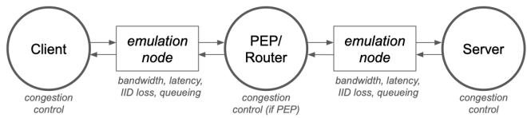  
Figure 3: Two-segment network topology in mininet. The middle node splits the path into two segments with different properties.

<table><tr><td>CCA</td><td>Implementation</td></tr><tr><td>BBRv3</td><td>Linux TCP v6.4.0+ google-bbr/v3 fork</td></tr><tr><td>BBRv2</td><td>Linux TCP v6.4.O+ google-bbr/v2alpha fork</td></tr><tr><td>BBRv1</td><td>Linux TCP v5.15.0-122-generic</td></tr><tr><td>CUBIC</td><td>Linux TCPv5.15.0-122-generic</td></tr><tr><td>BBRv3</td><td>Google quiche vl31.0.6728.1</td></tr><tr><td>BBRv1</td><td>Google quiche v131.0.6728.1</td></tr><tr><td>CUBIC</td><td>Google quiche vl31.0.6728.1</td></tr><tr><td>BBRv2</td><td>Cloudflare quiche v0.14</td></tr><tr><td>BBRv1</td><td>Cloudflare quiche v0.14</td></tr><tr><td>CUBIC</td><td>Cloudflare quiche v0.14</td></tr><tr><td>BBRv2</td><td>IETF picoquic 29c7c53</td></tr><tr><td>BBRv1</td><td>IETF picoquic 29c7c53</td></tr><tr><td>CUBIC</td><td>IETF picoquic 29c7c53</td></tr></table>

Table 2: The congestion control schemes and transport protocol implementations we evaluate in the measurement study.

## 4 Measurement Methodology

We want to evaluate different congestion control schemes in a variety of network settings. To do this, we run emulation experiments in mininet with simple HTTPS clients and servers to measure the throughputs of long-lived data transfers. In this section, we describe our emulated network configurations, HTTPS endpoints and PEP, and other specifications.

Network configuration. We used two linear network topologies: a one-segment topology for caching end-to-end measurements and a two-segment topology for evaluation with a connection-splitting PEP (Fig. 3). Both have a client and server node at each end. The two-segment topology additionally has a router node in between. Each path segment has a bridging node to emulate network properties on the link.

We parameterize each path segment in three dimensions: delay, bandwidth, and a random loss rate. We configure the network properties on the bridging nodes’ egress interfaces, using tc-netem to set delay and random loss, and tc-htb to set bandwidth. Additionally, we use tc-qdisc to configure the queues to use RED1, which is the source of congestive loss. Each link is symmetric in the uplink and downlink directions. For some versions of BBR, we set an fq qdisc on the host nodes’ egress interfaces for pacing.

Host configuration. We create simple HTTPS wrappers around each transport protocol implementation to evaluate the congestion control schemes in Table 2. The TCP endpoints use the Python http module. For the QUIC implementations, we modify comparable client/server applications from each repository. With the exception of enabling TCP pacing where required by BBR, we use “default values” for tunable parameters, considering these to be part of each implementation.

In TCP, we set the CCA by using a specific Linux kernel version and loading the congestion control module. We use the default kernel’s implementations of CUBIC and BBRv1, and Google’s kernel fork for BBRv2 and BBRv3 (Table 2).

In QUIC, we simply select the CCA as a command-line argument to the user space implementation. We evaluate Google quiche [16], Cloudflare quiche [10], and picoquic [22]. Google and Cloudflare quiche are their production implementations of the same name, and picoquic is a minimalist implementation based on the IETF spec. All three include CUBIC and BBRv1 implementations, as well as some form of BBRv2 or BBRv3, which is still undergoing standardization.

For the transparent, connection-splitting TCP PEP, we use PEPsal [3]. PEPsal intercepts the SYN packet during the three-way handshake and forms separate TCP connections with each endpoint, copying data between the two sockets. Note that discussions of split QUIC are based only on the split throughput heuristic and do not use an actual splitter.

Experiment specification. In each experiment, the HTTPS client requests a specific number of bytes to be transferred from the server in the HTTPS payload. This number corresponds to the amount of data that can be transmitted through the bottleneck link over a 10-second period. We have found this to be sufficiently large to reflect sustained throughput.

In practice, we report the "single-stream goodput" calculated as the number of application-layer bytes received (excluding HTTPS headers) divided by request completion time (from when the client sends a request to when it receives a complete response). Due to header overhead and request latency, this metric will never equal the link rate.

Machine specification. All experiments use CloudLab [12] x86\_64 rs630 nodes in the Massachusetts cluster running Ubuntu 22.04.2. The nodes use the default Linux kernel v5.15.0-122-generic, except for TCP BBRv2 and BBRv3.

## 5 Results

In our emulation measurement study, we aim to answer three questions to gain a more comprehensive understanding of the relevance of connection-splitting with modern networks:

1. Has the model-based BBR algorithm made the throughput enhancements of connection-splitting obsolete?

2. Are there classes of network settings where BBR benefits significantly from splitting but CUBIC does not?

3. How does CCA implementation impact end-to-end behavior, and therefore split behavior?

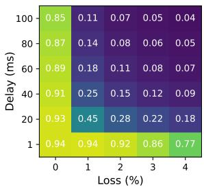  
(a) TCP CUBIC.

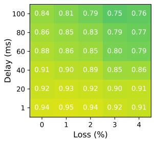  
(b) TCP BBRv1.

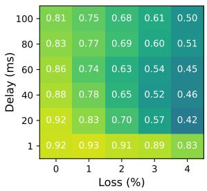  
(c) TCP BBRv2.

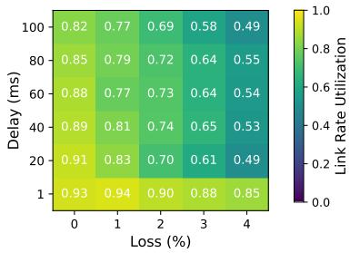  
(d) TCP BBRv3.  
Figure 4: The link rate utilization calculated as the ratio of achieved goodput to link rate for various TCP CCAs in an emulated network path, at various loss rates and one-way delays, at 10 Mbit/s. CUBIC is the most sensitive to loss and delay, while BBRv1 is the most aggressive and achieves the highest utilizations; BBRv2 and BBRv3 are more sensitive to loss than BBRv1 and utilization starts to suffer (left to right). CCAs tend to achieve lower utilizations, though higher absolute goodputs, as the link rate increases (Appendix A). Median of n = 20 trials.

To recap our measurement methodology, we have a method for measuring the throughput of TCP connections in emulation both with and without a transparent PEP. We also have the ability to estimate throughput both with and without a generic connection splitter, for both TCP and QUIC, based on knowledge of the network model of each path segment, and the measured end-to-end throughput on each segment.

For our analysis, we cache measurements for the end-toend network parameters in Table 1 and the congestion control schemes in Table 2. We also run experiments in the two-segment network topology to validate some of these predictions. Raw data for the end-to-end behavior of each CCA implementation are available in Appendix A. Our emulation benchmarks are also publicly available on GitHub: https://github.com/StanfordSNR/connection-splitting.

## 5.1 Finding: Splitting has become significantly more beneficial to TCP BBR since it was initially released in 2016.

Has the model-based BBR algorithm made the throughput enhancements of connection-splitting obsolete? We find this line of thought has some truth with the initial release of TCP BBRv1 in 2016. But as the BBR algorithm has evolved into BBRv2 in 2019 and now BBRv3 in 2023, it has also evolved to behave more conventionally in the sense that it benefits from being split—just like more traditional, loss-based congestion control schemes such as CUBIC.

Fig. 1 shows three different network settings in which BBRv2 and BBRv3 show significant throughput gains from connection-splitting. When BBRv1 was released, its throughput both with and without the connection-splitter were roughly the same, and nearly achieved the bottleneck link rate. With BBRv2 and BBRv3, the end-to-end throughput drastically deteriorated, behaving more like CUBIC than BBRv1. However, the split throughput remained relatively high, suggesting that BBRv3 today would still benefit from connection-splitting.

Analysis. To explore why CUBIC and BBRv3 benefit from splitting but BBRv1 does not, we analyze end-to-end throughputs of each CCA and apply the split throughput heuristic (Fig. 2). As described in §3, this methodology allows us to study split settings by measuring the much smaller parameter space of end-to-end connections. We find that connectionsplitting is likely to improve throughput on lossy paths for CUBIC, BBRv2, and BBRv3 connections, but not for BBRv1.

Fig. 4 visualizes our cached end-to-end measurements as link rate utilization heatmaps of loss vs. delay. Here is an example for how to interpret these graphs using Fig. 4d. The top-left cell represents a 100 ms 0% segment with 0.82 utilization of the 10 Mbit/s link rate, and the bottom-right cell represents a 1 ms 4% segment with 0.85 utilization of the 10 Mbit/s link rate. The predicted split utilization of a network path composed of these two segments is just 0.82, the minimum. The two cells compose to the top-right cell, which represents a 100 ms 4% 10 Mbit/s segment with an end-to-end utilization of 0.49. Since $0 . 8 2 > 0 . 4 9$ , we say that splitting has improved the throughput of this network path.

BBRv1 achieves high link rate utilization in all settings (Fig. 4b), showing it has little to gain from splitting. In fact, previous studies have shown that BBRv1 achieves ≈85% link utilization regardless of loss (same as our findings) before it reaches a cliff point at around 20% loss [4, 8]. This may be why it appears that splitting in lossy settings is now obsolete with BBR. However, one should note that BBRv1’s high throughput has long been attributed to its aggressiveness and unfairness to legacy algorithms [4, 50], which is what led to the changes in BBRv2 and BBRv3.

While BBRv2 is a large departure from BBRv1, BBRv3 has been described as BBRv2 with bugfixes and performance tuning [6], which supports why the two are so similar. We focus on BBRv3 since Google hopes to now deprecate BBRv2 [6].

BBRv3 is more sensitive to loss than its previous versions (Fig. 4d), and more similar to CUBIC (Fig. 4a) in that there exist scenarios where end-to-end throughput suffers. These reflect existing findings of lower utilization in BBRv2 and BBRv3 [11, 47, 54]. Based on the heuristic, it is clear that in some lossy networks such as the ones empirically evaluated in Fig. 1, connection-splitting can significantly increase the throughput of BBRv3 connections. It is possible that the BBR algorithm continues to evolve in this direction given that BBR’s unfairness remains contentious today [11, 54].

Summary. While BBR may not have benefited from splitting with the release of “v1” in 2016, BBRv2 and now BBRv3 have evolved to behave more conventionally—similar to traditional, loss-based CCAs such as CUBIC—in the sense that they do. Even so-called “model-based” congestion control algorithms seem to now react to loss as a congestion signal, as the BBR algorithm continues to evolve.

## 5.2 Finding: There exist classes of network paths where TCP BBRv3 would significantly benefit from splitting but TCP CU-BIC would not.

Are there new classes of network settings where BBR benefits significantly from splitting but CUBIC does not? We want to understand the network settings in which a congestion control scheme is not able to achieve practical bottleneck link rate utilizations end-to-end, but is with a connection-splitter.

We find that while splitting benefits BBRv3 in all the same scenarios as CUBIC, it also has the potential to benefit BBRv3 in many new scenarios. In addition to edge deployments with a lossy last-mile, BBRv3 also benefits from splitting in scenarios where there is loss on both path segments, and when the connection-splitter is located farther from the edge. We partition these scenarios into three classes of network settings:

I. Paths with asymmetric delay and a lossy last-mile,

II. Lossy paths with asymmetric delay,

III. Lossy paths with more symmetric delay.

Figs. 1a to 1c represent network settings in each class, respectively. “Asymmetric” refers to the delays on the two path segments. These emulations empirically demonstrate that CU-BIC only benefits in the first class, while BBRv3 benefits in all three. BBRv1 does not need splitting in any context.

Analysis. To identify which network paths benefit from connection-splitting and where along the paths PEPs should be deployed, we apply the heuristic (Fig. 2). For each CCA, we conduct an exhaustive search of the 15 · 21 · 25 = 7875 combinations of settings within our parameter space (Table 1), and efficiently predict the split and end-to-end throughputs.

We filter on the predicted throughputs for network settings where splitting improves end-to-end throughput by at least 3×, and where the split connection utilizes at least half the bottleneck link rate (Table 3). BBRv1 does not meet these criteria is any scenarios, and the theoretical connection-splitter is unable to improve the throughput of BBRv1 by even 50%. CUBIC and BBRv3 meet these criteria in 942 and 188 scenarios, respectively. CUBIC benefits from splitting in more scenarios because its end-to-end utilization is more frequently low, so it more frequently has a large split improvement.

<table><tr><td>Filter</td><td>BBRv1</td><td>CUBIC</td><td>BBRv3</td></tr><tr><td>Initial</td><td>7875</td><td>7875</td><td>7875</td></tr><tr><td>Split imprvmnt. &gt; 3×</td><td>0</td><td>2231</td><td>234</td></tr><tr><td>Split utilization &gt; 0.5</td><td>0</td><td>942</td><td>188</td></tr><tr><td>Asymmetric, last-mile</td><td>0</td><td>942</td><td>38</td></tr><tr><td>Asymmetric, lossy</td><td>0</td><td>0</td><td>72</td></tr><tr><td>Symmetric, lossy</td><td>0</td><td>0</td><td>78</td></tr></table>

Table 3: An exhaustive search of network paths and their PEP locations that benefit from splitting for each CCA, and the number of filtered settings that belong to each class.

Since the distribution of network paths in our parameter space does not reflect any meaningful real world distribution, we are more interested in the classes of network settings that benefit from splitting. We realized that all of the relevant network settings for CUBIC can be clustered into Class I, as network paths where one path segment has 1 ms delay and non-zero loss, and the other has > 1 ms delay and 0% loss. However, Class I only accounts for 21% of the relevant network settings for BBRv3. We identify Class II, which is the same as I, except both path segments have non-zero loss. Class III is the same as II, except both path segments have > 1 ms delay. We used the results to select three representative network settings to empirically evaluate in Fig. 1.

Intuitively, we can understand why BBRv3 benefits more from splitting in lossy scenarios than CUBIC based on how it reacts to loss and delay (Fig. 4d). BBRv3’s sensitivity to loss and delay is more gradual than abrupt, so it is more likely to benefit when splitting a lossy, high-delay network path in any way. In comparison, CUBIC’s throughput falls off a cliff for many of these segmentations.

Discussion. Do these results reflect where PEP deployments have been useful in the real world? Connection-splitters have traditionally been found in satellite, cellular, and Wi-Fi networks with a wireless link or rate policer [13, 21]. This resembles Class I, where the network path consists of a lossy last-mile, and a reliable Internet path segment. It makes sense then for PEPs to be traditionally located at the edge to address the issues of loss-based schemes [14, 17, 39]. We expect these PEPs to similarly benefit BBRv3 in the same locations.

In Classes I and II, asymmetric delay can be severe in low-resource networks in addition to wireless last-mile links; Consider, for example, regions with no IXPs in which a significant proportion of Internet traffic travels internationally.

For Classes II and III, satellite (and also wireless ad-hoc) networks are known for having lossy “middle-miles” [2, 30, 39,41]. This can be due to bad weather, fast-moving satellites, and long-distance radio waves, etc. Since CUBIC does not trivially benefit from splitting in these scenarios, the traditional solution has been to split the connection at multiple points and to use an FEC-based or other proprietary protocol in the satellite backhaul [2, 17, 39]. Our results suggest such an invasive solution may not be necessary for BBRv3.

How could this inform the deployment of connectionsplitting PEPs? With the caveat that futher exploration is required to understand how the heuristic extrapolates to the real world, one idea is to determine where to deploy PEPs along an existing network path for maximum benefit especially as congestion-control schemes evolve. Another idea is given the location of a PEP, determine which connections going through the PEP would most benefit based on knowledge of each connection’s network path. We leave network operators to decide how best to model their networks and apply the heuristic to evaluate potential PEP deployments.

Summary. While TCP CUBIC only benefits from connection-splitting when the PEP is located at the lossy last-mile, TCP BBRv3 can also benefit when there is loss on both sides of the PEP and when there are longer propagation delays. This suggests that TCP connections using BBRv3 should benefit from splitters at the same locations as for CU-BIC, and also that traditional methods used to address loss in the middle-mile could use simple connection-splitting instead. We believe this method of analyzing useful network paths and PEP placements for connection-splitting can be extended to model new types of networks, especially in space.

## 5.3 Finding: QUIC implementations of the same congestion control schemes vary significantly, and further differ from Linux’s TCP implementations.

How does CCA implementation impact end-to-end behavior, and therefore split behavior? Might claims about “split throughput” depend not just on the CCA, but also the implementation and/or the transport protocol on top of it?

For our initial study, we compared end-to-end throughput for four open-source implementations each of CUBIC, BBRv1, and BBRv2/3; one using TCP and three using QUIC. We find that the end-to-end behavior of each CCA varies by implementation in both baseline throughput and sensitivity to loss and delay. To evaluate the split behavior of QUIC, instead of creating a custom and explicit connection-splitting PEP for each QUIC implementation, we apply the split throughput heuristic and argue that these implementations will likewise respond differently to connection-splitting PEPs.

Fig. 5 visualizes the end-to-end behavior of these schemes. We highlight that the Cloudflare and picoquic CUBIC implementations are less sensitive to loss than Google or TCP; the former may benefit from splitting in more classes of network settings than the latter. Additionally, their BBR implementations exhibit non-uniform behavior, suggesting a non-uniform response to connection-splitting. These variations indicate that the benefits of in-network assistance should be considered along with not just the CCA but its specific implementations.

Analysis. The Google QUIC (Figs. 5b, 5f and 5j) and TCP (Figs. 5a, 5e and 5i) implementations are most similar to each other for each CCA. This is reasonable if we take the community-based CUBIC implementation in Linux to be the standard, and considering that Google contributed to the Linux BBR implementations. In general, Google QUIC achieves slightly higher utilization than Linux TCP.

The Cloudflare QUIC BBR implementations (Figs. 5c and 5g) exhibit profoundly different behavior from Linux TCP in baseline performance. Note that Cloudflare uses BBRv1 for TCP but their use of BBR in QUIC is experimental. Anecdotally, a Cloudflare employee has expressed difficulty making their BBR implementation performant, having to reverse engineer the Linux kernel [15]. Given the wide adoption of BBRv1 for TCP at many CDNs [51], we expect it to be desirable yet challenging for these same companies to correctly incorporate BBRv3 into their QUIC stacks in the coming years.

The picoquic BBR implementations (Figs. 5d and 5h) are more similar to Linux TCP, although its BBRv3 implementation seems to have a contradicting reaction to delay. We note that picoquic is intended for experimental use in the IETF [22]. It is important then to understand its congestion control behavior if it is to be used to evaluate IETF proposals. We believe its differences from Linux TCP warrant further exploration, but perhaps also that the ongoing standardization efforts of BBR in the IETF [9] indicate that there is no monolith yet of “the BBR algorithm.”

The Cloudflare QUIC and picoquic implementations of CUBIC (Figs. 5k and 5l) interestingly both exhibit a more gradual degradation in response to loss and delay than Linux TCP (Fig. 5i). We find this harder to explain, given that TCP CUBIC has been around since 2006, and perhaps can be attributed to transport protocol mechanisms in QUIC. Nevertheless, this indicates that it is important to understand the behavior of a CCA in the context of its entire implementation.

Fig. 6 applies the heuristic to show how split behavior can vary for CCA implementations with different end-to-end behaviors. Some QUIC CUBIC implementations benefit in new network settings where TCP CUBIC does not, while the various QUIC BBRv3 implementations exhibit non-uniform end-to-end behavior and thus no clear trend in split behavior.

Discussion. Why do we believe we can extrapolate split behavior from the end-to-end behavior of QUIC? Previous studies explore the effects of QUIC’s transport protocol mechanisms in such a case [26, 48]. They find that the effects of zero-RTT connection establishment with regards to long-lived throughput to be minimal, and stream multiplexing to be mutually beneficial in both scenarios. Further studies can clarify the interactions between CCAs and transport mechanisms.

How do we know that the difference in behavior is due to the congestion control implementation and not other transport protocol mechanisms? Well, we don’t, and there is known to be significant variance in the features supported by different QUIC implementations [33]. However, we find it intuitive that congestion control would be a major factor in the measured sustained goodput of a bulk file transfer.

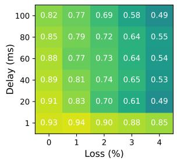  
(a) TCP, BBRv3

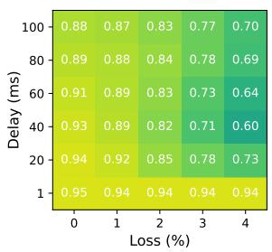  
(b) Google quiche, BBRv3

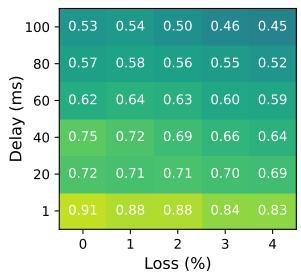  
(c) Cloudflare quiche, BBRv2

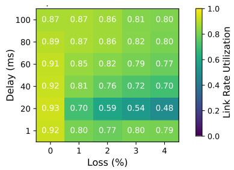  
(d) picoquic, BBRv3

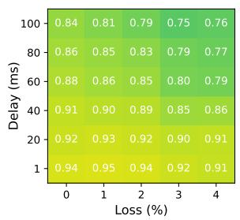  
(e) TCP, BBRv1

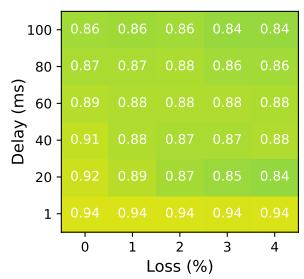  
(f) Google quiche, BBRv1

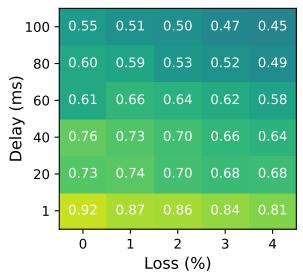  
(g) Cloudflare quiche, BBRv1

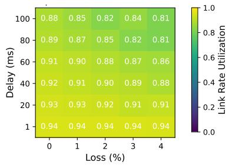  
(h) picoquic, BBRv1

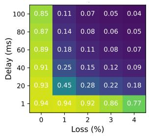  
(i) TCP, CUBIC

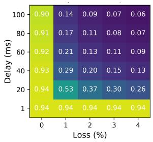  
(j) Google quiche, CUBIC

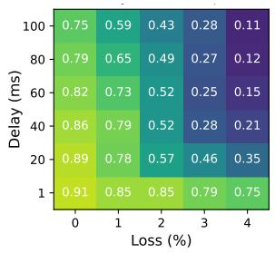  
(k) Cloudflare quiche, CUBIC

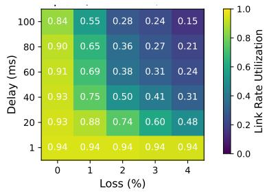  
(l) picoquic, CUBIC  
Figure 5: Heatmaps for three QUIC implementations of BBRv3 (or BBRv2), BBRv1, and CUBIC showing link rate utilization calculated as the ratio of achieved goodput to link rate, compared to Linux TCP. The heatmaps are shown at various loss rates and one-way delays with a fixed link rate of 10 Mbit/s. User-space QUIC is not CPU-limited, achieving high utilizations at 1 ms delay and 0% loss. The QUIC implementations are Google quiche, Cloudflare quiche, and a minimalist implementation based on the IETF spec called picoquic. Median of n = 20 trials.

The divergence in QUIC implementations is not so dissimilar from that of TCP at a similar state of evolution [1], but there are still some fundamental differences. With QUIC implementations in userspace, there is a larger diversity of implementations that are easier to tune for a specific application metric, as opposed to correctness or fairness from a congestion-control point of view. These algorithms are also highly parameterized, with no standard nor test suite, so it’s not surprising that the implementations differ.

If there is reason to believe that QUIC is losing out on throughput by not connection-splitting, then there will continue to be research on how to achieve the same benefits without ossification [28, 29, 52, 53]. The heuristic helps us understand the theoretical achievable throughput with a simple connection-splitter, or even by combining multiple end-to-end congestion control schemes. In addition to research, this could motivate privacy-minded proposals in the Internet standards community to also view themselves as potential deployment opportunities for private PEPs [27, 43–45].

Another application of analyzing CCA implementations is to analyze the Linux TCP implementations of BBR within a major version over time. We did this analysis with BBRv1 on 13 Linux kernels between 2016 and 2024, but found no significant variance. However, given the dynamic nature of BBR and the Linux networking stack, it is possible there will still be changes to the split behavior of TCP in the future.

Summary. We believe it is important to understand the endto-end behavior of a congestion control scheme in the context of its entire implementation. Our results suggest that BBR is challenging to implement, and that even CUBIC implementations can vary based on context. Whether the prevailing wisdom is that a specific CCA or transport protocol has made in-network assistance undesirable, these results suggest that it is valuable to consistently re-evaluate these claims.

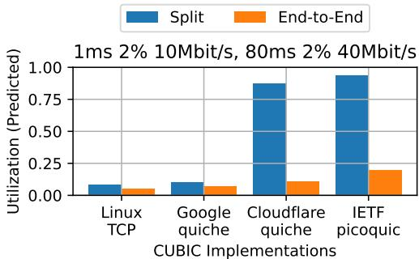  
(a) Some QUIC CUBIC implementations can benefit in new network classes where TCP CUBIC could not.

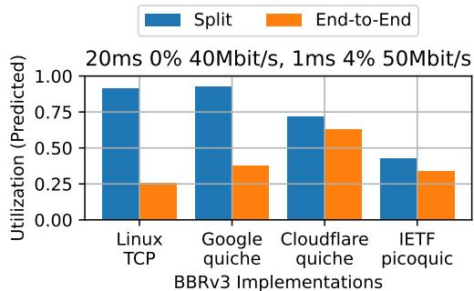  
(b) The various BBRv3 implementations have non-uniform end-to-end behavior and no clear resulting split behavior.

Figure 6: Predicted bottleneck link rate utilizations calculated from the predicted end-to-end and split throughputs of the TCP and QUIC implementations, on two different network path segments. End-toend behavior of each CCA varies significantly by implementation.

## 6 Accuracy Analysis

Our analysis of connection-splitting for TCP and its extensions to QUIC rely on the accuracy of the split throughput heuristic. In this section, we are primarily concerned with how accurate our predictions, which are based on measurements from a one-segment topology, are for measurements from a two-segment topology in emulation, without and with a connection-splitting TCP PEP:

• Does the compose function accurately represent the combined network path in the end-to-end throughput?

• Does the split throughput heuristic accurately predict split throughput?

Most importantly, we find the heuristic to be able to usefully predict trends. In terms of absolute predictions, we find the pred\_e2e\_throughput() and pred\_split\_throughput() functions to be correct within a reasonable tolerance, with a slight tendency to overestimate.

Orthogonally, we do not evaluate the accuracy to which emulation studies reflect the real world with multi-flow settings and more complex network properties, nor how the accuracy would extrapolate to QUIC connections with custom connection splitters. It may be interesting to explore how to incorporate such factors into the network model and heuristic.

Methodology. Recall that for a given network path composed of two path segments, we can obtain both the predicted end-to-end and split throughputs, and the ground truth throughputs in an emulated network with and without a TCP PEP. Then for a network setting, we can compute the accuracy as the percent error in predicted vs. measured throughput.

We perform an empirical accuracy analysis of BBRv3 for two end-to-end network paths with identical bandwidth and delay, both without (0%) and with (4%) loss. We test various splits for the bandwidth, delay, and loss and analyze the accuracy trends. In particular, we select delay splits such that the end-to-end delay is 80 ms, bandwidth splits such that the bottleneck bandwidth is 10 Mbit/s, and loss splits such that the total loss is either 0% or 4%. We parameterize the network path segments to use the cached measurements from Table 1.

## 6.1 End-to-End Throughput Accuracy

Each of our splits composes to the same end-to-end network path, so we predict the same end-to-end throughput for each. Our experimental results in Fig. 7a show that the measured end-to-end throughputs are also roughly uniform, especially without loss, indicating that our method of composing network path segments in emulation represents the same end-to-end network path.

## 6.2 Split Throughput Accuracy

The split throughput predictions accurately reflect trends in loss, delay, and bandwidth (Fig. 7b). For example, split throughput is generally higher when the high-bandwidth link is paired with high delay (the yellow-est cells). It is also lower when the lossy link is paired with high delay (columns 1 and 2) or low bandwidth (columns 3-5).

The split throughput predictions tend to slightly overestimate, but we think the level of error is small enough to be helpful for informing real PEP deployment. The maximum error is ±14%, and on average ±4%. This dwarfs the measured gains in some situations, and rules out a large gain in others.

One factor that may lead to overestimation of split throughput is the queue behavior and the burstiness of the sender. With small queues and bursty sending, we would expect the far path segment from the data sender to sometimes be limited by the send buffer. This could subsequently affect how the far connection probes for and utilizes available link rate capacity.

Another factor is the proximity of the bottleneck link to the sender. While our heuristic does not account for this, the real split throughputs for symmetric pairs of network paths (e.g., the left three and right three columns in Fig. 7b), show that we slightly overestimate when the low-bandwidth bottleneck link is far from the sender. Based on our reasoning about queues, this would suggest that the far path segment, already the bottleneck, is even further under-saturated.

Overall, we find our end-to-end and split throughput predictions to usefully reflect relative trends and absolute throughput within a reasonable tolerance. They are not intended to

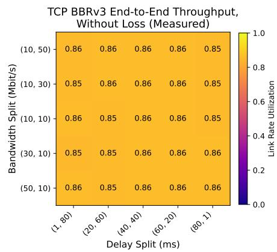

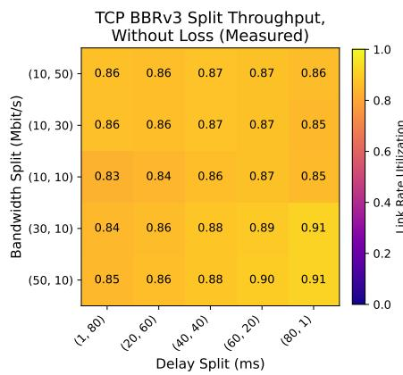

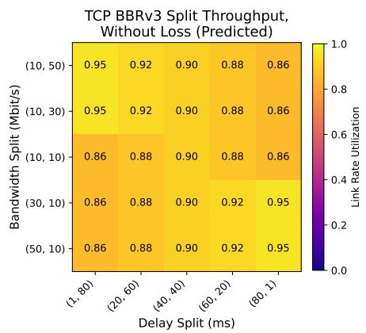

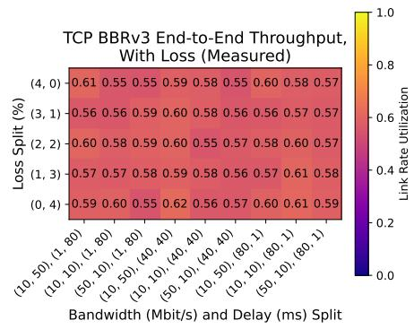

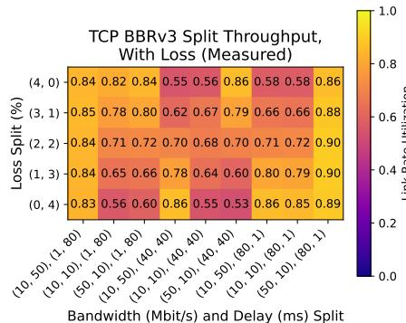

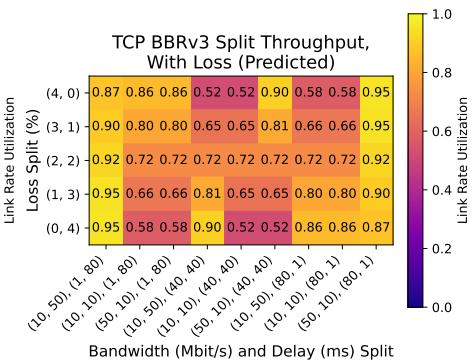  
(b) Split throughput accuracy.

Figure 7: Heatmaps of the measured and predicted BBRv3 throughputs for various splits of delay, bandwidth, and loss, both without (top) and with (bottom) loss. The end-to-end throughput predictions (not pictured) are the same for all cells at 0.86 utilization without loss and 0.58 utilization with loss, because they represent the same network path, so end-to-end prediction errors are roughly uniform. The split throughput predictions err slightly on the side of overestimation, but they accurately reflect trends in higher or lower throughputs for measurements on different splits of the same network path. Median of n = 40 trials.

make claims about exact achievable throughputs nor about the immediate utility of PEPs in the real world, but simply to reason about how connection-splitting may impact long-lived throughput in a simplified network model.

## 7 Conclusion

We performed an emulation measurement study on the impact of connection-splitting PEPs on sustained throughput in the context of recent developments such as BBR and QUIC. We found that TCP BBR benefits more from splitting today than when it was first released, and its current version benefits in settings where TCP CUBIC does not. QUIC congestioncontrol implementations exhibit substantial variability both within QUIC and with Linux TCP.

In the short term, we urge researchers to refer to congestioncontrol schemes by algorithm/implementation/version, not just “BBR” or even “QUIC BBRv1”. We urge the community to create regression and acceptance tests—possibly including our heatmaps with “permissible zones”—for a scheme to call itself an implementation of the XYZv1 algorithm.

For connection-splitting to truly be relevant again, there must be clear scenarios where PEPs offer significant benefits but end-to-end solutions fall short. This paper is a first step, but real-world studies are needed. Next, even though the problem is old, the solution need not be to “just do the same things.” We hope this paper motivates the community to pursue protocol-agnostic approaches to in-network assistance and destigmatize the controversial nature of PEPs.

## Acknowledgments

We thank Michael Welzl, our shepherd Jon Crowcroft, and the anonymous USENIX ATC ’25 reviewers for their invaluable feedback, Frode Kileng for a comment that partly inspired this work [25], and members of IRTF PANRG and Stanford SNR for other helpful discussions. This work was supported in part by NSF grants 2045714 and 2039070, DARPA contract HR001120C0107, a Stanford School of Engineering Fellowship, a Sloan Research Fellowship, affiliate members and other supporters of Stanford DAWN, including Meta, Google, and VMware, as well as Cisco and SAP, and Huawei, Dropbox, Amazon, and the Mozilla Foundation. Any opinions, findings, and conclusions or recommendations expressed in this material are those of the authors and do not necessarily reflect the views of the sponsors.

## References

[1] Mark Allman and Aaron Falk. On the effective evaluation of TCP. ACM SIGCOMM Computer Communication Review, 29(5):59–70, 1999.

[2] John Border, Bhavit Shah, Chi-Jiun Su, and Rob Torres. Evaluating QUIC’s Performance Against Performance Enhancing Proxy over Satellite Link. In 2020 IFIP Networking Conference (IFIP Networking), pages 755– 760, 2020.

[3] Carlo Caini, Rosario Firrincieli, and Daniele Lacamera. PEPsal: a Performance Enhancing Proxy designed for TCP satellite connections. In 2006 IEEE 63rd Vehicular Technology Conference, volume 6, pages 2607–2611, 2006.

[4] Yi Cao, Arpit Jain, Kriti Sharma, Aruna Balasubramanian, and Anshul Gandhi. When to Use and When Not to Use BBR: An Empirical Analysis and Evaluation Study. In Proceedings of the Internet Measurement Conference (IMC), pages 130–136, 2019.

[5] Neal Cardwell. BBR Congestion Control Work at Google, March 2018. Presentation, IETF 101 London, Internet Congestion Control Research Group (ICCRG). https://datatracker.ietf.org/meeting/101/materials/ slides-101-iccrg-an-update-on-bbr-work-at-google-00.

[6] Neal Cardwell. BBRv3: Algorithm Overview and Google’s Public Internet Deployment. Presentation, IETF 119 Brisbane, Congestion Control Working Group (CCWG). https://datatracker.ietf.org/meeting/119/materials/ slides-119-ccwg-bbrv3-overview-and-google-deployment-00, 0 March 2024.

[7] Neal Cardwell and Yuchung Cheng. BBR Congestion Control. Presentation, IETF 97 Seoul, Internet Congestion Control Research Group (IC-CRG). https://www.ietf.org/proceedings/97/slides/ slides-97-iccrg-bbr-congestion-control-01.pdf, November 2016.

[8] Neal Cardwell, Yuchung Cheng, C. Stephen Gunn, Soheil Hassas Yeganeh, and Van Jacobson. BBR: Congestion-Based Congestion Control. Communications of the ACM, 60(2):58–66, 2017.

[9] Neal Cardwell, Ian Swett, and Joseph Beshay. BBR Congestion Control. IETF Draft. https://datatracker.ietf. org/doc/draft-cardwell-ccwg-bbr/, September 2024.

[10] Cloudflare, Inc. quiche. GitHub repository. https:// github.com/cloudflare/quiche, January 2025.

[11] Soumyadeep Datta and Fraida Fund. Replication: "When to Use and When Not to Use BBR". In Proceedings of the 2023 ACM on Internet Measurement Conference (IMC), pages 30–35, 2023.

[12] Dmitry Duplyakin, Robert Ricci, Aleksander Maricq, Gary Wong, Jonathon Duerig, Eric Eide, Leigh Stoller, Mike Hibler, David Johnson, Kirk Webb, Aditya Akella, Kuangching Wang, Glenn Ricart, Larry Landweber, Chip Elliott, Michael Zink, Emmanuel Cecchet, Snigdhaswin Kar, and Prabodh Mishra. The design and operation of CloudLab. In 2019 USENIX Annual Technical Conference (USENIX ATC 19), pages 1–14, Renton, WA, July 2019. USENIX Association.

[13] Korian Edeline and Benoit Donnet. A Bottom-Up Investigation of the Transport-Layer Ossification. In 2019 Network Traffic Measurement and Analysis Conference (TMA), pages 169–176, 2019.

[14] Viktor Farkas, Balázs Héder, and Szabolcs Nováczki. A Split Connection TCP Proxy in LTE Networks. In Róbert Szabó and Attila Vidács, editors, Information and Communication Technologies, pages 263–274, Berlin, Heidelberg, 2012. Springer.

[15] IETF Internet Engineering Task Force. IETF 119: Congestion Control Working Group 2024- 03-21 03:00. https://www.youtube.com/watch?v= ZVqQiA7h-W8, March 2024. Q&A: 1:37:30.

[16] Google. QUICHE. GitHub repository. https://github. com/google/quiche/, January 2025.

[17] Jim Griner, John Border, Markku Kojo, Zach D. Shelby, and Gabriel Montenegro. Performance Enhancing Proxies Intended to Mitigate Link-Related Degradations. RFC 3135, June 2001.

[18] Sangtae Ha, Injong Rhee, and Lisong Xu. CUBIC: A New TCP-Friendly High-Speed TCP Variant. SIGOPS Operating Systems Review, 42(5):64–74, July 2008.

[19] Mark J. Handley, Jitendra Padhye, Sally Floyd, and Joerg Widmer. TCP Friendly Rate Control (TRFC): Protocol Specification. RFC 5348, September 2008.

[20] David A. Hayes, David Ros, and Özgü Alay. On the Importance of TCP Splitting Proxies for Future 5G mmWave Communications. In 2019 IEEE 44th LCN Symposium on Emerging Topics in Networking (LCN Symposium), pages 108–116, 2019.

[21] Michio Honda, Yoshifumi Nishida, Costin Raiciu, Adam Greenhalgh, Mark Handley, and Hideyuki Tokuda. Is it Still Possible to Extend TCP? In Proceedings of the Internet Measurement Conference (IMC), pages 181– 194, 2011.

[22] Christian Huitema. picoquic. GitHub repository. https: //github.com/private-octopus/picoquic, January 2025.

[23] Jana Iyengar and Martin Thomson. QUIC: A UDP-Based Multiplexed and Secure Transport. RFC 9000, May 2021.

[24] Van Jacobson and Michael J. Karels. Congestion Avoidance and Control. In SIGCOMM 1988, Stanford, CA, August 1988.

[25] Frode Kileng. Comments at IETF 121 PANRG session. “there’s been a sharp decline of PEPs in mobile networks in the last years. BBR is a cause for this. (When AWS switched to BBR 2-3 years ago, throughput of moblle networks with PEPs either declined or a steady trend, while those without had a significant increase in throughput. I.e. as measured bye 3rd party benchmarks, e.g. Tutela)” https://zulip.ietf.org/#narrow/ stream/287-panrg/topic/ietf-121/near/144090.

[26] Mike Kosek, Hendrik Cech, Vaibhav Bajpai, and Jörg Ott. Exploring Proxying QUIC and HTTP/3 for Satellite Communication. In 2022 IFIP Networking Conference (IFIP Networking), pages 1–9, 2022.

[27] Mike Kosek, Tanya Shreedhar, and Vaibhav Bajpai. Beyond QUIC v1: A First Look at Recent Transport Layer IETF Standardization Efforts. IEEE Communications Magazine, 59(4):24–29, 2021.

[28] Mike Kosek, Benedikt Spies, and Jörg Ott. Secure Middlebox-Assisted QUIC. In 2023 IFIP Networking Conference (IFIP Networking), pages 1–9. IEEE, 2023.

[29] Zsolt Krämer, Mirja Kühlewind, Marcus Ihlar, and Attila Mihály. Cooperative performance enhancement using QUIC tunneling in 5G cellular networks. In Proceedings of the Applied Networking Research Workshop, ANRW ’21, page 49–51, New York, NY, USA, 2021. Association for Computing Machinery.

[30] Nicolas Kuhn, François Michel, Ludovic Thomas, Emmanuel Dubois, and Emmanuel Lochin. QUIC: Opportunities and threats in SATCOM. In 2020 10th Advanced Satellite Multimedia Systems Conference and the 16th Signal Processing for Space Communications Workshop (ASMS/SPSC), pages 1–7, 2020.

[31] Adam Langley, Alistair Riddoch, Alyssa Wilk, Antonio Vicente, Charles Krasic, Dan Zhang, Fan Yang, Fedor Kouranov, Ian Swett, Janardhan Iyengar, et al. The QUIC Transport Protocol: Design and Internet-Scale Deployment. In Proceedings of the Conference of the ACM Special Interest Group on Data Communication (SIGCOMM), pages 183–196, 2017.

[32] Aitor Martin and Naeem Khademi. On the Suitability of BBR Congestion Control for QUIC Over GEO SATCOM Networks. In Proceedings of the Workshop on Applied Networking Research (ANRW), pages 1–8, 2022.

[33] Robin Marx, Joris Herbots, Wim Lamotte, and Peter Quax. Same Standards, Different Decisions: A Study of QUIC and HTTP/3 Implementation Diversity. In Proceedings of the Workshop on the Evolution, Performance, and Interoperability of QUIC, pages 14–20, 2020.

[34] Matt Mathis and Jamshid Mahdavi. Deprecating the TCP Macroscopic Model. ACM SIGCOMM Computer Communication Review, 49(5):63–68, 2019.

[35] Matthew Mathis. Reflections on the TCP Macroscopic Model. ACM SIGCOMM Computer Communication Review, 39(1):47–49, 2008.

[36] Matthew Mathis, Jeffrey Semke, Jamshid Mahdavi, and Teunis Ott. The Macroscopic Behavior of the TCP Congestion Avoidance Algorithm. ACM SIGCOMM Computer Communication Review, 27(3):67–82, 1997.

[37] Ayush Mishra, Xiangpeng Sun, Atishya Jain, Sameer Pande, Raj Joshi, and Ben Leong. The Great Internet TCP Congestion Control Census. Proceedings of the ACM on Measurement and Analysis of Computing Systems, 3(3):1–24, 2019.

[38] Giorgos Papastergiou, Gorry Fairhurst, David Ros, Anna Brunstrom, Karl-Johan Grinnemo, Per Hurtig, Naeem Khademi, Michael Tüxen, Michael Welzl, Dragana Damjanovic, and Simone Mangiante. De-Ossifying the Internet Transport Layer: A Survey and Future Perspectives. IEEE Communications Surveys & Tutorials, 19(1):619– 639, 2017.

[39] Abhinav Pathak, Angela Wang, Cheng Huang, Albert Greenberg, Y. Charlie Hu, Randy Kern, Jin Li, and Keith Ross. Measuring and Evaluating TCP Splitting for Cloud Services. In Proceedings of the 11th International Conference on Passive and Active Measurement (PAM), pages 41–50, 2010.

[40] Adithya Abraham Philip, Ranysha Ware, Rukshani Athapathu, Justine Sherry, and Vyas Sekar. Revisiting TCP Congestion Control Throughput Models & Fairness Properties at Scale. In Proceedings of the 21st ACM Internet Measurement Conference (IMC), pages 96–103, 2021.

[41] Alain Pirovano and Fabien Garcia. A New Survey on Improving TCP Performances Over Geostationary Satellite Link. Network and Communication Technologies, 2(1):pp–xxx, 2013.

[42] J. H. Saltzer, D. P. Reed, and D. D. Clark. End-to-end arguments in system design. ACM Transactions on Computer Systems, 2(4):277–288, November 1984.

[43] Patrick Sattler, Juliane Aulbach, Johannes Zirngibl, and Georg Carle. Towards a tectonic traffic shift? investigating apple’s new relay network. In Proceedings of the 22nd ACM Internet Measurement Conference (IMC), pages 449–457, 2022.

[44] David Schinazi. Proxying UDP in HTTP. RFC 9298, February 2021.

[45] David Schinazi and Lucas Pardue. HTTP Datagrams and the Capsule Protocol. RFC 9297, August 2022.

[46] Marten Seemann. QUIC Interop Runner. https://interop. seemann.io/, January 2025.

[47] Yeong-Jun Song, Geon-Hwan Kim, Imtiaz Mahmud, Won-Kyeong Seo, and You-Ze Cho. Understanding of BBRv2: Evaluation and Comparison with BBRv1 Congestion Control Algorithm. IEEE Access, 9:37131– 37145, 2021.

[48] Ludovic Thomas, Emmanuel Dubois, Nicolas Kuhn, and Emmanuel Lochin. Google QUIC Performance Over a Public SATCOM Access. International Journal of Satellite Communications and Networking, 37(6):601– 611, 2019.

[49] W3Techs. Usage statistics of QUIC for websites. Web Technology Surveys. https://w3techs.com/technologies/ details/ce-quic, April 2025.

[50] Ranysha Ware, Matthew K. Mukerjee, Srinivasan Seshan, and Justine Sherry. Modeling BBR’s Interactions with Loss-Based Congestion Control. In Proceedings of the Internet Measurement Conference (IMC), pages 137–143, 2019.

[51] Ranysha Ware, Adithya Abraham Philip, Nicholas Hungria, Yash Kothari, Justine Sherry, and Srinivasan Seshan. CCAnalyzer: An Efficient and Nearly-Passive Congestion Control Classifier. In Proceedings of the ACM SIGCOMM 2024 Conference, pages 181–196, 2024.

[52] Gina Yuan, Matthew Sotoudeh, David K. Zhang, Michael Welzl, David Mazières, and Keith Winstein. Sidekick:In-Network Assistance for Secure End-to-End Transport Protocols. In 21st USENIX Symposium on Networked Systems Design and Implementation (NSDI 24), pages 1813–1830, 2024.

[53] Gina Yuan, David K. Zhang, Matthew Sotoudeh, Michael Welzl, and Keith Winstein. Sidecar: In-Network Performance Enhancements in the Age of Paranoid

Transport Protocols. In Proceedings of the 21st ACM Workshop on Hot Topics in Networks, pages 221–227, 2022.

[54] Danesh Zeynali, Emilia N. Weyulu, Seifeddine Fathalli, Balakrishnan Chandrasekaran, and Anja Feldmann. Promises and Potential of BBRv3. In International Conference on Passive and Active Network Measurement (PAM), pages 249–272. Springer, 2024.

## A Appendix

In the appendix, we present the raw data for our characterizations of each congestion control scheme.

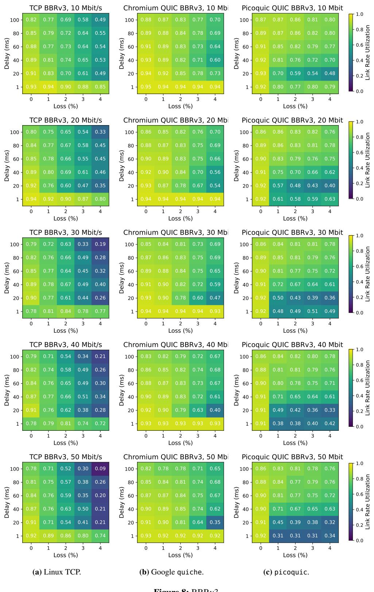

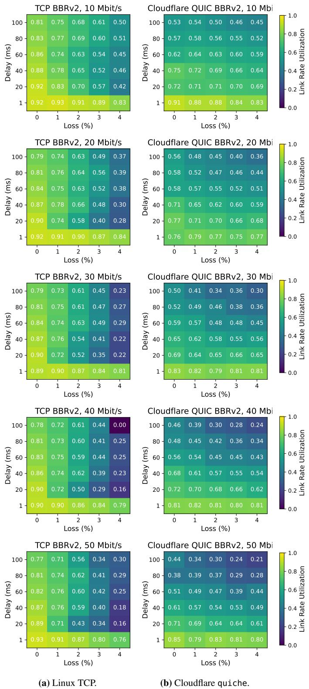  
Figure 9: BBRv2.

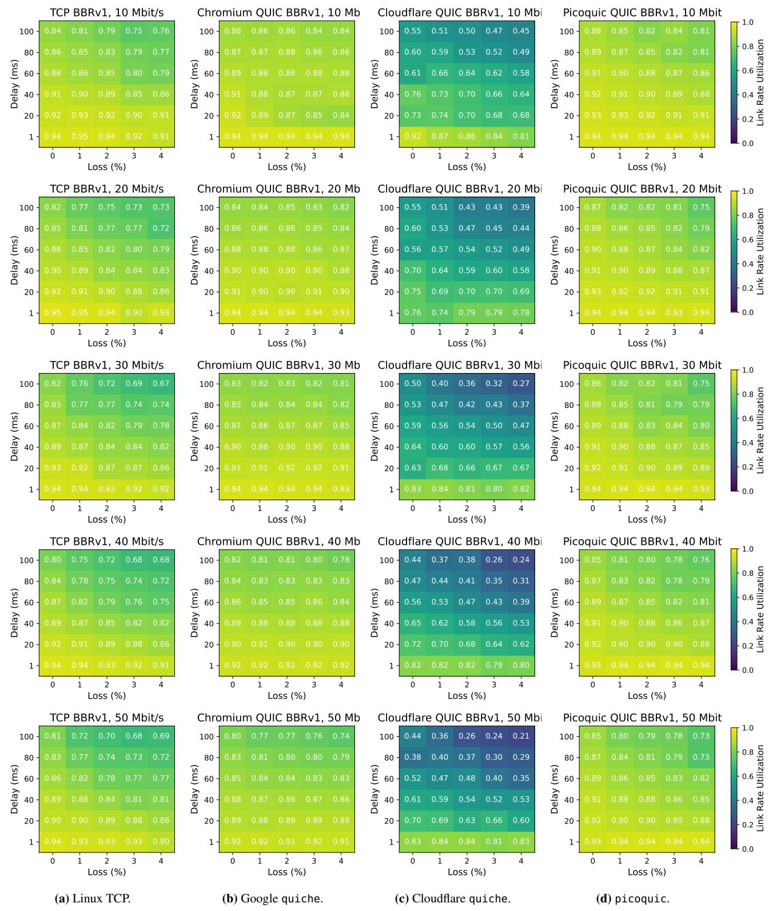  
Figure 10: BBRv2.

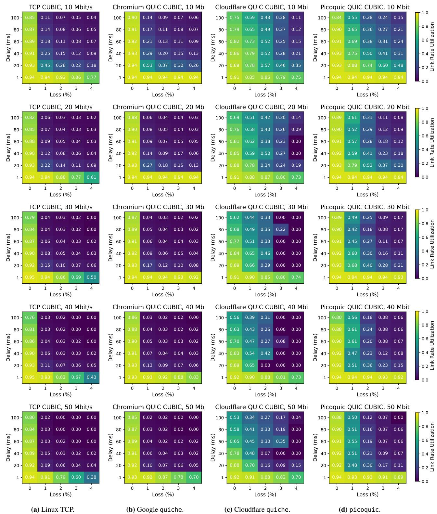  
Figure 11: CUBIC.

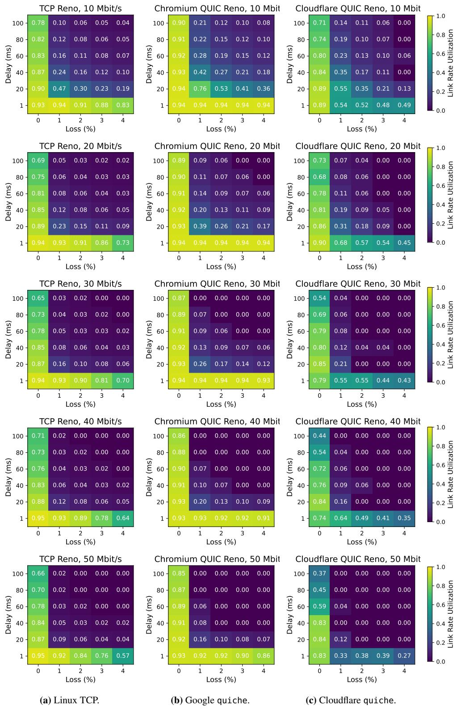  
Figure 12: Reno.