①

USENIX

THE ADVANCED COMPUTING SYSTEMS ASSOCIATION

# AssyLLM: Efficient Federated Fine-tuning of LLMs via Assembling Pre-trained Blocks

Shichen Zhan, Li Li, and Chengzhong Xu, University of Macau https://www.usenix.org/conference/atc25/presentation/zhan

# This paper is included in the Proceedings of the 2025 USENIX Annual Technical Conference.

July 7–9, 2025 • Boston, MA, USA ISBN 978-1-939133-48-9

Open access to the Proceedings of the 2025 USENIX Annual Technical Conference is sponsored by

P-Lr.h Es/"s

auuuJl9 PgleU

King Abdullah University of

Science and Technology

# AssyLLM: Efficient Federated Fine-tuning of LLMs via Assembling Pre-trained Blocks

Shichen Zhan, Li Li∗, Chengzhong Xu

State Key Laboratory of Internet of Things for Smart City, University of Macau

## Abstract

Federated Learning (FL) provides a promising way to finetune Large Language Models (LLMs) to downstream mobile tasks while preserving data privacy. However, the intensive memory footprint prevents large amount of edge devices from contributing to the fine-tuning process with their own private data.

To this end, we introduce AssyLLM, an innovative framework that conducts fine-tuning in a memory-efficient manner through directly assembling the pre-trained transformer blocks. The core idea of AssyLLM is to decompose a pretrained LLM into discrete blocks. These blocks are iteratively selected based on the local corpus distributed across various devices, and subsequently assembled to form a novel LLM tailored for downstream tasks. In this way, high fine-tuning efficiency can be achieved through avoiding the backpropagation process adopted in traditional fine-tuning approaches. Specifically, AssyLLM features four core components: 1) Block Comparator, 2) Elastic Adapter, 3) Block Quanter, and 4) Block Swapper. Block Comparator is designed to assess the compatibility between two blocks, facilitating the selection of appropriate blocks for assembling. After that, Elastic Adapter creates customized adapter configurations that address the specific structural differences between the blocks for seamless concatenation between the selected blocks. Meanwhile, Block Quanter is proposed to adjust precision of related weights based on the block output activation in order to reduce the extra memory overhead caused by retaining the candidate blocks while preserving the performance of the assembled model. Moreover, in order to further increase the scalability of the candidate blocks for better fine-tuning performance while guaranteeing fine-tuning progress, Block Swapper is designed to optimize the swapping pipeline by incorporating block correlation metrics. AssyLLM is comprehensively evaluated on multiple benchmark datasets of varying complexity. Compared to traditional methods, AssyLLM improves accuracy by up to 18.26%, achieves up to 30.04× speedup, and significantly reduces memory consumption by up to 92%.

## 1 Introduction

Recently, Large Language Models (LLMs) have demonstrated remarkable proficiency in language understanding and generation and are promising to widely support different mobile applications [17, 32]. Fine-tuning pre-trained LLMs using specialized domain-specific corpus has been proven to effectively enhance their applicability to downstream tasks [43]. However, those data are often located across various edge devices, leading to privacy concerns during the collection process. Federated Learning (FL) provides a promising way to fine-tune the LLM while guaranteeing data privacy, e.g. FedLLM [4, 5, 33, 40, 44]. Instead of collecting the data to the central server, FedLLM coordinates the participants to fine-tune the LLM locally on their private data and share only the updated model parameters with the server for aggregation.

Despite its benefits, the high memory footprint of local finetuning prevents resource-limited devices from contributing private data in real-world scenarios. For example, full finetuning a pre-trained Llama-7B model [39] with a batch size of 16 requires over 40GB of memory, whereas edge devices typically have memory capacities ranging from 4 to 16GB [1]. Even with mainstream parameter-efficient fine-tuning (PEFT) methods like LoRA [14] and adapter-based approaches [28], fine-tuning Llama-7B still requires over 15GB of memory, which still cannot be afforded by most edge devices. The significant disparity between the memory demands of model fine-tuning and the limited memory capacities of edge devices results in a substantial number of low-end devices being excluded from the fine-tuning process. Consequently, these devices are unable to contribute their locally stored data, diminishing the diversity and richness of the fine-tuning dataset. This, in turn, negatively impacts the performance of the LLM.

Limitation of Prior Arts. In order to reduce the memory footprint during the fine-tuning process, several approaches have been proposed which can be mainly divided into the following categories. The first category of work applies quantization to PEFT [8, 14] or adopts adapter tuning with layer freezing [4] to further reduce the resource consumption of

PEFT. Although these methods reduce model size and memory usage, incomplete model updating often degrades performance, and higher compression results in greater accuracy loss. The second category employs zeroth-order optimization [29], or forward gradient [42] to reduce the memory footprint caused by backpropagation (BP-free). However, these methods can lead to unstable model performance due to reliance solely on forward gradient estimation. The third category tackles the memory issue from the system perspective. For instance, gradient recomputation [6, 16, 19] and swapping [15, 30, 31, 38] have been introduced to manage memory usage by dynamically trading off computation and I/O overhead. While both recomputation and swapping effectively reduce memory consumption, they incur higher training time and computational overhead, which ultimately diminishes overall training efficiency. Hence, a new fine-tuning paradigm is urgently required to surmount the memory constraints while guaranteeing the fine-tuning performance and efficiency for the deployment of FedLLM in real-world cases.

Our Design. To tackle these challenges, this paper proposes AssyLLM, an innovative framework that addresses memory constraints in federated fine-tuning by leveraging a pool of pre-trained LLMs instead of relying on a single model. The main idea of AssyLLM is to break down multiple pre-trained LLMs into smaller blocks and select the most appropriate block segments for the downstream tasks. By systematically combining these blocks from various pre-trained LLMs, we create a custom-assembled model that draws on the unique strengths of each block. Specifically, it coordinates the participating clients to select optimal blocks using inference operations, with the help of block compatibility analysis. On the server side, these selected blocks are aggregated to form a global LLM. By dynamically selecting and assembling the most relevant blocks for each task, AssyLLM eliminates the need of repetitive finetuning, thereby accelerating the adaptation of LLMs to diverse applications. Moreover, through avoiding the BP process, this block-wise strategy significantly lowers memory demands during fine-tuning, enabling more devices to participate in the fine-tuning process.

Challenges and Techniques. However, designing such a new learning paradigm is non-trivial and presents several key challenges.

1) How to compare the compatibility between blocks? For effective assembling, it is crucial to select a compatible counterpart from the block pool. A higher compatibility between the selected blocks leads to improved performance of the resulting assembled model. We propose Block Comparator to evaluate the compatibility between blocks using meticulously designed metrics, enabling the selection of the most suitable blocks for concatenation and thereby improving the performance of the assembled model.

2) How to ensure the appropriate assembly of two blocks while guaranteeing the model performance and finetuning efficiency? Blocks from different pre-trained models vary in structure, features, and dimensions, rendering simple concatenation ineffective and potentially harmful. To address this challenge, we introduce Elastic Adapter, an adaptive lightweight fine-tuning approach with adapter that resolves mismatches by aligning the inputs and outputs of blocks from heterogeneous models, ensuring cohesive functionality in the assembled model.

3) How to reduce the excessive memory footprint of the block pool? Compared to a single LLM, constructing a block pool from multiple LLMs incurs substantial memory overhead, adding additional pressure on devices. Hence, we introduce Block Quanter, a mixed-precision quantization method applied at the block level. Since block selection depends on the output activation from each block’s inference pass (see Section 3.1), our method applies varying precision levels based on impact of weight inside the block on the output. We prioritize higher precision for critical weights and lower precision for less impactful ones by analyzing the correlation between weights and output activations.

Although Block Quanter effectively reduces the block pool size, it remains too large for deployment on edge devices when handling billion-scale LLMs (e.g., the Llama series). Additionally, incorporating more pre-trained LLMs into a larger block pool improves adaptability and performance across downstream tasks, but also increases related memory costs. Further compression could degrade model performance, making it insufficient for edge deployment. To address these challenges, we introduce Block Swapper, a block-based swapping method that reduces memory usage by dynamically swapping blocks between internal and external storage. Traditional swapping methods face significant I/O latency. In contrast, Block Swapper utilizes a block correlation-aware pipeline strategy, along with pre-loading and pre-swapping mechanisms, which substantially reduce latency during the swapping process.

To the best of our knowledge, we are the first to address fine-tuning memory optimization in FL by leveraging multiple pre-trained LLMs and inference passes. Our approach significantly reduces BP-related overhead, lowering memory cost, energy consumption, and data requirements. This allows resource-constrained clients to participate while achieving performance comparable to state-of-the-art methods. The main contributions are summarized as follows:

• We propose AssyLLM, an FL framework that employs a new LLM generation method, splitting pre-trained models into blocks and assembling them together for downstream tasks.

• We design and implement the four core components, Block Comparator, Elastic Adapter, Block Quanter, and Block Swapper to interact with each other and guide the whole block selection process.

• Extensive experiments evaluate the effectiveness of AssyLLM on accuracy improvement, generation speedup, and cost reduction for energy and memory. The code of AssyLLM is available at: https://github.com/ zhanshichen/AssyLLM.

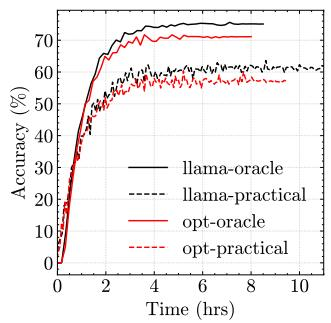  
(a) BoolQ.

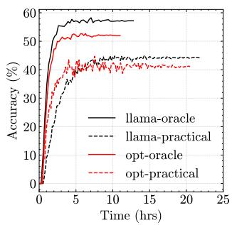  
(b) OBQA.  
Figure 1: The memory wall in FedLLM; llama denotes Llama-7B, opt denotes OPT-6.7B.

## 2 Background and Motivation

## 2.1 The Memory Wall of FedLLM

One important question required to be explored is: how does the memory wall impact the federated fine-tuning process of LLM? In order to make the investigation, we conduct the following experiments. To emulate the federated fine-tuning environment, we set 200 clients and split them into five groups with different memory budgets, as 10% (64GB), 15% (32GB), 15% (16GB), 30% (8GB), and 30% (4GB). We perform finetuning for Llama-7B [35] and OPT-6.7B on BoolQ [7] and OpenBookQA (OBQA) [9] datasets. Specifically, BoolQ is a binary question-answering dataset and OBQA focuses on multiple-choice reasoning questions. For data distribution, we follow [41], using a Dirichlet distribution [12] with concentration parameter α = 1 to allocate fine-tuning samples for each client. The oracle baseline assumes all clients have sufficient memory for full local fine-tuning, while practical reflects experiments under memory constraints. As shown in Figure 1, memory limitations cause accuracy drops of up to 14.7% for Llama-7B and 19.1% for OPT-6.7B, as their fine-tuning requires over 45GB and 32GB of memory, respectively. This leaves 85% of Llama-7B clients and 60% of OPT-6.7B clients unable to participate, reducing data diversity and resulting in underperformed fine-tuning results.

## 2.2 Exploring Existing Techniques in FedLLM

In this section, we explore several techniques that are commonly used in LLM fine-tuning for memory saving.

## 2.2.1 Parameter-efficient Fine-Tuning.

Parameter-efficient fine-tuning (PEFT) techniques like LoRA [8, 14] and Adapters [4] enable task-specific adaptation of

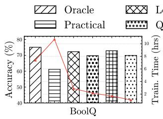

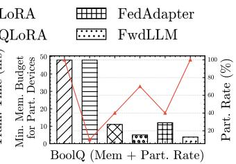

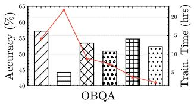

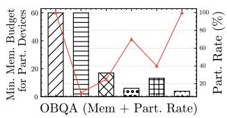  
Figure 2: Performance comparison with existing works (left) accuracy and convergence time; (right) minimum memory budget for participation devices and participation rate on BoolQ and OBQA. Model: Llama-7B.

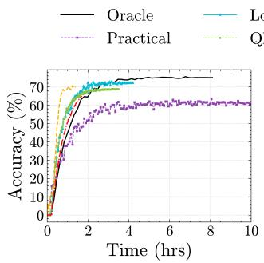  
(a) BoolQ.

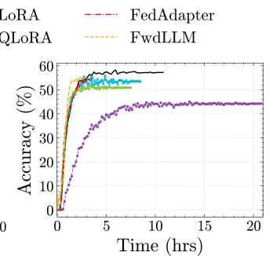  
(b) OBQA.  
Figure 3: Performance comparison for existing works. Model: Llama-7B.

LLMs with minimal retraining. LoRA injects trainable lowrank matrices into attention and feed-forward layers, reducing the number of updated parameters. Adapters introduce task-specific modules between transformer layers, keeping the main model frozen while fine-tuning only these adapter layers.

Using the same experimental settings, we evaluate LoRA, QLoRA [8] (extending LoRA with quantization), FedAdapter [4], and FwdLLM [42] (will be introduced later) in an FL scenario with Llama-7B. As shown in Figures 2 and 3, for example, QLoRA reduces at most 79% memory consumption, decreases the aggregation time by 67%, and increases the participation rate to 70%, but it still comes with a 5.3% accuracy drop compared to oracle scenario. Similarly, other baselines also experience varying degrees of performance drop. This decline is due to two key factors. Firstly, incomplete model updates often lead to performance degradation, with higher compression levels causing greater accuracy loss. Secondly, while PEFT reduces memory usage compared to full fine-tuning, it still requires storing and updating low-rank matrices or adapters, and a portion of resource-constraints clients still remain unable to participate in the fine-tuning process, resulting in fewer data contributions to the global model and further impacting overall performance.

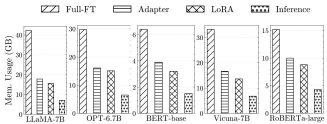

Figure 4: Memory overhead of different fine-tuning technologies and inference.  
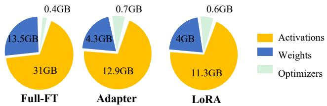  
Figure 5: Memory breakdown. Model: Llama-7B. FT denotes fine-tuning.

## 2.2.2 Backpropagation-free Fine-tuning.

As shown in Figure 4, LoRA and Adapter effectively reduce the memory overhead of Llama-7B by 62.1% and 53.9%, respectively. However, they still require more than 15GB of memory, which remains insufficient to deploy certain large models on real edge devices. Figure 5 shows the breakdown of memory footprint and analyzes the reason: these activations generated during forward pass account for most of the memory usage, and existing PEFT methods cannot eliminate this overhead. To address this, BP-free fine-tuning methods, such as zero-order optimization [2], have gained attention. BAFFLE [10] and FedZeN [25] apply BP-free training in FL but are not designed for LLMs. FwdLLM [42] is a recent BP-free method tailored for LLMs, requiring only “perturbed inferences” instead of full fine-tuning. By updating parameters directly from gradients computed during the forward pass, FwdLLM reduces memory consumption, making it more suitable for resource-constrained FL environments. From Figure 2, FwdLLM reduces fine-tuning memory requirements from 45\~58GB to 3.8GB, enabling 100% client participation. However, this comes with an approximate 5.8% performance drop compared to the oracle baseline.

The decline mainly stems from the inherent limitations of forward gradient estimation, which sacrifices fine-tuning accuracy for computational efficiency. Unlike BP, which provides precise error-correcting feedback through gradients, forward gradient estimation relies on approximate updates, making parameter adjustments less accurate. This imprecision tends to accumulate over time, especially across multiple fine-tuning rounds. Without the precise gradient flow that backpropagation provides, small errors introduced in each update step may compound, resulting in cumulative error that degrades the overall model performance. In non-IID scenarios, this issue becomes more pronounced because non-IID data, which require more precise model adaptation to account for diverse patterns.

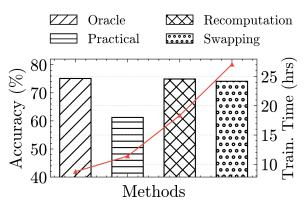  
(a) Performance comparison with memory budget 4GB.

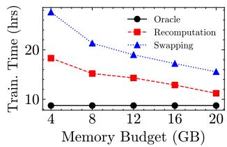  
(b) Fine-tuning time under different memory budget.  
Figure 6: System-level memory saving techniques analysis. Model: Llama-7B; Dataset: BoolQ.

## 2.2.3 System-level Memory Saving Techniques.

System-level memory optimization techniques are widely used to enable model fine-tuning on memory-constrained devices. Recomputation [6, 16] (or gradient checkpointing) reduces memory usage by discarding intermediate activations and recomputing them during BP pass. While effective for memory savings, it incurs additional recomputation overhead, prolonging training time and reducing efficiency. Swapping [15, 30, 31] transfers model components or activations between memory and storage. Though it minimizes in-memory usage, swapping introduces significant I/O overhead, slowing down training due to frequent memory-to-disk transfers. As shown in Figure 6a, both techniques achieve accuracy near the oracle baseline, but the fine-tuning time increases from 8.73 hours to 27.6 hours. This can be attributed to their ability to achieve the same client participation rate as the oracle by efficiently reducing memory overhead, but at the expense of substantial additional I/O operations and computational costs. From Figure 6b, as the memory budget decreases, the required additional time increases from 1.78× to 3.17× due to the need for more recomputation and swapping.

Summary. Although existing techniques effectively reduce the memory overhead of fine-tuning, they either compromise accuracy or introduce additional computational costs, extending the aggregation time. This highlights the necessity of a method that achieves a balanced trade-off across three critical dimensions: reducing memory usage, maintaining model performance, and ensuring process efficiency.

## 2.3 Opportunity

To address these limitations, we propose a new perspective by leveraging multiple pre-trained LLMs to construct a taskspecific model through block-level assembly. Leveraging multiple models with distinct architectures provides better expressive capabilities for different downstream tasks, enabling improved performance for task-specific objectives. First, we divide multiple LLMs into modular transformer blocks, forming a block pool. Then, based on local data characteristics, each client dynamically selects relevant blocks from the shared block pool and assembles them into a task-specific model. This process is accomplished through simple inference operations without the need for BP.

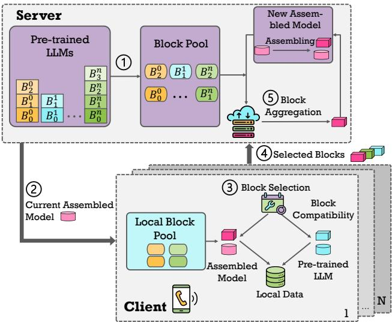  
Figure 7: Workflow of assembled model generation.

The proposed learning paradigm builds on two key insights: 1) using pre-trained models as modular building blocks and 2) enabling dynamic block assembly for task flexibility. By selecting blocks based on local data and resources, it tailors model generation to diverse tasks. The block-level optimization reduces memory usage, allowing even low-end devices to participate in FL.

## 3 AssyLLM Design

## 3.1 The Fine-tuning Paradigm

Figure 7 represents the overall fine-tuning paradigm of AssyLLM, which can be mainly divided into the following steps. ⃝1 Initialization: Pre-trained LLMs are manually split into blocks categorized as starting blocks (embedding layer), intermediate blocks (groups of transformer layers), and terminating blocks (output layers). These pre-trained models and candidate block pools are distributed to participating clients. ⃝2 Model Downloading: In each round, participants receive a candidate assembled model. ⃝3 Local Block Selection: Given the current model $N _ { s } ,$ each client searches the block pool for compatible blocks. For a candidate block $B _ { n l }$ , derived from a pre-trained LLM n up to layer l, clients assemble $N _ { s }$ with $B _ { n l }$ and perform two inference passes with the same batch of local data: one on the new assembled model and another on the originating LLM up to layer l. The resulting activations X and Y are compared to compute the compatibility score for $B _ { n l }$ . This process is repeated for all candidate blocks. ⃝4

Block Uploading: Each client selects the K blocks with the highest compatibility scores and uploads. ⃝5 Server-Side Aggregation: The server aggregates the uploaded blocks using a weighted voting mechanism (similar to FedAvg). The voting process is based on compatibility scores. A higher score indicates better adaptability to the current assembled model. The K selected blocks with the highest votes, whose parameters are averaged across relevant clients, are sequentially stacked onto the current model $N _ { s }$ to construct the candidate model for the next round. The process continues until a terminating block is selected, the model depth limit is reached, or all paths are explored. The block selection process requires only inference on a small data batch, significantly reducing the data needed.

However, deploying this paradigm in real-world environments presents several challenges that warrant further investigation.

• Q1: How to compare the compatibility between two blocks? For a given block, selecting a compatible counterpart from the block pool is essential for effective concatenation in downstream tasks. Higher compatibility between the selected blocks enhances the performance of the resulting assembled model.

• Q2: How to assemble two different blocks together? Blocks derived from different pre-trained LLMs exhibit varying features and structures. Directly combining them without careful consideration can negatively impact overall performance, necessitating a more deliberate integration strategy.

• Q3: How to reduce the additional memory overhead caused by multiple LLMs. As the block pool comprises multiple LLMs, maintaining it in memory during the block selection process introduces additional memory overhead.

## 3.2 System Overview

To tackle these challenges, we introduce AssyLLM, an FL system for deploying LLMs that optimizes memory and performance. Furthermore, we design four core techniques: Block Comparator (Section 3.3), Elastic Adapter (Section 3.4), Block Quanter (Section 3.5), and Block Swapper (Section 3.6), as shown in Figure 8. For Q1: 1) Block Comparator introduces a well-defined metric to assess block compatibility, facilitating the selection of appropriate blocks for concatenation. For Q2: 2) Elastic Adapter addresses model heterogeneity by integrating blocks from different pre-trained LLMs using lightweight adapters, ensuring seamless assembly with minimal information loss. For Q3, we design two components to optimize the memory overhead of block pool: 3) Block Quanter applies mixed-precision quantization at the block level to block pool, balancing resource allocation by assigning lower precision to less critical weights and higher precision to key components; 4) Block Swapper further optimizes the swapping pipeline by leveraging the correlation between blocks. Additionally, its pre-loading and pre-swapping mechanisms reduce I/O delays, enabling efficient model assembly on low-resource devices. Together, these techniques enable AssyLLM to overcome memory, fine-tuning efficiency, and computational challenges in FL, enabling real-world FL applications of state-of-the-art billion-scale LLMs.

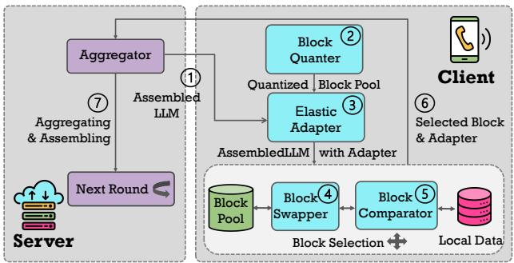

Figure 8: AssyLLM architecture.  
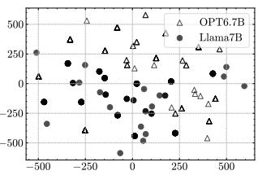  
(a) OPT-6.7B vs Llama-7B.

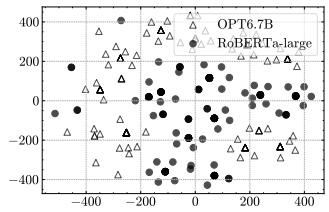  
(b) OPT6.7B vs RoBERT-large.  
Figure 9: Feature differences visualization using t-SNE [36].

## 3.3 Block Comparator

Block compatibility is critical when assembling a model from block pool. To guide block selection, robust comparison metrics are necessary. Centered Kernel Alignment (CKA) [18] is a widely used method for measuring the similarity between activation sets, commonly applied to analyze layer representations in neural models. We extend CKA to LLMs by comparing activations from different transformer blocks, providing insights into feature evolution across layers and models. In this work, CKA serves as a key metric to evaluate block compatibility. Specifically, we compute the CKA score using activations K and L from the candidate assembled LLM and corresponding pre-trained LLM (detailed in Section 3.1). A higher CKA score indicates better alignment, aiding in selecting the most compatible blocks to optimize model performance. The CKA score is calculated as follows:

$$
C K A ( K , L ) = \frac { \mathbf { H S I C } ( K , L ) } { \sqrt { \mathbf { H S I C } ( K , K ) \mathbf { H S I C } ( L , L ) } }\tag{1}
$$

where HSIC is Hilbert-Schmidt Independence Criterion [13]. For the linear kernels, HSIC is:

$$
\mathbf { H S I C } ( K , L ) = | | c o \nu ( X ^ { T } X , Y ^ { T } Y ) | | _ { F } ^ { 2 }\tag{2}
$$

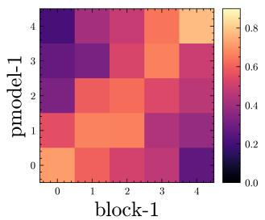  
(a) cka=0.78, cor=0.61,

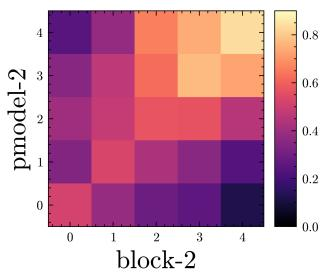  
(b) cka=0.81, cor=0.49,

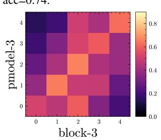

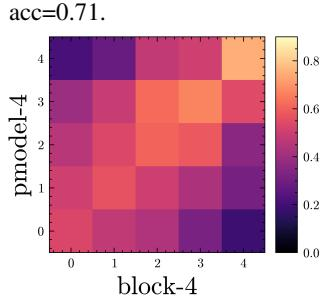  
acc=0.65.  
acc=0.69.  
Figure 10: CKA Heatmaps for four various candidate blocks; pmodel denotes pre-trained LLM where the block originates from; cor denotes layer-correlation metrics; acc denotes final assembled model performance; Dataset: BoolQ.

CKA helps evaluate block compatibility but focuses only on final activations of block, overlooking intermediate layer differences in LLMs, which can lead to suboptimal block selection and reduced model performance. To explore these differences, we conducted an experiment on BoolQ by feeding the same input to various LLMs and extracting their intermediate features. We visualized them using t-SNE [36], as shown in Figure 9. The results highlight that, despite identical inputs, different architectures produce distinct intermediate feature distributions. To address CKA’s limitation, we propose layer-correlation (COR), a new metric that compares activation distribution similarities across layers using KL divergence [20]. Given two activation distributions P and Q for a specific layer, KL divergence is defined as:

$$
D _ { K L } ( P \parallel Q ) = \sum _ { i } P ( i ) \log \left( \frac { P ( i ) } { Q ( i ) } \right)\tag{3}
$$

Where P(i) denotes the probability of activation i in the first distribution, and Q(i) denotes the probability of activation i in the second distribution.

To calculate COR, we sum the KL divergence between corresponding layers within two blocks. This is done once during initialization. To validate the effectiveness of these metrics, we conduct experiments on BoolQ using the LLMs described in Section 2.3. Given an assembled LLM composed of four blocks, we set four different candidate blocks to assemble and record corresponding CKA, COR scores, and accuracy of the generated assembled model. Figure 10 shows the heatmap for CKA distributions, revealing key insights: 1) Blocks with high CKA and COR achieve better performance (e.g., Block 1 vs Block 3); 2) High CKA alone doesn’t ensure optimal selection (e.g., Block 1 vs Block 2); 3) High COR alone is also insufficient (e.g., Block 2 vs Block 4). These findings motivate us to integrate CKA and COR to block compatibility score for reliable block selection in each round to identify the best candidate (e.g., Block 1) that maximizes accuracy.

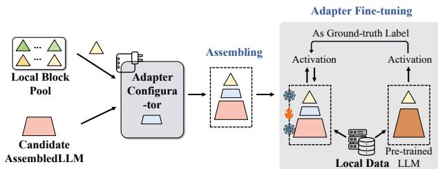  
Figure 11: Elastic Adapter fine-tuning.

## 3.4 Elastic Adapter

Assembling blocks from different pre-trained LLMs is nontrivial due to structural and semantic mismatches, which can significantly degrade performance. Specifically, there are three primary types of mismatches in LLMs: dimensional misalignment, semantic inconsistency, and attention mechanism differences. We introduce Elastic Adapter, an adaptive adapter fine-tuning approach that addresses these mismatches by introducing adapters that align the outputs and inputs of blocks from heterogeneous models. 1) Dimensional Misalignment: This issue arises when the output of one block does not match the input dimensions of the next. To overcome this, we introduce lightweight linear transformations to project outputs into the correct dimensional space. 2) Semantic Inconsistency: Even when block structures align, the features they extract may differ semantically, causing further mismatches. To address this, we implement a cross-attention mechanism that uses one block’s output as the query and the next block’s output as the key and value. This process aligns semantic content between blocks, reducing feature mismatches and ensuring smoother block integration. The cross-attention alignment process is defined as:

$$
\mathbf { 0 } _ { c r o s s } = s o f t m a x \left( \frac { \mathbf { Q } \mathbf { K } ^ { \top } } { \sqrt { d _ { k } } } \right) \mathbf { V } ,\tag{4}
$$

where $\mathbf { Q } = \mathbf { W } _ { Q } \mathbf { H } _ { o u t 1 }$ is the query matrix derived from the output of the first block $\mathbf { H } _ { o u t 1 } , \mathbf { K } = \mathbf { W } _ { K } \mathbf { H } _ { o u t 2 }$ and $\mathbf { V } = \mathbf { W } _ { V } \mathbf { H } _ { o u t 2 }$ are the key and value matrices derived from the output of the second block ${ \mathbf { H } } _ { o u t 2 }$ . Here, $\mathbf { W } _ { Q } , \mathbf { W } _ { K } ,$ , and $\mathbf { W } _ { V }$ are learnable projection matrices, and $d _ { k }$ is the attention dimension used to scale the dot-product for numerical stability.

Optionally, a linear transformation can be applied to ensure dimensional consistency for subsequent processing:

$$
{ \bf H } _ { a l i g n e d } = { \bf W } _ { o u t } { \bf O } _ { c r o s s } ,\tag{5}
$$

where $\mathbf { W } _ { o u t }$ is a learnable projection matrix.

Table 1: Assembled model performance and memory overhead of the block pool with different quantization methods comparison. BP denotes the block pool. Dataset: BoolQ. Block pool: Llama-7B, OPT-6.7B, Vicuna-7B, BERT-base, and RoBERT-large.
<table><tr><td>Precision</td><td>BP Overhead</td><td>1Model Accuracy (%)</td></tr><tr><td>FP16</td><td>42.2GB</td><td> $7 5 . 8 \pm 2 . 5$ </td></tr><tr><td>INT8</td><td>21.1GB</td><td> $7 3 . 1 \pm 4 . 7$ </td></tr><tr><td>INT4</td><td>11.5GB</td><td> $6 7 . 3 \pm 8 . 9$ </td></tr></table>

3) Attention Mechanism Differences: the last challenge is handling different attention mechanisms, such as multihead versus single-head attention. We address this by designing adapters that pool or expand attention outputs based on block configurations, ensuring compatibility without altering model structures. We apply lightweight fine-tuning by freezing most model parameters and training only adapters with local client data. Notably, not all block assemblies require trainable adapters. In most cases, the mismatch between blocks primarily falls into the first category of challenge (Dimensional Misalignment), where a simple projection matrix is often sufficient to address it without introducing additional complexity. Furthermore, trainable adapters are used only for significant mismatches, primarily in the final blocks. As a result, most intermediate activations can be discarded during forward propagation, reducing memory overhead. Figure 11 illustrates the Elastic Adapter workflow.

## 3.5 Block Quanter

For Q3, the block pool size equals the combined size of multiple pre-trained LLMs and need to remain in memory throughout the block selection process, leading to substantial memory overhead. Quantization [11, 22] is a common technique to reduce memory usage, but excessive compression can harm accuracy. As shown in Table 1, FP16 precision results in over 40GB of memory usage, far exceeding edge device limits. INT8 reduces memory to 21GB with minor performance loss, while INT4 significantly degrades accuracy, resulting in a 5.8% accuracy drop with an 8.9% fluctuation. On the other hand, mixed-precision techniques [22,37] apply varying precision levels at the layer level, requiring layer-wise sensitivity analysis to assess the impact of precision changes. This process involves additional forward passes or statistical measurements, resulting in significant computational overhead during model preparation and fine-tuning.

To address this, we propose Block Quanter, a block-wise mixed-precision quantization method. Unlike prior work [22, 37], which typically applies layer-wise precision adjustments, our approach focuses solely on the impact of internal weights on block output activations, which directly affects block compatibility and selection. By evaluating the sensitivity of weight to the entire block’s output rather than individual layers, Block Quanter avoids the need for layer-level precision tuning across multiple Transformer layers. This block-wise granularity significantly reduces the computational overhead compared to layer-wise methods, as it requires fewer forward passes and sensitivity analyses, making it more efficient and practical for resource-constrained devices. Block Quanter performs offline multi-step quantization by first analyzing weight sparsity in block and then evaluating activation sensitivity through random perturbations and masking to identify critical weights for higher precision allocation. For the random perturbation method:

Algorithm 1 Block Quanter   
Input: Pre-trained LLM M, block pool $\mathcal { B } = \{ b _ { 1 } , b _ { 2 } , . . . , b _ { n } \}$ ，   
block activation $\mathbf { A } _ { b } ,$ sparsity threshold $\tau _ { s } ,$ sensitivity thresh  
old $\tau _ { a } .$   
Output: Weight importance scores   
$S _ { w } .$   
1: // Weight Sparsity Analysis   
2: for each block $b \in { \mathcal { B } }$ do   
3: for each weight $w \in b$ do   
4: $S _ { s } ( w ) \gets .$ SparsityMetric(w)   
5: if $S _ { s } ( w ) < \tau _ { s }$ then   
6: Mark w as unimportant   
7: end if   
8: end for   
9: end for   
10: // Activation Sensitivity Analysis   
11: for each block $b \in { \mathcal { B } }$ do   
12: for each remaining weight $w \in b$ do   
13: ∆Ab ← RandomPerturbation(w) or Masking(w)   
14: $S _ { a } ( w )$ ← ActivationImpact(∆Ab)   
15: if $S _ { a } ( w ) < \mathfrak { T } _ { a }$ then   
16: Mark w as unimportant   
17: end if   
18: end for   
19: end for   
20: // Bottom-Up Sensitivity Analysis   
21: for each block $b \in { \mathcal { B } }$ do   
22: L ← Number of layers in block b   
23: for l = L down to 1 do   
24: for each remaining weight w ∈ layer l do   
25: C(w, Ab) ← Correlation(w, Ab)   
26: $S _ { w } ( w ) \gets C ( w , \mathbf { A } _ { b } )$   
27: end for   
28: end for   
29: end for   
30: return $\mathcal { S } _ { w }$

$$
S _ { a } ( w ) = \frac { \| \mathbf { A } _ { b } ( w ) - \mathbf { A } _ { b } ( w + \Delta w ) \| _ { 2 } } { \| \mathbf { A } _ { b } ( w ) \| _ { 2 } } , \quad \Delta w \sim \mathcal { N } ( 0 , \sigma ^ { 2 } ) ,\tag{6}
$$

where $\mathbf { A } _ { b } ( \boldsymbol { w } )$ represents the block’s original output activation,

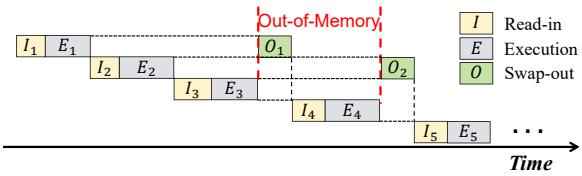

(a) Default block management.  
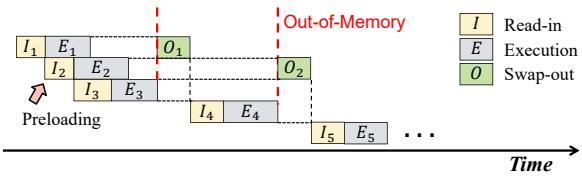

(b) Block management with pre-loading.  
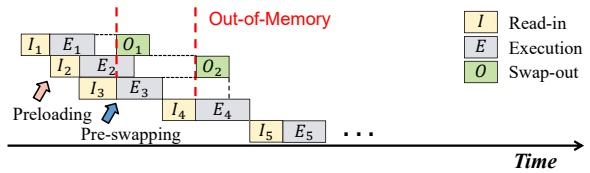  
(c) Memory-aware block management with pre-loading and pre-swapping (ours).  
Figure 12: Different pipeline strategies for block swapping.

$\mathbf { A } _ { b } ( w + \Delta w )$ is the activation after adding random perturbation ∆w, and $\| \cdot \| _ { 2 }$ denotes the $L _ { 2 }$ norm.

For the weight masking method:

$$
S _ { a } ( w ) = \lVert { \bf A } _ { b } ( w ) - { \bf A } _ { b } ( w = 0 ) \rVert _ { 2 } ,\tag{7}
$$

where $\mathbf { A } _ { b } ( w = 0 )$ is the output activation after masking weight w to zero.

Based on the results, insignificant weights are discarded. A bottom-up sensitivity analysis then re-evaluates the correlation between the remaining weights and the output, starting from the block’s output layer to its input layers. This refined analysis ensures that critical weights are retained at high precision, while less important ones are quantized to lower precision. The entire process is performed offline, ensuring minimal additional resource consumption during the block selection phase and significantly reducing memory usage of block pool without compromising performance. The complete process is outlined in Algorithm 1.

## 3.6 Block Swapper

While BlockQuanter reduces block pool memory usage, it remains insufficient. As shown in Table 1, a block pool composed of five pre-trained LLMs still requires over 11GB of memory, even with INT4 compression, exceeding the typical capacity of edge devices (4\~8GB). Furthermore, incorporating additional LLMs improves adaptability across diverse downstream tasks and enhances the assembled model’s performance, but it also significantly increases the block pool size, resulting in higher memory costs. To address this, we propose Block Swapper, a system-level solution to further optimize memory usage. The Block Swapper design begins by setting a memory budget for each device, determining how many blocks can be stored in memory. When a required block is missing, a swap-in operation is initiated. If memory is full, a swap-out unloads less relevant blocks to storage. Block correlation. The block swapping decision combines a Least Recently Used (LRU) strategy with block correlation metrics. The relevance of blocks is determined by their feature correlation, previously analyzed in Section 3.3 and directly applied here. Blocks with lower correlation to the current model are prioritized for swapping out.

Algorithm 2 Block Swapper.   
Input: Block Pool B, Memory Budget $M _ { m a x } ,$ Current   
assembled LLM $\mathcal { M } _ { a s s e m b l e d } .$   
1: // Step 1: Initialize Memory Budget   
2: $M _ { u s e d } \gets 0$   
3: for each block $b \in { \mathcal { B } }$ do   
4: // Step 2: Check if block b is in memory   
5: if b ∈ Memory then   
6: Continue with assembly   
7: else   
8: // Step 3: Perform Swap-In   
9: if $M _ { u s e d } + s i z e ( b ) \leq M _ { m a x }$ then   
10: Pre-loading b from external storage   
11: $M _ { u s e d } \gets M _ { u s e d } + s i z e ( b )$   
12: else   
13: // Step 4: Perform Swap-Out   
14: $b _ { o u t }  B l o c k C c$ rrelation(b, B)   
15: Pre-swapping out $b _ { o u t }$ to external storage   
16: $M _ { u s e d } \gets M _ { u s e d } - s i z e ( b _ { o u t } )$   
17: Load b from external storage   
18: $M _ { u s e d } \gets M _ { u s e d } + s i z e ( b )$   
19: end if   
20: end if   
21: // Step 5: Assemble Model   
22: Assemble block b into Massembled   
23: BlockCompatibilityCalculation $\left( b , \mathcal { M } _ { a s s e m b l e d } \right)$   
24: end for

To mitigate I/O overhead from frequent swaps (Figure 12a), we further introduce a pre-loading mechanism, pre-loading blocks into memory to ensure smoother execution (Figure 12b). Additionally, a memory-aware pre-swapping strategy estimates upcoming memory needs and performs swap-out operations in advance to reduce I/O waiting times (Figure 12c). In summary, Block Swapper optimizes the pipeline by leveraging block correlations and further reduces delays through preloading and pre-swapping, enabling efficient memory management. Algorithm 2 outlines the process.

Table 2: Specifications of tested devices.
<table><tr><td>Device</td><td>Mem</td><td>GPU</td><td>CPU</td></tr><tr><td>Nvidia Jetson TX2</td><td>8G</td><td>256 CUDA Cores (Pascal)</td><td>A57 (6C)</td></tr><tr><td>Nvidia Jetson Nano</td><td>4G</td><td>128 CUDA Cores (Max well)</td><td>A57 (4C)</td></tr></table>

## 4 Evaluation

## 4.1 Experimental Setup

LLMs, Block Pool, and Datasets. We select five pre-trained LLMs: Llama-7B, OPT-6.7B, BERT-base, Vicuna-7B, and RoBERTa-large from Huggingface [39], which are chosen for their widespread adoption and distinct characteristics on edge devices, covering diverse architectures, parameter sizes, and training objectives. Table 3 presents the model sizes of the tested LLMs. To optimize block-based assembly, we use an adaptive segmentation strategy. Shallow and deep layers, which have minimal semantic differences, are grouped into larger blocks (e.g., 6–8 layers per block) to reduce complexity while maintaining functionality. Conversely, middle layers with more significant semantic variation are divided into smaller blocks (e.g., 2–4 layers per block) to improve flexibility and minimize mismatch during assembly. As a result, Llama-7B, OPT-6.7B, BERT-base, Vicuna-7B, and RoBERTalarge consist of 6, 6, 4, 6, and 6 blocks, respectively, forming a block pool with 28 blocks.

We evaluate our approach on three benchmark datasets: BoolQ [7], PIQA [3], and OpenbookQA (OBQA) [9]. BoolQ is a question-answering dataset focused on yes/no questions based on a passage. PIQA involves physical reasoning tasks, challenging the model’s ability to predict plausible solutions for real-world scenarios. OBQA tests commonsense knowledge and reasoning, requiring answers based on general science facts. These datasets were selected for their diversity in task types—reading comprehension, physical reasoning, and commonsense knowledge—ensuring a comprehensive evaluation of our method’s adaptability.

Baselines. We evaluate our method against two groups of baselines to demonstrate its effectiveness across both algorithmic and system-level aspects. Algorithm-level baselines include FT-oracle, representing full-parameter fine-tuning under ideal memory conditions as the upper bound; FTpractical, which accounts for memory limitations; LoRA [14], a widely used PEFT technique; QLoRA [8], which extends LoRA with quantization; FedAdapter [4], an FL approach utilizing adapter tuning with layer freezing; and FwdLLM [42], the SOTA BP-free method for memory constraints in FL. System-level baselines include Recomputation [6, 19], which reduces memory usage by recomputing activations during BP, and Swapping [15, 30], which offloads computations or parameters to external storage to save GPU memory. These baselines offer a comprehensive comparison of AssyLLM’s performance in terms of both algorithmic flexibility and system-level efficiency.

Implementation Details. We implement AssyLLM on a hybrid platform combining simulation and hardware. Simulation experiments are conducted on two Nvidia A100 GPUs to emulate clients with high memory budgets, while on-device experiments are performed on Nvidia Jetson TX2 and Nano, representing memory-constrained edge devices. Device specifications are provided in Table 2. We use Hugging Face Transformers [39] and PyTorch [27] for on-device fine-tuning and inference, monitoring memory usage with htop. For FL, we follow the setup in Section 2.1, with 200 users split into 4 groups based on memory budgets, as shown in Figure 13. Aggregation uses FedAVG [26]; the maximum sequence length of 512 for OBQA and 256 for others. A minimum 4GB memory budget is allocated for Swapping, Recomputation, and AssyLLM to ensure client participation. Baseline fine-tuning needs 5 local epochs with a batch size of 16 and 500 global epochs. For AssyLLM, the process of selecting the next block for the current candidate model is repeated for 5 rounds, with 3 blocks evaluated per round. It is important to note that block type does not directly influence the aggregation outcome, as all blocks are evaluated using the same compatibility metric. In practice, assembling blocks of different types naturally tends to produce lower compatibility scores due to larger feature distribution mismatches, making them less likely to be selected. We use a learning rate of 0.01, which is higher than the standard (e.g., 5e-5) used for full-model fine-tuning. This is intentional and empirically justified, as only lightweight adapters are trained while the backbone remains frozen. The higher rate accelerates convergence and mitigates underfitting due to limited adapter capacity. Sensitivity analysis confirms this setup achieves efficient training with minimal impact on accuracy. The batch size for CKA computation is 32. The assembly process typically requires fewer than 100 epochs, with each epoch taking less time than baseline methods. For Block Quanter, we use the INT8/INT4 combination for mixed-typed quantization with GPTQ [11].

Table 3: Model size (FP16).
<table><tr><td>Model</td><td>Size</td></tr><tr><td>Llama-7B</td><td>14GB</td></tr><tr><td>OPT-6.7B</td><td>13.4GB</td></tr><tr><td>BERT-base</td><td>220MB</td></tr><tr><td>Vicuna-7B</td><td>14GB</td></tr><tr><td>RoBERT-large</td><td>710MB</td></tr></table>

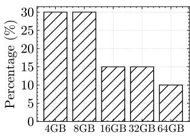  
Figure 13: Mem. distr.

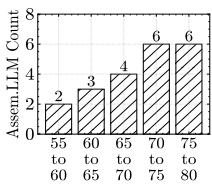  
(a) Accuracy (%).

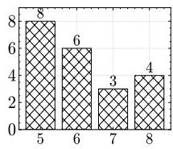  
(b) Block numbers.

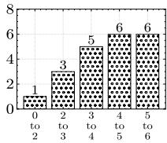  
(c) Size (GB).  
Figure 14: Statistics for generated assembled models on BoolQ.

## 4.2 Overall Performance

Throughout the assembling process, 21 assembled LLMs are generated, with statistics shown in Figure 14, demonstrating the diversity of models created from various block combinations. All generated models are stored on the server, and each client receives one model per round for block selection, minimizing additional memory overhead for edge devices. After model generation, we select models with high block compatibility, as it typically leads to better accuracy and ensures top-performing models are chosen. We use llama-7B as the LLM for baseline methods, applying INT8 quantization with GPTQ. Table 4 and Figure 15 present the comparison results with algorithm-level baselines and Table 5 and Figure 16 for the system-level baselines.

Superior Accuracy. From Table 4 and Figure 15, compared to full fine-tuning, AssyLLM achieves 16.75%, 17.16%, and 18.26% absolute improvements across three datasets due to reducing memory requirements and enabling contributions from users previously constrained by memory limitations. For parameter-efficient fine-tuning baselines like LoRA, QLoRA, and FedAdapter, AssyLLM shows improvements of up to 8.24%, 13.09%, and 11.57%, as these methods reduce weight precision or limit fine-tuning, causing performance degradation. Compared to BP-free methods like FwdLLM, AssyLLM improves by 6.14%, 8.88%, and 7.58%, as FwdLLM’s reliance on inference perturbations leads to instability during aggregation. AssyLLM’s concatenation method avoids these issues while maintaining superior performance. From Table 5 and Figure 16, AssyLLM outperforms existing memorysaving techniques by up to 3.77%, 5.26%, and 6.18%. This is due to constructing a block pool with multiple LLMs of diverse structures, enriching the model pool, and enhancing the adaptability and expressiveness of the generated models for downstream tasks.

Speedier Convergence. From Table 4, for algorithm baselines, AssyLLM achieves up to 12.92×, 14.67×, and 10.97× speedup across three datasets, thanks to the elimination of BPrelated computations, which drastically reduces fine-tuning time. From Table 5, for system-level baselines, the speedup is even more significant, reaching up to 30.04×, 28.71×, and 26.75×. This improvement is due to the substantial additional time introduced by I/O exchanges or activation recomputations, which greatly extend the overall aggregation process.

Robustness to non-IID data. We evaluated performance under various non-IID settings and conducted multiple experiments with different initialization settings. AssyLLM and baselines both utilized the FedAvg aggregation algorithm, with results shown in Figure 17. As depicted, as the local data distribution becomes more skewed, the baseline experiences varying degrees of performance degradation, with accuracy drops of up to 14% and increased bias. In contrast, while AssyLLM also faces some impact (a 4.6% absolute accuracy drop), it still demonstrates up to a 27.2% improvement over the baseline, offering more stable performance. This improvement stems from the fact that, in our method, local data only guides block selection and fine-tunes lightweight adapters, without altering the blocks themselves. As a result, the generated LLM is less affected by the local data distribution compared to baselines. Furthermore, our approach is orthogonal to other methods that address non-IID issues, like Harmony [34] and Oort [21], and can be seamlessly integrated with them for further optimization.

Table 4: Test results (top-1 accuracy and speedup) of algorithm-level memory saving schemes on BoolQ, PIQA, OBQA in non-IID scenario. FT-oracle represents the experiment conducted without memory limitation, denotes as the upper bound.
<table><tr><td rowspan="2">Dataset</td><td colspan="2">FT-practical</td><td colspan="2">FT-oracle</td><td colspan="2">LoRA</td><td colspan="2">QLoRA</td><td colspan="2">FedAdapter</td><td colspan="2">FwdLLM</td><td colspan="2">AssyLLM</td></tr><tr><td>Speedup</td><td>Acc</td><td>Speedup</td><td>Acc</td><td>Speedup</td><td>Acc</td><td>Speedup</td><td>Acc</td><td>Speedup</td><td>Acc</td><td>Speedup</td><td>Acc</td><td>Speedup</td><td>Acc</td></tr><tr><td>BoolQ</td><td>1×</td><td>61.37</td><td>1.45×</td><td>75.11</td><td>3.72×</td><td>71.32</td><td>4.83×</td><td>69.88</td><td>6.32×</td><td>72.96</td><td>9.83×</td><td>71.98</td><td>12.92×</td><td>78.12</td></tr><tr><td>PIQA</td><td>1×</td><td>66.23</td><td>1.37×</td><td>79.22</td><td>4.10×</td><td>74.14</td><td>4.99×</td><td>70.3</td><td>6.87×</td><td>75.81</td><td>10.21×</td><td>74.51</td><td>14.67×</td><td>83.39</td></tr><tr><td>OBQA</td><td>1×</td><td>44.21</td><td>1.47×</td><td>57.29</td><td>3.43×</td><td>53.55</td><td>4.31×</td><td>50.90</td><td>6.02×</td><td>54.78</td><td>9.15x</td><td>54.89</td><td>10.97×</td><td>62.47</td></tr></table>

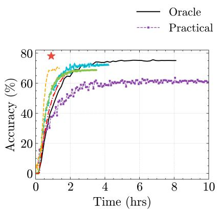  
(a) BoolQ.

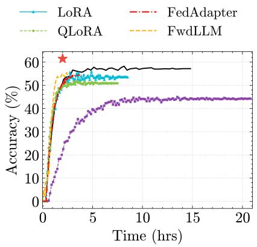  
(b) OBQA.

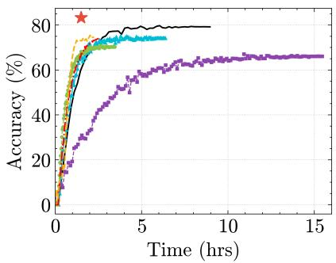  
(c) PIQA.  
Figure 15: Efficiency comparison with algorithm-level baselines. Model: Llama-7B.

Table 5: Test results (top-1 accuracy and speedup) with system-level memory saving baselines on BoolQ, PIQA, OBQA in non-IID scenario. See Table 4 for further reference.
<table><tr><td rowspan="2">Dataset</td><td colspan="2">Recomputation</td><td colspan="2">Swapping</td><td colspan="2">AssyLLM</td></tr><tr><td>Speedup</td><td>Acc</td><td>Speedup</td><td>Acc</td><td>Speedup</td><td>Acc</td></tr><tr><td>BoolQ</td><td>0.65×</td><td>74.91</td><td>0.43×</td><td>74.35</td><td>12.92×</td><td>78.12</td></tr><tr><td>PIQA</td><td>0.68×</td><td>78.96</td><td>0.51×</td><td>78.13</td><td>14.67×</td><td>83.39</td></tr><tr><td>OBQA</td><td>0.51×</td><td>56.88</td><td>0.41×</td><td>56.19</td><td>10.97×</td><td>62.47</td></tr></table>

## 4.3 System Cost

Memory overhead reduction. As shown in Figure 18, AssyLLM reduces memory consumption by 92% compared to full fine-tuning and 63.6% compared to PEFT baselines. This is due to AssyLLM’s design, which limits operations to the forward pass, reducing memory cost to only the block pool and lightweight adapter fine-tuning. In contrast, while other system-level and BP-free methods reduce memory usage and also achieve 100% client participation, they often sacrifice accuracy or prolong training time, limiting their real-world efficiency. Moreover, mainstream inference optimization techniques [23, 24] can be integrated with our approach to further reduce memory overhead.

Energy and communication cost reduction. As shown in Figure 19, AssyLLM reduces energy consumption by 95.01% and inter-device communication overhead by 99.1% compared to full fine-tuning. Our method is also highly efficient relative to PEFT or BP-free methods, achieving up to 88.1% energy reduction and 94.2% decrease in communication overhead. This reduction is due to the fact that, unlike traditional training methods, our approach only requires clients to upload block selection results and a lightweight adapter each round. Since the block pool is shared between the server and clients, the block selection results are transmitted as an index, typically requiring only a few bytes. In contrast to traditional methods, which require uploading entire or partial model weights or updates, our method significantly reduces communication overhead.

## 4.4 Effectiveness of Each Component

Impact of Block Comparator. We compared the impact of using two individual metrics (CKA and COR) for block selection on the final performance. As shown in the Figure 10, neither metric alone can identify the optimal blocks, resulting in a 9.1% and 3.4% performance drop.

Impact of Block Quanter. We compare Block Quanter with different precision schemes. As shown in Figure 20a, compared to FP16, AssyLLM reduces memory consumption by 70.2% with only a 1.1% accuracy loss. For INT4, our method increases memory overhead by 10.1% but improves accuracy by 8.1%. This shows that Block Quanter effectively reduces block pool memory overhead while preserving accuracy through block-specific mixed-precision quantization.

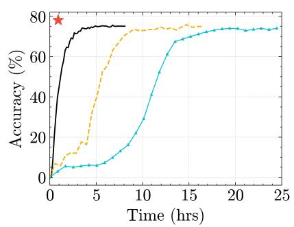  
(a) BoolQ.

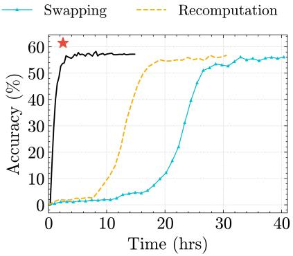  
(b) OBQA.

★ AssyLLM  
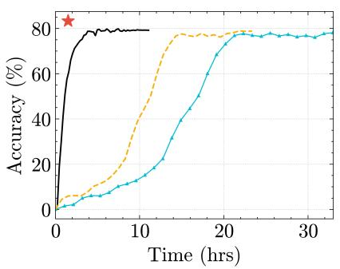  
(c) PIQA.

Figure 16: Efficiency comparison with system-level baselines. Model: Llama-7B.  
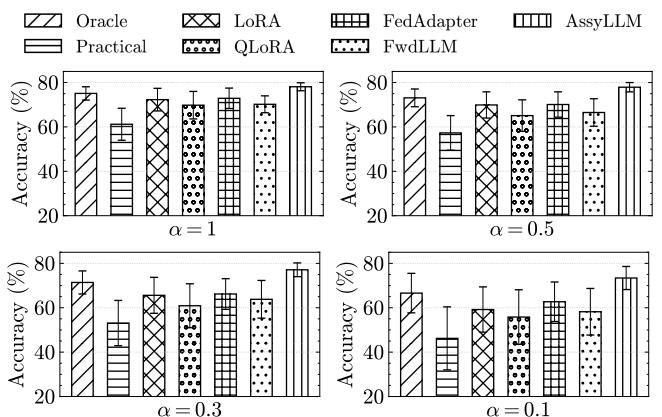  
Figure 17: Performance comparison under various non-IID settings in BoolQ. α denotes the concentration parameter in Dirichlet distribution.

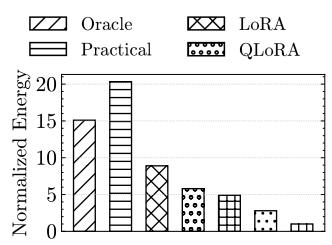  
FedAdapter AssyLLM FwdLLM

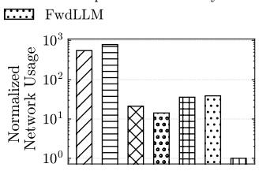  
(a) Total energy cost.  
(b) Total network cost.

Figure 19: Resource cost of AssyLLM and baselines. Dataset: BoolQ.  
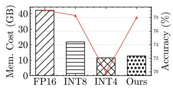

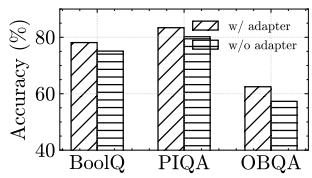

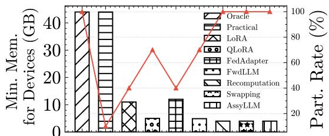  
(a) Block Quanter on BoolQ.  
(b) Elastic Adapter.  
Figure 20: Ablation study for Block Quanter and Elastic Adapter.  
Figure 18: Peak memory footprint and client participation rate comparison on BoolQ. Min. Mem. for Devices denotes the minimum memory required for the participant to apply the corresponding methods.

Impact of Elastic Adapter. We compare AssyLLM with a baseline approach that uses a simple dimensional transformation matrix to connect blocks. As shown in Figure 20b, adding the assembling adapter improves performance by 3.02%, 3.19%, and 5.17% on datasets. The improvement demonstrates the effectiveness of our method in facilitating seamless block integration and enhancing performance.

Impact of Block Swapper. To verify the effectiveness of Block Swapper, we evaluated two pipeline management strategies: one without pre-loading and pre-swapping (system default), and another without pre-swapping, as shown in Figure

12. The results in Figure 21 show that as the number of block swaps increases, incorporating pre-loading reduces local time by up to 30.21% compared to the default pipeline. Additionally, adding pre-swapping on top of pre-loading further reduces total time by 68.12%. This significantly minimizes the additional latency from block swapping, improving overall system efficiency.

Component-wise Contribution Summary. Each component in AssyLLM contributes to overall performance. Block Comparator selects compatible blocks using CKA and COR scores. Elastic Adapter integrates mismatched blocks by activating adapters only when significant semantic divergence is detected. Block Quanter reduces memory via mixed-precision quantization; INT8/INT4 yields \~70% savings with \~1.1% accuracy loss, while maintaining robust compatibility metrics. Block Swapper improves memory efficiency through correlation-aware prefetching and pre-swapping. Together, these modules enhance accuracy, memory usage, and convergence, as confirmed by our ablation results.

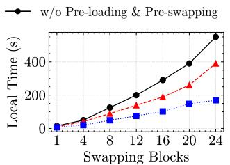  
(a) BoolQ.

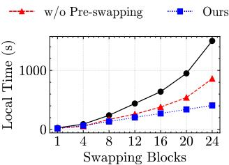  
Figure 21: Ablation study for Block Swapper.  
(b) OBQA.

## 5 Discussion

Criteria for selecting pre-trained models. While AssyLLM shows promising results, selecting the appropriate combination of pre-trained LLMs for the block pool remains a nontrivial task. We prioritize architectural diversity to ensure the assembled model captures a broad spectrum of representational patterns, incorporating both decoder-only models (e.g., LLaMA, OPT, Vicuna) and encoder-only models (e.g., BERT, RoBERTa). Empirical results indicate that such heterogeneity improves generalization across downstream tasks. However, expanding the block pool increases memory and computation overhead, and not all combinations yield consistent performance. Our experiments reveal fluctuations across different LLM sets, highlighting the need for a more principled strategy to guide model selection. In future work, we plan to explore adaptive construction methods based on task embeddings, domain-aligned pretraining, or proxy task performance to optimize block pool composition.

System Robustness and Scalability. While AssyLLM consists of four interacting components—Block Comparator, Elastic Adapter, Block Quanter, and Block Swapper—each is implemented as an independent and lightweight module (300\~600 lines in Python), coordinated through shared interfaces without tight coupling. For example, the Comparator and Quanter operate purely on forward activations, while the Adapter is only triggered when structural mismatches occur. This modularity enhances robustness against architectural variations and supports easy reuse across different LLM workflows.

In terms of scalability, while the current design targets edge devices, AssyLLM can be extended to larger LLMs (e.g., LLaMA-13B or 30B) with minimal architectural changes. The primary challenges lie in the memory overhead due to increased block pool size and potential I/O pressure during block swapping. These can be addressed via hierarchical block indexing, storage prefetching, or streaming-based execution, which we leave as promising directions for future work.

Why block-level assembly works better? Traditional finetuning incurs high memory overhead, restricting participation to high-resource devices and reducing data diversity in FL. In contrast, our method removes most BP-related memory costs, enabling participation from low-resource devices. By assembling blocks from diverse pre-trained LLMs, our framework captures a broader range of representational patterns. Moreover, the inherent redundancy in LLMs allows them to tolerate moderate structural or semantic inconsistencies, so the assembled model can still perform effectively even if individual blocks are not perfectly aligned.

## 6 Conclusions

In this paper, we propose AssyLLM, a memory-efficient federated fine-tuning framework using pre-trained LLMs block assembly, effectively reducing BP-related overhead. The four key components—Block Comparator, Elastic Adapter, Block Quanter, and Block Swapper—effectively enhance the method’s efficiency by addressing block compatibility, mismatches and reducing the memory footprint of block pool. Experiments demonstrate that AssyLLM reduces memory requirements, enhances model accuracy, and accelerates training compared to conventional FedLLM methods.

## Acknowledgments

This work was supported by Science and Technology Development Fund (FDCT) of Macau SAR (File no. 0107/2024/RIA2), MYRG-GRG2024-00180-IOTSC, MYRG-GRG2023-00211-IOTSC-UMDF, and EF2024-00180-IOTSC. Please ask Dr. Li Li (llili@um.edu.mo) for correspondence.

## References

[1] How much ram does your android phone really need in 2023? https://www.androidauthority.com/ how-much-ram-do-i-need-phone-3086661/. Accessed: 2023.

[2] Andrew G Barto and Michael I Jordan. Gradient following without back-propagation in layered networks. In 1st Int. Conference Neural Nets, San Diego, volume 2, 1987.

[3] Yonatan Bisk, Rowan Zellers, Jianfeng Gao, Yejin Choi, et al. Piqa: Reasoning about physical commonsense in natural language. In Proceedings of the AAAI conference on artificial intelligence, volume 34, pages 7432–7439, 2020.

[4] Dongqi Cai, Yaozong Wu, Shangguang Wang, Felix Xiaozhu Lin, and Mengwei Xu. Fedadapter: Efficient federated learning for modern nlp. arXiv preprint arXiv:2205.10162, 2022.

[5] Chaochao Chen, Xiaohua Feng, Jun Zhou, Jianwei Yin, and Xiaolin Zheng. Federated large language model: A position paper. arXiv preprint arXiv:2307.08925, 2023.

[6] Tianqi Chen, Bing Xu, Chiyuan Zhang, and Carlos Guestrin. Training deep nets with sublinear memory cost. arXiv preprint arXiv:1604.06174, 2016.

[7] Christopher Clark, Kenton Lee, Ming-Wei Chang, Tom Kwiatkowski, Michael Collins, and Kristina Toutanova. Boolq: Exploring the surprising difficulty of natural yes/no questions. arXiv preprint arXiv:1905.10044, 2019.

[8] Tim Dettmers, Artidoro Pagnoni, Ari Holtzman, and Luke Zettlemoyer. Qlora: Efficient finetuning of quantized llms. Advances in Neural Information Processing Systems, 36, 2024.

[9] Jesus Escudero-Sahuquillo, Pedro J Garcia, Francisco J Quiles, Jose Flich, and Jose Duato. Obqa: Smart and cost-efficient queue scheme for head-of-line blocking elimination in fat-trees. Journal of Parallel and Distributed Computing, 71(11):1460–1472, 2011.

[10] Haozhe Feng, Tianyu Pang, Chao Du, Wei Chen, Shuicheng Yan, and Min Lin. Does federated learning really need backpropagation. arXiv preprint arXiv:2301.12195, 2023.

[11] Elias Frantar, Saleh Ashkboos, Torsten Hoefler, and Dan Alistarh. Gptq: Accurate post-training quantization for generative pre-trained transformers. arXiv preprint arXiv:2210.17323, 2022.

[12] Bela A Frigyik, Amol Kapila, and Maya R Gupta. Introduction to the dirichlet distribution and related processes. Department of Electrical Engineering, University of Washignton, UWEETR-2010-0006, 6:1–27, 2010.

[13] Arthur Gretton, Olivier Bousquet, Alex Smola, and Bernhard Schölkopf. Measuring statistical dependence with hilbert-schmidt norms. In International conference on algorithmic learning theory, pages 63–77. Springer, 2005.

[14] Edward J Hu, Yelong Shen, Phillip Wallis, Zeyuan Allen-Zhu, Yuanzhi Li, Shean Wang, Lu Wang, and Weizhu Chen. Lora: Low-rank adaptation of large language models. arXiv preprint arXiv:2106.09685, 2021.

[15] Chien-Chin Huang, Gu Jin, and Jinyang Li. Swapadvisor: Pushing deep learning beyond the gpu memory limit via smart swapping. In Proceedings of the Twenty-Fifth International Conference on Architectural Support for Programming Languages and Operating Systems, pages 1341–1355, 2020.

[16] Paras Jain, Ajay Jain, Aniruddha Nrusimha, Amir Gholami, Pieter Abbeel, Joseph Gonzalez, Kurt Keutzer, and Ion Stoica. Checkmate: Breaking the memory wall with optimal tensor rematerialization. Proceedings of Machine Learning and Systems, 2:497–511, 2020.

[17] Liuyi Jin, Tian Liu, Amran Haroon, Radu Stoleru, Michael Middleton, Ziwei Zhu, and Theodora Chaspari. Emsassist: An end-to-end mobile voice assistant at the edge for emergency medical services. In Proceedings of the 21st Annual International Conference on Mobile Systems, Applications and Services, pages 275–288, 2023.

[18] Simon Kornblith, Mohammad Norouzi, Honglak Lee, and Geoffrey Hinton. Similarity of neural network representations revisited. In International conference on machine learning, pages 3519–3529. PMLR, 2019.

[19] Vijay Anand Korthikanti, Jared Casper, Sangkug Lym, Lawrence McAfee, Michael Andersch, Mohammad Shoeybi, and Bryan Catanzaro. Reducing activation recomputation in large transformer models. Proceedings of Machine Learning and Systems, 5:341–353, 2023.

[20] Solomon Kullback and Richard A Leibler. On information and sufficiency. The annals of mathematical statistics, 22(1):79–86, 1951.

[21] Fan Lai, Xiangfeng Zhu, Harsha V Madhyastha, and Mosharaf Chowdhury. Oort: Efficient federated learning via guided participant selection. In 15th {USENIX} Symposium on Operating Systems Design and Implementation ({OSDI} 21), pages 19–35, 2021.

[22] Ji Lin, Jiaming Tang, Haotian Tang, Shang Yang, Wei-Ming Chen, Wei-Chen Wang, Guangxuan Xiao, Xingyu Dang, Chuang Gan, and Song Han. Awq: Activationaware weight quantization for on-device llm compression and acceleration. Proceedings of Machine Learning and Systems, 6:87–100, 2024.

[23] Weijie Liu, Peng Zhou, Zhe Zhao, Zhiruo Wang, Haotang Deng, and Qi Ju. Fastbert: a self-distilling bert with adaptive inference time. arXiv preprint arXiv:2004.02178, 2020.

[24] Xinyu Liu, Houwen Peng, Ningxin Zheng, Yuqing Yang, Han Hu, and Yixuan Yuan. Efficientvit: Memory efficient vision transformer with cascaded group attention. In Proceedings of the IEEE/CVF Conference on Computer Vision and Pattern Recognition, pages 14420– 14430, 2023.

[25] Alessio Maritan, Subhrakanti Dey, and Luca Schenato. Fedzen: Towards superlinear zeroth-order federated learning via incremental hessian estimation. arXiv preprint arXiv:2309.17174, 2023.

[26] Brendan McMahan, Eider Moore, Daniel Ramage, Seth Hampson, and Blaise Aguera y Arcas. Communicationefficient learning of deep networks from decentralized data. In Artificial intelligence and statistics, pages 1273– 1282. PMLR, 2017.

[27] Adam Paszke, Sam Gross, Francisco Massa, Adam Lerer, James Bradbury, Gregory Chanan, Trevor Killeen, Zeming Lin, Natalia Gimelshein, Luca Antiga, et al. Pytorch: An imperative style, high-performance deep learning library. Advances in neural information processing systems, 32, 2019.

[28] Jonas Pfeiffer, Andreas Rücklé, Clifton Poth, Aishwarya Kamath, Ivan Vulic, Sebastian Ruder, Kyunghyun ´ Cho, and Iryna Gurevych. Adapterhub: A framework for adapting transformers. arXiv preprint arXiv:2007.07779, 2020.

[29] Zhen Qin, Daoyuan Chen, Bingchen Qian, Bolin Ding, Yaliang Li, and Shuiguang Deng. Federated fullparameter tuning of billion-sized language models with communication cost under 18 kilobytes. arXiv preprint arXiv:2312.06353, 2023.

[30] Jie Ren, Samyam Rajbhandari, Reza Yazdani Aminabadi, Olatunji Ruwase, Shuangyan Yang, Minjia Zhang, Dong Li, and Yuxiong He. {Zero-offload}: Democratizing {billion-scale} model training. In 2021 USENIX Annual Technical Conference (USENIX ATC 21), pages 551–564, 2021.

[31] Xiaoyang Sun, Wei Wang, Shenghao Qiu, Renyu Yang, Songfang Huang, Jie Xu, and Zheng Wang. Stronghold: fast and affordable billion-scale deep learning model training. In SC22: International Conference for High Performance Computing, Networking, Storage and Analysis, pages 1–17. IEEE, 2022.

[32] Zhiqing Sun, Hongkun Yu, Xiaodan Song, Renjie Liu, Yiming Yang, and Denny Zhou. Mobilebert: a compact task-agnostic bert for resource-limited devices. arXiv preprint arXiv:2004.02984, 2020.

[33] Kahou Tam, Chunlin Tian, Li Li, Haikai Zhao, and ChengZhong Xu. Fedhybrid: Breaking the memory wall of federated learning via hybrid tensor management. In Proceedings of the 22nd ACM Conference on Embedded Networked Sensor Systems, pages 394–408, 2024.

[34] Chunlin Tian, Li Li, Zhan Shi, Jun Wang, and ChengZhong Xu. Harmony: Heterogeneity-aware hierarchical management for federated learning system. In 2022 55th IEEE/ACM International Symposium on Microarchitecture (MICRO), pages 631–645. IEEE, 2022.

[35] Hugo Touvron, Thibaut Lavril, Gautier Izacard, Xavier Martinet, Marie-Anne Lachaux, Timothée Lacroix, Baptiste Rozière, Naman Goyal, Eric Hambro, Faisal Azhar, Aurelien Rodriguez, Armand Joulin, Edouard Grave, and Guillaume Lample. Llama: Open and efficient foundation language models, 2023.

[36] Laurens Van der Maaten and Geoffrey Hinton. Visualizing data using t-sne. Journal of machine learning research, 9(11), 2008.

[37] Kuan Wang, Zhijian Liu, Yujun Lin, Ji Lin, and Song Han. Haq: Hardware-aware automated quantization with mixed precision. In Proceedings of the IEEE/CVF conference on computer vision and pattern recognition, pages 8612–8620, 2019.

[38] Kun Wang, Jiani Cao, Zimu Zhou, and Zhenjiang Li. Swapnet: Efficient swapping for dnn inference on edge ai devices beyond the memory budget. IEEE Transactions on Mobile Computing, 2024.

[39] Thomas Wolf, Lysandre Debut, Victor Sanh, Julien Chaumond, Clement Delangue, Anthony Moi, Pierric Cistac, Tim Rault, Rémi Louf, Morgan Funtowicz, et al. Huggingface’s transformers: State-of-the-art natural language processing. arXiv preprint arXiv:1910.03771, 2019.

[40] Yebo Wu, Chunlin Tian, Jingguang Li, He Sun, Kahou Tam, Li Li, and Chengzhong Xu. A survey on federated fine-tuning of large language models. arXiv preprint arXiv:2503.12016, 2025.

[41] Jingyi Xu, Zihan Chen, Tony QS Quek, and Kai Fong Ernest Chong. Fedcorr: Multi-stage federated learning for label noise correction. In Proceedings of the IEEE/CVF Conference on Computer Vision and Pattern Recognition, pages 10184–10193, 2022.

[42] Mengwei Xu, Dongqi Cai, Yaozong Wu, Xiang Li, and Shangguang Wang. Fwdllm: Efficient fedllm using forward gradient. arXiv. Available at: hjp://arxiv. org/abs/2308.13894 (Accessed: 11 March 2024), 2024.

[43] Mengwei Xu, Feng Qian, Qiaozhu Mei, Kang Huang, and Xuanzhe Liu. Deeptype: On-device deep learning for input personalization service with minimal privacy concern. Proceedings of the ACM on Interactive, Mobile, Wearable and Ubiquitous Technologies, 2(4):1–26, 2018.

[44] Jianyi Zhang, Saeed Vahidian, Martin Kuo, Chunyuan Li, Ruiyi Zhang, Tong Yu, Guoyin Wang, and Yiran Chen. Towards building the federatedgpt: Federated instruction tuning. In ICASSP 2024-2024 IEEE International Conference on Acoustics, Speech and Signal Processing (ICASSP), pages 6915–6919. IEEE, 2024.