①

USENIX

THE ADVANCED COMPUTING SYSTEMS ASSOCIATION

# WIC: Hiding Producer-Consumer Synchronization Delays with Warp-Level Interrupt-based GPU Communications

Jiajian Zhang, Xi’an Jiaotong-Liverpool University and University of Liverpool; Fangyu Wu, Xi’an Jiaotong-Liverpool University; Hai Jiang, Beijing University of Posts and Telecommunications; Qiufeng Wang, Xi’an Jiaotong-Liverpool University; Genlang Chen and Chaoyi Pang, NingboTech University https://www.usenix.org/conference/atc25/presentation/zhang-jiajian

This paper is included in the Proceedings of the 2025 USENIX Annual Technical Conference.

July 7–9, 2025 • Boston, MA, USA ISBN 978-1-939133-48-9

Open access to the Proceedings of the 2025 USENIX Annual Technical Conference is sponsored by

P=-r.h mFs/sL

auuuJl9 PgleU

King Abdullah University of

Science and Technology

# WIC: Hiding Producer-Consumer Synchronization Delays with Warp-Level Interrupt-based GPU Communications

Jiajian Zhang1, 2, Fangyu Wu1∗, Hai Jiang3, Qiufeng Wang1, Genlang Chen4, Chaoyi Pang4

1Xi’an Jiaotong-Liverpool University

2University of Liverpool

3Beijing University of Posts and Telecommunications 4NingboTech University

## Abstract

GPU communication plays a pivotal role in collaborative computation across multiple devices. Despite advancements in inter-device communication fabrics and architectures, synchronization still remains a significant challenge due to the manual coordination required between producers and consumers at the application level. In this work, we first reveal that traditional synchronization is a primary bottleneck in GPU communication, where consumers frequently poll for producer data availability. Specifically, early-started polling leads to the unnecessary occupation of computational resources. To address this issue, we propose Warplevel Interrupt-based Communication (WIC), a novel synchronization framework for GPU communication that introduces a fine-grained interruption mechanism at the warp level to replace repetitive polling. WIC preemptively stalls warps engaged in frequent polling and releases computational resources for other warps, thereby effectively overlapping producer-consumer synchronization with ongoing computations. Comprehensive experiments demonstrate that WIC significantly outperforms conventional polling methods by 1.13× on average across various applications with diverse communication patterns.

## 1 Introduction

GPU communication plays a pivotal role in collaborative computation between CPUs and GPUs [23], especially as the complexity [22, 25, 47] and the scale of parallel computing tasks [13, 44] outpace the capabilities of single-GPU setups [48]. Despite advancements in communication architectures such as GPUDirect P2P [32] and RDMA [33], and architectures like NVLinks [34], synchronization challenges persist prominently within GPU communication [49]. Specifically, programmers must manually synchronize the timing of producer production and consumer consumption [17], typically involving repetitive polling for the availability of producer data before transfer [20,35,41,43], which introduces considerable overhead and complexity into system operations [1, 36].

Traditionally, GPU cross-device communication research focuses on inter-kernel coordination, strategically scheduling computing kernels $( k _ { 0 } \ – k _ { n } )$ to overlap synchronization overheads and boost throughput [12, 21], as shown in Figure 1(a). In-kernel optimizations enable asynchronous data transfers without kernel terminations to fine-tune producer-consumer models. Predominantly, these studies emphasize optimizations on the producer side, including scheduling additional transfer threads [31] or employing page placements [9, 30] to dispatch data asynchronously. For the consumer side, a typical approach is GPS [29], which proactively transfers data to the consumer assuming data availability before consumer demand, as shown in Figure 1(b).

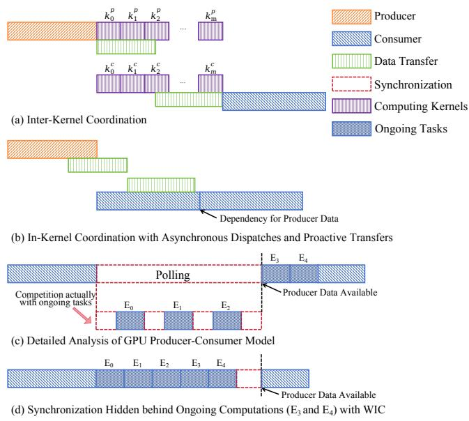  
Figure 1: Different Communication Paradigms

However, our experimental results from practical GPU communication applications reveal significant synchronization overhead on the consumer side, primarily due to consumers waiting for the producer’s data and repeatedly polling for its availability across devices, as detailed in Section 4. While existing research has contributed valuable insights, it has not fully captured this issue, leading to limited improvements in real-world application performance. To effectively hide the synchronization overhead, this paper proposes a novel GPU communication framework, Warp-level Interrupt-based Communication (WIC), that introduces a fine-grained interruption mechanism at the warp level to replace repetitive polling for producer data availability.

In this work, we first pinpoint the nuances of the GPU producer-consumer model. From a traditional producerconsumer perspective, executable tasks before polling have usually completed, leaving no computational tasks to overlap with synchronization, which makes the effects of polling and interruption seem similar. However, in GPU environments, the situation is markedly different. Consumer kernels are executed across multiple threads with varying completion times. Further exploration at the thread level reveals that early-started polling is a primary cause of synchronization overhead. Specifically, substantial threads remain incomplete when polling begins, causing unnecessary polling to squander computational resources and compete with ongoing tasks $( E _ { 0 } – E _ { 2 } )$ , as illustrated in Figure 1(c). Furthermore, by the end of polling, many threads remain unfinished, indicating that their unfinished execution $( E _ { 3 }$ and $E _ { 4 } )$ could have overlapped with the synchronization latency.

To mitigate these inefficiencies, WIC preempts warps engaged in frequent polling, thereby releasing their computational resources for other warps. This approach allows unfinished tasks delayed by polling to take precedence, effectively hiding synchronization behind ongoing computations and improving overall GPU communication efficiency, as shown in Figure 1(d). WIC incorporates three key components: the Interrupter module, detecting warp requests for producer data and triggers interruptions to swap other executable warps; the Monitor module, tracking the availability of the producer data; and the Activator module, resuming the stalled warps once the required data becomes available. To manage warp interruptions efficiently, WIC is integrated within the Unified Virtual Memory (UVM) context, employing UVM page placements to transfer communication messages and track data availability. All of these changes are implemented through modifications to the UVM host kernels, allowing programmers to request producer data functioning in a manner akin to a system call, thereby bypassing the need for manual orchestration of synchronization with polling, ensuring full transparency to programmers.

Our contributions can be summarized as follows:

• We present an in-depth analysis of the synchronization overhead within GPU communications, highlighting that early-started polling monopolizes computational resources, the crucial bottleneck in GPU communications.

• We introduce WIC, a novel GPU communication framework that incorporates a finer-grained interruption mechanism at the warp level to replace repetitive polling, aiming to hide the synchronization latency behind the computation.

• We propose a novel classification perspective that shifts from traditional memory access patterns to a focus on communication patterns. Comprehensive experimental results across 10 applications with diverse communication patterns demonstrate significant performance enhancements with WIC, achieving an average speedup of 1.13× compared to conventional methods.

## 2 Background

## 2.1 Producer-Consumer Model

The producer-consumer model is a concurrency design pattern that coordinates communication between processes sharing common resources [7]. In this model, the producer generates data and populates a buffer, while the consumer retrieves that data from the buffer, allowing both to operate simultaneously and thus boosting operational efficiency through continuous data flow [18]. However, the model necessitates robust synchronization mechanisms to ensure data integrity, preventing the producer from overwriting unread data and the consumer from retrieving uninitialized data [28]. Effective synchronization is typically achieved using semaphores or monitors [14]. Semaphores include two primary types: counting semaphores, which manage how many slots are occupied or available, and mutexes, which provide mutual exclusion when multiple processes access the buffer. Monitors offer an alternative approach by encapsulating the buffer operations within a single construct that coordinates producer and consumer interactions.

## 2.2 GPU Cross-Device Communications

Cross-device communications in GPU environments involve multiple GPUs cooperating to share data, a critical process in large-scale applications such as deep learning training, scientific simulations, and graphics rendering [38, 46]. Different from traditional host-side producer-consumer models [5], the simultaneous execution of massive threads in GPU environments necessitates advanced synchronization strategies to manage fine-grained interactions [37]. However, due to the absence of native cross-device semaphores in GPU APIs, programmers must manually coordinate synchronization through CUDA streams, events, or synchronization flags. Typically, producers indicate data readiness via flags, while consumers must actively poll or wait on these signals to maintain data consistency and avoid race conditions [20, 35, 43]. Our work specifically addresses the polling phase, which incurs substantial overhead on the consumer side.

## 3 Analysis Methodology

In this section, we introduce a novel classification for communication applications. Based on the classification, we detail the specific applications with various communication patterns selected for analysis and describe the system specifications.

## 3.1 Communication Patterns

The reliance on traditional memory access patterns for GPU communication analysis [4, 9, 29–31, 42] can be misleading, as these patterns generally provide a macroscopic view of program behavior rather than reflecting the specific dynamics of device interactions. For example, the Bitonic Sort algorithm utilizes a random memory access pattern. However, its inter-device communication, essential for the global merging phase, primarily exhibits a gather-scatter pattern, where GPUs fetch pre-sorted data (gather) and then write back the results following comparison and swapping (scatter). Moreover, the communication model is also a critical factor in classifying applications, through its impact on synchronization methods and data flow across communication iterations.

To conduct a more comprehensive analysis of GPU communications, we propose a dual-dimensional classification, communication patterns, including communication access patterns and communication models. Communication access patterns are categorized into four types—streaming, adjacent, scatter-gather, and random—each representing different access behaviors during device interactions. Additionally, communication models are defined by the nature of data transfer during communication iterations, as detailed in Table 1.

Table 1: Communication Models
<table><tr><td>Unidirectional Communication  $( D _ { 0 } \to D _ { 1 } ) ^ { N }$  This model represents one-way com- munication between two devices  $( D _ { 0 , 1 } ) .$   $D _ { 0 }$  consistently acts as the producer, while  $D _ { 1 }$  always functions as the con- sumer.N represents the number of com- munication iterations. Multiple Communication</td><td>AlternatingCommunication  $( D _ { 0 }  D _ { 1 } , { } ^ { - } D _ { 1 }  D _ { 0 } ) ^ { N }$  Within a single communication itera- tion,  $D _ { 0 }$  starts as the producer,sending messagest  $) D _ { 1 }$  .After processing these messages,  $D _ { 1 }$  then acts as the producer, 1 sending the resultant data back to  $D _ { 0 } .$  Both devices alternate roles between producer and consumer throughout a communication iteration.</td></tr><tr><td> $( ( D _ { 0 } \to D _ { 1 } ) ^ { n _ { 0 } } , \quad ( D _ { 1 } \to D _ { 0 } ) ^ { n _ { 1 } } ) ^ { N }$  This model involves multiple transmis- sions between devices withina single communication iteration.  $D _ { 0 } ,$  acting as the producer, transfersmessages to  $) D _ { 1 }$  multiple times (no),and after process- ing,  $\bar { D _ { 1 } }$  transfers messages back to  $D _ { 0 }$  n1 times.</td><td>Probabilistic Communication  $( ( D _ { 0 } \to D _ { 1 } ) ^ { \varepsilon _ { i } ^ { 0 } \cdot n _ { 0 } } , \quad D _ { 1 } \to D _ { 0 } ) ^ { \varepsilon _ { i } ^ { 1 } \cdot n _ { 1 } } ) ^ { N }$  This model characterizes the communi- cation between devices where the mode and frequency of transfers within each communication cycle are probabilistic.</td></tr></table>

## 3.2 Applications

To encompass a comprehensive spectrum of UVM scenarios, we select ten applications from FAIR1M [40], Mantevo [26], Comb [6], Polybench [39], Rodinia [8], and Savina [16] benchmark suites as listed in Table 2. This benchmark selection, based on a classification of different patterns, has been demonstrated to avoid benchmarking crimes [45] and is widely adopted in GPU communication evaluations [4, 9, 11]. In our study, we further refine this classification to focus more sharply on communication access patterns and incorporate synchronization dynamics into our selection process. The chosen applications fully cover the complete dualdimensional classification defined in Section 3.1, encompassing four communication access patterns: streaming, adjacent, scatter-gather, and random patterns, as well as four communication models: unidirectional, alternating, multiple, and probabilistic models. Specifically, C\_SRS and G\_KMN require only unidirectional, streaming patterns, where data is transferred back to a single device. C\_CG, C\_FE, and G\_C2D engage in an Alternating communication model, where two devices exchange information with Random and Streaming access patterns. Multiple transfers during each iteration are necessary for C\_H3D, G\_BS, G\_STN, and G\_GEM. For instance, G\_STN repeatedly sends boundary data of its subdomain to an adjacent GPU. These applications exhibit Adjacent and Scatter-Gather access patterns. G\_BFS, with its unpredictable access manner, fits into a Random and Probabilistic model. Additionally, the inclusion of the communication-intensive application, C\_H3D, enriches our evaluation with diverse GPU communication behaviors.

The applications include both CPU-GPU communications (the first four applications listed in Table 2) and inter-GPU communications (the last six applications listed in Table 2).

Table 2: List of Applications
<table><tr><td rowspan=1 colspan=1>Abbr.</td><td rowspan=1 colspan=1>Applications</td><td rowspan=1 colspan=1>BenchmarkSuite</td><td rowspan=1 colspan=1>Comm.Model</td><td rowspan=1 colspan=1>AccessPattern</td></tr><tr><td rowspan=1 colspan=1>C_SRS</td><td rowspan=1 colspan=1>SatelliteRemoteSensing ImageProcessing andDistribution</td><td rowspan=1 colspan=1>FAIR1M</td><td rowspan=1 colspan=1>streaming</td><td rowspan=1 colspan=1>Unidirectional</td></tr><tr><td rowspan=1 colspan=1>C_CG</td><td rowspan=1 colspan=1>High PerformanceComputing Conju-gate Gradients</td><td rowspan=1 colspan=1>Mantevo</td><td rowspan=1 colspan=1>Random</td><td rowspan=1 colspan=1>Alternating</td></tr><tr><td rowspan=1 colspan=1>C_FE</td><td rowspan=1 colspan=1>Finite ElementMini-Application</td><td rowspan=1 colspan=1>Mantevo</td><td rowspan=1 colspan=1>Random</td><td rowspan=1 colspan=1>Alternating</td></tr><tr><td rowspan=1 colspan=1>C_H3D</td><td rowspan=1 colspan=1>Halo 3D Cube</td><td rowspan=1 colspan=1>Comb</td><td rowspan=1 colspan=1>Adjacent</td><td rowspan=1 colspan=1>Multiple</td></tr><tr><td rowspan=1 colspan=1>G_BFS</td><td rowspan=1 colspan=1>Breadth-firstSearch</td><td rowspan=1 colspan=1>Rodinia</td><td rowspan=1 colspan=1>Random</td><td rowspan=1 colspan=1>Probabilistic</td></tr><tr><td rowspan=1 colspan=1>G_BS</td><td rowspan=1 colspan=1>Bitonic Sort</td><td rowspan=1 colspan=1>Savina</td><td rowspan=1 colspan=1>Scatter-Gather</td><td rowspan=1 colspan=1>Multiple</td></tr><tr><td rowspan=1 colspan=1>G_C2D</td><td rowspan=1 colspan=1>Convolution 2D</td><td rowspan=1 colspan=1>Polybench</td><td rowspan=1 colspan=1>Adjacent</td><td rowspan=1 colspan=1>Alternating</td></tr><tr><td rowspan=1 colspan=1>G_STN</td><td rowspan=1 colspan=1>Stencil</td><td rowspan=1 colspan=1>Polybench</td><td rowspan=1 colspan=1>Adjacent</td><td rowspan=1 colspan=1>Multiple</td></tr><tr><td rowspan=1 colspan=1>G_GEM</td><td rowspan=1 colspan=1>General MatrixMultiplication</td><td rowspan=1 colspan=1>Polybench</td><td rowspan=1 colspan=1>streaming</td><td rowspan=1 colspan=1>Multiple</td></tr><tr><td rowspan=1 colspan=1>G_KMN</td><td rowspan=1 colspan=1>Kmeans</td><td rowspan=1 colspan=1>Rodinia</td><td rowspan=1 colspan=1>streaming</td><td rowspan=1 colspan=1>Unidirectional</td></tr></table>

## 3.3 Naive Communication Applications

In GPU cross-device tasks, programmers must manually coordinate fine-grained synchronization to ensure data integrity during producer-consumer communications. To analyze the communication inefficiency, our work adopts a representative GPU producer-consumer paradigm, as detailed in Algorithm 1. Communication resources are divided into subdomains associated with consumer thread block requests, each marked by a syncFlag, indicating producer data availability. Both communication data and flags are maintained within UVM, allowing uniform access by producers and consumers.

Algorithm 1 Naive Communications   
1: procedure CONSUMERSYNC   
2: Independent Processing (C1);   
3: \_syncthreads();   
4: if tid == 0 then   
5: while atomicAdd(&(producer[bid]) -> syncFlag),   
0) != 1 do   
6: end while   
7: Access the producer’s data through UVM;   
8: end if   
9: \_syncthreads();   
10: end procedure   
11: procedure PRODUCER   
12: Compute producer’s data (P1);   
13: \_\_syncthreads();   
14: if tid == 0 then atomicAdd(&(producer[bid]) ->   
syncFlag), 1);   
15: end if   
16: \_syncthreads();   
17: end procedure

On the consumer side, threads complete preliminary processing (C1), synchronizing via \_\_syncthreads. Subsequently, the lead thread (tid = 0) continuously polls syncFlag in a loop (Line 5). Once the flag indicates data availability, an atomic operation secures the syncFlag from producer-side updates, enabling the lead thread to safely access the corresponding data (Line 7). Remaining threads wait via \_\_syncthreads until the lead thread completes this communication step. On the producer side, once data production completes, the corresponding syncFlag is set to 1. This communication model involves three distinct UVM page faults: the consumer polling an unavailable syncFlag, updating syncFlag upon data readiness, and transferring producer data.

## 3.4 System Specifications

CPU-GPU Communication Setup consists of an NVIDIA RTX 4090 GPU with 24GB of DRAM, coupled with a highperformance CPU, the 14900KF, featuring 24 cores. Inter-GPU Communication Setup consists of four NVIDIA

A800 GPUs, each with 80GB of DRAM, coupled with two high-performance CPUs, Xeon 6138, each featuring 20 cores.

## 4 Motivation

In the motivation section, we first establish that consumerside overhead significantly impedes efficiency in producerconsumer communications. We then identify that repetitive polling is the predominant source of this overhead. Moreover, a detailed examination of the polling phase at the thread level reveals that polling initiated too early causes considerable resource contention, which further indicates that these resources could have been better utilized by overlapping with synchronization latency, allowing other executable tasks to proceed without delay. Our experimental setup for collecting data is discussed in Section 3.

## 4.1 Critical Focus on the Consumer Side

Observation 1: The consumer side exhibits significantly higher latencies compared to the producer side. Figure 2 shows the proportion of communication latency for each application on both the consumer and producer sides. For the producer side, latencies are consistently low, generally staying within 10% across various applications, and the differences in latency proportions among these applications are relatively minor. In contrast, the consumer side displays markedly higher latency proportions, typically ranging from 20∼ 50%. This discrepancy is most pronounced in the C\_H3D application, where its communication-intensive nature results in a consumer-side latency peaking at 81.97%.

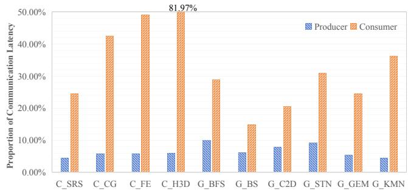  
Figure 2: Proportion of Communication Latency on both Consumer and Producer Sides across Different Applications

The higher latency on the consumer side primarily stems from additional synchronization requirements. On the producer side, Direct Memory Access (DMA) enables asynchronous operations that permit data transfers without halting ongoing computational tasks, effectively minimizing communication latency. However, the situation on the consumer side presents more complexities. The consumer kernel verifies the physical presence of producer data on the local device prior to processing, inherently introducing additional latency.

This asymmetry highlights a pivotal direction for communication optimizations: the consumer side, as the primary contributor to communication latency, demands targeted efforts. While existing research largely focuses on optimizing the producer side [9, 30, 31], addressing the latency issues more prevalent on the consumer side holds significant potential to boost the overall efficiency of GPU communications.

## 4.2 A Deeper Investigation into the Consumer-Side Latency

The consumer-side communication can be analyzed by categorizing it into two distinct scenarios based on the availability of producer’s data. Firstly, we divide the consumer kernel into two parts: $C _ { 1 }$ and $C _ { 2 }$ . The $C _ { 1 }$ portion operates independently of the producer’s data and is typically used for auxiliary tasks or computations from previous communication iterations. $C _ { 2 } ,$ however, depends on data generated by the producer in the current iteration. The completion time of $C _ { 1 }$ is denoted as $T _ { c } ,$ and the producer’s data generation is denoted as $T _ { p } .$ . Two scenarios are distinguished based on the relationship between $T _ { c }$ and $T _ { p } ,$ specifically assessing whether the consumer must wait for the producer’s data to become available.

Scenario 1: $T _ { p }$ occurs before $T _ { c } ,$ , as shown in Figure 3(a). In this scenario, the producer’s data is pre-available, allowing the consumer to directly copy the data without availability checks. Transfer time $( W _ { t } )$ can be overlapped with the $C _ { 1 }$ , by predicting the data dependency and proactively transferring the data to the consumer in advance.

Scenario 2: Tc occurs before $T _ { p }$ , as shown in Figure 3(b). In this scenario, the producer’s data is not available when the consumer needs it, requiring the consumer to repeatedly check its status (polling). The total waiting time includes both the polling $( W _ { p } )$ and data transferring time (Wt ).

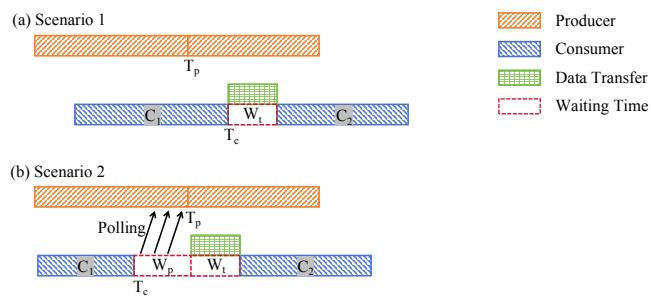  
Figure 3: Two Scenarios based on the Availability of Producer’s Data

To investigate consumer communication scenarios across real-world applications, we analyze the average time differences between $T _ { p }$ and $T _ { c }$ along with their standard deviations, where positive values indicate $T _ { c }$ occurring before $T _ { p } { \mathrm { : } }$ while negative values indicate the reverse. Given substantial variability in these time differences, we normalize them to the communication task duration to provide a clear impact of these delays, as shown in Figure 4.

Observation 2: In most applications, consumers face substantial waiting times for producer data, with significant variability across and within applications.

Specifically, all applications except G\_BS exhibit positive values, indicating that in most cases, the consumer’s $T _ { c }$ occurs before the producer’s $T _ { p } .$ . Moreover, except for the G\_BFS application, the time difference for the other applications exceeds 20%, suggesting that consumers typically face considerable waiting time until producers finish generating data. The large standard deviations for C\_CG, C\_FE, and G\_BFS highlight significant variability in waiting times in the same applications. For C\_CG and C\_FE, the variation is primarily due to the alternating computation tasks between the CPU and GPU. Meanwhile, G\_BFS’s high variability is due to its unpredictable access manner, leading to more random data availability timings.

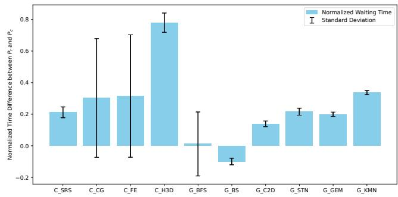  
Figure 4: Normalized Time Difference between Production $( T _ { p } )$ and Consumption $( T _ { c } )$

Based on the observation, we conclude that Scenario 2, where the consumer is required to wait for the producer’s data, is more common. Furthermore, due to the uncertainty and potential variability of data generation on the producer side, the polling mechanism employed in Scenario 2 is crucial for ensuring stable and correct program execution.

Observation 3: Consumer-side polling, where consumers repeatedly check the availability of the producer’s data, constitutes a significant portion of the consumer communication overhead in Scenario 2. Figure 5 illustrates both the proportion of polling within the overall consumer communication overhead and the average number of checks required per communication. Except for G\_BFS, polling accounts for over 60% of the consumer communication overhead, with applications, C\_H3D and G\_KMN, exceeding 90%. Additionally, the number of checks per communication is extremely high, typically in the range of millions to tens of millions. This extensive polling overhead arises from necessary inter-device communication.

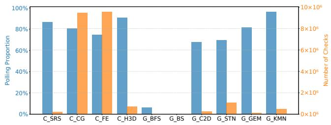  
Figure 5: The Polling Proportion within Consumer Communication Overhead and the Average Number of Checks Required per Communication

Summary of Consumer-Side Latency: The high latency on the consumer side is primarily due to consumers waiting for the producer’s data and repeatedly checking its availability with cross-device communication.

## 4.3 A Finer-Grained Analysis on Polling

The producer-consumer model in GPU architectures significantly diverges from traditional CPU-based setups. In CPU systems, a producer or consumer task tends to be assigned to a single process. Therefore, when reaching the Tc in Scenario $^ { 2 , }$ there are no additional tasks within the consumer that can be pipelined to fill the waiting time gap. Consequently, the overhead associated with polling cannot be optimized further. However, in GPU architectures, the consumer kernel is executed by a multitude of parallel threads. The non-uniform completion progress of these threads, orchestrated by the GPU’s warp scheduler, often means that not all threads reach the $T _ { c }$ simultaneously during the polling phase. Moreover, some independent threads may not depend on the producer’s data and thus do not need to repeatedly check for its availability.

To deepen our understanding at the thread level, we analyze the proportion of threads that have not reached the $T _ { c }$ and the proportion of independent threads remaining incomplete as polling progresses for four applications, C\_SRS, C\_CG, G\_BFS, and G\_STN, with different communication types.

Observation 3.1: Consumer’s polling significantly impacts the completion of computational tasks before reaching the $T _ { c } .$ This observation can be inferred from the results shown in Figure 6, supported by three key insights as follows:

• At the onset of polling, substantial threads still completing their $C _ { 1 }$ tasks have not reached $T _ { c } ,$ , causing them to compete for computational resources with polling.

• The curve features several nearly horizontal segments, signifying substantial preemption of computational resources for these threads. This preemption results in stagnation, as polling dominates the limited resource within the device.

• Even after the completion of polling, a large number of threads still have not reached $T _ { c }$

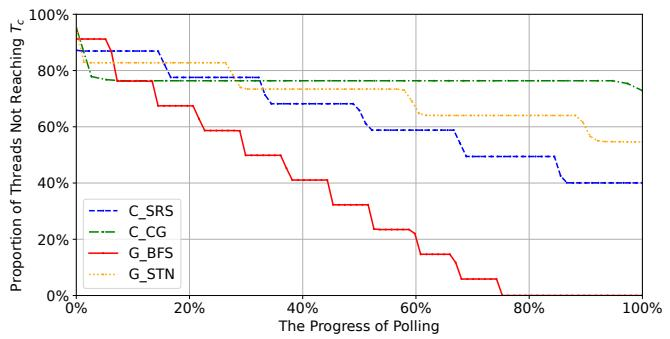  
Figure 6: The Proportion of Threads not Reaching $T _ { c }$ as the Polling Progress

Observation 3.2: Consumer’s polling significantly disrupts the computational tasks of independent threads. Despite these threads comprising a smaller proportion of the overall program, they suffer prolonged stagnation due to resource preemption by polling activities, particularly in applications like G\_BFS and G\_STN, as shown in Figure 7. Furthermore, these independent threads still fail to complete their tasks promptly even after polling ends.

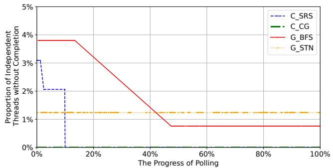  
Figure 7: The Proportion of Independent Threads without Completion as the Polling Progress

The analysis of consumer-side polling reveals significant inefficiencies in resource utilization, with early-started polling significantly tying up GPU computational resources and delaying tasks. These include tasks from threads completing $C _ { 1 }$ operations and those from threads that operate independently of polling demands, suggesting that synchronization overhead could be effectively overlapped with these ongoing tasks.

## 5 Design of WIC

## 5.1 Interrupt-based Mechanism at Warp Level

Based on the analysis in Motivation, it is advised to delay polling to overlap synchronization delays with other executable tasks. However, directly intervening in GPU runtime kernels to reschedule computational resources is impractical for three main reasons:

• Determining an optimal execution sequence is challenging due to the difficulty in accurately predicting thread dependencies at runtime.

• Rescheduling the execution order of parallel threads can disrupt the inherent parallelism of the program.

• GPU APIs typically do not provide direct access for rescheduling resources.

We propose an interrupt-based synchronization framework, WIC, at the warp level to optimize computational resources by prioritizing executable tasks. Specifically, WIC preemptively stalls warps engaged in a blockage due to unavailability of data, switching to another warp that is ready to execute. This mechanism hides the synchronization latency and enhances GPU resource utilization by ensuring that all executable tasks are processed before waiting, minimizing idle times.

WIC incorporates three key components: Interrupter, Monitor, and Activator, as illustrated in Figure 8. The Interrupter prevents warps from being blocked by triggering interruptions when they request producer data and switching to other warps. The Monitor tracks data availability and notifies the Activator when the data is ready. The Activator then facilitates data transfer to the consumer side, and resumes the stalled warps.

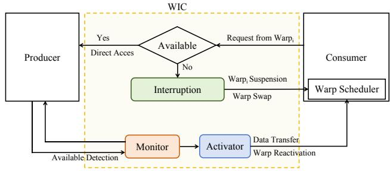  
Figure 8: The Overall Workflow of Warp-Level Interrupt-Based Communication (WIC)

## 5.2 Integration with UVM

To efficiently manage interruptions, we propose integrating WIC within the UVM context, employing UVM page placements to preempt blocked warps by modifying open-source

UVM kernel drivers, without the need for additional GPU hardware intervention.

The UVM system uniquely offers explicit control over the stalling and replaying of warps in UVM kernel drivers: On the GPU side, when warps attempt to access UVM pages that are not present on the local device, the UVM system stalls these warps and schedules other warps for processing. On the host side, UVM drivers can send replay signals to the GPU to reactivate the stalled warps.

By artificially inducing UVM page faults, WIC can interrupt warps waiting for producer data. By pushing a replay signal to the consumer kernel, WIC can dynamically reactivate these stalled warps upon data available. Additionally, by transferring producer data directly onto the faulting pages, WIC enables efficient producer-consumer communication without requiring extra transfers.

Figure 9 illustrates the integration of the WIC within the UVM system in detail. WIC defines a specific memory space within UVM, which comprises two key components: the Producer-Consumer Communication Medium (PCM) and Producer Availability Tags (PAT).

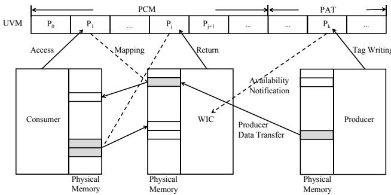  
Figure 9: Integration with UVM

PCM is essential for transfer management between producers and consumers and interruption supports for blocked warps. Memory in PCM is allocated on a per-page basis, with free PCM pages residing on the host side to ensure they are available for triggering page faults in consumer-side warps. When warps request producer data, WIC directs them to access PCM pages, triggering a page fault that stalls the warps. These faults are processed on the host side further, where the WIC writes the producer data into the corresponding pages. Once the transfer is complete, WIC signals the consumer kernel to resume stalled warps. After consumption, the pages are returned to the host for future use in WIC communications.

PAT is employed to notify WIC when the producer’s data is ready for transfer in inter-GPU communications. Rather than repeatedly polling the PAT, WIC relies on page placement to determine data availability. Specifically, data tags are stored as individual pages on the host side. When the producer completes data preparation, it modifies the tag, triggering a page fault. The host-side UVM driver then captures the tag’s address, allowing the identification of the corresponding producer-available data. After the data is consumed, the tags are recycled by the host for future use.

Prefetching options for PCM and PAT within UVM memory are disabled to prevent other memories from proactively migrating to devices, which would otherwise hinder the triggering of necessary faulting.

## 5.3 Interrupter

The Interrupter module manages PCM page allocations for communication and provides interruption support for warps. To optimize transfer utilization, the Interrupter batches 16 warps at a time, allocating the contiguous PCM pages based on ⌈totalSize/pageSize⌉. After allocation, it registers the page information, including the starting address and length, along with the requested data details, with the WIC. The Interrupter then directs the warps to access the starting address of these pages, triggering a page fault and stalling the warps.

To efficiently locate continuous free pages within PCM, the Interrupter incorporates a segment tree. Typically, PCM encompasses 16K pages, capable of handling up to 256M of communication data. The availability of these pages is tracked using a boolean array, where a ‘0’ indicates an allocated page and a ‘1’ denotes a free page. A 64K tree array is used to build the segment tree, where each node represents the state of a segment of pages, including the total number of free blocks (sum), the length of the longest contiguous block of free pages (maxLen), the length of contiguous free pages from the left boundary (leftLen), and from the right boundary (rightLen). When querying for k consecutive free pages, if the root node’s maxLen is less than the required length, it indicates a lack of available space. Otherwise, the search proceeds recursively from the top down, checking maxLen of left and right child nodes, as well as the potential contiguous length across the boundary of the two segments (leftNode.rightLen + rightNode.leftLen). The traversal for each search descends one level down the tree hierarchy, making the query time complexity O(log n). Similarly, updating the status of a page also starts from the root and proceeds recursively down to the leaf node, maintaining the same time complexity of O(log n).

## 5.4 Monitor

The Monitor module, deployed within the host driver, oversees the fault entries retrieved from the GPU fault buffer, specifically capturing PCM and PAT faults. It utilizes PCM faults to manage producer-consumer communication processing and leverages PAT faults to notify the availability of data from the producer.

The Monitor module maintains two key data structures: the Data Availability Bitmap (DAB) and the Pending Faults Queue (PFQ), as shown in Figure 10. Each bit in the DAB corresponds to an availability tag for the producer data. The PFQ holds pending faults due to unavailable data, with each entry containing the fault address and the associated data tags indicating unavailability.

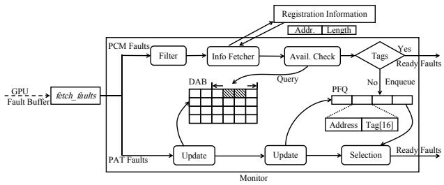  
Figure 10: The Monitor Module in WIC

The Monitor detects PCM and PAT faults by checking if the fault address falls within the registered memory block ranges, which are stored in the WIC when these blocks are defined. Upon capturing a PCM fault, the Monitor assigns an independent thread to manage the communication task, ensuring that overall process flow is not disrupted. It first filters out duplicate faults, then reads the required producer data addresses from the Registration Information and checks the corresponding availability tags in DAB. If any tags are false, the fault and corresponding tag IDs are enqueued in the PFQ, suspending the faulting process. If all tags are true, the Monitor notifies the Activator module to proceed.

Monitoring the availability of producer data occurs in two scenarios. For CPU-GPU communications, where the producer is a user process on the host, it updates the DAB directly after data production, prompting the Monitor to update the unavailable tags in the PFQ and verify if fault processing can proceed (i.e., ensuring no unavailable tags remain). Once ready, the Monitor resumes fault processing. Alternatively, for inter-GPU communications, where the producer kernel resides on another GPU, the Monitor detects producer data availability through PAT faults. After the producer finalizes data, it modifies tags in the PAT on the host side. Upon capturing a PAT fault, the Monitor updates the DAB and PFQ with the new available data indicated by the fault address. If a fault process in PFQ is ready, the Monitor activates it and notifies the Activator module to proceed with the next steps.

## 5.5 Activator

The Activator module fulfills two functions: activation and recycling. Its activation role entails reactivating pending fault processing and reactivating stalled consumer-side warps following the fault processing. The recycling function reclaims PCM pages from the consumer and returns them to the host, ensuring their availability for future communications.

Activation: Upon receiving a signal from the Monitor that a pending fault is ready, the Activator resumes fault processing and transfers the producer data onto designated PCM pages. If the producer kernel resides on another GPU, the data is transferred via DMA once the physical GPU address is verified. After all data has been written, the Activator services the fault and sends a replay signal to the consumer device, which reactivates the stalled warps. These warps then access the locally available PCM pages to retrieve the producer data, thus completing a cycle of producer-consumer communication.

Recycling: At the end of a communication cycle, PCM pages holding producer data often remain on the consumer side. To ensure proper triggering of page faults by the Interrupter module in subsequent requests, it is essential to recycle these pages back to the host. The Activator addresses this by sending an invalidation signal from the host to notify the consumer device that these pages have been updated. However, the timing of this signal is not precisely controlled to fit between the completion of data retrieval by consumer warps and the subsequent request from the Interrupter module. To address this, each PCM page P is paired with a companion page P’, serving alternately in communication cycles to ensure effective and accurate invalidation. Specifically, when the Activator issues a replay signal for P, it concurrently sends an invalidation signal for P’. Once the consumer-side warps have successfully retrieved data from P, P’ becomes invalidated. In the subsequent cycle, the Interrupter allocates P’ to trigger interruptions, and the Activator prepares P for the next cycle by pushing its invalidation signal, maintaining continuous communication flow.

## 5.6 Putting All Together

Figure 11 provides an overview of the entire process of WIC. It begins when consumer warps request producer data via the Interrupter module, which then allocates free PCM pages based on the data size (i) and guides warps to access these pages, thereby triggering a page fault and stalling the warps (ii). On the host side, the Monitor module captures these PCM faults and checks for the availability of the required producer data (iii). If the data is unavailable, fault processing is suspended, and the faults are queued in the PFQ to await data availability. Conversely, if the data is available, the faults progress to the Activator for processing. Simultaneously, the Monitor tracks producer data availability by monitoring PAT faults, updating the local DAB, and scanning the PFQ for any ready faults (iv). These ready faults are then reactivated and forwarded to the Activator module for processing. The Activator writes the producer data into the designated PCM pages (v) and subsequently issues replay signals to reactivate the stalled consumer warps, while also recycling these pages for future communications (vi).

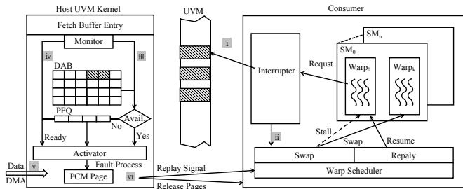  
Figure 11: Overview of WIC

## 5.7 Adaptability of WIC

The WIC’s core principle of preemptive scheduling, although primarily implemented within the host-side UVM context, is adaptable to other GPU communication architectures, such as NVLink and Direct P2P. By orchestrating warp interruptions through the communication control path, WIC introduces a fine-grained, non-blocking synchronization mechanism that significantly alleviates the synchronization overhead inherent to traditional polling methods. This design is independent of the specific control path used; thus, if the communication path is optimized beyond the host-side UVM kernel, WIC’s interruption management can similarly be integrated into alternative mechanisms, such as capturing the interrupted faults in the PCI-e bus protocol for Direct P2P communication.

## 6 Evaluation

In this section, we first evaluate the overall performance of WIC against traditional cross-device communications. To delve deeper into its detailed effectiveness, we focus on whether WIC allows more executable tasks to overlap with synchronization time, a concern highlighted in Section 4. Furthermore, we examine the overhead associated with WIC and evaluate its scalability across different numbers of parallel threads. Finally, we compare WIC with state-of-the-art (SOTA) systems for cross-device communication. Our evaluations employ ten applications with diverse communication patterns, conducted on both CPU-GPU and inter-GPU platforms, as detailed in Section 3.

## 6.1 Overall Performance

We evaluate the effectiveness of our WIC method against traditional cross-device communications. Figure 12 presents the performance enhancements achieved with WIC, as well as shifts in communication overhead proportions. From these results, we derive three key observations.

Firstly, WIC significantly enhances the overall communication performance. As depicted in Figure 12(a), except for G\_BFS and G\_BS, most applications exhibit about 10% improvements. The effect is especially significant in CPU-GPU communications, where applications such as C\_CG, C\_FE, and C\_H3D experience enhancements exceeding 20%. For the communication-intensive application, C\_H3D, optimization of communication through WIC can lead to substantial performance gains, with increases surpassing 30%.

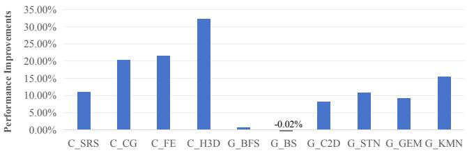

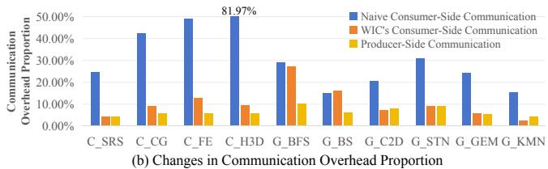  
Figure 12: Performance Improvements and Communication Overhead Proportion

Secondly, WIC is compatible with both communication scenarios described in Section 4.2. It is ideally suited for Scenario 2, where consumers await producer results, but it also supports G\_BFS and G\_BS applications correctly. G\_BS operates entirely under Scenario 1 with pre-generated data, and G\_BFS involves both scenarios during runtime. This versatility benefits from the Monitor module of WIC, which promptly checks for data availability and activates the Activator for immediate fault processing. However, for G\_BS, WIC does not enhance performance, showing a slight decline, primarily because it only maintains a copy of producer availability on the host side without pre-fetching data to the device. Additionally, the overhead with WIC slightly detracts from performance compared to naive communication applications.

Thirdly, WIC significantly decreases consumer-side communication overhead, thereby enhancing program performance. Specifically, compared to naive implementations in Figure 12(b), WIC reduces the consumer-side overhead by about 20%, nearly equalizing the proportion of overhead with the producer-side. Notably, applications with communication access patterns characterized as streaming, such as C\_SRS and G\_KMN, exhibit minimal communication overhead with WIC. This efficiency is attributed to WIC’s Interrupter module capability to batch PCM pages based on their regular access patterns. Conversely, applications with probabilistic communication models and random access patterns generally show a larger proportion of overhead.

## 6.2 Detailed Analysis

We validate the detailed effectiveness of our method by evaluating its ability to complete more executable tasks on the consumer side before initiating unnecessary waiting, thus overlapping synchronization time. Our analysis concentrates on two aspects: the completion status of threads before waiting and the synchronization time overlapped with computations.

In the WIC framework, we redefine unnecessary waiting times as periods when no active tasks are executed on the consumer end. We track the completion of executable threads from the moment they first request data from the producer until they commence waiting. As GPUs do not provide direct statistics on completion times for all threads, we use Nsight System to approximate executable task completion times by tracking when the threads trigger WIC’s PCM faults. Figure 13 illustrates the completion status of PCM faulting threads as they wait for producer data availability, covering four applications with diverse communication patterns as detailed in Section 4.3. The results demonstrate that WIC allows the majority of tasks to be completed before the waiting time, with the curves showing that the tasks are completed in advance of waiting periods. Furthermore, the absence of prolonged flat segments in the completion curves under WIC indicates that there are no significant stalling states, thus confirming minimal unnecessary waiting times.

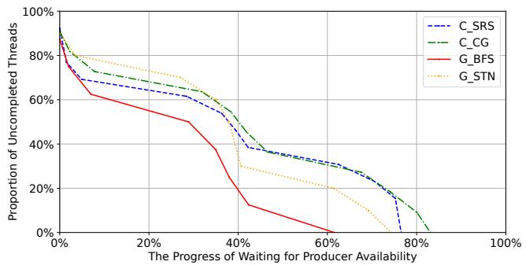  
Figure 13: Uncompleted PCM Faulting Threads as Waiting for Producer Data Availability

The results in Figure 14 demonstrate that WIC significantly enhances the communication efficiency by the significant proportion of synchronization hidden behind computation. Different from naive applications, which typically achieve only about 10% overlapping efficiency, most applications equipped with WIC achieve an average overlapping efficiency exceeding 80%. Notably, C\_H3D and C\_FE exhibit the largest gains at approximately 85%, while even the less significant improvements in applications like G\_STN and G\_KMN are around 70%. This boost in overlapping efficiency demonstrates WIC’s capability to pipeline more computational tasks effectively. Specifically, this improvement is achieved by replacing traditional polling with interruptions and its granular scheduling at the warp level. Furthermore, WIC is particularly adept at handling CPU-GPU communication tasks, where the proportion of hidden synchronization reaches up to 90%, compared to 80% in inter-GPU communications. This advantage is largely attributed to WIC’s integration with the host-side UVM kernel, enabling more flexible task scheduling and overlapping, and its Monitor module’s efficient checking of producer data availability, allowing producer data to be more readily accessible. These benefits depend on the current WIC implementation, and performance might vary if WIC’s communication control path were based on other architectures like NVLink or PCI-e bus protocols.

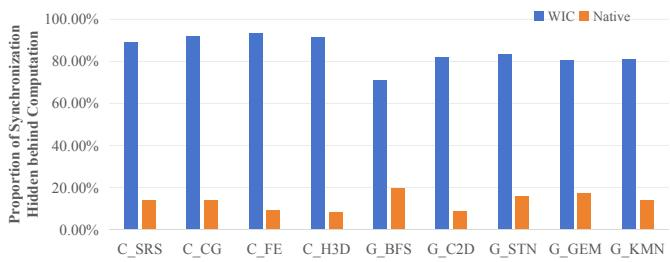  
Figure 14: Synchronization Overlapped with Computations

## 6.3 Overheads

WIC’s overhead is primarily divided between the consumer and host sides. On the consumer side, the main overheads originate from the Interrupter module’s allocation of PCM pages. On the host side, the overheads are mainly attributed to the Monitor module’s role in suspending and awakening page fault processing, as well as checking and updating the DAB for producer availability. We evaluate these specific overheads, along with the total overhead associated with WIC, as illustrated in Figure 15.

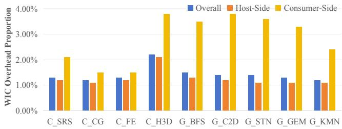  
Figure 15: Overhead Associated with WIC

The overall overhead associated with WIC is relatively minor and maintains remarkable stability across different applications. Apart from C\_H3D, where overhead is slightly higher, the overheads for other applications consistently hover around 1.4%, with deviations not exceeding 0.2%. Despite relatively higher overheads on the host side, the total overhead is minimally impacted thanks to WIC’s interruption mechanism, which schedules other executable warps to overlap with host processing time.

Consumer-side overhead closely mirrors the total overhead and consistently remains stable across various applications, regardless of their differing communication patterns. This stability is supported by the Interrupter module’s utilization of a segment tree for PCM page management, ensuring efficient and consistent identification of free pages with a time complexity of O(log n).

Host-side overhead is relatively higher, averaging around 3%, and demonstrates variability according to different communication patterns of applications. Inter-GPU communications often incur about 1-2% higher overhead than CPU-GPU communications due to the complexities involved in transferring producer data and monitoring availability across devices. Applications characterized by multiple communication models, such as G\_STN and G\_GEM, show the highest overheads, reaching up to 3.6% and 3.4% respectively, due to frequent demands for data availability checks required by multiple transfers. Conversely, applications like G\_KMN, exhibit lower overheads at 2.4%, benefiting from relatively regular access behaviors.

WIC introduces no additional overheads for page faulting compared to naive applications. In naive setups, page faulting occurs three times per communication cycle: reading the availability tag for producer data, copying the tags after updates, and transferring the producer data. In contrast, WIC simplifies this process to just one PCM fault on the consumer side. If the producer kernel is on another GPU, an additional PAT fault should be required. Beyond this, WIC leverages UVM’s direct copy for all other cross-device data transfers, treating the data in a read-only fashion at the receiving end. WIC ensures these transfers maintain transactional integrity, thus eliminating the need for faulting to safeguard transmission.

## 6.4 Scaling Performance

In the scaling experiment, we evaluate the performance of WIC as the number of threads is escalated from 64 to 1 million across four applications with distinct communication patterns. The results, as illustrated in Figure 16, demonstrate that WIC consistently boosts performance even under extensive thread scaling. Specifically, performance speedups in applications with thread counts from 1K to 1 million threads remain near peak values. However, despite this overall stability, there is a slight performance decline as thread counts increase. For instance, C\_CG exhibits approximately a 5% decrease from its peak performance. This performance limitation is attributed to the UVM’s capacity to handle only 256 faults at a time. When WIC allocates more than 256 PCM faults for consumer warps, any surplus faults must queue, creating a bottleneck. Although the Interrupter module attempts to mitigate this issue by batching warps’ requests to minimize the number of faults, blockages may still occur as producer-consumer communication escalates. However, applications like $\mathrm { G } \_ { \mathrm { S T N } }$ , benefit from quick producer responses to PCM faults, mitigating some scaling issues. In smaller-scale scenarios, particularly from 64 to 512 threads, WIC shows little benefit due to insufficient executable warps to effectively overlap synchronization overhead.

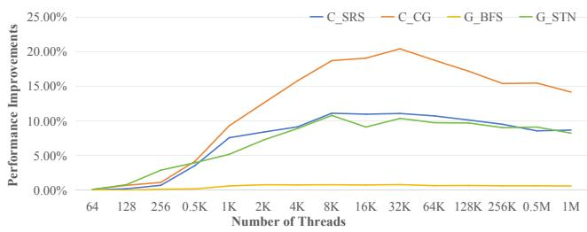  
Figure 16: Performance for Scaling Experiment

## 6.5 Compared to State-of-the-art

In GPU communication research, SOTA systems are primarily categorized into CPU-GPU and inter-GPU communications. For comparison, several well-regarded systems that support in-kernel communications serve as baselines. For CPU-GPU communications, systems like NBlocking [10] and Demand-Cpy [19] are considered, whereas EffShare [31], GPS [29], and FinePack [30] are evaluated for inter-GPU communications. Notably, systems like DemandCpy, GPS, and FinePack, which involve hardware modifications, are not feasible in actual GPU environments and are therefore reimplemented at the application level for this analysis.

Figure 17 presents a performance comparison between WIC and various SOTA systems, normalized to naive setups. The results indicate that WIC outperforms most SOTA systems in various applications, with the exceptions of G\_BS and G\_BFS, where it slightly lags behind EffShare and GPS. Specifically, in CPU-GPU communication applications, WIC outperforms NBlocking by an average of 20% and DemandCpy by 15%. This superior performance is attributed to WIC’s use of an interruption-based mechanism to overlap synchronization times between the host and device, contrasting with the simple busy-wait synchronization used by other systems. Furthermore, WIC focuses on enhancing producer-communication across various communication patterns, which contributes to its strong performance across different applications. Conversely, NBlocking’s strategy of utilizing kernel fusion shows limited success in applications with multiple communication models, such as C\_SRS and C\_CG. DemandCpy, tailored for unidirectional transfers by replacing in-kernel demand page requests with direct memcpy, struggles with bi-directional communication models.

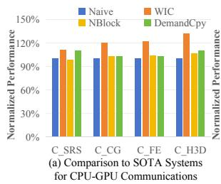

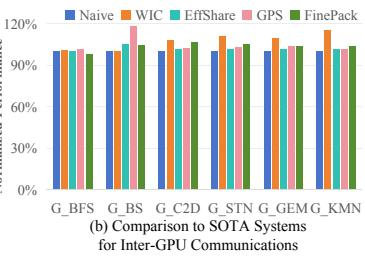  
Figure 17: Comparison to State-of-the-art Systems

For inter-GPU communications, WIC demonstrates a 15% performance lead on average, with the exceptions of G\_BS and G\_BFS. In G\_BS, EffShare and GPS perform better due to their strategies of pre-copying producer-generated data to the consumer side, effectively reducing consumer waiting times. FinePack, which proposes packing small and frequent transfers, shows adequate performance in scenarios with regular communication access patterns like streaming or adjacent. However, these systems still depend on cross-device polling when waiting for producer data, which incurs significant overheads, making their overall performance inferior to WIC.

## 7 Related Work

Optimizations in cross-device communication are predominantly classified into two categories: inter-kernel and in-kernel coordination.

## 7.1 Inter-Kernel Coordination

StarPU [2] first highlighted the significant impact of synchronization overheads, like data transfers, on CPU-GPU computational performance and introduced strategies such as Greedy to manage parallel tasks effectively. Building on this, Lustig et al. [27] further developed schemes by striking the balance between data transfer and computation, effectively minimizing idle times. Shifting away from static predictions, GPUSync [11] adopted a priority scheduling system that dynamically adjusted based on real-time monitoring of execution budgets. To analyze the intricate dependencies of tasks more precisely, Taskflow [15] employed an expressive task graph programming model incorporating in-graph control flow to facilitate task management. Furthermore, Bak et al. [3] expanded on this model by integrating gang-scheduling with work-stealing techniques, aiming for a more effective balance of workloads across tasks.

Despite the throughput improvements by overlapping more discrete kernels, inter-kernel strategies do not inherently enhance the performance of individual producer or consumer kernels. Furthermore, the process of launching and terminating kernels imposes additional overheads, further complicating efficient execution within inter-kernel strategies.

## 7.2 In-Kernel Coordination

Koukos et al. [24] pioneered a fine-grained CPU-GPU collaborative architecture leveraging the UVM framework to lower cross-device communication costs. However, Demand-Cpy [19] criticized the substantial overhead associated with UVM’s page placements, and proposed a novel CPU-GPU transfer method that combined traditional blocking memcpy with asynchronous page transfers, although it struggles with bidirectional read-write operations. Alternatively, NBlocking [10] explored an in-kernel communication strategy by merging kernels and employing UVM’s zero-copy feature for asynchronous data transmission to GPUs. FinePack [1] tackled the underutilization of UVM’s transfers by suggesting that transfer messages be accumulated in a buffer and batched. However, these approaches generally overlooked synchronization issues between producers and consumers.

EffShare [31] assigned dedicated transfer threads to manage producer-consumer data transfers, enabling producers to write results directly into global memory and continue with other computational tasks, promoting asynchronous data dispatch. However, the synchronization required to activate these transfer threads still introduces significant overhead. On the consumer side, GPS [29] pioneered a proactive data transfer approach assuming pre-generated producer data, designed to overlap the loading time with communication.

Despite these innovations, the prevalent and costly issue of consumers waiting for producer data in practical applications has not been fully explored. Our method, WIC, addresses this by introducing a fine-grained interruption mechanism that effectively overlaps the synchronization latency with ongoing computations when consumers wait for producer data, significantly enhancing the efficiency of GPU communications.

## 8 Conclusion

This paper proposes WIC, a warp-level, interrupt-based synchronization framework designed to optimize GPU communication by overlapping synchronization delays with computations. We first pinpoint traditional synchronization, characterized by consumers repetitively polling for producer data, as a primary bottleneck in GPU communication. Detailed threadlevel analysis within the GPU producer-consumer model reveals that early-started polling squanders significant computational resources and competes with ongoing tasks. To tackle this inefficiency, WIC employs a fine-grained interruption mechanism that preempts warps waiting for data, freeing up resources for active warps. Specifically, WIC integrates three core components: the Interrupter to trigger interruptions to swap other executable warps, the Monitor to track the availability of the producer data, and the Activator to resume the stalled warps when data is ready. Built on unified memory copying, WIC supports over 20 types of cross-platform data communications. Experimental results show that our proposed WIC achieves an average of 13% performance improvements compared to traditional cross-device communications.

## Acknowledgments

We sincerely thank our shepherd, Aurojit Panda, and anonymous reviewers for their insightful and constructive comments. This research is supported by XJTLU Research Development Fund (Grant No. RDF-22-02-108), Suzhou Science and Technology Development Planning Programme (Grant No. ZXL2023176), Municipal Key R&D Program of Ningbo (Grant No. 2024Z259), and the Key Technology RD Program of Ningbo (Grant No. 2022Z149).

## References

[1] Tyler Allen, Bennett Cooper, and Rong Ge. Fine-grain quantitative analysis of demand paging in unified virtual memory. ACM Transactions on Architecture and Code Optimization, 21(1):1–24, 2024.

[2] Cédric Augonnet, Samuel Thibault, Raymond Namyst, and Pierre-André Wacrenier. Starpu: a unified platform for task scheduling on heterogeneous multicore architectures. In Euro-Par Parallel Processing: International Euro-Par Conference, Delft, The Netherlands, pages 863–874. Springer, 2009.

[3] Seonmyeong Bak, Oscar Hernandez, Mark Gates, Piotr Luszczek, and Vivek Sarkar. Task-graph scheduling extensions for efficient synchronization and communication. In Proceedings of the Acm International Conference on Supercomputing, pages 88–101, 2021.

[4] Trinayan Baruah, Yifan Sun, Ali Tolga Dinçer, Saiful A Mojumder, José L Abellán, Yash Ukidave, Ajay Joshi, Norman Rubin, John Kim, and David Kaeli. Griffin: Hardware-software support for efficient page migration in multi-gpu systems. In IEEE International Symposium on High Performance Computer Architecture, pages 596– 609. IEEE, 2020.

[5] Roberto Belli and Torsten Hoefler. Notified access: Extending remote memory access programming models for producer-consumer synchronization. In 2015 IEEE International Parallel and Distributed Processing Symposium, pages 871–881. IEEE, 2015.

[6] Jason Burmark. Comb. Technical report, Lawrence Livermore National Laboratory, Livermore, CA, 2018.

[7] Gregory T Byrd and Michael J Flynn. Producerconsumer communication in distributed shared memory multiprocessors. Proceedings of the IEEE, 87(3):456– 466, 1999.

[8] Shuai Che, Michael Boyer, Jiayuan Meng, David Tarjan, Jeremy W Sheaffer, Sang-Ha Lee, and Kevin Skadron. Rodinia: A benchmark suite for heterogeneous computing. In IEEE international symposium on workload characterization, pages 44–54. Ieee, 2009.

[9] Yuxin Chen, Benjamin Brock, Serban Porumbescu, Aydin Buluç, Katherine Yelick, and John D Owens. Scalable irregular parallelism with gpus: Getting cpus out of the way. In SC: International Conference for High Performance Computing, Networking, Storage and Analysis, pages 1–16. IEEE, 2022.

[10] Bengisu Elis, Olga Pearce, David Boehme, Jason Burmark, and Martin Schulz. Non-blocking gpu-cpu notifications to enable more gpu-cpu parallelism. In Proceedings of the International Conference on High Performance Computing in Asia-Pacific Region, pages 1–11, 2024.

[11] Glenn A Elliott, Bryan C Ward, and James H Anderson. Gpusync: A framework for real-time gpu management. In IEEE Real-Time Systems Symposium, pages 33–44. IEEE, 2013.

[12] Daniel Gerzhoy and Donald Yeung. Pipelined cpu-gpu scheduling to reduce main memory accesses. In Proceedings of the International Symposium on Memory Systems, pages 1–10, 2021.

[13] Yicheng Gu, Yun Wang, Yunfan Sun, Yuxin Xiang, Yufan Jiang, Xuyan Hu, Zhengwei Qi, and Haibing Guan. gvulkan: Scalable gpu pooling for pixel-grained rendering in ray tracing. In USENIX Annual Technical Conference, pages 1151–1165, 2024.

[14] Ralph C Hilzer Jr. Synchronization of the producer/consumer problem using semaphores, monitors, and the ada rendezvous. ACM SIGOPS Operating Systems Review, 26(3):31–39, 1992.

[15] Tsung-Wei Huang, Dian-Lun Lin, Chun-Xun Lin, and Yibo Lin. Taskflow: A lightweight parallel and heterogeneous task graph computing system. IEEE Transactions on Parallel and Distributed Systems, 33(6):1303–1320, 2021.

[16] Shams M Imam and Vivek Sarkar. Savina-an actor benchmark suite: Enabling empirical evaluation of actor libraries. In Proceedings of the International Workshop on Programming Based on Actors Agents & Decentralized Control, pages 67–80, 2014.

[17] Abhinav Jangda, Saeed Maleki, Maryam Mehri Dehnavi, Madan Musuvathi, and Olli Saarikivi. A framework for fine-grained synchronization of dependent gpu kernels. In 2024 IEEE/ACM International Symposium on Code Generation and Optimization, pages 93–105. IEEE, 2024.

[18] Kevin Jeffay. The real-time producer/consumer paradigm: A paradigm for the construction of efficient, predictable real-time systems. In Proceedings of the 1993 ACM/SIGAPP symposium on Applied computing: states of the art and practice, pages 796–804, 1993.

[19] Donghun Jeong, Jihun Park, and Jungrae Kim. Demand memcpy: Overlapping of computation and data transfer for heterogeneous computing. IEEE Access, 10:79925– 79938, 2022.

[20] Jinwoo Jeong, Seungsu Baek, and Jeongseob Ahn. Fast and efficient model serving using multi-gpus with directhost-access. In Proceedings of the Eighteenth European Conference on Computer Systems, pages 249–265, 2023.

[21] Xu Jiang, Nan Guan, He Du, Weichen Liu, and Wang Yi. On the analysis of parallel real-time tasks with spin locks. IEEE Transactions on Computers, 70(2):199– 211, 2020.

[22] Changue Jung, Suhwan Kim, Ikjun Yeom, Honguk Woo, and Younghoon Kim. Gpu-ether: Gpu-native packet i/o for gpu applications on commodity ethernet. In IEEE INFOCOM Conference on Computer Communications, pages 1–10. IEEE, 2021.

[23] Mahmoud Khairy, Amr G Wassal, and Mohamed Zahran. A survey of architectural approaches for improving gpgpu performance, programmability and heterogeneity. Journal of Parallel and Distributed Computing, 127:65– 88, 2019.

[24] Konstantinos Koukos, Alberto Ros, Erik Hagersten, and Stefanos Kaxiras. Building heterogeneous unified virtual memories (uvms) without the overhead. ACM Transactions on Architecture and Code Optimization, 13(1):1– 22, 2016.

[25] Yiwei Li and Mingyu Gao. Hydrogen: Contentionaware hybrid memory for heterogeneous cpu-gpu architectures. In SC: International Conference for High Performance Computing, Networking, Storage and Analysis, pages 1–15. IEEE, 2024.

[26] Paul T Lin, Michael A Heroux, Richard F Barrett, and Alan B Williams. Assessing a mini-application as a performance proxy for a finite element method engineering application. Concurrency and Computation: Practice and Experience, 27(17):5374–5389, 2015.

[27] Daniel Lustig and Margaret Martonosi. Reducing gpu offload latency via fine-grained cpu-gpu synchronization. In IEEE International Symposium on High Performance Computer Architecture, pages 354–365. IEEE, 2013.

[28] Syed Nasir Mehmood, Nazleeni Haron, Vaqar Akhtar, and Younus Javed. Implementation and experimentation of producer-consumer synchronization problem. International Journal of Computer Applications, 975(8887):32–37, 2011.

[29] Harini Muthukrishnan, Daniel Lustig, David Nellans, and Thomas Wenisch. Gps: A global publish-subscribe model for multi-gpu memory management. In MICRO: IEEE/ACM International Symposium on Microarchitecture, pages 46–58, 2021.

[30] Harini Muthukrishnan, Daniel Lustig, Oreste Villa, Thomas Wenisch, and David Nellans. Finepack: Transparently improving the efficiency of fine-grained transfers in multi-gpu systems. In IEEE International Symposium on High-Performance Computer Architecture, pages 516–529. IEEE, 2023.

[31] Harini Muthukrishnan, David Nellans, Daniel Lustig, Jeffrey A Fessler, and Thomas F Wenisch. Efficient multi-gpu shared memory via automatic optimization of fine-grained transfers. In ACM/IEEE Annual International Symposium on Computer Architecture, pages 139–152. IEEE, 2021.

[32] NVIDIA. Nvidia gpudirect p2p. https://developer.nvidia.com/gpudirect, 2024.

[33] NVIDIA. Nvidia gpudirect rdma. https://docs.nvidia.com/cuda/gpudirect-rdma, 2024.

[34] NVIDIA. Nvidia nvlink. https://docs.nvidia.com/deploy/nvml-api, 2024.

[35] Suchita Pati, Shaizeen Aga, Mahzabeen Islam, Nuwan Jayasena, and Matthew D Sinclair. T3: Transparent tracking & triggering for fine-grained overlap of compute & collectives. In Proceedings of the ACM International Conference on Architectural Support for Programming Languages and Operating Systems, Volume 2, pages 1146–1164, 2024.

[36] Xiaowei Ren, Daniel Lustig, Evgeny Bolotin, Aamer Jaleel, Oreste Villa, and David Nellans. Hmg: Extending cache coherence protocols across modern hierarchical multi-gpu systems. In IEEE International Symposium on High Performance Computer Architecture, pages 582– 595. IEEE, 2020.

[37] Rahul Sharma, Michael Bauer, and Alex Aiken. Verification of producer-consumer synchronization in gpu programs. ACM SIGPLAN Notices, 50(6):88–98, 2015.

[38] Changmin Shin, Jaeyong Song, Hongsun Jang, Dogeun Kim, Jun Sung, Taehee Kwon, Jae Hyung Ju, Frank Liu, Yeonkyu Choi, and Jinho Lee. Piccolo: Large-scale graph processing with fine-grained in-memory scattergather. In 2025 IEEE International Symposium on High Performance Computer Architecture, pages 641–656. IEEE, 2025.

[39] John A Stratton, Christopher Rodrigues, I-Jui Sung, Nady Obeid, Li-Wen Chang, Nasser Anssari, Geng Daniel Liu, and Wen-mei W Hwu. Parboil: A revised benchmark suite for scientific and commercial throughput computing. Center for Reliable and High-Performance Computing, 127(7.2), 2012.

[40] Xian Sun, Peijin Wang, Zhiyuan Yan, Feng Xu, Ruiping Wang, Wenhui Diao, Jin Chen, Jihao Li, Yingchao Feng, Tao Xu, et al. Fair1m: A benchmark dataset for finegrained object recognition in high-resolution remote sensing imagery. ISPRS Journal of Photogrammetry and Remote Sensing, 184:116–130, 2022.

[41] Qihan Wang, Zhen Peng, Bin Ren, Jie Chen, and Robert G Edwards. Memhc: an optimized gpu memory management framework for accelerating many-body correlation. ACM Transactions on Architecture and Code Optimization, 19(2):1–26, 2022.

[42] Yueqi Wang, Bingyao Li, Aamer Jaleel, Jun Yang, and Xulong Tang. Grit: Enhancing multi-gpu performance with fine-grained dynamic page placement. In IEEE International Symposium on High-Performance Computer Architecture, pages 1080–1094. IEEE, 2024.

[43] Yuke Wang, Boyuan Feng, Zheng Wang, Tong Geng, Kevin Barker, Ang Li, and Yufei Ding. Mgg: Accelerating graph neural networks with fine-grained intra-kernel communication-computation pipelining on multi-gpu platforms. In USENIX Symposium on Operating Systems Design and Implementation, pages 779–795, 2023.

[44] Yuke Wang, Boyuan Feng, Zheng Wang, Guyue Huang, and Yufei Ding. TC-GNN: Bridging sparse GNN computation and dense tensor cores on GPUs. In 2023 USENIX Annual Technical Conference, pages 149–164, Boston, MA, July 2023. USENIX Association.

[45] Qi Yu, Bruce Childers, Libo Huang, Cheng Qian, and Zhiying Wang. Hpe: Hierarchical page eviction policy for unified memory in gpus. IEEE Transactions on Computer-Aided Design of Integrated Circuits and Systems, 39(10):2461–2474, 2019.

[46] Tailing Yuan, Yuliang Liu, Xucheng Ye, Shenglong Zhang, Jianchao Tan, Bin Chen, Chengru Song, and Di Zhang. Accelerating the training of large language models using efficient activation rematerialization and

optimal hybrid parallelism. In 2024 USENIX Annual Technical Conference, pages 545–561, 2024.

[47] Jiajian Zhang, Fangyu Wu, Hai Jiang, Guangliang Cheng, Genlang Chen, and Qiufeng Wang. Syncmalloc: A synchronized host-device co-management system for gpu dynamic memory allocation across all scales. In Proceedings of the International Conference on Parallel Processing, pages 179–188, 2024.

[48] Jiajian Zhang, Fangyu Wu, Hai Jiang, Qiufeng Wang, Genlang Chen, Guangliang Cheng, Eng Gee Lim, and Keqin Li. Alignmalloc: Warp-aware memory rearrangement aligned with uvm prefetching for large-scale gpu dynamic allocations. IEEE Transactions on Parallel and Distributed Systems, 36(7):1444–1459, 2025.

[49] Lingqi Zhang, Mohamed Wahib, Haoyu Zhang, and Satoshi Matsuoka. A study of single and multi-device synchronization methods in nvidia gpus. In IEEE International Parallel and Distributed Processing Symposium, pages 483–493. IEEE, 2020.